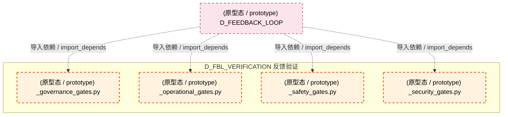
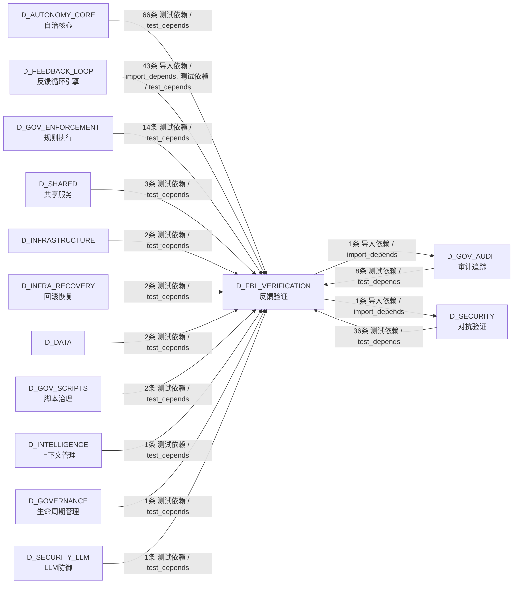

# 13_d_fbl_verification / feedback_verification / 反馈验证 / Feedback Verification

> **功能简介 / Overview**: 反馈验证，负责反馈循环门禁拦截、结果验证器执行和反馈质量检查

> **文档作用 / Purpose**: 展示 反馈验证（D_FBL_VERIFICATION）功能域的模块清单、域内依赖关系、跨域依赖关系、架构分层视图，供架构审查和域治理参考。

> 本文档由 generate_domain_doc.py 从 depgraph (PostgreSQL) 自动生成
> 最后更新: 2026-07-15 03:01:22
> 数据源: depgraph (PostgreSQL) nodes表 + edges表

## 域基本信息 / Domain Overview

| 字段 | 值 | Field | Value |
|------|------|-------|-------|
| 编号 | 13 | Number | 13 |
| 域ID | D_FBL_VERIFICATION | Domain ID | D_FBL_VERIFICATION |
| 域名称 | 反馈验证 | Domain Name | Feedback Verification |
| 层级 | L1 基础平台层 | Layer | L1 Foundation |
| 模块数 | 71 | Module Count | 71 |
| 域内依赖 | 17 | Internal Dependencies | 17 |
| 跨域入边 | 181 | Cross-domain Incoming | 181 |
| 跨域出边 | 2 | Cross-domain Outgoing | 2 |
| 设计态模块 | 0 | Design Modules | 0 |
| 原型态模块 | 4 | Prototype Modules | 4 |
| 生产态模块 | 67 | Production Modules | 67 |
| 容量 | 67/150 (正常) | Capacity | 67/150 (正常) |
| 描述 | 反馈循环门禁(feedback_loop/gates) | Description | 反馈循环门禁(feedback_loop/gates) |

## 模块分层清单 / Module Layered List

> 按 architecture_layer 分组的模块清单（共 71 个模块 / 71 modules）。

### L1 基础层 / Foundation Layer (71 modules)

| # | 模块路径 / Module Path | 模块名称 / Module Name (功能简介 / Description) | 成熟度 / Maturity | 蓝图 / Blueprint |
|:--:|---------|---------|:---:|:---:|
| 1 | src/zephyr/feedback_loop/gates/_governance_gates.py | _governance_gates.py | 原型态 / prototype | [MOD-GATE_ENGINE](../../03_modules/_cross_layer/gate_engine/blueprint.md) |
| 2 | src/zephyr/feedback_loop/gates/_operational_gates.py | _operational_gates.py | 原型态 / prototype | [MOD-GATE_ENGINE](../../03_modules/_cross_layer/gate_engine/blueprint.md) |
| 3 | src/zephyr/feedback_loop/gates/_safety_gates.py | _safety_gates.py | 原型态 / prototype | [MOD-GATE_ENGINE](../../03_modules/_cross_layer/gate_engine/blueprint.md) |
| 4 | src/zephyr/feedback_loop/gates/_security_gates.py | _security_gates.py | 原型态 / prototype | [MOD-GATE_ENGINE](../../03_modules/_cross_layer/gate_engine/blueprint.md) |
| 5 | src/zephyr/feedback_loop/gates/action_reversibility.py | Action Reversibility — v0.15.0 R208 | 生产态 / production | [MOD-GATE_ENGINE](../../03_modules/_cross_layer/gate_engine/blueprint.md) |
| 6 | src/zephyr/feedback_loop/gates/adversarial_validation.py | Adversarial Validation Gate — FLE-ADVERSARIAL-... | 生产态 / production | [MOD-GATE_ENGINE](../../03_modules/_cross_layer/gate_engine/blueprint.md) |
| 7 | src/zephyr/feedback_loop/gates/autonomy_credit.py | Autonomy Credit System — v0.7.0 R87 | 生产态 / production | [MOD-GATE_ENGINE](../../03_modules/_cross_layer/gate_engine/blueprint.md) |
| 8 | src/zephyr/feedback_loop/gates/autonomy_maturity.py | Autonomy Maturity Ladder — v0.7.0 R86 | 生产态 / production | [MOD-GATE_ENGINE](../../03_modules/_cross_layer/gate_engine/blueprint.md) |
| 9 | src/zephyr/feedback_loop/gates/blueprint_code_reconciler.py | Blueprint-Code Reconciler — v0.14.0 R195 | 生产态 / production | [MOD-GATE_ENGINE](../../03_modules/_cross_layer/gate_engine/blueprint.md) |
| 10 | src/zephyr/feedback_loop/gates/blueprint_validator.py | Blueprint Validator — v0.8.0 R108 | 生产态 / production | [MOD-GATE_ENGINE](../../03_modules/_cross_layer/gate_engine/blueprint.md) |
| 11 | src/zephyr/feedback_loop/gates/checkpoint_manager.py | Checkpoint Manager — v0.3.0 R18 | 生产态 / production | [MOD-GATE_ENGINE](../../03_modules/_cross_layer/gate_engine/blueprint.md) |
| 12 | src/zephyr/feedback_loop/gates/ci_cd_pre_scanner.py | CI/CD Pre-Scanner — v0.8.0 R107 | 生产态 / production | [MOD-GATE_ENGINE](../../03_modules/_cross_layer/gate_engine/blueprint.md) |
| 13 | src/zephyr/feedback_loop/gates/concurrent_change_deconfli... | Concurrent Change Deconfliction — v0.16.0 R230 | 生产态 / production | [MOD-GATE_ENGINE](../../03_modules/_cross_layer/gate_engine/blueprint.md) |
| 14 | src/zephyr/feedback_loop/gates/config_complexity_budget.py | Config Complexity Budget — v0.16.0 R227 | 生产态 / production | [MOD-GATE_ENGINE](../../03_modules/_cross_layer/gate_engine/blueprint.md) |
| 15 | src/zephyr/feedback_loop/gates/config_governance.py | Config Governance — v0.3.0 R8 | 生产态 / production | [MOD-GATE_ENGINE](../../03_modules/_cross_layer/gate_engine/blueprint.md) |
| 16 | src/zephyr/feedback_loop/gates/conflict_arbitration.py | Conflict Arbitration — v0.10.0 R130 | 生产态 / production | [MOD-GATE_ENGINE](../../03_modules/_cross_layer/gate_engine/blueprint.md) |
| 17 | src/zephyr/feedback_loop/gates/cve_scanner.py | CVE Scanner — v0.8.0 R106 | 生产态 / production | [MOD-GATE_ENGINE](../../03_modules/_cross_layer/gate_engine/blueprint.md) |
| 18 | src/zephyr/feedback_loop/gates/data_quality_gate.py | Data Quality Gate — v0.11.0 R143 | 生产态 / production | [MOD-GATE_ENGINE](../../03_modules/_cross_layer/gate_engine/blueprint.md) |
| 19 | src/zephyr/feedback_loop/gates/db_integrity.py | DB Integrity Gate — v0.3.0 R17 | 生产态 / production | [MOD-GATE_ENGINE](../../03_modules/_cross_layer/gate_engine/blueprint.md) |
| 20 | src/zephyr/feedback_loop/gates/deployment_suppression.py | Deployment Suppression — v0.37.0 R464 | 生产态 / production | [MOD-GATE_ENGINE](../../03_modules/_cross_layer/gate_engine/blueprint.md) |
| 21 | src/zephyr/feedback_loop/gates/dynamic_llm_cost_router.py | Dynamic LLM Cost Router — v0.8.0 R109 | 生产态 / production | [MOD-GATE_ENGINE](../../03_modules/_cross_layer/gate_engine/blueprint.md) |
| 22 | src/zephyr/feedback_loop/gates/emergency_takeover.py | Emergency Takeover — v0.7.0 R88 | 生产态 / production | [MOD-GATE_ENGINE](../../03_modules/_cross_layer/gate_engine/blueprint.md) |
| 23 | src/zephyr/feedback_loop/gates/federated_security.py | Federated Security — v0.10.0 R131 | 生产态 / production | [MOD-GATE_ENGINE](../../03_modules/_cross_layer/gate_engine/blueprint.md) |
| 24 | src/zephyr/feedback_loop/gates/flag_lifecycle_manager.py | Flag Lifecycle Manager — v0.3.0 R11 | 生产态 / production | [MOD-GATE_ENGINE](../../03_modules/_cross_layer/gate_engine/blueprint.md) |
| 25 | src/zephyr/feedback_loop/gates/license_compliance.py | License Compliance — v0.14.0 R198 | 生产态 / production | [MOD-GATE_ENGINE](../../03_modules/_cross_layer/gate_engine/blueprint.md) |
| 26 | src/zephyr/feedback_loop/gates/llm_cost_router.py | LLM Cost Router — v0.3.0 R20 | 生产态 / production | [MOD-GATE_ENGINE](../../03_modules/_cross_layer/gate_engine/blueprint.md) |
| 27 | src/zephyr/feedback_loop/gates/merkle_audit_root.py | Merkle Audit Root — v0.8.0 R104 | 生产态 / production | [MOD-GATE_ENGINE](../../03_modules/_cross_layer/gate_engine/blueprint.md) |
| 28 | src/zephyr/feedback_loop/gates/meta_performance_gate.py | Meta Performance Gate — v0.11.0 R158 | 生产态 / production | [MOD-GATE_ENGINE](../../03_modules/_cross_layer/gate_engine/blueprint.md) |
| 29 | src/zephyr/feedback_loop/gates/parameterized_safety_gate.py | GateVerdict — GateVerdict | 生产态 / production | [MOD-GATE_ENGINE](../../03_modules/_cross_layer/gate_engine/blueprint.md) |
| 30 | src/zephyr/feedback_loop/gates/safety_gate_l1_l27.py | Safety Gates L1-L27 — Unified Pipeline (MOD-FE... | 生产态 / production | [MOD-GATE_ENGINE](../../03_modules/_cross_layer/gate_engine/blueprint.md) |
| 31 | src/zephyr/feedback_loop/gates/safety_gate_l28_l29.py | Safety Gates L28-L29 — DR Readiness + Supply C... | 生产态 / production | [MOD-GATE_ENGINE](../../03_modules/_cross_layer/gate_engine/blueprint.md) |
| 32 | src/zephyr/feedback_loop/gates/safety_gate_l36_l37.py | Safety Gates L36-L37 — AI Code Integrity + Vib... | 生产态 / production | [MOD-GATE_ENGINE](../../03_modules/_cross_layer/gate_engine/blueprint.md) |
| 33 | src/zephyr/feedback_loop/gates/safety_gate_l38_l39.py | Safety Gates L38-L39 — Deterministic Safety + ... | 生产态 / production | [MOD-GATE_ENGINE](../../03_modules/_cross_layer/gate_engine/blueprint.md) |
| 34 | src/zephyr/feedback_loop/gates/safety_gate_l40_l41.py | Safety Gates L40-L41 — Self-Integrity + Contai... | 生产态 / production | [MOD-GATE_ENGINE](../../03_modules/_cross_layer/gate_engine/blueprint.md) |
| 35 | src/zephyr/feedback_loop/gates/safety_gate_l42_l43.py | Safety Gates L42-L43 — Causal Integrity + Surv... | 生产态 / production | [MOD-GATE_ENGINE](../../03_modules/_cross_layer/gate_engine/blueprint.md) |
| 36 | src/zephyr/feedback_loop/gates/safety_gate_l44_l45.py | Safety Gates L44-L45 — Operational Excellence ... | 生产态 / production | [MOD-GATE_ENGINE](../../03_modules/_cross_layer/gate_engine/blueprint.md) |
| 37 | src/zephyr/feedback_loop/gates/safety_gate_l46_l47.py | Safety Gates L46-L47 — Systemic Emergence + On... | 生产态 / production | [MOD-GATE_ENGINE](../../03_modules/_cross_layer/gate_engine/blueprint.md) |
| 38 | src/zephyr/feedback_loop/gates/safety_gate_l48_l49.py | Safety Gates L48-L49 — Supply Chain Integrity ... | 生产态 / production | [MOD-GATE_ENGINE](../../03_modules/_cross_layer/gate_engine/blueprint.md) |
| 39 | src/zephyr/feedback_loop/gates/safety_gate_l50_l51.py | Safety Gates L50-L55 — Coherence + Integrity L... | 生产态 / production | [MOD-GATE_ENGINE](../../03_modules/_cross_layer/gate_engine/blueprint.md) |
| 40 | src/zephyr/feedback_loop/gates/safety_gate_l52_l53.py | Safety Gates L52-L53 — Boot Integrity + OSS Li... | 生产态 / production | [MOD-GATE_ENGINE](../../03_modules/_cross_layer/gate_engine/blueprint.md) |
| 41 | src/zephyr/feedback_loop/gates/safety_gate_l54_l55.py | Safety Gates L54-L55 — Final Gate + Full Integ... | 生产态 / production | [MOD-GATE_ENGINE](../../03_modules/_cross_layer/gate_engine/blueprint.md) |
| 42 | src/zephyr/feedback_loop/gates/safety_gate_l56_l57.py | Safety Gates L56-L57 — Evolutionary Integrity ... | 生产态 / production | [MOD-GATE_ENGINE](../../03_modules/_cross_layer/gate_engine/blueprint.md) |
| 43 | src/zephyr/feedback_loop/gates/safety_gate_l58_l59.py | Safety Gates L58-L59 — Over-the-Horizon + Temp... | 生产态 / production | [MOD-GATE_ENGINE](../../03_modules/_cross_layer/gate_engine/blueprint.md) |
| 44 | src/zephyr/feedback_loop/gates/safety_gate_l60_l61.py | Safety Gates L60-L61 — Environmental Grounding... | 生产态 / production | [MOD-GATE_ENGINE](../../03_modules/_cross_layer/gate_engine/blueprint.md) |
| 45 | src/zephyr/feedback_loop/gates/safety_gate_l62_l63.py | Safety Gates L62-L63 — Infrastructure Reality ... | 生产态 / production | [MOD-GATE_ENGINE](../../03_modules/_cross_layer/gate_engine/blueprint.md) |
| 46 | src/zephyr/feedback_loop/gates/safety_gate_l64_l65.py | Safety Gates L64-L65 — Financial Integrity + V... | 生产态 / production | [MOD-GATE_ENGINE](../../03_modules/_cross_layer/gate_engine/blueprint.md) |
| 47 | src/zephyr/feedback_loop/gates/safety_gate_l66_l67.py | Safety Gates L66-L67 — Financial Prudence + Fu... | 生产态 / production | [MOD-GATE_ENGINE](../../03_modules/_cross_layer/gate_engine/blueprint.md) |
| 48 | src/zephyr/feedback_loop/gates/scope_creep_monitor.py | Scope Creep Monitor — v0.15.0 R220 | 生产态 / production | [MOD-GATE_ENGINE](../../03_modules/_cross_layer/gate_engine/blueprint.md) |
| 49 | src/zephyr/feedback_loop/verifiers/ab_test.py | A/B Test Verifier — v0.9.0 R117 | 生产态 / production | [MOD-FEEDBACK_LOOP](../../03_modules/_cross_layer/feedback_loop/blueprint.md) |
| 50 | src/zephyr/feedback_loop/verifiers/action_explainability.py | Action Explainability — v0.3.0 R15 | 生产态 / production | [MOD-FEEDBACK_LOOP](../../03_modules/_cross_layer/feedback_loop/blueprint.md) |
| 51 | src/zephyr/feedback_loop/verifiers/ai_comment_veracity.py | AI Comment Veracity — v0.37.0 R459 | 生产态 / production | [MOD-FEEDBACK_LOOP](../../03_modules/_cross_layer/feedback_loop/blueprint.md) |
| 52 | src/zephyr/feedback_loop/verifiers/attack_simulator.py | Attack Simulator — v0.6.0 R57 | 生产态 / production | [MOD-FEEDBACK_LOOP](../../03_modules/_cross_layer/feedback_loop/blueprint.md) |
| 53 | src/zephyr/feedback_loop/verifiers/auto_rollback.py | Auto Rollback — v0.8.0 R93 | 生产态 / production | [MOD-FEEDBACK_LOOP](../../03_modules/_cross_layer/feedback_loop/blueprint.md) |
| 54 | src/zephyr/feedback_loop/verifiers/build_reproducibility_... | Build Reproducibility Verifier — v0.38.0 R484 | 生产态 / production | [MOD-FEEDBACK_LOOP](../../03_modules/_cross_layer/feedback_loop/blueprint.md) |
| 55 | src/zephyr/feedback_loop/verifiers/canary_repair.py | Canary Repair — v0.8.0 R104b | 生产态 / production | [MOD-FEEDBACK_LOOP](../../03_modules/_cross_layer/feedback_loop/blueprint.md) |
| 56 | src/zephyr/feedback_loop/verifiers/cascading_rollback_ana... | Cascading Rollback Analyzer — v0.38.0 R482 | 生产态 / production | [MOD-FEEDBACK_LOOP](../../03_modules/_cross_layer/feedback_loop/blueprint.md) |
| 57 | src/zephyr/feedback_loop/verifiers/cross_blueprint_contra... | Cross-Blueprint Contract Drift Monitor — v0.39... | 生产态 / production | [MOD-FEEDBACK_LOOP](../../03_modules/_cross_layer/feedback_loop/blueprint.md) |
| 58 | src/zephyr/feedback_loop/verifiers/cross_module_integrati... | Cross-Module Integration Verifier — v0.5.0 R39 | 生产态 / production | [MOD-FEEDBACK_LOOP](../../03_modules/_cross_layer/feedback_loop/blueprint.md) |
| 59 | src/zephyr/feedback_loop/verifiers/cross_session_knowledg... | Cross-Session Knowledge Integrity — v0.16.0 R225 | 生产态 / production | [MOD-FEEDBACK_LOOP](../../03_modules/_cross_layer/feedback_loop/blueprint.md) |
| 60 | src/zephyr/feedback_loop/verifiers/digital_twin_sandbox.py | Digital Twin Sandbox — v0.6.0 R55 | 生产态 / production | [MOD-FEEDBACK_LOOP](../../03_modules/_cross_layer/feedback_loop/blueprint.md) |
| 61 | src/zephyr/feedback_loop/verifiers/dry_run_sandbox.py | Dry Run Sandbox — v0.3.0 R19 | 生产态 / production | [MOD-FEEDBACK_LOOP](../../03_modules/_cross_layer/feedback_loop/blueprint.md) |
| 62 | src/zephyr/feedback_loop/verifiers/federated_protocol.py | Federated Protocol — v0.10.0 R129 | 生产态 / production | [MOD-FEEDBACK_LOOP](../../03_modules/_cross_layer/feedback_loop/blueprint.md) |
| 63 | src/zephyr/feedback_loop/verifiers/golden_test_external.py | Golden Test External — v0.15.0 R214 | 生产态 / production | [MOD-FEEDBACK_LOOP](../../03_modules/_cross_layer/feedback_loop/blueprint.md) |
| 64 | src/zephyr/feedback_loop/verifiers/no_llm_degradation.py | No-LLM Degradation Mode — v0.8.0 R94 | 生产态 / production | [MOD-FEEDBACK_LOOP](../../03_modules/_cross_layer/feedback_loop/blueprint.md) |
| 65 | src/zephyr/feedback_loop/verifiers/pre_flight_simulator.py | Pre-Flight Simulator — v0.12.0 R169b | 生产态 / production | [MOD-FEEDBACK_LOOP](../../03_modules/_cross_layer/feedback_loop/blueprint.md) |
| 66 | src/zephyr/feedback_loop/verifiers/preventive_repair.py | Preventive Repair — v0.6.0 R69 | 生产态 / production | [MOD-FEEDBACK_LOOP](../../03_modules/_cross_layer/feedback_loop/blueprint.md) |
| 67 | src/zephyr/feedback_loop/verifiers/rollback_integrity.py | Rollback Integrity — v0.3.0 R18b | 生产态 / production | [MOD-FEEDBACK_LOOP](../../03_modules/_cross_layer/feedback_loop/blueprint.md) |
| 68 | src/zephyr/feedback_loop/verifiers/sim2real_calibration.py | Sim2Real Calibration — v0.6.0 R56 | 生产态 / production | [MOD-FEEDBACK_LOOP](../../03_modules/_cross_layer/feedback_loop/blueprint.md) |
| 69 | src/zephyr/feedback_loop/verifiers/stochastic_diagnosis_v... | Stochastic Diagnosis Verifier — v0.38.0 R483 | 生产态 / production | [MOD-FEEDBACK_LOOP](../../03_modules/_cross_layer/feedback_loop/blueprint.md) |
| 70 | src/zephyr/feedback_loop/verifiers/toctou_revalidation.py | TOCTOU Revalidation — v0.37.0 R458 | 生产态 / production | [MOD-FEEDBACK_LOOP](../../03_modules/_cross_layer/feedback_loop/blueprint.md) |
| 71 | src/zephyr/feedback_loop/verifiers/verification_engine.py | verification_engine.py | 生产态 / production | [MOD-FEEDBACK_LOOP](../../03_modules/_cross_layer/feedback_loop/blueprint.md) |

## 域内依赖图 / Internal Dependency Diagram

> 依赖图内嵌在本文档中，IDE 可直接渲染显示。参考 decision_index.md 设计，分四个视图：合并全景图、运营态子图、设计态子图、原型态子图（按 design_maturity 实际值拆分）。
>
> **图例说明 / Legend**：
> - **实线边框 = 运营态模块**（production，已上线运行）
> - **虚线边框 = 设计态模块**（design，蓝图阶段，代码未写）
> - **虚线边框 = 原型态模块**（prototype，代码已写，验证中未稳定上线）
> - **实线箭头 = 运营态依赖**（已生效的依赖关系）
> - **虚线箭头 = 非运营态依赖**（计划中/验证中的依赖关系）

### 合并全景图（全部模块，标签标注成熟度）

> 展示全部 71 个模块（生产态 67 + 设计态 0 + 原型态 4），标签标注成熟度。

#### 第 1 页 / 共 3 页

```mermaid
graph TD
    subgraph D_FBL_VERIFICATION["D_FBL_VERIFICATION 反馈验证"]
        src_zephyr_feedback_loop_gates_governance_gates_py["(原型态 / prototype) _governance_gates.py"]
        src_zephyr_feedback_loop_gates_operational_gates_py["(原型态 / prototype) _operational_gates.py"]
        src_zephyr_feedback_loop_gates_safety_gates_py["(原型态 / prototype) _safety_gates.py"]
        src_zephyr_feedback_loop_gates_security_gates_py["(原型态 / prototype) _security_gates.py"]
        src_zephyr_feedback_loop_gates_action_reversibility_py["(生产态 / production) Action Reversibility — v0.15.0 R208<br/>文件: action_reversibility.py"]
        src_zephyr_feedback_loop_gates_adversarial_validation_py["(生产态 / production) Adversarial Validation Gate — FLE-ADVERSARIAL-...<br/>文件: adversarial_validation.py"]
        src_zephyr_feedback_loop_gates_autonomy_credit_py["(生产态 / production) Autonomy Credit System — v0.7.0 R87<br/>文件: autonomy_credit.py"]
        src_zephyr_feedback_loop_gates_autonomy_maturity_py["(生产态 / production) Autonomy Maturity Ladder — v0.7.0 R86<br/>文件: autonomy_maturity.py"]
        src_zephyr_feedback_loop_gates_blueprint_code_reconciler_py["(生产态 / production) Blueprint-Code Reconciler — v0.14.0 R195<br/>文件: blueprint_code_reconciler.py"]
        src_zephyr_feedback_loop_gates_blueprint_validator_py["(生产态 / production) Blueprint Validator — v0.8.0 R108<br/>文件: blueprint_validator.py"]
        src_zephyr_feedback_loop_gates_checkpoint_manager_py["(生产态 / production) Checkpoint Manager — v0.3.0 R18<br/>文件: checkpoint_manager.py"]
        src_zephyr_feedback_loop_gates_ci_cd_pre_scanner_py["(生产态 / production) CI/CD Pre-Scanner — v0.8.0 R107<br/>文件: ci_cd_pre_scanner.py"]
        src_zephyr_feedback_loop_gates_concurrent_change_deconfliction_py["(生产态 / production) Concurrent Change Deconfliction — v0.16.0 R230<br/>文件: concurrent_change_deconfliction.py"]
        src_zephyr_feedback_loop_gates_config_complexity_budget_py["(生产态 / production) Config Complexity Budget — v0.16.0 R227<br/>文件: config_complexity_budget.py"]
        src_zephyr_feedback_loop_gates_config_governance_py["(生产态 / production) Config Governance — v0.3.0 R8<br/>文件: config_governance.py"]
        src_zephyr_feedback_loop_gates_conflict_arbitration_py["(生产态 / production) Conflict Arbitration — v0.10.0 R130<br/>文件: conflict_arbitration.py"]
        src_zephyr_feedback_loop_gates_cve_scanner_py["(生产态 / production) CVE Scanner — v0.8.0 R106<br/>文件: cve_scanner.py"]
        src_zephyr_feedback_loop_gates_data_quality_gate_py["(生产态 / production) Data Quality Gate — v0.11.0 R143<br/>文件: data_quality_gate.py"]
        src_zephyr_feedback_loop_gates_db_integrity_py["(生产态 / production) DB Integrity Gate — v0.3.0 R17<br/>文件: db_integrity.py"]
        src_zephyr_feedback_loop_gates_deployment_suppression_py["(生产态 / production) Deployment Suppression — v0.37.0 R464<br/>文件: deployment_suppression.py"]
        src_zephyr_feedback_loop_gates_dynamic_llm_cost_router_py["(生产态 / production) Dynamic LLM Cost Router — v0.8.0 R109<br/>文件: dynamic_llm_cost_router.py"]
        src_zephyr_feedback_loop_gates_emergency_takeover_py["(生产态 / production) Emergency Takeover — v0.7.0 R88<br/>文件: emergency_takeover.py"]
        src_zephyr_feedback_loop_gates_federated_security_py["(生产态 / production) Federated Security — v0.10.0 R131<br/>文件: federated_security.py"]
        src_zephyr_feedback_loop_gates_flag_lifecycle_manager_py["(生产态 / production) Flag Lifecycle Manager — v0.3.0 R11<br/>文件: flag_lifecycle_manager.py"]
        src_zephyr_feedback_loop_gates_license_compliance_py["(生产态 / production) License Compliance — v0.14.0 R198<br/>文件: license_compliance.py"]
        src_zephyr_feedback_loop_gates_llm_cost_router_py["(生产态 / production) LLM Cost Router — v0.3.0 R20<br/>文件: llm_cost_router.py"]
        src_zephyr_feedback_loop_gates_merkle_audit_root_py["(生产态 / production) Merkle Audit Root — v0.8.0 R104<br/>文件: merkle_audit_root.py"]
        src_zephyr_feedback_loop_gates_meta_performance_gate_py["(生产态 / production) Meta Performance Gate — v0.11.0 R158<br/>文件: meta_performance_gate.py"]
        src_zephyr_feedback_loop_gates_parameterized_safety_gate_py["(生产态 / production) GateVerdict — GateVerdict<br/>文件: parameterized_safety_gate.py"]
        src_zephyr_feedback_loop_gates_safety_gate_l1_l27_py["(生产态 / production) Safety Gates L1-L27 — Unified Pipeline (MOD-FE...<br/>文件: safety_gate_l1_l27.py"]
    end
    D_SECURITY["(原型态 / prototype) D_SECURITY"]
    src_zephyr_feedback_loop_gates_adversarial_validation_py -.->|导入依赖 / import_depends| D_SECURITY
    D_AUTONOMY_CORE["(原型态 / prototype) D_AUTONOMY_CORE"]
    D_AUTONOMY_CORE -.->|测试依赖 / test_depends| src_zephyr_feedback_loop_gates_safety_gate_l1_l27_py
    D_AUTONOMY_CORE -.->|测试依赖 / test_depends| src_zephyr_feedback_loop_gates_license_compliance_py
    D_SECURITY -.->|测试依赖 / test_depends| src_zephyr_feedback_loop_gates_safety_gate_l1_l27_py
    D_SECURITY -.->|测试依赖 / test_depends| src_zephyr_feedback_loop_gates_safety_gate_l1_l27_py
    D_SECURITY -.->|测试依赖 / test_depends| src_zephyr_feedback_loop_gates_safety_gate_l1_l27_py
    D_AUTONOMY_CORE -.->|测试依赖 / test_depends| src_zephyr_feedback_loop_gates_blueprint_validator_py
    D_AUTONOMY_CORE -.->|测试依赖 / test_depends| src_zephyr_feedback_loop_gates_flag_lifecycle_manager_py
    D_SECURITY -.->|测试依赖 / test_depends| src_zephyr_feedback_loop_gates_safety_gate_l1_l27_py
    D_GOV_ENFORCEMENT["(原型态 / prototype) D_GOV_ENFORCEMENT"]
    D_GOV_ENFORCEMENT -.->|测试依赖 / test_depends| src_zephyr_feedback_loop_gates_dynamic_llm_cost_router_py
    D_AUTONOMY_CORE -.->|测试依赖 / test_depends| src_zephyr_feedback_loop_gates_db_integrity_py
    D_AUTONOMY_CORE -.->|测试依赖 / test_depends| src_zephyr_feedback_loop_gates_data_quality_gate_py
    D_AUTONOMY_CORE -.->|测试依赖 / test_depends| src_zephyr_feedback_loop_gates_safety_gate_l1_l27_py
    D_FEEDBACK_LOOP["(生产态 / production) D_FEEDBACK_LOOP"]
    D_FEEDBACK_LOOP -->|导入依赖 / import_depends| src_zephyr_feedback_loop_gates_deployment_suppression_py
    D_AUTONOMY_CORE -.->|测试依赖 / test_depends| src_zephyr_feedback_loop_gates_action_reversibility_py
    D_AUTONOMY_CORE -.->|测试依赖 / test_depends| src_zephyr_feedback_loop_gates_blueprint_code_reconciler_py
    classDef production fill:#e1f5fe,stroke:#01579b,stroke-width:2px,color:#000
    classDef design fill:#fff3e0,stroke:#e65100,stroke-width:2px,color:#000,stroke-dasharray: 5 5
    classDef external_prod fill:#e8f5e9,stroke:#1b5e20,stroke-width:1px,color:#000
    classDef external_design fill:#fce4ec,stroke:#880e4f,stroke-width:1px,color:#000,stroke-dasharray: 5 5
    class src_zephyr_feedback_loop_gates_action_reversibility_py,src_zephyr_feedback_loop_gates_adversarial_validation_py,src_zephyr_feedback_loop_gates_autonomy_credit_py,src_zephyr_feedback_loop_gates_autonomy_maturity_py,src_zephyr_feedback_loop_gates_blueprint_code_reconciler_py,src_zephyr_feedback_loop_gates_blueprint_validator_py,src_zephyr_feedback_loop_gates_checkpoint_manager_py,src_zephyr_feedback_loop_gates_ci_cd_pre_scanner_py,src_zephyr_feedback_loop_gates_concurrent_change_deconfliction_py,src_zephyr_feedback_loop_gates_config_complexity_budget_py,src_zephyr_feedback_loop_gates_config_governance_py,src_zephyr_feedback_loop_gates_conflict_arbitration_py,src_zephyr_feedback_loop_gates_cve_scanner_py,src_zephyr_feedback_loop_gates_data_quality_gate_py,src_zephyr_feedback_loop_gates_db_integrity_py,src_zephyr_feedback_loop_gates_deployment_suppression_py,src_zephyr_feedback_loop_gates_dynamic_llm_cost_router_py,src_zephyr_feedback_loop_gates_emergency_takeover_py,src_zephyr_feedback_loop_gates_federated_security_py,src_zephyr_feedback_loop_gates_flag_lifecycle_manager_py,src_zephyr_feedback_loop_gates_license_compliance_py,src_zephyr_feedback_loop_gates_llm_cost_router_py,src_zephyr_feedback_loop_gates_merkle_audit_root_py,src_zephyr_feedback_loop_gates_meta_performance_gate_py,src_zephyr_feedback_loop_gates_parameterized_safety_gate_py,src_zephyr_feedback_loop_gates_safety_gate_l1_l27_py production
    class src_zephyr_feedback_loop_gates_governance_gates_py,src_zephyr_feedback_loop_gates_operational_gates_py,src_zephyr_feedback_loop_gates_safety_gates_py,src_zephyr_feedback_loop_gates_security_gates_py design
    class D_FEEDBACK_LOOP external_prod
    class D_SECURITY,D_AUTONOMY_CORE,D_GOV_ENFORCEMENT external_design
```



#### 第 2 页 / 共 3 页

```mermaid
graph TD
    subgraph D_FBL_VERIFICATION["D_FBL_VERIFICATION 反馈验证"]
        src_zephyr_feedback_loop_gates_safety_gate_l28_l29_py["(生产态 / production) Safety Gates L28-L29 — DR Readiness + Supply C...<br/>文件: safety_gate_l28_l29.py"]
        src_zephyr_feedback_loop_gates_safety_gate_l36_l37_py["(生产态 / production) Safety Gates L36-L37 — AI Code Integrity + Vib...<br/>文件: safety_gate_l36_l37.py"]
        src_zephyr_feedback_loop_gates_safety_gate_l38_l39_py["(生产态 / production) Safety Gates L38-L39 — Deterministic Safety + ...<br/>文件: safety_gate_l38_l39.py"]
        src_zephyr_feedback_loop_gates_safety_gate_l40_l41_py["(生产态 / production) Safety Gates L40-L41 — Self-Integrity + Contai...<br/>文件: safety_gate_l40_l41.py"]
        src_zephyr_feedback_loop_gates_safety_gate_l42_l43_py["(生产态 / production) Safety Gates L42-L43 — Causal Integrity + Surv...<br/>文件: safety_gate_l42_l43.py"]
        src_zephyr_feedback_loop_gates_safety_gate_l44_l45_py["(生产态 / production) Safety Gates L44-L45 — Operational Excellence ...<br/>文件: safety_gate_l44_l45.py"]
        src_zephyr_feedback_loop_gates_safety_gate_l46_l47_py["(生产态 / production) Safety Gates L46-L47 — Systemic Emergence + On...<br/>文件: safety_gate_l46_l47.py"]
        src_zephyr_feedback_loop_gates_safety_gate_l48_l49_py["(生产态 / production) Safety Gates L48-L49 — Supply Chain Integrity ...<br/>文件: safety_gate_l48_l49.py"]
        src_zephyr_feedback_loop_gates_safety_gate_l50_l51_py["(生产态 / production) Safety Gates L50-L55 — Coherence + Integrity L...<br/>文件: safety_gate_l50_l51.py"]
        src_zephyr_feedback_loop_gates_safety_gate_l52_l53_py["(生产态 / production) Safety Gates L52-L53 — Boot Integrity + OSS Li...<br/>文件: safety_gate_l52_l53.py"]
        src_zephyr_feedback_loop_gates_safety_gate_l54_l55_py["(生产态 / production) Safety Gates L54-L55 — Final Gate + Full Integ...<br/>文件: safety_gate_l54_l55.py"]
        src_zephyr_feedback_loop_gates_safety_gate_l56_l57_py["(生产态 / production) Safety Gates L56-L57 — Evolutionary Integrity ...<br/>文件: safety_gate_l56_l57.py"]
        src_zephyr_feedback_loop_gates_safety_gate_l58_l59_py["(生产态 / production) Safety Gates L58-L59 — Over-the-Horizon + Temp...<br/>文件: safety_gate_l58_l59.py"]
        src_zephyr_feedback_loop_gates_safety_gate_l60_l61_py["(生产态 / production) Safety Gates L60-L61 — Environmental Grounding...<br/>文件: safety_gate_l60_l61.py"]
        src_zephyr_feedback_loop_gates_safety_gate_l62_l63_py["(生产态 / production) Safety Gates L62-L63 — Infrastructure Reality ...<br/>文件: safety_gate_l62_l63.py"]
        src_zephyr_feedback_loop_gates_safety_gate_l64_l65_py["(生产态 / production) Safety Gates L64-L65 — Financial Integrity + V...<br/>文件: safety_gate_l64_l65.py"]
        src_zephyr_feedback_loop_gates_safety_gate_l66_l67_py["(生产态 / production) Safety Gates L66-L67 — Financial Prudence + Fu...<br/>文件: safety_gate_l66_l67.py"]
        src_zephyr_feedback_loop_gates_scope_creep_monitor_py["(生产态 / production) Scope Creep Monitor — v0.15.0 R220<br/>文件: scope_creep_monitor.py"]
        src_zephyr_feedback_loop_verifiers_ab_test_py["(生产态 / production) A/B Test Verifier — v0.9.0 R117<br/>文件: ab_test.py"]
        src_zephyr_feedback_loop_verifiers_action_explainability_py["(生产态 / production) Action Explainability — v0.3.0 R15<br/>文件: action_explainability.py"]
        src_zephyr_feedback_loop_verifiers_ai_comment_veracity_py["(生产态 / production) AI Comment Veracity — v0.37.0 R459<br/>文件: ai_comment_veracity.py"]
        src_zephyr_feedback_loop_verifiers_attack_simulator_py["(生产态 / production) Attack Simulator — v0.6.0 R57<br/>文件: attack_simulator.py"]
        src_zephyr_feedback_loop_verifiers_auto_rollback_py["(生产态 / production) Auto Rollback — v0.8.0 R93<br/>文件: auto_rollback.py"]
        src_zephyr_feedback_loop_verifiers_build_reproducibility_verifier_py["(生产态 / production) Build Reproducibility Verifier — v0.38.0 R484<br/>文件: build_reproducibility_verifier.py"]
        src_zephyr_feedback_loop_verifiers_canary_repair_py["(生产态 / production) Canary Repair — v0.8.0 R104b<br/>文件: canary_repair.py"]
        src_zephyr_feedback_loop_verifiers_cascading_rollback_analyzer_py["(生产态 / production) Cascading Rollback Analyzer — v0.38.0 R482<br/>文件: cascading_rollback_analyzer.py"]
        src_zephyr_feedback_loop_verifiers_cross_blueprint_contract_drift_py["(生产态 / production) Cross-Blueprint Contract Drift Monitor — v0.39...<br/>文件: cross_blueprint_contract_drift.py"]
        src_zephyr_feedback_loop_verifiers_cross_module_integration_py["(生产态 / production) Cross-Module Integration Verifier — v0.5.0 R39<br/>文件: cross_module_integration.py"]
        src_zephyr_feedback_loop_verifiers_cross_session_knowledge_integrity_py["(生产态 / production) Cross-Session Knowledge Integrity — v0.16.0 R225<br/>文件: cross_session_knowledge_integrity.py"]
        src_zephyr_feedback_loop_verifiers_digital_twin_sandbox_py["(生产态 / production) Digital Twin Sandbox — v0.6.0 R55<br/>文件: digital_twin_sandbox.py"]
    end
    D_GOV_AUDIT["(生产态 / production) D_GOV_AUDIT"]
    src_zephyr_feedback_loop_gates_safety_gate_l66_l67_py -->|导入依赖 / import_depends| D_GOV_AUDIT
    D_AUTONOMY_CORE["(原型态 / prototype) D_AUTONOMY_CORE"]
    D_AUTONOMY_CORE -.->|测试依赖 / test_depends| src_zephyr_feedback_loop_gates_safety_gate_l50_l51_py
    D_SECURITY["(原型态 / prototype) D_SECURITY"]
    D_SECURITY -.->|测试依赖 / test_depends| src_zephyr_feedback_loop_gates_safety_gate_l54_l55_py
    D_SECURITY -.->|测试依赖 / test_depends| src_zephyr_feedback_loop_gates_safety_gate_l56_l57_py
    D_SHARED["(原型态 / prototype) D_SHARED"]
    D_SHARED -.->|测试依赖 / test_depends| src_zephyr_feedback_loop_verifiers_cross_session_knowledge_integrity_py
    D_SECURITY -.->|测试依赖 / test_depends| src_zephyr_feedback_loop_gates_safety_gate_l38_l39_py
    D_SECURITY -.->|测试依赖 / test_depends| src_zephyr_feedback_loop_gates_safety_gate_l58_l59_py
    D_FEEDBACK_LOOP["(生产态 / production) D_FEEDBACK_LOOP"]
    D_FEEDBACK_LOOP -->|导入依赖 / import_depends| src_zephyr_feedback_loop_gates_safety_gate_l66_l67_py
    D_INFRA_RECOVERY["(原型态 / prototype) D_INFRA_RECOVERY"]
    D_INFRA_RECOVERY -.->|测试依赖 / test_depends| src_zephyr_feedback_loop_verifiers_canary_repair_py
    D_FEEDBACK_LOOP -.->|导入依赖 / import_depends| src_zephyr_feedback_loop_verifiers_auto_rollback_py
    D_FEEDBACK_LOOP -.->|导入依赖 / import_depends| src_zephyr_feedback_loop_verifiers_build_reproducibility_verifier_py
    D_FEEDBACK_LOOP -->|导入依赖 / import_depends| src_zephyr_feedback_loop_verifiers_cascading_rollback_analyzer_py
    D_AUTONOMY_CORE -.->|测试依赖 / test_depends| src_zephyr_feedback_loop_gates_safety_gate_l48_l49_py
    D_AUTONOMY_CORE -.->|测试依赖 / test_depends| src_zephyr_feedback_loop_gates_safety_gate_l42_l43_py
    D_SECURITY -.->|测试依赖 / test_depends| src_zephyr_feedback_loop_gates_safety_gate_l60_l61_py
    D_SECURITY -.->|测试依赖 / test_depends| src_zephyr_feedback_loop_gates_safety_gate_l66_l67_py
    classDef production fill:#e1f5fe,stroke:#01579b,stroke-width:2px,color:#000
    classDef design fill:#fff3e0,stroke:#e65100,stroke-width:2px,color:#000,stroke-dasharray: 5 5
    classDef external_prod fill:#e8f5e9,stroke:#1b5e20,stroke-width:1px,color:#000
    classDef external_design fill:#fce4ec,stroke:#880e4f,stroke-width:1px,color:#000,stroke-dasharray: 5 5
    class src_zephyr_feedback_loop_gates_safety_gate_l28_l29_py,src_zephyr_feedback_loop_gates_safety_gate_l36_l37_py,src_zephyr_feedback_loop_gates_safety_gate_l38_l39_py,src_zephyr_feedback_loop_gates_safety_gate_l40_l41_py,src_zephyr_feedback_loop_gates_safety_gate_l42_l43_py,src_zephyr_feedback_loop_gates_safety_gate_l44_l45_py,src_zephyr_feedback_loop_gates_safety_gate_l46_l47_py,src_zephyr_feedback_loop_gates_safety_gate_l48_l49_py,src_zephyr_feedback_loop_gates_safety_gate_l50_l51_py,src_zephyr_feedback_loop_gates_safety_gate_l52_l53_py,src_zephyr_feedback_loop_gates_safety_gate_l54_l55_py,src_zephyr_feedback_loop_gates_safety_gate_l56_l57_py,src_zephyr_feedback_loop_gates_safety_gate_l58_l59_py,src_zephyr_feedback_loop_gates_safety_gate_l60_l61_py,src_zephyr_feedback_loop_gates_safety_gate_l62_l63_py,src_zephyr_feedback_loop_gates_safety_gate_l64_l65_py,src_zephyr_feedback_loop_gates_safety_gate_l66_l67_py,src_zephyr_feedback_loop_gates_scope_creep_monitor_py,src_zephyr_feedback_loop_verifiers_ab_test_py,src_zephyr_feedback_loop_verifiers_action_explainability_py,src_zephyr_feedback_loop_verifiers_ai_comment_veracity_py,src_zephyr_feedback_loop_verifiers_attack_simulator_py,src_zephyr_feedback_loop_verifiers_auto_rollback_py,src_zephyr_feedback_loop_verifiers_build_reproducibility_verifier_py,src_zephyr_feedback_loop_verifiers_canary_repair_py,src_zephyr_feedback_loop_verifiers_cascading_rollback_analyzer_py,src_zephyr_feedback_loop_verifiers_cross_blueprint_contract_drift_py,src_zephyr_feedback_loop_verifiers_cross_module_integration_py,src_zephyr_feedback_loop_verifiers_cross_session_knowledge_integrity_py,src_zephyr_feedback_loop_verifiers_digital_twin_sandbox_py production
    class D_GOV_AUDIT,D_FEEDBACK_LOOP external_prod
    class D_AUTONOMY_CORE,D_SECURITY,D_SHARED,D_INFRA_RECOVERY external_design
```



#### 第 3 页 / 共 3 页

```mermaid
graph TD
    subgraph D_FBL_VERIFICATION["D_FBL_VERIFICATION 反馈验证"]
        src_zephyr_feedback_loop_verifiers_dry_run_sandbox_py["(生产态 / production) Dry Run Sandbox — v0.3.0 R19<br/>文件: dry_run_sandbox.py"]
        src_zephyr_feedback_loop_verifiers_federated_protocol_py["(生产态 / production) Federated Protocol — v0.10.0 R129<br/>文件: federated_protocol.py"]
        src_zephyr_feedback_loop_verifiers_golden_test_external_py["(生产态 / production) Golden Test External — v0.15.0 R214<br/>文件: golden_test_external.py"]
        src_zephyr_feedback_loop_verifiers_no_llm_degradation_py["(生产态 / production) No-LLM Degradation Mode — v0.8.0 R94<br/>文件: no_llm_degradation.py"]
        src_zephyr_feedback_loop_verifiers_pre_flight_simulator_py["(生产态 / production) Pre-Flight Simulator — v0.12.0 R169b<br/>文件: pre_flight_simulator.py"]
        src_zephyr_feedback_loop_verifiers_preventive_repair_py["(生产态 / production) Preventive Repair — v0.6.0 R69<br/>文件: preventive_repair.py"]
        src_zephyr_feedback_loop_verifiers_rollback_integrity_py["(生产态 / production) Rollback Integrity — v0.3.0 R18b<br/>文件: rollback_integrity.py"]
        src_zephyr_feedback_loop_verifiers_sim2real_calibration_py["(生产态 / production) Sim2Real Calibration — v0.6.0 R56<br/>文件: sim2real_calibration.py"]
        src_zephyr_feedback_loop_verifiers_stochastic_diagnosis_verifier_py["(生产态 / production) Stochastic Diagnosis Verifier — v0.38.0 R483<br/>文件: stochastic_diagnosis_verifier.py"]
        src_zephyr_feedback_loop_verifiers_toctou_revalidation_py["(生产态 / production) TOCTOU Revalidation — v0.37.0 R458<br/>文件: toctou_revalidation.py"]
        src_zephyr_feedback_loop_verifiers_verification_engine_py["(生产态 / production) verification_engine.py"]
    end
    D_FEEDBACK_LOOP["(原型态 / prototype) D_FEEDBACK_LOOP"]
    D_FEEDBACK_LOOP -.->|导入依赖 / import_depends| src_zephyr_feedback_loop_verifiers_toctou_revalidation_py
    D_GOV_AUDIT["(原型态 / prototype) D_GOV_AUDIT"]
    D_GOV_AUDIT -.->|测试依赖 / test_depends| src_zephyr_feedback_loop_verifiers_sim2real_calibration_py
    D_GOV_AUDIT -.->|测试依赖 / test_depends| src_zephyr_feedback_loop_verifiers_verification_engine_py
    D_FEEDBACK_LOOP -.->|导入依赖 / import_depends| src_zephyr_feedback_loop_verifiers_pre_flight_simulator_py
    D_FEEDBACK_LOOP -.->|导入依赖 / import_depends| src_zephyr_feedback_loop_verifiers_sim2real_calibration_py
    D_FEEDBACK_LOOP -.->|测试依赖 / test_depends| src_zephyr_feedback_loop_verifiers_golden_test_external_py
    D_FEEDBACK_LOOP -.->|测试依赖 / test_depends| src_zephyr_feedback_loop_verifiers_federated_protocol_py
    D_FEEDBACK_LOOP -.->|导入依赖 / import_depends| src_zephyr_feedback_loop_verifiers_rollback_integrity_py
    D_FEEDBACK_LOOP -.->|导入依赖 / import_depends| src_zephyr_feedback_loop_verifiers_stochastic_diagnosis_verifier_py
    D_FEEDBACK_LOOP -.->|导入依赖 / import_depends| src_zephyr_feedback_loop_verifiers_verification_engine_py
    D_INFRA_RECOVERY["(原型态 / prototype) D_INFRA_RECOVERY"]
    D_INFRA_RECOVERY -.->|测试依赖 / test_depends| src_zephyr_feedback_loop_verifiers_rollback_integrity_py
    D_FEEDBACK_LOOP -->|导入依赖 / import_depends| src_zephyr_feedback_loop_verifiers_verification_engine_py
    D_FEEDBACK_LOOP -->|导入依赖 / import_depends| src_zephyr_feedback_loop_verifiers_verification_engine_py
    D_FEEDBACK_LOOP -.->|导入依赖 / import_depends| src_zephyr_feedback_loop_verifiers_federated_protocol_py
    D_GOV_AUDIT -.->|测试依赖 / test_depends| src_zephyr_feedback_loop_verifiers_toctou_revalidation_py
    classDef production fill:#e1f5fe,stroke:#01579b,stroke-width:2px,color:#000
    classDef design fill:#fff3e0,stroke:#e65100,stroke-width:2px,color:#000,stroke-dasharray: 5 5
    classDef external_prod fill:#e8f5e9,stroke:#1b5e20,stroke-width:1px,color:#000
    classDef external_design fill:#fce4ec,stroke:#880e4f,stroke-width:1px,color:#000,stroke-dasharray: 5 5
    class src_zephyr_feedback_loop_verifiers_dry_run_sandbox_py,src_zephyr_feedback_loop_verifiers_federated_protocol_py,src_zephyr_feedback_loop_verifiers_golden_test_external_py,src_zephyr_feedback_loop_verifiers_no_llm_degradation_py,src_zephyr_feedback_loop_verifiers_pre_flight_simulator_py,src_zephyr_feedback_loop_verifiers_preventive_repair_py,src_zephyr_feedback_loop_verifiers_rollback_integrity_py,src_zephyr_feedback_loop_verifiers_sim2real_calibration_py,src_zephyr_feedback_loop_verifiers_stochastic_diagnosis_verifier_py,src_zephyr_feedback_loop_verifiers_toctou_revalidation_py,src_zephyr_feedback_loop_verifiers_verification_engine_py production
    class D_FEEDBACK_LOOP,D_GOV_AUDIT,D_INFRA_RECOVERY external_design
```



### 运营态子图（仅 design_maturity=production 的模块和依赖）

> 仅展示已上线运行的模块（共 67 个，17 条域内依赖）。

```mermaid
graph TD
    subgraph D_FBL_VERIFICATION["D_FBL_VERIFICATION 反馈验证"]
        src_zephyr_feedback_loop_gates_action_reversibility_py["(生产态 / production) Action Reversibility — v0.15.0 R208<br/>文件: action_reversibility.py"]
        src_zephyr_feedback_loop_gates_adversarial_validation_py["(生产态 / production) Adversarial Validation Gate — FLE-ADVERSARIAL-...<br/>文件: adversarial_validation.py"]
        src_zephyr_feedback_loop_gates_autonomy_credit_py["(生产态 / production) Autonomy Credit System — v0.7.0 R87<br/>文件: autonomy_credit.py"]
        src_zephyr_feedback_loop_gates_autonomy_maturity_py["(生产态 / production) Autonomy Maturity Ladder — v0.7.0 R86<br/>文件: autonomy_maturity.py"]
        src_zephyr_feedback_loop_gates_blueprint_code_reconciler_py["(生产态 / production) Blueprint-Code Reconciler — v0.14.0 R195<br/>文件: blueprint_code_reconciler.py"]
        src_zephyr_feedback_loop_gates_blueprint_validator_py["(生产态 / production) Blueprint Validator — v0.8.0 R108<br/>文件: blueprint_validator.py"]
        src_zephyr_feedback_loop_gates_checkpoint_manager_py["(生产态 / production) Checkpoint Manager — v0.3.0 R18<br/>文件: checkpoint_manager.py"]
        src_zephyr_feedback_loop_gates_ci_cd_pre_scanner_py["(生产态 / production) CI/CD Pre-Scanner — v0.8.0 R107<br/>文件: ci_cd_pre_scanner.py"]
        src_zephyr_feedback_loop_gates_concurrent_change_deconfliction_py["(生产态 / production) Concurrent Change Deconfliction — v0.16.0 R230<br/>文件: concurrent_change_deconfliction.py"]
        src_zephyr_feedback_loop_gates_config_complexity_budget_py["(生产态 / production) Config Complexity Budget — v0.16.0 R227<br/>文件: config_complexity_budget.py"]
        src_zephyr_feedback_loop_gates_config_governance_py["(生产态 / production) Config Governance — v0.3.0 R8<br/>文件: config_governance.py"]
        src_zephyr_feedback_loop_gates_conflict_arbitration_py["(生产态 / production) Conflict Arbitration — v0.10.0 R130<br/>文件: conflict_arbitration.py"]
        src_zephyr_feedback_loop_gates_cve_scanner_py["(生产态 / production) CVE Scanner — v0.8.0 R106<br/>文件: cve_scanner.py"]
        src_zephyr_feedback_loop_gates_data_quality_gate_py["(生产态 / production) Data Quality Gate — v0.11.0 R143<br/>文件: data_quality_gate.py"]
        src_zephyr_feedback_loop_gates_db_integrity_py["(生产态 / production) DB Integrity Gate — v0.3.0 R17<br/>文件: db_integrity.py"]
        src_zephyr_feedback_loop_gates_deployment_suppression_py["(生产态 / production) Deployment Suppression — v0.37.0 R464<br/>文件: deployment_suppression.py"]
        src_zephyr_feedback_loop_gates_dynamic_llm_cost_router_py["(生产态 / production) Dynamic LLM Cost Router — v0.8.0 R109<br/>文件: dynamic_llm_cost_router.py"]
        src_zephyr_feedback_loop_gates_emergency_takeover_py["(生产态 / production) Emergency Takeover — v0.7.0 R88<br/>文件: emergency_takeover.py"]
        src_zephyr_feedback_loop_gates_federated_security_py["(生产态 / production) Federated Security — v0.10.0 R131<br/>文件: federated_security.py"]
        src_zephyr_feedback_loop_gates_flag_lifecycle_manager_py["(生产态 / production) Flag Lifecycle Manager — v0.3.0 R11<br/>文件: flag_lifecycle_manager.py"]
        src_zephyr_feedback_loop_gates_license_compliance_py["(生产态 / production) License Compliance — v0.14.0 R198<br/>文件: license_compliance.py"]
        src_zephyr_feedback_loop_gates_llm_cost_router_py["(生产态 / production) LLM Cost Router — v0.3.0 R20<br/>文件: llm_cost_router.py"]
        src_zephyr_feedback_loop_gates_merkle_audit_root_py["(生产态 / production) Merkle Audit Root — v0.8.0 R104<br/>文件: merkle_audit_root.py"]
        src_zephyr_feedback_loop_gates_meta_performance_gate_py["(生产态 / production) Meta Performance Gate — v0.11.0 R158<br/>文件: meta_performance_gate.py"]
        src_zephyr_feedback_loop_gates_parameterized_safety_gate_py["(生产态 / production) GateVerdict — GateVerdict<br/>文件: parameterized_safety_gate.py"]
        src_zephyr_feedback_loop_gates_safety_gate_l1_l27_py["(生产态 / production) Safety Gates L1-L27 — Unified Pipeline (MOD-FE...<br/>文件: safety_gate_l1_l27.py"]
        src_zephyr_feedback_loop_gates_safety_gate_l28_l29_py["(生产态 / production) Safety Gates L28-L29 — DR Readiness + Supply C...<br/>文件: safety_gate_l28_l29.py"]
        src_zephyr_feedback_loop_gates_safety_gate_l36_l37_py["(生产态 / production) Safety Gates L36-L37 — AI Code Integrity + Vib...<br/>文件: safety_gate_l36_l37.py"]
        src_zephyr_feedback_loop_gates_safety_gate_l38_l39_py["(生产态 / production) Safety Gates L38-L39 — Deterministic Safety + ...<br/>文件: safety_gate_l38_l39.py"]
        src_zephyr_feedback_loop_gates_safety_gate_l40_l41_py["(生产态 / production) Safety Gates L40-L41 — Self-Integrity + Contai...<br/>文件: safety_gate_l40_l41.py"]
        src_zephyr_feedback_loop_gates_safety_gate_l42_l43_py["(生产态 / production) Safety Gates L42-L43 — Causal Integrity + Surv...<br/>文件: safety_gate_l42_l43.py"]
        src_zephyr_feedback_loop_gates_safety_gate_l44_l45_py["(生产态 / production) Safety Gates L44-L45 — Operational Excellence ...<br/>文件: safety_gate_l44_l45.py"]
        src_zephyr_feedback_loop_gates_safety_gate_l46_l47_py["(生产态 / production) Safety Gates L46-L47 — Systemic Emergence + On...<br/>文件: safety_gate_l46_l47.py"]
        src_zephyr_feedback_loop_gates_safety_gate_l48_l49_py["(生产态 / production) Safety Gates L48-L49 — Supply Chain Integrity ...<br/>文件: safety_gate_l48_l49.py"]
        src_zephyr_feedback_loop_gates_safety_gate_l50_l51_py["(生产态 / production) Safety Gates L50-L55 — Coherence + Integrity L...<br/>文件: safety_gate_l50_l51.py"]
        src_zephyr_feedback_loop_gates_safety_gate_l52_l53_py["(生产态 / production) Safety Gates L52-L53 — Boot Integrity + OSS Li...<br/>文件: safety_gate_l52_l53.py"]
        src_zephyr_feedback_loop_gates_safety_gate_l54_l55_py["(生产态 / production) Safety Gates L54-L55 — Final Gate + Full Integ...<br/>文件: safety_gate_l54_l55.py"]
        src_zephyr_feedback_loop_gates_safety_gate_l56_l57_py["(生产态 / production) Safety Gates L56-L57 — Evolutionary Integrity ...<br/>文件: safety_gate_l56_l57.py"]
        src_zephyr_feedback_loop_gates_safety_gate_l58_l59_py["(生产态 / production) Safety Gates L58-L59 — Over-the-Horizon + Temp...<br/>文件: safety_gate_l58_l59.py"]
        src_zephyr_feedback_loop_gates_safety_gate_l60_l61_py["(生产态 / production) Safety Gates L60-L61 — Environmental Grounding...<br/>文件: safety_gate_l60_l61.py"]
        src_zephyr_feedback_loop_gates_safety_gate_l62_l63_py["(生产态 / production) Safety Gates L62-L63 — Infrastructure Reality ...<br/>文件: safety_gate_l62_l63.py"]
        src_zephyr_feedback_loop_gates_safety_gate_l64_l65_py["(生产态 / production) Safety Gates L64-L65 — Financial Integrity + V...<br/>文件: safety_gate_l64_l65.py"]
        src_zephyr_feedback_loop_gates_safety_gate_l66_l67_py["(生产态 / production) Safety Gates L66-L67 — Financial Prudence + Fu...<br/>文件: safety_gate_l66_l67.py"]
        src_zephyr_feedback_loop_gates_scope_creep_monitor_py["(生产态 / production) Scope Creep Monitor — v0.15.0 R220<br/>文件: scope_creep_monitor.py"]
        src_zephyr_feedback_loop_verifiers_ab_test_py["(生产态 / production) A/B Test Verifier — v0.9.0 R117<br/>文件: ab_test.py"]
        src_zephyr_feedback_loop_verifiers_action_explainability_py["(生产态 / production) Action Explainability — v0.3.0 R15<br/>文件: action_explainability.py"]
        src_zephyr_feedback_loop_verifiers_ai_comment_veracity_py["(生产态 / production) AI Comment Veracity — v0.37.0 R459<br/>文件: ai_comment_veracity.py"]
        src_zephyr_feedback_loop_verifiers_attack_simulator_py["(生产态 / production) Attack Simulator — v0.6.0 R57<br/>文件: attack_simulator.py"]
        src_zephyr_feedback_loop_verifiers_auto_rollback_py["(生产态 / production) Auto Rollback — v0.8.0 R93<br/>文件: auto_rollback.py"]
        src_zephyr_feedback_loop_verifiers_build_reproducibility_verifier_py["(生产态 / production) Build Reproducibility Verifier — v0.38.0 R484<br/>文件: build_reproducibility_verifier.py"]
        src_zephyr_feedback_loop_verifiers_canary_repair_py["(生产态 / production) Canary Repair — v0.8.0 R104b<br/>文件: canary_repair.py"]
        src_zephyr_feedback_loop_verifiers_cascading_rollback_analyzer_py["(生产态 / production) Cascading Rollback Analyzer — v0.38.0 R482<br/>文件: cascading_rollback_analyzer.py"]
        src_zephyr_feedback_loop_verifiers_cross_blueprint_contract_drift_py["(生产态 / production) Cross-Blueprint Contract Drift Monitor — v0.39...<br/>文件: cross_blueprint_contract_drift.py"]
        src_zephyr_feedback_loop_verifiers_cross_module_integration_py["(生产态 / production) Cross-Module Integration Verifier — v0.5.0 R39<br/>文件: cross_module_integration.py"]
        src_zephyr_feedback_loop_verifiers_cross_session_knowledge_integrity_py["(生产态 / production) Cross-Session Knowledge Integrity — v0.16.0 R225<br/>文件: cross_session_knowledge_integrity.py"]
        src_zephyr_feedback_loop_verifiers_digital_twin_sandbox_py["(生产态 / production) Digital Twin Sandbox — v0.6.0 R55<br/>文件: digital_twin_sandbox.py"]
        src_zephyr_feedback_loop_verifiers_dry_run_sandbox_py["(生产态 / production) Dry Run Sandbox — v0.3.0 R19<br/>文件: dry_run_sandbox.py"]
        src_zephyr_feedback_loop_verifiers_federated_protocol_py["(生产态 / production) Federated Protocol — v0.10.0 R129<br/>文件: federated_protocol.py"]
        src_zephyr_feedback_loop_verifiers_golden_test_external_py["(生产态 / production) Golden Test External — v0.15.0 R214<br/>文件: golden_test_external.py"]
        src_zephyr_feedback_loop_verifiers_no_llm_degradation_py["(生产态 / production) No-LLM Degradation Mode — v0.8.0 R94<br/>文件: no_llm_degradation.py"]
        src_zephyr_feedback_loop_verifiers_pre_flight_simulator_py["(生产态 / production) Pre-Flight Simulator — v0.12.0 R169b<br/>文件: pre_flight_simulator.py"]
        src_zephyr_feedback_loop_verifiers_preventive_repair_py["(生产态 / production) Preventive Repair — v0.6.0 R69<br/>文件: preventive_repair.py"]
        src_zephyr_feedback_loop_verifiers_rollback_integrity_py["(生产态 / production) Rollback Integrity — v0.3.0 R18b<br/>文件: rollback_integrity.py"]
        src_zephyr_feedback_loop_verifiers_sim2real_calibration_py["(生产态 / production) Sim2Real Calibration — v0.6.0 R56<br/>文件: sim2real_calibration.py"]
        src_zephyr_feedback_loop_verifiers_stochastic_diagnosis_verifier_py["(生产态 / production) Stochastic Diagnosis Verifier — v0.38.0 R483<br/>文件: stochastic_diagnosis_verifier.py"]
        src_zephyr_feedback_loop_verifiers_toctou_revalidation_py["(生产态 / production) TOCTOU Revalidation — v0.37.0 R458<br/>文件: toctou_revalidation.py"]
        src_zephyr_feedback_loop_verifiers_verification_engine_py["(生产态 / production) verification_engine.py"]
    end
    src_zephyr_feedback_loop_gates_safety_gate_l28_l29_py -->|导入依赖 / import_depends| src_zephyr_feedback_loop_gates_safety_gate_l1_l27_py
    src_zephyr_feedback_loop_gates_safety_gate_l36_l37_py -->|导入依赖 / import_depends| src_zephyr_feedback_loop_gates_safety_gate_l1_l27_py
    src_zephyr_feedback_loop_gates_safety_gate_l40_l41_py -->|导入依赖 / import_depends| src_zephyr_feedback_loop_gates_safety_gate_l1_l27_py
    src_zephyr_feedback_loop_gates_safety_gate_l38_l39_py -->|导入依赖 / import_depends| src_zephyr_feedback_loop_gates_safety_gate_l1_l27_py
    src_zephyr_feedback_loop_gates_safety_gate_l42_l43_py -->|导入依赖 / import_depends| src_zephyr_feedback_loop_gates_safety_gate_l1_l27_py
    src_zephyr_feedback_loop_gates_safety_gate_l44_l45_py -->|导入依赖 / import_depends| src_zephyr_feedback_loop_gates_safety_gate_l1_l27_py
    src_zephyr_feedback_loop_gates_safety_gate_l50_l51_py -->|导入依赖 / import_depends| src_zephyr_feedback_loop_gates_safety_gate_l1_l27_py
    src_zephyr_feedback_loop_gates_safety_gate_l48_l49_py -->|导入依赖 / import_depends| src_zephyr_feedback_loop_gates_safety_gate_l1_l27_py
    src_zephyr_feedback_loop_gates_safety_gate_l52_l53_py -->|导入依赖 / import_depends| src_zephyr_feedback_loop_gates_safety_gate_l1_l27_py
    src_zephyr_feedback_loop_gates_safety_gate_l46_l47_py -->|导入依赖 / import_depends| src_zephyr_feedback_loop_gates_safety_gate_l1_l27_py
    src_zephyr_feedback_loop_gates_safety_gate_l56_l57_py -->|导入依赖 / import_depends| src_zephyr_feedback_loop_gates_safety_gate_l1_l27_py
    src_zephyr_feedback_loop_gates_safety_gate_l54_l55_py -->|导入依赖 / import_depends| src_zephyr_feedback_loop_gates_safety_gate_l1_l27_py
    src_zephyr_feedback_loop_gates_safety_gate_l60_l61_py -->|导入依赖 / import_depends| src_zephyr_feedback_loop_gates_safety_gate_l1_l27_py
    src_zephyr_feedback_loop_gates_safety_gate_l64_l65_py -->|导入依赖 / import_depends| src_zephyr_feedback_loop_gates_safety_gate_l1_l27_py
    src_zephyr_feedback_loop_gates_safety_gate_l58_l59_py -->|导入依赖 / import_depends| src_zephyr_feedback_loop_gates_safety_gate_l1_l27_py
    src_zephyr_feedback_loop_gates_safety_gate_l62_l63_py -->|导入依赖 / import_depends| src_zephyr_feedback_loop_gates_safety_gate_l1_l27_py
    src_zephyr_feedback_loop_gates_safety_gate_l66_l67_py -->|导入依赖 / import_depends| src_zephyr_feedback_loop_gates_safety_gate_l1_l27_py
    D_GOV_AUDIT["(生产态 / production) D_GOV_AUDIT"]
    src_zephyr_feedback_loop_gates_safety_gate_l66_l67_py -->|导入依赖 / import_depends| D_GOV_AUDIT
    D_SECURITY["(原型态 / prototype) D_SECURITY"]
    src_zephyr_feedback_loop_gates_adversarial_validation_py -.->|导入依赖 / import_depends| D_SECURITY
    D_AUTONOMY_CORE["(原型态 / prototype) D_AUTONOMY_CORE"]
    D_AUTONOMY_CORE -.->|测试依赖 / test_depends| src_zephyr_feedback_loop_gates_safety_gate_l50_l51_py
    D_AUTONOMY_CORE -.->|测试依赖 / test_depends| src_zephyr_feedback_loop_gates_safety_gate_l1_l27_py
    D_AUTONOMY_CORE -.->|测试依赖 / test_depends| src_zephyr_feedback_loop_gates_license_compliance_py
    D_SECURITY -.->|测试依赖 / test_depends| src_zephyr_feedback_loop_gates_safety_gate_l1_l27_py
    D_FEEDBACK_LOOP["(原型态 / prototype) D_FEEDBACK_LOOP"]
    D_FEEDBACK_LOOP -.->|导入依赖 / import_depends| src_zephyr_feedback_loop_verifiers_toctou_revalidation_py
    D_SECURITY -.->|测试依赖 / test_depends| src_zephyr_feedback_loop_gates_safety_gate_l54_l55_py
    D_SECURITY -.->|测试依赖 / test_depends| src_zephyr_feedback_loop_gates_safety_gate_l1_l27_py
    D_SECURITY -.->|测试依赖 / test_depends| src_zephyr_feedback_loop_gates_safety_gate_l1_l27_py
    D_AUTONOMY_CORE -.->|测试依赖 / test_depends| src_zephyr_feedback_loop_gates_blueprint_validator_py
    D_SECURITY -.->|测试依赖 / test_depends| src_zephyr_feedback_loop_gates_safety_gate_l56_l57_py
    D_AUTONOMY_CORE -.->|测试依赖 / test_depends| src_zephyr_feedback_loop_gates_flag_lifecycle_manager_py
    D_SECURITY -.->|测试依赖 / test_depends| src_zephyr_feedback_loop_gates_safety_gate_l1_l27_py
    D_SHARED["(原型态 / prototype) D_SHARED"]
    D_SHARED -.->|测试依赖 / test_depends| src_zephyr_feedback_loop_verifiers_cross_session_knowledge_integrity_py
    D_SECURITY -.->|测试依赖 / test_depends| src_zephyr_feedback_loop_gates_safety_gate_l38_l39_py
    D_GOV_ENFORCEMENT["(原型态 / prototype) D_GOV_ENFORCEMENT"]
    D_GOV_ENFORCEMENT -.->|测试依赖 / test_depends| src_zephyr_feedback_loop_gates_dynamic_llm_cost_router_py
    classDef production fill:#e1f5fe,stroke:#01579b,stroke-width:2px,color:#000
    classDef design fill:#fff3e0,stroke:#e65100,stroke-width:2px,color:#000,stroke-dasharray: 5 5
    classDef external_prod fill:#e8f5e9,stroke:#1b5e20,stroke-width:1px,color:#000
    classDef external_design fill:#fce4ec,stroke:#880e4f,stroke-width:1px,color:#000,stroke-dasharray: 5 5
    class src_zephyr_feedback_loop_gates_action_reversibility_py,src_zephyr_feedback_loop_gates_adversarial_validation_py,src_zephyr_feedback_loop_gates_autonomy_credit_py,src_zephyr_feedback_loop_gates_autonomy_maturity_py,src_zephyr_feedback_loop_gates_blueprint_code_reconciler_py,src_zephyr_feedback_loop_gates_blueprint_validator_py,src_zephyr_feedback_loop_gates_checkpoint_manager_py,src_zephyr_feedback_loop_gates_ci_cd_pre_scanner_py,src_zephyr_feedback_loop_gates_concurrent_change_deconfliction_py,src_zephyr_feedback_loop_gates_config_complexity_budget_py,src_zephyr_feedback_loop_gates_config_governance_py,src_zephyr_feedback_loop_gates_conflict_arbitration_py,src_zephyr_feedback_loop_gates_cve_scanner_py,src_zephyr_feedback_loop_gates_data_quality_gate_py,src_zephyr_feedback_loop_gates_db_integrity_py,src_zephyr_feedback_loop_gates_deployment_suppression_py,src_zephyr_feedback_loop_gates_dynamic_llm_cost_router_py,src_zephyr_feedback_loop_gates_emergency_takeover_py,src_zephyr_feedback_loop_gates_federated_security_py,src_zephyr_feedback_loop_gates_flag_lifecycle_manager_py,src_zephyr_feedback_loop_gates_license_compliance_py,src_zephyr_feedback_loop_gates_llm_cost_router_py,src_zephyr_feedback_loop_gates_merkle_audit_root_py,src_zephyr_feedback_loop_gates_meta_performance_gate_py,src_zephyr_feedback_loop_gates_parameterized_safety_gate_py,src_zephyr_feedback_loop_gates_safety_gate_l1_l27_py,src_zephyr_feedback_loop_gates_safety_gate_l28_l29_py,src_zephyr_feedback_loop_gates_safety_gate_l36_l37_py,src_zephyr_feedback_loop_gates_safety_gate_l38_l39_py,src_zephyr_feedback_loop_gates_safety_gate_l40_l41_py,src_zephyr_feedback_loop_gates_safety_gate_l42_l43_py,src_zephyr_feedback_loop_gates_safety_gate_l44_l45_py,src_zephyr_feedback_loop_gates_safety_gate_l46_l47_py,src_zephyr_feedback_loop_gates_safety_gate_l48_l49_py,src_zephyr_feedback_loop_gates_safety_gate_l50_l51_py,src_zephyr_feedback_loop_gates_safety_gate_l52_l53_py,src_zephyr_feedback_loop_gates_safety_gate_l54_l55_py,src_zephyr_feedback_loop_gates_safety_gate_l56_l57_py,src_zephyr_feedback_loop_gates_safety_gate_l58_l59_py,src_zephyr_feedback_loop_gates_safety_gate_l60_l61_py,src_zephyr_feedback_loop_gates_safety_gate_l62_l63_py,src_zephyr_feedback_loop_gates_safety_gate_l64_l65_py,src_zephyr_feedback_loop_gates_safety_gate_l66_l67_py,src_zephyr_feedback_loop_gates_scope_creep_monitor_py,src_zephyr_feedback_loop_verifiers_ab_test_py,src_zephyr_feedback_loop_verifiers_action_explainability_py,src_zephyr_feedback_loop_verifiers_ai_comment_veracity_py,src_zephyr_feedback_loop_verifiers_attack_simulator_py,src_zephyr_feedback_loop_verifiers_auto_rollback_py,src_zephyr_feedback_loop_verifiers_build_reproducibility_verifier_py,src_zephyr_feedback_loop_verifiers_canary_repair_py,src_zephyr_feedback_loop_verifiers_cascading_rollback_analyzer_py,src_zephyr_feedback_loop_verifiers_cross_blueprint_contract_drift_py,src_zephyr_feedback_loop_verifiers_cross_module_integration_py,src_zephyr_feedback_loop_verifiers_cross_session_knowledge_integrity_py,src_zephyr_feedback_loop_verifiers_digital_twin_sandbox_py,src_zephyr_feedback_loop_verifiers_dry_run_sandbox_py,src_zephyr_feedback_loop_verifiers_federated_protocol_py,src_zephyr_feedback_loop_verifiers_golden_test_external_py,src_zephyr_feedback_loop_verifiers_no_llm_degradation_py,src_zephyr_feedback_loop_verifiers_pre_flight_simulator_py,src_zephyr_feedback_loop_verifiers_preventive_repair_py,src_zephyr_feedback_loop_verifiers_rollback_integrity_py,src_zephyr_feedback_loop_verifiers_sim2real_calibration_py,src_zephyr_feedback_loop_verifiers_stochastic_diagnosis_verifier_py,src_zephyr_feedback_loop_verifiers_toctou_revalidation_py,src_zephyr_feedback_loop_verifiers_verification_engine_py production
    class D_GOV_AUDIT external_prod
    class D_SECURITY,D_AUTONOMY_CORE,D_FEEDBACK_LOOP,D_SHARED,D_GOV_ENFORCEMENT external_design
```

### 设计态子图（仅 design_maturity=design 的模块和依赖）

> 仅展示蓝图阶段、代码未写的设计态模块（共 0 个，0 条域内依赖）。

> （无设计态模块 / No design modules）

### 原型态子图（仅 design_maturity=prototype 的模块和依赖）

> 仅展示代码已写、验证中未稳定上线的原型态模块（共 4 个，0 条域内依赖）。



## 跨域依赖 / Cross-domain Dependencies

### 本域依赖的其他域（出边）/ Depends On

| # | 本域模块 / Source Module | → | 外部域-目标模块 / Target Module | 依赖类型 / Type |
|:--:|---------|:--:|---------|---------|
| 1 | Safety Gates L66-L67 — Financial Prudence + Fu... | → | D_GOV_AUDIT 审计追踪: bridge.py | 导入依赖 / import_depends |
| 2 | Adversarial Validation Gate — FLE-ADVERSARIAL-... | → | D_SECURITY 对抗验证: Red-Blue Adversarial Validator — 红白对抗攻击.... | 导入依赖 / import_depends |

### 依赖本域的其他域（入边）/ Depended By

| # | 外部域-源模块 / Source Module | → | 本域模块 / Target Module | 依赖类型 / Type |
|:--:|---------|:--:|---------|---------|
| 1 | D_AUTONOMY_CORE 自治核心: test_action_explainability.py | → | Action Explainability — v0.3.0 R15 (action_exp... | 测试依赖 / test_depends |
| 2 | D_AUTONOMY_CORE 自治核心: test_action_reversibility.py | → | Action Reversibility — v0.15.0 R208 (action_re... | 测试依赖 / test_depends |
| 3 | D_AUTONOMY_CORE 自治核心: test_auto_rollback.py | → | Auto Rollback — v0.8.0 R93 (auto_rollback.py) | 测试依赖 / test_depends |
| 4 | D_AUTONOMY_CORE 自治核心: test_autonomy_credit.py | → | Autonomy Credit System — v0.7.0 R87 (autonomy_... | 测试依赖 / test_depends |
| 5 | D_AUTONOMY_CORE 自治核心: test_autonomy_maturity.py | → | Autonomy Maturity Ladder — v0.7.0 R86 (autonom... | 测试依赖 / test_depends |
| 6 | D_AUTONOMY_CORE 自治核心: test_fl_action_reversibility.py | → | Action Reversibility — v0.15.0 R208 (action_re... | 测试依赖 / test_depends |
| 7 | D_AUTONOMY_CORE 自治核心: test_fl_adversarial_validation.py | → | Adversarial Validation Gate — FLE-ADVERSARIAL-... | 测试依赖 / test_depends |
| 8 | D_AUTONOMY_CORE 自治核心: test_fl_autonomy_credit.py | → | Autonomy Credit System — v0.7.0 R87 (autonomy_... | 测试依赖 / test_depends |
| 9 | D_AUTONOMY_CORE 自治核心: test_fl_autonomy_maturity.py | → | Autonomy Maturity Ladder — v0.7.0 R86 (autonom... | 测试依赖 / test_depends |
| 10 | D_AUTONOMY_CORE 自治核心: test_fl_blueprint_code_reconciler.py | → | Blueprint-Code Reconciler — v0.14.0 R195 (blue... | 测试依赖 / test_depends |
| 11 | D_AUTONOMY_CORE 自治核心: test_fl_blueprint_validator.py | → | Blueprint Validator — v0.8.0 R108 (blueprint_v... | 测试依赖 / test_depends |
| 12 | D_AUTONOMY_CORE 自治核心: test_fl_checkpoint_manager.py | → | Checkpoint Manager — v0.3.0 R18 (checkpoint_ma... | 测试依赖 / test_depends |
| 13 | D_AUTONOMY_CORE 自治核心: test_fl_ci_cd_pre_scanner.py | → | CI/CD Pre-Scanner — v0.8.0 R107 (ci_cd_pre_sca... | 测试依赖 / test_depends |
| 14 | D_AUTONOMY_CORE 自治核心: test_fl_concurrent_change_deconfliction.py | → | Concurrent Change Deconfliction — v0.16.0 R230... | 测试依赖 / test_depends |
| 15 | D_AUTONOMY_CORE 自治核心: test_fl_config_complexity_budget.py | → | Config Complexity Budget — v0.16.0 R227 (confi... | 测试依赖 / test_depends |
| 16 | D_AUTONOMY_CORE 自治核心: test_fl_config_governance.py | → | Config Governance — v0.3.0 R8 (config_governan... | 测试依赖 / test_depends |
| 17 | D_AUTONOMY_CORE 自治核心: test_fl_conflict_arbitration.py | → | Conflict Arbitration — v0.10.0 R130 (conflict_... | 测试依赖 / test_depends |
| 18 | D_AUTONOMY_CORE 自治核心: test_fl_cve_scanner.py | → | CVE Scanner — v0.8.0 R106 (cve_scanner.py) | 测试依赖 / test_depends |
| 19 | D_AUTONOMY_CORE 自治核心: test_fl_data_quality_gate.py | → | Data Quality Gate — v0.11.0 R143 (data_quality... | 测试依赖 / test_depends |
| 20 | D_AUTONOMY_CORE 自治核心: test_fl_db_integrity.py | → | DB Integrity Gate — v0.3.0 R17 (db_integrity.py) | 测试依赖 / test_depends |
| 21 | D_AUTONOMY_CORE 自治核心: test_fl_deployment_suppression.py | → | Deployment Suppression — v0.37.0 R464 (deploym... | 测试依赖 / test_depends |
| 22 | D_AUTONOMY_CORE 自治核心: test_fl_dynamic_llm_cost_router.py | → | Dynamic LLM Cost Router — v0.8.0 R109 (dynamic... | 测试依赖 / test_depends |
| 23 | D_AUTONOMY_CORE 自治核心: test_fl_emergency_takeover.py | → | Emergency Takeover — v0.7.0 R88 (emergency_tak... | 测试依赖 / test_depends |
| 24 | D_AUTONOMY_CORE 自治核心: test_fl_federated_security.py | → | Federated Security — v0.10.0 R131 (federated_s... | 测试依赖 / test_depends |
| 25 | D_AUTONOMY_CORE 自治核心: test_fl_flag_lifecycle_manager.py | → | Flag Lifecycle Manager — v0.3.0 R11 (flag_life... | 测试依赖 / test_depends |
| 26 | D_AUTONOMY_CORE 自治核心: test_fl_license_compliance.py | → | License Compliance — v0.14.0 R198 (license_com... | 测试依赖 / test_depends |
| 27 | D_AUTONOMY_CORE 自治核心: test_fl_llm_cost_router.py | → | LLM Cost Router — v0.3.0 R20 (llm_cost_router.py) | 测试依赖 / test_depends |
| 28 | D_AUTONOMY_CORE 自治核心: test_fl_merkle_audit_root.py | → | Merkle Audit Root — v0.8.0 R104 (merkle_audit_... | 测试依赖 / test_depends |
| 29 | D_AUTONOMY_CORE 自治核心: test_fl_meta_performance_gate.py | → | Meta Performance Gate — v0.11.0 R158 (meta_per... | 测试依赖 / test_depends |
| 30 | D_AUTONOMY_CORE 自治核心: test_fl_parameterized_safety_gate.py | → | GateVerdict — GateVerdict (parameterized_safet... | 测试依赖 / test_depends |
| 31 | D_AUTONOMY_CORE 自治核心: test_fl_safety_gate_l1_l27.py | → | Safety Gates L1-L27 — Unified Pipeline (MOD-FE... | 测试依赖 / test_depends |
| 32 | D_AUTONOMY_CORE 自治核心: test_fl_safety_gate_l28_l29.py | → | Safety Gates L1-L27 — Unified Pipeline (MOD-FE... | 测试依赖 / test_depends |
| 33 | D_AUTONOMY_CORE 自治核心: test_fl_safety_gate_l28_l29.py | → | Safety Gates L28-L29 — DR Readiness + Supply C... | 测试依赖 / test_depends |
| 34 | D_AUTONOMY_CORE 自治核心: test_fl_safety_gate_l36_l37.py | → | Safety Gates L1-L27 — Unified Pipeline (MOD-FE... | 测试依赖 / test_depends |
| 35 | D_AUTONOMY_CORE 自治核心: test_fl_safety_gate_l36_l37.py | → | Safety Gates L36-L37 — AI Code Integrity + Vib... | 测试依赖 / test_depends |
| 36 | D_AUTONOMY_CORE 自治核心: test_fl_safety_gate_l38_l39.py | → | Safety Gates L1-L27 — Unified Pipeline (MOD-FE... | 测试依赖 / test_depends |
| 37 | D_AUTONOMY_CORE 自治核心: test_fl_safety_gate_l38_l39.py | → | Safety Gates L38-L39 — Deterministic Safety + ... | 测试依赖 / test_depends |
| 38 | D_AUTONOMY_CORE 自治核心: test_fl_safety_gate_l40_l41.py | → | Safety Gates L1-L27 — Unified Pipeline (MOD-FE... | 测试依赖 / test_depends |
| 39 | D_AUTONOMY_CORE 自治核心: test_fl_safety_gate_l40_l41.py | → | Safety Gates L40-L41 — Self-Integrity + Contai... | 测试依赖 / test_depends |
| 40 | D_AUTONOMY_CORE 自治核心: test_fl_safety_gate_l42_l43.py | → | Safety Gates L1-L27 — Unified Pipeline (MOD-FE... | 测试依赖 / test_depends |
| 41 | D_AUTONOMY_CORE 自治核心: test_fl_safety_gate_l42_l43.py | → | Safety Gates L42-L43 — Causal Integrity + Surv... | 测试依赖 / test_depends |
| 42 | D_AUTONOMY_CORE 自治核心: test_fl_safety_gate_l44_l45.py | → | Safety Gates L1-L27 — Unified Pipeline (MOD-FE... | 测试依赖 / test_depends |
| 43 | D_AUTONOMY_CORE 自治核心: test_fl_safety_gate_l44_l45.py | → | Safety Gates L44-L45 — Operational Excellence ... | 测试依赖 / test_depends |
| 44 | D_AUTONOMY_CORE 自治核心: test_fl_safety_gate_l46_l47.py | → | Safety Gates L1-L27 — Unified Pipeline (MOD-FE... | 测试依赖 / test_depends |
| 45 | D_AUTONOMY_CORE 自治核心: test_fl_safety_gate_l46_l47.py | → | Safety Gates L46-L47 — Systemic Emergence + On... | 测试依赖 / test_depends |
| 46 | D_AUTONOMY_CORE 自治核心: test_fl_safety_gate_l48_l49.py | → | Safety Gates L1-L27 — Unified Pipeline (MOD-FE... | 测试依赖 / test_depends |
| 47 | D_AUTONOMY_CORE 自治核心: test_fl_safety_gate_l48_l49.py | → | Safety Gates L48-L49 — Supply Chain Integrity ... | 测试依赖 / test_depends |
| 48 | D_AUTONOMY_CORE 自治核心: test_fl_safety_gate_l50_l51.py | → | Safety Gates L1-L27 — Unified Pipeline (MOD-FE... | 测试依赖 / test_depends |
| 49 | D_AUTONOMY_CORE 自治核心: test_fl_safety_gate_l50_l51.py | → | Safety Gates L50-L55 — Coherence + Integrity L... | 测试依赖 / test_depends |
| 50 | D_AUTONOMY_CORE 自治核心: test_fl_safety_gate_l52_l53.py | → | Safety Gates L1-L27 — Unified Pipeline (MOD-FE... | 测试依赖 / test_depends |
| 51 | D_AUTONOMY_CORE 自治核心: test_fl_safety_gate_l52_l53.py | → | Safety Gates L52-L53 — Boot Integrity + OSS Li... | 测试依赖 / test_depends |
| 52 | D_AUTONOMY_CORE 自治核心: test_fl_safety_gate_l54_l55.py | → | Safety Gates L1-L27 — Unified Pipeline (MOD-FE... | 测试依赖 / test_depends |
| 53 | D_AUTONOMY_CORE 自治核心: test_fl_safety_gate_l54_l55.py | → | Safety Gates L54-L55 — Final Gate + Full Integ... | 测试依赖 / test_depends |
| 54 | D_AUTONOMY_CORE 自治核心: test_fl_safety_gate_l56_l57.py | → | Safety Gates L1-L27 — Unified Pipeline (MOD-FE... | 测试依赖 / test_depends |
| 55 | D_AUTONOMY_CORE 自治核心: test_fl_safety_gate_l56_l57.py | → | Safety Gates L56-L57 — Evolutionary Integrity ... | 测试依赖 / test_depends |
| 56 | D_AUTONOMY_CORE 自治核心: test_fl_safety_gate_l58_l59.py | → | Safety Gates L1-L27 — Unified Pipeline (MOD-FE... | 测试依赖 / test_depends |
| 57 | D_AUTONOMY_CORE 自治核心: test_fl_safety_gate_l58_l59.py | → | Safety Gates L58-L59 — Over-the-Horizon + Temp... | 测试依赖 / test_depends |
| 58 | D_AUTONOMY_CORE 自治核心: test_fl_safety_gate_l60_l61.py | → | Safety Gates L1-L27 — Unified Pipeline (MOD-FE... | 测试依赖 / test_depends |
| 59 | D_AUTONOMY_CORE 自治核心: test_fl_safety_gate_l60_l61.py | → | Safety Gates L60-L61 — Environmental Grounding... | 测试依赖 / test_depends |
| 60 | D_AUTONOMY_CORE 自治核心: test_fl_safety_gate_l62_l63.py | → | Safety Gates L1-L27 — Unified Pipeline (MOD-FE... | 测试依赖 / test_depends |
| 61 | D_AUTONOMY_CORE 自治核心: test_fl_safety_gate_l62_l63.py | → | Safety Gates L62-L63 — Infrastructure Reality ... | 测试依赖 / test_depends |
| 62 | D_AUTONOMY_CORE 自治核心: test_fl_safety_gate_l64_l65.py | → | Safety Gates L1-L27 — Unified Pipeline (MOD-FE... | 测试依赖 / test_depends |
| 63 | D_AUTONOMY_CORE 自治核心: test_fl_safety_gate_l64_l65.py | → | Safety Gates L64-L65 — Financial Integrity + V... | 测试依赖 / test_depends |
| 64 | D_AUTONOMY_CORE 自治核心: test_fl_safety_gate_l66_l67.py | → | Safety Gates L1-L27 — Unified Pipeline (MOD-FE... | 测试依赖 / test_depends |
| 65 | D_AUTONOMY_CORE 自治核心: test_fl_safety_gate_l66_l67.py | → | Safety Gates L66-L67 — Financial Prudence + Fu... | 测试依赖 / test_depends |
| 66 | D_AUTONOMY_CORE 自治核心: test_fl_scope_creep_monitor.py | → | Scope Creep Monitor — v0.15.0 R220 (scope_cree... | 测试依赖 / test_depends |
| 67 | D_DATA: test_data_quality_gate.py | → | Data Quality Gate — v0.11.0 R143 (data_quality... | 测试依赖 / test_depends |
| 68 | D_DATA: test_db_integrity.py | → | DB Integrity Gate — v0.3.0 R17 (db_integrity.py) | 测试依赖 / test_depends |
| 69 | D_FEEDBACK_LOOP 反馈循环引擎: feedback-loop.gates — auto-generated package i... | → | _governance_gates.py | 导入依赖 / import_depends |
| 70 | D_FEEDBACK_LOOP 反馈循环引擎: feedback-loop.gates — auto-generated package i... | → | _operational_gates.py | 导入依赖 / import_depends |
| 71 | D_FEEDBACK_LOOP 反馈循环引擎: feedback-loop.gates — auto-generated package i... | → | _safety_gates.py | 导入依赖 / import_depends |
| 72 | D_FEEDBACK_LOOP 反馈循环引擎: feedback-loop.gates — auto-generated package i... | → | _security_gates.py | 导入依赖 / import_depends |
| 73 | D_FEEDBACK_LOOP 反馈循环引擎: FLE 全链路调度器 —— collect->detect->diagnose... | → | verification_engine.py | 导入依赖 / import_depends |
| 74 | D_FEEDBACK_LOOP 反馈循环引擎: scheduler_act.py | → | Cascading Rollback Analyzer — v0.38.0 R482 (ca... | 导入依赖 / import_depends |
| 75 | D_FEEDBACK_LOOP 反馈循环引擎: scheduler_act.py | → | Stochastic Diagnosis Verifier — v0.38.0 R483 (... | 导入依赖 / import_depends |
| 76 | D_FEEDBACK_LOOP 反馈循环引擎: scheduler_act.py | → | verification_engine.py | 导入依赖 / import_depends |
| 77 | D_FEEDBACK_LOOP 反馈循环引擎: scheduler_safety.py | → | Deployment Suppression — v0.37.0 R464 (deploym... | 导入依赖 / import_depends |
| 78 | D_FEEDBACK_LOOP 反馈循环引擎: scheduler_safety.py | → | Safety Gates L1-L27 — Unified Pipeline (MOD-FE... | 导入依赖 / import_depends |
| 79 | D_FEEDBACK_LOOP 反馈循环引擎: E2E Integration Test Pipeline — TASK-MOD-FEEDB... | → | Safety Gates L1-L27 — Unified Pipeline (MOD-FE... | 导入依赖 / import_depends |
| 80 | D_FEEDBACK_LOOP 反馈循环引擎: E2E Integration Test Pipeline — TASK-MOD-FEEDB... | → | Safety Gates L66-L67 — Financial Prudence + Fu... | 导入依赖 / import_depends |
| 81 | D_FEEDBACK_LOOP 反馈循环引擎: feedback-loop.verifiers — auto-generated packa... | → | A/B Test Verifier — v0.9.0 R117 (ab_test.py) | 导入依赖 / import_depends |
| 82 | D_FEEDBACK_LOOP 反馈循环引擎: feedback-loop.verifiers — auto-generated packa... | → | Action Explainability — v0.3.0 R15 (action_exp... | 导入依赖 / import_depends |
| 83 | D_FEEDBACK_LOOP 反馈循环引擎: feedback-loop.verifiers — auto-generated packa... | → | AI Comment Veracity — v0.37.0 R459 (ai_comment... | 导入依赖 / import_depends |
| 84 | D_FEEDBACK_LOOP 反馈循环引擎: feedback-loop.verifiers — auto-generated packa... | → | Attack Simulator — v0.6.0 R57 (attack_simulato... | 导入依赖 / import_depends |
| 85 | D_FEEDBACK_LOOP 反馈循环引擎: feedback-loop.verifiers — auto-generated packa... | → | Auto Rollback — v0.8.0 R93 (auto_rollback.py) | 导入依赖 / import_depends |
| 86 | D_FEEDBACK_LOOP 反馈循环引擎: feedback-loop.verifiers — auto-generated packa... | → | Build Reproducibility Verifier — v0.38.0 R484 ... | 导入依赖 / import_depends |
| 87 | D_FEEDBACK_LOOP 反馈循环引擎: feedback-loop.verifiers — auto-generated packa... | → | Canary Repair — v0.8.0 R104b (canary_repair.py) | 导入依赖 / import_depends |
| 88 | D_FEEDBACK_LOOP 反馈循环引擎: feedback-loop.verifiers — auto-generated packa... | → | Cascading Rollback Analyzer — v0.38.0 R482 (ca... | 导入依赖 / import_depends |
| 89 | D_FEEDBACK_LOOP 反馈循环引擎: feedback-loop.verifiers — auto-generated packa... | → | Cross-Blueprint Contract Drift Monitor — v0.39... | 导入依赖 / import_depends |
| 90 | D_FEEDBACK_LOOP 反馈循环引擎: feedback-loop.verifiers — auto-generated packa... | → | Cross-Module Integration Verifier — v0.5.0 R39... | 导入依赖 / import_depends |
| 91 | D_FEEDBACK_LOOP 反馈循环引擎: feedback-loop.verifiers — auto-generated packa... | → | Cross-Session Knowledge Integrity — v0.16.0 R2... | 导入依赖 / import_depends |
| 92 | D_FEEDBACK_LOOP 反馈循环引擎: feedback-loop.verifiers — auto-generated packa... | → | Digital Twin Sandbox — v0.6.0 R55 (digital_twi... | 导入依赖 / import_depends |
| 93 | D_FEEDBACK_LOOP 反馈循环引擎: feedback-loop.verifiers — auto-generated packa... | → | Dry Run Sandbox — v0.3.0 R19 (dry_run_sandbox.py) | 导入依赖 / import_depends |
| 94 | D_FEEDBACK_LOOP 反馈循环引擎: feedback-loop.verifiers — auto-generated packa... | → | Federated Protocol — v0.10.0 R129 (federated_p... | 导入依赖 / import_depends |
| 95 | D_FEEDBACK_LOOP 反馈循环引擎: feedback-loop.verifiers — auto-generated packa... | → | Golden Test External — v0.15.0 R214 (golden_te... | 导入依赖 / import_depends |
| 96 | D_FEEDBACK_LOOP 反馈循环引擎: feedback-loop.verifiers — auto-generated packa... | → | No-LLM Degradation Mode — v0.8.0 R94 (no_llm_d... | 导入依赖 / import_depends |
| 97 | D_FEEDBACK_LOOP 反馈循环引擎: feedback-loop.verifiers — auto-generated packa... | → | Pre-Flight Simulator — v0.12.0 R169b (pre_flig... | 导入依赖 / import_depends |
| 98 | D_FEEDBACK_LOOP 反馈循环引擎: feedback-loop.verifiers — auto-generated packa... | → | Preventive Repair — v0.6.0 R69 (preventive_rep... | 导入依赖 / import_depends |
| 99 | D_FEEDBACK_LOOP 反馈循环引擎: feedback-loop.verifiers — auto-generated packa... | → | Rollback Integrity — v0.3.0 R18b (rollback_int... | 导入依赖 / import_depends |
| 100 | D_FEEDBACK_LOOP 反馈循环引擎: feedback-loop.verifiers — auto-generated packa... | → | Sim2Real Calibration — v0.6.0 R56 (sim2real_ca... | 导入依赖 / import_depends |
| 101 | D_FEEDBACK_LOOP 反馈循环引擎: feedback-loop.verifiers — auto-generated packa... | → | Stochastic Diagnosis Verifier — v0.38.0 R483 (... | 导入依赖 / import_depends |
| 102 | D_FEEDBACK_LOOP 反馈循环引擎: feedback-loop.verifiers — auto-generated packa... | → | TOCTOU Revalidation — v0.37.0 R458 (toctou_rev... | 导入依赖 / import_depends |
| 103 | D_FEEDBACK_LOOP 反馈循环引擎: feedback-loop.verifiers — auto-generated packa... | → | verification_engine.py | 导入依赖 / import_depends |
| 104 | D_FEEDBACK_LOOP 反馈循环引擎: test_cascading_rollback_analyzer.py | → | Cascading Rollback Analyzer — v0.38.0 R482 (ca... | 测试依赖 / test_depends |
| 105 | D_FEEDBACK_LOOP 反馈循环引擎: test_digital_twin_sandbox.py | → | Digital Twin Sandbox — v0.6.0 R55 (digital_twi... | 测试依赖 / test_depends |
| 106 | D_FEEDBACK_LOOP 反馈循环引擎: test_dry_run_sandbox.py | → | Dry Run Sandbox — v0.3.0 R19 (dry_run_sandbox.py) | 测试依赖 / test_depends |
| 107 | D_FEEDBACK_LOOP 反馈循环引擎: test_federated_protocol.py | → | Federated Protocol — v0.10.0 R129 (federated_p... | 测试依赖 / test_depends |
| 108 | D_FEEDBACK_LOOP 反馈循环引擎: test_golden_test_external.py | → | Golden Test External — v0.15.0 R214 (golden_te... | 测试依赖 / test_depends |
| 109 | D_FEEDBACK_LOOP 反馈循环引擎: test_no_llm_degradation.py | → | No-LLM Degradation Mode — v0.8.0 R94 (no_llm_d... | 测试依赖 / test_depends |
| 110 | D_FEEDBACK_LOOP 反馈循环引擎: test_stochastic_diagnosis_verifier.py | → | Stochastic Diagnosis Verifier — v0.38.0 R483 (... | 测试依赖 / test_depends |
| 111 | D_FEEDBACK_LOOP 反馈循环引擎: test_stochastic_diagnosis_verifier_v2.py | → | Stochastic Diagnosis Verifier — v0.38.0 R483 (... | 测试依赖 / test_depends |
| 112 | D_GOVERNANCE 生命周期管理: test_adversarial_validation.py | → | Adversarial Validation Gate — FLE-ADVERSARIAL-... | 测试依赖 / test_depends |
| 113 | D_GOV_AUDIT 审计追踪: test_ab_test.py | → | A/B Test Verifier — v0.9.0 R117 (ab_test.py) | 测试依赖 / test_depends |
| 114 | D_GOV_AUDIT 审计追踪: test_build_reproducibility_verifier.py | → | Build Reproducibility Verifier — v0.38.0 R484 ... | 测试依赖 / test_depends |
| 115 | D_GOV_AUDIT 审计追踪: test_build_reproducibility_verifier_v2.py | → | Build Reproducibility Verifier — v0.38.0 R484 ... | 测试依赖 / test_depends |
| 116 | D_GOV_AUDIT 审计追踪: test_pre_flight_simulator.py | → | Pre-Flight Simulator — v0.12.0 R169b (pre_flig... | 测试依赖 / test_depends |
| 117 | D_GOV_AUDIT 审计追踪: test_preventive_repair.py | → | Preventive Repair — v0.6.0 R69 (preventive_rep... | 测试依赖 / test_depends |
| 118 | D_GOV_AUDIT 审计追踪: test_sim2real_calibration.py | → | Sim2Real Calibration — v0.6.0 R56 (sim2real_ca... | 测试依赖 / test_depends |
| 119 | D_GOV_AUDIT 审计追踪: test_toctou_revalidation.py | → | TOCTOU Revalidation — v0.37.0 R458 (toctou_rev... | 测试依赖 / test_depends |
| 120 | D_GOV_AUDIT 审计追踪: test_verification_engine.py | → | verification_engine.py | 测试依赖 / test_depends |
| 121 | D_GOV_ENFORCEMENT 规则执行: test_ci_cd_pre_scanner.py | → | CI/CD Pre-Scanner — v0.8.0 R107 (ci_cd_pre_sca... | 测试依赖 / test_depends |
| 122 | D_GOV_ENFORCEMENT 规则执行: test_concurrent_change_deconfliction.py | → | Concurrent Change Deconfliction — v0.16.0 R230... | 测试依赖 / test_depends |
| 123 | D_GOV_ENFORCEMENT 规则执行: test_conflict_arbitration.py | → | Conflict Arbitration — v0.10.0 R130 (conflict_... | 测试依赖 / test_depends |
| 124 | D_GOV_ENFORCEMENT 规则执行: test_cve_scanner.py | → | CVE Scanner — v0.8.0 R106 (cve_scanner.py) | 测试依赖 / test_depends |
| 125 | D_GOV_ENFORCEMENT 规则执行: test_deployment_suppression.py | → | Deployment Suppression — v0.37.0 R464 (deploym... | 测试依赖 / test_depends |
| 126 | D_GOV_ENFORCEMENT 规则执行: test_dynamic_llm_cost_router.py | → | Dynamic LLM Cost Router — v0.8.0 R109 (dynamic... | 测试依赖 / test_depends |
| 127 | D_GOV_ENFORCEMENT 规则执行: test_emergency_takeover.py | → | Emergency Takeover — v0.7.0 R88 (emergency_tak... | 测试依赖 / test_depends |
| 128 | D_GOV_ENFORCEMENT 规则执行: test_federated_security.py | → | Federated Security — v0.10.0 R131 (federated_s... | 测试依赖 / test_depends |
| 129 | D_GOV_ENFORCEMENT 规则执行: test_flag_lifecycle_manager.py | → | Flag Lifecycle Manager — v0.3.0 R11 (flag_life... | 测试依赖 / test_depends |
| 130 | D_GOV_ENFORCEMENT 规则执行: test_license_compliance.py | → | License Compliance — v0.14.0 R198 (license_com... | 测试依赖 / test_depends |
| 131 | D_GOV_ENFORCEMENT 规则执行: test_merkle_audit_root.py | → | Merkle Audit Root — v0.8.0 R104 (merkle_audit_... | 测试依赖 / test_depends |
| 132 | D_GOV_ENFORCEMENT 规则执行: test_meta_performance_gate.py | → | Meta Performance Gate — v0.11.0 R158 (meta_per... | 测试依赖 / test_depends |
| 133 | D_GOV_ENFORCEMENT 规则执行: test_parameterized_safety_gate.py | → | GateVerdict — GateVerdict (parameterized_safet... | 测试依赖 / test_depends |
| 134 | D_GOV_ENFORCEMENT 规则执行: test_scope_creep_monitor.py | → | Scope Creep Monitor — v0.15.0 R220 (scope_cree... | 测试依赖 / test_depends |
| 135 | D_GOV_SCRIPTS 脚本治理: test_blueprint_code_reconciler.py | → | Blueprint-Code Reconciler — v0.14.0 R195 (blue... | 测试依赖 / test_depends |
| 136 | D_GOV_SCRIPTS 脚本治理: test_blueprint_validator.py | → | Blueprint Validator — v0.8.0 R108 (blueprint_v... | 测试依赖 / test_depends |
| 137 | D_INFRASTRUCTURE: test_config_complexity_budget.py | → | Config Complexity Budget — v0.16.0 R227 (confi... | 测试依赖 / test_depends |
| 138 | D_INFRASTRUCTURE: test_config_governance.py | → | Config Governance — v0.3.0 R8 (config_governan... | 测试依赖 / test_depends |
| 139 | D_INFRA_RECOVERY 回滚恢复: test_canary_repair.py | → | Canary Repair — v0.8.0 R104b (canary_repair.py) | 测试依赖 / test_depends |
| 140 | D_INFRA_RECOVERY 回滚恢复: test_rollback_integrity.py | → | Rollback Integrity — v0.3.0 R18b (rollback_int... | 测试依赖 / test_depends |
| 141 | D_INTELLIGENCE 上下文管理: test_ai_comment_veracity.py | → | AI Comment Veracity — v0.37.0 R459 (ai_comment... | 测试依赖 / test_depends |
| 142 | D_SECURITY 对抗验证: test_attack_simulator.py | → | Attack Simulator — v0.6.0 R57 (attack_simulato... | 测试依赖 / test_depends |
| 143 | D_SECURITY 对抗验证: test_safety_gate_l1_l27.py | → | Safety Gates L1-L27 — Unified Pipeline (MOD-FE... | 测试依赖 / test_depends |
| 144 | D_SECURITY 对抗验证: test_safety_gate_l28_l29.py | → | Safety Gates L1-L27 — Unified Pipeline (MOD-FE... | 测试依赖 / test_depends |
| 145 | D_SECURITY 对抗验证: test_safety_gate_l28_l29.py | → | Safety Gates L28-L29 — DR Readiness + Supply C... | 测试依赖 / test_depends |
| 146 | D_SECURITY 对抗验证: test_safety_gate_l36_l37.py | → | Safety Gates L1-L27 — Unified Pipeline (MOD-FE... | 测试依赖 / test_depends |
| 147 | D_SECURITY 对抗验证: test_safety_gate_l36_l37.py | → | Safety Gates L36-L37 — AI Code Integrity + Vib... | 测试依赖 / test_depends |
| 148 | D_SECURITY 对抗验证: test_safety_gate_l38_l39.py | → | Safety Gates L1-L27 — Unified Pipeline (MOD-FE... | 测试依赖 / test_depends |
| 149 | D_SECURITY 对抗验证: test_safety_gate_l38_l39.py | → | Safety Gates L38-L39 — Deterministic Safety + ... | 测试依赖 / test_depends |
| 150 | D_SECURITY 对抗验证: test_safety_gate_l40_l41.py | → | Safety Gates L1-L27 — Unified Pipeline (MOD-FE... | 测试依赖 / test_depends |
| 151 | D_SECURITY 对抗验证: test_safety_gate_l40_l41.py | → | Safety Gates L40-L41 — Self-Integrity + Contai... | 测试依赖 / test_depends |
| 152 | D_SECURITY 对抗验证: test_safety_gate_l42_l43.py | → | Safety Gates L1-L27 — Unified Pipeline (MOD-FE... | 测试依赖 / test_depends |
| 153 | D_SECURITY 对抗验证: test_safety_gate_l42_l43.py | → | Safety Gates L42-L43 — Causal Integrity + Surv... | 测试依赖 / test_depends |
| 154 | D_SECURITY 对抗验证: test_safety_gate_l44_l45.py | → | Safety Gates L1-L27 — Unified Pipeline (MOD-FE... | 测试依赖 / test_depends |
| 155 | D_SECURITY 对抗验证: test_safety_gate_l44_l45.py | → | Safety Gates L44-L45 — Operational Excellence ... | 测试依赖 / test_depends |
| 156 | D_SECURITY 对抗验证: test_safety_gate_l46_l47.py | → | Safety Gates L1-L27 — Unified Pipeline (MOD-FE... | 测试依赖 / test_depends |
| 157 | D_SECURITY 对抗验证: test_safety_gate_l46_l47.py | → | Safety Gates L46-L47 — Systemic Emergence + On... | 测试依赖 / test_depends |
| 158 | D_SECURITY 对抗验证: test_safety_gate_l48_l49.py | → | Safety Gates L1-L27 — Unified Pipeline (MOD-FE... | 测试依赖 / test_depends |
| 159 | D_SECURITY 对抗验证: test_safety_gate_l48_l49.py | → | Safety Gates L48-L49 — Supply Chain Integrity ... | 测试依赖 / test_depends |
| 160 | D_SECURITY 对抗验证: test_safety_gate_l50_l51.py | → | Safety Gates L1-L27 — Unified Pipeline (MOD-FE... | 测试依赖 / test_depends |
| 161 | D_SECURITY 对抗验证: test_safety_gate_l50_l51.py | → | Safety Gates L50-L55 — Coherence + Integrity L... | 测试依赖 / test_depends |
| 162 | D_SECURITY 对抗验证: test_safety_gate_l52_l53.py | → | Safety Gates L1-L27 — Unified Pipeline (MOD-FE... | 测试依赖 / test_depends |
| 163 | D_SECURITY 对抗验证: test_safety_gate_l52_l53.py | → | Safety Gates L52-L53 — Boot Integrity + OSS Li... | 测试依赖 / test_depends |
| 164 | D_SECURITY 对抗验证: test_safety_gate_l54_l55.py | → | Safety Gates L1-L27 — Unified Pipeline (MOD-FE... | 测试依赖 / test_depends |
| 165 | D_SECURITY 对抗验证: test_safety_gate_l54_l55.py | → | Safety Gates L54-L55 — Final Gate + Full Integ... | 测试依赖 / test_depends |
| 166 | D_SECURITY 对抗验证: test_safety_gate_l56_l57.py | → | Safety Gates L1-L27 — Unified Pipeline (MOD-FE... | 测试依赖 / test_depends |
| 167 | D_SECURITY 对抗验证: test_safety_gate_l56_l57.py | → | Safety Gates L56-L57 — Evolutionary Integrity ... | 测试依赖 / test_depends |
| 168 | D_SECURITY 对抗验证: test_safety_gate_l58_l59.py | → | Safety Gates L1-L27 — Unified Pipeline (MOD-FE... | 测试依赖 / test_depends |
| 169 | D_SECURITY 对抗验证: test_safety_gate_l58_l59.py | → | Safety Gates L58-L59 — Over-the-Horizon + Temp... | 测试依赖 / test_depends |
| 170 | D_SECURITY 对抗验证: test_safety_gate_l60_l61.py | → | Safety Gates L1-L27 — Unified Pipeline (MOD-FE... | 测试依赖 / test_depends |
| 171 | D_SECURITY 对抗验证: test_safety_gate_l60_l61.py | → | Safety Gates L60-L61 — Environmental Grounding... | 测试依赖 / test_depends |
| 172 | D_SECURITY 对抗验证: test_safety_gate_l62_l63.py | → | Safety Gates L1-L27 — Unified Pipeline (MOD-FE... | 测试依赖 / test_depends |
| 173 | D_SECURITY 对抗验证: test_safety_gate_l62_l63.py | → | Safety Gates L62-L63 — Infrastructure Reality ... | 测试依赖 / test_depends |
| 174 | D_SECURITY 对抗验证: test_safety_gate_l64_l65.py | → | Safety Gates L1-L27 — Unified Pipeline (MOD-FE... | 测试依赖 / test_depends |
| 175 | D_SECURITY 对抗验证: test_safety_gate_l64_l65.py | → | Safety Gates L64-L65 — Financial Integrity + V... | 测试依赖 / test_depends |
| 176 | D_SECURITY 对抗验证: test_safety_gate_l66_l67.py | → | Safety Gates L1-L27 — Unified Pipeline (MOD-FE... | 测试依赖 / test_depends |
| 177 | D_SECURITY 对抗验证: test_safety_gate_l66_l67.py | → | Safety Gates L66-L67 — Financial Prudence + Fu... | 测试依赖 / test_depends |
| 178 | D_SECURITY_LLM LLM防御: test_llm_cost_router.py | → | LLM Cost Router — v0.3.0 R20 (llm_cost_router.py) | 测试依赖 / test_depends |
| 179 | D_SHARED 共享服务: test_cross_blueprint_contract_drift.py | → | Cross-Blueprint Contract Drift Monitor — v0.39... | 测试依赖 / test_depends |
| 180 | D_SHARED 共享服务: test_cross_module_integration_root.py | → | Cross-Module Integration Verifier — v0.5.0 R39... | 测试依赖 / test_depends |
| 181 | D_SHARED 共享服务: test_cross_session_knowledge_integrity.py | → | Cross-Session Knowledge Integrity — v0.16.0 R2... | 测试依赖 / test_depends |

### 跨域依赖图 / Cross-domain Dependency Diagram

> 本域与 13 个外部域直接连接（出边 2 条 + 入边 181 条 = 183 条）。只显示直接连接的域，不展开具体节点。



## 说明 / Notes

- **数据源 / Data Source**: `depgraph (PostgreSQL)` 的 `nodes`、`edges`、`domains` 表
- **生成器 / Generator**: `generate_domain_doc.py`（G2+G10 合并）
- **维护方式 / Maintenance**: 自动生成，全景图更新时刷新
- **文件名规则 / File Naming**: `{编号:02d}_{域ID小写}.md`，如 `16_d_trading.md`
- **图例说明 / Legend**: `[production]`=已上线 / `[design]`=设计中 / `[prototype]`=原型 / `[unknown]`=未知
