# 13_d_integration / 管线路由

> **文档作用 / Purpose**: 展示 管线路由（D_INTEGRATION）功能域的模块清单、域内依赖关系、跨域依赖关系、架构全景图，供架构审查和域治理参考。

> 本文档由 generate_domain_doc.py 从 depgraph.db 自动生成
> 最后更新: 2026-06-29 17:42:21
> 数据源: depgraph.db nodes表 + edges表

## 域基本信息 / Domain Overview

| 字段 | 值 | Field | Value |
|------|------|-------|-------|
| 编号 | 13 | Number | 13 |
| 域ID | D_INTEGRATION | Domain ID | D_INTEGRATION |
| 域名称 | 管线路由 | Domain Name | 管线路由 |
| 层级 | L1_foundation | Layer | L1_foundation |
| 模块数 | 280 | Module Count | 280 |
| 域内依赖 | 299 | Internal Dependencies | 299 |
| 跨域入边 | 398 | Cross-domain Incoming | 398 |
| 跨域出边 | 97 | Cross-domain Outgoing | 97 |
| 设计态模块 | 0 | Design Modules | 0 |
| 原型态模块 | 211 | Prototype Modules | 211 |
| 生产态模块 | 69 | Production Modules | 69 |
| 容量 | 71/150 (正常) | Capacity | 71/150 (正常) |
| 描述 | M1-M11双管线路由 | Description | M1-M11双管线路由 |

## 域内依赖图 / Internal Dependency Diagram

> 依赖图内嵌在本文档中，IDE 可直接渲染显示。每30个节点一组分页显示。
>
> **图例说明 / Legend**：
> - **实线边框 = 运营态模块**（production，已上线运行）
> - **虚线边框 = 设计态模块**（design，还在设计中）
> - **实线箭头 = 运营态依赖**（已生效的依赖关系）
> - **虚线箭头 = 设计态依赖**（计划中的依赖关系）

### 第 1 页 / 共 10 页 / Page 1 of 10

```mermaid
graph TD
    subgraph D_INTEGRATION["D_INTEGRATION 管线路由"]
        src_zephyr_integration_init_py["src/zephyr/integration/__init__.py production"]
        src_zephyr_integration_extensions_init_py["src/zephyr/integration/_extensions/__init__.py prototype"]
        src_zephyr_integration_api_init_py["src/zephyr/integration/api/__init__.py prototype"]
        src_zephyr_integration_backpressure_manager_py["src/zephyr/integration/backpressure_manager.py prototype"]
        src_zephyr_integration_backpressure_types_py["src/zephyr/integration/backpressure_types.py prototype"]
        src_zephyr_integration_behavioral_admission_init_py["src/zephyr/integration/behavioral_admission/__i... prototype"]
        src_zephyr_integration_behavioral_admission_admission_response_py["src/zephyr/integration/behavioral_admission/adm... production"]
        src_zephyr_integration_budget_enforcer_init_py["src/zephyr/integration/budget_enforcer/__init__.py prototype"]
        src_zephyr_integration_budget_enforcer_degradation_spiral_detector_py["src/zephyr/integration/budget_enforcer/degradat... prototype"]
        src_zephyr_integration_circuit_breaker_manager_py["src/zephyr/integration/circuit_breaker_manager.py prototype"]
        src_zephyr_integration_contracts_init_py["src/zephyr/integration/contracts/__init__.py prototype"]
        src_zephyr_integration_contracts_experiment_result_py["src/zephyr/integration/contracts/experiment_res... prototype"]
        src_zephyr_integration_contracts_model_serving_response_py["src/zephyr/integration/contracts/model_serving_... prototype"]
        src_zephyr_integration_core_init_py["src/zephyr/integration/core/__init__.py prototype"]
        src_zephyr_integration_cost_tracker_py["src/zephyr/integration/cost_tracker.py prototype"]
        src_zephyr_integration_ct_pipe_routing_py["src/zephyr/integration/ct_pipe_routing.py prototype"]
        src_zephyr_integration_dead_letter_queue_py["src/zephyr/integration/dead_letter_queue.py prototype"]
        src_zephyr_integration_infrastructure_init_py["src/zephyr/integration/infrastructure/__init__.py prototype"]
        src_zephyr_integration_layer1_discovery_init_py["src/zephyr/integration/layer1_discovery/__init_... prototype"]
        src_zephyr_integration_layer1_discovery_a2a_registry_py["src/zephyr/integration/layer1_discovery/a2a_reg... prototype"]
        src_zephyr_integration_layer1_discovery_agent_card_py["src/zephyr/integration/layer1_discovery/agent_c... prototype"]
        src_zephyr_integration_layer1_discovery_identity_verifier_py["src/zephyr/integration/layer1_discovery/identit... prototype"]
        src_zephyr_integration_layer2_communication_init_py["src/zephyr/integration/layer2_communication/__i... prototype"]
        src_zephyr_integration_layer2_communication_a2a_schemas_py["src/zephyr/integration/layer2_communication/a2a... prototype"]
        src_zephyr_integration_layer2_communication_a2a_state_py["src/zephyr/integration/layer2_communication/a2a... prototype"]
        src_zephyr_integration_layer2_communication_context_package_py["src/zephyr/integration/layer2_communication/con... prototype"]
        src_zephyr_integration_layer2_communication_handoff_manager_py["src/zephyr/integration/layer2_communication/han... prototype"]
        src_zephyr_integration_layer2_communication_message_router_py["src/zephyr/integration/layer2_communication/mes... prototype"]
        src_zephyr_integration_layer2_communication_push_notifier_py["src/zephyr/integration/layer2_communication/pus... prototype"]
        src_zephyr_integration_layer2_communication_streaming_py["src/zephyr/integration/layer2_communication/str... prototype"]
    end
    src_zephyr_integration_circuit_breaker_manager_py -.->|import_depends| src_zephyr_integration_init_py
    src_zephyr_integration_backpressure_manager_py -.->|import_depends| src_zephyr_integration_init_py
    src_zephyr_integration_cost_tracker_py -.->|import_depends| src_zephyr_integration_init_py
    src_zephyr_integration_ct_pipe_routing_py -.->|import_depends| src_zephyr_integration_init_py
    src_zephyr_integration_dead_letter_queue_py -.->|import_depends| src_zephyr_integration_init_py
    src_zephyr_integration_budget_enforcer_init_py -.->|config_depends| src_zephyr_integration_budget_enforcer_degradation_spiral_detector_py
    src_zephyr_integration_behavioral_admission_init_py -.->|config_depends| src_zephyr_integration_behavioral_admission_admission_response_py
    src_zephyr_integration_layer1_discovery_init_py -.->|import_depends| src_zephyr_integration_layer1_discovery_a2a_registry_py
    src_zephyr_integration_layer1_discovery_init_py -.->|import_depends| src_zephyr_integration_layer1_discovery_identity_verifier_py
    src_zephyr_integration_layer2_communication_init_py -.->|import_depends| src_zephyr_integration_layer2_communication_a2a_state_py
    src_zephyr_integration_layer2_communication_init_py -.->|import_depends| src_zephyr_integration_layer2_communication_message_router_py
    src_zephyr_integration_layer2_communication_init_py -.->|import_depends| src_zephyr_integration_layer2_communication_a2a_schemas_py
    src_zephyr_integration_layer2_communication_init_py -.->|import_depends| src_zephyr_integration_layer2_communication_handoff_manager_py
    src_zephyr_integration_layer2_communication_init_py -.->|import_depends| src_zephyr_integration_layer2_communication_push_notifier_py
    src_zephyr_integration_layer2_communication_init_py -.->|import_depends| src_zephyr_integration_layer2_communication_streaming_py
    D_SHARED["D_SHARED production"]
    src_zephyr_integration_ct_pipe_routing_py -.->|import_depends| D_SHARED
    D_TRADING["D_TRADING production"]
    src_zephyr_integration_behavioral_admission_admission_response_py -->|import_depends| D_TRADING
    src_zephyr_integration_layer1_discovery_a2a_registry_py -.->|import_depends| D_SHARED
    src_zephyr_integration_layer1_discovery_agent_card_py -.->|import_depends| D_SHARED
    src_zephyr_integration_layer1_discovery_identity_verifier_py -.->|import_depends| D_SHARED
    src_zephyr_integration_layer2_communication_a2a_state_py -.->|import_depends| D_SHARED
    src_zephyr_integration_layer2_communication_message_router_py -.->|import_depends| D_SHARED
    src_zephyr_integration_layer2_communication_a2a_schemas_py -.->|import_depends| D_SHARED
    src_zephyr_integration_layer1_discovery_init_py -.->|import_depends| D_SHARED
    src_zephyr_integration_layer2_communication_handoff_manager_py -.->|import_depends| D_SHARED
    src_zephyr_integration_layer2_communication_context_package_py -.->|import_depends| D_SHARED
    src_zephyr_integration_layer2_communication_init_py -.->|import_depends| D_SHARED
    src_zephyr_integration_layer2_communication_push_notifier_py -.->|import_depends| D_SHARED
    src_zephyr_integration_layer2_communication_streaming_py -.->|import_depends| D_SHARED
    D_INTELLIGENCE["D_INTELLIGENCE production"]
    D_INTELLIGENCE -->|import_depends| src_zephyr_integration_init_py
    D_OPS["D_OPS prototype"]
    D_OPS -.->|import_depends| src_zephyr_integration_init_py
    D_SIMULATION["D_SIMULATION prototype"]
    D_SIMULATION -.->|import_depends| src_zephyr_integration_contracts_experiment_result_py
    D_SIMULATION -.->|import_depends| src_zephyr_integration_contracts_experiment_result_py
    D_TRADING -->|import_depends| src_zephyr_integration_init_py
    D_GOV_SCRIPTS["D_GOV_SCRIPTS prototype"]
    D_GOV_SCRIPTS -.->|import_depends| src_zephyr_integration_init_py
    D_GOV_SCRIPTS -.->|import_depends| src_zephyr_integration_init_py
    D_GOV_SCRIPTS -.->|import_depends| src_zephyr_integration_init_py
    D_GOV_SCRIPTS -.->|import_depends| src_zephyr_integration_contracts_init_py
    D_GOV_SCRIPTS -.->|import_depends| src_zephyr_integration_init_py
    D_GOV_SCRIPTS -.->|import_depends| src_zephyr_integration_init_py
    D_GOV_SCRIPTS -.->|import_depends| src_zephyr_integration_init_py
    D_GOV_SCRIPTS -.->|import_depends| src_zephyr_integration_init_py
    D_GOV_SCRIPTS -.->|import_depends| src_zephyr_integration_init_py
    D_GOV_SCRIPTS -.->|import_depends| src_zephyr_integration_init_py
    classDef production fill:#e1f5fe,stroke:#01579b,stroke-width:2px,color:#000
    classDef design fill:#fff3e0,stroke:#e65100,stroke-width:2px,color:#000,stroke-dasharray: 5 5
    classDef external_prod fill:#e8f5e9,stroke:#1b5e20,stroke-width:1px,color:#000
    classDef external_design fill:#fce4ec,stroke:#880e4f,stroke-width:1px,color:#000,stroke-dasharray: 5 5
    class src_zephyr_integration_init_py,src_zephyr_integration_behavioral_admission_admission_response_py production
    class src_zephyr_integration_extensions_init_py,src_zephyr_integration_api_init_py,src_zephyr_integration_backpressure_manager_py,src_zephyr_integration_backpressure_types_py,src_zephyr_integration_behavioral_admission_init_py,src_zephyr_integration_budget_enforcer_init_py,src_zephyr_integration_budget_enforcer_degradation_spiral_detector_py,src_zephyr_integration_circuit_breaker_manager_py,src_zephyr_integration_contracts_init_py,src_zephyr_integration_contracts_experiment_result_py,src_zephyr_integration_contracts_model_serving_response_py,src_zephyr_integration_core_init_py,src_zephyr_integration_cost_tracker_py,src_zephyr_integration_ct_pipe_routing_py,src_zephyr_integration_dead_letter_queue_py,src_zephyr_integration_infrastructure_init_py,src_zephyr_integration_layer1_discovery_init_py,src_zephyr_integration_layer1_discovery_a2a_registry_py,src_zephyr_integration_layer1_discovery_agent_card_py,src_zephyr_integration_layer1_discovery_identity_verifier_py,src_zephyr_integration_layer2_communication_init_py,src_zephyr_integration_layer2_communication_a2a_schemas_py,src_zephyr_integration_layer2_communication_a2a_state_py,src_zephyr_integration_layer2_communication_context_package_py,src_zephyr_integration_layer2_communication_handoff_manager_py,src_zephyr_integration_layer2_communication_message_router_py,src_zephyr_integration_layer2_communication_push_notifier_py,src_zephyr_integration_layer2_communication_streaming_py design
    class D_SHARED,D_TRADING,D_INTELLIGENCE external_prod
    class D_OPS,D_SIMULATION,D_GOV_SCRIPTS external_design
```



### 第 2 页 / 共 10 页 / Page 2 of 10

```mermaid
graph TD
    subgraph D_INTEGRATION["D_INTEGRATION 管线路由"]
        src_zephyr_integration_layer2_communication_trigger_monitor_py["src/zephyr/integration/layer2_communication/tri... prototype"]
        src_zephyr_integration_layer3_coordination_init_py["src/zephyr/integration/layer3_coordination/__in... prototype"]
        src_zephyr_integration_layer_consumer_registry_py["src/zephyr/integration/layer_consumer_registry.py prototype"]
        src_zephyr_integration_layer_router_py["src/zephyr/integration/layer_router.py prototype"]
        src_zephyr_integration_llm_bridge_py["src/zephyr/integration/llm_bridge.py prototype"]
        src_zephyr_integration_llm_gateway_py["src/zephyr/integration/llm_gateway.py prototype"]
        src_zephyr_integration_local_model_init_py["src/zephyr/integration/local_model/__init__.py prototype"]
        src_zephyr_integration_local_model_cache_layer_py["src/zephyr/integration/local_model/cache_layer.py prototype"]
        src_zephyr_integration_local_model_deepseek_chat_py["src/zephyr/integration/local_model/deepseek_cha... production"]
        src_zephyr_integration_local_model_embedding_router_py["src/zephyr/integration/local_model/embedding_ro... production"]
        src_zephyr_integration_local_model_local_model_scheduler_py["src/zephyr/integration/local_model/local_model_... prototype"]
        src_zephyr_integration_local_model_ollama_chat_py["src/zephyr/integration/local_model/ollama_chat.py prototype"]
        src_zephyr_integration_local_model_ollama_embedding_py["src/zephyr/integration/local_model/ollama_embed... prototype"]
        src_zephyr_integration_mcp_init_py["src/zephyr/integration/mcp/__init__.py prototype"]
        src_zephyr_integration_mcp_base_server_py["src/zephyr/integration/mcp/_base_server.py prototype"]
        src_zephyr_integration_mcp_audit_logger_py["src/zephyr/integration/mcp/audit_logger.py prototype"]
        src_zephyr_integration_mcp_blueprint_search_server_py["src/zephyr/integration/mcp/blueprint_search_ser... prototype"]
        src_zephyr_integration_mcp_doc_guard_server_py["src/zephyr/integration/mcp/doc_guard_server.py prototype"]
        src_zephyr_integration_mcp_error_codes_py["src/zephyr/integration/mcp/error_codes.py prototype"]
        src_zephyr_integration_mcp_gate_engine_server_py["src/zephyr/integration/mcp/gate_engine_server.py prototype"]
        src_zephyr_integration_mcp_gateway_server_py["src/zephyr/integration/mcp/gateway_server.py prototype"]
        src_zephyr_integration_mcp_handoff_auto_loader_py["src/zephyr/integration/mcp/handoff_auto_loader.py prototype"]
        src_zephyr_integration_mcp_knowledge_base_server_py["src/zephyr/integration/mcp/knowledge_base_serve... prototype"]
        src_zephyr_integration_mcp_prompt_provider_py["src/zephyr/integration/mcp/prompt_provider.py prototype"]
        src_zephyr_integration_mcp_rate_limiter_py["src/zephyr/integration/mcp/rate_limiter.py prototype"]
        src_zephyr_integration_mcp_resource_provider_py["src/zephyr/integration/mcp/resource_provider.py prototype"]
        src_zephyr_integration_mcp_sandbox_server_py["src/zephyr/integration/mcp/sandbox_server.py prototype"]
        src_zephyr_integration_mcp_sentinel_server_py["src/zephyr/integration/mcp/sentinel_server.py prototype"]
        src_zephyr_integration_mcp_task_manager_server_py["src/zephyr/integration/mcp/task_manager_server.py prototype"]
        src_zephyr_integration_mcp_telemetry_server_py["src/zephyr/integration/mcp/telemetry_server.py prototype"]
    end
    src_zephyr_integration_local_model_embedding_router_py -.->|import_depends| src_zephyr_integration_local_model_ollama_embedding_py
    src_zephyr_integration_local_model_local_model_scheduler_py -.->|import_depends| src_zephyr_integration_local_model_embedding_router_py
    src_zephyr_integration_local_model_local_model_scheduler_py -.->|import_depends| src_zephyr_integration_local_model_ollama_chat_py
    src_zephyr_integration_mcp_blueprint_search_server_py -.->|import_depends| src_zephyr_integration_mcp_base_server_py
    src_zephyr_integration_local_model_init_py -.->|import_depends| src_zephyr_integration_local_model_cache_layer_py
    src_zephyr_integration_local_model_init_py -.->|import_depends| src_zephyr_integration_local_model_embedding_router_py
    src_zephyr_integration_local_model_init_py -.->|import_depends| src_zephyr_integration_local_model_ollama_chat_py
    src_zephyr_integration_local_model_init_py -.->|import_depends| src_zephyr_integration_local_model_local_model_scheduler_py
    src_zephyr_integration_local_model_init_py -.->|import_depends| src_zephyr_integration_local_model_ollama_embedding_py
    src_zephyr_integration_mcp_doc_guard_server_py -.->|import_depends| src_zephyr_integration_mcp_base_server_py
    src_zephyr_integration_mcp_gateway_server_py -.->|import_depends| src_zephyr_integration_mcp_blueprint_search_server_py
    src_zephyr_integration_mcp_gateway_server_py -.->|import_depends| src_zephyr_integration_mcp_audit_logger_py
    src_zephyr_integration_mcp_gateway_server_py -.->|import_depends| src_zephyr_integration_mcp_error_codes_py
    src_zephyr_integration_mcp_gateway_server_py -.->|import_depends| src_zephyr_integration_mcp_doc_guard_server_py
    src_zephyr_integration_mcp_gateway_server_py -.->|import_depends| src_zephyr_integration_mcp_gate_engine_server_py
    src_zephyr_integration_mcp_gateway_server_py -.->|import_depends| src_zephyr_integration_mcp_knowledge_base_server_py
    src_zephyr_integration_mcp_gateway_server_py -.->|import_depends| src_zephyr_integration_mcp_rate_limiter_py
    src_zephyr_integration_mcp_gateway_server_py -.->|import_depends| src_zephyr_integration_mcp_sentinel_server_py
    src_zephyr_integration_mcp_gateway_server_py -.->|import_depends| src_zephyr_integration_mcp_task_manager_server_py
    src_zephyr_integration_mcp_gateway_server_py -.->|import_depends| src_zephyr_integration_mcp_telemetry_server_py
    src_zephyr_integration_mcp_gateway_server_py -.->|import_depends| src_zephyr_integration_mcp_base_server_py
    src_zephyr_integration_mcp_gate_engine_server_py -.->|import_depends| src_zephyr_integration_mcp_base_server_py
    src_zephyr_integration_mcp_knowledge_base_server_py -.->|import_depends| src_zephyr_integration_mcp_base_server_py
    src_zephyr_integration_mcp_sandbox_server_py -.->|import_depends| src_zephyr_integration_mcp_base_server_py
    src_zephyr_integration_mcp_sentinel_server_py -.->|import_depends| src_zephyr_integration_mcp_base_server_py
    src_zephyr_integration_mcp_base_server_py -.->|import_depends| src_zephyr_integration_mcp_error_codes_py
    src_zephyr_integration_mcp_init_py -.->|import_depends| src_zephyr_integration_mcp_blueprint_search_server_py
    src_zephyr_integration_mcp_init_py -.->|import_depends| src_zephyr_integration_mcp_doc_guard_server_py
    src_zephyr_integration_mcp_init_py -.->|import_depends| src_zephyr_integration_mcp_gate_engine_server_py
    src_zephyr_integration_mcp_init_py -.->|import_depends| src_zephyr_integration_mcp_knowledge_base_server_py
    src_zephyr_integration_mcp_init_py -.->|import_depends| src_zephyr_integration_mcp_handoff_auto_loader_py
    src_zephyr_integration_mcp_init_py -.->|import_depends| src_zephyr_integration_mcp_prompt_provider_py
    src_zephyr_integration_mcp_init_py -.->|import_depends| src_zephyr_integration_mcp_resource_provider_py
    src_zephyr_integration_mcp_init_py -.->|import_depends| src_zephyr_integration_mcp_sandbox_server_py
    src_zephyr_integration_mcp_init_py -.->|import_depends| src_zephyr_integration_mcp_sentinel_server_py
    src_zephyr_integration_mcp_init_py -.->|import_depends| src_zephyr_integration_mcp_task_manager_server_py
    src_zephyr_integration_mcp_init_py -.->|import_depends| src_zephyr_integration_mcp_telemetry_server_py
    src_zephyr_integration_mcp_init_py -.->|import_depends| src_zephyr_integration_mcp_base_server_py
    D_SECURITY["D_SECURITY production"]
    src_zephyr_integration_llm_gateway_py -.->|import_depends| D_SECURITY
    D_SHARED["D_SHARED prototype"]
    src_zephyr_integration_llm_gateway_py -.->|import_depends| D_SHARED
    src_zephyr_integration_layer2_communication_trigger_monitor_py -.->|import_depends| D_SHARED
    src_zephyr_integration_layer3_coordination_init_py -.->|import_depends| D_SHARED
    D_GOVERNANCE["D_GOVERNANCE production"]
    src_zephyr_integration_local_model_ollama_chat_py -.->|import_depends| D_GOVERNANCE
    src_zephyr_integration_mcp_blueprint_search_server_py -.->|import_depends| D_SHARED
    src_zephyr_integration_mcp_audit_logger_py -.->|import_depends| D_SHARED
    D_GOV_AUDIT["D_GOV_AUDIT production"]
    src_zephyr_integration_mcp_audit_logger_py -.->|import_depends| D_GOV_AUDIT
    src_zephyr_integration_mcp_doc_guard_server_py -.->|import_depends| D_SHARED
    src_zephyr_integration_mcp_doc_guard_server_py -.->|import_depends| D_SHARED
    src_zephyr_integration_mcp_gateway_server_py -.->|import_depends| D_SECURITY
    src_zephyr_integration_mcp_gateway_server_py -.->|import_depends| D_SECURITY
    src_zephyr_integration_mcp_gateway_server_py -.->|import_depends| D_GOVERNANCE
    src_zephyr_integration_mcp_gate_engine_server_py -.->|import_depends| D_SHARED
    src_zephyr_integration_mcp_gate_engine_server_py -.->|import_depends| D_SHARED
    D_AUTONOMY_CORE["D_AUTONOMY_CORE prototype"]
    D_AUTONOMY_CORE -.->|import_depends| src_zephyr_integration_local_model_embedding_router_py
    D_INFRA_RUNTIME["D_INFRA_RUNTIME production"]
    D_INFRA_RUNTIME -.->|import_depends| src_zephyr_integration_mcp_init_py
    D_GOVERNANCE -.->|import_depends| src_zephyr_integration_local_model_ollama_embedding_py
    D_GOVERNANCE -.->|import_depends| src_zephyr_integration_local_model_embedding_router_py
    D_GOVERNANCE -.->|import_depends| src_zephyr_integration_mcp_base_server_py
    D_TRADING["D_TRADING production"]
    D_TRADING -->|import_depends| src_zephyr_integration_local_model_embedding_router_py
    D_TRADING -.->|import_depends| src_zephyr_integration_local_model_local_model_scheduler_py
    D_GOV_SCRIPTS["D_GOV_SCRIPTS prototype"]
    D_GOV_SCRIPTS -.->|import_depends| src_zephyr_integration_mcp_init_py
    D_KNOWLEDGE["D_KNOWLEDGE prototype"]
    D_KNOWLEDGE -.->|test_depends| src_zephyr_integration_local_model_embedding_router_py
    classDef production fill:#e1f5fe,stroke:#01579b,stroke-width:2px,color:#000
    classDef design fill:#fff3e0,stroke:#e65100,stroke-width:2px,color:#000,stroke-dasharray: 5 5
    classDef external_prod fill:#e8f5e9,stroke:#1b5e20,stroke-width:1px,color:#000
    classDef external_design fill:#fce4ec,stroke:#880e4f,stroke-width:1px,color:#000,stroke-dasharray: 5 5
    class src_zephyr_integration_local_model_deepseek_chat_py,src_zephyr_integration_local_model_embedding_router_py production
    class src_zephyr_integration_layer2_communication_trigger_monitor_py,src_zephyr_integration_layer3_coordination_init_py,src_zephyr_integration_layer_consumer_registry_py,src_zephyr_integration_layer_router_py,src_zephyr_integration_llm_bridge_py,src_zephyr_integration_llm_gateway_py,src_zephyr_integration_local_model_init_py,src_zephyr_integration_local_model_cache_layer_py,src_zephyr_integration_local_model_local_model_scheduler_py,src_zephyr_integration_local_model_ollama_chat_py,src_zephyr_integration_local_model_ollama_embedding_py,src_zephyr_integration_mcp_init_py,src_zephyr_integration_mcp_base_server_py,src_zephyr_integration_mcp_audit_logger_py,src_zephyr_integration_mcp_blueprint_search_server_py,src_zephyr_integration_mcp_doc_guard_server_py,src_zephyr_integration_mcp_error_codes_py,src_zephyr_integration_mcp_gate_engine_server_py,src_zephyr_integration_mcp_gateway_server_py,src_zephyr_integration_mcp_handoff_auto_loader_py,src_zephyr_integration_mcp_knowledge_base_server_py,src_zephyr_integration_mcp_prompt_provider_py,src_zephyr_integration_mcp_rate_limiter_py,src_zephyr_integration_mcp_resource_provider_py,src_zephyr_integration_mcp_sandbox_server_py,src_zephyr_integration_mcp_sentinel_server_py,src_zephyr_integration_mcp_task_manager_server_py,src_zephyr_integration_mcp_telemetry_server_py design
    class D_SECURITY,D_GOVERNANCE,D_GOV_AUDIT,D_INFRA_RUNTIME,D_TRADING external_prod
    class D_SHARED,D_AUTONOMY_CORE,D_GOV_SCRIPTS,D_KNOWLEDGE external_design
```



### 第 3 页 / 共 10 页 / Page 3 of 10

```mermaid
graph TD
    subgraph D_INTEGRATION["D_INTEGRATION 管线路由"]
        src_zephyr_integration_mcp_tool_contracts_yaml["src/zephyr/integration/mcp/tool_contracts.yaml production"]
        src_zephyr_integration_mcp_vector_memory_server_py["src/zephyr/integration/mcp/vector_memory_server.py prototype"]
        src_zephyr_integration_mcp_server_py["src/zephyr/integration/mcp_server.py prototype"]
        src_zephyr_integration_model_router_py["src/zephyr/integration/model_router.py prototype"]
        src_zephyr_integration_models_py["src/zephyr/integration/models.py prototype"]
        src_zephyr_integration_pipeline_agent_bridge_py["src/zephyr/integration/pipeline_agent_bridge.py prototype"]
        src_zephyr_integration_pipeline_lock_py["src/zephyr/integration/pipeline_lock.py prototype"]
        src_zephyr_integration_pipeline_orchestrator_py["src/zephyr/integration/pipeline_orchestrator.py prototype"]
        src_zephyr_integration_pipeline_roadmap_py["src/zephyr/integration/pipeline_roadmap.py prototype"]
        src_zephyr_integration_pipeline_routing_py["src/zephyr/integration/pipeline_routing.py production"]
        src_zephyr_integration_ports_py["src/zephyr/integration/ports.py prototype"]
        src_zephyr_integration_preemption_manager_py["src/zephyr/integration/preemption_manager.py prototype"]
        src_zephyr_integration_routing_plugins_py["src/zephyr/integration/routing_plugins.py prototype"]
        src_zephyr_integration_services_init_py["src/zephyr/integration/services/__init__.py prototype"]
        src_zephyr_integration_shared_api_03_init_py["src/zephyr/integration/shared/api_03/__init__.py prototype"]
        src_zephyr_integration_shared_api_03_api_client_py["src/zephyr/integration/shared/api_03/api_client.py prototype"]
        src_zephyr_integration_shared_api_03_api_index_py["src/zephyr/integration/shared/api_03/api_index.py prototype"]
        src_zephyr_integration_shared_api_03_dos_launcher_py["src/zephyr/integration/shared/api_03/dos_launch... production"]
        src_zephyr_integration_shared_contracts_errors_init_py["src/zephyr/integration/shared/contracts/errors/... prototype"]
        src_zephyr_integration_shared_contracts_errors_contract_violation_error_py["src/zephyr/integration/shared/contracts/errors/... prototype"]
        src_zephyr_integration_shared_contracts_errors_data_quality_error_py["src/zephyr/integration/shared/contracts/errors/... prototype"]
        src_zephyr_integration_shared_contracts_errors_execution_rejection_error_py["src/zephyr/integration/shared/contracts/errors/... prototype"]
        src_zephyr_integration_shared_contracts_errors_factor_computation_error_py["src/zephyr/integration/shared/contracts/errors/... prototype"]
        src_zephyr_integration_shared_contracts_errors_risk_limit_violation_error_py["src/zephyr/integration/shared/contracts/errors/... prototype"]
        src_zephyr_integration_shared_contracts_errors_signal_degradation_warning_py["src/zephyr/integration/shared/contracts/errors/... production"]
        src_zephyr_integration_shared_events_init_py["src/zephyr/integration/shared/events/__init__.py prototype"]
        src_zephyr_integration_shared_events_dlq_py["src/zephyr/integration/shared/events/dlq.py prototype"]
        src_zephyr_integration_shared_events_dlq_bridge_py["src/zephyr/integration/shared/events/dlq_bridge.py prototype"]
        src_zephyr_integration_shared_events_event_bus_upgrade_py["src/zephyr/integration/shared/events/event_bus_... prototype"]
        src_zephyr_integration_shared_events_event_schemas_py["src/zephyr/integration/shared/events/event_sche... prototype"]
    end
    src_zephyr_integration_shared_api_03_init_py -.->|config_depends| src_zephyr_integration_shared_api_03_api_index_py
    src_zephyr_integration_shared_contracts_errors_init_py -.->|import_depends| src_zephyr_integration_shared_contracts_errors_factor_computation_error_py
    src_zephyr_integration_shared_contracts_errors_init_py -.->|import_depends| src_zephyr_integration_shared_contracts_errors_data_quality_error_py
    src_zephyr_integration_shared_contracts_errors_init_py -.->|import_depends| src_zephyr_integration_shared_contracts_errors_execution_rejection_error_py
    src_zephyr_integration_shared_contracts_errors_init_py -.->|import_depends| src_zephyr_integration_shared_contracts_errors_contract_violation_error_py
    src_zephyr_integration_shared_contracts_errors_init_py -.->|import_depends| src_zephyr_integration_shared_contracts_errors_signal_degradation_warning_py
    src_zephyr_integration_shared_contracts_errors_init_py -.->|import_depends| src_zephyr_integration_shared_contracts_errors_risk_limit_violation_error_py
    src_zephyr_integration_shared_events_dlq_bridge_py -.->|import_depends| src_zephyr_integration_shared_events_dlq_py
    src_zephyr_integration_shared_events_init_py -.->|import_depends| src_zephyr_integration_shared_events_dlq_py
    src_zephyr_integration_shared_events_init_py -.->|import_depends| src_zephyr_integration_shared_events_event_schemas_py
    src_zephyr_integration_shared_events_init_py -.->|import_depends| src_zephyr_integration_shared_events_dlq_bridge_py
    src_zephyr_integration_shared_events_init_py -.->|import_depends| src_zephyr_integration_shared_events_event_bus_upgrade_py
    D_SHARED["D_SHARED production"]
    src_zephyr_integration_model_router_py -.->|import_depends| D_SHARED
    src_zephyr_integration_pipeline_orchestrator_py -.->|import_depends| D_SHARED
    src_zephyr_integration_pipeline_orchestrator_py -.->|import_depends| D_SHARED
    D_INTELLIGENCE["D_INTELLIGENCE production"]
    src_zephyr_integration_pipeline_orchestrator_py -.->|import_depends| D_INTELLIGENCE
    D_GOVERNANCE["D_GOVERNANCE production"]
    src_zephyr_integration_pipeline_orchestrator_py -.->|import_depends| D_GOVERNANCE
    D_GOV_AUDIT["D_GOV_AUDIT production"]
    src_zephyr_integration_pipeline_orchestrator_py -.->|import_depends| D_GOV_AUDIT
    D_AUTONOMY_CORE["D_AUTONOMY_CORE production"]
    src_zephyr_integration_pipeline_orchestrator_py -.->|import_depends| D_AUTONOMY_CORE
    src_zephyr_integration_pipeline_orchestrator_py -.->|import_depends| D_SHARED
    src_zephyr_integration_pipeline_orchestrator_py -.->|import_depends| D_INTELLIGENCE
    src_zephyr_integration_pipeline_orchestrator_py -.->|import_depends| D_SHARED
    src_zephyr_integration_pipeline_orchestrator_py -.->|import_depends| D_SHARED
    D_SECURITY["D_SECURITY production"]
    src_zephyr_integration_pipeline_orchestrator_py -.->|import_depends| D_SECURITY
    src_zephyr_integration_pipeline_orchestrator_py -.->|import_depends| D_SHARED
    src_zephyr_integration_pipeline_orchestrator_py -.->|import_depends| D_SHARED
    src_zephyr_integration_pipeline_orchestrator_py -.->|import_depends| D_INTELLIGENCE
    D_GOVERNANCE -.->|test_depends| src_zephyr_integration_shared_api_03_dos_launcher_py
    D_GOVERNANCE -.->|test_depends| src_zephyr_integration_shared_api_03_dos_launcher_py
    D_TRADING["D_TRADING prototype"]
    D_TRADING -.->|event| src_zephyr_integration_pipeline_orchestrator_py
    classDef production fill:#e1f5fe,stroke:#01579b,stroke-width:2px,color:#000
    classDef design fill:#fff3e0,stroke:#e65100,stroke-width:2px,color:#000,stroke-dasharray: 5 5
    classDef external_prod fill:#e8f5e9,stroke:#1b5e20,stroke-width:1px,color:#000
    classDef external_design fill:#fce4ec,stroke:#880e4f,stroke-width:1px,color:#000,stroke-dasharray: 5 5
    class src_zephyr_integration_mcp_tool_contracts_yaml,src_zephyr_integration_pipeline_routing_py,src_zephyr_integration_shared_api_03_dos_launcher_py,src_zephyr_integration_shared_contracts_errors_signal_degradation_warning_py production
    class src_zephyr_integration_mcp_vector_memory_server_py,src_zephyr_integration_mcp_server_py,src_zephyr_integration_model_router_py,src_zephyr_integration_models_py,src_zephyr_integration_pipeline_agent_bridge_py,src_zephyr_integration_pipeline_lock_py,src_zephyr_integration_pipeline_orchestrator_py,src_zephyr_integration_pipeline_roadmap_py,src_zephyr_integration_ports_py,src_zephyr_integration_preemption_manager_py,src_zephyr_integration_routing_plugins_py,src_zephyr_integration_services_init_py,src_zephyr_integration_shared_api_03_init_py,src_zephyr_integration_shared_api_03_api_client_py,src_zephyr_integration_shared_api_03_api_index_py,src_zephyr_integration_shared_contracts_errors_init_py,src_zephyr_integration_shared_contracts_errors_contract_violation_error_py,src_zephyr_integration_shared_contracts_errors_data_quality_error_py,src_zephyr_integration_shared_contracts_errors_execution_rejection_error_py,src_zephyr_integration_shared_contracts_errors_factor_computation_error_py,src_zephyr_integration_shared_contracts_errors_risk_limit_violation_error_py,src_zephyr_integration_shared_events_init_py,src_zephyr_integration_shared_events_dlq_py,src_zephyr_integration_shared_events_dlq_bridge_py,src_zephyr_integration_shared_events_event_bus_upgrade_py,src_zephyr_integration_shared_events_event_schemas_py design
    class D_SHARED,D_INTELLIGENCE,D_GOVERNANCE,D_GOV_AUDIT,D_AUTONOMY_CORE,D_SECURITY external_prod
    class D_TRADING external_design
```



### 第 4 页 / 共 10 页 / Page 4 of 10

```mermaid
graph TD
    subgraph D_INTEGRATION["D_INTEGRATION 管线路由"]
        src_zephyr_integration_shared_events_upgrade_strategy_py["src/zephyr/integration/shared/events/upgrade_st... production"]
        src_zephyr_integration_shared_schema_init_py["src/zephyr/integration/shared/schema/__init__.py prototype"]
        src_zephyr_integration_shared_schema_base_config_py["src/zephyr/integration/shared/schema/base_confi... production"]
        src_zephyr_integration_shared_schema_execution_model_py["src/zephyr/integration/shared/schema/execution_... production"]
        src_zephyr_integration_shared_schema_schema_registry_py["src/zephyr/integration/shared/schema/schema_reg... production"]
        src_zephyr_integration_shared_schema_schemas_py["src/zephyr/integration/shared/schema/schemas.py production"]
        src_zephyr_integration_shared_schema_severity_types_py["src/zephyr/integration/shared/schema/severity_t... production"]
        src_zephyr_integration_shared_08_init_py["src/zephyr/integration/shared_08/__init__.py prototype"]
        src_zephyr_integration_shared_08_version_py["src/zephyr/integration/shared_08/__version__.py production"]
        src_zephyr_integration_shared_08_contracts_py["src/zephyr/integration/shared_08/_contracts.py prototype"]
        src_zephyr_integration_shared_08_infrastructure_py["src/zephyr/integration/shared_08/_infrastructur... prototype"]
        src_zephyr_integration_shared_08_observability_py["src/zephyr/integration/shared_08/_observability.py prototype"]
        src_zephyr_integration_shared_08_patterns_py["src/zephyr/integration/shared_08/_patterns.py prototype"]
        src_zephyr_integration_shared_08_version_and_types_py["src/zephyr/integration/shared_08/_version_and_t... prototype"]
        src_zephyr_integration_shared_08_agent_identity_impl_py["src/zephyr/integration/shared_08/agent_identity... prototype"]
        src_zephyr_integration_shared_08_api_client_py["src/zephyr/integration/shared_08/api_client.py prototype"]
        src_zephyr_integration_shared_08_api_index_py["src/zephyr/integration/shared_08/api_index.py prototype"]
        src_zephyr_integration_shared_08_cache_py["src/zephyr/integration/shared_08/cache.py prototype"]
        src_zephyr_integration_shared_08_capability_py["src/zephyr/integration/shared_08/capability.py prototype"]
        src_zephyr_integration_shared_08_constants_py["src/zephyr/integration/shared_08/constants.py prototype"]
        src_zephyr_integration_shared_08_content_fingerprint_py["src/zephyr/integration/shared_08/content_finger... production"]
        src_zephyr_integration_shared_08_context_py["src/zephyr/integration/shared_08/context.py production"]
        src_zephyr_integration_shared_08_contract_bus_py["src/zephyr/integration/shared_08/contract_bus.py prototype"]
        src_zephyr_integration_shared_08_contract_enforcer_py["src/zephyr/integration/shared_08/contract_enfor... prototype"]
        src_zephyr_integration_shared_08_contract_tester_py["src/zephyr/integration/shared_08/contract_teste... prototype"]
        src_zephyr_integration_shared_08_contract_versions_py["src/zephyr/integration/shared_08/contract_versi... prototype"]
        src_zephyr_integration_shared_08_contracts_init_py["src/zephyr/integration/shared_08/contracts/__in... prototype"]
        src_zephyr_integration_shared_08_contracts_approval_types_py["src/zephyr/integration/shared_08/contracts/appr... production"]
        src_zephyr_integration_shared_08_contracts_backpressure_init_py["src/zephyr/integration/shared_08/contracts/back... prototype"]
        src_zephyr_integration_shared_08_contracts_backpressure_pause_py["src/zephyr/integration/shared_08/contracts/back... production"]
    end
    src_zephyr_integration_shared_schema_schemas_py -->|import_depends| src_zephyr_integration_shared_schema_base_config_py
    src_zephyr_integration_shared_schema_schemas_py -->|import_depends| src_zephyr_integration_shared_schema_execution_model_py
    src_zephyr_integration_shared_schema_schemas_py -->|import_depends| src_zephyr_integration_shared_schema_severity_types_py
    src_zephyr_integration_shared_schema_schema_registry_py -->|import_depends| src_zephyr_integration_shared_08_version_py
    src_zephyr_integration_shared_schema_init_py -.->|config_depends| src_zephyr_integration_shared_schema_base_config_py
    src_zephyr_integration_shared_08_contract_tester_py -.->|config_depends| src_zephyr_integration_shared_08_init_py
    src_zephyr_integration_shared_08_contract_versions_py -.->|import_depends| src_zephyr_integration_shared_schema_schemas_py
    src_zephyr_integration_shared_08_infrastructure_py -.->|import_depends| src_zephyr_integration_shared_08_cache_py
    src_zephyr_integration_shared_08_observability_py -.->|import_depends| src_zephyr_integration_shared_08_context_py
    src_zephyr_integration_shared_08_contracts_py -.->|import_depends| src_zephyr_integration_shared_08_contracts_approval_types_py
    src_zephyr_integration_shared_08_init_py -.->|import_depends| src_zephyr_integration_shared_08_agent_identity_impl_py
    src_zephyr_integration_shared_08_init_py -.->|import_depends| src_zephyr_integration_shared_08_contract_versions_py
    src_zephyr_integration_shared_08_init_py -.->|import_depends| src_zephyr_integration_shared_08_patterns_py
    src_zephyr_integration_shared_08_init_py -.->|import_depends| src_zephyr_integration_shared_08_infrastructure_py
    src_zephyr_integration_shared_08_init_py -.->|import_depends| src_zephyr_integration_shared_08_observability_py
    src_zephyr_integration_shared_08_init_py -.->|import_depends| src_zephyr_integration_shared_08_contracts_py
    src_zephyr_integration_shared_08_init_py -.->|import_depends| src_zephyr_integration_shared_08_version_and_types_py
    src_zephyr_integration_shared_08_version_and_types_py -.->|import_depends| src_zephyr_integration_shared_schema_schemas_py
    src_zephyr_integration_shared_08_version_and_types_py -.->|import_depends| src_zephyr_integration_shared_08_version_py
    src_zephyr_integration_shared_08_contracts_init_py -.->|import_depends| src_zephyr_integration_shared_08_contracts_approval_types_py
    src_zephyr_integration_shared_08_contracts_init_py -.->|import_depends| src_zephyr_integration_shared_08_contracts_backpressure_init_py
    src_zephyr_integration_shared_08_contracts_backpressure_init_py -.->|import_depends| src_zephyr_integration_shared_08_contracts_backpressure_pause_py
    D_GOV_ENFORCEMENT["D_GOV_ENFORCEMENT production"]
    src_zephyr_integration_shared_schema_schemas_py -->|import_depends| D_GOV_ENFORCEMENT
    D_SHARED["D_SHARED production"]
    src_zephyr_integration_shared_08_cache_py -.->|import_depends| D_SHARED
    src_zephyr_integration_shared_08_contract_versions_py -.->|import_depends| D_SHARED
    src_zephyr_integration_shared_08_infrastructure_py -.->|import_depends| D_SHARED
    src_zephyr_integration_shared_08_init_py -.->|import_depends| D_SHARED
    src_zephyr_integration_shared_08_version_and_types_py -.->|import_depends| D_SHARED
    D_AUTONOMY_CORE["D_AUTONOMY_CORE prototype"]
    D_AUTONOMY_CORE -.->|import_depends| src_zephyr_integration_shared_schema_schemas_py
    D_AUTONOMY_CORE -.->|import_depends| src_zephyr_integration_shared_schema_schemas_py
    D_AUTONOMY_CORE -.->|import_depends| src_zephyr_integration_shared_schema_schemas_py
    D_AUTONOMY_CORE -.->|import_depends| src_zephyr_integration_shared_schema_schemas_py
    D_AUTONOMY_CORE -.->|import_depends| src_zephyr_integration_shared_schema_schemas_py
    D_AUTONOMY_CORE -.->|import_depends| src_zephyr_integration_shared_schema_schemas_py
    D_AUTONOMY_CORE -.->|import_depends| src_zephyr_integration_shared_schema_schemas_py
    D_AUTONOMY_CORE -.->|import_depends| src_zephyr_integration_shared_schema_schemas_py
    D_AUTONOMY_CORE -.->|import_depends| src_zephyr_integration_shared_schema_schemas_py
    D_AUTONOMY_CORE -.->|import_depends| src_zephyr_integration_shared_schema_schemas_py
    D_AUTONOMY_CORE -.->|import_depends| src_zephyr_integration_shared_schema_schemas_py
    D_AUTONOMY_CORE -.->|import_depends| src_zephyr_integration_shared_schema_schemas_py
    D_AUTONOMY_CORE -.->|import_depends| src_zephyr_integration_shared_schema_schemas_py
    D_AUTONOMY_CORE -.->|import_depends| src_zephyr_integration_shared_schema_schemas_py
    D_AUTONOMY_CORE -.->|import_depends| src_zephyr_integration_shared_schema_schemas_py
    classDef production fill:#e1f5fe,stroke:#01579b,stroke-width:2px,color:#000
    classDef design fill:#fff3e0,stroke:#e65100,stroke-width:2px,color:#000,stroke-dasharray: 5 5
    classDef external_prod fill:#e8f5e9,stroke:#1b5e20,stroke-width:1px,color:#000
    classDef external_design fill:#fce4ec,stroke:#880e4f,stroke-width:1px,color:#000,stroke-dasharray: 5 5
    class src_zephyr_integration_shared_events_upgrade_strategy_py,src_zephyr_integration_shared_schema_base_config_py,src_zephyr_integration_shared_schema_execution_model_py,src_zephyr_integration_shared_schema_schema_registry_py,src_zephyr_integration_shared_schema_schemas_py,src_zephyr_integration_shared_schema_severity_types_py,src_zephyr_integration_shared_08_version_py,src_zephyr_integration_shared_08_content_fingerprint_py,src_zephyr_integration_shared_08_context_py,src_zephyr_integration_shared_08_contracts_approval_types_py,src_zephyr_integration_shared_08_contracts_backpressure_pause_py production
    class src_zephyr_integration_shared_schema_init_py,src_zephyr_integration_shared_08_init_py,src_zephyr_integration_shared_08_contracts_py,src_zephyr_integration_shared_08_infrastructure_py,src_zephyr_integration_shared_08_observability_py,src_zephyr_integration_shared_08_patterns_py,src_zephyr_integration_shared_08_version_and_types_py,src_zephyr_integration_shared_08_agent_identity_impl_py,src_zephyr_integration_shared_08_api_client_py,src_zephyr_integration_shared_08_api_index_py,src_zephyr_integration_shared_08_cache_py,src_zephyr_integration_shared_08_capability_py,src_zephyr_integration_shared_08_constants_py,src_zephyr_integration_shared_08_contract_bus_py,src_zephyr_integration_shared_08_contract_enforcer_py,src_zephyr_integration_shared_08_contract_tester_py,src_zephyr_integration_shared_08_contract_versions_py,src_zephyr_integration_shared_08_contracts_init_py,src_zephyr_integration_shared_08_contracts_backpressure_init_py design
    class D_GOV_ENFORCEMENT,D_SHARED external_prod
    class D_AUTONOMY_CORE external_design
```



### 第 5 页 / 共 10 页 / Page 5 of 10

```mermaid
graph TD
    subgraph D_INTEGRATION["D_INTEGRATION 管线路由"]
        src_zephyr_integration_shared_08_contracts_backpressure_resume_py["src/zephyr/integration/shared_08/contracts/back... production"]
        src_zephyr_integration_shared_08_contracts_backpressure_throttle_py["src/zephyr/integration/shared_08/contracts/back... production"]
        src_zephyr_integration_shared_08_contracts_capital_allocation_result_py["src/zephyr/integration/shared_08/contracts/capi... prototype"]
        src_zephyr_integration_shared_08_contracts_compliance_rule_py["src/zephyr/integration/shared_08/contracts/comp... prototype"]
        src_zephyr_integration_shared_08_contracts_core_init_py["src/zephyr/integration/shared_08/contracts/core... prototype"]
        src_zephyr_integration_shared_08_contracts_core_base_event_py["src/zephyr/integration/shared_08/contracts/core... prototype"]
        src_zephyr_integration_shared_08_contracts_core_enforcer_py["src/zephyr/integration/shared_08/contracts/core... production"]
        src_zephyr_integration_shared_08_contracts_core_gate_types_py["src/zephyr/integration/shared_08/contracts/core... prototype"]
        src_zephyr_integration_shared_08_contracts_core_registry_py["src/zephyr/integration/shared_08/contracts/core... prototype"]
        src_zephyr_integration_shared_08_contracts_core_runtime_plane_tag_py["src/zephyr/integration/shared_08/contracts/core... prototype"]
        src_zephyr_integration_shared_08_contracts_core_system_configuration_py["src/zephyr/integration/shared_08/contracts/core... production"]
        src_zephyr_integration_shared_08_contracts_core_telemetry_emitter_py["src/zephyr/integration/shared_08/contracts/core... production"]
        src_zephyr_integration_shared_08_contracts_core_timestamp_py["src/zephyr/integration/shared_08/contracts/core... prototype"]
        src_zephyr_integration_shared_08_contracts_core_trace_context_py["src/zephyr/integration/shared_08/contracts/core... production"]
        src_zephyr_integration_shared_08_contracts_escalation_init_py["src/zephyr/integration/shared_08/contracts/esca... prototype"]
        src_zephyr_integration_shared_08_contracts_escalation_budget_alert_py["src/zephyr/integration/shared_08/contracts/esca... prototype"]
        src_zephyr_integration_shared_08_contracts_execution_report_py["src/zephyr/integration/shared_08/contracts/exec... prototype"]
        src_zephyr_integration_shared_08_contracts_experiment_init_py["src/zephyr/integration/shared_08/contracts/expe... prototype"]
        src_zephyr_integration_shared_08_contracts_experiment_experiment_result_py["src/zephyr/integration/shared_08/contracts/expe... prototype"]
        src_zephyr_integration_shared_08_contracts_experiment_model_serving_response_py["src/zephyr/integration/shared_08/contracts/expe... prototype"]
        src_zephyr_integration_shared_08_contracts_experiment_result_py["src/zephyr/integration/shared_08/contracts/expe... production"]
        src_zephyr_integration_shared_08_contracts_external_init_py["src/zephyr/integration/shared_08/contracts/exte... prototype"]
        src_zephyr_integration_shared_08_contracts_external_ext_001_py["src/zephyr/integration/shared_08/contracts/exte... prototype"]
        src_zephyr_integration_shared_08_contracts_external_ext_002_py["src/zephyr/integration/shared_08/contracts/exte... prototype"]
        src_zephyr_integration_shared_08_contracts_external_ext_003_py["src/zephyr/integration/shared_08/contracts/exte... prototype"]
        src_zephyr_integration_shared_08_contracts_external_ext_004_py["src/zephyr/integration/shared_08/contracts/exte... prototype"]
        src_zephyr_integration_shared_08_contracts_factor_monitor_report_py["src/zephyr/integration/shared_08/contracts/fact... production"]
        src_zephyr_integration_shared_08_contracts_factor_signal_py["src/zephyr/integration/shared_08/contracts/fact... prototype"]
        src_zephyr_integration_shared_08_contracts_fill_py["src/zephyr/integration/shared_08/contracts/fill.py prototype"]
        src_zephyr_integration_shared_08_contracts_gate_init_py["src/zephyr/integration/shared_08/contracts/gate... prototype"]
    end
    src_zephyr_integration_shared_08_contracts_fill_py -.->|import_depends| src_zephyr_integration_shared_08_contracts_core_trace_context_py
    src_zephyr_integration_shared_08_contracts_factor_signal_py -.->|import_depends| src_zephyr_integration_shared_08_contracts_core_trace_context_py
    src_zephyr_integration_shared_08_contracts_experiment_result_py -->|import_depends| src_zephyr_integration_shared_08_contracts_core_trace_context_py
    src_zephyr_integration_shared_08_contracts_backpressure_throttle_py -->|import_depends| src_zephyr_integration_shared_08_contracts_core_trace_context_py
    src_zephyr_integration_shared_08_contracts_backpressure_resume_py -->|import_depends| src_zephyr_integration_shared_08_contracts_core_trace_context_py
    src_zephyr_integration_shared_08_contracts_escalation_init_py -.->|import_depends| src_zephyr_integration_shared_08_contracts_escalation_budget_alert_py
    src_zephyr_integration_shared_08_contracts_experiment_init_py -.->|config_depends| src_zephyr_integration_shared_08_contracts_experiment_model_serving_response_py
    src_zephyr_integration_shared_08_contracts_core_init_py -.->|import_depends| src_zephyr_integration_shared_08_contracts_core_base_event_py
    src_zephyr_integration_shared_08_contracts_core_init_py -.->|import_depends| src_zephyr_integration_shared_08_contracts_core_gate_types_py
    src_zephyr_integration_shared_08_contracts_experiment_experiment_result_py -.->|import_depends| src_zephyr_integration_shared_08_contracts_core_trace_context_py
    src_zephyr_integration_shared_08_contracts_external_ext_001_py -.->|config_depends| src_zephyr_integration_shared_08_contracts_external_init_py
    src_zephyr_integration_shared_08_contracts_external_ext_003_py -.->|config_depends| src_zephyr_integration_shared_08_contracts_external_init_py
    src_zephyr_integration_shared_08_contracts_external_ext_002_py -.->|config_depends| src_zephyr_integration_shared_08_contracts_external_init_py
    src_zephyr_integration_shared_08_contracts_external_ext_004_py -.->|config_depends| src_zephyr_integration_shared_08_contracts_external_init_py
    D_SHARED["D_SHARED prototype"]
    src_zephyr_integration_shared_08_contracts_external_init_py -.->|import_depends| D_SHARED
    src_zephyr_integration_shared_08_contracts_external_init_py -.->|import_depends| D_SHARED
    src_zephyr_integration_shared_08_contracts_external_init_py -.->|import_depends| D_SHARED
    src_zephyr_integration_shared_08_contracts_external_init_py -.->|import_depends| D_SHARED
    D_GOVERNANCE["D_GOVERNANCE prototype"]
    D_GOVERNANCE -.->|import_depends| src_zephyr_integration_shared_08_contracts_gate_init_py
    D_GOVERNANCE -.->|import_depends| src_zephyr_integration_shared_08_contracts_gate_init_py
    D_GOVERNANCE -.->|import_depends| src_zephyr_integration_shared_08_contracts_gate_init_py
    D_GOVERNANCE -.->|import_depends| src_zephyr_integration_shared_08_contracts_gate_init_py
    D_GOV_DOCS["D_GOV_DOCS prototype"]
    D_GOV_DOCS -.->|import_depends| src_zephyr_integration_shared_08_contracts_gate_init_py
    D_GOV_DOCS -.->|import_depends| src_zephyr_integration_shared_08_contracts_gate_init_py
    D_INTELLIGENCE["D_INTELLIGENCE production"]
    D_INTELLIGENCE -.->|import_depends| src_zephyr_integration_shared_08_contracts_gate_init_py
    D_GOVERNANCE -.->|test_depends| src_zephyr_integration_shared_08_contracts_backpressure_resume_py
    D_GOVERNANCE -.->|test_depends| src_zephyr_integration_shared_08_contracts_backpressure_throttle_py
    D_GOVERNANCE -.->|test_depends| src_zephyr_integration_shared_08_contracts_core_trace_context_py
    D_GOVERNANCE -.->|test_depends| src_zephyr_integration_shared_08_contracts_factor_monitor_report_py
    D_GOVERNANCE -.->|test_depends| src_zephyr_integration_shared_08_contracts_experiment_result_py
    D_GOVERNANCE -.->|test_depends| src_zephyr_integration_shared_08_contracts_core_system_configuration_py
    D_GOVERNANCE -.->|test_depends| src_zephyr_integration_shared_08_contracts_core_telemetry_emitter_py
    D_GOVERNANCE -.->|test_depends| src_zephyr_integration_shared_08_contracts_core_trace_context_py
    classDef production fill:#e1f5fe,stroke:#01579b,stroke-width:2px,color:#000
    classDef design fill:#fff3e0,stroke:#e65100,stroke-width:2px,color:#000,stroke-dasharray: 5 5
    classDef external_prod fill:#e8f5e9,stroke:#1b5e20,stroke-width:1px,color:#000
    classDef external_design fill:#fce4ec,stroke:#880e4f,stroke-width:1px,color:#000,stroke-dasharray: 5 5
    class src_zephyr_integration_shared_08_contracts_backpressure_resume_py,src_zephyr_integration_shared_08_contracts_backpressure_throttle_py,src_zephyr_integration_shared_08_contracts_core_enforcer_py,src_zephyr_integration_shared_08_contracts_core_system_configuration_py,src_zephyr_integration_shared_08_contracts_core_telemetry_emitter_py,src_zephyr_integration_shared_08_contracts_core_trace_context_py,src_zephyr_integration_shared_08_contracts_experiment_result_py,src_zephyr_integration_shared_08_contracts_factor_monitor_report_py production
    class src_zephyr_integration_shared_08_contracts_capital_allocation_result_py,src_zephyr_integration_shared_08_contracts_compliance_rule_py,src_zephyr_integration_shared_08_contracts_core_init_py,src_zephyr_integration_shared_08_contracts_core_base_event_py,src_zephyr_integration_shared_08_contracts_core_gate_types_py,src_zephyr_integration_shared_08_contracts_core_registry_py,src_zephyr_integration_shared_08_contracts_core_runtime_plane_tag_py,src_zephyr_integration_shared_08_contracts_core_timestamp_py,src_zephyr_integration_shared_08_contracts_escalation_init_py,src_zephyr_integration_shared_08_contracts_escalation_budget_alert_py,src_zephyr_integration_shared_08_contracts_execution_report_py,src_zephyr_integration_shared_08_contracts_experiment_init_py,src_zephyr_integration_shared_08_contracts_experiment_experiment_result_py,src_zephyr_integration_shared_08_contracts_experiment_model_serving_response_py,src_zephyr_integration_shared_08_contracts_external_init_py,src_zephyr_integration_shared_08_contracts_external_ext_001_py,src_zephyr_integration_shared_08_contracts_external_ext_002_py,src_zephyr_integration_shared_08_contracts_external_ext_003_py,src_zephyr_integration_shared_08_contracts_external_ext_004_py,src_zephyr_integration_shared_08_contracts_factor_signal_py,src_zephyr_integration_shared_08_contracts_fill_py,src_zephyr_integration_shared_08_contracts_gate_init_py design
    class D_INTELLIGENCE external_prod
    class D_SHARED,D_GOVERNANCE,D_GOV_DOCS external_design
```



### 第 6 页 / 共 10 页 / Page 6 of 10

```mermaid
graph TD
    subgraph D_INTEGRATION["D_INTEGRATION 管线路由"]
        src_zephyr_integration_shared_08_contracts_gate_gate_result_py["src/zephyr/integration/shared_08/contracts/gate... prototype"]
        src_zephyr_integration_shared_08_contracts_identity_init_py["src/zephyr/integration/shared_08/contracts/iden... prototype"]
        src_zephyr_integration_shared_08_contracts_identity_agent_identity_py["src/zephyr/integration/shared_08/contracts/iden... production"]
        src_zephyr_integration_shared_08_contracts_identity_permission_py["src/zephyr/integration/shared_08/contracts/iden... production"]
        src_zephyr_integration_shared_08_contracts_macro_factor_signal_py["src/zephyr/integration/shared_08/contracts/macr... production"]
        src_zephyr_integration_shared_08_contracts_market_data_py["src/zephyr/integration/shared_08/contracts/mark... prototype"]
        src_zephyr_integration_shared_08_contracts_model_serving_request_py["src/zephyr/integration/shared_08/contracts/mode... prototype"]
        src_zephyr_integration_shared_08_contracts_model_serving_response_py["src/zephyr/integration/shared_08/contracts/mode... production"]
        src_zephyr_integration_shared_08_contracts_order_py["src/zephyr/integration/shared_08/contracts/orde... prototype"]
        src_zephyr_integration_shared_08_contracts_performance_attribution_report_py["src/zephyr/integration/shared_08/contracts/perf... production"]
        src_zephyr_integration_shared_08_contracts_position_py["src/zephyr/integration/shared_08/contracts/posi... production"]
        src_zephyr_integration_shared_08_contracts_protocols_py["src/zephyr/integration/shared_08/contracts/prot... prototype"]
        src_zephyr_integration_shared_08_contracts_risk_dashboard_snapshot_py["src/zephyr/integration/shared_08/contracts/risk... prototype"]
        src_zephyr_integration_shared_08_contracts_risk_limits_py["src/zephyr/integration/shared_08/contracts/risk... prototype"]
        src_zephyr_integration_shared_08_contracts_risk_metrics_py["src/zephyr/integration/shared_08/contracts/risk... prototype"]
        src_zephyr_integration_shared_08_contracts_rollback_types_py["src/zephyr/integration/shared_08/contracts/roll... production"]
        src_zephyr_integration_shared_08_contracts_runtime_types_py["src/zephyr/integration/shared_08/contracts/runt... prototype"]
        src_zephyr_integration_shared_08_contracts_security_init_py["src/zephyr/integration/shared_08/contracts/secu... prototype"]
        src_zephyr_integration_shared_08_contracts_security_security_decision_py["src/zephyr/integration/shared_08/contracts/secu... prototype"]
        src_zephyr_integration_shared_08_contracts_strategy_lifecycle_event_py["src/zephyr/integration/shared_08/contracts/stra... production"]
        src_zephyr_integration_shared_08_contracts_synthesized_signal_py["src/zephyr/integration/shared_08/contracts/synt... prototype"]
        src_zephyr_integration_shared_08_contracts_sys_master_compliance_py["src/zephyr/integration/shared_08/contracts/sys_... prototype"]
        src_zephyr_integration_shared_08_contracts_system_configuration_py["src/zephyr/integration/shared_08/contracts/syst... prototype"]
        src_zephyr_integration_shared_08_contracts_telemetry_emitter_py["src/zephyr/integration/shared_08/contracts/tele... prototype"]
        src_zephyr_integration_shared_08_contracts_trace_context_py["src/zephyr/integration/shared_08/contracts/trac... prototype"]
        src_zephyr_integration_shared_08_deprecation_py["src/zephyr/integration/shared_08/deprecation.py production"]
        src_zephyr_integration_shared_08_diff_utils_py["src/zephyr/integration/shared_08/diff_utils.py production"]
        src_zephyr_integration_shared_08_durable_execution_py["src/zephyr/integration/shared_08/durable_execut... production"]
        src_zephyr_integration_shared_08_env_py["src/zephyr/integration/shared_08/env.py prototype"]
        src_zephyr_integration_shared_08_errors_py["src/zephyr/integration/shared_08/errors.py production"]
    end
    src_zephyr_integration_shared_08_contracts_protocols_py -.->|import_depends| src_zephyr_integration_shared_08_contracts_gate_gate_result_py
    src_zephyr_integration_shared_08_contracts_identity_init_py -.->|import_depends| src_zephyr_integration_shared_08_contracts_identity_agent_identity_py
    src_zephyr_integration_shared_08_contracts_identity_init_py -.->|import_depends| src_zephyr_integration_shared_08_contracts_identity_permission_py
    src_zephyr_integration_shared_08_contracts_security_init_py -.->|config_depends| src_zephyr_integration_shared_08_contracts_security_security_decision_py
    D_GOV_ENFORCEMENT["D_GOV_ENFORCEMENT production"]
    src_zephyr_integration_shared_08_contracts_sys_master_compliance_py -.->|import_depends| D_GOV_ENFORCEMENT
    D_SHARED["D_SHARED prototype"]
    src_zephyr_integration_shared_08_contracts_order_py -.->|import_depends| D_SHARED
    D_AUTONOMY_CORE["D_AUTONOMY_CORE prototype"]
    D_AUTONOMY_CORE -.->|import_depends| src_zephyr_integration_shared_08_contracts_protocols_py
    D_AUTONOMY_CORE -.->|import_depends| src_zephyr_integration_shared_08_contracts_protocols_py
    D_GOVERNANCE["D_GOVERNANCE prototype"]
    D_GOVERNANCE -.->|import_depends| src_zephyr_integration_shared_08_contracts_rollback_types_py
    D_OPS["D_OPS prototype"]
    D_OPS -.->|import_depends| src_zephyr_integration_shared_08_errors_py
    D_GOVERNANCE -.->|import_depends| src_zephyr_integration_shared_08_contracts_security_security_decision_py
    D_GOVERNANCE -.->|import_depends| src_zephyr_integration_shared_08_contracts_sys_master_compliance_py
    D_GOVERNANCE -.->|import_depends| src_zephyr_integration_shared_08_contracts_identity_agent_identity_py
    D_GOVERNANCE -.->|import_depends| src_zephyr_integration_shared_08_contracts_protocols_py
    D_GOVERNANCE -.->|import_depends| src_zephyr_integration_shared_08_contracts_rollback_types_py
    D_GOVERNANCE -.->|import_depends| src_zephyr_integration_shared_08_contracts_protocols_py
    D_GOVERNANCE -.->|import_depends| src_zephyr_integration_shared_08_contracts_protocols_py
    D_GOV_AUDIT["D_GOV_AUDIT production"]
    D_GOV_AUDIT -.->|import_depends| src_zephyr_integration_shared_08_contracts_security_security_decision_py
    D_GOVERNANCE -.->|import_depends| src_zephyr_integration_shared_08_contracts_rollback_types_py
    D_GOVERNANCE -.->|import_depends| src_zephyr_integration_shared_08_contracts_identity_agent_identity_py
    D_GOVERNANCE -.->|import_depends| src_zephyr_integration_shared_08_contracts_identity_permission_py
    classDef production fill:#e1f5fe,stroke:#01579b,stroke-width:2px,color:#000
    classDef design fill:#fff3e0,stroke:#e65100,stroke-width:2px,color:#000,stroke-dasharray: 5 5
    classDef external_prod fill:#e8f5e9,stroke:#1b5e20,stroke-width:1px,color:#000
    classDef external_design fill:#fce4ec,stroke:#880e4f,stroke-width:1px,color:#000,stroke-dasharray: 5 5
    class src_zephyr_integration_shared_08_contracts_identity_agent_identity_py,src_zephyr_integration_shared_08_contracts_identity_permission_py,src_zephyr_integration_shared_08_contracts_macro_factor_signal_py,src_zephyr_integration_shared_08_contracts_model_serving_response_py,src_zephyr_integration_shared_08_contracts_performance_attribution_report_py,src_zephyr_integration_shared_08_contracts_position_py,src_zephyr_integration_shared_08_contracts_rollback_types_py,src_zephyr_integration_shared_08_contracts_strategy_lifecycle_event_py,src_zephyr_integration_shared_08_deprecation_py,src_zephyr_integration_shared_08_diff_utils_py,src_zephyr_integration_shared_08_durable_execution_py,src_zephyr_integration_shared_08_errors_py production
    class src_zephyr_integration_shared_08_contracts_gate_gate_result_py,src_zephyr_integration_shared_08_contracts_identity_init_py,src_zephyr_integration_shared_08_contracts_market_data_py,src_zephyr_integration_shared_08_contracts_model_serving_request_py,src_zephyr_integration_shared_08_contracts_order_py,src_zephyr_integration_shared_08_contracts_protocols_py,src_zephyr_integration_shared_08_contracts_risk_dashboard_snapshot_py,src_zephyr_integration_shared_08_contracts_risk_limits_py,src_zephyr_integration_shared_08_contracts_risk_metrics_py,src_zephyr_integration_shared_08_contracts_runtime_types_py,src_zephyr_integration_shared_08_contracts_security_init_py,src_zephyr_integration_shared_08_contracts_security_security_decision_py,src_zephyr_integration_shared_08_contracts_synthesized_signal_py,src_zephyr_integration_shared_08_contracts_sys_master_compliance_py,src_zephyr_integration_shared_08_contracts_system_configuration_py,src_zephyr_integration_shared_08_contracts_telemetry_emitter_py,src_zephyr_integration_shared_08_contracts_trace_context_py,src_zephyr_integration_shared_08_env_py design
    class D_GOV_ENFORCEMENT,D_GOV_AUDIT external_prod
    class D_SHARED,D_AUTONOMY_CORE,D_GOVERNANCE,D_OPS external_design
```



### 第 7 页 / 共 10 页 / Page 7 of 10

```mermaid
graph TD
    subgraph D_INTEGRATION["D_INTEGRATION 管线路由"]
        src_zephyr_integration_shared_08_evals_py["src/zephyr/integration/shared_08/evals.py production"]
        src_zephyr_integration_shared_08_file_utils_py["src/zephyr/integration/shared_08/file_utils.py production"]
        src_zephyr_integration_shared_08_flags_py["src/zephyr/integration/shared_08/flags.py production"]
        src_zephyr_integration_shared_08_foundation_init_py["src/zephyr/integration/shared_08/foundation/__i... production"]
        src_zephyr_integration_shared_08_foundation_constants_py["src/zephyr/integration/shared_08/foundation/con... prototype"]
        src_zephyr_integration_shared_08_foundation_deprecation_py["src/zephyr/integration/shared_08/foundation/dep... prototype"]
        src_zephyr_integration_shared_08_foundation_env_py["src/zephyr/integration/shared_08/foundation/env.py prototype"]
        src_zephyr_integration_shared_08_foundation_errors_py["src/zephyr/integration/shared_08/foundation/err... prototype"]
        src_zephyr_integration_shared_08_foundation_flags_py["src/zephyr/integration/shared_08/foundation/fla... prototype"]
        src_zephyr_integration_shared_08_foundation_types_py["src/zephyr/integration/shared_08/foundation/typ... prototype"]
        src_zephyr_integration_shared_08_frontmatter_utils_py["src/zephyr/integration/shared_08/frontmatter_ut... production"]
        src_zephyr_integration_shared_08_health_py["src/zephyr/integration/shared_08/health.py prototype"]
        src_zephyr_integration_shared_08_idempotency_py["src/zephyr/integration/shared_08/idempotency.py prototype"]
        src_zephyr_integration_shared_08_io_init_py["src/zephyr/integration/shared_08/io/__init__.py prototype"]
        src_zephyr_integration_shared_08_io_content_fingerprint_py["src/zephyr/integration/shared_08/io/content_fin... prototype"]
        src_zephyr_integration_shared_08_io_file_utils_py["src/zephyr/integration/shared_08/io/file_utils.py prototype"]
        src_zephyr_integration_shared_08_io_frontmatter_utils_py["src/zephyr/integration/shared_08/io/frontmatter... prototype"]
        src_zephyr_integration_shared_08_io_io_cache_py["src/zephyr/integration/shared_08/io/io_cache.py production"]
        src_zephyr_integration_shared_08_io_paths_py["src/zephyr/integration/shared_08/io/paths.py prototype"]
        src_zephyr_integration_shared_08_io_serialization_py["src/zephyr/integration/shared_08/io/serializati... prototype"]
        src_zephyr_integration_shared_08_io_streaming_reader_py["src/zephyr/integration/shared_08/io/streaming_r... production"]
        src_zephyr_integration_shared_08_kg_interface_py["src/zephyr/integration/shared_08/kg_interface.py production"]
        src_zephyr_integration_shared_08_lifecycle_init_py["src/zephyr/integration/shared_08/lifecycle/__in... prototype"]
        src_zephyr_integration_shared_08_lifecycle_daemon_registry_py["src/zephyr/integration/shared_08/lifecycle/daem... prototype"]
        src_zephyr_integration_shared_08_lifecycle_hooks_py["src/zephyr/integration/shared_08/lifecycle/hook... prototype"]
        src_zephyr_integration_shared_08_lifecycle_lazy_loader_py["src/zephyr/integration/shared_08/lifecycle/lazy... prototype"]
        src_zephyr_integration_shared_08_lifecycle_resource_optimization_engine_py["src/zephyr/integration/shared_08/lifecycle/reso... prototype"]
        src_zephyr_integration_shared_08_lifecycle_resource_optimization_models_py["src/zephyr/integration/shared_08/lifecycle/reso... prototype"]
        src_zephyr_integration_shared_08_limiter_py["src/zephyr/integration/shared_08/limiter.py production"]
        src_zephyr_integration_shared_08_lock_py["src/zephyr/integration/shared_08/lock.py prototype"]
    end
    src_zephyr_integration_shared_08_file_utils_py -.->|import_depends| src_zephyr_integration_shared_08_io_file_utils_py
    src_zephyr_integration_shared_08_flags_py -.->|import_depends| src_zephyr_integration_shared_08_foundation_flags_py
    src_zephyr_integration_shared_08_frontmatter_utils_py -.->|import_depends| src_zephyr_integration_shared_08_io_frontmatter_utils_py
    src_zephyr_integration_shared_08_foundation_flags_py -.->|import_depends| src_zephyr_integration_shared_08_foundation_errors_py
    src_zephyr_integration_shared_08_io_io_cache_py -.->|import_depends| src_zephyr_integration_shared_08_lifecycle_resource_optimization_models_py
    src_zephyr_integration_shared_08_io_serialization_py -.->|import_depends| src_zephyr_integration_shared_08_foundation_errors_py
    src_zephyr_integration_shared_08_io_init_py -.->|config_depends| src_zephyr_integration_shared_08_io_content_fingerprint_py
    src_zephyr_integration_shared_08_lifecycle_init_py -.->|import_depends| src_zephyr_integration_shared_08_lifecycle_lazy_loader_py
    src_zephyr_integration_shared_08_lifecycle_init_py -.->|import_depends| src_zephyr_integration_shared_08_lifecycle_daemon_registry_py
    src_zephyr_integration_shared_08_lifecycle_init_py -.->|import_depends| src_zephyr_integration_shared_08_lifecycle_hooks_py
    D_SHARED["D_SHARED production"]
    src_zephyr_integration_shared_08_health_py -.->|import_depends| D_SHARED
    src_zephyr_integration_shared_08_idempotency_py -.->|import_depends| D_SHARED
    src_zephyr_integration_shared_08_limiter_py -.->|import_depends| D_SHARED
    src_zephyr_integration_shared_08_lock_py -.->|import_depends| D_SHARED
    src_zephyr_integration_shared_08_foundation_constants_py -.->|import_depends| D_SHARED
    D_TRADING["D_TRADING production"]
    src_zephyr_integration_shared_08_lifecycle_daemon_registry_py -.->|import_depends| D_TRADING
    D_AUTONOMY_CORE["D_AUTONOMY_CORE prototype"]
    D_AUTONOMY_CORE -.->|import_depends| src_zephyr_integration_shared_08_io_paths_py
    D_AUTONOMY_CORE -.->|import_depends| src_zephyr_integration_shared_08_io_paths_py
    D_GOVERNANCE["D_GOVERNANCE prototype"]
    D_GOVERNANCE -.->|import_depends| src_zephyr_integration_shared_08_io_paths_py
    D_GOVERNANCE -.->|import_depends| src_zephyr_integration_shared_08_io_paths_py
    D_GOV_RULE["D_GOV_RULE production"]
    D_GOV_RULE -->|import_depends| src_zephyr_integration_shared_08_file_utils_py
    D_GOV_DOCS["D_GOV_DOCS prototype"]
    D_GOV_DOCS -.->|import_depends| src_zephyr_integration_shared_08_io_paths_py
    D_GOV_DOCS -.->|import_depends| src_zephyr_integration_shared_08_io_paths_py
    D_INFRA_RUNTIME["D_INFRA_RUNTIME production"]
    D_INFRA_RUNTIME -.->|import_depends| src_zephyr_integration_shared_08_io_paths_py
    D_INFRA_RUNTIME -.->|import_depends| src_zephyr_integration_shared_08_io_paths_py
    D_INFRA_RUNTIME -.->|import_depends| src_zephyr_integration_shared_08_io_paths_py
    D_INFRA_A2A["D_INFRA_A2A production"]
    D_INFRA_A2A -.->|import_depends| src_zephyr_integration_shared_08_foundation_constants_py
    D_INFRA_RUNTIME -.->|import_depends| src_zephyr_integration_shared_08_foundation_errors_py
    D_INFRA_RUNTIME -.->|import_depends| src_zephyr_integration_shared_08_foundation_errors_py
    D_INFRA_RUNTIME -.->|import_depends| src_zephyr_integration_shared_08_lifecycle_daemon_registry_py
    D_INFRA_RUNTIME -->|import_depends| src_zephyr_integration_shared_08_io_io_cache_py
    classDef production fill:#e1f5fe,stroke:#01579b,stroke-width:2px,color:#000
    classDef design fill:#fff3e0,stroke:#e65100,stroke-width:2px,color:#000,stroke-dasharray: 5 5
    classDef external_prod fill:#e8f5e9,stroke:#1b5e20,stroke-width:1px,color:#000
    classDef external_design fill:#fce4ec,stroke:#880e4f,stroke-width:1px,color:#000,stroke-dasharray: 5 5
    class src_zephyr_integration_shared_08_evals_py,src_zephyr_integration_shared_08_file_utils_py,src_zephyr_integration_shared_08_flags_py,src_zephyr_integration_shared_08_foundation_init_py,src_zephyr_integration_shared_08_frontmatter_utils_py,src_zephyr_integration_shared_08_io_io_cache_py,src_zephyr_integration_shared_08_io_streaming_reader_py,src_zephyr_integration_shared_08_kg_interface_py,src_zephyr_integration_shared_08_limiter_py production
    class src_zephyr_integration_shared_08_foundation_constants_py,src_zephyr_integration_shared_08_foundation_deprecation_py,src_zephyr_integration_shared_08_foundation_env_py,src_zephyr_integration_shared_08_foundation_errors_py,src_zephyr_integration_shared_08_foundation_flags_py,src_zephyr_integration_shared_08_foundation_types_py,src_zephyr_integration_shared_08_health_py,src_zephyr_integration_shared_08_idempotency_py,src_zephyr_integration_shared_08_io_init_py,src_zephyr_integration_shared_08_io_content_fingerprint_py,src_zephyr_integration_shared_08_io_file_utils_py,src_zephyr_integration_shared_08_io_frontmatter_utils_py,src_zephyr_integration_shared_08_io_paths_py,src_zephyr_integration_shared_08_io_serialization_py,src_zephyr_integration_shared_08_lifecycle_init_py,src_zephyr_integration_shared_08_lifecycle_daemon_registry_py,src_zephyr_integration_shared_08_lifecycle_hooks_py,src_zephyr_integration_shared_08_lifecycle_lazy_loader_py,src_zephyr_integration_shared_08_lifecycle_resource_optimization_engine_py,src_zephyr_integration_shared_08_lifecycle_resource_optimization_models_py,src_zephyr_integration_shared_08_lock_py design
    class D_SHARED,D_TRADING,D_GOV_RULE,D_INFRA_RUNTIME,D_INFRA_A2A external_prod
    class D_AUTONOMY_CORE,D_GOVERNANCE,D_GOV_DOCS external_design
```



### 第 8 页 / 共 10 页 / Page 8 of 10


### 第 9 页 / 共 10 页 / Page 9 of 10

```mermaid
graph TD
    subgraph D_INTEGRATION["D_INTEGRATION 管线路由"]
        src_zephyr_integration_shared_08_utils_diff_utils_py["src/zephyr/integration/shared_08/utils/diff_uti... prototype"]
        src_zephyr_integration_shared_08_utils_migration_py["src/zephyr/integration/shared_08/utils/migratio... prototype"]
        src_zephyr_integration_shared_08_utils_pagination_py["src/zephyr/integration/shared_08/utils/paginati... prototype"]
        src_zephyr_integration_shared_08_utils_testing_py["src/zephyr/integration/shared_08/utils/testing.py prototype"]
        src_zephyr_integration_shared_08_utils_time_utils_py["src/zephyr/integration/shared_08/utils/time_uti... prototype"]
        src_zephyr_integration_shared_08_version_negotiation_py["src/zephyr/integration/shared_08/version_negoti... production"]
        src_zephyr_integration_vector_memory_init_py["src/zephyr/integration/vector_memory/__init__.py prototype"]
        src_zephyr_integration_vector_memory_bm25_index_py["src/zephyr/integration/vector_memory/bm25_index.py prototype"]
        src_zephyr_integration_vector_memory_bridge_layer_py["src/zephyr/integration/vector_memory/bridge_lay... prototype"]
        src_zephyr_integration_vector_memory_cache_layer_py["src/zephyr/integration/vector_memory/cache_laye... prototype"]
        src_zephyr_integration_vector_memory_chunk_strategy_router_py["src/zephyr/integration/vector_memory/chunk_stra... prototype"]
        src_zephyr_integration_vector_memory_collection_manager_py["src/zephyr/integration/vector_memory/collection... prototype"]
        src_zephyr_integration_vector_memory_collection_schemas_py["src/zephyr/integration/vector_memory/collection... prototype"]
        src_zephyr_integration_vector_memory_cross_collection_retriever_py["src/zephyr/integration/vector_memory/cross_coll... prototype"]
        src_zephyr_integration_vector_memory_delegated_vector_memory_py["src/zephyr/integration/vector_memory/delegated_... prototype"]
        src_zephyr_integration_vector_memory_design_principles_py["src/zephyr/integration/vector_memory/design_pri... prototype"]
        src_zephyr_integration_vector_memory_embedding_router_py["src/zephyr/integration/vector_memory/embedding_... prototype"]
        src_zephyr_integration_vector_memory_faiss_collection_manager_py["src/zephyr/integration/vector_memory/faiss_coll... prototype"]
        src_zephyr_integration_vector_memory_hybrid_retriever_py["src/zephyr/integration/vector_memory/hybrid_ret... prototype"]
        src_zephyr_integration_vector_memory_in_memory_fake_vms_py["src/zephyr/integration/vector_memory/in_memory_... prototype"]
        src_zephyr_integration_vector_memory_in_memory_memory_backend_py["src/zephyr/integration/vector_memory/in_memory_... prototype"]
        src_zephyr_integration_vector_memory_in_process_vector_memory_py["src/zephyr/integration/vector_memory/in_process... prototype"]
        src_zephyr_integration_vector_memory_index_health_monitor_py["src/zephyr/integration/vector_memory/index_heal... prototype"]
        src_zephyr_integration_vector_memory_interface_py["src/zephyr/integration/vector_memory/interface.py prototype"]
        src_zephyr_integration_vector_memory_migrate_chroma_to_faiss_py["src/zephyr/integration/vector_memory/migrate_ch... prototype"]
        src_zephyr_integration_vector_memory_ollama_chat_py["src/zephyr/integration/vector_memory/ollama_cha... prototype"]
        src_zephyr_integration_vector_memory_ollama_embedding_py["src/zephyr/integration/vector_memory/ollama_emb... prototype"]
        src_zephyr_integration_vector_memory_provenance_enforcer_py["src/zephyr/integration/vector_memory/provenance... prototype"]
        src_zephyr_integration_vector_memory_retrieval_feedback_py["src/zephyr/integration/vector_memory/retrieval_... prototype"]
        src_zephyr_integration_vector_memory_sqlite_metadata_store_py["src/zephyr/integration/vector_memory/sqlite_met... prototype"]
    end
    src_zephyr_integration_vector_memory_bm25_index_py -.->|config_depends| src_zephyr_integration_vector_memory_init_py
    src_zephyr_integration_vector_memory_bridge_layer_py -.->|import_depends| src_zephyr_integration_vector_memory_collection_manager_py
    src_zephyr_integration_vector_memory_cross_collection_retriever_py -.->|config_depends| src_zephyr_integration_vector_memory_init_py
    src_zephyr_integration_vector_memory_delegated_vector_memory_py -.->|import_depends| src_zephyr_integration_vector_memory_interface_py
    src_zephyr_integration_vector_memory_faiss_collection_manager_py -.->|import_depends| src_zephyr_integration_vector_memory_collection_manager_py
    src_zephyr_integration_vector_memory_design_principles_py -.->|import_depends| src_zephyr_integration_vector_memory_collection_schemas_py
    src_zephyr_integration_vector_memory_design_principles_py -.->|import_depends| src_zephyr_integration_vector_memory_provenance_enforcer_py
    src_zephyr_integration_vector_memory_index_health_monitor_py -.->|import_depends| src_zephyr_integration_vector_memory_collection_manager_py
    src_zephyr_integration_vector_memory_in_memory_fake_vms_py -.->|import_depends| src_zephyr_integration_vector_memory_collection_manager_py
    src_zephyr_integration_vector_memory_in_process_vector_memory_py -.->|import_depends| src_zephyr_integration_vector_memory_bridge_layer_py
    src_zephyr_integration_vector_memory_in_process_vector_memory_py -.->|import_depends| src_zephyr_integration_vector_memory_chunk_strategy_router_py
    src_zephyr_integration_vector_memory_in_process_vector_memory_py -.->|import_depends| src_zephyr_integration_vector_memory_collection_manager_py
    src_zephyr_integration_vector_memory_in_process_vector_memory_py -.->|import_depends| src_zephyr_integration_vector_memory_index_health_monitor_py
    src_zephyr_integration_vector_memory_in_process_vector_memory_py -.->|import_depends| src_zephyr_integration_vector_memory_hybrid_retriever_py
    src_zephyr_integration_vector_memory_in_process_vector_memory_py -.->|import_depends| src_zephyr_integration_vector_memory_in_memory_memory_backend_py
    src_zephyr_integration_vector_memory_in_process_vector_memory_py -.->|import_depends| src_zephyr_integration_vector_memory_provenance_enforcer_py
    src_zephyr_integration_vector_memory_in_process_vector_memory_py -.->|import_depends| src_zephyr_integration_vector_memory_retrieval_feedback_py
    src_zephyr_integration_vector_memory_provenance_enforcer_py -.->|import_depends| src_zephyr_integration_vector_memory_collection_manager_py
    src_zephyr_integration_vector_memory_migrate_chroma_to_faiss_py -.->|import_depends| src_zephyr_integration_vector_memory_collection_manager_py
    src_zephyr_integration_vector_memory_migrate_chroma_to_faiss_py -.->|import_depends| src_zephyr_integration_vector_memory_faiss_collection_manager_py
    src_zephyr_integration_vector_memory_migrate_chroma_to_faiss_py -.->|import_depends| src_zephyr_integration_vector_memory_sqlite_metadata_store_py
    src_zephyr_integration_vector_memory_sqlite_metadata_store_py -.->|import_depends| src_zephyr_integration_vector_memory_collection_manager_py
    src_zephyr_integration_vector_memory_init_py -.->|import_depends| src_zephyr_integration_vector_memory_delegated_vector_memory_py
    src_zephyr_integration_vector_memory_init_py -.->|import_depends| src_zephyr_integration_vector_memory_interface_py
    src_zephyr_integration_vector_memory_init_py -.->|import_depends| src_zephyr_integration_vector_memory_in_process_vector_memory_py
    src_zephyr_integration_vector_memory_init_py -.->|import_depends| src_zephyr_integration_vector_memory_ollama_embedding_py
    D_SHARED["D_SHARED prototype"]
    src_zephyr_integration_vector_memory_chunk_strategy_router_py -.->|import_depends| D_SHARED
    src_zephyr_integration_vector_memory_collection_manager_py -.->|import_depends| D_SHARED
    src_zephyr_integration_vector_memory_collection_schemas_py -.->|import_depends| D_SHARED
    D_GOVERNANCE["D_GOVERNANCE production"]
    src_zephyr_integration_vector_memory_delegated_vector_memory_py -.->|import_depends| D_GOVERNANCE
    src_zephyr_integration_vector_memory_faiss_collection_manager_py -.->|import_depends| D_SHARED
    src_zephyr_integration_vector_memory_index_health_monitor_py -.->|import_depends| D_SHARED
    src_zephyr_integration_vector_memory_hybrid_retriever_py -.->|import_depends| D_SHARED
    src_zephyr_integration_vector_memory_migrate_chroma_to_faiss_py -.->|import_depends| D_SHARED
    src_zephyr_integration_vector_memory_retrieval_feedback_py -.->|import_depends| D_SHARED
    src_zephyr_integration_vector_memory_init_py -.->|import_depends| D_GOVERNANCE
    D_AUTONOMY_CORE["D_AUTONOMY_CORE prototype"]
    D_AUTONOMY_CORE -.->|import_depends| src_zephyr_integration_shared_08_utils_time_utils_py
    D_GOVERNANCE -.->|import_depends| src_zephyr_integration_shared_08_utils_time_utils_py
    D_GOVERNANCE -.->|import_depends| src_zephyr_integration_shared_08_utils_time_utils_py
    D_GOVERNANCE -.->|import_depends| src_zephyr_integration_vector_memory_collection_manager_py
    D_GOVERNANCE -.->|import_depends| src_zephyr_integration_vector_memory_index_health_monitor_py
    D_GOVERNANCE -.->|import_depends| src_zephyr_integration_vector_memory_in_process_vector_memory_py
    D_GOVERNANCE -.->|import_depends| src_zephyr_integration_vector_memory_bridge_layer_py
    D_INFRA_RUNTIME["D_INFRA_RUNTIME production"]
    D_INFRA_RUNTIME -.->|import_depends| src_zephyr_integration_shared_08_utils_time_utils_py
    D_INFRA_RUNTIME -.->|import_depends| src_zephyr_integration_shared_08_utils_time_utils_py
    D_INFRA_RUNTIME -.->|import_depends| src_zephyr_integration_vector_memory_embedding_router_py
    D_INFRA_RECOVERY["D_INFRA_RECOVERY production"]
    D_INFRA_RECOVERY -.->|import_depends| src_zephyr_integration_vector_memory_collection_manager_py
    D_INFRA_RECOVERY -.->|import_depends| src_zephyr_integration_vector_memory_index_health_monitor_py
    D_INTELLIGENCE["D_INTELLIGENCE production"]
    D_INTELLIGENCE -.->|import_depends| src_zephyr_integration_shared_08_utils_time_utils_py
    D_TRADING["D_TRADING prototype"]
    D_TRADING -.->|import_depends| src_zephyr_integration_shared_08_utils_time_utils_py
    D_TRADING -.->|import_depends| src_zephyr_integration_shared_08_utils_time_utils_py
    classDef production fill:#e1f5fe,stroke:#01579b,stroke-width:2px,color:#000
    classDef design fill:#fff3e0,stroke:#e65100,stroke-width:2px,color:#000,stroke-dasharray: 5 5
    classDef external_prod fill:#e8f5e9,stroke:#1b5e20,stroke-width:1px,color:#000
    classDef external_design fill:#fce4ec,stroke:#880e4f,stroke-width:1px,color:#000,stroke-dasharray: 5 5
    class src_zephyr_integration_shared_08_version_negotiation_py production
    class src_zephyr_integration_shared_08_utils_diff_utils_py,src_zephyr_integration_shared_08_utils_migration_py,src_zephyr_integration_shared_08_utils_pagination_py,src_zephyr_integration_shared_08_utils_testing_py,src_zephyr_integration_shared_08_utils_time_utils_py,src_zephyr_integration_vector_memory_init_py,src_zephyr_integration_vector_memory_bm25_index_py,src_zephyr_integration_vector_memory_bridge_layer_py,src_zephyr_integration_vector_memory_cache_layer_py,src_zephyr_integration_vector_memory_chunk_strategy_router_py,src_zephyr_integration_vector_memory_collection_manager_py,src_zephyr_integration_vector_memory_collection_schemas_py,src_zephyr_integration_vector_memory_cross_collection_retriever_py,src_zephyr_integration_vector_memory_delegated_vector_memory_py,src_zephyr_integration_vector_memory_design_principles_py,src_zephyr_integration_vector_memory_embedding_router_py,src_zephyr_integration_vector_memory_faiss_collection_manager_py,src_zephyr_integration_vector_memory_hybrid_retriever_py,src_zephyr_integration_vector_memory_in_memory_fake_vms_py,src_zephyr_integration_vector_memory_in_memory_memory_backend_py,src_zephyr_integration_vector_memory_in_process_vector_memory_py,src_zephyr_integration_vector_memory_index_health_monitor_py,src_zephyr_integration_vector_memory_interface_py,src_zephyr_integration_vector_memory_migrate_chroma_to_faiss_py,src_zephyr_integration_vector_memory_ollama_chat_py,src_zephyr_integration_vector_memory_ollama_embedding_py,src_zephyr_integration_vector_memory_provenance_enforcer_py,src_zephyr_integration_vector_memory_retrieval_feedback_py,src_zephyr_integration_vector_memory_sqlite_metadata_store_py design
    class D_GOVERNANCE,D_INFRA_RUNTIME,D_INFRA_RECOVERY,D_INTELLIGENCE external_prod
    class D_SHARED,D_AUTONOMY_CORE,D_TRADING external_design
```



### 第 10 页 / 共 10 页 / Page 10 of 10


## 跨域依赖 / Cross-domain Dependencies

### 本域依赖的其他域（出边）/ Depends On

| 目标域 / Target Domain | 依赖数 / Count | 依赖类型 / Type |
|--------|:---:|---------|
| D_SHARED | 69 | import_depends |
| D_GOVERNANCE | 11 | config_depends,import_depends |
| D_SECURITY | 4 | import_depends |
| D_GOV_ENFORCEMENT | 3 | import_depends |
| D_INTELLIGENCE | 3 | import_depends |
| D_TRADING | 2 | import_depends |
| D_GOV_AUDIT | 2 | import_depends |
| D_AUTONOMY_CORE | 2 | import_depends |
| D_OPS | 1 | import_depends |

### 依赖本域的其他域（入边）/ Depended By

| 源域 / Source Domain | 依赖数 / Count | 依赖类型 / Type |
|------|:---:|---------|
| D_GOVERNANCE | 230 | import_depends,test_depends |
| D_TRADING | 49 | event,import_depends |
| D_AUTONOMY_CORE | 24 | import_depends |
| D_INFRA_RUNTIME | 20 | import_depends |
| D_GOV_SCRIPTS | 13 | import_depends |
| D_GOV_ENFORCEMENT | 13 | import_depends |
| D_GOV_DOCS | 11 | import_depends |
| D_SHARED | 7 | import_depends |
| D_OPS | 6 | import_depends,runtime |
| D_INTELLIGENCE | 6 | import_depends |
| D_GOV_AUDIT | 5 | import_depends |
| D_BEHAVIORAL_AUDIT | 3 | import_depends |
| D_SECURITY | 2 | import_depends |
| D_INFRA_RECOVERY | 2 | import_depends |
| D_SIMULATION | 2 | import_depends |
| D_AUTONOMY_PERM | 2 | test_depends |
| D_KNOWLEDGE | 1 | test_depends |
| D_INFRA_A2A | 1 | import_depends |
| D_GOV_RULE | 1 | import_depends |

## 架构全景图 / Architecture Overview

> 按 architecture_layer 分层显示 管线路由（D_INTEGRATION）的模块分布。共 280 个模块 / 280 modules。

```

┌──────────────────────────────────────────────────────────────────┐
│            L1 基础层 / Foundation Layer (273 modules)            │
├──────────────────────────────────────────────────────────────────┤
│   src/zephyr/integration/__init__.py  [production]               │
│   src/zephyr/integration/_extensions/__init__.py  [prototype]    │
│   src/zephyr/integration/api/__init__.py  [prototype]            │
│   src/zephyr/integration/backpressure_manager.py  [prototype]    │
│   src/zephyr/integration/backpressure_types.py  [prototype]      │
│   src/zephyr/integration/behavioral_admission/__init__.py  [p... │
│   src/zephyr/integration/behavioral_admission/admission_respo... │
│   src/zephyr/integration/budget_enforcer/__init__.py  [protot... │
│   src/zephyr/integration/budget_enforcer/degradation_spiral_d... │
│   src/zephyr/integration/circuit_breaker_manager.py  [prototype] │
│   src/zephyr/integration/contracts/__init__.py  [prototype]      │
│   src/zephyr/integration/contracts/experiment_result.py  [pro... │
│   src/zephyr/integration/contracts/model_serving_response.py ... │
│   src/zephyr/integration/core/__init__.py  [prototype]           │
│   src/zephyr/integration/cost_tracker.py  [prototype]            │
│   src/zephyr/integration/ct_pipe_routing.py  [prototype]         │
│   src/zephyr/integration/dead_letter_queue.py  [prototype]       │
│   src/zephyr/integration/infrastructure/__init__.py  [prototype] │
│   ...还有 255 个模块 / 255 more modules                          │
└──────────────────────────────────────────────────────────────────┘
                                  │
                                  ▼
┌──────────────────────────────────────────────────────────────────┐
│                未分类 / Unclassified (7 modules)                 │
├──────────────────────────────────────────────────────────────────┤
│   src/zephyr/integration/local_model/deepseek_chat.py  [produ... │
│   src/zephyr/integration/pipeline_routing.py  [production]       │
│   tests/integration/test_f3_auto_integration.py  [production]    │
│   tests/integration/test_mcp_boot_hooks_integration.py  [prod... │
│   tests/integration/test_mcp_health_check_recovery.py  [produ... │
│   tests/integration/test_mcp_idle_timeout.py  [production]       │
│   tests/integration/test_mcp_signal_shutdown.py  [production]    │
└──────────────────────────────────────────────────────────────────┘

```

## 模块分层清单 / Module Layered List

> 按 architecture_layer 分组的模块清单（共 280 个模块 / 280 modules）。

### L1 基础层 / Foundation Layer (273 modules)

| # | 模块路径 / Module Path | 模块名称 / Module Name | 成熟度 / Maturity | 构建状态 / Build Status |
|:--:|---------|---------|:---:|:---:|
| 1 | src/zephyr/integration/__init__.py | src/zephyr/integration/__init__.py | production | generated |
| 2 | src/zephyr/integration/_extensions/__init__.py | src/zephyr/integration/_extensions/__... | prototype | deprecated |
| 3 | src/zephyr/integration/api/__init__.py | src/zephyr/integration/api/__init__.py | prototype | deprecated |
| 4 | src/zephyr/integration/backpressure_manager.py | src/zephyr/integration/backpressure_m... | prototype | generated |
| 5 | src/zephyr/integration/backpressure_types.py | src/zephyr/integration/backpressure_t... | prototype | generated |
| 6 | src/zephyr/integration/behavioral_admission/__init__.py | src/zephyr/integration/behavioral_adm... | prototype | generated |
| 7 | src/zephyr/integration/behavioral_admission/admission_res... | src/zephyr/integration/behavioral_adm... | production | generated |
| 8 | src/zephyr/integration/budget_enforcer/__init__.py | src/zephyr/integration/budget_enforce... | prototype | generated |
| 9 | src/zephyr/integration/budget_enforcer/degradation_spiral... | src/zephyr/integration/budget_enforce... | prototype | generated |
| 10 | src/zephyr/integration/circuit_breaker_manager.py | src/zephyr/integration/circuit_breake... | prototype | generated |
| 11 | src/zephyr/integration/contracts/__init__.py | src/zephyr/integration/contracts/__in... | prototype | generated |
| 12 | src/zephyr/integration/contracts/experiment_result.py | src/zephyr/integration/contracts/expe... | prototype | generated |
| 13 | src/zephyr/integration/contracts/model_serving_response.py | src/zephyr/integration/contracts/mode... | prototype | generated |
| 14 | src/zephyr/integration/core/__init__.py | src/zephyr/integration/core/__init__.py | prototype | deprecated |
| 15 | src/zephyr/integration/cost_tracker.py | src/zephyr/integration/cost_tracker.py | prototype | generated |
| 16 | src/zephyr/integration/ct_pipe_routing.py | src/zephyr/integration/ct_pipe_routin... | prototype | generated |
| 17 | src/zephyr/integration/dead_letter_queue.py | src/zephyr/integration/dead_letter_qu... | prototype | generated |
| 18 | src/zephyr/integration/infrastructure/__init__.py | src/zephyr/integration/infrastructure... | prototype | deprecated |
| 19 | src/zephyr/integration/layer1_discovery/__init__.py | src/zephyr/integration/layer1_discove... | prototype | generated |
| 20 | src/zephyr/integration/layer1_discovery/a2a_registry.py | src/zephyr/integration/layer1_discove... | prototype | generated |
| 21 | src/zephyr/integration/layer1_discovery/agent_card.py | src/zephyr/integration/layer1_discove... | prototype | generated |
| 22 | src/zephyr/integration/layer1_discovery/identity_verifier.py | src/zephyr/integration/layer1_discove... | prototype | generated |
| 23 | src/zephyr/integration/layer2_communication/__init__.py | src/zephyr/integration/layer2_communi... | prototype | generated |
| 24 | src/zephyr/integration/layer2_communication/a2a_schemas.py | src/zephyr/integration/layer2_communi... | prototype | generated |
| 25 | src/zephyr/integration/layer2_communication/a2a_state.py | src/zephyr/integration/layer2_communi... | prototype | generated |
| 26 | src/zephyr/integration/layer2_communication/context_packa... | src/zephyr/integration/layer2_communi... | prototype | generated |
| 27 | src/zephyr/integration/layer2_communication/handoff_manag... | src/zephyr/integration/layer2_communi... | prototype | generated |
| 28 | src/zephyr/integration/layer2_communication/message_route... | src/zephyr/integration/layer2_communi... | prototype | generated |
| 29 | src/zephyr/integration/layer2_communication/push_notifier.py | src/zephyr/integration/layer2_communi... | prototype | generated |
| 30 | src/zephyr/integration/layer2_communication/streaming.py | src/zephyr/integration/layer2_communi... | prototype | generated |
| 31 | src/zephyr/integration/layer2_communication/trigger_monit... | src/zephyr/integration/layer2_communi... | prototype | generated |
| 32 | src/zephyr/integration/layer3_coordination/__init__.py | src/zephyr/integration/layer3_coordin... | prototype | generated |
| 33 | src/zephyr/integration/layer_consumer_registry.py | src/zephyr/integration/layer_consumer... | prototype | generated |
| 34 | src/zephyr/integration/layer_router.py | src/zephyr/integration/layer_router.py | prototype | generated |
| 35 | src/zephyr/integration/llm_bridge.py | src/zephyr/integration/llm_bridge.py | prototype | generated |
| 36 | src/zephyr/integration/llm_gateway.py | src/zephyr/integration/llm_gateway.py | prototype | generated |
| 37 | src/zephyr/integration/local_model/__init__.py | src/zephyr/integration/local_model/__... | prototype | generated |
| 38 | src/zephyr/integration/local_model/cache_layer.py | src/zephyr/integration/local_model/ca... | prototype | generated |
| 39 | src/zephyr/integration/local_model/embedding_router.py | src/zephyr/integration/local_model/em... | production | generated |
| 40 | src/zephyr/integration/local_model/local_model_scheduler.py | src/zephyr/integration/local_model/lo... | prototype | generated |
| 41 | src/zephyr/integration/local_model/ollama_chat.py | src/zephyr/integration/local_model/ol... | prototype | generated |
| 42 | src/zephyr/integration/local_model/ollama_embedding.py | src/zephyr/integration/local_model/ol... | prototype | generated |
| 43 | src/zephyr/integration/mcp/__init__.py | src/zephyr/integration/mcp/__init__.py | prototype | generated |
| 44 | src/zephyr/integration/mcp/_base_server.py | src/zephyr/integration/mcp/_base_serv... | prototype | generated |
| 45 | src/zephyr/integration/mcp/audit_logger.py | src/zephyr/integration/mcp/audit_logg... | prototype | generated |
| 46 | src/zephyr/integration/mcp/blueprint_search_server.py | src/zephyr/integration/mcp/blueprint_... | prototype | generated |
| 47 | src/zephyr/integration/mcp/doc_guard_server.py | src/zephyr/integration/mcp/doc_guard_... | prototype | generated |
| 48 | src/zephyr/integration/mcp/error_codes.py | src/zephyr/integration/mcp/error_code... | prototype | generated |
| 49 | src/zephyr/integration/mcp/gate_engine_server.py | src/zephyr/integration/mcp/gate_engin... | prototype | generated |
| 50 | src/zephyr/integration/mcp/gateway_server.py | src/zephyr/integration/mcp/gateway_se... | prototype | generated |
| 51 | src/zephyr/integration/mcp/handoff_auto_loader.py | src/zephyr/integration/mcp/handoff_au... | prototype | generated |
| 52 | src/zephyr/integration/mcp/knowledge_base_server.py | src/zephyr/integration/mcp/knowledge_... | prototype | generated |
| 53 | src/zephyr/integration/mcp/prompt_provider.py | src/zephyr/integration/mcp/prompt_pro... | prototype | generated |
| 54 | src/zephyr/integration/mcp/rate_limiter.py | src/zephyr/integration/mcp/rate_limit... | prototype | generated |
| 55 | src/zephyr/integration/mcp/resource_provider.py | src/zephyr/integration/mcp/resource_p... | prototype | generated |
| 56 | src/zephyr/integration/mcp/sandbox_server.py | src/zephyr/integration/mcp/sandbox_se... | prototype | generated |
| 57 | src/zephyr/integration/mcp/sentinel_server.py | src/zephyr/integration/mcp/sentinel_s... | prototype | generated |
| 58 | src/zephyr/integration/mcp/task_manager_server.py | src/zephyr/integration/mcp/task_manag... | prototype | generated |
| 59 | src/zephyr/integration/mcp/telemetry_server.py | src/zephyr/integration/mcp/telemetry_... | prototype | generated |
| 60 | src/zephyr/integration/mcp/tool_contracts.yaml | src/zephyr/integration/mcp/tool_contr... | production | deprecated |
| 61 | src/zephyr/integration/mcp/vector_memory_server.py | src/zephyr/integration/mcp/vector_mem... | prototype | generated |
| 62 | src/zephyr/integration/mcp_server.py | src/zephyr/integration/mcp_server.py | prototype | generated |
| 63 | src/zephyr/integration/model_router.py | src/zephyr/integration/model_router.py | prototype | generated |
| 64 | src/zephyr/integration/models.py | src/zephyr/integration/models.py | prototype | generated |
| 65 | src/zephyr/integration/pipeline_agent_bridge.py | src/zephyr/integration/pipeline_agent... | prototype | generated |
| 66 | src/zephyr/integration/pipeline_lock.py | src/zephyr/integration/pipeline_lock.py | prototype | generated |
| 67 | src/zephyr/integration/pipeline_orchestrator.py | src/zephyr/integration/pipeline_orche... | prototype | generated |
| 68 | src/zephyr/integration/pipeline_roadmap.py | src/zephyr/integration/pipeline_roadm... | prototype | generated |
| 69 | src/zephyr/integration/ports.py | src/zephyr/integration/ports.py | prototype | generated |
| 70 | src/zephyr/integration/preemption_manager.py | src/zephyr/integration/preemption_man... | prototype | generated |
| 71 | src/zephyr/integration/routing_plugins.py | src/zephyr/integration/routing_plugin... | prototype | generated |
| 72 | src/zephyr/integration/services/__init__.py | src/zephyr/integration/services/__ini... | prototype | deprecated |
| 73 | src/zephyr/integration/shared/api_03/__init__.py | src/zephyr/integration/shared/api_03/... | prototype | generated |
| 74 | src/zephyr/integration/shared/api_03/api_client.py | src/zephyr/integration/shared/api_03/... | prototype | generated |
| 75 | src/zephyr/integration/shared/api_03/api_index.py | src/zephyr/integration/shared/api_03/... | prototype | generated |
| 76 | src/zephyr/integration/shared/api_03/dos_launcher.py | src/zephyr/integration/shared/api_03/... | production | generated |
| 77 | src/zephyr/integration/shared/contracts/errors/__init__.py | src/zephyr/integration/shared/contrac... | prototype | generated |
| 78 | src/zephyr/integration/shared/contracts/errors/contract_v... | src/zephyr/integration/shared/contrac... | prototype | generated |
| 79 | src/zephyr/integration/shared/contracts/errors/data_quali... | src/zephyr/integration/shared/contrac... | prototype | generated |
| 80 | src/zephyr/integration/shared/contracts/errors/execution_... | src/zephyr/integration/shared/contrac... | prototype | generated |
| 81 | src/zephyr/integration/shared/contracts/errors/factor_com... | src/zephyr/integration/shared/contrac... | prototype | generated |
| 82 | src/zephyr/integration/shared/contracts/errors/risk_limit... | src/zephyr/integration/shared/contrac... | prototype | generated |
| 83 | src/zephyr/integration/shared/contracts/errors/signal_deg... | src/zephyr/integration/shared/contrac... | production | generated |
| 84 | src/zephyr/integration/shared/events/__init__.py | src/zephyr/integration/shared/events/... | prototype | generated |
| 85 | src/zephyr/integration/shared/events/dlq.py | src/zephyr/integration/shared/events/... | prototype | generated |
| 86 | src/zephyr/integration/shared/events/dlq_bridge.py | src/zephyr/integration/shared/events/... | prototype | generated |
| 87 | src/zephyr/integration/shared/events/event_bus_upgrade.py | src/zephyr/integration/shared/events/... | prototype | generated |
| 88 | src/zephyr/integration/shared/events/event_schemas.py | src/zephyr/integration/shared/events/... | prototype | generated |
| 89 | src/zephyr/integration/shared/events/upgrade_strategy.py | src/zephyr/integration/shared/events/... | production | generated |
| 90 | src/zephyr/integration/shared/schema/__init__.py | src/zephyr/integration/shared/schema/... | prototype | generated |
| 91 | src/zephyr/integration/shared/schema/base_config.py | src/zephyr/integration/shared/schema/... | production | generated |
| 92 | src/zephyr/integration/shared/schema/execution_model.py | src/zephyr/integration/shared/schema/... | production | generated |
| 93 | src/zephyr/integration/shared/schema/schema_registry.py | src/zephyr/integration/shared/schema/... | production | generated |
| 94 | src/zephyr/integration/shared/schema/schemas.py | src/zephyr/integration/shared/schema/... | production | generated |
| 95 | src/zephyr/integration/shared/schema/severity_types.py | src/zephyr/integration/shared/schema/... | production | generated |
| 96 | src/zephyr/integration/shared_08/__init__.py | src/zephyr/integration/shared_08/__in... | prototype | generated |
| 97 | src/zephyr/integration/shared_08/__version__.py | src/zephyr/integration/shared_08/__ve... | production | generated |
| 98 | src/zephyr/integration/shared_08/_contracts.py | src/zephyr/integration/shared_08/_con... | prototype | generated |
| 99 | src/zephyr/integration/shared_08/_infrastructure.py | src/zephyr/integration/shared_08/_inf... | prototype | generated |
| 100 | src/zephyr/integration/shared_08/_observability.py | src/zephyr/integration/shared_08/_obs... | prototype | generated |
| 101 | src/zephyr/integration/shared_08/_patterns.py | src/zephyr/integration/shared_08/_pat... | prototype | generated |
| 102 | src/zephyr/integration/shared_08/_version_and_types.py | src/zephyr/integration/shared_08/_ver... | prototype | generated |
| 103 | src/zephyr/integration/shared_08/agent_identity_impl.py | src/zephyr/integration/shared_08/agen... | prototype | generated |
| 104 | src/zephyr/integration/shared_08/api_client.py | src/zephyr/integration/shared_08/api_... | prototype | generated |
| 105 | src/zephyr/integration/shared_08/api_index.py | src/zephyr/integration/shared_08/api_... | prototype | generated |
| 106 | src/zephyr/integration/shared_08/cache.py | src/zephyr/integration/shared_08/cach... | prototype | generated |
| 107 | src/zephyr/integration/shared_08/capability.py | src/zephyr/integration/shared_08/capa... | prototype | generated |
| 108 | src/zephyr/integration/shared_08/constants.py | src/zephyr/integration/shared_08/cons... | prototype | generated |
| 109 | src/zephyr/integration/shared_08/content_fingerprint.py | src/zephyr/integration/shared_08/cont... | production | generated |
| 110 | src/zephyr/integration/shared_08/context.py | src/zephyr/integration/shared_08/cont... | production | generated |
| 111 | src/zephyr/integration/shared_08/contract_bus.py | src/zephyr/integration/shared_08/cont... | prototype | generated |
| 112 | src/zephyr/integration/shared_08/contract_enforcer.py | src/zephyr/integration/shared_08/cont... | prototype | generated |
| 113 | src/zephyr/integration/shared_08/contract_tester.py | src/zephyr/integration/shared_08/cont... | prototype | generated |
| 114 | src/zephyr/integration/shared_08/contract_versions.py | src/zephyr/integration/shared_08/cont... | prototype | generated |
| 115 | src/zephyr/integration/shared_08/contracts/__init__.py | src/zephyr/integration/shared_08/cont... | prototype | generated |
| 116 | src/zephyr/integration/shared_08/contracts/approval_types.py | src/zephyr/integration/shared_08/cont... | production | generated |
| 117 | src/zephyr/integration/shared_08/contracts/backpressure/_... | src/zephyr/integration/shared_08/cont... | prototype | generated |
| 118 | src/zephyr/integration/shared_08/contracts/backpressure/p... | src/zephyr/integration/shared_08/cont... | production | generated |
| 119 | src/zephyr/integration/shared_08/contracts/backpressure/r... | src/zephyr/integration/shared_08/cont... | production | generated |
| 120 | src/zephyr/integration/shared_08/contracts/backpressure/t... | src/zephyr/integration/shared_08/cont... | production | generated |
| 121 | src/zephyr/integration/shared_08/contracts/capital_alloca... | src/zephyr/integration/shared_08/cont... | prototype | generated |
| 122 | src/zephyr/integration/shared_08/contracts/compliance_rul... | src/zephyr/integration/shared_08/cont... | prototype | generated |
| 123 | src/zephyr/integration/shared_08/contracts/core/__init__.py | src/zephyr/integration/shared_08/cont... | prototype | generated |
| 124 | src/zephyr/integration/shared_08/contracts/core/base_even... | src/zephyr/integration/shared_08/cont... | prototype | generated |
| 125 | src/zephyr/integration/shared_08/contracts/core/enforcer.py | src/zephyr/integration/shared_08/cont... | production | generated |
| 126 | src/zephyr/integration/shared_08/contracts/core/gate_type... | src/zephyr/integration/shared_08/cont... | prototype | generated |
| 127 | src/zephyr/integration/shared_08/contracts/core/registry.py | src/zephyr/integration/shared_08/cont... | prototype | generated |
| 128 | src/zephyr/integration/shared_08/contracts/core/runtime_p... | src/zephyr/integration/shared_08/cont... | prototype | generated |
| 129 | src/zephyr/integration/shared_08/contracts/core/system_co... | src/zephyr/integration/shared_08/cont... | production | generated |
| 130 | src/zephyr/integration/shared_08/contracts/core/telemetry... | src/zephyr/integration/shared_08/cont... | production | generated |
| 131 | src/zephyr/integration/shared_08/contracts/core/timestamp.py | src/zephyr/integration/shared_08/cont... | prototype | generated |
| 132 | src/zephyr/integration/shared_08/contracts/core/trace_con... | src/zephyr/integration/shared_08/cont... | production | generated |
| 133 | src/zephyr/integration/shared_08/contracts/escalation/__i... | src/zephyr/integration/shared_08/cont... | prototype | generated |
| 134 | src/zephyr/integration/shared_08/contracts/escalation/bud... | src/zephyr/integration/shared_08/cont... | prototype | generated |
| 135 | src/zephyr/integration/shared_08/contracts/execution_repo... | src/zephyr/integration/shared_08/cont... | prototype | generated |
| 136 | src/zephyr/integration/shared_08/contracts/experiment/__i... | src/zephyr/integration/shared_08/cont... | prototype | generated |
| 137 | src/zephyr/integration/shared_08/contracts/experiment/exp... | src/zephyr/integration/shared_08/cont... | prototype | generated |
| 138 | src/zephyr/integration/shared_08/contracts/experiment/mod... | src/zephyr/integration/shared_08/cont... | prototype | generated |
| 139 | src/zephyr/integration/shared_08/contracts/experiment_res... | src/zephyr/integration/shared_08/cont... | production | generated |
| 140 | src/zephyr/integration/shared_08/contracts/external/__ini... | src/zephyr/integration/shared_08/cont... | prototype | generated |
| 141 | src/zephyr/integration/shared_08/contracts/external/ext_0... | src/zephyr/integration/shared_08/cont... | prototype | generated |
| 142 | src/zephyr/integration/shared_08/contracts/external/ext_0... | src/zephyr/integration/shared_08/cont... | prototype | generated |
| 143 | src/zephyr/integration/shared_08/contracts/external/ext_0... | src/zephyr/integration/shared_08/cont... | prototype | generated |
| 144 | src/zephyr/integration/shared_08/contracts/external/ext_0... | src/zephyr/integration/shared_08/cont... | prototype | generated |
| 145 | src/zephyr/integration/shared_08/contracts/factor_monitor... | src/zephyr/integration/shared_08/cont... | production | generated |
| 146 | src/zephyr/integration/shared_08/contracts/factor_signal.py | src/zephyr/integration/shared_08/cont... | prototype | generated |
| 147 | src/zephyr/integration/shared_08/contracts/fill.py | src/zephyr/integration/shared_08/cont... | prototype | generated |
| 148 | src/zephyr/integration/shared_08/contracts/gate/__init__.py | src/zephyr/integration/shared_08/cont... | prototype | generated |
| 149 | src/zephyr/integration/shared_08/contracts/gate/gate_resu... | src/zephyr/integration/shared_08/cont... | prototype | generated |
| 150 | src/zephyr/integration/shared_08/contracts/identity/__ini... | src/zephyr/integration/shared_08/cont... | prototype | generated |
| 151 | src/zephyr/integration/shared_08/contracts/identity/agent... | src/zephyr/integration/shared_08/cont... | production | generated |
| 152 | src/zephyr/integration/shared_08/contracts/identity/permi... | src/zephyr/integration/shared_08/cont... | production | generated |
| 153 | src/zephyr/integration/shared_08/contracts/macro_factor_s... | src/zephyr/integration/shared_08/cont... | production | generated |
| 154 | src/zephyr/integration/shared_08/contracts/market_data.py | src/zephyr/integration/shared_08/cont... | prototype | generated |
| 155 | src/zephyr/integration/shared_08/contracts/model_serving_... | src/zephyr/integration/shared_08/cont... | prototype | generated |
| 156 | src/zephyr/integration/shared_08/contracts/model_serving_... | src/zephyr/integration/shared_08/cont... | production | generated |
| 157 | src/zephyr/integration/shared_08/contracts/order.py | src/zephyr/integration/shared_08/cont... | prototype | generated |
| 158 | src/zephyr/integration/shared_08/contracts/performance_at... | src/zephyr/integration/shared_08/cont... | production | generated |
| 159 | src/zephyr/integration/shared_08/contracts/position.py | src/zephyr/integration/shared_08/cont... | production | generated |
| 160 | src/zephyr/integration/shared_08/contracts/protocols.py | src/zephyr/integration/shared_08/cont... | prototype | generated |
| 161 | src/zephyr/integration/shared_08/contracts/risk_dashboard... | src/zephyr/integration/shared_08/cont... | prototype | generated |
| 162 | src/zephyr/integration/shared_08/contracts/risk_limits.py | src/zephyr/integration/shared_08/cont... | prototype | generated |
| 163 | src/zephyr/integration/shared_08/contracts/risk_metrics.py | src/zephyr/integration/shared_08/cont... | prototype | generated |
| 164 | src/zephyr/integration/shared_08/contracts/rollback_types.py | src/zephyr/integration/shared_08/cont... | production | generated |
| 165 | src/zephyr/integration/shared_08/contracts/runtime_types.py | src/zephyr/integration/shared_08/cont... | prototype | generated |
| 166 | src/zephyr/integration/shared_08/contracts/security/__ini... | src/zephyr/integration/shared_08/cont... | prototype | generated |
| 167 | src/zephyr/integration/shared_08/contracts/security/secur... | src/zephyr/integration/shared_08/cont... | prototype | generated |
| 168 | src/zephyr/integration/shared_08/contracts/strategy_lifec... | src/zephyr/integration/shared_08/cont... | production | generated |
| 169 | src/zephyr/integration/shared_08/contracts/synthesized_si... | src/zephyr/integration/shared_08/cont... | prototype | generated |
| 170 | src/zephyr/integration/shared_08/contracts/sys_master_com... | src/zephyr/integration/shared_08/cont... | prototype | generated |
| 171 | src/zephyr/integration/shared_08/contracts/system_configu... | src/zephyr/integration/shared_08/cont... | prototype | generated |
| 172 | src/zephyr/integration/shared_08/contracts/telemetry_emit... | src/zephyr/integration/shared_08/cont... | prototype | generated |
| 173 | src/zephyr/integration/shared_08/contracts/trace_context.py | src/zephyr/integration/shared_08/cont... | prototype | generated |
| 174 | src/zephyr/integration/shared_08/deprecation.py | src/zephyr/integration/shared_08/depr... | production | generated |
| 175 | src/zephyr/integration/shared_08/diff_utils.py | src/zephyr/integration/shared_08/diff... | production | generated |
| 176 | src/zephyr/integration/shared_08/durable_execution.py | src/zephyr/integration/shared_08/dura... | production | generated |
| 177 | src/zephyr/integration/shared_08/env.py | src/zephyr/integration/shared_08/env.py | prototype | generated |
| 178 | src/zephyr/integration/shared_08/errors.py | src/zephyr/integration/shared_08/erro... | production | generated |
| 179 | src/zephyr/integration/shared_08/evals.py | src/zephyr/integration/shared_08/eval... | production | generated |
| 180 | src/zephyr/integration/shared_08/file_utils.py | src/zephyr/integration/shared_08/file... | production | generated |
| 181 | src/zephyr/integration/shared_08/flags.py | src/zephyr/integration/shared_08/flag... | production | generated |
| 182 | src/zephyr/integration/shared_08/foundation/__init__.py | src/zephyr/integration/shared_08/foun... | production | generated |
| 183 | src/zephyr/integration/shared_08/foundation/constants.py | src/zephyr/integration/shared_08/foun... | prototype | generated |
| 184 | src/zephyr/integration/shared_08/foundation/deprecation.py | src/zephyr/integration/shared_08/foun... | prototype | generated |
| 185 | src/zephyr/integration/shared_08/foundation/env.py | src/zephyr/integration/shared_08/foun... | prototype | generated |
| 186 | src/zephyr/integration/shared_08/foundation/errors.py | src/zephyr/integration/shared_08/foun... | prototype | generated |
| 187 | src/zephyr/integration/shared_08/foundation/flags.py | src/zephyr/integration/shared_08/foun... | prototype | generated |
| 188 | src/zephyr/integration/shared_08/foundation/types.py | src/zephyr/integration/shared_08/foun... | prototype | generated |
| 189 | src/zephyr/integration/shared_08/frontmatter_utils.py | src/zephyr/integration/shared_08/fron... | production | generated |
| 190 | src/zephyr/integration/shared_08/health.py | src/zephyr/integration/shared_08/heal... | prototype | generated |
| 191 | src/zephyr/integration/shared_08/idempotency.py | src/zephyr/integration/shared_08/idem... | prototype | generated |
| 192 | src/zephyr/integration/shared_08/io/__init__.py | src/zephyr/integration/shared_08/io/_... | prototype | generated |
| 193 | src/zephyr/integration/shared_08/io/content_fingerprint.py | src/zephyr/integration/shared_08/io/c... | prototype | generated |
| 194 | src/zephyr/integration/shared_08/io/file_utils.py | src/zephyr/integration/shared_08/io/f... | prototype | generated |
| 195 | src/zephyr/integration/shared_08/io/frontmatter_utils.py | src/zephyr/integration/shared_08/io/f... | prototype | generated |
| 196 | src/zephyr/integration/shared_08/io/io_cache.py | src/zephyr/integration/shared_08/io/i... | production | generated |
| 197 | src/zephyr/integration/shared_08/io/paths.py | src/zephyr/integration/shared_08/io/p... | prototype | generated |
| 198 | src/zephyr/integration/shared_08/io/serialization.py | src/zephyr/integration/shared_08/io/s... | prototype | generated |
| 199 | src/zephyr/integration/shared_08/io/streaming_reader.py | src/zephyr/integration/shared_08/io/s... | production | generated |
| 200 | src/zephyr/integration/shared_08/kg_interface.py | src/zephyr/integration/shared_08/kg_i... | production | generated |

> (仅显示前 200 个模块，共 273 个)

### 未分类 / Unclassified (7 modules)

| # | 模块路径 / Module Path | 模块名称 / Module Name | 成熟度 / Maturity | 构建状态 / Build Status |
|:--:|---------|---------|:---:|:---:|
| 1 | src/zephyr/integration/local_model/deepseek_chat.py | src/zephyr/integration/local_model/de... | production | generated |
| 2 | src/zephyr/integration/pipeline_routing.py | src/zephyr/integration/pipeline_routi... | production | generated |
| 3 | tests/integration/test_f3_auto_integration.py | tests/integration/test_f3_auto_integr... | production | generated |
| 4 | tests/integration/test_mcp_boot_hooks_integration.py | tests/integration/test_mcp_boot_hooks... | production | generated |
| 5 | tests/integration/test_mcp_health_check_recovery.py | tests/integration/test_mcp_health_che... | production | generated |
| 6 | tests/integration/test_mcp_idle_timeout.py | tests/integration/test_mcp_idle_timeo... | production | generated |
| 7 | tests/integration/test_mcp_signal_shutdown.py | tests/integration/test_mcp_signal_shu... | production | generated |

## 依赖关系图 / Dependency Graph

> 域内模块依赖关系（共 299 条 / 299 edges）。按依赖类型分组，使用 → 表示方向。

```

┌──────────────────────────────────────────────────────────────────┐
│      依赖关系图 / Dependency Graph (共 299 条 / 299 edges)       │
├──────────────────────────────────────────────────────────────────┤
│   依赖类型数 / Dependency Types: 2                               │
│   [import_depends]: 271 条 / edges                               │
│   [config_depends]: 28 条 / edges                                │
└──────────────────────────────────────────────────────────────────┘

┌──────────────────────────────────────────────────────────────────┐
│                [import_depends] (271 条 / edges)                 │
├──────────────────────────────────────────────────────────────────┤
│   backpressure_types.py → trace_context.py                       │
│   circuit_breaker_manager.py → __init__.py                       │
│   backpressure_manager.py → __init__.py                          │
│   cost_tracker.py → __init__.py                                  │
│   ct_pipe_routing.py → __init__.py                               │
│   ct_pipe_routing.py → schemas.py                                │
│   dead_letter_queue.py → __init__.py                             │
│   models.py → schemas.py                                         │
│   layer_consumer_registry.py → __init__.py                       │
│   pipeline_agent_bridge.py → __init__.py                         │
│   pipeline_orchestrator.py → __init__.py                         │
│   pipeline_orchestrator.py → embedding_router.py                 │
│   pipeline_orchestrator.py → local_model_scheduler.py            │
│   pipeline_orchestrator.py → protocols.py                        │
│   preemption_manager.py → __init__.py                            │
│   routing_plugins.py → __init__.py                               │
│   model_serving_response.py → model_serving_response.py          │
│   experiment_result.py → experiment_result.py                    │
│   __init__.py → a2a_registry.py                                  │
│   __init__.py → identity_verifier.py                             │
│   __init__.py → a2a_state.py                                     │
│   __init__.py → message_router.py                                │
│   __init__.py → a2a_schemas.py                                   │
│   __init__.py → handoff_manager.py                               │
│   __init__.py → trigger_monitor.py                               │
│   __init__.py → push_notifier.py                                 │
│   __init__.py → streaming.py                                     │
│   embedding_router.py → ollama_embedding.py                      │
│   local_model_scheduler.py → embedding_router.py                 │
│   local_model_scheduler.py → ollama_chat.py                      │
│   local_model_scheduler.py → resource_optimization_eng...        │
│   blueprint_search_server.py → _base_server.py                   │
│   __init__.py → cache_layer.py                                   │
│   __init__.py → embedding_router.py                              │
│   __init__.py → ollama_chat.py                                   │
│   __init__.py → local_model_scheduler.py                         │
│   __init__.py → ollama_embedding.py                              │
│   doc_guard_server.py → _base_server.py                          │
│   gateway_server.py → blueprint_search_server.py                 │
│   gateway_server.py → audit_logger.py                            │
│   gateway_server.py → error_codes.py                             │
│   gateway_server.py → doc_guard_server.py                        │
│   gateway_server.py → gate_engine_server.py                      │
│   gateway_server.py → knowledge_base_server.py                   │
│   gateway_server.py → rate_limiter.py                            │
│   gateway_server.py → sentinel_server.py                         │
│   gateway_server.py → task_manager_server.py                     │
│   gateway_server.py → telemetry_server.py                        │
│   gateway_server.py → _base_server.py                            │
│   ...还有 222 条 / 222 more edges                                │
└──────────────────────────────────────────────────────────────────┘

**[config_depends]** (28 条 / edges) — 已达显示上限，省略 / limit reached

> (最多显示前 50 条依赖边，共 299 条)

```

## 说明 / Notes

- **数据源 / Data Source**: `depgraph.db` 的 `nodes`、`edges`、`domains` 表
- **生成器 / Generator**: `generate_domain_doc.py`（G2+G10 合并）
- **维护方式 / Maintenance**: 自动生成，全景图更新时刷新
- **文件名规则 / File Naming**: `{编号:02d}_{域ID小写}.md`，如 `16_d_trading.md`
- **图例说明 / Legend**: `[production]`=已上线 / `[design]`=设计中 / `[prototype]`=原型 / `[unknown]`=未知
