# 13_d_integration / 管线路由

> **文档作用 / Purpose**: 展示 管线路由（D_INTEGRATION）功能域的模块清单、域内依赖关系、跨域依赖关系、架构分层视图，供架构审查和域治理参考。

> 本文档由 generate_domain_doc.py 从 depgraph (PostgreSQL) 自动生成
> 最后更新: 2026-07-01 11:56:12
> 数据源: depgraph (PostgreSQL) nodes表 + edges表

## 域基本信息 / Domain Overview

| 字段 | 值 | Field | Value |
|------|------|-------|-------|
| 编号 | 13 | Number | 13 |
| 域ID | D_INTEGRATION | Domain ID | D_INTEGRATION |
| 域名称 | 管线路由 | Domain Name | 管线路由 |
| 层级 | L1_foundation | Layer | L1_foundation |
| 模块数 | 99 | Module Count | 99 |
| 域内依赖 | 117 | Internal Dependencies | 117 |
| 跨域入边 | 199 | Cross-domain Incoming | 199 |
| 跨域出边 | 55 | Cross-domain Outgoing | 55 |
| 设计态模块 | 0 | Design Modules | 0 |
| 原型态模块 | 87 | Prototype Modules | 87 |
| 生产态模块 | 12 | Production Modules | 12 |
| 容量 | 71/150 (正常) | Capacity | 71/150 (正常) |
| 描述 | M1-M11双管线路由 | Description | M1-M11双管线路由 |

## 域内依赖图 / Internal Dependency Diagram

> 依赖图内嵌在本文档中，IDE 可直接渲染显示。每30个节点一组分页显示。
>
> **图例说明 / Legend**：
> - **实线边框 = 运营态模块**（production，已上线运行）
> - **虚线边框 = 设计态模块**（design，还在设计中）
> - **实线箭头 = 运营态依赖**（已生效的依赖关系）
> - **虚线箭头 = 设计态依赖**（计划中的依赖关系）

### 第 1 页 / 共 4 页 / Page 1 of 4

```mermaid
graph TD
    subgraph D_INTEGRATION["D_INTEGRATION 管线路由"]
        src_zephyr_integration_init_py["src/zephyr/integration/__init__.py production"]
        src_zephyr_integration_backpressure_manager_py["src/zephyr/integration/backpressure_manager.py prototype"]
        src_zephyr_integration_backpressure_types_py["src/zephyr/integration/backpressure_types.py prototype"]
        src_zephyr_integration_behavioral_admission_init_py["src/zephyr/integration/behavioral_admission/__i... prototype"]
        src_zephyr_integration_behavioral_admission_admission_response_py["src/zephyr/integration/behavioral_admission/adm... production"]
        src_zephyr_integration_budget_enforcer_init_py["src/zephyr/integration/budget_enforcer/__init__.py prototype"]
        src_zephyr_integration_budget_enforcer_degradation_spiral_detector_py["src/zephyr/integration/budget_enforcer/degradat... prototype"]
        src_zephyr_integration_circuit_breaker_manager_py["src/zephyr/integration/circuit_breaker_manager.py prototype"]
        src_zephyr_integration_cost_tracker_py["src/zephyr/integration/cost_tracker.py prototype"]
        src_zephyr_integration_ct_pipe_routing_py["src/zephyr/integration/ct_pipe_routing.py prototype"]
        src_zephyr_integration_dead_letter_queue_py["src/zephyr/integration/dead_letter_queue.py prototype"]
        src_zephyr_integration_layer1_discovery_init_py["src/zephyr/integration/layer1_discovery/__init_... prototype"]
        src_zephyr_integration_layer2_communication_init_py["src/zephyr/integration/layer2_communication/__i... prototype"]
        src_zephyr_integration_layer3_coordination_init_py["src/zephyr/integration/layer3_coordination/__in... prototype"]
        src_zephyr_integration_layer_consumer_registry_py["src/zephyr/integration/layer_consumer_registry.py prototype"]
        src_zephyr_integration_layer_router_py["src/zephyr/integration/layer_router.py prototype"]
        src_zephyr_integration_llm_bridge_py["src/zephyr/integration/llm_bridge.py prototype"]
        src_zephyr_integration_llm_gateway_py["src/zephyr/integration/llm_gateway.py prototype"]
        src_zephyr_integration_local_model_init_py["src/zephyr/integration/local_model/__init__.py prototype"]
        src_zephyr_integration_local_model_cache_layer_py["src/zephyr/integration/local_model/cache_layer.py prototype"]
        src_zephyr_integration_local_model_deepseek_chat_py["src/zephyr/integration/local_model/deepseek_cha... production"]
        src_zephyr_integration_local_model_embedding_router_py["src/zephyr/integration/local_model/embedding_ro... production"]
        src_zephyr_integration_local_model_local_model_scheduler_py["src/zephyr/integration/local_model/local_model_... prototype"]
        src_zephyr_integration_local_model_ollama_chat_py["src/zephyr/integration/local_model/ollama_chat.py prototype"]
        src_zephyr_integration_local_model_ollama_embedding_py["src/zephyr/integration/local_model/ollama_embed... prototype"]
        src_zephyr_integration_mcp_init_py["src/zephyr/integration/mcp/__init__.py prototype"]
        src_zephyr_integration_mcp_base_server_py["src/zephyr/integration/mcp/_base_server.py prototype"]
        src_zephyr_integration_mcp_audit_logger_py["src/zephyr/integration/mcp/audit_logger.py prototype"]
        src_zephyr_integration_mcp_blueprint_search_server_py["src/zephyr/integration/mcp/blueprint_search_ser... prototype"]
        src_zephyr_integration_mcp_doc_guard_server_py["src/zephyr/integration/mcp/doc_guard_server.py prototype"]
    end
    src_zephyr_integration_circuit_breaker_manager_py -.->|import_depends| src_zephyr_integration_init_py
    src_zephyr_integration_backpressure_manager_py -.->|import_depends| src_zephyr_integration_init_py
    src_zephyr_integration_cost_tracker_py -.->|import_depends| src_zephyr_integration_init_py
    src_zephyr_integration_ct_pipe_routing_py -.->|import_depends| src_zephyr_integration_init_py
    src_zephyr_integration_dead_letter_queue_py -.->|import_depends| src_zephyr_integration_init_py
    src_zephyr_integration_layer_router_py -.->|config_depends| src_zephyr_integration_init_py
    src_zephyr_integration_layer_consumer_registry_py -.->|import_depends| src_zephyr_integration_init_py
    src_zephyr_integration_budget_enforcer_init_py -.->|config_depends| src_zephyr_integration_budget_enforcer_degradation_spiral_detector_py
    src_zephyr_integration_behavioral_admission_init_py -.->|config_depends| src_zephyr_integration_behavioral_admission_admission_response_py
    src_zephyr_integration_local_model_embedding_router_py -.->|import_depends| src_zephyr_integration_local_model_ollama_embedding_py
    src_zephyr_integration_local_model_local_model_scheduler_py -.->|import_depends| src_zephyr_integration_local_model_embedding_router_py
    src_zephyr_integration_local_model_local_model_scheduler_py -.->|import_depends| src_zephyr_integration_local_model_ollama_chat_py
    src_zephyr_integration_mcp_blueprint_search_server_py -.->|import_depends| src_zephyr_integration_mcp_base_server_py
    src_zephyr_integration_local_model_init_py -.->|import_depends| src_zephyr_integration_local_model_cache_layer_py
    src_zephyr_integration_local_model_init_py -.->|import_depends| src_zephyr_integration_local_model_embedding_router_py
    src_zephyr_integration_local_model_init_py -.->|import_depends| src_zephyr_integration_local_model_ollama_chat_py
    src_zephyr_integration_local_model_init_py -.->|import_depends| src_zephyr_integration_local_model_local_model_scheduler_py
    src_zephyr_integration_local_model_init_py -.->|import_depends| src_zephyr_integration_local_model_ollama_embedding_py
    src_zephyr_integration_mcp_doc_guard_server_py -.->|import_depends| src_zephyr_integration_mcp_base_server_py
    src_zephyr_integration_mcp_init_py -.->|import_depends| src_zephyr_integration_mcp_blueprint_search_server_py
    src_zephyr_integration_mcp_init_py -.->|import_depends| src_zephyr_integration_mcp_doc_guard_server_py
    src_zephyr_integration_mcp_init_py -.->|import_depends| src_zephyr_integration_mcp_base_server_py
    D_SECURITY["D_SECURITY production"]
    src_zephyr_integration_llm_gateway_py -.->|import_depends| D_SECURITY
    D_SHARED["D_SHARED prototype"]
    src_zephyr_integration_llm_gateway_py -.->|import_depends| D_SHARED
    D_TRADING["D_TRADING production"]
    src_zephyr_integration_behavioral_admission_admission_response_py -->|import_depends| D_TRADING
    src_zephyr_integration_layer1_discovery_init_py -.->|import_depends| D_SHARED
    src_zephyr_integration_layer2_communication_init_py -.->|import_depends| D_SHARED
    src_zephyr_integration_layer3_coordination_init_py -.->|import_depends| D_SHARED
    D_GOVERNANCE["D_GOVERNANCE production"]
    src_zephyr_integration_local_model_ollama_chat_py -.->|import_depends| D_GOVERNANCE
    src_zephyr_integration_mcp_blueprint_search_server_py -.->|import_depends| D_SHARED
    src_zephyr_integration_mcp_audit_logger_py -.->|import_depends| D_SHARED
    D_GOV_AUDIT["D_GOV_AUDIT production"]
    src_zephyr_integration_mcp_audit_logger_py -.->|import_depends| D_GOV_AUDIT
    src_zephyr_integration_mcp_doc_guard_server_py -.->|import_depends| D_SHARED
    src_zephyr_integration_mcp_doc_guard_server_py -.->|import_depends| D_SHARED
    src_zephyr_integration_mcp_base_server_py -.->|import_depends| D_GOVERNANCE
    src_zephyr_integration_mcp_init_py -.->|import_depends| D_GOVERNANCE
    src_zephyr_integration_llm_bridge_py -.->|config_depends| D_GOVERNANCE
    D_INFRA_RUNTIME["D_INFRA_RUNTIME production"]
    D_INFRA_RUNTIME -.->|import_depends| src_zephyr_integration_mcp_init_py
    D_GOVERNANCE -.->|import_depends| src_zephyr_integration_local_model_ollama_embedding_py
    D_GOVERNANCE -.->|import_depends| src_zephyr_integration_local_model_embedding_router_py
    D_GOVERNANCE -.->|import_depends| src_zephyr_integration_mcp_base_server_py
    D_INTELLIGENCE["D_INTELLIGENCE production"]
    D_INTELLIGENCE -->|import_depends| src_zephyr_integration_init_py
    D_OPS["D_OPS prototype"]
    D_OPS -.->|import_depends| src_zephyr_integration_init_py
    D_TRADING -->|import_depends| src_zephyr_integration_local_model_embedding_router_py
    D_TRADING -.->|import_depends| src_zephyr_integration_local_model_local_model_scheduler_py
    D_TRADING -->|import_depends| src_zephyr_integration_init_py
    D_GOV_SCRIPTS["D_GOV_SCRIPTS prototype"]
    D_GOV_SCRIPTS -.->|import_depends| src_zephyr_integration_init_py
    D_GOV_SCRIPTS -.->|import_depends| src_zephyr_integration_init_py
    D_GOV_SCRIPTS -.->|import_depends| src_zephyr_integration_mcp_init_py
    D_GOV_SCRIPTS -.->|import_depends| src_zephyr_integration_init_py
    D_GOV_SCRIPTS -.->|import_depends| src_zephyr_integration_init_py
    classDef production fill:#e1f5fe,stroke:#01579b,stroke-width:2px,color:#000
    classDef design fill:#fff3e0,stroke:#e65100,stroke-width:2px,color:#000,stroke-dasharray: 5 5
    classDef external_prod fill:#e8f5e9,stroke:#1b5e20,stroke-width:1px,color:#000
    classDef external_design fill:#fce4ec,stroke:#880e4f,stroke-width:1px,color:#000,stroke-dasharray: 5 5
    class src_zephyr_integration_init_py,src_zephyr_integration_behavioral_admission_admission_response_py,src_zephyr_integration_local_model_deepseek_chat_py,src_zephyr_integration_local_model_embedding_router_py production
    class src_zephyr_integration_backpressure_manager_py,src_zephyr_integration_backpressure_types_py,src_zephyr_integration_behavioral_admission_init_py,src_zephyr_integration_budget_enforcer_init_py,src_zephyr_integration_budget_enforcer_degradation_spiral_detector_py,src_zephyr_integration_circuit_breaker_manager_py,src_zephyr_integration_cost_tracker_py,src_zephyr_integration_ct_pipe_routing_py,src_zephyr_integration_dead_letter_queue_py,src_zephyr_integration_layer1_discovery_init_py,src_zephyr_integration_layer2_communication_init_py,src_zephyr_integration_layer3_coordination_init_py,src_zephyr_integration_layer_consumer_registry_py,src_zephyr_integration_layer_router_py,src_zephyr_integration_llm_bridge_py,src_zephyr_integration_llm_gateway_py,src_zephyr_integration_local_model_init_py,src_zephyr_integration_local_model_cache_layer_py,src_zephyr_integration_local_model_local_model_scheduler_py,src_zephyr_integration_local_model_ollama_chat_py,src_zephyr_integration_local_model_ollama_embedding_py,src_zephyr_integration_mcp_init_py,src_zephyr_integration_mcp_base_server_py,src_zephyr_integration_mcp_audit_logger_py,src_zephyr_integration_mcp_blueprint_search_server_py,src_zephyr_integration_mcp_doc_guard_server_py design
    class D_SECURITY,D_TRADING,D_GOVERNANCE,D_GOV_AUDIT,D_INFRA_RUNTIME,D_INTELLIGENCE external_prod
    class D_SHARED,D_OPS,D_GOV_SCRIPTS external_design
```



### 第 2 页 / 共 4 页 / Page 2 of 4


### 第 3 页 / 共 4 页 / Page 3 of 4

```mermaid
graph TD
    subgraph D_INTEGRATION["D_INTEGRATION 管线路由"]
        src_zephyr_integration_shared_events_init_py["src/zephyr/integration/shared/events/__init__.py prototype"]
        src_zephyr_integration_shared_events_dlq_py["src/zephyr/integration/shared/events/dlq.py prototype"]
        src_zephyr_integration_shared_events_dlq_bridge_py["src/zephyr/integration/shared/events/dlq_bridge.py prototype"]
        src_zephyr_integration_shared_events_event_bus_upgrade_py["src/zephyr/integration/shared/events/event_bus_... prototype"]
        src_zephyr_integration_shared_events_event_schemas_py["src/zephyr/integration/shared/events/event_sche... prototype"]
        src_zephyr_integration_shared_events_upgrade_strategy_py["src/zephyr/integration/shared/events/upgrade_st... production"]
        src_zephyr_integration_shared_schema_init_py["src/zephyr/integration/shared/schema/__init__.py prototype"]
        src_zephyr_integration_shared_schema_base_config_py["src/zephyr/integration/shared/schema/base_confi... production"]
        src_zephyr_integration_shared_schema_execution_model_py["src/zephyr/integration/shared/schema/execution_... production"]
        src_zephyr_integration_shared_schema_schema_registry_py["src/zephyr/integration/shared/schema/schema_reg... production"]
        src_zephyr_integration_shared_schema_schemas_py["src/zephyr/integration/shared/schema/schemas.py production"]
        src_zephyr_integration_shared_schema_severity_types_py["src/zephyr/integration/shared/schema/severity_t... production"]
        src_zephyr_integration_vector_memory_init_py["src/zephyr/integration/vector_memory/__init__.py prototype"]
        src_zephyr_integration_vector_memory_bm25_index_py["src/zephyr/integration/vector_memory/bm25_index.py prototype"]
        src_zephyr_integration_vector_memory_bridge_layer_py["src/zephyr/integration/vector_memory/bridge_lay... prototype"]
        src_zephyr_integration_vector_memory_cache_layer_py["src/zephyr/integration/vector_memory/cache_laye... prototype"]
        src_zephyr_integration_vector_memory_chunk_strategy_router_py["src/zephyr/integration/vector_memory/chunk_stra... prototype"]
        src_zephyr_integration_vector_memory_collection_manager_py["src/zephyr/integration/vector_memory/collection... prototype"]
        src_zephyr_integration_vector_memory_collection_schemas_py["src/zephyr/integration/vector_memory/collection... prototype"]
        src_zephyr_integration_vector_memory_cross_collection_retriever_py["src/zephyr/integration/vector_memory/cross_coll... prototype"]
        src_zephyr_integration_vector_memory_delegated_vector_memory_py["src/zephyr/integration/vector_memory/delegated_... prototype"]
        src_zephyr_integration_vector_memory_design_principles_py["src/zephyr/integration/vector_memory/design_pri... prototype"]
        src_zephyr_integration_vector_memory_embedding_router_py["src/zephyr/integration/vector_memory/embedding_... prototype"]
        src_zephyr_integration_vector_memory_faiss_collection_manager_py["src/zephyr/integration/vector_memory/faiss_coll... prototype"]
        src_zephyr_integration_vector_memory_hybrid_retriever_py["src/zephyr/integration/vector_memory/hybrid_ret... prototype"]
        src_zephyr_integration_vector_memory_in_memory_fake_vms_py["src/zephyr/integration/vector_memory/in_memory_... prototype"]
        src_zephyr_integration_vector_memory_in_memory_memory_backend_py["src/zephyr/integration/vector_memory/in_memory_... prototype"]
        src_zephyr_integration_vector_memory_in_process_vector_memory_py["src/zephyr/integration/vector_memory/in_process... prototype"]
        src_zephyr_integration_vector_memory_index_health_monitor_py["src/zephyr/integration/vector_memory/index_heal... prototype"]
        src_zephyr_integration_vector_memory_interface_py["src/zephyr/integration/vector_memory/interface.py prototype"]
    end
    src_zephyr_integration_shared_events_event_schemas_py -.->|import_depends| src_zephyr_integration_shared_schema_base_config_py
    src_zephyr_integration_shared_events_dlq_bridge_py -.->|import_depends| src_zephyr_integration_shared_events_dlq_py
    src_zephyr_integration_shared_schema_schemas_py -->|import_depends| src_zephyr_integration_shared_schema_base_config_py
    src_zephyr_integration_shared_schema_schemas_py -->|import_depends| src_zephyr_integration_shared_schema_execution_model_py
    src_zephyr_integration_shared_schema_schemas_py -->|import_depends| src_zephyr_integration_shared_schema_severity_types_py
    src_zephyr_integration_shared_events_init_py -.->|import_depends| src_zephyr_integration_shared_events_dlq_py
    src_zephyr_integration_shared_events_init_py -.->|import_depends| src_zephyr_integration_shared_events_event_schemas_py
    src_zephyr_integration_shared_events_init_py -.->|import_depends| src_zephyr_integration_shared_events_dlq_bridge_py
    src_zephyr_integration_shared_events_init_py -.->|import_depends| src_zephyr_integration_shared_events_upgrade_strategy_py
    src_zephyr_integration_shared_events_init_py -.->|import_depends| src_zephyr_integration_shared_events_event_bus_upgrade_py
    src_zephyr_integration_shared_schema_init_py -.->|config_depends| src_zephyr_integration_shared_schema_base_config_py
    src_zephyr_integration_vector_memory_bm25_index_py -.->|config_depends| src_zephyr_integration_vector_memory_init_py
    src_zephyr_integration_vector_memory_bridge_layer_py -.->|import_depends| src_zephyr_integration_vector_memory_collection_manager_py
    src_zephyr_integration_vector_memory_cross_collection_retriever_py -.->|config_depends| src_zephyr_integration_vector_memory_init_py
    src_zephyr_integration_vector_memory_delegated_vector_memory_py -.->|import_depends| src_zephyr_integration_vector_memory_interface_py
    src_zephyr_integration_vector_memory_faiss_collection_manager_py -.->|import_depends| src_zephyr_integration_vector_memory_collection_manager_py
    src_zephyr_integration_vector_memory_design_principles_py -.->|import_depends| src_zephyr_integration_vector_memory_collection_schemas_py
    src_zephyr_integration_vector_memory_index_health_monitor_py -.->|import_depends| src_zephyr_integration_vector_memory_collection_manager_py
    src_zephyr_integration_vector_memory_in_memory_fake_vms_py -.->|import_depends| src_zephyr_integration_vector_memory_collection_manager_py
    src_zephyr_integration_vector_memory_in_process_vector_memory_py -.->|import_depends| src_zephyr_integration_vector_memory_bridge_layer_py
    src_zephyr_integration_vector_memory_in_process_vector_memory_py -.->|import_depends| src_zephyr_integration_vector_memory_chunk_strategy_router_py
    src_zephyr_integration_vector_memory_in_process_vector_memory_py -.->|import_depends| src_zephyr_integration_vector_memory_collection_manager_py
    src_zephyr_integration_vector_memory_in_process_vector_memory_py -.->|import_depends| src_zephyr_integration_vector_memory_index_health_monitor_py
    src_zephyr_integration_vector_memory_in_process_vector_memory_py -.->|import_depends| src_zephyr_integration_vector_memory_hybrid_retriever_py
    src_zephyr_integration_vector_memory_in_process_vector_memory_py -.->|import_depends| src_zephyr_integration_vector_memory_in_memory_memory_backend_py
    src_zephyr_integration_vector_memory_init_py -.->|import_depends| src_zephyr_integration_vector_memory_delegated_vector_memory_py
    src_zephyr_integration_vector_memory_init_py -.->|import_depends| src_zephyr_integration_vector_memory_interface_py
    src_zephyr_integration_vector_memory_init_py -.->|import_depends| src_zephyr_integration_vector_memory_in_process_vector_memory_py
    D_GOV_ENFORCEMENT["D_GOV_ENFORCEMENT production"]
    src_zephyr_integration_shared_schema_schemas_py -->|import_depends| D_GOV_ENFORCEMENT
    D_SHARED["D_SHARED prototype"]
    src_zephyr_integration_vector_memory_chunk_strategy_router_py -.->|import_depends| D_SHARED
    src_zephyr_integration_vector_memory_collection_manager_py -.->|import_depends| D_SHARED
    src_zephyr_integration_vector_memory_collection_schemas_py -.->|import_depends| D_SHARED
    D_GOVERNANCE["D_GOVERNANCE production"]
    src_zephyr_integration_vector_memory_delegated_vector_memory_py -.->|import_depends| D_GOVERNANCE
    src_zephyr_integration_vector_memory_faiss_collection_manager_py -.->|import_depends| D_SHARED
    src_zephyr_integration_vector_memory_index_health_monitor_py -.->|import_depends| D_SHARED
    src_zephyr_integration_vector_memory_hybrid_retriever_py -.->|import_depends| D_SHARED
    src_zephyr_integration_vector_memory_init_py -.->|import_depends| D_GOVERNANCE
    D_AUTONOMY_CORE["D_AUTONOMY_CORE prototype"]
    D_AUTONOMY_CORE -.->|import_depends| src_zephyr_integration_shared_schema_schemas_py
    D_AUTONOMY_CORE -.->|import_depends| src_zephyr_integration_shared_schema_schemas_py
    D_AUTONOMY_CORE -.->|import_depends| src_zephyr_integration_shared_schema_schemas_py
    D_AUTONOMY_CORE -.->|import_depends| src_zephyr_integration_shared_schema_schemas_py
    D_AUTONOMY_CORE -.->|import_depends| src_zephyr_integration_shared_schema_schemas_py
    classDef production fill:#e1f5fe,stroke:#01579b,stroke-width:2px,color:#000
    classDef design fill:#fff3e0,stroke:#e65100,stroke-width:2px,color:#000,stroke-dasharray: 5 5
    classDef external_prod fill:#e8f5e9,stroke:#1b5e20,stroke-width:1px,color:#000
    classDef external_design fill:#fce4ec,stroke:#880e4f,stroke-width:1px,color:#000,stroke-dasharray: 5 5
    class src_zephyr_integration_shared_events_upgrade_strategy_py,src_zephyr_integration_shared_schema_base_config_py,src_zephyr_integration_shared_schema_execution_model_py,src_zephyr_integration_shared_schema_schema_registry_py,src_zephyr_integration_shared_schema_schemas_py,src_zephyr_integration_shared_schema_severity_types_py production
    class src_zephyr_integration_shared_events_init_py,src_zephyr_integration_shared_events_dlq_py,src_zephyr_integration_shared_events_dlq_bridge_py,src_zephyr_integration_shared_events_event_bus_upgrade_py,src_zephyr_integration_shared_events_event_schemas_py,src_zephyr_integration_shared_schema_init_py,src_zephyr_integration_vector_memory_init_py,src_zephyr_integration_vector_memory_bm25_index_py,src_zephyr_integration_vector_memory_bridge_layer_py,src_zephyr_integration_vector_memory_cache_layer_py,src_zephyr_integration_vector_memory_chunk_strategy_router_py,src_zephyr_integration_vector_memory_collection_manager_py,src_zephyr_integration_vector_memory_collection_schemas_py,src_zephyr_integration_vector_memory_cross_collection_retriever_py,src_zephyr_integration_vector_memory_delegated_vector_memory_py,src_zephyr_integration_vector_memory_design_principles_py,src_zephyr_integration_vector_memory_embedding_router_py,src_zephyr_integration_vector_memory_faiss_collection_manager_py,src_zephyr_integration_vector_memory_hybrid_retriever_py,src_zephyr_integration_vector_memory_in_memory_fake_vms_py,src_zephyr_integration_vector_memory_in_memory_memory_backend_py,src_zephyr_integration_vector_memory_in_process_vector_memory_py,src_zephyr_integration_vector_memory_index_health_monitor_py,src_zephyr_integration_vector_memory_interface_py design
    class D_GOV_ENFORCEMENT,D_GOVERNANCE external_prod
    class D_SHARED,D_AUTONOMY_CORE external_design
```



### 第 4 页 / 共 4 页 / Page 4 of 4

```mermaid
graph TD
    subgraph D_INTEGRATION["D_INTEGRATION 管线路由"]
        src_zephyr_integration_vector_memory_migrate_chroma_to_faiss_py["src/zephyr/integration/vector_memory/migrate_ch... prototype"]
        src_zephyr_integration_vector_memory_ollama_chat_py["src/zephyr/integration/vector_memory/ollama_cha... prototype"]
        src_zephyr_integration_vector_memory_ollama_embedding_py["src/zephyr/integration/vector_memory/ollama_emb... prototype"]
        src_zephyr_integration_vector_memory_provenance_enforcer_py["src/zephyr/integration/vector_memory/provenance... prototype"]
        src_zephyr_integration_vector_memory_retrieval_feedback_py["src/zephyr/integration/vector_memory/retrieval_... prototype"]
        src_zephyr_integration_vector_memory_sqlite_metadata_store_py["src/zephyr/integration/vector_memory/sqlite_met... prototype"]
        src_zephyr_integration_vector_memory_vector_bridge_py["src/zephyr/integration/vector_memory/vector_bri... prototype"]
        src_zephyr_integration_vector_memory_vms_errors_py["src/zephyr/integration/vector_memory/vms_errors.py prototype"]
        src_zephyr_integration_vector_memory_vms_schemas_py["src/zephyr/integration/vector_memory/vms_schema... prototype"]
    end
    src_zephyr_integration_vector_memory_provenance_enforcer_py -.->|import_depends| src_zephyr_integration_vector_memory_vms_schemas_py
    src_zephyr_integration_vector_memory_migrate_chroma_to_faiss_py -.->|import_depends| src_zephyr_integration_vector_memory_sqlite_metadata_store_py
    D_SHARED["D_SHARED prototype"]
    src_zephyr_integration_vector_memory_migrate_chroma_to_faiss_py -.->|import_depends| D_SHARED
    src_zephyr_integration_vector_memory_vms_schemas_py -.->|import_depends| D_SHARED
    src_zephyr_integration_vector_memory_retrieval_feedback_py -.->|import_depends| D_SHARED
    classDef production fill:#e1f5fe,stroke:#01579b,stroke-width:2px,color:#000
    classDef design fill:#fff3e0,stroke:#e65100,stroke-width:2px,color:#000,stroke-dasharray: 5 5
    classDef external_prod fill:#e8f5e9,stroke:#1b5e20,stroke-width:1px,color:#000
    classDef external_design fill:#fce4ec,stroke:#880e4f,stroke-width:1px,color:#000,stroke-dasharray: 5 5
    class src_zephyr_integration_vector_memory_migrate_chroma_to_faiss_py,src_zephyr_integration_vector_memory_ollama_chat_py,src_zephyr_integration_vector_memory_ollama_embedding_py,src_zephyr_integration_vector_memory_provenance_enforcer_py,src_zephyr_integration_vector_memory_retrieval_feedback_py,src_zephyr_integration_vector_memory_sqlite_metadata_store_py,src_zephyr_integration_vector_memory_vector_bridge_py,src_zephyr_integration_vector_memory_vms_errors_py,src_zephyr_integration_vector_memory_vms_schemas_py design
    class D_SHARED external_design
```



## 跨域依赖 / Cross-domain Dependencies

### 本域依赖的其他域（出边）/ Depends On

| 目标域 / Target Domain | 依赖数 / Count | 依赖类型 / Type |
|--------|:---:|---------|
| D_SHARED | 29 | import_depends |
| D_GOVERNANCE | 11 | config_depends,import_depends |
| D_SECURITY | 4 | import_depends |
| D_INTELLIGENCE | 3 | import_depends |
| D_AUTONOMY_CORE | 2 | import_depends |
| D_GOV_AUDIT | 2 | import_depends |
| D_GOV_ENFORCEMENT | 2 | import_depends |
| D_OPS | 1 | import_depends |
| D_TRADING | 1 | import_depends |

### 依赖本域的其他域（入边）/ Depended By

| 源域 / Source Domain | 依赖数 / Count | 依赖类型 / Type |
|------|:---:|---------|
| D_GOVERNANCE | 118 | import_depends,test_depends |
| D_TRADING | 21 | event,import_depends |
| D_AUTONOMY_CORE | 17 | import_depends |
| D_GOV_SCRIPTS | 12 | import_depends |
| D_INFRA_RUNTIME | 9 | import_depends |
| D_GOV_ENFORCEMENT | 6 | import_depends |
| D_GOV_AUDIT | 4 | import_depends |
| D_GOV_DOCS | 2 | import_depends |
| D_INFRA_RECOVERY | 2 | import_depends |
| D_SECURITY | 2 | import_depends |
| D_SHARED | 2 | import_depends |
| D_OPS | 2 | import_depends |
| D_KNOWLEDGE | 1 | test_depends |
| D_INTELLIGENCE | 1 | import_depends |

## 架构分层视图 / Architecture Overview

> 按 architecture_layer 分层显示 管线路由（D_INTEGRATION）的模块分布。共 99 个模块 / 99 modules。

```

┌──────────────────────────────────────────────────────────────────┐
│            L1 基础层 / Foundation Layer (97 modules)             │
├──────────────────────────────────────────────────────────────────┤
│   src/zephyr/integration/__init__.py  [production]               │
│   src/zephyr/integration/backpressure_manager.py  [prototype]    │
│   src/zephyr/integration/backpressure_types.py  [prototype]      │
│   src/zephyr/integration/behavioral_admission/__init__.py  [p... │
│   src/zephyr/integration/behavioral_admission/admission_respo... │
│   src/zephyr/integration/budget_enforcer/__init__.py  [protot... │
│   src/zephyr/integration/budget_enforcer/degradation_spiral_d... │
│   src/zephyr/integration/circuit_breaker_manager.py  [prototype] │
│   src/zephyr/integration/cost_tracker.py  [prototype]            │
│   src/zephyr/integration/ct_pipe_routing.py  [prototype]         │
│   src/zephyr/integration/dead_letter_queue.py  [prototype]       │
│   src/zephyr/integration/layer1_discovery/__init__.py  [proto... │
│   src/zephyr/integration/layer2_communication/__init__.py  [p... │
│   src/zephyr/integration/layer3_coordination/__init__.py  [pr... │
│   src/zephyr/integration/layer_consumer_registry.py  [prototype] │
│   src/zephyr/integration/layer_router.py  [prototype]            │
│   src/zephyr/integration/llm_bridge.py  [prototype]              │
│   src/zephyr/integration/llm_gateway.py  [prototype]             │
│   ...还有 79 个模块 / 79 more modules                            │
└──────────────────────────────────────────────────────────────────┘
                                  │
                                  ▼
┌──────────────────────────────────────────────────────────────────┐
│                未分类 / Unclassified (2 modules)                 │
├──────────────────────────────────────────────────────────────────┤
│   src/zephyr/integration/local_model/deepseek_chat.py  [produ... │
│   src/zephyr/integration/pipeline_routing.py  [production]       │
└──────────────────────────────────────────────────────────────────┘

```

## 模块分层清单 / Module Layered List

> 按 architecture_layer 分组的模块清单（共 99 个模块 / 99 modules）。

### L1 基础层 / Foundation Layer (97 modules)

| # | 模块路径 / Module Path | 模块名称 / Module Name | 成熟度 / Maturity | 构建状态 / Build Status |
|:--:|---------|---------|:---:|:---:|
| 1 | src/zephyr/integration/__init__.py | src/zephyr/integration/__init__.py | production | generated |
| 2 | src/zephyr/integration/backpressure_manager.py | src/zephyr/integration/backpressure_m... | prototype | generated |
| 3 | src/zephyr/integration/backpressure_types.py | src/zephyr/integration/backpressure_t... | prototype | generated |
| 4 | src/zephyr/integration/behavioral_admission/__init__.py | src/zephyr/integration/behavioral_adm... | prototype | generated |
| 5 | src/zephyr/integration/behavioral_admission/admission_res... | src/zephyr/integration/behavioral_adm... | production | generated |
| 6 | src/zephyr/integration/budget_enforcer/__init__.py | src/zephyr/integration/budget_enforce... | prototype | generated |
| 7 | src/zephyr/integration/budget_enforcer/degradation_spiral... | src/zephyr/integration/budget_enforce... | prototype | generated |
| 8 | src/zephyr/integration/circuit_breaker_manager.py | src/zephyr/integration/circuit_breake... | prototype | generated |
| 9 | src/zephyr/integration/cost_tracker.py | src/zephyr/integration/cost_tracker.py | prototype | generated |
| 10 | src/zephyr/integration/ct_pipe_routing.py | src/zephyr/integration/ct_pipe_routin... | prototype | generated |
| 11 | src/zephyr/integration/dead_letter_queue.py | src/zephyr/integration/dead_letter_qu... | prototype | generated |
| 12 | src/zephyr/integration/layer1_discovery/__init__.py | src/zephyr/integration/layer1_discove... | prototype | generated |
| 13 | src/zephyr/integration/layer2_communication/__init__.py | src/zephyr/integration/layer2_communi... | prototype | generated |
| 14 | src/zephyr/integration/layer3_coordination/__init__.py | src/zephyr/integration/layer3_coordin... | prototype | generated |
| 15 | src/zephyr/integration/layer_consumer_registry.py | src/zephyr/integration/layer_consumer... | prototype | generated |
| 16 | src/zephyr/integration/layer_router.py | src/zephyr/integration/layer_router.py | prototype | generated |
| 17 | src/zephyr/integration/llm_bridge.py | src/zephyr/integration/llm_bridge.py | prototype | generated |
| 18 | src/zephyr/integration/llm_gateway.py | src/zephyr/integration/llm_gateway.py | prototype | generated |
| 19 | src/zephyr/integration/local_model/__init__.py | src/zephyr/integration/local_model/__... | prototype | generated |
| 20 | src/zephyr/integration/local_model/cache_layer.py | src/zephyr/integration/local_model/ca... | prototype | generated |
| 21 | src/zephyr/integration/local_model/embedding_router.py | src/zephyr/integration/local_model/em... | production | generated |
| 22 | src/zephyr/integration/local_model/local_model_scheduler.py | src/zephyr/integration/local_model/lo... | prototype | generated |
| 23 | src/zephyr/integration/local_model/ollama_chat.py | src/zephyr/integration/local_model/ol... | prototype | generated |
| 24 | src/zephyr/integration/local_model/ollama_embedding.py | src/zephyr/integration/local_model/ol... | prototype | generated |
| 25 | src/zephyr/integration/mcp/__init__.py | src/zephyr/integration/mcp/__init__.py | prototype | generated |
| 26 | src/zephyr/integration/mcp/_base_server.py | src/zephyr/integration/mcp/_base_serv... | prototype | generated |
| 27 | src/zephyr/integration/mcp/audit_logger.py | src/zephyr/integration/mcp/audit_logg... | prototype | generated |
| 28 | src/zephyr/integration/mcp/blueprint_search_server.py | src/zephyr/integration/mcp/blueprint_... | prototype | generated |
| 29 | src/zephyr/integration/mcp/doc_guard_server.py | src/zephyr/integration/mcp/doc_guard_... | prototype | generated |
| 30 | src/zephyr/integration/mcp/error_codes.py | src/zephyr/integration/mcp/error_code... | prototype | generated |
| 31 | src/zephyr/integration/mcp/gate_engine_server.py | src/zephyr/integration/mcp/gate_engin... | prototype | generated |
| 32 | src/zephyr/integration/mcp/gateway_server.py | src/zephyr/integration/mcp/gateway_se... | prototype | generated |
| 33 | src/zephyr/integration/mcp/handoff_auto_loader.py | src/zephyr/integration/mcp/handoff_au... | prototype | generated |
| 34 | src/zephyr/integration/mcp/knowledge_base_server.py | src/zephyr/integration/mcp/knowledge_... | prototype | generated |
| 35 | src/zephyr/integration/mcp/prompt_provider.py | src/zephyr/integration/mcp/prompt_pro... | prototype | generated |
| 36 | src/zephyr/integration/mcp/rate_limiter.py | src/zephyr/integration/mcp/rate_limit... | prototype | generated |
| 37 | src/zephyr/integration/mcp/resource_provider.py | src/zephyr/integration/mcp/resource_p... | prototype | generated |
| 38 | src/zephyr/integration/mcp/sandbox_server.py | src/zephyr/integration/mcp/sandbox_se... | prototype | generated |
| 39 | src/zephyr/integration/mcp/sentinel_server.py | src/zephyr/integration/mcp/sentinel_s... | prototype | generated |
| 40 | src/zephyr/integration/mcp/task_manager_server.py | src/zephyr/integration/mcp/task_manag... | prototype | generated |
| 41 | src/zephyr/integration/mcp/telemetry_server.py | src/zephyr/integration/mcp/telemetry_... | prototype | generated |
| 42 | src/zephyr/integration/mcp/vector_memory_server.py | src/zephyr/integration/mcp/vector_mem... | prototype | generated |
| 43 | src/zephyr/integration/mcp_server.py | src/zephyr/integration/mcp_server.py | prototype | generated |
| 44 | src/zephyr/integration/model_router.py | src/zephyr/integration/model_router.py | prototype | generated |
| 45 | src/zephyr/integration/models.py | src/zephyr/integration/models.py | prototype | generated |
| 46 | src/zephyr/integration/pipeline_agent_bridge.py | src/zephyr/integration/pipeline_agent... | prototype | generated |
| 47 | src/zephyr/integration/pipeline_lock.py | src/zephyr/integration/pipeline_lock.py | prototype | generated |
| 48 | src/zephyr/integration/pipeline_orchestrator.py | src/zephyr/integration/pipeline_orche... | prototype | generated |
| 49 | src/zephyr/integration/ports.py | src/zephyr/integration/ports.py | prototype | generated |
| 50 | src/zephyr/integration/preemption_manager.py | src/zephyr/integration/preemption_man... | prototype | generated |
| 51 | src/zephyr/integration/routing_plugins.py | src/zephyr/integration/routing_plugin... | prototype | generated |
| 52 | src/zephyr/integration/shared/contracts/errors/__init__.py | src/zephyr/integration/shared/contrac... | prototype | generated |
| 53 | src/zephyr/integration/shared/contracts/errors/contract_v... | src/zephyr/integration/shared/contrac... | prototype | generated |
| 54 | src/zephyr/integration/shared/contracts/errors/data_quali... | src/zephyr/integration/shared/contrac... | prototype | generated |
| 55 | src/zephyr/integration/shared/contracts/errors/execution_... | src/zephyr/integration/shared/contrac... | prototype | generated |
| 56 | src/zephyr/integration/shared/contracts/errors/factor_com... | src/zephyr/integration/shared/contrac... | prototype | generated |
| 57 | src/zephyr/integration/shared/contracts/errors/risk_limit... | src/zephyr/integration/shared/contrac... | prototype | generated |
| 58 | src/zephyr/integration/shared/contracts/errors/signal_deg... | src/zephyr/integration/shared/contrac... | production | generated |
| 59 | src/zephyr/integration/shared/events/__init__.py | src/zephyr/integration/shared/events/... | prototype | generated |
| 60 | src/zephyr/integration/shared/events/dlq.py | src/zephyr/integration/shared/events/... | prototype | generated |
| 61 | src/zephyr/integration/shared/events/dlq_bridge.py | src/zephyr/integration/shared/events/... | prototype | generated |
| 62 | src/zephyr/integration/shared/events/event_bus_upgrade.py | src/zephyr/integration/shared/events/... | prototype | generated |
| 63 | src/zephyr/integration/shared/events/event_schemas.py | src/zephyr/integration/shared/events/... | prototype | generated |
| 64 | src/zephyr/integration/shared/events/upgrade_strategy.py | src/zephyr/integration/shared/events/... | production | generated |
| 65 | src/zephyr/integration/shared/schema/__init__.py | src/zephyr/integration/shared/schema/... | prototype | generated |
| 66 | src/zephyr/integration/shared/schema/base_config.py | src/zephyr/integration/shared/schema/... | production | generated |
| 67 | src/zephyr/integration/shared/schema/execution_model.py | src/zephyr/integration/shared/schema/... | production | generated |
| 68 | src/zephyr/integration/shared/schema/schema_registry.py | src/zephyr/integration/shared/schema/... | production | generated |
| 69 | src/zephyr/integration/shared/schema/schemas.py | src/zephyr/integration/shared/schema/... | production | generated |
| 70 | src/zephyr/integration/shared/schema/severity_types.py | src/zephyr/integration/shared/schema/... | production | generated |
| 71 | src/zephyr/integration/vector_memory/__init__.py | src/zephyr/integration/vector_memory/... | prototype | generated |
| 72 | src/zephyr/integration/vector_memory/bm25_index.py | src/zephyr/integration/vector_memory/... | prototype | generated |
| 73 | src/zephyr/integration/vector_memory/bridge_layer.py | src/zephyr/integration/vector_memory/... | prototype | generated |
| 74 | src/zephyr/integration/vector_memory/cache_layer.py | src/zephyr/integration/vector_memory/... | prototype | generated |
| 75 | src/zephyr/integration/vector_memory/chunk_strategy_route... | src/zephyr/integration/vector_memory/... | prototype | generated |
| 76 | src/zephyr/integration/vector_memory/collection_manager.py | src/zephyr/integration/vector_memory/... | prototype | generated |
| 77 | src/zephyr/integration/vector_memory/collection_schemas.py | src/zephyr/integration/vector_memory/... | prototype | generated |
| 78 | src/zephyr/integration/vector_memory/cross_collection_ret... | src/zephyr/integration/vector_memory/... | prototype | generated |
| 79 | src/zephyr/integration/vector_memory/delegated_vector_mem... | src/zephyr/integration/vector_memory/... | prototype | generated |
| 80 | src/zephyr/integration/vector_memory/design_principles.py | src/zephyr/integration/vector_memory/... | prototype | generated |
| 81 | src/zephyr/integration/vector_memory/embedding_router.py | src/zephyr/integration/vector_memory/... | prototype | generated |
| 82 | src/zephyr/integration/vector_memory/faiss_collection_man... | src/zephyr/integration/vector_memory/... | prototype | generated |
| 83 | src/zephyr/integration/vector_memory/hybrid_retriever.py | src/zephyr/integration/vector_memory/... | prototype | generated |
| 84 | src/zephyr/integration/vector_memory/in_memory_fake_vms.py | src/zephyr/integration/vector_memory/... | prototype | generated |
| 85 | src/zephyr/integration/vector_memory/in_memory_memory_bac... | src/zephyr/integration/vector_memory/... | prototype | generated |
| 86 | src/zephyr/integration/vector_memory/in_process_vector_me... | src/zephyr/integration/vector_memory/... | prototype | generated |
| 87 | src/zephyr/integration/vector_memory/index_health_monitor.py | src/zephyr/integration/vector_memory/... | prototype | generated |
| 88 | src/zephyr/integration/vector_memory/interface.py | src/zephyr/integration/vector_memory/... | prototype | generated |
| 89 | src/zephyr/integration/vector_memory/migrate_chroma_to_fa... | src/zephyr/integration/vector_memory/... | prototype | generated |
| 90 | src/zephyr/integration/vector_memory/ollama_chat.py | src/zephyr/integration/vector_memory/... | prototype | generated |
| 91 | src/zephyr/integration/vector_memory/ollama_embedding.py | src/zephyr/integration/vector_memory/... | prototype | generated |
| 92 | src/zephyr/integration/vector_memory/provenance_enforcer.py | src/zephyr/integration/vector_memory/... | prototype | generated |
| 93 | src/zephyr/integration/vector_memory/retrieval_feedback.py | src/zephyr/integration/vector_memory/... | prototype | generated |
| 94 | src/zephyr/integration/vector_memory/sqlite_metadata_stor... | src/zephyr/integration/vector_memory/... | prototype | generated |
| 95 | src/zephyr/integration/vector_memory/vector_bridge.py | src/zephyr/integration/vector_memory/... | prototype | generated |
| 96 | src/zephyr/integration/vector_memory/vms_errors.py | src/zephyr/integration/vector_memory/... | prototype | generated |
| 97 | src/zephyr/integration/vector_memory/vms_schemas.py | src/zephyr/integration/vector_memory/... | prototype | generated |

### 未分类 / Unclassified (2 modules)

| # | 模块路径 / Module Path | 模块名称 / Module Name | 成熟度 / Maturity | 构建状态 / Build Status |
|:--:|---------|---------|:---:|:---:|
| 1 | src/zephyr/integration/local_model/deepseek_chat.py | src/zephyr/integration/local_model/de... | production | generated |
| 2 | src/zephyr/integration/pipeline_routing.py | src/zephyr/integration/pipeline_routi... | production | generated |

## 依赖关系图 / Dependency Graph

> 域内模块依赖关系（共 117 条 / 117 edges）。按依赖类型分组，使用 → 表示方向。

```

┌──────────────────────────────────────────────────────────────────┐
│      依赖关系图 / Dependency Graph (共 117 条 / 117 edges)       │
├──────────────────────────────────────────────────────────────────┤
│   依赖类型数 / Dependency Types: 2                               │
│   [import_depends]: 109 条 / edges                               │
│   [config_depends]: 8 条 / edges                                 │
└──────────────────────────────────────────────────────────────────┘

┌──────────────────────────────────────────────────────────────────┐
│                [import_depends] (109 条 / edges)                 │
├──────────────────────────────────────────────────────────────────┤
│   circuit_breaker_manager.py → __init__.py                       │
│   backpressure_manager.py → __init__.py                          │
│   cost_tracker.py → __init__.py                                  │
│   ct_pipe_routing.py → __init__.py                               │
│   ct_pipe_routing.py → schemas.py                                │
│   dead_letter_queue.py → __init__.py                             │
│   models.py → schemas.py                                         │
│   layer_consumer_registry.py → __init__.py                       │
│   pipeline_agent_bridge.py → __init__.py                         │
│   pipeline_orchestrator.py → __init__.py                         │
│   pipeline_orchestrator.py → embedding_router.py                 │
│   pipeline_orchestrator.py → local_model_scheduler.py            │
│   preemption_manager.py → __init__.py                            │
│   routing_plugins.py → __init__.py                               │
│   embedding_router.py → ollama_embedding.py                      │
│   local_model_scheduler.py → embedding_router.py                 │
│   local_model_scheduler.py → ollama_chat.py                      │
│   blueprint_search_server.py → _base_server.py                   │
│   __init__.py → cache_layer.py                                   │
│   __init__.py → embedding_router.py                              │
│   __init__.py → ollama_chat.py                                   │
│   __init__.py → local_model_scheduler.py                         │
│   __init__.py → ollama_embedding.py                              │
│   doc_guard_server.py → _base_server.py                          │
│   gateway_server.py → blueprint_search_server.py                 │
│   gateway_server.py → audit_logger.py                            │
│   gateway_server.py → error_codes.py                             │
│   gateway_server.py → doc_guard_server.py                        │
│   gateway_server.py → gate_engine_server.py                      │
│   gateway_server.py → knowledge_base_server.py                   │
│   gateway_server.py → rate_limiter.py                            │
│   gateway_server.py → sentinel_server.py                         │
│   gateway_server.py → task_manager_server.py                     │
│   gateway_server.py → telemetry_server.py                        │
│   gateway_server.py → _base_server.py                            │
│   gateway_server.py → vector_memory_server.py                    │
│   gate_engine_server.py → _base_server.py                        │
│   knowledge_base_server.py → _base_server.py                     │
│   knowledge_base_server.py → in_process_vector_memory.py         │
│   sandbox_server.py → _base_server.py                            │
│   sentinel_server.py → _base_server.py                           │
│   _base_server.py → error_codes.py                               │
│   vector_memory_server.py → _base_server.py                      │
│   vector_memory_server.py → collection_manager.py                │
│   vector_memory_server.py → in_process_vector_memory.py          │
│   __init__.py → blueprint_search_server.py                       │
│   __init__.py → doc_guard_server.py                              │
│   __init__.py → gate_engine_server.py                            │
│   __init__.py → knowledge_base_server.py                         │
│   ...还有 60 条 / 60 more edges                                  │
└──────────────────────────────────────────────────────────────────┘

**[config_depends]** (8 条 / edges) — 已达显示上限，省略 / limit reached

> (最多显示前 50 条依赖边，共 117 条)

```

## 说明 / Notes

- **数据源 / Data Source**: `depgraph (PostgreSQL)` 的 `nodes`、`edges`、`domains` 表
- **生成器 / Generator**: `generate_domain_doc.py`（G2+G10 合并）
- **维护方式 / Maintenance**: 自动生成，全景图更新时刷新
- **文件名规则 / File Naming**: `{编号:02d}_{域ID小写}.md`，如 `16_d_trading.md`
- **图例说明 / Legend**: `[production]`=已上线 / `[design]`=设计中 / `[prototype]`=原型 / `[unknown]`=未知
