# 13_d_integration / 管线路由

> **文档作用 / Purpose**: 展示 管线路由（D-INTEGRATION）功能域的模块清单、域内依赖关系和跨域依赖关系，供架构审查和域治理参考。

> 本文档由 generate_domain_doc.py 从 depgraph.db 自动生成
> 最后更新: 2026-06-25 20:00:20
> 数据源: depgraph.db nodes表 + edges表

## 域基本信息 / Domain Overview

| 字段 | 值 | Field | Value |
|------|------|-------|-------|
| 编号 | 13 | Number | 13 |
| 域ID | D-INTEGRATION | Domain ID | D-INTEGRATION |
| 域名称 | 管线路由 | Domain Name | pipeline_routing |
| 层级 | L1_foundation | Layer | L1_foundation |
| 模块数 | 314 | Module Count | 314 |
| 域内依赖 | 310 | Internal Dependencies | 310 |
| 跨域入边 | 443 | Cross-domain Incoming | 443 |
| 跨域出边 | 115 | Cross-domain Outgoing | 115 |
| 设计态模块 | 17 | Design Modules | 17 |
| 原型态模块 | 226 | Prototype Modules | 226 |
| 生产态模块 | 71 | Production Modules | 71 |
| 容量 | 71/150 (正常) | Capacity | 71/150 (正常) |
| 描述 | M1-M11双管线路由 | Description | M1-M11双管线路由 |

## 模块清单 / Module List

共 314 个模块（按路径排序，全部显示）

| 模块路径 / Module Path | 模块名称 / Module Name | 设计成熟度 / Maturity | 构建状态 / Build Status |
|---------|---------|-----------|---------|
| F12-knowledge-base/ |  | design | stable |
| F13-mcp-cluster/ |  | design | stable |
| F14-pipeline/ |  | design | stable |
| src/zephyr/integration/__init__.py |  | production | generated |
| src/zephyr/integration/__init___from_orches.py |  | prototype | generated |
| src/zephyr/integration/_extensions/__init__.py |  | prototype | deprecated |
| src/zephyr/integration/api/__init__.py |  | prototype | deprecated |
| src/zephyr/integration/backpressure_manager.py |  | prototype | generated |
| src/zephyr/integration/backpressure_types.py |  | prototype | generated |
| src/zephyr/integration/behavioral_admission/__init__.py |  | prototype | generated |
| src/zephyr/integration/behavioral_admission/admission_response.py |  | production | generated |
| src/zephyr/integration/budget_enforcer/__init__.py |  | prototype | generated |
| src/zephyr/integration/budget_enforcer/degradation_spiral_detector.py |  | prototype | generated |
| src/zephyr/integration/circuit_breaker_manager.py |  | prototype | generated |
| src/zephyr/integration/contracts/__init__.py |  | prototype | generated |
| src/zephyr/integration/contracts/experiment_result.py |  | prototype | generated |
| src/zephyr/integration/contracts/model_serving_response.py |  | prototype | generated |
| src/zephyr/integration/core/__init__.py |  | prototype | deprecated |
| src/zephyr/integration/cost_tracker.py |  | prototype | generated |
| src/zephyr/integration/ct_pipe_routing.py |  | prototype | generated |
| src/zephyr/integration/dead_letter_queue.py |  | prototype | generated |
| src/zephyr/integration/infrastructure/__init__.py |  | prototype | deprecated |
| src/zephyr/integration/layer1_discovery/__init__.py |  | prototype | generated |
| src/zephyr/integration/layer1_discovery/a2a_registry.py |  | prototype | generated |
| src/zephyr/integration/layer1_discovery/agent_card.py |  | prototype | generated |
| src/zephyr/integration/layer1_discovery/identity_verifier.py |  | prototype | generated |
| src/zephyr/integration/layer2_communication/__init__.py |  | prototype | generated |
| src/zephyr/integration/layer2_communication/a2a_schemas.py |  | prototype | generated |
| src/zephyr/integration/layer2_communication/a2a_state.py |  | prototype | generated |
| src/zephyr/integration/layer2_communication/context_package.py |  | prototype | generated |
| src/zephyr/integration/layer2_communication/handoff_manager.py |  | prototype | generated |
| src/zephyr/integration/layer2_communication/message_router.py |  | prototype | generated |
| src/zephyr/integration/layer2_communication/push_notifier.py |  | prototype | generated |
| src/zephyr/integration/layer2_communication/streaming.py |  | prototype | generated |
| src/zephyr/integration/layer2_communication/trigger_monitor.py |  | prototype | generated |
| src/zephyr/integration/layer3_coordination/__init__.py |  | prototype | generated |
| src/zephyr/integration/layer_consumer_registry.py |  | prototype | generated |
| src/zephyr/integration/layer_router.py |  | prototype | generated |
| src/zephyr/integration/llm_bridge.py |  | prototype | generated |
| src/zephyr/integration/llm_gateway.py |  | prototype | generated |
| src/zephyr/integration/local_model/__init__.py |  | prototype | generated |
| src/zephyr/integration/local_model/cache_layer.py |  | prototype | generated |
| src/zephyr/integration/local_model/deepseek_chat.py |  | production | generated |
| src/zephyr/integration/local_model/embedding_router.py |  | production | generated |
| src/zephyr/integration/local_model/local_model_scheduler.py |  | prototype | generated |
| src/zephyr/integration/local_model/ollama_chat.py |  | prototype | generated |
| src/zephyr/integration/local_model/ollama_embedding.py |  | prototype | generated |
| src/zephyr/integration/mcp/__init__.py |  | prototype | generated |
| src/zephyr/integration/mcp/_base_server.py |  | prototype | generated |
| src/zephyr/integration/mcp/audit_logger.py |  | prototype | generated |
| src/zephyr/integration/mcp/blueprint_search_server.py |  | prototype | generated |
| src/zephyr/integration/mcp/doc_guard_server.py |  | prototype | generated |
| src/zephyr/integration/mcp/error_codes.py |  | prototype | generated |
| src/zephyr/integration/mcp/gate_engine_server.py |  | prototype | generated |
| src/zephyr/integration/mcp/gateway_server.py |  | prototype | generated |
| src/zephyr/integration/mcp/handoff_auto_loader.py |  | prototype | generated |
| src/zephyr/integration/mcp/knowledge_base_server.py |  | prototype | generated |
| src/zephyr/integration/mcp/prompt_provider.py |  | prototype | generated |
| src/zephyr/integration/mcp/rate_limiter.py |  | prototype | generated |
| src/zephyr/integration/mcp/resource_provider.py |  | prototype | generated |
| src/zephyr/integration/mcp/sandbox_server.py |  | prototype | generated |
| src/zephyr/integration/mcp/sentinel_server.py |  | prototype | generated |
| src/zephyr/integration/mcp/task_manager_server.py |  | prototype | generated |
| src/zephyr/integration/mcp/telemetry_server.py |  | prototype | generated |
| src/zephyr/integration/mcp/tool_contracts.yaml |  | production | deprecated |
| src/zephyr/integration/mcp/vector_memory_server.py |  | prototype | generated |
| src/zephyr/integration/mcp_server.py |  | prototype | generated |
| src/zephyr/integration/model_profiler/__init__.py |  | prototype | generated |
| src/zephyr/integration/model_profiler/benchmark_suite.py |  | prototype | generated |
| src/zephyr/integration/model_profiler/capability_passport.py |  | prototype | generated |
| src/zephyr/integration/model_profiler/cli.py |  | prototype | generated |
| src/zephyr/integration/model_profiler/deepseek_v4_chat.py |  | prototype | generated |
| src/zephyr/integration/model_profiler/exam_orchestrator.py |  | prototype | generated |
| src/zephyr/integration/model_profiler/exam_test_cases.py |  | prototype | generated |
| src/zephyr/integration/model_profiler/model_discovery.py |  | prototype | generated |
| src/zephyr/integration/model_profiler/profiler.py |  | prototype | generated |
| src/zephyr/integration/model_profiler/results_writer.py |  | prototype | generated |
| src/zephyr/integration/model_profiler/task_model_learner.py |  | prototype | generated |
| src/zephyr/integration/model_router.py |  | prototype | generated |
| src/zephyr/integration/models.py |  | prototype | generated |
| src/zephyr/integration/pipeline_agent_bridge.py |  | prototype | generated |
| src/zephyr/integration/pipeline_lock.py |  | prototype | generated |
| src/zephyr/integration/pipeline_orchestrator.py |  | prototype | generated |
| src/zephyr/integration/pipeline_roadmap.py |  | prototype | generated |
| src/zephyr/integration/pipeline_routing.py |  | production | generated |
| src/zephyr/integration/ports.py |  | prototype | generated |
| src/zephyr/integration/preemption_manager.py |  | prototype | generated |
| src/zephyr/integration/routing_plugins.py |  | prototype | generated |
| src/zephyr/integration/services/__init__.py |  | prototype | deprecated |
| src/zephyr/integration/shared/api_03/__init__.py |  | prototype | generated |
| src/zephyr/integration/shared/api_03/api_client.py |  | prototype | generated |
| src/zephyr/integration/shared/api_03/api_index.py |  | prototype | generated |
| src/zephyr/integration/shared/api_03/dos_launcher.py |  | production | generated |
| src/zephyr/integration/shared/contracts/errors/__init__.py |  | prototype | generated |
| src/zephyr/integration/shared/contracts/errors/contract_violation_error.py |  | prototype | generated |
| src/zephyr/integration/shared/contracts/errors/data_quality_error.py |  | prototype | generated |
| src/zephyr/integration/shared/contracts/errors/execution_rejection_error.py |  | prototype | generated |
| src/zephyr/integration/shared/contracts/errors/factor_computation_error.py |  | prototype | generated |
| src/zephyr/integration/shared/contracts/errors/risk_limit_violation_error.py |  | prototype | generated |
| src/zephyr/integration/shared/contracts/errors/signal_degradation_warning.py |  | production | generated |
| src/zephyr/integration/shared/events/__init__.py |  | prototype | generated |
| src/zephyr/integration/shared/events/dlq.py |  | prototype | generated |
| src/zephyr/integration/shared/events/dlq_bridge.py |  | prototype | generated |
| src/zephyr/integration/shared/events/event_bus_upgrade.py |  | prototype | generated |
| src/zephyr/integration/shared/events/event_schemas.py |  | prototype | generated |
| src/zephyr/integration/shared/events/upgrade_strategy.py |  | production | generated |
| src/zephyr/integration/shared/schema/__init__.py |  | prototype | generated |
| src/zephyr/integration/shared/schema/base_config.py |  | production | generated |
| src/zephyr/integration/shared/schema/execution_model.py |  | production | generated |
| src/zephyr/integration/shared/schema/schema_registry.py |  | production | generated |
| src/zephyr/integration/shared/schema/schemas.py |  | production | generated |
| src/zephyr/integration/shared/schema/severity_types.py |  | production | generated |
| src/zephyr/integration/shared_08/__init__.py |  | prototype | generated |
| src/zephyr/integration/shared_08/__version__.py |  | production | generated |
| src/zephyr/integration/shared_08/_contracts.py |  | prototype | generated |
| src/zephyr/integration/shared_08/_infrastructure.py |  | prototype | generated |
| src/zephyr/integration/shared_08/_observability.py |  | prototype | generated |
| src/zephyr/integration/shared_08/_patterns.py |  | prototype | generated |
| src/zephyr/integration/shared_08/_version_and_types.py |  | prototype | generated |
| src/zephyr/integration/shared_08/agent_identity_impl.py |  | prototype | generated |
| src/zephyr/integration/shared_08/api_client.py |  | prototype | generated |
| src/zephyr/integration/shared_08/api_index.py |  | prototype | generated |
| src/zephyr/integration/shared_08/blueprint_scorer.py |  | prototype | generated |
| src/zephyr/integration/shared_08/cache.py |  | prototype | generated |
| src/zephyr/integration/shared_08/capability.py |  | prototype | generated |
| src/zephyr/integration/shared_08/constants.py |  | prototype | generated |
| src/zephyr/integration/shared_08/content_fingerprint.py |  | production | generated |
| src/zephyr/integration/shared_08/context.py |  | production | generated |
| src/zephyr/integration/shared_08/contract_bus.py |  | prototype | generated |
| src/zephyr/integration/shared_08/contract_enforcer.py |  | prototype | generated |
| src/zephyr/integration/shared_08/contract_tester.py |  | prototype | generated |
| src/zephyr/integration/shared_08/contract_versions.py |  | prototype | generated |
| src/zephyr/integration/shared_08/contracts/__init__.py |  | prototype | generated |
| src/zephyr/integration/shared_08/contracts/approval_types.py |  | production | generated |
| src/zephyr/integration/shared_08/contracts/backpressure/__init__.py |  | prototype | generated |
| src/zephyr/integration/shared_08/contracts/backpressure/pause.py |  | production | generated |
| src/zephyr/integration/shared_08/contracts/backpressure/resume.py |  | production | generated |
| src/zephyr/integration/shared_08/contracts/backpressure/throttle.py |  | production | generated |
| src/zephyr/integration/shared_08/contracts/capital_allocation_result.py |  | prototype | generated |
| src/zephyr/integration/shared_08/contracts/compliance_rule.py |  | prototype | generated |
| src/zephyr/integration/shared_08/contracts/core/__init__.py |  | prototype | generated |
| src/zephyr/integration/shared_08/contracts/core/base_event.py |  | prototype | generated |
| src/zephyr/integration/shared_08/contracts/core/enforcer.py |  | production | generated |
| src/zephyr/integration/shared_08/contracts/core/gate_types.py |  | prototype | generated |
| src/zephyr/integration/shared_08/contracts/core/registry.py |  | prototype | generated |
| src/zephyr/integration/shared_08/contracts/core/runtime_plane_tag.py |  | prototype | generated |
| src/zephyr/integration/shared_08/contracts/core/system_configuration.py |  | production | generated |
| src/zephyr/integration/shared_08/contracts/core/telemetry_emitter.py |  | production | generated |
| src/zephyr/integration/shared_08/contracts/core/timestamp.py |  | prototype | generated |
| src/zephyr/integration/shared_08/contracts/core/trace_context.py |  | production | generated |
| src/zephyr/integration/shared_08/contracts/escalation/__init__.py |  | prototype | generated |
| src/zephyr/integration/shared_08/contracts/escalation/budget_alert.py |  | prototype | generated |
| src/zephyr/integration/shared_08/contracts/execution_report.py |  | prototype | generated |
| src/zephyr/integration/shared_08/contracts/experiment/__init__.py |  | prototype | generated |
| src/zephyr/integration/shared_08/contracts/experiment/experiment_result.py |  | prototype | generated |
| src/zephyr/integration/shared_08/contracts/experiment/model_serving_response.py |  | prototype | generated |
| src/zephyr/integration/shared_08/contracts/experiment_result.py |  | production | generated |
| src/zephyr/integration/shared_08/contracts/external/__init__.py |  | prototype | generated |
| src/zephyr/integration/shared_08/contracts/external/ext_001.py |  | prototype | generated |
| src/zephyr/integration/shared_08/contracts/external/ext_002.py |  | prototype | generated |
| src/zephyr/integration/shared_08/contracts/external/ext_003.py |  | prototype | generated |
| src/zephyr/integration/shared_08/contracts/external/ext_004.py |  | prototype | generated |
| src/zephyr/integration/shared_08/contracts/factor_monitor_report.py |  | production | generated |
| src/zephyr/integration/shared_08/contracts/factor_signal.py |  | prototype | generated |
| src/zephyr/integration/shared_08/contracts/fill.py |  | prototype | generated |
| src/zephyr/integration/shared_08/contracts/gate/__init__.py |  | prototype | generated |
| src/zephyr/integration/shared_08/contracts/gate/gate_result.py |  | prototype | generated |
| src/zephyr/integration/shared_08/contracts/identity/__init__.py |  | prototype | generated |
| src/zephyr/integration/shared_08/contracts/identity/agent_identity.py |  | production | generated |
| src/zephyr/integration/shared_08/contracts/identity/permission.py |  | production | generated |
| src/zephyr/integration/shared_08/contracts/macro_factor_signal.py |  | production | generated |
| src/zephyr/integration/shared_08/contracts/market_data.py |  | prototype | generated |
| src/zephyr/integration/shared_08/contracts/model_serving_request.py |  | prototype | generated |
| src/zephyr/integration/shared_08/contracts/model_serving_response.py |  | production | generated |
| src/zephyr/integration/shared_08/contracts/order.py |  | prototype | generated |
| src/zephyr/integration/shared_08/contracts/performance_attribution_report.py |  | production | generated |
| src/zephyr/integration/shared_08/contracts/position.py |  | production | generated |
| src/zephyr/integration/shared_08/contracts/protocols.py |  | prototype | generated |
| src/zephyr/integration/shared_08/contracts/risk_dashboard_snapshot.py |  | prototype | generated |
| src/zephyr/integration/shared_08/contracts/risk_limits.py |  | prototype | generated |
| src/zephyr/integration/shared_08/contracts/risk_metrics.py |  | prototype | generated |
| src/zephyr/integration/shared_08/contracts/rollback_types.py |  | production | generated |
| src/zephyr/integration/shared_08/contracts/runtime_types.py |  | prototype | generated |
| src/zephyr/integration/shared_08/contracts/security/__init__.py |  | prototype | generated |
| src/zephyr/integration/shared_08/contracts/security/security_decision.py |  | prototype | generated |
| src/zephyr/integration/shared_08/contracts/strategy_lifecycle_event.py |  | production | generated |
| src/zephyr/integration/shared_08/contracts/synthesized_signal.py |  | prototype | generated |
| src/zephyr/integration/shared_08/contracts/sys_master_compliance.py |  | prototype | generated |
| src/zephyr/integration/shared_08/contracts/system_configuration.py |  | prototype | generated |
| src/zephyr/integration/shared_08/contracts/telemetry_emitter.py |  | prototype | generated |
| src/zephyr/integration/shared_08/contracts/trace_context.py |  | prototype | generated |
| src/zephyr/integration/shared_08/deprecation.py |  | production | generated |
| src/zephyr/integration/shared_08/diff_utils.py |  | production | generated |
| src/zephyr/integration/shared_08/durable_execution.py |  | production | generated |
| src/zephyr/integration/shared_08/env.py |  | prototype | generated |
| src/zephyr/integration/shared_08/errors.py |  | production | generated |
| src/zephyr/integration/shared_08/evals.py |  | production | generated |
| src/zephyr/integration/shared_08/event_bus.py |  | production | stable |
| src/zephyr/integration/shared_08/file_utils.py |  | production | generated |
| src/zephyr/integration/shared_08/flags.py |  | production | generated |
| src/zephyr/integration/shared_08/foundation/__init__.py |  | production | generated |
| src/zephyr/integration/shared_08/foundation/constants.py |  | prototype | generated |
| src/zephyr/integration/shared_08/foundation/deprecation.py |  | prototype | generated |
| src/zephyr/integration/shared_08/foundation/env.py |  | prototype | generated |
| src/zephyr/integration/shared_08/foundation/errors.py |  | prototype | generated |
| src/zephyr/integration/shared_08/foundation/flags.py |  | prototype | generated |
| src/zephyr/integration/shared_08/foundation/types.py |  | prototype | generated |
| src/zephyr/integration/shared_08/frontmatter_utils.py |  | production | generated |
| src/zephyr/integration/shared_08/health.py |  | prototype | generated |
| src/zephyr/integration/shared_08/idempotency.py |  | prototype | generated |
| src/zephyr/integration/shared_08/io/__init__.py |  | prototype | generated |
| src/zephyr/integration/shared_08/io/content_fingerprint.py |  | prototype | generated |
| src/zephyr/integration/shared_08/io/file_utils.py |  | prototype | generated |
| src/zephyr/integration/shared_08/io/frontmatter_utils.py |  | prototype | generated |
| src/zephyr/integration/shared_08/io/io_cache.py |  | production | generated |
| src/zephyr/integration/shared_08/io/paths.py |  | prototype | generated |
| src/zephyr/integration/shared_08/io/serialization.py |  | prototype | generated |
| src/zephyr/integration/shared_08/io/streaming_reader.py |  | production | generated |
| src/zephyr/integration/shared_08/kg_interface.py |  | production | generated |
| src/zephyr/integration/shared_08/lifecycle/__init__.py |  | prototype | generated |
| src/zephyr/integration/shared_08/lifecycle/daemon_registry.py |  | prototype | generated |
| src/zephyr/integration/shared_08/lifecycle/hooks.py |  | prototype | generated |
| src/zephyr/integration/shared_08/lifecycle/lazy_loader.py |  | prototype | generated |
| src/zephyr/integration/shared_08/lifecycle/resource_optimization_engine.py |  | prototype | generated |
| src/zephyr/integration/shared_08/lifecycle/resource_optimization_models.py |  | prototype | generated |
| src/zephyr/integration/shared_08/limiter.py |  | production | generated |
| src/zephyr/integration/shared_08/lock.py |  | prototype | generated |
| src/zephyr/integration/shared_08/logging.py |  | prototype | generated |
| src/zephyr/integration/shared_08/metrics.py |  | prototype | generated |
| src/zephyr/integration/shared_08/migration.py |  | production | generated |
| src/zephyr/integration/shared_08/observer.py |  | prototype | generated |
| src/zephyr/integration/shared_08/outbox.py |  | prototype | generated |
| src/zephyr/integration/shared_08/pagination.py |  | production | generated |
| src/zephyr/integration/shared_08/paths.py |  | production | generated |
| src/zephyr/integration/shared_08/resilience/__init__.py |  | production | generated |
| src/zephyr/integration/shared_08/resilience/circuit_breaker.py |  | production | generated |
| src/zephyr/integration/shared_08/resilience/fallback.py |  | production | generated |
| src/zephyr/integration/shared_08/resilience/retry.py |  | production | generated |
| src/zephyr/integration/shared_08/schema_registry.py |  | prototype | generated |
| src/zephyr/integration/shared_08/schemas.py |  | prototype | generated |
| src/zephyr/integration/shared_08/secrets.py |  | prototype | generated |
| src/zephyr/integration/shared_08/security/__init__.py |  | prototype | generated |
| src/zephyr/integration/shared_08/security/capability.py |  | production | generated |
| src/zephyr/integration/shared_08/security/secrets.py |  | prototype | generated |
| src/zephyr/integration/shared_08/security/ssot_guard.py |  | production | generated |
| src/zephyr/integration/shared_08/serialization.py |  | production | generated |
| src/zephyr/integration/shared_08/session_audit.py |  | prototype | generated |
| src/zephyr/integration/shared_08/ssot_guard.py |  | production | generated |
| src/zephyr/integration/shared_08/state_machine.py |  | prototype | generated |
| src/zephyr/integration/shared_08/testing.py |  | production | generated |
| src/zephyr/integration/shared_08/time_utils.py |  | production | generated |
| src/zephyr/integration/shared_08/timestamp_utils.py |  | prototype | generated |
| src/zephyr/integration/shared_08/tracing.py |  | prototype | generated |
| src/zephyr/integration/shared_08/types.py |  | prototype | generated |
| src/zephyr/integration/shared_08/utils/__init__.py |  | prototype | generated |
| src/zephyr/integration/shared_08/utils/blueprint_scorer.py |  | prototype | generated |
| src/zephyr/integration/shared_08/utils/context.py |  | prototype | generated |
| src/zephyr/integration/shared_08/utils/db_utils.py |  | production | generated |
| src/zephyr/integration/shared_08/utils/diff_utils.py |  | prototype | generated |
| src/zephyr/integration/shared_08/utils/migration.py |  | prototype | generated |
| src/zephyr/integration/shared_08/utils/pagination.py |  | prototype | generated |
| src/zephyr/integration/shared_08/utils/testing.py |  | prototype | generated |
| src/zephyr/integration/shared_08/utils/time_utils.py |  | prototype | generated |
| src/zephyr/integration/shared_08/version_negotiation.py |  | production | generated |
| src/zephyr/integration/vector_memory/__init__.py |  | prototype | generated |
| src/zephyr/integration/vector_memory/bm25_index.py |  | prototype | generated |
| src/zephyr/integration/vector_memory/bridge_layer.py |  | prototype | generated |
| src/zephyr/integration/vector_memory/cache_layer.py |  | prototype | generated |
| src/zephyr/integration/vector_memory/chunk_strategy_router.py |  | prototype | generated |
| src/zephyr/integration/vector_memory/collection_manager.py |  | prototype | generated |
| src/zephyr/integration/vector_memory/collection_schemas.py |  | prototype | generated |
| src/zephyr/integration/vector_memory/cross_collection_retriever.py |  | prototype | generated |
| src/zephyr/integration/vector_memory/delegated_vector_memory.py |  | prototype | generated |
| src/zephyr/integration/vector_memory/design_principles.py |  | prototype | generated |
| src/zephyr/integration/vector_memory/embedding_router.py |  | prototype | generated |
| src/zephyr/integration/vector_memory/faiss_collection_manager.py |  | prototype | generated |
| src/zephyr/integration/vector_memory/hybrid_retriever.py |  | prototype | generated |
| src/zephyr/integration/vector_memory/in_memory_fake_vms.py |  | prototype | generated |
| src/zephyr/integration/vector_memory/in_memory_memory_backend.py |  | prototype | generated |
| src/zephyr/integration/vector_memory/in_process_vector_memory.py |  | prototype | generated |
| src/zephyr/integration/vector_memory/index_health_monitor.py |  | prototype | generated |
| src/zephyr/integration/vector_memory/interface.py |  | prototype | generated |
| src/zephyr/integration/vector_memory/local_model_scheduler.py |  | prototype | generated |
| src/zephyr/integration/vector_memory/migrate_chroma_to_faiss.py |  | prototype | generated |
| src/zephyr/integration/vector_memory/ollama_chat.py |  | prototype | generated |
| src/zephyr/integration/vector_memory/ollama_embedding.py |  | prototype | generated |
| src/zephyr/integration/vector_memory/provenance_enforcer.py |  | prototype | generated |
| src/zephyr/integration/vector_memory/retrieval_feedback.py |  | prototype | generated |
| src/zephyr/integration/vector_memory/sqlite_metadata_store.py |  | prototype | generated |
| src/zephyr/integration/vector_memory/vector_bridge.py |  | prototype | generated |
| src/zephyr/integration/vector_memory/vms_config.yaml |  | production | deprecated |
| src/zephyr/integration/vector_memory/vms_errors.py |  | prototype | generated |
| src/zephyr/integration/vector_memory/vms_schemas.py |  | prototype | generated |
| src/zephyr/shared/shared_services/observability_02/token_utils.py |  | prototype | generated |
| tests/integration/test_f3_auto_integration.py |  | production | generated |
| tests/integration/test_mcp_boot_hooks_integration.py |  | production | generated |
| tests/integration/test_mcp_health_check_cron.py |  | production | generated |
| tests/integration/test_mcp_health_check_recovery.py |  | production | generated |
| tests/integration/test_mcp_idle_timeout.py |  | production | generated |
| tests/integration/test_mcp_signal_shutdown.py |  | production | generated |
| 集成域-L0外部接入/D-INTEGRATION-39 | Data Source Connector Registry | design | planned |
| 集成域-L1协议层/D-INTEGRATION-16 | Data Format Transformer | design | planned |
| 集成域-L1协议层/D-INTEGRATION-24 | SDK Auto-Generator | design | planned |
| 集成域-L2韧性/D-INTEGRATION-09 | A2A Protocol Bridge | design | planned |
| 集成域-L2韧性/D-INTEGRATION-14 | Traffic Policy Dependency Mapper | design | planned |
| 集成域-L2韧性/D-INTEGRATION-18 | Saga Orchestrator | design | planned |
| 集成域-L2韧性/D-INTEGRATION-20 | Backpressure Manager | design | planned |
| 集成域-L2韧性/D-INTEGRATION-22 | Service Degradation Manager | design | planned |
| 集成域-L2韧性/D-INTEGRATION-26 | Failover Coordinator | design | planned |
| 集成域-L3可观测/D-INTEGRATION-31 | CI/CD Integration | design | planned |
| 集成域-L3合规/D-INTEGRATION-37 | Compliance Policy Integration | design | planned |
| 集成域-L3安全/D-INTEGRATION-29 | LLM Security Gateway Integration | design | planned |
| 集成域-L3安全/D-INTEGRATION-41 | Behavioral Admission Integration | design | planned |
| 集成域-L3治理/D-INTEGRATION-34 | Architecture Governance Integration | design | planned |

## 域内依赖图 / Internal Dependency Diagram

> 依赖图内嵌在本文档中，IDE 可直接渲染显示。每30个节点一组分页显示。
>
> **图例说明 / Legend**：
> - **实线边框 = 运营态模块**（production，已上线运行）
> - **虚线边框 = 设计态模块**（design，还在设计中）
> - **实线箭头 = 运营态依赖**（已生效的依赖关系）
> - **虚线箭头 = 设计态依赖**（计划中的依赖关系）

### 第 1 页 / 共 11 页 / Page 1 of 11

```mermaid
graph TD
    subgraph D_INTEGRATION["D-INTEGRATION 管线路由"]
        F12_knowledge_base["F12-knowledge-base/ design"]
        F13_mcp_cluster["F13-mcp-cluster/ design"]
        F14_pipeline["F14-pipeline/ design"]
        src_zephyr_integration_init_py["src/zephyr/integration/__init__.py production"]
        src_zephyr_integration_init_from_orches_py["src/zephyr/integration/__init___from_orches.py prototype"]
        src_zephyr_integration_extensions_init_py["src/zephyr/integration/_extensions/__init__.py prototype"]
        src_zephyr_integration_api_init_py["src/zephyr/integration/api/__init__.py prototype"]
        src_zephyr_integration_backpressure_manager_py["src/zephyr/integration/backpressure_manager.py prototype"]
        src_zephyr_integration_backpressure_types_py["src/zephyr/integration/backpressure_types.py prototype"]
        src_zephyr_integration_behavioral_admission_init_py["src/zephyr/integration/behavioral_admission/__i... prototype"]
        src_zephyr_integration_behavioral_admission_admission_response_py["src/zephyr/integration/behavioral_admission/adm... production"]
        src_zephyr_integration_budget_enforcer_init_py["src/zephyr/integration/budget_enforcer/__init__.py prototype"]
        src_zephyr_integration_budget_enforcer_degradation_spiral_detector_py["src/zephyr/integration/budget_enforcer/degradat... prototype"]
        src_zephyr_integration_circuit_breaker_manager_py["src/zephyr/integration/circuit_breaker_manager.py prototype"]
        src_zephyr_integration_contracts_init_py["src/zephyr/integration/contracts/__init__.py prototype"]
        src_zephyr_integration_contracts_experiment_result_py["src/zephyr/integration/contracts/experiment_res... prototype"]
        src_zephyr_integration_contracts_model_serving_response_py["src/zephyr/integration/contracts/model_serving_... prototype"]
        src_zephyr_integration_core_init_py["src/zephyr/integration/core/__init__.py prototype"]
        src_zephyr_integration_cost_tracker_py["src/zephyr/integration/cost_tracker.py prototype"]
        src_zephyr_integration_ct_pipe_routing_py["src/zephyr/integration/ct_pipe_routing.py prototype"]
        src_zephyr_integration_dead_letter_queue_py["src/zephyr/integration/dead_letter_queue.py prototype"]
        src_zephyr_integration_infrastructure_init_py["src/zephyr/integration/infrastructure/__init__.py prototype"]
        src_zephyr_integration_layer1_discovery_init_py["src/zephyr/integration/layer1_discovery/__init_... prototype"]
        src_zephyr_integration_layer1_discovery_a2a_registry_py["src/zephyr/integration/layer1_discovery/a2a_reg... prototype"]
        src_zephyr_integration_layer1_discovery_agent_card_py["src/zephyr/integration/layer1_discovery/agent_c... prototype"]
        src_zephyr_integration_layer1_discovery_identity_verifier_py["src/zephyr/integration/layer1_discovery/identit... prototype"]
        src_zephyr_integration_layer2_communication_init_py["src/zephyr/integration/layer2_communication/__i... prototype"]
        src_zephyr_integration_layer2_communication_a2a_schemas_py["src/zephyr/integration/layer2_communication/a2a... prototype"]
        src_zephyr_integration_layer2_communication_a2a_state_py["src/zephyr/integration/layer2_communication/a2a... prototype"]
        src_zephyr_integration_layer2_communication_context_package_py["src/zephyr/integration/layer2_communication/con... prototype"]
    end
    src_zephyr_integration_circuit_breaker_manager_py -.->|import_depends| src_zephyr_integration_init_py
    src_zephyr_integration_backpressure_manager_py -.->|import_depends| src_zephyr_integration_init_py
    src_zephyr_integration_cost_tracker_py -.->|import_depends| src_zephyr_integration_init_py
    src_zephyr_integration_ct_pipe_routing_py -.->|import_depends| src_zephyr_integration_init_py
    src_zephyr_integration_dead_letter_queue_py -.->|import_depends| src_zephyr_integration_init_py
    src_zephyr_integration_budget_enforcer_init_py -.->|config_depends| src_zephyr_integration_budget_enforcer_degradation_spiral_detector_py
    src_zephyr_integration_behavioral_admission_init_py -.->|config_depends| src_zephyr_integration_behavioral_admission_admission_response_py
    src_zephyr_integration_layer1_discovery_init_py -.->|import_depends| src_zephyr_integration_layer1_discovery_a2a_registry_py
    src_zephyr_integration_layer1_discovery_init_py -.->|import_depends| src_zephyr_integration_layer1_discovery_identity_verifier_py
    src_zephyr_integration_layer2_communication_init_py -.->|import_depends| src_zephyr_integration_layer2_communication_a2a_state_py
    src_zephyr_integration_layer2_communication_init_py -.->|import_depends| src_zephyr_integration_layer2_communication_a2a_schemas_py
    F14_pipeline -.->|data| F12_knowledge_base
    D_SHARED["D-SHARED production"]
    src_zephyr_integration_ct_pipe_routing_py -.->|import_depends| D_SHARED
    src_zephyr_integration_init_from_orches_py -.->|import_depends| D_SHARED
    D_TRADING["D-TRADING production"]
    src_zephyr_integration_behavioral_admission_admission_response_py -->|import_depends| D_TRADING
    src_zephyr_integration_layer1_discovery_a2a_registry_py -.->|import_depends| D_SHARED
    src_zephyr_integration_layer1_discovery_agent_card_py -.->|import_depends| D_SHARED
    src_zephyr_integration_layer1_discovery_identity_verifier_py -.->|import_depends| D_SHARED
    src_zephyr_integration_layer2_communication_a2a_state_py -.->|import_depends| D_SHARED
    src_zephyr_integration_layer2_communication_a2a_schemas_py -.->|import_depends| D_SHARED
    src_zephyr_integration_layer1_discovery_init_py -.->|import_depends| D_SHARED
    src_zephyr_integration_layer2_communication_context_package_py -.->|import_depends| D_SHARED
    src_zephyr_integration_layer2_communication_init_py -.->|import_depends| D_SHARED
    D_INFRA_OPS["D-INFRA_OPS design"]
    F12_knowledge_base -.->|data| D_INFRA_OPS
    D_SECURITY["D-SECURITY design"]
    F13_mcp_cluster -.->|contract| D_SECURITY
    D_GOV_RULE["D-GOV_RULE design"]
    F14_pipeline -.->|runtime| D_GOV_RULE
    F14_pipeline -.->|runtime| D_SHARED
    D_INTELLIGENCE["D-INTELLIGENCE production"]
    D_INTELLIGENCE -->|import_depends| src_zephyr_integration_init_py
    D_OPS["D-OPS prototype"]
    D_OPS -.->|import_depends| src_zephyr_integration_init_py
    D_TRADING -->|import_depends| src_zephyr_integration_init_py
    D_GOV_SCRIPTS["D-GOV-SCRIPTS prototype"]
    D_GOV_SCRIPTS -.->|import_depends| src_zephyr_integration_init_py
    D_GOV_SCRIPTS -.->|import_depends| src_zephyr_integration_init_py
    D_GOV_SCRIPTS -.->|import_depends| src_zephyr_integration_init_py
    D_GOV_SCRIPTS -.->|import_depends| src_zephyr_integration_init_py
    D_GOV_SCRIPTS -.->|import_depends| src_zephyr_integration_init_py
    D_GOV_SCRIPTS -.->|import_depends| src_zephyr_integration_init_py
    D_GOV_SCRIPTS -.->|import_depends| src_zephyr_integration_init_py
    D_GOV_SCRIPTS -.->|import_depends| src_zephyr_integration_init_py
    D_GOV_SCRIPTS -.->|import_depends| src_zephyr_integration_init_py
    D_GOV_SCRIPTS -.->|import_depends| src_zephyr_integration_init_py
    D_GOV_SCRIPTS -.->|import_depends| src_zephyr_integration_init_py
    D_GOVERNANCE["D-GOVERNANCE prototype"]
    D_GOVERNANCE -.->|test_depends| src_zephyr_integration_init_py
    classDef production fill:#e1f5fe,stroke:#01579b,stroke-width:2px,color:#000
    classDef design fill:#fff3e0,stroke:#e65100,stroke-width:2px,color:#000,stroke-dasharray: 5 5
    classDef external_prod fill:#e8f5e9,stroke:#1b5e20,stroke-width:1px,color:#000
    classDef external_design fill:#fce4ec,stroke:#880e4f,stroke-width:1px,color:#000,stroke-dasharray: 5 5
    class src_zephyr_integration_init_py,src_zephyr_integration_behavioral_admission_admission_response_py production
    class F12_knowledge_base,F13_mcp_cluster,F14_pipeline,src_zephyr_integration_init_from_orches_py,src_zephyr_integration_extensions_init_py,src_zephyr_integration_api_init_py,src_zephyr_integration_backpressure_manager_py,src_zephyr_integration_backpressure_types_py,src_zephyr_integration_behavioral_admission_init_py,src_zephyr_integration_budget_enforcer_init_py,src_zephyr_integration_budget_enforcer_degradation_spiral_detector_py,src_zephyr_integration_circuit_breaker_manager_py,src_zephyr_integration_contracts_init_py,src_zephyr_integration_contracts_experiment_result_py,src_zephyr_integration_contracts_model_serving_response_py,src_zephyr_integration_core_init_py,src_zephyr_integration_cost_tracker_py,src_zephyr_integration_ct_pipe_routing_py,src_zephyr_integration_dead_letter_queue_py,src_zephyr_integration_infrastructure_init_py,src_zephyr_integration_layer1_discovery_init_py,src_zephyr_integration_layer1_discovery_a2a_registry_py,src_zephyr_integration_layer1_discovery_agent_card_py,src_zephyr_integration_layer1_discovery_identity_verifier_py,src_zephyr_integration_layer2_communication_init_py,src_zephyr_integration_layer2_communication_a2a_schemas_py,src_zephyr_integration_layer2_communication_a2a_state_py,src_zephyr_integration_layer2_communication_context_package_py design
    class D_SHARED,D_TRADING,D_INTELLIGENCE external_prod
    class D_INFRA_OPS,D_SECURITY,D_GOV_RULE,D_OPS,D_GOV_SCRIPTS,D_GOVERNANCE external_design
```

### 第 2 页 / 共 11 页 / Page 2 of 11

```mermaid
graph TD
    subgraph D_INTEGRATION["D-INTEGRATION 管线路由"]
        src_zephyr_integration_layer2_communication_handoff_manager_py["src/zephyr/integration/layer2_communication/han... prototype"]
        src_zephyr_integration_layer2_communication_message_router_py["src/zephyr/integration/layer2_communication/mes... prototype"]
        src_zephyr_integration_layer2_communication_push_notifier_py["src/zephyr/integration/layer2_communication/pus... prototype"]
        src_zephyr_integration_layer2_communication_streaming_py["src/zephyr/integration/layer2_communication/str... prototype"]
        src_zephyr_integration_layer2_communication_trigger_monitor_py["src/zephyr/integration/layer2_communication/tri... prototype"]
        src_zephyr_integration_layer3_coordination_init_py["src/zephyr/integration/layer3_coordination/__in... prototype"]
        src_zephyr_integration_layer_consumer_registry_py["src/zephyr/integration/layer_consumer_registry.py prototype"]
        src_zephyr_integration_layer_router_py["src/zephyr/integration/layer_router.py prototype"]
        src_zephyr_integration_llm_bridge_py["src/zephyr/integration/llm_bridge.py prototype"]
        src_zephyr_integration_llm_gateway_py["src/zephyr/integration/llm_gateway.py prototype"]
        src_zephyr_integration_local_model_init_py["src/zephyr/integration/local_model/__init__.py prototype"]
        src_zephyr_integration_local_model_cache_layer_py["src/zephyr/integration/local_model/cache_layer.py prototype"]
        src_zephyr_integration_local_model_deepseek_chat_py["src/zephyr/integration/local_model/deepseek_cha... production"]
        src_zephyr_integration_local_model_embedding_router_py["src/zephyr/integration/local_model/embedding_ro... production"]
        src_zephyr_integration_local_model_local_model_scheduler_py["src/zephyr/integration/local_model/local_model_... prototype"]
        src_zephyr_integration_local_model_ollama_chat_py["src/zephyr/integration/local_model/ollama_chat.py prototype"]
        src_zephyr_integration_local_model_ollama_embedding_py["src/zephyr/integration/local_model/ollama_embed... prototype"]
        src_zephyr_integration_mcp_init_py["src/zephyr/integration/mcp/__init__.py prototype"]
        src_zephyr_integration_mcp_base_server_py["src/zephyr/integration/mcp/_base_server.py prototype"]
        src_zephyr_integration_mcp_audit_logger_py["src/zephyr/integration/mcp/audit_logger.py prototype"]
        src_zephyr_integration_mcp_blueprint_search_server_py["src/zephyr/integration/mcp/blueprint_search_ser... prototype"]
        src_zephyr_integration_mcp_doc_guard_server_py["src/zephyr/integration/mcp/doc_guard_server.py prototype"]
        src_zephyr_integration_mcp_error_codes_py["src/zephyr/integration/mcp/error_codes.py prototype"]
        src_zephyr_integration_mcp_gate_engine_server_py["src/zephyr/integration/mcp/gate_engine_server.py prototype"]
        src_zephyr_integration_mcp_gateway_server_py["src/zephyr/integration/mcp/gateway_server.py prototype"]
        src_zephyr_integration_mcp_handoff_auto_loader_py["src/zephyr/integration/mcp/handoff_auto_loader.py prototype"]
        src_zephyr_integration_mcp_knowledge_base_server_py["src/zephyr/integration/mcp/knowledge_base_serve... prototype"]
        src_zephyr_integration_mcp_prompt_provider_py["src/zephyr/integration/mcp/prompt_provider.py prototype"]
        src_zephyr_integration_mcp_rate_limiter_py["src/zephyr/integration/mcp/rate_limiter.py prototype"]
        src_zephyr_integration_mcp_resource_provider_py["src/zephyr/integration/mcp/resource_provider.py prototype"]
    end
    src_zephyr_integration_local_model_embedding_router_py -.->|import_depends| src_zephyr_integration_local_model_ollama_embedding_py
    src_zephyr_integration_local_model_local_model_scheduler_py -.->|import_depends| src_zephyr_integration_local_model_embedding_router_py
    src_zephyr_integration_local_model_local_model_scheduler_py -.->|import_depends| src_zephyr_integration_local_model_ollama_chat_py
    src_zephyr_integration_mcp_blueprint_search_server_py -.->|import_depends| src_zephyr_integration_mcp_base_server_py
    src_zephyr_integration_local_model_init_py -.->|import_depends| src_zephyr_integration_local_model_cache_layer_py
    src_zephyr_integration_local_model_init_py -.->|import_depends| src_zephyr_integration_local_model_embedding_router_py
    src_zephyr_integration_local_model_init_py -.->|import_depends| src_zephyr_integration_local_model_ollama_chat_py
    src_zephyr_integration_local_model_init_py -.->|import_depends| src_zephyr_integration_local_model_local_model_scheduler_py
    src_zephyr_integration_local_model_init_py -.->|import_depends| src_zephyr_integration_local_model_ollama_embedding_py
    src_zephyr_integration_mcp_doc_guard_server_py -.->|import_depends| src_zephyr_integration_mcp_base_server_py
    src_zephyr_integration_mcp_gateway_server_py -.->|import_depends| src_zephyr_integration_mcp_blueprint_search_server_py
    src_zephyr_integration_mcp_gateway_server_py -.->|import_depends| src_zephyr_integration_mcp_audit_logger_py
    src_zephyr_integration_mcp_gateway_server_py -.->|import_depends| src_zephyr_integration_mcp_error_codes_py
    src_zephyr_integration_mcp_gateway_server_py -.->|import_depends| src_zephyr_integration_mcp_doc_guard_server_py
    src_zephyr_integration_mcp_gateway_server_py -.->|import_depends| src_zephyr_integration_mcp_gate_engine_server_py
    src_zephyr_integration_mcp_gateway_server_py -.->|import_depends| src_zephyr_integration_mcp_knowledge_base_server_py
    src_zephyr_integration_mcp_gateway_server_py -.->|import_depends| src_zephyr_integration_mcp_rate_limiter_py
    src_zephyr_integration_mcp_gateway_server_py -.->|import_depends| src_zephyr_integration_mcp_base_server_py
    src_zephyr_integration_mcp_gate_engine_server_py -.->|import_depends| src_zephyr_integration_mcp_base_server_py
    src_zephyr_integration_mcp_knowledge_base_server_py -.->|import_depends| src_zephyr_integration_mcp_base_server_py
    src_zephyr_integration_mcp_base_server_py -.->|import_depends| src_zephyr_integration_mcp_error_codes_py
    src_zephyr_integration_mcp_init_py -.->|import_depends| src_zephyr_integration_mcp_blueprint_search_server_py
    src_zephyr_integration_mcp_init_py -.->|import_depends| src_zephyr_integration_mcp_doc_guard_server_py
    src_zephyr_integration_mcp_init_py -.->|import_depends| src_zephyr_integration_mcp_gate_engine_server_py
    src_zephyr_integration_mcp_init_py -.->|import_depends| src_zephyr_integration_mcp_knowledge_base_server_py
    src_zephyr_integration_mcp_init_py -.->|import_depends| src_zephyr_integration_mcp_handoff_auto_loader_py
    src_zephyr_integration_mcp_init_py -.->|import_depends| src_zephyr_integration_mcp_prompt_provider_py
    src_zephyr_integration_mcp_init_py -.->|import_depends| src_zephyr_integration_mcp_resource_provider_py
    src_zephyr_integration_mcp_init_py -.->|import_depends| src_zephyr_integration_mcp_base_server_py
    D_GOVERNANCE["D-GOVERNANCE production"]
    src_zephyr_integration_llm_bridge_py -.->|config_depends| D_GOVERNANCE
    D_SECURITY["D-SECURITY production"]
    src_zephyr_integration_llm_gateway_py -.->|import_depends| D_SECURITY
    D_SHARED["D-SHARED prototype"]
    src_zephyr_integration_llm_gateway_py -.->|import_depends| D_SHARED
    src_zephyr_integration_layer2_communication_message_router_py -.->|import_depends| D_SHARED
    src_zephyr_integration_layer2_communication_handoff_manager_py -.->|import_depends| D_SHARED
    src_zephyr_integration_layer2_communication_trigger_monitor_py -.->|import_depends| D_SHARED
    src_zephyr_integration_layer2_communication_push_notifier_py -.->|import_depends| D_SHARED
    src_zephyr_integration_layer3_coordination_init_py -.->|import_depends| D_SHARED
    src_zephyr_integration_layer2_communication_streaming_py -.->|import_depends| D_SHARED
    src_zephyr_integration_local_model_ollama_chat_py -.->|import_depends| D_GOVERNANCE
    src_zephyr_integration_mcp_blueprint_search_server_py -.->|import_depends| D_SHARED
    src_zephyr_integration_mcp_audit_logger_py -.->|import_depends| D_SHARED
    D_GOV_AUDIT["D-GOV_AUDIT production"]
    src_zephyr_integration_mcp_audit_logger_py -.->|import_depends| D_GOV_AUDIT
    src_zephyr_integration_mcp_doc_guard_server_py -.->|import_depends| D_SHARED
    src_zephyr_integration_mcp_doc_guard_server_py -.->|import_depends| D_SHARED
    D_KNOWLEDGE["D-KNOWLEDGE prototype"]
    D_KNOWLEDGE -.->|import_depends| src_zephyr_integration_local_model_cache_layer_py
    D_KNOWLEDGE -.->|import_depends| src_zephyr_integration_local_model_cache_layer_py
    D_AUTONOMY_CORE["D-AUTONOMY_CORE prototype"]
    D_AUTONOMY_CORE -.->|import_depends| src_zephyr_integration_local_model_embedding_router_py
    D_KNOWLEDGE -.->|import_depends| src_zephyr_integration_local_model_embedding_router_py
    D_GOVERNANCE -.->|import_depends| src_zephyr_integration_local_model_embedding_router_py
    D_TRADING["D-TRADING production"]
    D_TRADING -->|import_depends| src_zephyr_integration_local_model_embedding_router_py
    D_GOVERNANCE -.->|test_depends| src_zephyr_integration_local_model_embedding_router_py
    D_KNOWLEDGE -.->|test_depends| src_zephyr_integration_local_model_embedding_router_py
    D_KNOWLEDGE -.->|import_depends| src_zephyr_integration_local_model_ollama_chat_py
    D_KNOWLEDGE -.->|import_depends| src_zephyr_integration_local_model_local_model_scheduler_py
    D_TRADING -.->|import_depends| src_zephyr_integration_local_model_local_model_scheduler_py
    D_KNOWLEDGE -.->|import_depends| src_zephyr_integration_local_model_ollama_embedding_py
    D_GOVERNANCE -.->|import_depends| src_zephyr_integration_local_model_ollama_embedding_py
    D_GOVERNANCE -.->|import_depends| src_zephyr_integration_mcp_base_server_py
    D_INFRA_RUNTIME["D-INFRA_RUNTIME production"]
    D_INFRA_RUNTIME -.->|import_depends| src_zephyr_integration_mcp_init_py
    classDef production fill:#e1f5fe,stroke:#01579b,stroke-width:2px,color:#000
    classDef design fill:#fff3e0,stroke:#e65100,stroke-width:2px,color:#000,stroke-dasharray: 5 5
    classDef external_prod fill:#e8f5e9,stroke:#1b5e20,stroke-width:1px,color:#000
    classDef external_design fill:#fce4ec,stroke:#880e4f,stroke-width:1px,color:#000,stroke-dasharray: 5 5
    class src_zephyr_integration_local_model_deepseek_chat_py,src_zephyr_integration_local_model_embedding_router_py production
    class src_zephyr_integration_layer2_communication_handoff_manager_py,src_zephyr_integration_layer2_communication_message_router_py,src_zephyr_integration_layer2_communication_push_notifier_py,src_zephyr_integration_layer2_communication_streaming_py,src_zephyr_integration_layer2_communication_trigger_monitor_py,src_zephyr_integration_layer3_coordination_init_py,src_zephyr_integration_layer_consumer_registry_py,src_zephyr_integration_layer_router_py,src_zephyr_integration_llm_bridge_py,src_zephyr_integration_llm_gateway_py,src_zephyr_integration_local_model_init_py,src_zephyr_integration_local_model_cache_layer_py,src_zephyr_integration_local_model_local_model_scheduler_py,src_zephyr_integration_local_model_ollama_chat_py,src_zephyr_integration_local_model_ollama_embedding_py,src_zephyr_integration_mcp_init_py,src_zephyr_integration_mcp_base_server_py,src_zephyr_integration_mcp_audit_logger_py,src_zephyr_integration_mcp_blueprint_search_server_py,src_zephyr_integration_mcp_doc_guard_server_py,src_zephyr_integration_mcp_error_codes_py,src_zephyr_integration_mcp_gate_engine_server_py,src_zephyr_integration_mcp_gateway_server_py,src_zephyr_integration_mcp_handoff_auto_loader_py,src_zephyr_integration_mcp_knowledge_base_server_py,src_zephyr_integration_mcp_prompt_provider_py,src_zephyr_integration_mcp_rate_limiter_py,src_zephyr_integration_mcp_resource_provider_py design
    class D_GOVERNANCE,D_SECURITY,D_GOV_AUDIT,D_TRADING,D_INFRA_RUNTIME external_prod
    class D_SHARED,D_KNOWLEDGE,D_AUTONOMY_CORE external_design
```

### 第 3 页 / 共 11 页 / Page 3 of 11

### 第 4 页 / 共 11 页 / Page 4 of 11

```mermaid
graph TD
    subgraph D_INTEGRATION["D-INTEGRATION 管线路由"]
        src_zephyr_integration_shared_api_03_api_client_py["src/zephyr/integration/shared/api_03/api_client.py prototype"]
        src_zephyr_integration_shared_api_03_api_index_py["src/zephyr/integration/shared/api_03/api_index.py prototype"]
        src_zephyr_integration_shared_api_03_dos_launcher_py["src/zephyr/integration/shared/api_03/dos_launch... production"]
        src_zephyr_integration_shared_contracts_errors_init_py["src/zephyr/integration/shared/contracts/errors/... prototype"]
        src_zephyr_integration_shared_contracts_errors_contract_violation_error_py["src/zephyr/integration/shared/contracts/errors/... prototype"]
        src_zephyr_integration_shared_contracts_errors_data_quality_error_py["src/zephyr/integration/shared/contracts/errors/... prototype"]
        src_zephyr_integration_shared_contracts_errors_execution_rejection_error_py["src/zephyr/integration/shared/contracts/errors/... prototype"]
        src_zephyr_integration_shared_contracts_errors_factor_computation_error_py["src/zephyr/integration/shared/contracts/errors/... prototype"]
        src_zephyr_integration_shared_contracts_errors_risk_limit_violation_error_py["src/zephyr/integration/shared/contracts/errors/... prototype"]
        src_zephyr_integration_shared_contracts_errors_signal_degradation_warning_py["src/zephyr/integration/shared/contracts/errors/... production"]
        src_zephyr_integration_shared_events_init_py["src/zephyr/integration/shared/events/__init__.py prototype"]
        src_zephyr_integration_shared_events_dlq_py["src/zephyr/integration/shared/events/dlq.py prototype"]
        src_zephyr_integration_shared_events_dlq_bridge_py["src/zephyr/integration/shared/events/dlq_bridge.py prototype"]
        src_zephyr_integration_shared_events_event_bus_upgrade_py["src/zephyr/integration/shared/events/event_bus_... prototype"]
        src_zephyr_integration_shared_events_event_schemas_py["src/zephyr/integration/shared/events/event_sche... prototype"]
        src_zephyr_integration_shared_events_upgrade_strategy_py["src/zephyr/integration/shared/events/upgrade_st... production"]
        src_zephyr_integration_shared_schema_init_py["src/zephyr/integration/shared/schema/__init__.py prototype"]
        src_zephyr_integration_shared_schema_base_config_py["src/zephyr/integration/shared/schema/base_confi... production"]
        src_zephyr_integration_shared_schema_execution_model_py["src/zephyr/integration/shared/schema/execution_... production"]
        src_zephyr_integration_shared_schema_schema_registry_py["src/zephyr/integration/shared/schema/schema_reg... production"]
        src_zephyr_integration_shared_schema_schemas_py["src/zephyr/integration/shared/schema/schemas.py production"]
        src_zephyr_integration_shared_schema_severity_types_py["src/zephyr/integration/shared/schema/severity_t... production"]
        src_zephyr_integration_shared_08_init_py["src/zephyr/integration/shared_08/__init__.py prototype"]
        src_zephyr_integration_shared_08_version_py["src/zephyr/integration/shared_08/__version__.py production"]
        src_zephyr_integration_shared_08_contracts_py["src/zephyr/integration/shared_08/_contracts.py prototype"]
        src_zephyr_integration_shared_08_infrastructure_py["src/zephyr/integration/shared_08/_infrastructur... prototype"]
        src_zephyr_integration_shared_08_observability_py["src/zephyr/integration/shared_08/_observability.py prototype"]
        src_zephyr_integration_shared_08_patterns_py["src/zephyr/integration/shared_08/_patterns.py prototype"]
        src_zephyr_integration_shared_08_version_and_types_py["src/zephyr/integration/shared_08/_version_and_t... prototype"]
        src_zephyr_integration_shared_08_agent_identity_impl_py["src/zephyr/integration/shared_08/agent_identity... prototype"]
    end
    src_zephyr_integration_shared_api_03_dos_launcher_py -->|import_depends| src_zephyr_integration_shared_schema_schemas_py
    src_zephyr_integration_shared_contracts_errors_init_py -.->|import_depends| src_zephyr_integration_shared_contracts_errors_factor_computation_error_py
    src_zephyr_integration_shared_contracts_errors_init_py -.->|import_depends| src_zephyr_integration_shared_contracts_errors_data_quality_error_py
    src_zephyr_integration_shared_contracts_errors_init_py -.->|import_depends| src_zephyr_integration_shared_contracts_errors_execution_rejection_error_py
    src_zephyr_integration_shared_contracts_errors_init_py -.->|import_depends| src_zephyr_integration_shared_contracts_errors_contract_violation_error_py
    src_zephyr_integration_shared_contracts_errors_init_py -.->|import_depends| src_zephyr_integration_shared_contracts_errors_signal_degradation_warning_py
    src_zephyr_integration_shared_contracts_errors_init_py -.->|import_depends| src_zephyr_integration_shared_contracts_errors_risk_limit_violation_error_py
    src_zephyr_integration_shared_events_event_schemas_py -.->|import_depends| src_zephyr_integration_shared_schema_base_config_py
    src_zephyr_integration_shared_events_dlq_bridge_py -.->|import_depends| src_zephyr_integration_shared_events_dlq_py
    src_zephyr_integration_shared_schema_schemas_py -->|import_depends| src_zephyr_integration_shared_schema_base_config_py
    src_zephyr_integration_shared_schema_schemas_py -->|import_depends| src_zephyr_integration_shared_schema_execution_model_py
    src_zephyr_integration_shared_schema_schemas_py -->|import_depends| src_zephyr_integration_shared_schema_severity_types_py
    src_zephyr_integration_shared_schema_schema_registry_py -->|import_depends| src_zephyr_integration_shared_08_version_py
    src_zephyr_integration_shared_events_init_py -.->|import_depends| src_zephyr_integration_shared_events_dlq_py
    src_zephyr_integration_shared_events_init_py -.->|import_depends| src_zephyr_integration_shared_events_event_schemas_py
    src_zephyr_integration_shared_events_init_py -.->|import_depends| src_zephyr_integration_shared_events_dlq_bridge_py
    src_zephyr_integration_shared_events_init_py -.->|import_depends| src_zephyr_integration_shared_events_upgrade_strategy_py
    src_zephyr_integration_shared_events_init_py -.->|import_depends| src_zephyr_integration_shared_events_event_bus_upgrade_py
    src_zephyr_integration_shared_schema_init_py -.->|config_depends| src_zephyr_integration_shared_schema_base_config_py
    src_zephyr_integration_shared_08_infrastructure_py -.->|import_depends| src_zephyr_integration_shared_api_03_api_client_py
    src_zephyr_integration_shared_08_observability_py -.->|import_depends| src_zephyr_integration_shared_events_dlq_py
    src_zephyr_integration_shared_08_observability_py -.->|import_depends| src_zephyr_integration_shared_events_init_py
    src_zephyr_integration_shared_08_init_py -.->|import_depends| src_zephyr_integration_shared_08_agent_identity_impl_py
    src_zephyr_integration_shared_08_init_py -.->|import_depends| src_zephyr_integration_shared_08_patterns_py
    src_zephyr_integration_shared_08_init_py -.->|import_depends| src_zephyr_integration_shared_08_infrastructure_py
    src_zephyr_integration_shared_08_init_py -.->|import_depends| src_zephyr_integration_shared_08_observability_py
    src_zephyr_integration_shared_08_init_py -.->|import_depends| src_zephyr_integration_shared_08_contracts_py
    src_zephyr_integration_shared_08_init_py -.->|import_depends| src_zephyr_integration_shared_08_version_and_types_py
    src_zephyr_integration_shared_08_version_and_types_py -.->|import_depends| src_zephyr_integration_shared_schema_schemas_py
    src_zephyr_integration_shared_08_version_and_types_py -.->|import_depends| src_zephyr_integration_shared_08_version_py
    D_SHARED["D-SHARED production"]
    src_zephyr_integration_shared_events_dlq_py -.->|import_depends| D_SHARED
    src_zephyr_integration_shared_events_event_schemas_py -.->|import_depends| D_SHARED
    D_GOV_ENFORCEMENT["D-GOV-ENFORCEMENT production"]
    src_zephyr_integration_shared_schema_schemas_py -->|import_depends| D_GOV_ENFORCEMENT
    src_zephyr_integration_shared_08_infrastructure_py -.->|import_depends| D_SHARED
    src_zephyr_integration_shared_08_init_py -.->|import_depends| D_SHARED
    src_zephyr_integration_shared_08_version_and_types_py -.->|import_depends| D_SHARED
    D_GOVERNANCE["D-GOVERNANCE prototype"]
    D_GOVERNANCE -.->|test_depends| src_zephyr_integration_shared_api_03_dos_launcher_py
    D_GOVERNANCE -.->|test_depends| src_zephyr_integration_shared_api_03_dos_launcher_py
    D_INFRA_RUNTIME["D-INFRA_RUNTIME production"]
    D_INFRA_RUNTIME -->|import_depends| src_zephyr_integration_shared_events_upgrade_strategy_py
    D_GOVERNANCE -.->|test_depends| src_zephyr_integration_shared_events_upgrade_strategy_py
    D_GOVERNANCE -.->|test_depends| src_zephyr_integration_shared_events_upgrade_strategy_py
    D_GOV_AUDIT["D-GOV_AUDIT prototype"]
    D_GOV_AUDIT -.->|import_depends| src_zephyr_integration_shared_schema_base_config_py
    D_GOV_AUDIT -.->|import_depends| src_zephyr_integration_shared_schema_base_config_py
    D_GOV_AUDIT -.->|import_depends| src_zephyr_integration_shared_schema_base_config_py
    D_GOV_AUDIT -->|import_depends| src_zephyr_integration_shared_schema_base_config_py
    D_GOV_ENFORCEMENT -->|import_depends| src_zephyr_integration_shared_schema_base_config_py
    D_TRADING["D-TRADING prototype"]
    D_TRADING -.->|import_depends| src_zephyr_integration_shared_schema_base_config_py
    D_GOVERNANCE -.->|test_depends| src_zephyr_integration_shared_schema_base_config_py
    D_GOVERNANCE -.->|test_depends| src_zephyr_integration_shared_schema_base_config_py
    D_GOVERNANCE -.->|test_depends| src_zephyr_integration_shared_schema_base_config_py
    D_GOVERNANCE -.->|test_depends| src_zephyr_integration_shared_schema_base_config_py
    classDef production fill:#e1f5fe,stroke:#01579b,stroke-width:2px,color:#000
    classDef design fill:#fff3e0,stroke:#e65100,stroke-width:2px,color:#000,stroke-dasharray: 5 5
    classDef external_prod fill:#e8f5e9,stroke:#1b5e20,stroke-width:1px,color:#000
    classDef external_design fill:#fce4ec,stroke:#880e4f,stroke-width:1px,color:#000,stroke-dasharray: 5 5
    class src_zephyr_integration_shared_api_03_dos_launcher_py,src_zephyr_integration_shared_contracts_errors_signal_degradation_warning_py,src_zephyr_integration_shared_events_upgrade_strategy_py,src_zephyr_integration_shared_schema_base_config_py,src_zephyr_integration_shared_schema_execution_model_py,src_zephyr_integration_shared_schema_schema_registry_py,src_zephyr_integration_shared_schema_schemas_py,src_zephyr_integration_shared_schema_severity_types_py,src_zephyr_integration_shared_08_version_py production
    class src_zephyr_integration_shared_api_03_api_client_py,src_zephyr_integration_shared_api_03_api_index_py,src_zephyr_integration_shared_contracts_errors_init_py,src_zephyr_integration_shared_contracts_errors_contract_violation_error_py,src_zephyr_integration_shared_contracts_errors_data_quality_error_py,src_zephyr_integration_shared_contracts_errors_execution_rejection_error_py,src_zephyr_integration_shared_contracts_errors_factor_computation_error_py,src_zephyr_integration_shared_contracts_errors_risk_limit_violation_error_py,src_zephyr_integration_shared_events_init_py,src_zephyr_integration_shared_events_dlq_py,src_zephyr_integration_shared_events_dlq_bridge_py,src_zephyr_integration_shared_events_event_bus_upgrade_py,src_zephyr_integration_shared_events_event_schemas_py,src_zephyr_integration_shared_schema_init_py,src_zephyr_integration_shared_08_init_py,src_zephyr_integration_shared_08_contracts_py,src_zephyr_integration_shared_08_infrastructure_py,src_zephyr_integration_shared_08_observability_py,src_zephyr_integration_shared_08_patterns_py,src_zephyr_integration_shared_08_version_and_types_py,src_zephyr_integration_shared_08_agent_identity_impl_py design
    class D_SHARED,D_GOV_ENFORCEMENT,D_INFRA_RUNTIME external_prod
    class D_GOVERNANCE,D_GOV_AUDIT,D_TRADING external_design
```

### 第 5 页 / 共 11 页 / Page 5 of 11

```mermaid
graph TD
    subgraph D_INTEGRATION["D-INTEGRATION 管线路由"]
        src_zephyr_integration_shared_08_api_client_py["src/zephyr/integration/shared_08/api_client.py prototype"]
        src_zephyr_integration_shared_08_api_index_py["src/zephyr/integration/shared_08/api_index.py prototype"]
        src_zephyr_integration_shared_08_blueprint_scorer_py["src/zephyr/integration/shared_08/blueprint_scor... prototype"]
        src_zephyr_integration_shared_08_cache_py["src/zephyr/integration/shared_08/cache.py prototype"]
        src_zephyr_integration_shared_08_capability_py["src/zephyr/integration/shared_08/capability.py prototype"]
        src_zephyr_integration_shared_08_constants_py["src/zephyr/integration/shared_08/constants.py prototype"]
        src_zephyr_integration_shared_08_content_fingerprint_py["src/zephyr/integration/shared_08/content_finger... production"]
        src_zephyr_integration_shared_08_context_py["src/zephyr/integration/shared_08/context.py production"]
        src_zephyr_integration_shared_08_contract_bus_py["src/zephyr/integration/shared_08/contract_bus.py prototype"]
        src_zephyr_integration_shared_08_contract_enforcer_py["src/zephyr/integration/shared_08/contract_enfor... prototype"]
        src_zephyr_integration_shared_08_contract_tester_py["src/zephyr/integration/shared_08/contract_teste... prototype"]
        src_zephyr_integration_shared_08_contract_versions_py["src/zephyr/integration/shared_08/contract_versi... prototype"]
        src_zephyr_integration_shared_08_contracts_init_py["src/zephyr/integration/shared_08/contracts/__in... prototype"]
        src_zephyr_integration_shared_08_contracts_approval_types_py["src/zephyr/integration/shared_08/contracts/appr... production"]
        src_zephyr_integration_shared_08_contracts_backpressure_init_py["src/zephyr/integration/shared_08/contracts/back... prototype"]
        src_zephyr_integration_shared_08_contracts_backpressure_pause_py["src/zephyr/integration/shared_08/contracts/back... production"]
        src_zephyr_integration_shared_08_contracts_backpressure_resume_py["src/zephyr/integration/shared_08/contracts/back... production"]
        src_zephyr_integration_shared_08_contracts_backpressure_throttle_py["src/zephyr/integration/shared_08/contracts/back... production"]
        src_zephyr_integration_shared_08_contracts_capital_allocation_result_py["src/zephyr/integration/shared_08/contracts/capi... prototype"]
        src_zephyr_integration_shared_08_contracts_compliance_rule_py["src/zephyr/integration/shared_08/contracts/comp... prototype"]
        src_zephyr_integration_shared_08_contracts_core_init_py["src/zephyr/integration/shared_08/contracts/core... prototype"]
        src_zephyr_integration_shared_08_contracts_core_base_event_py["src/zephyr/integration/shared_08/contracts/core... prototype"]
        src_zephyr_integration_shared_08_contracts_core_enforcer_py["src/zephyr/integration/shared_08/contracts/core... production"]
        src_zephyr_integration_shared_08_contracts_core_gate_types_py["src/zephyr/integration/shared_08/contracts/core... prototype"]
        src_zephyr_integration_shared_08_contracts_core_registry_py["src/zephyr/integration/shared_08/contracts/core... prototype"]
        src_zephyr_integration_shared_08_contracts_core_runtime_plane_tag_py["src/zephyr/integration/shared_08/contracts/core... prototype"]
        src_zephyr_integration_shared_08_contracts_core_system_configuration_py["src/zephyr/integration/shared_08/contracts/core... production"]
        src_zephyr_integration_shared_08_contracts_core_telemetry_emitter_py["src/zephyr/integration/shared_08/contracts/core... production"]
        src_zephyr_integration_shared_08_contracts_core_timestamp_py["src/zephyr/integration/shared_08/contracts/core... prototype"]
        src_zephyr_integration_shared_08_contracts_core_trace_context_py["src/zephyr/integration/shared_08/contracts/core... production"]
    end
    src_zephyr_integration_shared_08_contracts_capital_allocation_result_py -.->|config_depends| src_zephyr_integration_shared_08_contracts_init_py
    src_zephyr_integration_shared_08_contracts_compliance_rule_py -.->|config_depends| src_zephyr_integration_shared_08_contracts_init_py
    src_zephyr_integration_shared_08_contracts_backpressure_pause_py -->|import_depends| src_zephyr_integration_shared_08_contracts_core_trace_context_py
    src_zephyr_integration_shared_08_contracts_init_py -.->|import_depends| src_zephyr_integration_shared_08_contracts_approval_types_py
    src_zephyr_integration_shared_08_contracts_init_py -.->|import_depends| src_zephyr_integration_shared_08_contracts_core_enforcer_py
    src_zephyr_integration_shared_08_contracts_init_py -.->|import_depends| src_zephyr_integration_shared_08_contracts_backpressure_init_py
    src_zephyr_integration_shared_08_contracts_init_py -.->|import_depends| src_zephyr_integration_shared_08_contracts_core_runtime_plane_tag_py
    src_zephyr_integration_shared_08_contracts_init_py -.->|import_depends| src_zephyr_integration_shared_08_contracts_core_registry_py
    src_zephyr_integration_shared_08_contracts_init_py -.->|import_depends| src_zephyr_integration_shared_08_contracts_core_system_configuration_py
    src_zephyr_integration_shared_08_contracts_init_py -.->|import_depends| src_zephyr_integration_shared_08_contracts_core_telemetry_emitter_py
    src_zephyr_integration_shared_08_contracts_init_py -.->|import_depends| src_zephyr_integration_shared_08_contracts_core_timestamp_py
    src_zephyr_integration_shared_08_contracts_init_py -.->|import_depends| src_zephyr_integration_shared_08_contracts_core_trace_context_py
    src_zephyr_integration_shared_08_contracts_backpressure_throttle_py -->|import_depends| src_zephyr_integration_shared_08_contracts_core_trace_context_py
    src_zephyr_integration_shared_08_contracts_backpressure_resume_py -->|import_depends| src_zephyr_integration_shared_08_contracts_core_trace_context_py
    src_zephyr_integration_shared_08_contracts_core_enforcer_py -.->|import_depends| src_zephyr_integration_shared_08_contract_enforcer_py
    src_zephyr_integration_shared_08_contracts_backpressure_init_py -.->|import_depends| src_zephyr_integration_shared_08_contracts_backpressure_pause_py
    src_zephyr_integration_shared_08_contracts_backpressure_init_py -.->|import_depends| src_zephyr_integration_shared_08_contracts_backpressure_throttle_py
    src_zephyr_integration_shared_08_contracts_backpressure_init_py -.->|import_depends| src_zephyr_integration_shared_08_contracts_backpressure_resume_py
    src_zephyr_integration_shared_08_contracts_core_registry_py -.->|import_depends| src_zephyr_integration_shared_08_contract_versions_py
    src_zephyr_integration_shared_08_contracts_core_init_py -.->|import_depends| src_zephyr_integration_shared_08_contracts_core_base_event_py
    src_zephyr_integration_shared_08_contracts_core_init_py -.->|import_depends| src_zephyr_integration_shared_08_contracts_core_gate_types_py
    D_SHARED["D-SHARED production"]
    src_zephyr_integration_shared_08_cache_py -.->|import_depends| D_SHARED
    src_zephyr_integration_shared_08_contract_versions_py -.->|import_depends| D_SHARED
    D_GOVERNANCE["D-GOVERNANCE prototype"]
    D_GOVERNANCE -.->|test_depends| src_zephyr_integration_shared_08_content_fingerprint_py
    D_GOVERNANCE -.->|test_depends| src_zephyr_integration_shared_08_context_py
    D_GOVERNANCE -.->|import_depends| src_zephyr_integration_shared_08_contracts_approval_types_py
    D_GOVERNANCE -.->|test_depends| src_zephyr_integration_shared_08_contracts_approval_types_py
    D_GOVERNANCE -.->|test_depends| src_zephyr_integration_shared_08_contracts_backpressure_pause_py
    D_GOVERNANCE -.->|test_depends| src_zephyr_integration_shared_08_contracts_backpressure_throttle_py
    D_GOVERNANCE -.->|test_depends| src_zephyr_integration_shared_08_contracts_backpressure_resume_py
    D_GOVERNANCE -.->|test_depends| src_zephyr_integration_shared_08_contracts_core_enforcer_py
    D_GOVERNANCE -.->|test_depends| src_zephyr_integration_shared_08_contracts_core_enforcer_py
    D_GOVERNANCE -.->|test_depends| src_zephyr_integration_shared_08_contracts_core_system_configuration_py
    D_GOVERNANCE -.->|test_depends| src_zephyr_integration_shared_08_contracts_core_telemetry_emitter_py
    D_GOVERNANCE -.->|test_depends| src_zephyr_integration_shared_08_contracts_core_trace_context_py
    D_GOVERNANCE -.->|test_depends| src_zephyr_integration_shared_08_contracts_core_trace_context_py
    classDef production fill:#e1f5fe,stroke:#01579b,stroke-width:2px,color:#000
    classDef design fill:#fff3e0,stroke:#e65100,stroke-width:2px,color:#000,stroke-dasharray: 5 5
    classDef external_prod fill:#e8f5e9,stroke:#1b5e20,stroke-width:1px,color:#000
    classDef external_design fill:#fce4ec,stroke:#880e4f,stroke-width:1px,color:#000,stroke-dasharray: 5 5
    class src_zephyr_integration_shared_08_content_fingerprint_py,src_zephyr_integration_shared_08_context_py,src_zephyr_integration_shared_08_contracts_approval_types_py,src_zephyr_integration_shared_08_contracts_backpressure_pause_py,src_zephyr_integration_shared_08_contracts_backpressure_resume_py,src_zephyr_integration_shared_08_contracts_backpressure_throttle_py,src_zephyr_integration_shared_08_contracts_core_enforcer_py,src_zephyr_integration_shared_08_contracts_core_system_configuration_py,src_zephyr_integration_shared_08_contracts_core_telemetry_emitter_py,src_zephyr_integration_shared_08_contracts_core_trace_context_py production
    class src_zephyr_integration_shared_08_api_client_py,src_zephyr_integration_shared_08_api_index_py,src_zephyr_integration_shared_08_blueprint_scorer_py,src_zephyr_integration_shared_08_cache_py,src_zephyr_integration_shared_08_capability_py,src_zephyr_integration_shared_08_constants_py,src_zephyr_integration_shared_08_contract_bus_py,src_zephyr_integration_shared_08_contract_enforcer_py,src_zephyr_integration_shared_08_contract_tester_py,src_zephyr_integration_shared_08_contract_versions_py,src_zephyr_integration_shared_08_contracts_init_py,src_zephyr_integration_shared_08_contracts_backpressure_init_py,src_zephyr_integration_shared_08_contracts_capital_allocation_result_py,src_zephyr_integration_shared_08_contracts_compliance_rule_py,src_zephyr_integration_shared_08_contracts_core_init_py,src_zephyr_integration_shared_08_contracts_core_base_event_py,src_zephyr_integration_shared_08_contracts_core_gate_types_py,src_zephyr_integration_shared_08_contracts_core_registry_py,src_zephyr_integration_shared_08_contracts_core_runtime_plane_tag_py,src_zephyr_integration_shared_08_contracts_core_timestamp_py design
    class D_SHARED external_prod
    class D_GOVERNANCE external_design
```

### 第 6 页 / 共 11 页 / Page 6 of 11

### 第 7 页 / 共 11 页 / Page 7 of 11

```mermaid
graph TD
    subgraph D_INTEGRATION["D-INTEGRATION 管线路由"]
        src_zephyr_integration_shared_08_contracts_risk_metrics_py["src/zephyr/integration/shared_08/contracts/risk... prototype"]
        src_zephyr_integration_shared_08_contracts_rollback_types_py["src/zephyr/integration/shared_08/contracts/roll... production"]
        src_zephyr_integration_shared_08_contracts_runtime_types_py["src/zephyr/integration/shared_08/contracts/runt... prototype"]
        src_zephyr_integration_shared_08_contracts_security_init_py["src/zephyr/integration/shared_08/contracts/secu... prototype"]
        src_zephyr_integration_shared_08_contracts_security_security_decision_py["src/zephyr/integration/shared_08/contracts/secu... prototype"]
        src_zephyr_integration_shared_08_contracts_strategy_lifecycle_event_py["src/zephyr/integration/shared_08/contracts/stra... production"]
        src_zephyr_integration_shared_08_contracts_synthesized_signal_py["src/zephyr/integration/shared_08/contracts/synt... prototype"]
        src_zephyr_integration_shared_08_contracts_sys_master_compliance_py["src/zephyr/integration/shared_08/contracts/sys_... prototype"]
        src_zephyr_integration_shared_08_contracts_system_configuration_py["src/zephyr/integration/shared_08/contracts/syst... prototype"]
        src_zephyr_integration_shared_08_contracts_telemetry_emitter_py["src/zephyr/integration/shared_08/contracts/tele... prototype"]
        src_zephyr_integration_shared_08_contracts_trace_context_py["src/zephyr/integration/shared_08/contracts/trac... prototype"]
        src_zephyr_integration_shared_08_deprecation_py["src/zephyr/integration/shared_08/deprecation.py production"]
        src_zephyr_integration_shared_08_diff_utils_py["src/zephyr/integration/shared_08/diff_utils.py production"]
        src_zephyr_integration_shared_08_durable_execution_py["src/zephyr/integration/shared_08/durable_execut... production"]
        src_zephyr_integration_shared_08_env_py["src/zephyr/integration/shared_08/env.py prototype"]
        src_zephyr_integration_shared_08_errors_py["src/zephyr/integration/shared_08/errors.py production"]
        src_zephyr_integration_shared_08_evals_py["src/zephyr/integration/shared_08/evals.py production"]
        src_zephyr_integration_shared_08_event_bus_py["src/zephyr/integration/shared_08/event_bus.py production"]
        src_zephyr_integration_shared_08_file_utils_py["src/zephyr/integration/shared_08/file_utils.py production"]
        src_zephyr_integration_shared_08_flags_py["src/zephyr/integration/shared_08/flags.py production"]
        src_zephyr_integration_shared_08_foundation_init_py["src/zephyr/integration/shared_08/foundation/__i... production"]
        src_zephyr_integration_shared_08_foundation_constants_py["src/zephyr/integration/shared_08/foundation/con... prototype"]
        src_zephyr_integration_shared_08_foundation_deprecation_py["src/zephyr/integration/shared_08/foundation/dep... prototype"]
        src_zephyr_integration_shared_08_foundation_env_py["src/zephyr/integration/shared_08/foundation/env.py prototype"]
        src_zephyr_integration_shared_08_foundation_errors_py["src/zephyr/integration/shared_08/foundation/err... prototype"]
        src_zephyr_integration_shared_08_foundation_flags_py["src/zephyr/integration/shared_08/foundation/fla... prototype"]
        src_zephyr_integration_shared_08_foundation_types_py["src/zephyr/integration/shared_08/foundation/typ... prototype"]
        src_zephyr_integration_shared_08_frontmatter_utils_py["src/zephyr/integration/shared_08/frontmatter_ut... production"]
        src_zephyr_integration_shared_08_health_py["src/zephyr/integration/shared_08/health.py prototype"]
        src_zephyr_integration_shared_08_idempotency_py["src/zephyr/integration/shared_08/idempotency.py prototype"]
    end
    src_zephyr_integration_shared_08_deprecation_py -.->|import_depends| src_zephyr_integration_shared_08_foundation_deprecation_py
    src_zephyr_integration_shared_08_env_py -.->|import_depends| src_zephyr_integration_shared_08_foundation_env_py
    src_zephyr_integration_shared_08_errors_py -.->|import_depends| src_zephyr_integration_shared_08_foundation_errors_py
    src_zephyr_integration_shared_08_flags_py -.->|import_depends| src_zephyr_integration_shared_08_foundation_flags_py
    src_zephyr_integration_shared_08_contracts_security_init_py -.->|config_depends| src_zephyr_integration_shared_08_contracts_security_security_decision_py
    src_zephyr_integration_shared_08_foundation_flags_py -.->|import_depends| src_zephyr_integration_shared_08_foundation_errors_py
    D_SHARED["D-SHARED production"]
    src_zephyr_integration_shared_08_health_py -.->|import_depends| D_SHARED
    src_zephyr_integration_shared_08_idempotency_py -.->|import_depends| D_SHARED
    D_GOV_ENFORCEMENT["D-GOV-ENFORCEMENT production"]
    src_zephyr_integration_shared_08_contracts_sys_master_compliance_py -.->|import_depends| D_GOV_ENFORCEMENT
    src_zephyr_integration_shared_08_foundation_constants_py -.->|import_depends| D_SHARED
    D_GOVERNANCE["D-GOVERNANCE prototype"]
    D_GOVERNANCE -.->|test_depends| src_zephyr_integration_shared_08_deprecation_py
    D_GOVERNANCE -.->|test_depends| src_zephyr_integration_shared_08_diff_utils_py
    D_GOVERNANCE -.->|test_depends| src_zephyr_integration_shared_08_durable_execution_py
    D_GOVERNANCE -.->|test_depends| src_zephyr_integration_shared_08_durable_execution_py
    D_GOVERNANCE -.->|test_depends| src_zephyr_integration_shared_08_durable_execution_py
    D_GOVERNANCE -.->|test_depends| src_zephyr_integration_shared_08_evals_py
    D_GOVERNANCE -.->|test_depends| src_zephyr_integration_shared_08_evals_py
    D_GOVERNANCE -.->|test_depends| src_zephyr_integration_shared_08_evals_py
    D_OPS["D-OPS prototype"]
    D_OPS -.->|import_depends| src_zephyr_integration_shared_08_errors_py
    D_GOVERNANCE -.->|test_depends| src_zephyr_integration_shared_08_errors_py
    D_GOVERNANCE -.->|test_depends| src_zephyr_integration_shared_08_errors_py
    D_GOVERNANCE -.->|test_depends| src_zephyr_integration_shared_08_errors_py
    D_GOVERNANCE -.->|test_depends| src_zephyr_integration_shared_08_errors_py
    D_GOVERNANCE -.->|test_depends| src_zephyr_integration_shared_08_errors_py
    D_GOVERNANCE -.->|test_depends| src_zephyr_integration_shared_08_errors_py
    classDef production fill:#e1f5fe,stroke:#01579b,stroke-width:2px,color:#000
    classDef design fill:#fff3e0,stroke:#e65100,stroke-width:2px,color:#000,stroke-dasharray: 5 5
    classDef external_prod fill:#e8f5e9,stroke:#1b5e20,stroke-width:1px,color:#000
    classDef external_design fill:#fce4ec,stroke:#880e4f,stroke-width:1px,color:#000,stroke-dasharray: 5 5
    class src_zephyr_integration_shared_08_contracts_rollback_types_py,src_zephyr_integration_shared_08_contracts_strategy_lifecycle_event_py,src_zephyr_integration_shared_08_deprecation_py,src_zephyr_integration_shared_08_diff_utils_py,src_zephyr_integration_shared_08_durable_execution_py,src_zephyr_integration_shared_08_errors_py,src_zephyr_integration_shared_08_evals_py,src_zephyr_integration_shared_08_event_bus_py,src_zephyr_integration_shared_08_file_utils_py,src_zephyr_integration_shared_08_flags_py,src_zephyr_integration_shared_08_foundation_init_py,src_zephyr_integration_shared_08_frontmatter_utils_py production
    class src_zephyr_integration_shared_08_contracts_risk_metrics_py,src_zephyr_integration_shared_08_contracts_runtime_types_py,src_zephyr_integration_shared_08_contracts_security_init_py,src_zephyr_integration_shared_08_contracts_security_security_decision_py,src_zephyr_integration_shared_08_contracts_synthesized_signal_py,src_zephyr_integration_shared_08_contracts_sys_master_compliance_py,src_zephyr_integration_shared_08_contracts_system_configuration_py,src_zephyr_integration_shared_08_contracts_telemetry_emitter_py,src_zephyr_integration_shared_08_contracts_trace_context_py,src_zephyr_integration_shared_08_env_py,src_zephyr_integration_shared_08_foundation_constants_py,src_zephyr_integration_shared_08_foundation_deprecation_py,src_zephyr_integration_shared_08_foundation_env_py,src_zephyr_integration_shared_08_foundation_errors_py,src_zephyr_integration_shared_08_foundation_flags_py,src_zephyr_integration_shared_08_foundation_types_py,src_zephyr_integration_shared_08_health_py,src_zephyr_integration_shared_08_idempotency_py design
    class D_SHARED,D_GOV_ENFORCEMENT external_prod
    class D_GOVERNANCE,D_OPS external_design
```

### 第 8 页 / 共 11 页 / Page 8 of 11

```mermaid
graph TD
    subgraph D_INTEGRATION["D-INTEGRATION 管线路由"]
        src_zephyr_integration_shared_08_io_init_py["src/zephyr/integration/shared_08/io/__init__.py prototype"]
        src_zephyr_integration_shared_08_io_content_fingerprint_py["src/zephyr/integration/shared_08/io/content_fin... prototype"]
        src_zephyr_integration_shared_08_io_file_utils_py["src/zephyr/integration/shared_08/io/file_utils.py prototype"]
        src_zephyr_integration_shared_08_io_frontmatter_utils_py["src/zephyr/integration/shared_08/io/frontmatter... prototype"]
        src_zephyr_integration_shared_08_io_io_cache_py["src/zephyr/integration/shared_08/io/io_cache.py production"]
        src_zephyr_integration_shared_08_io_paths_py["src/zephyr/integration/shared_08/io/paths.py prototype"]
        src_zephyr_integration_shared_08_io_serialization_py["src/zephyr/integration/shared_08/io/serializati... prototype"]
        src_zephyr_integration_shared_08_io_streaming_reader_py["src/zephyr/integration/shared_08/io/streaming_r... production"]
        src_zephyr_integration_shared_08_kg_interface_py["src/zephyr/integration/shared_08/kg_interface.py production"]
        src_zephyr_integration_shared_08_lifecycle_init_py["src/zephyr/integration/shared_08/lifecycle/__in... prototype"]
        src_zephyr_integration_shared_08_lifecycle_daemon_registry_py["src/zephyr/integration/shared_08/lifecycle/daem... prototype"]
        src_zephyr_integration_shared_08_lifecycle_hooks_py["src/zephyr/integration/shared_08/lifecycle/hook... prototype"]
        src_zephyr_integration_shared_08_lifecycle_lazy_loader_py["src/zephyr/integration/shared_08/lifecycle/lazy... prototype"]
        src_zephyr_integration_shared_08_lifecycle_resource_optimization_engine_py["src/zephyr/integration/shared_08/lifecycle/reso... prototype"]
        src_zephyr_integration_shared_08_lifecycle_resource_optimization_models_py["src/zephyr/integration/shared_08/lifecycle/reso... prototype"]
        src_zephyr_integration_shared_08_limiter_py["src/zephyr/integration/shared_08/limiter.py production"]
        src_zephyr_integration_shared_08_lock_py["src/zephyr/integration/shared_08/lock.py prototype"]
        src_zephyr_integration_shared_08_logging_py["src/zephyr/integration/shared_08/logging.py prototype"]
        src_zephyr_integration_shared_08_metrics_py["src/zephyr/integration/shared_08/metrics.py prototype"]
        src_zephyr_integration_shared_08_migration_py["src/zephyr/integration/shared_08/migration.py production"]
        src_zephyr_integration_shared_08_observer_py["src/zephyr/integration/shared_08/observer.py prototype"]
        src_zephyr_integration_shared_08_outbox_py["src/zephyr/integration/shared_08/outbox.py prototype"]
        src_zephyr_integration_shared_08_pagination_py["src/zephyr/integration/shared_08/pagination.py production"]
        src_zephyr_integration_shared_08_paths_py["src/zephyr/integration/shared_08/paths.py production"]
        src_zephyr_integration_shared_08_resilience_init_py["src/zephyr/integration/shared_08/resilience/__i... production"]
        src_zephyr_integration_shared_08_resilience_circuit_breaker_py["src/zephyr/integration/shared_08/resilience/cir... production"]
        src_zephyr_integration_shared_08_resilience_fallback_py["src/zephyr/integration/shared_08/resilience/fal... production"]
        src_zephyr_integration_shared_08_resilience_retry_py["src/zephyr/integration/shared_08/resilience/ret... production"]
        src_zephyr_integration_shared_08_schema_registry_py["src/zephyr/integration/shared_08/schema_registr... prototype"]
        src_zephyr_integration_shared_08_schemas_py["src/zephyr/integration/shared_08/schemas.py prototype"]
    end
    src_zephyr_integration_shared_08_paths_py -.->|import_depends| src_zephyr_integration_shared_08_io_paths_py
    src_zephyr_integration_shared_08_io_io_cache_py -.->|import_depends| src_zephyr_integration_shared_08_lifecycle_resource_optimization_models_py
    src_zephyr_integration_shared_08_io_init_py -.->|config_depends| src_zephyr_integration_shared_08_io_content_fingerprint_py
    src_zephyr_integration_shared_08_lifecycle_init_py -.->|import_depends| src_zephyr_integration_shared_08_lifecycle_lazy_loader_py
    src_zephyr_integration_shared_08_lifecycle_init_py -.->|import_depends| src_zephyr_integration_shared_08_lifecycle_daemon_registry_py
    src_zephyr_integration_shared_08_lifecycle_init_py -.->|import_depends| src_zephyr_integration_shared_08_lifecycle_hooks_py
    src_zephyr_integration_shared_08_resilience_init_py -->|import_depends| src_zephyr_integration_shared_08_resilience_fallback_py
    src_zephyr_integration_shared_08_resilience_init_py -->|import_depends| src_zephyr_integration_shared_08_resilience_circuit_breaker_py
    src_zephyr_integration_shared_08_resilience_init_py -->|import_depends| src_zephyr_integration_shared_08_resilience_retry_py
    D_SHARED["D-SHARED prototype"]
    src_zephyr_integration_shared_08_limiter_py -.->|import_depends| D_SHARED
    src_zephyr_integration_shared_08_metrics_py -.->|import_depends| D_SHARED
    src_zephyr_integration_shared_08_logging_py -.->|import_depends| D_SHARED
    src_zephyr_integration_shared_08_lock_py -.->|import_depends| D_SHARED
    src_zephyr_integration_shared_08_observer_py -.->|import_depends| D_SHARED
    src_zephyr_integration_shared_08_outbox_py -.->|import_depends| D_SHARED
    D_TRADING["D-TRADING production"]
    src_zephyr_integration_shared_08_lifecycle_daemon_registry_py -.->|import_depends| D_TRADING
    D_GOVERNANCE["D-GOVERNANCE prototype"]
    D_GOVERNANCE -.->|test_depends| src_zephyr_integration_shared_08_limiter_py
    D_GOVERNANCE -.->|test_depends| src_zephyr_integration_shared_08_kg_interface_py
    D_GOVERNANCE -.->|test_depends| src_zephyr_integration_shared_08_migration_py
    D_GOVERNANCE -.->|test_depends| src_zephyr_integration_shared_08_paths_py
    D_GOVERNANCE -.->|test_depends| src_zephyr_integration_shared_08_paths_py
    D_GOVERNANCE -.->|test_depends| src_zephyr_integration_shared_08_pagination_py
    D_GOV_ENFORCEMENT["D-GOV-ENFORCEMENT production"]
    D_GOV_ENFORCEMENT -.->|import_depends| src_zephyr_integration_shared_08_schemas_py
    D_AUTONOMY_CORE["D-AUTONOMY_CORE prototype"]
    D_AUTONOMY_CORE -.->|import_depends| src_zephyr_integration_shared_08_io_paths_py
    D_AUTONOMY_CORE -.->|import_depends| src_zephyr_integration_shared_08_io_paths_py
    D_GOVERNANCE -.->|import_depends| src_zephyr_integration_shared_08_io_paths_py
    D_GOVERNANCE -.->|import_depends| src_zephyr_integration_shared_08_io_paths_py
    D_GOV_DOCS["D-GOV-DOCS prototype"]
    D_GOV_DOCS -.->|import_depends| src_zephyr_integration_shared_08_io_paths_py
    D_GOV_DOCS -.->|import_depends| src_zephyr_integration_shared_08_io_paths_py
    D_KNOWLEDGE["D-KNOWLEDGE prototype"]
    D_KNOWLEDGE -.->|import_depends| src_zephyr_integration_shared_08_io_paths_py
    D_INFRA_RUNTIME["D-INFRA_RUNTIME production"]
    D_INFRA_RUNTIME -.->|import_depends| src_zephyr_integration_shared_08_io_paths_py
    classDef production fill:#e1f5fe,stroke:#01579b,stroke-width:2px,color:#000
    classDef design fill:#fff3e0,stroke:#e65100,stroke-width:2px,color:#000,stroke-dasharray: 5 5
    classDef external_prod fill:#e8f5e9,stroke:#1b5e20,stroke-width:1px,color:#000
    classDef external_design fill:#fce4ec,stroke:#880e4f,stroke-width:1px,color:#000,stroke-dasharray: 5 5
    class src_zephyr_integration_shared_08_io_io_cache_py,src_zephyr_integration_shared_08_io_streaming_reader_py,src_zephyr_integration_shared_08_kg_interface_py,src_zephyr_integration_shared_08_limiter_py,src_zephyr_integration_shared_08_migration_py,src_zephyr_integration_shared_08_pagination_py,src_zephyr_integration_shared_08_paths_py,src_zephyr_integration_shared_08_resilience_init_py,src_zephyr_integration_shared_08_resilience_circuit_breaker_py,src_zephyr_integration_shared_08_resilience_fallback_py,src_zephyr_integration_shared_08_resilience_retry_py production
    class src_zephyr_integration_shared_08_io_init_py,src_zephyr_integration_shared_08_io_content_fingerprint_py,src_zephyr_integration_shared_08_io_file_utils_py,src_zephyr_integration_shared_08_io_frontmatter_utils_py,src_zephyr_integration_shared_08_io_paths_py,src_zephyr_integration_shared_08_io_serialization_py,src_zephyr_integration_shared_08_lifecycle_init_py,src_zephyr_integration_shared_08_lifecycle_daemon_registry_py,src_zephyr_integration_shared_08_lifecycle_hooks_py,src_zephyr_integration_shared_08_lifecycle_lazy_loader_py,src_zephyr_integration_shared_08_lifecycle_resource_optimization_engine_py,src_zephyr_integration_shared_08_lifecycle_resource_optimization_models_py,src_zephyr_integration_shared_08_lock_py,src_zephyr_integration_shared_08_logging_py,src_zephyr_integration_shared_08_metrics_py,src_zephyr_integration_shared_08_observer_py,src_zephyr_integration_shared_08_outbox_py,src_zephyr_integration_shared_08_schema_registry_py,src_zephyr_integration_shared_08_schemas_py design
    class D_TRADING,D_GOV_ENFORCEMENT,D_INFRA_RUNTIME external_prod
    class D_SHARED,D_GOVERNANCE,D_AUTONOMY_CORE,D_GOV_DOCS,D_KNOWLEDGE external_design
```

### 第 9 页 / 共 11 页 / Page 9 of 11

```mermaid
graph TD
    subgraph D_INTEGRATION["D-INTEGRATION 管线路由"]
        src_zephyr_integration_shared_08_secrets_py["src/zephyr/integration/shared_08/secrets.py prototype"]
        src_zephyr_integration_shared_08_security_init_py["src/zephyr/integration/shared_08/security/__ini... prototype"]
        src_zephyr_integration_shared_08_security_capability_py["src/zephyr/integration/shared_08/security/capab... production"]
        src_zephyr_integration_shared_08_security_secrets_py["src/zephyr/integration/shared_08/security/secre... prototype"]
        src_zephyr_integration_shared_08_security_ssot_guard_py["src/zephyr/integration/shared_08/security/ssot_... production"]
        src_zephyr_integration_shared_08_serialization_py["src/zephyr/integration/shared_08/serialization.py production"]
        src_zephyr_integration_shared_08_session_audit_py["src/zephyr/integration/shared_08/session_audit.py prototype"]
        src_zephyr_integration_shared_08_ssot_guard_py["src/zephyr/integration/shared_08/ssot_guard.py production"]
        src_zephyr_integration_shared_08_state_machine_py["src/zephyr/integration/shared_08/state_machine.py prototype"]
        src_zephyr_integration_shared_08_testing_py["src/zephyr/integration/shared_08/testing.py production"]
        src_zephyr_integration_shared_08_time_utils_py["src/zephyr/integration/shared_08/time_utils.py production"]
        src_zephyr_integration_shared_08_timestamp_utils_py["src/zephyr/integration/shared_08/timestamp_util... prototype"]
        src_zephyr_integration_shared_08_tracing_py["src/zephyr/integration/shared_08/tracing.py prototype"]
        src_zephyr_integration_shared_08_types_py["src/zephyr/integration/shared_08/types.py prototype"]
        src_zephyr_integration_shared_08_utils_init_py["src/zephyr/integration/shared_08/utils/__init__.py prototype"]
        src_zephyr_integration_shared_08_utils_blueprint_scorer_py["src/zephyr/integration/shared_08/utils/blueprin... prototype"]
        src_zephyr_integration_shared_08_utils_context_py["src/zephyr/integration/shared_08/utils/context.py prototype"]
        src_zephyr_integration_shared_08_utils_db_utils_py["src/zephyr/integration/shared_08/utils/db_utils.py production"]
        src_zephyr_integration_shared_08_utils_diff_utils_py["src/zephyr/integration/shared_08/utils/diff_uti... prototype"]
        src_zephyr_integration_shared_08_utils_migration_py["src/zephyr/integration/shared_08/utils/migratio... prototype"]
        src_zephyr_integration_shared_08_utils_pagination_py["src/zephyr/integration/shared_08/utils/paginati... prototype"]
        src_zephyr_integration_shared_08_utils_testing_py["src/zephyr/integration/shared_08/utils/testing.py prototype"]
        src_zephyr_integration_shared_08_utils_time_utils_py["src/zephyr/integration/shared_08/utils/time_uti... prototype"]
        src_zephyr_integration_shared_08_version_negotiation_py["src/zephyr/integration/shared_08/version_negoti... production"]
        src_zephyr_integration_vector_memory_init_py["src/zephyr/integration/vector_memory/__init__.py prototype"]
        src_zephyr_integration_vector_memory_bm25_index_py["src/zephyr/integration/vector_memory/bm25_index.py prototype"]
        src_zephyr_integration_vector_memory_bridge_layer_py["src/zephyr/integration/vector_memory/bridge_lay... prototype"]
        src_zephyr_integration_vector_memory_cache_layer_py["src/zephyr/integration/vector_memory/cache_laye... prototype"]
        src_zephyr_integration_vector_memory_chunk_strategy_router_py["src/zephyr/integration/vector_memory/chunk_stra... prototype"]
        src_zephyr_integration_vector_memory_collection_manager_py["src/zephyr/integration/vector_memory/collection... prototype"]
    end
    src_zephyr_integration_shared_08_secrets_py -.->|import_depends| src_zephyr_integration_shared_08_security_secrets_py
    src_zephyr_integration_shared_08_testing_py -.->|import_depends| src_zephyr_integration_shared_08_utils_testing_py
    src_zephyr_integration_shared_08_ssot_guard_py -->|import_depends| src_zephyr_integration_shared_08_security_ssot_guard_py
    src_zephyr_integration_shared_08_time_utils_py -.->|import_depends| src_zephyr_integration_shared_08_utils_time_utils_py
    src_zephyr_integration_shared_08_security_init_py -.->|config_depends| src_zephyr_integration_shared_08_security_capability_py
    src_zephyr_integration_vector_memory_bm25_index_py -.->|config_depends| src_zephyr_integration_vector_memory_init_py
    src_zephyr_integration_shared_08_utils_init_py -.->|import_depends| src_zephyr_integration_shared_08_utils_blueprint_scorer_py
    src_zephyr_integration_shared_08_utils_init_py -.->|import_depends| src_zephyr_integration_shared_08_utils_context_py
    src_zephyr_integration_vector_memory_bridge_layer_py -.->|import_depends| src_zephyr_integration_vector_memory_collection_manager_py
    D_SHARED["D-SHARED production"]
    src_zephyr_integration_shared_08_tracing_py -.->|import_depends| D_SHARED
    src_zephyr_integration_vector_memory_chunk_strategy_router_py -.->|import_depends| D_SHARED
    src_zephyr_integration_vector_memory_collection_manager_py -.->|import_depends| D_SHARED
    D_GOVERNANCE["D-GOVERNANCE production"]
    src_zephyr_integration_vector_memory_init_py -.->|import_depends| D_GOVERNANCE
    D_GOVERNANCE -.->|test_depends| src_zephyr_integration_shared_08_serialization_py
    D_INFRA_RUNTIME["D-INFRA_RUNTIME production"]
    D_INFRA_RUNTIME -.->|import_depends| src_zephyr_integration_shared_08_session_audit_py
    D_GOVERNANCE -.->|test_depends| src_zephyr_integration_shared_08_testing_py
    D_GOVERNANCE -.->|test_depends| src_zephyr_integration_shared_08_ssot_guard_py
    D_GOVERNANCE -.->|test_depends| src_zephyr_integration_shared_08_time_utils_py
    D_GOVERNANCE -.->|test_depends| src_zephyr_integration_shared_08_time_utils_py
    D_GOVERNANCE -.->|test_depends| src_zephyr_integration_shared_08_time_utils_py
    D_GOVERNANCE -.->|test_depends| src_zephyr_integration_shared_08_version_negotiation_py
    D_GOVERNANCE -.->|test_depends| src_zephyr_integration_shared_08_version_negotiation_py
    D_GOVERNANCE -.->|test_depends| src_zephyr_integration_shared_08_version_negotiation_py
    D_AUTONOMY_CORE["D-AUTONOMY_CORE prototype"]
    D_AUTONOMY_CORE -.->|import_depends| src_zephyr_integration_shared_08_security_capability_py
    D_AUTONOMY_CORE -.->|import_depends| src_zephyr_integration_shared_08_security_capability_py
    D_GOV_ENFORCEMENT["D-GOV-ENFORCEMENT production"]
    D_GOV_ENFORCEMENT -->|import_depends| src_zephyr_integration_shared_08_security_capability_py
    D_INTELLIGENCE["D-INTELLIGENCE production"]
    D_INTELLIGENCE -->|import_depends| src_zephyr_integration_shared_08_security_capability_py
    D_GOVERNANCE -.->|test_depends| src_zephyr_integration_shared_08_security_capability_py
    classDef production fill:#e1f5fe,stroke:#01579b,stroke-width:2px,color:#000
    classDef design fill:#fff3e0,stroke:#e65100,stroke-width:2px,color:#000,stroke-dasharray: 5 5
    classDef external_prod fill:#e8f5e9,stroke:#1b5e20,stroke-width:1px,color:#000
    classDef external_design fill:#fce4ec,stroke:#880e4f,stroke-width:1px,color:#000,stroke-dasharray: 5 5
    class src_zephyr_integration_shared_08_security_capability_py,src_zephyr_integration_shared_08_security_ssot_guard_py,src_zephyr_integration_shared_08_serialization_py,src_zephyr_integration_shared_08_ssot_guard_py,src_zephyr_integration_shared_08_testing_py,src_zephyr_integration_shared_08_time_utils_py,src_zephyr_integration_shared_08_utils_db_utils_py,src_zephyr_integration_shared_08_version_negotiation_py production
    class src_zephyr_integration_shared_08_secrets_py,src_zephyr_integration_shared_08_security_init_py,src_zephyr_integration_shared_08_security_secrets_py,src_zephyr_integration_shared_08_session_audit_py,src_zephyr_integration_shared_08_state_machine_py,src_zephyr_integration_shared_08_timestamp_utils_py,src_zephyr_integration_shared_08_tracing_py,src_zephyr_integration_shared_08_types_py,src_zephyr_integration_shared_08_utils_init_py,src_zephyr_integration_shared_08_utils_blueprint_scorer_py,src_zephyr_integration_shared_08_utils_context_py,src_zephyr_integration_shared_08_utils_diff_utils_py,src_zephyr_integration_shared_08_utils_migration_py,src_zephyr_integration_shared_08_utils_pagination_py,src_zephyr_integration_shared_08_utils_testing_py,src_zephyr_integration_shared_08_utils_time_utils_py,src_zephyr_integration_vector_memory_init_py,src_zephyr_integration_vector_memory_bm25_index_py,src_zephyr_integration_vector_memory_bridge_layer_py,src_zephyr_integration_vector_memory_cache_layer_py,src_zephyr_integration_vector_memory_chunk_strategy_router_py,src_zephyr_integration_vector_memory_collection_manager_py design
    class D_SHARED,D_GOVERNANCE,D_INFRA_RUNTIME,D_GOV_ENFORCEMENT,D_INTELLIGENCE external_prod
    class D_AUTONOMY_CORE external_design
```

### 第 10 页 / 共 11 页 / Page 10 of 11

```mermaid
graph TD
    subgraph D_INTEGRATION["D-INTEGRATION 管线路由"]
        src_zephyr_integration_vector_memory_collection_schemas_py["src/zephyr/integration/vector_memory/collection... prototype"]
        src_zephyr_integration_vector_memory_cross_collection_retriever_py["src/zephyr/integration/vector_memory/cross_coll... prototype"]
        src_zephyr_integration_vector_memory_delegated_vector_memory_py["src/zephyr/integration/vector_memory/delegated_... prototype"]
        src_zephyr_integration_vector_memory_design_principles_py["src/zephyr/integration/vector_memory/design_pri... prototype"]
        src_zephyr_integration_vector_memory_embedding_router_py["src/zephyr/integration/vector_memory/embedding_... prototype"]
        src_zephyr_integration_vector_memory_faiss_collection_manager_py["src/zephyr/integration/vector_memory/faiss_coll... prototype"]
        src_zephyr_integration_vector_memory_hybrid_retriever_py["src/zephyr/integration/vector_memory/hybrid_ret... prototype"]
        src_zephyr_integration_vector_memory_in_memory_fake_vms_py["src/zephyr/integration/vector_memory/in_memory_... prototype"]
        src_zephyr_integration_vector_memory_in_memory_memory_backend_py["src/zephyr/integration/vector_memory/in_memory_... prototype"]
        src_zephyr_integration_vector_memory_in_process_vector_memory_py["src/zephyr/integration/vector_memory/in_process... prototype"]
        src_zephyr_integration_vector_memory_index_health_monitor_py["src/zephyr/integration/vector_memory/index_heal... prototype"]
        src_zephyr_integration_vector_memory_interface_py["src/zephyr/integration/vector_memory/interface.py prototype"]
        src_zephyr_integration_vector_memory_local_model_scheduler_py["src/zephyr/integration/vector_memory/local_mode... prototype"]
        src_zephyr_integration_vector_memory_migrate_chroma_to_faiss_py["src/zephyr/integration/vector_memory/migrate_ch... prototype"]
        src_zephyr_integration_vector_memory_ollama_chat_py["src/zephyr/integration/vector_memory/ollama_cha... prototype"]
        src_zephyr_integration_vector_memory_ollama_embedding_py["src/zephyr/integration/vector_memory/ollama_emb... prototype"]
        src_zephyr_integration_vector_memory_provenance_enforcer_py["src/zephyr/integration/vector_memory/provenance... prototype"]
        src_zephyr_integration_vector_memory_retrieval_feedback_py["src/zephyr/integration/vector_memory/retrieval_... prototype"]
        src_zephyr_integration_vector_memory_sqlite_metadata_store_py["src/zephyr/integration/vector_memory/sqlite_met... prototype"]
        src_zephyr_integration_vector_memory_vector_bridge_py["src/zephyr/integration/vector_memory/vector_bri... prototype"]
        src_zephyr_integration_vector_memory_vms_config_yaml["src/zephyr/integration/vector_memory/vms_config... production"]
        src_zephyr_integration_vector_memory_vms_errors_py["src/zephyr/integration/vector_memory/vms_errors.py prototype"]
        src_zephyr_integration_vector_memory_vms_schemas_py["src/zephyr/integration/vector_memory/vms_schema... prototype"]
        src_zephyr_shared_shared_services_observability_02_token_utils_py["src/zephyr/shared/shared_services/observability... prototype"]
        tests_integration_test_f3_auto_integration_py["tests/integration/test_f3_auto_integration.py production"]
        tests_integration_test_mcp_boot_hooks_integration_py["tests/integration/test_mcp_boot_hooks_integrati... production"]
        tests_integration_test_mcp_health_check_cron_py["tests/integration/test_mcp_health_check_cron.py production"]
        tests_integration_test_mcp_health_check_recovery_py["tests/integration/test_mcp_health_check_recover... production"]
        tests_integration_test_mcp_idle_timeout_py["tests/integration/test_mcp_idle_timeout.py production"]
        tests_integration_test_mcp_signal_shutdown_py["tests/integration/test_mcp_signal_shutdown.py production"]
    end
    src_zephyr_integration_vector_memory_delegated_vector_memory_py -.->|import_depends| src_zephyr_integration_vector_memory_interface_py
    src_zephyr_integration_vector_memory_design_principles_py -.->|import_depends| src_zephyr_integration_vector_memory_collection_schemas_py
    src_zephyr_integration_vector_memory_design_principles_py -.->|import_depends| src_zephyr_integration_vector_memory_provenance_enforcer_py
    src_zephyr_integration_vector_memory_design_principles_py -.->|import_depends| src_zephyr_integration_vector_memory_vms_schemas_py
    src_zephyr_integration_vector_memory_design_principles_py -.->|import_depends| src_zephyr_integration_vector_memory_vms_errors_py
    src_zephyr_integration_vector_memory_in_process_vector_memory_py -.->|import_depends| src_zephyr_integration_vector_memory_index_health_monitor_py
    src_zephyr_integration_vector_memory_in_process_vector_memory_py -.->|import_depends| src_zephyr_integration_vector_memory_hybrid_retriever_py
    src_zephyr_integration_vector_memory_in_process_vector_memory_py -.->|import_depends| src_zephyr_integration_vector_memory_in_memory_memory_backend_py
    src_zephyr_integration_vector_memory_in_process_vector_memory_py -.->|import_depends| src_zephyr_integration_vector_memory_provenance_enforcer_py
    src_zephyr_integration_vector_memory_in_process_vector_memory_py -.->|import_depends| src_zephyr_integration_vector_memory_vector_bridge_py
    src_zephyr_integration_vector_memory_in_process_vector_memory_py -.->|import_depends| src_zephyr_integration_vector_memory_retrieval_feedback_py
    src_zephyr_integration_vector_memory_provenance_enforcer_py -.->|import_depends| src_zephyr_integration_vector_memory_vms_schemas_py
    src_zephyr_integration_vector_memory_migrate_chroma_to_faiss_py -.->|import_depends| src_zephyr_integration_vector_memory_faiss_collection_manager_py
    src_zephyr_integration_vector_memory_migrate_chroma_to_faiss_py -.->|import_depends| src_zephyr_integration_vector_memory_sqlite_metadata_store_py
    D_SHARED["D-SHARED prototype"]
    src_zephyr_shared_shared_services_observability_02_token_utils_py -.->|import_depends| D_SHARED
    src_zephyr_integration_vector_memory_collection_schemas_py -.->|import_depends| D_SHARED
    D_GOVERNANCE["D-GOVERNANCE production"]
    src_zephyr_integration_vector_memory_delegated_vector_memory_py -.->|import_depends| D_GOVERNANCE
    src_zephyr_integration_vector_memory_faiss_collection_manager_py -.->|import_depends| D_SHARED
    src_zephyr_integration_vector_memory_index_health_monitor_py -.->|import_depends| D_SHARED
    src_zephyr_integration_vector_memory_hybrid_retriever_py -.->|import_depends| D_SHARED
    src_zephyr_integration_vector_memory_migrate_chroma_to_faiss_py -.->|import_depends| D_SHARED
    src_zephyr_integration_vector_memory_vms_schemas_py -.->|import_depends| D_SHARED
    src_zephyr_integration_vector_memory_retrieval_feedback_py -.->|import_depends| D_SHARED
    D_INFRA_RUNTIME["D-INFRA_RUNTIME production"]
    D_INFRA_RUNTIME -.->|import_depends| src_zephyr_integration_vector_memory_embedding_router_py
    D_INFRA_RUNTIME -.->|import_depends| src_zephyr_integration_vector_memory_local_model_scheduler_py
    D_GOVERNANCE -.->|import_depends| src_zephyr_integration_vector_memory_index_health_monitor_py
    D_INFRA_RECOVERY["D-INFRA_RECOVERY production"]
    D_INFRA_RECOVERY -.->|import_depends| src_zephyr_integration_vector_memory_index_health_monitor_py
    D_GOVERNANCE -.->|import_depends| src_zephyr_integration_vector_memory_in_process_vector_memory_py
    classDef production fill:#e1f5fe,stroke:#01579b,stroke-width:2px,color:#000
    classDef design fill:#fff3e0,stroke:#e65100,stroke-width:2px,color:#000,stroke-dasharray: 5 5
    classDef external_prod fill:#e8f5e9,stroke:#1b5e20,stroke-width:1px,color:#000
    classDef external_design fill:#fce4ec,stroke:#880e4f,stroke-width:1px,color:#000,stroke-dasharray: 5 5
    class src_zephyr_integration_vector_memory_vms_config_yaml,tests_integration_test_f3_auto_integration_py,tests_integration_test_mcp_boot_hooks_integration_py,tests_integration_test_mcp_health_check_cron_py,tests_integration_test_mcp_health_check_recovery_py,tests_integration_test_mcp_idle_timeout_py,tests_integration_test_mcp_signal_shutdown_py production
    class src_zephyr_integration_vector_memory_collection_schemas_py,src_zephyr_integration_vector_memory_cross_collection_retriever_py,src_zephyr_integration_vector_memory_delegated_vector_memory_py,src_zephyr_integration_vector_memory_design_principles_py,src_zephyr_integration_vector_memory_embedding_router_py,src_zephyr_integration_vector_memory_faiss_collection_manager_py,src_zephyr_integration_vector_memory_hybrid_retriever_py,src_zephyr_integration_vector_memory_in_memory_fake_vms_py,src_zephyr_integration_vector_memory_in_memory_memory_backend_py,src_zephyr_integration_vector_memory_in_process_vector_memory_py,src_zephyr_integration_vector_memory_index_health_monitor_py,src_zephyr_integration_vector_memory_interface_py,src_zephyr_integration_vector_memory_local_model_scheduler_py,src_zephyr_integration_vector_memory_migrate_chroma_to_faiss_py,src_zephyr_integration_vector_memory_ollama_chat_py,src_zephyr_integration_vector_memory_ollama_embedding_py,src_zephyr_integration_vector_memory_provenance_enforcer_py,src_zephyr_integration_vector_memory_retrieval_feedback_py,src_zephyr_integration_vector_memory_sqlite_metadata_store_py,src_zephyr_integration_vector_memory_vector_bridge_py,src_zephyr_integration_vector_memory_vms_errors_py,src_zephyr_integration_vector_memory_vms_schemas_py,src_zephyr_shared_shared_services_observability_02_token_utils_py design
    class D_GOVERNANCE,D_INFRA_RUNTIME,D_INFRA_RECOVERY external_prod
    class D_SHARED external_design
```

### 第 11 页 / 共 11 页 / Page 11 of 11

## 跨域依赖 / Cross-domain Dependencies

### 本域依赖的其他域（出边）/ Depends On

| 目标域 / Target Domain | 依赖数 / Count | 依赖类型 / Type |
|--------|:---:|---------|
| D-SHARED | 71 | import_depends,runtime |
| D-INTELLIGENCE | 16 | import_depends |
| D-GOVERNANCE | 11 | config_depends,import_depends |
| D-SECURITY | 5 | import_depends,contract |
| D-GOV-ENFORCEMENT | 3 | import_depends |
| D-TRADING | 2 | import_depends |
| D-GOV_AUDIT | 2 | import_depends |
| D-AUTONOMY_CORE | 2 | import_depends |
| D-OPS | 1 | import_depends |
| D-INFRA_OPS | 1 | data |
| D-GOV_RULE | 1 | runtime |

### 依赖本域的其他域（入边）/ Depended By

| 源域 / Source Domain | 依赖数 / Count | 依赖类型 / Type |
|------|:---:|---------|
| D-GOVERNANCE | 237 | contract,test_depends,import_depends,data |
| D-TRADING | 56 | import_depends,event |
| D-AUTONOMY_CORE | 26 | import_depends,data |
| D-INFRA_RUNTIME | 23 | import_depends |
| D-KNOWLEDGE | 16 | import_depends,test_depends |
| D-GOV-SCRIPTS | 13 | import_depends |
| D-GOV-ENFORCEMENT | 13 | import_depends |
| D-GOV-DOCS | 11 | import_depends |
| D-SHARED | 10 | contract,import_depends,data |
| D-OPS | 8 | import_depends,runtime |
| D-INTELLIGENCE | 7 | import_depends,data |
| D-GOV_AUDIT | 5 | import_depends |
| D-SECURITY | 4 | import_depends,data |
| D-SIMULATION | 3 | contract,import_depends |
| D-BEHAVIORAL_AUDIT | 3 | import_depends |
| D-INFRA_RECOVERY | 2 | import_depends |
| D-AUTONOMY_PERM | 2 | test_depends |
| D-INFRA_OPS | 1 | data |
| D-INFRA_A2A | 1 | import_depends |
| D-GOV_RULE | 1 | import_depends |
| D-GOV_DRIFT | 1 | data |

## 说明 / Notes

- **数据源 / Data Source**: `depgraph.db` 的 `nodes`、`edges`、`domains` 表
- **生成器 / Generator**: `generate_domain_doc.py`
- **维护方式 / Maintenance**: 自动生成，全景图更新时刷新
- **文件名规则 / File Naming**: `{编号:02d}_{域ID小写}.md`，如 `16_d_trading.md`
