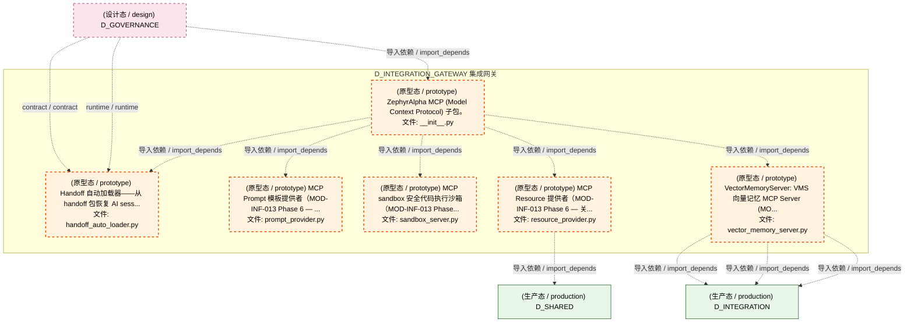
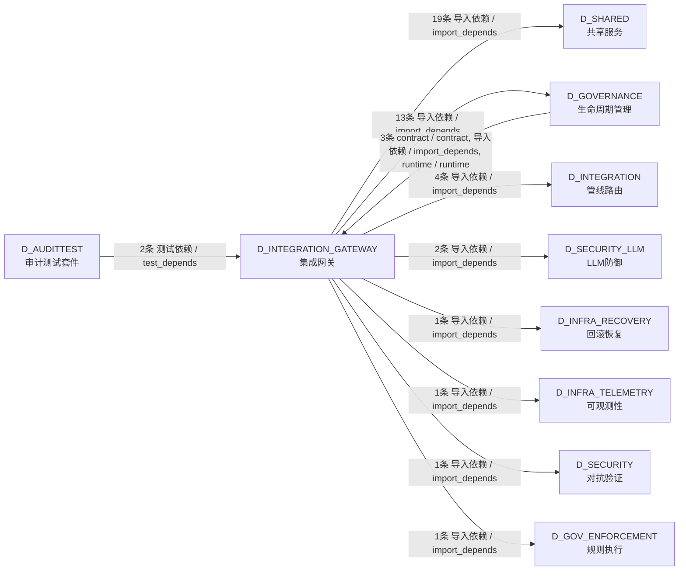

# 13_d_integration_gateway / mcp_servers / 集成网关 / Integration Gateway

> **功能简介 / Overview**: 集成网关，负责外部系统接入、协议转换和请求路由

> **文档作用 / Purpose**: 展示 集成网关（D_INTEGRATION_GATEWAY）功能域的模块清单、域内依赖关系、跨域依赖关系、架构分层视图，供架构审查和域治理参考。

> 本文档由 generate_domain_doc.py 从 depgraph (PostgreSQL) 自动生成
> 最后更新: 2026-07-10 02:55:45
> 数据源: depgraph (PostgreSQL) nodes表 + edges表

## 域基本信息 / Domain Overview

| 字段 | 值 | Field | Value |
|------|------|-------|-------|
| 编号 | 13 | Number | 13 |
| 域ID | D_INTEGRATION_GATEWAY | Domain ID | D_INTEGRATION_GATEWAY |
| 域名称 | 集成网关 | Domain Name | Integration Gateway |
| 层级 | L1 基础平台层 | Layer | L1 Foundation |
| 模块数 | 20 | Module Count | 20 |
| 域内依赖 | 37 | Internal Dependencies | 37 |
| 跨域入边 | 5 | Cross-domain Incoming | 5 |
| 跨域出边 | 42 | Cross-domain Outgoing | 42 |
| 设计态模块 | 0 | Design Modules | 0 |
| 原型态模块 | 6 | Prototype Modules | 6 |
| 生产态模块 | 14 | Production Modules | 14 |
| 容量 | 14/150 (正常) | Capacity | 14/150 (正常) |
| 描述 | 11个MCP服务端 + 1 Gateway | Description | 11个MCP服务端 + 1 Gateway |

## 模块分层清单 / Module Layered List

> 按 architecture_layer 分组的模块清单（共 20 个模块 / 20 modules）。

### L1 基础层 / Foundation Layer (20 modules)

| # | 模块路径 / Module Path | 模块名称 / Module Name (功能简介 / Description) | 成熟度 / Maturity | 蓝图 / Blueprint |
|:--:|---------|---------|:---:|:---:|
| 1 | src/zephyr/integration/mcp/__init__.py | ZephyrAlpha MCP (Model Context Protocol) 子包。 | 原型态 / prototype | [MOD-INF-013](../../03_modules/_cross_layer/model_context_protocol_servers/blueprint.md) |
| 2 | src/zephyr/integration/mcp/_base_server.py | BaseMCPServer: stdio 传输 + JSON-RPC 2.0 协议基类 | 生产态 / production | [MOD-INF-013](../../03_modules/_cross_layer/model_context_protocol_servers/blueprint.md) |
| 3 | src/zephyr/integration/mcp/audit_logger.py | MCP 全量工具调用审计日志（MOD-INF-013 §12 Step... | 生产态 / production | [MOD-INF-013](../../03_modules/_cross_layer/model_context_protocol_servers/blueprint.md) |
| 4 | src/zephyr/integration/mcp/blueprint_search_server.py | BlueprintSearchServer — MCP Server for bluepri... | 生产态 / production | [MOD-INF-013](../../03_modules/_cross_layer/model_context_protocol_servers/blueprint.md) |
| 5 | src/zephyr/integration/mcp/doc_guard_server.py | DocGuardServer: 跨会话交接协议服务 MCP Server | 生产态 / production | [MOD-INF-013](../../03_modules/_cross_layer/model_context_protocol_servers/blueprint.md) |
| 6 | src/zephyr/integration/mcp/error_codes.py | MCP 错误码集中注册（MOD-INF-013 §3.4）。 | 生产态 / production | [MOD-INF-013](../../03_modules/_cross_layer/model_context_protocol_servers/blueprint.md) |
| 7 | src/zephyr/integration/mcp/gate_engine_server.py | GateEngineServer: 门禁裁决服务 MCP Server | 生产态 / production | [MOD-INF-013](../../03_modules/_cross_layer/model_context_protocol_servers/blueprint.md) |
| 8 | src/zephyr/integration/mcp/gateway_server.py | MCP Gateway 集中式治理节点（MOD-INF-013 §12 Ph... | 生产态 / production | [MOD-INF-013](../../03_modules/_cross_layer/model_context_protocol_servers/blueprint.md) |
| 9 | src/zephyr/integration/mcp/governance_server.py | GovernanceServer: 治理域统一MCP入口 | 生产态 / production | [MOD-INF-013](../../03_modules/_cross_layer/model_context_protocol_servers/blueprint.md) |
| 10 | src/zephyr/integration/mcp/handoff_auto_loader.py | Handoff 自动加载器——从 handoff 包恢复 AI sess... | 原型态 / prototype | [MOD-INF-013](../../03_modules/_cross_layer/model_context_protocol_servers/blueprint.md) |
| 11 | src/zephyr/integration/mcp/knowledge_base_server.py | KnowledgeBaseServer: 知识库语义检索 MCP Server | 生产态 / production | [MOD-INF-013](../../03_modules/_cross_layer/model_context_protocol_servers/blueprint.md) |
| 12 | src/zephyr/integration/mcp/prompt_provider.py | MCP Prompt 模板提供者（MOD-INF-013 Phase 6 — ... | 原型态 / prototype | [MOD-INF-013](../../03_modules/_cross_layer/model_context_protocol_servers/blueprint.md) |
| 13 | src/zephyr/integration/mcp/rate_limiter.py | MCP Gateway 同步速率限制器（MOD-INF-013 §12 St... | 生产态 / production | [MOD-INF-013](../../03_modules/_cross_layer/model_context_protocol_servers/blueprint.md) |
| 14 | src/zephyr/integration/mcp/resource_provider.py | MCP Resource 提供者（MOD-INF-013 Phase 6 — 关... | 原型态 / prototype | [MOD-INF-013](../../03_modules/_cross_layer/model_context_protocol_servers/blueprint.md) |
| 15 | src/zephyr/integration/mcp/sandbox_server.py | MCP sandbox 安全代码执行沙箱（MOD-INF-013 Phase... | 原型态 / prototype | [MOD-INF-013](../../03_modules/_cross_layer/model_context_protocol_servers/blueprint.md) |
| 16 | src/zephyr/integration/mcp/sentinel_server.py | SentinelServer: 意图路由哨兵 MCP Server | 生产态 / production | [MOD-INF-013](../../03_modules/_cross_layer/model_context_protocol_servers/blueprint.md) |
| 17 | src/zephyr/integration/mcp/task_manager_server.py | ZephyrAlpha MCP Task Manager Server | 生产态 / production | [MOD-INF-013](../../03_modules/_cross_layer/model_context_protocol_servers/blueprint.md) |
| 18 | src/zephyr/integration/mcp/telemetry_server.py | ZephyrAlpha MCP Telemetry Server — 系统可观测... | 生产态 / production | [MOD-INF-013](../../03_modules/_cross_layer/model_context_protocol_servers/blueprint.md) |
| 19 | src/zephyr/integration/mcp/tool_contracts.yaml | tool_contracts.yaml | 生产态 / production | [MOD-INF-013](../../03_modules/_cross_layer/model_context_protocol_servers/blueprint.md) |
| 20 | src/zephyr/integration/mcp/vector_memory_server.py | VectorMemoryServer: VMS 向量记忆 MCP Server (MO... | 原型态 / prototype | [MOD-INF-013](../../03_modules/_cross_layer/model_context_protocol_servers/blueprint.md) |

## 域内依赖图 / Internal Dependency Diagram

> 依赖图内嵌在本文档中，IDE 可直接渲染显示。参考 decision_index.md 设计，分四个视图：合并全景图、运营态子图、设计态子图、原型态子图（按 design_maturity 实际值拆分）。
>
> **图例说明 / Legend**：
> - **实线边框 = 运营态模块**（production，已上线运行）
> - **虚线边框 = 设计态模块**（design，蓝图阶段，代码未写）
> - **虚线边框 = 原型态模块**（prototype，代码已写，验证中未稳定上线）
> - **实线箭头 = 运营态依赖**（已生效的依赖关系）
> - **虚线箭头 = 非运营态依赖**（计划中/验证中的依赖关系）

### 合并全景图（全部模块，标签标注成熟度）

> 展示全部 20 个模块（生产态 14 + 设计态 0 + 原型态 6），标签标注成熟度。

```mermaid
graph TD
    subgraph D_INTEGRATION_GATEWAY["D_INTEGRATION_GATEWAY 集成网关"]
        src_zephyr_integration_mcp_init_py["(原型态 / prototype) ZephyrAlpha MCP (Model Context Protocol) 子包。<br/>文件: __init__.py"]
        src_zephyr_integration_mcp_base_server_py["(生产态 / production) BaseMCPServer: stdio 传输 + JSON-RPC 2.0 协议基类<br/>文件: _base_server.py"]
        src_zephyr_integration_mcp_audit_logger_py["(生产态 / production) MCP 全量工具调用审计日志（MOD-INF-013 §12 Step...<br/>文件: audit_logger.py"]
        src_zephyr_integration_mcp_blueprint_search_server_py["(生产态 / production) BlueprintSearchServer — MCP Server for bluepri...<br/>文件: blueprint_search_server.py"]
        src_zephyr_integration_mcp_doc_guard_server_py["(生产态 / production) DocGuardServer: 跨会话交接协议服务 MCP Server<br/>文件: doc_guard_server.py"]
        src_zephyr_integration_mcp_error_codes_py["(生产态 / production) MCP 错误码集中注册（MOD-INF-013 §3.4）。<br/>文件: error_codes.py"]
        src_zephyr_integration_mcp_gate_engine_server_py["(生产态 / production) GateEngineServer: 门禁裁决服务 MCP Server<br/>文件: gate_engine_server.py"]
        src_zephyr_integration_mcp_gateway_server_py["(生产态 / production) MCP Gateway 集中式治理节点（MOD-INF-013 §12 Ph...<br/>文件: gateway_server.py"]
        src_zephyr_integration_mcp_governance_server_py["(生产态 / production) GovernanceServer: 治理域统一MCP入口<br/>文件: governance_server.py"]
        src_zephyr_integration_mcp_handoff_auto_loader_py["(原型态 / prototype) Handoff 自动加载器——从 handoff 包恢复 AI sess...<br/>文件: handoff_auto_loader.py"]
        src_zephyr_integration_mcp_knowledge_base_server_py["(生产态 / production) KnowledgeBaseServer: 知识库语义检索 MCP Server<br/>文件: knowledge_base_server.py"]
        src_zephyr_integration_mcp_prompt_provider_py["(原型态 / prototype) MCP Prompt 模板提供者（MOD-INF-013 Phase 6 — ...<br/>文件: prompt_provider.py"]
        src_zephyr_integration_mcp_rate_limiter_py["(生产态 / production) MCP Gateway 同步速率限制器（MOD-INF-013 §12 St...<br/>文件: rate_limiter.py"]
        src_zephyr_integration_mcp_resource_provider_py["(原型态 / prototype) MCP Resource 提供者（MOD-INF-013 Phase 6 — 关...<br/>文件: resource_provider.py"]
        src_zephyr_integration_mcp_sandbox_server_py["(原型态 / prototype) MCP sandbox 安全代码执行沙箱（MOD-INF-013 Phase...<br/>文件: sandbox_server.py"]
        src_zephyr_integration_mcp_sentinel_server_py["(生产态 / production) SentinelServer: 意图路由哨兵 MCP Server<br/>文件: sentinel_server.py"]
        src_zephyr_integration_mcp_task_manager_server_py["(生产态 / production) ZephyrAlpha MCP Task Manager Server<br/>文件: task_manager_server.py"]
        src_zephyr_integration_mcp_telemetry_server_py["(生产态 / production) ZephyrAlpha MCP Telemetry Server — 系统可观测...<br/>文件: telemetry_server.py"]
        src_zephyr_integration_mcp_tool_contracts_yaml["(生产态 / production) tool_contracts.yaml"]
        src_zephyr_integration_mcp_vector_memory_server_py["(原型态 / prototype) VectorMemoryServer: VMS 向量记忆 MCP Server (MO...<br/>文件: vector_memory_server.py"]
    end
    src_zephyr_integration_mcp_doc_guard_server_py -->|导入依赖 / import_depends| src_zephyr_integration_mcp_base_server_py
    src_zephyr_integration_mcp_blueprint_search_server_py -->|导入依赖 / import_depends| src_zephyr_integration_mcp_base_server_py
    src_zephyr_integration_mcp_gateway_server_py -->|导入依赖 / import_depends| src_zephyr_integration_mcp_audit_logger_py
    src_zephyr_integration_mcp_gateway_server_py -->|导入依赖 / import_depends| src_zephyr_integration_mcp_doc_guard_server_py
    src_zephyr_integration_mcp_gateway_server_py -->|导入依赖 / import_depends| src_zephyr_integration_mcp_blueprint_search_server_py
    src_zephyr_integration_mcp_gateway_server_py -->|导入依赖 / import_depends| src_zephyr_integration_mcp_error_codes_py
    src_zephyr_integration_mcp_gateway_server_py -->|导入依赖 / import_depends| src_zephyr_integration_mcp_knowledge_base_server_py
    src_zephyr_integration_mcp_gateway_server_py -->|导入依赖 / import_depends| src_zephyr_integration_mcp_gate_engine_server_py
    src_zephyr_integration_mcp_gateway_server_py -->|导入依赖 / import_depends| src_zephyr_integration_mcp_governance_server_py
    src_zephyr_integration_mcp_gateway_server_py -->|导入依赖 / import_depends| src_zephyr_integration_mcp_rate_limiter_py
    src_zephyr_integration_mcp_gateway_server_py -->|导入依赖 / import_depends| src_zephyr_integration_mcp_sentinel_server_py
    src_zephyr_integration_mcp_gateway_server_py -->|导入依赖 / import_depends| src_zephyr_integration_mcp_task_manager_server_py
    src_zephyr_integration_mcp_gateway_server_py -.->|导入依赖 / import_depends| src_zephyr_integration_mcp_vector_memory_server_py
    src_zephyr_integration_mcp_gateway_server_py -->|导入依赖 / import_depends| src_zephyr_integration_mcp_base_server_py
    src_zephyr_integration_mcp_gateway_server_py -->|导入依赖 / import_depends| src_zephyr_integration_mcp_telemetry_server_py
    src_zephyr_integration_mcp_knowledge_base_server_py -->|导入依赖 / import_depends| src_zephyr_integration_mcp_base_server_py
    src_zephyr_integration_mcp_gate_engine_server_py -->|导入依赖 / import_depends| src_zephyr_integration_mcp_base_server_py
    src_zephyr_integration_mcp_governance_server_py -->|导入依赖 / import_depends| src_zephyr_integration_mcp_base_server_py
    src_zephyr_integration_mcp_sandbox_server_py -.->|导入依赖 / import_depends| src_zephyr_integration_mcp_base_server_py
    src_zephyr_integration_mcp_sentinel_server_py -->|导入依赖 / import_depends| src_zephyr_integration_mcp_base_server_py
    src_zephyr_integration_mcp_vector_memory_server_py -.->|导入依赖 / import_depends| src_zephyr_integration_mcp_base_server_py
    src_zephyr_integration_mcp_init_py -.->|导入依赖 / import_depends| src_zephyr_integration_mcp_doc_guard_server_py
    src_zephyr_integration_mcp_init_py -.->|导入依赖 / import_depends| src_zephyr_integration_mcp_blueprint_search_server_py
    src_zephyr_integration_mcp_init_py -.->|导入依赖 / import_depends| src_zephyr_integration_mcp_knowledge_base_server_py
    src_zephyr_integration_mcp_init_py -.->|导入依赖 / import_depends| src_zephyr_integration_mcp_gate_engine_server_py
    src_zephyr_integration_mcp_init_py -.->|导入依赖 / import_depends| src_zephyr_integration_mcp_handoff_auto_loader_py
    src_zephyr_integration_mcp_init_py -.->|导入依赖 / import_depends| src_zephyr_integration_mcp_prompt_provider_py
    src_zephyr_integration_mcp_init_py -.->|导入依赖 / import_depends| src_zephyr_integration_mcp_governance_server_py
    src_zephyr_integration_mcp_init_py -.->|导入依赖 / import_depends| src_zephyr_integration_mcp_sandbox_server_py
    src_zephyr_integration_mcp_init_py -.->|导入依赖 / import_depends| src_zephyr_integration_mcp_resource_provider_py
    src_zephyr_integration_mcp_init_py -.->|导入依赖 / import_depends| src_zephyr_integration_mcp_sentinel_server_py
    src_zephyr_integration_mcp_init_py -.->|导入依赖 / import_depends| src_zephyr_integration_mcp_task_manager_server_py
    src_zephyr_integration_mcp_init_py -.->|导入依赖 / import_depends| src_zephyr_integration_mcp_vector_memory_server_py
    src_zephyr_integration_mcp_init_py -.->|导入依赖 / import_depends| src_zephyr_integration_mcp_base_server_py
    src_zephyr_integration_mcp_init_py -.->|导入依赖 / import_depends| src_zephyr_integration_mcp_telemetry_server_py
    src_zephyr_integration_mcp_base_server_py -->|导入依赖 / import_depends| src_zephyr_integration_mcp_error_codes_py
    src_zephyr_integration_mcp_tool_contracts_yaml -.->|config_depends / config_depends| src_zephyr_integration_mcp_init_py
    D_SHARED["(生产态 / production) D_SHARED"]
    src_zephyr_integration_mcp_audit_logger_py -->|导入依赖 / import_depends| D_SHARED
    D_GOVERNANCE["(生产态 / production) D_GOVERNANCE"]
    src_zephyr_integration_mcp_audit_logger_py -->|导入依赖 / import_depends| D_GOVERNANCE
    src_zephyr_integration_mcp_doc_guard_server_py -.->|导入依赖 / import_depends| D_SHARED
    src_zephyr_integration_mcp_doc_guard_server_py -->|导入依赖 / import_depends| D_SHARED
    src_zephyr_integration_mcp_blueprint_search_server_py -->|导入依赖 / import_depends| D_SHARED
    src_zephyr_integration_mcp_gateway_server_py -.->|导入依赖 / import_depends| D_SHARED
    D_SECURITY_LLM["(生产态 / production) D_SECURITY_LLM"]
    src_zephyr_integration_mcp_gateway_server_py -->|导入依赖 / import_depends| D_SECURITY_LLM
    src_zephyr_integration_mcp_gateway_server_py -->|导入依赖 / import_depends| D_SECURITY_LLM
    src_zephyr_integration_mcp_knowledge_base_server_py -.->|导入依赖 / import_depends| D_SHARED
    src_zephyr_integration_mcp_knowledge_base_server_py -.->|导入依赖 / import_depends| D_GOVERNANCE
    D_INTEGRATION["(生产态 / production) D_INTEGRATION"]
    src_zephyr_integration_mcp_knowledge_base_server_py -->|导入依赖 / import_depends| D_INTEGRATION
    src_zephyr_integration_mcp_gate_engine_server_py -.->|导入依赖 / import_depends| D_SHARED
    src_zephyr_integration_mcp_gate_engine_server_py -->|导入依赖 / import_depends| D_SHARED
    src_zephyr_integration_mcp_governance_server_py -->|导入依赖 / import_depends| D_SHARED
    src_zephyr_integration_mcp_governance_server_py -.->|导入依赖 / import_depends| D_SHARED
    D_GOVERNANCE -.->|导入依赖 / import_depends| src_zephyr_integration_mcp_init_py
    D_AUDITTEST["(原型态 / prototype) D_AUDITTEST"]
    D_AUDITTEST -.->|测试依赖 / test_depends| src_zephyr_integration_mcp_task_manager_server_py
    D_AUDITTEST -.->|测试依赖 / test_depends| src_zephyr_integration_mcp_gateway_server_py
    D_GOVERNANCE -.->|runtime / runtime| src_zephyr_integration_mcp_handoff_auto_loader_py
    D_GOVERNANCE -.->|contract / contract| src_zephyr_integration_mcp_handoff_auto_loader_py
    classDef production fill:#e1f5fe,stroke:#01579b,stroke-width:2px,color:#000
    classDef design fill:#fff3e0,stroke:#e65100,stroke-width:2px,color:#000,stroke-dasharray: 5 5
    classDef external_prod fill:#e8f5e9,stroke:#1b5e20,stroke-width:1px,color:#000
    classDef external_design fill:#fce4ec,stroke:#880e4f,stroke-width:1px,color:#000,stroke-dasharray: 5 5
    class src_zephyr_integration_mcp_base_server_py,src_zephyr_integration_mcp_audit_logger_py,src_zephyr_integration_mcp_blueprint_search_server_py,src_zephyr_integration_mcp_doc_guard_server_py,src_zephyr_integration_mcp_error_codes_py,src_zephyr_integration_mcp_gate_engine_server_py,src_zephyr_integration_mcp_gateway_server_py,src_zephyr_integration_mcp_governance_server_py,src_zephyr_integration_mcp_knowledge_base_server_py,src_zephyr_integration_mcp_rate_limiter_py,src_zephyr_integration_mcp_sentinel_server_py,src_zephyr_integration_mcp_task_manager_server_py,src_zephyr_integration_mcp_telemetry_server_py,src_zephyr_integration_mcp_tool_contracts_yaml production
    class src_zephyr_integration_mcp_init_py,src_zephyr_integration_mcp_handoff_auto_loader_py,src_zephyr_integration_mcp_prompt_provider_py,src_zephyr_integration_mcp_resource_provider_py,src_zephyr_integration_mcp_sandbox_server_py,src_zephyr_integration_mcp_vector_memory_server_py design
    class D_SHARED,D_GOVERNANCE,D_SECURITY_LLM,D_INTEGRATION external_prod
    class D_AUDITTEST external_design
```

### 运营态子图（仅 design_maturity=production 的模块和依赖）

> 仅展示已上线运行的模块（共 14 个，19 条域内依赖）。

```mermaid
graph TD
    subgraph D_INTEGRATION_GATEWAY["D_INTEGRATION_GATEWAY 集成网关"]
        src_zephyr_integration_mcp_base_server_py["(生产态 / production) BaseMCPServer: stdio 传输 + JSON-RPC 2.0 协议基类<br/>文件: _base_server.py"]
        src_zephyr_integration_mcp_audit_logger_py["(生产态 / production) MCP 全量工具调用审计日志（MOD-INF-013 §12 Step...<br/>文件: audit_logger.py"]
        src_zephyr_integration_mcp_blueprint_search_server_py["(生产态 / production) BlueprintSearchServer — MCP Server for bluepri...<br/>文件: blueprint_search_server.py"]
        src_zephyr_integration_mcp_doc_guard_server_py["(生产态 / production) DocGuardServer: 跨会话交接协议服务 MCP Server<br/>文件: doc_guard_server.py"]
        src_zephyr_integration_mcp_error_codes_py["(生产态 / production) MCP 错误码集中注册（MOD-INF-013 §3.4）。<br/>文件: error_codes.py"]
        src_zephyr_integration_mcp_gate_engine_server_py["(生产态 / production) GateEngineServer: 门禁裁决服务 MCP Server<br/>文件: gate_engine_server.py"]
        src_zephyr_integration_mcp_gateway_server_py["(生产态 / production) MCP Gateway 集中式治理节点（MOD-INF-013 §12 Ph...<br/>文件: gateway_server.py"]
        src_zephyr_integration_mcp_governance_server_py["(生产态 / production) GovernanceServer: 治理域统一MCP入口<br/>文件: governance_server.py"]
        src_zephyr_integration_mcp_knowledge_base_server_py["(生产态 / production) KnowledgeBaseServer: 知识库语义检索 MCP Server<br/>文件: knowledge_base_server.py"]
        src_zephyr_integration_mcp_rate_limiter_py["(生产态 / production) MCP Gateway 同步速率限制器（MOD-INF-013 §12 St...<br/>文件: rate_limiter.py"]
        src_zephyr_integration_mcp_sentinel_server_py["(生产态 / production) SentinelServer: 意图路由哨兵 MCP Server<br/>文件: sentinel_server.py"]
        src_zephyr_integration_mcp_task_manager_server_py["(生产态 / production) ZephyrAlpha MCP Task Manager Server<br/>文件: task_manager_server.py"]
        src_zephyr_integration_mcp_telemetry_server_py["(生产态 / production) ZephyrAlpha MCP Telemetry Server — 系统可观测...<br/>文件: telemetry_server.py"]
        src_zephyr_integration_mcp_tool_contracts_yaml["(生产态 / production) tool_contracts.yaml"]
    end
    src_zephyr_integration_mcp_doc_guard_server_py -->|导入依赖 / import_depends| src_zephyr_integration_mcp_base_server_py
    src_zephyr_integration_mcp_blueprint_search_server_py -->|导入依赖 / import_depends| src_zephyr_integration_mcp_base_server_py
    src_zephyr_integration_mcp_gateway_server_py -->|导入依赖 / import_depends| src_zephyr_integration_mcp_audit_logger_py
    src_zephyr_integration_mcp_gateway_server_py -->|导入依赖 / import_depends| src_zephyr_integration_mcp_doc_guard_server_py
    src_zephyr_integration_mcp_gateway_server_py -->|导入依赖 / import_depends| src_zephyr_integration_mcp_blueprint_search_server_py
    src_zephyr_integration_mcp_gateway_server_py -->|导入依赖 / import_depends| src_zephyr_integration_mcp_error_codes_py
    src_zephyr_integration_mcp_gateway_server_py -->|导入依赖 / import_depends| src_zephyr_integration_mcp_knowledge_base_server_py
    src_zephyr_integration_mcp_gateway_server_py -->|导入依赖 / import_depends| src_zephyr_integration_mcp_gate_engine_server_py
    src_zephyr_integration_mcp_gateway_server_py -->|导入依赖 / import_depends| src_zephyr_integration_mcp_governance_server_py
    src_zephyr_integration_mcp_gateway_server_py -->|导入依赖 / import_depends| src_zephyr_integration_mcp_rate_limiter_py
    src_zephyr_integration_mcp_gateway_server_py -->|导入依赖 / import_depends| src_zephyr_integration_mcp_sentinel_server_py
    src_zephyr_integration_mcp_gateway_server_py -->|导入依赖 / import_depends| src_zephyr_integration_mcp_task_manager_server_py
    src_zephyr_integration_mcp_gateway_server_py -->|导入依赖 / import_depends| src_zephyr_integration_mcp_base_server_py
    src_zephyr_integration_mcp_gateway_server_py -->|导入依赖 / import_depends| src_zephyr_integration_mcp_telemetry_server_py
    src_zephyr_integration_mcp_knowledge_base_server_py -->|导入依赖 / import_depends| src_zephyr_integration_mcp_base_server_py
    src_zephyr_integration_mcp_gate_engine_server_py -->|导入依赖 / import_depends| src_zephyr_integration_mcp_base_server_py
    src_zephyr_integration_mcp_governance_server_py -->|导入依赖 / import_depends| src_zephyr_integration_mcp_base_server_py
    src_zephyr_integration_mcp_sentinel_server_py -->|导入依赖 / import_depends| src_zephyr_integration_mcp_base_server_py
    src_zephyr_integration_mcp_base_server_py -->|导入依赖 / import_depends| src_zephyr_integration_mcp_error_codes_py
    D_SHARED["(生产态 / production) D_SHARED"]
    src_zephyr_integration_mcp_audit_logger_py -->|导入依赖 / import_depends| D_SHARED
    D_GOVERNANCE["(生产态 / production) D_GOVERNANCE"]
    src_zephyr_integration_mcp_audit_logger_py -->|导入依赖 / import_depends| D_GOVERNANCE
    src_zephyr_integration_mcp_doc_guard_server_py -.->|导入依赖 / import_depends| D_SHARED
    src_zephyr_integration_mcp_doc_guard_server_py -->|导入依赖 / import_depends| D_SHARED
    src_zephyr_integration_mcp_blueprint_search_server_py -->|导入依赖 / import_depends| D_SHARED
    src_zephyr_integration_mcp_gateway_server_py -.->|导入依赖 / import_depends| D_SHARED
    D_SECURITY_LLM["(生产态 / production) D_SECURITY_LLM"]
    src_zephyr_integration_mcp_gateway_server_py -->|导入依赖 / import_depends| D_SECURITY_LLM
    src_zephyr_integration_mcp_gateway_server_py -->|导入依赖 / import_depends| D_SECURITY_LLM
    src_zephyr_integration_mcp_knowledge_base_server_py -.->|导入依赖 / import_depends| D_SHARED
    src_zephyr_integration_mcp_knowledge_base_server_py -.->|导入依赖 / import_depends| D_GOVERNANCE
    D_INTEGRATION["(生产态 / production) D_INTEGRATION"]
    src_zephyr_integration_mcp_knowledge_base_server_py -->|导入依赖 / import_depends| D_INTEGRATION
    src_zephyr_integration_mcp_gate_engine_server_py -.->|导入依赖 / import_depends| D_SHARED
    src_zephyr_integration_mcp_gate_engine_server_py -->|导入依赖 / import_depends| D_SHARED
    src_zephyr_integration_mcp_governance_server_py -->|导入依赖 / import_depends| D_SHARED
    src_zephyr_integration_mcp_governance_server_py -.->|导入依赖 / import_depends| D_SHARED
    D_AUDITTEST["(原型态 / prototype) D_AUDITTEST"]
    D_AUDITTEST -.->|测试依赖 / test_depends| src_zephyr_integration_mcp_task_manager_server_py
    D_AUDITTEST -.->|测试依赖 / test_depends| src_zephyr_integration_mcp_gateway_server_py
    classDef production fill:#e1f5fe,stroke:#01579b,stroke-width:2px,color:#000
    classDef design fill:#fff3e0,stroke:#e65100,stroke-width:2px,color:#000,stroke-dasharray: 5 5
    classDef external_prod fill:#e8f5e9,stroke:#1b5e20,stroke-width:1px,color:#000
    classDef external_design fill:#fce4ec,stroke:#880e4f,stroke-width:1px,color:#000,stroke-dasharray: 5 5
    class src_zephyr_integration_mcp_base_server_py,src_zephyr_integration_mcp_audit_logger_py,src_zephyr_integration_mcp_blueprint_search_server_py,src_zephyr_integration_mcp_doc_guard_server_py,src_zephyr_integration_mcp_error_codes_py,src_zephyr_integration_mcp_gate_engine_server_py,src_zephyr_integration_mcp_gateway_server_py,src_zephyr_integration_mcp_governance_server_py,src_zephyr_integration_mcp_knowledge_base_server_py,src_zephyr_integration_mcp_rate_limiter_py,src_zephyr_integration_mcp_sentinel_server_py,src_zephyr_integration_mcp_task_manager_server_py,src_zephyr_integration_mcp_telemetry_server_py,src_zephyr_integration_mcp_tool_contracts_yaml production
    class D_SHARED,D_GOVERNANCE,D_SECURITY_LLM,D_INTEGRATION external_prod
    class D_AUDITTEST external_design
```

### 设计态子图（仅 design_maturity=design 的模块和依赖）

> 仅展示蓝图阶段、代码未写的设计态模块（共 0 个，0 条域内依赖）。

> （无设计态模块 / No design modules）

### 原型态子图（仅 design_maturity=prototype 的模块和依赖）

> 仅展示代码已写、验证中未稳定上线的原型态模块（共 6 个，5 条域内依赖）。

## 跨域依赖 / Cross-domain Dependencies

### 本域依赖的其他域（出边）/ Depends On

| # | 本域模块 / Source Module | → | 外部域-目标模块 / Target Module | 依赖类型 / Type |
|:--:|---------|:--:|---------|---------|
| 1 | BaseMCPServer: stdio 传输 + JSON-RPC 2.0 协议基... | → | D_GOVERNANCE 生命周期管理: G-CT-007 契约：Budget -> RBAC 配额限制. (rbac_b... | 导入依赖 / import_depends |
| 2 | MCP 全量工具调用审计日志（MOD-INF-013 §12 Step... | → | D_GOVERNANCE 生命周期管理: writer.py | 导入依赖 / import_depends |
| 3 | GovernanceServer: 治理域统一MCP入口 (governance... | → | D_GOVERNANCE 生命周期管理: writer.py | 导入依赖 / import_depends |
| 4 | GovernanceServer: 治理域统一MCP入口 (governance... | → | D_GOVERNANCE 生命周期管理: Cold Start Bootstrapper — 冷启动引导 §6.31。 ... | 导入依赖 / import_depends |
| 5 | GovernanceServer: 治理域统一MCP入口 (governance... | → | D_GOVERNANCE 生命周期管理: Drift Engine — 编排器核心 (SRC-0030 精简后) (d... | 导入依赖 / import_depends |
| 6 | GovernanceServer: 治理域统一MCP入口 (governance... | → | D_GOVERNANCE 生命周期管理: Drift Detector 基础设施 — drift_infrastructure... | 导入依赖 / import_depends |
| 7 | GovernanceServer: 治理域统一MCP入口 (governance... | → | D_GOVERNANCE 生命周期管理: Drift Detector 数据模型 — drift_models.py (dri... | 导入依赖 / import_depends |
| 8 | GovernanceServer: 治理域统一MCP入口 (governance... | → | D_GOVERNANCE 生命周期管理: Escalation Engine — MOD-INF-022 (escalation_en... | 导入依赖 / import_depends |
| 9 | GovernanceServer: 治理域统一MCP入口 (governance... | → | D_GOVERNANCE 生命周期管理: Escalation Protocol data models — MOD-INF-022 ... | 导入依赖 / import_depends |
| 10 | GovernanceServer: 治理域统一MCP入口 (governance... | → | D_GOVERNANCE 生命周期管理: Budget Enforcer core engine — MOD-INF-024 (bud... | 导入依赖 / import_depends |
| 11 | GovernanceServer: 治理域统一MCP入口 (governance... | → | D_GOVERNANCE 生命周期管理: Budget Enforcer data models — MOD-INF-024 (bud... | 导入依赖 / import_depends |
| 12 | KnowledgeBaseServer: 知识库语义检索 MCP Server ... | → | D_GOVERNANCE 生命周期管理: SRC-0042: Re-export shim -> 真源在 kb/storage/u... | 导入依赖 / import_depends |
| 13 | SentinelServer: 意图路由哨兵 MCP Server (sentin... | → | D_GOVERNANCE 生命周期管理: IntentKeywordMapper - Stage 1 of three-stage in... | 导入依赖 / import_depends |
| 14 | ZephyrAlpha MCP Task Manager Server (task_manag... | → | D_GOV_ENFORCEMENT 规则执行: task_types.py | 导入依赖 / import_depends |
| 15 | GovernanceServer: 治理域统一MCP入口 (governance... | → | D_INFRA_RECOVERY 回滚恢复: RollbackExecutor — 回滚执行器核心封装。 (rollb... | 导入依赖 / import_depends |
| 16 | ZephyrAlpha MCP Telemetry Server — 系统可观测.... | → | D_INFRA_TELEMETRY 可观测性: Telemetry — 系统遥测门面类（MOD-INF-015 v2.1.0... | 导入依赖 / import_depends |
| 17 | KnowledgeBaseServer: 知识库语义检索 MCP Server ... | → | D_INTEGRATION 管线路由: InProcessVectorMemory — MOD-INF-011 VMS 统一入... | 导入依赖 / import_depends |
| 18 | VectorMemoryServer: VMS 向量记忆 MCP Server (MO... | → | D_INTEGRATION 管线路由: CollectionManager — MOD-INF-011 八大 Collectio... | 导入依赖 / import_depends |
| 19 | VectorMemoryServer: VMS 向量记忆 MCP Server (MO... | → | D_INTEGRATION 管线路由: InProcessVectorMemory — MOD-INF-011 VMS 统一入... | 导入依赖 / import_depends |
| 20 | VectorMemoryServer: VMS 向量记忆 MCP Server (MO... | → | D_INTEGRATION 管线路由: vms_errors.py | 导入依赖 / import_depends |
| 21 | GovernanceServer: 治理域统一MCP入口 (governance... | → | D_SECURITY 对抗验证: PermissionGuard — 七层权限编排器. (permission_... | 导入依赖 / import_depends |
| 22 | MCP Gateway 集中式治理节点（MOD-INF-013 §12 Ph... | → | D_SECURITY_LLM LLM防御: gateway.py | 导入依赖 / import_depends |
| 23 | MCP Gateway 集中式治理节点（MOD-INF-013 §12 Ph... | → | D_SECURITY_LLM LLM防御: protocol.py | 导入依赖 / import_depends |
| 24 | BaseMCPServer: stdio 传输 + JSON-RPC 2.0 协议基... | → | D_SHARED 共享服务: async_utils.py — async/sync 边界桥接（5.12.8 .... | 导入依赖 / import_depends |
| 25 | MCP 全量工具调用审计日志（MOD-INF-013 §12 Step... | → | D_SHARED 共享服务: paths.py — 项目路径常量 SSoT（Single Source of... | 导入依赖 / import_depends |
| 26 | BlueprintSearchServer — MCP Server for bluepri... | → | D_SHARED 共享服务: paths.py — 项目路径常量 SSoT（Single Source of... | 导入依赖 / import_depends |
| 27 | DocGuardServer: 跨会话交接协议服务 MCP Server (... | → | D_SHARED 共享服务: schemas.py | 导入依赖 / import_depends |
| 28 | DocGuardServer: 跨会话交接协议服务 MCP Server (... | → | D_SHARED 共享服务: time_utils.py —— 时间/日期工具（Phase 9 新增 ... | 导入依赖 / import_depends |
| 29 | GateEngineServer: 门禁裁决服务 MCP Server (gate... | → | D_SHARED 共享服务: schemas.py | 导入依赖 / import_depends |
| 30 | GateEngineServer: 门禁裁决服务 MCP Server (gate... | → | D_SHARED 共享服务: time_utils.py —— 时间/日期工具（Phase 9 新增 ... | 导入依赖 / import_depends |
| 31 | MCP Gateway 集中式治理节点（MOD-INF-013 §12 Ph... | → | D_SHARED 共享服务: async_utils.py — async/sync 边界桥接（5.12.8 .... | 导入依赖 / import_depends |
| 32 | GovernanceServer: 治理域统一MCP入口 (governance... | → | D_SHARED 共享服务: agent_identity.py | 导入依赖 / import_depends |
| 33 | GovernanceServer: 治理域统一MCP入口 (governance... | → | D_SHARED 共享服务: skill_protocol.py | 导入依赖 / import_depends |
| 34 | GovernanceServer: 治理域统一MCP入口 (governance... | → | D_SHARED 共享服务: paths.py — 项目路径常量 SSoT（Single Source of... | 导入依赖 / import_depends |
| 35 | GovernanceServer: 治理域统一MCP入口 (governance... | → | D_SHARED 共享服务: async_utils.py — async/sync 边界桥接（5.12.8 .... | 导入依赖 / import_depends |
| 36 | KnowledgeBaseServer: 知识库语义检索 MCP Server ... | → | D_SHARED 共享服务: yaml_utils.py — vocabulary YAML 加载公共工具（... | 导入依赖 / import_depends |
| 37 | MCP Resource 提供者（MOD-INF-013 Phase 6 — 关.... | → | D_SHARED 共享服务: paths.py — 项目路径常量 SSoT（Single Source of... | 导入依赖 / import_depends |
| 38 | ZephyrAlpha MCP Task Manager Server (task_manag... | → | D_SHARED 共享服务: paths.py — 项目路径常量 SSoT（Single Source of... | 导入依赖 / import_depends |
| 39 | ZephyrAlpha MCP Task Manager Server (task_manag... | → | D_SHARED 共享服务: schemas.py | 导入依赖 / import_depends |
| 40 | ZephyrAlpha MCP Task Manager Server (task_manag... | → | D_SHARED 共享服务: severity_types.py | 导入依赖 / import_depends |
| 41 | ZephyrAlpha MCP Task Manager Server (task_manag... | → | D_SHARED 共享服务: time_utils.py —— 时间/日期工具（Phase 9 新增 ... | 导入依赖 / import_depends |
| 42 | ZephyrAlpha MCP Telemetry Server — 系统可观测.... | → | D_SHARED 共享服务: paths.py — 项目路径常量 SSoT（Single Source of... | 导入依赖 / import_depends |

### 依赖本域的其他域（入边）/ Depended By

| # | 外部域-源模块 / Source Module | → | 本域模块 / Target Module | 依赖类型 / Type |
|:--:|---------|:--:|---------|---------|
| 1 | D_AUDITTEST 审计测试套件: test_mcp_task_claim.py | → | ZephyrAlpha MCP Task Manager Server (task_manag... | 测试依赖 / test_depends |
| 2 | D_AUDITTEST 审计测试套件: test_cross_module_integration_llm_security.py | → | MCP Gateway 集中式治理节点（MOD-INF-013 §12 Ph... | 测试依赖 / test_depends |
| 3 | D_GOVERNANCE 生命周期管理: blueprint.md | → | Handoff 自动加载器——从 handoff 包恢复 AI sess... | runtime / runtime |
| 4 | D_GOVERNANCE 生命周期管理: blueprint.md | → | Handoff 自动加载器——从 handoff 包恢复 AI sess... | contract / contract |
| 5 | D_GOVERNANCE 生命周期管理: scaffold.py — ZephyrAlpha 唯一创建入口（RULE-T... | → | ZephyrAlpha MCP (Model Context Protocol) 子包。... | 导入依赖 / import_depends |

### 跨域依赖图 / Cross-domain Dependency Diagram

> 本域与 9 个外部域直接连接（出边 42 条 + 入边 5 条 = 47 条）。只显示直接连接的域，不展开具体节点。

## 说明 / Notes

- **数据源 / Data Source**: `depgraph (PostgreSQL)` 的 `nodes`、`edges`、`domains` 表
- **生成器 / Generator**: `generate_domain_doc.py`（G2+G10 合并）
- **维护方式 / Maintenance**: 自动生成，全景图更新时刷新
- **文件名规则 / File Naming**: `{编号:02d}_{域ID小写}.md`，如 `16_d_trading.md`
- **图例说明 / Legend**: `[production]`=已上线 / `[design]`=设计中 / `[prototype]`=原型 / `[unknown]`=未知
