# 13_d_integration_gateway / mcp_servers / 集成网关 / Integration Gateway

> **功能简介 / Overview**: 外部集成网关与协议适配

> **文档作用 / Purpose**: 展示 集成网关（D_INTEGRATION_GATEWAY）功能域的模块清单、域内依赖关系、跨域依赖关系、架构分层视图，供架构审查和域治理参考。

> 本文档由 generate_domain_doc.py 从 depgraph (PostgreSQL) 自动生成
> 最后更新: 2026-07-09 01:10:31
> 数据源: depgraph (PostgreSQL) nodes表 + edges表

## 域基本信息 / Domain Overview

| 字段 | 值 | Field | Value |
|------|------|-------|-------|
| 编号 | 13 | Number | 13 |
| 域ID | D_INTEGRATION_GATEWAY | Domain ID | D_INTEGRATION_GATEWAY |
| 域名称 | 集成网关 | Domain Name | Integration Gateway |
| 层级 | L1 基础平台层 | Layer | L1 Foundation |
| 模块数 | 20 | Module Count | 20 |
| 域内依赖 | 37 | Internal Dependencies | 37 |
| 跨域入边 | 3 | Cross-domain Incoming | 3 |
| 跨域出边 | 42 | Cross-domain Outgoing | 42 |
| 设计态模块 | 0 | Design Modules | 0 |
| 原型态模块 | 6 | Prototype Modules | 6 |
| 生产态模块 | 14 | Production Modules | 14 |
| 容量 | 14/150 (正常) | Capacity | 14/150 (正常) |
| 描述 | 11个MCP服务端 + 1 Gateway | Description | 11个MCP服务端 + 1 Gateway |

## 域内依赖图 / Internal Dependency Diagram

> 依赖图内嵌在本文档中，IDE 可直接渲染显示。每30个节点一组分页显示。
>
> **图例说明 / Legend**：
> - **实线边框 = 运营态模块**（production，已上线运行）
> - **虚线边框 = 设计态模块**（design，还在设计中）
> - **实线箭头 = 运营态依赖**（已生效的依赖关系）
> - **虚线箭头 = 设计态依赖**（计划中的依赖关系）

```mermaid
graph TD
    subgraph D_INTEGRATION_GATEWAY["D_INTEGRATION_GATEWAY 集成网关"]
        src_zephyr_integration_mcp_init_py["(原型态 / prototype) __init__.py"]
        src_zephyr_integration_mcp_base_server_py["(生产态 / production) _base_server.py"]
        src_zephyr_integration_mcp_audit_logger_py["(生产态 / production) audit_logger.py"]
        src_zephyr_integration_mcp_blueprint_search_server_py["(生产态 / production) blueprint_search_server.py"]
        src_zephyr_integration_mcp_doc_guard_server_py["(生产态 / production) doc_guard_server.py"]
        src_zephyr_integration_mcp_error_codes_py["(生产态 / production) error_codes.py"]
        src_zephyr_integration_mcp_gate_engine_server_py["(生产态 / production) gate_engine_server.py"]
        src_zephyr_integration_mcp_gateway_server_py["(生产态 / production) gateway_server.py"]
        src_zephyr_integration_mcp_governance_server_py["(生产态 / production) governance_server.py"]
        src_zephyr_integration_mcp_handoff_auto_loader_py["(原型态 / prototype) handoff_auto_loader.py"]
        src_zephyr_integration_mcp_knowledge_base_server_py["(生产态 / production) knowledge_base_server.py"]
        src_zephyr_integration_mcp_prompt_provider_py["(原型态 / prototype) prompt_provider.py"]
        src_zephyr_integration_mcp_rate_limiter_py["(生产态 / production) rate_limiter.py"]
        src_zephyr_integration_mcp_resource_provider_py["(原型态 / prototype) resource_provider.py"]
        src_zephyr_integration_mcp_sandbox_server_py["(原型态 / prototype) sandbox_server.py"]
        src_zephyr_integration_mcp_sentinel_server_py["(生产态 / production) sentinel_server.py"]
        src_zephyr_integration_mcp_task_manager_server_py["(生产态 / production) task_manager_server.py"]
        src_zephyr_integration_mcp_telemetry_server_py["(生产态 / production) telemetry_server.py"]
        src_zephyr_integration_mcp_tool_contracts_yaml["(生产态 / production) tool_contracts.yaml"]
        src_zephyr_integration_mcp_vector_memory_server_py["(原型态 / prototype) vector_memory_server.py"]
    end
    src_zephyr_integration_mcp_doc_guard_server_py -->|导入依赖 / import_depends| src_zephyr_integration_mcp_base_server_py
    src_zephyr_integration_mcp_gateway_server_py -->|导入依赖 / import_depends| src_zephyr_integration_mcp_doc_guard_server_py
    src_zephyr_integration_mcp_gateway_server_py -->|导入依赖 / import_depends| src_zephyr_integration_mcp_audit_logger_py
    src_zephyr_integration_mcp_gateway_server_py -->|导入依赖 / import_depends| src_zephyr_integration_mcp_error_codes_py
    src_zephyr_integration_mcp_gateway_server_py -->|导入依赖 / import_depends| src_zephyr_integration_mcp_blueprint_search_server_py
    src_zephyr_integration_mcp_gateway_server_py -->|导入依赖 / import_depends| src_zephyr_integration_mcp_knowledge_base_server_py
    src_zephyr_integration_mcp_gateway_server_py -->|导入依赖 / import_depends| src_zephyr_integration_mcp_gate_engine_server_py
    src_zephyr_integration_mcp_gateway_server_py -->|导入依赖 / import_depends| src_zephyr_integration_mcp_governance_server_py
    src_zephyr_integration_mcp_gateway_server_py -->|导入依赖 / import_depends| src_zephyr_integration_mcp_rate_limiter_py
    src_zephyr_integration_mcp_gateway_server_py -.->|导入依赖 / import_depends| src_zephyr_integration_mcp_vector_memory_server_py
    src_zephyr_integration_mcp_gateway_server_py -->|导入依赖 / import_depends| src_zephyr_integration_mcp_sentinel_server_py
    src_zephyr_integration_mcp_gateway_server_py -->|导入依赖 / import_depends| src_zephyr_integration_mcp_task_manager_server_py
    src_zephyr_integration_mcp_gateway_server_py -->|导入依赖 / import_depends| src_zephyr_integration_mcp_telemetry_server_py
    src_zephyr_integration_mcp_gateway_server_py -->|导入依赖 / import_depends| src_zephyr_integration_mcp_base_server_py
    src_zephyr_integration_mcp_blueprint_search_server_py -->|导入依赖 / import_depends| src_zephyr_integration_mcp_base_server_py
    src_zephyr_integration_mcp_knowledge_base_server_py -->|导入依赖 / import_depends| src_zephyr_integration_mcp_base_server_py
    src_zephyr_integration_mcp_gate_engine_server_py -->|导入依赖 / import_depends| src_zephyr_integration_mcp_base_server_py
    src_zephyr_integration_mcp_governance_server_py -->|导入依赖 / import_depends| src_zephyr_integration_mcp_base_server_py
    src_zephyr_integration_mcp_sandbox_server_py -.->|导入依赖 / import_depends| src_zephyr_integration_mcp_base_server_py
    src_zephyr_integration_mcp_vector_memory_server_py -.->|导入依赖 / import_depends| src_zephyr_integration_mcp_base_server_py
    src_zephyr_integration_mcp_sentinel_server_py -->|导入依赖 / import_depends| src_zephyr_integration_mcp_base_server_py
    src_zephyr_integration_mcp_init_py -.->|导入依赖 / import_depends| src_zephyr_integration_mcp_doc_guard_server_py
    src_zephyr_integration_mcp_init_py -.->|导入依赖 / import_depends| src_zephyr_integration_mcp_blueprint_search_server_py
    src_zephyr_integration_mcp_init_py -.->|导入依赖 / import_depends| src_zephyr_integration_mcp_prompt_provider_py
    src_zephyr_integration_mcp_init_py -.->|导入依赖 / import_depends| src_zephyr_integration_mcp_knowledge_base_server_py
    src_zephyr_integration_mcp_init_py -.->|导入依赖 / import_depends| src_zephyr_integration_mcp_handoff_auto_loader_py
    src_zephyr_integration_mcp_init_py -.->|导入依赖 / import_depends| src_zephyr_integration_mcp_gate_engine_server_py
    src_zephyr_integration_mcp_init_py -.->|导入依赖 / import_depends| src_zephyr_integration_mcp_governance_server_py
    src_zephyr_integration_mcp_init_py -.->|导入依赖 / import_depends| src_zephyr_integration_mcp_resource_provider_py
    src_zephyr_integration_mcp_init_py -.->|导入依赖 / import_depends| src_zephyr_integration_mcp_sandbox_server_py
    src_zephyr_integration_mcp_init_py -.->|导入依赖 / import_depends| src_zephyr_integration_mcp_vector_memory_server_py
    src_zephyr_integration_mcp_init_py -.->|导入依赖 / import_depends| src_zephyr_integration_mcp_sentinel_server_py
    src_zephyr_integration_mcp_init_py -.->|导入依赖 / import_depends| src_zephyr_integration_mcp_task_manager_server_py
    src_zephyr_integration_mcp_init_py -.->|导入依赖 / import_depends| src_zephyr_integration_mcp_telemetry_server_py
    src_zephyr_integration_mcp_init_py -.->|导入依赖 / import_depends| src_zephyr_integration_mcp_base_server_py
    src_zephyr_integration_mcp_base_server_py -->|导入依赖 / import_depends| src_zephyr_integration_mcp_error_codes_py
    src_zephyr_integration_mcp_tool_contracts_yaml -.->|config_depends / config_depends| src_zephyr_integration_mcp_init_py
    D_SHARED["[原型态 / prototype] D_SHARED"]
    src_zephyr_integration_mcp_doc_guard_server_py -.->|导入依赖 / import_depends| D_SHARED
    src_zephyr_integration_mcp_doc_guard_server_py -->|导入依赖 / import_depends| D_SHARED
    src_zephyr_integration_mcp_audit_logger_py -->|导入依赖 / import_depends| D_SHARED
    D_GOVERNANCE["[生产态 / production] D_GOVERNANCE"]
    src_zephyr_integration_mcp_audit_logger_py -->|导入依赖 / import_depends| D_GOVERNANCE
    src_zephyr_integration_mcp_gateway_server_py -.->|导入依赖 / import_depends| D_SHARED
    D_SECURITY_LLM["[生产态 / production] D_SECURITY_LLM"]
    src_zephyr_integration_mcp_gateway_server_py -->|导入依赖 / import_depends| D_SECURITY_LLM
    src_zephyr_integration_mcp_gateway_server_py -->|导入依赖 / import_depends| D_SECURITY_LLM
    src_zephyr_integration_mcp_blueprint_search_server_py -->|导入依赖 / import_depends| D_SHARED
    src_zephyr_integration_mcp_knowledge_base_server_py -.->|导入依赖 / import_depends| D_SHARED
    src_zephyr_integration_mcp_knowledge_base_server_py -.->|导入依赖 / import_depends| D_GOVERNANCE
    D_INTEGRATION["[生产态 / production] D_INTEGRATION"]
    src_zephyr_integration_mcp_knowledge_base_server_py -->|导入依赖 / import_depends| D_INTEGRATION
    src_zephyr_integration_mcp_gate_engine_server_py -.->|导入依赖 / import_depends| D_SHARED
    src_zephyr_integration_mcp_gate_engine_server_py -->|导入依赖 / import_depends| D_SHARED
    src_zephyr_integration_mcp_governance_server_py -->|导入依赖 / import_depends| D_SHARED
    src_zephyr_integration_mcp_governance_server_py -.->|导入依赖 / import_depends| D_SHARED
    D_GOVERNANCE -.->|导入依赖 / import_depends| src_zephyr_integration_mcp_init_py
    D_AUDITTEST["[原型态 / prototype] D_AUDITTEST"]
    D_AUDITTEST -.->|测试依赖 / test_depends| src_zephyr_integration_mcp_task_manager_server_py
    D_AUDITTEST -.->|测试依赖 / test_depends| src_zephyr_integration_mcp_gateway_server_py
    classDef production fill:#e1f5fe,stroke:#01579b,stroke-width:2px,color:#000
    classDef design fill:#fff3e0,stroke:#e65100,stroke-width:2px,color:#000,stroke-dasharray: 5 5
    classDef external_prod fill:#e8f5e9,stroke:#1b5e20,stroke-width:1px,color:#000
    classDef external_design fill:#fce4ec,stroke:#880e4f,stroke-width:1px,color:#000,stroke-dasharray: 5 5
    class src_zephyr_integration_mcp_base_server_py,src_zephyr_integration_mcp_audit_logger_py,src_zephyr_integration_mcp_blueprint_search_server_py,src_zephyr_integration_mcp_doc_guard_server_py,src_zephyr_integration_mcp_error_codes_py,src_zephyr_integration_mcp_gate_engine_server_py,src_zephyr_integration_mcp_gateway_server_py,src_zephyr_integration_mcp_governance_server_py,src_zephyr_integration_mcp_knowledge_base_server_py,src_zephyr_integration_mcp_rate_limiter_py,src_zephyr_integration_mcp_sentinel_server_py,src_zephyr_integration_mcp_task_manager_server_py,src_zephyr_integration_mcp_telemetry_server_py,src_zephyr_integration_mcp_tool_contracts_yaml production
    class src_zephyr_integration_mcp_init_py,src_zephyr_integration_mcp_handoff_auto_loader_py,src_zephyr_integration_mcp_prompt_provider_py,src_zephyr_integration_mcp_resource_provider_py,src_zephyr_integration_mcp_sandbox_server_py,src_zephyr_integration_mcp_vector_memory_server_py design
    class D_GOVERNANCE,D_SECURITY_LLM,D_INTEGRATION external_prod
    class D_SHARED,D_AUDITTEST external_design
```



## 跨域依赖 / Cross-domain Dependencies

### 本域依赖的其他域（出边）/ Depends On

| 目标域 / Target Domain | 依赖数 / Count | 依赖类型 / Type |
|--------|:---:|---------|
| D_SHARED | 19 | 导入依赖 / import_depends |
| D_GOVERNANCE | 13 | 导入依赖 / import_depends |
| D_INTEGRATION | 4 | 导入依赖 / import_depends |
| D_SECURITY_LLM | 2 | 导入依赖 / import_depends |
| D_INFRA_RECOVERY | 1 | 导入依赖 / import_depends |
| D_INFRA_TELEMETRY | 1 | 导入依赖 / import_depends |
| D_SECURITY | 1 | 导入依赖 / import_depends |
| D_GOV_ENFORCEMENT | 1 | 导入依赖 / import_depends |

### 依赖本域的其他域（入边）/ Depended By

| 源域 / Source Domain | 依赖数 / Count | 依赖类型 / Type |
|------|:---:|---------|
| D_AUDITTEST | 2 | 测试依赖 / test_depends |
| D_GOVERNANCE | 1 | 导入依赖 / import_depends |

## 架构分层视图 / Architecture Overview

> 按 architecture_layer 分层显示 集成网关（D_INTEGRATION_GATEWAY）的模块分布。共 20 个模块 / 20 modules。

```

┌──────────────────────────────────────────────────────────────────┐
│    L1 基础层 / Foundation Layer（共 20 个模块 / 20 modules）     │
├──────────────────────────────────────────────────────────────────┤
│   __init__.py [原型态 / prototype]                               │
│   _base_server.py [生产态 / production]                          │
│   audit_logger.py [生产态 / production]                          │
│   blueprint_search_server.py [生产态 / production]               │
│   doc_guard_server.py [生产态 / production]                      │
│   error_codes.py [生产态 / production]                           │
│   gate_engine_server.py [生产态 / production]                    │
│   gateway_server.py [生产态 / production]                        │
│   governance_server.py [生产态 / production]                     │
│   handoff_auto_loader.py [原型态 / prototype]                    │
│   knowledge_base_server.py [生产态 / production]                 │
│   prompt_provider.py [原型态 / prototype]                        │
│   rate_limiter.py [生产态 / production]                          │
│   resource_provider.py [原型态 / prototype]                      │
│   sandbox_server.py [原型态 / prototype]                         │
│   sentinel_server.py [生产态 / production]                       │
│   task_manager_server.py [生产态 / production]                   │
│   telemetry_server.py [生产态 / production]                      │
│   tool_contracts.yaml [生产态 / production]                      │
│   vector_memory_server.py [原型态 / prototype]                   │
└──────────────────────────────────────────────────────────────────┘

```

## 模块分层清单 / Module Layered List

> 按 architecture_layer 分组的模块清单（共 20 个模块 / 20 modules）。

### L1 基础层 / Foundation Layer (20 modules)

| # | 模块路径 / Module Path | 模块名称 / Module Name | 功能简介 / Description | 成熟度 / Maturity | 构建状态 / Build Status |
|:--:|---------|---------|---------|:---:|:---:|
| 1 | src/zephyr/integration/mcp/__init__.py | src/zephyr/integration/mcp/__init__.py | ZephyrAlpha MCP (Model Context Protocol) 子包。 | prototype | generated |
| 2 | src/zephyr/integration/mcp/_base_server.py | src/zephyr/integration/mcp/_base_serv... | BaseMCPServer: stdio 传输 + JSON-RPC 2.0 协议基类 | production | generated |
| 3 | src/zephyr/integration/mcp/audit_logger.py | src/zephyr/integration/mcp/audit_logg... | MCP 全量工具调用审计日志（MOD-INF-013 §12 Step 4）。 | production | generated |
| 4 | src/zephyr/integration/mcp/blueprint_search_server.py | src/zephyr/integration/mcp/blueprint_... | BlueprintSearchServer — MCP Server for blueprint discovery | production | generated |
| 5 | src/zephyr/integration/mcp/doc_guard_server.py | src/zephyr/integration/mcp/doc_guard_... | DocGuardServer: 跨会话交接协议服务 MCP Server | production | generated |
| 6 | src/zephyr/integration/mcp/error_codes.py | src/zephyr/integration/mcp/error_code... | MCP 错误码集中注册（MOD-INF-013 §3.4）。 | production | generated |
| 7 | src/zephyr/integration/mcp/gate_engine_server.py | src/zephyr/integration/mcp/gate_engin... | GateEngineServer: 门禁裁决服务 MCP Server | production | generated |
| 8 | src/zephyr/integration/mcp/gateway_server.py | src/zephyr/integration/mcp/gateway_se... | MCP Gateway 集中式治理节点（MOD-INF-013 §12 Phase 5）。 | production | generated |
| 9 | src/zephyr/integration/mcp/governance_server.py | src/zephyr/integration/mcp/governance... | GovernanceServer: 治理域统一MCP入口 | production | generated |
| 10 | src/zephyr/integration/mcp/handoff_auto_loader.py | src/zephyr/integration/mcp/handoff_au... | Handoff 自动加载器——从 handoff 包恢复 AI session 上下文（MOD-INF-013 §5.3）。 | prototype | generated |
| 11 | src/zephyr/integration/mcp/knowledge_base_server.py | src/zephyr/integration/mcp/knowledge_... | KnowledgeBaseServer: 知识库语义检索 MCP Server | production | generated |
| 12 | src/zephyr/integration/mcp/prompt_provider.py | src/zephyr/integration/mcp/prompt_pro... | MCP Prompt 模板提供者（MOD-INF-013 Phase 6 — 关闭 B3）。 | prototype | generated |
| 13 | src/zephyr/integration/mcp/rate_limiter.py | src/zephyr/integration/mcp/rate_limit... | MCP Gateway 同步速率限制器（MOD-INF-013 §12 Step 3）。 | production | generated |
| 14 | src/zephyr/integration/mcp/resource_provider.py | src/zephyr/integration/mcp/resource_p... | MCP Resource 提供者（MOD-INF-013 Phase 6 — 关闭 B2/B41）。 | prototype | generated |
| 15 | src/zephyr/integration/mcp/sandbox_server.py | src/zephyr/integration/mcp/sandbox_se... | MCP sandbox 安全代码执行沙箱（MOD-INF-013 Phase 7 — 关闭 B4）。 | prototype | generated |
| 16 | src/zephyr/integration/mcp/sentinel_server.py | src/zephyr/integration/mcp/sentinel_s... | SentinelServer: 意图路由哨兵 MCP Server | production | generated |
| 17 | src/zephyr/integration/mcp/task_manager_server.py | src/zephyr/integration/mcp/task_manag... | ZephyrAlpha MCP Task Manager Server | production | generated |
| 18 | src/zephyr/integration/mcp/telemetry_server.py | src/zephyr/integration/mcp/telemetry_... | ZephyrAlpha MCP Telemetry Server — 系统可观测性 MCP 接口 | production | generated |
| 19 | src/zephyr/integration/mcp/tool_contracts.yaml | src/zephyr/integration/mcp/tool_contr... |  | production | generated |
| 20 | src/zephyr/integration/mcp/vector_memory_server.py | src/zephyr/integration/mcp/vector_mem... | VectorMemoryServer: VMS 向量记忆 MCP Server (MOD-INF-011 v0.7.0) | prototype | generated |

## 依赖关系图 / Dependency Graph

> 域内模块依赖关系（共 37 条 / 37 edges）。按依赖类型分组，使用 → 表示方向。

```

┌──────────────────────────────────────────────────────────────────┐
│       依赖关系图 / Dependency Graph (共 37 条 / 37 edges)        │
├──────────────────────────────────────────────────────────────────┤
│   依赖类型数 / Dependency Types: 2                               │
│   [import_depends]: 36 条 / edges                                │
│   [config_depends]: 1 条 / edges                                 │
└──────────────────────────────────────────────────────────────────┘

┌──────────────────────────────────────────────────────────────────┐
│           [导入依赖 / import_depends]（36 条 / edges）           │
├──────────────────────────────────────────────────────────────────┤
│   doc_guard_server.py → _base_server.py                          │
│   gateway_server.py → doc_guard_server.py                        │
│   gateway_server.py → audit_logger.py                            │
│   gateway_server.py → error_codes.py                             │
│   gateway_server.py → blueprint_search_server.py                 │
│   gateway_server.py → knowledge_base_server.py                   │
│   gateway_server.py → gate_engine_server.py                      │
│   gateway_server.py → governance_server.py                       │
│   gateway_server.py → rate_limiter.py                            │
│   gateway_server.py → vector_memory_server.py                    │
│   gateway_server.py → sentinel_server.py                         │
│   gateway_server.py → task_manager_server.py                     │
│   gateway_server.py → telemetry_server.py                        │
│   gateway_server.py → _base_server.py                            │
│   blueprint_search_server.py → _base_server.py                   │
│   knowledge_base_server.py → _base_server.py                     │
│   gate_engine_server.py → _base_server.py                        │
│   governance_server.py → _base_server.py                         │
│   sandbox_server.py → _base_server.py                            │
│   vector_memory_server.py → _base_server.py                      │
│   sentinel_server.py → _base_server.py                           │
│   __init__.py → doc_guard_server.py                              │
│   __init__.py → blueprint_search_server.py                       │
│   __init__.py → prompt_provider.py                               │
│   __init__.py → knowledge_base_server.py                         │
│   __init__.py → handoff_auto_loader.py                           │
│   __init__.py → gate_engine_server.py                            │
│   __init__.py → governance_server.py                             │
│   __init__.py → resource_provider.py                             │
│   __init__.py → sandbox_server.py                                │
│   __init__.py → vector_memory_server.py                          │
│   __init__.py → sentinel_server.py                               │
│   __init__.py → task_manager_server.py                           │
│   __init__.py → telemetry_server.py                              │
│   __init__.py → _base_server.py                                  │
│   _base_server.py → error_codes.py                               │
└──────────────────────────────────────────────────────────────────┘

┌──────────────────────────────────────────────────────────────────┐
│        [config_depends / config_depends]（1 条 / edges）         │
├──────────────────────────────────────────────────────────────────┤
│   tool_contracts.yaml → __init__.py                              │
└──────────────────────────────────────────────────────────────────┘

```

## 说明 / Notes

- **数据源 / Data Source**: `depgraph (PostgreSQL)` 的 `nodes`、`edges`、`domains` 表
- **生成器 / Generator**: `generate_domain_doc.py`（G2+G10 合并）
- **维护方式 / Maintenance**: 自动生成，全景图更新时刷新
- **文件名规则 / File Naming**: `{编号:02d}_{域ID小写}.md`，如 `16_d_trading.md`
- **图例说明 / Legend**: `[生产态 / production]`=已上线 / `[设计态 / design]`=设计中 / `[原型态 / prototype]`=原型 / `[未知 / unknown]`=未知
