# 13_d_integration_gateway / mcp_servers

> **文档作用 / Purpose**: 展示 mcp_servers（D_INTEGRATION_GATEWAY）功能域的模块清单、域内依赖关系、跨域依赖关系、架构分层视图，供架构审查和域治理参考。

> 本文档由 generate_domain_doc.py 从 depgraph (PostgreSQL) 自动生成
> 最后更新: 2026-07-06 13:34:30
> 数据源: depgraph (PostgreSQL) nodes表 + edges表

## 域基本信息 / Domain Overview

| 字段 | 值 | Field | Value |
|------|------|-------|-------|
| 编号 | 13 | Number | 13 |
| 域ID | D_INTEGRATION_GATEWAY | Domain ID | D_INTEGRATION_GATEWAY |
| 域名称 | mcp_servers | Domain Name | mcp_servers |
| 层级 | L1_foundation | Layer | L1_foundation |
| 模块数 | 20 | Module Count | 20 |
| 域内依赖 | 37 | Internal Dependencies | 37 |
| 跨域入边 | 1 | Cross-domain Incoming | 1 |
| 跨域出边 | 41 | Cross-domain Outgoing | 41 |
| 设计态模块 | 0 | Design Modules | 0 |
| 原型态模块 | 19 | Prototype Modules | 19 |
| 生产态模块 | 1 | Production Modules | 1 |
| 容量 | 1/150 (正常) | Capacity | 1/150 (正常) |
| 描述 | 11个MCP服务端 + 1 Gateway | Description | 11个MCP服务端 + 1 Gateway |

## 域内依赖图 / Internal Dependency Diagram

> 依赖图内嵌在本文档中，IDE 可直接渲染显示。每30个节点一组分页显示。
>
> **图例说明 / Legend**：
> - **实线边框 = 运营态模块**（production，已上线运行）
> - **虚线边框 = 设计态模块**（design，还在设计中）
> - **实线箭头 = 运营态依赖**（已生效的依赖关系）
> - **虚线箭头 = 设计态依赖**（计划中的依赖关系）

```mermaid
graph TD
    subgraph D_INTEGRATION_GATEWAY["D_INTEGRATION_GATEWAY mcp_servers"]
        src_zephyr_integration_mcp_init_py["src/zephyr/integration/mcp/__init__.py prototype"]
        src_zephyr_integration_mcp_base_server_py["src/zephyr/integration/mcp/_base_server.py prototype"]
        src_zephyr_integration_mcp_audit_logger_py["src/zephyr/integration/mcp/audit_logger.py prototype"]
        src_zephyr_integration_mcp_blueprint_search_server_py["src/zephyr/integration/mcp/blueprint_search_ser... prototype"]
        src_zephyr_integration_mcp_doc_guard_server_py["src/zephyr/integration/mcp/doc_guard_server.py prototype"]
        src_zephyr_integration_mcp_error_codes_py["src/zephyr/integration/mcp/error_codes.py prototype"]
        src_zephyr_integration_mcp_gate_engine_server_py["src/zephyr/integration/mcp/gate_engine_server.py prototype"]
        src_zephyr_integration_mcp_gateway_server_py["src/zephyr/integration/mcp/gateway_server.py prototype"]
        src_zephyr_integration_mcp_governance_server_py["src/zephyr/integration/mcp/governance_server.py prototype"]
        src_zephyr_integration_mcp_handoff_auto_loader_py["src/zephyr/integration/mcp/handoff_auto_loader.py prototype"]
        src_zephyr_integration_mcp_knowledge_base_server_py["src/zephyr/integration/mcp/knowledge_base_serve... prototype"]
        src_zephyr_integration_mcp_prompt_provider_py["src/zephyr/integration/mcp/prompt_provider.py prototype"]
        src_zephyr_integration_mcp_rate_limiter_py["src/zephyr/integration/mcp/rate_limiter.py prototype"]
        src_zephyr_integration_mcp_resource_provider_py["src/zephyr/integration/mcp/resource_provider.py prototype"]
        src_zephyr_integration_mcp_sandbox_server_py["src/zephyr/integration/mcp/sandbox_server.py prototype"]
        src_zephyr_integration_mcp_sentinel_server_py["src/zephyr/integration/mcp/sentinel_server.py prototype"]
        src_zephyr_integration_mcp_task_manager_server_py["src/zephyr/integration/mcp/task_manager_server.py prototype"]
        src_zephyr_integration_mcp_telemetry_server_py["src/zephyr/integration/mcp/telemetry_server.py prototype"]
        src_zephyr_integration_mcp_tool_contracts_yaml["src/zephyr/integration/mcp/tool_contracts.yaml production"]
        src_zephyr_integration_mcp_vector_memory_server_py["src/zephyr/integration/mcp/vector_memory_server.py prototype"]
    end
    src_zephyr_integration_mcp_blueprint_search_server_py -.->|import_depends| src_zephyr_integration_mcp_base_server_py
    src_zephyr_integration_mcp_gateway_server_py -.->|import_depends| src_zephyr_integration_mcp_audit_logger_py
    src_zephyr_integration_mcp_gateway_server_py -.->|import_depends| src_zephyr_integration_mcp_blueprint_search_server_py
    src_zephyr_integration_mcp_gateway_server_py -.->|import_depends| src_zephyr_integration_mcp_error_codes_py
    src_zephyr_integration_mcp_gateway_server_py -.->|import_depends| src_zephyr_integration_mcp_doc_guard_server_py
    src_zephyr_integration_mcp_gateway_server_py -.->|import_depends| src_zephyr_integration_mcp_governance_server_py
    src_zephyr_integration_mcp_gateway_server_py -.->|import_depends| src_zephyr_integration_mcp_knowledge_base_server_py
    src_zephyr_integration_mcp_gateway_server_py -.->|import_depends| src_zephyr_integration_mcp_gate_engine_server_py
    src_zephyr_integration_mcp_gateway_server_py -.->|import_depends| src_zephyr_integration_mcp_rate_limiter_py
    src_zephyr_integration_mcp_gateway_server_py -.->|import_depends| src_zephyr_integration_mcp_task_manager_server_py
    src_zephyr_integration_mcp_gateway_server_py -.->|import_depends| src_zephyr_integration_mcp_sentinel_server_py
    src_zephyr_integration_mcp_gateway_server_py -.->|import_depends| src_zephyr_integration_mcp_vector_memory_server_py
    src_zephyr_integration_mcp_gateway_server_py -.->|import_depends| src_zephyr_integration_mcp_base_server_py
    src_zephyr_integration_mcp_gateway_server_py -.->|import_depends| src_zephyr_integration_mcp_telemetry_server_py
    src_zephyr_integration_mcp_doc_guard_server_py -.->|import_depends| src_zephyr_integration_mcp_base_server_py
    src_zephyr_integration_mcp_governance_server_py -.->|import_depends| src_zephyr_integration_mcp_base_server_py
    src_zephyr_integration_mcp_knowledge_base_server_py -.->|import_depends| src_zephyr_integration_mcp_base_server_py
    src_zephyr_integration_mcp_gate_engine_server_py -.->|import_depends| src_zephyr_integration_mcp_base_server_py
    src_zephyr_integration_mcp_sandbox_server_py -.->|import_depends| src_zephyr_integration_mcp_base_server_py
    src_zephyr_integration_mcp_sentinel_server_py -.->|import_depends| src_zephyr_integration_mcp_base_server_py
    src_zephyr_integration_mcp_vector_memory_server_py -.->|import_depends| src_zephyr_integration_mcp_base_server_py
    src_zephyr_integration_mcp_init_py -.->|import_depends| src_zephyr_integration_mcp_blueprint_search_server_py
    src_zephyr_integration_mcp_init_py -.->|import_depends| src_zephyr_integration_mcp_handoff_auto_loader_py
    src_zephyr_integration_mcp_init_py -.->|import_depends| src_zephyr_integration_mcp_doc_guard_server_py
    src_zephyr_integration_mcp_init_py -.->|import_depends| src_zephyr_integration_mcp_governance_server_py
    src_zephyr_integration_mcp_init_py -.->|import_depends| src_zephyr_integration_mcp_knowledge_base_server_py
    src_zephyr_integration_mcp_init_py -.->|import_depends| src_zephyr_integration_mcp_gate_engine_server_py
    src_zephyr_integration_mcp_init_py -.->|import_depends| src_zephyr_integration_mcp_prompt_provider_py
    src_zephyr_integration_mcp_init_py -.->|import_depends| src_zephyr_integration_mcp_resource_provider_py
    src_zephyr_integration_mcp_init_py -.->|import_depends| src_zephyr_integration_mcp_sandbox_server_py
    src_zephyr_integration_mcp_init_py -.->|import_depends| src_zephyr_integration_mcp_task_manager_server_py
    src_zephyr_integration_mcp_init_py -.->|import_depends| src_zephyr_integration_mcp_sentinel_server_py
    src_zephyr_integration_mcp_init_py -.->|import_depends| src_zephyr_integration_mcp_vector_memory_server_py
    src_zephyr_integration_mcp_init_py -.->|import_depends| src_zephyr_integration_mcp_base_server_py
    src_zephyr_integration_mcp_init_py -.->|import_depends| src_zephyr_integration_mcp_telemetry_server_py
    src_zephyr_integration_mcp_base_server_py -.->|import_depends| src_zephyr_integration_mcp_error_codes_py
    src_zephyr_integration_mcp_tool_contracts_yaml -.->|config_depends| src_zephyr_integration_mcp_init_py
    D_INTEGRATION["D_INTEGRATION production"]
    src_zephyr_integration_mcp_knowledge_base_server_py -.->|import_depends| D_INTEGRATION
    D_SHARED["D_SHARED production"]
    src_zephyr_integration_mcp_resource_provider_py -.->|import_depends| D_SHARED
    D_GOV_ENFORCEMENT["D_GOV_ENFORCEMENT production"]
    src_zephyr_integration_mcp_task_manager_server_py -.->|import_depends| D_GOV_ENFORCEMENT
    src_zephyr_integration_mcp_vector_memory_server_py -.->|import_depends| D_INTEGRATION
    D_INFRA_TELEMETRY["D_INFRA_TELEMETRY prototype"]
    src_zephyr_integration_mcp_telemetry_server_py -.->|import_depends| D_INFRA_TELEMETRY
    D_GOVERNANCE["D_GOVERNANCE production"]
    src_zephyr_integration_mcp_audit_logger_py -.->|import_depends| D_GOVERNANCE
    src_zephyr_integration_mcp_doc_guard_server_py -.->|import_depends| D_SHARED
    D_SECURITY_LLM["D_SECURITY_LLM production"]
    src_zephyr_integration_mcp_gateway_server_py -.->|import_depends| D_SECURITY_LLM
    src_zephyr_integration_mcp_gateway_server_py -.->|import_depends| D_SECURITY_LLM
    src_zephyr_integration_mcp_audit_logger_py -.->|import_depends| D_SHARED
    src_zephyr_integration_mcp_governance_server_py -.->|import_depends| D_SHARED
    src_zephyr_integration_mcp_governance_server_py -.->|import_depends| D_SHARED
    src_zephyr_integration_mcp_governance_server_py -.->|import_depends| D_GOVERNANCE
    src_zephyr_integration_mcp_governance_server_py -.->|import_depends| D_GOVERNANCE
    src_zephyr_integration_mcp_governance_server_py -.->|import_depends| D_GOVERNANCE
    D_GOVERNANCE -.->|import_depends| src_zephyr_integration_mcp_init_py
    classDef production fill:#e1f5fe,stroke:#01579b,stroke-width:2px,color:#000
    classDef design fill:#fff3e0,stroke:#e65100,stroke-width:2px,color:#000,stroke-dasharray: 5 5
    classDef external_prod fill:#e8f5e9,stroke:#1b5e20,stroke-width:1px,color:#000
    classDef external_design fill:#fce4ec,stroke:#880e4f,stroke-width:1px,color:#000,stroke-dasharray: 5 5
    class src_zephyr_integration_mcp_tool_contracts_yaml production
    class src_zephyr_integration_mcp_init_py,src_zephyr_integration_mcp_base_server_py,src_zephyr_integration_mcp_audit_logger_py,src_zephyr_integration_mcp_blueprint_search_server_py,src_zephyr_integration_mcp_doc_guard_server_py,src_zephyr_integration_mcp_error_codes_py,src_zephyr_integration_mcp_gate_engine_server_py,src_zephyr_integration_mcp_gateway_server_py,src_zephyr_integration_mcp_governance_server_py,src_zephyr_integration_mcp_handoff_auto_loader_py,src_zephyr_integration_mcp_knowledge_base_server_py,src_zephyr_integration_mcp_prompt_provider_py,src_zephyr_integration_mcp_rate_limiter_py,src_zephyr_integration_mcp_resource_provider_py,src_zephyr_integration_mcp_sandbox_server_py,src_zephyr_integration_mcp_sentinel_server_py,src_zephyr_integration_mcp_task_manager_server_py,src_zephyr_integration_mcp_telemetry_server_py,src_zephyr_integration_mcp_vector_memory_server_py design
    class D_INTEGRATION,D_SHARED,D_GOV_ENFORCEMENT,D_GOVERNANCE,D_SECURITY_LLM external_prod
    class D_INFRA_TELEMETRY external_design
```



## 跨域依赖 / Cross-domain Dependencies

### 本域依赖的其他域（出边）/ Depends On

| 目标域 / Target Domain | 依赖数 / Count | 依赖类型 / Type |
|--------|:---:|---------|
| D_SHARED | 18 | import_depends |
| D_GOVERNANCE | 13 | import_depends |
| D_INTEGRATION | 4 | import_depends |
| D_SECURITY_LLM | 2 | import_depends |
| D_INFRA_RECOVERY | 1 | import_depends |
| D_INFRA_TELEMETRY | 1 | import_depends |
| D_SECURITY | 1 | import_depends |
| D_GOV_ENFORCEMENT | 1 | import_depends |

### 依赖本域的其他域（入边）/ Depended By

| 源域 / Source Domain | 依赖数 / Count | 依赖类型 / Type |
|------|:---:|---------|
| D_GOVERNANCE | 1 | import_depends |

## 架构分层视图 / Architecture Overview

> 按 architecture_layer 分层显示 mcp_servers（D_INTEGRATION_GATEWAY）的模块分布。共 20 个模块 / 20 modules。

```

┌──────────────────────────────────────────────────────────────────┐
│            L1 基础层 / Foundation Layer (20 modules)             │
├──────────────────────────────────────────────────────────────────┤
│   src/zephyr/integration/mcp/__init__.py  [prototype]            │
│   src/zephyr/integration/mcp/_base_server.py  [prototype]        │
│   src/zephyr/integration/mcp/audit_logger.py  [prototype]        │
│   src/zephyr/integration/mcp/blueprint_search_server.py  [pro... │
│   src/zephyr/integration/mcp/doc_guard_server.py  [prototype]    │
│   src/zephyr/integration/mcp/error_codes.py  [prototype]         │
│   src/zephyr/integration/mcp/gate_engine_server.py  [prototype]  │
│   src/zephyr/integration/mcp/gateway_server.py  [prototype]      │
│   src/zephyr/integration/mcp/governance_server.py  [prototype]   │
│   src/zephyr/integration/mcp/handoff_auto_loader.py  [prototype] │
│   src/zephyr/integration/mcp/knowledge_base_server.py  [proto... │
│   src/zephyr/integration/mcp/prompt_provider.py  [prototype]     │
│   src/zephyr/integration/mcp/rate_limiter.py  [prototype]        │
│   src/zephyr/integration/mcp/resource_provider.py  [prototype]   │
│   src/zephyr/integration/mcp/sandbox_server.py  [prototype]      │
│   src/zephyr/integration/mcp/sentinel_server.py  [prototype]     │
│   src/zephyr/integration/mcp/task_manager_server.py  [prototype] │
│   src/zephyr/integration/mcp/telemetry_server.py  [prototype]    │
│   src/zephyr/integration/mcp/tool_contracts.yaml  [production]   │
│   src/zephyr/integration/mcp/vector_memory_server.py  [protot... │
└──────────────────────────────────────────────────────────────────┘

```

## 模块分层清单 / Module Layered List

> 按 architecture_layer 分组的模块清单（共 20 个模块 / 20 modules）。

### L1 基础层 / Foundation Layer (20 modules)

| # | 模块路径 / Module Path | 模块名称 / Module Name | 成熟度 / Maturity | 构建状态 / Build Status |
|:--:|---------|---------|:---:|:---:|
| 1 | src/zephyr/integration/mcp/__init__.py | src/zephyr/integration/mcp/__init__.py | prototype | generated |
| 2 | src/zephyr/integration/mcp/_base_server.py | src/zephyr/integration/mcp/_base_serv... | prototype | generated |
| 3 | src/zephyr/integration/mcp/audit_logger.py | src/zephyr/integration/mcp/audit_logg... | prototype | generated |
| 4 | src/zephyr/integration/mcp/blueprint_search_server.py | src/zephyr/integration/mcp/blueprint_... | prototype | generated |
| 5 | src/zephyr/integration/mcp/doc_guard_server.py | src/zephyr/integration/mcp/doc_guard_... | prototype | generated |
| 6 | src/zephyr/integration/mcp/error_codes.py | src/zephyr/integration/mcp/error_code... | prototype | generated |
| 7 | src/zephyr/integration/mcp/gate_engine_server.py | src/zephyr/integration/mcp/gate_engin... | prototype | generated |
| 8 | src/zephyr/integration/mcp/gateway_server.py | src/zephyr/integration/mcp/gateway_se... | prototype | generated |
| 9 | src/zephyr/integration/mcp/governance_server.py | src/zephyr/integration/mcp/governance... | prototype | generated |
| 10 | src/zephyr/integration/mcp/handoff_auto_loader.py | src/zephyr/integration/mcp/handoff_au... | prototype | generated |
| 11 | src/zephyr/integration/mcp/knowledge_base_server.py | src/zephyr/integration/mcp/knowledge_... | prototype | generated |
| 12 | src/zephyr/integration/mcp/prompt_provider.py | src/zephyr/integration/mcp/prompt_pro... | prototype | generated |
| 13 | src/zephyr/integration/mcp/rate_limiter.py | src/zephyr/integration/mcp/rate_limit... | prototype | generated |
| 14 | src/zephyr/integration/mcp/resource_provider.py | src/zephyr/integration/mcp/resource_p... | prototype | generated |
| 15 | src/zephyr/integration/mcp/sandbox_server.py | src/zephyr/integration/mcp/sandbox_se... | prototype | generated |
| 16 | src/zephyr/integration/mcp/sentinel_server.py | src/zephyr/integration/mcp/sentinel_s... | prototype | generated |
| 17 | src/zephyr/integration/mcp/task_manager_server.py | src/zephyr/integration/mcp/task_manag... | prototype | generated |
| 18 | src/zephyr/integration/mcp/telemetry_server.py | src/zephyr/integration/mcp/telemetry_... | prototype | generated |
| 19 | src/zephyr/integration/mcp/tool_contracts.yaml | src/zephyr/integration/mcp/tool_contr... | production | generated |
| 20 | src/zephyr/integration/mcp/vector_memory_server.py | src/zephyr/integration/mcp/vector_mem... | prototype | generated |

## 依赖关系图 / Dependency Graph

> 域内模块依赖关系（共 37 条 / 37 edges）。按依赖类型分组，使用 → 表示方向。

```

┌──────────────────────────────────────────────────────────────────┐
│       依赖关系图 / Dependency Graph (共 37 条 / 37 edges)        │
├──────────────────────────────────────────────────────────────────┤
│   依赖类型数 / Dependency Types: 2                               │
│   [import_depends]: 36 条 / edges                                │
│   [config_depends]: 1 条 / edges                                 │
└──────────────────────────────────────────────────────────────────┘

┌──────────────────────────────────────────────────────────────────┐
│                 [import_depends] (36 条 / edges)                 │
├──────────────────────────────────────────────────────────────────┤
│   blueprint_search_server.py → _base_server.py                   │
│   gateway_server.py → audit_logger.py                            │
│   gateway_server.py → blueprint_search_server.py                 │
│   gateway_server.py → error_codes.py                             │
│   gateway_server.py → doc_guard_server.py                        │
│   gateway_server.py → governance_server.py                       │
│   gateway_server.py → knowledge_base_server.py                   │
│   gateway_server.py → gate_engine_server.py                      │
│   gateway_server.py → rate_limiter.py                            │
│   gateway_server.py → task_manager_server.py                     │
│   gateway_server.py → sentinel_server.py                         │
│   gateway_server.py → vector_memory_server.py                    │
│   gateway_server.py → _base_server.py                            │
│   gateway_server.py → telemetry_server.py                        │
│   doc_guard_server.py → _base_server.py                          │
│   governance_server.py → _base_server.py                         │
│   knowledge_base_server.py → _base_server.py                     │
│   gate_engine_server.py → _base_server.py                        │
│   sandbox_server.py → _base_server.py                            │
│   sentinel_server.py → _base_server.py                           │
│   vector_memory_server.py → _base_server.py                      │
│   __init__.py → blueprint_search_server.py                       │
│   __init__.py → handoff_auto_loader.py                           │
│   __init__.py → doc_guard_server.py                              │
│   __init__.py → governance_server.py                             │
│   __init__.py → knowledge_base_server.py                         │
│   __init__.py → gate_engine_server.py                            │
│   __init__.py → prompt_provider.py                               │
│   __init__.py → resource_provider.py                             │
│   __init__.py → sandbox_server.py                                │
│   __init__.py → task_manager_server.py                           │
│   __init__.py → sentinel_server.py                               │
│   __init__.py → vector_memory_server.py                          │
│   __init__.py → _base_server.py                                  │
│   __init__.py → telemetry_server.py                              │
│   _base_server.py → error_codes.py                               │
└──────────────────────────────────────────────────────────────────┘

┌──────────────────────────────────────────────────────────────────┐
│                 [config_depends] (1 条 / edges)                  │
├──────────────────────────────────────────────────────────────────┤
│   tool_contracts.yaml → __init__.py                              │
└──────────────────────────────────────────────────────────────────┘

```

## 说明 / Notes

- **数据源 / Data Source**: `depgraph (PostgreSQL)` 的 `nodes`、`edges`、`domains` 表
- **生成器 / Generator**: `generate_domain_doc.py`（G2+G10 合并）
- **维护方式 / Maintenance**: 自动生成，全景图更新时刷新
- **文件名规则 / File Naming**: `{编号:02d}_{域ID小写}.md`，如 `16_d_trading.md`
- **图例说明 / Legend**: `[production]`=已上线 / `[design]`=设计中 / `[prototype]`=原型 / `[unknown]`=未知
