# 13_d_reporting / 报告

> **文档作用 / Purpose**: 展示 报告（D-REPORTING）功能域的模块清单、域内依赖关系和跨域依赖关系，供架构审查和域治理参考。

> 本文档由 generate_domain_doc.py 从 depgraph.db 自动生成
> 最后更新: 2026-06-24 21:40:08
> 数据源: depgraph.db nodes表 + edges表

## 域基本信息 / Domain Overview

| 字段 | 值 | Field | Value |
|------|------|-------|-------|
| 编号 | 13 | Number | 13 |
| 域ID | D-REPORTING | Domain ID | D-REPORTING |
| 域名称 | 报告 | Domain Name | 报告 |
| 层级 | L1_platform | Layer | L1_platform |
| 模块数 | 132 | Module Count | 132 |
| 域内依赖 | 114 | Internal Dependencies | 114 |
| 跨域入边 | 110 | Cross-domain Incoming | 110 |
| 跨域出边 | 144 | Cross-domain Outgoing | 144 |
| 设计态模块 | 118 | Design Modules | 118 |
| 原型态模块 | 8 | Prototype Modules | 8 |
| 生产态模块 | 0 | Production Modules | 0 |
| 容量 | 132/150 (正常) | Capacity | 132/150 (正常) |
| 描述 | 绩效报告、风险报告、合规报告、自定义报表。数据呈现层。 | Description | 绩效报告、风险报告、合规报告、自定义报表。数据呈现层。 |

## 模块清单 / Module List

共 132 个模块（按路径排序，全部显示）

| 模块路径 / Module Path | 模块名称 / Module Name | 设计成熟度 / Maturity | 构建状态 / Build Status |
|---------|---------|-----------|---------|
|  | Differential Privacy ε=1.0 差分隐私ε=1.0 | design | path_invalid |
| D-REPORTING/A-Share Performance Audit & Optimization Trigger A股绩效审计与优化触发器 | A-Share Performance Audit & Optimizat... | design | design_only |
| D-REPORTING/A-Share Trading Record Template Engine A股交易记录模板引擎 | A-Share Trading Record Template Engin... | design | design_only |
| D-REPORTING/A-Share Trading Review Engine A股交易复盘引擎 | A-Share Trading Review Engine A股交易复盘引擎 | design | design_only |
| D-REPORTING/A-Share Trading Review Engine 引擎视图 | A-Share Trading Review Engine 引擎视图 | design | design_only |
| D-REPORTING/Abnormal Decision Detection 异常决策检测 | Abnormal Decision Detection 异常决策检测 | design | design_only |
| D-REPORTING/All Submodules Converge to Publisher Hub 所有子模块汇聚至Publisher Hub | All Submodules Converge to Publisher ... | design | design_only |
| D-REPORTING/Attribution Analysis 归因分析 | Attribution Analysis 归因分析 | design | design_only |
| D-REPORTING/Attribution Engine 引擎 | Attribution Engine 引擎 | design | design_only |
| D-REPORTING/Attribution Engine 绩效归因引擎 | Attribution Engine 绩效归因引擎 | design | design_only |
| D-REPORTING/Attribution Model Brinson First 多因子后期 归因模型Brinson先行 | Attribution Model Brinson First 多因子后期... | design | design_only |
| D-REPORTING/Attributor Agent Consumption Mapping 归因Agent消费映射 | Attributor Agent Consumption Mapping ... | design | design_only |
| D-REPORTING/Attributor Agent 归因Agent | Attributor Agent 归因Agent | design | design_only |
| D-REPORTING/Audit Historical State Reconstruction 审计历史状态重建 | Audit Historical State Reconstruction... | design | design_only |
| D-REPORTING/Audit Log Append-Only 审计日志append-only | Audit Log Append-Only 审计日志append-only | design | design_only |
| D-REPORTING/Audit Log Classification & Retention 审计日志分类与保留 | Audit Log Classification & Retention ... | design | design_only |
| D-REPORTING/Audit Log Query & Verification 审计日志查询与校验 | Audit Log Query & Verification 审计日志查询与校验 | design | design_only |
| D-REPORTING/A股交易记录模板引擎 A-Share Trade Record Template Engine | A股交易记录模板引擎 A-Share Trade Record Templ... | design | design_only |
| D-REPORTING/BacktestCompleted 回测完成 | BacktestCompleted 回测完成 | design | design_only |
| D-REPORTING/Brinson Model Brinson归因模型 | Brinson Model Brinson归因模型 | design | design_only |
| D-REPORTING/Brinson Model Brinson模型 | Brinson Model Brinson模型 | design | design_only |
| ...P1-009 PerformanceAttributionReport CTR-P1-009 PerformanceAttributionReport契约 | CTR-P1-009 PerformanceAttributionRepo... | design | design_only |
| ...ING/Capital Curve Analyzer Consumes D-RISK Capital Curve Analyzer消费D-RISK诊断结果 | Capital Curve Analyzer Consumes D-RIS... | design | design_only |
| D-REPORTING/Capital Curve Analyzer 资金曲线分析器 | Capital Curve Analyzer 资金曲线分析器 | design | design_only |
| D-REPORTING/Causal SHAP 因果SHAP | Causal SHAP 因果SHAP | design | design_only |
| D-REPORTING/Clock Synchronization 时钟同步 | Clock Synchronization 时钟同步 | design | design_only |
| D-REPORTING/Compliance Reporter 合规报告器 | Compliance Reporter 合规报告器 | design | design_only |
| D-REPORTING/Concept-Based Explanation 概念级解释 | Concept-Based Explanation 概念级解释 | design | design_only |
| D-REPORTING/D-REPORTING 报告 | D-REPORTING 报告 | design | design_only |
| D-REPORTING/D-REPORTING-03 Report Publisher D-REPORTING-03报告发布器 | D-REPORTING-03 Report Publisher D-REP... | design | design_only |
| D-REPORTING/D-REPORTING-13 Report Version Manager D-REPORTING-13报告版本管理器 | D-REPORTING-13 Report Version Manager... | design | design_only |
| ...REPORTING-27 A-Share Trading Record Template Engine D-REPORTING-27 A股交易记录模板引擎 | D-REPORTING-27 A-Share Trading Record... | design | design_only |
| D-REPORTING/Dashboard Engine 仪表盘引擎 | Dashboard Engine 仪表盘引擎 | design | design_only |
| D-REPORTING/Data Lineage MVP SQLite 血缘MVP用SQLite存储血缘 | Data Lineage MVP SQLite 血缘MVP用SQLite存储血缘 | design | design_only |
| D-REPORTING/DateRange 日期范围 | DateRange 日期范围 | design | design_only |
| D-REPORTING/Day Trade Strategy Attribution Report 做T策略归因报告 | Day Trade Strategy Attribution Report... | design | design_only |
| D-REPORTING/Decision Trace Chain 决策溯源链 | Decision Trace Chain 决策溯源链 | design | design_only |
| .../Decision Trace Collector Independent Submodule Decision Trace Collector独立子模块 | Decision Trace Collector Independent ... | design | design_only |
| D-REPORTING/Decision Trace Collector 决策溯源收集器 | Decision Trace Collector 决策溯源收集器 | design | design_only |
| D-REPORTING/Decision Trace 决策溯源链 | Decision Trace 决策溯源链 | design | design_only |
| D-REPORTING/Degradation Strategy C-017 Not Ready PnL No Fee 降级策略C-017未就绪时PnL不含费率 | Degradation Strategy C-017 Not Ready ... | design | design_only |
| D-REPORTING/Differential Privacy ε=1.0 差分隐私ε=1.0 | Differential Privacy ε=1.0 差分隐私ε=1.0 | design | design_only |
| D-REPORTING/Differential Privacy 差分隐私 | Differential Privacy 差分隐私 | design | design_only |
| D-REPORTING/Event Subscription via ACL 事件订阅走ACL防腐层 | Event Subscription via ACL 事件订阅走ACL防腐层 | design | design_only |
| D-REPORTING/Evidence Auto Collection 证据自动采集 | Evidence Auto Collection 证据自动采集 | design | design_only |
| D-REPORTING/Evidence Chain Integrity Verification 证据链完整性验证 | Evidence Chain Integrity Verification... | design | design_only |
| D-REPORTING/Evidence Graph Model 证据图模型 | Evidence Graph Model 证据图模型 | design | design_only |
| D-REPORTING/Execution Quality Report 执行质量报告 | Execution Quality Report 执行质量报告 | design | design_only |
| D-REPORTING/Explainability Gating 可解释性门控 | Explainability Gating 可解释性门控 | design | design_only |
| D-REPORTING/Explainability Guarantee 可解释性保障 | Explainability Guarantee 可解释性保障 | design | design_only |
| D-REPORTING/Hard Dependency D-AUTONOMY-CORE D-DATA 硬依赖 | Hard Dependency D-AUTONOMY-CORE D-DAT... | design | design_only |
| D-REPORTING/Hash Chain 哈希链 | Hash Chain 哈希链 | design | design_only |
| D-REPORTING/Historical Failure Mode Library 历史失效模式库 | Historical Failure Mode Library 历史失效模式库 | design | design_only |
| D-REPORTING/L1 Event Integrity L1事件完整性 | L1 Event Integrity L1事件完整性 | design | design_only |
| D-REPORTING/L1 Event Integrity Restricted L1事件完整性受限 | L1 Event Integrity Restricted L1事件完整性受限 | design | design_only |
| D-REPORTING/L2 Set Integrity Construction Status L2集合完整性建设状态 | L2 Set Integrity Construction Status ... | design | design_only |
| D-REPORTING/L2 Set Integrity L2集合完整性 | L2 Set Integrity L2集合完整性 | design | design_only |
| D-REPORTING/L3 External Verifiability L3外部可验证性 | L3 External Verifiability L3外部可验证性 | design | design_only |
| D-REPORTING/L3 External Verifiability Restricted L3外部可验证性受限 | L3 External Verifiability Restricted ... | design | design_only |
| D-REPORTING/L5 to L6 Explainability L5→L6可解释性 | L5 to L6 Explainability L5→L6可解释性 | design | design_only |
| D-REPORTING/LIME LIME局部可解释模型 | LIME LIME局部可解释模型 | design | design_only |
| D-REPORTING/LLM Self-Evaluation LLM自评估 | LLM Self-Evaluation LLM自评估 | design | design_only |
| D-REPORTING/LLM Summary LLM摘要 | LLM Summary LLM摘要 | design | design_only |
| D-REPORTING/LLM-as-Explainer 自然语言解释 | LLM-as-Explainer 自然语言解释 | design | design_only |
| D-REPORTING/LP-007 Attribution Agent V3 归因Agent V3上线 | LP-007 Attribution Agent V3 归因Agent V3上线 | design | design_only |
| D-REPORTING/Man Group AlphaGPT Man Group AlphaGPT实践 | Man Group AlphaGPT Man Group AlphaGPT实践 | design | design_only |
| D-REPORTING/Merkle Tree Merkle树 | Merkle Tree Merkle树 | design | design_only |
| D-REPORTING/Multi-Dimensional Quantitative Health Indicator 多维量化健康指标 | Multi-Dimensional Quantitative Health... | design | design_only |
| D-REPORTING/Multimodal Financial Reasoning 多模态金融推理 | Multimodal Financial Reasoning 多模态金融推理 | design | design_only |
| D-REPORTING/Neo4j Graph Database Neo4j图数据库 | Neo4j Graph Database Neo4j图数据库 | design | design_only |
| D-REPORTING/No Domain Event Published 不发布领域事件 | No Domain Event Published 不发布领域事件 | design | design_only |
| D-REPORTING/P3-Low P3低优先级指令 | P3-Low P3低优先级指令 | design | design_only |
| D-REPORTING/PerformanceAttributionReport 归因报告 | PerformanceAttributionReport 归因报告 | design | design_only |
| D-REPORTING/PerformanceAttributionReport 绩效归因报告 | PerformanceAttributionReport 绩效归因报告 | design | design_only |
| D-REPORTING/Phase 1 Activation Phase 1激活阶段 | Phase 1 Activation Phase 1激活阶段 | design | design_only |
| D-REPORTING/Phase 2 Activation Phase 2激活阶段 | Phase 2 Activation Phase 2激活阶段 | design | design_only |
| D-REPORTING/Phase 3 Activation Phase 3激活阶段 | Phase 3 Activation Phase 3激活阶段 | design | design_only |
| D-REPORTING/Phase 4 Activation Phase 4激活阶段 | Phase 4 Activation Phase 4激活阶段 | design | design_only |
| D-REPORTING/Post Trade Analytics Core 交易后分析核心 | Post Trade Analytics Core 交易后分析核心 | design | design_only |
| D-REPORTING/Post-Market Report Local LLM 盘后报告走本地LLM | Post-Market Report Local LLM 盘后报告走本地LLM | design | design_only |
| D-REPORTING/Publisher Hub 发布枢纽 | Publisher Hub 发布枢纽 | design | design_only |
| D-REPORTING/Real-time P&L Dashboard 实时盈亏仪表盘 | Real-time P&L Dashboard 实时盈亏仪表盘 | design | design_only |
| D-REPORTING/Report Data Consistency 1 Hour SLA 报告数据一致性1小时SLA | Report Data Consistency 1 Hour SLA 报告... | design | design_only |
| D-REPORTING/Report Publisher 发布者报告 | Report Publisher 发布者报告 | design | design_only |
| D-REPORTING/Report Publisher 报告发布器 | Report Publisher 报告发布器 | design | design_only |
| D-REPORTING/Report Storage SQLite Parquet Archive 报告存储SQLite+Parquet归档 | Report Storage SQLite Parquet Archive... | design | design_only |
| D-REPORTING/Report Version Manager 报告版本管理器 | Report Version Manager 报告版本管理器 | design | design_only |
| D-REPORTING/Report Watermark Tracker 报告水印追踪器 | Report Watermark Tracker 报告水印追踪器 | design | design_only |
| D-REPORTING/SHAP SHAP沙普利加性解释 | SHAP SHAP沙普利加性解释 | design | design_only |
| D-REPORTING/SHAP+LIME Dual Attribution SHAP+LIME双归因架构 | SHAP+LIME Dual Attribution SHAP+LIME双... | design | design_only |
| D-REPORTING/SQLite report_archive SQLite报告归档 | SQLite report_archive SQLite报告归档 | design | design_only |
| D-REPORTING/Sentinel Hallucination Detector Sentinel幻觉检测器 | Sentinel Hallucination Detector Senti... | design | design_only |
| D-REPORTING/Soft Dependency D-INFRA-RUNTIME 软依赖 | Soft Dependency D-INFRA-RUNTIME 软依赖 | design | design_only |
| D-REPORTING/SpectralGuardrails 谱分析幻觉检测 | SpectralGuardrails 谱分析幻觉检测 | design | design_only |
| D-REPORTING/Strategy Degradation Detection 策略退化检测 | Strategy Degradation Detection 策略退化检测 | design | design_only |
| D-REPORTING/Strategy Explainability Reporter 策略可解释性报告器 | Strategy Explainability Reporter 策略可解... | design | design_only |
| D-REPORTING/Strategy Health Score 策略健康评分 | Strategy Health Score 策略健康评分 | design | design_only |
| D-REPORTING/Submodule Skeleton Thickness 子模块骨架厚度 | Submodule Skeleton Thickness 子模块骨架厚度 | design | design_only |
| D-REPORTING/TCA Engine TCA交易成本分析引擎 | TCA Engine TCA交易成本分析引擎 | design | design_only |
| D-REPORTING/TCA Engine 引擎 | TCA Engine 引擎 | design | design_only |
| D-REPORTING/Tax Report 税务报告生成器 | Tax Report 税务报告生成器 | design | design_only |
| D-REPORTING/Temporal Consistency Verification 时序一致性验证 | Temporal Consistency Verification 时序一... | design | design_only |
| D-REPORTING/Three-Layer Audit Architecture 三层审计架构 | Three-Layer Audit Architecture 三层审计架构 | design | design_only |
| D-REPORTING/TraceCompleteness Indicator TraceCompleteness指标 | TraceCompleteness Indicator TraceComp... | design | design_only |
| D-REPORTING/VCP v1.1 Crypto-Shredding PoC VCP v1.1 Crypto-Shredding概念验证 | VCP v1.1 Crypto-Shredding PoC VCP v1.... | design | design_only |
| D-REPORTING/VCP v1.1 VCP v1.1完整性架构 | VCP v1.1 VCP v1.1完整性架构 | design | design_only |
| D-REPORTING/VeNRA Double-Lock Zero Hallucination VeNRA双锁零幻觉锚定 | VeNRA Double-Lock Zero Hallucination ... | design | design_only |
| D-REPORTING/attribution-analysis 归因分析 | attribution-analysis 归因分析 | design | design_only |
| D-REPORTING/strategic-attributor Agent Card strategic-attributor Agent卡片 | strategic-attributor Agent Card strat... | design | design_only |
| D-REPORTING/strategy-health-score 策略健康评分 | strategy-health-score 策略健康评分 | design | design_only |
| D-REPORTING/v4.0+ Success Criteria v4.0+成功标准 | v4.0+ Success Criteria v4.0+成功标准 | design | design_only |
| D-REPORTING/交易绩效归因模型 Performance Attribution Model | 交易绩效归因模型 Performance Attribution Model | design | design_only |
| D-REPORTING/因子归因 Factor Attribution | 因子归因 Factor Attribution | design | design_only |
| D-REPORTING/风险归因 Risk Attribution | 风险归因 Risk Attribution | design | design_only |
| src/zephyr/reporting/__init__.py |  | prototype | draft |
| src/zephyr/reporting/__init___from_obs.py |  | prototype | draft |
| src/zephyr/reporting/_extensions/__init__.py |  | scaffold_placeholder | orphan |
| src/zephyr/reporting/analytics_base.py |  | prototype | draft |
| src/zephyr/reporting/api/__init__.py |  | scaffold_placeholder | orphan |
| src/zephyr/reporting/core/__init__.py |  | scaffold_placeholder | orphan |
| src/zephyr/reporting/default_attribution_engine.py |  | prototype | draft |
| src/zephyr/reporting/default_tca_engine.py |  | prototype | draft |
| src/zephyr/reporting/implementations/__init__.py |  | prototype | draft |
| src/zephyr/reporting/implementations/default_attribution_engine.py |  | prototype | draft |
| src/zephyr/reporting/implementations/default_tca_engine.py |  | prototype | draft |
| src/zephyr/reporting/infrastructure/__init__.py |  | scaffold_placeholder | orphan |
| src/zephyr/reporting/models/__init__.py |  | scaffold_placeholder | orphan |
| src/zephyr/reporting/services/__init__.py |  | scaffold_placeholder | orphan |
| 报告域-水印追踪/D-REPORTING-17 | Report Watermark Tracker | design | design_only |
| 报告域/D-REPORTING-03 | Report Publisher | design | design_only |
| 报告域/D-REPORTING-08 | Risk Report Engine | design | design_only |
| 监管报告生成器(证监会/交易所报告+数据完整性校验)/D-REPORTING-06 | Regulatory Report Generator | design | design_only |

## 域内依赖图 / Internal Dependency Diagram

> 依赖图内嵌在本文档中，IDE 可直接渲染显示。每30个节点一组分页显示。
>
> **图例说明 / Legend**：
> - **实线边框 = 运营态模块**（production，已上线运行）
> - **虚线边框 = 设计态模块**（design，还在设计中）
> - **实线箭头 = 运营态依赖**（已生效的依赖关系）
> - **虚线箭头 = 设计态依赖**（计划中的依赖关系）

### 第 1 页 / 共 5 页 / Page 1 of 5

```mermaid
graph TD
    subgraph D_REPORTING["D-REPORTING 报告"]
        Differential_Privacy_1_0_1_0["Differential Privacy ε=1.0 差分隐私ε=1.0 design"]
        D_REPORTING_A_Share_Performance_Audit_Optimization_Trigger_A["A-Share Performance Audit & Optimization Trigge... design"]
        D_REPORTING_A_Share_Trading_Record_Template_Engine_A["A-Share Trading Record Template Engine A股交易记录模板引擎 design"]
        D_REPORTING_A_Share_Trading_Review_Engine_A["A-Share Trading Review Engine A股交易复盘引擎 design"]
        D_REPORTING_A_Share_Trading_Review_Engine["A-Share Trading Review Engine 引擎视图 design"]
        D_REPORTING_Abnormal_Decision_Detection["Abnormal Decision Detection 异常决策检测 design"]
        D_REPORTING_All_Submodules_Converge_to_Publisher_Hub_Publisher_Hub["All Submodules Converge to Publisher Hub 所有子模块汇... design"]
        D_REPORTING_Attribution_Analysis["Attribution Analysis 归因分析 design"]
        D_REPORTING_Attribution_Engine["Attribution Engine 引擎 design"]
        D_REPORTING_Attribution_Engine_1["Attribution Engine 绩效归因引擎 design"]
        D_REPORTING_Attribution_Model_Brinson_First_Brinson["Attribution Model Brinson First 多因子后期 归因模型Brins... design"]
        D_REPORTING_Attributor_Agent_Consumption_Mapping_Agent["Attributor Agent Consumption Mapping 归因Agent消费映射 design"]
        D_REPORTING_Attributor_Agent_Agent["Attributor Agent 归因Agent design"]
        D_REPORTING_Audit_Historical_State_Reconstruction["Audit Historical State Reconstruction 审计历史状态重建 design"]
        D_REPORTING_Audit_Log_Append_Only_append_only["Audit Log Append-Only 审计日志append-only design"]
        D_REPORTING_Audit_Log_Classification_Retention["Audit Log Classification & Retention 审计日志分类与保留 design"]
        D_REPORTING_Audit_Log_Query_Verification["Audit Log Query & Verification 审计日志查询与校验 design"]
        D_REPORTING_A_A_Share_Trade_Record_Template_Engine["A股交易记录模板引擎 A-Share Trade Record Template Engine design"]
        D_REPORTING_BacktestCompleted["BacktestCompleted 回测完成 design"]
        D_REPORTING_Brinson_Model_Brinson["Brinson Model Brinson归因模型 design"]
        D_REPORTING_Brinson_Model_Brinson_1["Brinson Model Brinson模型 design"]
        D_REPORTING_CTR_P1_009_PerformanceAttributionReport_CTR_P1_009_PerformanceAttributionReport["CTR-P1-009 PerformanceAttributionReport CTR-P1-... design"]
        D_REPORTING_Capital_Curve_Analyzer_Consumes_D_RISK_Capital_Curve_Analyzer_D_RISK["Capital Curve Analyzer Consumes D-RISK Capital ... design"]
        D_REPORTING_Capital_Curve_Analyzer["Capital Curve Analyzer 资金曲线分析器 design"]
        D_REPORTING_Causal_SHAP_SHAP["Causal SHAP 因果SHAP design"]
        D_REPORTING_Clock_Synchronization["Clock Synchronization 时钟同步 design"]
        D_REPORTING_Compliance_Reporter["Compliance Reporter 合规报告器 design"]
        D_REPORTING_Concept_Based_Explanation["Concept-Based Explanation 概念级解释 design"]
        D_REPORTING_D_REPORTING["D-REPORTING 报告 design"]
        D_REPORTING_D_REPORTING_03_Report_Publisher_D_REPORTING_03["D-REPORTING-03 Report Publisher D-REPORTING-03报... design"]
    end
    D_REPORTING_A_Share_Performance_Audit_Optimization_Trigger_A -.->|import_depends| D_REPORTING_Attributor_Agent_Agent
    D_REPORTING_Attributor_Agent_Agent -.->|import_depends| D_REPORTING_Attribution_Analysis
    D_REPORTING_Abnormal_Decision_Detection -.->|import_depends| D_REPORTING_Causal_SHAP_SHAP
    D_REPORTING_Causal_SHAP_SHAP -.->|import_depends| D_REPORTING_Concept_Based_Explanation
    D_REPORTING_Audit_Log_Classification_Retention -.->|import_depends| D_REPORTING_Audit_Log_Query_Verification
    D_REPORTING_Audit_Log_Query_Verification -.->|import_depends| D_REPORTING_Clock_Synchronization
    D_FACTOR["D-FACTOR design"]
    D_REPORTING_D_REPORTING -.->|contract| D_FACTOR
    D_DATA_ENG["D-DATA_ENG design"]
    D_REPORTING_D_REPORTING -.->|domain_dependency| D_DATA_ENG
    D_POSITION["D-POSITION design"]
    D_REPORTING_D_REPORTING -.->|domain_dependency| D_POSITION
    D_SIGNAL["D-SIGNAL design"]
    D_REPORTING_Attribution_Engine -.->|contract| D_SIGNAL
    D_SIMULATION["D-SIMULATION design"]
    D_REPORTING_A_A_Share_Trade_Record_Template_Engine -.->|data| D_SIMULATION
    D_RISK["D-RISK design"]
    D_REPORTING_Compliance_Reporter -.->|contract| D_RISK
    D_REPORTING_Compliance_Reporter -.->|contract| D_RISK
    D_PF_CORE["D-PF_CORE design"]
    D_REPORTING_Attributor_Agent_Agent -.->|contract| D_PF_CORE
    D_AUTONOMY_PERM["D-AUTONOMY_PERM design"]
    D_REPORTING_Attribution_Analysis -.->|contract| D_AUTONOMY_PERM
    D_REPORTING_Attribution_Model_Brinson_First_Brinson -.->|contract| D_RISK
    D_MKT_DATA["D-MKT_DATA design"]
    D_REPORTING_Audit_Log_Append_Only_append_only -.->|contract| D_MKT_DATA
    D_REPORTING_Brinson_Model_Brinson_1 -.->|event| D_RISK
    D_REPORTING_Causal_SHAP_SHAP -.->|data| D_RISK
    D_INFRA_RUNTIME["D-INFRA_RUNTIME design"]
    D_REPORTING_Brinson_Model_Brinson -.->|data| D_INFRA_RUNTIME
    D_REPORTING_Audit_Log_Classification_Retention -.->|contract| D_MKT_DATA
    D_FRONTEND["D-FRONTEND design"]
    D_FRONTEND -.->|domain_dependency| D_REPORTING_D_REPORTING
    D_COMPLIANCE["D-COMPLIANCE design"]
    D_COMPLIANCE -.->|contract| D_REPORTING_Attribution_Engine
    D_COMPLIANCE -.->|event| D_REPORTING_Attribution_Engine
    D_INFRA_OPS["D-INFRA_OPS design"]
    D_INFRA_OPS -.->|config_depends| D_REPORTING_Attribution_Engine
    D_AUTONOMY_CORE["D-AUTONOMY_CORE design"]
    D_AUTONOMY_CORE -.->|contract| D_REPORTING_Attribution_Engine
    D_INFRA_OPS -.->|data| D_REPORTING_A_A_Share_Trade_Record_Template_Engine
    D_COMPLIANCE -.->|event| D_REPORTING_Attributor_Agent_Agent
    D_FRONTEND -.->|data| D_REPORTING_Attributor_Agent_Agent
    D_SELL_DECISION["D-SELL_DECISION design"]
    D_SELL_DECISION -.->|contract| D_REPORTING_Attribution_Analysis
    D_DATA_SEC["D-DATA_SEC design"]
    D_DATA_SEC -.->|config_depends| D_REPORTING_Attribution_Model_Brinson_First_Brinson
    D_CROSS_ASSET["D-CROSS_ASSET design"]
    D_CROSS_ASSET -.->|event| D_REPORTING_Attribution_Model_Brinson_First_Brinson
    D_FRONTEND -.->|data| D_REPORTING_Capital_Curve_Analyzer_Consumes_D_RISK_Capital_Curve_Analyzer_D_RISK
    D_COMPLIANCE -.->|config_depends| D_REPORTING_Capital_Curve_Analyzer
    D_COMPLIANCE -.->|contract| D_REPORTING_Abnormal_Decision_Detection
    D_AUTONOMY_CORE -.->|contract| D_REPORTING_Abnormal_Decision_Detection
    classDef production fill:#e1f5fe,stroke:#01579b,stroke-width:2px,color:#000
    classDef design fill:#fff3e0,stroke:#e65100,stroke-width:2px,color:#000,stroke-dasharray: 5 5
    classDef external_prod fill:#e8f5e9,stroke:#1b5e20,stroke-width:1px,color:#000
    classDef external_design fill:#fce4ec,stroke:#880e4f,stroke-width:1px,color:#000,stroke-dasharray: 5 5
    class Differential_Privacy_1_0_1_0,D_REPORTING_A_Share_Performance_Audit_Optimization_Trigger_A,D_REPORTING_A_Share_Trading_Record_Template_Engine_A,D_REPORTING_A_Share_Trading_Review_Engine_A,D_REPORTING_A_Share_Trading_Review_Engine,D_REPORTING_Abnormal_Decision_Detection,D_REPORTING_All_Submodules_Converge_to_Publisher_Hub_Publisher_Hub,D_REPORTING_Attribution_Analysis,D_REPORTING_Attribution_Engine,D_REPORTING_Attribution_Engine_1,D_REPORTING_Attribution_Model_Brinson_First_Brinson,D_REPORTING_Attributor_Agent_Consumption_Mapping_Agent,D_REPORTING_Attributor_Agent_Agent,D_REPORTING_Audit_Historical_State_Reconstruction,D_REPORTING_Audit_Log_Append_Only_append_only,D_REPORTING_Audit_Log_Classification_Retention,D_REPORTING_Audit_Log_Query_Verification,D_REPORTING_A_A_Share_Trade_Record_Template_Engine,D_REPORTING_BacktestCompleted,D_REPORTING_Brinson_Model_Brinson,D_REPORTING_Brinson_Model_Brinson_1,D_REPORTING_CTR_P1_009_PerformanceAttributionReport_CTR_P1_009_PerformanceAttributionReport,D_REPORTING_Capital_Curve_Analyzer_Consumes_D_RISK_Capital_Curve_Analyzer_D_RISK,D_REPORTING_Capital_Curve_Analyzer,D_REPORTING_Causal_SHAP_SHAP,D_REPORTING_Clock_Synchronization,D_REPORTING_Compliance_Reporter,D_REPORTING_Concept_Based_Explanation,D_REPORTING_D_REPORTING,D_REPORTING_D_REPORTING_03_Report_Publisher_D_REPORTING_03 design
    class D_FACTOR,D_DATA_ENG,D_POSITION,D_SIGNAL,D_SIMULATION,D_RISK,D_PF_CORE,D_AUTONOMY_PERM,D_MKT_DATA,D_INFRA_RUNTIME,D_FRONTEND,D_COMPLIANCE,D_INFRA_OPS,D_AUTONOMY_CORE,D_SELL_DECISION,D_DATA_SEC,D_CROSS_ASSET external_design
```

### 第 2 页 / 共 5 页 / Page 2 of 5

```mermaid
graph TD
    subgraph D_REPORTING["D-REPORTING 报告"]
        D_REPORTING_D_REPORTING_13_Report_Version_Manager_D_REPORTING_13["D-REPORTING-13 Report Version Manager D-REPORTI... design"]
        D_REPORTING_D_REPORTING_27_A_Share_Trading_Record_Template_Engine_D_REPORTING_27_A["D-REPORTING-27 A-Share Trading Record Template ... design"]
        D_REPORTING_Dashboard_Engine["Dashboard Engine 仪表盘引擎 design"]
        D_REPORTING_Data_Lineage_MVP_SQLite_MVP_SQLite["Data Lineage MVP SQLite 血缘MVP用SQLite存储血缘 design"]
        D_REPORTING_DateRange["DateRange 日期范围 design"]
        D_REPORTING_Day_Trade_Strategy_Attribution_Report_T["Day Trade Strategy Attribution Report 做T策略归因报告 design"]
        D_REPORTING_Decision_Trace_Chain["Decision Trace Chain 决策溯源链 design"]
        D_REPORTING_Decision_Trace_Collector_Independent_Submodule_Decision_Trace_Collector["Decision Trace Collector Independent Submodule ... design"]
        D_REPORTING_Decision_Trace_Collector["Decision Trace Collector 决策溯源收集器 design"]
        D_REPORTING_Decision_Trace["Decision Trace 决策溯源链 design"]
        D_REPORTING_Degradation_Strategy_C_017_Not_Ready_PnL_No_Fee_C_017_PnL["Degradation Strategy C-017 Not Ready PnL No Fee... design"]
        D_REPORTING_Differential_Privacy_1_0_1_0["Differential Privacy ε=1.0 差分隐私ε=1.0 design"]
        D_REPORTING_Differential_Privacy["Differential Privacy 差分隐私 design"]
        D_REPORTING_Event_Subscription_via_ACL_ACL["Event Subscription via ACL 事件订阅走ACL防腐层 design"]
        D_REPORTING_Evidence_Auto_Collection["Evidence Auto Collection 证据自动采集 design"]
        D_REPORTING_Evidence_Chain_Integrity_Verification["Evidence Chain Integrity Verification 证据链完整性验证 design"]
        D_REPORTING_Evidence_Graph_Model["Evidence Graph Model 证据图模型 design"]
        D_REPORTING_Execution_Quality_Report["Execution Quality Report 执行质量报告 design"]
        D_REPORTING_Explainability_Gating["Explainability Gating 可解释性门控 design"]
        D_REPORTING_Explainability_Guarantee["Explainability Guarantee 可解释性保障 design"]
        D_REPORTING_Hard_Dependency_D_AUTONOMY_CORE_D_DATA["Hard Dependency D-AUTONOMY-CORE D-DATA 硬依赖 design"]
        D_REPORTING_Hash_Chain["Hash Chain 哈希链 design"]
        D_REPORTING_Historical_Failure_Mode_Library["Historical Failure Mode Library 历史失效模式库 design"]
        D_REPORTING_L1_Event_Integrity_L1["L1 Event Integrity L1事件完整性 design"]
        D_REPORTING_L1_Event_Integrity_Restricted_L1["L1 Event Integrity Restricted L1事件完整性受限 design"]
        D_REPORTING_L2_Set_Integrity_Construction_Status_L2["L2 Set Integrity Construction Status L2集合完整性建设状态 design"]
        D_REPORTING_L2_Set_Integrity_L2["L2 Set Integrity L2集合完整性 design"]
        D_REPORTING_L3_External_Verifiability_L3["L3 External Verifiability L3外部可验证性 design"]
        D_REPORTING_L3_External_Verifiability_Restricted_L3["L3 External Verifiability Restricted L3外部可验证性受限 design"]
        D_REPORTING_L5_to_L6_Explainability_L5_L6["L5 to L6 Explainability L5→L6可解释性 design"]
    end
    D_REPORTING_Differential_Privacy -.->|import_depends| D_REPORTING_Decision_Trace_Chain
    D_REPORTING_Evidence_Graph_Model -.->|import_depends| D_REPORTING_Decision_Trace_Collector
    D_REPORTING_Evidence_Chain_Integrity_Verification -.->|import_depends| D_REPORTING_Evidence_Auto_Collection
    D_REPORTING_Day_Trade_Strategy_Attribution_Report_T -.->|import_depends| D_REPORTING_Execution_Quality_Report
    D_REPORTING_L2_Set_Integrity_L2 -.->|import_depends| D_REPORTING_L3_External_Verifiability_L3
    D_REPORTING_Explainability_Gating -.->|import_depends| D_REPORTING_Differential_Privacy_1_0_1_0
    D_REPORTING_Differential_Privacy_1_0_1_0 -.->|import_depends| D_REPORTING_L5_to_L6_Explainability_L5_L6
    D_REPORTING_D_REPORTING_13_Report_Version_Manager_D_REPORTING_13 -.->|import_depends| D_REPORTING_D_REPORTING_27_A_Share_Trading_Record_Template_Engine_D_REPORTING_27_A
    D_REPORTING_D_REPORTING_27_A_Share_Trading_Record_Template_Engine_D_REPORTING_27_A -.->|import_depends| D_REPORTING_L2_Set_Integrity_Construction_Status_L2
    D_REPORTING_L2_Set_Integrity_Construction_Status_L2 -.->|import_depends| D_REPORTING_L3_External_Verifiability_Restricted_L3
    D_TRADING["D-TRADING design"]
    D_REPORTING_Dashboard_Engine -.->|contract| D_TRADING
    D_SIMULATION["D-SIMULATION design"]
    D_REPORTING_Explainability_Guarantee -.->|event| D_SIMULATION
    D_RISK["D-RISK design"]
    D_REPORTING_Event_Subscription_via_ACL_ACL -.->|event| D_RISK
    D_ML_TRAIN["D-ML_TRAIN design"]
    D_REPORTING_Event_Subscription_via_ACL_ACL -.->|contract| D_ML_TRAIN
    D_MKT_DATA["D-MKT_DATA design"]
    D_REPORTING_Decision_Trace_Collector_Independent_Submodule_Decision_Trace_Collector -.->|data| D_MKT_DATA
    D_INTEGRATION["D-INTEGRATION design"]
    D_REPORTING_Degradation_Strategy_C_017_Not_Ready_PnL_No_Fee_C_017_PnL -.->|event| D_INTEGRATION
    D_PF_CORE["D-PF_CORE design"]
    D_REPORTING_Degradation_Strategy_C_017_Not_Ready_PnL_No_Fee_C_017_PnL -.->|config_depends| D_PF_CORE
    D_SIGNAL["D-SIGNAL design"]
    D_REPORTING_Hard_Dependency_D_AUTONOMY_CORE_D_DATA -.->|contract| D_SIGNAL
    D_INTELLIGENCE["D-INTELLIGENCE design"]
    D_REPORTING_Hash_Chain -.->|event| D_INTELLIGENCE
    D_REPORTING_Hash_Chain -.->|contract| D_RISK
    D_ML_SERVE["D-ML_SERVE design"]
    D_REPORTING_Hash_Chain -.->|config_depends| D_ML_SERVE
    D_REPORTING_Differential_Privacy -.->|data| D_SIGNAL
    D_DATA_ENG["D-DATA_ENG design"]
    D_REPORTING_Decision_Trace_Chain -.->|contract| D_DATA_ENG
    D_SECURITY["D-SECURITY design"]
    D_REPORTING_Decision_Trace_Chain -.->|config_depends| D_SECURITY
    D_REPORTING_Decision_Trace_Collector -.->|contract| D_MKT_DATA
    D_PF_ALLOC["D-PF_ALLOC design"]
    D_PF_ALLOC -.->|data| D_REPORTING_Explainability_Guarantee
    D_COMPLIANCE["D-COMPLIANCE design"]
    D_COMPLIANCE -.->|config_depends| D_REPORTING_Degradation_Strategy_C_017_Not_Ready_PnL_No_Fee_C_017_PnL
    D_COMPLIANCE -.->|data| D_REPORTING_Data_Lineage_MVP_SQLite_MVP_SQLite
    D_AUTONOMY_CORE["D-AUTONOMY_CORE design"]
    D_AUTONOMY_CORE -.->|contract| D_REPORTING_Hash_Chain
    D_SELL_DECISION["D-SELL_DECISION design"]
    D_SELL_DECISION -.->|contract| D_REPORTING_Differential_Privacy
    D_OPS["D-OPS design"]
    D_OPS -.->|contract| D_REPORTING_Differential_Privacy
    D_COMPLIANCE -.->|contract| D_REPORTING_Decision_Trace_Chain
    D_COMPLIANCE -.->|contract| D_REPORTING_Decision_Trace_Collector
    D_COMPLIANCE -.->|contract| D_REPORTING_Evidence_Chain_Integrity_Verification
    D_COMPLIANCE -.->|contract| D_REPORTING_Evidence_Chain_Integrity_Verification
    D_INFRA_OPS["D-INFRA_OPS design"]
    D_INFRA_OPS -.->|data| D_REPORTING_Execution_Quality_Report
    D_GOVERNANCE["D-GOVERNANCE design"]
    D_GOVERNANCE -.->|event| D_REPORTING_L1_Event_Integrity_L1
    D_GOVERNANCE -.->|config_depends| D_REPORTING_L1_Event_Integrity_L1
    D_GOVERNANCE -.->|config_depends| D_REPORTING_L2_Set_Integrity_L2
    D_FRONTEND["D-FRONTEND design"]
    D_FRONTEND -.->|contract| D_REPORTING_L3_External_Verifiability_L3
    classDef production fill:#e1f5fe,stroke:#01579b,stroke-width:2px,color:#000
    classDef design fill:#fff3e0,stroke:#e65100,stroke-width:2px,color:#000,stroke-dasharray: 5 5
    classDef external_prod fill:#e8f5e9,stroke:#1b5e20,stroke-width:1px,color:#000
    classDef external_design fill:#fce4ec,stroke:#880e4f,stroke-width:1px,color:#000,stroke-dasharray: 5 5
    class D_REPORTING_D_REPORTING_13_Report_Version_Manager_D_REPORTING_13,D_REPORTING_D_REPORTING_27_A_Share_Trading_Record_Template_Engine_D_REPORTING_27_A,D_REPORTING_Dashboard_Engine,D_REPORTING_Data_Lineage_MVP_SQLite_MVP_SQLite,D_REPORTING_DateRange,D_REPORTING_Day_Trade_Strategy_Attribution_Report_T,D_REPORTING_Decision_Trace_Chain,D_REPORTING_Decision_Trace_Collector_Independent_Submodule_Decision_Trace_Collector,D_REPORTING_Decision_Trace_Collector,D_REPORTING_Decision_Trace,D_REPORTING_Degradation_Strategy_C_017_Not_Ready_PnL_No_Fee_C_017_PnL,D_REPORTING_Differential_Privacy_1_0_1_0,D_REPORTING_Differential_Privacy,D_REPORTING_Event_Subscription_via_ACL_ACL,D_REPORTING_Evidence_Auto_Collection,D_REPORTING_Evidence_Chain_Integrity_Verification,D_REPORTING_Evidence_Graph_Model,D_REPORTING_Execution_Quality_Report,D_REPORTING_Explainability_Gating,D_REPORTING_Explainability_Guarantee,D_REPORTING_Hard_Dependency_D_AUTONOMY_CORE_D_DATA,D_REPORTING_Hash_Chain,D_REPORTING_Historical_Failure_Mode_Library,D_REPORTING_L1_Event_Integrity_L1,D_REPORTING_L1_Event_Integrity_Restricted_L1,D_REPORTING_L2_Set_Integrity_Construction_Status_L2,D_REPORTING_L2_Set_Integrity_L2,D_REPORTING_L3_External_Verifiability_L3,D_REPORTING_L3_External_Verifiability_Restricted_L3,D_REPORTING_L5_to_L6_Explainability_L5_L6 design
    class D_TRADING,D_SIMULATION,D_RISK,D_ML_TRAIN,D_MKT_DATA,D_INTEGRATION,D_PF_CORE,D_SIGNAL,D_INTELLIGENCE,D_ML_SERVE,D_DATA_ENG,D_SECURITY,D_PF_ALLOC,D_COMPLIANCE,D_AUTONOMY_CORE,D_SELL_DECISION,D_OPS,D_INFRA_OPS,D_GOVERNANCE,D_FRONTEND external_design
```

### 第 3 页 / 共 5 页 / Page 3 of 5

```mermaid
graph TD
    subgraph D_REPORTING["D-REPORTING 报告"]
        D_REPORTING_LIME_LIME["LIME LIME局部可解释模型 design"]
        D_REPORTING_LLM_Self_Evaluation_LLM["LLM Self-Evaluation LLM自评估 design"]
        D_REPORTING_LLM_Summary_LLM["LLM Summary LLM摘要 design"]
        D_REPORTING_LLM_as_Explainer["LLM-as-Explainer 自然语言解释 design"]
        D_REPORTING_LP_007_Attribution_Agent_V3_Agent_V3["LP-007 Attribution Agent V3 归因Agent V3上线 design"]
        D_REPORTING_Man_Group_AlphaGPT_Man_Group_AlphaGPT["Man Group AlphaGPT Man Group AlphaGPT实践 design"]
        D_REPORTING_Merkle_Tree_Merkle["Merkle Tree Merkle树 design"]
        D_REPORTING_Multi_Dimensional_Quantitative_Health_Indicator["Multi-Dimensional Quantitative Health Indicator... design"]
        D_REPORTING_Multimodal_Financial_Reasoning["Multimodal Financial Reasoning 多模态金融推理 design"]
        D_REPORTING_Neo4j_Graph_Database_Neo4j["Neo4j Graph Database Neo4j图数据库 design"]
        D_REPORTING_No_Domain_Event_Published["No Domain Event Published 不发布领域事件 design"]
        D_REPORTING_P3_Low_P3["P3-Low P3低优先级指令 design"]
        D_REPORTING_PerformanceAttributionReport["PerformanceAttributionReport 归因报告 design"]
        D_REPORTING_PerformanceAttributionReport_1["PerformanceAttributionReport 绩效归因报告 design"]
        D_REPORTING_Phase_1_Activation_Phase_1["Phase 1 Activation Phase 1激活阶段 design"]
        D_REPORTING_Phase_2_Activation_Phase_2["Phase 2 Activation Phase 2激活阶段 design"]
        D_REPORTING_Phase_3_Activation_Phase_3["Phase 3 Activation Phase 3激活阶段 design"]
        D_REPORTING_Phase_4_Activation_Phase_4["Phase 4 Activation Phase 4激活阶段 design"]
        D_REPORTING_Post_Trade_Analytics_Core["Post Trade Analytics Core 交易后分析核心 design"]
        D_REPORTING_Post_Market_Report_Local_LLM_LLM["Post-Market Report Local LLM 盘后报告走本地LLM design"]
        D_REPORTING_Publisher_Hub["Publisher Hub 发布枢纽 design"]
        D_REPORTING_Real_time_P_L_Dashboard["Real-time P&L Dashboard 实时盈亏仪表盘 design"]
        D_REPORTING_Report_Data_Consistency_1_Hour_SLA_1_SLA["Report Data Consistency 1 Hour SLA 报告数据一致性1小时SLA design"]
        D_REPORTING_Report_Publisher["Report Publisher 发布者报告 design"]
        D_REPORTING_Report_Publisher_1["Report Publisher 报告发布器 design"]
        D_REPORTING_Report_Storage_SQLite_Parquet_Archive_SQLite_Parquet["Report Storage SQLite Parquet Archive 报告存储SQLit... design"]
        D_REPORTING_Report_Version_Manager["Report Version Manager 报告版本管理器 design"]
        D_REPORTING_Report_Watermark_Tracker["Report Watermark Tracker 报告水印追踪器 design"]
        D_REPORTING_SHAP_SHAP["SHAP SHAP沙普利加性解释 design"]
        D_REPORTING_SHAP_LIME_Dual_Attribution_SHAP_LIME["SHAP+LIME Dual Attribution SHAP+LIME双归因架构 design"]
    end
    D_REPORTING_SHAP_SHAP -.->|import_depends| D_REPORTING_LIME_LIME
    D_REPORTING_Merkle_Tree_Merkle -.->|import_depends| D_REPORTING_Man_Group_AlphaGPT_Man_Group_AlphaGPT
    D_REPORTING_LLM_Summary_LLM -.->|import_depends| D_REPORTING_Neo4j_Graph_Database_Neo4j
    D_REPORTING_SHAP_LIME_Dual_Attribution_SHAP_LIME -.->|event| D_REPORTING_PerformanceAttributionReport
    D_REPORTING_Phase_1_Activation_Phase_1 -.->|import_depends| D_REPORTING_Phase_2_Activation_Phase_2
    D_REPORTING_Phase_2_Activation_Phase_2 -.->|import_depends| D_REPORTING_Phase_3_Activation_Phase_3
    D_REPORTING_Phase_3_Activation_Phase_3 -.->|import_depends| D_REPORTING_Phase_4_Activation_Phase_4
    D_REPORTING_LLM_Self_Evaluation_LLM -.->|import_depends| D_REPORTING_Multimodal_Financial_Reasoning
    D_SIGNAL["D-SIGNAL design"]
    D_REPORTING_Report_Version_Manager -.->|event| D_SIGNAL
    D_FACTOR["D-FACTOR design"]
    D_REPORTING_Report_Version_Manager -.->|contract| D_FACTOR
    D_PF_CORE["D-PF_CORE design"]
    D_REPORTING_SHAP_SHAP -.->|data| D_PF_CORE
    D_AUTONOMY_PERM["D-AUTONOMY_PERM design"]
    D_REPORTING_LIME_LIME -.->|data| D_AUTONOMY_PERM
    D_INFRA_RUNTIME["D-INFRA_RUNTIME design"]
    D_REPORTING_LIME_LIME -.->|config_depends| D_INFRA_RUNTIME
    D_MKT_DATA["D-MKT_DATA design"]
    D_REPORTING_Report_Storage_SQLite_Parquet_Archive_SQLite_Parquet -.->|event| D_MKT_DATA
    D_INTEGRATION["D-INTEGRATION design"]
    D_REPORTING_Report_Data_Consistency_1_Hour_SLA_1_SLA -.->|event| D_INTEGRATION
    D_SECURITY["D-SECURITY design"]
    D_REPORTING_Merkle_Tree_Merkle -.->|config_depends| D_SECURITY
    D_REPORTING_LLM_Summary_LLM -.->|contract| D_PF_CORE
    D_REPORTING_LLM_Summary_LLM -.->|contract| D_SECURITY
    D_REPORTING_LLM_Summary_LLM -.->|event| D_PF_CORE
    D_ML_TRAIN["D-ML_TRAIN design"]
    D_REPORTING_Neo4j_Graph_Database_Neo4j -.->|data| D_ML_TRAIN
    D_REPORTING_Neo4j_Graph_Database_Neo4j -.->|event| D_SECURITY
    D_REPORTING_Neo4j_Graph_Database_Neo4j -.->|data| D_SIGNAL
    D_REPORTING_Multi_Dimensional_Quantitative_Health_Indicator -.->|contract| D_SIGNAL
    D_COMPLIANCE["D-COMPLIANCE design"]
    D_COMPLIANCE -.->|event| D_REPORTING_Report_Publisher
    D_COMPLIANCE -.->|event| D_REPORTING_Report_Version_Manager
    D_AUTONOMY_CORE["D-AUTONOMY_CORE design"]
    D_AUTONOMY_CORE -.->|contract| D_REPORTING_Report_Watermark_Tracker
    D_SELL_DECISION["D-SELL_DECISION design"]
    D_SELL_DECISION -.->|data| D_REPORTING_SHAP_SHAP
    D_GOVERNANCE["D-GOVERNANCE design"]
    D_GOVERNANCE -.->|data| D_REPORTING_Merkle_Tree_Merkle
    D_COMPLIANCE -.->|contract| D_REPORTING_Merkle_Tree_Merkle
    D_GOVERNANCE -.->|contract| D_REPORTING_Merkle_Tree_Merkle
    D_INFRA_OPS["D-INFRA_OPS design"]
    D_INFRA_OPS -.->|config_depends| D_REPORTING_LLM_Summary_LLM
    D_COMPLIANCE -.->|config_depends| D_REPORTING_LLM_as_Explainer
    D_DATA_GOV["D-DATA_GOV design"]
    D_DATA_GOV -.->|event| D_REPORTING_P3_Low_P3
    D_AUTONOMY_CORE -.->|contract| D_REPORTING_P3_Low_P3
    D_FRONTEND["D-FRONTEND design"]
    D_FRONTEND -.->|contract| D_REPORTING_SHAP_LIME_Dual_Attribution_SHAP_LIME
    D_OPS["D-OPS design"]
    D_OPS -.->|contract| D_REPORTING_SHAP_LIME_Dual_Attribution_SHAP_LIME
    D_COMPLIANCE -.->|contract| D_REPORTING_Report_Publisher_1
    D_COMPLIANCE -.->|data| D_REPORTING_Real_time_P_L_Dashboard
    classDef production fill:#e1f5fe,stroke:#01579b,stroke-width:2px,color:#000
    classDef design fill:#fff3e0,stroke:#e65100,stroke-width:2px,color:#000,stroke-dasharray: 5 5
    classDef external_prod fill:#e8f5e9,stroke:#1b5e20,stroke-width:1px,color:#000
    classDef external_design fill:#fce4ec,stroke:#880e4f,stroke-width:1px,color:#000,stroke-dasharray: 5 5
    class D_REPORTING_LIME_LIME,D_REPORTING_LLM_Self_Evaluation_LLM,D_REPORTING_LLM_Summary_LLM,D_REPORTING_LLM_as_Explainer,D_REPORTING_LP_007_Attribution_Agent_V3_Agent_V3,D_REPORTING_Man_Group_AlphaGPT_Man_Group_AlphaGPT,D_REPORTING_Merkle_Tree_Merkle,D_REPORTING_Multi_Dimensional_Quantitative_Health_Indicator,D_REPORTING_Multimodal_Financial_Reasoning,D_REPORTING_Neo4j_Graph_Database_Neo4j,D_REPORTING_No_Domain_Event_Published,D_REPORTING_P3_Low_P3,D_REPORTING_PerformanceAttributionReport,D_REPORTING_PerformanceAttributionReport_1,D_REPORTING_Phase_1_Activation_Phase_1,D_REPORTING_Phase_2_Activation_Phase_2,D_REPORTING_Phase_3_Activation_Phase_3,D_REPORTING_Phase_4_Activation_Phase_4,D_REPORTING_Post_Trade_Analytics_Core,D_REPORTING_Post_Market_Report_Local_LLM_LLM,D_REPORTING_Publisher_Hub,D_REPORTING_Real_time_P_L_Dashboard,D_REPORTING_Report_Data_Consistency_1_Hour_SLA_1_SLA,D_REPORTING_Report_Publisher,D_REPORTING_Report_Publisher_1,D_REPORTING_Report_Storage_SQLite_Parquet_Archive_SQLite_Parquet,D_REPORTING_Report_Version_Manager,D_REPORTING_Report_Watermark_Tracker,D_REPORTING_SHAP_SHAP,D_REPORTING_SHAP_LIME_Dual_Attribution_SHAP_LIME design
    class D_SIGNAL,D_FACTOR,D_PF_CORE,D_AUTONOMY_PERM,D_INFRA_RUNTIME,D_MKT_DATA,D_INTEGRATION,D_SECURITY,D_ML_TRAIN,D_COMPLIANCE,D_AUTONOMY_CORE,D_SELL_DECISION,D_GOVERNANCE,D_INFRA_OPS,D_DATA_GOV,D_FRONTEND,D_OPS external_design
```

### 第 4 页 / 共 5 页 / Page 4 of 5

```mermaid
graph TD
    subgraph D_REPORTING["D-REPORTING 报告"]
        D_REPORTING_SQLite_report_archive_SQLite["SQLite report_archive SQLite报告归档 design"]
        D_REPORTING_Sentinel_Hallucination_Detector_Sentinel["Sentinel Hallucination Detector Sentinel幻觉检测器 design"]
        D_REPORTING_Soft_Dependency_D_INFRA_RUNTIME["Soft Dependency D-INFRA-RUNTIME 软依赖 design"]
        D_REPORTING_SpectralGuardrails["SpectralGuardrails 谱分析幻觉检测 design"]
        D_REPORTING_Strategy_Degradation_Detection["Strategy Degradation Detection 策略退化检测 design"]
        D_REPORTING_Strategy_Explainability_Reporter["Strategy Explainability Reporter 策略可解释性报告器 design"]
        D_REPORTING_Strategy_Health_Score["Strategy Health Score 策略健康评分 design"]
        D_REPORTING_Submodule_Skeleton_Thickness["Submodule Skeleton Thickness 子模块骨架厚度 design"]
        D_REPORTING_TCA_Engine_TCA["TCA Engine TCA交易成本分析引擎 design"]
        D_REPORTING_TCA_Engine["TCA Engine 引擎 design"]
        D_REPORTING_Tax_Report["Tax Report 税务报告生成器 design"]
        D_REPORTING_Temporal_Consistency_Verification["Temporal Consistency Verification 时序一致性验证 design"]
        D_REPORTING_Three_Layer_Audit_Architecture["Three-Layer Audit Architecture 三层审计架构 design"]
        D_REPORTING_TraceCompleteness_Indicator_TraceCompleteness["TraceCompleteness Indicator TraceCompleteness指标 design"]
        D_REPORTING_VCP_v1_1_Crypto_Shredding_PoC_VCP_v1_1_Crypto_Shredding["VCP v1.1 Crypto-Shredding PoC VCP v1.1 Crypto-S... design"]
        D_REPORTING_VCP_v1_1_VCP_v1_1["VCP v1.1 VCP v1.1完整性架构 design"]
        D_REPORTING_VeNRA_Double_Lock_Zero_Hallucination_VeNRA["VeNRA Double-Lock Zero Hallucination VeNRA双锁零幻觉锚定 design"]
        D_REPORTING_attribution_analysis["attribution-analysis 归因分析 design"]
        D_REPORTING_strategic_attributor_Agent_Card_strategic_attributor_Agent["strategic-attributor Agent Card strategic-attri... design"]
        D_REPORTING_strategy_health_score["strategy-health-score 策略健康评分 design"]
        D_REPORTING_v4_0_Success_Criteria_v4_0["v4.0+ Success Criteria v4.0+成功标准 design"]
        D_REPORTING_Performance_Attribution_Model["交易绩效归因模型 Performance Attribution Model design"]
        D_REPORTING_Factor_Attribution["因子归因 Factor Attribution design"]
        D_REPORTING_Risk_Attribution["风险归因 Risk Attribution design"]
        src_zephyr_reporting_init_py["src/zephyr/reporting/__init__.py prototype"]
        src_zephyr_reporting_init_from_obs_py["src/zephyr/reporting/__init___from_obs.py prototype"]
        src_zephyr_reporting_extensions_init_py["src/zephyr/reporting/_extensions/__init__.py scaffold_placeholder"]
        src_zephyr_reporting_analytics_base_py["src/zephyr/reporting/analytics_base.py prototype"]
        src_zephyr_reporting_api_init_py["src/zephyr/reporting/api/__init__.py scaffold_placeholder"]
        src_zephyr_reporting_core_init_py["src/zephyr/reporting/core/__init__.py scaffold_placeholder"]
    end
    src_zephyr_reporting_init_from_obs_py -.->|config_depends| src_zephyr_reporting_init_py
    D_REPORTING_Submodule_Skeleton_Thickness -.->|runtime| D_REPORTING_Temporal_Consistency_Verification
    D_REPORTING_strategic_attributor_Agent_Card_strategic_attributor_Agent -.->|import_depends| D_REPORTING_attribution_analysis
    D_REPORTING_attribution_analysis -.->|import_depends| D_REPORTING_strategy_health_score
    D_REPORTING_VCP_v1_1_VCP_v1_1 -.->|import_depends| D_REPORTING_Strategy_Degradation_Detection
    D_REPORTING_Tax_Report -.->|import_depends| D_REPORTING_TCA_Engine_TCA
    D_REPORTING_Performance_Attribution_Model -.->|import_depends| D_REPORTING_Factor_Attribution
    D_REPORTING_Factor_Attribution -.->|import_depends| D_REPORTING_Risk_Attribution
    D_REPORTING_VeNRA_Double_Lock_Zero_Hallucination_VeNRA -.->|import_depends| D_REPORTING_Sentinel_Hallucination_Detector_Sentinel
    D_REPORTING_Sentinel_Hallucination_Detector_Sentinel -.->|import_depends| D_REPORTING_SpectralGuardrails
    D_GOVERNANCE["D-GOVERNANCE prototype"]
    src_zephyr_reporting_init_py -.->|import_depends| D_GOVERNANCE
    D_TRADING["D-TRADING production"]
    src_zephyr_reporting_analytics_base_py -.->|import_depends| D_TRADING
    src_zephyr_reporting_analytics_base_py -.->|import_depends| D_TRADING
    src_zephyr_reporting_analytics_base_py -.->|import_depends| D_TRADING
    src_zephyr_reporting_analytics_base_py -.->|import_depends| D_GOVERNANCE
    D_EX_CORE["D-EX_CORE design"]
    D_REPORTING_Strategy_Explainability_Reporter -.->|data| D_EX_CORE
    D_REPORTING_Strategy_Explainability_Reporter -.->|data| D_EX_CORE
    D_EX_SOR["D-EX_SOR design"]
    D_REPORTING_Strategy_Health_Score -.->|contract| D_EX_SOR
    D_ML_TRAIN["D-ML_TRAIN design"]
    D_REPORTING_Strategy_Health_Score -.->|config_depends| D_ML_TRAIN
    D_INFRA_RUNTIME["D-INFRA_RUNTIME design"]
    D_REPORTING_Submodule_Skeleton_Thickness -.->|data| D_INFRA_RUNTIME
    D_REPORTING_Soft_Dependency_D_INFRA_RUNTIME -.->|data| D_INFRA_RUNTIME
    D_POSITION["D-POSITION design"]
    D_REPORTING_SQLite_report_archive_SQLite -.->|contract| D_POSITION
    D_PF_CORE["D-PF_CORE design"]
    D_REPORTING_SQLite_report_archive_SQLite -.->|event| D_PF_CORE
    D_SECURITY["D-SECURITY design"]
    D_REPORTING_SQLite_report_archive_SQLite -.->|data| D_SECURITY
    D_REPORTING_SQLite_report_archive_SQLite -.->|event| D_INFRA_RUNTIME
    D_GOVERNANCE -.->|import_depends| src_zephyr_reporting_analytics_base_py
    D_GOVERNANCE -.->|import_depends| src_zephyr_reporting_analytics_base_py
    D_PF_CORE -.->|import_depends| src_zephyr_reporting_analytics_base_py
    D_INFRA_OPS["D-INFRA_OPS design"]
    D_INFRA_OPS -.->|data| D_REPORTING_Strategy_Explainability_Reporter
    D_INFRA_OPS -.->|contract| D_REPORTING_Strategy_Health_Score
    D_COMPLIANCE["D-COMPLIANCE design"]
    D_COMPLIANCE -.->|contract| D_REPORTING_Strategy_Health_Score
    D_COMPLIANCE -.->|contract| D_REPORTING_Strategy_Health_Score
    D_COMPLIANCE -.->|contract| D_REPORTING_Strategy_Health_Score
    D_COMPLIANCE -.->|data| D_REPORTING_Submodule_Skeleton_Thickness
    D_CROSS_ASSET["D-CROSS_ASSET design"]
    D_CROSS_ASSET -.->|contract| D_REPORTING_Soft_Dependency_D_INFRA_RUNTIME
    D_COMPLIANCE -.->|data| D_REPORTING_SQLite_report_archive_SQLite
    D_INFRA_OPS -.->|contract| D_REPORTING_SQLite_report_archive_SQLite
    D_AUTONOMY_CORE["D-AUTONOMY_CORE design"]
    D_AUTONOMY_CORE -.->|contract| D_REPORTING_TraceCompleteness_Indicator_TraceCompleteness
    D_CROSS_ASSET -.->|event| D_REPORTING_Temporal_Consistency_Verification
    D_GOVERNANCE -.->|contract| D_REPORTING_strategic_attributor_Agent_Card_strategic_attributor_Agent
    classDef production fill:#e1f5fe,stroke:#01579b,stroke-width:2px,color:#000
    classDef design fill:#fff3e0,stroke:#e65100,stroke-width:2px,color:#000,stroke-dasharray: 5 5
    classDef external_prod fill:#e8f5e9,stroke:#1b5e20,stroke-width:1px,color:#000
    classDef external_design fill:#fce4ec,stroke:#880e4f,stroke-width:1px,color:#000,stroke-dasharray: 5 5
    class D_REPORTING_SQLite_report_archive_SQLite,D_REPORTING_Sentinel_Hallucination_Detector_Sentinel,D_REPORTING_Soft_Dependency_D_INFRA_RUNTIME,D_REPORTING_SpectralGuardrails,D_REPORTING_Strategy_Degradation_Detection,D_REPORTING_Strategy_Explainability_Reporter,D_REPORTING_Strategy_Health_Score,D_REPORTING_Submodule_Skeleton_Thickness,D_REPORTING_TCA_Engine_TCA,D_REPORTING_TCA_Engine,D_REPORTING_Tax_Report,D_REPORTING_Temporal_Consistency_Verification,D_REPORTING_Three_Layer_Audit_Architecture,D_REPORTING_TraceCompleteness_Indicator_TraceCompleteness,D_REPORTING_VCP_v1_1_Crypto_Shredding_PoC_VCP_v1_1_Crypto_Shredding,D_REPORTING_VCP_v1_1_VCP_v1_1,D_REPORTING_VeNRA_Double_Lock_Zero_Hallucination_VeNRA,D_REPORTING_attribution_analysis,D_REPORTING_strategic_attributor_Agent_Card_strategic_attributor_Agent,D_REPORTING_strategy_health_score,D_REPORTING_v4_0_Success_Criteria_v4_0,D_REPORTING_Performance_Attribution_Model,D_REPORTING_Factor_Attribution,D_REPORTING_Risk_Attribution,src_zephyr_reporting_init_py,src_zephyr_reporting_init_from_obs_py,src_zephyr_reporting_extensions_init_py,src_zephyr_reporting_analytics_base_py,src_zephyr_reporting_api_init_py,src_zephyr_reporting_core_init_py design
    class D_TRADING external_prod
    class D_GOVERNANCE,D_EX_CORE,D_EX_SOR,D_ML_TRAIN,D_INFRA_RUNTIME,D_POSITION,D_PF_CORE,D_SECURITY,D_INFRA_OPS,D_COMPLIANCE,D_CROSS_ASSET,D_AUTONOMY_CORE external_design
```

### 第 5 页 / 共 5 页 / Page 5 of 5

```mermaid
graph TD
    subgraph D_REPORTING["D-REPORTING 报告"]
        src_zephyr_reporting_default_attribution_engine_py["src/zephyr/reporting/default_attribution_engine.py prototype"]
        src_zephyr_reporting_default_tca_engine_py["src/zephyr/reporting/default_tca_engine.py prototype"]
        src_zephyr_reporting_implementations_init_py["src/zephyr/reporting/implementations/__init__.py prototype"]
        src_zephyr_reporting_implementations_default_attribution_engine_py["src/zephyr/reporting/implementations/default_at... prototype"]
        src_zephyr_reporting_implementations_default_tca_engine_py["src/zephyr/reporting/implementations/default_tc... prototype"]
        src_zephyr_reporting_infrastructure_init_py["src/zephyr/reporting/infrastructure/__init__.py scaffold_placeholder"]
        src_zephyr_reporting_models_init_py["src/zephyr/reporting/models/__init__.py scaffold_placeholder"]
        src_zephyr_reporting_services_init_py["src/zephyr/reporting/services/__init__.py scaffold_placeholder"]
        D_REPORTING_17["Report Watermark Tracker design"]
        D_REPORTING_03["Report Publisher design"]
        D_REPORTING_08["Risk Report Engine design"]
        D_REPORTING_06["Regulatory Report Generator design"]
    end
    D_GOVERNANCE["D-GOVERNANCE design"]
    D_REPORTING_08 -.->|contract| D_GOVERNANCE
    src_zephyr_reporting_default_attribution_engine_py -.->|import_depends| D_GOVERNANCE
    src_zephyr_reporting_default_attribution_engine_py -.->|import_depends| D_GOVERNANCE
    src_zephyr_reporting_default_tca_engine_py -.->|import_depends| D_GOVERNANCE
    D_TRADING["D-TRADING production"]
    src_zephyr_reporting_default_tca_engine_py -.->|import_depends| D_TRADING
    src_zephyr_reporting_default_tca_engine_py -.->|import_depends| D_TRADING
    src_zephyr_reporting_default_tca_engine_py -.->|import_depends| D_TRADING
    src_zephyr_reporting_implementations_default_attribution_engine_py -.->|import_depends| D_GOVERNANCE
    src_zephyr_reporting_implementations_default_attribution_engine_py -.->|import_depends| D_GOVERNANCE
    src_zephyr_reporting_implementations_default_tca_engine_py -.->|import_depends| D_GOVERNANCE
    src_zephyr_reporting_implementations_default_tca_engine_py -.->|import_depends| D_TRADING
    src_zephyr_reporting_implementations_default_tca_engine_py -.->|import_depends| D_TRADING
    src_zephyr_reporting_implementations_default_tca_engine_py -.->|import_depends| D_TRADING
    src_zephyr_reporting_implementations_init_py -.->|import_depends| D_GOVERNANCE
    src_zephyr_reporting_implementations_init_py -.->|import_depends| D_GOVERNANCE
    classDef production fill:#e1f5fe,stroke:#01579b,stroke-width:2px,color:#000
    classDef design fill:#fff3e0,stroke:#e65100,stroke-width:2px,color:#000,stroke-dasharray: 5 5
    classDef external_prod fill:#e8f5e9,stroke:#1b5e20,stroke-width:1px,color:#000
    classDef external_design fill:#fce4ec,stroke:#880e4f,stroke-width:1px,color:#000,stroke-dasharray: 5 5
    class src_zephyr_reporting_default_attribution_engine_py,src_zephyr_reporting_default_tca_engine_py,src_zephyr_reporting_implementations_init_py,src_zephyr_reporting_implementations_default_attribution_engine_py,src_zephyr_reporting_implementations_default_tca_engine_py,src_zephyr_reporting_infrastructure_init_py,src_zephyr_reporting_models_init_py,src_zephyr_reporting_services_init_py,D_REPORTING_17,D_REPORTING_03,D_REPORTING_08,D_REPORTING_06 design
    class D_TRADING external_prod
    class D_GOVERNANCE external_design
```

## 跨域依赖 / Cross-domain Dependencies

### 本域依赖的其他域（出边）/ Depends On

| 目标域 / Target Domain | 依赖数 / Count | 依赖类型 / Type |
|--------|:---:|---------|
| D-RISK | 22 | contract,event,data,config_depends |
| D-SECURITY | 12 | config_depends,data,contract,event |
| D-TRADING | 11 | import_depends,contract,event |
| D-SIGNAL | 11 | contract,event,data |
| D-GOVERNANCE | 11 | contract,import_depends |
| D-INFRA_RUNTIME | 10 | config_depends,data,event,contract |
| D-MKT_DATA | 8 | data,event,contract |
| D-DATA_ENG | 8 | domain_dependency,contract,config_depends,event,data |
| D-PF_CORE | 7 | contract,data,config_depends,event |
| D-INTEGRATION | 7 | event,data |
| D-EX_SOR | 6 | contract,config_depends,data |
| D-POSITION | 5 | domain_dependency,contract,data,event |
| D-FACTOR | 5 | contract,data,event |
| D-EX_CORE | 5 | data,contract,event |
| D-ML_TRAIN | 4 | config_depends,contract,data |
| D-AUTONOMY_PERM | 4 | contract,data,config_depends,event |
| D-INTELLIGENCE | 3 | event,data |
| D-SIMULATION | 2 | data,event |
| D-ML_SERVE | 2 | config_depends |
| D-KNOWLEDGE | 1 | contract |

### 依赖本域的其他域（入边）/ Depended By

| 源域 / Source Domain | 依赖数 / Count | 依赖类型 / Type |
|------|:---:|---------|
| D-COMPLIANCE | 41 | contract,event,data,config_depends |
| D-GOVERNANCE | 17 | import_depends,data,contract,event,config_depends |
| D-INFRA_OPS | 12 | config_depends,data,contract,event |
| D-FRONTEND | 10 | domain_dependency,data,contract,config_depends,event |
| D-AUTONOMY_CORE | 10 | contract,config_depends,data,event |
| D-OPS | 5 | contract,data |
| D-SELL_DECISION | 4 | contract,data,config_depends |
| D-PF_ALLOC | 3 | data,contract |
| D-CROSS_ASSET | 3 | event,contract |
| D-ALT_DATA | 2 | data,contract |
| D-PF_CORE | 1 | import_depends |
| D-DATA_SEC | 1 | config_depends |
| D-DATA_GOV | 1 | event |

## 说明 / Notes

- **数据源 / Data Source**: `depgraph.db` 的 `nodes`、`edges`、`domains` 表
- **生成器 / Generator**: `generate_domain_doc.py`
- **维护方式 / Maintenance**: 自动生成，全景图更新时刷新
- **文件名规则 / File Naming**: `{编号:02d}_{域ID小写}.md`，如 `16_d_trading.md`
