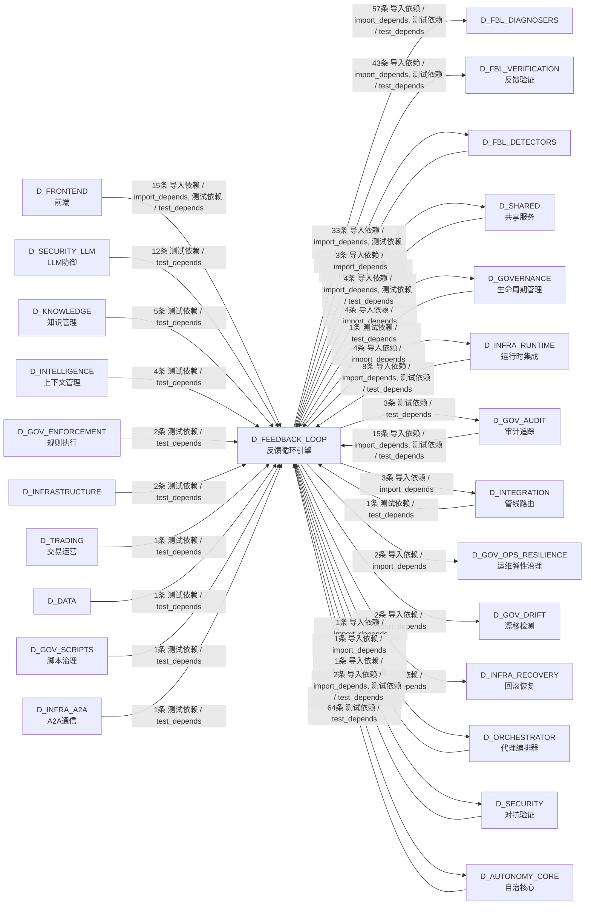

# 14_d_feedback_loop / feedback_loop_engine / 反馈循环引擎 / Feedback Loop Engine

> **功能简介 / Overview**: 反馈循环引擎，负责系统自我改进闭环：异常检测、根因诊断、自动修复和自我进化

> **文档作用 / Purpose**: 展示 反馈循环引擎（D_FEEDBACK_LOOP）功能域的模块清单、域内依赖关系、跨域依赖关系、架构分层视图，供架构审查和域治理参考。

> 本文档由 generate_domain_doc.py 从 depgraph (PostgreSQL) 自动生成
> 最后更新: 2026-07-17 10:43:00
> 数据源: depgraph (PostgreSQL) nodes表 + edges表

## 域基本信息 / Domain Overview

| 字段 | 值 | Field | Value |
|------|------|-------|-------|
| 编号 | 14 | Number | 14 |
| 域ID | D_FEEDBACK_LOOP | Domain ID | D_FEEDBACK_LOOP |
| 域名称 | 反馈循环引擎 | Domain Name | Feedback Loop Engine |
| 层级 | L1 基础平台层 | Layer | L1 Foundation |
| 模块数 | 229 | Module Count | 229 |
| 域内依赖 | 195 | Internal Dependencies | 195 |
| 跨域入边 | 143 | Cross-domain Incoming | 143 |
| 跨域出边 | 172 | Cross-domain Outgoing | 172 |
| 设计态模块 | 0 | Design Modules | 0 |
| 原型态模块 | 119 | Prototype Modules | 119 |
| 生产态模块 | 110 | Production Modules | 110 |
| 容量 | 110/150 (正常) | Capacity | 110/150 (正常) |
| 描述 | 反馈收集器(collectors) | Description | 反馈收集器(collectors) |

## 模块分层清单 / Module Layered List

> 按 architecture_layer 分组的模块清单（共 229 个模块 / 229 modules）。

### L1 基础层 / Foundation Layer (124 modules)

| # | 模块路径 / Module Path | 模块名称 / Module Name (功能简介 / Description) | 成熟度 / Maturity | 蓝图 / Blueprint |
|:--:|---------|---------|:---:|:---:|
| 1 | src/zephyr/feedback_loop/__init__.py | Feedback Loop Engine — MOD-FEEDBACK_LOOP. | 生产态 / production | [MOD-FEEDBACK_LOOP](../../03_modules/_cross_layer/feedback_loop/blueprint.md) |
| 2 | src/zephyr/feedback_loop/_gen_inherited.py | _gen_inherited.py | 生产态 / production | [MOD-FEEDBACK_LOOP](../../03_modules/_cross_layer/feedback_loop/blueprint.md) |
| 3 | src/zephyr/feedback_loop/actors/__init__.py | feedback-loop.actors — auto-generated package ... | 生产态 / production | [MOD-FEEDBACK_LOOP](../../03_modules/_cross_layer/feedback_loop/blueprint.md) |
| 4 | src/zephyr/feedback_loop/actors/action_selector.py | action_selector.py | 生产态 / production | [MOD-FEEDBACK_LOOP](../../03_modules/_cross_layer/feedback_loop/blueprint.md) |
| 5 | src/zephyr/feedback_loop/actors/agent_lifecycle.py | Agent Lifecycle Manager — v0.12.0 R159c | 生产态 / production | [MOD-FEEDBACK_LOOP](../../03_modules/_cross_layer/feedback_loop/blueprint.md) |
| 6 | src/zephyr/feedback_loop/actors/api_version_contract.py | API Version Contract — v0.14.0 R188 | 生产态 / production | [MOD-FEEDBACK_LOOP](../../03_modules/_cross_layer/feedback_loop/blueprint.md) |
| 7 | src/zephyr/feedback_loop/actors/global_action_scheduler.py | Global Action Scheduler — v0.16.0 R226 | 生产态 / production | [MOD-FEEDBACK_LOOP](../../03_modules/_cross_layer/feedback_loop/blueprint.md) |
| 8 | src/zephyr/feedback_loop/actors/incident_priority_triage_... | Incident Priority Triage Automator — v0.37.0 R463 | 生产态 / production | [MOD-FEEDBACK_LOOP](../../03_modules/_cross_layer/feedback_loop/blueprint.md) |
| 9 | src/zephyr/feedback_loop/actors/intent_driven_ops.py | Intent-Driven Ops — v0.12.0 R159 | 生产态 / production | [MOD-FEEDBACK_LOOP](../../03_modules/_cross_layer/feedback_loop/blueprint.md) |
| 10 | src/zephyr/feedback_loop/actors/multi_agent_orchestrator.py | Multi-Agent Orchestrator — v0.12.0 R159b | 生产态 / production | [MOD-FEEDBACK_LOOP](../../03_modules/_cross_layer/feedback_loop/blueprint.md) |
| 11 | src/zephyr/feedback_loop/actors/notification_personalizer.py | Notification Personalizer — v0.6.0 R67 | 生产态 / production | [MOD-FEEDBACK_LOOP](../../03_modules/_cross_layer/feedback_loop/blueprint.md) |
| 12 | src/zephyr/feedback_loop/actors/owner_absence_escalation.py | Owner Absence Escalation — v0.37.0 R462 | 生产态 / production | [MOD-FEEDBACK_LOOP](../../03_modules/_cross_layer/feedback_loop/blueprint.md) |
| 13 | src/zephyr/feedback_loop/actors/saga_compensator.py | Saga Compensator — v0.3.0 R19b | 生产态 / production | [MOD-FEEDBACK_LOOP](../../03_modules/_cross_layer/feedback_loop/blueprint.md) |
| 14 | src/zephyr/feedback_loop/actors/secondary_alert_channel.py | Secondary Alert Channel — v0.37.0 R461 | 生产态 / production | [MOD-FEEDBACK_LOOP](../../03_modules/_cross_layer/feedback_loop/blueprint.md) |
| 15 | src/zephyr/feedback_loop/alert_dispatcher.py | FLE->Orc 告警分派器 — dispatch() 生产者 | 原型态 / prototype | [MOD-FEEDBACK_LOOP](../../03_modules/_cross_layer/feedback_loop/blueprint.md) |
| 16 | src/zephyr/feedback_loop/auto_evolution.py | auto_evolution.py | 生产态 / production | [MOD-FEEDBACK_LOOP](../../03_modules/_cross_layer/feedback_loop/blueprint.md) |
| 17 | src/zephyr/feedback_loop/backpressure_bridge.py | FLE -> Pipeline 背压桥接（CTR-BP-001~003） | 生产态 / production | [MOD-FEEDBACK_LOOP](../../03_modules/_cross_layer/feedback_loop/blueprint.md) |
| 18 | src/zephyr/feedback_loop/collectors/__init__.py | feedback-loop.collectors — auto-generated pack... | 原型态 / prototype | [MOD-FEEDBACK_LOOP](../../03_modules/_cross_layer/feedback_loop/blueprint.md) |
| 19 | src/zephyr/feedback_loop/collectors/calendar_adapter.py | Calendar Adapter — v0.8.0 R102b | 生产态 / production | [MOD-FEEDBACK_LOOP](../../03_modules/_cross_layer/feedback_loop/blueprint.md) |
| 20 | src/zephyr/feedback_loop/collectors/config_timeline.py | Config Timeline — v0.8.0 R99 | 生产态 / production | [MOD-FEEDBACK_LOOP](../../03_modules/_cross_layer/feedback_loop/blueprint.md) |
| 21 | src/zephyr/feedback_loop/collectors/data_quality_validato... | Data Quality Validator — v0.9.0 R110 | 生产态 / production | [MOD-FEEDBACK_LOOP](../../03_modules/_cross_layer/feedback_loop/blueprint.md) |
| 22 | src/zephyr/feedback_loop/collectors/feedback_collector.py | feedback_collector.py | 原型态 / prototype | [MOD-FEEDBACK_LOOP](../../03_modules/_cross_layer/feedback_loop/blueprint.md) |
| 23 | src/zephyr/feedback_loop/collectors/financial_stratificat... | Financial Stratification — v0.5.0 R50 | 生产态 / production | [MOD-FEEDBACK_LOOP](../../03_modules/_cross_layer/feedback_loop/blueprint.md) |
| 24 | src/zephyr/feedback_loop/collectors/kb_provenance.py | KB Provenance — v0.10.0 R136 | 生产态 / production | [MOD-FEEDBACK_LOOP](../../03_modules/_cross_layer/feedback_loop/blueprint.md) |
| 25 | src/zephyr/feedback_loop/collectors/knowledge_capture.py | Knowledge Capture — v0.4.0 R30 | 生产态 / production | [MOD-FEEDBACK_LOOP](../../03_modules/_cross_layer/feedback_loop/blueprint.md) |
| 26 | src/zephyr/feedback_loop/collectors/knowledge_freshness.py | Knowledge Freshness — v0.5.0 R47 | 生产态 / production | [MOD-FEEDBACK_LOOP](../../03_modules/_cross_layer/feedback_loop/blueprint.md) |
| 27 | src/zephyr/feedback_loop/collectors/knowledge_injection.py | Knowledge Injection — v0.8.0 R102 | 生产态 / production | [MOD-FEEDBACK_LOOP](../../03_modules/_cross_layer/feedback_loop/blueprint.md) |
| 28 | src/zephyr/feedback_loop/collectors/knowledge_packaging.py | Knowledge Packaging — v0.9.0 R123 | 生产态 / production | [MOD-FEEDBACK_LOOP](../../03_modules/_cross_layer/feedback_loop/blueprint.md) |
| 29 | src/zephyr/feedback_loop/collectors/known_unknown_registr... | Known-Unknown Registry — v0.16.0 R229 | 生产态 / production | [MOD-FEEDBACK_LOOP](../../03_modules/_cross_layer/feedback_loop/blueprint.md) |
| 30 | src/zephyr/feedback_loop/collectors/llm_cost_accounting.py | LLM Cost Accounting — v0.4.0 R35 | 生产态 / production | [MOD-FEEDBACK_LOOP](../../03_modules/_cross_layer/feedback_loop/blueprint.md) |
| 31 | src/zephyr/feedback_loop/collectors/market_calendar.py | Market Calendar — v0.5.0 R48 | 生产态 / production | [MOD-FEEDBACK_LOOP](../../03_modules/_cross_layer/feedback_loop/blueprint.md) |
| 32 | src/zephyr/feedback_loop/collectors/market_event_integrat... | Market Event Integrator — v0.14.0 R197 | 生产态 / production | [MOD-FEEDBACK_LOOP](../../03_modules/_cross_layer/feedback_loop/blueprint.md) |
| 33 | src/zephyr/feedback_loop/collectors/metrics_collector.py | metrics_collector.py | 原型态 / prototype | [MOD-FEEDBACK_LOOP](../../03_modules/_cross_layer/feedback_loop/blueprint.md) |
| 34 | src/zephyr/feedback_loop/collectors/notification_feedback.py | Notification Feedback — v0.9.0 R118 | 生产态 / production | [MOD-FEEDBACK_LOOP](../../03_modules/_cross_layer/feedback_loop/blueprint.md) |
| 35 | src/zephyr/feedback_loop/collectors/schema_evolution.py | Schema Evolution — v0.9.0 R111 | 生产态 / production | [MOD-FEEDBACK_LOOP](../../03_modules/_cross_layer/feedback_loop/blueprint.md) |
| 36 | src/zephyr/feedback_loop/collectors/schema_migration.py | Schema Migration — v0.14.0 R190 | 生产态 / production | [MOD-FEEDBACK_LOOP](../../03_modules/_cross_layer/feedback_loop/blueprint.md) |
| 37 | src/zephyr/feedback_loop/collectors/temporal_event_store.py | Temporal Event Store — v0.3.0 R9 | 生产态 / production | [MOD-FEEDBACK_LOOP](../../03_modules/_cross_layer/feedback_loop/blueprint.md) |
| 38 | src/zephyr/feedback_loop/collectors/token_finops.py | Token FinOps — v0.12.0 R162 | 生产态 / production | [MOD-FEEDBACK_LOOP](../../03_modules/_cross_layer/feedback_loop/blueprint.md) |
| 39 | src/zephyr/feedback_loop/config.py | config.py | 生产态 / production | [MOD-FEEDBACK_LOOP](../../03_modules/_cross_layer/feedback_loop/blueprint.md) |
| 40 | src/zephyr/feedback_loop/core.py | FeedbackLoop core — 反馈闭环核心类。 | 原型态 / prototype | [MOD-INF-035](../../03_modules/_cross_layer/auto_runtime_core/blueprint.md) |
| 41 | src/zephyr/feedback_loop/db_bridge.py | FLE DB契约适配器 — 通过规范zephyr.governance.s... | 生产态 / production | [MOD-FEEDBACK_LOOP](../../03_modules/_cross_layer/feedback_loop/blueprint.md) |
| 42 | src/zephyr/feedback_loop/db_writer.py | FLE 持久化写入器 — 写 metrics/alerts/dispatch_... | 原型态 / prototype | [MOD-FEEDBACK_LOOP](../../03_modules/_cross_layer/feedback_loop/blueprint.md) |
| 43 | src/zephyr/feedback_loop/decision_engine.py | Feedback Loop Decision Engine | 生产态 / production | [MOD-FEEDBACK_LOOP](../../03_modules/_cross_layer/feedback_loop/blueprint.md) |
| 44 | src/zephyr/feedback_loop/docs/__init__.py | feedback-loop.docs — auto-generated package init. | 生产态 / production | [MOD-FEEDBACK_LOOP](../../03_modules/_cross_layer/feedback_loop/blueprint.md) |
| 45 | src/zephyr/feedback_loop/docs/cold_start_manual.py | cold_start_manual.py | 生产态 / production | [MOD-FEEDBACK_LOOP](../../03_modules/_cross_layer/feedback_loop/blueprint.md) |
| 46 | src/zephyr/feedback_loop/error_budget.py | Error Budget 状态机——monthly budget + burn_ra... | 生产态 / production | [MOD-FEEDBACK_LOOP](../../03_modules/_cross_layer/feedback_loop/blueprint.md) |
| 47 | src/zephyr/feedback_loop/eval_harness.py | eval_harness.py | 生产态 / production | [MOD-FEEDBACK_LOOP](../../03_modules/_cross_layer/feedback_loop/blueprint.md) |
| 48 | src/zephyr/feedback_loop/evolution/__init__.py | feedback-loop.evolution — auto-generated packa... | 原型态 / prototype | [MOD-FEEDBACK_LOOP](../../03_modules/_cross_layer/feedback_loop/blueprint.md) |
| 49 | src/zephyr/feedback_loop/evolution/auto_reward.py | Auto Reward — v0.7.0 R76 | 生产态 / production | [MOD-FEEDBACK_LOOP](../../03_modules/_cross_layer/feedback_loop/blueprint.md) |
| 50 | src/zephyr/feedback_loop/evolution/conformal_prediction.py | Conformal Prediction — v0.7.0 R74 | 生产态 / production | [MOD-FEEDBACK_LOOP](../../03_modules/_cross_layer/feedback_loop/blueprint.md) |
| 51 | src/zephyr/feedback_loop/evolution/cross_gen_validation.py | Cross-Gen Validation — v0.7.0 R78 | 生产态 / production | [MOD-FEEDBACK_LOOP](../../03_modules/_cross_layer/feedback_loop/blueprint.md) |
| 52 | src/zephyr/feedback_loop/evolution/dynamic_threshold.py | Dynamic Threshold — v0.7.0 R71 | 生产态 / production | [MOD-FEEDBACK_LOOP](../../03_modules/_cross_layer/feedback_loop/blueprint.md) |
| 53 | src/zephyr/feedback_loop/evolution/ewc_kb_review.py | EWC KB Review — v0.6.0 R51 | 生产态 / production | [MOD-FEEDBACK_LOOP](../../03_modules/_cross_layer/feedback_loop/blueprint.md) |
| 54 | src/zephyr/feedback_loop/evolution/failure_replay.py | Failure Replay — v0.7.0 R77 | 生产态 / production | [MOD-FEEDBACK_LOOP](../../03_modules/_cross_layer/feedback_loop/blueprint.md) |
| 55 | src/zephyr/feedback_loop/evolution/graduated_activation_p... | Graduated Activation Protocol — v0.38.0 R485 | 生产态 / production | [MOD-FEEDBACK_LOOP](../../03_modules/_cross_layer/feedback_loop/blueprint.md) |
| 56 | src/zephyr/feedback_loop/evolution/hypernetwork.py | HyperNetwork — v0.7.0 R72 | 生产态 / production | [MOD-FEEDBACK_LOOP](../../03_modules/_cross_layer/feedback_loop/blueprint.md) |
| 57 | src/zephyr/feedback_loop/evolution/knowledge_distillation.py | Knowledge Distillation — v0.6.0 R52 | 生产态 / production | [MOD-FEEDBACK_LOOP](../../03_modules/_cross_layer/feedback_loop/blueprint.md) |
| 58 | src/zephyr/feedback_loop/evolution/online_feature_importa... | Online Feature Importance — v0.7.0 R73 | 生产态 / production | [MOD-FEEDBACK_LOOP](../../03_modules/_cross_layer/feedback_loop/blueprint.md) |
| 59 | src/zephyr/feedback_loop/evolution/prompt_factory_governa... | Prompt Factory Governance — v0.16.0 R224 | 生产态 / production | [MOD-FEEDBACK_LOOP](../../03_modules/_cross_layer/feedback_loop/blueprint.md) |
| 60 | src/zephyr/feedback_loop/evolution/prompt_optimization_re... | R514: PromptOptimizationRegressionDetector | 生产态 / production | [MOD-FEEDBACK_LOOP](../../03_modules/_cross_layer/feedback_loop/blueprint.md) |
| 61 | src/zephyr/feedback_loop/evolution/prompt_self_optimizati... | R502: PromptSelfOptimizationLoop | 生产态 / production | [MOD-FEEDBACK_LOOP](../../03_modules/_cross_layer/feedback_loop/blueprint.md) |
| 62 | src/zephyr/feedback_loop/evolution/self_modification_rate... | R522: SelfModificationRateLimiter | 生产态 / production | [MOD-FEEDBACK_LOOP](../../03_modules/_cross_layer/feedback_loop/blueprint.md) |
| 63 | src/zephyr/feedback_loop/evolution/self_reflection.py | Self Reflection — v0.7.0 R75 | 生产态 / production | [MOD-FEEDBACK_LOOP](../../03_modules/_cross_layer/feedback_loop/blueprint.md) |
| 64 | src/zephyr/feedback_loop/evolution/self_upgrade_canary.py | Self Upgrade Canary — v0.14.0 R194 | 生产态 / production | [MOD-FEEDBACK_LOOP](../../03_modules/_cross_layer/feedback_loop/blueprint.md) |
| 65 | src/zephyr/feedback_loop/evolution/semantic_intent_preser... | R505: SemanticIntentPreservationGuard | 生产态 / production | [MOD-FEEDBACK_LOOP](../../03_modules/_cross_layer/feedback_loop/blueprint.md) |
| 66 | src/zephyr/feedback_loop/evolution/teacher_transfer.py | Teacher Transfer — v0.6.0 R53 | 生产态 / production | [MOD-FEEDBACK_LOOP](../../03_modules/_cross_layer/feedback_loop/blueprint.md) |
| 67 | src/zephyr/feedback_loop/evolution/training_data_gov.py | Training Data Governance — v0.14.0 R191 | 生产态 / production | [MOD-FEEDBACK_LOOP](../../03_modules/_cross_layer/feedback_loop/blueprint.md) |
| 68 | src/zephyr/feedback_loop/evolution_engine.py | evolution_engine.py | 生产态 / production | [MOD-FEEDBACK_LOOP](../../03_modules/_cross_layer/feedback_loop/blueprint.md) |
| 69 | src/zephyr/feedback_loop/exceptions.py | exceptions.py | 生产态 / production | [MOD-FEEDBACK_LOOP](../../03_modules/_cross_layer/feedback_loop/blueprint.md) |
| 70 | src/zephyr/feedback_loop/feedback_collector.py | FeedbackCollector: collect task execution feedback | 生产态 / production | [MOD-FEEDBACK_LOOP](../../03_modules/_cross_layer/feedback_loop/blueprint.md) |
| 71 | src/zephyr/feedback_loop/fitness_functions.py | fitness_functions.py | 生产态 / production | [MOD-FEEDBACK_LOOP](../../03_modules/_cross_layer/feedback_loop/blueprint.md) |
| 72 | src/zephyr/feedback_loop/forensic/__init__.py | feedback-loop.forensic — auto-generated packag... | 原型态 / prototype | [MOD-FEEDBACK_LOOP](../../03_modules/_cross_layer/feedback_loop/blueprint.md) |
| 73 | src/zephyr/feedback_loop/forensic/architectural_sod.py | Architectural SoD — v0.15.0 R205 | 生产态 / production | [MOD-FEEDBACK_LOOP](../../03_modules/_cross_layer/feedback_loop/blueprint.md) |
| 74 | src/zephyr/feedback_loop/forensic/automated_rca_postmorte... | Automated RCA Postmortem Generator — v0.38.0 R486 | 生产态 / production | [MOD-FEEDBACK_LOOP](../../03_modules/_cross_layer/feedback_loop/blueprint.md) |
| 75 | src/zephyr/feedback_loop/forensic/boot_integrity_attestat... | Boot Integrity Attestation — v0.38.0 R487 | 生产态 / production | [MOD-FEEDBACK_LOOP](../../03_modules/_cross_layer/feedback_loop/blueprint.md) |
| 76 | src/zephyr/feedback_loop/forensic/crypto_bootstrap.py | Cryptographic Bootstrap — v0.15.0 R204 | 生产态 / production | [MOD-FEEDBACK_LOOP](../../03_modules/_cross_layer/feedback_loop/blueprint.md) |
| 77 | src/zephyr/feedback_loop/forensic/deterministic_replay.py | Deterministic Replay — v0.15.0 R206 | 生产态 / production | [MOD-FEEDBACK_LOOP](../../03_modules/_cross_layer/feedback_loop/blueprint.md) |
| 78 | src/zephyr/feedback_loop/forensic/external_verifier.py | External Verifier — v0.15.0 R203 | 生产态 / production | [MOD-FEEDBACK_LOOP](../../03_modules/_cross_layer/feedback_loop/blueprint.md) |
| 79 | src/zephyr/feedback_loop/forensic/fle_upgrade_safety_vali... | R529: FLEUpgradeSafetyValidator | 生产态 / production | [MOD-FEEDBACK_LOOP](../../03_modules/_cross_layer/feedback_loop/blueprint.md) |
| 80 | src/zephyr/feedback_loop/forensic/guard_complexity_budget.py | R523: GuardComplexityBudget | 生产态 / production | [MOD-FEEDBACK_LOOP](../../03_modules/_cross_layer/feedback_loop/blueprint.md) |
| 81 | src/zephyr/feedback_loop/forensic/guard_configuration_dri... | R521: GuardConfigurationDriftMonitor | 生产态 / production | [MOD-FEEDBACK_LOOP](../../03_modules/_cross_layer/feedback_loop/blueprint.md) |
| 82 | src/zephyr/feedback_loop/forensic/interrupt_coherence_val... | R531: InterruptCoherenceValidator | 生产态 / production | [MOD-FEEDBACK_LOOP](../../03_modules/_cross_layer/feedback_loop/blueprint.md) |
| 83 | src/zephyr/feedback_loop/forensic/knowledge_injection_pre... | R515: KnowledgeInjectionPreFlightVerifier | 生产态 / production | [MOD-FEEDBACK_LOOP](../../03_modules/_cross_layer/feedback_loop/blueprint.md) |
| 84 | src/zephyr/feedback_loop/forensic/point_in_time_reconstru... | Point-in-Time Reconstructor — v0.37.0 R465 | 生产态 / production | [MOD-FEEDBACK_LOOP](../../03_modules/_cross_layer/feedback_loop/blueprint.md) |
| 85 | src/zephyr/feedback_loop/forensic/self_modification_audit.py | Self-Modification Audit — v0.15.0 R218 | 生产态 / production | [MOD-FEEDBACK_LOOP](../../03_modules/_cross_layer/feedback_loop/blueprint.md) |
| 86 | src/zephyr/feedback_loop/forensic/serialization_format_tr... | Serialization Format Tracker — v0.39.0 R488 | 生产态 / production | [MOD-FEEDBACK_LOOP](../../03_modules/_cross_layer/feedback_loop/blueprint.md) |
| 87 | src/zephyr/feedback_loop/forensic/state_migration_validat... | State Migration Validator — v0.40.0 R497 | 生产态 / production | [MOD-FEEDBACK_LOOP](../../03_modules/_cross_layer/feedback_loop/blueprint.md) |
| 88 | src/zephyr/feedback_loop/forensic/sub_agent_collusion.py | Sub-Agent Collusion Detector — v0.15.0 R213 | 生产态 / production | [MOD-FEEDBACK_LOOP](../../03_modules/_cross_layer/feedback_loop/blueprint.md) |
| 89 | src/zephyr/feedback_loop/forensic/toctou_guard.py | TOCTOU Guard — v0.15.0 R207 | 原型态 / prototype | [MOD-FEEDBACK_LOOP](../../03_modules/_cross_layer/feedback_loop/blueprint.md) |
| 90 | src/zephyr/feedback_loop/forensic/worm_write_integrity.py | WORM Write Integrity — v0.15.0 R216 | 生产态 / production | [MOD-FEEDBACK_LOOP](../../03_modules/_cross_layer/feedback_loop/blueprint.md) |
| 91 | src/zephyr/feedback_loop/gates/__init__.py | feedback-loop.gates — auto-generated package init. | 原型态 / prototype | [MOD-GATE_ENGINE](../../03_modules/_cross_layer/gate_engine/blueprint.md) |
| 92 | src/zephyr/feedback_loop/generator.py | generator.py | 生产态 / production | [MOD-FEEDBACK_LOOP](../../03_modules/_cross_layer/feedback_loop/blueprint.md) |
| 93 | src/zephyr/feedback_loop/metrics_collector.py | MetricsCollector: append-only metrics recording. | 生产态 / production | [MOD-FEEDBACK_LOOP](../../03_modules/_cross_layer/feedback_loop/blueprint.md) |
| 94 | src/zephyr/feedback_loop/protocols.py | protocols.py | 生产态 / production | [MOD-FEEDBACK_LOOP](../../03_modules/_cross_layer/feedback_loop/blueprint.md) |
| 95 | src/zephyr/feedback_loop/resilience/__init__.py | feedback-loop.resilience — auto-generated pack... | 原型态 / prototype | [MOD-FEEDBACK_LOOP](../../03_modules/_cross_layer/feedback_loop/blueprint.md) |
| 96 | src/zephyr/feedback_loop/resilience/config_hot_reload_gua... | Config Hot-Reload Guard — v0.40.0 R498 | 生产态 / production | [MOD-FEEDBACK_LOOP](../../03_modules/_cross_layer/feedback_loop/blueprint.md) |
| 97 | src/zephyr/feedback_loop/resilience/deadman_switch.py | Deadman Switch — v0.15.0 R212 | 生产态 / production | [MOD-FEEDBACK_LOOP](../../03_modules/_cross_layer/feedback_loop/blueprint.md) |
| 98 | src/zephyr/feedback_loop/resilience/dr_automation.py | DR Automation — v0.14.0 R187 | 生产态 / production | [MOD-FEEDBACK_LOOP](../../03_modules/_cross_layer/feedback_loop/blueprint.md) |
| 99 | src/zephyr/feedback_loop/resilience/graceful_degradation_... | Graceful Degradation Planner — v0.40.0 R496 | 生产态 / production | [MOD-FEEDBACK_LOOP](../../03_modules/_cross_layer/feedback_loop/blueprint.md) |
| 100 | src/zephyr/feedback_loop/resilience/multi_instance_coord.py | Multi-Instance Coordinator — v0.14.0 R199 | 生产态 / production | [MOD-FEEDBACK_LOOP](../../03_modules/_cross_layer/feedback_loop/blueprint.md) |
| 101 | src/zephyr/feedback_loop/resilience/oscillation_damping.py | Oscillation Damping — v0.37.0 R450 | 生产态 / production | [MOD-FEEDBACK_LOOP](../../03_modules/_cross_layer/feedback_loop/blueprint.md) |
| 102 | src/zephyr/feedback_loop/resilience/resource_starvation_a... | Resource Starvation Aware — v0.15.0 R209 | 生产态 / production | [MOD-FEEDBACK_LOOP](../../03_modules/_cross_layer/feedback_loop/blueprint.md) |
| 103 | src/zephyr/feedback_loop/resilience/self_api_throttle_def... | Self API Throttle Defense — v0.39.0 R491 | 生产态 / production | [MOD-FEEDBACK_LOOP](../../03_modules/_cross_layer/feedback_loop/blueprint.md) |
| 104 | src/zephyr/feedback_loop/resilience/split_brain_quorum.py | Split-Brain Quorum — v0.37.0 R451 | 生产态 / production | [MOD-FEEDBACK_LOOP](../../03_modules/_cross_layer/feedback_loop/blueprint.md) |
| 105 | src/zephyr/feedback_loop/scheduler.py | FLE 全链路调度器 —— collect->detect->diagnose... | 生产态 / production | [MOD-FEEDBACK_LOOP](../../03_modules/_cross_layer/feedback_loop/blueprint.md) |
| 106 | src/zephyr/feedback_loop/scheduler_act.py | scheduler_act.py | 生产态 / production | [MOD-FEEDBACK_LOOP](../../03_modules/_cross_layer/feedback_loop/blueprint.md) |
| 107 | src/zephyr/feedback_loop/scheduler_collect_detect.py | scheduler_collect_detect.py | 生产态 / production | [MOD-FEEDBACK_LOOP](../../03_modules/_cross_layer/feedback_loop/blueprint.md) |
| 108 | src/zephyr/feedback_loop/scheduler_health.py | scheduler_health.py | 生产态 / production | [MOD-FEEDBACK_LOOP](../../03_modules/_cross_layer/feedback_loop/blueprint.md) |
| 109 | src/zephyr/feedback_loop/scheduler_safety.py | scheduler_safety.py | 生产态 / production | [MOD-FEEDBACK_LOOP](../../03_modules/_cross_layer/feedback_loop/blueprint.md) |
| 110 | src/zephyr/feedback_loop/security/__init__.py | feedback-loop.security — auto-generated packag... | 原型态 / prototype | [MOD-FEEDBACK_LOOP](../../03_modules/_cross_layer/feedback_loop/blueprint.md) |
| 111 | src/zephyr/feedback_loop/security/agent_skill_guard.py | Agent Skill Guard — v0.14.0 R201 | 生产态 / production | [MOD-FEEDBACK_LOOP](../../03_modules/_cross_layer/feedback_loop/blueprint.md) |
| 112 | src/zephyr/feedback_loop/security/dep_cve_correlator.py | Dependency CVE Correlator — v0.14.0 R196 | 生产态 / production | [MOD-FEEDBACK_LOOP](../../03_modules/_cross_layer/feedback_loop/blueprint.md) |
| 113 | src/zephyr/feedback_loop/security/metric_prompt_scanner.py | Metric-Prompt Scanner — v0.15.0 R215 | 生产态 / production | [MOD-FEEDBACK_LOOP](../../03_modules/_cross_layer/feedback_loop/blueprint.md) |
| 114 | src/zephyr/feedback_loop/security/remote_attestation.py | Remote Attestation — v0.15.0 R211 | 生产态 / production | [MOD-FEEDBACK_LOOP](../../03_modules/_cross_layer/feedback_loop/blueprint.md) |
| 115 | src/zephyr/feedback_loop/security/secret_rotation.py | Secret Rotation — v0.14.0 R189 | 生产态 / production | [MOD-FEEDBACK_LOOP](../../03_modules/_cross_layer/feedback_loop/blueprint.md) |
| 116 | src/zephyr/feedback_loop/security/wireheading_prevention.py | Wireheading Prevention — v0.37.0 R486 | 生产态 / production | [MOD-FEEDBACK_LOOP](../../03_modules/_cross_layer/feedback_loop/blueprint.md) |
| 117 | src/zephyr/feedback_loop/self_diagnosis.py | self_diagnosis.py — 自我诊断 (DD120, TASK-020) | 生产态 / production | [MOD-FEEDBACK_LOOP](../../03_modules/_cross_layer/feedback_loop/blueprint.md) |
| 118 | src/zephyr/feedback_loop/session_learner.py | session_learner.py — 在线学习 (DD114, TASK-020) | 生产态 / production | [MOD-FEEDBACK_LOOP](../../03_modules/_cross_layer/feedback_loop/blueprint.md) |
| 119 | src/zephyr/feedback_loop/slo_manager.py | slo_manager.py | 生产态 / production | [MOD-FEEDBACK_LOOP](../../03_modules/_cross_layer/feedback_loop/blueprint.md) |
| 120 | src/zephyr/feedback_loop/template.py | template.py | 生产态 / production | [MOD-FEEDBACK_LOOP](../../03_modules/_cross_layer/feedback_loop/blueprint.md) |
| 121 | src/zephyr/feedback_loop/tests/e2e/__init__.py | feedback-loop.tests.e2e — auto-generated packa... | 原型态 / prototype | [MOD-FEEDBACK_LOOP](../../03_modules/_cross_layer/feedback_loop/blueprint.md) |
| 122 | src/zephyr/feedback_loop/tests/e2e/integration_test_pipel... | E2E Integration Test Pipeline — TASK-MOD-FEEDB... | 生产态 / production | [MOD-FEEDBACK_LOOP](../../03_modules/_cross_layer/feedback_loop/blueprint.md) |
| 123 | src/zephyr/feedback_loop/validator.py | validator.py | 生产态 / production | [MOD-FEEDBACK_LOOP](../../03_modules/_cross_layer/feedback_loop/blueprint.md) |
| 124 | src/zephyr/feedback_loop/verifiers/__init__.py | feedback-loop.verifiers — auto-generated packa... | 原型态 / prototype | [MOD-FEEDBACK_LOOP](../../03_modules/_cross_layer/feedback_loop/blueprint.md) |

### L2 领域层 / Domain Layer (105 modules)

| # | 模块路径 / Module Path | 模块名称 / Module Name (功能简介 / Description) | 成熟度 / Maturity | 蓝图 / Blueprint |
|:--:|---------|---------|:---:|:---:|
| 1 | tests/feedback/test_actors_init.py | test_actors_init.py | 原型态 / prototype | [MOD-INF-021](../../03_modules/_domain_autonomy_core/rollback_system/blueprint.md) |
| 2 | tests/feedback/test_adaptive_param_tuning.py | test_adaptive_param_tuning.py | 原型态 / prototype | [MOD-FEEDBACK_LOOP](../../03_modules/_cross_layer/feedback_loop/blueprint.md) |
| 3 | tests/feedback/test_alert_desensitization_curve.py | test_alert_desensitization_curve.py | 原型态 / prototype | [MOD-FEEDBACK_LOOP](../../03_modules/_cross_layer/feedback_loop/blueprint.md) |
| 4 | tests/feedback/test_anomaly_clustering.py | test_anomaly_clustering.py | 原型态 / prototype | [MOD-FEEDBACK_LOOP](../../03_modules/_cross_layer/feedback_loop/blueprint.md) |
| 5 | tests/feedback/test_architectural_sod.py | test_architectural_sod.py | 原型态 / prototype | [MOD-FEEDBACK_LOOP](../../03_modules/_cross_layer/feedback_loop/blueprint.md) |
| 6 | tests/feedback/test_automated_rca_postmortem_generator.py | test_automated_rca_postmortem_generator.py | 原型态 / prototype | [MOD-FEEDBACK_LOOP](../../03_modules/_cross_layer/feedback_loop/blueprint.md) |
| 7 | tests/feedback/test_autoscale_remediation.py | test_autoscale_remediation.py | 原型态 / prototype | [MOD-FEEDBACK_LOOP](../../03_modules/_cross_layer/feedback_loop/blueprint.md) |
| 8 | tests/feedback/test_backpressure_bridge_root.py | test_backpressure_bridge_root.py | 原型态 / prototype | [MOD-FEEDBACK_LOOP](../../03_modules/_cross_layer/feedback_loop/blueprint.md) |
| 9 | tests/feedback/test_blast_radius_budget.py | test_blast_radius_budget.py | 原型态 / prototype | [MOD-FEEDBACK_LOOP](../../03_modules/_cross_layer/feedback_loop/blueprint.md) |
| 10 | tests/feedback/test_boot_integrity_attestation.py | test_boot_integrity_attestation.py | 原型态 / prototype | [MOD-FEEDBACK_LOOP](../../03_modules/_cross_layer/feedback_loop/blueprint.md) |
| 11 | tests/feedback/test_cascading_rollback_analyzer.py | test_cascading_rollback_analyzer.py | 原型态 / prototype | [MOD-FEEDBACK_LOOP](../../03_modules/_cross_layer/feedback_loop/blueprint.md) |
| 12 | tests/feedback/test_cognitive_load.py | test_cognitive_load.py | 原型态 / prototype | [MOD-FEEDBACK_LOOP](../../03_modules/_cross_layer/feedback_loop/blueprint.md) |
| 13 | tests/feedback/test_collaborative_learning.py | test_collaborative_learning.py | 原型态 / prototype | [MOD-FEEDBACK_LOOP](../../03_modules/_cross_layer/feedback_loop/blueprint.md) |
| 14 | tests/feedback/test_collectors.py | test_collectors.py | 原型态 / prototype | [MOD-FEEDBACK_LOOP](../../03_modules/_cross_layer/feedback_loop/blueprint.md) |
| 15 | tests/feedback/test_confidence_decomposer.py | test_confidence_decomposer.py | 原型态 / prototype | [MOD-FEEDBACK_LOOP](../../03_modules/_cross_layer/feedback_loop/blueprint.md) |
| 16 | tests/feedback/test_config_feedback_loop.py | test_config_feedback_loop.py | 原型态 / prototype |  |
| 17 | tests/feedback/test_conformal_prediction.py | test_conformal_prediction.py | 原型态 / prototype | [MOD-FEEDBACK_LOOP](../../03_modules/_cross_layer/feedback_loop/blueprint.md) |
| 18 | tests/feedback/test_counterfactual.py | test_counterfactual.py | 原型态 / prototype | [MOD-FEEDBACK_LOOP](../../03_modules/_cross_layer/feedback_loop/blueprint.md) |
| 19 | tests/feedback/test_deadman_switch.py | test_deadman_switch.py | 原型态 / prototype | [MOD-FEEDBACK_LOOP](../../03_modules/_cross_layer/feedback_loop/blueprint.md) |
| 20 | tests/feedback/test_diagnosers.py | test_diagnosers.py | 原型态 / prototype | [MOD-FEEDBACK_LOOP](../../03_modules/_cross_layer/feedback_loop/blueprint.md) |
| 21 | tests/feedback/test_diagnosis_engine.py | test_diagnosis_engine.py | 原型态 / prototype | [MOD-FEEDBACK_LOOP](../../03_modules/_cross_layer/feedback_loop/blueprint.md) |
| 22 | tests/feedback/test_digital_twin_sandbox.py | test_digital_twin_sandbox.py | 原型态 / prototype | [MOD-FEEDBACK_LOOP](../../03_modules/_cross_layer/feedback_loop/blueprint.md) |
| 23 | tests/feedback/test_diminishing_returns_detector.py | test_diminishing_returns_detector.py | 原型态 / prototype | [MOD-FEEDBACK_LOOP](../../03_modules/_cross_layer/feedback_loop/blueprint.md) |
| 24 | tests/feedback/test_docs_init.py | test_docs_init.py | 原型态 / prototype | [MOD-INF-022](../../03_modules/_domain_autonomy_perm/escalation_protocol/blueprint.md) |
| 25 | tests/feedback/test_dr_automation.py | test_dr_automation.py | 原型态 / prototype | [MOD-FEEDBACK_LOOP](../../03_modules/_cross_layer/feedback_loop/blueprint.md) |
| 26 | tests/feedback/test_dr_resilience_metrics.py | test_dr_resilience_metrics.py | 原型态 / prototype | [MOD-FEEDBACK_LOOP](../../03_modules/_cross_layer/feedback_loop/blueprint.md) |
| 27 | tests/feedback/test_dry_run_sandbox.py | test_dry_run_sandbox.py | 原型态 / prototype | [MOD-FEEDBACK_LOOP](../../03_modules/_cross_layer/feedback_loop/blueprint.md) |
| 28 | tests/feedback/test_dynamic_threshold.py | test_dynamic_threshold.py | 原型态 / prototype | [MOD-FEEDBACK_LOOP](../../03_modules/_cross_layer/feedback_loop/blueprint.md) |
| 29 | tests/feedback/test_e2e_integration_health.py | test_e2e_integration_health.py | 原型态 / prototype | [MOD-FEEDBACK_LOOP](../../03_modules/_cross_layer/feedback_loop/blueprint.md) |
| 30 | tests/feedback/test_ebpf_monitor.py | test_ebpf_monitor.py | 原型态 / prototype | [MOD-FEEDBACK_LOOP](../../03_modules/_cross_layer/feedback_loop/blueprint.md) |
| 31 | tests/feedback/test_ensemble_detector.py | test_ensemble_detector.py | 原型态 / prototype | [MOD-FEEDBACK_LOOP](../../03_modules/_cross_layer/feedback_loop/blueprint.md) |
| 32 | tests/feedback/test_ensemble_drift.py | test_ensemble_drift.py | 原型态 / prototype | [MOD-FEEDBACK_LOOP](../../03_modules/_cross_layer/feedback_loop/blueprint.md) |
| 33 | tests/feedback/test_eval_harness_root.py | test_eval_harness_root.py | 原型态 / prototype | [MOD-FEEDBACK_LOOP](../../03_modules/_cross_layer/feedback_loop/blueprint.md) |
| 34 | tests/feedback/test_evolution_engine_root.py | test_evolution_engine_root.py | 原型态 / prototype | [MOD-FEEDBACK_LOOP](../../03_modules/_cross_layer/feedback_loop/blueprint.md) |
| 35 | tests/feedback/test_evolution_init.py | test_evolution_init.py | 原型态 / prototype | [MOD-INF-022](../../03_modules/_domain_autonomy_perm/escalation_protocol/blueprint.md) |
| 36 | tests/feedback/test_ewc_kb_review.py | test_ewc_kb_review.py | 原型态 / prototype | [MOD-FEEDBACK_LOOP](../../03_modules/_cross_layer/feedback_loop/blueprint.md) |
| 37 | tests/feedback/test_exceptions_feedback_loop.py | test_exceptions_feedback_loop.py | 原型态 / prototype |  |
| 38 | tests/feedback/test_failure_replay.py | test_failure_replay.py | 原型态 / prototype | [MOD-FEEDBACK_LOOP](../../03_modules/_cross_layer/feedback_loop/blueprint.md) |
| 39 | tests/feedback/test_federated_protocol.py | test_federated_protocol.py | 原型态 / prototype | [MOD-FEEDBACK_LOOP](../../03_modules/_cross_layer/feedback_loop/blueprint.md) |
| 40 | tests/feedback/test_feedback_bridge.py | test_feedback_bridge.py | 原型态 / prototype | [MOD-INF-020](../../03_modules/_domain_governance/audit_trail/blueprint.md) |
| 41 | tests/feedback/test_feedback_collector_root.py | test_feedback_collector_root.py | 原型态 / prototype | [MOD-FEEDBACK_LOOP](../../03_modules/_cross_layer/feedback_loop/blueprint.md) |
| 42 | tests/feedback/test_feedback_core.py | Test suite: feedback-loop core (FeedbackCollect... | 原型态 / prototype | [MOD-FEEDBACK_LOOP](../../03_modules/_cross_layer/feedback_loop/blueprint.md) |
| 43 | tests/feedback/test_feedback_delay_compensator.py | test_feedback_delay_compensator.py | 原型态 / prototype | [MOD-FEEDBACK_LOOP](../../03_modules/_cross_layer/feedback_loop/blueprint.md) |
| 44 | tests/feedback/test_feedback_loop.py | test_feedback_loop.py | 原型态 / prototype | [MOD-INF-035](../../03_modules/_cross_layer/auto_runtime_core/blueprint.md) |
| 45 | tests/feedback/test_feedback_policy.py | test_feedback_policy.py | 原型态 / prototype | [MOD-INF-020](../../03_modules/_domain_governance/audit_trail/blueprint.md) |
| 46 | tests/feedback/test_feedback_self_audit.py | test_feedback_self_audit.py | 原型态 / prototype | [MOD-INF-020](../../03_modules/_domain_governance/audit_trail/blueprint.md) |
| 47 | tests/feedback/test_flapping_detector.py | test_flapping_detector.py | 原型态 / prototype | [MOD-FEEDBACK_LOOP](../../03_modules/_cross_layer/feedback_loop/blueprint.md) |
| 48 | tests/feedback/test_gamification.py | test_gamification.py | 原型态 / prototype | [MOD-FEEDBACK_LOOP](../../03_modules/_cross_layer/feedback_loop/blueprint.md) |
| 49 | tests/feedback/test_global_action_scheduler.py | test_global_action_scheduler.py | 原型态 / prototype | [MOD-FEEDBACK_LOOP](../../03_modules/_cross_layer/feedback_loop/blueprint.md) |
| 50 | tests/feedback/test_golden_test_external.py | test_golden_test_external.py | 原型态 / prototype | [MOD-FEEDBACK_LOOP](../../03_modules/_cross_layer/feedback_loop/blueprint.md) |
| 51 | tests/feedback/test_gradual_poisoning_detector.py | test_gradual_poisoning_detector.py | 原型态 / prototype | [MOD-FEEDBACK_LOOP](../../03_modules/_cross_layer/feedback_loop/blueprint.md) |
| 52 | tests/feedback/test_graduated_activation_protocol.py | test_graduated_activation_protocol.py | 原型态 / prototype | [MOD-FEEDBACK_LOOP](../../03_modules/_cross_layer/feedback_loop/blueprint.md) |
| 53 | tests/feedback/test_heisenbug_detector.py | test_heisenbug_detector.py | 原型态 / prototype | [MOD-FEEDBACK_LOOP](../../03_modules/_cross_layer/feedback_loop/blueprint.md) |
| 54 | tests/feedback/test_hypernetwork.py | test_hypernetwork.py | 原型态 / prototype | [MOD-FEEDBACK_LOOP](../../03_modules/_cross_layer/feedback_loop/blueprint.md) |
| 55 | tests/feedback/test_impact_predictor.py | test_impact_predictor.py | 原型态 / prototype | [MOD-FEEDBACK_LOOP](../../03_modules/_cross_layer/feedback_loop/blueprint.md) |
| 56 | tests/feedback/test_incident_knowledge_injector.py | test_incident_knowledge_injector.py | 原型态 / prototype | [MOD-FEEDBACK_LOOP](../../03_modules/_cross_layer/feedback_loop/blueprint.md) |
| 57 | tests/feedback/test_infinite_loop_detector.py | test_infinite_loop_detector.py | 原型态 / prototype | [MOD-FEEDBACK_LOOP](../../03_modules/_cross_layer/feedback_loop/blueprint.md) |
| 58 | tests/feedback/test_interrupt_coherence_validator.py | test_interrupt_coherence_validator.py | 原型态 / prototype | [MOD-FEEDBACK_LOOP](../../03_modules/_cross_layer/feedback_loop/blueprint.md) |
| 59 | tests/feedback/test_known_unknown_registry.py | test_known_unknown_registry.py | 原型态 / prototype | [MOD-FEEDBACK_LOOP](../../03_modules/_cross_layer/feedback_loop/blueprint.md) |
| 60 | tests/feedback/test_log_anomaly.py | test_log_anomaly.py | 原型态 / prototype | [MOD-FEEDBACK_LOOP](../../03_modules/_cross_layer/feedback_loop/blueprint.md) |
| 61 | tests/feedback/test_maintenance_coordinator.py | test_maintenance_coordinator.py | 原型态 / prototype | [MOD-FEEDBACK_LOOP](../../03_modules/_cross_layer/feedback_loop/blueprint.md) |
| 62 | tests/feedback/test_market_calendar.py | test_market_calendar.py | 原型态 / prototype | [MOD-FEEDBACK_LOOP](../../03_modules/_cross_layer/feedback_loop/blueprint.md) |
| 63 | tests/feedback/test_market_event_integrator.py | test_market_event_integrator.py | 原型态 / prototype | [MOD-FEEDBACK_LOOP](../../03_modules/_cross_layer/feedback_loop/blueprint.md) |
| 64 | tests/feedback/test_meta_guard_latency_budget.py | test_meta_guard_latency_budget.py | 原型态 / prototype | [MOD-FEEDBACK_LOOP](../../03_modules/_cross_layer/feedback_loop/blueprint.md) |
| 65 | tests/feedback/test_metric_cardinality_guard.py | test_metric_cardinality_guard.py | 原型态 / prototype | [MOD-FEEDBACK_LOOP](../../03_modules/_cross_layer/feedback_loop/blueprint.md) |
| 66 | tests/feedback/test_metrics_collector.py | test_metrics_collector.py | 原型态 / prototype | [MOD-FEEDBACK_LOOP](../../03_modules/_cross_layer/feedback_loop/blueprint.md) |
| 67 | tests/feedback/test_no_llm_degradation.py | test_no_llm_degradation.py | 原型态 / prototype | [MOD-FEEDBACK_LOOP](../../03_modules/_cross_layer/feedback_loop/blueprint.md) |
| 68 | tests/feedback/test_nonstationary_effectiveness.py | test_nonstationary_effectiveness.py | 原型态 / prototype | [MOD-FEEDBACK_LOOP](../../03_modules/_cross_layer/feedback_loop/blueprint.md) |
| 69 | tests/feedback/test_notification_feedback.py | test_notification_feedback.py | 原型态 / prototype | [MOD-FEEDBACK_LOOP](../../03_modules/_cross_layer/feedback_loop/blueprint.md) |
| 70 | tests/feedback/test_notification_personalizer.py | test_notification_personalizer.py | 原型态 / prototype | [MOD-FEEDBACK_LOOP](../../03_modules/_cross_layer/feedback_loop/blueprint.md) |
| 71 | tests/feedback/test_numerical_stability_guard.py | test_numerical_stability_guard.py | 原型态 / prototype | [MOD-FEEDBACK_LOOP](../../03_modules/_cross_layer/feedback_loop/blueprint.md) |
| 72 | tests/feedback/test_online_feature_importance.py | test_online_feature_importance.py | 原型态 / prototype | [MOD-FEEDBACK_LOOP](../../03_modules/_cross_layer/feedback_loop/blueprint.md) |
| 73 | tests/feedback/test_operational_seasonality.py | test_operational_seasonality.py | 原型态 / prototype | [MOD-FEEDBACK_LOOP](../../03_modules/_cross_layer/feedback_loop/blueprint.md) |
| 74 | tests/feedback/test_oscillation_damping.py | test_oscillation_damping.py | 原型态 / prototype | [MOD-FEEDBACK_LOOP](../../03_modules/_cross_layer/feedback_loop/blueprint.md) |
| 75 | tests/feedback/test_otel_adapter.py | test_otel_adapter.py | 原型态 / prototype | [MOD-FEEDBACK_LOOP](../../03_modules/_cross_layer/feedback_loop/blueprint.md) |
| 76 | tests/feedback/test_placebo_action_detector.py | test_placebo_action_detector.py | 原型态 / prototype | [MOD-FEEDBACK_LOOP](../../03_modules/_cross_layer/feedback_loop/blueprint.md) |
| 77 | tests/feedback/test_positive_feedback_defense.py | test_positive_feedback_defense.py | 原型态 / prototype | [MOD-FEEDBACK_LOOP](../../03_modules/_cross_layer/feedback_loop/blueprint.md) |
| 78 | tests/feedback/test_protocols.py | test_protocols.py | 原型态 / prototype |  |
| 79 | tests/feedback/test_recovery_time_stats.py | test_recovery_time_stats.py | 原型态 / prototype | [MOD-FEEDBACK_LOOP](../../03_modules/_cross_layer/feedback_loop/blueprint.md) |
| 80 | tests/feedback/test_recursive_diagnosis_trust_evaluator.py | test_recursive_diagnosis_trust_evaluator.py | 原型态 / prototype | [MOD-FEEDBACK_LOOP](../../03_modules/_cross_layer/feedback_loop/blueprint.md) |
| 81 | tests/feedback/test_regulatory_audit.py | test_regulatory_audit.py | 原型态 / prototype | [MOD-FEEDBACK_LOOP](../../03_modules/_cross_layer/feedback_loop/blueprint.md) |
| 82 | tests/feedback/test_resolution_tracker.py | test_resolution_tracker.py | 原型态 / prototype | [MOD-FEEDBACK_LOOP](../../03_modules/_cross_layer/feedback_loop/blueprint.md) |
| 83 | tests/feedback/test_retirement_planner.py | test_retirement_planner.py | 原型态 / prototype | [MOD-FEEDBACK_LOOP](../../03_modules/_cross_layer/feedback_loop/blueprint.md) |
| 84 | tests/feedback/test_rumor_noise_filter.py | test_rumor_noise_filter.py | 原型态 / prototype | [MOD-FEEDBACK_LOOP](../../03_modules/_cross_layer/feedback_loop/blueprint.md) |
| 85 | tests/feedback/test_runbook_executor.py | test_runbook_executor.py | 原型态 / prototype | [MOD-FEEDBACK_LOOP](../../03_modules/_cross_layer/feedback_loop/blueprint.md) |
| 86 | tests/feedback/test_scheduler_collect_detect.py | test_scheduler_collect_detect.py | 原型态 / prototype | [MOD-FEEDBACK_LOOP](../../03_modules/_cross_layer/feedback_loop/blueprint.md) |
| 87 | tests/feedback/test_scheduler_health.py | test_scheduler_health.py | 原型态 / prototype | [MOD-FEEDBACK_LOOP](../../03_modules/_cross_layer/feedback_loop/blueprint.md) |
| 88 | tests/feedback/test_scheduler_integration.py | Integration tests: FeedbackLoopScheduler start/... | 原型态 / prototype | [MOD-FEEDBACK_LOOP](../../03_modules/_cross_layer/feedback_loop/blueprint.md) |
| 89 | tests/feedback/test_secondary_alert_channel.py | test_secondary_alert_channel.py | 原型态 / prototype | [MOD-FEEDBACK_LOOP](../../03_modules/_cross_layer/feedback_loop/blueprint.md) |
| 90 | tests/feedback/test_silent_corruption_detector.py | test_silent_corruption_detector.py | 原型态 / prototype | [MOD-FEEDBACK_LOOP](../../03_modules/_cross_layer/feedback_loop/blueprint.md) |
| 91 | tests/feedback/test_slo_capacity_metrics.py | test_slo_capacity_metrics.py | 原型态 / prototype | [MOD-FEEDBACK_LOOP](../../03_modules/_cross_layer/feedback_loop/blueprint.md) |
| 92 | tests/feedback/test_slo_manager_root.py | test_slo_manager_root.py | 原型态 / prototype | [MOD-FEEDBACK_LOOP](../../03_modules/_cross_layer/feedback_loop/blueprint.md) |
| 93 | tests/feedback/test_state_migration_validator.py | test_state_migration_validator.py | 原型态 / prototype | [MOD-FEEDBACK_LOOP](../../03_modules/_cross_layer/feedback_loop/blueprint.md) |
| 94 | tests/feedback/test_stochastic_diagnosis_verifier.py | test_stochastic_diagnosis_verifier.py | 原型态 / prototype | [MOD-FEEDBACK_LOOP](../../03_modules/_cross_layer/feedback_loop/blueprint.md) |
| 95 | tests/feedback/test_stochastic_diagnosis_verifier_v2.py | test_stochastic_diagnosis_verifier_v2.py | 原型态 / prototype | [MOD-FEEDBACK_LOOP](../../03_modules/_cross_layer/feedback_loop/blueprint.md) |
| 96 | tests/feedback/test_synthetic_anomaly_generator.py | test_synthetic_anomaly_generator.py | 原型态 / prototype | [MOD-FEEDBACK_LOOP](../../03_modules/_cross_layer/feedback_loop/blueprint.md) |
| 97 | tests/feedback/test_system_entropy_monitor.py | test_system_entropy_monitor.py | 原型态 / prototype | [MOD-FEEDBACK_LOOP](../../03_modules/_cross_layer/feedback_loop/blueprint.md) |
| 98 | tests/feedback/test_teacher_transfer.py | test_teacher_transfer.py | 原型态 / prototype | [MOD-FEEDBACK_LOOP](../../03_modules/_cross_layer/feedback_loop/blueprint.md) |
| 99 | tests/feedback/test_timezone_semantic_reasoner.py | test_timezone_semantic_reasoner.py | 原型态 / prototype | [MOD-FEEDBACK_LOOP](../../03_modules/_cross_layer/feedback_loop/blueprint.md) |
| 100 | tests/feedback/test_token_finops.py | test_token_finops.py | 原型态 / prototype | [MOD-FEEDBACK_LOOP](../../03_modules/_cross_layer/feedback_loop/blueprint.md) |
| 101 | tests/feedback/test_training_data_gov.py | test_training_data_gov.py | 原型态 / prototype | [MOD-FEEDBACK_LOOP](../../03_modules/_cross_layer/feedback_loop/blueprint.md) |
| 102 | tests/feedback/test_trend_cycle_separator.py | test_trend_cycle_separator.py | 原型态 / prototype | [MOD-FEEDBACK_LOOP](../../03_modules/_cross_layer/feedback_loop/blueprint.md) |
| 103 | tests/feedback/test_validator.py | test_validator.py | 原型态 / prototype | [MOD-FEEDBACK_LOOP](../../03_modules/_cross_layer/feedback_loop/blueprint.md) |
| 104 | tests/feedback/test_vertical_self_assessment.py | test_vertical_self_assessment.py | 原型态 / prototype | [MOD-FEEDBACK_LOOP](../../03_modules/_cross_layer/feedback_loop/blueprint.md) |
| 105 | tests/feedback/test_worm_write_integrity.py | test_worm_write_integrity.py | 原型态 / prototype | [MOD-FEEDBACK_LOOP](../../03_modules/_cross_layer/feedback_loop/blueprint.md) |

## 域内依赖图 / Internal Dependency Diagram

> 依赖图内嵌在本文档中，IDE 可直接渲染显示。参考 decision_index.md 设计，分四个视图：合并全景图、运营态子图、设计态子图、原型态子图（按 design_maturity 实际值拆分）。
>
> **图例说明 / Legend**：
> - **实线边框 = 运营态模块**（production，已上线运行）
> - **虚线边框 = 设计态模块**（design，蓝图阶段，代码未写）
> - **虚线边框 = 原型态模块**（prototype，代码已写，验证中未稳定上线）
> - **实线箭头 = 运营态依赖**（已生效的依赖关系）
> - **虚线箭头 = 非运营态依赖**（计划中/验证中的依赖关系）

### 合并全景图（全部模块，标签标注成熟度）

> 展示全部 229 个模块（生产态 110 + 设计态 0 + 原型态 119），标签标注成熟度。

#### 第 1 页 / 共 8 页

```mermaid
graph TD
    subgraph D_FEEDBACK_LOOP["D_FEEDBACK_LOOP 反馈循环引擎"]
        src_zephyr_feedback_loop_init_py["(生产态 / production) Feedback Loop Engine — MOD-FEEDBACK_LOOP.<br/>文件: __init__.py"]
        src_zephyr_feedback_loop_gen_inherited_py["(生产态 / production) _gen_inherited.py"]
        src_zephyr_feedback_loop_actors_init_py["(生产态 / production) feedback-loop.actors — auto-generated package ...<br/>文件: __init__.py"]
        src_zephyr_feedback_loop_actors_action_selector_py["(生产态 / production) action_selector.py"]
        src_zephyr_feedback_loop_actors_agent_lifecycle_py["(生产态 / production) Agent Lifecycle Manager — v0.12.0 R159c<br/>文件: agent_lifecycle.py"]
        src_zephyr_feedback_loop_actors_api_version_contract_py["(生产态 / production) API Version Contract — v0.14.0 R188<br/>文件: api_version_contract.py"]
        src_zephyr_feedback_loop_actors_global_action_scheduler_py["(生产态 / production) Global Action Scheduler — v0.16.0 R226<br/>文件: global_action_scheduler.py"]
        src_zephyr_feedback_loop_actors_incident_priority_triage_automator_py["(生产态 / production) Incident Priority Triage Automator — v0.37.0 R463<br/>文件: incident_priority_triage_automator.py"]
        src_zephyr_feedback_loop_actors_intent_driven_ops_py["(生产态 / production) Intent-Driven Ops — v0.12.0 R159<br/>文件: intent_driven_ops.py"]
        src_zephyr_feedback_loop_actors_multi_agent_orchestrator_py["(生产态 / production) Multi-Agent Orchestrator — v0.12.0 R159b<br/>文件: multi_agent_orchestrator.py"]
        src_zephyr_feedback_loop_actors_notification_personalizer_py["(生产态 / production) Notification Personalizer — v0.6.0 R67<br/>文件: notification_personalizer.py"]
        src_zephyr_feedback_loop_actors_owner_absence_escalation_py["(生产态 / production) Owner Absence Escalation — v0.37.0 R462<br/>文件: owner_absence_escalation.py"]
        src_zephyr_feedback_loop_actors_saga_compensator_py["(生产态 / production) Saga Compensator — v0.3.0 R19b<br/>文件: saga_compensator.py"]
        src_zephyr_feedback_loop_actors_secondary_alert_channel_py["(生产态 / production) Secondary Alert Channel — v0.37.0 R461<br/>文件: secondary_alert_channel.py"]
        src_zephyr_feedback_loop_alert_dispatcher_py["(原型态 / prototype) FLE->Orc 告警分派器 — dispatch() 生产者<br/>文件: alert_dispatcher.py"]
        src_zephyr_feedback_loop_auto_evolution_py["(生产态 / production) auto_evolution.py"]
        src_zephyr_feedback_loop_backpressure_bridge_py["(生产态 / production) FLE -> Pipeline 背压桥接（CTR-BP-001~003）<br/>文件: backpressure_bridge.py"]
        src_zephyr_feedback_loop_collectors_init_py["(原型态 / prototype) feedback-loop.collectors — auto-generated pack...<br/>文件: __init__.py"]
        src_zephyr_feedback_loop_collectors_calendar_adapter_py["(生产态 / production) Calendar Adapter — v0.8.0 R102b<br/>文件: calendar_adapter.py"]
        src_zephyr_feedback_loop_collectors_config_timeline_py["(生产态 / production) Config Timeline — v0.8.0 R99<br/>文件: config_timeline.py"]
        src_zephyr_feedback_loop_collectors_data_quality_validator_py["(生产态 / production) Data Quality Validator — v0.9.0 R110<br/>文件: data_quality_validator.py"]
        src_zephyr_feedback_loop_collectors_feedback_collector_py["(原型态 / prototype) feedback_collector.py"]
        src_zephyr_feedback_loop_collectors_financial_stratification_py["(生产态 / production) Financial Stratification — v0.5.0 R50<br/>文件: financial_stratification.py"]
        src_zephyr_feedback_loop_collectors_kb_provenance_py["(生产态 / production) KB Provenance — v0.10.0 R136<br/>文件: kb_provenance.py"]
        src_zephyr_feedback_loop_collectors_knowledge_capture_py["(生产态 / production) Knowledge Capture — v0.4.0 R30<br/>文件: knowledge_capture.py"]
        src_zephyr_feedback_loop_collectors_knowledge_freshness_py["(生产态 / production) Knowledge Freshness — v0.5.0 R47<br/>文件: knowledge_freshness.py"]
        src_zephyr_feedback_loop_collectors_knowledge_injection_py["(生产态 / production) Knowledge Injection — v0.8.0 R102<br/>文件: knowledge_injection.py"]
        src_zephyr_feedback_loop_collectors_knowledge_packaging_py["(生产态 / production) Knowledge Packaging — v0.9.0 R123<br/>文件: knowledge_packaging.py"]
        src_zephyr_feedback_loop_collectors_known_unknown_registry_py["(生产态 / production) Known-Unknown Registry — v0.16.0 R229<br/>文件: known_unknown_registry.py"]
        src_zephyr_feedback_loop_collectors_llm_cost_accounting_py["(生产态 / production) LLM Cost Accounting — v0.4.0 R35<br/>文件: llm_cost_accounting.py"]
    end
    src_zephyr_feedback_loop_actors_init_py -->|导入依赖 / import_depends| src_zephyr_feedback_loop_actors_action_selector_py
    src_zephyr_feedback_loop_actors_init_py -->|导入依赖 / import_depends| src_zephyr_feedback_loop_actors_agent_lifecycle_py
    src_zephyr_feedback_loop_actors_init_py -->|导入依赖 / import_depends| src_zephyr_feedback_loop_actors_multi_agent_orchestrator_py
    src_zephyr_feedback_loop_actors_init_py -->|导入依赖 / import_depends| src_zephyr_feedback_loop_actors_notification_personalizer_py
    src_zephyr_feedback_loop_actors_init_py -->|导入依赖 / import_depends| src_zephyr_feedback_loop_actors_global_action_scheduler_py
    src_zephyr_feedback_loop_actors_init_py -->|导入依赖 / import_depends| src_zephyr_feedback_loop_actors_api_version_contract_py
    src_zephyr_feedback_loop_actors_init_py -->|导入依赖 / import_depends| src_zephyr_feedback_loop_actors_incident_priority_triage_automator_py
    src_zephyr_feedback_loop_actors_init_py -->|导入依赖 / import_depends| src_zephyr_feedback_loop_actors_intent_driven_ops_py
    src_zephyr_feedback_loop_actors_init_py -->|导入依赖 / import_depends| src_zephyr_feedback_loop_actors_owner_absence_escalation_py
    src_zephyr_feedback_loop_actors_init_py -->|导入依赖 / import_depends| src_zephyr_feedback_loop_actors_saga_compensator_py
    src_zephyr_feedback_loop_actors_init_py -->|导入依赖 / import_depends| src_zephyr_feedback_loop_actors_secondary_alert_channel_py
    src_zephyr_feedback_loop_collectors_init_py -.->|导入依赖 / import_depends| src_zephyr_feedback_loop_collectors_config_timeline_py
    src_zephyr_feedback_loop_collectors_init_py -.->|导入依赖 / import_depends| src_zephyr_feedback_loop_collectors_calendar_adapter_py
    src_zephyr_feedback_loop_collectors_init_py -.->|导入依赖 / import_depends| src_zephyr_feedback_loop_collectors_data_quality_validator_py
    src_zephyr_feedback_loop_collectors_init_py -.->|导入依赖 / import_depends| src_zephyr_feedback_loop_collectors_knowledge_capture_py
    src_zephyr_feedback_loop_collectors_init_py -.->|导入依赖 / import_depends| src_zephyr_feedback_loop_collectors_knowledge_injection_py
    src_zephyr_feedback_loop_collectors_init_py -.->|导入依赖 / import_depends| src_zephyr_feedback_loop_collectors_financial_stratification_py
    src_zephyr_feedback_loop_collectors_init_py -.->|导入依赖 / import_depends| src_zephyr_feedback_loop_collectors_feedback_collector_py
    src_zephyr_feedback_loop_collectors_init_py -.->|导入依赖 / import_depends| src_zephyr_feedback_loop_collectors_kb_provenance_py
    src_zephyr_feedback_loop_collectors_init_py -.->|导入依赖 / import_depends| src_zephyr_feedback_loop_collectors_knowledge_freshness_py
    src_zephyr_feedback_loop_collectors_init_py -.->|导入依赖 / import_depends| src_zephyr_feedback_loop_collectors_knowledge_packaging_py
    src_zephyr_feedback_loop_collectors_init_py -.->|导入依赖 / import_depends| src_zephyr_feedback_loop_collectors_llm_cost_accounting_py
    src_zephyr_feedback_loop_collectors_init_py -.->|导入依赖 / import_depends| src_zephyr_feedback_loop_collectors_known_unknown_registry_py
    D_ORCHESTRATOR["(原型态 / prototype) D_ORCHESTRATOR"]
    src_zephyr_feedback_loop_alert_dispatcher_py -.->|导入依赖 / import_depends| D_ORCHESTRATOR
    D_INFRA_RUNTIME["(生产态 / production) D_INFRA_RUNTIME"]
    src_zephyr_feedback_loop_backpressure_bridge_py -->|导入依赖 / import_depends| D_INFRA_RUNTIME
    D_GOVERNANCE["(生产态 / production) D_GOVERNANCE"]
    src_zephyr_feedback_loop_alert_dispatcher_py -.->|导入依赖 / import_depends| D_GOVERNANCE
    D_SHARED["(生产态 / production) D_SHARED"]
    src_zephyr_feedback_loop_actors_api_version_contract_py -->|导入依赖 / import_depends| D_SHARED
    D_AUTONOMY_CORE["(原型态 / prototype) D_AUTONOMY_CORE"]
    D_AUTONOMY_CORE -.->|测试依赖 / test_depends| src_zephyr_feedback_loop_actors_action_selector_py
    D_AUTONOMY_CORE -.->|测试依赖 / test_depends| src_zephyr_feedback_loop_actors_owner_absence_escalation_py
    D_AUTONOMY_CORE -.->|测试依赖 / test_depends| src_zephyr_feedback_loop_actors_action_selector_py
    D_AUTONOMY_CORE -.->|测试依赖 / test_depends| src_zephyr_feedback_loop_actors_api_version_contract_py
    D_AUTONOMY_CORE -.->|测试依赖 / test_depends| src_zephyr_feedback_loop_backpressure_bridge_py
    D_AUTONOMY_CORE -.->|测试依赖 / test_depends| src_zephyr_feedback_loop_auto_evolution_py
    D_AUTONOMY_CORE -.->|测试依赖 / test_depends| src_zephyr_feedback_loop_collectors_calendar_adapter_py
    D_AUTONOMY_CORE -.->|测试依赖 / test_depends| src_zephyr_feedback_loop_collectors_config_timeline_py
    D_AUTONOMY_CORE -.->|测试依赖 / test_depends| src_zephyr_feedback_loop_collectors_financial_stratification_py
    D_AUTONOMY_CORE -.->|测试依赖 / test_depends| src_zephyr_feedback_loop_actors_incident_priority_triage_automator_py
    D_AUTONOMY_CORE -.->|测试依赖 / test_depends| src_zephyr_feedback_loop_actors_global_action_scheduler_py
    D_AUTONOMY_CORE -.->|测试依赖 / test_depends| src_zephyr_feedback_loop_actors_intent_driven_ops_py
    D_AUTONOMY_CORE -.->|测试依赖 / test_depends| src_zephyr_feedback_loop_collectors_kb_provenance_py
    D_AUTONOMY_CORE -.->|测试依赖 / test_depends| src_zephyr_feedback_loop_actors_owner_absence_escalation_py
    D_AUTONOMY_CORE -.->|测试依赖 / test_depends| src_zephyr_feedback_loop_collectors_data_quality_validator_py
    classDef production fill:#e1f5fe,stroke:#01579b,stroke-width:2px,color:#000
    classDef design fill:#fff3e0,stroke:#e65100,stroke-width:2px,color:#000,stroke-dasharray: 5 5
    classDef external_prod fill:#e8f5e9,stroke:#1b5e20,stroke-width:1px,color:#000
    classDef external_design fill:#fce4ec,stroke:#880e4f,stroke-width:1px,color:#000,stroke-dasharray: 5 5
    class src_zephyr_feedback_loop_init_py,src_zephyr_feedback_loop_gen_inherited_py,src_zephyr_feedback_loop_actors_init_py,src_zephyr_feedback_loop_actors_action_selector_py,src_zephyr_feedback_loop_actors_agent_lifecycle_py,src_zephyr_feedback_loop_actors_api_version_contract_py,src_zephyr_feedback_loop_actors_global_action_scheduler_py,src_zephyr_feedback_loop_actors_incident_priority_triage_automator_py,src_zephyr_feedback_loop_actors_intent_driven_ops_py,src_zephyr_feedback_loop_actors_multi_agent_orchestrator_py,src_zephyr_feedback_loop_actors_notification_personalizer_py,src_zephyr_feedback_loop_actors_owner_absence_escalation_py,src_zephyr_feedback_loop_actors_saga_compensator_py,src_zephyr_feedback_loop_actors_secondary_alert_channel_py,src_zephyr_feedback_loop_auto_evolution_py,src_zephyr_feedback_loop_backpressure_bridge_py,src_zephyr_feedback_loop_collectors_calendar_adapter_py,src_zephyr_feedback_loop_collectors_config_timeline_py,src_zephyr_feedback_loop_collectors_data_quality_validator_py,src_zephyr_feedback_loop_collectors_financial_stratification_py,src_zephyr_feedback_loop_collectors_kb_provenance_py,src_zephyr_feedback_loop_collectors_knowledge_capture_py,src_zephyr_feedback_loop_collectors_knowledge_freshness_py,src_zephyr_feedback_loop_collectors_knowledge_injection_py,src_zephyr_feedback_loop_collectors_knowledge_packaging_py,src_zephyr_feedback_loop_collectors_known_unknown_registry_py,src_zephyr_feedback_loop_collectors_llm_cost_accounting_py production
    class src_zephyr_feedback_loop_alert_dispatcher_py,src_zephyr_feedback_loop_collectors_init_py,src_zephyr_feedback_loop_collectors_feedback_collector_py design
    class D_INFRA_RUNTIME,D_GOVERNANCE,D_SHARED external_prod
    class D_ORCHESTRATOR,D_AUTONOMY_CORE external_design
```



#### 第 2 页 / 共 8 页

```mermaid
graph TD
    subgraph D_FEEDBACK_LOOP["D_FEEDBACK_LOOP 反馈循环引擎"]
        src_zephyr_feedback_loop_collectors_market_calendar_py["(生产态 / production) Market Calendar — v0.5.0 R48<br/>文件: market_calendar.py"]
        src_zephyr_feedback_loop_collectors_market_event_integrator_py["(生产态 / production) Market Event Integrator — v0.14.0 R197<br/>文件: market_event_integrator.py"]
        src_zephyr_feedback_loop_collectors_metrics_collector_py["(原型态 / prototype) metrics_collector.py"]
        src_zephyr_feedback_loop_collectors_notification_feedback_py["(生产态 / production) Notification Feedback — v0.9.0 R118<br/>文件: notification_feedback.py"]
        src_zephyr_feedback_loop_collectors_schema_evolution_py["(生产态 / production) Schema Evolution — v0.9.0 R111<br/>文件: schema_evolution.py"]
        src_zephyr_feedback_loop_collectors_schema_migration_py["(生产态 / production) Schema Migration — v0.14.0 R190<br/>文件: schema_migration.py"]
        src_zephyr_feedback_loop_collectors_temporal_event_store_py["(生产态 / production) Temporal Event Store — v0.3.0 R9<br/>文件: temporal_event_store.py"]
        src_zephyr_feedback_loop_collectors_token_finops_py["(生产态 / production) Token FinOps — v0.12.0 R162<br/>文件: token_finops.py"]
        src_zephyr_feedback_loop_config_py["(生产态 / production) config.py"]
        src_zephyr_feedback_loop_core_py["(原型态 / prototype) FeedbackLoop core — 反馈闭环核心类。<br/>文件: core.py"]
        src_zephyr_feedback_loop_db_bridge_py["(生产态 / production) FLE DB契约适配器 — 通过规范zephyr.governance.s...<br/>文件: db_bridge.py"]
        src_zephyr_feedback_loop_db_writer_py["(原型态 / prototype) FLE 持久化写入器 — 写 metrics/alerts/dispatch_...<br/>文件: db_writer.py"]
        src_zephyr_feedback_loop_decision_engine_py["(生产态 / production) Feedback Loop Decision Engine<br/>文件: decision_engine.py"]
        src_zephyr_feedback_loop_docs_init_py["(生产态 / production) feedback-loop.docs — auto-generated package init.<br/>文件: __init__.py"]
        src_zephyr_feedback_loop_docs_cold_start_manual_py["(生产态 / production) cold_start_manual.py"]
        src_zephyr_feedback_loop_error_budget_py["(生产态 / production) Error Budget 状态机——monthly budget + burn_ra...<br/>文件: error_budget.py"]
        src_zephyr_feedback_loop_eval_harness_py["(生产态 / production) eval_harness.py"]
        src_zephyr_feedback_loop_evolution_init_py["(原型态 / prototype) feedback-loop.evolution — auto-generated packa...<br/>文件: __init__.py"]
        src_zephyr_feedback_loop_evolution_auto_reward_py["(生产态 / production) Auto Reward — v0.7.0 R76<br/>文件: auto_reward.py"]
        src_zephyr_feedback_loop_evolution_conformal_prediction_py["(生产态 / production) Conformal Prediction — v0.7.0 R74<br/>文件: conformal_prediction.py"]
        src_zephyr_feedback_loop_evolution_cross_gen_validation_py["(生产态 / production) Cross-Gen Validation — v0.7.0 R78<br/>文件: cross_gen_validation.py"]
        src_zephyr_feedback_loop_evolution_dynamic_threshold_py["(生产态 / production) Dynamic Threshold — v0.7.0 R71<br/>文件: dynamic_threshold.py"]
        src_zephyr_feedback_loop_evolution_ewc_kb_review_py["(生产态 / production) EWC KB Review — v0.6.0 R51<br/>文件: ewc_kb_review.py"]
        src_zephyr_feedback_loop_evolution_failure_replay_py["(生产态 / production) Failure Replay — v0.7.0 R77<br/>文件: failure_replay.py"]
        src_zephyr_feedback_loop_evolution_graduated_activation_protocol_py["(生产态 / production) Graduated Activation Protocol — v0.38.0 R485<br/>文件: graduated_activation_protocol.py"]
        src_zephyr_feedback_loop_evolution_hypernetwork_py["(生产态 / production) HyperNetwork — v0.7.0 R72<br/>文件: hypernetwork.py"]
        src_zephyr_feedback_loop_evolution_knowledge_distillation_py["(生产态 / production) Knowledge Distillation — v0.6.0 R52<br/>文件: knowledge_distillation.py"]
        src_zephyr_feedback_loop_evolution_online_feature_importance_py["(生产态 / production) Online Feature Importance — v0.7.0 R73<br/>文件: online_feature_importance.py"]
        src_zephyr_feedback_loop_evolution_prompt_factory_governance_py["(生产态 / production) Prompt Factory Governance — v0.16.0 R224<br/>文件: prompt_factory_governance.py"]
        src_zephyr_feedback_loop_evolution_prompt_optimization_regression_detector_py["(生产态 / production) R514: PromptOptimizationRegressionDetector<br/>文件: prompt_optimization_regression_detector.py"]
    end
    src_zephyr_feedback_loop_docs_init_py -->|导入依赖 / import_depends| src_zephyr_feedback_loop_docs_cold_start_manual_py
    src_zephyr_feedback_loop_evolution_init_py -.->|导入依赖 / import_depends| src_zephyr_feedback_loop_evolution_dynamic_threshold_py
    src_zephyr_feedback_loop_evolution_init_py -.->|导入依赖 / import_depends| src_zephyr_feedback_loop_evolution_cross_gen_validation_py
    src_zephyr_feedback_loop_evolution_init_py -.->|导入依赖 / import_depends| src_zephyr_feedback_loop_evolution_conformal_prediction_py
    src_zephyr_feedback_loop_evolution_init_py -.->|导入依赖 / import_depends| src_zephyr_feedback_loop_evolution_online_feature_importance_py
    src_zephyr_feedback_loop_evolution_init_py -.->|导入依赖 / import_depends| src_zephyr_feedback_loop_evolution_auto_reward_py
    src_zephyr_feedback_loop_evolution_init_py -.->|导入依赖 / import_depends| src_zephyr_feedback_loop_evolution_ewc_kb_review_py
    src_zephyr_feedback_loop_evolution_init_py -.->|导入依赖 / import_depends| src_zephyr_feedback_loop_evolution_hypernetwork_py
    src_zephyr_feedback_loop_evolution_init_py -.->|导入依赖 / import_depends| src_zephyr_feedback_loop_evolution_prompt_optimization_regression_detector_py
    src_zephyr_feedback_loop_evolution_init_py -.->|导入依赖 / import_depends| src_zephyr_feedback_loop_evolution_knowledge_distillation_py
    src_zephyr_feedback_loop_evolution_init_py -.->|导入依赖 / import_depends| src_zephyr_feedback_loop_evolution_failure_replay_py
    src_zephyr_feedback_loop_evolution_init_py -.->|导入依赖 / import_depends| src_zephyr_feedback_loop_evolution_prompt_factory_governance_py
    src_zephyr_feedback_loop_evolution_init_py -.->|导入依赖 / import_depends| src_zephyr_feedback_loop_evolution_graduated_activation_protocol_py
    D_GOVERNANCE["(生产态 / production) D_GOVERNANCE"]
    src_zephyr_feedback_loop_db_bridge_py -->|导入依赖 / import_depends| D_GOVERNANCE
    D_INTEGRATION["(生产态 / production) D_INTEGRATION"]
    src_zephyr_feedback_loop_core_py -.->|导入依赖 / import_depends| D_INTEGRATION
    D_SHARED["(生产态 / production) D_SHARED"]
    src_zephyr_feedback_loop_core_py -.->|导入依赖 / import_depends| D_SHARED
    src_zephyr_feedback_loop_db_writer_py -.->|导入依赖 / import_depends| D_GOVERNANCE
    D_INFRA_RUNTIME["(原型态 / prototype) D_INFRA_RUNTIME"]
    src_zephyr_feedback_loop_db_writer_py -.->|导入依赖 / import_depends| D_INFRA_RUNTIME
    src_zephyr_feedback_loop_core_py -.->|导入依赖 / import_depends| D_SHARED
    D_ORCHESTRATOR["(生产态 / production) D_ORCHESTRATOR"]
    D_ORCHESTRATOR -->|导入依赖 / import_depends| src_zephyr_feedback_loop_decision_engine_py
    D_INTELLIGENCE["(原型态 / prototype) D_INTELLIGENCE"]
    D_INTELLIGENCE -.->|测试依赖 / test_depends| src_zephyr_feedback_loop_decision_engine_py
    D_AUTONOMY_CORE["(原型态 / prototype) D_AUTONOMY_CORE"]
    D_AUTONOMY_CORE -.->|测试依赖 / test_depends| src_zephyr_feedback_loop_decision_engine_py
    D_AUTONOMY_CORE -.->|测试依赖 / test_depends| src_zephyr_feedback_loop_eval_harness_py
    D_KNOWLEDGE["(原型态 / prototype) D_KNOWLEDGE"]
    D_KNOWLEDGE -.->|测试依赖 / test_depends| src_zephyr_feedback_loop_evolution_knowledge_distillation_py
    D_AUTONOMY_CORE -.->|测试依赖 / test_depends| src_zephyr_feedback_loop_evolution_prompt_factory_governance_py
    D_AUTONOMY_CORE -.->|测试依赖 / test_depends| src_zephyr_feedback_loop_evolution_prompt_optimization_regression_detector_py
    D_INFRA_RUNTIME -.->|测试依赖 / test_depends| src_zephyr_feedback_loop_collectors_temporal_event_store_py
    D_AUTONOMY_CORE -.->|测试依赖 / test_depends| src_zephyr_feedback_loop_error_budget_py
    D_AUTONOMY_CORE -.->|测试依赖 / test_depends| src_zephyr_feedback_loop_evolution_auto_reward_py
    D_AUTONOMY_CORE -.->|测试依赖 / test_depends| src_zephyr_feedback_loop_config_py
    D_DATA["(原型态 / prototype) D_DATA"]
    D_DATA -.->|测试依赖 / test_depends| src_zephyr_feedback_loop_db_bridge_py
    D_INTELLIGENCE -.->|测试依赖 / test_depends| src_zephyr_feedback_loop_error_budget_py
    D_SHARED -.->|测试依赖 / test_depends| src_zephyr_feedback_loop_evolution_cross_gen_validation_py
    D_GOV_AUDIT["(原型态 / prototype) D_GOV_AUDIT"]
    D_GOV_AUDIT -.->|测试依赖 / test_depends| src_zephyr_feedback_loop_collectors_schema_evolution_py
    classDef production fill:#e1f5fe,stroke:#01579b,stroke-width:2px,color:#000
    classDef design fill:#fff3e0,stroke:#e65100,stroke-width:2px,color:#000,stroke-dasharray: 5 5
    classDef external_prod fill:#e8f5e9,stroke:#1b5e20,stroke-width:1px,color:#000
    classDef external_design fill:#fce4ec,stroke:#880e4f,stroke-width:1px,color:#000,stroke-dasharray: 5 5
    class src_zephyr_feedback_loop_collectors_market_calendar_py,src_zephyr_feedback_loop_collectors_market_event_integrator_py,src_zephyr_feedback_loop_collectors_notification_feedback_py,src_zephyr_feedback_loop_collectors_schema_evolution_py,src_zephyr_feedback_loop_collectors_schema_migration_py,src_zephyr_feedback_loop_collectors_temporal_event_store_py,src_zephyr_feedback_loop_collectors_token_finops_py,src_zephyr_feedback_loop_config_py,src_zephyr_feedback_loop_db_bridge_py,src_zephyr_feedback_loop_decision_engine_py,src_zephyr_feedback_loop_docs_init_py,src_zephyr_feedback_loop_docs_cold_start_manual_py,src_zephyr_feedback_loop_error_budget_py,src_zephyr_feedback_loop_eval_harness_py,src_zephyr_feedback_loop_evolution_auto_reward_py,src_zephyr_feedback_loop_evolution_conformal_prediction_py,src_zephyr_feedback_loop_evolution_cross_gen_validation_py,src_zephyr_feedback_loop_evolution_dynamic_threshold_py,src_zephyr_feedback_loop_evolution_ewc_kb_review_py,src_zephyr_feedback_loop_evolution_failure_replay_py,src_zephyr_feedback_loop_evolution_graduated_activation_protocol_py,src_zephyr_feedback_loop_evolution_hypernetwork_py,src_zephyr_feedback_loop_evolution_knowledge_distillation_py,src_zephyr_feedback_loop_evolution_online_feature_importance_py,src_zephyr_feedback_loop_evolution_prompt_factory_governance_py,src_zephyr_feedback_loop_evolution_prompt_optimization_regression_detector_py production
    class src_zephyr_feedback_loop_collectors_metrics_collector_py,src_zephyr_feedback_loop_core_py,src_zephyr_feedback_loop_db_writer_py,src_zephyr_feedback_loop_evolution_init_py design
    class D_GOVERNANCE,D_INTEGRATION,D_SHARED,D_ORCHESTRATOR external_prod
    class D_INFRA_RUNTIME,D_INTELLIGENCE,D_AUTONOMY_CORE,D_KNOWLEDGE,D_DATA,D_GOV_AUDIT external_design
```



#### 第 3 页 / 共 8 页

```mermaid
graph TD
    subgraph D_FEEDBACK_LOOP["D_FEEDBACK_LOOP 反馈循环引擎"]
        src_zephyr_feedback_loop_evolution_prompt_self_optimization_loop_py["(生产态 / production) R502: PromptSelfOptimizationLoop<br/>文件: prompt_self_optimization_loop.py"]
        src_zephyr_feedback_loop_evolution_self_modification_rate_limiter_py["(生产态 / production) R522: SelfModificationRateLimiter<br/>文件: self_modification_rate_limiter.py"]
        src_zephyr_feedback_loop_evolution_self_reflection_py["(生产态 / production) Self Reflection — v0.7.0 R75<br/>文件: self_reflection.py"]
        src_zephyr_feedback_loop_evolution_self_upgrade_canary_py["(生产态 / production) Self Upgrade Canary — v0.14.0 R194<br/>文件: self_upgrade_canary.py"]
        src_zephyr_feedback_loop_evolution_semantic_intent_preservation_guard_py["(生产态 / production) R505: SemanticIntentPreservationGuard<br/>文件: semantic_intent_preservation_guard.py"]
        src_zephyr_feedback_loop_evolution_teacher_transfer_py["(生产态 / production) Teacher Transfer — v0.6.0 R53<br/>文件: teacher_transfer.py"]
        src_zephyr_feedback_loop_evolution_training_data_gov_py["(生产态 / production) Training Data Governance — v0.14.0 R191<br/>文件: training_data_gov.py"]
        src_zephyr_feedback_loop_evolution_engine_py["(生产态 / production) evolution_engine.py"]
        src_zephyr_feedback_loop_exceptions_py["(生产态 / production) exceptions.py"]
        src_zephyr_feedback_loop_feedback_collector_py["(生产态 / production) FeedbackCollector: collect task execution feedback<br/>文件: feedback_collector.py"]
        src_zephyr_feedback_loop_fitness_functions_py["(生产态 / production) fitness_functions.py"]
        src_zephyr_feedback_loop_forensic_init_py["(原型态 / prototype) feedback-loop.forensic — auto-generated packag...<br/>文件: __init__.py"]
        src_zephyr_feedback_loop_forensic_architectural_sod_py["(生产态 / production) Architectural SoD — v0.15.0 R205<br/>文件: architectural_sod.py"]
        src_zephyr_feedback_loop_forensic_automated_rca_postmortem_generator_py["(生产态 / production) Automated RCA Postmortem Generator — v0.38.0 R486<br/>文件: automated_rca_postmortem_generator.py"]
        src_zephyr_feedback_loop_forensic_boot_integrity_attestation_py["(生产态 / production) Boot Integrity Attestation — v0.38.0 R487<br/>文件: boot_integrity_attestation.py"]
        src_zephyr_feedback_loop_forensic_crypto_bootstrap_py["(生产态 / production) Cryptographic Bootstrap — v0.15.0 R204<br/>文件: crypto_bootstrap.py"]
        src_zephyr_feedback_loop_forensic_deterministic_replay_py["(生产态 / production) Deterministic Replay — v0.15.0 R206<br/>文件: deterministic_replay.py"]
        src_zephyr_feedback_loop_forensic_external_verifier_py["(生产态 / production) External Verifier — v0.15.0 R203<br/>文件: external_verifier.py"]
        src_zephyr_feedback_loop_forensic_fle_upgrade_safety_validator_py["(生产态 / production) R529: FLEUpgradeSafetyValidator<br/>文件: fle_upgrade_safety_validator.py"]
        src_zephyr_feedback_loop_forensic_guard_complexity_budget_py["(生产态 / production) R523: GuardComplexityBudget<br/>文件: guard_complexity_budget.py"]
        src_zephyr_feedback_loop_forensic_guard_configuration_drift_monitor_py["(生产态 / production) R521: GuardConfigurationDriftMonitor<br/>文件: guard_configuration_drift_monitor.py"]
        src_zephyr_feedback_loop_forensic_interrupt_coherence_validator_py["(生产态 / production) R531: InterruptCoherenceValidator<br/>文件: interrupt_coherence_validator.py"]
        src_zephyr_feedback_loop_forensic_knowledge_injection_pre_flight_verifier_py["(生产态 / production) R515: KnowledgeInjectionPreFlightVerifier<br/>文件: knowledge_injection_pre_flight_verifier.py"]
        src_zephyr_feedback_loop_forensic_point_in_time_reconstructor_py["(生产态 / production) Point-in-Time Reconstructor — v0.37.0 R465<br/>文件: point_in_time_reconstructor.py"]
        src_zephyr_feedback_loop_forensic_self_modification_audit_py["(生产态 / production) Self-Modification Audit — v0.15.0 R218<br/>文件: self_modification_audit.py"]
        src_zephyr_feedback_loop_forensic_serialization_format_tracker_py["(生产态 / production) Serialization Format Tracker — v0.39.0 R488<br/>文件: serialization_format_tracker.py"]
        src_zephyr_feedback_loop_forensic_state_migration_validator_py["(生产态 / production) State Migration Validator — v0.40.0 R497<br/>文件: state_migration_validator.py"]
        src_zephyr_feedback_loop_forensic_sub_agent_collusion_py["(生产态 / production) Sub-Agent Collusion Detector — v0.15.0 R213<br/>文件: sub_agent_collusion.py"]
        src_zephyr_feedback_loop_forensic_toctou_guard_py["(原型态 / prototype) TOCTOU Guard — v0.15.0 R207<br/>文件: toctou_guard.py"]
        src_zephyr_feedback_loop_forensic_worm_write_integrity_py["(生产态 / production) WORM Write Integrity — v0.15.0 R216<br/>文件: worm_write_integrity.py"]
    end
    src_zephyr_feedback_loop_forensic_init_py -.->|导入依赖 / import_depends| src_zephyr_feedback_loop_forensic_architectural_sod_py
    src_zephyr_feedback_loop_forensic_init_py -.->|导入依赖 / import_depends| src_zephyr_feedback_loop_forensic_boot_integrity_attestation_py
    src_zephyr_feedback_loop_forensic_init_py -.->|导入依赖 / import_depends| src_zephyr_feedback_loop_forensic_deterministic_replay_py
    src_zephyr_feedback_loop_forensic_init_py -.->|导入依赖 / import_depends| src_zephyr_feedback_loop_forensic_crypto_bootstrap_py
    src_zephyr_feedback_loop_forensic_init_py -.->|导入依赖 / import_depends| src_zephyr_feedback_loop_forensic_guard_complexity_budget_py
    src_zephyr_feedback_loop_forensic_init_py -.->|导入依赖 / import_depends| src_zephyr_feedback_loop_forensic_fle_upgrade_safety_validator_py
    src_zephyr_feedback_loop_forensic_init_py -.->|导入依赖 / import_depends| src_zephyr_feedback_loop_forensic_automated_rca_postmortem_generator_py
    src_zephyr_feedback_loop_forensic_init_py -.->|导入依赖 / import_depends| src_zephyr_feedback_loop_forensic_guard_configuration_drift_monitor_py
    src_zephyr_feedback_loop_forensic_init_py -.->|导入依赖 / import_depends| src_zephyr_feedback_loop_forensic_interrupt_coherence_validator_py
    src_zephyr_feedback_loop_forensic_init_py -.->|导入依赖 / import_depends| src_zephyr_feedback_loop_forensic_external_verifier_py
    src_zephyr_feedback_loop_forensic_init_py -.->|导入依赖 / import_depends| src_zephyr_feedback_loop_forensic_serialization_format_tracker_py
    src_zephyr_feedback_loop_forensic_init_py -.->|导入依赖 / import_depends| src_zephyr_feedback_loop_forensic_self_modification_audit_py
    src_zephyr_feedback_loop_forensic_init_py -.->|导入依赖 / import_depends| src_zephyr_feedback_loop_forensic_knowledge_injection_pre_flight_verifier_py
    src_zephyr_feedback_loop_forensic_init_py -.->|导入依赖 / import_depends| src_zephyr_feedback_loop_forensic_point_in_time_reconstructor_py
    src_zephyr_feedback_loop_forensic_init_py -.->|导入依赖 / import_depends| src_zephyr_feedback_loop_forensic_sub_agent_collusion_py
    src_zephyr_feedback_loop_forensic_init_py -.->|导入依赖 / import_depends| src_zephyr_feedback_loop_forensic_toctou_guard_py
    src_zephyr_feedback_loop_forensic_init_py -.->|导入依赖 / import_depends| src_zephyr_feedback_loop_forensic_worm_write_integrity_py
    src_zephyr_feedback_loop_forensic_init_py -.->|导入依赖 / import_depends| src_zephyr_feedback_loop_forensic_state_migration_validator_py
    D_SHARED["(生产态 / production) D_SHARED"]
    src_zephyr_feedback_loop_forensic_self_modification_audit_py -->|导入依赖 / import_depends| D_SHARED
    src_zephyr_feedback_loop_evolution_engine_py -.->|导入依赖 / import_depends| D_SHARED
    src_zephyr_feedback_loop_fitness_functions_py -->|导入依赖 / import_depends| D_SHARED
    src_zephyr_feedback_loop_feedback_collector_py -->|导入依赖 / import_depends| D_SHARED
    D_INTEGRATION["(生产态 / production) D_INTEGRATION"]
    src_zephyr_feedback_loop_feedback_collector_py -->|导入依赖 / import_depends| D_INTEGRATION
    src_zephyr_feedback_loop_feedback_collector_py -->|导入依赖 / import_depends| D_SHARED
    D_SECURITY["(生产态 / production) D_SECURITY"]
    src_zephyr_feedback_loop_evolution_engine_py -->|导入依赖 / import_depends| D_SECURITY
    D_GOV_AUDIT["(原型态 / prototype) D_GOV_AUDIT"]
    D_GOV_AUDIT -.->|测试依赖 / test_depends| src_zephyr_feedback_loop_forensic_crypto_bootstrap_py
    D_GOV_AUDIT -.->|测试依赖 / test_depends| src_zephyr_feedback_loop_forensic_serialization_format_tracker_py
    D_GOV_AUDIT -.->|测试依赖 / test_depends| src_zephyr_feedback_loop_forensic_sub_agent_collusion_py
    D_INTEGRATION -.->|测试依赖 / test_depends| src_zephyr_feedback_loop_forensic_external_verifier_py
    D_AUTONOMY_CORE["(原型态 / prototype) D_AUTONOMY_CORE"]
    D_AUTONOMY_CORE -.->|测试依赖 / test_depends| src_zephyr_feedback_loop_evolution_engine_py
    D_AUTONOMY_CORE -.->|测试依赖 / test_depends| src_zephyr_feedback_loop_evolution_engine_py
    D_AUTONOMY_CORE -.->|测试依赖 / test_depends| src_zephyr_feedback_loop_exceptions_py
    D_AUTONOMY_CORE -.->|测试依赖 / test_depends| src_zephyr_feedback_loop_fitness_functions_py
    D_AUTONOMY_CORE -.->|测试依赖 / test_depends| src_zephyr_feedback_loop_evolution_self_modification_rate_limiter_py
    D_FRONTEND["(原型态 / prototype) D_FRONTEND"]
    D_FRONTEND -.->|测试依赖 / test_depends| src_zephyr_feedback_loop_feedback_collector_py
    D_GOV_ENFORCEMENT["(原型态 / prototype) D_GOV_ENFORCEMENT"]
    D_GOV_ENFORCEMENT -.->|测试依赖 / test_depends| src_zephyr_feedback_loop_forensic_guard_complexity_budget_py
    D_KNOWLEDGE["(原型态 / prototype) D_KNOWLEDGE"]
    D_KNOWLEDGE -.->|测试依赖 / test_depends| src_zephyr_feedback_loop_forensic_knowledge_injection_pre_flight_verifier_py
    D_GOV_AUDIT -.->|测试依赖 / test_depends| src_zephyr_feedback_loop_forensic_self_modification_audit_py
    D_GOV_AUDIT -.->|测试依赖 / test_depends| src_zephyr_feedback_loop_evolution_self_modification_rate_limiter_py
    D_GOV_AUDIT -.->|测试依赖 / test_depends| src_zephyr_feedback_loop_evolution_self_reflection_py
    classDef production fill:#e1f5fe,stroke:#01579b,stroke-width:2px,color:#000
    classDef design fill:#fff3e0,stroke:#e65100,stroke-width:2px,color:#000,stroke-dasharray: 5 5
    classDef external_prod fill:#e8f5e9,stroke:#1b5e20,stroke-width:1px,color:#000
    classDef external_design fill:#fce4ec,stroke:#880e4f,stroke-width:1px,color:#000,stroke-dasharray: 5 5
    class src_zephyr_feedback_loop_evolution_prompt_self_optimization_loop_py,src_zephyr_feedback_loop_evolution_self_modification_rate_limiter_py,src_zephyr_feedback_loop_evolution_self_reflection_py,src_zephyr_feedback_loop_evolution_self_upgrade_canary_py,src_zephyr_feedback_loop_evolution_semantic_intent_preservation_guard_py,src_zephyr_feedback_loop_evolution_teacher_transfer_py,src_zephyr_feedback_loop_evolution_training_data_gov_py,src_zephyr_feedback_loop_evolution_engine_py,src_zephyr_feedback_loop_exceptions_py,src_zephyr_feedback_loop_feedback_collector_py,src_zephyr_feedback_loop_fitness_functions_py,src_zephyr_feedback_loop_forensic_architectural_sod_py,src_zephyr_feedback_loop_forensic_automated_rca_postmortem_generator_py,src_zephyr_feedback_loop_forensic_boot_integrity_attestation_py,src_zephyr_feedback_loop_forensic_crypto_bootstrap_py,src_zephyr_feedback_loop_forensic_deterministic_replay_py,src_zephyr_feedback_loop_forensic_external_verifier_py,src_zephyr_feedback_loop_forensic_fle_upgrade_safety_validator_py,src_zephyr_feedback_loop_forensic_guard_complexity_budget_py,src_zephyr_feedback_loop_forensic_guard_configuration_drift_monitor_py,src_zephyr_feedback_loop_forensic_interrupt_coherence_validator_py,src_zephyr_feedback_loop_forensic_knowledge_injection_pre_flight_verifier_py,src_zephyr_feedback_loop_forensic_point_in_time_reconstructor_py,src_zephyr_feedback_loop_forensic_self_modification_audit_py,src_zephyr_feedback_loop_forensic_serialization_format_tracker_py,src_zephyr_feedback_loop_forensic_state_migration_validator_py,src_zephyr_feedback_loop_forensic_sub_agent_collusion_py,src_zephyr_feedback_loop_forensic_worm_write_integrity_py production
    class src_zephyr_feedback_loop_forensic_init_py,src_zephyr_feedback_loop_forensic_toctou_guard_py design
    class D_SHARED,D_INTEGRATION,D_SECURITY external_prod
    class D_GOV_AUDIT,D_AUTONOMY_CORE,D_FRONTEND,D_GOV_ENFORCEMENT,D_KNOWLEDGE external_design
```



#### 第 4 页 / 共 8 页

```mermaid
graph TD
    subgraph D_FEEDBACK_LOOP["D_FEEDBACK_LOOP 反馈循环引擎"]
        src_zephyr_feedback_loop_gates_init_py["(原型态 / prototype) feedback-loop.gates — auto-generated package init.<br/>文件: __init__.py"]
        src_zephyr_feedback_loop_generator_py["(生产态 / production) generator.py"]
        src_zephyr_feedback_loop_metrics_collector_py["(生产态 / production) MetricsCollector: append-only metrics recording.<br/>文件: metrics_collector.py"]
        src_zephyr_feedback_loop_protocols_py["(生产态 / production) protocols.py"]
        src_zephyr_feedback_loop_resilience_init_py["(原型态 / prototype) feedback-loop.resilience — auto-generated pack...<br/>文件: __init__.py"]
        src_zephyr_feedback_loop_resilience_config_hot_reload_guard_py["(生产态 / production) Config Hot-Reload Guard — v0.40.0 R498<br/>文件: config_hot_reload_guard.py"]
        src_zephyr_feedback_loop_resilience_deadman_switch_py["(生产态 / production) Deadman Switch — v0.15.0 R212<br/>文件: deadman_switch.py"]
        src_zephyr_feedback_loop_resilience_dr_automation_py["(生产态 / production) DR Automation — v0.14.0 R187<br/>文件: dr_automation.py"]
        src_zephyr_feedback_loop_resilience_graceful_degradation_planner_py["(生产态 / production) Graceful Degradation Planner — v0.40.0 R496<br/>文件: graceful_degradation_planner.py"]
        src_zephyr_feedback_loop_resilience_multi_instance_coord_py["(生产态 / production) Multi-Instance Coordinator — v0.14.0 R199<br/>文件: multi_instance_coord.py"]
        src_zephyr_feedback_loop_resilience_oscillation_damping_py["(生产态 / production) Oscillation Damping — v0.37.0 R450<br/>文件: oscillation_damping.py"]
        src_zephyr_feedback_loop_resilience_resource_starvation_aware_py["(生产态 / production) Resource Starvation Aware — v0.15.0 R209<br/>文件: resource_starvation_aware.py"]
        src_zephyr_feedback_loop_resilience_self_api_throttle_defense_py["(生产态 / production) Self API Throttle Defense — v0.39.0 R491<br/>文件: self_api_throttle_defense.py"]
        src_zephyr_feedback_loop_resilience_split_brain_quorum_py["(生产态 / production) Split-Brain Quorum — v0.37.0 R451<br/>文件: split_brain_quorum.py"]
        src_zephyr_feedback_loop_scheduler_py["(生产态 / production) FLE 全链路调度器 —— collect->detect->diagnose...<br/>文件: scheduler.py"]
        src_zephyr_feedback_loop_scheduler_act_py["(生产态 / production) scheduler_act.py"]
        src_zephyr_feedback_loop_scheduler_collect_detect_py["(生产态 / production) scheduler_collect_detect.py"]
        src_zephyr_feedback_loop_scheduler_health_py["(生产态 / production) scheduler_health.py"]
        src_zephyr_feedback_loop_scheduler_safety_py["(生产态 / production) scheduler_safety.py"]
        src_zephyr_feedback_loop_security_init_py["(原型态 / prototype) feedback-loop.security — auto-generated packag...<br/>文件: __init__.py"]
        src_zephyr_feedback_loop_security_agent_skill_guard_py["(生产态 / production) Agent Skill Guard — v0.14.0 R201<br/>文件: agent_skill_guard.py"]
        src_zephyr_feedback_loop_security_dep_cve_correlator_py["(生产态 / production) Dependency CVE Correlator — v0.14.0 R196<br/>文件: dep_cve_correlator.py"]
        src_zephyr_feedback_loop_security_metric_prompt_scanner_py["(生产态 / production) Metric-Prompt Scanner — v0.15.0 R215<br/>文件: metric_prompt_scanner.py"]
        src_zephyr_feedback_loop_security_remote_attestation_py["(生产态 / production) Remote Attestation — v0.15.0 R211<br/>文件: remote_attestation.py"]
        src_zephyr_feedback_loop_security_secret_rotation_py["(生产态 / production) Secret Rotation — v0.14.0 R189<br/>文件: secret_rotation.py"]
        src_zephyr_feedback_loop_security_wireheading_prevention_py["(生产态 / production) Wireheading Prevention — v0.37.0 R486<br/>文件: wireheading_prevention.py"]
        src_zephyr_feedback_loop_self_diagnosis_py["(生产态 / production) self_diagnosis.py — 自我诊断 (DD120, TASK-020)<br/>文件: self_diagnosis.py"]
        src_zephyr_feedback_loop_session_learner_py["(生产态 / production) session_learner.py — 在线学习 (DD114, TASK-020)<br/>文件: session_learner.py"]
        src_zephyr_feedback_loop_slo_manager_py["(生产态 / production) slo_manager.py"]
        src_zephyr_feedback_loop_template_py["(生产态 / production) template.py"]
    end
    src_zephyr_feedback_loop_generator_py -->|导入依赖 / import_depends| src_zephyr_feedback_loop_template_py
    src_zephyr_feedback_loop_scheduler_safety_py -->|导入依赖 / import_depends| src_zephyr_feedback_loop_resilience_config_hot_reload_guard_py
    src_zephyr_feedback_loop_scheduler_safety_py -->|导入依赖 / import_depends| src_zephyr_feedback_loop_security_wireheading_prevention_py
    src_zephyr_feedback_loop_scheduler_act_py -->|导入依赖 / import_depends| src_zephyr_feedback_loop_protocols_py
    src_zephyr_feedback_loop_scheduler_act_py -->|导入依赖 / import_depends| src_zephyr_feedback_loop_resilience_graceful_degradation_planner_py
    src_zephyr_feedback_loop_scheduler_act_py -->|导入依赖 / import_depends| src_zephyr_feedback_loop_resilience_self_api_throttle_defense_py
    src_zephyr_feedback_loop_scheduler_act_py -->|导入依赖 / import_depends| src_zephyr_feedback_loop_resilience_oscillation_damping_py
    src_zephyr_feedback_loop_scheduler_health_py -->|导入依赖 / import_depends| src_zephyr_feedback_loop_resilience_graceful_degradation_planner_py
    src_zephyr_feedback_loop_scheduler_health_py -->|导入依赖 / import_depends| src_zephyr_feedback_loop_resilience_self_api_throttle_defense_py
    src_zephyr_feedback_loop_scheduler_py -->|导入依赖 / import_depends| src_zephyr_feedback_loop_scheduler_safety_py
    src_zephyr_feedback_loop_scheduler_py -->|导入依赖 / import_depends| src_zephyr_feedback_loop_scheduler_collect_detect_py
    src_zephyr_feedback_loop_scheduler_py -->|导入依赖 / import_depends| src_zephyr_feedback_loop_scheduler_act_py
    src_zephyr_feedback_loop_scheduler_py -->|导入依赖 / import_depends| src_zephyr_feedback_loop_scheduler_health_py
    src_zephyr_feedback_loop_resilience_init_py -.->|导入依赖 / import_depends| src_zephyr_feedback_loop_resilience_deadman_switch_py
    src_zephyr_feedback_loop_resilience_init_py -.->|导入依赖 / import_depends| src_zephyr_feedback_loop_resilience_config_hot_reload_guard_py
    src_zephyr_feedback_loop_resilience_init_py -.->|导入依赖 / import_depends| src_zephyr_feedback_loop_resilience_resource_starvation_aware_py
    src_zephyr_feedback_loop_resilience_init_py -.->|导入依赖 / import_depends| src_zephyr_feedback_loop_resilience_multi_instance_coord_py
    src_zephyr_feedback_loop_resilience_init_py -.->|导入依赖 / import_depends| src_zephyr_feedback_loop_resilience_graceful_degradation_planner_py
    src_zephyr_feedback_loop_resilience_init_py -.->|导入依赖 / import_depends| src_zephyr_feedback_loop_resilience_self_api_throttle_defense_py
    src_zephyr_feedback_loop_resilience_init_py -.->|导入依赖 / import_depends| src_zephyr_feedback_loop_resilience_dr_automation_py
    src_zephyr_feedback_loop_resilience_init_py -.->|导入依赖 / import_depends| src_zephyr_feedback_loop_resilience_oscillation_damping_py
    src_zephyr_feedback_loop_resilience_init_py -.->|导入依赖 / import_depends| src_zephyr_feedback_loop_resilience_split_brain_quorum_py
    src_zephyr_feedback_loop_security_init_py -.->|导入依赖 / import_depends| src_zephyr_feedback_loop_security_agent_skill_guard_py
    src_zephyr_feedback_loop_security_init_py -.->|导入依赖 / import_depends| src_zephyr_feedback_loop_security_dep_cve_correlator_py
    src_zephyr_feedback_loop_security_init_py -.->|导入依赖 / import_depends| src_zephyr_feedback_loop_security_metric_prompt_scanner_py
    src_zephyr_feedback_loop_security_init_py -.->|导入依赖 / import_depends| src_zephyr_feedback_loop_security_remote_attestation_py
    src_zephyr_feedback_loop_security_init_py -.->|导入依赖 / import_depends| src_zephyr_feedback_loop_security_secret_rotation_py
    src_zephyr_feedback_loop_security_init_py -.->|导入依赖 / import_depends| src_zephyr_feedback_loop_security_wireheading_prevention_py
    D_FBL_VERIFICATION["(原型态 / prototype) D_FBL_VERIFICATION"]
    src_zephyr_feedback_loop_gates_init_py -.->|导入依赖 / import_depends| D_FBL_VERIFICATION
    D_SHARED["(生产态 / production) D_SHARED"]
    src_zephyr_feedback_loop_security_secret_rotation_py -->|导入依赖 / import_depends| D_SHARED
    D_FBL_DETECTORS["(原型态 / prototype) D_FBL_DETECTORS"]
    src_zephyr_feedback_loop_scheduler_collect_detect_py -.->|导入依赖 / import_depends| D_FBL_DETECTORS
    D_FBL_DIAGNOSERS["(原型态 / prototype) D_FBL_DIAGNOSERS"]
    src_zephyr_feedback_loop_scheduler_safety_py -.->|导入依赖 / import_depends| D_FBL_DIAGNOSERS
    src_zephyr_feedback_loop_metrics_collector_py -.->|导入依赖 / import_depends| D_SHARED
    src_zephyr_feedback_loop_scheduler_py -->|导入依赖 / import_depends| D_SHARED
    src_zephyr_feedback_loop_scheduler_py -->|导入依赖 / import_depends| D_FBL_VERIFICATION
    src_zephyr_feedback_loop_scheduler_act_py -.->|导入依赖 / import_depends| D_FBL_DETECTORS
    D_GOVERNANCE["(生产态 / production) D_GOVERNANCE"]
    src_zephyr_feedback_loop_metrics_collector_py -->|导入依赖 / import_depends| D_GOVERNANCE
    D_GOV_DRIFT["(生产态 / production) D_GOV_DRIFT"]
    src_zephyr_feedback_loop_scheduler_py -->|导入依赖 / import_depends| D_GOV_DRIFT
    D_INFRA_RUNTIME["(生产态 / production) D_INFRA_RUNTIME"]
    src_zephyr_feedback_loop_scheduler_py -->|导入依赖 / import_depends| D_INFRA_RUNTIME
    D_AUTONOMY_CORE["(生产态 / production) D_AUTONOMY_CORE"]
    src_zephyr_feedback_loop_scheduler_py -->|导入依赖 / import_depends| D_AUTONOMY_CORE
    src_zephyr_feedback_loop_scheduler_safety_py -->|导入依赖 / import_depends| D_SHARED
    D_INFRA_RECOVERY["(生产态 / production) D_INFRA_RECOVERY"]
    src_zephyr_feedback_loop_scheduler_act_py -->|导入依赖 / import_depends| D_INFRA_RECOVERY
    src_zephyr_feedback_loop_gates_init_py -.->|导入依赖 / import_depends| D_FBL_VERIFICATION
    D_AUTONOMY_CORE -.->|测试依赖 / test_depends| src_zephyr_feedback_loop_protocols_py
    D_INFRA_A2A["(原型态 / prototype) D_INFRA_A2A"]
    D_INFRA_A2A -.->|测试依赖 / test_depends| src_zephyr_feedback_loop_protocols_py
    D_AUTONOMY_CORE -.->|测试依赖 / test_depends| src_zephyr_feedback_loop_metrics_collector_py
    D_AUTONOMY_CORE -.->|测试依赖 / test_depends| src_zephyr_feedback_loop_protocols_py
    D_AUTONOMY_CORE -.->|测试依赖 / test_depends| src_zephyr_feedback_loop_protocols_py
    D_AUTONOMY_CORE -.->|测试依赖 / test_depends| src_zephyr_feedback_loop_metrics_collector_py
    D_AUTONOMY_CORE -.->|测试依赖 / test_depends| src_zephyr_feedback_loop_scheduler_collect_detect_py
    D_AUTONOMY_CORE -.->|测试依赖 / test_depends| src_zephyr_feedback_loop_scheduler_health_py
    D_FRONTEND["(原型态 / prototype) D_FRONTEND"]
    D_FRONTEND -.->|测试依赖 / test_depends| src_zephyr_feedback_loop_metrics_collector_py
    D_FRONTEND -.->|测试依赖 / test_depends| src_zephyr_feedback_loop_protocols_py
    D_AUTONOMY_CORE -.->|测试依赖 / test_depends| src_zephyr_feedback_loop_template_py
    D_GOVERNANCE -.->|测试依赖 / test_depends| src_zephyr_feedback_loop_protocols_py
    D_INFRA_RUNTIME -.->|测试依赖 / test_depends| src_zephyr_feedback_loop_resilience_graceful_degradation_planner_py
    D_FBL_DETECTORS -->|导入依赖 / import_depends| src_zephyr_feedback_loop_protocols_py
    D_SECURITY_LLM["(原型态 / prototype) D_SECURITY_LLM"]
    D_SECURITY_LLM -.->|测试依赖 / test_depends| src_zephyr_feedback_loop_security_dep_cve_correlator_py
    classDef production fill:#e1f5fe,stroke:#01579b,stroke-width:2px,color:#000
    classDef design fill:#fff3e0,stroke:#e65100,stroke-width:2px,color:#000,stroke-dasharray: 5 5
    classDef external_prod fill:#e8f5e9,stroke:#1b5e20,stroke-width:1px,color:#000
    classDef external_design fill:#fce4ec,stroke:#880e4f,stroke-width:1px,color:#000,stroke-dasharray: 5 5
    class src_zephyr_feedback_loop_generator_py,src_zephyr_feedback_loop_metrics_collector_py,src_zephyr_feedback_loop_protocols_py,src_zephyr_feedback_loop_resilience_config_hot_reload_guard_py,src_zephyr_feedback_loop_resilience_deadman_switch_py,src_zephyr_feedback_loop_resilience_dr_automation_py,src_zephyr_feedback_loop_resilience_graceful_degradation_planner_py,src_zephyr_feedback_loop_resilience_multi_instance_coord_py,src_zephyr_feedback_loop_resilience_oscillation_damping_py,src_zephyr_feedback_loop_resilience_resource_starvation_aware_py,src_zephyr_feedback_loop_resilience_self_api_throttle_defense_py,src_zephyr_feedback_loop_resilience_split_brain_quorum_py,src_zephyr_feedback_loop_scheduler_py,src_zephyr_feedback_loop_scheduler_act_py,src_zephyr_feedback_loop_scheduler_collect_detect_py,src_zephyr_feedback_loop_scheduler_health_py,src_zephyr_feedback_loop_scheduler_safety_py,src_zephyr_feedback_loop_security_agent_skill_guard_py,src_zephyr_feedback_loop_security_dep_cve_correlator_py,src_zephyr_feedback_loop_security_metric_prompt_scanner_py,src_zephyr_feedback_loop_security_remote_attestation_py,src_zephyr_feedback_loop_security_secret_rotation_py,src_zephyr_feedback_loop_security_wireheading_prevention_py,src_zephyr_feedback_loop_self_diagnosis_py,src_zephyr_feedback_loop_session_learner_py,src_zephyr_feedback_loop_slo_manager_py,src_zephyr_feedback_loop_template_py production
    class src_zephyr_feedback_loop_gates_init_py,src_zephyr_feedback_loop_resilience_init_py,src_zephyr_feedback_loop_security_init_py design
    class D_SHARED,D_GOVERNANCE,D_GOV_DRIFT,D_INFRA_RUNTIME,D_AUTONOMY_CORE,D_INFRA_RECOVERY external_prod
    class D_FBL_VERIFICATION,D_FBL_DETECTORS,D_FBL_DIAGNOSERS,D_INFRA_A2A,D_FRONTEND,D_SECURITY_LLM external_design
```



#### 第 5 页 / 共 8 页

```mermaid
graph TD
    subgraph D_FEEDBACK_LOOP["D_FEEDBACK_LOOP 反馈循环引擎"]
        src_zephyr_feedback_loop_tests_e2e_init_py["(原型态 / prototype) feedback-loop.tests.e2e — auto-generated packa...<br/>文件: __init__.py"]
        src_zephyr_feedback_loop_tests_e2e_integration_test_pipeline_py["(生产态 / production) E2E Integration Test Pipeline — TASK-MOD-FEEDB...<br/>文件: integration_test_pipeline.py"]
        src_zephyr_feedback_loop_validator_py["(生产态 / production) validator.py"]
        src_zephyr_feedback_loop_verifiers_init_py["(原型态 / prototype) feedback-loop.verifiers — auto-generated packa...<br/>文件: __init__.py"]
        tests_feedback_test_actors_init_py["(原型态 / prototype) test_actors_init.py"]
        tests_feedback_test_adaptive_param_tuning_py["(原型态 / prototype) test_adaptive_param_tuning.py"]
        tests_feedback_test_alert_desensitization_curve_py["(原型态 / prototype) test_alert_desensitization_curve.py"]
        tests_feedback_test_anomaly_clustering_py["(原型态 / prototype) test_anomaly_clustering.py"]
        tests_feedback_test_architectural_sod_py["(原型态 / prototype) test_architectural_sod.py"]
        tests_feedback_test_automated_rca_postmortem_generator_py["(原型态 / prototype) test_automated_rca_postmortem_generator.py"]
        tests_feedback_test_autoscale_remediation_py["(原型态 / prototype) test_autoscale_remediation.py"]
        tests_feedback_test_backpressure_bridge_root_py["(原型态 / prototype) test_backpressure_bridge_root.py"]
        tests_feedback_test_blast_radius_budget_py["(原型态 / prototype) test_blast_radius_budget.py"]
        tests_feedback_test_boot_integrity_attestation_py["(原型态 / prototype) test_boot_integrity_attestation.py"]
        tests_feedback_test_cascading_rollback_analyzer_py["(原型态 / prototype) test_cascading_rollback_analyzer.py"]
        tests_feedback_test_cognitive_load_py["(原型态 / prototype) test_cognitive_load.py"]
        tests_feedback_test_collaborative_learning_py["(原型态 / prototype) test_collaborative_learning.py"]
        tests_feedback_test_collectors_py["(原型态 / prototype) test_collectors.py"]
        tests_feedback_test_confidence_decomposer_py["(原型态 / prototype) test_confidence_decomposer.py"]
        tests_feedback_test_config_feedback_loop_py["(原型态 / prototype) test_config_feedback_loop.py"]
        tests_feedback_test_conformal_prediction_py["(原型态 / prototype) test_conformal_prediction.py"]
        tests_feedback_test_counterfactual_py["(原型态 / prototype) test_counterfactual.py"]
        tests_feedback_test_deadman_switch_py["(原型态 / prototype) test_deadman_switch.py"]
        tests_feedback_test_diagnosers_py["(原型态 / prototype) test_diagnosers.py"]
        tests_feedback_test_diagnosis_engine_py["(原型态 / prototype) test_diagnosis_engine.py"]
        tests_feedback_test_digital_twin_sandbox_py["(原型态 / prototype) test_digital_twin_sandbox.py"]
        tests_feedback_test_diminishing_returns_detector_py["(原型态 / prototype) test_diminishing_returns_detector.py"]
        tests_feedback_test_docs_init_py["(原型态 / prototype) test_docs_init.py"]
        tests_feedback_test_dr_automation_py["(原型态 / prototype) test_dr_automation.py"]
        tests_feedback_test_dr_resilience_metrics_py["(原型态 / prototype) test_dr_resilience_metrics.py"]
    end
    src_zephyr_feedback_loop_tests_e2e_init_py -.->|导入依赖 / import_depends| src_zephyr_feedback_loop_tests_e2e_integration_test_pipeline_py
    D_FBL_VERIFICATION["(生产态 / production) D_FBL_VERIFICATION"]
    src_zephyr_feedback_loop_tests_e2e_integration_test_pipeline_py -->|导入依赖 / import_depends| D_FBL_VERIFICATION
    src_zephyr_feedback_loop_tests_e2e_integration_test_pipeline_py -->|导入依赖 / import_depends| D_FBL_VERIFICATION
    src_zephyr_feedback_loop_verifiers_init_py -.->|导入依赖 / import_depends| D_FBL_VERIFICATION
    src_zephyr_feedback_loop_verifiers_init_py -.->|导入依赖 / import_depends| D_FBL_VERIFICATION
    src_zephyr_feedback_loop_verifiers_init_py -.->|导入依赖 / import_depends| D_FBL_VERIFICATION
    D_FBL_DIAGNOSERS["(生产态 / production) D_FBL_DIAGNOSERS"]
    tests_feedback_test_adaptive_param_tuning_py -.->|测试依赖 / test_depends| D_FBL_DIAGNOSERS
    D_FBL_DETECTORS["(生产态 / production) D_FBL_DETECTORS"]
    tests_feedback_test_alert_desensitization_curve_py -.->|测试依赖 / test_depends| D_FBL_DETECTORS
    tests_feedback_test_diagnosers_py -.->|测试依赖 / test_depends| D_FBL_DIAGNOSERS
    tests_feedback_test_diagnosers_py -.->|测试依赖 / test_depends| D_FBL_DIAGNOSERS
    tests_feedback_test_diagnosers_py -.->|测试依赖 / test_depends| D_FBL_DIAGNOSERS
    tests_feedback_test_diagnosers_py -.->|测试依赖 / test_depends| D_FBL_DIAGNOSERS
    tests_feedback_test_diagnosers_py -.->|测试依赖 / test_depends| D_FBL_DIAGNOSERS
    tests_feedback_test_diagnosers_py -.->|测试依赖 / test_depends| D_FBL_DIAGNOSERS
    tests_feedback_test_diagnosers_py -.->|测试依赖 / test_depends| D_FBL_DIAGNOSERS
    tests_feedback_test_diagnosers_py -.->|测试依赖 / test_depends| D_FBL_DIAGNOSERS
    D_AUTONOMY_CORE["(原型态 / prototype) D_AUTONOMY_CORE"]
    D_AUTONOMY_CORE -.->|测试依赖 / test_depends| src_zephyr_feedback_loop_validator_py
    D_FRONTEND["(原型态 / prototype) D_FRONTEND"]
    D_FRONTEND -.->|测试依赖 / test_depends| src_zephyr_feedback_loop_validator_py
    D_INTELLIGENCE["(原型态 / prototype) D_INTELLIGENCE"]
    D_INTELLIGENCE -.->|测试依赖 / test_depends| src_zephyr_feedback_loop_tests_e2e_integration_test_pipeline_py
    classDef production fill:#e1f5fe,stroke:#01579b,stroke-width:2px,color:#000
    classDef design fill:#fff3e0,stroke:#e65100,stroke-width:2px,color:#000,stroke-dasharray: 5 5
    classDef external_prod fill:#e8f5e9,stroke:#1b5e20,stroke-width:1px,color:#000
    classDef external_design fill:#fce4ec,stroke:#880e4f,stroke-width:1px,color:#000,stroke-dasharray: 5 5
    class src_zephyr_feedback_loop_tests_e2e_integration_test_pipeline_py,src_zephyr_feedback_loop_validator_py production
    class src_zephyr_feedback_loop_tests_e2e_init_py,src_zephyr_feedback_loop_verifiers_init_py,tests_feedback_test_actors_init_py,tests_feedback_test_adaptive_param_tuning_py,tests_feedback_test_alert_desensitization_curve_py,tests_feedback_test_anomaly_clustering_py,tests_feedback_test_architectural_sod_py,tests_feedback_test_automated_rca_postmortem_generator_py,tests_feedback_test_autoscale_remediation_py,tests_feedback_test_backpressure_bridge_root_py,tests_feedback_test_blast_radius_budget_py,tests_feedback_test_boot_integrity_attestation_py,tests_feedback_test_cascading_rollback_analyzer_py,tests_feedback_test_cognitive_load_py,tests_feedback_test_collaborative_learning_py,tests_feedback_test_collectors_py,tests_feedback_test_confidence_decomposer_py,tests_feedback_test_config_feedback_loop_py,tests_feedback_test_conformal_prediction_py,tests_feedback_test_counterfactual_py,tests_feedback_test_deadman_switch_py,tests_feedback_test_diagnosers_py,tests_feedback_test_diagnosis_engine_py,tests_feedback_test_digital_twin_sandbox_py,tests_feedback_test_diminishing_returns_detector_py,tests_feedback_test_docs_init_py,tests_feedback_test_dr_automation_py,tests_feedback_test_dr_resilience_metrics_py design
    class D_FBL_VERIFICATION,D_FBL_DIAGNOSERS,D_FBL_DETECTORS external_prod
    class D_AUTONOMY_CORE,D_FRONTEND,D_INTELLIGENCE external_design
```



#### 第 6 页 / 共 8 页

```mermaid
graph TD
    subgraph D_FEEDBACK_LOOP["D_FEEDBACK_LOOP 反馈循环引擎"]
        tests_feedback_test_dry_run_sandbox_py["(原型态 / prototype) test_dry_run_sandbox.py"]
        tests_feedback_test_dynamic_threshold_py["(原型态 / prototype) test_dynamic_threshold.py"]
        tests_feedback_test_e2e_integration_health_py["(原型态 / prototype) test_e2e_integration_health.py"]
        tests_feedback_test_ebpf_monitor_py["(原型态 / prototype) test_ebpf_monitor.py"]
        tests_feedback_test_ensemble_detector_py["(原型态 / prototype) test_ensemble_detector.py"]
        tests_feedback_test_ensemble_drift_py["(原型态 / prototype) test_ensemble_drift.py"]
        tests_feedback_test_eval_harness_root_py["(原型态 / prototype) test_eval_harness_root.py"]
        tests_feedback_test_evolution_engine_root_py["(原型态 / prototype) test_evolution_engine_root.py"]
        tests_feedback_test_evolution_init_py["(原型态 / prototype) test_evolution_init.py"]
        tests_feedback_test_ewc_kb_review_py["(原型态 / prototype) test_ewc_kb_review.py"]
        tests_feedback_test_exceptions_feedback_loop_py["(原型态 / prototype) test_exceptions_feedback_loop.py"]
        tests_feedback_test_failure_replay_py["(原型态 / prototype) test_failure_replay.py"]
        tests_feedback_test_federated_protocol_py["(原型态 / prototype) test_federated_protocol.py"]
        tests_feedback_test_feedback_bridge_py["(原型态 / prototype) test_feedback_bridge.py"]
        tests_feedback_test_feedback_collector_root_py["(原型态 / prototype) test_feedback_collector_root.py"]
        tests_feedback_test_feedback_core_py["(原型态 / prototype) Test suite: feedback-loop core (FeedbackCollect...<br/>文件: test_feedback_core.py"]
        tests_feedback_test_feedback_delay_compensator_py["(原型态 / prototype) test_feedback_delay_compensator.py"]
        tests_feedback_test_feedback_loop_py["(原型态 / prototype) test_feedback_loop.py"]
        tests_feedback_test_feedback_policy_py["(原型态 / prototype) test_feedback_policy.py"]
        tests_feedback_test_feedback_self_audit_py["(原型态 / prototype) test_feedback_self_audit.py"]
        tests_feedback_test_flapping_detector_py["(原型态 / prototype) test_flapping_detector.py"]
        tests_feedback_test_gamification_py["(原型态 / prototype) test_gamification.py"]
        tests_feedback_test_global_action_scheduler_py["(原型态 / prototype) test_global_action_scheduler.py"]
        tests_feedback_test_golden_test_external_py["(原型态 / prototype) test_golden_test_external.py"]
        tests_feedback_test_gradual_poisoning_detector_py["(原型态 / prototype) test_gradual_poisoning_detector.py"]
        tests_feedback_test_graduated_activation_protocol_py["(原型态 / prototype) test_graduated_activation_protocol.py"]
        tests_feedback_test_heisenbug_detector_py["(原型态 / prototype) test_heisenbug_detector.py"]
        tests_feedback_test_hypernetwork_py["(原型态 / prototype) test_hypernetwork.py"]
        tests_feedback_test_impact_predictor_py["(原型态 / prototype) test_impact_predictor.py"]
        tests_feedback_test_incident_knowledge_injector_py["(原型态 / prototype) test_incident_knowledge_injector.py"]
    end
    D_FBL_VERIFICATION["(生产态 / production) D_FBL_VERIFICATION"]
    tests_feedback_test_dry_run_sandbox_py -.->|测试依赖 / test_depends| D_FBL_VERIFICATION
    D_GOV_AUDIT["(生产态 / production) D_GOV_AUDIT"]
    tests_feedback_test_feedback_self_audit_py -.->|测试依赖 / test_depends| D_GOV_AUDIT
    D_FBL_DIAGNOSERS["(生产态 / production) D_FBL_DIAGNOSERS"]
    tests_feedback_test_feedback_delay_compensator_py -.->|测试依赖 / test_depends| D_FBL_DIAGNOSERS
    D_FBL_DETECTORS["(生产态 / production) D_FBL_DETECTORS"]
    tests_feedback_test_flapping_detector_py -.->|测试依赖 / test_depends| D_FBL_DETECTORS
    tests_feedback_test_golden_test_external_py -.->|测试依赖 / test_depends| D_FBL_VERIFICATION
    tests_feedback_test_gamification_py -.->|测试依赖 / test_depends| D_FBL_DIAGNOSERS
    tests_feedback_test_gradual_poisoning_detector_py -.->|测试依赖 / test_depends| D_FBL_DETECTORS
    tests_feedback_test_impact_predictor_py -.->|测试依赖 / test_depends| D_FBL_DIAGNOSERS
    tests_feedback_test_incident_knowledge_injector_py -.->|测试依赖 / test_depends| D_FBL_DIAGNOSERS
    tests_feedback_test_feedback_policy_py -.->|测试依赖 / test_depends| D_GOV_AUDIT
    tests_feedback_test_federated_protocol_py -.->|测试依赖 / test_depends| D_FBL_VERIFICATION
    tests_feedback_test_ensemble_detector_py -.->|测试依赖 / test_depends| D_FBL_DETECTORS
    tests_feedback_test_ensemble_drift_py -.->|测试依赖 / test_depends| D_FBL_DETECTORS
    tests_feedback_test_ebpf_monitor_py -.->|测试依赖 / test_depends| D_FBL_DETECTORS
    tests_feedback_test_e2e_integration_health_py -.->|测试依赖 / test_depends| D_FBL_DIAGNOSERS
    classDef production fill:#e1f5fe,stroke:#01579b,stroke-width:2px,color:#000
    classDef design fill:#fff3e0,stroke:#e65100,stroke-width:2px,color:#000,stroke-dasharray: 5 5
    classDef external_prod fill:#e8f5e9,stroke:#1b5e20,stroke-width:1px,color:#000
    classDef external_design fill:#fce4ec,stroke:#880e4f,stroke-width:1px,color:#000,stroke-dasharray: 5 5
    class tests_feedback_test_dry_run_sandbox_py,tests_feedback_test_dynamic_threshold_py,tests_feedback_test_e2e_integration_health_py,tests_feedback_test_ebpf_monitor_py,tests_feedback_test_ensemble_detector_py,tests_feedback_test_ensemble_drift_py,tests_feedback_test_eval_harness_root_py,tests_feedback_test_evolution_engine_root_py,tests_feedback_test_evolution_init_py,tests_feedback_test_ewc_kb_review_py,tests_feedback_test_exceptions_feedback_loop_py,tests_feedback_test_failure_replay_py,tests_feedback_test_federated_protocol_py,tests_feedback_test_feedback_bridge_py,tests_feedback_test_feedback_collector_root_py,tests_feedback_test_feedback_core_py,tests_feedback_test_feedback_delay_compensator_py,tests_feedback_test_feedback_loop_py,tests_feedback_test_feedback_policy_py,tests_feedback_test_feedback_self_audit_py,tests_feedback_test_flapping_detector_py,tests_feedback_test_gamification_py,tests_feedback_test_global_action_scheduler_py,tests_feedback_test_golden_test_external_py,tests_feedback_test_gradual_poisoning_detector_py,tests_feedback_test_graduated_activation_protocol_py,tests_feedback_test_heisenbug_detector_py,tests_feedback_test_hypernetwork_py,tests_feedback_test_impact_predictor_py,tests_feedback_test_incident_knowledge_injector_py design
    class D_FBL_VERIFICATION,D_GOV_AUDIT,D_FBL_DIAGNOSERS,D_FBL_DETECTORS external_prod
```



#### 第 7 页 / 共 8 页

```mermaid
graph TD
    subgraph D_FEEDBACK_LOOP["D_FEEDBACK_LOOP 反馈循环引擎"]
        tests_feedback_test_infinite_loop_detector_py["(原型态 / prototype) test_infinite_loop_detector.py"]
        tests_feedback_test_interrupt_coherence_validator_py["(原型态 / prototype) test_interrupt_coherence_validator.py"]
        tests_feedback_test_known_unknown_registry_py["(原型态 / prototype) test_known_unknown_registry.py"]
        tests_feedback_test_log_anomaly_py["(原型态 / prototype) test_log_anomaly.py"]
        tests_feedback_test_maintenance_coordinator_py["(原型态 / prototype) test_maintenance_coordinator.py"]
        tests_feedback_test_market_calendar_py["(原型态 / prototype) test_market_calendar.py"]
        tests_feedback_test_market_event_integrator_py["(原型态 / prototype) test_market_event_integrator.py"]
        tests_feedback_test_meta_guard_latency_budget_py["(原型态 / prototype) test_meta_guard_latency_budget.py"]
        tests_feedback_test_metric_cardinality_guard_py["(原型态 / prototype) test_metric_cardinality_guard.py"]
        tests_feedback_test_metrics_collector_py["(原型态 / prototype) test_metrics_collector.py"]
        tests_feedback_test_no_llm_degradation_py["(原型态 / prototype) test_no_llm_degradation.py"]
        tests_feedback_test_nonstationary_effectiveness_py["(原型态 / prototype) test_nonstationary_effectiveness.py"]
        tests_feedback_test_notification_feedback_py["(原型态 / prototype) test_notification_feedback.py"]
        tests_feedback_test_notification_personalizer_py["(原型态 / prototype) test_notification_personalizer.py"]
        tests_feedback_test_numerical_stability_guard_py["(原型态 / prototype) test_numerical_stability_guard.py"]
        tests_feedback_test_online_feature_importance_py["(原型态 / prototype) test_online_feature_importance.py"]
        tests_feedback_test_operational_seasonality_py["(原型态 / prototype) test_operational_seasonality.py"]
        tests_feedback_test_oscillation_damping_py["(原型态 / prototype) test_oscillation_damping.py"]
        tests_feedback_test_otel_adapter_py["(原型态 / prototype) test_otel_adapter.py"]
        tests_feedback_test_placebo_action_detector_py["(原型态 / prototype) test_placebo_action_detector.py"]
        tests_feedback_test_positive_feedback_defense_py["(原型态 / prototype) test_positive_feedback_defense.py"]
        tests_feedback_test_protocols_py["(原型态 / prototype) test_protocols.py"]
        tests_feedback_test_recovery_time_stats_py["(原型态 / prototype) test_recovery_time_stats.py"]
        tests_feedback_test_recursive_diagnosis_trust_evaluator_py["(原型态 / prototype) test_recursive_diagnosis_trust_evaluator.py"]
        tests_feedback_test_regulatory_audit_py["(原型态 / prototype) test_regulatory_audit.py"]
        tests_feedback_test_resolution_tracker_py["(原型态 / prototype) test_resolution_tracker.py"]
        tests_feedback_test_retirement_planner_py["(原型态 / prototype) test_retirement_planner.py"]
        tests_feedback_test_rumor_noise_filter_py["(原型态 / prototype) test_rumor_noise_filter.py"]
        tests_feedback_test_runbook_executor_py["(原型态 / prototype) test_runbook_executor.py"]
        tests_feedback_test_scheduler_collect_detect_py["(原型态 / prototype) test_scheduler_collect_detect.py"]
    end
    D_FBL_DETECTORS["(生产态 / production) D_FBL_DETECTORS"]
    tests_feedback_test_maintenance_coordinator_py -.->|测试依赖 / test_depends| D_FBL_DETECTORS
    tests_feedback_test_infinite_loop_detector_py -.->|测试依赖 / test_depends| D_FBL_DETECTORS
    D_FBL_DIAGNOSERS["(生产态 / production) D_FBL_DIAGNOSERS"]
    tests_feedback_test_meta_guard_latency_budget_py -.->|测试依赖 / test_depends| D_FBL_DIAGNOSERS
    tests_feedback_test_numerical_stability_guard_py -.->|测试依赖 / test_depends| D_FBL_DIAGNOSERS
    tests_feedback_test_nonstationary_effectiveness_py -.->|测试依赖 / test_depends| D_FBL_DIAGNOSERS
    tests_feedback_test_operational_seasonality_py -.->|测试依赖 / test_depends| D_FBL_DIAGNOSERS
    tests_feedback_test_scheduler_collect_detect_py -.->|测试依赖 / test_depends| D_FBL_DETECTORS
    tests_feedback_test_scheduler_collect_detect_py -.->|测试依赖 / test_depends| D_FBL_DIAGNOSERS
    tests_feedback_test_scheduler_collect_detect_py -.->|测试依赖 / test_depends| D_FBL_DIAGNOSERS
    tests_feedback_test_scheduler_collect_detect_py -.->|测试依赖 / test_depends| D_FBL_DIAGNOSERS
    tests_feedback_test_retirement_planner_py -.->|测试依赖 / test_depends| D_FBL_DIAGNOSERS
    tests_feedback_test_runbook_executor_py -.->|测试依赖 / test_depends| D_FBL_DETECTORS
    D_FBL_VERIFICATION["(生产态 / production) D_FBL_VERIFICATION"]
    tests_feedback_test_no_llm_degradation_py -.->|测试依赖 / test_depends| D_FBL_VERIFICATION
    tests_feedback_test_regulatory_audit_py -.->|测试依赖 / test_depends| D_FBL_DETECTORS
    tests_feedback_test_metric_cardinality_guard_py -.->|测试依赖 / test_depends| D_FBL_DETECTORS
    classDef production fill:#e1f5fe,stroke:#01579b,stroke-width:2px,color:#000
    classDef design fill:#fff3e0,stroke:#e65100,stroke-width:2px,color:#000,stroke-dasharray: 5 5
    classDef external_prod fill:#e8f5e9,stroke:#1b5e20,stroke-width:1px,color:#000
    classDef external_design fill:#fce4ec,stroke:#880e4f,stroke-width:1px,color:#000,stroke-dasharray: 5 5
    class tests_feedback_test_infinite_loop_detector_py,tests_feedback_test_interrupt_coherence_validator_py,tests_feedback_test_known_unknown_registry_py,tests_feedback_test_log_anomaly_py,tests_feedback_test_maintenance_coordinator_py,tests_feedback_test_market_calendar_py,tests_feedback_test_market_event_integrator_py,tests_feedback_test_meta_guard_latency_budget_py,tests_feedback_test_metric_cardinality_guard_py,tests_feedback_test_metrics_collector_py,tests_feedback_test_no_llm_degradation_py,tests_feedback_test_nonstationary_effectiveness_py,tests_feedback_test_notification_feedback_py,tests_feedback_test_notification_personalizer_py,tests_feedback_test_numerical_stability_guard_py,tests_feedback_test_online_feature_importance_py,tests_feedback_test_operational_seasonality_py,tests_feedback_test_oscillation_damping_py,tests_feedback_test_otel_adapter_py,tests_feedback_test_placebo_action_detector_py,tests_feedback_test_positive_feedback_defense_py,tests_feedback_test_protocols_py,tests_feedback_test_recovery_time_stats_py,tests_feedback_test_recursive_diagnosis_trust_evaluator_py,tests_feedback_test_regulatory_audit_py,tests_feedback_test_resolution_tracker_py,tests_feedback_test_retirement_planner_py,tests_feedback_test_rumor_noise_filter_py,tests_feedback_test_runbook_executor_py,tests_feedback_test_scheduler_collect_detect_py design
    class D_FBL_DETECTORS,D_FBL_DIAGNOSERS,D_FBL_VERIFICATION external_prod
```



#### 第 8 页 / 共 8 页


### 运营态子图（仅 design_maturity=production 的模块和依赖）

> 仅展示已上线运行的模块（共 110 个，36 条域内依赖）。

```mermaid
graph TD
    subgraph D_FEEDBACK_LOOP["D_FEEDBACK_LOOP 反馈循环引擎"]
        src_zephyr_feedback_loop_init_py["(生产态 / production) Feedback Loop Engine — MOD-FEEDBACK_LOOP.<br/>文件: __init__.py"]
        src_zephyr_feedback_loop_gen_inherited_py["(生产态 / production) _gen_inherited.py"]
        src_zephyr_feedback_loop_actors_init_py["(生产态 / production) feedback-loop.actors — auto-generated package ...<br/>文件: __init__.py"]
        src_zephyr_feedback_loop_actors_action_selector_py["(生产态 / production) action_selector.py"]
        src_zephyr_feedback_loop_actors_agent_lifecycle_py["(生产态 / production) Agent Lifecycle Manager — v0.12.0 R159c<br/>文件: agent_lifecycle.py"]
        src_zephyr_feedback_loop_actors_api_version_contract_py["(生产态 / production) API Version Contract — v0.14.0 R188<br/>文件: api_version_contract.py"]
        src_zephyr_feedback_loop_actors_global_action_scheduler_py["(生产态 / production) Global Action Scheduler — v0.16.0 R226<br/>文件: global_action_scheduler.py"]
        src_zephyr_feedback_loop_actors_incident_priority_triage_automator_py["(生产态 / production) Incident Priority Triage Automator — v0.37.0 R463<br/>文件: incident_priority_triage_automator.py"]
        src_zephyr_feedback_loop_actors_intent_driven_ops_py["(生产态 / production) Intent-Driven Ops — v0.12.0 R159<br/>文件: intent_driven_ops.py"]
        src_zephyr_feedback_loop_actors_multi_agent_orchestrator_py["(生产态 / production) Multi-Agent Orchestrator — v0.12.0 R159b<br/>文件: multi_agent_orchestrator.py"]
        src_zephyr_feedback_loop_actors_notification_personalizer_py["(生产态 / production) Notification Personalizer — v0.6.0 R67<br/>文件: notification_personalizer.py"]
        src_zephyr_feedback_loop_actors_owner_absence_escalation_py["(生产态 / production) Owner Absence Escalation — v0.37.0 R462<br/>文件: owner_absence_escalation.py"]
        src_zephyr_feedback_loop_actors_saga_compensator_py["(生产态 / production) Saga Compensator — v0.3.0 R19b<br/>文件: saga_compensator.py"]
        src_zephyr_feedback_loop_actors_secondary_alert_channel_py["(生产态 / production) Secondary Alert Channel — v0.37.0 R461<br/>文件: secondary_alert_channel.py"]
        src_zephyr_feedback_loop_auto_evolution_py["(生产态 / production) auto_evolution.py"]
        src_zephyr_feedback_loop_backpressure_bridge_py["(生产态 / production) FLE -> Pipeline 背压桥接（CTR-BP-001~003）<br/>文件: backpressure_bridge.py"]
        src_zephyr_feedback_loop_collectors_calendar_adapter_py["(生产态 / production) Calendar Adapter — v0.8.0 R102b<br/>文件: calendar_adapter.py"]
        src_zephyr_feedback_loop_collectors_config_timeline_py["(生产态 / production) Config Timeline — v0.8.0 R99<br/>文件: config_timeline.py"]
        src_zephyr_feedback_loop_collectors_data_quality_validator_py["(生产态 / production) Data Quality Validator — v0.9.0 R110<br/>文件: data_quality_validator.py"]
        src_zephyr_feedback_loop_collectors_financial_stratification_py["(生产态 / production) Financial Stratification — v0.5.0 R50<br/>文件: financial_stratification.py"]
        src_zephyr_feedback_loop_collectors_kb_provenance_py["(生产态 / production) KB Provenance — v0.10.0 R136<br/>文件: kb_provenance.py"]
        src_zephyr_feedback_loop_collectors_knowledge_capture_py["(生产态 / production) Knowledge Capture — v0.4.0 R30<br/>文件: knowledge_capture.py"]
        src_zephyr_feedback_loop_collectors_knowledge_freshness_py["(生产态 / production) Knowledge Freshness — v0.5.0 R47<br/>文件: knowledge_freshness.py"]
        src_zephyr_feedback_loop_collectors_knowledge_injection_py["(生产态 / production) Knowledge Injection — v0.8.0 R102<br/>文件: knowledge_injection.py"]
        src_zephyr_feedback_loop_collectors_knowledge_packaging_py["(生产态 / production) Knowledge Packaging — v0.9.0 R123<br/>文件: knowledge_packaging.py"]
        src_zephyr_feedback_loop_collectors_known_unknown_registry_py["(生产态 / production) Known-Unknown Registry — v0.16.0 R229<br/>文件: known_unknown_registry.py"]
        src_zephyr_feedback_loop_collectors_llm_cost_accounting_py["(生产态 / production) LLM Cost Accounting — v0.4.0 R35<br/>文件: llm_cost_accounting.py"]
        src_zephyr_feedback_loop_collectors_market_calendar_py["(生产态 / production) Market Calendar — v0.5.0 R48<br/>文件: market_calendar.py"]
        src_zephyr_feedback_loop_collectors_market_event_integrator_py["(生产态 / production) Market Event Integrator — v0.14.0 R197<br/>文件: market_event_integrator.py"]
        src_zephyr_feedback_loop_collectors_notification_feedback_py["(生产态 / production) Notification Feedback — v0.9.0 R118<br/>文件: notification_feedback.py"]
        src_zephyr_feedback_loop_collectors_schema_evolution_py["(生产态 / production) Schema Evolution — v0.9.0 R111<br/>文件: schema_evolution.py"]
        src_zephyr_feedback_loop_collectors_schema_migration_py["(生产态 / production) Schema Migration — v0.14.0 R190<br/>文件: schema_migration.py"]
        src_zephyr_feedback_loop_collectors_temporal_event_store_py["(生产态 / production) Temporal Event Store — v0.3.0 R9<br/>文件: temporal_event_store.py"]
        src_zephyr_feedback_loop_collectors_token_finops_py["(生产态 / production) Token FinOps — v0.12.0 R162<br/>文件: token_finops.py"]
        src_zephyr_feedback_loop_config_py["(生产态 / production) config.py"]
        src_zephyr_feedback_loop_db_bridge_py["(生产态 / production) FLE DB契约适配器 — 通过规范zephyr.governance.s...<br/>文件: db_bridge.py"]
        src_zephyr_feedback_loop_decision_engine_py["(生产态 / production) Feedback Loop Decision Engine<br/>文件: decision_engine.py"]
        src_zephyr_feedback_loop_docs_init_py["(生产态 / production) feedback-loop.docs — auto-generated package init.<br/>文件: __init__.py"]
        src_zephyr_feedback_loop_docs_cold_start_manual_py["(生产态 / production) cold_start_manual.py"]
        src_zephyr_feedback_loop_error_budget_py["(生产态 / production) Error Budget 状态机——monthly budget + burn_ra...<br/>文件: error_budget.py"]
        src_zephyr_feedback_loop_eval_harness_py["(生产态 / production) eval_harness.py"]
        src_zephyr_feedback_loop_evolution_auto_reward_py["(生产态 / production) Auto Reward — v0.7.0 R76<br/>文件: auto_reward.py"]
        src_zephyr_feedback_loop_evolution_conformal_prediction_py["(生产态 / production) Conformal Prediction — v0.7.0 R74<br/>文件: conformal_prediction.py"]
        src_zephyr_feedback_loop_evolution_cross_gen_validation_py["(生产态 / production) Cross-Gen Validation — v0.7.0 R78<br/>文件: cross_gen_validation.py"]
        src_zephyr_feedback_loop_evolution_dynamic_threshold_py["(生产态 / production) Dynamic Threshold — v0.7.0 R71<br/>文件: dynamic_threshold.py"]
        src_zephyr_feedback_loop_evolution_ewc_kb_review_py["(生产态 / production) EWC KB Review — v0.6.0 R51<br/>文件: ewc_kb_review.py"]
        src_zephyr_feedback_loop_evolution_failure_replay_py["(生产态 / production) Failure Replay — v0.7.0 R77<br/>文件: failure_replay.py"]
        src_zephyr_feedback_loop_evolution_graduated_activation_protocol_py["(生产态 / production) Graduated Activation Protocol — v0.38.0 R485<br/>文件: graduated_activation_protocol.py"]
        src_zephyr_feedback_loop_evolution_hypernetwork_py["(生产态 / production) HyperNetwork — v0.7.0 R72<br/>文件: hypernetwork.py"]
        src_zephyr_feedback_loop_evolution_knowledge_distillation_py["(生产态 / production) Knowledge Distillation — v0.6.0 R52<br/>文件: knowledge_distillation.py"]
        src_zephyr_feedback_loop_evolution_online_feature_importance_py["(生产态 / production) Online Feature Importance — v0.7.0 R73<br/>文件: online_feature_importance.py"]
        src_zephyr_feedback_loop_evolution_prompt_factory_governance_py["(生产态 / production) Prompt Factory Governance — v0.16.0 R224<br/>文件: prompt_factory_governance.py"]
        src_zephyr_feedback_loop_evolution_prompt_optimization_regression_detector_py["(生产态 / production) R514: PromptOptimizationRegressionDetector<br/>文件: prompt_optimization_regression_detector.py"]
        src_zephyr_feedback_loop_evolution_prompt_self_optimization_loop_py["(生产态 / production) R502: PromptSelfOptimizationLoop<br/>文件: prompt_self_optimization_loop.py"]
        src_zephyr_feedback_loop_evolution_self_modification_rate_limiter_py["(生产态 / production) R522: SelfModificationRateLimiter<br/>文件: self_modification_rate_limiter.py"]
        src_zephyr_feedback_loop_evolution_self_reflection_py["(生产态 / production) Self Reflection — v0.7.0 R75<br/>文件: self_reflection.py"]
        src_zephyr_feedback_loop_evolution_self_upgrade_canary_py["(生产态 / production) Self Upgrade Canary — v0.14.0 R194<br/>文件: self_upgrade_canary.py"]
        src_zephyr_feedback_loop_evolution_semantic_intent_preservation_guard_py["(生产态 / production) R505: SemanticIntentPreservationGuard<br/>文件: semantic_intent_preservation_guard.py"]
        src_zephyr_feedback_loop_evolution_teacher_transfer_py["(生产态 / production) Teacher Transfer — v0.6.0 R53<br/>文件: teacher_transfer.py"]
        src_zephyr_feedback_loop_evolution_training_data_gov_py["(生产态 / production) Training Data Governance — v0.14.0 R191<br/>文件: training_data_gov.py"]
        src_zephyr_feedback_loop_evolution_engine_py["(生产态 / production) evolution_engine.py"]
        src_zephyr_feedback_loop_exceptions_py["(生产态 / production) exceptions.py"]
        src_zephyr_feedback_loop_feedback_collector_py["(生产态 / production) FeedbackCollector: collect task execution feedback<br/>文件: feedback_collector.py"]
        src_zephyr_feedback_loop_fitness_functions_py["(生产态 / production) fitness_functions.py"]
        src_zephyr_feedback_loop_forensic_architectural_sod_py["(生产态 / production) Architectural SoD — v0.15.0 R205<br/>文件: architectural_sod.py"]
        src_zephyr_feedback_loop_forensic_automated_rca_postmortem_generator_py["(生产态 / production) Automated RCA Postmortem Generator — v0.38.0 R486<br/>文件: automated_rca_postmortem_generator.py"]
        src_zephyr_feedback_loop_forensic_boot_integrity_attestation_py["(生产态 / production) Boot Integrity Attestation — v0.38.0 R487<br/>文件: boot_integrity_attestation.py"]
        src_zephyr_feedback_loop_forensic_crypto_bootstrap_py["(生产态 / production) Cryptographic Bootstrap — v0.15.0 R204<br/>文件: crypto_bootstrap.py"]
        src_zephyr_feedback_loop_forensic_deterministic_replay_py["(生产态 / production) Deterministic Replay — v0.15.0 R206<br/>文件: deterministic_replay.py"]
        src_zephyr_feedback_loop_forensic_external_verifier_py["(生产态 / production) External Verifier — v0.15.0 R203<br/>文件: external_verifier.py"]
        src_zephyr_feedback_loop_forensic_fle_upgrade_safety_validator_py["(生产态 / production) R529: FLEUpgradeSafetyValidator<br/>文件: fle_upgrade_safety_validator.py"]
        src_zephyr_feedback_loop_forensic_guard_complexity_budget_py["(生产态 / production) R523: GuardComplexityBudget<br/>文件: guard_complexity_budget.py"]
        src_zephyr_feedback_loop_forensic_guard_configuration_drift_monitor_py["(生产态 / production) R521: GuardConfigurationDriftMonitor<br/>文件: guard_configuration_drift_monitor.py"]
        src_zephyr_feedback_loop_forensic_interrupt_coherence_validator_py["(生产态 / production) R531: InterruptCoherenceValidator<br/>文件: interrupt_coherence_validator.py"]
        src_zephyr_feedback_loop_forensic_knowledge_injection_pre_flight_verifier_py["(生产态 / production) R515: KnowledgeInjectionPreFlightVerifier<br/>文件: knowledge_injection_pre_flight_verifier.py"]
        src_zephyr_feedback_loop_forensic_point_in_time_reconstructor_py["(生产态 / production) Point-in-Time Reconstructor — v0.37.0 R465<br/>文件: point_in_time_reconstructor.py"]
        src_zephyr_feedback_loop_forensic_self_modification_audit_py["(生产态 / production) Self-Modification Audit — v0.15.0 R218<br/>文件: self_modification_audit.py"]
        src_zephyr_feedback_loop_forensic_serialization_format_tracker_py["(生产态 / production) Serialization Format Tracker — v0.39.0 R488<br/>文件: serialization_format_tracker.py"]
        src_zephyr_feedback_loop_forensic_state_migration_validator_py["(生产态 / production) State Migration Validator — v0.40.0 R497<br/>文件: state_migration_validator.py"]
        src_zephyr_feedback_loop_forensic_sub_agent_collusion_py["(生产态 / production) Sub-Agent Collusion Detector — v0.15.0 R213<br/>文件: sub_agent_collusion.py"]
        src_zephyr_feedback_loop_forensic_worm_write_integrity_py["(生产态 / production) WORM Write Integrity — v0.15.0 R216<br/>文件: worm_write_integrity.py"]
        src_zephyr_feedback_loop_generator_py["(生产态 / production) generator.py"]
        src_zephyr_feedback_loop_metrics_collector_py["(生产态 / production) MetricsCollector: append-only metrics recording.<br/>文件: metrics_collector.py"]
        src_zephyr_feedback_loop_protocols_py["(生产态 / production) protocols.py"]
        src_zephyr_feedback_loop_resilience_config_hot_reload_guard_py["(生产态 / production) Config Hot-Reload Guard — v0.40.0 R498<br/>文件: config_hot_reload_guard.py"]
        src_zephyr_feedback_loop_resilience_deadman_switch_py["(生产态 / production) Deadman Switch — v0.15.0 R212<br/>文件: deadman_switch.py"]
        src_zephyr_feedback_loop_resilience_dr_automation_py["(生产态 / production) DR Automation — v0.14.0 R187<br/>文件: dr_automation.py"]
        src_zephyr_feedback_loop_resilience_graceful_degradation_planner_py["(生产态 / production) Graceful Degradation Planner — v0.40.0 R496<br/>文件: graceful_degradation_planner.py"]
        src_zephyr_feedback_loop_resilience_multi_instance_coord_py["(生产态 / production) Multi-Instance Coordinator — v0.14.0 R199<br/>文件: multi_instance_coord.py"]
        src_zephyr_feedback_loop_resilience_oscillation_damping_py["(生产态 / production) Oscillation Damping — v0.37.0 R450<br/>文件: oscillation_damping.py"]
        src_zephyr_feedback_loop_resilience_resource_starvation_aware_py["(生产态 / production) Resource Starvation Aware — v0.15.0 R209<br/>文件: resource_starvation_aware.py"]
        src_zephyr_feedback_loop_resilience_self_api_throttle_defense_py["(生产态 / production) Self API Throttle Defense — v0.39.0 R491<br/>文件: self_api_throttle_defense.py"]
        src_zephyr_feedback_loop_resilience_split_brain_quorum_py["(生产态 / production) Split-Brain Quorum — v0.37.0 R451<br/>文件: split_brain_quorum.py"]
        src_zephyr_feedback_loop_scheduler_py["(生产态 / production) FLE 全链路调度器 —— collect->detect->diagnose...<br/>文件: scheduler.py"]
        src_zephyr_feedback_loop_scheduler_act_py["(生产态 / production) scheduler_act.py"]
        src_zephyr_feedback_loop_scheduler_collect_detect_py["(生产态 / production) scheduler_collect_detect.py"]
        src_zephyr_feedback_loop_scheduler_health_py["(生产态 / production) scheduler_health.py"]
        src_zephyr_feedback_loop_scheduler_safety_py["(生产态 / production) scheduler_safety.py"]
        src_zephyr_feedback_loop_security_agent_skill_guard_py["(生产态 / production) Agent Skill Guard — v0.14.0 R201<br/>文件: agent_skill_guard.py"]
        src_zephyr_feedback_loop_security_dep_cve_correlator_py["(生产态 / production) Dependency CVE Correlator — v0.14.0 R196<br/>文件: dep_cve_correlator.py"]
        src_zephyr_feedback_loop_security_metric_prompt_scanner_py["(生产态 / production) Metric-Prompt Scanner — v0.15.0 R215<br/>文件: metric_prompt_scanner.py"]
        src_zephyr_feedback_loop_security_remote_attestation_py["(生产态 / production) Remote Attestation — v0.15.0 R211<br/>文件: remote_attestation.py"]
        src_zephyr_feedback_loop_security_secret_rotation_py["(生产态 / production) Secret Rotation — v0.14.0 R189<br/>文件: secret_rotation.py"]
        src_zephyr_feedback_loop_security_wireheading_prevention_py["(生产态 / production) Wireheading Prevention — v0.37.0 R486<br/>文件: wireheading_prevention.py"]
        src_zephyr_feedback_loop_self_diagnosis_py["(生产态 / production) self_diagnosis.py — 自我诊断 (DD120, TASK-020)<br/>文件: self_diagnosis.py"]
        src_zephyr_feedback_loop_session_learner_py["(生产态 / production) session_learner.py — 在线学习 (DD114, TASK-020)<br/>文件: session_learner.py"]
        src_zephyr_feedback_loop_slo_manager_py["(生产态 / production) slo_manager.py"]
        src_zephyr_feedback_loop_template_py["(生产态 / production) template.py"]
        src_zephyr_feedback_loop_tests_e2e_integration_test_pipeline_py["(生产态 / production) E2E Integration Test Pipeline — TASK-MOD-FEEDB...<br/>文件: integration_test_pipeline.py"]
        src_zephyr_feedback_loop_validator_py["(生产态 / production) validator.py"]
    end
    src_zephyr_feedback_loop_auto_evolution_py -->|导入依赖 / import_depends| src_zephyr_feedback_loop_evolution_engine_py
    src_zephyr_feedback_loop_backpressure_bridge_py -->|导入依赖 / import_depends| src_zephyr_feedback_loop_evolution_engine_py
    src_zephyr_feedback_loop_decision_engine_py -->|导入依赖 / import_depends| src_zephyr_feedback_loop_protocols_py
    src_zephyr_feedback_loop_generator_py -->|导入依赖 / import_depends| src_zephyr_feedback_loop_template_py
    src_zephyr_feedback_loop_scheduler_safety_py -->|导入依赖 / import_depends| src_zephyr_feedback_loop_forensic_boot_integrity_attestation_py
    src_zephyr_feedback_loop_scheduler_safety_py -->|导入依赖 / import_depends| src_zephyr_feedback_loop_resilience_config_hot_reload_guard_py
    src_zephyr_feedback_loop_scheduler_safety_py -->|导入依赖 / import_depends| src_zephyr_feedback_loop_security_wireheading_prevention_py
    src_zephyr_feedback_loop_scheduler_act_py -->|导入依赖 / import_depends| src_zephyr_feedback_loop_protocols_py
    src_zephyr_feedback_loop_scheduler_act_py -->|导入依赖 / import_depends| src_zephyr_feedback_loop_actors_action_selector_py
    src_zephyr_feedback_loop_scheduler_act_py -->|导入依赖 / import_depends| src_zephyr_feedback_loop_evolution_self_modification_rate_limiter_py
    src_zephyr_feedback_loop_scheduler_act_py -->|导入依赖 / import_depends| src_zephyr_feedback_loop_resilience_graceful_degradation_planner_py
    src_zephyr_feedback_loop_scheduler_act_py -->|导入依赖 / import_depends| src_zephyr_feedback_loop_resilience_self_api_throttle_defense_py
    src_zephyr_feedback_loop_scheduler_act_py -->|导入依赖 / import_depends| src_zephyr_feedback_loop_resilience_oscillation_damping_py
    src_zephyr_feedback_loop_validator_py -->|导入依赖 / import_depends| src_zephyr_feedback_loop_template_py
    src_zephyr_feedback_loop_scheduler_health_py -->|导入依赖 / import_depends| src_zephyr_feedback_loop_evolution_self_modification_rate_limiter_py
    src_zephyr_feedback_loop_scheduler_health_py -->|导入依赖 / import_depends| src_zephyr_feedback_loop_forensic_guard_complexity_budget_py
    src_zephyr_feedback_loop_scheduler_health_py -->|导入依赖 / import_depends| src_zephyr_feedback_loop_resilience_graceful_degradation_planner_py
    src_zephyr_feedback_loop_scheduler_health_py -->|导入依赖 / import_depends| src_zephyr_feedback_loop_resilience_self_api_throttle_defense_py
    src_zephyr_feedback_loop_actors_action_selector_py -->|导入依赖 / import_depends| src_zephyr_feedback_loop_protocols_py
    src_zephyr_feedback_loop_scheduler_py -->|导入依赖 / import_depends| src_zephyr_feedback_loop_scheduler_safety_py
    src_zephyr_feedback_loop_scheduler_py -->|导入依赖 / import_depends| src_zephyr_feedback_loop_scheduler_collect_detect_py
    src_zephyr_feedback_loop_scheduler_py -->|导入依赖 / import_depends| src_zephyr_feedback_loop_scheduler_act_py
    src_zephyr_feedback_loop_scheduler_py -->|导入依赖 / import_depends| src_zephyr_feedback_loop_scheduler_health_py
    src_zephyr_feedback_loop_scheduler_py -->|导入依赖 / import_depends| src_zephyr_feedback_loop_actors_action_selector_py
    src_zephyr_feedback_loop_actors_init_py -->|导入依赖 / import_depends| src_zephyr_feedback_loop_actors_action_selector_py
    src_zephyr_feedback_loop_actors_init_py -->|导入依赖 / import_depends| src_zephyr_feedback_loop_actors_agent_lifecycle_py
    src_zephyr_feedback_loop_actors_init_py -->|导入依赖 / import_depends| src_zephyr_feedback_loop_actors_multi_agent_orchestrator_py
    src_zephyr_feedback_loop_actors_init_py -->|导入依赖 / import_depends| src_zephyr_feedback_loop_actors_notification_personalizer_py
    src_zephyr_feedback_loop_actors_init_py -->|导入依赖 / import_depends| src_zephyr_feedback_loop_actors_global_action_scheduler_py
    src_zephyr_feedback_loop_actors_init_py -->|导入依赖 / import_depends| src_zephyr_feedback_loop_actors_api_version_contract_py
    src_zephyr_feedback_loop_actors_init_py -->|导入依赖 / import_depends| src_zephyr_feedback_loop_actors_incident_priority_triage_automator_py
    src_zephyr_feedback_loop_actors_init_py -->|导入依赖 / import_depends| src_zephyr_feedback_loop_actors_intent_driven_ops_py
    src_zephyr_feedback_loop_actors_init_py -->|导入依赖 / import_depends| src_zephyr_feedback_loop_actors_owner_absence_escalation_py
    src_zephyr_feedback_loop_actors_init_py -->|导入依赖 / import_depends| src_zephyr_feedback_loop_actors_saga_compensator_py
    src_zephyr_feedback_loop_actors_init_py -->|导入依赖 / import_depends| src_zephyr_feedback_loop_actors_secondary_alert_channel_py
    src_zephyr_feedback_loop_docs_init_py -->|导入依赖 / import_depends| src_zephyr_feedback_loop_docs_cold_start_manual_py
    D_SHARED["(生产态 / production) D_SHARED"]
    src_zephyr_feedback_loop_forensic_self_modification_audit_py -->|导入依赖 / import_depends| D_SHARED
    src_zephyr_feedback_loop_security_secret_rotation_py -->|导入依赖 / import_depends| D_SHARED
    D_FBL_VERIFICATION["(生产态 / production) D_FBL_VERIFICATION"]
    src_zephyr_feedback_loop_tests_e2e_integration_test_pipeline_py -->|导入依赖 / import_depends| D_FBL_VERIFICATION
    D_FBL_DETECTORS["(原型态 / prototype) D_FBL_DETECTORS"]
    src_zephyr_feedback_loop_scheduler_collect_detect_py -.->|导入依赖 / import_depends| D_FBL_DETECTORS
    src_zephyr_feedback_loop_tests_e2e_integration_test_pipeline_py -->|导入依赖 / import_depends| D_FBL_VERIFICATION
    D_FBL_DIAGNOSERS["(原型态 / prototype) D_FBL_DIAGNOSERS"]
    src_zephyr_feedback_loop_scheduler_safety_py -.->|导入依赖 / import_depends| D_FBL_DIAGNOSERS
    src_zephyr_feedback_loop_metrics_collector_py -.->|导入依赖 / import_depends| D_SHARED
    D_GOVERNANCE["(生产态 / production) D_GOVERNANCE"]
    src_zephyr_feedback_loop_db_bridge_py -->|导入依赖 / import_depends| D_GOVERNANCE
    src_zephyr_feedback_loop_evolution_engine_py -.->|导入依赖 / import_depends| D_SHARED
    src_zephyr_feedback_loop_fitness_functions_py -->|导入依赖 / import_depends| D_SHARED
    src_zephyr_feedback_loop_feedback_collector_py -->|导入依赖 / import_depends| D_SHARED
    src_zephyr_feedback_loop_scheduler_py -->|导入依赖 / import_depends| D_SHARED
    src_zephyr_feedback_loop_scheduler_py -->|导入依赖 / import_depends| D_FBL_VERIFICATION
    src_zephyr_feedback_loop_scheduler_act_py -.->|导入依赖 / import_depends| D_FBL_DETECTORS
    src_zephyr_feedback_loop_metrics_collector_py -->|导入依赖 / import_depends| D_GOVERNANCE
    D_AUTONOMY_CORE["(原型态 / prototype) D_AUTONOMY_CORE"]
    D_AUTONOMY_CORE -.->|测试依赖 / test_depends| src_zephyr_feedback_loop_actors_action_selector_py
    D_AUTONOMY_CORE -.->|测试依赖 / test_depends| src_zephyr_feedback_loop_protocols_py
    D_ORCHESTRATOR["(生产态 / production) D_ORCHESTRATOR"]
    D_ORCHESTRATOR -->|导入依赖 / import_depends| src_zephyr_feedback_loop_decision_engine_py
    D_GOV_AUDIT["(原型态 / prototype) D_GOV_AUDIT"]
    D_GOV_AUDIT -.->|测试依赖 / test_depends| src_zephyr_feedback_loop_forensic_crypto_bootstrap_py
    D_GOV_AUDIT -.->|测试依赖 / test_depends| src_zephyr_feedback_loop_forensic_serialization_format_tracker_py
    D_GOV_AUDIT -.->|测试依赖 / test_depends| src_zephyr_feedback_loop_forensic_sub_agent_collusion_py
    D_INFRA_A2A["(原型态 / prototype) D_INFRA_A2A"]
    D_INFRA_A2A -.->|测试依赖 / test_depends| src_zephyr_feedback_loop_protocols_py
    D_INTELLIGENCE["(原型态 / prototype) D_INTELLIGENCE"]
    D_INTELLIGENCE -.->|测试依赖 / test_depends| src_zephyr_feedback_loop_decision_engine_py
    D_AUTONOMY_CORE -.->|测试依赖 / test_depends| src_zephyr_feedback_loop_actors_owner_absence_escalation_py
    D_INTEGRATION["(原型态 / prototype) D_INTEGRATION"]
    D_INTEGRATION -.->|测试依赖 / test_depends| src_zephyr_feedback_loop_forensic_external_verifier_py
    D_AUTONOMY_CORE -.->|测试依赖 / test_depends| src_zephyr_feedback_loop_actors_action_selector_py
    D_AUTONOMY_CORE -.->|测试依赖 / test_depends| src_zephyr_feedback_loop_actors_api_version_contract_py
    D_AUTONOMY_CORE -.->|测试依赖 / test_depends| src_zephyr_feedback_loop_metrics_collector_py
    D_AUTONOMY_CORE -.->|测试依赖 / test_depends| src_zephyr_feedback_loop_protocols_py
    D_AUTONOMY_CORE -.->|测试依赖 / test_depends| src_zephyr_feedback_loop_backpressure_bridge_py
    classDef production fill:#e1f5fe,stroke:#01579b,stroke-width:2px,color:#000
    classDef design fill:#fff3e0,stroke:#e65100,stroke-width:2px,color:#000,stroke-dasharray: 5 5
    classDef external_prod fill:#e8f5e9,stroke:#1b5e20,stroke-width:1px,color:#000
    classDef external_design fill:#fce4ec,stroke:#880e4f,stroke-width:1px,color:#000,stroke-dasharray: 5 5
    class src_zephyr_feedback_loop_init_py,src_zephyr_feedback_loop_gen_inherited_py,src_zephyr_feedback_loop_actors_init_py,src_zephyr_feedback_loop_actors_action_selector_py,src_zephyr_feedback_loop_actors_agent_lifecycle_py,src_zephyr_feedback_loop_actors_api_version_contract_py,src_zephyr_feedback_loop_actors_global_action_scheduler_py,src_zephyr_feedback_loop_actors_incident_priority_triage_automator_py,src_zephyr_feedback_loop_actors_intent_driven_ops_py,src_zephyr_feedback_loop_actors_multi_agent_orchestrator_py,src_zephyr_feedback_loop_actors_notification_personalizer_py,src_zephyr_feedback_loop_actors_owner_absence_escalation_py,src_zephyr_feedback_loop_actors_saga_compensator_py,src_zephyr_feedback_loop_actors_secondary_alert_channel_py,src_zephyr_feedback_loop_auto_evolution_py,src_zephyr_feedback_loop_backpressure_bridge_py,src_zephyr_feedback_loop_collectors_calendar_adapter_py,src_zephyr_feedback_loop_collectors_config_timeline_py,src_zephyr_feedback_loop_collectors_data_quality_validator_py,src_zephyr_feedback_loop_collectors_financial_stratification_py,src_zephyr_feedback_loop_collectors_kb_provenance_py,src_zephyr_feedback_loop_collectors_knowledge_capture_py,src_zephyr_feedback_loop_collectors_knowledge_freshness_py,src_zephyr_feedback_loop_collectors_knowledge_injection_py,src_zephyr_feedback_loop_collectors_knowledge_packaging_py,src_zephyr_feedback_loop_collectors_known_unknown_registry_py,src_zephyr_feedback_loop_collectors_llm_cost_accounting_py,src_zephyr_feedback_loop_collectors_market_calendar_py,src_zephyr_feedback_loop_collectors_market_event_integrator_py,src_zephyr_feedback_loop_collectors_notification_feedback_py,src_zephyr_feedback_loop_collectors_schema_evolution_py,src_zephyr_feedback_loop_collectors_schema_migration_py,src_zephyr_feedback_loop_collectors_temporal_event_store_py,src_zephyr_feedback_loop_collectors_token_finops_py,src_zephyr_feedback_loop_config_py,src_zephyr_feedback_loop_db_bridge_py,src_zephyr_feedback_loop_decision_engine_py,src_zephyr_feedback_loop_docs_init_py,src_zephyr_feedback_loop_docs_cold_start_manual_py,src_zephyr_feedback_loop_error_budget_py,src_zephyr_feedback_loop_eval_harness_py,src_zephyr_feedback_loop_evolution_auto_reward_py,src_zephyr_feedback_loop_evolution_conformal_prediction_py,src_zephyr_feedback_loop_evolution_cross_gen_validation_py,src_zephyr_feedback_loop_evolution_dynamic_threshold_py,src_zephyr_feedback_loop_evolution_ewc_kb_review_py,src_zephyr_feedback_loop_evolution_failure_replay_py,src_zephyr_feedback_loop_evolution_graduated_activation_protocol_py,src_zephyr_feedback_loop_evolution_hypernetwork_py,src_zephyr_feedback_loop_evolution_knowledge_distillation_py,src_zephyr_feedback_loop_evolution_online_feature_importance_py,src_zephyr_feedback_loop_evolution_prompt_factory_governance_py,src_zephyr_feedback_loop_evolution_prompt_optimization_regression_detector_py,src_zephyr_feedback_loop_evolution_prompt_self_optimization_loop_py,src_zephyr_feedback_loop_evolution_self_modification_rate_limiter_py,src_zephyr_feedback_loop_evolution_self_reflection_py,src_zephyr_feedback_loop_evolution_self_upgrade_canary_py,src_zephyr_feedback_loop_evolution_semantic_intent_preservation_guard_py,src_zephyr_feedback_loop_evolution_teacher_transfer_py,src_zephyr_feedback_loop_evolution_training_data_gov_py,src_zephyr_feedback_loop_evolution_engine_py,src_zephyr_feedback_loop_exceptions_py,src_zephyr_feedback_loop_feedback_collector_py,src_zephyr_feedback_loop_fitness_functions_py,src_zephyr_feedback_loop_forensic_architectural_sod_py,src_zephyr_feedback_loop_forensic_automated_rca_postmortem_generator_py,src_zephyr_feedback_loop_forensic_boot_integrity_attestation_py,src_zephyr_feedback_loop_forensic_crypto_bootstrap_py,src_zephyr_feedback_loop_forensic_deterministic_replay_py,src_zephyr_feedback_loop_forensic_external_verifier_py,src_zephyr_feedback_loop_forensic_fle_upgrade_safety_validator_py,src_zephyr_feedback_loop_forensic_guard_complexity_budget_py,src_zephyr_feedback_loop_forensic_guard_configuration_drift_monitor_py,src_zephyr_feedback_loop_forensic_interrupt_coherence_validator_py,src_zephyr_feedback_loop_forensic_knowledge_injection_pre_flight_verifier_py,src_zephyr_feedback_loop_forensic_point_in_time_reconstructor_py,src_zephyr_feedback_loop_forensic_self_modification_audit_py,src_zephyr_feedback_loop_forensic_serialization_format_tracker_py,src_zephyr_feedback_loop_forensic_state_migration_validator_py,src_zephyr_feedback_loop_forensic_sub_agent_collusion_py,src_zephyr_feedback_loop_forensic_worm_write_integrity_py,src_zephyr_feedback_loop_generator_py,src_zephyr_feedback_loop_metrics_collector_py,src_zephyr_feedback_loop_protocols_py,src_zephyr_feedback_loop_resilience_config_hot_reload_guard_py,src_zephyr_feedback_loop_resilience_deadman_switch_py,src_zephyr_feedback_loop_resilience_dr_automation_py,src_zephyr_feedback_loop_resilience_graceful_degradation_planner_py,src_zephyr_feedback_loop_resilience_multi_instance_coord_py,src_zephyr_feedback_loop_resilience_oscillation_damping_py,src_zephyr_feedback_loop_resilience_resource_starvation_aware_py,src_zephyr_feedback_loop_resilience_self_api_throttle_defense_py,src_zephyr_feedback_loop_resilience_split_brain_quorum_py,src_zephyr_feedback_loop_scheduler_py,src_zephyr_feedback_loop_scheduler_act_py,src_zephyr_feedback_loop_scheduler_collect_detect_py,src_zephyr_feedback_loop_scheduler_health_py,src_zephyr_feedback_loop_scheduler_safety_py,src_zephyr_feedback_loop_security_agent_skill_guard_py,src_zephyr_feedback_loop_security_dep_cve_correlator_py,src_zephyr_feedback_loop_security_metric_prompt_scanner_py,src_zephyr_feedback_loop_security_remote_attestation_py,src_zephyr_feedback_loop_security_secret_rotation_py,src_zephyr_feedback_loop_security_wireheading_prevention_py,src_zephyr_feedback_loop_self_diagnosis_py,src_zephyr_feedback_loop_session_learner_py,src_zephyr_feedback_loop_slo_manager_py,src_zephyr_feedback_loop_template_py,src_zephyr_feedback_loop_tests_e2e_integration_test_pipeline_py,src_zephyr_feedback_loop_validator_py production
    class D_SHARED,D_FBL_VERIFICATION,D_GOVERNANCE,D_ORCHESTRATOR external_prod
    class D_FBL_DETECTORS,D_FBL_DIAGNOSERS,D_AUTONOMY_CORE,D_GOV_AUDIT,D_INFRA_A2A,D_INTELLIGENCE,D_INTEGRATION external_design
```

### 设计态子图（仅 design_maturity=design 的模块和依赖）

> 仅展示蓝图阶段、代码未写的设计态模块（共 0 个，0 条域内依赖）。

> （无设计态模块 / No design modules）

### 原型态子图（仅 design_maturity=prototype 的模块和依赖）

> 仅展示代码已写、验证中未稳定上线的原型态模块（共 119 个，4 条域内依赖）。

```mermaid
graph TD
    subgraph D_FEEDBACK_LOOP["D_FEEDBACK_LOOP 反馈循环引擎"]
        src_zephyr_feedback_loop_alert_dispatcher_py["(原型态 / prototype) FLE->Orc 告警分派器 — dispatch() 生产者<br/>文件: alert_dispatcher.py"]
        src_zephyr_feedback_loop_collectors_init_py["(原型态 / prototype) feedback-loop.collectors — auto-generated pack...<br/>文件: __init__.py"]
        src_zephyr_feedback_loop_collectors_feedback_collector_py["(原型态 / prototype) feedback_collector.py"]
        src_zephyr_feedback_loop_collectors_metrics_collector_py["(原型态 / prototype) metrics_collector.py"]
        src_zephyr_feedback_loop_core_py["(原型态 / prototype) FeedbackLoop core — 反馈闭环核心类。<br/>文件: core.py"]
        src_zephyr_feedback_loop_db_writer_py["(原型态 / prototype) FLE 持久化写入器 — 写 metrics/alerts/dispatch_...<br/>文件: db_writer.py"]
        src_zephyr_feedback_loop_evolution_init_py["(原型态 / prototype) feedback-loop.evolution — auto-generated packa...<br/>文件: __init__.py"]
        src_zephyr_feedback_loop_forensic_init_py["(原型态 / prototype) feedback-loop.forensic — auto-generated packag...<br/>文件: __init__.py"]
        src_zephyr_feedback_loop_forensic_toctou_guard_py["(原型态 / prototype) TOCTOU Guard — v0.15.0 R207<br/>文件: toctou_guard.py"]
        src_zephyr_feedback_loop_gates_init_py["(原型态 / prototype) feedback-loop.gates — auto-generated package init.<br/>文件: __init__.py"]
        src_zephyr_feedback_loop_resilience_init_py["(原型态 / prototype) feedback-loop.resilience — auto-generated pack...<br/>文件: __init__.py"]
        src_zephyr_feedback_loop_security_init_py["(原型态 / prototype) feedback-loop.security — auto-generated packag...<br/>文件: __init__.py"]
        src_zephyr_feedback_loop_tests_e2e_init_py["(原型态 / prototype) feedback-loop.tests.e2e — auto-generated packa...<br/>文件: __init__.py"]
        src_zephyr_feedback_loop_verifiers_init_py["(原型态 / prototype) feedback-loop.verifiers — auto-generated packa...<br/>文件: __init__.py"]
        tests_feedback_test_actors_init_py["(原型态 / prototype) test_actors_init.py"]
        tests_feedback_test_adaptive_param_tuning_py["(原型态 / prototype) test_adaptive_param_tuning.py"]
        tests_feedback_test_alert_desensitization_curve_py["(原型态 / prototype) test_alert_desensitization_curve.py"]
        tests_feedback_test_anomaly_clustering_py["(原型态 / prototype) test_anomaly_clustering.py"]
        tests_feedback_test_architectural_sod_py["(原型态 / prototype) test_architectural_sod.py"]
        tests_feedback_test_automated_rca_postmortem_generator_py["(原型态 / prototype) test_automated_rca_postmortem_generator.py"]
        tests_feedback_test_autoscale_remediation_py["(原型态 / prototype) test_autoscale_remediation.py"]
        tests_feedback_test_backpressure_bridge_root_py["(原型态 / prototype) test_backpressure_bridge_root.py"]
        tests_feedback_test_blast_radius_budget_py["(原型态 / prototype) test_blast_radius_budget.py"]
        tests_feedback_test_boot_integrity_attestation_py["(原型态 / prototype) test_boot_integrity_attestation.py"]
        tests_feedback_test_cascading_rollback_analyzer_py["(原型态 / prototype) test_cascading_rollback_analyzer.py"]
        tests_feedback_test_cognitive_load_py["(原型态 / prototype) test_cognitive_load.py"]
        tests_feedback_test_collaborative_learning_py["(原型态 / prototype) test_collaborative_learning.py"]
        tests_feedback_test_collectors_py["(原型态 / prototype) test_collectors.py"]
        tests_feedback_test_confidence_decomposer_py["(原型态 / prototype) test_confidence_decomposer.py"]
        tests_feedback_test_config_feedback_loop_py["(原型态 / prototype) test_config_feedback_loop.py"]
        tests_feedback_test_conformal_prediction_py["(原型态 / prototype) test_conformal_prediction.py"]
        tests_feedback_test_counterfactual_py["(原型态 / prototype) test_counterfactual.py"]
        tests_feedback_test_deadman_switch_py["(原型态 / prototype) test_deadman_switch.py"]
        tests_feedback_test_diagnosers_py["(原型态 / prototype) test_diagnosers.py"]
        tests_feedback_test_diagnosis_engine_py["(原型态 / prototype) test_diagnosis_engine.py"]
        tests_feedback_test_digital_twin_sandbox_py["(原型态 / prototype) test_digital_twin_sandbox.py"]
        tests_feedback_test_diminishing_returns_detector_py["(原型态 / prototype) test_diminishing_returns_detector.py"]
        tests_feedback_test_docs_init_py["(原型态 / prototype) test_docs_init.py"]
        tests_feedback_test_dr_automation_py["(原型态 / prototype) test_dr_automation.py"]
        tests_feedback_test_dr_resilience_metrics_py["(原型态 / prototype) test_dr_resilience_metrics.py"]
        tests_feedback_test_dry_run_sandbox_py["(原型态 / prototype) test_dry_run_sandbox.py"]
        tests_feedback_test_dynamic_threshold_py["(原型态 / prototype) test_dynamic_threshold.py"]
        tests_feedback_test_e2e_integration_health_py["(原型态 / prototype) test_e2e_integration_health.py"]
        tests_feedback_test_ebpf_monitor_py["(原型态 / prototype) test_ebpf_monitor.py"]
        tests_feedback_test_ensemble_detector_py["(原型态 / prototype) test_ensemble_detector.py"]
        tests_feedback_test_ensemble_drift_py["(原型态 / prototype) test_ensemble_drift.py"]
        tests_feedback_test_eval_harness_root_py["(原型态 / prototype) test_eval_harness_root.py"]
        tests_feedback_test_evolution_engine_root_py["(原型态 / prototype) test_evolution_engine_root.py"]
        tests_feedback_test_evolution_init_py["(原型态 / prototype) test_evolution_init.py"]
        tests_feedback_test_ewc_kb_review_py["(原型态 / prototype) test_ewc_kb_review.py"]
        tests_feedback_test_exceptions_feedback_loop_py["(原型态 / prototype) test_exceptions_feedback_loop.py"]
        tests_feedback_test_failure_replay_py["(原型态 / prototype) test_failure_replay.py"]
        tests_feedback_test_federated_protocol_py["(原型态 / prototype) test_federated_protocol.py"]
        tests_feedback_test_feedback_bridge_py["(原型态 / prototype) test_feedback_bridge.py"]
        tests_feedback_test_feedback_collector_root_py["(原型态 / prototype) test_feedback_collector_root.py"]
        tests_feedback_test_feedback_core_py["(原型态 / prototype) Test suite: feedback-loop core (FeedbackCollect...<br/>文件: test_feedback_core.py"]
        tests_feedback_test_feedback_delay_compensator_py["(原型态 / prototype) test_feedback_delay_compensator.py"]
        tests_feedback_test_feedback_loop_py["(原型态 / prototype) test_feedback_loop.py"]
        tests_feedback_test_feedback_policy_py["(原型态 / prototype) test_feedback_policy.py"]
        tests_feedback_test_feedback_self_audit_py["(原型态 / prototype) test_feedback_self_audit.py"]
        tests_feedback_test_flapping_detector_py["(原型态 / prototype) test_flapping_detector.py"]
        tests_feedback_test_gamification_py["(原型态 / prototype) test_gamification.py"]
        tests_feedback_test_global_action_scheduler_py["(原型态 / prototype) test_global_action_scheduler.py"]
        tests_feedback_test_golden_test_external_py["(原型态 / prototype) test_golden_test_external.py"]
        tests_feedback_test_gradual_poisoning_detector_py["(原型态 / prototype) test_gradual_poisoning_detector.py"]
        tests_feedback_test_graduated_activation_protocol_py["(原型态 / prototype) test_graduated_activation_protocol.py"]
        tests_feedback_test_heisenbug_detector_py["(原型态 / prototype) test_heisenbug_detector.py"]
        tests_feedback_test_hypernetwork_py["(原型态 / prototype) test_hypernetwork.py"]
        tests_feedback_test_impact_predictor_py["(原型态 / prototype) test_impact_predictor.py"]
        tests_feedback_test_incident_knowledge_injector_py["(原型态 / prototype) test_incident_knowledge_injector.py"]
        tests_feedback_test_infinite_loop_detector_py["(原型态 / prototype) test_infinite_loop_detector.py"]
        tests_feedback_test_interrupt_coherence_validator_py["(原型态 / prototype) test_interrupt_coherence_validator.py"]
        tests_feedback_test_known_unknown_registry_py["(原型态 / prototype) test_known_unknown_registry.py"]
        tests_feedback_test_log_anomaly_py["(原型态 / prototype) test_log_anomaly.py"]
        tests_feedback_test_maintenance_coordinator_py["(原型态 / prototype) test_maintenance_coordinator.py"]
        tests_feedback_test_market_calendar_py["(原型态 / prototype) test_market_calendar.py"]
        tests_feedback_test_market_event_integrator_py["(原型态 / prototype) test_market_event_integrator.py"]
        tests_feedback_test_meta_guard_latency_budget_py["(原型态 / prototype) test_meta_guard_latency_budget.py"]
        tests_feedback_test_metric_cardinality_guard_py["(原型态 / prototype) test_metric_cardinality_guard.py"]
        tests_feedback_test_metrics_collector_py["(原型态 / prototype) test_metrics_collector.py"]
        tests_feedback_test_no_llm_degradation_py["(原型态 / prototype) test_no_llm_degradation.py"]
        tests_feedback_test_nonstationary_effectiveness_py["(原型态 / prototype) test_nonstationary_effectiveness.py"]
        tests_feedback_test_notification_feedback_py["(原型态 / prototype) test_notification_feedback.py"]
        tests_feedback_test_notification_personalizer_py["(原型态 / prototype) test_notification_personalizer.py"]
        tests_feedback_test_numerical_stability_guard_py["(原型态 / prototype) test_numerical_stability_guard.py"]
        tests_feedback_test_online_feature_importance_py["(原型态 / prototype) test_online_feature_importance.py"]
        tests_feedback_test_operational_seasonality_py["(原型态 / prototype) test_operational_seasonality.py"]
        tests_feedback_test_oscillation_damping_py["(原型态 / prototype) test_oscillation_damping.py"]
        tests_feedback_test_otel_adapter_py["(原型态 / prototype) test_otel_adapter.py"]
        tests_feedback_test_placebo_action_detector_py["(原型态 / prototype) test_placebo_action_detector.py"]
        tests_feedback_test_positive_feedback_defense_py["(原型态 / prototype) test_positive_feedback_defense.py"]
        tests_feedback_test_protocols_py["(原型态 / prototype) test_protocols.py"]
        tests_feedback_test_recovery_time_stats_py["(原型态 / prototype) test_recovery_time_stats.py"]
        tests_feedback_test_recursive_diagnosis_trust_evaluator_py["(原型态 / prototype) test_recursive_diagnosis_trust_evaluator.py"]
        tests_feedback_test_regulatory_audit_py["(原型态 / prototype) test_regulatory_audit.py"]
        tests_feedback_test_resolution_tracker_py["(原型态 / prototype) test_resolution_tracker.py"]
        tests_feedback_test_retirement_planner_py["(原型态 / prototype) test_retirement_planner.py"]
        tests_feedback_test_rumor_noise_filter_py["(原型态 / prototype) test_rumor_noise_filter.py"]
        tests_feedback_test_runbook_executor_py["(原型态 / prototype) test_runbook_executor.py"]
        tests_feedback_test_scheduler_collect_detect_py["(原型态 / prototype) test_scheduler_collect_detect.py"]
        tests_feedback_test_scheduler_health_py["(原型态 / prototype) test_scheduler_health.py"]
        tests_feedback_test_scheduler_integration_py["(原型态 / prototype) Integration tests: FeedbackLoopScheduler start/...<br/>文件: test_scheduler_integration.py"]
        tests_feedback_test_secondary_alert_channel_py["(原型态 / prototype) test_secondary_alert_channel.py"]
        tests_feedback_test_silent_corruption_detector_py["(原型态 / prototype) test_silent_corruption_detector.py"]
        tests_feedback_test_slo_capacity_metrics_py["(原型态 / prototype) test_slo_capacity_metrics.py"]
        tests_feedback_test_slo_manager_root_py["(原型态 / prototype) test_slo_manager_root.py"]
        tests_feedback_test_state_migration_validator_py["(原型态 / prototype) test_state_migration_validator.py"]
        tests_feedback_test_stochastic_diagnosis_verifier_py["(原型态 / prototype) test_stochastic_diagnosis_verifier.py"]
        tests_feedback_test_stochastic_diagnosis_verifier_v2_py["(原型态 / prototype) test_stochastic_diagnosis_verifier_v2.py"]
        tests_feedback_test_synthetic_anomaly_generator_py["(原型态 / prototype) test_synthetic_anomaly_generator.py"]
        tests_feedback_test_system_entropy_monitor_py["(原型态 / prototype) test_system_entropy_monitor.py"]
        tests_feedback_test_teacher_transfer_py["(原型态 / prototype) test_teacher_transfer.py"]
        tests_feedback_test_timezone_semantic_reasoner_py["(原型态 / prototype) test_timezone_semantic_reasoner.py"]
        tests_feedback_test_token_finops_py["(原型态 / prototype) test_token_finops.py"]
        tests_feedback_test_training_data_gov_py["(原型态 / prototype) test_training_data_gov.py"]
        tests_feedback_test_trend_cycle_separator_py["(原型态 / prototype) test_trend_cycle_separator.py"]
        tests_feedback_test_validator_py["(原型态 / prototype) test_validator.py"]
        tests_feedback_test_vertical_self_assessment_py["(原型态 / prototype) test_vertical_self_assessment.py"]
        tests_feedback_test_worm_write_integrity_py["(原型态 / prototype) test_worm_write_integrity.py"]
    end
    src_zephyr_feedback_loop_db_writer_py -.->|导入依赖 / import_depends| src_zephyr_feedback_loop_alert_dispatcher_py
    src_zephyr_feedback_loop_collectors_init_py -.->|导入依赖 / import_depends| src_zephyr_feedback_loop_collectors_feedback_collector_py
    src_zephyr_feedback_loop_collectors_init_py -.->|导入依赖 / import_depends| src_zephyr_feedback_loop_collectors_metrics_collector_py
    src_zephyr_feedback_loop_forensic_init_py -.->|导入依赖 / import_depends| src_zephyr_feedback_loop_forensic_toctou_guard_py
    D_FBL_VERIFICATION["(原型态 / prototype) D_FBL_VERIFICATION"]
    src_zephyr_feedback_loop_gates_init_py -.->|导入依赖 / import_depends| D_FBL_VERIFICATION
    src_zephyr_feedback_loop_verifiers_init_py -.->|导入依赖 / import_depends| D_FBL_VERIFICATION
    src_zephyr_feedback_loop_verifiers_init_py -.->|导入依赖 / import_depends| D_FBL_VERIFICATION
    src_zephyr_feedback_loop_verifiers_init_py -.->|导入依赖 / import_depends| D_FBL_VERIFICATION
    D_FBL_DIAGNOSERS["(生产态 / production) D_FBL_DIAGNOSERS"]
    tests_feedback_test_adaptive_param_tuning_py -.->|测试依赖 / test_depends| D_FBL_DIAGNOSERS
    D_FBL_DETECTORS["(生产态 / production) D_FBL_DETECTORS"]
    tests_feedback_test_alert_desensitization_curve_py -.->|测试依赖 / test_depends| D_FBL_DETECTORS
    tests_feedback_test_diagnosers_py -.->|测试依赖 / test_depends| D_FBL_DIAGNOSERS
    tests_feedback_test_diagnosers_py -.->|测试依赖 / test_depends| D_FBL_DIAGNOSERS
    tests_feedback_test_diagnosers_py -.->|测试依赖 / test_depends| D_FBL_DIAGNOSERS
    tests_feedback_test_diagnosers_py -.->|测试依赖 / test_depends| D_FBL_DIAGNOSERS
    tests_feedback_test_diagnosers_py -.->|测试依赖 / test_depends| D_FBL_DIAGNOSERS
    tests_feedback_test_diagnosers_py -.->|测试依赖 / test_depends| D_FBL_DIAGNOSERS
    tests_feedback_test_diagnosers_py -.->|测试依赖 / test_depends| D_FBL_DIAGNOSERS
    tests_feedback_test_diagnosers_py -.->|测试依赖 / test_depends| D_FBL_DIAGNOSERS
    tests_feedback_test_diagnosers_py -.->|测试依赖 / test_depends| D_FBL_DIAGNOSERS
    D_FBL_DETECTORS -.->|导入依赖 / import_depends| src_zephyr_feedback_loop_collectors_feedback_collector_py
    D_FBL_DETECTORS -.->|导入依赖 / import_depends| src_zephyr_feedback_loop_collectors_metrics_collector_py
    classDef production fill:#e1f5fe,stroke:#01579b,stroke-width:2px,color:#000
    classDef design fill:#fff3e0,stroke:#e65100,stroke-width:2px,color:#000,stroke-dasharray: 5 5
    classDef external_prod fill:#e8f5e9,stroke:#1b5e20,stroke-width:1px,color:#000
    classDef external_design fill:#fce4ec,stroke:#880e4f,stroke-width:1px,color:#000,stroke-dasharray: 5 5
    class src_zephyr_feedback_loop_alert_dispatcher_py,src_zephyr_feedback_loop_collectors_init_py,src_zephyr_feedback_loop_collectors_feedback_collector_py,src_zephyr_feedback_loop_collectors_metrics_collector_py,src_zephyr_feedback_loop_core_py,src_zephyr_feedback_loop_db_writer_py,src_zephyr_feedback_loop_evolution_init_py,src_zephyr_feedback_loop_forensic_init_py,src_zephyr_feedback_loop_forensic_toctou_guard_py,src_zephyr_feedback_loop_gates_init_py,src_zephyr_feedback_loop_resilience_init_py,src_zephyr_feedback_loop_security_init_py,src_zephyr_feedback_loop_tests_e2e_init_py,src_zephyr_feedback_loop_verifiers_init_py,tests_feedback_test_actors_init_py,tests_feedback_test_adaptive_param_tuning_py,tests_feedback_test_alert_desensitization_curve_py,tests_feedback_test_anomaly_clustering_py,tests_feedback_test_architectural_sod_py,tests_feedback_test_automated_rca_postmortem_generator_py,tests_feedback_test_autoscale_remediation_py,tests_feedback_test_backpressure_bridge_root_py,tests_feedback_test_blast_radius_budget_py,tests_feedback_test_boot_integrity_attestation_py,tests_feedback_test_cascading_rollback_analyzer_py,tests_feedback_test_cognitive_load_py,tests_feedback_test_collaborative_learning_py,tests_feedback_test_collectors_py,tests_feedback_test_confidence_decomposer_py,tests_feedback_test_config_feedback_loop_py,tests_feedback_test_conformal_prediction_py,tests_feedback_test_counterfactual_py,tests_feedback_test_deadman_switch_py,tests_feedback_test_diagnosers_py,tests_feedback_test_diagnosis_engine_py,tests_feedback_test_digital_twin_sandbox_py,tests_feedback_test_diminishing_returns_detector_py,tests_feedback_test_docs_init_py,tests_feedback_test_dr_automation_py,tests_feedback_test_dr_resilience_metrics_py,tests_feedback_test_dry_run_sandbox_py,tests_feedback_test_dynamic_threshold_py,tests_feedback_test_e2e_integration_health_py,tests_feedback_test_ebpf_monitor_py,tests_feedback_test_ensemble_detector_py,tests_feedback_test_ensemble_drift_py,tests_feedback_test_eval_harness_root_py,tests_feedback_test_evolution_engine_root_py,tests_feedback_test_evolution_init_py,tests_feedback_test_ewc_kb_review_py,tests_feedback_test_exceptions_feedback_loop_py,tests_feedback_test_failure_replay_py,tests_feedback_test_federated_protocol_py,tests_feedback_test_feedback_bridge_py,tests_feedback_test_feedback_collector_root_py,tests_feedback_test_feedback_core_py,tests_feedback_test_feedback_delay_compensator_py,tests_feedback_test_feedback_loop_py,tests_feedback_test_feedback_policy_py,tests_feedback_test_feedback_self_audit_py,tests_feedback_test_flapping_detector_py,tests_feedback_test_gamification_py,tests_feedback_test_global_action_scheduler_py,tests_feedback_test_golden_test_external_py,tests_feedback_test_gradual_poisoning_detector_py,tests_feedback_test_graduated_activation_protocol_py,tests_feedback_test_heisenbug_detector_py,tests_feedback_test_hypernetwork_py,tests_feedback_test_impact_predictor_py,tests_feedback_test_incident_knowledge_injector_py,tests_feedback_test_infinite_loop_detector_py,tests_feedback_test_interrupt_coherence_validator_py,tests_feedback_test_known_unknown_registry_py,tests_feedback_test_log_anomaly_py,tests_feedback_test_maintenance_coordinator_py,tests_feedback_test_market_calendar_py,tests_feedback_test_market_event_integrator_py,tests_feedback_test_meta_guard_latency_budget_py,tests_feedback_test_metric_cardinality_guard_py,tests_feedback_test_metrics_collector_py,tests_feedback_test_no_llm_degradation_py,tests_feedback_test_nonstationary_effectiveness_py,tests_feedback_test_notification_feedback_py,tests_feedback_test_notification_personalizer_py,tests_feedback_test_numerical_stability_guard_py,tests_feedback_test_online_feature_importance_py,tests_feedback_test_operational_seasonality_py,tests_feedback_test_oscillation_damping_py,tests_feedback_test_otel_adapter_py,tests_feedback_test_placebo_action_detector_py,tests_feedback_test_positive_feedback_defense_py,tests_feedback_test_protocols_py,tests_feedback_test_recovery_time_stats_py,tests_feedback_test_recursive_diagnosis_trust_evaluator_py,tests_feedback_test_regulatory_audit_py,tests_feedback_test_resolution_tracker_py,tests_feedback_test_retirement_planner_py,tests_feedback_test_rumor_noise_filter_py,tests_feedback_test_runbook_executor_py,tests_feedback_test_scheduler_collect_detect_py,tests_feedback_test_scheduler_health_py,tests_feedback_test_scheduler_integration_py,tests_feedback_test_secondary_alert_channel_py,tests_feedback_test_silent_corruption_detector_py,tests_feedback_test_slo_capacity_metrics_py,tests_feedback_test_slo_manager_root_py,tests_feedback_test_state_migration_validator_py,tests_feedback_test_stochastic_diagnosis_verifier_py,tests_feedback_test_stochastic_diagnosis_verifier_v2_py,tests_feedback_test_synthetic_anomaly_generator_py,tests_feedback_test_system_entropy_monitor_py,tests_feedback_test_teacher_transfer_py,tests_feedback_test_timezone_semantic_reasoner_py,tests_feedback_test_token_finops_py,tests_feedback_test_training_data_gov_py,tests_feedback_test_trend_cycle_separator_py,tests_feedback_test_validator_py,tests_feedback_test_vertical_self_assessment_py,tests_feedback_test_worm_write_integrity_py design
    class D_FBL_DIAGNOSERS,D_FBL_DETECTORS external_prod
    class D_FBL_VERIFICATION external_design
```

## 跨域依赖 / Cross-domain Dependencies

### 本域依赖的其他域（出边）/ Depends On

| # | 本域模块 / Source Module | → | 外部域-目标模块 / Target Module | 依赖类型 / Type |
|:--:|---------|:--:|---------|---------|
| 1 | FLE 全链路调度器 —— collect->detect->diagnose... | → | D_AUTONOMY_CORE 自治核心: VectorBridge — CE↔VMS 检索桥接 (Connect CT-CE... | 导入依赖 / import_depends |
| 2 | FLE 全链路调度器 —— collect->detect->diagnose... | → | D_FBL_DETECTORS: feedback-loop.detectors — GOV-DOC-018: 60个叶.... | 导入依赖 / import_depends |
| 3 | FLE 全链路调度器 —— collect->detect->diagnose... | → | D_FBL_DETECTORS: anomaly_detector.py | 导入依赖 / import_depends |
| 4 | scheduler_act.py | → | D_FBL_DETECTORS: feedback-loop.detectors — GOV-DOC-018: 60个叶.... | 导入依赖 / import_depends |
| 5 | scheduler_collect_detect.py | → | D_FBL_DETECTORS: feedback-loop.detectors — GOV-DOC-018: 60个叶.... | 导入依赖 / import_depends |
| 6 | scheduler_health.py | → | D_FBL_DETECTORS: feedback-loop.detectors — GOV-DOC-018: 60个叶.... | 导入依赖 / import_depends |
| 7 | E2E Integration Test Pipeline — TASK-MOD-FEEDB... | → | D_FBL_DETECTORS: feedback-loop.detectors — GOV-DOC-018: 60个叶.... | 导入依赖 / import_depends |
| 8 | test_alert_desensitization_curve.py | → | D_FBL_DETECTORS: Alert Desensitization Curve — v0.37.0 R492 (al... | 测试依赖 / test_depends |
| 9 | test_anomaly_clustering.py | → | D_FBL_DETECTORS: Anomaly Clustering — v0.9.0 R119 (anomaly_clus... | 测试依赖 / test_depends |
| 10 | test_autoscale_remediation.py | → | D_FBL_DETECTORS: Autoscale Remediation — v0.13.0 R174 (autoscal... | 测试依赖 / test_depends |
| 11 | test_blast_radius_budget.py | → | D_FBL_DETECTORS: Blast Radius Budget — v0.13.0 R178 (blast_radi... | 测试依赖 / test_depends |
| 12 | test_diminishing_returns_detector.py | → | D_FBL_DETECTORS: R528: DiminishingReturnsDetector (diminishing_r... | 测试依赖 / test_depends |
| 13 | test_ebpf_monitor.py | → | D_FBL_DETECTORS: eBPF Monitor — v0.6.0 R64 (ebpf_monitor.py) | 测试依赖 / test_depends |
| 14 | test_ensemble_detector.py | → | D_FBL_DETECTORS: Ensemble Detector — v0.4.0 R21 (ensemble_detec... | 测试依赖 / test_depends |
| 15 | test_ensemble_drift.py | → | D_FBL_DETECTORS: Ensemble Drift — v0.5.0 R43 (ensemble_drift.py) | 测试依赖 / test_depends |
| 16 | test_flapping_detector.py | → | D_FBL_DETECTORS: Flapping Detector — v0.40.0 R494 (flapping_det... | 测试依赖 / test_depends |
| 17 | test_gradual_poisoning_detector.py | → | D_FBL_DETECTORS: Gradual Poisoning Detector — v0.15.0 R210 (gra... | 测试依赖 / test_depends |
| 18 | test_heisenbug_detector.py | → | D_FBL_DETECTORS: Heisenbug Detector — v0.38.0 R470 (heisenbug_d... | 测试依赖 / test_depends |
| 19 | test_infinite_loop_detector.py | → | D_FBL_DETECTORS: Infinite Loop Detector — v0.15.0 R219 (infinit... | 测试依赖 / test_depends |
| 20 | test_log_anomaly.py | → | D_FBL_DETECTORS: Log Anomaly Detector — v0.6.0 R61 (log_anomaly.py) | 测试依赖 / test_depends |
| 21 | test_maintenance_coordinator.py | → | D_FBL_DETECTORS: Maintenance Coordinator — v0.12.0 R168 (mainte... | 测试依赖 / test_depends |
| 22 | test_metric_cardinality_guard.py | → | D_FBL_DETECTORS: Metric Cardinality Guard — v0.40.0 R495 (metri... | 测试依赖 / test_depends |
| 23 | test_otel_adapter.py | → | D_FBL_DETECTORS: OTel Adapter — v0.12.0 R170 (otel_adapter.py) | 测试依赖 / test_depends |
| 24 | test_placebo_action_detector.py | → | D_FBL_DETECTORS: R508: PlaceboActionDetector (placebo_action_det... | 测试依赖 / test_depends |
| 25 | test_positive_feedback_defense.py | → | D_FBL_DETECTORS: Positive Feedback Defense — v0.4.0 R28 (positi... | 测试依赖 / test_depends |
| 26 | test_recursive_diagnosis_trust_evaluator.py | → | D_FBL_DETECTORS: R517: RecursiveDiagnosisTrustEvaluator (recursi... | 测试依赖 / test_depends |
| 27 | test_regulatory_audit.py | → | D_FBL_DETECTORS: Regulatory Audit Detector — v0.13.0 R184 (regu... | 测试依赖 / test_depends |
| 28 | test_resolution_tracker.py | → | D_FBL_DETECTORS: Resolution Tracker — v0.12.0 R165 (resolution_... | 测试依赖 / test_depends |
| 29 | test_rumor_noise_filter.py | → | D_FBL_DETECTORS: Rumor Noise Filter — v0.37.0 R460 (rumor_noise... | 测试依赖 / test_depends |
| 30 | test_runbook_executor.py | → | D_FBL_DETECTORS: Runbook Executor — v0.13.0 R186a (runbook_exec... | 测试依赖 / test_depends |
| 31 | test_scheduler_collect_detect.py | → | D_FBL_DETECTORS: R519: GuardOscillationDetector (guard_oscillati... | 测试依赖 / test_depends |
| 32 | test_silent_corruption_detector.py | → | D_FBL_DETECTORS: Silent Corruption Detector — v0.40.0 R499 (sil... | 测试依赖 / test_depends |
| 33 | test_synthetic_anomaly_generator.py | → | D_FBL_DETECTORS: Synthetic Anomaly Generator — v0.9.0 R112 (syn... | 测试依赖 / test_depends |
| 34 | test_trend_cycle_separator.py | → | D_FBL_DETECTORS: Trend-Cycle Separator — v0.9.0 R113 (trend_cyc... | 测试依赖 / test_depends |
| 35 | FLE 全链路调度器 —— collect->detect->diagnose... | → | D_FBL_DIAGNOSERS: feedback-loop.diagnosers — GOV-DOC-018: 71个叶... | 导入依赖 / import_depends |
| 36 | FLE 全链路调度器 —— collect->detect->diagnose... | → | D_FBL_DIAGNOSERS: diagnosis_engine.py | 导入依赖 / import_depends |
| 37 | scheduler_act.py | → | D_FBL_DIAGNOSERS: feedback-loop.diagnosers — GOV-DOC-018: 71个叶... | 导入依赖 / import_depends |
| 38 | scheduler_collect_detect.py | → | D_FBL_DIAGNOSERS: feedback-loop.diagnosers — GOV-DOC-018: 71个叶... | 导入依赖 / import_depends |
| 39 | scheduler_health.py | → | D_FBL_DIAGNOSERS: feedback-loop.diagnosers — GOV-DOC-018: 71个叶... | 导入依赖 / import_depends |
| 40 | scheduler_safety.py | → | D_FBL_DIAGNOSERS: feedback-loop.diagnosers — GOV-DOC-018: 71个叶... | 导入依赖 / import_depends |
| 41 | E2E Integration Test Pipeline — TASK-MOD-FEEDB... | → | D_FBL_DIAGNOSERS: feedback-loop.diagnosers — GOV-DOC-018: 71个叶... | 导入依赖 / import_depends |
| 42 | test_adaptive_param_tuning.py | → | D_FBL_DIAGNOSERS: Adaptive Parameter Tuning — v0.37.0 R452 (adap... | 测试依赖 / test_depends |
| 43 | test_cognitive_load.py | → | D_FBL_DIAGNOSERS: Cognitive Load Estimator — v0.6.0 R68 (cogniti... | 测试依赖 / test_depends |
| 44 | test_collaborative_learning.py | → | D_FBL_DIAGNOSERS: Collaborative Learning — v0.7.0 R82 (collabora... | 测试依赖 / test_depends |
| 45 | test_confidence_decomposer.py | → | D_FBL_DIAGNOSERS: Confidence Decomposer — v0.7.0 R83 (confidence... | 测试依赖 / test_depends |
| 46 | test_counterfactual.py | → | D_FBL_DIAGNOSERS: Counterfactual Engine — v0.6.0 R60 (counterfac... | 测试依赖 / test_depends |
| 47 | test_diagnosers.py | → | D_FBL_DIAGNOSERS: Adaptive Parameter Tuning — v0.37.0 R452 (adap... | 测试依赖 / test_depends |
| 48 | test_diagnosers.py | → | D_FBL_DIAGNOSERS: Cognitive Load Estimator — v0.6.0 R68 (cogniti... | 测试依赖 / test_depends |
| 49 | test_diagnosers.py | → | D_FBL_DIAGNOSERS: Cognitive Load Budget — v0.16.0 R223 (cognitiv... | 测试依赖 / test_depends |
| 50 | test_diagnosers.py | → | D_FBL_DIAGNOSERS: Collaborative Learning — v0.7.0 R82 (collabora... | 测试依赖 / test_depends |
| 51 | test_diagnosers.py | → | D_FBL_DIAGNOSERS: Confidence Decomposer — v0.7.0 R83 (confidence... | 测试依赖 / test_depends |
| 52 | test_diagnosers.py | → | D_FBL_DIAGNOSERS: Tone Adapter — v0.9.0 R127 (tone_adapter.py) | 测试依赖 / test_depends |
| 53 | test_diagnosers.py | → | D_FBL_DIAGNOSERS: Tone Adapter v2 — v0.10.0 R141 (tone_adapter_v... | 测试依赖 / test_depends |
| 54 | test_diagnosers.py | → | D_FBL_DIAGNOSERS: Auto Diagnosis — v0.3.0 R16 (auto_diagnosis.py) | 测试依赖 / test_depends |
| 55 | test_diagnosers.py | → | D_FBL_DIAGNOSERS: Causal Inference Engine — v0.3.0 R5-R7 (causal... | 测试依赖 / test_depends |
| 56 | test_diagnosers.py | → | D_FBL_DIAGNOSERS: Vertical Self Assessment — v0.10.0 R137 (verti... | 测试依赖 / test_depends |
| 57 | test_diagnosers.py | → | D_FBL_DIAGNOSERS: R511: ActionCompositionHealthMonitor (action_co... | 测试依赖 / test_depends |
| 58 | test_diagnosers.py | → | D_FBL_DIAGNOSERS: Amplification Guard — v0.10.0 R134 (amplificat... | 测试依赖 / test_depends |
| 59 | test_diagnosers.py | → | D_FBL_DIAGNOSERS: API Dependency Metrics — v0.17.0+ R237-R242 (a... | 测试依赖 / test_depends |
| 60 | test_diagnosers.py | → | D_FBL_DIAGNOSERS: Burn Rate Alerter — v0.14.0 R200 (burn_rate_al... | 测试依赖 / test_depends |
| 61 | test_diagnosers.py | → | D_FBL_DIAGNOSERS: Burnout Alarm — v0.8.0 R100 (burnout_alarm.py) | 测试依赖 / test_depends |
| 62 | test_diagnosers.py | → | D_FBL_DIAGNOSERS: Capacity Aware Repair — v0.9.0 R120 (capacity_... | 测试依赖 / test_depends |
| 63 | test_diagnosers.py | → | D_FBL_DIAGNOSERS: R509: ColdStartConservativeMode (cold_start_con... | 测试依赖 / test_depends |
| 64 | test_diagnosers.py | → | D_FBL_DIAGNOSERS: Context Truncation Detector — v0.9.0 R122 (con... | 测试依赖 / test_depends |
| 65 | test_diagnosers.py | → | D_FBL_DIAGNOSERS: R506: ContextWindowPressureManager (context_win... | 测试依赖 / test_depends |
| 66 | test_diagnosers.py | → | D_FBL_DIAGNOSERS: Timezone Semantic Reasoner — v0.37.0 R456 (tim... | 测试依赖 / test_depends |
| 67 | test_diagnosers.py | → | D_FBL_DIAGNOSERS: Toil Quantification — v0.37.0 R457 (toil_quant... | 测试依赖 / test_depends |
| 68 | test_diagnosers.py | → | D_FBL_DIAGNOSERS: Value Added Baseline — v0.10.0 R138 (value_add... | 测试依赖 / test_depends |
| 69 | test_diagnosers.py | → | D_FBL_DIAGNOSERS: Zombie FLE Detector — v0.16.0 R222 (zombie_fle... | 测试依赖 / test_depends |
| 70 | test_diagnosis_engine.py | → | D_FBL_DIAGNOSERS: diagnosis_engine.py | 测试依赖 / test_depends |
| 71 | test_dr_resilience_metrics.py | → | D_FBL_DIAGNOSERS: DR Resilience Metrics — v0.17.0+ R231-R236 (dr... | 测试依赖 / test_depends |
| 72 | test_e2e_integration_health.py | → | D_FBL_DIAGNOSERS: E2E Integration Health Monitor — v0.39.0 R489 ... | 测试依赖 / test_depends |
| 73 | test_feedback_delay_compensator.py | → | D_FBL_DIAGNOSERS: Feedback Delay Compensator — v0.38.0 R477 (fee... | 测试依赖 / test_depends |
| 74 | test_gamification.py | → | D_FBL_DIAGNOSERS: Gamification — v0.8.0 R101 (gamification.py) | 测试依赖 / test_depends |
| 75 | test_impact_predictor.py | → | D_FBL_DIAGNOSERS: Impact Predictor — v0.9.0 R121 (impact_predict... | 测试依赖 / test_depends |
| 76 | test_incident_knowledge_injector.py | → | D_FBL_DIAGNOSERS: R504: IncidentKnowledgeInjector (incident_knowl... | 测试依赖 / test_depends |
| 77 | test_meta_guard_latency_budget.py | → | D_FBL_DIAGNOSERS: R516: MetaGuardLatencyBudget (meta_guard_latenc... | 测试依赖 / test_depends |
| 78 | test_nonstationary_effectiveness.py | → | D_FBL_DIAGNOSERS: Nonstationary Effectiveness — v0.37.0 R455 (no... | 测试依赖 / test_depends |
| 79 | test_numerical_stability_guard.py | → | D_FBL_DIAGNOSERS: Numerical Stability Guard — v0.38.0 R475 (nume... | 测试依赖 / test_depends |
| 80 | test_operational_seasonality.py | → | D_FBL_DIAGNOSERS: Operational Seasonality — v0.16.0 R228 (operat... | 测试依赖 / test_depends |
| 81 | test_recovery_time_stats.py | → | D_FBL_DIAGNOSERS: Recovery Time Statistics — v0.37.0 R454 (recov... | 测试依赖 / test_depends |
| 82 | test_retirement_planner.py | → | D_FBL_DIAGNOSERS: Retirement Planner — v0.10.0 R139 (retirement_... | 测试依赖 / test_depends |
| 83 | test_scheduler_collect_detect.py | → | D_FBL_DIAGNOSERS: Statistical Hygiene Auditor — v0.38.0 R476 (st... | 测试依赖 / test_depends |
| 84 | test_scheduler_collect_detect.py | → | D_FBL_DIAGNOSERS: Self-Bottleneck Detector — v0.38.0 R479 (self_... | 测试依赖 / test_depends |
| 85 | test_scheduler_collect_detect.py | → | D_FBL_DIAGNOSERS: R509: ColdStartConservativeMode (cold_start_con... | 测试依赖 / test_depends |
| 86 | test_scheduler_collect_detect.py | → | D_FBL_DIAGNOSERS: R512: GuardSelfConsistencyAuditor (guard_self_c... | 测试依赖 / test_depends |
| 87 | test_scheduler_collect_detect.py | → | D_FBL_DIAGNOSERS: Numerical Stability Guard — v0.38.0 R475 (nume... | 测试依赖 / test_depends |
| 88 | test_slo_capacity_metrics.py | → | D_FBL_DIAGNOSERS: SLO Capacity Metrics — v0.17.0+ R243-R248 (slo... | 测试依赖 / test_depends |
| 89 | test_system_entropy_monitor.py | → | D_FBL_DIAGNOSERS: R527: SystemEntropyMonitor (system_entropy_moni... | 测试依赖 / test_depends |
| 90 | test_timezone_semantic_reasoner.py | → | D_FBL_DIAGNOSERS: Timezone Semantic Reasoner — v0.37.0 R456 (tim... | 测试依赖 / test_depends |
| 91 | test_vertical_self_assessment.py | → | D_FBL_DIAGNOSERS: Vertical Self Assessment — v0.10.0 R137 (verti... | 测试依赖 / test_depends |
| 92 | feedback-loop.gates — auto-generated package i... | → | D_FBL_VERIFICATION 反馈验证: _governance_gates.py | 导入依赖 / import_depends |
| 93 | feedback-loop.gates — auto-generated package i... | → | D_FBL_VERIFICATION 反馈验证: _operational_gates.py | 导入依赖 / import_depends |
| 94 | feedback-loop.gates — auto-generated package i... | → | D_FBL_VERIFICATION 反馈验证: _safety_gates.py | 导入依赖 / import_depends |
| 95 | feedback-loop.gates — auto-generated package i... | → | D_FBL_VERIFICATION 反馈验证: _security_gates.py | 导入依赖 / import_depends |
| 96 | FLE 全链路调度器 —— collect->detect->diagnose... | → | D_FBL_VERIFICATION 反馈验证: verification_engine.py | 导入依赖 / import_depends |
| 97 | scheduler_act.py | → | D_FBL_VERIFICATION 反馈验证: Cascading Rollback Analyzer — v0.38.0 R482 (ca... | 导入依赖 / import_depends |
| 98 | scheduler_act.py | → | D_FBL_VERIFICATION 反馈验证: Stochastic Diagnosis Verifier — v0.38.0 R483 (... | 导入依赖 / import_depends |
| 99 | scheduler_act.py | → | D_FBL_VERIFICATION 反馈验证: verification_engine.py | 导入依赖 / import_depends |
| 100 | scheduler_safety.py | → | D_FBL_VERIFICATION 反馈验证: Deployment Suppression — v0.37.0 R464 (deploym... | 导入依赖 / import_depends |
| 101 | scheduler_safety.py | → | D_FBL_VERIFICATION 反馈验证: Safety Gates L1-L27 — Unified Pipeline (MOD-FE... | 导入依赖 / import_depends |
| 102 | E2E Integration Test Pipeline — TASK-MOD-FEEDB... | → | D_FBL_VERIFICATION 反馈验证: Safety Gates L1-L27 — Unified Pipeline (MOD-FE... | 导入依赖 / import_depends |
| 103 | E2E Integration Test Pipeline — TASK-MOD-FEEDB... | → | D_FBL_VERIFICATION 反馈验证: Safety Gates L66-L67 — Financial Prudence + Fu... | 导入依赖 / import_depends |
| 104 | feedback-loop.verifiers — auto-generated packa... | → | D_FBL_VERIFICATION 反馈验证: A/B Test Verifier — v0.9.0 R117 (ab_test.py) | 导入依赖 / import_depends |
| 105 | feedback-loop.verifiers — auto-generated packa... | → | D_FBL_VERIFICATION 反馈验证: Action Explainability — v0.3.0 R15 (action_exp... | 导入依赖 / import_depends |
| 106 | feedback-loop.verifiers — auto-generated packa... | → | D_FBL_VERIFICATION 反馈验证: AI Comment Veracity — v0.37.0 R459 (ai_comment... | 导入依赖 / import_depends |
| 107 | feedback-loop.verifiers — auto-generated packa... | → | D_FBL_VERIFICATION 反馈验证: Attack Simulator — v0.6.0 R57 (attack_simulato... | 导入依赖 / import_depends |
| 108 | feedback-loop.verifiers — auto-generated packa... | → | D_FBL_VERIFICATION 反馈验证: Auto Rollback — v0.8.0 R93 (auto_rollback.py) | 导入依赖 / import_depends |
| 109 | feedback-loop.verifiers — auto-generated packa... | → | D_FBL_VERIFICATION 反馈验证: Build Reproducibility Verifier — v0.38.0 R484 ... | 导入依赖 / import_depends |
| 110 | feedback-loop.verifiers — auto-generated packa... | → | D_FBL_VERIFICATION 反馈验证: Canary Repair — v0.8.0 R104b (canary_repair.py) | 导入依赖 / import_depends |
| 111 | feedback-loop.verifiers — auto-generated packa... | → | D_FBL_VERIFICATION 反馈验证: Cascading Rollback Analyzer — v0.38.0 R482 (ca... | 导入依赖 / import_depends |
| 112 | feedback-loop.verifiers — auto-generated packa... | → | D_FBL_VERIFICATION 反馈验证: Cross-Blueprint Contract Drift Monitor — v0.39... | 导入依赖 / import_depends |
| 113 | feedback-loop.verifiers — auto-generated packa... | → | D_FBL_VERIFICATION 反馈验证: Cross-Module Integration Verifier — v0.5.0 R39... | 导入依赖 / import_depends |
| 114 | feedback-loop.verifiers — auto-generated packa... | → | D_FBL_VERIFICATION 反馈验证: Cross-Session Knowledge Integrity — v0.16.0 R2... | 导入依赖 / import_depends |
| 115 | feedback-loop.verifiers — auto-generated packa... | → | D_FBL_VERIFICATION 反馈验证: Digital Twin Sandbox — v0.6.0 R55 (digital_twi... | 导入依赖 / import_depends |
| 116 | feedback-loop.verifiers — auto-generated packa... | → | D_FBL_VERIFICATION 反馈验证: Dry Run Sandbox — v0.3.0 R19 (dry_run_sandbox.py) | 导入依赖 / import_depends |
| 117 | feedback-loop.verifiers — auto-generated packa... | → | D_FBL_VERIFICATION 反馈验证: Federated Protocol — v0.10.0 R129 (federated_p... | 导入依赖 / import_depends |
| 118 | feedback-loop.verifiers — auto-generated packa... | → | D_FBL_VERIFICATION 反馈验证: Golden Test External — v0.15.0 R214 (golden_te... | 导入依赖 / import_depends |
| 119 | feedback-loop.verifiers — auto-generated packa... | → | D_FBL_VERIFICATION 反馈验证: No-LLM Degradation Mode — v0.8.0 R94 (no_llm_d... | 导入依赖 / import_depends |
| 120 | feedback-loop.verifiers — auto-generated packa... | → | D_FBL_VERIFICATION 反馈验证: Pre-Flight Simulator — v0.12.0 R169b (pre_flig... | 导入依赖 / import_depends |
| 121 | feedback-loop.verifiers — auto-generated packa... | → | D_FBL_VERIFICATION 反馈验证: Preventive Repair — v0.6.0 R69 (preventive_rep... | 导入依赖 / import_depends |
| 122 | feedback-loop.verifiers — auto-generated packa... | → | D_FBL_VERIFICATION 反馈验证: Rollback Integrity — v0.3.0 R18b (rollback_int... | 导入依赖 / import_depends |
| 123 | feedback-loop.verifiers — auto-generated packa... | → | D_FBL_VERIFICATION 反馈验证: Sim2Real Calibration — v0.6.0 R56 (sim2real_ca... | 导入依赖 / import_depends |
| 124 | feedback-loop.verifiers — auto-generated packa... | → | D_FBL_VERIFICATION 反馈验证: Stochastic Diagnosis Verifier — v0.38.0 R483 (... | 导入依赖 / import_depends |
| 125 | feedback-loop.verifiers — auto-generated packa... | → | D_FBL_VERIFICATION 反馈验证: TOCTOU Revalidation — v0.37.0 R458 (toctou_rev... | 导入依赖 / import_depends |
| 126 | feedback-loop.verifiers — auto-generated packa... | → | D_FBL_VERIFICATION 反馈验证: verification_engine.py | 导入依赖 / import_depends |
| 127 | test_cascading_rollback_analyzer.py | → | D_FBL_VERIFICATION 反馈验证: Cascading Rollback Analyzer — v0.38.0 R482 (ca... | 测试依赖 / test_depends |
| 128 | test_digital_twin_sandbox.py | → | D_FBL_VERIFICATION 反馈验证: Digital Twin Sandbox — v0.6.0 R55 (digital_twi... | 测试依赖 / test_depends |
| 129 | test_dry_run_sandbox.py | → | D_FBL_VERIFICATION 反馈验证: Dry Run Sandbox — v0.3.0 R19 (dry_run_sandbox.py) | 测试依赖 / test_depends |
| 130 | test_federated_protocol.py | → | D_FBL_VERIFICATION 反馈验证: Federated Protocol — v0.10.0 R129 (federated_p... | 测试依赖 / test_depends |
| 131 | test_golden_test_external.py | → | D_FBL_VERIFICATION 反馈验证: Golden Test External — v0.15.0 R214 (golden_te... | 测试依赖 / test_depends |
| 132 | test_no_llm_degradation.py | → | D_FBL_VERIFICATION 反馈验证: No-LLM Degradation Mode — v0.8.0 R94 (no_llm_d... | 测试依赖 / test_depends |
| 133 | test_stochastic_diagnosis_verifier.py | → | D_FBL_VERIFICATION 反馈验证: Stochastic Diagnosis Verifier — v0.38.0 R483 (... | 测试依赖 / test_depends |
| 134 | test_stochastic_diagnosis_verifier_v2.py | → | D_FBL_VERIFICATION 反馈验证: Stochastic Diagnosis Verifier — v0.38.0 R483 (... | 测试依赖 / test_depends |
| 135 | FLE->Orc 告警分派器 — dispatch() 生产者 (alert... | → | D_GOVERNANCE 生命周期管理: SQLite 元数据层 Schema DDL + 版本化迁移框架（T-... | 导入依赖 / import_depends |
| 136 | FLE DB契约适配器 — 通过规范zephyr.governance.s... | → | D_GOVERNANCE 生命周期管理: SQLite 元数据层 Schema DDL + 版本化迁移框架（T-... | 导入依赖 / import_depends |
| 137 | FLE 持久化写入器 — 写 metrics/alerts/dispatch_... | → | D_GOVERNANCE 生命周期管理: SQLite 元数据层 Schema DDL + 版本化迁移框架（T-... | 导入依赖 / import_depends |
| 138 | MetricsCollector: append-only metrics recording... | → | D_GOVERNANCE 生命周期管理: SQLite 元数据层 Schema DDL + 版本化迁移框架（T-... | 导入依赖 / import_depends |
| 139 | test_feedback_bridge.py | → | D_GOV_AUDIT 审计追踪: feedback_bridge.py | 测试依赖 / test_depends |
| 140 | test_feedback_policy.py | → | D_GOV_AUDIT 审计追踪: feedback_policy.py | 测试依赖 / test_depends |
| 141 | test_feedback_self_audit.py | → | D_GOV_AUDIT 审计追踪: audit-trail.feedback_self_audit — MOD-INF-020 ... | 测试依赖 / test_depends |
| 142 | FLE 全链路调度器 —— collect->detect->diagnose... | → | D_GOV_DRIFT 漂移检测: Drift Engine — 编排器核心 (SRC-0030 精简后) (d... | 导入依赖 / import_depends |
| 143 | FLE 全链路调度器 —— collect->detect->diagnose... | → | D_GOV_DRIFT 漂移检测: governance.integrity — 兼容垫片层。 (integrity.py) | 导入依赖 / import_depends |
| 144 | scheduler_act.py | → | D_GOV_OPS_RESILIENCE 运维弹性治理: Escalation Engine — MOD-INF-022 (escalation_en... | 导入依赖 / import_depends |
| 145 | scheduler_act.py | → | D_GOV_OPS_RESILIENCE 运维弹性治理: Escalation Protocol data models — MOD-INF-022 ... | 导入依赖 / import_depends |
| 146 | scheduler_act.py | → | D_INFRA_RECOVERY 回滚恢复: RollbackExecutor — 回滚执行器核心封装。 (rollb... | 导入依赖 / import_depends |
| 147 | FLE -> Pipeline 背压桥接（CTR-BP-001~003） (bac... | → | D_INFRA_RUNTIME 运行时集成: Pipeline — Backpressure Manager (backpressure_... | 导入依赖 / import_depends |
| 148 | FLE 持久化写入器 — 写 metrics/alerts/dispatch_... | → | D_INFRA_RUNTIME 运行时集成: TELE->FLE 指标桥接 — emit_metrics() 生产者 (me... | 导入依赖 / import_depends |
| 149 | FLE 全链路调度器 —— collect->detect->diagnose... | → | D_INFRA_RUNTIME 运行时集成: __init__.py | 导入依赖 / import_depends |
| 150 | FLE 全链路调度器 —— collect->detect->diagnose... | → | D_INFRA_RUNTIME 运行时集成: TELE->FLE 指标桥接 — emit_metrics() 生产者 (me... | 导入依赖 / import_depends |
| 151 | FeedbackLoop core — 反馈闭环核心类。 (core.py) | → | D_INTEGRATION 管线路由: schemas.py | 导入依赖 / import_depends |
| 152 | FeedbackCollector: collect task execution feedb... | → | D_INTEGRATION 管线路由: schemas.py | 导入依赖 / import_depends |
| 153 | FLE 全链路调度器 —— collect->detect->diagnose... | → | D_INTEGRATION 管线路由: InProcessVectorMemory — MOD-INF-011 VMS 统一入... | 导入依赖 / import_depends |
| 154 | FLE->Orc 告警分派器 — dispatch() 生产者 (alert... | → | D_ORCHESTRATOR 代理编排器: Orc 告警接收器 — handle_alert() 消费者 (alert_... | 导入依赖 / import_depends |
| 155 | evolution_engine.py | → | D_SECURITY 对抗验证: gateway.py | 导入依赖 / import_depends |
| 156 | API Version Contract — v0.14.0 R188 (api_versi... | → | D_SHARED 共享服务: time_utils.py —— 时间/日期工具（Phase 9 新增 ... | 导入依赖 / import_depends |
| 157 | FeedbackLoop core — 反馈闭环核心类。 (core.py) | → | D_SHARED 共享服务: serialization.py —— 统一序列化/反序列化基础设... | 导入依赖 / import_depends |
| 158 | FeedbackLoop core — 反馈闭环核心类。 (core.py) | → | D_SHARED 共享服务: time_utils.py —— 时间/日期工具（Phase 9 新增 ... | 导入依赖 / import_depends |
| 159 | evolution_engine.py | → | D_SHARED 共享服务: async_utils.py — async/sync 边界桥接（5.12.8 .... | 导入依赖 / import_depends |
| 160 | FeedbackCollector: collect task execution feedb... | → | D_SHARED 共享服务: serialization.py —— 统一序列化/反序列化基础设... | 导入依赖 / import_depends |
| 161 | FeedbackCollector: collect task execution feedb... | → | D_SHARED 共享服务: time_utils.py —— 时间/日期工具（Phase 9 新增 ... | 导入依赖 / import_depends |
| 162 | fitness_functions.py | → | D_SHARED 共享服务: serialization.py —— 统一序列化/反序列化基础设... | 导入依赖 / import_depends |
| 163 | Self-Modification Audit — v0.15.0 R218 (self_m... | → | D_SHARED 共享服务: time_utils.py —— 时间/日期工具（Phase 9 新增 ... | 导入依赖 / import_depends |
| 164 | MetricsCollector: append-only metrics recording... | → | D_SHARED 共享服务: SQLite 连接工厂真源（SSoT） (sqlite_factory.py) | 导入依赖 / import_depends |
| 165 | Config Hot-Reload Guard — v0.40.0 R498 (config... | → | D_SHARED 共享服务: serialization.py —— 统一序列化/反序列化基础设... | 导入依赖 / import_depends |
| 166 | FLE 全链路调度器 —— collect->detect->diagnose... | → | D_SHARED 共享服务: EventBus — 事件总线（带背压控制）(M-07) (event... | 导入依赖 / import_depends |
| 167 | FLE 全链路调度器 —— collect->detect->diagnose... | → | D_SHARED 共享服务: paths.py — 项目路径常量 SSoT（Single Source of... | 导入依赖 / import_depends |
| 168 | FLE 全链路调度器 —— collect->detect->diagnose... | → | D_SHARED 共享服务: ports — D-DATA 服务的 Protocol 定义 (ports.py) | 导入依赖 / import_depends |
| 169 | FLE 全链路调度器 —— collect->detect->diagnose... | → | D_SHARED 共享服务: async_utils.py — async/sync 边界桥接（5.12.8 .... | 导入依赖 / import_depends |
| 170 | scheduler_act.py | → | D_SHARED 共享服务: EventBus — 事件总线（带背压控制）(M-07) (event... | 导入依赖 / import_depends |
| 171 | scheduler_safety.py | → | D_SHARED 共享服务: paths.py — 项目路径常量 SSoT（Single Source of... | 导入依赖 / import_depends |
| 172 | Secret Rotation — v0.14.0 R189 (secret_rotatio... | → | D_SHARED 共享服务: secrets.py —— Secrets 管理抽象（Phase 7 新增 ... | 导入依赖 / import_depends |

### 依赖本域的其他域（入边）/ Depended By

| # | 外部域-源模块 / Source Module | → | 本域模块 / Target Module | 依赖类型 / Type |
|:--:|---------|:--:|---------|---------|
| 1 | D_AUTONOMY_CORE 自治核心: test_action_selector.py | → | action_selector.py | 测试依赖 / test_depends |
| 2 | D_AUTONOMY_CORE 自治核心: test_action_selector.py | → | protocols.py | 测试依赖 / test_depends |
| 3 | D_AUTONOMY_CORE 自治核心: test_agent_lifecycle.py | → | Agent Lifecycle Manager — v0.12.0 R159c (agent... | 测试依赖 / test_depends |
| 4 | D_AUTONOMY_CORE 自治核心: test_agent_skill_guard.py | → | Agent Skill Guard — v0.14.0 R201 (agent_skill_... | 测试依赖 / test_depends |
| 5 | D_AUTONOMY_CORE 自治核心: test_auto_evolution_root.py | → | auto_evolution.py | 测试依赖 / test_depends |
| 6 | D_AUTONOMY_CORE 自治核心: test_auto_evolution_root.py | → | evolution_engine.py | 测试依赖 / test_depends |
| 7 | D_AUTONOMY_CORE 自治核心: test_auto_reward.py | → | Auto Reward — v0.7.0 R76 (auto_reward.py) | 测试依赖 / test_depends |
| 8 | D_AUTONOMY_CORE 自治核心: AutoRuntimeCore → FeedbackLoopScheduler 自动启... | → | FLE 全链路调度器 —— collect->detect->diagnose... | 测试依赖 / test_depends |
| 9 | D_AUTONOMY_CORE 自治核心: test_incident_priority_triage_automator.py | → | Incident Priority Triage Automator — v0.37.0 R... | 测试依赖 / test_depends |
| 10 | D_AUTONOMY_CORE 自治核心: test_owner_absence_escalation.py | → | Owner Absence Escalation — v0.37.0 R462 (owner... | 测试依赖 / test_depends |
| 11 | D_AUTONOMY_CORE 自治核心: test_fl_action_selector.py | → | action_selector.py | 测试依赖 / test_depends |
| 12 | D_AUTONOMY_CORE 自治核心: test_fl_action_selector.py | → | protocols.py | 测试依赖 / test_depends |
| 13 | D_AUTONOMY_CORE 自治核心: test_fl_agent_lifecycle.py | → | Agent Lifecycle Manager — v0.12.0 R159c (agent... | 测试依赖 / test_depends |
| 14 | D_AUTONOMY_CORE 自治核心: test_fl_anomaly_detector.py | → | FeedbackCollector: collect task execution feedb... | 测试依赖 / test_depends |
| 15 | D_AUTONOMY_CORE 自治核心: test_fl_anomaly_detector.py | → | MetricsCollector: append-only metrics recording... | 测试依赖 / test_depends |
| 16 | D_AUTONOMY_CORE 自治核心: test_fl_anomaly_detector.py | → | protocols.py | 测试依赖 / test_depends |
| 17 | D_AUTONOMY_CORE 自治核心: test_fl_api_version_contract.py | → | API Version Contract — v0.14.0 R188 (api_versi... | 测试依赖 / test_depends |
| 18 | D_AUTONOMY_CORE 自治核心: test_fl_auto_evolution.py | → | auto_evolution.py | 测试依赖 / test_depends |
| 19 | D_AUTONOMY_CORE 自治核心: test_fl_auto_evolution.py | → | evolution_engine.py | 测试依赖 / test_depends |
| 20 | D_AUTONOMY_CORE 自治核心: test_fl_backpressure_bridge.py | → | FLE -> Pipeline 背压桥接（CTR-BP-001~003） (bac... | 测试依赖 / test_depends |
| 21 | D_AUTONOMY_CORE 自治核心: test_fl_backpressure_bridge.py | → | evolution_engine.py | 测试依赖 / test_depends |
| 22 | D_AUTONOMY_CORE 自治核心: test_fl_calendar_adapter.py | → | Calendar Adapter — v0.8.0 R102b (calendar_adap... | 测试依赖 / test_depends |
| 23 | D_AUTONOMY_CORE 自治核心: test_fl_config.py | → | config.py | 测试依赖 / test_depends |
| 24 | D_AUTONOMY_CORE 自治核心: test_fl_config_timeline.py | → | Config Timeline — v0.8.0 R99 (config_timeline.py) | 测试依赖 / test_depends |
| 25 | D_AUTONOMY_CORE 自治核心: test_fl_data_quality_validator.py | → | Data Quality Validator — v0.9.0 R110 (data_qua... | 测试依赖 / test_depends |
| 26 | D_AUTONOMY_CORE 自治核心: test_fl_db_bridge.py | → | FLE DB契约适配器 — 通过规范zephyr.governance.s... | 测试依赖 / test_depends |
| 27 | D_AUTONOMY_CORE 自治核心: test_fl_decision_engine.py | → | Feedback Loop Decision Engine (decision_engine.py) | 测试依赖 / test_depends |
| 28 | D_AUTONOMY_CORE 自治核心: test_fl_decision_engine.py | → | protocols.py | 测试依赖 / test_depends |
| 29 | D_AUTONOMY_CORE 自治核心: test_fl_error_budget.py | → | Error Budget 状态机——monthly budget + burn_ra... | 测试依赖 / test_depends |
| 30 | D_AUTONOMY_CORE 自治核心: test_fl_eval_harness.py | → | eval_harness.py | 测试依赖 / test_depends |
| 31 | D_AUTONOMY_CORE 自治核心: test_fl_evolution_engine.py | → | evolution_engine.py | 测试依赖 / test_depends |
| 32 | D_AUTONOMY_CORE 自治核心: test_fl_exceptions.py | → | exceptions.py | 测试依赖 / test_depends |
| 33 | D_AUTONOMY_CORE 自治核心: test_fl_financial_stratification.py | → | Financial Stratification — v0.5.0 R50 (financi... | 测试依赖 / test_depends |
| 34 | D_AUTONOMY_CORE 自治核心: test_fl_fitness_functions.py | → | fitness_functions.py | 测试依赖 / test_depends |
| 35 | D_AUTONOMY_CORE 自治核心: test_fl_generator.py | → | generator.py | 测试依赖 / test_depends |
| 36 | D_AUTONOMY_CORE 自治核心: test_fl_global_action_scheduler.py | → | Global Action Scheduler — v0.16.0 R226 (global... | 测试依赖 / test_depends |
| 37 | D_AUTONOMY_CORE 自治核心: test_fl_incident_priority_triage_automator.py | → | Incident Priority Triage Automator — v0.37.0 R... | 测试依赖 / test_depends |
| 38 | D_AUTONOMY_CORE 自治核心: test_fl_intent_driven_ops.py | → | Intent-Driven Ops — v0.12.0 R159 (intent_drive... | 测试依赖 / test_depends |
| 39 | D_AUTONOMY_CORE 自治核心: test_fl_kb_provenance.py | → | KB Provenance — v0.10.0 R136 (kb_provenance.py) | 测试依赖 / test_depends |
| 40 | D_AUTONOMY_CORE 自治核心: test_fl_multi_agent_orchestrator.py | → | Multi-Agent Orchestrator — v0.12.0 R159b (mult... | 测试依赖 / test_depends |
| 41 | D_AUTONOMY_CORE 自治核心: test_fl_notification_personalizer.py | → | Notification Personalizer — v0.6.0 R67 (notifi... | 测试依赖 / test_depends |
| 42 | D_AUTONOMY_CORE 自治核心: test_fl_owner_absence_escalation.py | → | Owner Absence Escalation — v0.37.0 R462 (owner... | 测试依赖 / test_depends |
| 43 | D_AUTONOMY_CORE 自治核心: test_fl_protocols.py | → | protocols.py | 测试依赖 / test_depends |
| 44 | D_AUTONOMY_CORE 自治核心: test_fl_scheduler.py | → | FLE 全链路调度器 —— collect->detect->diagnose... | 测试依赖 / test_depends |
| 45 | D_AUTONOMY_CORE 自治核心: test_fl_scheduler_act.py | → | R522: SelfModificationRateLimiter (self_modific... | 测试依赖 / test_depends |
| 46 | D_AUTONOMY_CORE 自治核心: test_fl_scheduler_act.py | → | Graceful Degradation Planner — v0.40.0 R496 (g... | 测试依赖 / test_depends |
| 47 | D_AUTONOMY_CORE 自治核心: test_fl_scheduler_act.py | → | Self API Throttle Defense — v0.39.0 R491 (self... | 测试依赖 / test_depends |
| 48 | D_AUTONOMY_CORE 自治核心: test_fl_scheduler_act.py | → | scheduler_act.py | 测试依赖 / test_depends |
| 49 | D_AUTONOMY_CORE 自治核心: test_fl_scheduler_collect_detect.py | → | FeedbackCollector: collect task execution feedb... | 测试依赖 / test_depends |
| 50 | D_AUTONOMY_CORE 自治核心: test_fl_scheduler_collect_detect.py | → | MetricsCollector: append-only metrics recording... | 测试依赖 / test_depends |
| 51 | D_AUTONOMY_CORE 自治核心: test_fl_scheduler_collect_detect.py | → | scheduler_collect_detect.py | 测试依赖 / test_depends |
| 52 | D_AUTONOMY_CORE 自治核心: test_fl_scheduler_health.py | → | scheduler_health.py | 测试依赖 / test_depends |
| 53 | D_AUTONOMY_CORE 自治核心: test_fl_scheduler_safety.py | → | scheduler_safety.py | 测试依赖 / test_depends |
| 54 | D_AUTONOMY_CORE 自治核心: test_fl_slo_manager.py | → | slo_manager.py | 测试依赖 / test_depends |
| 55 | D_AUTONOMY_CORE 自治核心: test_fl_template.py | → | template.py | 测试依赖 / test_depends |
| 56 | D_AUTONOMY_CORE 自治核心: test_fl_validator.py | → | template.py | 测试依赖 / test_depends |
| 57 | D_AUTONOMY_CORE 自治核心: test_fl_validator.py | → | validator.py | 测试依赖 / test_depends |
| 58 | D_AUTONOMY_CORE 自治核心: test_intent_driven_ops.py | → | Intent-Driven Ops — v0.12.0 R159 (intent_drive... | 测试依赖 / test_depends |
| 59 | D_AUTONOMY_CORE 自治核心: test_prompt_factory_governance.py | → | Prompt Factory Governance — v0.16.0 R224 (prom... | 测试依赖 / test_depends |
| 60 | D_AUTONOMY_CORE 自治核心: test_prompt_optimization_regression_detector.py | → | R514: PromptOptimizationRegressionDetector (pro... | 测试依赖 / test_depends |
| 61 | D_AUTONOMY_CORE 自治核心: test_prompt_self_optimization_loop.py | → | R502: PromptSelfOptimizationLoop (prompt_self_o... | 测试依赖 / test_depends |
| 62 | D_AUTONOMY_CORE 自治核心: test_session_learner.py | → | session_learner.py — 在线学习 (DD114, TASK-020... | 测试依赖 / test_depends |
| 63 | D_AUTONOMY_CORE 自治核心: F14 管线编排/反馈环 — 红蓝对抗端到端极端测试 (... | → | Error Budget 状态机——monthly budget + burn_ra... | 测试依赖 / test_depends |
| 64 | D_AUTONOMY_CORE 自治核心: F14 管线编排/反馈环 — 红蓝对抗端到端极端测试 (... | → | FLE 全链路调度器 —— collect->detect->diagnose... | 测试依赖 / test_depends |
| 65 | D_DATA: Tests for zephyr.feedback_loop.db_bridge — rec... | → | FLE DB契约适配器 — 通过规范zephyr.governance.s... | 测试依赖 / test_depends |
| 66 | D_FBL_DETECTORS: anomaly_detector.py | → | feedback_collector.py | 导入依赖 / import_depends |
| 67 | D_FBL_DETECTORS: anomaly_detector.py | → | metrics_collector.py | 导入依赖 / import_depends |
| 68 | D_FBL_DETECTORS: anomaly_detector.py | → | protocols.py | 导入依赖 / import_depends |
| 69 | D_FRONTEND 前端: fitness_functions · Fitness Functions 仪表盘组... | → | fitness_functions.py | 导入依赖 / import_depends |
| 70 | D_FRONTEND 前端: test_fle_anomaly_detector.py | → | FeedbackCollector: collect task execution feedb... | 测试依赖 / test_depends |
| 71 | D_FRONTEND 前端: test_fle_anomaly_detector.py | → | MetricsCollector: append-only metrics recording... | 测试依赖 / test_depends |
| 72 | D_FRONTEND 前端: test_fle_anomaly_detector.py | → | protocols.py | 测试依赖 / test_depends |
| 73 | D_FRONTEND 前端: test_fle_config.py | → | config.py | 测试依赖 / test_depends |
| 74 | D_FRONTEND 前端: test_fle_exceptions.py | → | exceptions.py | 测试依赖 / test_depends |
| 75 | D_FRONTEND 前端: test_fle_feedback_collector.py | → | FeedbackCollector: collect task execution feedb... | 测试依赖 / test_depends |
| 76 | D_FRONTEND 前端: test_fle_generator.py | → | generator.py | 测试依赖 / test_depends |
| 77 | D_FRONTEND 前端: test_fle_metrics_collector.py | → | MetricsCollector: append-only metrics recording... | 测试依赖 / test_depends |
| 78 | D_FRONTEND 前端: test_fle_protocols.py | → | protocols.py | 测试依赖 / test_depends |
| 79 | D_FRONTEND 前端: test_fle_regime_detector.py | → | template.py | 测试依赖 / test_depends |
| 80 | D_FRONTEND 前端: test_fle_template.py | → | template.py | 测试依赖 / test_depends |
| 81 | D_FRONTEND 前端: test_fle_upgrade_safety_validator.py | → | R529: FLEUpgradeSafetyValidator (fle_upgrade_sa... | 测试依赖 / test_depends |
| 82 | D_FRONTEND 前端: test_fle_validator.py | → | template.py | 测试依赖 / test_depends |
| 83 | D_FRONTEND 前端: test_fle_validator.py | → | validator.py | 测试依赖 / test_depends |
| 84 | D_GOVERNANCE 生命周期管理: test_spec_auditor.py | → | protocols.py | 测试依赖 / test_depends |
| 85 | D_GOV_AUDIT 审计追踪: feedback_bridge.py | → | Feedback Loop Engine — MOD-FEEDBACK_LOOP. (__i... | 导入依赖 / import_depends |
| 86 | D_GOV_AUDIT 审计追踪: test_audit_spec_auditor.py | → | protocols.py | 测试依赖 / test_depends |
| 87 | D_GOV_AUDIT 审计追踪: test_crypto_bootstrap.py | → | Cryptographic Bootstrap — v0.15.0 R204 (crypto... | 测试依赖 / test_depends |
| 88 | D_GOV_AUDIT 审计追踪: test_deterministic_replay.py | → | Deterministic Replay — v0.15.0 R206 (determini... | 测试依赖 / test_depends |
| 89 | D_GOV_AUDIT 审计追踪: test_point_in_time_reconstructor.py | → | Point-in-Time Reconstructor — v0.37.0 R465 (po... | 测试依赖 / test_depends |
| 90 | D_GOV_AUDIT 审计追踪: test_serialization_format_tracker.py | → | Serialization Format Tracker — v0.39.0 R488 (s... | 测试依赖 / test_depends |
| 91 | D_GOV_AUDIT 审计追踪: test_sub_agent_collusion.py | → | Sub-Agent Collusion Detector — v0.15.0 R213 (s... | 测试依赖 / test_depends |
| 92 | D_GOV_AUDIT 审计追踪: test_schema_evolution_root.py | → | Schema Evolution — v0.9.0 R111 (schema_evoluti... | 测试依赖 / test_depends |
| 93 | D_GOV_AUDIT 审计追踪: test_self_api_throttle_defense.py | → | Self API Throttle Defense — v0.39.0 R491 (self... | 测试依赖 / test_depends |
| 94 | D_GOV_AUDIT 审计追踪: test_self_diagnosis.py | → | self_diagnosis.py — 自我诊断 (DD120, TASK-020)... | 测试依赖 / test_depends |
| 95 | D_GOV_AUDIT 审计追踪: test_self_modification_audit.py | → | Self-Modification Audit — v0.15.0 R218 (self_m... | 测试依赖 / test_depends |
| 96 | D_GOV_AUDIT 审计追踪: test_self_modification_rate_limiter.py | → | R522: SelfModificationRateLimiter (self_modific... | 测试依赖 / test_depends |
| 97 | D_GOV_AUDIT 审计追踪: test_self_reflection.py | → | Self Reflection — v0.7.0 R75 (self_reflection.py) | 测试依赖 / test_depends |
| 98 | D_GOV_AUDIT 审计追踪: test_self_upgrade_canary.py | → | Self Upgrade Canary — v0.14.0 R194 (self_upgra... | 测试依赖 / test_depends |
| 99 | D_GOV_AUDIT 审计追踪: test_semantic_intent_preservation_guard.py | → | R505: SemanticIntentPreservationGuard (semantic... | 测试依赖 / test_depends |
| 100 | D_GOV_ENFORCEMENT 规则执行: test_guard_complexity_budget.py | → | R523: GuardComplexityBudget (guard_complexity_b... | 测试依赖 / test_depends |
| 101 | D_GOV_ENFORCEMENT 规则执行: test_guard_configuration_drift_monitor.py | → | R521: GuardConfigurationDriftMonitor (guard_con... | 测试依赖 / test_depends |
| 102 | D_GOV_SCRIPTS 脚本治理: test_gen_inherited.py | → | _gen_inherited.py | 测试依赖 / test_depends |
| 103 | D_INFRASTRUCTURE: test_config_hot_reload_guard.py | → | Config Hot-Reload Guard — v0.40.0 R498 (config... | 测试依赖 / test_depends |
| 104 | D_INFRASTRUCTURE: test_api_version_contract.py | → | API Version Contract — v0.14.0 R188 (api_versi... | 测试依赖 / test_depends |
| 105 | D_INFRA_A2A A2A通信: test_bridges_spec_auditor.py | → | protocols.py | 测试依赖 / test_depends |
| 106 | D_INFRA_RUNTIME 运行时集成: ZephyrAlpha 核心包索引 + 模块懒加载器 (M-04) (_... | → | Secret Rotation — v0.14.0 R189 (secret_rotatio... | 导入依赖 / import_depends |
| 107 | D_INFRA_RUNTIME 运行时集成: AutoRuntimeCore — 三层运行时运营中心（系统大脑... | → | Feedback Loop Engine — MOD-FEEDBACK_LOOP. (__i... | 导入依赖 / import_depends |
| 108 | D_INFRA_RUNTIME 运行时集成: AutoRuntimeCore — 三层运行时运营中心（系统大脑... | → | FLE 全链路调度器 —— collect->detect->diagnose... | 导入依赖 / import_depends |
| 109 | D_INFRA_RUNTIME 运行时集成: lifecycle_manager.py | → | Feedback Loop Engine — MOD-FEEDBACK_LOOP. (__i... | 导入依赖 / import_depends |
| 110 | D_INFRA_RUNTIME 运行时集成: test_graceful_degradation_planner.py | → | Graceful Degradation Planner — v0.40.0 R496 (g... | 测试依赖 / test_depends |
| 111 | D_INFRA_RUNTIME 运行时集成: test_split_brain_quorum.py | → | Split-Brain Quorum — v0.37.0 R451 (split_brain... | 测试依赖 / test_depends |
| 112 | D_INFRA_RUNTIME 运行时集成: test_resource_starvation_aware.py | → | Resource Starvation Aware — v0.15.0 R209 (reso... | 测试依赖 / test_depends |
| 113 | D_INFRA_RUNTIME 运行时集成: test_temporal_event_store.py | → | Temporal Event Store — v0.3.0 R9 (temporal_eve... | 测试依赖 / test_depends |
| 114 | D_INTEGRATION 管线路由: test_external_verifier.py | → | External Verifier — v0.15.0 R203 (external_ver... | 测试依赖 / test_depends |
| 115 | D_INTELLIGENCE 上下文管理: test_error_budget.py | → | Error Budget 状态机——monthly budget + burn_ra... | 测试依赖 / test_depends |
| 116 | D_INTELLIGENCE 上下文管理: test_decision_engine.py | → | Feedback Loop Decision Engine (decision_engine.py) | 测试依赖 / test_depends |
| 117 | D_INTELLIGENCE 上下文管理: test_decision_engine.py | → | protocols.py | 测试依赖 / test_depends |
| 118 | D_INTELLIGENCE 上下文管理: test_integration_test_pipeline.py | → | E2E Integration Test Pipeline — TASK-MOD-FEEDB... | 测试依赖 / test_depends |
| 119 | D_KNOWLEDGE 知识管理: test_knowledge_capture.py | → | Knowledge Capture — v0.4.0 R30 (knowledge_capt... | 测试依赖 / test_depends |
| 120 | D_KNOWLEDGE 知识管理: test_knowledge_distillation.py | → | Knowledge Distillation — v0.6.0 R52 (knowledge... | 测试依赖 / test_depends |
| 121 | D_KNOWLEDGE 知识管理: test_knowledge_injection.py | → | Knowledge Injection — v0.8.0 R102 (knowledge_i... | 测试依赖 / test_depends |
| 122 | D_KNOWLEDGE 知识管理: test_knowledge_injection_pre_flight_verifier.py | → | R515: KnowledgeInjectionPreFlightVerifier (know... | 测试依赖 / test_depends |
| 123 | D_KNOWLEDGE 知识管理: test_knowledge_packaging.py | → | Knowledge Packaging — v0.9.0 R123 (knowledge_p... | 测试依赖 / test_depends |
| 124 | D_ORCHESTRATOR 代理编排器: TriggerRouter — RI-03 触发路由器（M3 跨模块触.... | → | Feedback Loop Decision Engine (decision_engine.py) | 导入依赖 / import_depends |
| 125 | D_SECURITY 对抗验证: feedback_bridge.py | → | Feedback Loop Engine — MOD-FEEDBACK_LOOP. (__i... | 导入依赖 / import_depends |
| 126 | D_SECURITY 对抗验证: test_scheduler_safety.py | → | scheduler_safety.py | 测试依赖 / test_depends |
| 127 | D_SECURITY_LLM LLM防御: test_dep_cve_correlator.py | → | Dependency CVE Correlator — v0.14.0 R196 (dep_... | 测试依赖 / test_depends |
| 128 | D_SECURITY_LLM LLM防御: test_llm_cost_accounting.py | → | LLM Cost Accounting — v0.4.0 R35 (llm_cost_acc... | 测试依赖 / test_depends |
| 129 | D_SECURITY_LLM LLM防御: test_metric_prompt_scanner.py | → | Metric-Prompt Scanner — v0.15.0 R215 (metric_p... | 测试依赖 / test_depends |
| 130 | D_SECURITY_LLM LLM防御: test_remote_attestation.py | → | Remote Attestation — v0.15.0 R211 (remote_atte... | 测试依赖 / test_depends |
| 131 | D_SECURITY_LLM LLM防御: test_secret_rotation.py | → | Secret Rotation — v0.14.0 R189 (secret_rotatio... | 测试依赖 / test_depends |
| 132 | D_SECURITY_LLM LLM防御: test_security.py | → | Agent Skill Guard — v0.14.0 R201 (agent_skill_... | 测试依赖 / test_depends |
| 133 | D_SECURITY_LLM LLM防御: test_security.py | → | Dependency CVE Correlator — v0.14.0 R196 (dep_... | 测试依赖 / test_depends |
| 134 | D_SECURITY_LLM LLM防御: test_security.py | → | Metric-Prompt Scanner — v0.15.0 R215 (metric_p... | 测试依赖 / test_depends |
| 135 | D_SECURITY_LLM LLM防御: test_security.py | → | Remote Attestation — v0.15.0 R211 (remote_atte... | 测试依赖 / test_depends |
| 136 | D_SECURITY_LLM LLM防御: test_security.py | → | Secret Rotation — v0.14.0 R189 (secret_rotatio... | 测试依赖 / test_depends |
| 137 | D_SECURITY_LLM LLM防御: test_security.py | → | Wireheading Prevention — v0.37.0 R486 (wirehea... | 测试依赖 / test_depends |
| 138 | D_SECURITY_LLM LLM防御: test_wireheading_prevention.py | → | Wireheading Prevention — v0.37.0 R486 (wirehea... | 测试依赖 / test_depends |
| 139 | D_SHARED 共享服务: secrets.py —— Secrets 管理抽象（Phase 7 新增 ... | → | Secret Rotation — v0.14.0 R189 (secret_rotatio... | 导入依赖 / import_depends |
| 140 | D_SHARED 共享服务: test_cross_gen_validation.py | → | Cross-Gen Validation — v0.7.0 R78 (cross_gen_v... | 测试依赖 / test_depends |
| 141 | D_SHARED 共享服务: test_multi_agent_orchestrator.py | → | Multi-Agent Orchestrator — v0.12.0 R159b (mult... | 测试依赖 / test_depends |
| 142 | D_SHARED 共享服务: test_multi_instance_coord.py | → | Multi-Instance Coordinator — v0.14.0 R199 (mul... | 测试依赖 / test_depends |
| 143 | D_TRADING 交易运营: test_lifecycle_manager.py | → | Feedback Loop Engine — MOD-FEEDBACK_LOOP. (__i... | 测试依赖 / test_depends |

### 跨域依赖图 / Cross-domain Dependency Diagram

> 本域与 24 个外部域直接连接（出边 172 条 + 入边 143 条 = 315 条）。只显示直接连接的域，不展开具体节点。



## 说明 / Notes

- **数据源 / Data Source**: `depgraph (PostgreSQL)` 的 `nodes`、`edges`、`domains` 表
- **生成器 / Generator**: `generate_domain_doc.py`（G2+G10 合并）
- **维护方式 / Maintenance**: 自动生成，全景图更新时刷新
- **文件名规则 / File Naming**: `{编号:02d}_{域ID小写}.md`，如 `16_d_trading.md`
- **图例说明 / Legend**: `[production]`=已上线 / `[design]`=设计中 / `[prototype]`=原型 / `[unknown]`=未知
