# 14_d_security 域文档

> 本文档由 generate_domain_doc.py 从 depgraph.db 自动生成
> 最后更新: 2026-06-24 02:24:12
> 数据源: depgraph.db nodes表 + edges表

## 域基本信息 / Domain Overview

| 字段 | 值 | Field | Value |
|------|------|-------|-------|
| 编号 | 14 | Number | 14 |
| 域ID | D-SECURITY | Domain ID | D-SECURITY |
| 域名称 | adversarial_validation | Domain Name | adversarial_validation |
| 层级 | L1_platform | Layer | L1_platform |
| 模块数 | 849 | Module Count | 849 |
| 域内依赖 | 844 | Internal Dependencies | 844 |
| 跨域入边 | 1106 | Cross-domain Incoming | 1106 |
| 跨域出边 | 374 | Cross-domain Outgoing | 374 |
| 设计态模块 | 603 | Design Modules | 603 |
| 原型态模块 | 106 | Prototype Modules | 106 |
| 生产态模块 | 134 | Production Modules | 134 |
| 容量 | 849/200 (超容) | Capacity | 849/200 (超容) |
| 描述 | 红蓝对抗验证 | Description | 红蓝对抗验证 |

## 模块清单 / Module List

共 849 个模块（按路径排序，最多显示前 200 个）

| 模块路径 | 模块名称 | 设计成熟度 | 构建状态 | Module Path | Module Name | Maturity | Build Status |
|---------|---------|-----------|---------|-------------|-------------|----------|--------------|
| D-SECURITY/4层guardrails 4-layer Guardrails | 4层guardrails 4-layer Guardrails | design | design_only | D-SECURITY/4层guardrails 4-layer Guardrails | 4层guardrails 4-layer Guardrails | design | design_only |
| D-SECURITY/6W Log Specification 6W日志规范 | 6W Log Specification 6W日志规范 | design | design_only | D-SECURITY/6W Log Specification 6W日志规范 | 6W Log Specification 6W日志规范 | design | design_only |
| D-SECURITY/AAAI 2026 FinJailbreak AAAI 2026金融越狱 | AAAI 2026 FinJailbreak AAAI 2026金融越狱 | design | design_only | D-SECURITY/AAAI 2026 FinJailbreak AAAI 2026金融越狱 | AAAI 2026 FinJailbreak AAAI 2026金融越狱 | design | design_only |
| D-SECURITY/ABAC策略引擎 ABAC Policy Engine | ABAC策略引擎 ABAC Policy Engine | design | design_only | D-SECURITY/ABAC策略引擎 ABAC Policy Engine | ABAC策略引擎 ABAC Policy Engine | design | design_only |
| D-SECURITY/ACLGuard 访问控制 | ACLGuard 访问控制 | design | design_only | D-SECURITY/ACLGuard 访问控制 | ACLGuard 访问控制 | design | design_only |
| D-SECURITY/AES-256-GCM AES-256-GCM加密 | AES-256-GCM AES-256-GCM加密 | design | design_only | D-SECURITY/AES-256-GCM AES-256-GCM加密 | AES-256-GCM AES-256-GCM加密 | design | design_only |
| D-SECURITY/AES-256加密 AES-256 Encryption | AES-256加密 AES-256 Encryption | design | design_only | D-SECURITY/AES-256加密 AES-256 Encryption | AES-256加密 AES-256 Encryption | design | design_only |
| D-SECURITY/AI Agent Dependency Sandbox AI Agent依赖沙箱 | AI Agent Dependency Sandbox AI Agent依赖沙箱 | design | design_only | D-SECURITY/AI Agent Dependency Sandbox AI Agent依赖沙箱 | AI Agent Dependency Sandbox AI Agent依赖沙箱 | design | design_only |
| D-SECURITY/AI Agent Dependency Security Sandbox AI Agent依赖安全沙箱 | AI Agent Dependency Security Sandbox ... | design | design_only | D-SECURITY/AI Agent Dependency Security Sandbox AI Agent依赖安全沙箱 | AI Agent Dependency Security Sandbox ... | design | design_only |
| D-SECURITY/AI Code Modification Auditor AI代码修改审计器 | AI Code Modification Auditor AI代码修改审计器 | design | design_only | D-SECURITY/AI Code Modification Auditor AI代码修改审计器 | AI Code Modification Auditor AI代码修改审计器 | design | design_only |
| D-SECURITY/AI Construction Governor AI代码质量门控 | AI Construction Governor AI代码质量门控 | design | design_only | D-SECURITY/AI Construction Governor AI代码质量门控 | AI Construction Governor AI代码质量门控 | design | design_only |
| D-SECURITY/AI Driven Insider Trading Monitoring AI驱动内幕交易监控 | AI Driven Insider Trading Monitoring ... | design | design_only | D-SECURITY/AI Driven Insider Trading Monitoring AI驱动内幕交易监控 | AI Driven Insider Trading Monitoring ... | design | design_only |
| D-SECURITY/AI Hallucination Package Name Guard AI幻觉包名防护 | AI Hallucination Package Name Guard A... | design | design_only | D-SECURITY/AI Hallucination Package Name Guard AI幻觉包名防护 | AI Hallucination Package Name Guard A... | design | design_only |
| D-SECURITY/AI Read-Only Permission Executor AI只读权限执行器 | AI Read-Only Permission Executor AI只读... | design | design_only | D-SECURITY/AI Read-Only Permission Executor AI只读权限执行器 | AI Read-Only Permission Executor AI只读... | design | design_only |
| D-SECURITY/AI Writable Permission Controller AI可写权限控制器 | AI Writable Permission Controller AI可... | design | design_only | D-SECURITY/AI Writable Permission Controller AI可写权限控制器 | AI Writable Permission Controller AI可... | design | design_only |
| D-SECURITY/AI-driven Automated Red Team AI驱动自动化红队 | AI-driven Automated Red Team AI驱动自动化红队 | design | design_only | D-SECURITY/AI-driven Automated Red Team AI驱动自动化红队 | AI-driven Automated Red Team AI驱动自动化红队 | design | design_only |
| D-SECURITY/AI-driven Insider Trading Monitoring 监控 | AI-driven Insider Trading Monitoring 监控 | design | design_only | D-SECURITY/AI-driven Insider Trading Monitoring 监控 | AI-driven Insider Trading Monitoring 监控 | design | design_only |
| D-SECURITY/AISGBlocked AISG门禁拦截 | AISGBlocked AISG门禁拦截 | design | design_only | D-SECURITY/AISGBlocked AISG门禁拦截 | AISGBlocked AISG门禁拦截 | design | design_only |
| D-SECURITY/AISGGate AISG拦截门禁 | AISGGate AISG拦截门禁 | design | design_only | D-SECURITY/AISGGate AISG拦截门禁 | AISGGate AISG拦截门禁 | design | design_only |
| D-SECURITY/AISG拦截门禁 AISG Intercept Gate | AISG拦截门禁 AISG Intercept Gate | design | design_only | D-SECURITY/AISG拦截门禁 AISG Intercept Gate | AISG拦截门禁 AISG Intercept Gate | design | design_only |
| D-SECURITY/AISG门禁与gateway.py关系 AISG Gate gateway.py Relationship | AISG门禁与gateway.py关系 AISG Gate gateway... | design | design_only | D-SECURITY/AISG门禁与gateway.py关系 AISG Gate gateway.py Relationship | AISG门禁与gateway.py关系 AISG Gate gateway... | design | design_only |
| D-SECURITY/AI_Agent | AI_Agent | design | design_only | D-SECURITY/AI_Agent | AI_Agent | design | design_only |
| D-SECURITY/AI脱敏管道 AI Desensitization Pipeline | AI脱敏管道 AI Desensitization Pipeline | design | design_only | D-SECURITY/AI脱敏管道 AI Desensitization Pipeline | AI脱敏管道 AI Desensitization Pipeline | design | design_only |
| D-SECURITY/AI驱动自动化红队 AI-driven Automated Red Team | AI驱动自动化红队 AI-driven Automated Red Team | design | design_only | D-SECURITY/AI驱动自动化红队 AI-driven Automated Red Team | AI驱动自动化红队 AI-driven Automated Red Team | design | design_only |
| D-SECURITY/API Security Gateway API安全网关 | API Security Gateway API安全网关 | design | design_only | D-SECURITY/API Security Gateway API安全网关 | API Security Gateway API安全网关 | design | design_only |
| D-SECURITY/AWS Agentic AI Security Scope Matrix 安全 | AWS Agentic AI Security Scope Matrix 安全 | design | design_only | D-SECURITY/AWS Agentic AI Security Scope Matrix 安全 | AWS Agentic AI Security Scope Matrix 安全 | design | design_only |
| D-SECURITY/AWS Bedrock AgentCore沙箱逃逸 AWS Bedrock AgentCore Sandbox Escape | AWS Bedrock AgentCore沙箱逃逸 AWS Bedrock... | design | design_only | D-SECURITY/AWS Bedrock AgentCore沙箱逃逸 AWS Bedrock AgentCore Sandbox Escape | AWS Bedrock AgentCore沙箱逃逸 AWS Bedrock... | design | design_only |
| D-SECURITY/AWS Security Scope 2 AWS安全范围Scope 2 | AWS Security Scope 2 AWS安全范围Scope 2 | design | design_only | D-SECURITY/AWS Security Scope 2 AWS安全范围Scope 2 | AWS Security Scope 2 AWS安全范围Scope 2 | design | design_only |
| D-SECURITY/AWS Security Scope 4 AWS安全范围Scope 4 | AWS Security Scope 4 AWS安全范围Scope 4 | design | design_only | D-SECURITY/AWS Security Scope 4 AWS安全范围Scope 4 | AWS Security Scope 4 AWS安全范围Scope 4 | design | design_only |
| D-SECURITY/Abnormal Access Pattern Detection 异常访问模式检测 | Abnormal Access Pattern Detection 异常访... | design | design_only | D-SECURITY/Abnormal Access Pattern Detection 异常访问模式检测 | Abnormal Access Pattern Detection 异常访... | design | design_only |
| D-SECURITY/Abnormal Profit Rate 异常盈利率 | Abnormal Profit Rate 异常盈利率 | design | design_only | D-SECURITY/Abnormal Profit Rate 异常盈利率 | Abnormal Profit Rate 异常盈利率 | design | design_only |
| D-SECURITY/Abnormal Profit 异常盈利检测 | Abnormal Profit 异常盈利检测 | design | design_only | D-SECURITY/Abnormal Profit 异常盈利检测 | Abnormal Profit 异常盈利检测 | design | design_only |
| D-SECURITY/Abnormal Trading Pattern Detection 异常交易模式检测 | Abnormal Trading Pattern Detection 异常... | design | design_only | D-SECURITY/Abnormal Trading Pattern Detection 异常交易模式检测 | Abnormal Trading Pattern Detection 异常... | design | design_only |
| D-SECURITY/Access Controller 访问控制器 | Access Controller 访问控制器 | design | design_only | D-SECURITY/Access Controller 访问控制器 | Access Controller 访问控制器 | design | design_only |
| D-SECURITY/Access Record 审计记录 | Access Record 审计记录 | design | design_only | D-SECURITY/Access Record 审计记录 | Access Record 审计记录 | design | design_only |
| D-SECURITY/Agent Alignment Checks Agent对齐检查 | Agent Alignment Checks Agent对齐检查 | design | design_only | D-SECURITY/Agent Alignment Checks Agent对齐检查 | Agent Alignment Checks Agent对齐检查 | design | design_only |
| D-SECURITY/Agent Behavior Baseline Learner Agent行为基线学习器 | Agent Behavior Baseline Learner Agent... | design | design_only | D-SECURITY/Agent Behavior Baseline Learner Agent行为基线学习器 | Agent Behavior Baseline Learner Agent... | design | design_only |
| D-SECURITY/Agent Cannot Impersonate Agent不可冒充其他Agent | Agent Cannot Impersonate Agent不可冒充其他A... | design | design_only | D-SECURITY/Agent Cannot Impersonate Agent不可冒充其他Agent | Agent Cannot Impersonate Agent不可冒充其他A... | design | design_only |
| D-SECURITY/Agent Collusion Must Be Detected Agent串谋行为必须被检测和阻断 | Agent Collusion Must Be Detected Agen... | design | design_only | D-SECURITY/Agent Collusion Must Be Detected Agent串谋行为必须被检测和阻断 | Agent Collusion Must Be Detected Agen... | design | design_only |
| D-SECURITY/Agent Communication Encryptor Agent间通信加密器 | Agent Communication Encryptor Agent间通... | design | design_only | D-SECURITY/Agent Communication Encryptor Agent间通信加密器 | Agent Communication Encryptor Agent间通... | design | design_only |
| D-SECURITY/Agent Cryptographic Identity DID Ed25519 Agent密码学身份 | Agent Cryptographic Identity DID Ed25... | design | design_only | D-SECURITY/Agent Cryptographic Identity DID Ed25519 Agent密码学身份 | Agent Cryptographic Identity DID Ed25... | design | design_only |
| D-SECURITY/Agent Emergent Behavior Must Be Detected Agent涌现行为必须被检测和管控 | Agent Emergent Behavior Must Be Detec... | design | design_only | D-SECURITY/Agent Emergent Behavior Must Be Detected Agent涌现行为必须被检测和管控 | Agent Emergent Behavior Must Be Detec... | design | design_only |
| D-SECURITY/Agent Goal Hijack Agent目标劫持 | Agent Goal Hijack Agent目标劫持 | design | design_only | D-SECURITY/Agent Goal Hijack Agent目标劫持 | Agent Goal Hijack Agent目标劫持 | design | design_only |
| D-SECURITY/Agent Identity Non-Impersonation Agent身份不可冒充 | Agent Identity Non-Impersonation Agen... | design | design_only | D-SECURITY/Agent Identity Non-Impersonation Agent身份不可冒充 | Agent Identity Non-Impersonation Agen... | design | design_only |
| D-SECURITY/Agent Mesh Cryptographic Identity Agent Mesh密码学身份 | Agent Mesh Cryptographic Identity Age... | design | design_only | D-SECURITY/Agent Mesh Cryptographic Identity Agent Mesh密码学身份 | Agent Mesh Cryptographic Identity Age... | design | design_only |
| D-SECURITY/Agent Output Content Filter Agent输出内容过滤器 | Agent Output Content Filter Agent输出内容过滤器 | design | design_only | D-SECURITY/Agent Output Content Filter Agent输出内容过滤器 | Agent Output Content Filter Agent输出内容过滤器 | design | design_only |
| D-SECURITY/Agent Permission Dynamic Shrinker Agent权限动态收缩器 | Agent Permission Dynamic Shrinker Age... | design | design_only | D-SECURITY/Agent Permission Dynamic Shrinker Agent权限动态收缩器 | Agent Permission Dynamic Shrinker Age... | design | design_only |
| D-SECURITY/Agent Security Agent安全 | Agent Security Agent安全 | design | design_only | D-SECURITY/Agent Security Agent安全 | Agent Security Agent安全 | design | design_only |
| D-SECURITY/Agent Security Agent安全串谋/涌现/幻觉/记忆投毒 | Agent Security Agent安全串谋/涌现/幻觉/记忆投毒 | design | design_only | D-SECURITY/Agent Security Agent安全串谋/涌现/幻觉/记忆投毒 | Agent Security Agent安全串谋/涌现/幻觉/记忆投毒 | design | design_only |
| D-SECURITY/Agent Security Module Agent安全模块 | Agent Security Module Agent安全模块 | design | design_only | D-SECURITY/Agent Security Module Agent安全模块 | Agent Security Module Agent安全模块 | design | design_only |
| D-SECURITY/AgentSandbox Agent沙箱隔离 | AgentSandbox Agent沙箱隔离 | design | design_only | D-SECURITY/AgentSandbox Agent沙箱隔离 | AgentSandbox Agent沙箱隔离 | design | design_only |
| D-SECURITY/Agentic Supply Chain Vulnerabilities Agent供应链漏洞 | Agentic Supply Chain Vulnerabilities ... | design | design_only | D-SECURITY/Agentic Supply Chain Vulnerabilities Agent供应链漏洞 | Agentic Supply Chain Vulnerabilities ... | design | design_only |
| D-SECURITY/Agent不可绕过安全检查 Agent No Bypass Security Check | Agent不可绕过安全检查 Agent No Bypass Securit... | design | design_only | D-SECURITY/Agent不可绕过安全检查 Agent No Bypass Security Check | Agent不可绕过安全检查 Agent No Bypass Securit... | design | design_only |
| D-SECURITY/Agent安全 Agent Security | Agent安全 Agent Security | design | design_only | D-SECURITY/Agent安全 Agent Security | Agent安全 Agent Security | design | design_only |
| D-SECURITY/Agent安全是独立关注点 Agent Security Independent Concern | Agent安全是独立关注点 Agent Security Independ... | design | design_only | D-SECURITY/Agent安全是独立关注点 Agent Security Independent Concern | Agent安全是独立关注点 Agent Security Independ... | design | design_only |
| D-SECURITY/Agent工具调用白名单 Agent Tool Call Whitelist | Agent工具调用白名单 Agent Tool Call Whitelist | design | design_only | D-SECURITY/Agent工具调用白名单 Agent Tool Call Whitelist | Agent工具调用白名单 Agent Tool Call Whitelist | design | design_only |
| D-SECURITY/Agent持久化记忆写入验证 Agent Memory Write Validation | Agent持久化记忆写入验证 Agent Memory Write Val... | design | design_only | D-SECURITY/Agent持久化记忆写入验证 Agent Memory Write Validation | Agent持久化记忆写入验证 Agent Memory Write Val... | design | design_only |
| D-SECURITY/Agent沙箱实例不可共享 Agent Sandbox No Sharing | Agent沙箱实例不可共享 Agent Sandbox No Sharing | design | design_only | D-SECURITY/Agent沙箱实例不可共享 Agent Sandbox No Sharing | Agent沙箱实例不可共享 Agent Sandbox No Sharing | design | design_only |
| D-SECURITY/Agent漂移检测 Agent Drift Detection | Agent漂移检测 Agent Drift Detection | design | design_only | D-SECURITY/Agent漂移检测 Agent Drift Detection | Agent漂移检测 Agent Drift Detection | design | design_only |
| D-SECURITY/Agent预算上限 Agent Budget Limit | Agent预算上限 Agent Budget Limit | design | design_only | D-SECURITY/Agent预算上限 Agent Budget Limit | Agent预算上限 Agent Budget Limit | design | design_only |
| D-SECURITY/Agent预算不可超限 Agent Budget Limit | Agent预算不可超限 Agent Budget Limit | design | design_only | D-SECURITY/Agent预算不可超限 Agent Budget Limit | Agent预算不可超限 Agent Budget Limit | design | design_only |
| D-SECURITY/Application and API Layer 应用与API层 | Application and API Layer 应用与API层 | design | design_only | D-SECURITY/Application and API Layer 应用与API层 | Application and API Layer 应用与API层 | design | design_only |
| D-SECURITY/Attack Behavior Auto Blocker 攻击行为自动阻断器 | Attack Behavior Auto Blocker 攻击行为自动阻断器 | design | design_only | D-SECURITY/Attack Behavior Auto Blocker 攻击行为自动阻断器 | Attack Behavior Auto Blocker 攻击行为自动阻断器 | design | design_only |
| D-SECURITY/Attack Surface Simulator 攻击面模拟器 | Attack Surface Simulator 攻击面模拟器 | design | design_only | D-SECURITY/Attack Surface Simulator 攻击面模拟器 | Attack Surface Simulator 攻击面模拟器 | design | design_only |
| D-SECURITY/Audit Chain 审计链 | Audit Chain 审计链 | design | design_only | D-SECURITY/Audit Chain 审计链 | Audit Chain 审计链 | design | design_only |
| D-SECURITY/Audit Log Protector 审计日志保护器 | Audit Log Protector 审计日志保护器 | design | design_only | D-SECURITY/Audit Log Protector 审计日志保护器 | Audit Log Protector 审计日志保护器 | design | design_only |
| D-SECURITY/Audit Trail 不可变审计轨迹 | Audit Trail 不可变审计轨迹 | design | design_only | D-SECURITY/Audit Trail 不可变审计轨迹 | Audit Trail 不可变审计轨迹 | design | design_only |
| D-SECURITY/Authentication Failure Handler 认证失败处理器 | Authentication Failure Handler 认证失败处理器 | design | design_only | D-SECURITY/Authentication Failure Handler 认证失败处理器 | Authentication Failure Handler 认证失败处理器 | design | design_only |
| D-SECURITY/Auto Alert and Manual Review 自动告警与人工审查 | Auto Alert and Manual Review 自动告警与人工审查 | design | design_only | D-SECURITY/Auto Alert and Manual Review 自动告警与人工审查 | Auto Alert and Manual Review 自动告警与人工审查 | design | design_only |
| D-SECURITY/BLACKICE Red Team Toolkit BLACKICE红队工具包 | BLACKICE Red Team Toolkit BLACKICE红队工具包 | design | design_only | D-SECURITY/BLACKICE Red Team Toolkit BLACKICE红队工具包 | BLACKICE Red Team Toolkit BLACKICE红队工具包 | design | design_only |
| D-SECURITY/BLACKICE 红队工具包 | BLACKICE 红队工具包 | design | design_only | D-SECURITY/BLACKICE 红队工具包 | BLACKICE 红队工具包 | design | design_only |
| D-SECURITY/Behavior Pattern Testing 行为模式测试 | Behavior Pattern Testing 行为模式测试 | design | design_only | D-SECURITY/Behavior Pattern Testing 行为模式测试 | Behavior Pattern Testing 行为模式测试 | design | design_only |
| D-SECURITY/Behavior Trajectory Similarity 行为轨迹相似度 | Behavior Trajectory Similarity 行为轨迹相似度 | design | design_only | D-SECURITY/Behavior Trajectory Similarity 行为轨迹相似度 | Behavior Trajectory Similarity 行为轨迹相似度 | design | design_only |
| D-SECURITY/Blockchain Anchored Timestamp 区块链锚定时间戳 | Blockchain Anchored Timestamp 区块链锚定时间戳 | design | design_only | D-SECURITY/Blockchain Anchored Timestamp 区块链锚定时间戳 | Blockchain Anchored Timestamp 区块链锚定时间戳 | design | design_only |
| D-SECURITY/Blockchain Anchoring 区块链锚定 | Blockchain Anchoring 区块链锚定 | design | design_only | D-SECURITY/Blockchain Anchoring 区块链锚定 | Blockchain Anchoring 区块链锚定 | design | design_only |
| D-SECURITY/CEO Annual Certification CEO年度认证 | CEO Annual Certification CEO年度认证 | design | design_only | D-SECURITY/CEO Annual Certification CEO年度认证 | CEO Annual Certification CEO年度认证 | design | design_only |
| D-SECURITY/Casbin RBAC Permission Controller Casbin RBAC权限控制器 | Casbin RBAC Permission Controller Cas... | design | design_only | D-SECURITY/Casbin RBAC Permission Controller Casbin RBAC权限控制器 | Casbin RBAC Permission Controller Cas... | design | design_only |
| D-SECURITY/Cascading Failures 级联失败 | Cascading Failures 级联失败 | design | design_only | D-SECURITY/Cascading Failures 级联失败 | Cascading Failures 级联失败 | design | design_only |
| D-SECURITY/Cloud Security Alliance Agentic Trust Framework 云安全联盟自治信任框架 | Cloud Security Alliance Agentic Trust... | design | design_only | D-SECURITY/Cloud Security Alliance Agentic Trust Framework 云安全联盟自治信任框架 | Cloud Security Alliance Agentic Trust... | design | design_only |
| D-SECURITY/Code Security Auto Scanner 代码安全自动扫描器 | Code Security Auto Scanner 代码安全自动扫描器 | design | design_only | D-SECURITY/Code Security Auto Scanner 代码安全自动扫描器 | Code Security Auto Scanner 代码安全自动扫描器 | design | design_only |
| D-SECURITY/CodeShield CodeShield代码盾 | CodeShield CodeShield代码盾 | design | design_only | D-SECURITY/CodeShield CodeShield代码盾 | CodeShield CodeShield代码盾 | design | design_only |
| D-SECURITY/Collective Score 核心 | Collective Score 核心 | design | design_only | D-SECURITY/Collective Score 核心 | Collective Score 核心 | design | design_only |
| D-SECURITY/Collusion Detection Threshold 串谋检测阈值 | Collusion Detection Threshold 串谋检测阈值 | design | design_only | D-SECURITY/Collusion Detection Threshold 串谋检测阈值 | Collusion Detection Threshold 串谋检测阈值 | design | design_only |
| D-SECURITY/Collusion Detection via Communication Pattern 串谋检测采用通信模式分析 | Collusion Detection via Communication... | design | design_only | D-SECURITY/Collusion Detection via Communication Pattern 串谋检测采用通信模式分析 | Collusion Detection via Communication... | design | design_only |
| D-SECURITY/Collusion Pattern Simulation 串谋模式模拟 | Collusion Pattern Simulation 串谋模式模拟 | design | design_only | D-SECURITY/Collusion Pattern Simulation 串谋模式模拟 | Collusion Pattern Simulation 串谋模式模拟 | design | design_only |
| D-SECURITY/CollusionDetected 共谋检测触发 | CollusionDetected 共谋检测触发 | design | design_only | D-SECURITY/CollusionDetected 共谋检测触发 | CollusionDetected 共谋检测触发 | design | design_only |
| D-SECURITY/CollusionDetection 串谋检测 | CollusionDetection 串谋检测 | design | design_only | D-SECURITY/CollusionDetection 串谋检测 | CollusionDetection 串谋检测 | design | design_only |
| D-SECURITY/Communication Security 通信安全 | Communication Security 通信安全 | design | design_only | D-SECURITY/Communication Security 通信安全 | Communication Security 通信安全 | design | design_only |
| D-SECURITY/Compliance Framework Comprehensive Benchmark 合规框架综合对标 | Compliance Framework Comprehensive Be... | design | design_only | D-SECURITY/Compliance Framework Comprehensive Benchmark 合规框架综合对标 | Compliance Framework Comprehensive Be... | design | design_only |
| D-SECURITY/Compliance Governance 合规与治理 | Compliance Governance 合规与治理 | design | design_only | D-SECURITY/Compliance Governance 合规与治理 | Compliance Governance 合规与治理 | design | design_only |
| D-SECURITY/Compliance Security Module Completion 合规安全模块补全 | Compliance Security Module Completion... | design | design_only | D-SECURITY/Compliance Security Module Completion 合规安全模块补全 | Compliance Security Module Completion... | design | design_only |
| D-SECURITY/Confidence Scoring Mechanism 置信度评分机制 | Confidence Scoring Mechanism 置信度评分机制 | design | design_only | D-SECURITY/Confidence Scoring Mechanism 置信度评分机制 | Confidence Scoring Mechanism 置信度评分机制 | design | design_only |
| D-SECURITY/Consistency Check 一致性检查 | Consistency Check 一致性检查 | design | design_only | D-SECURITY/Consistency Check 一致性检查 | Consistency Check 一致性检查 | design | design_only |
| D-SECURITY/Content Fingerprint Generator Verifier 内容指纹生成验证器 | Content Fingerprint Generator Verifie... | design | design_only | D-SECURITY/Content Fingerprint Generator Verifier 内容指纹生成验证器 | Content Fingerprint Generator Verifie... | design | design_only |
| D-SECURITY/Content Security 内容安全 | Content Security 内容安全 | design | design_only | D-SECURITY/Content Security 内容安全 | Content Security 内容安全 | design | design_only |
| D-SECURITY/Correlation 相关性 | Correlation 相关性 | design | design_only | D-SECURITY/Correlation 相关性 | Correlation 相关性 | design | design_only |
| D-SECURITY/Cross Wall Audit Chain 跨墙操作审计链 | Cross Wall Audit Chain 跨墙操作审计链 | design | design_only | D-SECURITY/Cross Wall Audit Chain 跨墙操作审计链 | Cross Wall Audit Chain 跨墙操作审计链 | design | design_only |
| D-SECURITY/Cross Wall End 跨墙结束 | Cross Wall End 跨墙结束 | design | design_only | D-SECURITY/Cross Wall End 跨墙结束 | Cross Wall End 跨墙结束 | design | design_only |
| D-SECURITY/Cross Wall Request 跨墙请求 | Cross Wall Request 跨墙请求 | design | design_only | D-SECURITY/Cross Wall Request 跨墙请求 | Cross Wall Request 跨墙请求 | design | design_only |
| D-SECURITY/Cross-wall Approval Procedure 跨墙审批流程 | Cross-wall Approval Procedure 跨墙审批流程 | design | design_only | D-SECURITY/Cross-wall Approval Procedure 跨墙审批流程 | Cross-wall Approval Procedure 跨墙审批流程 | design | design_only |
| D-SECURITY/Crypto-Shredding Interface Crypto-Shredding接口 | Crypto-Shredding Interface Crypto-Shr... | design | design_only | D-SECURITY/Crypto-Shredding Interface Crypto-Shredding接口 | Crypto-Shredding Interface Crypto-Shr... | design | design_only |
| D-SECURITY/Crypto-Shredding Key Destruction Restricted Crypto-Shredding密钥销毁受限 | Crypto-Shredding Key Destruction Rest... | design | design_only | D-SECURITY/Crypto-Shredding Key Destruction Restricted Crypto-Shredding密钥销毁受限 | Crypto-Shredding Key Destruction Rest... | design | design_only |
| D-SECURITY/Crypto-Shredding 加密粉碎 | Crypto-Shredding 加密粉碎 | design | design_only | D-SECURITY/Crypto-Shredding 加密粉碎 | Crypto-Shredding 加密粉碎 | design | design_only |
| D-SECURITY/Crypto-Shredding 密码粉碎 | Crypto-Shredding 密码粉碎 | design | design_only | D-SECURITY/Crypto-Shredding 密码粉碎 | Crypto-Shredding 密码粉碎 | design | design_only |
| D-SECURITY/D-SECURITY 安全 | D-SECURITY 安全 | design | design_only | D-SECURITY/D-SECURITY 安全 | D-SECURITY 安全 | design | design_only |
| D-SECURITY/D-SECURITY→D-AUTONOMY-CORE 安全域硬依赖自治核心 | D-SECURITY→D-AUTONOMY-CORE 安全域硬依赖自治核心 | design | design_only | D-SECURITY/D-SECURITY→D-AUTONOMY-CORE 安全域硬依赖自治核心 | D-SECURITY→D-AUTONOMY-CORE 安全域硬依赖自治核心 | design | design_only |
| D-SECURITY/D-SECURITY→D-INFRA-RUNTIME 安全域软依赖运行时 | D-SECURITY→D-INFRA-RUNTIME 安全域软依赖运行时 | design | design_only | D-SECURITY/D-SECURITY→D-INFRA-RUNTIME 安全域软依赖运行时 | D-SECURITY→D-INFRA-RUNTIME 安全域软依赖运行时 | design | design_only |
| D-SECURITY/D-SECURITY→D-INTEGRATION 安全域软依赖集成域 | D-SECURITY→D-INTEGRATION 安全域软依赖集成域 | design | design_only | D-SECURITY/D-SECURITY→D-INTEGRATION 安全域软依赖集成域 | D-SECURITY→D-INTEGRATION 安全域软依赖集成域 | design | design_only |
| D-SECURITY/DID Decentralized Identifier DID去中心化标识符 | DID Decentralized Identifier DID去中心化标识符 | design | design_only | D-SECURITY/DID Decentralized Identifier DID去中心化标识符 | DID Decentralized Identifier DID去中心化标识符 | design | design_only |
| D-SECURITY/DLP Data Loss Prevention 事件 | DLP Data Loss Prevention 事件 | design | design_only | D-SECURITY/DLP Data Loss Prevention 事件 | DLP Data Loss Prevention 事件 | design | design_only |
| D-SECURITY/Daily Data Access Report 每日数据访问报告 | Daily Data Access Report 每日数据访问报告 | design | design_only | D-SECURITY/Daily Data Access Report 每日数据访问报告 | Daily Data Access Report 每日数据访问报告 | design | design_only |
| D-SECURITY/Data Access Audit 数据访问审计 | Data Access Audit 数据访问审计 | design | design_only | D-SECURITY/Data Access Audit 数据访问审计 | Data Access Audit 数据访问审计 | design | design_only |
| D-SECURITY/Data Access Controller 数据访问控制器 | Data Access Controller 数据访问控制器 | design | design_only | D-SECURITY/Data Access Controller 数据访问控制器 | Data Access Controller 数据访问控制器 | design | design_only |
| D-SECURITY/Data Classification Determination 数据分级判定 | Data Classification Determination 数据分级判定 | design | design_only | D-SECURITY/Data Classification Determination 数据分级判定 | Data Classification Determination 数据分级判定 | design | design_only |
| D-SECURITY/Data Desensitization Engine 数据脱敏引擎 | Data Desensitization Engine 数据脱敏引擎 | design | design_only | D-SECURITY/Data Desensitization Engine 数据脱敏引擎 | Data Desensitization Engine 数据脱敏引擎 | design | design_only |
| D-SECURITY/Data Encryption and Masking Processor 数据加密与脱敏处理器 | Data Encryption and Masking Processor... | design | design_only | D-SECURITY/Data Encryption and Masking Processor 数据加密与脱敏处理器 | Data Encryption and Masking Processor... | design | design_only |
| D-SECURITY/Data Layer 数据层 | Data Layer 数据层 | design | design_only | D-SECURITY/Data Layer 数据层 | Data Layer 数据层 | design | design_only |
| D-SECURITY/Data Masking & Privacy 数据脱敏与隐私 | Data Masking & Privacy 数据脱敏与隐私 | design | design_only | D-SECURITY/Data Masking & Privacy 数据脱敏与隐私 | Data Masking & Privacy 数据脱敏与隐私 | design | design_only |
| D-SECURITY/Data Protection 数据保护 | Data Protection 数据保护 | design | design_only | D-SECURITY/Data Protection 数据保护 | Data Protection 数据保护 | design | design_only |
| D-SECURITY/Data Source API Key Security Storage 数据源API密钥安全存储器 | Data Source API Key Security Storage ... | design | design_only | D-SECURITY/Data Source API Key Security Storage 数据源API密钥安全存储器 | Data Source API Key Security Storage ... | design | design_only |
| D-SECURITY/Deception Split 欺骗分割 | Deception Split 欺骗分割 | design | design_only | D-SECURITY/Deception Split 欺骗分割 | Deception Split 欺骗分割 | design | design_only |
| D-SECURITY/Defense in Depth 6 Layer 纵深防御6层 | Defense in Depth 6 Layer 纵深防御6层 | design | design_only | D-SECURITY/Defense in Depth 6 Layer 纵深防御6层 | Defense in Depth 6 Layer 纵深防御6层 | design | design_only |
| D-SECURITY/Defense in Depth 6 Layers 纵深防御6层 | Defense in Depth 6 Layers 纵深防御6层 | design | design_only | D-SECURITY/Defense in Depth 6 Layers 纵深防御6层 | Defense in Depth 6 Layers 纵深防御6层 | design | design_only |
| D-SECURITY/Dependency Behavior eBPF Monitor 依赖行为eBPF监控器 | Dependency Behavior eBPF Monitor 依赖行为... | design | design_only | D-SECURITY/Dependency Behavior eBPF Monitor 依赖行为eBPF监控器 | Dependency Behavior eBPF Monitor 依赖行为... | design | design_only |
| D-SECURITY/Dependency Graph ZK Proof 依赖图ZK证明 | Dependency Graph ZK Proof 依赖图ZK证明 | design | design_only | D-SECURITY/Dependency Graph ZK Proof 依赖图ZK证明 | Dependency Graph ZK Proof 依赖图ZK证明 | design | design_only |
| D-SECURITY/Dependency Penetration Mapper 依赖穿透映射器 | Dependency Penetration Mapper 依赖穿透映射器 | design | design_only | D-SECURITY/Dependency Penetration Mapper 依赖穿透映射器 | Dependency Penetration Mapper 依赖穿透映射器 | design | design_only |
| D-SECURITY/Dependency Vulnerability Auto Detector 依赖漏洞自动检测器 | Dependency Vulnerability Auto Detecto... | design | design_only | D-SECURITY/Dependency Vulnerability Auto Detector 依赖漏洞自动检测器 | Dependency Vulnerability Auto Detecto... | design | design_only |
| D-SECURITY/Deutsche Bank AI Compliance 德意志银行AI合规监控 | Deutsche Bank AI Compliance 德意志银行AI合规监控 | design | design_only | D-SECURITY/Deutsche Bank AI Compliance 德意志银行AI合规监控 | Deutsche Bank AI Compliance 德意志银行AI合规监控 | design | design_only |
| D-SECURITY/Direct Exclusive Control 直接且独占的控制权 | Direct Exclusive Control 直接且独占的控制权 | design | design_only | D-SECURITY/Direct Exclusive Control 直接且独占的控制权 | Direct Exclusive Control 直接且独占的控制权 | design | design_only |
| D-SECURITY/Docker Container Docker容器 | Docker Container Docker容器 | design | design_only | D-SECURITY/Docker Container Docker容器 | Docker Container Docker容器 | design | design_only |
| D-SECURITY/Dynamic Permission Allocation 动态权限分配 | Dynamic Permission Allocation 动态权限分配 | design | design_only | D-SECURITY/Dynamic Permission Allocation 动态权限分配 | Dynamic Permission Allocation 动态权限分配 | design | design_only |
| D-SECURITY/E2B沙箱 E2B Sandbox | E2B沙箱 E2B Sandbox | design | design_only | D-SECURITY/E2B沙箱 E2B Sandbox | E2B沙箱 E2B Sandbox | design | design_only |
| D-SECURITY/EncryptionKeyRotated 密钥轮换完成 | EncryptionKeyRotated 密钥轮换完成 | design | design_only | D-SECURITY/EncryptionKeyRotated 密钥轮换完成 | EncryptionKeyRotated 密钥轮换完成 | design | design_only |
| D-SECURITY/End-to-End Data Encryption and Access Controller 数据端到端加密与访问控制器 | End-to-End Data Encryption and Access... | design | design_only | D-SECURITY/End-to-End Data Encryption and Access Controller 数据端到端加密与访问控制器 | End-to-End Data Encryption and Access... | design | design_only |
| D-SECURITY/Ensemble 集成 | Ensemble 集成 | design | design_only | D-SECURITY/Ensemble 集成 | Ensemble 集成 | design | design_only |
| D-SECURITY/Error Duplicate Order Control 错误/重复订单控制 | Error Duplicate Order Control 错误/重复订单控制 | design | design_only | D-SECURITY/Error Duplicate Order Control 错误/重复订单控制 | Error Duplicate Order Control 错误/重复订单控制 | design | design_only |
| D-SECURITY/Ethical Wall 信息隔离墙 | Ethical Wall 信息隔离墙 | design | design_only | D-SECURITY/Ethical Wall 信息隔离墙 | Ethical Wall 信息隔离墙 | design | design_only |
| D-SECURITY/FCFT金融宪法微调 FCFT Financial Constitution Fine-Tuning | FCFT金融宪法微调 FCFT Financial Constitutio... | design | design_only | D-SECURITY/FCFT金融宪法微调 FCFT Financial Constitution Fine-Tuning | FCFT金融宪法微调 FCFT Financial Constitutio... | design | design_only |
| D-SECURITY/FHE Fully Homomorphic Encryption 全量 | FHE Fully Homomorphic Encryption 全量 | design | design_only | D-SECURITY/FHE Fully Homomorphic Encryption 全量 | FHE Fully Homomorphic Encryption 全量 | design | design_only |
| D-SECURITY/FL Federated Learning FL联邦学习 | FL Federated Learning FL联邦学习 | design | design_only | D-SECURITY/FL Federated Learning FL联邦学习 | FL Federated Learning FL联邦学习 | design | design_only |
| D-SECURITY/Fact Checking 事实核查 | Fact Checking 事实核查 | design | design_only | D-SECURITY/Fact Checking 事实核查 | Fact Checking 事实核查 | design | design_only |
| D-SECURITY/Fail-Closed Policy Manager 失败关闭策略管理器 | Fail-Closed Policy Manager 失败关闭策略管理器 | design | design_only | D-SECURITY/Fail-Closed Policy Manager 失败关闭策略管理器 | Fail-Closed Policy Manager 失败关闭策略管理器 | design | design_only |
| D-SECURITY/Financial Constitution Fine-Tuning 金融宪法微调 | Financial Constitution Fine-Tuning 金融... | design | design_only | D-SECURITY/Financial Constitution Fine-Tuning 金融宪法微调 | Financial Constitution Fine-Tuning 金融... | design | design_only |
| D-SECURITY/Financial Security Compliance Checker 金融安全合规检查器 | Financial Security Compliance Checker... | design | design_only | D-SECURITY/Financial Security Compliance Checker 金融安全合规检查器 | Financial Security Compliance Checker... | design | design_only |
| D-SECURITY/Firecracker microVM Firecracker微虚拟机 | Firecracker microVM Firecracker微虚拟机 | design | design_only | D-SECURITY/Firecracker microVM Firecracker微虚拟机 | Firecracker microVM Firecracker微虚拟机 | design | design_only |
| D-SECURITY/Firecracker microVM Sandbox Isolation Firecracker microVM沙箱隔离 | Firecracker microVM Sandbox Isolation... | design | design_only | D-SECURITY/Firecracker microVM Sandbox Isolation Firecracker microVM沙箱隔离 | Firecracker microVM Sandbox Isolation... | design | design_only |
| D-SECURITY/Formal Verification形式化验证 Formal Verification | Formal Verification形式化验证 Formal Verif... | design | design_only | D-SECURITY/Formal Verification形式化验证 Formal Verification | Formal Verification形式化验证 Formal Verif... | design | design_only |
| D-SECURITY/GATE-PQC 纯PQC模式门禁 | GATE-PQC 纯PQC模式门禁 | design | design_only | D-SECURITY/GATE-PQC 纯PQC模式门禁 | GATE-PQC 纯PQC模式门禁 | design | design_only |
| D-SECURITY/GATE-SOC2 SOC 2认证汇总 | GATE-SOC2 SOC 2认证汇总 | design | design_only | D-SECURITY/GATE-SOC2 SOC 2认证汇总 | GATE-SOC2 SOC 2认证汇总 | design | design_only |
| D-SECURITY/GATE-SOC2-01 第三方服务 | GATE-SOC2-01 第三方服务 | design | design_only | D-SECURITY/GATE-SOC2-01 第三方服务 | GATE-SOC2-01 第三方服务 | design | design_only |
| D-SECURITY/GATE-SOC2-02 资金规模 | GATE-SOC2-02 资金规模 | design | design_only | D-SECURITY/GATE-SOC2-02 资金规模 | GATE-SOC2-02 资金规模 | design | design_only |
| D-SECURITY/GATE-SOC2-03 审计观察期 | GATE-SOC2-03 审计观察期 | design | design_only | D-SECURITY/GATE-SOC2-03 审计观察期 | GATE-SOC2-03 审计观察期 | design | design_only |
| D-SECURITY/Gap Ratio 缺口比率 | Gap Ratio 缺口比率 | design | design_only | D-SECURITY/Gap Ratio 缺口比率 | Gap Ratio 缺口比率 | design | design_only |
| D-SECURITY/Goal Drift Detection 目标漂移检测 | Goal Drift Detection 目标漂移检测 | design | design_only | D-SECURITY/Goal Drift Detection 目标漂移检测 | Goal Drift Detection 目标漂移检测 | design | design_only |
| D-SECURITY/Goldman Sachs Agentic AI 高盛Agentic AI合规工具 | Goldman Sachs Agentic AI 高盛Agentic AI... | design | design_only | D-SECURITY/Goldman Sachs Agentic AI 高盛Agentic AI合规工具 | Goldman Sachs Agentic AI 高盛Agentic AI... | design | design_only |
| D-SECURITY/Graph 图谱 | Graph 图谱 | design | design_only | D-SECURITY/Graph 图谱 | Graph 图谱 | design | design_only |
| D-SECURITY/Hard Boundary HB-SEC-01~13 硬边界 | Hard Boundary HB-SEC-01~13 硬边界 | design | design_only | D-SECURITY/Hard Boundary HB-SEC-01~13 硬边界 | Hard Boundary HB-SEC-01~13 硬边界 | design | design_only |
| D-SECURITY/Host and OS Layer 主机与操作系统层 | Host and OS Layer 主机与操作系统层 | design | design_only | D-SECURITY/Host and OS Layer 主机与操作系统层 | Host and OS Layer 主机与操作系统层 | design | design_only |
| D-SECURITY/Human-Agent Trust Exploitation 人机信任利用 | Human-Agent Trust Exploitation 人机信任利用 | design | design_only | D-SECURITY/Human-Agent Trust Exploitation 人机信任利用 | Human-Agent Trust Exploitation 人机信任利用 | design | design_only |
| D-SECURITY/IAM Access Control IAM与访问控制 | IAM Access Control IAM与访问控制 | design | design_only | D-SECURITY/IAM Access Control IAM与访问控制 | IAM Access Control IAM与访问控制 | design | design_only |
| D-SECURITY/IAM与访问控制 IAM and Access Control | IAM与访问控制 IAM and Access Control | design | design_only | D-SECURITY/IAM与访问控制 IAM and Access Control | IAM与访问控制 IAM and Access Control | design | design_only |
| D-SECURITY/IAM仍然重要 IAM Still Important | IAM仍然重要 IAM Still Important | design | design_only | D-SECURITY/IAM仍然重要 IAM Still Important | IAM仍然重要 IAM Still Important | design | design_only |
| D-SECURITY/IP Whitelist Manager IP白名单管理 | IP Whitelist Manager IP白名单管理 | design | design_only | D-SECURITY/IP Whitelist Manager IP白名单管理 | IP Whitelist Manager IP白名单管理 | design | design_only |
| D-SECURITY/ISOLATEGPT hub-spoke ISOLATEGPT中心辐射 | ISOLATEGPT hub-spoke ISOLATEGPT中心辐射 | design | design_only | D-SECURITY/ISOLATEGPT hub-spoke ISOLATEGPT中心辐射 | ISOLATEGPT hub-spoke ISOLATEGPT中心辐射 | design | design_only |
| D-SECURITY/Identity & Access Manager 身份与访问管理器 | Identity & Access Manager 身份与访问管理器 | design | design_only | D-SECURITY/Identity & Access Manager 身份与访问管理器 | Identity & Access Manager 身份与访问管理器 | design | design_only |
| D-SECURITY/Identity Access 身份与访问 | Identity Access 身份与访问 | design | design_only | D-SECURITY/Identity Access 身份与访问 | Identity Access 身份与访问 | design | design_only |
| D-SECURITY/Identity Privilege Abuse 身份与权限滥用 | Identity Privilege Abuse 身份与权限滥用 | design | design_only | D-SECURITY/Identity Privilege Abuse 身份与权限滥用 | Identity Privilege Abuse 身份与权限滥用 | design | design_only |
| D-SECURITY/Identity Rotation and Anonymization 身份轮换与匿名化 | Identity Rotation and Anonymization 身... | design | design_only | D-SECURITY/Identity Rotation and Anonymization 身份轮换与匿名化 | Identity Rotation and Anonymization 身... | design | design_only |
| D-SECURITY/Identity and Access Layer 身份与访问层 | Identity and Access Layer 身份与访问层 | design | design_only | D-SECURITY/Identity and Access Layer 身份与访问层 | Identity and Access Layer 身份与访问层 | design | design_only |
| D-SECURITY/Info Trading Time Lag 信息-交易时滞 | Info Trading Time Lag 信息-交易时滞 | design | design_only | D-SECURITY/Info Trading Time Lag 信息-交易时滞 | Info Trading Time Lag 信息-交易时滞 | design | design_only |
| D-SECURITY/Input Detection/Auth/Scan 输入检测/认证/扫描等 | Input Detection/Auth/Scan 输入检测/认证/扫描等 | design | design_only | D-SECURITY/Input Detection/Auth/Scan 输入检测/认证/扫描等 | Input Detection/Auth/Scan 输入检测/认证/扫描等 | design | design_only |
| D-SECURITY/Input Provenance Tagging 标签 | Input Provenance Tagging 标签 | design | design_only | D-SECURITY/Input Provenance Tagging 标签 | Input Provenance Tagging 标签 | design | design_only |
| D-SECURITY/InputOutputGuard 输入输出防护 | InputOutputGuard 输入输出防护 | design | design_only | D-SECURITY/InputOutputGuard 输入输出防护 | InputOutputGuard 输入输出防护 | design | design_only |
| D-SECURITY/Insecure Inter-Agent Communication 不安全Agent间通信 | Insecure Inter-Agent Communication 不安... | design | design_only | D-SECURITY/Insecure Inter-Agent Communication 不安全Agent间通信 | Insecure Inter-Agent Communication 不安... | design | design_only |
| D-SECURITY/Insider Trading Prevention 内幕交易防护 | Insider Trading Prevention 内幕交易防护 | design | design_only | D-SECURITY/Insider Trading Prevention 内幕交易防护 | Insider Trading Prevention 内幕交易防护 | design | design_only |
| D-SECURITY/Insider Trading Protection 内幕交易防护 | Insider Trading Protection 内幕交易防护 | design | design_only | D-SECURITY/Insider Trading Protection 内幕交易防护 | Insider Trading Protection 内幕交易防护 | design | design_only |
| D-SECURITY/IntegrityViolation 完整性违规 | IntegrityViolation 完整性违规 | design | design_only | D-SECURITY/IntegrityViolation 完整性违规 | IntegrityViolation 完整性违规 | design | design_only |
| D-SECURITY/Invariant Labs MCP工具投毒 Invariant Labs MCP Tool Poisoning | Invariant Labs MCP工具投毒 Invariant Labs... | design | design_only | D-SECURITY/Invariant Labs MCP工具投毒 Invariant Labs MCP Tool Poisoning | Invariant Labs MCP工具投毒 Invariant Labs... | design | design_only |
| D-SECURITY/KILLSWITCH.md标准化 KILLSWITCH Standardization | KILLSWITCH.md标准化 KILLSWITCH Standardi... | design | design_only | D-SECURITY/KILLSWITCH.md标准化 KILLSWITCH Standardization | KILLSWITCH.md标准化 KILLSWITCH Standardi... | design | design_only |
| D-SECURITY/Key Destruction 密钥销毁 | Key Destruction 密钥销毁 | design | design_only | D-SECURITY/Key Destruction 密钥销毁 | Key Destruction 密钥销毁 | design | design_only |
| D-SECURITY/Key Hierarchy Management 密钥层级管理 | Key Hierarchy Management 密钥层级管理 | design | design_only | D-SECURITY/Key Hierarchy Management 密钥层级管理 | Key Hierarchy Management 密钥层级管理 | design | design_only |
| D-SECURITY/Key Layer Management 密钥层级管理 | Key Layer Management 密钥层级管理 | design | design_only | D-SECURITY/Key Layer Management 密钥层级管理 | Key Layer Management 密钥层级管理 | design | design_only |
| D-SECURITY/KeySecretManager 密钥管理 | KeySecretManager 密钥管理 | design | design_only | D-SECURITY/KeySecretManager 密钥管理 | KeySecretManager 密钥管理 | design | design_only |
| D-SECURITY/Kill Switch 15c3-5 Kill Switch市场接入 | Kill Switch 15c3-5 Kill Switch市场接入 | design | design_only | D-SECURITY/Kill Switch 15c3-5 Kill Switch市场接入 | Kill Switch 15c3-5 Kill Switch市场接入 | design | design_only |
| D-SECURITY/Kill Switch Five Layer Defense Kill Switch五层防御 | Kill Switch Five Layer Defense Kill S... | design | design_only | D-SECURITY/Kill Switch Five Layer Defense Kill Switch五层防御 | Kill Switch Five Layer Defense Kill S... | design | design_only |
| D-SECURITY/Kill Switch Infrastructure Layer OWASP ASI08 Kill Switch基础设施层 | Kill Switch Infrastructure Layer OWAS... | design | design_only | D-SECURITY/Kill Switch Infrastructure Layer OWASP ASI08 Kill Switch基础设施层 | Kill Switch Infrastructure Layer OWAS... | design | design_only |
| D-SECURITY/Kill Switch Invariant Kill Switch不变量 | Kill Switch Invariant Kill Switch不变量 | design | design_only | D-SECURITY/Kill Switch Invariant Kill Switch不变量 | Kill Switch Invariant Kill Switch不变量 | design | design_only |
| D-SECURITY/Kill Switch 紧急停机开关 | Kill Switch 紧急停机开关 | design | design_only | D-SECURITY/Kill Switch 紧急停机开关 | Kill Switch 紧急停机开关 | design | design_only |
| D-SECURITY/Knowledge Access Control 知识访问控制 | Knowledge Access Control 知识访问控制 | design | design_only | D-SECURITY/Knowledge Access Control 知识访问控制 | Knowledge Access Control 知识访问控制 | design | design_only |
| D-SECURITY/L0 Supply Chain SHA256 Verifier L0供应链SHA256验证器 | L0 Supply Chain SHA256 Verifier L0供应链... | design | design_only | D-SECURITY/L0 Supply Chain SHA256 Verifier L0供应链SHA256验证器 | L0 Supply Chain SHA256 Verifier L0供应链... | design | design_only |
| D-SECURITY/L2 Auto Approval L2自动审批 | L2 Auto Approval L2自动审批 | design | design_only | D-SECURITY/L2 Auto Approval L2自动审批 | L2 Auto Approval L2自动审批 | design | design_only |
| D-SECURITY/L2 L3 Data Access Audit L2/L3数据访问审计 | L2 L3 Data Access Audit L2/L3数据访问审计 | design | design_only | D-SECURITY/L2 L3 Data Access Audit L2/L3数据访问审计 | L2 L3 Data Access Audit L2/L3数据访问审计 | design | design_only |
| D-SECURITY/L3 Manual Approval L3人工审批 | L3 Manual Approval L3人工审批 | design | design_only | D-SECURITY/L3 Manual Approval L3人工审批 | L3 Manual Approval L3人工审批 | design | design_only |
| D-SECURITY/L4 Agent Security Permission Isolator L4 Agent安全权限隔离器 | L4 Agent Security Permission Isolator... | design | design_only | D-SECURITY/L4 Agent Security Permission Isolator L4 Agent安全权限隔离器 | L4 Agent Security Permission Isolator... | design | design_only |
| D-SECURITY/LLM Guardrails MCP Triple Gate LLM guardrails+MCP Triple Gate | LLM Guardrails MCP Triple Gate LLM gu... | design | design_only | D-SECURITY/LLM Guardrails MCP Triple Gate LLM guardrails+MCP Triple Gate | LLM Guardrails MCP Triple Gate LLM gu... | design | design_only |
| D-SECURITY/LLM Pentesting 5-layer Methodology LLM渗透测试5层方法论 | LLM Pentesting 5-layer Methodology LL... | design | design_only | D-SECURITY/LLM Pentesting 5-layer Methodology LLM渗透测试5层方法论 | LLM Pentesting 5-layer Methodology LL... | design | design_only |
| D-SECURITY/LLM Pentesting 5层方法论 LLM Pentesting 5-layer Methodology | LLM Pentesting 5层方法论 LLM Pentesting 5... | design | design_only | D-SECURITY/LLM Pentesting 5层方法论 LLM Pentesting 5-layer Methodology | LLM Pentesting 5层方法论 LLM Pentesting 5... | design | design_only |
| D-SECURITY/LLM Security Gateway LLM安全网关 | LLM Security Gateway LLM安全网关 | design | design_only | D-SECURITY/LLM Security Gateway LLM安全网关 | LLM Security Gateway LLM安全网关 | design | design_only |
| D-SECURITY/LLM Security LLM安全网关 | LLM Security LLM安全网关 | design | design_only | D-SECURITY/LLM Security LLM安全网关 | LLM Security LLM安全网关 | design | design_only |
| D-SECURITY/LLM调用脱敏 LLM Call Desensitization | LLM调用脱敏 LLM Call Desensitization | design | design_only | D-SECURITY/LLM调用脱敏 LLM Call Desensitization | LLM调用脱敏 LLM Call Desensitization | design | design_only |

> (仅显示前 200 个模块，共 849 个)

## 域内依赖图 / Internal Dependency Diagram

> 依赖图内嵌在本文档中，IDE 可直接渲染显示。
>
> **图例说明 / Legend**：
> - **实线边框 = 运营态模块**（production，已上线运行）
> - **虚线边框 = 设计态模块**（design，还在设计中）
> - **实线箭头 = 运营态依赖**（已生效的依赖关系）
> - **虚线箭头 = 设计态依赖**（计划中的依赖关系）

```mermaid
graph TD
    subgraph D_SECURITY["D-SECURITY adversarial_validation"]
        D_SECURITY_4_guardrails_4_layer_Guardrails["4层guardrails 4-layer Guardrails design"]
        D_SECURITY_6W_Log_Specification_6W["6W Log Specification 6W日志规范 design"]
        D_SECURITY_AAAI_2026_FinJailbreak_AAAI_2026["AAAI 2026 FinJailbreak AAAI 2026金融越狱 design"]
        D_SECURITY_ABAC_ABAC_Policy_Engine["ABAC策略引擎 ABAC Policy Engine design"]
        D_SECURITY_ACLGuard["ACLGuard 访问控制 design"]
        D_SECURITY_AES_256_GCM_AES_256_GCM["AES-256-GCM AES-256-GCM加密 design"]
        D_SECURITY_AES_256_AES_256_Encryption["AES-256加密 AES-256 Encryption design"]
        D_SECURITY_AI_Agent_Dependency_Sandbox_AI_Agent["AI Agent Dependency Sandbox AI Agent依赖沙箱 design"]
        D_SECURITY_AI_Agent_Dependency_Security_Sandbox_AI_Agent["AI Agent Dependency Security Sandbox AI Agent依赖... design"]
        D_SECURITY_AI_Code_Modification_Auditor_AI["AI Code Modification Auditor AI代码修改审计器 design"]
        D_SECURITY_AI_Construction_Governor_AI["AI Construction Governor AI代码质量门控 design"]
        D_SECURITY_AI_Driven_Insider_Trading_Monitoring_AI["AI Driven Insider Trading Monitoring AI驱动内幕交易监控 design"]
        D_SECURITY_AI_Hallucination_Package_Name_Guard_AI["AI Hallucination Package Name Guard AI幻觉包名防护 design"]
        D_SECURITY_AI_Read_Only_Permission_Executor_AI["AI Read-Only Permission Executor AI只读权限执行器 design"]
        D_SECURITY_AI_Writable_Permission_Controller_AI["AI Writable Permission Controller AI可写权限控制器 design"]
        D_SECURITY_AI_driven_Automated_Red_Team_AI["AI-driven Automated Red Team AI驱动自动化红队 design"]
        D_SECURITY_AI_driven_Insider_Trading_Monitoring["AI-driven Insider Trading Monitoring 监控 design"]
        D_SECURITY_AISGBlocked_AISG["AISGBlocked AISG门禁拦截 design"]
        D_SECURITY_AISGGate_AISG["AISGGate AISG拦截门禁 design"]
        D_SECURITY_AISG_AISG_Intercept_Gate["AISG拦截门禁 AISG Intercept Gate design"]
        D_SECURITY_AISG_gateway_py_AISG_Gate_gateway_py_Relationship["AISG门禁与gateway.py关系 AISG Gate gateway.py Relati... design"]
        D_SECURITY_AI_Agent["AI_Agent design"]
        D_SECURITY_AI_AI_Desensitization_Pipeline["AI脱敏管道 AI Desensitization Pipeline design"]
        D_SECURITY_AI_AI_driven_Automated_Red_Team["AI驱动自动化红队 AI-driven Automated Red Team design"]
        D_SECURITY_API_Security_Gateway_API["API Security Gateway API安全网关 design"]
        D_SECURITY_AWS_Agentic_AI_Security_Scope_Matrix["AWS Agentic AI Security Scope Matrix 安全 design"]
        D_SECURITY_AWS_Bedrock_AgentCore_AWS_Bedrock_AgentCore_Sandbox_Escape["AWS Bedrock AgentCore沙箱逃逸 AWS Bedrock AgentCore... design"]
        D_SECURITY_AWS_Security_Scope_2_AWS_Scope_2["AWS Security Scope 2 AWS安全范围Scope 2 design"]
        D_SECURITY_AWS_Security_Scope_4_AWS_Scope_4["AWS Security Scope 4 AWS安全范围Scope 4 design"]
        D_SECURITY_Abnormal_Access_Pattern_Detection["Abnormal Access Pattern Detection 异常访问模式检测 design"]
    end
    D_SECURITY_AI_Writable_Permission_Controller_AI -.->|import_depends| D_SECURITY_AI_Code_Modification_Auditor_AI
    D_SECURITY_AI_Code_Modification_Auditor_AI -.->|import_depends| D_SECURITY_AI_Read_Only_Permission_Executor_AI
    D_SECURITY_AISGGate_AISG -.->|config_depends| D_SECURITY_AI_driven_Automated_Red_Team_AI
    D_SECURITY_ACLGuard -.->|import_depends| D_SECURITY_AI_Construction_Governor_AI
    D_MKT_DATA["D-MKT_DATA design"]
    D_SECURITY_AI_AI_Desensitization_Pipeline -.->|event| D_MKT_DATA
    D_SIGNAL["D-SIGNAL design"]
    D_SECURITY_API_Security_Gateway_API -.->|data| D_SIGNAL
    D_POSITION["D-POSITION design"]
    D_SECURITY_AI_Code_Modification_Auditor_AI -.->|event| D_POSITION
    D_INFRA_RUNTIME["D-INFRA_RUNTIME design"]
    D_SECURITY_AI_Read_Only_Permission_Executor_AI -.->|contract| D_INFRA_RUNTIME
    D_SECURITY_AI_Read_Only_Permission_Executor_AI -.->|event| D_MKT_DATA
    D_SECURITY_AISGGate_AISG -.->|event| D_MKT_DATA
    D_SECURITY_ACLGuard -.->|config_depends| D_MKT_DATA
    D_SECURITY_AI_Construction_Governor_AI -.->|event| D_MKT_DATA
    D_SECURITY_AES_256_GCM_AES_256_GCM -.->|config_depends| D_SIGNAL
    D_SECURITY_ABAC_ABAC_Policy_Engine -.->|data| D_SIGNAL
    D_FACTOR["D-FACTOR design"]
    D_SECURITY_AI_driven_Insider_Trading_Monitoring -.->|data| D_FACTOR
    D_SECURITY_AI_driven_Automated_Red_Team_AI -.->|contract| D_INFRA_RUNTIME
    D_SECURITY_AI_driven_Automated_Red_Team_AI -.->|event| D_FACTOR
    D_TRADING["D-TRADING design"]
    D_SECURITY_AWS_Agentic_AI_Security_Scope_Matrix -.->|contract| D_TRADING
    D_SECURITY_AISGBlocked_AISG -.->|data| D_SIGNAL
    D_INTEGRATION["D-INTEGRATION design"]
    D_INTEGRATION -.->|contract| D_SECURITY_AI_AI_Desensitization_Pipeline
    D_SIMULATION["D-SIMULATION design"]
    D_SIMULATION -.->|data| D_SECURITY_AI_Writable_Permission_Controller_AI
    D_COMPLIANCE["D-COMPLIANCE design"]
    D_COMPLIANCE -.->|contract| D_SECURITY_AI_Writable_Permission_Controller_AI
    D_RISK["D-RISK design"]
    D_RISK -.->|data| D_SECURITY_AI_Writable_Permission_Controller_AI
    D_SIMULATION -.->|data| D_SECURITY_AI_Code_Modification_Auditor_AI
    D_PF_ALLOC["D-PF_ALLOC design"]
    D_PF_ALLOC -.->|event| D_SECURITY_AI_Code_Modification_Auditor_AI
    D_INTELLIGENCE["D-INTELLIGENCE design"]
    D_INTELLIGENCE -.->|config_depends| D_SECURITY_AI_Read_Only_Permission_Executor_AI
    D_COMPLIANCE -.->|contract| D_SECURITY_AISGGate_AISG
    D_COMPLIANCE -.->|data| D_SECURITY_AISGGate_AISG
    D_AUTONOMY_PERM["D-AUTONOMY_PERM design"]
    D_AUTONOMY_PERM -.->|contract| D_SECURITY_ACLGuard
    D_AUTONOMY_CORE["D-AUTONOMY_CORE design"]
    D_AUTONOMY_CORE -.->|event| D_SECURITY_ACLGuard
    D_ALT_DATA["D-ALT_DATA design"]
    D_ALT_DATA -.->|event| D_SECURITY_ACLGuard
    D_AUTONOMY_CORE -.->|config_depends| D_SECURITY_AI_Construction_Governor_AI
    D_COMPLIANCE -.->|event| D_SECURITY_AES_256_GCM_AES_256_GCM
    D_INTEGRATION -.->|contract| D_SECURITY_Abnormal_Access_Pattern_Detection
    classDef production fill:#e1f5fe,stroke:#01579b,stroke-width:2px,color:#000
    classDef design fill:#fff3e0,stroke:#e65100,stroke-width:2px,color:#000,stroke-dasharray: 5 5
    classDef external_prod fill:#e8f5e9,stroke:#1b5e20,stroke-width:1px,color:#000
    classDef external_design fill:#fce4ec,stroke:#880e4f,stroke-width:1px,color:#000,stroke-dasharray: 5 5
    class D_SECURITY_4_guardrails_4_layer_Guardrails,D_SECURITY_6W_Log_Specification_6W,D_SECURITY_AAAI_2026_FinJailbreak_AAAI_2026,D_SECURITY_ABAC_ABAC_Policy_Engine,D_SECURITY_ACLGuard,D_SECURITY_AES_256_GCM_AES_256_GCM,D_SECURITY_AES_256_AES_256_Encryption,D_SECURITY_AI_Agent_Dependency_Sandbox_AI_Agent,D_SECURITY_AI_Agent_Dependency_Security_Sandbox_AI_Agent,D_SECURITY_AI_Code_Modification_Auditor_AI,D_SECURITY_AI_Construction_Governor_AI,D_SECURITY_AI_Driven_Insider_Trading_Monitoring_AI,D_SECURITY_AI_Hallucination_Package_Name_Guard_AI,D_SECURITY_AI_Read_Only_Permission_Executor_AI,D_SECURITY_AI_Writable_Permission_Controller_AI,D_SECURITY_AI_driven_Automated_Red_Team_AI,D_SECURITY_AI_driven_Insider_Trading_Monitoring,D_SECURITY_AISGBlocked_AISG,D_SECURITY_AISGGate_AISG,D_SECURITY_AISG_AISG_Intercept_Gate,D_SECURITY_AISG_gateway_py_AISG_Gate_gateway_py_Relationship,D_SECURITY_AI_Agent,D_SECURITY_AI_AI_Desensitization_Pipeline,D_SECURITY_AI_AI_driven_Automated_Red_Team,D_SECURITY_API_Security_Gateway_API,D_SECURITY_AWS_Agentic_AI_Security_Scope_Matrix,D_SECURITY_AWS_Bedrock_AgentCore_AWS_Bedrock_AgentCore_Sandbox_Escape,D_SECURITY_AWS_Security_Scope_2_AWS_Scope_2,D_SECURITY_AWS_Security_Scope_4_AWS_Scope_4,D_SECURITY_Abnormal_Access_Pattern_Detection design
    class D_MKT_DATA,D_SIGNAL,D_POSITION,D_INFRA_RUNTIME,D_FACTOR,D_TRADING,D_INTEGRATION,D_SIMULATION,D_COMPLIANCE,D_RISK,D_PF_ALLOC,D_INTELLIGENCE,D_AUTONOMY_PERM,D_AUTONOMY_CORE,D_ALT_DATA external_design
```

> (依赖图最多显示前 30 个节点，共 849 个)

## 跨域依赖 / Cross-domain Dependencies

### 本域依赖的其他域（出边）/ Depends On

| 目标域 | 依赖数 | 依赖类型 | Target Domain | Count | Type |
|--------|:---:|---------|---------------|:---:|------|
| D-SIGNAL | 62 | contract,data,config_depends,event | D-SIGNAL | 62 | contract,data,config_depends,event |
| D-BEHAVIORAL_AUDIT | 51 | import_depends | D-BEHAVIORAL_AUDIT | 51 | import_depends |
| D-INFRA_RUNTIME | 50 | contract,config_depends,event,data | D-INFRA_RUNTIME | 50 | contract,config_depends,event,data |
| D-FACTOR | 46 | contract,event,data,config_depends | D-FACTOR | 46 | contract,event,data,config_depends |
| D-MKT_DATA | 38 | event,data,contract,config_depends | D-MKT_DATA | 38 | event,data,contract,config_depends |
| D-TRADING | 23 | import_depends,contract,event,data,config_depends | D-TRADING | 23 | import_depends,contract,event,data,config_depends |
| D-EX_SOR | 23 | contract,data,event,config_depends | D-EX_SOR | 23 | contract,data,event,config_depends |
| D-DATA_ENG | 17 | event,config_depends,data,contract | D-DATA_ENG | 17 | event,config_depends,data,contract |
| D-EX_CORE | 16 | event,data,contract,config_depends | D-EX_CORE | 16 | event,data,contract,config_depends |
| D-ML_TRAIN | 13 | data,contract,event | D-ML_TRAIN | 13 | data,contract,event |
| D-SHARED | 9 | import_depends,event,data,contract | D-SHARED | 9 | import_depends,event,data,contract |
| D-POSITION | 8 | data,event,contract | D-POSITION | 8 | data,event,contract |
| D-GOV_AUDIT | 5 | import_depends | D-GOV_AUDIT | 5 | import_depends |
| D-GOV_RULE | 4 | import_depends | D-GOV_RULE | 4 | import_depends |
| D-GOVERNANCE | 4 | import_depends | D-GOVERNANCE | 4 | import_depends |
| D-INTEGRATION | 3 | import_depends | D-INTEGRATION | 3 | import_depends |
| D-INTELLIGENCE | 1 | import_depends | D-INTELLIGENCE | 1 | import_depends |
| D-GOV_DRIFT | 1 | import_depends | D-GOV_DRIFT | 1 | import_depends |

### 依赖本域的其他域（入边）/ Depended By

| 源域 | 依赖数 | 依赖类型 | Source Domain | Count | Type |
|------|:---:|---------|---------------|:---:|------|
| D-GOVERNANCE | 283 | import_depends,test_depends,contract,runtime,event,data,config_depends | D-GOVERNANCE | 283 | import_depends,test_depends,contract,runtime,event,data,config_depends |
| D-AUTONOMY_PERM | 171 | contract,test_depends,import_depends,domain_dependency,event,data,config_depends | D-AUTONOMY_PERM | 171 | contract,test_depends,import_depends,domain_dependency,event,data,config_depends |
| D-COMPLIANCE | 130 | data,contract,config_depends,event | D-COMPLIANCE | 130 | data,contract,config_depends,event |
| D-RISK | 98 | data,contract,event,config_depends | D-RISK | 98 | data,contract,event,config_depends |
| D-AUTONOMY_CORE | 67 | import_depends,event,data,contract,config_depends | D-AUTONOMY_CORE | 67 | import_depends,event,data,contract,config_depends |
| D-INTEGRATION | 60 | import_depends,data,config_depends,contract,event | D-INTEGRATION | 60 | import_depends,data,config_depends,contract,event |
| D-INFRA_OPS | 53 | contract,event,data,config_depends | D-INFRA_OPS | 53 | contract,event,data,config_depends |
| D-OPS | 36 | test_depends,import_depends,contract,event,config_depends,data | D-OPS | 36 | test_depends,import_depends,contract,event,config_depends,data |
| D-FRONTEND | 29 | event,contract,config_depends,data | D-FRONTEND | 29 | event,contract,config_depends,data |
| D-INTELLIGENCE | 23 | data,contract,config_depends,event | D-INTELLIGENCE | 23 | data,contract,config_depends,event |
| D-PF_CORE | 22 | data,event,contract | D-PF_CORE | 22 | data,event,contract |
| D-KNOWLEDGE | 17 | contract,data,event,config_depends | D-KNOWLEDGE | 17 | contract,data,event,config_depends |
| D-SIMULATION | 16 | data,config_depends,contract | D-SIMULATION | 16 | data,config_depends,contract |
| D-PF_ALLOC | 14 | contract,data,event,config_depends | D-PF_ALLOC | 14 | contract,data,event,config_depends |
| D-TRADING | 12 | import_depends | D-TRADING | 12 | import_depends |
| D-REPORTING | 12 | config_depends,event,data,contract | D-REPORTING | 12 | config_depends,event,data,contract |
| D-ML_SERVE | 11 | data,contract,event,config_depends | D-ML_SERVE | 11 | data,contract,event,config_depends |
| D-GOV_AUDIT | 11 | test_depends,import_depends,data | D-GOV_AUDIT | 11 | test_depends,import_depends,data |
| D-ALT_DATA | 10 | event,contract,data,config_depends | D-ALT_DATA | 10 | event,contract,data,config_depends |
| D-SELL_DECISION | 9 | data,event,contract | D-SELL_DECISION | 9 | data,event,contract |
| D-DATA_SEC | 7 | domain_dependency,event,contract,data | D-DATA_SEC | 7 | domain_dependency,event,contract,data |
| D-CROSS_ASSET | 7 | data,contract,event | D-CROSS_ASSET | 7 | data,contract,event |
| D-DATA_GOV | 5 | data,config_depends,contract | D-DATA_GOV | 5 | data,config_depends,contract |
| D-GOV_DRIFT | 3 | test_depends,import_depends | D-GOV_DRIFT | 3 | test_depends,import_depends |

## 说明 / Notes

- **数据源 / Data Source**: `depgraph.db` 的 `nodes`、`edges`、`domains` 表
- **生成器 / Generator**: `generate_domain_doc.py`
- **维护方式 / Maintenance**: 自动生成，全景图更新时刷新
- **文件名规则 / File Naming**: `{编号:02d}_{域ID小写}.md`，如 `16_d_trading.md`
