# 14_d_security / 对抗验证

> **文档作用 / Purpose**: 展示 对抗验证（D-SECURITY）功能域的模块清单、域内依赖关系和跨域依赖关系，供架构审查和域治理参考。

> 本文档由 generate_domain_doc.py 从 depgraph.db 自动生成
> 最后更新: 2026-06-24 21:40:09
> 数据源: depgraph.db nodes表 + edges表

## 域基本信息 / Domain Overview

| 字段 | 值 | Field | Value |
|------|------|-------|-------|
| 编号 | 14 | Number | 14 |
| 域ID | D-SECURITY | Domain ID | D-SECURITY |
| 域名称 | 对抗验证 | Domain Name | adversarial_validation |
| 层级 | L1_platform | Layer | L1_platform |
| 模块数 | 849 | Module Count | 849 |
| 域内依赖 | 844 | Internal Dependencies | 844 |
| 跨域入边 | 1106 | Cross-domain Incoming | 1106 |
| 跨域出边 | 374 | Cross-domain Outgoing | 374 |
| 设计态模块 | 603 | Design Modules | 603 |
| 原型态模块 | 106 | Prototype Modules | 106 |
| 生产态模块 | 134 | Production Modules | 134 |
| 容量 | 849/200 (超容) | Capacity | 849/200 (超容) |
| 描述 | 红蓝对抗验证 | Description | 红蓝对抗验证 |

## 模块清单 / Module List

共 849 个模块（按路径排序，全部显示）

| 模块路径 / Module Path | 模块名称 / Module Name | 设计成熟度 / Maturity | 构建状态 / Build Status |
|---------|---------|-----------|---------|
| D-SECURITY/4层guardrails 4-layer Guardrails | 4层guardrails 4-layer Guardrails | design | design_only |
| D-SECURITY/6W Log Specification 6W日志规范 | 6W Log Specification 6W日志规范 | design | design_only |
| D-SECURITY/AAAI 2026 FinJailbreak AAAI 2026金融越狱 | AAAI 2026 FinJailbreak AAAI 2026金融越狱 | design | design_only |
| D-SECURITY/ABAC策略引擎 ABAC Policy Engine | ABAC策略引擎 ABAC Policy Engine | design | design_only |
| D-SECURITY/ACLGuard 访问控制 | ACLGuard 访问控制 | design | design_only |
| D-SECURITY/AES-256-GCM AES-256-GCM加密 | AES-256-GCM AES-256-GCM加密 | design | design_only |
| D-SECURITY/AES-256加密 AES-256 Encryption | AES-256加密 AES-256 Encryption | design | design_only |
| D-SECURITY/AI Agent Dependency Sandbox AI Agent依赖沙箱 | AI Agent Dependency Sandbox AI Agent依赖沙箱 | design | design_only |
| D-SECURITY/AI Agent Dependency Security Sandbox AI Agent依赖安全沙箱 | AI Agent Dependency Security Sandbox ... | design | design_only |
| D-SECURITY/AI Code Modification Auditor AI代码修改审计器 | AI Code Modification Auditor AI代码修改审计器 | design | design_only |
| D-SECURITY/AI Construction Governor AI代码质量门控 | AI Construction Governor AI代码质量门控 | design | design_only |
| D-SECURITY/AI Driven Insider Trading Monitoring AI驱动内幕交易监控 | AI Driven Insider Trading Monitoring ... | design | design_only |
| D-SECURITY/AI Hallucination Package Name Guard AI幻觉包名防护 | AI Hallucination Package Name Guard A... | design | design_only |
| D-SECURITY/AI Read-Only Permission Executor AI只读权限执行器 | AI Read-Only Permission Executor AI只读... | design | design_only |
| D-SECURITY/AI Writable Permission Controller AI可写权限控制器 | AI Writable Permission Controller AI可... | design | design_only |
| D-SECURITY/AI-driven Automated Red Team AI驱动自动化红队 | AI-driven Automated Red Team AI驱动自动化红队 | design | design_only |
| D-SECURITY/AI-driven Insider Trading Monitoring 监控 | AI-driven Insider Trading Monitoring 监控 | design | design_only |
| D-SECURITY/AISGBlocked AISG门禁拦截 | AISGBlocked AISG门禁拦截 | design | design_only |
| D-SECURITY/AISGGate AISG拦截门禁 | AISGGate AISG拦截门禁 | design | design_only |
| D-SECURITY/AISG拦截门禁 AISG Intercept Gate | AISG拦截门禁 AISG Intercept Gate | design | design_only |
| D-SECURITY/AISG门禁与gateway.py关系 AISG Gate gateway.py Relationship | AISG门禁与gateway.py关系 AISG Gate gateway... | design | design_only |
| D-SECURITY/AI_Agent | AI_Agent | design | design_only |
| D-SECURITY/AI脱敏管道 AI Desensitization Pipeline | AI脱敏管道 AI Desensitization Pipeline | design | design_only |
| D-SECURITY/AI驱动自动化红队 AI-driven Automated Red Team | AI驱动自动化红队 AI-driven Automated Red Team | design | design_only |
| D-SECURITY/API Security Gateway API安全网关 | API Security Gateway API安全网关 | design | design_only |
| D-SECURITY/AWS Agentic AI Security Scope Matrix 安全 | AWS Agentic AI Security Scope Matrix 安全 | design | design_only |
| D-SECURITY/AWS Bedrock AgentCore沙箱逃逸 AWS Bedrock AgentCore Sandbox Escape | AWS Bedrock AgentCore沙箱逃逸 AWS Bedrock... | design | design_only |
| D-SECURITY/AWS Security Scope 2 AWS安全范围Scope 2 | AWS Security Scope 2 AWS安全范围Scope 2 | design | design_only |
| D-SECURITY/AWS Security Scope 4 AWS安全范围Scope 4 | AWS Security Scope 4 AWS安全范围Scope 4 | design | design_only |
| D-SECURITY/Abnormal Access Pattern Detection 异常访问模式检测 | Abnormal Access Pattern Detection 异常访... | design | design_only |
| D-SECURITY/Abnormal Profit Rate 异常盈利率 | Abnormal Profit Rate 异常盈利率 | design | design_only |
| D-SECURITY/Abnormal Profit 异常盈利检测 | Abnormal Profit 异常盈利检测 | design | design_only |
| D-SECURITY/Abnormal Trading Pattern Detection 异常交易模式检测 | Abnormal Trading Pattern Detection 异常... | design | design_only |
| D-SECURITY/Access Controller 访问控制器 | Access Controller 访问控制器 | design | design_only |
| D-SECURITY/Access Record 审计记录 | Access Record 审计记录 | design | design_only |
| D-SECURITY/Agent Alignment Checks Agent对齐检查 | Agent Alignment Checks Agent对齐检查 | design | design_only |
| D-SECURITY/Agent Behavior Baseline Learner Agent行为基线学习器 | Agent Behavior Baseline Learner Agent... | design | design_only |
| D-SECURITY/Agent Cannot Impersonate Agent不可冒充其他Agent | Agent Cannot Impersonate Agent不可冒充其他A... | design | design_only |
| D-SECURITY/Agent Collusion Must Be Detected Agent串谋行为必须被检测和阻断 | Agent Collusion Must Be Detected Agen... | design | design_only |
| D-SECURITY/Agent Communication Encryptor Agent间通信加密器 | Agent Communication Encryptor Agent间通... | design | design_only |
| D-SECURITY/Agent Cryptographic Identity DID Ed25519 Agent密码学身份 | Agent Cryptographic Identity DID Ed25... | design | design_only |
| D-SECURITY/Agent Emergent Behavior Must Be Detected Agent涌现行为必须被检测和管控 | Agent Emergent Behavior Must Be Detec... | design | design_only |
| D-SECURITY/Agent Goal Hijack Agent目标劫持 | Agent Goal Hijack Agent目标劫持 | design | design_only |
| D-SECURITY/Agent Identity Non-Impersonation Agent身份不可冒充 | Agent Identity Non-Impersonation Agen... | design | design_only |
| D-SECURITY/Agent Mesh Cryptographic Identity Agent Mesh密码学身份 | Agent Mesh Cryptographic Identity Age... | design | design_only |
| D-SECURITY/Agent Output Content Filter Agent输出内容过滤器 | Agent Output Content Filter Agent输出内容过滤器 | design | design_only |
| D-SECURITY/Agent Permission Dynamic Shrinker Agent权限动态收缩器 | Agent Permission Dynamic Shrinker Age... | design | design_only |
| D-SECURITY/Agent Security Agent安全 | Agent Security Agent安全 | design | design_only |
| D-SECURITY/Agent Security Agent安全串谋/涌现/幻觉/记忆投毒 | Agent Security Agent安全串谋/涌现/幻觉/记忆投毒 | design | design_only |
| D-SECURITY/Agent Security Module Agent安全模块 | Agent Security Module Agent安全模块 | design | design_only |
| D-SECURITY/AgentSandbox Agent沙箱隔离 | AgentSandbox Agent沙箱隔离 | design | design_only |
| D-SECURITY/Agentic Supply Chain Vulnerabilities Agent供应链漏洞 | Agentic Supply Chain Vulnerabilities ... | design | design_only |
| D-SECURITY/Agent不可绕过安全检查 Agent No Bypass Security Check | Agent不可绕过安全检查 Agent No Bypass Securit... | design | design_only |
| D-SECURITY/Agent安全 Agent Security | Agent安全 Agent Security | design | design_only |
| D-SECURITY/Agent安全是独立关注点 Agent Security Independent Concern | Agent安全是独立关注点 Agent Security Independ... | design | design_only |
| D-SECURITY/Agent工具调用白名单 Agent Tool Call Whitelist | Agent工具调用白名单 Agent Tool Call Whitelist | design | design_only |
| D-SECURITY/Agent持久化记忆写入验证 Agent Memory Write Validation | Agent持久化记忆写入验证 Agent Memory Write Val... | design | design_only |
| D-SECURITY/Agent沙箱实例不可共享 Agent Sandbox No Sharing | Agent沙箱实例不可共享 Agent Sandbox No Sharing | design | design_only |
| D-SECURITY/Agent漂移检测 Agent Drift Detection | Agent漂移检测 Agent Drift Detection | design | design_only |
| D-SECURITY/Agent预算上限 Agent Budget Limit | Agent预算上限 Agent Budget Limit | design | design_only |
| D-SECURITY/Agent预算不可超限 Agent Budget Limit | Agent预算不可超限 Agent Budget Limit | design | design_only |
| D-SECURITY/Application and API Layer 应用与API层 | Application and API Layer 应用与API层 | design | design_only |
| D-SECURITY/Attack Behavior Auto Blocker 攻击行为自动阻断器 | Attack Behavior Auto Blocker 攻击行为自动阻断器 | design | design_only |
| D-SECURITY/Attack Surface Simulator 攻击面模拟器 | Attack Surface Simulator 攻击面模拟器 | design | design_only |
| D-SECURITY/Audit Chain 审计链 | Audit Chain 审计链 | design | design_only |
| D-SECURITY/Audit Log Protector 审计日志保护器 | Audit Log Protector 审计日志保护器 | design | design_only |
| D-SECURITY/Audit Trail 不可变审计轨迹 | Audit Trail 不可变审计轨迹 | design | design_only |
| D-SECURITY/Authentication Failure Handler 认证失败处理器 | Authentication Failure Handler 认证失败处理器 | design | design_only |
| D-SECURITY/Auto Alert and Manual Review 自动告警与人工审查 | Auto Alert and Manual Review 自动告警与人工审查 | design | design_only |
| D-SECURITY/BLACKICE Red Team Toolkit BLACKICE红队工具包 | BLACKICE Red Team Toolkit BLACKICE红队工具包 | design | design_only |
| D-SECURITY/BLACKICE 红队工具包 | BLACKICE 红队工具包 | design | design_only |
| D-SECURITY/Behavior Pattern Testing 行为模式测试 | Behavior Pattern Testing 行为模式测试 | design | design_only |
| D-SECURITY/Behavior Trajectory Similarity 行为轨迹相似度 | Behavior Trajectory Similarity 行为轨迹相似度 | design | design_only |
| D-SECURITY/Blockchain Anchored Timestamp 区块链锚定时间戳 | Blockchain Anchored Timestamp 区块链锚定时间戳 | design | design_only |
| D-SECURITY/Blockchain Anchoring 区块链锚定 | Blockchain Anchoring 区块链锚定 | design | design_only |
| D-SECURITY/CEO Annual Certification CEO年度认证 | CEO Annual Certification CEO年度认证 | design | design_only |
| D-SECURITY/Casbin RBAC Permission Controller Casbin RBAC权限控制器 | Casbin RBAC Permission Controller Cas... | design | design_only |
| D-SECURITY/Cascading Failures 级联失败 | Cascading Failures 级联失败 | design | design_only |
| D-SECURITY/Cloud Security Alliance Agentic Trust Framework 云安全联盟自治信任框架 | Cloud Security Alliance Agentic Trust... | design | design_only |
| D-SECURITY/Code Security Auto Scanner 代码安全自动扫描器 | Code Security Auto Scanner 代码安全自动扫描器 | design | design_only |
| D-SECURITY/CodeShield CodeShield代码盾 | CodeShield CodeShield代码盾 | design | design_only |
| D-SECURITY/Collective Score 核心 | Collective Score 核心 | design | design_only |
| D-SECURITY/Collusion Detection Threshold 串谋检测阈值 | Collusion Detection Threshold 串谋检测阈值 | design | design_only |
| D-SECURITY/Collusion Detection via Communication Pattern 串谋检测采用通信模式分析 | Collusion Detection via Communication... | design | design_only |
| D-SECURITY/Collusion Pattern Simulation 串谋模式模拟 | Collusion Pattern Simulation 串谋模式模拟 | design | design_only |
| D-SECURITY/CollusionDetected 共谋检测触发 | CollusionDetected 共谋检测触发 | design | design_only |
| D-SECURITY/CollusionDetection 串谋检测 | CollusionDetection 串谋检测 | design | design_only |
| D-SECURITY/Communication Security 通信安全 | Communication Security 通信安全 | design | design_only |
| D-SECURITY/Compliance Framework Comprehensive Benchmark 合规框架综合对标 | Compliance Framework Comprehensive Be... | design | design_only |
| D-SECURITY/Compliance Governance 合规与治理 | Compliance Governance 合规与治理 | design | design_only |
| D-SECURITY/Compliance Security Module Completion 合规安全模块补全 | Compliance Security Module Completion... | design | design_only |
| D-SECURITY/Confidence Scoring Mechanism 置信度评分机制 | Confidence Scoring Mechanism 置信度评分机制 | design | design_only |
| D-SECURITY/Consistency Check 一致性检查 | Consistency Check 一致性检查 | design | design_only |
| D-SECURITY/Content Fingerprint Generator Verifier 内容指纹生成验证器 | Content Fingerprint Generator Verifie... | design | design_only |
| D-SECURITY/Content Security 内容安全 | Content Security 内容安全 | design | design_only |
| D-SECURITY/Correlation 相关性 | Correlation 相关性 | design | design_only |
| D-SECURITY/Cross Wall Audit Chain 跨墙操作审计链 | Cross Wall Audit Chain 跨墙操作审计链 | design | design_only |
| D-SECURITY/Cross Wall End 跨墙结束 | Cross Wall End 跨墙结束 | design | design_only |
| D-SECURITY/Cross Wall Request 跨墙请求 | Cross Wall Request 跨墙请求 | design | design_only |
| D-SECURITY/Cross-wall Approval Procedure 跨墙审批流程 | Cross-wall Approval Procedure 跨墙审批流程 | design | design_only |
| D-SECURITY/Crypto-Shredding Interface Crypto-Shredding接口 | Crypto-Shredding Interface Crypto-Shr... | design | design_only |
| D-SECURITY/Crypto-Shredding Key Destruction Restricted Crypto-Shredding密钥销毁受限 | Crypto-Shredding Key Destruction Rest... | design | design_only |
| D-SECURITY/Crypto-Shredding 加密粉碎 | Crypto-Shredding 加密粉碎 | design | design_only |
| D-SECURITY/Crypto-Shredding 密码粉碎 | Crypto-Shredding 密码粉碎 | design | design_only |
| D-SECURITY/D-SECURITY 安全 | D-SECURITY 安全 | design | design_only |
| D-SECURITY/D-SECURITY→D-AUTONOMY-CORE 安全域硬依赖自治核心 | D-SECURITY→D-AUTONOMY-CORE 安全域硬依赖自治核心 | design | design_only |
| D-SECURITY/D-SECURITY→D-INFRA-RUNTIME 安全域软依赖运行时 | D-SECURITY→D-INFRA-RUNTIME 安全域软依赖运行时 | design | design_only |
| D-SECURITY/D-SECURITY→D-INTEGRATION 安全域软依赖集成域 | D-SECURITY→D-INTEGRATION 安全域软依赖集成域 | design | design_only |
| D-SECURITY/DID Decentralized Identifier DID去中心化标识符 | DID Decentralized Identifier DID去中心化标识符 | design | design_only |
| D-SECURITY/DLP Data Loss Prevention 事件 | DLP Data Loss Prevention 事件 | design | design_only |
| D-SECURITY/Daily Data Access Report 每日数据访问报告 | Daily Data Access Report 每日数据访问报告 | design | design_only |
| D-SECURITY/Data Access Audit 数据访问审计 | Data Access Audit 数据访问审计 | design | design_only |
| D-SECURITY/Data Access Controller 数据访问控制器 | Data Access Controller 数据访问控制器 | design | design_only |
| D-SECURITY/Data Classification Determination 数据分级判定 | Data Classification Determination 数据分级判定 | design | design_only |
| D-SECURITY/Data Desensitization Engine 数据脱敏引擎 | Data Desensitization Engine 数据脱敏引擎 | design | design_only |
| D-SECURITY/Data Encryption and Masking Processor 数据加密与脱敏处理器 | Data Encryption and Masking Processor... | design | design_only |
| D-SECURITY/Data Layer 数据层 | Data Layer 数据层 | design | design_only |
| D-SECURITY/Data Masking & Privacy 数据脱敏与隐私 | Data Masking & Privacy 数据脱敏与隐私 | design | design_only |
| D-SECURITY/Data Protection 数据保护 | Data Protection 数据保护 | design | design_only |
| D-SECURITY/Data Source API Key Security Storage 数据源API密钥安全存储器 | Data Source API Key Security Storage ... | design | design_only |
| D-SECURITY/Deception Split 欺骗分割 | Deception Split 欺骗分割 | design | design_only |
| D-SECURITY/Defense in Depth 6 Layer 纵深防御6层 | Defense in Depth 6 Layer 纵深防御6层 | design | design_only |
| D-SECURITY/Defense in Depth 6 Layers 纵深防御6层 | Defense in Depth 6 Layers 纵深防御6层 | design | design_only |
| D-SECURITY/Dependency Behavior eBPF Monitor 依赖行为eBPF监控器 | Dependency Behavior eBPF Monitor 依赖行为... | design | design_only |
| D-SECURITY/Dependency Graph ZK Proof 依赖图ZK证明 | Dependency Graph ZK Proof 依赖图ZK证明 | design | design_only |
| D-SECURITY/Dependency Penetration Mapper 依赖穿透映射器 | Dependency Penetration Mapper 依赖穿透映射器 | design | design_only |
| D-SECURITY/Dependency Vulnerability Auto Detector 依赖漏洞自动检测器 | Dependency Vulnerability Auto Detecto... | design | design_only |
| D-SECURITY/Deutsche Bank AI Compliance 德意志银行AI合规监控 | Deutsche Bank AI Compliance 德意志银行AI合规监控 | design | design_only |
| D-SECURITY/Direct Exclusive Control 直接且独占的控制权 | Direct Exclusive Control 直接且独占的控制权 | design | design_only |
| D-SECURITY/Docker Container Docker容器 | Docker Container Docker容器 | design | design_only |
| D-SECURITY/Dynamic Permission Allocation 动态权限分配 | Dynamic Permission Allocation 动态权限分配 | design | design_only |
| D-SECURITY/E2B沙箱 E2B Sandbox | E2B沙箱 E2B Sandbox | design | design_only |
| D-SECURITY/EncryptionKeyRotated 密钥轮换完成 | EncryptionKeyRotated 密钥轮换完成 | design | design_only |
| D-SECURITY/End-to-End Data Encryption and Access Controller 数据端到端加密与访问控制器 | End-to-End Data Encryption and Access... | design | design_only |
| D-SECURITY/Ensemble 集成 | Ensemble 集成 | design | design_only |
| D-SECURITY/Error Duplicate Order Control 错误/重复订单控制 | Error Duplicate Order Control 错误/重复订单控制 | design | design_only |
| D-SECURITY/Ethical Wall 信息隔离墙 | Ethical Wall 信息隔离墙 | design | design_only |
| D-SECURITY/FCFT金融宪法微调 FCFT Financial Constitution Fine-Tuning | FCFT金融宪法微调 FCFT Financial Constitutio... | design | design_only |
| D-SECURITY/FHE Fully Homomorphic Encryption 全量 | FHE Fully Homomorphic Encryption 全量 | design | design_only |
| D-SECURITY/FL Federated Learning FL联邦学习 | FL Federated Learning FL联邦学习 | design | design_only |
| D-SECURITY/Fact Checking 事实核查 | Fact Checking 事实核查 | design | design_only |
| D-SECURITY/Fail-Closed Policy Manager 失败关闭策略管理器 | Fail-Closed Policy Manager 失败关闭策略管理器 | design | design_only |
| D-SECURITY/Financial Constitution Fine-Tuning 金融宪法微调 | Financial Constitution Fine-Tuning 金融... | design | design_only |
| D-SECURITY/Financial Security Compliance Checker 金融安全合规检查器 | Financial Security Compliance Checker... | design | design_only |
| D-SECURITY/Firecracker microVM Firecracker微虚拟机 | Firecracker microVM Firecracker微虚拟机 | design | design_only |
| D-SECURITY/Firecracker microVM Sandbox Isolation Firecracker microVM沙箱隔离 | Firecracker microVM Sandbox Isolation... | design | design_only |
| D-SECURITY/Formal Verification形式化验证 Formal Verification | Formal Verification形式化验证 Formal Verif... | design | design_only |
| D-SECURITY/GATE-PQC 纯PQC模式门禁 | GATE-PQC 纯PQC模式门禁 | design | design_only |
| D-SECURITY/GATE-SOC2 SOC 2认证汇总 | GATE-SOC2 SOC 2认证汇总 | design | design_only |
| D-SECURITY/GATE-SOC2-01 第三方服务 | GATE-SOC2-01 第三方服务 | design | design_only |
| D-SECURITY/GATE-SOC2-02 资金规模 | GATE-SOC2-02 资金规模 | design | design_only |
| D-SECURITY/GATE-SOC2-03 审计观察期 | GATE-SOC2-03 审计观察期 | design | design_only |
| D-SECURITY/Gap Ratio 缺口比率 | Gap Ratio 缺口比率 | design | design_only |
| D-SECURITY/Goal Drift Detection 目标漂移检测 | Goal Drift Detection 目标漂移检测 | design | design_only |
| D-SECURITY/Goldman Sachs Agentic AI 高盛Agentic AI合规工具 | Goldman Sachs Agentic AI 高盛Agentic AI... | design | design_only |
| D-SECURITY/Graph 图谱 | Graph 图谱 | design | design_only |
| D-SECURITY/Hard Boundary HB-SEC-01~13 硬边界 | Hard Boundary HB-SEC-01~13 硬边界 | design | design_only |
| D-SECURITY/Host and OS Layer 主机与操作系统层 | Host and OS Layer 主机与操作系统层 | design | design_only |
| D-SECURITY/Human-Agent Trust Exploitation 人机信任利用 | Human-Agent Trust Exploitation 人机信任利用 | design | design_only |
| D-SECURITY/IAM Access Control IAM与访问控制 | IAM Access Control IAM与访问控制 | design | design_only |
| D-SECURITY/IAM与访问控制 IAM and Access Control | IAM与访问控制 IAM and Access Control | design | design_only |
| D-SECURITY/IAM仍然重要 IAM Still Important | IAM仍然重要 IAM Still Important | design | design_only |
| D-SECURITY/IP Whitelist Manager IP白名单管理 | IP Whitelist Manager IP白名单管理 | design | design_only |
| D-SECURITY/ISOLATEGPT hub-spoke ISOLATEGPT中心辐射 | ISOLATEGPT hub-spoke ISOLATEGPT中心辐射 | design | design_only |
| D-SECURITY/Identity & Access Manager 身份与访问管理器 | Identity & Access Manager 身份与访问管理器 | design | design_only |
| D-SECURITY/Identity Access 身份与访问 | Identity Access 身份与访问 | design | design_only |
| D-SECURITY/Identity Privilege Abuse 身份与权限滥用 | Identity Privilege Abuse 身份与权限滥用 | design | design_only |
| D-SECURITY/Identity Rotation and Anonymization 身份轮换与匿名化 | Identity Rotation and Anonymization 身... | design | design_only |
| D-SECURITY/Identity and Access Layer 身份与访问层 | Identity and Access Layer 身份与访问层 | design | design_only |
| D-SECURITY/Info Trading Time Lag 信息-交易时滞 | Info Trading Time Lag 信息-交易时滞 | design | design_only |
| D-SECURITY/Input Detection/Auth/Scan 输入检测/认证/扫描等 | Input Detection/Auth/Scan 输入检测/认证/扫描等 | design | design_only |
| D-SECURITY/Input Provenance Tagging 标签 | Input Provenance Tagging 标签 | design | design_only |
| D-SECURITY/InputOutputGuard 输入输出防护 | InputOutputGuard 输入输出防护 | design | design_only |
| D-SECURITY/Insecure Inter-Agent Communication 不安全Agent间通信 | Insecure Inter-Agent Communication 不安... | design | design_only |
| D-SECURITY/Insider Trading Prevention 内幕交易防护 | Insider Trading Prevention 内幕交易防护 | design | design_only |
| D-SECURITY/Insider Trading Protection 内幕交易防护 | Insider Trading Protection 内幕交易防护 | design | design_only |
| D-SECURITY/IntegrityViolation 完整性违规 | IntegrityViolation 完整性违规 | design | design_only |
| D-SECURITY/Invariant Labs MCP工具投毒 Invariant Labs MCP Tool Poisoning | Invariant Labs MCP工具投毒 Invariant Labs... | design | design_only |
| D-SECURITY/KILLSWITCH.md标准化 KILLSWITCH Standardization | KILLSWITCH.md标准化 KILLSWITCH Standardi... | design | design_only |
| D-SECURITY/Key Destruction 密钥销毁 | Key Destruction 密钥销毁 | design | design_only |
| D-SECURITY/Key Hierarchy Management 密钥层级管理 | Key Hierarchy Management 密钥层级管理 | design | design_only |
| D-SECURITY/Key Layer Management 密钥层级管理 | Key Layer Management 密钥层级管理 | design | design_only |
| D-SECURITY/KeySecretManager 密钥管理 | KeySecretManager 密钥管理 | design | design_only |
| D-SECURITY/Kill Switch 15c3-5 Kill Switch市场接入 | Kill Switch 15c3-5 Kill Switch市场接入 | design | design_only |
| D-SECURITY/Kill Switch Five Layer Defense Kill Switch五层防御 | Kill Switch Five Layer Defense Kill S... | design | design_only |
| D-SECURITY/Kill Switch Infrastructure Layer OWASP ASI08 Kill Switch基础设施层 | Kill Switch Infrastructure Layer OWAS... | design | design_only |
| D-SECURITY/Kill Switch Invariant Kill Switch不变量 | Kill Switch Invariant Kill Switch不变量 | design | design_only |
| D-SECURITY/Kill Switch 紧急停机开关 | Kill Switch 紧急停机开关 | design | design_only |
| D-SECURITY/Knowledge Access Control 知识访问控制 | Knowledge Access Control 知识访问控制 | design | design_only |
| D-SECURITY/L0 Supply Chain SHA256 Verifier L0供应链SHA256验证器 | L0 Supply Chain SHA256 Verifier L0供应链... | design | design_only |
| D-SECURITY/L2 Auto Approval L2自动审批 | L2 Auto Approval L2自动审批 | design | design_only |
| D-SECURITY/L2 L3 Data Access Audit L2/L3数据访问审计 | L2 L3 Data Access Audit L2/L3数据访问审计 | design | design_only |
| D-SECURITY/L3 Manual Approval L3人工审批 | L3 Manual Approval L3人工审批 | design | design_only |
| D-SECURITY/L4 Agent Security Permission Isolator L4 Agent安全权限隔离器 | L4 Agent Security Permission Isolator... | design | design_only |
| D-SECURITY/LLM Guardrails MCP Triple Gate LLM guardrails+MCP Triple Gate | LLM Guardrails MCP Triple Gate LLM gu... | design | design_only |
| D-SECURITY/LLM Pentesting 5-layer Methodology LLM渗透测试5层方法论 | LLM Pentesting 5-layer Methodology LL... | design | design_only |
| D-SECURITY/LLM Pentesting 5层方法论 LLM Pentesting 5-layer Methodology | LLM Pentesting 5层方法论 LLM Pentesting 5... | design | design_only |
| D-SECURITY/LLM Security Gateway LLM安全网关 | LLM Security Gateway LLM安全网关 | design | design_only |
| D-SECURITY/LLM Security LLM安全网关 | LLM Security LLM安全网关 | design | design_only |
| D-SECURITY/LLM调用脱敏 LLM Call Desensitization | LLM调用脱敏 LLM Call Desensitization | design | design_only |
| D-SECURITY/LlamaFirewall LlamaFirewall防火墙 | LlamaFirewall LlamaFirewall防火墙 | design | design_only |
| D-SECURITY/Log Independent Encryption Infrastructure 日志独立加密基础设施 | Log Independent Encryption Infrastruc... | design | design_only |
| D-SECURITY/Log Injection Protection 日志注入防护 | Log Injection Protection 日志注入防护 | design | design_only |
| D-SECURITY/Log Integrity Verification 日志完整性验证 | Log Integrity Verification 日志完整性验证 | design | design_only |
| D-SECURITY/Look-Ahead Bias Detector 前视偏差检测器 | Look-Ahead Bias Detector 前视偏差检测器 | design | design_only |
| D-SECURITY/M1-NEW-07 | M1-NEW-07 | design | design_only |
| D-SECURITY/M3-NEW-01 | M3-NEW-01 | design | design_only |
| D-SECURITY/M3-NEW-02 | M3-NEW-02 | design | design_only |
| D-SECURITY/M3-NEW-03 | M3-NEW-03 | design | design_only |
| D-SECURITY/M3-NEW-04 | M3-NEW-04 | design | design_only |
| D-SECURITY/M3-NEW-05 | M3-NEW-05 | design | design_only |
| D-SECURITY/M3-NEW-06 | M3-NEW-06 | design | design_only |
| D-SECURITY/M3-NEW-07 | M3-NEW-07 | design | design_only |
| D-SECURITY/M3-NEW-08 | M3-NEW-08 | design | design_only |
| D-SECURITY/M3-NEW-09 | M3-NEW-09 | design | design_only |
| D-SECURITY/M3-NEW-10 | M3-NEW-10 | design | design_only |
| D-SECURITY/M3-S01 | M3-S01 | design | design_only |
| D-SECURITY/M3-S02 | M3-S02 | design | design_only |
| D-SECURITY/M3-S03 | M3-S03 | design | design_only |
| D-SECURITY/M3-S04 | M3-S04 | design | design_only |
| D-SECURITY/M3-S05 | M3-S05 | design | design_only |
| D-SECURITY/M3-S06 | M3-S06 | design | design_only |
| D-SECURITY/M3-S07 | M3-S07 | design | design_only |
| D-SECURITY/M3-S08 | M3-S08 | design | design_only |
| D-SECURITY/MCP Document Compliance Checker MCP文档合规检查器 | MCP Document Compliance Checker MCP文档... | design | design_only |
| D-SECURITY/MCP Sandbox Execution Isolator MCP沙箱执行隔离器 | MCP Sandbox Execution Isolator MCP沙箱执... | design | design_only |
| D-SECURITY/MCP Triple Gate Framework MCP三重门框架 | MCP Triple Gate Framework MCP三重门框架 | design | design_only |
| D-SECURITY/MCP安全防御 MCP Security Defense | MCP安全防御 MCP Security Defense | design | design_only |
| D-SECURITY/MK双重用途 MK Dual Purpose | MK双重用途 MK Dual Purpose | design | design_only |
| D-SECURITY/MPC Secure Multi-party Computation MPC安全多方计算 | MPC Secure Multi-party Computation MP... | design | design_only |
| D-SECURITY/Memory Audit 内存审计 | Memory Audit 内存审计 | design | design_only |
| D-SECURITY/Memory Context Poisoning 记忆与上下文投毒 | Memory Context Poisoning 记忆与上下文投毒 | design | design_only |
| D-SECURITY/Memory Context 记忆与上下文 | Memory Context 记忆与上下文 | design | design_only |
| D-SECURITY/Memory Integrity Check 内存 | Memory Integrity Check 内存 | design | design_only |
| D-SECURITY/Memory Security Constraints 记忆安全约束 | Memory Security Constraints 记忆安全约束 | design | design_only |
| D-SECURITY/Merkle Inclusion Proof Merkle包含证明 | Merkle Inclusion Proof Merkle包含证明 | design | design_only |
| D-SECURITY/Merkle Tree Structure Merkle树结构 | Merkle Tree Structure Merkle树结构 | design | design_only |
| D-SECURITY/Micro VM Isolator 微VM隔离器 | Micro VM Isolator 微VM隔离器 | design | design_only |
| D-SECURITY/Microsoft AI推荐投毒研究 Microsoft AI Recommendation Poisoning Research | Microsoft AI推荐投毒研究 Microsoft AI Recom... | design | design_only |
| D-SECURITY/Microstructure Defense 微结构防御 | Microstructure Defense 微结构防御 | design | design_only |
| D-SECURITY/Model File Path Security Checker 模型文件路径安全性检查器 | Model File Path Security Checker 模型文件... | design | design_only |
| D-SECURITY/Monitoring Response 监控与响应 | Monitoring Response 监控与响应 | design | design_only |
| D-SECURITY/Monitoring and Response Layer 监控响应 | Monitoring and Response Layer 监控响应 | design | design_only |
| D-SECURITY/MultiAgentSecurity 多Agent安全 | MultiAgentSecurity 多Agent安全 | design | design_only |
| D-SECURITY/NBER RL Trading Agents NBER RL交易Agent | NBER RL Trading Agents NBER RL交易Agent | design | design_only |
| D-SECURITY/NIST AI 100-5参考框架 NIST AI 100-5 Reference Framework | NIST AI 100-5参考框架 NIST AI 100-5 Refer... | design | design_only |
| D-SECURITY/NIST CAISI 2025 | NIST CAISI 2025 | design | design_only |
| D-SECURITY/NIST CSF Detect NIST CSF检测功能 | NIST CSF Detect NIST CSF检测功能 | design | design_only |
| D-SECURITY/NIST CSF Govern NIST CSF治理功能 | NIST CSF Govern NIST CSF治理功能 | design | design_only |
| D-SECURITY/NIST CSF Identify NIST CSF识别功能 | NIST CSF Identify NIST CSF识别功能 | design | design_only |
| D-SECURITY/NIST CSF Protect NIST CSF保护功能 | NIST CSF Protect NIST CSF保护功能 | design | design_only |
| D-SECURITY/NIST CSF Recover NIST CSF恢复功能 | NIST CSF Recover NIST CSF恢复功能 | design | design_only |
| D-SECURITY/NIST CSF Respond NIST CSF响应功能 | NIST CSF Respond NIST CSF响应功能 | design | design_only |
| D-SECURITY/NVIDIA AI Red Team 2026 NVIDIA AI红队2026 | NVIDIA AI Red Team 2026 NVIDIA AI红队2026 | design | design_only |
| D-SECURITY/NeMo Guardrails IORails NeMo Guardrails IORails并行护栏 | NeMo Guardrails IORails NeMo Guardrai... | design | design_only |
| D-SECURITY/Network Isolation Policy 网络隔离策略 | Network Isolation Policy 网络隔离策略 | design | design_only |
| D-SECURITY/Network and Physical Layer 网络 | Network and Physical Layer 网络 | design | design_only |
| D-SECURITY/NeurIPS 2025 LLM策略违反研究 NeurIPS 2025 LLM Policy Violation Study | NeurIPS 2025 LLM策略违反研究 NeurIPS 2025 L... | design | design_only |
| D-SECURITY/No Sensitive Data via External API 禁止持仓/交易/策略数据发送到外部API | No Sensitive Data via External API 禁止... | design | design_only |
| D-SECURITY/Nomura AI Compliance 野村证券AI合规系统 | Nomura AI Compliance 野村证券AI合规系统 | design | design_only |
| D-SECURITY/Non-AI Module Boundary Guard AI/non-AI模块边界守卫 | Non-AI Module Boundary Guard AI/non-A... | design | design_only |
| D-SECURITY/OAuth 2.0 OAuth 2.0认证 | OAuth 2.0 OAuth 2.0认证 | design | design_only |
| D-SECURITY/OPA/Rego Engine OPA/Rego引擎 | OPA/Rego Engine OPA/Rego引擎 | design | design_only |
| D-SECURITY/OWASP ASI 10类行为监控 OWASP ASI 10 Behavior Monitoring | OWASP ASI 10类行为监控 OWASP ASI 10 Behavi... | design | design_only |
| D-SECURITY/OWASP Gen AI Red Teaming Guide OWASP生成式AI红队指南 | OWASP Gen AI Red Teaming Guide OWASP生... | design | design_only |
| D-SECURITY/Observability Security Constraints 可观测性安全约束 | Observability Security Constraints 可观... | design | design_only |
| D-SECURITY/OpenAI Agents SDK | OpenAI Agents SDK | design | design_only |
| ...URITY/OpenAI Anthropic DeepMind 联合研究 OpenAI Anthropic DeepMind Joint Research | OpenAI Anthropic DeepMind 联合研究 OpenAI... | design | design_only |
| D-SECURITY/Operation Audit Log System 操作审计日志系统 | Operation Audit Log System 操作审计日志系统 | design | design_only |
| D-SECURITY/PIT Data Protection PIT数据保护 | PIT Data Protection PIT数据保护 | design | design_only |
| D-SECURITY/PQC Post Quantum Migration PQC后量子迁移 | PQC Post Quantum Migration PQC后量子迁移 | design | design_only |
| D-SECURITY/PQC Post-Quantum Cryptography Migration 图谱 | PQC Post-Quantum Cryptography Migrati... | design | design_only |
| D-SECURITY/PQC迁移启动时间 PQC Migration Start Time | PQC迁移启动时间 PQC Migration Start Time | design | design_only |
| D-SECURITY/Pairwise Correlation 成对相关性 | Pairwise Correlation 成对相关性 | design | design_only |
| D-SECURITY/Peak Suspicion 峰值怀疑 | Peak Suspicion 峰值怀疑 | design | design_only |
| D-SECURITY/Permission Change Audit 权限变更审计 | Permission Change Audit 权限变更审计 | design | design_only |
| D-SECURITY/Policy Auditor 策略审计器 | Policy Auditor 策略审计器 | design | design_only |
| D-SECURITY/Policy Conflict Detector 策略冲突检测器 | Policy Conflict Detector 策略冲突检测器 | design | design_only |
| D-SECURITY/Policy Definer 策略定义器 | Policy Definer 策略定义器 | design | design_only |
| D-SECURITY/Policy Executor 策略执行器 | Policy Executor 策略执行器 | design | design_only |
| D-SECURITY/Policy Version Manager 策略版本管理器 | Policy Version Manager 策略版本管理器 | design | design_only |
| D-SECURITY/Pre Announcement Position Rate 公告前建仓率 | Pre Announcement Position Rate 公告前建仓率 | design | design_only |
| D-SECURITY/Pre Announcement Trading 重大公告前交易检测 | Pre Announcement Trading 重大公告前交易检测 | design | design_only |
| D-SECURITY/Pre Trade Risk Control 预交易风控检查 | Pre Trade Risk Control 预交易风控检查 | design | design_only |
| D-SECURITY/PromptGuard 2 PromptGuard 2越狱检测 | PromptGuard 2 PromptGuard 2越狱检测 | design | design_only |
| D-SECURITY/PromptProtection 提示词防护 | PromptProtection 提示词防护 | design | design_only |
| D-SECURITY/RBAC而非ABAC RBAC over ABAC | RBAC而非ABAC RBAC over ABAC | design | design_only |
| D-SECURITY/RBAC访问控制 RBAC Access Control | RBAC访问控制 RBAC Access Control | design | design_only |
| D-SECURITY/Red Team Adversarial Framework 红队对抗框架 | Red Team Adversarial Framework 红队对抗框架 | design | design_only |
| D-SECURITY/Red-Blue Team Verifier 红蓝对抗验证器 | Red-Blue Team Verifier 红蓝对抗验证器 | design | design_only |
| D-SECURITY/Related Trading 关联交易检测 | Related Trading 关联交易检测 | design | design_only |
| D-SECURITY/Restricted List Check 限制名单检查 | Restricted List Check 限制名单检查 | design | design_only |
| D-SECURITY/Restricted List Trigger Rate 限制名单触发率 | Restricted List Trigger Rate 限制名单触发率 | design | design_only |
| D-SECURITY/Restricted List 限制名单 | Restricted List 限制名单 | design | design_only |
| D-SECURITY/Risk Engine 禁止绕过风控引擎直接下单 | Risk Engine 禁止绕过风控引擎直接下单 | design | design_only |
| D-SECURITY/Rogue Agents 流氓Agent | Rogue Agents 流氓Agent | design | design_only |
| D-SECURITY/Role Permission Inheritance 角色权限继承 | Role Permission Inheritance 角色权限继承 | design | design_only |
| D-SECURITY/SBOM Reachability Analyzer SBOM可达性分析器 | SBOM Reachability Analyzer SBOM可达性分析器 | design | design_only |
| D-SECURITY/SBOM漏洞响应SLA SBOM Vulnerability Response SLA | SBOM漏洞响应SLA SBOM Vulnerability Respon... | design | design_only |
| D-SECURITY/SEC全局基座域特殊责任 SEC Global Base Responsibility | SEC全局基座域特殊责任 SEC Global Base Responsi... | design | design_only |
| D-SECURITY/SHA-256 Hash Chain SHA-256哈希链 | SHA-256 Hash Chain SHA-256哈希链 | design | design_only |
| D-SECURITY/SIEM P0告警 SIEM P0 Alert | SIEM P0告警 SIEM P0 Alert | design | design_only |
| D-SECURITY/SIEM P2告警 SIEM P2 Alert | SIEM P2告警 SIEM P2 Alert | design | design_only |
| D-SECURITY/SIEM Security Information and Event Management 安全事件 | SIEM Security Information and Event M... | design | design_only |
| D-SECURITY/SLA Compliance Monitor SLA合规监控器 | SLA Compliance Monitor SLA合规监控器 | design | design_only |
| D-SECURITY/SOC 2 Type II for AI AI SOC 2 Type II认证 | SOC 2 Type II for AI AI SOC 2 Type II认证 | design | design_only |
| D-SECURITY/Sandbox Isolation Solution 沙箱隔离方案 | Sandbox Isolation Solution 沙箱隔离方案 | design | design_only |
| D-SECURITY/SandboxEscaped 沙箱逃逸 | SandboxEscaped 沙箱逃逸 | design | design_only |
| D-SECURITY/Secret Manager 密钥管理器 | Secret Manager 密钥管理器 | design | design_only |
| D-SECURITY/Security Audit Event Aggregator 安全审计事件聚合器 | Security Audit Event Aggregator 安全审计事... | design | design_only |
| D-SECURITY/Security Audit Log Archive and Retention Manager 安全审计日志归档与保留管理器 | Security Audit Log Archive and Retent... | design | design_only |
| D-SECURITY/Security Awareness Trainer 安全意识培训器 | Security Awareness Trainer 安全意识培训器 | design | design_only |
| D-SECURITY/Security Certification Verifier 安全认证验证器 | Security Certification Verifier 安全认证验证器 | design | design_only |
| D-SECURITY/Security Constraints 安全约束 | Security Constraints 安全约束 | design | design_only |
| D-SECURITY/Security Defense in Depth 安全纵深防御 | Security Defense in Depth 安全纵深防御 | design | design_only |
| D-SECURITY/Security Domain Config Hot-Update Adapter 安全域配置热更新适配器 | Security Domain Config Hot-Update Ada... | design | design_only |
| D-SECURITY/Security Domain Division 安全域划分 | Security Domain Division 安全域划分 | design | design_only |
| D-SECURITY/Security Domain Monitoring Metric Collection Adapter 安全域监控指标采集适配器 | Security Domain Monitoring Metric Col... | design | design_only |
| D-SECURITY/Security Incident Responder Execution Layer 安全事件响应器执行层 | Security Incident Responder Execution... | design | design_only |
| D-SECURITY/Security Incident Responder 安全事件响应器 | Security Incident Responder 安全事件响应器 | design | design_only |
| D-SECURITY/Security Policy as Code 安全策略即代码 | Security Policy as Code 安全策略即代码 | design | design_only |
| D-SECURITY/Security Scan Compliance Checker 安全扫描合规检查器 | Security Scan Compliance Checker 安全扫描... | design | design_only |
| D-SECURITY/SecurityBreach 安全入侵 | SecurityBreach 安全入侵 | design | design_only |
| D-SECURITY/SecurityPolicy 安全策略 | SecurityPolicy 安全策略 | design | design_only |
| D-SECURITY/SecurityPolicyUpdated 安全策略变更 | SecurityPolicyUpdated 安全策略变更 | design | design_only |
| D-SECURITY/SelfProtection 自保护 | SelfProtection 自保护 | design | design_only |
| D-SECURITY/Sensitive Data Non-Exit 敏感数据不出Agent | Sensitive Data Non-Exit 敏感数据不出Agent | design | design_only |
| D-SECURITY/Session-scoped Memory 内存 | Session-scoped Memory 内存 | design | design_only |
| D-SECURITY/Shamir Secret Sharing Shamir秘密共享 | Shamir Secret Sharing Shamir秘密共享 | design | design_only |
| D-SECURITY/Shield Module Shield模块 | Shield Module Shield模块 | design | design_only |
| D-SECURITY/Simplified Unified Authentication System 简化统一认证系统 | Simplified Unified Authentication Sys... | design | design_only |
| D-SECURITY/Six-stage Incident Response Process 响应标签 | Six-stage Incident Response Process 响应标签 | design | design_only |
| ...CURITY/Snowflake Cortex Code CLI沙箱逃逸 Snowflake Cortex Code CLI Sandbox Escape | Snowflake Cortex Code CLI沙箱逃逸 Snowfla... | design | design_only |
| D-SECURITY/Steganography Communication Detection 图谱 | Steganography Communication Detection 图谱 | design | design_only |
| D-SECURITY/SupplyChainSecurity 供应链安全 | SupplyChainSecurity 供应链安全 | design | design_only |
| D-SECURITY/System Assumes Agent Untrusted 系统必须以Agent不可信为运行前提 | System Assumes Agent Untrusted 系统必须以A... | design | design_only |
| D-SECURITY/System 系统 | System 系统 | design | design_only |
| D-SECURITY/TEE Trusted Execution Environment TEE可信执行环境 | TEE Trusted Execution Environment TEE... | design | design_only |
| D-SECURITY/TEE Trusted Execution Environment 环境执行 | TEE Trusted Execution Environment 环境执行 | design | design_only |
| D-SECURITY/TEE可信执行环境 TEE Trusted Execution Environment | TEE可信执行环境 TEE Trusted Execution Envir... | design | design_only |
| D-SECURITY/Temporary Cross Wall Authorization 临时跨墙授权 | Temporary Cross Wall Authorization 临时... | design | design_only |
| D-SECURITY/Third Party Vendor Due Diligence 第三方供应商工具尽职调查 | Third Party Vendor Due Diligence 第三方供... | design | design_only |
| D-SECURITY/ThreatAlert 威胁告警 | ThreatAlert 威胁告警 | design | design_only |
| D-SECURITY/Timing Anomaly 时序异常检测 | Timing Anomaly 时序异常检测 | design | design_only |
| D-SECURITY/Tool Misuse Exploitation 工具误用与利用 | Tool Misuse Exploitation 工具误用与利用 | design | design_only |
| D-SECURITY/Tool Security 工具安全 | Tool Security 工具安全 | design | design_only |
| D-SECURITY/Trader 交易员 | Trader 交易员 | design | design_only |
| D-SECURITY/Trading Behavior Monitoring 交易行为监控 | Trading Behavior Monitoring 交易行为监控 | design | design_only |
| D-SECURITY/Trust Conditional Gate 信任条件门禁 | Trust Conditional Gate 信任条件门禁 | design | design_only |
| D-SECURITY/Trust-aware Retrieval 信任感知检索 | Trust-aware Retrieval 信任感知检索 | design | design_only |
| ...afety Institute LLM沙箱逃逸基准 UK AI Safety Institute LLM Sandbox Escape Benchmark | UK AI Safety Institute LLM沙箱逃逸基准 UK A... | design | design_only |
| D-SECURITY/UnauthorizedAccess 未授权访问 | UnauthorizedAccess 未授权访问 | design | design_only |
| D-SECURITY/Unexpected Code Execution 意外代码执行 | Unexpected Code Execution 意外代码执行 | design | design_only |
| D-SECURITY/Unit 42 Palo Alto Networks 持久行为植入 Unit 42 Persistent Behavior Implant | Unit 42 Palo Alto Networks 持久行为植入 Uni... | design | design_only |
| D-SECURITY/Vendor Compliance Checker 供应商合规检查器 | Vendor Compliance Checker 供应商合规检查器 | design | design_only |
| D-SECURITY/Vendor Incident Tracker 供应商事件追踪器 | Vendor Incident Tracker 供应商事件追踪器 | design | design_only |
| D-SECURITY/Vendor Report Generator 供应商报告生成器 | Vendor Report Generator 供应商报告生成器 | design | design_only |
| D-SECURITY/Vendor Risk Assessor 供应商风险评估器 | Vendor Risk Assessor 供应商风险评估器 | design | design_only |
| D-SECURITY/Vendor Risk Management 供应商风险管理 | Vendor Risk Management 供应商风险管理 | design | design_only |
| D-SECURITY/Vendor Risk Quantifier 供应商风险量化器 | Vendor Risk Quantifier 供应商风险量化器 | design | design_only |
| D-SECURITY/Vendor Risk Scorer 供应商风险评分器 | Vendor Risk Scorer 供应商风险评分器 | design | design_only |
| D-SECURITY/Vendor Risk 供应商风险 | Vendor Risk 供应商风险 | design | design_only |
| D-SECURITY/Vendor Security Assessor 供应商安全评估器 | Vendor Security Assessor 供应商安全评估器 | design | design_only |
| D-SECURITY/Volume Price Anomaly 量价异常检测 | Volume Price Anomaly 量价异常检测 | design | design_only |
| D-SECURITY/Vulnerability Fix Window Assessor 漏洞修复窗口评估器 | Vulnerability Fix Window Assessor 漏洞修... | design | design_only |
| D-SECURITY/Vulnerability Scanner 漏洞扫描器 | Vulnerability Scanner 漏洞扫描器 | design | design_only |
| D-SECURITY/VulnerabilityDetected 漏洞检测 | VulnerabilityDetected 漏洞检测 | design | design_only |
| D-SECURITY/WASM Sandbox Runtime WASM沙箱运行时 | WASM Sandbox Runtime WASM沙箱运行时 | design | design_only |
| D-SECURITY/WASM Sandbox WASM沙箱 | WASM Sandbox WASM沙箱 | design | design_only |
| D-SECURITY/Wall Personnel Communication Audit 墙上人员通信审计 | Wall Personnel Communication Audit 墙上... | design | design_only |
| D-SECURITY/Wall Personnel Discussion Ban 墙上人员禁止讨论 | Wall Personnel Discussion Ban 墙上人员禁止讨论 | design | design_only |
| D-SECURITY/Wall Personnel Extra Monitoring 墙上人员额外监控 | Wall Personnel Extra Monitoring 墙上人员额外监控 | design | design_only |
| D-SECURITY/Wall Personnel Management 墙上人员管理 | Wall Personnel Management 墙上人员管理 | design | design_only |
| D-SECURITY/Watch List 观察名单 | Watch List 观察名单 | design | design_only |
| D-SECURITY/Whistleblower Agent 举报代理 | Whistleblower Agent 举报代理 | design | design_only |
| D-SECURITY/Write-time Validation 写入时验证 | Write-time Validation 写入时验证 | design | design_only |
| D-SECURITY/ZKP Proof Generator ZKP证明生成器 | ZKP Proof Generator ZKP证明生成器 | design | design_only |
| D-SECURITY/Zero Trust Architect 零信任架构师 | Zero Trust Architect 零信任架构师 | design | design_only |
| D-SECURITY/Zero Trust for AI Framework AI零信任框架 | Zero Trust for AI Framework AI零信任框架 | design | design_only |
| D-SECURITY/Zero-Knowledge Compliance Audit Layer 零知识合规审计层 | Zero-Knowledge Compliance Audit Layer... | design | design_only |
| D-SECURITY/Zero-Knowledge Proof 零知识证明 | Zero-Knowledge Proof 零知识证明 | design | design_only |
| D-SECURITY/a2a_check.py A2A检查 | a2a_check.py A2A检查 | design | design_only |
| D-SECURITY/abac_guard.py ABAC守卫 | abac_guard.py ABAC守卫 | design | design_only |
| D-SECURITY/adversarial_mutator.py 对抗变异器 | adversarial_mutator.py 对抗变异器 | design | design_only |
| D-SECURITY/agent_rbac 80+模块归类策略 agent_rbac Classification Strategy | agent_rbac 80+模块归类策略 agent_rbac Class... | design | design_only |
| D-SECURITY/approver_check.py 审批检查 | approver_check.py 审批检查 | design | design_only |
| D-SECURITY/audit_log_guard.py 审计日志守卫 | audit_log_guard.py 审计日志守卫 | design | design_only |
| D-SECURITY/audit_trail/supply_chain_security.py 供应链安全审计 | audit_trail/supply_chain_security.py ... | design | design_only |
| D-SECURITY/behavior_audit_logger.py 行为审计日志器 | behavior_audit_logger.py 行为审计日志器 | design | design_only |
| D-SECURITY/blind_spot_tracker.py 盲点追踪器 | blind_spot_tracker.py 盲点追踪器 | design | design_only |
| D-SECURITY/blueprint_fidelity.py 蓝图保真 | blueprint_fidelity.py 蓝图保真 | design | design_only |
| D-SECURITY/bootstrap_superadmin.py 超级管理员引导 | bootstrap_superadmin.py 超级管理员引导 | design | design_only |
| D-SECURITY/canary_rollout_manager.py 金丝雀发布管理器 | canary_rollout_manager.py 金丝雀发布管理器 | design | design_only |
| D-SECURITY/cascading_failure_isolator.py 级联故障隔离器 | cascading_failure_isolator.py 级联故障隔离器 | design | design_only |
| D-SECURITY/check_collusion 共谋检测 | check_collusion 共谋检测 | design | design_only |
| D-SECURITY/check_injection 注入检测 | check_injection 注入检测 | design | design_only |
| D-SECURITY/check_permission 权限校验 | check_permission 权限校验 | design | design_only |
| D-SECURITY/code_integrity.py 代码完整性 | code_integrity.py 代码完整性 | design | design_only |
| D-SECURITY/cold_start_lock.py 冷启动锁 | cold_start_lock.py 冷启动锁 | design | design_only |
| D-SECURITY/context_drift_detector.py 上下文漂移检测器 | context_drift_detector.py 上下文漂移检测器 | design | design_only |
| D-SECURITY/continuous_verifier.py 持续验证器 | continuous_verifier.py 持续验证器 | design | design_only |
| D-SECURITY/contracts.py 契约检查 | contracts.py 契约检查 | design | design_only |
| D-SECURITY/create_sandbox 创建沙箱 | create_sandbox 创建沙箱 | design | design_only |
| D-SECURITY/cross_session_detector.py 跨会话检测器 | cross_session_detector.py 跨会话检测器 | design | design_only |
| D-SECURITY/ct_security_artifact_scan.py 安全产物扫描门禁 | ct_security_artifact_scan.py 安全产物扫描门禁 | design | design_only |
| D-SECURITY/cybersec_2026_guard.py 2026新型攻击防护 | cybersec_2026_guard.py 2026新型攻击防护 | design | design_only |
| D-SECURITY/default_security_gateway.py 默认安全网关 | default_security_gateway.py 默认安全网关 | design | design_only |
| D-SECURITY/defense_depth.py 防御纵深 | defense_depth.py 防御纵深 | design | design_only |
| D-SECURITY/dep_cve_correlator.py CVE关联器 | dep_cve_correlator.py CVE关联器 | design | design_only |
| D-SECURITY/derive_rbac_roles.py RBAC角色推导 | derive_rbac_roles.py RBAC角色推导 | design | design_only |
| D-SECURITY/dry_run.py 干运行 | dry_run.py 干运行 | design | design_only |
| D-SECURITY/eBPF Kernel Monitoring eBPF内核监控 | eBPF Kernel Monitoring eBPF内核监控 | design | design_only |
| D-SECURITY/eBPF Security Manager eBPF安全管理器 | eBPF Security Manager eBPF安全管理器 | design | design_only |
| D-SECURITY/emergency_override.py 紧急覆盖 | emergency_override.py 紧急覆盖 | design | design_only |
| D-SECURITY/engine_degradation.py 引擎降级 | engine_degradation.py 引擎降级 | design | design_only |
| D-SECURITY/escalation_handler.py 升级处理器 | escalation_handler.py 升级处理器 | design | design_only |
| D-SECURITY/false_completion_detector.py 虚假完成检测器 | false_completion_detector.py 虚假完成检测器 | design | design_only |
| D-SECURITY/filter_output 输出过滤 | filter_output 输出过滤 | design | design_only |
| D-SECURITY/gVisor Container gVisor容器 | gVisor Container gVisor容器 | design | design_only |
| D-SECURITY/gVisor Sandbox Isolation gVisor沙箱隔离 | gVisor Sandbox Isolation gVisor沙箱隔离 | design | design_only |
| D-SECURITY/get_secret 获取密钥 | get_secret 获取密钥 | design | design_only |
| D-SECURITY/guard_layers.py 守卫层编排 | guard_layers.py 守卫层编排 | design | design_only |
| D-SECURITY/iFind API凭证管理 iFind API Credential Management | iFind API凭证管理 iFind API Credential Ma... | design | design_only |
| D-SECURITY/identity.py 身份管理 | identity.py 身份管理 | design | design_only |
| D-SECURITY/immutable_core.py 不可变核心 | immutable_core.py 不可变核心 | design | design_only |
| D-SECURITY/injection_patterns.py 注入模式库 | injection_patterns.py 注入模式库 | design | design_only |
| D-SECURITY/input_guard.py 输入守卫 | input_guard.py 输入守卫 | design | design_only |
| D-SECURITY/input_sanitizer.py 输入清洗器 | input_sanitizer.py 输入清洗器 | design | design_only |
| D-SECURITY/integrity_self_check.py 完整性自检 | integrity_self_check.py 完整性自检 | design | design_only |
| D-SECURITY/intent_binder.py 意图绑定 | intent_binder.py 意图绑定 | design | design_only |
| D-SECURITY/isolation.py 隔离保护 | isolation.py 隔离保护 | design | design_only |
| D-SECURITY/key_hierarchy.py 密钥层级 | key_hierarchy.py 密钥层级 | design | design_only |
| D-SECURITY/kill_switch Kill Switch接口 | kill_switch Kill Switch接口 | design | design_only |
| D-SECURITY/kill_switch.py Kill Switch kill_switch.py紧急制动 | kill_switch.py Kill Switch kill_switc... | design | design_only |
| D-SECURITY/l0_supply_chain.py L0供应链安全 | l0_supply_chain.py L0供应链安全 | design | design_only |
| D-SECURITY/l1_input.py L1输入防御 | l1_input.py L1输入防御 | design | design_only |
| D-SECURITY/l2_prompt_protection.py L2提示词保护 | l2_prompt_protection.py L2提示词保护 | design | design_only |
| D-SECURITY/l2a_process_sandbox.py L2a进程沙箱 | l2a_process_sandbox.py L2a进程沙箱 | design | design_only |
| D-SECURITY/l3_output.py L3输出过滤 | l3_output.py L3输出过滤 | design | design_only |
| D-SECURITY/l4_agent.py L4 Agent安全 | l4_agent.py L4 Agent安全 | design | design_only |
| D-SECURITY/l5_resource_protection.py L5资源保护 | l5_resource_protection.py L5资源保护 | design | design_only |
| D-SECURITY/l6_observability.py L6可观测性 | l6_observability.py L6可观测性 | design | design_only |
| D-SECURITY/l7_validation.py L7验证 | l7_validation.py L7验证 | design | design_only |
| D-SECURITY/l8_multi_agent.py L8多Agent安全 | l8_multi_agent.py L8多Agent安全 | design | design_only |
| D-SECURITY/llm_security/dashboard 安全仪表盘 | llm_security/dashboard 安全仪表盘 | design | design_only |
| D-SECURITY/llm_security/gateway.py LLM安全网关入口 | llm_security/gateway.py LLM安全网关入口 | design | design_only |
| D-SECURITY/llm_security/protocol.py LLM安全协议定义 | llm_security/protocol.py LLM安全协议定义 | design | design_only |
| D-SECURITY/mTLS Auto Generator mTLS自动生成器 | mTLS Auto Generator mTLS自动生成器 | design | design_only |
| D-SECURITY/memory_guard.py 内存守卫 | memory_guard.py 内存守卫 | design | design_only |
| D-SECURITY/memory_provenance_guard.py 内存来源守卫 | memory_provenance_guard.py 内存来源守卫 | design | design_only |
| D-SECURITY/micro_verifier.py 微验证器 | micro_verifier.py 微验证器 | design | design_only |
| D-SECURITY/multi_agent_collusion_detector.py 多Agent共谋检测器 | multi_agent_collusion_detector.py 多Ag... | design | design_only |
| D-SECURITY/native_api_guard.py Native API守卫 | native_api_guard.py Native API守卫 | design | design_only |
| D-SECURITY/non_repudiation.py 抗抵赖 | non_repudiation.py 抗抵赖 | design | design_only |
| D-SECURITY/novel_attack_guard.py 新型攻击防护 | novel_attack_guard.py 新型攻击防护 | design | design_only |
| D-SECURITY/observability.py 可观测性 | observability.py 可观测性 | design | design_only |
| D-SECURITY/output_guard.py 输出守卫 | output_guard.py 输出守卫 | design | design_only |
| D-SECURITY/path_guard.py 路径守卫 | path_guard.py 路径守卫 | design | design_only |
| D-SECURITY/permission_guard.py 权限守卫 | permission_guard.py 权限守卫 | design | design_only |
| D-SECURITY/permission_hooks.py 权限钩子 | permission_hooks.py 权限钩子 | design | design_only |
| D-SECURITY/permission_mode_manager.py 权限模式管理器 | permission_mode_manager.py 权限模式管理器 | design | design_only |
| D-SECURITY/phase_executor.py 阶段执行器 | phase_executor.py 阶段执行器 | design | design_only |
| D-SECURITY/post_action_verifier.py 事后验证器 | post_action_verifier.py 事后验证器 | design | design_only |
| D-SECURITY/process_sandbox.py 进程沙箱 | process_sandbox.py 进程沙箱 | design | design_only |
| D-SECURITY/rbac_guard.py RBAC守卫 | rbac_guard.py RBAC守卫 | design | design_only |
| D-SECURITY/red_team_scanner.py 红队扫描器 | red_team_scanner.py 红队扫描器 | design | design_only |
| D-SECURITY/remote_attestation.py 远程证明 | remote_attestation.py 远程证明 | design | design_only |
| D-SECURITY/replay_attack_guard.py 重放攻击防护 | replay_attack_guard.py 重放攻击防护 | design | design_only |
| D-SECURITY/risk_mitigation.py 风险缓解 | risk_mitigation.py 风险缓解 | design | design_only |
| D-SECURITY/rollback_sandbox.py 回滚沙箱 | rollback_sandbox.py 回滚沙箱 | design | design_only |
| D-SECURITY/rotate_secret 轮换密钥 | rotate_secret 轮换密钥 | design | design_only |
| D-SECURITY/rule_injection_guard.py 规则注入防护 | rule_injection_guard.py 规则注入防护 | design | design_only |
| D-SECURITY/sanitize_input 输入清洗 | sanitize_input 输入清洗 | design | design_only |
| D-SECURITY/scan_vulnerability 漏洞扫描 | scan_vulnerability 漏洞扫描 | design | design_only |
| D-SECURITY/secret_rotation.py 密钥轮换 | secret_rotation.py 密钥轮换 | design | design_only |
| D-SECURITY/secrets.py 秘密模式检测 | secrets.py 秘密模式检测 | design | design_only |
| D-SECURITY/secrets_lifecycle.py 秘密生命周期 | secrets_lifecycle.py 秘密生命周期 | design | design_only |
| D-SECURITY/security_config_scanner.py 安全配置扫描器 | security_config_scanner.py 安全配置扫描器 | design | design_only |
| D-SECURITY/security_decision 安全决策 | security_decision 安全决策 | design | design_only |
| D-SECURITY/security_decision.py 安全决策契约 | security_decision.py 安全决策契约 | design | design_only |
| D-SECURITY/security_gateway_base.py 安全网关基类 | security_gateway_base.py 安全网关基类 | design | design_only |
| D-SECURITY/sequence_guard.py 序列守卫 | sequence_guard.py 序列守卫 | design | design_only |
| D-SECURITY/session_concurrency.py 会话并发 | session_concurrency.py 会话并发 | design | design_only |
| D-SECURITY/session_lifecycle.py 会话生命周期 | session_lifecycle.py 会话生命周期 | design | design_only |
| D-SECURITY/shared/contracts/security模块包 shared contracts security | shared/contracts/security模块包 shared c... | design | design_only |
| D-SECURITY/shared/security/secrets.py 共享密钥 | shared/security/secrets.py 共享密钥 | design | design_only |
| D-SECURITY/shell_dialect_detector.py Shell方言检测器 | shell_dialect_detector.py Shell方言检测器 | design | design_only |
| D-SECURITY/ssot_guard.py SSOT守卫 | ssot_guard.py SSOT守卫 | design | design_only |
| D-SECURITY/toctou_guard.py TOCTOU防护 | toctou_guard.py TOCTOU防护 | design | design_only |
| D-SECURITY/verify_ai_instruction 验证AI指令 | verify_ai_instruction 验证AI指令 | design | design_only |
| D-SECURITY/verify_integrity 完整性验证 | verify_integrity 完整性验证 | design | design_only |
| D-SECURITY/vibe_coding_guard.py Vibe Coding防护 | vibe_coding_guard.py Vibe Coding防护 | design | design_only |
| D-SECURITY/wireheading_prevention.py Wireheading防护 | wireheading_prevention.py Wireheading防护 | design | design_only |
| D-SECURITY/一人开发也需要纵深防御 Defense in Depth for Solo Dev | 一人开发也需要纵深防御 Defense in Depth for Solo... | design | design_only |
| D-SECURITY/不做多租户SaaS化 | 不做多租户SaaS化 | design | design_only |
| D-SECURITY/不做实时视频流处理 Real-time | 不做实时视频流处理 Real-time | design | design_only |
| D-SECURITY/不做纯空头策略 Strategy | 不做纯空头策略 Strategy | design | design_only |
| D-SECURITY/与D-AUTONOMY职责边界 D-AUTONOMY Boundary | 与D-AUTONOMY职责边界 D-AUTONOMY Boundary | design | design_only |
| D-SECURITY/与D-GOVERNANCE职责边界 D-GOVERNANCE Boundary | 与D-GOVERNANCE职责边界 D-GOVERNANCE Boundary | design | design_only |
| D-SECURITY/串谋检测误报率 Collusion Detection False Positive Rate | 串谋检测误报率 Collusion Detection False Pos... | design | design_only |
| D-SECURITY/主密钥 Master Key | 主密钥 Master Key | design | design_only |
| D-SECURITY/交易指令人工确认 Trading Order Human Confirmation | 交易指令人工确认 Trading Order Human Confirma... | design | design_only |
| D-SECURITY/交易指令数据密钥 Trading Data Key | 交易指令数据密钥 Trading Data Key | design | design_only |
| D-SECURITY/令牌管理 Token Management | 令牌管理 Token Management | design | design_only |
| D-SECURITY/会话密钥 Session Key | 会话密钥 Session Key | design | design_only |
| D-SECURITY/会话密钥每日轮换 Session Key Daily Rotation | 会话密钥每日轮换 Session Key Daily Rotation | design | design_only |
| D-SECURITY/供应链依赖验证 Supply Chain Dependency Validation | 供应链依赖验证 Supply Chain Dependency Valid... | design | design_only |
| D-SECURITY/信息隔离墙自动化 Ethical Wall Automation | 信息隔离墙自动化 Ethical Wall Automation | design | design_only |
| D-SECURITY/内幕交易防护 Insider Trading Protection | 内幕交易防护 Insider Trading Protection | design | design_only |
| D-SECURITY/内幕交易防护是安全而非合规 Insider Trading Protection is Security | 内幕交易防护是安全而非合规 Insider Trading Protect... | design | design_only |
| D-SECURITY/出站流量白名单 Outbound Traffic Whitelist | 出站流量白名单 Outbound Traffic Whitelist | design | design_only |
| D-SECURITY/加密体系 Encryption System | 加密体系 Encryption System | design | design_only |
| D-SECURITY/区块链锚定时间戳 Blockchain Anchored Timestamp | 区块链锚定时间戳 Blockchain Anchored Timestamp | design | design_only |
| D-SECURITY/可观测性层 Observability Layer | 可观测性层 Observability Layer | design | design_only |
| D-SECURITY/后量子密码迁移就绪 PQC Migration Ready | 后量子密码迁移就绪 PQC Migration Ready | design | design_only |
| D-SECURITY/四级分类而非三级 Four-tier over Three-tier | 四级分类而非三级 Four-tier over Three-tier | design | design_only |
| D-SECURITY/四级数据分类 Four-tier Data Classification | 四级数据分类 Four-tier Data Classification | design | design_only |
| D-SECURITY/因子数据密钥 Factor Data Key | 因子数据密钥 Factor Data Key | design | design_only |
| D-SECURITY/多Agent安全层 Multi-Agent Security Layer | 多Agent安全层 Multi-Agent Security Layer | design | design_only |
| D-SECURITY/多账户隔离方案 Multi-account Isolation | 多账户隔离方案 Multi-account Isolation | design | design_only |
| D-SECURITY/安全与治理 Security & Governance | 安全与治理 Security & Governance | design | design_only |
| D-SECURITY/安全事件响应SLA Security Incident Response SLA | 安全事件响应SLA Security Incident Response SLA | design | design_only |
| D-SECURITY/安全域规则目录 Security Domain Rule Catalog | 安全域规则目录 Security Domain Rule Catalog | design | design_only |
| D-SECURITY/安全纵深防御 Security | 安全纵深防御 Security | design | design_only |
| D-SECURITY/安全纵深防御9层映射 Defense 9-Layer Mapping | 安全纵深防御9层映射 Defense 9-Layer Mapping | design | design_only |
| D-SECURITY/安全防护执行 Execution Security | 安全防护执行 Execution Security | design | design_only |
| D-SECURITY/完全自治Agent Fully Autonomous Agent | 完全自治Agent Fully Autonomous Agent | design | design_only |
| D-SECURITY/审计日志 Audit Log | 审计日志 Audit Log | design | design_only |
| D-SECURITY/审计日志append-only Append-only Audit Log | 审计日志append-only Append-only Audit Log | design | design_only |
| D-SECURITY/审计日志不可篡改 Audit Log Immutability | 审计日志不可篡改 Audit Log Immutability | design | design_only |
| D-SECURITY/审计日志完整性 Audit Log Integrity | 审计日志完整性 Audit Log Integrity | design | design_only |
| D-SECURITY/审计日志数据密钥 Audit Data Key | 审计日志数据密钥 Audit Data Key | design | design_only |
| D-SECURITY/审计链 Audit | 审计链 Audit | design | design_only |
| D-SECURITY/审计链 Audit Chain | 审计链 Audit Chain | design | design_only |
| D-SECURITY/密钥不可明文存储 Key No Plaintext Storage | 密钥不可明文存储 Key No Plaintext Storage | design | design_only |
| D-SECURITY/密钥层级管理 Key Hierarchy Management | 密钥层级管理 Key Hierarchy Management | design | design_only |
| D-SECURITY/异常行为自动撤销 Auto Revoke on Anomaly | 异常行为自动撤销 Auto Revoke on Anomaly | design | design_only |
| D-SECURITY/持仓数据密钥 Position Data Key | 持仓数据密钥 Position Data Key | design | design_only |
| D-SECURITY/数据安全与合规 Data Security & Compliance | 数据安全与合规 Data Security & Compliance | design | design_only |
| D-SECURITY/数据密钥 Data Key | 数据密钥 Data Key | design | design_only |
| D-SECURITY/新增数据源需人工审批 New Data Source Manual Approval | 新增数据源需人工审批 New Data Source Manual App... | design | design_only |
| D-SECURITY/机密计算 Confidential Computing | 机密计算 Confidential Computing | design | design_only |
| D-SECURITY/权限与审计层 Permission and Audit Layer | 权限与审计层 Permission and Audit Layer | design | design_only |
| D-SECURITY/权限升级尝试 Privilege Escalation Attempt | 权限升级尝试 Privilege Escalation Attempt | design | design_only |
| D-SECURITY/权限漂移 Permission Drift | 权限漂移 Permission Drift | design | design_only |
| D-SECURITY/权限风险 Privilege Risk | 权限风险 Privilege Risk | design | design_only |
| D-SECURITY/模型运行层 Model Runtime Layer | 模型运行层 Model Runtime Layer | design | design_only |
| D-SECURITY/注册流程 Registration Flow | 注册流程 Registration Flow | design | design_only |
| D-SECURITY/渐进式凭证积累检测 Progressive Credential Accumulation Detection | 渐进式凭证积累检测 Progressive Credential Accu... | design | design_only |
| D-SECURITY/禁止AI上线与已退役策略高度相似新策略 | 禁止AI上线与已退役策略高度相似新策略 | design | design_only |
| D-SECURITY/禁止AI修改硬边界约束 | 禁止AI修改硬边界约束 | design | design_only |
| D-SECURITY/禁止AI单次自迭代修改超3个关联参数 | 禁止AI单次自迭代修改超3个关联参数 | design | design_only |
| D-SECURITY/禁止AI基于过拟合模式参数调整生效到实盘 | 禁止AI基于过拟合模式参数调整生效到实盘 | design | design_only |
| D-SECURITY/禁止AI将持仓/交易/策略数据发送到外部API | 禁止AI将持仓/交易/策略数据发送到外部API | design | design_only |
| D-SECURITY/禁止AI无人工审批上线新策略 | 禁止AI无人工审批上线新策略 | design | design_only |
| D-SECURITY/禁止AI未经确认使用UP主/频道内容做商业用途 | 禁止AI未经确认使用UP主/频道内容做商业用途 | design | design_only |
| D-SECURITY/禁止使用超过硬约束杠杆上限 No Using Leverage Exceeding Hard Constraint Cap | 禁止使用超过硬约束杠杆上限 No Using Leverage Excee... | design | design_only |
| D-SECURITY/禁止单一标的集中度超上限 No Single Target Concentration Exceeding Cap | 禁止单一标的集中度超上限 No Single Target Concent... | design | design_only |
| ...Y/禁止单日亏损超硬上限后主动加仓 No Active Position Adding After Daily Loss Exceeds Hard Cap | 禁止单日亏损超硬上限后主动加仓 No Active Position Ad... | design | design_only |
| D-SECURITY/策略参数数据密钥 Strategy Data Key | 策略参数数据密钥 Strategy Data Key | design | design_only |
| D-SECURITY/系统配置数据密钥 Config Data Key | 系统配置数据密钥 Config Data Key | design | design_only |
| D-SECURITY/红队测试频率 Red Team Test Frequency | 红队测试频率 Red Team Test Frequency | design | design_only |
| D-SECURITY/结构风险 Structural Risk | 结构风险 Structural Risk | design | design_only |
| D-SECURITY/群集行为风险防护 Cluster Behavior Risk Protection | 群集行为风险防护 Cluster Behavior Risk Protec... | design | design_only |
| D-SECURITY/联邦学习框架 Federated Learning Framework | 联邦学习框架 Federated Learning Framework | design | design_only |
| D-SECURITY/行为风险 Behavioral Risk | 行为风险 Behavioral Risk | design | design_only |
| D-SECURITY/行情数据密钥 Market Data Key | 行情数据密钥 Market Data Key | design | design_only |
| D-SECURITY/认证流程 Authentication Flow | 认证流程 Authentication Flow | design | design_only |
| D-SECURITY/记忆投毒检测指标 Memory Poisoning Detection Metrics | 记忆投毒检测指标 Memory Poisoning Detection M... | design | design_only |
| D-SECURITY/设计与配置风险 Design Configuration Risk | 设计与配置风险 Design Configuration Risk | design | design_only |
| D-SECURITY/输入网关 Input Gateway | 输入网关 Input Gateway | design | design_only |
| D-SECURITY/输出审查层 Output Review Layer | 输出审查层 Output Review Layer | design | design_only |
| D-SECURITY/进程沙箱层 Process Sandbox Layer | 进程沙箱层 Process Sandbox Layer | design | design_only |
| D-SECURITY/问责风险 Accountability Risk | 问责风险 Accountability Risk | design | design_only |
| D-SECURITY/验证层 Validation Layer | 验证层 Validation Layer | design | design_only |
| src/zephyr/behavioral_audit/__init__.py |  | prototype | draft |
| src/zephyr/behavioral_audit/__main__.py |  | prototype | draft |
| src/zephyr/behavioral_audit/_analysis.py |  | prototype | draft |
| src/zephyr/behavioral_audit/_core.py |  | prototype | draft |
| src/zephyr/behavioral_audit/_drift.py |  | prototype | draft |
| src/zephyr/behavioral_audit/_infrastructure.py |  | prototype | draft |
| src/zephyr/behavioral_audit/_scanners.py |  | prototype | draft |
| src/zephyr/behavioral_audit/alert_router.py |  | prototype | draft |
| src/zephyr/behavioral_audit/cold_start.py |  | prototype | draft |
| src/zephyr/behavioral_audit/data_quality.py |  | prototype | draft |
| src/zephyr/behavioral_audit/events.py |  | prototype | draft |
| src/zephyr/behavioral_audit/integration_test_runner.py |  | prototype | draft |
| src/zephyr/behavioral_audit/reconciler.py |  | prototype | draft |
| src/zephyr/behavioral_audit/runbook_generator.py |  | prototype | draft |
| src/zephyr/behavioral_audit/state_machine.py |  | prototype | draft |
| src/zephyr/security/__init__.py |  | prototype | draft |
| src/zephyr/security/_extensions/__init__.py |  | scaffold_placeholder | orphan |
| src/zephyr/security/access_control/__init__.py |  | production | production |
| src/zephyr/security/access_control/a2a_check.py |  | production | production |
| src/zephyr/security/access_control/abac_guard.py |  | production | production |
| src/zephyr/security/access_control/adversarial_resilience.py |  | production | production |
| src/zephyr/security/access_control/agent_creation_policy.py |  | production | production |
| src/zephyr/security/access_control/anomaly_detector.py |  | production | production |
| src/zephyr/security/access_control/anti_pattern_guard.py |  | production | production |
| src/zephyr/security/access_control/approver_check.py |  | production | production |
| src/zephyr/security/access_control/asymmetric_audit.py |  | production | production |
| src/zephyr/security/access_control/audit_log_guard.py |  | production | production |
| src/zephyr/security/access_control/auto_fix_engine_03/__init__.py |  | prototype | production |
| src/zephyr/security/access_control/auto_fix_engine_03/__main__.py |  | prototype | production |
| src/zephyr/security/access_control/auto_fix_engine_03/alignment_syncer.py |  | prototype | production |
| src/zephyr/security/access_control/auto_fix_engine_03/all_completer.py |  | prototype | production |
| src/zephyr/security/access_control/auto_fix_engine_03/batch_fixer.py |  | prototype | production |
| src/zephyr/security/access_control/auto_fix_engine_03/compliance_auditor.py |  | prototype | production |
| src/zephyr/security/access_control/auto_fix_engine_03/config_fixer.py |  | prototype | production |
| src/zephyr/security/access_control/auto_fix_engine_03/dedup_extractor.py |  | prototype | production |
| src/zephyr/security/access_control/auto_fix_engine_03/dep_version_fixer.py |  | production | production |
| src/zephyr/security/access_control/auto_fix_engine_03/drift_fixer.py |  | production | production |
| src/zephyr/security/access_control/auto_fix_engine_03/engine.py |  | production | production |
| src/zephyr/security/access_control/auto_fix_engine_03/escalation_bridge.py |  | production | production |
| src/zephyr/security/access_control/auto_fix_engine_03/event_hooks.py |  | production | production |
| src/zephyr/security/access_control/auto_fix_engine_03/fix_budget.py |  | production | production |
| src/zephyr/security/access_control/auto_fix_engine_03/fix_diff.py |  | production | production |
| src/zephyr/security/access_control/auto_fix_engine_03/fix_health_check.py |  | production | production |
| src/zephyr/security/access_control/auto_fix_engine_03/fix_pattern_miner.py |  | production | production |
| src/zephyr/security/access_control/auto_fix_engine_03/fix_reliability.py |  | production | production |
| src/zephyr/security/access_control/auto_fix_engine_03/fix_report.py |  | production | production |
| src/zephyr/security/access_control/auto_fix_engine_03/fix_safety.py |  | production | production |
| src/zephyr/security/access_control/auto_fix_engine_03/fix_scheduler.py |  | production | production |
| src/zephyr/security/access_control/auto_fix_engine_03/import_fixer.py |  | prototype | production |
| src/zephyr/security/access_control/auto_fix_engine_03/interrupt_guard.py |  | production | production |
| src/zephyr/security/access_control/auto_fix_engine_03/llm_fix_adapter.py |  | production | production |
| src/zephyr/security/access_control/auto_fix_engine_03/models.py |  | production | production |
| src/zephyr/security/access_control/auto_fix_engine_03/scaffold_registrar.py |  | production | production |
| src/zephyr/security/access_control/auto_fix_engine_03/self_heal_agent.py |  | production | production |
| src/zephyr/security/access_control/auto_fix_engine_03/shadow_workspace.py |  | production | production |
| src/zephyr/security/access_control/auto_fix_engine_03/state_machine.py |  | production | production |
| src/zephyr/security/access_control/auto_fix_engine_03/zombie_cleaner.py |  | production | production |
| src/zephyr/security/access_control/auto_maintenance.py |  | production | production |
| src/zephyr/security/access_control/blind_spot_tracker.py |  | production | production |
| src/zephyr/security/access_control/blueprint_fidelity.py |  | production | production |
| src/zephyr/security/access_control/bootstrap_superadmin.py |  | production | production |
| src/zephyr/security/access_control/bootstrap_verifier.py |  | production | production |
| src/zephyr/security/access_control/build_sanitizer.py |  | production | production |
| src/zephyr/security/access_control/cache_invalidation.py |  | production | production |
| src/zephyr/security/access_control/canary_rollout_manager.py |  | production | production |
| src/zephyr/security/access_control/capability_check.py |  | production | production |
| src/zephyr/security/access_control/cascading_failure_isolator.py |  | production | production |
| src/zephyr/security/access_control/cold_start_lock.py |  | production | production |
| src/zephyr/security/access_control/compliance_matrix.py |  | production | production |
| src/zephyr/security/access_control/context_drift_detector.py |  | production | production |
| src/zephyr/security/access_control/continuous_verifier.py |  | production | production |
| src/zephyr/security/access_control/contract_verifier.py |  | production | production |
| src/zephyr/security/access_control/contracts.py |  | production | production |
| src/zephyr/security/access_control/cross_cutting.py |  | production | production |
| src/zephyr/security/access_control/cross_session_detector.py |  | production | production |
| src/zephyr/security/access_control/cybersec_2026_guard.py |  | production | production |
| src/zephyr/security/access_control/decision_explainer.py |  | production | production |
| src/zephyr/security/access_control/decision_registry.py |  | production | production |
| src/zephyr/security/access_control/defense_depth.py |  | production | production |
| src/zephyr/security/access_control/dependency_auditor.py |  | production | production |
| src/zephyr/security/access_control/derive_rbac_roles.py |  | production | production |
| src/zephyr/security/access_control/dry_run.py |  | production | production |
| src/zephyr/security/access_control/emergency_override.py |  | production | production |
| src/zephyr/security/access_control/engine_degradation.py |  | production | production |
| src/zephyr/security/access_control/environment_manager.py |  | production | production |
| src/zephyr/security/access_control/escalation_handler.py |  | production | production |
| src/zephyr/security/access_control/exceptions.py |  | production | production |
| src/zephyr/security/access_control/false_completion_detector.py |  | production | production |
| src/zephyr/security/access_control/genesis_bootstrap.py |  | production | production |
| src/zephyr/security/access_control/guard_layers.py |  | production | production |
| src/zephyr/security/access_control/identity.py |  | production | production |
| src/zephyr/security/access_control/immutable_core.py |  | production | production |
| src/zephyr/security/access_control/input_guard.py |  | production | production |
| src/zephyr/security/access_control/integration.py |  | production | production |
| src/zephyr/security/access_control/integrity_self_check.py |  | production | production |
| src/zephyr/security/access_control/intent_binder.py |  | production | production |
| src/zephyr/security/access_control/key_hierarchy.py |  | production | production |
| src/zephyr/security/access_control/kill_switch.py |  | production | production |
| src/zephyr/security/access_control/legal_audit_chain.py |  | production | production |
| src/zephyr/security/access_control/memory_guard.py |  | production | production |
| src/zephyr/security/access_control/memory_provenance_guard.py |  | production | production |
| src/zephyr/security/access_control/micro_verifier.py |  | production | production |
| src/zephyr/security/access_control/microstructure_defense.py |  | production | production |
| src/zephyr/security/access_control/monotonic_clock.py |  | production | production |
| src/zephyr/security/access_control/multi_agent_collusion_detector.py |  | production | production |
| src/zephyr/security/access_control/native_api_guard.py |  | production | production |
| src/zephyr/security/access_control/non_repudiation.py |  | production | production |
| src/zephyr/security/access_control/novel_attack_guard.py |  | production | production |
| src/zephyr/security/access_control/observability.py |  | production | production |
| src/zephyr/security/access_control/orphan_judge/__init__.py |  | prototype | production |
| src/zephyr/security/access_control/orphan_judge/__main__.py |  | prototype | production |
| src/zephyr/security/access_control/orphan_judge/cascade_analyzer.py |  | production | production |
| src/zephyr/security/access_control/orphan_judge/config_loader.py |  | prototype | production |
| src/zephyr/security/access_control/orphan_judge/db.py |  | prototype | production |
| src/zephyr/security/access_control/orphan_judge/decision_table.py |  | production | production |
| src/zephyr/security/access_control/orphan_judge/deprecation_tracker.py |  | production | production |
| src/zephyr/security/access_control/orphan_judge/drift_bridge.py |  | prototype | production |
| src/zephyr/security/access_control/orphan_judge/duplicate_detector.py |  | prototype | production |
| src/zephyr/security/access_control/orphan_judge/escalation_bridge.py |  | prototype | production |
| src/zephyr/security/access_control/orphan_judge/feedback_bridge.py |  | prototype | production |
| src/zephyr/security/access_control/orphan_judge/judge.py |  | production | production |
| src/zephyr/security/access_control/orphan_judge/kb_bridge.py |  | prototype | production |
| src/zephyr/security/access_control/orphan_judge/mcp_integration.py |  | prototype | production |
| src/zephyr/security/access_control/orphan_judge/models.py |  | prototype | production |
| src/zephyr/security/access_control/orphan_judge/orphan_collector.py |  | prototype | production |
| src/zephyr/security/access_control/orphan_judge/orphan_detector.py |  | production | production |
| src/zephyr/security/access_control/orphan_judge/rbac_bridge.py |  | prototype | production |
| src/zephyr/security/access_control/orphan_judge/reference_graph_engine.py |  | prototype | production |
| src/zephyr/security/access_control/orphan_judge/registration_checker.py |  | prototype | production |
| src/zephyr/security/access_control/orphan_judge/report_generator.py |  | prototype | production |
| src/zephyr/security/access_control/orphan_judge/safety_fence.py |  | production | production |
| src/zephyr/security/access_control/orphan_judge/standalone_evaluator.py |  | prototype | production |
| src/zephyr/security/access_control/orphan_judge/swid_tag.py |  | prototype | production |
| src/zephyr/security/access_control/orphan_judge/unique_analyzer.py |  | prototype | production |
| src/zephyr/security/access_control/output_guard.py |  | production | production |
| src/zephyr/security/access_control/path_guard.py |  | production | production |
| src/zephyr/security/access_control/permission_guard.py |  | production | production |
| src/zephyr/security/access_control/permission_hooks.py |  | production | production |
| src/zephyr/security/access_control/permission_mode_manager.py |  | production | production |
| src/zephyr/security/access_control/phase_executor.py |  | prototype | production |
| src/zephyr/security/access_control/post_action_verifier.py |  | production | production |
| src/zephyr/security/access_control/rbac_guard.py |  | production | production |
| src/zephyr/security/access_control/replay_attack_guard.py |  | production | production |
| src/zephyr/security/access_control/risk_mitigation.py |  | production | production |
| src/zephyr/security/access_control/rollback_sandbox.py |  | production | production |
| src/zephyr/security/access_control/rule_injection_guard.py |  | production | production |
| src/zephyr/security/access_control/secrets_lifecycle.py |  | production | production |
| src/zephyr/security/access_control/sequence_guard.py |  | production | production |
| src/zephyr/security/access_control/session_concurrency.py |  | production | production |
| src/zephyr/security/access_control/session_lifecycle.py |  | production | production |
| src/zephyr/security/access_control/shell_dialect_detector.py |  | production | production |
| src/zephyr/security/access_control/toctou_guard.py |  | production | production |
| src/zephyr/security/access_control/vibe_coding_guard.py |  | production | production |
| src/zephyr/security/adversarial_validation/__init__.py |  | prototype | draft |
| src/zephyr/security/adversarial_validation/__main__.py |  | prototype | draft |
| src/zephyr/security/adversarial_validation/_constitution_registry.yaml |  | production | orphan |
| src/zephyr/security/adversarial_validation/_scenario_registry.yaml |  | production | orphan |
| src/zephyr/security/adversarial_validation/ai_attack_generator.py |  | prototype | draft |
| src/zephyr/security/adversarial_validation/async_monitor.py |  | prototype | draft |
| src/zephyr/security/adversarial_validation/attack_registry.py |  | prototype | draft |
| src/zephyr/security/adversarial_validation/blast_radius.py |  | prototype | draft |
| src/zephyr/security/adversarial_validation/bypass_recorder.py |  | prototype | draft |
| src/zephyr/security/adversarial_validation/circuit_breaker.py |  | prototype | draft |
| src/zephyr/security/adversarial_validation/cleanup.py |  | prototype | draft |
| src/zephyr/security/adversarial_validation/cli.py |  | prototype | draft |
| src/zephyr/security/adversarial_validation/cold_start.py |  | prototype | draft |
| src/zephyr/security/adversarial_validation/constitution_engine.py |  | prototype | draft |
| src/zephyr/security/adversarial_validation/constitution_guard.py |  | prototype | draft |
| src/zephyr/security/adversarial_validation/convergence_checker.py |  | prototype | draft |
| src/zephyr/security/adversarial_validation/defense_runner.py |  | prototype | draft |
| src/zephyr/security/adversarial_validation/game_day_runner.py |  | prototype | draft |
| src/zephyr/security/adversarial_validation/game_day_scheduler.py |  | prototype | draft |
| src/zephyr/security/adversarial_validation/injection_engine.py |  | prototype | draft |
| src/zephyr/security/adversarial_validation/mcp_endpoints.py |  | prototype | draft |
| src/zephyr/security/adversarial_validation/models.py |  | prototype | draft |
| src/zephyr/security/adversarial_validation/scenario_loader.py |  | prototype | draft |
| src/zephyr/security/adversarial_validation/steady_state.py |  | prototype | draft |
| src/zephyr/security/adversarial_validation/validator.py |  | prototype | draft |
| src/zephyr/security/api/__init__.py |  | scaffold_placeholder | orphan |
| src/zephyr/security/core/__init__.py |  | scaffold_placeholder | orphan |
| src/zephyr/security/infrastructure/__init__.py |  | scaffold_placeholder | orphan |
| src/zephyr/security/llm_defense/__init__.py |  | prototype | orphan |
| src/zephyr/security/llm_defense/llm_security/__init__.py |  | prototype | draft |
| src/zephyr/security/llm_defense/llm_security/behavior_audit_logger.py |  | production | draft |
| src/zephyr/security/llm_defense/llm_security/dashboard/__init__.py |  | prototype | draft |
| src/zephyr/security/llm_defense/llm_security/dashboard/app.py |  | prototype | draft |
| src/zephyr/security/llm_defense/llm_security/gateway.py |  | production | draft |
| src/zephyr/security/llm_defense/llm_security/input_sanitizer.py |  | production | draft |
| src/zephyr/security/llm_defense/llm_security/layers/__init__.py |  | prototype | draft |
| src/zephyr/security/llm_defense/llm_security/layers/l0_supply_chain.py |  | production | draft |
| src/zephyr/security/llm_defense/llm_security/layers/l1_input.py |  | production | draft |
| src/zephyr/security/llm_defense/llm_security/layers/l2_prompt_protection.py |  | production | draft |
| src/zephyr/security/llm_defense/llm_security/layers/l2a_process_sandbox.py |  | production | draft |
| src/zephyr/security/llm_defense/llm_security/layers/l3_output.py |  | production | draft |
| src/zephyr/security/llm_defense/llm_security/layers/l4_agent.py |  | production | draft |
| src/zephyr/security/llm_defense/llm_security/layers/l5_resource_protection.py |  | production | draft |
| src/zephyr/security/llm_defense/llm_security/layers/l6_data_flow.py |  | prototype | draft |
| src/zephyr/security/llm_defense/llm_security/layers/l6_observability.py |  | production | draft |
| src/zephyr/security/llm_defense/llm_security/layers/l7_runtime.py |  | prototype | draft |
| src/zephyr/security/llm_defense/llm_security/layers/l8_compliance.py |  | prototype | draft |
| src/zephyr/security/llm_defense/llm_security/layers/l8_multi_agent.py |  | production | draft |
| src/zephyr/security/llm_defense/llm_security/patterns/__init__.py |  | prototype | draft |
| src/zephyr/security/llm_defense/llm_security/patterns/injection_patterns.py |  | production | draft |
| src/zephyr/security/llm_defense/llm_security/patterns/secrets.py |  | production | draft |
| src/zephyr/security/llm_defense/llm_security/payloads/__init__.py |  | prototype | draft |
| src/zephyr/security/llm_defense/llm_security/payloads/injection_payloads.yaml |  | production | orphan |
| src/zephyr/security/llm_defense/llm_security/payloads/leak_probe_phrases.yaml |  | production | orphan |
| src/zephyr/security/llm_defense/llm_security/payloads/red_team_payloads.yaml |  | production | orphan |
| src/zephyr/security/llm_defense/llm_security/payloads/tool_call_payloads.yaml |  | production | orphan |
| src/zephyr/security/llm_defense/llm_security/process_sandbox.py |  | production | draft |
| src/zephyr/security/llm_defense/llm_security/protocol.py |  | prototype | draft |
| src/zephyr/security/llm_defense/llm_security/red_team_corpus.yaml |  | production | orphan |
| src/zephyr/security/llm_defense/llm_security/sandbox/__init__.py |  | prototype | orphan |
| src/zephyr/security/llm_defense/llm_security/self_protection/__init__.py |  | prototype | draft |
| ...phyr/security/llm_defense/llm_security/self_protection/adversarial_mutator.py |  | production | draft |
| src/zephyr/security/llm_defense/llm_security/self_protection/code_integrity.py |  | production | draft |
| src/zephyr/security/llm_defense/llm_security/self_protection/isolation.py |  | production | draft |
| src/zephyr/security/llm_defense/llm_security/self_protection/l7_validation.py |  | production | draft |
| src/zephyr/security/llm_defense/llm_security/self_protection/red_team_scanner.py |  | production | draft |
| src/zephyr/security/llm_defense/llm_security_01/__init__.py |  | prototype | draft |
| src/zephyr/security/llm_defense/llm_security_01/behavior_audit_logger.py |  | prototype | draft |
| src/zephyr/security/llm_defense/llm_security_01/context_scanner.py |  | prototype | draft |
| src/zephyr/security/llm_defense/llm_security_01/gateway.py |  | prototype | draft |
| src/zephyr/security/llm_defense/llm_security_01/input_sanitizer.py |  | prototype | draft |
| src/zephyr/security/llm_defense/llm_security_01/layers/__init__.py |  | prototype | draft |
| src/zephyr/security/llm_defense/llm_security_01/layers/l0_supply_chain.py |  | prototype | draft |
| src/zephyr/security/llm_defense/llm_security_01/layers/l1_input.py |  | prototype | draft |
| src/zephyr/security/llm_defense/llm_security_01/layers/l2_prompt_protection.py |  | prototype | draft |
| src/zephyr/security/llm_defense/llm_security_01/layers/l2a_process_sandbox.py |  | prototype | draft |
| src/zephyr/security/llm_defense/llm_security_01/layers/l3_output.py |  | prototype | draft |
| src/zephyr/security/llm_defense/llm_security_01/layers/l4_agent.py |  | prototype | draft |
| src/zephyr/security/llm_defense/llm_security_01/layers/l5_resource_protection.py |  | prototype | draft |
| src/zephyr/security/llm_defense/llm_security_01/layers/l6_observability.py |  | prototype | draft |
| src/zephyr/security/llm_defense/llm_security_01/layers/l8_multi_agent.py |  | prototype | draft |
| src/zephyr/security/llm_defense/llm_security_01/patterns/__init__.py |  | prototype | draft |
| src/zephyr/security/llm_defense/llm_security_01/patterns/injection_patterns.py |  | prototype | draft |
| src/zephyr/security/llm_defense/llm_security_01/patterns/secrets.py |  | prototype | draft |
| src/zephyr/security/llm_defense/llm_security_01/process_sandbox.py |  | prototype | draft |
| src/zephyr/security/llm_defense/llm_security_01/self_protection/__init__.py |  | prototype | draft |
| ...r/security/llm_defense/llm_security_01/self_protection/adversarial_mutator.py |  | prototype | draft |
| ...zephyr/security/llm_defense/llm_security_01/self_protection/code_integrity.py |  | prototype | draft |
| src/zephyr/security/llm_defense/llm_security_01/self_protection/isolation.py |  | prototype | draft |
| src/zephyr/security/llm_defense/llm_security_01/self_protection/l7_validation.py |  | prototype | draft |
| ...phyr/security/llm_defense/llm_security_01/self_protection/red_team_scanner.py |  | prototype | draft |
| src/zephyr/security/models/__init__.py |  | scaffold_placeholder | orphan |
| src/zephyr/security/services/__init__.py |  | scaffold_placeholder | orphan |
| 安全域-Agent/D-SECURITY-18 | AI Agent依赖沙箱 | design | design_only |
| 安全域-Agent/D-SECURITY-36 | AI可写权限控制器 | design | design_only |
| 安全域-Agent/D-SECURITY-38 | AI只读权限执行器 | design | design_only |
| 安全域-供应商/D-SECURITY-17 | 供应商风险评分器 | design | design_only |
| 安全域-供应链/D-SECURITY-28 | L0供应链SHA256验证器 | design | design_only |
| 安全域-供应链/D-SECURITY-32 | 依赖漏洞自动检测器 | design | design_only |
| 安全域-培训/D-SECURITY-19 | 安全意识培训器 | design | design_only |
| 安全域-安全/D-SECURITY-06 | 安全审计器 | design | design_only |
| 安全域-安全/D-SECURITY-11 | 安全事件响应器(逻辑模块) | design | design_only |
| 安全域-安全/D-SECURITY-14 | API安全网关(架构版) | design | design_only |
| 安全域-安全/D-SECURITY-33 | 攻击行为自动阻断器 | design | design_only |
| 安全域-完整性/D-SECURITY-22 | 内容指纹生成验证器 | design | design_only |
| 安全域-审计/D-SECURITY-57 | 安全审计事件聚合器 | design | design_only |
| 安全域-数据/D-SECURITY-04 | 数据加密引擎 | design | design_only |
| 安全域-数据/D-SECURITY-39 | 数据加密与脱敏处理器 | design | design_only |
| 安全域-数据/D-SECURITY-43 | 数据访问审计器 | design | design_only |
| 安全域-日志安全/D-SECURITY-52 | 日志注入防护 | design | design_only |
| 安全域-监控/D-SECURITY-59 | 安全域监控指标采集适配器 | design | design_only |
| 安全域-策略/D-SECURITY-09 | 安全策略管理器 | design | design_only |
| 安全域-策略/D-SECURITY-27 | 失败关闭策略管理器 | design | design_only |
| 安全域-网络/D-SECURITY-55 | 网络隔离策略 | design | design_only |
| 安全域-身份/D-SECURITY-02 | 身份与访问管理器 | design | design_only |
| 安全域-身份/D-SECURITY-08 | 访问控制器 | design | design_only |
| 安全域-身份/D-SECURITY-41 | 操作审计日志系统 | design | design_only |
| 安全域-身份/D-SECURITY-48 | 角色权限继承 | design | design_only |
| 安全域-身份/D-SECURITY-50 | 权限变更审计 | design | design_only |
| 安全域-身份认证/D-SECURITY-45 | 认证失败处理器 | design | design_only |
| 安全域/D-SECURITY-21 | MCP Sandbox Execution Isolator | design | design_only |

## 域内依赖图 / Internal Dependency Diagram

> 依赖图内嵌在本文档中，IDE 可直接渲染显示。每30个节点一组分页显示。
>
> **图例说明 / Legend**：
> - **实线边框 = 运营态模块**（production，已上线运行）
> - **虚线边框 = 设计态模块**（design，还在设计中）
> - **实线箭头 = 运营态依赖**（已生效的依赖关系）
> - **虚线箭头 = 设计态依赖**（计划中的依赖关系）

### 第 1 页 / 共 29 页 / Page 1 of 29


### 第 2 页 / 共 29 页 / Page 2 of 29

```mermaid
graph TD
    subgraph D_SECURITY["D-SECURITY 对抗验证"]
        D_SECURITY_Abnormal_Profit_Rate["Abnormal Profit Rate 异常盈利率 design"]
        D_SECURITY_Abnormal_Profit["Abnormal Profit 异常盈利检测 design"]
        D_SECURITY_Abnormal_Trading_Pattern_Detection["Abnormal Trading Pattern Detection 异常交易模式检测 design"]
        D_SECURITY_Access_Controller["Access Controller 访问控制器 design"]
        D_SECURITY_Access_Record["Access Record 审计记录 design"]
        D_SECURITY_Agent_Alignment_Checks_Agent["Agent Alignment Checks Agent对齐检查 design"]
        D_SECURITY_Agent_Behavior_Baseline_Learner_Agent["Agent Behavior Baseline Learner Agent行为基线学习器 design"]
        D_SECURITY_Agent_Cannot_Impersonate_Agent_Agent["Agent Cannot Impersonate Agent不可冒充其他Agent design"]
        D_SECURITY_Agent_Collusion_Must_Be_Detected_Agent["Agent Collusion Must Be Detected Agent串谋行为必须被检测和阻断 design"]
        D_SECURITY_Agent_Communication_Encryptor_Agent["Agent Communication Encryptor Agent间通信加密器 design"]
        D_SECURITY_Agent_Cryptographic_Identity_DID_Ed25519_Agent["Agent Cryptographic Identity DID Ed25519 Agent密... design"]
        D_SECURITY_Agent_Emergent_Behavior_Must_Be_Detected_Agent["Agent Emergent Behavior Must Be Detected Agent涌... design"]
        D_SECURITY_Agent_Goal_Hijack_Agent["Agent Goal Hijack Agent目标劫持 design"]
        D_SECURITY_Agent_Identity_Non_Impersonation_Agent["Agent Identity Non-Impersonation Agent身份不可冒充 design"]
        D_SECURITY_Agent_Mesh_Cryptographic_Identity_Agent_Mesh["Agent Mesh Cryptographic Identity Agent Mesh密码学身份 design"]
        D_SECURITY_Agent_Output_Content_Filter_Agent["Agent Output Content Filter Agent输出内容过滤器 design"]
        D_SECURITY_Agent_Permission_Dynamic_Shrinker_Agent["Agent Permission Dynamic Shrinker Agent权限动态收缩器 design"]
        D_SECURITY_Agent_Security_Agent["Agent Security Agent安全 design"]
        D_SECURITY_Agent_Security_Agent_1["Agent Security Agent安全串谋/涌现/幻觉/记忆投毒 design"]
        D_SECURITY_Agent_Security_Module_Agent["Agent Security Module Agent安全模块 design"]
        D_SECURITY_AgentSandbox_Agent["AgentSandbox Agent沙箱隔离 design"]
        D_SECURITY_Agentic_Supply_Chain_Vulnerabilities_Agent["Agentic Supply Chain Vulnerabilities Agent供应链漏洞 design"]
        D_SECURITY_Agent_Agent_No_Bypass_Security_Check["Agent不可绕过安全检查 Agent No Bypass Security Check design"]
        D_SECURITY_Agent_Agent_Security["Agent安全 Agent Security design"]
        D_SECURITY_Agent_Agent_Security_Independent_Concern["Agent安全是独立关注点 Agent Security Independent Concern design"]
        D_SECURITY_Agent_Agent_Tool_Call_Whitelist["Agent工具调用白名单 Agent Tool Call Whitelist design"]
        D_SECURITY_Agent_Agent_Memory_Write_Validation["Agent持久化记忆写入验证 Agent Memory Write Validation design"]
        D_SECURITY_Agent_Agent_Sandbox_No_Sharing["Agent沙箱实例不可共享 Agent Sandbox No Sharing design"]
        D_SECURITY_Agent_Agent_Drift_Detection["Agent漂移检测 Agent Drift Detection design"]
        D_SECURITY_Agent_Agent_Budget_Limit["Agent预算上限 Agent Budget Limit design"]
    end
    D_SECURITY_Agent_Communication_Encryptor_Agent -.->|import_depends| D_SECURITY_Agent_Behavior_Baseline_Learner_Agent
    D_SECURITY_Agent_Behavior_Baseline_Learner_Agent -.->|import_depends| D_SECURITY_Agent_Permission_Dynamic_Shrinker_Agent
    D_SECURITY_Agent_Permission_Dynamic_Shrinker_Agent -.->|import_depends| D_SECURITY_Agent_Output_Content_Filter_Agent
    D_MKT_DATA["D-MKT_DATA design"]
    D_SECURITY_Access_Controller -.->|event| D_MKT_DATA
    D_INFRA_RUNTIME["D-INFRA_RUNTIME design"]
    D_SECURITY_Agent_Security_Module_Agent -.->|config_depends| D_INFRA_RUNTIME
    D_SIGNAL["D-SIGNAL design"]
    D_SECURITY_Agent_Security_Module_Agent -.->|config_depends| D_SIGNAL
    D_SECURITY_Agent_Communication_Encryptor_Agent -.->|event| D_MKT_DATA
    D_SECURITY_Agent_Behavior_Baseline_Learner_Agent -.->|data| D_SIGNAL
    D_FACTOR["D-FACTOR design"]
    D_SECURITY_Agent_Output_Content_Filter_Agent -.->|event| D_FACTOR
    D_EX_SOR["D-EX_SOR design"]
    D_SECURITY_Agent_Agent_Drift_Detection -.->|data| D_EX_SOR
    D_SECURITY_Agent_Collusion_Must_Be_Detected_Agent -.->|event| D_FACTOR
    D_SECURITY_Agent_Emergent_Behavior_Must_Be_Detected_Agent -.->|event| D_FACTOR
    D_SECURITY_Agent_Cannot_Impersonate_Agent_Agent -.->|event| D_INFRA_RUNTIME
    D_ML_TRAIN["D-ML_TRAIN design"]
    D_SECURITY_Agent_Identity_Non_Impersonation_Agent -.->|event| D_ML_TRAIN
    D_SECURITY_Agent_Goal_Hijack_Agent -.->|data| D_FACTOR
    D_SECURITY_Agent_Mesh_Cryptographic_Identity_Agent_Mesh -.->|event| D_MKT_DATA
    D_SECURITY_Agent_Security_Agent -.->|data| D_FACTOR
    D_EX_CORE["D-EX_CORE design"]
    D_SECURITY_Abnormal_Profit -.->|event| D_EX_CORE
    D_AUTONOMY_CORE["D-AUTONOMY_CORE design"]
    D_AUTONOMY_CORE -.->|event| D_SECURITY_Access_Controller
    D_SELL_DECISION["D-SELL_DECISION design"]
    D_SELL_DECISION -.->|data| D_SECURITY_Access_Controller
    D_GOVERNANCE["D-GOVERNANCE design"]
    D_GOVERNANCE -.->|event| D_SECURITY_Access_Controller
    D_INFRA_OPS["D-INFRA_OPS design"]
    D_INFRA_OPS -.->|data| D_SECURITY_Agent_Communication_Encryptor_Agent
    D_OPS["D-OPS design"]
    D_OPS -.->|data| D_SECURITY_Agent_Output_Content_Filter_Agent
    D_RISK["D-RISK design"]
    D_RISK -.->|event| D_SECURITY_Agent_Output_Content_Filter_Agent
    D_AUTONOMY_CORE -.->|config_depends| D_SECURITY_AgentSandbox_Agent
    D_GOVERNANCE -.->|contract| D_SECURITY_Agent_Agent_Drift_Detection
    D_RISK -.->|event| D_SECURITY_Agent_Agent_Drift_Detection
    D_ALT_DATA["D-ALT_DATA design"]
    D_ALT_DATA -.->|contract| D_SECURITY_Agent_Collusion_Must_Be_Detected_Agent
    D_AUTONOMY_PERM["D-AUTONOMY_PERM design"]
    D_AUTONOMY_PERM -.->|contract| D_SECURITY_Agent_Collusion_Must_Be_Detected_Agent
    D_SIMULATION["D-SIMULATION design"]
    D_SIMULATION -.->|data| D_SECURITY_Agent_Collusion_Must_Be_Detected_Agent
    D_OPS -.->|data| D_SECURITY_Agent_Emergent_Behavior_Must_Be_Detected_Agent
    D_INTEGRATION["D-INTEGRATION design"]
    D_INTEGRATION -.->|contract| D_SECURITY_Agent_Cannot_Impersonate_Agent_Agent
    D_RISK -.->|data| D_SECURITY_Agent_Cryptographic_Identity_DID_Ed25519_Agent
    classDef production fill:#e1f5fe,stroke:#01579b,stroke-width:2px,color:#000
    classDef design fill:#fff3e0,stroke:#e65100,stroke-width:2px,color:#000,stroke-dasharray: 5 5
    classDef external_prod fill:#e8f5e9,stroke:#1b5e20,stroke-width:1px,color:#000
    classDef external_design fill:#fce4ec,stroke:#880e4f,stroke-width:1px,color:#000,stroke-dasharray: 5 5
    class D_SECURITY_Abnormal_Profit_Rate,D_SECURITY_Abnormal_Profit,D_SECURITY_Abnormal_Trading_Pattern_Detection,D_SECURITY_Access_Controller,D_SECURITY_Access_Record,D_SECURITY_Agent_Alignment_Checks_Agent,D_SECURITY_Agent_Behavior_Baseline_Learner_Agent,D_SECURITY_Agent_Cannot_Impersonate_Agent_Agent,D_SECURITY_Agent_Collusion_Must_Be_Detected_Agent,D_SECURITY_Agent_Communication_Encryptor_Agent,D_SECURITY_Agent_Cryptographic_Identity_DID_Ed25519_Agent,D_SECURITY_Agent_Emergent_Behavior_Must_Be_Detected_Agent,D_SECURITY_Agent_Goal_Hijack_Agent,D_SECURITY_Agent_Identity_Non_Impersonation_Agent,D_SECURITY_Agent_Mesh_Cryptographic_Identity_Agent_Mesh,D_SECURITY_Agent_Output_Content_Filter_Agent,D_SECURITY_Agent_Permission_Dynamic_Shrinker_Agent,D_SECURITY_Agent_Security_Agent,D_SECURITY_Agent_Security_Agent_1,D_SECURITY_Agent_Security_Module_Agent,D_SECURITY_AgentSandbox_Agent,D_SECURITY_Agentic_Supply_Chain_Vulnerabilities_Agent,D_SECURITY_Agent_Agent_No_Bypass_Security_Check,D_SECURITY_Agent_Agent_Security,D_SECURITY_Agent_Agent_Security_Independent_Concern,D_SECURITY_Agent_Agent_Tool_Call_Whitelist,D_SECURITY_Agent_Agent_Memory_Write_Validation,D_SECURITY_Agent_Agent_Sandbox_No_Sharing,D_SECURITY_Agent_Agent_Drift_Detection,D_SECURITY_Agent_Agent_Budget_Limit design
    class D_MKT_DATA,D_INFRA_RUNTIME,D_SIGNAL,D_FACTOR,D_EX_SOR,D_ML_TRAIN,D_EX_CORE,D_AUTONOMY_CORE,D_SELL_DECISION,D_GOVERNANCE,D_INFRA_OPS,D_OPS,D_RISK,D_ALT_DATA,D_AUTONOMY_PERM,D_SIMULATION,D_INTEGRATION external_design
```

### 第 3 页 / 共 29 页 / Page 3 of 29

```mermaid
graph TD
    subgraph D_SECURITY["D-SECURITY 对抗验证"]
        D_SECURITY_Agent_Agent_Budget_Limit["Agent预算不可超限 Agent Budget Limit design"]
        D_SECURITY_Application_and_API_Layer_API["Application and API Layer 应用与API层 design"]
        D_SECURITY_Attack_Behavior_Auto_Blocker["Attack Behavior Auto Blocker 攻击行为自动阻断器 design"]
        D_SECURITY_Attack_Surface_Simulator["Attack Surface Simulator 攻击面模拟器 design"]
        D_SECURITY_Audit_Chain["Audit Chain 审计链 design"]
        D_SECURITY_Audit_Log_Protector["Audit Log Protector 审计日志保护器 design"]
        D_SECURITY_Audit_Trail["Audit Trail 不可变审计轨迹 design"]
        D_SECURITY_Authentication_Failure_Handler["Authentication Failure Handler 认证失败处理器 design"]
        D_SECURITY_Auto_Alert_and_Manual_Review["Auto Alert and Manual Review 自动告警与人工审查 design"]
        D_SECURITY_BLACKICE_Red_Team_Toolkit_BLACKICE["BLACKICE Red Team Toolkit BLACKICE红队工具包 design"]
        D_SECURITY_BLACKICE["BLACKICE 红队工具包 design"]
        D_SECURITY_Behavior_Pattern_Testing["Behavior Pattern Testing 行为模式测试 design"]
        D_SECURITY_Behavior_Trajectory_Similarity["Behavior Trajectory Similarity 行为轨迹相似度 design"]
        D_SECURITY_Blockchain_Anchored_Timestamp["Blockchain Anchored Timestamp 区块链锚定时间戳 design"]
        D_SECURITY_Blockchain_Anchoring["Blockchain Anchoring 区块链锚定 design"]
        D_SECURITY_CEO_Annual_Certification_CEO["CEO Annual Certification CEO年度认证 design"]
        D_SECURITY_Casbin_RBAC_Permission_Controller_Casbin_RBAC["Casbin RBAC Permission Controller Casbin RBAC权限控制器 design"]
        D_SECURITY_Cascading_Failures["Cascading Failures 级联失败 design"]
        D_SECURITY_Cloud_Security_Alliance_Agentic_Trust_Framework["Cloud Security Alliance Agentic Trust Framework... design"]
        D_SECURITY_Code_Security_Auto_Scanner["Code Security Auto Scanner 代码安全自动扫描器 design"]
        D_SECURITY_CodeShield_CodeShield["CodeShield CodeShield代码盾 design"]
        D_SECURITY_Collective_Score["Collective Score 核心 design"]
        D_SECURITY_Collusion_Detection_Threshold["Collusion Detection Threshold 串谋检测阈值 design"]
        D_SECURITY_Collusion_Detection_via_Communication_Pattern["Collusion Detection via Communication Pattern 串... design"]
        D_SECURITY_Collusion_Pattern_Simulation["Collusion Pattern Simulation 串谋模式模拟 design"]
        D_SECURITY_CollusionDetected["CollusionDetected 共谋检测触发 design"]
        D_SECURITY_CollusionDetection["CollusionDetection 串谋检测 design"]
        D_SECURITY_Communication_Security["Communication Security 通信安全 design"]
        D_SECURITY_Compliance_Framework_Comprehensive_Benchmark["Compliance Framework Comprehensive Benchmark 合规... design"]
        D_SECURITY_Compliance_Governance["Compliance Governance 合规与治理 design"]
    end
    D_INFRA_RUNTIME["D-INFRA_RUNTIME design"]
    D_SECURITY_Audit_Trail -.->|contract| D_INFRA_RUNTIME
    D_SIGNAL["D-SIGNAL design"]
    D_SECURITY_Audit_Log_Protector -.->|contract| D_SIGNAL
    D_FACTOR["D-FACTOR design"]
    D_SECURITY_Code_Security_Auto_Scanner -.->|event| D_FACTOR
    D_SECURITY_Attack_Behavior_Auto_Blocker -.->|data| D_SIGNAL
    D_EX_SOR["D-EX_SOR design"]
    D_SECURITY_Casbin_RBAC_Permission_Controller_Casbin_RBAC -.->|contract| D_EX_SOR
    D_SECURITY_Collusion_Detection_via_Communication_Pattern -.->|contract| D_SIGNAL
    D_SECURITY_Collusion_Detection_Threshold -.->|event| D_EX_SOR
    D_EX_CORE["D-EX_CORE design"]
    D_SECURITY_Communication_Security -.->|contract| D_EX_CORE
    D_MKT_DATA["D-MKT_DATA design"]
    D_SECURITY_Communication_Security -.->|event| D_MKT_DATA
    D_SECURITY_Communication_Security -.->|config_depends| D_SIGNAL
    D_SECURITY_Behavior_Pattern_Testing -.->|data| D_MKT_DATA
    D_SECURITY_CodeShield_CodeShield -.->|contract| D_FACTOR
    D_DATA_ENG["D-DATA_ENG design"]
    D_SECURITY_CodeShield_CodeShield -.->|config_depends| D_DATA_ENG
    D_SHARED["D-SHARED design"]
    D_SECURITY_Compliance_Governance -.->|contract| D_SHARED
    D_SECURITY_Collective_Score -.->|contract| D_MKT_DATA
    D_RISK["D-RISK design"]
    D_RISK -.->|event| D_SECURITY_Audit_Trail
    D_AUTONOMY_CORE["D-AUTONOMY_CORE design"]
    D_AUTONOMY_CORE -.->|event| D_SECURITY_Code_Security_Auto_Scanner
    D_COMPLIANCE["D-COMPLIANCE design"]
    D_COMPLIANCE -.->|contract| D_SECURITY_Code_Security_Auto_Scanner
    D_GOVERNANCE["D-GOVERNANCE design"]
    D_GOVERNANCE -.->|contract| D_SECURITY_Attack_Behavior_Auto_Blocker
    D_INTEGRATION["D-INTEGRATION design"]
    D_INTEGRATION -.->|config_depends| D_SECURITY_Attack_Behavior_Auto_Blocker
    D_COMPLIANCE -.->|contract| D_SECURITY_Casbin_RBAC_Permission_Controller_Casbin_RBAC
    D_GOVERNANCE -.->|config_depends| D_SECURITY_Casbin_RBAC_Permission_Controller_Casbin_RBAC
    D_GOVERNANCE -.->|event| D_SECURITY_Casbin_RBAC_Permission_Controller_Casbin_RBAC
    D_INFRA_OPS["D-INFRA_OPS design"]
    D_INFRA_OPS -.->|data| D_SECURITY_Authentication_Failure_Handler
    D_SIMULATION["D-SIMULATION design"]
    D_SIMULATION -.->|config_depends| D_SECURITY_Collusion_Detection_Threshold
    D_RISK -.->|data| D_SECURITY_Cascading_Failures
    D_PF_ALLOC["D-PF_ALLOC design"]
    D_PF_ALLOC -.->|event| D_SECURITY_Collusion_Pattern_Simulation
    D_FRONTEND["D-FRONTEND design"]
    D_FRONTEND -.->|contract| D_SECURITY_Collusion_Pattern_Simulation
    D_PF_CORE["D-PF_CORE design"]
    D_PF_CORE -.->|event| D_SECURITY_Collusion_Pattern_Simulation
    D_INTEGRATION -.->|event| D_SECURITY_Behavior_Pattern_Testing
    classDef production fill:#e1f5fe,stroke:#01579b,stroke-width:2px,color:#000
    classDef design fill:#fff3e0,stroke:#e65100,stroke-width:2px,color:#000,stroke-dasharray: 5 5
    classDef external_prod fill:#e8f5e9,stroke:#1b5e20,stroke-width:1px,color:#000
    classDef external_design fill:#fce4ec,stroke:#880e4f,stroke-width:1px,color:#000,stroke-dasharray: 5 5
    class D_SECURITY_Agent_Agent_Budget_Limit,D_SECURITY_Application_and_API_Layer_API,D_SECURITY_Attack_Behavior_Auto_Blocker,D_SECURITY_Attack_Surface_Simulator,D_SECURITY_Audit_Chain,D_SECURITY_Audit_Log_Protector,D_SECURITY_Audit_Trail,D_SECURITY_Authentication_Failure_Handler,D_SECURITY_Auto_Alert_and_Manual_Review,D_SECURITY_BLACKICE_Red_Team_Toolkit_BLACKICE,D_SECURITY_BLACKICE,D_SECURITY_Behavior_Pattern_Testing,D_SECURITY_Behavior_Trajectory_Similarity,D_SECURITY_Blockchain_Anchored_Timestamp,D_SECURITY_Blockchain_Anchoring,D_SECURITY_CEO_Annual_Certification_CEO,D_SECURITY_Casbin_RBAC_Permission_Controller_Casbin_RBAC,D_SECURITY_Cascading_Failures,D_SECURITY_Cloud_Security_Alliance_Agentic_Trust_Framework,D_SECURITY_Code_Security_Auto_Scanner,D_SECURITY_CodeShield_CodeShield,D_SECURITY_Collective_Score,D_SECURITY_Collusion_Detection_Threshold,D_SECURITY_Collusion_Detection_via_Communication_Pattern,D_SECURITY_Collusion_Pattern_Simulation,D_SECURITY_CollusionDetected,D_SECURITY_CollusionDetection,D_SECURITY_Communication_Security,D_SECURITY_Compliance_Framework_Comprehensive_Benchmark,D_SECURITY_Compliance_Governance design
    class D_INFRA_RUNTIME,D_SIGNAL,D_FACTOR,D_EX_SOR,D_EX_CORE,D_MKT_DATA,D_DATA_ENG,D_SHARED,D_RISK,D_AUTONOMY_CORE,D_COMPLIANCE,D_GOVERNANCE,D_INTEGRATION,D_INFRA_OPS,D_SIMULATION,D_PF_ALLOC,D_FRONTEND,D_PF_CORE external_design
```

### 第 4 页 / 共 29 页 / Page 4 of 29

```mermaid
graph TD
    subgraph D_SECURITY["D-SECURITY 对抗验证"]
        D_SECURITY_Compliance_Security_Module_Completion["Compliance Security Module Completion 合规安全模块补全 design"]
        D_SECURITY_Confidence_Scoring_Mechanism["Confidence Scoring Mechanism 置信度评分机制 design"]
        D_SECURITY_Consistency_Check["Consistency Check 一致性检查 design"]
        D_SECURITY_Content_Fingerprint_Generator_Verifier["Content Fingerprint Generator Verifier 内容指纹生成验证器 design"]
        D_SECURITY_Content_Security["Content Security 内容安全 design"]
        D_SECURITY_Correlation["Correlation 相关性 design"]
        D_SECURITY_Cross_Wall_Audit_Chain["Cross Wall Audit Chain 跨墙操作审计链 design"]
        D_SECURITY_Cross_Wall_End["Cross Wall End 跨墙结束 design"]
        D_SECURITY_Cross_Wall_Request["Cross Wall Request 跨墙请求 design"]
        D_SECURITY_Cross_wall_Approval_Procedure["Cross-wall Approval Procedure 跨墙审批流程 design"]
        D_SECURITY_Crypto_Shredding_Interface_Crypto_Shredding["Crypto-Shredding Interface Crypto-Shredding接口 design"]
        D_SECURITY_Crypto_Shredding_Key_Destruction_Restricted_Crypto_Shredding["Crypto-Shredding Key Destruction Restricted Cry... design"]
        D_SECURITY_Crypto_Shredding["Crypto-Shredding 加密粉碎 design"]
        D_SECURITY_Crypto_Shredding_1["Crypto-Shredding 密码粉碎 design"]
        D_SECURITY_D_SECURITY["D-SECURITY 安全 design"]
        D_SECURITY_D_SECURITY_D_AUTONOMY_CORE["D-SECURITY→D-AUTONOMY-CORE 安全域硬依赖自治核心 design"]
        D_SECURITY_D_SECURITY_D_INFRA_RUNTIME["D-SECURITY→D-INFRA-RUNTIME 安全域软依赖运行时 design"]
        D_SECURITY_D_SECURITY_D_INTEGRATION["D-SECURITY→D-INTEGRATION 安全域软依赖集成域 design"]
        D_SECURITY_DID_Decentralized_Identifier_DID["DID Decentralized Identifier DID去中心化标识符 design"]
        D_SECURITY_DLP_Data_Loss_Prevention["DLP Data Loss Prevention 事件 design"]
        D_SECURITY_Daily_Data_Access_Report["Daily Data Access Report 每日数据访问报告 design"]
        D_SECURITY_Data_Access_Audit["Data Access Audit 数据访问审计 design"]
        D_SECURITY_Data_Access_Controller["Data Access Controller 数据访问控制器 design"]
        D_SECURITY_Data_Classification_Determination["Data Classification Determination 数据分级判定 design"]
        D_SECURITY_Data_Desensitization_Engine["Data Desensitization Engine 数据脱敏引擎 design"]
        D_SECURITY_Data_Encryption_and_Masking_Processor["Data Encryption and Masking Processor 数据加密与脱敏处理器 design"]
        D_SECURITY_Data_Layer["Data Layer 数据层 design"]
        D_SECURITY_Data_Masking_Privacy["Data Masking & Privacy 数据脱敏与隐私 design"]
        D_SECURITY_Data_Protection["Data Protection 数据保护 design"]
        D_SECURITY_Data_Source_API_Key_Security_Storage_API["Data Source API Key Security Storage 数据源API密钥安全存储器 design"]
    end
    D_SECURITY_Daily_Data_Access_Report -.->|import_depends| D_SECURITY_Cross_Wall_Request
    D_SECURITY_Consistency_Check -.->|import_depends| D_SECURITY_Confidence_Scoring_Mechanism
    D_SECURITY_Data_Access_Audit -.->|import_depends| D_SECURITY_Data_Desensitization_Engine
    D_INFRA_RUNTIME["D-INFRA_RUNTIME design"]
    D_SECURITY_Data_Encryption_and_Masking_Processor -.->|contract| D_INFRA_RUNTIME
    D_ML_TRAIN["D-ML_TRAIN design"]
    D_SECURITY_Content_Fingerprint_Generator_Verifier -.->|data| D_ML_TRAIN
    D_SECURITY_Crypto_Shredding -.->|event| D_INFRA_RUNTIME
    D_FACTOR["D-FACTOR design"]
    D_SECURITY_Crypto_Shredding -.->|config_depends| D_FACTOR
    D_SECURITY_DID_Decentralized_Identifier_DID -.->|event| D_ML_TRAIN
    D_SECURITY_Data_Classification_Determination -.->|data| D_INFRA_RUNTIME
    D_SECURITY_Cross_Wall_End -.->|event| D_ML_TRAIN
    D_MKT_DATA["D-MKT_DATA design"]
    D_SECURITY_Cross_Wall_End -.->|event| D_MKT_DATA
    D_SECURITY_Cross_Wall_Audit_Chain -.->|event| D_MKT_DATA
    D_TRADING["D-TRADING design"]
    D_SECURITY_Cross_Wall_Audit_Chain -.->|data| D_TRADING
    D_SECURITY_Cross_Wall_Audit_Chain -.->|contract| D_INFRA_RUNTIME
    D_SECURITY_Correlation -.->|contract| D_MKT_DATA
    D_SIGNAL["D-SIGNAL design"]
    D_SECURITY_Correlation -.->|data| D_SIGNAL
    D_SECURITY_Confidence_Scoring_Mechanism -.->|data| D_ML_TRAIN
    D_SECURITY_D_SECURITY_D_AUTONOMY_CORE -.->|data| D_TRADING
    D_AUTONOMY_PERM["D-AUTONOMY_PERM design"]
    D_AUTONOMY_PERM -.->|domain_dependency| D_SECURITY_D_SECURITY
    D_DATA_SEC["D-DATA_SEC design"]
    D_DATA_SEC -.->|domain_dependency| D_SECURITY_D_SECURITY
    D_GOVERNANCE["D-GOVERNANCE design"]
    D_GOVERNANCE -.->|event| D_SECURITY_Data_Source_API_Key_Security_Storage_API
    D_INFRA_OPS["D-INFRA_OPS design"]
    D_INFRA_OPS -.->|contract| D_SECURITY_Data_Source_API_Key_Security_Storage_API
    D_INTELLIGENCE["D-INTELLIGENCE design"]
    D_INTELLIGENCE -.->|config_depends| D_SECURITY_Data_Encryption_and_Masking_Processor
    D_AUTONOMY_CORE["D-AUTONOMY_CORE design"]
    D_AUTONOMY_CORE -.->|contract| D_SECURITY_Content_Fingerprint_Generator_Verifier
    D_GOVERNANCE -.->|config_depends| D_SECURITY_Data_Masking_Privacy
    D_RISK["D-RISK design"]
    D_RISK -.->|data| D_SECURITY_Crypto_Shredding_Interface_Crypto_Shredding
    D_COMPLIANCE["D-COMPLIANCE design"]
    D_COMPLIANCE -.->|data| D_SECURITY_Crypto_Shredding
    D_COMPLIANCE -.->|data| D_SECURITY_Crypto_Shredding
    D_AUTONOMY_CORE -.->|config_depends| D_SECURITY_Crypto_Shredding
    D_INFRA_OPS -.->|event| D_SECURITY_DID_Decentralized_Identifier_DID
    D_SELL_DECISION["D-SELL_DECISION design"]
    D_SELL_DECISION -.->|contract| D_SECURITY_DID_Decentralized_Identifier_DID
    D_INTELLIGENCE -.->|event| D_SECURITY_DID_Decentralized_Identifier_DID
    D_AUTONOMY_PERM -.->|event| D_SECURITY_DID_Decentralized_Identifier_DID
    classDef production fill:#e1f5fe,stroke:#01579b,stroke-width:2px,color:#000
    classDef design fill:#fff3e0,stroke:#e65100,stroke-width:2px,color:#000,stroke-dasharray: 5 5
    classDef external_prod fill:#e8f5e9,stroke:#1b5e20,stroke-width:1px,color:#000
    classDef external_design fill:#fce4ec,stroke:#880e4f,stroke-width:1px,color:#000,stroke-dasharray: 5 5
    class D_SECURITY_Compliance_Security_Module_Completion,D_SECURITY_Confidence_Scoring_Mechanism,D_SECURITY_Consistency_Check,D_SECURITY_Content_Fingerprint_Generator_Verifier,D_SECURITY_Content_Security,D_SECURITY_Correlation,D_SECURITY_Cross_Wall_Audit_Chain,D_SECURITY_Cross_Wall_End,D_SECURITY_Cross_Wall_Request,D_SECURITY_Cross_wall_Approval_Procedure,D_SECURITY_Crypto_Shredding_Interface_Crypto_Shredding,D_SECURITY_Crypto_Shredding_Key_Destruction_Restricted_Crypto_Shredding,D_SECURITY_Crypto_Shredding,D_SECURITY_Crypto_Shredding_1,D_SECURITY_D_SECURITY,D_SECURITY_D_SECURITY_D_AUTONOMY_CORE,D_SECURITY_D_SECURITY_D_INFRA_RUNTIME,D_SECURITY_D_SECURITY_D_INTEGRATION,D_SECURITY_DID_Decentralized_Identifier_DID,D_SECURITY_DLP_Data_Loss_Prevention,D_SECURITY_Daily_Data_Access_Report,D_SECURITY_Data_Access_Audit,D_SECURITY_Data_Access_Controller,D_SECURITY_Data_Classification_Determination,D_SECURITY_Data_Desensitization_Engine,D_SECURITY_Data_Encryption_and_Masking_Processor,D_SECURITY_Data_Layer,D_SECURITY_Data_Masking_Privacy,D_SECURITY_Data_Protection,D_SECURITY_Data_Source_API_Key_Security_Storage_API design
    class D_INFRA_RUNTIME,D_ML_TRAIN,D_FACTOR,D_MKT_DATA,D_TRADING,D_SIGNAL,D_AUTONOMY_PERM,D_DATA_SEC,D_GOVERNANCE,D_INFRA_OPS,D_INTELLIGENCE,D_AUTONOMY_CORE,D_RISK,D_COMPLIANCE,D_SELL_DECISION external_design
```

### 第 5 页 / 共 29 页 / Page 5 of 29

```mermaid
graph TD
    subgraph D_SECURITY["D-SECURITY 对抗验证"]
        D_SECURITY_Deception_Split["Deception Split 欺骗分割 design"]
        D_SECURITY_Defense_in_Depth_6_Layer_6["Defense in Depth 6 Layer 纵深防御6层 design"]
        D_SECURITY_Defense_in_Depth_6_Layers_6["Defense in Depth 6 Layers 纵深防御6层 design"]
        D_SECURITY_Dependency_Behavior_eBPF_Monitor_eBPF["Dependency Behavior eBPF Monitor 依赖行为eBPF监控器 design"]
        D_SECURITY_Dependency_Graph_ZK_Proof_ZK["Dependency Graph ZK Proof 依赖图ZK证明 design"]
        D_SECURITY_Dependency_Penetration_Mapper["Dependency Penetration Mapper 依赖穿透映射器 design"]
        D_SECURITY_Dependency_Vulnerability_Auto_Detector["Dependency Vulnerability Auto Detector 依赖漏洞自动检测器 design"]
        D_SECURITY_Deutsche_Bank_AI_Compliance_AI["Deutsche Bank AI Compliance 德意志银行AI合规监控 design"]
        D_SECURITY_Direct_Exclusive_Control["Direct Exclusive Control 直接且独占的控制权 design"]
        D_SECURITY_Docker_Container_Docker["Docker Container Docker容器 design"]
        D_SECURITY_Dynamic_Permission_Allocation["Dynamic Permission Allocation 动态权限分配 design"]
        D_SECURITY_E2B_E2B_Sandbox["E2B沙箱 E2B Sandbox design"]
        D_SECURITY_EncryptionKeyRotated["EncryptionKeyRotated 密钥轮换完成 design"]
        D_SECURITY_End_to_End_Data_Encryption_and_Access_Controller["End-to-End Data Encryption and Access Controlle... design"]
        D_SECURITY_Ensemble["Ensemble 集成 design"]
        D_SECURITY_Error_Duplicate_Order_Control["Error Duplicate Order Control 错误/重复订单控制 design"]
        D_SECURITY_Ethical_Wall["Ethical Wall 信息隔离墙 design"]
        D_SECURITY_FCFT_FCFT_Financial_Constitution_Fine_Tuning["FCFT金融宪法微调 FCFT Financial Constitution Fine-Tuning design"]
        D_SECURITY_FHE_Fully_Homomorphic_Encryption["FHE Fully Homomorphic Encryption 全量 design"]
        D_SECURITY_FL_Federated_Learning_FL["FL Federated Learning FL联邦学习 design"]
        D_SECURITY_Fact_Checking["Fact Checking 事实核查 design"]
        D_SECURITY_Fail_Closed_Policy_Manager["Fail-Closed Policy Manager 失败关闭策略管理器 design"]
        D_SECURITY_Financial_Constitution_Fine_Tuning["Financial Constitution Fine-Tuning 金融宪法微调 design"]
        D_SECURITY_Financial_Security_Compliance_Checker["Financial Security Compliance Checker 金融安全合规检查器 design"]
        D_SECURITY_Firecracker_microVM_Firecracker["Firecracker microVM Firecracker微虚拟机 design"]
        D_SECURITY_Firecracker_microVM_Sandbox_Isolation_Firecracker_microVM["Firecracker microVM Sandbox Isolation Firecrack... design"]
        D_SECURITY_Formal_Verification_Formal_Verification["Formal Verification形式化验证 Formal Verification design"]
        D_SECURITY_GATE_PQC_PQC["GATE-PQC 纯PQC模式门禁 design"]
        D_SECURITY_GATE_SOC2_SOC_2["GATE-SOC2 SOC 2认证汇总 design"]
        D_SECURITY_GATE_SOC2_01["GATE-SOC2-01 第三方服务 design"]
    end
    D_SECURITY_Fail_Closed_Policy_Manager -.->|import_depends| D_SECURITY_Financial_Security_Compliance_Checker
    D_SECURITY_Formal_Verification_Formal_Verification -.->|config_depends| D_SECURITY_GATE_SOC2_SOC_2
    D_SECURITY_FHE_Fully_Homomorphic_Encryption -.->|import_depends| D_SECURITY_FL_Federated_Learning_FL
    D_INFRA_RUNTIME["D-INFRA_RUNTIME design"]
    D_SECURITY_Dependency_Penetration_Mapper -.->|event| D_INFRA_RUNTIME
    D_EX_SOR["D-EX_SOR design"]
    D_SECURITY_End_to_End_Data_Encryption_and_Access_Controller -.->|contract| D_EX_SOR
    D_SIGNAL["D-SIGNAL design"]
    D_SECURITY_Deutsche_Bank_AI_Compliance_AI -.->|contract| D_SIGNAL
    D_POSITION["D-POSITION design"]
    D_SECURITY_Error_Duplicate_Order_Control -.->|event| D_POSITION
    D_DATA_ENG["D-DATA_ENG design"]
    D_SECURITY_Direct_Exclusive_Control -.->|data| D_DATA_ENG
    D_SECURITY_Fact_Checking -.->|event| D_INFRA_RUNTIME
    D_MKT_DATA["D-MKT_DATA design"]
    D_SECURITY_Dependency_Behavior_eBPF_Monitor_eBPF -.->|data| D_MKT_DATA
    D_ML_TRAIN["D-ML_TRAIN design"]
    D_SECURITY_FL_Federated_Learning_FL -.->|contract| D_ML_TRAIN
    D_SECURITY_Docker_Container_Docker -.->|event| D_EX_SOR
    D_FACTOR["D-FACTOR design"]
    D_SECURITY_Docker_Container_Docker -.->|event| D_FACTOR
    D_SECURITY_GATE_SOC2_01 -.->|event| D_SIGNAL
    D_SECURITY_GATE_SOC2_SOC_2 -.->|event| D_FACTOR
    D_TRADING["D-TRADING design"]
    D_SECURITY_FCFT_FCFT_Financial_Constitution_Fine_Tuning -.->|config_depends| D_TRADING
    D_EX_CORE["D-EX_CORE design"]
    D_SECURITY_Firecracker_microVM_Sandbox_Isolation_Firecracker_microVM -.->|event| D_EX_CORE
    D_SECURITY_Firecracker_microVM_Sandbox_Isolation_Firecracker_microVM -.->|event| D_EX_SOR
    D_AUTONOMY_PERM["D-AUTONOMY_PERM design"]
    D_AUTONOMY_PERM -.->|contract| D_SECURITY_Dependency_Vulnerability_Auto_Detector
    D_RISK["D-RISK design"]
    D_RISK -.->|event| D_SECURITY_Dependency_Vulnerability_Auto_Detector
    D_COMPLIANCE["D-COMPLIANCE design"]
    D_COMPLIANCE -.->|event| D_SECURITY_Dependency_Vulnerability_Auto_Detector
    D_COMPLIANCE -.->|config_depends| D_SECURITY_Dependency_Penetration_Mapper
    D_INTEGRATION["D-INTEGRATION design"]
    D_INTEGRATION -.->|config_depends| D_SECURITY_Financial_Security_Compliance_Checker
    D_GOVERNANCE["D-GOVERNANCE design"]
    D_GOVERNANCE -.->|config_depends| D_SECURITY_End_to_End_Data_Encryption_and_Access_Controller
    D_PF_CORE["D-PF_CORE design"]
    D_PF_CORE -.->|contract| D_SECURITY_Dynamic_Permission_Allocation
    D_AUTONOMY_CORE["D-AUTONOMY_CORE design"]
    D_AUTONOMY_CORE -.->|data| D_SECURITY_Dynamic_Permission_Allocation
    D_AUTONOMY_PERM -.->|event| D_SECURITY_Dynamic_Permission_Allocation
    D_COMPLIANCE -.->|event| D_SECURITY_Formal_Verification_Formal_Verification
    D_KNOWLEDGE["D-KNOWLEDGE design"]
    D_KNOWLEDGE -.->|event| D_SECURITY_Dependency_Graph_ZK_Proof_ZK
    D_COMPLIANCE -.->|contract| D_SECURITY_Dependency_Graph_ZK_Proof_ZK
    D_INFRA_OPS["D-INFRA_OPS design"]
    D_INFRA_OPS -.->|event| D_SECURITY_Defense_in_Depth_6_Layer_6
    D_SIMULATION["D-SIMULATION design"]
    D_SIMULATION -.->|data| D_SECURITY_Defense_in_Depth_6_Layer_6
    D_PF_ALLOC["D-PF_ALLOC design"]
    D_PF_ALLOC -.->|data| D_SECURITY_Deutsche_Bank_AI_Compliance_AI
    classDef production fill:#e1f5fe,stroke:#01579b,stroke-width:2px,color:#000
    classDef design fill:#fff3e0,stroke:#e65100,stroke-width:2px,color:#000,stroke-dasharray: 5 5
    classDef external_prod fill:#e8f5e9,stroke:#1b5e20,stroke-width:1px,color:#000
    classDef external_design fill:#fce4ec,stroke:#880e4f,stroke-width:1px,color:#000,stroke-dasharray: 5 5
    class D_SECURITY_Deception_Split,D_SECURITY_Defense_in_Depth_6_Layer_6,D_SECURITY_Defense_in_Depth_6_Layers_6,D_SECURITY_Dependency_Behavior_eBPF_Monitor_eBPF,D_SECURITY_Dependency_Graph_ZK_Proof_ZK,D_SECURITY_Dependency_Penetration_Mapper,D_SECURITY_Dependency_Vulnerability_Auto_Detector,D_SECURITY_Deutsche_Bank_AI_Compliance_AI,D_SECURITY_Direct_Exclusive_Control,D_SECURITY_Docker_Container_Docker,D_SECURITY_Dynamic_Permission_Allocation,D_SECURITY_E2B_E2B_Sandbox,D_SECURITY_EncryptionKeyRotated,D_SECURITY_End_to_End_Data_Encryption_and_Access_Controller,D_SECURITY_Ensemble,D_SECURITY_Error_Duplicate_Order_Control,D_SECURITY_Ethical_Wall,D_SECURITY_FCFT_FCFT_Financial_Constitution_Fine_Tuning,D_SECURITY_FHE_Fully_Homomorphic_Encryption,D_SECURITY_FL_Federated_Learning_FL,D_SECURITY_Fact_Checking,D_SECURITY_Fail_Closed_Policy_Manager,D_SECURITY_Financial_Constitution_Fine_Tuning,D_SECURITY_Financial_Security_Compliance_Checker,D_SECURITY_Firecracker_microVM_Firecracker,D_SECURITY_Firecracker_microVM_Sandbox_Isolation_Firecracker_microVM,D_SECURITY_Formal_Verification_Formal_Verification,D_SECURITY_GATE_PQC_PQC,D_SECURITY_GATE_SOC2_SOC_2,D_SECURITY_GATE_SOC2_01 design
    class D_INFRA_RUNTIME,D_EX_SOR,D_SIGNAL,D_POSITION,D_DATA_ENG,D_MKT_DATA,D_ML_TRAIN,D_FACTOR,D_TRADING,D_EX_CORE,D_AUTONOMY_PERM,D_RISK,D_COMPLIANCE,D_INTEGRATION,D_GOVERNANCE,D_PF_CORE,D_AUTONOMY_CORE,D_KNOWLEDGE,D_INFRA_OPS,D_SIMULATION,D_PF_ALLOC external_design
```

### 第 6 页 / 共 29 页 / Page 6 of 29

```mermaid
graph TD
    subgraph D_SECURITY["D-SECURITY 对抗验证"]
        D_SECURITY_GATE_SOC2_02["GATE-SOC2-02 资金规模 design"]
        D_SECURITY_GATE_SOC2_03["GATE-SOC2-03 审计观察期 design"]
        D_SECURITY_Gap_Ratio["Gap Ratio 缺口比率 design"]
        D_SECURITY_Goal_Drift_Detection["Goal Drift Detection 目标漂移检测 design"]
        D_SECURITY_Goldman_Sachs_Agentic_AI_Agentic_AI["Goldman Sachs Agentic AI 高盛Agentic AI合规工具 design"]
        D_SECURITY_Graph["Graph 图谱 design"]
        D_SECURITY_Hard_Boundary_HB_SEC_01_13["Hard Boundary HB-SEC-01~13 硬边界 design"]
        D_SECURITY_Host_and_OS_Layer["Host and OS Layer 主机与操作系统层 design"]
        D_SECURITY_Human_Agent_Trust_Exploitation["Human-Agent Trust Exploitation 人机信任利用 design"]
        D_SECURITY_IAM_Access_Control_IAM["IAM Access Control IAM与访问控制 design"]
        D_SECURITY_IAM_IAM_and_Access_Control["IAM与访问控制 IAM and Access Control design"]
        D_SECURITY_IAM_IAM_Still_Important["IAM仍然重要 IAM Still Important design"]
        D_SECURITY_IP_Whitelist_Manager_IP["IP Whitelist Manager IP白名单管理 design"]
        D_SECURITY_ISOLATEGPT_hub_spoke_ISOLATEGPT["ISOLATEGPT hub-spoke ISOLATEGPT中心辐射 design"]
        D_SECURITY_Identity_Access_Manager["Identity & Access Manager 身份与访问管理器 design"]
        D_SECURITY_Identity_Access["Identity Access 身份与访问 design"]
        D_SECURITY_Identity_Privilege_Abuse["Identity Privilege Abuse 身份与权限滥用 design"]
        D_SECURITY_Identity_Rotation_and_Anonymization["Identity Rotation and Anonymization 身份轮换与匿名化 design"]
        D_SECURITY_Identity_and_Access_Layer["Identity and Access Layer 身份与访问层 design"]
        D_SECURITY_Info_Trading_Time_Lag["Info Trading Time Lag 信息-交易时滞 design"]
        D_SECURITY_Input_Detection_Auth_Scan["Input Detection/Auth/Scan 输入检测/认证/扫描等 design"]
        D_SECURITY_Input_Provenance_Tagging["Input Provenance Tagging 标签 design"]
        D_SECURITY_InputOutputGuard["InputOutputGuard 输入输出防护 design"]
        D_SECURITY_Insecure_Inter_Agent_Communication_Agent["Insecure Inter-Agent Communication 不安全Agent间通信 design"]
        D_SECURITY_Insider_Trading_Prevention["Insider Trading Prevention 内幕交易防护 design"]
        D_SECURITY_Insider_Trading_Protection["Insider Trading Protection 内幕交易防护 design"]
        D_SECURITY_IntegrityViolation["IntegrityViolation 完整性违规 design"]
        D_SECURITY_Invariant_Labs_MCP_Invariant_Labs_MCP_Tool_Poisoning["Invariant Labs MCP工具投毒 Invariant Labs MCP Tool ... design"]
        D_SECURITY_KILLSWITCH_md_KILLSWITCH_Standardization["KILLSWITCH.md标准化 KILLSWITCH Standardization design"]
        D_SECURITY_Key_Destruction["Key Destruction 密钥销毁 design"]
    end
    D_SECURITY_Input_Detection_Auth_Scan -.->|import_depends| D_SECURITY_InputOutputGuard
    D_SECURITY_Input_Detection_Auth_Scan -.->|config_depends| D_SECURITY_Hard_Boundary_HB_SEC_01_13
    D_SECURITY_Graph -.->|import_depends| D_SECURITY_Gap_Ratio
    D_SECURITY_ISOLATEGPT_hub_spoke_ISOLATEGPT -.->|import_depends| D_SECURITY_Invariant_Labs_MCP_Invariant_Labs_MCP_Tool_Poisoning
    D_INFRA_RUNTIME["D-INFRA_RUNTIME design"]
    D_SECURITY_Insecure_Inter_Agent_Communication_Agent -.->|config_depends| D_INFRA_RUNTIME
    D_MKT_DATA["D-MKT_DATA design"]
    D_SECURITY_Human_Agent_Trust_Exploitation -.->|data| D_MKT_DATA
    D_SIGNAL["D-SIGNAL design"]
    D_SECURITY_Insider_Trading_Protection -.->|event| D_SIGNAL
    D_EX_SOR["D-EX_SOR design"]
    D_SECURITY_Host_and_OS_Layer -.->|config_depends| D_EX_SOR
    D_SECURITY_Identity_and_Access_Layer -.->|event| D_MKT_DATA
    D_FACTOR["D-FACTOR design"]
    D_SECURITY_Gap_Ratio -.->|event| D_FACTOR
    D_SECURITY_Identity_Rotation_and_Anonymization -.->|data| D_SIGNAL
    D_SECURITY_Identity_Rotation_and_Anonymization -.->|data| D_MKT_DATA
    D_SECURITY_Goal_Drift_Detection -.->|config_depends| D_SIGNAL
    D_SECURITY_GATE_SOC2_02 -.->|event| D_INFRA_RUNTIME
    D_SECURITY_IntegrityViolation -.->|data| D_FACTOR
    D_KNOWLEDGE["D-KNOWLEDGE design"]
    D_KNOWLEDGE -.->|contract| D_SECURITY_Identity_Access_Manager
    D_ALT_DATA["D-ALT_DATA design"]
    D_ALT_DATA -.->|event| D_SECURITY_Insider_Trading_Prevention
    D_GOVERNANCE["D-GOVERNANCE design"]
    D_GOVERNANCE -.->|contract| D_SECURITY_IP_Whitelist_Manager_IP
    D_AUTONOMY_CORE["D-AUTONOMY_CORE design"]
    D_AUTONOMY_CORE -.->|contract| D_SECURITY_Identity_Privilege_Abuse
    D_RISK["D-RISK design"]
    D_RISK -.->|contract| D_SECURITY_Identity_Privilege_Abuse
    D_OPS["D-OPS design"]
    D_OPS -.->|event| D_SECURITY_Insecure_Inter_Agent_Communication_Agent
    D_COMPLIANCE["D-COMPLIANCE design"]
    D_COMPLIANCE -.->|event| D_SECURITY_Insecure_Inter_Agent_Communication_Agent
    D_INTEGRATION["D-INTEGRATION design"]
    D_INTEGRATION -.->|event| D_SECURITY_Insecure_Inter_Agent_Communication_Agent
    D_GOVERNANCE -.->|data| D_SECURITY_Human_Agent_Trust_Exploitation
    D_OPS -.->|event| D_SECURITY_Human_Agent_Trust_Exploitation
    D_OPS -.->|event| D_SECURITY_Key_Destruction
    D_INTEGRATION -.->|data| D_SECURITY_Info_Trading_Time_Lag
    D_INTEGRATION -.->|contract| D_SECURITY_Info_Trading_Time_Lag
    D_INFRA_OPS["D-INFRA_OPS design"]
    D_INFRA_OPS -.->|event| D_SECURITY_Identity_Access
    D_RISK -.->|contract| D_SECURITY_Identity_Access
    classDef production fill:#e1f5fe,stroke:#01579b,stroke-width:2px,color:#000
    classDef design fill:#fff3e0,stroke:#e65100,stroke-width:2px,color:#000,stroke-dasharray: 5 5
    classDef external_prod fill:#e8f5e9,stroke:#1b5e20,stroke-width:1px,color:#000
    classDef external_design fill:#fce4ec,stroke:#880e4f,stroke-width:1px,color:#000,stroke-dasharray: 5 5
    class D_SECURITY_GATE_SOC2_02,D_SECURITY_GATE_SOC2_03,D_SECURITY_Gap_Ratio,D_SECURITY_Goal_Drift_Detection,D_SECURITY_Goldman_Sachs_Agentic_AI_Agentic_AI,D_SECURITY_Graph,D_SECURITY_Hard_Boundary_HB_SEC_01_13,D_SECURITY_Host_and_OS_Layer,D_SECURITY_Human_Agent_Trust_Exploitation,D_SECURITY_IAM_Access_Control_IAM,D_SECURITY_IAM_IAM_and_Access_Control,D_SECURITY_IAM_IAM_Still_Important,D_SECURITY_IP_Whitelist_Manager_IP,D_SECURITY_ISOLATEGPT_hub_spoke_ISOLATEGPT,D_SECURITY_Identity_Access_Manager,D_SECURITY_Identity_Access,D_SECURITY_Identity_Privilege_Abuse,D_SECURITY_Identity_Rotation_and_Anonymization,D_SECURITY_Identity_and_Access_Layer,D_SECURITY_Info_Trading_Time_Lag,D_SECURITY_Input_Detection_Auth_Scan,D_SECURITY_Input_Provenance_Tagging,D_SECURITY_InputOutputGuard,D_SECURITY_Insecure_Inter_Agent_Communication_Agent,D_SECURITY_Insider_Trading_Prevention,D_SECURITY_Insider_Trading_Protection,D_SECURITY_IntegrityViolation,D_SECURITY_Invariant_Labs_MCP_Invariant_Labs_MCP_Tool_Poisoning,D_SECURITY_KILLSWITCH_md_KILLSWITCH_Standardization,D_SECURITY_Key_Destruction design
    class D_INFRA_RUNTIME,D_MKT_DATA,D_SIGNAL,D_EX_SOR,D_FACTOR,D_KNOWLEDGE,D_ALT_DATA,D_GOVERNANCE,D_AUTONOMY_CORE,D_RISK,D_OPS,D_COMPLIANCE,D_INTEGRATION,D_INFRA_OPS external_design
```

### 第 7 页 / 共 29 页 / Page 7 of 29

```mermaid
graph TD
    subgraph D_SECURITY["D-SECURITY 对抗验证"]
        D_SECURITY_Key_Hierarchy_Management["Key Hierarchy Management 密钥层级管理 design"]
        D_SECURITY_Key_Layer_Management["Key Layer Management 密钥层级管理 design"]
        D_SECURITY_KeySecretManager["KeySecretManager 密钥管理 design"]
        D_SECURITY_Kill_Switch_15c3_5_Kill_Switch["Kill Switch 15c3-5 Kill Switch市场接入 design"]
        D_SECURITY_Kill_Switch_Five_Layer_Defense_Kill_Switch["Kill Switch Five Layer Defense Kill Switch五层防御 design"]
        D_SECURITY_Kill_Switch_Infrastructure_Layer_OWASP_ASI08_Kill_Switch["Kill Switch Infrastructure Layer OWASP ASI08 Ki... design"]
        D_SECURITY_Kill_Switch_Invariant_Kill_Switch["Kill Switch Invariant Kill Switch不变量 design"]
        D_SECURITY_Kill_Switch["Kill Switch 紧急停机开关 design"]
        D_SECURITY_Knowledge_Access_Control["Knowledge Access Control 知识访问控制 design"]
        D_SECURITY_L0_Supply_Chain_SHA256_Verifier_L0_SHA256["L0 Supply Chain SHA256 Verifier L0供应链SHA256验证器 design"]
        D_SECURITY_L2_Auto_Approval_L2["L2 Auto Approval L2自动审批 design"]
        D_SECURITY_L2_L3_Data_Access_Audit_L2_L3["L2 L3 Data Access Audit L2/L3数据访问审计 design"]
        D_SECURITY_L3_Manual_Approval_L3["L3 Manual Approval L3人工审批 design"]
        D_SECURITY_L4_Agent_Security_Permission_Isolator_L4_Agent["L4 Agent Security Permission Isolator L4 Agent安... design"]
        D_SECURITY_LLM_Guardrails_MCP_Triple_Gate_LLM_guardrails_MCP_Triple_Gate["LLM Guardrails MCP Triple Gate LLM guardrails+M... design"]
        D_SECURITY_LLM_Pentesting_5_layer_Methodology_LLM_5["LLM Pentesting 5-layer Methodology LLM渗透测试5层方法论 design"]
        D_SECURITY_LLM_Pentesting_5_LLM_Pentesting_5_layer_Methodology["LLM Pentesting 5层方法论 LLM Pentesting 5-layer Met... design"]
        D_SECURITY_LLM_Security_Gateway_LLM["LLM Security Gateway LLM安全网关 design"]
        D_SECURITY_LLM_Security_LLM["LLM Security LLM安全网关 design"]
        D_SECURITY_LLM_LLM_Call_Desensitization["LLM调用脱敏 LLM Call Desensitization design"]
        D_SECURITY_LlamaFirewall_LlamaFirewall["LlamaFirewall LlamaFirewall防火墙 design"]
        D_SECURITY_Log_Independent_Encryption_Infrastructure["Log Independent Encryption Infrastructure 日志独立加... design"]
        D_SECURITY_Log_Injection_Protection["Log Injection Protection 日志注入防护 design"]
        D_SECURITY_Log_Integrity_Verification["Log Integrity Verification 日志完整性验证 design"]
        D_SECURITY_Look_Ahead_Bias_Detector["Look-Ahead Bias Detector 前视偏差检测器 design"]
        D_SECURITY_M1_NEW_07["M1-NEW-07 design"]
        D_SECURITY_M3_NEW_01["M3-NEW-01 design"]
        D_SECURITY_M3_NEW_02["M3-NEW-02 design"]
        D_SECURITY_M3_NEW_03["M3-NEW-03 design"]
        D_SECURITY_M3_NEW_04["M3-NEW-04 design"]
    end
    D_SECURITY_M3_NEW_01 -.->|import_depends| D_SECURITY_M3_NEW_02
    D_SECURITY_M3_NEW_02 -.->|import_depends| D_SECURITY_M3_NEW_03
    D_SECURITY_M3_NEW_03 -.->|import_depends| D_SECURITY_M3_NEW_04
    D_SECURITY_L2_Auto_Approval_L2 -.->|import_depends| D_SECURITY_L3_Manual_Approval_L3
    D_POSITION["D-POSITION design"]
    D_SECURITY_M3_NEW_04 -.->|data| D_POSITION
    D_FACTOR["D-FACTOR design"]
    D_SECURITY_LLM_Security_LLM -.->|contract| D_FACTOR
    D_TRADING["D-TRADING design"]
    D_SECURITY_L0_Supply_Chain_SHA256_Verifier_L0_SHA256 -.->|data| D_TRADING
    D_DATA_ENG["D-DATA_ENG design"]
    D_SECURITY_Look_Ahead_Bias_Detector -.->|config_depends| D_DATA_ENG
    D_INFRA_RUNTIME["D-INFRA_RUNTIME design"]
    D_SECURITY_Key_Layer_Management -.->|event| D_INFRA_RUNTIME
    D_MKT_DATA["D-MKT_DATA design"]
    D_SECURITY_L2_L3_Data_Access_Audit_L2_L3 -.->|contract| D_MKT_DATA
    D_SIGNAL["D-SIGNAL design"]
    D_SECURITY_L2_Auto_Approval_L2 -.->|contract| D_SIGNAL
    D_SECURITY_L3_Manual_Approval_L3 -.->|config_depends| D_INFRA_RUNTIME
    D_EX_SOR["D-EX_SOR design"]
    D_SECURITY_Kill_Switch_Invariant_Kill_Switch -.->|contract| D_EX_SOR
    D_EX_CORE["D-EX_CORE design"]
    D_SECURITY_Kill_Switch_Infrastructure_Layer_OWASP_ASI08_Kill_Switch -.->|config_depends| D_EX_CORE
    D_SECURITY_Kill_Switch_Five_Layer_Defense_Kill_Switch -.->|data| D_FACTOR
    D_SELL_DECISION["D-SELL_DECISION design"]
    D_SELL_DECISION -.->|event| D_SECURITY_LLM_Security_Gateway_LLM
    D_KNOWLEDGE["D-KNOWLEDGE design"]
    D_KNOWLEDGE -.->|data| D_SECURITY_M3_NEW_01
    D_RISK["D-RISK design"]
    D_RISK -.->|contract| D_SECURITY_M3_NEW_03
    D_PF_ALLOC["D-PF_ALLOC design"]
    D_PF_ALLOC -.->|data| D_SECURITY_M1_NEW_07
    D_SIMULATION["D-SIMULATION design"]
    D_SIMULATION -.->|data| D_SECURITY_LLM_Security_LLM
    D_INTELLIGENCE["D-INTELLIGENCE design"]
    D_INTELLIGENCE -.->|data| D_SECURITY_LLM_Security_LLM
    D_GOVERNANCE["D-GOVERNANCE design"]
    D_GOVERNANCE -.->|contract| D_SECURITY_LLM_Security_LLM
    D_AUTONOMY_CORE["D-AUTONOMY_CORE design"]
    D_AUTONOMY_CORE -.->|contract| D_SECURITY_LLM_Security_LLM
    D_OPS["D-OPS design"]
    D_OPS -.->|data| D_SECURITY_L0_Supply_Chain_SHA256_Verifier_L0_SHA256
    D_AUTONOMY_CORE -.->|config_depends| D_SECURITY_L4_Agent_Security_Permission_Isolator_L4_Agent
    D_RISK -.->|contract| D_SECURITY_Log_Integrity_Verification
    D_INFRA_OPS["D-INFRA_OPS design"]
    D_INFRA_OPS -.->|config_depends| D_SECURITY_Log_Injection_Protection
    D_COMPLIANCE["D-COMPLIANCE design"]
    D_COMPLIANCE -.->|config_depends| D_SECURITY_Log_Injection_Protection
    D_KNOWLEDGE -.->|event| D_SECURITY_Knowledge_Access_Control
    D_FRONTEND["D-FRONTEND design"]
    D_FRONTEND -.->|event| D_SECURITY_Knowledge_Access_Control
    classDef production fill:#e1f5fe,stroke:#01579b,stroke-width:2px,color:#000
    classDef design fill:#fff3e0,stroke:#e65100,stroke-width:2px,color:#000,stroke-dasharray: 5 5
    classDef external_prod fill:#e8f5e9,stroke:#1b5e20,stroke-width:1px,color:#000
    classDef external_design fill:#fce4ec,stroke:#880e4f,stroke-width:1px,color:#000,stroke-dasharray: 5 5
    class D_SECURITY_Key_Hierarchy_Management,D_SECURITY_Key_Layer_Management,D_SECURITY_KeySecretManager,D_SECURITY_Kill_Switch_15c3_5_Kill_Switch,D_SECURITY_Kill_Switch_Five_Layer_Defense_Kill_Switch,D_SECURITY_Kill_Switch_Infrastructure_Layer_OWASP_ASI08_Kill_Switch,D_SECURITY_Kill_Switch_Invariant_Kill_Switch,D_SECURITY_Kill_Switch,D_SECURITY_Knowledge_Access_Control,D_SECURITY_L0_Supply_Chain_SHA256_Verifier_L0_SHA256,D_SECURITY_L2_Auto_Approval_L2,D_SECURITY_L2_L3_Data_Access_Audit_L2_L3,D_SECURITY_L3_Manual_Approval_L3,D_SECURITY_L4_Agent_Security_Permission_Isolator_L4_Agent,D_SECURITY_LLM_Guardrails_MCP_Triple_Gate_LLM_guardrails_MCP_Triple_Gate,D_SECURITY_LLM_Pentesting_5_layer_Methodology_LLM_5,D_SECURITY_LLM_Pentesting_5_LLM_Pentesting_5_layer_Methodology,D_SECURITY_LLM_Security_Gateway_LLM,D_SECURITY_LLM_Security_LLM,D_SECURITY_LLM_LLM_Call_Desensitization,D_SECURITY_LlamaFirewall_LlamaFirewall,D_SECURITY_Log_Independent_Encryption_Infrastructure,D_SECURITY_Log_Injection_Protection,D_SECURITY_Log_Integrity_Verification,D_SECURITY_Look_Ahead_Bias_Detector,D_SECURITY_M1_NEW_07,D_SECURITY_M3_NEW_01,D_SECURITY_M3_NEW_02,D_SECURITY_M3_NEW_03,D_SECURITY_M3_NEW_04 design
    class D_POSITION,D_FACTOR,D_TRADING,D_DATA_ENG,D_INFRA_RUNTIME,D_MKT_DATA,D_SIGNAL,D_EX_SOR,D_EX_CORE,D_SELL_DECISION,D_KNOWLEDGE,D_RISK,D_PF_ALLOC,D_SIMULATION,D_INTELLIGENCE,D_GOVERNANCE,D_AUTONOMY_CORE,D_OPS,D_INFRA_OPS,D_COMPLIANCE,D_FRONTEND external_design
```

### 第 8 页 / 共 29 页 / Page 8 of 29

```mermaid
graph TD
    subgraph D_SECURITY["D-SECURITY 对抗验证"]
        D_SECURITY_M3_NEW_05["M3-NEW-05 design"]
        D_SECURITY_M3_NEW_06["M3-NEW-06 design"]
        D_SECURITY_M3_NEW_07["M3-NEW-07 design"]
        D_SECURITY_M3_NEW_08["M3-NEW-08 design"]
        D_SECURITY_M3_NEW_09["M3-NEW-09 design"]
        D_SECURITY_M3_NEW_10["M3-NEW-10 design"]
        D_SECURITY_M3_S01["M3-S01 design"]
        D_SECURITY_M3_S02["M3-S02 design"]
        D_SECURITY_M3_S03["M3-S03 design"]
        D_SECURITY_M3_S04["M3-S04 design"]
        D_SECURITY_M3_S05["M3-S05 design"]
        D_SECURITY_M3_S06["M3-S06 design"]
        D_SECURITY_M3_S07["M3-S07 design"]
        D_SECURITY_M3_S08["M3-S08 design"]
        D_SECURITY_MCP_Document_Compliance_Checker_MCP["MCP Document Compliance Checker MCP文档合规检查器 design"]
        D_SECURITY_MCP_Sandbox_Execution_Isolator_MCP["MCP Sandbox Execution Isolator MCP沙箱执行隔离器 design"]
        D_SECURITY_MCP_Triple_Gate_Framework_MCP["MCP Triple Gate Framework MCP三重门框架 design"]
        D_SECURITY_MCP_MCP_Security_Defense["MCP安全防御 MCP Security Defense design"]
        D_SECURITY_MK_MK_Dual_Purpose["MK双重用途 MK Dual Purpose design"]
        D_SECURITY_MPC_Secure_Multi_party_Computation_MPC["MPC Secure Multi-party Computation MPC安全多方计算 design"]
        D_SECURITY_Memory_Audit["Memory Audit 内存审计 design"]
        D_SECURITY_Memory_Context_Poisoning["Memory Context Poisoning 记忆与上下文投毒 design"]
        D_SECURITY_Memory_Context["Memory Context 记忆与上下文 design"]
        D_SECURITY_Memory_Integrity_Check["Memory Integrity Check 内存 design"]
        D_SECURITY_Memory_Security_Constraints["Memory Security Constraints 记忆安全约束 design"]
        D_SECURITY_Merkle_Inclusion_Proof_Merkle["Merkle Inclusion Proof Merkle包含证明 design"]
        D_SECURITY_Merkle_Tree_Structure_Merkle["Merkle Tree Structure Merkle树结构 design"]
        D_SECURITY_Micro_VM_Isolator_VM["Micro VM Isolator 微VM隔离器 design"]
        D_SECURITY_Microsoft_AI_Microsoft_AI_Recommendation_Poisoning_Research["Microsoft AI推荐投毒研究 Microsoft AI Recommendation ... design"]
        D_SECURITY_Microstructure_Defense["Microstructure Defense 微结构防御 design"]
    end
    D_SECURITY_M3_S01 -.->|import_depends| D_SECURITY_M3_S02
    D_SECURITY_M3_S02 -.->|import_depends| D_SECURITY_M3_S03
    D_SECURITY_M3_S03 -.->|import_depends| D_SECURITY_M3_S04
    D_SECURITY_M3_S04 -.->|import_depends| D_SECURITY_M3_S05
    D_SECURITY_M3_S05 -.->|import_depends| D_SECURITY_M3_S06
    D_SECURITY_M3_S06 -.->|import_depends| D_SECURITY_M3_S07
    D_SECURITY_M3_S07 -.->|import_depends| D_SECURITY_M3_S08
    D_SECURITY_M3_NEW_05 -.->|import_depends| D_SECURITY_M3_NEW_06
    D_SECURITY_M3_NEW_06 -.->|import_depends| D_SECURITY_M3_NEW_07
    D_SECURITY_M3_NEW_07 -.->|import_depends| D_SECURITY_M3_NEW_08
    D_SECURITY_M3_NEW_08 -.->|import_depends| D_SECURITY_M3_NEW_09
    D_SECURITY_M3_NEW_09 -.->|import_depends| D_SECURITY_M3_NEW_10
    D_SECURITY_Memory_Audit -.->|import_depends| D_SECURITY_Memory_Integrity_Check
    D_INFRA_RUNTIME["D-INFRA_RUNTIME design"]
    D_SECURITY_M3_S02 -.->|contract| D_INFRA_RUNTIME
    D_SIGNAL["D-SIGNAL design"]
    D_SECURITY_M3_S04 -.->|contract| D_SIGNAL
    D_SECURITY_M3_S05 -.->|contract| D_SIGNAL
    D_SECURITY_M3_NEW_05 -.->|data| D_SIGNAL
    D_SHARED["D-SHARED design"]
    D_SECURITY_Memory_Context_Poisoning -.->|data| D_SHARED
    D_TRADING["D-TRADING design"]
    D_SECURITY_Memory_Context_Poisoning -.->|data| D_TRADING
    D_FACTOR["D-FACTOR design"]
    D_SECURITY_Memory_Security_Constraints -.->|config_depends| D_FACTOR
    D_SECURITY_Memory_Integrity_Check -.->|event| D_INFRA_RUNTIME
    D_SECURITY_MCP_Triple_Gate_Framework_MCP -.->|event| D_INFRA_RUNTIME
    D_SECURITY_MCP_Triple_Gate_Framework_MCP -.->|config_depends| D_SIGNAL
    D_SECURITY_Microsoft_AI_Microsoft_AI_Recommendation_Poisoning_Research -.->|config_depends| D_FACTOR
    D_INTELLIGENCE["D-INTELLIGENCE design"]
    D_INTELLIGENCE -.->|data| D_SECURITY_M3_S01
    D_FRONTEND["D-FRONTEND design"]
    D_FRONTEND -.->|event| D_SECURITY_M3_S02
    D_AUTONOMY_CORE["D-AUTONOMY_CORE design"]
    D_AUTONOMY_CORE -.->|data| D_SECURITY_M3_S03
    D_INTEGRATION["D-INTEGRATION design"]
    D_INTEGRATION -.->|data| D_SECURITY_M3_S03
    D_RISK["D-RISK design"]
    D_RISK -.->|data| D_SECURITY_M3_S04
    D_AUTONOMY_CORE -.->|event| D_SECURITY_M3_S04
    D_SELL_DECISION["D-SELL_DECISION design"]
    D_SELL_DECISION -.->|event| D_SECURITY_M3_S04
    D_OPS["D-OPS design"]
    D_OPS -.->|contract| D_SECURITY_M3_S05
    D_PF_CORE["D-PF_CORE design"]
    D_PF_CORE -.->|data| D_SECURITY_M3_S05
    D_COMPLIANCE["D-COMPLIANCE design"]
    D_COMPLIANCE -.->|data| D_SECURITY_M3_S06
    D_OPS -.->|event| D_SECURITY_M3_S07
    D_KNOWLEDGE["D-KNOWLEDGE design"]
    D_KNOWLEDGE -.->|contract| D_SECURITY_M3_NEW_05
    D_GOVERNANCE["D-GOVERNANCE design"]
    D_GOVERNANCE -.->|data| D_SECURITY_M3_NEW_05
    D_PF_ALLOC["D-PF_ALLOC design"]
    D_PF_ALLOC -.->|contract| D_SECURITY_M3_NEW_06
    D_RISK -.->|contract| D_SECURITY_M3_NEW_06
    classDef production fill:#e1f5fe,stroke:#01579b,stroke-width:2px,color:#000
    classDef design fill:#fff3e0,stroke:#e65100,stroke-width:2px,color:#000,stroke-dasharray: 5 5
    classDef external_prod fill:#e8f5e9,stroke:#1b5e20,stroke-width:1px,color:#000
    classDef external_design fill:#fce4ec,stroke:#880e4f,stroke-width:1px,color:#000,stroke-dasharray: 5 5
    class D_SECURITY_M3_NEW_05,D_SECURITY_M3_NEW_06,D_SECURITY_M3_NEW_07,D_SECURITY_M3_NEW_08,D_SECURITY_M3_NEW_09,D_SECURITY_M3_NEW_10,D_SECURITY_M3_S01,D_SECURITY_M3_S02,D_SECURITY_M3_S03,D_SECURITY_M3_S04,D_SECURITY_M3_S05,D_SECURITY_M3_S06,D_SECURITY_M3_S07,D_SECURITY_M3_S08,D_SECURITY_MCP_Document_Compliance_Checker_MCP,D_SECURITY_MCP_Sandbox_Execution_Isolator_MCP,D_SECURITY_MCP_Triple_Gate_Framework_MCP,D_SECURITY_MCP_MCP_Security_Defense,D_SECURITY_MK_MK_Dual_Purpose,D_SECURITY_MPC_Secure_Multi_party_Computation_MPC,D_SECURITY_Memory_Audit,D_SECURITY_Memory_Context_Poisoning,D_SECURITY_Memory_Context,D_SECURITY_Memory_Integrity_Check,D_SECURITY_Memory_Security_Constraints,D_SECURITY_Merkle_Inclusion_Proof_Merkle,D_SECURITY_Merkle_Tree_Structure_Merkle,D_SECURITY_Micro_VM_Isolator_VM,D_SECURITY_Microsoft_AI_Microsoft_AI_Recommendation_Poisoning_Research,D_SECURITY_Microstructure_Defense design
    class D_INFRA_RUNTIME,D_SIGNAL,D_SHARED,D_TRADING,D_FACTOR,D_INTELLIGENCE,D_FRONTEND,D_AUTONOMY_CORE,D_INTEGRATION,D_RISK,D_SELL_DECISION,D_OPS,D_PF_CORE,D_COMPLIANCE,D_KNOWLEDGE,D_GOVERNANCE,D_PF_ALLOC external_design
```

### 第 9 页 / 共 29 页 / Page 9 of 29

```mermaid
graph TD
    subgraph D_SECURITY["D-SECURITY 对抗验证"]
        D_SECURITY_Model_File_Path_Security_Checker["Model File Path Security Checker 模型文件路径安全性检查器 design"]
        D_SECURITY_Monitoring_Response["Monitoring Response 监控与响应 design"]
        D_SECURITY_Monitoring_and_Response_Layer["Monitoring and Response Layer 监控响应 design"]
        D_SECURITY_MultiAgentSecurity_Agent["MultiAgentSecurity 多Agent安全 design"]
        D_SECURITY_NBER_RL_Trading_Agents_NBER_RL_Agent["NBER RL Trading Agents NBER RL交易Agent design"]
        D_SECURITY_NIST_AI_100_5_NIST_AI_100_5_Reference_Framework["NIST AI 100-5参考框架 NIST AI 100-5 Reference Frame... design"]
        D_SECURITY_NIST_CAISI_2025["NIST CAISI 2025 design"]
        D_SECURITY_NIST_CSF_Detect_NIST_CSF["NIST CSF Detect NIST CSF检测功能 design"]
        D_SECURITY_NIST_CSF_Govern_NIST_CSF["NIST CSF Govern NIST CSF治理功能 design"]
        D_SECURITY_NIST_CSF_Identify_NIST_CSF["NIST CSF Identify NIST CSF识别功能 design"]
        D_SECURITY_NIST_CSF_Protect_NIST_CSF["NIST CSF Protect NIST CSF保护功能 design"]
        D_SECURITY_NIST_CSF_Recover_NIST_CSF["NIST CSF Recover NIST CSF恢复功能 design"]
        D_SECURITY_NIST_CSF_Respond_NIST_CSF["NIST CSF Respond NIST CSF响应功能 design"]
        D_SECURITY_NVIDIA_AI_Red_Team_2026_NVIDIA_AI_2026["NVIDIA AI Red Team 2026 NVIDIA AI红队2026 design"]
        D_SECURITY_NeMo_Guardrails_IORails_NeMo_Guardrails_IORails["NeMo Guardrails IORails NeMo Guardrails IORails... design"]
        D_SECURITY_Network_Isolation_Policy["Network Isolation Policy 网络隔离策略 design"]
        D_SECURITY_Network_and_Physical_Layer["Network and Physical Layer 网络 design"]
        D_SECURITY_NeurIPS_2025_LLM_NeurIPS_2025_LLM_Policy_Violation_Study["NeurIPS 2025 LLM策略违反研究 NeurIPS 2025 LLM Policy ... design"]
        D_SECURITY_No_Sensitive_Data_via_External_API_API["No Sensitive Data via External API 禁止持仓/交易/策略数据... design"]
        D_SECURITY_Nomura_AI_Compliance_AI["Nomura AI Compliance 野村证券AI合规系统 design"]
        D_SECURITY_Non_AI_Module_Boundary_Guard_AI_non_AI["Non-AI Module Boundary Guard AI/non-AI模块边界守卫 design"]
        D_SECURITY_OAuth_2_0_OAuth_2_0["OAuth 2.0 OAuth 2.0认证 design"]
        D_SECURITY_OPA_Rego_Engine_OPA_Rego["OPA/Rego Engine OPA/Rego引擎 design"]
        D_SECURITY_OWASP_ASI_10_OWASP_ASI_10_Behavior_Monitoring["OWASP ASI 10类行为监控 OWASP ASI 10 Behavior Monitoring design"]
        D_SECURITY_OWASP_Gen_AI_Red_Teaming_Guide_OWASP_AI["OWASP Gen AI Red Teaming Guide OWASP生成式AI红队指南 design"]
        D_SECURITY_Observability_Security_Constraints["Observability Security Constraints 可观测性安全约束 design"]
        D_SECURITY_OpenAI_Agents_SDK["OpenAI Agents SDK design"]
        D_SECURITY_OpenAI_Anthropic_DeepMind_OpenAI_Anthropic_DeepMind_Joint_Research["OpenAI Anthropic DeepMind 联合研究 OpenAI Anthropic... design"]
        D_SECURITY_Operation_Audit_Log_System["Operation Audit Log System 操作审计日志系统 design"]
        D_SECURITY_PIT_Data_Protection_PIT["PIT Data Protection PIT数据保护 design"]
    end
    D_SECURITY_OPA_Rego_Engine_OPA_Rego -.->|import_depends| D_SECURITY_NeurIPS_2025_LLM_NeurIPS_2025_LLM_Policy_Violation_Study
    D_SECURITY_Nomura_AI_Compliance_AI -.->|import_depends| D_SECURITY_PIT_Data_Protection_PIT
    D_SECURITY_NVIDIA_AI_Red_Team_2026_NVIDIA_AI_2026 -.->|import_depends| D_SECURITY_NIST_CAISI_2025
    D_EX_SOR["D-EX_SOR design"]
    D_SECURITY_Operation_Audit_Log_System -.->|data| D_EX_SOR
    D_FACTOR["D-FACTOR design"]
    D_SECURITY_MultiAgentSecurity_Agent -.->|data| D_FACTOR
    D_DATA_ENG["D-DATA_ENG design"]
    D_SECURITY_MultiAgentSecurity_Agent -.->|event| D_DATA_ENG
    D_EX_CORE["D-EX_CORE design"]
    D_SECURITY_NeMo_Guardrails_IORails_NeMo_Guardrails_IORails -.->|data| D_EX_CORE
    D_INFRA_RUNTIME["D-INFRA_RUNTIME design"]
    D_SECURITY_OAuth_2_0_OAuth_2_0 -.->|data| D_INFRA_RUNTIME
    D_SIGNAL["D-SIGNAL design"]
    D_SECURITY_OAuth_2_0_OAuth_2_0 -.->|config_depends| D_SIGNAL
    D_SECURITY_Monitoring_Response -.->|data| D_EX_SOR
    D_SECURITY_NIST_CSF_Protect_NIST_CSF -.->|data| D_SIGNAL
    D_TRADING["D-TRADING design"]
    D_SECURITY_NIST_CSF_Protect_NIST_CSF -.->|contract| D_TRADING
    D_SECURITY_NIST_CSF_Detect_NIST_CSF -.->|event| D_INFRA_RUNTIME
    D_MKT_DATA["D-MKT_DATA design"]
    D_SECURITY_NVIDIA_AI_Red_Team_2026_NVIDIA_AI_2026 -.->|contract| D_MKT_DATA
    D_SECURITY_OWASP_Gen_AI_Red_Teaming_Guide_OWASP_AI -.->|contract| D_TRADING
    D_SECURITY_OWASP_ASI_10_OWASP_ASI_10_Behavior_Monitoring -.->|contract| D_EX_CORE
    D_SECURITY_OpenAI_Agents_SDK -.->|contract| D_FACTOR
    D_SECURITY_NeurIPS_2025_LLM_NeurIPS_2025_LLM_Policy_Violation_Study -.->|config_depends| D_FACTOR
    D_RISK["D-RISK design"]
    D_RISK -.->|data| D_SECURITY_OPA_Rego_Engine_OPA_Rego
    D_AUTONOMY_CORE["D-AUTONOMY_CORE design"]
    D_AUTONOMY_CORE -.->|event| D_SECURITY_OPA_Rego_Engine_OPA_Rego
    D_RISK -.->|event| D_SECURITY_Operation_Audit_Log_System
    D_COMPLIANCE["D-COMPLIANCE design"]
    D_COMPLIANCE -.->|data| D_SECURITY_Operation_Audit_Log_System
    D_INFRA_OPS["D-INFRA_OPS design"]
    D_INFRA_OPS -.->|data| D_SECURITY_Operation_Audit_Log_System
    D_GOVERNANCE["D-GOVERNANCE design"]
    D_GOVERNANCE -.->|data| D_SECURITY_Operation_Audit_Log_System
    D_KNOWLEDGE["D-KNOWLEDGE design"]
    D_KNOWLEDGE -.->|event| D_SECURITY_Operation_Audit_Log_System
    D_GOVERNANCE -.->|config_depends| D_SECURITY_Model_File_Path_Security_Checker
    D_COMPLIANCE -.->|contract| D_SECURITY_Network_Isolation_Policy
    D_GOVERNANCE -.->|data| D_SECURITY_MultiAgentSecurity_Agent
    D_INTEGRATION["D-INTEGRATION design"]
    D_INTEGRATION -.->|data| D_SECURITY_Non_AI_Module_Boundary_Guard_AI_non_AI
    D_RISK -.->|data| D_SECURITY_Non_AI_Module_Boundary_Guard_AI_non_AI
    D_CROSS_ASSET["D-CROSS_ASSET design"]
    D_CROSS_ASSET -.->|data| D_SECURITY_NIST_AI_100_5_NIST_AI_100_5_Reference_Framework
    D_GOVERNANCE -.->|contract| D_SECURITY_NeMo_Guardrails_IORails_NeMo_Guardrails_IORails
    D_INTEGRATION -.->|event| D_SECURITY_NeMo_Guardrails_IORails_NeMo_Guardrails_IORails
    classDef production fill:#e1f5fe,stroke:#01579b,stroke-width:2px,color:#000
    classDef design fill:#fff3e0,stroke:#e65100,stroke-width:2px,color:#000,stroke-dasharray: 5 5
    classDef external_prod fill:#e8f5e9,stroke:#1b5e20,stroke-width:1px,color:#000
    classDef external_design fill:#fce4ec,stroke:#880e4f,stroke-width:1px,color:#000,stroke-dasharray: 5 5
    class D_SECURITY_Model_File_Path_Security_Checker,D_SECURITY_Monitoring_Response,D_SECURITY_Monitoring_and_Response_Layer,D_SECURITY_MultiAgentSecurity_Agent,D_SECURITY_NBER_RL_Trading_Agents_NBER_RL_Agent,D_SECURITY_NIST_AI_100_5_NIST_AI_100_5_Reference_Framework,D_SECURITY_NIST_CAISI_2025,D_SECURITY_NIST_CSF_Detect_NIST_CSF,D_SECURITY_NIST_CSF_Govern_NIST_CSF,D_SECURITY_NIST_CSF_Identify_NIST_CSF,D_SECURITY_NIST_CSF_Protect_NIST_CSF,D_SECURITY_NIST_CSF_Recover_NIST_CSF,D_SECURITY_NIST_CSF_Respond_NIST_CSF,D_SECURITY_NVIDIA_AI_Red_Team_2026_NVIDIA_AI_2026,D_SECURITY_NeMo_Guardrails_IORails_NeMo_Guardrails_IORails,D_SECURITY_Network_Isolation_Policy,D_SECURITY_Network_and_Physical_Layer,D_SECURITY_NeurIPS_2025_LLM_NeurIPS_2025_LLM_Policy_Violation_Study,D_SECURITY_No_Sensitive_Data_via_External_API_API,D_SECURITY_Nomura_AI_Compliance_AI,D_SECURITY_Non_AI_Module_Boundary_Guard_AI_non_AI,D_SECURITY_OAuth_2_0_OAuth_2_0,D_SECURITY_OPA_Rego_Engine_OPA_Rego,D_SECURITY_OWASP_ASI_10_OWASP_ASI_10_Behavior_Monitoring,D_SECURITY_OWASP_Gen_AI_Red_Teaming_Guide_OWASP_AI,D_SECURITY_Observability_Security_Constraints,D_SECURITY_OpenAI_Agents_SDK,D_SECURITY_OpenAI_Anthropic_DeepMind_OpenAI_Anthropic_DeepMind_Joint_Research,D_SECURITY_Operation_Audit_Log_System,D_SECURITY_PIT_Data_Protection_PIT design
    class D_EX_SOR,D_FACTOR,D_DATA_ENG,D_EX_CORE,D_INFRA_RUNTIME,D_SIGNAL,D_TRADING,D_MKT_DATA,D_RISK,D_AUTONOMY_CORE,D_COMPLIANCE,D_INFRA_OPS,D_GOVERNANCE,D_KNOWLEDGE,D_INTEGRATION,D_CROSS_ASSET external_design
```

### 第 10 页 / 共 29 页 / Page 10 of 29

```mermaid
graph TD
    subgraph D_SECURITY["D-SECURITY 对抗验证"]
        D_SECURITY_PQC_Post_Quantum_Migration_PQC["PQC Post Quantum Migration PQC后量子迁移 design"]
        D_SECURITY_PQC_Post_Quantum_Cryptography_Migration["PQC Post-Quantum Cryptography Migration 图谱 design"]
        D_SECURITY_PQC_PQC_Migration_Start_Time["PQC迁移启动时间 PQC Migration Start Time design"]
        D_SECURITY_Pairwise_Correlation["Pairwise Correlation 成对相关性 design"]
        D_SECURITY_Peak_Suspicion["Peak Suspicion 峰值怀疑 design"]
        D_SECURITY_Permission_Change_Audit["Permission Change Audit 权限变更审计 design"]
        D_SECURITY_Policy_Auditor["Policy Auditor 策略审计器 design"]
        D_SECURITY_Policy_Conflict_Detector["Policy Conflict Detector 策略冲突检测器 design"]
        D_SECURITY_Policy_Definer["Policy Definer 策略定义器 design"]
        D_SECURITY_Policy_Executor["Policy Executor 策略执行器 design"]
        D_SECURITY_Policy_Version_Manager["Policy Version Manager 策略版本管理器 design"]
        D_SECURITY_Pre_Announcement_Position_Rate["Pre Announcement Position Rate 公告前建仓率 design"]
        D_SECURITY_Pre_Announcement_Trading["Pre Announcement Trading 重大公告前交易检测 design"]
        D_SECURITY_Pre_Trade_Risk_Control["Pre Trade Risk Control 预交易风控检查 design"]
        D_SECURITY_PromptGuard_2_PromptGuard_2["PromptGuard 2 PromptGuard 2越狱检测 design"]
        D_SECURITY_PromptProtection["PromptProtection 提示词防护 design"]
        D_SECURITY_RBAC_ABAC_RBAC_over_ABAC["RBAC而非ABAC RBAC over ABAC design"]
        D_SECURITY_RBAC_RBAC_Access_Control["RBAC访问控制 RBAC Access Control design"]
        D_SECURITY_Red_Team_Adversarial_Framework["Red Team Adversarial Framework 红队对抗框架 design"]
        D_SECURITY_Red_Blue_Team_Verifier["Red-Blue Team Verifier 红蓝对抗验证器 design"]
        D_SECURITY_Related_Trading["Related Trading 关联交易检测 design"]
        D_SECURITY_Restricted_List_Check["Restricted List Check 限制名单检查 design"]
        D_SECURITY_Restricted_List_Trigger_Rate["Restricted List Trigger Rate 限制名单触发率 design"]
        D_SECURITY_Restricted_List["Restricted List 限制名单 design"]
        D_SECURITY_Risk_Engine["Risk Engine 禁止绕过风控引擎直接下单 design"]
        D_SECURITY_Rogue_Agents_Agent["Rogue Agents 流氓Agent design"]
        D_SECURITY_Role_Permission_Inheritance["Role Permission Inheritance 角色权限继承 design"]
        D_SECURITY_SBOM_Reachability_Analyzer_SBOM["SBOM Reachability Analyzer SBOM可达性分析器 design"]
        D_SECURITY_SBOM_SLA_SBOM_Vulnerability_Response_SLA["SBOM漏洞响应SLA SBOM Vulnerability Response SLA design"]
        D_SECURITY_SEC_SEC_Global_Base_Responsibility["SEC全局基座域特殊责任 SEC Global Base Responsibility design"]
    end
    D_SECURITY_Policy_Definer -.->|import_depends| D_SECURITY_Policy_Executor
    D_SECURITY_Policy_Executor -.->|import_depends| D_SECURITY_Policy_Auditor
    D_SECURITY_Policy_Auditor -.->|import_depends| D_SECURITY_Policy_Version_Manager
    D_SECURITY_Policy_Version_Manager -.->|import_depends| D_SECURITY_Policy_Conflict_Detector
    D_MKT_DATA["D-MKT_DATA design"]
    D_SECURITY_Policy_Auditor -.->|contract| D_MKT_DATA
    D_DATA_ENG["D-DATA_ENG design"]
    D_SECURITY_Policy_Auditor -.->|event| D_DATA_ENG
    D_TRADING["D-TRADING design"]
    D_SECURITY_Policy_Auditor -.->|data| D_TRADING
    D_ML_TRAIN["D-ML_TRAIN design"]
    D_SECURITY_Policy_Conflict_Detector -.->|data| D_ML_TRAIN
    D_FACTOR["D-FACTOR design"]
    D_SECURITY_Role_Permission_Inheritance -.->|event| D_FACTOR
    D_SECURITY_Permission_Change_Audit -.->|event| D_FACTOR
    D_EX_CORE["D-EX_CORE design"]
    D_SECURITY_Rogue_Agents_Agent -.->|data| D_EX_CORE
    D_INFRA_RUNTIME["D-INFRA_RUNTIME design"]
    D_SECURITY_Restricted_List_Check -.->|contract| D_INFRA_RUNTIME
    D_SECURITY_Restricted_List_Trigger_Rate -.->|data| D_DATA_ENG
    D_SIGNAL["D-SIGNAL design"]
    D_SECURITY_Restricted_List_Trigger_Rate -.->|event| D_SIGNAL
    D_EX_SOR["D-EX_SOR design"]
    D_SECURITY_PQC_Post_Quantum_Migration_PQC -.->|contract| D_EX_SOR
    D_SECURITY_PQC_PQC_Migration_Start_Time -.->|data| D_EX_SOR
    D_SECURITY_PQC_Post_Quantum_Cryptography_Migration -.->|data| D_EX_SOR
    D_SECURITY_SEC_SEC_Global_Base_Responsibility -.->|contract| D_SIGNAL
    D_SECURITY_SBOM_Reachability_Analyzer_SBOM -.->|data| D_FACTOR
    D_INFRA_OPS["D-INFRA_OPS design"]
    D_INFRA_OPS -.->|contract| D_SECURITY_RBAC_RBAC_Access_Control
    D_FRONTEND["D-FRONTEND design"]
    D_FRONTEND -.->|event| D_SECURITY_RBAC_RBAC_Access_Control
    D_SELL_DECISION["D-SELL_DECISION design"]
    D_SELL_DECISION -.->|event| D_SECURITY_Policy_Executor
    D_INFRA_OPS -.->|data| D_SECURITY_Policy_Executor
    D_INFRA_OPS -.->|contract| D_SECURITY_Policy_Auditor
    D_GOVERNANCE["D-GOVERNANCE design"]
    D_GOVERNANCE -.->|event| D_SECURITY_Policy_Auditor
    D_RISK["D-RISK design"]
    D_RISK -.->|event| D_SECURITY_Policy_Auditor
    D_COMPLIANCE["D-COMPLIANCE design"]
    D_COMPLIANCE -.->|contract| D_SECURITY_Policy_Auditor
    D_RISK -.->|data| D_SECURITY_Policy_Version_Manager
    D_AUTONOMY_CORE["D-AUTONOMY_CORE design"]
    D_AUTONOMY_CORE -.->|contract| D_SECURITY_Policy_Conflict_Detector
    D_GOVERNANCE -.->|contract| D_SECURITY_Red_Blue_Team_Verifier
    D_PF_CORE["D-PF_CORE design"]
    D_PF_CORE -.->|event| D_SECURITY_Role_Permission_Inheritance
    D_RISK -.->|contract| D_SECURITY_Role_Permission_Inheritance
    D_AUTONOMY_CORE -.->|contract| D_SECURITY_Permission_Change_Audit
    D_INTEGRATION["D-INTEGRATION design"]
    D_INTEGRATION -.->|event| D_SECURITY_Permission_Change_Audit
    classDef production fill:#e1f5fe,stroke:#01579b,stroke-width:2px,color:#000
    classDef design fill:#fff3e0,stroke:#e65100,stroke-width:2px,color:#000,stroke-dasharray: 5 5
    classDef external_prod fill:#e8f5e9,stroke:#1b5e20,stroke-width:1px,color:#000
    classDef external_design fill:#fce4ec,stroke:#880e4f,stroke-width:1px,color:#000,stroke-dasharray: 5 5
    class D_SECURITY_PQC_Post_Quantum_Migration_PQC,D_SECURITY_PQC_Post_Quantum_Cryptography_Migration,D_SECURITY_PQC_PQC_Migration_Start_Time,D_SECURITY_Pairwise_Correlation,D_SECURITY_Peak_Suspicion,D_SECURITY_Permission_Change_Audit,D_SECURITY_Policy_Auditor,D_SECURITY_Policy_Conflict_Detector,D_SECURITY_Policy_Definer,D_SECURITY_Policy_Executor,D_SECURITY_Policy_Version_Manager,D_SECURITY_Pre_Announcement_Position_Rate,D_SECURITY_Pre_Announcement_Trading,D_SECURITY_Pre_Trade_Risk_Control,D_SECURITY_PromptGuard_2_PromptGuard_2,D_SECURITY_PromptProtection,D_SECURITY_RBAC_ABAC_RBAC_over_ABAC,D_SECURITY_RBAC_RBAC_Access_Control,D_SECURITY_Red_Team_Adversarial_Framework,D_SECURITY_Red_Blue_Team_Verifier,D_SECURITY_Related_Trading,D_SECURITY_Restricted_List_Check,D_SECURITY_Restricted_List_Trigger_Rate,D_SECURITY_Restricted_List,D_SECURITY_Risk_Engine,D_SECURITY_Rogue_Agents_Agent,D_SECURITY_Role_Permission_Inheritance,D_SECURITY_SBOM_Reachability_Analyzer_SBOM,D_SECURITY_SBOM_SLA_SBOM_Vulnerability_Response_SLA,D_SECURITY_SEC_SEC_Global_Base_Responsibility design
    class D_MKT_DATA,D_DATA_ENG,D_TRADING,D_ML_TRAIN,D_FACTOR,D_EX_CORE,D_INFRA_RUNTIME,D_SIGNAL,D_EX_SOR,D_INFRA_OPS,D_FRONTEND,D_SELL_DECISION,D_GOVERNANCE,D_RISK,D_COMPLIANCE,D_AUTONOMY_CORE,D_PF_CORE,D_INTEGRATION external_design
```

### 第 11 页 / 共 29 页 / Page 11 of 29

```mermaid
graph TD
    subgraph D_SECURITY["D-SECURITY 对抗验证"]
        D_SECURITY_SHA_256_Hash_Chain_SHA_256["SHA-256 Hash Chain SHA-256哈希链 design"]
        D_SECURITY_SIEM_P0_SIEM_P0_Alert["SIEM P0告警 SIEM P0 Alert design"]
        D_SECURITY_SIEM_P2_SIEM_P2_Alert["SIEM P2告警 SIEM P2 Alert design"]
        D_SECURITY_SIEM_Security_Information_and_Event_Management["SIEM Security Information and Event Management ... design"]
        D_SECURITY_SLA_Compliance_Monitor_SLA["SLA Compliance Monitor SLA合规监控器 design"]
        D_SECURITY_SOC_2_Type_II_for_AI_AI_SOC_2_Type_II["SOC 2 Type II for AI AI SOC 2 Type II认证 design"]
        D_SECURITY_Sandbox_Isolation_Solution["Sandbox Isolation Solution 沙箱隔离方案 design"]
        D_SECURITY_SandboxEscaped["SandboxEscaped 沙箱逃逸 design"]
        D_SECURITY_Secret_Manager["Secret Manager 密钥管理器 design"]
        D_SECURITY_Security_Audit_Event_Aggregator["Security Audit Event Aggregator 安全审计事件聚合器 design"]
        D_SECURITY_Security_Audit_Log_Archive_and_Retention_Manager["Security Audit Log Archive and Retention Manage... design"]
        D_SECURITY_Security_Awareness_Trainer["Security Awareness Trainer 安全意识培训器 design"]
        D_SECURITY_Security_Certification_Verifier["Security Certification Verifier 安全认证验证器 design"]
        D_SECURITY_Security_Constraints["Security Constraints 安全约束 design"]
        D_SECURITY_Security_Defense_in_Depth["Security Defense in Depth 安全纵深防御 design"]
        D_SECURITY_Security_Domain_Config_Hot_Update_Adapter["Security Domain Config Hot-Update Adapter 安全域配置... design"]
        D_SECURITY_Security_Domain_Division["Security Domain Division 安全域划分 design"]
        D_SECURITY_Security_Domain_Monitoring_Metric_Collection_Adapter["Security Domain Monitoring Metric Collection Ad... design"]
        D_SECURITY_Security_Incident_Responder_Execution_Layer["Security Incident Responder Execution Layer 安全事... design"]
        D_SECURITY_Security_Incident_Responder["Security Incident Responder 安全事件响应器 design"]
        D_SECURITY_Security_Policy_as_Code["Security Policy as Code 安全策略即代码 design"]
        D_SECURITY_Security_Scan_Compliance_Checker["Security Scan Compliance Checker 安全扫描合规检查器 design"]
        D_SECURITY_SecurityBreach["SecurityBreach 安全入侵 design"]
        D_SECURITY_SecurityPolicy["SecurityPolicy 安全策略 design"]
        D_SECURITY_SecurityPolicyUpdated["SecurityPolicyUpdated 安全策略变更 design"]
        D_SECURITY_SelfProtection["SelfProtection 自保护 design"]
        D_SECURITY_Sensitive_Data_Non_Exit_Agent["Sensitive Data Non-Exit 敏感数据不出Agent design"]
        D_SECURITY_Session_scoped_Memory["Session-scoped Memory 内存 design"]
        D_SECURITY_Shamir_Secret_Sharing_Shamir["Shamir Secret Sharing Shamir秘密共享 design"]
        D_SECURITY_Shield_Module_Shield["Shield Module Shield模块 design"]
    end
    D_SECURITY_SLA_Compliance_Monitor_SLA -.->|import_depends| D_SECURITY_Security_Certification_Verifier
    D_SECURITY_Security_Audit_Event_Aggregator -.->|import_depends| D_SECURITY_Security_Domain_Config_Hot_Update_Adapter
    D_SECURITY_Security_Domain_Config_Hot_Update_Adapter -.->|import_depends| D_SECURITY_Security_Domain_Monitoring_Metric_Collection_Adapter
    D_SECURITY_Security_Domain_Monitoring_Metric_Collection_Adapter -.->|import_depends| D_SECURITY_Security_Audit_Log_Archive_and_Retention_Manager
    D_SECURITY_Security_Audit_Log_Archive_and_Retention_Manager -.->|import_depends| D_SECURITY_SIEM_P2_SIEM_P2_Alert
    D_TRADING["D-TRADING design"]
    D_SECURITY_Secret_Manager -.->|contract| D_TRADING
    D_EX_CORE["D-EX_CORE design"]
    D_SECURITY_SLA_Compliance_Monitor_SLA -.->|event| D_EX_CORE
    D_FACTOR["D-FACTOR design"]
    D_SECURITY_SLA_Compliance_Monitor_SLA -.->|data| D_FACTOR
    D_INFRA_RUNTIME["D-INFRA_RUNTIME design"]
    D_SECURITY_Security_Scan_Compliance_Checker -.->|contract| D_INFRA_RUNTIME
    D_POSITION["D-POSITION design"]
    D_SECURITY_Security_Incident_Responder -.->|contract| D_POSITION
    D_SECURITY_Security_Incident_Responder -.->|contract| D_FACTOR
    D_MKT_DATA["D-MKT_DATA design"]
    D_SECURITY_Security_Audit_Event_Aggregator -.->|contract| D_MKT_DATA
    D_SECURITY_Security_Audit_Event_Aggregator -.->|config_depends| D_MKT_DATA
    D_SECURITY_Security_Domain_Config_Hot_Update_Adapter -.->|data| D_POSITION
    D_SECURITY_Security_Domain_Monitoring_Metric_Collection_Adapter -.->|contract| D_POSITION
    D_SECURITY_Security_Audit_Log_Archive_and_Retention_Manager -.->|contract| D_MKT_DATA
    D_ML_TRAIN["D-ML_TRAIN design"]
    D_SECURITY_SelfProtection -.->|contract| D_ML_TRAIN
    D_SECURITY_Sensitive_Data_Non_Exit_Agent -.->|contract| D_ML_TRAIN
    D_DATA_ENG["D-DATA_ENG design"]
    D_SECURITY_Sensitive_Data_Non_Exit_Agent -.->|config_depends| D_DATA_ENG
    D_SECURITY_Session_scoped_Memory -.->|event| D_DATA_ENG
    D_COMPLIANCE["D-COMPLIANCE design"]
    D_COMPLIANCE -.->|data| D_SECURITY_Security_Certification_Verifier
    D_RISK["D-RISK design"]
    D_RISK -.->|data| D_SECURITY_Security_Certification_Verifier
    D_GOVERNANCE["D-GOVERNANCE design"]
    D_GOVERNANCE -.->|contract| D_SECURITY_Security_Incident_Responder
    D_INFRA_OPS["D-INFRA_OPS design"]
    D_INFRA_OPS -.->|event| D_SECURITY_Security_Incident_Responder_Execution_Layer
    D_GOVERNANCE -.->|event| D_SECURITY_Security_Awareness_Trainer
    D_COMPLIANCE -.->|event| D_SECURITY_Security_Awareness_Trainer
    D_PF_CORE["D-PF_CORE design"]
    D_PF_CORE -.->|contract| D_SECURITY_Security_Awareness_Trainer
    D_GOVERNANCE -.->|data| D_SECURITY_Security_Audit_Event_Aggregator
    D_RISK -.->|data| D_SECURITY_Security_Domain_Config_Hot_Update_Adapter
    D_RISK -.->|contract| D_SECURITY_Security_Domain_Config_Hot_Update_Adapter
    D_GOVERNANCE -.->|data| D_SECURITY_Security_Domain_Config_Hot_Update_Adapter
    D_COMPLIANCE -.->|contract| D_SECURITY_Security_Domain_Monitoring_Metric_Collection_Adapter
    D_INTELLIGENCE["D-INTELLIGENCE design"]
    D_INTELLIGENCE -.->|data| D_SECURITY_SelfProtection
    D_OPS["D-OPS design"]
    D_OPS -.->|config_depends| D_SECURITY_SelfProtection
    D_REPORTING["D-REPORTING design"]
    D_REPORTING -.->|event| D_SECURITY_Sensitive_Data_Non_Exit_Agent
    classDef production fill:#e1f5fe,stroke:#01579b,stroke-width:2px,color:#000
    classDef design fill:#fff3e0,stroke:#e65100,stroke-width:2px,color:#000,stroke-dasharray: 5 5
    classDef external_prod fill:#e8f5e9,stroke:#1b5e20,stroke-width:1px,color:#000
    classDef external_design fill:#fce4ec,stroke:#880e4f,stroke-width:1px,color:#000,stroke-dasharray: 5 5
    class D_SECURITY_SHA_256_Hash_Chain_SHA_256,D_SECURITY_SIEM_P0_SIEM_P0_Alert,D_SECURITY_SIEM_P2_SIEM_P2_Alert,D_SECURITY_SIEM_Security_Information_and_Event_Management,D_SECURITY_SLA_Compliance_Monitor_SLA,D_SECURITY_SOC_2_Type_II_for_AI_AI_SOC_2_Type_II,D_SECURITY_Sandbox_Isolation_Solution,D_SECURITY_SandboxEscaped,D_SECURITY_Secret_Manager,D_SECURITY_Security_Audit_Event_Aggregator,D_SECURITY_Security_Audit_Log_Archive_and_Retention_Manager,D_SECURITY_Security_Awareness_Trainer,D_SECURITY_Security_Certification_Verifier,D_SECURITY_Security_Constraints,D_SECURITY_Security_Defense_in_Depth,D_SECURITY_Security_Domain_Config_Hot_Update_Adapter,D_SECURITY_Security_Domain_Division,D_SECURITY_Security_Domain_Monitoring_Metric_Collection_Adapter,D_SECURITY_Security_Incident_Responder_Execution_Layer,D_SECURITY_Security_Incident_Responder,D_SECURITY_Security_Policy_as_Code,D_SECURITY_Security_Scan_Compliance_Checker,D_SECURITY_SecurityBreach,D_SECURITY_SecurityPolicy,D_SECURITY_SecurityPolicyUpdated,D_SECURITY_SelfProtection,D_SECURITY_Sensitive_Data_Non_Exit_Agent,D_SECURITY_Session_scoped_Memory,D_SECURITY_Shamir_Secret_Sharing_Shamir,D_SECURITY_Shield_Module_Shield design
    class D_TRADING,D_EX_CORE,D_FACTOR,D_INFRA_RUNTIME,D_POSITION,D_MKT_DATA,D_ML_TRAIN,D_DATA_ENG,D_COMPLIANCE,D_RISK,D_GOVERNANCE,D_INFRA_OPS,D_PF_CORE,D_INTELLIGENCE,D_OPS,D_REPORTING external_design
```

### 第 12 页 / 共 29 页 / Page 12 of 29

```mermaid
graph TD
    subgraph D_SECURITY["D-SECURITY 对抗验证"]
        D_SECURITY_Simplified_Unified_Authentication_System["Simplified Unified Authentication System 简化统一认证系统 design"]
        D_SECURITY_Six_stage_Incident_Response_Process["Six-stage Incident Response Process 响应标签 design"]
        D_SECURITY_Snowflake_Cortex_Code_CLI_Snowflake_Cortex_Code_CLI_Sandbox_Escape["Snowflake Cortex Code CLI沙箱逃逸 Snowflake Cortex ... design"]
        D_SECURITY_Steganography_Communication_Detection["Steganography Communication Detection 图谱 design"]
        D_SECURITY_SupplyChainSecurity["SupplyChainSecurity 供应链安全 design"]
        D_SECURITY_System_Assumes_Agent_Untrusted_Agent["System Assumes Agent Untrusted 系统必须以Agent不可信为运行前提 design"]
        D_SECURITY_System["System 系统 design"]
        D_SECURITY_TEE_Trusted_Execution_Environment_TEE["TEE Trusted Execution Environment TEE可信执行环境 design"]
        D_SECURITY_TEE_Trusted_Execution_Environment["TEE Trusted Execution Environment 环境执行 design"]
        D_SECURITY_TEE_TEE_Trusted_Execution_Environment["TEE可信执行环境 TEE Trusted Execution Environment design"]
        D_SECURITY_Temporary_Cross_Wall_Authorization["Temporary Cross Wall Authorization 临时跨墙授权 design"]
        D_SECURITY_Third_Party_Vendor_Due_Diligence["Third Party Vendor Due Diligence 第三方供应商工具尽职调查 design"]
        D_SECURITY_ThreatAlert["ThreatAlert 威胁告警 design"]
        D_SECURITY_Timing_Anomaly["Timing Anomaly 时序异常检测 design"]
        D_SECURITY_Tool_Misuse_Exploitation["Tool Misuse Exploitation 工具误用与利用 design"]
        D_SECURITY_Tool_Security["Tool Security 工具安全 design"]
        D_SECURITY_Trader["Trader 交易员 design"]
        D_SECURITY_Trading_Behavior_Monitoring["Trading Behavior Monitoring 交易行为监控 design"]
        D_SECURITY_Trust_Conditional_Gate["Trust Conditional Gate 信任条件门禁 design"]
        D_SECURITY_Trust_aware_Retrieval["Trust-aware Retrieval 信任感知检索 design"]
        D_SECURITY_UK_AI_Safety_Institute_LLM_UK_AI_Safety_Institute_LLM_Sandbox_Escape_Benchmark["UK AI Safety Institute LLM沙箱逃逸基准 UK AI Safety I... design"]
        D_SECURITY_UnauthorizedAccess["UnauthorizedAccess 未授权访问 design"]
        D_SECURITY_Unexpected_Code_Execution["Unexpected Code Execution 意外代码执行 design"]
        D_SECURITY_Unit_42_Palo_Alto_Networks_Unit_42_Persistent_Behavior_Implant["Unit 42 Palo Alto Networks 持久行为植入 Unit 42 Persi... design"]
        D_SECURITY_Vendor_Compliance_Checker["Vendor Compliance Checker 供应商合规检查器 design"]
        D_SECURITY_Vendor_Incident_Tracker["Vendor Incident Tracker 供应商事件追踪器 design"]
        D_SECURITY_Vendor_Report_Generator["Vendor Report Generator 供应商报告生成器 design"]
        D_SECURITY_Vendor_Risk_Assessor["Vendor Risk Assessor 供应商风险评估器 design"]
        D_SECURITY_Vendor_Risk_Management["Vendor Risk Management 供应商风险管理 design"]
        D_SECURITY_Vendor_Risk_Quantifier["Vendor Risk Quantifier 供应商风险量化器 design"]
    end
    D_SECURITY_Vendor_Compliance_Checker -.->|import_depends| D_SECURITY_Vendor_Incident_Tracker
    D_SECURITY_Vendor_Incident_Tracker -.->|import_depends| D_SECURITY_Vendor_Risk_Assessor
    D_SECURITY_Vendor_Risk_Assessor -.->|import_depends| D_SECURITY_Vendor_Report_Generator
    D_SIGNAL["D-SIGNAL design"]
    D_SECURITY_Unexpected_Code_Execution -.->|config_depends| D_SIGNAL
    D_SHARED["D-SHARED design"]
    D_SECURITY_Unexpected_Code_Execution -.->|event| D_SHARED
    D_SECURITY_Unexpected_Code_Execution -.->|contract| D_SIGNAL
    D_DATA_ENG["D-DATA_ENG design"]
    D_SECURITY_Trading_Behavior_Monitoring -.->|event| D_DATA_ENG
    D_SECURITY_Temporary_Cross_Wall_Authorization -.->|data| D_SIGNAL
    D_TRADING["D-TRADING design"]
    D_SECURITY_Timing_Anomaly -.->|contract| D_TRADING
    D_INFRA_RUNTIME["D-INFRA_RUNTIME design"]
    D_SECURITY_Six_stage_Incident_Response_Process -.->|contract| D_INFRA_RUNTIME
    D_FACTOR["D-FACTOR design"]
    D_SECURITY_Six_stage_Incident_Response_Process -.->|contract| D_FACTOR
    D_SECURITY_Snowflake_Cortex_Code_CLI_Snowflake_Cortex_Code_CLI_Sandbox_Escape -.->|contract| D_TRADING
    D_SECURITY_UK_AI_Safety_Institute_LLM_UK_AI_Safety_Institute_LLM_Sandbox_Escape_Benchmark -.->|config_depends| D_FACTOR
    D_EX_CORE["D-EX_CORE design"]
    D_SECURITY_UK_AI_Safety_Institute_LLM_UK_AI_Safety_Institute_LLM_Sandbox_Escape_Benchmark -.->|contract| D_EX_CORE
    D_OPS["D-OPS design"]
    D_OPS -.->|event| D_SECURITY_Trust_Conditional_Gate
    D_AUTONOMY_CORE["D-AUTONOMY_CORE design"]
    D_AUTONOMY_CORE -.->|config_depends| D_SECURITY_Trust_Conditional_Gate
    D_REPORTING["D-REPORTING design"]
    D_REPORTING -.->|config_depends| D_SECURITY_Vendor_Compliance_Checker
    D_PF_CORE["D-PF_CORE design"]
    D_PF_CORE -.->|data| D_SECURITY_Vendor_Compliance_Checker
    D_RISK["D-RISK design"]
    D_RISK -.->|contract| D_SECURITY_Vendor_Incident_Tracker
    D_FRONTEND["D-FRONTEND design"]
    D_FRONTEND -.->|contract| D_SECURITY_Vendor_Report_Generator
    D_OPS -.->|event| D_SECURITY_Vendor_Report_Generator
    D_INTEGRATION["D-INTEGRATION design"]
    D_INTEGRATION -.->|data| D_SECURITY_Vendor_Risk_Quantifier
    D_DATA_GOV["D-DATA_GOV design"]
    D_DATA_GOV -.->|config_depends| D_SECURITY_Simplified_Unified_Authentication_System
    D_PF_CORE -.->|event| D_SECURITY_Simplified_Unified_Authentication_System
    D_RISK -.->|contract| D_SECURITY_SupplyChainSecurity
    D_GOVERNANCE["D-GOVERNANCE design"]
    D_GOVERNANCE -.->|data| D_SECURITY_SupplyChainSecurity
    D_COMPLIANCE["D-COMPLIANCE design"]
    D_COMPLIANCE -.->|event| D_SECURITY_Tool_Misuse_Exploitation
    D_REPORTING -.->|data| D_SECURITY_Unexpected_Code_Execution
    D_SELL_DECISION["D-SELL_DECISION design"]
    D_SELL_DECISION -.->|data| D_SECURITY_Unexpected_Code_Execution
    classDef production fill:#e1f5fe,stroke:#01579b,stroke-width:2px,color:#000
    classDef design fill:#fff3e0,stroke:#e65100,stroke-width:2px,color:#000,stroke-dasharray: 5 5
    classDef external_prod fill:#e8f5e9,stroke:#1b5e20,stroke-width:1px,color:#000
    classDef external_design fill:#fce4ec,stroke:#880e4f,stroke-width:1px,color:#000,stroke-dasharray: 5 5
    class D_SECURITY_Simplified_Unified_Authentication_System,D_SECURITY_Six_stage_Incident_Response_Process,D_SECURITY_Snowflake_Cortex_Code_CLI_Snowflake_Cortex_Code_CLI_Sandbox_Escape,D_SECURITY_Steganography_Communication_Detection,D_SECURITY_SupplyChainSecurity,D_SECURITY_System_Assumes_Agent_Untrusted_Agent,D_SECURITY_System,D_SECURITY_TEE_Trusted_Execution_Environment_TEE,D_SECURITY_TEE_Trusted_Execution_Environment,D_SECURITY_TEE_TEE_Trusted_Execution_Environment,D_SECURITY_Temporary_Cross_Wall_Authorization,D_SECURITY_Third_Party_Vendor_Due_Diligence,D_SECURITY_ThreatAlert,D_SECURITY_Timing_Anomaly,D_SECURITY_Tool_Misuse_Exploitation,D_SECURITY_Tool_Security,D_SECURITY_Trader,D_SECURITY_Trading_Behavior_Monitoring,D_SECURITY_Trust_Conditional_Gate,D_SECURITY_Trust_aware_Retrieval,D_SECURITY_UK_AI_Safety_Institute_LLM_UK_AI_Safety_Institute_LLM_Sandbox_Escape_Benchmark,D_SECURITY_UnauthorizedAccess,D_SECURITY_Unexpected_Code_Execution,D_SECURITY_Unit_42_Palo_Alto_Networks_Unit_42_Persistent_Behavior_Implant,D_SECURITY_Vendor_Compliance_Checker,D_SECURITY_Vendor_Incident_Tracker,D_SECURITY_Vendor_Report_Generator,D_SECURITY_Vendor_Risk_Assessor,D_SECURITY_Vendor_Risk_Management,D_SECURITY_Vendor_Risk_Quantifier design
    class D_SIGNAL,D_SHARED,D_DATA_ENG,D_TRADING,D_INFRA_RUNTIME,D_FACTOR,D_EX_CORE,D_OPS,D_AUTONOMY_CORE,D_REPORTING,D_PF_CORE,D_RISK,D_FRONTEND,D_INTEGRATION,D_DATA_GOV,D_GOVERNANCE,D_COMPLIANCE,D_SELL_DECISION external_design
```

### 第 13 页 / 共 29 页 / Page 13 of 29

```mermaid
graph TD
    subgraph D_SECURITY["D-SECURITY 对抗验证"]
        D_SECURITY_Vendor_Risk_Scorer["Vendor Risk Scorer 供应商风险评分器 design"]
        D_SECURITY_Vendor_Risk["Vendor Risk 供应商风险 design"]
        D_SECURITY_Vendor_Security_Assessor["Vendor Security Assessor 供应商安全评估器 design"]
        D_SECURITY_Volume_Price_Anomaly["Volume Price Anomaly 量价异常检测 design"]
        D_SECURITY_Vulnerability_Fix_Window_Assessor["Vulnerability Fix Window Assessor 漏洞修复窗口评估器 design"]
        D_SECURITY_Vulnerability_Scanner["Vulnerability Scanner 漏洞扫描器 design"]
        D_SECURITY_VulnerabilityDetected["VulnerabilityDetected 漏洞检测 design"]
        D_SECURITY_WASM_Sandbox_Runtime_WASM["WASM Sandbox Runtime WASM沙箱运行时 design"]
        D_SECURITY_WASM_Sandbox_WASM["WASM Sandbox WASM沙箱 design"]
        D_SECURITY_Wall_Personnel_Communication_Audit["Wall Personnel Communication Audit 墙上人员通信审计 design"]
        D_SECURITY_Wall_Personnel_Discussion_Ban["Wall Personnel Discussion Ban 墙上人员禁止讨论 design"]
        D_SECURITY_Wall_Personnel_Extra_Monitoring["Wall Personnel Extra Monitoring 墙上人员额外监控 design"]
        D_SECURITY_Wall_Personnel_Management["Wall Personnel Management 墙上人员管理 design"]
        D_SECURITY_Watch_List["Watch List 观察名单 design"]
        D_SECURITY_Whistleblower_Agent["Whistleblower Agent 举报代理 design"]
        D_SECURITY_Write_time_Validation["Write-time Validation 写入时验证 design"]
        D_SECURITY_ZKP_Proof_Generator_ZKP["ZKP Proof Generator ZKP证明生成器 design"]
        D_SECURITY_Zero_Trust_Architect["Zero Trust Architect 零信任架构师 design"]
        D_SECURITY_Zero_Trust_for_AI_Framework_AI["Zero Trust for AI Framework AI零信任框架 design"]
        D_SECURITY_Zero_Knowledge_Compliance_Audit_Layer["Zero-Knowledge Compliance Audit Layer 零知识合规审计层 design"]
        D_SECURITY_Zero_Knowledge_Proof["Zero-Knowledge Proof 零知识证明 design"]
        D_SECURITY_a2a_check_py_A2A["a2a_check.py A2A检查 design"]
        D_SECURITY_abac_guard_py_ABAC["abac_guard.py ABAC守卫 design"]
        D_SECURITY_adversarial_mutator_py["adversarial_mutator.py 对抗变异器 design"]
        D_SECURITY_agent_rbac_80_agent_rbac_Classification_Strategy["agent_rbac 80+模块归类策略 agent_rbac Classification ... design"]
        D_SECURITY_approver_check_py["approver_check.py 审批检查 design"]
        D_SECURITY_audit_log_guard_py["audit_log_guard.py 审计日志守卫 design"]
        D_SECURITY_audit_trail_supply_chain_security_py["audit_trail/supply_chain_security.py 供应链安全审计 design"]
        D_SECURITY_behavior_audit_logger_py["behavior_audit_logger.py 行为审计日志器 design"]
        D_SECURITY_blind_spot_tracker_py["blind_spot_tracker.py 盲点追踪器 design"]
    end
    D_SECURITY_Vendor_Risk_Scorer -.->|import_depends| D_SECURITY_Vendor_Security_Assessor
    D_SECURITY_Wall_Personnel_Extra_Monitoring -.->|import_depends| D_SECURITY_Wall_Personnel_Discussion_Ban
    D_SECURITY_Wall_Personnel_Discussion_Ban -.->|import_depends| D_SECURITY_Wall_Personnel_Communication_Audit
    D_SECURITY_behavior_audit_logger_py -.->|import_depends| D_SECURITY_blind_spot_tracker_py
    D_SECURITY_approver_check_py -.->|import_depends| D_SECURITY_a2a_check_py_A2A
    D_SECURITY_Zero_Knowledge_Compliance_Audit_Layer -.->|import_depends| D_SECURITY_ZKP_Proof_Generator_ZKP
    D_SIGNAL["D-SIGNAL design"]
    D_SECURITY_Vulnerability_Scanner -.->|data| D_SIGNAL
    D_ML_TRAIN["D-ML_TRAIN design"]
    D_SECURITY_Zero_Trust_Architect -.->|data| D_ML_TRAIN
    D_SHARED["D-SHARED design"]
    D_SECURITY_Vendor_Risk -.->|event| D_SHARED
    D_MKT_DATA["D-MKT_DATA design"]
    D_SECURITY_Write_time_Validation -.->|contract| D_MKT_DATA
    D_DATA_ENG["D-DATA_ENG design"]
    D_SECURITY_WASM_Sandbox_Runtime_WASM -.->|data| D_DATA_ENG
    D_EX_SOR["D-EX_SOR design"]
    D_SECURITY_audit_trail_supply_chain_security_py -.->|contract| D_EX_SOR
    D_SECURITY_adversarial_mutator_py -.->|contract| D_MKT_DATA
    D_INFRA_RUNTIME["D-INFRA_RUNTIME design"]
    D_SECURITY_behavior_audit_logger_py -.->|data| D_INFRA_RUNTIME
    D_SECURITY_approver_check_py -.->|contract| D_DATA_ENG
    D_SECURITY_a2a_check_py_A2A -.->|data| D_ML_TRAIN
    D_SECURITY_agent_rbac_80_agent_rbac_Classification_Strategy -.->|event| D_SIGNAL
    D_SECURITY_Vulnerability_Fix_Window_Assessor -.->|contract| D_ML_TRAIN
    D_FACTOR["D-FACTOR design"]
    D_SECURITY_ZKP_Proof_Generator_ZKP -.->|event| D_FACTOR
    D_SECURITY_WASM_Sandbox_WASM -.->|contract| D_INFRA_RUNTIME
    D_SECURITY_WASM_Sandbox_WASM -.->|event| D_INFRA_RUNTIME
    D_GOVERNANCE["D-GOVERNANCE design"]
    D_GOVERNANCE -.->|data| D_SECURITY_Vendor_Risk_Scorer
    D_INFRA_OPS["D-INFRA_OPS design"]
    D_INFRA_OPS -.->|contract| D_SECURITY_Zero_Trust_Architect
    D_COMPLIANCE["D-COMPLIANCE design"]
    D_COMPLIANCE -.->|data| D_SECURITY_Zero_Trust_Architect
    D_OPS["D-OPS design"]
    D_OPS -.->|contract| D_SECURITY_Zero_Knowledge_Proof
    D_INFRA_OPS -.->|event| D_SECURITY_Zero_Knowledge_Proof
    D_COMPLIANCE -.->|event| D_SECURITY_Watch_List
    D_INTELLIGENCE["D-INTELLIGENCE design"]
    D_INTELLIGENCE -.->|event| D_SECURITY_Watch_List
    D_INFRA_OPS -.->|contract| D_SECURITY_Wall_Personnel_Discussion_Ban
    D_REPORTING["D-REPORTING design"]
    D_REPORTING -.->|data| D_SECURITY_Wall_Personnel_Discussion_Ban
    D_AUTONOMY_CORE["D-AUTONOMY_CORE design"]
    D_AUTONOMY_CORE -.->|data| D_SECURITY_Wall_Personnel_Communication_Audit
    D_COMPLIANCE -.->|contract| D_SECURITY_Volume_Price_Anomaly
    D_AUTONOMY_CORE -.->|config_depends| D_SECURITY_Volume_Price_Anomaly
    D_KNOWLEDGE["D-KNOWLEDGE design"]
    D_KNOWLEDGE -.->|data| D_SECURITY_Volume_Price_Anomaly
    D_INTELLIGENCE -.->|event| D_SECURITY_Vendor_Risk
    D_AUTONOMY_PERM["D-AUTONOMY_PERM design"]
    D_AUTONOMY_PERM -.->|config_depends| D_SECURITY_Vendor_Risk
    classDef production fill:#e1f5fe,stroke:#01579b,stroke-width:2px,color:#000
    classDef design fill:#fff3e0,stroke:#e65100,stroke-width:2px,color:#000,stroke-dasharray: 5 5
    classDef external_prod fill:#e8f5e9,stroke:#1b5e20,stroke-width:1px,color:#000
    classDef external_design fill:#fce4ec,stroke:#880e4f,stroke-width:1px,color:#000,stroke-dasharray: 5 5
    class D_SECURITY_Vendor_Risk_Scorer,D_SECURITY_Vendor_Risk,D_SECURITY_Vendor_Security_Assessor,D_SECURITY_Volume_Price_Anomaly,D_SECURITY_Vulnerability_Fix_Window_Assessor,D_SECURITY_Vulnerability_Scanner,D_SECURITY_VulnerabilityDetected,D_SECURITY_WASM_Sandbox_Runtime_WASM,D_SECURITY_WASM_Sandbox_WASM,D_SECURITY_Wall_Personnel_Communication_Audit,D_SECURITY_Wall_Personnel_Discussion_Ban,D_SECURITY_Wall_Personnel_Extra_Monitoring,D_SECURITY_Wall_Personnel_Management,D_SECURITY_Watch_List,D_SECURITY_Whistleblower_Agent,D_SECURITY_Write_time_Validation,D_SECURITY_ZKP_Proof_Generator_ZKP,D_SECURITY_Zero_Trust_Architect,D_SECURITY_Zero_Trust_for_AI_Framework_AI,D_SECURITY_Zero_Knowledge_Compliance_Audit_Layer,D_SECURITY_Zero_Knowledge_Proof,D_SECURITY_a2a_check_py_A2A,D_SECURITY_abac_guard_py_ABAC,D_SECURITY_adversarial_mutator_py,D_SECURITY_agent_rbac_80_agent_rbac_Classification_Strategy,D_SECURITY_approver_check_py,D_SECURITY_audit_log_guard_py,D_SECURITY_audit_trail_supply_chain_security_py,D_SECURITY_behavior_audit_logger_py,D_SECURITY_blind_spot_tracker_py design
    class D_SIGNAL,D_ML_TRAIN,D_SHARED,D_MKT_DATA,D_DATA_ENG,D_EX_SOR,D_INFRA_RUNTIME,D_FACTOR,D_GOVERNANCE,D_INFRA_OPS,D_COMPLIANCE,D_OPS,D_INTELLIGENCE,D_REPORTING,D_AUTONOMY_CORE,D_KNOWLEDGE,D_AUTONOMY_PERM external_design
```

### 第 14 页 / 共 29 页 / Page 14 of 29

```mermaid
graph TD
    subgraph D_SECURITY["D-SECURITY 对抗验证"]
        D_SECURITY_blueprint_fidelity_py["blueprint_fidelity.py 蓝图保真 design"]
        D_SECURITY_bootstrap_superadmin_py["bootstrap_superadmin.py 超级管理员引导 design"]
        D_SECURITY_canary_rollout_manager_py["canary_rollout_manager.py 金丝雀发布管理器 design"]
        D_SECURITY_cascading_failure_isolator_py["cascading_failure_isolator.py 级联故障隔离器 design"]
        D_SECURITY_check_collusion["check_collusion 共谋检测 design"]
        D_SECURITY_check_injection["check_injection 注入检测 design"]
        D_SECURITY_check_permission["check_permission 权限校验 design"]
        D_SECURITY_code_integrity_py["code_integrity.py 代码完整性 design"]
        D_SECURITY_cold_start_lock_py["cold_start_lock.py 冷启动锁 design"]
        D_SECURITY_context_drift_detector_py["context_drift_detector.py 上下文漂移检测器 design"]
        D_SECURITY_continuous_verifier_py["continuous_verifier.py 持续验证器 design"]
        D_SECURITY_contracts_py["contracts.py 契约检查 design"]
        D_SECURITY_create_sandbox["create_sandbox 创建沙箱 design"]
        D_SECURITY_cross_session_detector_py["cross_session_detector.py 跨会话检测器 design"]
        D_SECURITY_ct_security_artifact_scan_py["ct_security_artifact_scan.py 安全产物扫描门禁 design"]
        D_SECURITY_cybersec_2026_guard_py_2026["cybersec_2026_guard.py 2026新型攻击防护 design"]
        D_SECURITY_default_security_gateway_py["default_security_gateway.py 默认安全网关 design"]
        D_SECURITY_defense_depth_py["defense_depth.py 防御纵深 design"]
        D_SECURITY_dep_cve_correlator_py_CVE["dep_cve_correlator.py CVE关联器 design"]
        D_SECURITY_derive_rbac_roles_py_RBAC["derive_rbac_roles.py RBAC角色推导 design"]
        D_SECURITY_dry_run_py["dry_run.py 干运行 design"]
        D_SECURITY_eBPF_Kernel_Monitoring_eBPF["eBPF Kernel Monitoring eBPF内核监控 design"]
        D_SECURITY_eBPF_Security_Manager_eBPF["eBPF Security Manager eBPF安全管理器 design"]
        D_SECURITY_emergency_override_py["emergency_override.py 紧急覆盖 design"]
        D_SECURITY_engine_degradation_py["engine_degradation.py 引擎降级 design"]
        D_SECURITY_escalation_handler_py["escalation_handler.py 升级处理器 design"]
        D_SECURITY_false_completion_detector_py["false_completion_detector.py 虚假完成检测器 design"]
        D_SECURITY_filter_output["filter_output 输出过滤 design"]
        D_SECURITY_gVisor_Container_gVisor["gVisor Container gVisor容器 design"]
        D_SECURITY_gVisor_Sandbox_Isolation_gVisor["gVisor Sandbox Isolation gVisor沙箱隔离 design"]
    end
    D_SECURITY_cold_start_lock_py -.->|import_depends| D_SECURITY_cascading_failure_isolator_py
    D_SECURITY_cascading_failure_isolator_py -.->|import_depends| D_SECURITY_dry_run_py
    D_SECURITY_dry_run_py -.->|import_depends| D_SECURITY_engine_degradation_py
    D_SECURITY_emergency_override_py -.->|import_depends| D_SECURITY_escalation_handler_py
    D_SECURITY_canary_rollout_manager_py -.->|import_depends| D_SECURITY_blueprint_fidelity_py
    D_SIGNAL["D-SIGNAL design"]
    D_SECURITY_eBPF_Security_Manager_eBPF -.->|contract| D_SIGNAL
    D_MKT_DATA["D-MKT_DATA design"]
    D_SECURITY_gVisor_Container_gVisor -.->|config_depends| D_MKT_DATA
    D_EX_CORE["D-EX_CORE design"]
    D_SECURITY_ct_security_artifact_scan_py -.->|contract| D_EX_CORE
    D_SECURITY_ct_security_artifact_scan_py -.->|config_depends| D_SIGNAL
    D_DATA_ENG["D-DATA_ENG design"]
    D_SECURITY_ct_security_artifact_scan_py -.->|contract| D_DATA_ENG
    D_FACTOR["D-FACTOR design"]
    D_SECURITY_false_completion_detector_py -.->|contract| D_FACTOR
    D_INFRA_RUNTIME["D-INFRA_RUNTIME design"]
    D_SECURITY_cybersec_2026_guard_py_2026 -.->|config_depends| D_INFRA_RUNTIME
    D_SECURITY_context_drift_detector_py -.->|contract| D_INFRA_RUNTIME
    D_TRADING["D-TRADING design"]
    D_SECURITY_cascading_failure_isolator_py -.->|contract| D_TRADING
    D_SECURITY_engine_degradation_py -.->|event| D_DATA_ENG
    D_SECURITY_engine_degradation_py -.->|event| D_EX_CORE
    D_SECURITY_code_integrity_py -.->|contract| D_INFRA_RUNTIME
    D_SECURITY_code_integrity_py -.->|data| D_TRADING
    D_SECURITY_derive_rbac_roles_py_RBAC -.->|event| D_FACTOR
    D_SECURITY_contracts_py -.->|config_depends| D_FACTOR
    D_INTEGRATION["D-INTEGRATION design"]
    D_INTEGRATION -.->|contract| D_SECURITY_eBPF_Security_Manager_eBPF
    D_FRONTEND["D-FRONTEND design"]
    D_FRONTEND -.->|event| D_SECURITY_gVisor_Container_gVisor
    D_OPS["D-OPS design"]
    D_OPS -.->|contract| D_SECURITY_gVisor_Container_gVisor
    D_ALT_DATA["D-ALT_DATA design"]
    D_ALT_DATA -.->|event| D_SECURITY_default_security_gateway_py
    D_KNOWLEDGE["D-KNOWLEDGE design"]
    D_KNOWLEDGE -.->|event| D_SECURITY_ct_security_artifact_scan_py
    D_FRONTEND -.->|event| D_SECURITY_ct_security_artifact_scan_py
    D_COMPLIANCE["D-COMPLIANCE design"]
    D_COMPLIANCE -.->|data| D_SECURITY_ct_security_artifact_scan_py
    D_AUTONOMY_PERM["D-AUTONOMY_PERM design"]
    D_AUTONOMY_PERM -.->|contract| D_SECURITY_false_completion_detector_py
    D_INFRA_OPS["D-INFRA_OPS design"]
    D_INFRA_OPS -.->|data| D_SECURITY_cybersec_2026_guard_py_2026
    D_RISK["D-RISK design"]
    D_RISK -.->|contract| D_SECURITY_cybersec_2026_guard_py_2026
    D_GOVERNANCE["D-GOVERNANCE design"]
    D_GOVERNANCE -.->|contract| D_SECURITY_context_drift_detector_py
    D_RISK -.->|data| D_SECURITY_context_drift_detector_py
    D_AUTONOMY_CORE["D-AUTONOMY_CORE design"]
    D_AUTONOMY_CORE -.->|data| D_SECURITY_cascading_failure_isolator_py
    D_FRONTEND -.->|config_depends| D_SECURITY_cascading_failure_isolator_py
    D_FRONTEND -.->|data| D_SECURITY_cascading_failure_isolator_py
    classDef production fill:#e1f5fe,stroke:#01579b,stroke-width:2px,color:#000
    classDef design fill:#fff3e0,stroke:#e65100,stroke-width:2px,color:#000,stroke-dasharray: 5 5
    classDef external_prod fill:#e8f5e9,stroke:#1b5e20,stroke-width:1px,color:#000
    classDef external_design fill:#fce4ec,stroke:#880e4f,stroke-width:1px,color:#000,stroke-dasharray: 5 5
    class D_SECURITY_blueprint_fidelity_py,D_SECURITY_bootstrap_superadmin_py,D_SECURITY_canary_rollout_manager_py,D_SECURITY_cascading_failure_isolator_py,D_SECURITY_check_collusion,D_SECURITY_check_injection,D_SECURITY_check_permission,D_SECURITY_code_integrity_py,D_SECURITY_cold_start_lock_py,D_SECURITY_context_drift_detector_py,D_SECURITY_continuous_verifier_py,D_SECURITY_contracts_py,D_SECURITY_create_sandbox,D_SECURITY_cross_session_detector_py,D_SECURITY_ct_security_artifact_scan_py,D_SECURITY_cybersec_2026_guard_py_2026,D_SECURITY_default_security_gateway_py,D_SECURITY_defense_depth_py,D_SECURITY_dep_cve_correlator_py_CVE,D_SECURITY_derive_rbac_roles_py_RBAC,D_SECURITY_dry_run_py,D_SECURITY_eBPF_Kernel_Monitoring_eBPF,D_SECURITY_eBPF_Security_Manager_eBPF,D_SECURITY_emergency_override_py,D_SECURITY_engine_degradation_py,D_SECURITY_escalation_handler_py,D_SECURITY_false_completion_detector_py,D_SECURITY_filter_output,D_SECURITY_gVisor_Container_gVisor,D_SECURITY_gVisor_Sandbox_Isolation_gVisor design
    class D_SIGNAL,D_MKT_DATA,D_EX_CORE,D_DATA_ENG,D_FACTOR,D_INFRA_RUNTIME,D_TRADING,D_INTEGRATION,D_FRONTEND,D_OPS,D_ALT_DATA,D_KNOWLEDGE,D_COMPLIANCE,D_AUTONOMY_PERM,D_INFRA_OPS,D_RISK,D_GOVERNANCE,D_AUTONOMY_CORE external_design
```

### 第 15 页 / 共 29 页 / Page 15 of 29

```mermaid
graph TD
    subgraph D_SECURITY["D-SECURITY 对抗验证"]
        D_SECURITY_get_secret["get_secret 获取密钥 design"]
        D_SECURITY_guard_layers_py["guard_layers.py 守卫层编排 design"]
        D_SECURITY_iFind_API_iFind_API_Credential_Management["iFind API凭证管理 iFind API Credential Management design"]
        D_SECURITY_identity_py["identity.py 身份管理 design"]
        D_SECURITY_immutable_core_py["immutable_core.py 不可变核心 design"]
        D_SECURITY_injection_patterns_py["injection_patterns.py 注入模式库 design"]
        D_SECURITY_input_guard_py["input_guard.py 输入守卫 design"]
        D_SECURITY_input_sanitizer_py["input_sanitizer.py 输入清洗器 design"]
        D_SECURITY_integrity_self_check_py["integrity_self_check.py 完整性自检 design"]
        D_SECURITY_intent_binder_py["intent_binder.py 意图绑定 design"]
        D_SECURITY_isolation_py["isolation.py 隔离保护 design"]
        D_SECURITY_key_hierarchy_py["key_hierarchy.py 密钥层级 design"]
        D_SECURITY_kill_switch_Kill_Switch["kill_switch Kill Switch接口 design"]
        D_SECURITY_kill_switch_py_Kill_Switch_kill_switch_py["kill_switch.py Kill Switch kill_switch.py紧急制动 design"]
        D_SECURITY_l0_supply_chain_py_L0["l0_supply_chain.py L0供应链安全 design"]
        D_SECURITY_l1_input_py_L1["l1_input.py L1输入防御 design"]
        D_SECURITY_l2_prompt_protection_py_L2["l2_prompt_protection.py L2提示词保护 design"]
        D_SECURITY_l2a_process_sandbox_py_L2a["l2a_process_sandbox.py L2a进程沙箱 design"]
        D_SECURITY_l3_output_py_L3["l3_output.py L3输出过滤 design"]
        D_SECURITY_l4_agent_py_L4_Agent["l4_agent.py L4 Agent安全 design"]
        D_SECURITY_l5_resource_protection_py_L5["l5_resource_protection.py L5资源保护 design"]
        D_SECURITY_l6_observability_py_L6["l6_observability.py L6可观测性 design"]
        D_SECURITY_l7_validation_py_L7["l7_validation.py L7验证 design"]
        D_SECURITY_l8_multi_agent_py_L8_Agent["l8_multi_agent.py L8多Agent安全 design"]
        D_SECURITY_llm_security_dashboard["llm_security/dashboard 安全仪表盘 design"]
        D_SECURITY_llm_security_gateway_py_LLM["llm_security/gateway.py LLM安全网关入口 design"]
        D_SECURITY_llm_security_protocol_py_LLM["llm_security/protocol.py LLM安全协议定义 design"]
        D_SECURITY_mTLS_Auto_Generator_mTLS["mTLS Auto Generator mTLS自动生成器 design"]
        D_SECURITY_memory_guard_py["memory_guard.py 内存守卫 design"]
        D_SECURITY_memory_provenance_guard_py["memory_provenance_guard.py 内存来源守卫 design"]
    end
    D_SECURITY_llm_security_gateway_py_LLM -.->|import_depends| D_SECURITY_llm_security_protocol_py_LLM
    D_SECURITY_llm_security_protocol_py_LLM -.->|import_depends| D_SECURITY_l0_supply_chain_py_L0
    D_SECURITY_l0_supply_chain_py_L0 -.->|import_depends| D_SECURITY_l8_multi_agent_py_L8_Agent
    D_SECURITY_input_sanitizer_py -.->|import_depends| D_SECURITY_l1_input_py_L1
    D_SECURITY_l1_input_py_L1 -.->|import_depends| D_SECURITY_l3_output_py_L3
    D_SECURITY_l3_output_py_L3 -.->|import_depends| D_SECURITY_input_guard_py
    D_SECURITY_l2_prompt_protection_py_L2 -.->|import_depends| D_SECURITY_injection_patterns_py
    D_SECURITY_l7_validation_py_L7 -.->|import_depends| D_SECURITY_isolation_py
    D_SECURITY_l5_resource_protection_py_L5 -.->|import_depends| D_SECURITY_l6_observability_py_L6
    D_SECURITY_l6_observability_py_L6 -.->|import_depends| D_SECURITY_immutable_core_py
    D_SECURITY_immutable_core_py -.->|import_depends| D_SECURITY_integrity_self_check_py
    D_SECURITY_identity_py -.->|import_depends| D_SECURITY_intent_binder_py
    D_SECURITY_memory_guard_py -.->|import_depends| D_SECURITY_memory_provenance_guard_py
    D_EX_CORE["D-EX_CORE design"]
    D_SECURITY_l0_supply_chain_py_L0 -.->|event| D_EX_CORE
    D_SIGNAL["D-SIGNAL design"]
    D_SECURITY_l8_multi_agent_py_L8_Agent -.->|data| D_SIGNAL
    D_SECURITY_input_sanitizer_py -.->|config_depends| D_SIGNAL
    D_INFRA_RUNTIME["D-INFRA_RUNTIME design"]
    D_SECURITY_l3_output_py_L3 -.->|data| D_INFRA_RUNTIME
    D_SECURITY_input_guard_py -.->|config_depends| D_INFRA_RUNTIME
    D_SECURITY_l2_prompt_protection_py_L2 -.->|data| D_SIGNAL
    D_ML_TRAIN["D-ML_TRAIN design"]
    D_SECURITY_l2_prompt_protection_py_L2 -.->|event| D_ML_TRAIN
    D_SECURITY_injection_patterns_py -.->|contract| D_INFRA_RUNTIME
    D_MKT_DATA["D-MKT_DATA design"]
    D_SECURITY_l4_agent_py_L4_Agent -.->|config_depends| D_MKT_DATA
    D_EX_SOR["D-EX_SOR design"]
    D_SECURITY_l4_agent_py_L4_Agent -.->|contract| D_EX_SOR
    D_FACTOR["D-FACTOR design"]
    D_SECURITY_isolation_py -.->|config_depends| D_FACTOR
    D_TRADING["D-TRADING design"]
    D_SECURITY_kill_switch_py_Kill_Switch_kill_switch_py -.->|contract| D_TRADING
    D_SECURITY_identity_py -.->|contract| D_SIGNAL
    D_SECURITY_identity_py -.->|event| D_INFRA_RUNTIME
    D_SECURITY_memory_guard_py -.->|contract| D_INFRA_RUNTIME
    D_ML_SERVE["D-ML_SERVE design"]
    D_ML_SERVE -.->|data| D_SECURITY_mTLS_Auto_Generator_mTLS
    D_COMPLIANCE["D-COMPLIANCE design"]
    D_COMPLIANCE -.->|data| D_SECURITY_llm_security_protocol_py_LLM
    D_COMPLIANCE -.->|data| D_SECURITY_l0_supply_chain_py_L0
    D_AUTONOMY_CORE["D-AUTONOMY_CORE design"]
    D_AUTONOMY_CORE -.->|event| D_SECURITY_l0_supply_chain_py_L0
    D_INFRA_OPS["D-INFRA_OPS design"]
    D_INFRA_OPS -.->|contract| D_SECURITY_l8_multi_agent_py_L8_Agent
    D_OPS["D-OPS design"]
    D_OPS -.->|data| D_SECURITY_l1_input_py_L1
    D_RISK["D-RISK design"]
    D_RISK -.->|contract| D_SECURITY_input_guard_py
    D_INTEGRATION["D-INTEGRATION design"]
    D_INTEGRATION -.->|data| D_SECURITY_input_guard_py
    D_RISK -.->|config_depends| D_SECURITY_input_guard_py
    D_PF_ALLOC["D-PF_ALLOC design"]
    D_PF_ALLOC -.->|contract| D_SECURITY_l2_prompt_protection_py_L2
    D_RISK -.->|config_depends| D_SECURITY_l2_prompt_protection_py_L2
    D_OPS -.->|contract| D_SECURITY_l2_prompt_protection_py_L2
    D_COMPLIANCE -.->|contract| D_SECURITY_injection_patterns_py
    D_GOVERNANCE["D-GOVERNANCE design"]
    D_GOVERNANCE -.->|event| D_SECURITY_injection_patterns_py
    D_RISK -.->|contract| D_SECURITY_injection_patterns_py
    classDef production fill:#e1f5fe,stroke:#01579b,stroke-width:2px,color:#000
    classDef design fill:#fff3e0,stroke:#e65100,stroke-width:2px,color:#000,stroke-dasharray: 5 5
    classDef external_prod fill:#e8f5e9,stroke:#1b5e20,stroke-width:1px,color:#000
    classDef external_design fill:#fce4ec,stroke:#880e4f,stroke-width:1px,color:#000,stroke-dasharray: 5 5
    class D_SECURITY_get_secret,D_SECURITY_guard_layers_py,D_SECURITY_iFind_API_iFind_API_Credential_Management,D_SECURITY_identity_py,D_SECURITY_immutable_core_py,D_SECURITY_injection_patterns_py,D_SECURITY_input_guard_py,D_SECURITY_input_sanitizer_py,D_SECURITY_integrity_self_check_py,D_SECURITY_intent_binder_py,D_SECURITY_isolation_py,D_SECURITY_key_hierarchy_py,D_SECURITY_kill_switch_Kill_Switch,D_SECURITY_kill_switch_py_Kill_Switch_kill_switch_py,D_SECURITY_l0_supply_chain_py_L0,D_SECURITY_l1_input_py_L1,D_SECURITY_l2_prompt_protection_py_L2,D_SECURITY_l2a_process_sandbox_py_L2a,D_SECURITY_l3_output_py_L3,D_SECURITY_l4_agent_py_L4_Agent,D_SECURITY_l5_resource_protection_py_L5,D_SECURITY_l6_observability_py_L6,D_SECURITY_l7_validation_py_L7,D_SECURITY_l8_multi_agent_py_L8_Agent,D_SECURITY_llm_security_dashboard,D_SECURITY_llm_security_gateway_py_LLM,D_SECURITY_llm_security_protocol_py_LLM,D_SECURITY_mTLS_Auto_Generator_mTLS,D_SECURITY_memory_guard_py,D_SECURITY_memory_provenance_guard_py design
    class D_EX_CORE,D_SIGNAL,D_INFRA_RUNTIME,D_ML_TRAIN,D_MKT_DATA,D_EX_SOR,D_FACTOR,D_TRADING,D_ML_SERVE,D_COMPLIANCE,D_AUTONOMY_CORE,D_INFRA_OPS,D_OPS,D_RISK,D_INTEGRATION,D_PF_ALLOC,D_GOVERNANCE external_design
```

### 第 16 页 / 共 29 页 / Page 16 of 29

```mermaid
graph TD
    subgraph D_SECURITY["D-SECURITY 对抗验证"]
        D_SECURITY_micro_verifier_py["micro_verifier.py 微验证器 design"]
        D_SECURITY_multi_agent_collusion_detector_py_Agent["multi_agent_collusion_detector.py 多Agent共谋检测器 design"]
        D_SECURITY_native_api_guard_py_Native_API["native_api_guard.py Native API守卫 design"]
        D_SECURITY_non_repudiation_py["non_repudiation.py 抗抵赖 design"]
        D_SECURITY_novel_attack_guard_py["novel_attack_guard.py 新型攻击防护 design"]
        D_SECURITY_observability_py["observability.py 可观测性 design"]
        D_SECURITY_output_guard_py["output_guard.py 输出守卫 design"]
        D_SECURITY_path_guard_py["path_guard.py 路径守卫 design"]
        D_SECURITY_permission_guard_py["permission_guard.py 权限守卫 design"]
        D_SECURITY_permission_hooks_py["permission_hooks.py 权限钩子 design"]
        D_SECURITY_permission_mode_manager_py["permission_mode_manager.py 权限模式管理器 design"]
        D_SECURITY_phase_executor_py["phase_executor.py 阶段执行器 design"]
        D_SECURITY_post_action_verifier_py["post_action_verifier.py 事后验证器 design"]
        D_SECURITY_process_sandbox_py["process_sandbox.py 进程沙箱 design"]
        D_SECURITY_rbac_guard_py_RBAC["rbac_guard.py RBAC守卫 design"]
        D_SECURITY_red_team_scanner_py["red_team_scanner.py 红队扫描器 design"]
        D_SECURITY_remote_attestation_py["remote_attestation.py 远程证明 design"]
        D_SECURITY_replay_attack_guard_py["replay_attack_guard.py 重放攻击防护 design"]
        D_SECURITY_risk_mitigation_py["risk_mitigation.py 风险缓解 design"]
        D_SECURITY_rollback_sandbox_py["rollback_sandbox.py 回滚沙箱 design"]
        D_SECURITY_rotate_secret["rotate_secret 轮换密钥 design"]
        D_SECURITY_rule_injection_guard_py["rule_injection_guard.py 规则注入防护 design"]
        D_SECURITY_sanitize_input["sanitize_input 输入清洗 design"]
        D_SECURITY_scan_vulnerability["scan_vulnerability 漏洞扫描 design"]
        D_SECURITY_secret_rotation_py["secret_rotation.py 密钥轮换 design"]
        D_SECURITY_secrets_py["secrets.py 秘密模式检测 design"]
        D_SECURITY_secrets_lifecycle_py["secrets_lifecycle.py 秘密生命周期 design"]
        D_SECURITY_security_config_scanner_py["security_config_scanner.py 安全配置扫描器 design"]
        D_SECURITY_security_decision["security_decision 安全决策 design"]
        D_SECURITY_security_decision_py["security_decision.py 安全决策契约 design"]
    end
    D_SECURITY_output_guard_py -.->|import_depends| D_SECURITY_path_guard_py
    D_SECURITY_path_guard_py -.->|import_depends| D_SECURITY_native_api_guard_py_Native_API
    D_SECURITY_novel_attack_guard_py -.->|import_depends| D_SECURITY_rule_injection_guard_py
    D_SECURITY_multi_agent_collusion_detector_py_Agent -.->|import_depends| D_SECURITY_replay_attack_guard_py
    D_SECURITY_remote_attestation_py -.->|import_depends| D_SECURITY_security_config_scanner_py
    D_SECURITY_secrets_py -.->|import_depends| D_SECURITY_secret_rotation_py
    D_SECURITY_micro_verifier_py -.->|import_depends| D_SECURITY_post_action_verifier_py
    D_SECURITY_permission_mode_manager_py -.->|import_depends| D_SECURITY_permission_hooks_py
    D_SECURITY_phase_executor_py -.->|import_depends| D_SECURITY_observability_py
    D_SECURITY_observability_py -.->|import_depends| D_SECURITY_risk_mitigation_py
    D_INFRA_RUNTIME["D-INFRA_RUNTIME design"]
    D_SECURITY_path_guard_py -.->|config_depends| D_INFRA_RUNTIME
    D_DATA_ENG["D-DATA_ENG design"]
    D_SECURITY_path_guard_py -.->|config_depends| D_DATA_ENG
    D_SIGNAL["D-SIGNAL design"]
    D_SECURITY_native_api_guard_py_Native_API -.->|event| D_SIGNAL
    D_SECURITY_novel_attack_guard_py -.->|event| D_INFRA_RUNTIME
    D_SECURITY_red_team_scanner_py -.->|contract| D_INFRA_RUNTIME
    D_TRADING["D-TRADING design"]
    D_SECURITY_micro_verifier_py -.->|contract| D_TRADING
    D_MKT_DATA["D-MKT_DATA design"]
    D_SECURITY_post_action_verifier_py -.->|event| D_MKT_DATA
    D_SECURITY_permission_guard_py -.->|event| D_INFRA_RUNTIME
    D_SECURITY_rbac_guard_py_RBAC -.->|contract| D_SIGNAL
    D_EX_CORE["D-EX_CORE design"]
    D_SECURITY_permission_hooks_py -.->|contract| D_EX_CORE
    D_EX_SOR["D-EX_SOR design"]
    D_SECURITY_non_repudiation_py -.->|event| D_EX_SOR
    D_FACTOR["D-FACTOR design"]
    D_SECURITY_sanitize_input -.->|event| D_FACTOR
    D_SECURITY_sanitize_input -.->|data| D_SIGNAL
    D_SECURITY_scan_vulnerability -.->|event| D_SIGNAL
    D_SECURITY_security_decision -.->|data| D_TRADING
    D_AUTONOMY_CORE["D-AUTONOMY_CORE design"]
    D_AUTONOMY_CORE -.->|event| D_SECURITY_output_guard_py
    D_AUTONOMY_PERM["D-AUTONOMY_PERM design"]
    D_AUTONOMY_PERM -.->|config_depends| D_SECURITY_output_guard_py
    D_GOVERNANCE["D-GOVERNANCE design"]
    D_GOVERNANCE -.->|data| D_SECURITY_path_guard_py
    D_COMPLIANCE["D-COMPLIANCE design"]
    D_COMPLIANCE -.->|data| D_SECURITY_native_api_guard_py_Native_API
    D_COMPLIANCE -.->|contract| D_SECURITY_native_api_guard_py_Native_API
    D_SELL_DECISION["D-SELL_DECISION design"]
    D_SELL_DECISION -.->|contract| D_SECURITY_novel_attack_guard_py
    D_KNOWLEDGE["D-KNOWLEDGE design"]
    D_KNOWLEDGE -.->|contract| D_SECURITY_novel_attack_guard_py
    D_AUTONOMY_CORE -.->|data| D_SECURITY_process_sandbox_py
    D_COMPLIANCE -.->|config_depends| D_SECURITY_process_sandbox_py
    D_AUTONOMY_CORE -.->|contract| D_SECURITY_rollback_sandbox_py
    D_COMPLIANCE -.->|data| D_SECURITY_rollback_sandbox_py
    D_COMPLIANCE -.->|data| D_SECURITY_rollback_sandbox_py
    D_RISK["D-RISK design"]
    D_RISK -.->|contract| D_SECURITY_multi_agent_collusion_detector_py_Agent
    D_GOVERNANCE -.->|event| D_SECURITY_multi_agent_collusion_detector_py_Agent
    D_INTEGRATION["D-INTEGRATION design"]
    D_INTEGRATION -.->|contract| D_SECURITY_replay_attack_guard_py
    classDef production fill:#e1f5fe,stroke:#01579b,stroke-width:2px,color:#000
    classDef design fill:#fff3e0,stroke:#e65100,stroke-width:2px,color:#000,stroke-dasharray: 5 5
    classDef external_prod fill:#e8f5e9,stroke:#1b5e20,stroke-width:1px,color:#000
    classDef external_design fill:#fce4ec,stroke:#880e4f,stroke-width:1px,color:#000,stroke-dasharray: 5 5
    class D_SECURITY_micro_verifier_py,D_SECURITY_multi_agent_collusion_detector_py_Agent,D_SECURITY_native_api_guard_py_Native_API,D_SECURITY_non_repudiation_py,D_SECURITY_novel_attack_guard_py,D_SECURITY_observability_py,D_SECURITY_output_guard_py,D_SECURITY_path_guard_py,D_SECURITY_permission_guard_py,D_SECURITY_permission_hooks_py,D_SECURITY_permission_mode_manager_py,D_SECURITY_phase_executor_py,D_SECURITY_post_action_verifier_py,D_SECURITY_process_sandbox_py,D_SECURITY_rbac_guard_py_RBAC,D_SECURITY_red_team_scanner_py,D_SECURITY_remote_attestation_py,D_SECURITY_replay_attack_guard_py,D_SECURITY_risk_mitigation_py,D_SECURITY_rollback_sandbox_py,D_SECURITY_rotate_secret,D_SECURITY_rule_injection_guard_py,D_SECURITY_sanitize_input,D_SECURITY_scan_vulnerability,D_SECURITY_secret_rotation_py,D_SECURITY_secrets_py,D_SECURITY_secrets_lifecycle_py,D_SECURITY_security_config_scanner_py,D_SECURITY_security_decision,D_SECURITY_security_decision_py design
    class D_INFRA_RUNTIME,D_DATA_ENG,D_SIGNAL,D_TRADING,D_MKT_DATA,D_EX_CORE,D_EX_SOR,D_FACTOR,D_AUTONOMY_CORE,D_AUTONOMY_PERM,D_GOVERNANCE,D_COMPLIANCE,D_SELL_DECISION,D_KNOWLEDGE,D_RISK,D_INTEGRATION external_design
```

### 第 17 页 / 共 29 页 / Page 17 of 29

```mermaid
graph TD
    subgraph D_SECURITY["D-SECURITY 对抗验证"]
        D_SECURITY_security_gateway_base_py["security_gateway_base.py 安全网关基类 design"]
        D_SECURITY_sequence_guard_py["sequence_guard.py 序列守卫 design"]
        D_SECURITY_session_concurrency_py["session_concurrency.py 会话并发 design"]
        D_SECURITY_session_lifecycle_py["session_lifecycle.py 会话生命周期 design"]
        D_SECURITY_shared_contracts_security_shared_contracts_security["shared/contracts/security模块包 shared contracts s... design"]
        D_SECURITY_shared_security_secrets_py["shared/security/secrets.py 共享密钥 design"]
        D_SECURITY_shell_dialect_detector_py_Shell["shell_dialect_detector.py Shell方言检测器 design"]
        D_SECURITY_ssot_guard_py_SSOT["ssot_guard.py SSOT守卫 design"]
        D_SECURITY_toctou_guard_py_TOCTOU["toctou_guard.py TOCTOU防护 design"]
        D_SECURITY_verify_ai_instruction_AI["verify_ai_instruction 验证AI指令 design"]
        D_SECURITY_verify_integrity["verify_integrity 完整性验证 design"]
        D_SECURITY_vibe_coding_guard_py_Vibe_Coding["vibe_coding_guard.py Vibe Coding防护 design"]
        D_SECURITY_wireheading_prevention_py_Wireheading["wireheading_prevention.py Wireheading防护 design"]
        D_SECURITY_Defense_in_Depth_for_Solo_Dev["一人开发也需要纵深防御 Defense in Depth for Solo Dev design"]
        D_SECURITY_SaaS["不做多租户SaaS化 design"]
        D_SECURITY_Real_time["不做实时视频流处理 Real-time design"]
        D_SECURITY_Strategy["不做纯空头策略 Strategy design"]
        D_SECURITY_D_AUTONOMY_D_AUTONOMY_Boundary["与D-AUTONOMY职责边界 D-AUTONOMY Boundary design"]
        D_SECURITY_D_GOVERNANCE_D_GOVERNANCE_Boundary["与D-GOVERNANCE职责边界 D-GOVERNANCE Boundary design"]
        D_SECURITY_Collusion_Detection_False_Positive_Rate["串谋检测误报率 Collusion Detection False Positive Rate design"]
        D_SECURITY_Master_Key["主密钥 Master Key design"]
        D_SECURITY_Trading_Order_Human_Confirmation["交易指令人工确认 Trading Order Human Confirmation design"]
        D_SECURITY_Trading_Data_Key["交易指令数据密钥 Trading Data Key design"]
        D_SECURITY_Token_Management["令牌管理 Token Management design"]
        D_SECURITY_Session_Key["会话密钥 Session Key design"]
        D_SECURITY_Session_Key_Daily_Rotation["会话密钥每日轮换 Session Key Daily Rotation design"]
        D_SECURITY_Supply_Chain_Dependency_Validation["供应链依赖验证 Supply Chain Dependency Validation design"]
        D_SECURITY_Ethical_Wall_Automation["信息隔离墙自动化 Ethical Wall Automation design"]
        D_SECURITY_Insider_Trading_Protection["内幕交易防护 Insider Trading Protection design"]
        D_SECURITY_Insider_Trading_Protection_is_Security["内幕交易防护是安全而非合规 Insider Trading Protection is Sec... design"]
    end
    D_SECURITY_toctou_guard_py_TOCTOU -.->|import_depends| D_SECURITY_sequence_guard_py
    D_SECURITY_shared_security_secrets_py -.->|import_depends| D_SECURITY_ssot_guard_py_SSOT
    D_SECURITY_session_lifecycle_py -.->|import_depends| D_SECURITY_session_concurrency_py
    D_EX_SOR["D-EX_SOR design"]
    D_SECURITY_Supply_Chain_Dependency_Validation -.->|data| D_EX_SOR
    D_SIGNAL["D-SIGNAL design"]
    D_SECURITY_Defense_in_Depth_for_Solo_Dev -.->|event| D_SIGNAL
    D_SECURITY_security_gateway_base_py -.->|data| D_SIGNAL
    D_SECURITY_vibe_coding_guard_py_Vibe_Coding -.->|config_depends| D_SIGNAL
    D_SECURITY_shared_security_secrets_py -.->|config_depends| D_SIGNAL
    D_FACTOR["D-FACTOR design"]
    D_SECURITY_session_lifecycle_py -.->|contract| D_FACTOR
    D_EX_CORE["D-EX_CORE design"]
    D_SECURITY_D_GOVERNANCE_D_GOVERNANCE_Boundary -.->|data| D_EX_CORE
    D_MKT_DATA["D-MKT_DATA design"]
    D_SECURITY_Trading_Order_Human_Confirmation -.->|data| D_MKT_DATA
    D_SECURITY_Session_Key_Daily_Rotation -.->|contract| D_FACTOR
    D_REPORTING["D-REPORTING design"]
    D_REPORTING -.->|contract| D_SECURITY_Supply_Chain_Dependency_Validation
    D_RISK["D-RISK design"]
    D_RISK -.->|data| D_SECURITY_Supply_Chain_Dependency_Validation
    D_CROSS_ASSET["D-CROSS_ASSET design"]
    D_CROSS_ASSET -.->|event| D_SECURITY_Supply_Chain_Dependency_Validation
    D_AUTONOMY_PERM["D-AUTONOMY_PERM design"]
    D_AUTONOMY_PERM -.->|data| D_SECURITY_Insider_Trading_Protection_is_Security
    D_GOVERNANCE["D-GOVERNANCE design"]
    D_GOVERNANCE -.->|config_depends| D_SECURITY_Collusion_Detection_False_Positive_Rate
    D_GOVERNANCE -.->|contract| D_SECURITY_Ethical_Wall_Automation
    D_FRONTEND["D-FRONTEND design"]
    D_FRONTEND -.->|data| D_SECURITY_Master_Key
    D_INTEGRATION["D-INTEGRATION design"]
    D_INTEGRATION -.->|event| D_SECURITY_Insider_Trading_Protection
    D_FRONTEND -.->|contract| D_SECURITY_Insider_Trading_Protection
    D_RISK -.->|event| D_SECURITY_security_gateway_base_py
    D_INFRA_OPS["D-INFRA_OPS design"]
    D_INFRA_OPS -.->|event| D_SECURITY_vibe_coding_guard_py_Vibe_Coding
    D_AUTONOMY_PERM -.->|data| D_SECURITY_toctou_guard_py_TOCTOU
    D_GOVERNANCE -.->|contract| D_SECURITY_toctou_guard_py_TOCTOU
    D_RISK -.->|contract| D_SECURITY_toctou_guard_py_TOCTOU
    D_RISK -.->|data| D_SECURITY_toctou_guard_py_TOCTOU
    classDef production fill:#e1f5fe,stroke:#01579b,stroke-width:2px,color:#000
    classDef design fill:#fff3e0,stroke:#e65100,stroke-width:2px,color:#000,stroke-dasharray: 5 5
    classDef external_prod fill:#e8f5e9,stroke:#1b5e20,stroke-width:1px,color:#000
    classDef external_design fill:#fce4ec,stroke:#880e4f,stroke-width:1px,color:#000,stroke-dasharray: 5 5
    class D_SECURITY_security_gateway_base_py,D_SECURITY_sequence_guard_py,D_SECURITY_session_concurrency_py,D_SECURITY_session_lifecycle_py,D_SECURITY_shared_contracts_security_shared_contracts_security,D_SECURITY_shared_security_secrets_py,D_SECURITY_shell_dialect_detector_py_Shell,D_SECURITY_ssot_guard_py_SSOT,D_SECURITY_toctou_guard_py_TOCTOU,D_SECURITY_verify_ai_instruction_AI,D_SECURITY_verify_integrity,D_SECURITY_vibe_coding_guard_py_Vibe_Coding,D_SECURITY_wireheading_prevention_py_Wireheading,D_SECURITY_Defense_in_Depth_for_Solo_Dev,D_SECURITY_SaaS,D_SECURITY_Real_time,D_SECURITY_Strategy,D_SECURITY_D_AUTONOMY_D_AUTONOMY_Boundary,D_SECURITY_D_GOVERNANCE_D_GOVERNANCE_Boundary,D_SECURITY_Collusion_Detection_False_Positive_Rate,D_SECURITY_Master_Key,D_SECURITY_Trading_Order_Human_Confirmation,D_SECURITY_Trading_Data_Key,D_SECURITY_Token_Management,D_SECURITY_Session_Key,D_SECURITY_Session_Key_Daily_Rotation,D_SECURITY_Supply_Chain_Dependency_Validation,D_SECURITY_Ethical_Wall_Automation,D_SECURITY_Insider_Trading_Protection,D_SECURITY_Insider_Trading_Protection_is_Security design
    class D_EX_SOR,D_SIGNAL,D_FACTOR,D_EX_CORE,D_MKT_DATA,D_REPORTING,D_RISK,D_CROSS_ASSET,D_AUTONOMY_PERM,D_GOVERNANCE,D_FRONTEND,D_INTEGRATION,D_INFRA_OPS external_design
```

### 第 18 页 / 共 29 页 / Page 18 of 29

```mermaid
graph TD
    subgraph D_SECURITY["D-SECURITY 对抗验证"]
        D_SECURITY_Outbound_Traffic_Whitelist["出站流量白名单 Outbound Traffic Whitelist design"]
        D_SECURITY_Encryption_System["加密体系 Encryption System design"]
        D_SECURITY_Blockchain_Anchored_Timestamp["区块链锚定时间戳 Blockchain Anchored Timestamp design"]
        D_SECURITY_Observability_Layer["可观测性层 Observability Layer design"]
        D_SECURITY_PQC_Migration_Ready["后量子密码迁移就绪 PQC Migration Ready design"]
        D_SECURITY_Four_tier_over_Three_tier["四级分类而非三级 Four-tier over Three-tier design"]
        D_SECURITY_Four_tier_Data_Classification["四级数据分类 Four-tier Data Classification design"]
        D_SECURITY_Factor_Data_Key["因子数据密钥 Factor Data Key design"]
        D_SECURITY_Agent_Multi_Agent_Security_Layer["多Agent安全层 Multi-Agent Security Layer design"]
        D_SECURITY_Multi_account_Isolation["多账户隔离方案 Multi-account Isolation design"]
        D_SECURITY_Security_Governance["安全与治理 Security & Governance design"]
        D_SECURITY_SLA_Security_Incident_Response_SLA["安全事件响应SLA Security Incident Response SLA design"]
        D_SECURITY_Security_Domain_Rule_Catalog["安全域规则目录 Security Domain Rule Catalog design"]
        D_SECURITY_Security["安全纵深防御 Security design"]
        D_SECURITY_9_Defense_9_Layer_Mapping["安全纵深防御9层映射 Defense 9-Layer Mapping design"]
        D_SECURITY_Execution_Security["安全防护执行 Execution Security design"]
        D_SECURITY_Agent_Fully_Autonomous_Agent["完全自治Agent Fully Autonomous Agent design"]
        D_SECURITY_Audit_Log["审计日志 Audit Log design"]
        D_SECURITY_append_only_Append_only_Audit_Log["审计日志append-only Append-only Audit Log design"]
        D_SECURITY_Audit_Log_Immutability["审计日志不可篡改 Audit Log Immutability design"]
        D_SECURITY_Audit_Log_Integrity["审计日志完整性 Audit Log Integrity design"]
        D_SECURITY_Audit_Data_Key["审计日志数据密钥 Audit Data Key design"]
        D_SECURITY_Audit["审计链 Audit design"]
        D_SECURITY_Audit_Chain["审计链 Audit Chain design"]
        D_SECURITY_Key_No_Plaintext_Storage["密钥不可明文存储 Key No Plaintext Storage design"]
        D_SECURITY_Key_Hierarchy_Management["密钥层级管理 Key Hierarchy Management design"]
        D_SECURITY_Auto_Revoke_on_Anomaly["异常行为自动撤销 Auto Revoke on Anomaly design"]
        D_SECURITY_Position_Data_Key["持仓数据密钥 Position Data Key design"]
        D_SECURITY_Data_Security_Compliance["数据安全与合规 Data Security & Compliance design"]
        D_SECURITY_Data_Key["数据密钥 Data Key design"]
    end
    D_SECURITY_Data_Security_Compliance -.->|import_depends| D_SECURITY_Four_tier_Data_Classification
    D_SECURITY_Encryption_System -.->|data| D_SECURITY_Key_No_Plaintext_Storage
    D_SECURITY_Position_Data_Key -.->|import_depends| D_SECURITY_Factor_Data_Key
    D_SECURITY_Factor_Data_Key -.->|import_depends| D_SECURITY_Audit_Data_Key
    D_SECURITY_Key_Hierarchy_Management -.->|import_depends| D_SECURITY_Audit_Chain
    D_SECURITY_Security_Domain_Rule_Catalog -.->|import_depends| D_SECURITY_Audit_Log_Integrity
    D_SIGNAL["D-SIGNAL design"]
    D_SECURITY_Data_Security_Compliance -.->|data| D_SIGNAL
    D_SECURITY_Data_Security_Compliance -.->|data| D_SIGNAL
    D_SECURITY_Data_Security_Compliance -.->|config_depends| D_SIGNAL
    D_TRADING["D-TRADING design"]
    D_SECURITY_Data_Security_Compliance -.->|event| D_TRADING
    D_MKT_DATA["D-MKT_DATA design"]
    D_SECURITY_Four_tier_Data_Classification -.->|data| D_MKT_DATA
    D_SECURITY_Encryption_System -.->|data| D_MKT_DATA
    D_SECURITY_Audit_Log -.->|event| D_SIGNAL
    D_EX_SOR["D-EX_SOR design"]
    D_SECURITY_append_only_Append_only_Audit_Log -.->|contract| D_EX_SOR
    D_INFRA_RUNTIME["D-INFRA_RUNTIME design"]
    D_SECURITY_Security_Governance -.->|contract| D_INFRA_RUNTIME
    D_SECURITY_Execution_Security -.->|event| D_SIGNAL
    D_SECURITY_PQC_Migration_Ready -.->|event| D_MKT_DATA
    D_SECURITY_SLA_Security_Incident_Response_SLA -.->|data| D_INFRA_RUNTIME
    D_FACTOR["D-FACTOR design"]
    D_SECURITY_SLA_Security_Incident_Response_SLA -.->|config_depends| D_FACTOR
    D_SECURITY_Blockchain_Anchored_Timestamp -.->|data| D_INFRA_RUNTIME
    D_SECURITY_Blockchain_Anchored_Timestamp -.->|event| D_SIGNAL
    D_INFRA_OPS["D-INFRA_OPS design"]
    D_INFRA_OPS -.->|event| D_SECURITY_Data_Security_Compliance
    D_COMPLIANCE["D-COMPLIANCE design"]
    D_COMPLIANCE -.->|contract| D_SECURITY_Data_Security_Compliance
    D_AUTONOMY_CORE["D-AUTONOMY_CORE design"]
    D_AUTONOMY_CORE -.->|contract| D_SECURITY_Four_tier_Data_Classification
    D_INTELLIGENCE["D-INTELLIGENCE design"]
    D_INTELLIGENCE -.->|data| D_SECURITY_Four_tier_Data_Classification
    D_RISK["D-RISK design"]
    D_RISK -.->|data| D_SECURITY_Four_tier_Data_Classification
    D_COMPLIANCE -.->|contract| D_SECURITY_Encryption_System
    D_AUTONOMY_CORE -.->|data| D_SECURITY_Encryption_System
    D_OPS["D-OPS design"]
    D_OPS -.->|config_depends| D_SECURITY_Encryption_System
    D_INTEGRATION["D-INTEGRATION design"]
    D_INTEGRATION -.->|config_depends| D_SECURITY_Encryption_System
    D_GOVERNANCE["D-GOVERNANCE design"]
    D_GOVERNANCE -.->|event| D_SECURITY_Audit_Log
    D_COMPLIANCE -.->|config_depends| D_SECURITY_Audit_Log
    D_GOVERNANCE -.->|event| D_SECURITY_Four_tier_over_Three_tier
    D_DATA_GOV["D-DATA_GOV design"]
    D_DATA_GOV -.->|data| D_SECURITY_Multi_account_Isolation
    D_COMPLIANCE -.->|event| D_SECURITY_Multi_account_Isolation
    D_RISK -.->|contract| D_SECURITY_Security_Governance
    classDef production fill:#e1f5fe,stroke:#01579b,stroke-width:2px,color:#000
    classDef design fill:#fff3e0,stroke:#e65100,stroke-width:2px,color:#000,stroke-dasharray: 5 5
    classDef external_prod fill:#e8f5e9,stroke:#1b5e20,stroke-width:1px,color:#000
    classDef external_design fill:#fce4ec,stroke:#880e4f,stroke-width:1px,color:#000,stroke-dasharray: 5 5
    class D_SECURITY_Outbound_Traffic_Whitelist,D_SECURITY_Encryption_System,D_SECURITY_Blockchain_Anchored_Timestamp,D_SECURITY_Observability_Layer,D_SECURITY_PQC_Migration_Ready,D_SECURITY_Four_tier_over_Three_tier,D_SECURITY_Four_tier_Data_Classification,D_SECURITY_Factor_Data_Key,D_SECURITY_Agent_Multi_Agent_Security_Layer,D_SECURITY_Multi_account_Isolation,D_SECURITY_Security_Governance,D_SECURITY_SLA_Security_Incident_Response_SLA,D_SECURITY_Security_Domain_Rule_Catalog,D_SECURITY_Security,D_SECURITY_9_Defense_9_Layer_Mapping,D_SECURITY_Execution_Security,D_SECURITY_Agent_Fully_Autonomous_Agent,D_SECURITY_Audit_Log,D_SECURITY_append_only_Append_only_Audit_Log,D_SECURITY_Audit_Log_Immutability,D_SECURITY_Audit_Log_Integrity,D_SECURITY_Audit_Data_Key,D_SECURITY_Audit,D_SECURITY_Audit_Chain,D_SECURITY_Key_No_Plaintext_Storage,D_SECURITY_Key_Hierarchy_Management,D_SECURITY_Auto_Revoke_on_Anomaly,D_SECURITY_Position_Data_Key,D_SECURITY_Data_Security_Compliance,D_SECURITY_Data_Key design
    class D_SIGNAL,D_TRADING,D_MKT_DATA,D_EX_SOR,D_INFRA_RUNTIME,D_FACTOR,D_INFRA_OPS,D_COMPLIANCE,D_AUTONOMY_CORE,D_INTELLIGENCE,D_RISK,D_OPS,D_INTEGRATION,D_GOVERNANCE,D_DATA_GOV external_design
```

### 第 19 页 / 共 29 页 / Page 19 of 29

```mermaid
graph TD
    subgraph D_SECURITY["D-SECURITY 对抗验证"]
        D_SECURITY_New_Data_Source_Manual_Approval["新增数据源需人工审批 New Data Source Manual Approval design"]
        D_SECURITY_Confidential_Computing["机密计算 Confidential Computing design"]
        D_SECURITY_Permission_and_Audit_Layer["权限与审计层 Permission and Audit Layer design"]
        D_SECURITY_Privilege_Escalation_Attempt["权限升级尝试 Privilege Escalation Attempt design"]
        D_SECURITY_Permission_Drift["权限漂移 Permission Drift design"]
        D_SECURITY_Privilege_Risk["权限风险 Privilege Risk design"]
        D_SECURITY_Model_Runtime_Layer["模型运行层 Model Runtime Layer design"]
        D_SECURITY_Registration_Flow["注册流程 Registration Flow design"]
        D_SECURITY_Progressive_Credential_Accumulation_Detection["渐进式凭证积累检测 Progressive Credential Accumulation D... design"]
        D_SECURITY_AI["禁止AI上线与已退役策略高度相似新策略 design"]
        D_SECURITY_AI_1["禁止AI修改硬边界约束 design"]
        D_SECURITY_AI_3["禁止AI单次自迭代修改超3个关联参数 design"]
        D_SECURITY_AI_2["禁止AI基于过拟合模式参数调整生效到实盘 design"]
        D_SECURITY_AI_API["禁止AI将持仓/交易/策略数据发送到外部API design"]
        D_SECURITY_AI_4["禁止AI无人工审批上线新策略 design"]
        D_SECURITY_AI_UP["禁止AI未经确认使用UP主/频道内容做商业用途 design"]
        D_SECURITY_No_Using_Leverage_Exceeding_Hard_Constraint_Cap["禁止使用超过硬约束杠杆上限 No Using Leverage Exceeding Hard ... design"]
        D_SECURITY_No_Single_Target_Concentration_Exceeding_Cap["禁止单一标的集中度超上限 No Single Target Concentration Exc... design"]
        D_SECURITY_No_Active_Position_Adding_After_Daily_Loss_Exceeds_Hard_Cap["禁止单日亏损超硬上限后主动加仓 No Active Position Adding After... design"]
        D_SECURITY_Strategy_Data_Key["策略参数数据密钥 Strategy Data Key design"]
        D_SECURITY_Config_Data_Key["系统配置数据密钥 Config Data Key design"]
        D_SECURITY_Red_Team_Test_Frequency["红队测试频率 Red Team Test Frequency design"]
        D_SECURITY_Structural_Risk["结构风险 Structural Risk design"]
        D_SECURITY_Cluster_Behavior_Risk_Protection["群集行为风险防护 Cluster Behavior Risk Protection design"]
        D_SECURITY_Federated_Learning_Framework["联邦学习框架 Federated Learning Framework design"]
        D_SECURITY_Behavioral_Risk["行为风险 Behavioral Risk design"]
        D_SECURITY_Market_Data_Key["行情数据密钥 Market Data Key design"]
        D_SECURITY_Authentication_Flow["认证流程 Authentication Flow design"]
        D_SECURITY_Memory_Poisoning_Detection_Metrics["记忆投毒检测指标 Memory Poisoning Detection Metrics design"]
        D_SECURITY_Design_Configuration_Risk["设计与配置风险 Design Configuration Risk design"]
    end
    D_SECURITY_Config_Data_Key -.->|import_depends| D_SECURITY_Market_Data_Key
    D_SECURITY_Memory_Poisoning_Detection_Metrics -.->|import_depends| D_SECURITY_Registration_Flow
    D_SECURITY_Registration_Flow -.->|import_depends| D_SECURITY_Authentication_Flow
    D_SIGNAL["D-SIGNAL design"]
    D_SECURITY_Cluster_Behavior_Risk_Protection -.->|data| D_SIGNAL
    D_INFRA_RUNTIME["D-INFRA_RUNTIME design"]
    D_SECURITY_New_Data_Source_Manual_Approval -.->|data| D_INFRA_RUNTIME
    D_FACTOR["D-FACTOR design"]
    D_SECURITY_Permission_and_Audit_Layer -.->|contract| D_FACTOR
    D_DATA_ENG["D-DATA_ENG design"]
    D_SECURITY_Permission_and_Audit_Layer -.->|event| D_DATA_ENG
    D_TRADING["D-TRADING design"]
    D_SECURITY_Config_Data_Key -.->|contract| D_TRADING
    D_SECURITY_Behavioral_Risk -.->|config_depends| D_DATA_ENG
    D_MKT_DATA["D-MKT_DATA design"]
    D_SECURITY_Memory_Poisoning_Detection_Metrics -.->|data| D_MKT_DATA
    D_SECURITY_Privilege_Escalation_Attempt -.->|contract| D_INFRA_RUNTIME
    D_EX_CORE["D-EX_CORE design"]
    D_SECURITY_Privilege_Escalation_Attempt -.->|config_depends| D_EX_CORE
    D_EX_SOR["D-EX_SOR design"]
    D_SECURITY_Registration_Flow -.->|data| D_EX_SOR
    D_RISK["D-RISK design"]
    D_RISK -.->|data| D_SECURITY_Cluster_Behavior_Risk_Protection
    D_RISK -.->|data| D_SECURITY_New_Data_Source_Manual_Approval
    D_COMPLIANCE["D-COMPLIANCE design"]
    D_COMPLIANCE -.->|data| D_SECURITY_Red_Team_Test_Frequency
    D_COMPLIANCE -.->|contract| D_SECURITY_Permission_and_Audit_Layer
    D_COMPLIANCE -.->|data| D_SECURITY_Permission_and_Audit_Layer
    D_SIMULATION["D-SIMULATION design"]
    D_SIMULATION -.->|contract| D_SECURITY_Permission_and_Audit_Layer
    D_INTELLIGENCE["D-INTELLIGENCE design"]
    D_INTELLIGENCE -.->|data| D_SECURITY_Permission_and_Audit_Layer
    D_INTEGRATION["D-INTEGRATION design"]
    D_INTEGRATION -.->|data| D_SECURITY_Strategy_Data_Key
    D_COMPLIANCE -.->|contract| D_SECURITY_Market_Data_Key
    D_INTELLIGENCE -.->|event| D_SECURITY_Market_Data_Key
    D_COMPLIANCE -.->|config_depends| D_SECURITY_Market_Data_Key
    D_INFRA_OPS["D-INFRA_OPS design"]
    D_INFRA_OPS -.->|data| D_SECURITY_Privilege_Risk
    D_RISK -.->|contract| D_SECURITY_Privilege_Risk
    D_FRONTEND["D-FRONTEND design"]
    D_FRONTEND -.->|data| D_SECURITY_Design_Configuration_Risk
    D_OPS["D-OPS design"]
    D_OPS -.->|event| D_SECURITY_Design_Configuration_Risk
    classDef production fill:#e1f5fe,stroke:#01579b,stroke-width:2px,color:#000
    classDef design fill:#fff3e0,stroke:#e65100,stroke-width:2px,color:#000,stroke-dasharray: 5 5
    classDef external_prod fill:#e8f5e9,stroke:#1b5e20,stroke-width:1px,color:#000
    classDef external_design fill:#fce4ec,stroke:#880e4f,stroke-width:1px,color:#000,stroke-dasharray: 5 5
    class D_SECURITY_New_Data_Source_Manual_Approval,D_SECURITY_Confidential_Computing,D_SECURITY_Permission_and_Audit_Layer,D_SECURITY_Privilege_Escalation_Attempt,D_SECURITY_Permission_Drift,D_SECURITY_Privilege_Risk,D_SECURITY_Model_Runtime_Layer,D_SECURITY_Registration_Flow,D_SECURITY_Progressive_Credential_Accumulation_Detection,D_SECURITY_AI,D_SECURITY_AI_1,D_SECURITY_AI_3,D_SECURITY_AI_2,D_SECURITY_AI_API,D_SECURITY_AI_4,D_SECURITY_AI_UP,D_SECURITY_No_Using_Leverage_Exceeding_Hard_Constraint_Cap,D_SECURITY_No_Single_Target_Concentration_Exceeding_Cap,D_SECURITY_No_Active_Position_Adding_After_Daily_Loss_Exceeds_Hard_Cap,D_SECURITY_Strategy_Data_Key,D_SECURITY_Config_Data_Key,D_SECURITY_Red_Team_Test_Frequency,D_SECURITY_Structural_Risk,D_SECURITY_Cluster_Behavior_Risk_Protection,D_SECURITY_Federated_Learning_Framework,D_SECURITY_Behavioral_Risk,D_SECURITY_Market_Data_Key,D_SECURITY_Authentication_Flow,D_SECURITY_Memory_Poisoning_Detection_Metrics,D_SECURITY_Design_Configuration_Risk design
    class D_SIGNAL,D_INFRA_RUNTIME,D_FACTOR,D_DATA_ENG,D_TRADING,D_MKT_DATA,D_EX_CORE,D_EX_SOR,D_RISK,D_COMPLIANCE,D_SIMULATION,D_INTELLIGENCE,D_INTEGRATION,D_INFRA_OPS,D_FRONTEND,D_OPS external_design
```

### 第 20 页 / 共 29 页 / Page 20 of 29

```mermaid
graph TD
    subgraph D_SECURITY["D-SECURITY 对抗验证"]
        D_SECURITY_Input_Gateway["输入网关 Input Gateway design"]
        D_SECURITY_Output_Review_Layer["输出审查层 Output Review Layer design"]
        D_SECURITY_Process_Sandbox_Layer["进程沙箱层 Process Sandbox Layer design"]
        D_SECURITY_Accountability_Risk["问责风险 Accountability Risk design"]
        D_SECURITY_Validation_Layer["验证层 Validation Layer design"]
        src_zephyr_behavioral_audit_init_py["src/zephyr/behavioral_audit/__init__.py prototype"]
        src_zephyr_behavioral_audit_main_py["src/zephyr/behavioral_audit/__main__.py prototype"]
        src_zephyr_behavioral_audit_analysis_py["src/zephyr/behavioral_audit/_analysis.py prototype"]
        src_zephyr_behavioral_audit_core_py["src/zephyr/behavioral_audit/_core.py prototype"]
        src_zephyr_behavioral_audit_drift_py["src/zephyr/behavioral_audit/_drift.py prototype"]
        src_zephyr_behavioral_audit_infrastructure_py["src/zephyr/behavioral_audit/_infrastructure.py prototype"]
        src_zephyr_behavioral_audit_scanners_py["src/zephyr/behavioral_audit/_scanners.py prototype"]
        src_zephyr_behavioral_audit_alert_router_py["src/zephyr/behavioral_audit/alert_router.py prototype"]
        src_zephyr_behavioral_audit_cold_start_py["src/zephyr/behavioral_audit/cold_start.py prototype"]
        src_zephyr_behavioral_audit_data_quality_py["src/zephyr/behavioral_audit/data_quality.py prototype"]
        src_zephyr_behavioral_audit_events_py["src/zephyr/behavioral_audit/events.py prototype"]
        src_zephyr_behavioral_audit_integration_test_runner_py["src/zephyr/behavioral_audit/integration_test_ru... prototype"]
        src_zephyr_behavioral_audit_reconciler_py["src/zephyr/behavioral_audit/reconciler.py prototype"]
        src_zephyr_behavioral_audit_runbook_generator_py["src/zephyr/behavioral_audit/runbook_generator.py prototype"]
        src_zephyr_behavioral_audit_state_machine_py["src/zephyr/behavioral_audit/state_machine.py prototype"]
        src_zephyr_security_init_py["src/zephyr/security/__init__.py prototype"]
        src_zephyr_security_extensions_init_py["src/zephyr/security/_extensions/__init__.py scaffold_placeholder"]
        src_zephyr_security_access_control_init_py["src/zephyr/security/access_control/__init__.py production"]
        src_zephyr_security_access_control_a2a_check_py["src/zephyr/security/access_control/a2a_check.py production"]
        src_zephyr_security_access_control_abac_guard_py["src/zephyr/security/access_control/abac_guard.py production"]
        src_zephyr_security_access_control_adversarial_resilience_py["src/zephyr/security/access_control/adversarial_... production"]
        src_zephyr_security_access_control_agent_creation_policy_py["src/zephyr/security/access_control/agent_creati... production"]
        src_zephyr_security_access_control_anomaly_detector_py["src/zephyr/security/access_control/anomaly_dete... production"]
        src_zephyr_security_access_control_anti_pattern_guard_py["src/zephyr/security/access_control/anti_pattern... production"]
        src_zephyr_security_access_control_approver_check_py["src/zephyr/security/access_control/approver_che... production"]
    end
    src_zephyr_security_init_py -.->|import_depends| src_zephyr_security_access_control_init_py
    src_zephyr_behavioral_audit_data_quality_py -.->|config_depends| src_zephyr_behavioral_audit_init_py
    src_zephyr_behavioral_audit_integration_test_runner_py -.->|config_depends| src_zephyr_behavioral_audit_init_py
    src_zephyr_behavioral_audit_analysis_py -.->|import_depends| src_zephyr_behavioral_audit_reconciler_py
    src_zephyr_behavioral_audit_analysis_py -.->|import_depends| src_zephyr_behavioral_audit_runbook_generator_py
    src_zephyr_behavioral_audit_core_py -.->|import_depends| src_zephyr_behavioral_audit_events_py
    src_zephyr_behavioral_audit_core_py -.->|import_depends| src_zephyr_behavioral_audit_state_machine_py
    src_zephyr_behavioral_audit_infrastructure_py -.->|import_depends| src_zephyr_behavioral_audit_alert_router_py
    src_zephyr_behavioral_audit_infrastructure_py -.->|import_depends| src_zephyr_behavioral_audit_cold_start_py
    D_BEHAVIORAL_AUDIT["D-BEHAVIORAL_AUDIT production"]
    src_zephyr_behavioral_audit_cold_start_py -.->|import_depends| D_BEHAVIORAL_AUDIT
    src_zephyr_behavioral_audit_reconciler_py -.->|import_depends| D_BEHAVIORAL_AUDIT
    src_zephyr_behavioral_audit_runbook_generator_py -.->|import_depends| D_BEHAVIORAL_AUDIT
    src_zephyr_behavioral_audit_state_machine_py -.->|import_depends| D_BEHAVIORAL_AUDIT
    src_zephyr_behavioral_audit_analysis_py -.->|import_depends| D_BEHAVIORAL_AUDIT
    src_zephyr_behavioral_audit_analysis_py -.->|import_depends| D_BEHAVIORAL_AUDIT
    src_zephyr_behavioral_audit_analysis_py -.->|import_depends| D_BEHAVIORAL_AUDIT
    src_zephyr_behavioral_audit_analysis_py -.->|import_depends| D_BEHAVIORAL_AUDIT
    src_zephyr_behavioral_audit_analysis_py -.->|import_depends| D_BEHAVIORAL_AUDIT
    src_zephyr_behavioral_audit_analysis_py -.->|import_depends| D_BEHAVIORAL_AUDIT
    src_zephyr_behavioral_audit_analysis_py -.->|import_depends| D_BEHAVIORAL_AUDIT
    src_zephyr_behavioral_audit_analysis_py -.->|import_depends| D_BEHAVIORAL_AUDIT
    src_zephyr_behavioral_audit_analysis_py -.->|import_depends| D_BEHAVIORAL_AUDIT
    src_zephyr_behavioral_audit_analysis_py -.->|import_depends| D_BEHAVIORAL_AUDIT
    src_zephyr_behavioral_audit_analysis_py -.->|import_depends| D_BEHAVIORAL_AUDIT
    D_GOVERNANCE["D-GOVERNANCE prototype"]
    D_GOVERNANCE -.->|import_depends| src_zephyr_security_access_control_a2a_check_py
    D_GOVERNANCE -.->|test_depends| src_zephyr_security_access_control_a2a_check_py
    D_GOVERNANCE -.->|test_depends| src_zephyr_security_access_control_a2a_check_py
    D_GOVERNANCE -.->|test_depends| src_zephyr_security_access_control_a2a_check_py
    D_GOVERNANCE -.->|test_depends| src_zephyr_security_access_control_a2a_check_py
    D_GOVERNANCE -.->|test_depends| src_zephyr_security_access_control_a2a_check_py
    D_GOVERNANCE -.->|test_depends| src_zephyr_security_access_control_a2a_check_py
    D_GOVERNANCE -.->|test_depends| src_zephyr_security_access_control_abac_guard_py
    D_AUTONOMY_PERM["D-AUTONOMY_PERM prototype"]
    D_AUTONOMY_PERM -.->|test_depends| src_zephyr_security_access_control_abac_guard_py
    D_AUTONOMY_PERM -.->|test_depends| src_zephyr_security_access_control_abac_guard_py
    D_AUTONOMY_PERM -.->|test_depends| src_zephyr_security_access_control_abac_guard_py
    D_AUTONOMY_PERM -.->|test_depends| src_zephyr_security_access_control_abac_guard_py
    D_GOVERNANCE -.->|test_depends| src_zephyr_security_access_control_adversarial_resilience_py
    D_AUTONOMY_PERM -.->|test_depends| src_zephyr_security_access_control_adversarial_resilience_py
    D_GOVERNANCE -.->|test_depends| src_zephyr_security_access_control_approver_check_py
    classDef production fill:#e1f5fe,stroke:#01579b,stroke-width:2px,color:#000
    classDef design fill:#fff3e0,stroke:#e65100,stroke-width:2px,color:#000,stroke-dasharray: 5 5
    classDef external_prod fill:#e8f5e9,stroke:#1b5e20,stroke-width:1px,color:#000
    classDef external_design fill:#fce4ec,stroke:#880e4f,stroke-width:1px,color:#000,stroke-dasharray: 5 5
    class src_zephyr_security_access_control_init_py,src_zephyr_security_access_control_a2a_check_py,src_zephyr_security_access_control_abac_guard_py,src_zephyr_security_access_control_adversarial_resilience_py,src_zephyr_security_access_control_agent_creation_policy_py,src_zephyr_security_access_control_anomaly_detector_py,src_zephyr_security_access_control_anti_pattern_guard_py,src_zephyr_security_access_control_approver_check_py production
    class D_SECURITY_Input_Gateway,D_SECURITY_Output_Review_Layer,D_SECURITY_Process_Sandbox_Layer,D_SECURITY_Accountability_Risk,D_SECURITY_Validation_Layer,src_zephyr_behavioral_audit_init_py,src_zephyr_behavioral_audit_main_py,src_zephyr_behavioral_audit_analysis_py,src_zephyr_behavioral_audit_core_py,src_zephyr_behavioral_audit_drift_py,src_zephyr_behavioral_audit_infrastructure_py,src_zephyr_behavioral_audit_scanners_py,src_zephyr_behavioral_audit_alert_router_py,src_zephyr_behavioral_audit_cold_start_py,src_zephyr_behavioral_audit_data_quality_py,src_zephyr_behavioral_audit_events_py,src_zephyr_behavioral_audit_integration_test_runner_py,src_zephyr_behavioral_audit_reconciler_py,src_zephyr_behavioral_audit_runbook_generator_py,src_zephyr_behavioral_audit_state_machine_py,src_zephyr_security_init_py,src_zephyr_security_extensions_init_py design
    class D_BEHAVIORAL_AUDIT external_prod
    class D_GOVERNANCE,D_AUTONOMY_PERM external_design
```

### 第 21 页 / 共 29 页 / Page 21 of 29

```mermaid
graph TD
    subgraph D_SECURITY["D-SECURITY 对抗验证"]
        src_zephyr_security_access_control_asymmetric_audit_py["src/zephyr/security/access_control/asymmetric_a... production"]
        src_zephyr_security_access_control_audit_log_guard_py["src/zephyr/security/access_control/audit_log_gu... production"]
        src_zephyr_security_access_control_auto_fix_engine_03_init_py["src/zephyr/security/access_control/auto_fix_eng... prototype"]
        src_zephyr_security_access_control_auto_fix_engine_03_main_py["src/zephyr/security/access_control/auto_fix_eng... prototype"]
        src_zephyr_security_access_control_auto_fix_engine_03_alignment_syncer_py["src/zephyr/security/access_control/auto_fix_eng... prototype"]
        src_zephyr_security_access_control_auto_fix_engine_03_all_completer_py["src/zephyr/security/access_control/auto_fix_eng... prototype"]
        src_zephyr_security_access_control_auto_fix_engine_03_batch_fixer_py["src/zephyr/security/access_control/auto_fix_eng... prototype"]
        src_zephyr_security_access_control_auto_fix_engine_03_compliance_auditor_py["src/zephyr/security/access_control/auto_fix_eng... prototype"]
        src_zephyr_security_access_control_auto_fix_engine_03_config_fixer_py["src/zephyr/security/access_control/auto_fix_eng... prototype"]
        src_zephyr_security_access_control_auto_fix_engine_03_dedup_extractor_py["src/zephyr/security/access_control/auto_fix_eng... prototype"]
        src_zephyr_security_access_control_auto_fix_engine_03_dep_version_fixer_py["src/zephyr/security/access_control/auto_fix_eng... production"]
        src_zephyr_security_access_control_auto_fix_engine_03_drift_fixer_py["src/zephyr/security/access_control/auto_fix_eng... production"]
        src_zephyr_security_access_control_auto_fix_engine_03_engine_py["src/zephyr/security/access_control/auto_fix_eng... production"]
        src_zephyr_security_access_control_auto_fix_engine_03_escalation_bridge_py["src/zephyr/security/access_control/auto_fix_eng... production"]
        src_zephyr_security_access_control_auto_fix_engine_03_event_hooks_py["src/zephyr/security/access_control/auto_fix_eng... production"]
        src_zephyr_security_access_control_auto_fix_engine_03_fix_budget_py["src/zephyr/security/access_control/auto_fix_eng... production"]
        src_zephyr_security_access_control_auto_fix_engine_03_fix_diff_py["src/zephyr/security/access_control/auto_fix_eng... production"]
        src_zephyr_security_access_control_auto_fix_engine_03_fix_health_check_py["src/zephyr/security/access_control/auto_fix_eng... production"]
        src_zephyr_security_access_control_auto_fix_engine_03_fix_pattern_miner_py["src/zephyr/security/access_control/auto_fix_eng... production"]
        src_zephyr_security_access_control_auto_fix_engine_03_fix_reliability_py["src/zephyr/security/access_control/auto_fix_eng... production"]
        src_zephyr_security_access_control_auto_fix_engine_03_fix_report_py["src/zephyr/security/access_control/auto_fix_eng... production"]
        src_zephyr_security_access_control_auto_fix_engine_03_fix_safety_py["src/zephyr/security/access_control/auto_fix_eng... production"]
        src_zephyr_security_access_control_auto_fix_engine_03_fix_scheduler_py["src/zephyr/security/access_control/auto_fix_eng... production"]
        src_zephyr_security_access_control_auto_fix_engine_03_import_fixer_py["src/zephyr/security/access_control/auto_fix_eng... prototype"]
        src_zephyr_security_access_control_auto_fix_engine_03_interrupt_guard_py["src/zephyr/security/access_control/auto_fix_eng... production"]
        src_zephyr_security_access_control_auto_fix_engine_03_llm_fix_adapter_py["src/zephyr/security/access_control/auto_fix_eng... production"]
        src_zephyr_security_access_control_auto_fix_engine_03_models_py["src/zephyr/security/access_control/auto_fix_eng... production"]
        src_zephyr_security_access_control_auto_fix_engine_03_scaffold_registrar_py["src/zephyr/security/access_control/auto_fix_eng... production"]
        src_zephyr_security_access_control_auto_fix_engine_03_self_heal_agent_py["src/zephyr/security/access_control/auto_fix_eng... production"]
        src_zephyr_security_access_control_auto_fix_engine_03_shadow_workspace_py["src/zephyr/security/access_control/auto_fix_eng... production"]
    end
    src_zephyr_security_access_control_auto_fix_engine_03_all_completer_py -.->|import_depends| src_zephyr_security_access_control_auto_fix_engine_03_models_py
    src_zephyr_security_access_control_auto_fix_engine_03_alignment_syncer_py -.->|import_depends| src_zephyr_security_access_control_auto_fix_engine_03_models_py
    src_zephyr_security_access_control_auto_fix_engine_03_compliance_auditor_py -.->|import_depends| src_zephyr_security_access_control_auto_fix_engine_03_models_py
    src_zephyr_security_access_control_auto_fix_engine_03_batch_fixer_py -.->|import_depends| src_zephyr_security_access_control_auto_fix_engine_03_fix_budget_py
    src_zephyr_security_access_control_auto_fix_engine_03_batch_fixer_py -.->|import_depends| src_zephyr_security_access_control_auto_fix_engine_03_fix_reliability_py
    src_zephyr_security_access_control_auto_fix_engine_03_batch_fixer_py -.->|import_depends| src_zephyr_security_access_control_auto_fix_engine_03_models_py
    src_zephyr_security_access_control_auto_fix_engine_03_config_fixer_py -.->|import_depends| src_zephyr_security_access_control_auto_fix_engine_03_models_py
    src_zephyr_security_access_control_auto_fix_engine_03_dep_version_fixer_py -->|import_depends| src_zephyr_security_access_control_auto_fix_engine_03_models_py
    src_zephyr_security_access_control_auto_fix_engine_03_engine_py -.->|import_depends| src_zephyr_security_access_control_auto_fix_engine_03_compliance_auditor_py
    src_zephyr_security_access_control_auto_fix_engine_03_engine_py -.->|import_depends| src_zephyr_security_access_control_auto_fix_engine_03_batch_fixer_py
    src_zephyr_security_access_control_auto_fix_engine_03_engine_py -->|import_depends| src_zephyr_security_access_control_auto_fix_engine_03_escalation_bridge_py
    src_zephyr_security_access_control_auto_fix_engine_03_engine_py -->|import_depends| src_zephyr_security_access_control_auto_fix_engine_03_fix_diff_py
    src_zephyr_security_access_control_auto_fix_engine_03_engine_py -->|import_depends| src_zephyr_security_access_control_auto_fix_engine_03_fix_pattern_miner_py
    src_zephyr_security_access_control_auto_fix_engine_03_engine_py -->|import_depends| src_zephyr_security_access_control_auto_fix_engine_03_fix_budget_py
    src_zephyr_security_access_control_auto_fix_engine_03_engine_py -->|import_depends| src_zephyr_security_access_control_auto_fix_engine_03_fix_reliability_py
    src_zephyr_security_access_control_auto_fix_engine_03_engine_py -->|import_depends| src_zephyr_security_access_control_auto_fix_engine_03_fix_health_check_py
    src_zephyr_security_access_control_auto_fix_engine_03_engine_py -->|import_depends| src_zephyr_security_access_control_auto_fix_engine_03_fix_safety_py
    src_zephyr_security_access_control_auto_fix_engine_03_engine_py -->|import_depends| src_zephyr_security_access_control_auto_fix_engine_03_fix_report_py
    src_zephyr_security_access_control_auto_fix_engine_03_engine_py -->|import_depends| src_zephyr_security_access_control_auto_fix_engine_03_models_py
    src_zephyr_security_access_control_auto_fix_engine_03_engine_py -->|import_depends| src_zephyr_security_access_control_auto_fix_engine_03_shadow_workspace_py
    src_zephyr_security_access_control_auto_fix_engine_03_escalation_bridge_py -->|import_depends| src_zephyr_security_access_control_auto_fix_engine_03_models_py
    src_zephyr_security_access_control_auto_fix_engine_03_drift_fixer_py -->|import_depends| src_zephyr_security_access_control_auto_fix_engine_03_models_py
    src_zephyr_security_access_control_auto_fix_engine_03_dedup_extractor_py -.->|import_depends| src_zephyr_security_access_control_auto_fix_engine_03_models_py
    src_zephyr_security_access_control_auto_fix_engine_03_fix_diff_py -->|import_depends| src_zephyr_security_access_control_auto_fix_engine_03_models_py
    src_zephyr_security_access_control_auto_fix_engine_03_fix_pattern_miner_py -->|import_depends| src_zephyr_security_access_control_auto_fix_engine_03_models_py
    src_zephyr_security_access_control_auto_fix_engine_03_fix_budget_py -->|import_depends| src_zephyr_security_access_control_auto_fix_engine_03_models_py
    src_zephyr_security_access_control_auto_fix_engine_03_event_hooks_py -->|import_depends| src_zephyr_security_access_control_auto_fix_engine_03_models_py
    src_zephyr_security_access_control_auto_fix_engine_03_fix_reliability_py -->|import_depends| src_zephyr_security_access_control_auto_fix_engine_03_models_py
    src_zephyr_security_access_control_auto_fix_engine_03_fix_health_check_py -->|import_depends| src_zephyr_security_access_control_auto_fix_engine_03_models_py
    src_zephyr_security_access_control_auto_fix_engine_03_fix_safety_py -->|import_depends| src_zephyr_security_access_control_auto_fix_engine_03_models_py
    src_zephyr_security_access_control_auto_fix_engine_03_fix_report_py -->|import_depends| src_zephyr_security_access_control_auto_fix_engine_03_models_py
    src_zephyr_security_access_control_auto_fix_engine_03_import_fixer_py -.->|import_depends| src_zephyr_security_access_control_auto_fix_engine_03_models_py
    src_zephyr_security_access_control_auto_fix_engine_03_fix_scheduler_py -->|import_depends| src_zephyr_security_access_control_auto_fix_engine_03_models_py
    src_zephyr_security_access_control_auto_fix_engine_03_llm_fix_adapter_py -->|import_depends| src_zephyr_security_access_control_auto_fix_engine_03_fix_safety_py
    src_zephyr_security_access_control_auto_fix_engine_03_llm_fix_adapter_py -->|import_depends| src_zephyr_security_access_control_auto_fix_engine_03_models_py
    src_zephyr_security_access_control_auto_fix_engine_03_scaffold_registrar_py -->|import_depends| src_zephyr_security_access_control_auto_fix_engine_03_models_py
    src_zephyr_security_access_control_auto_fix_engine_03_self_heal_agent_py -->|import_depends| src_zephyr_security_access_control_auto_fix_engine_03_models_py
    src_zephyr_security_access_control_auto_fix_engine_03_shadow_workspace_py -->|import_depends| src_zephyr_security_access_control_auto_fix_engine_03_models_py
    src_zephyr_security_access_control_auto_fix_engine_03_init_py -.->|import_depends| src_zephyr_security_access_control_auto_fix_engine_03_all_completer_py
    src_zephyr_security_access_control_auto_fix_engine_03_init_py -.->|import_depends| src_zephyr_security_access_control_auto_fix_engine_03_alignment_syncer_py
    src_zephyr_security_access_control_auto_fix_engine_03_init_py -.->|import_depends| src_zephyr_security_access_control_auto_fix_engine_03_compliance_auditor_py
    src_zephyr_security_access_control_auto_fix_engine_03_init_py -.->|import_depends| src_zephyr_security_access_control_auto_fix_engine_03_batch_fixer_py
    src_zephyr_security_access_control_auto_fix_engine_03_init_py -.->|import_depends| src_zephyr_security_access_control_auto_fix_engine_03_config_fixer_py
    src_zephyr_security_access_control_auto_fix_engine_03_init_py -.->|import_depends| src_zephyr_security_access_control_auto_fix_engine_03_dep_version_fixer_py
    src_zephyr_security_access_control_auto_fix_engine_03_init_py -.->|import_depends| src_zephyr_security_access_control_auto_fix_engine_03_engine_py
    src_zephyr_security_access_control_auto_fix_engine_03_init_py -.->|import_depends| src_zephyr_security_access_control_auto_fix_engine_03_escalation_bridge_py
    src_zephyr_security_access_control_auto_fix_engine_03_init_py -.->|import_depends| src_zephyr_security_access_control_auto_fix_engine_03_drift_fixer_py
    src_zephyr_security_access_control_auto_fix_engine_03_init_py -.->|import_depends| src_zephyr_security_access_control_auto_fix_engine_03_dedup_extractor_py
    src_zephyr_security_access_control_auto_fix_engine_03_init_py -.->|import_depends| src_zephyr_security_access_control_auto_fix_engine_03_fix_diff_py
    src_zephyr_security_access_control_auto_fix_engine_03_init_py -.->|import_depends| src_zephyr_security_access_control_auto_fix_engine_03_fix_pattern_miner_py
    src_zephyr_security_access_control_auto_fix_engine_03_init_py -.->|import_depends| src_zephyr_security_access_control_auto_fix_engine_03_event_hooks_py
    src_zephyr_security_access_control_auto_fix_engine_03_init_py -.->|import_depends| src_zephyr_security_access_control_auto_fix_engine_03_fix_health_check_py
    src_zephyr_security_access_control_auto_fix_engine_03_init_py -.->|import_depends| src_zephyr_security_access_control_auto_fix_engine_03_models_py
    src_zephyr_security_access_control_auto_fix_engine_03_init_py -.->|import_depends| src_zephyr_security_access_control_auto_fix_engine_03_import_fixer_py
    src_zephyr_security_access_control_auto_fix_engine_03_init_py -.->|import_depends| src_zephyr_security_access_control_auto_fix_engine_03_fix_scheduler_py
    src_zephyr_security_access_control_auto_fix_engine_03_init_py -.->|import_depends| src_zephyr_security_access_control_auto_fix_engine_03_interrupt_guard_py
    src_zephyr_security_access_control_auto_fix_engine_03_init_py -.->|import_depends| src_zephyr_security_access_control_auto_fix_engine_03_llm_fix_adapter_py
    src_zephyr_security_access_control_auto_fix_engine_03_init_py -.->|import_depends| src_zephyr_security_access_control_auto_fix_engine_03_scaffold_registrar_py
    src_zephyr_security_access_control_auto_fix_engine_03_init_py -.->|import_depends| src_zephyr_security_access_control_auto_fix_engine_03_self_heal_agent_py
    src_zephyr_security_access_control_auto_fix_engine_03_init_py -.->|import_depends| src_zephyr_security_access_control_auto_fix_engine_03_shadow_workspace_py
    src_zephyr_security_access_control_auto_fix_engine_03_main_py -.->|import_depends| src_zephyr_security_access_control_auto_fix_engine_03_engine_py
    D_GOV_AUDIT["D-GOV_AUDIT prototype"]
    src_zephyr_security_access_control_auto_fix_engine_03_engine_py -.->|import_depends| D_GOV_AUDIT
    src_zephyr_security_access_control_auto_fix_engine_03_engine_py -->|import_depends| D_GOV_AUDIT
    D_INTEGRATION["D-INTEGRATION production"]
    src_zephyr_security_access_control_auto_fix_engine_03_engine_py -->|import_depends| D_INTEGRATION
    D_GOVERNANCE["D-GOVERNANCE production"]
    src_zephyr_security_access_control_auto_fix_engine_03_escalation_bridge_py -->|import_depends| D_GOVERNANCE
    D_SHARED["D-SHARED prototype"]
    src_zephyr_security_access_control_auto_fix_engine_03_llm_fix_adapter_py -.->|import_depends| D_SHARED
    D_GOVERNANCE -.->|test_depends| src_zephyr_security_access_control_asymmetric_audit_py
    D_AUTONOMY_PERM["D-AUTONOMY_PERM prototype"]
    D_AUTONOMY_PERM -.->|test_depends| src_zephyr_security_access_control_asymmetric_audit_py
    D_GOVERNANCE -.->|test_depends| src_zephyr_security_access_control_audit_log_guard_py
    D_AUTONOMY_PERM -.->|test_depends| src_zephyr_security_access_control_audit_log_guard_py
    D_GOVERNANCE -.->|test_depends| src_zephyr_security_access_control_auto_fix_engine_03_dep_version_fixer_py
    D_TRADING["D-TRADING prototype"]
    D_TRADING -.->|import_depends| src_zephyr_security_access_control_auto_fix_engine_03_engine_py
    D_GOVERNANCE -.->|test_depends| src_zephyr_security_access_control_auto_fix_engine_03_engine_py
    D_GOVERNANCE -.->|test_depends| src_zephyr_security_access_control_auto_fix_engine_03_engine_py
    D_GOVERNANCE -.->|test_depends| src_zephyr_security_access_control_auto_fix_engine_03_escalation_bridge_py
    D_GOVERNANCE -.->|test_depends| src_zephyr_security_access_control_auto_fix_engine_03_drift_fixer_py
    D_GOVERNANCE -.->|test_depends| src_zephyr_security_access_control_auto_fix_engine_03_fix_diff_py
    D_GOVERNANCE -.->|test_depends| src_zephyr_security_access_control_auto_fix_engine_03_fix_pattern_miner_py
    D_GOVERNANCE -.->|test_depends| src_zephyr_security_access_control_auto_fix_engine_03_fix_budget_py
    D_GOVERNANCE -.->|test_depends| src_zephyr_security_access_control_auto_fix_engine_03_event_hooks_py
    D_GOVERNANCE -.->|test_depends| src_zephyr_security_access_control_auto_fix_engine_03_fix_reliability_py
    classDef production fill:#e1f5fe,stroke:#01579b,stroke-width:2px,color:#000
    classDef design fill:#fff3e0,stroke:#e65100,stroke-width:2px,color:#000,stroke-dasharray: 5 5
    classDef external_prod fill:#e8f5e9,stroke:#1b5e20,stroke-width:1px,color:#000
    classDef external_design fill:#fce4ec,stroke:#880e4f,stroke-width:1px,color:#000,stroke-dasharray: 5 5
    class src_zephyr_security_access_control_asymmetric_audit_py,src_zephyr_security_access_control_audit_log_guard_py,src_zephyr_security_access_control_auto_fix_engine_03_dep_version_fixer_py,src_zephyr_security_access_control_auto_fix_engine_03_drift_fixer_py,src_zephyr_security_access_control_auto_fix_engine_03_engine_py,src_zephyr_security_access_control_auto_fix_engine_03_escalation_bridge_py,src_zephyr_security_access_control_auto_fix_engine_03_event_hooks_py,src_zephyr_security_access_control_auto_fix_engine_03_fix_budget_py,src_zephyr_security_access_control_auto_fix_engine_03_fix_diff_py,src_zephyr_security_access_control_auto_fix_engine_03_fix_health_check_py,src_zephyr_security_access_control_auto_fix_engine_03_fix_pattern_miner_py,src_zephyr_security_access_control_auto_fix_engine_03_fix_reliability_py,src_zephyr_security_access_control_auto_fix_engine_03_fix_report_py,src_zephyr_security_access_control_auto_fix_engine_03_fix_safety_py,src_zephyr_security_access_control_auto_fix_engine_03_fix_scheduler_py,src_zephyr_security_access_control_auto_fix_engine_03_interrupt_guard_py,src_zephyr_security_access_control_auto_fix_engine_03_llm_fix_adapter_py,src_zephyr_security_access_control_auto_fix_engine_03_models_py,src_zephyr_security_access_control_auto_fix_engine_03_scaffold_registrar_py,src_zephyr_security_access_control_auto_fix_engine_03_self_heal_agent_py,src_zephyr_security_access_control_auto_fix_engine_03_shadow_workspace_py production
    class src_zephyr_security_access_control_auto_fix_engine_03_init_py,src_zephyr_security_access_control_auto_fix_engine_03_main_py,src_zephyr_security_access_control_auto_fix_engine_03_alignment_syncer_py,src_zephyr_security_access_control_auto_fix_engine_03_all_completer_py,src_zephyr_security_access_control_auto_fix_engine_03_batch_fixer_py,src_zephyr_security_access_control_auto_fix_engine_03_compliance_auditor_py,src_zephyr_security_access_control_auto_fix_engine_03_config_fixer_py,src_zephyr_security_access_control_auto_fix_engine_03_dedup_extractor_py,src_zephyr_security_access_control_auto_fix_engine_03_import_fixer_py design
    class D_INTEGRATION,D_GOVERNANCE external_prod
    class D_GOV_AUDIT,D_SHARED,D_AUTONOMY_PERM,D_TRADING external_design
```

### 第 22 页 / 共 29 页 / Page 22 of 29

```mermaid
graph TD
    subgraph D_SECURITY["D-SECURITY 对抗验证"]
        src_zephyr_security_access_control_auto_fix_engine_03_state_machine_py["src/zephyr/security/access_control/auto_fix_eng... production"]
        src_zephyr_security_access_control_auto_fix_engine_03_zombie_cleaner_py["src/zephyr/security/access_control/auto_fix_eng... production"]
        src_zephyr_security_access_control_auto_maintenance_py["src/zephyr/security/access_control/auto_mainten... production"]
        src_zephyr_security_access_control_blind_spot_tracker_py["src/zephyr/security/access_control/blind_spot_t... production"]
        src_zephyr_security_access_control_blueprint_fidelity_py["src/zephyr/security/access_control/blueprint_fi... production"]
        src_zephyr_security_access_control_bootstrap_superadmin_py["src/zephyr/security/access_control/bootstrap_su... production"]
        src_zephyr_security_access_control_bootstrap_verifier_py["src/zephyr/security/access_control/bootstrap_ve... production"]
        src_zephyr_security_access_control_build_sanitizer_py["src/zephyr/security/access_control/build_saniti... production"]
        src_zephyr_security_access_control_cache_invalidation_py["src/zephyr/security/access_control/cache_invali... production"]
        src_zephyr_security_access_control_canary_rollout_manager_py["src/zephyr/security/access_control/canary_rollo... production"]
        src_zephyr_security_access_control_capability_check_py["src/zephyr/security/access_control/capability_c... production"]
        src_zephyr_security_access_control_cascading_failure_isolator_py["src/zephyr/security/access_control/cascading_fa... production"]
        src_zephyr_security_access_control_cold_start_lock_py["src/zephyr/security/access_control/cold_start_l... production"]
        src_zephyr_security_access_control_compliance_matrix_py["src/zephyr/security/access_control/compliance_m... production"]
        src_zephyr_security_access_control_context_drift_detector_py["src/zephyr/security/access_control/context_drif... production"]
        src_zephyr_security_access_control_continuous_verifier_py["src/zephyr/security/access_control/continuous_v... production"]
        src_zephyr_security_access_control_contract_verifier_py["src/zephyr/security/access_control/contract_ver... production"]
        src_zephyr_security_access_control_contracts_py["src/zephyr/security/access_control/contracts.py production"]
        src_zephyr_security_access_control_cross_cutting_py["src/zephyr/security/access_control/cross_cuttin... production"]
        src_zephyr_security_access_control_cross_session_detector_py["src/zephyr/security/access_control/cross_sessio... production"]
        src_zephyr_security_access_control_cybersec_2026_guard_py["src/zephyr/security/access_control/cybersec_202... production"]
        src_zephyr_security_access_control_decision_explainer_py["src/zephyr/security/access_control/decision_exp... production"]
        src_zephyr_security_access_control_decision_registry_py["src/zephyr/security/access_control/decision_reg... production"]
        src_zephyr_security_access_control_defense_depth_py["src/zephyr/security/access_control/defense_dept... production"]
        src_zephyr_security_access_control_dependency_auditor_py["src/zephyr/security/access_control/dependency_a... production"]
        src_zephyr_security_access_control_derive_rbac_roles_py["src/zephyr/security/access_control/derive_rbac_... production"]
        src_zephyr_security_access_control_dry_run_py["src/zephyr/security/access_control/dry_run.py production"]
        src_zephyr_security_access_control_emergency_override_py["src/zephyr/security/access_control/emergency_ov... production"]
        src_zephyr_security_access_control_engine_degradation_py["src/zephyr/security/access_control/engine_degra... production"]
        src_zephyr_security_access_control_environment_manager_py["src/zephyr/security/access_control/environment_... production"]
    end
    D_GOVERNANCE["D-GOVERNANCE prototype"]
    D_GOVERNANCE -.->|test_depends| src_zephyr_security_access_control_auto_maintenance_py
    D_AUTONOMY_PERM["D-AUTONOMY_PERM prototype"]
    D_AUTONOMY_PERM -.->|test_depends| src_zephyr_security_access_control_auto_maintenance_py
    D_AUTONOMY_PERM -.->|test_depends| src_zephyr_security_access_control_auto_maintenance_py
    D_GOVERNANCE -.->|test_depends| src_zephyr_security_access_control_blind_spot_tracker_py
    D_AUTONOMY_PERM -.->|test_depends| src_zephyr_security_access_control_blind_spot_tracker_py
    D_GOVERNANCE -.->|test_depends| src_zephyr_security_access_control_bootstrap_verifier_py
    D_GOVERNANCE -.->|test_depends| src_zephyr_security_access_control_bootstrap_superadmin_py
    D_GOVERNANCE -.->|test_depends| src_zephyr_security_access_control_bootstrap_superadmin_py
    D_GOVERNANCE -.->|test_depends| src_zephyr_security_access_control_bootstrap_superadmin_py
    D_GOVERNANCE -.->|test_depends| src_zephyr_security_access_control_blueprint_fidelity_py
    D_AUTONOMY_PERM -.->|test_depends| src_zephyr_security_access_control_blueprint_fidelity_py
    D_GOVERNANCE -.->|test_depends| src_zephyr_security_access_control_canary_rollout_manager_py
    D_AUTONOMY_PERM -.->|test_depends| src_zephyr_security_access_control_canary_rollout_manager_py
    D_GOVERNANCE -.->|test_depends| src_zephyr_security_access_control_build_sanitizer_py
    D_GOVERNANCE -.->|test_depends| src_zephyr_security_access_control_capability_check_py
    classDef production fill:#e1f5fe,stroke:#01579b,stroke-width:2px,color:#000
    classDef design fill:#fff3e0,stroke:#e65100,stroke-width:2px,color:#000,stroke-dasharray: 5 5
    classDef external_prod fill:#e8f5e9,stroke:#1b5e20,stroke-width:1px,color:#000
    classDef external_design fill:#fce4ec,stroke:#880e4f,stroke-width:1px,color:#000,stroke-dasharray: 5 5
    class src_zephyr_security_access_control_auto_fix_engine_03_state_machine_py,src_zephyr_security_access_control_auto_fix_engine_03_zombie_cleaner_py,src_zephyr_security_access_control_auto_maintenance_py,src_zephyr_security_access_control_blind_spot_tracker_py,src_zephyr_security_access_control_blueprint_fidelity_py,src_zephyr_security_access_control_bootstrap_superadmin_py,src_zephyr_security_access_control_bootstrap_verifier_py,src_zephyr_security_access_control_build_sanitizer_py,src_zephyr_security_access_control_cache_invalidation_py,src_zephyr_security_access_control_canary_rollout_manager_py,src_zephyr_security_access_control_capability_check_py,src_zephyr_security_access_control_cascading_failure_isolator_py,src_zephyr_security_access_control_cold_start_lock_py,src_zephyr_security_access_control_compliance_matrix_py,src_zephyr_security_access_control_context_drift_detector_py,src_zephyr_security_access_control_continuous_verifier_py,src_zephyr_security_access_control_contract_verifier_py,src_zephyr_security_access_control_contracts_py,src_zephyr_security_access_control_cross_cutting_py,src_zephyr_security_access_control_cross_session_detector_py,src_zephyr_security_access_control_cybersec_2026_guard_py,src_zephyr_security_access_control_decision_explainer_py,src_zephyr_security_access_control_decision_registry_py,src_zephyr_security_access_control_defense_depth_py,src_zephyr_security_access_control_dependency_auditor_py,src_zephyr_security_access_control_derive_rbac_roles_py,src_zephyr_security_access_control_dry_run_py,src_zephyr_security_access_control_emergency_override_py,src_zephyr_security_access_control_engine_degradation_py,src_zephyr_security_access_control_environment_manager_py production
    class D_GOVERNANCE,D_AUTONOMY_PERM external_design
```

### 第 23 页 / 共 29 页 / Page 23 of 29

```mermaid
graph TD
    subgraph D_SECURITY["D-SECURITY 对抗验证"]
        src_zephyr_security_access_control_escalation_handler_py["src/zephyr/security/access_control/escalation_h... production"]
        src_zephyr_security_access_control_exceptions_py["src/zephyr/security/access_control/exceptions.py production"]
        src_zephyr_security_access_control_false_completion_detector_py["src/zephyr/security/access_control/false_comple... production"]
        src_zephyr_security_access_control_genesis_bootstrap_py["src/zephyr/security/access_control/genesis_boot... production"]
        src_zephyr_security_access_control_guard_layers_py["src/zephyr/security/access_control/guard_layers.py production"]
        src_zephyr_security_access_control_identity_py["src/zephyr/security/access_control/identity.py production"]
        src_zephyr_security_access_control_immutable_core_py["src/zephyr/security/access_control/immutable_co... production"]
        src_zephyr_security_access_control_input_guard_py["src/zephyr/security/access_control/input_guard.py production"]
        src_zephyr_security_access_control_integration_py["src/zephyr/security/access_control/integration.py production"]
        src_zephyr_security_access_control_integrity_self_check_py["src/zephyr/security/access_control/integrity_se... production"]
        src_zephyr_security_access_control_intent_binder_py["src/zephyr/security/access_control/intent_binde... production"]
        src_zephyr_security_access_control_key_hierarchy_py["src/zephyr/security/access_control/key_hierarch... production"]
        src_zephyr_security_access_control_kill_switch_py["src/zephyr/security/access_control/kill_switch.py production"]
        src_zephyr_security_access_control_legal_audit_chain_py["src/zephyr/security/access_control/legal_audit_... production"]
        src_zephyr_security_access_control_memory_guard_py["src/zephyr/security/access_control/memory_guard.py production"]
        src_zephyr_security_access_control_memory_provenance_guard_py["src/zephyr/security/access_control/memory_prove... production"]
        src_zephyr_security_access_control_micro_verifier_py["src/zephyr/security/access_control/micro_verifi... production"]
        src_zephyr_security_access_control_microstructure_defense_py["src/zephyr/security/access_control/microstructu... production"]
        src_zephyr_security_access_control_monotonic_clock_py["src/zephyr/security/access_control/monotonic_cl... production"]
        src_zephyr_security_access_control_multi_agent_collusion_detector_py["src/zephyr/security/access_control/multi_agent_... production"]
        src_zephyr_security_access_control_native_api_guard_py["src/zephyr/security/access_control/native_api_g... production"]
        src_zephyr_security_access_control_non_repudiation_py["src/zephyr/security/access_control/non_repudiat... production"]
        src_zephyr_security_access_control_novel_attack_guard_py["src/zephyr/security/access_control/novel_attack... production"]
        src_zephyr_security_access_control_observability_py["src/zephyr/security/access_control/observabilit... production"]
        src_zephyr_security_access_control_orphan_judge_init_py["src/zephyr/security/access_control/orphan_judge... prototype"]
        src_zephyr_security_access_control_orphan_judge_main_py["src/zephyr/security/access_control/orphan_judge... prototype"]
        src_zephyr_security_access_control_orphan_judge_cascade_analyzer_py["src/zephyr/security/access_control/orphan_judge... production"]
        src_zephyr_security_access_control_orphan_judge_config_loader_py["src/zephyr/security/access_control/orphan_judge... prototype"]
        src_zephyr_security_access_control_orphan_judge_db_py["src/zephyr/security/access_control/orphan_judge... prototype"]
        src_zephyr_security_access_control_orphan_judge_decision_table_py["src/zephyr/security/access_control/orphan_judge... production"]
    end
    src_zephyr_security_access_control_orphan_judge_init_py -.->|import_depends| src_zephyr_security_access_control_orphan_judge_config_loader_py
    src_zephyr_security_access_control_orphan_judge_init_py -.->|import_depends| src_zephyr_security_access_control_orphan_judge_cascade_analyzer_py
    src_zephyr_security_access_control_orphan_judge_init_py -.->|import_depends| src_zephyr_security_access_control_orphan_judge_db_py
    src_zephyr_security_access_control_orphan_judge_init_py -.->|import_depends| src_zephyr_security_access_control_orphan_judge_decision_table_py
    src_zephyr_security_access_control_orphan_judge_init_py -.->|import_depends| src_zephyr_security_access_control_orphan_judge_main_py
    D_GOVERNANCE["D-GOVERNANCE production"]
    src_zephyr_security_access_control_orphan_judge_db_py -.->|import_depends| D_GOVERNANCE
    D_GOVERNANCE -.->|test_depends| src_zephyr_security_access_control_exceptions_py
    D_AUTONOMY_PERM["D-AUTONOMY_PERM prototype"]
    D_AUTONOMY_PERM -.->|test_depends| src_zephyr_security_access_control_exceptions_py
    D_AUTONOMY_PERM -.->|test_depends| src_zephyr_security_access_control_exceptions_py
    D_AUTONOMY_PERM -.->|test_depends| src_zephyr_security_access_control_exceptions_py
    D_GOVERNANCE -.->|test_depends| src_zephyr_security_access_control_genesis_bootstrap_py
    D_AUTONOMY_PERM -.->|test_depends| src_zephyr_security_access_control_genesis_bootstrap_py
    D_GOVERNANCE -.->|test_depends| src_zephyr_security_access_control_escalation_handler_py
    D_GOVERNANCE -.->|test_depends| src_zephyr_security_access_control_false_completion_detector_py
    D_AUTONOMY_PERM -.->|test_depends| src_zephyr_security_access_control_false_completion_detector_py
    D_AUTONOMY_PERM -.->|test_depends| src_zephyr_security_access_control_false_completion_detector_py
    D_GOVERNANCE -.->|test_depends| src_zephyr_security_access_control_guard_layers_py
    D_AUTONOMY_PERM -.->|test_depends| src_zephyr_security_access_control_guard_layers_py
    D_AUTONOMY_PERM -.->|test_depends| src_zephyr_security_access_control_guard_layers_py
    D_GOVERNANCE -.->|test_depends| src_zephyr_security_access_control_identity_py
    D_AUTONOMY_PERM -.->|test_depends| src_zephyr_security_access_control_identity_py
    classDef production fill:#e1f5fe,stroke:#01579b,stroke-width:2px,color:#000
    classDef design fill:#fff3e0,stroke:#e65100,stroke-width:2px,color:#000,stroke-dasharray: 5 5
    classDef external_prod fill:#e8f5e9,stroke:#1b5e20,stroke-width:1px,color:#000
    classDef external_design fill:#fce4ec,stroke:#880e4f,stroke-width:1px,color:#000,stroke-dasharray: 5 5
    class src_zephyr_security_access_control_escalation_handler_py,src_zephyr_security_access_control_exceptions_py,src_zephyr_security_access_control_false_completion_detector_py,src_zephyr_security_access_control_genesis_bootstrap_py,src_zephyr_security_access_control_guard_layers_py,src_zephyr_security_access_control_identity_py,src_zephyr_security_access_control_immutable_core_py,src_zephyr_security_access_control_input_guard_py,src_zephyr_security_access_control_integration_py,src_zephyr_security_access_control_integrity_self_check_py,src_zephyr_security_access_control_intent_binder_py,src_zephyr_security_access_control_key_hierarchy_py,src_zephyr_security_access_control_kill_switch_py,src_zephyr_security_access_control_legal_audit_chain_py,src_zephyr_security_access_control_memory_guard_py,src_zephyr_security_access_control_memory_provenance_guard_py,src_zephyr_security_access_control_micro_verifier_py,src_zephyr_security_access_control_microstructure_defense_py,src_zephyr_security_access_control_monotonic_clock_py,src_zephyr_security_access_control_multi_agent_collusion_detector_py,src_zephyr_security_access_control_native_api_guard_py,src_zephyr_security_access_control_non_repudiation_py,src_zephyr_security_access_control_novel_attack_guard_py,src_zephyr_security_access_control_observability_py,src_zephyr_security_access_control_orphan_judge_cascade_analyzer_py,src_zephyr_security_access_control_orphan_judge_decision_table_py production
    class src_zephyr_security_access_control_orphan_judge_init_py,src_zephyr_security_access_control_orphan_judge_main_py,src_zephyr_security_access_control_orphan_judge_config_loader_py,src_zephyr_security_access_control_orphan_judge_db_py design
    class D_GOVERNANCE external_prod
    class D_AUTONOMY_PERM external_design
```

### 第 24 页 / 共 29 页 / Page 24 of 29

```mermaid
graph TD
    subgraph D_SECURITY["D-SECURITY 对抗验证"]
        src_zephyr_security_access_control_orphan_judge_deprecation_tracker_py["src/zephyr/security/access_control/orphan_judge... production"]
        src_zephyr_security_access_control_orphan_judge_drift_bridge_py["src/zephyr/security/access_control/orphan_judge... prototype"]
        src_zephyr_security_access_control_orphan_judge_duplicate_detector_py["src/zephyr/security/access_control/orphan_judge... prototype"]
        src_zephyr_security_access_control_orphan_judge_escalation_bridge_py["src/zephyr/security/access_control/orphan_judge... prototype"]
        src_zephyr_security_access_control_orphan_judge_feedback_bridge_py["src/zephyr/security/access_control/orphan_judge... prototype"]
        src_zephyr_security_access_control_orphan_judge_judge_py["src/zephyr/security/access_control/orphan_judge... production"]
        src_zephyr_security_access_control_orphan_judge_kb_bridge_py["src/zephyr/security/access_control/orphan_judge... prototype"]
        src_zephyr_security_access_control_orphan_judge_mcp_integration_py["src/zephyr/security/access_control/orphan_judge... prototype"]
        src_zephyr_security_access_control_orphan_judge_models_py["src/zephyr/security/access_control/orphan_judge... prototype"]
        src_zephyr_security_access_control_orphan_judge_orphan_collector_py["src/zephyr/security/access_control/orphan_judge... prototype"]
        src_zephyr_security_access_control_orphan_judge_orphan_detector_py["src/zephyr/security/access_control/orphan_judge... production"]
        src_zephyr_security_access_control_orphan_judge_rbac_bridge_py["src/zephyr/security/access_control/orphan_judge... prototype"]
        src_zephyr_security_access_control_orphan_judge_reference_graph_engine_py["src/zephyr/security/access_control/orphan_judge... prototype"]
        src_zephyr_security_access_control_orphan_judge_registration_checker_py["src/zephyr/security/access_control/orphan_judge... prototype"]
        src_zephyr_security_access_control_orphan_judge_report_generator_py["src/zephyr/security/access_control/orphan_judge... prototype"]
        src_zephyr_security_access_control_orphan_judge_safety_fence_py["src/zephyr/security/access_control/orphan_judge... production"]
        src_zephyr_security_access_control_orphan_judge_standalone_evaluator_py["src/zephyr/security/access_control/orphan_judge... prototype"]
        src_zephyr_security_access_control_orphan_judge_swid_tag_py["src/zephyr/security/access_control/orphan_judge... prototype"]
        src_zephyr_security_access_control_orphan_judge_unique_analyzer_py["src/zephyr/security/access_control/orphan_judge... prototype"]
        src_zephyr_security_access_control_output_guard_py["src/zephyr/security/access_control/output_guard.py production"]
        src_zephyr_security_access_control_path_guard_py["src/zephyr/security/access_control/path_guard.py production"]
        src_zephyr_security_access_control_permission_guard_py["src/zephyr/security/access_control/permission_g... production"]
        src_zephyr_security_access_control_permission_hooks_py["src/zephyr/security/access_control/permission_h... production"]
        src_zephyr_security_access_control_permission_mode_manager_py["src/zephyr/security/access_control/permission_m... production"]
        src_zephyr_security_access_control_phase_executor_py["src/zephyr/security/access_control/phase_execut... prototype"]
        src_zephyr_security_access_control_post_action_verifier_py["src/zephyr/security/access_control/post_action_... production"]
        src_zephyr_security_access_control_rbac_guard_py["src/zephyr/security/access_control/rbac_guard.py production"]
        src_zephyr_security_access_control_replay_attack_guard_py["src/zephyr/security/access_control/replay_attac... production"]
        src_zephyr_security_access_control_risk_mitigation_py["src/zephyr/security/access_control/risk_mitigat... production"]
        src_zephyr_security_access_control_rollback_sandbox_py["src/zephyr/security/access_control/rollback_san... production"]
    end
    src_zephyr_security_access_control_orphan_judge_judge_py -.->|import_depends| src_zephyr_security_access_control_orphan_judge_duplicate_detector_py
    src_zephyr_security_access_control_orphan_judge_models_py -.->|import_depends| src_zephyr_security_access_control_orphan_judge_judge_py
    src_zephyr_security_access_control_orphan_judge_mcp_integration_py -.->|import_depends| src_zephyr_security_access_control_orphan_judge_judge_py
    src_zephyr_security_access_control_orphan_judge_orphan_collector_py -.->|import_depends| src_zephyr_security_access_control_orphan_judge_deprecation_tracker_py
    src_zephyr_security_access_control_orphan_judge_orphan_collector_py -.->|import_depends| src_zephyr_security_access_control_orphan_judge_safety_fence_py
    src_zephyr_security_access_control_orphan_judge_rbac_bridge_py -.->|import_depends| src_zephyr_security_access_control_permission_guard_py
    src_zephyr_security_access_control_orphan_judge_registration_checker_py -.->|import_depends| src_zephyr_security_access_control_orphan_judge_judge_py
    src_zephyr_security_access_control_orphan_judge_reference_graph_engine_py -.->|import_depends| src_zephyr_security_access_control_orphan_judge_judge_py
    src_zephyr_security_access_control_orphan_judge_report_generator_py -.->|import_depends| src_zephyr_security_access_control_orphan_judge_models_py
    src_zephyr_security_access_control_orphan_judge_swid_tag_py -.->|import_depends| src_zephyr_security_access_control_orphan_judge_models_py
    src_zephyr_security_access_control_orphan_judge_unique_analyzer_py -.->|import_depends| src_zephyr_security_access_control_orphan_judge_judge_py
    src_zephyr_security_access_control_orphan_judge_standalone_evaluator_py -.->|import_depends| src_zephyr_security_access_control_orphan_judge_judge_py
    D_TRADING["D-TRADING production"]
    src_zephyr_security_access_control_orphan_judge_feedback_bridge_py -.->|import_depends| D_TRADING
    D_GOVERNANCE["D-GOVERNANCE production"]
    src_zephyr_security_access_control_orphan_judge_escalation_bridge_py -.->|import_depends| D_GOVERNANCE
    D_GOV_DRIFT["D-GOV_DRIFT prototype"]
    src_zephyr_security_access_control_orphan_judge_drift_bridge_py -.->|import_depends| D_GOV_DRIFT
    D_GOV_RULE["D-GOV_RULE production"]
    src_zephyr_security_access_control_orphan_judge_judge_py -->|import_depends| D_GOV_RULE
    src_zephyr_security_access_control_orphan_judge_mcp_integration_py -.->|import_depends| D_GOVERNANCE
    src_zephyr_security_access_control_orphan_judge_orphan_detector_py -->|import_depends| D_TRADING
    D_INTELLIGENCE["D-INTELLIGENCE production"]
    src_zephyr_security_access_control_orphan_judge_kb_bridge_py -.->|import_depends| D_INTELLIGENCE
    D_GOVERNANCE -.->|test_depends| src_zephyr_security_access_control_output_guard_py
    D_AUTONOMY_PERM["D-AUTONOMY_PERM prototype"]
    D_AUTONOMY_PERM -.->|test_depends| src_zephyr_security_access_control_output_guard_py
    D_AUTONOMY_PERM -.->|test_depends| src_zephyr_security_access_control_output_guard_py
    D_AUTONOMY_PERM -.->|test_depends| src_zephyr_security_access_control_output_guard_py
    D_AUTONOMY_PERM -.->|test_depends| src_zephyr_security_access_control_output_guard_py
    D_GOVERNANCE -.->|test_depends| src_zephyr_security_access_control_path_guard_py
    D_AUTONOMY_PERM -.->|test_depends| src_zephyr_security_access_control_path_guard_py
    D_AUTONOMY_PERM -.->|test_depends| src_zephyr_security_access_control_path_guard_py
    D_GOVERNANCE -.->|import_depends| src_zephyr_security_access_control_permission_guard_py
    D_GOVERNANCE -.->|import_depends| src_zephyr_security_access_control_permission_guard_py
    D_GOVERNANCE -.->|import_depends| src_zephyr_security_access_control_permission_guard_py
    D_GOVERNANCE -.->|test_depends| src_zephyr_security_access_control_permission_guard_py
    D_AUTONOMY_PERM -.->|test_depends| src_zephyr_security_access_control_permission_guard_py
    D_AUTONOMY_PERM -.->|test_depends| src_zephyr_security_access_control_permission_guard_py
    D_AUTONOMY_PERM -.->|test_depends| src_zephyr_security_access_control_permission_guard_py
    classDef production fill:#e1f5fe,stroke:#01579b,stroke-width:2px,color:#000
    classDef design fill:#fff3e0,stroke:#e65100,stroke-width:2px,color:#000,stroke-dasharray: 5 5
    classDef external_prod fill:#e8f5e9,stroke:#1b5e20,stroke-width:1px,color:#000
    classDef external_design fill:#fce4ec,stroke:#880e4f,stroke-width:1px,color:#000,stroke-dasharray: 5 5
    class src_zephyr_security_access_control_orphan_judge_deprecation_tracker_py,src_zephyr_security_access_control_orphan_judge_judge_py,src_zephyr_security_access_control_orphan_judge_orphan_detector_py,src_zephyr_security_access_control_orphan_judge_safety_fence_py,src_zephyr_security_access_control_output_guard_py,src_zephyr_security_access_control_path_guard_py,src_zephyr_security_access_control_permission_guard_py,src_zephyr_security_access_control_permission_hooks_py,src_zephyr_security_access_control_permission_mode_manager_py,src_zephyr_security_access_control_post_action_verifier_py,src_zephyr_security_access_control_rbac_guard_py,src_zephyr_security_access_control_replay_attack_guard_py,src_zephyr_security_access_control_risk_mitigation_py,src_zephyr_security_access_control_rollback_sandbox_py production
    class src_zephyr_security_access_control_orphan_judge_drift_bridge_py,src_zephyr_security_access_control_orphan_judge_duplicate_detector_py,src_zephyr_security_access_control_orphan_judge_escalation_bridge_py,src_zephyr_security_access_control_orphan_judge_feedback_bridge_py,src_zephyr_security_access_control_orphan_judge_kb_bridge_py,src_zephyr_security_access_control_orphan_judge_mcp_integration_py,src_zephyr_security_access_control_orphan_judge_models_py,src_zephyr_security_access_control_orphan_judge_orphan_collector_py,src_zephyr_security_access_control_orphan_judge_rbac_bridge_py,src_zephyr_security_access_control_orphan_judge_reference_graph_engine_py,src_zephyr_security_access_control_orphan_judge_registration_checker_py,src_zephyr_security_access_control_orphan_judge_report_generator_py,src_zephyr_security_access_control_orphan_judge_standalone_evaluator_py,src_zephyr_security_access_control_orphan_judge_swid_tag_py,src_zephyr_security_access_control_orphan_judge_unique_analyzer_py,src_zephyr_security_access_control_phase_executor_py design
    class D_TRADING,D_GOVERNANCE,D_GOV_RULE,D_INTELLIGENCE external_prod
    class D_GOV_DRIFT,D_AUTONOMY_PERM external_design
```

### 第 25 页 / 共 29 页 / Page 25 of 29

```mermaid
graph TD
    subgraph D_SECURITY["D-SECURITY 对抗验证"]
        src_zephyr_security_access_control_rule_injection_guard_py["src/zephyr/security/access_control/rule_injecti... production"]
        src_zephyr_security_access_control_secrets_lifecycle_py["src/zephyr/security/access_control/secrets_life... production"]
        src_zephyr_security_access_control_sequence_guard_py["src/zephyr/security/access_control/sequence_gua... production"]
        src_zephyr_security_access_control_session_concurrency_py["src/zephyr/security/access_control/session_conc... production"]
        src_zephyr_security_access_control_session_lifecycle_py["src/zephyr/security/access_control/session_life... production"]
        src_zephyr_security_access_control_shell_dialect_detector_py["src/zephyr/security/access_control/shell_dialec... production"]
        src_zephyr_security_access_control_toctou_guard_py["src/zephyr/security/access_control/toctou_guard.py production"]
        src_zephyr_security_access_control_vibe_coding_guard_py["src/zephyr/security/access_control/vibe_coding_... production"]
        src_zephyr_security_adversarial_validation_init_py["src/zephyr/security/adversarial_validation/__in... prototype"]
        src_zephyr_security_adversarial_validation_main_py["src/zephyr/security/adversarial_validation/__ma... prototype"]
        src_zephyr_security_adversarial_validation_constitution_registry_yaml["src/zephyr/security/adversarial_validation/_con... production"]
        src_zephyr_security_adversarial_validation_scenario_registry_yaml["src/zephyr/security/adversarial_validation/_sce... production"]
        src_zephyr_security_adversarial_validation_ai_attack_generator_py["src/zephyr/security/adversarial_validation/ai_a... prototype"]
        src_zephyr_security_adversarial_validation_async_monitor_py["src/zephyr/security/adversarial_validation/asyn... prototype"]
        src_zephyr_security_adversarial_validation_attack_registry_py["src/zephyr/security/adversarial_validation/atta... prototype"]
        src_zephyr_security_adversarial_validation_blast_radius_py["src/zephyr/security/adversarial_validation/blas... prototype"]
        src_zephyr_security_adversarial_validation_bypass_recorder_py["src/zephyr/security/adversarial_validation/bypa... prototype"]
        src_zephyr_security_adversarial_validation_circuit_breaker_py["src/zephyr/security/adversarial_validation/circ... prototype"]
        src_zephyr_security_adversarial_validation_cleanup_py["src/zephyr/security/adversarial_validation/clea... prototype"]
        src_zephyr_security_adversarial_validation_cli_py["src/zephyr/security/adversarial_validation/cli.py prototype"]
        src_zephyr_security_adversarial_validation_cold_start_py["src/zephyr/security/adversarial_validation/cold... prototype"]
        src_zephyr_security_adversarial_validation_constitution_engine_py["src/zephyr/security/adversarial_validation/cons... prototype"]
        src_zephyr_security_adversarial_validation_constitution_guard_py["src/zephyr/security/adversarial_validation/cons... prototype"]
        src_zephyr_security_adversarial_validation_convergence_checker_py["src/zephyr/security/adversarial_validation/conv... prototype"]
        src_zephyr_security_adversarial_validation_defense_runner_py["src/zephyr/security/adversarial_validation/defe... prototype"]
        src_zephyr_security_adversarial_validation_game_day_runner_py["src/zephyr/security/adversarial_validation/game... prototype"]
        src_zephyr_security_adversarial_validation_game_day_scheduler_py["src/zephyr/security/adversarial_validation/game... prototype"]
        src_zephyr_security_adversarial_validation_injection_engine_py["src/zephyr/security/adversarial_validation/inje... prototype"]
        src_zephyr_security_adversarial_validation_mcp_endpoints_py["src/zephyr/security/adversarial_validation/mcp_... prototype"]
        src_zephyr_security_adversarial_validation_models_py["src/zephyr/security/adversarial_validation/mode... prototype"]
    end
    src_zephyr_security_adversarial_validation_blast_radius_py -.->|import_depends| src_zephyr_security_adversarial_validation_models_py
    src_zephyr_security_adversarial_validation_ai_attack_generator_py -.->|import_depends| src_zephyr_security_adversarial_validation_models_py
    src_zephyr_security_adversarial_validation_async_monitor_py -.->|import_depends| src_zephyr_security_adversarial_validation_circuit_breaker_py
    src_zephyr_security_adversarial_validation_async_monitor_py -.->|import_depends| src_zephyr_security_adversarial_validation_bypass_recorder_py
    src_zephyr_security_adversarial_validation_async_monitor_py -.->|import_depends| src_zephyr_security_adversarial_validation_cleanup_py
    src_zephyr_security_adversarial_validation_circuit_breaker_py -.->|import_depends| src_zephyr_security_adversarial_validation_models_py
    src_zephyr_security_adversarial_validation_bypass_recorder_py -.->|import_depends| src_zephyr_security_adversarial_validation_models_py
    src_zephyr_security_adversarial_validation_constitution_engine_py -.->|import_depends| src_zephyr_security_adversarial_validation_models_py
    src_zephyr_security_adversarial_validation_cli_py -.->|import_depends| src_zephyr_security_adversarial_validation_cold_start_py
    src_zephyr_security_adversarial_validation_cli_py -.->|import_depends| src_zephyr_security_adversarial_validation_convergence_checker_py
    src_zephyr_security_adversarial_validation_cli_py -.->|import_depends| src_zephyr_security_adversarial_validation_game_day_scheduler_py
    src_zephyr_security_adversarial_validation_cli_py -.->|import_depends| src_zephyr_security_adversarial_validation_game_day_runner_py
    src_zephyr_security_adversarial_validation_cli_py -.->|import_depends| src_zephyr_security_adversarial_validation_models_py
    src_zephyr_security_adversarial_validation_convergence_checker_py -.->|import_depends| src_zephyr_security_adversarial_validation_models_py
    src_zephyr_security_adversarial_validation_defense_runner_py -.->|import_depends| src_zephyr_security_adversarial_validation_models_py
    src_zephyr_security_adversarial_validation_constitution_guard_py -.->|import_depends| src_zephyr_security_adversarial_validation_models_py
    src_zephyr_security_adversarial_validation_game_day_scheduler_py -.->|import_depends| src_zephyr_security_adversarial_validation_game_day_runner_py
    src_zephyr_security_adversarial_validation_game_day_runner_py -.->|import_depends| src_zephyr_security_adversarial_validation_blast_radius_py
    src_zephyr_security_adversarial_validation_game_day_runner_py -.->|import_depends| src_zephyr_security_adversarial_validation_convergence_checker_py
    src_zephyr_security_adversarial_validation_game_day_runner_py -.->|import_depends| src_zephyr_security_adversarial_validation_models_py
    src_zephyr_security_adversarial_validation_injection_engine_py -.->|import_depends| src_zephyr_security_adversarial_validation_models_py
    src_zephyr_security_adversarial_validation_mcp_endpoints_py -.->|import_depends| src_zephyr_security_adversarial_validation_convergence_checker_py
    src_zephyr_security_adversarial_validation_mcp_endpoints_py -.->|import_depends| src_zephyr_security_adversarial_validation_models_py
    src_zephyr_security_adversarial_validation_init_py -.->|import_depends| src_zephyr_security_adversarial_validation_blast_radius_py
    src_zephyr_security_adversarial_validation_init_py -.->|import_depends| src_zephyr_security_adversarial_validation_attack_registry_py
    src_zephyr_security_adversarial_validation_init_py -.->|import_depends| src_zephyr_security_adversarial_validation_ai_attack_generator_py
    src_zephyr_security_adversarial_validation_init_py -.->|import_depends| src_zephyr_security_adversarial_validation_async_monitor_py
    src_zephyr_security_adversarial_validation_init_py -.->|import_depends| src_zephyr_security_adversarial_validation_circuit_breaker_py
    src_zephyr_security_adversarial_validation_init_py -.->|import_depends| src_zephyr_security_adversarial_validation_bypass_recorder_py
    src_zephyr_security_adversarial_validation_init_py -.->|import_depends| src_zephyr_security_adversarial_validation_cleanup_py
    src_zephyr_security_adversarial_validation_init_py -.->|import_depends| src_zephyr_security_adversarial_validation_constitution_engine_py
    src_zephyr_security_adversarial_validation_init_py -.->|import_depends| src_zephyr_security_adversarial_validation_cli_py
    src_zephyr_security_adversarial_validation_init_py -.->|import_depends| src_zephyr_security_adversarial_validation_cold_start_py
    src_zephyr_security_adversarial_validation_init_py -.->|import_depends| src_zephyr_security_adversarial_validation_convergence_checker_py
    src_zephyr_security_adversarial_validation_init_py -.->|import_depends| src_zephyr_security_adversarial_validation_defense_runner_py
    src_zephyr_security_adversarial_validation_init_py -.->|import_depends| src_zephyr_security_adversarial_validation_constitution_guard_py
    src_zephyr_security_adversarial_validation_init_py -.->|import_depends| src_zephyr_security_adversarial_validation_game_day_scheduler_py
    src_zephyr_security_adversarial_validation_init_py -.->|import_depends| src_zephyr_security_adversarial_validation_game_day_runner_py
    src_zephyr_security_adversarial_validation_init_py -.->|import_depends| src_zephyr_security_adversarial_validation_injection_engine_py
    src_zephyr_security_adversarial_validation_init_py -.->|import_depends| src_zephyr_security_adversarial_validation_mcp_endpoints_py
    src_zephyr_security_adversarial_validation_init_py -.->|import_depends| src_zephyr_security_adversarial_validation_models_py
    src_zephyr_security_adversarial_validation_main_py -.->|import_depends| src_zephyr_security_adversarial_validation_cli_py
    D_GOV_AUDIT["D-GOV_AUDIT prototype"]
    src_zephyr_security_adversarial_validation_defense_runner_py -.->|import_depends| D_GOV_AUDIT
    D_GOV_RULE["D-GOV_RULE production"]
    src_zephyr_security_adversarial_validation_defense_runner_py -.->|import_depends| D_GOV_RULE
    src_zephyr_security_adversarial_validation_defense_runner_py -.->|import_depends| D_GOV_RULE
    D_INTEGRATION["D-INTEGRATION production"]
    src_zephyr_security_adversarial_validation_defense_runner_py -.->|import_depends| D_INTEGRATION
    src_zephyr_security_adversarial_validation_defense_runner_py -.->|import_depends| D_INTEGRATION
    src_zephyr_security_adversarial_validation_constitution_guard_py -.->|import_depends| D_GOV_RULE
    D_GOVERNANCE["D-GOVERNANCE prototype"]
    D_GOVERNANCE -.->|test_depends| src_zephyr_security_access_control_rule_injection_guard_py
    D_AUTONOMY_PERM["D-AUTONOMY_PERM prototype"]
    D_AUTONOMY_PERM -.->|test_depends| src_zephyr_security_access_control_rule_injection_guard_py
    D_GOVERNANCE -.->|test_depends| src_zephyr_security_access_control_secrets_lifecycle_py
    D_GOVERNANCE -.->|test_depends| src_zephyr_security_access_control_session_lifecycle_py
    D_GOVERNANCE -.->|test_depends| src_zephyr_security_access_control_sequence_guard_py
    D_AUTONOMY_PERM -.->|test_depends| src_zephyr_security_access_control_sequence_guard_py
    D_AUTONOMY_PERM -.->|test_depends| src_zephyr_security_access_control_sequence_guard_py
    D_AUTONOMY_PERM -.->|test_depends| src_zephyr_security_access_control_sequence_guard_py
    D_AUTONOMY_PERM -.->|test_depends| src_zephyr_security_access_control_sequence_guard_py
    D_GOVERNANCE -.->|test_depends| src_zephyr_security_access_control_session_concurrency_py
    D_GOVERNANCE -.->|test_depends| src_zephyr_security_access_control_toctou_guard_py
    D_AUTONOMY_PERM -.->|test_depends| src_zephyr_security_access_control_toctou_guard_py
    D_AUTONOMY_PERM -.->|test_depends| src_zephyr_security_access_control_toctou_guard_py
    D_AUTONOMY_PERM -.->|test_depends| src_zephyr_security_access_control_toctou_guard_py
    D_GOVERNANCE -.->|test_depends| src_zephyr_security_access_control_shell_dialect_detector_py
    classDef production fill:#e1f5fe,stroke:#01579b,stroke-width:2px,color:#000
    classDef design fill:#fff3e0,stroke:#e65100,stroke-width:2px,color:#000,stroke-dasharray: 5 5
    classDef external_prod fill:#e8f5e9,stroke:#1b5e20,stroke-width:1px,color:#000
    classDef external_design fill:#fce4ec,stroke:#880e4f,stroke-width:1px,color:#000,stroke-dasharray: 5 5
    class src_zephyr_security_access_control_rule_injection_guard_py,src_zephyr_security_access_control_secrets_lifecycle_py,src_zephyr_security_access_control_sequence_guard_py,src_zephyr_security_access_control_session_concurrency_py,src_zephyr_security_access_control_session_lifecycle_py,src_zephyr_security_access_control_shell_dialect_detector_py,src_zephyr_security_access_control_toctou_guard_py,src_zephyr_security_access_control_vibe_coding_guard_py,src_zephyr_security_adversarial_validation_constitution_registry_yaml,src_zephyr_security_adversarial_validation_scenario_registry_yaml production
    class src_zephyr_security_adversarial_validation_init_py,src_zephyr_security_adversarial_validation_main_py,src_zephyr_security_adversarial_validation_ai_attack_generator_py,src_zephyr_security_adversarial_validation_async_monitor_py,src_zephyr_security_adversarial_validation_attack_registry_py,src_zephyr_security_adversarial_validation_blast_radius_py,src_zephyr_security_adversarial_validation_bypass_recorder_py,src_zephyr_security_adversarial_validation_circuit_breaker_py,src_zephyr_security_adversarial_validation_cleanup_py,src_zephyr_security_adversarial_validation_cli_py,src_zephyr_security_adversarial_validation_cold_start_py,src_zephyr_security_adversarial_validation_constitution_engine_py,src_zephyr_security_adversarial_validation_constitution_guard_py,src_zephyr_security_adversarial_validation_convergence_checker_py,src_zephyr_security_adversarial_validation_defense_runner_py,src_zephyr_security_adversarial_validation_game_day_runner_py,src_zephyr_security_adversarial_validation_game_day_scheduler_py,src_zephyr_security_adversarial_validation_injection_engine_py,src_zephyr_security_adversarial_validation_mcp_endpoints_py,src_zephyr_security_adversarial_validation_models_py design
    class D_GOV_RULE,D_INTEGRATION external_prod
    class D_GOV_AUDIT,D_GOVERNANCE,D_AUTONOMY_PERM external_design
```

### 第 26 页 / 共 29 页 / Page 26 of 29

```mermaid
graph TD
    subgraph D_SECURITY["D-SECURITY 对抗验证"]
        src_zephyr_security_adversarial_validation_scenario_loader_py["src/zephyr/security/adversarial_validation/scen... prototype"]
        src_zephyr_security_adversarial_validation_steady_state_py["src/zephyr/security/adversarial_validation/stea... prototype"]
        src_zephyr_security_adversarial_validation_validator_py["src/zephyr/security/adversarial_validation/vali... prototype"]
        src_zephyr_security_api_init_py["src/zephyr/security/api/__init__.py scaffold_placeholder"]
        src_zephyr_security_core_init_py["src/zephyr/security/core/__init__.py scaffold_placeholder"]
        src_zephyr_security_infrastructure_init_py["src/zephyr/security/infrastructure/__init__.py scaffold_placeholder"]
        src_zephyr_security_llm_defense_init_py["src/zephyr/security/llm_defense/__init__.py prototype"]
        src_zephyr_security_llm_defense_llm_security_init_py["src/zephyr/security/llm_defense/llm_security/__... prototype"]
        src_zephyr_security_llm_defense_llm_security_behavior_audit_logger_py["src/zephyr/security/llm_defense/llm_security/be... production"]
        src_zephyr_security_llm_defense_llm_security_dashboard_init_py["src/zephyr/security/llm_defense/llm_security/da... prototype"]
        src_zephyr_security_llm_defense_llm_security_dashboard_app_py["src/zephyr/security/llm_defense/llm_security/da... prototype"]
        src_zephyr_security_llm_defense_llm_security_gateway_py["src/zephyr/security/llm_defense/llm_security/ga... production"]
        src_zephyr_security_llm_defense_llm_security_input_sanitizer_py["src/zephyr/security/llm_defense/llm_security/in... production"]
        src_zephyr_security_llm_defense_llm_security_layers_init_py["src/zephyr/security/llm_defense/llm_security/la... prototype"]
        src_zephyr_security_llm_defense_llm_security_layers_l0_supply_chain_py["src/zephyr/security/llm_defense/llm_security/la... production"]
        src_zephyr_security_llm_defense_llm_security_layers_l1_input_py["src/zephyr/security/llm_defense/llm_security/la... production"]
        src_zephyr_security_llm_defense_llm_security_layers_l2_prompt_protection_py["src/zephyr/security/llm_defense/llm_security/la... production"]
        src_zephyr_security_llm_defense_llm_security_layers_l2a_process_sandbox_py["src/zephyr/security/llm_defense/llm_security/la... production"]
        src_zephyr_security_llm_defense_llm_security_layers_l3_output_py["src/zephyr/security/llm_defense/llm_security/la... production"]
        src_zephyr_security_llm_defense_llm_security_layers_l4_agent_py["src/zephyr/security/llm_defense/llm_security/la... production"]
        src_zephyr_security_llm_defense_llm_security_layers_l5_resource_protection_py["src/zephyr/security/llm_defense/llm_security/la... production"]
        src_zephyr_security_llm_defense_llm_security_layers_l6_data_flow_py["src/zephyr/security/llm_defense/llm_security/la... prototype"]
        src_zephyr_security_llm_defense_llm_security_layers_l6_observability_py["src/zephyr/security/llm_defense/llm_security/la... production"]
        src_zephyr_security_llm_defense_llm_security_layers_l7_runtime_py["src/zephyr/security/llm_defense/llm_security/la... prototype"]
        src_zephyr_security_llm_defense_llm_security_layers_l8_compliance_py["src/zephyr/security/llm_defense/llm_security/la... prototype"]
        src_zephyr_security_llm_defense_llm_security_layers_l8_multi_agent_py["src/zephyr/security/llm_defense/llm_security/la... production"]
        src_zephyr_security_llm_defense_llm_security_patterns_init_py["src/zephyr/security/llm_defense/llm_security/pa... prototype"]
        src_zephyr_security_llm_defense_llm_security_patterns_injection_patterns_py["src/zephyr/security/llm_defense/llm_security/pa... production"]
        src_zephyr_security_llm_defense_llm_security_patterns_secrets_py["src/zephyr/security/llm_defense/llm_security/pa... production"]
        src_zephyr_security_llm_defense_llm_security_payloads_init_py["src/zephyr/security/llm_defense/llm_security/pa... prototype"]
    end
    src_zephyr_security_adversarial_validation_validator_py -.->|import_depends| src_zephyr_security_adversarial_validation_scenario_loader_py
    src_zephyr_security_adversarial_validation_validator_py -.->|import_depends| src_zephyr_security_adversarial_validation_steady_state_py
    src_zephyr_security_llm_defense_llm_security_gateway_py -->|import_depends| src_zephyr_security_llm_defense_llm_security_layers_l2a_process_sandbox_py
    src_zephyr_security_llm_defense_llm_security_gateway_py -->|import_depends| src_zephyr_security_llm_defense_llm_security_layers_l1_input_py
    src_zephyr_security_llm_defense_llm_security_gateway_py -->|import_depends| src_zephyr_security_llm_defense_llm_security_layers_l0_supply_chain_py
    src_zephyr_security_llm_defense_llm_security_gateway_py -->|import_depends| src_zephyr_security_llm_defense_llm_security_layers_l2_prompt_protection_py
    src_zephyr_security_llm_defense_llm_security_gateway_py -->|import_depends| src_zephyr_security_llm_defense_llm_security_layers_l5_resource_protection_py
    src_zephyr_security_llm_defense_llm_security_gateway_py -->|import_depends| src_zephyr_security_llm_defense_llm_security_layers_l4_agent_py
    src_zephyr_security_llm_defense_llm_security_gateway_py -->|import_depends| src_zephyr_security_llm_defense_llm_security_layers_l3_output_py
    src_zephyr_security_llm_defense_llm_security_gateway_py -->|import_depends| src_zephyr_security_llm_defense_llm_security_layers_l6_observability_py
    src_zephyr_security_llm_defense_llm_security_gateway_py -->|import_depends| src_zephyr_security_llm_defense_llm_security_layers_l8_multi_agent_py
    src_zephyr_security_llm_defense_llm_security_dashboard_init_py -.->|import_depends| src_zephyr_security_llm_defense_llm_security_dashboard_app_py
    src_zephyr_security_llm_defense_llm_security_dashboard_app_py -.->|import_depends| src_zephyr_security_llm_defense_llm_security_behavior_audit_logger_py
    src_zephyr_security_llm_defense_llm_security_dashboard_app_py -.->|import_depends| src_zephyr_security_llm_defense_llm_security_input_sanitizer_py
    src_zephyr_security_llm_defense_llm_security_dashboard_app_py -.->|import_depends| src_zephyr_security_llm_defense_llm_security_layers_init_py
    src_zephyr_security_llm_defense_llm_security_dashboard_app_py -.->|import_depends| src_zephyr_security_llm_defense_llm_security_payloads_init_py
    src_zephyr_security_llm_defense_llm_security_dashboard_app_py -.->|import_depends| src_zephyr_security_llm_defense_llm_security_patterns_init_py
    src_zephyr_security_llm_defense_llm_security_init_py -.->|import_depends| src_zephyr_security_llm_defense_llm_security_behavior_audit_logger_py
    src_zephyr_security_llm_defense_llm_security_init_py -.->|import_depends| src_zephyr_security_llm_defense_llm_security_input_sanitizer_py
    src_zephyr_security_llm_defense_llm_security_init_py -.->|import_depends| src_zephyr_security_llm_defense_llm_security_gateway_py
    src_zephyr_security_llm_defense_llm_security_layers_l6_data_flow_py -.->|config_depends| src_zephyr_security_llm_defense_llm_security_layers_init_py
    src_zephyr_security_llm_defense_llm_security_layers_l7_runtime_py -.->|config_depends| src_zephyr_security_llm_defense_llm_security_layers_init_py
    src_zephyr_security_llm_defense_llm_security_layers_l8_compliance_py -.->|config_depends| src_zephyr_security_llm_defense_llm_security_layers_init_py
    D_SHARED["D-SHARED prototype"]
    src_zephyr_security_llm_defense_llm_security_behavior_audit_logger_py -.->|import_depends| D_SHARED
    D_GOV_AUDIT["D-GOV_AUDIT production"]
    src_zephyr_security_llm_defense_llm_security_behavior_audit_logger_py -->|import_depends| D_GOV_AUDIT
    src_zephyr_security_llm_defense_llm_security_layers_l6_observability_py -->|import_depends| D_SHARED
    src_zephyr_security_llm_defense_llm_security_patterns_secrets_py -.->|import_depends| D_SHARED
    D_GOV_AUDIT -.->|import_depends| src_zephyr_security_adversarial_validation_validator_py
    D_GOV_AUDIT -.->|import_depends| src_zephyr_security_adversarial_validation_validator_py
    D_GOVERNANCE["D-GOVERNANCE prototype"]
    D_GOVERNANCE -.->|test_depends| src_zephyr_security_llm_defense_llm_security_behavior_audit_logger_py
    D_GOVERNANCE -.->|test_depends| src_zephyr_security_llm_defense_llm_security_behavior_audit_logger_py
    D_GOVERNANCE -.->|test_depends| src_zephyr_security_llm_defense_llm_security_behavior_audit_logger_py
    D_GOVERNANCE -.->|contract| src_zephyr_security_llm_defense_llm_security_behavior_audit_logger_py
    D_GOVERNANCE -.->|contract| src_zephyr_security_llm_defense_llm_security_behavior_audit_logger_py
    D_GOVERNANCE -.->|runtime| src_zephyr_security_llm_defense_llm_security_behavior_audit_logger_py
    D_GOVERNANCE -.->|runtime| src_zephyr_security_llm_defense_llm_security_behavior_audit_logger_py
    D_GOVERNANCE -.->|import_depends| src_zephyr_security_llm_defense_llm_security_input_sanitizer_py
    D_GOV_AUDIT -->|import_depends| src_zephyr_security_llm_defense_llm_security_input_sanitizer_py
    D_TRADING["D-TRADING prototype"]
    D_TRADING -.->|import_depends| src_zephyr_security_llm_defense_llm_security_input_sanitizer_py
    D_TRADING -.->|import_depends| src_zephyr_security_llm_defense_llm_security_input_sanitizer_py
    D_GOVERNANCE -.->|test_depends| src_zephyr_security_llm_defense_llm_security_input_sanitizer_py
    D_GOVERNANCE -.->|test_depends| src_zephyr_security_llm_defense_llm_security_input_sanitizer_py
    classDef production fill:#e1f5fe,stroke:#01579b,stroke-width:2px,color:#000
    classDef design fill:#fff3e0,stroke:#e65100,stroke-width:2px,color:#000,stroke-dasharray: 5 5
    classDef external_prod fill:#e8f5e9,stroke:#1b5e20,stroke-width:1px,color:#000
    classDef external_design fill:#fce4ec,stroke:#880e4f,stroke-width:1px,color:#000,stroke-dasharray: 5 5
    class src_zephyr_security_llm_defense_llm_security_behavior_audit_logger_py,src_zephyr_security_llm_defense_llm_security_gateway_py,src_zephyr_security_llm_defense_llm_security_input_sanitizer_py,src_zephyr_security_llm_defense_llm_security_layers_l0_supply_chain_py,src_zephyr_security_llm_defense_llm_security_layers_l1_input_py,src_zephyr_security_llm_defense_llm_security_layers_l2_prompt_protection_py,src_zephyr_security_llm_defense_llm_security_layers_l2a_process_sandbox_py,src_zephyr_security_llm_defense_llm_security_layers_l3_output_py,src_zephyr_security_llm_defense_llm_security_layers_l4_agent_py,src_zephyr_security_llm_defense_llm_security_layers_l5_resource_protection_py,src_zephyr_security_llm_defense_llm_security_layers_l6_observability_py,src_zephyr_security_llm_defense_llm_security_layers_l8_multi_agent_py,src_zephyr_security_llm_defense_llm_security_patterns_injection_patterns_py,src_zephyr_security_llm_defense_llm_security_patterns_secrets_py production
    class src_zephyr_security_adversarial_validation_scenario_loader_py,src_zephyr_security_adversarial_validation_steady_state_py,src_zephyr_security_adversarial_validation_validator_py,src_zephyr_security_api_init_py,src_zephyr_security_core_init_py,src_zephyr_security_infrastructure_init_py,src_zephyr_security_llm_defense_init_py,src_zephyr_security_llm_defense_llm_security_init_py,src_zephyr_security_llm_defense_llm_security_dashboard_init_py,src_zephyr_security_llm_defense_llm_security_dashboard_app_py,src_zephyr_security_llm_defense_llm_security_layers_init_py,src_zephyr_security_llm_defense_llm_security_layers_l6_data_flow_py,src_zephyr_security_llm_defense_llm_security_layers_l7_runtime_py,src_zephyr_security_llm_defense_llm_security_layers_l8_compliance_py,src_zephyr_security_llm_defense_llm_security_patterns_init_py,src_zephyr_security_llm_defense_llm_security_payloads_init_py design
    class D_GOV_AUDIT external_prod
    class D_SHARED,D_GOVERNANCE,D_TRADING external_design
```

### 第 27 页 / 共 29 页 / Page 27 of 29

```mermaid
graph TD
    subgraph D_SECURITY["D-SECURITY 对抗验证"]
        src_zephyr_security_llm_defense_llm_security_payloads_injection_payloads_yaml["src/zephyr/security/llm_defense/llm_security/pa... production"]
        src_zephyr_security_llm_defense_llm_security_payloads_leak_probe_phrases_yaml["src/zephyr/security/llm_defense/llm_security/pa... production"]
        src_zephyr_security_llm_defense_llm_security_payloads_red_team_payloads_yaml["src/zephyr/security/llm_defense/llm_security/pa... production"]
        src_zephyr_security_llm_defense_llm_security_payloads_tool_call_payloads_yaml["src/zephyr/security/llm_defense/llm_security/pa... production"]
        src_zephyr_security_llm_defense_llm_security_process_sandbox_py["src/zephyr/security/llm_defense/llm_security/pr... production"]
        src_zephyr_security_llm_defense_llm_security_protocol_py["src/zephyr/security/llm_defense/llm_security/pr... prototype"]
        src_zephyr_security_llm_defense_llm_security_red_team_corpus_yaml["src/zephyr/security/llm_defense/llm_security/re... production"]
        src_zephyr_security_llm_defense_llm_security_sandbox_init_py["src/zephyr/security/llm_defense/llm_security/sa... prototype"]
        src_zephyr_security_llm_defense_llm_security_self_protection_init_py["src/zephyr/security/llm_defense/llm_security/se... prototype"]
        src_zephyr_security_llm_defense_llm_security_self_protection_adversarial_mutator_py["src/zephyr/security/llm_defense/llm_security/se... production"]
        src_zephyr_security_llm_defense_llm_security_self_protection_code_integrity_py["src/zephyr/security/llm_defense/llm_security/se... production"]
        src_zephyr_security_llm_defense_llm_security_self_protection_isolation_py["src/zephyr/security/llm_defense/llm_security/se... production"]
        src_zephyr_security_llm_defense_llm_security_self_protection_l7_validation_py["src/zephyr/security/llm_defense/llm_security/se... production"]
        src_zephyr_security_llm_defense_llm_security_self_protection_red_team_scanner_py["src/zephyr/security/llm_defense/llm_security/se... production"]
        src_zephyr_security_llm_defense_llm_security_01_init_py["src/zephyr/security/llm_defense/llm_security_01... prototype"]
        src_zephyr_security_llm_defense_llm_security_01_behavior_audit_logger_py["src/zephyr/security/llm_defense/llm_security_01... prototype"]
        src_zephyr_security_llm_defense_llm_security_01_context_scanner_py["src/zephyr/security/llm_defense/llm_security_01... prototype"]
        src_zephyr_security_llm_defense_llm_security_01_gateway_py["src/zephyr/security/llm_defense/llm_security_01... prototype"]
        src_zephyr_security_llm_defense_llm_security_01_input_sanitizer_py["src/zephyr/security/llm_defense/llm_security_01... prototype"]
        src_zephyr_security_llm_defense_llm_security_01_layers_init_py["src/zephyr/security/llm_defense/llm_security_01... prototype"]
        src_zephyr_security_llm_defense_llm_security_01_layers_l0_supply_chain_py["src/zephyr/security/llm_defense/llm_security_01... prototype"]
        src_zephyr_security_llm_defense_llm_security_01_layers_l1_input_py["src/zephyr/security/llm_defense/llm_security_01... prototype"]
        src_zephyr_security_llm_defense_llm_security_01_layers_l2_prompt_protection_py["src/zephyr/security/llm_defense/llm_security_01... prototype"]
        src_zephyr_security_llm_defense_llm_security_01_layers_l2a_process_sandbox_py["src/zephyr/security/llm_defense/llm_security_01... prototype"]
        src_zephyr_security_llm_defense_llm_security_01_layers_l3_output_py["src/zephyr/security/llm_defense/llm_security_01... prototype"]
        src_zephyr_security_llm_defense_llm_security_01_layers_l4_agent_py["src/zephyr/security/llm_defense/llm_security_01... prototype"]
        src_zephyr_security_llm_defense_llm_security_01_layers_l5_resource_protection_py["src/zephyr/security/llm_defense/llm_security_01... prototype"]
        src_zephyr_security_llm_defense_llm_security_01_layers_l6_observability_py["src/zephyr/security/llm_defense/llm_security_01... prototype"]
        src_zephyr_security_llm_defense_llm_security_01_layers_l8_multi_agent_py["src/zephyr/security/llm_defense/llm_security_01... prototype"]
        src_zephyr_security_llm_defense_llm_security_01_patterns_init_py["src/zephyr/security/llm_defense/llm_security_01... prototype"]
    end
    src_zephyr_security_llm_defense_llm_security_self_protection_red_team_scanner_py -.->|import_depends| src_zephyr_security_llm_defense_llm_security_protocol_py
    src_zephyr_security_llm_defense_llm_security_self_protection_l7_validation_py -->|import_depends| src_zephyr_security_llm_defense_llm_security_self_protection_code_integrity_py
    src_zephyr_security_llm_defense_llm_security_01_init_py -.->|import_depends| src_zephyr_security_llm_defense_llm_security_protocol_py
    src_zephyr_security_llm_defense_llm_security_01_init_py -.->|import_depends| src_zephyr_security_llm_defense_llm_security_process_sandbox_py
    src_zephyr_security_llm_defense_llm_security_01_init_py -.->|import_depends| src_zephyr_security_llm_defense_llm_security_01_context_scanner_py
    D_SHARED["D-SHARED prototype"]
    src_zephyr_security_llm_defense_llm_security_protocol_py -.->|import_depends| D_SHARED
    D_GOV_AUDIT["D-GOV_AUDIT production"]
    src_zephyr_security_llm_defense_llm_security_self_protection_isolation_py -->|import_depends| D_GOV_AUDIT
    D_INTEGRATION["D-INTEGRATION prototype"]
    D_INTEGRATION -.->|import_depends| src_zephyr_security_llm_defense_llm_security_protocol_py
    D_GOVERNANCE["D-GOVERNANCE prototype"]
    D_GOVERNANCE -.->|test_depends| src_zephyr_security_llm_defense_llm_security_process_sandbox_py
    D_GOVERNANCE -.->|test_depends| src_zephyr_security_llm_defense_llm_security_process_sandbox_py
    D_GOVERNANCE -.->|test_depends| src_zephyr_security_llm_defense_llm_security_process_sandbox_py
    D_GOVERNANCE -.->|test_depends| src_zephyr_security_llm_defense_llm_security_process_sandbox_py
    D_GOVERNANCE -.->|test_depends| src_zephyr_security_llm_defense_llm_security_self_protection_isolation_py
    D_GOVERNANCE -.->|test_depends| src_zephyr_security_llm_defense_llm_security_self_protection_code_integrity_py
    D_GOVERNANCE -.->|import_depends| src_zephyr_security_llm_defense_llm_security_self_protection_red_team_scanner_py
    D_GOVERNANCE -.->|test_depends| src_zephyr_security_llm_defense_llm_security_self_protection_red_team_scanner_py
    D_GOVERNANCE -.->|test_depends| src_zephyr_security_llm_defense_llm_security_self_protection_adversarial_mutator_py
    D_GOVERNANCE -.->|test_depends| src_zephyr_security_llm_defense_llm_security_self_protection_l7_validation_py
    D_AUTONOMY_CORE["D-AUTONOMY_CORE prototype"]
    D_AUTONOMY_CORE -.->|import_depends| src_zephyr_security_llm_defense_llm_security_01_context_scanner_py
    D_TRADING["D-TRADING prototype"]
    D_TRADING -.->|import_depends| src_zephyr_security_llm_defense_llm_security_01_context_scanner_py
    classDef production fill:#e1f5fe,stroke:#01579b,stroke-width:2px,color:#000
    classDef design fill:#fff3e0,stroke:#e65100,stroke-width:2px,color:#000,stroke-dasharray: 5 5
    classDef external_prod fill:#e8f5e9,stroke:#1b5e20,stroke-width:1px,color:#000
    classDef external_design fill:#fce4ec,stroke:#880e4f,stroke-width:1px,color:#000,stroke-dasharray: 5 5
    class src_zephyr_security_llm_defense_llm_security_payloads_injection_payloads_yaml,src_zephyr_security_llm_defense_llm_security_payloads_leak_probe_phrases_yaml,src_zephyr_security_llm_defense_llm_security_payloads_red_team_payloads_yaml,src_zephyr_security_llm_defense_llm_security_payloads_tool_call_payloads_yaml,src_zephyr_security_llm_defense_llm_security_process_sandbox_py,src_zephyr_security_llm_defense_llm_security_red_team_corpus_yaml,src_zephyr_security_llm_defense_llm_security_self_protection_adversarial_mutator_py,src_zephyr_security_llm_defense_llm_security_self_protection_code_integrity_py,src_zephyr_security_llm_defense_llm_security_self_protection_isolation_py,src_zephyr_security_llm_defense_llm_security_self_protection_l7_validation_py,src_zephyr_security_llm_defense_llm_security_self_protection_red_team_scanner_py production
    class src_zephyr_security_llm_defense_llm_security_protocol_py,src_zephyr_security_llm_defense_llm_security_sandbox_init_py,src_zephyr_security_llm_defense_llm_security_self_protection_init_py,src_zephyr_security_llm_defense_llm_security_01_init_py,src_zephyr_security_llm_defense_llm_security_01_behavior_audit_logger_py,src_zephyr_security_llm_defense_llm_security_01_context_scanner_py,src_zephyr_security_llm_defense_llm_security_01_gateway_py,src_zephyr_security_llm_defense_llm_security_01_input_sanitizer_py,src_zephyr_security_llm_defense_llm_security_01_layers_init_py,src_zephyr_security_llm_defense_llm_security_01_layers_l0_supply_chain_py,src_zephyr_security_llm_defense_llm_security_01_layers_l1_input_py,src_zephyr_security_llm_defense_llm_security_01_layers_l2_prompt_protection_py,src_zephyr_security_llm_defense_llm_security_01_layers_l2a_process_sandbox_py,src_zephyr_security_llm_defense_llm_security_01_layers_l3_output_py,src_zephyr_security_llm_defense_llm_security_01_layers_l4_agent_py,src_zephyr_security_llm_defense_llm_security_01_layers_l5_resource_protection_py,src_zephyr_security_llm_defense_llm_security_01_layers_l6_observability_py,src_zephyr_security_llm_defense_llm_security_01_layers_l8_multi_agent_py,src_zephyr_security_llm_defense_llm_security_01_patterns_init_py design
    class D_GOV_AUDIT external_prod
    class D_SHARED,D_INTEGRATION,D_GOVERNANCE,D_AUTONOMY_CORE,D_TRADING external_design
```

### 第 28 页 / 共 29 页 / Page 28 of 29

```mermaid
graph TD
    subgraph D_SECURITY["D-SECURITY 对抗验证"]
        src_zephyr_security_llm_defense_llm_security_01_patterns_injection_patterns_py["src/zephyr/security/llm_defense/llm_security_01... prototype"]
        src_zephyr_security_llm_defense_llm_security_01_patterns_secrets_py["src/zephyr/security/llm_defense/llm_security_01... prototype"]
        src_zephyr_security_llm_defense_llm_security_01_process_sandbox_py["src/zephyr/security/llm_defense/llm_security_01... prototype"]
        src_zephyr_security_llm_defense_llm_security_01_self_protection_init_py["src/zephyr/security/llm_defense/llm_security_01... prototype"]
        src_zephyr_security_llm_defense_llm_security_01_self_protection_adversarial_mutator_py["src/zephyr/security/llm_defense/llm_security_01... prototype"]
        src_zephyr_security_llm_defense_llm_security_01_self_protection_code_integrity_py["src/zephyr/security/llm_defense/llm_security_01... prototype"]
        src_zephyr_security_llm_defense_llm_security_01_self_protection_isolation_py["src/zephyr/security/llm_defense/llm_security_01... prototype"]
        src_zephyr_security_llm_defense_llm_security_01_self_protection_l7_validation_py["src/zephyr/security/llm_defense/llm_security_01... prototype"]
        src_zephyr_security_llm_defense_llm_security_01_self_protection_red_team_scanner_py["src/zephyr/security/llm_defense/llm_security_01... prototype"]
        src_zephyr_security_models_init_py["src/zephyr/security/models/__init__.py scaffold_placeholder"]
        src_zephyr_security_services_init_py["src/zephyr/security/services/__init__.py scaffold_placeholder"]
        Agent_D_SECURITY_18["AI Agent依赖沙箱 design"]
        Agent_D_SECURITY_36["AI可写权限控制器 design"]
        Agent_D_SECURITY_38["AI只读权限执行器 design"]
        D_SECURITY_17["供应商风险评分器 design"]
        D_SECURITY_28["L0供应链SHA256验证器 design"]
        D_SECURITY_32["依赖漏洞自动检测器 design"]
        D_SECURITY_19["安全意识培训器 design"]
        D_SECURITY_06["安全审计器 design"]
        D_SECURITY_11["安全事件响应器(逻辑模块) design"]
        D_SECURITY_14["API安全网关(架构版) design"]
        D_SECURITY_33["攻击行为自动阻断器 design"]
        D_SECURITY_22["内容指纹生成验证器 design"]
        D_SECURITY_57["安全审计事件聚合器 design"]
        D_SECURITY_04["数据加密引擎 design"]
        D_SECURITY_39["数据加密与脱敏处理器 design"]
        D_SECURITY_43["数据访问审计器 design"]
        D_SECURITY_52["日志注入防护 design"]
        D_SECURITY_59["安全域监控指标采集适配器 design"]
        D_SECURITY_09["安全策略管理器 design"]
    end
    classDef production fill:#e1f5fe,stroke:#01579b,stroke-width:2px,color:#000
    classDef design fill:#fff3e0,stroke:#e65100,stroke-width:2px,color:#000,stroke-dasharray: 5 5
    classDef external_prod fill:#e8f5e9,stroke:#1b5e20,stroke-width:1px,color:#000
    classDef external_design fill:#fce4ec,stroke:#880e4f,stroke-width:1px,color:#000,stroke-dasharray: 5 5
    class src_zephyr_security_llm_defense_llm_security_01_patterns_injection_patterns_py,src_zephyr_security_llm_defense_llm_security_01_patterns_secrets_py,src_zephyr_security_llm_defense_llm_security_01_process_sandbox_py,src_zephyr_security_llm_defense_llm_security_01_self_protection_init_py,src_zephyr_security_llm_defense_llm_security_01_self_protection_adversarial_mutator_py,src_zephyr_security_llm_defense_llm_security_01_self_protection_code_integrity_py,src_zephyr_security_llm_defense_llm_security_01_self_protection_isolation_py,src_zephyr_security_llm_defense_llm_security_01_self_protection_l7_validation_py,src_zephyr_security_llm_defense_llm_security_01_self_protection_red_team_scanner_py,src_zephyr_security_models_init_py,src_zephyr_security_services_init_py,Agent_D_SECURITY_18,Agent_D_SECURITY_36,Agent_D_SECURITY_38,D_SECURITY_17,D_SECURITY_28,D_SECURITY_32,D_SECURITY_19,D_SECURITY_06,D_SECURITY_11,D_SECURITY_14,D_SECURITY_33,D_SECURITY_22,D_SECURITY_57,D_SECURITY_04,D_SECURITY_39,D_SECURITY_43,D_SECURITY_52,D_SECURITY_59,D_SECURITY_09 design
```

### 第 29 页 / 共 29 页 / Page 29 of 29

```mermaid
graph TD
    subgraph D_SECURITY["D-SECURITY 对抗验证"]
        D_SECURITY_27["失败关闭策略管理器 design"]
        D_SECURITY_55["网络隔离策略 design"]
        D_SECURITY_02["身份与访问管理器 design"]
        D_SECURITY_08["访问控制器 design"]
        D_SECURITY_41["操作审计日志系统 design"]
        D_SECURITY_48["角色权限继承 design"]
        D_SECURITY_50["权限变更审计 design"]
        D_SECURITY_45["认证失败处理器 design"]
        D_SECURITY_21["MCP Sandbox Execution Isolator design"]
    end
    D_AUTONOMY_PERM["D-AUTONOMY_PERM design"]
    D_AUTONOMY_PERM -.->|contract| D_SECURITY_21
    classDef production fill:#e1f5fe,stroke:#01579b,stroke-width:2px,color:#000
    classDef design fill:#fff3e0,stroke:#e65100,stroke-width:2px,color:#000,stroke-dasharray: 5 5
    classDef external_prod fill:#e8f5e9,stroke:#1b5e20,stroke-width:1px,color:#000
    classDef external_design fill:#fce4ec,stroke:#880e4f,stroke-width:1px,color:#000,stroke-dasharray: 5 5
    class D_SECURITY_27,D_SECURITY_55,D_SECURITY_02,D_SECURITY_08,D_SECURITY_41,D_SECURITY_48,D_SECURITY_50,D_SECURITY_45,D_SECURITY_21 design
    class D_AUTONOMY_PERM external_design
```

## 跨域依赖 / Cross-domain Dependencies

### 本域依赖的其他域（出边）/ Depends On

| 目标域 / Target Domain | 依赖数 / Count | 依赖类型 / Type |
|--------|:---:|---------|
| D-SIGNAL | 62 | contract,data,config_depends,event |
| D-BEHAVIORAL_AUDIT | 51 | import_depends |
| D-INFRA_RUNTIME | 50 | contract,config_depends,event,data |
| D-FACTOR | 46 | contract,event,data,config_depends |
| D-MKT_DATA | 38 | event,data,contract,config_depends |
| D-TRADING | 23 | import_depends,contract,event,data,config_depends |
| D-EX_SOR | 23 | contract,data,event,config_depends |
| D-DATA_ENG | 17 | event,config_depends,data,contract |
| D-EX_CORE | 16 | event,data,contract,config_depends |
| D-ML_TRAIN | 13 | data,contract,event |
| D-SHARED | 9 | import_depends,event,data,contract |
| D-POSITION | 8 | data,event,contract |
| D-GOV_AUDIT | 5 | import_depends |
| D-GOV_RULE | 4 | import_depends |
| D-GOVERNANCE | 4 | import_depends |
| D-INTEGRATION | 3 | import_depends |
| D-INTELLIGENCE | 1 | import_depends |
| D-GOV_DRIFT | 1 | import_depends |

### 依赖本域的其他域（入边）/ Depended By

| 源域 / Source Domain | 依赖数 / Count | 依赖类型 / Type |
|------|:---:|---------|
| D-GOVERNANCE | 283 | import_depends,test_depends,contract,runtime,event,data,config_depends |
| D-AUTONOMY_PERM | 171 | contract,test_depends,import_depends,domain_dependency,event,data,config_depends |
| D-COMPLIANCE | 130 | data,contract,config_depends,event |
| D-RISK | 98 | data,contract,event,config_depends |
| D-AUTONOMY_CORE | 67 | import_depends,event,data,contract,config_depends |
| D-INTEGRATION | 60 | import_depends,data,config_depends,contract,event |
| D-INFRA_OPS | 53 | contract,event,data,config_depends |
| D-OPS | 36 | test_depends,import_depends,contract,event,config_depends,data |
| D-FRONTEND | 29 | event,contract,config_depends,data |
| D-INTELLIGENCE | 23 | data,contract,config_depends,event |
| D-PF_CORE | 22 | data,event,contract |
| D-KNOWLEDGE | 17 | contract,data,event,config_depends |
| D-SIMULATION | 16 | data,config_depends,contract |
| D-PF_ALLOC | 14 | contract,data,event,config_depends |
| D-TRADING | 12 | import_depends |
| D-REPORTING | 12 | config_depends,event,data,contract |
| D-ML_SERVE | 11 | data,contract,event,config_depends |
| D-GOV_AUDIT | 11 | test_depends,import_depends,data |
| D-ALT_DATA | 10 | event,contract,data,config_depends |
| D-SELL_DECISION | 9 | data,event,contract |
| D-DATA_SEC | 7 | domain_dependency,event,contract,data |
| D-CROSS_ASSET | 7 | data,contract,event |
| D-DATA_GOV | 5 | data,config_depends,contract |
| D-GOV_DRIFT | 3 | test_depends,import_depends |

## 说明 / Notes

- **数据源 / Data Source**: `depgraph.db` 的 `nodes`、`edges`、`domains` 表
- **生成器 / Generator**: `generate_domain_doc.py`
- **维护方式 / Maintenance**: 自动生成，全景图更新时刷新
- **文件名规则 / File Naming**: `{编号:02d}_{域ID小写}.md`，如 `16_d_trading.md`
