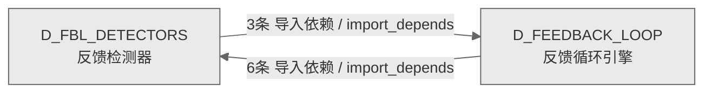

# 15_d_fbl_detectors / 反馈检测器域 / Feedback Detectors

> **功能简介 / Overview**: 反馈检测器，负责异常检测、漂移检测、反馈信号检测和可靠性监控

> **文档作用 / Purpose**: 展示 反馈检测器（D_FBL_DETECTORS）功能域的域内依赖关系、跨域依赖关系，模块信息（成熟度/中英文名/大白话/文件路径）内嵌于 Mermaid 节点，供架构审查和域治理参考。

> 本文档由 generate_domain_doc.py 从 depgraph (PostgreSQL) 自动生成
> 数据源: depgraph (PostgreSQL) nodes表 + edges表

> **[可缩放 HTML 版 / Zoomable HTML](http://localhost:8765/docs/02_enterprise_architecture/02_domain_architecture_docs/_zoomable_html/15_d_fbl_detectors.html)** — Ctrl+滚轮缩放 ｜ 双击重置 ｜ Ctrl+Shift+D 切换拖动/选择模式

## 域基本信息 / Domain Overview

| 字段 | 值 | Field | Value |
|------|------|-------|-------|
| 编号 | 15 | Number | 15 |
| 域ID | D_FBL_DETECTORS | Domain ID | D_FBL_DETECTORS |
| 域名称 | 反馈检测器 | Domain Name | Feedback Detectors |
| 层级 | L1 基础平台层 | Layer | L1 Foundation |
| 模块数 | 65 | Module Count | 65 |
| 域内依赖 | 5 | Internal Dependencies | 5 |
| 跨域入边 | 6 | Cross-domain Incoming | 6 |
| 跨域出边 | 3 | Cross-domain Outgoing | 3 |
| 设计态模块 | 0 | Design Modules | 0 |
| 生产态模块 | 65 | Production Modules | 65 |
| 容量 | 65/150 (正常) | Capacity | 65/150 (正常) |
| 描述 | 反馈检测器，负责异常检测、漂移检测、反馈信号检测和可靠性监控 | Description | 反馈检测器，负责异常检测、漂移检测、反馈信号检测和可靠性监控 |

## 域内依赖图 / Internal Dependency Diagram

> 依赖图内嵌在本文档中，IDE 可直接渲染；网页版可 Ctrl+滚轮缩放 + 拖动平移查看细节。全景图用颜色区分运营态/设计态，不再分页/拆子图。
>
> **图例说明 / Legend**：
> - 🟦 **蓝色 = 运营态模块**（production，已上线运行）
> - 🟧 **橙色虚线 = 设计态模块**（design，蓝图阶段，代码未写）
> - **实线箭头 = 运营态依赖**（已生效的依赖关系）
> - **虚线箭头 = 非运营态依赖**（计划中/验证中的依赖关系）

### 全景依赖图（全部模块，颜色区分运营态/设计态）

> 展示全部 65 个模块（生产态 65 + 设计态 0），节点含成熟度+中英文名+大白话+文件路径。

```mermaid
%%{init: {'theme': 'base', 'themeVariables': {'primaryColor': '#eaeaea', 'primaryTextColor': '#333333', 'primaryBorderColor': '#666666', 'lineColor': '#666666', 'secondaryColor': '#eaeaea', 'tertiaryColor': '#eaeaea', 'fontSize': '14px'}}}%%
flowchart TD
    src_zephyr_feedback_loop_detectors_init_py["(生产态 / production) feedback-loop.detectors — GOV-DOC-018: 60个叶子模块拆分为5个逻辑子包(anomaly...<br/>feedback-loop.detectors — GOV-DOC-018: 60个叶子模块拆分为5个逻辑子包(anomaly...<br/>文件: detectors/__init__.py"]
    src_zephyr_feedback_loop_detectors_anomaly_anomaly_clustering_py["(生产态 / production) Anomaly Clustering — v0.9.0 R119<br/>Anomaly Clustering — v0.9.0 R119<br/>文件: anomaly/anomaly_clustering.py"]
    src_zephyr_feedback_loop_detectors_anomaly_anomaly_detector_py["(生产态 / production)<br/>文件: anomaly/anomaly_detector.py"]
    src_zephyr_feedback_loop_detectors_anomaly_emergent_behavior_detector_py["(生产态 / production) Emergent Behavior Detector — v0.38.0 R473<br/>Emergent Behavior Detector — v0.38.0 R473<br/>文件: anomaly/emergent_behavior_detector.py"]
    src_zephyr_feedback_loop_detectors_anomaly_flapping_detector_py["(生产态 / production) Flapping Detector — v0.40.0 R494<br/>Flapping Detector — v0.40.0 R494<br/>文件: anomaly/flapping_detector.py"]
    src_zephyr_feedback_loop_detectors_anomaly_heisenbug_detector_py["(生产态 / production) Heisenbug Detector — v0.38.0 R470<br/>Heisenbug Detector — v0.38.0 R470<br/>文件: anomaly/heisenbug_detector.py"]
    src_zephyr_feedback_loop_detectors_anomaly_infinite_loop_detector_py["(生产态 / production) Infinite Loop Detector — v0.15.0 R219<br/>Infinite Loop Detector — v0.15.0 R219<br/>文件: anomaly/infinite_loop_detector.py"]
    src_zephyr_feedback_loop_detectors_anomaly_intermittent_failure_pattern_py["(生产态 / production) Intermittent Failure Pattern Detector — v0.40.0 R501<br/>Intermittent Failure Pattern Detector — v0.40.0 R501<br/>文件: anomaly/intermittent_failure_pattern.py"]
    src_zephyr_feedback_loop_detectors_anomaly_log_anomaly_py["(生产态 / production) Log Anomaly Detector — v0.6.0 R61<br/>Log Anomaly Detector — v0.6.0 R61<br/>文件: anomaly/log_anomaly.py"]
    src_zephyr_feedback_loop_detectors_anomaly_silent_corruption_detector_py["(生产态 / production) Silent Corruption Detector — v0.40.0 R499<br/>Silent Corruption Detector — v0.40.0 R499<br/>文件: anomaly/silent_corruption_detector.py"]
    src_zephyr_feedback_loop_detectors_anomaly_synthetic_anomaly_generator_py["(生产态 / production) Synthetic Anomaly Generator — v0.9.0 R112<br/>Synthetic Anomaly Generator — v0.9.0 R112<br/>文件: anomaly/synthetic_anomaly_generator.py"]
    src_zephyr_feedback_loop_detectors_anomaly_temporal_pattern_py["(生产态 / production) Temporal Pattern Detector — v0.12.0 R164<br/>Temporal Pattern Detector — v0.12.0 R164<br/>文件: anomaly/temporal_pattern.py"]
    src_zephyr_feedback_loop_detectors_correlation_action_efficacy_decay_detector_py["(生产态 / production) R507: ActionEfficacyDecayDetector<br/>R507: ActionEfficacyDecayDetector<br/>文件: correlation/action_efficacy_decay_detector.py"]
    src_zephyr_feedback_loop_detectors_correlation_action_interaction_detector_py["(生产态 / production) Action Interaction Detector — v0.38.0 R472<br/>Action Interaction Detector — v0.38.0 R472<br/>文件: correlation/action_interaction_detector.py"]
    src_zephyr_feedback_loop_detectors_correlation_action_side_effect_cumulative_detector_py["(生产态 / production) R526: ActionSideEffectCumulativeDetector<br/>R526: ActionSideEffectCumulativeDetector<br/>文件: correlation/action_side_effect_cumulative_detector.py"]
    src_zephyr_feedback_loop_detectors_correlation_agent_trajectory_anomaly_detector_py["(生产态 / production) R503: AgentTrajectoryAnomalyDetector<br/>R503: AgentTrajectoryAnomalyDetector<br/>文件: correlation/agent_trajectory_anomaly_detector.py"]
    src_zephyr_feedback_loop_detectors_correlation_cross_signal_validator_py["(生产态 / production) Cross-Signal Validator — v0.6.0 R63<br/>Cross-Signal Validator — v0.6.0 R63<br/>文件: correlation/cross_signal_validator.py"]
    src_zephyr_feedback_loop_detectors_correlation_cross_system_correlator_py["(生产态 / production) Cross-System Correlator — v0.13.0 R185<br/>Cross-System Correlator — v0.13.0 R185<br/>文件: correlation/cross_system_correlator.py"]
    src_zephyr_feedback_loop_detectors_correlation_decision_provenance_py["(生产态 / production) Decision Provenance — v0.12.0 R166<br/>Decision Provenance — v0.12.0 R166<br/>文件: correlation/decision_provenance.py"]
    src_zephyr_feedback_loop_detectors_correlation_dependency_freshness_monitor_py["(生产态 / production) Dependency Freshness Monitor — v0.38.0 R474<br/>Dependency Freshness Monitor — v0.38.0 R474<br/>文件: correlation/dependency_freshness_monitor.py"]
    src_zephyr_feedback_loop_detectors_correlation_ensemble_detector_py["(生产态 / production) Ensemble Detector — v0.4.0 R21<br/>Ensemble Detector — v0.4.0 R21<br/>文件: correlation/ensemble_detector.py"]
    src_zephyr_feedback_loop_detectors_correlation_external_health_py["(生产态 / production) External Health Monitor — v0.14.0 R193<br/>External Health Monitor — v0.14.0 R193<br/>文件: correlation/external_health.py"]
    src_zephyr_feedback_loop_detectors_correlation_external_validation_checkpoint_py["(生产态 / production) R524: ExternalValidationCheckpoint<br/>R524: ExternalValidationCheckpoint<br/>文件: correlation/external_validation_checkpoint.py"]
    src_zephyr_feedback_loop_detectors_correlation_fle_performance_regression_detector_py["(生产态 / production) R532: FLEPerformanceRegressionDetector<br/>R532: FLEPerformanceRegressionDetector<br/>文件: correlation/fle_performance_regression_detector.py"]
    src_zephyr_feedback_loop_detectors_correlation_multi_signal_correlator_py["(生产态 / production) Multi-Signal Correlator — v0.4.0 R22<br/>Multi-Signal Correlator — v0.4.0 R22<br/>文件: correlation/multi_signal_correlator.py"]
    src_zephyr_feedback_loop_detectors_correlation_rumor_noise_filter_py["(生产态 / production) Rumor Noise Filter — v0.37.0 R460<br/>Rumor Noise Filter — v0.37.0 R460<br/>文件: correlation/rumor_noise_filter.py"]
    src_zephyr_feedback_loop_detectors_correlation_trace_causal_bridge_py["(生产态 / production) Trace Causal Bridge — v0.6.0 R62<br/>Trace Causal Bridge — v0.6.0 R62<br/>文件: correlation/trace_causal_bridge.py"]
    src_zephyr_feedback_loop_detectors_correlation_traffic_replay_validator_py["(生产态 / production) Traffic Replay Validator — v0.14.0 R202<br/>Traffic Replay Validator — v0.14.0 R202<br/>文件: correlation/traffic_replay_validator.py"]
    src_zephyr_feedback_loop_detectors_drift_concept_drift_py["(生产态 / production) Concept Drift Detector — v0.5.0 R42<br/>Concept Drift Detector — v0.5.0 R42<br/>文件: drift/concept_drift.py"]
    src_zephyr_feedback_loop_detectors_drift_config_drift_py["(生产态 / production) Config Drift Detector — v0.13.0 R182<br/>Config Drift Detector — v0.13.0 R182<br/>文件: drift/config_drift.py"]
    src_zephyr_feedback_loop_detectors_drift_context_window_contamination_detector_py["(生产态 / production) Context Window Contamination Detector — v0.38.0 R471<br/>Context Window Contamination Detector — v0.38.0 R471<br/>文件: drift/context_window_contamination_detector.py"]
    src_zephyr_feedback_loop_detectors_drift_diminishing_returns_detector_py["(生产态 / production) R528: DiminishingReturnsDetector<br/>R528: DiminishingReturnsDetector<br/>文件: drift/diminishing_returns_detector.py"]
    src_zephyr_feedback_loop_detectors_drift_ensemble_drift_py["(生产态 / production) Ensemble Drift — v0.5.0 R43<br/>Ensemble Drift — v0.5.0 R43<br/>文件: drift/ensemble_drift.py"]
    src_zephyr_feedback_loop_detectors_drift_gradual_poisoning_detector_py["(生产态 / production) Gradual Poisoning Detector — v0.15.0 R210<br/>Gradual Poisoning Detector — v0.15.0 R210<br/>文件: drift/gradual_poisoning_detector.py"]
    src_zephyr_feedback_loop_detectors_drift_trend_cycle_separator_py["(生产态 / production) Trend-Cycle Separator — v0.9.0 R113<br/>Trend-Cycle Separator — v0.9.0 R113<br/>文件: drift/trend_cycle_separator.py"]
    src_zephyr_feedback_loop_detectors_guard_alert_desensitization_curve_py["(生产态 / production) Alert Desensitization Curve — v0.37.0 R492<br/>Alert Desensitization Curve — v0.37.0 R492<br/>文件: guard/alert_desensitization_curve.py"]
    src_zephyr_feedback_loop_detectors_guard_guard_cascade_detector_py["(生产态 / production) R520: GuardCascadeDetector<br/>R520: GuardCascadeDetector<br/>文件: guard/guard_cascade_detector.py"]
    src_zephyr_feedback_loop_detectors_guard_guard_oscillation_detector_py["(生产态 / production) R519: GuardOscillationDetector<br/>R519: GuardOscillationDetector<br/>文件: guard/guard_oscillation_detector.py"]
    src_zephyr_feedback_loop_detectors_guard_placebo_action_detector_py["(生产态 / production) R508: PlaceboActionDetector<br/>R508: PlaceboActionDetector<br/>文件: guard/placebo_action_detector.py"]
    src_zephyr_feedback_loop_detectors_guard_positive_feedback_defense_py["(生产态 / production) Positive Feedback Defense — v0.4.0 R28<br/>Positive Feedback Defense — v0.4.0 R28<br/>文件: guard/positive_feedback_defense.py"]
    src_zephyr_feedback_loop_detectors_guard_recursive_diagnosis_trust_evaluator_py["(生产态 / production) R517: RecursiveDiagnosisTrustEvaluator<br/>R517: RecursiveDiagnosisTrustEvaluator<br/>文件: guard/recursive_diagnosis_trust_evaluator.py"]
    src_zephyr_feedback_loop_detectors_guard_self_audit_py["(生产态 / production) Self Audit — v0.13.0 R183<br/>Self Audit — v0.13.0 R183<br/>文件: guard/self_audit.py"]
    src_zephyr_feedback_loop_detectors_guard_self_diagnosis_data_leak_detector_py["(生产态 / production) R530: SelfDiagnosisDataLeakDetector<br/>R530: SelfDiagnosisDataLeakDetector<br/>文件: guard/self_diagnosis_data_leak_detector.py"]
    src_zephyr_feedback_loop_detectors_guard_self_ha_py["(生产态 / production) Self HA — v0.13.0 R173<br/>Self HA — v0.13.0 R173<br/>文件: guard/self_ha.py"]
    src_zephyr_feedback_loop_detectors_guard_temporal_coherence_of_self_model_py["(生产态 / production) R525: TemporalCoherenceOfSelfModel<br/>R525: TemporalCoherenceOfSelfModel<br/>文件: guard/temporal_coherence_of_self_model.py"]
    src_zephyr_feedback_loop_detectors_reliability_autoscale_remediation_py["(生产态 / production) Autoscale Remediation — v0.13.0 R174<br/>Autoscale Remediation — v0.13.0 R174<br/>文件: reliability/autoscale_remediation.py"]
    src_zephyr_feedback_loop_detectors_reliability_blast_radius_py["(生产态 / production) Blast Radius Detector — v0.12.0 R167<br/>Blast Radius Detector — v0.12.0 R167<br/>文件: reliability/blast_radius.py"]
    src_zephyr_feedback_loop_detectors_reliability_blast_radius_budget_py["(生产态 / production) Blast Radius Budget — v0.13.0 R178<br/>Blast Radius Budget — v0.13.0 R178<br/>文件: reliability/blast_radius_budget.py"]
    src_zephyr_feedback_loop_detectors_reliability_capacity_forecast_py["(生产态 / production) Capacity Forecast — v0.13.0 R186b<br/>Capacity Forecast — v0.13.0 R186b<br/>文件: reliability/capacity_forecast.py"]
    src_zephyr_feedback_loop_detectors_reliability_chaos_engineering_py["(生产态 / production) Chaos Engineering — v0.13.0 R172<br/>Chaos Engineering — v0.13.0 R172<br/>文件: reliability/chaos_engineering.py"]
    src_zephyr_feedback_loop_detectors_reliability_ebpf_monitor_py["(生产态 / production) eBPF Monitor — v0.6.0 R64<br/>eBPF Monitor — v0.6.0 R64<br/>文件: reliability/ebpf_monitor.py"]
    src_zephyr_feedback_loop_detectors_reliability_flag_lifecycle_py["(生产态 / production) Flag Lifecycle Detector — v0.13.0 R180<br/>Flag Lifecycle Detector — v0.13.0 R180<br/>文件: reliability/flag_lifecycle.py"]
    src_zephyr_feedback_loop_detectors_reliability_maintenance_coordinator_py["(生产态 / production) Maintenance Coordinator — v0.12.0 R168<br/>Maintenance Coordinator — v0.12.0 R168<br/>文件: reliability/maintenance_coordinator.py"]
    src_zephyr_feedback_loop_detectors_reliability_metric_cardinality_guard_py["(生产态 / production) Metric Cardinality Guard — v0.40.0 R495<br/>Metric Cardinality Guard — v0.40.0 R495<br/>文件: reliability/metric_cardinality_guard.py"]
    src_zephyr_feedback_loop_detectors_reliability_openfeature_py["(生产态 / production) OpenFeature Integration — v0.13.0 R181<br/>OpenFeature Integration — v0.13.0 R181<br/>文件: reliability/openfeature.py"]
    src_zephyr_feedback_loop_detectors_reliability_otel_adapter_py["(生产态 / production) OTel Adapter — v0.12.0 R170<br/>OTel Adapter — v0.12.0 R170<br/>文件: reliability/otel_adapter.py"]
    src_zephyr_feedback_loop_detectors_reliability_regulatory_audit_py["(生产态 / production) Regulatory Audit Detector — v0.13.0 R184<br/>Regulatory Audit Detector — v0.13.0 R184<br/>文件: reliability/regulatory_audit.py"]
    src_zephyr_feedback_loop_detectors_reliability_resolution_tracker_py["(生产态 / production) Resolution Tracker — v0.12.0 R165<br/>Resolution Tracker — v0.12.0 R165<br/>文件: reliability/resolution_tracker.py"]
    src_zephyr_feedback_loop_detectors_reliability_runbook_executor_py["(生产态 / production) Runbook Executor — v0.13.0 R186a<br/>Runbook Executor — v0.13.0 R186a<br/>文件: reliability/runbook_executor.py"]
    src_zephyr_feedback_loop_detectors_reliability_version_migrator_py["(生产态 / production) Version Migrator — v0.12.0 R169<br/>Version Migrator — v0.12.0 R169<br/>文件: reliability/version_migrator.py"]
    src_zephyr_feedback_loop_detectors_init_py ~~~ src_zephyr_feedback_loop_detectors_anomaly_anomaly_clustering_py
    src_zephyr_feedback_loop_detectors_anomaly_anomaly_clustering_py ~~~ src_zephyr_feedback_loop_detectors_anomaly_anomaly_detector_py
    src_zephyr_feedback_loop_detectors_anomaly_anomaly_detector_py ~~~ src_zephyr_feedback_loop_detectors_anomaly_emergent_behavior_detector_py
    src_zephyr_feedback_loop_detectors_anomaly_emergent_behavior_detector_py ~~~ src_zephyr_feedback_loop_detectors_anomaly_flapping_detector_py
    src_zephyr_feedback_loop_detectors_anomaly_flapping_detector_py ~~~ src_zephyr_feedback_loop_detectors_anomaly_heisenbug_detector_py
    src_zephyr_feedback_loop_detectors_anomaly_heisenbug_detector_py ~~~ src_zephyr_feedback_loop_detectors_anomaly_infinite_loop_detector_py
    src_zephyr_feedback_loop_detectors_anomaly_infinite_loop_detector_py ~~~ src_zephyr_feedback_loop_detectors_anomaly_intermittent_failure_pattern_py
    src_zephyr_feedback_loop_detectors_anomaly_intermittent_failure_pattern_py ~~~ src_zephyr_feedback_loop_detectors_anomaly_log_anomaly_py
    src_zephyr_feedback_loop_detectors_anomaly_log_anomaly_py ~~~ src_zephyr_feedback_loop_detectors_anomaly_silent_corruption_detector_py
    src_zephyr_feedback_loop_detectors_anomaly_silent_corruption_detector_py ~~~ src_zephyr_feedback_loop_detectors_anomaly_synthetic_anomaly_generator_py
    src_zephyr_feedback_loop_detectors_anomaly_synthetic_anomaly_generator_py ~~~ src_zephyr_feedback_loop_detectors_anomaly_temporal_pattern_py
    src_zephyr_feedback_loop_detectors_anomaly_temporal_pattern_py ~~~ src_zephyr_feedback_loop_detectors_correlation_action_efficacy_decay_detector_py
    src_zephyr_feedback_loop_detectors_correlation_action_efficacy_decay_detector_py ~~~ src_zephyr_feedback_loop_detectors_correlation_action_interaction_detector_py
    src_zephyr_feedback_loop_detectors_correlation_action_interaction_detector_py ~~~ src_zephyr_feedback_loop_detectors_correlation_action_side_effect_cumulative_detector_py
    src_zephyr_feedback_loop_detectors_correlation_action_side_effect_cumulative_detector_py ~~~ src_zephyr_feedback_loop_detectors_correlation_agent_trajectory_anomaly_detector_py
    src_zephyr_feedback_loop_detectors_correlation_agent_trajectory_anomaly_detector_py ~~~ src_zephyr_feedback_loop_detectors_correlation_cross_signal_validator_py
    src_zephyr_feedback_loop_detectors_correlation_cross_signal_validator_py ~~~ src_zephyr_feedback_loop_detectors_correlation_cross_system_correlator_py
    src_zephyr_feedback_loop_detectors_correlation_cross_system_correlator_py ~~~ src_zephyr_feedback_loop_detectors_correlation_decision_provenance_py
    src_zephyr_feedback_loop_detectors_correlation_decision_provenance_py ~~~ src_zephyr_feedback_loop_detectors_correlation_dependency_freshness_monitor_py
    src_zephyr_feedback_loop_detectors_correlation_dependency_freshness_monitor_py ~~~ src_zephyr_feedback_loop_detectors_correlation_ensemble_detector_py
    src_zephyr_feedback_loop_detectors_correlation_ensemble_detector_py ~~~ src_zephyr_feedback_loop_detectors_correlation_external_health_py
    src_zephyr_feedback_loop_detectors_correlation_external_health_py ~~~ src_zephyr_feedback_loop_detectors_correlation_external_validation_checkpoint_py
    src_zephyr_feedback_loop_detectors_correlation_external_validation_checkpoint_py ~~~ src_zephyr_feedback_loop_detectors_correlation_fle_performance_regression_detector_py
    src_zephyr_feedback_loop_detectors_correlation_fle_performance_regression_detector_py ~~~ src_zephyr_feedback_loop_detectors_correlation_multi_signal_correlator_py
    src_zephyr_feedback_loop_detectors_correlation_multi_signal_correlator_py ~~~ src_zephyr_feedback_loop_detectors_correlation_rumor_noise_filter_py
    src_zephyr_feedback_loop_detectors_correlation_rumor_noise_filter_py ~~~ src_zephyr_feedback_loop_detectors_correlation_trace_causal_bridge_py
    src_zephyr_feedback_loop_detectors_correlation_trace_causal_bridge_py ~~~ src_zephyr_feedback_loop_detectors_correlation_traffic_replay_validator_py
    src_zephyr_feedback_loop_detectors_correlation_traffic_replay_validator_py ~~~ src_zephyr_feedback_loop_detectors_drift_concept_drift_py
    src_zephyr_feedback_loop_detectors_drift_concept_drift_py ~~~ src_zephyr_feedback_loop_detectors_drift_config_drift_py
    src_zephyr_feedback_loop_detectors_drift_config_drift_py ~~~ src_zephyr_feedback_loop_detectors_drift_context_window_contamination_detector_py
    src_zephyr_feedback_loop_detectors_drift_context_window_contamination_detector_py ~~~ src_zephyr_feedback_loop_detectors_drift_diminishing_returns_detector_py
    src_zephyr_feedback_loop_detectors_drift_diminishing_returns_detector_py ~~~ src_zephyr_feedback_loop_detectors_drift_ensemble_drift_py
    src_zephyr_feedback_loop_detectors_drift_ensemble_drift_py ~~~ src_zephyr_feedback_loop_detectors_drift_gradual_poisoning_detector_py
    src_zephyr_feedback_loop_detectors_drift_gradual_poisoning_detector_py ~~~ src_zephyr_feedback_loop_detectors_drift_trend_cycle_separator_py
    src_zephyr_feedback_loop_detectors_drift_trend_cycle_separator_py ~~~ src_zephyr_feedback_loop_detectors_guard_alert_desensitization_curve_py
    src_zephyr_feedback_loop_detectors_guard_alert_desensitization_curve_py ~~~ src_zephyr_feedback_loop_detectors_guard_guard_cascade_detector_py
    src_zephyr_feedback_loop_detectors_guard_guard_cascade_detector_py ~~~ src_zephyr_feedback_loop_detectors_guard_guard_oscillation_detector_py
    src_zephyr_feedback_loop_detectors_guard_guard_oscillation_detector_py ~~~ src_zephyr_feedback_loop_detectors_guard_placebo_action_detector_py
    src_zephyr_feedback_loop_detectors_guard_placebo_action_detector_py ~~~ src_zephyr_feedback_loop_detectors_guard_positive_feedback_defense_py
    src_zephyr_feedback_loop_detectors_guard_positive_feedback_defense_py ~~~ src_zephyr_feedback_loop_detectors_guard_recursive_diagnosis_trust_evaluator_py
    src_zephyr_feedback_loop_detectors_guard_recursive_diagnosis_trust_evaluator_py ~~~ src_zephyr_feedback_loop_detectors_guard_self_audit_py
    src_zephyr_feedback_loop_detectors_guard_self_audit_py ~~~ src_zephyr_feedback_loop_detectors_guard_self_diagnosis_data_leak_detector_py
    src_zephyr_feedback_loop_detectors_guard_self_diagnosis_data_leak_detector_py ~~~ src_zephyr_feedback_loop_detectors_guard_self_ha_py
    src_zephyr_feedback_loop_detectors_guard_self_ha_py ~~~ src_zephyr_feedback_loop_detectors_guard_temporal_coherence_of_self_model_py
    src_zephyr_feedback_loop_detectors_guard_temporal_coherence_of_self_model_py ~~~ src_zephyr_feedback_loop_detectors_reliability_autoscale_remediation_py
    src_zephyr_feedback_loop_detectors_reliability_autoscale_remediation_py ~~~ src_zephyr_feedback_loop_detectors_reliability_blast_radius_py
    src_zephyr_feedback_loop_detectors_reliability_blast_radius_py ~~~ src_zephyr_feedback_loop_detectors_reliability_blast_radius_budget_py
    src_zephyr_feedback_loop_detectors_reliability_blast_radius_budget_py ~~~ src_zephyr_feedback_loop_detectors_reliability_capacity_forecast_py
    src_zephyr_feedback_loop_detectors_reliability_capacity_forecast_py ~~~ src_zephyr_feedback_loop_detectors_reliability_chaos_engineering_py
    src_zephyr_feedback_loop_detectors_reliability_chaos_engineering_py ~~~ src_zephyr_feedback_loop_detectors_reliability_ebpf_monitor_py
    src_zephyr_feedback_loop_detectors_reliability_ebpf_monitor_py ~~~ src_zephyr_feedback_loop_detectors_reliability_flag_lifecycle_py
    src_zephyr_feedback_loop_detectors_reliability_flag_lifecycle_py ~~~ src_zephyr_feedback_loop_detectors_reliability_maintenance_coordinator_py
    src_zephyr_feedback_loop_detectors_reliability_maintenance_coordinator_py ~~~ src_zephyr_feedback_loop_detectors_reliability_metric_cardinality_guard_py
    src_zephyr_feedback_loop_detectors_reliability_metric_cardinality_guard_py ~~~ src_zephyr_feedback_loop_detectors_reliability_openfeature_py
    src_zephyr_feedback_loop_detectors_reliability_openfeature_py ~~~ src_zephyr_feedback_loop_detectors_reliability_otel_adapter_py
    src_zephyr_feedback_loop_detectors_reliability_otel_adapter_py ~~~ src_zephyr_feedback_loop_detectors_reliability_regulatory_audit_py
    src_zephyr_feedback_loop_detectors_reliability_regulatory_audit_py ~~~ src_zephyr_feedback_loop_detectors_reliability_resolution_tracker_py
    src_zephyr_feedback_loop_detectors_reliability_resolution_tracker_py ~~~ src_zephyr_feedback_loop_detectors_reliability_runbook_executor_py
    src_zephyr_feedback_loop_detectors_reliability_runbook_executor_py ~~~ src_zephyr_feedback_loop_detectors_reliability_version_migrator_py
    src_zephyr_feedback_loop_detectors_anomaly_init_py["(生产态 / production)<br/>文件: anomaly/__init__.py"]
    src_zephyr_feedback_loop_detectors_correlation_init_py["(生产态 / production)<br/>文件: correlation/__init__.py"]
    src_zephyr_feedback_loop_detectors_drift_init_py["(生产态 / production)<br/>文件: drift/__init__.py"]
    src_zephyr_feedback_loop_detectors_guard_init_py["(生产态 / production)<br/>文件: guard/__init__.py"]
    src_zephyr_feedback_loop_detectors_reliability_init_py["(生产态 / production)<br/>文件: reliability/__init__.py"]
    src_zephyr_feedback_loop_detectors_anomaly_init_py ~~~ src_zephyr_feedback_loop_detectors_correlation_init_py
    src_zephyr_feedback_loop_detectors_correlation_init_py ~~~ src_zephyr_feedback_loop_detectors_drift_init_py
    src_zephyr_feedback_loop_detectors_drift_init_py ~~~ src_zephyr_feedback_loop_detectors_guard_init_py
    src_zephyr_feedback_loop_detectors_guard_init_py ~~~ src_zephyr_feedback_loop_detectors_reliability_init_py
    src_zephyr_feedback_loop_detectors_init_py -->|导入依赖 / import_depends| src_zephyr_feedback_loop_detectors_anomaly_init_py
    src_zephyr_feedback_loop_detectors_init_py -->|导入依赖 / import_depends| src_zephyr_feedback_loop_detectors_correlation_init_py
    src_zephyr_feedback_loop_detectors_init_py -->|导入依赖 / import_depends| src_zephyr_feedback_loop_detectors_drift_init_py
    src_zephyr_feedback_loop_detectors_init_py -->|导入依赖 / import_depends| src_zephyr_feedback_loop_detectors_guard_init_py
    src_zephyr_feedback_loop_detectors_init_py -->|导入依赖 / import_depends| src_zephyr_feedback_loop_detectors_reliability_init_py
    D_FEEDBACK_LOOP["(生产态 / production) 反馈循环引擎 / Feedback Loop Engine<br/>反馈循环引擎，负责系统自我改进闭环：异常检测、根因诊断、自动修复和自我进化<br/>跨域节点 / cross-domain"]
    src_zephyr_feedback_loop_detectors_anomaly_anomaly_detector_py -->|导入依赖 / import_depends| D_FEEDBACK_LOOP
    src_zephyr_feedback_loop_detectors_anomaly_anomaly_detector_py -->|导入依赖 / import_depends| D_FEEDBACK_LOOP
    src_zephyr_feedback_loop_detectors_anomaly_anomaly_detector_py -->|导入依赖 / import_depends| D_FEEDBACK_LOOP
    D_FEEDBACK_LOOP -->|导入依赖 / import_depends| src_zephyr_feedback_loop_detectors_init_py
    D_FEEDBACK_LOOP -->|导入依赖 / import_depends| src_zephyr_feedback_loop_detectors_init_py
    D_FEEDBACK_LOOP -->|导入依赖 / import_depends| src_zephyr_feedback_loop_detectors_init_py
    D_FEEDBACK_LOOP -->|导入依赖 / import_depends| src_zephyr_feedback_loop_detectors_anomaly_anomaly_detector_py
    D_FEEDBACK_LOOP -->|导入依赖 / import_depends| src_zephyr_feedback_loop_detectors_init_py
    D_FEEDBACK_LOOP -->|导入依赖 / import_depends| src_zephyr_feedback_loop_detectors_init_py
    classDef production fill:#e1f5fe,stroke:#01579b,stroke-width:2px,color:#000
    classDef design fill:#fff3e0,stroke:#e65100,stroke-width:2px,color:#000,stroke-dasharray: 5 5
    classDef external_prod fill:#e8f4fd,stroke:#0277bd,stroke-width:1px,color:#000
    classDef external_design fill:#fff8e7,stroke:#ef6c00,stroke-width:1px,color:#000,stroke-dasharray: 5 5
    class src_zephyr_feedback_loop_detectors_init_py,src_zephyr_feedback_loop_detectors_anomaly_init_py,src_zephyr_feedback_loop_detectors_anomaly_anomaly_clustering_py,src_zephyr_feedback_loop_detectors_anomaly_anomaly_detector_py,src_zephyr_feedback_loop_detectors_anomaly_emergent_behavior_detector_py,src_zephyr_feedback_loop_detectors_anomaly_flapping_detector_py,src_zephyr_feedback_loop_detectors_anomaly_heisenbug_detector_py,src_zephyr_feedback_loop_detectors_anomaly_infinite_loop_detector_py,src_zephyr_feedback_loop_detectors_anomaly_intermittent_failure_pattern_py,src_zephyr_feedback_loop_detectors_anomaly_log_anomaly_py,src_zephyr_feedback_loop_detectors_anomaly_silent_corruption_detector_py,src_zephyr_feedback_loop_detectors_anomaly_synthetic_anomaly_generator_py,src_zephyr_feedback_loop_detectors_anomaly_temporal_pattern_py,src_zephyr_feedback_loop_detectors_correlation_init_py,src_zephyr_feedback_loop_detectors_correlation_action_efficacy_decay_detector_py,src_zephyr_feedback_loop_detectors_correlation_action_interaction_detector_py,src_zephyr_feedback_loop_detectors_correlation_action_side_effect_cumulative_detector_py,src_zephyr_feedback_loop_detectors_correlation_agent_trajectory_anomaly_detector_py,src_zephyr_feedback_loop_detectors_correlation_cross_signal_validator_py,src_zephyr_feedback_loop_detectors_correlation_cross_system_correlator_py,src_zephyr_feedback_loop_detectors_correlation_decision_provenance_py,src_zephyr_feedback_loop_detectors_correlation_dependency_freshness_monitor_py,src_zephyr_feedback_loop_detectors_correlation_ensemble_detector_py,src_zephyr_feedback_loop_detectors_correlation_external_health_py,src_zephyr_feedback_loop_detectors_correlation_external_validation_checkpoint_py,src_zephyr_feedback_loop_detectors_correlation_fle_performance_regression_detector_py,src_zephyr_feedback_loop_detectors_correlation_multi_signal_correlator_py,src_zephyr_feedback_loop_detectors_correlation_rumor_noise_filter_py,src_zephyr_feedback_loop_detectors_correlation_trace_causal_bridge_py,src_zephyr_feedback_loop_detectors_correlation_traffic_replay_validator_py,src_zephyr_feedback_loop_detectors_drift_init_py,src_zephyr_feedback_loop_detectors_drift_concept_drift_py,src_zephyr_feedback_loop_detectors_drift_config_drift_py,src_zephyr_feedback_loop_detectors_drift_context_window_contamination_detector_py,src_zephyr_feedback_loop_detectors_drift_diminishing_returns_detector_py,src_zephyr_feedback_loop_detectors_drift_ensemble_drift_py,src_zephyr_feedback_loop_detectors_drift_gradual_poisoning_detector_py,src_zephyr_feedback_loop_detectors_drift_trend_cycle_separator_py,src_zephyr_feedback_loop_detectors_guard_init_py,src_zephyr_feedback_loop_detectors_guard_alert_desensitization_curve_py,src_zephyr_feedback_loop_detectors_guard_guard_cascade_detector_py,src_zephyr_feedback_loop_detectors_guard_guard_oscillation_detector_py,src_zephyr_feedback_loop_detectors_guard_placebo_action_detector_py,src_zephyr_feedback_loop_detectors_guard_positive_feedback_defense_py,src_zephyr_feedback_loop_detectors_guard_recursive_diagnosis_trust_evaluator_py,src_zephyr_feedback_loop_detectors_guard_self_audit_py,src_zephyr_feedback_loop_detectors_guard_self_diagnosis_data_leak_detector_py,src_zephyr_feedback_loop_detectors_guard_self_ha_py,src_zephyr_feedback_loop_detectors_guard_temporal_coherence_of_self_model_py,src_zephyr_feedback_loop_detectors_reliability_init_py,src_zephyr_feedback_loop_detectors_reliability_autoscale_remediation_py,src_zephyr_feedback_loop_detectors_reliability_blast_radius_py,src_zephyr_feedback_loop_detectors_reliability_blast_radius_budget_py,src_zephyr_feedback_loop_detectors_reliability_capacity_forecast_py,src_zephyr_feedback_loop_detectors_reliability_chaos_engineering_py,src_zephyr_feedback_loop_detectors_reliability_ebpf_monitor_py,src_zephyr_feedback_loop_detectors_reliability_flag_lifecycle_py,src_zephyr_feedback_loop_detectors_reliability_maintenance_coordinator_py,src_zephyr_feedback_loop_detectors_reliability_metric_cardinality_guard_py,src_zephyr_feedback_loop_detectors_reliability_openfeature_py,src_zephyr_feedback_loop_detectors_reliability_otel_adapter_py,src_zephyr_feedback_loop_detectors_reliability_regulatory_audit_py,src_zephyr_feedback_loop_detectors_reliability_resolution_tracker_py,src_zephyr_feedback_loop_detectors_reliability_runbook_executor_py,src_zephyr_feedback_loop_detectors_reliability_version_migrator_py production
    class D_FEEDBACK_LOOP external_prod
```

## 跨域依赖 / Cross-domain Dependencies

### 本域依赖的其他域（出边）/ Depends On

| # | 本域模块 / Source Module | → | 外部域-目标模块 / Target Module | 依赖类型 / Type |
|:--:|---------|:--:|---------|---------|
| 1 | anomaly/anomaly_detector.py | → | D_FEEDBACK_LOOP 反馈循环引擎: collectors/feedback_collector.py | 导入依赖 / import_depends |
| 2 | anomaly/anomaly_detector.py | → | D_FEEDBACK_LOOP 反馈循环引擎: collectors/metrics_collector.py | 导入依赖 / import_depends |
| 3 | anomaly/anomaly_detector.py | → | D_FEEDBACK_LOOP 反馈循环引擎: feedback_loop/protocols.py | 导入依赖 / import_depends |

### 依赖本域的其他域（入边）/ Depended By

| # | 外部域-源模块 / Source Module | → | 本域模块 / Target Module | 依赖类型 / Type |
|:--:|---------|:--:|---------|---------|
| 1 | D_FEEDBACK_LOOP 反馈循环引擎: FLE 全链路调度器 —— collect->detect->diagnose->act->ver... | → | feedback-loop.detectors — GOV-DOC-018: 60个叶子模块拆分... | 导入依赖 / import_depends |
| 2 | D_FEEDBACK_LOOP 反馈循环引擎: FLE 全链路调度器 —— collect->detect->diagnose->act->ver... | → | anomaly/anomaly_detector.py | 导入依赖 / import_depends |
| 3 | D_FEEDBACK_LOOP 反馈循环引擎: feedback_loop/scheduler_act.py | → | feedback-loop.detectors — GOV-DOC-018: 60个叶子模块拆分... | 导入依赖 / import_depends |
| 4 | D_FEEDBACK_LOOP 反馈循环引擎: feedback_loop/scheduler_collect_detect.py | → | feedback-loop.detectors — GOV-DOC-018: 60个叶子模块拆分... | 导入依赖 / import_depends |
| 5 | D_FEEDBACK_LOOP 反馈循环引擎: feedback_loop/scheduler_health.py | → | feedback-loop.detectors — GOV-DOC-018: 60个叶子模块拆分... | 导入依赖 / import_depends |
| 6 | D_FEEDBACK_LOOP 反馈循环引擎: E2E Integration Test Pipeline — TASK-MOD-FEEDBACK_LOOP-0... | → | feedback-loop.detectors — GOV-DOC-018: 60个叶子模块拆分... | 导入依赖 / import_depends |

### 跨域依赖图 / Cross-domain Dependency Diagram

> 本域与 1 个外部域直接连接（出边 3 条 + 入边 6 条 = 9 条）。只显示直接连接的域，不展开具体节点。



## 说明 / Notes

- **数据源 / Data Source**: `depgraph (PostgreSQL)` 的 `nodes`、`edges`、`domains` 表
- **生成器 / Generator**: `generate_domain_doc.py`（G2+G10 合并）
- **维护方式 / Maintenance**: 自动生成，全景图更新时刷新
- **文件名规则 / File Naming**: `{编号:02d}_{域ID小写}.md`，如 `16_d_trading.md`
- **图例说明 / Legend**: `[production]`=已上线 / `[design]`=设计中 / `[unknown]`=未知
