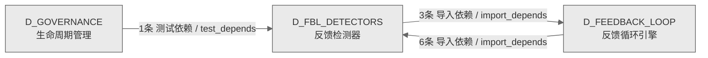

# 15_d_fbl_detectors / 反馈检测器域 / Feedback Detectors

> **功能简介 / Overview**: 反馈检测器，负责异常检测、漂移检测、反馈信号检测和可靠性监控

> **文档作用 / Purpose**: 展示 反馈检测器（D_FBL_DETECTORS）功能域的域内依赖关系、跨域依赖关系，模块信息（成熟度/中英文名/大白话/文件路径）内嵌于 Mermaid 节点，供架构审查和域治理参考。

> 本文档由 generate_domain_doc.py 从 depgraph (PostgreSQL) 自动生成
> 数据源: depgraph (PostgreSQL) nodes表 + edges表

> **[可缩放 HTML 版 / Zoomable HTML](http://localhost:8765/docs/02_enterprise_architecture/02_domain_architecture_docs/_zoomable_html/15_d_fbl_detectors.html)** — Ctrl+滚轮缩放 ｜ 双击重置 ｜ Ctrl+Shift+D 切换拖动/选择模式

## 域基本信息 / Domain Overview

| 字段 | 值 | Field | Value |
|------|------|-------|-------|
| 编号 | 15 | Number | 15 |
| 域ID | D_FBL_DETECTORS | Domain ID | D_FBL_DETECTORS |
| 域名称 | 反馈检测器 | Domain Name | Feedback Detectors |
| 层级 | L1 基础平台层 | Layer | L1 Foundation |
| 模块数 | 65 | Module Count | 65 |
| 域内依赖 | 5 | Internal Dependencies | 5 |
| 跨域入边 | 7 | Cross-domain Incoming | 7 |
| 跨域出边 | 3 | Cross-domain Outgoing | 3 |
| 设计态模块 | 0 | Design Modules | 0 |
| 生产态模块 | 65 | Production Modules | 65 |
| 容量 | 65/150 (正常) | Capacity | 65/150 (正常) |
| 描述 | 反馈检测器，负责异常检测、漂移检测、反馈信号检测和可靠性监控 | Description | 反馈检测器，负责异常检测、漂移检测、反馈信号检测和可靠性监控 |

## 域内依赖图 / Internal Dependency Diagram

> 依赖图内嵌在本文档中，IDE 可直接渲染；网页版可 Ctrl+滚轮缩放 + 拖动平移查看细节。
>
> **图例说明 / Legend**：
> - 🟦 **蓝色 = 运营态模块**（production，已上线运行）
> - 🟧 **橙色虚线 = 设计态模块**（design，蓝图阶段，代码未写）
> - **实线箭头 = 运营态依赖**（已生效的依赖关系）
> - **虚线箭头 = 非运营态依赖**（计划中/验证中的依赖关系）

### 全景图（全部模块，颜色区分运营态/设计态）

> 展示全部 65 个模块（生产态 65 + 设计态 0），含跨域依赖外部节点。节点含成熟度+名称+大白话/简介+文件路径。

```mermaid
%%{init: {'theme': 'base', 'themeVariables': {'primaryColor': '#eaeaea', 'primaryTextColor': '#333333', 'primaryBorderColor': '#666666', 'lineColor': '#666666', 'secondaryColor': '#eaeaea', 'tertiaryColor': '#eaeaea', 'fontSize': '14px'}}}%%
flowchart TD
    src_zephyr_feedback_loop_detectors_init_py["feedback_loop/detectors 包入口<br/>包入口.detectors — GOV-DOC-018:<br/>60个叶子模块拆分为5个逻辑子包(anomaly<br/>/correlation/drift/guard/reliability)。<br/>文件: detectors/__init__.py<br/>(生产态 / production)"]
    src_zephyr_feedback_loop_detectors_anomaly_anomaly_clustering_py["异常聚类<br/>检测异常并发出告警（anomaly clustering）<br/>Anomaly Clustering — v0.9.0 R119<br/>文件: anomaly/anomaly_clustering.py<br/>(生产态 / production)"]
    src_zephyr_feedback_loop_detectors_anomaly_anomaly_detector_py["异常检测器<br/>异常的事件，定义和分发事件<br/>anomaly_detector<br/>文件: anomaly/anomaly_detector.py<br/>(生产态 / production)"]
    src_zephyr_feedback_loop_detectors_anomaly_emergent_behavior_detector_py["emergentbehavior检测器<br/>emergent行为检测器。Emergent Behavior<br/>Detector，检测异常并发出告警<br/>文件: anomaly/emergent_behavior_detector.py<br/>(生产态 / production)"]
    src_zephyr_feedback_loop_detectors_anomaly_flapping_detector_py["flapping检测器<br/>Flapping Detector，检测异常并发出告警<br/>Flapping Detector — v0.40.0 R494<br/>文件: anomaly/flapping_detector.py<br/>(生产态 / production)"]
    src_zephyr_feedback_loop_detectors_anomaly_heisenbug_detector_py["heisenbug检测器<br/>Heisenbug Detector，检测异常并发出告警<br/>Heisenbug Detector — v0.38.0 R470<br/>文件: anomaly/heisenbug_detector.py<br/>(生产态 / production)"]
    src_zephyr_feedback_loop_detectors_anomaly_infinite_loop_detector_py["infinite循环检测器<br/>infiniteloop检测器。Infinite Loop<br/>Detector，检测异常并发出告警<br/>Infinite Loop Detector — v0.15.0 R219<br/>文件: anomaly/infinite_loop_detector.py<br/>(生产态 / production)"]
    src_zephyr_feedback_loop_detectors_anomaly_intermittent_failure_pattern_py["intermittent故障pattern<br/>检测只在特定条件<br/>（特定时段、负载或事件序列）下才出现的间歇性故障<br/>，把零散故障关联成模式并标出触发条件，避免当成孤<br/>立事件反复误修。<br/>文件: anomaly/intermittent_failure_pattern.py<br/>(生产态 / production)"]
    src_zephyr_feedback_loop_detectors_anomaly_log_anomaly_py["日志异常<br/>检测异常并发出告警（log anomaly）<br/>Log Anomaly Detector — v0.6.0 R61<br/>文件: anomaly/log_anomaly.py<br/>(生产态 / production)"]
    src_zephyr_feedback_loop_detectors_anomaly_silent_corruption_detector_py["silentcorruption检测器<br/>Silent Corruption Detector，检测异常并发出告警<br/>文件: anomaly/silent_corruption_detector.py<br/>(生产态 / production)"]
    src_zephyr_feedback_loop_detectors_anomaly_synthetic_anomaly_generator_py["synthetic异常generator<br/>synthetic异常生成器。Synthetic Anomaly<br/>Generator，检测异常并发出告警<br/>文件: anomaly/synthetic_anomaly_generator.py<br/>(生产态 / production)"]
    src_zephyr_feedback_loop_detectors_anomaly_temporal_pattern_py["temporal模式<br/>识别与一天或一周时段绑定的异常模式<br/>（如凌晨备份尖峰），避免把周期性正常波动误判为异<br/>常。<br/>Temporal Pattern Detector — v0.12.0 R164<br/>文件: anomaly/temporal_pattern.py<br/>(生产态 / production)"]
    src_zephyr_feedback_loop_detectors_correlation_action_efficacy_decay_detector_py["行为efficacydecay检测器<br/>单动作有效性EWMA衰减检测 — 斜率持续为负 =<br/>动作变质<br/>R507: ActionEfficacyDecayDetector<br/>文件: correlation<br/>/action_efficacy_decay_detector.py<br/>(生产态 / production)"]
    src_zephyr_feedback_loop_detectors_correlation_action_interaction_detector_py["行为interaction检测器<br/>动作interaction检测器。Action Interaction<br/>Detector，检测异常并发出告警<br/>文件: correlation/action_interaction_detector.py<br/>(生产态 / production)"]
    src_zephyr_feedback_loop_detectors_correlation_action_side_effect_cumulative_detector_py["行为sideeffectcumulative检测器<br/>动作微副作用累积漂移检测 —<br/>多次循环后微小副作用累积<br/>R526: ActionSideEffectCumulativeDetector<br/>文件: correlation<br/>/action_side_effect_cumulative_detector.py<br/>(生产态 / production)"]
    src_zephyr_feedback_loop_detectors_correlation_agent_trajectory_anomaly_detector_py["代理trajectory异常检测器<br/>FLE自身执行轨迹静默故障检测 — drift / cycle /<br/>miss<br/>R503: AgentTrajectoryAnomalyDetector<br/>文件: correlation<br/>/agent_trajectory_anomaly_detector.py<br/>(生产态 / production)"]
    src_zephyr_feedback_loop_detectors_correlation_cross_signal_validator_py["跨信号校验器<br/>检测异常并发出告警（cross signal）<br/>Cross-Signal Validator — v0.6.0 R63<br/>文件: correlation/cross_signal_validator.py<br/>(生产态 / production)"]
    src_zephyr_feedback_loop_detectors_correlation_cross_system_correlator_py["跨系统关联器<br/>把外部系统故障与内部异常做关联，避免外部 API<br/>宕机被误诊为内部流水线故障。<br/>Cross-System Correlator — v0.13.0 R185<br/>文件: correlation/cross_system_correlator.py<br/>(生产态 / production)"]
    src_zephyr_feedback_loop_detectors_correlation_decision_provenance_py["决策溯源<br/>记录每次决策的促成因素审计链，事后可追溯某次修复<br/>为何被选中。<br/>Decision Provenance — v0.12.0 R166<br/>文件: correlation/decision_provenance.py<br/>(生产态 / production)"]
    src_zephyr_feedback_loop_detectors_correlation_dependency_freshness_monitor_py["依赖freshness监控器<br/>依赖freshness监控。Dependency Freshness<br/>Monitor，检测异常并发出告警<br/>文件: correlation<br/>/dependency_freshness_monitor.py<br/>(生产态 / production)"]
    src_zephyr_feedback_loop_detectors_correlation_ensemble_detector_py["ensemble检测器<br/>Ensemble Detector，检测异常并发出告警<br/>Ensemble Detector — v0.4.0 R21<br/>文件: correlation/ensemble_detector.py<br/>(生产态 / production)"]
    src_zephyr_feedback_loop_detectors_correlation_external_health_py["外部健康<br/>检测异常并发出告警（external health）<br/>External Health Monitor — v0.14.0 R193<br/>文件: correlation/external_health.py<br/>(生产态 / production)"]
    src_zephyr_feedback_loop_detectors_correlation_external_validation_checkpoint_py["外部验证检查点<br/>Godel边界人工升级触发条件 — 连续失败<br/>/共识低于阈值/未知状态空间<br/>R524: ExternalValidationCheckpoint<br/>文件: correlation<br/>/external_validation_checkpoint.py<br/>(生产态 / production)"]
    src_zephyr_feedback_loop_detectors_correlation_fle_performance_regression_detector_py["fle绩效回归检测器<br/>自修改后基准性能回归检测 — 延迟/吞吐/准确率 vs<br/>基线<br/>R532: FLEPerformanceRegressionDetector<br/>文件: correlation<br/>/fle_performance_regression_detector.py<br/>(生产态 / production)"]
    src_zephyr_feedback_loop_detectors_correlation_multi_signal_correlator_py["多信号关联器<br/>检测异常并发出告警（multi signal correlator）<br/>Multi-Signal Correlator — v0.4.0 R22<br/>文件: correlation/multi_signal_correlator.py<br/>(生产态 / production)"]
    src_zephyr_feedback_loop_detectors_correlation_rumor_noise_filter_py["rumornoise过滤器<br/>对未证实的市场传闻要求至少两个独立来源印证后才允<br/>许采取行动，未印证的只记日志不动作，防止误信传闻<br/>触发假交易或误关停。<br/>Rumor Noise Filter — v0.37.0 R460<br/>文件: correlation/rumor_noise_filter.py<br/>(生产态 / production)"]
    src_zephyr_feedback_loop_detectors_correlation_trace_causal_bridge_py["追踪causal桥接<br/>Trace Causal Bridge，检测异常并发出告警<br/>Trace Causal Bridge — v0.6.0 R62<br/>文件: correlation/trace_causal_bridge.py<br/>(生产态 / production)"]
    src_zephyr_feedback_loop_detectors_correlation_traffic_replay_validator_py["trafficreplay校验器<br/>Traffic Replay Validator，检测异常并发出告警<br/>Traffic Replay Validator — v0.14.0 R202<br/>文件: correlation/traffic_replay_validator.py<br/>(生产态 / production)"]
    src_zephyr_feedback_loop_detectors_drift_concept_drift_py["concept漂移<br/>检测指标统计分布随时间漂移，避免静态阈值在分布漂<br/>移后把正常行为误判为异常。<br/>Concept Drift Detector — v0.5.0 R42<br/>文件: drift/concept_drift.py<br/>(生产态 / production)"]
    src_zephyr_feedback_loop_detectors_drift_config_drift_py["配置漂移<br/>检测异常并发出告警（config drift）<br/>Config Drift Detector — v0.13.0 R182<br/>文件: drift/config_drift.py<br/>(生产态 / production)"]
    src_zephyr_feedback_loop_detectors_drift_context_window_contamination_detector_py["上下文windowcontamination检测器<br/>Context Window Contamination<br/>Detector，检测异常并发出告警<br/>文件: drift<br/>/context_window_contamination_detector.py<br/>(生产态 / production)"]
    src_zephyr_feedback_loop_detectors_drift_diminishing_returns_detector_py["diminishingreturns检测器<br/>每新增Guard边际价值计算 — 防止Guard通胀<br/>R528: DiminishingReturnsDetector<br/>文件: drift/diminishing_returns_detector.py<br/>(生产态 / production)"]
    src_zephyr_feedback_loop_detectors_drift_ensemble_drift_py["ensemble漂移<br/>监控集成模型一致性是趋向完全一致还是趋向混乱，一<br/>致性过高说明模型趋同单一化、失去多样性。<br/>Ensemble Drift — v0.5.0 R43<br/>文件: drift/ensemble_drift.py<br/>(生产态 / production)"]
    src_zephyr_feedback_loop_detectors_drift_gradual_poisoning_detector_py["gradualpoisoning检测器<br/>Gradual Poisoning Detector，检测异常并发出告警<br/>文件: drift/gradual_poisoning_detector.py<br/>(生产态 / production)"]
    src_zephyr_feedback_loop_detectors_drift_trend_cycle_separator_py["趋势cycleseparator<br/>把长期趋势和短期异常分离，避免渐变趋势增长在健康<br/>指标上误触异常告警。<br/>Trend-Cycle Separator — v0.9.0 R113<br/>文件: drift/trend_cycle_separator.py<br/>(生产态 / production)"]
    src_zephyr_feedback_loop_detectors_guard_alert_desensitization_curve_py["告警desensitizationcurve<br/>按告警类型追踪运维人员暴露次数，用指数衰减建模响<br/>应概率，疲劳度降到阈值以下时自动换通道或升级严重<br/>度，防止告警疲劳漏掉真事故。<br/>文件: guard/alert_desensitization_curve.py<br/>(生产态 / production)"]
    src_zephyr_feedback_loop_detectors_guard_guard_cascade_detector_py["守卫级联检测器<br/>守卫触发级联检测与熔断 — G1->G2->G3->...<br/>连锁反应<br/>R520: GuardCascadeDetector<br/>文件: guard/guard_cascade_detector.py<br/>(生产态 / production)"]
    src_zephyr_feedback_loop_detectors_guard_guard_oscillation_detector_py["守卫振荡检测器<br/>守卫状态振荡频率/振幅分析 — Guard A<->B 反复切换<br/>R519: GuardOscillationDetector<br/>文件: guard/guard_oscillation_detector.py<br/>(生产态 / production)"]
    src_zephyr_feedback_loop_detectors_guard_placebo_action_detector_py["placebo行为检测器<br/>伪有效动作统计检验 — Mann-Whitney U test<br/>区分因果 vs 随机<br/>R508: PlaceboActionDetector<br/>文件: guard/placebo_action_detector.py<br/>(生产态 / production)"]
    src_zephyr_feedback_loop_detectors_guard_positive_feedback_defense_py["positive反馈防御<br/>Positive Feedback Defense，检测异常并发出告警<br/>Positive Feedback Defense — v0.4.0 R28<br/>文件: guard/positive_feedback_defense.py<br/>(生产态 / production)"]
    src_zephyr_feedback_loop_detectors_guard_recursive_diagnosis_trust_evaluator_py["recursive诊断trustevaluator<br/>自诊断vs外部信号交叉验证 — 信外部不信自诊<br/>R517: RecursiveDiagnosisTrustEvaluator<br/>文件: guard<br/>/recursive_diagnosis_trust_evaluator.py<br/>(生产态 / production)"]
    src_zephyr_feedback_loop_detectors_guard_self_audit_py["自审计<br/>检测异常并发出告警（self audit）<br/>Self Audit — v0.13.0 R183<br/>文件: guard/self_audit.py<br/>(生产态 / production)"]
    src_zephyr_feedback_loop_detectors_guard_self_diagnosis_data_leak_detector_py["self诊断数据leak检测器<br/>自诊断数据leak检测器。R530:<br/>SelfDiagnosisDataLeakDetector<br/>文件: guard/self_diagnosis_data_leak_detector.py<br/>(生产态 / production)"]
    src_zephyr_feedback_loop_detectors_guard_self_ha_py["自ha<br/>为 FLE 自愈实例提供主备高可用，主实例故障时备实<br/>例接管，避免自愈能力本身成为单点。<br/>Self HA — v0.13.0 R173<br/>文件: guard/self_ha.py<br/>(生产态 / production)"]
    src_zephyr_feedback_loop_detectors_guard_temporal_coherence_of_self_model_py["temporalcoherenceofself模型<br/>FLE自模型跨时间一致性校验 —<br/>昨天的自模型和今天矛盾？<br/>R525: TemporalCoherenceOfSelfModel<br/>文件: guard/temporal_coherence_of_self_model.py<br/>(生产态 / production)"]
    src_zephyr_feedback_loop_detectors_reliability_autoscale_remediation_py["自动伸缩修复<br/>可靠性监控（autoscale remediation）<br/>Autoscale Remediation — v0.13.0 R174<br/>文件: reliability/autoscale_remediation.py<br/>(生产态 / production)"]
    src_zephyr_feedback_loop_detectors_reliability_blast_radius_py["爆炸半径<br/>提供estimate等方法<br/>Blast Radius Detector — v0.12.0 R167<br/>文件: reliability/blast_radius.py<br/>(生产态 / production)"]
    src_zephyr_feedback_loop_detectors_reliability_blast_radius_budget_py["blastradius预算<br/>限制同时进行的修复数量上限，防止所有子系统同时修<br/>复一旦出错引发全局崩溃。<br/>Blast Radius Budget — v0.13.0 R178<br/>文件: reliability/blast_radius_budget.py<br/>(生产态 / production)"]
    src_zephyr_feedback_loop_detectors_reliability_capacity_forecast_py["容量预测<br/>检测异常并发出告警（capacity forecast）<br/>Capacity Forecast — v0.13.0 R186b<br/>文件: reliability/capacity_forecast.py<br/>(生产态 / production)"]
    src_zephyr_feedback_loop_detectors_reliability_chaos_engineering_py["混沌工程<br/>检测器的引擎，执行核心逻辑的处理引擎<br/>Chaos Engineering — v0.13.0 R172<br/>文件: reliability/chaos_engineering.py<br/>(生产态 / production)"]
    src_zephyr_feedback_loop_detectors_reliability_ebpf_monitor_py["ebpf监控器<br/>用 eBPF 采集内核级异常，避免内核瓶颈导致的应用异<br/>常被误诊为应用 Bug。<br/>eBPF Monitor — v0.6.0 R64<br/>文件: reliability/ebpf_monitor.py<br/>(生产态 / production)"]
    src_zephyr_feedback_loop_detectors_reliability_flag_lifecycle_py["标志生命周期<br/>检测异常并发出告警（flag lifecycle）<br/>Flag Lifecycle Detector — v0.13.0 R180<br/>文件: reliability/flag_lifecycle.py<br/>(生产态 / production)"]
    src_zephyr_feedback_loop_detectors_reliability_maintenance_coordinator_py["maintenance协调器<br/>Maintenance Coordinator，检测异常并发出告警<br/>Maintenance Coordinator — v0.12.0 R168<br/>文件: reliability/maintenance_coordinator.py<br/>(生产态 / production)"]
    src_zephyr_feedback_loop_detectors_reliability_metric_cardinality_guard_py["指标cardinality守卫<br/>公共接口：compute_growth_rate（Stage 4<br/>公共化）。，检测异常并发出告警<br/>Metric Cardinality Guard — v0.40.0 R495<br/>文件: reliability/metric_cardinality_guard.py<br/>(生产态 / production)"]
    src_zephyr_feedback_loop_detectors_reliability_openfeature_py["OpenFeature<br/>特性开关检测器，基于OpenFeature标准检测可靠性相<br/>关特性标志<br/>OpenFeature Integration — v0.13.0 R181<br/>文件: reliability/openfeature.py<br/>(生产态 / production)"]
    src_zephyr_feedback_loop_detectors_reliability_otel_adapter_py["otel适配器<br/>检测异常并发出告警（otel）<br/>OTel Adapter — v0.12.0 R170<br/>文件: reliability/otel_adapter.py<br/>(生产态 / production)"]
    src_zephyr_feedback_loop_detectors_reliability_regulatory_audit_py["regulatory审计<br/>把 FLE 自动修复动作与监管合规框架（如 MiFID II<br/>最佳执行）对照检查，防止自动修复违规。<br/>Regulatory Audit Detector — v0.13.0 R184<br/>文件: reliability/regulatory_audit.py<br/>(生产态 / production)"]
    src_zephyr_feedback_loop_detectors_reliability_resolution_tracker_py["resolution追踪器<br/>Resolution Tracker，检测异常并发出告警<br/>Resolution Tracker — v0.12.0 R165<br/>文件: reliability/resolution_tracker.py<br/>(生产态 / production)"]
    src_zephyr_feedback_loop_detectors_reliability_runbook_executor_py["runbook执行器<br/>Runbook Executor — a，检测异常并发出告警<br/>Runbook Executor — v0.13.0 R186a<br/>文件: reliability/runbook_executor.py<br/>(生产态 / production)"]
    src_zephyr_feedback_loop_detectors_reliability_version_migrator_py["版本migrator<br/>协调跨子系统的 Schema/API<br/>版本升级，避免版本错配导致子系统间静默数据损坏。<br/>Version Migrator — v0.12.0 R169<br/>文件: reliability/version_migrator.py<br/>(生产态 / production)"]
    src_zephyr_feedback_loop_detectors_init_py ~~~ src_zephyr_feedback_loop_detectors_anomaly_anomaly_clustering_py
    src_zephyr_feedback_loop_detectors_anomaly_anomaly_clustering_py ~~~ src_zephyr_feedback_loop_detectors_anomaly_anomaly_detector_py
    src_zephyr_feedback_loop_detectors_anomaly_anomaly_detector_py ~~~ src_zephyr_feedback_loop_detectors_anomaly_emergent_behavior_detector_py
    src_zephyr_feedback_loop_detectors_anomaly_emergent_behavior_detector_py ~~~ src_zephyr_feedback_loop_detectors_anomaly_flapping_detector_py
    src_zephyr_feedback_loop_detectors_anomaly_flapping_detector_py ~~~ src_zephyr_feedback_loop_detectors_anomaly_heisenbug_detector_py
    src_zephyr_feedback_loop_detectors_anomaly_heisenbug_detector_py ~~~ src_zephyr_feedback_loop_detectors_anomaly_infinite_loop_detector_py
    src_zephyr_feedback_loop_detectors_anomaly_infinite_loop_detector_py ~~~ src_zephyr_feedback_loop_detectors_anomaly_intermittent_failure_pattern_py
    src_zephyr_feedback_loop_detectors_anomaly_intermittent_failure_pattern_py ~~~ src_zephyr_feedback_loop_detectors_anomaly_log_anomaly_py
    src_zephyr_feedback_loop_detectors_anomaly_log_anomaly_py ~~~ src_zephyr_feedback_loop_detectors_anomaly_silent_corruption_detector_py
    src_zephyr_feedback_loop_detectors_anomaly_silent_corruption_detector_py ~~~ src_zephyr_feedback_loop_detectors_anomaly_synthetic_anomaly_generator_py
    src_zephyr_feedback_loop_detectors_anomaly_synthetic_anomaly_generator_py ~~~ src_zephyr_feedback_loop_detectors_anomaly_temporal_pattern_py
    src_zephyr_feedback_loop_detectors_anomaly_temporal_pattern_py ~~~ src_zephyr_feedback_loop_detectors_correlation_action_efficacy_decay_detector_py
    src_zephyr_feedback_loop_detectors_correlation_action_efficacy_decay_detector_py ~~~ src_zephyr_feedback_loop_detectors_correlation_action_interaction_detector_py
    src_zephyr_feedback_loop_detectors_correlation_action_interaction_detector_py ~~~ src_zephyr_feedback_loop_detectors_correlation_action_side_effect_cumulative_detector_py
    src_zephyr_feedback_loop_detectors_correlation_action_side_effect_cumulative_detector_py ~~~ src_zephyr_feedback_loop_detectors_correlation_agent_trajectory_anomaly_detector_py
    src_zephyr_feedback_loop_detectors_correlation_agent_trajectory_anomaly_detector_py ~~~ src_zephyr_feedback_loop_detectors_correlation_cross_signal_validator_py
    src_zephyr_feedback_loop_detectors_correlation_cross_signal_validator_py ~~~ src_zephyr_feedback_loop_detectors_correlation_cross_system_correlator_py
    src_zephyr_feedback_loop_detectors_correlation_cross_system_correlator_py ~~~ src_zephyr_feedback_loop_detectors_correlation_decision_provenance_py
    src_zephyr_feedback_loop_detectors_correlation_decision_provenance_py ~~~ src_zephyr_feedback_loop_detectors_correlation_dependency_freshness_monitor_py
    src_zephyr_feedback_loop_detectors_correlation_dependency_freshness_monitor_py ~~~ src_zephyr_feedback_loop_detectors_correlation_ensemble_detector_py
    src_zephyr_feedback_loop_detectors_correlation_ensemble_detector_py ~~~ src_zephyr_feedback_loop_detectors_correlation_external_health_py
    src_zephyr_feedback_loop_detectors_correlation_external_health_py ~~~ src_zephyr_feedback_loop_detectors_correlation_external_validation_checkpoint_py
    src_zephyr_feedback_loop_detectors_correlation_external_validation_checkpoint_py ~~~ src_zephyr_feedback_loop_detectors_correlation_fle_performance_regression_detector_py
    src_zephyr_feedback_loop_detectors_correlation_fle_performance_regression_detector_py ~~~ src_zephyr_feedback_loop_detectors_correlation_multi_signal_correlator_py
    src_zephyr_feedback_loop_detectors_correlation_multi_signal_correlator_py ~~~ src_zephyr_feedback_loop_detectors_correlation_rumor_noise_filter_py
    src_zephyr_feedback_loop_detectors_correlation_rumor_noise_filter_py ~~~ src_zephyr_feedback_loop_detectors_correlation_trace_causal_bridge_py
    src_zephyr_feedback_loop_detectors_correlation_trace_causal_bridge_py ~~~ src_zephyr_feedback_loop_detectors_correlation_traffic_replay_validator_py
    src_zephyr_feedback_loop_detectors_correlation_traffic_replay_validator_py ~~~ src_zephyr_feedback_loop_detectors_drift_concept_drift_py
    src_zephyr_feedback_loop_detectors_drift_concept_drift_py ~~~ src_zephyr_feedback_loop_detectors_drift_config_drift_py
    src_zephyr_feedback_loop_detectors_drift_config_drift_py ~~~ src_zephyr_feedback_loop_detectors_drift_context_window_contamination_detector_py
    src_zephyr_feedback_loop_detectors_drift_context_window_contamination_detector_py ~~~ src_zephyr_feedback_loop_detectors_drift_diminishing_returns_detector_py
    src_zephyr_feedback_loop_detectors_drift_diminishing_returns_detector_py ~~~ src_zephyr_feedback_loop_detectors_drift_ensemble_drift_py
    src_zephyr_feedback_loop_detectors_drift_ensemble_drift_py ~~~ src_zephyr_feedback_loop_detectors_drift_gradual_poisoning_detector_py
    src_zephyr_feedback_loop_detectors_drift_gradual_poisoning_detector_py ~~~ src_zephyr_feedback_loop_detectors_drift_trend_cycle_separator_py
    src_zephyr_feedback_loop_detectors_drift_trend_cycle_separator_py ~~~ src_zephyr_feedback_loop_detectors_guard_alert_desensitization_curve_py
    src_zephyr_feedback_loop_detectors_guard_alert_desensitization_curve_py ~~~ src_zephyr_feedback_loop_detectors_guard_guard_cascade_detector_py
    src_zephyr_feedback_loop_detectors_guard_guard_cascade_detector_py ~~~ src_zephyr_feedback_loop_detectors_guard_guard_oscillation_detector_py
    src_zephyr_feedback_loop_detectors_guard_guard_oscillation_detector_py ~~~ src_zephyr_feedback_loop_detectors_guard_placebo_action_detector_py
    src_zephyr_feedback_loop_detectors_guard_placebo_action_detector_py ~~~ src_zephyr_feedback_loop_detectors_guard_positive_feedback_defense_py
    src_zephyr_feedback_loop_detectors_guard_positive_feedback_defense_py ~~~ src_zephyr_feedback_loop_detectors_guard_recursive_diagnosis_trust_evaluator_py
    src_zephyr_feedback_loop_detectors_guard_recursive_diagnosis_trust_evaluator_py ~~~ src_zephyr_feedback_loop_detectors_guard_self_audit_py
    src_zephyr_feedback_loop_detectors_guard_self_audit_py ~~~ src_zephyr_feedback_loop_detectors_guard_self_diagnosis_data_leak_detector_py
    src_zephyr_feedback_loop_detectors_guard_self_diagnosis_data_leak_detector_py ~~~ src_zephyr_feedback_loop_detectors_guard_self_ha_py
    src_zephyr_feedback_loop_detectors_guard_self_ha_py ~~~ src_zephyr_feedback_loop_detectors_guard_temporal_coherence_of_self_model_py
    src_zephyr_feedback_loop_detectors_guard_temporal_coherence_of_self_model_py ~~~ src_zephyr_feedback_loop_detectors_reliability_autoscale_remediation_py
    src_zephyr_feedback_loop_detectors_reliability_autoscale_remediation_py ~~~ src_zephyr_feedback_loop_detectors_reliability_blast_radius_py
    src_zephyr_feedback_loop_detectors_reliability_blast_radius_py ~~~ src_zephyr_feedback_loop_detectors_reliability_blast_radius_budget_py
    src_zephyr_feedback_loop_detectors_reliability_blast_radius_budget_py ~~~ src_zephyr_feedback_loop_detectors_reliability_capacity_forecast_py
    src_zephyr_feedback_loop_detectors_reliability_capacity_forecast_py ~~~ src_zephyr_feedback_loop_detectors_reliability_chaos_engineering_py
    src_zephyr_feedback_loop_detectors_reliability_chaos_engineering_py ~~~ src_zephyr_feedback_loop_detectors_reliability_ebpf_monitor_py
    src_zephyr_feedback_loop_detectors_reliability_ebpf_monitor_py ~~~ src_zephyr_feedback_loop_detectors_reliability_flag_lifecycle_py
    src_zephyr_feedback_loop_detectors_reliability_flag_lifecycle_py ~~~ src_zephyr_feedback_loop_detectors_reliability_maintenance_coordinator_py
    src_zephyr_feedback_loop_detectors_reliability_maintenance_coordinator_py ~~~ src_zephyr_feedback_loop_detectors_reliability_metric_cardinality_guard_py
    src_zephyr_feedback_loop_detectors_reliability_metric_cardinality_guard_py ~~~ src_zephyr_feedback_loop_detectors_reliability_openfeature_py
    src_zephyr_feedback_loop_detectors_reliability_openfeature_py ~~~ src_zephyr_feedback_loop_detectors_reliability_otel_adapter_py
    src_zephyr_feedback_loop_detectors_reliability_otel_adapter_py ~~~ src_zephyr_feedback_loop_detectors_reliability_regulatory_audit_py
    src_zephyr_feedback_loop_detectors_reliability_regulatory_audit_py ~~~ src_zephyr_feedback_loop_detectors_reliability_resolution_tracker_py
    src_zephyr_feedback_loop_detectors_reliability_resolution_tracker_py ~~~ src_zephyr_feedback_loop_detectors_reliability_runbook_executor_py
    src_zephyr_feedback_loop_detectors_reliability_runbook_executor_py ~~~ src_zephyr_feedback_loop_detectors_reliability_version_migrator_py
    src_zephyr_feedback_loop_detectors_anomaly_init_py["detectors/anomaly 包入口<br/>异常的包入口，把这一层的子模块归到一起统一管理，<br/>用到谁才加载谁。<br/>文件: anomaly/__init__.py<br/>(生产态 / production)"]
    src_zephyr_feedback_loop_detectors_correlation_init_py["detectors/correlation 包入口<br/>相关性的包入口，把这一层的子模块归到一起统一管理<br/>，用到谁才加载谁。<br/>文件: correlation/__init__.py<br/>(生产态 / production)"]
    src_zephyr_feedback_loop_detectors_drift_init_py["detectors/drift 包入口<br/>漂移检测的包入口，把这一层的子模块归到一起统一管<br/>理，用到谁才加载谁。<br/>文件: drift/__init__.py<br/>(生产态 / production)"]
    src_zephyr_feedback_loop_detectors_guard_init_py["detectors/guard 包入口<br/>守卫的包入口，把这一层的子模块归到一起统一管理，<br/>用到谁才加载谁。<br/>文件: guard/__init__.py<br/>(生产态 / production)"]
    src_zephyr_feedback_loop_detectors_reliability_init_py["detectors/reliability 包入口<br/>检测器的包入口，把这一层的子模块归到一起统一管理<br/>，用到谁才加载谁。<br/>文件: reliability/__init__.py<br/>(生产态 / production)"]
    src_zephyr_feedback_loop_detectors_anomaly_init_py ~~~ src_zephyr_feedback_loop_detectors_correlation_init_py
    src_zephyr_feedback_loop_detectors_correlation_init_py ~~~ src_zephyr_feedback_loop_detectors_drift_init_py
    src_zephyr_feedback_loop_detectors_drift_init_py ~~~ src_zephyr_feedback_loop_detectors_guard_init_py
    src_zephyr_feedback_loop_detectors_guard_init_py ~~~ src_zephyr_feedback_loop_detectors_reliability_init_py
    src_zephyr_feedback_loop_detectors_init_py -->|导入依赖 / import_depends| src_zephyr_feedback_loop_detectors_anomaly_init_py
    src_zephyr_feedback_loop_detectors_init_py -->|导入依赖 / import_depends| src_zephyr_feedback_loop_detectors_correlation_init_py
    src_zephyr_feedback_loop_detectors_init_py -->|导入依赖 / import_depends| src_zephyr_feedback_loop_detectors_drift_init_py
    src_zephyr_feedback_loop_detectors_init_py -->|导入依赖 / import_depends| src_zephyr_feedback_loop_detectors_guard_init_py
    src_zephyr_feedback_loop_detectors_init_py -->|导入依赖 / import_depends| src_zephyr_feedback_loop_detectors_reliability_init_py
    D_FEEDBACK_LOOP["反馈循环引擎<br/>反馈循环引擎，负责系统自我改进闭环：异常检测、根<br/>因诊断、自动修复和自我进化<br/>Feedback Loop Engine<br/>跨域节点 / cross-domain<br/>(生产态 / production)"]
    src_zephyr_feedback_loop_detectors_anomaly_anomaly_detector_py -->|导入依赖 / import_depends| D_FEEDBACK_LOOP
    src_zephyr_feedback_loop_detectors_anomaly_anomaly_detector_py -->|导入依赖 / import_depends| D_FEEDBACK_LOOP
    src_zephyr_feedback_loop_detectors_anomaly_anomaly_detector_py -->|导入依赖 / import_depends| D_FEEDBACK_LOOP
    D_GOVERNANCE["生命周期管理<br/>生命周期管理，负责蓝图/模块<br/>/任务的声明周期管理和元数据治理<br/>Lifecycle Management<br/>跨域节点 / cross-domain<br/>(生产态 / production)"]
    D_GOVERNANCE -->|测试依赖 / test_depends| src_zephyr_feedback_loop_detectors_guard_guard_oscillation_detector_py
    D_FEEDBACK_LOOP -->|导入依赖 / import_depends| src_zephyr_feedback_loop_detectors_init_py
    D_FEEDBACK_LOOP -->|导入依赖 / import_depends| src_zephyr_feedback_loop_detectors_init_py
    D_FEEDBACK_LOOP -->|导入依赖 / import_depends| src_zephyr_feedback_loop_detectors_anomaly_anomaly_detector_py
    D_FEEDBACK_LOOP -->|导入依赖 / import_depends| src_zephyr_feedback_loop_detectors_init_py
    D_FEEDBACK_LOOP -->|导入依赖 / import_depends| src_zephyr_feedback_loop_detectors_init_py
    D_FEEDBACK_LOOP -->|导入依赖 / import_depends| src_zephyr_feedback_loop_detectors_init_py
    classDef production fill:#e1f5fe,stroke:#01579b,stroke-width:2px,color:#000
    classDef design fill:#fff3e0,stroke:#e65100,stroke-width:2px,color:#000,stroke-dasharray: 5 5
    classDef external_prod fill:#e8f4fd,stroke:#0277bd,stroke-width:1px,color:#000
    classDef external_design fill:#fff8e7,stroke:#ef6c00,stroke-width:1px,color:#000,stroke-dasharray: 5 5
    class src_zephyr_feedback_loop_detectors_init_py,src_zephyr_feedback_loop_detectors_anomaly_init_py,src_zephyr_feedback_loop_detectors_anomaly_anomaly_clustering_py,src_zephyr_feedback_loop_detectors_anomaly_anomaly_detector_py,src_zephyr_feedback_loop_detectors_anomaly_emergent_behavior_detector_py,src_zephyr_feedback_loop_detectors_anomaly_flapping_detector_py,src_zephyr_feedback_loop_detectors_anomaly_heisenbug_detector_py,src_zephyr_feedback_loop_detectors_anomaly_infinite_loop_detector_py,src_zephyr_feedback_loop_detectors_anomaly_intermittent_failure_pattern_py,src_zephyr_feedback_loop_detectors_anomaly_log_anomaly_py,src_zephyr_feedback_loop_detectors_anomaly_silent_corruption_detector_py,src_zephyr_feedback_loop_detectors_anomaly_synthetic_anomaly_generator_py,src_zephyr_feedback_loop_detectors_anomaly_temporal_pattern_py,src_zephyr_feedback_loop_detectors_correlation_init_py,src_zephyr_feedback_loop_detectors_correlation_action_efficacy_decay_detector_py,src_zephyr_feedback_loop_detectors_correlation_action_interaction_detector_py,src_zephyr_feedback_loop_detectors_correlation_action_side_effect_cumulative_detector_py,src_zephyr_feedback_loop_detectors_correlation_agent_trajectory_anomaly_detector_py,src_zephyr_feedback_loop_detectors_correlation_cross_signal_validator_py,src_zephyr_feedback_loop_detectors_correlation_cross_system_correlator_py,src_zephyr_feedback_loop_detectors_correlation_decision_provenance_py,src_zephyr_feedback_loop_detectors_correlation_dependency_freshness_monitor_py,src_zephyr_feedback_loop_detectors_correlation_ensemble_detector_py,src_zephyr_feedback_loop_detectors_correlation_external_health_py,src_zephyr_feedback_loop_detectors_correlation_external_validation_checkpoint_py,src_zephyr_feedback_loop_detectors_correlation_fle_performance_regression_detector_py,src_zephyr_feedback_loop_detectors_correlation_multi_signal_correlator_py,src_zephyr_feedback_loop_detectors_correlation_rumor_noise_filter_py,src_zephyr_feedback_loop_detectors_correlation_trace_causal_bridge_py,src_zephyr_feedback_loop_detectors_correlation_traffic_replay_validator_py,src_zephyr_feedback_loop_detectors_drift_init_py,src_zephyr_feedback_loop_detectors_drift_concept_drift_py,src_zephyr_feedback_loop_detectors_drift_config_drift_py,src_zephyr_feedback_loop_detectors_drift_context_window_contamination_detector_py,src_zephyr_feedback_loop_detectors_drift_diminishing_returns_detector_py,src_zephyr_feedback_loop_detectors_drift_ensemble_drift_py,src_zephyr_feedback_loop_detectors_drift_gradual_poisoning_detector_py,src_zephyr_feedback_loop_detectors_drift_trend_cycle_separator_py,src_zephyr_feedback_loop_detectors_guard_init_py,src_zephyr_feedback_loop_detectors_guard_alert_desensitization_curve_py,src_zephyr_feedback_loop_detectors_guard_guard_cascade_detector_py,src_zephyr_feedback_loop_detectors_guard_guard_oscillation_detector_py,src_zephyr_feedback_loop_detectors_guard_placebo_action_detector_py,src_zephyr_feedback_loop_detectors_guard_positive_feedback_defense_py,src_zephyr_feedback_loop_detectors_guard_recursive_diagnosis_trust_evaluator_py,src_zephyr_feedback_loop_detectors_guard_self_audit_py,src_zephyr_feedback_loop_detectors_guard_self_diagnosis_data_leak_detector_py,src_zephyr_feedback_loop_detectors_guard_self_ha_py,src_zephyr_feedback_loop_detectors_guard_temporal_coherence_of_self_model_py,src_zephyr_feedback_loop_detectors_reliability_init_py,src_zephyr_feedback_loop_detectors_reliability_autoscale_remediation_py,src_zephyr_feedback_loop_detectors_reliability_blast_radius_py,src_zephyr_feedback_loop_detectors_reliability_blast_radius_budget_py,src_zephyr_feedback_loop_detectors_reliability_capacity_forecast_py,src_zephyr_feedback_loop_detectors_reliability_chaos_engineering_py,src_zephyr_feedback_loop_detectors_reliability_ebpf_monitor_py,src_zephyr_feedback_loop_detectors_reliability_flag_lifecycle_py,src_zephyr_feedback_loop_detectors_reliability_maintenance_coordinator_py,src_zephyr_feedback_loop_detectors_reliability_metric_cardinality_guard_py,src_zephyr_feedback_loop_detectors_reliability_openfeature_py,src_zephyr_feedback_loop_detectors_reliability_otel_adapter_py,src_zephyr_feedback_loop_detectors_reliability_regulatory_audit_py,src_zephyr_feedback_loop_detectors_reliability_resolution_tracker_py,src_zephyr_feedback_loop_detectors_reliability_runbook_executor_py,src_zephyr_feedback_loop_detectors_reliability_version_migrator_py production
    class D_FEEDBACK_LOOP,D_GOVERNANCE external_prod
```

### 运营态的图（仅 design_maturity=production 的模块和域内依赖）

> 仅展示已上线运行的模块（共 65 个），不含跨域外部节点。跨域依赖见下方跨域依赖章节。

```mermaid
%%{init: {'theme': 'base', 'themeVariables': {'primaryColor': '#eaeaea', 'primaryTextColor': '#333333', 'primaryBorderColor': '#666666', 'lineColor': '#666666', 'secondaryColor': '#eaeaea', 'tertiaryColor': '#eaeaea', 'fontSize': '14px'}}}%%
flowchart TD
    src_zephyr_feedback_loop_detectors_init_py["feedback_loop/detectors 包入口<br/>包入口.detectors — GOV-DOC-018:<br/>60个叶子模块拆分为5个逻辑子包(anomaly<br/>/correlation/drift/guard/reliability)。<br/>文件: detectors/__init__.py<br/>(生产态 / production)"]
    src_zephyr_feedback_loop_detectors_anomaly_anomaly_clustering_py["异常聚类<br/>检测异常并发出告警（anomaly clustering）<br/>Anomaly Clustering — v0.9.0 R119<br/>文件: anomaly/anomaly_clustering.py<br/>(生产态 / production)"]
    src_zephyr_feedback_loop_detectors_anomaly_anomaly_detector_py["异常检测器<br/>异常的事件，定义和分发事件<br/>anomaly_detector<br/>文件: anomaly/anomaly_detector.py<br/>(生产态 / production)"]
    src_zephyr_feedback_loop_detectors_anomaly_emergent_behavior_detector_py["emergentbehavior检测器<br/>emergent行为检测器。Emergent Behavior<br/>Detector，检测异常并发出告警<br/>文件: anomaly/emergent_behavior_detector.py<br/>(生产态 / production)"]
    src_zephyr_feedback_loop_detectors_anomaly_flapping_detector_py["flapping检测器<br/>Flapping Detector，检测异常并发出告警<br/>Flapping Detector — v0.40.0 R494<br/>文件: anomaly/flapping_detector.py<br/>(生产态 / production)"]
    src_zephyr_feedback_loop_detectors_anomaly_heisenbug_detector_py["heisenbug检测器<br/>Heisenbug Detector，检测异常并发出告警<br/>Heisenbug Detector — v0.38.0 R470<br/>文件: anomaly/heisenbug_detector.py<br/>(生产态 / production)"]
    src_zephyr_feedback_loop_detectors_anomaly_infinite_loop_detector_py["infinite循环检测器<br/>infiniteloop检测器。Infinite Loop<br/>Detector，检测异常并发出告警<br/>Infinite Loop Detector — v0.15.0 R219<br/>文件: anomaly/infinite_loop_detector.py<br/>(生产态 / production)"]
    src_zephyr_feedback_loop_detectors_anomaly_intermittent_failure_pattern_py["intermittent故障pattern<br/>检测只在特定条件<br/>（特定时段、负载或事件序列）下才出现的间歇性故障<br/>，把零散故障关联成模式并标出触发条件，避免当成孤<br/>立事件反复误修。<br/>文件: anomaly/intermittent_failure_pattern.py<br/>(生产态 / production)"]
    src_zephyr_feedback_loop_detectors_anomaly_log_anomaly_py["日志异常<br/>检测异常并发出告警（log anomaly）<br/>Log Anomaly Detector — v0.6.0 R61<br/>文件: anomaly/log_anomaly.py<br/>(生产态 / production)"]
    src_zephyr_feedback_loop_detectors_anomaly_silent_corruption_detector_py["silentcorruption检测器<br/>Silent Corruption Detector，检测异常并发出告警<br/>文件: anomaly/silent_corruption_detector.py<br/>(生产态 / production)"]
    src_zephyr_feedback_loop_detectors_anomaly_synthetic_anomaly_generator_py["synthetic异常generator<br/>synthetic异常生成器。Synthetic Anomaly<br/>Generator，检测异常并发出告警<br/>文件: anomaly/synthetic_anomaly_generator.py<br/>(生产态 / production)"]
    src_zephyr_feedback_loop_detectors_anomaly_temporal_pattern_py["temporal模式<br/>识别与一天或一周时段绑定的异常模式<br/>（如凌晨备份尖峰），避免把周期性正常波动误判为异<br/>常。<br/>Temporal Pattern Detector — v0.12.0 R164<br/>文件: anomaly/temporal_pattern.py<br/>(生产态 / production)"]
    src_zephyr_feedback_loop_detectors_correlation_action_efficacy_decay_detector_py["行为efficacydecay检测器<br/>单动作有效性EWMA衰减检测 — 斜率持续为负 =<br/>动作变质<br/>R507: ActionEfficacyDecayDetector<br/>文件: correlation<br/>/action_efficacy_decay_detector.py<br/>(生产态 / production)"]
    src_zephyr_feedback_loop_detectors_correlation_action_interaction_detector_py["行为interaction检测器<br/>动作interaction检测器。Action Interaction<br/>Detector，检测异常并发出告警<br/>文件: correlation/action_interaction_detector.py<br/>(生产态 / production)"]
    src_zephyr_feedback_loop_detectors_correlation_action_side_effect_cumulative_detector_py["行为sideeffectcumulative检测器<br/>动作微副作用累积漂移检测 —<br/>多次循环后微小副作用累积<br/>R526: ActionSideEffectCumulativeDetector<br/>文件: correlation<br/>/action_side_effect_cumulative_detector.py<br/>(生产态 / production)"]
    src_zephyr_feedback_loop_detectors_correlation_agent_trajectory_anomaly_detector_py["代理trajectory异常检测器<br/>FLE自身执行轨迹静默故障检测 — drift / cycle /<br/>miss<br/>R503: AgentTrajectoryAnomalyDetector<br/>文件: correlation<br/>/agent_trajectory_anomaly_detector.py<br/>(生产态 / production)"]
    src_zephyr_feedback_loop_detectors_correlation_cross_signal_validator_py["跨信号校验器<br/>检测异常并发出告警（cross signal）<br/>Cross-Signal Validator — v0.6.0 R63<br/>文件: correlation/cross_signal_validator.py<br/>(生产态 / production)"]
    src_zephyr_feedback_loop_detectors_correlation_cross_system_correlator_py["跨系统关联器<br/>把外部系统故障与内部异常做关联，避免外部 API<br/>宕机被误诊为内部流水线故障。<br/>Cross-System Correlator — v0.13.0 R185<br/>文件: correlation/cross_system_correlator.py<br/>(生产态 / production)"]
    src_zephyr_feedback_loop_detectors_correlation_decision_provenance_py["决策溯源<br/>记录每次决策的促成因素审计链，事后可追溯某次修复<br/>为何被选中。<br/>Decision Provenance — v0.12.0 R166<br/>文件: correlation/decision_provenance.py<br/>(生产态 / production)"]
    src_zephyr_feedback_loop_detectors_correlation_dependency_freshness_monitor_py["依赖freshness监控器<br/>依赖freshness监控。Dependency Freshness<br/>Monitor，检测异常并发出告警<br/>文件: correlation<br/>/dependency_freshness_monitor.py<br/>(生产态 / production)"]
    src_zephyr_feedback_loop_detectors_correlation_ensemble_detector_py["ensemble检测器<br/>Ensemble Detector，检测异常并发出告警<br/>Ensemble Detector — v0.4.0 R21<br/>文件: correlation/ensemble_detector.py<br/>(生产态 / production)"]
    src_zephyr_feedback_loop_detectors_correlation_external_health_py["外部健康<br/>检测异常并发出告警（external health）<br/>External Health Monitor — v0.14.0 R193<br/>文件: correlation/external_health.py<br/>(生产态 / production)"]
    src_zephyr_feedback_loop_detectors_correlation_external_validation_checkpoint_py["外部验证检查点<br/>Godel边界人工升级触发条件 — 连续失败<br/>/共识低于阈值/未知状态空间<br/>R524: ExternalValidationCheckpoint<br/>文件: correlation<br/>/external_validation_checkpoint.py<br/>(生产态 / production)"]
    src_zephyr_feedback_loop_detectors_correlation_fle_performance_regression_detector_py["fle绩效回归检测器<br/>自修改后基准性能回归检测 — 延迟/吞吐/准确率 vs<br/>基线<br/>R532: FLEPerformanceRegressionDetector<br/>文件: correlation<br/>/fle_performance_regression_detector.py<br/>(生产态 / production)"]
    src_zephyr_feedback_loop_detectors_correlation_multi_signal_correlator_py["多信号关联器<br/>检测异常并发出告警（multi signal correlator）<br/>Multi-Signal Correlator — v0.4.0 R22<br/>文件: correlation/multi_signal_correlator.py<br/>(生产态 / production)"]
    src_zephyr_feedback_loop_detectors_correlation_rumor_noise_filter_py["rumornoise过滤器<br/>对未证实的市场传闻要求至少两个独立来源印证后才允<br/>许采取行动，未印证的只记日志不动作，防止误信传闻<br/>触发假交易或误关停。<br/>Rumor Noise Filter — v0.37.0 R460<br/>文件: correlation/rumor_noise_filter.py<br/>(生产态 / production)"]
    src_zephyr_feedback_loop_detectors_correlation_trace_causal_bridge_py["追踪causal桥接<br/>Trace Causal Bridge，检测异常并发出告警<br/>Trace Causal Bridge — v0.6.0 R62<br/>文件: correlation/trace_causal_bridge.py<br/>(生产态 / production)"]
    src_zephyr_feedback_loop_detectors_correlation_traffic_replay_validator_py["trafficreplay校验器<br/>Traffic Replay Validator，检测异常并发出告警<br/>Traffic Replay Validator — v0.14.0 R202<br/>文件: correlation/traffic_replay_validator.py<br/>(生产态 / production)"]
    src_zephyr_feedback_loop_detectors_drift_concept_drift_py["concept漂移<br/>检测指标统计分布随时间漂移，避免静态阈值在分布漂<br/>移后把正常行为误判为异常。<br/>Concept Drift Detector — v0.5.0 R42<br/>文件: drift/concept_drift.py<br/>(生产态 / production)"]
    src_zephyr_feedback_loop_detectors_drift_config_drift_py["配置漂移<br/>检测异常并发出告警（config drift）<br/>Config Drift Detector — v0.13.0 R182<br/>文件: drift/config_drift.py<br/>(生产态 / production)"]
    src_zephyr_feedback_loop_detectors_drift_context_window_contamination_detector_py["上下文windowcontamination检测器<br/>Context Window Contamination<br/>Detector，检测异常并发出告警<br/>文件: drift<br/>/context_window_contamination_detector.py<br/>(生产态 / production)"]
    src_zephyr_feedback_loop_detectors_drift_diminishing_returns_detector_py["diminishingreturns检测器<br/>每新增Guard边际价值计算 — 防止Guard通胀<br/>R528: DiminishingReturnsDetector<br/>文件: drift/diminishing_returns_detector.py<br/>(生产态 / production)"]
    src_zephyr_feedback_loop_detectors_drift_ensemble_drift_py["ensemble漂移<br/>监控集成模型一致性是趋向完全一致还是趋向混乱，一<br/>致性过高说明模型趋同单一化、失去多样性。<br/>Ensemble Drift — v0.5.0 R43<br/>文件: drift/ensemble_drift.py<br/>(生产态 / production)"]
    src_zephyr_feedback_loop_detectors_drift_gradual_poisoning_detector_py["gradualpoisoning检测器<br/>Gradual Poisoning Detector，检测异常并发出告警<br/>文件: drift/gradual_poisoning_detector.py<br/>(生产态 / production)"]
    src_zephyr_feedback_loop_detectors_drift_trend_cycle_separator_py["趋势cycleseparator<br/>把长期趋势和短期异常分离，避免渐变趋势增长在健康<br/>指标上误触异常告警。<br/>Trend-Cycle Separator — v0.9.0 R113<br/>文件: drift/trend_cycle_separator.py<br/>(生产态 / production)"]
    src_zephyr_feedback_loop_detectors_guard_alert_desensitization_curve_py["告警desensitizationcurve<br/>按告警类型追踪运维人员暴露次数，用指数衰减建模响<br/>应概率，疲劳度降到阈值以下时自动换通道或升级严重<br/>度，防止告警疲劳漏掉真事故。<br/>文件: guard/alert_desensitization_curve.py<br/>(生产态 / production)"]
    src_zephyr_feedback_loop_detectors_guard_guard_cascade_detector_py["守卫级联检测器<br/>守卫触发级联检测与熔断 — G1->G2->G3->...<br/>连锁反应<br/>R520: GuardCascadeDetector<br/>文件: guard/guard_cascade_detector.py<br/>(生产态 / production)"]
    src_zephyr_feedback_loop_detectors_guard_guard_oscillation_detector_py["守卫振荡检测器<br/>守卫状态振荡频率/振幅分析 — Guard A<->B 反复切换<br/>R519: GuardOscillationDetector<br/>文件: guard/guard_oscillation_detector.py<br/>(生产态 / production)"]
    src_zephyr_feedback_loop_detectors_guard_placebo_action_detector_py["placebo行为检测器<br/>伪有效动作统计检验 — Mann-Whitney U test<br/>区分因果 vs 随机<br/>R508: PlaceboActionDetector<br/>文件: guard/placebo_action_detector.py<br/>(生产态 / production)"]
    src_zephyr_feedback_loop_detectors_guard_positive_feedback_defense_py["positive反馈防御<br/>Positive Feedback Defense，检测异常并发出告警<br/>Positive Feedback Defense — v0.4.0 R28<br/>文件: guard/positive_feedback_defense.py<br/>(生产态 / production)"]
    src_zephyr_feedback_loop_detectors_guard_recursive_diagnosis_trust_evaluator_py["recursive诊断trustevaluator<br/>自诊断vs外部信号交叉验证 — 信外部不信自诊<br/>R517: RecursiveDiagnosisTrustEvaluator<br/>文件: guard<br/>/recursive_diagnosis_trust_evaluator.py<br/>(生产态 / production)"]
    src_zephyr_feedback_loop_detectors_guard_self_audit_py["自审计<br/>检测异常并发出告警（self audit）<br/>Self Audit — v0.13.0 R183<br/>文件: guard/self_audit.py<br/>(生产态 / production)"]
    src_zephyr_feedback_loop_detectors_guard_self_diagnosis_data_leak_detector_py["self诊断数据leak检测器<br/>自诊断数据leak检测器。R530:<br/>SelfDiagnosisDataLeakDetector<br/>文件: guard/self_diagnosis_data_leak_detector.py<br/>(生产态 / production)"]
    src_zephyr_feedback_loop_detectors_guard_self_ha_py["自ha<br/>为 FLE 自愈实例提供主备高可用，主实例故障时备实<br/>例接管，避免自愈能力本身成为单点。<br/>Self HA — v0.13.0 R173<br/>文件: guard/self_ha.py<br/>(生产态 / production)"]
    src_zephyr_feedback_loop_detectors_guard_temporal_coherence_of_self_model_py["temporalcoherenceofself模型<br/>FLE自模型跨时间一致性校验 —<br/>昨天的自模型和今天矛盾？<br/>R525: TemporalCoherenceOfSelfModel<br/>文件: guard/temporal_coherence_of_self_model.py<br/>(生产态 / production)"]
    src_zephyr_feedback_loop_detectors_reliability_autoscale_remediation_py["自动伸缩修复<br/>可靠性监控（autoscale remediation）<br/>Autoscale Remediation — v0.13.0 R174<br/>文件: reliability/autoscale_remediation.py<br/>(生产态 / production)"]
    src_zephyr_feedback_loop_detectors_reliability_blast_radius_py["爆炸半径<br/>提供estimate等方法<br/>Blast Radius Detector — v0.12.0 R167<br/>文件: reliability/blast_radius.py<br/>(生产态 / production)"]
    src_zephyr_feedback_loop_detectors_reliability_blast_radius_budget_py["blastradius预算<br/>限制同时进行的修复数量上限，防止所有子系统同时修<br/>复一旦出错引发全局崩溃。<br/>Blast Radius Budget — v0.13.0 R178<br/>文件: reliability/blast_radius_budget.py<br/>(生产态 / production)"]
    src_zephyr_feedback_loop_detectors_reliability_capacity_forecast_py["容量预测<br/>检测异常并发出告警（capacity forecast）<br/>Capacity Forecast — v0.13.0 R186b<br/>文件: reliability/capacity_forecast.py<br/>(生产态 / production)"]
    src_zephyr_feedback_loop_detectors_reliability_chaos_engineering_py["混沌工程<br/>检测器的引擎，执行核心逻辑的处理引擎<br/>Chaos Engineering — v0.13.0 R172<br/>文件: reliability/chaos_engineering.py<br/>(生产态 / production)"]
    src_zephyr_feedback_loop_detectors_reliability_ebpf_monitor_py["ebpf监控器<br/>用 eBPF 采集内核级异常，避免内核瓶颈导致的应用异<br/>常被误诊为应用 Bug。<br/>eBPF Monitor — v0.6.0 R64<br/>文件: reliability/ebpf_monitor.py<br/>(生产态 / production)"]
    src_zephyr_feedback_loop_detectors_reliability_flag_lifecycle_py["标志生命周期<br/>检测异常并发出告警（flag lifecycle）<br/>Flag Lifecycle Detector — v0.13.0 R180<br/>文件: reliability/flag_lifecycle.py<br/>(生产态 / production)"]
    src_zephyr_feedback_loop_detectors_reliability_maintenance_coordinator_py["maintenance协调器<br/>Maintenance Coordinator，检测异常并发出告警<br/>Maintenance Coordinator — v0.12.0 R168<br/>文件: reliability/maintenance_coordinator.py<br/>(生产态 / production)"]
    src_zephyr_feedback_loop_detectors_reliability_metric_cardinality_guard_py["指标cardinality守卫<br/>公共接口：compute_growth_rate（Stage 4<br/>公共化）。，检测异常并发出告警<br/>Metric Cardinality Guard — v0.40.0 R495<br/>文件: reliability/metric_cardinality_guard.py<br/>(生产态 / production)"]
    src_zephyr_feedback_loop_detectors_reliability_openfeature_py["OpenFeature<br/>特性开关检测器，基于OpenFeature标准检测可靠性相<br/>关特性标志<br/>OpenFeature Integration — v0.13.0 R181<br/>文件: reliability/openfeature.py<br/>(生产态 / production)"]
    src_zephyr_feedback_loop_detectors_reliability_otel_adapter_py["otel适配器<br/>检测异常并发出告警（otel）<br/>OTel Adapter — v0.12.0 R170<br/>文件: reliability/otel_adapter.py<br/>(生产态 / production)"]
    src_zephyr_feedback_loop_detectors_reliability_regulatory_audit_py["regulatory审计<br/>把 FLE 自动修复动作与监管合规框架（如 MiFID II<br/>最佳执行）对照检查，防止自动修复违规。<br/>Regulatory Audit Detector — v0.13.0 R184<br/>文件: reliability/regulatory_audit.py<br/>(生产态 / production)"]
    src_zephyr_feedback_loop_detectors_reliability_resolution_tracker_py["resolution追踪器<br/>Resolution Tracker，检测异常并发出告警<br/>Resolution Tracker — v0.12.0 R165<br/>文件: reliability/resolution_tracker.py<br/>(生产态 / production)"]
    src_zephyr_feedback_loop_detectors_reliability_runbook_executor_py["runbook执行器<br/>Runbook Executor — a，检测异常并发出告警<br/>Runbook Executor — v0.13.0 R186a<br/>文件: reliability/runbook_executor.py<br/>(生产态 / production)"]
    src_zephyr_feedback_loop_detectors_reliability_version_migrator_py["版本migrator<br/>协调跨子系统的 Schema/API<br/>版本升级，避免版本错配导致子系统间静默数据损坏。<br/>Version Migrator — v0.12.0 R169<br/>文件: reliability/version_migrator.py<br/>(生产态 / production)"]
    src_zephyr_feedback_loop_detectors_init_py ~~~ src_zephyr_feedback_loop_detectors_anomaly_anomaly_clustering_py
    src_zephyr_feedback_loop_detectors_anomaly_anomaly_clustering_py ~~~ src_zephyr_feedback_loop_detectors_anomaly_anomaly_detector_py
    src_zephyr_feedback_loop_detectors_anomaly_anomaly_detector_py ~~~ src_zephyr_feedback_loop_detectors_anomaly_emergent_behavior_detector_py
    src_zephyr_feedback_loop_detectors_anomaly_emergent_behavior_detector_py ~~~ src_zephyr_feedback_loop_detectors_anomaly_flapping_detector_py
    src_zephyr_feedback_loop_detectors_anomaly_flapping_detector_py ~~~ src_zephyr_feedback_loop_detectors_anomaly_heisenbug_detector_py
    src_zephyr_feedback_loop_detectors_anomaly_heisenbug_detector_py ~~~ src_zephyr_feedback_loop_detectors_anomaly_infinite_loop_detector_py
    src_zephyr_feedback_loop_detectors_anomaly_infinite_loop_detector_py ~~~ src_zephyr_feedback_loop_detectors_anomaly_intermittent_failure_pattern_py
    src_zephyr_feedback_loop_detectors_anomaly_intermittent_failure_pattern_py ~~~ src_zephyr_feedback_loop_detectors_anomaly_log_anomaly_py
    src_zephyr_feedback_loop_detectors_anomaly_log_anomaly_py ~~~ src_zephyr_feedback_loop_detectors_anomaly_silent_corruption_detector_py
    src_zephyr_feedback_loop_detectors_anomaly_silent_corruption_detector_py ~~~ src_zephyr_feedback_loop_detectors_anomaly_synthetic_anomaly_generator_py
    src_zephyr_feedback_loop_detectors_anomaly_synthetic_anomaly_generator_py ~~~ src_zephyr_feedback_loop_detectors_anomaly_temporal_pattern_py
    src_zephyr_feedback_loop_detectors_anomaly_temporal_pattern_py ~~~ src_zephyr_feedback_loop_detectors_correlation_action_efficacy_decay_detector_py
    src_zephyr_feedback_loop_detectors_correlation_action_efficacy_decay_detector_py ~~~ src_zephyr_feedback_loop_detectors_correlation_action_interaction_detector_py
    src_zephyr_feedback_loop_detectors_correlation_action_interaction_detector_py ~~~ src_zephyr_feedback_loop_detectors_correlation_action_side_effect_cumulative_detector_py
    src_zephyr_feedback_loop_detectors_correlation_action_side_effect_cumulative_detector_py ~~~ src_zephyr_feedback_loop_detectors_correlation_agent_trajectory_anomaly_detector_py
    src_zephyr_feedback_loop_detectors_correlation_agent_trajectory_anomaly_detector_py ~~~ src_zephyr_feedback_loop_detectors_correlation_cross_signal_validator_py
    src_zephyr_feedback_loop_detectors_correlation_cross_signal_validator_py ~~~ src_zephyr_feedback_loop_detectors_correlation_cross_system_correlator_py
    src_zephyr_feedback_loop_detectors_correlation_cross_system_correlator_py ~~~ src_zephyr_feedback_loop_detectors_correlation_decision_provenance_py
    src_zephyr_feedback_loop_detectors_correlation_decision_provenance_py ~~~ src_zephyr_feedback_loop_detectors_correlation_dependency_freshness_monitor_py
    src_zephyr_feedback_loop_detectors_correlation_dependency_freshness_monitor_py ~~~ src_zephyr_feedback_loop_detectors_correlation_ensemble_detector_py
    src_zephyr_feedback_loop_detectors_correlation_ensemble_detector_py ~~~ src_zephyr_feedback_loop_detectors_correlation_external_health_py
    src_zephyr_feedback_loop_detectors_correlation_external_health_py ~~~ src_zephyr_feedback_loop_detectors_correlation_external_validation_checkpoint_py
    src_zephyr_feedback_loop_detectors_correlation_external_validation_checkpoint_py ~~~ src_zephyr_feedback_loop_detectors_correlation_fle_performance_regression_detector_py
    src_zephyr_feedback_loop_detectors_correlation_fle_performance_regression_detector_py ~~~ src_zephyr_feedback_loop_detectors_correlation_multi_signal_correlator_py
    src_zephyr_feedback_loop_detectors_correlation_multi_signal_correlator_py ~~~ src_zephyr_feedback_loop_detectors_correlation_rumor_noise_filter_py
    src_zephyr_feedback_loop_detectors_correlation_rumor_noise_filter_py ~~~ src_zephyr_feedback_loop_detectors_correlation_trace_causal_bridge_py
    src_zephyr_feedback_loop_detectors_correlation_trace_causal_bridge_py ~~~ src_zephyr_feedback_loop_detectors_correlation_traffic_replay_validator_py
    src_zephyr_feedback_loop_detectors_correlation_traffic_replay_validator_py ~~~ src_zephyr_feedback_loop_detectors_drift_concept_drift_py
    src_zephyr_feedback_loop_detectors_drift_concept_drift_py ~~~ src_zephyr_feedback_loop_detectors_drift_config_drift_py
    src_zephyr_feedback_loop_detectors_drift_config_drift_py ~~~ src_zephyr_feedback_loop_detectors_drift_context_window_contamination_detector_py
    src_zephyr_feedback_loop_detectors_drift_context_window_contamination_detector_py ~~~ src_zephyr_feedback_loop_detectors_drift_diminishing_returns_detector_py
    src_zephyr_feedback_loop_detectors_drift_diminishing_returns_detector_py ~~~ src_zephyr_feedback_loop_detectors_drift_ensemble_drift_py
    src_zephyr_feedback_loop_detectors_drift_ensemble_drift_py ~~~ src_zephyr_feedback_loop_detectors_drift_gradual_poisoning_detector_py
    src_zephyr_feedback_loop_detectors_drift_gradual_poisoning_detector_py ~~~ src_zephyr_feedback_loop_detectors_drift_trend_cycle_separator_py
    src_zephyr_feedback_loop_detectors_drift_trend_cycle_separator_py ~~~ src_zephyr_feedback_loop_detectors_guard_alert_desensitization_curve_py
    src_zephyr_feedback_loop_detectors_guard_alert_desensitization_curve_py ~~~ src_zephyr_feedback_loop_detectors_guard_guard_cascade_detector_py
    src_zephyr_feedback_loop_detectors_guard_guard_cascade_detector_py ~~~ src_zephyr_feedback_loop_detectors_guard_guard_oscillation_detector_py
    src_zephyr_feedback_loop_detectors_guard_guard_oscillation_detector_py ~~~ src_zephyr_feedback_loop_detectors_guard_placebo_action_detector_py
    src_zephyr_feedback_loop_detectors_guard_placebo_action_detector_py ~~~ src_zephyr_feedback_loop_detectors_guard_positive_feedback_defense_py
    src_zephyr_feedback_loop_detectors_guard_positive_feedback_defense_py ~~~ src_zephyr_feedback_loop_detectors_guard_recursive_diagnosis_trust_evaluator_py
    src_zephyr_feedback_loop_detectors_guard_recursive_diagnosis_trust_evaluator_py ~~~ src_zephyr_feedback_loop_detectors_guard_self_audit_py
    src_zephyr_feedback_loop_detectors_guard_self_audit_py ~~~ src_zephyr_feedback_loop_detectors_guard_self_diagnosis_data_leak_detector_py
    src_zephyr_feedback_loop_detectors_guard_self_diagnosis_data_leak_detector_py ~~~ src_zephyr_feedback_loop_detectors_guard_self_ha_py
    src_zephyr_feedback_loop_detectors_guard_self_ha_py ~~~ src_zephyr_feedback_loop_detectors_guard_temporal_coherence_of_self_model_py
    src_zephyr_feedback_loop_detectors_guard_temporal_coherence_of_self_model_py ~~~ src_zephyr_feedback_loop_detectors_reliability_autoscale_remediation_py
    src_zephyr_feedback_loop_detectors_reliability_autoscale_remediation_py ~~~ src_zephyr_feedback_loop_detectors_reliability_blast_radius_py
    src_zephyr_feedback_loop_detectors_reliability_blast_radius_py ~~~ src_zephyr_feedback_loop_detectors_reliability_blast_radius_budget_py
    src_zephyr_feedback_loop_detectors_reliability_blast_radius_budget_py ~~~ src_zephyr_feedback_loop_detectors_reliability_capacity_forecast_py
    src_zephyr_feedback_loop_detectors_reliability_capacity_forecast_py ~~~ src_zephyr_feedback_loop_detectors_reliability_chaos_engineering_py
    src_zephyr_feedback_loop_detectors_reliability_chaos_engineering_py ~~~ src_zephyr_feedback_loop_detectors_reliability_ebpf_monitor_py
    src_zephyr_feedback_loop_detectors_reliability_ebpf_monitor_py ~~~ src_zephyr_feedback_loop_detectors_reliability_flag_lifecycle_py
    src_zephyr_feedback_loop_detectors_reliability_flag_lifecycle_py ~~~ src_zephyr_feedback_loop_detectors_reliability_maintenance_coordinator_py
    src_zephyr_feedback_loop_detectors_reliability_maintenance_coordinator_py ~~~ src_zephyr_feedback_loop_detectors_reliability_metric_cardinality_guard_py
    src_zephyr_feedback_loop_detectors_reliability_metric_cardinality_guard_py ~~~ src_zephyr_feedback_loop_detectors_reliability_openfeature_py
    src_zephyr_feedback_loop_detectors_reliability_openfeature_py ~~~ src_zephyr_feedback_loop_detectors_reliability_otel_adapter_py
    src_zephyr_feedback_loop_detectors_reliability_otel_adapter_py ~~~ src_zephyr_feedback_loop_detectors_reliability_regulatory_audit_py
    src_zephyr_feedback_loop_detectors_reliability_regulatory_audit_py ~~~ src_zephyr_feedback_loop_detectors_reliability_resolution_tracker_py
    src_zephyr_feedback_loop_detectors_reliability_resolution_tracker_py ~~~ src_zephyr_feedback_loop_detectors_reliability_runbook_executor_py
    src_zephyr_feedback_loop_detectors_reliability_runbook_executor_py ~~~ src_zephyr_feedback_loop_detectors_reliability_version_migrator_py
    src_zephyr_feedback_loop_detectors_anomaly_init_py["detectors/anomaly 包入口<br/>异常的包入口，把这一层的子模块归到一起统一管理，<br/>用到谁才加载谁。<br/>文件: anomaly/__init__.py<br/>(生产态 / production)"]
    src_zephyr_feedback_loop_detectors_correlation_init_py["detectors/correlation 包入口<br/>相关性的包入口，把这一层的子模块归到一起统一管理<br/>，用到谁才加载谁。<br/>文件: correlation/__init__.py<br/>(生产态 / production)"]
    src_zephyr_feedback_loop_detectors_drift_init_py["detectors/drift 包入口<br/>漂移检测的包入口，把这一层的子模块归到一起统一管<br/>理，用到谁才加载谁。<br/>文件: drift/__init__.py<br/>(生产态 / production)"]
    src_zephyr_feedback_loop_detectors_guard_init_py["detectors/guard 包入口<br/>守卫的包入口，把这一层的子模块归到一起统一管理，<br/>用到谁才加载谁。<br/>文件: guard/__init__.py<br/>(生产态 / production)"]
    src_zephyr_feedback_loop_detectors_reliability_init_py["detectors/reliability 包入口<br/>检测器的包入口，把这一层的子模块归到一起统一管理<br/>，用到谁才加载谁。<br/>文件: reliability/__init__.py<br/>(生产态 / production)"]
    src_zephyr_feedback_loop_detectors_anomaly_init_py ~~~ src_zephyr_feedback_loop_detectors_correlation_init_py
    src_zephyr_feedback_loop_detectors_correlation_init_py ~~~ src_zephyr_feedback_loop_detectors_drift_init_py
    src_zephyr_feedback_loop_detectors_drift_init_py ~~~ src_zephyr_feedback_loop_detectors_guard_init_py
    src_zephyr_feedback_loop_detectors_guard_init_py ~~~ src_zephyr_feedback_loop_detectors_reliability_init_py
    src_zephyr_feedback_loop_detectors_init_py -->|导入依赖 / import_depends| src_zephyr_feedback_loop_detectors_anomaly_init_py
    src_zephyr_feedback_loop_detectors_init_py -->|导入依赖 / import_depends| src_zephyr_feedback_loop_detectors_correlation_init_py
    src_zephyr_feedback_loop_detectors_init_py -->|导入依赖 / import_depends| src_zephyr_feedback_loop_detectors_drift_init_py
    src_zephyr_feedback_loop_detectors_init_py -->|导入依赖 / import_depends| src_zephyr_feedback_loop_detectors_guard_init_py
    src_zephyr_feedback_loop_detectors_init_py -->|导入依赖 / import_depends| src_zephyr_feedback_loop_detectors_reliability_init_py
    classDef production fill:#e1f5fe,stroke:#01579b,stroke-width:2px,color:#000
    classDef design fill:#fff3e0,stroke:#e65100,stroke-width:2px,color:#000,stroke-dasharray: 5 5
    classDef external_prod fill:#e8f4fd,stroke:#0277bd,stroke-width:1px,color:#000
    classDef external_design fill:#fff8e7,stroke:#ef6c00,stroke-width:1px,color:#000,stroke-dasharray: 5 5
    class src_zephyr_feedback_loop_detectors_init_py,src_zephyr_feedback_loop_detectors_anomaly_init_py,src_zephyr_feedback_loop_detectors_anomaly_anomaly_clustering_py,src_zephyr_feedback_loop_detectors_anomaly_anomaly_detector_py,src_zephyr_feedback_loop_detectors_anomaly_emergent_behavior_detector_py,src_zephyr_feedback_loop_detectors_anomaly_flapping_detector_py,src_zephyr_feedback_loop_detectors_anomaly_heisenbug_detector_py,src_zephyr_feedback_loop_detectors_anomaly_infinite_loop_detector_py,src_zephyr_feedback_loop_detectors_anomaly_intermittent_failure_pattern_py,src_zephyr_feedback_loop_detectors_anomaly_log_anomaly_py,src_zephyr_feedback_loop_detectors_anomaly_silent_corruption_detector_py,src_zephyr_feedback_loop_detectors_anomaly_synthetic_anomaly_generator_py,src_zephyr_feedback_loop_detectors_anomaly_temporal_pattern_py,src_zephyr_feedback_loop_detectors_correlation_init_py,src_zephyr_feedback_loop_detectors_correlation_action_efficacy_decay_detector_py,src_zephyr_feedback_loop_detectors_correlation_action_interaction_detector_py,src_zephyr_feedback_loop_detectors_correlation_action_side_effect_cumulative_detector_py,src_zephyr_feedback_loop_detectors_correlation_agent_trajectory_anomaly_detector_py,src_zephyr_feedback_loop_detectors_correlation_cross_signal_validator_py,src_zephyr_feedback_loop_detectors_correlation_cross_system_correlator_py,src_zephyr_feedback_loop_detectors_correlation_decision_provenance_py,src_zephyr_feedback_loop_detectors_correlation_dependency_freshness_monitor_py,src_zephyr_feedback_loop_detectors_correlation_ensemble_detector_py,src_zephyr_feedback_loop_detectors_correlation_external_health_py,src_zephyr_feedback_loop_detectors_correlation_external_validation_checkpoint_py,src_zephyr_feedback_loop_detectors_correlation_fle_performance_regression_detector_py,src_zephyr_feedback_loop_detectors_correlation_multi_signal_correlator_py,src_zephyr_feedback_loop_detectors_correlation_rumor_noise_filter_py,src_zephyr_feedback_loop_detectors_correlation_trace_causal_bridge_py,src_zephyr_feedback_loop_detectors_correlation_traffic_replay_validator_py,src_zephyr_feedback_loop_detectors_drift_init_py,src_zephyr_feedback_loop_detectors_drift_concept_drift_py,src_zephyr_feedback_loop_detectors_drift_config_drift_py,src_zephyr_feedback_loop_detectors_drift_context_window_contamination_detector_py,src_zephyr_feedback_loop_detectors_drift_diminishing_returns_detector_py,src_zephyr_feedback_loop_detectors_drift_ensemble_drift_py,src_zephyr_feedback_loop_detectors_drift_gradual_poisoning_detector_py,src_zephyr_feedback_loop_detectors_drift_trend_cycle_separator_py,src_zephyr_feedback_loop_detectors_guard_init_py,src_zephyr_feedback_loop_detectors_guard_alert_desensitization_curve_py,src_zephyr_feedback_loop_detectors_guard_guard_cascade_detector_py,src_zephyr_feedback_loop_detectors_guard_guard_oscillation_detector_py,src_zephyr_feedback_loop_detectors_guard_placebo_action_detector_py,src_zephyr_feedback_loop_detectors_guard_positive_feedback_defense_py,src_zephyr_feedback_loop_detectors_guard_recursive_diagnosis_trust_evaluator_py,src_zephyr_feedback_loop_detectors_guard_self_audit_py,src_zephyr_feedback_loop_detectors_guard_self_diagnosis_data_leak_detector_py,src_zephyr_feedback_loop_detectors_guard_self_ha_py,src_zephyr_feedback_loop_detectors_guard_temporal_coherence_of_self_model_py,src_zephyr_feedback_loop_detectors_reliability_init_py,src_zephyr_feedback_loop_detectors_reliability_autoscale_remediation_py,src_zephyr_feedback_loop_detectors_reliability_blast_radius_py,src_zephyr_feedback_loop_detectors_reliability_blast_radius_budget_py,src_zephyr_feedback_loop_detectors_reliability_capacity_forecast_py,src_zephyr_feedback_loop_detectors_reliability_chaos_engineering_py,src_zephyr_feedback_loop_detectors_reliability_ebpf_monitor_py,src_zephyr_feedback_loop_detectors_reliability_flag_lifecycle_py,src_zephyr_feedback_loop_detectors_reliability_maintenance_coordinator_py,src_zephyr_feedback_loop_detectors_reliability_metric_cardinality_guard_py,src_zephyr_feedback_loop_detectors_reliability_openfeature_py,src_zephyr_feedback_loop_detectors_reliability_otel_adapter_py,src_zephyr_feedback_loop_detectors_reliability_regulatory_audit_py,src_zephyr_feedback_loop_detectors_reliability_resolution_tracker_py,src_zephyr_feedback_loop_detectors_reliability_runbook_executor_py,src_zephyr_feedback_loop_detectors_reliability_version_migrator_py production
```

### 设计态的图（仅 design_maturity=design 的模块和域内依赖）

> 仅展示蓝图阶段、代码未写的设计态模块（共 0 个），不含跨域外部节点。

> （无模块 / No modules）

## 跨域依赖 / Cross-domain Dependencies

### 本域依赖的其他域（出边）/ Depends On

| # | 本域模块 / Source Module | → | 外部域-目标模块 / Target Module | 依赖类型 / Type |
|:--:|---------|:--:|---------|---------|
| 1 | 异常检测器 / anomaly_detector (anomaly/anomaly_detector.py) | → | D_FEEDBACK_LOOP 反馈循环引擎: 反馈收集器 / feedback_collector (collectors/feedback_coll... | 导入依赖 / import_depends |
| 2 | 异常检测器 / anomaly_detector (anomaly/anomaly_detector.py) | → | D_FEEDBACK_LOOP 反馈循环引擎: 指标收集器 / metrics_collector (collectors/metrics_collec... | 导入依赖 / import_depends |
| 3 | 异常检测器 / anomaly_detector (anomaly/anomaly_detector.py) | → | D_FEEDBACK_LOOP 反馈循环引擎: 协议 / protocols (feedback_loop/protocols.py) | 导入依赖 / import_depends |

### 依赖本域的其他域（入边）/ Depended By

| # | 外部域-源模块 / Source Module | → | 本域模块 / Target Module | 依赖类型 / Type |
|:--:|---------|:--:|---------|---------|
| 1 | D_FEEDBACK_LOOP 反馈循环引擎: 调度器 / scheduler (feedback_loop/scheduler.py) | → | 包入口 / __init__ (detectors/__init__.py) | 导入依赖 / import_depends |
| 2 | D_FEEDBACK_LOOP 反馈循环引擎: 调度器 / scheduler (feedback_loop/scheduler.py) | → | 异常检测器 / anomaly_detector (anomaly/anomaly_detector.py) | 导入依赖 / import_depends |
| 3 | D_FEEDBACK_LOOP 反馈循环引擎: 调度器act / scheduler_act (feedback_loop/scheduler_act.py) | → | 包入口 / __init__ (detectors/__init__.py) | 导入依赖 / import_depends |
| 4 | D_FEEDBACK_LOOP 反馈循环引擎: 调度器collectdetect / scheduler_collect_detect (feedback_... | → | 包入口 / __init__ (detectors/__init__.py) | 导入依赖 / import_depends |
| 5 | D_FEEDBACK_LOOP 反馈循环引擎: 调度器健康 / scheduler_health (feedback_loop/scheduler_he... | → | 包入口 / __init__ (detectors/__init__.py) | 导入依赖 / import_depends |
| 6 | D_FEEDBACK_LOOP 反馈循环引擎: 集成测试管线 / E2E Integration Test Pipeline — TASK-MOD-... | → | 包入口 / __init__ (detectors/__init__.py) | 导入依赖 / import_depends |
| 7 | D_GOVERNANCE 生命周期管理: Test Scheduler Act (ops/test_scheduler_act.py) | → | 守卫振荡检测器 / R519: GuardOscillationDetector (guard/gu... | 测试依赖 / test_depends |

### 跨域依赖图 / Cross-domain Dependency Diagram

> 本域与 2 个外部域直接连接（出边 3 条 + 入边 7 条 = 10 条）。只显示直接连接的域，不展开具体节点。



## 说明 / Notes

- **数据源 / Data Source**: `depgraph (PostgreSQL)` 的 `nodes`、`edges`、`domains` 表
- **生成器 / Generator**: `generate_domain_doc.py`（G2+G10 合并）
- **维护方式 / Maintenance**: 自动生成，全景图更新时刷新
- **文件名规则 / File Naming**: `{编号:02d}_{域ID小写}.md`，如 `16_d_trading.md`
- **图例说明 / Legend**: `[production]`=已上线 / `[design]`=设计中 / `[unknown]`=未知
