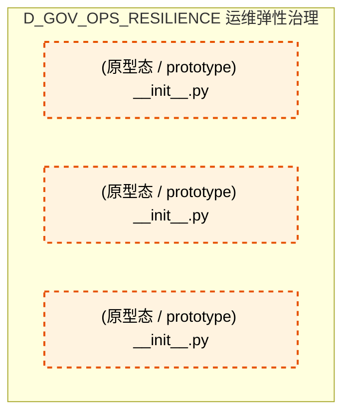
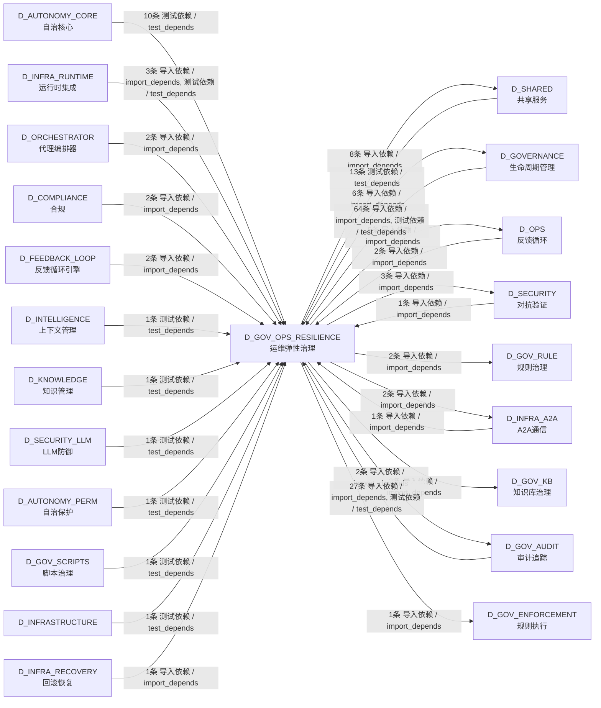

# 15_d_gov_ops_resilience / ops_resilience_governance / 运维弹性治理 / Ops Resilience Governance

> **功能简介 / Overview**: 运维弹性治理，负责运维治理、安全治理、弹性治理和升级协议

> **文档作用 / Purpose**: 展示 运维弹性治理（D_GOV_OPS_RESILIENCE）功能域的模块清单、域内依赖关系、跨域依赖关系、架构分层视图，供架构审查和域治理参考。

> 本文档由 generate_domain_doc.py 从 depgraph (PostgreSQL) 自动生成
> 最后更新: 2026-07-13 05:27:53
> 数据源: depgraph (PostgreSQL) nodes表 + edges表

## 域基本信息 / Domain Overview

| 字段 | 值 | Field | Value |
|------|------|-------|-------|
| 编号 | 15 | Number | 15 |
| 域ID | D_GOV_OPS_RESILIENCE | Domain ID | D_GOV_OPS_RESILIENCE |
| 域名称 | 运维弹性治理 | Domain Name | Ops Resilience Governance |
| 层级 | L1 基础平台层 | Layer | L1 Foundation |
| 模块数 | 79 | Module Count | 79 |
| 域内依赖 | 17 | Internal Dependencies | 17 |
| 跨域入边 | 134 | Cross-domain Incoming | 134 |
| 跨域出边 | 31 | Cross-domain Outgoing | 31 |
| 设计态模块 | 0 | Design Modules | 0 |
| 原型态模块 | 3 | Prototype Modules | 3 |
| 生产态模块 | 76 | Production Modules | 76 |
| 容量 | 76/150 (正常) | Capacity | 76/150 (正常) |
| 描述 | 运维治理(ops_governance) | Description | 运维治理(ops_governance) |

## 模块分层清单 / Module Layered List

> 按 architecture_layer 分组的模块清单（共 79 个模块 / 79 modules）。

### L1 基础层 / Foundation Layer (79 modules)

| # | 模块路径 / Module Path | 模块名称 / Module Name (功能简介 / Description) | 成熟度 / Maturity | 蓝图 / Blueprint |
|:--:|---------|---------|:---:|:---:|
| 1 | src/zephyr/governance/escalation/__init__.py | __init__.py | 生产态 / production |  |
| 2 | src/zephyr/governance/escalation/alternative_path_blocker.py | Alternative Path Blocker — v0.13.0 替代工具路... | 生产态 / production | [MOD-INF-022](../../03_modules/_domain_autonomy_perm/escalation_protocol/blueprint.md) |
| 3 | src/zephyr/governance/escalation/consequence_manager.py | consequence_manager.py | 生产态 / production | [MOD-INF-022](../../03_modules/_domain_autonomy_perm/escalation_protocol/blueprint.md) |
| 4 | src/zephyr/governance/escalation/contracts.py | G-CT-003 消费端 — Escalation.on_rollback_failu... | 生产态 / production | [MOD-INF-022](../../03_modules/_domain_autonomy_perm/escalation_protocol/blueprint.md) |
| 5 | src/zephyr/governance/escalation/escalation_api.py | Escalation API — v0.7.0 Service Account API: ... | 生产态 / production | [MOD-INF-022](../../03_modules/_domain_autonomy_perm/escalation_protocol/blueprint.md) |
| 6 | src/zephyr/governance/escalation/escalation_engine.py | Escalation Engine — MOD-INF-022 | 生产态 / production | [MOD-INF-022](../../03_modules/_domain_autonomy_perm/escalation_protocol/blueprint.md) |
| 7 | src/zephyr/governance/escalation/escalation_fatigue_manag... | Escalation Fatigue Manager — v0.11.0 升级疲劳... | 生产态 / production | [MOD-INF-022](../../03_modules/_domain_autonomy_perm/escalation_protocol/blueprint.md) |
| 8 | src/zephyr/governance/escalation/escalation_loop_detector.py | Escalation Loop Detector — v0.10.0 跨模块升级... | 生产态 / production | [MOD-INF-022](../../03_modules/_domain_autonomy_perm/escalation_protocol/blueprint.md) |
| 9 | src/zephyr/governance/escalation/escalation_metrics.py | Escalation Metrics — D-022-07 指标收集器: 升级... | 生产态 / production | [MOD-INF-022](../../03_modules/_domain_autonomy_perm/escalation_protocol/blueprint.md) |
| 10 | src/zephyr/governance/escalation/escalation_models.py | Escalation Protocol data models — MOD-INF-022 | 生产态 / production | [MOD-INF-022](../../03_modules/_domain_autonomy_perm/escalation_protocol/blueprint.md) |
| 11 | src/zephyr/governance/escalation/escalation_smoke_tests.py | Escalation Smoke Tests — v0.11.0 升级协议烟雾... | 生产态 / production | [MOD-INF-022](../../03_modules/_domain_autonomy_perm/escalation_protocol/blueprint.md) |
| 12 | src/zephyr/governance/escalation/git_hook_pre_scanner.py | Git Hook Pre-Scanner — v0.14.0 Git操作Hook预扫... | 生产态 / production | [MOD-INF-022](../../03_modules/_domain_autonomy_perm/escalation_protocol/blueprint.md) |
| 13 | src/zephyr/governance/escalation/human_factors.py | Human Factors — v0.7.0 人因工程: 通知疲劳管理+... | 生产态 / production | [MOD-INF-022](../../03_modules/_domain_autonomy_perm/escalation_protocol/blueprint.md) |
| 14 | src/zephyr/governance/escalation/identity_verifier.py | Identity Verifier — D-022-12 Agent身份验证器: ... | 生产态 / production | [MOD-INF-022](../../03_modules/_domain_autonomy_perm/escalation_protocol/blueprint.md) |
| 15 | src/zephyr/governance/escalation/incident_response.py | incident_response.py | 生产态 / production | [MOD-INF-022](../../03_modules/_domain_autonomy_perm/escalation_protocol/blueprint.md) |
| 16 | src/zephyr/governance/escalation/result_types.py | G-CT-003 — RollbackResult backward-compat re-e... | 生产态 / production | [MOD-INF-021](../../03_modules/_domain_autonomy_core/rollback_system/blueprint.md) |
| 17 | src/zephyr/governance/escalation/spof_checker.py | spof_checker.py | 生产态 / production | [MOD-INF-022](../../03_modules/_domain_autonomy_perm/escalation_protocol/blueprint.md) |
| 18 | src/zephyr/governance/escalation/triage.py | G2 Triage 门禁 — 知识分类评分（T-2-13-B） | 生产态 / production | [MOD-KB-001](../../03_modules/_domain_knowledge/knowledge_base/blueprint.md) |
| 19 | src/zephyr/governance/ops_governance/__init__.py | __init__.py | 原型态 / prototype |  |
| 20 | src/zephyr/governance/ops_governance/auto_runner.py | GovernanceAutoRunner — 治理脚本自动运行/自动关... | 生产态 / production | [MOD-INF-005](../../03_modules/_domain_governance/governance_automation/blueprint.md) |
| 21 | src/zephyr/governance/ops_governance/bandwidth_optimizer.py | bandwidth_optimizer.py | 生产态 / production | [MOD-INF-024](../../03_modules/_domain_autonomy_perm/budget_enforcer/blueprint.md) |
| 22 | src/zephyr/governance/ops_governance/burn_rate_monitor.py | Burn Rate Monitor — MOD-INF-024 | 生产态 / production | [MOD-INF-024](../../03_modules/_domain_autonomy_perm/budget_enforcer/blueprint.md) |
| 23 | src/zephyr/governance/ops_governance/clock_guard.py | Clock Guard — v0.8.0 时钟完整性防御: NTP漂移检... | 生产态 / production | [MOD-INF-022](../../03_modules/_domain_autonomy_perm/escalation_protocol/blueprint.md) |
| 24 | src/zephyr/governance/ops_governance/coldstart_manager.py | Coldstart Manager — v0.7.0 冷启动管理器: escal... | 生产态 / production | [MOD-INF-022](../../03_modules/_domain_autonomy_perm/escalation_protocol/blueprint.md) |
| 25 | src/zephyr/governance/ops_governance/cost_attributor.py | cost_attributor.py | 生产态 / production | [MOD-INF-024](../../03_modules/_domain_autonomy_perm/budget_enforcer/blueprint.md) |
| 26 | src/zephyr/governance/ops_governance/cost_router.py | cost_router.py | 生产态 / production | [MOD-INF-024](../../03_modules/_domain_autonomy_perm/budget_enforcer/blueprint.md) |
| 27 | src/zephyr/governance/ops_governance/daily_ops.py | daily_ops.py | 生产态 / production | [MOD-INF-024](../../03_modules/_domain_autonomy_perm/budget_enforcer/blueprint.md) |
| 28 | src/zephyr/governance/ops_governance/degradation_manager.py | degradation_manager.py | 生产态 / production | [MOD-INF-024](../../03_modules/_domain_autonomy_perm/budget_enforcer/blueprint.md) |
| 29 | src/zephyr/governance/ops_governance/error_budget_burst_l... | Error Budget Burst Limiter — v0.11.0 错误预算B... | 生产态 / production | [MOD-INF-022](../../03_modules/_domain_autonomy_perm/escalation_protocol/blueprint.md) |
| 30 | src/zephyr/governance/ops_governance/event_hook.py | EventHook — 声明式任务系统事件订阅 | 生产态 / production | [MOD-INF-002](../../03_modules/_domain_infrastructure_runtime/runtime_integration/blueprint.md) |
| 31 | src/zephyr/governance/ops_governance/interrupt_handler.py | Interrupt Handler — D-022-06 硬中断处理器: Own... | 生产态 / production | [MOD-INF-022](../../03_modules/_domain_autonomy_perm/escalation_protocol/blueprint.md) |
| 32 | src/zephyr/governance/ops_governance/maintenance_window_a... | Maintenance Window Adapter — v0.10.0 计划维护... | 生产态 / production | [MOD-INF-022](../../03_modules/_domain_autonomy_perm/escalation_protocol/blueprint.md) |
| 33 | src/zephyr/governance/ops_governance/ops_foundation.py | ops_foundation.py | 生产态 / production | [MOD-INF-024](../../03_modules/_domain_autonomy_perm/budget_enforcer/blueprint.md) |
| 34 | src/zephyr/governance/ops_governance/parent_child_attribu... | parent_child_attributor.py | 生产态 / production | [MOD-INF-024](../../03_modules/_domain_autonomy_perm/budget_enforcer/blueprint.md) |
| 35 | src/zephyr/governance/ops_governance/roi_calculator.py | roi_calculator.py | 生产态 / production | [MOD-INF-024](../../03_modules/_domain_autonomy_perm/budget_enforcer/blueprint.md) |
| 36 | src/zephyr/governance/ops_governance/self_budget_tracker.py | self_budget_tracker.py | 生产态 / production | [MOD-INF-024](../../03_modules/_domain_autonomy_perm/budget_enforcer/blueprint.md) |
| 37 | src/zephyr/governance/ops_governance/stream_abort_guard.py | StreamAbortGuard — 流式中断守卫 | 生产态 / production | [MOD-INF-024](../../03_modules/_domain_autonomy_perm/budget_enforcer/blueprint.md) |
| 38 | src/zephyr/governance/ops_governance/tco_model.py | tco_model.py | 生产态 / production | [MOD-INF-024](../../03_modules/_domain_autonomy_perm/budget_enforcer/blueprint.md) |
| 39 | src/zephyr/governance/ops_governance/time_sync.py | time_sync.py | 生产态 / production | [MOD-INF-024](../../03_modules/_domain_autonomy_perm/budget_enforcer/blueprint.md) |
| 40 | src/zephyr/governance/ops_governance/timeout_guard.py | timeout_guard.py | 生产态 / production | [MOD-INF-024](../../03_modules/_domain_autonomy_perm/budget_enforcer/blueprint.md) |
| 41 | src/zephyr/governance/resilience_governance/__init__.py | __init__.py | 原型态 / prototype |  |
| 42 | src/zephyr/governance/resilience_governance/account_isola... | Account Isolator — v0.10.0 多账户升级隔离器。 | 生产态 / production | [MOD-INF-022](../../03_modules/_domain_autonomy_perm/escalation_protocol/blueprint.md) |
| 43 | src/zephyr/governance/resilience_governance/blast_radius.py | blast_radius — MOD-INF-028 §3.1 Stage 9 | 生产态 / production | [MOD-INF-028](../../03_modules/_cross_layer/semantic_auditor/blueprint.md) |
| 44 | src/zephyr/governance/resilience_governance/broker_resili... | broker_resilience.py | 生产态 / production | [MOD-INF-022](../../03_modules/_domain_autonomy_perm/escalation_protocol/blueprint.md) |
| 45 | src/zephyr/governance/resilience_governance/circuit_break... | Circuit Breaker — MOD-INF-022 | 生产态 / production | [MOD-INF-022](../../03_modules/_domain_autonomy_perm/escalation_protocol/blueprint.md) |
| 46 | src/zephyr/governance/resilience_governance/deadlock_dete... | Deadlock Detector — D-022-04 多Agent死锁+循环... | 生产态 / production | [MOD-INF-022](../../03_modules/_domain_autonomy_perm/escalation_protocol/blueprint.md) |
| 47 | src/zephyr/governance/resilience_governance/decision_fati... | decision_fatigue.py | 生产态 / production | [MOD-INF-022](../../03_modules/_domain_autonomy_perm/escalation_protocol/blueprint.md) |
| 48 | src/zephyr/governance/resilience_governance/decision_fati... | decision_fatigue_cli.py | 生产态 / production | [MOD-INF-022](../../03_modules/_domain_autonomy_perm/escalation_protocol/blueprint.md) |
| 49 | src/zephyr/governance/resilience_governance/engine_sandbo... | EngineSandbox — D-022-08 OS-level sandboxing f... | 生产态 / production | [MOD-INF-022](../../03_modules/_domain_autonomy_perm/escalation_protocol/blueprint.md) |
| 50 | src/zephyr/governance/resilience_governance/f5_boot_integ... | F5BootIntegration — F5 自动启动/关闭集成 (MOD-... | 生产态 / production | [MOD-INF-022](../../03_modules/_domain_autonomy_perm/escalation_protocol/blueprint.md) |
| 51 | src/zephyr/governance/resilience_governance/f5_event_subs... | F5EventSubscriber — F5 事件启动机制 (MOD-INF-0... | 生产态 / production | [MOD-INF-022](../../03_modules/_domain_autonomy_perm/escalation_protocol/blueprint.md) |
| 52 | src/zephyr/governance/resilience_governance/f5_shutdown_m... | F5ShutdownManager — F5 自动关闭/状态持久化/信... | 生产态 / production | [MOD-INF-022](../../03_modules/_domain_autonomy_perm/escalation_protocol/blueprint.md) |
| 53 | src/zephyr/governance/resilience_governance/fail_mode_man... | fail_mode_manager.py | 生产态 / production | [MOD-INF-024](../../03_modules/_domain_autonomy_perm/budget_enforcer/blueprint.md) |
| 54 | src/zephyr/governance/resilience_governance/last_resort_w... | Last Resort Watchdog — v0.8.0 终极逃生舱: 所有... | 生产态 / production | [MOD-INF-022](../../03_modules/_domain_autonomy_perm/escalation_protocol/blueprint.md) |
| 55 | src/zephyr/governance/resilience_governance/policy_sandbo... | policy_sandbox.py | 生产态 / production | [MOD-INF-024](../../03_modules/_domain_autonomy_perm/budget_enforcer/blueprint.md) |
| 56 | src/zephyr/governance/resilience_governance/process_isola... | Process Isolator — v0.6.0 进程隔离器: engine运... | 生产态 / production | [MOD-INF-022](../../03_modules/_domain_autonomy_perm/escalation_protocol/blueprint.md) |
| 57 | src/zephyr/governance/resilience_governance/witness_isola... | Witness Isolation — v0.8.0 Witness隔离: N版本d... | 生产态 / production | [MOD-INF-022](../../03_modules/_domain_autonomy_perm/escalation_protocol/blueprint.md) |
| 58 | src/zephyr/governance/security_governance/__init__.py | __init__.py | 原型态 / prototype |  |
| 59 | src/zephyr/governance/security_governance/adversarial_tes... | adversarial_tester.py | 生产态 / production | [MOD-INF-024](../../03_modules/_domain_autonomy_perm/budget_enforcer/blueprint.md) |
| 60 | src/zephyr/governance/security_governance/anti_automation... | Anti-Automation Bias — D-022-09 mandatory huma... | 生产态 / production | [MOD-INF-022](../../03_modules/_domain_autonomy_perm/escalation_protocol/blueprint.md) |
| 61 | src/zephyr/governance/security_governance/api_response_sa... | API Response Sanitizer — v0.9.0 API响应清洗器:... | 生产态 / production | [MOD-INF-022](../../03_modules/_domain_autonomy_perm/escalation_protocol/blueprint.md) |
| 62 | src/zephyr/governance/security_governance/bare_repo_scann... | Bare Repo Scanner — v0.14.0 嵌入式裸仓库检测器。 | 生产态 / production | [MOD-INF-022](../../03_modules/_domain_autonomy_perm/escalation_protocol/blueprint.md) |
| 63 | src/zephyr/governance/security_governance/compositional_s... | Compositional Safety Tester — v0.14.0 组合性不... | 生产态 / production | [MOD-INF-022](../../03_modules/_domain_autonomy_perm/escalation_protocol/blueprint.md) |
| 64 | src/zephyr/governance/security_governance/config_scanner.py | Config Scanner — v0.9.0 AI配置文件注入扫描器: ... | 生产态 / production | [MOD-INF-022](../../03_modules/_domain_autonomy_perm/escalation_protocol/blueprint.md) |
| 65 | src/zephyr/governance/security_governance/credential_guar... | Credential Guard — v0.7.0 密钥泄露防护: env检... | 生产态 / production | [MOD-INF-022](../../03_modules/_domain_autonomy_perm/escalation_protocol/blueprint.md) |
| 66 | src/zephyr/governance/security_governance/default_securit... | DefaultSecurityGateway — SecurityGateway 三层... | 生产态 / production | [MOD-L10-001](../../03_modules/_domain_compliance/blueprint.md) |
| 67 | src/zephyr/governance/security_governance/ghost_scan.py | Ghost Scan — v0.8.0 幽灵进程检测: lingering pr... | 生产态 / production | [MOD-INF-022](../../03_modules/_domain_autonomy_perm/escalation_protocol/blueprint.md) |
| 68 | src/zephyr/governance/security_governance/github_api_guar... | GitHub API Guard — v0.9.0 Comment and Control... | 生产态 / production | [MOD-INF-022](../../03_modules/_domain_autonomy_perm/escalation_protocol/blueprint.md) |
| 69 | src/zephyr/governance/security_governance/hooks_integrity... | Hooks Integrity Guard — v0.11.0 Hooks自编辑防... | 生产态 / production | [MOD-INF-022](../../03_modules/_domain_autonomy_perm/escalation_protocol/blueprint.md) |
| 70 | src/zephyr/governance/security_governance/ipi_defense.py | ipi_defense.py | 生产态 / production | [MOD-INF-024](../../03_modules/_domain_autonomy_perm/budget_enforcer/blueprint.md) |
| 71 | src/zephyr/governance/security_governance/memory_poison_g... | Memory Poison Guard — v0.9.0 记忆投毒防护: Mem... | 生产态 / production | [MOD-INF-022](../../03_modules/_domain_autonomy_perm/escalation_protocol/blueprint.md) |
| 72 | src/zephyr/governance/security_governance/persuasion_dete... | Persuasion Detector — D-022-09 心理说服检测: ... | 生产态 / production | [MOD-INF-022](../../03_modules/_domain_autonomy_perm/escalation_protocol/blueprint.md) |
| 73 | src/zephyr/governance/security_governance/poison_cascade_... | poison_cascade_detector.py | 生产态 / production | [MOD-INF-024](../../03_modules/_domain_autonomy_perm/budget_enforcer/blueprint.md) |
| 74 | src/zephyr/governance/security_governance/sbom_guard.py | SBOM Guard — v0.8.0 SBOM供应链防护: 依赖版本锁... | 生产态 / production | [MOD-INF-022](../../03_modules/_domain_autonomy_perm/escalation_protocol/blueprint.md) |
| 75 | src/zephyr/governance/security_governance/security_config... | Security Config Scanner — v0.13.0 缺失安全配置... | 生产态 / production | [MOD-INF-022](../../03_modules/_domain_autonomy_perm/escalation_protocol/blueprint.md) |
| 76 | src/zephyr/governance/security_governance/security_gatewa... | D_COMPLIANCE — Governance & Compliance Layer | 生产态 / production | [MOD-L10-001](../../03_modules/_domain_compliance/blueprint.md) |
| 77 | src/zephyr/governance/security_governance/tamper_evident_... | tamper_evident_log.py | 生产态 / production | [MOD-INF-024](../../03_modules/_domain_autonomy_perm/budget_enforcer/blueprint.md) |
| 78 | src/zephyr/governance/security_governance/vibe_security_v... | Vibe Security Verifier — v0.9.0 Vibe Coding安... | 生产态 / production | [MOD-INF-022](../../03_modules/_domain_autonomy_perm/escalation_protocol/blueprint.md) |
| 79 | src/zephyr/governance/security_governance/vibe_verify_int... | VibeVerify Integration — v0.9.0 VibeVerify集成... | 生产态 / production | [MOD-INF-022](../../03_modules/_domain_autonomy_perm/escalation_protocol/blueprint.md) |

## 域内依赖图 / Internal Dependency Diagram

> 依赖图内嵌在本文档中，IDE 可直接渲染显示。参考 decision_index.md 设计，分四个视图：合并全景图、运营态子图、设计态子图、原型态子图（按 design_maturity 实际值拆分）。
>
> **图例说明 / Legend**：
> - **实线边框 = 运营态模块**（production，已上线运行）
> - **虚线边框 = 设计态模块**（design，蓝图阶段，代码未写）
> - **虚线边框 = 原型态模块**（prototype，代码已写，验证中未稳定上线）
> - **实线箭头 = 运营态依赖**（已生效的依赖关系）
> - **虚线箭头 = 非运营态依赖**（计划中/验证中的依赖关系）

### 合并全景图（全部模块，标签标注成熟度）

> 展示全部 79 个模块（生产态 76 + 设计态 0 + 原型态 3），标签标注成熟度。

#### 第 1 页 / 共 3 页

```mermaid
graph TD
    subgraph D_GOV_OPS_RESILIENCE["D_GOV_OPS_RESILIENCE 运维弹性治理"]
        src_zephyr_governance_escalation_init_py["(生产态 / production) __init__.py"]
        src_zephyr_governance_escalation_alternative_path_blocker_py["(生产态 / production) Alternative Path Blocker — v0.13.0 替代工具路...<br/>文件: alternative_path_blocker.py"]
        src_zephyr_governance_escalation_consequence_manager_py["(生产态 / production) consequence_manager.py"]
        src_zephyr_governance_escalation_contracts_py["(生产态 / production) G-CT-003 消费端 — Escalation.on_rollback_failu...<br/>文件: contracts.py"]
        src_zephyr_governance_escalation_escalation_api_py["(生产态 / production) Escalation API — v0.7.0 Service Account API: ...<br/>文件: escalation_api.py"]
        src_zephyr_governance_escalation_escalation_engine_py["(生产态 / production) Escalation Engine — MOD-INF-022<br/>文件: escalation_engine.py"]
        src_zephyr_governance_escalation_escalation_fatigue_manager_py["(生产态 / production) Escalation Fatigue Manager — v0.11.0 升级疲劳...<br/>文件: escalation_fatigue_manager.py"]
        src_zephyr_governance_escalation_escalation_loop_detector_py["(生产态 / production) Escalation Loop Detector — v0.10.0 跨模块升级...<br/>文件: escalation_loop_detector.py"]
        src_zephyr_governance_escalation_escalation_metrics_py["(生产态 / production) Escalation Metrics — D-022-07 指标收集器: 升级...<br/>文件: escalation_metrics.py"]
        src_zephyr_governance_escalation_escalation_models_py["(生产态 / production) Escalation Protocol data models — MOD-INF-022<br/>文件: escalation_models.py"]
        src_zephyr_governance_escalation_escalation_smoke_tests_py["(生产态 / production) Escalation Smoke Tests — v0.11.0 升级协议烟雾...<br/>文件: escalation_smoke_tests.py"]
        src_zephyr_governance_escalation_git_hook_pre_scanner_py["(生产态 / production) Git Hook Pre-Scanner — v0.14.0 Git操作Hook预扫...<br/>文件: git_hook_pre_scanner.py"]
        src_zephyr_governance_escalation_human_factors_py["(生产态 / production) Human Factors — v0.7.0 人因工程: 通知疲劳管理+...<br/>文件: human_factors.py"]
        src_zephyr_governance_escalation_identity_verifier_py["(生产态 / production) Identity Verifier — D-022-12 Agent身份验证器: ...<br/>文件: identity_verifier.py"]
        src_zephyr_governance_escalation_incident_response_py["(生产态 / production) incident_response.py"]
        src_zephyr_governance_escalation_result_types_py["(生产态 / production) G-CT-003 — RollbackResult backward-compat re-e...<br/>文件: result_types.py"]
        src_zephyr_governance_escalation_spof_checker_py["(生产态 / production) spof_checker.py"]
        src_zephyr_governance_escalation_triage_py["(生产态 / production) G2 Triage 门禁 — 知识分类评分（T-2-13-B）<br/>文件: triage.py"]
        src_zephyr_governance_ops_governance_init_py["(原型态 / prototype) __init__.py"]
        src_zephyr_governance_ops_governance_auto_runner_py["(生产态 / production) GovernanceAutoRunner — 治理脚本自动运行/自动关...<br/>文件: auto_runner.py"]
        src_zephyr_governance_ops_governance_bandwidth_optimizer_py["(生产态 / production) bandwidth_optimizer.py"]
        src_zephyr_governance_ops_governance_burn_rate_monitor_py["(生产态 / production) Burn Rate Monitor — MOD-INF-024<br/>文件: burn_rate_monitor.py"]
        src_zephyr_governance_ops_governance_clock_guard_py["(生产态 / production) Clock Guard — v0.8.0 时钟完整性防御: NTP漂移检...<br/>文件: clock_guard.py"]
        src_zephyr_governance_ops_governance_coldstart_manager_py["(生产态 / production) Coldstart Manager — v0.7.0 冷启动管理器: escal...<br/>文件: coldstart_manager.py"]
        src_zephyr_governance_ops_governance_cost_attributor_py["(生产态 / production) cost_attributor.py"]
        src_zephyr_governance_ops_governance_cost_router_py["(生产态 / production) cost_router.py"]
        src_zephyr_governance_ops_governance_daily_ops_py["(生产态 / production) daily_ops.py"]
        src_zephyr_governance_ops_governance_degradation_manager_py["(生产态 / production) degradation_manager.py"]
        src_zephyr_governance_ops_governance_error_budget_burst_limiter_py["(生产态 / production) Error Budget Burst Limiter — v0.11.0 错误预算B...<br/>文件: error_budget_burst_limiter.py"]
        src_zephyr_governance_ops_governance_event_hook_py["(生产态 / production) EventHook — 声明式任务系统事件订阅<br/>文件: event_hook.py"]
    end
    src_zephyr_governance_escalation_escalation_engine_py -->|导入依赖 / import_depends| src_zephyr_governance_escalation_escalation_metrics_py
    src_zephyr_governance_escalation_escalation_engine_py -->|导入依赖 / import_depends| src_zephyr_governance_escalation_escalation_models_py
    src_zephyr_governance_escalation_escalation_api_py -->|导入依赖 / import_depends| src_zephyr_governance_escalation_escalation_models_py
    src_zephyr_governance_escalation_init_py -->|导入依赖 / import_depends| src_zephyr_governance_escalation_escalation_engine_py
    src_zephyr_governance_escalation_init_py -->|导入依赖 / import_depends| src_zephyr_governance_escalation_escalation_models_py
    D_SHARED["(生产态 / production) D_SHARED"]
    src_zephyr_governance_escalation_contracts_py -->|导入依赖 / import_depends| D_SHARED
    D_SECURITY["(生产态 / production) D_SECURITY"]
    src_zephyr_governance_escalation_escalation_engine_py -->|导入依赖 / import_depends| D_SECURITY
    src_zephyr_governance_escalation_escalation_engine_py -.->|导入依赖 / import_depends| D_SHARED
    src_zephyr_governance_escalation_triage_py -.->|导入依赖 / import_depends| D_SHARED
    D_GOV_RULE["(生产态 / production) D_GOV_RULE"]
    src_zephyr_governance_escalation_triage_py -->|导入依赖 / import_depends| D_GOV_RULE
    src_zephyr_governance_escalation_triage_py -->|导入依赖 / import_depends| D_GOV_RULE
    D_GOV_KB["(生产态 / production) D_GOV_KB"]
    src_zephyr_governance_escalation_triage_py -->|导入依赖 / import_depends| D_GOV_KB
    src_zephyr_governance_escalation_triage_py -->|导入依赖 / import_depends| D_GOV_KB
    D_GOVERNANCE["(生产态 / production) D_GOVERNANCE"]
    src_zephyr_governance_escalation_init_py -->|导入依赖 / import_depends| D_GOVERNANCE
    src_zephyr_governance_ops_governance_auto_runner_py -->|导入依赖 / import_depends| D_GOVERNANCE
    D_OPS["(生产态 / production) D_OPS"]
    src_zephyr_governance_ops_governance_burn_rate_monitor_py -->|导入依赖 / import_depends| D_OPS
    src_zephyr_governance_ops_governance_cost_attributor_py -->|导入依赖 / import_depends| D_OPS
    src_zephyr_governance_ops_governance_degradation_manager_py -->|导入依赖 / import_depends| D_OPS
    D_FEEDBACK_LOOP["(生产态 / production) D_FEEDBACK_LOOP"]
    D_FEEDBACK_LOOP -->|导入依赖 / import_depends| src_zephyr_governance_escalation_escalation_engine_py
    D_FEEDBACK_LOOP -->|导入依赖 / import_depends| src_zephyr_governance_escalation_escalation_models_py
    D_GOVERNANCE -->|导入依赖 / import_depends| src_zephyr_governance_escalation_contracts_py
    D_GOV_AUDIT["(生产态 / production) D_GOV_AUDIT"]
    D_GOV_AUDIT -->|导入依赖 / import_depends| src_zephyr_governance_ops_governance_burn_rate_monitor_py
    D_GOV_AUDIT -->|导入依赖 / import_depends| src_zephyr_governance_ops_governance_degradation_manager_py
    D_GOVERNANCE -->|导入依赖 / import_depends| src_zephyr_governance_escalation_escalation_models_py
    D_GOVERNANCE -->|导入依赖 / import_depends| src_zephyr_governance_escalation_escalation_engine_py
    D_GOVERNANCE -->|导入依赖 / import_depends| src_zephyr_governance_escalation_escalation_models_py
    D_GOVERNANCE -->|导入依赖 / import_depends| src_zephyr_governance_ops_governance_event_hook_py
    D_OPS -->|导入依赖 / import_depends| src_zephyr_governance_escalation_contracts_py
    D_GOVERNANCE -->|导入依赖 / import_depends| src_zephyr_governance_ops_governance_event_hook_py
    D_GOVERNANCE -->|导入依赖 / import_depends| src_zephyr_governance_escalation_escalation_engine_py
    D_GOVERNANCE -->|导入依赖 / import_depends| src_zephyr_governance_escalation_escalation_models_py
    D_GOV_AUDIT -.->|导入依赖 / import_depends| src_zephyr_governance_escalation_escalation_engine_py
    D_INFRA_A2A["(生产态 / production) D_INFRA_A2A"]
    D_INFRA_A2A -->|导入依赖 / import_depends| src_zephyr_governance_escalation_escalation_models_py
    classDef production fill:#e1f5fe,stroke:#01579b,stroke-width:2px,color:#000
    classDef design fill:#fff3e0,stroke:#e65100,stroke-width:2px,color:#000,stroke-dasharray: 5 5
    classDef external_prod fill:#e8f5e9,stroke:#1b5e20,stroke-width:1px,color:#000
    classDef external_design fill:#fce4ec,stroke:#880e4f,stroke-width:1px,color:#000,stroke-dasharray: 5 5
    class src_zephyr_governance_escalation_init_py,src_zephyr_governance_escalation_alternative_path_blocker_py,src_zephyr_governance_escalation_consequence_manager_py,src_zephyr_governance_escalation_contracts_py,src_zephyr_governance_escalation_escalation_api_py,src_zephyr_governance_escalation_escalation_engine_py,src_zephyr_governance_escalation_escalation_fatigue_manager_py,src_zephyr_governance_escalation_escalation_loop_detector_py,src_zephyr_governance_escalation_escalation_metrics_py,src_zephyr_governance_escalation_escalation_models_py,src_zephyr_governance_escalation_escalation_smoke_tests_py,src_zephyr_governance_escalation_git_hook_pre_scanner_py,src_zephyr_governance_escalation_human_factors_py,src_zephyr_governance_escalation_identity_verifier_py,src_zephyr_governance_escalation_incident_response_py,src_zephyr_governance_escalation_result_types_py,src_zephyr_governance_escalation_spof_checker_py,src_zephyr_governance_escalation_triage_py,src_zephyr_governance_ops_governance_auto_runner_py,src_zephyr_governance_ops_governance_bandwidth_optimizer_py,src_zephyr_governance_ops_governance_burn_rate_monitor_py,src_zephyr_governance_ops_governance_clock_guard_py,src_zephyr_governance_ops_governance_coldstart_manager_py,src_zephyr_governance_ops_governance_cost_attributor_py,src_zephyr_governance_ops_governance_cost_router_py,src_zephyr_governance_ops_governance_daily_ops_py,src_zephyr_governance_ops_governance_degradation_manager_py,src_zephyr_governance_ops_governance_error_budget_burst_limiter_py,src_zephyr_governance_ops_governance_event_hook_py production
    class src_zephyr_governance_ops_governance_init_py design
    class D_SHARED,D_SECURITY,D_GOV_RULE,D_GOV_KB,D_GOVERNANCE,D_OPS,D_FEEDBACK_LOOP,D_GOV_AUDIT,D_INFRA_A2A external_prod
```



#### 第 2 页 / 共 3 页

```mermaid
graph TD
    subgraph D_GOV_OPS_RESILIENCE["D_GOV_OPS_RESILIENCE 运维弹性治理"]
        src_zephyr_governance_ops_governance_interrupt_handler_py["(生产态 / production) Interrupt Handler — D-022-06 硬中断处理器: Own...<br/>文件: interrupt_handler.py"]
        src_zephyr_governance_ops_governance_maintenance_window_adapter_py["(生产态 / production) Maintenance Window Adapter — v0.10.0 计划维护...<br/>文件: maintenance_window_adapter.py"]
        src_zephyr_governance_ops_governance_ops_foundation_py["(生产态 / production) ops_foundation.py"]
        src_zephyr_governance_ops_governance_parent_child_attributor_py["(生产态 / production) parent_child_attributor.py"]
        src_zephyr_governance_ops_governance_roi_calculator_py["(生产态 / production) roi_calculator.py"]
        src_zephyr_governance_ops_governance_self_budget_tracker_py["(生产态 / production) self_budget_tracker.py"]
        src_zephyr_governance_ops_governance_stream_abort_guard_py["(生产态 / production) StreamAbortGuard — 流式中断守卫<br/>文件: stream_abort_guard.py"]
        src_zephyr_governance_ops_governance_tco_model_py["(生产态 / production) tco_model.py"]
        src_zephyr_governance_ops_governance_time_sync_py["(生产态 / production) time_sync.py"]
        src_zephyr_governance_ops_governance_timeout_guard_py["(生产态 / production) timeout_guard.py"]
        src_zephyr_governance_resilience_governance_init_py["(原型态 / prototype) __init__.py"]
        src_zephyr_governance_resilience_governance_account_isolator_py["(生产态 / production) Account Isolator — v0.10.0 多账户升级隔离器。<br/>文件: account_isolator.py"]
        src_zephyr_governance_resilience_governance_blast_radius_py["(生产态 / production) blast_radius — MOD-INF-028 §3.1 Stage 9<br/>文件: blast_radius.py"]
        src_zephyr_governance_resilience_governance_broker_resilience_py["(生产态 / production) broker_resilience.py"]
        src_zephyr_governance_resilience_governance_circuit_breaker_py["(生产态 / production) Circuit Breaker — MOD-INF-022<br/>文件: circuit_breaker.py"]
        src_zephyr_governance_resilience_governance_deadlock_detector_py["(生产态 / production) Deadlock Detector — D-022-04 多Agent死锁+循环...<br/>文件: deadlock_detector.py"]
        src_zephyr_governance_resilience_governance_decision_fatigue_py["(生产态 / production) decision_fatigue.py"]
        src_zephyr_governance_resilience_governance_decision_fatigue_cli_py["(生产态 / production) decision_fatigue_cli.py"]
        src_zephyr_governance_resilience_governance_engine_sandbox_py["(生产态 / production) EngineSandbox — D-022-08 OS-level sandboxing f...<br/>文件: engine_sandbox.py"]
        src_zephyr_governance_resilience_governance_f5_boot_integration_py["(生产态 / production) F5BootIntegration — F5 自动启动/关闭集成 (MOD-...<br/>文件: f5_boot_integration.py"]
        src_zephyr_governance_resilience_governance_f5_event_subscriber_py["(生产态 / production) F5EventSubscriber — F5 事件启动机制 (MOD-INF-0...<br/>文件: f5_event_subscriber.py"]
        src_zephyr_governance_resilience_governance_f5_shutdown_manager_py["(生产态 / production) F5ShutdownManager — F5 自动关闭/状态持久化/信...<br/>文件: f5_shutdown_manager.py"]
        src_zephyr_governance_resilience_governance_fail_mode_manager_py["(生产态 / production) fail_mode_manager.py"]
        src_zephyr_governance_resilience_governance_last_resort_watchdog_py["(生产态 / production) Last Resort Watchdog — v0.8.0 终极逃生舱: 所有...<br/>文件: last_resort_watchdog.py"]
        src_zephyr_governance_resilience_governance_policy_sandbox_py["(生产态 / production) policy_sandbox.py"]
        src_zephyr_governance_resilience_governance_process_isolator_py["(生产态 / production) Process Isolator — v0.6.0 进程隔离器: engine运...<br/>文件: process_isolator.py"]
        src_zephyr_governance_resilience_governance_witness_isolation_py["(生产态 / production) Witness Isolation — v0.8.0 Witness隔离: N版本d...<br/>文件: witness_isolation.py"]
        src_zephyr_governance_security_governance_init_py["(原型态 / prototype) __init__.py"]
        src_zephyr_governance_security_governance_adversarial_tester_py["(生产态 / production) adversarial_tester.py"]
        src_zephyr_governance_security_governance_anti_automation_bias_py["(生产态 / production) Anti-Automation Bias — D-022-09 mandatory huma...<br/>文件: anti_automation_bias.py"]
    end
    src_zephyr_governance_resilience_governance_decision_fatigue_cli_py -->|导入依赖 / import_depends| src_zephyr_governance_resilience_governance_decision_fatigue_py
    src_zephyr_governance_resilience_governance_f5_boot_integration_py -->|导入依赖 / import_depends| src_zephyr_governance_resilience_governance_deadlock_detector_py
    src_zephyr_governance_resilience_governance_init_py -.->|config_depends / config_depends| src_zephyr_governance_resilience_governance_blast_radius_py
    src_zephyr_governance_security_governance_adversarial_tester_py -->|导入依赖 / import_depends| src_zephyr_governance_ops_governance_stream_abort_guard_py
    src_zephyr_governance_security_governance_init_py -.->|config_depends / config_depends| src_zephyr_governance_security_governance_anti_automation_bias_py
    D_SHARED["(生产态 / production) D_SHARED"]
    src_zephyr_governance_resilience_governance_blast_radius_py -->|导入依赖 / import_depends| D_SHARED
    D_GOV_AUDIT["(生产态 / production) D_GOV_AUDIT"]
    src_zephyr_governance_resilience_governance_blast_radius_py -->|导入依赖 / import_depends| D_GOV_AUDIT
    D_INFRA_A2A["(生产态 / production) D_INFRA_A2A"]
    src_zephyr_governance_resilience_governance_f5_boot_integration_py -->|导入依赖 / import_depends| D_INFRA_A2A
    D_GOVERNANCE["(生产态 / production) D_GOVERNANCE"]
    src_zephyr_governance_resilience_governance_f5_boot_integration_py -->|导入依赖 / import_depends| D_GOVERNANCE
    src_zephyr_governance_resilience_governance_f5_event_subscriber_py -->|导入依赖 / import_depends| D_GOVERNANCE
    src_zephyr_governance_resilience_governance_f5_event_subscriber_py -->|导入依赖 / import_depends| D_INFRA_A2A
    src_zephyr_governance_resilience_governance_f5_event_subscriber_py -->|导入依赖 / import_depends| D_SHARED
    src_zephyr_governance_resilience_governance_f5_shutdown_manager_py -->|导入依赖 / import_depends| D_GOVERNANCE
    src_zephyr_governance_resilience_governance_f5_shutdown_manager_py -->|导入依赖 / import_depends| D_SHARED
    D_OPS["(生产态 / production) D_OPS"]
    src_zephyr_governance_security_governance_adversarial_tester_py -->|导入依赖 / import_depends| D_OPS
    src_zephyr_governance_security_governance_adversarial_tester_py -->|导入依赖 / import_depends| D_OPS
    D_GOV_AUDIT -->|导入依赖 / import_depends| src_zephyr_governance_ops_governance_timeout_guard_py
    D_GOVERNANCE -->|导入依赖 / import_depends| src_zephyr_governance_resilience_governance_circuit_breaker_py
    D_SHARED -.->|测试依赖 / test_depends| src_zephyr_governance_resilience_governance_circuit_breaker_py
    D_SHARED -.->|测试依赖 / test_depends| src_zephyr_governance_resilience_governance_decision_fatigue_py
    D_SHARED -.->|测试依赖 / test_depends| src_zephyr_governance_resilience_governance_deadlock_detector_py
    D_SHARED -.->|测试依赖 / test_depends| src_zephyr_governance_ops_governance_interrupt_handler_py
    D_GOV_AUDIT -.->|测试依赖 / test_depends| src_zephyr_governance_resilience_governance_f5_boot_integration_py
    D_GOV_AUDIT -.->|测试依赖 / test_depends| src_zephyr_governance_resilience_governance_f5_boot_integration_py
    D_GOV_AUDIT -.->|测试依赖 / test_depends| src_zephyr_governance_resilience_governance_f5_shutdown_manager_py
    D_GOV_AUDIT -.->|测试依赖 / test_depends| src_zephyr_governance_resilience_governance_deadlock_detector_py
    D_GOV_AUDIT -.->|测试依赖 / test_depends| src_zephyr_governance_resilience_governance_f5_boot_integration_py
    D_GOV_AUDIT -.->|测试依赖 / test_depends| src_zephyr_governance_resilience_governance_f5_event_subscriber_py
    D_GOV_AUDIT -.->|测试依赖 / test_depends| src_zephyr_governance_resilience_governance_f5_shutdown_manager_py
    D_GOV_AUDIT -.->|测试依赖 / test_depends| src_zephyr_governance_resilience_governance_deadlock_detector_py
    D_GOV_AUDIT -.->|测试依赖 / test_depends| src_zephyr_governance_resilience_governance_f5_event_subscriber_py
    classDef production fill:#e1f5fe,stroke:#01579b,stroke-width:2px,color:#000
    classDef design fill:#fff3e0,stroke:#e65100,stroke-width:2px,color:#000,stroke-dasharray: 5 5
    classDef external_prod fill:#e8f5e9,stroke:#1b5e20,stroke-width:1px,color:#000
    classDef external_design fill:#fce4ec,stroke:#880e4f,stroke-width:1px,color:#000,stroke-dasharray: 5 5
    class src_zephyr_governance_ops_governance_interrupt_handler_py,src_zephyr_governance_ops_governance_maintenance_window_adapter_py,src_zephyr_governance_ops_governance_ops_foundation_py,src_zephyr_governance_ops_governance_parent_child_attributor_py,src_zephyr_governance_ops_governance_roi_calculator_py,src_zephyr_governance_ops_governance_self_budget_tracker_py,src_zephyr_governance_ops_governance_stream_abort_guard_py,src_zephyr_governance_ops_governance_tco_model_py,src_zephyr_governance_ops_governance_time_sync_py,src_zephyr_governance_ops_governance_timeout_guard_py,src_zephyr_governance_resilience_governance_account_isolator_py,src_zephyr_governance_resilience_governance_blast_radius_py,src_zephyr_governance_resilience_governance_broker_resilience_py,src_zephyr_governance_resilience_governance_circuit_breaker_py,src_zephyr_governance_resilience_governance_deadlock_detector_py,src_zephyr_governance_resilience_governance_decision_fatigue_py,src_zephyr_governance_resilience_governance_decision_fatigue_cli_py,src_zephyr_governance_resilience_governance_engine_sandbox_py,src_zephyr_governance_resilience_governance_f5_boot_integration_py,src_zephyr_governance_resilience_governance_f5_event_subscriber_py,src_zephyr_governance_resilience_governance_f5_shutdown_manager_py,src_zephyr_governance_resilience_governance_fail_mode_manager_py,src_zephyr_governance_resilience_governance_last_resort_watchdog_py,src_zephyr_governance_resilience_governance_policy_sandbox_py,src_zephyr_governance_resilience_governance_process_isolator_py,src_zephyr_governance_resilience_governance_witness_isolation_py,src_zephyr_governance_security_governance_adversarial_tester_py,src_zephyr_governance_security_governance_anti_automation_bias_py production
    class src_zephyr_governance_resilience_governance_init_py,src_zephyr_governance_security_governance_init_py design
    class D_SHARED,D_GOV_AUDIT,D_INFRA_A2A,D_GOVERNANCE,D_OPS external_prod
```



#### 第 3 页 / 共 3 页

```mermaid
graph TD
    subgraph D_GOV_OPS_RESILIENCE["D_GOV_OPS_RESILIENCE 运维弹性治理"]
        src_zephyr_governance_security_governance_api_response_sanitizer_py["(生产态 / production) API Response Sanitizer — v0.9.0 API响应清洗器:...<br/>文件: api_response_sanitizer.py"]
        src_zephyr_governance_security_governance_bare_repo_scanner_py["(生产态 / production) Bare Repo Scanner — v0.14.0 嵌入式裸仓库检测器。<br/>文件: bare_repo_scanner.py"]
        src_zephyr_governance_security_governance_compositional_safety_tester_py["(生产态 / production) Compositional Safety Tester — v0.14.0 组合性不...<br/>文件: compositional_safety_tester.py"]
        src_zephyr_governance_security_governance_config_scanner_py["(生产态 / production) Config Scanner — v0.9.0 AI配置文件注入扫描器: ...<br/>文件: config_scanner.py"]
        src_zephyr_governance_security_governance_credential_guard_py["(生产态 / production) Credential Guard — v0.7.0 密钥泄露防护: env检...<br/>文件: credential_guard.py"]
        src_zephyr_governance_security_governance_default_security_gateway_py["(生产态 / production) DefaultSecurityGateway — SecurityGateway 三层...<br/>文件: default_security_gateway.py"]
        src_zephyr_governance_security_governance_ghost_scan_py["(生产态 / production) Ghost Scan — v0.8.0 幽灵进程检测: lingering pr...<br/>文件: ghost_scan.py"]
        src_zephyr_governance_security_governance_github_api_guard_py["(生产态 / production) GitHub API Guard — v0.9.0 Comment and Control...<br/>文件: github_api_guard.py"]
        src_zephyr_governance_security_governance_hooks_integrity_guard_py["(生产态 / production) Hooks Integrity Guard — v0.11.0 Hooks自编辑防...<br/>文件: hooks_integrity_guard.py"]
        src_zephyr_governance_security_governance_ipi_defense_py["(生产态 / production) ipi_defense.py"]
        src_zephyr_governance_security_governance_memory_poison_guard_py["(生产态 / production) Memory Poison Guard — v0.9.0 记忆投毒防护: Mem...<br/>文件: memory_poison_guard.py"]
        src_zephyr_governance_security_governance_persuasion_detector_py["(生产态 / production) Persuasion Detector — D-022-09 心理说服检测: ...<br/>文件: persuasion_detector.py"]
        src_zephyr_governance_security_governance_poison_cascade_detector_py["(生产态 / production) poison_cascade_detector.py"]
        src_zephyr_governance_security_governance_sbom_guard_py["(生产态 / production) SBOM Guard — v0.8.0 SBOM供应链防护: 依赖版本锁...<br/>文件: sbom_guard.py"]
        src_zephyr_governance_security_governance_security_config_scanner_py["(生产态 / production) Security Config Scanner — v0.13.0 缺失安全配置...<br/>文件: security_config_scanner.py"]
        src_zephyr_governance_security_governance_security_gateway_base_py["(生产态 / production) D_COMPLIANCE — Governance & Compliance Layer<br/>文件: security_gateway_base.py"]
        src_zephyr_governance_security_governance_tamper_evident_log_py["(生产态 / production) tamper_evident_log.py"]
        src_zephyr_governance_security_governance_vibe_security_verify_py["(生产态 / production) Vibe Security Verifier — v0.9.0 Vibe Coding安...<br/>文件: vibe_security_verify.py"]
        src_zephyr_governance_security_governance_vibe_verify_integration_py["(生产态 / production) VibeVerify Integration — v0.9.0 VibeVerify集成...<br/>文件: vibe_verify_integration.py"]
    end
    src_zephyr_governance_security_governance_default_security_gateway_py -->|导入依赖 / import_depends| src_zephyr_governance_security_governance_security_gateway_base_py
    D_GOVERNANCE["(生产态 / production) D_GOVERNANCE"]
    src_zephyr_governance_security_governance_default_security_gateway_py -->|导入依赖 / import_depends| D_GOVERNANCE
    D_SHARED["(原型态 / prototype) D_SHARED"]
    src_zephyr_governance_security_governance_default_security_gateway_py -.->|导入依赖 / import_depends| D_SHARED
    D_SECURITY["(生产态 / production) D_SECURITY"]
    src_zephyr_governance_security_governance_default_security_gateway_py -->|导入依赖 / import_depends| D_SECURITY
    src_zephyr_governance_security_governance_default_security_gateway_py -->|导入依赖 / import_depends| D_SECURITY
    src_zephyr_governance_security_governance_default_security_gateway_py -->|导入依赖 / import_depends| D_SHARED
    D_GOV_ENFORCEMENT["(原型态 / prototype) D_GOV_ENFORCEMENT"]
    src_zephyr_governance_security_governance_security_gateway_base_py -.->|导入依赖 / import_depends| D_GOV_ENFORCEMENT
    D_GOV_AUDIT["(生产态 / production) D_GOV_AUDIT"]
    src_zephyr_governance_security_governance_tamper_evident_log_py -->|导入依赖 / import_depends| D_GOV_AUDIT
    D_GOVERNANCE -.->|测试依赖 / test_depends| src_zephyr_governance_security_governance_bare_repo_scanner_py
    D_GOVERNANCE -.->|测试依赖 / test_depends| src_zephyr_governance_security_governance_api_response_sanitizer_py
    D_GOVERNANCE -.->|测试依赖 / test_depends| src_zephyr_governance_security_governance_compositional_safety_tester_py
    D_INFRASTRUCTURE["(原型态 / prototype) D_INFRASTRUCTURE"]
    D_INFRASTRUCTURE -.->|测试依赖 / test_depends| src_zephyr_governance_security_governance_config_scanner_py
    D_GOVERNANCE -.->|测试依赖 / test_depends| src_zephyr_governance_security_governance_credential_guard_py
    D_GOVERNANCE -.->|测试依赖 / test_depends| src_zephyr_governance_security_governance_ghost_scan_py
    D_SHARED -.->|测试依赖 / test_depends| src_zephyr_governance_security_governance_ghost_scan_py
    D_SECURITY_LLM["(原型态 / prototype) D_SECURITY_LLM"]
    D_SECURITY_LLM -.->|测试依赖 / test_depends| src_zephyr_governance_security_governance_default_security_gateway_py
    D_GOVERNANCE -.->|导入依赖 / import_depends| src_zephyr_governance_security_governance_default_security_gateway_py
    D_COMPLIANCE["(原型态 / prototype) D_COMPLIANCE"]
    D_COMPLIANCE -.->|导入依赖 / import_depends| src_zephyr_governance_security_governance_default_security_gateway_py
    D_GOVERNANCE -.->|测试依赖 / test_depends| src_zephyr_governance_security_governance_github_api_guard_py
    D_AUTONOMY_CORE["(原型态 / prototype) D_AUTONOMY_CORE"]
    D_AUTONOMY_CORE -.->|测试依赖 / test_depends| src_zephyr_governance_security_governance_memory_poison_guard_py
    D_GOVERNANCE -.->|测试依赖 / test_depends| src_zephyr_governance_security_governance_ipi_defense_py
    D_GOVERNANCE -.->|测试依赖 / test_depends| src_zephyr_governance_security_governance_ipi_defense_py
    D_INTELLIGENCE["(原型态 / prototype) D_INTELLIGENCE"]
    D_INTELLIGENCE -.->|测试依赖 / test_depends| src_zephyr_governance_security_governance_ipi_defense_py
    classDef production fill:#e1f5fe,stroke:#01579b,stroke-width:2px,color:#000
    classDef design fill:#fff3e0,stroke:#e65100,stroke-width:2px,color:#000,stroke-dasharray: 5 5
    classDef external_prod fill:#e8f5e9,stroke:#1b5e20,stroke-width:1px,color:#000
    classDef external_design fill:#fce4ec,stroke:#880e4f,stroke-width:1px,color:#000,stroke-dasharray: 5 5
    class src_zephyr_governance_security_governance_api_response_sanitizer_py,src_zephyr_governance_security_governance_bare_repo_scanner_py,src_zephyr_governance_security_governance_compositional_safety_tester_py,src_zephyr_governance_security_governance_config_scanner_py,src_zephyr_governance_security_governance_credential_guard_py,src_zephyr_governance_security_governance_default_security_gateway_py,src_zephyr_governance_security_governance_ghost_scan_py,src_zephyr_governance_security_governance_github_api_guard_py,src_zephyr_governance_security_governance_hooks_integrity_guard_py,src_zephyr_governance_security_governance_ipi_defense_py,src_zephyr_governance_security_governance_memory_poison_guard_py,src_zephyr_governance_security_governance_persuasion_detector_py,src_zephyr_governance_security_governance_poison_cascade_detector_py,src_zephyr_governance_security_governance_sbom_guard_py,src_zephyr_governance_security_governance_security_config_scanner_py,src_zephyr_governance_security_governance_security_gateway_base_py,src_zephyr_governance_security_governance_tamper_evident_log_py,src_zephyr_governance_security_governance_vibe_security_verify_py,src_zephyr_governance_security_governance_vibe_verify_integration_py production
    class D_GOVERNANCE,D_SECURITY,D_GOV_AUDIT external_prod
    class D_SHARED,D_GOV_ENFORCEMENT,D_INFRASTRUCTURE,D_SECURITY_LLM,D_COMPLIANCE,D_AUTONOMY_CORE,D_INTELLIGENCE external_design
```



### 运营态子图（仅 design_maturity=production 的模块和依赖）

> 仅展示已上线运行的模块（共 76 个，15 条域内依赖）。

```mermaid
graph TD
    subgraph D_GOV_OPS_RESILIENCE["D_GOV_OPS_RESILIENCE 运维弹性治理"]
        src_zephyr_governance_escalation_init_py["(生产态 / production) __init__.py"]
        src_zephyr_governance_escalation_alternative_path_blocker_py["(生产态 / production) Alternative Path Blocker — v0.13.0 替代工具路...<br/>文件: alternative_path_blocker.py"]
        src_zephyr_governance_escalation_consequence_manager_py["(生产态 / production) consequence_manager.py"]
        src_zephyr_governance_escalation_contracts_py["(生产态 / production) G-CT-003 消费端 — Escalation.on_rollback_failu...<br/>文件: contracts.py"]
        src_zephyr_governance_escalation_escalation_api_py["(生产态 / production) Escalation API — v0.7.0 Service Account API: ...<br/>文件: escalation_api.py"]
        src_zephyr_governance_escalation_escalation_engine_py["(生产态 / production) Escalation Engine — MOD-INF-022<br/>文件: escalation_engine.py"]
        src_zephyr_governance_escalation_escalation_fatigue_manager_py["(生产态 / production) Escalation Fatigue Manager — v0.11.0 升级疲劳...<br/>文件: escalation_fatigue_manager.py"]
        src_zephyr_governance_escalation_escalation_loop_detector_py["(生产态 / production) Escalation Loop Detector — v0.10.0 跨模块升级...<br/>文件: escalation_loop_detector.py"]
        src_zephyr_governance_escalation_escalation_metrics_py["(生产态 / production) Escalation Metrics — D-022-07 指标收集器: 升级...<br/>文件: escalation_metrics.py"]
        src_zephyr_governance_escalation_escalation_models_py["(生产态 / production) Escalation Protocol data models — MOD-INF-022<br/>文件: escalation_models.py"]
        src_zephyr_governance_escalation_escalation_smoke_tests_py["(生产态 / production) Escalation Smoke Tests — v0.11.0 升级协议烟雾...<br/>文件: escalation_smoke_tests.py"]
        src_zephyr_governance_escalation_git_hook_pre_scanner_py["(生产态 / production) Git Hook Pre-Scanner — v0.14.0 Git操作Hook预扫...<br/>文件: git_hook_pre_scanner.py"]
        src_zephyr_governance_escalation_human_factors_py["(生产态 / production) Human Factors — v0.7.0 人因工程: 通知疲劳管理+...<br/>文件: human_factors.py"]
        src_zephyr_governance_escalation_identity_verifier_py["(生产态 / production) Identity Verifier — D-022-12 Agent身份验证器: ...<br/>文件: identity_verifier.py"]
        src_zephyr_governance_escalation_incident_response_py["(生产态 / production) incident_response.py"]
        src_zephyr_governance_escalation_result_types_py["(生产态 / production) G-CT-003 — RollbackResult backward-compat re-e...<br/>文件: result_types.py"]
        src_zephyr_governance_escalation_spof_checker_py["(生产态 / production) spof_checker.py"]
        src_zephyr_governance_escalation_triage_py["(生产态 / production) G2 Triage 门禁 — 知识分类评分（T-2-13-B）<br/>文件: triage.py"]
        src_zephyr_governance_ops_governance_auto_runner_py["(生产态 / production) GovernanceAutoRunner — 治理脚本自动运行/自动关...<br/>文件: auto_runner.py"]
        src_zephyr_governance_ops_governance_bandwidth_optimizer_py["(生产态 / production) bandwidth_optimizer.py"]
        src_zephyr_governance_ops_governance_burn_rate_monitor_py["(生产态 / production) Burn Rate Monitor — MOD-INF-024<br/>文件: burn_rate_monitor.py"]
        src_zephyr_governance_ops_governance_clock_guard_py["(生产态 / production) Clock Guard — v0.8.0 时钟完整性防御: NTP漂移检...<br/>文件: clock_guard.py"]
        src_zephyr_governance_ops_governance_coldstart_manager_py["(生产态 / production) Coldstart Manager — v0.7.0 冷启动管理器: escal...<br/>文件: coldstart_manager.py"]
        src_zephyr_governance_ops_governance_cost_attributor_py["(生产态 / production) cost_attributor.py"]
        src_zephyr_governance_ops_governance_cost_router_py["(生产态 / production) cost_router.py"]
        src_zephyr_governance_ops_governance_daily_ops_py["(生产态 / production) daily_ops.py"]
        src_zephyr_governance_ops_governance_degradation_manager_py["(生产态 / production) degradation_manager.py"]
        src_zephyr_governance_ops_governance_error_budget_burst_limiter_py["(生产态 / production) Error Budget Burst Limiter — v0.11.0 错误预算B...<br/>文件: error_budget_burst_limiter.py"]
        src_zephyr_governance_ops_governance_event_hook_py["(生产态 / production) EventHook — 声明式任务系统事件订阅<br/>文件: event_hook.py"]
        src_zephyr_governance_ops_governance_interrupt_handler_py["(生产态 / production) Interrupt Handler — D-022-06 硬中断处理器: Own...<br/>文件: interrupt_handler.py"]
        src_zephyr_governance_ops_governance_maintenance_window_adapter_py["(生产态 / production) Maintenance Window Adapter — v0.10.0 计划维护...<br/>文件: maintenance_window_adapter.py"]
        src_zephyr_governance_ops_governance_ops_foundation_py["(生产态 / production) ops_foundation.py"]
        src_zephyr_governance_ops_governance_parent_child_attributor_py["(生产态 / production) parent_child_attributor.py"]
        src_zephyr_governance_ops_governance_roi_calculator_py["(生产态 / production) roi_calculator.py"]
        src_zephyr_governance_ops_governance_self_budget_tracker_py["(生产态 / production) self_budget_tracker.py"]
        src_zephyr_governance_ops_governance_stream_abort_guard_py["(生产态 / production) StreamAbortGuard — 流式中断守卫<br/>文件: stream_abort_guard.py"]
        src_zephyr_governance_ops_governance_tco_model_py["(生产态 / production) tco_model.py"]
        src_zephyr_governance_ops_governance_time_sync_py["(生产态 / production) time_sync.py"]
        src_zephyr_governance_ops_governance_timeout_guard_py["(生产态 / production) timeout_guard.py"]
        src_zephyr_governance_resilience_governance_account_isolator_py["(生产态 / production) Account Isolator — v0.10.0 多账户升级隔离器。<br/>文件: account_isolator.py"]
        src_zephyr_governance_resilience_governance_blast_radius_py["(生产态 / production) blast_radius — MOD-INF-028 §3.1 Stage 9<br/>文件: blast_radius.py"]
        src_zephyr_governance_resilience_governance_broker_resilience_py["(生产态 / production) broker_resilience.py"]
        src_zephyr_governance_resilience_governance_circuit_breaker_py["(生产态 / production) Circuit Breaker — MOD-INF-022<br/>文件: circuit_breaker.py"]
        src_zephyr_governance_resilience_governance_deadlock_detector_py["(生产态 / production) Deadlock Detector — D-022-04 多Agent死锁+循环...<br/>文件: deadlock_detector.py"]
        src_zephyr_governance_resilience_governance_decision_fatigue_py["(生产态 / production) decision_fatigue.py"]
        src_zephyr_governance_resilience_governance_decision_fatigue_cli_py["(生产态 / production) decision_fatigue_cli.py"]
        src_zephyr_governance_resilience_governance_engine_sandbox_py["(生产态 / production) EngineSandbox — D-022-08 OS-level sandboxing f...<br/>文件: engine_sandbox.py"]
        src_zephyr_governance_resilience_governance_f5_boot_integration_py["(生产态 / production) F5BootIntegration — F5 自动启动/关闭集成 (MOD-...<br/>文件: f5_boot_integration.py"]
        src_zephyr_governance_resilience_governance_f5_event_subscriber_py["(生产态 / production) F5EventSubscriber — F5 事件启动机制 (MOD-INF-0...<br/>文件: f5_event_subscriber.py"]
        src_zephyr_governance_resilience_governance_f5_shutdown_manager_py["(生产态 / production) F5ShutdownManager — F5 自动关闭/状态持久化/信...<br/>文件: f5_shutdown_manager.py"]
        src_zephyr_governance_resilience_governance_fail_mode_manager_py["(生产态 / production) fail_mode_manager.py"]
        src_zephyr_governance_resilience_governance_last_resort_watchdog_py["(生产态 / production) Last Resort Watchdog — v0.8.0 终极逃生舱: 所有...<br/>文件: last_resort_watchdog.py"]
        src_zephyr_governance_resilience_governance_policy_sandbox_py["(生产态 / production) policy_sandbox.py"]
        src_zephyr_governance_resilience_governance_process_isolator_py["(生产态 / production) Process Isolator — v0.6.0 进程隔离器: engine运...<br/>文件: process_isolator.py"]
        src_zephyr_governance_resilience_governance_witness_isolation_py["(生产态 / production) Witness Isolation — v0.8.0 Witness隔离: N版本d...<br/>文件: witness_isolation.py"]
        src_zephyr_governance_security_governance_adversarial_tester_py["(生产态 / production) adversarial_tester.py"]
        src_zephyr_governance_security_governance_anti_automation_bias_py["(生产态 / production) Anti-Automation Bias — D-022-09 mandatory huma...<br/>文件: anti_automation_bias.py"]
        src_zephyr_governance_security_governance_api_response_sanitizer_py["(生产态 / production) API Response Sanitizer — v0.9.0 API响应清洗器:...<br/>文件: api_response_sanitizer.py"]
        src_zephyr_governance_security_governance_bare_repo_scanner_py["(生产态 / production) Bare Repo Scanner — v0.14.0 嵌入式裸仓库检测器。<br/>文件: bare_repo_scanner.py"]
        src_zephyr_governance_security_governance_compositional_safety_tester_py["(生产态 / production) Compositional Safety Tester — v0.14.0 组合性不...<br/>文件: compositional_safety_tester.py"]
        src_zephyr_governance_security_governance_config_scanner_py["(生产态 / production) Config Scanner — v0.9.0 AI配置文件注入扫描器: ...<br/>文件: config_scanner.py"]
        src_zephyr_governance_security_governance_credential_guard_py["(生产态 / production) Credential Guard — v0.7.0 密钥泄露防护: env检...<br/>文件: credential_guard.py"]
        src_zephyr_governance_security_governance_default_security_gateway_py["(生产态 / production) DefaultSecurityGateway — SecurityGateway 三层...<br/>文件: default_security_gateway.py"]
        src_zephyr_governance_security_governance_ghost_scan_py["(生产态 / production) Ghost Scan — v0.8.0 幽灵进程检测: lingering pr...<br/>文件: ghost_scan.py"]
        src_zephyr_governance_security_governance_github_api_guard_py["(生产态 / production) GitHub API Guard — v0.9.0 Comment and Control...<br/>文件: github_api_guard.py"]
        src_zephyr_governance_security_governance_hooks_integrity_guard_py["(生产态 / production) Hooks Integrity Guard — v0.11.0 Hooks自编辑防...<br/>文件: hooks_integrity_guard.py"]
        src_zephyr_governance_security_governance_ipi_defense_py["(生产态 / production) ipi_defense.py"]
        src_zephyr_governance_security_governance_memory_poison_guard_py["(生产态 / production) Memory Poison Guard — v0.9.0 记忆投毒防护: Mem...<br/>文件: memory_poison_guard.py"]
        src_zephyr_governance_security_governance_persuasion_detector_py["(生产态 / production) Persuasion Detector — D-022-09 心理说服检测: ...<br/>文件: persuasion_detector.py"]
        src_zephyr_governance_security_governance_poison_cascade_detector_py["(生产态 / production) poison_cascade_detector.py"]
        src_zephyr_governance_security_governance_sbom_guard_py["(生产态 / production) SBOM Guard — v0.8.0 SBOM供应链防护: 依赖版本锁...<br/>文件: sbom_guard.py"]
        src_zephyr_governance_security_governance_security_config_scanner_py["(生产态 / production) Security Config Scanner — v0.13.0 缺失安全配置...<br/>文件: security_config_scanner.py"]
        src_zephyr_governance_security_governance_security_gateway_base_py["(生产态 / production) D_COMPLIANCE — Governance & Compliance Layer<br/>文件: security_gateway_base.py"]
        src_zephyr_governance_security_governance_tamper_evident_log_py["(生产态 / production) tamper_evident_log.py"]
        src_zephyr_governance_security_governance_vibe_security_verify_py["(生产态 / production) Vibe Security Verifier — v0.9.0 Vibe Coding安...<br/>文件: vibe_security_verify.py"]
        src_zephyr_governance_security_governance_vibe_verify_integration_py["(生产态 / production) VibeVerify Integration — v0.9.0 VibeVerify集成...<br/>文件: vibe_verify_integration.py"]
    end
    src_zephyr_governance_escalation_escalation_engine_py -->|导入依赖 / import_depends| src_zephyr_governance_escalation_escalation_metrics_py
    src_zephyr_governance_escalation_escalation_engine_py -->|导入依赖 / import_depends| src_zephyr_governance_escalation_escalation_models_py
    src_zephyr_governance_escalation_escalation_engine_py -->|导入依赖 / import_depends| src_zephyr_governance_resilience_governance_circuit_breaker_py
    src_zephyr_governance_escalation_escalation_api_py -->|导入依赖 / import_depends| src_zephyr_governance_escalation_escalation_models_py
    src_zephyr_governance_escalation_init_py -->|导入依赖 / import_depends| src_zephyr_governance_escalation_escalation_engine_py
    src_zephyr_governance_escalation_init_py -->|导入依赖 / import_depends| src_zephyr_governance_escalation_escalation_models_py
    src_zephyr_governance_escalation_init_py -->|导入依赖 / import_depends| src_zephyr_governance_resilience_governance_circuit_breaker_py
    src_zephyr_governance_resilience_governance_decision_fatigue_cli_py -->|导入依赖 / import_depends| src_zephyr_governance_resilience_governance_decision_fatigue_py
    src_zephyr_governance_resilience_governance_f5_boot_integration_py -->|导入依赖 / import_depends| src_zephyr_governance_escalation_escalation_engine_py
    src_zephyr_governance_resilience_governance_f5_boot_integration_py -->|导入依赖 / import_depends| src_zephyr_governance_ops_governance_event_hook_py
    src_zephyr_governance_resilience_governance_f5_boot_integration_py -->|导入依赖 / import_depends| src_zephyr_governance_resilience_governance_deadlock_detector_py
    src_zephyr_governance_resilience_governance_f5_event_subscriber_py -->|导入依赖 / import_depends| src_zephyr_governance_escalation_escalation_models_py
    src_zephyr_governance_security_governance_adversarial_tester_py -->|导入依赖 / import_depends| src_zephyr_governance_ops_governance_stream_abort_guard_py
    src_zephyr_governance_security_governance_adversarial_tester_py -->|导入依赖 / import_depends| src_zephyr_governance_security_governance_ipi_defense_py
    src_zephyr_governance_security_governance_default_security_gateway_py -->|导入依赖 / import_depends| src_zephyr_governance_security_governance_security_gateway_base_py
    D_SHARED["(生产态 / production) D_SHARED"]
    src_zephyr_governance_escalation_contracts_py -->|导入依赖 / import_depends| D_SHARED
    src_zephyr_governance_escalation_escalation_engine_py -.->|导入依赖 / import_depends| D_SHARED
    D_SECURITY["(生产态 / production) D_SECURITY"]
    src_zephyr_governance_escalation_escalation_engine_py -->|导入依赖 / import_depends| D_SECURITY
    D_GOV_KB["(生产态 / production) D_GOV_KB"]
    src_zephyr_governance_escalation_triage_py -->|导入依赖 / import_depends| D_GOV_KB
    src_zephyr_governance_escalation_triage_py -->|导入依赖 / import_depends| D_GOV_KB
    D_GOV_RULE["(生产态 / production) D_GOV_RULE"]
    src_zephyr_governance_escalation_triage_py -->|导入依赖 / import_depends| D_GOV_RULE
    src_zephyr_governance_escalation_triage_py -->|导入依赖 / import_depends| D_GOV_RULE
    src_zephyr_governance_escalation_triage_py -.->|导入依赖 / import_depends| D_SHARED
    D_GOVERNANCE["(生产态 / production) D_GOVERNANCE"]
    src_zephyr_governance_escalation_init_py -->|导入依赖 / import_depends| D_GOVERNANCE
    src_zephyr_governance_ops_governance_auto_runner_py -->|导入依赖 / import_depends| D_GOVERNANCE
    D_OPS["(生产态 / production) D_OPS"]
    src_zephyr_governance_ops_governance_burn_rate_monitor_py -->|导入依赖 / import_depends| D_OPS
    src_zephyr_governance_ops_governance_cost_attributor_py -->|导入依赖 / import_depends| D_OPS
    src_zephyr_governance_ops_governance_degradation_manager_py -->|导入依赖 / import_depends| D_OPS
    D_GOV_AUDIT["(生产态 / production) D_GOV_AUDIT"]
    src_zephyr_governance_resilience_governance_blast_radius_py -->|导入依赖 / import_depends| D_GOV_AUDIT
    src_zephyr_governance_resilience_governance_blast_radius_py -->|导入依赖 / import_depends| D_SHARED
    D_COMPLIANCE["(原型态 / prototype) D_COMPLIANCE"]
    D_COMPLIANCE -.->|导入依赖 / import_depends| src_zephyr_governance_security_governance_default_security_gateway_py
    D_COMPLIANCE -.->|导入依赖 / import_depends| src_zephyr_governance_security_governance_security_gateway_base_py
    D_FEEDBACK_LOOP["(生产态 / production) D_FEEDBACK_LOOP"]
    D_FEEDBACK_LOOP -->|导入依赖 / import_depends| src_zephyr_governance_escalation_escalation_engine_py
    D_FEEDBACK_LOOP -->|导入依赖 / import_depends| src_zephyr_governance_escalation_escalation_models_py
    D_GOVERNANCE -->|导入依赖 / import_depends| src_zephyr_governance_escalation_contracts_py
    D_GOV_AUDIT -->|导入依赖 / import_depends| src_zephyr_governance_ops_governance_burn_rate_monitor_py
    D_GOV_AUDIT -->|导入依赖 / import_depends| src_zephyr_governance_ops_governance_degradation_manager_py
    D_GOV_AUDIT -->|导入依赖 / import_depends| src_zephyr_governance_ops_governance_timeout_guard_py
    D_GOVERNANCE -.->|导入依赖 / import_depends| src_zephyr_governance_security_governance_default_security_gateway_py
    D_GOVERNANCE -->|导入依赖 / import_depends| src_zephyr_governance_escalation_escalation_models_py
    D_GOVERNANCE -->|导入依赖 / import_depends| src_zephyr_governance_escalation_escalation_engine_py
    D_GOVERNANCE -->|导入依赖 / import_depends| src_zephyr_governance_escalation_escalation_models_py
    D_GOVERNANCE -->|导入依赖 / import_depends| src_zephyr_governance_resilience_governance_circuit_breaker_py
    D_GOVERNANCE -->|导入依赖 / import_depends| src_zephyr_governance_ops_governance_event_hook_py
    D_OPS -->|导入依赖 / import_depends| src_zephyr_governance_security_governance_ipi_defense_py
    classDef production fill:#e1f5fe,stroke:#01579b,stroke-width:2px,color:#000
    classDef design fill:#fff3e0,stroke:#e65100,stroke-width:2px,color:#000,stroke-dasharray: 5 5
    classDef external_prod fill:#e8f5e9,stroke:#1b5e20,stroke-width:1px,color:#000
    classDef external_design fill:#fce4ec,stroke:#880e4f,stroke-width:1px,color:#000,stroke-dasharray: 5 5
    class src_zephyr_governance_escalation_init_py,src_zephyr_governance_escalation_alternative_path_blocker_py,src_zephyr_governance_escalation_consequence_manager_py,src_zephyr_governance_escalation_contracts_py,src_zephyr_governance_escalation_escalation_api_py,src_zephyr_governance_escalation_escalation_engine_py,src_zephyr_governance_escalation_escalation_fatigue_manager_py,src_zephyr_governance_escalation_escalation_loop_detector_py,src_zephyr_governance_escalation_escalation_metrics_py,src_zephyr_governance_escalation_escalation_models_py,src_zephyr_governance_escalation_escalation_smoke_tests_py,src_zephyr_governance_escalation_git_hook_pre_scanner_py,src_zephyr_governance_escalation_human_factors_py,src_zephyr_governance_escalation_identity_verifier_py,src_zephyr_governance_escalation_incident_response_py,src_zephyr_governance_escalation_result_types_py,src_zephyr_governance_escalation_spof_checker_py,src_zephyr_governance_escalation_triage_py,src_zephyr_governance_ops_governance_auto_runner_py,src_zephyr_governance_ops_governance_bandwidth_optimizer_py,src_zephyr_governance_ops_governance_burn_rate_monitor_py,src_zephyr_governance_ops_governance_clock_guard_py,src_zephyr_governance_ops_governance_coldstart_manager_py,src_zephyr_governance_ops_governance_cost_attributor_py,src_zephyr_governance_ops_governance_cost_router_py,src_zephyr_governance_ops_governance_daily_ops_py,src_zephyr_governance_ops_governance_degradation_manager_py,src_zephyr_governance_ops_governance_error_budget_burst_limiter_py,src_zephyr_governance_ops_governance_event_hook_py,src_zephyr_governance_ops_governance_interrupt_handler_py,src_zephyr_governance_ops_governance_maintenance_window_adapter_py,src_zephyr_governance_ops_governance_ops_foundation_py,src_zephyr_governance_ops_governance_parent_child_attributor_py,src_zephyr_governance_ops_governance_roi_calculator_py,src_zephyr_governance_ops_governance_self_budget_tracker_py,src_zephyr_governance_ops_governance_stream_abort_guard_py,src_zephyr_governance_ops_governance_tco_model_py,src_zephyr_governance_ops_governance_time_sync_py,src_zephyr_governance_ops_governance_timeout_guard_py,src_zephyr_governance_resilience_governance_account_isolator_py,src_zephyr_governance_resilience_governance_blast_radius_py,src_zephyr_governance_resilience_governance_broker_resilience_py,src_zephyr_governance_resilience_governance_circuit_breaker_py,src_zephyr_governance_resilience_governance_deadlock_detector_py,src_zephyr_governance_resilience_governance_decision_fatigue_py,src_zephyr_governance_resilience_governance_decision_fatigue_cli_py,src_zephyr_governance_resilience_governance_engine_sandbox_py,src_zephyr_governance_resilience_governance_f5_boot_integration_py,src_zephyr_governance_resilience_governance_f5_event_subscriber_py,src_zephyr_governance_resilience_governance_f5_shutdown_manager_py,src_zephyr_governance_resilience_governance_fail_mode_manager_py,src_zephyr_governance_resilience_governance_last_resort_watchdog_py,src_zephyr_governance_resilience_governance_policy_sandbox_py,src_zephyr_governance_resilience_governance_process_isolator_py,src_zephyr_governance_resilience_governance_witness_isolation_py,src_zephyr_governance_security_governance_adversarial_tester_py,src_zephyr_governance_security_governance_anti_automation_bias_py,src_zephyr_governance_security_governance_api_response_sanitizer_py,src_zephyr_governance_security_governance_bare_repo_scanner_py,src_zephyr_governance_security_governance_compositional_safety_tester_py,src_zephyr_governance_security_governance_config_scanner_py,src_zephyr_governance_security_governance_credential_guard_py,src_zephyr_governance_security_governance_default_security_gateway_py,src_zephyr_governance_security_governance_ghost_scan_py,src_zephyr_governance_security_governance_github_api_guard_py,src_zephyr_governance_security_governance_hooks_integrity_guard_py,src_zephyr_governance_security_governance_ipi_defense_py,src_zephyr_governance_security_governance_memory_poison_guard_py,src_zephyr_governance_security_governance_persuasion_detector_py,src_zephyr_governance_security_governance_poison_cascade_detector_py,src_zephyr_governance_security_governance_sbom_guard_py,src_zephyr_governance_security_governance_security_config_scanner_py,src_zephyr_governance_security_governance_security_gateway_base_py,src_zephyr_governance_security_governance_tamper_evident_log_py,src_zephyr_governance_security_governance_vibe_security_verify_py,src_zephyr_governance_security_governance_vibe_verify_integration_py production
    class D_SHARED,D_SECURITY,D_GOV_KB,D_GOV_RULE,D_GOVERNANCE,D_OPS,D_GOV_AUDIT,D_FEEDBACK_LOOP external_prod
    class D_COMPLIANCE external_design
```

### 设计态子图（仅 design_maturity=design 的模块和依赖）

> 仅展示蓝图阶段、代码未写的设计态模块（共 0 个，0 条域内依赖）。

> （无设计态模块 / No design modules）

### 原型态子图（仅 design_maturity=prototype 的模块和依赖）

> 仅展示代码已写、验证中未稳定上线的原型态模块（共 3 个，0 条域内依赖）。



## 跨域依赖 / Cross-domain Dependencies

### 本域依赖的其他域（出边）/ Depends On

| # | 本域模块 / Source Module | → | 外部域-目标模块 / Target Module | 依赖类型 / Type |
|:--:|---------|:--:|---------|---------|
| 1 | __init__.py | → | D_GOVERNANCE 生命周期管理: Delegation Engine — MOD-INF-022 (delegation_en... | 导入依赖 / import_depends |
| 2 | GovernanceAutoRunner — 治理脚本自动运行/自动关... | → | D_GOVERNANCE 生命周期管理: depgraph Schema DDL + 版本化迁移框架 (depgraph_... | 导入依赖 / import_depends |
| 3 | F5BootIntegration — F5 自动启动/关闭集成 (MOD-... | → | D_GOVERNANCE 生命周期管理: Delegation Engine — MOD-INF-022 (delegation_en... | 导入依赖 / import_depends |
| 4 | F5EventSubscriber — F5 事件启动机制 (MOD-INF-0... | → | D_GOVERNANCE 生命周期管理: Escalation Adapter — MOD-INF-022 统一集成入口.... | 导入依赖 / import_depends |
| 5 | F5ShutdownManager — F5 自动关闭/状态持久化/信.... | → | D_GOVERNANCE 生命周期管理: SQLite 元数据层 Schema DDL + 版本化迁移框架（T-... | 导入依赖 / import_depends |
| 6 | DefaultSecurityGateway — SecurityGateway 三层.... | → | D_GOVERNANCE 生命周期管理: AISG Sandbox Testing — AI Security Gateway 沙.... | 导入依赖 / import_depends |
| 7 | blast_radius — MOD-INF-028 §3.1 Stage 9 (blas... | → | D_GOV_AUDIT 审计追踪: 语义审计管线数据模型 — MOD-INF-028 §4.2 (mode... | 导入依赖 / import_depends |
| 8 | tamper_evident_log.py | → | D_GOV_AUDIT 审计追踪: writer.py | 导入依赖 / import_depends |
| 9 | D_COMPLIANCE — Governance & Compliance Layer (... | → | D_GOV_ENFORCEMENT 规则执行: Re-export shim — ComplianceRule 真源已合并至 z... | 导入依赖 / import_depends |
| 10 | G2 Triage 门禁 — 知识分类评分（T-2-13-B） (tri... | → | D_GOV_KB 知识库治理: G1 Ingest 门禁 — 知识流水线入口校验（T-2-13-A... | 导入依赖 / import_depends |
| 11 | G2 Triage 门禁 — 知识分类评分（T-2-13-B） (tri... | → | D_GOV_KB 知识库治理: KB 五阶段门禁 evaluate 用的最小合法 Task（对齐 ... | 导入依赖 / import_depends |
| 12 | G2 Triage 门禁 — 知识分类评分（T-2-13-B） (tri... | → | D_GOV_RULE 规则治理: GateEngine — KMS G1-G6 + Orc G0/G7 + 交易 G10-... | 导入依赖 / import_depends |
| 13 | G2 Triage 门禁 — 知识分类评分（T-2-13-B） (tri... | → | D_GOV_RULE 规则治理: gate_types.py | 导入依赖 / import_depends |
| 14 | F5BootIntegration — F5 自动启动/关闭集成 (MOD-... | → | D_INFRA_A2A A2A通信: A2A 三级仲裁引擎 — priority -> rule -> escalat... | 导入依赖 / import_depends |
| 15 | F5EventSubscriber — F5 事件启动机制 (MOD-INF-0... | → | D_INFRA_A2A A2A通信: A2A 三级仲裁引擎 — priority -> rule -> escalat... | 导入依赖 / import_depends |
| 16 | Burn Rate Monitor — MOD-INF-024 (burn_rate_mon... | → | D_OPS 反馈循环: Budget Enforcer data models — MOD-INF-024 (bud... | 导入依赖 / import_depends |
| 17 | cost_attributor.py | → | D_OPS 反馈循环: Budget Enforcer data models — MOD-INF-024 (bud... | 导入依赖 / import_depends |
| 18 | degradation_manager.py | → | D_OPS 反馈循环: Budget Enforcer data models — MOD-INF-024 (bud... | 导入依赖 / import_depends |
| 19 | adversarial_tester.py | → | D_OPS 反馈循环: Budget Enforcer core engine — MOD-INF-024 (bud... | 导入依赖 / import_depends |
| 20 | adversarial_tester.py | → | D_OPS 反馈循环: Budget Enforcer data models — MOD-INF-024 (bud... | 导入依赖 / import_depends |
| 21 | Escalation Engine — MOD-INF-022 (escalation_en... | → | D_SECURITY 对抗验证: gateway.py | 导入依赖 / import_depends |
| 22 | DefaultSecurityGateway — SecurityGateway 三层.... | → | D_SECURITY 对抗验证: gateway.py | 导入依赖 / import_depends |
| 23 | DefaultSecurityGateway — SecurityGateway 三层.... | → | D_SECURITY 对抗验证: InputSanitizer: path whitelist + command whitel... | 导入依赖 / import_depends |
| 24 | G-CT-003 消费端 — Escalation.on_rollback_failu... | → | D_SHARED 共享服务: budget_alert.py | 导入依赖 / import_depends |
| 25 | Escalation Engine — MOD-INF-022 (escalation_en... | → | D_SHARED 共享服务: async_utils.py — async/sync 边界桥接（5.12.8 .... | 导入依赖 / import_depends |
| 26 | G2 Triage 门禁 — 知识分类评分（T-2-13-B） (tri... | → | D_SHARED 共享服务: yaml_utils.py — vocabulary YAML 加载公共工具（... | 导入依赖 / import_depends |
| 27 | blast_radius — MOD-INF-028 §3.1 Stage 9 (blas... | → | D_SHARED 共享服务: paths.py — 项目路径常量 SSoT（Single Source of... | 导入依赖 / import_depends |
| 28 | F5EventSubscriber — F5 事件启动机制 (MOD-INF-0... | → | D_SHARED 共享服务: EventBus — 事件总线（带背压控制）(M-07) (event... | 导入依赖 / import_depends |
| 29 | F5ShutdownManager — F5 自动关闭/状态持久化/信.... | → | D_SHARED 共享服务: serialization.py —— 统一序列化/反序列化基础设... | 导入依赖 / import_depends |
| 30 | DefaultSecurityGateway — SecurityGateway 三层.... | → | D_SHARED 共享服务: security_decision.py | 导入依赖 / import_depends |
| 31 | DefaultSecurityGateway — SecurityGateway 三层.... | → | D_SHARED 共享服务: async_utils.py — async/sync 边界桥接（5.12.8 .... | 导入依赖 / import_depends |

### 依赖本域的其他域（入边）/ Depended By

| # | 外部域-源模块 / Source Module | → | 本域模块 / Target Module | 依赖类型 / Type |
|:--:|---------|:--:|---------|---------|
| 1 | D_AUTONOMY_CORE 自治核心: test_escalation_api.py | → | Escalation API — v0.7.0 Service Account API: .... | 测试依赖 / test_depends |
| 2 | D_AUTONOMY_CORE 自治核心: test_escalation_contracts.py | → | G-CT-003 消费端 — Escalation.on_rollback_failu... | 测试依赖 / test_depends |
| 3 | D_AUTONOMY_CORE 自治核心: test_escalation_fatigue_manager.py | → | Escalation Fatigue Manager — v0.11.0 升级疲劳.... | 测试依赖 / test_depends |
| 4 | D_AUTONOMY_CORE 自治核心: test_escalation_gov_contracts.py | → | G-CT-003 消费端 — Escalation.on_rollback_failu... | 测试依赖 / test_depends |
| 5 | D_AUTONOMY_CORE 自治核心: test_escalation_incident_response.py | → | incident_response.py | 测试依赖 / test_depends |
| 6 | D_AUTONOMY_CORE 自治核心: test_escalation_loop_detector.py | → | Escalation Loop Detector — v0.10.0 跨模块升级.... | 测试依赖 / test_depends |
| 7 | D_AUTONOMY_CORE 自治核心: test_escalation_metrics.py | → | Escalation Metrics — D-022-07 指标收集器: 升级... | 测试依赖 / test_depends |
| 8 | D_AUTONOMY_CORE 自治核心: test_escalation_models.py | → | Escalation Protocol data models — MOD-INF-022 ... | 测试依赖 / test_depends |
| 9 | D_AUTONOMY_CORE 自治核心: test_escalation_smoke_tests.py | → | Escalation Smoke Tests — v0.11.0 升级协议烟雾.... | 测试依赖 / test_depends |
| 10 | D_AUTONOMY_CORE 自治核心: test_memory_poison_guard.py | → | Memory Poison Guard — v0.9.0 记忆投毒防护: Mem... | 测试依赖 / test_depends |
| 11 | D_AUTONOMY_PERM 自治保护: RBAC 自动启动/关闭生命周期集成测试. (test_rbac_... | → | EventHook — 声明式任务系统事件订阅 (event_hook.py) | 测试依赖 / test_depends |
| 12 | D_COMPLIANCE 合规: default_security_gateway.py | → | DefaultSecurityGateway — SecurityGateway 三层.... | 导入依赖 / import_depends |
| 13 | D_COMPLIANCE 合规: security_gateway_base.py | → | D_COMPLIANCE — Governance & Compliance Layer (... | 导入依赖 / import_depends |
| 14 | D_FEEDBACK_LOOP 反馈循环引擎: scheduler_act.py | → | Escalation Engine — MOD-INF-022 (escalation_en... | 导入依赖 / import_depends |
| 15 | D_FEEDBACK_LOOP 反馈循环引擎: scheduler_act.py | → | Escalation Protocol data models — MOD-INF-022 ... | 导入依赖 / import_depends |
| 16 | D_GOVERNANCE 生命周期管理: [INVARIANTS] 预算健康检查不可跳过;检查结果必须.... | → | __init__.py | 导入依赖 / import_depends |
| 17 | D_GOVERNANCE 生命周期管理: G-CT-008 消费端 — Escalation.on_a2a_failure() ... | → | G-CT-003 消费端 — Escalation.on_rollback_failu... | 导入依赖 / import_depends |
| 18 | D_GOVERNANCE 生命周期管理: default_security_gateway.py | → | DefaultSecurityGateway — SecurityGateway 三层.... | 导入依赖 / import_depends |
| 19 | D_GOVERNANCE 生命周期管理: Delegation Engine — MOD-INF-022 (delegation_en... | → | Escalation Protocol data models — MOD-INF-022 ... | 导入依赖 / import_depends |
| 20 | D_GOVERNANCE 生命周期管理: Escalation Protocol Self-Test — MOD-INF-022. (... | → | Escalation Engine — MOD-INF-022 (escalation_en... | 导入依赖 / import_depends |
| 21 | D_GOVERNANCE 生命周期管理: Escalation Protocol Self-Test — MOD-INF-022. (... | → | Escalation Protocol data models — MOD-INF-022 ... | 导入依赖 / import_depends |
| 22 | D_GOVERNANCE 生命周期管理: Escalation Protocol Self-Test — MOD-INF-022. (... | → | Circuit Breaker — MOD-INF-022 (circuit_breaker.py) | 导入依赖 / import_depends |
| 23 | D_GOVERNANCE 生命周期管理: transition — 状态机转换 Mixin（从 task_repo.py... | → | EventHook — 声明式任务系统事件订阅 (event_hook.py) | 导入依赖 / import_depends |
| 24 | D_GOVERNANCE 生命周期管理: TaskRepository — 任务登记表 CRUD + 状态机（T-1... | → | EventHook — 声明式任务系统事件订阅 (event_hook.py) | 导入依赖 / import_depends |
| 25 | D_GOVERNANCE 生命周期管理: Escalation Adapter — MOD-INF-022 统一集成入口.... | → | Escalation Engine — MOD-INF-022 (escalation_en... | 导入依赖 / import_depends |
| 26 | D_GOVERNANCE 生命周期管理: Escalation Adapter — MOD-INF-022 统一集成入口.... | → | Escalation Protocol data models — MOD-INF-022 ... | 导入依赖 / import_depends |
| 27 | D_GOVERNANCE 生命周期管理: GovernanceServer: 治理域统一MCP入口 (governance... | → | Escalation Engine — MOD-INF-022 (escalation_en... | 导入依赖 / import_depends |
| 28 | D_GOVERNANCE 生命周期管理: GovernanceServer: 治理域统一MCP入口 (governance... | → | Escalation Protocol data models — MOD-INF-022 ... | 导入依赖 / import_depends |
| 29 | D_GOVERNANCE 生命周期管理: test_account_isolator.py | → | Account Isolator — v0.10.0 多账户升级隔离器。 ... | 测试依赖 / test_depends |
| 30 | D_GOVERNANCE 生命周期管理: test_credential_guard.py | → | Credential Guard — v0.7.0 密钥泄露防护: env检.... | 测试依赖 / test_depends |
| 31 | D_GOVERNANCE 生命周期管理: test_adversarial_tester.py | → | adversarial_tester.py | 测试依赖 / test_depends |
| 32 | D_GOVERNANCE 生命周期管理: test_anti_automation_bias.py | → | Anti-Automation Bias — D-022-09 mandatory huma... | 测试依赖 / test_depends |
| 33 | D_GOVERNANCE 生命周期管理: test_compositional_safety_tester.py | → | Compositional Safety Tester — v0.14.0 组合性不... | 测试依赖 / test_depends |
| 34 | D_GOVERNANCE 生命周期管理: test_persuasion_detector.py | → | Persuasion Detector — D-022-09 心理说服检测: .... | 测试依赖 / test_depends |
| 35 | D_GOVERNANCE 生命周期管理: test_poison_cascade_detector.py | → | poison_cascade_detector.py | 测试依赖 / test_depends |
| 36 | D_GOVERNANCE 生命周期管理: test_vibe_security_verify.py | → | Vibe Security Verifier — v0.9.0 Vibe Coding安.... | 测试依赖 / test_depends |
| 37 | D_GOVERNANCE 生命周期管理: test_vibe_verify_integration.py | → | VibeVerify Integration — v0.9.0 VibeVerify集成... | 测试依赖 / test_depends |
| 38 | D_GOVERNANCE 生命周期管理: test_tamper_evident_log.py | → | tamper_evident_log.py | 测试依赖 / test_depends |
| 39 | D_GOVERNANCE 生命周期管理: F4 红蓝对抗极端测试——真实降级链/并发/分块/col... | → | StreamAbortGuard — 流式中断守卫 (stream_abort_... | 测试依赖 / test_depends |
| 40 | D_GOVERNANCE 生命周期管理: F4 红蓝对抗极端测试——真实降级链/并发/分块/col... | → | adversarial_tester.py | 测试依赖 / test_depends |
| 41 | D_GOVERNANCE 生命周期管理: F4 红蓝对抗极端测试——真实降级链/并发/分块/col... | → | ipi_defense.py | 测试依赖 / test_depends |
| 42 | D_GOVERNANCE 生命周期管理: test_burn_rate_monitor.py | → | Burn Rate Monitor — MOD-INF-024 (burn_rate_mon... | 测试依赖 / test_depends |
| 43 | D_GOVERNANCE 生命周期管理: test_cost_attributor.py | → | cost_attributor.py | 测试依赖 / test_depends |
| 44 | D_GOVERNANCE 生命周期管理: test_cost_router.py | → | cost_router.py | 测试依赖 / test_depends |
| 45 | D_GOVERNANCE 生命周期管理: test_degradation_manager.py | → | degradation_manager.py | 测试依赖 / test_depends |
| 46 | D_GOVERNANCE 生命周期管理: test_error_budget_burst_limiter.py | → | Error Budget Burst Limiter — v0.11.0 错误预算B... | 测试依赖 / test_depends |
| 47 | D_GOVERNANCE 生命周期管理: test_roi_calculator.py | → | roi_calculator.py | 测试依赖 / test_depends |
| 48 | D_GOVERNANCE 生命周期管理: test_tco_model.py | → | tco_model.py | 测试依赖 / test_depends |
| 49 | D_GOVERNANCE 生命周期管理: test_human_factors.py | → | Human Factors — v0.7.0 人因工程: 通知疲劳管理+... | 测试依赖 / test_depends |
| 50 | D_GOVERNANCE 生命周期管理: test_delegation_engine.py | → | Escalation Protocol data models — MOD-INF-022 ... | 测试依赖 / test_depends |
| 51 | D_GOVERNANCE 生命周期管理: test_parent_child_attributor.py | → | parent_child_attributor.py | 测试依赖 / test_depends |
| 52 | D_GOVERNANCE 生命周期管理: test_ghost_scan.py | → | Ghost Scan — v0.8.0 幽灵进程检测: lingering pr... | 测试依赖 / test_depends |
| 53 | D_GOVERNANCE 生命周期管理: test_alternative_path_blocker.py | → | Alternative Path Blocker — v0.13.0 替代工具路.... | 测试依赖 / test_depends |
| 54 | D_GOVERNANCE 生命周期管理: test_result_types.py | → | G-CT-003 — RollbackResult backward-compat re-e... | 测试依赖 / test_depends |
| 55 | D_GOVERNANCE 生命周期管理: test_bare_repo_scanner.py | → | Bare Repo Scanner — v0.14.0 嵌入式裸仓库检测器... | 测试依赖 / test_depends |
| 56 | D_GOVERNANCE 生命周期管理: test_governance_result_types.py | → | G-CT-003 — RollbackResult backward-compat re-e... | 测试依赖 / test_depends |
| 57 | D_GOVERNANCE 生命周期管理: test_api_response_sanitizer.py | → | API Response Sanitizer — v0.9.0 API响应清洗器:... | 测试依赖 / test_depends |
| 58 | D_GOVERNANCE 生命周期管理: test_bandwidth_optimizer.py | → | bandwidth_optimizer.py | 测试依赖 / test_depends |
| 59 | D_GOVERNANCE 生命周期管理: test_coldstart_manager.py | → | Coldstart Manager — v0.7.0 冷启动管理器: escal... | 测试依赖 / test_depends |
| 60 | D_GOVERNANCE 生命周期管理: test_maintenance_window_adapter.py | → | Maintenance Window Adapter — v0.10.0 计划维护.... | 测试依赖 / test_depends |
| 61 | D_GOVERNANCE 生命周期管理: test_time_sync.py | → | time_sync.py | 测试依赖 / test_depends |
| 62 | D_GOVERNANCE 生命周期管理: test_clock_guard.py | → | Clock Guard — v0.8.0 时钟完整性防御: NTP漂移检... | 测试依赖 / test_depends |
| 63 | D_GOVERNANCE 生命周期管理: test_daily_ops.py | → | daily_ops.py | 测试依赖 / test_depends |
| 64 | D_GOVERNANCE 生命周期管理: EngineSandbox — filesystem/network/boundary is... | → | EngineSandbox — D-022-08 OS-level sandboxing f... | 测试依赖 / test_depends |
| 65 | D_GOVERNANCE 生命周期管理: test_deadlock_detector.py | → | Escalation Protocol data models — MOD-INF-022 ... | 测试依赖 / test_depends |
| 66 | D_GOVERNANCE 生命周期管理: test_deadlock_detector.py | → | Deadlock Detector — D-022-04 多Agent死锁+循环.... | 测试依赖 / test_depends |
| 67 | D_GOVERNANCE 生命周期管理: test_fail_mode_manager.py | → | fail_mode_manager.py | 测试依赖 / test_depends |
| 68 | D_GOVERNANCE 生命周期管理: test_interrupt_handler.py | → | Interrupt Handler — D-022-06 硬中断处理器: Own... | 测试依赖 / test_depends |
| 69 | D_GOVERNANCE 生命周期管理: test_last_resort_watchdog.py | → | Last Resort Watchdog — v0.8.0 终极逃生舱: 所有... | 测试依赖 / test_depends |
| 70 | D_GOVERNANCE 生命周期管理: test_policy_sandbox.py | → | policy_sandbox.py | 测试依赖 / test_depends |
| 71 | D_GOVERNANCE 生命周期管理: test_process_isolator.py | → | Process Isolator — v0.6.0 进程隔离器: engine运... | 测试依赖 / test_depends |
| 72 | D_GOVERNANCE 生命周期管理: test_stream_abort_guard.py | → | StreamAbortGuard — 流式中断守卫 (stream_abort_... | 测试依赖 / test_depends |
| 73 | D_GOVERNANCE 生命周期管理: test_timeout_guard.py | → | timeout_guard.py | 测试依赖 / test_depends |
| 74 | D_GOVERNANCE 生命周期管理: test_witness_isolation.py | → | Witness Isolation — v0.8.0 Witness隔离: N版本d... | 测试依赖 / test_depends |
| 75 | D_GOVERNANCE 生命周期管理: test_github_api_guard.py | → | GitHub API Guard — v0.9.0 Comment and Control.... | 测试依赖 / test_depends |
| 76 | D_GOVERNANCE 生命周期管理: test_hooks_integrity_guard.py | → | Hooks Integrity Guard — v0.11.0 Hooks自编辑防.... | 测试依赖 / test_depends |
| 77 | D_GOVERNANCE 生命周期管理: test_ipi_defense.py | → | ipi_defense.py | 测试依赖 / test_depends |
| 78 | D_GOVERNANCE 生命周期管理: test_sbom_guard.py | → | SBOM Guard — v0.8.0 SBOM供应链防护: 依赖版本锁... | 测试依赖 / test_depends |
| 79 | D_GOVERNANCE 生命周期管理: test_security_config_scanner.py | → | Security Config Scanner — v0.13.0 缺失安全配置... | 测试依赖 / test_depends |
| 80 | D_GOV_AUDIT 审计追踪: delegation_bridge.py | → | Escalation Engine — MOD-INF-022 (escalation_en... | 导入依赖 / import_depends |
| 81 | D_GOV_AUDIT 审计追踪: budget_enforcement.py | → | Burn Rate Monitor — MOD-INF-024 (burn_rate_mon... | 导入依赖 / import_depends |
| 82 | D_GOV_AUDIT 审计追踪: budget_enforcement.py | → | degradation_manager.py | 导入依赖 / import_depends |
| 83 | D_GOV_AUDIT 审计追踪: budget_enforcement.py | → | timeout_guard.py | 导入依赖 / import_depends |
| 84 | D_GOV_AUDIT 审计追踪: F18 治理脚本系统自动化测试. (test_f18_automatio... | → | GovernanceAutoRunner — 治理脚本自动运行/自动关... | 测试依赖 / test_depends |
| 85 | D_GOV_AUDIT 审计追踪: F18 红蓝极限对抗测试. (test_f18_redblue.py) | → | GovernanceAutoRunner — 治理脚本自动运行/自动关... | 测试依赖 / test_depends |
| 86 | D_GOV_AUDIT 审计追踪: test_f5_auto_shutdown.py | → | Escalation Protocol data models — MOD-INF-022 ... | 测试依赖 / test_depends |
| 87 | D_GOV_AUDIT 审计追踪: test_f5_auto_shutdown.py | → | F5BootIntegration — F5 自动启动/关闭集成 (MOD-... | 测试依赖 / test_depends |
| 88 | D_GOV_AUDIT 审计追踪: test_f5_auto_shutdown.py | → | F5ShutdownManager — F5 自动关闭/状态持久化/信.... | 测试依赖 / test_depends |
| 89 | D_GOV_AUDIT 审计追踪: test_f5_auto_startup.py | → | Escalation Protocol data models — MOD-INF-022 ... | 测试依赖 / test_depends |
| 90 | D_GOV_AUDIT 审计追踪: test_f5_auto_startup.py | → | F5BootIntegration — F5 自动启动/关闭集成 (MOD-... | 测试依赖 / test_depends |
| 91 | D_GOV_AUDIT 审计追踪: F5 端到端集成测试 — boot→run→shutdown→resta... | → | Escalation Engine — MOD-INF-022 (escalation_en... | 测试依赖 / test_depends |
| 92 | D_GOV_AUDIT 审计追踪: F5 端到端集成测试 — boot→run→shutdown→resta... | → | Deadlock Detector — D-022-04 多Agent死锁+循环.... | 测试依赖 / test_depends |
| 93 | D_GOV_AUDIT 审计追踪: F5 端到端集成测试 — boot→run→shutdown→resta... | → | F5BootIntegration — F5 自动启动/关闭集成 (MOD-... | 测试依赖 / test_depends |
| 94 | D_GOV_AUDIT 审计追踪: F5 端到端集成测试 — boot→run→shutdown→resta... | → | F5EventSubscriber — F5 事件启动机制 (MOD-INF-0... | 测试依赖 / test_depends |
| 95 | D_GOV_AUDIT 审计追踪: F5 端到端集成测试 — boot→run→shutdown→resta... | → | F5ShutdownManager — F5 自动关闭/状态持久化/信.... | 测试依赖 / test_depends |
| 96 | D_GOV_AUDIT 审计追踪: test_f5_event_startup.py | → | Escalation Protocol data models — MOD-INF-022 ... | 测试依赖 / test_depends |
| 97 | D_GOV_AUDIT 审计追踪: test_f5_event_startup.py | → | F5BootIntegration — F5 自动启动/关闭集成 (MOD-... | 测试依赖 / test_depends |
| 98 | D_GOV_AUDIT 审计追踪: test_f5_event_startup.py | → | F5EventSubscriber — F5 事件启动机制 (MOD-INF-0... | 测试依赖 / test_depends |
| 99 | D_GOV_AUDIT 审计追踪: F5 红蓝对抗极端测试 — DM-201513 (test_f5_red_t... | → | Escalation API — v0.7.0 Service Account API: .... | 测试依赖 / test_depends |
| 100 | D_GOV_AUDIT 审计追踪: F5 红蓝对抗极端测试 — DM-201513 (test_f5_red_t... | → | Escalation Engine — MOD-INF-022 (escalation_en... | 测试依赖 / test_depends |
| 101 | D_GOV_AUDIT 审计追踪: F5 红蓝对抗极端测试 — DM-201513 (test_f5_red_t... | → | Escalation Loop Detector — v0.10.0 跨模块升级.... | 测试依赖 / test_depends |
| 102 | D_GOV_AUDIT 审计追踪: F5 红蓝对抗极端测试 — DM-201513 (test_f5_red_t... | → | Escalation Protocol data models — MOD-INF-022 ... | 测试依赖 / test_depends |
| 103 | D_GOV_AUDIT 审计追踪: F5 红蓝对抗极端测试 — DM-201513 (test_f5_red_t... | → | Deadlock Detector — D-022-04 多Agent死锁+循环.... | 测试依赖 / test_depends |
| 104 | D_GOV_AUDIT 审计追踪: test_self_budget_tracker.py | → | self_budget_tracker.py | 测试依赖 / test_depends |
| 105 | D_GOV_AUDIT 审计追踪: blast_radius 单元测试 — BlastRadiusAnalyzer 全... | → | blast_radius — MOD-INF-028 §3.1 Stage 9 (blas... | 测试依赖 / test_depends |
| 106 | D_GOV_AUDIT 审计追踪: blast_radius 红蓝对抗测试 — 对抗性场景覆盖. (t... | → | blast_radius — MOD-INF-028 §3.1 Stage 9 (blas... | 测试依赖 / test_depends |
| 107 | D_GOV_SCRIPTS 脚本治理: test_git_hook_pre_scanner.py | → | Git Hook Pre-Scanner — v0.14.0 Git操作Hook预扫... | 测试依赖 / test_depends |
| 108 | D_INFRASTRUCTURE: test_config_scanner.py | → | Config Scanner — v0.9.0 AI配置文件注入扫描器: ... | 测试依赖 / test_depends |
| 109 | D_INFRA_A2A A2A通信: A2A 三级仲裁引擎 — priority -> rule -> escalat... | → | Escalation Protocol data models — MOD-INF-022 ... | 导入依赖 / import_depends |
| 110 | D_INFRA_RECOVERY 回滚恢复: RollbackBootIntegration — 回滚系统自动启动/关.... | → | EventHook — 声明式任务系统事件订阅 (event_hook.py) | 导入依赖 / import_depends |
| 111 | D_INFRA_RUNTIME 运行时集成: AutoRuntimeCore — 三层运行时运营中心（系统大脑... | → | Coldstart Manager — v0.7.0 冷启动管理器: escal... | 导入依赖 / import_depends |
| 112 | D_INFRA_RUNTIME 运行时集成: boot_hooks.py | → | EventHook — 声明式任务系统事件订阅 (event_hook.py) | 导入依赖 / import_depends |
| 113 | D_INFRA_RUNTIME 运行时集成: test_event_hook.py | → | EventHook — 声明式任务系统事件订阅 (event_hook.py) | 测试依赖 / test_depends |
| 114 | D_INTELLIGENCE 上下文管理: DM-201504: F4 BudgetEngine自动关闭——shutdown.... | → | ipi_defense.py | 测试依赖 / test_depends |
| 115 | D_KNOWLEDGE 知识管理: test_kb_triage.py | → | G2 Triage 门禁 — 知识分类评分（T-2-13-B） (tri... | 测试依赖 / test_depends |
| 116 | D_OPS 反馈循环: Budget Enforcer core engine — MOD-INF-024 (bud... | → | ipi_defense.py | 导入依赖 / import_depends |
| 117 | D_OPS 反馈循环: G-CT-006 消费端 — Escalation.on_budget_alert()... | → | G-CT-003 消费端 — Escalation.on_rollback_failu... | 导入依赖 / import_depends |
| 118 | D_ORCHESTRATOR 代理编排器: FailurePatternMatcher — 任务失败模式识别与纠正... | → | EventHook — 声明式任务系统事件订阅 (event_hook.py) | 导入依赖 / import_depends |
| 119 | D_ORCHESTRATOR 代理编排器: FailurePatternMatcher — 任务失败模式识别与纠正... | → | EventHook — 声明式任务系统事件订阅 (event_hook.py) | 导入依赖 / import_depends |
| 120 | D_SECURITY 对抗验证: escalation_bridge.py | → | Escalation Engine — MOD-INF-022 (escalation_en... | 导入依赖 / import_depends |
| 121 | D_SECURITY_LLM LLM防御: test_cross_module_integration_llm_security.py | → | DefaultSecurityGateway — SecurityGateway 三层.... | 测试依赖 / test_depends |
| 122 | D_SHARED 共享服务: test_e_circuit_breaker.py | → | Circuit Breaker — MOD-INF-022 (circuit_breaker.py) | 测试依赖 / test_depends |
| 123 | D_SHARED 共享服务: test_e_clock_guard.py | → | Clock Guard — v0.8.0 时钟完整性防御: NTP漂移检... | 测试依赖 / test_depends |
| 124 | D_SHARED 共享服务: test_e_consequence_manager.py | → | consequence_manager.py | 测试依赖 / test_depends |
| 125 | D_SHARED 共享服务: test_e_deadlock_detector.py | → | Deadlock Detector — D-022-04 多Agent死锁+循环.... | 测试依赖 / test_depends |
| 126 | D_SHARED 共享服务: test_e_decision_fatigue.py | → | decision_fatigue.py | 测试依赖 / test_depends |
| 127 | D_SHARED 共享服务: test_e_error_budget_burst_limiter.py | → | Error Budget Burst Limiter — v0.11.0 错误预算B... | 测试依赖 / test_depends |
| 128 | D_SHARED 共享服务: test_e_escalation_api.py | → | Escalation API — v0.7.0 Service Account API: .... | 测试依赖 / test_depends |
| 129 | D_SHARED 共享服务: test_e_escalation_metrics.py | → | Escalation Metrics — D-022-07 指标收集器: 升级... | 测试依赖 / test_depends |
| 130 | D_SHARED 共享服务: test_e_escalation_models.py | → | Escalation Protocol data models — MOD-INF-022 ... | 测试依赖 / test_depends |
| 131 | D_SHARED 共享服务: test_e_ghost_scan.py | → | Ghost Scan — v0.8.0 幽灵进程检测: lingering pr... | 测试依赖 / test_depends |
| 132 | D_SHARED 共享服务: test_e_gov_contracts.py | → | G-CT-003 消费端 — Escalation.on_rollback_failu... | 测试依赖 / test_depends |
| 133 | D_SHARED 共享服务: test_e_identity_verifier.py | → | Identity Verifier — D-022-12 Agent身份验证器: ... | 测试依赖 / test_depends |
| 134 | D_SHARED 共享服务: test_e_interrupt_handler.py | → | Interrupt Handler — D-022-06 硬中断处理器: Own... | 测试依赖 / test_depends |

### 跨域依赖图 / Cross-domain Dependency Diagram

> 本域与 21 个外部域直接连接（出边 31 条 + 入边 134 条 = 165 条）。只显示直接连接的域，不展开具体节点。



## 说明 / Notes

- **数据源 / Data Source**: `depgraph (PostgreSQL)` 的 `nodes`、`edges`、`domains` 表
- **生成器 / Generator**: `generate_domain_doc.py`（G2+G10 合并）
- **维护方式 / Maintenance**: 自动生成，全景图更新时刷新
- **文件名规则 / File Naming**: `{编号:02d}_{域ID小写}.md`，如 `16_d_trading.md`
- **图例说明 / Legend**: `[production]`=已上线 / `[design]`=设计中 / `[prototype]`=原型 / `[unknown]`=未知
