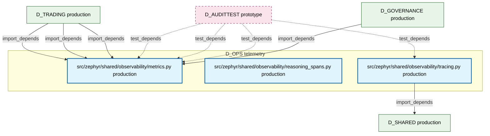

# 15_d_ops / telemetry / Feedback Loop

> **文档作用 / Purpose**: 展示 telemetry（D_OPS）功能域的模块清单、域内依赖关系、跨域依赖关系、架构分层视图，供架构审查和域治理参考。

> 本文档由 generate_domain_doc.py 从 depgraph (PostgreSQL) 自动生成
> 最后更新: 2026-07-06 16:01:10
> 数据源: depgraph (PostgreSQL) nodes表 + edges表

## 域基本信息 / Domain Overview

| 字段 | 值 | Field | Value |
|------|------|-------|-------|
| 编号 | 15 | Number | 15 |
| 域ID | D_OPS | Domain ID | D_OPS |
| 域名称 | telemetry | Domain Name | Feedback Loop |
| 层级 | L1 基础平台层 | Layer | L1 Foundation |
| 模块数 | 3 | Module Count | 3 |
| 域内依赖 | 0 | Internal Dependencies | 0 |
| 跨域入边 | 8 | Cross-domain Incoming | 8 |
| 跨域出边 | 1 | Cross-domain Outgoing | 1 |
| 设计态模块 | 0 | Design Modules | 0 |
| 原型态模块 | 0 | Prototype Modules | 0 |
| 生产态模块 | 3 | Production Modules | 3 |
| 容量 | 3/150 (正常) | Capacity | 3/150 (正常) |
| 描述 | 自动引导(auto_bootstrap) | Description | 自动引导(auto_bootstrap) |

## 域内依赖图 / Internal Dependency Diagram

> 依赖图内嵌在本文档中，IDE 可直接渲染显示。每30个节点一组分页显示。
>
> **图例说明 / Legend**：
> - **实线边框 = 运营态模块**（production，已上线运行）
> - **虚线边框 = 设计态模块**（design，还在设计中）
> - **实线箭头 = 运营态依赖**（已生效的依赖关系）
> - **虚线箭头 = 设计态依赖**（计划中的依赖关系）



## 跨域依赖 / Cross-domain Dependencies

### 本域依赖的其他域（出边）/ Depends On

| 目标域 / Target Domain | 依赖数 / Count | 依赖类型 / Type |
|--------|:---:|---------|
| D_SHARED | 1 | import_depends |

### 依赖本域的其他域（入边）/ Depended By

| 源域 / Source Domain | 依赖数 / Count | 依赖类型 / Type |
|------|:---:|---------|
| D_AUDITTEST | 4 | test_depends |
| D_TRADING | 3 | import_depends |
| D_GOVERNANCE | 1 | import_depends |

## 架构分层视图 / Architecture Overview

> 按 architecture_layer 分层显示 telemetry（D_OPS）的模块分布。共 3 个模块 / 3 modules。

```

┌──────────────────────────────────────────────────────────────────┐
│             L1 基础层 / Foundation Layer (3 modules)             │
├──────────────────────────────────────────────────────────────────┤
│   src/zephyr/shared/observability/metrics.py  [production]       │
│   src/zephyr/shared/observability/reasoning_spans.py  [produc... │
│   src/zephyr/shared/observability/tracing.py  [production]       │
└──────────────────────────────────────────────────────────────────┘

```

## 模块分层清单 / Module Layered List

> 按 architecture_layer 分组的模块清单（共 3 个模块 / 3 modules）。

### L1 基础层 / Foundation Layer (3 modules)

| # | 模块路径 / Module Path | 模块名称 / Module Name | 功能简介 / Description | 成熟度 / Maturity | 构建状态 / Build Status |
|:--:|---------|---------|---------|:---:|:---:|
| 1 | src/zephyr/shared/observability/metrics.py | src/zephyr/shared/observability/metri... | metrics.py —— 轻量级 Metrics 收集基础设施（Phase 9 新增 | 盲点 B17 修复） | production | generated |
| 2 | src/zephyr/shared/observability/reasoning_spans.py | src/zephyr/shared/observability/reaso... |  | production | generated |
| 3 | src/zephyr/shared/observability/tracing.py | src/zephyr/shared/observability/traci... | tracing.py —— OpenTelemetry 分布式追踪（Phase B 补充 | 盲点 B1 修复） | production | generated |

## 依赖关系图 / Dependency Graph

> 域内模块依赖关系（共 0 条 / 0 edges）。按依赖类型分组，使用 → 表示方向。

（无域内依赖 / No internal dependencies）


## 说明 / Notes

- **数据源 / Data Source**: `depgraph (PostgreSQL)` 的 `nodes`、`edges`、`domains` 表
- **生成器 / Generator**: `generate_domain_doc.py`（G2+G10 合并）
- **维护方式 / Maintenance**: 自动生成，全景图更新时刷新
- **文件名规则 / File Naming**: `{编号:02d}_{域ID小写}.md`，如 `16_d_trading.md`
- **图例说明 / Legend**: `[production]`=已上线 / `[design]`=设计中 / `[prototype]`=原型 / `[unknown]`=未知
