# 16_d_autonomy_perm / 自治保护

> **文档作用 / Purpose**: 展示 自治保护（D-AUTONOMY_PERM）功能域的模块清单、域内依赖关系和跨域依赖关系，供架构审查和域治理参考。

> 本文档由 generate_domain_doc.py 从 depgraph.db 自动生成
> 最后更新: 2026-06-24 21:40:08
> 数据源: depgraph.db nodes表 + edges表

## 域基本信息 / Domain Overview

| 字段 | 值 | Field | Value |
|------|------|-------|-------|
| 编号 | 16 | Number | 16 |
| 域ID | D-AUTONOMY_PERM | Domain ID | D-AUTONOMY_PERM |
| 域名称 | 自治保护 | Domain Name | 自治保护 |
| 层级 | L2_domain | Layer | L2_domain |
| 模块数 | 270 | Module Count | 270 |
| 域内依赖 | 181 | Internal Dependencies | 181 |
| 跨域入边 | 174 | Cross-domain Incoming | 174 |
| 跨域出边 | 339 | Cross-domain Outgoing | 339 |
| 设计态模块 | 197 | Design Modules | 197 |
| 原型态模块 | 63 | Prototype Modules | 63 |
| 生产态模块 | 4 | Production Modules | 4 |
| 容量 | 270/150 (超容) | Capacity | 270/150 (超容) |
| 描述 | 自治保护域。负责自治系统的安全边界保护，包括权限守卫、升级引擎、预算执行器、回滚系统。 | Description | 自治保护域。负责自治系统的安全边界保护，包括权限守卫、升级引擎、预算执行器、回滚系统。 |

## 模块清单 / Module List

共 270 个模块（按路径排序，全部显示）

| 模块路径 / Module Path | 模块名称 / Module Name | 设计成熟度 / Maturity | 构建状态 / Build Status |
|---------|---------|-----------|---------|
| D-AUTONOMY-PERM/AI Autonomy Boundary Not Self-Extendable AI自治边界不可被AI自行扩展 | AI Autonomy Boundary Not Self-Extenda... | design | design_only |
| D-AUTONOMY-PERM/AI Comprehension Cost Dynamic Estimator AI理解成本动态估算器 | AI Comprehension Cost Dynamic Estimat... | design | design_only |
| D-AUTONOMY-PERM/AI Governance Framework Compliance Assessor AI治理框架合规性评估器 | AI Governance Framework Compliance As... | design | design_only |
| D-AUTONOMY-PERM/AI Risk Assessor AI风险评估器 | AI Risk Assessor AI风险评估器 | design | design_only |
| D-AUTONOMY-PERM/AI Risk Classifier AI风险分类器 | AI Risk Classifier AI风险分类器 | design | design_only |
| D-AUTONOMY-PERM/AI Risk Dependency Mapper AI风险依赖映射器 | AI Risk Dependency Mapper AI风险依赖映射器 | design | design_only |
| D-AUTONOMY-PERM/AI-Driven Saga Orchestrator AI驱动Saga编排器 | AI-Driven Saga Orchestrator AI驱动Saga编排器 | design | design_only |
| D-AUTONOMY-PERM/APPROVE 通过 | APPROVE 通过 | design | design_only |
| D-AUTONOMY-PERM/ARS Dual-Track Settlement ARS双轨结算模型 | ARS Dual-Track Settlement ARS双轨结算模型 | design | design_only |
| D-AUTONOMY-PERM/AWS Agentic AI Security Scoping Matrix AWS Agent AI安全范围矩阵 | AWS Agentic AI Security Scoping Matri... | design | design_only |
| D-AUTONOMY-PERM/Agent Cannot Auto-Execute Large Order Agent不可自动执行大额下单 | Agent Cannot Auto-Execute Large Order... | design | design_only |
| D-AUTONOMY-PERM/Agent Cannot Auto-Online Strategy Agent不可自动上线新策略 | Agent Cannot Auto-Online Strategy Age... | design | design_only |
| D-AUTONOMY-PERM/Agent Cannot Autonomously Modify Boundary Agent不可自主修改自治边界 | Agent Cannot Autonomously Modify Boun... | design | design_only |
| D-AUTONOMY-PERM/Audit Trail 审计链 | Audit Trail 审计链 | design | design_only |
| D-AUTONOMY-PERM/Audit-Persistence Dual-Write Coordinator 审计-持久化双写协调器 | Audit-Persistence Dual-Write Coordina... | design | design_only |
| D-AUTONOMY-PERM/AuditLogWrite 审计日志写入 | AuditLogWrite 审计日志写入 | design | design_only |
| D-AUTONOMY-PERM/AuditRecord 审计记录 | AuditRecord 审计记录 | design | design_only |
| D-AUTONOMY-PERM/Auto Fix Engine 自动修复引擎 | Auto Fix Engine 自动修复引擎 | design | design_only |
| D-AUTONOMY-PERM/Auto-Guard Async Approval Manager Auto-Guard异步审批管理器 | Auto-Guard Async Approval Manager Aut... | design | design_only |
| D-AUTONOMY-PERM/Autonomy Boundary Change Process 自治边界变更流程 | Autonomy Boundary Change Process 自治边界... | design | design_only |
| D-AUTONOMY-PERM/Autonomy Fuse 自治熔断器 | Autonomy Fuse 自治熔断器 | design | design_only |
| D-AUTONOMY-PERM/Backtest-Live Deviation Monitor 回测-实盘偏差监控器 | Backtest-Live Deviation Monitor 回测-实盘... | design | design_only |
| D-AUTONOMY-PERM/BacktestRealtimeDeviation 回测-实盘偏差 | BacktestRealtimeDeviation 回测-实盘偏差 | design | design_only |
| D-AUTONOMY-PERM/BacktestRealtimeDeviationAlert 回测实盘偏差告警 | BacktestRealtimeDeviationAlert 回测实盘偏差告警 | design | design_only |
| D-AUTONOMY-PERM/BlockCommand 阻止指令 | BlockCommand 阻止指令 | design | design_only |
| D-AUTONOMY-PERM/Budget Enforcer On-Demand Activator Budget Enforcer按需激活器 | Budget Enforcer On-Demand Activator B... | design | design_only |
| D-AUTONOMY-PERM/BudgetExemption 预算豁免 | BudgetExemption 预算豁免 | design | design_only |
| D-AUTONOMY-PERM/Choreography Saga Engine 协调式Saga引擎 | Choreography Saga Engine 协调式Saga引擎 | design | design_only |
| D-AUTONOMY-PERM/Circuit Breaker State Machine 熔断器状态机 | Circuit Breaker State Machine 熔断器状态机 | design | design_only |
| D-AUTONOMY-PERM/Cluster Behavior Risk Protection 群集行为风险防护 | Cluster Behavior Risk Protection 群集行为... | design | design_only |
| D-AUTONOMY-PERM/Code Health Assessor 代码健康度评估器 | Code Health Assessor 代码健康度评估器 | design | design_only |
| D-AUTONOMY-PERM/Compensation Action Manager 补偿动作管理器 | Compensation Action Manager 补偿动作管理器 | design | design_only |
| D-AUTONOMY-PERM/Compensation Dependency Graph Analyzer 补偿依赖图分析器 | Compensation Dependency Graph Analyze... | design | design_only |
| D-AUTONOMY-PERM/Core Chain E2E Health Monitor 核心链路端到端健康监控器 | Core Chain E2E Health Monitor 核心链路端到端... | design | design_only |
| D-AUTONOMY-PERM/CoreReadOnlyState CORE只读状态 | CoreReadOnlyState CORE只读状态 | design | design_only |
| D-AUTONOMY-PERM/Cross-Saga Transaction Coordinator 跨Saga事务协调器 | Cross-Saga Transaction Coordinator 跨S... | design | design_only |
| D-AUTONOMY-PERM/D-AUT-PERM | D-AUT-PERM | design | design_only |
| D-AUTONOMY-PERM/D-AUTONOMY-PERM | D-AUTONOMY-PERM | design | design_only |
| D-AUTONOMY-PERM/Dependency Upgrade Sandbox Approval Gateway 依赖升级沙箱审批网关 | Dependency Upgrade Sandbox Approval G... | design | design_only |
| D-AUTONOMY-PERM/DependencyUpgradeApproval 依赖升级审批 | DependencyUpgradeApproval 依赖升级审批 | design | design_only |
| D-AUTONOMY-PERM/DependencyUpgradeCompleted 依赖库升级完成 | DependencyUpgradeCompleted 依赖库升级完成 | design | design_only |
| D-AUTONOMY-PERM/Drift Detector Statistical Drift Checker Drift Detector统计漂移检测器 | Drift Detector Statistical Drift Chec... | design | design_only |
| D-AUTONOMY-PERM/Drift Guard 漂移守卫 | Drift Guard 漂移守卫 | design | design_only |
| D-AUTONOMY-PERM/DriftDetected 漂移检测 | DriftDetected 漂移检测 | design | design_only |
| D-AUTONOMY-PERM/Dual-Storage Rollback Coordinator 双存储回滚协调器 | Dual-Storage Rollback Coordinator 双存储... | design | design_only |
| D-AUTONOMY-PERM/Enhanced Confidence Cascade Mapper 增强置信度级联映射器 | Enhanced Confidence Cascade Mapper 增强... | design | design_only |
| D-AUTONOMY-PERM/Escalation Protocol 升级协议 | Escalation Protocol 升级协议 | design | design_only |
| D-AUTONOMY-PERM/FLATTEN 紧急平仓 | FLATTEN 紧急平仓 | design | design_only |
| ...TONOMY-PERM/Feedback Loop Three-Layer Escalation Trigger Feedback Loop三层升级触发器 | Feedback Loop Three-Layer Escalation ... | design | design_only |
| D-AUTONOMY-PERM/Four-Level Autonomy Boundary Agent自治边界分四级 | Four-Level Autonomy Boundary Agent自治边... | design | design_only |
| D-AUTONOMY-PERM/Four-Level Autonomy Model 四级自治模型 | Four-Level Autonomy Model 四级自治模型 | design | design_only |
| D-AUTONOMY-PERM/Governance Dashboard 治理仪表盘 | Governance Dashboard 治理仪表盘 | design | design_only |
| D-AUTONOMY-PERM/Governance Phase Check Slimmer Governance Phase Check精简器 | Governance Phase Check Slimmer Govern... | design | design_only |
| D-AUTONOMY-PERM/Governance Policy Engine 治理策略引擎 | Governance Policy Engine 治理策略引擎 | design | design_only |
| D-AUTONOMY-PERM/HITL Confidence Upgrade HITL置信度升级 | HITL Confidence Upgrade HITL置信度升级 | design | design_only |
| D-AUTONOMY-PERM/HITL Human-in-the-Loop 人在闭环机制 | HITL Human-in-the-Loop 人在闭环机制 | design | design_only |
| D-AUTONOMY-PERM/HITL Mechanism HITL人在闭环机制 | HITL Mechanism HITL人在闭环机制 | design | design_only |
| D-AUTONOMY-PERM/Half-Open Probe 熔断器半开试探 | Half-Open Probe 熔断器半开试探 | design | design_only |
| D-AUTONOMY-PERM/Hard Block 硬阻断 | Hard Block 硬阻断 | design | design_only |
| D-AUTONOMY-PERM/Hard Reset Permission Gate Hard Reset权限门控 | Hard Reset Permission Gate Hard Reset... | design | design_only |
| D-AUTONOMY-PERM/Hard-Gate 硬门禁架构 | Hard-Gate 硬门禁架构 | design | design_only |
| D-AUTONOMY-PERM/Health Check Service 健康检查服务 | Health Check Service 健康检查服务 | design | design_only |
| D-AUTONOMY-PERM/HealthReport 健康报告 | HealthReport 健康报告 | design | design_only |
| D-AUTONOMY-PERM/Immutable Audit Log Writer 不可变审计日志写入器 | Immutable Audit Log Writer 不可变审计日志写入器 | design | design_only |
| D-AUTONOMY-PERM/KILLSWITCH.md AI Agent Emergency Stop Protocol AI Agent紧急停止协议 | KILLSWITCH.md AI Agent Emergency Stop... | design | design_only |
| D-AUTONOMY-PERM/Kill Switch Controlled Reentry Kill Switch激活后必须受控重入 | Kill Switch Controlled Reentry Kill S... | design | design_only |
| D-AUTONOMY-PERM/Kill Switch Direct Path Kill Switch直通路径 | Kill Switch Direct Path Kill Switch直通路径 | design | design_only |
| D-AUTONOMY-PERM/Kill Switch Layered & Local Evaluated Kill Switch必须分层且本地评估 | Kill Switch Layered & Local Evaluated... | design | design_only |
| D-AUTONOMY-PERM/Kill Switch 紧急制动开关 | Kill Switch 紧急制动开关 | design | design_only |
| D-AUTONOMY-PERM/KillSwitchDirect Kill Switch直通 | KillSwitchDirect Kill Switch直通 | design | design_only |
| D-AUTONOMY-PERM/KillSwitchDirectActivated Kill Switch直通激活 | KillSwitchDirectActivated Kill Switch... | design | design_only |
| D-AUTONOMY-PERM/KillSwitch直通路径 KillSwitch Direct Path | KillSwitch直通路径 KillSwitch Direct Path | design | design_only |
| D-AUTONOMY-PERM/Knowledge Snapshot Rollback Manager 知识快照回滚管理器 | Knowledge Snapshot Rollback Manager 知... | design | design_only |
| D-AUTONOMY-PERM/Knowledge Write Guard Protector 知识Write Guard保护器 | Knowledge Write Guard Protector 知识Wri... | design | design_only |
| D-AUTONOMY-PERM/LLM Cost Guard LLM成本守卫 | LLM Cost Guard LLM成本守卫 | design | design_only |
| D-AUTONOMY-PERM/Large Order Requires Approval 大额下单需人工审批 | Large Order Requires Approval 大额下单需人工审批 | design | design_only |
| D-AUTONOMY-PERM/Learning System Kill Switch 学习系统Kill Switch | Learning System Kill Switch 学习系统Kill ... | design | design_only |
| D-AUTONOMY-PERM/Level 0-3 Autonomy Levels 0-3自治级别 | Level 0-3 Autonomy Levels 0-3自治级别 | design | design_only |
| D-AUTONOMY-PERM/Local Model 本地推理模型 | Local Model 本地推理模型 | design | design_only |
| D-AUTONOMY-PERM/M10 Audit Report Finding Format Generator M10审计报告Finding格式生成器 | M10 Audit Report Finding Format Gener... | design | design_only |
| D-AUTONOMY-PERM/MCP Gateway Rate-Limit Audit Manager MCP网关限流审计管理器 | MCP Gateway Rate-Limit Audit Manager ... | design | design_only |
| D-AUTONOMY-PERM/Model Drift Dependency Propagator 模型漂移依赖传播器 | Model Drift Dependency Propagator 模型漂... | design | design_only |
| D-AUTONOMY-PERM/Model Drift Detector 模型漂移检测器 | Model Drift Detector 模型漂移检测器 | design | design_only |
| D-AUTONOMY-PERM/Model Inventory Dependency Graph Builder 模型清单依赖图构建器 | Model Inventory Dependency Graph Buil... | design | design_only |
| D-AUTONOMY-PERM/Model Monitoring Dependency Tracker 模型监控依赖追踪器 | Model Monitoring Dependency Tracker 模... | design | design_only |
| D-AUTONOMY-PERM/Model Override Dependency Impact Analyzer 模型覆盖依赖影响分析器 | Model Override Dependency Impact Anal... | design | design_only |
| D-AUTONOMY-PERM/Model Override Impact Analyzer 模型覆盖影响分析器 | Model Override Impact Analyzer 模型覆盖影响分析器 | design | design_only |
| D-AUTONOMY-PERM/Model Registry 模型注册表 | Model Registry 模型注册表 | design | design_only |
| D-AUTONOMY-PERM/Model Risk Tier Classifier 模型风险分级器 | Model Risk Tier Classifier 模型风险分级器 | design | design_only |
| D-AUTONOMY-PERM/Model Risk Tier Dependency Classifier 模型风险等级依赖分类器 | Model Risk Tier Dependency Classifier... | design | design_only |
| D-AUTONOMY-PERM/Model Validation Dependency Orchestrator v2 模型验证依赖编排器v2 | Model Validation Dependency Orchestra... | design | design_only |
| D-AUTONOMY-PERM/Model Validation Dependency Orchestrator 模型验证依赖编排器 | Model Validation Dependency Orchestra... | design | design_only |
| D-AUTONOMY-PERM/NIST AI 100-5 Three-Layer Security NIST AI 100-5三层安全 | NIST AI 100-5 Three-Layer Security NI... | design | design_only |
| D-AUTONOMY-PERM/NVIDIA Agentic Autonomy Levels NVIDIA Agent自治级别 | NVIDIA Agentic Autonomy Levels NVIDIA... | design | design_only |
| D-AUTONOMY-PERM/Non-AI Boundary Guard 非AI边界守卫 | Non-AI Boundary Guard 非AI边界守卫 | design | design_only |
| D-AUTONOMY-PERM/Non-worsening 不恶化性 | Non-worsening 不恶化性 | design | design_only |
| D-AUTONOMY-PERM/Orchestrated Saga Engine 编排式Saga引擎 | Orchestrated Saga Engine 编排式Saga引擎 | design | design_only |
| D-AUTONOMY-PERM/PERM Budget Exempt Executor PERM预算豁免执行器 | PERM Budget Exempt Executor PERM预算豁免执行器 | design | design_only |
| D-AUTONOMY-PERM/PERM Independent Health Checker PERM独立健康检查器 | PERM Independent Health Checker PERM独... | design | design_only |
| D-AUTONOMY-PERM/PERM-CORE Read-Only Interface Contract PERM-CORE只读接口契约 | PERM-CORE Read-Only Interface Contrac... | design | design_only |
| D-AUTONOMY-PERM/PERMBlockCommand PERM阻止命令 | PERMBlockCommand PERM阻止命令 | design | design_only |
| D-AUTONOMY-PERM/PERMBlockExecuted PERM阻止指令执行 | PERMBlockExecuted PERM阻止指令执行 | design | design_only |
| D-AUTONOMY-PERM/PERMBudgetExemption PERM预算豁免 | PERMBudgetExemption PERM预算豁免 | design | design_only |
| D-AUTONOMY-PERM/PERMBudgetExemptionUsed PERM预算豁免被使用 | PERMBudgetExemptionUsed PERM预算豁免被使用 | design | design_only |
| D-AUTONOMY-PERM/PERMIndependentHealthCheck PERM独立健康检查 | PERMIndependentHealthCheck PERM独立健康检查 | design | design_only |
| D-AUTONOMY-PERM/PERM不修改CORE状态 PERM No Modify CORE State | PERM不修改CORE状态 PERM No Modify CORE State | design | design_only |
| D-AUTONOMY-PERM/PERM预算豁免 PERM Budget Exemption | PERM预算豁免 PERM Budget Exemption | design | design_only |
| D-AUTONOMY-PERM/Parameter Optimizer 参数优化器 | Parameter Optimizer 参数优化器 | design | design_only |
| D-AUTONOMY-PERM/PermissionCheck 权限检查 | PermissionCheck 权限检查 | design | design_only |
| D-AUTONOMY-PERM/PermissionDenied 权限拒绝 | PermissionDenied 权限拒绝 | design | design_only |
| ...MY-PERM/PipelineOrchestrator CostTracker Component PipelineOrchestrator成本追踪组件 | PipelineOrchestrator CostTracker Comp... | design | design_only |
| D-AUTONOMY-PERM/RBAC Permission Check Embedded Bridge RBAC权限检查内嵌桥接器 | RBAC Permission Check Embedded Bridge... | design | design_only |
| D-AUTONOMY-PERM/RBACDecision RBAC决策 | RBACDecision RBAC决策 | design | design_only |
| D-AUTONOMY-PERM/REDUCE 缩量保留方向 | REDUCE 缩量保留方向 | design | design_only |
| D-AUTONOMY-PERM/REJECT 完全阻断 | REJECT 完全阻断 | design | design_only |
| D-AUTONOMY-PERM/Red-Blue Validator 红蓝对抗验证器 | Red-Blue Validator 红蓝对抗验证器 | design | design_only |
| D-AUTONOMY-PERM/Responsible AI Dependency Auditor 负责任AI依赖审计器 | Responsible AI Dependency Auditor 负责任... | design | design_only |
| D-AUTONOMY-PERM/Reversibility 可撤销性 | Reversibility 可撤销性 | design | design_only |
| D-AUTONOMY-PERM/Risk Alert Notification Dispatcher 风控告警通知分发器 | Risk Alert Notification Dispatcher 风控... | design | design_only |
| D-AUTONOMY-PERM/Risk Check RBAC Permission Controller 风控检查RBAC权限控制器 | Risk Check RBAC Permission Controller... | design | design_only |
| D-AUTONOMY-PERM/Role and Interaction Journey 角色与交互旅程 | Role and Interaction Journey 角色与交互旅程 | design | design_only |
| D-AUTONOMY-PERM/Rollback Four-Tier Strategy Selector 回滚四级策略选择器 | Rollback Four-Tier Strategy Selector ... | design | design_only |
| D-AUTONOMY-PERM/Rollback Operation Visual Tracker 回滚操作可视化追踪器 | Rollback Operation Visual Tracker 回滚操... | design | design_only |
| D-AUTONOMY-PERM/Rollback System 回滚系统 | Rollback System 回滚系统 | design | design_only |
| D-AUTONOMY-PERM/Saga Deadlock Detector Saga死锁检测器 | Saga Deadlock Detector Saga死锁检测器 | design | design_only |
| D-AUTONOMY-PERM/Saga Definition Saga定义器 | Saga Definition Saga定义器 | design | design_only |
| D-AUTONOMY-PERM/Saga Observability Tracer Saga可观测性追踪器 | Saga Observability Tracer Saga可观测性追踪器 | design | design_only |
| D-AUTONOMY-PERM/Saga State Tracker Saga状态追踪器 | Saga State Tracker Saga状态追踪器 | design | design_only |
| D-AUTONOMY-PERM/Saga Version Compatibility Manager Saga版本兼容性管理器 | Saga Version Compatibility Manager Sa... | design | design_only |
| D-AUTONOMY-PERM/Saga/Process Manager Dependency Orchestrator Saga/流程管理器依赖编排器 | Saga/Process Manager Dependency Orche... | design | design_only |
| D-AUTONOMY-PERM/Soft Block 软阻断 | Soft Block 软阻断 | design | design_only |
| D-AUTONOMY-PERM/System Health Five-Star Scorer 系统健康度五星评分器 | System Health Five-Star Scorer 系统健康度五... | design | design_only |
| D-AUTONOMY-PERM/System Version Upgrade Path Manager 系统版本升级路径管理器 | System Version Upgrade Path Manager 系... | design | design_only |
| D-AUTONOMY-PERM/Szpruch Conditional Gate Szpruch条件门禁 | Szpruch Conditional Gate Szpruch条件门禁 | design | design_only |
| D-AUTONOMY-PERM/TNR Safety Specification TNR安全规范 | TNR Safety Specification TNR安全规范 | design | design_only |
| D-AUTONOMY-PERM/TaskCard Six-Dimension Anti-Drift Validator TaskCard六维防漂移校验器 | TaskCard Six-Dimension Anti-Drift Val... | design | design_only |
| D-AUTONOMY-PERM/Temporal GNN Dependency Drift Predictor 时序GNN依赖漂移预测器 | Temporal GNN Dependency Drift Predict... | design | design_only |
| D-AUTONOMY-PERM/Token Budget Coordinator Token预算协调器 | Token Budget Coordinator Token预算协调器 | design | design_only |
| D-AUTONOMY-PERM/Token Budget Manager Token预算管理器 | Token Budget Manager Token预算管理器 | design | design_only |
| D-AUTONOMY-PERM/Trading Session Aware Ops Scheduler 交易时段感知运维调度器 | Trading Session Aware Ops Scheduler 交... | design | design_only |
| D-AUTONOMY-PERM/TradingSessionSchedule 交易时段调度 | TradingSessionSchedule 交易时段调度 | design | design_only |
| D-AUTONOMY-PERM/TradingSessionSwitch 交易时段切换 | TradingSessionSwitch 交易时段切换 | design | design_only |
| D-AUTONOMY-PERM/Transactionality 事务性 | Transactionality 事务性 | design | design_only |
| D-AUTONOMY-PERM/Vector Index Health Monitor 向量索引健康监控器 | Vector Index Health Monitor 向量索引健康监控器 | design | design_only |
| D-AUTONOMY-PERM/Zone Crossing Boundary Validator Zone Crossing边界校验器 | Zone Crossing Boundary Validator Zone... | design | design_only |
| D-AUTONOMY-PERM/agent_creation_policy.py Agent创建策略 | agent_creation_policy.py Agent创建策略 | design | design_only |
| D-AUTONOMY-PERM/ai_modifiable 自治区 | ai_modifiable 自治区 | design | design_only |
| D-AUTONOMY-PERM/anomaly_detector.py 异常检测器 | anomaly_detector.py 异常检测器 | design | design_only |
| D-AUTONOMY-PERM/anti_pattern_guard.py 反模式守卫 | anti_pattern_guard.py 反模式守卫 | design | design_only |
| D-AUTONOMY-PERM/asymmetric_audit.py 非对称审计 | asymmetric_audit.py 非对称审计 | design | design_only |
| D-AUTONOMY-PERM/auto_maintenance.py 自动维护 | auto_maintenance.py 自动维护 | design | design_only |
| D-AUTONOMY-PERM/bootstrap_verifier.py 引导验证器 | bootstrap_verifier.py 引导验证器 | design | design_only |
| D-AUTONOMY-PERM/build_sanitizer.py 构建清洗器 | build_sanitizer.py 构建清洗器 | design | design_only |
| D-AUTONOMY-PERM/cache_invalidation.py 缓存失效器 | cache_invalidation.py 缓存失效器 | design | design_only |
| D-AUTONOMY-PERM/contract_verifier.py 契约验证器 | contract_verifier.py 契约验证器 | design | design_only |
| D-AUTONOMY-PERM/cross_cutting.py 横切关注点 | cross_cutting.py 横切关注点 | design | design_only |
| D-AUTONOMY-PERM/dependency_auditor.py 依赖审计器 | dependency_auditor.py 依赖审计器 | design | design_only |
| D-AUTONOMY-PERM/environment_manager.py 环境管理器 | environment_manager.py 环境管理器 | design | design_only |
| D-AUTONOMY-PERM/exceptions.py 异常定义 | exceptions.py 异常定义 | design | design_only |
| D-AUTONOMY-PERM/genesis_bootstrap.py 创世引导 | genesis_bootstrap.py 创世引导 | design | design_only |
| D-AUTONOMY-PERM/human_gated 门控区 | human_gated 门控区 | design | design_only |
| D-AUTONOMY-PERM/immutable 禁区 | immutable 禁区 | design | design_only |
| D-AUTONOMY-PERM/串谋/策略同质化 Collusion/Strategy Homogeneity | 串谋/策略同质化 Collusion/Strategy Homogeneity | design | design_only |
| D-AUTONOMY-PERM/交易时段仅监控 Trading Session Monitor Only | 交易时段仅监控 Trading Session Monitor Only | design | design_only |
| D-AUTONOMY-PERM/决策一致性 Decision Consistency | 决策一致性 Decision Consistency | design | design_only |
| D-AUTONOMY-PERM/权限边界偏离 Permission Boundary Deviation | 权限边界偏离 Permission Boundary Deviation | design | design_only |
| D-AUTONOMY-PERM/涌现行为 Emergent Behavior | 涌现行为 Emergent Behavior | design | design_only |
| D-AUTONOMY-PERM/禁止AI自动升级交易时段依赖库 | 禁止AI自动升级交易时段依赖库 | design | design_only |
| D-AUTONOMY-PERM/禁止AI自动清理未归档交易日志和审计记录 | 禁止AI自动清理未归档交易日志和审计记录 | design | design_only |
| D-AUTONOMY-PERM/禁止AI自动订阅付费数据源 | 禁止AI自动订阅付费数据源 | design | design_only |
| D-AUTONOMY-PERM/禁止AI自动重启交易时段核心进程 | 禁止AI自动重启交易时段核心进程 | design | design_only |
| D-AUTONOMY-PERM/资源消耗异常 Resource Consumption Anomaly | 资源消耗异常 Resource Consumption Anomaly | design | design_only |
| D-AUTONOMY-PERM/通信异常 Communication Anomaly | 通信异常 Communication Anomaly | design | design_only |
| D-AUTONOMY-PERM/隐性串谋 Implicit Collusion | 隐性串谋 Implicit Collusion | design | design_only |
| D-GOVERNANCE/Agent RBAC Approver Check Agent RBAC审批人检查 | Agent RBAC Approver Check Agent RBAC审... | design | design_only |
| D-GOVERNANCE/Agent RBAC Governance Bridges Contracts Agent RBAC治理桥契约 | Agent RBAC Governance Bridges Contrac... | design | design_only |
| D-GOVERNANCE/Kill Switch (Governance Layer) 治理层Kill Switch | Kill Switch (Governance Layer) 治理层Kil... | design | design_only |
| D-GOVERNANCE/Kill Switch Layered Kill Switch分层 | Kill Switch Layered Kill Switch分层 | design | design_only |
| config/runtime/kill_switch_state.yaml |  | production | orphan |
| docs/03_modules/_domain_autonomy_core/agent_rbac/adversarial_test_report.yaml |  | production | orphan |
| docs/03_modules/_domain_autonomy_core/agent_rbac/blueprint.md | docs__03_modules___domain_autonomy_co... | design | design_only |
| scripts/arch_guard/fitness_functions/check_kill_switch_latency.py |  | prototype | draft |
| scripts/governance/meta/kill_switch_state.yaml |  | production | orphan |
| scripts/governance/meta/manage_kill_switch.py |  | prototype | draft |
| src/zephyr/autonomy_perm/__init__.py |  | prototype | orphan |
| src/zephyr/autonomy_perm/_extensions/__init__.py |  | scaffold_placeholder | orphan |
| src/zephyr/autonomy_perm/api/__init__.py |  | scaffold_placeholder | orphan |
| src/zephyr/autonomy_perm/core/__init__.py |  | scaffold_placeholder | orphan |
| src/zephyr/autonomy_perm/infrastructure/__init__.py |  | scaffold_placeholder | orphan |
| src/zephyr/autonomy_perm/models/__init__.py |  | scaffold_placeholder | orphan |
| src/zephyr/autonomy_perm/red_blue_validator/__init__.py |  | prototype | draft |
| src/zephyr/autonomy_perm/red_blue_validator/attack_registry.py |  | prototype | draft |
| src/zephyr/autonomy_perm/red_blue_validator/bypass_recorder.py |  | prototype | draft |
| src/zephyr/autonomy_perm/red_blue_validator/constitution_guard.py |  | prototype | draft |
| src/zephyr/autonomy_perm/red_blue_validator/convergence_checker.py |  | prototype | draft |
| src/zephyr/autonomy_perm/red_blue_validator/defense_runner.py |  | prototype | draft |
| src/zephyr/autonomy_perm/red_blue_validator/game_day_runner.py |  | prototype | draft |
| src/zephyr/autonomy_perm/services/__init__.py |  | scaffold_placeholder | orphan |
| src/zephyr/governance/agent_signer.py |  | prototype | draft |
| src/zephyr/security/access_control/governance_bridges/__init__.py |  | prototype | production |
| src/zephyr/security/access_control/governance_bridges/a2a_check.py |  | prototype | production |
| src/zephyr/security/access_control/governance_bridges/approver_check.py |  | prototype | production |
| src/zephyr/security/access_control/governance_bridges/bootstrap_superadmin.py |  | production | production |
| src/zephyr/security/access_control/governance_bridges/capability_check.py |  | prototype | production |
| src/zephyr/security/access_control/governance_bridges/contracts.py |  | prototype | production |
| tests/agent_rbac/__init__.py |  | prototype | draft |
| tests/agent_rbac/conftest.py |  | prototype | draft |
| tests/agent_rbac/test_abac_guard_agent_rbac.py |  | prototype | draft |
| tests/agent_rbac/test_adversarial_agent_rbac.py |  | prototype | draft |
| tests/agent_rbac/test_blind_spot_coverage.py |  | prototype | draft |
| tests/agent_rbac/test_cross_model_consistency.py |  | prototype | draft |
| tests/agent_rbac/test_crosscut_d.py |  | prototype | draft |
| tests/agent_rbac/test_cybersec_2026.py |  | prototype | draft |
| tests/agent_rbac/test_decision_explainer_agent_rbac.py |  | prototype | draft |
| tests/agent_rbac/test_decisions.py |  | prototype | draft |
| tests/agent_rbac/test_derive_rbac.py |  | prototype | draft |
| tests/agent_rbac/test_dry_run_agent_rbac.py |  | prototype | draft |
| tests/agent_rbac/test_engine_degradation_agent_rbac.py |  | prototype | draft |
| tests/agent_rbac/test_enhanced_security.py |  | prototype | draft |
| tests/agent_rbac/test_exceptions_agent_rbac.py |  | prototype | draft |
| tests/agent_rbac/test_forensic_a.py |  | prototype | draft |
| tests/agent_rbac/test_forensic_b.py |  | prototype | draft |
| tests/agent_rbac/test_forensic_c.py |  | prototype | draft |
| tests/agent_rbac/test_guard_layers_agent_rbac.py |  | prototype | draft |
| tests/agent_rbac/test_identity.py |  | prototype | draft |
| tests/agent_rbac/test_immutable_core_agent_rbac.py |  | prototype | draft |
| tests/agent_rbac/test_input_guard_agent_rbac.py |  | prototype | draft |
| tests/agent_rbac/test_integration_agent_rbac.py |  | prototype | draft |
| tests/agent_rbac/test_integrity_agent_rbac.py |  | prototype | draft |
| tests/agent_rbac/test_intent_binder_agent_rbac.py |  | prototype | draft |
| tests/agent_rbac/test_kill_switch_agent_rbac.py |  | prototype | draft |
| tests/agent_rbac/test_novel_attack.py |  | prototype | draft |
| tests/agent_rbac/test_observability_agent_rbac.py |  | prototype | draft |
| tests/agent_rbac/test_output_guard_agent_rbac.py |  | prototype | draft |
| tests/agent_rbac/test_permission_guard.py |  | prototype | draft |
| tests/agent_rbac/test_permissions.py |  | prototype | draft |
| tests/agent_rbac/test_post_action.py |  | prototype | draft |
| tests/agent_rbac/test_rbac_guard_agent_rbac.py |  | prototype | draft |
| tests/agent_rbac/test_redteam_adversarial.py |  | prototype | draft |
| tests/agent_rbac/test_risk_mitigation_agent_rbac.py |  | prototype | draft |
| tests/agent_rbac/test_sequence_guard_agent_rbac.py |  | prototype | draft |
| tests/agent_rbac/test_toctou_guard_agent_rbac.py |  | prototype | draft |
| tests/agent_rbac/test_vibe_coding.py |  | prototype | draft |
| tests/test_agent_signer.py |  | prototype | draft |
| tests/test_ce_kill_switch.py |  | prototype | draft |
| tests/test_kill_switch_root.py |  | prototype | draft |
| tests/test_kill_switch_sim.py |  | prototype | draft |
| tests/test_skill_kill_switch.py |  | prototype | draft |
| tests/test_trading_kill_switch.py |  | prototype | draft |
| tests/unit/agent_rbac/__init__.py |  | prototype | draft |
| tests/unit/agent_rbac/conftest.py |  | prototype | draft |
| tests/unit/agent_rbac/test_rbac_core.py |  | prototype | draft |
| 自治保护域-双写协调/D-AUTONOMY-166 | Audit-Persistence Dual-Write Coordinator | design | design_only |
| 自治保护域-反馈升级/D-AUTONOMY-184 | Feedback Loop Three-Layer Escalation ... | design | design_only |
| 自治保护域-向量索引/D-AUTONOMY-74 | Vector Index Health Monitor | design | design_only |
| 自治保护域-回滚协调/D-AUTONOMY-106 | Dual-Storage Rollback Coordinator | design | design_only |
| 自治保护域-审计报告/D-AUTONOMY-203 | M10 Audit Report Finding Format Gener... | design | design_only |
| 自治保护域-成本/D-AUTONOMY-16 | Cost Optimizer | design | design_only |
| 自治保护域-治理精简/D-AUTONOMY-128 | Governance Phase Check Slimmer | design | design_only |
| 自治保护域-理解成本/D-AUTONOMY-145 | AI Comprehension Cost Dynamic Estimator | design | design_only |
| 自治保护域-系统评分/D-AUTONOMY-151 | System Health Five-Star Scorer | design | design_only |
| 自治保护域-链路监控/D-AUTONOMY-120 | Core Chain E2E Health Monitor | design | design_only |
| 自治保护域-风控通知/D-AUTONOMY-52 | Risk Alert Notification Dispatcher | design | design_only |
| 自治保护域/D-AUTONOMY-10 | 密钥管理器(自治版) | design | design_only |
| 自治保护域/D-AUTONOMY-104 | MCP网关限流审计管理器 | design | design_only |
| 自治保护域/D-AUTONOMY-108 | Auto-Guard异步审批管理器 | design | design_only |
| 自治保护域/D-AUTONOMY-161 | TaskCard六维防漂移校验器 | design | design_only |
| 自治保护域/D-AUTONOMY-33 | 非AI模块边界守卫器 | design | design_only |
| 自治保护域/D-AUTONOMY-47 | 知识快照回滚管理器 | design | design_only |
| 自治保护域/D-AUTONOMY-83 | Token预算管理器 | design | design_only |

## 域内依赖图 / Internal Dependency Diagram

> 依赖图内嵌在本文档中，IDE 可直接渲染显示。每30个节点一组分页显示。
>
> **图例说明 / Legend**：
> - **实线边框 = 运营态模块**（production，已上线运行）
> - **虚线边框 = 设计态模块**（design，还在设计中）
> - **实线箭头 = 运营态依赖**（已生效的依赖关系）
> - **虚线箭头 = 设计态依赖**（计划中的依赖关系）

### 第 1 页 / 共 9 页 / Page 1 of 9

```mermaid
graph TD
    subgraph D_AUTONOMY_PERM["D-AUTONOMY_PERM 自治保护"]
        D_AUTONOMY_PERM_AI_Autonomy_Boundary_Not_Self_Extendable_AI_AI["AI Autonomy Boundary Not Self-Extendable AI自治边界... design"]
        D_AUTONOMY_PERM_AI_Comprehension_Cost_Dynamic_Estimator_AI["AI Comprehension Cost Dynamic Estimator AI理解成本动... design"]
        D_AUTONOMY_PERM_AI_Governance_Framework_Compliance_Assessor_AI["AI Governance Framework Compliance Assessor AI治... design"]
        D_AUTONOMY_PERM_AI_Risk_Assessor_AI["AI Risk Assessor AI风险评估器 design"]
        D_AUTONOMY_PERM_AI_Risk_Classifier_AI["AI Risk Classifier AI风险分类器 design"]
        D_AUTONOMY_PERM_AI_Risk_Dependency_Mapper_AI["AI Risk Dependency Mapper AI风险依赖映射器 design"]
        D_AUTONOMY_PERM_AI_Driven_Saga_Orchestrator_AI_Saga["AI-Driven Saga Orchestrator AI驱动Saga编排器 design"]
        D_AUTONOMY_PERM_APPROVE["APPROVE 通过 design"]
        D_AUTONOMY_PERM_ARS_Dual_Track_Settlement_ARS["ARS Dual-Track Settlement ARS双轨结算模型 design"]
        D_AUTONOMY_PERM_AWS_Agentic_AI_Security_Scoping_Matrix_AWS_Agent_AI["AWS Agentic AI Security Scoping Matrix AWS Agen... design"]
        D_AUTONOMY_PERM_Agent_Cannot_Auto_Execute_Large_Order_Agent["Agent Cannot Auto-Execute Large Order Agent不可自动... design"]
        D_AUTONOMY_PERM_Agent_Cannot_Auto_Online_Strategy_Agent["Agent Cannot Auto-Online Strategy Agent不可自动上线新策略 design"]
        D_AUTONOMY_PERM_Agent_Cannot_Autonomously_Modify_Boundary_Agent["Agent Cannot Autonomously Modify Boundary Agent... design"]
        D_AUTONOMY_PERM_Audit_Trail["Audit Trail 审计链 design"]
        D_AUTONOMY_PERM_Audit_Persistence_Dual_Write_Coordinator["Audit-Persistence Dual-Write Coordinator 审计-持久化... design"]
        D_AUTONOMY_PERM_AuditLogWrite["AuditLogWrite 审计日志写入 design"]
        D_AUTONOMY_PERM_AuditRecord["AuditRecord 审计记录 design"]
        D_AUTONOMY_PERM_Auto_Fix_Engine["Auto Fix Engine 自动修复引擎 design"]
        D_AUTONOMY_PERM_Auto_Guard_Async_Approval_Manager_Auto_Guard["Auto-Guard Async Approval Manager Auto-Guard异步审... design"]
        D_AUTONOMY_PERM_Autonomy_Boundary_Change_Process["Autonomy Boundary Change Process 自治边界变更流程 design"]
        D_AUTONOMY_PERM_Autonomy_Fuse["Autonomy Fuse 自治熔断器 design"]
        D_AUTONOMY_PERM_Backtest_Live_Deviation_Monitor["Backtest-Live Deviation Monitor 回测-实盘偏差监控器 design"]
        D_AUTONOMY_PERM_BacktestRealtimeDeviation["BacktestRealtimeDeviation 回测-实盘偏差 design"]
        D_AUTONOMY_PERM_BacktestRealtimeDeviationAlert["BacktestRealtimeDeviationAlert 回测实盘偏差告警 design"]
        D_AUTONOMY_PERM_BlockCommand["BlockCommand 阻止指令 design"]
        D_AUTONOMY_PERM_Budget_Enforcer_On_Demand_Activator_Budget_Enforcer["Budget Enforcer On-Demand Activator Budget Enfo... design"]
        D_AUTONOMY_PERM_BudgetExemption["BudgetExemption 预算豁免 design"]
        D_AUTONOMY_PERM_Choreography_Saga_Engine_Saga["Choreography Saga Engine 协调式Saga引擎 design"]
        D_AUTONOMY_PERM_Circuit_Breaker_State_Machine["Circuit Breaker State Machine 熔断器状态机 design"]
        D_AUTONOMY_PERM_Cluster_Behavior_Risk_Protection["Cluster Behavior Risk Protection 群集行为风险防护 design"]
    end
    D_AUTONOMY_PERM_AI_Autonomy_Boundary_Not_Self_Extendable_AI_AI -.->|config_depends| D_AUTONOMY_PERM_AI_Driven_Saga_Orchestrator_AI_Saga
    D_AUTONOMY_PERM_Auto_Fix_Engine -.->|config_depends| D_AUTONOMY_PERM_Agent_Cannot_Auto_Online_Strategy_Agent
    D_AUTONOMY_PERM_Budget_Enforcer_On_Demand_Activator_Budget_Enforcer -.->|import_depends| D_AUTONOMY_PERM_AI_Comprehension_Cost_Dynamic_Estimator_AI
    D_AUTONOMY_PERM_Budget_Enforcer_On_Demand_Activator_Budget_Enforcer -.->|contract| D_AUTONOMY_PERM_BacktestRealtimeDeviation
    D_AUTONOMY_PERM_AI_Risk_Assessor_AI -.->|import_depends| D_AUTONOMY_PERM_AI_Risk_Dependency_Mapper_AI
    D_INTELLIGENCE["D-INTELLIGENCE design"]
    D_AUTONOMY_PERM_Autonomy_Fuse -.->|data| D_INTELLIGENCE
    D_TRADING["D-TRADING design"]
    D_AUTONOMY_PERM_Autonomy_Fuse -.->|contract| D_TRADING
    D_ML_TRAIN["D-ML_TRAIN design"]
    D_AUTONOMY_PERM_Audit_Trail -.->|config_depends| D_ML_TRAIN
    D_SECURITY["D-SECURITY design"]
    D_AUTONOMY_PERM_AI_Autonomy_Boundary_Not_Self_Extendable_AI_AI -.->|data| D_SECURITY
    D_INFRA_RUNTIME["D-INFRA_RUNTIME design"]
    D_AUTONOMY_PERM_AI_Autonomy_Boundary_Not_Self_Extendable_AI_AI -.->|data| D_INFRA_RUNTIME
    D_AUTONOMY_PERM_AI_Autonomy_Boundary_Not_Self_Extendable_AI_AI -.->|config_depends| D_TRADING
    D_MKT_DATA["D-MKT_DATA design"]
    D_AUTONOMY_PERM_AuditLogWrite -.->|data| D_MKT_DATA
    D_KNOWLEDGE["D-KNOWLEDGE design"]
    D_AUTONOMY_PERM_AuditLogWrite -.->|contract| D_KNOWLEDGE
    D_PF_CORE["D-PF_CORE design"]
    D_AUTONOMY_PERM_Auto_Fix_Engine -.->|contract| D_PF_CORE
    D_RISK["D-RISK design"]
    D_AUTONOMY_PERM_Auto_Guard_Async_Approval_Manager_Auto_Guard -.->|contract| D_RISK
    D_AUTONOMY_PERM_Audit_Persistence_Dual_Write_Coordinator -.->|event| D_RISK
    D_INTEGRATION["D-INTEGRATION design"]
    D_AUTONOMY_PERM_Budget_Enforcer_On_Demand_Activator_Budget_Enforcer -.->|contract| D_INTEGRATION
    D_AUTONOMY_PERM_AI_Comprehension_Cost_Dynamic_Estimator_AI -.->|contract| D_RISK
    D_AUTONOMY_PERM_AI_Governance_Framework_Compliance_Assessor_AI -.->|data| D_RISK
    D_EX_SOR["D-EX_SOR design"]
    D_AUTONOMY_PERM_Choreography_Saga_Engine_Saga -.->|data| D_EX_SOR
    D_AUTONOMY_CORE["D-AUTONOMY_CORE design"]
    D_AUTONOMY_CORE -.->|data| D_AUTONOMY_PERM_AI_Autonomy_Boundary_Not_Self_Extendable_AI_AI
    D_COMPLIANCE["D-COMPLIANCE design"]
    D_COMPLIANCE -.->|event| D_AUTONOMY_PERM_AuditLogWrite
    D_COMPLIANCE -.->|contract| D_AUTONOMY_PERM_AuditLogWrite
    D_COMPLIANCE -.->|contract| D_AUTONOMY_PERM_Auto_Fix_Engine
    D_AUTONOMY_CORE -.->|data| D_AUTONOMY_PERM_Auto_Guard_Async_Approval_Manager_Auto_Guard
    D_AUTONOMY_CORE -.->|data| D_AUTONOMY_PERM_Audit_Persistence_Dual_Write_Coordinator
    D_COMPLIANCE -.->|data| D_AUTONOMY_PERM_Budget_Enforcer_On_Demand_Activator_Budget_Enforcer
    D_AUTONOMY_CORE -.->|data| D_AUTONOMY_PERM_Budget_Enforcer_On_Demand_Activator_Budget_Enforcer
    D_COMPLIANCE -.->|config_depends| D_AUTONOMY_PERM_AI_Comprehension_Cost_Dynamic_Estimator_AI
    D_GOVERNANCE["D-GOVERNANCE design"]
    D_GOVERNANCE -.->|contract| D_AUTONOMY_PERM_AI_Governance_Framework_Compliance_Assessor_AI
    D_CROSS_ASSET["D-CROSS_ASSET design"]
    D_CROSS_ASSET -.->|contract| D_AUTONOMY_PERM_AI_Governance_Framework_Compliance_Assessor_AI
    D_ALT_DATA["D-ALT_DATA design"]
    D_ALT_DATA -.->|data| D_AUTONOMY_PERM_AI_Governance_Framework_Compliance_Assessor_AI
    D_DATA_GOV["D-DATA_GOV design"]
    D_DATA_GOV -.->|contract| D_AUTONOMY_PERM_Choreography_Saga_Engine_Saga
    D_AUTONOMY_CORE -.->|data| D_AUTONOMY_PERM_Choreography_Saga_Engine_Saga
    D_SIMULATION["D-SIMULATION design"]
    D_SIMULATION -.->|config_depends| D_AUTONOMY_PERM_AI_Risk_Dependency_Mapper_AI
    classDef production fill:#e1f5fe,stroke:#01579b,stroke-width:2px,color:#000
    classDef design fill:#fff3e0,stroke:#e65100,stroke-width:2px,color:#000,stroke-dasharray: 5 5
    classDef external_prod fill:#e8f5e9,stroke:#1b5e20,stroke-width:1px,color:#000
    classDef external_design fill:#fce4ec,stroke:#880e4f,stroke-width:1px,color:#000,stroke-dasharray: 5 5
    class D_AUTONOMY_PERM_AI_Autonomy_Boundary_Not_Self_Extendable_AI_AI,D_AUTONOMY_PERM_AI_Comprehension_Cost_Dynamic_Estimator_AI,D_AUTONOMY_PERM_AI_Governance_Framework_Compliance_Assessor_AI,D_AUTONOMY_PERM_AI_Risk_Assessor_AI,D_AUTONOMY_PERM_AI_Risk_Classifier_AI,D_AUTONOMY_PERM_AI_Risk_Dependency_Mapper_AI,D_AUTONOMY_PERM_AI_Driven_Saga_Orchestrator_AI_Saga,D_AUTONOMY_PERM_APPROVE,D_AUTONOMY_PERM_ARS_Dual_Track_Settlement_ARS,D_AUTONOMY_PERM_AWS_Agentic_AI_Security_Scoping_Matrix_AWS_Agent_AI,D_AUTONOMY_PERM_Agent_Cannot_Auto_Execute_Large_Order_Agent,D_AUTONOMY_PERM_Agent_Cannot_Auto_Online_Strategy_Agent,D_AUTONOMY_PERM_Agent_Cannot_Autonomously_Modify_Boundary_Agent,D_AUTONOMY_PERM_Audit_Trail,D_AUTONOMY_PERM_Audit_Persistence_Dual_Write_Coordinator,D_AUTONOMY_PERM_AuditLogWrite,D_AUTONOMY_PERM_AuditRecord,D_AUTONOMY_PERM_Auto_Fix_Engine,D_AUTONOMY_PERM_Auto_Guard_Async_Approval_Manager_Auto_Guard,D_AUTONOMY_PERM_Autonomy_Boundary_Change_Process,D_AUTONOMY_PERM_Autonomy_Fuse,D_AUTONOMY_PERM_Backtest_Live_Deviation_Monitor,D_AUTONOMY_PERM_BacktestRealtimeDeviation,D_AUTONOMY_PERM_BacktestRealtimeDeviationAlert,D_AUTONOMY_PERM_BlockCommand,D_AUTONOMY_PERM_Budget_Enforcer_On_Demand_Activator_Budget_Enforcer,D_AUTONOMY_PERM_BudgetExemption,D_AUTONOMY_PERM_Choreography_Saga_Engine_Saga,D_AUTONOMY_PERM_Circuit_Breaker_State_Machine,D_AUTONOMY_PERM_Cluster_Behavior_Risk_Protection design
    class D_INTELLIGENCE,D_TRADING,D_ML_TRAIN,D_SECURITY,D_INFRA_RUNTIME,D_MKT_DATA,D_KNOWLEDGE,D_PF_CORE,D_RISK,D_INTEGRATION,D_EX_SOR,D_AUTONOMY_CORE,D_COMPLIANCE,D_GOVERNANCE,D_CROSS_ASSET,D_ALT_DATA,D_DATA_GOV,D_SIMULATION external_design
```

### 第 2 页 / 共 9 页 / Page 2 of 9

```mermaid
graph TD
    subgraph D_AUTONOMY_PERM["D-AUTONOMY_PERM 自治保护"]
        D_AUTONOMY_PERM_Code_Health_Assessor["Code Health Assessor 代码健康度评估器 design"]
        D_AUTONOMY_PERM_Compensation_Action_Manager["Compensation Action Manager 补偿动作管理器 design"]
        D_AUTONOMY_PERM_Compensation_Dependency_Graph_Analyzer["Compensation Dependency Graph Analyzer 补偿依赖图分析器 design"]
        D_AUTONOMY_PERM_Core_Chain_E2E_Health_Monitor["Core Chain E2E Health Monitor 核心链路端到端健康监控器 design"]
        D_AUTONOMY_PERM_CoreReadOnlyState_CORE["CoreReadOnlyState CORE只读状态 design"]
        D_AUTONOMY_PERM_Cross_Saga_Transaction_Coordinator_Saga["Cross-Saga Transaction Coordinator 跨Saga事务协调器 design"]
        D_AUTONOMY_PERM_D_AUT_PERM["D-AUT-PERM design"]
        D_AUTONOMY_PERM_D_AUTONOMY_PERM["D-AUTONOMY-PERM design"]
        D_AUTONOMY_PERM_Dependency_Upgrade_Sandbox_Approval_Gateway["Dependency Upgrade Sandbox Approval Gateway 依赖升... design"]
        D_AUTONOMY_PERM_DependencyUpgradeApproval["DependencyUpgradeApproval 依赖升级审批 design"]
        D_AUTONOMY_PERM_DependencyUpgradeCompleted["DependencyUpgradeCompleted 依赖库升级完成 design"]
        D_AUTONOMY_PERM_Drift_Detector_Statistical_Drift_Checker_Drift_Detector["Drift Detector Statistical Drift Checker Drift ... design"]
        D_AUTONOMY_PERM_Drift_Guard["Drift Guard 漂移守卫 design"]
        D_AUTONOMY_PERM_DriftDetected["DriftDetected 漂移检测 design"]
        D_AUTONOMY_PERM_Dual_Storage_Rollback_Coordinator["Dual-Storage Rollback Coordinator 双存储回滚协调器 design"]
        D_AUTONOMY_PERM_Enhanced_Confidence_Cascade_Mapper["Enhanced Confidence Cascade Mapper 增强置信度级联映射器 design"]
        D_AUTONOMY_PERM_Escalation_Protocol["Escalation Protocol 升级协议 design"]
        D_AUTONOMY_PERM_FLATTEN["FLATTEN 紧急平仓 design"]
        D_AUTONOMY_PERM_Feedback_Loop_Three_Layer_Escalation_Trigger_Feedback_Loop["Feedback Loop Three-Layer Escalation Trigger Fe... design"]
        D_AUTONOMY_PERM_Four_Level_Autonomy_Boundary_Agent["Four-Level Autonomy Boundary Agent自治边界分四级 design"]
        D_AUTONOMY_PERM_Four_Level_Autonomy_Model["Four-Level Autonomy Model 四级自治模型 design"]
        D_AUTONOMY_PERM_Governance_Dashboard["Governance Dashboard 治理仪表盘 design"]
        D_AUTONOMY_PERM_Governance_Phase_Check_Slimmer_Governance_Phase_Check["Governance Phase Check Slimmer Governance Phase... design"]
        D_AUTONOMY_PERM_Governance_Policy_Engine["Governance Policy Engine 治理策略引擎 design"]
        D_AUTONOMY_PERM_HITL_Confidence_Upgrade_HITL["HITL Confidence Upgrade HITL置信度升级 design"]
        D_AUTONOMY_PERM_HITL_Human_in_the_Loop["HITL Human-in-the-Loop 人在闭环机制 design"]
        D_AUTONOMY_PERM_HITL_Mechanism_HITL["HITL Mechanism HITL人在闭环机制 design"]
        D_AUTONOMY_PERM_Half_Open_Probe["Half-Open Probe 熔断器半开试探 design"]
        D_AUTONOMY_PERM_Hard_Block["Hard Block 硬阻断 design"]
        D_AUTONOMY_PERM_Hard_Reset_Permission_Gate_Hard_Reset["Hard Reset Permission Gate Hard Reset权限门控 design"]
    end
    D_AUTONOMY_PERM_D_AUT_PERM -.->|import_depends| D_AUTONOMY_PERM_Compensation_Dependency_Graph_Analyzer
    D_AUTONOMY_PERM_Hard_Reset_Permission_Gate_Hard_Reset -.->|config_depends| D_AUTONOMY_PERM_HITL_Confidence_Upgrade_HITL
    D_AUTONOMY_PERM_Dual_Storage_Rollback_Coordinator -.->|import_depends| D_AUTONOMY_PERM_Core_Chain_E2E_Health_Monitor
    D_AUTONOMY_PERM_Core_Chain_E2E_Health_Monitor -.->|import_depends| D_AUTONOMY_PERM_Code_Health_Assessor
    D_AUTONOMY_PERM_Code_Health_Assessor -.->|import_depends| D_AUTONOMY_PERM_Governance_Phase_Check_Slimmer_Governance_Phase_Check
    D_AUTONOMY_PERM_Governance_Policy_Engine -.->|import_depends| D_AUTONOMY_PERM_Governance_Dashboard
    D_FACTOR["D-FACTOR design"]
    D_AUTONOMY_PERM_D_AUT_PERM -.->|data| D_FACTOR
    D_INTEGRATION["D-INTEGRATION design"]
    D_AUTONOMY_PERM_D_AUT_PERM -.->|contract| D_INTEGRATION
    D_INFRA_RUNTIME["D-INFRA_RUNTIME design"]
    D_AUTONOMY_PERM_D_AUT_PERM -.->|event| D_INFRA_RUNTIME
    D_SECURITY["D-SECURITY design"]
    D_AUTONOMY_PERM_D_AUT_PERM -.->|domain_dependency| D_SECURITY
    D_AUTONOMY_PERM_Drift_Guard -.->|event| D_FACTOR
    D_MKT_DATA["D-MKT_DATA design"]
    D_AUTONOMY_PERM_Escalation_Protocol -.->|contract| D_MKT_DATA
    D_INTELLIGENCE["D-INTELLIGENCE design"]
    D_AUTONOMY_PERM_Dual_Storage_Rollback_Coordinator -.->|config_depends| D_INTELLIGENCE
    D_AUTONOMY_PERM_Code_Health_Assessor -.->|event| D_FACTOR
    D_AUTONOMY_PERM_Drift_Detector_Statistical_Drift_Checker_Drift_Detector -.->|data| D_MKT_DATA
    D_EX_CORE["D-EX_CORE design"]
    D_AUTONOMY_PERM_Drift_Detector_Statistical_Drift_Checker_Drift_Detector -.->|event| D_EX_CORE
    D_AUTONOMY_PERM_Drift_Detector_Statistical_Drift_Checker_Drift_Detector -.->|data| D_MKT_DATA
    D_RISK["D-RISK design"]
    D_AUTONOMY_PERM_Compensation_Action_Manager -.->|config_depends| D_RISK
    D_AUTONOMY_PERM_Cross_Saga_Transaction_Coordinator_Saga -.->|config_depends| D_INTEGRATION
    D_AUTONOMY_PERM_Governance_Dashboard -.->|contract| D_RISK
    D_AUTONOMY_PERM_Enhanced_Confidence_Cascade_Mapper -.->|event| D_RISK
    D_REPORTING["D-REPORTING design"]
    D_REPORTING -.->|data| D_AUTONOMY_PERM_D_AUT_PERM
    D_INFRA_OPS["D-INFRA_OPS design"]
    D_INFRA_OPS -.->|data| D_AUTONOMY_PERM_D_AUT_PERM
    D_AUTONOMY_CORE["D-AUTONOMY_CORE design"]
    D_AUTONOMY_CORE -.->|domain_dependency| D_AUTONOMY_PERM_D_AUT_PERM
    D_COMPLIANCE["D-COMPLIANCE design"]
    D_COMPLIANCE -.->|event| D_AUTONOMY_PERM_Drift_Guard
    D_FRONTEND["D-FRONTEND design"]
    D_FRONTEND -.->|data| D_AUTONOMY_PERM_Escalation_Protocol
    D_OPS["D-OPS design"]
    D_OPS -.->|data| D_AUTONOMY_PERM_Escalation_Protocol
    D_COMPLIANCE -.->|config_depends| D_AUTONOMY_PERM_Hard_Reset_Permission_Gate_Hard_Reset
    D_GOVERNANCE["D-GOVERNANCE design"]
    D_GOVERNANCE -.->|event| D_AUTONOMY_PERM_Dual_Storage_Rollback_Coordinator
    D_GOVERNANCE -.->|event| D_AUTONOMY_PERM_Code_Health_Assessor
    D_INFRA_OPS -.->|contract| D_AUTONOMY_PERM_Governance_Phase_Check_Slimmer_Governance_Phase_Check
    D_FRONTEND -.->|contract| D_AUTONOMY_PERM_Governance_Phase_Check_Slimmer_Governance_Phase_Check
    D_INFRA_OPS -.->|contract| D_AUTONOMY_PERM_Governance_Phase_Check_Slimmer_Governance_Phase_Check
    D_INFRA_OPS -.->|data| D_AUTONOMY_PERM_Governance_Phase_Check_Slimmer_Governance_Phase_Check
    D_GOVERNANCE -.->|event| D_AUTONOMY_PERM_Drift_Detector_Statistical_Drift_Checker_Drift_Detector
    D_COMPLIANCE -.->|contract| D_AUTONOMY_PERM_Compensation_Dependency_Graph_Analyzer
    classDef production fill:#e1f5fe,stroke:#01579b,stroke-width:2px,color:#000
    classDef design fill:#fff3e0,stroke:#e65100,stroke-width:2px,color:#000,stroke-dasharray: 5 5
    classDef external_prod fill:#e8f5e9,stroke:#1b5e20,stroke-width:1px,color:#000
    classDef external_design fill:#fce4ec,stroke:#880e4f,stroke-width:1px,color:#000,stroke-dasharray: 5 5
    class D_AUTONOMY_PERM_Code_Health_Assessor,D_AUTONOMY_PERM_Compensation_Action_Manager,D_AUTONOMY_PERM_Compensation_Dependency_Graph_Analyzer,D_AUTONOMY_PERM_Core_Chain_E2E_Health_Monitor,D_AUTONOMY_PERM_CoreReadOnlyState_CORE,D_AUTONOMY_PERM_Cross_Saga_Transaction_Coordinator_Saga,D_AUTONOMY_PERM_D_AUT_PERM,D_AUTONOMY_PERM_D_AUTONOMY_PERM,D_AUTONOMY_PERM_Dependency_Upgrade_Sandbox_Approval_Gateway,D_AUTONOMY_PERM_DependencyUpgradeApproval,D_AUTONOMY_PERM_DependencyUpgradeCompleted,D_AUTONOMY_PERM_Drift_Detector_Statistical_Drift_Checker_Drift_Detector,D_AUTONOMY_PERM_Drift_Guard,D_AUTONOMY_PERM_DriftDetected,D_AUTONOMY_PERM_Dual_Storage_Rollback_Coordinator,D_AUTONOMY_PERM_Enhanced_Confidence_Cascade_Mapper,D_AUTONOMY_PERM_Escalation_Protocol,D_AUTONOMY_PERM_FLATTEN,D_AUTONOMY_PERM_Feedback_Loop_Three_Layer_Escalation_Trigger_Feedback_Loop,D_AUTONOMY_PERM_Four_Level_Autonomy_Boundary_Agent,D_AUTONOMY_PERM_Four_Level_Autonomy_Model,D_AUTONOMY_PERM_Governance_Dashboard,D_AUTONOMY_PERM_Governance_Phase_Check_Slimmer_Governance_Phase_Check,D_AUTONOMY_PERM_Governance_Policy_Engine,D_AUTONOMY_PERM_HITL_Confidence_Upgrade_HITL,D_AUTONOMY_PERM_HITL_Human_in_the_Loop,D_AUTONOMY_PERM_HITL_Mechanism_HITL,D_AUTONOMY_PERM_Half_Open_Probe,D_AUTONOMY_PERM_Hard_Block,D_AUTONOMY_PERM_Hard_Reset_Permission_Gate_Hard_Reset design
    class D_FACTOR,D_INTEGRATION,D_INFRA_RUNTIME,D_SECURITY,D_MKT_DATA,D_INTELLIGENCE,D_EX_CORE,D_RISK,D_REPORTING,D_INFRA_OPS,D_AUTONOMY_CORE,D_COMPLIANCE,D_FRONTEND,D_OPS,D_GOVERNANCE external_design
```

### 第 3 页 / 共 9 页 / Page 3 of 9

```mermaid
graph TD
    subgraph D_AUTONOMY_PERM["D-AUTONOMY_PERM 自治保护"]
        D_AUTONOMY_PERM_Hard_Gate["Hard-Gate 硬门禁架构 design"]
        D_AUTONOMY_PERM_Health_Check_Service["Health Check Service 健康检查服务 design"]
        D_AUTONOMY_PERM_HealthReport["HealthReport 健康报告 design"]
        D_AUTONOMY_PERM_Immutable_Audit_Log_Writer["Immutable Audit Log Writer 不可变审计日志写入器 design"]
        D_AUTONOMY_PERM_KILLSWITCH_md_AI_Agent_Emergency_Stop_Protocol_AI_Agent["KILLSWITCH.md AI Agent Emergency Stop Protocol ... design"]
        D_AUTONOMY_PERM_Kill_Switch_Controlled_Reentry_Kill_Switch["Kill Switch Controlled Reentry Kill Switch激活后必须... design"]
        D_AUTONOMY_PERM_Kill_Switch_Direct_Path_Kill_Switch["Kill Switch Direct Path Kill Switch直通路径 design"]
        D_AUTONOMY_PERM_Kill_Switch_Layered_Local_Evaluated_Kill_Switch["Kill Switch Layered & Local Evaluated Kill Swit... design"]
        D_AUTONOMY_PERM_Kill_Switch["Kill Switch 紧急制动开关 design"]
        D_AUTONOMY_PERM_KillSwitchDirect_Kill_Switch["KillSwitchDirect Kill Switch直通 design"]
        D_AUTONOMY_PERM_KillSwitchDirectActivated_Kill_Switch["KillSwitchDirectActivated Kill Switch直通激活 design"]
        D_AUTONOMY_PERM_KillSwitch_KillSwitch_Direct_Path["KillSwitch直通路径 KillSwitch Direct Path design"]
        D_AUTONOMY_PERM_Knowledge_Snapshot_Rollback_Manager["Knowledge Snapshot Rollback Manager 知识快照回滚管理器 design"]
        D_AUTONOMY_PERM_Knowledge_Write_Guard_Protector_Write_Guard["Knowledge Write Guard Protector 知识Write Guard保护器 design"]
        D_AUTONOMY_PERM_LLM_Cost_Guard_LLM["LLM Cost Guard LLM成本守卫 design"]
        D_AUTONOMY_PERM_Large_Order_Requires_Approval["Large Order Requires Approval 大额下单需人工审批 design"]
        D_AUTONOMY_PERM_Learning_System_Kill_Switch_Kill_Switch["Learning System Kill Switch 学习系统Kill Switch design"]
        D_AUTONOMY_PERM_Level_0_3_Autonomy_Levels_0_3["Level 0-3 Autonomy Levels 0-3自治级别 design"]
        D_AUTONOMY_PERM_Local_Model["Local Model 本地推理模型 design"]
        D_AUTONOMY_PERM_M10_Audit_Report_Finding_Format_Generator_M10_Finding["M10 Audit Report Finding Format Generator M10审计... design"]
        D_AUTONOMY_PERM_MCP_Gateway_Rate_Limit_Audit_Manager_MCP["MCP Gateway Rate-Limit Audit Manager MCP网关限流审计管理器 design"]
        D_AUTONOMY_PERM_Model_Drift_Dependency_Propagator["Model Drift Dependency Propagator 模型漂移依赖传播器 design"]
        D_AUTONOMY_PERM_Model_Drift_Detector["Model Drift Detector 模型漂移检测器 design"]
        D_AUTONOMY_PERM_Model_Inventory_Dependency_Graph_Builder["Model Inventory Dependency Graph Builder 模型清单依赖... design"]
        D_AUTONOMY_PERM_Model_Monitoring_Dependency_Tracker["Model Monitoring Dependency Tracker 模型监控依赖追踪器 design"]
        D_AUTONOMY_PERM_Model_Override_Dependency_Impact_Analyzer["Model Override Dependency Impact Analyzer 模型覆盖依... design"]
        D_AUTONOMY_PERM_Model_Override_Impact_Analyzer["Model Override Impact Analyzer 模型覆盖影响分析器 design"]
        D_AUTONOMY_PERM_Model_Registry["Model Registry 模型注册表 design"]
        D_AUTONOMY_PERM_Model_Risk_Tier_Classifier["Model Risk Tier Classifier 模型风险分级器 design"]
        D_AUTONOMY_PERM_Model_Risk_Tier_Dependency_Classifier["Model Risk Tier Dependency Classifier 模型风险等级依赖分类器 design"]
    end
    D_AUTONOMY_PERM_Model_Registry -.->|import_depends| D_AUTONOMY_PERM_Model_Drift_Detector
    D_AUTONOMY_PERM_Model_Drift_Detector -.->|import_depends| D_AUTONOMY_PERM_Kill_Switch
    D_AUTONOMY_PERM_Kill_Switch_Controlled_Reentry_Kill_Switch -.->|config_depends| D_AUTONOMY_PERM_Kill_Switch_Direct_Path_Kill_Switch
    D_AUTONOMY_PERM_Local_Model -.->|import_depends| D_AUTONOMY_PERM_Knowledge_Write_Guard_Protector_Write_Guard
    D_AUTONOMY_PERM_Local_Model -.->|import_depends| D_AUTONOMY_PERM_KILLSWITCH_md_AI_Agent_Emergency_Stop_Protocol_AI_Agent
    D_AUTONOMY_PERM_Knowledge_Write_Guard_Protector_Write_Guard -.->|import_depends| D_AUTONOMY_PERM_Knowledge_Snapshot_Rollback_Manager
    D_AUTONOMY_PERM_Knowledge_Snapshot_Rollback_Manager -.->|import_depends| D_AUTONOMY_PERM_LLM_Cost_Guard_LLM
    D_AUTONOMY_PERM_MCP_Gateway_Rate_Limit_Audit_Manager_MCP -.->|config_depends| D_AUTONOMY_PERM_Model_Override_Impact_Analyzer
    D_AUTONOMY_PERM_Immutable_Audit_Log_Writer -.->|config_depends| D_AUTONOMY_PERM_Large_Order_Requires_Approval
    D_AUTONOMY_PERM_Model_Monitoring_Dependency_Tracker -.->|import_depends| D_AUTONOMY_PERM_Model_Risk_Tier_Classifier
    D_AUTONOMY_PERM_Model_Risk_Tier_Classifier -.->|import_depends| D_AUTONOMY_PERM_Model_Override_Impact_Analyzer
    D_AUTONOMY_PERM_Model_Override_Impact_Analyzer -.->|import_depends| D_AUTONOMY_PERM_Model_Drift_Dependency_Propagator
    D_AUTONOMY_PERM_Model_Risk_Tier_Dependency_Classifier -.->|import_depends| D_AUTONOMY_PERM_Model_Override_Dependency_Impact_Analyzer
    D_AUTONOMY_PERM_Model_Override_Dependency_Impact_Analyzer -.->|import_depends| D_AUTONOMY_PERM_Model_Inventory_Dependency_Graph_Builder
    D_ML_TRAIN["D-ML_TRAIN design"]
    D_AUTONOMY_PERM_Model_Registry -.->|data| D_ML_TRAIN
    D_RISK["D-RISK design"]
    D_AUTONOMY_PERM_Model_Drift_Detector -.->|contract| D_RISK
    D_KNOWLEDGE["D-KNOWLEDGE design"]
    D_AUTONOMY_PERM_Kill_Switch -.->|contract| D_KNOWLEDGE
    D_SECURITY["D-SECURITY design"]
    D_AUTONOMY_PERM_Kill_Switch -.->|event| D_SECURITY
    D_AUTONOMY_PERM_Kill_Switch_Layered_Local_Evaluated_Kill_Switch -.->|contract| D_RISK
    D_MKT_DATA["D-MKT_DATA design"]
    D_AUTONOMY_PERM_Kill_Switch_Controlled_Reentry_Kill_Switch -.->|contract| D_MKT_DATA
    D_SIGNAL["D-SIGNAL design"]
    D_AUTONOMY_PERM_Kill_Switch_Controlled_Reentry_Kill_Switch -.->|event| D_SIGNAL
    D_AUTONOMY_PERM_Kill_Switch_Controlled_Reentry_Kill_Switch -.->|contract| D_RISK
    D_AUTONOMY_PERM_Local_Model -.->|data| D_RISK
    D_AUTONOMY_PERM_Local_Model -.->|event| D_RISK
    D_AUTONOMY_PERM_Local_Model -.->|data| D_SIGNAL
    D_EX_SOR["D-EX_SOR design"]
    D_AUTONOMY_PERM_Knowledge_Write_Guard_Protector_Write_Guard -.->|config_depends| D_EX_SOR
    D_AUTONOMY_PERM_Knowledge_Snapshot_Rollback_Manager -.->|event| D_RISK
    D_AUTONOMY_PERM_Knowledge_Snapshot_Rollback_Manager -.->|event| D_RISK
    D_AUTONOMY_PERM_MCP_Gateway_Rate_Limit_Audit_Manager_MCP -.->|contract| D_RISK
    D_AUTONOMY_CORE["D-AUTONOMY_CORE design"]
    D_AUTONOMY_CORE -.->|contract| D_AUTONOMY_PERM_Kill_Switch
    D_REPORTING["D-REPORTING design"]
    D_REPORTING -.->|event| D_AUTONOMY_PERM_Kill_Switch_Controlled_Reentry_Kill_Switch
    D_COMPLIANCE["D-COMPLIANCE design"]
    D_COMPLIANCE -.->|config_depends| D_AUTONOMY_PERM_Knowledge_Snapshot_Rollback_Manager
    D_COMPLIANCE -.->|contract| D_AUTONOMY_PERM_LLM_Cost_Guard_LLM
    D_OPS["D-OPS design"]
    D_OPS -.->|contract| D_AUTONOMY_PERM_LLM_Cost_Guard_LLM
    D_AUTONOMY_CORE -.->|contract| D_AUTONOMY_PERM_LLM_Cost_Guard_LLM
    D_OPS -.->|contract| D_AUTONOMY_PERM_Immutable_Audit_Log_Writer
    D_COMPLIANCE -.->|data| D_AUTONOMY_PERM_Health_Check_Service
    D_GOVERNANCE["D-GOVERNANCE design"]
    D_GOVERNANCE -.->|data| D_AUTONOMY_PERM_Health_Check_Service
    D_GOVERNANCE -.->|contract| D_AUTONOMY_PERM_Model_Monitoring_Dependency_Tracker
    D_COMPLIANCE -.->|data| D_AUTONOMY_PERM_Model_Monitoring_Dependency_Tracker
    D_COMPLIANCE -.->|contract| D_AUTONOMY_PERM_Model_Risk_Tier_Classifier
    D_COMPLIANCE -.->|event| D_AUTONOMY_PERM_Model_Override_Impact_Analyzer
    D_AUTONOMY_CORE -.->|data| D_AUTONOMY_PERM_Model_Drift_Dependency_Propagator
    D_COMPLIANCE -.->|data| D_AUTONOMY_PERM_Model_Drift_Dependency_Propagator
    classDef production fill:#e1f5fe,stroke:#01579b,stroke-width:2px,color:#000
    classDef design fill:#fff3e0,stroke:#e65100,stroke-width:2px,color:#000,stroke-dasharray: 5 5
    classDef external_prod fill:#e8f5e9,stroke:#1b5e20,stroke-width:1px,color:#000
    classDef external_design fill:#fce4ec,stroke:#880e4f,stroke-width:1px,color:#000,stroke-dasharray: 5 5
    class D_AUTONOMY_PERM_Hard_Gate,D_AUTONOMY_PERM_Health_Check_Service,D_AUTONOMY_PERM_HealthReport,D_AUTONOMY_PERM_Immutable_Audit_Log_Writer,D_AUTONOMY_PERM_KILLSWITCH_md_AI_Agent_Emergency_Stop_Protocol_AI_Agent,D_AUTONOMY_PERM_Kill_Switch_Controlled_Reentry_Kill_Switch,D_AUTONOMY_PERM_Kill_Switch_Direct_Path_Kill_Switch,D_AUTONOMY_PERM_Kill_Switch_Layered_Local_Evaluated_Kill_Switch,D_AUTONOMY_PERM_Kill_Switch,D_AUTONOMY_PERM_KillSwitchDirect_Kill_Switch,D_AUTONOMY_PERM_KillSwitchDirectActivated_Kill_Switch,D_AUTONOMY_PERM_KillSwitch_KillSwitch_Direct_Path,D_AUTONOMY_PERM_Knowledge_Snapshot_Rollback_Manager,D_AUTONOMY_PERM_Knowledge_Write_Guard_Protector_Write_Guard,D_AUTONOMY_PERM_LLM_Cost_Guard_LLM,D_AUTONOMY_PERM_Large_Order_Requires_Approval,D_AUTONOMY_PERM_Learning_System_Kill_Switch_Kill_Switch,D_AUTONOMY_PERM_Level_0_3_Autonomy_Levels_0_3,D_AUTONOMY_PERM_Local_Model,D_AUTONOMY_PERM_M10_Audit_Report_Finding_Format_Generator_M10_Finding,D_AUTONOMY_PERM_MCP_Gateway_Rate_Limit_Audit_Manager_MCP,D_AUTONOMY_PERM_Model_Drift_Dependency_Propagator,D_AUTONOMY_PERM_Model_Drift_Detector,D_AUTONOMY_PERM_Model_Inventory_Dependency_Graph_Builder,D_AUTONOMY_PERM_Model_Monitoring_Dependency_Tracker,D_AUTONOMY_PERM_Model_Override_Dependency_Impact_Analyzer,D_AUTONOMY_PERM_Model_Override_Impact_Analyzer,D_AUTONOMY_PERM_Model_Registry,D_AUTONOMY_PERM_Model_Risk_Tier_Classifier,D_AUTONOMY_PERM_Model_Risk_Tier_Dependency_Classifier design
    class D_ML_TRAIN,D_RISK,D_KNOWLEDGE,D_SECURITY,D_MKT_DATA,D_SIGNAL,D_EX_SOR,D_AUTONOMY_CORE,D_REPORTING,D_COMPLIANCE,D_OPS,D_GOVERNANCE external_design
```

### 第 4 页 / 共 9 页 / Page 4 of 9

```mermaid
graph TD
    subgraph D_AUTONOMY_PERM["D-AUTONOMY_PERM 自治保护"]
        D_AUTONOMY_PERM_Model_Validation_Dependency_Orchestrator_v2_v2["Model Validation Dependency Orchestrator v2 模型验... design"]
        D_AUTONOMY_PERM_Model_Validation_Dependency_Orchestrator["Model Validation Dependency Orchestrator 模型验证依赖编排器 design"]
        D_AUTONOMY_PERM_NIST_AI_100_5_Three_Layer_Security_NIST_AI_100_5["NIST AI 100-5 Three-Layer Security NIST AI 100-... design"]
        D_AUTONOMY_PERM_NVIDIA_Agentic_Autonomy_Levels_NVIDIA_Agent["NVIDIA Agentic Autonomy Levels NVIDIA Agent自治级别 design"]
        D_AUTONOMY_PERM_Non_AI_Boundary_Guard_AI["Non-AI Boundary Guard 非AI边界守卫 design"]
        D_AUTONOMY_PERM_Non_worsening["Non-worsening 不恶化性 design"]
        D_AUTONOMY_PERM_Orchestrated_Saga_Engine_Saga["Orchestrated Saga Engine 编排式Saga引擎 design"]
        D_AUTONOMY_PERM_PERM_Budget_Exempt_Executor_PERM["PERM Budget Exempt Executor PERM预算豁免执行器 design"]
        D_AUTONOMY_PERM_PERM_Independent_Health_Checker_PERM["PERM Independent Health Checker PERM独立健康检查器 design"]
        D_AUTONOMY_PERM_PERM_CORE_Read_Only_Interface_Contract_PERM_CORE["PERM-CORE Read-Only Interface Contract PERM-COR... design"]
        D_AUTONOMY_PERM_PERMBlockCommand_PERM["PERMBlockCommand PERM阻止命令 design"]
        D_AUTONOMY_PERM_PERMBlockExecuted_PERM["PERMBlockExecuted PERM阻止指令执行 design"]
        D_AUTONOMY_PERM_PERMBudgetExemption_PERM["PERMBudgetExemption PERM预算豁免 design"]
        D_AUTONOMY_PERM_PERMBudgetExemptionUsed_PERM["PERMBudgetExemptionUsed PERM预算豁免被使用 design"]
        D_AUTONOMY_PERM_PERMIndependentHealthCheck_PERM["PERMIndependentHealthCheck PERM独立健康检查 design"]
        D_AUTONOMY_PERM_PERM_CORE_PERM_No_Modify_CORE_State["PERM不修改CORE状态 PERM No Modify CORE State design"]
        D_AUTONOMY_PERM_PERM_PERM_Budget_Exemption["PERM预算豁免 PERM Budget Exemption design"]
        D_AUTONOMY_PERM_Parameter_Optimizer["Parameter Optimizer 参数优化器 design"]
        D_AUTONOMY_PERM_PermissionCheck["PermissionCheck 权限检查 design"]
        D_AUTONOMY_PERM_PermissionDenied["PermissionDenied 权限拒绝 design"]
        D_AUTONOMY_PERM_PipelineOrchestrator_CostTracker_Component_PipelineOrchestrator["PipelineOrchestrator CostTracker Component Pipe... design"]
        D_AUTONOMY_PERM_RBAC_Permission_Check_Embedded_Bridge_RBAC["RBAC Permission Check Embedded Bridge RBAC权限检查内... design"]
        D_AUTONOMY_PERM_RBACDecision_RBAC["RBACDecision RBAC决策 design"]
        D_AUTONOMY_PERM_REDUCE["REDUCE 缩量保留方向 design"]
        D_AUTONOMY_PERM_REJECT["REJECT 完全阻断 design"]
        D_AUTONOMY_PERM_Red_Blue_Validator["Red-Blue Validator 红蓝对抗验证器 design"]
        D_AUTONOMY_PERM_Responsible_AI_Dependency_Auditor_AI["Responsible AI Dependency Auditor 负责任AI依赖审计器 design"]
        D_AUTONOMY_PERM_Reversibility["Reversibility 可撤销性 design"]
        D_AUTONOMY_PERM_Risk_Alert_Notification_Dispatcher["Risk Alert Notification Dispatcher 风控告警通知分发器 design"]
        D_AUTONOMY_PERM_Risk_Check_RBAC_Permission_Controller_RBAC["Risk Check RBAC Permission Controller 风控检查RBAC权... design"]
    end
    D_AUTONOMY_PERM_Parameter_Optimizer -.->|import_depends| D_AUTONOMY_PERM_Risk_Check_RBAC_Permission_Controller_RBAC
    D_AUTONOMY_PERM_Risk_Check_RBAC_Permission_Controller_RBAC -.->|import_depends| D_AUTONOMY_PERM_Risk_Alert_Notification_Dispatcher
    D_KNOWLEDGE["D-KNOWLEDGE design"]
    D_AUTONOMY_PERM_Parameter_Optimizer -.->|data| D_KNOWLEDGE
    D_RISK["D-RISK design"]
    D_AUTONOMY_PERM_Parameter_Optimizer -.->|contract| D_RISK
    D_SECURITY["D-SECURITY design"]
    D_AUTONOMY_PERM_Risk_Alert_Notification_Dispatcher -.->|contract| D_SECURITY
    D_AUTONOMY_PERM_Risk_Alert_Notification_Dispatcher -.->|event| D_SECURITY
    D_AUTONOMY_PERM_Risk_Alert_Notification_Dispatcher -.->|config_depends| D_SECURITY
    D_INTEGRATION["D-INTEGRATION design"]
    D_AUTONOMY_PERM_Orchestrated_Saga_Engine_Saga -.->|event| D_INTEGRATION
    D_MKT_DATA["D-MKT_DATA design"]
    D_AUTONOMY_PERM_Orchestrated_Saga_Engine_Saga -.->|data| D_MKT_DATA
    D_INTELLIGENCE["D-INTELLIGENCE design"]
    D_AUTONOMY_PERM_Responsible_AI_Dependency_Auditor_AI -.->|contract| D_INTELLIGENCE
    D_FACTOR["D-FACTOR design"]
    D_AUTONOMY_PERM_PERM_Independent_Health_Checker_PERM -.->|contract| D_FACTOR
    D_AUTONOMY_PERM_PERM_CORE_Read_Only_Interface_Contract_PERM_CORE -.->|event| D_INTEGRATION
    D_AUTONOMY_PERM_PERM_CORE_Read_Only_Interface_Contract_PERM_CORE -.->|event| D_MKT_DATA
    D_AUTONOMY_PERM_PERM_CORE_Read_Only_Interface_Contract_PERM_CORE -.->|config_depends| D_INTELLIGENCE
    D_AUTONOMY_PERM_PERMIndependentHealthCheck_PERM -.->|config_depends| D_RISK
    D_SIGNAL["D-SIGNAL design"]
    D_AUTONOMY_PERM_PERM_PERM_Budget_Exemption -.->|contract| D_SIGNAL
    D_AUTONOMY_PERM_PERM_PERM_Budget_Exemption -.->|contract| D_SECURITY
    D_AUTONOMY_CORE["D-AUTONOMY_CORE design"]
    D_AUTONOMY_CORE -.->|config_depends| D_AUTONOMY_PERM_Non_AI_Boundary_Guard_AI
    D_INFRA_OPS["D-INFRA_OPS design"]
    D_INFRA_OPS -.->|data| D_AUTONOMY_PERM_Red_Blue_Validator
    D_GOV_AUDIT["D-GOV_AUDIT design"]
    D_GOV_AUDIT -.->|event| D_AUTONOMY_PERM_Risk_Check_RBAC_Permission_Controller_RBAC
    D_AUTONOMY_CORE -.->|event| D_AUTONOMY_PERM_Risk_Alert_Notification_Dispatcher
    D_COMPLIANCE["D-COMPLIANCE design"]
    D_COMPLIANCE -.->|event| D_AUTONOMY_PERM_PipelineOrchestrator_CostTracker_Component_PipelineOrchestrator
    D_OPS["D-OPS design"]
    D_OPS -.->|config_depends| D_AUTONOMY_PERM_PipelineOrchestrator_CostTracker_Component_PipelineOrchestrator
    D_GOVERNANCE["D-GOVERNANCE design"]
    D_GOVERNANCE -.->|config_depends| D_AUTONOMY_PERM_Responsible_AI_Dependency_Auditor_AI
    D_PF_ALLOC["D-PF_ALLOC design"]
    D_PF_ALLOC -.->|contract| D_AUTONOMY_PERM_Responsible_AI_Dependency_Auditor_AI
    D_SIMULATION["D-SIMULATION design"]
    D_SIMULATION -.->|contract| D_AUTONOMY_PERM_Model_Validation_Dependency_Orchestrator
    D_OPS -.->|event| D_AUTONOMY_PERM_Model_Validation_Dependency_Orchestrator_v2_v2
    D_COMPLIANCE -.->|contract| D_AUTONOMY_PERM_PERM_Independent_Health_Checker_PERM
    D_GOVERNANCE -.->|event| D_AUTONOMY_PERM_PERM_Independent_Health_Checker_PERM
    D_PF_ALLOC -.->|data| D_AUTONOMY_PERM_PERM_Budget_Exempt_Executor_PERM
    D_COMPLIANCE -.->|data| D_AUTONOMY_PERM_NVIDIA_Agentic_Autonomy_Levels_NVIDIA_Agent
    D_COMPLIANCE -.->|data| D_AUTONOMY_PERM_PermissionDenied
    classDef production fill:#e1f5fe,stroke:#01579b,stroke-width:2px,color:#000
    classDef design fill:#fff3e0,stroke:#e65100,stroke-width:2px,color:#000,stroke-dasharray: 5 5
    classDef external_prod fill:#e8f5e9,stroke:#1b5e20,stroke-width:1px,color:#000
    classDef external_design fill:#fce4ec,stroke:#880e4f,stroke-width:1px,color:#000,stroke-dasharray: 5 5
    class D_AUTONOMY_PERM_Model_Validation_Dependency_Orchestrator_v2_v2,D_AUTONOMY_PERM_Model_Validation_Dependency_Orchestrator,D_AUTONOMY_PERM_NIST_AI_100_5_Three_Layer_Security_NIST_AI_100_5,D_AUTONOMY_PERM_NVIDIA_Agentic_Autonomy_Levels_NVIDIA_Agent,D_AUTONOMY_PERM_Non_AI_Boundary_Guard_AI,D_AUTONOMY_PERM_Non_worsening,D_AUTONOMY_PERM_Orchestrated_Saga_Engine_Saga,D_AUTONOMY_PERM_PERM_Budget_Exempt_Executor_PERM,D_AUTONOMY_PERM_PERM_Independent_Health_Checker_PERM,D_AUTONOMY_PERM_PERM_CORE_Read_Only_Interface_Contract_PERM_CORE,D_AUTONOMY_PERM_PERMBlockCommand_PERM,D_AUTONOMY_PERM_PERMBlockExecuted_PERM,D_AUTONOMY_PERM_PERMBudgetExemption_PERM,D_AUTONOMY_PERM_PERMBudgetExemptionUsed_PERM,D_AUTONOMY_PERM_PERMIndependentHealthCheck_PERM,D_AUTONOMY_PERM_PERM_CORE_PERM_No_Modify_CORE_State,D_AUTONOMY_PERM_PERM_PERM_Budget_Exemption,D_AUTONOMY_PERM_Parameter_Optimizer,D_AUTONOMY_PERM_PermissionCheck,D_AUTONOMY_PERM_PermissionDenied,D_AUTONOMY_PERM_PipelineOrchestrator_CostTracker_Component_PipelineOrchestrator,D_AUTONOMY_PERM_RBAC_Permission_Check_Embedded_Bridge_RBAC,D_AUTONOMY_PERM_RBACDecision_RBAC,D_AUTONOMY_PERM_REDUCE,D_AUTONOMY_PERM_REJECT,D_AUTONOMY_PERM_Red_Blue_Validator,D_AUTONOMY_PERM_Responsible_AI_Dependency_Auditor_AI,D_AUTONOMY_PERM_Reversibility,D_AUTONOMY_PERM_Risk_Alert_Notification_Dispatcher,D_AUTONOMY_PERM_Risk_Check_RBAC_Permission_Controller_RBAC design
    class D_KNOWLEDGE,D_RISK,D_SECURITY,D_INTEGRATION,D_MKT_DATA,D_INTELLIGENCE,D_FACTOR,D_SIGNAL,D_AUTONOMY_CORE,D_INFRA_OPS,D_GOV_AUDIT,D_COMPLIANCE,D_OPS,D_GOVERNANCE,D_PF_ALLOC,D_SIMULATION external_design
```

### 第 5 页 / 共 9 页 / Page 5 of 9

```mermaid
graph TD
    subgraph D_AUTONOMY_PERM["D-AUTONOMY_PERM 自治保护"]
        D_AUTONOMY_PERM_Role_and_Interaction_Journey["Role and Interaction Journey 角色与交互旅程 design"]
        D_AUTONOMY_PERM_Rollback_Four_Tier_Strategy_Selector["Rollback Four-Tier Strategy Selector 回滚四级策略选择器 design"]
        D_AUTONOMY_PERM_Rollback_Operation_Visual_Tracker["Rollback Operation Visual Tracker 回滚操作可视化追踪器 design"]
        D_AUTONOMY_PERM_Rollback_System["Rollback System 回滚系统 design"]
        D_AUTONOMY_PERM_Saga_Deadlock_Detector_Saga["Saga Deadlock Detector Saga死锁检测器 design"]
        D_AUTONOMY_PERM_Saga_Definition_Saga["Saga Definition Saga定义器 design"]
        D_AUTONOMY_PERM_Saga_Observability_Tracer_Saga["Saga Observability Tracer Saga可观测性追踪器 design"]
        D_AUTONOMY_PERM_Saga_State_Tracker_Saga["Saga State Tracker Saga状态追踪器 design"]
        D_AUTONOMY_PERM_Saga_Version_Compatibility_Manager_Saga["Saga Version Compatibility Manager Saga版本兼容性管理器 design"]
        D_AUTONOMY_PERM_Saga_Process_Manager_Dependency_Orchestrator_Saga["Saga/Process Manager Dependency Orchestrator Sa... design"]
        D_AUTONOMY_PERM_Soft_Block["Soft Block 软阻断 design"]
        D_AUTONOMY_PERM_System_Health_Five_Star_Scorer["System Health Five-Star Scorer 系统健康度五星评分器 design"]
        D_AUTONOMY_PERM_System_Version_Upgrade_Path_Manager["System Version Upgrade Path Manager 系统版本升级路径管理器 design"]
        D_AUTONOMY_PERM_Szpruch_Conditional_Gate_Szpruch["Szpruch Conditional Gate Szpruch条件门禁 design"]
        D_AUTONOMY_PERM_TNR_Safety_Specification_TNR["TNR Safety Specification TNR安全规范 design"]
        D_AUTONOMY_PERM_TaskCard_Six_Dimension_Anti_Drift_Validator_TaskCard["TaskCard Six-Dimension Anti-Drift Validator Tas... design"]
        D_AUTONOMY_PERM_Temporal_GNN_Dependency_Drift_Predictor_GNN["Temporal GNN Dependency Drift Predictor 时序GNN依赖... design"]
        D_AUTONOMY_PERM_Token_Budget_Coordinator_Token["Token Budget Coordinator Token预算协调器 design"]
        D_AUTONOMY_PERM_Token_Budget_Manager_Token["Token Budget Manager Token预算管理器 design"]
        D_AUTONOMY_PERM_Trading_Session_Aware_Ops_Scheduler["Trading Session Aware Ops Scheduler 交易时段感知运维调度器 design"]
        D_AUTONOMY_PERM_TradingSessionSchedule["TradingSessionSchedule 交易时段调度 design"]
        D_AUTONOMY_PERM_TradingSessionSwitch["TradingSessionSwitch 交易时段切换 design"]
        D_AUTONOMY_PERM_Transactionality["Transactionality 事务性 design"]
        D_AUTONOMY_PERM_Vector_Index_Health_Monitor["Vector Index Health Monitor 向量索引健康监控器 design"]
        D_AUTONOMY_PERM_Zone_Crossing_Boundary_Validator_Zone_Crossing["Zone Crossing Boundary Validator Zone Crossing边... design"]
        D_AUTONOMY_PERM_agent_creation_policy_py_Agent["agent_creation_policy.py Agent创建策略 design"]
        D_AUTONOMY_PERM_ai_modifiable["ai_modifiable 自治区 design"]
        D_AUTONOMY_PERM_anomaly_detector_py["anomaly_detector.py 异常检测器 design"]
        D_AUTONOMY_PERM_anti_pattern_guard_py["anti_pattern_guard.py 反模式守卫 design"]
        D_AUTONOMY_PERM_asymmetric_audit_py["asymmetric_audit.py 非对称审计 design"]
    end
    D_AUTONOMY_PERM_Token_Budget_Manager_Token -.->|import_depends| D_AUTONOMY_PERM_Zone_Crossing_Boundary_Validator_Zone_Crossing
    D_AUTONOMY_PERM_Vector_Index_Health_Monitor -.->|import_depends| D_AUTONOMY_PERM_Rollback_Four_Tier_Strategy_Selector
    D_AUTONOMY_PERM_System_Version_Upgrade_Path_Manager -.->|import_depends| D_AUTONOMY_PERM_Saga_Definition_Saga
    D_AUTONOMY_PERM_Saga_State_Tracker_Saga -.->|import_depends| D_AUTONOMY_PERM_Saga_Observability_Tracer_Saga
    D_AUTONOMY_PERM_Saga_Observability_Tracer_Saga -.->|contract| D_AUTONOMY_PERM_TradingSessionSchedule
    D_AUTONOMY_PERM_Saga_Deadlock_Detector_Saga -.->|import_depends| D_AUTONOMY_PERM_Saga_Version_Compatibility_Manager_Saga
    D_AUTONOMY_PERM_agent_creation_policy_py_Agent -.->|import_depends| D_AUTONOMY_PERM_anti_pattern_guard_py
    D_AUTONOMY_PERM_anti_pattern_guard_py -.->|import_depends| D_AUTONOMY_PERM_anomaly_detector_py
    D_AUTONOMY_PERM_anomaly_detector_py -.->|import_depends| D_AUTONOMY_PERM_asymmetric_audit_py
    D_RISK["D-RISK design"]
    D_AUTONOMY_PERM_Szpruch_Conditional_Gate_Szpruch -.->|config_depends| D_RISK
    D_AUTONOMY_PERM_TaskCard_Six_Dimension_Anti_Drift_Validator_TaskCard -.->|contract| D_RISK
    D_AUTONOMY_PERM_TaskCard_Six_Dimension_Anti_Drift_Validator_TaskCard -.->|contract| D_RISK
    D_EX_SOR["D-EX_SOR design"]
    D_AUTONOMY_PERM_Rollback_Four_Tier_Strategy_Selector -.->|event| D_EX_SOR
    D_DATA_ENG["D-DATA_ENG design"]
    D_AUTONOMY_PERM_Rollback_Operation_Visual_Tracker -.->|data| D_DATA_ENG
    D_AUTONOMY_PERM_Rollback_Operation_Visual_Tracker -.->|contract| D_RISK
    D_AUTONOMY_PERM_System_Version_Upgrade_Path_Manager -.->|data| D_RISK
    D_SIGNAL["D-SIGNAL design"]
    D_AUTONOMY_PERM_System_Version_Upgrade_Path_Manager -.->|config_depends| D_SIGNAL
    D_AUTONOMY_PERM_Saga_Definition_Saga -.->|contract| D_RISK
    D_INTEGRATION["D-INTEGRATION design"]
    D_AUTONOMY_PERM_Saga_Definition_Saga -.->|data| D_INTEGRATION
    D_SECURITY["D-SECURITY design"]
    D_AUTONOMY_PERM_Saga_Definition_Saga -.->|event| D_SECURITY
    D_AUTONOMY_PERM_Saga_Observability_Tracer_Saga -.->|contract| D_SIGNAL
    D_MKT_DATA["D-MKT_DATA design"]
    D_AUTONOMY_PERM_Saga_Observability_Tracer_Saga -.->|event| D_MKT_DATA
    D_AUTONOMY_PERM_Saga_Observability_Tracer_Saga -.->|data| D_SIGNAL
    D_AUTONOMY_PERM_Saga_Process_Manager_Dependency_Orchestrator_Saga -.->|contract| D_EX_SOR
    D_REPORTING["D-REPORTING design"]
    D_REPORTING -.->|contract| D_AUTONOMY_PERM_Rollback_System
    D_COMPLIANCE["D-COMPLIANCE design"]
    D_COMPLIANCE -.->|event| D_AUTONOMY_PERM_Rollback_System
    D_OPS["D-OPS design"]
    D_OPS -.->|config_depends| D_AUTONOMY_PERM_Rollback_System
    D_AUTONOMY_CORE["D-AUTONOMY_CORE design"]
    D_AUTONOMY_CORE -.->|event| D_AUTONOMY_PERM_Szpruch_Conditional_Gate_Szpruch
    D_GOVERNANCE["D-GOVERNANCE design"]
    D_GOVERNANCE -.->|config_depends| D_AUTONOMY_PERM_Szpruch_Conditional_Gate_Szpruch
    D_COMPLIANCE -.->|data| D_AUTONOMY_PERM_Token_Budget_Manager_Token
    D_COMPLIANCE -.->|data| D_AUTONOMY_PERM_Token_Budget_Manager_Token
    D_FRONTEND["D-FRONTEND design"]
    D_FRONTEND -.->|data| D_AUTONOMY_PERM_Token_Budget_Manager_Token
    D_COMPLIANCE -.->|contract| D_AUTONOMY_PERM_Token_Budget_Manager_Token
    D_COMPLIANCE -.->|contract| D_AUTONOMY_PERM_Zone_Crossing_Boundary_Validator_Zone_Crossing
    D_FRONTEND -.->|data| D_AUTONOMY_PERM_Zone_Crossing_Boundary_Validator_Zone_Crossing
    D_DATA_SEC["D-DATA_SEC design"]
    D_DATA_SEC -.->|contract| D_AUTONOMY_PERM_TaskCard_Six_Dimension_Anti_Drift_Validator_TaskCard
    D_GOVERNANCE -.->|event| D_AUTONOMY_PERM_TaskCard_Six_Dimension_Anti_Drift_Validator_TaskCard
    D_GOVERNANCE -.->|event| D_AUTONOMY_PERM_Vector_Index_Health_Monitor
    D_AUTONOMY_CORE -.->|contract| D_AUTONOMY_PERM_Vector_Index_Health_Monitor
    classDef production fill:#e1f5fe,stroke:#01579b,stroke-width:2px,color:#000
    classDef design fill:#fff3e0,stroke:#e65100,stroke-width:2px,color:#000,stroke-dasharray: 5 5
    classDef external_prod fill:#e8f5e9,stroke:#1b5e20,stroke-width:1px,color:#000
    classDef external_design fill:#fce4ec,stroke:#880e4f,stroke-width:1px,color:#000,stroke-dasharray: 5 5
    class D_AUTONOMY_PERM_Role_and_Interaction_Journey,D_AUTONOMY_PERM_Rollback_Four_Tier_Strategy_Selector,D_AUTONOMY_PERM_Rollback_Operation_Visual_Tracker,D_AUTONOMY_PERM_Rollback_System,D_AUTONOMY_PERM_Saga_Deadlock_Detector_Saga,D_AUTONOMY_PERM_Saga_Definition_Saga,D_AUTONOMY_PERM_Saga_Observability_Tracer_Saga,D_AUTONOMY_PERM_Saga_State_Tracker_Saga,D_AUTONOMY_PERM_Saga_Version_Compatibility_Manager_Saga,D_AUTONOMY_PERM_Saga_Process_Manager_Dependency_Orchestrator_Saga,D_AUTONOMY_PERM_Soft_Block,D_AUTONOMY_PERM_System_Health_Five_Star_Scorer,D_AUTONOMY_PERM_System_Version_Upgrade_Path_Manager,D_AUTONOMY_PERM_Szpruch_Conditional_Gate_Szpruch,D_AUTONOMY_PERM_TNR_Safety_Specification_TNR,D_AUTONOMY_PERM_TaskCard_Six_Dimension_Anti_Drift_Validator_TaskCard,D_AUTONOMY_PERM_Temporal_GNN_Dependency_Drift_Predictor_GNN,D_AUTONOMY_PERM_Token_Budget_Coordinator_Token,D_AUTONOMY_PERM_Token_Budget_Manager_Token,D_AUTONOMY_PERM_Trading_Session_Aware_Ops_Scheduler,D_AUTONOMY_PERM_TradingSessionSchedule,D_AUTONOMY_PERM_TradingSessionSwitch,D_AUTONOMY_PERM_Transactionality,D_AUTONOMY_PERM_Vector_Index_Health_Monitor,D_AUTONOMY_PERM_Zone_Crossing_Boundary_Validator_Zone_Crossing,D_AUTONOMY_PERM_agent_creation_policy_py_Agent,D_AUTONOMY_PERM_ai_modifiable,D_AUTONOMY_PERM_anomaly_detector_py,D_AUTONOMY_PERM_anti_pattern_guard_py,D_AUTONOMY_PERM_asymmetric_audit_py design
    class D_RISK,D_EX_SOR,D_DATA_ENG,D_SIGNAL,D_INTEGRATION,D_SECURITY,D_MKT_DATA,D_REPORTING,D_COMPLIANCE,D_OPS,D_AUTONOMY_CORE,D_GOVERNANCE,D_FRONTEND,D_DATA_SEC external_design
```

### 第 6 页 / 共 9 页 / Page 6 of 9

```mermaid
graph TD
    subgraph D_AUTONOMY_PERM["D-AUTONOMY_PERM 自治保护"]
        D_AUTONOMY_PERM_auto_maintenance_py["auto_maintenance.py 自动维护 design"]
        D_AUTONOMY_PERM_bootstrap_verifier_py["bootstrap_verifier.py 引导验证器 design"]
        D_AUTONOMY_PERM_build_sanitizer_py["build_sanitizer.py 构建清洗器 design"]
        D_AUTONOMY_PERM_cache_invalidation_py["cache_invalidation.py 缓存失效器 design"]
        D_AUTONOMY_PERM_contract_verifier_py["contract_verifier.py 契约验证器 design"]
        D_AUTONOMY_PERM_cross_cutting_py["cross_cutting.py 横切关注点 design"]
        D_AUTONOMY_PERM_dependency_auditor_py["dependency_auditor.py 依赖审计器 design"]
        D_AUTONOMY_PERM_environment_manager_py["environment_manager.py 环境管理器 design"]
        D_AUTONOMY_PERM_exceptions_py["exceptions.py 异常定义 design"]
        D_AUTONOMY_PERM_genesis_bootstrap_py["genesis_bootstrap.py 创世引导 design"]
        D_AUTONOMY_PERM_human_gated["human_gated 门控区 design"]
        D_AUTONOMY_PERM_immutable["immutable 禁区 design"]
        D_AUTONOMY_PERM_Collusion_Strategy_Homogeneity["串谋/策略同质化 Collusion/Strategy Homogeneity design"]
        D_AUTONOMY_PERM_Trading_Session_Monitor_Only["交易时段仅监控 Trading Session Monitor Only design"]
        D_AUTONOMY_PERM_Decision_Consistency["决策一致性 Decision Consistency design"]
        D_AUTONOMY_PERM_Permission_Boundary_Deviation["权限边界偏离 Permission Boundary Deviation design"]
        D_AUTONOMY_PERM_Emergent_Behavior["涌现行为 Emergent Behavior design"]
        D_AUTONOMY_PERM_AI["禁止AI自动升级交易时段依赖库 design"]
        D_AUTONOMY_PERM_AI_1["禁止AI自动清理未归档交易日志和审计记录 design"]
        D_AUTONOMY_PERM_AI_2["禁止AI自动订阅付费数据源 design"]
        D_AUTONOMY_PERM_AI_3["禁止AI自动重启交易时段核心进程 design"]
        D_AUTONOMY_PERM_Resource_Consumption_Anomaly["资源消耗异常 Resource Consumption Anomaly design"]
        D_AUTONOMY_PERM_Communication_Anomaly["通信异常 Communication Anomaly design"]
        D_AUTONOMY_PERM_Implicit_Collusion["隐性串谋 Implicit Collusion design"]
        D_GOVERNANCE_Agent_RBAC_Approver_Check_Agent_RBAC["Agent RBAC Approver Check Agent RBAC审批人检查 design"]
        D_GOVERNANCE_Agent_RBAC_Governance_Bridges_Contracts_Agent_RBAC["Agent RBAC Governance Bridges Contracts Agent R... design"]
        D_GOVERNANCE_Kill_Switch_Governance_Layer_Kill_Switch["Kill Switch (Governance Layer) 治理层Kill Switch design"]
        D_GOVERNANCE_Kill_Switch_Layered_Kill_Switch["Kill Switch Layered Kill Switch分层 design"]
        config_runtime_kill_switch_state_yaml["config/runtime/kill_switch_state.yaml production"]
        docs_03_modules_domain_autonomy_core_agent_rbac_adversarial_test_report_yaml["docs/03_modules/_domain_autonomy_core/agent_rba... production"]
    end
    D_AUTONOMY_PERM_human_gated -.->|import_depends| D_AUTONOMY_PERM_immutable
    D_AUTONOMY_PERM_auto_maintenance_py -.->|import_depends| D_AUTONOMY_PERM_bootstrap_verifier_py
    D_AUTONOMY_PERM_bootstrap_verifier_py -.->|import_depends| D_AUTONOMY_PERM_genesis_bootstrap_py
    D_AUTONOMY_PERM_genesis_bootstrap_py -.->|import_depends| D_AUTONOMY_PERM_build_sanitizer_py
    D_AUTONOMY_PERM_build_sanitizer_py -.->|import_depends| D_AUTONOMY_PERM_cache_invalidation_py
    D_AUTONOMY_PERM_cache_invalidation_py -.->|import_depends| D_AUTONOMY_PERM_cross_cutting_py
    D_AUTONOMY_PERM_cross_cutting_py -.->|import_depends| D_AUTONOMY_PERM_dependency_auditor_py
    D_AUTONOMY_PERM_dependency_auditor_py -.->|import_depends| D_AUTONOMY_PERM_environment_manager_py
    D_AUTONOMY_PERM_environment_manager_py -.->|import_depends| D_AUTONOMY_PERM_exceptions_py
    D_AUTONOMY_PERM_exceptions_py -.->|import_depends| D_AUTONOMY_PERM_Decision_Consistency
    D_AUTONOMY_PERM_Decision_Consistency -.->|import_depends| D_AUTONOMY_PERM_Communication_Anomaly
    D_AUTONOMY_PERM_Communication_Anomaly -.->|import_depends| D_AUTONOMY_PERM_Resource_Consumption_Anomaly
    D_AUTONOMY_PERM_Resource_Consumption_Anomaly -.->|import_depends| D_AUTONOMY_PERM_Collusion_Strategy_Homogeneity
    D_AUTONOMY_PERM_Collusion_Strategy_Homogeneity -.->|import_depends| D_AUTONOMY_PERM_Emergent_Behavior
    D_GOVERNANCE["D-GOVERNANCE design"]
    D_GOVERNANCE_Kill_Switch_Governance_Layer_Kill_Switch -.->|import_depends| D_GOVERNANCE
    D_DATA_ENG["D-DATA_ENG design"]
    D_GOVERNANCE_Kill_Switch_Governance_Layer_Kill_Switch -.->|contract| D_DATA_ENG
    D_SECURITY["D-SECURITY design"]
    D_GOVERNANCE_Kill_Switch_Governance_Layer_Kill_Switch -.->|contract| D_SECURITY
    D_AUTONOMY_PERM_human_gated -.->|data| D_SECURITY
    D_AUTONOMY_PERM_human_gated -.->|config_depends| D_SECURITY
    D_AUTONOMY_PERM_human_gated -.->|data| D_SECURITY
    D_GOVERNANCE_Kill_Switch_Layered_Kill_Switch -.->|import_depends| D_GOVERNANCE
    D_INTEGRATION["D-INTEGRATION design"]
    D_GOVERNANCE_Kill_Switch_Layered_Kill_Switch -.->|contract| D_INTEGRATION
    D_RISK["D-RISK design"]
    D_AUTONOMY_PERM_auto_maintenance_py -.->|event| D_RISK
    D_SIGNAL["D-SIGNAL design"]
    D_AUTONOMY_PERM_auto_maintenance_py -.->|data| D_SIGNAL
    D_EX_CORE["D-EX_CORE design"]
    D_AUTONOMY_PERM_auto_maintenance_py -.->|event| D_EX_CORE
    D_AUTONOMY_PERM_genesis_bootstrap_py -.->|event| D_SECURITY
    D_AUTONOMY_PERM_genesis_bootstrap_py -.->|contract| D_INTEGRATION
    D_FACTOR["D-FACTOR design"]
    D_AUTONOMY_PERM_build_sanitizer_py -.->|data| D_FACTOR
    D_AUTONOMY_PERM_cross_cutting_py -.->|event| D_SECURITY
    D_GOVERNANCE -.->|import_depends| D_GOVERNANCE_Kill_Switch_Governance_Layer_Kill_Switch
    D_COMPLIANCE["D-COMPLIANCE design"]
    D_COMPLIANCE -.->|data| D_GOVERNANCE_Kill_Switch_Governance_Layer_Kill_Switch
    D_GOVERNANCE -.->|event| D_AUTONOMY_PERM_human_gated
    D_GOVERNANCE -.->|contract| D_AUTONOMY_PERM_human_gated
    D_GOVERNANCE -.->|import_depends| D_GOVERNANCE_Kill_Switch_Layered_Kill_Switch
    D_OPS["D-OPS design"]
    D_OPS -.->|event| D_GOVERNANCE_Kill_Switch_Layered_Kill_Switch
    D_GOVERNANCE -.->|contract| D_GOVERNANCE_Kill_Switch_Layered_Kill_Switch
    D_OPS -.->|event| D_AUTONOMY_PERM_bootstrap_verifier_py
    D_COMPLIANCE -.->|event| D_AUTONOMY_PERM_cache_invalidation_py
    D_OPS -.->|data| D_AUTONOMY_PERM_cache_invalidation_py
    D_COMPLIANCE -.->|data| D_AUTONOMY_PERM_dependency_auditor_py
    D_COMPLIANCE -.->|contract| D_AUTONOMY_PERM_exceptions_py
    D_GOVERNANCE -.->|contract| D_GOVERNANCE_Agent_RBAC_Governance_Bridges_Contracts_Agent_RBAC
    D_GOVERNANCE -.->|import_depends| D_GOVERNANCE_Agent_RBAC_Approver_Check_Agent_RBAC
    D_GOVERNANCE -.->|contract| D_GOVERNANCE_Agent_RBAC_Approver_Check_Agent_RBAC
    classDef production fill:#e1f5fe,stroke:#01579b,stroke-width:2px,color:#000
    classDef design fill:#fff3e0,stroke:#e65100,stroke-width:2px,color:#000,stroke-dasharray: 5 5
    classDef external_prod fill:#e8f5e9,stroke:#1b5e20,stroke-width:1px,color:#000
    classDef external_design fill:#fce4ec,stroke:#880e4f,stroke-width:1px,color:#000,stroke-dasharray: 5 5
    class config_runtime_kill_switch_state_yaml,docs_03_modules_domain_autonomy_core_agent_rbac_adversarial_test_report_yaml production
    class D_AUTONOMY_PERM_auto_maintenance_py,D_AUTONOMY_PERM_bootstrap_verifier_py,D_AUTONOMY_PERM_build_sanitizer_py,D_AUTONOMY_PERM_cache_invalidation_py,D_AUTONOMY_PERM_contract_verifier_py,D_AUTONOMY_PERM_cross_cutting_py,D_AUTONOMY_PERM_dependency_auditor_py,D_AUTONOMY_PERM_environment_manager_py,D_AUTONOMY_PERM_exceptions_py,D_AUTONOMY_PERM_genesis_bootstrap_py,D_AUTONOMY_PERM_human_gated,D_AUTONOMY_PERM_immutable,D_AUTONOMY_PERM_Collusion_Strategy_Homogeneity,D_AUTONOMY_PERM_Trading_Session_Monitor_Only,D_AUTONOMY_PERM_Decision_Consistency,D_AUTONOMY_PERM_Permission_Boundary_Deviation,D_AUTONOMY_PERM_Emergent_Behavior,D_AUTONOMY_PERM_AI,D_AUTONOMY_PERM_AI_1,D_AUTONOMY_PERM_AI_2,D_AUTONOMY_PERM_AI_3,D_AUTONOMY_PERM_Resource_Consumption_Anomaly,D_AUTONOMY_PERM_Communication_Anomaly,D_AUTONOMY_PERM_Implicit_Collusion,D_GOVERNANCE_Agent_RBAC_Approver_Check_Agent_RBAC,D_GOVERNANCE_Agent_RBAC_Governance_Bridges_Contracts_Agent_RBAC,D_GOVERNANCE_Kill_Switch_Governance_Layer_Kill_Switch,D_GOVERNANCE_Kill_Switch_Layered_Kill_Switch design
    class D_GOVERNANCE,D_DATA_ENG,D_SECURITY,D_INTEGRATION,D_RISK,D_SIGNAL,D_EX_CORE,D_FACTOR,D_COMPLIANCE,D_OPS external_design
```

### 第 7 页 / 共 9 页 / Page 7 of 9

```mermaid
graph TD
    subgraph D_AUTONOMY_PERM["D-AUTONOMY_PERM 自治保护"]
        docs_03_modules_domain_autonomy_core_agent_rbac_blueprint_md["docs__03_modules___domain_autonomy_core__agent_... design"]
        scripts_arch_guard_fitness_functions_check_kill_switch_latency_py["scripts/arch_guard/fitness_functions/check_kill... prototype"]
        scripts_governance_meta_kill_switch_state_yaml["scripts/governance/meta/kill_switch_state.yaml production"]
        scripts_governance_meta_manage_kill_switch_py["scripts/governance/meta/manage_kill_switch.py prototype"]
        src_zephyr_autonomy_perm_init_py["src/zephyr/autonomy_perm/__init__.py prototype"]
        src_zephyr_autonomy_perm_extensions_init_py["src/zephyr/autonomy_perm/_extensions/__init__.py scaffold_placeholder"]
        src_zephyr_autonomy_perm_api_init_py["src/zephyr/autonomy_perm/api/__init__.py scaffold_placeholder"]
        src_zephyr_autonomy_perm_core_init_py["src/zephyr/autonomy_perm/core/__init__.py scaffold_placeholder"]
        src_zephyr_autonomy_perm_infrastructure_init_py["src/zephyr/autonomy_perm/infrastructure/__init_... scaffold_placeholder"]
        src_zephyr_autonomy_perm_models_init_py["src/zephyr/autonomy_perm/models/__init__.py scaffold_placeholder"]
        src_zephyr_autonomy_perm_red_blue_validator_init_py["src/zephyr/autonomy_perm/red_blue_validator/__i... prototype"]
        src_zephyr_autonomy_perm_red_blue_validator_attack_registry_py["src/zephyr/autonomy_perm/red_blue_validator/att... prototype"]
        src_zephyr_autonomy_perm_red_blue_validator_bypass_recorder_py["src/zephyr/autonomy_perm/red_blue_validator/byp... prototype"]
        src_zephyr_autonomy_perm_red_blue_validator_constitution_guard_py["src/zephyr/autonomy_perm/red_blue_validator/con... prototype"]
        src_zephyr_autonomy_perm_red_blue_validator_convergence_checker_py["src/zephyr/autonomy_perm/red_blue_validator/con... prototype"]
        src_zephyr_autonomy_perm_red_blue_validator_defense_runner_py["src/zephyr/autonomy_perm/red_blue_validator/def... prototype"]
        src_zephyr_autonomy_perm_red_blue_validator_game_day_runner_py["src/zephyr/autonomy_perm/red_blue_validator/gam... prototype"]
        src_zephyr_autonomy_perm_services_init_py["src/zephyr/autonomy_perm/services/__init__.py scaffold_placeholder"]
        src_zephyr_governance_agent_signer_py["src/zephyr/governance/agent_signer.py prototype"]
        src_zephyr_security_access_control_governance_bridges_init_py["src/zephyr/security/access_control/governance_b... prototype"]
        src_zephyr_security_access_control_governance_bridges_a2a_check_py["src/zephyr/security/access_control/governance_b... prototype"]
        src_zephyr_security_access_control_governance_bridges_approver_check_py["src/zephyr/security/access_control/governance_b... prototype"]
        src_zephyr_security_access_control_governance_bridges_bootstrap_superadmin_py["src/zephyr/security/access_control/governance_b... production"]
        src_zephyr_security_access_control_governance_bridges_capability_check_py["src/zephyr/security/access_control/governance_b... prototype"]
        src_zephyr_security_access_control_governance_bridges_contracts_py["src/zephyr/security/access_control/governance_b... prototype"]
        tests_agent_rbac_init_py["tests/agent_rbac/__init__.py prototype"]
        tests_agent_rbac_conftest_py["tests/agent_rbac/conftest.py prototype"]
        tests_agent_rbac_test_abac_guard_agent_rbac_py["tests/agent_rbac/test_abac_guard_agent_rbac.py prototype"]
        tests_agent_rbac_test_adversarial_agent_rbac_py["tests/agent_rbac/test_adversarial_agent_rbac.py prototype"]
        tests_agent_rbac_test_blind_spot_coverage_py["tests/agent_rbac/test_blind_spot_coverage.py prototype"]
    end
    src_zephyr_security_access_control_governance_bridges_a2a_check_py -.->|config_depends| src_zephyr_security_access_control_governance_bridges_init_py
    src_zephyr_security_access_control_governance_bridges_approver_check_py -.->|config_depends| src_zephyr_security_access_control_governance_bridges_init_py
    src_zephyr_security_access_control_governance_bridges_bootstrap_superadmin_py -.->|config_depends| src_zephyr_security_access_control_governance_bridges_init_py
    src_zephyr_security_access_control_governance_bridges_capability_check_py -.->|config_depends| src_zephyr_security_access_control_governance_bridges_init_py
    src_zephyr_security_access_control_governance_bridges_contracts_py -.->|config_depends| src_zephyr_security_access_control_governance_bridges_init_py
    tests_agent_rbac_conftest_py -.->|config_depends| tests_agent_rbac_init_py
    D_SECURITY["D-SECURITY prototype"]
    src_zephyr_autonomy_perm_red_blue_validator_attack_registry_py -.->|import_depends| D_SECURITY
    src_zephyr_autonomy_perm_red_blue_validator_convergence_checker_py -.->|import_depends| D_SECURITY
    src_zephyr_autonomy_perm_red_blue_validator_defense_runner_py -.->|import_depends| D_SECURITY
    src_zephyr_autonomy_perm_red_blue_validator_constitution_guard_py -.->|import_depends| D_SECURITY
    src_zephyr_autonomy_perm_red_blue_validator_bypass_recorder_py -.->|import_depends| D_SECURITY
    src_zephyr_autonomy_perm_red_blue_validator_game_day_runner_py -.->|import_depends| D_SECURITY
    src_zephyr_autonomy_perm_red_blue_validator_init_py -.->|import_depends| D_SECURITY
    src_zephyr_autonomy_perm_red_blue_validator_init_py -.->|import_depends| D_SECURITY
    src_zephyr_autonomy_perm_red_blue_validator_init_py -.->|import_depends| D_SECURITY
    src_zephyr_autonomy_perm_red_blue_validator_init_py -.->|import_depends| D_SECURITY
    src_zephyr_autonomy_perm_red_blue_validator_init_py -.->|import_depends| D_SECURITY
    src_zephyr_autonomy_perm_red_blue_validator_init_py -.->|import_depends| D_SECURITY
    D_GOVERNANCE["D-GOVERNANCE production"]
    src_zephyr_governance_agent_signer_py -.->|config_depends| D_GOVERNANCE
    scripts_arch_guard_fitness_functions_check_kill_switch_latency_py -.->|config_depends| D_GOVERNANCE
    scripts_governance_meta_manage_kill_switch_py -.->|config_depends| D_GOVERNANCE
    D_GOVERNANCE -.->|runtime| docs_03_modules_domain_autonomy_core_agent_rbac_blueprint_md
    D_GOV_DRIFT["D-GOV_DRIFT design"]
    D_GOV_DRIFT -.->|runtime| docs_03_modules_domain_autonomy_core_agent_rbac_blueprint_md
    D_GOVERNANCE -.->|contract| docs_03_modules_domain_autonomy_core_agent_rbac_blueprint_md
    D_GOVERNANCE -.->|contract| docs_03_modules_domain_autonomy_core_agent_rbac_blueprint_md
    D_GOVERNANCE -.->|runtime| docs_03_modules_domain_autonomy_core_agent_rbac_blueprint_md
    classDef production fill:#e1f5fe,stroke:#01579b,stroke-width:2px,color:#000
    classDef design fill:#fff3e0,stroke:#e65100,stroke-width:2px,color:#000,stroke-dasharray: 5 5
    classDef external_prod fill:#e8f5e9,stroke:#1b5e20,stroke-width:1px,color:#000
    classDef external_design fill:#fce4ec,stroke:#880e4f,stroke-width:1px,color:#000,stroke-dasharray: 5 5
    class scripts_governance_meta_kill_switch_state_yaml,src_zephyr_security_access_control_governance_bridges_bootstrap_superadmin_py production
    class docs_03_modules_domain_autonomy_core_agent_rbac_blueprint_md,scripts_arch_guard_fitness_functions_check_kill_switch_latency_py,scripts_governance_meta_manage_kill_switch_py,src_zephyr_autonomy_perm_init_py,src_zephyr_autonomy_perm_extensions_init_py,src_zephyr_autonomy_perm_api_init_py,src_zephyr_autonomy_perm_core_init_py,src_zephyr_autonomy_perm_infrastructure_init_py,src_zephyr_autonomy_perm_models_init_py,src_zephyr_autonomy_perm_red_blue_validator_init_py,src_zephyr_autonomy_perm_red_blue_validator_attack_registry_py,src_zephyr_autonomy_perm_red_blue_validator_bypass_recorder_py,src_zephyr_autonomy_perm_red_blue_validator_constitution_guard_py,src_zephyr_autonomy_perm_red_blue_validator_convergence_checker_py,src_zephyr_autonomy_perm_red_blue_validator_defense_runner_py,src_zephyr_autonomy_perm_red_blue_validator_game_day_runner_py,src_zephyr_autonomy_perm_services_init_py,src_zephyr_governance_agent_signer_py,src_zephyr_security_access_control_governance_bridges_init_py,src_zephyr_security_access_control_governance_bridges_a2a_check_py,src_zephyr_security_access_control_governance_bridges_approver_check_py,src_zephyr_security_access_control_governance_bridges_capability_check_py,src_zephyr_security_access_control_governance_bridges_contracts_py,tests_agent_rbac_init_py,tests_agent_rbac_conftest_py,tests_agent_rbac_test_abac_guard_agent_rbac_py,tests_agent_rbac_test_adversarial_agent_rbac_py,tests_agent_rbac_test_blind_spot_coverage_py design
    class D_GOVERNANCE external_prod
    class D_SECURITY,D_GOV_DRIFT external_design
```

### 第 8 页 / 共 9 页 / Page 8 of 9

```mermaid
graph TD
    subgraph D_AUTONOMY_PERM["D-AUTONOMY_PERM 自治保护"]
        tests_agent_rbac_test_cross_model_consistency_py["tests/agent_rbac/test_cross_model_consistency.py prototype"]
        tests_agent_rbac_test_crosscut_d_py["tests/agent_rbac/test_crosscut_d.py prototype"]
        tests_agent_rbac_test_cybersec_2026_py["tests/agent_rbac/test_cybersec_2026.py prototype"]
        tests_agent_rbac_test_decision_explainer_agent_rbac_py["tests/agent_rbac/test_decision_explainer_agent_... prototype"]
        tests_agent_rbac_test_decisions_py["tests/agent_rbac/test_decisions.py prototype"]
        tests_agent_rbac_test_derive_rbac_py["tests/agent_rbac/test_derive_rbac.py prototype"]
        tests_agent_rbac_test_dry_run_agent_rbac_py["tests/agent_rbac/test_dry_run_agent_rbac.py prototype"]
        tests_agent_rbac_test_engine_degradation_agent_rbac_py["tests/agent_rbac/test_engine_degradation_agent_... prototype"]
        tests_agent_rbac_test_enhanced_security_py["tests/agent_rbac/test_enhanced_security.py prototype"]
        tests_agent_rbac_test_exceptions_agent_rbac_py["tests/agent_rbac/test_exceptions_agent_rbac.py prototype"]
        tests_agent_rbac_test_forensic_a_py["tests/agent_rbac/test_forensic_a.py prototype"]
        tests_agent_rbac_test_forensic_b_py["tests/agent_rbac/test_forensic_b.py prototype"]
        tests_agent_rbac_test_forensic_c_py["tests/agent_rbac/test_forensic_c.py prototype"]
        tests_agent_rbac_test_guard_layers_agent_rbac_py["tests/agent_rbac/test_guard_layers_agent_rbac.py prototype"]
        tests_agent_rbac_test_identity_py["tests/agent_rbac/test_identity.py prototype"]
        tests_agent_rbac_test_immutable_core_agent_rbac_py["tests/agent_rbac/test_immutable_core_agent_rbac.py prototype"]
        tests_agent_rbac_test_input_guard_agent_rbac_py["tests/agent_rbac/test_input_guard_agent_rbac.py prototype"]
        tests_agent_rbac_test_integration_agent_rbac_py["tests/agent_rbac/test_integration_agent_rbac.py prototype"]
        tests_agent_rbac_test_integrity_agent_rbac_py["tests/agent_rbac/test_integrity_agent_rbac.py prototype"]
        tests_agent_rbac_test_intent_binder_agent_rbac_py["tests/agent_rbac/test_intent_binder_agent_rbac.py prototype"]
        tests_agent_rbac_test_kill_switch_agent_rbac_py["tests/agent_rbac/test_kill_switch_agent_rbac.py prototype"]
        tests_agent_rbac_test_novel_attack_py["tests/agent_rbac/test_novel_attack.py prototype"]
        tests_agent_rbac_test_observability_agent_rbac_py["tests/agent_rbac/test_observability_agent_rbac.py prototype"]
        tests_agent_rbac_test_output_guard_agent_rbac_py["tests/agent_rbac/test_output_guard_agent_rbac.py prototype"]
        tests_agent_rbac_test_permission_guard_py["tests/agent_rbac/test_permission_guard.py prototype"]
        tests_agent_rbac_test_permissions_py["tests/agent_rbac/test_permissions.py prototype"]
        tests_agent_rbac_test_post_action_py["tests/agent_rbac/test_post_action.py prototype"]
        tests_agent_rbac_test_rbac_guard_agent_rbac_py["tests/agent_rbac/test_rbac_guard_agent_rbac.py prototype"]
        tests_agent_rbac_test_redteam_adversarial_py["tests/agent_rbac/test_redteam_adversarial.py prototype"]
        tests_agent_rbac_test_risk_mitigation_agent_rbac_py["tests/agent_rbac/test_risk_mitigation_agent_rba... prototype"]
    end
    D_SECURITY["D-SECURITY production"]
    tests_agent_rbac_test_crosscut_d_py -.->|test_depends| D_SECURITY
    tests_agent_rbac_test_crosscut_d_py -.->|test_depends| D_SECURITY
    tests_agent_rbac_test_crosscut_d_py -.->|test_depends| D_SECURITY
    tests_agent_rbac_test_crosscut_d_py -.->|test_depends| D_SECURITY
    tests_agent_rbac_test_cross_model_consistency_py -.->|test_depends| D_SECURITY
    tests_agent_rbac_test_cross_model_consistency_py -.->|test_depends| D_SECURITY
    tests_agent_rbac_test_cross_model_consistency_py -.->|test_depends| D_SECURITY
    tests_agent_rbac_test_cross_model_consistency_py -.->|test_depends| D_SECURITY
    tests_agent_rbac_test_cross_model_consistency_py -.->|test_depends| D_SECURITY
    tests_agent_rbac_test_cross_model_consistency_py -.->|test_depends| D_SECURITY
    tests_agent_rbac_test_cybersec_2026_py -.->|test_depends| D_SECURITY
    tests_agent_rbac_test_decisions_py -.->|test_depends| D_SECURITY
    tests_agent_rbac_test_decision_explainer_agent_rbac_py -.->|test_depends| D_SECURITY
    tests_agent_rbac_test_derive_rbac_py -.->|test_depends| D_SECURITY
    tests_agent_rbac_test_derive_rbac_py -.->|test_depends| D_SECURITY
    classDef production fill:#e1f5fe,stroke:#01579b,stroke-width:2px,color:#000
    classDef design fill:#fff3e0,stroke:#e65100,stroke-width:2px,color:#000,stroke-dasharray: 5 5
    classDef external_prod fill:#e8f5e9,stroke:#1b5e20,stroke-width:1px,color:#000
    classDef external_design fill:#fce4ec,stroke:#880e4f,stroke-width:1px,color:#000,stroke-dasharray: 5 5
    class tests_agent_rbac_test_cross_model_consistency_py,tests_agent_rbac_test_crosscut_d_py,tests_agent_rbac_test_cybersec_2026_py,tests_agent_rbac_test_decision_explainer_agent_rbac_py,tests_agent_rbac_test_decisions_py,tests_agent_rbac_test_derive_rbac_py,tests_agent_rbac_test_dry_run_agent_rbac_py,tests_agent_rbac_test_engine_degradation_agent_rbac_py,tests_agent_rbac_test_enhanced_security_py,tests_agent_rbac_test_exceptions_agent_rbac_py,tests_agent_rbac_test_forensic_a_py,tests_agent_rbac_test_forensic_b_py,tests_agent_rbac_test_forensic_c_py,tests_agent_rbac_test_guard_layers_agent_rbac_py,tests_agent_rbac_test_identity_py,tests_agent_rbac_test_immutable_core_agent_rbac_py,tests_agent_rbac_test_input_guard_agent_rbac_py,tests_agent_rbac_test_integration_agent_rbac_py,tests_agent_rbac_test_integrity_agent_rbac_py,tests_agent_rbac_test_intent_binder_agent_rbac_py,tests_agent_rbac_test_kill_switch_agent_rbac_py,tests_agent_rbac_test_novel_attack_py,tests_agent_rbac_test_observability_agent_rbac_py,tests_agent_rbac_test_output_guard_agent_rbac_py,tests_agent_rbac_test_permission_guard_py,tests_agent_rbac_test_permissions_py,tests_agent_rbac_test_post_action_py,tests_agent_rbac_test_rbac_guard_agent_rbac_py,tests_agent_rbac_test_redteam_adversarial_py,tests_agent_rbac_test_risk_mitigation_agent_rbac_py design
    class D_SECURITY external_prod
```

### 第 9 页 / 共 9 页 / Page 9 of 9

```mermaid
graph TD
    subgraph D_AUTONOMY_PERM["D-AUTONOMY_PERM 自治保护"]
        tests_agent_rbac_test_sequence_guard_agent_rbac_py["tests/agent_rbac/test_sequence_guard_agent_rbac.py prototype"]
        tests_agent_rbac_test_toctou_guard_agent_rbac_py["tests/agent_rbac/test_toctou_guard_agent_rbac.py prototype"]
        tests_agent_rbac_test_vibe_coding_py["tests/agent_rbac/test_vibe_coding.py prototype"]
        tests_test_agent_signer_py["tests/test_agent_signer.py prototype"]
        tests_test_ce_kill_switch_py["tests/test_ce_kill_switch.py prototype"]
        tests_test_kill_switch_root_py["tests/test_kill_switch_root.py prototype"]
        tests_test_kill_switch_sim_py["tests/test_kill_switch_sim.py prototype"]
        tests_test_skill_kill_switch_py["tests/test_skill_kill_switch.py prototype"]
        tests_test_trading_kill_switch_py["tests/test_trading_kill_switch.py prototype"]
        tests_unit_agent_rbac_init_py["tests/unit/agent_rbac/__init__.py prototype"]
        tests_unit_agent_rbac_conftest_py["tests/unit/agent_rbac/conftest.py prototype"]
        tests_unit_agent_rbac_test_rbac_core_py["tests/unit/agent_rbac/test_rbac_core.py prototype"]
        D_AUTONOMY_166["Audit-Persistence Dual-Write Coordinator design"]
        D_AUTONOMY_184["Feedback Loop Three-Layer Escalation Trigger design"]
        D_AUTONOMY_74["Vector Index Health Monitor design"]
        D_AUTONOMY_106["Dual-Storage Rollback Coordinator design"]
        D_AUTONOMY_203["M10 Audit Report Finding Format Generator design"]
        D_AUTONOMY_16["Cost Optimizer design"]
        D_AUTONOMY_128["Governance Phase Check Slimmer design"]
        D_AUTONOMY_145["AI Comprehension Cost Dynamic Estimator design"]
        D_AUTONOMY_151["System Health Five-Star Scorer design"]
        D_AUTONOMY_120["Core Chain E2E Health Monitor design"]
        D_AUTONOMY_52["Risk Alert Notification Dispatcher design"]
        D_AUTONOMY_10["密钥管理器(自治版) design"]
        D_AUTONOMY_104["MCP网关限流审计管理器 design"]
        D_AUTONOMY_108["Auto-Guard异步审批管理器 design"]
        D_AUTONOMY_161["TaskCard六维防漂移校验器 design"]
        D_AUTONOMY_33["非AI模块边界守卫器 design"]
        D_AUTONOMY_47["知识快照回滚管理器 design"]
        D_AUTONOMY_83["Token预算管理器 design"]
    end
    tests_unit_agent_rbac_conftest_py -.->|config_depends| tests_unit_agent_rbac_init_py
    D_SECURITY["D-SECURITY design"]
    D_AUTONOMY_10 -.->|contract| D_SECURITY
    D_GOV_AUDIT["D-GOV_AUDIT production"]
    tests_test_agent_signer_py -.->|test_depends| D_GOV_AUDIT
    D_GOVERNANCE["D-GOVERNANCE production"]
    tests_test_ce_kill_switch_py -.->|test_depends| D_GOVERNANCE
    tests_test_kill_switch_root_py -.->|test_depends| D_SECURITY
    tests_test_kill_switch_root_py -.->|test_depends| D_SECURITY
    D_INFRA_RUNTIME["D-INFRA_RUNTIME production"]
    tests_test_kill_switch_sim_py -.->|test_depends| D_INFRA_RUNTIME
    D_AUTONOMY_CORE["D-AUTONOMY_CORE production"]
    tests_test_skill_kill_switch_py -.->|test_depends| D_AUTONOMY_CORE
    tests_test_trading_kill_switch_py -.->|test_depends| D_GOVERNANCE
    tests_agent_rbac_test_sequence_guard_agent_rbac_py -.->|test_depends| D_SECURITY
    tests_agent_rbac_test_vibe_coding_py -.->|test_depends| D_SECURITY
    tests_agent_rbac_test_vibe_coding_py -.->|test_depends| D_SECURITY
    tests_agent_rbac_test_vibe_coding_py -.->|test_depends| D_SECURITY
    tests_agent_rbac_test_toctou_guard_agent_rbac_py -.->|test_depends| D_SECURITY
    D_INTEGRATION["D-INTEGRATION production"]
    tests_unit_agent_rbac_test_rbac_core_py -.->|test_depends| D_INTEGRATION
    tests_unit_agent_rbac_test_rbac_core_py -.->|test_depends| D_INTEGRATION
    classDef production fill:#e1f5fe,stroke:#01579b,stroke-width:2px,color:#000
    classDef design fill:#fff3e0,stroke:#e65100,stroke-width:2px,color:#000,stroke-dasharray: 5 5
    classDef external_prod fill:#e8f5e9,stroke:#1b5e20,stroke-width:1px,color:#000
    classDef external_design fill:#fce4ec,stroke:#880e4f,stroke-width:1px,color:#000,stroke-dasharray: 5 5
    class tests_agent_rbac_test_sequence_guard_agent_rbac_py,tests_agent_rbac_test_toctou_guard_agent_rbac_py,tests_agent_rbac_test_vibe_coding_py,tests_test_agent_signer_py,tests_test_ce_kill_switch_py,tests_test_kill_switch_root_py,tests_test_kill_switch_sim_py,tests_test_skill_kill_switch_py,tests_test_trading_kill_switch_py,tests_unit_agent_rbac_init_py,tests_unit_agent_rbac_conftest_py,tests_unit_agent_rbac_test_rbac_core_py,D_AUTONOMY_166,D_AUTONOMY_184,D_AUTONOMY_74,D_AUTONOMY_106,D_AUTONOMY_203,D_AUTONOMY_16,D_AUTONOMY_128,D_AUTONOMY_145,D_AUTONOMY_151,D_AUTONOMY_120,D_AUTONOMY_52,D_AUTONOMY_10,D_AUTONOMY_104,D_AUTONOMY_108,D_AUTONOMY_161,D_AUTONOMY_33,D_AUTONOMY_47,D_AUTONOMY_83 design
    class D_GOV_AUDIT,D_GOVERNANCE,D_INFRA_RUNTIME,D_AUTONOMY_CORE,D_INTEGRATION external_prod
    class D_SECURITY external_design
```

## 跨域依赖 / Cross-domain Dependencies

### 本域依赖的其他域（出边）/ Depends On

| 目标域 / Target Domain | 依赖数 / Count | 依赖类型 / Type |
|--------|:---:|---------|
| D-SECURITY | 171 | contract,import_depends,test_depends,domain_dependency,event,data,config_depends |
| D-RISK | 48 | contract,config_depends,data,event |
| D-SIGNAL | 15 | event,data,config_depends,contract |
| D-MKT_DATA | 15 | contract,data,event,config_depends |
| D-INTEGRATION | 13 | test_depends,contract,data,event,config_depends |
| D-INTELLIGENCE | 10 | data,config_depends,contract |
| D-INFRA_RUNTIME | 10 | test_depends,event,data,config_depends,contract |
| D-FACTOR | 10 | data,event,contract,config_depends |
| D-GOVERNANCE | 8 | config_depends,test_depends,import_depends |
| D-EX_SOR | 8 | config_depends,event,data,contract |
| D-KNOWLEDGE | 7 | contract,data,event,config_depends |
| D-DATA_ENG | 6 | contract,data,event |
| D-EX_CORE | 4 | event,contract |
| D-POSITION | 3 | data |
| D-PF_CORE | 3 | contract,data |
| D-ML_TRAIN | 3 | data,config_depends,event |
| D-TRADING | 2 | contract,config_depends |
| D-ML_SERVE | 1 | data |
| D-GOV_AUDIT | 1 | test_depends |
| D-AUTONOMY_CORE | 1 | test_depends |

### 依赖本域的其他域（入边）/ Depended By

| 源域 / Source Domain | 依赖数 / Count | 依赖类型 / Type |
|------|:---:|---------|
| D-COMPLIANCE | 47 | event,data,contract,config_depends |
| D-GOVERNANCE | 33 | runtime,contract,import_depends,config_depends,event,data |
| D-AUTONOMY_CORE | 32 | config_depends,domain_dependency,contract,data,event |
| D-OPS | 14 | config_depends,data,contract,event |
| D-INFRA_OPS | 12 | data,contract,event,config_depends |
| D-FRONTEND | 10 | data,contract,event |
| D-SIMULATION | 7 | config_depends,data,contract |
| D-PF_ALLOC | 5 | event,contract,data |
| D-REPORTING | 4 | data,contract,event,config_depends |
| D-CROSS_ASSET | 3 | contract,data,event |
| D-SELL_DECISION | 2 | config_depends,data |
| D-GOV_DRIFT | 1 | runtime |
| D-GOV_AUDIT | 1 | event |
| D-DATA_SEC | 1 | contract |
| D-DATA_GOV | 1 | contract |
| D-ALT_DATA | 1 | data |

## 说明 / Notes

- **数据源 / Data Source**: `depgraph.db` 的 `nodes`、`edges`、`domains` 表
- **生成器 / Generator**: `generate_domain_doc.py`
- **维护方式 / Maintenance**: 自动生成，全景图更新时刷新
- **文件名规则 / File Naming**: `{编号:02d}_{域ID小写}.md`，如 `16_d_trading.md`
