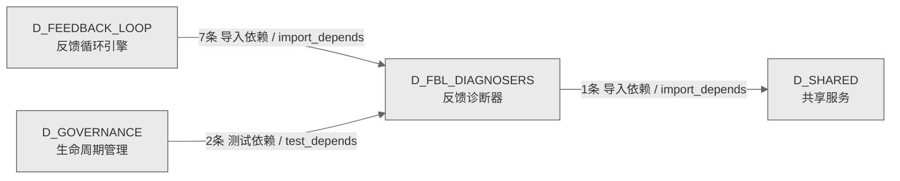

# 16_d_fbl_diagnosers / 反馈诊断器域 / Feedback Diagnosers

> **功能简介 / Overview**: 反馈诊断器，负责异常根因诊断、模型健康监控、可靠性诊断和上下文窗口压力管理

> **文档作用 / Purpose**: 展示 反馈诊断器（D_FBL_DIAGNOSERS）功能域的域内依赖关系、跨域依赖关系，模块信息（成熟度/中英文名/大白话/文件路径）内嵌于 Mermaid 节点，供架构审查和域治理参考。

> 本文档由 generate_domain_doc.py 从 depgraph (PostgreSQL) 自动生成
> 数据源: depgraph (PostgreSQL) nodes表 + edges表

> **[可缩放 HTML 版 / Zoomable HTML](http://localhost:8765/docs/02_enterprise_architecture/02_domain_architecture_docs/_zoomable_html/16_d_fbl_diagnosers.html)** — Ctrl+滚轮缩放 ｜ 双击重置 ｜ Ctrl+Shift+D 切换拖动/选择模式

## 域基本信息 / Domain Overview

| 字段 | 值 | Field | Value |
|------|------|-------|-------|
| 编号 | 16 | Number | 16 |
| 域ID | D_FBL_DIAGNOSERS | Domain ID | D_FBL_DIAGNOSERS |
| 域名称 | 反馈诊断器 | Domain Name | Feedback Diagnosers |
| 层级 | L1 基础平台层 | Layer | L1 Foundation |
| 模块数 | 76 | Module Count | 76 |
| 域内依赖 | 6 | Internal Dependencies | 6 |
| 跨域入边 | 9 | Cross-domain Incoming | 9 |
| 跨域出边 | 1 | Cross-domain Outgoing | 1 |
| 设计态模块 | 0 | Design Modules | 0 |
| 生产态模块 | 76 | Production Modules | 76 |
| 容量 | 76/150 (正常) | Capacity | 76/150 (正常) |
| 描述 | 反馈诊断器，负责异常根因诊断、模型健康监控、可靠性诊断和上下文窗口压力管理 | Description | 反馈诊断器，负责异常根因诊断、模型健康监控、可靠性诊断和上下文窗口压力管理 |

## 域内依赖图 / Internal Dependency Diagram

> 依赖图内嵌在本文档中，IDE 可直接渲染；网页版可 Ctrl+滚轮缩放 + 拖动平移查看细节。
>
> **图例说明 / Legend**：
> - 🟦 **蓝色 = 运营态模块**（production，已上线运行）
> - 🟧 **橙色虚线 = 设计态模块**（design，蓝图阶段，代码未写）
> - **实线箭头 = 运营态依赖**（已生效的依赖关系）
> - **虚线箭头 = 非运营态依赖**（计划中/验证中的依赖关系）

### 全景图（全部模块，颜色区分运营态/设计态）

> 展示全部 76 个模块（生产态 76 + 设计态 0），含跨域依赖外部节点。节点含成熟度+名称+大白话/简介+文件路径。

```mermaid
%%{init: {'theme': 'base', 'themeVariables': {'primaryColor': '#eaeaea', 'primaryTextColor': '#333333', 'primaryBorderColor': '#666666', 'lineColor': '#666666', 'secondaryColor': '#eaeaea', 'tertiaryColor': '#eaeaea', 'fontSize': '14px'}}}%%
flowchart TD
    src_zephyr_feedback_loop_diagnosers_init_py["feedback_loop/diagnosers 包入口<br/>包入口.diagnosers — GOV-DOC-018:<br/>71个叶子模块拆分为4个逻辑子包(cognitive<br/>/diagnosis/health/reliability)。<br/>文件: diagnosers/__init__.py<br/>(生产态 / production)"]
    src_zephyr_feedback_loop_diagnosers_cognitive_adaptive_param_tuning_py["自适应参数调优<br/>认知语义分析（adaptive param tuning）<br/>Adaptive Parameter Tuning — v0.37.0 R452<br/>文件: cognitive/adaptive_param_tuning.py<br/>(生产态 / production)"]
    src_zephyr_feedback_loop_diagnosers_cognitive_cognitive_load_py["认知load<br/>估算运维负责人认知负荷与疲劳分，告警洪水淹没单人<br/>时预警，防止关键告警被漏掉。<br/>Cognitive Load Estimator — v0.6.0 R68<br/>文件: cognitive/cognitive_load.py<br/>(生产态 / production)"]
    src_zephyr_feedback_loop_diagnosers_cognitive_cognitive_load_budget_py["认知load预算<br/>诊断问题根因（cognitive load budget）<br/>Cognitive Load Budget — v0.16.0 R223<br/>文件: cognitive/cognitive_load_budget.py<br/>(生产态 / production)"]
    src_zephyr_feedback_loop_diagnosers_cognitive_collaborative_learning_py["协同学习<br/>提供share等方法<br/>Collaborative Learning — v0.7.0 R82<br/>文件: cognitive/collaborative_learning.py<br/>(生产态 / production)"]
    src_zephyr_feedback_loop_diagnosers_cognitive_confidence_decomposer_py["置信度分解器<br/>提供decompose等方法<br/>Confidence Decomposer — v0.7.0 R83<br/>文件: cognitive/confidence_decomposer.py<br/>(生产态 / production)"]
    src_zephyr_feedback_loop_diagnosers_cognitive_gamification_py["游戏化<br/>提供reward等方法<br/>Gamification — v0.8.0 R101<br/>文件: cognitive/gamification.py<br/>(生产态 / production)"]
    src_zephyr_feedback_loop_diagnosers_cognitive_meta_guard_latency_budget_py["元守卫latency预算<br/>累计Guard开销监控+超限降级 —<br/>>poll_interval的X%则降级低价值Guard<br/>R516: MetaGuardLatencyBudget<br/>文件: cognitive/meta_guard_latency_budget.py<br/>(生产态 / production)"]
    src_zephyr_feedback_loop_diagnosers_cognitive_socratic_questions_py["苏格拉底式提问<br/>提供生成等方法<br/>Socratic Questions — v0.7.0 R81<br/>文件: cognitive/socratic_questions.py<br/>(生产态 / production)"]
    src_zephyr_feedback_loop_diagnosers_cognitive_tone_adapter_py["tone适配器<br/>诊断反馈闭环问题根因（tone）<br/>Tone Adapter — v0.9.0 R127<br/>文件: cognitive/tone_adapter.py<br/>(生产态 / production)"]
    src_zephyr_feedback_loop_diagnosers_cognitive_tone_adapter_v2_py["tone适配器v2<br/>诊断反馈闭环问题根因（tone adapter v2）<br/>Tone Adapter v2 — v0.10.0 R141<br/>文件: cognitive/tone_adapter_v2.py<br/>(生产态 / production)"]
    src_zephyr_feedback_loop_diagnosers_diagnosis_auto_diagnosis_py["自动诊断<br/>诊断问题根因（auto diagnosis）<br/>Auto Diagnosis — v0.3.0 R16<br/>文件: diagnosis/auto_diagnosis.py<br/>(生产态 / production)"]
    src_zephyr_feedback_loop_diagnosers_diagnosis_causal_inference_engine_py["causalinference引擎<br/>causal推理引擎。Causal Inference<br/>Engine，诊断问题根因<br/>Causal Inference Engine — v0.3.0 R5-R7<br/>文件: diagnosis/causal_inference_engine.py<br/>(生产态 / production)"]
    src_zephyr_feedback_loop_diagnosers_diagnosis_counterfactual_py["反事实<br/>反馈闭环的引擎，执行核心逻辑的处理引擎<br/>Counterfactual Engine — v0.6.0 R60<br/>文件: diagnosis/counterfactual.py<br/>(生产态 / production)"]
    src_zephyr_feedback_loop_diagnosers_diagnosis_diagnosis_engine_py["诊断引擎<br/>问题诊断（diagnosis）<br/>diagnosis_engine<br/>文件: diagnosis/diagnosis_engine.py<br/>(生产态 / production)"]
    src_zephyr_feedback_loop_diagnosers_diagnosis_diagnosis_kpi_py["诊断kpi<br/>统计诊断有多少比例真正导向有效修复，暴露诊断流水<br/>线失效、修复反馈链断裂的问题。<br/>Diagnosis KPI — v0.9.0 R116<br/>文件: diagnosis/diagnosis_kpi.py<br/>(生产态 / production)"]
    src_zephyr_feedback_loop_diagnosers_diagnosis_impact_predictor_py["冲击预测器<br/>在执行修复前预测其副作用，防止修复引发新的连锁异<br/>常。<br/>Impact Predictor — v0.9.0 R121<br/>文件: diagnosis/impact_predictor.py<br/>(生产态 / production)"]
    src_zephyr_feedback_loop_diagnosers_diagnosis_incident_knowledge_injector_py["incident知识injector<br/>RCA发现->规则/阈值自动注入闭环 — 不让知识腐烂<br/>R504: IncidentKnowledgeInjector<br/>文件: diagnosis/incident_knowledge_injector.py<br/>(生产态 / production)"]
    src_zephyr_feedback_loop_diagnosers_diagnosis_interactive_diagnosis_py["interactive诊断<br/>对模糊症状做多轮探询式诊断，避免一次性草率诊断导<br/>致误修。<br/>Interactive Diagnosis — v0.7.0 R80<br/>文件: diagnosis/interactive_diagnosis.py<br/>(生产态 / production)"]
    src_zephyr_feedback_loop_diagnosers_diagnosis_knowledge_bus_factor_monitor_py["知识总线因子监控<br/>Knowledge Bus Factor Monitor — v0.38.0 R481<br/>文件: diagnosis/knowledge_bus_factor_monitor.py<br/>(生产态 / production)"]
    src_zephyr_feedback_loop_diagnosers_diagnosis_knowledge_market_py["知识市场<br/>诊断问题根因（knowledge market）<br/>Knowledge Market — v0.9.0 R126<br/>文件: diagnosis/knowledge_market.py<br/>(生产态 / production)"]
    src_zephyr_feedback_loop_diagnosers_diagnosis_mtti_tracker_py["mtti追踪器<br/>诊断反馈闭环问题根因（mtti）<br/>MTTI Tracker — v0.16.0 R221<br/>文件: diagnosis/mtti_tracker.py<br/>(生产态 / production)"]
    src_zephyr_feedback_loop_diagnosers_diagnosis_nonstationary_effectiveness_py["非平稳有效性<br/>反馈闭环的状态机，管理状态流转<br/>文件: diagnosis/nonstationary_effectiveness.py<br/>(生产态 / production)"]
    src_zephyr_feedback_loop_diagnosers_diagnosis_statistical_hygiene_auditor_py["statisticalhygiene审计器<br/>Statistical Hygiene<br/>Auditor，诊断反馈闭环问题根因<br/>文件: diagnosis/statistical_hygiene_auditor.py<br/>(生产态 / production)"]
    src_zephyr_feedback_loop_diagnosers_diagnosis_vertical_self_assessment_py["vertical自assessment<br/>让 FLE 评估自身能力成熟度等级，防止高估能力而做<br/>出危险的自主动作。<br/>Vertical Self Assessment — v0.10.0 R137<br/>文件: diagnosis/vertical_self_assessment.py<br/>(生产态 / production)"]
    src_zephyr_feedback_loop_diagnosers_health_action_composition_health_monitor_py["行为composition健康监控器<br/>复合动作链整体健康 — 负协同效应检测<br/>（整体<部分之和）<br/>R511: ActionCompositionHealthMonitor<br/>文件: health<br/>/action_composition_health_monitor.py<br/>(生产态 / production)"]
    src_zephyr_feedback_loop_diagnosers_health_dr_resilience_metrics_py["dr韧性指标<br/>诊断问题根因（dr resilience metrics）<br/>文件: health/dr_resilience_metrics.py<br/>(生产态 / production)"]
    src_zephyr_feedback_loop_diagnosers_health_e2e_integration_health_py["端到端集成健康<br/>诊断问题根因（e2e integration health）<br/>文件: health/e2e_integration_health.py<br/>(生产态 / production)"]
    src_zephyr_feedback_loop_diagnosers_health_fle_dogfood_monitor_py["fledogfood监控器<br/>把 FLE 自己的采集-检测-诊断-执行-验证流水线反过<br/>来用在自己身上，盯自身 SLO<br/>并自诊自愈，防止监控系统自己静默失效。<br/>FLE Dogfood Monitor — v0.38.0 R480<br/>文件: health/fle_dogfood_monitor.py<br/>(生产态 / production)"]
    src_zephyr_feedback_loop_diagnosers_health_fle_self_slo_metrics_py["fle自SLO指标<br/>诊断反馈闭环问题根因（fle self slo metrics）<br/>文件: health/fle_self_slo_metrics.py<br/>(生产态 / production)"]
    src_zephyr_feedback_loop_diagnosers_health_global_health_map_py["全局健康map<br/>诊断问题根因（global health map）<br/>Global Health Map — v0.8.0 R103<br/>文件: health/global_health_map.py<br/>(生产态 / production)"]
    src_zephyr_feedback_loop_diagnosers_health_memory_self_check_py["记忆自检查<br/>诊断问题根因（memory self check）<br/>Memory Self Check — v0.8.0 R105<br/>文件: health/memory_self_check.py<br/>(生产态 / production)"]
    src_zephyr_feedback_loop_diagnosers_health_model_health_py["模型健康<br/>诊断问题根因（model health）<br/>Model Health Monitor — v0.5.0 R40<br/>文件: health/model_health.py<br/>(生产态 / production)"]
    src_zephyr_feedback_loop_diagnosers_health_self_benchmark_py["自基准<br/>用历史基线对比 FLE<br/>性能趋势，发现没有基线对照就看不出的渐进退化。<br/>Self Benchmark — v0.9.0 R115<br/>文件: health/self_benchmark.py<br/>(生产态 / production)"]
    src_zephyr_feedback_loop_diagnosers_health_self_bottleneck_detector_py["selfbottleneck检测器<br/>自bottleneck检测器。Self-Bottleneck<br/>Detector，诊断问题根因<br/>Self-Bottleneck Detector — v0.38.0 R479<br/>文件: health/self_bottleneck_detector.py<br/>(生产态 / production)"]
    src_zephyr_feedback_loop_diagnosers_health_self_health_monitor_py["自健康监控<br/>诊断问题根因（self health）<br/>Self Health Monitor — v0.4.0 R29<br/>文件: health/self_health_monitor.py<br/>(生产态 / production)"]
    src_zephyr_feedback_loop_diagnosers_health_self_llm_observability_py["自LLM可观测性<br/>观测 FLE 自身所用 LLM<br/>的错误率和延迟，质量静默下滑时告警，防止污染所有<br/>下游诊断。<br/>Self LLM Observability — v0.12.0 R160<br/>文件: health/self_llm_observability.py<br/>(生产态 / production)"]
    src_zephyr_feedback_loop_diagnosers_reliability_amplification_guard_py["amplification守卫<br/>监控多跳提示链是否把小偏差放大成大错误，超过放大<br/>上限就拦住，防止诊断级联失败。<br/>Amplification Guard — v0.10.0 R134<br/>文件: reliability/amplification_guard.py<br/>(生产态 / production)"]
    src_zephyr_feedback_loop_diagnosers_reliability_api_dependency_metrics_py["API依赖指标<br/>诊断问题根因（api dependency metrics）<br/>文件: reliability/api_dependency_metrics.py<br/>(生产态 / production)"]
    src_zephyr_feedback_loop_diagnosers_reliability_burn_rate_alerter_py["burn速率告警器<br/>按 Google SRE 多窗口方法跟踪 SLO<br/>错误预算燃烧速率，预算被快速烧光前告警，而不是等<br/>SLO 已破才报。<br/>Burn Rate Alerter — v0.14.0 R200<br/>文件: reliability/burn_rate_alerter.py<br/>(生产态 / production)"]
    src_zephyr_feedback_loop_diagnosers_reliability_burnout_alarm_py["倦怠告警<br/>提供alarm等方法<br/>Burnout Alarm — v0.8.0 R100<br/>文件: reliability/burnout_alarm.py<br/>(生产态 / production)"]
    src_zephyr_feedback_loop_diagnosers_reliability_capacity_aware_repair_py["容量感知修复<br/>执行修复前先看当前资源余量是否够动作开销，防止修<br/>复动作本身把资源耗尽引发级联故障。<br/>Capacity Aware Repair — v0.9.0 R120<br/>文件: reliability/capacity_aware_repair.py<br/>(生产态 / production)"]
    src_zephyr_feedback_loop_diagnosers_reliability_cold_start_conservative_mode_py["冷启动conservativemode<br/>冷启动渐进激活 —<br/>collect->detect->diagnose->full，阈值×3衰减到×1<br/>R509: ColdStartConservativeMode<br/>文件: reliability<br/>/cold_start_conservative_mode.py<br/>(生产态 / production)"]
    src_zephyr_feedback_loop_diagnosers_reliability_context_truncation_py["上下文truncation<br/>诊断反馈闭环问题根因（context truncation）<br/>文件: reliability/context_truncation.py<br/>(生产态 / production)"]
    src_zephyr_feedback_loop_diagnosers_reliability_context_window_pressure_manager_py["上下文windowpressure管理器<br/>上下文窗口压力主动预防 — 检测压力/压缩<br/>/优先级排序<br/>R506: ContextWindowPressureManager<br/>文件: reliability<br/>/context_window_pressure_manager.py<br/>(生产态 / production)"]
    src_zephyr_feedback_loop_diagnosers_reliability_cross_guard_conflict_detector_py["跨守卫冲突检测器<br/>守卫间矛盾建议配对冲突矩阵 — Guard A说act,<br/>Guard B说suppress<br/>R513: CrossGuardConflictDetector<br/>文件: reliability<br/>/cross_guard_conflict_detector.py<br/>(生产态 / production)"]
    src_zephyr_feedback_loop_diagnosers_reliability_cross_session_consistency_validator_py["跨会话一致性校验器<br/>R510: CrossSessionConsistencyValidator<br/>文件: reliability<br/>/cross_session_consistency_validator.py<br/>(生产态 / production)"]
    src_zephyr_feedback_loop_diagnosers_reliability_data_volume_growth_monitor_py["数据volumegrowth监控器<br/>数据成交量growth监控。Data Volume Growth<br/>Monitor，诊断问题根因<br/>文件: reliability/data_volume_growth_monitor.py<br/>(生产态 / production)"]
    src_zephyr_feedback_loop_diagnosers_reliability_feedback_delay_compensator_py["反馈延迟补偿器<br/>诊断问题根因（feedback delay compensator）<br/>文件: reliability/feedback_delay_compensator.py<br/>(生产态 / production)"]
    src_zephyr_feedback_loop_diagnosers_reliability_guard_interaction_topology_mapper_py["守卫interactiontopologymapper<br/>Guard交互有向图+环路检测 — A->B->C->A 循环<br/>R518: GuardInteractionTopologyMapper<br/>文件: reliability<br/>/guard_interaction_topology_mapper.py<br/>(生产态 / production)"]
    src_zephyr_feedback_loop_diagnosers_reliability_guard_self_consistency_auditor_py["守卫自一致性审计器<br/>R512: GuardSelfConsistencyAuditor<br/>文件: reliability<br/>/guard_self_consistency_auditor.py<br/>(生产态 / production)"]
    src_zephyr_feedback_loop_diagnosers_reliability_human_anomaly_flood_detector_py["human异常flood检测器<br/>诊断问题根因（human anomaly flood）<br/>文件: reliability<br/>/human_anomaly_flood_detector.py<br/>(生产态 / production)"]
    src_zephyr_feedback_loop_diagnosers_reliability_latency_slo_py["延迟SLO<br/>诊断反馈闭环根因（latency slo）<br/>Latency SLO Monitor — v0.14.0 R192<br/>文件: reliability/latency_slo.py<br/>(生产态 / production)"]
    src_zephyr_feedback_loop_diagnosers_reliability_llm_provider_integrity_py["llm提供器完整性<br/>诊断问题根因（llm provider integrity）<br/>LLM Provider Integrity — v0.15.0 R217<br/>文件: reliability/llm_provider_integrity.py<br/>(生产态 / production)"]
    src_zephyr_feedback_loop_diagnosers_reliability_llm_quality_regression_py["llm质量回归<br/>诊断问题根因（llm quality regression）<br/>LLM Quality Regression — v0.12.0 R161<br/>文件: reliability/llm_quality_regression.py<br/>(生产态 / production)"]
    src_zephyr_feedback_loop_diagnosers_reliability_model_rotation_py["模型rotation<br/>在多个诊断模型间轮换，避免单模型退化导致整套诊断<br/>流水线失效。<br/>Model Rotation — v0.9.0 R125<br/>文件: reliability/model_rotation.py<br/>(生产态 / production)"]
    src_zephyr_feedback_loop_diagnosers_reliability_model_rotation_v2_py["模型rotationv2<br/>按近期表现加权选择诊断模型的增强版轮换，性能好的<br/>模型优先被选中。<br/>Model Rotation v2 — v0.10.0 R140<br/>文件: reliability/model_rotation_v2.py<br/>(生产态 / production)"]
    src_zephyr_feedback_loop_diagnosers_reliability_model_version_semantic_drift_py["模型版本semantic漂移<br/>Model Version Semantic Drift<br/>Monitor，诊断问题根因<br/>文件: reliability<br/>/model_version_semantic_drift.py<br/>(生产态 / production)"]
    src_zephyr_feedback_loop_diagnosers_reliability_numerical_stability_guard_py["numericalstability守卫<br/>拦截进入流水线的<br/>NaN、Inf、溢出等浮点异常，分类隔离或封顶，防止坏<br/>数值引发假异常或掩盖真异常。<br/>Numerical Stability Guard — v0.38.0 R475<br/>文件: reliability/numerical_stability_guard.py<br/>(生产态 / production)"]
    src_zephyr_feedback_loop_diagnosers_reliability_operational_seasonality_py["运营季节性<br/>可靠性监控（operational seasonality）<br/>Operational Seasonality — v0.16.0 R228<br/>文件: reliability/operational_seasonality.py<br/>(生产态 / production)"]
    src_zephyr_feedback_loop_diagnosers_reliability_prompt_fingerprint_py["提示指纹<br/>给 LLM 提示词内容算哈希留版本指纹，发现提示词静<br/>默漂移导致跨会话诊断不一致。<br/>Prompt Fingerprint — v0.3.0 R14<br/>文件: reliability/prompt_fingerprint.py<br/>(生产态 / production)"]
    src_zephyr_feedback_loop_diagnosers_reliability_prompt_sanitizer_py["提示清洗器<br/>清洗注入诊断证据的外部数据，防止提示注入攻击污染<br/>LLM 输出。<br/>Prompt Sanitizer — v0.10.0 R133<br/>文件: reliability/prompt_sanitizer.py<br/>(生产态 / production)"]
    src_zephyr_feedback_loop_diagnosers_reliability_recovery_time_stats_py["恢复timestats<br/>诊断反馈闭环问题根因（recovery time stats）<br/>Recovery Time Statistics — v0.37.0 R454<br/>文件: reliability/recovery_time_stats.py<br/>(生产态 / production)"]
    src_zephyr_feedback_loop_diagnosers_reliability_regime_gain_scheduling_py["市场状态增益调度<br/>诊断器的调度器，按时间或优先级安排任务<br/>Regime Gain Scheduling — v0.37.0 R453<br/>文件: reliability/regime_gain_scheduling.py<br/>(生产态 / production)"]
    src_zephyr_feedback_loop_diagnosers_reliability_retirement_planner_py["退役规划器<br/>提供markforretirement等方法<br/>Retirement Planner — v0.10.0 R139<br/>文件: reliability/retirement_planner.py<br/>(生产态 / production)"]
    src_zephyr_feedback_loop_diagnosers_reliability_slo_capacity_metrics_py["SLO容量指标<br/>诊断问题根因（slo capacity metrics）<br/>文件: reliability/slo_capacity_metrics.py<br/>(生产态 / production)"]
    src_zephyr_feedback_loop_diagnosers_reliability_system_entropy_monitor_py["系统熵监控<br/>FLE内部熵增趋势 — 配置<br/>/行为混乱度单调递增->即将混沌<br/>R527: SystemEntropyMonitor<br/>文件: reliability/system_entropy_monitor.py<br/>(生产态 / production)"]
    src_zephyr_feedback_loop_diagnosers_reliability_temporal_integrity_guard_py["temporal完整性守卫<br/>Temporal Integrity Guard，诊断问题根因<br/>Temporal Integrity Guard — v0.38.0 R478<br/>文件: reliability/temporal_integrity_guard.py<br/>(生产态 / production)"]
    src_zephyr_feedback_loop_diagnosers_reliability_timezone_semantic_reasoner_py["时区语义推理器<br/>可靠性监控（timezone semantic reasoner）<br/>文件: reliability/timezone_semantic_reasoner.py<br/>(生产态 / production)"]
    src_zephyr_feedback_loop_diagnosers_reliability_toil_quantification_py["苦力量化<br/>可靠性监控（toil quantification）<br/>Toil Quantification — v0.37.0 R457<br/>文件: reliability/toil_quantification.py<br/>(生产态 / production)"]
    src_zephyr_feedback_loop_diagnosers_reliability_value_added_baseline_py["valueadded基线<br/>价值added基线。Value Added<br/>Baseline，诊断问题根因<br/>Value Added Baseline — v0.10.0 R138<br/>文件: reliability/value_added_baseline.py<br/>(生产态 / production)"]
    src_zephyr_feedback_loop_diagnosers_reliability_zombie_fle_detector_py["zombiefle检测器<br/>Zombie FLE Detector，诊断反馈闭环问题根因<br/>Zombie FLE Detector — v0.16.0 R222<br/>文件: reliability/zombie_fle_detector.py<br/>(生产态 / production)"]
    src_zephyr_feedback_loop_diagnosers_init_py ~~~ src_zephyr_feedback_loop_diagnosers_cognitive_adaptive_param_tuning_py
    src_zephyr_feedback_loop_diagnosers_cognitive_adaptive_param_tuning_py ~~~ src_zephyr_feedback_loop_diagnosers_cognitive_cognitive_load_py
    src_zephyr_feedback_loop_diagnosers_cognitive_cognitive_load_py ~~~ src_zephyr_feedback_loop_diagnosers_cognitive_cognitive_load_budget_py
    src_zephyr_feedback_loop_diagnosers_cognitive_cognitive_load_budget_py ~~~ src_zephyr_feedback_loop_diagnosers_cognitive_collaborative_learning_py
    src_zephyr_feedback_loop_diagnosers_cognitive_collaborative_learning_py ~~~ src_zephyr_feedback_loop_diagnosers_cognitive_confidence_decomposer_py
    src_zephyr_feedback_loop_diagnosers_cognitive_confidence_decomposer_py ~~~ src_zephyr_feedback_loop_diagnosers_cognitive_gamification_py
    src_zephyr_feedback_loop_diagnosers_cognitive_gamification_py ~~~ src_zephyr_feedback_loop_diagnosers_cognitive_meta_guard_latency_budget_py
    src_zephyr_feedback_loop_diagnosers_cognitive_meta_guard_latency_budget_py ~~~ src_zephyr_feedback_loop_diagnosers_cognitive_socratic_questions_py
    src_zephyr_feedback_loop_diagnosers_cognitive_socratic_questions_py ~~~ src_zephyr_feedback_loop_diagnosers_cognitive_tone_adapter_py
    src_zephyr_feedback_loop_diagnosers_cognitive_tone_adapter_py ~~~ src_zephyr_feedback_loop_diagnosers_cognitive_tone_adapter_v2_py
    src_zephyr_feedback_loop_diagnosers_cognitive_tone_adapter_v2_py ~~~ src_zephyr_feedback_loop_diagnosers_diagnosis_auto_diagnosis_py
    src_zephyr_feedback_loop_diagnosers_diagnosis_auto_diagnosis_py ~~~ src_zephyr_feedback_loop_diagnosers_diagnosis_causal_inference_engine_py
    src_zephyr_feedback_loop_diagnosers_diagnosis_causal_inference_engine_py ~~~ src_zephyr_feedback_loop_diagnosers_diagnosis_counterfactual_py
    src_zephyr_feedback_loop_diagnosers_diagnosis_counterfactual_py ~~~ src_zephyr_feedback_loop_diagnosers_diagnosis_diagnosis_engine_py
    src_zephyr_feedback_loop_diagnosers_diagnosis_diagnosis_engine_py ~~~ src_zephyr_feedback_loop_diagnosers_diagnosis_diagnosis_kpi_py
    src_zephyr_feedback_loop_diagnosers_diagnosis_diagnosis_kpi_py ~~~ src_zephyr_feedback_loop_diagnosers_diagnosis_impact_predictor_py
    src_zephyr_feedback_loop_diagnosers_diagnosis_impact_predictor_py ~~~ src_zephyr_feedback_loop_diagnosers_diagnosis_incident_knowledge_injector_py
    src_zephyr_feedback_loop_diagnosers_diagnosis_incident_knowledge_injector_py ~~~ src_zephyr_feedback_loop_diagnosers_diagnosis_interactive_diagnosis_py
    src_zephyr_feedback_loop_diagnosers_diagnosis_interactive_diagnosis_py ~~~ src_zephyr_feedback_loop_diagnosers_diagnosis_knowledge_bus_factor_monitor_py
    src_zephyr_feedback_loop_diagnosers_diagnosis_knowledge_bus_factor_monitor_py ~~~ src_zephyr_feedback_loop_diagnosers_diagnosis_knowledge_market_py
    src_zephyr_feedback_loop_diagnosers_diagnosis_knowledge_market_py ~~~ src_zephyr_feedback_loop_diagnosers_diagnosis_mtti_tracker_py
    src_zephyr_feedback_loop_diagnosers_diagnosis_mtti_tracker_py ~~~ src_zephyr_feedback_loop_diagnosers_diagnosis_nonstationary_effectiveness_py
    src_zephyr_feedback_loop_diagnosers_diagnosis_nonstationary_effectiveness_py ~~~ src_zephyr_feedback_loop_diagnosers_diagnosis_statistical_hygiene_auditor_py
    src_zephyr_feedback_loop_diagnosers_diagnosis_statistical_hygiene_auditor_py ~~~ src_zephyr_feedback_loop_diagnosers_diagnosis_vertical_self_assessment_py
    src_zephyr_feedback_loop_diagnosers_diagnosis_vertical_self_assessment_py ~~~ src_zephyr_feedback_loop_diagnosers_health_action_composition_health_monitor_py
    src_zephyr_feedback_loop_diagnosers_health_action_composition_health_monitor_py ~~~ src_zephyr_feedback_loop_diagnosers_health_dr_resilience_metrics_py
    src_zephyr_feedback_loop_diagnosers_health_dr_resilience_metrics_py ~~~ src_zephyr_feedback_loop_diagnosers_health_e2e_integration_health_py
    src_zephyr_feedback_loop_diagnosers_health_e2e_integration_health_py ~~~ src_zephyr_feedback_loop_diagnosers_health_fle_dogfood_monitor_py
    src_zephyr_feedback_loop_diagnosers_health_fle_dogfood_monitor_py ~~~ src_zephyr_feedback_loop_diagnosers_health_fle_self_slo_metrics_py
    src_zephyr_feedback_loop_diagnosers_health_fle_self_slo_metrics_py ~~~ src_zephyr_feedback_loop_diagnosers_health_global_health_map_py
    src_zephyr_feedback_loop_diagnosers_health_global_health_map_py ~~~ src_zephyr_feedback_loop_diagnosers_health_memory_self_check_py
    src_zephyr_feedback_loop_diagnosers_health_memory_self_check_py ~~~ src_zephyr_feedback_loop_diagnosers_health_model_health_py
    src_zephyr_feedback_loop_diagnosers_health_model_health_py ~~~ src_zephyr_feedback_loop_diagnosers_health_self_benchmark_py
    src_zephyr_feedback_loop_diagnosers_health_self_benchmark_py ~~~ src_zephyr_feedback_loop_diagnosers_health_self_bottleneck_detector_py
    src_zephyr_feedback_loop_diagnosers_health_self_bottleneck_detector_py ~~~ src_zephyr_feedback_loop_diagnosers_health_self_health_monitor_py
    src_zephyr_feedback_loop_diagnosers_health_self_health_monitor_py ~~~ src_zephyr_feedback_loop_diagnosers_health_self_llm_observability_py
    src_zephyr_feedback_loop_diagnosers_health_self_llm_observability_py ~~~ src_zephyr_feedback_loop_diagnosers_reliability_amplification_guard_py
    src_zephyr_feedback_loop_diagnosers_reliability_amplification_guard_py ~~~ src_zephyr_feedback_loop_diagnosers_reliability_api_dependency_metrics_py
    src_zephyr_feedback_loop_diagnosers_reliability_api_dependency_metrics_py ~~~ src_zephyr_feedback_loop_diagnosers_reliability_burn_rate_alerter_py
    src_zephyr_feedback_loop_diagnosers_reliability_burn_rate_alerter_py ~~~ src_zephyr_feedback_loop_diagnosers_reliability_burnout_alarm_py
    src_zephyr_feedback_loop_diagnosers_reliability_burnout_alarm_py ~~~ src_zephyr_feedback_loop_diagnosers_reliability_capacity_aware_repair_py
    src_zephyr_feedback_loop_diagnosers_reliability_capacity_aware_repair_py ~~~ src_zephyr_feedback_loop_diagnosers_reliability_cold_start_conservative_mode_py
    src_zephyr_feedback_loop_diagnosers_reliability_cold_start_conservative_mode_py ~~~ src_zephyr_feedback_loop_diagnosers_reliability_context_truncation_py
    src_zephyr_feedback_loop_diagnosers_reliability_context_truncation_py ~~~ src_zephyr_feedback_loop_diagnosers_reliability_context_window_pressure_manager_py
    src_zephyr_feedback_loop_diagnosers_reliability_context_window_pressure_manager_py ~~~ src_zephyr_feedback_loop_diagnosers_reliability_cross_guard_conflict_detector_py
    src_zephyr_feedback_loop_diagnosers_reliability_cross_guard_conflict_detector_py ~~~ src_zephyr_feedback_loop_diagnosers_reliability_cross_session_consistency_validator_py
    src_zephyr_feedback_loop_diagnosers_reliability_cross_session_consistency_validator_py ~~~ src_zephyr_feedback_loop_diagnosers_reliability_data_volume_growth_monitor_py
    src_zephyr_feedback_loop_diagnosers_reliability_data_volume_growth_monitor_py ~~~ src_zephyr_feedback_loop_diagnosers_reliability_feedback_delay_compensator_py
    src_zephyr_feedback_loop_diagnosers_reliability_feedback_delay_compensator_py ~~~ src_zephyr_feedback_loop_diagnosers_reliability_guard_interaction_topology_mapper_py
    src_zephyr_feedback_loop_diagnosers_reliability_guard_interaction_topology_mapper_py ~~~ src_zephyr_feedback_loop_diagnosers_reliability_guard_self_consistency_auditor_py
    src_zephyr_feedback_loop_diagnosers_reliability_guard_self_consistency_auditor_py ~~~ src_zephyr_feedback_loop_diagnosers_reliability_human_anomaly_flood_detector_py
    src_zephyr_feedback_loop_diagnosers_reliability_human_anomaly_flood_detector_py ~~~ src_zephyr_feedback_loop_diagnosers_reliability_latency_slo_py
    src_zephyr_feedback_loop_diagnosers_reliability_latency_slo_py ~~~ src_zephyr_feedback_loop_diagnosers_reliability_llm_provider_integrity_py
    src_zephyr_feedback_loop_diagnosers_reliability_llm_provider_integrity_py ~~~ src_zephyr_feedback_loop_diagnosers_reliability_llm_quality_regression_py
    src_zephyr_feedback_loop_diagnosers_reliability_llm_quality_regression_py ~~~ src_zephyr_feedback_loop_diagnosers_reliability_model_rotation_py
    src_zephyr_feedback_loop_diagnosers_reliability_model_rotation_py ~~~ src_zephyr_feedback_loop_diagnosers_reliability_model_rotation_v2_py
    src_zephyr_feedback_loop_diagnosers_reliability_model_rotation_v2_py ~~~ src_zephyr_feedback_loop_diagnosers_reliability_model_version_semantic_drift_py
    src_zephyr_feedback_loop_diagnosers_reliability_model_version_semantic_drift_py ~~~ src_zephyr_feedback_loop_diagnosers_reliability_numerical_stability_guard_py
    src_zephyr_feedback_loop_diagnosers_reliability_numerical_stability_guard_py ~~~ src_zephyr_feedback_loop_diagnosers_reliability_operational_seasonality_py
    src_zephyr_feedback_loop_diagnosers_reliability_operational_seasonality_py ~~~ src_zephyr_feedback_loop_diagnosers_reliability_prompt_fingerprint_py
    src_zephyr_feedback_loop_diagnosers_reliability_prompt_fingerprint_py ~~~ src_zephyr_feedback_loop_diagnosers_reliability_prompt_sanitizer_py
    src_zephyr_feedback_loop_diagnosers_reliability_prompt_sanitizer_py ~~~ src_zephyr_feedback_loop_diagnosers_reliability_recovery_time_stats_py
    src_zephyr_feedback_loop_diagnosers_reliability_recovery_time_stats_py ~~~ src_zephyr_feedback_loop_diagnosers_reliability_regime_gain_scheduling_py
    src_zephyr_feedback_loop_diagnosers_reliability_regime_gain_scheduling_py ~~~ src_zephyr_feedback_loop_diagnosers_reliability_retirement_planner_py
    src_zephyr_feedback_loop_diagnosers_reliability_retirement_planner_py ~~~ src_zephyr_feedback_loop_diagnosers_reliability_slo_capacity_metrics_py
    src_zephyr_feedback_loop_diagnosers_reliability_slo_capacity_metrics_py ~~~ src_zephyr_feedback_loop_diagnosers_reliability_system_entropy_monitor_py
    src_zephyr_feedback_loop_diagnosers_reliability_system_entropy_monitor_py ~~~ src_zephyr_feedback_loop_diagnosers_reliability_temporal_integrity_guard_py
    src_zephyr_feedback_loop_diagnosers_reliability_temporal_integrity_guard_py ~~~ src_zephyr_feedback_loop_diagnosers_reliability_timezone_semantic_reasoner_py
    src_zephyr_feedback_loop_diagnosers_reliability_timezone_semantic_reasoner_py ~~~ src_zephyr_feedback_loop_diagnosers_reliability_toil_quantification_py
    src_zephyr_feedback_loop_diagnosers_reliability_toil_quantification_py ~~~ src_zephyr_feedback_loop_diagnosers_reliability_value_added_baseline_py
    src_zephyr_feedback_loop_diagnosers_reliability_value_added_baseline_py ~~~ src_zephyr_feedback_loop_diagnosers_reliability_zombie_fle_detector_py
    src_zephyr_feedback_loop_diagnosers_cognitive_init_py["diagnosers/cognitive 包入口<br/>诊断器/认知 包入口，整合认知相关子模块导出<br/>文件: cognitive/__init__.py<br/>(生产态 / production)"]
    src_zephyr_feedback_loop_diagnosers_diagnosis_init_py["diagnosers/diagnosis 包入口<br/>diagnosis 包入口，整合diagnosis相关子模块导出<br/>文件: diagnosis/__init__.py<br/>(生产态 / production)"]
    src_zephyr_feedback_loop_diagnosers_health_init_py["diagnosers/health 包入口<br/>诊断器/健康 包入口，整合健康相关子模块导出<br/>文件: health/__init__.py<br/>(生产态 / production)"]
    src_zephyr_feedback_loop_diagnosers_reliability_init_py["diagnosers/reliability 包入口<br/>诊断器/可靠性 包入口，整合可靠性相关子模块导出<br/>文件: reliability/__init__.py<br/>(生产态 / production)"]
    src_zephyr_feedback_loop_diagnosers_cognitive_init_py ~~~ src_zephyr_feedback_loop_diagnosers_diagnosis_init_py
    src_zephyr_feedback_loop_diagnosers_diagnosis_init_py ~~~ src_zephyr_feedback_loop_diagnosers_health_init_py
    src_zephyr_feedback_loop_diagnosers_health_init_py ~~~ src_zephyr_feedback_loop_diagnosers_reliability_init_py
    src_zephyr_feedback_loop_diagnosers_init_py -->|导入依赖 / import_depends| src_zephyr_feedback_loop_diagnosers_cognitive_init_py
    src_zephyr_feedback_loop_diagnosers_init_py -->|导入依赖 / import_depends| src_zephyr_feedback_loop_diagnosers_diagnosis_init_py
    src_zephyr_feedback_loop_diagnosers_init_py -->|导入依赖 / import_depends| src_zephyr_feedback_loop_diagnosers_health_init_py
    src_zephyr_feedback_loop_diagnosers_init_py -->|导入依赖 / import_depends| src_zephyr_feedback_loop_diagnosers_reliability_init_py
    src_zephyr_feedback_loop_diagnosers_diagnosis_knowledge_market_py -->|config_depends / config_depends| src_zephyr_feedback_loop_diagnosers_diagnosis_init_py
    src_zephyr_feedback_loop_diagnosers_diagnosis_knowledge_bus_factor_monitor_py -->|config_depends / config_depends| src_zephyr_feedback_loop_diagnosers_diagnosis_init_py
    D_SHARED["共享服务<br/>共享服务，负责跨域共享的工具、协议和基础服务<br/>Shared Services<br/>跨域节点 / cross-domain<br/>(生产态 / production)"]
    src_zephyr_feedback_loop_diagnosers_reliability_operational_seasonality_py -->|导入依赖 / import_depends| D_SHARED
    D_FEEDBACK_LOOP["反馈循环引擎<br/>反馈循环引擎，负责系统自我改进闭环：异常检测、根<br/>因诊断、自动修复和自我进化<br/>Feedback Loop Engine<br/>跨域节点 / cross-domain<br/>(生产态 / production)"]
    D_FEEDBACK_LOOP -->|导入依赖 / import_depends| src_zephyr_feedback_loop_diagnosers_init_py
    D_GOVERNANCE["生命周期管理<br/>生命周期管理，负责蓝图/模块<br/>/任务的声明周期管理和元数据治理<br/>Lifecycle Management<br/>跨域节点 / cross-domain<br/>(生产态 / production)"]
    D_GOVERNANCE -->|测试依赖 / test_depends| src_zephyr_feedback_loop_diagnosers_reliability_context_window_pressure_manager_py
    D_FEEDBACK_LOOP -->|导入依赖 / import_depends| src_zephyr_feedback_loop_diagnosers_init_py
    D_GOVERNANCE -->|测试依赖 / test_depends| src_zephyr_feedback_loop_diagnosers_health_self_bottleneck_detector_py
    D_FEEDBACK_LOOP -->|导入依赖 / import_depends| src_zephyr_feedback_loop_diagnosers_init_py
    D_FEEDBACK_LOOP -->|导入依赖 / import_depends| src_zephyr_feedback_loop_diagnosers_diagnosis_diagnosis_engine_py
    D_FEEDBACK_LOOP -->|导入依赖 / import_depends| src_zephyr_feedback_loop_diagnosers_init_py
    D_FEEDBACK_LOOP -->|导入依赖 / import_depends| src_zephyr_feedback_loop_diagnosers_init_py
    D_FEEDBACK_LOOP -->|导入依赖 / import_depends| src_zephyr_feedback_loop_diagnosers_init_py
    classDef production fill:#e1f5fe,stroke:#01579b,stroke-width:2px,color:#000
    classDef design fill:#fff3e0,stroke:#e65100,stroke-width:2px,color:#000,stroke-dasharray: 5 5
    classDef external_prod fill:#e8f4fd,stroke:#0277bd,stroke-width:1px,color:#000
    classDef external_design fill:#fff8e7,stroke:#ef6c00,stroke-width:1px,color:#000,stroke-dasharray: 5 5
    class src_zephyr_feedback_loop_diagnosers_init_py,src_zephyr_feedback_loop_diagnosers_cognitive_init_py,src_zephyr_feedback_loop_diagnosers_cognitive_adaptive_param_tuning_py,src_zephyr_feedback_loop_diagnosers_cognitive_cognitive_load_py,src_zephyr_feedback_loop_diagnosers_cognitive_cognitive_load_budget_py,src_zephyr_feedback_loop_diagnosers_cognitive_collaborative_learning_py,src_zephyr_feedback_loop_diagnosers_cognitive_confidence_decomposer_py,src_zephyr_feedback_loop_diagnosers_cognitive_gamification_py,src_zephyr_feedback_loop_diagnosers_cognitive_meta_guard_latency_budget_py,src_zephyr_feedback_loop_diagnosers_cognitive_socratic_questions_py,src_zephyr_feedback_loop_diagnosers_cognitive_tone_adapter_py,src_zephyr_feedback_loop_diagnosers_cognitive_tone_adapter_v2_py,src_zephyr_feedback_loop_diagnosers_diagnosis_init_py,src_zephyr_feedback_loop_diagnosers_diagnosis_auto_diagnosis_py,src_zephyr_feedback_loop_diagnosers_diagnosis_causal_inference_engine_py,src_zephyr_feedback_loop_diagnosers_diagnosis_counterfactual_py,src_zephyr_feedback_loop_diagnosers_diagnosis_diagnosis_engine_py,src_zephyr_feedback_loop_diagnosers_diagnosis_diagnosis_kpi_py,src_zephyr_feedback_loop_diagnosers_diagnosis_impact_predictor_py,src_zephyr_feedback_loop_diagnosers_diagnosis_incident_knowledge_injector_py,src_zephyr_feedback_loop_diagnosers_diagnosis_interactive_diagnosis_py,src_zephyr_feedback_loop_diagnosers_diagnosis_knowledge_bus_factor_monitor_py,src_zephyr_feedback_loop_diagnosers_diagnosis_knowledge_market_py,src_zephyr_feedback_loop_diagnosers_diagnosis_mtti_tracker_py,src_zephyr_feedback_loop_diagnosers_diagnosis_nonstationary_effectiveness_py,src_zephyr_feedback_loop_diagnosers_diagnosis_statistical_hygiene_auditor_py,src_zephyr_feedback_loop_diagnosers_diagnosis_vertical_self_assessment_py,src_zephyr_feedback_loop_diagnosers_health_init_py,src_zephyr_feedback_loop_diagnosers_health_action_composition_health_monitor_py,src_zephyr_feedback_loop_diagnosers_health_dr_resilience_metrics_py,src_zephyr_feedback_loop_diagnosers_health_e2e_integration_health_py,src_zephyr_feedback_loop_diagnosers_health_fle_dogfood_monitor_py,src_zephyr_feedback_loop_diagnosers_health_fle_self_slo_metrics_py,src_zephyr_feedback_loop_diagnosers_health_global_health_map_py,src_zephyr_feedback_loop_diagnosers_health_memory_self_check_py,src_zephyr_feedback_loop_diagnosers_health_model_health_py,src_zephyr_feedback_loop_diagnosers_health_self_benchmark_py,src_zephyr_feedback_loop_diagnosers_health_self_bottleneck_detector_py,src_zephyr_feedback_loop_diagnosers_health_self_health_monitor_py,src_zephyr_feedback_loop_diagnosers_health_self_llm_observability_py,src_zephyr_feedback_loop_diagnosers_reliability_init_py,src_zephyr_feedback_loop_diagnosers_reliability_amplification_guard_py,src_zephyr_feedback_loop_diagnosers_reliability_api_dependency_metrics_py,src_zephyr_feedback_loop_diagnosers_reliability_burn_rate_alerter_py,src_zephyr_feedback_loop_diagnosers_reliability_burnout_alarm_py,src_zephyr_feedback_loop_diagnosers_reliability_capacity_aware_repair_py,src_zephyr_feedback_loop_diagnosers_reliability_cold_start_conservative_mode_py,src_zephyr_feedback_loop_diagnosers_reliability_context_truncation_py,src_zephyr_feedback_loop_diagnosers_reliability_context_window_pressure_manager_py,src_zephyr_feedback_loop_diagnosers_reliability_cross_guard_conflict_detector_py,src_zephyr_feedback_loop_diagnosers_reliability_cross_session_consistency_validator_py,src_zephyr_feedback_loop_diagnosers_reliability_data_volume_growth_monitor_py,src_zephyr_feedback_loop_diagnosers_reliability_feedback_delay_compensator_py,src_zephyr_feedback_loop_diagnosers_reliability_guard_interaction_topology_mapper_py,src_zephyr_feedback_loop_diagnosers_reliability_guard_self_consistency_auditor_py,src_zephyr_feedback_loop_diagnosers_reliability_human_anomaly_flood_detector_py,src_zephyr_feedback_loop_diagnosers_reliability_latency_slo_py,src_zephyr_feedback_loop_diagnosers_reliability_llm_provider_integrity_py,src_zephyr_feedback_loop_diagnosers_reliability_llm_quality_regression_py,src_zephyr_feedback_loop_diagnosers_reliability_model_rotation_py,src_zephyr_feedback_loop_diagnosers_reliability_model_rotation_v2_py,src_zephyr_feedback_loop_diagnosers_reliability_model_version_semantic_drift_py,src_zephyr_feedback_loop_diagnosers_reliability_numerical_stability_guard_py,src_zephyr_feedback_loop_diagnosers_reliability_operational_seasonality_py,src_zephyr_feedback_loop_diagnosers_reliability_prompt_fingerprint_py,src_zephyr_feedback_loop_diagnosers_reliability_prompt_sanitizer_py,src_zephyr_feedback_loop_diagnosers_reliability_recovery_time_stats_py,src_zephyr_feedback_loop_diagnosers_reliability_regime_gain_scheduling_py,src_zephyr_feedback_loop_diagnosers_reliability_retirement_planner_py,src_zephyr_feedback_loop_diagnosers_reliability_slo_capacity_metrics_py,src_zephyr_feedback_loop_diagnosers_reliability_system_entropy_monitor_py,src_zephyr_feedback_loop_diagnosers_reliability_temporal_integrity_guard_py,src_zephyr_feedback_loop_diagnosers_reliability_timezone_semantic_reasoner_py,src_zephyr_feedback_loop_diagnosers_reliability_toil_quantification_py,src_zephyr_feedback_loop_diagnosers_reliability_value_added_baseline_py,src_zephyr_feedback_loop_diagnosers_reliability_zombie_fle_detector_py production
    class D_SHARED,D_FEEDBACK_LOOP,D_GOVERNANCE external_prod
```

### 运营态的图（仅 design_maturity=production 的模块和域内依赖）

> 仅展示已上线运行的模块（共 76 个），不含跨域外部节点。跨域依赖见下方跨域依赖章节。

```mermaid
%%{init: {'theme': 'base', 'themeVariables': {'primaryColor': '#eaeaea', 'primaryTextColor': '#333333', 'primaryBorderColor': '#666666', 'lineColor': '#666666', 'secondaryColor': '#eaeaea', 'tertiaryColor': '#eaeaea', 'fontSize': '14px'}}}%%
flowchart TD
    src_zephyr_feedback_loop_diagnosers_init_py["feedback_loop/diagnosers 包入口<br/>包入口.diagnosers — GOV-DOC-018:<br/>71个叶子模块拆分为4个逻辑子包(cognitive<br/>/diagnosis/health/reliability)。<br/>文件: diagnosers/__init__.py<br/>(生产态 / production)"]
    src_zephyr_feedback_loop_diagnosers_cognitive_adaptive_param_tuning_py["自适应参数调优<br/>认知语义分析（adaptive param tuning）<br/>Adaptive Parameter Tuning — v0.37.0 R452<br/>文件: cognitive/adaptive_param_tuning.py<br/>(生产态 / production)"]
    src_zephyr_feedback_loop_diagnosers_cognitive_cognitive_load_py["认知load<br/>估算运维负责人认知负荷与疲劳分，告警洪水淹没单人<br/>时预警，防止关键告警被漏掉。<br/>Cognitive Load Estimator — v0.6.0 R68<br/>文件: cognitive/cognitive_load.py<br/>(生产态 / production)"]
    src_zephyr_feedback_loop_diagnosers_cognitive_cognitive_load_budget_py["认知load预算<br/>诊断问题根因（cognitive load budget）<br/>Cognitive Load Budget — v0.16.0 R223<br/>文件: cognitive/cognitive_load_budget.py<br/>(生产态 / production)"]
    src_zephyr_feedback_loop_diagnosers_cognitive_collaborative_learning_py["协同学习<br/>提供share等方法<br/>Collaborative Learning — v0.7.0 R82<br/>文件: cognitive/collaborative_learning.py<br/>(生产态 / production)"]
    src_zephyr_feedback_loop_diagnosers_cognitive_confidence_decomposer_py["置信度分解器<br/>提供decompose等方法<br/>Confidence Decomposer — v0.7.0 R83<br/>文件: cognitive/confidence_decomposer.py<br/>(生产态 / production)"]
    src_zephyr_feedback_loop_diagnosers_cognitive_gamification_py["游戏化<br/>提供reward等方法<br/>Gamification — v0.8.0 R101<br/>文件: cognitive/gamification.py<br/>(生产态 / production)"]
    src_zephyr_feedback_loop_diagnosers_cognitive_meta_guard_latency_budget_py["元守卫latency预算<br/>累计Guard开销监控+超限降级 —<br/>>poll_interval的X%则降级低价值Guard<br/>R516: MetaGuardLatencyBudget<br/>文件: cognitive/meta_guard_latency_budget.py<br/>(生产态 / production)"]
    src_zephyr_feedback_loop_diagnosers_cognitive_socratic_questions_py["苏格拉底式提问<br/>提供生成等方法<br/>Socratic Questions — v0.7.0 R81<br/>文件: cognitive/socratic_questions.py<br/>(生产态 / production)"]
    src_zephyr_feedback_loop_diagnosers_cognitive_tone_adapter_py["tone适配器<br/>诊断反馈闭环问题根因（tone）<br/>Tone Adapter — v0.9.0 R127<br/>文件: cognitive/tone_adapter.py<br/>(生产态 / production)"]
    src_zephyr_feedback_loop_diagnosers_cognitive_tone_adapter_v2_py["tone适配器v2<br/>诊断反馈闭环问题根因（tone adapter v2）<br/>Tone Adapter v2 — v0.10.0 R141<br/>文件: cognitive/tone_adapter_v2.py<br/>(生产态 / production)"]
    src_zephyr_feedback_loop_diagnosers_diagnosis_auto_diagnosis_py["自动诊断<br/>诊断问题根因（auto diagnosis）<br/>Auto Diagnosis — v0.3.0 R16<br/>文件: diagnosis/auto_diagnosis.py<br/>(生产态 / production)"]
    src_zephyr_feedback_loop_diagnosers_diagnosis_causal_inference_engine_py["causalinference引擎<br/>causal推理引擎。Causal Inference<br/>Engine，诊断问题根因<br/>Causal Inference Engine — v0.3.0 R5-R7<br/>文件: diagnosis/causal_inference_engine.py<br/>(生产态 / production)"]
    src_zephyr_feedback_loop_diagnosers_diagnosis_counterfactual_py["反事实<br/>反馈闭环的引擎，执行核心逻辑的处理引擎<br/>Counterfactual Engine — v0.6.0 R60<br/>文件: diagnosis/counterfactual.py<br/>(生产态 / production)"]
    src_zephyr_feedback_loop_diagnosers_diagnosis_diagnosis_engine_py["诊断引擎<br/>问题诊断（diagnosis）<br/>diagnosis_engine<br/>文件: diagnosis/diagnosis_engine.py<br/>(生产态 / production)"]
    src_zephyr_feedback_loop_diagnosers_diagnosis_diagnosis_kpi_py["诊断kpi<br/>统计诊断有多少比例真正导向有效修复，暴露诊断流水<br/>线失效、修复反馈链断裂的问题。<br/>Diagnosis KPI — v0.9.0 R116<br/>文件: diagnosis/diagnosis_kpi.py<br/>(生产态 / production)"]
    src_zephyr_feedback_loop_diagnosers_diagnosis_impact_predictor_py["冲击预测器<br/>在执行修复前预测其副作用，防止修复引发新的连锁异<br/>常。<br/>Impact Predictor — v0.9.0 R121<br/>文件: diagnosis/impact_predictor.py<br/>(生产态 / production)"]
    src_zephyr_feedback_loop_diagnosers_diagnosis_incident_knowledge_injector_py["incident知识injector<br/>RCA发现->规则/阈值自动注入闭环 — 不让知识腐烂<br/>R504: IncidentKnowledgeInjector<br/>文件: diagnosis/incident_knowledge_injector.py<br/>(生产态 / production)"]
    src_zephyr_feedback_loop_diagnosers_diagnosis_interactive_diagnosis_py["interactive诊断<br/>对模糊症状做多轮探询式诊断，避免一次性草率诊断导<br/>致误修。<br/>Interactive Diagnosis — v0.7.0 R80<br/>文件: diagnosis/interactive_diagnosis.py<br/>(生产态 / production)"]
    src_zephyr_feedback_loop_diagnosers_diagnosis_knowledge_bus_factor_monitor_py["知识总线因子监控<br/>Knowledge Bus Factor Monitor — v0.38.0 R481<br/>文件: diagnosis/knowledge_bus_factor_monitor.py<br/>(生产态 / production)"]
    src_zephyr_feedback_loop_diagnosers_diagnosis_knowledge_market_py["知识市场<br/>诊断问题根因（knowledge market）<br/>Knowledge Market — v0.9.0 R126<br/>文件: diagnosis/knowledge_market.py<br/>(生产态 / production)"]
    src_zephyr_feedback_loop_diagnosers_diagnosis_mtti_tracker_py["mtti追踪器<br/>诊断反馈闭环问题根因（mtti）<br/>MTTI Tracker — v0.16.0 R221<br/>文件: diagnosis/mtti_tracker.py<br/>(生产态 / production)"]
    src_zephyr_feedback_loop_diagnosers_diagnosis_nonstationary_effectiveness_py["非平稳有效性<br/>反馈闭环的状态机，管理状态流转<br/>文件: diagnosis/nonstationary_effectiveness.py<br/>(生产态 / production)"]
    src_zephyr_feedback_loop_diagnosers_diagnosis_statistical_hygiene_auditor_py["statisticalhygiene审计器<br/>Statistical Hygiene<br/>Auditor，诊断反馈闭环问题根因<br/>文件: diagnosis/statistical_hygiene_auditor.py<br/>(生产态 / production)"]
    src_zephyr_feedback_loop_diagnosers_diagnosis_vertical_self_assessment_py["vertical自assessment<br/>让 FLE 评估自身能力成熟度等级，防止高估能力而做<br/>出危险的自主动作。<br/>Vertical Self Assessment — v0.10.0 R137<br/>文件: diagnosis/vertical_self_assessment.py<br/>(生产态 / production)"]
    src_zephyr_feedback_loop_diagnosers_health_action_composition_health_monitor_py["行为composition健康监控器<br/>复合动作链整体健康 — 负协同效应检测<br/>（整体<部分之和）<br/>R511: ActionCompositionHealthMonitor<br/>文件: health<br/>/action_composition_health_monitor.py<br/>(生产态 / production)"]
    src_zephyr_feedback_loop_diagnosers_health_dr_resilience_metrics_py["dr韧性指标<br/>诊断问题根因（dr resilience metrics）<br/>文件: health/dr_resilience_metrics.py<br/>(生产态 / production)"]
    src_zephyr_feedback_loop_diagnosers_health_e2e_integration_health_py["端到端集成健康<br/>诊断问题根因（e2e integration health）<br/>文件: health/e2e_integration_health.py<br/>(生产态 / production)"]
    src_zephyr_feedback_loop_diagnosers_health_fle_dogfood_monitor_py["fledogfood监控器<br/>把 FLE 自己的采集-检测-诊断-执行-验证流水线反过<br/>来用在自己身上，盯自身 SLO<br/>并自诊自愈，防止监控系统自己静默失效。<br/>FLE Dogfood Monitor — v0.38.0 R480<br/>文件: health/fle_dogfood_monitor.py<br/>(生产态 / production)"]
    src_zephyr_feedback_loop_diagnosers_health_fle_self_slo_metrics_py["fle自SLO指标<br/>诊断反馈闭环问题根因（fle self slo metrics）<br/>文件: health/fle_self_slo_metrics.py<br/>(生产态 / production)"]
    src_zephyr_feedback_loop_diagnosers_health_global_health_map_py["全局健康map<br/>诊断问题根因（global health map）<br/>Global Health Map — v0.8.0 R103<br/>文件: health/global_health_map.py<br/>(生产态 / production)"]
    src_zephyr_feedback_loop_diagnosers_health_memory_self_check_py["记忆自检查<br/>诊断问题根因（memory self check）<br/>Memory Self Check — v0.8.0 R105<br/>文件: health/memory_self_check.py<br/>(生产态 / production)"]
    src_zephyr_feedback_loop_diagnosers_health_model_health_py["模型健康<br/>诊断问题根因（model health）<br/>Model Health Monitor — v0.5.0 R40<br/>文件: health/model_health.py<br/>(生产态 / production)"]
    src_zephyr_feedback_loop_diagnosers_health_self_benchmark_py["自基准<br/>用历史基线对比 FLE<br/>性能趋势，发现没有基线对照就看不出的渐进退化。<br/>Self Benchmark — v0.9.0 R115<br/>文件: health/self_benchmark.py<br/>(生产态 / production)"]
    src_zephyr_feedback_loop_diagnosers_health_self_bottleneck_detector_py["selfbottleneck检测器<br/>自bottleneck检测器。Self-Bottleneck<br/>Detector，诊断问题根因<br/>Self-Bottleneck Detector — v0.38.0 R479<br/>文件: health/self_bottleneck_detector.py<br/>(生产态 / production)"]
    src_zephyr_feedback_loop_diagnosers_health_self_health_monitor_py["自健康监控<br/>诊断问题根因（self health）<br/>Self Health Monitor — v0.4.0 R29<br/>文件: health/self_health_monitor.py<br/>(生产态 / production)"]
    src_zephyr_feedback_loop_diagnosers_health_self_llm_observability_py["自LLM可观测性<br/>观测 FLE 自身所用 LLM<br/>的错误率和延迟，质量静默下滑时告警，防止污染所有<br/>下游诊断。<br/>Self LLM Observability — v0.12.0 R160<br/>文件: health/self_llm_observability.py<br/>(生产态 / production)"]
    src_zephyr_feedback_loop_diagnosers_reliability_amplification_guard_py["amplification守卫<br/>监控多跳提示链是否把小偏差放大成大错误，超过放大<br/>上限就拦住，防止诊断级联失败。<br/>Amplification Guard — v0.10.0 R134<br/>文件: reliability/amplification_guard.py<br/>(生产态 / production)"]
    src_zephyr_feedback_loop_diagnosers_reliability_api_dependency_metrics_py["API依赖指标<br/>诊断问题根因（api dependency metrics）<br/>文件: reliability/api_dependency_metrics.py<br/>(生产态 / production)"]
    src_zephyr_feedback_loop_diagnosers_reliability_burn_rate_alerter_py["burn速率告警器<br/>按 Google SRE 多窗口方法跟踪 SLO<br/>错误预算燃烧速率，预算被快速烧光前告警，而不是等<br/>SLO 已破才报。<br/>Burn Rate Alerter — v0.14.0 R200<br/>文件: reliability/burn_rate_alerter.py<br/>(生产态 / production)"]
    src_zephyr_feedback_loop_diagnosers_reliability_burnout_alarm_py["倦怠告警<br/>提供alarm等方法<br/>Burnout Alarm — v0.8.0 R100<br/>文件: reliability/burnout_alarm.py<br/>(生产态 / production)"]
    src_zephyr_feedback_loop_diagnosers_reliability_capacity_aware_repair_py["容量感知修复<br/>执行修复前先看当前资源余量是否够动作开销，防止修<br/>复动作本身把资源耗尽引发级联故障。<br/>Capacity Aware Repair — v0.9.0 R120<br/>文件: reliability/capacity_aware_repair.py<br/>(生产态 / production)"]
    src_zephyr_feedback_loop_diagnosers_reliability_cold_start_conservative_mode_py["冷启动conservativemode<br/>冷启动渐进激活 —<br/>collect->detect->diagnose->full，阈值×3衰减到×1<br/>R509: ColdStartConservativeMode<br/>文件: reliability<br/>/cold_start_conservative_mode.py<br/>(生产态 / production)"]
    src_zephyr_feedback_loop_diagnosers_reliability_context_truncation_py["上下文truncation<br/>诊断反馈闭环问题根因（context truncation）<br/>文件: reliability/context_truncation.py<br/>(生产态 / production)"]
    src_zephyr_feedback_loop_diagnosers_reliability_context_window_pressure_manager_py["上下文windowpressure管理器<br/>上下文窗口压力主动预防 — 检测压力/压缩<br/>/优先级排序<br/>R506: ContextWindowPressureManager<br/>文件: reliability<br/>/context_window_pressure_manager.py<br/>(生产态 / production)"]
    src_zephyr_feedback_loop_diagnosers_reliability_cross_guard_conflict_detector_py["跨守卫冲突检测器<br/>守卫间矛盾建议配对冲突矩阵 — Guard A说act,<br/>Guard B说suppress<br/>R513: CrossGuardConflictDetector<br/>文件: reliability<br/>/cross_guard_conflict_detector.py<br/>(生产态 / production)"]
    src_zephyr_feedback_loop_diagnosers_reliability_cross_session_consistency_validator_py["跨会话一致性校验器<br/>R510: CrossSessionConsistencyValidator<br/>文件: reliability<br/>/cross_session_consistency_validator.py<br/>(生产态 / production)"]
    src_zephyr_feedback_loop_diagnosers_reliability_data_volume_growth_monitor_py["数据volumegrowth监控器<br/>数据成交量growth监控。Data Volume Growth<br/>Monitor，诊断问题根因<br/>文件: reliability/data_volume_growth_monitor.py<br/>(生产态 / production)"]
    src_zephyr_feedback_loop_diagnosers_reliability_feedback_delay_compensator_py["反馈延迟补偿器<br/>诊断问题根因（feedback delay compensator）<br/>文件: reliability/feedback_delay_compensator.py<br/>(生产态 / production)"]
    src_zephyr_feedback_loop_diagnosers_reliability_guard_interaction_topology_mapper_py["守卫interactiontopologymapper<br/>Guard交互有向图+环路检测 — A->B->C->A 循环<br/>R518: GuardInteractionTopologyMapper<br/>文件: reliability<br/>/guard_interaction_topology_mapper.py<br/>(生产态 / production)"]
    src_zephyr_feedback_loop_diagnosers_reliability_guard_self_consistency_auditor_py["守卫自一致性审计器<br/>R512: GuardSelfConsistencyAuditor<br/>文件: reliability<br/>/guard_self_consistency_auditor.py<br/>(生产态 / production)"]
    src_zephyr_feedback_loop_diagnosers_reliability_human_anomaly_flood_detector_py["human异常flood检测器<br/>诊断问题根因（human anomaly flood）<br/>文件: reliability<br/>/human_anomaly_flood_detector.py<br/>(生产态 / production)"]
    src_zephyr_feedback_loop_diagnosers_reliability_latency_slo_py["延迟SLO<br/>诊断反馈闭环根因（latency slo）<br/>Latency SLO Monitor — v0.14.0 R192<br/>文件: reliability/latency_slo.py<br/>(生产态 / production)"]
    src_zephyr_feedback_loop_diagnosers_reliability_llm_provider_integrity_py["llm提供器完整性<br/>诊断问题根因（llm provider integrity）<br/>LLM Provider Integrity — v0.15.0 R217<br/>文件: reliability/llm_provider_integrity.py<br/>(生产态 / production)"]
    src_zephyr_feedback_loop_diagnosers_reliability_llm_quality_regression_py["llm质量回归<br/>诊断问题根因（llm quality regression）<br/>LLM Quality Regression — v0.12.0 R161<br/>文件: reliability/llm_quality_regression.py<br/>(生产态 / production)"]
    src_zephyr_feedback_loop_diagnosers_reliability_model_rotation_py["模型rotation<br/>在多个诊断模型间轮换，避免单模型退化导致整套诊断<br/>流水线失效。<br/>Model Rotation — v0.9.0 R125<br/>文件: reliability/model_rotation.py<br/>(生产态 / production)"]
    src_zephyr_feedback_loop_diagnosers_reliability_model_rotation_v2_py["模型rotationv2<br/>按近期表现加权选择诊断模型的增强版轮换，性能好的<br/>模型优先被选中。<br/>Model Rotation v2 — v0.10.0 R140<br/>文件: reliability/model_rotation_v2.py<br/>(生产态 / production)"]
    src_zephyr_feedback_loop_diagnosers_reliability_model_version_semantic_drift_py["模型版本semantic漂移<br/>Model Version Semantic Drift<br/>Monitor，诊断问题根因<br/>文件: reliability<br/>/model_version_semantic_drift.py<br/>(生产态 / production)"]
    src_zephyr_feedback_loop_diagnosers_reliability_numerical_stability_guard_py["numericalstability守卫<br/>拦截进入流水线的<br/>NaN、Inf、溢出等浮点异常，分类隔离或封顶，防止坏<br/>数值引发假异常或掩盖真异常。<br/>Numerical Stability Guard — v0.38.0 R475<br/>文件: reliability/numerical_stability_guard.py<br/>(生产态 / production)"]
    src_zephyr_feedback_loop_diagnosers_reliability_operational_seasonality_py["运营季节性<br/>可靠性监控（operational seasonality）<br/>Operational Seasonality — v0.16.0 R228<br/>文件: reliability/operational_seasonality.py<br/>(生产态 / production)"]
    src_zephyr_feedback_loop_diagnosers_reliability_prompt_fingerprint_py["提示指纹<br/>给 LLM 提示词内容算哈希留版本指纹，发现提示词静<br/>默漂移导致跨会话诊断不一致。<br/>Prompt Fingerprint — v0.3.0 R14<br/>文件: reliability/prompt_fingerprint.py<br/>(生产态 / production)"]
    src_zephyr_feedback_loop_diagnosers_reliability_prompt_sanitizer_py["提示清洗器<br/>清洗注入诊断证据的外部数据，防止提示注入攻击污染<br/>LLM 输出。<br/>Prompt Sanitizer — v0.10.0 R133<br/>文件: reliability/prompt_sanitizer.py<br/>(生产态 / production)"]
    src_zephyr_feedback_loop_diagnosers_reliability_recovery_time_stats_py["恢复timestats<br/>诊断反馈闭环问题根因（recovery time stats）<br/>Recovery Time Statistics — v0.37.0 R454<br/>文件: reliability/recovery_time_stats.py<br/>(生产态 / production)"]
    src_zephyr_feedback_loop_diagnosers_reliability_regime_gain_scheduling_py["市场状态增益调度<br/>诊断器的调度器，按时间或优先级安排任务<br/>Regime Gain Scheduling — v0.37.0 R453<br/>文件: reliability/regime_gain_scheduling.py<br/>(生产态 / production)"]
    src_zephyr_feedback_loop_diagnosers_reliability_retirement_planner_py["退役规划器<br/>提供markforretirement等方法<br/>Retirement Planner — v0.10.0 R139<br/>文件: reliability/retirement_planner.py<br/>(生产态 / production)"]
    src_zephyr_feedback_loop_diagnosers_reliability_slo_capacity_metrics_py["SLO容量指标<br/>诊断问题根因（slo capacity metrics）<br/>文件: reliability/slo_capacity_metrics.py<br/>(生产态 / production)"]
    src_zephyr_feedback_loop_diagnosers_reliability_system_entropy_monitor_py["系统熵监控<br/>FLE内部熵增趋势 — 配置<br/>/行为混乱度单调递增->即将混沌<br/>R527: SystemEntropyMonitor<br/>文件: reliability/system_entropy_monitor.py<br/>(生产态 / production)"]
    src_zephyr_feedback_loop_diagnosers_reliability_temporal_integrity_guard_py["temporal完整性守卫<br/>Temporal Integrity Guard，诊断问题根因<br/>Temporal Integrity Guard — v0.38.0 R478<br/>文件: reliability/temporal_integrity_guard.py<br/>(生产态 / production)"]
    src_zephyr_feedback_loop_diagnosers_reliability_timezone_semantic_reasoner_py["时区语义推理器<br/>可靠性监控（timezone semantic reasoner）<br/>文件: reliability/timezone_semantic_reasoner.py<br/>(生产态 / production)"]
    src_zephyr_feedback_loop_diagnosers_reliability_toil_quantification_py["苦力量化<br/>可靠性监控（toil quantification）<br/>Toil Quantification — v0.37.0 R457<br/>文件: reliability/toil_quantification.py<br/>(生产态 / production)"]
    src_zephyr_feedback_loop_diagnosers_reliability_value_added_baseline_py["valueadded基线<br/>价值added基线。Value Added<br/>Baseline，诊断问题根因<br/>Value Added Baseline — v0.10.0 R138<br/>文件: reliability/value_added_baseline.py<br/>(生产态 / production)"]
    src_zephyr_feedback_loop_diagnosers_reliability_zombie_fle_detector_py["zombiefle检测器<br/>Zombie FLE Detector，诊断反馈闭环问题根因<br/>Zombie FLE Detector — v0.16.0 R222<br/>文件: reliability/zombie_fle_detector.py<br/>(生产态 / production)"]
    src_zephyr_feedback_loop_diagnosers_init_py ~~~ src_zephyr_feedback_loop_diagnosers_cognitive_adaptive_param_tuning_py
    src_zephyr_feedback_loop_diagnosers_cognitive_adaptive_param_tuning_py ~~~ src_zephyr_feedback_loop_diagnosers_cognitive_cognitive_load_py
    src_zephyr_feedback_loop_diagnosers_cognitive_cognitive_load_py ~~~ src_zephyr_feedback_loop_diagnosers_cognitive_cognitive_load_budget_py
    src_zephyr_feedback_loop_diagnosers_cognitive_cognitive_load_budget_py ~~~ src_zephyr_feedback_loop_diagnosers_cognitive_collaborative_learning_py
    src_zephyr_feedback_loop_diagnosers_cognitive_collaborative_learning_py ~~~ src_zephyr_feedback_loop_diagnosers_cognitive_confidence_decomposer_py
    src_zephyr_feedback_loop_diagnosers_cognitive_confidence_decomposer_py ~~~ src_zephyr_feedback_loop_diagnosers_cognitive_gamification_py
    src_zephyr_feedback_loop_diagnosers_cognitive_gamification_py ~~~ src_zephyr_feedback_loop_diagnosers_cognitive_meta_guard_latency_budget_py
    src_zephyr_feedback_loop_diagnosers_cognitive_meta_guard_latency_budget_py ~~~ src_zephyr_feedback_loop_diagnosers_cognitive_socratic_questions_py
    src_zephyr_feedback_loop_diagnosers_cognitive_socratic_questions_py ~~~ src_zephyr_feedback_loop_diagnosers_cognitive_tone_adapter_py
    src_zephyr_feedback_loop_diagnosers_cognitive_tone_adapter_py ~~~ src_zephyr_feedback_loop_diagnosers_cognitive_tone_adapter_v2_py
    src_zephyr_feedback_loop_diagnosers_cognitive_tone_adapter_v2_py ~~~ src_zephyr_feedback_loop_diagnosers_diagnosis_auto_diagnosis_py
    src_zephyr_feedback_loop_diagnosers_diagnosis_auto_diagnosis_py ~~~ src_zephyr_feedback_loop_diagnosers_diagnosis_causal_inference_engine_py
    src_zephyr_feedback_loop_diagnosers_diagnosis_causal_inference_engine_py ~~~ src_zephyr_feedback_loop_diagnosers_diagnosis_counterfactual_py
    src_zephyr_feedback_loop_diagnosers_diagnosis_counterfactual_py ~~~ src_zephyr_feedback_loop_diagnosers_diagnosis_diagnosis_engine_py
    src_zephyr_feedback_loop_diagnosers_diagnosis_diagnosis_engine_py ~~~ src_zephyr_feedback_loop_diagnosers_diagnosis_diagnosis_kpi_py
    src_zephyr_feedback_loop_diagnosers_diagnosis_diagnosis_kpi_py ~~~ src_zephyr_feedback_loop_diagnosers_diagnosis_impact_predictor_py
    src_zephyr_feedback_loop_diagnosers_diagnosis_impact_predictor_py ~~~ src_zephyr_feedback_loop_diagnosers_diagnosis_incident_knowledge_injector_py
    src_zephyr_feedback_loop_diagnosers_diagnosis_incident_knowledge_injector_py ~~~ src_zephyr_feedback_loop_diagnosers_diagnosis_interactive_diagnosis_py
    src_zephyr_feedback_loop_diagnosers_diagnosis_interactive_diagnosis_py ~~~ src_zephyr_feedback_loop_diagnosers_diagnosis_knowledge_bus_factor_monitor_py
    src_zephyr_feedback_loop_diagnosers_diagnosis_knowledge_bus_factor_monitor_py ~~~ src_zephyr_feedback_loop_diagnosers_diagnosis_knowledge_market_py
    src_zephyr_feedback_loop_diagnosers_diagnosis_knowledge_market_py ~~~ src_zephyr_feedback_loop_diagnosers_diagnosis_mtti_tracker_py
    src_zephyr_feedback_loop_diagnosers_diagnosis_mtti_tracker_py ~~~ src_zephyr_feedback_loop_diagnosers_diagnosis_nonstationary_effectiveness_py
    src_zephyr_feedback_loop_diagnosers_diagnosis_nonstationary_effectiveness_py ~~~ src_zephyr_feedback_loop_diagnosers_diagnosis_statistical_hygiene_auditor_py
    src_zephyr_feedback_loop_diagnosers_diagnosis_statistical_hygiene_auditor_py ~~~ src_zephyr_feedback_loop_diagnosers_diagnosis_vertical_self_assessment_py
    src_zephyr_feedback_loop_diagnosers_diagnosis_vertical_self_assessment_py ~~~ src_zephyr_feedback_loop_diagnosers_health_action_composition_health_monitor_py
    src_zephyr_feedback_loop_diagnosers_health_action_composition_health_monitor_py ~~~ src_zephyr_feedback_loop_diagnosers_health_dr_resilience_metrics_py
    src_zephyr_feedback_loop_diagnosers_health_dr_resilience_metrics_py ~~~ src_zephyr_feedback_loop_diagnosers_health_e2e_integration_health_py
    src_zephyr_feedback_loop_diagnosers_health_e2e_integration_health_py ~~~ src_zephyr_feedback_loop_diagnosers_health_fle_dogfood_monitor_py
    src_zephyr_feedback_loop_diagnosers_health_fle_dogfood_monitor_py ~~~ src_zephyr_feedback_loop_diagnosers_health_fle_self_slo_metrics_py
    src_zephyr_feedback_loop_diagnosers_health_fle_self_slo_metrics_py ~~~ src_zephyr_feedback_loop_diagnosers_health_global_health_map_py
    src_zephyr_feedback_loop_diagnosers_health_global_health_map_py ~~~ src_zephyr_feedback_loop_diagnosers_health_memory_self_check_py
    src_zephyr_feedback_loop_diagnosers_health_memory_self_check_py ~~~ src_zephyr_feedback_loop_diagnosers_health_model_health_py
    src_zephyr_feedback_loop_diagnosers_health_model_health_py ~~~ src_zephyr_feedback_loop_diagnosers_health_self_benchmark_py
    src_zephyr_feedback_loop_diagnosers_health_self_benchmark_py ~~~ src_zephyr_feedback_loop_diagnosers_health_self_bottleneck_detector_py
    src_zephyr_feedback_loop_diagnosers_health_self_bottleneck_detector_py ~~~ src_zephyr_feedback_loop_diagnosers_health_self_health_monitor_py
    src_zephyr_feedback_loop_diagnosers_health_self_health_monitor_py ~~~ src_zephyr_feedback_loop_diagnosers_health_self_llm_observability_py
    src_zephyr_feedback_loop_diagnosers_health_self_llm_observability_py ~~~ src_zephyr_feedback_loop_diagnosers_reliability_amplification_guard_py
    src_zephyr_feedback_loop_diagnosers_reliability_amplification_guard_py ~~~ src_zephyr_feedback_loop_diagnosers_reliability_api_dependency_metrics_py
    src_zephyr_feedback_loop_diagnosers_reliability_api_dependency_metrics_py ~~~ src_zephyr_feedback_loop_diagnosers_reliability_burn_rate_alerter_py
    src_zephyr_feedback_loop_diagnosers_reliability_burn_rate_alerter_py ~~~ src_zephyr_feedback_loop_diagnosers_reliability_burnout_alarm_py
    src_zephyr_feedback_loop_diagnosers_reliability_burnout_alarm_py ~~~ src_zephyr_feedback_loop_diagnosers_reliability_capacity_aware_repair_py
    src_zephyr_feedback_loop_diagnosers_reliability_capacity_aware_repair_py ~~~ src_zephyr_feedback_loop_diagnosers_reliability_cold_start_conservative_mode_py
    src_zephyr_feedback_loop_diagnosers_reliability_cold_start_conservative_mode_py ~~~ src_zephyr_feedback_loop_diagnosers_reliability_context_truncation_py
    src_zephyr_feedback_loop_diagnosers_reliability_context_truncation_py ~~~ src_zephyr_feedback_loop_diagnosers_reliability_context_window_pressure_manager_py
    src_zephyr_feedback_loop_diagnosers_reliability_context_window_pressure_manager_py ~~~ src_zephyr_feedback_loop_diagnosers_reliability_cross_guard_conflict_detector_py
    src_zephyr_feedback_loop_diagnosers_reliability_cross_guard_conflict_detector_py ~~~ src_zephyr_feedback_loop_diagnosers_reliability_cross_session_consistency_validator_py
    src_zephyr_feedback_loop_diagnosers_reliability_cross_session_consistency_validator_py ~~~ src_zephyr_feedback_loop_diagnosers_reliability_data_volume_growth_monitor_py
    src_zephyr_feedback_loop_diagnosers_reliability_data_volume_growth_monitor_py ~~~ src_zephyr_feedback_loop_diagnosers_reliability_feedback_delay_compensator_py
    src_zephyr_feedback_loop_diagnosers_reliability_feedback_delay_compensator_py ~~~ src_zephyr_feedback_loop_diagnosers_reliability_guard_interaction_topology_mapper_py
    src_zephyr_feedback_loop_diagnosers_reliability_guard_interaction_topology_mapper_py ~~~ src_zephyr_feedback_loop_diagnosers_reliability_guard_self_consistency_auditor_py
    src_zephyr_feedback_loop_diagnosers_reliability_guard_self_consistency_auditor_py ~~~ src_zephyr_feedback_loop_diagnosers_reliability_human_anomaly_flood_detector_py
    src_zephyr_feedback_loop_diagnosers_reliability_human_anomaly_flood_detector_py ~~~ src_zephyr_feedback_loop_diagnosers_reliability_latency_slo_py
    src_zephyr_feedback_loop_diagnosers_reliability_latency_slo_py ~~~ src_zephyr_feedback_loop_diagnosers_reliability_llm_provider_integrity_py
    src_zephyr_feedback_loop_diagnosers_reliability_llm_provider_integrity_py ~~~ src_zephyr_feedback_loop_diagnosers_reliability_llm_quality_regression_py
    src_zephyr_feedback_loop_diagnosers_reliability_llm_quality_regression_py ~~~ src_zephyr_feedback_loop_diagnosers_reliability_model_rotation_py
    src_zephyr_feedback_loop_diagnosers_reliability_model_rotation_py ~~~ src_zephyr_feedback_loop_diagnosers_reliability_model_rotation_v2_py
    src_zephyr_feedback_loop_diagnosers_reliability_model_rotation_v2_py ~~~ src_zephyr_feedback_loop_diagnosers_reliability_model_version_semantic_drift_py
    src_zephyr_feedback_loop_diagnosers_reliability_model_version_semantic_drift_py ~~~ src_zephyr_feedback_loop_diagnosers_reliability_numerical_stability_guard_py
    src_zephyr_feedback_loop_diagnosers_reliability_numerical_stability_guard_py ~~~ src_zephyr_feedback_loop_diagnosers_reliability_operational_seasonality_py
    src_zephyr_feedback_loop_diagnosers_reliability_operational_seasonality_py ~~~ src_zephyr_feedback_loop_diagnosers_reliability_prompt_fingerprint_py
    src_zephyr_feedback_loop_diagnosers_reliability_prompt_fingerprint_py ~~~ src_zephyr_feedback_loop_diagnosers_reliability_prompt_sanitizer_py
    src_zephyr_feedback_loop_diagnosers_reliability_prompt_sanitizer_py ~~~ src_zephyr_feedback_loop_diagnosers_reliability_recovery_time_stats_py
    src_zephyr_feedback_loop_diagnosers_reliability_recovery_time_stats_py ~~~ src_zephyr_feedback_loop_diagnosers_reliability_regime_gain_scheduling_py
    src_zephyr_feedback_loop_diagnosers_reliability_regime_gain_scheduling_py ~~~ src_zephyr_feedback_loop_diagnosers_reliability_retirement_planner_py
    src_zephyr_feedback_loop_diagnosers_reliability_retirement_planner_py ~~~ src_zephyr_feedback_loop_diagnosers_reliability_slo_capacity_metrics_py
    src_zephyr_feedback_loop_diagnosers_reliability_slo_capacity_metrics_py ~~~ src_zephyr_feedback_loop_diagnosers_reliability_system_entropy_monitor_py
    src_zephyr_feedback_loop_diagnosers_reliability_system_entropy_monitor_py ~~~ src_zephyr_feedback_loop_diagnosers_reliability_temporal_integrity_guard_py
    src_zephyr_feedback_loop_diagnosers_reliability_temporal_integrity_guard_py ~~~ src_zephyr_feedback_loop_diagnosers_reliability_timezone_semantic_reasoner_py
    src_zephyr_feedback_loop_diagnosers_reliability_timezone_semantic_reasoner_py ~~~ src_zephyr_feedback_loop_diagnosers_reliability_toil_quantification_py
    src_zephyr_feedback_loop_diagnosers_reliability_toil_quantification_py ~~~ src_zephyr_feedback_loop_diagnosers_reliability_value_added_baseline_py
    src_zephyr_feedback_loop_diagnosers_reliability_value_added_baseline_py ~~~ src_zephyr_feedback_loop_diagnosers_reliability_zombie_fle_detector_py
    src_zephyr_feedback_loop_diagnosers_cognitive_init_py["diagnosers/cognitive 包入口<br/>诊断器/认知 包入口，整合认知相关子模块导出<br/>文件: cognitive/__init__.py<br/>(生产态 / production)"]
    src_zephyr_feedback_loop_diagnosers_diagnosis_init_py["diagnosers/diagnosis 包入口<br/>diagnosis 包入口，整合diagnosis相关子模块导出<br/>文件: diagnosis/__init__.py<br/>(生产态 / production)"]
    src_zephyr_feedback_loop_diagnosers_health_init_py["diagnosers/health 包入口<br/>诊断器/健康 包入口，整合健康相关子模块导出<br/>文件: health/__init__.py<br/>(生产态 / production)"]
    src_zephyr_feedback_loop_diagnosers_reliability_init_py["diagnosers/reliability 包入口<br/>诊断器/可靠性 包入口，整合可靠性相关子模块导出<br/>文件: reliability/__init__.py<br/>(生产态 / production)"]
    src_zephyr_feedback_loop_diagnosers_cognitive_init_py ~~~ src_zephyr_feedback_loop_diagnosers_diagnosis_init_py
    src_zephyr_feedback_loop_diagnosers_diagnosis_init_py ~~~ src_zephyr_feedback_loop_diagnosers_health_init_py
    src_zephyr_feedback_loop_diagnosers_health_init_py ~~~ src_zephyr_feedback_loop_diagnosers_reliability_init_py
    src_zephyr_feedback_loop_diagnosers_init_py -->|导入依赖 / import_depends| src_zephyr_feedback_loop_diagnosers_cognitive_init_py
    src_zephyr_feedback_loop_diagnosers_init_py -->|导入依赖 / import_depends| src_zephyr_feedback_loop_diagnosers_diagnosis_init_py
    src_zephyr_feedback_loop_diagnosers_init_py -->|导入依赖 / import_depends| src_zephyr_feedback_loop_diagnosers_health_init_py
    src_zephyr_feedback_loop_diagnosers_init_py -->|导入依赖 / import_depends| src_zephyr_feedback_loop_diagnosers_reliability_init_py
    src_zephyr_feedback_loop_diagnosers_diagnosis_knowledge_market_py -->|config_depends / config_depends| src_zephyr_feedback_loop_diagnosers_diagnosis_init_py
    src_zephyr_feedback_loop_diagnosers_diagnosis_knowledge_bus_factor_monitor_py -->|config_depends / config_depends| src_zephyr_feedback_loop_diagnosers_diagnosis_init_py
    classDef production fill:#e1f5fe,stroke:#01579b,stroke-width:2px,color:#000
    classDef design fill:#fff3e0,stroke:#e65100,stroke-width:2px,color:#000,stroke-dasharray: 5 5
    classDef external_prod fill:#e8f4fd,stroke:#0277bd,stroke-width:1px,color:#000
    classDef external_design fill:#fff8e7,stroke:#ef6c00,stroke-width:1px,color:#000,stroke-dasharray: 5 5
    class src_zephyr_feedback_loop_diagnosers_init_py,src_zephyr_feedback_loop_diagnosers_cognitive_init_py,src_zephyr_feedback_loop_diagnosers_cognitive_adaptive_param_tuning_py,src_zephyr_feedback_loop_diagnosers_cognitive_cognitive_load_py,src_zephyr_feedback_loop_diagnosers_cognitive_cognitive_load_budget_py,src_zephyr_feedback_loop_diagnosers_cognitive_collaborative_learning_py,src_zephyr_feedback_loop_diagnosers_cognitive_confidence_decomposer_py,src_zephyr_feedback_loop_diagnosers_cognitive_gamification_py,src_zephyr_feedback_loop_diagnosers_cognitive_meta_guard_latency_budget_py,src_zephyr_feedback_loop_diagnosers_cognitive_socratic_questions_py,src_zephyr_feedback_loop_diagnosers_cognitive_tone_adapter_py,src_zephyr_feedback_loop_diagnosers_cognitive_tone_adapter_v2_py,src_zephyr_feedback_loop_diagnosers_diagnosis_init_py,src_zephyr_feedback_loop_diagnosers_diagnosis_auto_diagnosis_py,src_zephyr_feedback_loop_diagnosers_diagnosis_causal_inference_engine_py,src_zephyr_feedback_loop_diagnosers_diagnosis_counterfactual_py,src_zephyr_feedback_loop_diagnosers_diagnosis_diagnosis_engine_py,src_zephyr_feedback_loop_diagnosers_diagnosis_diagnosis_kpi_py,src_zephyr_feedback_loop_diagnosers_diagnosis_impact_predictor_py,src_zephyr_feedback_loop_diagnosers_diagnosis_incident_knowledge_injector_py,src_zephyr_feedback_loop_diagnosers_diagnosis_interactive_diagnosis_py,src_zephyr_feedback_loop_diagnosers_diagnosis_knowledge_bus_factor_monitor_py,src_zephyr_feedback_loop_diagnosers_diagnosis_knowledge_market_py,src_zephyr_feedback_loop_diagnosers_diagnosis_mtti_tracker_py,src_zephyr_feedback_loop_diagnosers_diagnosis_nonstationary_effectiveness_py,src_zephyr_feedback_loop_diagnosers_diagnosis_statistical_hygiene_auditor_py,src_zephyr_feedback_loop_diagnosers_diagnosis_vertical_self_assessment_py,src_zephyr_feedback_loop_diagnosers_health_init_py,src_zephyr_feedback_loop_diagnosers_health_action_composition_health_monitor_py,src_zephyr_feedback_loop_diagnosers_health_dr_resilience_metrics_py,src_zephyr_feedback_loop_diagnosers_health_e2e_integration_health_py,src_zephyr_feedback_loop_diagnosers_health_fle_dogfood_monitor_py,src_zephyr_feedback_loop_diagnosers_health_fle_self_slo_metrics_py,src_zephyr_feedback_loop_diagnosers_health_global_health_map_py,src_zephyr_feedback_loop_diagnosers_health_memory_self_check_py,src_zephyr_feedback_loop_diagnosers_health_model_health_py,src_zephyr_feedback_loop_diagnosers_health_self_benchmark_py,src_zephyr_feedback_loop_diagnosers_health_self_bottleneck_detector_py,src_zephyr_feedback_loop_diagnosers_health_self_health_monitor_py,src_zephyr_feedback_loop_diagnosers_health_self_llm_observability_py,src_zephyr_feedback_loop_diagnosers_reliability_init_py,src_zephyr_feedback_loop_diagnosers_reliability_amplification_guard_py,src_zephyr_feedback_loop_diagnosers_reliability_api_dependency_metrics_py,src_zephyr_feedback_loop_diagnosers_reliability_burn_rate_alerter_py,src_zephyr_feedback_loop_diagnosers_reliability_burnout_alarm_py,src_zephyr_feedback_loop_diagnosers_reliability_capacity_aware_repair_py,src_zephyr_feedback_loop_diagnosers_reliability_cold_start_conservative_mode_py,src_zephyr_feedback_loop_diagnosers_reliability_context_truncation_py,src_zephyr_feedback_loop_diagnosers_reliability_context_window_pressure_manager_py,src_zephyr_feedback_loop_diagnosers_reliability_cross_guard_conflict_detector_py,src_zephyr_feedback_loop_diagnosers_reliability_cross_session_consistency_validator_py,src_zephyr_feedback_loop_diagnosers_reliability_data_volume_growth_monitor_py,src_zephyr_feedback_loop_diagnosers_reliability_feedback_delay_compensator_py,src_zephyr_feedback_loop_diagnosers_reliability_guard_interaction_topology_mapper_py,src_zephyr_feedback_loop_diagnosers_reliability_guard_self_consistency_auditor_py,src_zephyr_feedback_loop_diagnosers_reliability_human_anomaly_flood_detector_py,src_zephyr_feedback_loop_diagnosers_reliability_latency_slo_py,src_zephyr_feedback_loop_diagnosers_reliability_llm_provider_integrity_py,src_zephyr_feedback_loop_diagnosers_reliability_llm_quality_regression_py,src_zephyr_feedback_loop_diagnosers_reliability_model_rotation_py,src_zephyr_feedback_loop_diagnosers_reliability_model_rotation_v2_py,src_zephyr_feedback_loop_diagnosers_reliability_model_version_semantic_drift_py,src_zephyr_feedback_loop_diagnosers_reliability_numerical_stability_guard_py,src_zephyr_feedback_loop_diagnosers_reliability_operational_seasonality_py,src_zephyr_feedback_loop_diagnosers_reliability_prompt_fingerprint_py,src_zephyr_feedback_loop_diagnosers_reliability_prompt_sanitizer_py,src_zephyr_feedback_loop_diagnosers_reliability_recovery_time_stats_py,src_zephyr_feedback_loop_diagnosers_reliability_regime_gain_scheduling_py,src_zephyr_feedback_loop_diagnosers_reliability_retirement_planner_py,src_zephyr_feedback_loop_diagnosers_reliability_slo_capacity_metrics_py,src_zephyr_feedback_loop_diagnosers_reliability_system_entropy_monitor_py,src_zephyr_feedback_loop_diagnosers_reliability_temporal_integrity_guard_py,src_zephyr_feedback_loop_diagnosers_reliability_timezone_semantic_reasoner_py,src_zephyr_feedback_loop_diagnosers_reliability_toil_quantification_py,src_zephyr_feedback_loop_diagnosers_reliability_value_added_baseline_py,src_zephyr_feedback_loop_diagnosers_reliability_zombie_fle_detector_py production
```

### 设计态的图（仅 design_maturity=design 的模块和域内依赖）

> 仅展示蓝图阶段、代码未写的设计态模块（共 0 个），不含跨域外部节点。

> （无模块 / No modules）

## 跨域依赖 / Cross-domain Dependencies

### 本域依赖的其他域（出边）/ Depends On

| # | 本域模块 / Source Module | → | 外部域-目标模块 / Target Module | 依赖类型 / Type |
|:--:|---------|:--:|---------|---------|
| 1 | 运营季节性 / Operational Seasonality — v0.16.0 R228 (rel... | → | D_SHARED 共享服务: 注册 datetime/date→sqlite3 str 适配器 / Time Utils (util... | 导入依赖 / import_depends |

### 依赖本域的其他域（入边）/ Depended By

| # | 外部域-源模块 / Source Module | → | 本域模块 / Target Module | 依赖类型 / Type |
|:--:|---------|:--:|---------|---------|
| 1 | D_FEEDBACK_LOOP 反馈循环引擎: 调度器 / scheduler (feedback_loop/scheduler.py) | → | 包入口 / __init__ (diagnosers/__init__.py) | 导入依赖 / import_depends |
| 2 | D_FEEDBACK_LOOP 反馈循环引擎: 调度器 / scheduler (feedback_loop/scheduler.py) | → | 诊断引擎 / diagnosis_engine (diagnosis/diagnosis_engine.py) | 导入依赖 / import_depends |
| 3 | D_FEEDBACK_LOOP 反馈循环引擎: 调度器act / scheduler_act (feedback_loop/scheduler_act.py) | → | 包入口 / __init__ (diagnosers/__init__.py) | 导入依赖 / import_depends |
| 4 | D_FEEDBACK_LOOP 反馈循环引擎: 调度器collectdetect / scheduler_collect_detect (feedback_... | → | 包入口 / __init__ (diagnosers/__init__.py) | 导入依赖 / import_depends |
| 5 | D_FEEDBACK_LOOP 反馈循环引擎: 调度器健康 / scheduler_health (feedback_loop/scheduler_he... | → | 包入口 / __init__ (diagnosers/__init__.py) | 导入依赖 / import_depends |
| 6 | D_FEEDBACK_LOOP 反馈循环引擎: 调度器安全 / scheduler_safety (feedback_loop/scheduler_sa... | → | 包入口 / __init__ (diagnosers/__init__.py) | 导入依赖 / import_depends |
| 7 | D_FEEDBACK_LOOP 反馈循环引擎: 集成测试管线 / E2E Integration Test Pipeline — TASK-MOD-... | → | 包入口 / __init__ (diagnosers/__init__.py) | 导入依赖 / import_depends |
| 8 | D_GOVERNANCE 生命周期管理: 调度器Act测试 / Test Scheduler Act (ops/test_scheduler_ac... | → | selfbottleneck检测器 / Self-Bottleneck Detector — v0.38.... | 测试依赖 / test_depends |
| 9 | D_GOVERNANCE 生命周期管理: 调度器Act测试 / Test Scheduler Act (ops/test_scheduler_ac... | → | 上下文windowpressure管理器 / R506: ContextWindowPressureM... | 测试依赖 / test_depends |

### 跨域依赖图 / Cross-domain Dependency Diagram

> 本域与 3 个外部域直接连接（出边 1 条 + 入边 9 条 = 10 条）。只显示直接连接的域，不展开具体节点。



## 说明 / Notes

- **数据源 / Data Source**: `depgraph (PostgreSQL)` 的 `nodes`、`edges`、`domains` 表
- **生成器 / Generator**: `generate_domain_doc.py`（G2+G10 合并）
- **维护方式 / Maintenance**: 自动生成，全景图更新时刷新
- **文件名规则 / File Naming**: `{编号:02d}_{域ID小写}.md`，如 `16_d_trading.md`
- **图例说明 / Legend**: `[production]`=已上线 / `[design]`=设计中 / `[unknown]`=未知
