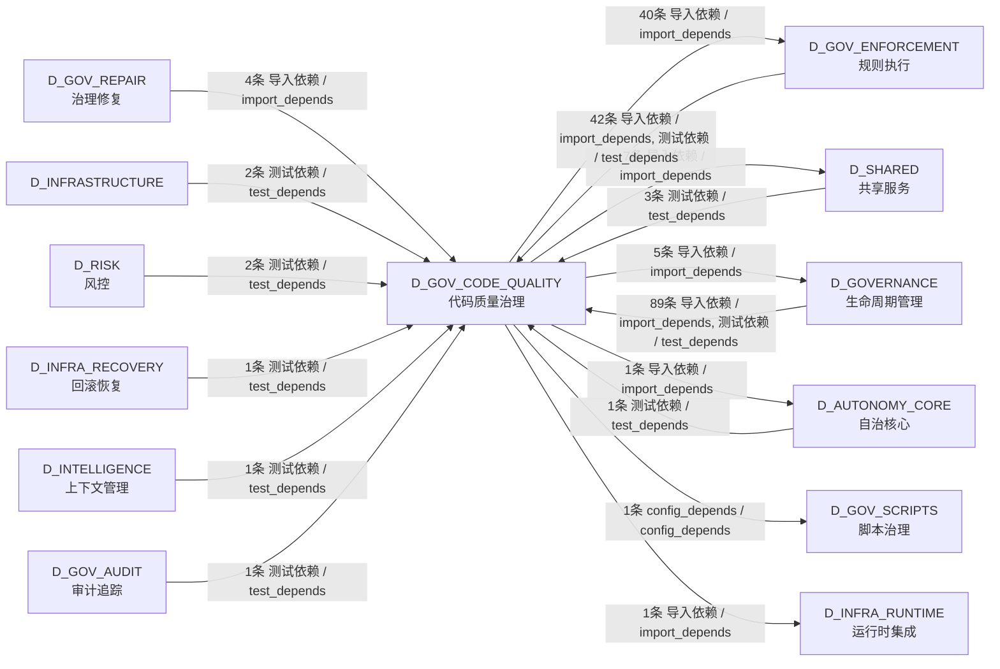

# 16_d_gov_code_quality / code_quality_governance / 代码质量治理 / Code Quality Governance

> **功能简介 / Overview**: 代码质量治理，负责代码去重引擎、函数重复检测、AST语义分析和提交门禁引擎

> **文档作用 / Purpose**: 展示 代码质量治理（D_GOV_CODE_QUALITY）功能域的模块清单、域内依赖关系、跨域依赖关系、架构分层视图，供架构审查和域治理参考。

> 本文档由 generate_domain_doc.py 从 depgraph (PostgreSQL) 自动生成
> 最后更新: 2026-07-14 15:50:25
> 数据源: depgraph (PostgreSQL) nodes表 + edges表

## 域基本信息 / Domain Overview

| 字段 | 值 | Field | Value |
|------|------|-------|-------|
| 编号 | 16 | Number | 16 |
| 域ID | D_GOV_CODE_QUALITY | Domain ID | D_GOV_CODE_QUALITY |
| 域名称 | 代码质量治理 | Domain Name | Code Quality Governance |
| 层级 | L1 基础平台层 | Layer | L1 Foundation |
| 模块数 | 110 | Module Count | 110 |
| 域内依赖 | 17 | Internal Dependencies | 17 |
| 跨域入边 | 146 | Cross-domain Incoming | 146 |
| 跨域出边 | 55 | Cross-domain Outgoing | 55 |
| 设计态模块 | 0 | Design Modules | 0 |
| 原型态模块 | 10 | Prototype Modules | 10 |
| 生产态模块 | 100 | Production Modules | 100 |
| 容量 | 100/150 (正常) | Capacity | 100/150 (正常) |
| 描述 | 代码去重引擎(code_dedup) | Description | 代码去重引擎(code_dedup) |

## 模块分层清单 / Module Layered List

> 按 architecture_layer 分组的模块清单（共 110 个模块 / 110 modules）。

### L1 基础层 / Foundation Layer (58 modules)

| # | 模块路径 / Module Path | 模块名称 / Module Name (功能简介 / Description) | 成熟度 / Maturity | 蓝图 / Blueprint |
|:--:|---------|---------|:---:|:---:|
| 1 | src/zephyr/gov_code_quality/code_dedup/__init__.py | code-dedup-engine 子包 — 重复代码检测与治理引擎. | 原型态 / prototype | [MOD-INF-017](../../03_modules/_domain_governance/code_dedup_engine/blueprint.md) |
| 2 | src/zephyr/gov_code_quality/code_dedup/annotations.py | 共享函数注解引擎 — @shared / @known_dup / @int... | 生产态 / production | [MOD-INF-017](../../03_modules/_domain_governance/code_dedup_engine/blueprint.md) |
| 3 | src/zephyr/gov_code_quality/code_dedup/ast_comparator.py | Stage 2: AST 级精确比对器. | 生产态 / production | [MOD-INF-017](../../03_modules/_domain_governance/code_dedup_engine/blueprint.md) |
| 4 | src/zephyr/gov_code_quality/code_dedup/atomic_fixer.py | 原子性修复引擎 — WAL 式 PREFLIGHT -> CHECKPOIN... | 生产态 / production | [MOD-INF-017](../../03_modules/_domain_governance/code_dedup_engine/blueprint.md) |
| 5 | src/zephyr/gov_code_quality/code_dedup/auto_fixer.py | 安全自动修复引擎——五直接开关+五间接约束. | 生产态 / production | [MOD-INF-017](../../03_modules/_domain_governance/code_dedup_engine/blueprint.md) |
| 6 | src/zephyr/gov_code_quality/code_dedup/behavioral_sampler.py | 行为采样验证器 — Stage 0.25 低成本快速验证. | 生产态 / production | [MOD-INF-017](../../03_modules/_domain_governance/code_dedup_engine/blueprint.md) |
| 7 | src/zephyr/gov_code_quality/code_dedup/behavioral_trust_c... | 行为信任检查器 — 行为漂移DIVERGED检测. | 生产态 / production | [MOD-INF-017](../../03_modules/_domain_governance/code_dedup_engine/blueprint.md) |
| 8 | src/zephyr/gov_code_quality/code_dedup/cache_manager.py | Stage 0: 函数缓存管理器 — 增量扫描的加速核心. | 生产态 / production | [MOD-INF-017](../../03_modules/_domain_governance/code_dedup_engine/blueprint.md) |
| 9 | src/zephyr/gov_code_quality/code_dedup/canary_manager.py | 金丝雀工厂——生成已知oracle 文件 用于引擎检出+... | 原型态 / prototype | [MOD-INF-017](../../03_modules/_domain_governance/code_dedup_engine/blueprint.md) |
| 10 | src/zephyr/gov_code_quality/code_dedup/canary_register.py | 金丝雀注册表维护器 — 注册/过期/腐败检测. | 生产态 / production | [MOD-INF-017](../../03_modules/_domain_governance/code_dedup_engine/blueprint.md) |
| 11 | src/zephyr/gov_code_quality/code_dedup/cli.py | code-dedup-engine CLI——子命令映射+退出码+扫描入口. | 原型态 / prototype | [MOD-INF-017](../../03_modules/_domain_governance/code_dedup_engine/blueprint.md) |
| 12 | src/zephyr/gov_code_quality/code_dedup/code_analyzer_runn... | 检查运行器——按照敏感基线运行三阶段+导出 yaml 报告. | 生产态 / production | [MOD-INF-017](../../03_modules/_domain_governance/code_dedup_engine/blueprint.md) |
| 13 | src/zephyr/gov_code_quality/code_dedup/code_simulator.py | 代码模拟器——播放录制的克隆演化序列，stress-te... | 生产态 / production | [MOD-INF-017](../../03_modules/_domain_governance/code_dedup_engine/blueprint.md) |
| 14 | src/zephyr/gov_code_quality/code_dedup/config.py | 配置管理 — 策略树 YAML 加载 + 项目规模感知四 T... | 生产态 / production | [MOD-INF-017](../../03_modules/_domain_governance/code_dedup_engine/blueprint.md) |
| 15 | src/zephyr/gov_code_quality/code_dedup/contract_consisten... | API契约一致性检查器 — 存在性·行为·契约三维. | 生产态 / production | [MOD-INF-017](../../03_modules/_domain_governance/code_dedup_engine/blueprint.md) |
| 16 | src/zephyr/gov_code_quality/code_dedup/cross_boundary_det... | 跨边界克隆感知——四大边界差异化检测+独立策略+... | 生产态 / production | [MOD-INF-017](../../03_modules/_domain_governance/code_dedup_engine/blueprint.md) |
| 17 | src/zephyr/gov_code_quality/code_dedup/dead_module_detect... | 死共享模块检测器 — shared/子模块无人使用 -> DEAD. | 生产态 / production | [MOD-INF-017](../../03_modules/_domain_governance/code_dedup_engine/blueprint.md) |
| 18 | src/zephyr/gov_code_quality/code_dedup/debt_projector.py | 去重债务预测器 — weeks_to_payoff + intake_rate... | 生产态 / production | [MOD-INF-017](../../03_modules/_domain_governance/code_dedup_engine/blueprint.md) |
| 19 | src/zephyr/gov_code_quality/code_dedup/decision_auditor.py | 决策审计链 — DecisionFingerprint 不可变追加日志. | 生产态 / production | [MOD-INF-017](../../03_modules/_domain_governance/code_dedup_engine/blueprint.md) |
| 20 | src/zephyr/gov_code_quality/code_dedup/degradation.py | 降级运行管理器 — 各 Stage 独立 try/except + de... | 生产态 / production | [MOD-INF-017](../../03_modules/_domain_governance/code_dedup_engine/blueprint.md) |
| 21 | src/zephyr/gov_code_quality/code_dedup/diff_detector.py | Stage 0: Git diff 变更检测器 — 函数粒度增量. | 生产态 / production | [MOD-INF-017](../../03_modules/_domain_governance/code_dedup_engine/blueprint.md) |
| 22 | src/zephyr/gov_code_quality/code_dedup/doom_loop_guard.py | Doom Loop 防护 — 修复升级阶梯 L0-L4 状态机. | 生产态 / production | [MOD-INF-017](../../03_modules/_domain_governance/code_dedup_engine/blueprint.md) |
| 23 | src/zephyr/gov_code_quality/code_dedup/exit_codes.py | 退出码定义模块——五档exit code 0-4枚举+描述+判... | 生产态 / production | [MOD-INF-017](../../03_modules/_domain_governance/code_dedup_engine/blueprint.md) |
| 24 | src/zephyr/gov_code_quality/code_dedup/extraction_safety.py | 安全提取适配性评估器 — Suitability Score 0-100... | 生产态 / production | [MOD-INF-017](../../03_modules/_domain_governance/code_dedup_engine/blueprint.md) |
| 25 | src/zephyr/gov_code_quality/code_dedup/false_negative_aud... | 三层漏报盲审器 — L1 Sweep + L2 Canary + L3 Sam... | 生产态 / production | [MOD-INF-017](../../03_modules/_domain_governance/code_dedup_engine/blueprint.md) |
| 26 | src/zephyr/gov_code_quality/code_dedup/fifteen_dimension_... | 15维超综合审计首页 — 逐项证明"做过且做对". | 生产态 / production | [MOD-INF-017](../../03_modules/_domain_governance/code_dedup_engine/blueprint.md) |
| 27 | src/zephyr/gov_code_quality/code_dedup/file_creator.py | 文件创建清单执行器 — 验证所有源/测试/数据文件... | 生产态 / production | [MOD-INF-017](../../03_modules/_domain_governance/code_dedup_engine/blueprint.md) |
| 28 | src/zephyr/gov_code_quality/code_dedup/function_discovery.py | 共享函数主动发现 — 签名+语义双通道从被动到主动. | 生产态 / production | [MOD-INF-017](../../03_modules/_domain_governance/code_dedup_engine/blueprint.md) |
| 29 | src/zephyr/gov_code_quality/code_dedup/grandfather_manage... | Grandfather 三定律 — 古老重复管理. | 生产态 / production | [MOD-INF-017](../../03_modules/_domain_governance/code_dedup_engine/blueprint.md) |
| 30 | src/zephyr/gov_code_quality/code_dedup/health_monitor.py | 健康仪表盘 — Dedup Health Score 0-100 + 趋势 +... | 生产态 / production | [MOD-INF-017](../../03_modules/_domain_governance/code_dedup_engine/blueprint.md) |
| 31 | src/zephyr/gov_code_quality/code_dedup/integration_hub.py | 集成协调器 — 24集成+19更新+16GitHub整合. | 生产态 / production | [MOD-INF-017](../../03_modules/_domain_governance/code_dedup_engine/blueprint.md) |
| 32 | src/zephyr/gov_code_quality/code_dedup/integrations.py | 集成管理——预提交钩子+CI-only 扫描+超时边界. | 生产态 / production | [MOD-INF-017](../../03_modules/_domain_governance/code_dedup_engine/blueprint.md) |
| 33 | src/zephyr/gov_code_quality/code_dedup/micro_clone_detect... | 微型克隆检测器 — n-gram频率计数, 1-2行高频模式... | 生产态 / production | [MOD-INF-017](../../03_modules/_domain_governance/code_dedup_engine/blueprint.md) |
| 34 | src/zephyr/gov_code_quality/code_dedup/mock_duplicate_gen... | 可控克隆生产器——零假阳性可期待引擎分子离散 | 生产态 / production | [MOD-INF-017](../../03_modules/_domain_governance/code_dedup_engine/blueprint.md) |
| 35 | src/zephyr/gov_code_quality/code_dedup/monoculture_guard.py | Monoculture 免疫 — BRS 0-100 + 去重悖论检测. | 生产态 / production | [MOD-INF-017](../../03_modules/_domain_governance/code_dedup_engine/blueprint.md) |
| 36 | src/zephyr/gov_code_quality/code_dedup/observation_window... | 提取后稳定观察期守护 — 对标SDP 14天观察. | 生产态 / production | [MOD-INF-017](../../03_modules/_domain_governance/code_dedup_engine/blueprint.md) |
| 37 | src/zephyr/gov_code_quality/code_dedup/path_index_validat... | 路径索引验证——验证 config 数据集相对路径表与... | 生产态 / production | [MOD-INF-017](../../03_modules/_domain_governance/code_dedup_engine/blueprint.md) |
| 38 | src/zephyr/gov_code_quality/code_dedup/phase_executor.py | 6Phase施工执行器 — Phase 0~5 执行状态追踪. | 原型态 / prototype | [MOD-INF-017](../../03_modules/_domain_governance/code_dedup_engine/blueprint.md) |
| 39 | src/zephyr/gov_code_quality/code_dedup/policy_tree_valida... | 策略树自动一致性校验器 — 虚线箭头影响分析. | 生产态 / production | [MOD-INF-017](../../03_modules/_domain_governance/code_dedup_engine/blueprint.md) |
| 40 | src/zephyr/gov_code_quality/code_dedup/pre_apply_integrit... | Pre-Apply 完整性门 — SHA256重新验证. | 生产态 / production | [MOD-INF-017](../../03_modules/_domain_governance/code_dedup_engine/blueprint.md) |
| 41 | src/zephyr/gov_code_quality/code_dedup/prioritizer.py | 修复优先级排序器 — 置信度×Impact×适配性 三因... | 生产态 / production | [MOD-INF-017](../../03_modules/_domain_governance/code_dedup_engine/blueprint.md) |
| 42 | src/zephyr/gov_code_quality/code_dedup/recovery_manifest_... | Recovery Manifest Writer — R2纯文本base64 Mani... | 生产态 / production | [MOD-INF-017](../../03_modules/_domain_governance/code_dedup_engine/blueprint.md) |
| 43 | src/zephyr/gov_code_quality/code_dedup/report.py | 报告生成器 — YAML/JSON 输出 + 退出码判定 + Hea... | 生产态 / production | [MOD-INF-017](../../03_modules/_domain_governance/code_dedup_engine/blueprint.md) |
| 44 | src/zephyr/gov_code_quality/code_dedup/risk_mitigator.py | R1-R45全量风险缓解执行器 — 逐条检查缓解措施 + ... | 生产态 / production | [MOD-INF-017](../../03_modules/_domain_governance/code_dedup_engine/blueprint.md) |
| 45 | src/zephyr/gov_code_quality/code_dedup/self_scanner.py | 引擎自扫描器 — Dogfooding 检测引擎自身源码重复. | 生产态 / production | [MOD-INF-017](../../03_modules/_domain_governance/code_dedup_engine/blueprint.md) |
| 46 | src/zephyr/gov_code_quality/code_dedup/sensitivity_sweepe... | 敏感性扫荡——threshold扫描->固化成new baseline... | 生产态 / production | [MOD-INF-017](../../03_modules/_domain_governance/code_dedup_engine/blueprint.md) |
| 47 | src/zephyr/gov_code_quality/code_dedup/shadow_trust_valid... | 影子信任验证器 — ImportError 防护回路. | 生产态 / production | [MOD-INF-017](../../03_modules/_domain_governance/code_dedup_engine/blueprint.md) |
| 48 | src/zephyr/gov_code_quality/code_dedup/shadow_verifier.py | 影子清单验证器 — size sanity check + semantic... | 生产态 / production | [MOD-INF-017](../../03_modules/_domain_governance/code_dedup_engine/blueprint.md) |
| 49 | src/zephyr/gov_code_quality/code_dedup/shared_evolver.py | 共享函数自我进化引擎 — 自动升降级 + 行为漂移锁定. | 生产态 / production | [MOD-INF-017](../../03_modules/_domain_governance/code_dedup_engine/blueprint.md) |
| 50 | src/zephyr/gov_code_quality/code_dedup/shared_lifecycle_m... | 共享函数生命周期管理 — Active->Deprecated->Gra... | 生产态 / production | [MOD-INF-017](../../03_modules/_domain_governance/code_dedup_engine/blueprint.md) |
| 51 | src/zephyr/gov_code_quality/code_dedup/signature_matcher.py | Stage 0.5: 签名指纹 SHA256[:12] O(1) 精确匹配. | 生产态 / production | [MOD-INF-017](../../03_modules/_domain_governance/code_dedup_engine/blueprint.md) |
| 52 | src/zephyr/gov_code_quality/code_dedup/simplicity_auditor.py | 引擎成本效益自审计器 — SAS 0-100 月度审计 + Ta... | 生产态 / production | [MOD-INF-017](../../03_modules/_domain_governance/code_dedup_engine/blueprint.md) |
| 53 | src/zephyr/gov_code_quality/code_dedup/ssot_registrar.py | SSoT注册器 — 提取函数自动注册到 shared API清单. | 生产态 / production | [MOD-INF-017](../../03_modules/_domain_governance/code_dedup_engine/blueprint.md) |
| 54 | src/zephyr/gov_code_quality/code_dedup/stale_shared_detec... | 过时共享函数检测器 — 无caller × 30天 -> STALE标记. | 生产态 / production | [MOD-INF-017](../../03_modules/_domain_governance/code_dedup_engine/blueprint.md) |
| 55 | src/zephyr/gov_code_quality/code_dedup/success_validator.py | 成功验证——判断一次去重操作是否真正消灭了克隆. | 生产态 / production | [MOD-INF-017](../../03_modules/_domain_governance/code_dedup_engine/blueprint.md) |
| 56 | src/zephyr/gov_code_quality/code_dedup/symbol_index.py | 符号索引 — 全局函数/类/import映射表. | 生产态 / production | [MOD-INF-017](../../03_modules/_domain_governance/code_dedup_engine/blueprint.md) |
| 57 | src/zephyr/gov_code_quality/code_dedup/thematic_clusterer.py | 主题聚类器 — 噪声信号比·告警疲劳缓解. | 生产态 / production | [MOD-INF-017](../../03_modules/_domain_governance/code_dedup_engine/blueprint.md) |
| 58 | src/zephyr/gov_code_quality/code_dedup/verifier.py | 修复验证器 — import + 类型 + 行为采样验证. | 生产态 / production | [MOD-INF-017](../../03_modules/_domain_governance/code_dedup_engine/blueprint.md) |

### L2 领域层 / Domain Layer (52 modules)

| # | 模块路径 / Module Path | 模块名称 / Module Name (功能简介 / Description) | 成熟度 / Maturity | 蓝图 / Blueprint |
|:--:|---------|---------|:---:|:---:|
| 1 | scripts/governance/d7_code/check_module_id_consistency.py | check_module_id_consistency.py — module_id 全... | 原型态 / prototype | [MOD-GATE_ENGINE](../../03_modules/_cross_layer/gate_engine/blueprint.md) |
| 2 | src/zephyr/gov_code_quality/__init__.py | gov_code_quality domain package — code quality... | 原型态 / prototype |  |
| 3 | src/zephyr/gov_code_quality/code_dedup/trackers/__init__.py | tracker 族子包 — 风险/盲点/热点跟踪器集合. | 原型态 / prototype | [MOD-INF-017](../../03_modules/_domain_governance/code_dedup_engine/blueprint.md) |
| 4 | src/zephyr/gov_code_quality/code_dedup/trackers/blind_spo... | 盲点关闭追踪器 — 自动验证各轮盲点是否已覆盖. | 原型态 / prototype | [MOD-INF-017](../../03_modules/_domain_governance/code_dedup_engine/blueprint.md) |
| 5 | src/zephyr/gov_code_quality/code_dedup/trackers/consequen... | 后果追踪——记录每次修复操作对依赖方的影响. | 生产态 / production | [MOD-INF-017](../../03_modules/_domain_governance/code_dedup_engine/blueprint.md) |
| 6 | src/zephyr/gov_code_quality/code_dedup/trackers/hotspot_t... | 热点追踪器 — 90天滑动窗口 + 高频变动检测 + 新... | 生产态 / production | [MOD-INF-017](../../03_modules/_domain_governance/code_dedup_engine/blueprint.md) |
| 7 | src/zephyr/gov_code_quality/code_dedup/trackers/import_su... | Import表面积负债追踪 — SBS 0-100 + shared burd... | 生产态 / production | [MOD-INF-017](../../03_modules/_domain_governance/code_dedup_engine/blueprint.md) |
| 8 | src/zephyr/gov_code_quality/code_dedup/trackers/question_... | 问题追踪——扫描中发现需要人工处理的问题. | 生产态 / production | [MOD-INF-017](../../03_modules/_domain_governance/code_dedup_engine/blueprint.md) |
| 9 | src/zephyr/gov_code_quality/code_dedup/trackers/risk_miti... | 风险缓解追踪——捕获哪些克隆报告了但在N次扫描后... | 生产态 / production | [MOD-INF-017](../../03_modules/_domain_governance/code_dedup_engine/blueprint.md) |
| 10 | src/zephyr/gov_enforcement/commit_gates/__init__.py | commit_gates — GitCommitGateway pre-commit 门... | 原型态 / prototype |  |
| 11 | src/zephyr/gov_enforcement/commit_gates/_diff_helpers.py | _diff_helpers.py — gate 共享 diff 解析工具模块 | 生产态 / production | [MOD-GATE_ENGINE](../../03_modules/_cross_layer/gate_engine/blueprint.md) |
| 12 | src/zephyr/gov_enforcement/commit_gates/arch_reference_ga... | arch_reference_gate.py — #ARCH-NNN 悬空引用自... | 生产态 / production | [MOD-GATE_ENGINE](../../03_modules/_cross_layer/gate_engine/blueprint.md) |
| 13 | src/zephyr/gov_enforcement/commit_gates/bare_getenv_gate.py | bare_getenv_gate.py — 裸 os.getenv 读密钥阻断... | 生产态 / production | [MOD-GATE_ENGINE](../../03_modules/_cross_layer/gate_engine/blueprint.md) |
| 14 | src/zephyr/gov_enforcement/commit_gates/bare_sql_gate.py | bare_sql_gate.py — 裸SQL字面量阻断门禁（NO-BAR... | 生产态 / production | [MOD-GATE_ENGINE](../../03_modules/_cross_layer/gate_engine/blueprint.md) |
| 15 | src/zephyr/gov_enforcement/commit_gates/blueprint_format_... | blueprint_format_gate.py — [BLUEPRINT] 头部 mo... | 原型态 / prototype | [MOD-GATE_ENGINE](../../03_modules/_cross_layer/gate_engine/blueprint.md) |
| 16 | src/zephyr/gov_enforcement/commit_gates/capability_overla... | capability_overlap_gate.py — 新建 .py 文件 Cap... | 生产态 / production | [MOD-GATE_ENGINE](../../03_modules/_cross_layer/gate_engine/blueprint.md) |
| 17 | src/zephyr/gov_enforcement/commit_gates/ch_batch_size_gat... | ch_batch_size_gate.py — CH 批量写入防回退门禁... | 生产态 / production | [MOD-GATE_ENGINE](../../03_modules/_cross_layer/gate_engine/blueprint.md) |
| 18 | src/zephyr/gov_enforcement/commit_gates/claim_required_ga... | claim_required_gate.py — claim_files 前置检查... | 生产态 / production | [MOD-GATE_ENGINE](../../03_modules/_cross_layer/gate_engine/blueprint.md) |
| 19 | src/zephyr/gov_enforcement/commit_gates/create_guard.py | create_guard.py — 新建 .py / 非 rules/ .yaml ... | 生产态 / production | [MOD-GATE_ENGINE](../../03_modules/_cross_layer/gate_engine/blueprint.md) |
| 20 | src/zephyr/gov_enforcement/commit_gates/dangling_referenc... | dangling_reference_gate.py — AGENTS.md §X.Y ... | 生产态 / production | [MOD-GATE_ENGINE](../../03_modules/_cross_layer/gate_engine/blueprint.md) |
| 21 | src/zephyr/gov_enforcement/commit_gates/datetime_now_forb... | datetime_now_forbidden_gate.py — 生成器代码 da... | 生产态 / production | [MOD-GATE_ENGINE](../../03_modules/_cross_layer/gate_engine/blueprint.md) |
| 22 | src/zephyr/gov_enforcement/commit_gates/directory_contrac... | directory_contract_gate.py — DCR-001~007 等效... | 生产态 / production | [MOD-GATE_ENGINE](../../03_modules/_cross_layer/gate_engine/blueprint.md) |
| 23 | src/zephyr/gov_enforcement/commit_gates/doc_ref_broken_ga... | doc_ref_broken_gate.py — 文档相对路径断裂引用... | 生产态 / production | [MOD-GATE_ENGINE](../../03_modules/_cross_layer/gate_engine/blueprint.md) |
| 24 | src/zephyr/gov_enforcement/commit_gates/empty_handler_gat... | empty_handler_gate.py — 空事件 handler 函数阻... | 生产态 / production | [MOD-GATE_ENGINE](../../03_modules/_cross_layer/gate_engine/blueprint.md) |
| 25 | src/zephyr/gov_enforcement/commit_gates/exempt_zone_front... | exempt_zone_frontmatter_gate.py — 豁免区 front... | 生产态 / production | [MOD-GATE_ENGINE](../../03_modules/_cross_layer/gate_engine/blueprint.md) |
| 26 | src/zephyr/gov_enforcement/commit_gates/file_copy_gate.py | file_copy_gate.py — 新增 .py 文件复制检测阻断... | 生产态 / production | [MOD-GATE_ENGINE](../../03_modules/_cross_layer/gate_engine/blueprint.md) |
| 27 | src/zephyr/gov_enforcement/commit_gates/file_placement_tt... | file_placement_ttl_gate.py — 文件放置与 TTL 一... | 生产态 / production | [MOD-GATE_ENGINE](../../03_modules/_cross_layer/gate_engine/blueprint.md) |
| 28 | src/zephyr/gov_enforcement/commit_gates/foreign_change_ga... | foreign_change_gate.py — 外来变更检测门禁（FOR... | 生产态 / production | [MOD-GATE_ENGINE](../../03_modules/_cross_layer/gate_engine/blueprint.md) |
| 29 | src/zephyr/gov_enforcement/commit_gates/function_dup_gate.py | function_dup_gate.py — 重复函数实现阻断门禁（F... | 生产态 / production | [MOD-GATE_ENGINE](../../03_modules/_cross_layer/gate_engine/blueprint.md) |
| 30 | src/zephyr/gov_enforcement/commit_gates/gate_repo.py | gate_repo.py — gates 表持久化仓库（AUDIT-07 P1... | 生产态 / production | [MOD-GATE_ENGINE](../../03_modules/_cross_layer/gate_engine/blueprint.md) |
| 31 | src/zephyr/gov_enforcement/commit_gates/god_class_gate.py | god_class_gate.py — God Class 阻断门禁（NO-GOD... | 生产态 / production | [MOD-GATE_ENGINE](../../03_modules/_cross_layer/gate_engine/blueprint.md) |
| 32 | src/zephyr/gov_enforcement/commit_gates/hardcoded_url_gat... | hardcoded_url_gate.py — 硬编码 localhost URL ... | 生产态 / production | [MOD-GATE_ENGINE](../../03_modules/_cross_layer/gate_engine/blueprint.md) |
| 33 | src/zephyr/gov_enforcement/commit_gates/held_overlap_gate.py | held_overlap_gate.py — 搭便车防护门禁（HELD-OV... | 生产态 / production | [MOD-GATE_ENGINE](../../03_modules/_cross_layer/gate_engine/blueprint.md) |
| 34 | src/zephyr/gov_enforcement/commit_gates/high_complexity_g... | high_complexity_gate.py — 高循环复杂度阻断门禁... | 生产态 / production | [MOD-GATE_ENGINE](../../03_modules/_cross_layer/gate_engine/blueprint.md) |
| 35 | src/zephyr/gov_enforcement/commit_gates/id_uniqueness_gat... | id_uniqueness_gate.py — pre-commit hook ID 唯... | 生产态 / production | [MOD-GATE_ENGINE](../../03_modules/_cross_layer/gate_engine/blueprint.md) |
| 36 | src/zephyr/gov_enforcement/commit_gates/import_direction_... | import_direction_gate.py — shared 层向上依赖阻... | 生产态 / production | [MOD-GATE_ENGINE](../../03_modules/_cross_layer/gate_engine/blueprint.md) |
| 37 | src/zephyr/gov_enforcement/commit_gates/long_param_list_g... | long_param_list_gate.py — 长参数列表阻断门禁（... | 生产态 / production | [MOD-GATE_ENGINE](../../03_modules/_cross_layer/gate_engine/blueprint.md) |
| 38 | src/zephyr/gov_enforcement/commit_gates/module_id_consist... | module_id_consistency_gate.py — module_id 三声... | 生产态 / production | [MOD-GATE_ENGINE](../../03_modules/_cross_layer/gate_engine/blueprint.md) |
| 39 | src/zephyr/gov_enforcement/commit_gates/msg_exposure_gate.py | msg_exposure_gate.py — 错误消息暴露敏感信息阻... | 生产态 / production | [MOD-GATE_ENGINE](../../03_modules/_cross_layer/gate_engine/blueprint.md) |
| 40 | src/zephyr/gov_enforcement/commit_gates/msg_style_gate.py | msg_style_gate.py — 错误消息标点/箭头风格阻断... | 生产态 / production | [MOD-GATE_ENGINE](../../03_modules/_cross_layer/gate_engine/blueprint.md) |
| 41 | src/zephyr/gov_enforcement/commit_gates/orphan_module_gat... | orphan_module_gate.py — 孤儿模块（无 import 引... | 生产态 / production | [MOD-GATE_ENGINE](../../03_modules/_cross_layer/gate_engine/blueprint.md) |
| 42 | src/zephyr/gov_enforcement/commit_gates/panorama_alignmen... | panorama_alignment_gate.py — 三图模块对齐门禁... | 生产态 / production | [MOD-GATE_ENGINE](../../03_modules/_cross_layer/gate_engine/blueprint.md) |
| 43 | src/zephyr/gov_enforcement/commit_gates/perm_trigger_gate.py | perm_trigger_gate.py — 永久系统脚本时间触发模... | 生产态 / production | [MOD-GATE_ENGINE](../../03_modules/_cross_layer/gate_engine/blueprint.md) |
| 44 | src/zephyr/gov_enforcement/commit_gates/r5_digit_suffix_g... | r5_digit_suffix_gate.py — R5 数字后缀目录禁止... | 生产态 / production | [MOD-GATE_ENGINE](../../03_modules/_cross_layer/gate_engine/blueprint.md) |
| 45 | src/zephyr/gov_enforcement/commit_gates/rule_four_way_ali... | rule_four_way_alignment_gate.py — 规则四方对齐... | 生产态 / production | [MOD-GATE_ENGINE](../../03_modules/_cross_layer/gate_engine/blueprint.md) |
| 46 | src/zephyr/gov_enforcement/commit_gates/session_required_... | session_required_gate.py — session 注册强制门... | 生产态 / production | [MOD-GATE_ENGINE](../../03_modules/_cross_layer/gate_engine/blueprint.md) |
| 47 | src/zephyr/gov_enforcement/commit_gates/ssot_redefinition... | ssot_redefinition_gate.py — SSoT 符号重复定义... | 生产态 / production | [MOD-GATE_ENGINE](../../03_modules/_cross_layer/gate_engine/blueprint.md) |
| 48 | src/zephyr/gov_enforcement/commit_gates/test_source_consi... | test_source_consistency_gate.py — 测试-源码符... | 生产态 / production | [MOD-GATE_ENGINE](../../03_modules/_cross_layer/gate_engine/blueprint.md) |
| 49 | src/zephyr/gov_enforcement/commit_gates/tests_coverage_ga... | tests_coverage_gate.py — Gate 测试覆盖率校验 m... | 生产态 / production | [MOD-GATE_ENGINE](../../03_modules/_cross_layer/gate_engine/blueprint.md) |
| 50 | src/zephyr/gov_enforcement/commit_gates/ttl_gate.py | ttl_gate.py — ttl 字段校验门禁（治本：弥补 --n... | 生产态 / production | [MOD-GATE_ENGINE](../../03_modules/_cross_layer/gate_engine/blueprint.md) |
| 51 | src/zephyr/gov_enforcement/commit_gates/unsafe_dict_sprea... | unsafe_dict_spread_gate.py — ``**data`` 直接展... | 生产态 / production |  |
| 52 | src/zephyr/gov_enforcement/commit_gates/vocab_hardcode_ga... | vocab_hardcode_gate.py — 新增 .py 文件词表硬编... | 生产态 / production | [MOD-GATE_ENGINE](../../03_modules/_cross_layer/gate_engine/blueprint.md) |

## 域内依赖图 / Internal Dependency Diagram

> 依赖图内嵌在本文档中，IDE 可直接渲染显示。参考 decision_index.md 设计，分四个视图：合并全景图、运营态子图、设计态子图、原型态子图（按 design_maturity 实际值拆分）。
>
> **图例说明 / Legend**：
> - **实线边框 = 运营态模块**（production，已上线运行）
> - **虚线边框 = 设计态模块**（design，蓝图阶段，代码未写）
> - **虚线边框 = 原型态模块**（prototype，代码已写，验证中未稳定上线）
> - **实线箭头 = 运营态依赖**（已生效的依赖关系）
> - **虚线箭头 = 非运营态依赖**（计划中/验证中的依赖关系）

### 合并全景图（全部模块，标签标注成熟度）

> 展示全部 110 个模块（生产态 100 + 设计态 0 + 原型态 10），标签标注成熟度。

#### 第 1 页 / 共 4 页

```mermaid
graph TD
    subgraph D_GOV_CODE_QUALITY["D_GOV_CODE_QUALITY 代码质量治理"]
        scripts_governance_d7_code_check_module_id_consistency_py["(原型态 / prototype) check_module_id_consistency.py — module_id 全...<br/>文件: check_module_id_consistency.py"]
        src_zephyr_gov_code_quality_init_py["(原型态 / prototype) gov_code_quality domain package — code quality...<br/>文件: __init__.py"]
        src_zephyr_gov_code_quality_code_dedup_init_py["(原型态 / prototype) code-dedup-engine 子包 — 重复代码检测与治理引擎.<br/>文件: __init__.py"]
        src_zephyr_gov_code_quality_code_dedup_annotations_py["(生产态 / production) 共享函数注解引擎 — @shared / @known_dup / @int...<br/>文件: annotations.py"]
        src_zephyr_gov_code_quality_code_dedup_ast_comparator_py["(生产态 / production) Stage 2: AST 级精确比对器.<br/>文件: ast_comparator.py"]
        src_zephyr_gov_code_quality_code_dedup_atomic_fixer_py["(生产态 / production) 原子性修复引擎 — WAL 式 PREFLIGHT -> CHECKPOIN...<br/>文件: atomic_fixer.py"]
        src_zephyr_gov_code_quality_code_dedup_auto_fixer_py["(生产态 / production) 安全自动修复引擎——五直接开关+五间接约束.<br/>文件: auto_fixer.py"]
        src_zephyr_gov_code_quality_code_dedup_behavioral_sampler_py["(生产态 / production) 行为采样验证器 — Stage 0.25 低成本快速验证.<br/>文件: behavioral_sampler.py"]
        src_zephyr_gov_code_quality_code_dedup_behavioral_trust_checker_py["(生产态 / production) 行为信任检查器 — 行为漂移DIVERGED检测.<br/>文件: behavioral_trust_checker.py"]
        src_zephyr_gov_code_quality_code_dedup_cache_manager_py["(生产态 / production) Stage 0: 函数缓存管理器 — 增量扫描的加速核心.<br/>文件: cache_manager.py"]
        src_zephyr_gov_code_quality_code_dedup_canary_manager_py["(原型态 / prototype) 金丝雀工厂——生成已知oracle 文件 用于引擎检出+...<br/>文件: canary_manager.py"]
        src_zephyr_gov_code_quality_code_dedup_canary_register_py["(生产态 / production) 金丝雀注册表维护器 — 注册/过期/腐败检测.<br/>文件: canary_register.py"]
        src_zephyr_gov_code_quality_code_dedup_cli_py["(原型态 / prototype) code-dedup-engine CLI——子命令映射+退出码+扫描入口.<br/>文件: cli.py"]
        src_zephyr_gov_code_quality_code_dedup_code_analyzer_runner_py["(生产态 / production) 检查运行器——按照敏感基线运行三阶段+导出 yaml 报告.<br/>文件: code_analyzer_runner.py"]
        src_zephyr_gov_code_quality_code_dedup_code_simulator_py["(生产态 / production) 代码模拟器——播放录制的克隆演化序列，stress-te...<br/>文件: code_simulator.py"]
        src_zephyr_gov_code_quality_code_dedup_config_py["(生产态 / production) 配置管理 — 策略树 YAML 加载 + 项目规模感知四 T...<br/>文件: config.py"]
        src_zephyr_gov_code_quality_code_dedup_contract_consistency_checker_py["(生产态 / production) API契约一致性检查器 — 存在性·行为·契约三维.<br/>文件: contract_consistency_checker.py"]
        src_zephyr_gov_code_quality_code_dedup_cross_boundary_detector_py["(生产态 / production) 跨边界克隆感知——四大边界差异化检测+独立策略+...<br/>文件: cross_boundary_detector.py"]
        src_zephyr_gov_code_quality_code_dedup_dead_module_detector_py["(生产态 / production) 死共享模块检测器 — shared/子模块无人使用 -> DEAD.<br/>文件: dead_module_detector.py"]
        src_zephyr_gov_code_quality_code_dedup_debt_projector_py["(生产态 / production) 去重债务预测器 — weeks_to_payoff + intake_rate...<br/>文件: debt_projector.py"]
        src_zephyr_gov_code_quality_code_dedup_decision_auditor_py["(生产态 / production) 决策审计链 — DecisionFingerprint 不可变追加日志.<br/>文件: decision_auditor.py"]
        src_zephyr_gov_code_quality_code_dedup_degradation_py["(生产态 / production) 降级运行管理器 — 各 Stage 独立 try/except + de...<br/>文件: degradation.py"]
        src_zephyr_gov_code_quality_code_dedup_diff_detector_py["(生产态 / production) Stage 0: Git diff 变更检测器 — 函数粒度增量.<br/>文件: diff_detector.py"]
        src_zephyr_gov_code_quality_code_dedup_doom_loop_guard_py["(生产态 / production) Doom Loop 防护 — 修复升级阶梯 L0-L4 状态机.<br/>文件: doom_loop_guard.py"]
        src_zephyr_gov_code_quality_code_dedup_exit_codes_py["(生产态 / production) 退出码定义模块——五档exit code 0-4枚举+描述+判...<br/>文件: exit_codes.py"]
        src_zephyr_gov_code_quality_code_dedup_extraction_safety_py["(生产态 / production) 安全提取适配性评估器 — Suitability Score 0-100...<br/>文件: extraction_safety.py"]
        src_zephyr_gov_code_quality_code_dedup_false_negative_auditor_py["(生产态 / production) 三层漏报盲审器 — L1 Sweep + L2 Canary + L3 Sam...<br/>文件: false_negative_auditor.py"]
        src_zephyr_gov_code_quality_code_dedup_fifteen_dimension_auditor_py["(生产态 / production) 15维超综合审计首页 — 逐项证明'做过且做对'.<br/>文件: fifteen_dimension_auditor.py"]
        src_zephyr_gov_code_quality_code_dedup_file_creator_py["(生产态 / production) 文件创建清单执行器 — 验证所有源/测试/数据文件...<br/>文件: file_creator.py"]
        src_zephyr_gov_code_quality_code_dedup_function_discovery_py["(生产态 / production) 共享函数主动发现 — 签名+语义双通道从被动到主动.<br/>文件: function_discovery.py"]
    end
    src_zephyr_gov_code_quality_code_dedup_cli_py -.->|导入依赖 / import_depends| src_zephyr_gov_code_quality_code_dedup_auto_fixer_py
    src_zephyr_gov_code_quality_code_dedup_cli_py -.->|导入依赖 / import_depends| src_zephyr_gov_code_quality_code_dedup_exit_codes_py
    src_zephyr_gov_code_quality_code_dedup_init_py -.->|config_depends / config_depends| src_zephyr_gov_code_quality_code_dedup_atomic_fixer_py
    D_GOVERNANCE["(原型态 / prototype) D_GOVERNANCE"]
    src_zephyr_gov_code_quality_code_dedup_cli_py -.->|导入依赖 / import_depends| D_GOVERNANCE
    D_INFRA_RUNTIME["(生产态 / production) D_INFRA_RUNTIME"]
    src_zephyr_gov_code_quality_code_dedup_cli_py -.->|导入依赖 / import_depends| D_INFRA_RUNTIME
    D_GOV_SCRIPTS["(原型态 / prototype) D_GOV_SCRIPTS"]
    scripts_governance_d7_code_check_module_id_consistency_py -.->|config_depends / config_depends| D_GOV_SCRIPTS
    D_SHARED["(生产态 / production) D_SHARED"]
    src_zephyr_gov_code_quality_code_dedup_cache_manager_py -->|导入依赖 / import_depends| D_SHARED
    D_GOV_REPAIR["(生产态 / production) D_GOV_REPAIR"]
    D_GOV_REPAIR -.->|导入依赖 / import_depends| src_zephyr_gov_code_quality_code_dedup_canary_manager_py
    D_GOV_REPAIR -.->|导入依赖 / import_depends| src_zephyr_gov_code_quality_code_dedup_cli_py
    D_GOVERNANCE -.->|测试依赖 / test_depends| src_zephyr_gov_code_quality_code_dedup_fifteen_dimension_auditor_py
    D_GOVERNANCE -.->|测试依赖 / test_depends| src_zephyr_gov_code_quality_code_dedup_degradation_py
    D_GOVERNANCE -.->|测试依赖 / test_depends| src_zephyr_gov_code_quality_code_dedup_debt_projector_py
    D_GOVERNANCE -.->|测试依赖 / test_depends| src_zephyr_gov_code_quality_code_dedup_atomic_fixer_py
    D_GOVERNANCE -.->|测试依赖 / test_depends| src_zephyr_gov_code_quality_code_dedup_ast_comparator_py
    D_GOVERNANCE -.->|测试依赖 / test_depends| src_zephyr_gov_code_quality_code_dedup_code_analyzer_runner_py
    D_GOVERNANCE -.->|测试依赖 / test_depends| src_zephyr_gov_code_quality_code_dedup_function_discovery_py
    D_GOVERNANCE -.->|导入依赖 / import_depends| src_zephyr_gov_code_quality_code_dedup_ast_comparator_py
    D_GOVERNANCE -.->|导入依赖 / import_depends| src_zephyr_gov_code_quality_code_dedup_behavioral_sampler_py
    D_GOVERNANCE -.->|测试依赖 / test_depends| src_zephyr_gov_code_quality_code_dedup_dead_module_detector_py
    D_GOVERNANCE -.->|测试依赖 / test_depends| src_zephyr_gov_code_quality_code_dedup_diff_detector_py
    D_GOVERNANCE -.->|测试依赖 / test_depends| src_zephyr_gov_code_quality_code_dedup_annotations_py
    D_GOVERNANCE -.->|测试依赖 / test_depends| src_zephyr_gov_code_quality_code_dedup_exit_codes_py
    classDef production fill:#e1f5fe,stroke:#01579b,stroke-width:2px,color:#000
    classDef design fill:#fff3e0,stroke:#e65100,stroke-width:2px,color:#000,stroke-dasharray: 5 5
    classDef external_prod fill:#e8f5e9,stroke:#1b5e20,stroke-width:1px,color:#000
    classDef external_design fill:#fce4ec,stroke:#880e4f,stroke-width:1px,color:#000,stroke-dasharray: 5 5
    class src_zephyr_gov_code_quality_code_dedup_annotations_py,src_zephyr_gov_code_quality_code_dedup_ast_comparator_py,src_zephyr_gov_code_quality_code_dedup_atomic_fixer_py,src_zephyr_gov_code_quality_code_dedup_auto_fixer_py,src_zephyr_gov_code_quality_code_dedup_behavioral_sampler_py,src_zephyr_gov_code_quality_code_dedup_behavioral_trust_checker_py,src_zephyr_gov_code_quality_code_dedup_cache_manager_py,src_zephyr_gov_code_quality_code_dedup_canary_register_py,src_zephyr_gov_code_quality_code_dedup_code_analyzer_runner_py,src_zephyr_gov_code_quality_code_dedup_code_simulator_py,src_zephyr_gov_code_quality_code_dedup_config_py,src_zephyr_gov_code_quality_code_dedup_contract_consistency_checker_py,src_zephyr_gov_code_quality_code_dedup_cross_boundary_detector_py,src_zephyr_gov_code_quality_code_dedup_dead_module_detector_py,src_zephyr_gov_code_quality_code_dedup_debt_projector_py,src_zephyr_gov_code_quality_code_dedup_decision_auditor_py,src_zephyr_gov_code_quality_code_dedup_degradation_py,src_zephyr_gov_code_quality_code_dedup_diff_detector_py,src_zephyr_gov_code_quality_code_dedup_doom_loop_guard_py,src_zephyr_gov_code_quality_code_dedup_exit_codes_py,src_zephyr_gov_code_quality_code_dedup_extraction_safety_py,src_zephyr_gov_code_quality_code_dedup_false_negative_auditor_py,src_zephyr_gov_code_quality_code_dedup_fifteen_dimension_auditor_py,src_zephyr_gov_code_quality_code_dedup_file_creator_py,src_zephyr_gov_code_quality_code_dedup_function_discovery_py production
    class scripts_governance_d7_code_check_module_id_consistency_py,src_zephyr_gov_code_quality_init_py,src_zephyr_gov_code_quality_code_dedup_init_py,src_zephyr_gov_code_quality_code_dedup_canary_manager_py,src_zephyr_gov_code_quality_code_dedup_cli_py design
    class D_INFRA_RUNTIME,D_SHARED,D_GOV_REPAIR external_prod
    class D_GOVERNANCE,D_GOV_SCRIPTS external_design
```



#### 第 2 页 / 共 4 页

```mermaid
graph TD
    subgraph D_GOV_CODE_QUALITY["D_GOV_CODE_QUALITY 代码质量治理"]
        src_zephyr_gov_code_quality_code_dedup_grandfather_manager_py["(生产态 / production) Grandfather 三定律 — 古老重复管理.<br/>文件: grandfather_manager.py"]
        src_zephyr_gov_code_quality_code_dedup_health_monitor_py["(生产态 / production) 健康仪表盘 — Dedup Health Score 0-100 + 趋势 +...<br/>文件: health_monitor.py"]
        src_zephyr_gov_code_quality_code_dedup_integration_hub_py["(生产态 / production) 集成协调器 — 24集成+19更新+16GitHub整合.<br/>文件: integration_hub.py"]
        src_zephyr_gov_code_quality_code_dedup_integrations_py["(生产态 / production) 集成管理——预提交钩子+CI-only 扫描+超时边界.<br/>文件: integrations.py"]
        src_zephyr_gov_code_quality_code_dedup_micro_clone_detector_py["(生产态 / production) 微型克隆检测器 — n-gram频率计数, 1-2行高频模式...<br/>文件: micro_clone_detector.py"]
        src_zephyr_gov_code_quality_code_dedup_mock_duplicate_generator_py["(生产态 / production) 可控克隆生产器——零假阳性可期待引擎分子离散<br/>文件: mock_duplicate_generator.py"]
        src_zephyr_gov_code_quality_code_dedup_monoculture_guard_py["(生产态 / production) Monoculture 免疫 — BRS 0-100 + 去重悖论检测.<br/>文件: monoculture_guard.py"]
        src_zephyr_gov_code_quality_code_dedup_observation_window_guard_py["(生产态 / production) 提取后稳定观察期守护 — 对标SDP 14天观察.<br/>文件: observation_window_guard.py"]
        src_zephyr_gov_code_quality_code_dedup_path_index_validator_py["(生产态 / production) 路径索引验证——验证 config 数据集相对路径表与...<br/>文件: path_index_validator.py"]
        src_zephyr_gov_code_quality_code_dedup_phase_executor_py["(原型态 / prototype) 6Phase施工执行器 — Phase 0~5 执行状态追踪.<br/>文件: phase_executor.py"]
        src_zephyr_gov_code_quality_code_dedup_policy_tree_validator_py["(生产态 / production) 策略树自动一致性校验器 — 虚线箭头影响分析.<br/>文件: policy_tree_validator.py"]
        src_zephyr_gov_code_quality_code_dedup_pre_apply_integrity_gate_py["(生产态 / production) Pre-Apply 完整性门 — SHA256重新验证.<br/>文件: pre_apply_integrity_gate.py"]
        src_zephyr_gov_code_quality_code_dedup_prioritizer_py["(生产态 / production) 修复优先级排序器 — 置信度×Impact×适配性 三因...<br/>文件: prioritizer.py"]
        src_zephyr_gov_code_quality_code_dedup_recovery_manifest_writer_py["(生产态 / production) Recovery Manifest Writer — R2纯文本base64 Mani...<br/>文件: recovery_manifest_writer.py"]
        src_zephyr_gov_code_quality_code_dedup_report_py["(生产态 / production) 报告生成器 — YAML/JSON 输出 + 退出码判定 + Hea...<br/>文件: report.py"]
        src_zephyr_gov_code_quality_code_dedup_risk_mitigator_py["(生产态 / production) R1-R45全量风险缓解执行器 — 逐条检查缓解措施 + ...<br/>文件: risk_mitigator.py"]
        src_zephyr_gov_code_quality_code_dedup_self_scanner_py["(生产态 / production) 引擎自扫描器 — Dogfooding 检测引擎自身源码重复.<br/>文件: self_scanner.py"]
        src_zephyr_gov_code_quality_code_dedup_sensitivity_sweeper_py["(生产态 / production) 敏感性扫荡——threshold扫描->固化成new baseline...<br/>文件: sensitivity_sweeper.py"]
        src_zephyr_gov_code_quality_code_dedup_shadow_trust_validator_py["(生产态 / production) 影子信任验证器 — ImportError 防护回路.<br/>文件: shadow_trust_validator.py"]
        src_zephyr_gov_code_quality_code_dedup_shadow_verifier_py["(生产态 / production) 影子清单验证器 — size sanity check + semantic...<br/>文件: shadow_verifier.py"]
        src_zephyr_gov_code_quality_code_dedup_shared_evolver_py["(生产态 / production) 共享函数自我进化引擎 — 自动升降级 + 行为漂移锁定.<br/>文件: shared_evolver.py"]
        src_zephyr_gov_code_quality_code_dedup_shared_lifecycle_manager_py["(生产态 / production) 共享函数生命周期管理 — Active->Deprecated->Gra...<br/>文件: shared_lifecycle_manager.py"]
        src_zephyr_gov_code_quality_code_dedup_signature_matcher_py["(生产态 / production) Stage 0.5: 签名指纹 SHA256(:12) O(1) 精确匹配.<br/>文件: signature_matcher.py"]
        src_zephyr_gov_code_quality_code_dedup_simplicity_auditor_py["(生产态 / production) 引擎成本效益自审计器 — SAS 0-100 月度审计 + Ta...<br/>文件: simplicity_auditor.py"]
        src_zephyr_gov_code_quality_code_dedup_ssot_registrar_py["(生产态 / production) SSoT注册器 — 提取函数自动注册到 shared API清单.<br/>文件: ssot_registrar.py"]
        src_zephyr_gov_code_quality_code_dedup_stale_shared_detector_py["(生产态 / production) 过时共享函数检测器 — 无caller × 30天 -> STALE标记.<br/>文件: stale_shared_detector.py"]
        src_zephyr_gov_code_quality_code_dedup_success_validator_py["(生产态 / production) 成功验证——判断一次去重操作是否真正消灭了克隆.<br/>文件: success_validator.py"]
        src_zephyr_gov_code_quality_code_dedup_symbol_index_py["(生产态 / production) 符号索引 — 全局函数/类/import映射表.<br/>文件: symbol_index.py"]
        src_zephyr_gov_code_quality_code_dedup_thematic_clusterer_py["(生产态 / production) 主题聚类器 — 噪声信号比·告警疲劳缓解.<br/>文件: thematic_clusterer.py"]
        src_zephyr_gov_code_quality_code_dedup_trackers_init_py["(原型态 / prototype) tracker 族子包 — 风险/盲点/热点跟踪器集合.<br/>文件: __init__.py"]
    end
    D_AUTONOMY_CORE["(生产态 / production) D_AUTONOMY_CORE"]
    src_zephyr_gov_code_quality_code_dedup_integration_hub_py -->|导入依赖 / import_depends| D_AUTONOMY_CORE
    D_GOV_REPAIR["(生产态 / production) D_GOV_REPAIR"]
    D_GOV_REPAIR -.->|导入依赖 / import_depends| src_zephyr_gov_code_quality_code_dedup_phase_executor_py
    D_GOVERNANCE["(原型态 / prototype) D_GOVERNANCE"]
    D_GOVERNANCE -.->|测试依赖 / test_depends| src_zephyr_gov_code_quality_code_dedup_symbol_index_py
    D_GOVERNANCE -.->|测试依赖 / test_depends| src_zephyr_gov_code_quality_code_dedup_grandfather_manager_py
    D_GOVERNANCE -.->|测试依赖 / test_depends| src_zephyr_gov_code_quality_code_dedup_policy_tree_validator_py
    D_GOVERNANCE -.->|测试依赖 / test_depends| src_zephyr_gov_code_quality_code_dedup_pre_apply_integrity_gate_py
    D_GOVERNANCE -.->|测试依赖 / test_depends| src_zephyr_gov_code_quality_code_dedup_simplicity_auditor_py
    D_GOVERNANCE -.->|导入依赖 / import_depends| src_zephyr_gov_code_quality_code_dedup_micro_clone_detector_py
    D_GOVERNANCE -.->|测试依赖 / test_depends| src_zephyr_gov_code_quality_code_dedup_thematic_clusterer_py
    D_GOVERNANCE -.->|测试依赖 / test_depends| src_zephyr_gov_code_quality_code_dedup_shadow_trust_validator_py
    D_GOVERNANCE -.->|测试依赖 / test_depends| src_zephyr_gov_code_quality_code_dedup_micro_clone_detector_py
    D_GOVERNANCE -.->|测试依赖 / test_depends| src_zephyr_gov_code_quality_code_dedup_stale_shared_detector_py
    D_GOVERNANCE -.->|测试依赖 / test_depends| src_zephyr_gov_code_quality_code_dedup_mock_duplicate_generator_py
    D_GOVERNANCE -.->|测试依赖 / test_depends| src_zephyr_gov_code_quality_code_dedup_report_py
    D_GOVERNANCE -.->|测试依赖 / test_depends| src_zephyr_gov_code_quality_code_dedup_health_monitor_py
    D_GOVERNANCE -.->|测试依赖 / test_depends| src_zephyr_gov_code_quality_code_dedup_observation_window_guard_py
    classDef production fill:#e1f5fe,stroke:#01579b,stroke-width:2px,color:#000
    classDef design fill:#fff3e0,stroke:#e65100,stroke-width:2px,color:#000,stroke-dasharray: 5 5
    classDef external_prod fill:#e8f5e9,stroke:#1b5e20,stroke-width:1px,color:#000
    classDef external_design fill:#fce4ec,stroke:#880e4f,stroke-width:1px,color:#000,stroke-dasharray: 5 5
    class src_zephyr_gov_code_quality_code_dedup_grandfather_manager_py,src_zephyr_gov_code_quality_code_dedup_health_monitor_py,src_zephyr_gov_code_quality_code_dedup_integration_hub_py,src_zephyr_gov_code_quality_code_dedup_integrations_py,src_zephyr_gov_code_quality_code_dedup_micro_clone_detector_py,src_zephyr_gov_code_quality_code_dedup_mock_duplicate_generator_py,src_zephyr_gov_code_quality_code_dedup_monoculture_guard_py,src_zephyr_gov_code_quality_code_dedup_observation_window_guard_py,src_zephyr_gov_code_quality_code_dedup_path_index_validator_py,src_zephyr_gov_code_quality_code_dedup_policy_tree_validator_py,src_zephyr_gov_code_quality_code_dedup_pre_apply_integrity_gate_py,src_zephyr_gov_code_quality_code_dedup_prioritizer_py,src_zephyr_gov_code_quality_code_dedup_recovery_manifest_writer_py,src_zephyr_gov_code_quality_code_dedup_report_py,src_zephyr_gov_code_quality_code_dedup_risk_mitigator_py,src_zephyr_gov_code_quality_code_dedup_self_scanner_py,src_zephyr_gov_code_quality_code_dedup_sensitivity_sweeper_py,src_zephyr_gov_code_quality_code_dedup_shadow_trust_validator_py,src_zephyr_gov_code_quality_code_dedup_shadow_verifier_py,src_zephyr_gov_code_quality_code_dedup_shared_evolver_py,src_zephyr_gov_code_quality_code_dedup_shared_lifecycle_manager_py,src_zephyr_gov_code_quality_code_dedup_signature_matcher_py,src_zephyr_gov_code_quality_code_dedup_simplicity_auditor_py,src_zephyr_gov_code_quality_code_dedup_ssot_registrar_py,src_zephyr_gov_code_quality_code_dedup_stale_shared_detector_py,src_zephyr_gov_code_quality_code_dedup_success_validator_py,src_zephyr_gov_code_quality_code_dedup_symbol_index_py,src_zephyr_gov_code_quality_code_dedup_thematic_clusterer_py production
    class src_zephyr_gov_code_quality_code_dedup_phase_executor_py,src_zephyr_gov_code_quality_code_dedup_trackers_init_py design
    class D_AUTONOMY_CORE,D_GOV_REPAIR external_prod
    class D_GOVERNANCE external_design
```



#### 第 3 页 / 共 4 页

```mermaid
graph TD
    subgraph D_GOV_CODE_QUALITY["D_GOV_CODE_QUALITY 代码质量治理"]
        src_zephyr_gov_code_quality_code_dedup_trackers_blind_spot_tracker_py["(原型态 / prototype) 盲点关闭追踪器 — 自动验证各轮盲点是否已覆盖.<br/>文件: blind_spot_tracker.py"]
        src_zephyr_gov_code_quality_code_dedup_trackers_consequence_tracker_py["(生产态 / production) 后果追踪——记录每次修复操作对依赖方的影响.<br/>文件: consequence_tracker.py"]
        src_zephyr_gov_code_quality_code_dedup_trackers_hotspot_tracker_py["(生产态 / production) 热点追踪器 — 90天滑动窗口 + 高频变动检测 + 新...<br/>文件: hotspot_tracker.py"]
        src_zephyr_gov_code_quality_code_dedup_trackers_import_surface_tracker_py["(生产态 / production) Import表面积负债追踪 — SBS 0-100 + shared burd...<br/>文件: import_surface_tracker.py"]
        src_zephyr_gov_code_quality_code_dedup_trackers_question_tracker_py["(生产态 / production) 问题追踪——扫描中发现需要人工处理的问题.<br/>文件: question_tracker.py"]
        src_zephyr_gov_code_quality_code_dedup_trackers_risk_mitigation_tracker_py["(生产态 / production) 风险缓解追踪——捕获哪些克隆报告了但在N次扫描后...<br/>文件: risk_mitigation_tracker.py"]
        src_zephyr_gov_code_quality_code_dedup_verifier_py["(生产态 / production) 修复验证器 — import + 类型 + 行为采样验证.<br/>文件: verifier.py"]
        src_zephyr_gov_enforcement_commit_gates_init_py["(原型态 / prototype) commit_gates — GitCommitGateway pre-commit 门...<br/>文件: __init__.py"]
        src_zephyr_gov_enforcement_commit_gates_diff_helpers_py["(生产态 / production) _diff_helpers.py — gate 共享 diff 解析工具模块<br/>文件: _diff_helpers.py"]
        src_zephyr_gov_enforcement_commit_gates_arch_reference_gate_py["(生产态 / production) arch_reference_gate.py — #ARCH-NNN 悬空引用自...<br/>文件: arch_reference_gate.py"]
        src_zephyr_gov_enforcement_commit_gates_bare_getenv_gate_py["(生产态 / production) bare_getenv_gate.py — 裸 os.getenv 读密钥阻断...<br/>文件: bare_getenv_gate.py"]
        src_zephyr_gov_enforcement_commit_gates_bare_sql_gate_py["(生产态 / production) bare_sql_gate.py — 裸SQL字面量阻断门禁（NO-BAR...<br/>文件: bare_sql_gate.py"]
        src_zephyr_gov_enforcement_commit_gates_blueprint_format_gate_py["(原型态 / prototype) blueprint_format_gate.py — (BLUEPRINT) 头部 mo...<br/>文件: blueprint_format_gate.py"]
        src_zephyr_gov_enforcement_commit_gates_capability_overlap_gate_py["(生产态 / production) capability_overlap_gate.py — 新建 .py 文件 Cap...<br/>文件: capability_overlap_gate.py"]
        src_zephyr_gov_enforcement_commit_gates_ch_batch_size_gate_py["(生产态 / production) ch_batch_size_gate.py — CH 批量写入防回退门禁...<br/>文件: ch_batch_size_gate.py"]
        src_zephyr_gov_enforcement_commit_gates_claim_required_gate_py["(生产态 / production) claim_required_gate.py — claim_files 前置检查...<br/>文件: claim_required_gate.py"]
        src_zephyr_gov_enforcement_commit_gates_create_guard_py["(生产态 / production) create_guard.py — 新建 .py / 非 rules/ .yaml ...<br/>文件: create_guard.py"]
        src_zephyr_gov_enforcement_commit_gates_dangling_reference_gate_py["(生产态 / production) dangling_reference_gate.py — AGENTS.md §X.Y ...<br/>文件: dangling_reference_gate.py"]
        src_zephyr_gov_enforcement_commit_gates_datetime_now_forbidden_gate_py["(生产态 / production) datetime_now_forbidden_gate.py — 生成器代码 da...<br/>文件: datetime_now_forbidden_gate.py"]
        src_zephyr_gov_enforcement_commit_gates_directory_contract_gate_py["(生产态 / production) directory_contract_gate.py — DCR-001~007 等效...<br/>文件: directory_contract_gate.py"]
        src_zephyr_gov_enforcement_commit_gates_doc_ref_broken_gate_py["(生产态 / production) doc_ref_broken_gate.py — 文档相对路径断裂引用...<br/>文件: doc_ref_broken_gate.py"]
        src_zephyr_gov_enforcement_commit_gates_empty_handler_gate_py["(生产态 / production) empty_handler_gate.py — 空事件 handler 函数阻...<br/>文件: empty_handler_gate.py"]
        src_zephyr_gov_enforcement_commit_gates_exempt_zone_frontmatter_gate_py["(生产态 / production) exempt_zone_frontmatter_gate.py — 豁免区 front...<br/>文件: exempt_zone_frontmatter_gate.py"]
        src_zephyr_gov_enforcement_commit_gates_file_copy_gate_py["(生产态 / production) file_copy_gate.py — 新增 .py 文件复制检测阻断...<br/>文件: file_copy_gate.py"]
        src_zephyr_gov_enforcement_commit_gates_file_placement_ttl_gate_py["(生产态 / production) file_placement_ttl_gate.py — 文件放置与 TTL 一...<br/>文件: file_placement_ttl_gate.py"]
        src_zephyr_gov_enforcement_commit_gates_foreign_change_gate_py["(生产态 / production) foreign_change_gate.py — 外来变更检测门禁（FOR...<br/>文件: foreign_change_gate.py"]
        src_zephyr_gov_enforcement_commit_gates_function_dup_gate_py["(生产态 / production) function_dup_gate.py — 重复函数实现阻断门禁（F...<br/>文件: function_dup_gate.py"]
        src_zephyr_gov_enforcement_commit_gates_gate_repo_py["(生产态 / production) gate_repo.py — gates 表持久化仓库（AUDIT-07 P1...<br/>文件: gate_repo.py"]
        src_zephyr_gov_enforcement_commit_gates_god_class_gate_py["(生产态 / production) god_class_gate.py — God Class 阻断门禁（NO-GOD...<br/>文件: god_class_gate.py"]
        src_zephyr_gov_enforcement_commit_gates_hardcoded_url_gate_py["(生产态 / production) hardcoded_url_gate.py — 硬编码 localhost URL ...<br/>文件: hardcoded_url_gate.py"]
    end
    src_zephyr_gov_enforcement_commit_gates_bare_sql_gate_py -->|导入依赖 / import_depends| src_zephyr_gov_enforcement_commit_gates_diff_helpers_py
    src_zephyr_gov_enforcement_commit_gates_blueprint_format_gate_py -.->|导入依赖 / import_depends| src_zephyr_gov_enforcement_commit_gates_diff_helpers_py
    src_zephyr_gov_enforcement_commit_gates_ch_batch_size_gate_py -->|导入依赖 / import_depends| src_zephyr_gov_enforcement_commit_gates_diff_helpers_py
    src_zephyr_gov_enforcement_commit_gates_datetime_now_forbidden_gate_py -->|导入依赖 / import_depends| src_zephyr_gov_enforcement_commit_gates_diff_helpers_py
    src_zephyr_gov_enforcement_commit_gates_god_class_gate_py -->|导入依赖 / import_depends| src_zephyr_gov_enforcement_commit_gates_diff_helpers_py
    src_zephyr_gov_enforcement_commit_gates_hardcoded_url_gate_py -->|导入依赖 / import_depends| src_zephyr_gov_enforcement_commit_gates_diff_helpers_py
    src_zephyr_gov_enforcement_commit_gates_init_py -.->|config_depends / config_depends| src_zephyr_gov_enforcement_commit_gates_arch_reference_gate_py
    D_SHARED["(生产态 / production) D_SHARED"]
    src_zephyr_gov_enforcement_commit_gates_blueprint_format_gate_py -.->|导入依赖 / import_depends| D_SHARED
    D_GOV_ENFORCEMENT["(生产态 / production) D_GOV_ENFORCEMENT"]
    src_zephyr_gov_enforcement_commit_gates_blueprint_format_gate_py -.->|导入依赖 / import_depends| D_GOV_ENFORCEMENT
    src_zephyr_gov_enforcement_commit_gates_arch_reference_gate_py -->|导入依赖 / import_depends| D_GOV_ENFORCEMENT
    src_zephyr_gov_enforcement_commit_gates_bare_sql_gate_py -->|导入依赖 / import_depends| D_GOV_ENFORCEMENT
    D_GOVERNANCE["(生产态 / production) D_GOVERNANCE"]
    src_zephyr_gov_enforcement_commit_gates_capability_overlap_gate_py -->|导入依赖 / import_depends| D_GOVERNANCE
    src_zephyr_gov_enforcement_commit_gates_capability_overlap_gate_py -->|导入依赖 / import_depends| D_GOV_ENFORCEMENT
    src_zephyr_gov_enforcement_commit_gates_bare_getenv_gate_py -->|导入依赖 / import_depends| D_SHARED
    src_zephyr_gov_enforcement_commit_gates_bare_getenv_gate_py -->|导入依赖 / import_depends| D_GOV_ENFORCEMENT
    src_zephyr_gov_enforcement_commit_gates_claim_required_gate_py -->|导入依赖 / import_depends| D_GOV_ENFORCEMENT
    src_zephyr_gov_enforcement_commit_gates_ch_batch_size_gate_py -->|导入依赖 / import_depends| D_GOV_ENFORCEMENT
    src_zephyr_gov_enforcement_commit_gates_create_guard_py -->|导入依赖 / import_depends| D_SHARED
    src_zephyr_gov_enforcement_commit_gates_create_guard_py -->|导入依赖 / import_depends| D_GOVERNANCE
    src_zephyr_gov_enforcement_commit_gates_create_guard_py -->|导入依赖 / import_depends| D_GOV_ENFORCEMENT
    src_zephyr_gov_enforcement_commit_gates_create_guard_py -->|导入依赖 / import_depends| D_GOVERNANCE
    src_zephyr_gov_enforcement_commit_gates_dangling_reference_gate_py -->|导入依赖 / import_depends| D_GOV_ENFORCEMENT
    D_GOV_REPAIR["(生产态 / production) D_GOV_REPAIR"]
    D_GOV_REPAIR -.->|导入依赖 / import_depends| src_zephyr_gov_code_quality_code_dedup_trackers_blind_spot_tracker_py
    D_GOVERNANCE -.->|测试依赖 / test_depends| src_zephyr_gov_enforcement_commit_gates_arch_reference_gate_py
    D_GOVERNANCE -.->|测试依赖 / test_depends| src_zephyr_gov_enforcement_commit_gates_capability_overlap_gate_py
    D_GOVERNANCE -.->|测试依赖 / test_depends| src_zephyr_gov_enforcement_commit_gates_bare_getenv_gate_py
    D_GOVERNANCE -.->|测试依赖 / test_depends| src_zephyr_gov_enforcement_commit_gates_bare_sql_gate_py
    D_GOV_ENFORCEMENT -.->|测试依赖 / test_depends| src_zephyr_gov_enforcement_commit_gates_create_guard_py
    D_GOVERNANCE -.->|测试依赖 / test_depends| src_zephyr_gov_enforcement_commit_gates_directory_contract_gate_py
    D_GOVERNANCE -.->|测试依赖 / test_depends| src_zephyr_gov_enforcement_commit_gates_file_copy_gate_py
    D_GOVERNANCE -.->|测试依赖 / test_depends| src_zephyr_gov_enforcement_commit_gates_exempt_zone_frontmatter_gate_py
    D_GOVERNANCE -.->|测试依赖 / test_depends| src_zephyr_gov_enforcement_commit_gates_foreign_change_gate_py
    D_GOVERNANCE -.->|测试依赖 / test_depends| src_zephyr_gov_enforcement_commit_gates_function_dup_gate_py
    D_GOVERNANCE -.->|测试依赖 / test_depends| src_zephyr_gov_enforcement_commit_gates_hardcoded_url_gate_py
    D_GOVERNANCE -.->|测试依赖 / test_depends| src_zephyr_gov_code_quality_code_dedup_trackers_question_tracker_py
    D_GOVERNANCE -.->|测试依赖 / test_depends| src_zephyr_gov_code_quality_code_dedup_trackers_hotspot_tracker_py
    D_GOVERNANCE -.->|测试依赖 / test_depends| src_zephyr_gov_code_quality_code_dedup_verifier_py
    classDef production fill:#e1f5fe,stroke:#01579b,stroke-width:2px,color:#000
    classDef design fill:#fff3e0,stroke:#e65100,stroke-width:2px,color:#000,stroke-dasharray: 5 5
    classDef external_prod fill:#e8f5e9,stroke:#1b5e20,stroke-width:1px,color:#000
    classDef external_design fill:#fce4ec,stroke:#880e4f,stroke-width:1px,color:#000,stroke-dasharray: 5 5
    class src_zephyr_gov_code_quality_code_dedup_trackers_consequence_tracker_py,src_zephyr_gov_code_quality_code_dedup_trackers_hotspot_tracker_py,src_zephyr_gov_code_quality_code_dedup_trackers_import_surface_tracker_py,src_zephyr_gov_code_quality_code_dedup_trackers_question_tracker_py,src_zephyr_gov_code_quality_code_dedup_trackers_risk_mitigation_tracker_py,src_zephyr_gov_code_quality_code_dedup_verifier_py,src_zephyr_gov_enforcement_commit_gates_diff_helpers_py,src_zephyr_gov_enforcement_commit_gates_arch_reference_gate_py,src_zephyr_gov_enforcement_commit_gates_bare_getenv_gate_py,src_zephyr_gov_enforcement_commit_gates_bare_sql_gate_py,src_zephyr_gov_enforcement_commit_gates_capability_overlap_gate_py,src_zephyr_gov_enforcement_commit_gates_ch_batch_size_gate_py,src_zephyr_gov_enforcement_commit_gates_claim_required_gate_py,src_zephyr_gov_enforcement_commit_gates_create_guard_py,src_zephyr_gov_enforcement_commit_gates_dangling_reference_gate_py,src_zephyr_gov_enforcement_commit_gates_datetime_now_forbidden_gate_py,src_zephyr_gov_enforcement_commit_gates_directory_contract_gate_py,src_zephyr_gov_enforcement_commit_gates_doc_ref_broken_gate_py,src_zephyr_gov_enforcement_commit_gates_empty_handler_gate_py,src_zephyr_gov_enforcement_commit_gates_exempt_zone_frontmatter_gate_py,src_zephyr_gov_enforcement_commit_gates_file_copy_gate_py,src_zephyr_gov_enforcement_commit_gates_file_placement_ttl_gate_py,src_zephyr_gov_enforcement_commit_gates_foreign_change_gate_py,src_zephyr_gov_enforcement_commit_gates_function_dup_gate_py,src_zephyr_gov_enforcement_commit_gates_gate_repo_py,src_zephyr_gov_enforcement_commit_gates_god_class_gate_py,src_zephyr_gov_enforcement_commit_gates_hardcoded_url_gate_py production
    class src_zephyr_gov_code_quality_code_dedup_trackers_blind_spot_tracker_py,src_zephyr_gov_enforcement_commit_gates_init_py,src_zephyr_gov_enforcement_commit_gates_blueprint_format_gate_py design
    class D_SHARED,D_GOV_ENFORCEMENT,D_GOVERNANCE,D_GOV_REPAIR external_prod
```



#### 第 4 页 / 共 4 页

```mermaid
graph TD
    subgraph D_GOV_CODE_QUALITY["D_GOV_CODE_QUALITY 代码质量治理"]
        src_zephyr_gov_enforcement_commit_gates_held_overlap_gate_py["(生产态 / production) held_overlap_gate.py — 搭便车防护门禁（HELD-OV...<br/>文件: held_overlap_gate.py"]
        src_zephyr_gov_enforcement_commit_gates_high_complexity_gate_py["(生产态 / production) high_complexity_gate.py — 高循环复杂度阻断门禁...<br/>文件: high_complexity_gate.py"]
        src_zephyr_gov_enforcement_commit_gates_id_uniqueness_gate_py["(生产态 / production) id_uniqueness_gate.py — pre-commit hook ID 唯...<br/>文件: id_uniqueness_gate.py"]
        src_zephyr_gov_enforcement_commit_gates_import_direction_gate_py["(生产态 / production) import_direction_gate.py — shared 层向上依赖阻...<br/>文件: import_direction_gate.py"]
        src_zephyr_gov_enforcement_commit_gates_long_param_list_gate_py["(生产态 / production) long_param_list_gate.py — 长参数列表阻断门禁（...<br/>文件: long_param_list_gate.py"]
        src_zephyr_gov_enforcement_commit_gates_module_id_consistency_gate_py["(生产态 / production) module_id_consistency_gate.py — module_id 三声...<br/>文件: module_id_consistency_gate.py"]
        src_zephyr_gov_enforcement_commit_gates_msg_exposure_gate_py["(生产态 / production) msg_exposure_gate.py — 错误消息暴露敏感信息阻...<br/>文件: msg_exposure_gate.py"]
        src_zephyr_gov_enforcement_commit_gates_msg_style_gate_py["(生产态 / production) msg_style_gate.py — 错误消息标点/箭头风格阻断...<br/>文件: msg_style_gate.py"]
        src_zephyr_gov_enforcement_commit_gates_orphan_module_gate_py["(生产态 / production) orphan_module_gate.py — 孤儿模块（无 import 引...<br/>文件: orphan_module_gate.py"]
        src_zephyr_gov_enforcement_commit_gates_panorama_alignment_gate_py["(生产态 / production) panorama_alignment_gate.py — 三图模块对齐门禁...<br/>文件: panorama_alignment_gate.py"]
        src_zephyr_gov_enforcement_commit_gates_perm_trigger_gate_py["(生产态 / production) perm_trigger_gate.py — 永久系统脚本时间触发模...<br/>文件: perm_trigger_gate.py"]
        src_zephyr_gov_enforcement_commit_gates_r5_digit_suffix_gate_py["(生产态 / production) r5_digit_suffix_gate.py — R5 数字后缀目录禁止...<br/>文件: r5_digit_suffix_gate.py"]
        src_zephyr_gov_enforcement_commit_gates_rule_four_way_alignment_gate_py["(生产态 / production) rule_four_way_alignment_gate.py — 规则四方对齐...<br/>文件: rule_four_way_alignment_gate.py"]
        src_zephyr_gov_enforcement_commit_gates_session_required_gate_py["(生产态 / production) session_required_gate.py — session 注册强制门...<br/>文件: session_required_gate.py"]
        src_zephyr_gov_enforcement_commit_gates_ssot_redefinition_gate_py["(生产态 / production) ssot_redefinition_gate.py — SSoT 符号重复定义...<br/>文件: ssot_redefinition_gate.py"]
        src_zephyr_gov_enforcement_commit_gates_test_source_consistency_gate_py["(生产态 / production) test_source_consistency_gate.py — 测试-源码符...<br/>文件: test_source_consistency_gate.py"]
        src_zephyr_gov_enforcement_commit_gates_tests_coverage_gate_py["(生产态 / production) tests_coverage_gate.py — Gate 测试覆盖率校验 m...<br/>文件: tests_coverage_gate.py"]
        src_zephyr_gov_enforcement_commit_gates_ttl_gate_py["(生产态 / production) ttl_gate.py — ttl 字段校验门禁（治本：弥补 --n...<br/>文件: ttl_gate.py"]
        src_zephyr_gov_enforcement_commit_gates_unsafe_dict_spread_gate_py["(生产态 / production) unsafe_dict_spread_gate.py — ``**data`` 直接展...<br/>文件: unsafe_dict_spread_gate.py"]
        src_zephyr_gov_enforcement_commit_gates_vocab_hardcode_gate_py["(生产态 / production) vocab_hardcode_gate.py — 新增 .py 文件词表硬编...<br/>文件: vocab_hardcode_gate.py"]
    end
    D_GOV_ENFORCEMENT["(生产态 / production) D_GOV_ENFORCEMENT"]
    src_zephyr_gov_enforcement_commit_gates_orphan_module_gate_py -->|导入依赖 / import_depends| D_GOV_ENFORCEMENT
    src_zephyr_gov_enforcement_commit_gates_panorama_alignment_gate_py -->|导入依赖 / import_depends| D_GOV_ENFORCEMENT
    src_zephyr_gov_enforcement_commit_gates_perm_trigger_gate_py -->|导入依赖 / import_depends| D_GOV_ENFORCEMENT
    D_SHARED["(生产态 / production) D_SHARED"]
    src_zephyr_gov_enforcement_commit_gates_test_source_consistency_gate_py -->|导入依赖 / import_depends| D_SHARED
    src_zephyr_gov_enforcement_commit_gates_module_id_consistency_gate_py -->|导入依赖 / import_depends| D_GOV_ENFORCEMENT
    src_zephyr_gov_enforcement_commit_gates_held_overlap_gate_py -->|导入依赖 / import_depends| D_GOV_ENFORCEMENT
    src_zephyr_gov_enforcement_commit_gates_high_complexity_gate_py -->|导入依赖 / import_depends| D_GOV_ENFORCEMENT
    src_zephyr_gov_enforcement_commit_gates_id_uniqueness_gate_py -->|导入依赖 / import_depends| D_GOV_ENFORCEMENT
    src_zephyr_gov_enforcement_commit_gates_msg_style_gate_py -->|导入依赖 / import_depends| D_GOV_ENFORCEMENT
    src_zephyr_gov_enforcement_commit_gates_import_direction_gate_py -->|导入依赖 / import_depends| D_GOV_ENFORCEMENT
    src_zephyr_gov_enforcement_commit_gates_long_param_list_gate_py -->|导入依赖 / import_depends| D_GOV_ENFORCEMENT
    src_zephyr_gov_enforcement_commit_gates_msg_exposure_gate_py -->|导入依赖 / import_depends| D_GOV_ENFORCEMENT
    src_zephyr_gov_enforcement_commit_gates_r5_digit_suffix_gate_py -->|导入依赖 / import_depends| D_GOV_ENFORCEMENT
    src_zephyr_gov_enforcement_commit_gates_rule_four_way_alignment_gate_py -->|导入依赖 / import_depends| D_GOV_ENFORCEMENT
    src_zephyr_gov_enforcement_commit_gates_session_required_gate_py -->|导入依赖 / import_depends| D_GOV_ENFORCEMENT
    D_GOVERNANCE["(原型态 / prototype) D_GOVERNANCE"]
    D_GOVERNANCE -.->|测试依赖 / test_depends| src_zephyr_gov_enforcement_commit_gates_module_id_consistency_gate_py
    D_GOVERNANCE -.->|测试依赖 / test_depends| src_zephyr_gov_enforcement_commit_gates_msg_exposure_gate_py
    D_GOVERNANCE -.->|测试依赖 / test_depends| src_zephyr_gov_enforcement_commit_gates_high_complexity_gate_py
    D_GOVERNANCE -.->|测试依赖 / test_depends| src_zephyr_gov_enforcement_commit_gates_held_overlap_gate_py
    D_GOVERNANCE -.->|测试依赖 / test_depends| src_zephyr_gov_enforcement_commit_gates_import_direction_gate_py
    D_GOVERNANCE -.->|测试依赖 / test_depends| src_zephyr_gov_enforcement_commit_gates_long_param_list_gate_py
    D_GOVERNANCE -.->|测试依赖 / test_depends| src_zephyr_gov_enforcement_commit_gates_id_uniqueness_gate_py
    D_GOVERNANCE -.->|测试依赖 / test_depends| src_zephyr_gov_enforcement_commit_gates_orphan_module_gate_py
    D_GOVERNANCE -.->|测试依赖 / test_depends| src_zephyr_gov_enforcement_commit_gates_panorama_alignment_gate_py
    D_GOVERNANCE -.->|测试依赖 / test_depends| src_zephyr_gov_enforcement_commit_gates_msg_style_gate_py
    D_GOVERNANCE -.->|测试依赖 / test_depends| src_zephyr_gov_enforcement_commit_gates_perm_trigger_gate_py
    D_GOV_ENFORCEMENT -.->|测试依赖 / test_depends| src_zephyr_gov_enforcement_commit_gates_r5_digit_suffix_gate_py
    D_GOVERNANCE -.->|测试依赖 / test_depends| src_zephyr_gov_enforcement_commit_gates_rule_four_way_alignment_gate_py
    D_GOVERNANCE -.->|测试依赖 / test_depends| src_zephyr_gov_enforcement_commit_gates_ssot_redefinition_gate_py
    D_GOVERNANCE -.->|测试依赖 / test_depends| src_zephyr_gov_enforcement_commit_gates_session_required_gate_py
    classDef production fill:#e1f5fe,stroke:#01579b,stroke-width:2px,color:#000
    classDef design fill:#fff3e0,stroke:#e65100,stroke-width:2px,color:#000,stroke-dasharray: 5 5
    classDef external_prod fill:#e8f5e9,stroke:#1b5e20,stroke-width:1px,color:#000
    classDef external_design fill:#fce4ec,stroke:#880e4f,stroke-width:1px,color:#000,stroke-dasharray: 5 5
    class src_zephyr_gov_enforcement_commit_gates_held_overlap_gate_py,src_zephyr_gov_enforcement_commit_gates_high_complexity_gate_py,src_zephyr_gov_enforcement_commit_gates_id_uniqueness_gate_py,src_zephyr_gov_enforcement_commit_gates_import_direction_gate_py,src_zephyr_gov_enforcement_commit_gates_long_param_list_gate_py,src_zephyr_gov_enforcement_commit_gates_module_id_consistency_gate_py,src_zephyr_gov_enforcement_commit_gates_msg_exposure_gate_py,src_zephyr_gov_enforcement_commit_gates_msg_style_gate_py,src_zephyr_gov_enforcement_commit_gates_orphan_module_gate_py,src_zephyr_gov_enforcement_commit_gates_panorama_alignment_gate_py,src_zephyr_gov_enforcement_commit_gates_perm_trigger_gate_py,src_zephyr_gov_enforcement_commit_gates_r5_digit_suffix_gate_py,src_zephyr_gov_enforcement_commit_gates_rule_four_way_alignment_gate_py,src_zephyr_gov_enforcement_commit_gates_session_required_gate_py,src_zephyr_gov_enforcement_commit_gates_ssot_redefinition_gate_py,src_zephyr_gov_enforcement_commit_gates_test_source_consistency_gate_py,src_zephyr_gov_enforcement_commit_gates_tests_coverage_gate_py,src_zephyr_gov_enforcement_commit_gates_ttl_gate_py,src_zephyr_gov_enforcement_commit_gates_unsafe_dict_spread_gate_py,src_zephyr_gov_enforcement_commit_gates_vocab_hardcode_gate_py production
    class D_GOV_ENFORCEMENT,D_SHARED external_prod
    class D_GOVERNANCE external_design
```



### 运营态子图（仅 design_maturity=production 的模块和依赖）

> 仅展示已上线运行的模块（共 100 个，10 条域内依赖）。

```mermaid
graph TD
    subgraph D_GOV_CODE_QUALITY["D_GOV_CODE_QUALITY 代码质量治理"]
        src_zephyr_gov_code_quality_code_dedup_annotations_py["(生产态 / production) 共享函数注解引擎 — @shared / @known_dup / @int...<br/>文件: annotations.py"]
        src_zephyr_gov_code_quality_code_dedup_ast_comparator_py["(生产态 / production) Stage 2: AST 级精确比对器.<br/>文件: ast_comparator.py"]
        src_zephyr_gov_code_quality_code_dedup_atomic_fixer_py["(生产态 / production) 原子性修复引擎 — WAL 式 PREFLIGHT -> CHECKPOIN...<br/>文件: atomic_fixer.py"]
        src_zephyr_gov_code_quality_code_dedup_auto_fixer_py["(生产态 / production) 安全自动修复引擎——五直接开关+五间接约束.<br/>文件: auto_fixer.py"]
        src_zephyr_gov_code_quality_code_dedup_behavioral_sampler_py["(生产态 / production) 行为采样验证器 — Stage 0.25 低成本快速验证.<br/>文件: behavioral_sampler.py"]
        src_zephyr_gov_code_quality_code_dedup_behavioral_trust_checker_py["(生产态 / production) 行为信任检查器 — 行为漂移DIVERGED检测.<br/>文件: behavioral_trust_checker.py"]
        src_zephyr_gov_code_quality_code_dedup_cache_manager_py["(生产态 / production) Stage 0: 函数缓存管理器 — 增量扫描的加速核心.<br/>文件: cache_manager.py"]
        src_zephyr_gov_code_quality_code_dedup_canary_register_py["(生产态 / production) 金丝雀注册表维护器 — 注册/过期/腐败检测.<br/>文件: canary_register.py"]
        src_zephyr_gov_code_quality_code_dedup_code_analyzer_runner_py["(生产态 / production) 检查运行器——按照敏感基线运行三阶段+导出 yaml 报告.<br/>文件: code_analyzer_runner.py"]
        src_zephyr_gov_code_quality_code_dedup_code_simulator_py["(生产态 / production) 代码模拟器——播放录制的克隆演化序列，stress-te...<br/>文件: code_simulator.py"]
        src_zephyr_gov_code_quality_code_dedup_config_py["(生产态 / production) 配置管理 — 策略树 YAML 加载 + 项目规模感知四 T...<br/>文件: config.py"]
        src_zephyr_gov_code_quality_code_dedup_contract_consistency_checker_py["(生产态 / production) API契约一致性检查器 — 存在性·行为·契约三维.<br/>文件: contract_consistency_checker.py"]
        src_zephyr_gov_code_quality_code_dedup_cross_boundary_detector_py["(生产态 / production) 跨边界克隆感知——四大边界差异化检测+独立策略+...<br/>文件: cross_boundary_detector.py"]
        src_zephyr_gov_code_quality_code_dedup_dead_module_detector_py["(生产态 / production) 死共享模块检测器 — shared/子模块无人使用 -> DEAD.<br/>文件: dead_module_detector.py"]
        src_zephyr_gov_code_quality_code_dedup_debt_projector_py["(生产态 / production) 去重债务预测器 — weeks_to_payoff + intake_rate...<br/>文件: debt_projector.py"]
        src_zephyr_gov_code_quality_code_dedup_decision_auditor_py["(生产态 / production) 决策审计链 — DecisionFingerprint 不可变追加日志.<br/>文件: decision_auditor.py"]
        src_zephyr_gov_code_quality_code_dedup_degradation_py["(生产态 / production) 降级运行管理器 — 各 Stage 独立 try/except + de...<br/>文件: degradation.py"]
        src_zephyr_gov_code_quality_code_dedup_diff_detector_py["(生产态 / production) Stage 0: Git diff 变更检测器 — 函数粒度增量.<br/>文件: diff_detector.py"]
        src_zephyr_gov_code_quality_code_dedup_doom_loop_guard_py["(生产态 / production) Doom Loop 防护 — 修复升级阶梯 L0-L4 状态机.<br/>文件: doom_loop_guard.py"]
        src_zephyr_gov_code_quality_code_dedup_exit_codes_py["(生产态 / production) 退出码定义模块——五档exit code 0-4枚举+描述+判...<br/>文件: exit_codes.py"]
        src_zephyr_gov_code_quality_code_dedup_extraction_safety_py["(生产态 / production) 安全提取适配性评估器 — Suitability Score 0-100...<br/>文件: extraction_safety.py"]
        src_zephyr_gov_code_quality_code_dedup_false_negative_auditor_py["(生产态 / production) 三层漏报盲审器 — L1 Sweep + L2 Canary + L3 Sam...<br/>文件: false_negative_auditor.py"]
        src_zephyr_gov_code_quality_code_dedup_fifteen_dimension_auditor_py["(生产态 / production) 15维超综合审计首页 — 逐项证明'做过且做对'.<br/>文件: fifteen_dimension_auditor.py"]
        src_zephyr_gov_code_quality_code_dedup_file_creator_py["(生产态 / production) 文件创建清单执行器 — 验证所有源/测试/数据文件...<br/>文件: file_creator.py"]
        src_zephyr_gov_code_quality_code_dedup_function_discovery_py["(生产态 / production) 共享函数主动发现 — 签名+语义双通道从被动到主动.<br/>文件: function_discovery.py"]
        src_zephyr_gov_code_quality_code_dedup_grandfather_manager_py["(生产态 / production) Grandfather 三定律 — 古老重复管理.<br/>文件: grandfather_manager.py"]
        src_zephyr_gov_code_quality_code_dedup_health_monitor_py["(生产态 / production) 健康仪表盘 — Dedup Health Score 0-100 + 趋势 +...<br/>文件: health_monitor.py"]
        src_zephyr_gov_code_quality_code_dedup_integration_hub_py["(生产态 / production) 集成协调器 — 24集成+19更新+16GitHub整合.<br/>文件: integration_hub.py"]
        src_zephyr_gov_code_quality_code_dedup_integrations_py["(生产态 / production) 集成管理——预提交钩子+CI-only 扫描+超时边界.<br/>文件: integrations.py"]
        src_zephyr_gov_code_quality_code_dedup_micro_clone_detector_py["(生产态 / production) 微型克隆检测器 — n-gram频率计数, 1-2行高频模式...<br/>文件: micro_clone_detector.py"]
        src_zephyr_gov_code_quality_code_dedup_mock_duplicate_generator_py["(生产态 / production) 可控克隆生产器——零假阳性可期待引擎分子离散<br/>文件: mock_duplicate_generator.py"]
        src_zephyr_gov_code_quality_code_dedup_monoculture_guard_py["(生产态 / production) Monoculture 免疫 — BRS 0-100 + 去重悖论检测.<br/>文件: monoculture_guard.py"]
        src_zephyr_gov_code_quality_code_dedup_observation_window_guard_py["(生产态 / production) 提取后稳定观察期守护 — 对标SDP 14天观察.<br/>文件: observation_window_guard.py"]
        src_zephyr_gov_code_quality_code_dedup_path_index_validator_py["(生产态 / production) 路径索引验证——验证 config 数据集相对路径表与...<br/>文件: path_index_validator.py"]
        src_zephyr_gov_code_quality_code_dedup_policy_tree_validator_py["(生产态 / production) 策略树自动一致性校验器 — 虚线箭头影响分析.<br/>文件: policy_tree_validator.py"]
        src_zephyr_gov_code_quality_code_dedup_pre_apply_integrity_gate_py["(生产态 / production) Pre-Apply 完整性门 — SHA256重新验证.<br/>文件: pre_apply_integrity_gate.py"]
        src_zephyr_gov_code_quality_code_dedup_prioritizer_py["(生产态 / production) 修复优先级排序器 — 置信度×Impact×适配性 三因...<br/>文件: prioritizer.py"]
        src_zephyr_gov_code_quality_code_dedup_recovery_manifest_writer_py["(生产态 / production) Recovery Manifest Writer — R2纯文本base64 Mani...<br/>文件: recovery_manifest_writer.py"]
        src_zephyr_gov_code_quality_code_dedup_report_py["(生产态 / production) 报告生成器 — YAML/JSON 输出 + 退出码判定 + Hea...<br/>文件: report.py"]
        src_zephyr_gov_code_quality_code_dedup_risk_mitigator_py["(生产态 / production) R1-R45全量风险缓解执行器 — 逐条检查缓解措施 + ...<br/>文件: risk_mitigator.py"]
        src_zephyr_gov_code_quality_code_dedup_self_scanner_py["(生产态 / production) 引擎自扫描器 — Dogfooding 检测引擎自身源码重复.<br/>文件: self_scanner.py"]
        src_zephyr_gov_code_quality_code_dedup_sensitivity_sweeper_py["(生产态 / production) 敏感性扫荡——threshold扫描->固化成new baseline...<br/>文件: sensitivity_sweeper.py"]
        src_zephyr_gov_code_quality_code_dedup_shadow_trust_validator_py["(生产态 / production) 影子信任验证器 — ImportError 防护回路.<br/>文件: shadow_trust_validator.py"]
        src_zephyr_gov_code_quality_code_dedup_shadow_verifier_py["(生产态 / production) 影子清单验证器 — size sanity check + semantic...<br/>文件: shadow_verifier.py"]
        src_zephyr_gov_code_quality_code_dedup_shared_evolver_py["(生产态 / production) 共享函数自我进化引擎 — 自动升降级 + 行为漂移锁定.<br/>文件: shared_evolver.py"]
        src_zephyr_gov_code_quality_code_dedup_shared_lifecycle_manager_py["(生产态 / production) 共享函数生命周期管理 — Active->Deprecated->Gra...<br/>文件: shared_lifecycle_manager.py"]
        src_zephyr_gov_code_quality_code_dedup_signature_matcher_py["(生产态 / production) Stage 0.5: 签名指纹 SHA256(:12) O(1) 精确匹配.<br/>文件: signature_matcher.py"]
        src_zephyr_gov_code_quality_code_dedup_simplicity_auditor_py["(生产态 / production) 引擎成本效益自审计器 — SAS 0-100 月度审计 + Ta...<br/>文件: simplicity_auditor.py"]
        src_zephyr_gov_code_quality_code_dedup_ssot_registrar_py["(生产态 / production) SSoT注册器 — 提取函数自动注册到 shared API清单.<br/>文件: ssot_registrar.py"]
        src_zephyr_gov_code_quality_code_dedup_stale_shared_detector_py["(生产态 / production) 过时共享函数检测器 — 无caller × 30天 -> STALE标记.<br/>文件: stale_shared_detector.py"]
        src_zephyr_gov_code_quality_code_dedup_success_validator_py["(生产态 / production) 成功验证——判断一次去重操作是否真正消灭了克隆.<br/>文件: success_validator.py"]
        src_zephyr_gov_code_quality_code_dedup_symbol_index_py["(生产态 / production) 符号索引 — 全局函数/类/import映射表.<br/>文件: symbol_index.py"]
        src_zephyr_gov_code_quality_code_dedup_thematic_clusterer_py["(生产态 / production) 主题聚类器 — 噪声信号比·告警疲劳缓解.<br/>文件: thematic_clusterer.py"]
        src_zephyr_gov_code_quality_code_dedup_trackers_consequence_tracker_py["(生产态 / production) 后果追踪——记录每次修复操作对依赖方的影响.<br/>文件: consequence_tracker.py"]
        src_zephyr_gov_code_quality_code_dedup_trackers_hotspot_tracker_py["(生产态 / production) 热点追踪器 — 90天滑动窗口 + 高频变动检测 + 新...<br/>文件: hotspot_tracker.py"]
        src_zephyr_gov_code_quality_code_dedup_trackers_import_surface_tracker_py["(生产态 / production) Import表面积负债追踪 — SBS 0-100 + shared burd...<br/>文件: import_surface_tracker.py"]
        src_zephyr_gov_code_quality_code_dedup_trackers_question_tracker_py["(生产态 / production) 问题追踪——扫描中发现需要人工处理的问题.<br/>文件: question_tracker.py"]
        src_zephyr_gov_code_quality_code_dedup_trackers_risk_mitigation_tracker_py["(生产态 / production) 风险缓解追踪——捕获哪些克隆报告了但在N次扫描后...<br/>文件: risk_mitigation_tracker.py"]
        src_zephyr_gov_code_quality_code_dedup_verifier_py["(生产态 / production) 修复验证器 — import + 类型 + 行为采样验证.<br/>文件: verifier.py"]
        src_zephyr_gov_enforcement_commit_gates_diff_helpers_py["(生产态 / production) _diff_helpers.py — gate 共享 diff 解析工具模块<br/>文件: _diff_helpers.py"]
        src_zephyr_gov_enforcement_commit_gates_arch_reference_gate_py["(生产态 / production) arch_reference_gate.py — #ARCH-NNN 悬空引用自...<br/>文件: arch_reference_gate.py"]
        src_zephyr_gov_enforcement_commit_gates_bare_getenv_gate_py["(生产态 / production) bare_getenv_gate.py — 裸 os.getenv 读密钥阻断...<br/>文件: bare_getenv_gate.py"]
        src_zephyr_gov_enforcement_commit_gates_bare_sql_gate_py["(生产态 / production) bare_sql_gate.py — 裸SQL字面量阻断门禁（NO-BAR...<br/>文件: bare_sql_gate.py"]
        src_zephyr_gov_enforcement_commit_gates_capability_overlap_gate_py["(生产态 / production) capability_overlap_gate.py — 新建 .py 文件 Cap...<br/>文件: capability_overlap_gate.py"]
        src_zephyr_gov_enforcement_commit_gates_ch_batch_size_gate_py["(生产态 / production) ch_batch_size_gate.py — CH 批量写入防回退门禁...<br/>文件: ch_batch_size_gate.py"]
        src_zephyr_gov_enforcement_commit_gates_claim_required_gate_py["(生产态 / production) claim_required_gate.py — claim_files 前置检查...<br/>文件: claim_required_gate.py"]
        src_zephyr_gov_enforcement_commit_gates_create_guard_py["(生产态 / production) create_guard.py — 新建 .py / 非 rules/ .yaml ...<br/>文件: create_guard.py"]
        src_zephyr_gov_enforcement_commit_gates_dangling_reference_gate_py["(生产态 / production) dangling_reference_gate.py — AGENTS.md §X.Y ...<br/>文件: dangling_reference_gate.py"]
        src_zephyr_gov_enforcement_commit_gates_datetime_now_forbidden_gate_py["(生产态 / production) datetime_now_forbidden_gate.py — 生成器代码 da...<br/>文件: datetime_now_forbidden_gate.py"]
        src_zephyr_gov_enforcement_commit_gates_directory_contract_gate_py["(生产态 / production) directory_contract_gate.py — DCR-001~007 等效...<br/>文件: directory_contract_gate.py"]
        src_zephyr_gov_enforcement_commit_gates_doc_ref_broken_gate_py["(生产态 / production) doc_ref_broken_gate.py — 文档相对路径断裂引用...<br/>文件: doc_ref_broken_gate.py"]
        src_zephyr_gov_enforcement_commit_gates_empty_handler_gate_py["(生产态 / production) empty_handler_gate.py — 空事件 handler 函数阻...<br/>文件: empty_handler_gate.py"]
        src_zephyr_gov_enforcement_commit_gates_exempt_zone_frontmatter_gate_py["(生产态 / production) exempt_zone_frontmatter_gate.py — 豁免区 front...<br/>文件: exempt_zone_frontmatter_gate.py"]
        src_zephyr_gov_enforcement_commit_gates_file_copy_gate_py["(生产态 / production) file_copy_gate.py — 新增 .py 文件复制检测阻断...<br/>文件: file_copy_gate.py"]
        src_zephyr_gov_enforcement_commit_gates_file_placement_ttl_gate_py["(生产态 / production) file_placement_ttl_gate.py — 文件放置与 TTL 一...<br/>文件: file_placement_ttl_gate.py"]
        src_zephyr_gov_enforcement_commit_gates_foreign_change_gate_py["(生产态 / production) foreign_change_gate.py — 外来变更检测门禁（FOR...<br/>文件: foreign_change_gate.py"]
        src_zephyr_gov_enforcement_commit_gates_function_dup_gate_py["(生产态 / production) function_dup_gate.py — 重复函数实现阻断门禁（F...<br/>文件: function_dup_gate.py"]
        src_zephyr_gov_enforcement_commit_gates_gate_repo_py["(生产态 / production) gate_repo.py — gates 表持久化仓库（AUDIT-07 P1...<br/>文件: gate_repo.py"]
        src_zephyr_gov_enforcement_commit_gates_god_class_gate_py["(生产态 / production) god_class_gate.py — God Class 阻断门禁（NO-GOD...<br/>文件: god_class_gate.py"]
        src_zephyr_gov_enforcement_commit_gates_hardcoded_url_gate_py["(生产态 / production) hardcoded_url_gate.py — 硬编码 localhost URL ...<br/>文件: hardcoded_url_gate.py"]
        src_zephyr_gov_enforcement_commit_gates_held_overlap_gate_py["(生产态 / production) held_overlap_gate.py — 搭便车防护门禁（HELD-OV...<br/>文件: held_overlap_gate.py"]
        src_zephyr_gov_enforcement_commit_gates_high_complexity_gate_py["(生产态 / production) high_complexity_gate.py — 高循环复杂度阻断门禁...<br/>文件: high_complexity_gate.py"]
        src_zephyr_gov_enforcement_commit_gates_id_uniqueness_gate_py["(生产态 / production) id_uniqueness_gate.py — pre-commit hook ID 唯...<br/>文件: id_uniqueness_gate.py"]
        src_zephyr_gov_enforcement_commit_gates_import_direction_gate_py["(生产态 / production) import_direction_gate.py — shared 层向上依赖阻...<br/>文件: import_direction_gate.py"]
        src_zephyr_gov_enforcement_commit_gates_long_param_list_gate_py["(生产态 / production) long_param_list_gate.py — 长参数列表阻断门禁（...<br/>文件: long_param_list_gate.py"]
        src_zephyr_gov_enforcement_commit_gates_module_id_consistency_gate_py["(生产态 / production) module_id_consistency_gate.py — module_id 三声...<br/>文件: module_id_consistency_gate.py"]
        src_zephyr_gov_enforcement_commit_gates_msg_exposure_gate_py["(生产态 / production) msg_exposure_gate.py — 错误消息暴露敏感信息阻...<br/>文件: msg_exposure_gate.py"]
        src_zephyr_gov_enforcement_commit_gates_msg_style_gate_py["(生产态 / production) msg_style_gate.py — 错误消息标点/箭头风格阻断...<br/>文件: msg_style_gate.py"]
        src_zephyr_gov_enforcement_commit_gates_orphan_module_gate_py["(生产态 / production) orphan_module_gate.py — 孤儿模块（无 import 引...<br/>文件: orphan_module_gate.py"]
        src_zephyr_gov_enforcement_commit_gates_panorama_alignment_gate_py["(生产态 / production) panorama_alignment_gate.py — 三图模块对齐门禁...<br/>文件: panorama_alignment_gate.py"]
        src_zephyr_gov_enforcement_commit_gates_perm_trigger_gate_py["(生产态 / production) perm_trigger_gate.py — 永久系统脚本时间触发模...<br/>文件: perm_trigger_gate.py"]
        src_zephyr_gov_enforcement_commit_gates_r5_digit_suffix_gate_py["(生产态 / production) r5_digit_suffix_gate.py — R5 数字后缀目录禁止...<br/>文件: r5_digit_suffix_gate.py"]
        src_zephyr_gov_enforcement_commit_gates_rule_four_way_alignment_gate_py["(生产态 / production) rule_four_way_alignment_gate.py — 规则四方对齐...<br/>文件: rule_four_way_alignment_gate.py"]
        src_zephyr_gov_enforcement_commit_gates_session_required_gate_py["(生产态 / production) session_required_gate.py — session 注册强制门...<br/>文件: session_required_gate.py"]
        src_zephyr_gov_enforcement_commit_gates_ssot_redefinition_gate_py["(生产态 / production) ssot_redefinition_gate.py — SSoT 符号重复定义...<br/>文件: ssot_redefinition_gate.py"]
        src_zephyr_gov_enforcement_commit_gates_test_source_consistency_gate_py["(生产态 / production) test_source_consistency_gate.py — 测试-源码符...<br/>文件: test_source_consistency_gate.py"]
        src_zephyr_gov_enforcement_commit_gates_tests_coverage_gate_py["(生产态 / production) tests_coverage_gate.py — Gate 测试覆盖率校验 m...<br/>文件: tests_coverage_gate.py"]
        src_zephyr_gov_enforcement_commit_gates_ttl_gate_py["(生产态 / production) ttl_gate.py — ttl 字段校验门禁（治本：弥补 --n...<br/>文件: ttl_gate.py"]
        src_zephyr_gov_enforcement_commit_gates_unsafe_dict_spread_gate_py["(生产态 / production) unsafe_dict_spread_gate.py — ``**data`` 直接展...<br/>文件: unsafe_dict_spread_gate.py"]
        src_zephyr_gov_enforcement_commit_gates_vocab_hardcode_gate_py["(生产态 / production) vocab_hardcode_gate.py — 新增 .py 文件词表硬编...<br/>文件: vocab_hardcode_gate.py"]
    end
    src_zephyr_gov_code_quality_code_dedup_policy_tree_validator_py -->|导入依赖 / import_depends| src_zephyr_gov_code_quality_code_dedup_config_py
    src_zephyr_gov_enforcement_commit_gates_bare_sql_gate_py -->|导入依赖 / import_depends| src_zephyr_gov_enforcement_commit_gates_diff_helpers_py
    src_zephyr_gov_enforcement_commit_gates_ch_batch_size_gate_py -->|导入依赖 / import_depends| src_zephyr_gov_enforcement_commit_gates_diff_helpers_py
    src_zephyr_gov_enforcement_commit_gates_datetime_now_forbidden_gate_py -->|导入依赖 / import_depends| src_zephyr_gov_enforcement_commit_gates_diff_helpers_py
    src_zephyr_gov_enforcement_commit_gates_god_class_gate_py -->|导入依赖 / import_depends| src_zephyr_gov_enforcement_commit_gates_diff_helpers_py
    src_zephyr_gov_enforcement_commit_gates_hardcoded_url_gate_py -->|导入依赖 / import_depends| src_zephyr_gov_enforcement_commit_gates_diff_helpers_py
    src_zephyr_gov_enforcement_commit_gates_high_complexity_gate_py -->|导入依赖 / import_depends| src_zephyr_gov_enforcement_commit_gates_diff_helpers_py
    src_zephyr_gov_enforcement_commit_gates_long_param_list_gate_py -->|导入依赖 / import_depends| src_zephyr_gov_enforcement_commit_gates_diff_helpers_py
    src_zephyr_gov_enforcement_commit_gates_test_source_consistency_gate_py -->|导入依赖 / import_depends| src_zephyr_gov_enforcement_commit_gates_diff_helpers_py
    src_zephyr_gov_enforcement_commit_gates_unsafe_dict_spread_gate_py -->|导入依赖 / import_depends| src_zephyr_gov_enforcement_commit_gates_diff_helpers_py
    D_SHARED["(生产态 / production) D_SHARED"]
    src_zephyr_gov_code_quality_code_dedup_cache_manager_py -->|导入依赖 / import_depends| D_SHARED
    D_AUTONOMY_CORE["(生产态 / production) D_AUTONOMY_CORE"]
    src_zephyr_gov_code_quality_code_dedup_integration_hub_py -->|导入依赖 / import_depends| D_AUTONOMY_CORE
    D_GOVERNANCE["(生产态 / production) D_GOVERNANCE"]
    src_zephyr_gov_enforcement_commit_gates_create_guard_py -->|导入依赖 / import_depends| D_GOVERNANCE
    D_GOV_ENFORCEMENT["(生产态 / production) D_GOV_ENFORCEMENT"]
    src_zephyr_gov_enforcement_commit_gates_doc_ref_broken_gate_py -->|导入依赖 / import_depends| D_GOV_ENFORCEMENT
    src_zephyr_gov_enforcement_commit_gates_exempt_zone_frontmatter_gate_py -->|导入依赖 / import_depends| D_GOV_ENFORCEMENT
    src_zephyr_gov_enforcement_commit_gates_orphan_module_gate_py -->|导入依赖 / import_depends| D_GOV_ENFORCEMENT
    src_zephyr_gov_enforcement_commit_gates_panorama_alignment_gate_py -->|导入依赖 / import_depends| D_GOV_ENFORCEMENT
    src_zephyr_gov_enforcement_commit_gates_perm_trigger_gate_py -->|导入依赖 / import_depends| D_GOV_ENFORCEMENT
    src_zephyr_gov_enforcement_commit_gates_test_source_consistency_gate_py -->|导入依赖 / import_depends| D_SHARED
    src_zephyr_gov_enforcement_commit_gates_module_id_consistency_gate_py -->|导入依赖 / import_depends| D_GOV_ENFORCEMENT
    src_zephyr_gov_enforcement_commit_gates_arch_reference_gate_py -->|导入依赖 / import_depends| D_GOV_ENFORCEMENT
    src_zephyr_gov_enforcement_commit_gates_bare_getenv_gate_py -->|导入依赖 / import_depends| D_GOV_ENFORCEMENT
    src_zephyr_gov_enforcement_commit_gates_bare_getenv_gate_py -->|导入依赖 / import_depends| D_SHARED
    src_zephyr_gov_enforcement_commit_gates_bare_sql_gate_py -->|导入依赖 / import_depends| D_GOV_ENFORCEMENT
    src_zephyr_gov_enforcement_commit_gates_capability_overlap_gate_py -->|导入依赖 / import_depends| D_GOV_ENFORCEMENT
    D_GOVERNANCE -.->|测试依赖 / test_depends| src_zephyr_gov_code_quality_code_dedup_fifteen_dimension_auditor_py
    D_GOVERNANCE -.->|测试依赖 / test_depends| src_zephyr_gov_code_quality_code_dedup_symbol_index_py
    D_GOVERNANCE -.->|测试依赖 / test_depends| src_zephyr_gov_code_quality_code_dedup_degradation_py
    D_GOVERNANCE -.->|测试依赖 / test_depends| src_zephyr_gov_code_quality_code_dedup_debt_projector_py
    D_GOVERNANCE -.->|测试依赖 / test_depends| src_zephyr_gov_code_quality_code_dedup_atomic_fixer_py
    D_GOVERNANCE -.->|测试依赖 / test_depends| src_zephyr_gov_code_quality_code_dedup_grandfather_manager_py
    D_GOVERNANCE -.->|测试依赖 / test_depends| src_zephyr_gov_code_quality_code_dedup_policy_tree_validator_py
    D_GOVERNANCE -.->|测试依赖 / test_depends| src_zephyr_gov_code_quality_code_dedup_ast_comparator_py
    D_GOVERNANCE -.->|测试依赖 / test_depends| src_zephyr_gov_code_quality_code_dedup_pre_apply_integrity_gate_py
    D_GOVERNANCE -.->|测试依赖 / test_depends| src_zephyr_gov_code_quality_code_dedup_code_analyzer_runner_py
    D_GOVERNANCE -.->|测试依赖 / test_depends| src_zephyr_gov_code_quality_code_dedup_function_discovery_py
    D_GOVERNANCE -.->|测试依赖 / test_depends| src_zephyr_gov_code_quality_code_dedup_simplicity_auditor_py
    D_GOVERNANCE -.->|测试依赖 / test_depends| src_zephyr_gov_enforcement_commit_gates_arch_reference_gate_py
    D_GOVERNANCE -.->|测试依赖 / test_depends| src_zephyr_gov_enforcement_commit_gates_capability_overlap_gate_py
    D_GOVERNANCE -.->|测试依赖 / test_depends| src_zephyr_gov_enforcement_commit_gates_bare_getenv_gate_py
    classDef production fill:#e1f5fe,stroke:#01579b,stroke-width:2px,color:#000
    classDef design fill:#fff3e0,stroke:#e65100,stroke-width:2px,color:#000,stroke-dasharray: 5 5
    classDef external_prod fill:#e8f5e9,stroke:#1b5e20,stroke-width:1px,color:#000
    classDef external_design fill:#fce4ec,stroke:#880e4f,stroke-width:1px,color:#000,stroke-dasharray: 5 5
    class src_zephyr_gov_code_quality_code_dedup_annotations_py,src_zephyr_gov_code_quality_code_dedup_ast_comparator_py,src_zephyr_gov_code_quality_code_dedup_atomic_fixer_py,src_zephyr_gov_code_quality_code_dedup_auto_fixer_py,src_zephyr_gov_code_quality_code_dedup_behavioral_sampler_py,src_zephyr_gov_code_quality_code_dedup_behavioral_trust_checker_py,src_zephyr_gov_code_quality_code_dedup_cache_manager_py,src_zephyr_gov_code_quality_code_dedup_canary_register_py,src_zephyr_gov_code_quality_code_dedup_code_analyzer_runner_py,src_zephyr_gov_code_quality_code_dedup_code_simulator_py,src_zephyr_gov_code_quality_code_dedup_config_py,src_zephyr_gov_code_quality_code_dedup_contract_consistency_checker_py,src_zephyr_gov_code_quality_code_dedup_cross_boundary_detector_py,src_zephyr_gov_code_quality_code_dedup_dead_module_detector_py,src_zephyr_gov_code_quality_code_dedup_debt_projector_py,src_zephyr_gov_code_quality_code_dedup_decision_auditor_py,src_zephyr_gov_code_quality_code_dedup_degradation_py,src_zephyr_gov_code_quality_code_dedup_diff_detector_py,src_zephyr_gov_code_quality_code_dedup_doom_loop_guard_py,src_zephyr_gov_code_quality_code_dedup_exit_codes_py,src_zephyr_gov_code_quality_code_dedup_extraction_safety_py,src_zephyr_gov_code_quality_code_dedup_false_negative_auditor_py,src_zephyr_gov_code_quality_code_dedup_fifteen_dimension_auditor_py,src_zephyr_gov_code_quality_code_dedup_file_creator_py,src_zephyr_gov_code_quality_code_dedup_function_discovery_py,src_zephyr_gov_code_quality_code_dedup_grandfather_manager_py,src_zephyr_gov_code_quality_code_dedup_health_monitor_py,src_zephyr_gov_code_quality_code_dedup_integration_hub_py,src_zephyr_gov_code_quality_code_dedup_integrations_py,src_zephyr_gov_code_quality_code_dedup_micro_clone_detector_py,src_zephyr_gov_code_quality_code_dedup_mock_duplicate_generator_py,src_zephyr_gov_code_quality_code_dedup_monoculture_guard_py,src_zephyr_gov_code_quality_code_dedup_observation_window_guard_py,src_zephyr_gov_code_quality_code_dedup_path_index_validator_py,src_zephyr_gov_code_quality_code_dedup_policy_tree_validator_py,src_zephyr_gov_code_quality_code_dedup_pre_apply_integrity_gate_py,src_zephyr_gov_code_quality_code_dedup_prioritizer_py,src_zephyr_gov_code_quality_code_dedup_recovery_manifest_writer_py,src_zephyr_gov_code_quality_code_dedup_report_py,src_zephyr_gov_code_quality_code_dedup_risk_mitigator_py,src_zephyr_gov_code_quality_code_dedup_self_scanner_py,src_zephyr_gov_code_quality_code_dedup_sensitivity_sweeper_py,src_zephyr_gov_code_quality_code_dedup_shadow_trust_validator_py,src_zephyr_gov_code_quality_code_dedup_shadow_verifier_py,src_zephyr_gov_code_quality_code_dedup_shared_evolver_py,src_zephyr_gov_code_quality_code_dedup_shared_lifecycle_manager_py,src_zephyr_gov_code_quality_code_dedup_signature_matcher_py,src_zephyr_gov_code_quality_code_dedup_simplicity_auditor_py,src_zephyr_gov_code_quality_code_dedup_ssot_registrar_py,src_zephyr_gov_code_quality_code_dedup_stale_shared_detector_py,src_zephyr_gov_code_quality_code_dedup_success_validator_py,src_zephyr_gov_code_quality_code_dedup_symbol_index_py,src_zephyr_gov_code_quality_code_dedup_thematic_clusterer_py,src_zephyr_gov_code_quality_code_dedup_trackers_consequence_tracker_py,src_zephyr_gov_code_quality_code_dedup_trackers_hotspot_tracker_py,src_zephyr_gov_code_quality_code_dedup_trackers_import_surface_tracker_py,src_zephyr_gov_code_quality_code_dedup_trackers_question_tracker_py,src_zephyr_gov_code_quality_code_dedup_trackers_risk_mitigation_tracker_py,src_zephyr_gov_code_quality_code_dedup_verifier_py,src_zephyr_gov_enforcement_commit_gates_diff_helpers_py,src_zephyr_gov_enforcement_commit_gates_arch_reference_gate_py,src_zephyr_gov_enforcement_commit_gates_bare_getenv_gate_py,src_zephyr_gov_enforcement_commit_gates_bare_sql_gate_py,src_zephyr_gov_enforcement_commit_gates_capability_overlap_gate_py,src_zephyr_gov_enforcement_commit_gates_ch_batch_size_gate_py,src_zephyr_gov_enforcement_commit_gates_claim_required_gate_py,src_zephyr_gov_enforcement_commit_gates_create_guard_py,src_zephyr_gov_enforcement_commit_gates_dangling_reference_gate_py,src_zephyr_gov_enforcement_commit_gates_datetime_now_forbidden_gate_py,src_zephyr_gov_enforcement_commit_gates_directory_contract_gate_py,src_zephyr_gov_enforcement_commit_gates_doc_ref_broken_gate_py,src_zephyr_gov_enforcement_commit_gates_empty_handler_gate_py,src_zephyr_gov_enforcement_commit_gates_exempt_zone_frontmatter_gate_py,src_zephyr_gov_enforcement_commit_gates_file_copy_gate_py,src_zephyr_gov_enforcement_commit_gates_file_placement_ttl_gate_py,src_zephyr_gov_enforcement_commit_gates_foreign_change_gate_py,src_zephyr_gov_enforcement_commit_gates_function_dup_gate_py,src_zephyr_gov_enforcement_commit_gates_gate_repo_py,src_zephyr_gov_enforcement_commit_gates_god_class_gate_py,src_zephyr_gov_enforcement_commit_gates_hardcoded_url_gate_py,src_zephyr_gov_enforcement_commit_gates_held_overlap_gate_py,src_zephyr_gov_enforcement_commit_gates_high_complexity_gate_py,src_zephyr_gov_enforcement_commit_gates_id_uniqueness_gate_py,src_zephyr_gov_enforcement_commit_gates_import_direction_gate_py,src_zephyr_gov_enforcement_commit_gates_long_param_list_gate_py,src_zephyr_gov_enforcement_commit_gates_module_id_consistency_gate_py,src_zephyr_gov_enforcement_commit_gates_msg_exposure_gate_py,src_zephyr_gov_enforcement_commit_gates_msg_style_gate_py,src_zephyr_gov_enforcement_commit_gates_orphan_module_gate_py,src_zephyr_gov_enforcement_commit_gates_panorama_alignment_gate_py,src_zephyr_gov_enforcement_commit_gates_perm_trigger_gate_py,src_zephyr_gov_enforcement_commit_gates_r5_digit_suffix_gate_py,src_zephyr_gov_enforcement_commit_gates_rule_four_way_alignment_gate_py,src_zephyr_gov_enforcement_commit_gates_session_required_gate_py,src_zephyr_gov_enforcement_commit_gates_ssot_redefinition_gate_py,src_zephyr_gov_enforcement_commit_gates_test_source_consistency_gate_py,src_zephyr_gov_enforcement_commit_gates_tests_coverage_gate_py,src_zephyr_gov_enforcement_commit_gates_ttl_gate_py,src_zephyr_gov_enforcement_commit_gates_unsafe_dict_spread_gate_py,src_zephyr_gov_enforcement_commit_gates_vocab_hardcode_gate_py production
    class D_SHARED,D_AUTONOMY_CORE,D_GOVERNANCE,D_GOV_ENFORCEMENT external_prod
```

### 设计态子图（仅 design_maturity=design 的模块和依赖）

> 仅展示蓝图阶段、代码未写的设计态模块（共 0 个，0 条域内依赖）。

> （无设计态模块 / No design modules）

### 原型态子图（仅 design_maturity=prototype 的模块和依赖）

> 仅展示代码已写、验证中未稳定上线的原型态模块（共 10 个，1 条域内依赖）。

```mermaid
graph TD
    subgraph D_GOV_CODE_QUALITY["D_GOV_CODE_QUALITY 代码质量治理"]
        scripts_governance_d7_code_check_module_id_consistency_py["(原型态 / prototype) check_module_id_consistency.py — module_id 全...<br/>文件: check_module_id_consistency.py"]
        src_zephyr_gov_code_quality_init_py["(原型态 / prototype) gov_code_quality domain package — code quality...<br/>文件: __init__.py"]
        src_zephyr_gov_code_quality_code_dedup_init_py["(原型态 / prototype) code-dedup-engine 子包 — 重复代码检测与治理引擎.<br/>文件: __init__.py"]
        src_zephyr_gov_code_quality_code_dedup_canary_manager_py["(原型态 / prototype) 金丝雀工厂——生成已知oracle 文件 用于引擎检出+...<br/>文件: canary_manager.py"]
        src_zephyr_gov_code_quality_code_dedup_cli_py["(原型态 / prototype) code-dedup-engine CLI——子命令映射+退出码+扫描入口.<br/>文件: cli.py"]
        src_zephyr_gov_code_quality_code_dedup_phase_executor_py["(原型态 / prototype) 6Phase施工执行器 — Phase 0~5 执行状态追踪.<br/>文件: phase_executor.py"]
        src_zephyr_gov_code_quality_code_dedup_trackers_init_py["(原型态 / prototype) tracker 族子包 — 风险/盲点/热点跟踪器集合.<br/>文件: __init__.py"]
        src_zephyr_gov_code_quality_code_dedup_trackers_blind_spot_tracker_py["(原型态 / prototype) 盲点关闭追踪器 — 自动验证各轮盲点是否已覆盖.<br/>文件: blind_spot_tracker.py"]
        src_zephyr_gov_enforcement_commit_gates_init_py["(原型态 / prototype) commit_gates — GitCommitGateway pre-commit 门...<br/>文件: __init__.py"]
        src_zephyr_gov_enforcement_commit_gates_blueprint_format_gate_py["(原型态 / prototype) blueprint_format_gate.py — (BLUEPRINT) 头部 mo...<br/>文件: blueprint_format_gate.py"]
    end
    src_zephyr_gov_code_quality_code_dedup_trackers_init_py -.->|config_depends / config_depends| src_zephyr_gov_code_quality_code_dedup_trackers_blind_spot_tracker_py
    D_INFRA_RUNTIME["(生产态 / production) D_INFRA_RUNTIME"]
    src_zephyr_gov_code_quality_code_dedup_cli_py -.->|导入依赖 / import_depends| D_INFRA_RUNTIME
    D_GOVERNANCE["(原型态 / prototype) D_GOVERNANCE"]
    src_zephyr_gov_code_quality_code_dedup_cli_py -.->|导入依赖 / import_depends| D_GOVERNANCE
    D_GOV_ENFORCEMENT["(生产态 / production) D_GOV_ENFORCEMENT"]
    src_zephyr_gov_enforcement_commit_gates_blueprint_format_gate_py -.->|导入依赖 / import_depends| D_GOV_ENFORCEMENT
    D_SHARED["(生产态 / production) D_SHARED"]
    src_zephyr_gov_enforcement_commit_gates_blueprint_format_gate_py -.->|导入依赖 / import_depends| D_SHARED
    D_GOV_SCRIPTS["(原型态 / prototype) D_GOV_SCRIPTS"]
    scripts_governance_d7_code_check_module_id_consistency_py -.->|config_depends / config_depends| D_GOV_SCRIPTS
    D_GOV_REPAIR["(生产态 / production) D_GOV_REPAIR"]
    D_GOV_REPAIR -.->|导入依赖 / import_depends| src_zephyr_gov_code_quality_code_dedup_trackers_blind_spot_tracker_py
    D_GOV_REPAIR -.->|导入依赖 / import_depends| src_zephyr_gov_code_quality_code_dedup_canary_manager_py
    D_GOV_REPAIR -.->|导入依赖 / import_depends| src_zephyr_gov_code_quality_code_dedup_cli_py
    D_GOV_REPAIR -.->|导入依赖 / import_depends| src_zephyr_gov_code_quality_code_dedup_phase_executor_py
    D_GOV_ENFORCEMENT -.->|导入依赖 / import_depends| src_zephyr_gov_enforcement_commit_gates_blueprint_format_gate_py
    classDef production fill:#e1f5fe,stroke:#01579b,stroke-width:2px,color:#000
    classDef design fill:#fff3e0,stroke:#e65100,stroke-width:2px,color:#000,stroke-dasharray: 5 5
    classDef external_prod fill:#e8f5e9,stroke:#1b5e20,stroke-width:1px,color:#000
    classDef external_design fill:#fce4ec,stroke:#880e4f,stroke-width:1px,color:#000,stroke-dasharray: 5 5
    class scripts_governance_d7_code_check_module_id_consistency_py,src_zephyr_gov_code_quality_init_py,src_zephyr_gov_code_quality_code_dedup_init_py,src_zephyr_gov_code_quality_code_dedup_canary_manager_py,src_zephyr_gov_code_quality_code_dedup_cli_py,src_zephyr_gov_code_quality_code_dedup_phase_executor_py,src_zephyr_gov_code_quality_code_dedup_trackers_init_py,src_zephyr_gov_code_quality_code_dedup_trackers_blind_spot_tracker_py,src_zephyr_gov_enforcement_commit_gates_init_py,src_zephyr_gov_enforcement_commit_gates_blueprint_format_gate_py design
    class D_INFRA_RUNTIME,D_GOV_ENFORCEMENT,D_SHARED,D_GOV_REPAIR external_prod
    class D_GOVERNANCE,D_GOV_SCRIPTS external_design
```



## 跨域依赖 / Cross-domain Dependencies

### 本域依赖的其他域（出边）/ Depends On

| # | 本域模块 / Source Module | → | 外部域-目标模块 / Target Module | 依赖类型 / Type |
|:--:|---------|:--:|---------|---------|
| 1 | 集成协调器 — 24集成+19更新+16GitHub整合. (inte... | → | D_AUTONOMY_CORE 自治核心: context_rule_registry.py | 导入依赖 / import_depends |
| 2 | code-dedup-engine CLI——子命令映射+退出码+扫描... | → | D_GOVERNANCE 生命周期管理: Self-Benchmark (W3-7) — 5 组已知对自验证 + 引.... | 导入依赖 / import_depends |
| 3 | capability_overlap_gate.py — 新建 .py 文件 Cap... | → | D_GOVERNANCE 生命周期管理: CapabilityLookup — 能力->真源文件反查注册表的.... | 导入依赖 / import_depends |
| 4 | create_guard.py — 新建 .py / 非 rules/ .yaml .... | → | D_GOVERNANCE 生命周期管理: CapabilityLookup — 能力->真源文件反查注册表的.... | 导入依赖 / import_depends |
| 5 | create_guard.py — 新建 .py / 非 rules/ .yaml .... | → | D_GOVERNANCE 生命周期管理: rule_patterns.py — 治理规则正则 + 安全审计模式... | 导入依赖 / import_depends |
| 6 | ssot_redefinition_gate.py — SSoT 符号重复定义.... | → | D_GOVERNANCE 生命周期管理: CapabilityLookup — 能力->真源文件反查注册表的.... | 导入依赖 / import_depends |
| 7 | arch_reference_gate.py — #ARCH-NNN 悬空引用自.... | → | D_GOV_ENFORCEMENT 规则执行: commit_gate_registry.py — GitCommitGateway pre... | 导入依赖 / import_depends |
| 8 | bare_getenv_gate.py — 裸 os.getenv 读密钥阻断.... | → | D_GOV_ENFORCEMENT 规则执行: commit_gate_registry.py — GitCommitGateway pre... | 导入依赖 / import_depends |
| 9 | bare_sql_gate.py — 裸SQL字面量阻断门禁（NO-BAR... | → | D_GOV_ENFORCEMENT 规则执行: commit_gate_registry.py — GitCommitGateway pre... | 导入依赖 / import_depends |
| 10 | blueprint_format_gate.py — [BLUEPRINT] 头部 mo... | → | D_GOV_ENFORCEMENT 规则执行: commit_gate_registry.py — GitCommitGateway pre... | 导入依赖 / import_depends |
| 11 | capability_overlap_gate.py — 新建 .py 文件 Cap... | → | D_GOV_ENFORCEMENT 规则执行: commit_gate_registry.py — GitCommitGateway pre... | 导入依赖 / import_depends |
| 12 | ch_batch_size_gate.py — CH 批量写入防回退门禁.... | → | D_GOV_ENFORCEMENT 规则执行: commit_gate_registry.py — GitCommitGateway pre... | 导入依赖 / import_depends |
| 13 | claim_required_gate.py — claim_files 前置检查.... | → | D_GOV_ENFORCEMENT 规则执行: commit_gate_registry.py — GitCommitGateway pre... | 导入依赖 / import_depends |
| 14 | create_guard.py — 新建 .py / 非 rules/ .yaml .... | → | D_GOV_ENFORCEMENT 规则执行: commit_gate_registry.py — GitCommitGateway pre... | 导入依赖 / import_depends |
| 15 | dangling_reference_gate.py — AGENTS.md §X.Y .... | → | D_GOV_ENFORCEMENT 规则执行: commit_gate_registry.py — GitCommitGateway pre... | 导入依赖 / import_depends |
| 16 | datetime_now_forbidden_gate.py — 生成器代码 da... | → | D_GOV_ENFORCEMENT 规则执行: commit_gate_registry.py — GitCommitGateway pre... | 导入依赖 / import_depends |
| 17 | directory_contract_gate.py — DCR-001~007 等效.... | → | D_GOV_ENFORCEMENT 规则执行: commit_gate_registry.py — GitCommitGateway pre... | 导入依赖 / import_depends |
| 18 | doc_ref_broken_gate.py — 文档相对路径断裂引用.... | → | D_GOV_ENFORCEMENT 规则执行: commit_gate_registry.py — GitCommitGateway pre... | 导入依赖 / import_depends |
| 19 | empty_handler_gate.py — 空事件 handler 函数阻.... | → | D_GOV_ENFORCEMENT 规则执行: commit_gate_registry.py — GitCommitGateway pre... | 导入依赖 / import_depends |
| 20 | exempt_zone_frontmatter_gate.py — 豁免区 front... | → | D_GOV_ENFORCEMENT 规则执行: commit_gate_registry.py — GitCommitGateway pre... | 导入依赖 / import_depends |
| 21 | file_copy_gate.py — 新增 .py 文件复制检测阻断.... | → | D_GOV_ENFORCEMENT 规则执行: commit_gate_registry.py — GitCommitGateway pre... | 导入依赖 / import_depends |
| 22 | file_placement_ttl_gate.py — 文件放置与 TTL 一... | → | D_GOV_ENFORCEMENT 规则执行: commit_gate_registry.py — GitCommitGateway pre... | 导入依赖 / import_depends |
| 23 | foreign_change_gate.py — 外来变更检测门禁（FOR... | → | D_GOV_ENFORCEMENT 规则执行: commit_gate_registry.py — GitCommitGateway pre... | 导入依赖 / import_depends |
| 24 | function_dup_gate.py — 重复函数实现阻断门禁（F... | → | D_GOV_ENFORCEMENT 规则执行: commit_gate_registry.py — GitCommitGateway pre... | 导入依赖 / import_depends |
| 25 | god_class_gate.py — God Class 阻断门禁（NO-GOD... | → | D_GOV_ENFORCEMENT 规则执行: commit_gate_registry.py — GitCommitGateway pre... | 导入依赖 / import_depends |
| 26 | hardcoded_url_gate.py — 硬编码 localhost URL .... | → | D_GOV_ENFORCEMENT 规则执行: commit_gate_registry.py — GitCommitGateway pre... | 导入依赖 / import_depends |
| 27 | held_overlap_gate.py — 搭便车防护门禁（HELD-OV... | → | D_GOV_ENFORCEMENT 规则执行: commit_gate_registry.py — GitCommitGateway pre... | 导入依赖 / import_depends |
| 28 | high_complexity_gate.py — 高循环复杂度阻断门禁... | → | D_GOV_ENFORCEMENT 规则执行: commit_gate_registry.py — GitCommitGateway pre... | 导入依赖 / import_depends |
| 29 | id_uniqueness_gate.py — pre-commit hook ID 唯.... | → | D_GOV_ENFORCEMENT 规则执行: commit_gate_registry.py — GitCommitGateway pre... | 导入依赖 / import_depends |
| 30 | import_direction_gate.py — shared 层向上依赖阻... | → | D_GOV_ENFORCEMENT 规则执行: commit_gate_registry.py — GitCommitGateway pre... | 导入依赖 / import_depends |
| 31 | long_param_list_gate.py — 长参数列表阻断门禁（... | → | D_GOV_ENFORCEMENT 规则执行: commit_gate_registry.py — GitCommitGateway pre... | 导入依赖 / import_depends |
| 32 | module_id_consistency_gate.py — module_id 三声... | → | D_GOV_ENFORCEMENT 规则执行: commit_gate_registry.py — GitCommitGateway pre... | 导入依赖 / import_depends |
| 33 | msg_exposure_gate.py — 错误消息暴露敏感信息阻.... | → | D_GOV_ENFORCEMENT 规则执行: commit_gate_registry.py — GitCommitGateway pre... | 导入依赖 / import_depends |
| 34 | msg_style_gate.py — 错误消息标点/箭头风格阻断.... | → | D_GOV_ENFORCEMENT 规则执行: commit_gate_registry.py — GitCommitGateway pre... | 导入依赖 / import_depends |
| 35 | orphan_module_gate.py — 孤儿模块（无 import 引... | → | D_GOV_ENFORCEMENT 规则执行: commit_gate_registry.py — GitCommitGateway pre... | 导入依赖 / import_depends |
| 36 | panorama_alignment_gate.py — 三图模块对齐门禁.... | → | D_GOV_ENFORCEMENT 规则执行: commit_gate_registry.py — GitCommitGateway pre... | 导入依赖 / import_depends |
| 37 | perm_trigger_gate.py — 永久系统脚本时间触发模.... | → | D_GOV_ENFORCEMENT 规则执行: commit_gate_registry.py — GitCommitGateway pre... | 导入依赖 / import_depends |
| 38 | r5_digit_suffix_gate.py — R5 数字后缀目录禁止.... | → | D_GOV_ENFORCEMENT 规则执行: commit_gate_registry.py — GitCommitGateway pre... | 导入依赖 / import_depends |
| 39 | rule_four_way_alignment_gate.py — 规则四方对齐... | → | D_GOV_ENFORCEMENT 规则执行: commit_gate_registry.py — GitCommitGateway pre... | 导入依赖 / import_depends |
| 40 | session_required_gate.py — session 注册强制门.... | → | D_GOV_ENFORCEMENT 规则执行: commit_gate_registry.py — GitCommitGateway pre... | 导入依赖 / import_depends |
| 41 | ssot_redefinition_gate.py — SSoT 符号重复定义.... | → | D_GOV_ENFORCEMENT 规则执行: commit_gate_registry.py — GitCommitGateway pre... | 导入依赖 / import_depends |
| 42 | test_source_consistency_gate.py — 测试-源码符.... | → | D_GOV_ENFORCEMENT 规则执行: commit_gate_registry.py — GitCommitGateway pre... | 导入依赖 / import_depends |
| 43 | tests_coverage_gate.py — Gate 测试覆盖率校验 m... | → | D_GOV_ENFORCEMENT 规则执行: commit_gate_registry.py — GitCommitGateway pre... | 导入依赖 / import_depends |
| 44 | ttl_gate.py — ttl 字段校验门禁（治本：弥补 --n... | → | D_GOV_ENFORCEMENT 规则执行: commit_gate_registry.py — GitCommitGateway pre... | 导入依赖 / import_depends |
| 45 | unsafe_dict_spread_gate.py — ``**data`` 直接展... | → | D_GOV_ENFORCEMENT 规则执行: commit_gate_registry.py — GitCommitGateway pre... | 导入依赖 / import_depends |
| 46 | vocab_hardcode_gate.py — 新增 .py 文件词表硬编... | → | D_GOV_ENFORCEMENT 规则执行: commit_gate_registry.py — GitCommitGateway pre... | 导入依赖 / import_depends |
| 47 | check_module_id_consistency.py — module_id 全.... | → | D_GOV_SCRIPTS 脚本治理: D7 代码质量 — Python 代码静态分析与质量合规审... | config_depends / config_depends |
| 48 | code-dedup-engine CLI——子命令映射+退出码+扫描... | → | D_INFRA_RUNTIME 运行时集成: AssetDiscoveryScanner — MOD-INF-026 L1 全量文.... | 导入依赖 / import_depends |
| 49 | Stage 0: 函数缓存管理器 — 增量扫描的加速核心. ... | → | D_SHARED 共享服务: serialization.py —— 统一序列化/反序列化基础设... | 导入依赖 / import_depends |
| 50 | bare_getenv_gate.py — 裸 os.getenv 读密钥阻断.... | → | D_SHARED 共享服务: secrets.py —— Secrets 管理抽象（Phase 7 新增 ... | 导入依赖 / import_depends |
| 51 | blueprint_format_gate.py — [BLUEPRINT] 头部 mo... | → | D_SHARED 共享服务: paths.py — 项目路径常量 SSoT（Single Source of... | 导入依赖 / import_depends |
| 52 | create_guard.py — 新建 .py / 非 rules/ .yaml .... | → | D_SHARED 共享服务: paths.py — 项目路径常量 SSoT（Single Source of... | 导入依赖 / import_depends |
| 53 | gate_repo.py — gates 表持久化仓库（AUDIT-07 P1... | → | D_SHARED 共享服务: paths.py — 项目路径常量 SSoT（Single Source of... | 导入依赖 / import_depends |
| 54 | gate_repo.py — gates 表持久化仓库（AUDIT-07 P1... | → | D_SHARED 共享服务: db_utils.py — SQLite 连接公共 API（SSoT: zephy... | 导入依赖 / import_depends |
| 55 | test_source_consistency_gate.py — 测试-源码符.... | → | D_SHARED 共享服务: paths.py — 项目路径常量 SSoT（Single Source of... | 导入依赖 / import_depends |

### 依赖本域的其他域（入边）/ Depended By

| # | 外部域-源模块 / Source Module | → | 本域模块 / Target Module | 依赖类型 / Type |
|:--:|---------|:--:|---------|---------|
| 1 | D_AUTONOMY_CORE 自治核心: test_auto_fixer.py | → | 安全自动修复引擎——五直接开关+五间接约束. (aut... | 测试依赖 / test_depends |
| 2 | D_GOVERNANCE 生命周期管理: Self-Benchmark (W3-7) — 5 组已知对自验证 + 引.... | → | Stage 2: AST 级精确比对器. (ast_comparator.py) | 导入依赖 / import_depends |
| 3 | D_GOVERNANCE 生命周期管理: Self-Benchmark (W3-7) — 5 组已知对自验证 + 引.... | → | 行为采样验证器 — Stage 0.25 低成本快速验证. (b... | 导入依赖 / import_depends |
| 4 | D_GOVERNANCE 生命周期管理: Self-Benchmark (W3-7) — 5 组已知对自验证 + 引.... | → | 微型克隆检测器 — n-gram频率计数, 1-2行高频模式... | 导入依赖 / import_depends |
| 5 | D_GOVERNANCE 生命周期管理: test_capability_overlap_gate.py — CAPABILITY-O... | → | capability_overlap_gate.py — 新建 .py 文件 Cap... | 测试依赖 / test_depends |
| 6 | D_GOVERNANCE 生命周期管理: test_shadow_verifier.py | → | 影子清单验证器 — size sanity check + semantic.... | 测试依赖 / test_depends |
| 7 | D_GOVERNANCE 生命周期管理: test_false_negative_auditor.py | → | 三层漏报盲审器 — L1 Sweep + L2 Canary + L3 Sam... | 测试依赖 / test_depends |
| 8 | D_GOVERNANCE 生命周期管理: test_fifteen_dimension_auditor.py | → | 15维超综合审计首页 — 逐项证明"做过且做对". (fi... | 测试依赖 / test_depends |
| 9 | D_GOVERNANCE 生命周期管理: test_debt_projector.py | → | 去重债务预测器 — weeks_to_payoff + intake_rate... | 测试依赖 / test_depends |
| 10 | D_GOVERNANCE 生命周期管理: test_degradation.py | → | 降级运行管理器 — 各 Stage 独立 try/except + de... | 测试依赖 / test_depends |
| 11 | D_GOVERNANCE 生命周期管理: test_atomic_fixer.py | → | 原子性修复引擎 — WAL 式 PREFLIGHT -> CHECKPOIN... | 测试依赖 / test_depends |
| 12 | D_GOVERNANCE 生命周期管理: test_grandfather_manager.py | → | Grandfather 三定律 — 古老重复管理. (grandfathe... | 测试依赖 / test_depends |
| 13 | D_GOVERNANCE 生命周期管理: test_policy_tree_validator.py | → | 策略树自动一致性校验器 — 虚线箭头影响分析. (po... | 测试依赖 / test_depends |
| 14 | D_GOVERNANCE 生命周期管理: test_pre_apply_integrity_gate.py | → | Pre-Apply 完整性门 — SHA256重新验证. (pre_appl... | 测试依赖 / test_depends |
| 15 | D_GOVERNANCE 生命周期管理: test_ssot_registrar.py | → | SSoT注册器 — 提取函数自动注册到 shared API清单... | 测试依赖 / test_depends |
| 16 | D_GOVERNANCE 生命周期管理: test_ast_comparator.py | → | Stage 2: AST 级精确比对器. (ast_comparator.py) | 测试依赖 / test_depends |
| 17 | D_GOVERNANCE 生命周期管理: test_code_analyzer_runner.py | → | 检查运行器——按照敏感基线运行三阶段+导出 yaml ... | 测试依赖 / test_depends |
| 18 | D_GOVERNANCE 生命周期管理: test_code_simulator.py | → | 代码模拟器——播放录制的克隆演化序列，stress-te... | 测试依赖 / test_depends |
| 19 | D_GOVERNANCE 生命周期管理: test_function_discovery.py | → | 共享函数主动发现 — 签名+语义双通道从被动到主动... | 测试依赖 / test_depends |
| 20 | D_GOVERNANCE 生命周期管理: test_simplicity_auditor.py | → | 引擎成本效益自审计器 — SAS 0-100 月度审计 + Ta... | 测试依赖 / test_depends |
| 21 | D_GOVERNANCE 生命周期管理: test_arch_reference_gate.py — #ARCH-NNN 悬空引... | → | arch_reference_gate.py — #ARCH-NNN 悬空引用自.... | 测试依赖 / test_depends |
| 22 | D_GOVERNANCE 生命周期管理: test_bare_getenv_gate.py — NO-BARE-GETENV 门禁... | → | bare_getenv_gate.py — 裸 os.getenv 读密钥阻断.... | 测试依赖 / test_depends |
| 23 | D_GOVERNANCE 生命周期管理: test_bare_sql_gate.py — NO-BARE-SQL 门禁单测 (... | → | bare_sql_gate.py — 裸SQL字面量阻断门禁（NO-BAR... | 测试依赖 / test_depends |
| 24 | D_GOVERNANCE 生命周期管理: test_capability_overlap_gate.py — CAPABILITY-O... | → | capability_overlap_gate.py — 新建 .py 文件 Cap... | 测试依赖 / test_depends |
| 25 | D_GOVERNANCE 生命周期管理: test_claim_required_gate.py — claim_files 前置... | → | claim_required_gate.py — claim_files 前置检查.... | 测试依赖 / test_depends |
| 26 | D_GOVERNANCE 生命周期管理: test_dangling_reference_gate.py — AGENTS.md §... | → | dangling_reference_gate.py — AGENTS.md §X.Y .... | 测试依赖 / test_depends |
| 27 | D_GOVERNANCE 生命周期管理: test_datetime_now_forbidden_gate.py — 生成器代... | → | datetime_now_forbidden_gate.py — 生成器代码 da... | 测试依赖 / test_depends |
| 28 | D_GOVERNANCE 生命周期管理: test_diff_helpers.py — gate 共享 diff 解析工具... | → | _diff_helpers.py — gate 共享 diff 解析工具模块... | 测试依赖 / test_depends |
| 29 | D_GOVERNANCE 生命周期管理: test_directory_contract_gate.py — DCR-001~007 ... | → | directory_contract_gate.py — DCR-001~007 等效.... | 测试依赖 / test_depends |
| 30 | D_GOVERNANCE 生命周期管理: test_doc_ref_broken_gate.py — DOC-REF-BROKEN .... | → | doc_ref_broken_gate.py — 文档相对路径断裂引用.... | 测试依赖 / test_depends |
| 31 | D_GOVERNANCE 生命周期管理: test_empty_handler_gate.py — EMPTY-HANDLER 门.... | → | empty_handler_gate.py — 空事件 handler 函数阻.... | 测试依赖 / test_depends |
| 32 | D_GOVERNANCE 生命周期管理: test_exempt_zone_frontmatter_gate.py — EXEMPT-... | → | exempt_zone_frontmatter_gate.py — 豁免区 front... | 测试依赖 / test_depends |
| 33 | D_GOVERNANCE 生命周期管理: test_file_copy_gate.py — FILE-COPY 门禁单测 (t... | → | file_copy_gate.py — 新增 .py 文件复制检测阻断.... | 测试依赖 / test_depends |
| 34 | D_GOVERNANCE 生命周期管理: test_file_placement_ttl_gate.py — 文件放置与 T... | → | file_placement_ttl_gate.py — 文件放置与 TTL 一... | 测试依赖 / test_depends |
| 35 | D_GOVERNANCE 生命周期管理: test_foreign_change_gate.py — 外来变更检测门禁... | → | foreign_change_gate.py — 外来变更检测门禁（FOR... | 测试依赖 / test_depends |
| 36 | D_GOVERNANCE 生命周期管理: test_function_dup_gate.py — FUNCTION-DUP 门禁... | → | function_dup_gate.py — 重复函数实现阻断门禁（F... | 测试依赖 / test_depends |
| 37 | D_GOVERNANCE 生命周期管理: test_god_class_gate.py — NO-GOD-CLASS 门禁单测... | → | god_class_gate.py — God Class 阻断门禁（NO-GOD... | 测试依赖 / test_depends |
| 38 | D_GOVERNANCE 生命周期管理: test_hardcoded_url_gate.py — NO-HARDCODED-URL ... | → | hardcoded_url_gate.py — 硬编码 localhost URL .... | 测试依赖 / test_depends |
| 39 | D_GOVERNANCE 生命周期管理: test_held_overlap_gate.py — 搭便车防护门禁单测... | → | held_overlap_gate.py — 搭便车防护门禁（HELD-OV... | 测试依赖 / test_depends |
| 40 | D_GOVERNANCE 生命周期管理: test_high_complexity_gate.py — NO-HIGH-COMPLEX... | → | high_complexity_gate.py — 高循环复杂度阻断门禁... | 测试依赖 / test_depends |
| 41 | D_GOVERNANCE 生命周期管理: test_id_uniqueness_gate.py — ID-UNIQUENESS 门.... | → | id_uniqueness_gate.py — pre-commit hook ID 唯.... | 测试依赖 / test_depends |
| 42 | D_GOVERNANCE 生命周期管理: test_import_direction_gate.py — NO-UPWARD-IMPO... | → | import_direction_gate.py — shared 层向上依赖阻... | 测试依赖 / test_depends |
| 43 | D_GOVERNANCE 生命周期管理: test_long_param_list_gate.py — NO-LONG-PARAM-L... | → | long_param_list_gate.py — 长参数列表阻断门禁（... | 测试依赖 / test_depends |
| 44 | D_GOVERNANCE 生命周期管理: test_module_id_consistency_gate.py — module_id... | → | module_id_consistency_gate.py — module_id 三声... | 测试依赖 / test_depends |
| 45 | D_GOVERNANCE 生命周期管理: test_msg_exposure_gate.py — MSG-EXPOSURE 门禁... | → | msg_exposure_gate.py — 错误消息暴露敏感信息阻.... | 测试依赖 / test_depends |
| 46 | D_GOVERNANCE 生命周期管理: test_msg_style_gate.py — MSG-STYLE 门禁单测 (t... | → | msg_style_gate.py — 错误消息标点/箭头风格阻断.... | 测试依赖 / test_depends |
| 47 | D_GOVERNANCE 生命周期管理: test_orphan_module_gate.py — ORPHAN-MODULE 门.... | → | orphan_module_gate.py — 孤儿模块（无 import 引... | 测试依赖 / test_depends |
| 48 | D_GOVERNANCE 生命周期管理: test_panorama_alignment_gate.py — 四图模块对齐... | → | panorama_alignment_gate.py — 三图模块对齐门禁.... | 测试依赖 / test_depends |
| 49 | D_GOVERNANCE 生命周期管理: test_perm_trigger_gate.py — PERM-TRIGGER 门禁... | → | perm_trigger_gate.py — 永久系统脚本时间触发模.... | 测试依赖 / test_depends |
| 50 | D_GOVERNANCE 生命周期管理: test_rule_four_way_alignment_gate.py — RULE-FO... | → | rule_four_way_alignment_gate.py — 规则四方对齐... | 测试依赖 / test_depends |
| 51 | D_GOVERNANCE 生命周期管理: test_session_required_gate.py — SESSION-REQUIR... | → | session_required_gate.py — session 注册强制门.... | 测试依赖 / test_depends |
| 52 | D_GOVERNANCE 生命周期管理: test_ssot_redefinition_gate.py — SSoT 符号重复... | → | ssot_redefinition_gate.py — SSoT 符号重复定义.... | 测试依赖 / test_depends |
| 53 | D_GOVERNANCE 生命周期管理: test_test_source_consistency_gate.py — TEST-SO... | → | test_source_consistency_gate.py — 测试-源码符.... | 测试依赖 / test_depends |
| 54 | D_GOVERNANCE 生命周期管理: test_tests_coverage_gate.py — META-TESTS-COVER... | → | tests_coverage_gate.py — Gate 测试覆盖率校验 m... | 测试依赖 / test_depends |
| 55 | D_GOVERNANCE 生命周期管理: test_ttl_gate.py — ttl 字段校验门禁单元测试。 ... | → | ttl_gate.py — ttl 字段校验门禁（治本：弥补 --n... | 测试依赖 / test_depends |
| 56 | D_GOVERNANCE 生命周期管理: test_unsafe_dict_spread_gate.py — ``**data`` .... | → | unsafe_dict_spread_gate.py — ``**data`` 直接展... | 测试依赖 / test_depends |
| 57 | D_GOVERNANCE 生命周期管理: test_vocab_hardcode_gate.py — VOCAB-HARDCODE .... | → | vocab_hardcode_gate.py — 新增 .py 文件词表硬编... | 测试依赖 / test_depends |
| 58 | D_GOVERNANCE 生命周期管理: test_thematic_clusterer.py | → | 主题聚类器 — 噪声信号比·告警疲劳缓解. (themat... | 测试依赖 / test_depends |
| 59 | D_GOVERNANCE 生命周期管理: test_cache_manager.py | → | Stage 0: 函数缓存管理器 — 增量扫描的加速核心. ... | 测试依赖 / test_depends |
| 60 | D_GOVERNANCE 生命周期管理: test_symbol_index.py | → | 符号索引 — 全局函数/类/import映射表. (symbol_i... | 测试依赖 / test_depends |
| 61 | D_GOVERNANCE 生命周期管理: test_behavioral_sampler.py | → | 行为采样验证器 — Stage 0.25 低成本快速验证. (b... | 测试依赖 / test_depends |
| 62 | D_GOVERNANCE 生命周期管理: test_behavioral_trust_checker.py | → | 行为信任检查器 — 行为漂移DIVERGED检测. (behavi... | 测试依赖 / test_depends |
| 63 | D_GOVERNANCE 生命周期管理: test_consequence_tracker.py | → | 后果追踪——记录每次修复操作对依赖方的影响. (co... | 测试依赖 / test_depends |
| 64 | D_GOVERNANCE 生命周期管理: test_shadow_trust_validator.py | → | 影子信任验证器 — ImportError 防护回路. (shadow... | 测试依赖 / test_depends |
| 65 | D_GOVERNANCE 生命周期管理: test_dead_module_detector.py | → | 死共享模块检测器 — shared/子模块无人使用 -> DE... | 测试依赖 / test_depends |
| 66 | D_GOVERNANCE 生命周期管理: test_diff_detector.py | → | Stage 0: Git diff 变更检测器 — 函数粒度增量. (... | 测试依赖 / test_depends |
| 67 | D_GOVERNANCE 生命周期管理: test_micro_clone_detector.py | → | 微型克隆检测器 — n-gram频率计数, 1-2行高频模式... | 测试依赖 / test_depends |
| 68 | D_GOVERNANCE 生命周期管理: test_stale_shared_detector.py | → | 过时共享函数检测器 — 无caller × 30天 -> STALE... | 测试依赖 / test_depends |
| 69 | D_GOVERNANCE 生命周期管理: test_annotations.py | → | 共享函数注解引擎 — @shared / @known_dup / @int... | 测试依赖 / test_depends |
| 70 | D_GOVERNANCE 生命周期管理: test_mock_duplicate_generator.py | → | 可控克隆生产器——零假阳性可期待引擎分子离散 (m... | 测试依赖 / test_depends |
| 71 | D_GOVERNANCE 生命周期管理: test_question_tracker.py | → | 问题追踪——扫描中发现需要人工处理的问题. (ques... | 测试依赖 / test_depends |
| 72 | D_GOVERNANCE 生命周期管理: test_integration_hub.py | → | 集成协调器 — 24集成+19更新+16GitHub整合. (inte... | 测试依赖 / test_depends |
| 73 | D_GOVERNANCE 生命周期管理: test_integrations.py | → | 集成管理——预提交钩子+CI-only 扫描+超时边界. (... | 测试依赖 / test_depends |
| 74 | D_GOVERNANCE 生命周期管理: test_hotspot_tracker.py | → | 热点追踪器 — 90天滑动窗口 + 高频变动检测 + 新.... | 测试依赖 / test_depends |
| 75 | D_GOVERNANCE 生命周期管理: test_report.py | → | 报告生成器 — YAML/JSON 输出 + 退出码判定 + Hea... | 测试依赖 / test_depends |
| 76 | D_GOVERNANCE 生命周期管理: test_exit_codes.py | → | 退出码定义模块——五档exit code 0-4枚举+描述+判... | 测试依赖 / test_depends |
| 77 | D_GOVERNANCE 生命周期管理: test_health_monitor.py | → | 健康仪表盘 — Dedup Health Score 0-100 + 趋势 +... | 测试依赖 / test_depends |
| 78 | D_GOVERNANCE 生命周期管理: test_success_validator.py | → | 成功验证——判断一次去重操作是否真正消灭了克隆.... | 测试依赖 / test_depends |
| 79 | D_GOVERNANCE 生命周期管理: test_verifier.py | → | 修复验证器 — import + 类型 + 行为采样验证. (ve... | 测试依赖 / test_depends |
| 80 | D_GOVERNANCE 生命周期管理: test_prioritizer.py | → | 修复优先级排序器 — 置信度×Impact×适配性 三因... | 测试依赖 / test_depends |
| 81 | D_GOVERNANCE 生命周期管理: test_doom_loop_guard.py | → | Doom Loop 防护 — 修复升级阶梯 L0-L4 状态机. (d... | 测试依赖 / test_depends |
| 82 | D_GOVERNANCE 生命周期管理: test_observation_window_guard.py | → | 提取后稳定观察期守护 — 对标SDP 14天观察. (obse... | 测试依赖 / test_depends |
| 83 | D_GOVERNANCE 生命周期管理: test_recovery_manifest_writer.py | → | Recovery Manifest Writer — R2纯文本base64 Mani... | 测试依赖 / test_depends |
| 84 | D_GOVERNANCE 生命周期管理: test_extraction_safety.py | → | 安全提取适配性评估器 — Suitability Score 0-100... | 测试依赖 / test_depends |
| 85 | D_GOVERNANCE 生命周期管理: test_import_surface_tracker.py | → | Import表面积负债追踪 — SBS 0-100 + shared burd... | 测试依赖 / test_depends |
| 86 | D_GOVERNANCE 生命周期管理: test_monoculture_guard.py | → | Monoculture 免疫 — BRS 0-100 + 去重悖论检测. (... | 测试依赖 / test_depends |
| 87 | D_GOVERNANCE 生命周期管理: test_sensitivity_sweeper.py | → | 敏感性扫荡——threshold扫描->固化成new baseline... | 测试依赖 / test_depends |
| 88 | D_GOVERNANCE 生命周期管理: test_signature_matcher.py | → | Stage 0.5: 签名指纹 SHA256[:12] O(1) 精确匹配. ... | 测试依赖 / test_depends |
| 89 | D_GOVERNANCE 生命周期管理: test_shared_evolver.py | → | 共享函数自我进化引擎 — 自动升降级 + 行为漂移锁... | 测试依赖 / test_depends |
| 90 | D_GOVERNANCE 生命周期管理: test_shared_lifecycle_manager.py | → | 共享函数生命周期管理 — Active->Deprecated->Gra... | 测试依赖 / test_depends |
| 91 | D_GOV_AUDIT 审计追踪: test_self_scanner.py | → | 引擎自扫描器 — Dogfooding 检测引擎自身源码重复... | 测试依赖 / test_depends |
| 92 | D_GOV_ENFORCEMENT 规则执行: GitCommitGateway — 全项目唯一合法 git commit .... | → | arch_reference_gate.py — #ARCH-NNN 悬空引用自.... | 导入依赖 / import_depends |
| 93 | D_GOV_ENFORCEMENT 规则执行: GitCommitGateway — 全项目唯一合法 git commit .... | → | bare_getenv_gate.py — 裸 os.getenv 读密钥阻断.... | 导入依赖 / import_depends |
| 94 | D_GOV_ENFORCEMENT 规则执行: GitCommitGateway — 全项目唯一合法 git commit .... | → | bare_sql_gate.py — 裸SQL字面量阻断门禁（NO-BAR... | 导入依赖 / import_depends |
| 95 | D_GOV_ENFORCEMENT 规则执行: GitCommitGateway — 全项目唯一合法 git commit .... | → | blueprint_format_gate.py — [BLUEPRINT] 头部 mo... | 导入依赖 / import_depends |
| 96 | D_GOV_ENFORCEMENT 规则执行: GitCommitGateway — 全项目唯一合法 git commit .... | → | capability_overlap_gate.py — 新建 .py 文件 Cap... | 导入依赖 / import_depends |
| 97 | D_GOV_ENFORCEMENT 规则执行: GitCommitGateway — 全项目唯一合法 git commit .... | → | ch_batch_size_gate.py — CH 批量写入防回退门禁.... | 导入依赖 / import_depends |
| 98 | D_GOV_ENFORCEMENT 规则执行: GitCommitGateway — 全项目唯一合法 git commit .... | → | claim_required_gate.py — claim_files 前置检查.... | 导入依赖 / import_depends |
| 99 | D_GOV_ENFORCEMENT 规则执行: GitCommitGateway — 全项目唯一合法 git commit .... | → | create_guard.py — 新建 .py / 非 rules/ .yaml .... | 导入依赖 / import_depends |
| 100 | D_GOV_ENFORCEMENT 规则执行: GitCommitGateway — 全项目唯一合法 git commit .... | → | dangling_reference_gate.py — AGENTS.md §X.Y .... | 导入依赖 / import_depends |
| 101 | D_GOV_ENFORCEMENT 规则执行: GitCommitGateway — 全项目唯一合法 git commit .... | → | datetime_now_forbidden_gate.py — 生成器代码 da... | 导入依赖 / import_depends |
| 102 | D_GOV_ENFORCEMENT 规则执行: GitCommitGateway — 全项目唯一合法 git commit .... | → | directory_contract_gate.py — DCR-001~007 等效.... | 导入依赖 / import_depends |
| 103 | D_GOV_ENFORCEMENT 规则执行: GitCommitGateway — 全项目唯一合法 git commit .... | → | doc_ref_broken_gate.py — 文档相对路径断裂引用.... | 导入依赖 / import_depends |
| 104 | D_GOV_ENFORCEMENT 规则执行: GitCommitGateway — 全项目唯一合法 git commit .... | → | empty_handler_gate.py — 空事件 handler 函数阻.... | 导入依赖 / import_depends |
| 105 | D_GOV_ENFORCEMENT 规则执行: GitCommitGateway — 全项目唯一合法 git commit .... | → | exempt_zone_frontmatter_gate.py — 豁免区 front... | 导入依赖 / import_depends |
| 106 | D_GOV_ENFORCEMENT 规则执行: GitCommitGateway — 全项目唯一合法 git commit .... | → | file_copy_gate.py — 新增 .py 文件复制检测阻断.... | 导入依赖 / import_depends |
| 107 | D_GOV_ENFORCEMENT 规则执行: GitCommitGateway — 全项目唯一合法 git commit .... | → | file_placement_ttl_gate.py — 文件放置与 TTL 一... | 导入依赖 / import_depends |
| 108 | D_GOV_ENFORCEMENT 规则执行: GitCommitGateway — 全项目唯一合法 git commit .... | → | foreign_change_gate.py — 外来变更检测门禁（FOR... | 导入依赖 / import_depends |
| 109 | D_GOV_ENFORCEMENT 规则执行: GitCommitGateway — 全项目唯一合法 git commit .... | → | function_dup_gate.py — 重复函数实现阻断门禁（F... | 导入依赖 / import_depends |
| 110 | D_GOV_ENFORCEMENT 规则执行: GitCommitGateway — 全项目唯一合法 git commit .... | → | god_class_gate.py — God Class 阻断门禁（NO-GOD... | 导入依赖 / import_depends |
| 111 | D_GOV_ENFORCEMENT 规则执行: GitCommitGateway — 全项目唯一合法 git commit .... | → | hardcoded_url_gate.py — 硬编码 localhost URL .... | 导入依赖 / import_depends |
| 112 | D_GOV_ENFORCEMENT 规则执行: GitCommitGateway — 全项目唯一合法 git commit .... | → | held_overlap_gate.py — 搭便车防护门禁（HELD-OV... | 导入依赖 / import_depends |
| 113 | D_GOV_ENFORCEMENT 规则执行: GitCommitGateway — 全项目唯一合法 git commit .... | → | high_complexity_gate.py — 高循环复杂度阻断门禁... | 导入依赖 / import_depends |
| 114 | D_GOV_ENFORCEMENT 规则执行: GitCommitGateway — 全项目唯一合法 git commit .... | → | id_uniqueness_gate.py — pre-commit hook ID 唯.... | 导入依赖 / import_depends |
| 115 | D_GOV_ENFORCEMENT 规则执行: GitCommitGateway — 全项目唯一合法 git commit .... | → | import_direction_gate.py — shared 层向上依赖阻... | 导入依赖 / import_depends |
| 116 | D_GOV_ENFORCEMENT 规则执行: GitCommitGateway — 全项目唯一合法 git commit .... | → | long_param_list_gate.py — 长参数列表阻断门禁（... | 导入依赖 / import_depends |
| 117 | D_GOV_ENFORCEMENT 规则执行: GitCommitGateway — 全项目唯一合法 git commit .... | → | module_id_consistency_gate.py — module_id 三声... | 导入依赖 / import_depends |
| 118 | D_GOV_ENFORCEMENT 规则执行: GitCommitGateway — 全项目唯一合法 git commit .... | → | msg_exposure_gate.py — 错误消息暴露敏感信息阻.... | 导入依赖 / import_depends |
| 119 | D_GOV_ENFORCEMENT 规则执行: GitCommitGateway — 全项目唯一合法 git commit .... | → | msg_style_gate.py — 错误消息标点/箭头风格阻断.... | 导入依赖 / import_depends |
| 120 | D_GOV_ENFORCEMENT 规则执行: GitCommitGateway — 全项目唯一合法 git commit .... | → | orphan_module_gate.py — 孤儿模块（无 import 引... | 导入依赖 / import_depends |
| 121 | D_GOV_ENFORCEMENT 规则执行: GitCommitGateway — 全项目唯一合法 git commit .... | → | panorama_alignment_gate.py — 三图模块对齐门禁.... | 导入依赖 / import_depends |
| 122 | D_GOV_ENFORCEMENT 规则执行: GitCommitGateway — 全项目唯一合法 git commit .... | → | perm_trigger_gate.py — 永久系统脚本时间触发模.... | 导入依赖 / import_depends |
| 123 | D_GOV_ENFORCEMENT 规则执行: GitCommitGateway — 全项目唯一合法 git commit .... | → | r5_digit_suffix_gate.py — R5 数字后缀目录禁止.... | 导入依赖 / import_depends |
| 124 | D_GOV_ENFORCEMENT 规则执行: GitCommitGateway — 全项目唯一合法 git commit .... | → | rule_four_way_alignment_gate.py — 规则四方对齐... | 导入依赖 / import_depends |
| 125 | D_GOV_ENFORCEMENT 规则执行: GitCommitGateway — 全项目唯一合法 git commit .... | → | session_required_gate.py — session 注册强制门.... | 导入依赖 / import_depends |
| 126 | D_GOV_ENFORCEMENT 规则执行: GitCommitGateway — 全项目唯一合法 git commit .... | → | ssot_redefinition_gate.py — SSoT 符号重复定义.... | 导入依赖 / import_depends |
| 127 | D_GOV_ENFORCEMENT 规则执行: GitCommitGateway — 全项目唯一合法 git commit .... | → | test_source_consistency_gate.py — 测试-源码符.... | 导入依赖 / import_depends |
| 128 | D_GOV_ENFORCEMENT 规则执行: GitCommitGateway — 全项目唯一合法 git commit .... | → | tests_coverage_gate.py — Gate 测试覆盖率校验 m... | 导入依赖 / import_depends |
| 129 | D_GOV_ENFORCEMENT 规则执行: GitCommitGateway — 全项目唯一合法 git commit .... | → | ttl_gate.py — ttl 字段校验门禁（治本：弥补 --n... | 导入依赖 / import_depends |
| 130 | D_GOV_ENFORCEMENT 规则执行: GitCommitGateway — 全项目唯一合法 git commit .... | → | unsafe_dict_spread_gate.py — ``**data`` 直接展... | 导入依赖 / import_depends |
| 131 | D_GOV_ENFORCEMENT 规则执行: GitCommitGateway — 全项目唯一合法 git commit .... | → | vocab_hardcode_gate.py — 新增 .py 文件词表硬编... | 导入依赖 / import_depends |
| 132 | D_GOV_ENFORCEMENT 规则执行: test_create_guard.py — CREATE-GUARD 门禁单元测... | → | create_guard.py — 新建 .py / 非 rules/ .yaml .... | 测试依赖 / test_depends |
| 133 | D_GOV_ENFORCEMENT 规则执行: test_r5_digit_suffix_gate.py — R5-DIGIT-SUFFIX... | → | r5_digit_suffix_gate.py — R5 数字后缀目录禁止.... | 测试依赖 / test_depends |
| 134 | D_GOV_REPAIR 治理修复: Agent 治理八件套 · Governance Domain — DOM-GO... | → | 金丝雀工厂——生成已知oracle 文件 用于引擎检出+... | 导入依赖 / import_depends |
| 135 | D_GOV_REPAIR 治理修复: Agent 治理八件套 · Governance Domain — DOM-GO... | → | code-dedup-engine CLI——子命令映射+退出码+扫描... | 导入依赖 / import_depends |
| 136 | D_GOV_REPAIR 治理修复: Agent 治理八件套 · Governance Domain — DOM-GO... | → | 6Phase施工执行器 — Phase 0~5 执行状态追踪. (ph... | 导入依赖 / import_depends |
| 137 | D_GOV_REPAIR 治理修复: Agent 治理八件套 · Governance Domain — DOM-GO... | → | 盲点关闭追踪器 — 自动验证各轮盲点是否已覆盖. (... | 导入依赖 / import_depends |
| 138 | D_INFRASTRUCTURE: test_config_root.py | → | 配置管理 — 策略树 YAML 加载 + 项目规模感知四 T... | 测试依赖 / test_depends |
| 139 | D_INFRASTRUCTURE: test_contract_consistency_checker.py | → | API契约一致性检查器 — 存在性·行为·契约三维. ... | 测试依赖 / test_depends |
| 140 | D_INFRA_RECOVERY 回滚恢复: test_canary_register.py | → | 金丝雀注册表维护器 — 注册/过期/腐败检测. (cana... | 测试依赖 / test_depends |
| 141 | D_INTELLIGENCE 上下文管理: test_decision_auditor.py | → | 决策审计链 — DecisionFingerprint 不可变追加日... | 测试依赖 / test_depends |
| 142 | D_RISK 风控: test_risk_mitigation_tracker.py | → | 风险缓解追踪——捕获哪些克隆报告了但在N次扫描后... | 测试依赖 / test_depends |
| 143 | D_RISK 风控: test_risk_mitigator.py | → | R1-R45全量风险缓解执行器 — 逐条检查缓解措施 + ... | 测试依赖 / test_depends |
| 144 | D_SHARED 共享服务: test_cross_boundary_detector.py | → | 跨边界克隆感知——四大边界差异化检测+独立策略+.... | 测试依赖 / test_depends |
| 145 | D_SHARED 共享服务: test_file_creator.py | → | 文件创建清单执行器 — 验证所有源/测试/数据文件.... | 测试依赖 / test_depends |
| 146 | D_SHARED 共享服务: test_path_index_validator.py | → | 路径索引验证——验证 config 数据集相对路径表与.... | 测试依赖 / test_depends |

### 跨域依赖图 / Cross-domain Dependency Diagram

> 本域与 12 个外部域直接连接（出边 55 条 + 入边 146 条 = 201 条）。只显示直接连接的域，不展开具体节点。



## 说明 / Notes

- **数据源 / Data Source**: `depgraph (PostgreSQL)` 的 `nodes`、`edges`、`domains` 表
- **生成器 / Generator**: `generate_domain_doc.py`（G2+G10 合并）
- **维护方式 / Maintenance**: 自动生成，全景图更新时刷新
- **文件名规则 / File Naming**: `{编号:02d}_{域ID小写}.md`，如 `16_d_trading.md`
- **图例说明 / Legend**: `[production]`=已上线 / `[design]`=设计中 / `[prototype]`=原型 / `[unknown]`=未知
