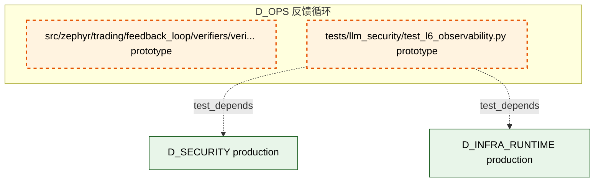

# 16_d_ops / 反馈循环

> **文档作用 / Purpose**: 展示 反馈循环（D_OPS）功能域的模块清单、域内依赖关系、跨域依赖关系、架构分层视图，供架构审查和域治理参考。

> 本文档由 generate_domain_doc.py 从 depgraph (PostgreSQL) 自动生成
> 最后更新: 2026-07-01 03:22:27
> 数据源: depgraph (PostgreSQL) nodes表 + edges表

## 域基本信息 / Domain Overview

| 字段 | 值 | Field | Value |
|------|------|-------|-------|
| 编号 | 16 | Number | 16 |
| 域ID | D_OPS | Domain ID | D_OPS |
| 域名称 | 反馈循环 | Domain Name | 反馈循环 |
| 层级 | L1_foundation | Layer | L1_foundation |
| 模块数 | 332 | Module Count | 332 |
| 域内依赖 | 306 | Internal Dependencies | 306 |
| 跨域入边 | 403 | Cross-domain Incoming | 403 |
| 跨域出边 | 53 | Cross-domain Outgoing | 53 |
| 设计态模块 | 1 | Design Modules | 1 |
| 原型态模块 | 327 | Prototype Modules | 327 |
| 生产态模块 | 4 | Production Modules | 4 |
| 容量 | 24/150 (正常) | Capacity | 24/150 (正常) |
| 描述 | 反馈收集器(collectors) | Description | 反馈收集器(collectors) |

## 域内依赖图 / Internal Dependency Diagram

> 依赖图内嵌在本文档中，IDE 可直接渲染显示。每30个节点一组分页显示。
>
> **图例说明 / Legend**：
> - **实线边框 = 运营态模块**（production，已上线运行）
> - **虚线边框 = 设计态模块**（design，还在设计中）
> - **实线箭头 = 运营态依赖**（已生效的依赖关系）
> - **虚线箭头 = 设计态依赖**（计划中的依赖关系）

### 第 1 页 / 共 12 页 / Page 1 of 12


### 第 2 页 / 共 12 页 / Page 2 of 12

```mermaid
graph TD
    subgraph D_OPS["D_OPS 反馈循环"]
        src_zephyr_trading_feedback_loop_actors_secondary_alert_channel_py["src/zephyr/trading/feedback_loop/actors/seconda... prototype"]
        src_zephyr_trading_feedback_loop_alert_dispatcher_py["src/zephyr/trading/feedback_loop/alert_dispatch... prototype"]
        src_zephyr_trading_feedback_loop_auto_evolution_py["src/zephyr/trading/feedback_loop/auto_evolution.py prototype"]
        src_zephyr_trading_feedback_loop_backpressure_bridge_py["src/zephyr/trading/feedback_loop/backpressure_b... prototype"]
        src_zephyr_trading_feedback_loop_collectors_init_py["src/zephyr/trading/feedback_loop/collectors/__i... prototype"]
        src_zephyr_trading_feedback_loop_collectors_calendar_adapter_py["src/zephyr/trading/feedback_loop/collectors/cal... prototype"]
        src_zephyr_trading_feedback_loop_collectors_config_timeline_py["src/zephyr/trading/feedback_loop/collectors/con... prototype"]
        src_zephyr_trading_feedback_loop_collectors_data_quality_validator_py["src/zephyr/trading/feedback_loop/collectors/dat... prototype"]
        src_zephyr_trading_feedback_loop_collectors_feedback_collector_py["src/zephyr/trading/feedback_loop/collectors/fee... prototype"]
        src_zephyr_trading_feedback_loop_collectors_financial_stratification_py["src/zephyr/trading/feedback_loop/collectors/fin... prototype"]
        src_zephyr_trading_feedback_loop_collectors_kb_provenance_py["src/zephyr/trading/feedback_loop/collectors/kb_... prototype"]
        src_zephyr_trading_feedback_loop_collectors_knowledge_capture_py["src/zephyr/trading/feedback_loop/collectors/kno... prototype"]
        src_zephyr_trading_feedback_loop_collectors_knowledge_freshness_py["src/zephyr/trading/feedback_loop/collectors/kno... prototype"]
        src_zephyr_trading_feedback_loop_collectors_knowledge_injection_py["src/zephyr/trading/feedback_loop/collectors/kno... prototype"]
        src_zephyr_trading_feedback_loop_collectors_knowledge_packaging_py["src/zephyr/trading/feedback_loop/collectors/kno... prototype"]
        src_zephyr_trading_feedback_loop_collectors_known_unknown_registry_py["src/zephyr/trading/feedback_loop/collectors/kno... prototype"]
        src_zephyr_trading_feedback_loop_collectors_llm_cost_accounting_py["src/zephyr/trading/feedback_loop/collectors/llm... prototype"]
        src_zephyr_trading_feedback_loop_collectors_market_calendar_py["src/zephyr/trading/feedback_loop/collectors/mar... prototype"]
        src_zephyr_trading_feedback_loop_collectors_market_event_integrator_py["src/zephyr/trading/feedback_loop/collectors/mar... prototype"]
        src_zephyr_trading_feedback_loop_collectors_metrics_collector_py["src/zephyr/trading/feedback_loop/collectors/met... prototype"]
        src_zephyr_trading_feedback_loop_collectors_notification_feedback_py["src/zephyr/trading/feedback_loop/collectors/not... prototype"]
        src_zephyr_trading_feedback_loop_collectors_schema_evolution_py["src/zephyr/trading/feedback_loop/collectors/sch... prototype"]
        src_zephyr_trading_feedback_loop_collectors_schema_migration_py["src/zephyr/trading/feedback_loop/collectors/sch... prototype"]
        src_zephyr_trading_feedback_loop_collectors_temporal_event_store_py["src/zephyr/trading/feedback_loop/collectors/tem... prototype"]
        src_zephyr_trading_feedback_loop_collectors_token_finops_py["src/zephyr/trading/feedback_loop/collectors/tok... prototype"]
        src_zephyr_trading_feedback_loop_config_py["src/zephyr/trading/feedback_loop/config.py prototype"]
        src_zephyr_trading_feedback_loop_db_bridge_py["src/zephyr/trading/feedback_loop/db_bridge.py prototype"]
        src_zephyr_trading_feedback_loop_db_writer_py["src/zephyr/trading/feedback_loop/db_writer.py prototype"]
        src_zephyr_trading_feedback_loop_decision_engine_py["src/zephyr/trading/feedback_loop/decision_engin... prototype"]
        src_zephyr_trading_feedback_loop_detectors_init_py["src/zephyr/trading/feedback_loop/detectors/__in... prototype"]
    end
    src_zephyr_trading_feedback_loop_collectors_init_py -.->|import_depends| src_zephyr_trading_feedback_loop_collectors_calendar_adapter_py
    src_zephyr_trading_feedback_loop_collectors_init_py -.->|import_depends| src_zephyr_trading_feedback_loop_collectors_config_timeline_py
    src_zephyr_trading_feedback_loop_collectors_init_py -.->|import_depends| src_zephyr_trading_feedback_loop_collectors_data_quality_validator_py
    src_zephyr_trading_feedback_loop_collectors_init_py -.->|import_depends| src_zephyr_trading_feedback_loop_collectors_kb_provenance_py
    src_zephyr_trading_feedback_loop_collectors_init_py -.->|import_depends| src_zephyr_trading_feedback_loop_collectors_financial_stratification_py
    src_zephyr_trading_feedback_loop_collectors_init_py -.->|import_depends| src_zephyr_trading_feedback_loop_collectors_feedback_collector_py
    src_zephyr_trading_feedback_loop_collectors_init_py -.->|import_depends| src_zephyr_trading_feedback_loop_collectors_knowledge_freshness_py
    src_zephyr_trading_feedback_loop_collectors_init_py -.->|import_depends| src_zephyr_trading_feedback_loop_collectors_knowledge_capture_py
    src_zephyr_trading_feedback_loop_collectors_init_py -.->|import_depends| src_zephyr_trading_feedback_loop_collectors_knowledge_packaging_py
    src_zephyr_trading_feedback_loop_collectors_init_py -.->|import_depends| src_zephyr_trading_feedback_loop_collectors_knowledge_injection_py
    src_zephyr_trading_feedback_loop_collectors_init_py -.->|import_depends| src_zephyr_trading_feedback_loop_collectors_llm_cost_accounting_py
    src_zephyr_trading_feedback_loop_collectors_init_py -.->|import_depends| src_zephyr_trading_feedback_loop_collectors_schema_evolution_py
    src_zephyr_trading_feedback_loop_collectors_init_py -.->|import_depends| src_zephyr_trading_feedback_loop_collectors_temporal_event_store_py
    src_zephyr_trading_feedback_loop_collectors_init_py -.->|import_depends| src_zephyr_trading_feedback_loop_collectors_known_unknown_registry_py
    src_zephyr_trading_feedback_loop_collectors_init_py -.->|import_depends| src_zephyr_trading_feedback_loop_collectors_market_event_integrator_py
    src_zephyr_trading_feedback_loop_collectors_init_py -.->|import_depends| src_zephyr_trading_feedback_loop_collectors_metrics_collector_py
    src_zephyr_trading_feedback_loop_collectors_init_py -.->|import_depends| src_zephyr_trading_feedback_loop_collectors_market_calendar_py
    src_zephyr_trading_feedback_loop_collectors_init_py -.->|import_depends| src_zephyr_trading_feedback_loop_collectors_schema_migration_py
    src_zephyr_trading_feedback_loop_collectors_init_py -.->|import_depends| src_zephyr_trading_feedback_loop_collectors_notification_feedback_py
    src_zephyr_trading_feedback_loop_collectors_init_py -.->|import_depends| src_zephyr_trading_feedback_loop_collectors_token_finops_py
    D_TRADING["D_TRADING production"]
    src_zephyr_trading_feedback_loop_alert_dispatcher_py -.->|import_depends| D_TRADING
    D_SHARED["D_SHARED production"]
    src_zephyr_trading_feedback_loop_auto_evolution_py -.->|import_depends| D_SHARED
    src_zephyr_trading_feedback_loop_auto_evolution_py -.->|import_depends| D_SHARED
    src_zephyr_trading_feedback_loop_auto_evolution_py -.->|import_depends| D_SHARED
    src_zephyr_trading_feedback_loop_auto_evolution_py -.->|import_depends| D_SHARED
    D_INTEGRATION["D_INTEGRATION production"]
    src_zephyr_trading_feedback_loop_backpressure_bridge_py -.->|import_depends| D_INTEGRATION
    D_INFRA_RUNTIME["D_INFRA_RUNTIME production"]
    src_zephyr_trading_feedback_loop_db_writer_py -.->|import_depends| D_INFRA_RUNTIME
    D_GOVERNANCE["D_GOVERNANCE design"]
    D_GOVERNANCE -.->|runtime| src_zephyr_trading_feedback_loop_collectors_knowledge_freshness_py
    D_GOVERNANCE -.->|runtime| src_zephyr_trading_feedback_loop_auto_evolution_py
    classDef production fill:#e1f5fe,stroke:#01579b,stroke-width:2px,color:#000
    classDef design fill:#fff3e0,stroke:#e65100,stroke-width:2px,color:#000,stroke-dasharray: 5 5
    classDef external_prod fill:#e8f5e9,stroke:#1b5e20,stroke-width:1px,color:#000
    classDef external_design fill:#fce4ec,stroke:#880e4f,stroke-width:1px,color:#000,stroke-dasharray: 5 5
    class src_zephyr_trading_feedback_loop_actors_secondary_alert_channel_py,src_zephyr_trading_feedback_loop_alert_dispatcher_py,src_zephyr_trading_feedback_loop_auto_evolution_py,src_zephyr_trading_feedback_loop_backpressure_bridge_py,src_zephyr_trading_feedback_loop_collectors_init_py,src_zephyr_trading_feedback_loop_collectors_calendar_adapter_py,src_zephyr_trading_feedback_loop_collectors_config_timeline_py,src_zephyr_trading_feedback_loop_collectors_data_quality_validator_py,src_zephyr_trading_feedback_loop_collectors_feedback_collector_py,src_zephyr_trading_feedback_loop_collectors_financial_stratification_py,src_zephyr_trading_feedback_loop_collectors_kb_provenance_py,src_zephyr_trading_feedback_loop_collectors_knowledge_capture_py,src_zephyr_trading_feedback_loop_collectors_knowledge_freshness_py,src_zephyr_trading_feedback_loop_collectors_knowledge_injection_py,src_zephyr_trading_feedback_loop_collectors_knowledge_packaging_py,src_zephyr_trading_feedback_loop_collectors_known_unknown_registry_py,src_zephyr_trading_feedback_loop_collectors_llm_cost_accounting_py,src_zephyr_trading_feedback_loop_collectors_market_calendar_py,src_zephyr_trading_feedback_loop_collectors_market_event_integrator_py,src_zephyr_trading_feedback_loop_collectors_metrics_collector_py,src_zephyr_trading_feedback_loop_collectors_notification_feedback_py,src_zephyr_trading_feedback_loop_collectors_schema_evolution_py,src_zephyr_trading_feedback_loop_collectors_schema_migration_py,src_zephyr_trading_feedback_loop_collectors_temporal_event_store_py,src_zephyr_trading_feedback_loop_collectors_token_finops_py,src_zephyr_trading_feedback_loop_config_py,src_zephyr_trading_feedback_loop_db_bridge_py,src_zephyr_trading_feedback_loop_db_writer_py,src_zephyr_trading_feedback_loop_decision_engine_py,src_zephyr_trading_feedback_loop_detectors_init_py design
    class D_TRADING,D_SHARED,D_INTEGRATION,D_INFRA_RUNTIME external_prod
    class D_GOVERNANCE external_design
```



### 第 3 页 / 共 12 页 / Page 3 of 12

```mermaid
graph TD
    subgraph D_OPS["D_OPS 反馈循环"]
        src_zephyr_trading_feedback_loop_detectors_anomaly_py["src/zephyr/trading/feedback_loop/detectors/_ano... prototype"]
        src_zephyr_trading_feedback_loop_detectors_correlation_py["src/zephyr/trading/feedback_loop/detectors/_cor... prototype"]
        src_zephyr_trading_feedback_loop_detectors_drift_py["src/zephyr/trading/feedback_loop/detectors/_dri... prototype"]
        src_zephyr_trading_feedback_loop_detectors_guard_py["src/zephyr/trading/feedback_loop/detectors/_gua... prototype"]
        src_zephyr_trading_feedback_loop_detectors_reliability_py["src/zephyr/trading/feedback_loop/detectors/_rel... prototype"]
        src_zephyr_trading_feedback_loop_detectors_action_efficacy_decay_detector_py["src/zephyr/trading/feedback_loop/detectors/acti... prototype"]
        src_zephyr_trading_feedback_loop_detectors_action_interaction_detector_py["src/zephyr/trading/feedback_loop/detectors/acti... prototype"]
        src_zephyr_trading_feedback_loop_detectors_action_side_effect_cumulative_detector_py["src/zephyr/trading/feedback_loop/detectors/acti... prototype"]
        src_zephyr_trading_feedback_loop_detectors_agent_trajectory_anomaly_detector_py["src/zephyr/trading/feedback_loop/detectors/agen... prototype"]
        src_zephyr_trading_feedback_loop_detectors_alert_desensitization_curve_py["src/zephyr/trading/feedback_loop/detectors/aler... prototype"]
        src_zephyr_trading_feedback_loop_detectors_anomaly_clustering_py["src/zephyr/trading/feedback_loop/detectors/anom... prototype"]
        src_zephyr_trading_feedback_loop_detectors_anomaly_detector_py["src/zephyr/trading/feedback_loop/detectors/anom... prototype"]
        src_zephyr_trading_feedback_loop_detectors_autoscale_remediation_py["src/zephyr/trading/feedback_loop/detectors/auto... prototype"]
        src_zephyr_trading_feedback_loop_detectors_blast_radius_py["src/zephyr/trading/feedback_loop/detectors/blas... prototype"]
        src_zephyr_trading_feedback_loop_detectors_blast_radius_budget_py["src/zephyr/trading/feedback_loop/detectors/blas... prototype"]
        src_zephyr_trading_feedback_loop_detectors_capacity_forecast_py["src/zephyr/trading/feedback_loop/detectors/capa... prototype"]
        src_zephyr_trading_feedback_loop_detectors_chaos_engineering_py["src/zephyr/trading/feedback_loop/detectors/chao... prototype"]
        src_zephyr_trading_feedback_loop_detectors_concept_drift_py["src/zephyr/trading/feedback_loop/detectors/conc... prototype"]
        src_zephyr_trading_feedback_loop_detectors_config_drift_py["src/zephyr/trading/feedback_loop/detectors/conf... prototype"]
        src_zephyr_trading_feedback_loop_detectors_context_window_contamination_detector_py["src/zephyr/trading/feedback_loop/detectors/cont... prototype"]
        src_zephyr_trading_feedback_loop_detectors_cross_signal_validator_py["src/zephyr/trading/feedback_loop/detectors/cros... prototype"]
        src_zephyr_trading_feedback_loop_detectors_cross_system_correlator_py["src/zephyr/trading/feedback_loop/detectors/cros... prototype"]
        src_zephyr_trading_feedback_loop_detectors_decision_provenance_py["src/zephyr/trading/feedback_loop/detectors/deci... prototype"]
        src_zephyr_trading_feedback_loop_detectors_dependency_freshness_monitor_py["src/zephyr/trading/feedback_loop/detectors/depe... prototype"]
        src_zephyr_trading_feedback_loop_detectors_diminishing_returns_detector_py["src/zephyr/trading/feedback_loop/detectors/dimi... prototype"]
        src_zephyr_trading_feedback_loop_detectors_ebpf_monitor_py["src/zephyr/trading/feedback_loop/detectors/ebpf... prototype"]
        src_zephyr_trading_feedback_loop_detectors_emergent_behavior_detector_py["src/zephyr/trading/feedback_loop/detectors/emer... prototype"]
        src_zephyr_trading_feedback_loop_detectors_ensemble_detector_py["src/zephyr/trading/feedback_loop/detectors/ense... prototype"]
        src_zephyr_trading_feedback_loop_detectors_ensemble_drift_py["src/zephyr/trading/feedback_loop/detectors/ense... prototype"]
        src_zephyr_trading_feedback_loop_detectors_external_health_py["src/zephyr/trading/feedback_loop/detectors/exte... prototype"]
    end
    D_GOVERNANCE["D_GOVERNANCE design"]
    D_GOVERNANCE -.->|runtime| src_zephyr_trading_feedback_loop_detectors_anomaly_py
    classDef production fill:#e1f5fe,stroke:#01579b,stroke-width:2px,color:#000
    classDef design fill:#fff3e0,stroke:#e65100,stroke-width:2px,color:#000,stroke-dasharray: 5 5
    classDef external_prod fill:#e8f5e9,stroke:#1b5e20,stroke-width:1px,color:#000
    classDef external_design fill:#fce4ec,stroke:#880e4f,stroke-width:1px,color:#000,stroke-dasharray: 5 5
    class src_zephyr_trading_feedback_loop_detectors_anomaly_py,src_zephyr_trading_feedback_loop_detectors_correlation_py,src_zephyr_trading_feedback_loop_detectors_drift_py,src_zephyr_trading_feedback_loop_detectors_guard_py,src_zephyr_trading_feedback_loop_detectors_reliability_py,src_zephyr_trading_feedback_loop_detectors_action_efficacy_decay_detector_py,src_zephyr_trading_feedback_loop_detectors_action_interaction_detector_py,src_zephyr_trading_feedback_loop_detectors_action_side_effect_cumulative_detector_py,src_zephyr_trading_feedback_loop_detectors_agent_trajectory_anomaly_detector_py,src_zephyr_trading_feedback_loop_detectors_alert_desensitization_curve_py,src_zephyr_trading_feedback_loop_detectors_anomaly_clustering_py,src_zephyr_trading_feedback_loop_detectors_anomaly_detector_py,src_zephyr_trading_feedback_loop_detectors_autoscale_remediation_py,src_zephyr_trading_feedback_loop_detectors_blast_radius_py,src_zephyr_trading_feedback_loop_detectors_blast_radius_budget_py,src_zephyr_trading_feedback_loop_detectors_capacity_forecast_py,src_zephyr_trading_feedback_loop_detectors_chaos_engineering_py,src_zephyr_trading_feedback_loop_detectors_concept_drift_py,src_zephyr_trading_feedback_loop_detectors_config_drift_py,src_zephyr_trading_feedback_loop_detectors_context_window_contamination_detector_py,src_zephyr_trading_feedback_loop_detectors_cross_signal_validator_py,src_zephyr_trading_feedback_loop_detectors_cross_system_correlator_py,src_zephyr_trading_feedback_loop_detectors_decision_provenance_py,src_zephyr_trading_feedback_loop_detectors_dependency_freshness_monitor_py,src_zephyr_trading_feedback_loop_detectors_diminishing_returns_detector_py,src_zephyr_trading_feedback_loop_detectors_ebpf_monitor_py,src_zephyr_trading_feedback_loop_detectors_emergent_behavior_detector_py,src_zephyr_trading_feedback_loop_detectors_ensemble_detector_py,src_zephyr_trading_feedback_loop_detectors_ensemble_drift_py,src_zephyr_trading_feedback_loop_detectors_external_health_py design
    class D_GOVERNANCE external_design
```



### 第 4 页 / 共 12 页 / Page 4 of 12

```mermaid
graph TD
    subgraph D_OPS["D_OPS 反馈循环"]
        src_zephyr_trading_feedback_loop_detectors_external_validation_checkpoint_py["src/zephyr/trading/feedback_loop/detectors/exte... prototype"]
        src_zephyr_trading_feedback_loop_detectors_flag_lifecycle_py["src/zephyr/trading/feedback_loop/detectors/flag... prototype"]
        src_zephyr_trading_feedback_loop_detectors_flapping_detector_py["src/zephyr/trading/feedback_loop/detectors/flap... prototype"]
        src_zephyr_trading_feedback_loop_detectors_fle_performance_regression_detector_py["src/zephyr/trading/feedback_loop/detectors/fle_... prototype"]
        src_zephyr_trading_feedback_loop_detectors_gradual_poisoning_detector_py["src/zephyr/trading/feedback_loop/detectors/grad... prototype"]
        src_zephyr_trading_feedback_loop_detectors_guard_cascade_detector_py["src/zephyr/trading/feedback_loop/detectors/guar... prototype"]
        src_zephyr_trading_feedback_loop_detectors_guard_oscillation_detector_py["src/zephyr/trading/feedback_loop/detectors/guar... prototype"]
        src_zephyr_trading_feedback_loop_detectors_heisenbug_detector_py["src/zephyr/trading/feedback_loop/detectors/heis... prototype"]
        src_zephyr_trading_feedback_loop_detectors_infinite_loop_detector_py["src/zephyr/trading/feedback_loop/detectors/infi... prototype"]
        src_zephyr_trading_feedback_loop_detectors_intermittent_failure_pattern_py["src/zephyr/trading/feedback_loop/detectors/inte... prototype"]
        src_zephyr_trading_feedback_loop_detectors_log_anomaly_py["src/zephyr/trading/feedback_loop/detectors/log_... prototype"]
        src_zephyr_trading_feedback_loop_detectors_maintenance_coordinator_py["src/zephyr/trading/feedback_loop/detectors/main... prototype"]
        src_zephyr_trading_feedback_loop_detectors_metric_cardinality_guard_py["src/zephyr/trading/feedback_loop/detectors/metr... prototype"]
        src_zephyr_trading_feedback_loop_detectors_multi_signal_correlator_py["src/zephyr/trading/feedback_loop/detectors/mult... prototype"]
        src_zephyr_trading_feedback_loop_detectors_openfeature_py["src/zephyr/trading/feedback_loop/detectors/open... prototype"]
        src_zephyr_trading_feedback_loop_detectors_otel_adapter_py["src/zephyr/trading/feedback_loop/detectors/otel... prototype"]
        src_zephyr_trading_feedback_loop_detectors_placebo_action_detector_py["src/zephyr/trading/feedback_loop/detectors/plac... prototype"]
        src_zephyr_trading_feedback_loop_detectors_positive_feedback_defense_py["src/zephyr/trading/feedback_loop/detectors/posi... prototype"]
        src_zephyr_trading_feedback_loop_detectors_recursive_diagnosis_trust_evaluator_py["src/zephyr/trading/feedback_loop/detectors/recu... prototype"]
        src_zephyr_trading_feedback_loop_detectors_regime_detector_py["src/zephyr/trading/feedback_loop/detectors/regi... prototype"]
        src_zephyr_trading_feedback_loop_detectors_regulatory_audit_py["src/zephyr/trading/feedback_loop/detectors/regu... prototype"]
        src_zephyr_trading_feedback_loop_detectors_resolution_tracker_py["src/zephyr/trading/feedback_loop/detectors/reso... prototype"]
        src_zephyr_trading_feedback_loop_detectors_rumor_noise_filter_py["src/zephyr/trading/feedback_loop/detectors/rumo... prototype"]
        src_zephyr_trading_feedback_loop_detectors_runbook_executor_py["src/zephyr/trading/feedback_loop/detectors/runb... prototype"]
        src_zephyr_trading_feedback_loop_detectors_self_audit_py["src/zephyr/trading/feedback_loop/detectors/self... prototype"]
        src_zephyr_trading_feedback_loop_detectors_self_diagnosis_data_leak_detector_py["src/zephyr/trading/feedback_loop/detectors/self... prototype"]
        src_zephyr_trading_feedback_loop_detectors_self_ha_py["src/zephyr/trading/feedback_loop/detectors/self... prototype"]
        src_zephyr_trading_feedback_loop_detectors_silent_corruption_detector_py["src/zephyr/trading/feedback_loop/detectors/sile... prototype"]
        src_zephyr_trading_feedback_loop_detectors_synthetic_anomaly_generator_py["src/zephyr/trading/feedback_loop/detectors/synt... prototype"]
        src_zephyr_trading_feedback_loop_detectors_temporal_coherence_of_self_model_py["src/zephyr/trading/feedback_loop/detectors/temp... prototype"]
    end
    classDef production fill:#e1f5fe,stroke:#01579b,stroke-width:2px,color:#000
    classDef design fill:#fff3e0,stroke:#e65100,stroke-width:2px,color:#000,stroke-dasharray: 5 5
    classDef external_prod fill:#e8f5e9,stroke:#1b5e20,stroke-width:1px,color:#000
    classDef external_design fill:#fce4ec,stroke:#880e4f,stroke-width:1px,color:#000,stroke-dasharray: 5 5
    class src_zephyr_trading_feedback_loop_detectors_external_validation_checkpoint_py,src_zephyr_trading_feedback_loop_detectors_flag_lifecycle_py,src_zephyr_trading_feedback_loop_detectors_flapping_detector_py,src_zephyr_trading_feedback_loop_detectors_fle_performance_regression_detector_py,src_zephyr_trading_feedback_loop_detectors_gradual_poisoning_detector_py,src_zephyr_trading_feedback_loop_detectors_guard_cascade_detector_py,src_zephyr_trading_feedback_loop_detectors_guard_oscillation_detector_py,src_zephyr_trading_feedback_loop_detectors_heisenbug_detector_py,src_zephyr_trading_feedback_loop_detectors_infinite_loop_detector_py,src_zephyr_trading_feedback_loop_detectors_intermittent_failure_pattern_py,src_zephyr_trading_feedback_loop_detectors_log_anomaly_py,src_zephyr_trading_feedback_loop_detectors_maintenance_coordinator_py,src_zephyr_trading_feedback_loop_detectors_metric_cardinality_guard_py,src_zephyr_trading_feedback_loop_detectors_multi_signal_correlator_py,src_zephyr_trading_feedback_loop_detectors_openfeature_py,src_zephyr_trading_feedback_loop_detectors_otel_adapter_py,src_zephyr_trading_feedback_loop_detectors_placebo_action_detector_py,src_zephyr_trading_feedback_loop_detectors_positive_feedback_defense_py,src_zephyr_trading_feedback_loop_detectors_recursive_diagnosis_trust_evaluator_py,src_zephyr_trading_feedback_loop_detectors_regime_detector_py,src_zephyr_trading_feedback_loop_detectors_regulatory_audit_py,src_zephyr_trading_feedback_loop_detectors_resolution_tracker_py,src_zephyr_trading_feedback_loop_detectors_rumor_noise_filter_py,src_zephyr_trading_feedback_loop_detectors_runbook_executor_py,src_zephyr_trading_feedback_loop_detectors_self_audit_py,src_zephyr_trading_feedback_loop_detectors_self_diagnosis_data_leak_detector_py,src_zephyr_trading_feedback_loop_detectors_self_ha_py,src_zephyr_trading_feedback_loop_detectors_silent_corruption_detector_py,src_zephyr_trading_feedback_loop_detectors_synthetic_anomaly_generator_py,src_zephyr_trading_feedback_loop_detectors_temporal_coherence_of_self_model_py design
```



### 第 5 页 / 共 12 页 / Page 5 of 12

```mermaid
graph TD
    subgraph D_OPS["D_OPS 反馈循环"]
        src_zephyr_trading_feedback_loop_detectors_temporal_pattern_py["src/zephyr/trading/feedback_loop/detectors/temp... prototype"]
        src_zephyr_trading_feedback_loop_detectors_trace_causal_bridge_py["src/zephyr/trading/feedback_loop/detectors/trac... prototype"]
        src_zephyr_trading_feedback_loop_detectors_traffic_replay_validator_py["src/zephyr/trading/feedback_loop/detectors/traf... prototype"]
        src_zephyr_trading_feedback_loop_detectors_trend_cycle_separator_py["src/zephyr/trading/feedback_loop/detectors/tren... prototype"]
        src_zephyr_trading_feedback_loop_detectors_version_migrator_py["src/zephyr/trading/feedback_loop/detectors/vers... prototype"]
        src_zephyr_trading_feedback_loop_diagnosers_init_py["src/zephyr/trading/feedback_loop/diagnosers/__i... prototype"]
        src_zephyr_trading_feedback_loop_diagnosers_cognitive_py["src/zephyr/trading/feedback_loop/diagnosers/_co... prototype"]
        src_zephyr_trading_feedback_loop_diagnosers_diagnosis_py["src/zephyr/trading/feedback_loop/diagnosers/_di... prototype"]
        src_zephyr_trading_feedback_loop_diagnosers_health_py["src/zephyr/trading/feedback_loop/diagnosers/_he... prototype"]
        src_zephyr_trading_feedback_loop_diagnosers_reliability_py["src/zephyr/trading/feedback_loop/diagnosers/_re... prototype"]
        src_zephyr_trading_feedback_loop_diagnosers_action_composition_health_monitor_py["src/zephyr/trading/feedback_loop/diagnosers/act... prototype"]
        src_zephyr_trading_feedback_loop_diagnosers_adaptive_param_tuning_py["src/zephyr/trading/feedback_loop/diagnosers/ada... prototype"]
        src_zephyr_trading_feedback_loop_diagnosers_amplification_guard_py["src/zephyr/trading/feedback_loop/diagnosers/amp... prototype"]
        src_zephyr_trading_feedback_loop_diagnosers_api_dependency_metrics_py["src/zephyr/trading/feedback_loop/diagnosers/api... prototype"]
        src_zephyr_trading_feedback_loop_diagnosers_auto_diagnosis_py["src/zephyr/trading/feedback_loop/diagnosers/aut... prototype"]
        src_zephyr_trading_feedback_loop_diagnosers_burn_rate_alerter_py["src/zephyr/trading/feedback_loop/diagnosers/bur... prototype"]
        src_zephyr_trading_feedback_loop_diagnosers_burnout_alarm_py["src/zephyr/trading/feedback_loop/diagnosers/bur... prototype"]
        src_zephyr_trading_feedback_loop_diagnosers_capacity_aware_repair_py["src/zephyr/trading/feedback_loop/diagnosers/cap... prototype"]
        src_zephyr_trading_feedback_loop_diagnosers_causal_inference_engine_py["src/zephyr/trading/feedback_loop/diagnosers/cau... prototype"]
        src_zephyr_trading_feedback_loop_diagnosers_cognitive_load_py["src/zephyr/trading/feedback_loop/diagnosers/cog... prototype"]
        src_zephyr_trading_feedback_loop_diagnosers_cognitive_load_budget_py["src/zephyr/trading/feedback_loop/diagnosers/cog... prototype"]
        src_zephyr_trading_feedback_loop_diagnosers_cold_start_conservative_mode_py["src/zephyr/trading/feedback_loop/diagnosers/col... prototype"]
        src_zephyr_trading_feedback_loop_diagnosers_collaborative_learning_py["src/zephyr/trading/feedback_loop/diagnosers/col... prototype"]
        src_zephyr_trading_feedback_loop_diagnosers_confidence_decomposer_py["src/zephyr/trading/feedback_loop/diagnosers/con... prototype"]
        src_zephyr_trading_feedback_loop_diagnosers_context_truncation_py["src/zephyr/trading/feedback_loop/diagnosers/con... prototype"]
        src_zephyr_trading_feedback_loop_diagnosers_context_window_pressure_manager_py["src/zephyr/trading/feedback_loop/diagnosers/con... prototype"]
        src_zephyr_trading_feedback_loop_diagnosers_counterfactual_py["src/zephyr/trading/feedback_loop/diagnosers/cou... prototype"]
        src_zephyr_trading_feedback_loop_diagnosers_cross_guard_conflict_detector_py["src/zephyr/trading/feedback_loop/diagnosers/cro... prototype"]
        src_zephyr_trading_feedback_loop_diagnosers_cross_session_consistency_validator_py["src/zephyr/trading/feedback_loop/diagnosers/cro... prototype"]
        src_zephyr_trading_feedback_loop_diagnosers_data_volume_growth_monitor_py["src/zephyr/trading/feedback_loop/diagnosers/dat... prototype"]
    end
    src_zephyr_trading_feedback_loop_diagnosers_action_composition_health_monitor_py -.->|config_depends| src_zephyr_trading_feedback_loop_diagnosers_init_py
    src_zephyr_trading_feedback_loop_diagnosers_adaptive_param_tuning_py -.->|config_depends| src_zephyr_trading_feedback_loop_diagnosers_init_py
    src_zephyr_trading_feedback_loop_diagnosers_burn_rate_alerter_py -.->|config_depends| src_zephyr_trading_feedback_loop_diagnosers_init_py
    src_zephyr_trading_feedback_loop_diagnosers_auto_diagnosis_py -.->|config_depends| src_zephyr_trading_feedback_loop_diagnosers_init_py
    src_zephyr_trading_feedback_loop_diagnosers_amplification_guard_py -.->|config_depends| src_zephyr_trading_feedback_loop_diagnosers_init_py
    src_zephyr_trading_feedback_loop_diagnosers_api_dependency_metrics_py -.->|config_depends| src_zephyr_trading_feedback_loop_diagnosers_init_py
    src_zephyr_trading_feedback_loop_diagnosers_collaborative_learning_py -.->|config_depends| src_zephyr_trading_feedback_loop_diagnosers_init_py
    src_zephyr_trading_feedback_loop_diagnosers_capacity_aware_repair_py -.->|config_depends| src_zephyr_trading_feedback_loop_diagnosers_init_py
    src_zephyr_trading_feedback_loop_diagnosers_burnout_alarm_py -.->|config_depends| src_zephyr_trading_feedback_loop_diagnosers_init_py
    src_zephyr_trading_feedback_loop_diagnosers_causal_inference_engine_py -.->|config_depends| src_zephyr_trading_feedback_loop_diagnosers_init_py
    src_zephyr_trading_feedback_loop_diagnosers_confidence_decomposer_py -.->|config_depends| src_zephyr_trading_feedback_loop_diagnosers_init_py
    src_zephyr_trading_feedback_loop_diagnosers_cognitive_load_py -.->|config_depends| src_zephyr_trading_feedback_loop_diagnosers_init_py
    src_zephyr_trading_feedback_loop_diagnosers_cold_start_conservative_mode_py -.->|config_depends| src_zephyr_trading_feedback_loop_diagnosers_init_py
    src_zephyr_trading_feedback_loop_diagnosers_cognitive_load_budget_py -.->|config_depends| src_zephyr_trading_feedback_loop_diagnosers_init_py
    src_zephyr_trading_feedback_loop_diagnosers_context_window_pressure_manager_py -.->|config_depends| src_zephyr_trading_feedback_loop_diagnosers_init_py
    src_zephyr_trading_feedback_loop_diagnosers_context_truncation_py -.->|config_depends| src_zephyr_trading_feedback_loop_diagnosers_init_py
    src_zephyr_trading_feedback_loop_diagnosers_data_volume_growth_monitor_py -.->|config_depends| src_zephyr_trading_feedback_loop_diagnosers_init_py
    src_zephyr_trading_feedback_loop_diagnosers_counterfactual_py -.->|config_depends| src_zephyr_trading_feedback_loop_diagnosers_init_py
    src_zephyr_trading_feedback_loop_diagnosers_cross_session_consistency_validator_py -.->|config_depends| src_zephyr_trading_feedback_loop_diagnosers_init_py
    src_zephyr_trading_feedback_loop_diagnosers_cross_guard_conflict_detector_py -.->|config_depends| src_zephyr_trading_feedback_loop_diagnosers_init_py
    src_zephyr_trading_feedback_loop_diagnosers_cognitive_py -.->|config_depends| src_zephyr_trading_feedback_loop_diagnosers_init_py
    src_zephyr_trading_feedback_loop_diagnosers_diagnosis_py -.->|config_depends| src_zephyr_trading_feedback_loop_diagnosers_init_py
    src_zephyr_trading_feedback_loop_diagnosers_health_py -.->|config_depends| src_zephyr_trading_feedback_loop_diagnosers_init_py
    src_zephyr_trading_feedback_loop_diagnosers_reliability_py -.->|config_depends| src_zephyr_trading_feedback_loop_diagnosers_init_py
    classDef production fill:#e1f5fe,stroke:#01579b,stroke-width:2px,color:#000
    classDef design fill:#fff3e0,stroke:#e65100,stroke-width:2px,color:#000,stroke-dasharray: 5 5
    classDef external_prod fill:#e8f5e9,stroke:#1b5e20,stroke-width:1px,color:#000
    classDef external_design fill:#fce4ec,stroke:#880e4f,stroke-width:1px,color:#000,stroke-dasharray: 5 5
    class src_zephyr_trading_feedback_loop_detectors_temporal_pattern_py,src_zephyr_trading_feedback_loop_detectors_trace_causal_bridge_py,src_zephyr_trading_feedback_loop_detectors_traffic_replay_validator_py,src_zephyr_trading_feedback_loop_detectors_trend_cycle_separator_py,src_zephyr_trading_feedback_loop_detectors_version_migrator_py,src_zephyr_trading_feedback_loop_diagnosers_init_py,src_zephyr_trading_feedback_loop_diagnosers_cognitive_py,src_zephyr_trading_feedback_loop_diagnosers_diagnosis_py,src_zephyr_trading_feedback_loop_diagnosers_health_py,src_zephyr_trading_feedback_loop_diagnosers_reliability_py,src_zephyr_trading_feedback_loop_diagnosers_action_composition_health_monitor_py,src_zephyr_trading_feedback_loop_diagnosers_adaptive_param_tuning_py,src_zephyr_trading_feedback_loop_diagnosers_amplification_guard_py,src_zephyr_trading_feedback_loop_diagnosers_api_dependency_metrics_py,src_zephyr_trading_feedback_loop_diagnosers_auto_diagnosis_py,src_zephyr_trading_feedback_loop_diagnosers_burn_rate_alerter_py,src_zephyr_trading_feedback_loop_diagnosers_burnout_alarm_py,src_zephyr_trading_feedback_loop_diagnosers_capacity_aware_repair_py,src_zephyr_trading_feedback_loop_diagnosers_causal_inference_engine_py,src_zephyr_trading_feedback_loop_diagnosers_cognitive_load_py,src_zephyr_trading_feedback_loop_diagnosers_cognitive_load_budget_py,src_zephyr_trading_feedback_loop_diagnosers_cold_start_conservative_mode_py,src_zephyr_trading_feedback_loop_diagnosers_collaborative_learning_py,src_zephyr_trading_feedback_loop_diagnosers_confidence_decomposer_py,src_zephyr_trading_feedback_loop_diagnosers_context_truncation_py,src_zephyr_trading_feedback_loop_diagnosers_context_window_pressure_manager_py,src_zephyr_trading_feedback_loop_diagnosers_counterfactual_py,src_zephyr_trading_feedback_loop_diagnosers_cross_guard_conflict_detector_py,src_zephyr_trading_feedback_loop_diagnosers_cross_session_consistency_validator_py,src_zephyr_trading_feedback_loop_diagnosers_data_volume_growth_monitor_py design
```



### 第 6 页 / 共 12 页 / Page 6 of 12

```mermaid
graph TD
    subgraph D_OPS["D_OPS 反馈循环"]
        src_zephyr_trading_feedback_loop_diagnosers_diagnosis_engine_py["src/zephyr/trading/feedback_loop/diagnosers/dia... prototype"]
        src_zephyr_trading_feedback_loop_diagnosers_diagnosis_kpi_py["src/zephyr/trading/feedback_loop/diagnosers/dia... prototype"]
        src_zephyr_trading_feedback_loop_diagnosers_dr_resilience_metrics_py["src/zephyr/trading/feedback_loop/diagnosers/dr_... prototype"]
        src_zephyr_trading_feedback_loop_diagnosers_e2e_integration_health_py["src/zephyr/trading/feedback_loop/diagnosers/e2e... prototype"]
        src_zephyr_trading_feedback_loop_diagnosers_feedback_delay_compensator_py["src/zephyr/trading/feedback_loop/diagnosers/fee... prototype"]
        src_zephyr_trading_feedback_loop_diagnosers_fle_dogfood_monitor_py["src/zephyr/trading/feedback_loop/diagnosers/fle... prototype"]
        src_zephyr_trading_feedback_loop_diagnosers_fle_self_slo_metrics_py["src/zephyr/trading/feedback_loop/diagnosers/fle... prototype"]
        src_zephyr_trading_feedback_loop_diagnosers_gamification_py["src/zephyr/trading/feedback_loop/diagnosers/gam... prototype"]
        src_zephyr_trading_feedback_loop_diagnosers_global_health_map_py["src/zephyr/trading/feedback_loop/diagnosers/glo... prototype"]
        src_zephyr_trading_feedback_loop_diagnosers_guard_interaction_topology_mapper_py["src/zephyr/trading/feedback_loop/diagnosers/gua... prototype"]
        src_zephyr_trading_feedback_loop_diagnosers_guard_self_consistency_auditor_py["src/zephyr/trading/feedback_loop/diagnosers/gua... prototype"]
        src_zephyr_trading_feedback_loop_diagnosers_human_anomaly_flood_detector_py["src/zephyr/trading/feedback_loop/diagnosers/hum... prototype"]
        src_zephyr_trading_feedback_loop_diagnosers_impact_predictor_py["src/zephyr/trading/feedback_loop/diagnosers/imp... prototype"]
        src_zephyr_trading_feedback_loop_diagnosers_incident_knowledge_injector_py["src/zephyr/trading/feedback_loop/diagnosers/inc... prototype"]
        src_zephyr_trading_feedback_loop_diagnosers_interactive_diagnosis_py["src/zephyr/trading/feedback_loop/diagnosers/int... prototype"]
        src_zephyr_trading_feedback_loop_diagnosers_knowledge_bus_factor_monitor_py["src/zephyr/trading/feedback_loop/diagnosers/kno... prototype"]
        src_zephyr_trading_feedback_loop_diagnosers_knowledge_market_py["src/zephyr/trading/feedback_loop/diagnosers/kno... prototype"]
        src_zephyr_trading_feedback_loop_diagnosers_latency_slo_py["src/zephyr/trading/feedback_loop/diagnosers/lat... prototype"]
        src_zephyr_trading_feedback_loop_diagnosers_llm_provider_integrity_py["src/zephyr/trading/feedback_loop/diagnosers/llm... prototype"]
        src_zephyr_trading_feedback_loop_diagnosers_llm_quality_regression_py["src/zephyr/trading/feedback_loop/diagnosers/llm... prototype"]
        src_zephyr_trading_feedback_loop_diagnosers_memory_self_check_py["src/zephyr/trading/feedback_loop/diagnosers/mem... prototype"]
        src_zephyr_trading_feedback_loop_diagnosers_meta_guard_latency_budget_py["src/zephyr/trading/feedback_loop/diagnosers/met... prototype"]
        src_zephyr_trading_feedback_loop_diagnosers_model_health_py["src/zephyr/trading/feedback_loop/diagnosers/mod... prototype"]
        src_zephyr_trading_feedback_loop_diagnosers_model_rotation_py["src/zephyr/trading/feedback_loop/diagnosers/mod... prototype"]
        src_zephyr_trading_feedback_loop_diagnosers_model_rotation_v2_py["src/zephyr/trading/feedback_loop/diagnosers/mod... prototype"]
        src_zephyr_trading_feedback_loop_diagnosers_model_version_semantic_drift_py["src/zephyr/trading/feedback_loop/diagnosers/mod... prototype"]
        src_zephyr_trading_feedback_loop_diagnosers_mtti_tracker_py["src/zephyr/trading/feedback_loop/diagnosers/mtt... prototype"]
        src_zephyr_trading_feedback_loop_diagnosers_nonstationary_effectiveness_py["src/zephyr/trading/feedback_loop/diagnosers/non... prototype"]
        src_zephyr_trading_feedback_loop_diagnosers_numerical_stability_guard_py["src/zephyr/trading/feedback_loop/diagnosers/num... prototype"]
        src_zephyr_trading_feedback_loop_diagnosers_operational_seasonality_py["src/zephyr/trading/feedback_loop/diagnosers/ope... prototype"]
    end
    classDef production fill:#e1f5fe,stroke:#01579b,stroke-width:2px,color:#000
    classDef design fill:#fff3e0,stroke:#e65100,stroke-width:2px,color:#000,stroke-dasharray: 5 5
    classDef external_prod fill:#e8f5e9,stroke:#1b5e20,stroke-width:1px,color:#000
    classDef external_design fill:#fce4ec,stroke:#880e4f,stroke-width:1px,color:#000,stroke-dasharray: 5 5
    class src_zephyr_trading_feedback_loop_diagnosers_diagnosis_engine_py,src_zephyr_trading_feedback_loop_diagnosers_diagnosis_kpi_py,src_zephyr_trading_feedback_loop_diagnosers_dr_resilience_metrics_py,src_zephyr_trading_feedback_loop_diagnosers_e2e_integration_health_py,src_zephyr_trading_feedback_loop_diagnosers_feedback_delay_compensator_py,src_zephyr_trading_feedback_loop_diagnosers_fle_dogfood_monitor_py,src_zephyr_trading_feedback_loop_diagnosers_fle_self_slo_metrics_py,src_zephyr_trading_feedback_loop_diagnosers_gamification_py,src_zephyr_trading_feedback_loop_diagnosers_global_health_map_py,src_zephyr_trading_feedback_loop_diagnosers_guard_interaction_topology_mapper_py,src_zephyr_trading_feedback_loop_diagnosers_guard_self_consistency_auditor_py,src_zephyr_trading_feedback_loop_diagnosers_human_anomaly_flood_detector_py,src_zephyr_trading_feedback_loop_diagnosers_impact_predictor_py,src_zephyr_trading_feedback_loop_diagnosers_incident_knowledge_injector_py,src_zephyr_trading_feedback_loop_diagnosers_interactive_diagnosis_py,src_zephyr_trading_feedback_loop_diagnosers_knowledge_bus_factor_monitor_py,src_zephyr_trading_feedback_loop_diagnosers_knowledge_market_py,src_zephyr_trading_feedback_loop_diagnosers_latency_slo_py,src_zephyr_trading_feedback_loop_diagnosers_llm_provider_integrity_py,src_zephyr_trading_feedback_loop_diagnosers_llm_quality_regression_py,src_zephyr_trading_feedback_loop_diagnosers_memory_self_check_py,src_zephyr_trading_feedback_loop_diagnosers_meta_guard_latency_budget_py,src_zephyr_trading_feedback_loop_diagnosers_model_health_py,src_zephyr_trading_feedback_loop_diagnosers_model_rotation_py,src_zephyr_trading_feedback_loop_diagnosers_model_rotation_v2_py,src_zephyr_trading_feedback_loop_diagnosers_model_version_semantic_drift_py,src_zephyr_trading_feedback_loop_diagnosers_mtti_tracker_py,src_zephyr_trading_feedback_loop_diagnosers_nonstationary_effectiveness_py,src_zephyr_trading_feedback_loop_diagnosers_numerical_stability_guard_py,src_zephyr_trading_feedback_loop_diagnosers_operational_seasonality_py design
```



### 第 7 页 / 共 12 页 / Page 7 of 12

```mermaid
graph TD
    subgraph D_OPS["D_OPS 反馈循环"]
        src_zephyr_trading_feedback_loop_diagnosers_prompt_fingerprint_py["src/zephyr/trading/feedback_loop/diagnosers/pro... prototype"]
        src_zephyr_trading_feedback_loop_diagnosers_prompt_sanitizer_py["src/zephyr/trading/feedback_loop/diagnosers/pro... prototype"]
        src_zephyr_trading_feedback_loop_diagnosers_recovery_time_stats_py["src/zephyr/trading/feedback_loop/diagnosers/rec... prototype"]
        src_zephyr_trading_feedback_loop_diagnosers_regime_gain_scheduling_py["src/zephyr/trading/feedback_loop/diagnosers/reg... prototype"]
        src_zephyr_trading_feedback_loop_diagnosers_retirement_planner_py["src/zephyr/trading/feedback_loop/diagnosers/ret... prototype"]
        src_zephyr_trading_feedback_loop_diagnosers_self_benchmark_py["src/zephyr/trading/feedback_loop/diagnosers/sel... prototype"]
        src_zephyr_trading_feedback_loop_diagnosers_self_bottleneck_detector_py["src/zephyr/trading/feedback_loop/diagnosers/sel... prototype"]
        src_zephyr_trading_feedback_loop_diagnosers_self_health_monitor_py["src/zephyr/trading/feedback_loop/diagnosers/sel... prototype"]
        src_zephyr_trading_feedback_loop_diagnosers_self_llm_observability_py["src/zephyr/trading/feedback_loop/diagnosers/sel... prototype"]
        src_zephyr_trading_feedback_loop_diagnosers_slo_capacity_metrics_py["src/zephyr/trading/feedback_loop/diagnosers/slo... prototype"]
        src_zephyr_trading_feedback_loop_diagnosers_socratic_questions_py["src/zephyr/trading/feedback_loop/diagnosers/soc... prototype"]
        src_zephyr_trading_feedback_loop_diagnosers_statistical_hygiene_auditor_py["src/zephyr/trading/feedback_loop/diagnosers/sta... prototype"]
        src_zephyr_trading_feedback_loop_diagnosers_system_entropy_monitor_py["src/zephyr/trading/feedback_loop/diagnosers/sys... prototype"]
        src_zephyr_trading_feedback_loop_diagnosers_temporal_integrity_guard_py["src/zephyr/trading/feedback_loop/diagnosers/tem... prototype"]
        src_zephyr_trading_feedback_loop_diagnosers_timezone_semantic_reasoner_py["src/zephyr/trading/feedback_loop/diagnosers/tim... prototype"]
        src_zephyr_trading_feedback_loop_diagnosers_toil_quantification_py["src/zephyr/trading/feedback_loop/diagnosers/toi... prototype"]
        src_zephyr_trading_feedback_loop_diagnosers_tone_adapter_py["src/zephyr/trading/feedback_loop/diagnosers/ton... prototype"]
        src_zephyr_trading_feedback_loop_diagnosers_tone_adapter_v2_py["src/zephyr/trading/feedback_loop/diagnosers/ton... prototype"]
        src_zephyr_trading_feedback_loop_diagnosers_value_added_baseline_py["src/zephyr/trading/feedback_loop/diagnosers/val... prototype"]
        src_zephyr_trading_feedback_loop_diagnosers_vertical_self_assessment_py["src/zephyr/trading/feedback_loop/diagnosers/ver... prototype"]
        src_zephyr_trading_feedback_loop_diagnosers_zombie_fle_detector_py["src/zephyr/trading/feedback_loop/diagnosers/zom... prototype"]
        src_zephyr_trading_feedback_loop_docs_init_py["src/zephyr/trading/feedback_loop/docs/__init__.py prototype"]
        src_zephyr_trading_feedback_loop_docs_cold_start_manual_py["src/zephyr/trading/feedback_loop/docs/cold_star... prototype"]
        src_zephyr_trading_feedback_loop_error_budget_py["src/zephyr/trading/feedback_loop/error_budget.py prototype"]
        src_zephyr_trading_feedback_loop_eval_harness_py["src/zephyr/trading/feedback_loop/eval_harness.py prototype"]
        src_zephyr_trading_feedback_loop_evolution_init_py["src/zephyr/trading/feedback_loop/evolution/__in... prototype"]
        src_zephyr_trading_feedback_loop_evolution_auto_reward_py["src/zephyr/trading/feedback_loop/evolution/auto... prototype"]
        src_zephyr_trading_feedback_loop_evolution_conformal_prediction_py["src/zephyr/trading/feedback_loop/evolution/conf... prototype"]
        src_zephyr_trading_feedback_loop_evolution_cross_gen_validation_py["src/zephyr/trading/feedback_loop/evolution/cros... prototype"]
        src_zephyr_trading_feedback_loop_evolution_dynamic_threshold_py["src/zephyr/trading/feedback_loop/evolution/dyna... prototype"]
    end
    src_zephyr_trading_feedback_loop_docs_init_py -.->|import_depends| src_zephyr_trading_feedback_loop_docs_cold_start_manual_py
    src_zephyr_trading_feedback_loop_evolution_init_py -.->|import_depends| src_zephyr_trading_feedback_loop_evolution_auto_reward_py
    src_zephyr_trading_feedback_loop_evolution_init_py -.->|import_depends| src_zephyr_trading_feedback_loop_evolution_dynamic_threshold_py
    src_zephyr_trading_feedback_loop_evolution_init_py -.->|import_depends| src_zephyr_trading_feedback_loop_evolution_conformal_prediction_py
    src_zephyr_trading_feedback_loop_evolution_init_py -.->|import_depends| src_zephyr_trading_feedback_loop_evolution_cross_gen_validation_py
    D_GOVERNANCE["D_GOVERNANCE prototype"]
    src_zephyr_trading_feedback_loop_evolution_init_py -.->|import_depends| D_GOVERNANCE
    D_GOVERNANCE -.->|runtime| src_zephyr_trading_feedback_loop_diagnosers_self_health_monitor_py
    classDef production fill:#e1f5fe,stroke:#01579b,stroke-width:2px,color:#000
    classDef design fill:#fff3e0,stroke:#e65100,stroke-width:2px,color:#000,stroke-dasharray: 5 5
    classDef external_prod fill:#e8f5e9,stroke:#1b5e20,stroke-width:1px,color:#000
    classDef external_design fill:#fce4ec,stroke:#880e4f,stroke-width:1px,color:#000,stroke-dasharray: 5 5
    class src_zephyr_trading_feedback_loop_diagnosers_prompt_fingerprint_py,src_zephyr_trading_feedback_loop_diagnosers_prompt_sanitizer_py,src_zephyr_trading_feedback_loop_diagnosers_recovery_time_stats_py,src_zephyr_trading_feedback_loop_diagnosers_regime_gain_scheduling_py,src_zephyr_trading_feedback_loop_diagnosers_retirement_planner_py,src_zephyr_trading_feedback_loop_diagnosers_self_benchmark_py,src_zephyr_trading_feedback_loop_diagnosers_self_bottleneck_detector_py,src_zephyr_trading_feedback_loop_diagnosers_self_health_monitor_py,src_zephyr_trading_feedback_loop_diagnosers_self_llm_observability_py,src_zephyr_trading_feedback_loop_diagnosers_slo_capacity_metrics_py,src_zephyr_trading_feedback_loop_diagnosers_socratic_questions_py,src_zephyr_trading_feedback_loop_diagnosers_statistical_hygiene_auditor_py,src_zephyr_trading_feedback_loop_diagnosers_system_entropy_monitor_py,src_zephyr_trading_feedback_loop_diagnosers_temporal_integrity_guard_py,src_zephyr_trading_feedback_loop_diagnosers_timezone_semantic_reasoner_py,src_zephyr_trading_feedback_loop_diagnosers_toil_quantification_py,src_zephyr_trading_feedback_loop_diagnosers_tone_adapter_py,src_zephyr_trading_feedback_loop_diagnosers_tone_adapter_v2_py,src_zephyr_trading_feedback_loop_diagnosers_value_added_baseline_py,src_zephyr_trading_feedback_loop_diagnosers_vertical_self_assessment_py,src_zephyr_trading_feedback_loop_diagnosers_zombie_fle_detector_py,src_zephyr_trading_feedback_loop_docs_init_py,src_zephyr_trading_feedback_loop_docs_cold_start_manual_py,src_zephyr_trading_feedback_loop_error_budget_py,src_zephyr_trading_feedback_loop_eval_harness_py,src_zephyr_trading_feedback_loop_evolution_init_py,src_zephyr_trading_feedback_loop_evolution_auto_reward_py,src_zephyr_trading_feedback_loop_evolution_conformal_prediction_py,src_zephyr_trading_feedback_loop_evolution_cross_gen_validation_py,src_zephyr_trading_feedback_loop_evolution_dynamic_threshold_py design
    class D_GOVERNANCE external_design
```



### 第 8 页 / 共 12 页 / Page 8 of 12


### 第 9 页 / 共 12 页 / Page 9 of 12


### 第 10 页 / 共 12 页 / Page 10 of 12

```mermaid
graph TD
    subgraph D_OPS["D_OPS 反馈循环"]
        src_zephyr_trading_feedback_loop_gates_license_compliance_py["src/zephyr/trading/feedback_loop/gates/license_... prototype"]
        src_zephyr_trading_feedback_loop_gates_llm_cost_router_py["src/zephyr/trading/feedback_loop/gates/llm_cost... prototype"]
        src_zephyr_trading_feedback_loop_gates_merkle_audit_root_py["src/zephyr/trading/feedback_loop/gates/merkle_a... prototype"]
        src_zephyr_trading_feedback_loop_gates_meta_performance_gate_py["src/zephyr/trading/feedback_loop/gates/meta_per... prototype"]
        src_zephyr_trading_feedback_loop_gates_parameterized_safety_gate_py["src/zephyr/trading/feedback_loop/gates/paramete... prototype"]
        src_zephyr_trading_feedback_loop_gates_safety_gate_l1_l27_py["src/zephyr/trading/feedback_loop/gates/safety_g... prototype"]
        src_zephyr_trading_feedback_loop_gates_scope_creep_monitor_py["src/zephyr/trading/feedback_loop/gates/scope_cr... prototype"]
        src_zephyr_trading_feedback_loop_generator_py["src/zephyr/trading/feedback_loop/generator.py prototype"]
        src_zephyr_trading_feedback_loop_metrics_collector_py["src/zephyr/trading/feedback_loop/metrics_collec... prototype"]
        src_zephyr_trading_feedback_loop_protocols_py["src/zephyr/trading/feedback_loop/protocols.py prototype"]
        src_zephyr_trading_feedback_loop_resilience_init_py["src/zephyr/trading/feedback_loop/resilience/__i... prototype"]
        src_zephyr_trading_feedback_loop_resilience_config_hot_reload_guard_py["src/zephyr/trading/feedback_loop/resilience/con... prototype"]
        src_zephyr_trading_feedback_loop_resilience_deadman_switch_py["src/zephyr/trading/feedback_loop/resilience/dea... prototype"]
        src_zephyr_trading_feedback_loop_resilience_dr_automation_py["src/zephyr/trading/feedback_loop/resilience/dr_... prototype"]
        src_zephyr_trading_feedback_loop_resilience_graceful_degradation_planner_py["src/zephyr/trading/feedback_loop/resilience/gra... prototype"]
        src_zephyr_trading_feedback_loop_resilience_multi_instance_coord_py["src/zephyr/trading/feedback_loop/resilience/mul... prototype"]
        src_zephyr_trading_feedback_loop_resilience_oscillation_damping_py["src/zephyr/trading/feedback_loop/resilience/osc... prototype"]
        src_zephyr_trading_feedback_loop_resilience_resource_starvation_aware_py["src/zephyr/trading/feedback_loop/resilience/res... prototype"]
        src_zephyr_trading_feedback_loop_resilience_self_api_throttle_defense_py["src/zephyr/trading/feedback_loop/resilience/sel... prototype"]
        src_zephyr_trading_feedback_loop_resilience_split_brain_quorum_py["src/zephyr/trading/feedback_loop/resilience/spl... prototype"]
        src_zephyr_trading_feedback_loop_scheduler_py["src/zephyr/trading/feedback_loop/scheduler.py prototype"]
        src_zephyr_trading_feedback_loop_scheduler_act_py["src/zephyr/trading/feedback_loop/scheduler_act.py prototype"]
        src_zephyr_trading_feedback_loop_scheduler_collect_detect_py["src/zephyr/trading/feedback_loop/scheduler_coll... prototype"]
        src_zephyr_trading_feedback_loop_scheduler_health_py["src/zephyr/trading/feedback_loop/scheduler_heal... prototype"]
        src_zephyr_trading_feedback_loop_scheduler_safety_py["src/zephyr/trading/feedback_loop/scheduler_safe... prototype"]
        src_zephyr_trading_feedback_loop_security_init_py["src/zephyr/trading/feedback_loop/security/__ini... prototype"]
        src_zephyr_trading_feedback_loop_security_agent_skill_guard_py["src/zephyr/trading/feedback_loop/security/agent... prototype"]
        src_zephyr_trading_feedback_loop_security_dep_cve_correlator_py["src/zephyr/trading/feedback_loop/security/dep_c... prototype"]
        src_zephyr_trading_feedback_loop_security_metric_prompt_scanner_py["src/zephyr/trading/feedback_loop/security/metri... prototype"]
        src_zephyr_trading_feedback_loop_security_remote_attestation_py["src/zephyr/trading/feedback_loop/security/remot... prototype"]
    end
    src_zephyr_trading_feedback_loop_resilience_init_py -.->|import_depends| src_zephyr_trading_feedback_loop_resilience_deadman_switch_py
    src_zephyr_trading_feedback_loop_resilience_init_py -.->|import_depends| src_zephyr_trading_feedback_loop_resilience_dr_automation_py
    src_zephyr_trading_feedback_loop_resilience_init_py -.->|import_depends| src_zephyr_trading_feedback_loop_resilience_config_hot_reload_guard_py
    src_zephyr_trading_feedback_loop_resilience_init_py -.->|import_depends| src_zephyr_trading_feedback_loop_resilience_multi_instance_coord_py
    src_zephyr_trading_feedback_loop_resilience_init_py -.->|import_depends| src_zephyr_trading_feedback_loop_resilience_oscillation_damping_py
    src_zephyr_trading_feedback_loop_resilience_init_py -.->|import_depends| src_zephyr_trading_feedback_loop_resilience_graceful_degradation_planner_py
    src_zephyr_trading_feedback_loop_resilience_init_py -.->|import_depends| src_zephyr_trading_feedback_loop_resilience_resource_starvation_aware_py
    src_zephyr_trading_feedback_loop_resilience_init_py -.->|import_depends| src_zephyr_trading_feedback_loop_resilience_self_api_throttle_defense_py
    src_zephyr_trading_feedback_loop_resilience_init_py -.->|import_depends| src_zephyr_trading_feedback_loop_resilience_split_brain_quorum_py
    src_zephyr_trading_feedback_loop_security_init_py -.->|import_depends| src_zephyr_trading_feedback_loop_security_agent_skill_guard_py
    src_zephyr_trading_feedback_loop_security_init_py -.->|import_depends| src_zephyr_trading_feedback_loop_security_dep_cve_correlator_py
    src_zephyr_trading_feedback_loop_security_init_py -.->|import_depends| src_zephyr_trading_feedback_loop_security_metric_prompt_scanner_py
    src_zephyr_trading_feedback_loop_security_init_py -.->|import_depends| src_zephyr_trading_feedback_loop_security_remote_attestation_py
    D_GOV_DRIFT["D_GOV_DRIFT production"]
    src_zephyr_trading_feedback_loop_scheduler_py -.->|import_depends| D_GOV_DRIFT
    D_INFRA_RUNTIME["D_INFRA_RUNTIME production"]
    src_zephyr_trading_feedback_loop_scheduler_py -.->|import_depends| D_INFRA_RUNTIME
    D_AUTONOMY_CORE["D_AUTONOMY_CORE production"]
    src_zephyr_trading_feedback_loop_scheduler_py -.->|import_depends| D_AUTONOMY_CORE
    D_GOVERNANCE["D_GOVERNANCE production"]
    src_zephyr_trading_feedback_loop_scheduler_py -.->|import_depends| D_GOVERNANCE
    src_zephyr_trading_feedback_loop_scheduler_act_py -.->|import_depends| D_GOVERNANCE
    D_GOVERNANCE -.->|runtime| src_zephyr_trading_feedback_loop_protocols_py
    D_GOVERNANCE -.->|runtime| src_zephyr_trading_feedback_loop_scheduler_act_py
    D_GOVERNANCE -.->|runtime| src_zephyr_trading_feedback_loop_scheduler_collect_detect_py
    D_GOVERNANCE -.->|runtime| src_zephyr_trading_feedback_loop_scheduler_health_py
    D_GOVERNANCE -.->|runtime| src_zephyr_trading_feedback_loop_scheduler_safety_py
    classDef production fill:#e1f5fe,stroke:#01579b,stroke-width:2px,color:#000
    classDef design fill:#fff3e0,stroke:#e65100,stroke-width:2px,color:#000,stroke-dasharray: 5 5
    classDef external_prod fill:#e8f5e9,stroke:#1b5e20,stroke-width:1px,color:#000
    classDef external_design fill:#fce4ec,stroke:#880e4f,stroke-width:1px,color:#000,stroke-dasharray: 5 5
    class src_zephyr_trading_feedback_loop_gates_license_compliance_py,src_zephyr_trading_feedback_loop_gates_llm_cost_router_py,src_zephyr_trading_feedback_loop_gates_merkle_audit_root_py,src_zephyr_trading_feedback_loop_gates_meta_performance_gate_py,src_zephyr_trading_feedback_loop_gates_parameterized_safety_gate_py,src_zephyr_trading_feedback_loop_gates_safety_gate_l1_l27_py,src_zephyr_trading_feedback_loop_gates_scope_creep_monitor_py,src_zephyr_trading_feedback_loop_generator_py,src_zephyr_trading_feedback_loop_metrics_collector_py,src_zephyr_trading_feedback_loop_protocols_py,src_zephyr_trading_feedback_loop_resilience_init_py,src_zephyr_trading_feedback_loop_resilience_config_hot_reload_guard_py,src_zephyr_trading_feedback_loop_resilience_deadman_switch_py,src_zephyr_trading_feedback_loop_resilience_dr_automation_py,src_zephyr_trading_feedback_loop_resilience_graceful_degradation_planner_py,src_zephyr_trading_feedback_loop_resilience_multi_instance_coord_py,src_zephyr_trading_feedback_loop_resilience_oscillation_damping_py,src_zephyr_trading_feedback_loop_resilience_resource_starvation_aware_py,src_zephyr_trading_feedback_loop_resilience_self_api_throttle_defense_py,src_zephyr_trading_feedback_loop_resilience_split_brain_quorum_py,src_zephyr_trading_feedback_loop_scheduler_py,src_zephyr_trading_feedback_loop_scheduler_act_py,src_zephyr_trading_feedback_loop_scheduler_collect_detect_py,src_zephyr_trading_feedback_loop_scheduler_health_py,src_zephyr_trading_feedback_loop_scheduler_safety_py,src_zephyr_trading_feedback_loop_security_init_py,src_zephyr_trading_feedback_loop_security_agent_skill_guard_py,src_zephyr_trading_feedback_loop_security_dep_cve_correlator_py,src_zephyr_trading_feedback_loop_security_metric_prompt_scanner_py,src_zephyr_trading_feedback_loop_security_remote_attestation_py design
    class D_GOV_DRIFT,D_INFRA_RUNTIME,D_AUTONOMY_CORE,D_GOVERNANCE external_prod
```



### 第 11 页 / 共 12 页 / Page 11 of 12


### 第 12 页 / 共 12 页 / Page 12 of 12



## 跨域依赖 / Cross-domain Dependencies

### 本域依赖的其他域（出边）/ Depends On

| 目标域 / Target Domain | 依赖数 / Count | 依赖类型 / Type |
|--------|:---:|---------|
| D_GOVERNANCE | 20 | config_depends,import_depends,test_depends |
| D_INFRA_RUNTIME | 11 | import_depends,test_depends |
| D_AUTONOMY_CORE | 6 | import_depends,test_depends |
| D_SHARED | 5 | import_depends |
| D_SECURITY | 4 | import_depends,test_depends |
| D_INTEGRATION | 2 | import_depends |
| D_BEHAVIORAL_AUDIT | 2 | import_depends |
| D_GOV_AUDIT | 1 | test_depends |
| D_GOV_DRIFT | 1 | import_depends |
| D_TRADING | 1 | import_depends |

### 依赖本域的其他域（入边）/ Depended By

| 源域 / Source Domain | 依赖数 / Count | 依赖类型 / Type |
|------|:---:|---------|
| D_GOVERNANCE | 393 | config_depends,import_depends,runtime,test_depends |
| D_FRONTEND | 2 | import_depends |
| D_GOV_SCRIPTS | 2 | import_depends |
| D_TRADING | 2 | import_depends |
| D_INFRA_OPS | 1 | import_depends |
| D_AUDITTEST | 1 | test_depends |
| D_INFRA_RUNTIME | 1 | import_depends |
| D_INTEGRATION | 1 | import_depends |

## 架构分层视图 / Architecture Overview

> 按 architecture_layer 分层显示 反馈循环（D_OPS）的模块分布。共 332 个模块 / 332 modules。

```

┌──────────────────────────────────────────────────────────────────┐
│            L1 基础层 / Foundation Layer (330 modules)            │
├──────────────────────────────────────────────────────────────────┤
│   docs__03_modules___domain_infra_ops__system_telemetry__blue... │
│   src/zephyr/governance/budget_engine.py  [prototype]            │
│   src/zephyr/governance/budget_handler.py  [prototype]           │
│   src/zephyr/governance/budget_models.py  [prototype]            │
│   src/zephyr/governance/budget_profile_manager.py  [prototype]   │
│   src/zephyr/governance/budget_tracker.py  [prototype]           │
│   src/zephyr/governance/cost_budget.py  [prototype]              │
│   src/zephyr/governance/meta_observability.py  [prototype]       │
│   src/zephyr/governance/observability_governance/__init__.py ... │
│   src/zephyr/governance/observability_governance/benchmark_in... │
│   src/zephyr/governance/observability_governance/observabilit... │
│   src/zephyr/governance/observability_governance/performance_... │
│   src/zephyr/governance/observability_governance/provenance_t... │
│   src/zephyr/governance/token_budget.py  [prototype]             │
│   src/zephyr/trading/feedback_loop/__init__.py  [production]     │
│   src/zephyr/trading/feedback_loop/_gen_inherited.py  [protot... │
│   src/zephyr/trading/feedback_loop/actors/__init__.py  [proto... │
│   src/zephyr/trading/feedback_loop/actors/action_selector.py ... │
│   ...还有 312 个模块 / 312 more modules                          │
└──────────────────────────────────────────────────────────────────┘
                                  │
                                  ▼
┌──────────────────────────────────────────────────────────────────┐
│                未分类 / Unclassified (2 modules)                 │
├──────────────────────────────────────────────────────────────────┤
│   scripts/ops/auto_fix_cron.py  [production]                     │
│   scripts/ops/upgrade_headers_to_14fields.py  [production]       │
└──────────────────────────────────────────────────────────────────┘

```

## 模块分层清单 / Module Layered List

> 按 architecture_layer 分组的模块清单（共 332 个模块 / 332 modules）。

### L1 基础层 / Foundation Layer (330 modules)

| # | 模块路径 / Module Path | 模块名称 / Module Name | 成熟度 / Maturity | 构建状态 / Build Status |
|:--:|---------|---------|:---:|:---:|
| 1 | docs/03_modules/_domain_infra_ops/system_telemetry/bluepr... | docs__03_modules___domain_infra_ops__... | design | planned |
| 2 | src/zephyr/governance/budget_engine.py | src/zephyr/governance/budget_engine.py | prototype | generated |
| 3 | src/zephyr/governance/budget_handler.py | src/zephyr/governance/budget_handler.py | prototype | generated |
| 4 | src/zephyr/governance/budget_models.py | src/zephyr/governance/budget_models.py | prototype | generated |
| 5 | src/zephyr/governance/budget_profile_manager.py | src/zephyr/governance/budget_profile_... | prototype | generated |
| 6 | src/zephyr/governance/budget_tracker.py | src/zephyr/governance/budget_tracker.py | prototype | generated |
| 7 | src/zephyr/governance/cost_budget.py | src/zephyr/governance/cost_budget.py | prototype | generated |
| 8 | src/zephyr/governance/meta_observability.py | src/zephyr/governance/meta_observabil... | prototype | generated |
| 9 | src/zephyr/governance/observability_governance/__init__.py | src/zephyr/governance/observability_g... | prototype | generated |
| 10 | src/zephyr/governance/observability_governance/benchmark_... | src/zephyr/governance/observability_g... | prototype | generated |
| 11 | src/zephyr/governance/observability_governance/observabil... | src/zephyr/governance/observability_g... | production | generated |
| 12 | src/zephyr/governance/observability_governance/performanc... | src/zephyr/governance/observability_g... | prototype | generated |
| 13 | src/zephyr/governance/observability_governance/provenance... | src/zephyr/governance/observability_g... | prototype | generated |
| 14 | src/zephyr/governance/token_budget.py | src/zephyr/governance/token_budget.py | prototype | generated |
| 15 | src/zephyr/trading/feedback_loop/__init__.py | src/zephyr/trading/feedback_loop/__in... | production | generated |
| 16 | src/zephyr/trading/feedback_loop/_gen_inherited.py | src/zephyr/trading/feedback_loop/_gen... | prototype | generated |
| 17 | src/zephyr/trading/feedback_loop/actors/__init__.py | src/zephyr/trading/feedback_loop/acto... | prototype | generated |
| 18 | src/zephyr/trading/feedback_loop/actors/action_selector.py | src/zephyr/trading/feedback_loop/acto... | prototype | generated |
| 19 | src/zephyr/trading/feedback_loop/actors/agent_lifecycle.py | src/zephyr/trading/feedback_loop/acto... | prototype | generated |
| 20 | src/zephyr/trading/feedback_loop/actors/alert_router.py | src/zephyr/trading/feedback_loop/acto... | prototype | generated |
| 21 | src/zephyr/trading/feedback_loop/actors/api_version_contr... | src/zephyr/trading/feedback_loop/acto... | prototype | generated |
| 22 | src/zephyr/trading/feedback_loop/actors/global_action_sch... | src/zephyr/trading/feedback_loop/acto... | prototype | generated |
| 23 | src/zephyr/trading/feedback_loop/actors/incident_priority... | src/zephyr/trading/feedback_loop/acto... | prototype | generated |
| 24 | src/zephyr/trading/feedback_loop/actors/intent_driven_ops.py | src/zephyr/trading/feedback_loop/acto... | prototype | generated |
| 25 | src/zephyr/trading/feedback_loop/actors/multi_agent_orche... | src/zephyr/trading/feedback_loop/acto... | prototype | generated |
| 26 | src/zephyr/trading/feedback_loop/actors/notification_pers... | src/zephyr/trading/feedback_loop/acto... | prototype | generated |
| 27 | src/zephyr/trading/feedback_loop/actors/owner_absence_esc... | src/zephyr/trading/feedback_loop/acto... | prototype | generated |
| 28 | src/zephyr/trading/feedback_loop/actors/saga_compensator.py | src/zephyr/trading/feedback_loop/acto... | prototype | generated |
| 29 | src/zephyr/trading/feedback_loop/actors/secondary_alert_c... | src/zephyr/trading/feedback_loop/acto... | prototype | generated |
| 30 | src/zephyr/trading/feedback_loop/alert_dispatcher.py | src/zephyr/trading/feedback_loop/aler... | prototype | generated |
| 31 | src/zephyr/trading/feedback_loop/auto_evolution.py | src/zephyr/trading/feedback_loop/auto... | prototype | generated |
| 32 | src/zephyr/trading/feedback_loop/backpressure_bridge.py | src/zephyr/trading/feedback_loop/back... | prototype | generated |
| 33 | src/zephyr/trading/feedback_loop/collectors/__init__.py | src/zephyr/trading/feedback_loop/coll... | prototype | generated |
| 34 | src/zephyr/trading/feedback_loop/collectors/calendar_adap... | src/zephyr/trading/feedback_loop/coll... | prototype | generated |
| 35 | src/zephyr/trading/feedback_loop/collectors/config_timeli... | src/zephyr/trading/feedback_loop/coll... | prototype | generated |
| 36 | src/zephyr/trading/feedback_loop/collectors/data_quality_... | src/zephyr/trading/feedback_loop/coll... | prototype | generated |
| 37 | src/zephyr/trading/feedback_loop/collectors/feedback_coll... | src/zephyr/trading/feedback_loop/coll... | prototype | generated |
| 38 | src/zephyr/trading/feedback_loop/collectors/financial_str... | src/zephyr/trading/feedback_loop/coll... | prototype | generated |
| 39 | src/zephyr/trading/feedback_loop/collectors/kb_provenance.py | src/zephyr/trading/feedback_loop/coll... | prototype | generated |
| 40 | src/zephyr/trading/feedback_loop/collectors/knowledge_cap... | src/zephyr/trading/feedback_loop/coll... | prototype | generated |
| 41 | src/zephyr/trading/feedback_loop/collectors/knowledge_fre... | src/zephyr/trading/feedback_loop/coll... | prototype | generated |
| 42 | src/zephyr/trading/feedback_loop/collectors/knowledge_inj... | src/zephyr/trading/feedback_loop/coll... | prototype | generated |
| 43 | src/zephyr/trading/feedback_loop/collectors/knowledge_pac... | src/zephyr/trading/feedback_loop/coll... | prototype | generated |
| 44 | src/zephyr/trading/feedback_loop/collectors/known_unknown... | src/zephyr/trading/feedback_loop/coll... | prototype | generated |
| 45 | src/zephyr/trading/feedback_loop/collectors/llm_cost_acco... | src/zephyr/trading/feedback_loop/coll... | prototype | generated |
| 46 | src/zephyr/trading/feedback_loop/collectors/market_calend... | src/zephyr/trading/feedback_loop/coll... | prototype | generated |
| 47 | src/zephyr/trading/feedback_loop/collectors/market_event_... | src/zephyr/trading/feedback_loop/coll... | prototype | generated |
| 48 | src/zephyr/trading/feedback_loop/collectors/metrics_colle... | src/zephyr/trading/feedback_loop/coll... | prototype | generated |
| 49 | src/zephyr/trading/feedback_loop/collectors/notification_... | src/zephyr/trading/feedback_loop/coll... | prototype | generated |
| 50 | src/zephyr/trading/feedback_loop/collectors/schema_evolut... | src/zephyr/trading/feedback_loop/coll... | prototype | generated |
| 51 | src/zephyr/trading/feedback_loop/collectors/schema_migrat... | src/zephyr/trading/feedback_loop/coll... | prototype | generated |
| 52 | src/zephyr/trading/feedback_loop/collectors/temporal_even... | src/zephyr/trading/feedback_loop/coll... | prototype | generated |
| 53 | src/zephyr/trading/feedback_loop/collectors/token_finops.py | src/zephyr/trading/feedback_loop/coll... | prototype | generated |
| 54 | src/zephyr/trading/feedback_loop/config.py | src/zephyr/trading/feedback_loop/conf... | prototype | generated |
| 55 | src/zephyr/trading/feedback_loop/db_bridge.py | src/zephyr/trading/feedback_loop/db_b... | prototype | generated |
| 56 | src/zephyr/trading/feedback_loop/db_writer.py | src/zephyr/trading/feedback_loop/db_w... | prototype | generated |
| 57 | src/zephyr/trading/feedback_loop/decision_engine.py | src/zephyr/trading/feedback_loop/deci... | prototype | generated |
| 58 | src/zephyr/trading/feedback_loop/detectors/__init__.py | src/zephyr/trading/feedback_loop/dete... | prototype | generated |
| 59 | src/zephyr/trading/feedback_loop/detectors/_anomaly.py | src/zephyr/trading/feedback_loop/dete... | prototype | generated |
| 60 | src/zephyr/trading/feedback_loop/detectors/_correlation.py | src/zephyr/trading/feedback_loop/dete... | prototype | generated |
| 61 | src/zephyr/trading/feedback_loop/detectors/_drift.py | src/zephyr/trading/feedback_loop/dete... | prototype | generated |
| 62 | src/zephyr/trading/feedback_loop/detectors/_guard.py | src/zephyr/trading/feedback_loop/dete... | prototype | generated |
| 63 | src/zephyr/trading/feedback_loop/detectors/_reliability.py | src/zephyr/trading/feedback_loop/dete... | prototype | generated |
| 64 | src/zephyr/trading/feedback_loop/detectors/action_efficac... | src/zephyr/trading/feedback_loop/dete... | prototype | generated |
| 65 | src/zephyr/trading/feedback_loop/detectors/action_interac... | src/zephyr/trading/feedback_loop/dete... | prototype | generated |
| 66 | src/zephyr/trading/feedback_loop/detectors/action_side_ef... | src/zephyr/trading/feedback_loop/dete... | prototype | generated |
| 67 | src/zephyr/trading/feedback_loop/detectors/agent_trajecto... | src/zephyr/trading/feedback_loop/dete... | prototype | generated |
| 68 | src/zephyr/trading/feedback_loop/detectors/alert_desensit... | src/zephyr/trading/feedback_loop/dete... | prototype | generated |
| 69 | src/zephyr/trading/feedback_loop/detectors/anomaly_cluste... | src/zephyr/trading/feedback_loop/dete... | prototype | generated |
| 70 | src/zephyr/trading/feedback_loop/detectors/anomaly_detect... | src/zephyr/trading/feedback_loop/dete... | prototype | generated |
| 71 | src/zephyr/trading/feedback_loop/detectors/autoscale_reme... | src/zephyr/trading/feedback_loop/dete... | prototype | generated |
| 72 | src/zephyr/trading/feedback_loop/detectors/blast_radius.py | src/zephyr/trading/feedback_loop/dete... | prototype | generated |
| 73 | src/zephyr/trading/feedback_loop/detectors/blast_radius_b... | src/zephyr/trading/feedback_loop/dete... | prototype | generated |
| 74 | src/zephyr/trading/feedback_loop/detectors/capacity_forec... | src/zephyr/trading/feedback_loop/dete... | prototype | generated |
| 75 | src/zephyr/trading/feedback_loop/detectors/chaos_engineer... | src/zephyr/trading/feedback_loop/dete... | prototype | generated |
| 76 | src/zephyr/trading/feedback_loop/detectors/concept_drift.py | src/zephyr/trading/feedback_loop/dete... | prototype | generated |
| 77 | src/zephyr/trading/feedback_loop/detectors/config_drift.py | src/zephyr/trading/feedback_loop/dete... | prototype | generated |
| 78 | src/zephyr/trading/feedback_loop/detectors/context_window... | src/zephyr/trading/feedback_loop/dete... | prototype | generated |
| 79 | src/zephyr/trading/feedback_loop/detectors/cross_signal_v... | src/zephyr/trading/feedback_loop/dete... | prototype | generated |
| 80 | src/zephyr/trading/feedback_loop/detectors/cross_system_c... | src/zephyr/trading/feedback_loop/dete... | prototype | generated |
| 81 | src/zephyr/trading/feedback_loop/detectors/decision_prove... | src/zephyr/trading/feedback_loop/dete... | prototype | generated |
| 82 | src/zephyr/trading/feedback_loop/detectors/dependency_fre... | src/zephyr/trading/feedback_loop/dete... | prototype | generated |
| 83 | src/zephyr/trading/feedback_loop/detectors/diminishing_re... | src/zephyr/trading/feedback_loop/dete... | prototype | generated |
| 84 | src/zephyr/trading/feedback_loop/detectors/ebpf_monitor.py | src/zephyr/trading/feedback_loop/dete... | prototype | generated |
| 85 | src/zephyr/trading/feedback_loop/detectors/emergent_behav... | src/zephyr/trading/feedback_loop/dete... | prototype | generated |
| 86 | src/zephyr/trading/feedback_loop/detectors/ensemble_detec... | src/zephyr/trading/feedback_loop/dete... | prototype | generated |
| 87 | src/zephyr/trading/feedback_loop/detectors/ensemble_drift.py | src/zephyr/trading/feedback_loop/dete... | prototype | generated |
| 88 | src/zephyr/trading/feedback_loop/detectors/external_healt... | src/zephyr/trading/feedback_loop/dete... | prototype | generated |
| 89 | src/zephyr/trading/feedback_loop/detectors/external_valid... | src/zephyr/trading/feedback_loop/dete... | prototype | generated |
| 90 | src/zephyr/trading/feedback_loop/detectors/flag_lifecycle.py | src/zephyr/trading/feedback_loop/dete... | prototype | generated |
| 91 | src/zephyr/trading/feedback_loop/detectors/flapping_detec... | src/zephyr/trading/feedback_loop/dete... | prototype | generated |
| 92 | src/zephyr/trading/feedback_loop/detectors/fle_performanc... | src/zephyr/trading/feedback_loop/dete... | prototype | generated |
| 93 | src/zephyr/trading/feedback_loop/detectors/gradual_poison... | src/zephyr/trading/feedback_loop/dete... | prototype | generated |
| 94 | src/zephyr/trading/feedback_loop/detectors/guard_cascade_... | src/zephyr/trading/feedback_loop/dete... | prototype | generated |
| 95 | src/zephyr/trading/feedback_loop/detectors/guard_oscillat... | src/zephyr/trading/feedback_loop/dete... | prototype | generated |
| 96 | src/zephyr/trading/feedback_loop/detectors/heisenbug_dete... | src/zephyr/trading/feedback_loop/dete... | prototype | generated |
| 97 | src/zephyr/trading/feedback_loop/detectors/infinite_loop_... | src/zephyr/trading/feedback_loop/dete... | prototype | generated |
| 98 | src/zephyr/trading/feedback_loop/detectors/intermittent_f... | src/zephyr/trading/feedback_loop/dete... | prototype | generated |
| 99 | src/zephyr/trading/feedback_loop/detectors/log_anomaly.py | src/zephyr/trading/feedback_loop/dete... | prototype | generated |
| 100 | src/zephyr/trading/feedback_loop/detectors/maintenance_co... | src/zephyr/trading/feedback_loop/dete... | prototype | generated |
| 101 | src/zephyr/trading/feedback_loop/detectors/metric_cardina... | src/zephyr/trading/feedback_loop/dete... | prototype | generated |
| 102 | src/zephyr/trading/feedback_loop/detectors/multi_signal_c... | src/zephyr/trading/feedback_loop/dete... | prototype | generated |
| 103 | src/zephyr/trading/feedback_loop/detectors/openfeature.py | src/zephyr/trading/feedback_loop/dete... | prototype | generated |
| 104 | src/zephyr/trading/feedback_loop/detectors/otel_adapter.py | src/zephyr/trading/feedback_loop/dete... | prototype | generated |
| 105 | src/zephyr/trading/feedback_loop/detectors/placebo_action... | src/zephyr/trading/feedback_loop/dete... | prototype | generated |
| 106 | src/zephyr/trading/feedback_loop/detectors/positive_feedb... | src/zephyr/trading/feedback_loop/dete... | prototype | generated |
| 107 | src/zephyr/trading/feedback_loop/detectors/recursive_diag... | src/zephyr/trading/feedback_loop/dete... | prototype | generated |
| 108 | src/zephyr/trading/feedback_loop/detectors/regime_detecto... | src/zephyr/trading/feedback_loop/dete... | prototype | generated |
| 109 | src/zephyr/trading/feedback_loop/detectors/regulatory_aud... | src/zephyr/trading/feedback_loop/dete... | prototype | generated |
| 110 | src/zephyr/trading/feedback_loop/detectors/resolution_tra... | src/zephyr/trading/feedback_loop/dete... | prototype | generated |
| 111 | src/zephyr/trading/feedback_loop/detectors/rumor_noise_fi... | src/zephyr/trading/feedback_loop/dete... | prototype | generated |
| 112 | src/zephyr/trading/feedback_loop/detectors/runbook_execut... | src/zephyr/trading/feedback_loop/dete... | prototype | generated |
| 113 | src/zephyr/trading/feedback_loop/detectors/self_audit.py | src/zephyr/trading/feedback_loop/dete... | prototype | generated |
| 114 | src/zephyr/trading/feedback_loop/detectors/self_diagnosis... | src/zephyr/trading/feedback_loop/dete... | prototype | generated |
| 115 | src/zephyr/trading/feedback_loop/detectors/self_ha.py | src/zephyr/trading/feedback_loop/dete... | prototype | generated |
| 116 | src/zephyr/trading/feedback_loop/detectors/silent_corrupt... | src/zephyr/trading/feedback_loop/dete... | prototype | generated |
| 117 | src/zephyr/trading/feedback_loop/detectors/synthetic_anom... | src/zephyr/trading/feedback_loop/dete... | prototype | generated |
| 118 | src/zephyr/trading/feedback_loop/detectors/temporal_coher... | src/zephyr/trading/feedback_loop/dete... | prototype | generated |
| 119 | src/zephyr/trading/feedback_loop/detectors/temporal_patte... | src/zephyr/trading/feedback_loop/dete... | prototype | generated |
| 120 | src/zephyr/trading/feedback_loop/detectors/trace_causal_b... | src/zephyr/trading/feedback_loop/dete... | prototype | generated |
| 121 | src/zephyr/trading/feedback_loop/detectors/traffic_replay... | src/zephyr/trading/feedback_loop/dete... | prototype | generated |
| 122 | src/zephyr/trading/feedback_loop/detectors/trend_cycle_se... | src/zephyr/trading/feedback_loop/dete... | prototype | generated |
| 123 | src/zephyr/trading/feedback_loop/detectors/version_migrat... | src/zephyr/trading/feedback_loop/dete... | prototype | generated |
| 124 | src/zephyr/trading/feedback_loop/diagnosers/__init__.py | src/zephyr/trading/feedback_loop/diag... | prototype | generated |
| 125 | src/zephyr/trading/feedback_loop/diagnosers/_cognitive.py | src/zephyr/trading/feedback_loop/diag... | prototype | generated |
| 126 | src/zephyr/trading/feedback_loop/diagnosers/_diagnosis.py | src/zephyr/trading/feedback_loop/diag... | prototype | generated |
| 127 | src/zephyr/trading/feedback_loop/diagnosers/_health.py | src/zephyr/trading/feedback_loop/diag... | prototype | generated |
| 128 | src/zephyr/trading/feedback_loop/diagnosers/_reliability.py | src/zephyr/trading/feedback_loop/diag... | prototype | generated |
| 129 | src/zephyr/trading/feedback_loop/diagnosers/action_compos... | src/zephyr/trading/feedback_loop/diag... | prototype | generated |
| 130 | src/zephyr/trading/feedback_loop/diagnosers/adaptive_para... | src/zephyr/trading/feedback_loop/diag... | prototype | generated |
| 131 | src/zephyr/trading/feedback_loop/diagnosers/amplification... | src/zephyr/trading/feedback_loop/diag... | prototype | generated |
| 132 | src/zephyr/trading/feedback_loop/diagnosers/api_dependenc... | src/zephyr/trading/feedback_loop/diag... | prototype | generated |
| 133 | src/zephyr/trading/feedback_loop/diagnosers/auto_diagnosi... | src/zephyr/trading/feedback_loop/diag... | prototype | generated |
| 134 | src/zephyr/trading/feedback_loop/diagnosers/burn_rate_ale... | src/zephyr/trading/feedback_loop/diag... | prototype | generated |
| 135 | src/zephyr/trading/feedback_loop/diagnosers/burnout_alarm.py | src/zephyr/trading/feedback_loop/diag... | prototype | generated |
| 136 | src/zephyr/trading/feedback_loop/diagnosers/capacity_awar... | src/zephyr/trading/feedback_loop/diag... | prototype | generated |
| 137 | src/zephyr/trading/feedback_loop/diagnosers/causal_infere... | src/zephyr/trading/feedback_loop/diag... | prototype | generated |
| 138 | src/zephyr/trading/feedback_loop/diagnosers/cognitive_loa... | src/zephyr/trading/feedback_loop/diag... | prototype | generated |
| 139 | src/zephyr/trading/feedback_loop/diagnosers/cognitive_loa... | src/zephyr/trading/feedback_loop/diag... | prototype | generated |
| 140 | src/zephyr/trading/feedback_loop/diagnosers/cold_start_co... | src/zephyr/trading/feedback_loop/diag... | prototype | generated |
| 141 | src/zephyr/trading/feedback_loop/diagnosers/collaborative... | src/zephyr/trading/feedback_loop/diag... | prototype | generated |
| 142 | src/zephyr/trading/feedback_loop/diagnosers/confidence_de... | src/zephyr/trading/feedback_loop/diag... | prototype | generated |
| 143 | src/zephyr/trading/feedback_loop/diagnosers/context_trunc... | src/zephyr/trading/feedback_loop/diag... | prototype | generated |
| 144 | src/zephyr/trading/feedback_loop/diagnosers/context_windo... | src/zephyr/trading/feedback_loop/diag... | prototype | generated |
| 145 | src/zephyr/trading/feedback_loop/diagnosers/counterfactua... | src/zephyr/trading/feedback_loop/diag... | prototype | generated |
| 146 | src/zephyr/trading/feedback_loop/diagnosers/cross_guard_c... | src/zephyr/trading/feedback_loop/diag... | prototype | generated |
| 147 | src/zephyr/trading/feedback_loop/diagnosers/cross_session... | src/zephyr/trading/feedback_loop/diag... | prototype | generated |
| 148 | src/zephyr/trading/feedback_loop/diagnosers/data_volume_g... | src/zephyr/trading/feedback_loop/diag... | prototype | generated |
| 149 | src/zephyr/trading/feedback_loop/diagnosers/diagnosis_eng... | src/zephyr/trading/feedback_loop/diag... | prototype | generated |
| 150 | src/zephyr/trading/feedback_loop/diagnosers/diagnosis_kpi.py | src/zephyr/trading/feedback_loop/diag... | prototype | generated |
| 151 | src/zephyr/trading/feedback_loop/diagnosers/dr_resilience... | src/zephyr/trading/feedback_loop/diag... | prototype | generated |
| 152 | src/zephyr/trading/feedback_loop/diagnosers/e2e_integrati... | src/zephyr/trading/feedback_loop/diag... | prototype | generated |
| 153 | src/zephyr/trading/feedback_loop/diagnosers/feedback_dela... | src/zephyr/trading/feedback_loop/diag... | prototype | generated |
| 154 | src/zephyr/trading/feedback_loop/diagnosers/fle_dogfood_m... | src/zephyr/trading/feedback_loop/diag... | prototype | generated |
| 155 | src/zephyr/trading/feedback_loop/diagnosers/fle_self_slo_... | src/zephyr/trading/feedback_loop/diag... | prototype | generated |
| 156 | src/zephyr/trading/feedback_loop/diagnosers/gamification.py | src/zephyr/trading/feedback_loop/diag... | prototype | generated |
| 157 | src/zephyr/trading/feedback_loop/diagnosers/global_health... | src/zephyr/trading/feedback_loop/diag... | prototype | generated |
| 158 | src/zephyr/trading/feedback_loop/diagnosers/guard_interac... | src/zephyr/trading/feedback_loop/diag... | prototype | generated |
| 159 | src/zephyr/trading/feedback_loop/diagnosers/guard_self_co... | src/zephyr/trading/feedback_loop/diag... | prototype | generated |
| 160 | src/zephyr/trading/feedback_loop/diagnosers/human_anomaly... | src/zephyr/trading/feedback_loop/diag... | prototype | generated |
| 161 | src/zephyr/trading/feedback_loop/diagnosers/impact_predic... | src/zephyr/trading/feedback_loop/diag... | prototype | generated |
| 162 | src/zephyr/trading/feedback_loop/diagnosers/incident_know... | src/zephyr/trading/feedback_loop/diag... | prototype | generated |
| 163 | src/zephyr/trading/feedback_loop/diagnosers/interactive_d... | src/zephyr/trading/feedback_loop/diag... | prototype | generated |
| 164 | src/zephyr/trading/feedback_loop/diagnosers/knowledge_bus... | src/zephyr/trading/feedback_loop/diag... | prototype | generated |
| 165 | src/zephyr/trading/feedback_loop/diagnosers/knowledge_mar... | src/zephyr/trading/feedback_loop/diag... | prototype | generated |
| 166 | src/zephyr/trading/feedback_loop/diagnosers/latency_slo.py | src/zephyr/trading/feedback_loop/diag... | prototype | generated |
| 167 | src/zephyr/trading/feedback_loop/diagnosers/llm_provider_... | src/zephyr/trading/feedback_loop/diag... | prototype | generated |
| 168 | src/zephyr/trading/feedback_loop/diagnosers/llm_quality_r... | src/zephyr/trading/feedback_loop/diag... | prototype | generated |
| 169 | src/zephyr/trading/feedback_loop/diagnosers/memory_self_c... | src/zephyr/trading/feedback_loop/diag... | prototype | generated |
| 170 | src/zephyr/trading/feedback_loop/diagnosers/meta_guard_la... | src/zephyr/trading/feedback_loop/diag... | prototype | generated |
| 171 | src/zephyr/trading/feedback_loop/diagnosers/model_health.py | src/zephyr/trading/feedback_loop/diag... | prototype | generated |
| 172 | src/zephyr/trading/feedback_loop/diagnosers/model_rotatio... | src/zephyr/trading/feedback_loop/diag... | prototype | generated |
| 173 | src/zephyr/trading/feedback_loop/diagnosers/model_rotatio... | src/zephyr/trading/feedback_loop/diag... | prototype | generated |
| 174 | src/zephyr/trading/feedback_loop/diagnosers/model_version... | src/zephyr/trading/feedback_loop/diag... | prototype | generated |
| 175 | src/zephyr/trading/feedback_loop/diagnosers/mtti_tracker.py | src/zephyr/trading/feedback_loop/diag... | prototype | generated |
| 176 | src/zephyr/trading/feedback_loop/diagnosers/nonstationary... | src/zephyr/trading/feedback_loop/diag... | prototype | generated |
| 177 | src/zephyr/trading/feedback_loop/diagnosers/numerical_sta... | src/zephyr/trading/feedback_loop/diag... | prototype | generated |
| 178 | src/zephyr/trading/feedback_loop/diagnosers/operational_s... | src/zephyr/trading/feedback_loop/diag... | prototype | generated |
| 179 | src/zephyr/trading/feedback_loop/diagnosers/prompt_finger... | src/zephyr/trading/feedback_loop/diag... | prototype | generated |
| 180 | src/zephyr/trading/feedback_loop/diagnosers/prompt_saniti... | src/zephyr/trading/feedback_loop/diag... | prototype | generated |
| 181 | src/zephyr/trading/feedback_loop/diagnosers/recovery_time... | src/zephyr/trading/feedback_loop/diag... | prototype | generated |
| 182 | src/zephyr/trading/feedback_loop/diagnosers/regime_gain_s... | src/zephyr/trading/feedback_loop/diag... | prototype | generated |
| 183 | src/zephyr/trading/feedback_loop/diagnosers/retirement_pl... | src/zephyr/trading/feedback_loop/diag... | prototype | generated |
| 184 | src/zephyr/trading/feedback_loop/diagnosers/self_benchmar... | src/zephyr/trading/feedback_loop/diag... | prototype | generated |
| 185 | src/zephyr/trading/feedback_loop/diagnosers/self_bottlene... | src/zephyr/trading/feedback_loop/diag... | prototype | generated |
| 186 | src/zephyr/trading/feedback_loop/diagnosers/self_health_m... | src/zephyr/trading/feedback_loop/diag... | prototype | generated |
| 187 | src/zephyr/trading/feedback_loop/diagnosers/self_llm_obse... | src/zephyr/trading/feedback_loop/diag... | prototype | generated |
| 188 | src/zephyr/trading/feedback_loop/diagnosers/slo_capacity_... | src/zephyr/trading/feedback_loop/diag... | prototype | generated |
| 189 | src/zephyr/trading/feedback_loop/diagnosers/socratic_ques... | src/zephyr/trading/feedback_loop/diag... | prototype | generated |
| 190 | src/zephyr/trading/feedback_loop/diagnosers/statistical_h... | src/zephyr/trading/feedback_loop/diag... | prototype | generated |
| 191 | src/zephyr/trading/feedback_loop/diagnosers/system_entrop... | src/zephyr/trading/feedback_loop/diag... | prototype | generated |
| 192 | src/zephyr/trading/feedback_loop/diagnosers/temporal_inte... | src/zephyr/trading/feedback_loop/diag... | prototype | generated |
| 193 | src/zephyr/trading/feedback_loop/diagnosers/timezone_sema... | src/zephyr/trading/feedback_loop/diag... | prototype | generated |
| 194 | src/zephyr/trading/feedback_loop/diagnosers/toil_quantifi... | src/zephyr/trading/feedback_loop/diag... | prototype | generated |
| 195 | src/zephyr/trading/feedback_loop/diagnosers/tone_adapter.py | src/zephyr/trading/feedback_loop/diag... | prototype | generated |
| 196 | src/zephyr/trading/feedback_loop/diagnosers/tone_adapter_... | src/zephyr/trading/feedback_loop/diag... | prototype | generated |
| 197 | src/zephyr/trading/feedback_loop/diagnosers/value_added_b... | src/zephyr/trading/feedback_loop/diag... | prototype | generated |
| 198 | src/zephyr/trading/feedback_loop/diagnosers/vertical_self... | src/zephyr/trading/feedback_loop/diag... | prototype | generated |
| 199 | src/zephyr/trading/feedback_loop/diagnosers/zombie_fle_de... | src/zephyr/trading/feedback_loop/diag... | prototype | generated |
| 200 | src/zephyr/trading/feedback_loop/docs/__init__.py | src/zephyr/trading/feedback_loop/docs... | prototype | generated |

> (仅显示前 200 个模块，共 330 个)

### 未分类 / Unclassified (2 modules)

| # | 模块路径 / Module Path | 模块名称 / Module Name | 成熟度 / Maturity | 构建状态 / Build Status |
|:--:|---------|---------|:---:|:---:|
| 1 | scripts/ops/auto_fix_cron.py | scripts/ops/auto_fix_cron.py | production | generated |
| 2 | scripts/ops/upgrade_headers_to_14fields.py | scripts/ops/upgrade_headers_to_14fiel... | production | generated |

## 依赖关系图 / Dependency Graph

> 域内模块依赖关系（共 306 条 / 306 edges）。按依赖类型分组，使用 → 表示方向。

```

┌──────────────────────────────────────────────────────────────────┐
│      依赖关系图 / Dependency Graph (共 306 条 / 306 edges)       │
├──────────────────────────────────────────────────────────────────┤
│   依赖类型数 / Dependency Types: 2                               │
│   [config_depends]: 179 条 / edges                               │
│   [import_depends]: 127 条 / edges                               │
└──────────────────────────────────────────────────────────────────┘

┌──────────────────────────────────────────────────────────────────┐
│                [config_depends] (179 条 / edges)                 │
├──────────────────────────────────────────────────────────────────┤
│   benchmark_integrity.py → __init__.py                           │
│   provenance_tracker.py → __init__.py                            │
│   performance_baseline.py → __init__.py                          │
│   config.py → __init__.py                                        │
│   exceptions.py → __init__.py                                    │
│   error_budget.py → __init__.py                                  │
│   eval_harness.py → __init__.py                                  │
│   fitness_functions.py → __init__.py                             │
│   protocols.py → __init__.py                                     │
│   slo_manager.py → __init__.py                                   │
│   template.py → __init__.py                                      │
│   _gen_inherited.py → __init__.py                                │
│   action_side_effect_cumula... → __init__.py                     │
│   action_efficacy_decay_det... → __init__.py                     │
│   action_interaction_detect... → __init__.py                     │
│   agent_trajectory_anomaly_... → __init__.py                     │
│   blast_radius.py → __init__.py                                  │
│   anomaly_clustering.py → __init__.py                            │
│   blast_radius_budget.py → __init__.py                           │
│   autoscale_remediation.py → __init__.py                         │
│   alert_desensitization_cur... → __init__.py                     │
│   capacity_forecast.py → __init__.py                             │
│   chaos_engineering.py → __init__.py                             │
│   cross_system_correlator.py → __init__.py                       │
│   config_drift.py → __init__.py                                  │
│   cross_signal_validator.py → __init__.py                        │
│   concept_drift.py → __init__.py                                 │
│   context_window_contaminat... → __init__.py                     │
│   decision_provenance.py → __init__.py                           │
│   diminishing_returns_detec... → __init__.py                     │
│   dependency_freshness_moni... → __init__.py                     │
│   ebpf_monitor.py → __init__.py                                  │
│   ensemble_detector.py → __init__.py                             │
│   emergent_behavior_detecto... → __init__.py                     │
│   external_validation_check... → __init__.py                     │
│   ensemble_drift.py → __init__.py                                │
│   flapping_detector.py → __init__.py                             │
│   external_health.py → __init__.py                               │
│   gradual_poisoning_detecto... → __init__.py                     │
│   flag_lifecycle.py → __init__.py                                │
│   fle_performance_regressio... → __init__.py                     │
│   heisenbug_detector.py → __init__.py                            │
│   guard_cascade_detector.py → __init__.py                        │
│   infinite_loop_detector.py → __init__.py                        │
│   log_anomaly.py → __init__.py                                   │
│   guard_oscillation_detecto... → __init__.py                     │
│   intermittent_failure_patt... → __init__.py                     │
│   metric_cardinality_guard.py → __init__.py                      │
│   maintenance_coordinator.py → __init__.py                       │
│   ...还有 130 条 / 130 more edges                                │
└──────────────────────────────────────────────────────────────────┘

**[import_depends]** (127 条 / edges) — 已达显示上限，省略 / limit reached

> (最多显示前 50 条依赖边，共 306 条)

```

## 说明 / Notes

- **数据源 / Data Source**: `depgraph (PostgreSQL)` 的 `nodes`、`edges`、`domains` 表
- **生成器 / Generator**: `generate_domain_doc.py`（G2+G10 合并）
- **维护方式 / Maintenance**: 自动生成，全景图更新时刷新
- **文件名规则 / File Naming**: `{编号:02d}_{域ID小写}.md`，如 `16_d_trading.md`
- **图例说明 / Legend**: `[production]`=已上线 / `[design]`=设计中 / `[prototype]`=原型 / `[unknown]`=未知
