# 16_d_ops / 反馈循环

> **文档作用 / Purpose**: 展示 反馈循环（D-OPS）功能域的模块清单、域内依赖关系和跨域依赖关系，供架构审查和域治理参考。

> 本文档由 generate_domain_doc.py 从 depgraph.db 自动生成
> 最后更新: 2026-06-25 18:42:45
> 数据源: depgraph.db nodes表 + edges表

## 域基本信息 / Domain Overview

| 字段 | 值 | Field | Value |
|------|------|-------|-------|
| 编号 | 16 | Number | 16 |
| 域ID | D-OPS | Domain ID | D-OPS |
| 域名称 | 反馈循环 | Domain Name | feedback-loop |
| 层级 | L1_foundation | Layer | L1_foundation |
| 模块数 | 445 | Module Count | 445 |
| 域内依赖 | 327 | Internal Dependencies | 327 |
| 跨域入边 | 409 | Cross-domain Incoming | 409 |
| 跨域出边 | 106 | Cross-domain Outgoing | 106 |
| 设计态模块 | 13 | Design Modules | 13 |
| 原型态模块 | 408 | Prototype Modules | 408 |
| 生产态模块 | 24 | Production Modules | 24 |
| 容量 | 24/150 (正常) | Capacity | 24/150 (正常) |
| 描述 | 反馈收集器(collectors) | Description | 反馈收集器(collectors) |

## 模块清单 / Module List

共 445 个模块（按路径排序，全部显示）

| 模块路径 / Module Path | 模块名称 / Module Name | 设计成熟度 / Maturity | 构建状态 / Build Status |
|---------|---------|-----------|---------|
| F20-unified-monitor/ |  | design | planned |
| F4-budget-engine/ |  | design | stable |
| architecture_model/layers/system_telemetry.yaml |  | production | deprecated |
| config/capacity/token_budget.yaml |  | production | deprecated |
| docs/03_modules/_domain_infra_ops/system_telemetry/blueprint.md | docs__03_modules___domain_infra_ops__... | design | planned |
| scripts/ops/auto_fix_cron.py |  | production | generated |
| scripts/ops/upgrade_headers_to_14fields.py |  | production | generated |
| src/zephyr/governance/budget_engine.py |  | prototype | generated |
| src/zephyr/governance/budget_handler.py |  | prototype | generated |
| src/zephyr/governance/budget_models.py |  | prototype | generated |
| src/zephyr/governance/budget_profile_manager.py |  | prototype | generated |
| src/zephyr/governance/budget_tracker.py |  | prototype | generated |
| src/zephyr/governance/cost_budget.py |  | prototype | generated |
| src/zephyr/governance/meta_observability.py |  | prototype | generated |
| src/zephyr/governance/observability_dashboard.py |  | prototype | generated |
| src/zephyr/governance/observability_governance/__init__.py |  | prototype | generated |
| src/zephyr/governance/observability_governance/benchmark_integrity.py |  | prototype | generated |
| src/zephyr/governance/observability_governance/observability_dashboard.py |  | production | generated |
| src/zephyr/governance/observability_governance/performance_baseline.py |  | prototype | generated |
| src/zephyr/governance/observability_governance/provenance_tracker.py |  | prototype | generated |
| src/zephyr/governance/token_budget.py |  | prototype | generated |
| src/zephyr/ops/__init__.py |  | production | generated |
| src/zephyr/ops/__init___from_obs.py |  | prototype | generated |
| src/zephyr/ops/_budget_telemetry_bridge.py |  | prototype | generated |
| src/zephyr/ops/_circuit_breaker.py |  | prototype | generated |
| src/zephyr/ops/_extensions/__init__.py |  | prototype | deprecated |
| src/zephyr/ops/_gen_inherited.py |  | prototype | generated |
| src/zephyr/ops/_trace_bridge.py |  | prototype | generated |
| src/zephyr/ops/actors/__init__.py |  | prototype | generated |
| src/zephyr/ops/actors/action_selector.py |  | prototype | generated |
| src/zephyr/ops/actors/agent_lifecycle.py |  | prototype | generated |
| src/zephyr/ops/actors/alert_router.py |  | prototype | generated |
| src/zephyr/ops/actors/api_version_contract.py |  | prototype | generated |
| src/zephyr/ops/actors/global_action_scheduler.py |  | prototype | generated |
| src/zephyr/ops/actors/incident_priority_triage_automator.py |  | prototype | generated |
| src/zephyr/ops/actors/intent_driven_ops.py |  | prototype | generated |
| src/zephyr/ops/actors/multi_agent_orchestrator.py |  | prototype | generated |
| src/zephyr/ops/actors/notification_personalizer.py |  | prototype | generated |
| src/zephyr/ops/actors/owner_absence_escalation.py |  | prototype | generated |
| src/zephyr/ops/actors/saga_compensator.py |  | prototype | generated |
| src/zephyr/ops/actors/secondary_alert_channel.py |  | prototype | generated |
| src/zephyr/ops/ai_behavior/__init__.py |  | prototype | generated |
| src/zephyr/ops/ai_behavior/event_sink.py |  | prototype | generated |
| src/zephyr/ops/alert_dispatcher.py |  | prototype | generated |
| src/zephyr/ops/alerts/__init__.py |  | prototype | generated |
| src/zephyr/ops/analytics_base.py |  | prototype | generated |
| src/zephyr/ops/api/__init__.py |  | prototype | deprecated |
| src/zephyr/ops/archive/__init__.py |  | prototype | generated |
| src/zephyr/ops/archive/cold_stub.py |  | prototype | generated |
| src/zephyr/ops/auto_bootstrap.py |  | prototype | generated |
| src/zephyr/ops/auto_evolution.py |  | prototype | generated |
| src/zephyr/ops/backpressure_bridge.py |  | prototype | generated |
| src/zephyr/ops/circuit_breaker.py |  | prototype | generated |
| src/zephyr/ops/circuit_breaker_repo.py |  | prototype | generated |
| src/zephyr/ops/circuit_breaker_types.py |  | prototype | generated |
| src/zephyr/ops/collectors/__init__.py |  | prototype | generated |
| src/zephyr/ops/collectors/calendar_adapter.py |  | prototype | generated |
| src/zephyr/ops/collectors/config_timeline.py |  | prototype | generated |
| src/zephyr/ops/collectors/data_quality_validator.py |  | prototype | generated |
| src/zephyr/ops/collectors/feedback_collector.py |  | prototype | generated |
| src/zephyr/ops/collectors/financial_stratification.py |  | prototype | generated |
| src/zephyr/ops/collectors/kb_provenance.py |  | prototype | generated |
| src/zephyr/ops/collectors/knowledge_capture.py |  | prototype | generated |
| src/zephyr/ops/collectors/knowledge_freshness.py |  | prototype | generated |
| src/zephyr/ops/collectors/knowledge_injection.py |  | prototype | generated |
| src/zephyr/ops/collectors/knowledge_packaging.py |  | prototype | generated |
| src/zephyr/ops/collectors/known_unknown_registry.py |  | prototype | generated |
| src/zephyr/ops/collectors/llm_cost_accounting.py |  | prototype | generated |
| src/zephyr/ops/collectors/market_calendar.py |  | prototype | generated |
| src/zephyr/ops/collectors/market_event_integrator.py |  | prototype | generated |
| src/zephyr/ops/collectors/metrics_collector.py |  | prototype | generated |
| src/zephyr/ops/collectors/notification_feedback.py |  | prototype | generated |
| src/zephyr/ops/collectors/schema_evolution.py |  | prototype | generated |
| src/zephyr/ops/collectors/schema_migration.py |  | prototype | generated |
| src/zephyr/ops/collectors/temporal_event_store.py |  | prototype | generated |
| src/zephyr/ops/collectors/token_finops.py |  | prototype | generated |
| src/zephyr/ops/config.py |  | prototype | generated |
| src/zephyr/ops/contract_metrics.py |  | prototype | generated |
| src/zephyr/ops/core/__init__.py |  | prototype | deprecated |
| src/zephyr/ops/db_bridge.py |  | prototype | generated |
| src/zephyr/ops/db_writer.py |  | prototype | generated |
| src/zephyr/ops/decision_engine.py |  | prototype | generated |
| src/zephyr/ops/detectors/__init__.py |  | prototype | generated |
| src/zephyr/ops/detectors/_anomaly.py |  | prototype | generated |
| src/zephyr/ops/detectors/_correlation.py |  | prototype | generated |
| src/zephyr/ops/detectors/_drift.py |  | prototype | generated |
| src/zephyr/ops/detectors/_guard.py |  | prototype | generated |
| src/zephyr/ops/detectors/_reliability.py |  | prototype | generated |
| src/zephyr/ops/detectors/action_efficacy_decay_detector.py |  | prototype | generated |
| src/zephyr/ops/detectors/action_interaction_detector.py |  | prototype | generated |
| src/zephyr/ops/detectors/action_side_effect_cumulative_detector.py |  | prototype | generated |
| src/zephyr/ops/detectors/agent_trajectory_anomaly_detector.py |  | prototype | generated |
| src/zephyr/ops/detectors/alert_desensitization_curve.py |  | prototype | generated |
| src/zephyr/ops/detectors/anomaly_clustering.py |  | prototype | generated |
| src/zephyr/ops/detectors/anomaly_detector.py |  | prototype | generated |
| src/zephyr/ops/detectors/autoscale_remediation.py |  | prototype | generated |
| src/zephyr/ops/detectors/blast_radius.py |  | prototype | generated |
| src/zephyr/ops/detectors/blast_radius_budget.py |  | prototype | generated |
| src/zephyr/ops/detectors/capacity_forecast.py |  | prototype | generated |
| src/zephyr/ops/detectors/chaos_engineering.py |  | prototype | generated |
| src/zephyr/ops/detectors/concept_drift.py |  | prototype | generated |
| src/zephyr/ops/detectors/config_drift.py |  | prototype | generated |
| src/zephyr/ops/detectors/context_window_contamination_detector.py |  | prototype | generated |
| src/zephyr/ops/detectors/cross_signal_validator.py |  | prototype | generated |
| src/zephyr/ops/detectors/cross_system_correlator.py |  | prototype | generated |
| src/zephyr/ops/detectors/decision_provenance.py |  | prototype | generated |
| src/zephyr/ops/detectors/dependency_freshness_monitor.py |  | prototype | generated |
| src/zephyr/ops/detectors/diminishing_returns_detector.py |  | prototype | generated |
| src/zephyr/ops/detectors/ebpf_monitor.py |  | prototype | generated |
| src/zephyr/ops/detectors/emergent_behavior_detector.py |  | prototype | generated |
| src/zephyr/ops/detectors/ensemble_detector.py |  | prototype | generated |
| src/zephyr/ops/detectors/ensemble_drift.py |  | prototype | generated |
| src/zephyr/ops/detectors/external_health.py |  | prototype | generated |
| src/zephyr/ops/detectors/external_validation_checkpoint.py |  | prototype | generated |
| src/zephyr/ops/detectors/flag_lifecycle.py |  | prototype | generated |
| src/zephyr/ops/detectors/flapping_detector.py |  | prototype | generated |
| src/zephyr/ops/detectors/fle_performance_regression_detector.py |  | prototype | generated |
| src/zephyr/ops/detectors/gradual_poisoning_detector.py |  | prototype | generated |
| src/zephyr/ops/detectors/guard_cascade_detector.py |  | prototype | generated |
| src/zephyr/ops/detectors/guard_oscillation_detector.py |  | prototype | generated |
| src/zephyr/ops/detectors/heisenbug_detector.py |  | prototype | generated |
| src/zephyr/ops/detectors/infinite_loop_detector.py |  | prototype | generated |
| src/zephyr/ops/detectors/intermittent_failure_pattern.py |  | prototype | generated |
| src/zephyr/ops/detectors/log_anomaly.py |  | prototype | generated |
| src/zephyr/ops/detectors/maintenance_coordinator.py |  | prototype | generated |
| src/zephyr/ops/detectors/metric_cardinality_guard.py |  | prototype | generated |
| src/zephyr/ops/detectors/multi_signal_correlator.py |  | prototype | generated |
| src/zephyr/ops/detectors/openfeature.py |  | prototype | generated |
| src/zephyr/ops/detectors/otel_adapter.py |  | prototype | generated |
| src/zephyr/ops/detectors/placebo_action_detector.py |  | prototype | generated |
| src/zephyr/ops/detectors/positive_feedback_defense.py |  | prototype | generated |
| src/zephyr/ops/detectors/recursive_diagnosis_trust_evaluator.py |  | prototype | generated |
| src/zephyr/ops/detectors/regime_detector.py |  | prototype | generated |
| src/zephyr/ops/detectors/regulatory_audit.py |  | prototype | generated |
| src/zephyr/ops/detectors/resolution_tracker.py |  | prototype | generated |
| src/zephyr/ops/detectors/rumor_noise_filter.py |  | prototype | generated |
| src/zephyr/ops/detectors/runbook_executor.py |  | prototype | generated |
| src/zephyr/ops/detectors/self_audit.py |  | prototype | generated |
| src/zephyr/ops/detectors/self_diagnosis_data_leak_detector.py |  | prototype | generated |
| src/zephyr/ops/detectors/self_ha.py |  | prototype | generated |
| src/zephyr/ops/detectors/silent_corruption_detector.py |  | prototype | generated |
| src/zephyr/ops/detectors/synthetic_anomaly_generator.py |  | prototype | generated |
| src/zephyr/ops/detectors/temporal_coherence_of_self_model.py |  | prototype | generated |
| src/zephyr/ops/detectors/temporal_pattern.py |  | prototype | generated |
| src/zephyr/ops/detectors/trace_causal_bridge.py |  | prototype | generated |
| src/zephyr/ops/detectors/traffic_replay_validator.py |  | prototype | generated |
| src/zephyr/ops/detectors/trend_cycle_separator.py |  | prototype | generated |
| src/zephyr/ops/detectors/version_migrator.py |  | prototype | generated |
| src/zephyr/ops/diagnosers/__init__.py |  | prototype | generated |
| src/zephyr/ops/diagnosers/_cognitive.py |  | prototype | generated |
| src/zephyr/ops/diagnosers/_diagnosis.py |  | prototype | generated |
| src/zephyr/ops/diagnosers/_health.py |  | prototype | generated |
| src/zephyr/ops/diagnosers/_reliability.py |  | prototype | generated |
| src/zephyr/ops/diagnosers/action_composition_health_monitor.py |  | prototype | generated |
| src/zephyr/ops/diagnosers/adaptive_param_tuning.py |  | prototype | generated |
| src/zephyr/ops/diagnosers/amplification_guard.py |  | prototype | generated |
| src/zephyr/ops/diagnosers/api_dependency_metrics.py |  | prototype | generated |
| src/zephyr/ops/diagnosers/auto_diagnosis.py |  | prototype | generated |
| src/zephyr/ops/diagnosers/burn_rate_alerter.py |  | prototype | generated |
| src/zephyr/ops/diagnosers/burnout_alarm.py |  | prototype | generated |
| src/zephyr/ops/diagnosers/capacity_aware_repair.py |  | prototype | generated |
| src/zephyr/ops/diagnosers/causal_inference_engine.py |  | prototype | generated |
| src/zephyr/ops/diagnosers/cognitive_load.py |  | prototype | generated |
| src/zephyr/ops/diagnosers/cognitive_load_budget.py |  | prototype | generated |
| src/zephyr/ops/diagnosers/cold_start_conservative_mode.py |  | prototype | generated |
| src/zephyr/ops/diagnosers/collaborative_learning.py |  | prototype | generated |
| src/zephyr/ops/diagnosers/confidence_decomposer.py |  | prototype | generated |
| src/zephyr/ops/diagnosers/context_truncation.py |  | prototype | generated |
| src/zephyr/ops/diagnosers/context_window_pressure_manager.py |  | prototype | generated |
| src/zephyr/ops/diagnosers/counterfactual.py |  | prototype | generated |
| src/zephyr/ops/diagnosers/cross_guard_conflict_detector.py |  | prototype | generated |
| src/zephyr/ops/diagnosers/cross_session_consistency_validator.py |  | prototype | generated |
| src/zephyr/ops/diagnosers/data_volume_growth_monitor.py |  | prototype | generated |
| src/zephyr/ops/diagnosers/diagnosis_engine.py |  | prototype | generated |
| src/zephyr/ops/diagnosers/diagnosis_kpi.py |  | prototype | generated |
| src/zephyr/ops/diagnosers/dr_resilience_metrics.py |  | prototype | generated |
| src/zephyr/ops/diagnosers/e2e_integration_health.py |  | prototype | generated |
| src/zephyr/ops/diagnosers/feedback_delay_compensator.py |  | prototype | generated |
| src/zephyr/ops/diagnosers/fle_dogfood_monitor.py |  | prototype | generated |
| src/zephyr/ops/diagnosers/fle_self_slo_metrics.py |  | prototype | generated |
| src/zephyr/ops/diagnosers/gamification.py |  | prototype | generated |
| src/zephyr/ops/diagnosers/global_health_map.py |  | prototype | generated |
| src/zephyr/ops/diagnosers/guard_interaction_topology_mapper.py |  | prototype | generated |
| src/zephyr/ops/diagnosers/guard_self_consistency_auditor.py |  | prototype | generated |
| src/zephyr/ops/diagnosers/human_anomaly_flood_detector.py |  | prototype | generated |
| src/zephyr/ops/diagnosers/impact_predictor.py |  | prototype | generated |
| src/zephyr/ops/diagnosers/incident_knowledge_injector.py |  | prototype | generated |
| src/zephyr/ops/diagnosers/interactive_diagnosis.py |  | prototype | generated |
| src/zephyr/ops/diagnosers/knowledge_bus_factor_monitor.py |  | prototype | generated |
| src/zephyr/ops/diagnosers/knowledge_market.py |  | prototype | generated |
| src/zephyr/ops/diagnosers/latency_slo.py |  | prototype | generated |
| src/zephyr/ops/diagnosers/llm_provider_integrity.py |  | prototype | generated |
| src/zephyr/ops/diagnosers/llm_quality_regression.py |  | prototype | generated |
| src/zephyr/ops/diagnosers/memory_self_check.py |  | prototype | generated |
| src/zephyr/ops/diagnosers/meta_guard_latency_budget.py |  | prototype | generated |
| src/zephyr/ops/diagnosers/model_health.py |  | prototype | generated |
| src/zephyr/ops/diagnosers/model_rotation.py |  | prototype | generated |
| src/zephyr/ops/diagnosers/model_rotation_v2.py |  | prototype | generated |
| src/zephyr/ops/diagnosers/model_version_semantic_drift.py |  | prototype | generated |
| src/zephyr/ops/diagnosers/mtti_tracker.py |  | prototype | generated |
| src/zephyr/ops/diagnosers/nonstationary_effectiveness.py |  | prototype | generated |
| src/zephyr/ops/diagnosers/numerical_stability_guard.py |  | prototype | generated |
| src/zephyr/ops/diagnosers/operational_seasonality.py |  | prototype | generated |
| src/zephyr/ops/diagnosers/prompt_fingerprint.py |  | prototype | generated |
| src/zephyr/ops/diagnosers/prompt_sanitizer.py |  | prototype | generated |
| src/zephyr/ops/diagnosers/recovery_time_stats.py |  | prototype | generated |
| src/zephyr/ops/diagnosers/regime_gain_scheduling.py |  | prototype | generated |
| src/zephyr/ops/diagnosers/retirement_planner.py |  | prototype | generated |
| src/zephyr/ops/diagnosers/self_benchmark.py |  | prototype | generated |
| src/zephyr/ops/diagnosers/self_bottleneck_detector.py |  | prototype | generated |
| src/zephyr/ops/diagnosers/self_health_monitor.py |  | prototype | generated |
| src/zephyr/ops/diagnosers/self_llm_observability.py |  | prototype | generated |
| src/zephyr/ops/diagnosers/slo_capacity_metrics.py |  | prototype | generated |
| src/zephyr/ops/diagnosers/socratic_questions.py |  | prototype | generated |
| src/zephyr/ops/diagnosers/statistical_hygiene_auditor.py |  | prototype | generated |
| src/zephyr/ops/diagnosers/system_entropy_monitor.py |  | prototype | generated |
| src/zephyr/ops/diagnosers/temporal_integrity_guard.py |  | prototype | generated |
| src/zephyr/ops/diagnosers/timezone_semantic_reasoner.py |  | prototype | generated |
| src/zephyr/ops/diagnosers/toil_quantification.py |  | prototype | generated |
| src/zephyr/ops/diagnosers/tone_adapter.py |  | prototype | generated |
| src/zephyr/ops/diagnosers/tone_adapter_v2.py |  | prototype | generated |
| src/zephyr/ops/diagnosers/value_added_baseline.py |  | prototype | generated |
| src/zephyr/ops/diagnosers/vertical_self_assessment.py |  | prototype | generated |
| src/zephyr/ops/diagnosers/zombie_fle_detector.py |  | prototype | generated |
| src/zephyr/ops/docs/__init__.py |  | prototype | generated |
| src/zephyr/ops/docs/cold_start_manual.py |  | prototype | generated |
| src/zephyr/ops/error_budget.py |  | prototype | generated |
| src/zephyr/ops/eval_harness.py |  | prototype | generated |
| src/zephyr/ops/evolution/__init__.py |  | prototype | generated |
| src/zephyr/ops/evolution/auto_reward.py |  | prototype | generated |
| src/zephyr/ops/evolution/conformal_prediction.py |  | prototype | generated |
| src/zephyr/ops/evolution/cross_gen_validation.py |  | prototype | generated |
| src/zephyr/ops/evolution/dynamic_threshold.py |  | prototype | generated |
| src/zephyr/ops/evolution/ewc_kb_review.py |  | prototype | generated |
| src/zephyr/ops/evolution/failure_replay.py |  | prototype | generated |
| src/zephyr/ops/evolution/graduated_activation_protocol.py |  | prototype | generated |
| src/zephyr/ops/evolution/hypernetwork.py |  | prototype | generated |
| src/zephyr/ops/evolution/knowledge_distillation.py |  | prototype | generated |
| src/zephyr/ops/evolution/online_feature_importance.py |  | prototype | generated |
| src/zephyr/ops/evolution/prompt_optimization_regression_detector.py |  | prototype | generated |
| src/zephyr/ops/evolution/prompt_self_optimization_loop.py |  | prototype | generated |
| src/zephyr/ops/evolution/self_modification_rate_limiter.py |  | prototype | generated |
| src/zephyr/ops/evolution/self_reflection.py |  | prototype | generated |
| src/zephyr/ops/evolution/self_upgrade_canary.py |  | prototype | generated |
| src/zephyr/ops/evolution/semantic_intent_preservation_guard.py |  | prototype | generated |
| src/zephyr/ops/evolution/teacher_transfer.py |  | prototype | generated |
| src/zephyr/ops/evolution/training_data_gov.py |  | prototype | generated |
| src/zephyr/ops/evolution_engine.py |  | prototype | generated |
| src/zephyr/ops/exceptions.py |  | prototype | generated |
| src/zephyr/ops/facade.py |  | prototype | generated |
| src/zephyr/ops/feedback_collector.py |  | prototype | generated |
| src/zephyr/ops/fitness_functions.py |  | prototype | generated |
| src/zephyr/ops/forensic/__init__.py |  | prototype | generated |
| src/zephyr/ops/forensic/architectural_sod.py |  | prototype | generated |
| src/zephyr/ops/forensic/automated_rca_postmortem_generator.py |  | prototype | generated |
| src/zephyr/ops/forensic/boot_integrity_attestation.py |  | prototype | generated |
| src/zephyr/ops/forensic/crypto_bootstrap.py |  | prototype | generated |
| src/zephyr/ops/forensic/deterministic_replay.py |  | prototype | generated |
| src/zephyr/ops/forensic/external_verifier.py |  | prototype | generated |
| src/zephyr/ops/forensic/fle_upgrade_safety_validator.py |  | prototype | generated |
| src/zephyr/ops/forensic/guard_complexity_budget.py |  | prototype | generated |
| src/zephyr/ops/forensic/guard_configuration_drift_monitor.py |  | prototype | generated |
| src/zephyr/ops/forensic/interrupt_coherence_validator.py |  | prototype | generated |
| src/zephyr/ops/forensic/knowledge_injection_pre_flight_verifier.py |  | prototype | generated |
| src/zephyr/ops/forensic/point_in_time_reconstructor.py |  | prototype | generated |
| src/zephyr/ops/forensic/self_modification_audit.py |  | prototype | generated |
| src/zephyr/ops/forensic/serialization_format_tracker.py |  | prototype | generated |
| src/zephyr/ops/forensic/state_migration_validator.py |  | prototype | generated |
| src/zephyr/ops/forensic/sub_agent_collusion.py |  | prototype | generated |
| src/zephyr/ops/forensic/toctou_guard.py |  | prototype | generated |
| src/zephyr/ops/forensic/worm_write_integrity.py |  | prototype | generated |
| src/zephyr/ops/gates/__init__.py |  | prototype | generated |
| src/zephyr/ops/gates/_operational_gates.py |  | prototype | generated |
| src/zephyr/ops/gates/_safety_gates.py |  | prototype | generated |
| src/zephyr/ops/gates/_security_gates.py |  | prototype | generated |
| src/zephyr/ops/gates/action_reversibility.py |  | prototype | generated |
| src/zephyr/ops/gates/adversarial_validation.py |  | prototype | generated |
| src/zephyr/ops/gates/autonomy_credit.py |  | prototype | generated |
| src/zephyr/ops/gates/autonomy_maturity.py |  | prototype | generated |
| src/zephyr/ops/gates/blueprint_code_reconciler.py |  | prototype | generated |
| src/zephyr/ops/gates/blueprint_validator.py |  | prototype | generated |
| src/zephyr/ops/gates/checkpoint_manager.py |  | prototype | generated |
| src/zephyr/ops/gates/ci_cd_pre_scanner.py |  | prototype | generated |
| src/zephyr/ops/gates/concurrent_change_deconfliction.py |  | prototype | generated |
| src/zephyr/ops/gates/config_complexity_budget.py |  | prototype | generated |
| src/zephyr/ops/gates/conflict_arbitration.py |  | prototype | generated |
| src/zephyr/ops/gates/cve_scanner.py |  | prototype | generated |
| src/zephyr/ops/gates/data_quality_gate.py |  | prototype | generated |
| src/zephyr/ops/gates/db_integrity.py |  | prototype | generated |
| src/zephyr/ops/gates/deployment_suppression.py |  | prototype | generated |
| src/zephyr/ops/gates/dynamic_llm_cost_router.py |  | prototype | generated |
| src/zephyr/ops/gates/emergency_takeover.py |  | prototype | generated |
| src/zephyr/ops/gates/federated_security.py |  | prototype | generated |
| src/zephyr/ops/gates/flag_lifecycle_manager.py |  | prototype | generated |
| src/zephyr/ops/gates/license_compliance.py |  | prototype | generated |
| src/zephyr/ops/gates/llm_cost_router.py |  | prototype | generated |
| src/zephyr/ops/gates/merkle_audit_root.py |  | prototype | generated |
| src/zephyr/ops/gates/meta_performance_gate.py |  | prototype | generated |
| src/zephyr/ops/gates/parameterized_safety_gate.py |  | prototype | generated |
| src/zephyr/ops/gates/safety_gate_l1_l27.py |  | prototype | generated |
| src/zephyr/ops/gates/safety_gate_l28_l29.py |  | production | generated |
| src/zephyr/ops/gates/safety_gate_l36_l37.py |  | production | generated |
| src/zephyr/ops/gates/safety_gate_l38_l39.py |  | production | generated |
| src/zephyr/ops/gates/safety_gate_l40_l41.py |  | production | generated |
| src/zephyr/ops/gates/safety_gate_l42_l43.py |  | production | generated |
| src/zephyr/ops/gates/safety_gate_l44_l45.py |  | production | generated |
| src/zephyr/ops/gates/safety_gate_l46_l47.py |  | production | generated |
| src/zephyr/ops/gates/safety_gate_l48_l49.py |  | production | generated |
| src/zephyr/ops/gates/safety_gate_l50_l51.py |  | production | generated |
| src/zephyr/ops/gates/safety_gate_l52_l53.py |  | production | generated |
| src/zephyr/ops/gates/safety_gate_l54_l55.py |  | production | generated |
| src/zephyr/ops/gates/safety_gate_l56_l57.py |  | production | generated |
| src/zephyr/ops/gates/safety_gate_l58_l59.py |  | production | generated |
| src/zephyr/ops/gates/safety_gate_l60_l61.py |  | production | generated |
| src/zephyr/ops/gates/safety_gate_l62_l63.py |  | production | generated |
| src/zephyr/ops/gates/safety_gate_l64_l65.py |  | production | generated |
| src/zephyr/ops/gates/safety_gate_l66_l67.py |  | production | generated |
| src/zephyr/ops/gates/scope_creep_monitor.py |  | prototype | generated |
| src/zephyr/ops/generator.py |  | prototype | generated |
| src/zephyr/ops/health/__init__.py |  | prototype | generated |
| src/zephyr/ops/health_aggregator.py |  | prototype | generated |
| src/zephyr/ops/health_probes.py |  | prototype | generated |
| src/zephyr/ops/infrastructure/__init__.py |  | prototype | deprecated |
| src/zephyr/ops/kill_switch.py |  | prototype | generated |
| src/zephyr/ops/metrics/__init__.py |  | prototype | generated |
| src/zephyr/ops/metrics/blueprint_metrics.py |  | prototype | generated |
| src/zephyr/ops/metrics_collector.py |  | prototype | generated |
| src/zephyr/ops/models/__init__.py |  | prototype | deprecated |
| src/zephyr/ops/monitoring_stack/__init__.py |  | prototype | deprecated |
| src/zephyr/ops/observability/__init__.py |  | prototype | generated |
| src/zephyr/ops/observability/cli_summary.py |  | prototype | generated |
| src/zephyr/ops/observability/cost_tracker.py |  | prototype | generated |
| src/zephyr/ops/observability/failure_matcher.py |  | prototype | generated |
| src/zephyr/ops/observability/health.py |  | prototype | generated |
| src/zephyr/ops/observability/health_discovery.py |  | prototype | generated |
| src/zephyr/ops/observability/logging.py |  | prototype | generated |
| src/zephyr/ops/observability/metrics.py |  | prototype | generated |
| src/zephyr/ops/observability/notifier.py |  | production | generated |
| src/zephyr/ops/observability/session_audit.py |  | prototype | generated |
| src/zephyr/ops/observability/tracing.py |  | prototype | generated |
| src/zephyr/ops/profiles/__init__.py |  | prototype | generated |
| src/zephyr/ops/protocols.py |  | prototype | generated |
| src/zephyr/ops/resilience/__init__.py |  | prototype | generated |
| src/zephyr/ops/resilience/config_hot_reload_guard.py |  | prototype | generated |
| src/zephyr/ops/resilience/deadman_switch.py |  | prototype | generated |
| src/zephyr/ops/resilience/dr_automation.py |  | prototype | generated |
| src/zephyr/ops/resilience/graceful_degradation_planner.py |  | prototype | generated |
| src/zephyr/ops/resilience/multi_instance_coord.py |  | prototype | generated |
| src/zephyr/ops/resilience/oscillation_damping.py |  | prototype | generated |
| src/zephyr/ops/resilience/resource_starvation_aware.py |  | prototype | generated |
| src/zephyr/ops/resilience/self_api_throttle_defense.py |  | prototype | generated |
| src/zephyr/ops/resilience/split_brain_quorum.py |  | prototype | generated |
| src/zephyr/ops/scheduler.py |  | prototype | generated |
| src/zephyr/ops/scheduler_act.py |  | prototype | generated |
| src/zephyr/ops/scheduler_collect_detect.py |  | prototype | generated |
| src/zephyr/ops/scheduler_health.py |  | prototype | generated |
| src/zephyr/ops/scheduler_safety.py |  | prototype | generated |
| src/zephyr/ops/schema/__init__.py |  | prototype | generated |
| src/zephyr/ops/security/__init__.py |  | prototype | generated |
| src/zephyr/ops/security/agent_skill_guard.py |  | prototype | generated |
| src/zephyr/ops/security/dep_cve_correlator.py |  | prototype | generated |
| src/zephyr/ops/security/metric_prompt_scanner.py |  | prototype | generated |
| src/zephyr/ops/security/remote_attestation.py |  | prototype | generated |
| src/zephyr/ops/security/secret_rotation.py |  | prototype | generated |
| src/zephyr/ops/security/wireheading_prevention.py |  | prototype | generated |
| src/zephyr/ops/services/__init__.py |  | prototype | deprecated |
| src/zephyr/ops/slo_manager.py |  | prototype | generated |
| src/zephyr/ops/span_stub.py |  | prototype | generated |
| src/zephyr/ops/subdir/__init__.py |  | prototype | generated |
| src/zephyr/ops/subdir/test_file.py |  | prototype | generated |
| src/zephyr/ops/telemetry.py |  | prototype | generated |
| src/zephyr/ops/template.py |  | prototype | generated |
| src/zephyr/ops/tests/e2e/__init__.py |  | prototype | generated |
| src/zephyr/ops/tests/e2e/integration_test_pipeline.py |  | prototype | generated |
| src/zephyr/ops/traces/__init__.py |  | prototype | generated |
| src/zephyr/ops/traces/span_stub.py |  | prototype | generated |
| src/zephyr/ops/trading_kill_switch.py |  | prototype | generated |
| src/zephyr/ops/validator.py |  | prototype | generated |
| src/zephyr/ops/verifiers/__init__.py |  | prototype | generated |
| src/zephyr/ops/verifiers/ab_test.py |  | prototype | generated |
| src/zephyr/ops/verifiers/action_explainability.py |  | prototype | generated |
| src/zephyr/ops/verifiers/ai_comment_veracity.py |  | prototype | generated |
| src/zephyr/ops/verifiers/attack_simulator.py |  | prototype | generated |
| src/zephyr/ops/verifiers/auto_rollback.py |  | prototype | generated |
| src/zephyr/ops/verifiers/build_reproducibility_verifier.py |  | prototype | generated |
| src/zephyr/ops/verifiers/canary_repair.py |  | prototype | generated |
| src/zephyr/ops/verifiers/cascading_rollback_analyzer.py |  | prototype | generated |
| src/zephyr/ops/verifiers/cross_blueprint_contract_drift.py |  | prototype | generated |
| src/zephyr/ops/verifiers/cross_module_integration.py |  | prototype | generated |
| src/zephyr/ops/verifiers/cross_session_knowledge_integrity.py |  | prototype | generated |
| src/zephyr/ops/verifiers/digital_twin_sandbox.py |  | prototype | generated |
| src/zephyr/ops/verifiers/dry_run_sandbox.py |  | prototype | generated |
| src/zephyr/ops/verifiers/federated_protocol.py |  | prototype | generated |
| src/zephyr/ops/verifiers/golden_test_external.py |  | prototype | generated |
| src/zephyr/ops/verifiers/no_llm_degradation.py |  | prototype | generated |
| src/zephyr/ops/verifiers/pre_flight_simulator.py |  | prototype | generated |
| src/zephyr/ops/verifiers/preventive_repair.py |  | prototype | generated |
| src/zephyr/ops/verifiers/rollback_integrity.py |  | prototype | generated |
| src/zephyr/ops/verifiers/sim2real_calibration.py |  | prototype | generated |
| src/zephyr/ops/verifiers/stochastic_diagnosis_verifier.py |  | prototype | generated |
| src/zephyr/ops/verifiers/toctou_revalidation.py |  | prototype | generated |
| src/zephyr/ops/verifiers/verification_engine.py |  | prototype | generated |
| src/zephyr/ops/watchdog.py |  | prototype | generated |
| src/zephyr/shared/shared_services/observability_02/token_utils.py |  | prototype | generated |
| tests/adversarial/test_telemetry_red_team.py |  | prototype | generated |
| tests/integration/test_auto_telemetry_bootstrap.py |  | prototype | generated |
| tests/llm_security/test_l6_observability.py |  | prototype | generated |
| tests/test_agent_observability.py |  | prototype | generated |
| tests/test_audit_observability_dashboard.py |  | prototype | generated |
| tests/test_budget_engine_root.py |  | prototype | generated |
| tests/test_budget_telemetry_bridge.py |  | prototype | deprecated |
| tests/test_cost_budget_root.py |  | prototype | generated |
| tests/test_fle_metrics_collector.py |  | prototype | generated |
| tests/test_meta_observability.py |  | prototype | generated |
| tests/test_metrics_collector.py |  | prototype | generated |
| tests/test_observability_dashboard.py |  | prototype | generated |
| tests/test_observability_health.py |  | prototype | generated |
| tests/test_observability_logging.py |  | prototype | generated |
| tests/test_observability_metrics.py |  | prototype | generated |
| tests/test_observability_root.py |  | prototype | generated |
| tests/test_observability_tracing.py |  | prototype | generated |
| tests/test_per_task_token_budget.py |  | prototype | deprecated |
| tests/test_self_llm_observability.py |  | prototype | generated |
| tests/test_skill_observability.py |  | prototype | generated |
| tests/test_skill_telemetry.py |  | prototype | generated |
| tests/test_telemetry.py |  | prototype | generated |
| tests/test_telemetry.py |  | prototype | generated |
| tests/test_token_budget_root.py |  | prototype | generated |
| tests/unit/budget_enforcer/test_budget_engine_budget_enforcer.py |  | prototype | generated |
| tests/unit/shared/test_cost_budget_shared.py |  | prototype | generated |
| tests/unit/telemetry/__init__.py |  | prototype | deprecated |
| tests/unit/telemetry/test_contract_metrics_telemetry.py |  | prototype | generated |
| tests/unit/test_cost_budget_unit.py |  | prototype | generated |
| tests/unit/test_telemetry_facade.py |  | prototype | generated |
| tests/unit/test_token_budget_unit.py |  | prototype | generated |
| ✅已有 | Health Monitor | design | planned |
| ✅部分在system-telemetry | Telemetry Engine | design | planned |
| ❌ | Incident Response | design | planned |
| 运维域/D-OPS-07 | Alert Manager | design | planned |
| 运维域/D-OPS-09 | Log Aggregator | design | planned |
| 运维域/D-OPS-11 | Backup Manager | design | planned |
| 运维域/D-OPS-13 | SLO Manager | design | planned |
| 运维域/D-OPS-15 | External Dependency SLA Monitor | design | planned |
| 运维域/D-OPS-17 | FinOps Cost Anomaly Detector | design | planned |
| 运维域/D-OPS-19 | Performance Profiler | design | planned |

## 域内依赖图 / Internal Dependency Diagram

> 依赖图内嵌在本文档中，IDE 可直接渲染显示。每30个节点一组分页显示。
>
> **图例说明 / Legend**：
> - **实线边框 = 运营态模块**（production，已上线运行）
> - **虚线边框 = 设计态模块**（design，还在设计中）
> - **实线箭头 = 运营态依赖**（已生效的依赖关系）
> - **虚线箭头 = 设计态依赖**（计划中的依赖关系）

### 第 1 页 / 共 15 页 / Page 1 of 15

```mermaid
graph TD
    subgraph D_OPS["D-OPS 反馈循环"]
        F20_unified_monitor["F20-unified-monitor/ design"]
        F4_budget_engine["F4-budget-engine/ design"]
        architecture_model_layers_system_telemetry_yaml["architecture_model/layers/system_telemetry.yaml production"]
        config_capacity_token_budget_yaml["config/capacity/token_budget.yaml production"]
        docs_03_modules_domain_infra_ops_system_telemetry_blueprint_md["docs__03_modules___domain_infra_ops__system_tel... design"]
        scripts_ops_auto_fix_cron_py["scripts/ops/auto_fix_cron.py production"]
        scripts_ops_upgrade_headers_to_14fields_py["scripts/ops/upgrade_headers_to_14fields.py production"]
        src_zephyr_governance_budget_engine_py["src/zephyr/governance/budget_engine.py prototype"]
        src_zephyr_governance_budget_handler_py["src/zephyr/governance/budget_handler.py prototype"]
        src_zephyr_governance_budget_models_py["src/zephyr/governance/budget_models.py prototype"]
        src_zephyr_governance_budget_profile_manager_py["src/zephyr/governance/budget_profile_manager.py prototype"]
        src_zephyr_governance_budget_tracker_py["src/zephyr/governance/budget_tracker.py prototype"]
        src_zephyr_governance_cost_budget_py["src/zephyr/governance/cost_budget.py prototype"]
        src_zephyr_governance_meta_observability_py["src/zephyr/governance/meta_observability.py prototype"]
        src_zephyr_governance_observability_dashboard_py["src/zephyr/governance/observability_dashboard.py prototype"]
        src_zephyr_governance_observability_governance_init_py["src/zephyr/governance/observability_governance/... prototype"]
        src_zephyr_governance_observability_governance_benchmark_integrity_py["src/zephyr/governance/observability_governance/... prototype"]
        src_zephyr_governance_observability_governance_observability_dashboard_py["src/zephyr/governance/observability_governance/... production"]
        src_zephyr_governance_observability_governance_performance_baseline_py["src/zephyr/governance/observability_governance/... prototype"]
        src_zephyr_governance_observability_governance_provenance_tracker_py["src/zephyr/governance/observability_governance/... prototype"]
        src_zephyr_governance_token_budget_py["src/zephyr/governance/token_budget.py prototype"]
        src_zephyr_ops_init_py["src/zephyr/ops/__init__.py production"]
        src_zephyr_ops_init_from_obs_py["src/zephyr/ops/__init___from_obs.py prototype"]
        src_zephyr_ops_budget_telemetry_bridge_py["src/zephyr/ops/_budget_telemetry_bridge.py prototype"]
        src_zephyr_ops_circuit_breaker_py["src/zephyr/ops/_circuit_breaker.py prototype"]
        src_zephyr_ops_extensions_init_py["src/zephyr/ops/_extensions/__init__.py prototype"]
        src_zephyr_ops_gen_inherited_py["src/zephyr/ops/_gen_inherited.py prototype"]
        src_zephyr_ops_trace_bridge_py["src/zephyr/ops/_trace_bridge.py prototype"]
        src_zephyr_ops_actors_init_py["src/zephyr/ops/actors/__init__.py prototype"]
        src_zephyr_ops_actors_action_selector_py["src/zephyr/ops/actors/action_selector.py prototype"]
    end
    src_zephyr_governance_budget_engine_py -.->|import_depends| src_zephyr_governance_budget_models_py
    src_zephyr_governance_budget_tracker_py -.->|import_depends| src_zephyr_governance_budget_models_py
    src_zephyr_governance_observability_governance_benchmark_integrity_py -.->|config_depends| src_zephyr_governance_observability_governance_init_py
    src_zephyr_governance_observability_governance_provenance_tracker_py -.->|config_depends| src_zephyr_governance_observability_governance_init_py
    src_zephyr_governance_observability_governance_performance_baseline_py -.->|config_depends| src_zephyr_governance_observability_governance_init_py
    src_zephyr_ops_actors_action_selector_py -.->|import_depends| src_zephyr_ops_init_py
    src_zephyr_ops_gen_inherited_py -.->|config_depends| src_zephyr_ops_init_py
    src_zephyr_ops_init_from_obs_py -.->|import_depends| src_zephyr_ops_init_py
    src_zephyr_ops_actors_init_py -.->|import_depends| src_zephyr_ops_actors_action_selector_py
    D_BEHAVIORAL_AUDIT["D-BEHAVIORAL_AUDIT production"]
    src_zephyr_governance_budget_engine_py -.->|import_depends| D_BEHAVIORAL_AUDIT
    D_GOVERNANCE["D-GOVERNANCE production"]
    src_zephyr_governance_budget_profile_manager_py -.->|config_depends| D_GOVERNANCE
    D_SHARED["D-SHARED production"]
    src_zephyr_governance_budget_handler_py -.->|import_depends| D_SHARED
    src_zephyr_governance_budget_handler_py -.->|import_depends| D_GOVERNANCE
    D_INTEGRATION["D-INTEGRATION production"]
    src_zephyr_governance_cost_budget_py -.->|import_depends| D_INTEGRATION
    src_zephyr_governance_cost_budget_py -.->|import_depends| D_SHARED
    src_zephyr_governance_meta_observability_py -.->|config_depends| D_GOVERNANCE
    src_zephyr_governance_observability_dashboard_py -.->|config_depends| D_GOVERNANCE
    src_zephyr_governance_token_budget_py -.->|config_depends| D_GOVERNANCE
    src_zephyr_ops_circuit_breaker_py -.->|import_depends| D_GOVERNANCE
    D_INFRA_RUNTIME["D-INFRA_RUNTIME production"]
    src_zephyr_ops_budget_telemetry_bridge_py -.->|import_depends| D_INFRA_RUNTIME
    src_zephyr_ops_trace_bridge_py -.->|import_depends| D_INFRA_RUNTIME
    src_zephyr_ops_init_from_obs_py -.->|import_depends| D_SHARED
    src_zephyr_ops_init_from_obs_py -.->|import_depends| D_SHARED
    F4_budget_engine -.->|runtime| D_SHARED
    D_GOVERNANCE -.->|import_depends| src_zephyr_governance_budget_engine_py
    D_GOVERNANCE -.->|import_depends| src_zephyr_governance_budget_engine_py
    D_GOVERNANCE -.->|import_depends| src_zephyr_governance_budget_models_py
    D_GOVERNANCE -.->|import_depends| src_zephyr_governance_budget_models_py
    D_GOVERNANCE -.->|import_depends| src_zephyr_governance_budget_models_py
    D_GOVERNANCE -.->|import_depends| src_zephyr_governance_budget_models_py
    D_GOVERNANCE -.->|import_depends| src_zephyr_governance_budget_models_py
    D_GOVERNANCE -.->|import_depends| src_zephyr_governance_budget_models_py
    D_INFRA_RUNTIME -->|import_depends| src_zephyr_ops_init_py
    D_FRONTEND["D-FRONTEND production"]
    D_FRONTEND -->|import_depends| src_zephyr_ops_init_py
    D_INFRA_OPS["D-INFRA_OPS prototype"]
    D_INFRA_OPS -.->|import_depends| src_zephyr_ops_init_py
    D_INTEGRATION -.->|import_depends| src_zephyr_ops_init_py
    D_TRADING["D-TRADING production"]
    D_TRADING -->|import_depends| src_zephyr_ops_init_py
    D_TRADING -.->|import_depends| src_zephyr_ops_init_py
    D_GOV_SCRIPTS["D-GOV-SCRIPTS prototype"]
    D_GOV_SCRIPTS -.->|import_depends| src_zephyr_ops_init_py
    classDef production fill:#e1f5fe,stroke:#01579b,stroke-width:2px,color:#000
    classDef design fill:#fff3e0,stroke:#e65100,stroke-width:2px,color:#000,stroke-dasharray: 5 5
    classDef external_prod fill:#e8f5e9,stroke:#1b5e20,stroke-width:1px,color:#000
    classDef external_design fill:#fce4ec,stroke:#880e4f,stroke-width:1px,color:#000,stroke-dasharray: 5 5
    class architecture_model_layers_system_telemetry_yaml,config_capacity_token_budget_yaml,scripts_ops_auto_fix_cron_py,scripts_ops_upgrade_headers_to_14fields_py,src_zephyr_governance_observability_governance_observability_dashboard_py,src_zephyr_ops_init_py production
    class F20_unified_monitor,F4_budget_engine,docs_03_modules_domain_infra_ops_system_telemetry_blueprint_md,src_zephyr_governance_budget_engine_py,src_zephyr_governance_budget_handler_py,src_zephyr_governance_budget_models_py,src_zephyr_governance_budget_profile_manager_py,src_zephyr_governance_budget_tracker_py,src_zephyr_governance_cost_budget_py,src_zephyr_governance_meta_observability_py,src_zephyr_governance_observability_dashboard_py,src_zephyr_governance_observability_governance_init_py,src_zephyr_governance_observability_governance_benchmark_integrity_py,src_zephyr_governance_observability_governance_performance_baseline_py,src_zephyr_governance_observability_governance_provenance_tracker_py,src_zephyr_governance_token_budget_py,src_zephyr_ops_init_from_obs_py,src_zephyr_ops_budget_telemetry_bridge_py,src_zephyr_ops_circuit_breaker_py,src_zephyr_ops_extensions_init_py,src_zephyr_ops_gen_inherited_py,src_zephyr_ops_trace_bridge_py,src_zephyr_ops_actors_init_py,src_zephyr_ops_actors_action_selector_py design
    class D_BEHAVIORAL_AUDIT,D_GOVERNANCE,D_SHARED,D_INTEGRATION,D_INFRA_RUNTIME,D_FRONTEND,D_TRADING external_prod
    class D_INFRA_OPS,D_GOV_SCRIPTS external_design
```

### 第 2 页 / 共 15 页 / Page 2 of 15

```mermaid
graph TD
    subgraph D_OPS["D-OPS 反馈循环"]
        src_zephyr_ops_actors_agent_lifecycle_py["src/zephyr/ops/actors/agent_lifecycle.py prototype"]
        src_zephyr_ops_actors_alert_router_py["src/zephyr/ops/actors/alert_router.py prototype"]
        src_zephyr_ops_actors_api_version_contract_py["src/zephyr/ops/actors/api_version_contract.py prototype"]
        src_zephyr_ops_actors_global_action_scheduler_py["src/zephyr/ops/actors/global_action_scheduler.py prototype"]
        src_zephyr_ops_actors_incident_priority_triage_automator_py["src/zephyr/ops/actors/incident_priority_triage_... prototype"]
        src_zephyr_ops_actors_intent_driven_ops_py["src/zephyr/ops/actors/intent_driven_ops.py prototype"]
        src_zephyr_ops_actors_multi_agent_orchestrator_py["src/zephyr/ops/actors/multi_agent_orchestrator.py prototype"]
        src_zephyr_ops_actors_notification_personalizer_py["src/zephyr/ops/actors/notification_personalizer.py prototype"]
        src_zephyr_ops_actors_owner_absence_escalation_py["src/zephyr/ops/actors/owner_absence_escalation.py prototype"]
        src_zephyr_ops_actors_saga_compensator_py["src/zephyr/ops/actors/saga_compensator.py prototype"]
        src_zephyr_ops_actors_secondary_alert_channel_py["src/zephyr/ops/actors/secondary_alert_channel.py prototype"]
        src_zephyr_ops_ai_behavior_init_py["src/zephyr/ops/ai_behavior/__init__.py prototype"]
        src_zephyr_ops_ai_behavior_event_sink_py["src/zephyr/ops/ai_behavior/event_sink.py prototype"]
        src_zephyr_ops_alert_dispatcher_py["src/zephyr/ops/alert_dispatcher.py prototype"]
        src_zephyr_ops_alerts_init_py["src/zephyr/ops/alerts/__init__.py prototype"]
        src_zephyr_ops_analytics_base_py["src/zephyr/ops/analytics_base.py prototype"]
        src_zephyr_ops_api_init_py["src/zephyr/ops/api/__init__.py prototype"]
        src_zephyr_ops_archive_init_py["src/zephyr/ops/archive/__init__.py prototype"]
        src_zephyr_ops_archive_cold_stub_py["src/zephyr/ops/archive/cold_stub.py prototype"]
        src_zephyr_ops_auto_bootstrap_py["src/zephyr/ops/auto_bootstrap.py prototype"]
        src_zephyr_ops_auto_evolution_py["src/zephyr/ops/auto_evolution.py prototype"]
        src_zephyr_ops_backpressure_bridge_py["src/zephyr/ops/backpressure_bridge.py prototype"]
        src_zephyr_ops_circuit_breaker_py["src/zephyr/ops/circuit_breaker.py prototype"]
        src_zephyr_ops_circuit_breaker_repo_py["src/zephyr/ops/circuit_breaker_repo.py prototype"]
        src_zephyr_ops_circuit_breaker_types_py["src/zephyr/ops/circuit_breaker_types.py prototype"]
        src_zephyr_ops_collectors_init_py["src/zephyr/ops/collectors/__init__.py prototype"]
        src_zephyr_ops_collectors_calendar_adapter_py["src/zephyr/ops/collectors/calendar_adapter.py prototype"]
        src_zephyr_ops_collectors_config_timeline_py["src/zephyr/ops/collectors/config_timeline.py prototype"]
        src_zephyr_ops_collectors_data_quality_validator_py["src/zephyr/ops/collectors/data_quality_validato... prototype"]
        src_zephyr_ops_collectors_feedback_collector_py["src/zephyr/ops/collectors/feedback_collector.py prototype"]
    end
    src_zephyr_ops_auto_evolution_py -.->|runtime| src_zephyr_ops_collectors_init_py
    src_zephyr_ops_collectors_init_py -.->|import_depends| src_zephyr_ops_collectors_calendar_adapter_py
    src_zephyr_ops_collectors_init_py -.->|import_depends| src_zephyr_ops_collectors_config_timeline_py
    src_zephyr_ops_collectors_init_py -.->|import_depends| src_zephyr_ops_collectors_data_quality_validator_py
    src_zephyr_ops_collectors_init_py -.->|import_depends| src_zephyr_ops_collectors_feedback_collector_py
    D_GOVERNANCE["D-GOVERNANCE production"]
    src_zephyr_ops_circuit_breaker_py -.->|config_depends| D_GOVERNANCE
    D_INTEGRATION["D-INTEGRATION production"]
    src_zephyr_ops_circuit_breaker_repo_py -.->|import_depends| D_INTEGRATION
    src_zephyr_ops_circuit_breaker_repo_py -.->|import_depends| D_GOVERNANCE
    src_zephyr_ops_alert_dispatcher_py -.->|import_depends| D_GOVERNANCE
    D_TRADING["D-TRADING production"]
    src_zephyr_ops_alert_dispatcher_py -.->|import_depends| D_TRADING
    D_INFRA_RUNTIME["D-INFRA_RUNTIME production"]
    src_zephyr_ops_auto_bootstrap_py -.->|import_depends| D_INFRA_RUNTIME
    src_zephyr_ops_analytics_base_py -.->|import_depends| D_TRADING
    src_zephyr_ops_analytics_base_py -.->|import_depends| D_TRADING
    src_zephyr_ops_analytics_base_py -.->|import_depends| D_TRADING
    src_zephyr_ops_analytics_base_py -.->|import_depends| D_GOVERNANCE
    D_SHARED["D-SHARED production"]
    src_zephyr_ops_auto_evolution_py -.->|import_depends| D_SHARED
    src_zephyr_ops_auto_evolution_py -.->|import_depends| D_SHARED
    src_zephyr_ops_auto_evolution_py -.->|import_depends| D_SHARED
    src_zephyr_ops_auto_evolution_py -.->|import_depends| D_SHARED
    src_zephyr_ops_auto_evolution_py -.->|import_depends| D_INTEGRATION
    D_DATA_SEC["D-DATA_SEC prototype"]
    D_DATA_SEC -.->|import_depends| src_zephyr_ops_circuit_breaker_types_py
    D_GOVERNANCE -.->|import_depends| src_zephyr_ops_circuit_breaker_types_py
    D_GOVERNANCE -.->|runtime| src_zephyr_ops_auto_evolution_py
    D_TRADING -.->|runtime| src_zephyr_ops_auto_evolution_py
    D_GOVERNANCE -.->|runtime| src_zephyr_ops_auto_evolution_py
    D_GOVERNANCE -.->|runtime| src_zephyr_ops_auto_evolution_py
    classDef production fill:#e1f5fe,stroke:#01579b,stroke-width:2px,color:#000
    classDef design fill:#fff3e0,stroke:#e65100,stroke-width:2px,color:#000,stroke-dasharray: 5 5
    classDef external_prod fill:#e8f5e9,stroke:#1b5e20,stroke-width:1px,color:#000
    classDef external_design fill:#fce4ec,stroke:#880e4f,stroke-width:1px,color:#000,stroke-dasharray: 5 5
    class src_zephyr_ops_actors_agent_lifecycle_py,src_zephyr_ops_actors_alert_router_py,src_zephyr_ops_actors_api_version_contract_py,src_zephyr_ops_actors_global_action_scheduler_py,src_zephyr_ops_actors_incident_priority_triage_automator_py,src_zephyr_ops_actors_intent_driven_ops_py,src_zephyr_ops_actors_multi_agent_orchestrator_py,src_zephyr_ops_actors_notification_personalizer_py,src_zephyr_ops_actors_owner_absence_escalation_py,src_zephyr_ops_actors_saga_compensator_py,src_zephyr_ops_actors_secondary_alert_channel_py,src_zephyr_ops_ai_behavior_init_py,src_zephyr_ops_ai_behavior_event_sink_py,src_zephyr_ops_alert_dispatcher_py,src_zephyr_ops_alerts_init_py,src_zephyr_ops_analytics_base_py,src_zephyr_ops_api_init_py,src_zephyr_ops_archive_init_py,src_zephyr_ops_archive_cold_stub_py,src_zephyr_ops_auto_bootstrap_py,src_zephyr_ops_auto_evolution_py,src_zephyr_ops_backpressure_bridge_py,src_zephyr_ops_circuit_breaker_py,src_zephyr_ops_circuit_breaker_repo_py,src_zephyr_ops_circuit_breaker_types_py,src_zephyr_ops_collectors_init_py,src_zephyr_ops_collectors_calendar_adapter_py,src_zephyr_ops_collectors_config_timeline_py,src_zephyr_ops_collectors_data_quality_validator_py,src_zephyr_ops_collectors_feedback_collector_py design
    class D_GOVERNANCE,D_INTEGRATION,D_TRADING,D_INFRA_RUNTIME,D_SHARED external_prod
    class D_DATA_SEC external_design
```

### 第 3 页 / 共 15 页 / Page 3 of 15

### 第 4 页 / 共 15 页 / Page 4 of 15

```mermaid
graph TD
    subgraph D_OPS["D-OPS 反馈循环"]
        src_zephyr_ops_detectors_action_side_effect_cumulative_detector_py["src/zephyr/ops/detectors/action_side_effect_cum... prototype"]
        src_zephyr_ops_detectors_agent_trajectory_anomaly_detector_py["src/zephyr/ops/detectors/agent_trajectory_anoma... prototype"]
        src_zephyr_ops_detectors_alert_desensitization_curve_py["src/zephyr/ops/detectors/alert_desensitization_... prototype"]
        src_zephyr_ops_detectors_anomaly_clustering_py["src/zephyr/ops/detectors/anomaly_clustering.py prototype"]
        src_zephyr_ops_detectors_anomaly_detector_py["src/zephyr/ops/detectors/anomaly_detector.py prototype"]
        src_zephyr_ops_detectors_autoscale_remediation_py["src/zephyr/ops/detectors/autoscale_remediation.py prototype"]
        src_zephyr_ops_detectors_blast_radius_py["src/zephyr/ops/detectors/blast_radius.py prototype"]
        src_zephyr_ops_detectors_blast_radius_budget_py["src/zephyr/ops/detectors/blast_radius_budget.py prototype"]
        src_zephyr_ops_detectors_capacity_forecast_py["src/zephyr/ops/detectors/capacity_forecast.py prototype"]
        src_zephyr_ops_detectors_chaos_engineering_py["src/zephyr/ops/detectors/chaos_engineering.py prototype"]
        src_zephyr_ops_detectors_concept_drift_py["src/zephyr/ops/detectors/concept_drift.py prototype"]
        src_zephyr_ops_detectors_config_drift_py["src/zephyr/ops/detectors/config_drift.py prototype"]
        src_zephyr_ops_detectors_context_window_contamination_detector_py["src/zephyr/ops/detectors/context_window_contami... prototype"]
        src_zephyr_ops_detectors_cross_signal_validator_py["src/zephyr/ops/detectors/cross_signal_validator.py prototype"]
        src_zephyr_ops_detectors_cross_system_correlator_py["src/zephyr/ops/detectors/cross_system_correlato... prototype"]
        src_zephyr_ops_detectors_decision_provenance_py["src/zephyr/ops/detectors/decision_provenance.py prototype"]
        src_zephyr_ops_detectors_dependency_freshness_monitor_py["src/zephyr/ops/detectors/dependency_freshness_m... prototype"]
        src_zephyr_ops_detectors_diminishing_returns_detector_py["src/zephyr/ops/detectors/diminishing_returns_de... prototype"]
        src_zephyr_ops_detectors_ebpf_monitor_py["src/zephyr/ops/detectors/ebpf_monitor.py prototype"]
        src_zephyr_ops_detectors_emergent_behavior_detector_py["src/zephyr/ops/detectors/emergent_behavior_dete... prototype"]
        src_zephyr_ops_detectors_ensemble_detector_py["src/zephyr/ops/detectors/ensemble_detector.py prototype"]
        src_zephyr_ops_detectors_ensemble_drift_py["src/zephyr/ops/detectors/ensemble_drift.py prototype"]
        src_zephyr_ops_detectors_external_health_py["src/zephyr/ops/detectors/external_health.py prototype"]
        src_zephyr_ops_detectors_external_validation_checkpoint_py["src/zephyr/ops/detectors/external_validation_ch... prototype"]
        src_zephyr_ops_detectors_flag_lifecycle_py["src/zephyr/ops/detectors/flag_lifecycle.py prototype"]
        src_zephyr_ops_detectors_flapping_detector_py["src/zephyr/ops/detectors/flapping_detector.py prototype"]
        src_zephyr_ops_detectors_fle_performance_regression_detector_py["src/zephyr/ops/detectors/fle_performance_regres... prototype"]
        src_zephyr_ops_detectors_gradual_poisoning_detector_py["src/zephyr/ops/detectors/gradual_poisoning_dete... prototype"]
        src_zephyr_ops_detectors_guard_cascade_detector_py["src/zephyr/ops/detectors/guard_cascade_detector.py prototype"]
        src_zephyr_ops_detectors_guard_oscillation_detector_py["src/zephyr/ops/detectors/guard_oscillation_dete... prototype"]
    end
    classDef production fill:#e1f5fe,stroke:#01579b,stroke-width:2px,color:#000
    classDef design fill:#fff3e0,stroke:#e65100,stroke-width:2px,color:#000,stroke-dasharray: 5 5
    classDef external_prod fill:#e8f5e9,stroke:#1b5e20,stroke-width:1px,color:#000
    classDef external_design fill:#fce4ec,stroke:#880e4f,stroke-width:1px,color:#000,stroke-dasharray: 5 5
    class src_zephyr_ops_detectors_action_side_effect_cumulative_detector_py,src_zephyr_ops_detectors_agent_trajectory_anomaly_detector_py,src_zephyr_ops_detectors_alert_desensitization_curve_py,src_zephyr_ops_detectors_anomaly_clustering_py,src_zephyr_ops_detectors_anomaly_detector_py,src_zephyr_ops_detectors_autoscale_remediation_py,src_zephyr_ops_detectors_blast_radius_py,src_zephyr_ops_detectors_blast_radius_budget_py,src_zephyr_ops_detectors_capacity_forecast_py,src_zephyr_ops_detectors_chaos_engineering_py,src_zephyr_ops_detectors_concept_drift_py,src_zephyr_ops_detectors_config_drift_py,src_zephyr_ops_detectors_context_window_contamination_detector_py,src_zephyr_ops_detectors_cross_signal_validator_py,src_zephyr_ops_detectors_cross_system_correlator_py,src_zephyr_ops_detectors_decision_provenance_py,src_zephyr_ops_detectors_dependency_freshness_monitor_py,src_zephyr_ops_detectors_diminishing_returns_detector_py,src_zephyr_ops_detectors_ebpf_monitor_py,src_zephyr_ops_detectors_emergent_behavior_detector_py,src_zephyr_ops_detectors_ensemble_detector_py,src_zephyr_ops_detectors_ensemble_drift_py,src_zephyr_ops_detectors_external_health_py,src_zephyr_ops_detectors_external_validation_checkpoint_py,src_zephyr_ops_detectors_flag_lifecycle_py,src_zephyr_ops_detectors_flapping_detector_py,src_zephyr_ops_detectors_fle_performance_regression_detector_py,src_zephyr_ops_detectors_gradual_poisoning_detector_py,src_zephyr_ops_detectors_guard_cascade_detector_py,src_zephyr_ops_detectors_guard_oscillation_detector_py design
```

### 第 5 页 / 共 15 页 / Page 5 of 15

```mermaid
graph TD
    subgraph D_OPS["D-OPS 反馈循环"]
        src_zephyr_ops_detectors_heisenbug_detector_py["src/zephyr/ops/detectors/heisenbug_detector.py prototype"]
        src_zephyr_ops_detectors_infinite_loop_detector_py["src/zephyr/ops/detectors/infinite_loop_detector.py prototype"]
        src_zephyr_ops_detectors_intermittent_failure_pattern_py["src/zephyr/ops/detectors/intermittent_failure_p... prototype"]
        src_zephyr_ops_detectors_log_anomaly_py["src/zephyr/ops/detectors/log_anomaly.py prototype"]
        src_zephyr_ops_detectors_maintenance_coordinator_py["src/zephyr/ops/detectors/maintenance_coordinato... prototype"]
        src_zephyr_ops_detectors_metric_cardinality_guard_py["src/zephyr/ops/detectors/metric_cardinality_gua... prototype"]
        src_zephyr_ops_detectors_multi_signal_correlator_py["src/zephyr/ops/detectors/multi_signal_correlato... prototype"]
        src_zephyr_ops_detectors_openfeature_py["src/zephyr/ops/detectors/openfeature.py prototype"]
        src_zephyr_ops_detectors_otel_adapter_py["src/zephyr/ops/detectors/otel_adapter.py prototype"]
        src_zephyr_ops_detectors_placebo_action_detector_py["src/zephyr/ops/detectors/placebo_action_detecto... prototype"]
        src_zephyr_ops_detectors_positive_feedback_defense_py["src/zephyr/ops/detectors/positive_feedback_defe... prototype"]
        src_zephyr_ops_detectors_recursive_diagnosis_trust_evaluator_py["src/zephyr/ops/detectors/recursive_diagnosis_tr... prototype"]
        src_zephyr_ops_detectors_regime_detector_py["src/zephyr/ops/detectors/regime_detector.py prototype"]
        src_zephyr_ops_detectors_regulatory_audit_py["src/zephyr/ops/detectors/regulatory_audit.py prototype"]
        src_zephyr_ops_detectors_resolution_tracker_py["src/zephyr/ops/detectors/resolution_tracker.py prototype"]
        src_zephyr_ops_detectors_rumor_noise_filter_py["src/zephyr/ops/detectors/rumor_noise_filter.py prototype"]
        src_zephyr_ops_detectors_runbook_executor_py["src/zephyr/ops/detectors/runbook_executor.py prototype"]
        src_zephyr_ops_detectors_self_audit_py["src/zephyr/ops/detectors/self_audit.py prototype"]
        src_zephyr_ops_detectors_self_diagnosis_data_leak_detector_py["src/zephyr/ops/detectors/self_diagnosis_data_le... prototype"]
        src_zephyr_ops_detectors_self_ha_py["src/zephyr/ops/detectors/self_ha.py prototype"]
        src_zephyr_ops_detectors_silent_corruption_detector_py["src/zephyr/ops/detectors/silent_corruption_dete... prototype"]
        src_zephyr_ops_detectors_synthetic_anomaly_generator_py["src/zephyr/ops/detectors/synthetic_anomaly_gene... prototype"]
        src_zephyr_ops_detectors_temporal_coherence_of_self_model_py["src/zephyr/ops/detectors/temporal_coherence_of_... prototype"]
        src_zephyr_ops_detectors_temporal_pattern_py["src/zephyr/ops/detectors/temporal_pattern.py prototype"]
        src_zephyr_ops_detectors_trace_causal_bridge_py["src/zephyr/ops/detectors/trace_causal_bridge.py prototype"]
        src_zephyr_ops_detectors_traffic_replay_validator_py["src/zephyr/ops/detectors/traffic_replay_validat... prototype"]
        src_zephyr_ops_detectors_trend_cycle_separator_py["src/zephyr/ops/detectors/trend_cycle_separator.py prototype"]
        src_zephyr_ops_detectors_version_migrator_py["src/zephyr/ops/detectors/version_migrator.py prototype"]
        src_zephyr_ops_diagnosers_init_py["src/zephyr/ops/diagnosers/__init__.py prototype"]
        src_zephyr_ops_diagnosers_cognitive_py["src/zephyr/ops/diagnosers/_cognitive.py prototype"]
    end
    src_zephyr_ops_diagnosers_cognitive_py -.->|config_depends| src_zephyr_ops_diagnosers_init_py
    classDef production fill:#e1f5fe,stroke:#01579b,stroke-width:2px,color:#000
    classDef design fill:#fff3e0,stroke:#e65100,stroke-width:2px,color:#000,stroke-dasharray: 5 5
    classDef external_prod fill:#e8f5e9,stroke:#1b5e20,stroke-width:1px,color:#000
    classDef external_design fill:#fce4ec,stroke:#880e4f,stroke-width:1px,color:#000,stroke-dasharray: 5 5
    class src_zephyr_ops_detectors_heisenbug_detector_py,src_zephyr_ops_detectors_infinite_loop_detector_py,src_zephyr_ops_detectors_intermittent_failure_pattern_py,src_zephyr_ops_detectors_log_anomaly_py,src_zephyr_ops_detectors_maintenance_coordinator_py,src_zephyr_ops_detectors_metric_cardinality_guard_py,src_zephyr_ops_detectors_multi_signal_correlator_py,src_zephyr_ops_detectors_openfeature_py,src_zephyr_ops_detectors_otel_adapter_py,src_zephyr_ops_detectors_placebo_action_detector_py,src_zephyr_ops_detectors_positive_feedback_defense_py,src_zephyr_ops_detectors_recursive_diagnosis_trust_evaluator_py,src_zephyr_ops_detectors_regime_detector_py,src_zephyr_ops_detectors_regulatory_audit_py,src_zephyr_ops_detectors_resolution_tracker_py,src_zephyr_ops_detectors_rumor_noise_filter_py,src_zephyr_ops_detectors_runbook_executor_py,src_zephyr_ops_detectors_self_audit_py,src_zephyr_ops_detectors_self_diagnosis_data_leak_detector_py,src_zephyr_ops_detectors_self_ha_py,src_zephyr_ops_detectors_silent_corruption_detector_py,src_zephyr_ops_detectors_synthetic_anomaly_generator_py,src_zephyr_ops_detectors_temporal_coherence_of_self_model_py,src_zephyr_ops_detectors_temporal_pattern_py,src_zephyr_ops_detectors_trace_causal_bridge_py,src_zephyr_ops_detectors_traffic_replay_validator_py,src_zephyr_ops_detectors_trend_cycle_separator_py,src_zephyr_ops_detectors_version_migrator_py,src_zephyr_ops_diagnosers_init_py,src_zephyr_ops_diagnosers_cognitive_py design
```

### 第 6 页 / 共 15 页 / Page 6 of 15

```mermaid
graph TD
    subgraph D_OPS["D-OPS 反馈循环"]
        src_zephyr_ops_diagnosers_diagnosis_py["src/zephyr/ops/diagnosers/_diagnosis.py prototype"]
        src_zephyr_ops_diagnosers_health_py["src/zephyr/ops/diagnosers/_health.py prototype"]
        src_zephyr_ops_diagnosers_reliability_py["src/zephyr/ops/diagnosers/_reliability.py prototype"]
        src_zephyr_ops_diagnosers_action_composition_health_monitor_py["src/zephyr/ops/diagnosers/action_composition_he... prototype"]
        src_zephyr_ops_diagnosers_adaptive_param_tuning_py["src/zephyr/ops/diagnosers/adaptive_param_tuning.py prototype"]
        src_zephyr_ops_diagnosers_amplification_guard_py["src/zephyr/ops/diagnosers/amplification_guard.py prototype"]
        src_zephyr_ops_diagnosers_api_dependency_metrics_py["src/zephyr/ops/diagnosers/api_dependency_metric... prototype"]
        src_zephyr_ops_diagnosers_auto_diagnosis_py["src/zephyr/ops/diagnosers/auto_diagnosis.py prototype"]
        src_zephyr_ops_diagnosers_burn_rate_alerter_py["src/zephyr/ops/diagnosers/burn_rate_alerter.py prototype"]
        src_zephyr_ops_diagnosers_burnout_alarm_py["src/zephyr/ops/diagnosers/burnout_alarm.py prototype"]
        src_zephyr_ops_diagnosers_capacity_aware_repair_py["src/zephyr/ops/diagnosers/capacity_aware_repair.py prototype"]
        src_zephyr_ops_diagnosers_causal_inference_engine_py["src/zephyr/ops/diagnosers/causal_inference_engi... prototype"]
        src_zephyr_ops_diagnosers_cognitive_load_py["src/zephyr/ops/diagnosers/cognitive_load.py prototype"]
        src_zephyr_ops_diagnosers_cognitive_load_budget_py["src/zephyr/ops/diagnosers/cognitive_load_budget.py prototype"]
        src_zephyr_ops_diagnosers_cold_start_conservative_mode_py["src/zephyr/ops/diagnosers/cold_start_conservati... prototype"]
        src_zephyr_ops_diagnosers_collaborative_learning_py["src/zephyr/ops/diagnosers/collaborative_learnin... prototype"]
        src_zephyr_ops_diagnosers_confidence_decomposer_py["src/zephyr/ops/diagnosers/confidence_decomposer.py prototype"]
        src_zephyr_ops_diagnosers_context_truncation_py["src/zephyr/ops/diagnosers/context_truncation.py prototype"]
        src_zephyr_ops_diagnosers_context_window_pressure_manager_py["src/zephyr/ops/diagnosers/context_window_pressu... prototype"]
        src_zephyr_ops_diagnosers_counterfactual_py["src/zephyr/ops/diagnosers/counterfactual.py prototype"]
        src_zephyr_ops_diagnosers_cross_guard_conflict_detector_py["src/zephyr/ops/diagnosers/cross_guard_conflict_... prototype"]
        src_zephyr_ops_diagnosers_cross_session_consistency_validator_py["src/zephyr/ops/diagnosers/cross_session_consist... prototype"]
        src_zephyr_ops_diagnosers_data_volume_growth_monitor_py["src/zephyr/ops/diagnosers/data_volume_growth_mo... prototype"]
        src_zephyr_ops_diagnosers_diagnosis_engine_py["src/zephyr/ops/diagnosers/diagnosis_engine.py prototype"]
        src_zephyr_ops_diagnosers_diagnosis_kpi_py["src/zephyr/ops/diagnosers/diagnosis_kpi.py prototype"]
        src_zephyr_ops_diagnosers_dr_resilience_metrics_py["src/zephyr/ops/diagnosers/dr_resilience_metrics.py prototype"]
        src_zephyr_ops_diagnosers_e2e_integration_health_py["src/zephyr/ops/diagnosers/e2e_integration_healt... prototype"]
        src_zephyr_ops_diagnosers_feedback_delay_compensator_py["src/zephyr/ops/diagnosers/feedback_delay_compen... prototype"]
        src_zephyr_ops_diagnosers_fle_dogfood_monitor_py["src/zephyr/ops/diagnosers/fle_dogfood_monitor.py prototype"]
        src_zephyr_ops_diagnosers_fle_self_slo_metrics_py["src/zephyr/ops/diagnosers/fle_self_slo_metrics.py prototype"]
    end
    classDef production fill:#e1f5fe,stroke:#01579b,stroke-width:2px,color:#000
    classDef design fill:#fff3e0,stroke:#e65100,stroke-width:2px,color:#000,stroke-dasharray: 5 5
    classDef external_prod fill:#e8f5e9,stroke:#1b5e20,stroke-width:1px,color:#000
    classDef external_design fill:#fce4ec,stroke:#880e4f,stroke-width:1px,color:#000,stroke-dasharray: 5 5
    class src_zephyr_ops_diagnosers_diagnosis_py,src_zephyr_ops_diagnosers_health_py,src_zephyr_ops_diagnosers_reliability_py,src_zephyr_ops_diagnosers_action_composition_health_monitor_py,src_zephyr_ops_diagnosers_adaptive_param_tuning_py,src_zephyr_ops_diagnosers_amplification_guard_py,src_zephyr_ops_diagnosers_api_dependency_metrics_py,src_zephyr_ops_diagnosers_auto_diagnosis_py,src_zephyr_ops_diagnosers_burn_rate_alerter_py,src_zephyr_ops_diagnosers_burnout_alarm_py,src_zephyr_ops_diagnosers_capacity_aware_repair_py,src_zephyr_ops_diagnosers_causal_inference_engine_py,src_zephyr_ops_diagnosers_cognitive_load_py,src_zephyr_ops_diagnosers_cognitive_load_budget_py,src_zephyr_ops_diagnosers_cold_start_conservative_mode_py,src_zephyr_ops_diagnosers_collaborative_learning_py,src_zephyr_ops_diagnosers_confidence_decomposer_py,src_zephyr_ops_diagnosers_context_truncation_py,src_zephyr_ops_diagnosers_context_window_pressure_manager_py,src_zephyr_ops_diagnosers_counterfactual_py,src_zephyr_ops_diagnosers_cross_guard_conflict_detector_py,src_zephyr_ops_diagnosers_cross_session_consistency_validator_py,src_zephyr_ops_diagnosers_data_volume_growth_monitor_py,src_zephyr_ops_diagnosers_diagnosis_engine_py,src_zephyr_ops_diagnosers_diagnosis_kpi_py,src_zephyr_ops_diagnosers_dr_resilience_metrics_py,src_zephyr_ops_diagnosers_e2e_integration_health_py,src_zephyr_ops_diagnosers_feedback_delay_compensator_py,src_zephyr_ops_diagnosers_fle_dogfood_monitor_py,src_zephyr_ops_diagnosers_fle_self_slo_metrics_py design
```

### 第 7 页 / 共 15 页 / Page 7 of 15

```mermaid
graph TD
    subgraph D_OPS["D-OPS 反馈循环"]
        src_zephyr_ops_diagnosers_gamification_py["src/zephyr/ops/diagnosers/gamification.py prototype"]
        src_zephyr_ops_diagnosers_global_health_map_py["src/zephyr/ops/diagnosers/global_health_map.py prototype"]
        src_zephyr_ops_diagnosers_guard_interaction_topology_mapper_py["src/zephyr/ops/diagnosers/guard_interaction_top... prototype"]
        src_zephyr_ops_diagnosers_guard_self_consistency_auditor_py["src/zephyr/ops/diagnosers/guard_self_consistenc... prototype"]
        src_zephyr_ops_diagnosers_human_anomaly_flood_detector_py["src/zephyr/ops/diagnosers/human_anomaly_flood_d... prototype"]
        src_zephyr_ops_diagnosers_impact_predictor_py["src/zephyr/ops/diagnosers/impact_predictor.py prototype"]
        src_zephyr_ops_diagnosers_incident_knowledge_injector_py["src/zephyr/ops/diagnosers/incident_knowledge_in... prototype"]
        src_zephyr_ops_diagnosers_interactive_diagnosis_py["src/zephyr/ops/diagnosers/interactive_diagnosis.py prototype"]
        src_zephyr_ops_diagnosers_knowledge_bus_factor_monitor_py["src/zephyr/ops/diagnosers/knowledge_bus_factor_... prototype"]
        src_zephyr_ops_diagnosers_knowledge_market_py["src/zephyr/ops/diagnosers/knowledge_market.py prototype"]
        src_zephyr_ops_diagnosers_latency_slo_py["src/zephyr/ops/diagnosers/latency_slo.py prototype"]
        src_zephyr_ops_diagnosers_llm_provider_integrity_py["src/zephyr/ops/diagnosers/llm_provider_integrit... prototype"]
        src_zephyr_ops_diagnosers_llm_quality_regression_py["src/zephyr/ops/diagnosers/llm_quality_regressio... prototype"]
        src_zephyr_ops_diagnosers_memory_self_check_py["src/zephyr/ops/diagnosers/memory_self_check.py prototype"]
        src_zephyr_ops_diagnosers_meta_guard_latency_budget_py["src/zephyr/ops/diagnosers/meta_guard_latency_bu... prototype"]
        src_zephyr_ops_diagnosers_model_health_py["src/zephyr/ops/diagnosers/model_health.py prototype"]
        src_zephyr_ops_diagnosers_model_rotation_py["src/zephyr/ops/diagnosers/model_rotation.py prototype"]
        src_zephyr_ops_diagnosers_model_rotation_v2_py["src/zephyr/ops/diagnosers/model_rotation_v2.py prototype"]
        src_zephyr_ops_diagnosers_model_version_semantic_drift_py["src/zephyr/ops/diagnosers/model_version_semanti... prototype"]
        src_zephyr_ops_diagnosers_mtti_tracker_py["src/zephyr/ops/diagnosers/mtti_tracker.py prototype"]
        src_zephyr_ops_diagnosers_nonstationary_effectiveness_py["src/zephyr/ops/diagnosers/nonstationary_effecti... prototype"]
        src_zephyr_ops_diagnosers_numerical_stability_guard_py["src/zephyr/ops/diagnosers/numerical_stability_g... prototype"]
        src_zephyr_ops_diagnosers_operational_seasonality_py["src/zephyr/ops/diagnosers/operational_seasonali... prototype"]
        src_zephyr_ops_diagnosers_prompt_fingerprint_py["src/zephyr/ops/diagnosers/prompt_fingerprint.py prototype"]
        src_zephyr_ops_diagnosers_prompt_sanitizer_py["src/zephyr/ops/diagnosers/prompt_sanitizer.py prototype"]
        src_zephyr_ops_diagnosers_recovery_time_stats_py["src/zephyr/ops/diagnosers/recovery_time_stats.py prototype"]
        src_zephyr_ops_diagnosers_regime_gain_scheduling_py["src/zephyr/ops/diagnosers/regime_gain_schedulin... prototype"]
        src_zephyr_ops_diagnosers_retirement_planner_py["src/zephyr/ops/diagnosers/retirement_planner.py prototype"]
        src_zephyr_ops_diagnosers_self_benchmark_py["src/zephyr/ops/diagnosers/self_benchmark.py prototype"]
        src_zephyr_ops_diagnosers_self_bottleneck_detector_py["src/zephyr/ops/diagnosers/self_bottleneck_detec... prototype"]
    end
    classDef production fill:#e1f5fe,stroke:#01579b,stroke-width:2px,color:#000
    classDef design fill:#fff3e0,stroke:#e65100,stroke-width:2px,color:#000,stroke-dasharray: 5 5
    classDef external_prod fill:#e8f5e9,stroke:#1b5e20,stroke-width:1px,color:#000
    classDef external_design fill:#fce4ec,stroke:#880e4f,stroke-width:1px,color:#000,stroke-dasharray: 5 5
    class src_zephyr_ops_diagnosers_gamification_py,src_zephyr_ops_diagnosers_global_health_map_py,src_zephyr_ops_diagnosers_guard_interaction_topology_mapper_py,src_zephyr_ops_diagnosers_guard_self_consistency_auditor_py,src_zephyr_ops_diagnosers_human_anomaly_flood_detector_py,src_zephyr_ops_diagnosers_impact_predictor_py,src_zephyr_ops_diagnosers_incident_knowledge_injector_py,src_zephyr_ops_diagnosers_interactive_diagnosis_py,src_zephyr_ops_diagnosers_knowledge_bus_factor_monitor_py,src_zephyr_ops_diagnosers_knowledge_market_py,src_zephyr_ops_diagnosers_latency_slo_py,src_zephyr_ops_diagnosers_llm_provider_integrity_py,src_zephyr_ops_diagnosers_llm_quality_regression_py,src_zephyr_ops_diagnosers_memory_self_check_py,src_zephyr_ops_diagnosers_meta_guard_latency_budget_py,src_zephyr_ops_diagnosers_model_health_py,src_zephyr_ops_diagnosers_model_rotation_py,src_zephyr_ops_diagnosers_model_rotation_v2_py,src_zephyr_ops_diagnosers_model_version_semantic_drift_py,src_zephyr_ops_diagnosers_mtti_tracker_py,src_zephyr_ops_diagnosers_nonstationary_effectiveness_py,src_zephyr_ops_diagnosers_numerical_stability_guard_py,src_zephyr_ops_diagnosers_operational_seasonality_py,src_zephyr_ops_diagnosers_prompt_fingerprint_py,src_zephyr_ops_diagnosers_prompt_sanitizer_py,src_zephyr_ops_diagnosers_recovery_time_stats_py,src_zephyr_ops_diagnosers_regime_gain_scheduling_py,src_zephyr_ops_diagnosers_retirement_planner_py,src_zephyr_ops_diagnosers_self_benchmark_py,src_zephyr_ops_diagnosers_self_bottleneck_detector_py design
```

### 第 8 页 / 共 15 页 / Page 8 of 15

### 第 9 页 / 共 15 页 / Page 9 of 15

### 第 10 页 / 共 15 页 / Page 10 of 15

### 第 11 页 / 共 15 页 / Page 11 of 15

```mermaid
graph TD
    subgraph D_OPS["D-OPS 反馈循环"]
        src_zephyr_ops_gates_safety_gate_l28_l29_py["src/zephyr/ops/gates/safety_gate_l28_l29.py production"]
        src_zephyr_ops_gates_safety_gate_l36_l37_py["src/zephyr/ops/gates/safety_gate_l36_l37.py production"]
        src_zephyr_ops_gates_safety_gate_l38_l39_py["src/zephyr/ops/gates/safety_gate_l38_l39.py production"]
        src_zephyr_ops_gates_safety_gate_l40_l41_py["src/zephyr/ops/gates/safety_gate_l40_l41.py production"]
        src_zephyr_ops_gates_safety_gate_l42_l43_py["src/zephyr/ops/gates/safety_gate_l42_l43.py production"]
        src_zephyr_ops_gates_safety_gate_l44_l45_py["src/zephyr/ops/gates/safety_gate_l44_l45.py production"]
        src_zephyr_ops_gates_safety_gate_l46_l47_py["src/zephyr/ops/gates/safety_gate_l46_l47.py production"]
        src_zephyr_ops_gates_safety_gate_l48_l49_py["src/zephyr/ops/gates/safety_gate_l48_l49.py production"]
        src_zephyr_ops_gates_safety_gate_l50_l51_py["src/zephyr/ops/gates/safety_gate_l50_l51.py production"]
        src_zephyr_ops_gates_safety_gate_l52_l53_py["src/zephyr/ops/gates/safety_gate_l52_l53.py production"]
        src_zephyr_ops_gates_safety_gate_l54_l55_py["src/zephyr/ops/gates/safety_gate_l54_l55.py production"]
        src_zephyr_ops_gates_safety_gate_l56_l57_py["src/zephyr/ops/gates/safety_gate_l56_l57.py production"]
        src_zephyr_ops_gates_safety_gate_l58_l59_py["src/zephyr/ops/gates/safety_gate_l58_l59.py production"]
        src_zephyr_ops_gates_safety_gate_l60_l61_py["src/zephyr/ops/gates/safety_gate_l60_l61.py production"]
        src_zephyr_ops_gates_safety_gate_l62_l63_py["src/zephyr/ops/gates/safety_gate_l62_l63.py production"]
        src_zephyr_ops_gates_safety_gate_l64_l65_py["src/zephyr/ops/gates/safety_gate_l64_l65.py production"]
        src_zephyr_ops_gates_safety_gate_l66_l67_py["src/zephyr/ops/gates/safety_gate_l66_l67.py production"]
        src_zephyr_ops_gates_scope_creep_monitor_py["src/zephyr/ops/gates/scope_creep_monitor.py prototype"]
        src_zephyr_ops_generator_py["src/zephyr/ops/generator.py prototype"]
        src_zephyr_ops_health_init_py["src/zephyr/ops/health/__init__.py prototype"]
        src_zephyr_ops_health_aggregator_py["src/zephyr/ops/health_aggregator.py prototype"]
        src_zephyr_ops_health_probes_py["src/zephyr/ops/health_probes.py prototype"]
        src_zephyr_ops_infrastructure_init_py["src/zephyr/ops/infrastructure/__init__.py prototype"]
        src_zephyr_ops_kill_switch_py["src/zephyr/ops/kill_switch.py prototype"]
        src_zephyr_ops_metrics_init_py["src/zephyr/ops/metrics/__init__.py prototype"]
        src_zephyr_ops_metrics_blueprint_metrics_py["src/zephyr/ops/metrics/blueprint_metrics.py prototype"]
        src_zephyr_ops_metrics_collector_py["src/zephyr/ops/metrics_collector.py prototype"]
        src_zephyr_ops_models_init_py["src/zephyr/ops/models/__init__.py prototype"]
        src_zephyr_ops_monitoring_stack_init_py["src/zephyr/ops/monitoring_stack/__init__.py prototype"]
        src_zephyr_ops_observability_init_py["src/zephyr/ops/observability/__init__.py prototype"]
    end
    D_GOVERNANCE["D-GOVERNANCE production"]
    src_zephyr_ops_kill_switch_py -.->|config_depends| D_GOVERNANCE
    D_INFRA_RUNTIME["D-INFRA_RUNTIME production"]
    src_zephyr_ops_health_aggregator_py -.->|import_depends| D_INFRA_RUNTIME
    src_zephyr_ops_health_probes_py -.->|import_depends| D_INFRA_RUNTIME
    src_zephyr_ops_metrics_collector_py -.->|import_depends| D_GOVERNANCE
    src_zephyr_ops_health_init_py -.->|import_depends| D_INFRA_RUNTIME
    src_zephyr_ops_metrics_blueprint_metrics_py -.->|import_depends| D_INFRA_RUNTIME
    src_zephyr_ops_metrics_init_py -.->|import_depends| D_INFRA_RUNTIME
    D_SHARED["D-SHARED prototype"]
    D_SHARED -.->|import_depends| src_zephyr_ops_observability_init_py
    classDef production fill:#e1f5fe,stroke:#01579b,stroke-width:2px,color:#000
    classDef design fill:#fff3e0,stroke:#e65100,stroke-width:2px,color:#000,stroke-dasharray: 5 5
    classDef external_prod fill:#e8f5e9,stroke:#1b5e20,stroke-width:1px,color:#000
    classDef external_design fill:#fce4ec,stroke:#880e4f,stroke-width:1px,color:#000,stroke-dasharray: 5 5
    class src_zephyr_ops_gates_safety_gate_l28_l29_py,src_zephyr_ops_gates_safety_gate_l36_l37_py,src_zephyr_ops_gates_safety_gate_l38_l39_py,src_zephyr_ops_gates_safety_gate_l40_l41_py,src_zephyr_ops_gates_safety_gate_l42_l43_py,src_zephyr_ops_gates_safety_gate_l44_l45_py,src_zephyr_ops_gates_safety_gate_l46_l47_py,src_zephyr_ops_gates_safety_gate_l48_l49_py,src_zephyr_ops_gates_safety_gate_l50_l51_py,src_zephyr_ops_gates_safety_gate_l52_l53_py,src_zephyr_ops_gates_safety_gate_l54_l55_py,src_zephyr_ops_gates_safety_gate_l56_l57_py,src_zephyr_ops_gates_safety_gate_l58_l59_py,src_zephyr_ops_gates_safety_gate_l60_l61_py,src_zephyr_ops_gates_safety_gate_l62_l63_py,src_zephyr_ops_gates_safety_gate_l64_l65_py,src_zephyr_ops_gates_safety_gate_l66_l67_py production
    class src_zephyr_ops_gates_scope_creep_monitor_py,src_zephyr_ops_generator_py,src_zephyr_ops_health_init_py,src_zephyr_ops_health_aggregator_py,src_zephyr_ops_health_probes_py,src_zephyr_ops_infrastructure_init_py,src_zephyr_ops_kill_switch_py,src_zephyr_ops_metrics_init_py,src_zephyr_ops_metrics_blueprint_metrics_py,src_zephyr_ops_metrics_collector_py,src_zephyr_ops_models_init_py,src_zephyr_ops_monitoring_stack_init_py,src_zephyr_ops_observability_init_py design
    class D_GOVERNANCE,D_INFRA_RUNTIME external_prod
    class D_SHARED external_design
```

### 第 12 页 / 共 15 页 / Page 12 of 15

```mermaid
graph TD
    subgraph D_OPS["D-OPS 反馈循环"]
        src_zephyr_ops_observability_cli_summary_py["src/zephyr/ops/observability/cli_summary.py prototype"]
        src_zephyr_ops_observability_cost_tracker_py["src/zephyr/ops/observability/cost_tracker.py prototype"]
        src_zephyr_ops_observability_failure_matcher_py["src/zephyr/ops/observability/failure_matcher.py prototype"]
        src_zephyr_ops_observability_health_py["src/zephyr/ops/observability/health.py prototype"]
        src_zephyr_ops_observability_health_discovery_py["src/zephyr/ops/observability/health_discovery.py prototype"]
        src_zephyr_ops_observability_logging_py["src/zephyr/ops/observability/logging.py prototype"]
        src_zephyr_ops_observability_metrics_py["src/zephyr/ops/observability/metrics.py prototype"]
        src_zephyr_ops_observability_notifier_py["src/zephyr/ops/observability/notifier.py production"]
        src_zephyr_ops_observability_session_audit_py["src/zephyr/ops/observability/session_audit.py prototype"]
        src_zephyr_ops_observability_tracing_py["src/zephyr/ops/observability/tracing.py prototype"]
        src_zephyr_ops_profiles_init_py["src/zephyr/ops/profiles/__init__.py prototype"]
        src_zephyr_ops_protocols_py["src/zephyr/ops/protocols.py prototype"]
        src_zephyr_ops_resilience_init_py["src/zephyr/ops/resilience/__init__.py prototype"]
        src_zephyr_ops_resilience_config_hot_reload_guard_py["src/zephyr/ops/resilience/config_hot_reload_gua... prototype"]
        src_zephyr_ops_resilience_deadman_switch_py["src/zephyr/ops/resilience/deadman_switch.py prototype"]
        src_zephyr_ops_resilience_dr_automation_py["src/zephyr/ops/resilience/dr_automation.py prototype"]
        src_zephyr_ops_resilience_graceful_degradation_planner_py["src/zephyr/ops/resilience/graceful_degradation_... prototype"]
        src_zephyr_ops_resilience_multi_instance_coord_py["src/zephyr/ops/resilience/multi_instance_coord.py prototype"]
        src_zephyr_ops_resilience_oscillation_damping_py["src/zephyr/ops/resilience/oscillation_damping.py prototype"]
        src_zephyr_ops_resilience_resource_starvation_aware_py["src/zephyr/ops/resilience/resource_starvation_a... prototype"]
        src_zephyr_ops_resilience_self_api_throttle_defense_py["src/zephyr/ops/resilience/self_api_throttle_def... prototype"]
        src_zephyr_ops_resilience_split_brain_quorum_py["src/zephyr/ops/resilience/split_brain_quorum.py prototype"]
        src_zephyr_ops_scheduler_py["src/zephyr/ops/scheduler.py prototype"]
        src_zephyr_ops_scheduler_act_py["src/zephyr/ops/scheduler_act.py prototype"]
        src_zephyr_ops_scheduler_collect_detect_py["src/zephyr/ops/scheduler_collect_detect.py prototype"]
        src_zephyr_ops_scheduler_health_py["src/zephyr/ops/scheduler_health.py prototype"]
        src_zephyr_ops_scheduler_safety_py["src/zephyr/ops/scheduler_safety.py prototype"]
        src_zephyr_ops_schema_init_py["src/zephyr/ops/schema/__init__.py prototype"]
        src_zephyr_ops_security_init_py["src/zephyr/ops/security/__init__.py prototype"]
        src_zephyr_ops_security_agent_skill_guard_py["src/zephyr/ops/security/agent_skill_guard.py prototype"]
    end
    src_zephyr_ops_resilience_init_py -.->|import_depends| src_zephyr_ops_resilience_deadman_switch_py
    src_zephyr_ops_resilience_init_py -.->|import_depends| src_zephyr_ops_resilience_dr_automation_py
    src_zephyr_ops_resilience_init_py -.->|import_depends| src_zephyr_ops_resilience_config_hot_reload_guard_py
    src_zephyr_ops_resilience_init_py -.->|import_depends| src_zephyr_ops_resilience_multi_instance_coord_py
    src_zephyr_ops_resilience_init_py -.->|import_depends| src_zephyr_ops_resilience_oscillation_damping_py
    src_zephyr_ops_resilience_init_py -.->|import_depends| src_zephyr_ops_resilience_graceful_degradation_planner_py
    src_zephyr_ops_resilience_init_py -.->|import_depends| src_zephyr_ops_resilience_resource_starvation_aware_py
    src_zephyr_ops_resilience_init_py -.->|import_depends| src_zephyr_ops_resilience_self_api_throttle_defense_py
    src_zephyr_ops_resilience_init_py -.->|import_depends| src_zephyr_ops_resilience_split_brain_quorum_py
    src_zephyr_ops_security_init_py -.->|import_depends| src_zephyr_ops_security_agent_skill_guard_py
    src_zephyr_ops_observability_tracing_py -.->|import_depends| src_zephyr_ops_observability_logging_py
    D_GOV_DRIFT["D-GOV_DRIFT production"]
    src_zephyr_ops_scheduler_py -.->|import_depends| D_GOV_DRIFT
    D_BEHAVIORAL_AUDIT["D-BEHAVIORAL_AUDIT production"]
    src_zephyr_ops_scheduler_py -.->|import_depends| D_BEHAVIORAL_AUDIT
    D_SECURITY["D-SECURITY prototype"]
    src_zephyr_ops_scheduler_py -.->|import_depends| D_SECURITY
    D_INFRA_RUNTIME["D-INFRA_RUNTIME production"]
    src_zephyr_ops_scheduler_py -.->|import_depends| D_INFRA_RUNTIME
    D_INTEGRATION["D-INTEGRATION production"]
    src_zephyr_ops_scheduler_py -.->|import_depends| D_INTEGRATION
    D_AUTONOMY_CORE["D-AUTONOMY_CORE production"]
    src_zephyr_ops_scheduler_py -.->|import_depends| D_AUTONOMY_CORE
    D_GOVERNANCE["D-GOVERNANCE production"]
    src_zephyr_ops_scheduler_py -.->|import_depends| D_GOVERNANCE
    src_zephyr_ops_scheduler_act_py -.->|import_depends| D_GOVERNANCE
    src_zephyr_ops_scheduler_act_py -.->|import_depends| D_INTEGRATION
    src_zephyr_ops_profiles_init_py -.->|import_depends| D_INFRA_RUNTIME
    src_zephyr_ops_schema_init_py -.->|import_depends| D_INFRA_RUNTIME
    src_zephyr_ops_observability_health_py -.->|import_depends| D_INFRA_RUNTIME
    D_SHARED["D-SHARED prototype"]
    src_zephyr_ops_observability_session_audit_py -.->|import_depends| D_SHARED
    D_SHARED -.->|import_depends| src_zephyr_ops_observability_health_py
    D_SHARED -.->|import_depends| src_zephyr_ops_observability_metrics_py
    D_INFRA_TELEMETRY["D-INFRA_TELEMETRY production"]
    D_INFRA_TELEMETRY -.->|import_depends| src_zephyr_ops_observability_health_discovery_py
    D_SHARED -.->|import_depends| src_zephyr_ops_observability_logging_py
    D_SHARED -.->|import_depends| src_zephyr_ops_observability_logging_py
    D_SHARED -.->|import_depends| src_zephyr_ops_observability_tracing_py
    classDef production fill:#e1f5fe,stroke:#01579b,stroke-width:2px,color:#000
    classDef design fill:#fff3e0,stroke:#e65100,stroke-width:2px,color:#000,stroke-dasharray: 5 5
    classDef external_prod fill:#e8f5e9,stroke:#1b5e20,stroke-width:1px,color:#000
    classDef external_design fill:#fce4ec,stroke:#880e4f,stroke-width:1px,color:#000,stroke-dasharray: 5 5
    class src_zephyr_ops_observability_notifier_py production
    class src_zephyr_ops_observability_cli_summary_py,src_zephyr_ops_observability_cost_tracker_py,src_zephyr_ops_observability_failure_matcher_py,src_zephyr_ops_observability_health_py,src_zephyr_ops_observability_health_discovery_py,src_zephyr_ops_observability_logging_py,src_zephyr_ops_observability_metrics_py,src_zephyr_ops_observability_session_audit_py,src_zephyr_ops_observability_tracing_py,src_zephyr_ops_profiles_init_py,src_zephyr_ops_protocols_py,src_zephyr_ops_resilience_init_py,src_zephyr_ops_resilience_config_hot_reload_guard_py,src_zephyr_ops_resilience_deadman_switch_py,src_zephyr_ops_resilience_dr_automation_py,src_zephyr_ops_resilience_graceful_degradation_planner_py,src_zephyr_ops_resilience_multi_instance_coord_py,src_zephyr_ops_resilience_oscillation_damping_py,src_zephyr_ops_resilience_resource_starvation_aware_py,src_zephyr_ops_resilience_self_api_throttle_defense_py,src_zephyr_ops_resilience_split_brain_quorum_py,src_zephyr_ops_scheduler_py,src_zephyr_ops_scheduler_act_py,src_zephyr_ops_scheduler_collect_detect_py,src_zephyr_ops_scheduler_health_py,src_zephyr_ops_scheduler_safety_py,src_zephyr_ops_schema_init_py,src_zephyr_ops_security_init_py,src_zephyr_ops_security_agent_skill_guard_py design
    class D_GOV_DRIFT,D_BEHAVIORAL_AUDIT,D_INFRA_RUNTIME,D_INTEGRATION,D_AUTONOMY_CORE,D_GOVERNANCE,D_INFRA_TELEMETRY external_prod
    class D_SECURITY,D_SHARED external_design
```

### 第 13 页 / 共 15 页 / Page 13 of 15

### 第 14 页 / 共 15 页 / Page 14 of 15

```mermaid
graph TD
    subgraph D_OPS["D-OPS 反馈循环"]
        src_zephyr_ops_verifiers_digital_twin_sandbox_py["src/zephyr/ops/verifiers/digital_twin_sandbox.py prototype"]
        src_zephyr_ops_verifiers_dry_run_sandbox_py["src/zephyr/ops/verifiers/dry_run_sandbox.py prototype"]
        src_zephyr_ops_verifiers_federated_protocol_py["src/zephyr/ops/verifiers/federated_protocol.py prototype"]
        src_zephyr_ops_verifiers_golden_test_external_py["src/zephyr/ops/verifiers/golden_test_external.py prototype"]
        src_zephyr_ops_verifiers_no_llm_degradation_py["src/zephyr/ops/verifiers/no_llm_degradation.py prototype"]
        src_zephyr_ops_verifiers_pre_flight_simulator_py["src/zephyr/ops/verifiers/pre_flight_simulator.py prototype"]
        src_zephyr_ops_verifiers_preventive_repair_py["src/zephyr/ops/verifiers/preventive_repair.py prototype"]
        src_zephyr_ops_verifiers_rollback_integrity_py["src/zephyr/ops/verifiers/rollback_integrity.py prototype"]
        src_zephyr_ops_verifiers_sim2real_calibration_py["src/zephyr/ops/verifiers/sim2real_calibration.py prototype"]
        src_zephyr_ops_verifiers_stochastic_diagnosis_verifier_py["src/zephyr/ops/verifiers/stochastic_diagnosis_v... prototype"]
        src_zephyr_ops_verifiers_toctou_revalidation_py["src/zephyr/ops/verifiers/toctou_revalidation.py prototype"]
        src_zephyr_ops_verifiers_verification_engine_py["src/zephyr/ops/verifiers/verification_engine.py prototype"]
        src_zephyr_ops_watchdog_py["src/zephyr/ops/watchdog.py prototype"]
        src_zephyr_shared_shared_services_observability_02_token_utils_py["src/zephyr/shared/shared_services/observability... prototype"]
        tests_adversarial_test_telemetry_red_team_py["tests/adversarial/test_telemetry_red_team.py prototype"]
        tests_integration_test_auto_telemetry_bootstrap_py["tests/integration/test_auto_telemetry_bootstrap.py prototype"]
        tests_llm_security_test_l6_observability_py["tests/llm_security/test_l6_observability.py prototype"]
        tests_test_agent_observability_py["tests/test_agent_observability.py prototype"]
        tests_test_audit_observability_dashboard_py["tests/test_audit_observability_dashboard.py prototype"]
        tests_test_budget_engine_root_py["tests/test_budget_engine_root.py prototype"]
        tests_test_budget_telemetry_bridge_py["tests/test_budget_telemetry_bridge.py prototype"]
        tests_test_cost_budget_root_py["tests/test_cost_budget_root.py prototype"]
        tests_test_fle_metrics_collector_py["tests/test_fle_metrics_collector.py prototype"]
        tests_test_meta_observability_py["tests/test_meta_observability.py prototype"]
        tests_test_metrics_collector_py["tests/test_metrics_collector.py prototype"]
        tests_test_observability_dashboard_py["tests/test_observability_dashboard.py prototype"]
        tests_test_observability_health_py["tests/test_observability_health.py prototype"]
        tests_test_observability_logging_py["tests/test_observability_logging.py prototype"]
        tests_test_observability_metrics_py["tests/test_observability_metrics.py prototype"]
        tests_test_observability_root_py["tests/test_observability_root.py prototype"]
    end
    D_INFRA_RUNTIME["D-INFRA_RUNTIME production"]
    src_zephyr_ops_watchdog_py -.->|import_depends| D_INFRA_RUNTIME
    D_AUTONOMY_CORE["D-AUTONOMY_CORE production"]
    tests_test_agent_observability_py -.->|test_depends| D_AUTONOMY_CORE
    D_GOV_AUDIT["D-GOV_AUDIT production"]
    tests_test_audit_observability_dashboard_py -.->|test_depends| D_GOV_AUDIT
    D_GOVERNANCE["D-GOVERNANCE production"]
    tests_test_budget_engine_root_py -.->|test_depends| D_GOVERNANCE
    tests_test_cost_budget_root_py -.->|test_depends| D_GOVERNANCE
    tests_test_meta_observability_py -.->|test_depends| D_GOVERNANCE
    tests_test_observability_health_py -.->|test_depends| D_INFRA_RUNTIME
    D_SHARED["D-SHARED production"]
    tests_test_observability_health_py -.->|test_depends| D_SHARED
    tests_test_observability_logging_py -.->|test_depends| D_SHARED
    D_SECURITY["D-SECURITY production"]
    tests_test_observability_root_py -.->|test_depends| D_SECURITY
    tests_test_observability_metrics_py -.->|test_depends| D_INFRA_RUNTIME
    tests_adversarial_test_telemetry_red_team_py -.->|test_depends| D_INFRA_RUNTIME
    tests_integration_test_auto_telemetry_bootstrap_py -.->|test_depends| D_INFRA_RUNTIME
    tests_integration_test_auto_telemetry_bootstrap_py -.->|test_depends| D_SHARED
    tests_integration_test_auto_telemetry_bootstrap_py -.->|test_depends| D_GOVERNANCE
    D_GOV_AUDIT -.->|import_depends| src_zephyr_shared_shared_services_observability_02_token_utils_py
    D_GOV_AUDIT -.->|import_depends| src_zephyr_shared_shared_services_observability_02_token_utils_py
    classDef production fill:#e1f5fe,stroke:#01579b,stroke-width:2px,color:#000
    classDef design fill:#fff3e0,stroke:#e65100,stroke-width:2px,color:#000,stroke-dasharray: 5 5
    classDef external_prod fill:#e8f5e9,stroke:#1b5e20,stroke-width:1px,color:#000
    classDef external_design fill:#fce4ec,stroke:#880e4f,stroke-width:1px,color:#000,stroke-dasharray: 5 5
    class src_zephyr_ops_verifiers_digital_twin_sandbox_py,src_zephyr_ops_verifiers_dry_run_sandbox_py,src_zephyr_ops_verifiers_federated_protocol_py,src_zephyr_ops_verifiers_golden_test_external_py,src_zephyr_ops_verifiers_no_llm_degradation_py,src_zephyr_ops_verifiers_pre_flight_simulator_py,src_zephyr_ops_verifiers_preventive_repair_py,src_zephyr_ops_verifiers_rollback_integrity_py,src_zephyr_ops_verifiers_sim2real_calibration_py,src_zephyr_ops_verifiers_stochastic_diagnosis_verifier_py,src_zephyr_ops_verifiers_toctou_revalidation_py,src_zephyr_ops_verifiers_verification_engine_py,src_zephyr_ops_watchdog_py,src_zephyr_shared_shared_services_observability_02_token_utils_py,tests_adversarial_test_telemetry_red_team_py,tests_integration_test_auto_telemetry_bootstrap_py,tests_llm_security_test_l6_observability_py,tests_test_agent_observability_py,tests_test_audit_observability_dashboard_py,tests_test_budget_engine_root_py,tests_test_budget_telemetry_bridge_py,tests_test_cost_budget_root_py,tests_test_fle_metrics_collector_py,tests_test_meta_observability_py,tests_test_metrics_collector_py,tests_test_observability_dashboard_py,tests_test_observability_health_py,tests_test_observability_logging_py,tests_test_observability_metrics_py,tests_test_observability_root_py design
    class D_INFRA_RUNTIME,D_AUTONOMY_CORE,D_GOV_AUDIT,D_GOVERNANCE,D_SHARED,D_SECURITY external_prod
```

### 第 15 页 / 共 15 页 / Page 15 of 15

```mermaid
graph TD
    subgraph D_OPS["D-OPS 反馈循环"]
        tests_test_observability_tracing_py["tests/test_observability_tracing.py prototype"]
        tests_test_per_task_token_budget_py["tests/test_per_task_token_budget.py prototype"]
        tests_test_self_llm_observability_py["tests/test_self_llm_observability.py prototype"]
        tests_test_skill_observability_py["tests/test_skill_observability.py prototype"]
        tests_test_skill_telemetry_py["tests/test_skill_telemetry.py prototype"]
        tests_test_telemetry_py["tests/test_telemetry.py prototype"]
        tests_test_telemetry_py_1["tests/test_telemetry.py prototype"]
        tests_test_token_budget_root_py["tests/test_token_budget_root.py prototype"]
        tests_unit_budget_enforcer_test_budget_engine_budget_enforcer_py["tests/unit/budget_enforcer/test_budget_engine_b... prototype"]
        tests_unit_shared_test_cost_budget_shared_py["tests/unit/shared/test_cost_budget_shared.py prototype"]
        tests_unit_telemetry_init_py["tests/unit/telemetry/__init__.py prototype"]
        tests_unit_telemetry_test_contract_metrics_telemetry_py["tests/unit/telemetry/test_contract_metrics_tele... prototype"]
        tests_unit_test_cost_budget_unit_py["tests/unit/test_cost_budget_unit.py prototype"]
        tests_unit_test_telemetry_facade_py["tests/unit/test_telemetry_facade.py prototype"]
        tests_unit_test_token_budget_unit_py["tests/unit/test_token_budget_unit.py prototype"]
        node["Health Monitor design"]
        system_telemetry["Telemetry Engine design"]
        node_1["Incident Response design"]
        D_OPS_07["Alert Manager design"]
        D_OPS_09["Log Aggregator design"]
        D_OPS_11["Backup Manager design"]
        D_OPS_13["SLO Manager design"]
        D_OPS_15["External Dependency SLA Monitor design"]
        D_OPS_17["FinOps Cost Anomaly Detector design"]
        D_OPS_19["Performance Profiler design"]
    end
    D_GOVERNANCE["D-GOVERNANCE design"]
    D_OPS_07 -.->|contract| D_GOVERNANCE
    D_SHARED["D-SHARED production"]
    tests_test_observability_tracing_py -.->|test_depends| D_SHARED
    tests_test_observability_tracing_py -.->|test_depends| D_SHARED
    D_AUTONOMY_CORE["D-AUTONOMY_CORE production"]
    tests_test_skill_observability_py -.->|test_depends| D_AUTONOMY_CORE
    tests_test_skill_telemetry_py -.->|test_depends| D_AUTONOMY_CORE
    D_INFRA_RUNTIME["D-INFRA_RUNTIME production"]
    tests_test_telemetry_py_1 -.->|test_depends| D_INFRA_RUNTIME
    tests_test_token_budget_root_py -.->|test_depends| D_AUTONOMY_CORE
    tests_unit_test_cost_budget_unit_py -.->|test_depends| D_GOVERNANCE
    tests_unit_test_token_budget_unit_py -.->|test_depends| D_AUTONOMY_CORE
    tests_unit_test_telemetry_facade_py -.->|test_depends| D_INFRA_RUNTIME
    tests_unit_test_telemetry_facade_py -.->|test_depends| D_GOVERNANCE
    tests_unit_budget_enforcer_test_budget_engine_budget_enforcer_py -.->|test_depends| D_GOVERNANCE
    tests_unit_shared_test_cost_budget_shared_py -.->|test_depends| D_GOVERNANCE
    tests_test_telemetry_py_1 -.->|test_depends| D_INFRA_RUNTIME
    D_FRONTEND["D-FRONTEND design"]
    D_FRONTEND -.->|contract| D_OPS_07
    classDef production fill:#e1f5fe,stroke:#01579b,stroke-width:2px,color:#000
    classDef design fill:#fff3e0,stroke:#e65100,stroke-width:2px,color:#000,stroke-dasharray: 5 5
    classDef external_prod fill:#e8f5e9,stroke:#1b5e20,stroke-width:1px,color:#000
    classDef external_design fill:#fce4ec,stroke:#880e4f,stroke-width:1px,color:#000,stroke-dasharray: 5 5
    class tests_test_observability_tracing_py,tests_test_per_task_token_budget_py,tests_test_self_llm_observability_py,tests_test_skill_observability_py,tests_test_skill_telemetry_py,tests_test_telemetry_py,tests_test_telemetry_py_1,tests_test_token_budget_root_py,tests_unit_budget_enforcer_test_budget_engine_budget_enforcer_py,tests_unit_shared_test_cost_budget_shared_py,tests_unit_telemetry_init_py,tests_unit_telemetry_test_contract_metrics_telemetry_py,tests_unit_test_cost_budget_unit_py,tests_unit_test_telemetry_facade_py,tests_unit_test_token_budget_unit_py,node,system_telemetry,node_1,D_OPS_07,D_OPS_09,D_OPS_11,D_OPS_13,D_OPS_15,D_OPS_17,D_OPS_19 design
    class D_SHARED,D_AUTONOMY_CORE,D_INFRA_RUNTIME external_prod
    class D_GOVERNANCE,D_FRONTEND external_design
```

## 跨域依赖 / Cross-domain Dependencies

### 本域依赖的其他域（出边）/ Depends On

| 目标域 / Target Domain | 依赖数 / Count | 依赖类型 / Type |
|--------|:---:|---------|
| D-INFRA_RUNTIME | 33 | import_depends,test_depends |
| D-GOVERNANCE | 29 | contract,config_depends,import_depends,runtime,test_depends |
| D-SHARED | 15 | import_depends,test_depends,runtime |
| D-INTEGRATION | 8 | import_depends,runtime |
| D-AUTONOMY_CORE | 6 | import_depends,test_depends |
| D-SECURITY | 5 | import_depends,test_depends |
| D-TRADING | 4 | import_depends |
| D-BEHAVIORAL_AUDIT | 3 | import_depends,runtime |
| D-INFRA_OPS | 1 | data |
| D-GOV_DRIFT | 1 | import_depends |
| D-GOV_AUDIT | 1 | test_depends |

### 依赖本域的其他域（入边）/ Depended By

| 源域 / Source Domain | 依赖数 / Count | 依赖类型 / Type |
|------|:---:|---------|
| D-GOVERNANCE | 385 | import_depends,runtime,test_depends,config_depends |
| D-SHARED | 6 | import_depends |
| D-TRADING | 3 | runtime,import_depends |
| D-FRONTEND | 3 | contract,import_depends |
| D-GOV_AUDIT | 2 | import_depends |
| D-GOV-SCRIPTS | 2 | import_depends |
| D-SECURITY | 1 | contract |
| D-INTEGRATION | 1 | import_depends |
| D-INFRA_TELEMETRY | 1 | import_depends |
| D-INFRA_RUNTIME | 1 | import_depends |
| D-INFRA_OPS | 1 | import_depends |
| D-GOV_RULE | 1 | contract |
| D-GOV_AUDIT_TESTS | 1 | test_depends |
| D-DATA_SEC | 1 | import_depends |

## 说明 / Notes

- **数据源 / Data Source**: `depgraph.db` 的 `nodes`、`edges`、`domains` 表
- **生成器 / Generator**: `generate_domain_doc.py`
- **维护方式 / Maintenance**: 自动生成，全景图更新时刷新
- **文件名规则 / File Naming**: `{编号:02d}_{域ID小写}.md`，如 `16_d_trading.md`
