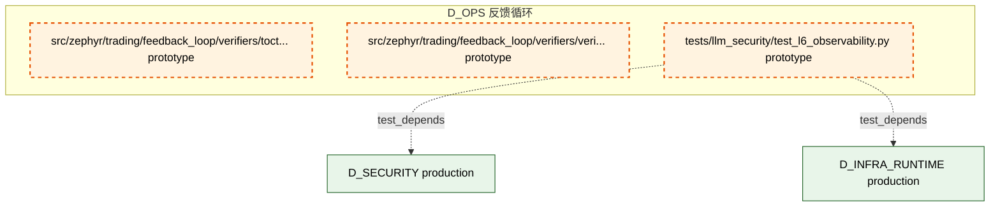

# 16_d_ops / 反馈循环

> **文档作用 / Purpose**: 展示 反馈循环（D_OPS）功能域的模块清单、域内依赖关系、跨域依赖关系、架构分层视图，供架构审查和域治理参考。

> 本文档由 generate_domain_doc.py 从 depgraph (PostgreSQL) 自动生成
> 最后更新: 2026-07-01 12:55:31
> 数据源: depgraph (PostgreSQL) nodes表 + edges表

## 域基本信息 / Domain Overview

| 字段 | 值 | Field | Value |
|------|------|-------|-------|
| 编号 | 16 | Number | 16 |
| 域ID | D_OPS | Domain ID | D_OPS |
| 域名称 | 反馈循环 | Domain Name | 反馈循环 |
| 层级 | L1_foundation | Layer | L1_foundation |
| 模块数 | 183 | Module Count | 183 |
| 域内依赖 | 164 | Internal Dependencies | 164 |
| 跨域入边 | 403 | Cross-domain Incoming | 403 |
| 跨域出边 | 53 | Cross-domain Outgoing | 53 |
| 设计态模块 | 1 | Design Modules | 1 |
| 原型态模块 | 179 | Prototype Modules | 179 |
| 生产态模块 | 3 | Production Modules | 3 |
| 容量 | 24/150 (正常) | Capacity | 24/150 (正常) |
| 描述 | 反馈收集器(collectors) | Description | 反馈收集器(collectors) |

## 域内依赖图 / Internal Dependency Diagram

> 依赖图内嵌在本文档中，IDE 可直接渲染显示。每30个节点一组分页显示。
>
> **图例说明 / Legend**：
> - **实线边框 = 运营态模块**（production，已上线运行）
> - **虚线边框 = 设计态模块**（design，还在设计中）
> - **实线箭头 = 运营态依赖**（已生效的依赖关系）
> - **虚线箭头 = 设计态依赖**（计划中的依赖关系）

### 第 1 页 / 共 7 页 / Page 1 of 7

```mermaid
graph TD
    subgraph D_OPS["D_OPS 反馈循环"]
        docs_03_modules_domain_infra_ops_system_telemetry_blueprint_md["docs__03_modules___domain_infra_ops__system_tel... design"]
        scripts_ops_upgrade_headers_to_14fields_py["scripts/ops/upgrade_headers_to_14fields.py production"]
        src_zephyr_governance_observability_governance_init_py["src/zephyr/governance/observability_governance/... prototype"]
        src_zephyr_governance_observability_governance_benchmark_integrity_py["src/zephyr/governance/observability_governance/... prototype"]
        src_zephyr_governance_observability_governance_observability_dashboard_py["src/zephyr/governance/observability_governance/... production"]
        src_zephyr_governance_observability_governance_performance_baseline_py["src/zephyr/governance/observability_governance/... prototype"]
        src_zephyr_governance_observability_governance_provenance_tracker_py["src/zephyr/governance/observability_governance/... prototype"]
        src_zephyr_trading_feedback_loop_init_py["src/zephyr/trading/feedback_loop/__init__.py production"]
        src_zephyr_trading_feedback_loop_gen_inherited_py["src/zephyr/trading/feedback_loop/_gen_inherited.py prototype"]
        src_zephyr_trading_feedback_loop_actors_init_py["src/zephyr/trading/feedback_loop/actors/__init_... prototype"]
        src_zephyr_trading_feedback_loop_actors_action_selector_py["src/zephyr/trading/feedback_loop/actors/action_... prototype"]
        src_zephyr_trading_feedback_loop_actors_agent_lifecycle_py["src/zephyr/trading/feedback_loop/actors/agent_l... prototype"]
        src_zephyr_trading_feedback_loop_actors_alert_router_py["src/zephyr/trading/feedback_loop/actors/alert_r... prototype"]
        src_zephyr_trading_feedback_loop_actors_api_version_contract_py["src/zephyr/trading/feedback_loop/actors/api_ver... prototype"]
        src_zephyr_trading_feedback_loop_actors_global_action_scheduler_py["src/zephyr/trading/feedback_loop/actors/global_... prototype"]
        src_zephyr_trading_feedback_loop_actors_incident_priority_triage_automator_py["src/zephyr/trading/feedback_loop/actors/inciden... prototype"]
        src_zephyr_trading_feedback_loop_actors_intent_driven_ops_py["src/zephyr/trading/feedback_loop/actors/intent_... prototype"]
        src_zephyr_trading_feedback_loop_actors_multi_agent_orchestrator_py["src/zephyr/trading/feedback_loop/actors/multi_a... prototype"]
        src_zephyr_trading_feedback_loop_actors_notification_personalizer_py["src/zephyr/trading/feedback_loop/actors/notific... prototype"]
        src_zephyr_trading_feedback_loop_actors_owner_absence_escalation_py["src/zephyr/trading/feedback_loop/actors/owner_a... prototype"]
        src_zephyr_trading_feedback_loop_actors_saga_compensator_py["src/zephyr/trading/feedback_loop/actors/saga_co... prototype"]
        src_zephyr_trading_feedback_loop_actors_secondary_alert_channel_py["src/zephyr/trading/feedback_loop/actors/seconda... prototype"]
        src_zephyr_trading_feedback_loop_alert_dispatcher_py["src/zephyr/trading/feedback_loop/alert_dispatch... prototype"]
        src_zephyr_trading_feedback_loop_auto_evolution_py["src/zephyr/trading/feedback_loop/auto_evolution.py prototype"]
        src_zephyr_trading_feedback_loop_backpressure_bridge_py["src/zephyr/trading/feedback_loop/backpressure_b... prototype"]
        src_zephyr_trading_feedback_loop_collectors_init_py["src/zephyr/trading/feedback_loop/collectors/__i... prototype"]
        src_zephyr_trading_feedback_loop_collectors_calendar_adapter_py["src/zephyr/trading/feedback_loop/collectors/cal... prototype"]
        src_zephyr_trading_feedback_loop_collectors_config_timeline_py["src/zephyr/trading/feedback_loop/collectors/con... prototype"]
        src_zephyr_trading_feedback_loop_collectors_data_quality_validator_py["src/zephyr/trading/feedback_loop/collectors/dat... prototype"]
        src_zephyr_trading_feedback_loop_collectors_feedback_collector_py["src/zephyr/trading/feedback_loop/collectors/fee... prototype"]
    end
    src_zephyr_governance_observability_governance_benchmark_integrity_py -.->|config_depends| src_zephyr_governance_observability_governance_init_py
    src_zephyr_governance_observability_governance_provenance_tracker_py -.->|config_depends| src_zephyr_governance_observability_governance_init_py
    src_zephyr_governance_observability_governance_performance_baseline_py -.->|config_depends| src_zephyr_governance_observability_governance_init_py
    src_zephyr_trading_feedback_loop_auto_evolution_py -.->|import_depends| src_zephyr_trading_feedback_loop_init_py
    src_zephyr_trading_feedback_loop_backpressure_bridge_py -.->|import_depends| src_zephyr_trading_feedback_loop_init_py
    src_zephyr_trading_feedback_loop_actors_action_selector_py -.->|import_depends| src_zephyr_trading_feedback_loop_init_py
    src_zephyr_trading_feedback_loop_gen_inherited_py -.->|config_depends| src_zephyr_trading_feedback_loop_init_py
    src_zephyr_trading_feedback_loop_actors_init_py -.->|import_depends| src_zephyr_trading_feedback_loop_actors_action_selector_py
    src_zephyr_trading_feedback_loop_actors_init_py -.->|import_depends| src_zephyr_trading_feedback_loop_actors_api_version_contract_py
    src_zephyr_trading_feedback_loop_actors_init_py -.->|import_depends| src_zephyr_trading_feedback_loop_actors_agent_lifecycle_py
    src_zephyr_trading_feedback_loop_actors_init_py -.->|import_depends| src_zephyr_trading_feedback_loop_actors_alert_router_py
    src_zephyr_trading_feedback_loop_actors_init_py -.->|import_depends| src_zephyr_trading_feedback_loop_actors_global_action_scheduler_py
    src_zephyr_trading_feedback_loop_actors_init_py -.->|import_depends| src_zephyr_trading_feedback_loop_actors_incident_priority_triage_automator_py
    src_zephyr_trading_feedback_loop_actors_init_py -.->|import_depends| src_zephyr_trading_feedback_loop_actors_owner_absence_escalation_py
    src_zephyr_trading_feedback_loop_actors_init_py -.->|import_depends| src_zephyr_trading_feedback_loop_actors_saga_compensator_py
    src_zephyr_trading_feedback_loop_actors_init_py -.->|import_depends| src_zephyr_trading_feedback_loop_actors_multi_agent_orchestrator_py
    src_zephyr_trading_feedback_loop_actors_init_py -.->|import_depends| src_zephyr_trading_feedback_loop_actors_intent_driven_ops_py
    src_zephyr_trading_feedback_loop_actors_init_py -.->|import_depends| src_zephyr_trading_feedback_loop_actors_notification_personalizer_py
    src_zephyr_trading_feedback_loop_actors_init_py -.->|import_depends| src_zephyr_trading_feedback_loop_actors_secondary_alert_channel_py
    src_zephyr_trading_feedback_loop_collectors_init_py -.->|import_depends| src_zephyr_trading_feedback_loop_collectors_calendar_adapter_py
    src_zephyr_trading_feedback_loop_collectors_init_py -.->|import_depends| src_zephyr_trading_feedback_loop_collectors_config_timeline_py
    src_zephyr_trading_feedback_loop_collectors_init_py -.->|import_depends| src_zephyr_trading_feedback_loop_collectors_data_quality_validator_py
    src_zephyr_trading_feedback_loop_collectors_init_py -.->|import_depends| src_zephyr_trading_feedback_loop_collectors_feedback_collector_py
    D_TRADING["D_TRADING production"]
    src_zephyr_trading_feedback_loop_alert_dispatcher_py -.->|import_depends| D_TRADING
    D_SHARED["D_SHARED production"]
    src_zephyr_trading_feedback_loop_auto_evolution_py -.->|import_depends| D_SHARED
    src_zephyr_trading_feedback_loop_auto_evolution_py -.->|import_depends| D_SHARED
    src_zephyr_trading_feedback_loop_auto_evolution_py -.->|import_depends| D_SHARED
    src_zephyr_trading_feedback_loop_auto_evolution_py -.->|import_depends| D_SHARED
    D_INTEGRATION["D_INTEGRATION production"]
    src_zephyr_trading_feedback_loop_backpressure_bridge_py -.->|import_depends| D_INTEGRATION
    D_FRONTEND["D_FRONTEND prototype"]
    D_FRONTEND -.->|import_depends| src_zephyr_trading_feedback_loop_init_py
    classDef production fill:#e1f5fe,stroke:#01579b,stroke-width:2px,color:#000
    classDef design fill:#fff3e0,stroke:#e65100,stroke-width:2px,color:#000,stroke-dasharray: 5 5
    classDef external_prod fill:#e8f5e9,stroke:#1b5e20,stroke-width:1px,color:#000
    classDef external_design fill:#fce4ec,stroke:#880e4f,stroke-width:1px,color:#000,stroke-dasharray: 5 5
    class scripts_ops_upgrade_headers_to_14fields_py,src_zephyr_governance_observability_governance_observability_dashboard_py,src_zephyr_trading_feedback_loop_init_py production
    class docs_03_modules_domain_infra_ops_system_telemetry_blueprint_md,src_zephyr_governance_observability_governance_init_py,src_zephyr_governance_observability_governance_benchmark_integrity_py,src_zephyr_governance_observability_governance_performance_baseline_py,src_zephyr_governance_observability_governance_provenance_tracker_py,src_zephyr_trading_feedback_loop_gen_inherited_py,src_zephyr_trading_feedback_loop_actors_init_py,src_zephyr_trading_feedback_loop_actors_action_selector_py,src_zephyr_trading_feedback_loop_actors_agent_lifecycle_py,src_zephyr_trading_feedback_loop_actors_alert_router_py,src_zephyr_trading_feedback_loop_actors_api_version_contract_py,src_zephyr_trading_feedback_loop_actors_global_action_scheduler_py,src_zephyr_trading_feedback_loop_actors_incident_priority_triage_automator_py,src_zephyr_trading_feedback_loop_actors_intent_driven_ops_py,src_zephyr_trading_feedback_loop_actors_multi_agent_orchestrator_py,src_zephyr_trading_feedback_loop_actors_notification_personalizer_py,src_zephyr_trading_feedback_loop_actors_owner_absence_escalation_py,src_zephyr_trading_feedback_loop_actors_saga_compensator_py,src_zephyr_trading_feedback_loop_actors_secondary_alert_channel_py,src_zephyr_trading_feedback_loop_alert_dispatcher_py,src_zephyr_trading_feedback_loop_auto_evolution_py,src_zephyr_trading_feedback_loop_backpressure_bridge_py,src_zephyr_trading_feedback_loop_collectors_init_py,src_zephyr_trading_feedback_loop_collectors_calendar_adapter_py,src_zephyr_trading_feedback_loop_collectors_config_timeline_py,src_zephyr_trading_feedback_loop_collectors_data_quality_validator_py,src_zephyr_trading_feedback_loop_collectors_feedback_collector_py design
    class D_TRADING,D_SHARED,D_INTEGRATION external_prod
    class D_FRONTEND external_design
```



### 第 2 页 / 共 7 页 / Page 2 of 7

```mermaid
graph TD
    subgraph D_OPS["D_OPS 反馈循环"]
        src_zephyr_trading_feedback_loop_collectors_financial_stratification_py["src/zephyr/trading/feedback_loop/collectors/fin... prototype"]
        src_zephyr_trading_feedback_loop_collectors_kb_provenance_py["src/zephyr/trading/feedback_loop/collectors/kb_... prototype"]
        src_zephyr_trading_feedback_loop_collectors_knowledge_capture_py["src/zephyr/trading/feedback_loop/collectors/kno... prototype"]
        src_zephyr_trading_feedback_loop_collectors_knowledge_freshness_py["src/zephyr/trading/feedback_loop/collectors/kno... prototype"]
        src_zephyr_trading_feedback_loop_collectors_knowledge_injection_py["src/zephyr/trading/feedback_loop/collectors/kno... prototype"]
        src_zephyr_trading_feedback_loop_collectors_knowledge_packaging_py["src/zephyr/trading/feedback_loop/collectors/kno... prototype"]
        src_zephyr_trading_feedback_loop_collectors_known_unknown_registry_py["src/zephyr/trading/feedback_loop/collectors/kno... prototype"]
        src_zephyr_trading_feedback_loop_collectors_llm_cost_accounting_py["src/zephyr/trading/feedback_loop/collectors/llm... prototype"]
        src_zephyr_trading_feedback_loop_collectors_market_calendar_py["src/zephyr/trading/feedback_loop/collectors/mar... prototype"]
        src_zephyr_trading_feedback_loop_collectors_market_event_integrator_py["src/zephyr/trading/feedback_loop/collectors/mar... prototype"]
        src_zephyr_trading_feedback_loop_collectors_metrics_collector_py["src/zephyr/trading/feedback_loop/collectors/met... prototype"]
        src_zephyr_trading_feedback_loop_collectors_notification_feedback_py["src/zephyr/trading/feedback_loop/collectors/not... prototype"]
        src_zephyr_trading_feedback_loop_collectors_schema_evolution_py["src/zephyr/trading/feedback_loop/collectors/sch... prototype"]
        src_zephyr_trading_feedback_loop_collectors_schema_migration_py["src/zephyr/trading/feedback_loop/collectors/sch... prototype"]
        src_zephyr_trading_feedback_loop_collectors_temporal_event_store_py["src/zephyr/trading/feedback_loop/collectors/tem... prototype"]
        src_zephyr_trading_feedback_loop_collectors_token_finops_py["src/zephyr/trading/feedback_loop/collectors/tok... prototype"]
        src_zephyr_trading_feedback_loop_config_py["src/zephyr/trading/feedback_loop/config.py prototype"]
        src_zephyr_trading_feedback_loop_db_bridge_py["src/zephyr/trading/feedback_loop/db_bridge.py prototype"]
        src_zephyr_trading_feedback_loop_db_writer_py["src/zephyr/trading/feedback_loop/db_writer.py prototype"]
        src_zephyr_trading_feedback_loop_decision_engine_py["src/zephyr/trading/feedback_loop/decision_engin... prototype"]
        src_zephyr_trading_feedback_loop_detectors_init_py["src/zephyr/trading/feedback_loop/detectors/__in... prototype"]
        src_zephyr_trading_feedback_loop_diagnosers_init_py["src/zephyr/trading/feedback_loop/diagnosers/__i... prototype"]
        src_zephyr_trading_feedback_loop_docs_init_py["src/zephyr/trading/feedback_loop/docs/__init__.py prototype"]
        src_zephyr_trading_feedback_loop_docs_cold_start_manual_py["src/zephyr/trading/feedback_loop/docs/cold_star... prototype"]
        src_zephyr_trading_feedback_loop_error_budget_py["src/zephyr/trading/feedback_loop/error_budget.py prototype"]
        src_zephyr_trading_feedback_loop_eval_harness_py["src/zephyr/trading/feedback_loop/eval_harness.py prototype"]
        src_zephyr_trading_feedback_loop_evolution_init_py["src/zephyr/trading/feedback_loop/evolution/__in... prototype"]
        src_zephyr_trading_feedback_loop_evolution_auto_reward_py["src/zephyr/trading/feedback_loop/evolution/auto... prototype"]
        src_zephyr_trading_feedback_loop_evolution_conformal_prediction_py["src/zephyr/trading/feedback_loop/evolution/conf... prototype"]
        src_zephyr_trading_feedback_loop_evolution_cross_gen_validation_py["src/zephyr/trading/feedback_loop/evolution/cros... prototype"]
    end
    src_zephyr_trading_feedback_loop_docs_init_py -.->|import_depends| src_zephyr_trading_feedback_loop_docs_cold_start_manual_py
    src_zephyr_trading_feedback_loop_evolution_init_py -.->|import_depends| src_zephyr_trading_feedback_loop_evolution_auto_reward_py
    src_zephyr_trading_feedback_loop_evolution_init_py -.->|import_depends| src_zephyr_trading_feedback_loop_evolution_conformal_prediction_py
    src_zephyr_trading_feedback_loop_evolution_init_py -.->|import_depends| src_zephyr_trading_feedback_loop_evolution_cross_gen_validation_py
    D_INFRA_RUNTIME["D_INFRA_RUNTIME production"]
    src_zephyr_trading_feedback_loop_db_writer_py -.->|import_depends| D_INFRA_RUNTIME
    D_GOVERNANCE["D_GOVERNANCE prototype"]
    src_zephyr_trading_feedback_loop_evolution_init_py -.->|import_depends| D_GOVERNANCE
    D_GOVERNANCE -.->|runtime| src_zephyr_trading_feedback_loop_collectors_knowledge_freshness_py
    classDef production fill:#e1f5fe,stroke:#01579b,stroke-width:2px,color:#000
    classDef design fill:#fff3e0,stroke:#e65100,stroke-width:2px,color:#000,stroke-dasharray: 5 5
    classDef external_prod fill:#e8f5e9,stroke:#1b5e20,stroke-width:1px,color:#000
    classDef external_design fill:#fce4ec,stroke:#880e4f,stroke-width:1px,color:#000,stroke-dasharray: 5 5
    class src_zephyr_trading_feedback_loop_collectors_financial_stratification_py,src_zephyr_trading_feedback_loop_collectors_kb_provenance_py,src_zephyr_trading_feedback_loop_collectors_knowledge_capture_py,src_zephyr_trading_feedback_loop_collectors_knowledge_freshness_py,src_zephyr_trading_feedback_loop_collectors_knowledge_injection_py,src_zephyr_trading_feedback_loop_collectors_knowledge_packaging_py,src_zephyr_trading_feedback_loop_collectors_known_unknown_registry_py,src_zephyr_trading_feedback_loop_collectors_llm_cost_accounting_py,src_zephyr_trading_feedback_loop_collectors_market_calendar_py,src_zephyr_trading_feedback_loop_collectors_market_event_integrator_py,src_zephyr_trading_feedback_loop_collectors_metrics_collector_py,src_zephyr_trading_feedback_loop_collectors_notification_feedback_py,src_zephyr_trading_feedback_loop_collectors_schema_evolution_py,src_zephyr_trading_feedback_loop_collectors_schema_migration_py,src_zephyr_trading_feedback_loop_collectors_temporal_event_store_py,src_zephyr_trading_feedback_loop_collectors_token_finops_py,src_zephyr_trading_feedback_loop_config_py,src_zephyr_trading_feedback_loop_db_bridge_py,src_zephyr_trading_feedback_loop_db_writer_py,src_zephyr_trading_feedback_loop_decision_engine_py,src_zephyr_trading_feedback_loop_detectors_init_py,src_zephyr_trading_feedback_loop_diagnosers_init_py,src_zephyr_trading_feedback_loop_docs_init_py,src_zephyr_trading_feedback_loop_docs_cold_start_manual_py,src_zephyr_trading_feedback_loop_error_budget_py,src_zephyr_trading_feedback_loop_eval_harness_py,src_zephyr_trading_feedback_loop_evolution_init_py,src_zephyr_trading_feedback_loop_evolution_auto_reward_py,src_zephyr_trading_feedback_loop_evolution_conformal_prediction_py,src_zephyr_trading_feedback_loop_evolution_cross_gen_validation_py design
    class D_INFRA_RUNTIME external_prod
    class D_GOVERNANCE external_design
```



### 第 3 页 / 共 7 页 / Page 3 of 7


### 第 4 页 / 共 7 页 / Page 4 of 7


### 第 5 页 / 共 7 页 / Page 5 of 7

```mermaid
graph TD
    subgraph D_OPS["D_OPS 反馈循环"]
        src_zephyr_trading_feedback_loop_gates_flag_lifecycle_manager_py["src/zephyr/trading/feedback_loop/gates/flag_lif... prototype"]
        src_zephyr_trading_feedback_loop_gates_license_compliance_py["src/zephyr/trading/feedback_loop/gates/license_... prototype"]
        src_zephyr_trading_feedback_loop_gates_llm_cost_router_py["src/zephyr/trading/feedback_loop/gates/llm_cost... prototype"]
        src_zephyr_trading_feedback_loop_gates_merkle_audit_root_py["src/zephyr/trading/feedback_loop/gates/merkle_a... prototype"]
        src_zephyr_trading_feedback_loop_gates_meta_performance_gate_py["src/zephyr/trading/feedback_loop/gates/meta_per... prototype"]
        src_zephyr_trading_feedback_loop_gates_parameterized_safety_gate_py["src/zephyr/trading/feedback_loop/gates/paramete... prototype"]
        src_zephyr_trading_feedback_loop_gates_safety_gate_l1_l27_py["src/zephyr/trading/feedback_loop/gates/safety_g... prototype"]
        src_zephyr_trading_feedback_loop_gates_scope_creep_monitor_py["src/zephyr/trading/feedback_loop/gates/scope_cr... prototype"]
        src_zephyr_trading_feedback_loop_generator_py["src/zephyr/trading/feedback_loop/generator.py prototype"]
        src_zephyr_trading_feedback_loop_metrics_collector_py["src/zephyr/trading/feedback_loop/metrics_collec... prototype"]
        src_zephyr_trading_feedback_loop_protocols_py["src/zephyr/trading/feedback_loop/protocols.py prototype"]
        src_zephyr_trading_feedback_loop_resilience_init_py["src/zephyr/trading/feedback_loop/resilience/__i... prototype"]
        src_zephyr_trading_feedback_loop_resilience_config_hot_reload_guard_py["src/zephyr/trading/feedback_loop/resilience/con... prototype"]
        src_zephyr_trading_feedback_loop_resilience_deadman_switch_py["src/zephyr/trading/feedback_loop/resilience/dea... prototype"]
        src_zephyr_trading_feedback_loop_resilience_dr_automation_py["src/zephyr/trading/feedback_loop/resilience/dr_... prototype"]
        src_zephyr_trading_feedback_loop_resilience_graceful_degradation_planner_py["src/zephyr/trading/feedback_loop/resilience/gra... prototype"]
        src_zephyr_trading_feedback_loop_resilience_multi_instance_coord_py["src/zephyr/trading/feedback_loop/resilience/mul... prototype"]
        src_zephyr_trading_feedback_loop_resilience_oscillation_damping_py["src/zephyr/trading/feedback_loop/resilience/osc... prototype"]
        src_zephyr_trading_feedback_loop_resilience_resource_starvation_aware_py["src/zephyr/trading/feedback_loop/resilience/res... prototype"]
        src_zephyr_trading_feedback_loop_resilience_self_api_throttle_defense_py["src/zephyr/trading/feedback_loop/resilience/sel... prototype"]
        src_zephyr_trading_feedback_loop_resilience_split_brain_quorum_py["src/zephyr/trading/feedback_loop/resilience/spl... prototype"]
        src_zephyr_trading_feedback_loop_scheduler_py["src/zephyr/trading/feedback_loop/scheduler.py prototype"]
        src_zephyr_trading_feedback_loop_scheduler_act_py["src/zephyr/trading/feedback_loop/scheduler_act.py prototype"]
        src_zephyr_trading_feedback_loop_scheduler_collect_detect_py["src/zephyr/trading/feedback_loop/scheduler_coll... prototype"]
        src_zephyr_trading_feedback_loop_scheduler_health_py["src/zephyr/trading/feedback_loop/scheduler_heal... prototype"]
        src_zephyr_trading_feedback_loop_scheduler_safety_py["src/zephyr/trading/feedback_loop/scheduler_safe... prototype"]
        src_zephyr_trading_feedback_loop_security_init_py["src/zephyr/trading/feedback_loop/security/__ini... prototype"]
        src_zephyr_trading_feedback_loop_security_agent_skill_guard_py["src/zephyr/trading/feedback_loop/security/agent... prototype"]
        src_zephyr_trading_feedback_loop_security_dep_cve_correlator_py["src/zephyr/trading/feedback_loop/security/dep_c... prototype"]
        src_zephyr_trading_feedback_loop_security_metric_prompt_scanner_py["src/zephyr/trading/feedback_loop/security/metri... prototype"]
    end
    src_zephyr_trading_feedback_loop_resilience_init_py -.->|import_depends| src_zephyr_trading_feedback_loop_resilience_deadman_switch_py
    src_zephyr_trading_feedback_loop_resilience_init_py -.->|import_depends| src_zephyr_trading_feedback_loop_resilience_dr_automation_py
    src_zephyr_trading_feedback_loop_resilience_init_py -.->|import_depends| src_zephyr_trading_feedback_loop_resilience_config_hot_reload_guard_py
    src_zephyr_trading_feedback_loop_resilience_init_py -.->|import_depends| src_zephyr_trading_feedback_loop_resilience_multi_instance_coord_py
    src_zephyr_trading_feedback_loop_resilience_init_py -.->|import_depends| src_zephyr_trading_feedback_loop_resilience_oscillation_damping_py
    src_zephyr_trading_feedback_loop_resilience_init_py -.->|import_depends| src_zephyr_trading_feedback_loop_resilience_graceful_degradation_planner_py
    src_zephyr_trading_feedback_loop_resilience_init_py -.->|import_depends| src_zephyr_trading_feedback_loop_resilience_resource_starvation_aware_py
    src_zephyr_trading_feedback_loop_resilience_init_py -.->|import_depends| src_zephyr_trading_feedback_loop_resilience_self_api_throttle_defense_py
    src_zephyr_trading_feedback_loop_resilience_init_py -.->|import_depends| src_zephyr_trading_feedback_loop_resilience_split_brain_quorum_py
    src_zephyr_trading_feedback_loop_security_init_py -.->|import_depends| src_zephyr_trading_feedback_loop_security_agent_skill_guard_py
    src_zephyr_trading_feedback_loop_security_init_py -.->|import_depends| src_zephyr_trading_feedback_loop_security_dep_cve_correlator_py
    src_zephyr_trading_feedback_loop_security_init_py -.->|import_depends| src_zephyr_trading_feedback_loop_security_metric_prompt_scanner_py
    D_GOV_DRIFT["D_GOV_DRIFT production"]
    src_zephyr_trading_feedback_loop_scheduler_py -.->|import_depends| D_GOV_DRIFT
    D_INFRA_RUNTIME["D_INFRA_RUNTIME production"]
    src_zephyr_trading_feedback_loop_scheduler_py -.->|import_depends| D_INFRA_RUNTIME
    D_AUTONOMY_CORE["D_AUTONOMY_CORE production"]
    src_zephyr_trading_feedback_loop_scheduler_py -.->|import_depends| D_AUTONOMY_CORE
    D_GOVERNANCE["D_GOVERNANCE production"]
    src_zephyr_trading_feedback_loop_scheduler_py -.->|import_depends| D_GOVERNANCE
    src_zephyr_trading_feedback_loop_scheduler_act_py -.->|import_depends| D_GOVERNANCE
    D_GOVERNANCE -.->|runtime| src_zephyr_trading_feedback_loop_protocols_py
    D_GOVERNANCE -.->|runtime| src_zephyr_trading_feedback_loop_scheduler_act_py
    D_GOVERNANCE -.->|runtime| src_zephyr_trading_feedback_loop_scheduler_collect_detect_py
    D_GOVERNANCE -.->|runtime| src_zephyr_trading_feedback_loop_scheduler_health_py
    D_GOVERNANCE -.->|runtime| src_zephyr_trading_feedback_loop_scheduler_safety_py
    classDef production fill:#e1f5fe,stroke:#01579b,stroke-width:2px,color:#000
    classDef design fill:#fff3e0,stroke:#e65100,stroke-width:2px,color:#000,stroke-dasharray: 5 5
    classDef external_prod fill:#e8f5e9,stroke:#1b5e20,stroke-width:1px,color:#000
    classDef external_design fill:#fce4ec,stroke:#880e4f,stroke-width:1px,color:#000,stroke-dasharray: 5 5
    class src_zephyr_trading_feedback_loop_gates_flag_lifecycle_manager_py,src_zephyr_trading_feedback_loop_gates_license_compliance_py,src_zephyr_trading_feedback_loop_gates_llm_cost_router_py,src_zephyr_trading_feedback_loop_gates_merkle_audit_root_py,src_zephyr_trading_feedback_loop_gates_meta_performance_gate_py,src_zephyr_trading_feedback_loop_gates_parameterized_safety_gate_py,src_zephyr_trading_feedback_loop_gates_safety_gate_l1_l27_py,src_zephyr_trading_feedback_loop_gates_scope_creep_monitor_py,src_zephyr_trading_feedback_loop_generator_py,src_zephyr_trading_feedback_loop_metrics_collector_py,src_zephyr_trading_feedback_loop_protocols_py,src_zephyr_trading_feedback_loop_resilience_init_py,src_zephyr_trading_feedback_loop_resilience_config_hot_reload_guard_py,src_zephyr_trading_feedback_loop_resilience_deadman_switch_py,src_zephyr_trading_feedback_loop_resilience_dr_automation_py,src_zephyr_trading_feedback_loop_resilience_graceful_degradation_planner_py,src_zephyr_trading_feedback_loop_resilience_multi_instance_coord_py,src_zephyr_trading_feedback_loop_resilience_oscillation_damping_py,src_zephyr_trading_feedback_loop_resilience_resource_starvation_aware_py,src_zephyr_trading_feedback_loop_resilience_self_api_throttle_defense_py,src_zephyr_trading_feedback_loop_resilience_split_brain_quorum_py,src_zephyr_trading_feedback_loop_scheduler_py,src_zephyr_trading_feedback_loop_scheduler_act_py,src_zephyr_trading_feedback_loop_scheduler_collect_detect_py,src_zephyr_trading_feedback_loop_scheduler_health_py,src_zephyr_trading_feedback_loop_scheduler_safety_py,src_zephyr_trading_feedback_loop_security_init_py,src_zephyr_trading_feedback_loop_security_agent_skill_guard_py,src_zephyr_trading_feedback_loop_security_dep_cve_correlator_py,src_zephyr_trading_feedback_loop_security_metric_prompt_scanner_py design
    class D_GOV_DRIFT,D_INFRA_RUNTIME,D_AUTONOMY_CORE,D_GOVERNANCE external_prod
```



### 第 6 页 / 共 7 页 / Page 6 of 7


### 第 7 页 / 共 7 页 / Page 7 of 7



## 跨域依赖 / Cross-domain Dependencies

### 本域依赖的其他域（出边）/ Depends On

| 目标域 / Target Domain | 依赖数 / Count | 依赖类型 / Type |
|--------|:---:|---------|
| D_GOVERNANCE | 20 | config_depends,import_depends,test_depends |
| D_INFRA_RUNTIME | 11 | import_depends,test_depends |
| D_AUTONOMY_CORE | 6 | import_depends,test_depends |
| D_SHARED | 5 | import_depends |
| D_SECURITY | 4 | import_depends,test_depends |
| D_INTEGRATION | 2 | import_depends |
| D_BEHAVIORAL_AUDIT | 2 | import_depends |
| D_GOV_AUDIT | 1 | test_depends |
| D_GOV_DRIFT | 1 | import_depends |
| D_TRADING | 1 | import_depends |

### 依赖本域的其他域（入边）/ Depended By

| 源域 / Source Domain | 依赖数 / Count | 依赖类型 / Type |
|------|:---:|---------|
| D_GOVERNANCE | 393 | config_depends,import_depends,runtime,test_depends |
| D_FRONTEND | 2 | import_depends |
| D_GOV_SCRIPTS | 2 | import_depends |
| D_TRADING | 2 | import_depends |
| D_INFRA_OPS | 1 | import_depends |
| D_AUDITTEST | 1 | test_depends |
| D_INFRA_RUNTIME | 1 | import_depends |
| D_INTEGRATION | 1 | import_depends |

## 架构分层视图 / Architecture Overview

> 按 architecture_layer 分层显示 反馈循环（D_OPS）的模块分布。共 183 个模块 / 183 modules。

```

┌──────────────────────────────────────────────────────────────────┐
│            L1 基础层 / Foundation Layer (182 modules)            │
├──────────────────────────────────────────────────────────────────┤
│   docs__03_modules___domain_infra_ops__system_telemetry__blue... │
│   src/zephyr/governance/observability_governance/__init__.py ... │
│   src/zephyr/governance/observability_governance/benchmark_in... │
│   src/zephyr/governance/observability_governance/observabilit... │
│   src/zephyr/governance/observability_governance/performance_... │
│   src/zephyr/governance/observability_governance/provenance_t... │
│   src/zephyr/trading/feedback_loop/__init__.py  [production]     │
│   src/zephyr/trading/feedback_loop/_gen_inherited.py  [protot... │
│   src/zephyr/trading/feedback_loop/actors/__init__.py  [proto... │
│   src/zephyr/trading/feedback_loop/actors/action_selector.py ... │
│   src/zephyr/trading/feedback_loop/actors/agent_lifecycle.py ... │
│   src/zephyr/trading/feedback_loop/actors/alert_router.py  [p... │
│   src/zephyr/trading/feedback_loop/actors/api_version_contrac... │
│   src/zephyr/trading/feedback_loop/actors/global_action_sched... │
│   src/zephyr/trading/feedback_loop/actors/incident_priority_t... │
│   src/zephyr/trading/feedback_loop/actors/intent_driven_ops.p... │
│   src/zephyr/trading/feedback_loop/actors/multi_agent_orchest... │
│   src/zephyr/trading/feedback_loop/actors/notification_person... │
│   ...还有 164 个模块 / 164 more modules                          │
└──────────────────────────────────────────────────────────────────┘
                                  │
                                  ▼
┌──────────────────────────────────────────────────────────────────┐
│                未分类 / Unclassified (1 modules)                 │
├──────────────────────────────────────────────────────────────────┤
│   scripts/ops/upgrade_headers_to_14fields.py  [production]       │
└──────────────────────────────────────────────────────────────────┘

```

## 模块分层清单 / Module Layered List

> 按 architecture_layer 分组的模块清单（共 183 个模块 / 183 modules）。

### L1 基础层 / Foundation Layer (182 modules)

| # | 模块路径 / Module Path | 模块名称 / Module Name | 成熟度 / Maturity | 构建状态 / Build Status |
|:--:|---------|---------|:---:|:---:|
| 1 | docs/03_modules/_domain_infra_ops/system_telemetry/bluepr... | docs__03_modules___domain_infra_ops__... | design | planned |
| 2 | src/zephyr/governance/observability_governance/__init__.py | src/zephyr/governance/observability_g... | prototype | generated |
| 3 | src/zephyr/governance/observability_governance/benchmark_... | src/zephyr/governance/observability_g... | prototype | generated |
| 4 | src/zephyr/governance/observability_governance/observabil... | src/zephyr/governance/observability_g... | production | generated |
| 5 | src/zephyr/governance/observability_governance/performanc... | src/zephyr/governance/observability_g... | prototype | generated |
| 6 | src/zephyr/governance/observability_governance/provenance... | src/zephyr/governance/observability_g... | prototype | generated |
| 7 | src/zephyr/trading/feedback_loop/__init__.py | src/zephyr/trading/feedback_loop/__in... | production | generated |
| 8 | src/zephyr/trading/feedback_loop/_gen_inherited.py | src/zephyr/trading/feedback_loop/_gen... | prototype | generated |
| 9 | src/zephyr/trading/feedback_loop/actors/__init__.py | src/zephyr/trading/feedback_loop/acto... | prototype | generated |
| 10 | src/zephyr/trading/feedback_loop/actors/action_selector.py | src/zephyr/trading/feedback_loop/acto... | prototype | generated |
| 11 | src/zephyr/trading/feedback_loop/actors/agent_lifecycle.py | src/zephyr/trading/feedback_loop/acto... | prototype | generated |
| 12 | src/zephyr/trading/feedback_loop/actors/alert_router.py | src/zephyr/trading/feedback_loop/acto... | prototype | generated |
| 13 | src/zephyr/trading/feedback_loop/actors/api_version_contr... | src/zephyr/trading/feedback_loop/acto... | prototype | generated |
| 14 | src/zephyr/trading/feedback_loop/actors/global_action_sch... | src/zephyr/trading/feedback_loop/acto... | prototype | generated |
| 15 | src/zephyr/trading/feedback_loop/actors/incident_priority... | src/zephyr/trading/feedback_loop/acto... | prototype | generated |
| 16 | src/zephyr/trading/feedback_loop/actors/intent_driven_ops.py | src/zephyr/trading/feedback_loop/acto... | prototype | generated |
| 17 | src/zephyr/trading/feedback_loop/actors/multi_agent_orche... | src/zephyr/trading/feedback_loop/acto... | prototype | generated |
| 18 | src/zephyr/trading/feedback_loop/actors/notification_pers... | src/zephyr/trading/feedback_loop/acto... | prototype | generated |
| 19 | src/zephyr/trading/feedback_loop/actors/owner_absence_esc... | src/zephyr/trading/feedback_loop/acto... | prototype | generated |
| 20 | src/zephyr/trading/feedback_loop/actors/saga_compensator.py | src/zephyr/trading/feedback_loop/acto... | prototype | generated |
| 21 | src/zephyr/trading/feedback_loop/actors/secondary_alert_c... | src/zephyr/trading/feedback_loop/acto... | prototype | generated |
| 22 | src/zephyr/trading/feedback_loop/alert_dispatcher.py | src/zephyr/trading/feedback_loop/aler... | prototype | generated |
| 23 | src/zephyr/trading/feedback_loop/auto_evolution.py | src/zephyr/trading/feedback_loop/auto... | prototype | generated |
| 24 | src/zephyr/trading/feedback_loop/backpressure_bridge.py | src/zephyr/trading/feedback_loop/back... | prototype | generated |
| 25 | src/zephyr/trading/feedback_loop/collectors/__init__.py | src/zephyr/trading/feedback_loop/coll... | prototype | generated |
| 26 | src/zephyr/trading/feedback_loop/collectors/calendar_adap... | src/zephyr/trading/feedback_loop/coll... | prototype | generated |
| 27 | src/zephyr/trading/feedback_loop/collectors/config_timeli... | src/zephyr/trading/feedback_loop/coll... | prototype | generated |
| 28 | src/zephyr/trading/feedback_loop/collectors/data_quality_... | src/zephyr/trading/feedback_loop/coll... | prototype | generated |
| 29 | src/zephyr/trading/feedback_loop/collectors/feedback_coll... | src/zephyr/trading/feedback_loop/coll... | prototype | generated |
| 30 | src/zephyr/trading/feedback_loop/collectors/financial_str... | src/zephyr/trading/feedback_loop/coll... | prototype | generated |
| 31 | src/zephyr/trading/feedback_loop/collectors/kb_provenance.py | src/zephyr/trading/feedback_loop/coll... | prototype | generated |
| 32 | src/zephyr/trading/feedback_loop/collectors/knowledge_cap... | src/zephyr/trading/feedback_loop/coll... | prototype | generated |
| 33 | src/zephyr/trading/feedback_loop/collectors/knowledge_fre... | src/zephyr/trading/feedback_loop/coll... | prototype | generated |
| 34 | src/zephyr/trading/feedback_loop/collectors/knowledge_inj... | src/zephyr/trading/feedback_loop/coll... | prototype | generated |
| 35 | src/zephyr/trading/feedback_loop/collectors/knowledge_pac... | src/zephyr/trading/feedback_loop/coll... | prototype | generated |
| 36 | src/zephyr/trading/feedback_loop/collectors/known_unknown... | src/zephyr/trading/feedback_loop/coll... | prototype | generated |
| 37 | src/zephyr/trading/feedback_loop/collectors/llm_cost_acco... | src/zephyr/trading/feedback_loop/coll... | prototype | generated |
| 38 | src/zephyr/trading/feedback_loop/collectors/market_calend... | src/zephyr/trading/feedback_loop/coll... | prototype | generated |
| 39 | src/zephyr/trading/feedback_loop/collectors/market_event_... | src/zephyr/trading/feedback_loop/coll... | prototype | generated |
| 40 | src/zephyr/trading/feedback_loop/collectors/metrics_colle... | src/zephyr/trading/feedback_loop/coll... | prototype | generated |
| 41 | src/zephyr/trading/feedback_loop/collectors/notification_... | src/zephyr/trading/feedback_loop/coll... | prototype | generated |
| 42 | src/zephyr/trading/feedback_loop/collectors/schema_evolut... | src/zephyr/trading/feedback_loop/coll... | prototype | generated |
| 43 | src/zephyr/trading/feedback_loop/collectors/schema_migrat... | src/zephyr/trading/feedback_loop/coll... | prototype | generated |
| 44 | src/zephyr/trading/feedback_loop/collectors/temporal_even... | src/zephyr/trading/feedback_loop/coll... | prototype | generated |
| 45 | src/zephyr/trading/feedback_loop/collectors/token_finops.py | src/zephyr/trading/feedback_loop/coll... | prototype | generated |
| 46 | src/zephyr/trading/feedback_loop/config.py | src/zephyr/trading/feedback_loop/conf... | prototype | generated |
| 47 | src/zephyr/trading/feedback_loop/db_bridge.py | src/zephyr/trading/feedback_loop/db_b... | prototype | generated |
| 48 | src/zephyr/trading/feedback_loop/db_writer.py | src/zephyr/trading/feedback_loop/db_w... | prototype | generated |
| 49 | src/zephyr/trading/feedback_loop/decision_engine.py | src/zephyr/trading/feedback_loop/deci... | prototype | generated |
| 50 | src/zephyr/trading/feedback_loop/detectors/__init__.py | src/zephyr/trading/feedback_loop/dete... | prototype | generated |
| 51 | src/zephyr/trading/feedback_loop/diagnosers/__init__.py | src/zephyr/trading/feedback_loop/diag... | prototype | generated |
| 52 | src/zephyr/trading/feedback_loop/docs/__init__.py | src/zephyr/trading/feedback_loop/docs... | prototype | generated |
| 53 | src/zephyr/trading/feedback_loop/docs/cold_start_manual.py | src/zephyr/trading/feedback_loop/docs... | prototype | generated |
| 54 | src/zephyr/trading/feedback_loop/error_budget.py | src/zephyr/trading/feedback_loop/erro... | prototype | generated |
| 55 | src/zephyr/trading/feedback_loop/eval_harness.py | src/zephyr/trading/feedback_loop/eval... | prototype | generated |
| 56 | src/zephyr/trading/feedback_loop/evolution/__init__.py | src/zephyr/trading/feedback_loop/evol... | prototype | generated |
| 57 | src/zephyr/trading/feedback_loop/evolution/auto_reward.py | src/zephyr/trading/feedback_loop/evol... | prototype | generated |
| 58 | src/zephyr/trading/feedback_loop/evolution/conformal_pred... | src/zephyr/trading/feedback_loop/evol... | prototype | generated |
| 59 | src/zephyr/trading/feedback_loop/evolution/cross_gen_vali... | src/zephyr/trading/feedback_loop/evol... | prototype | generated |
| 60 | src/zephyr/trading/feedback_loop/evolution/dynamic_thresh... | src/zephyr/trading/feedback_loop/evol... | prototype | generated |
| 61 | src/zephyr/trading/feedback_loop/evolution/ewc_kb_review.py | src/zephyr/trading/feedback_loop/evol... | prototype | generated |
| 62 | src/zephyr/trading/feedback_loop/evolution/failure_replay.py | src/zephyr/trading/feedback_loop/evol... | prototype | generated |
| 63 | src/zephyr/trading/feedback_loop/evolution/graduated_acti... | src/zephyr/trading/feedback_loop/evol... | prototype | generated |
| 64 | src/zephyr/trading/feedback_loop/evolution/hypernetwork.py | src/zephyr/trading/feedback_loop/evol... | prototype | generated |
| 65 | src/zephyr/trading/feedback_loop/evolution/knowledge_dist... | src/zephyr/trading/feedback_loop/evol... | prototype | generated |
| 66 | src/zephyr/trading/feedback_loop/evolution/online_feature... | src/zephyr/trading/feedback_loop/evol... | prototype | generated |
| 67 | src/zephyr/trading/feedback_loop/evolution/prompt_optimiz... | src/zephyr/trading/feedback_loop/evol... | prototype | generated |
| 68 | src/zephyr/trading/feedback_loop/evolution/prompt_self_op... | src/zephyr/trading/feedback_loop/evol... | prototype | generated |
| 69 | src/zephyr/trading/feedback_loop/evolution/self_modificat... | src/zephyr/trading/feedback_loop/evol... | prototype | generated |
| 70 | src/zephyr/trading/feedback_loop/evolution/self_reflectio... | src/zephyr/trading/feedback_loop/evol... | prototype | generated |
| 71 | src/zephyr/trading/feedback_loop/evolution/self_upgrade_c... | src/zephyr/trading/feedback_loop/evol... | prototype | generated |
| 72 | src/zephyr/trading/feedback_loop/evolution/semantic_inten... | src/zephyr/trading/feedback_loop/evol... | prototype | generated |
| 73 | src/zephyr/trading/feedback_loop/evolution/teacher_transf... | src/zephyr/trading/feedback_loop/evol... | prototype | generated |
| 74 | src/zephyr/trading/feedback_loop/evolution/training_data_... | src/zephyr/trading/feedback_loop/evol... | prototype | generated |
| 75 | src/zephyr/trading/feedback_loop/evolution_engine.py | src/zephyr/trading/feedback_loop/evol... | prototype | generated |
| 76 | src/zephyr/trading/feedback_loop/exceptions.py | src/zephyr/trading/feedback_loop/exce... | prototype | generated |
| 77 | src/zephyr/trading/feedback_loop/feedback_collector.py | src/zephyr/trading/feedback_loop/feed... | prototype | generated |
| 78 | src/zephyr/trading/feedback_loop/fitness_functions.py | src/zephyr/trading/feedback_loop/fitn... | prototype | generated |
| 79 | src/zephyr/trading/feedback_loop/forensic/__init__.py | src/zephyr/trading/feedback_loop/fore... | prototype | generated |
| 80 | src/zephyr/trading/feedback_loop/forensic/architectural_s... | src/zephyr/trading/feedback_loop/fore... | prototype | generated |
| 81 | src/zephyr/trading/feedback_loop/forensic/automated_rca_p... | src/zephyr/trading/feedback_loop/fore... | prototype | generated |
| 82 | src/zephyr/trading/feedback_loop/forensic/boot_integrity_... | src/zephyr/trading/feedback_loop/fore... | prototype | generated |
| 83 | src/zephyr/trading/feedback_loop/forensic/crypto_bootstra... | src/zephyr/trading/feedback_loop/fore... | prototype | generated |
| 84 | src/zephyr/trading/feedback_loop/forensic/deterministic_r... | src/zephyr/trading/feedback_loop/fore... | prototype | generated |
| 85 | src/zephyr/trading/feedback_loop/forensic/external_verifi... | src/zephyr/trading/feedback_loop/fore... | prototype | generated |
| 86 | src/zephyr/trading/feedback_loop/forensic/fle_upgrade_saf... | src/zephyr/trading/feedback_loop/fore... | prototype | generated |
| 87 | src/zephyr/trading/feedback_loop/forensic/guard_complexit... | src/zephyr/trading/feedback_loop/fore... | prototype | generated |
| 88 | src/zephyr/trading/feedback_loop/forensic/guard_configura... | src/zephyr/trading/feedback_loop/fore... | prototype | generated |
| 89 | src/zephyr/trading/feedback_loop/forensic/interrupt_coher... | src/zephyr/trading/feedback_loop/fore... | prototype | generated |
| 90 | src/zephyr/trading/feedback_loop/forensic/knowledge_injec... | src/zephyr/trading/feedback_loop/fore... | prototype | generated |
| 91 | src/zephyr/trading/feedback_loop/forensic/point_in_time_r... | src/zephyr/trading/feedback_loop/fore... | prototype | generated |
| 92 | src/zephyr/trading/feedback_loop/forensic/self_modificati... | src/zephyr/trading/feedback_loop/fore... | prototype | generated |
| 93 | src/zephyr/trading/feedback_loop/forensic/serialization_f... | src/zephyr/trading/feedback_loop/fore... | prototype | generated |
| 94 | src/zephyr/trading/feedback_loop/forensic/state_migration... | src/zephyr/trading/feedback_loop/fore... | prototype | generated |
| 95 | src/zephyr/trading/feedback_loop/forensic/sub_agent_collu... | src/zephyr/trading/feedback_loop/fore... | prototype | generated |
| 96 | src/zephyr/trading/feedback_loop/forensic/toctou_guard.py | src/zephyr/trading/feedback_loop/fore... | prototype | generated |
| 97 | src/zephyr/trading/feedback_loop/forensic/worm_write_inte... | src/zephyr/trading/feedback_loop/fore... | prototype | generated |
| 98 | src/zephyr/trading/feedback_loop/gates/__init__.py | src/zephyr/trading/feedback_loop/gate... | prototype | generated |
| 99 | src/zephyr/trading/feedback_loop/gates/_operational_gates.py | src/zephyr/trading/feedback_loop/gate... | prototype | generated |
| 100 | src/zephyr/trading/feedback_loop/gates/_safety_gates.py | src/zephyr/trading/feedback_loop/gate... | prototype | generated |
| 101 | src/zephyr/trading/feedback_loop/gates/_security_gates.py | src/zephyr/trading/feedback_loop/gate... | prototype | generated |
| 102 | src/zephyr/trading/feedback_loop/gates/action_reversibili... | src/zephyr/trading/feedback_loop/gate... | prototype | generated |
| 103 | src/zephyr/trading/feedback_loop/gates/adversarial_valida... | src/zephyr/trading/feedback_loop/gate... | prototype | generated |
| 104 | src/zephyr/trading/feedback_loop/gates/autonomy_credit.py | src/zephyr/trading/feedback_loop/gate... | prototype | generated |
| 105 | src/zephyr/trading/feedback_loop/gates/autonomy_maturity.py | src/zephyr/trading/feedback_loop/gate... | prototype | generated |
| 106 | src/zephyr/trading/feedback_loop/gates/blueprint_code_rec... | src/zephyr/trading/feedback_loop/gate... | prototype | generated |
| 107 | src/zephyr/trading/feedback_loop/gates/blueprint_validato... | src/zephyr/trading/feedback_loop/gate... | prototype | generated |
| 108 | src/zephyr/trading/feedback_loop/gates/checkpoint_manager.py | src/zephyr/trading/feedback_loop/gate... | prototype | generated |
| 109 | src/zephyr/trading/feedback_loop/gates/ci_cd_pre_scanner.py | src/zephyr/trading/feedback_loop/gate... | prototype | generated |
| 110 | src/zephyr/trading/feedback_loop/gates/concurrent_change_... | src/zephyr/trading/feedback_loop/gate... | prototype | generated |
| 111 | src/zephyr/trading/feedback_loop/gates/config_complexity_... | src/zephyr/trading/feedback_loop/gate... | prototype | generated |
| 112 | src/zephyr/trading/feedback_loop/gates/conflict_arbitrati... | src/zephyr/trading/feedback_loop/gate... | prototype | generated |
| 113 | src/zephyr/trading/feedback_loop/gates/cve_scanner.py | src/zephyr/trading/feedback_loop/gate... | prototype | generated |
| 114 | src/zephyr/trading/feedback_loop/gates/data_quality_gate.py | src/zephyr/trading/feedback_loop/gate... | prototype | generated |
| 115 | src/zephyr/trading/feedback_loop/gates/db_integrity.py | src/zephyr/trading/feedback_loop/gate... | prototype | generated |
| 116 | src/zephyr/trading/feedback_loop/gates/deployment_suppres... | src/zephyr/trading/feedback_loop/gate... | prototype | generated |
| 117 | src/zephyr/trading/feedback_loop/gates/dynamic_llm_cost_r... | src/zephyr/trading/feedback_loop/gate... | prototype | generated |
| 118 | src/zephyr/trading/feedback_loop/gates/emergency_takeover.py | src/zephyr/trading/feedback_loop/gate... | prototype | generated |
| 119 | src/zephyr/trading/feedback_loop/gates/federated_security.py | src/zephyr/trading/feedback_loop/gate... | prototype | generated |
| 120 | src/zephyr/trading/feedback_loop/gates/flag_lifecycle_man... | src/zephyr/trading/feedback_loop/gate... | prototype | generated |
| 121 | src/zephyr/trading/feedback_loop/gates/license_compliance.py | src/zephyr/trading/feedback_loop/gate... | prototype | generated |
| 122 | src/zephyr/trading/feedback_loop/gates/llm_cost_router.py | src/zephyr/trading/feedback_loop/gate... | prototype | generated |
| 123 | src/zephyr/trading/feedback_loop/gates/merkle_audit_root.py | src/zephyr/trading/feedback_loop/gate... | prototype | generated |
| 124 | src/zephyr/trading/feedback_loop/gates/meta_performance_g... | src/zephyr/trading/feedback_loop/gate... | prototype | generated |
| 125 | src/zephyr/trading/feedback_loop/gates/parameterized_safe... | src/zephyr/trading/feedback_loop/gate... | prototype | generated |
| 126 | src/zephyr/trading/feedback_loop/gates/safety_gate_l1_l27.py | src/zephyr/trading/feedback_loop/gate... | prototype | generated |
| 127 | src/zephyr/trading/feedback_loop/gates/scope_creep_monito... | src/zephyr/trading/feedback_loop/gate... | prototype | generated |
| 128 | src/zephyr/trading/feedback_loop/generator.py | src/zephyr/trading/feedback_loop/gene... | prototype | generated |
| 129 | src/zephyr/trading/feedback_loop/metrics_collector.py | src/zephyr/trading/feedback_loop/metr... | prototype | generated |
| 130 | src/zephyr/trading/feedback_loop/protocols.py | src/zephyr/trading/feedback_loop/prot... | prototype | generated |
| 131 | src/zephyr/trading/feedback_loop/resilience/__init__.py | src/zephyr/trading/feedback_loop/resi... | prototype | generated |
| 132 | src/zephyr/trading/feedback_loop/resilience/config_hot_re... | src/zephyr/trading/feedback_loop/resi... | prototype | generated |
| 133 | src/zephyr/trading/feedback_loop/resilience/deadman_switc... | src/zephyr/trading/feedback_loop/resi... | prototype | generated |
| 134 | src/zephyr/trading/feedback_loop/resilience/dr_automation.py | src/zephyr/trading/feedback_loop/resi... | prototype | generated |
| 135 | src/zephyr/trading/feedback_loop/resilience/graceful_degr... | src/zephyr/trading/feedback_loop/resi... | prototype | generated |
| 136 | src/zephyr/trading/feedback_loop/resilience/multi_instanc... | src/zephyr/trading/feedback_loop/resi... | prototype | generated |
| 137 | src/zephyr/trading/feedback_loop/resilience/oscillation_d... | src/zephyr/trading/feedback_loop/resi... | prototype | generated |
| 138 | src/zephyr/trading/feedback_loop/resilience/resource_star... | src/zephyr/trading/feedback_loop/resi... | prototype | generated |
| 139 | src/zephyr/trading/feedback_loop/resilience/self_api_thro... | src/zephyr/trading/feedback_loop/resi... | prototype | generated |
| 140 | src/zephyr/trading/feedback_loop/resilience/split_brain_q... | src/zephyr/trading/feedback_loop/resi... | prototype | generated |
| 141 | src/zephyr/trading/feedback_loop/scheduler.py | src/zephyr/trading/feedback_loop/sche... | prototype | generated |
| 142 | src/zephyr/trading/feedback_loop/scheduler_act.py | src/zephyr/trading/feedback_loop/sche... | prototype | generated |
| 143 | src/zephyr/trading/feedback_loop/scheduler_collect_detect.py | src/zephyr/trading/feedback_loop/sche... | prototype | generated |
| 144 | src/zephyr/trading/feedback_loop/scheduler_health.py | src/zephyr/trading/feedback_loop/sche... | prototype | generated |
| 145 | src/zephyr/trading/feedback_loop/scheduler_safety.py | src/zephyr/trading/feedback_loop/sche... | prototype | generated |
| 146 | src/zephyr/trading/feedback_loop/security/__init__.py | src/zephyr/trading/feedback_loop/secu... | prototype | generated |
| 147 | src/zephyr/trading/feedback_loop/security/agent_skill_gua... | src/zephyr/trading/feedback_loop/secu... | prototype | generated |
| 148 | src/zephyr/trading/feedback_loop/security/dep_cve_correla... | src/zephyr/trading/feedback_loop/secu... | prototype | generated |
| 149 | src/zephyr/trading/feedback_loop/security/metric_prompt_s... | src/zephyr/trading/feedback_loop/secu... | prototype | generated |
| 150 | src/zephyr/trading/feedback_loop/security/remote_attestat... | src/zephyr/trading/feedback_loop/secu... | prototype | generated |
| 151 | src/zephyr/trading/feedback_loop/security/secret_rotation.py | src/zephyr/trading/feedback_loop/secu... | prototype | generated |
| 152 | src/zephyr/trading/feedback_loop/security/wireheading_pre... | src/zephyr/trading/feedback_loop/secu... | prototype | generated |
| 153 | src/zephyr/trading/feedback_loop/slo_manager.py | src/zephyr/trading/feedback_loop/slo_... | prototype | generated |
| 154 | src/zephyr/trading/feedback_loop/template.py | src/zephyr/trading/feedback_loop/temp... | prototype | generated |
| 155 | src/zephyr/trading/feedback_loop/tests/e2e/__init__.py | src/zephyr/trading/feedback_loop/test... | prototype | generated |
| 156 | src/zephyr/trading/feedback_loop/tests/e2e/integration_te... | src/zephyr/trading/feedback_loop/test... | prototype | generated |
| 157 | src/zephyr/trading/feedback_loop/validator.py | src/zephyr/trading/feedback_loop/vali... | prototype | generated |
| 158 | src/zephyr/trading/feedback_loop/verifiers/__init__.py | src/zephyr/trading/feedback_loop/veri... | prototype | generated |
| 159 | src/zephyr/trading/feedback_loop/verifiers/ab_test.py | src/zephyr/trading/feedback_loop/veri... | prototype | generated |
| 160 | src/zephyr/trading/feedback_loop/verifiers/action_explain... | src/zephyr/trading/feedback_loop/veri... | prototype | generated |
| 161 | src/zephyr/trading/feedback_loop/verifiers/ai_comment_ver... | src/zephyr/trading/feedback_loop/veri... | prototype | generated |
| 162 | src/zephyr/trading/feedback_loop/verifiers/attack_simulat... | src/zephyr/trading/feedback_loop/veri... | prototype | generated |
| 163 | src/zephyr/trading/feedback_loop/verifiers/auto_rollback.py | src/zephyr/trading/feedback_loop/veri... | prototype | generated |
| 164 | src/zephyr/trading/feedback_loop/verifiers/build_reproduc... | src/zephyr/trading/feedback_loop/veri... | prototype | generated |
| 165 | src/zephyr/trading/feedback_loop/verifiers/canary_repair.py | src/zephyr/trading/feedback_loop/veri... | prototype | generated |
| 166 | src/zephyr/trading/feedback_loop/verifiers/cascading_roll... | src/zephyr/trading/feedback_loop/veri... | prototype | generated |
| 167 | src/zephyr/trading/feedback_loop/verifiers/cross_blueprin... | src/zephyr/trading/feedback_loop/veri... | prototype | generated |
| 168 | src/zephyr/trading/feedback_loop/verifiers/cross_module_i... | src/zephyr/trading/feedback_loop/veri... | prototype | generated |
| 169 | src/zephyr/trading/feedback_loop/verifiers/cross_session_... | src/zephyr/trading/feedback_loop/veri... | prototype | generated |
| 170 | src/zephyr/trading/feedback_loop/verifiers/digital_twin_s... | src/zephyr/trading/feedback_loop/veri... | prototype | generated |
| 171 | src/zephyr/trading/feedback_loop/verifiers/dry_run_sandbo... | src/zephyr/trading/feedback_loop/veri... | prototype | generated |
| 172 | src/zephyr/trading/feedback_loop/verifiers/federated_prot... | src/zephyr/trading/feedback_loop/veri... | prototype | generated |
| 173 | src/zephyr/trading/feedback_loop/verifiers/golden_test_ex... | src/zephyr/trading/feedback_loop/veri... | prototype | generated |
| 174 | src/zephyr/trading/feedback_loop/verifiers/no_llm_degrada... | src/zephyr/trading/feedback_loop/veri... | prototype | generated |
| 175 | src/zephyr/trading/feedback_loop/verifiers/pre_flight_sim... | src/zephyr/trading/feedback_loop/veri... | prototype | generated |
| 176 | src/zephyr/trading/feedback_loop/verifiers/preventive_rep... | src/zephyr/trading/feedback_loop/veri... | prototype | generated |
| 177 | src/zephyr/trading/feedback_loop/verifiers/rollback_integ... | src/zephyr/trading/feedback_loop/veri... | prototype | generated |
| 178 | src/zephyr/trading/feedback_loop/verifiers/sim2real_calib... | src/zephyr/trading/feedback_loop/veri... | prototype | generated |
| 179 | src/zephyr/trading/feedback_loop/verifiers/stochastic_dia... | src/zephyr/trading/feedback_loop/veri... | prototype | generated |
| 180 | src/zephyr/trading/feedback_loop/verifiers/toctou_revalid... | src/zephyr/trading/feedback_loop/veri... | prototype | generated |
| 181 | src/zephyr/trading/feedback_loop/verifiers/verification_e... | src/zephyr/trading/feedback_loop/veri... | prototype | generated |
| 182 | tests/llm_security/test_l6_observability.py | tests/llm_security/test_l6_observabil... | prototype | generated |

### 未分类 / Unclassified (1 modules)

| # | 模块路径 / Module Path | 模块名称 / Module Name | 成熟度 / Maturity | 构建状态 / Build Status |
|:--:|---------|---------|:---:|:---:|
| 1 | scripts/ops/upgrade_headers_to_14fields.py | scripts/ops/upgrade_headers_to_14fiel... | production | generated |

## 依赖关系图 / Dependency Graph

> 域内模块依赖关系（共 164 条 / 164 edges）。按依赖类型分组，使用 → 表示方向。

```

┌──────────────────────────────────────────────────────────────────┐
│      依赖关系图 / Dependency Graph (共 164 条 / 164 edges)       │
├──────────────────────────────────────────────────────────────────┤
│   依赖类型数 / Dependency Types: 2                               │
│   [import_depends]: 124 条 / edges                               │
│   [config_depends]: 40 条 / edges                                │
└──────────────────────────────────────────────────────────────────┘

┌──────────────────────────────────────────────────────────────────┐
│                [import_depends] (124 条 / edges)                 │
├──────────────────────────────────────────────────────────────────┤
│   auto_evolution.py → __init__.py                                │
│   backpressure_bridge.py → __init__.py                           │
│   db_writer.py → __init__.py                                     │
│   decision_engine.py → __init__.py                               │
│   generator.py → __init__.py                                     │
│   scheduler.py → __init__.py                                     │
│   scheduler_act.py → __init__.py                                 │
│   scheduler_safety.py → __init__.py                              │
│   scheduler_collect_detect.py → __init__.py                      │
│   scheduler_health.py → __init__.py                              │
│   validator.py → __init__.py                                     │
│   action_selector.py → __init__.py                               │
│   __init__.py → action_selector.py                               │
│   __init__.py → api_version_contract.py                          │
│   __init__.py → agent_lifecycle.py                               │
│   __init__.py → alert_router.py                                  │
│   __init__.py → global_action_scheduler.py                       │
│   __init__.py → incident_priority_triage_...                     │
│   __init__.py → owner_absence_escalation.py                      │
│   __init__.py → saga_compensator.py                              │
│   __init__.py → multi_agent_orchestrator.py                      │
│   __init__.py → intent_driven_ops.py                             │
│   __init__.py → notification_personalizer.py                     │
│   __init__.py → secondary_alert_channel.py                       │
│   __init__.py → calendar_adapter.py                              │
│   __init__.py → config_timeline.py                               │
│   __init__.py → data_quality_validator.py                        │
│   __init__.py → kb_provenance.py                                 │
│   __init__.py → financial_stratification.py                      │
│   __init__.py → feedback_collector.py                            │
│   __init__.py → knowledge_freshness.py                           │
│   __init__.py → knowledge_capture.py                             │
│   __init__.py → knowledge_packaging.py                           │
│   __init__.py → knowledge_injection.py                           │
│   __init__.py → llm_cost_accounting.py                           │
│   __init__.py → schema_evolution.py                              │
│   __init__.py → temporal_event_store.py                          │
│   __init__.py → known_unknown_registry.py                        │
│   __init__.py → market_event_integrator.py                       │
│   __init__.py → metrics_collector.py                             │
│   __init__.py → market_calendar.py                               │
│   __init__.py → schema_migration.py                              │
│   __init__.py → notification_feedback.py                         │
│   __init__.py → token_finops.py                                  │
│   __init__.py → __init__.py                                      │
│   __init__.py → __init__.py                                      │
│   __init__.py → cold_start_manual.py                             │
│   __init__.py → auto_reward.py                                   │
│   __init__.py → dynamic_threshold.py                             │
│   ...还有 75 条 / 75 more edges                                  │
└──────────────────────────────────────────────────────────────────┘

**[config_depends]** (40 条 / edges) — 已达显示上限，省略 / limit reached

> (最多显示前 50 条依赖边，共 164 条)

```

## 说明 / Notes

- **数据源 / Data Source**: `depgraph (PostgreSQL)` 的 `nodes`、`edges`、`domains` 表
- **生成器 / Generator**: `generate_domain_doc.py`（G2+G10 合并）
- **维护方式 / Maintenance**: 自动生成，全景图更新时刷新
- **文件名规则 / File Naming**: `{编号:02d}_{域ID小写}.md`，如 `16_d_trading.md`
- **图例说明 / Legend**: `[production]`=已上线 / `[design]`=设计中 / `[prototype]`=原型 / `[unknown]`=未知
