# 17_d_backtest / 回测

> **文档作用 / Purpose**: 展示 回测（D-BACKTEST）功能域的模块清单、域内依赖关系和跨域依赖关系，供架构审查和域治理参考。

> 本文档由 generate_domain_doc.py 从 depgraph.db 自动生成
> 最后更新: 2026-06-24 21:40:08
> 数据源: depgraph.db nodes表 + edges表

## 域基本信息 / Domain Overview

| 字段 | 值 | Field | Value |
|------|------|-------|-------|
| 编号 | 17 | Number | 17 |
| 域ID | D-BACKTEST | Domain ID | D-BACKTEST |
| 域名称 | 回测 | Domain Name | 回测 |
| 层级 | L2_domain | Layer | L2_domain |
| 模块数 | 9 | Module Count | 9 |
| 域内依赖 | 0 | Internal Dependencies | 0 |
| 跨域入边 | 0 | Cross-domain Incoming | 0 |
| 跨域出边 | 7 | Cross-domain Outgoing | 7 |
| 设计态模块 | 2 | Design Modules | 2 |
| 原型态模块 | 1 | Prototype Modules | 1 |
| 生产态模块 | 0 | Production Modules | 0 |
| 容量 | 9/150 (正常) | Capacity | 9/150 (正常) |
| 描述 | 历史回测、参数寻优、过拟合检测、绩效归因。策略验证引擎。 | Description | 历史回测、参数寻优、过拟合检测、绩效归因。策略验证引擎。 |

## 模块清单 / Module List

共 9 个模块（按路径排序，全部显示）

| 模块路径 / Module Path | 模块名称 / Module Name | 设计成熟度 / Maturity | 构建状态 / Build Status |
|---------|---------|-----------|---------|
| D-BACKTEST/Backtest Pipeline Process 回测管线进程 | Backtest Pipeline Process 回测管线进程 | design | design_only |
| src/zephyr/backtest/ | 回测验证 | design | design_only |
| src/zephyr/backtest/__init__.py |  | prototype | orphan |
| src/zephyr/backtest/_extensions/__init__.py |  | scaffold_placeholder | orphan |
| src/zephyr/backtest/api/__init__.py |  | scaffold_placeholder | orphan |
| src/zephyr/backtest/core/__init__.py |  | scaffold_placeholder | orphan |
| src/zephyr/backtest/infrastructure/__init__.py |  | scaffold_placeholder | orphan |
| src/zephyr/backtest/models/__init__.py |  | scaffold_placeholder | orphan |
| src/zephyr/backtest/services/__init__.py |  | scaffold_placeholder | orphan |

## 域内依赖图 / Internal Dependency Diagram

> 依赖图内嵌在本文档中，IDE 可直接渲染显示。每30个节点一组分页显示。
>
> **图例说明 / Legend**：
> - **实线边框 = 运营态模块**（production，已上线运行）
> - **虚线边框 = 设计态模块**（design，还在设计中）
> - **实线箭头 = 运营态依赖**（已生效的依赖关系）
> - **虚线箭头 = 设计态依赖**（计划中的依赖关系）

```mermaid
graph TD
    subgraph D_BACKTEST["D-BACKTEST 回测"]
        D_BACKTEST_Backtest_Pipeline_Process["Backtest Pipeline Process 回测管线进程 design"]
        src_zephyr_backtest["回测验证 design"]
        src_zephyr_backtest_init_py["src/zephyr/backtest/__init__.py prototype"]
        src_zephyr_backtest_extensions_init_py["src/zephyr/backtest/_extensions/__init__.py scaffold_placeholder"]
        src_zephyr_backtest_api_init_py["src/zephyr/backtest/api/__init__.py scaffold_placeholder"]
        src_zephyr_backtest_core_init_py["src/zephyr/backtest/core/__init__.py scaffold_placeholder"]
        src_zephyr_backtest_infrastructure_init_py["src/zephyr/backtest/infrastructure/__init__.py scaffold_placeholder"]
        src_zephyr_backtest_models_init_py["src/zephyr/backtest/models/__init__.py scaffold_placeholder"]
        src_zephyr_backtest_services_init_py["src/zephyr/backtest/services/__init__.py scaffold_placeholder"]
    end
    D_FACTOR["D-FACTOR design"]
    D_BACKTEST_Backtest_Pipeline_Process -.->|contract| D_FACTOR
    D_SIGNAL["D-SIGNAL design"]
    D_BACKTEST_Backtest_Pipeline_Process -.->|contract| D_SIGNAL
    D_SIMULATION["D-SIMULATION design"]
    D_BACKTEST_Backtest_Pipeline_Process -.->|contract| D_SIMULATION
    D_RISK["D-RISK design"]
    D_BACKTEST_Backtest_Pipeline_Process -.->|data| D_RISK
    D_BACKTEST_Backtest_Pipeline_Process -.->|event| D_RISK
    D_BACKTEST_Backtest_Pipeline_Process -.->|contract| D_RISK
    D_COMPLIANCE["D-COMPLIANCE design"]
    D_BACKTEST_Backtest_Pipeline_Process -.->|contract| D_COMPLIANCE
    classDef production fill:#e1f5fe,stroke:#01579b,stroke-width:2px,color:#000
    classDef design fill:#fff3e0,stroke:#e65100,stroke-width:2px,color:#000,stroke-dasharray: 5 5
    classDef external_prod fill:#e8f5e9,stroke:#1b5e20,stroke-width:1px,color:#000
    classDef external_design fill:#fce4ec,stroke:#880e4f,stroke-width:1px,color:#000,stroke-dasharray: 5 5
    class D_BACKTEST_Backtest_Pipeline_Process,src_zephyr_backtest,src_zephyr_backtest_init_py,src_zephyr_backtest_extensions_init_py,src_zephyr_backtest_api_init_py,src_zephyr_backtest_core_init_py,src_zephyr_backtest_infrastructure_init_py,src_zephyr_backtest_models_init_py,src_zephyr_backtest_services_init_py design
    class D_FACTOR,D_SIGNAL,D_SIMULATION,D_RISK,D_COMPLIANCE external_design
```

## 跨域依赖 / Cross-domain Dependencies

### 本域依赖的其他域（出边）/ Depends On

| 目标域 / Target Domain | 依赖数 / Count | 依赖类型 / Type |
|--------|:---:|---------|
| D-RISK | 3 | data,event,contract |
| D-SIMULATION | 1 | contract |
| D-SIGNAL | 1 | contract |
| D-FACTOR | 1 | contract |
| D-COMPLIANCE | 1 | contract |

### 依赖本域的其他域（入边）/ Depended By

无跨域入边依赖 / No cross-domain incoming dependencies

## 说明 / Notes

- **数据源 / Data Source**: `depgraph.db` 的 `nodes`、`edges`、`domains` 表
- **生成器 / Generator**: `generate_domain_doc.py`
- **维护方式 / Maintenance**: 自动生成，全景图更新时刷新
- **文件名规则 / File Naming**: `{编号:02d}_{域ID小写}.md`，如 `16_d_trading.md`
