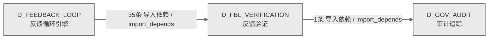

# 17_d_fbl_verification / 反馈验证域 / Feedback Verification

> **功能简介 / Overview**: 反馈验证，负责反馈循环门禁拦截、结果验证器执行和反馈质量检查

> **文档作用 / Purpose**: 展示 反馈验证（D_FBL_VERIFICATION）功能域的域内依赖关系、跨域依赖关系，模块信息（成熟度/中英文名/大白话/文件路径）内嵌于 Mermaid 节点，供架构审查和域治理参考。

> 本文档由 generate_domain_doc.py 从 depgraph (PostgreSQL) 自动生成
> 数据源: depgraph (PostgreSQL) nodes表 + edges表

> **[可缩放 HTML 版 / Zoomable HTML](http://localhost:8765/docs/02_enterprise_architecture/02_domain_architecture_docs/_zoomable_html/17_d_fbl_verification.html)** — Ctrl+滚轮缩放 ｜ 双击重置 ｜ Ctrl+Shift+D 切换拖动/选择模式

## 域基本信息 / Domain Overview

| 字段 | 值 | Field | Value |
|------|------|-------|-------|
| 编号 | 17 | Number | 17 |
| 域ID | D_FBL_VERIFICATION | Domain ID | D_FBL_VERIFICATION |
| 域名称 | 反馈验证 | Domain Name | Feedback Verification |
| 层级 | L1 基础平台层 | Layer | L1 Foundation |
| 模块数 | 71 | Module Count | 71 |
| 域内依赖 | 17 | Internal Dependencies | 17 |
| 跨域入边 | 35 | Cross-domain Incoming | 35 |
| 跨域出边 | 1 | Cross-domain Outgoing | 1 |
| 设计态模块 | 0 | Design Modules | 0 |
| 生产态模块 | 71 | Production Modules | 71 |
| 容量 | 71/150 (正常) | Capacity | 71/150 (正常) |
| 描述 | 反馈循环门禁(feedback_loop/gates) | Description | 反馈循环门禁(feedback_loop/gates) |

## 域内依赖图 / Internal Dependency Diagram

> 依赖图内嵌在本文档中，IDE 可直接渲染；网页版可 Ctrl+滚轮缩放 + 拖动平移查看细节。
>
> **图例说明 / Legend**：
> - 🟦 **蓝色 = 运营态模块**（production，已上线运行）
> - 🟧 **橙色虚线 = 设计态模块**（design，蓝图阶段，代码未写）
> - **实线箭头 = 运营态依赖**（已生效的依赖关系）
> - **虚线箭头 = 非运营态依赖**（计划中/验证中的依赖关系）

### 全景图（全部模块，颜色区分运营态/设计态）

> 展示全部 71 个模块（生产态 71 + 设计态 0），含跨域依赖外部节点。节点含成熟度+名称+大白话/简介+文件路径。

```mermaid
%%{init: {'theme': 'base', 'themeVariables': {'primaryColor': '#eaeaea', 'primaryTextColor': '#333333', 'primaryBorderColor': '#666666', 'lineColor': '#666666', 'secondaryColor': '#eaeaea', 'tertiaryColor': '#eaeaea', 'fontSize': '14px'}}}%%
flowchart TD
    src_zephyr_feedback_loop_gates_governance_gates_py["治理门禁<br/>供门禁包入口使用<br/>_governance_gates<br/>文件: gates/_governance_gates.py<br/>(生产态 / production)"]
    src_zephyr_feedback_loop_gates_operational_gates_py["运营门禁<br/>operational门禁，门禁的门禁，在关键节点检查是否<br/>放行。<br/>_operational_gates<br/>文件: gates/_operational_gates.py<br/>(生产态 / production)"]
    src_zephyr_feedback_loop_gates_safety_gates_py["安全门禁<br/>gates包的safety_gates模块<br/>_safety_gates<br/>文件: gates/_safety_gates.py<br/>(生产态 / production)"]
    src_zephyr_feedback_loop_gates_security_gates_py["安全门禁<br/>gates包的security_gates模块<br/>_security_gates<br/>文件: gates/_security_gates.py<br/>(生产态 / production)"]
    src_zephyr_feedback_loop_gates_action_reversibility_py["行为reversibility<br/>动作reversibility。Action Reversibility —<br/>v0.15.0 R208<br/>文件: gates/action_reversibility.py<br/>(生产态 / production)"]
    src_zephyr_feedback_loop_gates_adversarial_validation_py["对抗验证<br/>adversarial验证。Adversarial Validation Gate —<br/>FLE-ADVERSARIAL-VALIDATION + RED-BLUE-GATE<br/>bridge.<br/>文件: gates/adversarial_validation.py<br/>(生产态 / production)"]
    src_zephyr_feedback_loop_gates_autonomy_credit_py["自治信用<br/>Autonomy Credit System — v0.7.0 R87<br/>文件: gates/autonomy_credit.py<br/>(生产态 / production)"]
    src_zephyr_feedback_loop_gates_autonomy_maturity_py["自治成熟度<br/>Autonomy Maturity Ladder — v0.7.0 R86<br/>文件: gates/autonomy_maturity.py<br/>(生产态 / production)"]
    src_zephyr_feedback_loop_gates_blueprint_code_reconciler_py["蓝图代码协调器<br/>Blueprint-Code Reconciler — v0.14.0 R195<br/>文件: gates/blueprint_code_reconciler.py<br/>(生产态 / production)"]
    src_zephyr_feedback_loop_gates_blueprint_validator_py["蓝图校验器<br/>Blueprint Validator — v0.8.0 R108<br/>文件: gates/blueprint_validator.py<br/>(生产态 / production)"]
    src_zephyr_feedback_loop_gates_checkpoint_manager_py["检查点管理器<br/>Checkpoint Manager — v0.3.0 R18<br/>文件: gates/checkpoint_manager.py<br/>(生产态 / production)"]
    src_zephyr_feedback_loop_gates_ci_cd_pre_scanner_py["cicdpre扫描器<br/>cicd预扫描器。CI/CD Pre-Scanner — v0.8.0 R107<br/>文件: gates/ci_cd_pre_scanner.py<br/>(生产态 / production)"]
    src_zephyr_feedback_loop_gates_concurrent_change_deconfliction_py["并发变更deconfliction<br/>Concurrent Change Deconfliction — v0.16.0 R230<br/>文件: gates/concurrent_change_deconfliction.py<br/>(生产态 / production)"]
    src_zephyr_feedback_loop_gates_config_complexity_budget_py["配置complexity预算<br/>Config Complexity Budget — v0.16.0 R227<br/>文件: gates/config_complexity_budget.py<br/>(生产态 / production)"]
    src_zephyr_feedback_loop_gates_config_governance_py["配置治理<br/>Config Governance — v0.3.0 R8<br/>文件: gates/config_governance.py<br/>(生产态 / production)"]
    src_zephyr_feedback_loop_gates_conflict_arbitration_py["冲突仲裁<br/>提供arbitrate等方法<br/>Conflict Arbitration — v0.10.0 R130<br/>文件: gates/conflict_arbitration.py<br/>(生产态 / production)"]
    src_zephyr_feedback_loop_gates_cve_scanner_py["cve扫描器<br/>CVE Scanner — v0.8.0 R106<br/>文件: gates/cve_scanner.py<br/>(生产态 / production)"]
    src_zephyr_feedback_loop_gates_data_quality_gate_py["数据质量门禁<br/>Data Quality Gate — v0.11.0 R143<br/>文件: gates/data_quality_gate.py<br/>(生产态 / production)"]
    src_zephyr_feedback_loop_gates_db_integrity_py["数据库完整性<br/>DB Integrity Gate — v0.3.0 R17<br/>文件: gates/db_integrity.py<br/>(生产态 / production)"]
    src_zephyr_feedback_loop_gates_deployment_suppression_py["部署抑制<br/>gates包的deployment_suppression模块<br/>Deployment Suppression — v0.37.0 R464<br/>文件: gates/deployment_suppression.py<br/>(生产态 / production)"]
    src_zephyr_feedback_loop_gates_dynamic_llm_cost_router_py["动态llm成本路由器<br/>Dynamic LLM Cost Router — v0.8.0 R109<br/>文件: gates/dynamic_llm_cost_router.py<br/>(生产态 / production)"]
    src_zephyr_feedback_loop_gates_emergency_takeover_py["紧急takeover<br/>Emergency Takeover — v0.7.0 R88<br/>文件: gates/emergency_takeover.py<br/>(生产态 / production)"]
    src_zephyr_feedback_loop_gates_federated_security_py["federated安全<br/>Federated Security — v0.10.0 R131<br/>文件: gates/federated_security.py<br/>(生产态 / production)"]
    src_zephyr_feedback_loop_gates_flag_lifecycle_manager_py["标志生命周期管理器<br/>Flag Lifecycle Manager — v0.3.0 R11<br/>文件: gates/flag_lifecycle_manager.py<br/>(生产态 / production)"]
    src_zephyr_feedback_loop_gates_license_compliance_py["license合规<br/>License Compliance — v0.14.0 R198<br/>文件: gates/license_compliance.py<br/>(生产态 / production)"]
    src_zephyr_feedback_loop_gates_llm_cost_router_py["llm成本路由器<br/>LLM Cost Router — v0.3.0 R20<br/>文件: gates/llm_cost_router.py<br/>(生产态 / production)"]
    src_zephyr_feedback_loop_gates_merkle_audit_root_py["merkle审计root<br/>merkle审计根。Merkle Audit Root — v0.8.0 R104<br/>文件: gates/merkle_audit_root.py<br/>(生产态 / production)"]
    src_zephyr_feedback_loop_gates_meta_performance_gate_py["元绩效门禁<br/>Meta Performance Gate — v0.11.0 R158<br/>文件: gates/meta_performance_gate.py<br/>(生产态 / production)"]
    src_zephyr_feedback_loop_gates_parameterized_safety_gate_py["parameterized安全门禁<br/>GateVerdict — GateVerdict<br/>文件: gates/parameterized_safety_gate.py<br/>(生产态 / production)"]
    src_zephyr_feedback_loop_gates_safety_gate_l28_l29_py["安全门禁l28l29<br/>Safety Gates L28-L29 — DR Readiness + Supply<br/>Chain (MOD-FEEDBACK_LOOP §3 L28-L41)<br/>文件: gates/safety_gate_l28_l29.py<br/>(生产态 / production)"]
    src_zephyr_feedback_loop_gates_safety_gate_l36_l37_py["安全门禁l36l37<br/>Safety Gates L36-L37 — AI Code Integrity + Vibe<br/>Maintainability<br/>文件: gates/safety_gate_l36_l37.py<br/>(生产态 / production)"]
    src_zephyr_feedback_loop_gates_safety_gate_l38_l39_py["安全门禁l38l39<br/>Safety Gates L38-L39 — Deterministic Safety +<br/>Architectural Integrity<br/>文件: gates/safety_gate_l38_l39.py<br/>(生产态 / production)"]
    src_zephyr_feedback_loop_gates_safety_gate_l40_l41_py["安全门禁l40l41<br/>Safety Gates L40-L41 — Self-Integrity +<br/>Container Immutability<br/>文件: gates/safety_gate_l40_l41.py<br/>(生产态 / production)"]
    src_zephyr_feedback_loop_gates_safety_gate_l42_l43_py["安全门禁l42l43<br/>Safety Gates L42-L43 — Causal Integrity +<br/>Survivability<br/>文件: gates/safety_gate_l42_l43.py<br/>(生产态 / production)"]
    src_zephyr_feedback_loop_gates_safety_gate_l44_l45_py["安全门禁l44l45<br/>Safety Gates L44-L45 — Operational Excellence +<br/>Causal Interrogability<br/>文件: gates/safety_gate_l44_l45.py<br/>(生产态 / production)"]
    src_zephyr_feedback_loop_gates_safety_gate_l46_l47_py["安全门禁l46l47<br/>Safety Gates L46-L47 — Systemic Emergence +<br/>Ontological Consistency<br/>文件: gates/safety_gate_l46_l47.py<br/>(生产态 / production)"]
    src_zephyr_feedback_loop_gates_safety_gate_l48_l49_py["安全门禁l48l49<br/>Safety Gates L48-L49 — Supply Chain Integrity +<br/>Cognitive Safety<br/>文件: gates/safety_gate_l48_l49.py<br/>(生产态 / production)"]
    src_zephyr_feedback_loop_gates_safety_gate_l50_l51_py["安全门禁l50l51<br/>Safety Gates L50-L55 — Coherence + Integrity<br/>Ladder (double-pair pattern)<br/>文件: gates/safety_gate_l50_l51.py<br/>(生产态 / production)"]
    src_zephyr_feedback_loop_gates_safety_gate_l52_l53_py["安全门禁l52l53<br/>Safety Gates L52-L53 — Boot Integrity + OSS<br/>License<br/>文件: gates/safety_gate_l52_l53.py<br/>(生产态 / production)"]
    src_zephyr_feedback_loop_gates_safety_gate_l54_l55_py["安全门禁l54l55<br/>Safety Gates L54-L55 — Final Gate + Full<br/>Integration<br/>文件: gates/safety_gate_l54_l55.py<br/>(生产态 / production)"]
    src_zephyr_feedback_loop_gates_safety_gate_l56_l57_py["安全门禁l56l57<br/>Safety Gates L56-L57 — Evolutionary Integrity +<br/>Cross-Generational Coherence<br/>文件: gates/safety_gate_l56_l57.py<br/>(生产态 / production)"]
    src_zephyr_feedback_loop_gates_safety_gate_l58_l59_py["安全门禁l58l59<br/>Safety Gates L58-L59 — Over-the-Horizon +<br/>Temporal Integrity<br/>文件: gates/safety_gate_l58_l59.py<br/>(生产态 / production)"]
    src_zephyr_feedback_loop_gates_safety_gate_l60_l61_py["安全门禁l60l61<br/>Safety Gates L60-L61 — Environmental Grounding<br/>+ Meta-System Integrity<br/>文件: gates/safety_gate_l60_l61.py<br/>(生产态 / production)"]
    src_zephyr_feedback_loop_gates_safety_gate_l62_l63_py["安全门禁l62l63<br/>Safety Gates L62-L63 — Infrastructure Reality +<br/>Market Reality<br/>文件: gates/safety_gate_l62_l63.py<br/>(生产态 / production)"]
    src_zephyr_feedback_loop_gates_safety_gate_l64_l65_py["安全门禁l64l65<br/>Safety Gates L64-L65 — Financial Integrity +<br/>VibeOps:Solo<br/>文件: gates/safety_gate_l64_l65.py<br/>(生产态 / production)"]
    src_zephyr_feedback_loop_gates_safety_gate_l66_l67_py["安全门禁l66l67<br/>Safety Gates L66-L67 — Financial Prudence +<br/>Full Integration Audit<br/>文件: gates/safety_gate_l66_l67.py<br/>(生产态 / production)"]
    src_zephyr_feedback_loop_gates_scope_creep_monitor_py["作用域creep监控器<br/>作用域creep监控。Scope Creep Monitor — v0.15.0<br/>R220<br/>文件: gates/scope_creep_monitor.py<br/>(生产态 / production)"]
    src_zephyr_feedback_loop_verifiers_ab_test_py["ab测试<br/>A/B Test Verifier — v0.9.0 R117<br/>文件: verifiers/ab_test.py<br/>(生产态 / production)"]
    src_zephyr_feedback_loop_verifiers_action_explainability_py["行为explainability<br/>动作explainability。Action Explainability —<br/>v0.3.0 R15<br/>文件: verifiers/action_explainability.py<br/>(生产态 / production)"]
    src_zephyr_feedback_loop_verifiers_ai_comment_veracity_py["AI评论真实性<br/>验证器的核心类，封装VeracityLevel相关逻辑<br/>AI Comment Veracity — v0.37.0 R459<br/>文件: verifiers/ai_comment_veracity.py<br/>(生产态 / production)"]
    src_zephyr_feedback_loop_verifiers_attack_simulator_py["攻击模拟器<br/>攻击simulator，验证器的核心类，封装AttackSimulat<br/>or相关逻辑。<br/>Attack Simulator — v0.6.0 R57<br/>文件: verifiers/attack_simulator.py<br/>(生产态 / production)"]
    src_zephyr_feedback_loop_verifiers_auto_rollback_py["自动回滚<br/>Auto Rollback — v0.8.0 R93<br/>文件: verifiers/auto_rollback.py<br/>(生产态 / production)"]
    src_zephyr_feedback_loop_verifiers_build_reproducibility_verifier_py["buildreproducibility验证器<br/>构建reproducibility验证器。Build<br/>Reproducibility Verifier — v0.38.0 R484<br/>文件: verifiers<br/>/build_reproducibility_verifier.py<br/>(生产态 / production)"]
    src_zephyr_feedback_loop_verifiers_canary_repair_py["金丝雀修复<br/>验证器的核心类，封装CanaryRepair相关逻辑<br/>Canary Repair — v0.8.0 R104b<br/>文件: verifiers/canary_repair.py<br/>(生产态 / production)"]
    src_zephyr_feedback_loop_verifiers_cascading_rollback_analyzer_py["级联回滚分析器<br/>cascading回滚分析器。Cascading Rollback<br/>Analyzer — v0.38.0 R482<br/>文件: verifiers/cascading_rollback_analyzer.py<br/>(生产态 / production)"]
    src_zephyr_feedback_loop_verifiers_cross_blueprint_contract_drift_py["跨蓝图契约漂移<br/>Cross-Blueprint Contract Drift Monitor —<br/>v0.39.0 R490<br/>文件: verifiers<br/>/cross_blueprint_contract_drift.py<br/>(生产态 / production)"]
    src_zephyr_feedback_loop_verifiers_cross_module_integration_py["跨模块集成<br/>Cross-Module Integration Verifier — v0.5.0 R39<br/>文件: verifiers/cross_module_integration.py<br/>(生产态 / production)"]
    src_zephyr_feedback_loop_verifiers_cross_session_knowledge_integrity_py["跨会话知识完整性<br/>Cross-Session Knowledge Integrity — v0.16.0 R225<br/>文件: verifiers<br/>/cross_session_knowledge_integrity.py<br/>(生产态 / production)"]
    src_zephyr_feedback_loop_verifiers_digital_twin_sandbox_py["数字孪生沙箱<br/>verifiers包的digital_twin_sandbox模块<br/>Digital Twin Sandbox — v0.6.0 R55<br/>文件: verifiers/digital_twin_sandbox.py<br/>(生产态 / production)"]
    src_zephyr_feedback_loop_verifiers_dry_run_sandbox_py["dry运行沙箱<br/>dry运行sandbox。Dry Run Sandbox — v0.3.0 R19<br/>文件: verifiers/dry_run_sandbox.py<br/>(生产态 / production)"]
    src_zephyr_feedback_loop_verifiers_federated_protocol_py["federated协议<br/>Federated Protocol — v0.10.0 R129<br/>文件: verifiers/federated_protocol.py<br/>(生产态 / production)"]
    src_zephyr_feedback_loop_verifiers_golden_test_external_py["golden测试external<br/>golden测试外部。Golden Test External — v0.15.0<br/>R214<br/>文件: verifiers/golden_test_external.py<br/>(生产态 / production)"]
    src_zephyr_feedback_loop_verifiers_no_llm_degradation_py["noLLM退化<br/>nollm退化。No-LLM Degradation Mode — v0.8.0 R94<br/>文件: verifiers/no_llm_degradation.py<br/>(生产态 / production)"]
    src_zephyr_feedback_loop_verifiers_pre_flight_simulator_py["preflight模拟器<br/>预flightsimulator。Pre-Flight Simulator —<br/>v0.12.0 R169b<br/>文件: verifiers/pre_flight_simulator.py<br/>(生产态 / production)"]
    src_zephyr_feedback_loop_verifiers_preventive_repair_py["预防性修复<br/>反馈闭环的事件，定义和分发事件<br/>Preventive Repair — v0.6.0 R69<br/>文件: verifiers/preventive_repair.py<br/>(生产态 / production)"]
    src_zephyr_feedback_loop_verifiers_rollback_integrity_py["回滚完整性<br/>Rollback Integrity — v0.3.0 R18b<br/>文件: verifiers/rollback_integrity.py<br/>(生产态 / production)"]
    src_zephyr_feedback_loop_verifiers_sim2real_calibration_py["仿真到实盘校准<br/>验证器的核心类，封装Sim2RealCalibration相关逻辑<br/>Sim2Real Calibration — v0.6.0 R56<br/>文件: verifiers/sim2real_calibration.py<br/>(生产态 / production)"]
    src_zephyr_feedback_loop_verifiers_stochastic_diagnosis_verifier_py["stochastic诊断验证器<br/>Stochastic Diagnosis Verifier — v0.38.0 R483<br/>文件: verifiers/stochastic_diagnosis_verifier.py<br/>(生产态 / production)"]
    src_zephyr_feedback_loop_verifiers_toctou_revalidation_py["TOCTOU重新验证<br/>verifiers包的toctou_revalidation模块<br/>TOCTOU Revalidation — v0.37.0 R458<br/>文件: verifiers/toctou_revalidation.py<br/>(生产态 / production)"]
    src_zephyr_feedback_loop_verifiers_verification_engine_py["验证引擎<br/>反馈闭环的核心类，封装Verdict相关逻辑<br/>verification_engine<br/>文件: verifiers/verification_engine.py<br/>(生产态 / production)"]
    src_zephyr_feedback_loop_gates_governance_gates_py ~~~ src_zephyr_feedback_loop_gates_operational_gates_py
    src_zephyr_feedback_loop_gates_operational_gates_py ~~~ src_zephyr_feedback_loop_gates_safety_gates_py
    src_zephyr_feedback_loop_gates_safety_gates_py ~~~ src_zephyr_feedback_loop_gates_security_gates_py
    src_zephyr_feedback_loop_gates_security_gates_py ~~~ src_zephyr_feedback_loop_gates_action_reversibility_py
    src_zephyr_feedback_loop_gates_action_reversibility_py ~~~ src_zephyr_feedback_loop_gates_adversarial_validation_py
    src_zephyr_feedback_loop_gates_adversarial_validation_py ~~~ src_zephyr_feedback_loop_gates_autonomy_credit_py
    src_zephyr_feedback_loop_gates_autonomy_credit_py ~~~ src_zephyr_feedback_loop_gates_autonomy_maturity_py
    src_zephyr_feedback_loop_gates_autonomy_maturity_py ~~~ src_zephyr_feedback_loop_gates_blueprint_code_reconciler_py
    src_zephyr_feedback_loop_gates_blueprint_code_reconciler_py ~~~ src_zephyr_feedback_loop_gates_blueprint_validator_py
    src_zephyr_feedback_loop_gates_blueprint_validator_py ~~~ src_zephyr_feedback_loop_gates_checkpoint_manager_py
    src_zephyr_feedback_loop_gates_checkpoint_manager_py ~~~ src_zephyr_feedback_loop_gates_ci_cd_pre_scanner_py
    src_zephyr_feedback_loop_gates_ci_cd_pre_scanner_py ~~~ src_zephyr_feedback_loop_gates_concurrent_change_deconfliction_py
    src_zephyr_feedback_loop_gates_concurrent_change_deconfliction_py ~~~ src_zephyr_feedback_loop_gates_config_complexity_budget_py
    src_zephyr_feedback_loop_gates_config_complexity_budget_py ~~~ src_zephyr_feedback_loop_gates_config_governance_py
    src_zephyr_feedback_loop_gates_config_governance_py ~~~ src_zephyr_feedback_loop_gates_conflict_arbitration_py
    src_zephyr_feedback_loop_gates_conflict_arbitration_py ~~~ src_zephyr_feedback_loop_gates_cve_scanner_py
    src_zephyr_feedback_loop_gates_cve_scanner_py ~~~ src_zephyr_feedback_loop_gates_data_quality_gate_py
    src_zephyr_feedback_loop_gates_data_quality_gate_py ~~~ src_zephyr_feedback_loop_gates_db_integrity_py
    src_zephyr_feedback_loop_gates_db_integrity_py ~~~ src_zephyr_feedback_loop_gates_deployment_suppression_py
    src_zephyr_feedback_loop_gates_deployment_suppression_py ~~~ src_zephyr_feedback_loop_gates_dynamic_llm_cost_router_py
    src_zephyr_feedback_loop_gates_dynamic_llm_cost_router_py ~~~ src_zephyr_feedback_loop_gates_emergency_takeover_py
    src_zephyr_feedback_loop_gates_emergency_takeover_py ~~~ src_zephyr_feedback_loop_gates_federated_security_py
    src_zephyr_feedback_loop_gates_federated_security_py ~~~ src_zephyr_feedback_loop_gates_flag_lifecycle_manager_py
    src_zephyr_feedback_loop_gates_flag_lifecycle_manager_py ~~~ src_zephyr_feedback_loop_gates_license_compliance_py
    src_zephyr_feedback_loop_gates_license_compliance_py ~~~ src_zephyr_feedback_loop_gates_llm_cost_router_py
    src_zephyr_feedback_loop_gates_llm_cost_router_py ~~~ src_zephyr_feedback_loop_gates_merkle_audit_root_py
    src_zephyr_feedback_loop_gates_merkle_audit_root_py ~~~ src_zephyr_feedback_loop_gates_meta_performance_gate_py
    src_zephyr_feedback_loop_gates_meta_performance_gate_py ~~~ src_zephyr_feedback_loop_gates_parameterized_safety_gate_py
    src_zephyr_feedback_loop_gates_parameterized_safety_gate_py ~~~ src_zephyr_feedback_loop_gates_safety_gate_l28_l29_py
    src_zephyr_feedback_loop_gates_safety_gate_l28_l29_py ~~~ src_zephyr_feedback_loop_gates_safety_gate_l36_l37_py
    src_zephyr_feedback_loop_gates_safety_gate_l36_l37_py ~~~ src_zephyr_feedback_loop_gates_safety_gate_l38_l39_py
    src_zephyr_feedback_loop_gates_safety_gate_l38_l39_py ~~~ src_zephyr_feedback_loop_gates_safety_gate_l40_l41_py
    src_zephyr_feedback_loop_gates_safety_gate_l40_l41_py ~~~ src_zephyr_feedback_loop_gates_safety_gate_l42_l43_py
    src_zephyr_feedback_loop_gates_safety_gate_l42_l43_py ~~~ src_zephyr_feedback_loop_gates_safety_gate_l44_l45_py
    src_zephyr_feedback_loop_gates_safety_gate_l44_l45_py ~~~ src_zephyr_feedback_loop_gates_safety_gate_l46_l47_py
    src_zephyr_feedback_loop_gates_safety_gate_l46_l47_py ~~~ src_zephyr_feedback_loop_gates_safety_gate_l48_l49_py
    src_zephyr_feedback_loop_gates_safety_gate_l48_l49_py ~~~ src_zephyr_feedback_loop_gates_safety_gate_l50_l51_py
    src_zephyr_feedback_loop_gates_safety_gate_l50_l51_py ~~~ src_zephyr_feedback_loop_gates_safety_gate_l52_l53_py
    src_zephyr_feedback_loop_gates_safety_gate_l52_l53_py ~~~ src_zephyr_feedback_loop_gates_safety_gate_l54_l55_py
    src_zephyr_feedback_loop_gates_safety_gate_l54_l55_py ~~~ src_zephyr_feedback_loop_gates_safety_gate_l56_l57_py
    src_zephyr_feedback_loop_gates_safety_gate_l56_l57_py ~~~ src_zephyr_feedback_loop_gates_safety_gate_l58_l59_py
    src_zephyr_feedback_loop_gates_safety_gate_l58_l59_py ~~~ src_zephyr_feedback_loop_gates_safety_gate_l60_l61_py
    src_zephyr_feedback_loop_gates_safety_gate_l60_l61_py ~~~ src_zephyr_feedback_loop_gates_safety_gate_l62_l63_py
    src_zephyr_feedback_loop_gates_safety_gate_l62_l63_py ~~~ src_zephyr_feedback_loop_gates_safety_gate_l64_l65_py
    src_zephyr_feedback_loop_gates_safety_gate_l64_l65_py ~~~ src_zephyr_feedback_loop_gates_safety_gate_l66_l67_py
    src_zephyr_feedback_loop_gates_safety_gate_l66_l67_py ~~~ src_zephyr_feedback_loop_gates_scope_creep_monitor_py
    src_zephyr_feedback_loop_gates_scope_creep_monitor_py ~~~ src_zephyr_feedback_loop_verifiers_ab_test_py
    src_zephyr_feedback_loop_verifiers_ab_test_py ~~~ src_zephyr_feedback_loop_verifiers_action_explainability_py
    src_zephyr_feedback_loop_verifiers_action_explainability_py ~~~ src_zephyr_feedback_loop_verifiers_ai_comment_veracity_py
    src_zephyr_feedback_loop_verifiers_ai_comment_veracity_py ~~~ src_zephyr_feedback_loop_verifiers_attack_simulator_py
    src_zephyr_feedback_loop_verifiers_attack_simulator_py ~~~ src_zephyr_feedback_loop_verifiers_auto_rollback_py
    src_zephyr_feedback_loop_verifiers_auto_rollback_py ~~~ src_zephyr_feedback_loop_verifiers_build_reproducibility_verifier_py
    src_zephyr_feedback_loop_verifiers_build_reproducibility_verifier_py ~~~ src_zephyr_feedback_loop_verifiers_canary_repair_py
    src_zephyr_feedback_loop_verifiers_canary_repair_py ~~~ src_zephyr_feedback_loop_verifiers_cascading_rollback_analyzer_py
    src_zephyr_feedback_loop_verifiers_cascading_rollback_analyzer_py ~~~ src_zephyr_feedback_loop_verifiers_cross_blueprint_contract_drift_py
    src_zephyr_feedback_loop_verifiers_cross_blueprint_contract_drift_py ~~~ src_zephyr_feedback_loop_verifiers_cross_module_integration_py
    src_zephyr_feedback_loop_verifiers_cross_module_integration_py ~~~ src_zephyr_feedback_loop_verifiers_cross_session_knowledge_integrity_py
    src_zephyr_feedback_loop_verifiers_cross_session_knowledge_integrity_py ~~~ src_zephyr_feedback_loop_verifiers_digital_twin_sandbox_py
    src_zephyr_feedback_loop_verifiers_digital_twin_sandbox_py ~~~ src_zephyr_feedback_loop_verifiers_dry_run_sandbox_py
    src_zephyr_feedback_loop_verifiers_dry_run_sandbox_py ~~~ src_zephyr_feedback_loop_verifiers_federated_protocol_py
    src_zephyr_feedback_loop_verifiers_federated_protocol_py ~~~ src_zephyr_feedback_loop_verifiers_golden_test_external_py
    src_zephyr_feedback_loop_verifiers_golden_test_external_py ~~~ src_zephyr_feedback_loop_verifiers_no_llm_degradation_py
    src_zephyr_feedback_loop_verifiers_no_llm_degradation_py ~~~ src_zephyr_feedback_loop_verifiers_pre_flight_simulator_py
    src_zephyr_feedback_loop_verifiers_pre_flight_simulator_py ~~~ src_zephyr_feedback_loop_verifiers_preventive_repair_py
    src_zephyr_feedback_loop_verifiers_preventive_repair_py ~~~ src_zephyr_feedback_loop_verifiers_rollback_integrity_py
    src_zephyr_feedback_loop_verifiers_rollback_integrity_py ~~~ src_zephyr_feedback_loop_verifiers_sim2real_calibration_py
    src_zephyr_feedback_loop_verifiers_sim2real_calibration_py ~~~ src_zephyr_feedback_loop_verifiers_stochastic_diagnosis_verifier_py
    src_zephyr_feedback_loop_verifiers_stochastic_diagnosis_verifier_py ~~~ src_zephyr_feedback_loop_verifiers_toctou_revalidation_py
    src_zephyr_feedback_loop_verifiers_toctou_revalidation_py ~~~ src_zephyr_feedback_loop_verifiers_verification_engine_py
    src_zephyr_feedback_loop_gates_safety_gate_l1_l27_py["安全门禁l1l27<br/>Safety Gates L1-L27 — Unified Pipeline<br/>(MOD-FEEDBACK_LOOP §3)<br/>文件: gates/safety_gate_l1_l27.py<br/>(生产态 / production)"]
    src_zephyr_feedback_loop_gates_safety_gate_l28_l29_py -->|导入依赖 / import_depends| src_zephyr_feedback_loop_gates_safety_gate_l1_l27_py
    src_zephyr_feedback_loop_gates_safety_gate_l36_l37_py -->|导入依赖 / import_depends| src_zephyr_feedback_loop_gates_safety_gate_l1_l27_py
    src_zephyr_feedback_loop_gates_safety_gate_l40_l41_py -->|导入依赖 / import_depends| src_zephyr_feedback_loop_gates_safety_gate_l1_l27_py
    src_zephyr_feedback_loop_gates_safety_gate_l38_l39_py -->|导入依赖 / import_depends| src_zephyr_feedback_loop_gates_safety_gate_l1_l27_py
    src_zephyr_feedback_loop_gates_safety_gate_l44_l45_py -->|导入依赖 / import_depends| src_zephyr_feedback_loop_gates_safety_gate_l1_l27_py
    src_zephyr_feedback_loop_gates_safety_gate_l42_l43_py -->|导入依赖 / import_depends| src_zephyr_feedback_loop_gates_safety_gate_l1_l27_py
    src_zephyr_feedback_loop_gates_safety_gate_l52_l53_py -->|导入依赖 / import_depends| src_zephyr_feedback_loop_gates_safety_gate_l1_l27_py
    src_zephyr_feedback_loop_gates_safety_gate_l54_l55_py -->|导入依赖 / import_depends| src_zephyr_feedback_loop_gates_safety_gate_l1_l27_py
    src_zephyr_feedback_loop_gates_safety_gate_l56_l57_py -->|导入依赖 / import_depends| src_zephyr_feedback_loop_gates_safety_gate_l1_l27_py
    src_zephyr_feedback_loop_gates_safety_gate_l46_l47_py -->|导入依赖 / import_depends| src_zephyr_feedback_loop_gates_safety_gate_l1_l27_py
    src_zephyr_feedback_loop_gates_safety_gate_l48_l49_py -->|导入依赖 / import_depends| src_zephyr_feedback_loop_gates_safety_gate_l1_l27_py
    src_zephyr_feedback_loop_gates_safety_gate_l50_l51_py -->|导入依赖 / import_depends| src_zephyr_feedback_loop_gates_safety_gate_l1_l27_py
    src_zephyr_feedback_loop_gates_safety_gate_l58_l59_py -->|导入依赖 / import_depends| src_zephyr_feedback_loop_gates_safety_gate_l1_l27_py
    src_zephyr_feedback_loop_gates_safety_gate_l66_l67_py -->|导入依赖 / import_depends| src_zephyr_feedback_loop_gates_safety_gate_l1_l27_py
    src_zephyr_feedback_loop_gates_safety_gate_l62_l63_py -->|导入依赖 / import_depends| src_zephyr_feedback_loop_gates_safety_gate_l1_l27_py
    src_zephyr_feedback_loop_gates_safety_gate_l60_l61_py -->|导入依赖 / import_depends| src_zephyr_feedback_loop_gates_safety_gate_l1_l27_py
    src_zephyr_feedback_loop_gates_safety_gate_l64_l65_py -->|导入依赖 / import_depends| src_zephyr_feedback_loop_gates_safety_gate_l1_l27_py
    D_GOV_AUDIT["审计追踪<br/>审计追踪，负责变更审计追踪和操作日志管理<br/>Audit Trail<br/>跨域节点 / cross-domain<br/>(生产态 / production)"]
    src_zephyr_feedback_loop_gates_safety_gate_l66_l67_py -->|导入依赖 / import_depends| D_GOV_AUDIT
    D_FEEDBACK_LOOP["反馈循环引擎<br/>反馈循环引擎，负责系统自我改进闭环：异常检测、根<br/>因诊断、自动修复和自我进化<br/>Feedback Loop Engine<br/>跨域节点 / cross-domain<br/>(生产态 / production)"]
    D_FEEDBACK_LOOP -->|导入依赖 / import_depends| src_zephyr_feedback_loop_verifiers_cross_session_knowledge_integrity_py
    D_FEEDBACK_LOOP -->|导入依赖 / import_depends| src_zephyr_feedback_loop_verifiers_dry_run_sandbox_py
    D_FEEDBACK_LOOP -->|导入依赖 / import_depends| src_zephyr_feedback_loop_verifiers_federated_protocol_py
    D_FEEDBACK_LOOP -->|导入依赖 / import_depends| src_zephyr_feedback_loop_verifiers_pre_flight_simulator_py
    D_FEEDBACK_LOOP -->|导入依赖 / import_depends| src_zephyr_feedback_loop_verifiers_rollback_integrity_py
    D_FEEDBACK_LOOP -->|导入依赖 / import_depends| src_zephyr_feedback_loop_verifiers_verification_engine_py
    D_FEEDBACK_LOOP -->|导入依赖 / import_depends| src_zephyr_feedback_loop_gates_safety_gates_py
    D_FEEDBACK_LOOP -->|导入依赖 / import_depends| src_zephyr_feedback_loop_gates_operational_gates_py
    D_FEEDBACK_LOOP -->|导入依赖 / import_depends| src_zephyr_feedback_loop_verifiers_stochastic_diagnosis_verifier_py
    D_FEEDBACK_LOOP -->|导入依赖 / import_depends| src_zephyr_feedback_loop_gates_safety_gate_l1_l27_py
    D_FEEDBACK_LOOP -->|导入依赖 / import_depends| src_zephyr_feedback_loop_verifiers_ai_comment_veracity_py
    D_FEEDBACK_LOOP -->|导入依赖 / import_depends| src_zephyr_feedback_loop_verifiers_verification_engine_py
    D_FEEDBACK_LOOP -->|导入依赖 / import_depends| src_zephyr_feedback_loop_gates_security_gates_py
    D_FEEDBACK_LOOP -->|导入依赖 / import_depends| src_zephyr_feedback_loop_verifiers_attack_simulator_py
    D_FEEDBACK_LOOP -->|导入依赖 / import_depends| src_zephyr_feedback_loop_verifiers_auto_rollback_py
    classDef production fill:#e1f5fe,stroke:#01579b,stroke-width:2px,color:#000
    classDef design fill:#fff3e0,stroke:#e65100,stroke-width:2px,color:#000,stroke-dasharray: 5 5
    classDef external_prod fill:#e8f4fd,stroke:#0277bd,stroke-width:1px,color:#000
    classDef external_design fill:#fff8e7,stroke:#ef6c00,stroke-width:1px,color:#000,stroke-dasharray: 5 5
    class src_zephyr_feedback_loop_gates_governance_gates_py,src_zephyr_feedback_loop_gates_operational_gates_py,src_zephyr_feedback_loop_gates_safety_gates_py,src_zephyr_feedback_loop_gates_security_gates_py,src_zephyr_feedback_loop_gates_action_reversibility_py,src_zephyr_feedback_loop_gates_adversarial_validation_py,src_zephyr_feedback_loop_gates_autonomy_credit_py,src_zephyr_feedback_loop_gates_autonomy_maturity_py,src_zephyr_feedback_loop_gates_blueprint_code_reconciler_py,src_zephyr_feedback_loop_gates_blueprint_validator_py,src_zephyr_feedback_loop_gates_checkpoint_manager_py,src_zephyr_feedback_loop_gates_ci_cd_pre_scanner_py,src_zephyr_feedback_loop_gates_concurrent_change_deconfliction_py,src_zephyr_feedback_loop_gates_config_complexity_budget_py,src_zephyr_feedback_loop_gates_config_governance_py,src_zephyr_feedback_loop_gates_conflict_arbitration_py,src_zephyr_feedback_loop_gates_cve_scanner_py,src_zephyr_feedback_loop_gates_data_quality_gate_py,src_zephyr_feedback_loop_gates_db_integrity_py,src_zephyr_feedback_loop_gates_deployment_suppression_py,src_zephyr_feedback_loop_gates_dynamic_llm_cost_router_py,src_zephyr_feedback_loop_gates_emergency_takeover_py,src_zephyr_feedback_loop_gates_federated_security_py,src_zephyr_feedback_loop_gates_flag_lifecycle_manager_py,src_zephyr_feedback_loop_gates_license_compliance_py,src_zephyr_feedback_loop_gates_llm_cost_router_py,src_zephyr_feedback_loop_gates_merkle_audit_root_py,src_zephyr_feedback_loop_gates_meta_performance_gate_py,src_zephyr_feedback_loop_gates_parameterized_safety_gate_py,src_zephyr_feedback_loop_gates_safety_gate_l1_l27_py,src_zephyr_feedback_loop_gates_safety_gate_l28_l29_py,src_zephyr_feedback_loop_gates_safety_gate_l36_l37_py,src_zephyr_feedback_loop_gates_safety_gate_l38_l39_py,src_zephyr_feedback_loop_gates_safety_gate_l40_l41_py,src_zephyr_feedback_loop_gates_safety_gate_l42_l43_py,src_zephyr_feedback_loop_gates_safety_gate_l44_l45_py,src_zephyr_feedback_loop_gates_safety_gate_l46_l47_py,src_zephyr_feedback_loop_gates_safety_gate_l48_l49_py,src_zephyr_feedback_loop_gates_safety_gate_l50_l51_py,src_zephyr_feedback_loop_gates_safety_gate_l52_l53_py,src_zephyr_feedback_loop_gates_safety_gate_l54_l55_py,src_zephyr_feedback_loop_gates_safety_gate_l56_l57_py,src_zephyr_feedback_loop_gates_safety_gate_l58_l59_py,src_zephyr_feedback_loop_gates_safety_gate_l60_l61_py,src_zephyr_feedback_loop_gates_safety_gate_l62_l63_py,src_zephyr_feedback_loop_gates_safety_gate_l64_l65_py,src_zephyr_feedback_loop_gates_safety_gate_l66_l67_py,src_zephyr_feedback_loop_gates_scope_creep_monitor_py,src_zephyr_feedback_loop_verifiers_ab_test_py,src_zephyr_feedback_loop_verifiers_action_explainability_py,src_zephyr_feedback_loop_verifiers_ai_comment_veracity_py,src_zephyr_feedback_loop_verifiers_attack_simulator_py,src_zephyr_feedback_loop_verifiers_auto_rollback_py,src_zephyr_feedback_loop_verifiers_build_reproducibility_verifier_py,src_zephyr_feedback_loop_verifiers_canary_repair_py,src_zephyr_feedback_loop_verifiers_cascading_rollback_analyzer_py,src_zephyr_feedback_loop_verifiers_cross_blueprint_contract_drift_py,src_zephyr_feedback_loop_verifiers_cross_module_integration_py,src_zephyr_feedback_loop_verifiers_cross_session_knowledge_integrity_py,src_zephyr_feedback_loop_verifiers_digital_twin_sandbox_py,src_zephyr_feedback_loop_verifiers_dry_run_sandbox_py,src_zephyr_feedback_loop_verifiers_federated_protocol_py,src_zephyr_feedback_loop_verifiers_golden_test_external_py,src_zephyr_feedback_loop_verifiers_no_llm_degradation_py,src_zephyr_feedback_loop_verifiers_pre_flight_simulator_py,src_zephyr_feedback_loop_verifiers_preventive_repair_py,src_zephyr_feedback_loop_verifiers_rollback_integrity_py,src_zephyr_feedback_loop_verifiers_sim2real_calibration_py,src_zephyr_feedback_loop_verifiers_stochastic_diagnosis_verifier_py,src_zephyr_feedback_loop_verifiers_toctou_revalidation_py,src_zephyr_feedback_loop_verifiers_verification_engine_py production
    class D_GOV_AUDIT,D_FEEDBACK_LOOP external_prod
```

### 运营态的图（仅 design_maturity=production 的模块和域内依赖）

> 仅展示已上线运行的模块（共 71 个），不含跨域外部节点。跨域依赖见下方跨域依赖章节。

```mermaid
%%{init: {'theme': 'base', 'themeVariables': {'primaryColor': '#eaeaea', 'primaryTextColor': '#333333', 'primaryBorderColor': '#666666', 'lineColor': '#666666', 'secondaryColor': '#eaeaea', 'tertiaryColor': '#eaeaea', 'fontSize': '14px'}}}%%
flowchart TD
    src_zephyr_feedback_loop_gates_governance_gates_py["治理门禁<br/>供门禁包入口使用<br/>_governance_gates<br/>文件: gates/_governance_gates.py<br/>(生产态 / production)"]
    src_zephyr_feedback_loop_gates_operational_gates_py["运营门禁<br/>operational门禁，门禁的门禁，在关键节点检查是否<br/>放行。<br/>_operational_gates<br/>文件: gates/_operational_gates.py<br/>(生产态 / production)"]
    src_zephyr_feedback_loop_gates_safety_gates_py["安全门禁<br/>gates包的safety_gates模块<br/>_safety_gates<br/>文件: gates/_safety_gates.py<br/>(生产态 / production)"]
    src_zephyr_feedback_loop_gates_security_gates_py["安全门禁<br/>gates包的security_gates模块<br/>_security_gates<br/>文件: gates/_security_gates.py<br/>(生产态 / production)"]
    src_zephyr_feedback_loop_gates_action_reversibility_py["行为reversibility<br/>动作reversibility。Action Reversibility —<br/>v0.15.0 R208<br/>文件: gates/action_reversibility.py<br/>(生产态 / production)"]
    src_zephyr_feedback_loop_gates_adversarial_validation_py["对抗验证<br/>adversarial验证。Adversarial Validation Gate —<br/>FLE-ADVERSARIAL-VALIDATION + RED-BLUE-GATE<br/>bridge.<br/>文件: gates/adversarial_validation.py<br/>(生产态 / production)"]
    src_zephyr_feedback_loop_gates_autonomy_credit_py["自治信用<br/>Autonomy Credit System — v0.7.0 R87<br/>文件: gates/autonomy_credit.py<br/>(生产态 / production)"]
    src_zephyr_feedback_loop_gates_autonomy_maturity_py["自治成熟度<br/>Autonomy Maturity Ladder — v0.7.0 R86<br/>文件: gates/autonomy_maturity.py<br/>(生产态 / production)"]
    src_zephyr_feedback_loop_gates_blueprint_code_reconciler_py["蓝图代码协调器<br/>Blueprint-Code Reconciler — v0.14.0 R195<br/>文件: gates/blueprint_code_reconciler.py<br/>(生产态 / production)"]
    src_zephyr_feedback_loop_gates_blueprint_validator_py["蓝图校验器<br/>Blueprint Validator — v0.8.0 R108<br/>文件: gates/blueprint_validator.py<br/>(生产态 / production)"]
    src_zephyr_feedback_loop_gates_checkpoint_manager_py["检查点管理器<br/>Checkpoint Manager — v0.3.0 R18<br/>文件: gates/checkpoint_manager.py<br/>(生产态 / production)"]
    src_zephyr_feedback_loop_gates_ci_cd_pre_scanner_py["cicdpre扫描器<br/>cicd预扫描器。CI/CD Pre-Scanner — v0.8.0 R107<br/>文件: gates/ci_cd_pre_scanner.py<br/>(生产态 / production)"]
    src_zephyr_feedback_loop_gates_concurrent_change_deconfliction_py["并发变更deconfliction<br/>Concurrent Change Deconfliction — v0.16.0 R230<br/>文件: gates/concurrent_change_deconfliction.py<br/>(生产态 / production)"]
    src_zephyr_feedback_loop_gates_config_complexity_budget_py["配置complexity预算<br/>Config Complexity Budget — v0.16.0 R227<br/>文件: gates/config_complexity_budget.py<br/>(生产态 / production)"]
    src_zephyr_feedback_loop_gates_config_governance_py["配置治理<br/>Config Governance — v0.3.0 R8<br/>文件: gates/config_governance.py<br/>(生产态 / production)"]
    src_zephyr_feedback_loop_gates_conflict_arbitration_py["冲突仲裁<br/>提供arbitrate等方法<br/>Conflict Arbitration — v0.10.0 R130<br/>文件: gates/conflict_arbitration.py<br/>(生产态 / production)"]
    src_zephyr_feedback_loop_gates_cve_scanner_py["cve扫描器<br/>CVE Scanner — v0.8.0 R106<br/>文件: gates/cve_scanner.py<br/>(生产态 / production)"]
    src_zephyr_feedback_loop_gates_data_quality_gate_py["数据质量门禁<br/>Data Quality Gate — v0.11.0 R143<br/>文件: gates/data_quality_gate.py<br/>(生产态 / production)"]
    src_zephyr_feedback_loop_gates_db_integrity_py["数据库完整性<br/>DB Integrity Gate — v0.3.0 R17<br/>文件: gates/db_integrity.py<br/>(生产态 / production)"]
    src_zephyr_feedback_loop_gates_deployment_suppression_py["部署抑制<br/>gates包的deployment_suppression模块<br/>Deployment Suppression — v0.37.0 R464<br/>文件: gates/deployment_suppression.py<br/>(生产态 / production)"]
    src_zephyr_feedback_loop_gates_dynamic_llm_cost_router_py["动态llm成本路由器<br/>Dynamic LLM Cost Router — v0.8.0 R109<br/>文件: gates/dynamic_llm_cost_router.py<br/>(生产态 / production)"]
    src_zephyr_feedback_loop_gates_emergency_takeover_py["紧急takeover<br/>Emergency Takeover — v0.7.0 R88<br/>文件: gates/emergency_takeover.py<br/>(生产态 / production)"]
    src_zephyr_feedback_loop_gates_federated_security_py["federated安全<br/>Federated Security — v0.10.0 R131<br/>文件: gates/federated_security.py<br/>(生产态 / production)"]
    src_zephyr_feedback_loop_gates_flag_lifecycle_manager_py["标志生命周期管理器<br/>Flag Lifecycle Manager — v0.3.0 R11<br/>文件: gates/flag_lifecycle_manager.py<br/>(生产态 / production)"]
    src_zephyr_feedback_loop_gates_license_compliance_py["license合规<br/>License Compliance — v0.14.0 R198<br/>文件: gates/license_compliance.py<br/>(生产态 / production)"]
    src_zephyr_feedback_loop_gates_llm_cost_router_py["llm成本路由器<br/>LLM Cost Router — v0.3.0 R20<br/>文件: gates/llm_cost_router.py<br/>(生产态 / production)"]
    src_zephyr_feedback_loop_gates_merkle_audit_root_py["merkle审计root<br/>merkle审计根。Merkle Audit Root — v0.8.0 R104<br/>文件: gates/merkle_audit_root.py<br/>(生产态 / production)"]
    src_zephyr_feedback_loop_gates_meta_performance_gate_py["元绩效门禁<br/>Meta Performance Gate — v0.11.0 R158<br/>文件: gates/meta_performance_gate.py<br/>(生产态 / production)"]
    src_zephyr_feedback_loop_gates_parameterized_safety_gate_py["parameterized安全门禁<br/>GateVerdict — GateVerdict<br/>文件: gates/parameterized_safety_gate.py<br/>(生产态 / production)"]
    src_zephyr_feedback_loop_gates_safety_gate_l28_l29_py["安全门禁l28l29<br/>Safety Gates L28-L29 — DR Readiness + Supply<br/>Chain (MOD-FEEDBACK_LOOP §3 L28-L41)<br/>文件: gates/safety_gate_l28_l29.py<br/>(生产态 / production)"]
    src_zephyr_feedback_loop_gates_safety_gate_l36_l37_py["安全门禁l36l37<br/>Safety Gates L36-L37 — AI Code Integrity + Vibe<br/>Maintainability<br/>文件: gates/safety_gate_l36_l37.py<br/>(生产态 / production)"]
    src_zephyr_feedback_loop_gates_safety_gate_l38_l39_py["安全门禁l38l39<br/>Safety Gates L38-L39 — Deterministic Safety +<br/>Architectural Integrity<br/>文件: gates/safety_gate_l38_l39.py<br/>(生产态 / production)"]
    src_zephyr_feedback_loop_gates_safety_gate_l40_l41_py["安全门禁l40l41<br/>Safety Gates L40-L41 — Self-Integrity +<br/>Container Immutability<br/>文件: gates/safety_gate_l40_l41.py<br/>(生产态 / production)"]
    src_zephyr_feedback_loop_gates_safety_gate_l42_l43_py["安全门禁l42l43<br/>Safety Gates L42-L43 — Causal Integrity +<br/>Survivability<br/>文件: gates/safety_gate_l42_l43.py<br/>(生产态 / production)"]
    src_zephyr_feedback_loop_gates_safety_gate_l44_l45_py["安全门禁l44l45<br/>Safety Gates L44-L45 — Operational Excellence +<br/>Causal Interrogability<br/>文件: gates/safety_gate_l44_l45.py<br/>(生产态 / production)"]
    src_zephyr_feedback_loop_gates_safety_gate_l46_l47_py["安全门禁l46l47<br/>Safety Gates L46-L47 — Systemic Emergence +<br/>Ontological Consistency<br/>文件: gates/safety_gate_l46_l47.py<br/>(生产态 / production)"]
    src_zephyr_feedback_loop_gates_safety_gate_l48_l49_py["安全门禁l48l49<br/>Safety Gates L48-L49 — Supply Chain Integrity +<br/>Cognitive Safety<br/>文件: gates/safety_gate_l48_l49.py<br/>(生产态 / production)"]
    src_zephyr_feedback_loop_gates_safety_gate_l50_l51_py["安全门禁l50l51<br/>Safety Gates L50-L55 — Coherence + Integrity<br/>Ladder (double-pair pattern)<br/>文件: gates/safety_gate_l50_l51.py<br/>(生产态 / production)"]
    src_zephyr_feedback_loop_gates_safety_gate_l52_l53_py["安全门禁l52l53<br/>Safety Gates L52-L53 — Boot Integrity + OSS<br/>License<br/>文件: gates/safety_gate_l52_l53.py<br/>(生产态 / production)"]
    src_zephyr_feedback_loop_gates_safety_gate_l54_l55_py["安全门禁l54l55<br/>Safety Gates L54-L55 — Final Gate + Full<br/>Integration<br/>文件: gates/safety_gate_l54_l55.py<br/>(生产态 / production)"]
    src_zephyr_feedback_loop_gates_safety_gate_l56_l57_py["安全门禁l56l57<br/>Safety Gates L56-L57 — Evolutionary Integrity +<br/>Cross-Generational Coherence<br/>文件: gates/safety_gate_l56_l57.py<br/>(生产态 / production)"]
    src_zephyr_feedback_loop_gates_safety_gate_l58_l59_py["安全门禁l58l59<br/>Safety Gates L58-L59 — Over-the-Horizon +<br/>Temporal Integrity<br/>文件: gates/safety_gate_l58_l59.py<br/>(生产态 / production)"]
    src_zephyr_feedback_loop_gates_safety_gate_l60_l61_py["安全门禁l60l61<br/>Safety Gates L60-L61 — Environmental Grounding<br/>+ Meta-System Integrity<br/>文件: gates/safety_gate_l60_l61.py<br/>(生产态 / production)"]
    src_zephyr_feedback_loop_gates_safety_gate_l62_l63_py["安全门禁l62l63<br/>Safety Gates L62-L63 — Infrastructure Reality +<br/>Market Reality<br/>文件: gates/safety_gate_l62_l63.py<br/>(生产态 / production)"]
    src_zephyr_feedback_loop_gates_safety_gate_l64_l65_py["安全门禁l64l65<br/>Safety Gates L64-L65 — Financial Integrity +<br/>VibeOps:Solo<br/>文件: gates/safety_gate_l64_l65.py<br/>(生产态 / production)"]
    src_zephyr_feedback_loop_gates_safety_gate_l66_l67_py["安全门禁l66l67<br/>Safety Gates L66-L67 — Financial Prudence +<br/>Full Integration Audit<br/>文件: gates/safety_gate_l66_l67.py<br/>(生产态 / production)"]
    src_zephyr_feedback_loop_gates_scope_creep_monitor_py["作用域creep监控器<br/>作用域creep监控。Scope Creep Monitor — v0.15.0<br/>R220<br/>文件: gates/scope_creep_monitor.py<br/>(生产态 / production)"]
    src_zephyr_feedback_loop_verifiers_ab_test_py["ab测试<br/>A/B Test Verifier — v0.9.0 R117<br/>文件: verifiers/ab_test.py<br/>(生产态 / production)"]
    src_zephyr_feedback_loop_verifiers_action_explainability_py["行为explainability<br/>动作explainability。Action Explainability —<br/>v0.3.0 R15<br/>文件: verifiers/action_explainability.py<br/>(生产态 / production)"]
    src_zephyr_feedback_loop_verifiers_ai_comment_veracity_py["AI评论真实性<br/>验证器的核心类，封装VeracityLevel相关逻辑<br/>AI Comment Veracity — v0.37.0 R459<br/>文件: verifiers/ai_comment_veracity.py<br/>(生产态 / production)"]
    src_zephyr_feedback_loop_verifiers_attack_simulator_py["攻击模拟器<br/>攻击simulator，验证器的核心类，封装AttackSimulat<br/>or相关逻辑。<br/>Attack Simulator — v0.6.0 R57<br/>文件: verifiers/attack_simulator.py<br/>(生产态 / production)"]
    src_zephyr_feedback_loop_verifiers_auto_rollback_py["自动回滚<br/>Auto Rollback — v0.8.0 R93<br/>文件: verifiers/auto_rollback.py<br/>(生产态 / production)"]
    src_zephyr_feedback_loop_verifiers_build_reproducibility_verifier_py["buildreproducibility验证器<br/>构建reproducibility验证器。Build<br/>Reproducibility Verifier — v0.38.0 R484<br/>文件: verifiers<br/>/build_reproducibility_verifier.py<br/>(生产态 / production)"]
    src_zephyr_feedback_loop_verifiers_canary_repair_py["金丝雀修复<br/>验证器的核心类，封装CanaryRepair相关逻辑<br/>Canary Repair — v0.8.0 R104b<br/>文件: verifiers/canary_repair.py<br/>(生产态 / production)"]
    src_zephyr_feedback_loop_verifiers_cascading_rollback_analyzer_py["级联回滚分析器<br/>cascading回滚分析器。Cascading Rollback<br/>Analyzer — v0.38.0 R482<br/>文件: verifiers/cascading_rollback_analyzer.py<br/>(生产态 / production)"]
    src_zephyr_feedback_loop_verifiers_cross_blueprint_contract_drift_py["跨蓝图契约漂移<br/>Cross-Blueprint Contract Drift Monitor —<br/>v0.39.0 R490<br/>文件: verifiers<br/>/cross_blueprint_contract_drift.py<br/>(生产态 / production)"]
    src_zephyr_feedback_loop_verifiers_cross_module_integration_py["跨模块集成<br/>Cross-Module Integration Verifier — v0.5.0 R39<br/>文件: verifiers/cross_module_integration.py<br/>(生产态 / production)"]
    src_zephyr_feedback_loop_verifiers_cross_session_knowledge_integrity_py["跨会话知识完整性<br/>Cross-Session Knowledge Integrity — v0.16.0 R225<br/>文件: verifiers<br/>/cross_session_knowledge_integrity.py<br/>(生产态 / production)"]
    src_zephyr_feedback_loop_verifiers_digital_twin_sandbox_py["数字孪生沙箱<br/>verifiers包的digital_twin_sandbox模块<br/>Digital Twin Sandbox — v0.6.0 R55<br/>文件: verifiers/digital_twin_sandbox.py<br/>(生产态 / production)"]
    src_zephyr_feedback_loop_verifiers_dry_run_sandbox_py["dry运行沙箱<br/>dry运行sandbox。Dry Run Sandbox — v0.3.0 R19<br/>文件: verifiers/dry_run_sandbox.py<br/>(生产态 / production)"]
    src_zephyr_feedback_loop_verifiers_federated_protocol_py["federated协议<br/>Federated Protocol — v0.10.0 R129<br/>文件: verifiers/federated_protocol.py<br/>(生产态 / production)"]
    src_zephyr_feedback_loop_verifiers_golden_test_external_py["golden测试external<br/>golden测试外部。Golden Test External — v0.15.0<br/>R214<br/>文件: verifiers/golden_test_external.py<br/>(生产态 / production)"]
    src_zephyr_feedback_loop_verifiers_no_llm_degradation_py["noLLM退化<br/>nollm退化。No-LLM Degradation Mode — v0.8.0 R94<br/>文件: verifiers/no_llm_degradation.py<br/>(生产态 / production)"]
    src_zephyr_feedback_loop_verifiers_pre_flight_simulator_py["preflight模拟器<br/>预flightsimulator。Pre-Flight Simulator —<br/>v0.12.0 R169b<br/>文件: verifiers/pre_flight_simulator.py<br/>(生产态 / production)"]
    src_zephyr_feedback_loop_verifiers_preventive_repair_py["预防性修复<br/>反馈闭环的事件，定义和分发事件<br/>Preventive Repair — v0.6.0 R69<br/>文件: verifiers/preventive_repair.py<br/>(生产态 / production)"]
    src_zephyr_feedback_loop_verifiers_rollback_integrity_py["回滚完整性<br/>Rollback Integrity — v0.3.0 R18b<br/>文件: verifiers/rollback_integrity.py<br/>(生产态 / production)"]
    src_zephyr_feedback_loop_verifiers_sim2real_calibration_py["仿真到实盘校准<br/>验证器的核心类，封装Sim2RealCalibration相关逻辑<br/>Sim2Real Calibration — v0.6.0 R56<br/>文件: verifiers/sim2real_calibration.py<br/>(生产态 / production)"]
    src_zephyr_feedback_loop_verifiers_stochastic_diagnosis_verifier_py["stochastic诊断验证器<br/>Stochastic Diagnosis Verifier — v0.38.0 R483<br/>文件: verifiers/stochastic_diagnosis_verifier.py<br/>(生产态 / production)"]
    src_zephyr_feedback_loop_verifiers_toctou_revalidation_py["TOCTOU重新验证<br/>verifiers包的toctou_revalidation模块<br/>TOCTOU Revalidation — v0.37.0 R458<br/>文件: verifiers/toctou_revalidation.py<br/>(生产态 / production)"]
    src_zephyr_feedback_loop_verifiers_verification_engine_py["验证引擎<br/>反馈闭环的核心类，封装Verdict相关逻辑<br/>verification_engine<br/>文件: verifiers/verification_engine.py<br/>(生产态 / production)"]
    src_zephyr_feedback_loop_gates_governance_gates_py ~~~ src_zephyr_feedback_loop_gates_operational_gates_py
    src_zephyr_feedback_loop_gates_operational_gates_py ~~~ src_zephyr_feedback_loop_gates_safety_gates_py
    src_zephyr_feedback_loop_gates_safety_gates_py ~~~ src_zephyr_feedback_loop_gates_security_gates_py
    src_zephyr_feedback_loop_gates_security_gates_py ~~~ src_zephyr_feedback_loop_gates_action_reversibility_py
    src_zephyr_feedback_loop_gates_action_reversibility_py ~~~ src_zephyr_feedback_loop_gates_adversarial_validation_py
    src_zephyr_feedback_loop_gates_adversarial_validation_py ~~~ src_zephyr_feedback_loop_gates_autonomy_credit_py
    src_zephyr_feedback_loop_gates_autonomy_credit_py ~~~ src_zephyr_feedback_loop_gates_autonomy_maturity_py
    src_zephyr_feedback_loop_gates_autonomy_maturity_py ~~~ src_zephyr_feedback_loop_gates_blueprint_code_reconciler_py
    src_zephyr_feedback_loop_gates_blueprint_code_reconciler_py ~~~ src_zephyr_feedback_loop_gates_blueprint_validator_py
    src_zephyr_feedback_loop_gates_blueprint_validator_py ~~~ src_zephyr_feedback_loop_gates_checkpoint_manager_py
    src_zephyr_feedback_loop_gates_checkpoint_manager_py ~~~ src_zephyr_feedback_loop_gates_ci_cd_pre_scanner_py
    src_zephyr_feedback_loop_gates_ci_cd_pre_scanner_py ~~~ src_zephyr_feedback_loop_gates_concurrent_change_deconfliction_py
    src_zephyr_feedback_loop_gates_concurrent_change_deconfliction_py ~~~ src_zephyr_feedback_loop_gates_config_complexity_budget_py
    src_zephyr_feedback_loop_gates_config_complexity_budget_py ~~~ src_zephyr_feedback_loop_gates_config_governance_py
    src_zephyr_feedback_loop_gates_config_governance_py ~~~ src_zephyr_feedback_loop_gates_conflict_arbitration_py
    src_zephyr_feedback_loop_gates_conflict_arbitration_py ~~~ src_zephyr_feedback_loop_gates_cve_scanner_py
    src_zephyr_feedback_loop_gates_cve_scanner_py ~~~ src_zephyr_feedback_loop_gates_data_quality_gate_py
    src_zephyr_feedback_loop_gates_data_quality_gate_py ~~~ src_zephyr_feedback_loop_gates_db_integrity_py
    src_zephyr_feedback_loop_gates_db_integrity_py ~~~ src_zephyr_feedback_loop_gates_deployment_suppression_py
    src_zephyr_feedback_loop_gates_deployment_suppression_py ~~~ src_zephyr_feedback_loop_gates_dynamic_llm_cost_router_py
    src_zephyr_feedback_loop_gates_dynamic_llm_cost_router_py ~~~ src_zephyr_feedback_loop_gates_emergency_takeover_py
    src_zephyr_feedback_loop_gates_emergency_takeover_py ~~~ src_zephyr_feedback_loop_gates_federated_security_py
    src_zephyr_feedback_loop_gates_federated_security_py ~~~ src_zephyr_feedback_loop_gates_flag_lifecycle_manager_py
    src_zephyr_feedback_loop_gates_flag_lifecycle_manager_py ~~~ src_zephyr_feedback_loop_gates_license_compliance_py
    src_zephyr_feedback_loop_gates_license_compliance_py ~~~ src_zephyr_feedback_loop_gates_llm_cost_router_py
    src_zephyr_feedback_loop_gates_llm_cost_router_py ~~~ src_zephyr_feedback_loop_gates_merkle_audit_root_py
    src_zephyr_feedback_loop_gates_merkle_audit_root_py ~~~ src_zephyr_feedback_loop_gates_meta_performance_gate_py
    src_zephyr_feedback_loop_gates_meta_performance_gate_py ~~~ src_zephyr_feedback_loop_gates_parameterized_safety_gate_py
    src_zephyr_feedback_loop_gates_parameterized_safety_gate_py ~~~ src_zephyr_feedback_loop_gates_safety_gate_l28_l29_py
    src_zephyr_feedback_loop_gates_safety_gate_l28_l29_py ~~~ src_zephyr_feedback_loop_gates_safety_gate_l36_l37_py
    src_zephyr_feedback_loop_gates_safety_gate_l36_l37_py ~~~ src_zephyr_feedback_loop_gates_safety_gate_l38_l39_py
    src_zephyr_feedback_loop_gates_safety_gate_l38_l39_py ~~~ src_zephyr_feedback_loop_gates_safety_gate_l40_l41_py
    src_zephyr_feedback_loop_gates_safety_gate_l40_l41_py ~~~ src_zephyr_feedback_loop_gates_safety_gate_l42_l43_py
    src_zephyr_feedback_loop_gates_safety_gate_l42_l43_py ~~~ src_zephyr_feedback_loop_gates_safety_gate_l44_l45_py
    src_zephyr_feedback_loop_gates_safety_gate_l44_l45_py ~~~ src_zephyr_feedback_loop_gates_safety_gate_l46_l47_py
    src_zephyr_feedback_loop_gates_safety_gate_l46_l47_py ~~~ src_zephyr_feedback_loop_gates_safety_gate_l48_l49_py
    src_zephyr_feedback_loop_gates_safety_gate_l48_l49_py ~~~ src_zephyr_feedback_loop_gates_safety_gate_l50_l51_py
    src_zephyr_feedback_loop_gates_safety_gate_l50_l51_py ~~~ src_zephyr_feedback_loop_gates_safety_gate_l52_l53_py
    src_zephyr_feedback_loop_gates_safety_gate_l52_l53_py ~~~ src_zephyr_feedback_loop_gates_safety_gate_l54_l55_py
    src_zephyr_feedback_loop_gates_safety_gate_l54_l55_py ~~~ src_zephyr_feedback_loop_gates_safety_gate_l56_l57_py
    src_zephyr_feedback_loop_gates_safety_gate_l56_l57_py ~~~ src_zephyr_feedback_loop_gates_safety_gate_l58_l59_py
    src_zephyr_feedback_loop_gates_safety_gate_l58_l59_py ~~~ src_zephyr_feedback_loop_gates_safety_gate_l60_l61_py
    src_zephyr_feedback_loop_gates_safety_gate_l60_l61_py ~~~ src_zephyr_feedback_loop_gates_safety_gate_l62_l63_py
    src_zephyr_feedback_loop_gates_safety_gate_l62_l63_py ~~~ src_zephyr_feedback_loop_gates_safety_gate_l64_l65_py
    src_zephyr_feedback_loop_gates_safety_gate_l64_l65_py ~~~ src_zephyr_feedback_loop_gates_safety_gate_l66_l67_py
    src_zephyr_feedback_loop_gates_safety_gate_l66_l67_py ~~~ src_zephyr_feedback_loop_gates_scope_creep_monitor_py
    src_zephyr_feedback_loop_gates_scope_creep_monitor_py ~~~ src_zephyr_feedback_loop_verifiers_ab_test_py
    src_zephyr_feedback_loop_verifiers_ab_test_py ~~~ src_zephyr_feedback_loop_verifiers_action_explainability_py
    src_zephyr_feedback_loop_verifiers_action_explainability_py ~~~ src_zephyr_feedback_loop_verifiers_ai_comment_veracity_py
    src_zephyr_feedback_loop_verifiers_ai_comment_veracity_py ~~~ src_zephyr_feedback_loop_verifiers_attack_simulator_py
    src_zephyr_feedback_loop_verifiers_attack_simulator_py ~~~ src_zephyr_feedback_loop_verifiers_auto_rollback_py
    src_zephyr_feedback_loop_verifiers_auto_rollback_py ~~~ src_zephyr_feedback_loop_verifiers_build_reproducibility_verifier_py
    src_zephyr_feedback_loop_verifiers_build_reproducibility_verifier_py ~~~ src_zephyr_feedback_loop_verifiers_canary_repair_py
    src_zephyr_feedback_loop_verifiers_canary_repair_py ~~~ src_zephyr_feedback_loop_verifiers_cascading_rollback_analyzer_py
    src_zephyr_feedback_loop_verifiers_cascading_rollback_analyzer_py ~~~ src_zephyr_feedback_loop_verifiers_cross_blueprint_contract_drift_py
    src_zephyr_feedback_loop_verifiers_cross_blueprint_contract_drift_py ~~~ src_zephyr_feedback_loop_verifiers_cross_module_integration_py
    src_zephyr_feedback_loop_verifiers_cross_module_integration_py ~~~ src_zephyr_feedback_loop_verifiers_cross_session_knowledge_integrity_py
    src_zephyr_feedback_loop_verifiers_cross_session_knowledge_integrity_py ~~~ src_zephyr_feedback_loop_verifiers_digital_twin_sandbox_py
    src_zephyr_feedback_loop_verifiers_digital_twin_sandbox_py ~~~ src_zephyr_feedback_loop_verifiers_dry_run_sandbox_py
    src_zephyr_feedback_loop_verifiers_dry_run_sandbox_py ~~~ src_zephyr_feedback_loop_verifiers_federated_protocol_py
    src_zephyr_feedback_loop_verifiers_federated_protocol_py ~~~ src_zephyr_feedback_loop_verifiers_golden_test_external_py
    src_zephyr_feedback_loop_verifiers_golden_test_external_py ~~~ src_zephyr_feedback_loop_verifiers_no_llm_degradation_py
    src_zephyr_feedback_loop_verifiers_no_llm_degradation_py ~~~ src_zephyr_feedback_loop_verifiers_pre_flight_simulator_py
    src_zephyr_feedback_loop_verifiers_pre_flight_simulator_py ~~~ src_zephyr_feedback_loop_verifiers_preventive_repair_py
    src_zephyr_feedback_loop_verifiers_preventive_repair_py ~~~ src_zephyr_feedback_loop_verifiers_rollback_integrity_py
    src_zephyr_feedback_loop_verifiers_rollback_integrity_py ~~~ src_zephyr_feedback_loop_verifiers_sim2real_calibration_py
    src_zephyr_feedback_loop_verifiers_sim2real_calibration_py ~~~ src_zephyr_feedback_loop_verifiers_stochastic_diagnosis_verifier_py
    src_zephyr_feedback_loop_verifiers_stochastic_diagnosis_verifier_py ~~~ src_zephyr_feedback_loop_verifiers_toctou_revalidation_py
    src_zephyr_feedback_loop_verifiers_toctou_revalidation_py ~~~ src_zephyr_feedback_loop_verifiers_verification_engine_py
    src_zephyr_feedback_loop_gates_safety_gate_l1_l27_py["安全门禁l1l27<br/>Safety Gates L1-L27 — Unified Pipeline<br/>(MOD-FEEDBACK_LOOP §3)<br/>文件: gates/safety_gate_l1_l27.py<br/>(生产态 / production)"]
    src_zephyr_feedback_loop_gates_safety_gate_l28_l29_py -->|导入依赖 / import_depends| src_zephyr_feedback_loop_gates_safety_gate_l1_l27_py
    src_zephyr_feedback_loop_gates_safety_gate_l36_l37_py -->|导入依赖 / import_depends| src_zephyr_feedback_loop_gates_safety_gate_l1_l27_py
    src_zephyr_feedback_loop_gates_safety_gate_l40_l41_py -->|导入依赖 / import_depends| src_zephyr_feedback_loop_gates_safety_gate_l1_l27_py
    src_zephyr_feedback_loop_gates_safety_gate_l38_l39_py -->|导入依赖 / import_depends| src_zephyr_feedback_loop_gates_safety_gate_l1_l27_py
    src_zephyr_feedback_loop_gates_safety_gate_l44_l45_py -->|导入依赖 / import_depends| src_zephyr_feedback_loop_gates_safety_gate_l1_l27_py
    src_zephyr_feedback_loop_gates_safety_gate_l42_l43_py -->|导入依赖 / import_depends| src_zephyr_feedback_loop_gates_safety_gate_l1_l27_py
    src_zephyr_feedback_loop_gates_safety_gate_l52_l53_py -->|导入依赖 / import_depends| src_zephyr_feedback_loop_gates_safety_gate_l1_l27_py
    src_zephyr_feedback_loop_gates_safety_gate_l54_l55_py -->|导入依赖 / import_depends| src_zephyr_feedback_loop_gates_safety_gate_l1_l27_py
    src_zephyr_feedback_loop_gates_safety_gate_l56_l57_py -->|导入依赖 / import_depends| src_zephyr_feedback_loop_gates_safety_gate_l1_l27_py
    src_zephyr_feedback_loop_gates_safety_gate_l46_l47_py -->|导入依赖 / import_depends| src_zephyr_feedback_loop_gates_safety_gate_l1_l27_py
    src_zephyr_feedback_loop_gates_safety_gate_l48_l49_py -->|导入依赖 / import_depends| src_zephyr_feedback_loop_gates_safety_gate_l1_l27_py
    src_zephyr_feedback_loop_gates_safety_gate_l50_l51_py -->|导入依赖 / import_depends| src_zephyr_feedback_loop_gates_safety_gate_l1_l27_py
    src_zephyr_feedback_loop_gates_safety_gate_l58_l59_py -->|导入依赖 / import_depends| src_zephyr_feedback_loop_gates_safety_gate_l1_l27_py
    src_zephyr_feedback_loop_gates_safety_gate_l66_l67_py -->|导入依赖 / import_depends| src_zephyr_feedback_loop_gates_safety_gate_l1_l27_py
    src_zephyr_feedback_loop_gates_safety_gate_l62_l63_py -->|导入依赖 / import_depends| src_zephyr_feedback_loop_gates_safety_gate_l1_l27_py
    src_zephyr_feedback_loop_gates_safety_gate_l60_l61_py -->|导入依赖 / import_depends| src_zephyr_feedback_loop_gates_safety_gate_l1_l27_py
    src_zephyr_feedback_loop_gates_safety_gate_l64_l65_py -->|导入依赖 / import_depends| src_zephyr_feedback_loop_gates_safety_gate_l1_l27_py
    classDef production fill:#e1f5fe,stroke:#01579b,stroke-width:2px,color:#000
    classDef design fill:#fff3e0,stroke:#e65100,stroke-width:2px,color:#000,stroke-dasharray: 5 5
    classDef external_prod fill:#e8f4fd,stroke:#0277bd,stroke-width:1px,color:#000
    classDef external_design fill:#fff8e7,stroke:#ef6c00,stroke-width:1px,color:#000,stroke-dasharray: 5 5
    class src_zephyr_feedback_loop_gates_governance_gates_py,src_zephyr_feedback_loop_gates_operational_gates_py,src_zephyr_feedback_loop_gates_safety_gates_py,src_zephyr_feedback_loop_gates_security_gates_py,src_zephyr_feedback_loop_gates_action_reversibility_py,src_zephyr_feedback_loop_gates_adversarial_validation_py,src_zephyr_feedback_loop_gates_autonomy_credit_py,src_zephyr_feedback_loop_gates_autonomy_maturity_py,src_zephyr_feedback_loop_gates_blueprint_code_reconciler_py,src_zephyr_feedback_loop_gates_blueprint_validator_py,src_zephyr_feedback_loop_gates_checkpoint_manager_py,src_zephyr_feedback_loop_gates_ci_cd_pre_scanner_py,src_zephyr_feedback_loop_gates_concurrent_change_deconfliction_py,src_zephyr_feedback_loop_gates_config_complexity_budget_py,src_zephyr_feedback_loop_gates_config_governance_py,src_zephyr_feedback_loop_gates_conflict_arbitration_py,src_zephyr_feedback_loop_gates_cve_scanner_py,src_zephyr_feedback_loop_gates_data_quality_gate_py,src_zephyr_feedback_loop_gates_db_integrity_py,src_zephyr_feedback_loop_gates_deployment_suppression_py,src_zephyr_feedback_loop_gates_dynamic_llm_cost_router_py,src_zephyr_feedback_loop_gates_emergency_takeover_py,src_zephyr_feedback_loop_gates_federated_security_py,src_zephyr_feedback_loop_gates_flag_lifecycle_manager_py,src_zephyr_feedback_loop_gates_license_compliance_py,src_zephyr_feedback_loop_gates_llm_cost_router_py,src_zephyr_feedback_loop_gates_merkle_audit_root_py,src_zephyr_feedback_loop_gates_meta_performance_gate_py,src_zephyr_feedback_loop_gates_parameterized_safety_gate_py,src_zephyr_feedback_loop_gates_safety_gate_l1_l27_py,src_zephyr_feedback_loop_gates_safety_gate_l28_l29_py,src_zephyr_feedback_loop_gates_safety_gate_l36_l37_py,src_zephyr_feedback_loop_gates_safety_gate_l38_l39_py,src_zephyr_feedback_loop_gates_safety_gate_l40_l41_py,src_zephyr_feedback_loop_gates_safety_gate_l42_l43_py,src_zephyr_feedback_loop_gates_safety_gate_l44_l45_py,src_zephyr_feedback_loop_gates_safety_gate_l46_l47_py,src_zephyr_feedback_loop_gates_safety_gate_l48_l49_py,src_zephyr_feedback_loop_gates_safety_gate_l50_l51_py,src_zephyr_feedback_loop_gates_safety_gate_l52_l53_py,src_zephyr_feedback_loop_gates_safety_gate_l54_l55_py,src_zephyr_feedback_loop_gates_safety_gate_l56_l57_py,src_zephyr_feedback_loop_gates_safety_gate_l58_l59_py,src_zephyr_feedback_loop_gates_safety_gate_l60_l61_py,src_zephyr_feedback_loop_gates_safety_gate_l62_l63_py,src_zephyr_feedback_loop_gates_safety_gate_l64_l65_py,src_zephyr_feedback_loop_gates_safety_gate_l66_l67_py,src_zephyr_feedback_loop_gates_scope_creep_monitor_py,src_zephyr_feedback_loop_verifiers_ab_test_py,src_zephyr_feedback_loop_verifiers_action_explainability_py,src_zephyr_feedback_loop_verifiers_ai_comment_veracity_py,src_zephyr_feedback_loop_verifiers_attack_simulator_py,src_zephyr_feedback_loop_verifiers_auto_rollback_py,src_zephyr_feedback_loop_verifiers_build_reproducibility_verifier_py,src_zephyr_feedback_loop_verifiers_canary_repair_py,src_zephyr_feedback_loop_verifiers_cascading_rollback_analyzer_py,src_zephyr_feedback_loop_verifiers_cross_blueprint_contract_drift_py,src_zephyr_feedback_loop_verifiers_cross_module_integration_py,src_zephyr_feedback_loop_verifiers_cross_session_knowledge_integrity_py,src_zephyr_feedback_loop_verifiers_digital_twin_sandbox_py,src_zephyr_feedback_loop_verifiers_dry_run_sandbox_py,src_zephyr_feedback_loop_verifiers_federated_protocol_py,src_zephyr_feedback_loop_verifiers_golden_test_external_py,src_zephyr_feedback_loop_verifiers_no_llm_degradation_py,src_zephyr_feedback_loop_verifiers_pre_flight_simulator_py,src_zephyr_feedback_loop_verifiers_preventive_repair_py,src_zephyr_feedback_loop_verifiers_rollback_integrity_py,src_zephyr_feedback_loop_verifiers_sim2real_calibration_py,src_zephyr_feedback_loop_verifiers_stochastic_diagnosis_verifier_py,src_zephyr_feedback_loop_verifiers_toctou_revalidation_py,src_zephyr_feedback_loop_verifiers_verification_engine_py production
```

### 设计态的图（仅 design_maturity=design 的模块和域内依赖）

> 仅展示蓝图阶段、代码未写的设计态模块（共 0 个），不含跨域外部节点。

> （无模块 / No modules）

## 跨域依赖 / Cross-domain Dependencies

### 本域依赖的其他域（出边）/ Depends On

| # | 本域模块 / Source Module | → | 外部域-目标模块 / Target Module | 依赖类型 / Type |
|:--:|---------|:--:|---------|---------|
| 1 | 安全门禁l66l67 / Safety Gates L66-L67 — Financial Pruden... | → | D_GOV_AUDIT 审计追踪: 写入核心审计链——治本（裁定#18 G7 + 5.37.1） / bridge (g... | 导入依赖 / import_depends |

### 依赖本域的其他域（入边）/ Depended By

| # | 外部域-源模块 / Source Module | → | 本域模块 / Target Module | 依赖类型 / Type |
|:--:|---------|:--:|---------|---------|
| 1 | D_FEEDBACK_LOOP 反馈循环引擎: 包入口 / feedback-loop.gates — auto-generated package in... | → | 治理门禁 / _governance_gates (gates/_governance_gates.py) | 导入依赖 / import_depends |
| 2 | D_FEEDBACK_LOOP 反馈循环引擎: 包入口 / feedback-loop.gates — auto-generated package in... | → | 运营门禁 / _operational_gates (gates/_operational_gates.py) | 导入依赖 / import_depends |
| 3 | D_FEEDBACK_LOOP 反馈循环引擎: 包入口 / feedback-loop.gates — auto-generated package in... | → | 安全门禁 / _safety_gates (gates/_safety_gates.py) | 导入依赖 / import_depends |
| 4 | D_FEEDBACK_LOOP 反馈循环引擎: 包入口 / feedback-loop.gates — auto-generated package in... | → | 安全门禁 / _security_gates (gates/_security_gates.py) | 导入依赖 / import_depends |
| 5 | D_FEEDBACK_LOOP 反馈循环引擎: 调度器 / scheduler (feedback_loop/scheduler.py) | → | 验证引擎 / verification_engine (verifiers/verification_en... | 导入依赖 / import_depends |
| 6 | D_FEEDBACK_LOOP 反馈循环引擎: 调度器act / scheduler_act (feedback_loop/scheduler_act.py) | → | 级联回滚分析器 / Cascading Rollback Analyzer — v0.38.0 R... | 导入依赖 / import_depends |
| 7 | D_FEEDBACK_LOOP 反馈循环引擎: 调度器act / scheduler_act (feedback_loop/scheduler_act.py) | → | stochastic诊断验证器 / Stochastic Diagnosis Verifier — v... | 导入依赖 / import_depends |
| 8 | D_FEEDBACK_LOOP 反馈循环引擎: 调度器act / scheduler_act (feedback_loop/scheduler_act.py) | → | 验证引擎 / verification_engine (verifiers/verification_en... | 导入依赖 / import_depends |
| 9 | D_FEEDBACK_LOOP 反馈循环引擎: 调度器安全 / scheduler_safety (feedback_loop/scheduler_sa... | → | 部署抑制 / Deployment Suppression — v0.37.0 R464 (gates/... | 导入依赖 / import_depends |
| 10 | D_FEEDBACK_LOOP 反馈循环引擎: 调度器安全 / scheduler_safety (feedback_loop/scheduler_sa... | → | 安全门禁l1l27 / Safety Gates L1-L27 — Unified Pipeline (... | 导入依赖 / import_depends |
| 11 | D_FEEDBACK_LOOP 反馈循环引擎: 集成测试管线 / E2E Integration Test Pipeline — TASK-MOD-... | → | 安全门禁l1l27 / Safety Gates L1-L27 — Unified Pipeline (... | 导入依赖 / import_depends |
| 12 | D_FEEDBACK_LOOP 反馈循环引擎: 集成测试管线 / E2E Integration Test Pipeline — TASK-MOD-... | → | 安全门禁l66l67 / Safety Gates L66-L67 — Financial Pruden... | 导入依赖 / import_depends |
| 13 | D_FEEDBACK_LOOP 反馈循环引擎: 包入口 / feedback-loop.verifiers — auto-generated packag... | → | ab测试 / A/B Test Verifier — v0.9.0 R117 (verifiers/ab_t... | 导入依赖 / import_depends |
| 14 | D_FEEDBACK_LOOP 反馈循环引擎: 包入口 / feedback-loop.verifiers — auto-generated packag... | → | 行为explainability / Action Explainability — v0.3.0 R15 ... | 导入依赖 / import_depends |
| 15 | D_FEEDBACK_LOOP 反馈循环引擎: 包入口 / feedback-loop.verifiers — auto-generated packag... | → | AI评论真实性 / AI Comment Veracity — v0.37.0 R459 (verif... | 导入依赖 / import_depends |
| 16 | D_FEEDBACK_LOOP 反馈循环引擎: 包入口 / feedback-loop.verifiers — auto-generated packag... | → | 攻击模拟器 / Attack Simulator — v0.6.0 R57 (verifiers/at... | 导入依赖 / import_depends |
| 17 | D_FEEDBACK_LOOP 反馈循环引擎: 包入口 / feedback-loop.verifiers — auto-generated packag... | → | 自动回滚 / Auto Rollback — v0.8.0 R93 (verifiers/auto_ro... | 导入依赖 / import_depends |
| 18 | D_FEEDBACK_LOOP 反馈循环引擎: 包入口 / feedback-loop.verifiers — auto-generated packag... | → | buildreproducibility验证器 / Build Reproducibility Verifi... | 导入依赖 / import_depends |
| 19 | D_FEEDBACK_LOOP 反馈循环引擎: 包入口 / feedback-loop.verifiers — auto-generated packag... | → | 金丝雀修复 / Canary Repair — v0.8.0 R104b (verifiers/can... | 导入依赖 / import_depends |
| 20 | D_FEEDBACK_LOOP 反馈循环引擎: 包入口 / feedback-loop.verifiers — auto-generated packag... | → | 级联回滚分析器 / Cascading Rollback Analyzer — v0.38.0 R... | 导入依赖 / import_depends |
| 21 | D_FEEDBACK_LOOP 反馈循环引擎: 包入口 / feedback-loop.verifiers — auto-generated packag... | → | 跨蓝图契约漂移 / Cross-Blueprint Contract Drift Monitor ... | 导入依赖 / import_depends |
| 22 | D_FEEDBACK_LOOP 反馈循环引擎: 包入口 / feedback-loop.verifiers — auto-generated packag... | → | 跨模块集成 / Cross-Module Integration Verifier — v0.5.0 ... | 导入依赖 / import_depends |
| 23 | D_FEEDBACK_LOOP 反馈循环引擎: 包入口 / feedback-loop.verifiers — auto-generated packag... | → | 跨会话知识完整性 / Cross-Session Knowledge Integrity — v... | 导入依赖 / import_depends |
| 24 | D_FEEDBACK_LOOP 反馈循环引擎: 包入口 / feedback-loop.verifiers — auto-generated packag... | → | 数字孪生沙箱 / Digital Twin Sandbox — v0.6.0 R55 (verifi... | 导入依赖 / import_depends |
| 25 | D_FEEDBACK_LOOP 反馈循环引擎: 包入口 / feedback-loop.verifiers — auto-generated packag... | → | dry运行沙箱 / Dry Run Sandbox — v0.3.0 R19 (verifiers/dr... | 导入依赖 / import_depends |
| 26 | D_FEEDBACK_LOOP 反馈循环引擎: 包入口 / feedback-loop.verifiers — auto-generated packag... | → | federated协议 / Federated Protocol — v0.10.0 R129 (verif... | 导入依赖 / import_depends |
| 27 | D_FEEDBACK_LOOP 反馈循环引擎: 包入口 / feedback-loop.verifiers — auto-generated packag... | → | golden测试external / Golden Test External — v0.15.0 R214... | 导入依赖 / import_depends |
| 28 | D_FEEDBACK_LOOP 反馈循环引擎: 包入口 / feedback-loop.verifiers — auto-generated packag... | → | noLLM退化 / No-LLM Degradation Mode — v0.8.0 R94 (verifi... | 导入依赖 / import_depends |
| 29 | D_FEEDBACK_LOOP 反馈循环引擎: 包入口 / feedback-loop.verifiers — auto-generated packag... | → | preflight模拟器 / Pre-Flight Simulator — v0.12.0 R169b (... | 导入依赖 / import_depends |
| 30 | D_FEEDBACK_LOOP 反馈循环引擎: 包入口 / feedback-loop.verifiers — auto-generated packag... | → | 预防性修复 / Preventive Repair — v0.6.0 R69 (verifiers/p... | 导入依赖 / import_depends |
| 31 | D_FEEDBACK_LOOP 反馈循环引擎: 包入口 / feedback-loop.verifiers — auto-generated packag... | → | 回滚完整性 / Rollback Integrity — v0.3.0 R18b (verifiers... | 导入依赖 / import_depends |
| 32 | D_FEEDBACK_LOOP 反馈循环引擎: 包入口 / feedback-loop.verifiers — auto-generated packag... | → | 仿真到实盘校准 / Sim2Real Calibration — v0.6.0 R56 (veri... | 导入依赖 / import_depends |
| 33 | D_FEEDBACK_LOOP 反馈循环引擎: 包入口 / feedback-loop.verifiers — auto-generated packag... | → | stochastic诊断验证器 / Stochastic Diagnosis Verifier — v... | 导入依赖 / import_depends |
| 34 | D_FEEDBACK_LOOP 反馈循环引擎: 包入口 / feedback-loop.verifiers — auto-generated packag... | → | TOCTOU重新验证 / TOCTOU Revalidation — v0.37.0 R458 (ver... | 导入依赖 / import_depends |
| 35 | D_FEEDBACK_LOOP 反馈循环引擎: 包入口 / feedback-loop.verifiers — auto-generated packag... | → | 验证引擎 / verification_engine (verifiers/verification_en... | 导入依赖 / import_depends |

### 跨域依赖图 / Cross-domain Dependency Diagram

> 本域与 2 个外部域直接连接（出边 1 条 + 入边 35 条 = 36 条）。只显示直接连接的域，不展开具体节点。



## 说明 / Notes

- **数据源 / Data Source**: `depgraph (PostgreSQL)` 的 `nodes`、`edges`、`domains` 表
- **生成器 / Generator**: `generate_domain_doc.py`（G2+G10 合并）
- **维护方式 / Maintenance**: 自动生成，全景图更新时刷新
- **文件名规则 / File Naming**: `{编号:02d}_{域ID小写}.md`，如 `16_d_trading.md`
- **图例说明 / Legend**: `[production]`=已上线 / `[design]`=设计中 / `[unknown]`=未知
