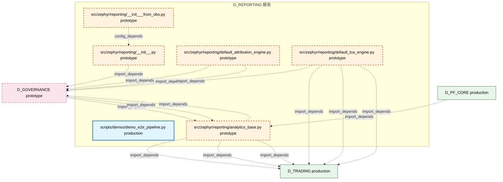

# 17_d_reporting / 报告

> **文档作用 / Purpose**: 展示 报告（D_REPORTING）功能域的模块清单、域内依赖关系、跨域依赖关系、架构全景图，供架构审查和域治理参考。

> 本文档由 generate_domain_doc.py 从 depgraph.db 自动生成
> 最后更新: 2026-06-30 01:26:47
> 数据源: depgraph.db nodes表 + edges表

## 域基本信息 / Domain Overview

| 字段 | 值 | Field | Value |
|------|------|-------|-------|
| 编号 | 17 | Number | 17 |
| 域ID | D_REPORTING | Domain ID | D_REPORTING |
| 域名称 | 报告 | Domain Name | 报告 |
| 层级 | L1_foundation | Layer | L1_foundation |
| 模块数 | 6 | Module Count | 6 |
| 域内依赖 | 1 | Internal Dependencies | 1 |
| 跨域入边 | 3 | Cross-domain Incoming | 3 |
| 跨域出边 | 11 | Cross-domain Outgoing | 11 |
| 设计态模块 | 0 | Design Modules | 0 |
| 原型态模块 | 5 | Prototype Modules | 5 |
| 生产态模块 | 1 | Production Modules | 1 |
| 容量 | 1/150 (正常) | Capacity | 1/150 (正常) |
| 描述 | 绩效报告、风险报告、合规报告、自定义报表。数据呈现层。 | Description | 绩效报告、风险报告、合规报告、自定义报表。数据呈现层。 |

## 域内依赖图 / Internal Dependency Diagram

> 依赖图内嵌在本文档中，IDE 可直接渲染显示。每30个节点一组分页显示。
>
> **图例说明 / Legend**：
> - **实线边框 = 运营态模块**（production，已上线运行）
> - **虚线边框 = 设计态模块**（design，还在设计中）
> - **实线箭头 = 运营态依赖**（已生效的依赖关系）
> - **虚线箭头 = 设计态依赖**（计划中的依赖关系）



## 跨域依赖 / Cross-domain Dependencies

### 本域依赖的其他域（出边）/ Depends On

| 目标域 / Target Domain | 依赖数 / Count | 依赖类型 / Type |
|--------|:---:|---------|
| D_TRADING | 6 | import_depends |
| D_GOVERNANCE | 5 | import_depends |

### 依赖本域的其他域（入边）/ Depended By

| 源域 / Source Domain | 依赖数 / Count | 依赖类型 / Type |
|------|:---:|---------|
| D_GOVERNANCE | 2 | import_depends |
| D_PF_CORE | 1 | import_depends |

## 架构全景图 / Architecture Overview

> 按 architecture_layer 分层显示 报告（D_REPORTING）的模块分布。共 6 个模块 / 6 modules。

```

┌──────────────────────────────────────────────────────────────────┐
│               L2 领域层 / Domain Layer (5 modules)               │
├──────────────────────────────────────────────────────────────────┤
│   src/zephyr/reporting/__init__.py  [prototype]                  │
│   src/zephyr/reporting/__init___from_obs.py  [prototype]         │
│   src/zephyr/reporting/analytics_base.py  [prototype]            │
│   src/zephyr/reporting/default_attribution_engine.py  [protot... │
│   src/zephyr/reporting/default_tca_engine.py  [prototype]        │
└──────────────────────────────────────────────────────────────────┘
                                  │
                                  ▼
┌──────────────────────────────────────────────────────────────────┐
│                未分类 / Unclassified (1 modules)                 │
├──────────────────────────────────────────────────────────────────┤
│   scripts/demos/demo_e2e_pipeline.py  [production]               │
└──────────────────────────────────────────────────────────────────┘

```

## 模块分层清单 / Module Layered List

> 按 architecture_layer 分组的模块清单（共 6 个模块 / 6 modules）。

### L2 领域层 / Domain Layer (5 modules)

| # | 模块路径 / Module Path | 模块名称 / Module Name | 成熟度 / Maturity | 构建状态 / Build Status |
|:--:|---------|---------|:---:|:---:|
| 1 | src/zephyr/reporting/__init__.py | src/zephyr/reporting/__init__.py | prototype | generated |
| 2 | src/zephyr/reporting/__init___from_obs.py | src/zephyr/reporting/__init___from_ob... | prototype | generated |
| 3 | src/zephyr/reporting/analytics_base.py | src/zephyr/reporting/analytics_base.py | prototype | generated |
| 4 | src/zephyr/reporting/default_attribution_engine.py | src/zephyr/reporting/default_attribut... | prototype | generated |
| 5 | src/zephyr/reporting/default_tca_engine.py | src/zephyr/reporting/default_tca_engi... | prototype | generated |

### 未分类 / Unclassified (1 modules)

| # | 模块路径 / Module Path | 模块名称 / Module Name | 成熟度 / Maturity | 构建状态 / Build Status |
|:--:|---------|---------|:---:|:---:|
| 1 | scripts/demos/demo_e2e_pipeline.py | scripts/demos/demo_e2e_pipeline.py | production | generated |

## 依赖关系图 / Dependency Graph

> 域内模块依赖关系（共 1 条 / 1 edges）。按依赖类型分组，使用 → 表示方向。

```

┌──────────────────────────────────────────────────────────────────┐
│        依赖关系图 / Dependency Graph (共 1 条 / 1 edges)         │
├──────────────────────────────────────────────────────────────────┤
│   依赖类型数 / Dependency Types: 1                               │
│   [config_depends]: 1 条 / edges                                 │
└──────────────────────────────────────────────────────────────────┘

┌──────────────────────────────────────────────────────────────────┐
│                 [config_depends] (1 条 / edges)                  │
├──────────────────────────────────────────────────────────────────┤
│   __init___from_obs.py → __init__.py                             │
└──────────────────────────────────────────────────────────────────┘

```

## 说明 / Notes

- **数据源 / Data Source**: `depgraph.db` 的 `nodes`、`edges`、`domains` 表
- **生成器 / Generator**: `generate_domain_doc.py`（G2+G10 合并）
- **维护方式 / Maintenance**: 自动生成，全景图更新时刷新
- **文件名规则 / File Naming**: `{编号:02d}_{域ID小写}.md`，如 `16_d_trading.md`
- **图例说明 / Legend**: `[production]`=已上线 / `[design]`=设计中 / `[prototype]`=原型 / `[unknown]`=未知
