# 17_d_reporting / 报告

> **文档作用 / Purpose**: 展示 报告（D-REPORTING）功能域的模块清单、域内依赖关系和跨域依赖关系，供架构审查和域治理参考。

> 本文档由 generate_domain_doc.py 从 depgraph.db 自动生成
> 最后更新: 2026-06-25 20:00:20
> 数据源: depgraph.db nodes表 + edges表

## 域基本信息 / Domain Overview

| 字段 | 值 | Field | Value |
|------|------|-------|-------|
| 编号 | 17 | Number | 17 |
| 域ID | D-REPORTING | Domain ID | D-REPORTING |
| 域名称 | 报告 | Domain Name | 报告 |
| 层级 | L1_foundation | Layer | L1_foundation |
| 模块数 | 19 | Module Count | 19 |
| 域内依赖 | 1 | Internal Dependencies | 1 |
| 跨域入边 | 3 | Cross-domain Incoming | 3 |
| 跨域出边 | 20 | Cross-domain Outgoing | 20 |
| 设计态模块 | 4 | Design Modules | 4 |
| 原型态模块 | 14 | Prototype Modules | 14 |
| 生产态模块 | 1 | Production Modules | 1 |
| 容量 | 1/150 (正常) | Capacity | 1/150 (正常) |
| 描述 | 绩效报告、风险报告、合规报告、自定义报表。数据呈现层。 | Description | 绩效报告、风险报告、合规报告、自定义报表。数据呈现层。 |

## 模块清单 / Module List

共 19 个模块（按路径排序，全部显示）

| 模块路径 / Module Path | 模块名称 / Module Name | 设计成熟度 / Maturity | 构建状态 / Build Status |
|---------|---------|-----------|---------|
| scripts/demos/demo_e2e_pipeline.py |  | production | generated |
| src/zephyr/reporting/__init__.py |  | prototype | generated |
| src/zephyr/reporting/__init___from_obs.py |  | prototype | generated |
| src/zephyr/reporting/_extensions/__init__.py |  | prototype | deprecated |
| src/zephyr/reporting/analytics_base.py |  | prototype | generated |
| src/zephyr/reporting/api/__init__.py |  | prototype | deprecated |
| src/zephyr/reporting/core/__init__.py |  | prototype | deprecated |
| src/zephyr/reporting/default_attribution_engine.py |  | prototype | generated |
| src/zephyr/reporting/default_tca_engine.py |  | prototype | generated |
| src/zephyr/reporting/implementations/__init__.py |  | prototype | generated |
| src/zephyr/reporting/implementations/default_attribution_engine.py |  | prototype | generated |
| src/zephyr/reporting/implementations/default_tca_engine.py |  | prototype | generated |
| src/zephyr/reporting/infrastructure/__init__.py |  | prototype | deprecated |
| src/zephyr/reporting/models/__init__.py |  | prototype | deprecated |
| src/zephyr/reporting/services/__init__.py |  | prototype | deprecated |
| 报告域-水印追踪/D-REPORTING-17 | Report Watermark Tracker | design | planned |
| 报告域/D-REPORTING-03 | Report Publisher | design | planned |
| 报告域/D-REPORTING-08 | Risk Report Engine | design | planned |
| 监管报告生成器(证监会/交易所报告+数据完整性校验)/D-REPORTING-06 | Regulatory Report Generator | design | planned |

## 域内依赖图 / Internal Dependency Diagram

> 依赖图内嵌在本文档中，IDE 可直接渲染显示。每30个节点一组分页显示。
>
> **图例说明 / Legend**：
> - **实线边框 = 运营态模块**（production，已上线运行）
> - **虚线边框 = 设计态模块**（design，还在设计中）
> - **实线箭头 = 运营态依赖**（已生效的依赖关系）
> - **虚线箭头 = 设计态依赖**（计划中的依赖关系）

```mermaid
graph TD
    subgraph D_REPORTING["D-REPORTING 报告"]
        scripts_demos_demo_e2e_pipeline_py["scripts/demos/demo_e2e_pipeline.py production"]
        src_zephyr_reporting_init_py["src/zephyr/reporting/__init__.py prototype"]
        src_zephyr_reporting_init_from_obs_py["src/zephyr/reporting/__init___from_obs.py prototype"]
        src_zephyr_reporting_extensions_init_py["src/zephyr/reporting/_extensions/__init__.py prototype"]
        src_zephyr_reporting_analytics_base_py["src/zephyr/reporting/analytics_base.py prototype"]
        src_zephyr_reporting_api_init_py["src/zephyr/reporting/api/__init__.py prototype"]
        src_zephyr_reporting_core_init_py["src/zephyr/reporting/core/__init__.py prototype"]
        src_zephyr_reporting_default_attribution_engine_py["src/zephyr/reporting/default_attribution_engine.py prototype"]
        src_zephyr_reporting_default_tca_engine_py["src/zephyr/reporting/default_tca_engine.py prototype"]
        src_zephyr_reporting_implementations_init_py["src/zephyr/reporting/implementations/__init__.py prototype"]
        src_zephyr_reporting_implementations_default_attribution_engine_py["src/zephyr/reporting/implementations/default_at... prototype"]
        src_zephyr_reporting_implementations_default_tca_engine_py["src/zephyr/reporting/implementations/default_tc... prototype"]
        src_zephyr_reporting_infrastructure_init_py["src/zephyr/reporting/infrastructure/__init__.py prototype"]
        src_zephyr_reporting_models_init_py["src/zephyr/reporting/models/__init__.py prototype"]
        src_zephyr_reporting_services_init_py["src/zephyr/reporting/services/__init__.py prototype"]
        D_REPORTING_17["Report Watermark Tracker design"]
        D_REPORTING_03["Report Publisher design"]
        D_REPORTING_08["Risk Report Engine design"]
        D_REPORTING_06["Regulatory Report Generator design"]
    end
    src_zephyr_reporting_init_from_obs_py -.->|config_depends| src_zephyr_reporting_init_py
    D_GOVERNANCE["D-GOVERNANCE design"]
    D_REPORTING_08 -.->|contract| D_GOVERNANCE
    src_zephyr_reporting_init_py -.->|import_depends| D_GOVERNANCE
    src_zephyr_reporting_default_attribution_engine_py -.->|import_depends| D_GOVERNANCE
    src_zephyr_reporting_default_attribution_engine_py -.->|import_depends| D_GOVERNANCE
    src_zephyr_reporting_default_tca_engine_py -.->|import_depends| D_GOVERNANCE
    D_TRADING["D-TRADING production"]
    src_zephyr_reporting_default_tca_engine_py -.->|import_depends| D_TRADING
    src_zephyr_reporting_default_tca_engine_py -.->|import_depends| D_TRADING
    src_zephyr_reporting_default_tca_engine_py -.->|import_depends| D_TRADING
    src_zephyr_reporting_analytics_base_py -.->|import_depends| D_TRADING
    src_zephyr_reporting_analytics_base_py -.->|import_depends| D_TRADING
    src_zephyr_reporting_analytics_base_py -.->|import_depends| D_TRADING
    src_zephyr_reporting_analytics_base_py -.->|import_depends| D_GOVERNANCE
    src_zephyr_reporting_implementations_default_attribution_engine_py -.->|import_depends| D_GOVERNANCE
    src_zephyr_reporting_implementations_default_attribution_engine_py -.->|import_depends| D_GOVERNANCE
    src_zephyr_reporting_implementations_default_tca_engine_py -.->|import_depends| D_GOVERNANCE
    D_GOVERNANCE -.->|import_depends| src_zephyr_reporting_analytics_base_py
    D_GOVERNANCE -.->|import_depends| src_zephyr_reporting_analytics_base_py
    D_PF_CORE["D-PF_CORE production"]
    D_PF_CORE -.->|import_depends| src_zephyr_reporting_analytics_base_py
    classDef production fill:#e1f5fe,stroke:#01579b,stroke-width:2px,color:#000
    classDef design fill:#fff3e0,stroke:#e65100,stroke-width:2px,color:#000,stroke-dasharray: 5 5
    classDef external_prod fill:#e8f5e9,stroke:#1b5e20,stroke-width:1px,color:#000
    classDef external_design fill:#fce4ec,stroke:#880e4f,stroke-width:1px,color:#000,stroke-dasharray: 5 5
    class scripts_demos_demo_e2e_pipeline_py production
    class src_zephyr_reporting_init_py,src_zephyr_reporting_init_from_obs_py,src_zephyr_reporting_extensions_init_py,src_zephyr_reporting_analytics_base_py,src_zephyr_reporting_api_init_py,src_zephyr_reporting_core_init_py,src_zephyr_reporting_default_attribution_engine_py,src_zephyr_reporting_default_tca_engine_py,src_zephyr_reporting_implementations_init_py,src_zephyr_reporting_implementations_default_attribution_engine_py,src_zephyr_reporting_implementations_default_tca_engine_py,src_zephyr_reporting_infrastructure_init_py,src_zephyr_reporting_models_init_py,src_zephyr_reporting_services_init_py,D_REPORTING_17,D_REPORTING_03,D_REPORTING_08,D_REPORTING_06 design
    class D_TRADING,D_PF_CORE external_prod
    class D_GOVERNANCE external_design
```

## 跨域依赖 / Cross-domain Dependencies

### 本域依赖的其他域（出边）/ Depends On

| 目标域 / Target Domain | 依赖数 / Count | 依赖类型 / Type |
|--------|:---:|---------|
| D-GOVERNANCE | 11 | contract,import_depends |
| D-TRADING | 9 | import_depends |

### 依赖本域的其他域（入边）/ Depended By

| 源域 / Source Domain | 依赖数 / Count | 依赖类型 / Type |
|------|:---:|---------|
| D-GOVERNANCE | 2 | import_depends |
| D-PF_CORE | 1 | import_depends |

## 说明 / Notes

- **数据源 / Data Source**: `depgraph.db` 的 `nodes`、`edges`、`domains` 表
- **生成器 / Generator**: `generate_domain_doc.py`
- **维护方式 / Maintenance**: 自动生成，全景图更新时刷新
- **文件名规则 / File Naming**: `{编号:02d}_{域ID小写}.md`，如 `16_d_trading.md`
