# 17_d_security / orphan_judge / 对抗验证 / Adversarial Validation

> **功能简介 / Overview**: 对抗验证与安全测试

> **文档作用 / Purpose**: 展示 对抗验证（D_SECURITY）功能域的模块清单、域内依赖关系、跨域依赖关系、架构分层视图，供架构审查和域治理参考。

> 本文档由 generate_domain_doc.py 从 depgraph (PostgreSQL) 自动生成
> 最后更新: 2026-07-09 01:10:31
> 数据源: depgraph (PostgreSQL) nodes表 + edges表

## 域基本信息 / Domain Overview

| 字段 | 值 | Field | Value |
|------|------|-------|-------|
| 编号 | 17 | Number | 17 |
| 域ID | D_SECURITY | Domain ID | D_SECURITY |
| 域名称 | 对抗验证 | Domain Name | Adversarial Validation |
| 层级 | L1 基础平台层 | Layer | L1 Foundation |
| 模块数 | 147 | Module Count | 147 |
| 域内依赖 | 125 | Internal Dependencies | 125 |
| 跨域入边 | 199 | Cross-domain Incoming | 199 |
| 跨域出边 | 28 | Cross-domain Outgoing | 28 |
| 设计态模块 | 0 | Design Modules | 0 |
| 原型态模块 | 67 | Prototype Modules | 67 |
| 生产态模块 | 80 | Production Modules | 80 |
| 容量 | 80/150 (正常) | Capacity | 80/150 (正常) |
| 描述 | 孤儿文件检测(orphan_detector) | Description | 孤儿文件检测(orphan_detector) |

## 域内依赖图 / Internal Dependency Diagram

> 依赖图内嵌在本文档中，IDE 可直接渲染显示。每30个节点一组分页显示。
>
> **图例说明 / Legend**：
> - **实线边框 = 运营态模块**（production，已上线运行）
> - **虚线边框 = 设计态模块**（design，还在设计中）
> - **实线箭头 = 运营态依赖**（已生效的依赖关系）
> - **虚线箭头 = 设计态依赖**（计划中的依赖关系）

### 第 1 页 / 共 5 页 / Page 1 of 5

```mermaid
graph TD
    subgraph D_SECURITY["D_SECURITY 对抗验证"]
        src_zephyr_governance_compliance_gate_a6_init_py["(原型态 / prototype) __init__.py"]
        src_zephyr_governance_compliance_gate_a6_compliance_manager_py["(生产态 / production) compliance_manager.py"]
        src_zephyr_governance_compliance_gate_a6_compliance_mapper_py["(生产态 / production) compliance_mapper.py"]
        src_zephyr_governance_implementations_init_py["(原型态 / prototype) __init__.py"]
        src_zephyr_governance_implementations_default_experiment_pipeline_py["(原型态 / prototype) default_experiment_pipeline.py"]
        src_zephyr_governance_implementations_default_security_gateway_py["(原型态 / prototype) default_security_gateway.py"]
        src_zephyr_security_init_py["(原型态 / prototype) __init__.py"]
        src_zephyr_security_extensions_init_py["(原型态 / prototype) __init__.py"]
        src_zephyr_security_access_control_init_py["(生产态 / production) __init__.py"]
        src_zephyr_security_access_control_a2a_check_py["(生产态 / production) a2a_check.py"]
        src_zephyr_security_access_control_adversarial_resilience_py["(生产态 / production) adversarial_resilience.py"]
        src_zephyr_security_access_control_agent_creation_policy_py["(生产态 / production) agent_creation_policy.py"]
        src_zephyr_security_access_control_approver_check_py["(生产态 / production) approver_check.py"]
        src_zephyr_security_access_control_asymmetric_audit_py["(生产态 / production) asymmetric_audit.py"]
        src_zephyr_security_access_control_auto_maintenance_py["(生产态 / production) auto_maintenance.py"]
        src_zephyr_security_access_control_blueprint_fidelity_py["(生产态 / production) blueprint_fidelity.py"]
        src_zephyr_security_access_control_bootstrap_superadmin_py["(生产态 / production) bootstrap_superadmin.py"]
        src_zephyr_security_access_control_build_sanitizer_py["(原型态 / prototype) build_sanitizer.py"]
        src_zephyr_security_access_control_cache_invalidation_py["(生产态 / production) cache_invalidation.py"]
        src_zephyr_security_access_control_canary_rollout_manager_py["(生产态 / production) canary_rollout_manager.py"]
        src_zephyr_security_access_control_capability_check_py["(生产态 / production) capability_check.py"]
        src_zephyr_security_access_control_cascading_failure_isolator_py["(原型态 / prototype) cascading_failure_isolator.py"]
        src_zephyr_security_access_control_cold_start_lock_py["(生产态 / production) cold_start_lock.py"]
        src_zephyr_security_access_control_compliance_matrix_py["(原型态 / prototype) compliance_matrix.py"]
        src_zephyr_security_access_control_contracts_py["(生产态 / production) contracts.py"]
        src_zephyr_security_access_control_cross_cutting_py["(生产态 / production) cross_cutting.py"]
        src_zephyr_security_access_control_decision_explainer_py["(生产态 / production) decision_explainer.py"]
        src_zephyr_security_access_control_decision_registry_py["(生产态 / production) decision_registry.py"]
        src_zephyr_security_access_control_defense_depth_py["(原型态 / prototype) defense_depth.py"]
        src_zephyr_security_access_control_dependency_auditor_py["(生产态 / production) dependency_auditor.py"]
    end
    src_zephyr_governance_implementations_init_py -.->|导入依赖 / import_depends| src_zephyr_governance_implementations_default_security_gateway_py
    src_zephyr_security_init_py -.->|导入依赖 / import_depends| src_zephyr_security_access_control_init_py
    src_zephyr_security_access_control_build_sanitizer_py -.->|config_depends / config_depends| src_zephyr_security_access_control_init_py
    src_zephyr_security_access_control_cascading_failure_isolator_py -.->|config_depends / config_depends| src_zephyr_security_access_control_init_py
    src_zephyr_security_access_control_compliance_matrix_py -.->|config_depends / config_depends| src_zephyr_security_access_control_init_py
    src_zephyr_security_access_control_defense_depth_py -.->|config_depends / config_depends| src_zephyr_security_access_control_init_py
    D_GOV_ENFORCEMENT["[原型态 / prototype] D_GOV_ENFORCEMENT"]
    src_zephyr_governance_compliance_gate_a6_compliance_manager_py -.->|导入依赖 / import_depends| D_GOV_ENFORCEMENT
    D_GOVERNANCE["[生产态 / production] D_GOVERNANCE"]
    src_zephyr_governance_implementations_default_security_gateway_py -.->|导入依赖 / import_depends| D_GOVERNANCE
    src_zephyr_governance_implementations_default_experiment_pipeline_py -.->|导入依赖 / import_depends| D_GOVERNANCE
    D_GOV_ENFORCEMENT -.->|导入依赖 / import_depends| src_zephyr_governance_compliance_gate_a6_compliance_manager_py
    D_GOV_ENFORCEMENT -.->|导入依赖 / import_depends| src_zephyr_governance_compliance_gate_a6_init_py
    D_GOV_ENFORCEMENT -.->|导入依赖 / import_depends| src_zephyr_governance_implementations_init_py
    D_AUDITTEST["[原型态 / prototype] D_AUDITTEST"]
    D_AUDITTEST -.->|测试依赖 / test_depends| src_zephyr_security_access_control_a2a_check_py
    D_AUDITTEST -.->|测试依赖 / test_depends| src_zephyr_security_access_control_agent_creation_policy_py
    D_AUDITTEST -.->|测试依赖 / test_depends| src_zephyr_security_access_control_blueprint_fidelity_py
    D_AUDITTEST -.->|测试依赖 / test_depends| src_zephyr_security_access_control_decision_registry_py
    D_AUDITTEST -.->|测试依赖 / test_depends| src_zephyr_security_access_control_adversarial_resilience_py
    D_AUDITTEST -.->|测试依赖 / test_depends| src_zephyr_security_access_control_asymmetric_audit_py
    D_AUDITTEST -.->|测试依赖 / test_depends| src_zephyr_security_access_control_decision_explainer_py
    D_AUDITTEST -.->|测试依赖 / test_depends| src_zephyr_security_access_control_agent_creation_policy_py
    D_AUDITTEST -.->|测试依赖 / test_depends| src_zephyr_security_access_control_auto_maintenance_py
    D_AUDITTEST -.->|测试依赖 / test_depends| src_zephyr_security_access_control_cache_invalidation_py
    D_AUDITTEST -.->|测试依赖 / test_depends| src_zephyr_security_access_control_init_py
    D_AUDITTEST -.->|测试依赖 / test_depends| src_zephyr_security_access_control_canary_rollout_manager_py
    classDef production fill:#e1f5fe,stroke:#01579b,stroke-width:2px,color:#000
    classDef design fill:#fff3e0,stroke:#e65100,stroke-width:2px,color:#000,stroke-dasharray: 5 5
    classDef external_prod fill:#e8f5e9,stroke:#1b5e20,stroke-width:1px,color:#000
    classDef external_design fill:#fce4ec,stroke:#880e4f,stroke-width:1px,color:#000,stroke-dasharray: 5 5
    class src_zephyr_governance_compliance_gate_a6_compliance_manager_py,src_zephyr_governance_compliance_gate_a6_compliance_mapper_py,src_zephyr_security_access_control_init_py,src_zephyr_security_access_control_a2a_check_py,src_zephyr_security_access_control_adversarial_resilience_py,src_zephyr_security_access_control_agent_creation_policy_py,src_zephyr_security_access_control_approver_check_py,src_zephyr_security_access_control_asymmetric_audit_py,src_zephyr_security_access_control_auto_maintenance_py,src_zephyr_security_access_control_blueprint_fidelity_py,src_zephyr_security_access_control_bootstrap_superadmin_py,src_zephyr_security_access_control_cache_invalidation_py,src_zephyr_security_access_control_canary_rollout_manager_py,src_zephyr_security_access_control_capability_check_py,src_zephyr_security_access_control_cold_start_lock_py,src_zephyr_security_access_control_contracts_py,src_zephyr_security_access_control_cross_cutting_py,src_zephyr_security_access_control_decision_explainer_py,src_zephyr_security_access_control_decision_registry_py,src_zephyr_security_access_control_dependency_auditor_py production
    class src_zephyr_governance_compliance_gate_a6_init_py,src_zephyr_governance_implementations_init_py,src_zephyr_governance_implementations_default_experiment_pipeline_py,src_zephyr_governance_implementations_default_security_gateway_py,src_zephyr_security_init_py,src_zephyr_security_extensions_init_py,src_zephyr_security_access_control_build_sanitizer_py,src_zephyr_security_access_control_cascading_failure_isolator_py,src_zephyr_security_access_control_compliance_matrix_py,src_zephyr_security_access_control_defense_depth_py design
    class D_GOVERNANCE external_prod
    class D_GOV_ENFORCEMENT,D_AUDITTEST external_design
```



### 第 2 页 / 共 5 页 / Page 2 of 5

```mermaid
graph TD
    subgraph D_SECURITY["D_SECURITY 对抗验证"]
        src_zephyr_security_access_control_derive_rbac_roles_py["(生产态 / production) derive_rbac_roles.py"]
        src_zephyr_security_access_control_detectors_init_py["(原型态 / prototype) __init__.py"]
        src_zephyr_security_access_control_detectors_anomaly_detector_py["(生产态 / production) anomaly_detector.py"]
        src_zephyr_security_access_control_detectors_context_drift_detector_py["(生产态 / production) context_drift_detector.py"]
        src_zephyr_security_access_control_detectors_cross_session_detector_py["(生产态 / production) cross_session_detector.py"]
        src_zephyr_security_access_control_detectors_false_completion_detector_py["(生产态 / production) false_completion_detector.py"]
        src_zephyr_security_access_control_detectors_multi_agent_collusion_detector_py["(生产态 / production) multi_agent_collusion_detector.py"]
        src_zephyr_security_access_control_detectors_shell_dialect_detector_py["(生产态 / production) shell_dialect_detector.py"]
        src_zephyr_security_access_control_dry_run_py["(生产态 / production) dry_run.py"]
        src_zephyr_security_access_control_emergency_override_py["(生产态 / production) emergency_override.py"]
        src_zephyr_security_access_control_engine_degradation_py["(生产态 / production) engine_degradation.py"]
        src_zephyr_security_access_control_environment_manager_py["(原型态 / prototype) environment_manager.py"]
        src_zephyr_security_access_control_escalation_handler_py["(生产态 / production) escalation_handler.py"]
        src_zephyr_security_access_control_exceptions_py["(生产态 / production) exceptions.py"]
        src_zephyr_security_access_control_genesis_bootstrap_py["(生产态 / production) genesis_bootstrap.py"]
        src_zephyr_security_access_control_guard_layers_py["(生产态 / production) guard_layers.py"]
        src_zephyr_security_access_control_guards_init_py["(原型态 / prototype) __init__.py"]
        src_zephyr_security_access_control_guards_abac_guard_py["(生产态 / production) abac_guard.py"]
        src_zephyr_security_access_control_guards_anti_pattern_guard_py["(原型态 / prototype) anti_pattern_guard.py"]
        src_zephyr_security_access_control_guards_audit_log_guard_py["(生产态 / production) audit_log_guard.py"]
        src_zephyr_security_access_control_guards_cybersec_2026_guard_py["(生产态 / production) cybersec_2026_guard.py"]
        src_zephyr_security_access_control_guards_input_guard_py["(生产态 / production) input_guard.py"]
        src_zephyr_security_access_control_guards_memory_guard_py["(生产态 / production) memory_guard.py"]
        src_zephyr_security_access_control_guards_memory_provenance_guard_py["(生产态 / production) memory_provenance_guard.py"]
        src_zephyr_security_access_control_guards_native_api_guard_py["(生产态 / production) native_api_guard.py"]
        src_zephyr_security_access_control_guards_novel_attack_guard_py["(生产态 / production) novel_attack_guard.py"]
        src_zephyr_security_access_control_guards_output_guard_py["(生产态 / production) output_guard.py"]
        src_zephyr_security_access_control_guards_path_guard_py["(生产态 / production) path_guard.py"]
        src_zephyr_security_access_control_guards_permission_guard_py["(生产态 / production) permission_guard.py"]
        src_zephyr_security_access_control_guards_rbac_guard_py["(生产态 / production) rbac_guard.py"]
    end
    src_zephyr_security_access_control_genesis_bootstrap_py -->|导入依赖 / import_depends| src_zephyr_security_access_control_engine_degradation_py
    src_zephyr_security_access_control_detectors_init_py -.->|config_depends / config_depends| src_zephyr_security_access_control_detectors_anomaly_detector_py
    src_zephyr_security_access_control_guards_anti_pattern_guard_py -.->|config_depends / config_depends| src_zephyr_security_access_control_guards_init_py
    src_zephyr_security_access_control_guards_permission_guard_py -->|导入依赖 / import_depends| src_zephyr_security_access_control_guards_rbac_guard_py
    D_SHARED["[生产态 / production] D_SHARED"]
    src_zephyr_security_access_control_guards_abac_guard_py -->|导入依赖 / import_depends| D_SHARED
    D_GOVERNANCE["[生产态 / production] D_GOVERNANCE"]
    D_GOVERNANCE -->|导入依赖 / import_depends| src_zephyr_security_access_control_guards_permission_guard_py
    D_INTEGRATION_GATEWAY["[生产态 / production] D_INTEGRATION_GATEWAY"]
    D_INTEGRATION_GATEWAY -->|导入依赖 / import_depends| src_zephyr_security_access_control_guards_permission_guard_py
    D_TRADING["[生产态 / production] D_TRADING"]
    D_TRADING -->|导入依赖 / import_depends| src_zephyr_security_access_control_genesis_bootstrap_py
    D_TRADING -->|导入依赖 / import_depends| src_zephyr_security_access_control_genesis_bootstrap_py
    D_AUDITTEST["[原型态 / prototype] D_AUDITTEST"]
    D_AUDITTEST -.->|测试依赖 / test_depends| src_zephyr_security_access_control_guards_abac_guard_py
    D_AUDITTEST -.->|测试依赖 / test_depends| src_zephyr_security_access_control_detectors_anomaly_detector_py
    D_AUDITTEST -.->|测试依赖 / test_depends| src_zephyr_security_access_control_guards_memory_guard_py
    D_AUDITTEST -.->|测试依赖 / test_depends| src_zephyr_security_access_control_guards_native_api_guard_py
    D_AUDITTEST -.->|测试依赖 / test_depends| src_zephyr_security_access_control_derive_rbac_roles_py
    D_AUDITTEST -.->|测试依赖 / test_depends| src_zephyr_security_access_control_guards_permission_guard_py
    D_AUDITTEST -.->|测试依赖 / test_depends| src_zephyr_security_access_control_guards_rbac_guard_py
    D_AUDITTEST -.->|测试依赖 / test_depends| src_zephyr_security_access_control_guards_rbac_guard_py
    D_AUDITTEST -.->|测试依赖 / test_depends| src_zephyr_security_access_control_guards_cybersec_2026_guard_py
    D_AUDITTEST -.->|测试依赖 / test_depends| src_zephyr_security_access_control_detectors_cross_session_detector_py
    D_AUDITTEST -.->|测试依赖 / test_depends| src_zephyr_security_access_control_genesis_bootstrap_py
    classDef production fill:#e1f5fe,stroke:#01579b,stroke-width:2px,color:#000
    classDef design fill:#fff3e0,stroke:#e65100,stroke-width:2px,color:#000,stroke-dasharray: 5 5
    classDef external_prod fill:#e8f5e9,stroke:#1b5e20,stroke-width:1px,color:#000
    classDef external_design fill:#fce4ec,stroke:#880e4f,stroke-width:1px,color:#000,stroke-dasharray: 5 5
    class src_zephyr_security_access_control_derive_rbac_roles_py,src_zephyr_security_access_control_detectors_anomaly_detector_py,src_zephyr_security_access_control_detectors_context_drift_detector_py,src_zephyr_security_access_control_detectors_cross_session_detector_py,src_zephyr_security_access_control_detectors_false_completion_detector_py,src_zephyr_security_access_control_detectors_multi_agent_collusion_detector_py,src_zephyr_security_access_control_detectors_shell_dialect_detector_py,src_zephyr_security_access_control_dry_run_py,src_zephyr_security_access_control_emergency_override_py,src_zephyr_security_access_control_engine_degradation_py,src_zephyr_security_access_control_escalation_handler_py,src_zephyr_security_access_control_exceptions_py,src_zephyr_security_access_control_genesis_bootstrap_py,src_zephyr_security_access_control_guard_layers_py,src_zephyr_security_access_control_guards_abac_guard_py,src_zephyr_security_access_control_guards_audit_log_guard_py,src_zephyr_security_access_control_guards_cybersec_2026_guard_py,src_zephyr_security_access_control_guards_input_guard_py,src_zephyr_security_access_control_guards_memory_guard_py,src_zephyr_security_access_control_guards_memory_provenance_guard_py,src_zephyr_security_access_control_guards_native_api_guard_py,src_zephyr_security_access_control_guards_novel_attack_guard_py,src_zephyr_security_access_control_guards_output_guard_py,src_zephyr_security_access_control_guards_path_guard_py,src_zephyr_security_access_control_guards_permission_guard_py,src_zephyr_security_access_control_guards_rbac_guard_py production
    class src_zephyr_security_access_control_detectors_init_py,src_zephyr_security_access_control_environment_manager_py,src_zephyr_security_access_control_guards_init_py,src_zephyr_security_access_control_guards_anti_pattern_guard_py design
    class D_SHARED,D_GOVERNANCE,D_INTEGRATION_GATEWAY,D_TRADING external_prod
    class D_AUDITTEST external_design
```



### 第 3 页 / 共 5 页 / Page 3 of 5

```mermaid
graph TD
    subgraph D_SECURITY["D_SECURITY 对抗验证"]
        src_zephyr_security_access_control_guards_replay_attack_guard_py["(生产态 / production) replay_attack_guard.py"]
        src_zephyr_security_access_control_guards_rule_injection_guard_py["(生产态 / production) rule_injection_guard.py"]
        src_zephyr_security_access_control_guards_sequence_guard_py["(生产态 / production) sequence_guard.py"]
        src_zephyr_security_access_control_guards_toctou_guard_py["(生产态 / production) toctou_guard.py"]
        src_zephyr_security_access_control_guards_vibe_coding_guard_py["(生产态 / production) vibe_coding_guard.py"]
        src_zephyr_security_access_control_identity_py["(生产态 / production) identity.py"]
        src_zephyr_security_access_control_immutable_core_py["(生产态 / production) immutable_core.py"]
        src_zephyr_security_access_control_integration_py["(生产态 / production) integration.py"]
        src_zephyr_security_access_control_integrity_self_check_py["(生产态 / production) integrity_self_check.py"]
        src_zephyr_security_access_control_intent_binder_py["(生产态 / production) intent_binder.py"]
        src_zephyr_security_access_control_key_hierarchy_py["(原型态 / prototype) key_hierarchy.py"]
        src_zephyr_security_access_control_kill_switch_py["(生产态 / production) kill_switch.py"]
        src_zephyr_security_access_control_legal_audit_chain_py["(生产态 / production) legal_audit_chain.py"]
        src_zephyr_security_access_control_microstructure_defense_py["(生产态 / production) microstructure_defense.py"]
        src_zephyr_security_access_control_monotonic_clock_py["(生产态 / production) monotonic_clock.py"]
        src_zephyr_security_access_control_non_repudiation_py["(生产态 / production) non_repudiation.py"]
        src_zephyr_security_access_control_observability_py["(生产态 / production) observability.py"]
        src_zephyr_security_access_control_orphan_judge_init_py["(原型态 / prototype) __init__.py"]
        src_zephyr_security_access_control_orphan_judge_main_py["(原型态 / prototype) __main__.py"]
        src_zephyr_security_access_control_orphan_judge_cascade_analyzer_py["(生产态 / production) cascade_analyzer.py"]
        src_zephyr_security_access_control_orphan_judge_config_loader_py["(原型态 / prototype) config_loader.py"]
        src_zephyr_security_access_control_orphan_judge_db_py["(原型态 / prototype) db.py"]
        src_zephyr_security_access_control_orphan_judge_decision_table_py["(生产态 / production) decision_table.py"]
        src_zephyr_security_access_control_orphan_judge_deprecation_tracker_py["(生产态 / production) deprecation_tracker.py"]
        src_zephyr_security_access_control_orphan_judge_drift_bridge_py["(原型态 / prototype) drift_bridge.py"]
        src_zephyr_security_access_control_orphan_judge_duplicate_detector_py["(原型态 / prototype) duplicate_detector.py"]
        src_zephyr_security_access_control_orphan_judge_escalation_bridge_py["(原型态 / prototype) escalation_bridge.py"]
        src_zephyr_security_access_control_orphan_judge_feedback_bridge_py["(原型态 / prototype) feedback_bridge.py"]
        src_zephyr_security_access_control_orphan_judge_judge_py["(生产态 / production) judge.py"]
        src_zephyr_security_access_control_orphan_judge_kb_bridge_py["(原型态 / prototype) kb_bridge.py"]
    end
    src_zephyr_security_access_control_orphan_judge_judge_py -.->|导入依赖 / import_depends| src_zephyr_security_access_control_orphan_judge_duplicate_detector_py
    src_zephyr_security_access_control_orphan_judge_main_py -.->|导入依赖 / import_depends| src_zephyr_security_access_control_orphan_judge_judge_py
    src_zephyr_security_access_control_orphan_judge_init_py -.->|导入依赖 / import_depends| src_zephyr_security_access_control_orphan_judge_deprecation_tracker_py
    src_zephyr_security_access_control_orphan_judge_init_py -.->|导入依赖 / import_depends| src_zephyr_security_access_control_orphan_judge_decision_table_py
    src_zephyr_security_access_control_orphan_judge_init_py -.->|导入依赖 / import_depends| src_zephyr_security_access_control_orphan_judge_db_py
    src_zephyr_security_access_control_orphan_judge_init_py -.->|导入依赖 / import_depends| src_zephyr_security_access_control_orphan_judge_cascade_analyzer_py
    src_zephyr_security_access_control_orphan_judge_init_py -.->|导入依赖 / import_depends| src_zephyr_security_access_control_orphan_judge_config_loader_py
    src_zephyr_security_access_control_orphan_judge_init_py -.->|导入依赖 / import_depends| src_zephyr_security_access_control_orphan_judge_duplicate_detector_py
    src_zephyr_security_access_control_orphan_judge_init_py -.->|导入依赖 / import_depends| src_zephyr_security_access_control_orphan_judge_main_py
    D_SHARED["[生产态 / production] D_SHARED"]
    src_zephyr_security_access_control_immutable_core_py -->|导入依赖 / import_depends| D_SHARED
    D_GOV_ENFORCEMENT["[原型态 / prototype] D_GOV_ENFORCEMENT"]
    src_zephyr_security_access_control_orphan_judge_drift_bridge_py -.->|导入依赖 / import_depends| D_GOV_ENFORCEMENT
    D_GOVERNANCE["[生产态 / production] D_GOVERNANCE"]
    src_zephyr_security_access_control_orphan_judge_db_py -.->|导入依赖 / import_depends| D_GOVERNANCE
    src_zephyr_security_access_control_orphan_judge_config_loader_py -.->|导入依赖 / import_depends| D_SHARED
    src_zephyr_security_access_control_orphan_judge_escalation_bridge_py -.->|导入依赖 / import_depends| D_GOVERNANCE
    src_zephyr_security_access_control_orphan_judge_feedback_bridge_py -.->|导入依赖 / import_depends| D_SHARED
    D_TRADING["[生产态 / production] D_TRADING"]
    src_zephyr_security_access_control_orphan_judge_feedback_bridge_py -.->|导入依赖 / import_depends| D_TRADING
    src_zephyr_security_access_control_orphan_judge_judge_py -.->|导入依赖 / import_depends| D_GOVERNANCE
    src_zephyr_security_access_control_orphan_judge_judge_py -->|导入依赖 / import_depends| D_GOV_ENFORCEMENT
    D_INTELLIGENCE["[生产态 / production] D_INTELLIGENCE"]
    src_zephyr_security_access_control_orphan_judge_kb_bridge_py -.->|导入依赖 / import_depends| D_INTELLIGENCE
    src_zephyr_security_access_control_orphan_judge_main_py -.->|导入依赖 / import_depends| D_SHARED
    D_GOVERNANCE -->|导入依赖 / import_depends| src_zephyr_security_access_control_orphan_judge_judge_py
    D_TRADING -->|导入依赖 / import_depends| src_zephyr_security_access_control_non_repudiation_py
    D_TRADING -->|导入依赖 / import_depends| src_zephyr_security_access_control_kill_switch_py
    D_AUDITTEST["[原型态 / prototype] D_AUDITTEST"]
    D_AUDITTEST -.->|测试依赖 / test_depends| src_zephyr_security_access_control_identity_py
    D_AUDITTEST -.->|测试依赖 / test_depends| src_zephyr_security_access_control_identity_py
    D_AUDITTEST -.->|测试依赖 / test_depends| src_zephyr_security_access_control_immutable_core_py
    D_AUDITTEST -.->|测试依赖 / test_depends| src_zephyr_security_access_control_integrity_self_check_py
    D_AUDITTEST -.->|测试依赖 / test_depends| src_zephyr_security_access_control_identity_py
    D_AUDITTEST -.->|测试依赖 / test_depends| src_zephyr_security_access_control_guards_replay_attack_guard_py
    D_AUDITTEST -.->|测试依赖 / test_depends| src_zephyr_security_access_control_monotonic_clock_py
    D_AUDITTEST -.->|测试依赖 / test_depends| src_zephyr_security_access_control_non_repudiation_py
    D_AUDITTEST -.->|测试依赖 / test_depends| src_zephyr_security_access_control_non_repudiation_py
    D_AUDITTEST -.->|测试依赖 / test_depends| src_zephyr_security_access_control_identity_py
    D_AUDITTEST -.->|测试依赖 / test_depends| src_zephyr_security_access_control_guards_rule_injection_guard_py
    D_AUDITTEST -.->|测试依赖 / test_depends| src_zephyr_security_access_control_identity_py
    classDef production fill:#e1f5fe,stroke:#01579b,stroke-width:2px,color:#000
    classDef design fill:#fff3e0,stroke:#e65100,stroke-width:2px,color:#000,stroke-dasharray: 5 5
    classDef external_prod fill:#e8f5e9,stroke:#1b5e20,stroke-width:1px,color:#000
    classDef external_design fill:#fce4ec,stroke:#880e4f,stroke-width:1px,color:#000,stroke-dasharray: 5 5
    class src_zephyr_security_access_control_guards_replay_attack_guard_py,src_zephyr_security_access_control_guards_rule_injection_guard_py,src_zephyr_security_access_control_guards_sequence_guard_py,src_zephyr_security_access_control_guards_toctou_guard_py,src_zephyr_security_access_control_guards_vibe_coding_guard_py,src_zephyr_security_access_control_identity_py,src_zephyr_security_access_control_immutable_core_py,src_zephyr_security_access_control_integration_py,src_zephyr_security_access_control_integrity_self_check_py,src_zephyr_security_access_control_intent_binder_py,src_zephyr_security_access_control_kill_switch_py,src_zephyr_security_access_control_legal_audit_chain_py,src_zephyr_security_access_control_microstructure_defense_py,src_zephyr_security_access_control_monotonic_clock_py,src_zephyr_security_access_control_non_repudiation_py,src_zephyr_security_access_control_observability_py,src_zephyr_security_access_control_orphan_judge_cascade_analyzer_py,src_zephyr_security_access_control_orphan_judge_decision_table_py,src_zephyr_security_access_control_orphan_judge_deprecation_tracker_py,src_zephyr_security_access_control_orphan_judge_judge_py production
    class src_zephyr_security_access_control_key_hierarchy_py,src_zephyr_security_access_control_orphan_judge_init_py,src_zephyr_security_access_control_orphan_judge_main_py,src_zephyr_security_access_control_orphan_judge_config_loader_py,src_zephyr_security_access_control_orphan_judge_db_py,src_zephyr_security_access_control_orphan_judge_drift_bridge_py,src_zephyr_security_access_control_orphan_judge_duplicate_detector_py,src_zephyr_security_access_control_orphan_judge_escalation_bridge_py,src_zephyr_security_access_control_orphan_judge_feedback_bridge_py,src_zephyr_security_access_control_orphan_judge_kb_bridge_py design
    class D_SHARED,D_GOVERNANCE,D_TRADING,D_INTELLIGENCE external_prod
    class D_GOV_ENFORCEMENT,D_AUDITTEST external_design
```



### 第 4 页 / 共 5 页 / Page 4 of 5

```mermaid
graph TD
    subgraph D_SECURITY["D_SECURITY 对抗验证"]
        src_zephyr_security_access_control_orphan_judge_mcp_integration_py["(原型态 / prototype) mcp_integration.py"]
        src_zephyr_security_access_control_orphan_judge_models_py["(原型态 / prototype) models.py"]
        src_zephyr_security_access_control_orphan_judge_orphan_collector_py["(原型态 / prototype) orphan_collector.py"]
        src_zephyr_security_access_control_orphan_judge_orphan_detector_py["(生产态 / production) orphan_detector.py"]
        src_zephyr_security_access_control_orphan_judge_rbac_bridge_py["(原型态 / prototype) rbac_bridge.py"]
        src_zephyr_security_access_control_orphan_judge_reference_graph_engine_py["(原型态 / prototype) reference_graph_engine.py"]
        src_zephyr_security_access_control_orphan_judge_registration_checker_py["(原型态 / prototype) registration_checker.py"]
        src_zephyr_security_access_control_orphan_judge_report_generator_py["(原型态 / prototype) report_generator.py"]
        src_zephyr_security_access_control_orphan_judge_safety_fence_py["(生产态 / production) safety_fence.py"]
        src_zephyr_security_access_control_orphan_judge_standalone_evaluator_py["(原型态 / prototype) standalone_evaluator.py"]
        src_zephyr_security_access_control_orphan_judge_swid_tag_py["(原型态 / prototype) swid_tag.py"]
        src_zephyr_security_access_control_orphan_judge_unique_analyzer_py["(原型态 / prototype) unique_analyzer.py"]
        src_zephyr_security_access_control_permission_hooks_py["(生产态 / production) permission_hooks.py"]
        src_zephyr_security_access_control_permission_mode_manager_py["(原型态 / prototype) permission_mode_manager.py"]
        src_zephyr_security_access_control_phase_executor_py["(原型态 / prototype) phase_executor.py"]
        src_zephyr_security_access_control_risk_mitigation_py["(生产态 / production) risk_mitigation.py"]
        src_zephyr_security_access_control_rollback_sandbox_py["(生产态 / production) rollback_sandbox.py"]
        src_zephyr_security_access_control_secrets_lifecycle_py["(原型态 / prototype) secrets_lifecycle.py"]
        src_zephyr_security_access_control_session_concurrency_py["(生产态 / production) session_concurrency.py"]
        src_zephyr_security_access_control_session_lifecycle_py["(生产态 / production) session_lifecycle.py"]
        src_zephyr_security_access_control_verifiers_init_py["(原型态 / prototype) __init__.py"]
        src_zephyr_security_access_control_verifiers_bootstrap_verifier_py["(原型态 / prototype) bootstrap_verifier.py"]
        src_zephyr_security_access_control_verifiers_continuous_verifier_py["(原型态 / prototype) continuous_verifier.py"]
        src_zephyr_security_access_control_verifiers_contract_verifier_py["(生产态 / production) contract_verifier.py"]
        src_zephyr_security_access_control_verifiers_micro_verifier_py["(原型态 / prototype) micro_verifier.py"]
        src_zephyr_security_access_control_verifiers_post_action_verifier_py["(原型态 / prototype) post_action_verifier.py"]
        src_zephyr_security_adversarial_validation_init_py["(原型态 / prototype) __init__.py"]
        src_zephyr_security_adversarial_validation_main_py["(原型态 / prototype) __main__.py"]
        src_zephyr_security_adversarial_validation_scenario_registry_yaml["(生产态 / production) _scenario-registry.yaml"]
        src_zephyr_security_adversarial_validation_ai_attack_generator_py["(原型态 / prototype) ai_attack_generator.py"]
    end
    src_zephyr_security_access_control_orphan_judge_orphan_collector_py -.->|导入依赖 / import_depends| src_zephyr_security_access_control_orphan_judge_safety_fence_py
    src_zephyr_security_access_control_orphan_judge_swid_tag_py -.->|导入依赖 / import_depends| src_zephyr_security_access_control_orphan_judge_models_py
    src_zephyr_security_access_control_verifiers_bootstrap_verifier_py -.->|config_depends / config_depends| src_zephyr_security_access_control_verifiers_init_py
    src_zephyr_security_access_control_orphan_judge_report_generator_py -.->|导入依赖 / import_depends| src_zephyr_security_access_control_orphan_judge_models_py
    src_zephyr_security_access_control_verifiers_continuous_verifier_py -.->|config_depends / config_depends| src_zephyr_security_access_control_verifiers_init_py
    src_zephyr_security_access_control_verifiers_post_action_verifier_py -.->|config_depends / config_depends| src_zephyr_security_access_control_verifiers_init_py
    src_zephyr_security_access_control_verifiers_micro_verifier_py -.->|config_depends / config_depends| src_zephyr_security_access_control_verifiers_init_py
    src_zephyr_security_adversarial_validation_init_py -.->|导入依赖 / import_depends| src_zephyr_security_adversarial_validation_ai_attack_generator_py
    src_zephyr_security_adversarial_validation_scenario_registry_yaml -.->|config_depends / config_depends| src_zephyr_security_adversarial_validation_init_py
    D_INFRA_RUNTIME["[原型态 / prototype] D_INFRA_RUNTIME"]
    src_zephyr_security_access_control_orphan_judge_mcp_integration_py -.->|导入依赖 / import_depends| D_INFRA_RUNTIME
    D_TRADING["[生产态 / production] D_TRADING"]
    src_zephyr_security_access_control_orphan_judge_orphan_detector_py -->|导入依赖 / import_depends| D_TRADING
    src_zephyr_security_access_control_orphan_judge_orphan_detector_py -->|导入依赖 / import_depends| D_TRADING
    D_SHARED["[生产态 / production] D_SHARED"]
    src_zephyr_security_access_control_orphan_judge_report_generator_py -.->|导入依赖 / import_depends| D_SHARED
    D_GOVERNANCE["[生产态 / production] D_GOVERNANCE"]
    D_GOVERNANCE -->|导入依赖 / import_depends| src_zephyr_security_access_control_session_concurrency_py
    D_GOVERNANCE -.->|导入依赖 / import_depends| src_zephyr_security_access_control_session_concurrency_py
    D_GOVERNANCE -->|导入依赖 / import_depends| src_zephyr_security_access_control_session_concurrency_py
    D_TRADING -.->|导入依赖 / import_depends| src_zephyr_security_adversarial_validation_init_py
    D_GOVERNANCE -.->|导入依赖 / import_depends| src_zephyr_security_access_control_session_concurrency_py
    D_GOV_SCRIPTS["[原型态 / prototype] D_GOV_SCRIPTS"]
    D_GOV_SCRIPTS -.->|导入依赖 / import_depends| src_zephyr_security_access_control_session_concurrency_py
    D_AUDITTEST["[原型态 / prototype] D_AUDITTEST"]
    D_AUDITTEST -.->|测试依赖 / test_depends| src_zephyr_security_access_control_permission_hooks_py
    D_AUDITTEST -.->|测试依赖 / test_depends| src_zephyr_security_access_control_rollback_sandbox_py
    D_AUDITTEST -.->|测试依赖 / test_depends| src_zephyr_security_access_control_verifiers_contract_verifier_py
    D_AUDITTEST -.->|测试依赖 / test_depends| src_zephyr_security_access_control_permission_hooks_py
    D_AUDITTEST -.->|测试依赖 / test_depends| src_zephyr_security_access_control_risk_mitigation_py
    D_AUDITTEST -.->|测试依赖 / test_depends| src_zephyr_security_access_control_permission_hooks_py
    D_AUDITTEST -.->|测试依赖 / test_depends| src_zephyr_security_access_control_session_concurrency_py
    D_AUDITTEST -.->|测试依赖 / test_depends| src_zephyr_security_access_control_orphan_judge_safety_fence_py
    D_AUDITTEST -.->|测试依赖 / test_depends| src_zephyr_security_access_control_verifiers_contract_verifier_py
    classDef production fill:#e1f5fe,stroke:#01579b,stroke-width:2px,color:#000
    classDef design fill:#fff3e0,stroke:#e65100,stroke-width:2px,color:#000,stroke-dasharray: 5 5
    classDef external_prod fill:#e8f5e9,stroke:#1b5e20,stroke-width:1px,color:#000
    classDef external_design fill:#fce4ec,stroke:#880e4f,stroke-width:1px,color:#000,stroke-dasharray: 5 5
    class src_zephyr_security_access_control_orphan_judge_orphan_detector_py,src_zephyr_security_access_control_orphan_judge_safety_fence_py,src_zephyr_security_access_control_permission_hooks_py,src_zephyr_security_access_control_risk_mitigation_py,src_zephyr_security_access_control_rollback_sandbox_py,src_zephyr_security_access_control_session_concurrency_py,src_zephyr_security_access_control_session_lifecycle_py,src_zephyr_security_access_control_verifiers_contract_verifier_py,src_zephyr_security_adversarial_validation_scenario_registry_yaml production
    class src_zephyr_security_access_control_orphan_judge_mcp_integration_py,src_zephyr_security_access_control_orphan_judge_models_py,src_zephyr_security_access_control_orphan_judge_orphan_collector_py,src_zephyr_security_access_control_orphan_judge_rbac_bridge_py,src_zephyr_security_access_control_orphan_judge_reference_graph_engine_py,src_zephyr_security_access_control_orphan_judge_registration_checker_py,src_zephyr_security_access_control_orphan_judge_report_generator_py,src_zephyr_security_access_control_orphan_judge_standalone_evaluator_py,src_zephyr_security_access_control_orphan_judge_swid_tag_py,src_zephyr_security_access_control_orphan_judge_unique_analyzer_py,src_zephyr_security_access_control_permission_mode_manager_py,src_zephyr_security_access_control_phase_executor_py,src_zephyr_security_access_control_secrets_lifecycle_py,src_zephyr_security_access_control_verifiers_init_py,src_zephyr_security_access_control_verifiers_bootstrap_verifier_py,src_zephyr_security_access_control_verifiers_continuous_verifier_py,src_zephyr_security_access_control_verifiers_micro_verifier_py,src_zephyr_security_access_control_verifiers_post_action_verifier_py,src_zephyr_security_adversarial_validation_init_py,src_zephyr_security_adversarial_validation_main_py,src_zephyr_security_adversarial_validation_ai_attack_generator_py design
    class D_TRADING,D_SHARED,D_GOVERNANCE external_prod
    class D_INFRA_RUNTIME,D_GOV_SCRIPTS,D_AUDITTEST external_design
```



### 第 5 页 / 共 5 页 / Page 5 of 5

```mermaid
graph TD
    subgraph D_SECURITY["D_SECURITY 对抗验证"]
        src_zephyr_security_adversarial_validation_async_monitor_py["(生产态 / production) async_monitor.py"]
        src_zephyr_security_adversarial_validation_attack_registry_py["(原型态 / prototype) attack_registry.py"]
        src_zephyr_security_adversarial_validation_blast_radius_py["(原型态 / prototype) blast_radius.py"]
        src_zephyr_security_adversarial_validation_bypass_recorder_py["(原型态 / prototype) bypass_recorder.py"]
        src_zephyr_security_adversarial_validation_circuit_breaker_py["(生产态 / production) circuit_breaker.py"]
        src_zephyr_security_adversarial_validation_cleanup_py["(原型态 / prototype) cleanup.py"]
        src_zephyr_security_adversarial_validation_cli_py["(原型态 / prototype) cli.py"]
        src_zephyr_security_adversarial_validation_cold_start_py["(原型态 / prototype) cold_start.py"]
        src_zephyr_security_adversarial_validation_commit_trigger_py["(原型态 / prototype) commit_trigger.py"]
        src_zephyr_security_adversarial_validation_constitution_engine_py["(生产态 / production) constitution_engine.py"]
        src_zephyr_security_adversarial_validation_constitution_guard_py["(原型态 / prototype) constitution_guard.py"]
        src_zephyr_security_adversarial_validation_convergence_checker_py["(原型态 / prototype) convergence_checker.py"]
        src_zephyr_security_adversarial_validation_defense_runner_py["(原型态 / prototype) defense_runner.py"]
        src_zephyr_security_adversarial_validation_game_day_runner_py["(原型态 / prototype) game_day_runner.py"]
        src_zephyr_security_adversarial_validation_game_day_scheduler_py["(生产态 / production) game_day_scheduler.py"]
        src_zephyr_security_adversarial_validation_injection_engine_py["(原型态 / prototype) injection_engine.py"]
        src_zephyr_security_adversarial_validation_mcp_endpoints_py["(原型态 / prototype) mcp_endpoints.py"]
        src_zephyr_security_adversarial_validation_models_py["(生产态 / production) models.py"]
        src_zephyr_security_adversarial_validation_scenario_loader_py["(原型态 / prototype) scenario_loader.py"]
        src_zephyr_security_adversarial_validation_steady_state_py["(原型态 / prototype) steady_state.py"]
        src_zephyr_security_adversarial_validation_validator_py["(原型态 / prototype) validator.py"]
        src_zephyr_security_adversarial_validation_validator_event_bridge_py["(原型态 / prototype) validator_event_bridge.py"]
        src_zephyr_security_api_init_py["(原型态 / prototype) __init__.py"]
        src_zephyr_security_core_init_py["(原型态 / prototype) __init__.py"]
        src_zephyr_security_infrastructure_init_py["(原型态 / prototype) __init__.py"]
        src_zephyr_security_models_init_py["(原型态 / prototype) __init__.py"]
        src_zephyr_security_services_init_py["(原型态 / prototype) __init__.py"]
    end
    src_zephyr_security_adversarial_validation_blast_radius_py -.->|导入依赖 / import_depends| src_zephyr_security_adversarial_validation_models_py
    src_zephyr_security_adversarial_validation_cli_py -.->|导入依赖 / import_depends| src_zephyr_security_adversarial_validation_cold_start_py
    src_zephyr_security_adversarial_validation_cli_py -.->|导入依赖 / import_depends| src_zephyr_security_adversarial_validation_game_day_runner_py
    src_zephyr_security_adversarial_validation_cli_py -.->|导入依赖 / import_depends| src_zephyr_security_adversarial_validation_models_py
    src_zephyr_security_adversarial_validation_cli_py -.->|导入依赖 / import_depends| src_zephyr_security_adversarial_validation_scenario_loader_py
    src_zephyr_security_adversarial_validation_cli_py -.->|导入依赖 / import_depends| src_zephyr_security_adversarial_validation_validator_py
    src_zephyr_security_adversarial_validation_async_monitor_py -.->|导入依赖 / import_depends| src_zephyr_security_adversarial_validation_cleanup_py
    src_zephyr_security_adversarial_validation_async_monitor_py -->|导入依赖 / import_depends| src_zephyr_security_adversarial_validation_circuit_breaker_py
    src_zephyr_security_adversarial_validation_async_monitor_py -.->|导入依赖 / import_depends| src_zephyr_security_adversarial_validation_bypass_recorder_py
    src_zephyr_security_adversarial_validation_circuit_breaker_py -->|导入依赖 / import_depends| src_zephyr_security_adversarial_validation_models_py
    src_zephyr_security_adversarial_validation_bypass_recorder_py -.->|导入依赖 / import_depends| src_zephyr_security_adversarial_validation_models_py
    src_zephyr_security_adversarial_validation_constitution_engine_py -->|导入依赖 / import_depends| src_zephyr_security_adversarial_validation_models_py
    src_zephyr_security_adversarial_validation_commit_trigger_py -.->|导入依赖 / import_depends| src_zephyr_security_adversarial_validation_circuit_breaker_py
    src_zephyr_security_adversarial_validation_commit_trigger_py -.->|导入依赖 / import_depends| src_zephyr_security_adversarial_validation_models_py
    src_zephyr_security_adversarial_validation_commit_trigger_py -.->|导入依赖 / import_depends| src_zephyr_security_adversarial_validation_validator_py
    src_zephyr_security_adversarial_validation_injection_engine_py -.->|导入依赖 / import_depends| src_zephyr_security_adversarial_validation_models_py
    src_zephyr_security_adversarial_validation_constitution_guard_py -.->|导入依赖 / import_depends| src_zephyr_security_adversarial_validation_models_py
    src_zephyr_security_adversarial_validation_defense_runner_py -.->|导入依赖 / import_depends| src_zephyr_security_adversarial_validation_models_py
    src_zephyr_security_adversarial_validation_game_day_runner_py -.->|导入依赖 / import_depends| src_zephyr_security_adversarial_validation_blast_radius_py
    src_zephyr_security_adversarial_validation_game_day_runner_py -.->|导入依赖 / import_depends| src_zephyr_security_adversarial_validation_models_py
    src_zephyr_security_adversarial_validation_game_day_runner_py -.->|导入依赖 / import_depends| src_zephyr_security_adversarial_validation_validator_py
    src_zephyr_security_adversarial_validation_convergence_checker_py -.->|导入依赖 / import_depends| src_zephyr_security_adversarial_validation_models_py
    src_zephyr_security_adversarial_validation_game_day_scheduler_py -.->|导入依赖 / import_depends| src_zephyr_security_adversarial_validation_game_day_runner_py
    src_zephyr_security_adversarial_validation_mcp_endpoints_py -.->|导入依赖 / import_depends| src_zephyr_security_adversarial_validation_convergence_checker_py
    src_zephyr_security_adversarial_validation_mcp_endpoints_py -.->|导入依赖 / import_depends| src_zephyr_security_adversarial_validation_models_py
    src_zephyr_security_adversarial_validation_mcp_endpoints_py -.->|导入依赖 / import_depends| src_zephyr_security_adversarial_validation_scenario_loader_py
    src_zephyr_security_adversarial_validation_mcp_endpoints_py -.->|导入依赖 / import_depends| src_zephyr_security_adversarial_validation_validator_py
    src_zephyr_security_adversarial_validation_scenario_loader_py -.->|导入依赖 / import_depends| src_zephyr_security_adversarial_validation_models_py
    src_zephyr_security_adversarial_validation_steady_state_py -.->|导入依赖 / import_depends| src_zephyr_security_adversarial_validation_models_py
    src_zephyr_security_adversarial_validation_validator_py -.->|导入依赖 / import_depends| src_zephyr_security_adversarial_validation_blast_radius_py
    src_zephyr_security_adversarial_validation_validator_py -.->|导入依赖 / import_depends| src_zephyr_security_adversarial_validation_cleanup_py
    src_zephyr_security_adversarial_validation_validator_py -.->|导入依赖 / import_depends| src_zephyr_security_adversarial_validation_bypass_recorder_py
    src_zephyr_security_adversarial_validation_validator_py -.->|导入依赖 / import_depends| src_zephyr_security_adversarial_validation_defense_runner_py
    src_zephyr_security_adversarial_validation_validator_py -.->|导入依赖 / import_depends| src_zephyr_security_adversarial_validation_models_py
    src_zephyr_security_adversarial_validation_validator_py -.->|导入依赖 / import_depends| src_zephyr_security_adversarial_validation_scenario_loader_py
    src_zephyr_security_adversarial_validation_validator_py -.->|导入依赖 / import_depends| src_zephyr_security_adversarial_validation_steady_state_py
    src_zephyr_security_adversarial_validation_validator_event_bridge_py -.->|导入依赖 / import_depends| src_zephyr_security_adversarial_validation_validator_py
    D_SHARED["[生产态 / production] D_SHARED"]
    src_zephyr_security_adversarial_validation_commit_trigger_py -.->|导入依赖 / import_depends| D_SHARED
    D_GOV_ENFORCEMENT["[生产态 / production] D_GOV_ENFORCEMENT"]
    src_zephyr_security_adversarial_validation_constitution_guard_py -.->|导入依赖 / import_depends| D_GOV_ENFORCEMENT
    D_GOVERNANCE["[原型态 / prototype] D_GOVERNANCE"]
    src_zephyr_security_adversarial_validation_defense_runner_py -.->|导入依赖 / import_depends| D_GOVERNANCE
    src_zephyr_security_adversarial_validation_defense_runner_py -.->|导入依赖 / import_depends| D_GOV_ENFORCEMENT
    src_zephyr_security_adversarial_validation_defense_runner_py -.->|导入依赖 / import_depends| D_GOV_ENFORCEMENT
    D_INTEGRATION["[生产态 / production] D_INTEGRATION"]
    src_zephyr_security_adversarial_validation_defense_runner_py -.->|导入依赖 / import_depends| D_INTEGRATION
    src_zephyr_security_adversarial_validation_defense_runner_py -.->|导入依赖 / import_depends| D_INTEGRATION
    src_zephyr_security_adversarial_validation_validator_py -.->|导入依赖 / import_depends| D_SHARED
    src_zephyr_security_adversarial_validation_validator_event_bridge_py -.->|导入依赖 / import_depends| D_SHARED
    D_AUTONOMY_PERM["[原型态 / prototype] D_AUTONOMY_PERM"]
    D_AUTONOMY_PERM -.->|导入依赖 / import_depends| src_zephyr_security_adversarial_validation_attack_registry_py
    D_AUTONOMY_PERM -.->|导入依赖 / import_depends| src_zephyr_security_adversarial_validation_bypass_recorder_py
    D_AUTONOMY_PERM -.->|导入依赖 / import_depends| src_zephyr_security_adversarial_validation_constitution_guard_py
    D_AUTONOMY_PERM -.->|导入依赖 / import_depends| src_zephyr_security_adversarial_validation_convergence_checker_py
    D_AUTONOMY_PERM -.->|导入依赖 / import_depends| src_zephyr_security_adversarial_validation_defense_runner_py
    D_AUTONOMY_PERM -.->|导入依赖 / import_depends| src_zephyr_security_adversarial_validation_attack_registry_py
    D_AUTONOMY_PERM -.->|导入依赖 / import_depends| src_zephyr_security_adversarial_validation_bypass_recorder_py
    D_AUTONOMY_PERM -.->|导入依赖 / import_depends| src_zephyr_security_adversarial_validation_constitution_guard_py
    D_AUTONOMY_PERM -.->|导入依赖 / import_depends| src_zephyr_security_adversarial_validation_convergence_checker_py
    D_AUTONOMY_PERM -.->|导入依赖 / import_depends| src_zephyr_security_adversarial_validation_defense_runner_py
    D_AUTONOMY_PERM -.->|导入依赖 / import_depends| src_zephyr_security_adversarial_validation_game_day_runner_py
    D_AUTONOMY_PERM -.->|导入依赖 / import_depends| src_zephyr_security_adversarial_validation_game_day_runner_py
    D_GOVERNANCE -.->|导入依赖 / import_depends| src_zephyr_security_adversarial_validation_validator_py
    D_GOVERNANCE -.->|导入依赖 / import_depends| src_zephyr_security_adversarial_validation_commit_trigger_py
    D_TRADING["[生产态 / production] D_TRADING"]
    D_TRADING -.->|导入依赖 / import_depends| src_zephyr_security_adversarial_validation_commit_trigger_py
    classDef production fill:#e1f5fe,stroke:#01579b,stroke-width:2px,color:#000
    classDef design fill:#fff3e0,stroke:#e65100,stroke-width:2px,color:#000,stroke-dasharray: 5 5
    classDef external_prod fill:#e8f5e9,stroke:#1b5e20,stroke-width:1px,color:#000
    classDef external_design fill:#fce4ec,stroke:#880e4f,stroke-width:1px,color:#000,stroke-dasharray: 5 5
    class src_zephyr_security_adversarial_validation_async_monitor_py,src_zephyr_security_adversarial_validation_circuit_breaker_py,src_zephyr_security_adversarial_validation_constitution_engine_py,src_zephyr_security_adversarial_validation_game_day_scheduler_py,src_zephyr_security_adversarial_validation_models_py production
    class src_zephyr_security_adversarial_validation_attack_registry_py,src_zephyr_security_adversarial_validation_blast_radius_py,src_zephyr_security_adversarial_validation_bypass_recorder_py,src_zephyr_security_adversarial_validation_cleanup_py,src_zephyr_security_adversarial_validation_cli_py,src_zephyr_security_adversarial_validation_cold_start_py,src_zephyr_security_adversarial_validation_commit_trigger_py,src_zephyr_security_adversarial_validation_constitution_guard_py,src_zephyr_security_adversarial_validation_convergence_checker_py,src_zephyr_security_adversarial_validation_defense_runner_py,src_zephyr_security_adversarial_validation_game_day_runner_py,src_zephyr_security_adversarial_validation_injection_engine_py,src_zephyr_security_adversarial_validation_mcp_endpoints_py,src_zephyr_security_adversarial_validation_scenario_loader_py,src_zephyr_security_adversarial_validation_steady_state_py,src_zephyr_security_adversarial_validation_validator_py,src_zephyr_security_adversarial_validation_validator_event_bridge_py,src_zephyr_security_api_init_py,src_zephyr_security_core_init_py,src_zephyr_security_infrastructure_init_py,src_zephyr_security_models_init_py,src_zephyr_security_services_init_py design
    class D_SHARED,D_GOV_ENFORCEMENT,D_INTEGRATION,D_TRADING external_prod
    class D_GOVERNANCE,D_AUTONOMY_PERM external_design
```



## 跨域依赖 / Cross-domain Dependencies

### 本域依赖的其他域（出边）/ Depends On

| 目标域 / Target Domain | 依赖数 / Count | 依赖类型 / Type |
|--------|:---:|---------|
| D_SHARED | 9 | 导入依赖 / import_depends |
| D_GOV_ENFORCEMENT | 6 | 导入依赖 / import_depends |
| D_GOVERNANCE | 6 | 导入依赖 / import_depends |
| D_TRADING | 3 | 导入依赖 / import_depends |
| D_INTEGRATION | 2 | 导入依赖 / import_depends |
| D_INTELLIGENCE | 1 | 导入依赖 / import_depends |
| D_INFRA_RUNTIME | 1 | 导入依赖 / import_depends |

### 依赖本域的其他域（入边）/ Depended By

| 源域 / Source Domain | 依赖数 / Count | 依赖类型 / Type |
|------|:---:|---------|
| D_AUDITTEST | 168 | 测试依赖 / test_depends |
| D_AUTONOMY_PERM | 12 | 导入依赖 / import_depends |
| D_GOVERNANCE | 8 | 导入依赖 / import_depends |
| D_TRADING | 6 | 导入依赖 / import_depends |
| D_GOV_ENFORCEMENT | 3 | 导入依赖 / import_depends |
| D_INTEGRATION_GATEWAY | 1 | 导入依赖 / import_depends |
| D_GOV_SCRIPTS | 1 | 导入依赖 / import_depends |

## 架构分层视图 / Architecture Overview

> 按 architecture_layer 分层显示 对抗验证（D_SECURITY）的模块分布。共 147 个模块 / 147 modules。

```

┌──────────────────────────────────────────────────────────────────┐
│   L1 基础层 / Foundation Layer（共 147 个模块 / 147 modules）    │
├──────────────────────────────────────────────────────────────────┤
│   __init__.py [原型态 / prototype]                               │
│   compliance_manager.py [生产态 / production]                    │
│   compliance_mapper.py [生产态 / production]                     │
│   __init__.py [原型态 / prototype]                               │
│   default_experiment_pipeline.py [原型态 / prototype]            │
│   default_security_gateway.py [原型态 / prototype]               │
│   __init__.py [原型态 / prototype]                               │
│   __init__.py [原型态 / prototype]                               │
│   __init__.py [生产态 / production]                              │
│   a2a_check.py [生产态 / production]                             │
│   adversarial_resilience.py [生产态 / production]                │
│   agent_creation_policy.py [生产态 / production]                 │
│   approver_check.py [生产态 / production]                        │
│   asymmetric_audit.py [生产态 / production]                      │
│   auto_maintenance.py [生产态 / production]                      │
│   blueprint_fidelity.py [生产态 / production]                    │
│   bootstrap_superadmin.py [生产态 / production]                  │
│   build_sanitizer.py [原型态 / prototype]                        │
│   ...还有 129 个模块 / 129 more modules                          │
└──────────────────────────────────────────────────────────────────┘

```

## 模块分层清单 / Module Layered List

> 按 architecture_layer 分组的模块清单（共 147 个模块 / 147 modules）。

### L1 基础层 / Foundation Layer (147 modules)

| # | 模块路径 / Module Path | 模块名称 / Module Name | 功能简介 / Description | 成熟度 / Maturity | 构建状态 / Build Status |
|:--:|---------|---------|---------|:---:|:---:|
| 1 | src/zephyr/governance/compliance_gate_a6/__init__.py | src/zephyr/governance/compliance_gate... | D_COMPLIANCE — Compliance Concrete Implementations | prototype | generated |
| 2 | src/zephyr/governance/compliance_gate_a6/compliance_manag... | src/zephyr/governance/compliance_gate... | ZephyrAlpha — D_COMPLIANCE Compliance Layer — 合规规则管理器接口 | production | generated |
| 3 | src/zephyr/governance/compliance_gate_a6/compliance_mappe... | src/zephyr/governance/compliance_gate... | Compliance Mapper — D-022-13 合规映射器: 操作->法规(SOX/GDPR/MiFID)映射+审计迹。 | production | generated |
| 4 | src/zephyr/governance/implementations/__init__.py | src/zephyr/governance/implementations... | D_COMPLIANCE — Compliance Concrete Implementations | prototype | generated |
| 5 | src/zephyr/governance/implementations/default_experiment_... | src/zephyr/governance/implementations... | 实验 — Default Experiment Pipeline | prototype | generated |
| 6 | src/zephyr/governance/implementations/default_security_ga... | src/zephyr/governance/implementations... |  | prototype | generated |
| 7 | src/zephyr/security/__init__.py | src/zephyr/security/__init__.py |  | prototype | generated |
| 8 | src/zephyr/security/_extensions/__init__.py | src/zephyr/security/_extensions/__ini... |  | prototype | generated |
| 9 | src/zephyr/security/access_control/__init__.py | src/zephyr/security/access_control/__... | zephyr.security.access_control — Agent RBAC 权限强制执行器根包. | production | generated |
| 10 | src/zephyr/security/access_control/a2a_check.py | src/zephyr/security/access_control/a2... | Stub module: zephyr.security.access_control.a2a_check — implementation pending. | production | generated |
| 11 | src/zephyr/security/access_control/adversarial_resilience.py | src/zephyr/security/access_control/ad... | AdversarialResilience — 对抗性韧性与 OWASP 覆盖. | production | generated |
| 12 | src/zephyr/security/access_control/agent_creation_policy.py | src/zephyr/security/access_control/ag... | AgentCreationPolicy — Agent 创建策略. | production | generated |
| 13 | src/zephyr/security/access_control/approver_check.py | src/zephyr/security/access_control/ap... | Stub module: zephyr.security.access_control.approver_check — implementation ... | production | generated |
| 14 | src/zephyr/security/access_control/asymmetric_audit.py | src/zephyr/security/access_control/as... | Stub module: zephyr.security.access_control.asymmetric_audit — implementatio... | production | generated |
| 15 | src/zephyr/security/access_control/auto_maintenance.py | src/zephyr/security/access_control/au... | AutoMaintenance — 自动维护与规则健康仪表盘. | production | generated |
| 16 | src/zephyr/security/access_control/blueprint_fidelity.py | src/zephyr/security/access_control/bl... | BlueprintFidelity — 蓝图保真度检查. | production | generated |
| 17 | src/zephyr/security/access_control/bootstrap_superadmin.py | src/zephyr/security/access_control/bo... | BootstrapSuperadmin — Superadmin 账户启动器. | production | generated |
| 18 | src/zephyr/security/access_control/build_sanitizer.py | src/zephyr/security/access_control/bu... | Stub module: zephyr.security.access_control.build_sanitizer — implementation... | prototype | generated |
| 19 | src/zephyr/security/access_control/cache_invalidation.py | src/zephyr/security/access_control/ca... | CacheInvalidation — 缓存失效事件管理. | production | generated |
| 20 | src/zephyr/security/access_control/canary_rollout_manager.py | src/zephyr/security/access_control/ca... | CanaryRolloutManager — 灰度发布管理器. | production | generated |
| 21 | src/zephyr/security/access_control/capability_check.py | src/zephyr/security/access_control/ca... | Stub module: zephyr.security.access_control.capability_check — implementatio... | production | generated |
| 22 | src/zephyr/security/access_control/cascading_failure_isol... | src/zephyr/security/access_control/ca... | Stub module: zephyr.security.access_control.cascading_failure_isolator — imp... | prototype | generated |
| 23 | src/zephyr/security/access_control/cold_start_lock.py | src/zephyr/security/access_control/co... | ColdStartLock — 冷启动锁. | production | generated |
| 24 | src/zephyr/security/access_control/compliance_matrix.py | src/zephyr/security/access_control/co... | Stub module: zephyr.security.access_control.compliance_matrix — implementati... | prototype | generated |
| 25 | src/zephyr/security/access_control/contracts.py | src/zephyr/security/access_control/co... | Stub module: zephyr.security.access_control.contracts — implementation pending. | production | generated |
| 26 | src/zephyr/security/access_control/cross_cutting.py | src/zephyr/security/access_control/cr... | CrossCutting — 横切面权限组件. | production | generated |
| 27 | src/zephyr/security/access_control/decision_explainer.py | src/zephyr/security/access_control/de... | Stub module: zephyr.security.access_control.decision_explainer — implementat... | production | generated |
| 28 | src/zephyr/security/access_control/decision_registry.py | src/zephyr/security/access_control/de... | Stub module: zephyr.security.access_control.decision_registry — implementati... | production | generated |
| 29 | src/zephyr/security/access_control/defense_depth.py | src/zephyr/security/access_control/de... | Stub module: zephyr.security.access_control.defense_depth — implementation p... | prototype | generated |
| 30 | src/zephyr/security/access_control/dependency_auditor.py | src/zephyr/security/access_control/de... | Stub module: zephyr.security.access_control.dependency_auditor — implementat... | production | generated |
| 31 | src/zephyr/security/access_control/derive_rbac_roles.py | src/zephyr/security/access_control/de... | RBACRoleDeriver — RBAC 角色派生器. | production | generated |
| 32 | src/zephyr/security/access_control/detectors/__init__.py | src/zephyr/security/access_control/de... |  | prototype | generated |
| 33 | src/zephyr/security/access_control/detectors/anomaly_dete... | src/zephyr/security/access_control/de... | Stub module: zephyr.security.access_control.detectors.anomaly_detector — imp... | production | generated |
| 34 | src/zephyr/security/access_control/detectors/context_drif... | src/zephyr/security/access_control/de... | ContextDriftDetector — 上下文漂移与范围蔓延检测. | production | generated |
| 35 | src/zephyr/security/access_control/detectors/cross_sessio... | src/zephyr/security/access_control/de... | CrossSessionDetector — 跨 Session 检测器. | production | generated |
| 36 | src/zephyr/security/access_control/detectors/false_comple... | src/zephyr/security/access_control/de... | FalseCompletionDetector — 虚假完成检测. | production | generated |
| 37 | src/zephyr/security/access_control/detectors/multi_agent_... | src/zephyr/security/access_control/de... | MultiAgentCollusionDetector — 多 agent 合谋检测. | production | generated |
| 38 | src/zephyr/security/access_control/detectors/shell_dialec... | src/zephyr/security/access_control/de... | Stub module: zephyr.security.access_control.detectors.shell_dialect_detector ... | production | generated |
| 39 | src/zephyr/security/access_control/dry_run.py | src/zephyr/security/access_control/dr... | DryRun — 权限模拟与影响分析. | production | generated |
| 40 | src/zephyr/security/access_control/emergency_override.py | src/zephyr/security/access_control/em... | EmergencyOverride — 紧急覆盖令牌管理. | production | generated |
| 41 | src/zephyr/security/access_control/engine_degradation.py | src/zephyr/security/access_control/en... | EngineDegradation — 引擎降级管理. | production | generated |
| 42 | src/zephyr/security/access_control/environment_manager.py | src/zephyr/security/access_control/en... | Stub module: zephyr.security.access_control.environment_manager — implementa... | prototype | generated |
| 43 | src/zephyr/security/access_control/escalation_handler.py | src/zephyr/security/access_control/es... | Stub module: zephyr.security.access_control.escalation_handler — implementat... | production | generated |
| 44 | src/zephyr/security/access_control/exceptions.py | src/zephyr/security/access_control/ex... | AgentRbac 异常类型. | production | generated |
| 45 | src/zephyr/security/access_control/genesis_bootstrap.py | src/zephyr/security/access_control/ge... | GenesisBootstrap — RBAC系统启动引导器. | production | generated |
| 46 | src/zephyr/security/access_control/guard_layers.py | src/zephyr/security/access_control/gu... | GuardLayers — 权限守卫层组件. | production | generated |
| 47 | src/zephyr/security/access_control/guards/__init__.py | src/zephyr/security/access_control/gu... |  | prototype | generated |
| 48 | src/zephyr/security/access_control/guards/abac_guard.py | src/zephyr/security/access_control/gu... | ABACGuard — 基于属性的权限守卫. | production | generated |
| 49 | src/zephyr/security/access_control/guards/anti_pattern_gu... | src/zephyr/security/access_control/gu... | Stub module: zephyr.security.access_control.guards.anti_pattern_guard — impl... | prototype | generated |
| 50 | src/zephyr/security/access_control/guards/audit_log_guard.py | src/zephyr/security/access_control/gu... | Stub module: zephyr.security.access_control.guards.audit_log_guard — impleme... | production | generated |
| 51 | src/zephyr/security/access_control/guards/cybersec_2026_g... | src/zephyr/security/access_control/gu... | Cybersec2026Guard — 2026 网络安全威胁检测. | production | generated |
| 52 | src/zephyr/security/access_control/guards/input_guard.py | src/zephyr/security/access_control/gu... | InputGuard — 输入参数守卫. | production | generated |
| 53 | src/zephyr/security/access_control/guards/memory_guard.py | src/zephyr/security/access_control/gu... | MemoryGuard — 内存访问守卫. | production | generated |
| 54 | src/zephyr/security/access_control/guards/memory_provenan... | src/zephyr/security/access_control/gu... | MemoryProvenanceGuard — 记忆来源溯源守卫. | production | generated |
| 55 | src/zephyr/security/access_control/guards/native_api_guar... | src/zephyr/security/access_control/gu... | NativeApiGuard — 原生 API 守卫. | production | generated |
| 56 | src/zephyr/security/access_control/guards/novel_attack_gu... | src/zephyr/security/access_control/gu... | NovelAttackGuard — 新型攻击行为画像. | production | generated |
| 57 | src/zephyr/security/access_control/guards/output_guard.py | src/zephyr/security/access_control/gu... | OutputGuard — 输出内容守卫. | production | generated |
| 58 | src/zephyr/security/access_control/guards/path_guard.py | src/zephyr/security/access_control/gu... | PathGuard — 路径守卫. | production | generated |
| 59 | src/zephyr/security/access_control/guards/permission_guar... | src/zephyr/security/access_control/gu... | PermissionGuard — 七层权限编排器. | production | generated |
| 60 | src/zephyr/security/access_control/guards/rbac_guard.py | src/zephyr/security/access_control/gu... | RBACGuard — 基于角色的权限守卫. | production | generated |
| 61 | src/zephyr/security/access_control/guards/replay_attack_g... | src/zephyr/security/access_control/gu... | ReplayAttackGuard — 重放攻击防护. | production | generated |
| 62 | src/zephyr/security/access_control/guards/rule_injection_... | src/zephyr/security/access_control/gu... | RuleInjectionGuard — 规则注入守卫. | production | generated |
| 63 | src/zephyr/security/access_control/guards/sequence_guard.py | src/zephyr/security/access_control/gu... | SequenceGuard — 操作序列守卫. | production | generated |
| 64 | src/zephyr/security/access_control/guards/toctou_guard.py | src/zephyr/security/access_control/gu... | TOCTOUGuard — TOCTOU (Time-of-Check to Time-of-Use) 防护. | production | generated |
| 65 | src/zephyr/security/access_control/guards/vibe_coding_gua... | src/zephyr/security/access_control/gu... | VibeCodingGuard — Vibe Coding 攻击面检测. | production | generated |
| 66 | src/zephyr/security/access_control/identity.py | src/zephyr/security/access_control/id... | Agent identity — 角色与成熟度定义. | production | generated |
| 67 | src/zephyr/security/access_control/immutable_core.py | src/zephyr/security/access_control/im... | ImmutableCore — 不可变核心验证器. | production | generated |
| 68 | src/zephyr/security/access_control/integration.py | src/zephyr/security/access_control/in... | IntegrationManager — 系统集成注册与健康检查. | production | generated |
| 69 | src/zephyr/security/access_control/integrity_self_check.py | src/zephyr/security/access_control/in... | IntegritySelfCheck — 完整性自检. | production | generated |
| 70 | src/zephyr/security/access_control/intent_binder.py | src/zephyr/security/access_control/in... | IntentBinder — 意图绑定与漂移检测. | production | generated |
| 71 | src/zephyr/security/access_control/key_hierarchy.py | src/zephyr/security/access_control/ke... | Stub module: zephyr.security.access_control.key_hierarchy — implementation p... | prototype | generated |
| 72 | src/zephyr/security/access_control/kill_switch.py | src/zephyr/security/access_control/ki... | KillSwitch — 熔断器. | production | generated |
| 73 | src/zephyr/security/access_control/legal_audit_chain.py | src/zephyr/security/access_control/le... | Stub module: zephyr.security.access_control.legal_audit_chain — implementati... | production | generated |
| 74 | src/zephyr/security/access_control/microstructure_defense.py | src/zephyr/security/access_control/mi... | Stub module: zephyr.security.access_control.microstructure_defense — impleme... | production | generated |
| 75 | src/zephyr/security/access_control/monotonic_clock.py | src/zephyr/security/access_control/mo... | MonotonicClock — 单调时钟. | production | generated |
| 76 | src/zephyr/security/access_control/non_repudiation.py | src/zephyr/security/access_control/no... | NonRepudiation — 不可抵赖性审计签名. | production | generated |
| 77 | src/zephyr/security/access_control/observability.py | src/zephyr/security/access_control/ob... | ObservabilityReporter — 指标上报与异常检测. | production | generated |
| 78 | src/zephyr/security/access_control/orphan_judge/__init__.py | src/zephyr/security/access_control/or... | [INVARIANTS] 蓝图 §4 文件清单与代码双向对齐 | prototype | generated |
| 79 | src/zephyr/security/access_control/orphan_judge/__main__.py | src/zephyr/security/access_control/or... |  | prototype | generated |
| 80 | src/zephyr/security/access_control/orphan_judge/cascade_a... | src/zephyr/security/access_control/or... |  | production | generated |
| 81 | src/zephyr/security/access_control/orphan_judge/config_lo... | src/zephyr/security/access_control/or... |  | prototype | generated |
| 82 | src/zephyr/security/access_control/orphan_judge/db.py | src/zephyr/security/access_control/or... |  | prototype | generated |
| 83 | src/zephyr/security/access_control/orphan_judge/decision_... | src/zephyr/security/access_control/or... |  | production | generated |
| 84 | src/zephyr/security/access_control/orphan_judge/deprecati... | src/zephyr/security/access_control/or... |  | production | generated |
| 85 | src/zephyr/security/access_control/orphan_judge/drift_bri... | src/zephyr/security/access_control/or... |  | prototype | generated |
| 86 | src/zephyr/security/access_control/orphan_judge/duplicate... | src/zephyr/security/access_control/or... |  | prototype | generated |
| 87 | src/zephyr/security/access_control/orphan_judge/escalatio... | src/zephyr/security/access_control/or... |  | prototype | generated |
| 88 | src/zephyr/security/access_control/orphan_judge/feedback_... | src/zephyr/security/access_control/or... |  | prototype | generated |
| 89 | src/zephyr/security/access_control/orphan_judge/judge.py | src/zephyr/security/access_control/or... |  | production | generated |
| 90 | src/zephyr/security/access_control/orphan_judge/kb_bridge.py | src/zephyr/security/access_control/or... |  | prototype | generated |
| 91 | src/zephyr/security/access_control/orphan_judge/mcp_integ... | src/zephyr/security/access_control/or... |  | prototype | generated |
| 92 | src/zephyr/security/access_control/orphan_judge/models.py | src/zephyr/security/access_control/or... |  | prototype | generated |
| 93 | src/zephyr/security/access_control/orphan_judge/orphan_co... | src/zephyr/security/access_control/or... |  | prototype | generated |
| 94 | src/zephyr/security/access_control/orphan_judge/orphan_de... | src/zephyr/security/access_control/or... | [INVARIANTS] 蓝图 §4 文件清单与代码双向对齐 | production | generated |
| 95 | src/zephyr/security/access_control/orphan_judge/rbac_brid... | src/zephyr/security/access_control/or... |  | prototype | generated |
| 96 | src/zephyr/security/access_control/orphan_judge/reference... | src/zephyr/security/access_control/or... | AST解析+import链遍历，判断文件是否被其他文件引用。 | prototype | generated |
| 97 | src/zephyr/security/access_control/orphan_judge/registrat... | src/zephyr/security/access_control/or... | 扫描项目注册表，判断文件是否已登记在册。 | prototype | generated |
| 98 | src/zephyr/security/access_control/orphan_judge/report_ge... | src/zephyr/security/access_control/or... |  | prototype | generated |
| 99 | src/zephyr/security/access_control/orphan_judge/safety_fe... | src/zephyr/security/access_control/or... |  | production | generated |
| 100 | src/zephyr/security/access_control/orphan_judge/standalon... | src/zephyr/security/access_control/or... | 六指标加权评分: 文件大小(15%) + 代码行数(20%) + 定义数(20%) | prototype | generated |
| 101 | src/zephyr/security/access_control/orphan_judge/swid_tag.py | src/zephyr/security/access_control/or... |  | prototype | generated |
| 102 | src/zephyr/security/access_control/orphan_judge/unique_an... | src/zephyr/security/access_control/or... | AST节点比对，检测文件中的独特代码元素(类/函数/常量定义等)。 | prototype | generated |
| 103 | src/zephyr/security/access_control/permission_hooks.py | src/zephyr/security/access_control/pe... | PermissionHooks — 权限钩子注册表. | production | generated |
| 104 | src/zephyr/security/access_control/permission_mode_manage... | src/zephyr/security/access_control/pe... | Stub module: zephyr.security.access_control.permission_mode_manager — implem... | prototype | generated |
| 105 | src/zephyr/security/access_control/phase_executor.py | src/zephyr/security/access_control/ph... |  | prototype | generated |
| 106 | src/zephyr/security/access_control/risk_mitigation.py | src/zephyr/security/access_control/ri... | RiskMitigation — 风险评估与缓解策略. | production | generated |
| 107 | src/zephyr/security/access_control/rollback_sandbox.py | src/zephyr/security/access_control/ro... | Stub module: zephyr.security.access_control.rollback_sandbox — implementatio... | production | generated |
| 108 | src/zephyr/security/access_control/secrets_lifecycle.py | src/zephyr/security/access_control/se... | Stub module: zephyr.security.access_control.secrets_lifecycle — implementati... | prototype | generated |
| 109 | src/zephyr/security/access_control/session_concurrency.py | src/zephyr/security/access_control/se... | Session 级并发协调模块（P2-SES 落地）。 | production | generated |
| 110 | src/zephyr/security/access_control/session_lifecycle.py | src/zephyr/security/access_control/se... | Stub module: zephyr.security.access_control.session_lifecycle — implementati... | production | generated |
| 111 | src/zephyr/security/access_control/verifiers/__init__.py | src/zephyr/security/access_control/ve... |  | prototype | generated |
| 112 | src/zephyr/security/access_control/verifiers/bootstrap_ve... | src/zephyr/security/access_control/ve... | Stub module: zephyr.security.access_control.verifiers.bootstrap_verifier — i... | prototype | generated |
| 113 | src/zephyr/security/access_control/verifiers/continuous_v... | src/zephyr/security/access_control/ve... | Stub module: zephyr.security.access_control.verifiers.continuous_verifier — ... | prototype | generated |
| 114 | src/zephyr/security/access_control/verifiers/contract_ver... | src/zephyr/security/access_control/ve... | ContractVerifier — 契约验证器. | production | generated |
| 115 | src/zephyr/security/access_control/verifiers/micro_verifi... | src/zephyr/security/access_control/ve... | Stub module: zephyr.security.access_control.verifiers.micro_verifier — imple... | prototype | generated |
| 116 | src/zephyr/security/access_control/verifiers/post_action_... | src/zephyr/security/access_control/ve... | Stub module: zephyr.security.access_control.verifiers.post_action_verifier —... | prototype | generated |
| 117 | src/zephyr/security/adversarial_validation/__init__.py | src/zephyr/security/adversarial_valid... | Red-Blue Adversarial Validator — 红白对抗攻击场景注册表。 | prototype | generated |
| 118 | src/zephyr/security/adversarial_validation/__main__.py | src/zephyr/security/adversarial_valid... |  | prototype | generated |
| 119 | src/zephyr/security/adversarial_validation/_scenario-regi... | src/zephyr/security/adversarial_valid... |  | production | generated |
| 120 | src/zephyr/security/adversarial_validation/ai_attack_gene... | src/zephyr/security/adversarial_valid... |  | prototype | generated |
| 121 | src/zephyr/security/adversarial_validation/async_monitor.py | src/zephyr/security/adversarial_valid... |  | production | generated |
| 122 | src/zephyr/security/adversarial_validation/attack_registr... | src/zephyr/security/adversarial_valid... |  | prototype | generated |
| 123 | src/zephyr/security/adversarial_validation/blast_radius.py | src/zephyr/security/adversarial_valid... |  | prototype | generated |
| 124 | src/zephyr/security/adversarial_validation/bypass_recorde... | src/zephyr/security/adversarial_valid... |  | prototype | generated |
| 125 | src/zephyr/security/adversarial_validation/circuit_breake... | src/zephyr/security/adversarial_valid... |  | production | generated |
| 126 | src/zephyr/security/adversarial_validation/cleanup.py | src/zephyr/security/adversarial_valid... |  | prototype | generated |
| 127 | src/zephyr/security/adversarial_validation/cli.py | src/zephyr/security/adversarial_valid... |  | prototype | generated |
| 128 | src/zephyr/security/adversarial_validation/cold_start.py | src/zephyr/security/adversarial_valid... |  | prototype | generated |
| 129 | src/zephyr/security/adversarial_validation/commit_trigger.py | src/zephyr/security/adversarial_valid... | CommitTrigger — 事件驱动红蓝对抗触发器 (MOD-INF-030). | prototype | generated |
| 130 | src/zephyr/security/adversarial_validation/constitution_e... | src/zephyr/security/adversarial_valid... |  | production | generated |
| 131 | src/zephyr/security/adversarial_validation/constitution_g... | src/zephyr/security/adversarial_valid... |  | prototype | generated |
| 132 | src/zephyr/security/adversarial_validation/convergence_ch... | src/zephyr/security/adversarial_valid... |  | prototype | generated |
| 133 | src/zephyr/security/adversarial_validation/defense_runner.py | src/zephyr/security/adversarial_valid... |  | prototype | generated |
| 134 | src/zephyr/security/adversarial_validation/game_day_runne... | src/zephyr/security/adversarial_valid... |  | prototype | generated |
| 135 | src/zephyr/security/adversarial_validation/game_day_sched... | src/zephyr/security/adversarial_valid... |  | production | generated |
| 136 | src/zephyr/security/adversarial_validation/injection_engi... | src/zephyr/security/adversarial_valid... |  | prototype | generated |
| 137 | src/zephyr/security/adversarial_validation/mcp_endpoints.py | src/zephyr/security/adversarial_valid... |  | prototype | generated |
| 138 | src/zephyr/security/adversarial_validation/models.py | src/zephyr/security/adversarial_valid... |  | production | generated |
| 139 | src/zephyr/security/adversarial_validation/scenario_loade... | src/zephyr/security/adversarial_valid... |  | prototype | generated |
| 140 | src/zephyr/security/adversarial_validation/steady_state.py | src/zephyr/security/adversarial_valid... |  | prototype | generated |
| 141 | src/zephyr/security/adversarial_validation/validator.py | src/zephyr/security/adversarial_valid... |  | prototype | generated |
| 142 | src/zephyr/security/adversarial_validation/validator_even... | src/zephyr/security/adversarial_valid... | ValidatorEventBridge — 红蓝验证器事件桥接 (MOD-SEC-030). | prototype | generated |
| 143 | src/zephyr/security/api/__init__.py | src/zephyr/security/api/__init__.py |  | prototype | generated |
| 144 | src/zephyr/security/core/__init__.py | src/zephyr/security/core/__init__.py |  | prototype | generated |
| 145 | src/zephyr/security/infrastructure/__init__.py | src/zephyr/security/infrastructure/__... |  | prototype | generated |
| 146 | src/zephyr/security/models/__init__.py | src/zephyr/security/models/__init__.py |  | prototype | generated |
| 147 | src/zephyr/security/services/__init__.py | src/zephyr/security/services/__init__.py |  | prototype | generated |

## 依赖关系图 / Dependency Graph

> 域内模块依赖关系（共 125 条 / 125 edges）。按依赖类型分组，使用 → 表示方向。

```

┌──────────────────────────────────────────────────────────────────┐
│      依赖关系图 / Dependency Graph (共 125 条 / 125 edges)       │
├──────────────────────────────────────────────────────────────────┤
│   依赖类型数 / Dependency Types: 2                               │
│   [import_depends]: 109 条 / edges                               │
│   [config_depends]: 16 条 / edges                                │
└──────────────────────────────────────────────────────────────────┘

┌──────────────────────────────────────────────────────────────────┐
│          [导入依赖 / import_depends]（109 条 / edges）           │
├──────────────────────────────────────────────────────────────────┤
│   __init__.py → default_security_gateway.py                      │
│   __init__.py → __init__.py                                      │
│   __init__.py → __init__.py                                      │
│   derive_rbac_roles.py → identity.py                             │
│   genesis_bootstrap.py → bootstrap_superadmin.py                 │
│   genesis_bootstrap.py → cold_start_lock.py                      │
│   genesis_bootstrap.py → engine_degradation.py                   │
│   genesis_bootstrap.py → immutable_core.py                       │
│   genesis_bootstrap.py → kill_switch.py                          │
│   abac_guard.py → identity.py                                    │
│   rbac_guard.py → immutable_core.py                              │
│   rbac_guard.py → identity.py                                    │
│   permission_guard.py → immutable_core.py                        │
│   permission_guard.py → identity.py                              │
│   permission_guard.py → rbac_guard.py                            │
│   db.py → models.py                                              │
│   config_loader.py → models.py                                   │
│   mcp_integration.py → judge.py                                  │
│   judge.py → duplicate_detector.py                               │
│   orphan_collector.py → deprecation_tracker.py                   │
│   orphan_collector.py → decision_table.py                        │
│   orphan_collector.py → cascade_analyzer.py                      │
│   orphan_collector.py → safety_fence.py                          │
│   rbac_bridge.py → permission_guard.py                           │
│   models.py → judge.py                                           │
│   reference_graph_engine.py → judge.py                           │
│   registration_checker.py → judge.py                             │
│   swid_tag.py → models.py                                        │
│   standalone_evaluator.py → judge.py                             │
│   unique_analyzer.py → judge.py                                  │
│   __main__.py → judge.py                                         │
│   report_generator.py → db.py                                    │
│   report_generator.py → models.py                                │
│   __init__.py → deprecation_tracker.py                           │
│   __init__.py → decision_table.py                                │
│   __init__.py → db.py                                            │
│   __init__.py → cascade_analyzer.py                              │
│   __init__.py → config_loader.py                                 │
│   __init__.py → duplicate_detector.py                            │
│   __init__.py → orphan_collector.py                              │
│   __init__.py → models.py                                        │
│   __init__.py → reference_graph_engine.py                        │
│   __init__.py → orphan_detector.py                               │
│   __init__.py → registration_checker.py                          │
│   __init__.py → swid_tag.py                                      │
│   __init__.py → safety_fence.py                                  │
│   __init__.py → standalone_evaluator.py                          │
│   __init__.py → unique_analyzer.py                               │
│   __init__.py → __main__.py                                      │
│   ...还有 60 条 / 60 more edges                                  │
└──────────────────────────────────────────────────────────────────┘

**[config_depends / config_depends]** (16 条 / edges) — 已达显示上限，省略 / limit reached

> (最多显示前 50 条依赖边，共 125 条)

```

## 说明 / Notes

- **数据源 / Data Source**: `depgraph (PostgreSQL)` 的 `nodes`、`edges`、`domains` 表
- **生成器 / Generator**: `generate_domain_doc.py`（G2+G10 合并）
- **维护方式 / Maintenance**: 自动生成，全景图更新时刷新
- **文件名规则 / File Naming**: `{编号:02d}_{域ID小写}.md`，如 `16_d_trading.md`
- **图例说明 / Legend**: `[生产态 / production]`=已上线 / `[设计态 / design]`=设计中 / `[原型态 / prototype]`=原型 / `[未知 / unknown]`=未知
