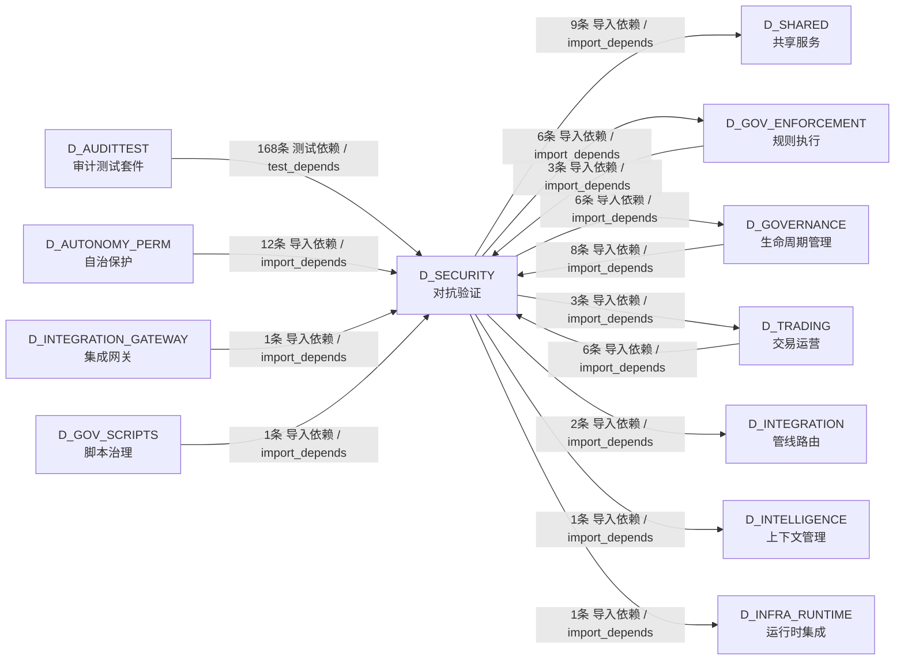

# 17_d_security / orphan_judge / 对抗验证 / Adversarial Validation

> **功能简介 / Overview**: 对抗验证，负责系统安全对抗测试、漏洞扫描和攻防验证

> **文档作用 / Purpose**: 展示 对抗验证（D_SECURITY）功能域的模块清单、域内依赖关系、跨域依赖关系、架构分层视图，供架构审查和域治理参考。

> 本文档由 generate_domain_doc.py 从 depgraph (PostgreSQL) 自动生成
> 最后更新: 2026-07-10 02:40:41
> 数据源: depgraph (PostgreSQL) nodes表 + edges表

## 域基本信息 / Domain Overview

| 字段 | 值 | Field | Value |
|------|------|-------|-------|
| 编号 | 17 | Number | 17 |
| 域ID | D_SECURITY | Domain ID | D_SECURITY |
| 域名称 | 对抗验证 | Domain Name | Adversarial Validation |
| 层级 | L1 基础平台层 | Layer | L1 Foundation |
| 模块数 | 147 | Module Count | 147 |
| 域内依赖 | 125 | Internal Dependencies | 125 |
| 跨域入边 | 199 | Cross-domain Incoming | 199 |
| 跨域出边 | 28 | Cross-domain Outgoing | 28 |
| 设计态模块 | 0 | Design Modules | 0 |
| 原型态模块 | 67 | Prototype Modules | 67 |
| 生产态模块 | 80 | Production Modules | 80 |
| 容量 | 80/150 (正常) | Capacity | 80/150 (正常) |
| 描述 | 孤儿文件检测(orphan_detector) | Description | 孤儿文件检测(orphan_detector) |

## 模块分层清单 / Module Layered List

> 按 architecture_layer 分组的模块清单（共 147 个模块 / 147 modules）。

### L1 基础层 / Foundation Layer (147 modules)

| # | 模块路径 / Module Path | 模块名称 / Module Name (功能简介 / Description) | 成熟度 / Maturity | 蓝图 / Blueprint |
|:--:|---------|---------|:---:|:---:|
| 1 | src/zephyr/governance/compliance_gate_a6/__init__.py | D_COMPLIANCE — Compliance Concrete Implementations | 原型态 / prototype | [MOD-L10-001](../../03_modules/_domain_compliance/blueprint.md) |
| 2 | src/zephyr/governance/compliance_gate_a6/compliance_manag... | ZephyrAlpha — D_COMPLIANCE Compliance Layer —... | 生产态 / production | [MOD-L10-001](../../03_modules/_domain_compliance/blueprint.md) |
| 3 | src/zephyr/governance/compliance_gate_a6/compliance_mappe... | Compliance Mapper — D-022-13 合规映射器: 操作-... | 生产态 / production | [MOD-INF-022](../../03_modules/_domain_autonomy_perm/escalation_protocol/blueprint.md) |
| 4 | src/zephyr/governance/implementations/__init__.py | D_COMPLIANCE — Compliance Concrete Implementations | 原型态 / prototype | [MOD-L10-001](../../03_modules/_domain_compliance/blueprint.md) |
| 5 | src/zephyr/governance/implementations/default_experiment_... | 实验 — Default Experiment Pipeline | 原型态 / prototype | [MOD-L13-001](../../03_modules/_domain_simulation/blueprint.md) |
| 6 | src/zephyr/governance/implementations/default_security_ga... | default_security_gateway.py | 原型态 / prototype | [MOD-L10-001](../../03_modules/_domain_compliance/blueprint.md) |
| 7 | src/zephyr/security/__init__.py | __init__.py | 原型态 / prototype |  |
| 8 | src/zephyr/security/_extensions/__init__.py | __init__.py | 原型态 / prototype |  |
| 9 | src/zephyr/security/access_control/__init__.py | zephyr.security.access_control — Agent RBAC 权... | 生产态 / production | [MOD-INF-018](../../03_modules/_domain_autonomy_core/agent_role_based_access_control/blueprint.md) |
| 10 | src/zephyr/security/access_control/a2a_check.py | Stub module: zephyr.security.access_control.a2a... | 生产态 / production |  |
| 11 | src/zephyr/security/access_control/adversarial_resilience.py | AdversarialResilience — 对抗性韧性与 OWASP 覆盖. | 生产态 / production | [MOD-INF-018](../../03_modules/_domain_autonomy_core/agent_role_based_access_control/blueprint.md) |
| 12 | src/zephyr/security/access_control/agent_creation_policy.py | AgentCreationPolicy — Agent 创建策略. | 生产态 / production | [MOD-INF-018](../../03_modules/_domain_autonomy_core/agent_role_based_access_control/blueprint.md) |
| 13 | src/zephyr/security/access_control/approver_check.py | Stub module: zephyr.security.access_control.app... | 生产态 / production |  |
| 14 | src/zephyr/security/access_control/asymmetric_audit.py | Stub module: zephyr.security.access_control.asy... | 生产态 / production |  |
| 15 | src/zephyr/security/access_control/auto_maintenance.py | AutoMaintenance — 自动维护与规则健康仪表盘. | 生产态 / production | [MOD-INF-018](../../03_modules/_domain_autonomy_core/agent_role_based_access_control/blueprint.md) |
| 16 | src/zephyr/security/access_control/blueprint_fidelity.py | BlueprintFidelity — 蓝图保真度检查. | 生产态 / production | [MOD-INF-018](../../03_modules/_domain_autonomy_core/agent_role_based_access_control/blueprint.md) |
| 17 | src/zephyr/security/access_control/bootstrap_superadmin.py | BootstrapSuperadmin — Superadmin 账户启动器. | 生产态 / production | [MOD-INF-018](../../03_modules/_domain_autonomy_core/agent_role_based_access_control/blueprint.md) |
| 18 | src/zephyr/security/access_control/build_sanitizer.py | Stub module: zephyr.security.access_control.bui... | 原型态 / prototype |  |
| 19 | src/zephyr/security/access_control/cache_invalidation.py | CacheInvalidation — 缓存失效事件管理. | 生产态 / production | [MOD-INF-018](../../03_modules/_domain_autonomy_core/agent_role_based_access_control/blueprint.md) |
| 20 | src/zephyr/security/access_control/canary_rollout_manager.py | CanaryRolloutManager — 灰度发布管理器. | 生产态 / production | [MOD-INF-018](../../03_modules/_domain_autonomy_core/agent_role_based_access_control/blueprint.md) |
| 21 | src/zephyr/security/access_control/capability_check.py | Stub module: zephyr.security.access_control.cap... | 生产态 / production |  |
| 22 | src/zephyr/security/access_control/cascading_failure_isol... | Stub module: zephyr.security.access_control.cas... | 原型态 / prototype |  |
| 23 | src/zephyr/security/access_control/cold_start_lock.py | ColdStartLock — 冷启动锁. | 生产态 / production | [MOD-INF-018](../../03_modules/_domain_autonomy_core/agent_role_based_access_control/blueprint.md) |
| 24 | src/zephyr/security/access_control/compliance_matrix.py | Stub module: zephyr.security.access_control.com... | 原型态 / prototype |  |
| 25 | src/zephyr/security/access_control/contracts.py | Stub module: zephyr.security.access_control.con... | 生产态 / production |  |
| 26 | src/zephyr/security/access_control/cross_cutting.py | CrossCutting — 横切面权限组件. | 生产态 / production | [MOD-INF-018](../../03_modules/_domain_autonomy_core/agent_role_based_access_control/blueprint.md) |
| 27 | src/zephyr/security/access_control/decision_explainer.py | Stub module: zephyr.security.access_control.dec... | 生产态 / production |  |
| 28 | src/zephyr/security/access_control/decision_registry.py | Stub module: zephyr.security.access_control.dec... | 生产态 / production |  |
| 29 | src/zephyr/security/access_control/defense_depth.py | Stub module: zephyr.security.access_control.def... | 原型态 / prototype |  |
| 30 | src/zephyr/security/access_control/dependency_auditor.py | Stub module: zephyr.security.access_control.dep... | 生产态 / production |  |
| 31 | src/zephyr/security/access_control/derive_rbac_roles.py | RBACRoleDeriver — RBAC 角色派生器. | 生产态 / production | [MOD-INF-018](../../03_modules/_domain_autonomy_core/agent_role_based_access_control/blueprint.md) |
| 32 | src/zephyr/security/access_control/detectors/__init__.py | __init__.py | 原型态 / prototype |  |
| 33 | src/zephyr/security/access_control/detectors/anomaly_dete... | Stub module: zephyr.security.access_control.det... | 生产态 / production |  |
| 34 | src/zephyr/security/access_control/detectors/context_drif... | ContextDriftDetector — 上下文漂移与范围蔓延检测. | 生产态 / production | [MOD-INF-018](../../03_modules/_domain_autonomy_core/agent_role_based_access_control/blueprint.md) |
| 35 | src/zephyr/security/access_control/detectors/cross_sessio... | CrossSessionDetector — 跨 Session 检测器. | 生产态 / production | [MOD-INF-018](../../03_modules/_domain_autonomy_core/agent_role_based_access_control/blueprint.md) |
| 36 | src/zephyr/security/access_control/detectors/false_comple... | FalseCompletionDetector — 虚假完成检测. | 生产态 / production | [MOD-INF-018](../../03_modules/_domain_autonomy_core/agent_role_based_access_control/blueprint.md) |
| 37 | src/zephyr/security/access_control/detectors/multi_agent_... | MultiAgentCollusionDetector — 多 agent 合谋检测. | 生产态 / production | [MOD-INF-018](../../03_modules/_domain_autonomy_core/agent_role_based_access_control/blueprint.md) |
| 38 | src/zephyr/security/access_control/detectors/shell_dialec... | Stub module: zephyr.security.access_control.det... | 生产态 / production |  |
| 39 | src/zephyr/security/access_control/dry_run.py | DryRun — 权限模拟与影响分析. | 生产态 / production | [MOD-INF-018](../../03_modules/_domain_autonomy_core/agent_role_based_access_control/blueprint.md) |
| 40 | src/zephyr/security/access_control/emergency_override.py | EmergencyOverride — 紧急覆盖令牌管理. | 生产态 / production | [MOD-INF-018](../../03_modules/_domain_autonomy_core/agent_role_based_access_control/blueprint.md) |
| 41 | src/zephyr/security/access_control/engine_degradation.py | EngineDegradation — 引擎降级管理. | 生产态 / production | [MOD-INF-018](../../03_modules/_domain_autonomy_core/agent_role_based_access_control/blueprint.md) |
| 42 | src/zephyr/security/access_control/environment_manager.py | Stub module: zephyr.security.access_control.env... | 原型态 / prototype |  |
| 43 | src/zephyr/security/access_control/escalation_handler.py | Stub module: zephyr.security.access_control.esc... | 生产态 / production |  |
| 44 | src/zephyr/security/access_control/exceptions.py | AgentRbac 异常类型. | 生产态 / production | [MOD-INF-018](../../03_modules/_domain_autonomy_core/agent_role_based_access_control/blueprint.md) |
| 45 | src/zephyr/security/access_control/genesis_bootstrap.py | GenesisBootstrap — RBAC系统启动引导器. | 生产态 / production | [MOD-INF-018](../../03_modules/_domain_autonomy_core/agent_role_based_access_control/blueprint.md) |
| 46 | src/zephyr/security/access_control/guard_layers.py | GuardLayers — 权限守卫层组件. | 生产态 / production | [MOD-INF-018](../../03_modules/_domain_autonomy_core/agent_role_based_access_control/blueprint.md) |
| 47 | src/zephyr/security/access_control/guards/__init__.py | __init__.py | 原型态 / prototype |  |
| 48 | src/zephyr/security/access_control/guards/abac_guard.py | ABACGuard — 基于属性的权限守卫. | 生产态 / production | [MOD-INF-018](../../03_modules/_domain_autonomy_core/agent_role_based_access_control/blueprint.md) |
| 49 | src/zephyr/security/access_control/guards/anti_pattern_gu... | Stub module: zephyr.security.access_control.gua... | 原型态 / prototype |  |
| 50 | src/zephyr/security/access_control/guards/audit_log_guard.py | Stub module: zephyr.security.access_control.gua... | 生产态 / production |  |
| 51 | src/zephyr/security/access_control/guards/cybersec_2026_g... | Cybersec2026Guard — 2026 网络安全威胁检测. | 生产态 / production | [MOD-INF-018](../../03_modules/_domain_autonomy_core/agent_role_based_access_control/blueprint.md) |
| 52 | src/zephyr/security/access_control/guards/input_guard.py | InputGuard — 输入参数守卫. | 生产态 / production | [MOD-INF-018](../../03_modules/_domain_autonomy_core/agent_role_based_access_control/blueprint.md) |
| 53 | src/zephyr/security/access_control/guards/memory_guard.py | MemoryGuard — 内存访问守卫. | 生产态 / production | [MOD-INF-018](../../03_modules/_domain_autonomy_core/agent_role_based_access_control/blueprint.md) |
| 54 | src/zephyr/security/access_control/guards/memory_provenan... | MemoryProvenanceGuard — 记忆来源溯源守卫. | 生产态 / production | [MOD-INF-018](../../03_modules/_domain_autonomy_core/agent_role_based_access_control/blueprint.md) |
| 55 | src/zephyr/security/access_control/guards/native_api_guar... | NativeApiGuard — 原生 API 守卫. | 生产态 / production | [MOD-INF-018](../../03_modules/_domain_autonomy_core/agent_role_based_access_control/blueprint.md) |
| 56 | src/zephyr/security/access_control/guards/novel_attack_gu... | NovelAttackGuard — 新型攻击行为画像. | 生产态 / production | [MOD-INF-018](../../03_modules/_domain_autonomy_core/agent_role_based_access_control/blueprint.md) |
| 57 | src/zephyr/security/access_control/guards/output_guard.py | OutputGuard — 输出内容守卫. | 生产态 / production | [MOD-INF-018](../../03_modules/_domain_autonomy_core/agent_role_based_access_control/blueprint.md) |
| 58 | src/zephyr/security/access_control/guards/path_guard.py | PathGuard — 路径守卫. | 生产态 / production | [MOD-INF-018](../../03_modules/_domain_autonomy_core/agent_role_based_access_control/blueprint.md) |
| 59 | src/zephyr/security/access_control/guards/permission_guar... | PermissionGuard — 七层权限编排器. | 生产态 / production | [MOD-INF-018](../../03_modules/_domain_autonomy_core/agent_role_based_access_control/blueprint.md) |
| 60 | src/zephyr/security/access_control/guards/rbac_guard.py | RBACGuard — 基于角色的权限守卫. | 生产态 / production | [MOD-INF-018](../../03_modules/_domain_autonomy_core/agent_role_based_access_control/blueprint.md) |
| 61 | src/zephyr/security/access_control/guards/replay_attack_g... | ReplayAttackGuard — 重放攻击防护. | 生产态 / production | [MOD-INF-018](../../03_modules/_domain_autonomy_core/agent_role_based_access_control/blueprint.md) |
| 62 | src/zephyr/security/access_control/guards/rule_injection_... | RuleInjectionGuard — 规则注入守卫. | 生产态 / production | [MOD-INF-018](../../03_modules/_domain_autonomy_core/agent_role_based_access_control/blueprint.md) |
| 63 | src/zephyr/security/access_control/guards/sequence_guard.py | SequenceGuard — 操作序列守卫. | 生产态 / production | [MOD-INF-018](../../03_modules/_domain_autonomy_core/agent_role_based_access_control/blueprint.md) |
| 64 | src/zephyr/security/access_control/guards/toctou_guard.py | TOCTOUGuard — TOCTOU (Time-of-Check to Time-of... | 生产态 / production | [MOD-INF-018](../../03_modules/_domain_autonomy_core/agent_role_based_access_control/blueprint.md) |
| 65 | src/zephyr/security/access_control/guards/vibe_coding_gua... | VibeCodingGuard — Vibe Coding 攻击面检测. | 生产态 / production | [MOD-INF-018](../../03_modules/_domain_autonomy_core/agent_role_based_access_control/blueprint.md) |
| 66 | src/zephyr/security/access_control/identity.py | Agent identity — 角色与成熟度定义. | 生产态 / production | [MOD-INF-018](../../03_modules/_domain_autonomy_core/agent_role_based_access_control/blueprint.md) |
| 67 | src/zephyr/security/access_control/immutable_core.py | ImmutableCore — 不可变核心验证器. | 生产态 / production | [MOD-INF-018](../../03_modules/_domain_autonomy_core/agent_role_based_access_control/blueprint.md) |
| 68 | src/zephyr/security/access_control/integration.py | IntegrationManager — 系统集成注册与健康检查. | 生产态 / production | [MOD-INF-018](../../03_modules/_domain_autonomy_core/agent_role_based_access_control/blueprint.md) |
| 69 | src/zephyr/security/access_control/integrity_self_check.py | IntegritySelfCheck — 完整性自检. | 生产态 / production | [MOD-INF-018](../../03_modules/_domain_autonomy_core/agent_role_based_access_control/blueprint.md) |
| 70 | src/zephyr/security/access_control/intent_binder.py | IntentBinder — 意图绑定与漂移检测. | 生产态 / production | [MOD-INF-018](../../03_modules/_domain_autonomy_core/agent_role_based_access_control/blueprint.md) |
| 71 | src/zephyr/security/access_control/key_hierarchy.py | Stub module: zephyr.security.access_control.key... | 原型态 / prototype |  |
| 72 | src/zephyr/security/access_control/kill_switch.py | KillSwitch — 熔断器. | 生产态 / production | [MOD-INF-018](../../03_modules/_domain_autonomy_core/agent_role_based_access_control/blueprint.md) |
| 73 | src/zephyr/security/access_control/legal_audit_chain.py | Stub module: zephyr.security.access_control.leg... | 生产态 / production |  |
| 74 | src/zephyr/security/access_control/microstructure_defense.py | Stub module: zephyr.security.access_control.mic... | 生产态 / production |  |
| 75 | src/zephyr/security/access_control/monotonic_clock.py | MonotonicClock — 单调时钟. | 生产态 / production | [MOD-INF-018](../../03_modules/_domain_autonomy_core/agent_role_based_access_control/blueprint.md) |
| 76 | src/zephyr/security/access_control/non_repudiation.py | NonRepudiation — 不可抵赖性审计签名. | 生产态 / production | [MOD-INF-018](../../03_modules/_domain_autonomy_core/agent_role_based_access_control/blueprint.md) |
| 77 | src/zephyr/security/access_control/observability.py | ObservabilityReporter — 指标上报与异常检测. | 生产态 / production | [MOD-INF-018](../../03_modules/_domain_autonomy_core/agent_role_based_access_control/blueprint.md) |
| 78 | src/zephyr/security/access_control/orphan_judge/__init__.py | [INVARIANTS] 蓝图 §4 文件清单与代码双向对齐 | 原型态 / prototype | [MOD-INF-029](../../03_modules/_cross_layer/orphan_judge/blueprint.md) |
| 79 | src/zephyr/security/access_control/orphan_judge/__main__.py | __main__.py | 原型态 / prototype | [MOD-INF-029](../../03_modules/_cross_layer/orphan_judge/blueprint.md) |
| 80 | src/zephyr/security/access_control/orphan_judge/cascade_a... | cascade_analyzer.py | 生产态 / production | [MOD-INF-029](../../03_modules/_cross_layer/orphan_judge/blueprint.md) |
| 81 | src/zephyr/security/access_control/orphan_judge/config_lo... | config_loader.py | 原型态 / prototype | [MOD-INF-029](../../03_modules/_cross_layer/orphan_judge/blueprint.md) |
| 82 | src/zephyr/security/access_control/orphan_judge/db.py | db.py | 原型态 / prototype | [MOD-INF-029](../../03_modules/_cross_layer/orphan_judge/blueprint.md) |
| 83 | src/zephyr/security/access_control/orphan_judge/decision_... | decision_table.py | 生产态 / production | [MOD-INF-029](../../03_modules/_cross_layer/orphan_judge/blueprint.md) |
| 84 | src/zephyr/security/access_control/orphan_judge/deprecati... | deprecation_tracker.py | 生产态 / production | [MOD-INF-029](../../03_modules/_cross_layer/orphan_judge/blueprint.md) |
| 85 | src/zephyr/security/access_control/orphan_judge/drift_bri... | drift_bridge.py | 原型态 / prototype | [MOD-INF-029](../../03_modules/_cross_layer/orphan_judge/blueprint.md) |
| 86 | src/zephyr/security/access_control/orphan_judge/duplicate... | duplicate_detector.py | 原型态 / prototype |  |
| 87 | src/zephyr/security/access_control/orphan_judge/escalatio... | escalation_bridge.py | 原型态 / prototype | [MOD-INF-029](../../03_modules/_cross_layer/orphan_judge/blueprint.md) |
| 88 | src/zephyr/security/access_control/orphan_judge/feedback_... | feedback_bridge.py | 原型态 / prototype | [MOD-INF-029](../../03_modules/_cross_layer/orphan_judge/blueprint.md) |
| 89 | src/zephyr/security/access_control/orphan_judge/judge.py | judge.py | 生产态 / production | [MOD-INF-029](../../03_modules/_cross_layer/orphan_judge/blueprint.md) |
| 90 | src/zephyr/security/access_control/orphan_judge/kb_bridge.py | kb_bridge.py | 原型态 / prototype | [MOD-INF-029](../../03_modules/_cross_layer/orphan_judge/blueprint.md) |
| 91 | src/zephyr/security/access_control/orphan_judge/mcp_integ... | mcp_integration.py | 原型态 / prototype | [MOD-INF-029](../../03_modules/_cross_layer/orphan_judge/blueprint.md) |
| 92 | src/zephyr/security/access_control/orphan_judge/models.py | models.py | 原型态 / prototype | [MOD-INF-029](../../03_modules/_cross_layer/orphan_judge/blueprint.md) |
| 93 | src/zephyr/security/access_control/orphan_judge/orphan_co... | orphan_collector.py | 原型态 / prototype |  |
| 94 | src/zephyr/security/access_control/orphan_judge/orphan_de... | [INVARIANTS] 蓝图 §4 文件清单与代码双向对齐 | 生产态 / production | [MOD-INF-029](../../03_modules/_cross_layer/orphan_judge/blueprint.md) |
| 95 | src/zephyr/security/access_control/orphan_judge/rbac_brid... | rbac_bridge.py | 原型态 / prototype | [MOD-INF-029](../../03_modules/_cross_layer/orphan_judge/blueprint.md) |
| 96 | src/zephyr/security/access_control/orphan_judge/reference... | AST解析+import链遍历，判断文件是否被其他文件引用。 | 原型态 / prototype | [MOD-INF-029](../../03_modules/_cross_layer/orphan_judge/blueprint.md) |
| 97 | src/zephyr/security/access_control/orphan_judge/registrat... | 扫描项目注册表，判断文件是否已登记在册。 | 原型态 / prototype | [MOD-INF-029](../../03_modules/_cross_layer/orphan_judge/blueprint.md) |
| 98 | src/zephyr/security/access_control/orphan_judge/report_ge... | report_generator.py | 原型态 / prototype | [MOD-INF-029](../../03_modules/_cross_layer/orphan_judge/blueprint.md) |
| 99 | src/zephyr/security/access_control/orphan_judge/safety_fe... | safety_fence.py | 生产态 / production | [MOD-INF-029](../../03_modules/_cross_layer/orphan_judge/blueprint.md) |
| 100 | src/zephyr/security/access_control/orphan_judge/standalon... | 六指标加权评分: 文件大小(15%) + 代码行数(20%) +... | 原型态 / prototype | [MOD-INF-029](../../03_modules/_cross_layer/orphan_judge/blueprint.md) |
| 101 | src/zephyr/security/access_control/orphan_judge/swid_tag.py | swid_tag.py | 原型态 / prototype | [MOD-INF-029](../../03_modules/_cross_layer/orphan_judge/blueprint.md) |
| 102 | src/zephyr/security/access_control/orphan_judge/unique_an... | AST节点比对，检测文件中的独特代码元素(类/函数/... | 原型态 / prototype | [MOD-INF-029](../../03_modules/_cross_layer/orphan_judge/blueprint.md) |
| 103 | src/zephyr/security/access_control/permission_hooks.py | PermissionHooks — 权限钩子注册表. | 生产态 / production | [MOD-INF-018](../../03_modules/_domain_autonomy_core/agent_role_based_access_control/blueprint.md) |
| 104 | src/zephyr/security/access_control/permission_mode_manage... | Stub module: zephyr.security.access_control.per... | 原型态 / prototype |  |
| 105 | src/zephyr/security/access_control/phase_executor.py | phase_executor.py | 原型态 / prototype |  |
| 106 | src/zephyr/security/access_control/risk_mitigation.py | RiskMitigation — 风险评估与缓解策略. | 生产态 / production | [MOD-INF-018](../../03_modules/_domain_autonomy_core/agent_role_based_access_control/blueprint.md) |
| 107 | src/zephyr/security/access_control/rollback_sandbox.py | Stub module: zephyr.security.access_control.rol... | 生产态 / production |  |
| 108 | src/zephyr/security/access_control/secrets_lifecycle.py | Stub module: zephyr.security.access_control.sec... | 原型态 / prototype |  |
| 109 | src/zephyr/security/access_control/session_concurrency.py | Session 级并发协调模块（P2-SES 落地）。 | 生产态 / production |  |
| 110 | src/zephyr/security/access_control/session_lifecycle.py | Stub module: zephyr.security.access_control.ses... | 生产态 / production |  |
| 111 | src/zephyr/security/access_control/verifiers/__init__.py | __init__.py | 原型态 / prototype |  |
| 112 | src/zephyr/security/access_control/verifiers/bootstrap_ve... | Stub module: zephyr.security.access_control.ver... | 原型态 / prototype |  |
| 113 | src/zephyr/security/access_control/verifiers/continuous_v... | Stub module: zephyr.security.access_control.ver... | 原型态 / prototype |  |
| 114 | src/zephyr/security/access_control/verifiers/contract_ver... | ContractVerifier — 契约验证器. | 生产态 / production | [MOD-INF-018](../../03_modules/_domain_autonomy_core/agent_role_based_access_control/blueprint.md) |
| 115 | src/zephyr/security/access_control/verifiers/micro_verifi... | Stub module: zephyr.security.access_control.ver... | 原型态 / prototype |  |
| 116 | src/zephyr/security/access_control/verifiers/post_action_... | Stub module: zephyr.security.access_control.ver... | 原型态 / prototype |  |
| 117 | src/zephyr/security/adversarial_validation/__init__.py | Red-Blue Adversarial Validator — 红白对抗攻击... | 原型态 / prototype | [MOD-INF-030](../../03_modules/_cross_layer/red_blue_validator/blueprint.md) |
| 118 | src/zephyr/security/adversarial_validation/__main__.py | __main__.py | 原型态 / prototype | [MOD-INF-030](../../03_modules/_cross_layer/red_blue_validator/blueprint.md) |
| 119 | src/zephyr/security/adversarial_validation/_scenario-regi... | _scenario-registry.yaml | 生产态 / production | [MOD-INF-005](../../03_modules/_domain_governance/governance_automation/blueprint.md) |
| 120 | src/zephyr/security/adversarial_validation/ai_attack_gene... | ai_attack_generator.py | 原型态 / prototype | [MOD-INF-030](../../03_modules/_cross_layer/red_blue_validator/blueprint.md) |
| 121 | src/zephyr/security/adversarial_validation/async_monitor.py | async_monitor.py | 生产态 / production | [MOD-INF-030](../../03_modules/_cross_layer/red_blue_validator/blueprint.md) |
| 122 | src/zephyr/security/adversarial_validation/attack_registr... | attack_registry.py | 原型态 / prototype | [MOD-INF-030](../../03_modules/_cross_layer/red_blue_validator/blueprint.md) |
| 123 | src/zephyr/security/adversarial_validation/blast_radius.py | blast_radius.py | 原型态 / prototype | [MOD-INF-030](../../03_modules/_cross_layer/red_blue_validator/blueprint.md) |
| 124 | src/zephyr/security/adversarial_validation/bypass_recorde... | bypass_recorder.py | 原型态 / prototype | [MOD-INF-030](../../03_modules/_cross_layer/red_blue_validator/blueprint.md) |
| 125 | src/zephyr/security/adversarial_validation/circuit_breake... | circuit_breaker.py | 生产态 / production | [MOD-INF-030](../../03_modules/_cross_layer/red_blue_validator/blueprint.md) |
| 126 | src/zephyr/security/adversarial_validation/cleanup.py | cleanup.py | 原型态 / prototype | [MOD-INF-030](../../03_modules/_cross_layer/red_blue_validator/blueprint.md) |
| 127 | src/zephyr/security/adversarial_validation/cli.py | cli.py | 原型态 / prototype | [MOD-INF-030](../../03_modules/_cross_layer/red_blue_validator/blueprint.md) |
| 128 | src/zephyr/security/adversarial_validation/cold_start.py | cold_start.py | 原型态 / prototype | [MOD-INF-030](../../03_modules/_cross_layer/red_blue_validator/blueprint.md) |
| 129 | src/zephyr/security/adversarial_validation/commit_trigger.py | CommitTrigger — 事件驱动红蓝对抗触发器 (MOD-IN... | 原型态 / prototype | [MOD-INF-030](../../03_modules/_cross_layer/red_blue_validator/blueprint.md) |
| 130 | src/zephyr/security/adversarial_validation/constitution_e... | constitution_engine.py | 生产态 / production | [MOD-INF-030](../../03_modules/_cross_layer/red_blue_validator/blueprint.md) |
| 131 | src/zephyr/security/adversarial_validation/constitution_g... | constitution_guard.py | 原型态 / prototype | [MOD-INF-030](../../03_modules/_cross_layer/red_blue_validator/blueprint.md) |
| 132 | src/zephyr/security/adversarial_validation/convergence_ch... | convergence_checker.py | 原型态 / prototype | [MOD-INF-030](../../03_modules/_cross_layer/red_blue_validator/blueprint.md) |
| 133 | src/zephyr/security/adversarial_validation/defense_runner.py | defense_runner.py | 原型态 / prototype | [MOD-INF-030](../../03_modules/_cross_layer/red_blue_validator/blueprint.md) |
| 134 | src/zephyr/security/adversarial_validation/game_day_runne... | game_day_runner.py | 原型态 / prototype | [MOD-INF-030](../../03_modules/_cross_layer/red_blue_validator/blueprint.md) |
| 135 | src/zephyr/security/adversarial_validation/game_day_sched... | game_day_scheduler.py | 生产态 / production | [MOD-INF-030](../../03_modules/_cross_layer/red_blue_validator/blueprint.md) |
| 136 | src/zephyr/security/adversarial_validation/injection_engi... | injection_engine.py | 原型态 / prototype | [MOD-INF-030](../../03_modules/_cross_layer/red_blue_validator/blueprint.md) |
| 137 | src/zephyr/security/adversarial_validation/mcp_endpoints.py | mcp_endpoints.py | 原型态 / prototype | [MOD-INF-030](../../03_modules/_cross_layer/red_blue_validator/blueprint.md) |
| 138 | src/zephyr/security/adversarial_validation/models.py | models.py | 生产态 / production | [MOD-INF-030](../../03_modules/_cross_layer/red_blue_validator/blueprint.md) |
| 139 | src/zephyr/security/adversarial_validation/scenario_loade... | scenario_loader.py | 原型态 / prototype | [MOD-INF-030](../../03_modules/_cross_layer/red_blue_validator/blueprint.md) |
| 140 | src/zephyr/security/adversarial_validation/steady_state.py | steady_state.py | 原型态 / prototype | [MOD-INF-030](../../03_modules/_cross_layer/red_blue_validator/blueprint.md) |
| 141 | src/zephyr/security/adversarial_validation/validator.py | validator.py | 原型态 / prototype | [MOD-INF-030](../../03_modules/_cross_layer/red_blue_validator/blueprint.md) |
| 142 | src/zephyr/security/adversarial_validation/validator_even... | ValidatorEventBridge — 红蓝验证器事件桥接 (MOD... | 原型态 / prototype |  |
| 143 | src/zephyr/security/api/__init__.py | __init__.py | 原型态 / prototype |  |
| 144 | src/zephyr/security/core/__init__.py | __init__.py | 原型态 / prototype |  |
| 145 | src/zephyr/security/infrastructure/__init__.py | __init__.py | 原型态 / prototype |  |
| 146 | src/zephyr/security/models/__init__.py | __init__.py | 原型态 / prototype |  |
| 147 | src/zephyr/security/services/__init__.py | __init__.py | 原型态 / prototype |  |

## 域内依赖图 / Internal Dependency Diagram

> 依赖图内嵌在本文档中，IDE 可直接渲染显示。参考 decision_index.md 设计，分四个视图：合并全景图、运营态子图、设计态子图、原型态子图（按 design_maturity 实际值拆分）。
>
> **图例说明 / Legend**：
> - **实线边框 = 运营态模块**（production，已上线运行）
> - **虚线边框 = 设计态模块**（design，蓝图阶段，代码未写）
> - **虚线边框 = 原型态模块**（prototype，代码已写，验证中未稳定上线）
> - **实线箭头 = 运营态依赖**（已生效的依赖关系）
> - **虚线箭头 = 非运营态依赖**（计划中/验证中的依赖关系）

### 合并全景图（全部模块，标签标注成熟度）

> 展示全部 147 个模块（生产态 80 + 设计态 0 + 原型态 67），标签标注成熟度。

#### 第 1 页 / 共 5 页

```mermaid
graph TD
    subgraph D_SECURITY["D_SECURITY 对抗验证"]
        src_zephyr_governance_compliance_gate_a6_init_py["(原型态 / prototype) D_COMPLIANCE — Compliance Concrete Implementations<br/>文件: __init__.py"]
        src_zephyr_governance_compliance_gate_a6_compliance_manager_py["(生产态 / production) ZephyrAlpha — D_COMPLIANCE Compliance Layer —...<br/>文件: compliance_manager.py"]
        src_zephyr_governance_compliance_gate_a6_compliance_mapper_py["(生产态 / production) Compliance Mapper — D-022-13 合规映射器: 操作-...<br/>文件: compliance_mapper.py"]
        src_zephyr_governance_implementations_init_py["(原型态 / prototype) D_COMPLIANCE — Compliance Concrete Implementations<br/>文件: __init__.py"]
        src_zephyr_governance_implementations_default_experiment_pipeline_py["(原型态 / prototype) 实验 — Default Experiment Pipeline<br/>文件: default_experiment_pipeline.py"]
        src_zephyr_governance_implementations_default_security_gateway_py["(原型态 / prototype) default_security_gateway.py"]
        src_zephyr_security_init_py["(原型态 / prototype) __init__.py"]
        src_zephyr_security_extensions_init_py["(原型态 / prototype) __init__.py"]
        src_zephyr_security_access_control_init_py["(生产态 / production) zephyr.security.access_control — Agent RBAC 权...<br/>文件: __init__.py"]
        src_zephyr_security_access_control_a2a_check_py["(生产态 / production) Stub module: zephyr.security.access_control.a2a...<br/>文件: a2a_check.py"]
        src_zephyr_security_access_control_adversarial_resilience_py["(生产态 / production) AdversarialResilience — 对抗性韧性与 OWASP 覆盖.<br/>文件: adversarial_resilience.py"]
        src_zephyr_security_access_control_agent_creation_policy_py["(生产态 / production) AgentCreationPolicy — Agent 创建策略.<br/>文件: agent_creation_policy.py"]
        src_zephyr_security_access_control_approver_check_py["(生产态 / production) Stub module: zephyr.security.access_control.app...<br/>文件: approver_check.py"]
        src_zephyr_security_access_control_asymmetric_audit_py["(生产态 / production) Stub module: zephyr.security.access_control.asy...<br/>文件: asymmetric_audit.py"]
        src_zephyr_security_access_control_auto_maintenance_py["(生产态 / production) AutoMaintenance — 自动维护与规则健康仪表盘.<br/>文件: auto_maintenance.py"]
        src_zephyr_security_access_control_blueprint_fidelity_py["(生产态 / production) BlueprintFidelity — 蓝图保真度检查.<br/>文件: blueprint_fidelity.py"]
        src_zephyr_security_access_control_bootstrap_superadmin_py["(生产态 / production) BootstrapSuperadmin — Superadmin 账户启动器.<br/>文件: bootstrap_superadmin.py"]
        src_zephyr_security_access_control_build_sanitizer_py["(原型态 / prototype) Stub module: zephyr.security.access_control.bui...<br/>文件: build_sanitizer.py"]
        src_zephyr_security_access_control_cache_invalidation_py["(生产态 / production) CacheInvalidation — 缓存失效事件管理.<br/>文件: cache_invalidation.py"]
        src_zephyr_security_access_control_canary_rollout_manager_py["(生产态 / production) CanaryRolloutManager — 灰度发布管理器.<br/>文件: canary_rollout_manager.py"]
        src_zephyr_security_access_control_capability_check_py["(生产态 / production) Stub module: zephyr.security.access_control.cap...<br/>文件: capability_check.py"]
        src_zephyr_security_access_control_cascading_failure_isolator_py["(原型态 / prototype) Stub module: zephyr.security.access_control.cas...<br/>文件: cascading_failure_isolator.py"]
        src_zephyr_security_access_control_cold_start_lock_py["(生产态 / production) ColdStartLock — 冷启动锁.<br/>文件: cold_start_lock.py"]
        src_zephyr_security_access_control_compliance_matrix_py["(原型态 / prototype) Stub module: zephyr.security.access_control.com...<br/>文件: compliance_matrix.py"]
        src_zephyr_security_access_control_contracts_py["(生产态 / production) Stub module: zephyr.security.access_control.con...<br/>文件: contracts.py"]
        src_zephyr_security_access_control_cross_cutting_py["(生产态 / production) CrossCutting — 横切面权限组件.<br/>文件: cross_cutting.py"]
        src_zephyr_security_access_control_decision_explainer_py["(生产态 / production) Stub module: zephyr.security.access_control.dec...<br/>文件: decision_explainer.py"]
        src_zephyr_security_access_control_decision_registry_py["(生产态 / production) Stub module: zephyr.security.access_control.dec...<br/>文件: decision_registry.py"]
        src_zephyr_security_access_control_defense_depth_py["(原型态 / prototype) Stub module: zephyr.security.access_control.def...<br/>文件: defense_depth.py"]
        src_zephyr_security_access_control_dependency_auditor_py["(生产态 / production) Stub module: zephyr.security.access_control.dep...<br/>文件: dependency_auditor.py"]
    end
    src_zephyr_governance_implementations_init_py -.->|导入依赖 / import_depends| src_zephyr_governance_implementations_default_security_gateway_py
    src_zephyr_security_init_py -.->|导入依赖 / import_depends| src_zephyr_security_access_control_init_py
    src_zephyr_security_access_control_build_sanitizer_py -.->|config_depends / config_depends| src_zephyr_security_access_control_init_py
    src_zephyr_security_access_control_cascading_failure_isolator_py -.->|config_depends / config_depends| src_zephyr_security_access_control_init_py
    src_zephyr_security_access_control_compliance_matrix_py -.->|config_depends / config_depends| src_zephyr_security_access_control_init_py
    src_zephyr_security_access_control_defense_depth_py -.->|config_depends / config_depends| src_zephyr_security_access_control_init_py
    D_GOV_ENFORCEMENT["(原型态 / prototype) D_GOV_ENFORCEMENT"]
    src_zephyr_governance_compliance_gate_a6_compliance_manager_py -.->|导入依赖 / import_depends| D_GOV_ENFORCEMENT
    D_GOVERNANCE["(生产态 / production) D_GOVERNANCE"]
    src_zephyr_governance_implementations_default_security_gateway_py -.->|导入依赖 / import_depends| D_GOVERNANCE
    src_zephyr_governance_implementations_default_experiment_pipeline_py -.->|导入依赖 / import_depends| D_GOVERNANCE
    D_GOV_ENFORCEMENT -.->|导入依赖 / import_depends| src_zephyr_governance_compliance_gate_a6_compliance_manager_py
    D_GOV_ENFORCEMENT -.->|导入依赖 / import_depends| src_zephyr_governance_compliance_gate_a6_init_py
    D_GOV_ENFORCEMENT -.->|导入依赖 / import_depends| src_zephyr_governance_implementations_init_py
    D_AUDITTEST["(原型态 / prototype) D_AUDITTEST"]
    D_AUDITTEST -.->|测试依赖 / test_depends| src_zephyr_security_access_control_a2a_check_py
    D_AUDITTEST -.->|测试依赖 / test_depends| src_zephyr_security_access_control_agent_creation_policy_py
    D_AUDITTEST -.->|测试依赖 / test_depends| src_zephyr_security_access_control_adversarial_resilience_py
    D_AUDITTEST -.->|测试依赖 / test_depends| src_zephyr_security_access_control_blueprint_fidelity_py
    D_AUDITTEST -.->|测试依赖 / test_depends| src_zephyr_security_access_control_decision_registry_py
    D_AUDITTEST -.->|测试依赖 / test_depends| src_zephyr_security_access_control_decision_explainer_py
    D_AUDITTEST -.->|测试依赖 / test_depends| src_zephyr_security_access_control_agent_creation_policy_py
    D_AUDITTEST -.->|测试依赖 / test_depends| src_zephyr_security_access_control_auto_maintenance_py
    D_AUDITTEST -.->|测试依赖 / test_depends| src_zephyr_security_access_control_cache_invalidation_py
    D_AUDITTEST -.->|测试依赖 / test_depends| src_zephyr_security_access_control_asymmetric_audit_py
    D_AUDITTEST -.->|测试依赖 / test_depends| src_zephyr_security_access_control_canary_rollout_manager_py
    D_AUDITTEST -.->|测试依赖 / test_depends| src_zephyr_security_access_control_init_py
    classDef production fill:#e1f5fe,stroke:#01579b,stroke-width:2px,color:#000
    classDef design fill:#fff3e0,stroke:#e65100,stroke-width:2px,color:#000,stroke-dasharray: 5 5
    classDef external_prod fill:#e8f5e9,stroke:#1b5e20,stroke-width:1px,color:#000
    classDef external_design fill:#fce4ec,stroke:#880e4f,stroke-width:1px,color:#000,stroke-dasharray: 5 5
    class src_zephyr_governance_compliance_gate_a6_compliance_manager_py,src_zephyr_governance_compliance_gate_a6_compliance_mapper_py,src_zephyr_security_access_control_init_py,src_zephyr_security_access_control_a2a_check_py,src_zephyr_security_access_control_adversarial_resilience_py,src_zephyr_security_access_control_agent_creation_policy_py,src_zephyr_security_access_control_approver_check_py,src_zephyr_security_access_control_asymmetric_audit_py,src_zephyr_security_access_control_auto_maintenance_py,src_zephyr_security_access_control_blueprint_fidelity_py,src_zephyr_security_access_control_bootstrap_superadmin_py,src_zephyr_security_access_control_cache_invalidation_py,src_zephyr_security_access_control_canary_rollout_manager_py,src_zephyr_security_access_control_capability_check_py,src_zephyr_security_access_control_cold_start_lock_py,src_zephyr_security_access_control_contracts_py,src_zephyr_security_access_control_cross_cutting_py,src_zephyr_security_access_control_decision_explainer_py,src_zephyr_security_access_control_decision_registry_py,src_zephyr_security_access_control_dependency_auditor_py production
    class src_zephyr_governance_compliance_gate_a6_init_py,src_zephyr_governance_implementations_init_py,src_zephyr_governance_implementations_default_experiment_pipeline_py,src_zephyr_governance_implementations_default_security_gateway_py,src_zephyr_security_init_py,src_zephyr_security_extensions_init_py,src_zephyr_security_access_control_build_sanitizer_py,src_zephyr_security_access_control_cascading_failure_isolator_py,src_zephyr_security_access_control_compliance_matrix_py,src_zephyr_security_access_control_defense_depth_py design
    class D_GOVERNANCE external_prod
    class D_GOV_ENFORCEMENT,D_AUDITTEST external_design
```



#### 第 2 页 / 共 5 页

```mermaid
graph TD
    subgraph D_SECURITY["D_SECURITY 对抗验证"]
        src_zephyr_security_access_control_derive_rbac_roles_py["(生产态 / production) RBACRoleDeriver — RBAC 角色派生器.<br/>文件: derive_rbac_roles.py"]
        src_zephyr_security_access_control_detectors_init_py["(原型态 / prototype) __init__.py"]
        src_zephyr_security_access_control_detectors_anomaly_detector_py["(生产态 / production) Stub module: zephyr.security.access_control.det...<br/>文件: anomaly_detector.py"]
        src_zephyr_security_access_control_detectors_context_drift_detector_py["(生产态 / production) ContextDriftDetector — 上下文漂移与范围蔓延检测.<br/>文件: context_drift_detector.py"]
        src_zephyr_security_access_control_detectors_cross_session_detector_py["(生产态 / production) CrossSessionDetector — 跨 Session 检测器.<br/>文件: cross_session_detector.py"]
        src_zephyr_security_access_control_detectors_false_completion_detector_py["(生产态 / production) FalseCompletionDetector — 虚假完成检测.<br/>文件: false_completion_detector.py"]
        src_zephyr_security_access_control_detectors_multi_agent_collusion_detector_py["(生产态 / production) MultiAgentCollusionDetector — 多 agent 合谋检测.<br/>文件: multi_agent_collusion_detector.py"]
        src_zephyr_security_access_control_detectors_shell_dialect_detector_py["(生产态 / production) Stub module: zephyr.security.access_control.det...<br/>文件: shell_dialect_detector.py"]
        src_zephyr_security_access_control_dry_run_py["(生产态 / production) DryRun — 权限模拟与影响分析.<br/>文件: dry_run.py"]
        src_zephyr_security_access_control_emergency_override_py["(生产态 / production) EmergencyOverride — 紧急覆盖令牌管理.<br/>文件: emergency_override.py"]
        src_zephyr_security_access_control_engine_degradation_py["(生产态 / production) EngineDegradation — 引擎降级管理.<br/>文件: engine_degradation.py"]
        src_zephyr_security_access_control_environment_manager_py["(原型态 / prototype) Stub module: zephyr.security.access_control.env...<br/>文件: environment_manager.py"]
        src_zephyr_security_access_control_escalation_handler_py["(生产态 / production) Stub module: zephyr.security.access_control.esc...<br/>文件: escalation_handler.py"]
        src_zephyr_security_access_control_exceptions_py["(生产态 / production) AgentRbac 异常类型.<br/>文件: exceptions.py"]
        src_zephyr_security_access_control_genesis_bootstrap_py["(生产态 / production) GenesisBootstrap — RBAC系统启动引导器.<br/>文件: genesis_bootstrap.py"]
        src_zephyr_security_access_control_guard_layers_py["(生产态 / production) GuardLayers — 权限守卫层组件.<br/>文件: guard_layers.py"]
        src_zephyr_security_access_control_guards_init_py["(原型态 / prototype) __init__.py"]
        src_zephyr_security_access_control_guards_abac_guard_py["(生产态 / production) ABACGuard — 基于属性的权限守卫.<br/>文件: abac_guard.py"]
        src_zephyr_security_access_control_guards_anti_pattern_guard_py["(原型态 / prototype) Stub module: zephyr.security.access_control.gua...<br/>文件: anti_pattern_guard.py"]
        src_zephyr_security_access_control_guards_audit_log_guard_py["(生产态 / production) Stub module: zephyr.security.access_control.gua...<br/>文件: audit_log_guard.py"]
        src_zephyr_security_access_control_guards_cybersec_2026_guard_py["(生产态 / production) Cybersec2026Guard — 2026 网络安全威胁检测.<br/>文件: cybersec_2026_guard.py"]
        src_zephyr_security_access_control_guards_input_guard_py["(生产态 / production) InputGuard — 输入参数守卫.<br/>文件: input_guard.py"]
        src_zephyr_security_access_control_guards_memory_guard_py["(生产态 / production) MemoryGuard — 内存访问守卫.<br/>文件: memory_guard.py"]
        src_zephyr_security_access_control_guards_memory_provenance_guard_py["(生产态 / production) MemoryProvenanceGuard — 记忆来源溯源守卫.<br/>文件: memory_provenance_guard.py"]
        src_zephyr_security_access_control_guards_native_api_guard_py["(生产态 / production) NativeApiGuard — 原生 API 守卫.<br/>文件: native_api_guard.py"]
        src_zephyr_security_access_control_guards_novel_attack_guard_py["(生产态 / production) NovelAttackGuard — 新型攻击行为画像.<br/>文件: novel_attack_guard.py"]
        src_zephyr_security_access_control_guards_output_guard_py["(生产态 / production) OutputGuard — 输出内容守卫.<br/>文件: output_guard.py"]
        src_zephyr_security_access_control_guards_path_guard_py["(生产态 / production) PathGuard — 路径守卫.<br/>文件: path_guard.py"]
        src_zephyr_security_access_control_guards_permission_guard_py["(生产态 / production) PermissionGuard — 七层权限编排器.<br/>文件: permission_guard.py"]
        src_zephyr_security_access_control_guards_rbac_guard_py["(生产态 / production) RBACGuard — 基于角色的权限守卫.<br/>文件: rbac_guard.py"]
    end
    src_zephyr_security_access_control_genesis_bootstrap_py -->|导入依赖 / import_depends| src_zephyr_security_access_control_engine_degradation_py
    src_zephyr_security_access_control_detectors_init_py -.->|config_depends / config_depends| src_zephyr_security_access_control_detectors_anomaly_detector_py
    src_zephyr_security_access_control_guards_anti_pattern_guard_py -.->|config_depends / config_depends| src_zephyr_security_access_control_guards_init_py
    src_zephyr_security_access_control_guards_permission_guard_py -->|导入依赖 / import_depends| src_zephyr_security_access_control_guards_rbac_guard_py
    D_SHARED["(生产态 / production) D_SHARED"]
    src_zephyr_security_access_control_guards_abac_guard_py -->|导入依赖 / import_depends| D_SHARED
    D_GOVERNANCE["(生产态 / production) D_GOVERNANCE"]
    D_GOVERNANCE -->|导入依赖 / import_depends| src_zephyr_security_access_control_guards_permission_guard_py
    D_INTEGRATION_GATEWAY["(生产态 / production) D_INTEGRATION_GATEWAY"]
    D_INTEGRATION_GATEWAY -->|导入依赖 / import_depends| src_zephyr_security_access_control_guards_permission_guard_py
    D_TRADING["(生产态 / production) D_TRADING"]
    D_TRADING -->|导入依赖 / import_depends| src_zephyr_security_access_control_genesis_bootstrap_py
    D_TRADING -->|导入依赖 / import_depends| src_zephyr_security_access_control_genesis_bootstrap_py
    D_AUDITTEST["(原型态 / prototype) D_AUDITTEST"]
    D_AUDITTEST -.->|测试依赖 / test_depends| src_zephyr_security_access_control_guards_abac_guard_py
    D_AUDITTEST -.->|测试依赖 / test_depends| src_zephyr_security_access_control_detectors_cross_session_detector_py
    D_AUDITTEST -.->|测试依赖 / test_depends| src_zephyr_security_access_control_guards_cybersec_2026_guard_py
    D_AUDITTEST -.->|测试依赖 / test_depends| src_zephyr_security_access_control_detectors_anomaly_detector_py
    D_AUDITTEST -.->|测试依赖 / test_depends| src_zephyr_security_access_control_guards_memory_guard_py
    D_AUDITTEST -.->|测试依赖 / test_depends| src_zephyr_security_access_control_guards_native_api_guard_py
    D_AUDITTEST -.->|测试依赖 / test_depends| src_zephyr_security_access_control_derive_rbac_roles_py
    D_AUDITTEST -.->|测试依赖 / test_depends| src_zephyr_security_access_control_guards_permission_guard_py
    D_AUDITTEST -.->|测试依赖 / test_depends| src_zephyr_security_access_control_guards_rbac_guard_py
    D_AUDITTEST -.->|测试依赖 / test_depends| src_zephyr_security_access_control_guards_rbac_guard_py
    D_AUDITTEST -.->|测试依赖 / test_depends| src_zephyr_security_access_control_dry_run_py
    classDef production fill:#e1f5fe,stroke:#01579b,stroke-width:2px,color:#000
    classDef design fill:#fff3e0,stroke:#e65100,stroke-width:2px,color:#000,stroke-dasharray: 5 5
    classDef external_prod fill:#e8f5e9,stroke:#1b5e20,stroke-width:1px,color:#000
    classDef external_design fill:#fce4ec,stroke:#880e4f,stroke-width:1px,color:#000,stroke-dasharray: 5 5
    class src_zephyr_security_access_control_derive_rbac_roles_py,src_zephyr_security_access_control_detectors_anomaly_detector_py,src_zephyr_security_access_control_detectors_context_drift_detector_py,src_zephyr_security_access_control_detectors_cross_session_detector_py,src_zephyr_security_access_control_detectors_false_completion_detector_py,src_zephyr_security_access_control_detectors_multi_agent_collusion_detector_py,src_zephyr_security_access_control_detectors_shell_dialect_detector_py,src_zephyr_security_access_control_dry_run_py,src_zephyr_security_access_control_emergency_override_py,src_zephyr_security_access_control_engine_degradation_py,src_zephyr_security_access_control_escalation_handler_py,src_zephyr_security_access_control_exceptions_py,src_zephyr_security_access_control_genesis_bootstrap_py,src_zephyr_security_access_control_guard_layers_py,src_zephyr_security_access_control_guards_abac_guard_py,src_zephyr_security_access_control_guards_audit_log_guard_py,src_zephyr_security_access_control_guards_cybersec_2026_guard_py,src_zephyr_security_access_control_guards_input_guard_py,src_zephyr_security_access_control_guards_memory_guard_py,src_zephyr_security_access_control_guards_memory_provenance_guard_py,src_zephyr_security_access_control_guards_native_api_guard_py,src_zephyr_security_access_control_guards_novel_attack_guard_py,src_zephyr_security_access_control_guards_output_guard_py,src_zephyr_security_access_control_guards_path_guard_py,src_zephyr_security_access_control_guards_permission_guard_py,src_zephyr_security_access_control_guards_rbac_guard_py production
    class src_zephyr_security_access_control_detectors_init_py,src_zephyr_security_access_control_environment_manager_py,src_zephyr_security_access_control_guards_init_py,src_zephyr_security_access_control_guards_anti_pattern_guard_py design
    class D_SHARED,D_GOVERNANCE,D_INTEGRATION_GATEWAY,D_TRADING external_prod
    class D_AUDITTEST external_design
```



#### 第 3 页 / 共 5 页

```mermaid
graph TD
    subgraph D_SECURITY["D_SECURITY 对抗验证"]
        src_zephyr_security_access_control_guards_replay_attack_guard_py["(生产态 / production) ReplayAttackGuard — 重放攻击防护.<br/>文件: replay_attack_guard.py"]
        src_zephyr_security_access_control_guards_rule_injection_guard_py["(生产态 / production) RuleInjectionGuard — 规则注入守卫.<br/>文件: rule_injection_guard.py"]
        src_zephyr_security_access_control_guards_sequence_guard_py["(生产态 / production) SequenceGuard — 操作序列守卫.<br/>文件: sequence_guard.py"]
        src_zephyr_security_access_control_guards_toctou_guard_py["(生产态 / production) TOCTOUGuard — TOCTOU (Time-of-Check to Time-of...<br/>文件: toctou_guard.py"]
        src_zephyr_security_access_control_guards_vibe_coding_guard_py["(生产态 / production) VibeCodingGuard — Vibe Coding 攻击面检测.<br/>文件: vibe_coding_guard.py"]
        src_zephyr_security_access_control_identity_py["(生产态 / production) Agent identity — 角色与成熟度定义.<br/>文件: identity.py"]
        src_zephyr_security_access_control_immutable_core_py["(生产态 / production) ImmutableCore — 不可变核心验证器.<br/>文件: immutable_core.py"]
        src_zephyr_security_access_control_integration_py["(生产态 / production) IntegrationManager — 系统集成注册与健康检查.<br/>文件: integration.py"]
        src_zephyr_security_access_control_integrity_self_check_py["(生产态 / production) IntegritySelfCheck — 完整性自检.<br/>文件: integrity_self_check.py"]
        src_zephyr_security_access_control_intent_binder_py["(生产态 / production) IntentBinder — 意图绑定与漂移检测.<br/>文件: intent_binder.py"]
        src_zephyr_security_access_control_key_hierarchy_py["(原型态 / prototype) Stub module: zephyr.security.access_control.key...<br/>文件: key_hierarchy.py"]
        src_zephyr_security_access_control_kill_switch_py["(生产态 / production) KillSwitch — 熔断器.<br/>文件: kill_switch.py"]
        src_zephyr_security_access_control_legal_audit_chain_py["(生产态 / production) Stub module: zephyr.security.access_control.leg...<br/>文件: legal_audit_chain.py"]
        src_zephyr_security_access_control_microstructure_defense_py["(生产态 / production) Stub module: zephyr.security.access_control.mic...<br/>文件: microstructure_defense.py"]
        src_zephyr_security_access_control_monotonic_clock_py["(生产态 / production) MonotonicClock — 单调时钟.<br/>文件: monotonic_clock.py"]
        src_zephyr_security_access_control_non_repudiation_py["(生产态 / production) NonRepudiation — 不可抵赖性审计签名.<br/>文件: non_repudiation.py"]
        src_zephyr_security_access_control_observability_py["(生产态 / production) ObservabilityReporter — 指标上报与异常检测.<br/>文件: observability.py"]
        src_zephyr_security_access_control_orphan_judge_init_py["(原型态 / prototype) (INVARIANTS) 蓝图 §4 文件清单与代码双向对齐<br/>文件: __init__.py"]
        src_zephyr_security_access_control_orphan_judge_main_py["(原型态 / prototype) __main__.py"]
        src_zephyr_security_access_control_orphan_judge_cascade_analyzer_py["(生产态 / production) cascade_analyzer.py"]
        src_zephyr_security_access_control_orphan_judge_config_loader_py["(原型态 / prototype) config_loader.py"]
        src_zephyr_security_access_control_orphan_judge_db_py["(原型态 / prototype) db.py"]
        src_zephyr_security_access_control_orphan_judge_decision_table_py["(生产态 / production) decision_table.py"]
        src_zephyr_security_access_control_orphan_judge_deprecation_tracker_py["(生产态 / production) deprecation_tracker.py"]
        src_zephyr_security_access_control_orphan_judge_drift_bridge_py["(原型态 / prototype) drift_bridge.py"]
        src_zephyr_security_access_control_orphan_judge_duplicate_detector_py["(原型态 / prototype) duplicate_detector.py"]
        src_zephyr_security_access_control_orphan_judge_escalation_bridge_py["(原型态 / prototype) escalation_bridge.py"]
        src_zephyr_security_access_control_orphan_judge_feedback_bridge_py["(原型态 / prototype) feedback_bridge.py"]
        src_zephyr_security_access_control_orphan_judge_judge_py["(生产态 / production) judge.py"]
        src_zephyr_security_access_control_orphan_judge_kb_bridge_py["(原型态 / prototype) kb_bridge.py"]
    end
    src_zephyr_security_access_control_orphan_judge_judge_py -.->|导入依赖 / import_depends| src_zephyr_security_access_control_orphan_judge_duplicate_detector_py
    src_zephyr_security_access_control_orphan_judge_main_py -.->|导入依赖 / import_depends| src_zephyr_security_access_control_orphan_judge_judge_py
    src_zephyr_security_access_control_orphan_judge_init_py -.->|导入依赖 / import_depends| src_zephyr_security_access_control_orphan_judge_config_loader_py
    src_zephyr_security_access_control_orphan_judge_init_py -.->|导入依赖 / import_depends| src_zephyr_security_access_control_orphan_judge_cascade_analyzer_py
    src_zephyr_security_access_control_orphan_judge_init_py -.->|导入依赖 / import_depends| src_zephyr_security_access_control_orphan_judge_decision_table_py
    src_zephyr_security_access_control_orphan_judge_init_py -.->|导入依赖 / import_depends| src_zephyr_security_access_control_orphan_judge_deprecation_tracker_py
    src_zephyr_security_access_control_orphan_judge_init_py -.->|导入依赖 / import_depends| src_zephyr_security_access_control_orphan_judge_db_py
    src_zephyr_security_access_control_orphan_judge_init_py -.->|导入依赖 / import_depends| src_zephyr_security_access_control_orphan_judge_duplicate_detector_py
    src_zephyr_security_access_control_orphan_judge_init_py -.->|导入依赖 / import_depends| src_zephyr_security_access_control_orphan_judge_main_py
    D_SHARED["(生产态 / production) D_SHARED"]
    src_zephyr_security_access_control_immutable_core_py -->|导入依赖 / import_depends| D_SHARED
    src_zephyr_security_access_control_orphan_judge_config_loader_py -.->|导入依赖 / import_depends| D_SHARED
    D_GOVERNANCE["(生产态 / production) D_GOVERNANCE"]
    src_zephyr_security_access_control_orphan_judge_db_py -.->|导入依赖 / import_depends| D_GOVERNANCE
    D_GOV_ENFORCEMENT["(原型态 / prototype) D_GOV_ENFORCEMENT"]
    src_zephyr_security_access_control_orphan_judge_drift_bridge_py -.->|导入依赖 / import_depends| D_GOV_ENFORCEMENT
    src_zephyr_security_access_control_orphan_judge_escalation_bridge_py -.->|导入依赖 / import_depends| D_GOVERNANCE
    src_zephyr_security_access_control_orphan_judge_judge_py -.->|导入依赖 / import_depends| D_GOVERNANCE
    src_zephyr_security_access_control_orphan_judge_judge_py -->|导入依赖 / import_depends| D_GOV_ENFORCEMENT
    src_zephyr_security_access_control_orphan_judge_feedback_bridge_py -.->|导入依赖 / import_depends| D_SHARED
    D_TRADING["(生产态 / production) D_TRADING"]
    src_zephyr_security_access_control_orphan_judge_feedback_bridge_py -.->|导入依赖 / import_depends| D_TRADING
    D_INTELLIGENCE["(生产态 / production) D_INTELLIGENCE"]
    src_zephyr_security_access_control_orphan_judge_kb_bridge_py -.->|导入依赖 / import_depends| D_INTELLIGENCE
    src_zephyr_security_access_control_orphan_judge_main_py -.->|导入依赖 / import_depends| D_SHARED
    D_GOVERNANCE -->|导入依赖 / import_depends| src_zephyr_security_access_control_orphan_judge_judge_py
    D_TRADING -->|导入依赖 / import_depends| src_zephyr_security_access_control_non_repudiation_py
    D_TRADING -->|导入依赖 / import_depends| src_zephyr_security_access_control_kill_switch_py
    D_AUDITTEST["(原型态 / prototype) D_AUDITTEST"]
    D_AUDITTEST -.->|测试依赖 / test_depends| src_zephyr_security_access_control_identity_py
    D_AUDITTEST -.->|测试依赖 / test_depends| src_zephyr_security_access_control_guards_replay_attack_guard_py
    D_AUDITTEST -.->|测试依赖 / test_depends| src_zephyr_security_access_control_monotonic_clock_py
    D_AUDITTEST -.->|测试依赖 / test_depends| src_zephyr_security_access_control_non_repudiation_py
    D_AUDITTEST -.->|测试依赖 / test_depends| src_zephyr_security_access_control_identity_py
    D_AUDITTEST -.->|测试依赖 / test_depends| src_zephyr_security_access_control_immutable_core_py
    D_AUDITTEST -.->|测试依赖 / test_depends| src_zephyr_security_access_control_integrity_self_check_py
    D_AUDITTEST -.->|测试依赖 / test_depends| src_zephyr_security_access_control_identity_py
    D_AUDITTEST -.->|测试依赖 / test_depends| src_zephyr_security_access_control_identity_py
    D_AUDITTEST -.->|测试依赖 / test_depends| src_zephyr_security_access_control_non_repudiation_py
    D_AUDITTEST -.->|测试依赖 / test_depends| src_zephyr_security_access_control_guards_rule_injection_guard_py
    D_AUDITTEST -.->|测试依赖 / test_depends| src_zephyr_security_access_control_identity_py
    classDef production fill:#e1f5fe,stroke:#01579b,stroke-width:2px,color:#000
    classDef design fill:#fff3e0,stroke:#e65100,stroke-width:2px,color:#000,stroke-dasharray: 5 5
    classDef external_prod fill:#e8f5e9,stroke:#1b5e20,stroke-width:1px,color:#000
    classDef external_design fill:#fce4ec,stroke:#880e4f,stroke-width:1px,color:#000,stroke-dasharray: 5 5
    class src_zephyr_security_access_control_guards_replay_attack_guard_py,src_zephyr_security_access_control_guards_rule_injection_guard_py,src_zephyr_security_access_control_guards_sequence_guard_py,src_zephyr_security_access_control_guards_toctou_guard_py,src_zephyr_security_access_control_guards_vibe_coding_guard_py,src_zephyr_security_access_control_identity_py,src_zephyr_security_access_control_immutable_core_py,src_zephyr_security_access_control_integration_py,src_zephyr_security_access_control_integrity_self_check_py,src_zephyr_security_access_control_intent_binder_py,src_zephyr_security_access_control_kill_switch_py,src_zephyr_security_access_control_legal_audit_chain_py,src_zephyr_security_access_control_microstructure_defense_py,src_zephyr_security_access_control_monotonic_clock_py,src_zephyr_security_access_control_non_repudiation_py,src_zephyr_security_access_control_observability_py,src_zephyr_security_access_control_orphan_judge_cascade_analyzer_py,src_zephyr_security_access_control_orphan_judge_decision_table_py,src_zephyr_security_access_control_orphan_judge_deprecation_tracker_py,src_zephyr_security_access_control_orphan_judge_judge_py production
    class src_zephyr_security_access_control_key_hierarchy_py,src_zephyr_security_access_control_orphan_judge_init_py,src_zephyr_security_access_control_orphan_judge_main_py,src_zephyr_security_access_control_orphan_judge_config_loader_py,src_zephyr_security_access_control_orphan_judge_db_py,src_zephyr_security_access_control_orphan_judge_drift_bridge_py,src_zephyr_security_access_control_orphan_judge_duplicate_detector_py,src_zephyr_security_access_control_orphan_judge_escalation_bridge_py,src_zephyr_security_access_control_orphan_judge_feedback_bridge_py,src_zephyr_security_access_control_orphan_judge_kb_bridge_py design
    class D_SHARED,D_GOVERNANCE,D_TRADING,D_INTELLIGENCE external_prod
    class D_GOV_ENFORCEMENT,D_AUDITTEST external_design
```



#### 第 4 页 / 共 5 页

```mermaid
graph TD
    subgraph D_SECURITY["D_SECURITY 对抗验证"]
        src_zephyr_security_access_control_orphan_judge_mcp_integration_py["(原型态 / prototype) mcp_integration.py"]
        src_zephyr_security_access_control_orphan_judge_models_py["(原型态 / prototype) models.py"]
        src_zephyr_security_access_control_orphan_judge_orphan_collector_py["(原型态 / prototype) orphan_collector.py"]
        src_zephyr_security_access_control_orphan_judge_orphan_detector_py["(生产态 / production) (INVARIANTS) 蓝图 §4 文件清单与代码双向对齐<br/>文件: orphan_detector.py"]
        src_zephyr_security_access_control_orphan_judge_rbac_bridge_py["(原型态 / prototype) rbac_bridge.py"]
        src_zephyr_security_access_control_orphan_judge_reference_graph_engine_py["(原型态 / prototype) AST解析+import链遍历，判断文件是否被其他文件引用。<br/>文件: reference_graph_engine.py"]
        src_zephyr_security_access_control_orphan_judge_registration_checker_py["(原型态 / prototype) 扫描项目注册表，判断文件是否已登记在册。<br/>文件: registration_checker.py"]
        src_zephyr_security_access_control_orphan_judge_report_generator_py["(原型态 / prototype) report_generator.py"]
        src_zephyr_security_access_control_orphan_judge_safety_fence_py["(生产态 / production) safety_fence.py"]
        src_zephyr_security_access_control_orphan_judge_standalone_evaluator_py["(原型态 / prototype) 六指标加权评分: 文件大小(15%) + 代码行数(20%) +...<br/>文件: standalone_evaluator.py"]
        src_zephyr_security_access_control_orphan_judge_swid_tag_py["(原型态 / prototype) swid_tag.py"]
        src_zephyr_security_access_control_orphan_judge_unique_analyzer_py["(原型态 / prototype) AST节点比对，检测文件中的独特代码元素(类/函数/...<br/>文件: unique_analyzer.py"]
        src_zephyr_security_access_control_permission_hooks_py["(生产态 / production) PermissionHooks — 权限钩子注册表.<br/>文件: permission_hooks.py"]
        src_zephyr_security_access_control_permission_mode_manager_py["(原型态 / prototype) Stub module: zephyr.security.access_control.per...<br/>文件: permission_mode_manager.py"]
        src_zephyr_security_access_control_phase_executor_py["(原型态 / prototype) phase_executor.py"]
        src_zephyr_security_access_control_risk_mitigation_py["(生产态 / production) RiskMitigation — 风险评估与缓解策略.<br/>文件: risk_mitigation.py"]
        src_zephyr_security_access_control_rollback_sandbox_py["(生产态 / production) Stub module: zephyr.security.access_control.rol...<br/>文件: rollback_sandbox.py"]
        src_zephyr_security_access_control_secrets_lifecycle_py["(原型态 / prototype) Stub module: zephyr.security.access_control.sec...<br/>文件: secrets_lifecycle.py"]
        src_zephyr_security_access_control_session_concurrency_py["(生产态 / production) Session 级并发协调模块（P2-SES 落地）。<br/>文件: session_concurrency.py"]
        src_zephyr_security_access_control_session_lifecycle_py["(生产态 / production) Stub module: zephyr.security.access_control.ses...<br/>文件: session_lifecycle.py"]
        src_zephyr_security_access_control_verifiers_init_py["(原型态 / prototype) __init__.py"]
        src_zephyr_security_access_control_verifiers_bootstrap_verifier_py["(原型态 / prototype) Stub module: zephyr.security.access_control.ver...<br/>文件: bootstrap_verifier.py"]
        src_zephyr_security_access_control_verifiers_continuous_verifier_py["(原型态 / prototype) Stub module: zephyr.security.access_control.ver...<br/>文件: continuous_verifier.py"]
        src_zephyr_security_access_control_verifiers_contract_verifier_py["(生产态 / production) ContractVerifier — 契约验证器.<br/>文件: contract_verifier.py"]
        src_zephyr_security_access_control_verifiers_micro_verifier_py["(原型态 / prototype) Stub module: zephyr.security.access_control.ver...<br/>文件: micro_verifier.py"]
        src_zephyr_security_access_control_verifiers_post_action_verifier_py["(原型态 / prototype) Stub module: zephyr.security.access_control.ver...<br/>文件: post_action_verifier.py"]
        src_zephyr_security_adversarial_validation_init_py["(原型态 / prototype) Red-Blue Adversarial Validator — 红白对抗攻击...<br/>文件: __init__.py"]
        src_zephyr_security_adversarial_validation_main_py["(原型态 / prototype) __main__.py"]
        src_zephyr_security_adversarial_validation_scenario_registry_yaml["(生产态 / production) _scenario-registry.yaml"]
        src_zephyr_security_adversarial_validation_ai_attack_generator_py["(原型态 / prototype) ai_attack_generator.py"]
    end
    src_zephyr_security_access_control_orphan_judge_orphan_collector_py -.->|导入依赖 / import_depends| src_zephyr_security_access_control_orphan_judge_safety_fence_py
    src_zephyr_security_access_control_orphan_judge_report_generator_py -.->|导入依赖 / import_depends| src_zephyr_security_access_control_orphan_judge_models_py
    src_zephyr_security_access_control_orphan_judge_swid_tag_py -.->|导入依赖 / import_depends| src_zephyr_security_access_control_orphan_judge_models_py
    src_zephyr_security_access_control_verifiers_bootstrap_verifier_py -.->|config_depends / config_depends| src_zephyr_security_access_control_verifiers_init_py
    src_zephyr_security_access_control_verifiers_continuous_verifier_py -.->|config_depends / config_depends| src_zephyr_security_access_control_verifiers_init_py
    src_zephyr_security_access_control_verifiers_micro_verifier_py -.->|config_depends / config_depends| src_zephyr_security_access_control_verifiers_init_py
    src_zephyr_security_access_control_verifiers_post_action_verifier_py -.->|config_depends / config_depends| src_zephyr_security_access_control_verifiers_init_py
    src_zephyr_security_adversarial_validation_init_py -.->|导入依赖 / import_depends| src_zephyr_security_adversarial_validation_ai_attack_generator_py
    src_zephyr_security_adversarial_validation_scenario_registry_yaml -.->|config_depends / config_depends| src_zephyr_security_adversarial_validation_init_py
    D_INFRA_RUNTIME["(原型态 / prototype) D_INFRA_RUNTIME"]
    src_zephyr_security_access_control_orphan_judge_mcp_integration_py -.->|导入依赖 / import_depends| D_INFRA_RUNTIME
    D_TRADING["(生产态 / production) D_TRADING"]
    src_zephyr_security_access_control_orphan_judge_orphan_detector_py -->|导入依赖 / import_depends| D_TRADING
    src_zephyr_security_access_control_orphan_judge_orphan_detector_py -->|导入依赖 / import_depends| D_TRADING
    D_SHARED["(生产态 / production) D_SHARED"]
    src_zephyr_security_access_control_orphan_judge_report_generator_py -.->|导入依赖 / import_depends| D_SHARED
    D_GOVERNANCE["(生产态 / production) D_GOVERNANCE"]
    D_GOVERNANCE -->|导入依赖 / import_depends| src_zephyr_security_access_control_session_concurrency_py
    D_GOVERNANCE -->|导入依赖 / import_depends| src_zephyr_security_access_control_session_concurrency_py
    D_GOVERNANCE -.->|导入依赖 / import_depends| src_zephyr_security_access_control_session_concurrency_py
    D_TRADING -.->|导入依赖 / import_depends| src_zephyr_security_adversarial_validation_init_py
    D_GOVERNANCE -.->|导入依赖 / import_depends| src_zephyr_security_access_control_session_concurrency_py
    D_GOV_SCRIPTS["(原型态 / prototype) D_GOV_SCRIPTS"]
    D_GOV_SCRIPTS -.->|导入依赖 / import_depends| src_zephyr_security_access_control_session_concurrency_py
    D_AUDITTEST["(原型态 / prototype) D_AUDITTEST"]
    D_AUDITTEST -.->|测试依赖 / test_depends| src_zephyr_security_access_control_permission_hooks_py
    D_AUDITTEST -.->|测试依赖 / test_depends| src_zephyr_security_access_control_rollback_sandbox_py
    D_AUDITTEST -.->|测试依赖 / test_depends| src_zephyr_security_access_control_verifiers_contract_verifier_py
    D_AUDITTEST -.->|测试依赖 / test_depends| src_zephyr_security_access_control_permission_hooks_py
    D_AUDITTEST -.->|测试依赖 / test_depends| src_zephyr_security_access_control_permission_hooks_py
    D_AUDITTEST -.->|测试依赖 / test_depends| src_zephyr_security_access_control_session_concurrency_py
    D_AUDITTEST -.->|测试依赖 / test_depends| src_zephyr_security_access_control_risk_mitigation_py
    D_AUDITTEST -.->|测试依赖 / test_depends| src_zephyr_security_access_control_orphan_judge_safety_fence_py
    D_AUDITTEST -.->|测试依赖 / test_depends| src_zephyr_security_access_control_verifiers_contract_verifier_py
    classDef production fill:#e1f5fe,stroke:#01579b,stroke-width:2px,color:#000
    classDef design fill:#fff3e0,stroke:#e65100,stroke-width:2px,color:#000,stroke-dasharray: 5 5
    classDef external_prod fill:#e8f5e9,stroke:#1b5e20,stroke-width:1px,color:#000
    classDef external_design fill:#fce4ec,stroke:#880e4f,stroke-width:1px,color:#000,stroke-dasharray: 5 5
    class src_zephyr_security_access_control_orphan_judge_orphan_detector_py,src_zephyr_security_access_control_orphan_judge_safety_fence_py,src_zephyr_security_access_control_permission_hooks_py,src_zephyr_security_access_control_risk_mitigation_py,src_zephyr_security_access_control_rollback_sandbox_py,src_zephyr_security_access_control_session_concurrency_py,src_zephyr_security_access_control_session_lifecycle_py,src_zephyr_security_access_control_verifiers_contract_verifier_py,src_zephyr_security_adversarial_validation_scenario_registry_yaml production
    class src_zephyr_security_access_control_orphan_judge_mcp_integration_py,src_zephyr_security_access_control_orphan_judge_models_py,src_zephyr_security_access_control_orphan_judge_orphan_collector_py,src_zephyr_security_access_control_orphan_judge_rbac_bridge_py,src_zephyr_security_access_control_orphan_judge_reference_graph_engine_py,src_zephyr_security_access_control_orphan_judge_registration_checker_py,src_zephyr_security_access_control_orphan_judge_report_generator_py,src_zephyr_security_access_control_orphan_judge_standalone_evaluator_py,src_zephyr_security_access_control_orphan_judge_swid_tag_py,src_zephyr_security_access_control_orphan_judge_unique_analyzer_py,src_zephyr_security_access_control_permission_mode_manager_py,src_zephyr_security_access_control_phase_executor_py,src_zephyr_security_access_control_secrets_lifecycle_py,src_zephyr_security_access_control_verifiers_init_py,src_zephyr_security_access_control_verifiers_bootstrap_verifier_py,src_zephyr_security_access_control_verifiers_continuous_verifier_py,src_zephyr_security_access_control_verifiers_micro_verifier_py,src_zephyr_security_access_control_verifiers_post_action_verifier_py,src_zephyr_security_adversarial_validation_init_py,src_zephyr_security_adversarial_validation_main_py,src_zephyr_security_adversarial_validation_ai_attack_generator_py design
    class D_TRADING,D_SHARED,D_GOVERNANCE external_prod
    class D_INFRA_RUNTIME,D_GOV_SCRIPTS,D_AUDITTEST external_design
```



#### 第 5 页 / 共 5 页

```mermaid
graph TD
    subgraph D_SECURITY["D_SECURITY 对抗验证"]
        src_zephyr_security_adversarial_validation_async_monitor_py["(生产态 / production) async_monitor.py"]
        src_zephyr_security_adversarial_validation_attack_registry_py["(原型态 / prototype) attack_registry.py"]
        src_zephyr_security_adversarial_validation_blast_radius_py["(原型态 / prototype) blast_radius.py"]
        src_zephyr_security_adversarial_validation_bypass_recorder_py["(原型态 / prototype) bypass_recorder.py"]
        src_zephyr_security_adversarial_validation_circuit_breaker_py["(生产态 / production) circuit_breaker.py"]
        src_zephyr_security_adversarial_validation_cleanup_py["(原型态 / prototype) cleanup.py"]
        src_zephyr_security_adversarial_validation_cli_py["(原型态 / prototype) cli.py"]
        src_zephyr_security_adversarial_validation_cold_start_py["(原型态 / prototype) cold_start.py"]
        src_zephyr_security_adversarial_validation_commit_trigger_py["(原型态 / prototype) CommitTrigger — 事件驱动红蓝对抗触发器 (MOD-IN...<br/>文件: commit_trigger.py"]
        src_zephyr_security_adversarial_validation_constitution_engine_py["(生产态 / production) constitution_engine.py"]
        src_zephyr_security_adversarial_validation_constitution_guard_py["(原型态 / prototype) constitution_guard.py"]
        src_zephyr_security_adversarial_validation_convergence_checker_py["(原型态 / prototype) convergence_checker.py"]
        src_zephyr_security_adversarial_validation_defense_runner_py["(原型态 / prototype) defense_runner.py"]
        src_zephyr_security_adversarial_validation_game_day_runner_py["(原型态 / prototype) game_day_runner.py"]
        src_zephyr_security_adversarial_validation_game_day_scheduler_py["(生产态 / production) game_day_scheduler.py"]
        src_zephyr_security_adversarial_validation_injection_engine_py["(原型态 / prototype) injection_engine.py"]
        src_zephyr_security_adversarial_validation_mcp_endpoints_py["(原型态 / prototype) mcp_endpoints.py"]
        src_zephyr_security_adversarial_validation_models_py["(生产态 / production) models.py"]
        src_zephyr_security_adversarial_validation_scenario_loader_py["(原型态 / prototype) scenario_loader.py"]
        src_zephyr_security_adversarial_validation_steady_state_py["(原型态 / prototype) steady_state.py"]
        src_zephyr_security_adversarial_validation_validator_py["(原型态 / prototype) validator.py"]
        src_zephyr_security_adversarial_validation_validator_event_bridge_py["(原型态 / prototype) ValidatorEventBridge — 红蓝验证器事件桥接 (MOD...<br/>文件: validator_event_bridge.py"]
        src_zephyr_security_api_init_py["(原型态 / prototype) __init__.py"]
        src_zephyr_security_core_init_py["(原型态 / prototype) __init__.py"]
        src_zephyr_security_infrastructure_init_py["(原型态 / prototype) __init__.py"]
        src_zephyr_security_models_init_py["(原型态 / prototype) __init__.py"]
        src_zephyr_security_services_init_py["(原型态 / prototype) __init__.py"]
    end
    src_zephyr_security_adversarial_validation_async_monitor_py -->|导入依赖 / import_depends| src_zephyr_security_adversarial_validation_circuit_breaker_py
    src_zephyr_security_adversarial_validation_async_monitor_py -.->|导入依赖 / import_depends| src_zephyr_security_adversarial_validation_bypass_recorder_py
    src_zephyr_security_adversarial_validation_async_monitor_py -.->|导入依赖 / import_depends| src_zephyr_security_adversarial_validation_cleanup_py
    src_zephyr_security_adversarial_validation_circuit_breaker_py -->|导入依赖 / import_depends| src_zephyr_security_adversarial_validation_models_py
    src_zephyr_security_adversarial_validation_blast_radius_py -.->|导入依赖 / import_depends| src_zephyr_security_adversarial_validation_models_py
    src_zephyr_security_adversarial_validation_bypass_recorder_py -.->|导入依赖 / import_depends| src_zephyr_security_adversarial_validation_models_py
    src_zephyr_security_adversarial_validation_cli_py -.->|导入依赖 / import_depends| src_zephyr_security_adversarial_validation_cold_start_py
    src_zephyr_security_adversarial_validation_cli_py -.->|导入依赖 / import_depends| src_zephyr_security_adversarial_validation_game_day_runner_py
    src_zephyr_security_adversarial_validation_cli_py -.->|导入依赖 / import_depends| src_zephyr_security_adversarial_validation_models_py
    src_zephyr_security_adversarial_validation_cli_py -.->|导入依赖 / import_depends| src_zephyr_security_adversarial_validation_scenario_loader_py
    src_zephyr_security_adversarial_validation_cli_py -.->|导入依赖 / import_depends| src_zephyr_security_adversarial_validation_validator_py
    src_zephyr_security_adversarial_validation_constitution_guard_py -.->|导入依赖 / import_depends| src_zephyr_security_adversarial_validation_models_py
    src_zephyr_security_adversarial_validation_constitution_engine_py -->|导入依赖 / import_depends| src_zephyr_security_adversarial_validation_models_py
    src_zephyr_security_adversarial_validation_commit_trigger_py -.->|导入依赖 / import_depends| src_zephyr_security_adversarial_validation_circuit_breaker_py
    src_zephyr_security_adversarial_validation_commit_trigger_py -.->|导入依赖 / import_depends| src_zephyr_security_adversarial_validation_models_py
    src_zephyr_security_adversarial_validation_commit_trigger_py -.->|导入依赖 / import_depends| src_zephyr_security_adversarial_validation_validator_py
    src_zephyr_security_adversarial_validation_convergence_checker_py -.->|导入依赖 / import_depends| src_zephyr_security_adversarial_validation_models_py
    src_zephyr_security_adversarial_validation_defense_runner_py -.->|导入依赖 / import_depends| src_zephyr_security_adversarial_validation_models_py
    src_zephyr_security_adversarial_validation_game_day_runner_py -.->|导入依赖 / import_depends| src_zephyr_security_adversarial_validation_blast_radius_py
    src_zephyr_security_adversarial_validation_game_day_runner_py -.->|导入依赖 / import_depends| src_zephyr_security_adversarial_validation_models_py
    src_zephyr_security_adversarial_validation_game_day_runner_py -.->|导入依赖 / import_depends| src_zephyr_security_adversarial_validation_validator_py
    src_zephyr_security_adversarial_validation_game_day_scheduler_py -.->|导入依赖 / import_depends| src_zephyr_security_adversarial_validation_game_day_runner_py
    src_zephyr_security_adversarial_validation_injection_engine_py -.->|导入依赖 / import_depends| src_zephyr_security_adversarial_validation_models_py
    src_zephyr_security_adversarial_validation_mcp_endpoints_py -.->|导入依赖 / import_depends| src_zephyr_security_adversarial_validation_convergence_checker_py
    src_zephyr_security_adversarial_validation_mcp_endpoints_py -.->|导入依赖 / import_depends| src_zephyr_security_adversarial_validation_models_py
    src_zephyr_security_adversarial_validation_mcp_endpoints_py -.->|导入依赖 / import_depends| src_zephyr_security_adversarial_validation_scenario_loader_py
    src_zephyr_security_adversarial_validation_mcp_endpoints_py -.->|导入依赖 / import_depends| src_zephyr_security_adversarial_validation_validator_py
    src_zephyr_security_adversarial_validation_scenario_loader_py -.->|导入依赖 / import_depends| src_zephyr_security_adversarial_validation_models_py
    src_zephyr_security_adversarial_validation_steady_state_py -.->|导入依赖 / import_depends| src_zephyr_security_adversarial_validation_models_py
    src_zephyr_security_adversarial_validation_validator_py -.->|导入依赖 / import_depends| src_zephyr_security_adversarial_validation_blast_radius_py
    src_zephyr_security_adversarial_validation_validator_py -.->|导入依赖 / import_depends| src_zephyr_security_adversarial_validation_bypass_recorder_py
    src_zephyr_security_adversarial_validation_validator_py -.->|导入依赖 / import_depends| src_zephyr_security_adversarial_validation_cleanup_py
    src_zephyr_security_adversarial_validation_validator_py -.->|导入依赖 / import_depends| src_zephyr_security_adversarial_validation_defense_runner_py
    src_zephyr_security_adversarial_validation_validator_py -.->|导入依赖 / import_depends| src_zephyr_security_adversarial_validation_models_py
    src_zephyr_security_adversarial_validation_validator_py -.->|导入依赖 / import_depends| src_zephyr_security_adversarial_validation_scenario_loader_py
    src_zephyr_security_adversarial_validation_validator_py -.->|导入依赖 / import_depends| src_zephyr_security_adversarial_validation_steady_state_py
    src_zephyr_security_adversarial_validation_validator_event_bridge_py -.->|导入依赖 / import_depends| src_zephyr_security_adversarial_validation_validator_py
    D_GOV_ENFORCEMENT["(生产态 / production) D_GOV_ENFORCEMENT"]
    src_zephyr_security_adversarial_validation_constitution_guard_py -.->|导入依赖 / import_depends| D_GOV_ENFORCEMENT
    D_SHARED["(生产态 / production) D_SHARED"]
    src_zephyr_security_adversarial_validation_commit_trigger_py -.->|导入依赖 / import_depends| D_SHARED
    D_GOVERNANCE["(原型态 / prototype) D_GOVERNANCE"]
    src_zephyr_security_adversarial_validation_defense_runner_py -.->|导入依赖 / import_depends| D_GOVERNANCE
    src_zephyr_security_adversarial_validation_defense_runner_py -.->|导入依赖 / import_depends| D_GOV_ENFORCEMENT
    src_zephyr_security_adversarial_validation_defense_runner_py -.->|导入依赖 / import_depends| D_GOV_ENFORCEMENT
    D_INTEGRATION["(生产态 / production) D_INTEGRATION"]
    src_zephyr_security_adversarial_validation_defense_runner_py -.->|导入依赖 / import_depends| D_INTEGRATION
    src_zephyr_security_adversarial_validation_defense_runner_py -.->|导入依赖 / import_depends| D_INTEGRATION
    src_zephyr_security_adversarial_validation_validator_py -.->|导入依赖 / import_depends| D_SHARED
    src_zephyr_security_adversarial_validation_validator_event_bridge_py -.->|导入依赖 / import_depends| D_SHARED
    D_AUTONOMY_PERM["(原型态 / prototype) D_AUTONOMY_PERM"]
    D_AUTONOMY_PERM -.->|导入依赖 / import_depends| src_zephyr_security_adversarial_validation_attack_registry_py
    D_AUTONOMY_PERM -.->|导入依赖 / import_depends| src_zephyr_security_adversarial_validation_bypass_recorder_py
    D_AUTONOMY_PERM -.->|导入依赖 / import_depends| src_zephyr_security_adversarial_validation_convergence_checker_py
    D_AUTONOMY_PERM -.->|导入依赖 / import_depends| src_zephyr_security_adversarial_validation_constitution_guard_py
    D_AUTONOMY_PERM -.->|导入依赖 / import_depends| src_zephyr_security_adversarial_validation_defense_runner_py
    D_AUTONOMY_PERM -.->|导入依赖 / import_depends| src_zephyr_security_adversarial_validation_game_day_runner_py
    D_AUTONOMY_PERM -.->|导入依赖 / import_depends| src_zephyr_security_adversarial_validation_attack_registry_py
    D_AUTONOMY_PERM -.->|导入依赖 / import_depends| src_zephyr_security_adversarial_validation_bypass_recorder_py
    D_AUTONOMY_PERM -.->|导入依赖 / import_depends| src_zephyr_security_adversarial_validation_constitution_guard_py
    D_AUTONOMY_PERM -.->|导入依赖 / import_depends| src_zephyr_security_adversarial_validation_convergence_checker_py
    D_AUTONOMY_PERM -.->|导入依赖 / import_depends| src_zephyr_security_adversarial_validation_defense_runner_py
    D_AUTONOMY_PERM -.->|导入依赖 / import_depends| src_zephyr_security_adversarial_validation_game_day_runner_py
    D_GOVERNANCE -.->|导入依赖 / import_depends| src_zephyr_security_adversarial_validation_validator_py
    D_GOVERNANCE -.->|导入依赖 / import_depends| src_zephyr_security_adversarial_validation_commit_trigger_py
    D_TRADING["(生产态 / production) D_TRADING"]
    D_TRADING -.->|导入依赖 / import_depends| src_zephyr_security_adversarial_validation_commit_trigger_py
    classDef production fill:#e1f5fe,stroke:#01579b,stroke-width:2px,color:#000
    classDef design fill:#fff3e0,stroke:#e65100,stroke-width:2px,color:#000,stroke-dasharray: 5 5
    classDef external_prod fill:#e8f5e9,stroke:#1b5e20,stroke-width:1px,color:#000
    classDef external_design fill:#fce4ec,stroke:#880e4f,stroke-width:1px,color:#000,stroke-dasharray: 5 5
    class src_zephyr_security_adversarial_validation_async_monitor_py,src_zephyr_security_adversarial_validation_circuit_breaker_py,src_zephyr_security_adversarial_validation_constitution_engine_py,src_zephyr_security_adversarial_validation_game_day_scheduler_py,src_zephyr_security_adversarial_validation_models_py production
    class src_zephyr_security_adversarial_validation_attack_registry_py,src_zephyr_security_adversarial_validation_blast_radius_py,src_zephyr_security_adversarial_validation_bypass_recorder_py,src_zephyr_security_adversarial_validation_cleanup_py,src_zephyr_security_adversarial_validation_cli_py,src_zephyr_security_adversarial_validation_cold_start_py,src_zephyr_security_adversarial_validation_commit_trigger_py,src_zephyr_security_adversarial_validation_constitution_guard_py,src_zephyr_security_adversarial_validation_convergence_checker_py,src_zephyr_security_adversarial_validation_defense_runner_py,src_zephyr_security_adversarial_validation_game_day_runner_py,src_zephyr_security_adversarial_validation_injection_engine_py,src_zephyr_security_adversarial_validation_mcp_endpoints_py,src_zephyr_security_adversarial_validation_scenario_loader_py,src_zephyr_security_adversarial_validation_steady_state_py,src_zephyr_security_adversarial_validation_validator_py,src_zephyr_security_adversarial_validation_validator_event_bridge_py,src_zephyr_security_api_init_py,src_zephyr_security_core_init_py,src_zephyr_security_infrastructure_init_py,src_zephyr_security_models_init_py,src_zephyr_security_services_init_py design
    class D_GOV_ENFORCEMENT,D_SHARED,D_INTEGRATION,D_TRADING external_prod
    class D_GOVERNANCE,D_AUTONOMY_PERM external_design
```



### 运营态子图（仅 design_maturity=production 的模块和依赖）

> 仅展示已上线运行的模块（共 80 个，15 条域内依赖）。

```mermaid
graph TD
    subgraph D_SECURITY["D_SECURITY 对抗验证"]
        src_zephyr_governance_compliance_gate_a6_compliance_manager_py["(生产态 / production) ZephyrAlpha — D_COMPLIANCE Compliance Layer —...<br/>文件: compliance_manager.py"]
        src_zephyr_governance_compliance_gate_a6_compliance_mapper_py["(生产态 / production) Compliance Mapper — D-022-13 合规映射器: 操作-...<br/>文件: compliance_mapper.py"]
        src_zephyr_security_access_control_init_py["(生产态 / production) zephyr.security.access_control — Agent RBAC 权...<br/>文件: __init__.py"]
        src_zephyr_security_access_control_a2a_check_py["(生产态 / production) Stub module: zephyr.security.access_control.a2a...<br/>文件: a2a_check.py"]
        src_zephyr_security_access_control_adversarial_resilience_py["(生产态 / production) AdversarialResilience — 对抗性韧性与 OWASP 覆盖.<br/>文件: adversarial_resilience.py"]
        src_zephyr_security_access_control_agent_creation_policy_py["(生产态 / production) AgentCreationPolicy — Agent 创建策略.<br/>文件: agent_creation_policy.py"]
        src_zephyr_security_access_control_approver_check_py["(生产态 / production) Stub module: zephyr.security.access_control.app...<br/>文件: approver_check.py"]
        src_zephyr_security_access_control_asymmetric_audit_py["(生产态 / production) Stub module: zephyr.security.access_control.asy...<br/>文件: asymmetric_audit.py"]
        src_zephyr_security_access_control_auto_maintenance_py["(生产态 / production) AutoMaintenance — 自动维护与规则健康仪表盘.<br/>文件: auto_maintenance.py"]
        src_zephyr_security_access_control_blueprint_fidelity_py["(生产态 / production) BlueprintFidelity — 蓝图保真度检查.<br/>文件: blueprint_fidelity.py"]
        src_zephyr_security_access_control_bootstrap_superadmin_py["(生产态 / production) BootstrapSuperadmin — Superadmin 账户启动器.<br/>文件: bootstrap_superadmin.py"]
        src_zephyr_security_access_control_cache_invalidation_py["(生产态 / production) CacheInvalidation — 缓存失效事件管理.<br/>文件: cache_invalidation.py"]
        src_zephyr_security_access_control_canary_rollout_manager_py["(生产态 / production) CanaryRolloutManager — 灰度发布管理器.<br/>文件: canary_rollout_manager.py"]
        src_zephyr_security_access_control_capability_check_py["(生产态 / production) Stub module: zephyr.security.access_control.cap...<br/>文件: capability_check.py"]
        src_zephyr_security_access_control_cold_start_lock_py["(生产态 / production) ColdStartLock — 冷启动锁.<br/>文件: cold_start_lock.py"]
        src_zephyr_security_access_control_contracts_py["(生产态 / production) Stub module: zephyr.security.access_control.con...<br/>文件: contracts.py"]
        src_zephyr_security_access_control_cross_cutting_py["(生产态 / production) CrossCutting — 横切面权限组件.<br/>文件: cross_cutting.py"]
        src_zephyr_security_access_control_decision_explainer_py["(生产态 / production) Stub module: zephyr.security.access_control.dec...<br/>文件: decision_explainer.py"]
        src_zephyr_security_access_control_decision_registry_py["(生产态 / production) Stub module: zephyr.security.access_control.dec...<br/>文件: decision_registry.py"]
        src_zephyr_security_access_control_dependency_auditor_py["(生产态 / production) Stub module: zephyr.security.access_control.dep...<br/>文件: dependency_auditor.py"]
        src_zephyr_security_access_control_derive_rbac_roles_py["(生产态 / production) RBACRoleDeriver — RBAC 角色派生器.<br/>文件: derive_rbac_roles.py"]
        src_zephyr_security_access_control_detectors_anomaly_detector_py["(生产态 / production) Stub module: zephyr.security.access_control.det...<br/>文件: anomaly_detector.py"]
        src_zephyr_security_access_control_detectors_context_drift_detector_py["(生产态 / production) ContextDriftDetector — 上下文漂移与范围蔓延检测.<br/>文件: context_drift_detector.py"]
        src_zephyr_security_access_control_detectors_cross_session_detector_py["(生产态 / production) CrossSessionDetector — 跨 Session 检测器.<br/>文件: cross_session_detector.py"]
        src_zephyr_security_access_control_detectors_false_completion_detector_py["(生产态 / production) FalseCompletionDetector — 虚假完成检测.<br/>文件: false_completion_detector.py"]
        src_zephyr_security_access_control_detectors_multi_agent_collusion_detector_py["(生产态 / production) MultiAgentCollusionDetector — 多 agent 合谋检测.<br/>文件: multi_agent_collusion_detector.py"]
        src_zephyr_security_access_control_detectors_shell_dialect_detector_py["(生产态 / production) Stub module: zephyr.security.access_control.det...<br/>文件: shell_dialect_detector.py"]
        src_zephyr_security_access_control_dry_run_py["(生产态 / production) DryRun — 权限模拟与影响分析.<br/>文件: dry_run.py"]
        src_zephyr_security_access_control_emergency_override_py["(生产态 / production) EmergencyOverride — 紧急覆盖令牌管理.<br/>文件: emergency_override.py"]
        src_zephyr_security_access_control_engine_degradation_py["(生产态 / production) EngineDegradation — 引擎降级管理.<br/>文件: engine_degradation.py"]
        src_zephyr_security_access_control_escalation_handler_py["(生产态 / production) Stub module: zephyr.security.access_control.esc...<br/>文件: escalation_handler.py"]
        src_zephyr_security_access_control_exceptions_py["(生产态 / production) AgentRbac 异常类型.<br/>文件: exceptions.py"]
        src_zephyr_security_access_control_genesis_bootstrap_py["(生产态 / production) GenesisBootstrap — RBAC系统启动引导器.<br/>文件: genesis_bootstrap.py"]
        src_zephyr_security_access_control_guard_layers_py["(生产态 / production) GuardLayers — 权限守卫层组件.<br/>文件: guard_layers.py"]
        src_zephyr_security_access_control_guards_abac_guard_py["(生产态 / production) ABACGuard — 基于属性的权限守卫.<br/>文件: abac_guard.py"]
        src_zephyr_security_access_control_guards_audit_log_guard_py["(生产态 / production) Stub module: zephyr.security.access_control.gua...<br/>文件: audit_log_guard.py"]
        src_zephyr_security_access_control_guards_cybersec_2026_guard_py["(生产态 / production) Cybersec2026Guard — 2026 网络安全威胁检测.<br/>文件: cybersec_2026_guard.py"]
        src_zephyr_security_access_control_guards_input_guard_py["(生产态 / production) InputGuard — 输入参数守卫.<br/>文件: input_guard.py"]
        src_zephyr_security_access_control_guards_memory_guard_py["(生产态 / production) MemoryGuard — 内存访问守卫.<br/>文件: memory_guard.py"]
        src_zephyr_security_access_control_guards_memory_provenance_guard_py["(生产态 / production) MemoryProvenanceGuard — 记忆来源溯源守卫.<br/>文件: memory_provenance_guard.py"]
        src_zephyr_security_access_control_guards_native_api_guard_py["(生产态 / production) NativeApiGuard — 原生 API 守卫.<br/>文件: native_api_guard.py"]
        src_zephyr_security_access_control_guards_novel_attack_guard_py["(生产态 / production) NovelAttackGuard — 新型攻击行为画像.<br/>文件: novel_attack_guard.py"]
        src_zephyr_security_access_control_guards_output_guard_py["(生产态 / production) OutputGuard — 输出内容守卫.<br/>文件: output_guard.py"]
        src_zephyr_security_access_control_guards_path_guard_py["(生产态 / production) PathGuard — 路径守卫.<br/>文件: path_guard.py"]
        src_zephyr_security_access_control_guards_permission_guard_py["(生产态 / production) PermissionGuard — 七层权限编排器.<br/>文件: permission_guard.py"]
        src_zephyr_security_access_control_guards_rbac_guard_py["(生产态 / production) RBACGuard — 基于角色的权限守卫.<br/>文件: rbac_guard.py"]
        src_zephyr_security_access_control_guards_replay_attack_guard_py["(生产态 / production) ReplayAttackGuard — 重放攻击防护.<br/>文件: replay_attack_guard.py"]
        src_zephyr_security_access_control_guards_rule_injection_guard_py["(生产态 / production) RuleInjectionGuard — 规则注入守卫.<br/>文件: rule_injection_guard.py"]
        src_zephyr_security_access_control_guards_sequence_guard_py["(生产态 / production) SequenceGuard — 操作序列守卫.<br/>文件: sequence_guard.py"]
        src_zephyr_security_access_control_guards_toctou_guard_py["(生产态 / production) TOCTOUGuard — TOCTOU (Time-of-Check to Time-of...<br/>文件: toctou_guard.py"]
        src_zephyr_security_access_control_guards_vibe_coding_guard_py["(生产态 / production) VibeCodingGuard — Vibe Coding 攻击面检测.<br/>文件: vibe_coding_guard.py"]
        src_zephyr_security_access_control_identity_py["(生产态 / production) Agent identity — 角色与成熟度定义.<br/>文件: identity.py"]
        src_zephyr_security_access_control_immutable_core_py["(生产态 / production) ImmutableCore — 不可变核心验证器.<br/>文件: immutable_core.py"]
        src_zephyr_security_access_control_integration_py["(生产态 / production) IntegrationManager — 系统集成注册与健康检查.<br/>文件: integration.py"]
        src_zephyr_security_access_control_integrity_self_check_py["(生产态 / production) IntegritySelfCheck — 完整性自检.<br/>文件: integrity_self_check.py"]
        src_zephyr_security_access_control_intent_binder_py["(生产态 / production) IntentBinder — 意图绑定与漂移检测.<br/>文件: intent_binder.py"]
        src_zephyr_security_access_control_kill_switch_py["(生产态 / production) KillSwitch — 熔断器.<br/>文件: kill_switch.py"]
        src_zephyr_security_access_control_legal_audit_chain_py["(生产态 / production) Stub module: zephyr.security.access_control.leg...<br/>文件: legal_audit_chain.py"]
        src_zephyr_security_access_control_microstructure_defense_py["(生产态 / production) Stub module: zephyr.security.access_control.mic...<br/>文件: microstructure_defense.py"]
        src_zephyr_security_access_control_monotonic_clock_py["(生产态 / production) MonotonicClock — 单调时钟.<br/>文件: monotonic_clock.py"]
        src_zephyr_security_access_control_non_repudiation_py["(生产态 / production) NonRepudiation — 不可抵赖性审计签名.<br/>文件: non_repudiation.py"]
        src_zephyr_security_access_control_observability_py["(生产态 / production) ObservabilityReporter — 指标上报与异常检测.<br/>文件: observability.py"]
        src_zephyr_security_access_control_orphan_judge_cascade_analyzer_py["(生产态 / production) cascade_analyzer.py"]
        src_zephyr_security_access_control_orphan_judge_decision_table_py["(生产态 / production) decision_table.py"]
        src_zephyr_security_access_control_orphan_judge_deprecation_tracker_py["(生产态 / production) deprecation_tracker.py"]
        src_zephyr_security_access_control_orphan_judge_judge_py["(生产态 / production) judge.py"]
        src_zephyr_security_access_control_orphan_judge_orphan_detector_py["(生产态 / production) (INVARIANTS) 蓝图 §4 文件清单与代码双向对齐<br/>文件: orphan_detector.py"]
        src_zephyr_security_access_control_orphan_judge_safety_fence_py["(生产态 / production) safety_fence.py"]
        src_zephyr_security_access_control_permission_hooks_py["(生产态 / production) PermissionHooks — 权限钩子注册表.<br/>文件: permission_hooks.py"]
        src_zephyr_security_access_control_risk_mitigation_py["(生产态 / production) RiskMitigation — 风险评估与缓解策略.<br/>文件: risk_mitigation.py"]
        src_zephyr_security_access_control_rollback_sandbox_py["(生产态 / production) Stub module: zephyr.security.access_control.rol...<br/>文件: rollback_sandbox.py"]
        src_zephyr_security_access_control_session_concurrency_py["(生产态 / production) Session 级并发协调模块（P2-SES 落地）。<br/>文件: session_concurrency.py"]
        src_zephyr_security_access_control_session_lifecycle_py["(生产态 / production) Stub module: zephyr.security.access_control.ses...<br/>文件: session_lifecycle.py"]
        src_zephyr_security_access_control_verifiers_contract_verifier_py["(生产态 / production) ContractVerifier — 契约验证器.<br/>文件: contract_verifier.py"]
        src_zephyr_security_adversarial_validation_scenario_registry_yaml["(生产态 / production) _scenario-registry.yaml"]
        src_zephyr_security_adversarial_validation_async_monitor_py["(生产态 / production) async_monitor.py"]
        src_zephyr_security_adversarial_validation_circuit_breaker_py["(生产态 / production) circuit_breaker.py"]
        src_zephyr_security_adversarial_validation_constitution_engine_py["(生产态 / production) constitution_engine.py"]
        src_zephyr_security_adversarial_validation_game_day_scheduler_py["(生产态 / production) game_day_scheduler.py"]
        src_zephyr_security_adversarial_validation_models_py["(生产态 / production) models.py"]
    end
    src_zephyr_security_access_control_derive_rbac_roles_py -->|导入依赖 / import_depends| src_zephyr_security_access_control_identity_py
    src_zephyr_security_access_control_genesis_bootstrap_py -->|导入依赖 / import_depends| src_zephyr_security_access_control_bootstrap_superadmin_py
    src_zephyr_security_access_control_genesis_bootstrap_py -->|导入依赖 / import_depends| src_zephyr_security_access_control_cold_start_lock_py
    src_zephyr_security_access_control_genesis_bootstrap_py -->|导入依赖 / import_depends| src_zephyr_security_access_control_engine_degradation_py
    src_zephyr_security_access_control_genesis_bootstrap_py -->|导入依赖 / import_depends| src_zephyr_security_access_control_immutable_core_py
    src_zephyr_security_access_control_genesis_bootstrap_py -->|导入依赖 / import_depends| src_zephyr_security_access_control_kill_switch_py
    src_zephyr_security_access_control_guards_abac_guard_py -->|导入依赖 / import_depends| src_zephyr_security_access_control_identity_py
    src_zephyr_security_access_control_guards_permission_guard_py -->|导入依赖 / import_depends| src_zephyr_security_access_control_identity_py
    src_zephyr_security_access_control_guards_permission_guard_py -->|导入依赖 / import_depends| src_zephyr_security_access_control_immutable_core_py
    src_zephyr_security_access_control_guards_permission_guard_py -->|导入依赖 / import_depends| src_zephyr_security_access_control_guards_rbac_guard_py
    src_zephyr_security_access_control_guards_rbac_guard_py -->|导入依赖 / import_depends| src_zephyr_security_access_control_identity_py
    src_zephyr_security_access_control_guards_rbac_guard_py -->|导入依赖 / import_depends| src_zephyr_security_access_control_immutable_core_py
    src_zephyr_security_adversarial_validation_async_monitor_py -->|导入依赖 / import_depends| src_zephyr_security_adversarial_validation_circuit_breaker_py
    src_zephyr_security_adversarial_validation_circuit_breaker_py -->|导入依赖 / import_depends| src_zephyr_security_adversarial_validation_models_py
    src_zephyr_security_adversarial_validation_constitution_engine_py -->|导入依赖 / import_depends| src_zephyr_security_adversarial_validation_models_py
    D_GOV_ENFORCEMENT["(原型态 / prototype) D_GOV_ENFORCEMENT"]
    src_zephyr_governance_compliance_gate_a6_compliance_manager_py -.->|导入依赖 / import_depends| D_GOV_ENFORCEMENT
    D_SHARED["(生产态 / production) D_SHARED"]
    src_zephyr_security_access_control_immutable_core_py -->|导入依赖 / import_depends| D_SHARED
    src_zephyr_security_access_control_guards_abac_guard_py -->|导入依赖 / import_depends| D_SHARED
    D_GOVERNANCE["(原型态 / prototype) D_GOVERNANCE"]
    src_zephyr_security_access_control_orphan_judge_judge_py -.->|导入依赖 / import_depends| D_GOVERNANCE
    src_zephyr_security_access_control_orphan_judge_judge_py -->|导入依赖 / import_depends| D_GOV_ENFORCEMENT
    D_TRADING["(生产态 / production) D_TRADING"]
    src_zephyr_security_access_control_orphan_judge_orphan_detector_py -->|导入依赖 / import_depends| D_TRADING
    src_zephyr_security_access_control_orphan_judge_orphan_detector_py -->|导入依赖 / import_depends| D_TRADING
    D_GOV_ENFORCEMENT -.->|导入依赖 / import_depends| src_zephyr_governance_compliance_gate_a6_compliance_manager_py
    D_GOVERNANCE -->|导入依赖 / import_depends| src_zephyr_security_access_control_guards_permission_guard_py
    D_GOVERNANCE -->|导入依赖 / import_depends| src_zephyr_security_access_control_orphan_judge_judge_py
    D_GOVERNANCE -->|导入依赖 / import_depends| src_zephyr_security_access_control_session_concurrency_py
    D_GOVERNANCE -->|导入依赖 / import_depends| src_zephyr_security_access_control_session_concurrency_py
    D_GOVERNANCE -.->|导入依赖 / import_depends| src_zephyr_security_access_control_session_concurrency_py
    D_INTEGRATION_GATEWAY["(生产态 / production) D_INTEGRATION_GATEWAY"]
    D_INTEGRATION_GATEWAY -->|导入依赖 / import_depends| src_zephyr_security_access_control_guards_permission_guard_py
    D_TRADING -->|导入依赖 / import_depends| src_zephyr_security_access_control_genesis_bootstrap_py
    D_TRADING -->|导入依赖 / import_depends| src_zephyr_security_access_control_genesis_bootstrap_py
    D_TRADING -->|导入依赖 / import_depends| src_zephyr_security_access_control_non_repudiation_py
    D_TRADING -->|导入依赖 / import_depends| src_zephyr_security_access_control_kill_switch_py
    D_GOVERNANCE -.->|导入依赖 / import_depends| src_zephyr_security_access_control_session_concurrency_py
    D_GOV_SCRIPTS["(原型态 / prototype) D_GOV_SCRIPTS"]
    D_GOV_SCRIPTS -.->|导入依赖 / import_depends| src_zephyr_security_access_control_session_concurrency_py
    D_AUDITTEST["(原型态 / prototype) D_AUDITTEST"]
    D_AUDITTEST -.->|测试依赖 / test_depends| src_zephyr_security_access_control_a2a_check_py
    D_AUDITTEST -.->|测试依赖 / test_depends| src_zephyr_security_access_control_agent_creation_policy_py
    classDef production fill:#e1f5fe,stroke:#01579b,stroke-width:2px,color:#000
    classDef design fill:#fff3e0,stroke:#e65100,stroke-width:2px,color:#000,stroke-dasharray: 5 5
    classDef external_prod fill:#e8f5e9,stroke:#1b5e20,stroke-width:1px,color:#000
    classDef external_design fill:#fce4ec,stroke:#880e4f,stroke-width:1px,color:#000,stroke-dasharray: 5 5
    class src_zephyr_governance_compliance_gate_a6_compliance_manager_py,src_zephyr_governance_compliance_gate_a6_compliance_mapper_py,src_zephyr_security_access_control_init_py,src_zephyr_security_access_control_a2a_check_py,src_zephyr_security_access_control_adversarial_resilience_py,src_zephyr_security_access_control_agent_creation_policy_py,src_zephyr_security_access_control_approver_check_py,src_zephyr_security_access_control_asymmetric_audit_py,src_zephyr_security_access_control_auto_maintenance_py,src_zephyr_security_access_control_blueprint_fidelity_py,src_zephyr_security_access_control_bootstrap_superadmin_py,src_zephyr_security_access_control_cache_invalidation_py,src_zephyr_security_access_control_canary_rollout_manager_py,src_zephyr_security_access_control_capability_check_py,src_zephyr_security_access_control_cold_start_lock_py,src_zephyr_security_access_control_contracts_py,src_zephyr_security_access_control_cross_cutting_py,src_zephyr_security_access_control_decision_explainer_py,src_zephyr_security_access_control_decision_registry_py,src_zephyr_security_access_control_dependency_auditor_py,src_zephyr_security_access_control_derive_rbac_roles_py,src_zephyr_security_access_control_detectors_anomaly_detector_py,src_zephyr_security_access_control_detectors_context_drift_detector_py,src_zephyr_security_access_control_detectors_cross_session_detector_py,src_zephyr_security_access_control_detectors_false_completion_detector_py,src_zephyr_security_access_control_detectors_multi_agent_collusion_detector_py,src_zephyr_security_access_control_detectors_shell_dialect_detector_py,src_zephyr_security_access_control_dry_run_py,src_zephyr_security_access_control_emergency_override_py,src_zephyr_security_access_control_engine_degradation_py,src_zephyr_security_access_control_escalation_handler_py,src_zephyr_security_access_control_exceptions_py,src_zephyr_security_access_control_genesis_bootstrap_py,src_zephyr_security_access_control_guard_layers_py,src_zephyr_security_access_control_guards_abac_guard_py,src_zephyr_security_access_control_guards_audit_log_guard_py,src_zephyr_security_access_control_guards_cybersec_2026_guard_py,src_zephyr_security_access_control_guards_input_guard_py,src_zephyr_security_access_control_guards_memory_guard_py,src_zephyr_security_access_control_guards_memory_provenance_guard_py,src_zephyr_security_access_control_guards_native_api_guard_py,src_zephyr_security_access_control_guards_novel_attack_guard_py,src_zephyr_security_access_control_guards_output_guard_py,src_zephyr_security_access_control_guards_path_guard_py,src_zephyr_security_access_control_guards_permission_guard_py,src_zephyr_security_access_control_guards_rbac_guard_py,src_zephyr_security_access_control_guards_replay_attack_guard_py,src_zephyr_security_access_control_guards_rule_injection_guard_py,src_zephyr_security_access_control_guards_sequence_guard_py,src_zephyr_security_access_control_guards_toctou_guard_py,src_zephyr_security_access_control_guards_vibe_coding_guard_py,src_zephyr_security_access_control_identity_py,src_zephyr_security_access_control_immutable_core_py,src_zephyr_security_access_control_integration_py,src_zephyr_security_access_control_integrity_self_check_py,src_zephyr_security_access_control_intent_binder_py,src_zephyr_security_access_control_kill_switch_py,src_zephyr_security_access_control_legal_audit_chain_py,src_zephyr_security_access_control_microstructure_defense_py,src_zephyr_security_access_control_monotonic_clock_py,src_zephyr_security_access_control_non_repudiation_py,src_zephyr_security_access_control_observability_py,src_zephyr_security_access_control_orphan_judge_cascade_analyzer_py,src_zephyr_security_access_control_orphan_judge_decision_table_py,src_zephyr_security_access_control_orphan_judge_deprecation_tracker_py,src_zephyr_security_access_control_orphan_judge_judge_py,src_zephyr_security_access_control_orphan_judge_orphan_detector_py,src_zephyr_security_access_control_orphan_judge_safety_fence_py,src_zephyr_security_access_control_permission_hooks_py,src_zephyr_security_access_control_risk_mitigation_py,src_zephyr_security_access_control_rollback_sandbox_py,src_zephyr_security_access_control_session_concurrency_py,src_zephyr_security_access_control_session_lifecycle_py,src_zephyr_security_access_control_verifiers_contract_verifier_py,src_zephyr_security_adversarial_validation_scenario_registry_yaml,src_zephyr_security_adversarial_validation_async_monitor_py,src_zephyr_security_adversarial_validation_circuit_breaker_py,src_zephyr_security_adversarial_validation_constitution_engine_py,src_zephyr_security_adversarial_validation_game_day_scheduler_py,src_zephyr_security_adversarial_validation_models_py production
    class D_SHARED,D_TRADING,D_INTEGRATION_GATEWAY external_prod
    class D_GOV_ENFORCEMENT,D_GOVERNANCE,D_GOV_SCRIPTS,D_AUDITTEST external_design
```

### 设计态子图（仅 design_maturity=design 的模块和依赖）

> 仅展示蓝图阶段、代码未写的设计态模块（共 0 个，0 条域内依赖）。

> （无设计态模块 / No design modules）

### 原型态子图（仅 design_maturity=prototype 的模块和依赖）

> 仅展示代码已写、验证中未稳定上线的原型态模块（共 67 个，58 条域内依赖）。

```mermaid
graph TD
    subgraph D_SECURITY["D_SECURITY 对抗验证"]
        src_zephyr_governance_compliance_gate_a6_init_py["(原型态 / prototype) D_COMPLIANCE — Compliance Concrete Implementations<br/>文件: __init__.py"]
        src_zephyr_governance_implementations_init_py["(原型态 / prototype) D_COMPLIANCE — Compliance Concrete Implementations<br/>文件: __init__.py"]
        src_zephyr_governance_implementations_default_experiment_pipeline_py["(原型态 / prototype) 实验 — Default Experiment Pipeline<br/>文件: default_experiment_pipeline.py"]
        src_zephyr_governance_implementations_default_security_gateway_py["(原型态 / prototype) default_security_gateway.py"]
        src_zephyr_security_init_py["(原型态 / prototype) __init__.py"]
        src_zephyr_security_extensions_init_py["(原型态 / prototype) __init__.py"]
        src_zephyr_security_access_control_build_sanitizer_py["(原型态 / prototype) Stub module: zephyr.security.access_control.bui...<br/>文件: build_sanitizer.py"]
        src_zephyr_security_access_control_cascading_failure_isolator_py["(原型态 / prototype) Stub module: zephyr.security.access_control.cas...<br/>文件: cascading_failure_isolator.py"]
        src_zephyr_security_access_control_compliance_matrix_py["(原型态 / prototype) Stub module: zephyr.security.access_control.com...<br/>文件: compliance_matrix.py"]
        src_zephyr_security_access_control_defense_depth_py["(原型态 / prototype) Stub module: zephyr.security.access_control.def...<br/>文件: defense_depth.py"]
        src_zephyr_security_access_control_detectors_init_py["(原型态 / prototype) __init__.py"]
        src_zephyr_security_access_control_environment_manager_py["(原型态 / prototype) Stub module: zephyr.security.access_control.env...<br/>文件: environment_manager.py"]
        src_zephyr_security_access_control_guards_init_py["(原型态 / prototype) __init__.py"]
        src_zephyr_security_access_control_guards_anti_pattern_guard_py["(原型态 / prototype) Stub module: zephyr.security.access_control.gua...<br/>文件: anti_pattern_guard.py"]
        src_zephyr_security_access_control_key_hierarchy_py["(原型态 / prototype) Stub module: zephyr.security.access_control.key...<br/>文件: key_hierarchy.py"]
        src_zephyr_security_access_control_orphan_judge_init_py["(原型态 / prototype) (INVARIANTS) 蓝图 §4 文件清单与代码双向对齐<br/>文件: __init__.py"]
        src_zephyr_security_access_control_orphan_judge_main_py["(原型态 / prototype) __main__.py"]
        src_zephyr_security_access_control_orphan_judge_config_loader_py["(原型态 / prototype) config_loader.py"]
        src_zephyr_security_access_control_orphan_judge_db_py["(原型态 / prototype) db.py"]
        src_zephyr_security_access_control_orphan_judge_drift_bridge_py["(原型态 / prototype) drift_bridge.py"]
        src_zephyr_security_access_control_orphan_judge_duplicate_detector_py["(原型态 / prototype) duplicate_detector.py"]
        src_zephyr_security_access_control_orphan_judge_escalation_bridge_py["(原型态 / prototype) escalation_bridge.py"]
        src_zephyr_security_access_control_orphan_judge_feedback_bridge_py["(原型态 / prototype) feedback_bridge.py"]
        src_zephyr_security_access_control_orphan_judge_kb_bridge_py["(原型态 / prototype) kb_bridge.py"]
        src_zephyr_security_access_control_orphan_judge_mcp_integration_py["(原型态 / prototype) mcp_integration.py"]
        src_zephyr_security_access_control_orphan_judge_models_py["(原型态 / prototype) models.py"]
        src_zephyr_security_access_control_orphan_judge_orphan_collector_py["(原型态 / prototype) orphan_collector.py"]
        src_zephyr_security_access_control_orphan_judge_rbac_bridge_py["(原型态 / prototype) rbac_bridge.py"]
        src_zephyr_security_access_control_orphan_judge_reference_graph_engine_py["(原型态 / prototype) AST解析+import链遍历，判断文件是否被其他文件引用。<br/>文件: reference_graph_engine.py"]
        src_zephyr_security_access_control_orphan_judge_registration_checker_py["(原型态 / prototype) 扫描项目注册表，判断文件是否已登记在册。<br/>文件: registration_checker.py"]
        src_zephyr_security_access_control_orphan_judge_report_generator_py["(原型态 / prototype) report_generator.py"]
        src_zephyr_security_access_control_orphan_judge_standalone_evaluator_py["(原型态 / prototype) 六指标加权评分: 文件大小(15%) + 代码行数(20%) +...<br/>文件: standalone_evaluator.py"]
        src_zephyr_security_access_control_orphan_judge_swid_tag_py["(原型态 / prototype) swid_tag.py"]
        src_zephyr_security_access_control_orphan_judge_unique_analyzer_py["(原型态 / prototype) AST节点比对，检测文件中的独特代码元素(类/函数/...<br/>文件: unique_analyzer.py"]
        src_zephyr_security_access_control_permission_mode_manager_py["(原型态 / prototype) Stub module: zephyr.security.access_control.per...<br/>文件: permission_mode_manager.py"]
        src_zephyr_security_access_control_phase_executor_py["(原型态 / prototype) phase_executor.py"]
        src_zephyr_security_access_control_secrets_lifecycle_py["(原型态 / prototype) Stub module: zephyr.security.access_control.sec...<br/>文件: secrets_lifecycle.py"]
        src_zephyr_security_access_control_verifiers_init_py["(原型态 / prototype) __init__.py"]
        src_zephyr_security_access_control_verifiers_bootstrap_verifier_py["(原型态 / prototype) Stub module: zephyr.security.access_control.ver...<br/>文件: bootstrap_verifier.py"]
        src_zephyr_security_access_control_verifiers_continuous_verifier_py["(原型态 / prototype) Stub module: zephyr.security.access_control.ver...<br/>文件: continuous_verifier.py"]
        src_zephyr_security_access_control_verifiers_micro_verifier_py["(原型态 / prototype) Stub module: zephyr.security.access_control.ver...<br/>文件: micro_verifier.py"]
        src_zephyr_security_access_control_verifiers_post_action_verifier_py["(原型态 / prototype) Stub module: zephyr.security.access_control.ver...<br/>文件: post_action_verifier.py"]
        src_zephyr_security_adversarial_validation_init_py["(原型态 / prototype) Red-Blue Adversarial Validator — 红白对抗攻击...<br/>文件: __init__.py"]
        src_zephyr_security_adversarial_validation_main_py["(原型态 / prototype) __main__.py"]
        src_zephyr_security_adversarial_validation_ai_attack_generator_py["(原型态 / prototype) ai_attack_generator.py"]
        src_zephyr_security_adversarial_validation_attack_registry_py["(原型态 / prototype) attack_registry.py"]
        src_zephyr_security_adversarial_validation_blast_radius_py["(原型态 / prototype) blast_radius.py"]
        src_zephyr_security_adversarial_validation_bypass_recorder_py["(原型态 / prototype) bypass_recorder.py"]
        src_zephyr_security_adversarial_validation_cleanup_py["(原型态 / prototype) cleanup.py"]
        src_zephyr_security_adversarial_validation_cli_py["(原型态 / prototype) cli.py"]
        src_zephyr_security_adversarial_validation_cold_start_py["(原型态 / prototype) cold_start.py"]
        src_zephyr_security_adversarial_validation_commit_trigger_py["(原型态 / prototype) CommitTrigger — 事件驱动红蓝对抗触发器 (MOD-IN...<br/>文件: commit_trigger.py"]
        src_zephyr_security_adversarial_validation_constitution_guard_py["(原型态 / prototype) constitution_guard.py"]
        src_zephyr_security_adversarial_validation_convergence_checker_py["(原型态 / prototype) convergence_checker.py"]
        src_zephyr_security_adversarial_validation_defense_runner_py["(原型态 / prototype) defense_runner.py"]
        src_zephyr_security_adversarial_validation_game_day_runner_py["(原型态 / prototype) game_day_runner.py"]
        src_zephyr_security_adversarial_validation_injection_engine_py["(原型态 / prototype) injection_engine.py"]
        src_zephyr_security_adversarial_validation_mcp_endpoints_py["(原型态 / prototype) mcp_endpoints.py"]
        src_zephyr_security_adversarial_validation_scenario_loader_py["(原型态 / prototype) scenario_loader.py"]
        src_zephyr_security_adversarial_validation_steady_state_py["(原型态 / prototype) steady_state.py"]
        src_zephyr_security_adversarial_validation_validator_py["(原型态 / prototype) validator.py"]
        src_zephyr_security_adversarial_validation_validator_event_bridge_py["(原型态 / prototype) ValidatorEventBridge — 红蓝验证器事件桥接 (MOD...<br/>文件: validator_event_bridge.py"]
        src_zephyr_security_api_init_py["(原型态 / prototype) __init__.py"]
        src_zephyr_security_core_init_py["(原型态 / prototype) __init__.py"]
        src_zephyr_security_infrastructure_init_py["(原型态 / prototype) __init__.py"]
        src_zephyr_security_models_init_py["(原型态 / prototype) __init__.py"]
        src_zephyr_security_services_init_py["(原型态 / prototype) __init__.py"]
    end
    src_zephyr_governance_implementations_init_py -.->|导入依赖 / import_depends| src_zephyr_governance_implementations_default_security_gateway_py
    src_zephyr_security_init_py -.->|导入依赖 / import_depends| src_zephyr_security_adversarial_validation_init_py
    src_zephyr_security_access_control_guards_anti_pattern_guard_py -.->|config_depends / config_depends| src_zephyr_security_access_control_guards_init_py
    src_zephyr_security_access_control_orphan_judge_config_loader_py -.->|导入依赖 / import_depends| src_zephyr_security_access_control_orphan_judge_models_py
    src_zephyr_security_access_control_orphan_judge_db_py -.->|导入依赖 / import_depends| src_zephyr_security_access_control_orphan_judge_models_py
    src_zephyr_security_access_control_orphan_judge_report_generator_py -.->|导入依赖 / import_depends| src_zephyr_security_access_control_orphan_judge_db_py
    src_zephyr_security_access_control_orphan_judge_report_generator_py -.->|导入依赖 / import_depends| src_zephyr_security_access_control_orphan_judge_models_py
    src_zephyr_security_access_control_orphan_judge_swid_tag_py -.->|导入依赖 / import_depends| src_zephyr_security_access_control_orphan_judge_models_py
    src_zephyr_security_access_control_verifiers_bootstrap_verifier_py -.->|config_depends / config_depends| src_zephyr_security_access_control_verifiers_init_py
    src_zephyr_security_access_control_orphan_judge_init_py -.->|导入依赖 / import_depends| src_zephyr_security_access_control_orphan_judge_config_loader_py
    src_zephyr_security_access_control_orphan_judge_init_py -.->|导入依赖 / import_depends| src_zephyr_security_access_control_orphan_judge_db_py
    src_zephyr_security_access_control_orphan_judge_init_py -.->|导入依赖 / import_depends| src_zephyr_security_access_control_orphan_judge_duplicate_detector_py
    src_zephyr_security_access_control_orphan_judge_init_py -.->|导入依赖 / import_depends| src_zephyr_security_access_control_orphan_judge_models_py
    src_zephyr_security_access_control_orphan_judge_init_py -.->|导入依赖 / import_depends| src_zephyr_security_access_control_orphan_judge_reference_graph_engine_py
    src_zephyr_security_access_control_orphan_judge_init_py -.->|导入依赖 / import_depends| src_zephyr_security_access_control_orphan_judge_registration_checker_py
    src_zephyr_security_access_control_orphan_judge_init_py -.->|导入依赖 / import_depends| src_zephyr_security_access_control_orphan_judge_orphan_collector_py
    src_zephyr_security_access_control_orphan_judge_init_py -.->|导入依赖 / import_depends| src_zephyr_security_access_control_orphan_judge_report_generator_py
    src_zephyr_security_access_control_orphan_judge_init_py -.->|导入依赖 / import_depends| src_zephyr_security_access_control_orphan_judge_standalone_evaluator_py
    src_zephyr_security_access_control_orphan_judge_init_py -.->|导入依赖 / import_depends| src_zephyr_security_access_control_orphan_judge_swid_tag_py
    src_zephyr_security_access_control_orphan_judge_init_py -.->|导入依赖 / import_depends| src_zephyr_security_access_control_orphan_judge_unique_analyzer_py
    src_zephyr_security_access_control_orphan_judge_init_py -.->|导入依赖 / import_depends| src_zephyr_security_access_control_orphan_judge_main_py
    src_zephyr_security_access_control_verifiers_continuous_verifier_py -.->|config_depends / config_depends| src_zephyr_security_access_control_verifiers_init_py
    src_zephyr_security_access_control_verifiers_micro_verifier_py -.->|config_depends / config_depends| src_zephyr_security_access_control_verifiers_init_py
    src_zephyr_security_access_control_verifiers_post_action_verifier_py -.->|config_depends / config_depends| src_zephyr_security_access_control_verifiers_init_py
    src_zephyr_security_adversarial_validation_cli_py -.->|导入依赖 / import_depends| src_zephyr_security_adversarial_validation_cold_start_py
    src_zephyr_security_adversarial_validation_cli_py -.->|导入依赖 / import_depends| src_zephyr_security_adversarial_validation_game_day_runner_py
    src_zephyr_security_adversarial_validation_cli_py -.->|导入依赖 / import_depends| src_zephyr_security_adversarial_validation_scenario_loader_py
    src_zephyr_security_adversarial_validation_cli_py -.->|导入依赖 / import_depends| src_zephyr_security_adversarial_validation_validator_py
    src_zephyr_security_adversarial_validation_commit_trigger_py -.->|导入依赖 / import_depends| src_zephyr_security_adversarial_validation_validator_py
    src_zephyr_security_adversarial_validation_game_day_runner_py -.->|导入依赖 / import_depends| src_zephyr_security_adversarial_validation_blast_radius_py
    src_zephyr_security_adversarial_validation_game_day_runner_py -.->|导入依赖 / import_depends| src_zephyr_security_adversarial_validation_validator_py
    src_zephyr_security_adversarial_validation_mcp_endpoints_py -.->|导入依赖 / import_depends| src_zephyr_security_adversarial_validation_convergence_checker_py
    src_zephyr_security_adversarial_validation_mcp_endpoints_py -.->|导入依赖 / import_depends| src_zephyr_security_adversarial_validation_scenario_loader_py
    src_zephyr_security_adversarial_validation_mcp_endpoints_py -.->|导入依赖 / import_depends| src_zephyr_security_adversarial_validation_validator_py
    src_zephyr_security_adversarial_validation_validator_py -.->|导入依赖 / import_depends| src_zephyr_security_adversarial_validation_blast_radius_py
    src_zephyr_security_adversarial_validation_validator_py -.->|导入依赖 / import_depends| src_zephyr_security_adversarial_validation_bypass_recorder_py
    src_zephyr_security_adversarial_validation_validator_py -.->|导入依赖 / import_depends| src_zephyr_security_adversarial_validation_cleanup_py
    src_zephyr_security_adversarial_validation_validator_py -.->|导入依赖 / import_depends| src_zephyr_security_adversarial_validation_defense_runner_py
    src_zephyr_security_adversarial_validation_validator_py -.->|导入依赖 / import_depends| src_zephyr_security_adversarial_validation_scenario_loader_py
    src_zephyr_security_adversarial_validation_validator_py -.->|导入依赖 / import_depends| src_zephyr_security_adversarial_validation_steady_state_py
    src_zephyr_security_adversarial_validation_init_py -.->|导入依赖 / import_depends| src_zephyr_security_adversarial_validation_attack_registry_py
    src_zephyr_security_adversarial_validation_init_py -.->|导入依赖 / import_depends| src_zephyr_security_adversarial_validation_blast_radius_py
    src_zephyr_security_adversarial_validation_init_py -.->|导入依赖 / import_depends| src_zephyr_security_adversarial_validation_ai_attack_generator_py
    src_zephyr_security_adversarial_validation_init_py -.->|导入依赖 / import_depends| src_zephyr_security_adversarial_validation_bypass_recorder_py
    src_zephyr_security_adversarial_validation_init_py -.->|导入依赖 / import_depends| src_zephyr_security_adversarial_validation_cleanup_py
    src_zephyr_security_adversarial_validation_init_py -.->|导入依赖 / import_depends| src_zephyr_security_adversarial_validation_cli_py
    src_zephyr_security_adversarial_validation_init_py -.->|导入依赖 / import_depends| src_zephyr_security_adversarial_validation_constitution_guard_py
    src_zephyr_security_adversarial_validation_init_py -.->|导入依赖 / import_depends| src_zephyr_security_adversarial_validation_cold_start_py
    src_zephyr_security_adversarial_validation_init_py -.->|导入依赖 / import_depends| src_zephyr_security_adversarial_validation_convergence_checker_py
    src_zephyr_security_adversarial_validation_init_py -.->|导入依赖 / import_depends| src_zephyr_security_adversarial_validation_defense_runner_py
    src_zephyr_security_adversarial_validation_init_py -.->|导入依赖 / import_depends| src_zephyr_security_adversarial_validation_game_day_runner_py
    src_zephyr_security_adversarial_validation_init_py -.->|导入依赖 / import_depends| src_zephyr_security_adversarial_validation_injection_engine_py
    src_zephyr_security_adversarial_validation_init_py -.->|导入依赖 / import_depends| src_zephyr_security_adversarial_validation_mcp_endpoints_py
    src_zephyr_security_adversarial_validation_init_py -.->|导入依赖 / import_depends| src_zephyr_security_adversarial_validation_scenario_loader_py
    src_zephyr_security_adversarial_validation_init_py -.->|导入依赖 / import_depends| src_zephyr_security_adversarial_validation_steady_state_py
    src_zephyr_security_adversarial_validation_init_py -.->|导入依赖 / import_depends| src_zephyr_security_adversarial_validation_validator_py
    src_zephyr_security_adversarial_validation_validator_event_bridge_py -.->|导入依赖 / import_depends| src_zephyr_security_adversarial_validation_validator_py
    src_zephyr_security_adversarial_validation_main_py -.->|导入依赖 / import_depends| src_zephyr_security_adversarial_validation_cli_py
    D_GOVERNANCE["(生产态 / production) D_GOVERNANCE"]
    src_zephyr_governance_implementations_default_security_gateway_py -.->|导入依赖 / import_depends| D_GOVERNANCE
    src_zephyr_governance_implementations_default_experiment_pipeline_py -.->|导入依赖 / import_depends| D_GOVERNANCE
    D_SHARED["(生产态 / production) D_SHARED"]
    src_zephyr_security_access_control_orphan_judge_config_loader_py -.->|导入依赖 / import_depends| D_SHARED
    src_zephyr_security_access_control_orphan_judge_db_py -.->|导入依赖 / import_depends| D_GOVERNANCE
    D_GOV_ENFORCEMENT["(原型态 / prototype) D_GOV_ENFORCEMENT"]
    src_zephyr_security_access_control_orphan_judge_drift_bridge_py -.->|导入依赖 / import_depends| D_GOV_ENFORCEMENT
    src_zephyr_security_access_control_orphan_judge_escalation_bridge_py -.->|导入依赖 / import_depends| D_GOVERNANCE
    src_zephyr_security_access_control_orphan_judge_feedback_bridge_py -.->|导入依赖 / import_depends| D_SHARED
    D_TRADING["(生产态 / production) D_TRADING"]
    src_zephyr_security_access_control_orphan_judge_feedback_bridge_py -.->|导入依赖 / import_depends| D_TRADING
    D_INTELLIGENCE["(生产态 / production) D_INTELLIGENCE"]
    src_zephyr_security_access_control_orphan_judge_kb_bridge_py -.->|导入依赖 / import_depends| D_INTELLIGENCE
    D_INFRA_RUNTIME["(原型态 / prototype) D_INFRA_RUNTIME"]
    src_zephyr_security_access_control_orphan_judge_mcp_integration_py -.->|导入依赖 / import_depends| D_INFRA_RUNTIME
    src_zephyr_security_access_control_orphan_judge_report_generator_py -.->|导入依赖 / import_depends| D_SHARED
    src_zephyr_security_access_control_orphan_judge_main_py -.->|导入依赖 / import_depends| D_SHARED
    src_zephyr_security_adversarial_validation_constitution_guard_py -.->|导入依赖 / import_depends| D_GOV_ENFORCEMENT
    src_zephyr_security_adversarial_validation_commit_trigger_py -.->|导入依赖 / import_depends| D_SHARED
    src_zephyr_security_adversarial_validation_defense_runner_py -.->|导入依赖 / import_depends| D_GOVERNANCE
    D_AUTONOMY_PERM["(原型态 / prototype) D_AUTONOMY_PERM"]
    D_AUTONOMY_PERM -.->|导入依赖 / import_depends| src_zephyr_security_adversarial_validation_attack_registry_py
    D_AUTONOMY_PERM -.->|导入依赖 / import_depends| src_zephyr_security_adversarial_validation_bypass_recorder_py
    D_AUTONOMY_PERM -.->|导入依赖 / import_depends| src_zephyr_security_adversarial_validation_convergence_checker_py
    D_AUTONOMY_PERM -.->|导入依赖 / import_depends| src_zephyr_security_adversarial_validation_constitution_guard_py
    D_AUTONOMY_PERM -.->|导入依赖 / import_depends| src_zephyr_security_adversarial_validation_defense_runner_py
    D_AUTONOMY_PERM -.->|导入依赖 / import_depends| src_zephyr_security_adversarial_validation_game_day_runner_py
    D_AUTONOMY_PERM -.->|导入依赖 / import_depends| src_zephyr_security_adversarial_validation_attack_registry_py
    D_AUTONOMY_PERM -.->|导入依赖 / import_depends| src_zephyr_security_adversarial_validation_bypass_recorder_py
    D_AUTONOMY_PERM -.->|导入依赖 / import_depends| src_zephyr_security_adversarial_validation_constitution_guard_py
    D_AUTONOMY_PERM -.->|导入依赖 / import_depends| src_zephyr_security_adversarial_validation_convergence_checker_py
    D_AUTONOMY_PERM -.->|导入依赖 / import_depends| src_zephyr_security_adversarial_validation_defense_runner_py
    D_AUTONOMY_PERM -.->|导入依赖 / import_depends| src_zephyr_security_adversarial_validation_game_day_runner_py
    D_GOV_ENFORCEMENT -.->|导入依赖 / import_depends| src_zephyr_governance_compliance_gate_a6_init_py
    D_GOV_ENFORCEMENT -.->|导入依赖 / import_depends| src_zephyr_governance_implementations_init_py
    D_GOVERNANCE -.->|导入依赖 / import_depends| src_zephyr_security_adversarial_validation_validator_py
    classDef production fill:#e1f5fe,stroke:#01579b,stroke-width:2px,color:#000
    classDef design fill:#fff3e0,stroke:#e65100,stroke-width:2px,color:#000,stroke-dasharray: 5 5
    classDef external_prod fill:#e8f5e9,stroke:#1b5e20,stroke-width:1px,color:#000
    classDef external_design fill:#fce4ec,stroke:#880e4f,stroke-width:1px,color:#000,stroke-dasharray: 5 5
    class src_zephyr_governance_compliance_gate_a6_init_py,src_zephyr_governance_implementations_init_py,src_zephyr_governance_implementations_default_experiment_pipeline_py,src_zephyr_governance_implementations_default_security_gateway_py,src_zephyr_security_init_py,src_zephyr_security_extensions_init_py,src_zephyr_security_access_control_build_sanitizer_py,src_zephyr_security_access_control_cascading_failure_isolator_py,src_zephyr_security_access_control_compliance_matrix_py,src_zephyr_security_access_control_defense_depth_py,src_zephyr_security_access_control_detectors_init_py,src_zephyr_security_access_control_environment_manager_py,src_zephyr_security_access_control_guards_init_py,src_zephyr_security_access_control_guards_anti_pattern_guard_py,src_zephyr_security_access_control_key_hierarchy_py,src_zephyr_security_access_control_orphan_judge_init_py,src_zephyr_security_access_control_orphan_judge_main_py,src_zephyr_security_access_control_orphan_judge_config_loader_py,src_zephyr_security_access_control_orphan_judge_db_py,src_zephyr_security_access_control_orphan_judge_drift_bridge_py,src_zephyr_security_access_control_orphan_judge_duplicate_detector_py,src_zephyr_security_access_control_orphan_judge_escalation_bridge_py,src_zephyr_security_access_control_orphan_judge_feedback_bridge_py,src_zephyr_security_access_control_orphan_judge_kb_bridge_py,src_zephyr_security_access_control_orphan_judge_mcp_integration_py,src_zephyr_security_access_control_orphan_judge_models_py,src_zephyr_security_access_control_orphan_judge_orphan_collector_py,src_zephyr_security_access_control_orphan_judge_rbac_bridge_py,src_zephyr_security_access_control_orphan_judge_reference_graph_engine_py,src_zephyr_security_access_control_orphan_judge_registration_checker_py,src_zephyr_security_access_control_orphan_judge_report_generator_py,src_zephyr_security_access_control_orphan_judge_standalone_evaluator_py,src_zephyr_security_access_control_orphan_judge_swid_tag_py,src_zephyr_security_access_control_orphan_judge_unique_analyzer_py,src_zephyr_security_access_control_permission_mode_manager_py,src_zephyr_security_access_control_phase_executor_py,src_zephyr_security_access_control_secrets_lifecycle_py,src_zephyr_security_access_control_verifiers_init_py,src_zephyr_security_access_control_verifiers_bootstrap_verifier_py,src_zephyr_security_access_control_verifiers_continuous_verifier_py,src_zephyr_security_access_control_verifiers_micro_verifier_py,src_zephyr_security_access_control_verifiers_post_action_verifier_py,src_zephyr_security_adversarial_validation_init_py,src_zephyr_security_adversarial_validation_main_py,src_zephyr_security_adversarial_validation_ai_attack_generator_py,src_zephyr_security_adversarial_validation_attack_registry_py,src_zephyr_security_adversarial_validation_blast_radius_py,src_zephyr_security_adversarial_validation_bypass_recorder_py,src_zephyr_security_adversarial_validation_cleanup_py,src_zephyr_security_adversarial_validation_cli_py,src_zephyr_security_adversarial_validation_cold_start_py,src_zephyr_security_adversarial_validation_commit_trigger_py,src_zephyr_security_adversarial_validation_constitution_guard_py,src_zephyr_security_adversarial_validation_convergence_checker_py,src_zephyr_security_adversarial_validation_defense_runner_py,src_zephyr_security_adversarial_validation_game_day_runner_py,src_zephyr_security_adversarial_validation_injection_engine_py,src_zephyr_security_adversarial_validation_mcp_endpoints_py,src_zephyr_security_adversarial_validation_scenario_loader_py,src_zephyr_security_adversarial_validation_steady_state_py,src_zephyr_security_adversarial_validation_validator_py,src_zephyr_security_adversarial_validation_validator_event_bridge_py,src_zephyr_security_api_init_py,src_zephyr_security_core_init_py,src_zephyr_security_infrastructure_init_py,src_zephyr_security_models_init_py,src_zephyr_security_services_init_py design
    class D_GOVERNANCE,D_SHARED,D_TRADING,D_INTELLIGENCE external_prod
    class D_GOV_ENFORCEMENT,D_INFRA_RUNTIME,D_AUTONOMY_PERM external_design
```

## 跨域依赖 / Cross-domain Dependencies

### 本域依赖的其他域（出边）/ Depends On

| # | 本域模块 / Source Module | → | 外部域-目标模块 / Target Module | 依赖类型 / Type |
|:--:|---------|:--:|---------|---------|
| 1 | 实验 — Default Experiment Pipeline (default_ex... | → | D_GOVERNANCE 生命周期管理: 实验 — Experimentation Pipeline Layer (pipelin... | 导入依赖 / import_depends |
| 2 | default_security_gateway.py | → | D_GOVERNANCE 生命周期管理: DefaultSecurityGateway — SecurityGateway 三层.... | 导入依赖 / import_depends |
| 3 | db.py | → | D_GOVERNANCE 生命周期管理: SQLite 元数据层 Schema DDL + 版本化迁移框架（T-... | 导入依赖 / import_depends |
| 4 | escalation_bridge.py | → | D_GOVERNANCE 生命周期管理: Escalation Engine — MOD-INF-022 (escalation_en... | 导入依赖 / import_depends |
| 5 | judge.py | → | D_GOVERNANCE 生命周期管理: finding_model.py | 导入依赖 / import_depends |
| 6 | defense_runner.py | → | D_GOVERNANCE 生命周期管理: finding_model.py | 导入依赖 / import_depends |
| 7 | ZephyrAlpha — D_COMPLIANCE Compliance Layer —... | → | D_GOV_ENFORCEMENT 规则执行: Re-export shim — ComplianceRule 真源已合并至 z... | 导入依赖 / import_depends |
| 8 | drift_bridge.py | → | D_GOV_ENFORCEMENT 规则执行: Gate-side Drift Detector Recovery — zephyr.gov... | 导入依赖 / import_depends |
| 9 | judge.py | → | D_GOV_ENFORCEMENT 规则执行: gate_types.py | 导入依赖 / import_depends |
| 10 | constitution_guard.py | → | D_GOV_ENFORCEMENT 规则执行: GateEngine — KMS G1-G6 + Orc G0/G7 + 交易 G10-... | 导入依赖 / import_depends |
| 11 | defense_runner.py | → | D_GOV_ENFORCEMENT 规则执行: GateEngine — KMS G1-G6 + Orc G0/G7 + 交易 G10-... | 导入依赖 / import_depends |
| 12 | defense_runner.py | → | D_GOV_ENFORCEMENT 规则执行: task_types.py | 导入依赖 / import_depends |
| 13 | mcp_integration.py | → | D_INFRA_RUNTIME 运行时集成: AssetInventory MCP Server — MOD-INF-026 蓝图 ... | 导入依赖 / import_depends |
| 14 | defense_runner.py | → | D_INTEGRATION 管线路由: execution_model.py | 导入依赖 / import_depends |
| 15 | defense_runner.py | → | D_INTEGRATION 管线路由: severity_types.py | 导入依赖 / import_depends |
| 16 | kb_bridge.py | → | D_INTELLIGENCE 上下文管理: UnifiedMemoryAPI — RI-02 统一记忆 API（M2 跨模... | 导入依赖 / import_depends |
| 17 | ABACGuard — 基于属性的权限守卫. (abac_guard.py) | → | D_SHARED 共享服务: time_utils.py —— 时间/日期工具（Phase 9 新增 ... | 导入依赖 / import_depends |
| 18 | ImmutableCore — 不可变核心验证器. (immutable_c... | → | D_SHARED 共享服务: paths.py — 项目路径常量 SSoT（Single Source of... | 导入依赖 / import_depends |
| 19 | __main__.py | → | D_SHARED 共享服务: serialization.py —— 统一序列化/反序列化基础设... | 导入依赖 / import_depends |
| 20 | config_loader.py | → | D_SHARED 共享服务: serialization.py —— 统一序列化/反序列化基础设... | 导入依赖 / import_depends |
| 21 | feedback_bridge.py | → | D_SHARED 共享服务: paths.py — 项目路径常量 SSoT（Single Source of... | 导入依赖 / import_depends |
| 22 | report_generator.py | → | D_SHARED 共享服务: serialization.py —— 统一序列化/反序列化基础设... | 导入依赖 / import_depends |
| 23 | CommitTrigger — 事件驱动红蓝对抗触发器 (MOD-IN... | → | D_SHARED 共享服务: paths.py — 项目路径常量 SSoT（Single Source of... | 导入依赖 / import_depends |
| 24 | validator.py | → | D_SHARED 共享服务: EventBus — 事件总线（带背压控制）(M-07) (event... | 导入依赖 / import_depends |
| 25 | ValidatorEventBridge — 红蓝验证器事件桥接 (MOD... | → | D_SHARED 共享服务: EventBus — 事件总线（带背压控制）(M-07) (event... | 导入依赖 / import_depends |
| 26 | feedback_bridge.py | → | D_TRADING 交易运营: Feedback Loop Engine — MOD-FEEDBACK_LOOP. (__i... | 导入依赖 / import_depends |
| 27 | [INVARIANTS] 蓝图 §4 文件清单与代码双向对齐 (o... | → | D_TRADING 交易运营: CapabilityRegistry — 能力注册中心 (capability_... | 导入依赖 / import_depends |
| 28 | [INVARIANTS] 蓝图 §4 文件清单与代码双向对齐 (o... | → | D_TRADING 交易运营: ModuleOnboardingScanner — 模块接入扫描器 (modu... | 导入依赖 / import_depends |

### 依赖本域的其他域（入边）/ Depended By

| # | 外部域-源模块 / Source Module | → | 本域模块 / Target Module | 依赖类型 / Type |
|:--:|---------|:--:|---------|---------|
| 1 | D_AUDITTEST 审计测试套件: test_a2a_check.py | → | Stub module: zephyr.security.access_control.a2a... | 测试依赖 / test_depends |
| 2 | D_AUDITTEST 审计测试套件: test_agent_creation_policy.py | → | AgentCreationPolicy — Agent 创建策略. (agent_c... | 测试依赖 / test_depends |
| 3 | D_AUDITTEST 审计测试套件: 测试 L2 ABACGuard — 五维属性权限判定 (test_aba... | → | ABACGuard — 基于属性的权限守卫. (abac_guard.py) | 测试依赖 / test_depends |
| 4 | D_AUDITTEST 审计测试套件: 测试 L2 ABACGuard — 五维属性权限判定 (test_aba... | → | Agent identity — 角色与成熟度定义. (identity.py) | 测试依赖 / test_depends |
| 5 | D_AUDITTEST 审计测试套件: MOD-INF-018 test_adversarial.py — 对抗性测试: ... | → | CrossSessionDetector — 跨 Session 检测器. (cro... | 测试依赖 / test_depends |
| 6 | D_AUDITTEST 审计测试套件: MOD-INF-018 test_adversarial.py — 对抗性测试: ... | → | ReplayAttackGuard — 重放攻击防护. (replay_atta... | 测试依赖 / test_depends |
| 7 | D_AUDITTEST 审计测试套件: MOD-INF-018 test_adversarial.py — 对抗性测试: ... | → | MonotonicClock — 单调时钟. (monotonic_clock.py) | 测试依赖 / test_depends |
| 8 | D_AUDITTEST 审计测试套件: MOD-INF-018 test_adversarial.py — 对抗性测试: ... | → | NonRepudiation — 不可抵赖性审计签名. (non_repu... | 测试依赖 / test_depends |
| 9 | D_AUDITTEST 审计测试套件: test_adversarial_resilience.py | → | AdversarialResilience — 对抗性韧性与 OWASP 覆... | 测试依赖 / test_depends |
| 10 | D_AUDITTEST 审计测试套件: MOD-INF-018 跨模型一致性测试 — DeepSeek/GLM/Cl... | → | RBACRoleDeriver — RBAC 角色派生器. (derive_rba... | 测试依赖 / test_depends |
| 11 | D_AUDITTEST 审计测试套件: MOD-INF-018 跨模型一致性测试 — DeepSeek/GLM/Cl... | → | PermissionGuard — 七层权限编排器. (permission_... | 测试依赖 / test_depends |
| 12 | D_AUDITTEST 审计测试套件: MOD-INF-018 跨模型一致性测试 — DeepSeek/GLM/Cl... | → | RBACGuard — 基于角色的权限守卫. (rbac_guard.py) | 测试依赖 / test_depends |
| 13 | D_AUDITTEST 审计测试套件: MOD-INF-018 跨模型一致性测试 — DeepSeek/GLM/Cl... | → | Agent identity — 角色与成熟度定义. (identity.py) | 测试依赖 / test_depends |
| 14 | D_AUDITTEST 审计测试套件: MOD-INF-018 跨模型一致性测试 — DeepSeek/GLM/Cl... | → | ImmutableCore — 不可变核心验证器. (immutable_c... | 测试依赖 / test_depends |
| 15 | D_AUDITTEST 审计测试套件: MOD-INF-018 跨模型一致性测试 — DeepSeek/GLM/Cl... | → | IntegritySelfCheck — 完整性自检. (integrity_se... | 测试依赖 / test_depends |
| 16 | D_AUDITTEST 审计测试套件: 跨切面 D 异常检测 + 蓝图保真 + 原生API守卫 + 内... | → | BlueprintFidelity — 蓝图保真度检查. (blueprint... | 测试依赖 / test_depends |
| 17 | D_AUDITTEST 审计测试套件: 跨切面 D 异常检测 + 蓝图保真 + 原生API守卫 + 内... | → | Stub module: zephyr.security.access_control.det... | 测试依赖 / test_depends |
| 18 | D_AUDITTEST 审计测试套件: 跨切面 D 异常检测 + 蓝图保真 + 原生API守卫 + 内... | → | MemoryGuard — 内存访问守卫. (memory_guard.py) | 测试依赖 / test_depends |
| 19 | D_AUDITTEST 审计测试套件: 跨切面 D 异常检测 + 蓝图保真 + 原生API守卫 + 内... | → | NativeApiGuard — 原生 API 守卫. (native_api_gu... | 测试依赖 / test_depends |
| 20 | D_AUDITTEST 审计测试套件: cybersec 2026 独立测试. (test_cybersec_2026.py) | → | Cybersec2026Guard — 2026 网络安全威胁检测. (cy... | 测试依赖 / test_depends |
| 21 | D_AUDITTEST 审计测试套件: 测试 DecisionExplainer — 结构化拒绝原因 (test_... | → | Stub module: zephyr.security.access_control.dec... | 测试依赖 / test_depends |
| 22 | D_AUDITTEST 审计测试套件: 决策注册表测试. (test_decisions.py) | → | Stub module: zephyr.security.access_control.dec... | 测试依赖 / test_depends |
| 23 | D_AUDITTEST 审计测试套件: MOD-INF-018 test_derive_rbac.py — RBAC 自动派.... | → | RBACGuard — 基于角色的权限守卫. (rbac_guard.py) | 测试依赖 / test_depends |
| 24 | D_AUDITTEST 审计测试套件: MOD-INF-018 test_derive_rbac.py — RBAC 自动派.... | → | Agent identity — 角色与成熟度定义. (identity.py) | 测试依赖 / test_depends |
| 25 | D_AUDITTEST 审计测试套件: 测试 L7 DryRun — 权限模拟与影响分析 (test_dry_... | → | DryRun — 权限模拟与影响分析. (dry_run.py) | 测试依赖 / test_depends |
| 26 | D_AUDITTEST 审计测试套件: 测试 L7 DryRun — 权限模拟与影响分析 (test_dry_... | → | RBACGuard — 基于角色的权限守卫. (rbac_guard.py) | 测试依赖 / test_depends |
| 27 | D_AUDITTEST 审计测试套件: 测试 L7 DryRun — 权限模拟与影响分析 (test_dry_... | → | Agent identity — 角色与成熟度定义. (identity.py) | 测试依赖 / test_depends |
| 28 | D_AUDITTEST 审计测试套件: 测试 L0 EngineDegradation — 权限引擎降级策略 (... | → | EngineDegradation — 引擎降级管理. (engine_degr... | 测试依赖 / test_depends |
| 29 | D_AUDITTEST 审计测试套件: 七项增强安全机制整合测试. (test_enhanced_securi... | → | AgentCreationPolicy — Agent 创建策略. (agent_c... | 测试依赖 / test_depends |
| 30 | D_AUDITTEST 审计测试套件: 七项增强安全机制整合测试. (test_enhanced_securi... | → | AutoMaintenance — 自动维护与规则健康仪表盘. (a... | 测试依赖 / test_depends |
| 31 | D_AUDITTEST 审计测试套件: 七项增强安全机制整合测试. (test_enhanced_securi... | → | CacheInvalidation — 缓存失效事件管理. (cache_i... | 测试依赖 / test_depends |
| 32 | D_AUDITTEST 审计测试套件: 七项增强安全机制整合测试. (test_enhanced_securi... | → | CrossSessionDetector — 跨 Session 检测器. (cro... | 测试依赖 / test_depends |
| 33 | D_AUDITTEST 审计测试套件: 七项增强安全机制整合测试. (test_enhanced_securi... | → | EmergencyOverride — 紧急覆盖令牌管理. (emergen... | 测试依赖 / test_depends |
| 34 | D_AUDITTEST 审计测试套件: 七项增强安全机制整合测试. (test_enhanced_securi... | → | PermissionHooks — 权限钩子注册表. (permission_... | 测试依赖 / test_depends |
| 35 | D_AUDITTEST 审计测试套件: 测试 AgentRbac 异常类型 (test_exceptions_agent_... | → | AgentRbac 异常类型. (exceptions.py) | 测试依赖 / test_depends |
| 36 | D_AUDITTEST 审计测试套件: 跨切面 B 取证审计 A 层——genesis/asymmetric/no... | → | Stub module: zephyr.security.access_control.asy... | 测试依赖 / test_depends |
| 37 | D_AUDITTEST 审计测试套件: 跨切面 B 取证审计 A 层——genesis/asymmetric/no... | → | GenesisBootstrap — RBAC系统启动引导器. (genesi... | 测试依赖 / test_depends |
| 38 | D_AUDITTEST 审计测试套件: 跨切面 B 取证审计 A 层——genesis/asymmetric/no... | → | NonRepudiation — 不可抵赖性审计签名. (non_repu... | 测试依赖 / test_depends |
| 39 | D_AUDITTEST 审计测试套件: 跨切面 B 取证审计 B 层——path/shell/rule_injec... | → | Stub module: zephyr.security.access_control.det... | 测试依赖 / test_depends |
| 40 | D_AUDITTEST 审计测试套件: 跨切面 B 取证审计 B 层——path/shell/rule_injec... | → | PathGuard — 路径守卫. (path_guard.py) | 测试依赖 / test_depends |
| 41 | D_AUDITTEST 审计测试套件: 跨切面 B 取证审计 B 层——path/shell/rule_injec... | → | RuleInjectionGuard — 规则注入守卫. (rule_injec... | 测试依赖 / test_depends |
| 42 | D_AUDITTEST 审计测试套件: 跨切面 B 取证审计 C 层——audit_log/replay/lega... | → | Stub module: zephyr.security.access_control.gua... | 测试依赖 / test_depends |
| 43 | D_AUDITTEST 审计测试套件: 跨切面 B 取证审计 C 层——audit_log/replay/lega... | → | ReplayAttackGuard — 重放攻击防护. (replay_atta... | 测试依赖 / test_depends |
| 44 | D_AUDITTEST 审计测试套件: 跨切面 B 取证审计 C 层——audit_log/replay/lega... | → | Stub module: zephyr.security.access_control.leg... | 测试依赖 / test_depends |
| 45 | D_AUDITTEST 审计测试套件: 跨切面 B 取证审计 C 层——audit_log/replay/lega... | → | MonotonicClock — 单调时钟. (monotonic_clock.py) | 测试依赖 / test_depends |
| 46 | D_AUDITTEST 审计测试套件: 跨切面 B 取证审计 C 层——audit_log/replay/lega... | → | Stub module: zephyr.security.access_control.rol... | 测试依赖 / test_depends |
| 47 | D_AUDITTEST 审计测试套件: 测试防护层模块 — ColdStartLock, AutoGuard, Esc... | → | GuardLayers — 权限守卫层组件. (guard_layers.py) | 测试依赖 / test_depends |
| 48 | D_AUDITTEST 审计测试套件: 测试防护层模块 — ColdStartLock, AutoGuard, Esc... | → | Agent identity — 角色与成熟度定义. (identity.py) | 测试依赖 / test_depends |
| 49 | D_AUDITTEST 审计测试套件: 测试 AgentIdentity — 身份模型 (test_identity.py) | → | Agent identity — 角色与成熟度定义. (identity.py) | 测试依赖 / test_depends |
| 50 | D_AUDITTEST 审计测试套件: 测试 L0 ImmutableCore — 硬编码不可变保护区 (te... | → | ImmutableCore — 不可变核心验证器. (immutable_c... | 测试依赖 / test_depends |
| 51 | D_AUDITTEST 审计测试套件: 测试 L3 InputGuard — 参数级护栏 (test_input_gu... | → | InputGuard — 输入参数守卫. (input_guard.py) | 测试依赖 / test_depends |
| 52 | D_AUDITTEST 审计测试套件: 集成 + 契约验证测试. (test_integration_agent_rb... | → | IntegrationManager — 系统集成注册与健康检查. (... | 测试依赖 / test_depends |
| 53 | D_AUDITTEST 审计测试套件: 集成 + 契约验证测试. (test_integration_agent_rb... | → | ContractVerifier — 契约验证器. (contract_verif... | 测试依赖 / test_depends |
| 54 | D_AUDITTEST 审计测试套件: test_integration_root.py | → | IntegrationManager — 系统集成注册与健康检查. (... | 测试依赖 / test_depends |
| 55 | D_AUDITTEST 审计测试套件: 完整性自检测试. (test_integrity_agent_rbac.py) | → | IntegritySelfCheck — 完整性自检. (integrity_se... | 测试依赖 / test_depends |
| 56 | D_AUDITTEST 审计测试套件: 测试 IntentBinder — 意图绑定与连续验证 (test_i... | → | IntentBinder — 意图绑定与漂移检测. (intent_bin... | 测试依赖 / test_depends |
| 57 | D_AUDITTEST 审计测试套件: 测试 L0 KillSwitch — 全局熔断机制 (test_kill_s... | → | KillSwitch — 熔断器. (kill_switch.py) | 测试依赖 / test_depends |
| 58 | D_AUDITTEST 审计测试套件: 新攻击 / cybersec 2026 专项测试. (test_novel_at... | → | Cybersec2026Guard — 2026 网络安全威胁检测. (cy... | 测试依赖 / test_depends |
| 59 | D_AUDITTEST 审计测试套件: 新攻击 / cybersec 2026 专项测试. (test_novel_at... | → | NovelAttackGuard — 新型攻击行为画像. (novel_at... | 测试依赖 / test_depends |
| 60 | D_AUDITTEST 审计测试套件: 测试 L6 Observability — 指标上报与异常检测 (te... | → | ObservabilityReporter — 指标上报与异常检测. (o... | 测试依赖 / test_depends |
| 61 | D_AUDITTEST 审计测试套件: 测试 L5 OutputGuard — 输出护栏 (test_output_gu... | → | OutputGuard — 输出内容守卫. (output_guard.py) | 测试依赖 / test_depends |
| 62 | D_AUDITTEST 审计测试套件: 测试 PermissionGuard — 七层统一编排 (test_perm... | → | PermissionGuard — 七层权限编排器. (permission_... | 测试依赖 / test_depends |
| 63 | D_AUDITTEST 审计测试套件: 测试 PermissionGuard — 七层统一编排 (test_perm... | → | Agent identity — 角色与成熟度定义. (identity.py) | 测试依赖 / test_depends |
| 64 | D_AUDITTEST 审计测试套件: 测试 PermissionGuard — 七层统一编排 (test_perm... | → | ImmutableCore — 不可变核心验证器. (immutable_c... | 测试依赖 / test_depends |
| 65 | D_AUDITTEST 审计测试套件: 权限自动化测试——120+攻击向量/跨模型一致性/对.... | → | CanaryRolloutManager — 灰度发布管理器. (canary... | 测试依赖 / test_depends |
| 66 | D_AUDITTEST 审计测试套件: 权限自动化测试——120+攻击向量/跨模型一致性/对.... | → | FalseCompletionDetector — 虚假完成检测. (false... | 测试依赖 / test_depends |
| 67 | D_AUDITTEST 审计测试套件: 权限自动化测试——120+攻击向量/跨模型一致性/对.... | → | MultiAgentCollusionDetector — 多 agent 合谋检... | 测试依赖 / test_depends |
| 68 | D_AUDITTEST 审计测试套件: 权限自动化测试——120+攻击向量/跨模型一致性/对.... | → | DryRun — 权限模拟与影响分析. (dry_run.py) | 测试依赖 / test_depends |
| 69 | D_AUDITTEST 审计测试套件: 权限自动化测试——120+攻击向量/跨模型一致性/对.... | → | GuardLayers — 权限守卫层组件. (guard_layers.py) | 测试依赖 / test_depends |
| 70 | D_AUDITTEST 审计测试套件: 权限自动化测试——120+攻击向量/跨模型一致性/对.... | → | ABACGuard — 基于属性的权限守卫. (abac_guard.py) | 测试依赖 / test_depends |
| 71 | D_AUDITTEST 审计测试套件: 权限自动化测试——120+攻击向量/跨模型一致性/对.... | → | InputGuard — 输入参数守卫. (input_guard.py) | 测试依赖 / test_depends |
| 72 | D_AUDITTEST 审计测试套件: 权限自动化测试——120+攻击向量/跨模型一致性/对.... | → | MemoryProvenanceGuard — 记忆来源溯源守卫. (mem... | 测试依赖 / test_depends |
| 73 | D_AUDITTEST 审计测试套件: 权限自动化测试——120+攻击向量/跨模型一致性/对.... | → | OutputGuard — 输出内容守卫. (output_guard.py) | 测试依赖 / test_depends |
| 74 | D_AUDITTEST 审计测试套件: 权限自动化测试——120+攻击向量/跨模型一致性/对.... | → | PermissionGuard — 七层权限编排器. (permission_... | 测试依赖 / test_depends |
| 75 | D_AUDITTEST 审计测试套件: 权限自动化测试——120+攻击向量/跨模型一致性/对.... | → | SequenceGuard — 操作序列守卫. (sequence_guard.py) | 测试依赖 / test_depends |
| 76 | D_AUDITTEST 审计测试套件: 权限自动化测试——120+攻击向量/跨模型一致性/对.... | → | TOCTOUGuard — TOCTOU (Time-of-Check to Time-of... | 测试依赖 / test_depends |
| 77 | D_AUDITTEST 审计测试套件: 权限自动化测试——120+攻击向量/跨模型一致性/对.... | → | Agent identity — 角色与成熟度定义. (identity.py) | 测试依赖 / test_depends |
| 78 | D_AUDITTEST 审计测试套件: 权限自动化测试——120+攻击向量/跨模型一致性/对.... | → | ImmutableCore — 不可变核心验证器. (immutable_c... | 测试依赖 / test_depends |
| 79 | D_AUDITTEST 审计测试套件: 权限自动化测试——120+攻击向量/跨模型一致性/对.... | → | KillSwitch — 熔断器. (kill_switch.py) | 测试依赖 / test_depends |
| 80 | D_AUDITTEST 审计测试套件: MOD-INF-018 test_post_action.py — L5 Post-Acti... | → | PermissionHooks — 权限钩子注册表. (permission_... | 测试依赖 / test_depends |
| 81 | D_AUDITTEST 审计测试套件: RBAC 自动启动/关闭生命周期集成测试. (test_rbac_... | → | zephyr.security.access_control — Agent RBAC 权... | 测试依赖 / test_depends |
| 82 | D_AUDITTEST 审计测试套件: RBAC 自动启动/关闭生命周期集成测试. (test_rbac_... | → | EngineDegradation — 引擎降级管理. (engine_degr... | 测试依赖 / test_depends |
| 83 | D_AUDITTEST 审计测试套件: RBAC 自动启动/关闭生命周期集成测试. (test_rbac_... | → | GenesisBootstrap — RBAC系统启动引导器. (genesi... | 测试依赖 / test_depends |
| 84 | D_AUDITTEST 审计测试套件: RBAC 自动启动/关闭生命周期集成测试. (test_rbac_... | → | ImmutableCore — 不可变核心验证器. (immutable_c... | 测试依赖 / test_depends |
| 85 | D_AUDITTEST 审计测试套件: RBAC 自动启动/关闭生命周期集成测试. (test_rbac_... | → | KillSwitch — 熔断器. (kill_switch.py) | 测试依赖 / test_depends |
| 86 | D_AUDITTEST 审计测试套件: 测试 L1 RBACGuard — 三层权限模型 (test_rbac_gu... | → | RBACGuard — 基于角色的权限守卫. (rbac_guard.py) | 测试依赖 / test_depends |
| 87 | D_AUDITTEST 审计测试套件: 测试 L1 RBACGuard — 三层权限模型 (test_rbac_gu... | → | Agent identity — 角色与成熟度定义. (identity.py) | 测试依赖 / test_depends |
| 88 | D_AUDITTEST 审计测试套件: MOD-INF-018 对抗性红队测试 — 专用 Agent 尝试绕... | → | AdversarialResilience — 对抗性韧性与 OWASP 覆... | 测试依赖 / test_depends |
| 89 | D_AUDITTEST 审计测试套件: MOD-INF-018 对抗性红队测试 — 专用 Agent 尝试绕... | → | AgentCreationPolicy — Agent 创建策略. (agent_c... | 测试依赖 / test_depends |
| 90 | D_AUDITTEST 审计测试套件: MOD-INF-018 对抗性红队测试 — 专用 Agent 尝试绕... | → | AutoMaintenance — 自动维护与规则健康仪表盘. (a... | 测试依赖 / test_depends |
| 91 | D_AUDITTEST 审计测试套件: MOD-INF-018 对抗性红队测试 — 专用 Agent 尝试绕... | → | ColdStartLock — 冷启动锁. (cold_start_lock.py) | 测试依赖 / test_depends |
| 92 | D_AUDITTEST 审计测试套件: MOD-INF-018 对抗性红队测试 — 专用 Agent 尝试绕... | → | CrossCutting — 横切面权限组件. (cross_cutting.py) | 测试依赖 / test_depends |
| 93 | D_AUDITTEST 审计测试套件: MOD-INF-018 对抗性红队测试 — 专用 Agent 尝试绕... | → | ContextDriftDetector — 上下文漂移与范围蔓延检... | 测试依赖 / test_depends |
| 94 | D_AUDITTEST 审计测试套件: MOD-INF-018 对抗性红队测试 — 专用 Agent 尝试绕... | → | CrossSessionDetector — 跨 Session 检测器. (cro... | 测试依赖 / test_depends |
| 95 | D_AUDITTEST 审计测试套件: MOD-INF-018 对抗性红队测试 — 专用 Agent 尝试绕... | → | FalseCompletionDetector — 虚假完成检测. (false... | 测试依赖 / test_depends |
| 96 | D_AUDITTEST 审计测试套件: MOD-INF-018 对抗性红队测试 — 专用 Agent 尝试绕... | → | MultiAgentCollusionDetector — 多 agent 合谋检... | 测试依赖 / test_depends |
| 97 | D_AUDITTEST 审计测试套件: MOD-INF-018 对抗性红队测试 — 专用 Agent 尝试绕... | → | EmergencyOverride — 紧急覆盖令牌管理. (emergen... | 测试依赖 / test_depends |
| 98 | D_AUDITTEST 审计测试套件: MOD-INF-018 对抗性红队测试 — 专用 Agent 尝试绕... | → | EngineDegradation — 引擎降级管理. (engine_degr... | 测试依赖 / test_depends |
| 99 | D_AUDITTEST 审计测试套件: MOD-INF-018 对抗性红队测试 — 专用 Agent 尝试绕... | → | ABACGuard — 基于属性的权限守卫. (abac_guard.py) | 测试依赖 / test_depends |
| 100 | D_AUDITTEST 审计测试套件: MOD-INF-018 对抗性红队测试 — 专用 Agent 尝试绕... | → | InputGuard — 输入参数守卫. (input_guard.py) | 测试依赖 / test_depends |
| 101 | D_AUDITTEST 审计测试套件: MOD-INF-018 对抗性红队测试 — 专用 Agent 尝试绕... | → | OutputGuard — 输出内容守卫. (output_guard.py) | 测试依赖 / test_depends |
| 102 | D_AUDITTEST 审计测试套件: MOD-INF-018 对抗性红队测试 — 专用 Agent 尝试绕... | → | PathGuard — 路径守卫. (path_guard.py) | 测试依赖 / test_depends |
| 103 | D_AUDITTEST 审计测试套件: MOD-INF-018 对抗性红队测试 — 专用 Agent 尝试绕... | → | PermissionGuard — 七层权限编排器. (permission_... | 测试依赖 / test_depends |
| 104 | D_AUDITTEST 审计测试套件: MOD-INF-018 对抗性红队测试 — 专用 Agent 尝试绕... | → | RBACGuard — 基于角色的权限守卫. (rbac_guard.py) | 测试依赖 / test_depends |
| 105 | D_AUDITTEST 审计测试套件: MOD-INF-018 对抗性红队测试 — 专用 Agent 尝试绕... | → | ReplayAttackGuard — 重放攻击防护. (replay_atta... | 测试依赖 / test_depends |
| 106 | D_AUDITTEST 审计测试套件: MOD-INF-018 对抗性红队测试 — 专用 Agent 尝试绕... | → | SequenceGuard — 操作序列守卫. (sequence_guard.py) | 测试依赖 / test_depends |
| 107 | D_AUDITTEST 审计测试套件: MOD-INF-018 对抗性红队测试 — 专用 Agent 尝试绕... | → | TOCTOUGuard — TOCTOU (Time-of-Check to Time-of... | 测试依赖 / test_depends |
| 108 | D_AUDITTEST 审计测试套件: MOD-INF-018 对抗性红队测试 — 专用 Agent 尝试绕... | → | Agent identity — 角色与成熟度定义. (identity.py) | 测试依赖 / test_depends |
| 109 | D_AUDITTEST 审计测试套件: MOD-INF-018 对抗性红队测试 — 专用 Agent 尝试绕... | → | ImmutableCore — 不可变核心验证器. (immutable_c... | 测试依赖 / test_depends |
| 110 | D_AUDITTEST 审计测试套件: MOD-INF-018 对抗性红队测试 — 专用 Agent 尝试绕... | → | IntentBinder — 意图绑定与漂移检测. (intent_bin... | 测试依赖 / test_depends |
| 111 | D_AUDITTEST 审计测试套件: MOD-INF-018 对抗性红队测试 — 专用 Agent 尝试绕... | → | KillSwitch — 熔断器. (kill_switch.py) | 测试依赖 / test_depends |
| 112 | D_AUDITTEST 审计测试套件: MOD-INF-018 对抗性红队测试 — 专用 Agent 尝试绕... | → | MonotonicClock — 单调时钟. (monotonic_clock.py) | 测试依赖 / test_depends |
| 113 | D_AUDITTEST 审计测试套件: MOD-INF-018 对抗性红队测试 — 专用 Agent 尝试绕... | → | NonRepudiation — 不可抵赖性审计签名. (non_repu... | 测试依赖 / test_depends |
| 114 | D_AUDITTEST 审计测试套件: MOD-INF-018 对抗性红队测试 — 专用 Agent 尝试绕... | → | PermissionHooks — 权限钩子注册表. (permission_... | 测试依赖 / test_depends |
| 115 | D_AUDITTEST 审计测试套件: 风险缓解测试. (test_risk_mitigation_agent_rbac.py) | → | RiskMitigation — 风险评估与缓解策略. (risk_mit... | 测试依赖 / test_depends |
| 116 | D_AUDITTEST 审计测试套件: 测试 L4 SequenceGuard — 操作序列追踪与危险序列... | → | SequenceGuard — 操作序列守卫. (sequence_guard.py) | 测试依赖 / test_depends |
| 117 | D_AUDITTEST 审计测试套件: session 隔离 stash 红蓝对抗极限测试。 (test_ses... | → | Session 级并发协调模块（P2-SES 落地）。 (sessio... | 测试依赖 / test_depends |
| 118 | D_AUDITTEST 审计测试套件: 测试 TOCTOU Guard — 竞态防护 (test_toctou_guar... | → | TOCTOUGuard — TOCTOU (Time-of-Check to Time-of... | 测试依赖 / test_depends |
| 119 | D_AUDITTEST 审计测试套件: Vibe Coding / Novel Attack / Cybersec 2026 攻击... | → | Cybersec2026Guard — 2026 网络安全威胁检测. (cy... | 测试依赖 / test_depends |
| 120 | D_AUDITTEST 审计测试套件: Vibe Coding / Novel Attack / Cybersec 2026 攻击... | → | NovelAttackGuard — 新型攻击行为画像. (novel_at... | 测试依赖 / test_depends |
| 121 | D_AUDITTEST 审计测试套件: Vibe Coding / Novel Attack / Cybersec 2026 攻击... | → | VibeCodingGuard — Vibe Coding 攻击面检测. (vib... | 测试依赖 / test_depends |
| 122 | D_AUDITTEST 审计测试套件: test_audit_log_guard.py | → | Stub module: zephyr.security.access_control.gua... | 测试依赖 / test_depends |
| 123 | D_AUDITTEST 审计测试套件: [INVARIANTS] E2E tests cover DecisionTable 12-r... | → | cascade_analyzer.py | 测试依赖 / test_depends |
| 124 | D_AUDITTEST 审计测试套件: [INVARIANTS] E2E tests cover DecisionTable 12-r... | → | decision_table.py | 测试依赖 / test_depends |
| 125 | D_AUDITTEST 审计测试套件: [INVARIANTS] E2E tests cover DecisionTable 12-r... | → | deprecation_tracker.py | 测试依赖 / test_depends |
| 126 | D_AUDITTEST 审计测试套件: [INVARIANTS] E2E tests cover DecisionTable 12-r... | → | judge.py | 测试依赖 / test_depends |
| 127 | D_AUDITTEST 审计测试套件: [INVARIANTS] E2E tests cover DecisionTable 12-r... | → | safety_fence.py | 测试依赖 / test_depends |
| 128 | D_AUDITTEST 审计测试套件: test_auto_maintenance.py | → | AutoMaintenance — 自动维护与规则健康仪表盘. (a... | 测试依赖 / test_depends |
| 129 | D_AUDITTEST 审计测试套件: test_blueprint_fidelity.py | → | BlueprintFidelity — 蓝图保真度检查. (blueprint... | 测试依赖 / test_depends |
| 130 | D_AUDITTEST 审计测试套件: test_canary_rollout_manager.py | → | CanaryRolloutManager — 灰度发布管理器. (canary... | 测试依赖 / test_depends |
| 131 | D_AUDITTEST 审计测试套件: test_capability_check.py | → | Stub module: zephyr.security.access_control.cap... | 测试依赖 / test_depends |
| 132 | D_AUDITTEST 审计测试套件: test_cold_start_lock.py | → | ColdStartLock — 冷启动锁. (cold_start_lock.py) | 测试依赖 / test_depends |
| 133 | D_AUDITTEST 审计测试套件: test_cold_start_lock.py | → | ImmutableCore — 不可变核心验证器. (immutable_c... | 测试依赖 / test_depends |
| 134 | D_AUDITTEST 审计测试套件: test_context_drift_detector.py | → | ContextDriftDetector — 上下文漂移与范围蔓延检... | 测试依赖 / test_depends |
| 135 | D_AUDITTEST 审计测试套件: test_abac_guard_root.py | → | ABACGuard — 基于属性的权限守卫. (abac_guard.py) | 测试依赖 / test_depends |
| 136 | D_AUDITTEST 审计测试套件: test_contract_verifier.py | → | ContractVerifier — 契约验证器. (contract_verif... | 测试依赖 / test_depends |
| 137 | D_AUDITTEST 审计测试套件: test_rbac_guard_root.py | → | RBACGuard — 基于角色的权限守卫. (rbac_guard.py) | 测试依赖 / test_depends |
| 138 | D_AUDITTEST 审计测试套件: test_cross_cutting.py | → | CrossCutting — 横切面权限组件. (cross_cutting.py) | 测试依赖 / test_depends |
| 139 | D_AUDITTEST 审计测试套件: test_cross_session_detector.py | → | CrossSessionDetector — 跨 Session 检测器. (cro... | 测试依赖 / test_depends |
| 140 | D_AUDITTEST 审计测试套件: test_decision_explainer_root.py | → | Stub module: zephyr.security.access_control.dec... | 测试依赖 / test_depends |
| 141 | D_AUDITTEST 审计测试套件: test_decision_registry.py | → | Stub module: zephyr.security.access_control.dec... | 测试依赖 / test_depends |
| 142 | D_AUDITTEST 审计测试套件: test_dependency_auditor.py | → | Stub module: zephyr.security.access_control.dep... | 测试依赖 / test_depends |
| 143 | D_AUDITTEST 审计测试套件: test_escalation_handler.py | → | Stub module: zephyr.security.access_control.esc... | 测试依赖 / test_depends |
| 144 | D_AUDITTEST 审计测试套件: test_compliance_mapper.py | → | Compliance Mapper — D-022-13 合规映射器: 操作-... | 测试依赖 / test_depends |
| 145 | D_AUDITTEST 审计测试套件: test_session_worktree.py — worktree 物理隔离端... | → | Session 级并发协调模块（P2-SES 落地）。 (sessio... | 测试依赖 / test_depends |
| 146 | D_AUDITTEST 审计测试套件: test_governance_a2a_check.py | → | Stub module: zephyr.security.access_control.a2a... | 测试依赖 / test_depends |
| 147 | D_AUDITTEST 审计测试套件: test_governance_approver_check.py | → | Stub module: zephyr.security.access_control.app... | 测试依赖 / test_depends |
| 148 | D_AUDITTEST 审计测试套件: test_governance_bootstrap_superadmin.py | → | BootstrapSuperadmin — Superadmin 账户启动器. (... | 测试依赖 / test_depends |
| 149 | D_AUDITTEST 审计测试套件: test_governance_capability_check.py | → | Stub module: zephyr.security.access_control.cap... | 测试依赖 / test_depends |
| 150 | D_AUDITTEST 审计测试套件: test_governance_contracts.py | → | Stub module: zephyr.security.access_control.con... | 测试依赖 / test_depends |
| 151 | D_AUDITTEST 审计测试套件: test_guard_layers_root.py | → | GuardLayers — 权限守卫层组件. (guard_layers.py) | 测试依赖 / test_depends |
| 152 | D_AUDITTEST 审计测试套件: test_intent_binder_root.py | → | IntentBinder — 意图绑定与漂移检测. (intent_bin... | 测试依赖 / test_depends |
| 153 | D_AUDITTEST 审计测试套件: test_orphan_detector.py | → | [INVARIANTS] 蓝图 §4 文件清单与代码双向对齐 (o... | 测试依赖 / test_depends |
| 154 | D_AUDITTEST 审计测试套件: test_memory_guard.py | → | MemoryGuard — 内存访问守卫. (memory_guard.py) | 测试依赖 / test_depends |
| 155 | D_AUDITTEST 审计测试套件: test_memory_provenance_guard.py | → | MemoryProvenanceGuard — 记忆来源溯源守卫. (mem... | 测试依赖 / test_depends |
| 156 | D_AUDITTEST 审计测试套件: test_multi_agent_collusion_detector.py | → | MultiAgentCollusionDetector — 多 agent 合谋检... | 测试依赖 / test_depends |
| 157 | D_AUDITTEST 审计测试套件: test_observability_root.py | → | ObservabilityReporter — 指标上报与异常检测. (o... | 测试依赖 / test_depends |
| 158 | D_AUDITTEST 审计测试套件: test_path_guard.py | → | PathGuard — 路径守卫. (path_guard.py) | 测试依赖 / test_depends |
| 159 | D_AUDITTEST 审计测试套件: test_rollback_sandbox.py | → | Stub module: zephyr.security.access_control.rol... | 测试依赖 / test_depends |
| 160 | D_AUDITTEST 审计测试套件: test_rule_injection_guard.py | → | RuleInjectionGuard — 规则注入守卫. (rule_injec... | 测试依赖 / test_depends |
| 161 | D_AUDITTEST 审计测试套件: test_async_monitor.py | → | async_monitor.py | 测试依赖 / test_depends |
| 162 | D_AUDITTEST 审计测试套件: test_commit_trigger.py | → | circuit_breaker.py | 测试依赖 / test_depends |
| 163 | D_AUDITTEST 审计测试套件: test_constitution_engine.py | → | constitution_engine.py | 测试依赖 / test_depends |
| 164 | D_AUDITTEST 审计测试套件: test_defense_runner.py | → | models.py | 测试依赖 / test_depends |
| 165 | D_AUDITTEST 审计测试套件: test_game_day_scheduler.py | → | models.py | 测试依赖 / test_depends |
| 166 | D_AUDITTEST 审计测试套件: test_phase_manager_integration.py | → | game_day_scheduler.py | 测试依赖 / test_depends |
| 167 | D_AUDITTEST 审计测试套件: test_self_heal_agent.py | → | zephyr.security.access_control — Agent RBAC 权... | 测试依赖 / test_depends |
| 168 | D_AUDITTEST 审计测试套件: test_session_lifecycle.py | → | Stub module: zephyr.security.access_control.ses... | 测试依赖 / test_depends |
| 169 | D_AUTONOMY_PERM 自治保护: Re-export wrapper: red-blue-validator has migra... | → | attack_registry.py | 导入依赖 / import_depends |
| 170 | D_AUTONOMY_PERM 自治保护: Re-export wrapper: red-blue-validator has migra... | → | bypass_recorder.py | 导入依赖 / import_depends |
| 171 | D_AUTONOMY_PERM 自治保护: Re-export wrapper: red-blue-validator has migra... | → | constitution_guard.py | 导入依赖 / import_depends |
| 172 | D_AUTONOMY_PERM 自治保护: Re-export wrapper: red-blue-validator has migra... | → | convergence_checker.py | 导入依赖 / import_depends |
| 173 | D_AUTONOMY_PERM 自治保护: Re-export wrapper: red-blue-validator has migra... | → | defense_runner.py | 导入依赖 / import_depends |
| 174 | D_AUTONOMY_PERM 自治保护: Re-export wrapper: red-blue-validator has migra... | → | game_day_runner.py | 导入依赖 / import_depends |
| 175 | D_AUTONOMY_PERM 自治保护: Re-export wrapper: attack_registry has migrated... | → | attack_registry.py | 导入依赖 / import_depends |
| 176 | D_AUTONOMY_PERM 自治保护: Re-export wrapper: bypass_recorder has migrated... | → | bypass_recorder.py | 导入依赖 / import_depends |
| 177 | D_AUTONOMY_PERM 自治保护: Re-export wrapper: constitution_guard has migra... | → | constitution_guard.py | 导入依赖 / import_depends |
| 178 | D_AUTONOMY_PERM 自治保护: Re-export wrapper: convergence_checker has migr... | → | convergence_checker.py | 导入依赖 / import_depends |
| 179 | D_AUTONOMY_PERM 自治保护: Re-export wrapper: defense_runner has migrated ... | → | defense_runner.py | 导入依赖 / import_depends |
| 180 | D_AUTONOMY_PERM 自治保护: Re-export wrapper: game_day_runner has migrated... | → | game_day_runner.py | 导入依赖 / import_depends |
| 181 | D_GOVERNANCE 生命周期管理: git_commit.py — GitCommitGateway CLI 封装（OPS... | → | Session 级并发协调模块（P2-SES 落地）。 (sessio... | 导入依赖 / import_depends |
| 182 | D_GOVERNANCE 生命周期管理: G-CT-007 契约：Budget -> RBAC 配额限制. (rbac_b... | → | PermissionGuard — 七层权限编排器. (permission_... | 导入依赖 / import_depends |
| 183 | D_GOVERNANCE 生命周期管理: cli.py | → | judge.py | 导入依赖 / import_depends |
| 184 | D_GOVERNANCE 生命周期管理: cli.py | → | validator.py | 导入依赖 / import_depends |
| 185 | D_GOVERNANCE 生命周期管理: GitCommitGateway — 全项目唯一合法 git commit .... | → | Session 级并发协调模块（P2-SES 落地）。 (sessio... | 导入依赖 / import_depends |
| 186 | D_GOVERNANCE 生命周期管理: GitCommitGateway — 全项目唯一合法 git commit .... | → | CommitTrigger — 事件驱动红蓝对抗触发器 (MOD-IN... | 导入依赖 / import_depends |
| 187 | D_GOVERNANCE 生命周期管理: session_claim.py — AI 对话并发声明 helper（FP-... | → | Session 级并发协调模块（P2-SES 落地）。 (sessio... | 导入依赖 / import_depends |
| 188 | D_GOVERNANCE 生命周期管理: session_worktree.py — AI 对话 worktree 物理隔.... | → | Session 级并发协调模块（P2-SES 落地）。 (sessio... | 导入依赖 / import_depends |
| 189 | D_GOV_ENFORCEMENT 规则执行: Re-export wrapper: compliance_gate_a6 has migra... | → | D_COMPLIANCE — Compliance Concrete Implementat... | 导入依赖 / import_depends |
| 190 | D_GOV_ENFORCEMENT 规则执行: Re-export wrapper: compliance_manager has migra... | → | ZephyrAlpha — D_COMPLIANCE Compliance Layer —... | 导入依赖 / import_depends |
| 191 | D_GOV_ENFORCEMENT 规则执行: Re-export wrapper: implementations has migrated... | → | D_COMPLIANCE — Compliance Concrete Implementat... | 导入依赖 / import_depends |
| 192 | D_GOV_SCRIPTS 脚本治理: AI写入前强制门禁钩子: lock协议检查+GateEngine P... | → | Session 级并发协调模块（P2-SES 落地）。 (sessio... | 导入依赖 / import_depends |
| 193 | D_INTEGRATION_GATEWAY 集成网关: GovernanceServer: 治理域统一MCP入口 (governance... | → | PermissionGuard — 七层权限编排器. (permission_... | 导入依赖 / import_depends |
| 194 | D_TRADING 交易运营: AutoRuntimeCore — 三层运行时运营中心（系统大脑... | → | GenesisBootstrap — RBAC系统启动引导器. (genesi... | 导入依赖 / import_depends |
| 195 | D_TRADING 交易运营: boot_hooks.py | → | GenesisBootstrap — RBAC系统启动引导器. (genesi... | 导入依赖 / import_depends |
| 196 | D_TRADING 交易运营: boot_hooks.py | → | KillSwitch — 熔断器. (kill_switch.py) | 导入依赖 / import_depends |
| 197 | D_TRADING 交易运营: boot_hooks.py | → | NonRepudiation — 不可抵赖性审计签名. (non_repu... | 导入依赖 / import_depends |
| 198 | D_TRADING 交易运营: boot_hooks.py | → | CommitTrigger — 事件驱动红蓝对抗触发器 (MOD-IN... | 导入依赖 / import_depends |
| 199 | D_TRADING 交易运营: Adversarial Validation Gate — FLE-ADVERSARIAL-... | → | Red-Blue Adversarial Validator — 红白对抗攻击.... | 导入依赖 / import_depends |

### 跨域依赖图 / Cross-domain Dependency Diagram

> 本域与 11 个外部域直接连接（出边 28 条 + 入边 199 条 = 227 条）。只显示直接连接的域，不展开具体节点。



## 说明 / Notes

- **数据源 / Data Source**: `depgraph (PostgreSQL)` 的 `nodes`、`edges`、`domains` 表
- **生成器 / Generator**: `generate_domain_doc.py`（G2+G10 合并）
- **维护方式 / Maintenance**: 自动生成，全景图更新时刷新
- **文件名规则 / File Naming**: `{编号:02d}_{域ID小写}.md`，如 `16_d_trading.md`
- **图例说明 / Legend**: `[production]`=已上线 / `[design]`=设计中 / `[prototype]`=原型 / `[unknown]`=未知
