# 18_d_compliance / 合规

> **文档作用 / Purpose**: 展示 合规（D-COMPLIANCE）功能域的模块清单、域内依赖关系和跨域依赖关系，供架构审查和域治理参考。

> 本文档由 generate_domain_doc.py 从 depgraph.db 自动生成
> 最后更新: 2026-06-24 21:40:08
> 数据源: depgraph.db nodes表 + edges表

## 域基本信息 / Domain Overview

| 字段 | 值 | Field | Value |
|------|------|-------|-------|
| 编号 | 18 | Number | 18 |
| 域ID | D-COMPLIANCE | Domain ID | D-COMPLIANCE |
| 域名称 | 合规 | Domain Name | 合规 |
| 层级 | L2_domain | Layer | L2_domain |
| 模块数 | 916 | Module Count | 916 |
| 域内依赖 | 989 | Internal Dependencies | 989 |
| 跨域入边 | 1 | Cross-domain Incoming | 1 |
| 跨域出边 | 1601 | Cross-domain Outgoing | 1601 |
| 设计态模块 | 891 | Design Modules | 891 |
| 原型态模块 | 19 | Prototype Modules | 19 |
| 生产态模块 | 0 | Production Modules | 0 |
| 容量 | 916/150 (超容) | Capacity | 916/150 (超容) |
| 描述 | 合规规则、交易限制、报告合规、监管对接。合规监管防线。 | Description | 合规规则、交易限制、报告合规、监管对接。合规监管防线。 |

## 模块清单 / Module List

共 916 个模块（按路径排序，全部显示）

| 模块路径 / Module Path | 模块名称 / Module Name | 设计成熟度 / Maturity | 构建状态 / Build Status |
|---------|---------|-----------|---------|
| D-COMPLIANCE/2025.7.7 Programmatic Trading Rules 2025.7.7程序化交易管理实施细则 | 2025.7.7 Programmatic Trading Rules 2... | design | design_only |
| D-COMPLIANCE/2026 Year End Same Controller Account Supervision 2026年底同一实控人账户合并监管 | 2026 Year End Same Controller Account... | design | design_only |
| D-COMPLIANCE/2026-2027 T+0 Trial 2026-2027 T+0交易试点 | 2026-2027 T+0 Trial 2026-2027 T+0交易试点 | design | design_only |
| D-COMPLIANCE/2026.1.12 Stock Connect Report Guidance 2026.1.12沪深股通程序化交易报告指引 | 2026.1.12 Stock Connect Report Guidan... | design | design_only |
| D-COMPLIANCE/2026.4.7 New Implementation Rules 2026.4.7新版实施细则 | 2026.4.7 New Implementation Rules 202... | design | design_only |
| D-COMPLIANCE/2026.5.15 Derivatives Trading Supervision 2026.5.15衍生品交易监督管理办法 | 2026.5.15 Derivatives Trading Supervi... | design | design_only |
| D-COMPLIANCE/2026.5.8 Agent Application Opinion 2026.5.8智能体规范应用与创新发展实施意见 | 2026.5.8 Agent Application Opinion 20... | design | design_only |
| D-COMPLIANCE/2026H2 Abnormal Trading Monitor Standard 2026H2程序化异常交易监控标准 | 2026H2 Abnormal Trading Monitor Stand... | design | design_only |
| D-COMPLIANCE/2026H2 HFT Differential Pricing 2026H2高频交易差异化收费 | 2026H2 HFT Differential Pricing 2026H... | design | design_only |
| D-COMPLIANCE/2026Q3-Q4 Northbound Regulation 2026Q3-Q4北向资金程序化交易监管 | 2026Q3-Q4 Northbound Regulation 2026Q... | design | design_only |
| D-COMPLIANCE/2027H1 Strategy Code Filing 2027H1量化策略代码报备与核查 | 2027H1 Strategy Code Filing 2027H1量化策... | design | design_only |
| D-COMPLIANCE/27 Buildable Functions Implementation Order 27项能建功能实施顺序 | 27 Buildable Functions Implementation... | design | design_only |
| D-COMPLIANCE/27 Buildable Functions Implementation Order 能建功能27项实施顺序 | 27 Buildable Functions Implementation... | design | design_only |
| D-COMPLIANCE/47 Functions Binary Decision 47项功能二元裁定 | 47 Functions Binary Decision 47项功能二元裁定 | design | design_only |
| D-COMPLIANCE/47 Functions Binary Verdict 47项功能二元裁定 | 47 Functions Binary Verdict 47项功能二元裁定 | design | design_only |
| D-COMPLIANCE/A Share Trading Discipline Compliance Check A股交易纪律合规检查 | A Share Trading Discipline Compliance... | design | design_only |
| D-COMPLIANCE/A Share Trading System A股交易制度 | A Share Trading System A股交易制度 | design | design_only |
| D-COMPLIANCE/A-Share Trading Discipline Checker A股交易纪律检查 | A-Share Trading Discipline Checker A股... | design | design_only |
| D-COMPLIANCE/A-Share Trading Discipline Compliance Check A股交易纪律合规检查 | A-Share Trading Discipline Compliance... | design | design_only |
| ...29.25 Migration EU AI Act Compliance Architecture Enhancement EU AI Act合规架构增强 | A1 §29.25 Migration EU AI Act Complia... | design | design_only |
| D-COMPLIANCE/AI Act Compliance Gap Assessment AI Act合规差距评估 | AI Act Compliance Gap Assessment AI A... | design | design_only |
| D-COMPLIANCE/AI Act Compliance Metrics AI Act合规度量 | AI Act Compliance Metrics AI Act合规度量 | design | design_only |
| D-COMPLIANCE/AI Autonomous Spoofing AI自主发起spoofing | AI Autonomous Spoofing AI自主发起spoofing | design | design_only |
| D-COMPLIANCE/AI Compliance AI合规 | AI Compliance AI合规 | design | design_only |
| D-COMPLIANCE/AI Compliance AI合规层 | AI Compliance AI合规层 | design | design_only |
| D-COMPLIANCE/AI Compliance Explainability Human Oversight AI合规可解释性+人类监督 | AI Compliance Explainability Human Ov... | design | design_only |
| D-COMPLIANCE/AI Compliance Rule Auto Extraction AI合规规则自动提取 | AI Compliance Rule Auto Extraction AI... | design | design_only |
| D-COMPLIANCE/AI Compliance Rule Auto Extractor AI合规规则自动提取 | AI Compliance Rule Auto Extractor AI合... | design | design_only |
| D-COMPLIANCE/AI Compliance Rule Auto Extractor AI合规规则自动提取器 | AI Compliance Rule Auto Extractor AI合... | design | design_only |
| D-COMPLIANCE/AI Compliance Suggestion Approval AI合规建议审批 | AI Compliance Suggestion Approval AI合... | design | design_only |
| D-COMPLIANCE/AI Decision Process Log AI决策过程日志 | AI Decision Process Log AI决策过程日志 | design | design_only |
| D-COMPLIANCE/AI Decision Real-time Monitoring AI决策实时监控 | AI Decision Real-time Monitoring AI决策... | design | design_only |
| D-COMPLIANCE/AI Ethics Statement Decision AI伦理声明裁定 | AI Ethics Statement Decision AI伦理声明裁定 | design | design_only |
| D-COMPLIANCE/AI Operational Risk Prediction AI操作风险预测 | AI Operational Risk Prediction AI操作风险预测 | design | design_only |
| D-COMPLIANCE/AI Risk Classification AI风险分类 | AI Risk Classification AI风险分类 | design | design_only |
| D-COMPLIANCE/AI Trading Regulation AI交易法规门禁 | AI Trading Regulation AI交易法规门禁 | design | design_only |
| D-COMPLIANCE/AI Training Data Audit AI训练数据审计 | AI Training Data Audit AI训练数据审计 | design | design_only |
| D-COMPLIANCE/AI Training Data Auditor AI训练数据审计 | AI Training Data Auditor AI训练数据审计 | design | design_only |
| D-COMPLIANCE/AI自主Spoofing防护 | AI自主Spoofing防护 | design | design_only |
| D-COMPLIANCE/AML KYC Engine AML KYC引擎 | AML KYC Engine AML KYC引擎 | design | design_only |
| D-COMPLIANCE/AML KYC Engine AML/KYC引擎 | AML KYC Engine AML/KYC引擎 | design | design_only |
| D-COMPLIANCE/AML Transaction Monitoring 反洗钱交易监控 | AML Transaction Monitoring 反洗钱交易监控 | design | design_only |
| D-COMPLIANCE/AML/KYC Engine反洗钱/客户识别 | AML/KYC Engine反洗钱/客户识别 | design | design_only |
| D-COMPLIANCE/AUM Threshold AUM门槛 | AUM Threshold AUM门槛 | design | design_only |
| D-COMPLIANCE/Abnormal Trading Detection Decision 异常交易检测裁定 | Abnormal Trading Detection Decision 异... | design | design_only |
| D-COMPLIANCE/Abnormal Trading Monitoring Supervision 异常交易监控 | Abnormal Trading Monitoring Supervisi... | design | design_only |
| D-COMPLIANCE/Abnormal Trading Monitoring 异常交易行为监控 | Abnormal Trading Monitoring 异常交易行为监控 | design | design_only |
| D-COMPLIANCE/Abnormal Trading Self Report 异常交易自报 | Abnormal Trading Self Report 异常交易自报 | design | design_only |
| D-COMPLIANCE/Abnormal Trading Self-Report 异常交易自报 | Abnormal Trading Self-Report 异常交易自报 | design | design_only |
| D-COMPLIANCE/Abnormal Volatility Trigger Detection 异常波动触发检测 | Abnormal Volatility Trigger Detection... | design | design_only |
| D-COMPLIANCE/Abnormal Volatility Trigger 异常波动触发 | Abnormal Volatility Trigger 异常波动触发 | design | design_only |
| D-COMPLIANCE/Account Basic Info Report 账户基本信息报告 | Account Basic Info Report 账户基本信息报告 | design | design_only |
| D-COMPLIANCE/Accountability 责任追究 | Accountability 责任追究 | design | design_only |
| D-COMPLIANCE/Accuracy Robustness Cybersecurity 准确性鲁棒性网络安全 | Accuracy Robustness Cybersecurity 准确性... | design | design_only |
| D-COMPLIANCE/Action Conditional CP Application 交易决策安全保证 | Action Conditional CP Application 交易决... | design | design_only |
| D-COMPLIANCE/Ad Hoc Report 临时报告 | Ad Hoc Report 临时报告 | design | design_only |
| D-COMPLIANCE/Adaptive Conformal Inference Application 非平稳适应 | Adaptive Conformal Inference Applicat... | design | design_only |
| D-COMPLIANCE/Add Position 加仓行为 | Add Position 加仓行为 | design | design_only |
| D-COMPLIANCE/Advanced Coordinated Detection 高级协同检测 | Advanced Coordinated Detection 高级协同检测 | design | design_only |
| D-COMPLIANCE/Advanced Coordination Detection 高级协同检测 | Advanced Coordination Detection 高级协同检测 | design | design_only |
| D-COMPLIANCE/Agent Identity Registration Agent身份注册 | Agent Identity Registration Agent身份注册 | design | design_only |
| D-COMPLIANCE/Agent Interoperability Standard Agent互操作性标准 | Agent Interoperability Standard Agent... | design | design_only |
| D-COMPLIANCE/Agent Regulation Opinion 智能体规范意见 | Agent Regulation Opinion 智能体规范意见 | design | design_only |
| D-COMPLIANCE/Agentic Systemic Risk Agentic系统性风险 | Agentic Systemic Risk Agentic系统性风险 | design | design_only |
| D-COMPLIANCE/Almgren Chriss Impact Model 参与率冲击模型 | Almgren Chriss Impact Model 参与率冲击模型 | design | design_only |
| D-COMPLIANCE/Annual Report Preview Deadline 年报预告截止日 | Annual Report Preview Deadline 年报预告截止日 | design | design_only |
| D-COMPLIANCE/Annual Report Preview Period 年报预告强制披露期 | Annual Report Preview Period 年报预告强制披露期 | design | design_only |
| D-COMPLIANCE/Annual Report Q1 Deadline 年报+一季报截止日 | Annual Report Q1 Deadline 年报+一季报截止日 | design | design_only |
| D-COMPLIANCE/Annual Report Q1 Disclosure Period 年报+一季报密集披露期 | Annual Report Q1 Disclosure Period 年报... | design | design_only |
| D-COMPLIANCE/Annual Risk Assessment 年度风险评估 | Annual Risk Assessment 年度风险评估 | design | design_only |
| D-COMPLIANCE/Anti AI Arms Race 反对AI军备竞赛原则 | Anti AI Arms Race 反对AI军备竞赛原则 | design | design_only |
| D-COMPLIANCE/Association Analysis 关联分析 | Association Analysis 关联分析 | design | design_only |
| D-COMPLIANCE/Audit Evidence Chain Architecture 审计证据链架构 | Audit Evidence Chain Architecture 审计证... | design | design_only |
| D-COMPLIANCE/Audit Request Event 审计请求事件 | Audit Request Event 审计请求事件 | design | design_only |
| D-COMPLIANCE/Audit Trail Dependency Integrity Verifier 审计追踪依赖完整性验证器 | Audit Trail Dependency Integrity Veri... | design | design_only |
| D-COMPLIANCE/Audit and Evidence Layer 审计与证据层 | Audit and Evidence Layer 审计与证据层 | design | design_only |
| D-COMPLIANCE/Auto Regulatory Report Interface Decision 自动化监管报送接口裁定 | Auto Regulatory Report Interface Deci... | design | design_only |
| D-COMPLIANCE/Automatic Logging 自动日志记录 | Automatic Logging 自动日志记录 | design | design_only |
| D-COMPLIANCE/Batch Auditor 批量审计器 | Batch Auditor 批量审计器 | design | design_only |
| D-COMPLIANCE/Behavior Pattern Proof Decision 行为模式证明裁定 | Behavior Pattern Proof Decision 行为模式证明裁定 | design | design_only |
| D-COMPLIANCE/Behavior Pattern Proof 行为模式证明 | Behavior Pattern Proof 行为模式证明 | design | design_only |
| D-COMPLIANCE/Best Execution Documenter执行质量文档 | Best Execution Documenter执行质量文档 | design | design_only |
| D-COMPLIANCE/Bias Assessment Report 偏差评估报告 | Bias Assessment Report 偏差评估报告 | design | design_only |
| D-COMPLIANCE/Binary Verdict Principle 二元裁定原则 | Binary Verdict Principle 二元裁定原则 | design | design_only |
| D-COMPLIANCE/Bulletproofs Bulletproofs技术 | Bulletproofs Bulletproofs技术 | design | design_only |
| D-COMPLIANCE/CDD EDD Module CDD/EDD模块 | CDD EDD Module CDD/EDD模块 | design | design_only |
| D-COMPLIANCE/CER Cancellation to Execution Ratio 撤单执行比 | CER Cancellation to Execution Ratio 撤... | design | design_only |
| D-COMPLIANCE/CFFEX Programmatic Trading Rules 中金所程序化交易管理办法 | CFFEX Programmatic Trading Rules 中金所程... | design | design_only |
| D-COMPLIANCE/CISA SBOM Minimum Element Check CISA SBOM最小元素检查 | CISA SBOM Minimum Element Check CISA ... | design | design_only |
| D-COMPLIANCE/CISA SBOM合规检查器 | CISA SBOM合规检查器 | design | design_only |
| D-COMPLIANCE/CL0 Regulation Layer 法规与标准层 | CL0 Regulation Layer 法规与标准层 | design | design_only |
| D-COMPLIANCE/CL1 Compliance Rule Layer 合规规则层 | CL1 Compliance Rule Layer 合规规则层 | design | design_only |
| D-COMPLIANCE/CL2-A Trading Compliance Layer 交易合规层 | CL2-A Trading Compliance Layer 交易合规层 | design | design_only |
| D-COMPLIANCE/CL2-B Position Compliance Layer 持仓合规层 | CL2-B Position Compliance Layer 持仓合规层 | design | design_only |
| D-COMPLIANCE/CL2-C AI Compliance Layer AI合规层 | CL2-C AI Compliance Layer AI合规层 | design | design_only |
| D-COMPLIANCE/CL2-D Information Operation Compliance Layer 信息合规操作合规层 | CL2-D Information Operation Complianc... | design | design_only |
| D-COMPLIANCE/CL3 Compliance Execution Layer 合规执行层 | CL3 Compliance Execution Layer 合规执行层 | design | design_only |
| D-COMPLIANCE/CL4 Audit Evidence Layer 审计与证据层 | CL4 Audit Evidence Layer 审计与证据层 | design | design_only |
| D-COMPLIANCE/CL5 Zero Knowledge Audit Layer 零知识审计层 | CL5 Zero Knowledge Audit Layer 零知识审计层 | design | design_only |
| D-COMPLIANCE/CNN Spoofing Filter CNN实时Spoofing过滤器 | CNN Spoofing Filter CNN实时Spoofing过滤器 | design | design_only |
| D-COMPLIANCE/CSRC 2026-2027 Regulatory Roadmap 证监会2026-2027监管路线图 | CSRC 2026-2027 Regulatory Roadmap 证监会... | design | design_only |
| D-COMPLIANCE/CSRC Programmatic Trading Regulation 证监会程序化交易管理规定 | CSRC Programmatic Trading Regulation ... | design | design_only |
| D-COMPLIANCE/Cancel Rate Limit 15% 撤单率限制15% | Cancel Rate Limit 15% 撤单率限制15% | design | design_only |
| D-COMPLIANCE/Cancellation Rate Check Decision 撤单率检查裁定 | Cancellation Rate Check Decision 撤单率检查裁定 | design | design_only |
| D-COMPLIANCE/Cancellation Velocity 撤单速度 | Cancellation Velocity 撤单速度 | design | design_only |
| D-COMPLIANCE/Capital Flow 资金流向 | Capital Flow 资金流向 | design | design_only |
| D-COMPLIANCE/Cascade Contrastive Learning 级联对比学习 | Cascade Contrastive Learning 级联对比学习 | design | design_only |
| D-COMPLIANCE/Change Impact Analysis 变更影响分析 | Change Impact Analysis 变更影响分析 | design | design_only |
| D-COMPLIANCE/Change Report 变更报告 | Change Report 变更报告 | design | design_only |
| D-COMPLIANCE/Chase High 踏空追高 | Chase High 踏空追高 | design | design_only |
| D-COMPLIANCE/China Programmatic Trading Implementation Rules 中国程序化交易管理实施细则 | China Programmatic Trading Implementa... | design | design_only |
| D-COMPLIANCE/China Regulations 中国法规 | China Regulations 中国法规 | design | design_only |
| D-COMPLIANCE/China Regulations 中国法规映射 | China Regulations 中国法规映射 | design | design_only |
| D-COMPLIANCE/Chip Change 筹码变化 | Chip Change 筹码变化 | design | design_only |
| D-COMPLIANCE/Collection Integrity Merkle Tree 集合完整性Merkle树 | Collection Integrity Merkle Tree 集合完整... | design | design_only |
| D-COMPLIANCE/Communication Archive 通信存档 | Communication Archive 通信存档 | design | design_only |
| D-COMPLIANCE/Communication Collector 通信采集器 | Communication Collector 通信采集器 | design | design_only |
| D-COMPLIANCE/Communication Content NLP Analysis 通信内容NLP分析 | Communication Content NLP Analysis 通信... | design | design_only |
| D-COMPLIANCE/Communication Monitoring 通信监控 | Communication Monitoring 通信监控 | design | design_only |
| D-COMPLIANCE/Communication Monitor通信监控 | Communication Monitor通信监控 | design | design_only |
| D-COMPLIANCE/Compatibility Check 兼容性检查 | Compatibility Check 兼容性检查 | design | design_only |
| D-COMPLIANCE/Complete Episode Proof 完整episode证明 | Complete Episode Proof 完整episode证明 | design | design_only |
| D-COMPLIANCE/Complete zkCA Layer Decision 完整zkCA层裁定 | Complete zkCA Layer Decision 完整zkCA层裁定 | design | design_only |
| D-COMPLIANCE/Compliance Agent 合规Agent | Compliance Agent 合规Agent | design | design_only |
| D-COMPLIANCE/Compliance Architecture A6 合规架构A6 | Compliance Architecture A6 合规架构A6 | design | design_only |
| D-COMPLIANCE/Compliance Assessment 合规性评估 | Compliance Assessment 合规性评估 | design | design_only |
| D-COMPLIANCE/Compliance Audit Log 合规审计日志 | Compliance Audit Log 合规审计日志 | design | design_only |
| D-COMPLIANCE/Compliance Backtest 合规回溯测试 | Compliance Backtest 合规回溯测试 | design | design_only |
| D-COMPLIANCE/Compliance Case Library 合规案例库 | Compliance Case Library 合规案例库 | design | design_only |
| D-COMPLIANCE/Compliance Certification Tracking 合规认证追踪 | Compliance Certification Tracking 合规认证追踪 | design | design_only |
| D-COMPLIANCE/Compliance Change Approval KPI Decision 合规变更审批+合规KPI监控裁定 | Compliance Change Approval KPI Decisi... | design | design_only |
| D-COMPLIANCE/Compliance Change Approval 合规变更审批 | Compliance Change Approval 合规变更审批 | design | design_only |
| D-COMPLIANCE/Compliance Check Coverage Rate 合规检查覆盖率 | Compliance Check Coverage Rate 合规检查覆盖率 | design | design_only |
| D-COMPLIANCE/Compliance Check Event 合规检查事件 | Compliance Check Event 合规检查事件 | design | design_only |
| D-COMPLIANCE/Compliance Clause Dependency Chain Validator 合规条款依赖链验证器 | Compliance Clause Dependency Chain Va... | design | design_only |
| ...LIANCE/Compliance Clause Dependency Chain Verification Restricted 合规条款依赖链验证受限 | Compliance Clause Dependency Chain Ve... | design | design_only |
| D-COMPLIANCE/Compliance Clause Dependency Chain Verification 合规条款依赖链验证 | Compliance Clause Dependency Chain Ve... | design | design_only |
| D-COMPLIANCE/Compliance Continuous Operations 合规持续运营 | Compliance Continuous Operations 合规持续运营 | design | design_only |
| D-COMPLIANCE/Compliance Core 合规核心 | Compliance Core 合规核心 | design | design_only |
| D-COMPLIANCE/Compliance Cross-Domain 合规跨域 | Compliance Cross-Domain 合规跨域 | design | design_only |
| D-COMPLIANCE/Compliance Dashboard 合规仪表盘 | Compliance Dashboard 合规仪表盘 | design | design_only |
| D-COMPLIANCE/Compliance Document Index 合规文档索引 | Compliance Document Index 合规文档索引 | design | design_only |
| D-COMPLIANCE/Compliance Document Package 合规文档包 | Compliance Document Package 合规文档包 | design | design_only |
| D-COMPLIANCE/Compliance Drift Detector 合规漂移检测器 | Compliance Drift Detector 合规漂移检测器 | design | design_only |
| D-COMPLIANCE/Compliance Engine Architecture Diagram 合规引擎架构图 | Compliance Engine Architecture Diagra... | design | design_only |
| D-COMPLIANCE/Compliance Engine Architecture 合规引擎架构 | Compliance Engine Architecture 合规引擎架构 | design | design_only |
| D-COMPLIANCE/Compliance Engine Architecture 合规引擎架构图 | Compliance Engine Architecture 合规引擎架构图 | design | design_only |
| D-COMPLIANCE/Compliance Event Escalation 合规事件升级 | Compliance Event Escalation 合规事件升级 | design | design_only |
| D-COMPLIANCE/Compliance Event Escalator 合规事件升级器 | Compliance Event Escalator 合规事件升级器 | design | design_only |
| D-COMPLIANCE/Compliance Event Flow Decision 合规事件流裁定 | Compliance Event Flow Decision 合规事件流裁定 | design | design_only |
| D-COMPLIANCE/Compliance Event Flow 合规事件流 | Compliance Event Flow 合规事件流 | design | design_only |
| D-COMPLIANCE/Compliance Evidence Chain Generator 合规证据链生成器 | Compliance Evidence Chain Generator 合... | design | design_only |
| D-COMPLIANCE/Compliance Evidence Chain合规证据链 | Compliance Evidence Chain合规证据链 | design | design_only |
| D-COMPLIANCE/Compliance Evidence Graph 合规证据图 | Compliance Evidence Graph 合规证据图 | design | design_only |
| D-COMPLIANCE/Compliance Exception Application 合规例外申请 | Compliance Exception Application 合规例外申请 | design | design_only |
| D-COMPLIANCE/Compliance Exception Approval Flow 合规例外审批流 | Compliance Exception Approval Flow 合规... | design | design_only |
| D-COMPLIANCE/Compliance Exception Approval Flow 合规例外审批流程 | Compliance Exception Approval Flow 合规... | design | design_only |
| D-COMPLIANCE/Compliance Exception Approval Workflow 合规例外审批工作流 | Compliance Exception Approval Workflo... | design | design_only |
| D-COMPLIANCE/Compliance Exception Condition Management 合规例外条件管理 | Compliance Exception Condition Manage... | design | design_only |
| D-COMPLIANCE/Compliance Exception Report 合规例外报告 | Compliance Exception Report 合规例外报告 | design | design_only |
| D-COMPLIANCE/Compliance Exception Tracking 合规例外追踪 | Compliance Exception Tracking 合规例外追踪 | design | design_only |
| D-COMPLIANCE/Compliance Execution Layer 合规执行层 | Compliance Execution Layer 合规执行层 | design | design_only |
| D-COMPLIANCE/Compliance Gap Report 合规差距报告 | Compliance Gap Report 合规差距报告 | design | design_only |
| D-COMPLIANCE/Compliance Governance Rule 合规治理规则 | Compliance Governance Rule 合规治理规则 | design | design_only |
| D-COMPLIANCE/Compliance Governance and KPI 合规治理与KPI | Compliance Governance and KPI 合规治理与KPI | design | design_only |
| D-COMPLIANCE/Compliance Governance 合规治理 | Compliance Governance 合规治理 | design | design_only |
| D-COMPLIANCE/Compliance Integration Test 合规集成测试 | Compliance Integration Test 合规集成测试 | design | design_only |
| D-COMPLIANCE/Compliance KPI 合规KPI | Compliance KPI 合规KPI | design | design_only |
| D-COMPLIANCE/Compliance Knowledge Accumulation 合规知识持续积累 | Compliance Knowledge Accumulation 合规知... | design | design_only |
| D-COMPLIANCE/Compliance Knowledge Continuous Accumulation 合规知识持续积累 | Compliance Knowledge Continuous Accum... | design | design_only |
| D-COMPLIANCE/Compliance Knowledge Distillation 合规知识蒸馏 | Compliance Knowledge Distillation 合规知识蒸馏 | design | design_only |
| D-COMPLIANCE/Compliance Knowledge Quality Scoring 合规知识质量评分 | Compliance Knowledge Quality Scoring ... | design | design_only |
| D-COMPLIANCE/Compliance Log 合规日志 | Compliance Log 合规日志 | design | design_only |
| D-COMPLIANCE/Compliance Officer 合规官 | Compliance Officer 合规官 | design | design_only |
| D-COMPLIANCE/Compliance Parameter Tuning Approval 合规参数调优审批 | Compliance Parameter Tuning Approval ... | design | design_only |
| D-COMPLIANCE/Compliance Penetration Test 合规穿透测试 | Compliance Penetration Test 合规穿透测试 | design | design_only |
| D-COMPLIANCE/Compliance Policy Drift Detection 合规策略漂移检测 | Compliance Policy Drift Detection 合规策... | design | design_only |
| D-COMPLIANCE/Compliance Policy as Code Engine 合规策略即代码引擎 | Compliance Policy as Code Engine 合规策略... | design | design_only |
| D-COMPLIANCE/Compliance Policy as Code 合规策略即代码 | Compliance Policy as Code 合规策略即代码 | design | design_only |
| D-COMPLIANCE/Compliance Policy-as-Code合规策略即代码 | Compliance Policy-as-Code合规策略即代码 | design | design_only |
| D-COMPLIANCE/Compliance Regulatory Domain 合规监管域 | Compliance Regulatory Domain 合规监管域 | design | design_only |
| D-COMPLIANCE/Compliance Report Timeliness 合规报告及时性 | Compliance Report Timeliness 合规报告及时性 | design | design_only |
| D-COMPLIANCE/Compliance Review 合规评审 | Compliance Review 合规评审 | design | design_only |
| D-COMPLIANCE/Compliance Rule Backtester 合规规则回测器 | Compliance Rule Backtester 合规规则回测器 | design | design_only |
| D-COMPLIANCE/Compliance Rule DSL 合规规则DSL | Compliance Rule DSL 合规规则DSL | design | design_only |
| D-COMPLIANCE/Compliance Rule DSL 合规规则DSL设计 | Compliance Rule DSL 合规规则DSL设计 | design | design_only |
| D-COMPLIANCE/Compliance Rule Engine Decision 合规规则引擎裁定 | Compliance Rule Engine Decision 合规规则引擎裁定 | design | design_only |
| D-COMPLIANCE/Compliance Rule Engine 合规规则引擎 | Compliance Rule Engine 合规规则引擎 | design | design_only |
| D-COMPLIANCE/Compliance Rule Layer 合规规则层 | Compliance Rule Layer 合规规则层 | design | design_only |
| D-COMPLIANCE/Compliance Rule Unit Test 合规规则单元测试 | Compliance Rule Unit Test 合规规则单元测试 | design | design_only |
| D-COMPLIANCE/Compliance Rule Version Control and Backtest 合规规则版本控制与回测 | Compliance Rule Version Control and B... | design | design_only |
| D-COMPLIANCE/Compliance Rule Version Control 合规规则版本控制与回测 | Compliance Rule Version Control 合规规则版... | design | design_only |
| D-COMPLIANCE/Compliance Rule Version Controller合规规则版本管理 | Compliance Rule Version Controller合规规... | design | design_only |
| D-COMPLIANCE/Compliance Rule 合规规则 | Compliance Rule 合规规则 | design | design_only |
| D-COMPLIANCE/Compliance Stress Test 合规压力测试 | Compliance Stress Test 合规压力测试 | design | design_only |
| D-COMPLIANCE/Compliance Technical Architecture 合规技术架构 | Compliance Technical Architecture 合规技术架构 | design | design_only |
| D-COMPLIANCE/Compliance Technical Depth 合规技术深度 | Compliance Technical Depth 合规技术深度 | design | design_only |
| D-COMPLIANCE/Compliance Technology Architecture 合规技术架构 | Compliance Technology Architecture 合规... | design | design_only |
| D-COMPLIANCE/Compliance Test Framework Decision 合规测试框架裁定 | Compliance Test Framework Decision 合规... | design | design_only |
| D-COMPLIANCE/Compliance Test Framework 合规测试框架 | Compliance Test Framework 合规测试框架 | design | design_only |
| D-COMPLIANCE/Compliance Training Content Update 合规培训内容更新 | Compliance Training Content Update 合规... | design | design_only |
| D-COMPLIANCE/Compliance Training Course Management 合规培训课程管理 | Compliance Training Course Management... | design | design_only |
| D-COMPLIANCE/Compliance Training Exam Engine 合规培训考试引擎 | Compliance Training Exam Engine 合规培训考试引擎 | design | design_only |
| D-COMPLIANCE/Compliance Training Management 合规培训管理 | Compliance Training Management 合规培训管理 | design | design_only |
| D-COMPLIANCE/Compliance Violation Event 合规违规事件 | Compliance Violation Event 合规违规事件 | design | design_only |
| D-COMPLIANCE/Compliance Violation Rate 合规违规率 | Compliance Violation Rate 合规违规率 | design | design_only |
| D-COMPLIANCE/Compliance Workflow Engine 合规工作流引擎 | Compliance Workflow Engine 合规工作流引擎 | design | design_only |
| D-COMPLIANCE/ComplianceBreach 合规违规事件 | ComplianceBreach 合规违规事件 | design | design_only |
| D-COMPLIANCE/ComplianceGatePassed 合规门禁通过事件 | ComplianceGatePassed 合规门禁通过事件 | design | design_only |
| D-COMPLIANCE/Computational Overhead Evaluation 计算开销评估 | Computational Overhead Evaluation 计算开销评估 | design | design_only |
| D-COMPLIANCE/Concentration Risk 集中度风险向量 | Concentration Risk 集中度风险向量 | design | design_only |
| D-COMPLIANCE/Concentration 集中度 | Concentration 集中度 | design | design_only |
| D-COMPLIANCE/Conformal Prediction Advanced Decision Conformal Prediction高级版裁定 | Conformal Prediction Advanced Decisio... | design | design_only |
| D-COMPLIANCE/Conformal Prediction Basic Decision Conformal Prediction基础版裁定 | Conformal Prediction Basic Decision C... | design | design_only |
| D-COMPLIANCE/Conformal Predictive Portfolio Selection Application 组合选择 | Conformal Predictive Portfolio Select... | design | design_only |
| D-COMPLIANCE/Conformalized Quantile Regression Application 模型预测区间 | Conformalized Quantile Regression App... | design | design_only |
| D-COMPLIANCE/Coordinated Trading Detection Model 协同交易行为检测模型 | Coordinated Trading Detection Model 协... | design | design_only |
| D-COMPLIANCE/Coordinated Trading Detection 协同交易行为检测 | Coordinated Trading Detection 协同交易行为检测 | design | design_only |
| D-COMPLIANCE/Copyright Law Article 24 著作权法第24条 | Copyright Law Article 24 著作权法第24条 | design | design_only |
| D-COMPLIANCE/Cover Loss Position 被套补仓 | Cover Loss Position 被套补仓 | design | design_only |
| D-COMPLIANCE/Cross Market Compliance Rule Decision 跨市场合规规则裁定 | Cross Market Compliance Rule Decision... | design | design_only |
| D-COMPLIANCE/Cross Market Compliance 跨市场合规 | Cross Market Compliance 跨市场合规 | design | design_only |
| D-COMPLIANCE/Cross Market 跨市场 | Cross Market 跨市场 | design | design_only |
| D-COMPLIANCE/Cross Regulation Dependency Overlap Identification 跨法规依赖重叠识别 | Cross Regulation Dependency Overlap I... | design | design_only |
| D-COMPLIANCE/Cross Regulation Dependency Overlap Identifier 跨法规依赖重叠识别器 | Cross Regulation Dependency Overlap I... | design | design_only |
| D-COMPLIANCE/Cross Regulation Dependency Priority Arbitration 跨法规依赖优先级仲裁 | Cross Regulation Dependency Priority ... | design | design_only |
| D-COMPLIANCE/Cross Regulation Evidence Coordinator 跨法规证据协调器 | Cross Regulation Evidence Coordinator... | design | design_only |
| D-COMPLIANCE/Cross Wall Approval Flow 跨墙审批流 | Cross Wall Approval Flow 跨墙审批流 | design | design_only |
| D-COMPLIANCE/Cross-Border Regulatory Navigator 跨境监管导航器 | Cross-Border Regulatory Navigator 跨境监... | design | design_only |
| D-COMPLIANCE/Cross-Market Compliance 跨市场合规 | Cross-Market Compliance 跨市场合规 | design | design_only |
| D-COMPLIANCE/Cross-Regulation Evidence Coordinator Restricted 跨法规证据协调器受限 | Cross-Regulation Evidence Coordinator... | design | design_only |
| D-COMPLIANCE/Cross-Regulation Evidence Coordinator 跨法规证据协调器 | Cross-Regulation Evidence Coordinator... | design | design_only |
| D-COMPLIANCE/Cross-Wall Approval Flow 跨墙审批流 | Cross-Wall Approval Flow 跨墙审批流 | design | design_only |
| D-COMPLIANCE/Crypto Shredding Decision Crypto-Shredding裁定 | Crypto Shredding Decision Crypto-Shre... | design | design_only |
| D-COMPLIANCE/Crypto Shredding 密码销毁 | Crypto Shredding 密码销毁 | design | design_only |
| D-COMPLIANCE/Crypto-Shredding 密码学销毁 | Crypto-Shredding 密码学销毁 | design | design_only |
| D-COMPLIANCE/Custodian Review 托管人复核 | Custodian Review 托管人复核 | design | design_only |
| D-COMPLIANCE/D-COMPLIANCE 合规 | D-COMPLIANCE 合规 | design | design_only |
| D-COMPLIANCE/D-COMPLIANCE-09 Information Barrier Execution Layer 信息隔离墙执行层 | D-COMPLIANCE-09 Information Barrier E... | design | design_only |
| D-COMPLIANCE/D-COMPLIANCE-10 Insider Trading Monitor 内幕交易监控器 | D-COMPLIANCE-10 Insider Trading Monit... | design | design_only |
| D-COMPLIANCE/D-COMPLIANCE-11 Program Trading Reporter 程序交易报告器 | D-COMPLIANCE-11 Program Trading Repor... | design | design_only |
| D-COMPLIANCE/D-COMPLIANCE-12 Market Manipulation Detector 市场操纵检测器 | D-COMPLIANCE-12 Market Manipulation D... | design | design_only |
| D-COMPLIANCE/D-COMPLIANCE-15 Compliance Evidence Chain Generator 合规证据链生成器 | D-COMPLIANCE-15 Compliance Evidence C... | design | design_only |
| D-COMPLIANCE/D-COMPLIANCE-16 Compliance Policy as Code Engine 合规策略即代码引擎 | D-COMPLIANCE-16 Compliance Policy as ... | design | design_only |
| D-COMPLIANCE/DBSCAN Iceberg Detection DBSCAN冰山订单检测 | DBSCAN Iceberg Detection DBSCAN冰山订单检测 | design | design_only |
| D-COMPLIANCE/DORA | DORA | design | design_only |
| D-COMPLIANCE/DORA Article 28 DORA第28条 | DORA Article 28 DORA第28条 | design | design_only |
| D-COMPLIANCE/DORA ICT Event Report Restricted DORA ICT事件报告受限 | DORA ICT Event Report Restricted DORA... | design | design_only |
| D-COMPLIANCE/DORA ICT Incident Report DORA ICT事件报告 | DORA ICT Incident Report DORA ICT事件报告 | design | design_only |
| D-COMPLIANCE/DORA ICT Incident Report Decision DORA ICT事件报告裁定 | DORA ICT Incident Report Decision DOR... | design | design_only |
| D-COMPLIANCE/DORA ICT Penetration Dependency Mapper DORA ICT穿透依赖映射器 | DORA ICT Penetration Dependency Mappe... | design | design_only |
| D-COMPLIANCE/DORA ICT Penetration Dependency Mapping DORA ICT穿透依赖映射 | DORA ICT Penetration Dependency Mappi... | design | design_only |
| D-COMPLIANCE/DORA ICT Penetration Dependency Mapping Restricted DORA ICT穿透依赖映射受限 | DORA ICT Penetration Dependency Mappi... | design | design_only |
| D-COMPLIANCE/DORA Resilience Test DORA韧性测试 | DORA Resilience Test DORA韧性测试 | design | design_only |
| D-COMPLIANCE/DORA Resilience Test Decision DORA韧性测试裁定 | DORA Resilience Test Decision DORA韧性测试裁定 | design | design_only |
| D-COMPLIANCE/DORA 数字运营韧性法案 | DORA 数字运营韧性法案 | design | design_only |
| D-COMPLIANCE/DORA合规正式对标 DORA Compliance | DORA合规正式对标 DORA Compliance | design | design_only |
| D-COMPLIANCE/DSL Rule Parser DSL规则解析器 | DSL Rule Parser DSL规则解析器 | design | design_only |
| D-COMPLIANCE/Data Dependency Risk 数据依赖风险向量 | Data Dependency Risk 数据依赖风险向量 | design | design_only |
| D-COMPLIANCE/Data Governance 数据治理 | Data Governance 数据治理 | design | design_only |
| D-COMPLIANCE/Data Localization 数据本地化原则 | Data Localization 数据本地化原则 | design | design_only |
| D-COMPLIANCE/Data Security Law Dependency Mapping 数据安全法依赖映射 | Data Security Law Dependency Mapping ... | design | design_only |
| D-COMPLIANCE/Data Security Law 数据安全法 | Data Security Law 数据安全法 | design | design_only |
| D-COMPLIANCE/Day Trading 做T行为 | Day Trading 做T行为 | design | design_only |
| D-COMPLIANCE/Decision Log Structure 决策日志结构 | Decision Log Structure 决策日志结构 | design | design_only |
| D-COMPLIANCE/Decision Log 决策日志 | Decision Log 决策日志 | design | design_only |
| D-COMPLIANCE/Decision Provenance Chain Decision 决策溯源链裁定 | Decision Provenance Chain Decision 决策... | design | design_only |
| D-COMPLIANCE/Decision Provenance Chain 决策溯源链 | Decision Provenance Chain 决策溯源链 | design | design_only |
| D-COMPLIANCE/Decision Provenance Integrity 决策溯源完整性 | Decision Provenance Integrity 决策溯源完整性 | design | design_only |
| D-COMPLIANCE/Decision Transparency 决策透明原则 | Decision Transparency 决策透明原则 | design | design_only |
| D-COMPLIANCE/Dependency Graph ZK Proof Restricted 依赖图ZK证明受限 | Dependency Graph ZK Proof Restricted ... | design | design_only |
| D-COMPLIANCE/Dependency Graph ZK Prover 依赖图ZK证明器 | Dependency Graph ZK Prover 依赖图ZK证明器 | design | design_only |
| D-COMPLIANCE/Destruction Certificate 销毁证书 | Destruction Certificate 销毁证书 | design | design_only |
| D-COMPLIANCE/Differentiated Supervision 差异化监管 | Differentiated Supervision 差异化监管 | design | design_only |
| D-COMPLIANCE/Distribution 出货行为 | Distribution 出货行为 | design | design_only |
| D-COMPLIANCE/Domestic Foreign Unified Management 内外资一致管理 | Domestic Foreign Unified Management 内... | design | design_only |
| D-COMPLIANCE/Draft Stage 草稿阶段 | Draft Stage 草稿阶段 | design | design_only |
| D-COMPLIANCE/Dragon Tiger List Verification 龙虎榜验证 | Dragon Tiger List Verification 龙虎榜验证 | design | design_only |
| D-COMPLIANCE/EDPB Guidelines 02/2025 | EDPB Guidelines 02/2025 | design | design_only |
| D-COMPLIANCE/ESMA Supervisory Briefing ESMA监管简报 | ESMA Supervisory Briefing ESMA监管简报 | design | design_only |
| D-COMPLIANCE/ESRB Systemic Risk ESRB系统性风险关注 | ESRB Systemic Risk ESRB系统性风险关注 | design | design_only |
| D-COMPLIANCE/EU AI Act Accuracy Robustness EU AI Act准确性鲁棒性网络安全 | EU AI Act Accuracy Robustness EU AI A... | design | design_only |
| D-COMPLIANCE/EU AI Act Article 12 EU AI法案第12条 | EU AI Act Article 12 EU AI法案第12条 | design | design_only |
| D-COMPLIANCE/EU AI Act Compliance Architecture Enhancement EU AI Act合规架构增强 | EU AI Act Compliance Architecture Enh... | design | design_only |
| D-COMPLIANCE/EU AI Act Compliance Document EU AI Act正式合规文档 | EU AI Act Compliance Document EU AI A... | design | design_only |
| D-COMPLIANCE/EU AI Act Data Governance EU AI Act数据与数据治理 | EU AI Act Data Governance EU AI Act数据... | design | design_only |
| D-COMPLIANCE/EU AI Act High Risk Obligation Decision EU AI Act高风险义务裁定 | EU AI Act High Risk Obligation Decisi... | design | design_only |
| D-COMPLIANCE/EU AI Act Human Oversight EU AI Act人类监督 | EU AI Act Human Oversight EU AI Act人类监督 | design | design_only |
| D-COMPLIANCE/EU AI Act Record Keeping EU AI Act记录保存与日志 | EU AI Act Record Keeping EU AI Act记录保... | design | design_only |
| D-COMPLIANCE/EU AI Act Risk Management EU AI Act风险管理系统 | EU AI Act Risk Management EU AI Act风险... | design | design_only |
| D-COMPLIANCE/EU AI Act Technical Documentation EU AI Act技术文档 | EU AI Act Technical Documentation EU ... | design | design_only |
| D-COMPLIANCE/EU AI Act Transparency EU AI Act透明度与信息 | EU AI Act Transparency EU AI Act透明度与信息 | design | design_only |
| D-COMPLIANCE/EU AI Act 欧盟AI法案 | EU AI Act 欧盟AI法案 | design | design_only |
| D-COMPLIANCE/EU AI Act人工监督 | EU AI Act人工监督 | design | design_only |
| D-COMPLIANCE/EU AI Act准确性鲁棒性网络安全 | EU AI Act准确性鲁棒性网络安全 | design | design_only |
| D-COMPLIANCE/EU AI Act合规 EU AI Act Compliance | EU AI Act合规 EU AI Act Compliance | design | design_only |
| D-COMPLIANCE/EU AI Act合规性评估 | EU AI Act合规性评估 | design | design_only |
| D-COMPLIANCE/EU AI Act合规自动化引擎 | EU AI Act合规自动化引擎 | design | design_only |
| D-COMPLIANCE/EU AI Act技术文档 | EU AI Act技术文档 | design | design_only |
| D-COMPLIANCE/EU AI Act数据治理 | EU AI Act数据治理 | design | design_only |
| D-COMPLIANCE/EU AI Act自动日志记录 | EU AI Act自动日志记录 | design | design_only |
| D-COMPLIANCE/EU AI Act门禁 EU AI Act Gate | EU AI Act门禁 EU AI Act Gate | design | design_only |
| D-COMPLIANCE/EU AI Act风险管理系统 | EU AI Act风险管理系统 | design | design_only |
| D-COMPLIANCE/EU AI Act高风险AI系统分类 | EU AI Act高风险AI系统分类 | design | design_only |
| D-COMPLIANCE/EU CRA SBOM验证器 | EU CRA SBOM验证器 | design | design_only |
| D-COMPLIANCE/EU ESMA DORA 欧盟ESMA DORA | EU ESMA DORA 欧盟ESMA DORA | design | design_only |
| D-COMPLIANCE/Emergency Compliance Suspension 紧急合规暂停审批 | Emergency Compliance Suspension 紧急合规暂停审批 | design | design_only |
| D-COMPLIANCE/Emergent Manipulation Pattern 涌现操纵模式 | Emergent Manipulation Pattern 涌现操纵模式 | design | design_only |
| D-COMPLIANCE/End of Day Manipulation Detection 尾盘操纵检测 | End of Day Manipulation Detection 尾盘操纵检测 | design | design_only |
| D-COMPLIANCE/End of Day Manipulation 尾盘操纵检测 | End of Day Manipulation 尾盘操纵检测 | design | design_only |
| D-COMPLIANCE/End-of-day Manipulation Detection 尾盘操纵检测 | End-of-day Manipulation Detection 尾盘操纵检测 | design | design_only |
| D-COMPLIANCE/Entry Barriers 入场壁垒 | Entry Barriers 入场壁垒 | design | design_only |
| D-COMPLIANCE/Escalation Condition Engine 升级条件引擎 | Escalation Condition Engine 升级条件引擎 | design | design_only |
| D-COMPLIANCE/Escalation Effect Evaluation 升级效果评估 | Escalation Effect Evaluation 升级效果评估 | design | design_only |
| D-COMPLIANCE/Escalation History 升级历史 | Escalation History 升级历史 | design | design_only |
| D-COMPLIANCE/Escalation Routing 升级路由 | Escalation Routing 升级路由 | design | design_only |
| D-COMPLIANCE/Evening Analysis 晚间分析 | Evening Analysis 晚间分析 | design | design_only |
| D-COMPLIANCE/Event Escalation Routing 事件升级路由 | Event Escalation Routing 事件升级路由 | design | design_only |
| D-COMPLIANCE/Event Integrity Hash Chain 事件完整性哈希链 | Event Integrity Hash Chain 事件完整性哈希链 | design | design_only |
| D-COMPLIANCE/Evidence Auto Collector 证据自动采集 | Evidence Auto Collector 证据自动采集 | design | design_only |
| D-COMPLIANCE/Evidence Chain Integrity Validator 证据链完整性验证器 | Evidence Chain Integrity Validator 证据... | design | design_only |
| D-COMPLIANCE/Evidence Chain Integrity Verifier 证据链完整性验证 | Evidence Chain Integrity Verifier 证据链... | design | design_only |
| D-COMPLIANCE/Evidence Graph Query Engine 证据图查询引擎 | Evidence Graph Query Engine 证据图查询引擎 | design | design_only |
| D-COMPLIANCE/Exchange Programmatic Trading Implementation Rules 交易所程序化交易实施细则 | Exchange Programmatic Trading Impleme... | design | design_only |
| D-COMPLIANCE/Exchange Standard Coordinated Detection 交易所标准协同检测 | Exchange Standard Coordinated Detecti... | design | design_only |
| D-COMPLIANCE/Execution Slippage Proxy 执行滑点代理 | Execution Slippage Proxy 执行滑点代理 | design | design_only |
| D-COMPLIANCE/Explainability Requirement 可解释性要求 | Explainability Requirement 可解释性要求 | design | design_only |
| D-COMPLIANCE/External Timestamp Authority Decision 外部时间戳权威锚定裁定 | External Timestamp Authority Decision... | design | design_only |
| D-COMPLIANCE/External Verifiability 外部可验证性 | External Verifiability 外部可验证性 | design | design_only |
| D-COMPLIANCE/Extreme Order Signal Detection 信号订单 | Extreme Order Signal Detection 信号订单 | design | design_only |
| D-COMPLIANCE/Extreme Order Signal 极端挂单信号 | Extreme Order Signal 极端挂单信号 | design | design_only |
| D-COMPLIANCE/FCA 2025算法交易审查 | FCA 2025算法交易审查 | design | design_only |
| D-COMPLIANCE/FOMO Entry 踏空追高检测 | FOMO Entry 踏空追高检测 | design | design_only |
| D-COMPLIANCE/Fail Closed Principle Fail-Closed原则 | Fail Closed Principle Fail-Closed原则 | design | design_only |
| D-COMPLIANCE/Fake Accumulation Real Wash Trade 假吸筹真对倒 | Fake Accumulation Real Wash Trade 假吸筹真对倒 | design | design_only |
| D-COMPLIANCE/Fake Action Decision Output 假动作识别决策输出 | Fake Action Decision Output 假动作识别决策输出 | design | design_only |
| D-COMPLIANCE/Fake Action Pattern Library 假动作模式库 | Fake Action Pattern Library 假动作模式库 | design | design_only |
| D-COMPLIANCE/Fake Action Quantitative Signal System 假动作识别量化信号体系 | Fake Action Quantitative Signal Syste... | design | design_only |
| D-COMPLIANCE/Fake Bounce Real Distribution 假反弹真派发 | Fake Bounce Real Distribution 假反弹真派发 | design | design_only |
| D-COMPLIANCE/Fake Breakout Real Distribution 假突破真派发 | Fake Breakout Real Distribution 假突破真派发 | design | design_only |
| D-COMPLIANCE/Fake Protection Real Lure 假护盘真诱多 | Fake Protection Real Lure 假护盘真诱多 | design | design_only |
| D-COMPLIANCE/Fake Pull Real Distribution 假拉升真出货 | Fake Pull Real Distribution 假拉升真出货 | design | design_only |
| D-COMPLIANCE/Fake Wash Real Distribution 假洗盘真出货 | Fake Wash Real Distribution 假洗盘真出货 | design | design_only |
| D-COMPLIANCE/False Trigger Rate 误触发率 | False Trigger Rate 误触发率 | design | design_only |
| D-COMPLIANCE/Federated Learning Detection 联邦学习检测 | Federated Learning Detection 联邦学习检测 | design | design_only |
| D-COMPLIANCE/Federated Learning 联邦学习 | Federated Learning 联邦学习 | design | design_only |
| D-COMPLIANCE/Feedback Loop Risk 反馈循环风险向量 | Feedback Loop Risk 反馈循环风险向量 | design | design_only |
| D-COMPLIANCE/Feedback Loops 反馈循环 | Feedback Loops 反馈循环 | design | design_only |
| D-COMPLIANCE/Financial Constitution Conditional Gate 金融宪法条件门禁 | Financial Constitution Conditional Ga... | design | design_only |
| D-COMPLIANCE/Financial Report Window Period 财报窗口期 | Financial Report Window Period 财报窗口期 | design | design_only |
| D-COMPLIANCE/First Line of Defense 第一防线业务单元 | First Line of Defense 第一防线业务单元 | design | design_only |
| D-COMPLIANCE/Four Must Do Checklist Detection 四项必做清单检测 | Four Must Do Checklist Detection 四项必做... | design | design_only |
| D-COMPLIANCE/Four Must-Do Checklist Detection 四项必做清单检测 | Four Must-Do Checklist Detection 四项必做... | design | design_only |
| D-COMPLIANCE/Four Prohibitions Detection 四项严禁检测 | Four Prohibitions Detection 四项严禁检测 | design | design_only |
| D-COMPLIANCE/Frequent Instantaneous Cancellation Detection 频繁瞬时撤单检测 | Frequent Instantaneous Cancellation D... | design | design_only |
| D-COMPLIANCE/Frequent Instantaneous Cancellation 频繁瞬时撤单 | Frequent Instantaneous Cancellation 频... | design | design_only |
| D-COMPLIANCE/Frequent Lift Suppress Detection 频繁拉抬打压检测 | Frequent Lift Suppress Detection 频繁拉抬... | design | design_only |
| D-COMPLIANCE/Frequent Price Pushing 频繁拉抬打压 | Frequent Price Pushing 频繁拉抬打压 | design | design_only |
| D-COMPLIANCE/Futures Conditional Gate 期货条件门禁 | Futures Conditional Gate 期货条件门禁 | design | design_only |
| D-COMPLIANCE/Futures Market Programmatic Trading Regulation 期货程序化交易管理规定 | Futures Market Programmatic Trading R... | design | design_only |
| D-COMPLIANCE/Futures Programmatic Trading Report 期货程序化交易报告 | Futures Programmatic Trading Report 期... | design | design_only |
| D-COMPLIANCE/Futures Programmatic Trading 期货程序化交易 | Futures Programmatic Trading 期货程序化交易 | design | design_only |
| D-COMPLIANCE/Futures Trading System 期货交易制度 | Futures Trading System 期货交易制度 | design | design_only |
| D-COMPLIANCE/GATE-001 Post Activation GATE-001激活后建设 | GATE-001 Post Activation GATE-001激活后建设 | design | design_only |
| D-COMPLIANCE/GATE-002 Post Activation GATE-002激活后建设 | GATE-002 Post Activation GATE-002激活后建设 | design | design_only |
| D-COMPLIANCE/GATE-003 Post Activation GATE-003激活后建设 | GATE-003 Post Activation GATE-003激活后建设 | design | design_only |
| D-COMPLIANCE/GATE-004 Post Activation GATE-004激活后建设 | GATE-004 Post Activation GATE-004激活后建设 | design | design_only |
| D-COMPLIANCE/GATE-005 Post Activation GATE-005激活后建设 | GATE-005 Post Activation GATE-005激活后建设 | design | design_only |
| D-COMPLIANCE/GATE-006 Post Activation GATE-006激活后建设 | GATE-006 Post Activation GATE-006激活后建设 | design | design_only |
| D-COMPLIANCE/GATE-FUT 期货程序化交易合规汇总 | GATE-FUT 期货程序化交易合规汇总 | design | design_only |
| D-COMPLIANCE/GATE-FUT-01 期货账户开通 | GATE-FUT-01 期货账户开通 | design | design_only |
| D-COMPLIANCE/GATE-FUT-02 期货合规映射 | GATE-FUT-02 期货合规映射 | design | design_only |
| D-COMPLIANCE/GATE-HK 港股通合规汇总 | GATE-HK 港股通合规汇总 | design | design_only |
| D-COMPLIANCE/GATE-HK-01 港股通权限 | GATE-HK-01 港股通权限 | design | design_only |
| D-COMPLIANCE/GATE-HK-02 股通报告 | GATE-HK-02 股通报告 | design | design_only |
| D-COMPLIANCE/GATE-HK-03 股通合规映射 | GATE-HK-03 股通合规映射 | design | design_only |
| D-COMPLIANCE/GATE-SR26 SR 26-2合规汇总 | GATE-SR26 SR 26-2合规汇总 | design | design_only |
| D-COMPLIANCE/GATE-SR26-01 AI模型风险RFI | GATE-SR26-01 AI模型风险RFI | design | design_only |
| D-COMPLIANCE/GATE-SR26-02 RFI冲突 | GATE-SR26-02 RFI冲突 | design | design_only |
| D-COMPLIANCE/GATE-SR26-03 美国银行监管 | GATE-SR26-03 美国银行监管 | design | design_only |
| D-COMPLIANCE/GDPR | GDPR | design | design_only |
| D-COMPLIANCE/GDPR Data Flow Dependency Mapping GDPR数据流依赖映射 | GDPR Data Flow Dependency Mapping GDP... | design | design_only |
| D-COMPLIANCE/GDPR 通用数据保护条例 | GDPR 通用数据保护条例 | design | design_only |
| D-COMPLIANCE/GNN Detection GNN图神经网络检测 | GNN Detection GNN图神经网络检测 | design | design_only |
| D-COMPLIANCE/GNN Detection 图神经网络检测 | GNN Detection 图神经网络检测 | design | design_only |
| D-COMPLIANCE/Gate Activation Function Expansion Order 门禁激活后功能扩展顺序 | Gate Activation Function Expansion Or... | design | design_only |
| D-COMPLIANCE/GenAI Agentic AI Exclusion GenAI/Agentic AI排除 | GenAI Agentic AI Exclusion GenAI/Agen... | design | design_only |
| D-COMPLIANCE/Generative AI Service Management Regulation 生成式AI服务管理暂行办法 | Generative AI Service Management Regu... | design | design_only |
| D-COMPLIANCE/Gift Entertainment Annual Statistics 礼品招待年度统计 | Gift Entertainment Annual Statistics ... | design | design_only |
| D-COMPLIANCE/Gift Entertainment Approval Flow 礼品招待审批流 | Gift Entertainment Approval Flow 礼品招待审批流 | design | design_only |
| D-COMPLIANCE/Gift Entertainment Declaration Form Engine 礼品招待申报表引擎 | Gift Entertainment Declaration Form E... | design | design_only |
| D-COMPLIANCE/Gift Entertainment Tracking 礼品与招待追踪 | Gift Entertainment Tracking 礼品与招待追踪 | design | design_only |
| D-COMPLIANCE/Gift and Entertainment Tracking 礼品与招待追踪 | Gift and Entertainment Tracking 礼品与招待追踪 | design | design_only |
| D-COMPLIANCE/Go Live Stage 上线阶段 | Go Live Stage 上线阶段 | design | design_only |
| D-COMPLIANCE/Graph Network Association Mining 图网络关联挖掘 | Graph Network Association Mining 图网络关联挖掘 | design | design_only |
| D-COMPLIANCE/Graph Network Money Laundering Pattern Recognition 图网络洗钱模式识别 | Graph Network Money Laundering Patter... | design | design_only |
| D-COMPLIANCE/HFT Additional Report 高频交易额外报告 | HFT Additional Report 高频交易额外报告 | design | design_only |
| D-COMPLIANCE/HFT Clock Sync 高频交易时钟同步 | HFT Clock Sync 高频交易时钟同步 | design | design_only |
| D-COMPLIANCE/HFT Compliance Decision 高频交易合规裁定 | HFT Compliance Decision 高频交易合规裁定 | design | design_only |
| D-COMPLIANCE/HFT Differential Pricing 高频交易差异化收费 | HFT Differential Pricing 高频交易差异化收费 | design | design_only |
| D-COMPLIANCE/HFT Identification Standard 高频交易认定标准 | HFT Identification Standard 高频交易认定标准 | design | design_only |
| D-COMPLIANCE/HFT Identification 高频交易认定 | HFT Identification 高频交易认定 | design | design_only |
| D-COMPLIANCE/HK Connect Conditional Gate 港股通条件门禁 | HK Connect Conditional Gate 港股通条件门禁 | design | design_only |
| D-COMPLIANCE/HK Stock Trading System 港股交易制度 | HK Stock Trading System 港股交易制度 | design | design_only |
| D-COMPLIANCE/HMM Transformer Hidden Accumulation HMM/Transformer隐藏累积检测 | HMM Transformer Hidden Accumulation H... | design | design_only |
| D-COMPLIANCE/Hard Block 硬阻塞模式 | Hard Block 硬阻塞模式 | design | design_only |
| D-COMPLIANCE/Hash Chain Audit Decision 哈希链审计裁定 | Hash Chain Audit Decision 哈希链审计裁定 | design | design_only |
| D-COMPLIANCE/Hash Chain Audit 哈希链审计 | Hash Chain Audit 哈希链审计 | design | design_only |
| D-COMPLIANCE/High Risk AI System Classification 高风险AI系统分类 | High Risk AI System Classification 高风... | design | design_only |
| D-COMPLIANCE/High Risk 高风险 | High Risk 高风险 | design | design_only |
| D-COMPLIANCE/Human Error Prevention 人为错误防范 | Human Error Prevention 人为错误防范 | design | design_only |
| D-COMPLIANCE/Human Oversight Four Level Decision 人类监督四层级裁定 | Human Oversight Four Level Decision 人... | design | design_only |
| D-COMPLIANCE/Human Oversight 人工监督 | Human Oversight 人工监督 | design | design_only |
| D-COMPLIANCE/Human Oversight 人类监督 | Human Oversight 人类监督 | design | design_only |
| D-COMPLIANCE/IMDA Singapore MGF v1.5 IMDA新加坡MGF v1.5 | IMDA Singapore MGF v1.5 IMDA新加坡MGF v1.5 | design | design_only |
| D-COMPLIANCE/ISO/IEC 42001:2023 | ISO/IEC 42001:2023 | design | design_only |
| D-COMPLIANCE/Iceberg Order 冰山订单 | Iceberg Order 冰山订单 | design | design_only |
| D-COMPLIANCE/Implementation Roadmap 实施路线 | Implementation Roadmap 实施路线 | design | design_only |
| D-COMPLIANCE/India Jane Street Ban 印度Jane Street封杀 | India Jane Street Ban 印度Jane Street封杀 | design | design_only |
| D-COMPLIANCE/Industry Concentration Check Decision 行业集中度检查裁定 | Industry Concentration Check Decision... | design | design_only |
| D-COMPLIANCE/Industry Concentration 行业集中度 | Industry Concentration 行业集中度 | design | design_only |
| D-COMPLIANCE/Industry Concentration 行业集中度检查 | Industry Concentration 行业集中度检查 | design | design_only |
| D-COMPLIANCE/Industry Deviation Constraint 行业偏离约束 | Industry Deviation Constraint 行业偏离约束 | design | design_only |
| D-COMPLIANCE/Industry Deviation 行业偏离 | Industry Deviation 行业偏离 | design | design_only |
| D-COMPLIANCE/Information Asymmetry Manipulation Detection 信息不对称期与操纵行为检测模型 | Information Asymmetry Manipulation De... | design | design_only |
| ...NCE/Information Asymmetry Period Manipulation Detection Model 信息不对称期与操纵行为检测模型 | Information Asymmetry Period Manipula... | design | design_only |
| D-COMPLIANCE/Information Asymmetry Period Quantification 信息不对称期量化 | Information Asymmetry Period Quantifi... | design | design_only |
| D-COMPLIANCE/Information Asymmetry Window Definition 信息不对称窗口定义 | Information Asymmetry Window Definiti... | design | design_only |
| D-COMPLIANCE/Information Barrier信息隔离墙 | Information Barrier信息隔离墙 | design | design_only |
| D-COMPLIANCE/Information Classification Marker 信息分级标记 | Information Classification Marker 信息分级标记 | design | design_only |
| D-COMPLIANCE/Information Classification Tagging 信息分级标记 | Information Classification Tagging 信息... | design | design_only |
| D-COMPLIANCE/Information Compliance 信息合规 | Information Compliance 信息合规 | design | design_only |
| D-COMPLIANCE/Information Window Management 信息窗口管理 | Information Window Management 信息窗口管理 | design | design_only |
| D-COMPLIANCE/Information Window Manager 信息窗口管理 | Information Window Manager 信息窗口管理 | design | design_only |
| D-COMPLIANCE/Information and Operation Compliance 信息合规+操作合规层 | Information and Operation Compliance ... | design | design_only |
| D-COMPLIANCE/Inquiry Compliance 网下询价合规 | Inquiry Compliance 网下询价合规 | design | design_only |
| D-COMPLIANCE/Insider Trading Deep Protection 内幕交易深度防护 | Insider Trading Deep Protection 内幕交易深度防护 | design | design_only |
| D-COMPLIANCE/Insider Trading Monitor内幕交易检测 | Insider Trading Monitor内幕交易检测 | design | design_only |
| D-COMPLIANCE/Insider Trading Protection Decision 内幕交易防护裁定 | Insider Trading Protection Decision 内... | design | design_only |
| D-COMPLIANCE/Instantaneous Order Rate Anomaly Detection 瞬时申报速率异常检测 | Instantaneous Order Rate Anomaly Dete... | design | design_only |
| D-COMPLIANCE/Instantaneous Order Rate Anomaly 瞬时申报速率异常 | Instantaneous Order Rate Anomaly 瞬时申报... | design | design_only |
| D-COMPLIANCE/Institution Level Coordinated Detection 机构级协同检测 | Institution Level Coordinated Detecti... | design | design_only |
| D-COMPLIANCE/Institutional Level Coordination Detection 机构级协同检测 | Institutional Level Coordination Dete... | design | design_only |
| D-COMPLIANCE/Interconnectedness 关联性 | Interconnectedness 关联性 | design | design_only |
| D-COMPLIANCE/Interconnection Risk 互联性风险向量 | Interconnection Risk 互联性风险向量 | design | design_only |
| D-COMPLIANCE/International Regulations 国际法规 | International Regulations 国际法规 | design | design_only |
| D-COMPLIANCE/International Regulations 国际法规映射 | International Regulations 国际法规映射 | design | design_only |
| D-COMPLIANCE/Intraday Execution 盘中执行 | Intraday Execution 盘中执行 | design | design_only |
| D-COMPLIANCE/Jurisdiction Conflict Resolution Decision 法域冲突解决裁定 | Jurisdiction Conflict Resolution Deci... | design | design_only |
| D-COMPLIANCE/Jurisdiction Conflict Resolution 法域冲突解决 | Jurisdiction Conflict Resolution 法域冲突解决 | design | design_only |
| D-COMPLIANCE/KYC Data Dependency Traceability KYC数据依赖追溯 | KYC Data Dependency Traceability KYC数... | design | design_only |
| D-COMPLIANCE/Key Level Support Strength Detection 关键位支撑强度检测 | Key Level Support Strength Detection ... | design | design_only |
| D-COMPLIANCE/Key Point Protection Strength 关键点位护盘强度 | Key Point Protection Strength 关键点位护盘强度 | design | design_only |
| D-COMPLIANCE/Keyword Scanning 关键词扫描 | Keyword Scanning 关键词扫描 | design | design_only |
| D-COMPLIANCE/Kill Switch Decision Kill Switch裁定 | Kill Switch Decision Kill Switch裁定 | design | design_only |
| D-COMPLIANCE/Kill Switch Regulation Kill Switch监管要求 | Kill Switch Regulation Kill Switch监管要求 | design | design_only |
| D-COMPLIANCE/Korea Extreme Market Programmatic Suspension 韩国极端行情暂停程序化卖单 | Korea Extreme Market Programmatic Sus... | design | design_only |
| D-COMPLIANCE/L0 Full Autonomy L0全自主监督 | L0 Full Autonomy L0全自主监督 | design | design_only |
| D-COMPLIANCE/L1 Notification L1通知监督 | L1 Notification L1通知监督 | design | design_only |
| D-COMPLIANCE/L10 Audit Trail 审计追踪与零知识审计 | L10 Audit Trail 审计追踪与零知识审计 | design | design_only |
| D-COMPLIANCE/L10 Rules 合规规则引擎核心 | L10 Rules 合规规则引擎核心 | design | design_only |
| D-COMPLIANCE/L10 Validators 交易与持仓合规校验 | L10 Validators 交易与持仓合规校验 | design | design_only |
| D-COMPLIANCE/L2 Confirmation L2确认监督 | L2 Confirmation L2确认监督 | design | design_only |
| D-COMPLIANCE/L3 Veto L3否决监督 | L3 Veto L3否决监督 | design | design_only |
| D-COMPLIANCE/LP-019 Compliance Domain Substitute 合规监管域替代 | LP-019 Compliance Domain Substitute 合... | design | design_only |
| D-COMPLIANCE/Law and Standards Layer 法规与标准层 | Law and Standards Layer 法规与标准层 | design | design_only |
| D-COMPLIANCE/Layered Governance Principle 分层治理原则 | Layered Governance Principle 分层治理原则 | design | design_only |
| D-COMPLIANCE/Layered Order 分层挂单 | Layered Order 分层挂单 | design | design_only |
| D-COMPLIANCE/Layering Detection 分层操纵检测 | Layering Detection 分层操纵检测 | design | design_only |
| D-COMPLIANCE/Layering Prohibition 禁止分层操纵 | Layering Prohibition 禁止分层操纵 | design | design_only |
| D-COMPLIANCE/Layering 分层操纵检测 | Layering 分层操纵检测 | design | design_only |
| D-COMPLIANCE/Layering 分层检测 | Layering 分层检测 | design | design_only |
| D-COMPLIANCE/License Dependency Conflict Resolution 许可证依赖冲突解析 | License Dependency Conflict Resolutio... | design | design_only |
| D-COMPLIANCE/License Dependency Conflict Resolver 许可证依赖冲突解析 | License Dependency Conflict Resolver ... | design | design_only |
| D-COMPLIANCE/Long Holiday Pre Market 长假前最后1-2个交易日 | Long Holiday Pre Market 长假前最后1-2个交易日 | design | design_only |
| D-COMPLIANCE/Look Through Filing 穿透式备案 | Look Through Filing 穿透式备案 | design | design_only |
| D-COMPLIANCE/Look Through Supervision 穿透监管 | Look Through Supervision 穿透监管 | design | design_only |
| D-COMPLIANCE/Loss Revenge 亏损报复 | Loss Revenge 亏损报复 | design | design_only |
| D-COMPLIANCE/M16-NEW-01 EU AI Act Compliance Automation Engine EU AI Act合规自动化引擎 | M16-NEW-01 EU AI Act Compliance Autom... | design | design_only |
| D-COMPLIANCE/M16-NEW-05 AI Governance Policy-as-Code Engine 治理引擎策略 | M16-NEW-05 AI Governance Policy-as-Co... | design | design_only |
| D-COMPLIANCE/M16-NEW-07 AI Governance Cross-Framework Interop Layer 治理 | M16-NEW-07 AI Governance Cross-Framew... | design | design_only |
| D-COMPLIANCE/M16-S07 China AI Security Framework Aligner 中国AI安全框架对齐器 | M16-S07 China AI Security Framework A... | design | design_only |
| D-COMPLIANCE/M39-S01 CISA SBOM Compliance Checker CISA SBOM合规检查器 | M39-S01 CISA SBOM Compliance Checker ... | design | design_only |
| D-COMPLIANCE/M39-S02 EU CRA SBOM Validator EU CRA SBOM验证器 | M39-S02 EU CRA SBOM Validator EU CRA ... | design | design_only |
| D-COMPLIANCE/MAR Market Abuse Regulation 市场滥用法规 | MAR Market Abuse Regulation 市场滥用法规 | design | design_only |
| D-COMPLIANCE/MAS FEAT原则 | MAS FEAT原则 | design | design_only |
| D-COMPLIANCE/ML Anomaly Classifier 机器学习异常分类器 | ML Anomaly Classifier 机器学习异常分类器 | design | design_only |
| D-COMPLIANCE/MNPI Flow Real-Time Monitor MNPI流实时监控 | MNPI Flow Real-Time Monitor MNPI流实时监控 | design | design_only |
| D-COMPLIANCE/MNPI Flow Real-time Monitoring MNPI流实时监控 | MNPI Flow Real-time Monitoring MNPI流实时监控 | design | design_only |
| D-COMPLIANCE/Main Force Behavior Segmentation 主力行为细分 | Main Force Behavior Segmentation 主力行为细分 | design | design_only |
| D-COMPLIANCE/Main Force Fake Action Recognition 主力假动作与筹码派发识别模块 | Main Force Fake Action Recognition 主力... | design | design_only |
| D-COMPLIANCE/Major Change Report 重大变更报告 | Major Change Report 重大变更报告 | design | design_only |
| D-COMPLIANCE/Major Shareholder Short Swing 大股东/董监高短线交易 | Major Shareholder Short Swing 大股东/董监高... | design | design_only |
| D-COMPLIANCE/Manage Others Funds 管理他人资金门禁 | Manage Others Funds 管理他人资金门禁 | design | design_only |
| D-COMPLIANCE/Manipulation Behavior Detection 操纵行为检测 | Manipulation Behavior Detection 操纵行为检测 | design | design_only |
| D-COMPLIANCE/Margin Financing 融券保证金 | Margin Financing 融券保证金 | design | design_only |
| D-COMPLIANCE/Market Compliance Rule Matrix 市场合规规则矩阵 | Market Compliance Rule Matrix 市场合规规则矩阵 | design | design_only |
| D-COMPLIANCE/Market First Principle 所在市场优先原则 | Market First Principle 所在市场优先原则 | design | design_only |
| D-COMPLIANCE/Market Manipulation Detector市场操纵检测 | Market Manipulation Detector市场操纵检测 | design | design_only |
| D-COMPLIANCE/Market Manipulation Protection Decision 市场操纵防护裁定 | Market Manipulation Protection Decisi... | design | design_only |
| D-COMPLIANCE/Market Manipulation Protection 市场操纵防护 | Market Manipulation Protection 市场操纵防护 | design | design_only |
| D-COMPLIANCE/MarketManipulationDetector 市场操纵检测器 | MarketManipulationDetector 市场操纵检测器 | design | design_only |
| D-COMPLIANCE/Materiality Based Tiering 物质性分层 | Materiality Based Tiering 物质性分层 | design | design_only |
| D-COMPLIANCE/Max Daily Order Count Report 单日最高申报笔数报告 | Max Daily Order Count Report 单日最高申报笔数报告 | design | design_only |
| D-COMPLIANCE/Max Order Rate Report 最高申报速率报告 | Max Order Rate Report 最高申报速率报告 | design | design_only |
| D-COMPLIANCE/Merkle Tree Audit Decision Merkle树审计裁定 | Merkle Tree Audit Decision Merkle树审计裁定 | design | design_only |
| D-COMPLIANCE/Merkle Tree Audit Merkle树审计 | Merkle Tree Audit Merkle树审计 | design | design_only |
| D-COMPLIANCE/MiFID II + RTS 6 | MiFID II + RTS 6 | design | design_only |
| D-COMPLIANCE/MiFID II RTS 25 | MiFID II RTS 25 | design | design_only |
| D-COMPLIANCE/MiFID II RTS 28 最佳执行报告 | MiFID II RTS 28 最佳执行报告 | design | design_only |
| D-COMPLIANCE/MiFID II RTS 6 | MiFID II RTS 6 | design | design_only |
| D-COMPLIANCE/MiFID II 金融工具市场指令II | MiFID II 金融工具市场指令II | design | design_only |
| D-COMPLIANCE/MiFID II最佳执行 Best Execution | MiFID II最佳执行 Best Execution | design | design_only |
| D-COMPLIANCE/Minimal Risk 最小风险 | Minimal Risk 最小风险 | design | design_only |
| D-COMPLIANCE/Minimum Disclosure Principle 最小披露原则 | Minimum Disclosure Principle 最小披露原则 | design | design_only |
| D-COMPLIANCE/Model Approval 模型审批阶段 | Model Approval 模型审批阶段 | design | design_only |
| D-COMPLIANCE/Model Development 模型开发阶段 | Model Development 模型开发阶段 | design | design_only |
| D-COMPLIANCE/Model Go Live 模型上线阶段 | Model Go Live 模型上线阶段 | design | design_only |
| D-COMPLIANCE/Model Homogeneity Risk 模型同质化风险向量 | Model Homogeneity Risk 模型同质化风险向量 | design | design_only |
| D-COMPLIANCE/Model Lifecycle Compliance Gate 模型生命周期合规门禁 | Model Lifecycle Compliance Gate 模型生命周... | design | design_only |
| D-COMPLIANCE/Model Log 模型日志 | Model Log 模型日志 | design | design_only |
| D-COMPLIANCE/Model Monitoring 模型监控阶段 | Model Monitoring 模型监控阶段 | design | design_only |
| D-COMPLIANCE/Model Registration 模型注册阶段 | Model Registration 模型注册阶段 | design | design_only |
| D-COMPLIANCE/Model Registry Decision 模型注册表裁定 | Model Registry Decision 模型注册表裁定 | design | design_only |
| D-COMPLIANCE/Model Registry and Governance 模型注册与治理 | Model Registry and Governance 模型注册与治理 | design | design_only |
| D-COMPLIANCE/Model Retirement 模型退役阶段 | Model Retirement 模型退役阶段 | design | design_only |
| D-COMPLIANCE/Model Risk Tiering 模型风险分层 | Model Risk Tiering 模型风险分层 | design | design_only |
| D-COMPLIANCE/Model Uniformity 模型一致性 | Model Uniformity 模型一致性 | design | design_only |
| D-COMPLIANCE/Model Verification 模型验证阶段 | Model Verification 模型验证阶段 | design | design_only |
| D-COMPLIANCE/Modify Compliance Rule Approval 修改合规规则审批 | Modify Compliance Rule Approval 修改合规规则审批 | design | design_only |
| D-COMPLIANCE/Monitor Stage 监控阶段 | Monitor Stage 监控阶段 | design | design_only |
| D-COMPLIANCE/Monitoring Challenges 监控挑战 | Monitoring Challenges 监控挑战 | design | design_only |
| D-COMPLIANCE/Multi Account Compliance Decision 多账户合规裁定 | Multi Account Compliance Decision 多账户... | design | design_only |
| D-COMPLIANCE/Multi Account Information Isolation 多账户信息隔离 | Multi Account Information Isolation 多... | design | design_only |
| D-COMPLIANCE/Multi Framework Mapping Engine SCF 多框架映射引擎 | Multi Framework Mapping Engine SCF 多框... | design | design_only |
| D-COMPLIANCE/Multi Framework SBOM Field Mapping 多框架SBOM字段映射 | Multi Framework SBOM Field Mapping 多框... | design | design_only |
| D-COMPLIANCE/Multi Layer LOB Analysis 多层LOB分析 | Multi Layer LOB Analysis 多层LOB分析 | design | design_only |
| D-COMPLIANCE/Multi Tenant SaaS Compliance Decision 多租户SaaS合规隔离裁定 | Multi Tenant SaaS Compliance Decision... | design | design_only |
| D-COMPLIANCE/NIST AI RMF 1.0 Playbook | NIST AI RMF 1.0 Playbook | design | design_only |
| D-COMPLIANCE/NTP Clock Sync Decision NTP时钟同步裁定 | NTP Clock Sync Decision NTP时钟同步裁定 | design | design_only |
| D-COMPLIANCE/NTP Clock Sync NTP时钟同步 | NTP Clock Sync NTP时钟同步 | design | design_only |
| D-COMPLIANCE/Narrowed Model Definition 模型定义收窄 | Narrowed Model Definition 模型定义收窄 | design | design_only |
| D-COMPLIANCE/Network Vulnerability Risk 网络漏洞风险向量 | Network Vulnerability Risk 网络漏洞风险向量 | design | design_only |
| D-COMPLIANCE/New Buildable Functions 新增能建功能 | New Buildable Functions 新增能建功能 | design | design_only |
| D-COMPLIANCE/New Compliance Rule Approval 新增合规规则审批 | New Compliance Rule Approval 新增合规规则审批 | design | design_only |
| D-COMPLIANCE/New Functions Binary Decision 新增功能二元裁定 | New Functions Binary Decision 新增功能二元裁定 | design | design_only |
| D-COMPLIANCE/New Non Buildable Functions 新增不能建功能 | New Non Buildable Functions 新增不能建功能 | design | design_only |
| D-COMPLIANCE/No Market Manipulation Statement 无市场操纵声明 | No Market Manipulation Statement 无市场操纵声明 | design | design_only |
| D-COMPLIANCE/No Market Manipulation 不操纵市场原则 | No Market Manipulation 不操纵市场原则 | design | design_only |
| D-COMPLIANCE/No Retail Exploitation 不剥削散户原则 | No Retail Exploitation 不剥削散户原则 | design | design_only |
| D-COMPLIANCE/No Return Promise 禁止承诺收益 | No Return Promise 禁止承诺收益 | design | design_only |
| D-COMPLIANCE/No Trading Hours Compliance Change 交易时段禁止合规参数变更 | No Trading Hours Compliance Change 交易... | design | design_only |
| D-COMPLIANCE/No Wash Trade Statement 无自交易声明 | No Wash Trade Statement 无自交易声明 | design | design_only |
| D-COMPLIANCE/Non Enforceable 不可强制执行 | Non Enforceable 不可强制执行 | design | design_only |
| D-COMPLIANCE/OPA/Rego策略引擎族 OPA Rego Policy Engines | OPA/Rego策略引擎族 OPA Rego Policy Engines | design | design_only |
| D-COMPLIANCE/Opacity Risk 不透明性风险向量 | Opacity Risk 不透明性风险向量 | design | design_only |
| D-COMPLIANCE/Opacity 不透明性 | Opacity 不透明性 | design | design_only |
| D-COMPLIANCE/Operation Process Audit 操作流程审计 | Operation Process Audit 操作流程审计 | design | design_only |
| D-COMPLIANCE/Operational Compliance 操作合规 | Operational Compliance 操作合规 | design | design_only |
| D-COMPLIANCE/Operational Risk Preventer 操作风险预防器 | Operational Risk Preventer 操作风险预防器 | design | design_only |
| D-COMPLIANCE/Operational Risk Prevention 操作风险防范 | Operational Risk Prevention 操作风险防范 | design | design_only |
| D-COMPLIANCE/Operational Risk Reporting 操作风险报告 | Operational Risk Reporting 操作风险报告 | design | design_only |
| D-COMPLIANCE/Operational Risk Vector 操作风险向量 | Operational Risk Vector 操作风险向量 | design | design_only |
| D-COMPLIANCE/Order Dwell Time Lock Decision 报单停留时间锁裁定 | Order Dwell Time Lock Decision 报单停留时间锁裁定 | design | design_only |
| D-COMPLIANCE/Order Dwell Time Lock 订单停留时间锁 | Order Dwell Time Lock 订单停留时间锁 | design | design_only |
| D-COMPLIANCE/Order Dwell Time 报单停留时间 | Order Dwell Time 报单停留时间 | design | design_only |
| D-COMPLIANCE/Order Life Duration 大单存续时间 | Order Life Duration 大单存续时间 | design | design_only |
| D-COMPLIANCE/Order Stay 50us 报单停留50us | Order Stay 50us 报单停留50us | design | design_only |
| D-COMPLIANCE/Order Stay Time Lock 订单停留时间锁 | Order Stay Time Lock 订单停留时间锁 | design | design_only |
| D-COMPLIANCE/Over Reliance 过度依赖 | Over Reliance 过度依赖 | design | design_only |
| D-COMPLIANCE/Overconfidence 盈利骄傲检测 | Overconfidence 盈利骄傲检测 | design | design_only |
| D-COMPLIANCE/PTP Precision Time Protocol PTP精确时间协议 | PTP Precision Time Protocol PTP精确时间协议 | design | design_only |
| D-COMPLIANCE/Participation Rate Compliance Statement 参与率合规声明 | Participation Rate Compliance Stateme... | design | design_only |
| D-COMPLIANCE/Participation Rate Impact Model 参与率冲击模型 | Participation Rate Impact Model 参与率冲击模型 | design | design_only |
| D-COMPLIANCE/Performance Report 绩效报告 | Performance Report 绩效报告 | design | design_only |
| D-COMPLIANCE/Persistence 持续性 | Persistence 持续性 | design | design_only |
| D-COMPLIANCE/Personal Information Protection Law 个人信息保护法 | Personal Information Protection Law 个... | design | design_only |
| ...CE/Phase 0 Hash Chain Merkle Tree Selective Disclosure Phase 0哈希链Merkle树选择性披露 | Phase 0 Hash Chain Merkle Tree Select... | design | design_only |
| D-COMPLIANCE/Phase 1 Range Proof zk-SNARK Phase 1范围证明zk-SNARK | Phase 1 Range Proof zk-SNARK Phase 1范... | design | design_only |
| D-COMPLIANCE/Phase 2 Behavior Pattern Proof zk-STARK Phase 2行为模式证明zk-STARK | Phase 2 Behavior Pattern Proof zk-STA... | design | design_only |
| D-COMPLIANCE/Phase 3 Complete zkCA Layer Phase 3完整zkCA层 | Phase 3 Complete zkCA Layer Phase 3完整... | design | design_only |
| D-COMPLIANCE/Pledge Line 举牌线 | Pledge Line 举牌线 | design | design_only |
| D-COMPLIANCE/Pledge Obligation Decision 举牌义务裁定 | Pledge Obligation Decision 举牌义务裁定 | design | design_only |
| D-COMPLIANCE/Pledge Obligation 举牌义务 | Pledge Obligation 举牌义务 | design | design_only |
| D-COMPLIANCE/Policy Conflict Detection 策略冲突检测 | Policy Conflict Detection 策略冲突检测 | design | design_only |
| D-COMPLIANCE/Policy Conflict Detector 策略冲突检测 | Policy Conflict Detector 策略冲突检测 | design | design_only |
| D-COMPLIANCE/Policy Response Speed Detection 响应策略 | Policy Response Speed Detection 响应策略 | design | design_only |
| D-COMPLIANCE/Policy Response Speed 政策响应速度 | Policy Response Speed 政策响应速度 | design | design_only |
| D-COMPLIANCE/Policy Version Management 策略版本管理 | Policy Version Management 策略版本管理 | design | design_only |
| D-COMPLIANCE/Policy Version Manager 策略版本管理 | Policy Version Manager 策略版本管理 | design | design_only |
| D-COMPLIANCE/Position Compliance 持仓合规 | Position Compliance 持仓合规 | design | design_only |
| D-COMPLIANCE/Position Compliance 持仓合规层 | Position Compliance 持仓合规层 | design | design_only |
| D-COMPLIANCE/Position Limit Check Decision 持仓限额检查裁定 | Position Limit Check Decision 持仓限额检查裁定 | design | design_only |
| D-COMPLIANCE/Position Report 持仓报告 | Position Report 持仓报告 | design | design_only |
| D-COMPLIANCE/Position Reporter持仓报告 | Position Reporter持仓报告 | design | design_only |
| D-COMPLIANCE/Position Rotation 调仓换股行为 | Position Rotation 调仓换股行为 | design | design_only |
| D-COMPLIANCE/Post Gate Activation Function Extension 门禁激活后功能扩展顺序 | Post Gate Activation Function Extensi... | design | design_only |
| D-COMPLIANCE/Post Market Review 盘后复盘 | Post Market Review 盘后复盘 | design | design_only |
| D-COMPLIANCE/Post Quantum Security 后量子安全考量 | Post Quantum Security 后量子安全考量 | design | design_only |
| D-COMPLIANCE/Pre Market Review 盘前复核 | Pre Market Review 盘前复核 | design | design_only |
| D-COMPLIANCE/Pre Trade Compliance Check Decision Pre-Trade合规检查裁定 | Pre Trade Compliance Check Decision P... | design | design_only |
| D-COMPLIANCE/Pre Trade Compliance Check Mode Pre-Trade合规检查模式 | Pre Trade Compliance Check Mode Pre-T... | design | design_only |
| D-COMPLIANCE/Pre-Trade Compliance Check Main Chain Pre-Trade合规检查主链 | Pre-Trade Compliance Check Main Chain... | design | design_only |
| D-COMPLIANCE/Pre-Trade Compliance Check Pre-Trade合规检查 | Pre-Trade Compliance Check Pre-Trade合规检查 | design | design_only |
| D-COMPLIANCE/Pre-Trade Compliance Check Pre-Trade合规检查模式 | Pre-Trade Compliance Check Pre-Trade合... | design | design_only |
| D-COMPLIANCE/Price Limit Trading Constraint Decision 涨跌停交易约束裁定 | Price Limit Trading Constraint Decisi... | design | design_only |
| D-COMPLIANCE/Private Fund Information Disclosure 私募基金信息披露 | Private Fund Information Disclosure 私... | design | design_only |
| D-COMPLIANCE/Pro cyclicality Risk 顺周期性风险向量 | Pro cyclicality Risk 顺周期性风险向量 | design | design_only |
| D-COMPLIANCE/Pro cyclicality 顺周期性 | Pro cyclicality 顺周期性 | design | design_only |
| D-COMPLIANCE/Profit Pride 盈利骄傲 | Profit Pride 盈利骄傲 | design | design_only |
| D-COMPLIANCE/Program Trading Reporter 程序交易报告器 | Program Trading Reporter 程序交易报告器 | design | design_only |
| D-COMPLIANCE/Program Trading Reporter程序交易报告 | Program Trading Reporter程序交易报告 | design | design_only |
| D-COMPLIANCE/Program Trading Reporting Obligation 程序化交易报告义务 | Program Trading Reporting Obligation ... | design | design_only |
| D-COMPLIANCE/Programmatic Trading Management Regulation 程序化交易管理规定 | Programmatic Trading Management Regul... | design | design_only |
| D-COMPLIANCE/Programmatic Trading Report Submission 程序化交易报告报送 | Programmatic Trading Report Submissio... | design | design_only |
| D-COMPLIANCE/Programmatic Trading Report 程序化交易报告 | Programmatic Trading Report 程序化交易报告 | design | design_only |
| D-COMPLIANCE/Programmatic Trading Report 程序化交易报告义务 | Programmatic Trading Report 程序化交易报告义务 | design | design_only |
| D-COMPLIANCE/Provable Compliance Claims 可证明的合规声明 | Provable Compliance Claims 可证明的合规声明 | design | design_only |
| D-COMPLIANCE/Provable Compliance Statements 可证明的合规声明 | Provable Compliance Statements 可证明的合规声明 | design | design_only |
| D-COMPLIANCE/Pure Short Strategy Compliance Decision 纯空头策略合规裁定 | Pure Short Strategy Compliance Decisi... | design | design_only |
| D-COMPLIANCE/Q3 Report Deadline 三季报截止日 | Q3 Report Deadline 三季报截止日 | design | design_only |
| D-COMPLIANCE/Q3 Report Disclosure Period 三季报密集披露期 | Q3 Report Disclosure Period 三季报密集披露期 | design | design_only |
| D-COMPLIANCE/Queue Position Jumps 队列位置跳跃 | Queue Position Jumps 队列位置跳跃 | design | design_only |
| D-COMPLIANCE/Range Proof Decision 范围证明裁定 | Range Proof Decision 范围证明裁定 | design | design_only |
| D-COMPLIANCE/Range Proof 范围证明 | Range Proof 范围证明 | design | design_only |
| D-COMPLIANCE/Real Time Priority Principle 实时优先原则 | Real Time Priority Principle 实时优先原则 | design | design_only |
| D-COMPLIANCE/Real Time Video Compliance Decision 实时视频流合规监控裁定 | Real Time Video Compliance Decision 实... | design | design_only |
| D-COMPLIANCE/Real-time Evaluator 实时评估器 | Real-time Evaluator 实时评估器 | design | design_only |
| D-COMPLIANCE/Real-time Transaction Monitoring Dependency Graph 实时交易监控依赖图 | Real-time Transaction Monitoring Depe... | design | design_only |
| D-COMPLIANCE/Recording Transcription 录音转写 | Recording Transcription 录音转写 | design | design_only |
| D-COMPLIANCE/RegTech Compliance Automation RegTech合规自动化 | RegTech Compliance Automation RegTech... | design | design_only |
| D-COMPLIANCE/RegTech Compliance Automation合规自动化 | RegTech Compliance Automation合规自动化 | design | design_only |
| D-COMPLIANCE/Rego OPA Rule Engine Rego/OPA规则引擎 | Rego OPA Rule Engine Rego/OPA规则引擎 | design | design_only |
| D-COMPLIANCE/Rego/OPA Rule Engine Rego/OPA规则引擎 | Rego/OPA Rule Engine Rego/OPA规则引擎 | design | design_only |
| D-COMPLIANCE/Regulation Compliance 遵守法规原则 | Regulation Compliance 遵守法规原则 | design | design_only |
| D-COMPLIANCE/Regulation Driven Principle 法规驱动原则 | Regulation Driven Principle 法规驱动原则 | design | design_only |
| D-COMPLIANCE/Regulation Mapping 法规映射 | Regulation Mapping 法规映射 | design | design_only |
| D-COMPLIANCE/Regulatory Arbitrage Risk 监管套利风险向量 | Regulatory Arbitrage Risk 监管套利风险向量 | design | design_only |
| ...LIANCE/Regulatory Auto Parsing and Cross Regulation Coordination 法规自动解析与跨法规协调 | Regulatory Auto Parsing and Cross Reg... | design | design_only |
| D-COMPLIANCE/Regulatory Auto Parsing 法规自动解析与跨法规协调 | Regulatory Auto Parsing 法规自动解析与跨法规协调 | design | design_only |
| D-COMPLIANCE/Regulatory Change Impact Analysis 监管变更影响分析 | Regulatory Change Impact Analysis 监管变... | design | design_only |
| D-COMPLIANCE/Regulatory Change Tracker 监管变更追踪 | Regulatory Change Tracker 监管变更追踪 | design | design_only |
| D-COMPLIANCE/Regulatory Change Tracker 监管变更追踪器 | Regulatory Change Tracker 监管变更追踪器 | design | design_only |
| D-COMPLIANCE/Regulatory Change Tracking 监管变更追踪 | Regulatory Change Tracking 监管变更追踪 | design | design_only |
| D-COMPLIANCE/Regulatory Dependency Auto Parser 法规依赖自动解析器 | Regulatory Dependency Auto Parser 法规依... | design | design_only |
| D-COMPLIANCE/Regulatory Dependency Graph Builder 法规依赖图构建 | Regulatory Dependency Graph Builder 法... | design | design_only |
| D-COMPLIANCE/Regulatory Dependency Graph Construction 法规依赖图构建 | Regulatory Dependency Graph Construct... | design | design_only |
| D-COMPLIANCE/Regulatory Knowledge Graph 法规知识图谱 | Regulatory Knowledge Graph 法规知识图谱 | design | design_only |
| D-COMPLIANCE/Regulatory Mapping Table 法规映射表 | Regulatory Mapping Table 法规映射表 | design | design_only |
| D-COMPLIANCE/Regulatory Report Auto Generation 监管报告自动生成 | Regulatory Report Auto Generation 监管报... | design | design_only |
| D-COMPLIANCE/Regulatory Report Auto Generator 监管报告自动生成 | Regulatory Report Auto Generator 监管报告... | design | design_only |
| D-COMPLIANCE/Regulatory Report Automation Interface 监管报告自动化接口 | Regulatory Report Automation Interfac... | design | design_only |
| D-COMPLIANCE/Regulatory Report Decision 监管报送裁定 | Regulatory Report Decision 监管报送裁定 | design | design_only |
| D-COMPLIANCE/Regulatory Report Generator 监管报告生成器 | Regulatory Report Generator 监管报告生成器 | design | design_only |
| D-COMPLIANCE/Regulatory Reporter监管报告生成 | Regulatory Reporter监管报告生成 | design | design_only |
| D-COMPLIANCE/Regulatory Reporting 监管报送 | Regulatory Reporting 监管报送 | design | design_only |
| D-COMPLIANCE/Regulatory Text Auto Parser 法规文本自动解析 | Regulatory Text Auto Parser 法规文本自动解析 | design | design_only |
| D-COMPLIANCE/Regulatory Text Auto Parsing 法规文本自动解析 | Regulatory Text Auto Parsing 法规文本自动解析 | design | design_only |
| D-COMPLIANCE/Regulatory Transparency Report 监管透明度报告 | Regulatory Transparency Report 监管透明度报告 | design | design_only |
| D-COMPLIANCE/RegulatoryActionClassifier 监管行动分类器 | RegulatoryActionClassifier 监管行动分类器 | design | design_only |
| D-COMPLIANCE/RegulatoryReportGenerated 监管报告生成事件 | RegulatoryReportGenerated 监管报告生成事件 | design | design_only |
| D-COMPLIANCE/Related Account Collusion Detection 关联账户串通检测 | Related Account Collusion Detection 关... | design | design_only |
| D-COMPLIANCE/Related Account Coordination 关联账户协同性 | Related Account Coordination 关联账户协同性 | design | design_only |
| D-COMPLIANCE/Related Party Consolidation 关联方合并计算 | Related Party Consolidation 关联方合并计算 | design | design_only |
| D-COMPLIANCE/Related Party Identifier 关联方识别 | Related Party Identifier 关联方识别 | design | design_only |
| D-COMPLIANCE/Related Party Position 关联方持仓 | Related Party Position 关联方持仓 | design | design_only |
| D-COMPLIANCE/Relaxed Validation Independence 验证独立性放宽 | Relaxed Validation Independence 验证独立性放宽 | design | design_only |
| D-COMPLIANCE/Report Before Trading 先报告后交易 | Report Before Trading 先报告后交易 | design | design_only |
| D-COMPLIANCE/Reporting Compliance 报告合规 | Reporting Compliance 报告合规 | design | design_only |
| D-COMPLIANCE/Retire Stage 退役阶段 | Retire Stage 退役阶段 | design | design_only |
| D-COMPLIANCE/Revenge Trading 亏损报复检测 | Revenge Trading 亏损报复检测 | design | design_only |
| D-COMPLIANCE/Review Stage 审核阶段 | Review Stage 审核阶段 | design | design_only |
| D-COMPLIANCE/Risk Assessment Process 风险评估流程 | Risk Assessment Process 风险评估流程 | design | design_only |
| D-COMPLIANCE/Risk Management System 风险管理系统 | Risk Management System 风险管理系统 | design | design_only |
| D-COMPLIANCE/Rule Backtester 规则回测器 | Rule Backtester 规则回测器 | design | design_only |
| D-COMPLIANCE/Rule Change Event 规则变更事件 | Rule Change Event 规则变更事件 | design | design_only |
| D-COMPLIANCE/Rule Comparison Analysis 规则对比分析 | Rule Comparison Analysis 规则对比分析 | design | design_only |
| D-COMPLIANCE/Rule Lifecycle 规则生命周期 | Rule Lifecycle 规则生命周期 | design | design_only |
| D-COMPLIANCE/Rule Version Control and Backtest 规则版本控制与回测 | Rule Version Control and Backtest 规则版... | design | design_only |
| D-COMPLIANCE/Rule Version Management 规则版本管理 | Rule Version Management 规则版本管理 | design | design_only |
| D-COMPLIANCE/Rule Version Manager 规则版本管理器 | Rule Version Manager 规则版本管理器 | design | design_only |
| D-COMPLIANCE/SAR Generation SAR生成 | SAR Generation SAR生成 | design | design_only |
| D-COMPLIANCE/SBOM Compliance SBOM合规 | SBOM Compliance SBOM合规 | design | design_only |
| D-COMPLIANCE/SBOM Drift Detection SBOM漂移检测 | SBOM Drift Detection SBOM漂移检测 | design | design_only |
| D-COMPLIANCE/SBOM Drift Detector SBOM漂移检测 | SBOM Drift Detector SBOM漂移检测 | design | design_only |
| D-COMPLIANCE/SBOM Drift Detector SBOM漂移检测器 | SBOM Drift Detector SBOM漂移检测器 | design | design_only |
| D-COMPLIANCE/SBOM Generation SBOM生成 | SBOM Generation SBOM生成 | design | design_only |
| D-COMPLIANCE/SBOM Generator SBOM生成 | SBOM Generator SBOM生成 | design | design_only |
| D-COMPLIANCE/SBOM VEX Propagation Engine SBOM VEX传播引擎 | SBOM VEX Propagation Engine SBOM VEX传播引擎 | design | design_only |
| D-COMPLIANCE/SBOM合规检查器族 SBOM Compliance Checkers | SBOM合规检查器族 SBOM Compliance Checkers | design | design_only |
| D-COMPLIANCE/SEC Rule 15c3-5 规则 | SEC Rule 15c3-5 规则 | design | design_only |
| D-COMPLIANCE/SEC Rule 606 路由审计 | SEC Rule 606 路由审计 | design | design_only |
| D-COMPLIANCE/SEC Rule 613 CAT 规则 | SEC Rule 613 CAT 规则 | design | design_only |
| D-COMPLIANCE/SEC Rule 613 订单路由审计 | SEC Rule 613 订单路由审计 | design | design_only |
| D-COMPLIANCE/SHAP LIME Attribution Decision SHAP+LIME双归因裁定 | SHAP LIME Attribution Decision SHAP+L... | design | design_only |
| D-COMPLIANCE/SHAP LIME Dual Attribution SHAP LIME双归因架构 | SHAP LIME Dual Attribution SHAP LIME双... | design | design_only |
| D-COMPLIANCE/SHAP LIME Dual Attribution SHAP+LIME双归因架构 | SHAP LIME Dual Attribution SHAP+LIME双... | design | design_only |
| D-COMPLIANCE/SOC2 Conditional Gate SOC2条件门禁 | SOC2 Conditional Gate SOC2条件门禁 | design | design_only |
| D-COMPLIANCE/SR 11-7 模型风险管理 | SR 11-7 模型风险管理 | design | design_only |
| D-COMPLIANCE/SR 26-2 / OCC 2026-13 | SR 26-2 / OCC 2026-13 | design | design_only |
| D-COMPLIANCE/SR26 Conditional Gate SR26条件门禁 | SR26 Conditional Gate SR26条件门禁 | design | design_only |
| D-COMPLIANCE/ST Stock Position Limit Decision ST股持仓限制裁定 | ST Stock Position Limit Decision ST股持... | design | design_only |
| D-COMPLIANCE/ST Stock Special Treatment ST股票特殊处理 | ST Stock Special Treatment ST股票特殊处理 | design | design_only |
| D-COMPLIANCE/Sanction Screening Optimization 制裁筛查优化 | Sanction Screening Optimization 制裁筛查优化 | design | design_only |
| D-COMPLIANCE/Second Line of Defense 第二防线风险合规 | Second Line of Defense 第二防线风险合规 | design | design_only |
| D-COMPLIANCE/Sector Linkage 板块联动 | Sector Linkage 板块联动 | design | design_only |
| D-COMPLIANCE/Securities Law 证券法 | Securities Law 证券法 | design | design_only |
| D-COMPLIANCE/Semantic Analysis Engine 语义分析引擎 | Semantic Analysis Engine 语义分析引擎 | design | design_only |
| D-COMPLIANCE/Semi Annual Report Deadline 半年报截止日 | Semi Annual Report Deadline 半年报截止日 | design | design_only |
| D-COMPLIANCE/Semi Annual Report Disclosure Period 半年报密集披露期 | Semi Annual Report Disclosure Period ... | design | design_only |
| D-COMPLIANCE/Semi Annual Report Preview Deadline 半年报预告截止日 | Semi Annual Report Preview Deadline 半... | design | design_only |
| D-COMPLIANCE/Semi Annual Report Preview Period 半年报预告强制披露期 | Semi Annual Report Preview Period 半年报... | design | design_only |
| D-COMPLIANCE/Shareholder Info Window Period Calendar 股东信息空窗期日历 | Shareholder Info Window Period Calend... | design | design_only |
| D-COMPLIANCE/Shareholder Info Window Period 股东信息空窗期 | Shareholder Info Window Period 股东信息空窗期 | design | design_only |
| D-COMPLIANCE/Short Swing Exemption 短线交易豁免情形 | Short Swing Exemption 短线交易豁免情形 | design | design_only |
| D-COMPLIANCE/Short Swing Protection Decision 短线交易防护裁定 | Short Swing Protection Decision 短线交易防护裁定 | design | design_only |
| D-COMPLIANCE/Short Swing Trading Protection 短线交易防护 | Short Swing Trading Protection 短线交易防护 | design | design_only |
| D-COMPLIANCE/Short Time Large Volume Detection 短时间大额成交检测 | Short Time Large Volume Detection 短时间... | design | design_only |
| D-COMPLIANCE/Short Time Large Volume 短时间大额成交 | Short Time Large Volume 短时间大额成交 | design | design_only |
| D-COMPLIANCE/Short-Term Trading Regulation 短线交易监管规定 | Short-Term Trading Regulation 短线交易监管规定 | design | design_only |
| D-COMPLIANCE/Single Stock Concentration 单票集中度 | Single Stock Concentration 单票集中度 | design | design_only |
| D-COMPLIANCE/Single Stock Volume Ratio 单标的成交量占比 | Single Stock Volume Ratio 单标的成交量占比 | design | design_only |
| D-COMPLIANCE/Soft Block Release Approval Soft Block放行审批 | Soft Block Release Approval Soft Bloc... | design | design_only |
| D-COMPLIANCE/Soft Block 软阻塞模式 | Soft Block 软阻塞模式 | design | design_only |
| D-COMPLIANCE/Speed Risk 速度风险向量 | Speed Risk 速度风险向量 | design | design_only |
| D-COMPLIANCE/Speed 速度 | Speed 速度 | design | design_only |
| D-COMPLIANCE/Spoofing Detection Exchange Standard 幡骗交易检测交易所标准 | Spoofing Detection Exchange Standard ... | design | design_only |
| D-COMPLIANCE/Spoofing Detection 幌骗检测 | Spoofing Detection 幌骗检测 | design | design_only |
| D-COMPLIANCE/Spoofing Detection 幡骗交易检测 | Spoofing Detection 幡骗交易检测 | design | design_only |
| D-COMPLIANCE/Spoofing Detection 欺骗交易检测 | Spoofing Detection 欺骗交易检测 | design | design_only |
| D-COMPLIANCE/Spoofing Prohibition 禁止幌骗 | Spoofing Prohibition 禁止幌骗 | design | design_only |
| D-COMPLIANCE/Spoofing 幌骗检测 | Spoofing 幌骗检测 | design | design_only |
| D-COMPLIANCE/Standard Electronic Trading Clock Sync 标准电子交易时钟同步 | Standard Electronic Trading Clock Syn... | design | design_only |
| D-COMPLIANCE/Stock Connect Programmatic Report 沪深股通程序化交易报告 | Stock Connect Programmatic Report 沪深股... | design | design_only |
| D-COMPLIANCE/Stock Connect Programmatic Trading Report Guide 沪深股通程序化交易报告指引 | Stock Connect Programmatic Trading Re... | design | design_only |
| D-COMPLIANCE/Stock Connect Programmatic Trading 沪深股通程序化交易 | Stock Connect Programmatic Trading 沪深... | design | design_only |
| D-COMPLIANCE/Stock Index Futures Delivery Day Calendar 股指期货交割日日历 | Stock Index Futures Delivery Day Cale... | design | design_only |
| D-COMPLIANCE/Stock Index Futures Delivery Day 股指期货交割日 | Stock Index Futures Delivery Day 股指期货交割日 | design | design_only |
| D-COMPLIANCE/Stock Index Options Delivery Day Calendar 股指期权交割日日历 | Stock Index Options Delivery Day Cale... | design | design_only |
| D-COMPLIANCE/Stock Index Options Delivery Day 股指期权交割日 | Stock Index Options Delivery Day 股指期权交割日 | design | design_only |
| D-COMPLIANCE/Strategy Behavior Correlation 策略行为可关联 | Strategy Behavior Correlation 策略行为可关联 | design | design_only |
| D-COMPLIANCE/Strategy Code Filing 策略代码报备 | Strategy Code Filing 策略代码报备 | design | design_only |
| D-COMPLIANCE/Strategy Type Report 策略类型报告 | Strategy Type Report 策略类型报告 | design | design_only |
| D-COMPLIANCE/Stricter Rule Principle 更严格规则优先原则 | Stricter Rule Principle 更严格规则优先原则 | design | design_only |
| D-COMPLIANCE/Style Exposure Constraint 风格暴露约束 | Style Exposure Constraint 风格暴露约束 | design | design_only |
| D-COMPLIANCE/Style Exposure 风格暴露 | Style Exposure 风格暴露 | design | design_only |
| D-COMPLIANCE/System Complexity 系统复杂性 | System Complexity 系统复杂性 | design | design_only |
| D-COMPLIANCE/System Failure Contingency 系统故障预案 | System Failure Contingency 系统故障预案 | design | design_only |
| D-COMPLIANCE/System Failure Emergency 系统故障应急 | System Failure Emergency 系统故障应急 | design | design_only |
| D-COMPLIANCE/System Log 系统日志 | System Log 系统日志 | design | design_only |
| D-COMPLIANCE/TCN Detection TCN时间卷积网络检测 | TCN Detection TCN时间卷积网络检测 | design | design_only |
| D-COMPLIANCE/TCN Detection 时序卷积检测 | TCN Detection 时序卷积检测 | design | design_only |
| D-COMPLIANCE/Tax Report 税务报告 | Tax Report 税务报告 | design | design_only |
| D-COMPLIANCE/Technical Documentation 技术文档 | Technical Documentation 技术文档 | design | design_only |
| D-COMPLIANCE/Technical Foundation 技术基础 | Technical Foundation 技术基础 | design | design_only |
| D-COMPLIANCE/Temporal Consistency Validator 时序一致性验证器 | Temporal Consistency Validator 时序一致性验证器 | design | design_only |
| D-COMPLIANCE/Temporal Consistency Verifier 时序一致性验证 | Temporal Consistency Verifier 时序一致性验证 | design | design_only |
| D-COMPLIANCE/Test Stage 测试阶段 | Test Stage 测试阶段 | design | design_only |
| D-COMPLIANCE/Third Line of Defense 第三防线内部审计 | Third Line of Defense 第三防线内部审计 | design | design_only |
| D-COMPLIANCE/Three Layer Audit Architecture 三层审计架构 | Three Layer Audit Architecture 三层审计架构 | design | design_only |
| D-COMPLIANCE/Three Lines of Defense Complete Decision 三防线模型完整实施裁定 | Three Lines of Defense Complete Decis... | design | design_only |
| D-COMPLIANCE/Three Lines of Defense Model 三防线模型 | Three Lines of Defense Model 三防线模型 | design | design_only |
| D-COMPLIANCE/Tier 1 Model Risk Tier 1最高风险模型 | Tier 1 Model Risk Tier 1最高风险模型 | design | design_only |
| D-COMPLIANCE/Tier 2 Model Risk Tier 2中等风险模型 | Tier 2 Model Risk Tier 2中等风险模型 | design | design_only |
| D-COMPLIANCE/Tier 3 Model Risk Tier 3低风险模型 | Tier 3 Model Risk Tier 3低风险模型 | design | design_only |
| D-COMPLIANCE/Time Feature 时间特征 | Time Feature 时间特征 | design | design_only |
| D-COMPLIANCE/Trade Compliance 交易合规 | Trade Compliance 交易合规 | design | design_only |
| D-COMPLIANCE/Trade Compliance 交易合规层 | Trade Compliance 交易合规层 | design | design_only |
| D-COMPLIANCE/Trade Surveillance Engine交易监控 | Trade Surveillance Engine交易监控 | design | design_only |
| D-COMPLIANCE/Trading Behavior Compliance Detection 交易行为合规检测 | Trading Behavior Compliance Detection... | design | design_only |
| D-COMPLIANCE/Trading Log 交易日志 | Trading Log 交易日志 | design | design_only |
| D-COMPLIANCE/Trading Monitoring Engine 交易监控引擎 | Trading Monitoring Engine 交易监控引擎 | design | design_only |
| D-COMPLIANCE/Trading Monitoring Rule Engine 交易监控规则引擎 | Trading Monitoring Rule Engine 交易监控规则引擎 | design | design_only |
| D-COMPLIANCE/Trading Pattern Matcher 交易模式匹配 | Trading Pattern Matcher 交易模式匹配 | design | design_only |
| D-COMPLIANCE/Trading Pattern Matching 交易模式匹配 | Trading Pattern Matching 交易模式匹配 | design | design_only |
| D-COMPLIANCE/Trading Software Info Report 交易和软件信息报告 | Trading Software Info Report 交易和软件信息报告 | design | design_only |
| D-COMPLIANCE/Trading Speed and Time Constraint 交易速率与时间约束 | Trading Speed and Time Constraint 交易速... | design | design_only |
| D-COMPLIANCE/Training Data Poisoning 训练数据投毒 | Training Data Poisoning 训练数据投毒 | design | design_only |
| D-COMPLIANCE/Transformer Encoder Transformer编码器 | Transformer Encoder Transformer编码器 | design | design_only |
| D-COMPLIANCE/Treasury AIEOG AI Glossary + NIST AI RMF Financial Adaptation | Treasury AIEOG AI Glossary + NIST AI ... | design | design_only |
| D-COMPLIANCE/Trigger Based Validation Frequency 验证频率触发式 | Trigger Based Validation Frequency 验证... | design | design_only |
| D-COMPLIANCE/US SEC AI Task Force 美国SEC AI特别工作组 | US SEC AI Task Force 美国SEC AI特别工作组 | design | design_only |
| D-COMPLIANCE/US Stock Trading System 美股交易制度 | US Stock Trading System 美股交易制度 | design | design_only |
| D-COMPLIANCE/Unacceptable Risk 不可接受风险 | Unacceptable Risk 不可接受风险 | design | design_only |
| D-COMPLIANCE/Underwater Averaging Down 被套补仓检测 | Underwater Averaging Down 被套补仓检测 | design | design_only |
| D-COMPLIANCE/Verification Interface 验证接口 | Verification Interface 验证接口 | design | design_only |
| D-COMPLIANCE/Verify Dont Trust Principle Verify Dont Trust原则 | Verify Dont Trust Principle Verify Do... | design | design_only |
| D-COMPLIANCE/VeritasChain EU三规收敛 | VeritasChain EU三规收敛 | design | design_only |
| D-COMPLIANCE/Version Rollback 版本回滚 | Version Rollback 版本回滚 | design | design_only |
| D-COMPLIANCE/Voice Manual Trading Clock Sync 语音/手动交易时钟同步 | Voice Manual Trading Clock Sync 语音/手动... | design | design_only |
| D-COMPLIANCE/Volume Imbalance Change Rate 订单簿深度变化速率 | Volume Imbalance Change Rate 订单簿深度变化速率 | design | design_only |
| D-COMPLIANCE/Volume Price Consistency 量价一致性 | Volume Price Consistency 量价一致性 | design | design_only |
| D-COMPLIANCE/Volume Ratio Limit Decision 单标的成交量占比限制裁定 | Volume Ratio Limit Decision 单标的成交量占比限制裁定 | design | design_only |
| D-COMPLIANCE/Wait and See 观望行为 | Wait and See 观望行为 | design | design_only |
| D-COMPLIANCE/Warning 警告模式 | Warning 警告模式 | design | design_only |
| D-COMPLIANCE/Wash Trade Detection Exchange Standard 对敲交易检测交易所标准 | Wash Trade Detection Exchange Standar... | design | design_only |
| D-COMPLIANCE/Wash Trade Detection 对敲交易检测 | Wash Trade Detection 对敲交易检测 | design | design_only |
| D-COMPLIANCE/Wash Trade Detection 洗盘检测 | Wash Trade Detection 洗盘检测 | design | design_only |
| D-COMPLIANCE/Wash Trade Prohibition 禁止自交易 | Wash Trade Prohibition 禁止自交易 | design | design_only |
| D-COMPLIANCE/Wash Trade 洗盘检测 | Wash Trade 洗盘检测 | design | design_only |
| D-COMPLIANCE/Wash Trading Detection 对敲交易检测 | Wash Trading Detection 对敲交易检测 | design | design_only |
| D-COMPLIANCE/Watchlist Screening 名单筛查 | Watchlist Screening 名单筛查 | design | design_only |
| D-COMPLIANCE/Weight Stock Consistency Index 权重股一致性指数 | Weight Stock Consistency Index 权重股一致性指数 | design | design_only |
| D-COMPLIANCE/Weighted Stock Consistency Index Detection 索引 | Weighted Stock Consistency Index Dete... | design | design_only |
| D-COMPLIANCE/Whiteboard Time Management 白板时间管理 | Whiteboard Time Management 白板时间管理 | design | design_only |
| D-COMPLIANCE/Whiteboard Time Manager 白板时间管理 | Whiteboard Time Manager 白板时间管理 | design | design_only |
| D-COMPLIANCE/Window Period Anomaly Detection 窗口期异常检测 | Window Period Anomaly Detection 窗口期异常检测 | design | design_only |
| D-COMPLIANCE/Window Period Anomaly 空窗期异常 | Window Period Anomaly 空窗期异常 | design | design_only |
| D-COMPLIANCE/Window Period Definition 空窗期定义 | Window Period Definition 空窗期定义 | design | design_only |
| D-COMPLIANCE/ZKP Applicability 零知识证明适用性 | ZKP Applicability 零知识证明适用性 | design | design_only |
| D-COMPLIANCE/ZKP Circuit Library ZKP电路库 | ZKP Circuit Library ZKP电路库 | design | design_only |
| D-COMPLIANCE/Zero Knowledge Audit zkCA 零知识审计zkCA | Zero Knowledge Audit zkCA 零知识审计zkCA | design | design_only |
| D-COMPLIANCE/Zero Knowledge Audit 零知识审计 | Zero Knowledge Audit 零知识审计 | design | design_only |
| D-COMPLIANCE/Zero-Knowledge Audit Layer 零知识审计层 | Zero-Knowledge Audit Layer 零知识审计层 | design | design_only |
| D-COMPLIANCE/Zero-Knowledge Audit 零知识审计 | Zero-Knowledge Audit 零知识审计 | design | design_only |
| D-COMPLIANCE/active 活跃版本 | active 活跃版本 | design | design_only |
| D-COMPLIANCE/approval_ts 审批时间戳 | approval_ts 审批时间戳 | design | design_only |
| D-COMPLIANCE/code_hash 代码哈希 | code_hash 代码哈希 | design | design_only |
| D-COMPLIANCE/compliance_check 合规检查 | compliance_check 合规检查 | design | design_only |
| D-COMPLIANCE/confidence 置信度 | confidence 置信度 | design | design_only |
| D-COMPLIANCE/decision_id 决策ID | decision_id 决策ID | design | design_only |
| D-COMPLIANCE/feature_attribution 特征归因 | feature_attribution 特征归因 | design | design_only |
| D-COMPLIANCE/human_approval 人工审批 | human_approval 人工审批 | design | design_only |
| D-COMPLIANCE/input_hash 输入哈希 | input_hash 输入哈希 | design | design_only |
| D-COMPLIANCE/model_id 模型ID | model_id 模型ID | design | design_only |
| D-COMPLIANCE/model_version 模型版本 | model_version 模型版本 | design | design_only |
| D-COMPLIANCE/param_hash 参数哈希 | param_hash 参数哈希 | design | design_only |
| D-COMPLIANCE/performance 性能指标 | performance 性能指标 | design | design_only |
| D-COMPLIANCE/prev_hash 前驱哈希 | prev_hash 前驱哈希 | design | design_only |
| D-COMPLIANCE/timestamp 时间戳 | timestamp 时间戳 | design | design_only |
| D-COMPLIANCE/training_data_hash 训练数据哈希 | training_data_hash 训练数据哈希 | design | design_only |
| D-COMPLIANCE/version 版本号 | version 版本号 | design | design_only |
| D-COMPLIANCE/zk-SNARK Zero Knowledge Proof zk-SNARK零知识证明 | zk-SNARK Zero Knowledge Proof zk-SNAR... | design | design_only |
| D-COMPLIANCE/zk-SNARK zk-SNARK技术 | zk-SNARK zk-SNARK技术 | design | design_only |
| D-COMPLIANCE/zk-STARK Zero Knowledge Proof zk-STARK零知识证明 | zk-STARK Zero Knowledge Proof zk-STAR... | design | design_only |
| D-COMPLIANCE/zk-STARK zk-STARK技术 | zk-STARK zk-STARK技术 | design | design_only |
| D-COMPLIANCE/zkCA Architecture zkCA架构 | zkCA Architecture zkCA架构 | design | design_only |
| D-COMPLIANCE/zkCA Architecture zkCA架构设计 | zkCA Architecture zkCA架构设计 | design | design_only |
| D-COMPLIANCE/§15 New Binary Verdict §15新增二元裁定 | §15 New Binary Verdict §15新增二元裁定 | design | design_only |
| D-COMPLIANCE/§6.4 Computational Overhead Assessment §6.4计算开销评估 | §6.4 Computational Overhead Assessmen... | design | design_only |
| D-COMPLIANCE/三季报密集披露期 Q3 Report Intensive Disclosure Period | 三季报密集披露期 Q3 Report Intensive Disclosu... | design | design_only |
| D-COMPLIANCE/中国AI安全框架对齐器 | 中国AI安全框架对齐器 | design | design_only |
| D-COMPLIANCE/交易监控规则引擎 Trading Monitoring Rule Engine | 交易监控规则引擎 Trading Monitoring Rule Engine | design | design_only |
| D-COMPLIANCE/信息隔离墙执行层 Execution | 信息隔离墙执行层 Execution | design | design_only |
| D-COMPLIANCE/先报告后交易 Report | 先报告后交易 Report | design | design_only |
| D-COMPLIANCE/内幕交易监控器 Monitor | 内幕交易监控器 Monitor | design | design_only |
| D-COMPLIANCE/半年报密集披露期 Semi-annual Report Intensive Disclosure Period | 半年报密集披露期 Semi-annual Report Intensive... | design | design_only |
| ...CE/半年报预告强制披露期 Semi-annual Report Pre-announcement Mandatory Disclosure Period | 半年报预告强制披露期 Semi-annual Report Pre-ann... | design | design_only |
| D-COMPLIANCE/变更报告 Report | 变更报告 Report | design | design_only |
| D-COMPLIANCE/合规仪表盘 Compliance Dashboard | 合规仪表盘 Compliance Dashboard | design | design_only |
| D-COMPLIANCE/合规架构法规映射 Compliance | 合规架构法规映射 Compliance | design | design_only |
| D-COMPLIANCE/合规漂移检测器 Compliance Drift Detector | 合规漂移检测器 Compliance Drift Detector | design | design_only |
| D-COMPLIANCE/合规规则DSL Compliance Rule DSL | 合规规则DSL Compliance Rule DSL | design | design_only |
| D-COMPLIANCE/合规规则引擎 Compliance Rule Engine | 合规规则引擎 Compliance Rule Engine | design | design_only |
| D-COMPLIANCE/合规证据自动采集器 Compliance Evidence Auto Collector | 合规证据自动采集器 Compliance Evidence Auto Co... | design | design_only |
| D-COMPLIANCE/审计追踪依赖构建器 Audit Trail Dependency Builder | 审计追踪依赖构建器 Audit Trail Dependency Builder | design | design_only |
| D-COMPLIANCE/市场操纵检测器 Detector | 市场操纵检测器 Detector | design | design_only |
| D-COMPLIANCE/年报一季报密集披露期 Annual and Q1 Report Intensive Disclosure Period | 年报一季报密集披露期 Annual and Q1 Report Inten... | design | design_only |
| D-COMPLIANCE/年报股东信息空窗期 Annual Report Shareholder Information Window Period | 年报股东信息空窗期 Annual Report Shareholder I... | design | design_only |
| ...MPLIANCE/年报预告强制披露期 Annual Report Pre-announcement Mandatory Disclosure Period | 年报预告强制披露期 Annual Report Pre-announcem... | design | design_only |
| D-COMPLIANCE/异常交易监控 Monitoring | 异常交易监控 Monitoring | design | design_only |
| D-COMPLIANCE/期货程序化交易合规 Compliance | 期货程序化交易合规 Compliance | design | design_only |
| D-COMPLIANCE/期货程序化交易报告制度 Report | 期货程序化交易报告制度 Report | design | design_only |
| D-COMPLIANCE/沪深股通程序化交易合规 Compliance | 沪深股通程序化交易合规 Compliance | design | design_only |
| D-COMPLIANCE/法域冲突解决 Jurisdiction Conflict Resolution | 法域冲突解决 Jurisdiction Conflict Resolution | design | design_only |
| D-COMPLIANCE/监管变更追踪器 Regulatory Change Tracker | 监管变更追踪器 Regulatory Change Tracker | design | design_only |
| D-COMPLIANCE/瞬时申报速率异常 Instantaneous Order Rate Anomaly | 瞬时申报速率异常 Instantaneous Order Rate Ano... | design | design_only |
| D-COMPLIANCE/短时间大额成交 Short-time Large Volume Transaction | 短时间大额成交 Short-time Large Volume Trans... | design | design_only |
| D-COMPLIANCE/穿透式备案 Penetrating Filing | 穿透式备案 Penetrating Filing | design | design_only |
| D-COMPLIANCE/联邦学习门禁 Federated Learning Gate | 联邦学习门禁 Federated Learning Gate | design | design_only |
| D-COMPLIANCE/股指期权交割日 Stock Index Options Delivery Day | 股指期权交割日 Stock Index Options Delivery Day | design | design_only |
| D-COMPLIANCE/股指期货交割日 Stock Index Futures Delivery Day | 股指期货交割日 Stock Index Futures Delivery Day | design | design_only |
| D-COMPLIANCE/规则兼容性检查 Rule Compatibility Check | 规则兼容性检查 Rule Compatibility Check | design | design_only |
| D-COMPLIANCE/规则变更影响分析 Rule Change Impact Analysis | 规则变更影响分析 Rule Change Impact Analysis | design | design_only |
| D-COMPLIANCE/规则回测器 Rule Backtester | 规则回测器 Rule Backtester | design | design_only |
| D-COMPLIANCE/规则对比分析 Rule Comparison Analysis | 规则对比分析 Rule Comparison Analysis | design | design_only |
| D-COMPLIANCE/规则版本回滚 Rule Version Rollback | 规则版本回滚 Rule Version Rollback | design | design_only |
| D-COMPLIANCE/规则版本管理 Rule Version Management | 规则版本管理 Rule Version Management | design | design_only |
| D-COMPLIANCE/规则生命周期管理 Rule Lifecycle Management | 规则生命周期管理 Rule Lifecycle Management | design | design_only |
| D-COMPLIANCE/证监会8号程序化交易管理 Management | 证监会8号程序化交易管理 Management | design | design_only |
| D-COMPLIANCE/证监会程序化交易报告 Report | 证监会程序化交易报告 Report | design | design_only |
| D-COMPLIANCE/财报窗口期 Financial Report Window Period | 财报窗口期 Financial Report Window Period | design | design_only |
| D-COMPLIANCE/长假前最后交易日 Last Trading Day Before Long Holiday | 长假前最后交易日 Last Trading Day Before Long... | design | design_only |
| D-COMPLIANCE/频繁拉抬打压 Frequent Pump and Dump | 频繁拉抬打压 Frequent Pump and Dump | design | design_only |
| D-COMPLIANCE/频繁瞬时撤单 Frequent Instantaneous Cancellation | 频繁瞬时撤单 Frequent Instantaneous Cancell... | design | design_only |
| D-COMPLIANCE/高频交易认定标准 High-Frequency Trading Identification Standard | 高频交易认定标准 High-Frequency Trading Ident... | design | design_only |
| src/zephyr/compliance/__init__.py |  | prototype | draft |
| src/zephyr/compliance/_extensions/__init__.py |  | scaffold_placeholder | orphan |
| src/zephyr/compliance/aisg_sandbox.py |  | prototype | draft |
| src/zephyr/compliance/api/__init__.py |  | scaffold_placeholder | orphan |
| src/zephyr/compliance/artifact_scanner.py |  | prototype | draft |
| src/zephyr/compliance/audit_orchestrator/__init__.py |  | prototype | draft |
| src/zephyr/compliance/audit_trail/__init__.py |  | prototype | draft |
| src/zephyr/compliance/audit_trail/bridges/__init__.py |  | prototype | draft |
| src/zephyr/compliance/behavioral_admission/__init__.py |  | prototype | draft |
| src/zephyr/compliance/behavioral_auditor/__init__.py |  | prototype | draft |
| src/zephyr/compliance/compliance_gate_a6/__init__.py |  | prototype | draft |
| src/zephyr/compliance/compliance_manager.py |  | prototype | draft |
| src/zephyr/compliance/core/__init__.py |  | scaffold_placeholder | orphan |
| src/zephyr/compliance/default_security_gateway.py |  | prototype | draft |
| src/zephyr/compliance/evidence_pack.py |  | prototype | draft |
| src/zephyr/compliance/financial_compliance.py |  | prototype | draft |
| src/zephyr/compliance/implementations/__init__.py |  | prototype | draft |
| src/zephyr/compliance/infrastructure/__init__.py |  | scaffold_placeholder | orphan |
| src/zephyr/compliance/integrity.py |  | prototype | draft |
| src/zephyr/compliance/merkle_hourly.py |  | prototype | draft |
| src/zephyr/compliance/models/__init__.py |  | scaffold_placeholder | orphan |
| src/zephyr/compliance/security_gateway_base.py |  | prototype | draft |
| src/zephyr/compliance/semantic_auditor/__init__.py |  | prototype | draft |
| src/zephyr/compliance/services/__init__.py |  | scaffold_placeholder | orphan |
| src/zephyr/compliance/zero_knowledge_audit_stub/__init__.py |  | prototype | draft |
| 交易监控规则引擎+监管报告生成器+身份验证集成器+风险管理集成器+监管变更追踪器+合规工作流引擎+合规仪表盘/D-COMPLIANCE-14 | RegTech Compliance Automation Engine | design | design_only |
| 合规域-交易纪律/D-COMPLIANCE-23 | A-Share Trading Discipline Checker | design | design_only |
| 合规域-持续运营/D-COMPLIANCE-13 | AML/KYC Engine | design | design_only |
| 合规域-规则验证/D-COMPLIANCE-20 | Compliance Rule Backtester | design | design_only |
| 异常交易披露数据采集器(监管披露数据→统计因子)/D-DATA-89 | 龙虎榜 | design | design_only |

## 域内依赖图 / Internal Dependency Diagram

> 依赖图内嵌在本文档中，IDE 可直接渲染显示。每30个节点一组分页显示。
>
> **图例说明 / Legend**：
> - **实线边框 = 运营态模块**（production，已上线运行）
> - **虚线边框 = 设计态模块**（design，还在设计中）
> - **实线箭头 = 运营态依赖**（已生效的依赖关系）
> - **虚线箭头 = 设计态依赖**（计划中的依赖关系）

### 第 1 页 / 共 31 页 / Page 1 of 31

```mermaid
graph TD
    subgraph D_COMPLIANCE["D-COMPLIANCE 合规"]
        D_COMPLIANCE_2025_7_7_Programmatic_Trading_Rules_2025_7_7["2025.7.7 Programmatic Trading Rules 2025.7.7程序化... design"]
        D_COMPLIANCE_2026_Year_End_Same_Controller_Account_Supervision_2026["2026 Year End Same Controller Account Supervisi... design"]
        D_COMPLIANCE_2026_2027_T_0_Trial_2026_2027_T_0["2026-2027 T+0 Trial 2026-2027 T+0交易试点 design"]
        D_COMPLIANCE_2026_1_12_Stock_Connect_Report_Guidance_2026_1_12["2026.1.12 Stock Connect Report Guidance 2026.1.... design"]
        D_COMPLIANCE_2026_4_7_New_Implementation_Rules_2026_4_7["2026.4.7 New Implementation Rules 2026.4.7新版实施细则 design"]
        D_COMPLIANCE_2026_5_15_Derivatives_Trading_Supervision_2026_5_15["2026.5.15 Derivatives Trading Supervision 2026.... design"]
        D_COMPLIANCE_2026_5_8_Agent_Application_Opinion_2026_5_8["2026.5.8 Agent Application Opinion 2026.5.8智能体规... design"]
        D_COMPLIANCE_2026H2_Abnormal_Trading_Monitor_Standard_2026H2["2026H2 Abnormal Trading Monitor Standard 2026H2... design"]
        D_COMPLIANCE_2026H2_HFT_Differential_Pricing_2026H2["2026H2 HFT Differential Pricing 2026H2高频交易差异化收费 design"]
        D_COMPLIANCE_2026Q3_Q4_Northbound_Regulation_2026Q3_Q4["2026Q3-Q4 Northbound Regulation 2026Q3-Q4北向资金程序... design"]
        D_COMPLIANCE_2027H1_Strategy_Code_Filing_2027H1["2027H1 Strategy Code Filing 2027H1量化策略代码报备与核查 design"]
        D_COMPLIANCE_27_Buildable_Functions_Implementation_Order_27["27 Buildable Functions Implementation Order 27项... design"]
        D_COMPLIANCE_27_Buildable_Functions_Implementation_Order_27_1["27 Buildable Functions Implementation Order 能建功... design"]
        D_COMPLIANCE_47_Functions_Binary_Decision_47["47 Functions Binary Decision 47项功能二元裁定 design"]
        D_COMPLIANCE_47_Functions_Binary_Verdict_47["47 Functions Binary Verdict 47项功能二元裁定 design"]
        D_COMPLIANCE_A_Share_Trading_Discipline_Compliance_Check_A["A Share Trading Discipline Compliance Check A股交... design"]
        D_COMPLIANCE_A_Share_Trading_System_A["A Share Trading System A股交易制度 design"]
        D_COMPLIANCE_A_Share_Trading_Discipline_Checker_A["A-Share Trading Discipline Checker A股交易纪律检查 design"]
        D_COMPLIANCE_A_Share_Trading_Discipline_Compliance_Check_A_1["A-Share Trading Discipline Compliance Check A股交... design"]
        D_COMPLIANCE_A1_29_25_Migration_EU_AI_Act_Compliance_Architecture_Enhancement_EU_AI_Act["A1 §29.25 Migration EU AI Act Compliance Archit... design"]
        D_COMPLIANCE_AI_Act_Compliance_Gap_Assessment_AI_Act["AI Act Compliance Gap Assessment AI Act合规差距评估 design"]
        D_COMPLIANCE_AI_Act_Compliance_Metrics_AI_Act["AI Act Compliance Metrics AI Act合规度量 design"]
        D_COMPLIANCE_AI_Autonomous_Spoofing_AI_spoofing["AI Autonomous Spoofing AI自主发起spoofing design"]
        D_COMPLIANCE_AI_Compliance_AI["AI Compliance AI合规 design"]
        D_COMPLIANCE_AI_Compliance_AI_1["AI Compliance AI合规层 design"]
        D_COMPLIANCE_AI_Compliance_Explainability_Human_Oversight_AI["AI Compliance Explainability Human Oversight AI... design"]
        D_COMPLIANCE_AI_Compliance_Rule_Auto_Extraction_AI["AI Compliance Rule Auto Extraction AI合规规则自动提取 design"]
        D_COMPLIANCE_AI_Compliance_Rule_Auto_Extractor_AI["AI Compliance Rule Auto Extractor AI合规规则自动提取 design"]
        D_COMPLIANCE_AI_Compliance_Rule_Auto_Extractor_AI_1["AI Compliance Rule Auto Extractor AI合规规则自动提取器 design"]
        D_COMPLIANCE_AI_Compliance_Suggestion_Approval_AI["AI Compliance Suggestion Approval AI合规建议审批 design"]
    end
    D_COMPLIANCE_47_Functions_Binary_Decision_47 -.->|import_depends| D_COMPLIANCE_27_Buildable_Functions_Implementation_Order_27_1
    D_COMPLIANCE_2025_7_7_Programmatic_Trading_Rules_2025_7_7 -.->|data| D_COMPLIANCE_2026_1_12_Stock_Connect_Report_Guidance_2026_1_12
    D_AUTONOMY_PERM["D-AUTONOMY_PERM design"]
    D_COMPLIANCE_A_Share_Trading_Discipline_Checker_A -.->|config_depends| D_AUTONOMY_PERM
    D_INTEGRATION["D-INTEGRATION design"]
    D_COMPLIANCE_A_Share_Trading_Discipline_Checker_A -.->|contract| D_INTEGRATION
    D_SIGNAL["D-SIGNAL design"]
    D_COMPLIANCE_AI_Compliance_AI -.->|contract| D_SIGNAL
    D_COMPLIANCE_AI_Compliance_AI -.->|config_depends| D_INTEGRATION
    D_GOVERNANCE["D-GOVERNANCE design"]
    D_COMPLIANCE_47_Functions_Binary_Decision_47 -.->|data| D_GOVERNANCE
    D_MKT_DATA["D-MKT_DATA design"]
    D_COMPLIANCE_27_Buildable_Functions_Implementation_Order_27_1 -.->|contract| D_MKT_DATA
    D_COMPLIANCE_27_Buildable_Functions_Implementation_Order_27_1 -.->|contract| D_SIGNAL
    D_SECURITY["D-SECURITY design"]
    D_COMPLIANCE_A_Share_Trading_Discipline_Compliance_Check_A_1 -.->|contract| D_SECURITY
    D_COMPLIANCE_A_Share_Trading_Discipline_Compliance_Check_A_1 -.->|data| D_MKT_DATA
    D_FACTOR["D-FACTOR design"]
    D_COMPLIANCE_A_Share_Trading_Discipline_Compliance_Check_A_1 -.->|contract| D_FACTOR
    D_INTELLIGENCE["D-INTELLIGENCE design"]
    D_COMPLIANCE_AI_Compliance_Rule_Auto_Extraction_AI -.->|contract| D_INTELLIGENCE
    D_COMPLIANCE_A1_29_25_Migration_EU_AI_Act_Compliance_Architecture_Enhancement_EU_AI_Act -.->|event| D_INTELLIGENCE
    D_PF_ALLOC["D-PF_ALLOC design"]
    D_COMPLIANCE_2025_7_7_Programmatic_Trading_Rules_2025_7_7 -.->|event| D_PF_ALLOC
    D_ML_TRAIN["D-ML_TRAIN design"]
    D_COMPLIANCE_2025_7_7_Programmatic_Trading_Rules_2025_7_7 -.->|config_depends| D_ML_TRAIN
    D_AUTONOMY_CORE["D-AUTONOMY_CORE design"]
    D_COMPLIANCE_2026_1_12_Stock_Connect_Report_Guidance_2026_1_12 -.->|event| D_AUTONOMY_CORE
    classDef production fill:#e1f5fe,stroke:#01579b,stroke-width:2px,color:#000
    classDef design fill:#fff3e0,stroke:#e65100,stroke-width:2px,color:#000,stroke-dasharray: 5 5
    classDef external_prod fill:#e8f5e9,stroke:#1b5e20,stroke-width:1px,color:#000
    classDef external_design fill:#fce4ec,stroke:#880e4f,stroke-width:1px,color:#000,stroke-dasharray: 5 5
    class D_COMPLIANCE_2025_7_7_Programmatic_Trading_Rules_2025_7_7,D_COMPLIANCE_2026_Year_End_Same_Controller_Account_Supervision_2026,D_COMPLIANCE_2026_2027_T_0_Trial_2026_2027_T_0,D_COMPLIANCE_2026_1_12_Stock_Connect_Report_Guidance_2026_1_12,D_COMPLIANCE_2026_4_7_New_Implementation_Rules_2026_4_7,D_COMPLIANCE_2026_5_15_Derivatives_Trading_Supervision_2026_5_15,D_COMPLIANCE_2026_5_8_Agent_Application_Opinion_2026_5_8,D_COMPLIANCE_2026H2_Abnormal_Trading_Monitor_Standard_2026H2,D_COMPLIANCE_2026H2_HFT_Differential_Pricing_2026H2,D_COMPLIANCE_2026Q3_Q4_Northbound_Regulation_2026Q3_Q4,D_COMPLIANCE_2027H1_Strategy_Code_Filing_2027H1,D_COMPLIANCE_27_Buildable_Functions_Implementation_Order_27,D_COMPLIANCE_27_Buildable_Functions_Implementation_Order_27_1,D_COMPLIANCE_47_Functions_Binary_Decision_47,D_COMPLIANCE_47_Functions_Binary_Verdict_47,D_COMPLIANCE_A_Share_Trading_Discipline_Compliance_Check_A,D_COMPLIANCE_A_Share_Trading_System_A,D_COMPLIANCE_A_Share_Trading_Discipline_Checker_A,D_COMPLIANCE_A_Share_Trading_Discipline_Compliance_Check_A_1,D_COMPLIANCE_A1_29_25_Migration_EU_AI_Act_Compliance_Architecture_Enhancement_EU_AI_Act,D_COMPLIANCE_AI_Act_Compliance_Gap_Assessment_AI_Act,D_COMPLIANCE_AI_Act_Compliance_Metrics_AI_Act,D_COMPLIANCE_AI_Autonomous_Spoofing_AI_spoofing,D_COMPLIANCE_AI_Compliance_AI,D_COMPLIANCE_AI_Compliance_AI_1,D_COMPLIANCE_AI_Compliance_Explainability_Human_Oversight_AI,D_COMPLIANCE_AI_Compliance_Rule_Auto_Extraction_AI,D_COMPLIANCE_AI_Compliance_Rule_Auto_Extractor_AI,D_COMPLIANCE_AI_Compliance_Rule_Auto_Extractor_AI_1,D_COMPLIANCE_AI_Compliance_Suggestion_Approval_AI design
    class D_AUTONOMY_PERM,D_INTEGRATION,D_SIGNAL,D_GOVERNANCE,D_MKT_DATA,D_SECURITY,D_FACTOR,D_INTELLIGENCE,D_PF_ALLOC,D_ML_TRAIN,D_AUTONOMY_CORE external_design
```

### 第 2 页 / 共 31 页 / Page 2 of 31

```mermaid
graph TD
    subgraph D_COMPLIANCE["D-COMPLIANCE 合规"]
        D_COMPLIANCE_AI_Decision_Process_Log_AI["AI Decision Process Log AI决策过程日志 design"]
        D_COMPLIANCE_AI_Decision_Real_time_Monitoring_AI["AI Decision Real-time Monitoring AI决策实时监控 design"]
        D_COMPLIANCE_AI_Ethics_Statement_Decision_AI["AI Ethics Statement Decision AI伦理声明裁定 design"]
        D_COMPLIANCE_AI_Operational_Risk_Prediction_AI["AI Operational Risk Prediction AI操作风险预测 design"]
        D_COMPLIANCE_AI_Risk_Classification_AI["AI Risk Classification AI风险分类 design"]
        D_COMPLIANCE_AI_Trading_Regulation_AI["AI Trading Regulation AI交易法规门禁 design"]
        D_COMPLIANCE_AI_Training_Data_Audit_AI["AI Training Data Audit AI训练数据审计 design"]
        D_COMPLIANCE_AI_Training_Data_Auditor_AI["AI Training Data Auditor AI训练数据审计 design"]
        D_COMPLIANCE_AI_Spoofing["AI自主Spoofing防护 design"]
        D_COMPLIANCE_AML_KYC_Engine_AML_KYC["AML KYC Engine AML KYC引擎 design"]
        D_COMPLIANCE_AML_KYC_Engine_AML_KYC_1["AML KYC Engine AML/KYC引擎 design"]
        D_COMPLIANCE_AML_Transaction_Monitoring["AML Transaction Monitoring 反洗钱交易监控 design"]
        D_COMPLIANCE_AML_KYC_Engine["AML/KYC Engine反洗钱/客户识别 design"]
        D_COMPLIANCE_AUM_Threshold_AUM["AUM Threshold AUM门槛 design"]
        D_COMPLIANCE_Abnormal_Trading_Detection_Decision["Abnormal Trading Detection Decision 异常交易检测裁定 design"]
        D_COMPLIANCE_Abnormal_Trading_Monitoring_Supervision["Abnormal Trading Monitoring Supervision 异常交易监控 design"]
        D_COMPLIANCE_Abnormal_Trading_Monitoring["Abnormal Trading Monitoring 异常交易行为监控 design"]
        D_COMPLIANCE_Abnormal_Trading_Self_Report["Abnormal Trading Self Report 异常交易自报 design"]
        D_COMPLIANCE_Abnormal_Trading_Self_Report_1["Abnormal Trading Self-Report 异常交易自报 design"]
        D_COMPLIANCE_Abnormal_Volatility_Trigger_Detection["Abnormal Volatility Trigger Detection 异常波动触发检测 design"]
        D_COMPLIANCE_Abnormal_Volatility_Trigger["Abnormal Volatility Trigger 异常波动触发 design"]
        D_COMPLIANCE_Account_Basic_Info_Report["Account Basic Info Report 账户基本信息报告 design"]
        D_COMPLIANCE_Accountability["Accountability 责任追究 design"]
        D_COMPLIANCE_Accuracy_Robustness_Cybersecurity["Accuracy Robustness Cybersecurity 准确性鲁棒性网络安全 design"]
        D_COMPLIANCE_Action_Conditional_CP_Application["Action Conditional CP Application 交易决策安全保证 design"]
        D_COMPLIANCE_Ad_Hoc_Report["Ad Hoc Report 临时报告 design"]
        D_COMPLIANCE_Adaptive_Conformal_Inference_Application["Adaptive Conformal Inference Application 非平稳适应 design"]
        D_COMPLIANCE_Add_Position["Add Position 加仓行为 design"]
        D_COMPLIANCE_Advanced_Coordinated_Detection["Advanced Coordinated Detection 高级协同检测 design"]
        D_COMPLIANCE_Advanced_Coordination_Detection["Advanced Coordination Detection 高级协同检测 design"]
    end
    D_COMPLIANCE_AI_Ethics_Statement_Decision_AI -.->|import_depends| D_COMPLIANCE_AI_Decision_Real_time_Monitoring_AI
    D_FACTOR["D-FACTOR design"]
    D_COMPLIANCE_AML_KYC_Engine -.->|contract| D_FACTOR
    D_DATA_GOV["D-DATA_GOV design"]
    D_COMPLIANCE_AI_Training_Data_Auditor_AI -.->|event| D_DATA_GOV
    D_GOVERNANCE["D-GOVERNANCE design"]
    D_COMPLIANCE_AUM_Threshold_AUM -.->|contract| D_GOVERNANCE
    D_SECURITY["D-SECURITY design"]
    D_COMPLIANCE_AUM_Threshold_AUM -.->|data| D_SECURITY
    D_COMPLIANCE_Abnormal_Trading_Self_Report_1 -.->|contract| D_FACTOR
    D_COMPLIANCE_Abnormal_Trading_Self_Report_1 -.->|contract| D_FACTOR
    D_AUTONOMY_CORE["D-AUTONOMY_CORE design"]
    D_COMPLIANCE_Abnormal_Trading_Self_Report_1 -.->|event| D_AUTONOMY_CORE
    D_RISK["D-RISK design"]
    D_COMPLIANCE_Abnormal_Trading_Self_Report_1 -.->|event| D_RISK
    D_COMPLIANCE_Abnormal_Trading_Self_Report_1 -.->|config_depends| D_SECURITY
    D_SIGNAL["D-SIGNAL design"]
    D_COMPLIANCE_AI_Trading_Regulation_AI -.->|data| D_SIGNAL
    D_COMPLIANCE_AI_Trading_Regulation_AI -.->|config_depends| D_SIGNAL
    D_COMPLIANCE_AI_Training_Data_Audit_AI -.->|data| D_AUTONOMY_CORE
    D_REPORTING["D-REPORTING design"]
    D_COMPLIANCE_AI_Operational_Risk_Prediction_AI -.->|contract| D_REPORTING
    D_COMPLIANCE_AI_Operational_Risk_Prediction_AI -.->|data| D_SECURITY
    D_COMPLIANCE_AI_Operational_Risk_Prediction_AI -.->|data| D_SIGNAL
    classDef production fill:#e1f5fe,stroke:#01579b,stroke-width:2px,color:#000
    classDef design fill:#fff3e0,stroke:#e65100,stroke-width:2px,color:#000,stroke-dasharray: 5 5
    classDef external_prod fill:#e8f5e9,stroke:#1b5e20,stroke-width:1px,color:#000
    classDef external_design fill:#fce4ec,stroke:#880e4f,stroke-width:1px,color:#000,stroke-dasharray: 5 5
    class D_COMPLIANCE_AI_Decision_Process_Log_AI,D_COMPLIANCE_AI_Decision_Real_time_Monitoring_AI,D_COMPLIANCE_AI_Ethics_Statement_Decision_AI,D_COMPLIANCE_AI_Operational_Risk_Prediction_AI,D_COMPLIANCE_AI_Risk_Classification_AI,D_COMPLIANCE_AI_Trading_Regulation_AI,D_COMPLIANCE_AI_Training_Data_Audit_AI,D_COMPLIANCE_AI_Training_Data_Auditor_AI,D_COMPLIANCE_AI_Spoofing,D_COMPLIANCE_AML_KYC_Engine_AML_KYC,D_COMPLIANCE_AML_KYC_Engine_AML_KYC_1,D_COMPLIANCE_AML_Transaction_Monitoring,D_COMPLIANCE_AML_KYC_Engine,D_COMPLIANCE_AUM_Threshold_AUM,D_COMPLIANCE_Abnormal_Trading_Detection_Decision,D_COMPLIANCE_Abnormal_Trading_Monitoring_Supervision,D_COMPLIANCE_Abnormal_Trading_Monitoring,D_COMPLIANCE_Abnormal_Trading_Self_Report,D_COMPLIANCE_Abnormal_Trading_Self_Report_1,D_COMPLIANCE_Abnormal_Volatility_Trigger_Detection,D_COMPLIANCE_Abnormal_Volatility_Trigger,D_COMPLIANCE_Account_Basic_Info_Report,D_COMPLIANCE_Accountability,D_COMPLIANCE_Accuracy_Robustness_Cybersecurity,D_COMPLIANCE_Action_Conditional_CP_Application,D_COMPLIANCE_Ad_Hoc_Report,D_COMPLIANCE_Adaptive_Conformal_Inference_Application,D_COMPLIANCE_Add_Position,D_COMPLIANCE_Advanced_Coordinated_Detection,D_COMPLIANCE_Advanced_Coordination_Detection design
    class D_FACTOR,D_DATA_GOV,D_GOVERNANCE,D_SECURITY,D_AUTONOMY_CORE,D_RISK,D_SIGNAL,D_REPORTING external_design
```

### 第 3 页 / 共 31 页 / Page 3 of 31

```mermaid
graph TD
    subgraph D_COMPLIANCE["D-COMPLIANCE 合规"]
        D_COMPLIANCE_Agent_Identity_Registration_Agent["Agent Identity Registration Agent身份注册 design"]
        D_COMPLIANCE_Agent_Interoperability_Standard_Agent["Agent Interoperability Standard Agent互操作性标准 design"]
        D_COMPLIANCE_Agent_Regulation_Opinion["Agent Regulation Opinion 智能体规范意见 design"]
        D_COMPLIANCE_Agentic_Systemic_Risk_Agentic["Agentic Systemic Risk Agentic系统性风险 design"]
        D_COMPLIANCE_Almgren_Chriss_Impact_Model["Almgren Chriss Impact Model 参与率冲击模型 design"]
        D_COMPLIANCE_Annual_Report_Preview_Deadline["Annual Report Preview Deadline 年报预告截止日 design"]
        D_COMPLIANCE_Annual_Report_Preview_Period["Annual Report Preview Period 年报预告强制披露期 design"]
        D_COMPLIANCE_Annual_Report_Q1_Deadline["Annual Report Q1 Deadline 年报+一季报截止日 design"]
        D_COMPLIANCE_Annual_Report_Q1_Disclosure_Period["Annual Report Q1 Disclosure Period 年报+一季报密集披露期 design"]
        D_COMPLIANCE_Annual_Risk_Assessment["Annual Risk Assessment 年度风险评估 design"]
        D_COMPLIANCE_Anti_AI_Arms_Race_AI["Anti AI Arms Race 反对AI军备竞赛原则 design"]
        D_COMPLIANCE_Association_Analysis["Association Analysis 关联分析 design"]
        D_COMPLIANCE_Audit_Evidence_Chain_Architecture["Audit Evidence Chain Architecture 审计证据链架构 design"]
        D_COMPLIANCE_Audit_Request_Event["Audit Request Event 审计请求事件 design"]
        D_COMPLIANCE_Audit_Trail_Dependency_Integrity_Verifier["Audit Trail Dependency Integrity Verifier 审计追踪依... design"]
        D_COMPLIANCE_Audit_and_Evidence_Layer["Audit and Evidence Layer 审计与证据层 design"]
        D_COMPLIANCE_Auto_Regulatory_Report_Interface_Decision["Auto Regulatory Report Interface Decision 自动化监管... design"]
        D_COMPLIANCE_Automatic_Logging["Automatic Logging 自动日志记录 design"]
        D_COMPLIANCE_Batch_Auditor["Batch Auditor 批量审计器 design"]
        D_COMPLIANCE_Behavior_Pattern_Proof_Decision["Behavior Pattern Proof Decision 行为模式证明裁定 design"]
        D_COMPLIANCE_Behavior_Pattern_Proof["Behavior Pattern Proof 行为模式证明 design"]
        D_COMPLIANCE_Best_Execution_Documenter["Best Execution Documenter执行质量文档 design"]
        D_COMPLIANCE_Bias_Assessment_Report["Bias Assessment Report 偏差评估报告 design"]
        D_COMPLIANCE_Binary_Verdict_Principle["Binary Verdict Principle 二元裁定原则 design"]
        D_COMPLIANCE_Bulletproofs_Bulletproofs["Bulletproofs Bulletproofs技术 design"]
        D_COMPLIANCE_CDD_EDD_Module_CDD_EDD["CDD EDD Module CDD/EDD模块 design"]
        D_COMPLIANCE_CER_Cancellation_to_Execution_Ratio["CER Cancellation to Execution Ratio 撤单执行比 design"]
        D_COMPLIANCE_CFFEX_Programmatic_Trading_Rules["CFFEX Programmatic Trading Rules 中金所程序化交易管理办法 design"]
        D_COMPLIANCE_CISA_SBOM_Minimum_Element_Check_CISA_SBOM["CISA SBOM Minimum Element Check CISA SBOM最小元素检查 design"]
        D_COMPLIANCE_CISA_SBOM["CISA SBOM合规检查器 design"]
    end
    D_COMPLIANCE_Annual_Report_Preview_Deadline -.->|import_depends| D_COMPLIANCE_Annual_Report_Q1_Deadline
    D_COMPLIANCE_Batch_Auditor -.->|import_depends| D_COMPLIANCE_CER_Cancellation_to_Execution_Ratio
    D_GOVERNANCE["D-GOVERNANCE design"]
    D_COMPLIANCE_CISA_SBOM -.->|contract| D_GOVERNANCE
    D_COMPLIANCE_CISA_SBOM -.->|config_depends| D_GOVERNANCE
    D_RISK["D-RISK design"]
    D_COMPLIANCE_Audit_and_Evidence_Layer -.->|data| D_RISK
    D_COMPLIANCE_Audit_and_Evidence_Layer -.->|contract| D_GOVERNANCE
    D_SECURITY["D-SECURITY design"]
    D_COMPLIANCE_Audit_Evidence_Chain_Architecture -.->|contract| D_SECURITY
    D_AUTONOMY_CORE["D-AUTONOMY_CORE design"]
    D_COMPLIANCE_Audit_Evidence_Chain_Architecture -.->|event| D_AUTONOMY_CORE
    D_SIMULATION["D-SIMULATION design"]
    D_COMPLIANCE_Association_Analysis -.->|contract| D_SIMULATION
    D_INTEGRATION["D-INTEGRATION design"]
    D_COMPLIANCE_Association_Analysis -.->|event| D_INTEGRATION
    D_COMPLIANCE_Association_Analysis -.->|data| D_INTEGRATION
    D_ML_SERVE["D-ML_SERVE design"]
    D_COMPLIANCE_CISA_SBOM_Minimum_Element_Check_CISA_SBOM -.->|config_depends| D_ML_SERVE
    D_INFRA_OPS["D-INFRA_OPS design"]
    D_COMPLIANCE_CISA_SBOM_Minimum_Element_Check_CISA_SBOM -.->|config_depends| D_INFRA_OPS
    D_FACTOR["D-FACTOR design"]
    D_COMPLIANCE_Agent_Regulation_Opinion -.->|event| D_FACTOR
    D_OPS["D-OPS design"]
    D_COMPLIANCE_Annual_Report_Preview_Deadline -.->|contract| D_OPS
    D_COMPLIANCE_Annual_Report_Preview_Deadline -.->|config_depends| D_RISK
    D_COMPLIANCE_Annual_Report_Q1_Deadline -.->|contract| D_SECURITY
    classDef production fill:#e1f5fe,stroke:#01579b,stroke-width:2px,color:#000
    classDef design fill:#fff3e0,stroke:#e65100,stroke-width:2px,color:#000,stroke-dasharray: 5 5
    classDef external_prod fill:#e8f5e9,stroke:#1b5e20,stroke-width:1px,color:#000
    classDef external_design fill:#fce4ec,stroke:#880e4f,stroke-width:1px,color:#000,stroke-dasharray: 5 5
    class D_COMPLIANCE_Agent_Identity_Registration_Agent,D_COMPLIANCE_Agent_Interoperability_Standard_Agent,D_COMPLIANCE_Agent_Regulation_Opinion,D_COMPLIANCE_Agentic_Systemic_Risk_Agentic,D_COMPLIANCE_Almgren_Chriss_Impact_Model,D_COMPLIANCE_Annual_Report_Preview_Deadline,D_COMPLIANCE_Annual_Report_Preview_Period,D_COMPLIANCE_Annual_Report_Q1_Deadline,D_COMPLIANCE_Annual_Report_Q1_Disclosure_Period,D_COMPLIANCE_Annual_Risk_Assessment,D_COMPLIANCE_Anti_AI_Arms_Race_AI,D_COMPLIANCE_Association_Analysis,D_COMPLIANCE_Audit_Evidence_Chain_Architecture,D_COMPLIANCE_Audit_Request_Event,D_COMPLIANCE_Audit_Trail_Dependency_Integrity_Verifier,D_COMPLIANCE_Audit_and_Evidence_Layer,D_COMPLIANCE_Auto_Regulatory_Report_Interface_Decision,D_COMPLIANCE_Automatic_Logging,D_COMPLIANCE_Batch_Auditor,D_COMPLIANCE_Behavior_Pattern_Proof_Decision,D_COMPLIANCE_Behavior_Pattern_Proof,D_COMPLIANCE_Best_Execution_Documenter,D_COMPLIANCE_Bias_Assessment_Report,D_COMPLIANCE_Binary_Verdict_Principle,D_COMPLIANCE_Bulletproofs_Bulletproofs,D_COMPLIANCE_CDD_EDD_Module_CDD_EDD,D_COMPLIANCE_CER_Cancellation_to_Execution_Ratio,D_COMPLIANCE_CFFEX_Programmatic_Trading_Rules,D_COMPLIANCE_CISA_SBOM_Minimum_Element_Check_CISA_SBOM,D_COMPLIANCE_CISA_SBOM design
    class D_GOVERNANCE,D_RISK,D_SECURITY,D_AUTONOMY_CORE,D_SIMULATION,D_INTEGRATION,D_ML_SERVE,D_INFRA_OPS,D_FACTOR,D_OPS external_design
```

### 第 4 页 / 共 31 页 / Page 4 of 31

```mermaid
graph TD
    subgraph D_COMPLIANCE["D-COMPLIANCE 合规"]
        D_COMPLIANCE_CL0_Regulation_Layer["CL0 Regulation Layer 法规与标准层 design"]
        D_COMPLIANCE_CL1_Compliance_Rule_Layer["CL1 Compliance Rule Layer 合规规则层 design"]
        D_COMPLIANCE_CL2_A_Trading_Compliance_Layer["CL2-A Trading Compliance Layer 交易合规层 design"]
        D_COMPLIANCE_CL2_B_Position_Compliance_Layer["CL2-B Position Compliance Layer 持仓合规层 design"]
        D_COMPLIANCE_CL2_C_AI_Compliance_Layer_AI["CL2-C AI Compliance Layer AI合规层 design"]
        D_COMPLIANCE_CL2_D_Information_Operation_Compliance_Layer["CL2-D Information Operation Compliance Layer 信息... design"]
        D_COMPLIANCE_CL3_Compliance_Execution_Layer["CL3 Compliance Execution Layer 合规执行层 design"]
        D_COMPLIANCE_CL4_Audit_Evidence_Layer["CL4 Audit Evidence Layer 审计与证据层 design"]
        D_COMPLIANCE_CL5_Zero_Knowledge_Audit_Layer["CL5 Zero Knowledge Audit Layer 零知识审计层 design"]
        D_COMPLIANCE_CNN_Spoofing_Filter_CNN_Spoofing["CNN Spoofing Filter CNN实时Spoofing过滤器 design"]
        D_COMPLIANCE_CSRC_2026_2027_Regulatory_Roadmap_2026_2027["CSRC 2026-2027 Regulatory Roadmap 证监会2026-2027监... design"]
        D_COMPLIANCE_CSRC_Programmatic_Trading_Regulation["CSRC Programmatic Trading Regulation 证监会程序化交易管理规定 design"]
        D_COMPLIANCE_Cancel_Rate_Limit_15_15["Cancel Rate Limit 15% 撤单率限制15% design"]
        D_COMPLIANCE_Cancellation_Rate_Check_Decision["Cancellation Rate Check Decision 撤单率检查裁定 design"]
        D_COMPLIANCE_Cancellation_Velocity["Cancellation Velocity 撤单速度 design"]
        D_COMPLIANCE_Capital_Flow["Capital Flow 资金流向 design"]
        D_COMPLIANCE_Cascade_Contrastive_Learning["Cascade Contrastive Learning 级联对比学习 design"]
        D_COMPLIANCE_Change_Impact_Analysis["Change Impact Analysis 变更影响分析 design"]
        D_COMPLIANCE_Change_Report["Change Report 变更报告 design"]
        D_COMPLIANCE_Chase_High["Chase High 踏空追高 design"]
        D_COMPLIANCE_China_Programmatic_Trading_Implementation_Rules["China Programmatic Trading Implementation Rules... design"]
        D_COMPLIANCE_China_Regulations["China Regulations 中国法规 design"]
        D_COMPLIANCE_China_Regulations_1["China Regulations 中国法规映射 design"]
        D_COMPLIANCE_Chip_Change["Chip Change 筹码变化 design"]
        D_COMPLIANCE_Collection_Integrity_Merkle_Tree_Merkle["Collection Integrity Merkle Tree 集合完整性Merkle树 design"]
        D_COMPLIANCE_Communication_Archive["Communication Archive 通信存档 design"]
        D_COMPLIANCE_Communication_Collector["Communication Collector 通信采集器 design"]
        D_COMPLIANCE_Communication_Content_NLP_Analysis_NLP["Communication Content NLP Analysis 通信内容NLP分析 design"]
        D_COMPLIANCE_Communication_Monitoring["Communication Monitoring 通信监控 design"]
        D_COMPLIANCE_Communication_Monitor["Communication Monitor通信监控 design"]
    end
    D_COMPLIANCE_Communication_Monitoring -.->|import_depends| D_COMPLIANCE_Communication_Collector
    D_COMPLIANCE_Chip_Change -.->|import_depends| D_COMPLIANCE_Capital_Flow
    D_COMPLIANCE_China_Programmatic_Trading_Implementation_Rules -.->|import_depends| D_COMPLIANCE_Collection_Integrity_Merkle_Tree_Merkle
    D_RISK["D-RISK design"]
    D_COMPLIANCE_Communication_Monitor -.->|event| D_RISK
    D_KNOWLEDGE["D-KNOWLEDGE design"]
    D_COMPLIANCE_Communication_Monitor -.->|config_depends| D_KNOWLEDGE
    D_SECURITY["D-SECURITY design"]
    D_COMPLIANCE_CSRC_2026_2027_Regulatory_Roadmap_2026_2027 -.->|contract| D_SECURITY
    D_AUTONOMY_CORE["D-AUTONOMY_CORE design"]
    D_COMPLIANCE_CSRC_2026_2027_Regulatory_Roadmap_2026_2027 -.->|data| D_AUTONOMY_CORE
    D_INFRA_OPS["D-INFRA_OPS design"]
    D_COMPLIANCE_CSRC_2026_2027_Regulatory_Roadmap_2026_2027 -.->|contract| D_INFRA_OPS
    D_COMPLIANCE_CSRC_2026_2027_Regulatory_Roadmap_2026_2027 -.->|data| D_INFRA_OPS
    D_INTEGRATION["D-INTEGRATION design"]
    D_COMPLIANCE_CSRC_2026_2027_Regulatory_Roadmap_2026_2027 -.->|contract| D_INTEGRATION
    D_COMPLIANCE_China_Regulations -.->|contract| D_RISK
    D_COMPLIANCE_Communication_Collector -.->|contract| D_INFRA_OPS
    D_COMPLIANCE_Communication_Archive -.->|data| D_AUTONOMY_CORE
    D_SIMULATION["D-SIMULATION design"]
    D_COMPLIANCE_Communication_Archive -.->|data| D_SIMULATION
    D_COMPLIANCE_China_Regulations_1 -.->|data| D_SECURITY
    D_COMPLIANCE_Change_Report -.->|event| D_RISK
    D_MKT_DATA["D-MKT_DATA design"]
    D_COMPLIANCE_Chip_Change -.->|contract| D_MKT_DATA
    D_FRONTEND["D-FRONTEND design"]
    D_COMPLIANCE_Chip_Change -.->|event| D_FRONTEND
    D_BACKTEST["D-BACKTEST design"]
    D_BACKTEST -.->|contract| D_COMPLIANCE_CL3_Compliance_Execution_Layer
    classDef production fill:#e1f5fe,stroke:#01579b,stroke-width:2px,color:#000
    classDef design fill:#fff3e0,stroke:#e65100,stroke-width:2px,color:#000,stroke-dasharray: 5 5
    classDef external_prod fill:#e8f5e9,stroke:#1b5e20,stroke-width:1px,color:#000
    classDef external_design fill:#fce4ec,stroke:#880e4f,stroke-width:1px,color:#000,stroke-dasharray: 5 5
    class D_COMPLIANCE_CL0_Regulation_Layer,D_COMPLIANCE_CL1_Compliance_Rule_Layer,D_COMPLIANCE_CL2_A_Trading_Compliance_Layer,D_COMPLIANCE_CL2_B_Position_Compliance_Layer,D_COMPLIANCE_CL2_C_AI_Compliance_Layer_AI,D_COMPLIANCE_CL2_D_Information_Operation_Compliance_Layer,D_COMPLIANCE_CL3_Compliance_Execution_Layer,D_COMPLIANCE_CL4_Audit_Evidence_Layer,D_COMPLIANCE_CL5_Zero_Knowledge_Audit_Layer,D_COMPLIANCE_CNN_Spoofing_Filter_CNN_Spoofing,D_COMPLIANCE_CSRC_2026_2027_Regulatory_Roadmap_2026_2027,D_COMPLIANCE_CSRC_Programmatic_Trading_Regulation,D_COMPLIANCE_Cancel_Rate_Limit_15_15,D_COMPLIANCE_Cancellation_Rate_Check_Decision,D_COMPLIANCE_Cancellation_Velocity,D_COMPLIANCE_Capital_Flow,D_COMPLIANCE_Cascade_Contrastive_Learning,D_COMPLIANCE_Change_Impact_Analysis,D_COMPLIANCE_Change_Report,D_COMPLIANCE_Chase_High,D_COMPLIANCE_China_Programmatic_Trading_Implementation_Rules,D_COMPLIANCE_China_Regulations,D_COMPLIANCE_China_Regulations_1,D_COMPLIANCE_Chip_Change,D_COMPLIANCE_Collection_Integrity_Merkle_Tree_Merkle,D_COMPLIANCE_Communication_Archive,D_COMPLIANCE_Communication_Collector,D_COMPLIANCE_Communication_Content_NLP_Analysis_NLP,D_COMPLIANCE_Communication_Monitoring,D_COMPLIANCE_Communication_Monitor design
    class D_RISK,D_KNOWLEDGE,D_SECURITY,D_AUTONOMY_CORE,D_INFRA_OPS,D_INTEGRATION,D_SIMULATION,D_MKT_DATA,D_FRONTEND,D_BACKTEST external_design
```

### 第 5 页 / 共 31 页 / Page 5 of 31

```mermaid
graph TD
    subgraph D_COMPLIANCE["D-COMPLIANCE 合规"]
        D_COMPLIANCE_Compatibility_Check["Compatibility Check 兼容性检查 design"]
        D_COMPLIANCE_Complete_Episode_Proof_episode["Complete Episode Proof 完整episode证明 design"]
        D_COMPLIANCE_Complete_zkCA_Layer_Decision_zkCA["Complete zkCA Layer Decision 完整zkCA层裁定 design"]
        D_COMPLIANCE_Compliance_Agent_Agent["Compliance Agent 合规Agent design"]
        D_COMPLIANCE_Compliance_Architecture_A6_A6["Compliance Architecture A6 合规架构A6 design"]
        D_COMPLIANCE_Compliance_Assessment["Compliance Assessment 合规性评估 design"]
        D_COMPLIANCE_Compliance_Audit_Log["Compliance Audit Log 合规审计日志 design"]
        D_COMPLIANCE_Compliance_Backtest["Compliance Backtest 合规回溯测试 design"]
        D_COMPLIANCE_Compliance_Case_Library["Compliance Case Library 合规案例库 design"]
        D_COMPLIANCE_Compliance_Certification_Tracking["Compliance Certification Tracking 合规认证追踪 design"]
        D_COMPLIANCE_Compliance_Change_Approval_KPI_Decision_KPI["Compliance Change Approval KPI Decision 合规变更审批+... design"]
        D_COMPLIANCE_Compliance_Change_Approval["Compliance Change Approval 合规变更审批 design"]
        D_COMPLIANCE_Compliance_Check_Coverage_Rate["Compliance Check Coverage Rate 合规检查覆盖率 design"]
        D_COMPLIANCE_Compliance_Check_Event["Compliance Check Event 合规检查事件 design"]
        D_COMPLIANCE_Compliance_Clause_Dependency_Chain_Validator["Compliance Clause Dependency Chain Validator 合规... design"]
        D_COMPLIANCE_Compliance_Clause_Dependency_Chain_Verification_Restricted["Compliance Clause Dependency Chain Verification... design"]
        D_COMPLIANCE_Compliance_Clause_Dependency_Chain_Verification["Compliance Clause Dependency Chain Verification... design"]
        D_COMPLIANCE_Compliance_Continuous_Operations["Compliance Continuous Operations 合规持续运营 design"]
        D_COMPLIANCE_Compliance_Core["Compliance Core 合规核心 design"]
        D_COMPLIANCE_Compliance_Cross_Domain["Compliance Cross-Domain 合规跨域 design"]
        D_COMPLIANCE_Compliance_Dashboard["Compliance Dashboard 合规仪表盘 design"]
        D_COMPLIANCE_Compliance_Document_Index["Compliance Document Index 合规文档索引 design"]
        D_COMPLIANCE_Compliance_Document_Package["Compliance Document Package 合规文档包 design"]
        D_COMPLIANCE_Compliance_Drift_Detector["Compliance Drift Detector 合规漂移检测器 design"]
        D_COMPLIANCE_Compliance_Engine_Architecture_Diagram["Compliance Engine Architecture Diagram 合规引擎架构图 design"]
        D_COMPLIANCE_Compliance_Engine_Architecture["Compliance Engine Architecture 合规引擎架构 design"]
        D_COMPLIANCE_Compliance_Engine_Architecture_1["Compliance Engine Architecture 合规引擎架构图 design"]
        D_COMPLIANCE_Compliance_Event_Escalation["Compliance Event Escalation 合规事件升级 design"]
        D_COMPLIANCE_Compliance_Event_Escalator["Compliance Event Escalator 合规事件升级器 design"]
        D_COMPLIANCE_Compliance_Event_Flow_Decision["Compliance Event Flow Decision 合规事件流裁定 design"]
    end
    D_SECURITY["D-SECURITY design"]
    D_COMPLIANCE_Compliance_Dashboard -.->|contract| D_SECURITY
    D_INTEGRATION["D-INTEGRATION design"]
    D_COMPLIANCE_Compliance_Dashboard -.->|data| D_INTEGRATION
    D_RISK["D-RISK design"]
    D_COMPLIANCE_Compliance_Dashboard -.->|contract| D_RISK
    D_COMPLIANCE_Compliance_Case_Library -.->|contract| D_SECURITY
    D_FRONTEND["D-FRONTEND design"]
    D_COMPLIANCE_Compliance_Event_Escalator -.->|data| D_FRONTEND
    D_OPS["D-OPS design"]
    D_COMPLIANCE_Compliance_Clause_Dependency_Chain_Verification -.->|contract| D_OPS
    D_SIGNAL["D-SIGNAL design"]
    D_COMPLIANCE_Compliance_Clause_Dependency_Chain_Verification -.->|data| D_SIGNAL
    D_GOVERNANCE["D-GOVERNANCE design"]
    D_COMPLIANCE_Compliance_Clause_Dependency_Chain_Verification -.->|event| D_GOVERNANCE
    D_COMPLIANCE_Compliance_Clause_Dependency_Chain_Verification_Restricted -.->|contract| D_SIGNAL
    D_COMPLIANCE_Compliance_Agent_Agent -.->|contract| D_INTEGRATION
    D_AUTONOMY_CORE["D-AUTONOMY_CORE design"]
    D_COMPLIANCE_Compliance_Engine_Architecture -.->|event| D_AUTONOMY_CORE
    D_COMPLIANCE_Compliance_Engine_Architecture -.->|contract| D_SECURITY
    D_REPORTING["D-REPORTING design"]
    D_COMPLIANCE_Compliance_Engine_Architecture -.->|contract| D_REPORTING
    D_COMPLIANCE_Compliance_Engine_Architecture -.->|data| D_RISK
    D_COMPLIANCE_Compliance_Engine_Architecture -.->|config_depends| D_INTEGRATION
    classDef production fill:#e1f5fe,stroke:#01579b,stroke-width:2px,color:#000
    classDef design fill:#fff3e0,stroke:#e65100,stroke-width:2px,color:#000,stroke-dasharray: 5 5
    classDef external_prod fill:#e8f5e9,stroke:#1b5e20,stroke-width:1px,color:#000
    classDef external_design fill:#fce4ec,stroke:#880e4f,stroke-width:1px,color:#000,stroke-dasharray: 5 5
    class D_COMPLIANCE_Compatibility_Check,D_COMPLIANCE_Complete_Episode_Proof_episode,D_COMPLIANCE_Complete_zkCA_Layer_Decision_zkCA,D_COMPLIANCE_Compliance_Agent_Agent,D_COMPLIANCE_Compliance_Architecture_A6_A6,D_COMPLIANCE_Compliance_Assessment,D_COMPLIANCE_Compliance_Audit_Log,D_COMPLIANCE_Compliance_Backtest,D_COMPLIANCE_Compliance_Case_Library,D_COMPLIANCE_Compliance_Certification_Tracking,D_COMPLIANCE_Compliance_Change_Approval_KPI_Decision_KPI,D_COMPLIANCE_Compliance_Change_Approval,D_COMPLIANCE_Compliance_Check_Coverage_Rate,D_COMPLIANCE_Compliance_Check_Event,D_COMPLIANCE_Compliance_Clause_Dependency_Chain_Validator,D_COMPLIANCE_Compliance_Clause_Dependency_Chain_Verification_Restricted,D_COMPLIANCE_Compliance_Clause_Dependency_Chain_Verification,D_COMPLIANCE_Compliance_Continuous_Operations,D_COMPLIANCE_Compliance_Core,D_COMPLIANCE_Compliance_Cross_Domain,D_COMPLIANCE_Compliance_Dashboard,D_COMPLIANCE_Compliance_Document_Index,D_COMPLIANCE_Compliance_Document_Package,D_COMPLIANCE_Compliance_Drift_Detector,D_COMPLIANCE_Compliance_Engine_Architecture_Diagram,D_COMPLIANCE_Compliance_Engine_Architecture,D_COMPLIANCE_Compliance_Engine_Architecture_1,D_COMPLIANCE_Compliance_Event_Escalation,D_COMPLIANCE_Compliance_Event_Escalator,D_COMPLIANCE_Compliance_Event_Flow_Decision design
    class D_SECURITY,D_INTEGRATION,D_RISK,D_FRONTEND,D_OPS,D_SIGNAL,D_GOVERNANCE,D_AUTONOMY_CORE,D_REPORTING external_design
```

### 第 6 页 / 共 31 页 / Page 6 of 31

```mermaid
graph TD
    subgraph D_COMPLIANCE["D-COMPLIANCE 合规"]
        D_COMPLIANCE_Compliance_Event_Flow["Compliance Event Flow 合规事件流 design"]
        D_COMPLIANCE_Compliance_Evidence_Chain_Generator["Compliance Evidence Chain Generator 合规证据链生成器 design"]
        D_COMPLIANCE_Compliance_Evidence_Chain["Compliance Evidence Chain合规证据链 design"]
        D_COMPLIANCE_Compliance_Evidence_Graph["Compliance Evidence Graph 合规证据图 design"]
        D_COMPLIANCE_Compliance_Exception_Application["Compliance Exception Application 合规例外申请 design"]
        D_COMPLIANCE_Compliance_Exception_Approval_Flow["Compliance Exception Approval Flow 合规例外审批流 design"]
        D_COMPLIANCE_Compliance_Exception_Approval_Flow_1["Compliance Exception Approval Flow 合规例外审批流程 design"]
        D_COMPLIANCE_Compliance_Exception_Approval_Workflow["Compliance Exception Approval Workflow 合规例外审批工作流 design"]
        D_COMPLIANCE_Compliance_Exception_Condition_Management["Compliance Exception Condition Management 合规例外条件管理 design"]
        D_COMPLIANCE_Compliance_Exception_Report["Compliance Exception Report 合规例外报告 design"]
        D_COMPLIANCE_Compliance_Exception_Tracking["Compliance Exception Tracking 合规例外追踪 design"]
        D_COMPLIANCE_Compliance_Execution_Layer["Compliance Execution Layer 合规执行层 design"]
        D_COMPLIANCE_Compliance_Gap_Report["Compliance Gap Report 合规差距报告 design"]
        D_COMPLIANCE_Compliance_Governance_Rule["Compliance Governance Rule 合规治理规则 design"]
        D_COMPLIANCE_Compliance_Governance_and_KPI_KPI["Compliance Governance and KPI 合规治理与KPI design"]
        D_COMPLIANCE_Compliance_Governance["Compliance Governance 合规治理 design"]
        D_COMPLIANCE_Compliance_Integration_Test["Compliance Integration Test 合规集成测试 design"]
        D_COMPLIANCE_Compliance_KPI_KPI["Compliance KPI 合规KPI design"]
        D_COMPLIANCE_Compliance_Knowledge_Accumulation["Compliance Knowledge Accumulation 合规知识持续积累 design"]
        D_COMPLIANCE_Compliance_Knowledge_Continuous_Accumulation["Compliance Knowledge Continuous Accumulation 合规... design"]
        D_COMPLIANCE_Compliance_Knowledge_Distillation["Compliance Knowledge Distillation 合规知识蒸馏 design"]
        D_COMPLIANCE_Compliance_Knowledge_Quality_Scoring["Compliance Knowledge Quality Scoring 合规知识质量评分 design"]
        D_COMPLIANCE_Compliance_Log["Compliance Log 合规日志 design"]
        D_COMPLIANCE_Compliance_Officer["Compliance Officer 合规官 design"]
        D_COMPLIANCE_Compliance_Parameter_Tuning_Approval["Compliance Parameter Tuning Approval 合规参数调优审批 design"]
        D_COMPLIANCE_Compliance_Penetration_Test["Compliance Penetration Test 合规穿透测试 design"]
        D_COMPLIANCE_Compliance_Policy_Drift_Detection["Compliance Policy Drift Detection 合规策略漂移检测 design"]
        D_COMPLIANCE_Compliance_Policy_as_Code_Engine["Compliance Policy as Code Engine 合规策略即代码引擎 design"]
        D_COMPLIANCE_Compliance_Policy_as_Code["Compliance Policy as Code 合规策略即代码 design"]
        D_COMPLIANCE_Compliance_Policy_as_Code_1["Compliance Policy-as-Code合规策略即代码 design"]
    end
    D_COMPLIANCE_Compliance_Evidence_Chain -.->|import_depends| D_COMPLIANCE_Compliance_Policy_as_Code_1
    D_COMPLIANCE_Compliance_Knowledge_Continuous_Accumulation -.->|import_depends| D_COMPLIANCE_Compliance_Knowledge_Distillation
    D_COMPLIANCE_Compliance_Knowledge_Distillation -.->|import_depends| D_COMPLIANCE_Compliance_Knowledge_Quality_Scoring
    D_COMPLIANCE_Compliance_Exception_Application -.->|import_depends| D_COMPLIANCE_Compliance_Exception_Approval_Workflow
    D_COMPLIANCE_Compliance_Exception_Approval_Workflow -.->|import_depends| D_COMPLIANCE_Compliance_Exception_Condition_Management
    D_COMPLIANCE_Compliance_Exception_Condition_Management -.->|import_depends| D_COMPLIANCE_Compliance_Exception_Tracking
    D_COMPLIANCE_Compliance_Exception_Tracking -.->|import_depends| D_COMPLIANCE_Compliance_Exception_Report
    D_COMPLIANCE_Compliance_Evidence_Chain_Generator -.->|import_depends| D_COMPLIANCE_Compliance_Policy_as_Code_Engine
    D_SIGNAL["D-SIGNAL design"]
    D_COMPLIANCE_Compliance_Evidence_Chain -.->|event| D_SIGNAL
    D_FACTOR["D-FACTOR design"]
    D_COMPLIANCE_Compliance_Policy_as_Code_1 -.->|contract| D_FACTOR
    D_DATA_ENG["D-DATA_ENG design"]
    D_COMPLIANCE_Compliance_Policy_as_Code_1 -.->|contract| D_DATA_ENG
    D_COMPLIANCE_Compliance_Policy_as_Code_1 -.->|event| D_SIGNAL
    D_REPORTING["D-REPORTING design"]
    D_COMPLIANCE_Compliance_Exception_Approval_Flow -.->|contract| D_REPORTING
    D_INTEGRATION["D-INTEGRATION design"]
    D_COMPLIANCE_Compliance_Exception_Approval_Flow -.->|event| D_INTEGRATION
    D_SECURITY["D-SECURITY design"]
    D_COMPLIANCE_Compliance_Exception_Approval_Flow -.->|data| D_SECURITY
    D_COMPLIANCE_Compliance_Exception_Approval_Flow_1 -.->|data| D_FACTOR
    D_COMPLIANCE_Compliance_Exception_Approval_Flow_1 -.->|config_depends| D_FACTOR
    D_GOVERNANCE["D-GOVERNANCE design"]
    D_COMPLIANCE_Compliance_Governance_Rule -.->|contract| D_GOVERNANCE
    D_RISK["D-RISK design"]
    D_COMPLIANCE_Compliance_Governance_Rule -.->|event| D_RISK
    D_OPS["D-OPS design"]
    D_COMPLIANCE_Compliance_Evidence_Graph -.->|event| D_OPS
    D_TRADING["D-TRADING design"]
    D_COMPLIANCE_Compliance_Execution_Layer -.->|contract| D_TRADING
    D_EX_SOR["D-EX_SOR design"]
    D_COMPLIANCE_Compliance_Execution_Layer -.->|config_depends| D_EX_SOR
    D_COMPLIANCE_Compliance_Event_Flow -.->|event| D_OPS
    classDef production fill:#e1f5fe,stroke:#01579b,stroke-width:2px,color:#000
    classDef design fill:#fff3e0,stroke:#e65100,stroke-width:2px,color:#000,stroke-dasharray: 5 5
    classDef external_prod fill:#e8f5e9,stroke:#1b5e20,stroke-width:1px,color:#000
    classDef external_design fill:#fce4ec,stroke:#880e4f,stroke-width:1px,color:#000,stroke-dasharray: 5 5
    class D_COMPLIANCE_Compliance_Event_Flow,D_COMPLIANCE_Compliance_Evidence_Chain_Generator,D_COMPLIANCE_Compliance_Evidence_Chain,D_COMPLIANCE_Compliance_Evidence_Graph,D_COMPLIANCE_Compliance_Exception_Application,D_COMPLIANCE_Compliance_Exception_Approval_Flow,D_COMPLIANCE_Compliance_Exception_Approval_Flow_1,D_COMPLIANCE_Compliance_Exception_Approval_Workflow,D_COMPLIANCE_Compliance_Exception_Condition_Management,D_COMPLIANCE_Compliance_Exception_Report,D_COMPLIANCE_Compliance_Exception_Tracking,D_COMPLIANCE_Compliance_Execution_Layer,D_COMPLIANCE_Compliance_Gap_Report,D_COMPLIANCE_Compliance_Governance_Rule,D_COMPLIANCE_Compliance_Governance_and_KPI_KPI,D_COMPLIANCE_Compliance_Governance,D_COMPLIANCE_Compliance_Integration_Test,D_COMPLIANCE_Compliance_KPI_KPI,D_COMPLIANCE_Compliance_Knowledge_Accumulation,D_COMPLIANCE_Compliance_Knowledge_Continuous_Accumulation,D_COMPLIANCE_Compliance_Knowledge_Distillation,D_COMPLIANCE_Compliance_Knowledge_Quality_Scoring,D_COMPLIANCE_Compliance_Log,D_COMPLIANCE_Compliance_Officer,D_COMPLIANCE_Compliance_Parameter_Tuning_Approval,D_COMPLIANCE_Compliance_Penetration_Test,D_COMPLIANCE_Compliance_Policy_Drift_Detection,D_COMPLIANCE_Compliance_Policy_as_Code_Engine,D_COMPLIANCE_Compliance_Policy_as_Code,D_COMPLIANCE_Compliance_Policy_as_Code_1 design
    class D_SIGNAL,D_FACTOR,D_DATA_ENG,D_REPORTING,D_INTEGRATION,D_SECURITY,D_GOVERNANCE,D_RISK,D_OPS,D_TRADING,D_EX_SOR external_design
```

### 第 7 页 / 共 31 页 / Page 7 of 31

```mermaid
graph TD
    subgraph D_COMPLIANCE["D-COMPLIANCE 合规"]
        D_COMPLIANCE_Compliance_Regulatory_Domain["Compliance Regulatory Domain 合规监管域 design"]
        D_COMPLIANCE_Compliance_Report_Timeliness["Compliance Report Timeliness 合规报告及时性 design"]
        D_COMPLIANCE_Compliance_Review["Compliance Review 合规评审 design"]
        D_COMPLIANCE_Compliance_Rule_Backtester["Compliance Rule Backtester 合规规则回测器 design"]
        D_COMPLIANCE_Compliance_Rule_DSL_DSL["Compliance Rule DSL 合规规则DSL design"]
        D_COMPLIANCE_Compliance_Rule_DSL_DSL_1["Compliance Rule DSL 合规规则DSL设计 design"]
        D_COMPLIANCE_Compliance_Rule_Engine_Decision["Compliance Rule Engine Decision 合规规则引擎裁定 design"]
        D_COMPLIANCE_Compliance_Rule_Engine["Compliance Rule Engine 合规规则引擎 design"]
        D_COMPLIANCE_Compliance_Rule_Layer["Compliance Rule Layer 合规规则层 design"]
        D_COMPLIANCE_Compliance_Rule_Unit_Test["Compliance Rule Unit Test 合规规则单元测试 design"]
        D_COMPLIANCE_Compliance_Rule_Version_Control_and_Backtest["Compliance Rule Version Control and Backtest 合规... design"]
        D_COMPLIANCE_Compliance_Rule_Version_Control["Compliance Rule Version Control 合规规则版本控制与回测 design"]
        D_COMPLIANCE_Compliance_Rule_Version_Controller["Compliance Rule Version Controller合规规则版本管理 design"]
        D_COMPLIANCE_Compliance_Rule["Compliance Rule 合规规则 design"]
        D_COMPLIANCE_Compliance_Stress_Test["Compliance Stress Test 合规压力测试 design"]
        D_COMPLIANCE_Compliance_Technical_Architecture["Compliance Technical Architecture 合规技术架构 design"]
        D_COMPLIANCE_Compliance_Technical_Depth["Compliance Technical Depth 合规技术深度 design"]
        D_COMPLIANCE_Compliance_Technology_Architecture["Compliance Technology Architecture 合规技术架构 design"]
        D_COMPLIANCE_Compliance_Test_Framework_Decision["Compliance Test Framework Decision 合规测试框架裁定 design"]
        D_COMPLIANCE_Compliance_Test_Framework["Compliance Test Framework 合规测试框架 design"]
        D_COMPLIANCE_Compliance_Training_Content_Update["Compliance Training Content Update 合规培训内容更新 design"]
        D_COMPLIANCE_Compliance_Training_Course_Management["Compliance Training Course Management 合规培训课程管理 design"]
        D_COMPLIANCE_Compliance_Training_Exam_Engine["Compliance Training Exam Engine 合规培训考试引擎 design"]
        D_COMPLIANCE_Compliance_Training_Management["Compliance Training Management 合规培训管理 design"]
        D_COMPLIANCE_Compliance_Violation_Event["Compliance Violation Event 合规违规事件 design"]
        D_COMPLIANCE_Compliance_Violation_Rate["Compliance Violation Rate 合规违规率 design"]
        D_COMPLIANCE_Compliance_Workflow_Engine["Compliance Workflow Engine 合规工作流引擎 design"]
        D_COMPLIANCE_ComplianceBreach["ComplianceBreach 合规违规事件 design"]
        D_COMPLIANCE_ComplianceGatePassed["ComplianceGatePassed 合规门禁通过事件 design"]
        D_COMPLIANCE_Computational_Overhead_Evaluation["Computational Overhead Evaluation 计算开销评估 design"]
    end
    D_COMPLIANCE_Compliance_Rule_Engine -.->|import_depends| D_COMPLIANCE_Compliance_Rule_DSL_DSL
    D_COMPLIANCE_Compliance_Training_Management -.->|import_depends| D_COMPLIANCE_Compliance_Technical_Depth
    D_COMPLIANCE_Compliance_Training_Course_Management -.->|import_depends| D_COMPLIANCE_Compliance_Training_Exam_Engine
    D_SIGNAL["D-SIGNAL design"]
    D_COMPLIANCE_Compliance_Rule_Version_Controller -.->|config_depends| D_SIGNAL
    D_AUTONOMY_PERM["D-AUTONOMY_PERM design"]
    D_COMPLIANCE_Compliance_Rule_Backtester -.->|event| D_AUTONOMY_PERM
    D_COMPLIANCE_Compliance_Regulatory_Domain -.->|config_depends| D_SIGNAL
    D_AUTONOMY_CORE["D-AUTONOMY_CORE design"]
    D_COMPLIANCE_ComplianceBreach -.->|data| D_AUTONOMY_CORE
    D_FRONTEND["D-FRONTEND design"]
    D_COMPLIANCE_ComplianceBreach -.->|contract| D_FRONTEND
    D_PF_ALLOC["D-PF_ALLOC design"]
    D_COMPLIANCE_ComplianceBreach -.->|data| D_PF_ALLOC
    D_EX_SOR["D-EX_SOR design"]
    D_COMPLIANCE_ComplianceGatePassed -.->|contract| D_EX_SOR
    D_INFRA_RUNTIME["D-INFRA_RUNTIME design"]
    D_COMPLIANCE_ComplianceGatePassed -.->|event| D_INFRA_RUNTIME
    D_INTEGRATION["D-INTEGRATION design"]
    D_COMPLIANCE_Compliance_Rule_Engine -.->|data| D_INTEGRATION
    D_COMPLIANCE_Compliance_Rule_DSL_DSL -.->|data| D_INTEGRATION
    D_RISK["D-RISK design"]
    D_COMPLIANCE_Computational_Overhead_Evaluation -.->|event| D_RISK
    D_INFRA_OPS["D-INFRA_OPS design"]
    D_COMPLIANCE_Compliance_Technical_Architecture -.->|contract| D_INFRA_OPS
    D_SECURITY["D-SECURITY design"]
    D_COMPLIANCE_Compliance_Technical_Architecture -.->|event| D_SECURITY
    D_PF_CORE["D-PF_CORE design"]
    D_COMPLIANCE_Compliance_Technical_Architecture -.->|data| D_PF_CORE
    D_COMPLIANCE_Compliance_Technical_Architecture -.->|event| D_SECURITY
    classDef production fill:#e1f5fe,stroke:#01579b,stroke-width:2px,color:#000
    classDef design fill:#fff3e0,stroke:#e65100,stroke-width:2px,color:#000,stroke-dasharray: 5 5
    classDef external_prod fill:#e8f5e9,stroke:#1b5e20,stroke-width:1px,color:#000
    classDef external_design fill:#fce4ec,stroke:#880e4f,stroke-width:1px,color:#000,stroke-dasharray: 5 5
    class D_COMPLIANCE_Compliance_Regulatory_Domain,D_COMPLIANCE_Compliance_Report_Timeliness,D_COMPLIANCE_Compliance_Review,D_COMPLIANCE_Compliance_Rule_Backtester,D_COMPLIANCE_Compliance_Rule_DSL_DSL,D_COMPLIANCE_Compliance_Rule_DSL_DSL_1,D_COMPLIANCE_Compliance_Rule_Engine_Decision,D_COMPLIANCE_Compliance_Rule_Engine,D_COMPLIANCE_Compliance_Rule_Layer,D_COMPLIANCE_Compliance_Rule_Unit_Test,D_COMPLIANCE_Compliance_Rule_Version_Control_and_Backtest,D_COMPLIANCE_Compliance_Rule_Version_Control,D_COMPLIANCE_Compliance_Rule_Version_Controller,D_COMPLIANCE_Compliance_Rule,D_COMPLIANCE_Compliance_Stress_Test,D_COMPLIANCE_Compliance_Technical_Architecture,D_COMPLIANCE_Compliance_Technical_Depth,D_COMPLIANCE_Compliance_Technology_Architecture,D_COMPLIANCE_Compliance_Test_Framework_Decision,D_COMPLIANCE_Compliance_Test_Framework,D_COMPLIANCE_Compliance_Training_Content_Update,D_COMPLIANCE_Compliance_Training_Course_Management,D_COMPLIANCE_Compliance_Training_Exam_Engine,D_COMPLIANCE_Compliance_Training_Management,D_COMPLIANCE_Compliance_Violation_Event,D_COMPLIANCE_Compliance_Violation_Rate,D_COMPLIANCE_Compliance_Workflow_Engine,D_COMPLIANCE_ComplianceBreach,D_COMPLIANCE_ComplianceGatePassed,D_COMPLIANCE_Computational_Overhead_Evaluation design
    class D_SIGNAL,D_AUTONOMY_PERM,D_AUTONOMY_CORE,D_FRONTEND,D_PF_ALLOC,D_EX_SOR,D_INFRA_RUNTIME,D_INTEGRATION,D_RISK,D_INFRA_OPS,D_SECURITY,D_PF_CORE external_design
```

### 第 8 页 / 共 31 页 / Page 8 of 31

```mermaid
graph TD
    subgraph D_COMPLIANCE["D-COMPLIANCE 合规"]
        D_COMPLIANCE_Concentration_Risk["Concentration Risk 集中度风险向量 design"]
        D_COMPLIANCE_Concentration["Concentration 集中度 design"]
        D_COMPLIANCE_Conformal_Prediction_Advanced_Decision_Conformal_Prediction["Conformal Prediction Advanced Decision Conforma... design"]
        D_COMPLIANCE_Conformal_Prediction_Basic_Decision_Conformal_Prediction["Conformal Prediction Basic Decision Conformal P... design"]
        D_COMPLIANCE_Conformal_Predictive_Portfolio_Selection_Application["Conformal Predictive Portfolio Selection Applic... design"]
        D_COMPLIANCE_Conformalized_Quantile_Regression_Application["Conformalized Quantile Regression Application 模... design"]
        D_COMPLIANCE_Coordinated_Trading_Detection_Model["Coordinated Trading Detection Model 协同交易行为检测模型 design"]
        D_COMPLIANCE_Coordinated_Trading_Detection["Coordinated Trading Detection 协同交易行为检测 design"]
        D_COMPLIANCE_Copyright_Law_Article_24_24["Copyright Law Article 24 著作权法第24条 design"]
        D_COMPLIANCE_Cover_Loss_Position["Cover Loss Position 被套补仓 design"]
        D_COMPLIANCE_Cross_Market_Compliance_Rule_Decision["Cross Market Compliance Rule Decision 跨市场合规规则裁定 design"]
        D_COMPLIANCE_Cross_Market_Compliance["Cross Market Compliance 跨市场合规 design"]
        D_COMPLIANCE_Cross_Market["Cross Market 跨市场 design"]
        D_COMPLIANCE_Cross_Regulation_Dependency_Overlap_Identification["Cross Regulation Dependency Overlap Identificat... design"]
        D_COMPLIANCE_Cross_Regulation_Dependency_Overlap_Identifier["Cross Regulation Dependency Overlap Identifier ... design"]
        D_COMPLIANCE_Cross_Regulation_Dependency_Priority_Arbitration["Cross Regulation Dependency Priority Arbitratio... design"]
        D_COMPLIANCE_Cross_Regulation_Evidence_Coordinator["Cross Regulation Evidence Coordinator 跨法规证据协调器 design"]
        D_COMPLIANCE_Cross_Wall_Approval_Flow["Cross Wall Approval Flow 跨墙审批流 design"]
        D_COMPLIANCE_Cross_Border_Regulatory_Navigator["Cross-Border Regulatory Navigator 跨境监管导航器 design"]
        D_COMPLIANCE_Cross_Market_Compliance_1["Cross-Market Compliance 跨市场合规 design"]
        D_COMPLIANCE_Cross_Regulation_Evidence_Coordinator_Restricted["Cross-Regulation Evidence Coordinator Restricte... design"]
        D_COMPLIANCE_Cross_Regulation_Evidence_Coordinator_1["Cross-Regulation Evidence Coordinator 跨法规证据协调器 design"]
        D_COMPLIANCE_Cross_Wall_Approval_Flow_1["Cross-Wall Approval Flow 跨墙审批流 design"]
        D_COMPLIANCE_Crypto_Shredding_Decision_Crypto_Shredding["Crypto Shredding Decision Crypto-Shredding裁定 design"]
        D_COMPLIANCE_Crypto_Shredding["Crypto Shredding 密码销毁 design"]
        D_COMPLIANCE_Crypto_Shredding_1["Crypto-Shredding 密码学销毁 design"]
        D_COMPLIANCE_Custodian_Review["Custodian Review 托管人复核 design"]
        D_COMPLIANCE_D_COMPLIANCE["D-COMPLIANCE 合规 design"]
        D_COMPLIANCE_D_COMPLIANCE_09_Information_Barrier_Execution_Layer["D-COMPLIANCE-09 Information Barrier Execution L... design"]
        D_COMPLIANCE_D_COMPLIANCE_10_Insider_Trading_Monitor["D-COMPLIANCE-10 Insider Trading Monitor 内幕交易监控器 design"]
    end
    D_COMPLIANCE_Cross_Regulation_Evidence_Coordinator_1 -.->|contract| D_COMPLIANCE_D_COMPLIANCE_10_Insider_Trading_Monitor
    D_COMPLIANCE_D_COMPLIANCE_09_Information_Barrier_Execution_Layer -.->|import_depends| D_COMPLIANCE_D_COMPLIANCE_10_Insider_Trading_Monitor
    D_GOV_AUDIT["D-GOV_AUDIT design"]
    D_COMPLIANCE_D_COMPLIANCE -.->|domain_dependency| D_GOV_AUDIT
    D_RISK["D-RISK design"]
    D_COMPLIANCE_D_COMPLIANCE -.->|domain_dependency| D_RISK
    D_REPORTING["D-REPORTING design"]
    D_COMPLIANCE_Copyright_Law_Article_24_24 -.->|data| D_REPORTING
    D_AUTONOMY_CORE["D-AUTONOMY_CORE design"]
    D_COMPLIANCE_Copyright_Law_Article_24_24 -.->|contract| D_AUTONOMY_CORE
    D_INTELLIGENCE["D-INTELLIGENCE design"]
    D_COMPLIANCE_Cross_Market -.->|event| D_INTELLIGENCE
    D_COMPLIANCE_Cross_Regulation_Evidence_Coordinator_1 -.->|event| D_AUTONOMY_CORE
    D_EX_SOR["D-EX_SOR design"]
    D_COMPLIANCE_Cross_Regulation_Evidence_Coordinator_1 -.->|event| D_EX_SOR
    D_COMPLIANCE_Cross_Regulation_Evidence_Coordinator_1 -.->|event| D_REPORTING
    D_COMPLIANCE_Cross_Regulation_Evidence_Coordinator_1 -.->|contract| D_RISK
    D_COMPLIANCE_Crypto_Shredding_1 -.->|config_depends| D_INTELLIGENCE
    D_ML_SERVE["D-ML_SERVE design"]
    D_COMPLIANCE_Cross_Market_Compliance -.->|data| D_ML_SERVE
    D_COMPLIANCE_Cross_Market_Compliance -.->|contract| D_AUTONOMY_CORE
    D_DATA_ENG["D-DATA_ENG design"]
    D_COMPLIANCE_Cross_Market_Compliance -.->|contract| D_DATA_ENG
    D_COMPLIANCE_Cross_Wall_Approval_Flow -.->|event| D_INTELLIGENCE
    D_SECURITY["D-SECURITY design"]
    D_COMPLIANCE_Cross_Regulation_Dependency_Overlap_Identification -.->|contract| D_SECURITY
    classDef production fill:#e1f5fe,stroke:#01579b,stroke-width:2px,color:#000
    classDef design fill:#fff3e0,stroke:#e65100,stroke-width:2px,color:#000,stroke-dasharray: 5 5
    classDef external_prod fill:#e8f5e9,stroke:#1b5e20,stroke-width:1px,color:#000
    classDef external_design fill:#fce4ec,stroke:#880e4f,stroke-width:1px,color:#000,stroke-dasharray: 5 5
    class D_COMPLIANCE_Concentration_Risk,D_COMPLIANCE_Concentration,D_COMPLIANCE_Conformal_Prediction_Advanced_Decision_Conformal_Prediction,D_COMPLIANCE_Conformal_Prediction_Basic_Decision_Conformal_Prediction,D_COMPLIANCE_Conformal_Predictive_Portfolio_Selection_Application,D_COMPLIANCE_Conformalized_Quantile_Regression_Application,D_COMPLIANCE_Coordinated_Trading_Detection_Model,D_COMPLIANCE_Coordinated_Trading_Detection,D_COMPLIANCE_Copyright_Law_Article_24_24,D_COMPLIANCE_Cover_Loss_Position,D_COMPLIANCE_Cross_Market_Compliance_Rule_Decision,D_COMPLIANCE_Cross_Market_Compliance,D_COMPLIANCE_Cross_Market,D_COMPLIANCE_Cross_Regulation_Dependency_Overlap_Identification,D_COMPLIANCE_Cross_Regulation_Dependency_Overlap_Identifier,D_COMPLIANCE_Cross_Regulation_Dependency_Priority_Arbitration,D_COMPLIANCE_Cross_Regulation_Evidence_Coordinator,D_COMPLIANCE_Cross_Wall_Approval_Flow,D_COMPLIANCE_Cross_Border_Regulatory_Navigator,D_COMPLIANCE_Cross_Market_Compliance_1,D_COMPLIANCE_Cross_Regulation_Evidence_Coordinator_Restricted,D_COMPLIANCE_Cross_Regulation_Evidence_Coordinator_1,D_COMPLIANCE_Cross_Wall_Approval_Flow_1,D_COMPLIANCE_Crypto_Shredding_Decision_Crypto_Shredding,D_COMPLIANCE_Crypto_Shredding,D_COMPLIANCE_Crypto_Shredding_1,D_COMPLIANCE_Custodian_Review,D_COMPLIANCE_D_COMPLIANCE,D_COMPLIANCE_D_COMPLIANCE_09_Information_Barrier_Execution_Layer,D_COMPLIANCE_D_COMPLIANCE_10_Insider_Trading_Monitor design
    class D_GOV_AUDIT,D_RISK,D_REPORTING,D_AUTONOMY_CORE,D_INTELLIGENCE,D_EX_SOR,D_ML_SERVE,D_DATA_ENG,D_SECURITY external_design
```

### 第 9 页 / 共 31 页 / Page 9 of 31

```mermaid
graph TD
    subgraph D_COMPLIANCE["D-COMPLIANCE 合规"]
        D_COMPLIANCE_D_COMPLIANCE_11_Program_Trading_Reporter["D-COMPLIANCE-11 Program Trading Reporter 程序交易报告器 design"]
        D_COMPLIANCE_D_COMPLIANCE_12_Market_Manipulation_Detector["D-COMPLIANCE-12 Market Manipulation Detector 市场... design"]
        D_COMPLIANCE_D_COMPLIANCE_15_Compliance_Evidence_Chain_Generator["D-COMPLIANCE-15 Compliance Evidence Chain Gener... design"]
        D_COMPLIANCE_D_COMPLIANCE_16_Compliance_Policy_as_Code_Engine["D-COMPLIANCE-16 Compliance Policy as Code Engin... design"]
        D_COMPLIANCE_DBSCAN_Iceberg_Detection_DBSCAN["DBSCAN Iceberg Detection DBSCAN冰山订单检测 design"]
        D_COMPLIANCE_DORA["DORA design"]
        D_COMPLIANCE_DORA_Article_28_DORA_28["DORA Article 28 DORA第28条 design"]
        D_COMPLIANCE_DORA_ICT_Event_Report_Restricted_DORA_ICT["DORA ICT Event Report Restricted DORA ICT事件报告受限 design"]
        D_COMPLIANCE_DORA_ICT_Incident_Report_DORA_ICT["DORA ICT Incident Report DORA ICT事件报告 design"]
        D_COMPLIANCE_DORA_ICT_Incident_Report_Decision_DORA_ICT["DORA ICT Incident Report Decision DORA ICT事件报告裁定 design"]
        D_COMPLIANCE_DORA_ICT_Penetration_Dependency_Mapper_DORA_ICT["DORA ICT Penetration Dependency Mapper DORA ICT... design"]
        D_COMPLIANCE_DORA_ICT_Penetration_Dependency_Mapping_DORA_ICT["DORA ICT Penetration Dependency Mapping DORA IC... design"]
        D_COMPLIANCE_DORA_ICT_Penetration_Dependency_Mapping_Restricted_DORA_ICT["DORA ICT Penetration Dependency Mapping Restric... design"]
        D_COMPLIANCE_DORA_Resilience_Test_DORA["DORA Resilience Test DORA韧性测试 design"]
        D_COMPLIANCE_DORA_Resilience_Test_Decision_DORA["DORA Resilience Test Decision DORA韧性测试裁定 design"]
        D_COMPLIANCE_DORA_1["DORA 数字运营韧性法案 design"]
        D_COMPLIANCE_DORA_DORA_Compliance["DORA合规正式对标 DORA Compliance design"]
        D_COMPLIANCE_DSL_Rule_Parser_DSL["DSL Rule Parser DSL规则解析器 design"]
        D_COMPLIANCE_Data_Dependency_Risk["Data Dependency Risk 数据依赖风险向量 design"]
        D_COMPLIANCE_Data_Governance["Data Governance 数据治理 design"]
        D_COMPLIANCE_Data_Localization["Data Localization 数据本地化原则 design"]
        D_COMPLIANCE_Data_Security_Law_Dependency_Mapping["Data Security Law Dependency Mapping 数据安全法依赖映射 design"]
        D_COMPLIANCE_Data_Security_Law["Data Security Law 数据安全法 design"]
        D_COMPLIANCE_Day_Trading_T["Day Trading 做T行为 design"]
        D_COMPLIANCE_Decision_Log_Structure["Decision Log Structure 决策日志结构 design"]
        D_COMPLIANCE_Decision_Log["Decision Log 决策日志 design"]
        D_COMPLIANCE_Decision_Provenance_Chain_Decision["Decision Provenance Chain Decision 决策溯源链裁定 design"]
        D_COMPLIANCE_Decision_Provenance_Chain["Decision Provenance Chain 决策溯源链 design"]
        D_COMPLIANCE_Decision_Provenance_Integrity["Decision Provenance Integrity 决策溯源完整性 design"]
        D_COMPLIANCE_Decision_Transparency["Decision Transparency 决策透明原则 design"]
    end
    D_COMPLIANCE_Decision_Provenance_Chain -.->|import_depends| D_COMPLIANCE_Decision_Log_Structure
    D_COMPLIANCE_D_COMPLIANCE_11_Program_Trading_Reporter -.->|import_depends| D_COMPLIANCE_D_COMPLIANCE_12_Market_Manipulation_Detector
    D_COMPLIANCE_D_COMPLIANCE_12_Market_Manipulation_Detector -.->|import_depends| D_COMPLIANCE_D_COMPLIANCE_15_Compliance_Evidence_Chain_Generator
    D_COMPLIANCE_D_COMPLIANCE_15_Compliance_Evidence_Chain_Generator -.->|import_depends| D_COMPLIANCE_D_COMPLIANCE_16_Compliance_Policy_as_Code_Engine
    D_AUTONOMY_PERM["D-AUTONOMY_PERM design"]
    D_COMPLIANCE_DORA -.->|event| D_AUTONOMY_PERM
    D_RISK["D-RISK design"]
    D_COMPLIANCE_DORA -.->|data| D_RISK
    D_GOVERNANCE["D-GOVERNANCE design"]
    D_COMPLIANCE_DORA_ICT_Incident_Report_DORA_ICT -.->|event| D_GOVERNANCE
    D_INFRA_OPS["D-INFRA_OPS design"]
    D_COMPLIANCE_DORA_ICT_Penetration_Dependency_Mapping_DORA_ICT -.->|data| D_INFRA_OPS
    D_ALT_DATA["D-ALT_DATA design"]
    D_COMPLIANCE_DORA_ICT_Penetration_Dependency_Mapping_DORA_ICT -.->|data| D_ALT_DATA
    D_INFRA_RUNTIME["D-INFRA_RUNTIME design"]
    D_COMPLIANCE_DORA_ICT_Penetration_Dependency_Mapping_DORA_ICT -.->|config_depends| D_INFRA_RUNTIME
    D_AUTONOMY_CORE["D-AUTONOMY_CORE design"]
    D_COMPLIANCE_DORA_ICT_Penetration_Dependency_Mapping_Restricted_DORA_ICT -.->|data| D_AUTONOMY_CORE
    D_COMPLIANCE_DORA_ICT_Penetration_Dependency_Mapping_Restricted_DORA_ICT -.->|config_depends| D_GOVERNANCE
    D_INTEGRATION["D-INTEGRATION design"]
    D_COMPLIANCE_DORA_ICT_Event_Report_Restricted_DORA_ICT -.->|data| D_INTEGRATION
    D_OPS["D-OPS design"]
    D_COMPLIANCE_Decision_Provenance_Chain -.->|data| D_OPS
    D_DATA_ENG["D-DATA_ENG design"]
    D_COMPLIANCE_Decision_Log_Structure -.->|contract| D_DATA_ENG
    D_COMPLIANCE_Decision_Log_Structure -.->|data| D_RISK
    D_SIGNAL["D-SIGNAL design"]
    D_COMPLIANCE_Decision_Log_Structure -.->|contract| D_SIGNAL
    D_COMPLIANCE_Decision_Log_Structure -.->|contract| D_RISK
    D_MKT_DATA["D-MKT_DATA design"]
    D_COMPLIANCE_Data_Security_Law_Dependency_Mapping -.->|event| D_MKT_DATA
    classDef production fill:#e1f5fe,stroke:#01579b,stroke-width:2px,color:#000
    classDef design fill:#fff3e0,stroke:#e65100,stroke-width:2px,color:#000,stroke-dasharray: 5 5
    classDef external_prod fill:#e8f5e9,stroke:#1b5e20,stroke-width:1px,color:#000
    classDef external_design fill:#fce4ec,stroke:#880e4f,stroke-width:1px,color:#000,stroke-dasharray: 5 5
    class D_COMPLIANCE_D_COMPLIANCE_11_Program_Trading_Reporter,D_COMPLIANCE_D_COMPLIANCE_12_Market_Manipulation_Detector,D_COMPLIANCE_D_COMPLIANCE_15_Compliance_Evidence_Chain_Generator,D_COMPLIANCE_D_COMPLIANCE_16_Compliance_Policy_as_Code_Engine,D_COMPLIANCE_DBSCAN_Iceberg_Detection_DBSCAN,D_COMPLIANCE_DORA,D_COMPLIANCE_DORA_Article_28_DORA_28,D_COMPLIANCE_DORA_ICT_Event_Report_Restricted_DORA_ICT,D_COMPLIANCE_DORA_ICT_Incident_Report_DORA_ICT,D_COMPLIANCE_DORA_ICT_Incident_Report_Decision_DORA_ICT,D_COMPLIANCE_DORA_ICT_Penetration_Dependency_Mapper_DORA_ICT,D_COMPLIANCE_DORA_ICT_Penetration_Dependency_Mapping_DORA_ICT,D_COMPLIANCE_DORA_ICT_Penetration_Dependency_Mapping_Restricted_DORA_ICT,D_COMPLIANCE_DORA_Resilience_Test_DORA,D_COMPLIANCE_DORA_Resilience_Test_Decision_DORA,D_COMPLIANCE_DORA_1,D_COMPLIANCE_DORA_DORA_Compliance,D_COMPLIANCE_DSL_Rule_Parser_DSL,D_COMPLIANCE_Data_Dependency_Risk,D_COMPLIANCE_Data_Governance,D_COMPLIANCE_Data_Localization,D_COMPLIANCE_Data_Security_Law_Dependency_Mapping,D_COMPLIANCE_Data_Security_Law,D_COMPLIANCE_Day_Trading_T,D_COMPLIANCE_Decision_Log_Structure,D_COMPLIANCE_Decision_Log,D_COMPLIANCE_Decision_Provenance_Chain_Decision,D_COMPLIANCE_Decision_Provenance_Chain,D_COMPLIANCE_Decision_Provenance_Integrity,D_COMPLIANCE_Decision_Transparency design
    class D_AUTONOMY_PERM,D_RISK,D_GOVERNANCE,D_INFRA_OPS,D_ALT_DATA,D_INFRA_RUNTIME,D_AUTONOMY_CORE,D_INTEGRATION,D_OPS,D_DATA_ENG,D_SIGNAL,D_MKT_DATA external_design
```

### 第 10 页 / 共 31 页 / Page 10 of 31

```mermaid
graph TD
    subgraph D_COMPLIANCE["D-COMPLIANCE 合规"]
        D_COMPLIANCE_Dependency_Graph_ZK_Proof_Restricted_ZK["Dependency Graph ZK Proof Restricted 依赖图ZK证明受限 design"]
        D_COMPLIANCE_Dependency_Graph_ZK_Prover_ZK["Dependency Graph ZK Prover 依赖图ZK证明器 design"]
        D_COMPLIANCE_Destruction_Certificate["Destruction Certificate 销毁证书 design"]
        D_COMPLIANCE_Differentiated_Supervision["Differentiated Supervision 差异化监管 design"]
        D_COMPLIANCE_Distribution["Distribution 出货行为 design"]
        D_COMPLIANCE_Domestic_Foreign_Unified_Management["Domestic Foreign Unified Management 内外资一致管理 design"]
        D_COMPLIANCE_Draft_Stage["Draft Stage 草稿阶段 design"]
        D_COMPLIANCE_Dragon_Tiger_List_Verification["Dragon Tiger List Verification 龙虎榜验证 design"]
        D_COMPLIANCE_EDPB_Guidelines_02_2025["EDPB Guidelines 02/2025 design"]
        D_COMPLIANCE_ESMA_Supervisory_Briefing_ESMA["ESMA Supervisory Briefing ESMA监管简报 design"]
        D_COMPLIANCE_ESRB_Systemic_Risk_ESRB["ESRB Systemic Risk ESRB系统性风险关注 design"]
        D_COMPLIANCE_EU_AI_Act_Accuracy_Robustness_EU_AI_Act["EU AI Act Accuracy Robustness EU AI Act准确性鲁棒性网络安全 design"]
        D_COMPLIANCE_EU_AI_Act_Article_12_EU_AI_12["EU AI Act Article 12 EU AI法案第12条 design"]
        D_COMPLIANCE_EU_AI_Act_Compliance_Architecture_Enhancement_EU_AI_Act["EU AI Act Compliance Architecture Enhancement E... design"]
        D_COMPLIANCE_EU_AI_Act_Compliance_Document_EU_AI_Act["EU AI Act Compliance Document EU AI Act正式合规文档 design"]
        D_COMPLIANCE_EU_AI_Act_Data_Governance_EU_AI_Act["EU AI Act Data Governance EU AI Act数据与数据治理 design"]
        D_COMPLIANCE_EU_AI_Act_High_Risk_Obligation_Decision_EU_AI_Act["EU AI Act High Risk Obligation Decision EU AI A... design"]
        D_COMPLIANCE_EU_AI_Act_Human_Oversight_EU_AI_Act["EU AI Act Human Oversight EU AI Act人类监督 design"]
        D_COMPLIANCE_EU_AI_Act_Record_Keeping_EU_AI_Act["EU AI Act Record Keeping EU AI Act记录保存与日志 design"]
        D_COMPLIANCE_EU_AI_Act_Risk_Management_EU_AI_Act["EU AI Act Risk Management EU AI Act风险管理系统 design"]
        D_COMPLIANCE_EU_AI_Act_Technical_Documentation_EU_AI_Act["EU AI Act Technical Documentation EU AI Act技术文档 design"]
        D_COMPLIANCE_EU_AI_Act_Transparency_EU_AI_Act["EU AI Act Transparency EU AI Act透明度与信息 design"]
        D_COMPLIANCE_EU_AI_Act_AI["EU AI Act 欧盟AI法案 design"]
        D_COMPLIANCE_EU_AI_Act["EU AI Act人工监督 design"]
        D_COMPLIANCE_EU_AI_Act_1["EU AI Act准确性鲁棒性网络安全 design"]
        D_COMPLIANCE_EU_AI_Act_EU_AI_Act_Compliance["EU AI Act合规 EU AI Act Compliance design"]
        D_COMPLIANCE_EU_AI_Act_2["EU AI Act合规性评估 design"]
        D_COMPLIANCE_EU_AI_Act_3["EU AI Act合规自动化引擎 design"]
        D_COMPLIANCE_EU_AI_Act_4["EU AI Act技术文档 design"]
        D_COMPLIANCE_EU_AI_Act_5["EU AI Act数据治理 design"]
    end
    D_COMPLIANCE_EU_AI_Act_5 -.->|import_depends| D_COMPLIANCE_EU_AI_Act_4
    D_COMPLIANCE_EU_AI_Act_4 -.->|import_depends| D_COMPLIANCE_EU_AI_Act
    D_COMPLIANCE_EU_AI_Act -.->|import_depends| D_COMPLIANCE_EU_AI_Act_1
    D_COMPLIANCE_EU_AI_Act_1 -.->|import_depends| D_COMPLIANCE_EU_AI_Act_2
    D_INFRA_OPS["D-INFRA_OPS design"]
    D_COMPLIANCE_EU_AI_Act_EU_AI_Act_Compliance -.->|data| D_INFRA_OPS
    D_RISK["D-RISK design"]
    D_COMPLIANCE_EU_AI_Act_EU_AI_Act_Compliance -.->|contract| D_RISK
    D_EX_SOR["D-EX_SOR design"]
    D_COMPLIANCE_EU_AI_Act_AI -.->|data| D_EX_SOR
    D_COMPLIANCE_EU_AI_Act_AI -.->|contract| D_INFRA_OPS
    D_FRONTEND["D-FRONTEND design"]
    D_COMPLIANCE_EDPB_Guidelines_02_2025 -.->|event| D_FRONTEND
    D_INTELLIGENCE["D-INTELLIGENCE design"]
    D_COMPLIANCE_EDPB_Guidelines_02_2025 -.->|data| D_INTELLIGENCE
    D_FACTOR["D-FACTOR design"]
    D_COMPLIANCE_EU_AI_Act_Compliance_Architecture_Enhancement_EU_AI_Act -.->|contract| D_FACTOR
    D_ALT_DATA["D-ALT_DATA design"]
    D_COMPLIANCE_EU_AI_Act_Compliance_Architecture_Enhancement_EU_AI_Act -.->|data| D_ALT_DATA
    D_GOVERNANCE["D-GOVERNANCE design"]
    D_COMPLIANCE_EU_AI_Act_Compliance_Document_EU_AI_Act -.->|contract| D_GOVERNANCE
    D_KNOWLEDGE["D-KNOWLEDGE design"]
    D_COMPLIANCE_EU_AI_Act_Compliance_Document_EU_AI_Act -.->|contract| D_KNOWLEDGE
    D_COMPLIANCE_EU_AI_Act_Compliance_Document_EU_AI_Act -.->|contract| D_RISK
    D_COMPLIANCE_EU_AI_Act_Compliance_Document_EU_AI_Act -.->|contract| D_INTELLIGENCE
    D_INTEGRATION["D-INTEGRATION design"]
    D_COMPLIANCE_EU_AI_Act_Compliance_Document_EU_AI_Act -.->|data| D_INTEGRATION
    D_SIMULATION["D-SIMULATION design"]
    D_COMPLIANCE_Dependency_Graph_ZK_Proof_Restricted_ZK -.->|event| D_SIMULATION
    D_SECURITY["D-SECURITY design"]
    D_COMPLIANCE_ESRB_Systemic_Risk_ESRB -.->|data| D_SECURITY
    classDef production fill:#e1f5fe,stroke:#01579b,stroke-width:2px,color:#000
    classDef design fill:#fff3e0,stroke:#e65100,stroke-width:2px,color:#000,stroke-dasharray: 5 5
    classDef external_prod fill:#e8f5e9,stroke:#1b5e20,stroke-width:1px,color:#000
    classDef external_design fill:#fce4ec,stroke:#880e4f,stroke-width:1px,color:#000,stroke-dasharray: 5 5
    class D_COMPLIANCE_Dependency_Graph_ZK_Proof_Restricted_ZK,D_COMPLIANCE_Dependency_Graph_ZK_Prover_ZK,D_COMPLIANCE_Destruction_Certificate,D_COMPLIANCE_Differentiated_Supervision,D_COMPLIANCE_Distribution,D_COMPLIANCE_Domestic_Foreign_Unified_Management,D_COMPLIANCE_Draft_Stage,D_COMPLIANCE_Dragon_Tiger_List_Verification,D_COMPLIANCE_EDPB_Guidelines_02_2025,D_COMPLIANCE_ESMA_Supervisory_Briefing_ESMA,D_COMPLIANCE_ESRB_Systemic_Risk_ESRB,D_COMPLIANCE_EU_AI_Act_Accuracy_Robustness_EU_AI_Act,D_COMPLIANCE_EU_AI_Act_Article_12_EU_AI_12,D_COMPLIANCE_EU_AI_Act_Compliance_Architecture_Enhancement_EU_AI_Act,D_COMPLIANCE_EU_AI_Act_Compliance_Document_EU_AI_Act,D_COMPLIANCE_EU_AI_Act_Data_Governance_EU_AI_Act,D_COMPLIANCE_EU_AI_Act_High_Risk_Obligation_Decision_EU_AI_Act,D_COMPLIANCE_EU_AI_Act_Human_Oversight_EU_AI_Act,D_COMPLIANCE_EU_AI_Act_Record_Keeping_EU_AI_Act,D_COMPLIANCE_EU_AI_Act_Risk_Management_EU_AI_Act,D_COMPLIANCE_EU_AI_Act_Technical_Documentation_EU_AI_Act,D_COMPLIANCE_EU_AI_Act_Transparency_EU_AI_Act,D_COMPLIANCE_EU_AI_Act_AI,D_COMPLIANCE_EU_AI_Act,D_COMPLIANCE_EU_AI_Act_1,D_COMPLIANCE_EU_AI_Act_EU_AI_Act_Compliance,D_COMPLIANCE_EU_AI_Act_2,D_COMPLIANCE_EU_AI_Act_3,D_COMPLIANCE_EU_AI_Act_4,D_COMPLIANCE_EU_AI_Act_5 design
    class D_INFRA_OPS,D_RISK,D_EX_SOR,D_FRONTEND,D_INTELLIGENCE,D_FACTOR,D_ALT_DATA,D_GOVERNANCE,D_KNOWLEDGE,D_INTEGRATION,D_SIMULATION,D_SECURITY external_design
```

### 第 11 页 / 共 31 页 / Page 11 of 31

```mermaid
graph TD
    subgraph D_COMPLIANCE["D-COMPLIANCE 合规"]
        D_COMPLIANCE_EU_AI_Act["EU AI Act自动日志记录 design"]
        D_COMPLIANCE_EU_AI_Act_EU_AI_Act_Gate["EU AI Act门禁 EU AI Act Gate design"]
        D_COMPLIANCE_EU_AI_Act_1["EU AI Act风险管理系统 design"]
        D_COMPLIANCE_EU_AI_Act_AI["EU AI Act高风险AI系统分类 design"]
        D_COMPLIANCE_EU_CRA_SBOM["EU CRA SBOM验证器 design"]
        D_COMPLIANCE_EU_ESMA_DORA_ESMA_DORA["EU ESMA DORA 欧盟ESMA DORA design"]
        D_COMPLIANCE_Emergency_Compliance_Suspension["Emergency Compliance Suspension 紧急合规暂停审批 design"]
        D_COMPLIANCE_Emergent_Manipulation_Pattern["Emergent Manipulation Pattern 涌现操纵模式 design"]
        D_COMPLIANCE_End_of_Day_Manipulation_Detection["End of Day Manipulation Detection 尾盘操纵检测 design"]
        D_COMPLIANCE_End_of_Day_Manipulation["End of Day Manipulation 尾盘操纵检测 design"]
        D_COMPLIANCE_End_of_day_Manipulation_Detection["End-of-day Manipulation Detection 尾盘操纵检测 design"]
        D_COMPLIANCE_Entry_Barriers["Entry Barriers 入场壁垒 design"]
        D_COMPLIANCE_Escalation_Condition_Engine["Escalation Condition Engine 升级条件引擎 design"]
        D_COMPLIANCE_Escalation_Effect_Evaluation["Escalation Effect Evaluation 升级效果评估 design"]
        D_COMPLIANCE_Escalation_History["Escalation History 升级历史 design"]
        D_COMPLIANCE_Escalation_Routing["Escalation Routing 升级路由 design"]
        D_COMPLIANCE_Evening_Analysis["Evening Analysis 晚间分析 design"]
        D_COMPLIANCE_Event_Escalation_Routing["Event Escalation Routing 事件升级路由 design"]
        D_COMPLIANCE_Event_Integrity_Hash_Chain["Event Integrity Hash Chain 事件完整性哈希链 design"]
        D_COMPLIANCE_Evidence_Auto_Collector["Evidence Auto Collector 证据自动采集 design"]
        D_COMPLIANCE_Evidence_Chain_Integrity_Validator["Evidence Chain Integrity Validator 证据链完整性验证器 design"]
        D_COMPLIANCE_Evidence_Chain_Integrity_Verifier["Evidence Chain Integrity Verifier 证据链完整性验证 design"]
        D_COMPLIANCE_Evidence_Graph_Query_Engine["Evidence Graph Query Engine 证据图查询引擎 design"]
        D_COMPLIANCE_Exchange_Programmatic_Trading_Implementation_Rules["Exchange Programmatic Trading Implementation Ru... design"]
        D_COMPLIANCE_Exchange_Standard_Coordinated_Detection["Exchange Standard Coordinated Detection 交易所标准协同检测 design"]
        D_COMPLIANCE_Execution_Slippage_Proxy["Execution Slippage Proxy 执行滑点代理 design"]
        D_COMPLIANCE_Explainability_Requirement["Explainability Requirement 可解释性要求 design"]
        D_COMPLIANCE_External_Timestamp_Authority_Decision["External Timestamp Authority Decision 外部时间戳权威锚定裁定 design"]
        D_COMPLIANCE_External_Verifiability["External Verifiability 外部可验证性 design"]
        D_COMPLIANCE_Extreme_Order_Signal_Detection["Extreme Order Signal Detection 信号订单 design"]
    end
    D_COMPLIANCE_Evidence_Chain_Integrity_Verifier -.->|import_depends| D_COMPLIANCE_Evidence_Auto_Collector
    D_COMPLIANCE_Evidence_Auto_Collector -.->|import_depends| D_COMPLIANCE_Evidence_Graph_Query_Engine
    D_COMPLIANCE_Escalation_Routing -.->|import_depends| D_COMPLIANCE_Escalation_Condition_Engine
    D_COMPLIANCE_Escalation_Condition_Engine -.->|import_depends| D_COMPLIANCE_Escalation_History
    D_COMPLIANCE_Escalation_History -.->|import_depends| D_COMPLIANCE_Escalation_Effect_Evaluation
    D_COMPLIANCE_Emergency_Compliance_Suspension -.->|import_depends| D_COMPLIANCE_End_of_day_Manipulation_Detection
    D_COMPLIANCE_EU_AI_Act_AI -.->|import_depends| D_COMPLIANCE_EU_AI_Act
    D_COMPLIANCE_EU_AI_Act -.->|import_depends| D_COMPLIANCE_EU_AI_Act_1
    D_SIGNAL["D-SIGNAL design"]
    D_COMPLIANCE_EU_CRA_SBOM -.->|event| D_SIGNAL
    D_ML_TRAIN["D-ML_TRAIN design"]
    D_COMPLIANCE_EU_CRA_SBOM -.->|event| D_ML_TRAIN
    D_RISK["D-RISK design"]
    D_COMPLIANCE_Evidence_Auto_Collector -.->|contract| D_RISK
    D_COMPLIANCE_Evidence_Auto_Collector -.->|data| D_RISK
    D_AUTONOMY_CORE["D-AUTONOMY_CORE design"]
    D_COMPLIANCE_Evidence_Auto_Collector -.->|contract| D_AUTONOMY_CORE
    D_DATA_ENG["D-DATA_ENG design"]
    D_COMPLIANCE_Evidence_Auto_Collector -.->|event| D_DATA_ENG
    D_FRONTEND["D-FRONTEND design"]
    D_COMPLIANCE_Evidence_Graph_Query_Engine -.->|contract| D_FRONTEND
    D_OPS["D-OPS design"]
    D_COMPLIANCE_Evidence_Graph_Query_Engine -.->|contract| D_OPS
    D_PF_CORE["D-PF_CORE design"]
    D_COMPLIANCE_Exchange_Programmatic_Trading_Implementation_Rules -.->|data| D_PF_CORE
    D_COMPLIANCE_Exchange_Programmatic_Trading_Implementation_Rules -.->|contract| D_FRONTEND
    D_COMPLIANCE_End_of_Day_Manipulation -.->|data| D_AUTONOMY_CORE
    D_MKT_DATA["D-MKT_DATA design"]
    D_COMPLIANCE_Event_Escalation_Routing -.->|data| D_MKT_DATA
    D_COMPLIANCE_Exchange_Standard_Coordinated_Detection -.->|config_depends| D_RISK
    D_COMPLIANCE_Entry_Barriers -.->|contract| D_RISK
    D_REPORTING["D-REPORTING design"]
    D_COMPLIANCE_Entry_Barriers -.->|data| D_REPORTING
    classDef production fill:#e1f5fe,stroke:#01579b,stroke-width:2px,color:#000
    classDef design fill:#fff3e0,stroke:#e65100,stroke-width:2px,color:#000,stroke-dasharray: 5 5
    classDef external_prod fill:#e8f5e9,stroke:#1b5e20,stroke-width:1px,color:#000
    classDef external_design fill:#fce4ec,stroke:#880e4f,stroke-width:1px,color:#000,stroke-dasharray: 5 5
    class D_COMPLIANCE_EU_AI_Act,D_COMPLIANCE_EU_AI_Act_EU_AI_Act_Gate,D_COMPLIANCE_EU_AI_Act_1,D_COMPLIANCE_EU_AI_Act_AI,D_COMPLIANCE_EU_CRA_SBOM,D_COMPLIANCE_EU_ESMA_DORA_ESMA_DORA,D_COMPLIANCE_Emergency_Compliance_Suspension,D_COMPLIANCE_Emergent_Manipulation_Pattern,D_COMPLIANCE_End_of_Day_Manipulation_Detection,D_COMPLIANCE_End_of_Day_Manipulation,D_COMPLIANCE_End_of_day_Manipulation_Detection,D_COMPLIANCE_Entry_Barriers,D_COMPLIANCE_Escalation_Condition_Engine,D_COMPLIANCE_Escalation_Effect_Evaluation,D_COMPLIANCE_Escalation_History,D_COMPLIANCE_Escalation_Routing,D_COMPLIANCE_Evening_Analysis,D_COMPLIANCE_Event_Escalation_Routing,D_COMPLIANCE_Event_Integrity_Hash_Chain,D_COMPLIANCE_Evidence_Auto_Collector,D_COMPLIANCE_Evidence_Chain_Integrity_Validator,D_COMPLIANCE_Evidence_Chain_Integrity_Verifier,D_COMPLIANCE_Evidence_Graph_Query_Engine,D_COMPLIANCE_Exchange_Programmatic_Trading_Implementation_Rules,D_COMPLIANCE_Exchange_Standard_Coordinated_Detection,D_COMPLIANCE_Execution_Slippage_Proxy,D_COMPLIANCE_Explainability_Requirement,D_COMPLIANCE_External_Timestamp_Authority_Decision,D_COMPLIANCE_External_Verifiability,D_COMPLIANCE_Extreme_Order_Signal_Detection design
    class D_SIGNAL,D_ML_TRAIN,D_RISK,D_AUTONOMY_CORE,D_DATA_ENG,D_FRONTEND,D_OPS,D_PF_CORE,D_MKT_DATA,D_REPORTING external_design
```

### 第 12 页 / 共 31 页 / Page 12 of 31

```mermaid
graph TD
    subgraph D_COMPLIANCE["D-COMPLIANCE 合规"]
        D_COMPLIANCE_Extreme_Order_Signal["Extreme Order Signal 极端挂单信号 design"]
        D_COMPLIANCE_FCA_2025["FCA 2025算法交易审查 design"]
        D_COMPLIANCE_FOMO_Entry["FOMO Entry 踏空追高检测 design"]
        D_COMPLIANCE_Fail_Closed_Principle_Fail_Closed["Fail Closed Principle Fail-Closed原则 design"]
        D_COMPLIANCE_Fake_Accumulation_Real_Wash_Trade["Fake Accumulation Real Wash Trade 假吸筹真对倒 design"]
        D_COMPLIANCE_Fake_Action_Decision_Output["Fake Action Decision Output 假动作识别决策输出 design"]
        D_COMPLIANCE_Fake_Action_Pattern_Library["Fake Action Pattern Library 假动作模式库 design"]
        D_COMPLIANCE_Fake_Action_Quantitative_Signal_System["Fake Action Quantitative Signal System 假动作识别量化信号体系 design"]
        D_COMPLIANCE_Fake_Bounce_Real_Distribution["Fake Bounce Real Distribution 假反弹真派发 design"]
        D_COMPLIANCE_Fake_Breakout_Real_Distribution["Fake Breakout Real Distribution 假突破真派发 design"]
        D_COMPLIANCE_Fake_Protection_Real_Lure["Fake Protection Real Lure 假护盘真诱多 design"]
        D_COMPLIANCE_Fake_Pull_Real_Distribution["Fake Pull Real Distribution 假拉升真出货 design"]
        D_COMPLIANCE_Fake_Wash_Real_Distribution["Fake Wash Real Distribution 假洗盘真出货 design"]
        D_COMPLIANCE_False_Trigger_Rate["False Trigger Rate 误触发率 design"]
        D_COMPLIANCE_Federated_Learning_Detection["Federated Learning Detection 联邦学习检测 design"]
        D_COMPLIANCE_Federated_Learning["Federated Learning 联邦学习 design"]
        D_COMPLIANCE_Feedback_Loop_Risk["Feedback Loop Risk 反馈循环风险向量 design"]
        D_COMPLIANCE_Feedback_Loops["Feedback Loops 反馈循环 design"]
        D_COMPLIANCE_Financial_Constitution_Conditional_Gate["Financial Constitution Conditional Gate 金融宪法条件门禁 design"]
        D_COMPLIANCE_Financial_Report_Window_Period["Financial Report Window Period 财报窗口期 design"]
        D_COMPLIANCE_First_Line_of_Defense["First Line of Defense 第一防线业务单元 design"]
        D_COMPLIANCE_Four_Must_Do_Checklist_Detection["Four Must Do Checklist Detection 四项必做清单检测 design"]
        D_COMPLIANCE_Four_Must_Do_Checklist_Detection_1["Four Must-Do Checklist Detection 四项必做清单检测 design"]
        D_COMPLIANCE_Four_Prohibitions_Detection["Four Prohibitions Detection 四项严禁检测 design"]
        D_COMPLIANCE_Frequent_Instantaneous_Cancellation_Detection["Frequent Instantaneous Cancellation Detection 频... design"]
        D_COMPLIANCE_Frequent_Instantaneous_Cancellation["Frequent Instantaneous Cancellation 频繁瞬时撤单 design"]
        D_COMPLIANCE_Frequent_Lift_Suppress_Detection["Frequent Lift Suppress Detection 频繁拉抬打压检测 design"]
        D_COMPLIANCE_Frequent_Price_Pushing["Frequent Price Pushing 频繁拉抬打压 design"]
        D_COMPLIANCE_Futures_Conditional_Gate["Futures Conditional Gate 期货条件门禁 design"]
        D_COMPLIANCE_Futures_Market_Programmatic_Trading_Regulation["Futures Market Programmatic Trading Regulation ... design"]
    end
    D_COMPLIANCE_Four_Must_Do_Checklist_Detection_1 -.->|import_depends| D_COMPLIANCE_Four_Prohibitions_Detection
    D_COMPLIANCE_Fake_Pull_Real_Distribution -.->|import_depends| D_COMPLIANCE_Fake_Breakout_Real_Distribution
    D_COMPLIANCE_Fake_Breakout_Real_Distribution -.->|import_depends| D_COMPLIANCE_Fake_Accumulation_Real_Wash_Trade
    D_COMPLIANCE_Fake_Accumulation_Real_Wash_Trade -.->|import_depends| D_COMPLIANCE_Fake_Wash_Real_Distribution
    D_COMPLIANCE_Fake_Wash_Real_Distribution -.->|import_depends| D_COMPLIANCE_Fake_Protection_Real_Lure
    D_COMPLIANCE_Fake_Protection_Real_Lure -.->|import_depends| D_COMPLIANCE_Fake_Bounce_Real_Distribution
    D_COMPLIANCE_Frequent_Instantaneous_Cancellation_Detection -.->|import_depends| D_COMPLIANCE_Frequent_Lift_Suppress_Detection
    D_COMPLIANCE_Fake_Action_Pattern_Library -.->|import_depends| D_COMPLIANCE_Fake_Action_Quantitative_Signal_System
    D_KNOWLEDGE["D-KNOWLEDGE design"]
    D_COMPLIANCE_Financial_Constitution_Conditional_Gate -.->|contract| D_KNOWLEDGE
    D_RISK["D-RISK design"]
    D_COMPLIANCE_Financial_Constitution_Conditional_Gate -.->|event| D_RISK
    D_INFRA_OPS["D-INFRA_OPS design"]
    D_COMPLIANCE_Futures_Market_Programmatic_Trading_Regulation -.->|contract| D_INFRA_OPS
    D_MKT_DATA["D-MKT_DATA design"]
    D_COMPLIANCE_Futures_Market_Programmatic_Trading_Regulation -.->|config_depends| D_MKT_DATA
    D_ALT_DATA["D-ALT_DATA design"]
    D_COMPLIANCE_Futures_Market_Programmatic_Trading_Regulation -.->|event| D_ALT_DATA
    D_INFRA_RUNTIME["D-INFRA_RUNTIME design"]
    D_COMPLIANCE_Four_Prohibitions_Detection -.->|data| D_INFRA_RUNTIME
    D_SIMULATION["D-SIMULATION design"]
    D_COMPLIANCE_Four_Prohibitions_Detection -.->|contract| D_SIMULATION
    D_GOVERNANCE["D-GOVERNANCE design"]
    D_COMPLIANCE_Four_Prohibitions_Detection -.->|config_depends| D_GOVERNANCE
    D_EX_CORE["D-EX_CORE design"]
    D_COMPLIANCE_Frequent_Instantaneous_Cancellation -.->|data| D_EX_CORE
    D_COMPLIANCE_Frequent_Instantaneous_Cancellation -.->|event| D_INFRA_RUNTIME
    D_COMPLIANCE_Feedback_Loops -.->|data| D_GOVERNANCE
    D_SECURITY["D-SECURITY design"]
    D_COMPLIANCE_Feedback_Loops -.->|data| D_SECURITY
    D_SIGNAL["D-SIGNAL design"]
    D_COMPLIANCE_Feedback_Loops -.->|data| D_SIGNAL
    D_COMPLIANCE_Feedback_Loops -.->|config_depends| D_GOVERNANCE
    D_COMPLIANCE_Financial_Report_Window_Period -.->|contract| D_GOVERNANCE
    classDef production fill:#e1f5fe,stroke:#01579b,stroke-width:2px,color:#000
    classDef design fill:#fff3e0,stroke:#e65100,stroke-width:2px,color:#000,stroke-dasharray: 5 5
    classDef external_prod fill:#e8f5e9,stroke:#1b5e20,stroke-width:1px,color:#000
    classDef external_design fill:#fce4ec,stroke:#880e4f,stroke-width:1px,color:#000,stroke-dasharray: 5 5
    class D_COMPLIANCE_Extreme_Order_Signal,D_COMPLIANCE_FCA_2025,D_COMPLIANCE_FOMO_Entry,D_COMPLIANCE_Fail_Closed_Principle_Fail_Closed,D_COMPLIANCE_Fake_Accumulation_Real_Wash_Trade,D_COMPLIANCE_Fake_Action_Decision_Output,D_COMPLIANCE_Fake_Action_Pattern_Library,D_COMPLIANCE_Fake_Action_Quantitative_Signal_System,D_COMPLIANCE_Fake_Bounce_Real_Distribution,D_COMPLIANCE_Fake_Breakout_Real_Distribution,D_COMPLIANCE_Fake_Protection_Real_Lure,D_COMPLIANCE_Fake_Pull_Real_Distribution,D_COMPLIANCE_Fake_Wash_Real_Distribution,D_COMPLIANCE_False_Trigger_Rate,D_COMPLIANCE_Federated_Learning_Detection,D_COMPLIANCE_Federated_Learning,D_COMPLIANCE_Feedback_Loop_Risk,D_COMPLIANCE_Feedback_Loops,D_COMPLIANCE_Financial_Constitution_Conditional_Gate,D_COMPLIANCE_Financial_Report_Window_Period,D_COMPLIANCE_First_Line_of_Defense,D_COMPLIANCE_Four_Must_Do_Checklist_Detection,D_COMPLIANCE_Four_Must_Do_Checklist_Detection_1,D_COMPLIANCE_Four_Prohibitions_Detection,D_COMPLIANCE_Frequent_Instantaneous_Cancellation_Detection,D_COMPLIANCE_Frequent_Instantaneous_Cancellation,D_COMPLIANCE_Frequent_Lift_Suppress_Detection,D_COMPLIANCE_Frequent_Price_Pushing,D_COMPLIANCE_Futures_Conditional_Gate,D_COMPLIANCE_Futures_Market_Programmatic_Trading_Regulation design
    class D_KNOWLEDGE,D_RISK,D_INFRA_OPS,D_MKT_DATA,D_ALT_DATA,D_INFRA_RUNTIME,D_SIMULATION,D_GOVERNANCE,D_EX_CORE,D_SECURITY,D_SIGNAL external_design
```

### 第 13 页 / 共 31 页 / Page 13 of 31

```mermaid
graph TD
    subgraph D_COMPLIANCE["D-COMPLIANCE 合规"]
        D_COMPLIANCE_Futures_Programmatic_Trading_Report["Futures Programmatic Trading Report 期货程序化交易报告 design"]
        D_COMPLIANCE_Futures_Programmatic_Trading["Futures Programmatic Trading 期货程序化交易 design"]
        D_COMPLIANCE_Futures_Trading_System["Futures Trading System 期货交易制度 design"]
        D_COMPLIANCE_GATE_001_Post_Activation_GATE_001["GATE-001 Post Activation GATE-001激活后建设 design"]
        D_COMPLIANCE_GATE_002_Post_Activation_GATE_002["GATE-002 Post Activation GATE-002激活后建设 design"]
        D_COMPLIANCE_GATE_003_Post_Activation_GATE_003["GATE-003 Post Activation GATE-003激活后建设 design"]
        D_COMPLIANCE_GATE_004_Post_Activation_GATE_004["GATE-004 Post Activation GATE-004激活后建设 design"]
        D_COMPLIANCE_GATE_005_Post_Activation_GATE_005["GATE-005 Post Activation GATE-005激活后建设 design"]
        D_COMPLIANCE_GATE_006_Post_Activation_GATE_006["GATE-006 Post Activation GATE-006激活后建设 design"]
        D_COMPLIANCE_GATE_FUT["GATE-FUT 期货程序化交易合规汇总 design"]
        D_COMPLIANCE_GATE_FUT_01["GATE-FUT-01 期货账户开通 design"]
        D_COMPLIANCE_GATE_FUT_02["GATE-FUT-02 期货合规映射 design"]
        D_COMPLIANCE_GATE_HK["GATE-HK 港股通合规汇总 design"]
        D_COMPLIANCE_GATE_HK_01["GATE-HK-01 港股通权限 design"]
        D_COMPLIANCE_GATE_HK_02["GATE-HK-02 股通报告 design"]
        D_COMPLIANCE_GATE_HK_03["GATE-HK-03 股通合规映射 design"]
        D_COMPLIANCE_GATE_SR26_SR_26_2["GATE-SR26 SR 26-2合规汇总 design"]
        D_COMPLIANCE_GATE_SR26_01_AI_RFI["GATE-SR26-01 AI模型风险RFI design"]
        D_COMPLIANCE_GATE_SR26_02_RFI["GATE-SR26-02 RFI冲突 design"]
        D_COMPLIANCE_GATE_SR26_03["GATE-SR26-03 美国银行监管 design"]
        D_COMPLIANCE_GDPR["GDPR design"]
        D_COMPLIANCE_GDPR_Data_Flow_Dependency_Mapping_GDPR["GDPR Data Flow Dependency Mapping GDPR数据流依赖映射 design"]
        D_COMPLIANCE_GDPR_1["GDPR 通用数据保护条例 design"]
        D_COMPLIANCE_GNN_Detection_GNN["GNN Detection GNN图神经网络检测 design"]
        D_COMPLIANCE_GNN_Detection["GNN Detection 图神经网络检测 design"]
        D_COMPLIANCE_Gate_Activation_Function_Expansion_Order["Gate Activation Function Expansion Order 门禁激活后功... design"]
        D_COMPLIANCE_GenAI_Agentic_AI_Exclusion_GenAI_Agentic_AI["GenAI Agentic AI Exclusion GenAI/Agentic AI排除 design"]
        D_COMPLIANCE_Generative_AI_Service_Management_Regulation_AI["Generative AI Service Management Regulation 生成式... design"]
        D_COMPLIANCE_Gift_Entertainment_Annual_Statistics["Gift Entertainment Annual Statistics 礼品招待年度统计 design"]
        D_COMPLIANCE_Gift_Entertainment_Approval_Flow["Gift Entertainment Approval Flow 礼品招待审批流 design"]
    end
    D_COMPLIANCE_Gift_Entertainment_Approval_Flow -.->|import_depends| D_COMPLIANCE_Gift_Entertainment_Annual_Statistics
    D_INTEGRATION["D-INTEGRATION design"]
    D_COMPLIANCE_Generative_AI_Service_Management_Regulation_AI -.->|event| D_INTEGRATION
    D_COMPLIANCE_GDPR -.->|contract| D_INTEGRATION
    D_AUTONOMY_CORE["D-AUTONOMY_CORE design"]
    D_COMPLIANCE_GDPR -.->|contract| D_AUTONOMY_CORE
    D_ML_TRAIN["D-ML_TRAIN design"]
    D_COMPLIANCE_GDPR -.->|event| D_ML_TRAIN
    D_DATA_ENG["D-DATA_ENG design"]
    D_COMPLIANCE_GDPR -.->|event| D_DATA_ENG
    D_TRADING["D-TRADING design"]
    D_COMPLIANCE_GDPR -.->|event| D_TRADING
    D_RISK["D-RISK design"]
    D_COMPLIANCE_GDPR_Data_Flow_Dependency_Mapping_GDPR -.->|contract| D_RISK
    D_OPS["D-OPS design"]
    D_COMPLIANCE_GDPR_Data_Flow_Dependency_Mapping_GDPR -.->|event| D_OPS
    D_COMPLIANCE_GDPR_Data_Flow_Dependency_Mapping_GDPR -.->|event| D_TRADING
    D_FRONTEND["D-FRONTEND design"]
    D_COMPLIANCE_Futures_Programmatic_Trading -.->|data| D_FRONTEND
    D_COMPLIANCE_Futures_Programmatic_Trading_Report -.->|contract| D_INTEGRATION
    D_INTELLIGENCE["D-INTELLIGENCE design"]
    D_COMPLIANCE_Futures_Programmatic_Trading_Report -.->|contract| D_INTELLIGENCE
    D_SECURITY["D-SECURITY design"]
    D_COMPLIANCE_GNN_Detection -.->|contract| D_SECURITY
    D_COMPLIANCE_GNN_Detection -.->|config_depends| D_INTEGRATION
    D_COMPLIANCE_Futures_Trading_System -.->|event| D_AUTONOMY_CORE
    classDef production fill:#e1f5fe,stroke:#01579b,stroke-width:2px,color:#000
    classDef design fill:#fff3e0,stroke:#e65100,stroke-width:2px,color:#000,stroke-dasharray: 5 5
    classDef external_prod fill:#e8f5e9,stroke:#1b5e20,stroke-width:1px,color:#000
    classDef external_design fill:#fce4ec,stroke:#880e4f,stroke-width:1px,color:#000,stroke-dasharray: 5 5
    class D_COMPLIANCE_Futures_Programmatic_Trading_Report,D_COMPLIANCE_Futures_Programmatic_Trading,D_COMPLIANCE_Futures_Trading_System,D_COMPLIANCE_GATE_001_Post_Activation_GATE_001,D_COMPLIANCE_GATE_002_Post_Activation_GATE_002,D_COMPLIANCE_GATE_003_Post_Activation_GATE_003,D_COMPLIANCE_GATE_004_Post_Activation_GATE_004,D_COMPLIANCE_GATE_005_Post_Activation_GATE_005,D_COMPLIANCE_GATE_006_Post_Activation_GATE_006,D_COMPLIANCE_GATE_FUT,D_COMPLIANCE_GATE_FUT_01,D_COMPLIANCE_GATE_FUT_02,D_COMPLIANCE_GATE_HK,D_COMPLIANCE_GATE_HK_01,D_COMPLIANCE_GATE_HK_02,D_COMPLIANCE_GATE_HK_03,D_COMPLIANCE_GATE_SR26_SR_26_2,D_COMPLIANCE_GATE_SR26_01_AI_RFI,D_COMPLIANCE_GATE_SR26_02_RFI,D_COMPLIANCE_GATE_SR26_03,D_COMPLIANCE_GDPR,D_COMPLIANCE_GDPR_Data_Flow_Dependency_Mapping_GDPR,D_COMPLIANCE_GDPR_1,D_COMPLIANCE_GNN_Detection_GNN,D_COMPLIANCE_GNN_Detection,D_COMPLIANCE_Gate_Activation_Function_Expansion_Order,D_COMPLIANCE_GenAI_Agentic_AI_Exclusion_GenAI_Agentic_AI,D_COMPLIANCE_Generative_AI_Service_Management_Regulation_AI,D_COMPLIANCE_Gift_Entertainment_Annual_Statistics,D_COMPLIANCE_Gift_Entertainment_Approval_Flow design
    class D_INTEGRATION,D_AUTONOMY_CORE,D_ML_TRAIN,D_DATA_ENG,D_TRADING,D_RISK,D_OPS,D_FRONTEND,D_INTELLIGENCE,D_SECURITY external_design
```

### 第 14 页 / 共 31 页 / Page 14 of 31

```mermaid
graph TD
    subgraph D_COMPLIANCE["D-COMPLIANCE 合规"]
        D_COMPLIANCE_Gift_Entertainment_Declaration_Form_Engine["Gift Entertainment Declaration Form Engine 礼品招待... design"]
        D_COMPLIANCE_Gift_Entertainment_Tracking["Gift Entertainment Tracking 礼品与招待追踪 design"]
        D_COMPLIANCE_Gift_and_Entertainment_Tracking["Gift and Entertainment Tracking 礼品与招待追踪 design"]
        D_COMPLIANCE_Go_Live_Stage["Go Live Stage 上线阶段 design"]
        D_COMPLIANCE_Graph_Network_Association_Mining["Graph Network Association Mining 图网络关联挖掘 design"]
        D_COMPLIANCE_Graph_Network_Money_Laundering_Pattern_Recognition["Graph Network Money Laundering Pattern Recognit... design"]
        D_COMPLIANCE_HFT_Additional_Report["HFT Additional Report 高频交易额外报告 design"]
        D_COMPLIANCE_HFT_Clock_Sync["HFT Clock Sync 高频交易时钟同步 design"]
        D_COMPLIANCE_HFT_Compliance_Decision["HFT Compliance Decision 高频交易合规裁定 design"]
        D_COMPLIANCE_HFT_Differential_Pricing["HFT Differential Pricing 高频交易差异化收费 design"]
        D_COMPLIANCE_HFT_Identification_Standard["HFT Identification Standard 高频交易认定标准 design"]
        D_COMPLIANCE_HFT_Identification["HFT Identification 高频交易认定 design"]
        D_COMPLIANCE_HK_Connect_Conditional_Gate["HK Connect Conditional Gate 港股通条件门禁 design"]
        D_COMPLIANCE_HK_Stock_Trading_System["HK Stock Trading System 港股交易制度 design"]
        D_COMPLIANCE_HMM_Transformer_Hidden_Accumulation_HMM_Transformer["HMM Transformer Hidden Accumulation HMM/Transfo... design"]
        D_COMPLIANCE_Hard_Block["Hard Block 硬阻塞模式 design"]
        D_COMPLIANCE_Hash_Chain_Audit_Decision["Hash Chain Audit Decision 哈希链审计裁定 design"]
        D_COMPLIANCE_Hash_Chain_Audit["Hash Chain Audit 哈希链审计 design"]
        D_COMPLIANCE_High_Risk_AI_System_Classification_AI["High Risk AI System Classification 高风险AI系统分类 design"]
        D_COMPLIANCE_High_Risk["High Risk 高风险 design"]
        D_COMPLIANCE_Human_Error_Prevention["Human Error Prevention 人为错误防范 design"]
        D_COMPLIANCE_Human_Oversight_Four_Level_Decision["Human Oversight Four Level Decision 人类监督四层级裁定 design"]
        D_COMPLIANCE_Human_Oversight["Human Oversight 人工监督 design"]
        D_COMPLIANCE_Human_Oversight_1["Human Oversight 人类监督 design"]
        D_COMPLIANCE_IMDA_Singapore_MGF_v1_5_IMDA_MGF_v1_5["IMDA Singapore MGF v1.5 IMDA新加坡MGF v1.5 design"]
        D_COMPLIANCE_ISO_IEC_42001_2023["ISO/IEC 42001:2023 design"]
        D_COMPLIANCE_Iceberg_Order["Iceberg Order 冰山订单 design"]
        D_COMPLIANCE_Implementation_Roadmap["Implementation Roadmap 实施路线 design"]
        D_COMPLIANCE_India_Jane_Street_Ban_Jane_Street["India Jane Street Ban 印度Jane Street封杀 design"]
        D_COMPLIANCE_Industry_Concentration_Check_Decision["Industry Concentration Check Decision 行业集中度检查裁定 design"]
    end
    D_RISK["D-RISK design"]
    D_COMPLIANCE_HK_Connect_Conditional_Gate -.->|contract| D_RISK
    D_ALT_DATA["D-ALT_DATA design"]
    D_COMPLIANCE_HK_Connect_Conditional_Gate -.->|config_depends| D_ALT_DATA
    D_COMPLIANCE_Hash_Chain_Audit -.->|data| D_RISK
    D_FACTOR["D-FACTOR design"]
    D_COMPLIANCE_Human_Oversight_1 -.->|data| D_FACTOR
    D_INFRA_RUNTIME["D-INFRA_RUNTIME design"]
    D_COMPLIANCE_Human_Error_Prevention -.->|contract| D_INFRA_RUNTIME
    D_SIMULATION["D-SIMULATION design"]
    D_COMPLIANCE_Gift_and_Entertainment_Tracking -.->|event| D_SIMULATION
    D_SELL_DECISION["D-SELL_DECISION design"]
    D_COMPLIANCE_Gift_and_Entertainment_Tracking -.->|config_depends| D_SELL_DECISION
    D_SECURITY["D-SECURITY design"]
    D_COMPLIANCE_Graph_Network_Money_Laundering_Pattern_Recognition -.->|contract| D_SECURITY
    D_COMPLIANCE_HFT_Differential_Pricing -.->|event| D_FACTOR
    D_FRONTEND["D-FRONTEND design"]
    D_COMPLIANCE_HFT_Differential_Pricing -.->|data| D_FRONTEND
    D_ML_SERVE["D-ML_SERVE design"]
    D_COMPLIANCE_HFT_Additional_Report -.->|contract| D_ML_SERVE
    D_COMPLIANCE_HFT_Additional_Report -.->|data| D_SECURITY
    D_COMPLIANCE_HFT_Identification_Standard -.->|contract| D_FACTOR
    D_GOVERNANCE["D-GOVERNANCE design"]
    D_COMPLIANCE_HFT_Identification_Standard -.->|contract| D_GOVERNANCE
    D_AUTONOMY_CORE["D-AUTONOMY_CORE design"]
    D_COMPLIANCE_HFT_Identification_Standard -.->|contract| D_AUTONOMY_CORE
    classDef production fill:#e1f5fe,stroke:#01579b,stroke-width:2px,color:#000
    classDef design fill:#fff3e0,stroke:#e65100,stroke-width:2px,color:#000,stroke-dasharray: 5 5
    classDef external_prod fill:#e8f5e9,stroke:#1b5e20,stroke-width:1px,color:#000
    classDef external_design fill:#fce4ec,stroke:#880e4f,stroke-width:1px,color:#000,stroke-dasharray: 5 5
    class D_COMPLIANCE_Gift_Entertainment_Declaration_Form_Engine,D_COMPLIANCE_Gift_Entertainment_Tracking,D_COMPLIANCE_Gift_and_Entertainment_Tracking,D_COMPLIANCE_Go_Live_Stage,D_COMPLIANCE_Graph_Network_Association_Mining,D_COMPLIANCE_Graph_Network_Money_Laundering_Pattern_Recognition,D_COMPLIANCE_HFT_Additional_Report,D_COMPLIANCE_HFT_Clock_Sync,D_COMPLIANCE_HFT_Compliance_Decision,D_COMPLIANCE_HFT_Differential_Pricing,D_COMPLIANCE_HFT_Identification_Standard,D_COMPLIANCE_HFT_Identification,D_COMPLIANCE_HK_Connect_Conditional_Gate,D_COMPLIANCE_HK_Stock_Trading_System,D_COMPLIANCE_HMM_Transformer_Hidden_Accumulation_HMM_Transformer,D_COMPLIANCE_Hard_Block,D_COMPLIANCE_Hash_Chain_Audit_Decision,D_COMPLIANCE_Hash_Chain_Audit,D_COMPLIANCE_High_Risk_AI_System_Classification_AI,D_COMPLIANCE_High_Risk,D_COMPLIANCE_Human_Error_Prevention,D_COMPLIANCE_Human_Oversight_Four_Level_Decision,D_COMPLIANCE_Human_Oversight,D_COMPLIANCE_Human_Oversight_1,D_COMPLIANCE_IMDA_Singapore_MGF_v1_5_IMDA_MGF_v1_5,D_COMPLIANCE_ISO_IEC_42001_2023,D_COMPLIANCE_Iceberg_Order,D_COMPLIANCE_Implementation_Roadmap,D_COMPLIANCE_India_Jane_Street_Ban_Jane_Street,D_COMPLIANCE_Industry_Concentration_Check_Decision design
    class D_RISK,D_ALT_DATA,D_FACTOR,D_INFRA_RUNTIME,D_SIMULATION,D_SELL_DECISION,D_SECURITY,D_FRONTEND,D_ML_SERVE,D_GOVERNANCE,D_AUTONOMY_CORE external_design
```

### 第 15 页 / 共 31 页 / Page 15 of 31

```mermaid
graph TD
    subgraph D_COMPLIANCE["D-COMPLIANCE 合规"]
        D_COMPLIANCE_Industry_Concentration["Industry Concentration 行业集中度 design"]
        D_COMPLIANCE_Industry_Concentration_1["Industry Concentration 行业集中度检查 design"]
        D_COMPLIANCE_Industry_Deviation_Constraint["Industry Deviation Constraint 行业偏离约束 design"]
        D_COMPLIANCE_Industry_Deviation["Industry Deviation 行业偏离 design"]
        D_COMPLIANCE_Information_Asymmetry_Manipulation_Detection["Information Asymmetry Manipulation Detection 信息... design"]
        D_COMPLIANCE_Information_Asymmetry_Period_Manipulation_Detection_Model["Information Asymmetry Period Manipulation Detec... design"]
        D_COMPLIANCE_Information_Asymmetry_Period_Quantification["Information Asymmetry Period Quantification 信息不... design"]
        D_COMPLIANCE_Information_Asymmetry_Window_Definition["Information Asymmetry Window Definition 信息不对称窗口定义 design"]
        D_COMPLIANCE_Information_Barrier["Information Barrier信息隔离墙 design"]
        D_COMPLIANCE_Information_Classification_Marker["Information Classification Marker 信息分级标记 design"]
        D_COMPLIANCE_Information_Classification_Tagging["Information Classification Tagging 信息分级标记 design"]
        D_COMPLIANCE_Information_Compliance["Information Compliance 信息合规 design"]
        D_COMPLIANCE_Information_Window_Management["Information Window Management 信息窗口管理 design"]
        D_COMPLIANCE_Information_Window_Manager["Information Window Manager 信息窗口管理 design"]
        D_COMPLIANCE_Information_and_Operation_Compliance["Information and Operation Compliance 信息合规+操作合规层 design"]
        D_COMPLIANCE_Inquiry_Compliance["Inquiry Compliance 网下询价合规 design"]
        D_COMPLIANCE_Insider_Trading_Deep_Protection["Insider Trading Deep Protection 内幕交易深度防护 design"]
        D_COMPLIANCE_Insider_Trading_Monitor["Insider Trading Monitor内幕交易检测 design"]
        D_COMPLIANCE_Insider_Trading_Protection_Decision["Insider Trading Protection Decision 内幕交易防护裁定 design"]
        D_COMPLIANCE_Instantaneous_Order_Rate_Anomaly_Detection["Instantaneous Order Rate Anomaly Detection 瞬时申报... design"]
        D_COMPLIANCE_Instantaneous_Order_Rate_Anomaly["Instantaneous Order Rate Anomaly 瞬时申报速率异常 design"]
        D_COMPLIANCE_Institution_Level_Coordinated_Detection["Institution Level Coordinated Detection 机构级协同检测 design"]
        D_COMPLIANCE_Institutional_Level_Coordination_Detection["Institutional Level Coordination Detection 机构级协同检测 design"]
        D_COMPLIANCE_Interconnectedness["Interconnectedness 关联性 design"]
        D_COMPLIANCE_Interconnection_Risk["Interconnection Risk 互联性风险向量 design"]
        D_COMPLIANCE_International_Regulations["International Regulations 国际法规 design"]
        D_COMPLIANCE_International_Regulations_1["International Regulations 国际法规映射 design"]
        D_COMPLIANCE_Intraday_Execution["Intraday Execution 盘中执行 design"]
        D_COMPLIANCE_Jurisdiction_Conflict_Resolution_Decision["Jurisdiction Conflict Resolution Decision 法域冲突解决裁定 design"]
        D_COMPLIANCE_Jurisdiction_Conflict_Resolution["Jurisdiction Conflict Resolution 法域冲突解决 design"]
    end
    D_COMPLIANCE_Information_Barrier -.->|import_depends| D_COMPLIANCE_Insider_Trading_Monitor
    D_COMPLIANCE_Information_Compliance -.->|import_depends| D_COMPLIANCE_Information_Classification_Tagging
    D_COMPLIANCE_Insider_Trading_Deep_Protection -.->|import_depends| D_COMPLIANCE_Information_Window_Management
    D_COMPLIANCE_Information_Asymmetry_Period_Manipulation_Detection_Model -.->|import_depends| D_COMPLIANCE_Information_Asymmetry_Period_Quantification
    D_AUTONOMY_CORE["D-AUTONOMY_CORE design"]
    D_COMPLIANCE_Information_Barrier -.->|event| D_AUTONOMY_CORE
    D_INTELLIGENCE["D-INTELLIGENCE design"]
    D_COMPLIANCE_Insider_Trading_Monitor -.->|data| D_INTELLIGENCE
    D_SECURITY["D-SECURITY design"]
    D_COMPLIANCE_Insider_Trading_Monitor -.->|config_depends| D_SECURITY
    D_SIGNAL["D-SIGNAL design"]
    D_COMPLIANCE_Insider_Trading_Monitor -.->|data| D_SIGNAL
    D_INFRA_OPS["D-INFRA_OPS design"]
    D_COMPLIANCE_Information_Window_Manager -.->|config_depends| D_INFRA_OPS
    D_INTEGRATION["D-INTEGRATION design"]
    D_COMPLIANCE_Industry_Concentration -.->|data| D_INTEGRATION
    D_COMPLIANCE_Industry_Concentration -.->|data| D_INTELLIGENCE
    D_GOVERNANCE["D-GOVERNANCE design"]
    D_COMPLIANCE_Jurisdiction_Conflict_Resolution -.->|data| D_GOVERNANCE
    D_SIMULATION["D-SIMULATION design"]
    D_COMPLIANCE_Jurisdiction_Conflict_Resolution -.->|contract| D_SIMULATION
    D_COMPLIANCE_Jurisdiction_Conflict_Resolution -.->|contract| D_SIGNAL
    D_KNOWLEDGE["D-KNOWLEDGE design"]
    D_COMPLIANCE_Jurisdiction_Conflict_Resolution -.->|event| D_KNOWLEDGE
    D_RISK["D-RISK design"]
    D_COMPLIANCE_International_Regulations -.->|contract| D_RISK
    D_COMPLIANCE_Information_Compliance -.->|contract| D_SECURITY
    D_MKT_DATA["D-MKT_DATA design"]
    D_COMPLIANCE_Information_Classification_Tagging -.->|contract| D_MKT_DATA
    D_COMPLIANCE_Information_Classification_Tagging -.->|contract| D_SIGNAL
    classDef production fill:#e1f5fe,stroke:#01579b,stroke-width:2px,color:#000
    classDef design fill:#fff3e0,stroke:#e65100,stroke-width:2px,color:#000,stroke-dasharray: 5 5
    classDef external_prod fill:#e8f5e9,stroke:#1b5e20,stroke-width:1px,color:#000
    classDef external_design fill:#fce4ec,stroke:#880e4f,stroke-width:1px,color:#000,stroke-dasharray: 5 5
    class D_COMPLIANCE_Industry_Concentration,D_COMPLIANCE_Industry_Concentration_1,D_COMPLIANCE_Industry_Deviation_Constraint,D_COMPLIANCE_Industry_Deviation,D_COMPLIANCE_Information_Asymmetry_Manipulation_Detection,D_COMPLIANCE_Information_Asymmetry_Period_Manipulation_Detection_Model,D_COMPLIANCE_Information_Asymmetry_Period_Quantification,D_COMPLIANCE_Information_Asymmetry_Window_Definition,D_COMPLIANCE_Information_Barrier,D_COMPLIANCE_Information_Classification_Marker,D_COMPLIANCE_Information_Classification_Tagging,D_COMPLIANCE_Information_Compliance,D_COMPLIANCE_Information_Window_Management,D_COMPLIANCE_Information_Window_Manager,D_COMPLIANCE_Information_and_Operation_Compliance,D_COMPLIANCE_Inquiry_Compliance,D_COMPLIANCE_Insider_Trading_Deep_Protection,D_COMPLIANCE_Insider_Trading_Monitor,D_COMPLIANCE_Insider_Trading_Protection_Decision,D_COMPLIANCE_Instantaneous_Order_Rate_Anomaly_Detection,D_COMPLIANCE_Instantaneous_Order_Rate_Anomaly,D_COMPLIANCE_Institution_Level_Coordinated_Detection,D_COMPLIANCE_Institutional_Level_Coordination_Detection,D_COMPLIANCE_Interconnectedness,D_COMPLIANCE_Interconnection_Risk,D_COMPLIANCE_International_Regulations,D_COMPLIANCE_International_Regulations_1,D_COMPLIANCE_Intraday_Execution,D_COMPLIANCE_Jurisdiction_Conflict_Resolution_Decision,D_COMPLIANCE_Jurisdiction_Conflict_Resolution design
    class D_AUTONOMY_CORE,D_INTELLIGENCE,D_SECURITY,D_SIGNAL,D_INFRA_OPS,D_INTEGRATION,D_GOVERNANCE,D_SIMULATION,D_KNOWLEDGE,D_RISK,D_MKT_DATA external_design
```

### 第 16 页 / 共 31 页 / Page 16 of 31

```mermaid
graph TD
    subgraph D_COMPLIANCE["D-COMPLIANCE 合规"]
        D_COMPLIANCE_KYC_Data_Dependency_Traceability_KYC["KYC Data Dependency Traceability KYC数据依赖追溯 design"]
        D_COMPLIANCE_Key_Level_Support_Strength_Detection["Key Level Support Strength Detection 关键位支撑强度检测 design"]
        D_COMPLIANCE_Key_Point_Protection_Strength["Key Point Protection Strength 关键点位护盘强度 design"]
        D_COMPLIANCE_Keyword_Scanning["Keyword Scanning 关键词扫描 design"]
        D_COMPLIANCE_Kill_Switch_Decision_Kill_Switch["Kill Switch Decision Kill Switch裁定 design"]
        D_COMPLIANCE_Kill_Switch_Regulation_Kill_Switch["Kill Switch Regulation Kill Switch监管要求 design"]
        D_COMPLIANCE_Korea_Extreme_Market_Programmatic_Suspension["Korea Extreme Market Programmatic Suspension 韩国... design"]
        D_COMPLIANCE_L0_Full_Autonomy_L0["L0 Full Autonomy L0全自主监督 design"]
        D_COMPLIANCE_L1_Notification_L1["L1 Notification L1通知监督 design"]
        D_COMPLIANCE_L10_Audit_Trail["L10 Audit Trail 审计追踪与零知识审计 design"]
        D_COMPLIANCE_L10_Rules["L10 Rules 合规规则引擎核心 design"]
        D_COMPLIANCE_L10_Validators["L10 Validators 交易与持仓合规校验 design"]
        D_COMPLIANCE_L2_Confirmation_L2["L2 Confirmation L2确认监督 design"]
        D_COMPLIANCE_L3_Veto_L3["L3 Veto L3否决监督 design"]
        D_COMPLIANCE_LP_019_Compliance_Domain_Substitute["LP-019 Compliance Domain Substitute 合规监管域替代 design"]
        D_COMPLIANCE_Law_and_Standards_Layer["Law and Standards Layer 法规与标准层 design"]
        D_COMPLIANCE_Layered_Governance_Principle["Layered Governance Principle 分层治理原则 design"]
        D_COMPLIANCE_Layered_Order["Layered Order 分层挂单 design"]
        D_COMPLIANCE_Layering_Detection["Layering Detection 分层操纵检测 design"]
        D_COMPLIANCE_Layering_Prohibition["Layering Prohibition 禁止分层操纵 design"]
        D_COMPLIANCE_Layering["Layering 分层操纵检测 design"]
        D_COMPLIANCE_Layering_1["Layering 分层检测 design"]
        D_COMPLIANCE_License_Dependency_Conflict_Resolution["License Dependency Conflict Resolution 许可证依赖冲突解析 design"]
        D_COMPLIANCE_License_Dependency_Conflict_Resolver["License Dependency Conflict Resolver 许可证依赖冲突解析 design"]
        D_COMPLIANCE_Long_Holiday_Pre_Market_1_2["Long Holiday Pre Market 长假前最后1-2个交易日 design"]
        D_COMPLIANCE_Look_Through_Filing["Look Through Filing 穿透式备案 design"]
        D_COMPLIANCE_Look_Through_Supervision["Look Through Supervision 穿透监管 design"]
        D_COMPLIANCE_Loss_Revenge["Loss Revenge 亏损报复 design"]
        D_COMPLIANCE_M16_NEW_01_EU_AI_Act_Compliance_Automation_Engine_EU_AI_Act["M16-NEW-01 EU AI Act Compliance Automation Engi... design"]
        D_COMPLIANCE_M16_NEW_05_AI_Governance_Policy_as_Code_Engine["M16-NEW-05 AI Governance Policy-as-Code Engine ... design"]
    end
    D_COMPLIANCE_L10_Rules -.->|import_depends| D_COMPLIANCE_L10_Validators
    D_COMPLIANCE_L10_Validators -.->|import_depends| D_COMPLIANCE_L10_Audit_Trail
    D_FACTOR["D-FACTOR design"]
    D_COMPLIANCE_License_Dependency_Conflict_Resolver -.->|data| D_FACTOR
    D_AUTONOMY_PERM["D-AUTONOMY_PERM design"]
    D_COMPLIANCE_LP_019_Compliance_Domain_Substitute -.->|config_depends| D_AUTONOMY_PERM
    D_INTEGRATION["D-INTEGRATION design"]
    D_COMPLIANCE_L10_Rules -.->|contract| D_INTEGRATION
    D_ML_SERVE["D-ML_SERVE design"]
    D_COMPLIANCE_L10_Rules -.->|data| D_ML_SERVE
    D_OPS["D-OPS design"]
    D_COMPLIANCE_L10_Validators -.->|data| D_OPS
    D_FRONTEND["D-FRONTEND design"]
    D_COMPLIANCE_L10_Validators -.->|config_depends| D_FRONTEND
    D_CROSS_ASSET["D-CROSS_ASSET design"]
    D_COMPLIANCE_L10_Audit_Trail -.->|config_depends| D_CROSS_ASSET
    D_COMPLIANCE_Law_and_Standards_Layer -.->|contract| D_ML_SERVE
    D_GOVERNANCE["D-GOVERNANCE design"]
    D_COMPLIANCE_Law_and_Standards_Layer -.->|contract| D_GOVERNANCE
    D_INFRA_RUNTIME["D-INFRA_RUNTIME design"]
    D_COMPLIANCE_Keyword_Scanning -.->|data| D_INFRA_RUNTIME
    D_COMPLIANCE_Keyword_Scanning -.->|data| D_FRONTEND
    D_SIGNAL["D-SIGNAL design"]
    D_COMPLIANCE_License_Dependency_Conflict_Resolution -.->|config_depends| D_SIGNAL
    D_RISK["D-RISK design"]
    D_COMPLIANCE_KYC_Data_Dependency_Traceability_KYC -.->|contract| D_RISK
    D_COMPLIANCE_KYC_Data_Dependency_Traceability_KYC -.->|event| D_RISK
    D_EX_CORE["D-EX_CORE design"]
    D_COMPLIANCE_Layering_Prohibition -.->|contract| D_EX_CORE
    classDef production fill:#e1f5fe,stroke:#01579b,stroke-width:2px,color:#000
    classDef design fill:#fff3e0,stroke:#e65100,stroke-width:2px,color:#000,stroke-dasharray: 5 5
    classDef external_prod fill:#e8f5e9,stroke:#1b5e20,stroke-width:1px,color:#000
    classDef external_design fill:#fce4ec,stroke:#880e4f,stroke-width:1px,color:#000,stroke-dasharray: 5 5
    class D_COMPLIANCE_KYC_Data_Dependency_Traceability_KYC,D_COMPLIANCE_Key_Level_Support_Strength_Detection,D_COMPLIANCE_Key_Point_Protection_Strength,D_COMPLIANCE_Keyword_Scanning,D_COMPLIANCE_Kill_Switch_Decision_Kill_Switch,D_COMPLIANCE_Kill_Switch_Regulation_Kill_Switch,D_COMPLIANCE_Korea_Extreme_Market_Programmatic_Suspension,D_COMPLIANCE_L0_Full_Autonomy_L0,D_COMPLIANCE_L1_Notification_L1,D_COMPLIANCE_L10_Audit_Trail,D_COMPLIANCE_L10_Rules,D_COMPLIANCE_L10_Validators,D_COMPLIANCE_L2_Confirmation_L2,D_COMPLIANCE_L3_Veto_L3,D_COMPLIANCE_LP_019_Compliance_Domain_Substitute,D_COMPLIANCE_Law_and_Standards_Layer,D_COMPLIANCE_Layered_Governance_Principle,D_COMPLIANCE_Layered_Order,D_COMPLIANCE_Layering_Detection,D_COMPLIANCE_Layering_Prohibition,D_COMPLIANCE_Layering,D_COMPLIANCE_Layering_1,D_COMPLIANCE_License_Dependency_Conflict_Resolution,D_COMPLIANCE_License_Dependency_Conflict_Resolver,D_COMPLIANCE_Long_Holiday_Pre_Market_1_2,D_COMPLIANCE_Look_Through_Filing,D_COMPLIANCE_Look_Through_Supervision,D_COMPLIANCE_Loss_Revenge,D_COMPLIANCE_M16_NEW_01_EU_AI_Act_Compliance_Automation_Engine_EU_AI_Act,D_COMPLIANCE_M16_NEW_05_AI_Governance_Policy_as_Code_Engine design
    class D_FACTOR,D_AUTONOMY_PERM,D_INTEGRATION,D_ML_SERVE,D_OPS,D_FRONTEND,D_CROSS_ASSET,D_GOVERNANCE,D_INFRA_RUNTIME,D_SIGNAL,D_RISK,D_EX_CORE external_design
```

### 第 17 页 / 共 31 页 / Page 17 of 31

```mermaid
graph TD
    subgraph D_COMPLIANCE["D-COMPLIANCE 合规"]
        D_COMPLIANCE_M16_NEW_07_AI_Governance_Cross_Framework_Interop_Layer["M16-NEW-07 AI Governance Cross-Framework Intero... design"]
        D_COMPLIANCE_M16_S07_China_AI_Security_Framework_Aligner_AI["M16-S07 China AI Security Framework Aligner 中国A... design"]
        D_COMPLIANCE_M39_S01_CISA_SBOM_Compliance_Checker_CISA_SBOM["M39-S01 CISA SBOM Compliance Checker CISA SBOM合... design"]
        D_COMPLIANCE_M39_S02_EU_CRA_SBOM_Validator_EU_CRA_SBOM["M39-S02 EU CRA SBOM Validator EU CRA SBOM验证器 design"]
        D_COMPLIANCE_MAR_Market_Abuse_Regulation["MAR Market Abuse Regulation 市场滥用法规 design"]
        D_COMPLIANCE_MAS_FEAT["MAS FEAT原则 design"]
        D_COMPLIANCE_ML_Anomaly_Classifier["ML Anomaly Classifier 机器学习异常分类器 design"]
        D_COMPLIANCE_MNPI_Flow_Real_Time_Monitor_MNPI["MNPI Flow Real-Time Monitor MNPI流实时监控 design"]
        D_COMPLIANCE_MNPI_Flow_Real_time_Monitoring_MNPI["MNPI Flow Real-time Monitoring MNPI流实时监控 design"]
        D_COMPLIANCE_Main_Force_Behavior_Segmentation["Main Force Behavior Segmentation 主力行为细分 design"]
        D_COMPLIANCE_Main_Force_Fake_Action_Recognition["Main Force Fake Action Recognition 主力假动作与筹码派发识别模块 design"]
        D_COMPLIANCE_Major_Change_Report["Major Change Report 重大变更报告 design"]
        D_COMPLIANCE_Major_Shareholder_Short_Swing["Major Shareholder Short Swing 大股东/董监高短线交易 design"]
        D_COMPLIANCE_Manage_Others_Funds["Manage Others Funds 管理他人资金门禁 design"]
        D_COMPLIANCE_Manipulation_Behavior_Detection["Manipulation Behavior Detection 操纵行为检测 design"]
        D_COMPLIANCE_Margin_Financing["Margin Financing 融券保证金 design"]
        D_COMPLIANCE_Market_Compliance_Rule_Matrix["Market Compliance Rule Matrix 市场合规规则矩阵 design"]
        D_COMPLIANCE_Market_First_Principle["Market First Principle 所在市场优先原则 design"]
        D_COMPLIANCE_Market_Manipulation_Detector["Market Manipulation Detector市场操纵检测 design"]
        D_COMPLIANCE_Market_Manipulation_Protection_Decision["Market Manipulation Protection Decision 市场操纵防护裁定 design"]
        D_COMPLIANCE_Market_Manipulation_Protection["Market Manipulation Protection 市场操纵防护 design"]
        D_COMPLIANCE_MarketManipulationDetector["MarketManipulationDetector 市场操纵检测器 design"]
        D_COMPLIANCE_Materiality_Based_Tiering["Materiality Based Tiering 物质性分层 design"]
        D_COMPLIANCE_Max_Daily_Order_Count_Report["Max Daily Order Count Report 单日最高申报笔数报告 design"]
        D_COMPLIANCE_Max_Order_Rate_Report["Max Order Rate Report 最高申报速率报告 design"]
        D_COMPLIANCE_Merkle_Tree_Audit_Decision_Merkle["Merkle Tree Audit Decision Merkle树审计裁定 design"]
        D_COMPLIANCE_Merkle_Tree_Audit_Merkle["Merkle Tree Audit Merkle树审计 design"]
        D_COMPLIANCE_MiFID_II_RTS_6["MiFID II + RTS 6 design"]
        D_COMPLIANCE_MiFID_II_RTS_25["MiFID II RTS 25 design"]
        D_COMPLIANCE_MiFID_II_RTS_28["MiFID II RTS 28 最佳执行报告 design"]
    end
    D_COMPLIANCE_MNPI_Flow_Real_Time_Monitor_MNPI -.->|data| D_COMPLIANCE_M16_S07_China_AI_Security_Framework_Aligner_AI
    D_COMPLIANCE_M16_S07_China_AI_Security_Framework_Aligner_AI -.->|import_depends| D_COMPLIANCE_M39_S01_CISA_SBOM_Compliance_Checker_CISA_SBOM
    D_COMPLIANCE_M39_S01_CISA_SBOM_Compliance_Checker_CISA_SBOM -.->|import_depends| D_COMPLIANCE_M39_S02_EU_CRA_SBOM_Validator_EU_CRA_SBOM
    D_COMPLIANCE_Max_Order_Rate_Report -.->|import_depends| D_COMPLIANCE_Max_Daily_Order_Count_Report
    D_COMPLIANCE_Max_Daily_Order_Count_Report -.->|import_depends| D_COMPLIANCE_Major_Change_Report
    D_ML_TRAIN["D-ML_TRAIN design"]
    D_COMPLIANCE_Market_Manipulation_Detector -.->|data| D_ML_TRAIN
    D_FRONTEND["D-FRONTEND design"]
    D_COMPLIANCE_Market_Manipulation_Detector -.->|data| D_FRONTEND
    D_SECURITY["D-SECURITY design"]
    D_COMPLIANCE_Market_Manipulation_Detector -.->|data| D_SECURITY
    D_OPS["D-OPS design"]
    D_COMPLIANCE_MNPI_Flow_Real_Time_Monitor_MNPI -.->|contract| D_OPS
    D_SIGNAL["D-SIGNAL design"]
    D_COMPLIANCE_MiFID_II_RTS_6 -.->|contract| D_SIGNAL
    D_ML_SERVE["D-ML_SERVE design"]
    D_COMPLIANCE_MiFID_II_RTS_6 -.->|event| D_ML_SERVE
    D_REPORTING["D-REPORTING design"]
    D_COMPLIANCE_MAR_Market_Abuse_Regulation -.->|data| D_REPORTING
    D_EX_CORE["D-EX_CORE design"]
    D_COMPLIANCE_Manage_Others_Funds -.->|contract| D_EX_CORE
    D_MKT_DATA["D-MKT_DATA design"]
    D_COMPLIANCE_Manage_Others_Funds -.->|event| D_MKT_DATA
    D_INTELLIGENCE["D-INTELLIGENCE design"]
    D_COMPLIANCE_Manage_Others_Funds -.->|data| D_INTELLIGENCE
    D_AUTONOMY_CORE["D-AUTONOMY_CORE design"]
    D_COMPLIANCE_Market_Manipulation_Protection -.->|data| D_AUTONOMY_CORE
    D_INTEGRATION["D-INTEGRATION design"]
    D_COMPLIANCE_Market_Manipulation_Protection -.->|data| D_INTEGRATION
    D_COMPLIANCE_Market_Manipulation_Protection -.->|contract| D_REPORTING
    D_FACTOR["D-FACTOR design"]
    D_COMPLIANCE_Market_Manipulation_Protection -.->|data| D_FACTOR
    D_RISK["D-RISK design"]
    D_COMPLIANCE_Market_Manipulation_Protection -.->|data| D_RISK
    classDef production fill:#e1f5fe,stroke:#01579b,stroke-width:2px,color:#000
    classDef design fill:#fff3e0,stroke:#e65100,stroke-width:2px,color:#000,stroke-dasharray: 5 5
    classDef external_prod fill:#e8f5e9,stroke:#1b5e20,stroke-width:1px,color:#000
    classDef external_design fill:#fce4ec,stroke:#880e4f,stroke-width:1px,color:#000,stroke-dasharray: 5 5
    class D_COMPLIANCE_M16_NEW_07_AI_Governance_Cross_Framework_Interop_Layer,D_COMPLIANCE_M16_S07_China_AI_Security_Framework_Aligner_AI,D_COMPLIANCE_M39_S01_CISA_SBOM_Compliance_Checker_CISA_SBOM,D_COMPLIANCE_M39_S02_EU_CRA_SBOM_Validator_EU_CRA_SBOM,D_COMPLIANCE_MAR_Market_Abuse_Regulation,D_COMPLIANCE_MAS_FEAT,D_COMPLIANCE_ML_Anomaly_Classifier,D_COMPLIANCE_MNPI_Flow_Real_Time_Monitor_MNPI,D_COMPLIANCE_MNPI_Flow_Real_time_Monitoring_MNPI,D_COMPLIANCE_Main_Force_Behavior_Segmentation,D_COMPLIANCE_Main_Force_Fake_Action_Recognition,D_COMPLIANCE_Major_Change_Report,D_COMPLIANCE_Major_Shareholder_Short_Swing,D_COMPLIANCE_Manage_Others_Funds,D_COMPLIANCE_Manipulation_Behavior_Detection,D_COMPLIANCE_Margin_Financing,D_COMPLIANCE_Market_Compliance_Rule_Matrix,D_COMPLIANCE_Market_First_Principle,D_COMPLIANCE_Market_Manipulation_Detector,D_COMPLIANCE_Market_Manipulation_Protection_Decision,D_COMPLIANCE_Market_Manipulation_Protection,D_COMPLIANCE_MarketManipulationDetector,D_COMPLIANCE_Materiality_Based_Tiering,D_COMPLIANCE_Max_Daily_Order_Count_Report,D_COMPLIANCE_Max_Order_Rate_Report,D_COMPLIANCE_Merkle_Tree_Audit_Decision_Merkle,D_COMPLIANCE_Merkle_Tree_Audit_Merkle,D_COMPLIANCE_MiFID_II_RTS_6,D_COMPLIANCE_MiFID_II_RTS_25,D_COMPLIANCE_MiFID_II_RTS_28 design
    class D_ML_TRAIN,D_FRONTEND,D_SECURITY,D_OPS,D_SIGNAL,D_ML_SERVE,D_REPORTING,D_EX_CORE,D_MKT_DATA,D_INTELLIGENCE,D_AUTONOMY_CORE,D_INTEGRATION,D_FACTOR,D_RISK external_design
```

### 第 18 页 / 共 31 页 / Page 18 of 31

```mermaid
graph TD
    subgraph D_COMPLIANCE["D-COMPLIANCE 合规"]
        D_COMPLIANCE_MiFID_II_RTS_6["MiFID II RTS 6 design"]
        D_COMPLIANCE_MiFID_II_II["MiFID II 金融工具市场指令II design"]
        D_COMPLIANCE_MiFID_II_Best_Execution["MiFID II最佳执行 Best Execution design"]
        D_COMPLIANCE_Minimal_Risk["Minimal Risk 最小风险 design"]
        D_COMPLIANCE_Minimum_Disclosure_Principle["Minimum Disclosure Principle 最小披露原则 design"]
        D_COMPLIANCE_Model_Approval["Model Approval 模型审批阶段 design"]
        D_COMPLIANCE_Model_Development["Model Development 模型开发阶段 design"]
        D_COMPLIANCE_Model_Go_Live["Model Go Live 模型上线阶段 design"]
        D_COMPLIANCE_Model_Homogeneity_Risk["Model Homogeneity Risk 模型同质化风险向量 design"]
        D_COMPLIANCE_Model_Lifecycle_Compliance_Gate["Model Lifecycle Compliance Gate 模型生命周期合规门禁 design"]
        D_COMPLIANCE_Model_Log["Model Log 模型日志 design"]
        D_COMPLIANCE_Model_Monitoring["Model Monitoring 模型监控阶段 design"]
        D_COMPLIANCE_Model_Registration["Model Registration 模型注册阶段 design"]
        D_COMPLIANCE_Model_Registry_Decision["Model Registry Decision 模型注册表裁定 design"]
        D_COMPLIANCE_Model_Registry_and_Governance["Model Registry and Governance 模型注册与治理 design"]
        D_COMPLIANCE_Model_Retirement["Model Retirement 模型退役阶段 design"]
        D_COMPLIANCE_Model_Risk_Tiering["Model Risk Tiering 模型风险分层 design"]
        D_COMPLIANCE_Model_Uniformity["Model Uniformity 模型一致性 design"]
        D_COMPLIANCE_Model_Verification["Model Verification 模型验证阶段 design"]
        D_COMPLIANCE_Modify_Compliance_Rule_Approval["Modify Compliance Rule Approval 修改合规规则审批 design"]
        D_COMPLIANCE_Monitor_Stage["Monitor Stage 监控阶段 design"]
        D_COMPLIANCE_Monitoring_Challenges["Monitoring Challenges 监控挑战 design"]
        D_COMPLIANCE_Multi_Account_Compliance_Decision["Multi Account Compliance Decision 多账户合规裁定 design"]
        D_COMPLIANCE_Multi_Account_Information_Isolation["Multi Account Information Isolation 多账户信息隔离 design"]
        D_COMPLIANCE_Multi_Framework_Mapping_Engine_SCF["Multi Framework Mapping Engine SCF 多框架映射引擎 design"]
        D_COMPLIANCE_Multi_Framework_SBOM_Field_Mapping_SBOM["Multi Framework SBOM Field Mapping 多框架SBOM字段映射 design"]
        D_COMPLIANCE_Multi_Layer_LOB_Analysis_LOB["Multi Layer LOB Analysis 多层LOB分析 design"]
        D_COMPLIANCE_Multi_Tenant_SaaS_Compliance_Decision_SaaS["Multi Tenant SaaS Compliance Decision 多租户SaaS合规... design"]
        D_COMPLIANCE_NIST_AI_RMF_1_0_Playbook["NIST AI RMF 1.0 Playbook design"]
        D_COMPLIANCE_NTP_Clock_Sync_Decision_NTP["NTP Clock Sync Decision NTP时钟同步裁定 design"]
    end
    D_RISK["D-RISK design"]
    D_COMPLIANCE_Model_Registry_and_Governance -.->|contract| D_RISK
    D_PF_ALLOC["D-PF_ALLOC design"]
    D_COMPLIANCE_Model_Registry_and_Governance -.->|event| D_PF_ALLOC
    D_GOVERNANCE["D-GOVERNANCE design"]
    D_COMPLIANCE_Multi_Framework_Mapping_Engine_SCF -.->|event| D_GOVERNANCE
    D_COMPLIANCE_Multi_Framework_Mapping_Engine_SCF -.->|data| D_RISK
    D_KNOWLEDGE["D-KNOWLEDGE design"]
    D_COMPLIANCE_Multi_Framework_Mapping_Engine_SCF -.->|data| D_KNOWLEDGE
    D_OPS["D-OPS design"]
    D_COMPLIANCE_Multi_Framework_Mapping_Engine_SCF -.->|config_depends| D_OPS
    D_SIGNAL["D-SIGNAL design"]
    D_COMPLIANCE_Multi_Framework_SBOM_Field_Mapping_SBOM -.->|config_depends| D_SIGNAL
    D_PF_CORE["D-PF_CORE design"]
    D_COMPLIANCE_Multi_Framework_SBOM_Field_Mapping_SBOM -.->|event| D_PF_CORE
    D_SECURITY["D-SECURITY design"]
    D_COMPLIANCE_Monitoring_Challenges -.->|data| D_SECURITY
    D_COMPLIANCE_Monitoring_Challenges -.->|data| D_RISK
    D_COMPLIANCE_Monitoring_Challenges -.->|config_depends| D_OPS
    D_DATA_ENG["D-DATA_ENG design"]
    D_COMPLIANCE_Minimum_Disclosure_Principle -.->|config_depends| D_DATA_ENG
    D_COMPLIANCE_Model_Development -.->|contract| D_RISK
    D_COMPLIANCE_Model_Development -.->|data| D_KNOWLEDGE
    D_INTEGRATION["D-INTEGRATION design"]
    D_COMPLIANCE_Model_Registration -.->|config_depends| D_INTEGRATION
    classDef production fill:#e1f5fe,stroke:#01579b,stroke-width:2px,color:#000
    classDef design fill:#fff3e0,stroke:#e65100,stroke-width:2px,color:#000,stroke-dasharray: 5 5
    classDef external_prod fill:#e8f5e9,stroke:#1b5e20,stroke-width:1px,color:#000
    classDef external_design fill:#fce4ec,stroke:#880e4f,stroke-width:1px,color:#000,stroke-dasharray: 5 5
    class D_COMPLIANCE_MiFID_II_RTS_6,D_COMPLIANCE_MiFID_II_II,D_COMPLIANCE_MiFID_II_Best_Execution,D_COMPLIANCE_Minimal_Risk,D_COMPLIANCE_Minimum_Disclosure_Principle,D_COMPLIANCE_Model_Approval,D_COMPLIANCE_Model_Development,D_COMPLIANCE_Model_Go_Live,D_COMPLIANCE_Model_Homogeneity_Risk,D_COMPLIANCE_Model_Lifecycle_Compliance_Gate,D_COMPLIANCE_Model_Log,D_COMPLIANCE_Model_Monitoring,D_COMPLIANCE_Model_Registration,D_COMPLIANCE_Model_Registry_Decision,D_COMPLIANCE_Model_Registry_and_Governance,D_COMPLIANCE_Model_Retirement,D_COMPLIANCE_Model_Risk_Tiering,D_COMPLIANCE_Model_Uniformity,D_COMPLIANCE_Model_Verification,D_COMPLIANCE_Modify_Compliance_Rule_Approval,D_COMPLIANCE_Monitor_Stage,D_COMPLIANCE_Monitoring_Challenges,D_COMPLIANCE_Multi_Account_Compliance_Decision,D_COMPLIANCE_Multi_Account_Information_Isolation,D_COMPLIANCE_Multi_Framework_Mapping_Engine_SCF,D_COMPLIANCE_Multi_Framework_SBOM_Field_Mapping_SBOM,D_COMPLIANCE_Multi_Layer_LOB_Analysis_LOB,D_COMPLIANCE_Multi_Tenant_SaaS_Compliance_Decision_SaaS,D_COMPLIANCE_NIST_AI_RMF_1_0_Playbook,D_COMPLIANCE_NTP_Clock_Sync_Decision_NTP design
    class D_RISK,D_PF_ALLOC,D_GOVERNANCE,D_KNOWLEDGE,D_OPS,D_SIGNAL,D_PF_CORE,D_SECURITY,D_DATA_ENG,D_INTEGRATION external_design
```

### 第 19 页 / 共 31 页 / Page 19 of 31

```mermaid
graph TD
    subgraph D_COMPLIANCE["D-COMPLIANCE 合规"]
        D_COMPLIANCE_NTP_Clock_Sync_NTP["NTP Clock Sync NTP时钟同步 design"]
        D_COMPLIANCE_Narrowed_Model_Definition["Narrowed Model Definition 模型定义收窄 design"]
        D_COMPLIANCE_Network_Vulnerability_Risk["Network Vulnerability Risk 网络漏洞风险向量 design"]
        D_COMPLIANCE_New_Buildable_Functions["New Buildable Functions 新增能建功能 design"]
        D_COMPLIANCE_New_Compliance_Rule_Approval["New Compliance Rule Approval 新增合规规则审批 design"]
        D_COMPLIANCE_New_Functions_Binary_Decision["New Functions Binary Decision 新增功能二元裁定 design"]
        D_COMPLIANCE_New_Non_Buildable_Functions["New Non Buildable Functions 新增不能建功能 design"]
        D_COMPLIANCE_No_Market_Manipulation_Statement["No Market Manipulation Statement 无市场操纵声明 design"]
        D_COMPLIANCE_No_Market_Manipulation["No Market Manipulation 不操纵市场原则 design"]
        D_COMPLIANCE_No_Retail_Exploitation["No Retail Exploitation 不剥削散户原则 design"]
        D_COMPLIANCE_No_Return_Promise["No Return Promise 禁止承诺收益 design"]
        D_COMPLIANCE_No_Trading_Hours_Compliance_Change["No Trading Hours Compliance Change 交易时段禁止合规参数变更 design"]
        D_COMPLIANCE_No_Wash_Trade_Statement["No Wash Trade Statement 无自交易声明 design"]
        D_COMPLIANCE_Non_Enforceable["Non Enforceable 不可强制执行 design"]
        D_COMPLIANCE_OPA_Rego_OPA_Rego_Policy_Engines["OPA/Rego策略引擎族 OPA Rego Policy Engines design"]
        D_COMPLIANCE_Opacity_Risk["Opacity Risk 不透明性风险向量 design"]
        D_COMPLIANCE_Opacity["Opacity 不透明性 design"]
        D_COMPLIANCE_Operation_Process_Audit["Operation Process Audit 操作流程审计 design"]
        D_COMPLIANCE_Operational_Compliance["Operational Compliance 操作合规 design"]
        D_COMPLIANCE_Operational_Risk_Preventer["Operational Risk Preventer 操作风险预防器 design"]
        D_COMPLIANCE_Operational_Risk_Prevention["Operational Risk Prevention 操作风险防范 design"]
        D_COMPLIANCE_Operational_Risk_Reporting["Operational Risk Reporting 操作风险报告 design"]
        D_COMPLIANCE_Operational_Risk_Vector["Operational Risk Vector 操作风险向量 design"]
        D_COMPLIANCE_Order_Dwell_Time_Lock_Decision["Order Dwell Time Lock Decision 报单停留时间锁裁定 design"]
        D_COMPLIANCE_Order_Dwell_Time_Lock["Order Dwell Time Lock 订单停留时间锁 design"]
        D_COMPLIANCE_Order_Dwell_Time["Order Dwell Time 报单停留时间 design"]
        D_COMPLIANCE_Order_Life_Duration["Order Life Duration 大单存续时间 design"]
        D_COMPLIANCE_Order_Stay_50us_50us["Order Stay 50us 报单停留50us design"]
        D_COMPLIANCE_Order_Stay_Time_Lock["Order Stay Time Lock 订单停留时间锁 design"]
        D_COMPLIANCE_Over_Reliance["Over Reliance 过度依赖 design"]
    end
    D_COMPLIANCE_Operational_Compliance -.->|import_depends| D_COMPLIANCE_Operational_Risk_Prevention
    D_COMPLIANCE_Operational_Risk_Prevention -.->|import_depends| D_COMPLIANCE_Operation_Process_Audit
    D_COMPLIANCE_Order_Dwell_Time -.->|event| D_COMPLIANCE_NTP_Clock_Sync_NTP
    D_SIGNAL["D-SIGNAL design"]
    D_COMPLIANCE_Operational_Risk_Preventer -.->|event| D_SIGNAL
    D_REPORTING["D-REPORTING design"]
    D_COMPLIANCE_Operational_Compliance -.->|config_depends| D_REPORTING
    D_AUTONOMY_CORE["D-AUTONOMY_CORE design"]
    D_COMPLIANCE_Operational_Risk_Prevention -.->|event| D_AUTONOMY_CORE
    D_INFRA_OPS["D-INFRA_OPS design"]
    D_COMPLIANCE_Operational_Risk_Prevention -.->|config_depends| D_INFRA_OPS
    D_COMPLIANCE_Operational_Risk_Reporting -.->|event| D_REPORTING
    D_AUTONOMY_PERM["D-AUTONOMY_PERM design"]
    D_COMPLIANCE_New_Functions_Binary_Decision -.->|data| D_AUTONOMY_PERM
    D_FACTOR["D-FACTOR design"]
    D_COMPLIANCE_New_Functions_Binary_Decision -.->|data| D_FACTOR
    D_COMPLIANCE_Order_Dwell_Time -.->|contract| D_AUTONOMY_CORE
    D_FRONTEND["D-FRONTEND design"]
    D_COMPLIANCE_Order_Dwell_Time -.->|config_depends| D_FRONTEND
    D_GOVERNANCE["D-GOVERNANCE design"]
    D_COMPLIANCE_No_Return_Promise -.->|data| D_GOVERNANCE
    D_MKT_DATA["D-MKT_DATA design"]
    D_COMPLIANCE_No_Return_Promise -.->|contract| D_MKT_DATA
    D_COMPLIANCE_No_Return_Promise -.->|contract| D_GOVERNANCE
    D_OPS["D-OPS design"]
    D_COMPLIANCE_No_Return_Promise -.->|data| D_OPS
    D_COMPLIANCE_Opacity -.->|contract| D_OPS
    D_INFRA_RUNTIME["D-INFRA_RUNTIME design"]
    D_COMPLIANCE_Opacity -.->|contract| D_INFRA_RUNTIME
    classDef production fill:#e1f5fe,stroke:#01579b,stroke-width:2px,color:#000
    classDef design fill:#fff3e0,stroke:#e65100,stroke-width:2px,color:#000,stroke-dasharray: 5 5
    classDef external_prod fill:#e8f5e9,stroke:#1b5e20,stroke-width:1px,color:#000
    classDef external_design fill:#fce4ec,stroke:#880e4f,stroke-width:1px,color:#000,stroke-dasharray: 5 5
    class D_COMPLIANCE_NTP_Clock_Sync_NTP,D_COMPLIANCE_Narrowed_Model_Definition,D_COMPLIANCE_Network_Vulnerability_Risk,D_COMPLIANCE_New_Buildable_Functions,D_COMPLIANCE_New_Compliance_Rule_Approval,D_COMPLIANCE_New_Functions_Binary_Decision,D_COMPLIANCE_New_Non_Buildable_Functions,D_COMPLIANCE_No_Market_Manipulation_Statement,D_COMPLIANCE_No_Market_Manipulation,D_COMPLIANCE_No_Retail_Exploitation,D_COMPLIANCE_No_Return_Promise,D_COMPLIANCE_No_Trading_Hours_Compliance_Change,D_COMPLIANCE_No_Wash_Trade_Statement,D_COMPLIANCE_Non_Enforceable,D_COMPLIANCE_OPA_Rego_OPA_Rego_Policy_Engines,D_COMPLIANCE_Opacity_Risk,D_COMPLIANCE_Opacity,D_COMPLIANCE_Operation_Process_Audit,D_COMPLIANCE_Operational_Compliance,D_COMPLIANCE_Operational_Risk_Preventer,D_COMPLIANCE_Operational_Risk_Prevention,D_COMPLIANCE_Operational_Risk_Reporting,D_COMPLIANCE_Operational_Risk_Vector,D_COMPLIANCE_Order_Dwell_Time_Lock_Decision,D_COMPLIANCE_Order_Dwell_Time_Lock,D_COMPLIANCE_Order_Dwell_Time,D_COMPLIANCE_Order_Life_Duration,D_COMPLIANCE_Order_Stay_50us_50us,D_COMPLIANCE_Order_Stay_Time_Lock,D_COMPLIANCE_Over_Reliance design
    class D_SIGNAL,D_REPORTING,D_AUTONOMY_CORE,D_INFRA_OPS,D_AUTONOMY_PERM,D_FACTOR,D_FRONTEND,D_GOVERNANCE,D_MKT_DATA,D_OPS,D_INFRA_RUNTIME external_design
```

### 第 20 页 / 共 31 页 / Page 20 of 31

```mermaid
graph TD
    subgraph D_COMPLIANCE["D-COMPLIANCE 合规"]
        D_COMPLIANCE_Overconfidence["Overconfidence 盈利骄傲检测 design"]
        D_COMPLIANCE_PTP_Precision_Time_Protocol_PTP["PTP Precision Time Protocol PTP精确时间协议 design"]
        D_COMPLIANCE_Participation_Rate_Compliance_Statement["Participation Rate Compliance Statement 参与率合规声明 design"]
        D_COMPLIANCE_Participation_Rate_Impact_Model["Participation Rate Impact Model 参与率冲击模型 design"]
        D_COMPLIANCE_Performance_Report["Performance Report 绩效报告 design"]
        D_COMPLIANCE_Persistence["Persistence 持续性 design"]
        D_COMPLIANCE_Personal_Information_Protection_Law["Personal Information Protection Law 个人信息保护法 design"]
        D_COMPLIANCE_Phase_0_Hash_Chain_Merkle_Tree_Selective_Disclosure_Phase_0_Merkle["Phase 0 Hash Chain Merkle Tree Selective Disclo... design"]
        D_COMPLIANCE_Phase_1_Range_Proof_zk_SNARK_Phase_1_zk_SNARK["Phase 1 Range Proof zk-SNARK Phase 1范围证明zk-SNARK design"]
        D_COMPLIANCE_Phase_2_Behavior_Pattern_Proof_zk_STARK_Phase_2_zk_STARK["Phase 2 Behavior Pattern Proof zk-STARK Phase 2... design"]
        D_COMPLIANCE_Phase_3_Complete_zkCA_Layer_Phase_3_zkCA["Phase 3 Complete zkCA Layer Phase 3完整zkCA层 design"]
        D_COMPLIANCE_Pledge_Line["Pledge Line 举牌线 design"]
        D_COMPLIANCE_Pledge_Obligation_Decision["Pledge Obligation Decision 举牌义务裁定 design"]
        D_COMPLIANCE_Pledge_Obligation["Pledge Obligation 举牌义务 design"]
        D_COMPLIANCE_Policy_Conflict_Detection["Policy Conflict Detection 策略冲突检测 design"]
        D_COMPLIANCE_Policy_Conflict_Detector["Policy Conflict Detector 策略冲突检测 design"]
        D_COMPLIANCE_Policy_Response_Speed_Detection["Policy Response Speed Detection 响应策略 design"]
        D_COMPLIANCE_Policy_Response_Speed["Policy Response Speed 政策响应速度 design"]
        D_COMPLIANCE_Policy_Version_Management["Policy Version Management 策略版本管理 design"]
        D_COMPLIANCE_Policy_Version_Manager["Policy Version Manager 策略版本管理 design"]
        D_COMPLIANCE_Position_Compliance["Position Compliance 持仓合规 design"]
        D_COMPLIANCE_Position_Compliance_1["Position Compliance 持仓合规层 design"]
        D_COMPLIANCE_Position_Limit_Check_Decision["Position Limit Check Decision 持仓限额检查裁定 design"]
        D_COMPLIANCE_Position_Report["Position Report 持仓报告 design"]
        D_COMPLIANCE_Position_Reporter["Position Reporter持仓报告 design"]
        D_COMPLIANCE_Position_Rotation["Position Rotation 调仓换股行为 design"]
        D_COMPLIANCE_Post_Gate_Activation_Function_Extension["Post Gate Activation Function Extension 门禁激活后功能... design"]
        D_COMPLIANCE_Post_Market_Review["Post Market Review 盘后复盘 design"]
        D_COMPLIANCE_Post_Quantum_Security["Post Quantum Security 后量子安全考量 design"]
        D_COMPLIANCE_Pre_Market_Review["Pre Market Review 盘前复核 design"]
    end
    D_COMPLIANCE_Policy_Version_Manager -.->|import_depends| D_COMPLIANCE_Policy_Conflict_Detector
    D_COMPLIANCE_Position_Report -.->|import_depends| D_COMPLIANCE_Performance_Report
    D_COMPLIANCE_Policy_Version_Management -.->|import_depends| D_COMPLIANCE_Policy_Conflict_Detection
    D_COMPLIANCE_Pre_Market_Review -.->|import_depends| D_COMPLIANCE_Phase_3_Complete_zkCA_Layer_Phase_3_zkCA
    D_CROSS_ASSET["D-CROSS_ASSET design"]
    D_COMPLIANCE_Position_Reporter -.->|event| D_CROSS_ASSET
    D_KNOWLEDGE["D-KNOWLEDGE design"]
    D_COMPLIANCE_Policy_Conflict_Detector -.->|contract| D_KNOWLEDGE
    D_RISK["D-RISK design"]
    D_COMPLIANCE_Performance_Report -.->|event| D_RISK
    D_SIGNAL["D-SIGNAL design"]
    D_COMPLIANCE_Performance_Report -.->|data| D_SIGNAL
    D_FRONTEND["D-FRONTEND design"]
    D_COMPLIANCE_Position_Compliance_1 -.->|data| D_FRONTEND
    D_AUTONOMY_PERM["D-AUTONOMY_PERM design"]
    D_COMPLIANCE_Position_Compliance -.->|contract| D_AUTONOMY_PERM
    D_PF_ALLOC["D-PF_ALLOC design"]
    D_COMPLIANCE_Position_Compliance -.->|data| D_PF_ALLOC
    D_INTELLIGENCE["D-INTELLIGENCE design"]
    D_COMPLIANCE_Position_Compliance -.->|config_depends| D_INTELLIGENCE
    D_COMPLIANCE_Post_Quantum_Security -.->|data| D_RISK
    D_AUTONOMY_CORE["D-AUTONOMY_CORE design"]
    D_COMPLIANCE_Post_Quantum_Security -.->|data| D_AUTONOMY_CORE
    D_COMPLIANCE_Post_Quantum_Security -.->|data| D_AUTONOMY_CORE
    D_GOVERNANCE["D-GOVERNANCE design"]
    D_COMPLIANCE_Post_Quantum_Security -.->|contract| D_GOVERNANCE
    D_INFRA_OPS["D-INFRA_OPS design"]
    D_COMPLIANCE_Post_Gate_Activation_Function_Extension -.->|data| D_INFRA_OPS
    D_COMPLIANCE_Post_Gate_Activation_Function_Extension -.->|data| D_RISK
    D_COMPLIANCE_Policy_Version_Management -.->|contract| D_RISK
    classDef production fill:#e1f5fe,stroke:#01579b,stroke-width:2px,color:#000
    classDef design fill:#fff3e0,stroke:#e65100,stroke-width:2px,color:#000,stroke-dasharray: 5 5
    classDef external_prod fill:#e8f5e9,stroke:#1b5e20,stroke-width:1px,color:#000
    classDef external_design fill:#fce4ec,stroke:#880e4f,stroke-width:1px,color:#000,stroke-dasharray: 5 5
    class D_COMPLIANCE_Overconfidence,D_COMPLIANCE_PTP_Precision_Time_Protocol_PTP,D_COMPLIANCE_Participation_Rate_Compliance_Statement,D_COMPLIANCE_Participation_Rate_Impact_Model,D_COMPLIANCE_Performance_Report,D_COMPLIANCE_Persistence,D_COMPLIANCE_Personal_Information_Protection_Law,D_COMPLIANCE_Phase_0_Hash_Chain_Merkle_Tree_Selective_Disclosure_Phase_0_Merkle,D_COMPLIANCE_Phase_1_Range_Proof_zk_SNARK_Phase_1_zk_SNARK,D_COMPLIANCE_Phase_2_Behavior_Pattern_Proof_zk_STARK_Phase_2_zk_STARK,D_COMPLIANCE_Phase_3_Complete_zkCA_Layer_Phase_3_zkCA,D_COMPLIANCE_Pledge_Line,D_COMPLIANCE_Pledge_Obligation_Decision,D_COMPLIANCE_Pledge_Obligation,D_COMPLIANCE_Policy_Conflict_Detection,D_COMPLIANCE_Policy_Conflict_Detector,D_COMPLIANCE_Policy_Response_Speed_Detection,D_COMPLIANCE_Policy_Response_Speed,D_COMPLIANCE_Policy_Version_Management,D_COMPLIANCE_Policy_Version_Manager,D_COMPLIANCE_Position_Compliance,D_COMPLIANCE_Position_Compliance_1,D_COMPLIANCE_Position_Limit_Check_Decision,D_COMPLIANCE_Position_Report,D_COMPLIANCE_Position_Reporter,D_COMPLIANCE_Position_Rotation,D_COMPLIANCE_Post_Gate_Activation_Function_Extension,D_COMPLIANCE_Post_Market_Review,D_COMPLIANCE_Post_Quantum_Security,D_COMPLIANCE_Pre_Market_Review design
    class D_CROSS_ASSET,D_KNOWLEDGE,D_RISK,D_SIGNAL,D_FRONTEND,D_AUTONOMY_PERM,D_PF_ALLOC,D_INTELLIGENCE,D_AUTONOMY_CORE,D_GOVERNANCE,D_INFRA_OPS external_design
```

### 第 21 页 / 共 31 页 / Page 21 of 31

```mermaid
graph TD
    subgraph D_COMPLIANCE["D-COMPLIANCE 合规"]
        D_COMPLIANCE_Pre_Trade_Compliance_Check_Decision_Pre_Trade["Pre Trade Compliance Check Decision Pre-Trade合规... design"]
        D_COMPLIANCE_Pre_Trade_Compliance_Check_Mode_Pre_Trade["Pre Trade Compliance Check Mode Pre-Trade合规检查模式 design"]
        D_COMPLIANCE_Pre_Trade_Compliance_Check_Main_Chain_Pre_Trade["Pre-Trade Compliance Check Main Chain Pre-Trade... design"]
        D_COMPLIANCE_Pre_Trade_Compliance_Check_Pre_Trade["Pre-Trade Compliance Check Pre-Trade合规检查 design"]
        D_COMPLIANCE_Pre_Trade_Compliance_Check_Pre_Trade_1["Pre-Trade Compliance Check Pre-Trade合规检查模式 design"]
        D_COMPLIANCE_Price_Limit_Trading_Constraint_Decision["Price Limit Trading Constraint Decision 涨跌停交易约束裁定 design"]
        D_COMPLIANCE_Private_Fund_Information_Disclosure["Private Fund Information Disclosure 私募基金信息披露 design"]
        D_COMPLIANCE_Pro_cyclicality_Risk["Pro cyclicality Risk 顺周期性风险向量 design"]
        D_COMPLIANCE_Pro_cyclicality["Pro cyclicality 顺周期性 design"]
        D_COMPLIANCE_Profit_Pride["Profit Pride 盈利骄傲 design"]
        D_COMPLIANCE_Program_Trading_Reporter["Program Trading Reporter 程序交易报告器 design"]
        D_COMPLIANCE_Program_Trading_Reporter_1["Program Trading Reporter程序交易报告 design"]
        D_COMPLIANCE_Program_Trading_Reporting_Obligation["Program Trading Reporting Obligation 程序化交易报告义务 design"]
        D_COMPLIANCE_Programmatic_Trading_Management_Regulation["Programmatic Trading Management Regulation 程序化交... design"]
        D_COMPLIANCE_Programmatic_Trading_Report_Submission["Programmatic Trading Report Submission 程序化交易报告报送 design"]
        D_COMPLIANCE_Programmatic_Trading_Report["Programmatic Trading Report 程序化交易报告 design"]
        D_COMPLIANCE_Programmatic_Trading_Report_1["Programmatic Trading Report 程序化交易报告义务 design"]
        D_COMPLIANCE_Provable_Compliance_Claims["Provable Compliance Claims 可证明的合规声明 design"]
        D_COMPLIANCE_Provable_Compliance_Statements["Provable Compliance Statements 可证明的合规声明 design"]
        D_COMPLIANCE_Pure_Short_Strategy_Compliance_Decision["Pure Short Strategy Compliance Decision 纯空头策略合规裁定 design"]
        D_COMPLIANCE_Q3_Report_Deadline["Q3 Report Deadline 三季报截止日 design"]
        D_COMPLIANCE_Q3_Report_Disclosure_Period["Q3 Report Disclosure Period 三季报密集披露期 design"]
        D_COMPLIANCE_Queue_Position_Jumps["Queue Position Jumps 队列位置跳跃 design"]
        D_COMPLIANCE_Range_Proof_Decision["Range Proof Decision 范围证明裁定 design"]
        D_COMPLIANCE_Range_Proof["Range Proof 范围证明 design"]
        D_COMPLIANCE_Real_Time_Priority_Principle["Real Time Priority Principle 实时优先原则 design"]
        D_COMPLIANCE_Real_Time_Video_Compliance_Decision["Real Time Video Compliance Decision 实时视频流合规监控裁定 design"]
        D_COMPLIANCE_Real_time_Evaluator["Real-time Evaluator 实时评估器 design"]
        D_COMPLIANCE_Real_time_Transaction_Monitoring_Dependency_Graph["Real-time Transaction Monitoring Dependency Gra... design"]
        D_COMPLIANCE_Recording_Transcription["Recording Transcription 录音转写 design"]
    end
    D_COMPLIANCE_Provable_Compliance_Claims -.->|import_depends| D_COMPLIANCE_Pre_Trade_Compliance_Check_Mode_Pre_Trade
    D_GOVERNANCE["D-GOVERNANCE design"]
    D_COMPLIANCE_Program_Trading_Reporter_1 -.->|event| D_GOVERNANCE
    D_RISK["D-RISK design"]
    D_COMPLIANCE_Programmatic_Trading_Management_Regulation -.->|contract| D_RISK
    D_REPORTING["D-REPORTING design"]
    D_COMPLIANCE_Programmatic_Trading_Report -.->|data| D_REPORTING
    D_AUTONOMY_CORE["D-AUTONOMY_CORE design"]
    D_COMPLIANCE_Program_Trading_Reporting_Obligation -.->|contract| D_AUTONOMY_CORE
    D_INFRA_RUNTIME["D-INFRA_RUNTIME design"]
    D_COMPLIANCE_Program_Trading_Reporting_Obligation -.->|data| D_INFRA_RUNTIME
    D_INTELLIGENCE["D-INTELLIGENCE design"]
    D_COMPLIANCE_Pre_Trade_Compliance_Check_Pre_Trade_1 -.->|config_depends| D_INTELLIGENCE
    D_COMPLIANCE_Recording_Transcription -.->|contract| D_RISK
    D_FRONTEND["D-FRONTEND design"]
    D_COMPLIANCE_Recording_Transcription -.->|config_depends| D_FRONTEND
    D_SECURITY["D-SECURITY design"]
    D_COMPLIANCE_Recording_Transcription -.->|event| D_SECURITY
    D_COMPLIANCE_Recording_Transcription -.->|data| D_AUTONOMY_CORE
    D_OPS["D-OPS design"]
    D_COMPLIANCE_Real_time_Transaction_Monitoring_Dependency_Graph -.->|event| D_OPS
    D_COMPLIANCE_Real_time_Transaction_Monitoring_Dependency_Graph -.->|event| D_INTELLIGENCE
    D_MKT_DATA["D-MKT_DATA design"]
    D_COMPLIANCE_Real_time_Transaction_Monitoring_Dependency_Graph -.->|contract| D_MKT_DATA
    D_EX_CORE["D-EX_CORE design"]
    D_COMPLIANCE_Real_time_Transaction_Monitoring_Dependency_Graph -.->|contract| D_EX_CORE
    D_INFRA_OPS["D-INFRA_OPS design"]
    D_COMPLIANCE_Private_Fund_Information_Disclosure -.->|event| D_INFRA_OPS
    classDef production fill:#e1f5fe,stroke:#01579b,stroke-width:2px,color:#000
    classDef design fill:#fff3e0,stroke:#e65100,stroke-width:2px,color:#000,stroke-dasharray: 5 5
    classDef external_prod fill:#e8f5e9,stroke:#1b5e20,stroke-width:1px,color:#000
    classDef external_design fill:#fce4ec,stroke:#880e4f,stroke-width:1px,color:#000,stroke-dasharray: 5 5
    class D_COMPLIANCE_Pre_Trade_Compliance_Check_Decision_Pre_Trade,D_COMPLIANCE_Pre_Trade_Compliance_Check_Mode_Pre_Trade,D_COMPLIANCE_Pre_Trade_Compliance_Check_Main_Chain_Pre_Trade,D_COMPLIANCE_Pre_Trade_Compliance_Check_Pre_Trade,D_COMPLIANCE_Pre_Trade_Compliance_Check_Pre_Trade_1,D_COMPLIANCE_Price_Limit_Trading_Constraint_Decision,D_COMPLIANCE_Private_Fund_Information_Disclosure,D_COMPLIANCE_Pro_cyclicality_Risk,D_COMPLIANCE_Pro_cyclicality,D_COMPLIANCE_Profit_Pride,D_COMPLIANCE_Program_Trading_Reporter,D_COMPLIANCE_Program_Trading_Reporter_1,D_COMPLIANCE_Program_Trading_Reporting_Obligation,D_COMPLIANCE_Programmatic_Trading_Management_Regulation,D_COMPLIANCE_Programmatic_Trading_Report_Submission,D_COMPLIANCE_Programmatic_Trading_Report,D_COMPLIANCE_Programmatic_Trading_Report_1,D_COMPLIANCE_Provable_Compliance_Claims,D_COMPLIANCE_Provable_Compliance_Statements,D_COMPLIANCE_Pure_Short_Strategy_Compliance_Decision,D_COMPLIANCE_Q3_Report_Deadline,D_COMPLIANCE_Q3_Report_Disclosure_Period,D_COMPLIANCE_Queue_Position_Jumps,D_COMPLIANCE_Range_Proof_Decision,D_COMPLIANCE_Range_Proof,D_COMPLIANCE_Real_Time_Priority_Principle,D_COMPLIANCE_Real_Time_Video_Compliance_Decision,D_COMPLIANCE_Real_time_Evaluator,D_COMPLIANCE_Real_time_Transaction_Monitoring_Dependency_Graph,D_COMPLIANCE_Recording_Transcription design
    class D_GOVERNANCE,D_RISK,D_REPORTING,D_AUTONOMY_CORE,D_INFRA_RUNTIME,D_INTELLIGENCE,D_FRONTEND,D_SECURITY,D_OPS,D_MKT_DATA,D_EX_CORE,D_INFRA_OPS external_design
```

### 第 22 页 / 共 31 页 / Page 22 of 31

```mermaid
graph TD
    subgraph D_COMPLIANCE["D-COMPLIANCE 合规"]
        D_COMPLIANCE_RegTech_Compliance_Automation_RegTech["RegTech Compliance Automation RegTech合规自动化 design"]
        D_COMPLIANCE_RegTech_Compliance_Automation["RegTech Compliance Automation合规自动化 design"]
        D_COMPLIANCE_Rego_OPA_Rule_Engine_Rego_OPA["Rego OPA Rule Engine Rego/OPA规则引擎 design"]
        D_COMPLIANCE_Rego_OPA_Rule_Engine_Rego_OPA_1["Rego/OPA Rule Engine Rego/OPA规则引擎 design"]
        D_COMPLIANCE_Regulation_Compliance["Regulation Compliance 遵守法规原则 design"]
        D_COMPLIANCE_Regulation_Driven_Principle["Regulation Driven Principle 法规驱动原则 design"]
        D_COMPLIANCE_Regulation_Mapping["Regulation Mapping 法规映射 design"]
        D_COMPLIANCE_Regulatory_Arbitrage_Risk["Regulatory Arbitrage Risk 监管套利风险向量 design"]
        D_COMPLIANCE_Regulatory_Auto_Parsing_and_Cross_Regulation_Coordination["Regulatory Auto Parsing and Cross Regulation Co... design"]
        D_COMPLIANCE_Regulatory_Auto_Parsing["Regulatory Auto Parsing 法规自动解析与跨法规协调 design"]
        D_COMPLIANCE_Regulatory_Change_Impact_Analysis["Regulatory Change Impact Analysis 监管变更影响分析 design"]
        D_COMPLIANCE_Regulatory_Change_Tracker["Regulatory Change Tracker 监管变更追踪 design"]
        D_COMPLIANCE_Regulatory_Change_Tracker_1["Regulatory Change Tracker 监管变更追踪器 design"]
        D_COMPLIANCE_Regulatory_Change_Tracking["Regulatory Change Tracking 监管变更追踪 design"]
        D_COMPLIANCE_Regulatory_Dependency_Auto_Parser["Regulatory Dependency Auto Parser 法规依赖自动解析器 design"]
        D_COMPLIANCE_Regulatory_Dependency_Graph_Builder["Regulatory Dependency Graph Builder 法规依赖图构建 design"]
        D_COMPLIANCE_Regulatory_Dependency_Graph_Construction["Regulatory Dependency Graph Construction 法规依赖图构建 design"]
        D_COMPLIANCE_Regulatory_Knowledge_Graph["Regulatory Knowledge Graph 法规知识图谱 design"]
        D_COMPLIANCE_Regulatory_Mapping_Table["Regulatory Mapping Table 法规映射表 design"]
        D_COMPLIANCE_Regulatory_Report_Auto_Generation["Regulatory Report Auto Generation 监管报告自动生成 design"]
        D_COMPLIANCE_Regulatory_Report_Auto_Generator["Regulatory Report Auto Generator 监管报告自动生成 design"]
        D_COMPLIANCE_Regulatory_Report_Automation_Interface["Regulatory Report Automation Interface 监管报告自动化接口 design"]
        D_COMPLIANCE_Regulatory_Report_Decision["Regulatory Report Decision 监管报送裁定 design"]
        D_COMPLIANCE_Regulatory_Report_Generator["Regulatory Report Generator 监管报告生成器 design"]
        D_COMPLIANCE_Regulatory_Reporter["Regulatory Reporter监管报告生成 design"]
        D_COMPLIANCE_Regulatory_Reporting["Regulatory Reporting 监管报送 design"]
        D_COMPLIANCE_Regulatory_Text_Auto_Parser["Regulatory Text Auto Parser 法规文本自动解析 design"]
        D_COMPLIANCE_Regulatory_Text_Auto_Parsing["Regulatory Text Auto Parsing 法规文本自动解析 design"]
        D_COMPLIANCE_Regulatory_Transparency_Report["Regulatory Transparency Report 监管透明度报告 design"]
        D_COMPLIANCE_RegulatoryActionClassifier["RegulatoryActionClassifier 监管行动分类器 design"]
    end
    D_COMPLIANCE_Regulatory_Report_Auto_Generator -.->|import_depends| D_COMPLIANCE_Regulatory_Change_Tracker
    D_COMPLIANCE_Regulatory_Text_Auto_Parser -.->|import_depends| D_COMPLIANCE_Regulatory_Dependency_Graph_Builder
    D_COMPLIANCE_Regulatory_Dependency_Graph_Builder -.->|event| D_COMPLIANCE_Regulatory_Change_Impact_Analysis
    D_COMPLIANCE_RegTech_Compliance_Automation_RegTech -.->|import_depends| D_COMPLIANCE_Regulatory_Report_Auto_Generation
    D_COMPLIANCE_Regulatory_Report_Auto_Generation -.->|import_depends| D_COMPLIANCE_Regulatory_Change_Tracking
    D_COMPLIANCE_Regulatory_Change_Tracking -.->|import_depends| D_COMPLIANCE_Regulatory_Change_Impact_Analysis
    D_COMPLIANCE_Regulatory_Auto_Parsing_and_Cross_Regulation_Coordination -.->|import_depends| D_COMPLIANCE_Regulatory_Text_Auto_Parsing
    D_COMPLIANCE_Regulatory_Text_Auto_Parsing -.->|import_depends| D_COMPLIANCE_Regulatory_Dependency_Graph_Construction
    D_SECURITY["D-SECURITY design"]
    D_COMPLIANCE_Regulatory_Reporter -.->|data| D_SECURITY
    D_COMPLIANCE_RegTech_Compliance_Automation -.->|data| D_SECURITY
    D_INFRA_RUNTIME["D-INFRA_RUNTIME design"]
    D_COMPLIANCE_RegTech_Compliance_Automation -.->|data| D_INFRA_RUNTIME
    D_INTELLIGENCE["D-INTELLIGENCE design"]
    D_COMPLIANCE_RegTech_Compliance_Automation -.->|config_depends| D_INTELLIGENCE
    D_ML_SERVE["D-ML_SERVE design"]
    D_COMPLIANCE_RegTech_Compliance_Automation -.->|contract| D_ML_SERVE
    D_AUTONOMY_CORE["D-AUTONOMY_CORE design"]
    D_COMPLIANCE_RegTech_Compliance_Automation -.->|contract| D_AUTONOMY_CORE
    D_RISK["D-RISK design"]
    D_COMPLIANCE_Rego_OPA_Rule_Engine_Rego_OPA_1 -.->|event| D_RISK
    D_COMPLIANCE_Rego_OPA_Rule_Engine_Rego_OPA_1 -.->|event| D_ML_SERVE
    D_ALT_DATA["D-ALT_DATA design"]
    D_COMPLIANCE_Regulatory_Report_Auto_Generator -.->|contract| D_ALT_DATA
    D_COMPLIANCE_Regulatory_Report_Auto_Generator -.->|contract| D_RISK
    D_COMPLIANCE_Regulatory_Report_Auto_Generator -.->|data| D_RISK
    D_ML_TRAIN["D-ML_TRAIN design"]
    D_COMPLIANCE_Regulatory_Report_Auto_Generator -.->|contract| D_ML_TRAIN
    D_COMPLIANCE_Regulatory_Report_Auto_Generator -.->|config_depends| D_RISK
    D_SIGNAL["D-SIGNAL design"]
    D_COMPLIANCE_Regulatory_Change_Tracker -.->|data| D_SIGNAL
    D_COMPLIANCE_Regulatory_Dependency_Graph_Builder -.->|contract| D_AUTONOMY_CORE
    classDef production fill:#e1f5fe,stroke:#01579b,stroke-width:2px,color:#000
    classDef design fill:#fff3e0,stroke:#e65100,stroke-width:2px,color:#000,stroke-dasharray: 5 5
    classDef external_prod fill:#e8f5e9,stroke:#1b5e20,stroke-width:1px,color:#000
    classDef external_design fill:#fce4ec,stroke:#880e4f,stroke-width:1px,color:#000,stroke-dasharray: 5 5
    class D_COMPLIANCE_RegTech_Compliance_Automation_RegTech,D_COMPLIANCE_RegTech_Compliance_Automation,D_COMPLIANCE_Rego_OPA_Rule_Engine_Rego_OPA,D_COMPLIANCE_Rego_OPA_Rule_Engine_Rego_OPA_1,D_COMPLIANCE_Regulation_Compliance,D_COMPLIANCE_Regulation_Driven_Principle,D_COMPLIANCE_Regulation_Mapping,D_COMPLIANCE_Regulatory_Arbitrage_Risk,D_COMPLIANCE_Regulatory_Auto_Parsing_and_Cross_Regulation_Coordination,D_COMPLIANCE_Regulatory_Auto_Parsing,D_COMPLIANCE_Regulatory_Change_Impact_Analysis,D_COMPLIANCE_Regulatory_Change_Tracker,D_COMPLIANCE_Regulatory_Change_Tracker_1,D_COMPLIANCE_Regulatory_Change_Tracking,D_COMPLIANCE_Regulatory_Dependency_Auto_Parser,D_COMPLIANCE_Regulatory_Dependency_Graph_Builder,D_COMPLIANCE_Regulatory_Dependency_Graph_Construction,D_COMPLIANCE_Regulatory_Knowledge_Graph,D_COMPLIANCE_Regulatory_Mapping_Table,D_COMPLIANCE_Regulatory_Report_Auto_Generation,D_COMPLIANCE_Regulatory_Report_Auto_Generator,D_COMPLIANCE_Regulatory_Report_Automation_Interface,D_COMPLIANCE_Regulatory_Report_Decision,D_COMPLIANCE_Regulatory_Report_Generator,D_COMPLIANCE_Regulatory_Reporter,D_COMPLIANCE_Regulatory_Reporting,D_COMPLIANCE_Regulatory_Text_Auto_Parser,D_COMPLIANCE_Regulatory_Text_Auto_Parsing,D_COMPLIANCE_Regulatory_Transparency_Report,D_COMPLIANCE_RegulatoryActionClassifier design
    class D_SECURITY,D_INFRA_RUNTIME,D_INTELLIGENCE,D_ML_SERVE,D_AUTONOMY_CORE,D_RISK,D_ALT_DATA,D_ML_TRAIN,D_SIGNAL external_design
```

### 第 23 页 / 共 31 页 / Page 23 of 31

```mermaid
graph TD
    subgraph D_COMPLIANCE["D-COMPLIANCE 合规"]
        D_COMPLIANCE_RegulatoryReportGenerated["RegulatoryReportGenerated 监管报告生成事件 design"]
        D_COMPLIANCE_Related_Account_Collusion_Detection["Related Account Collusion Detection 关联账户串通检测 design"]
        D_COMPLIANCE_Related_Account_Coordination["Related Account Coordination 关联账户协同性 design"]
        D_COMPLIANCE_Related_Party_Consolidation["Related Party Consolidation 关联方合并计算 design"]
        D_COMPLIANCE_Related_Party_Identifier["Related Party Identifier 关联方识别 design"]
        D_COMPLIANCE_Related_Party_Position["Related Party Position 关联方持仓 design"]
        D_COMPLIANCE_Relaxed_Validation_Independence["Relaxed Validation Independence 验证独立性放宽 design"]
        D_COMPLIANCE_Report_Before_Trading["Report Before Trading 先报告后交易 design"]
        D_COMPLIANCE_Reporting_Compliance["Reporting Compliance 报告合规 design"]
        D_COMPLIANCE_Retire_Stage["Retire Stage 退役阶段 design"]
        D_COMPLIANCE_Revenge_Trading["Revenge Trading 亏损报复检测 design"]
        D_COMPLIANCE_Review_Stage["Review Stage 审核阶段 design"]
        D_COMPLIANCE_Risk_Assessment_Process["Risk Assessment Process 风险评估流程 design"]
        D_COMPLIANCE_Risk_Management_System["Risk Management System 风险管理系统 design"]
        D_COMPLIANCE_Rule_Backtester["Rule Backtester 规则回测器 design"]
        D_COMPLIANCE_Rule_Change_Event["Rule Change Event 规则变更事件 design"]
        D_COMPLIANCE_Rule_Comparison_Analysis["Rule Comparison Analysis 规则对比分析 design"]
        D_COMPLIANCE_Rule_Lifecycle["Rule Lifecycle 规则生命周期 design"]
        D_COMPLIANCE_Rule_Version_Control_and_Backtest["Rule Version Control and Backtest 规则版本控制与回测 design"]
        D_COMPLIANCE_Rule_Version_Management["Rule Version Management 规则版本管理 design"]
        D_COMPLIANCE_Rule_Version_Manager["Rule Version Manager 规则版本管理器 design"]
        D_COMPLIANCE_SAR_Generation_SAR["SAR Generation SAR生成 design"]
        D_COMPLIANCE_SBOM_Compliance_SBOM["SBOM Compliance SBOM合规 design"]
        D_COMPLIANCE_SBOM_Drift_Detection_SBOM["SBOM Drift Detection SBOM漂移检测 design"]
        D_COMPLIANCE_SBOM_Drift_Detector_SBOM["SBOM Drift Detector SBOM漂移检测 design"]
        D_COMPLIANCE_SBOM_Drift_Detector_SBOM_1["SBOM Drift Detector SBOM漂移检测器 design"]
        D_COMPLIANCE_SBOM_Generation_SBOM["SBOM Generation SBOM生成 design"]
        D_COMPLIANCE_SBOM_Generator_SBOM["SBOM Generator SBOM生成 design"]
        D_COMPLIANCE_SBOM_VEX_Propagation_Engine_SBOM_VEX["SBOM VEX Propagation Engine SBOM VEX传播引擎 design"]
        D_COMPLIANCE_SBOM_SBOM_Compliance_Checkers["SBOM合规检查器族 SBOM Compliance Checkers design"]
    end
    D_COMPLIANCE_SBOM_Generator_SBOM -.->|import_depends| D_COMPLIANCE_SBOM_Drift_Detector_SBOM
    D_COMPLIANCE_SBOM_Compliance_SBOM -.->|import_depends| D_COMPLIANCE_SBOM_Generation_SBOM
    D_COMPLIANCE_SBOM_VEX_Propagation_Engine_SBOM_VEX -.->|import_depends| D_COMPLIANCE_SBOM_Drift_Detection_SBOM
    D_COMPLIANCE_Rule_Backtester -.->|import_depends| D_COMPLIANCE_Rule_Comparison_Analysis
    D_INFRA_OPS["D-INFRA_OPS design"]
    D_COMPLIANCE_Related_Party_Identifier -.->|data| D_INFRA_OPS
    D_ALT_DATA["D-ALT_DATA design"]
    D_COMPLIANCE_SBOM_Generator_SBOM -.->|contract| D_ALT_DATA
    D_RISK["D-RISK design"]
    D_COMPLIANCE_SBOM_Generator_SBOM -.->|event| D_RISK
    D_INTEGRATION["D-INTEGRATION design"]
    D_COMPLIANCE_SBOM_Generator_SBOM -.->|data| D_INTEGRATION
    D_AUTONOMY_PERM["D-AUTONOMY_PERM design"]
    D_COMPLIANCE_SBOM_Generator_SBOM -.->|contract| D_AUTONOMY_PERM
    D_SECURITY["D-SECURITY design"]
    D_COMPLIANCE_SBOM_Drift_Detector_SBOM -.->|contract| D_SECURITY
    D_INTELLIGENCE["D-INTELLIGENCE design"]
    D_COMPLIANCE_SBOM_Drift_Detector_SBOM -.->|contract| D_INTELLIGENCE
    D_EX_CORE["D-EX_CORE design"]
    D_COMPLIANCE_SBOM_Drift_Detector_SBOM -.->|config_depends| D_EX_CORE
    D_AUTONOMY_CORE["D-AUTONOMY_CORE design"]
    D_COMPLIANCE_SBOM_Drift_Detector_SBOM -.->|event| D_AUTONOMY_CORE
    D_COMPLIANCE_RegulatoryReportGenerated -.->|data| D_SECURITY
    D_COMPLIANCE_RegulatoryReportGenerated -.->|event| D_INTEGRATION
    D_COMPLIANCE_RegulatoryReportGenerated -.->|data| D_RISK
    D_MKT_DATA["D-MKT_DATA design"]
    D_COMPLIANCE_Reporting_Compliance -.->|contract| D_MKT_DATA
    D_FACTOR["D-FACTOR design"]
    D_COMPLIANCE_Reporting_Compliance -.->|event| D_FACTOR
    D_TRADING["D-TRADING design"]
    D_COMPLIANCE_Reporting_Compliance -.->|data| D_TRADING
    classDef production fill:#e1f5fe,stroke:#01579b,stroke-width:2px,color:#000
    classDef design fill:#fff3e0,stroke:#e65100,stroke-width:2px,color:#000,stroke-dasharray: 5 5
    classDef external_prod fill:#e8f5e9,stroke:#1b5e20,stroke-width:1px,color:#000
    classDef external_design fill:#fce4ec,stroke:#880e4f,stroke-width:1px,color:#000,stroke-dasharray: 5 5
    class D_COMPLIANCE_RegulatoryReportGenerated,D_COMPLIANCE_Related_Account_Collusion_Detection,D_COMPLIANCE_Related_Account_Coordination,D_COMPLIANCE_Related_Party_Consolidation,D_COMPLIANCE_Related_Party_Identifier,D_COMPLIANCE_Related_Party_Position,D_COMPLIANCE_Relaxed_Validation_Independence,D_COMPLIANCE_Report_Before_Trading,D_COMPLIANCE_Reporting_Compliance,D_COMPLIANCE_Retire_Stage,D_COMPLIANCE_Revenge_Trading,D_COMPLIANCE_Review_Stage,D_COMPLIANCE_Risk_Assessment_Process,D_COMPLIANCE_Risk_Management_System,D_COMPLIANCE_Rule_Backtester,D_COMPLIANCE_Rule_Change_Event,D_COMPLIANCE_Rule_Comparison_Analysis,D_COMPLIANCE_Rule_Lifecycle,D_COMPLIANCE_Rule_Version_Control_and_Backtest,D_COMPLIANCE_Rule_Version_Management,D_COMPLIANCE_Rule_Version_Manager,D_COMPLIANCE_SAR_Generation_SAR,D_COMPLIANCE_SBOM_Compliance_SBOM,D_COMPLIANCE_SBOM_Drift_Detection_SBOM,D_COMPLIANCE_SBOM_Drift_Detector_SBOM,D_COMPLIANCE_SBOM_Drift_Detector_SBOM_1,D_COMPLIANCE_SBOM_Generation_SBOM,D_COMPLIANCE_SBOM_Generator_SBOM,D_COMPLIANCE_SBOM_VEX_Propagation_Engine_SBOM_VEX,D_COMPLIANCE_SBOM_SBOM_Compliance_Checkers design
    class D_INFRA_OPS,D_ALT_DATA,D_RISK,D_INTEGRATION,D_AUTONOMY_PERM,D_SECURITY,D_INTELLIGENCE,D_EX_CORE,D_AUTONOMY_CORE,D_MKT_DATA,D_FACTOR,D_TRADING external_design
```

### 第 24 页 / 共 31 页 / Page 24 of 31

```mermaid
graph TD
    subgraph D_COMPLIANCE["D-COMPLIANCE 合规"]
        D_COMPLIANCE_SEC_Rule_15c3_5["SEC Rule 15c3-5 规则 design"]
        D_COMPLIANCE_SEC_Rule_606["SEC Rule 606 路由审计 design"]
        D_COMPLIANCE_SEC_Rule_613_CAT["SEC Rule 613 CAT 规则 design"]
        D_COMPLIANCE_SEC_Rule_613["SEC Rule 613 订单路由审计 design"]
        D_COMPLIANCE_SHAP_LIME_Attribution_Decision_SHAP_LIME["SHAP LIME Attribution Decision SHAP+LIME双归因裁定 design"]
        D_COMPLIANCE_SHAP_LIME_Dual_Attribution_SHAP_LIME["SHAP LIME Dual Attribution SHAP LIME双归因架构 design"]
        D_COMPLIANCE_SHAP_LIME_Dual_Attribution_SHAP_LIME_1["SHAP LIME Dual Attribution SHAP+LIME双归因架构 design"]
        D_COMPLIANCE_SOC2_Conditional_Gate_SOC2["SOC2 Conditional Gate SOC2条件门禁 design"]
        D_COMPLIANCE_SR_11_7["SR 11-7 模型风险管理 design"]
        D_COMPLIANCE_SR_26_2_OCC_2026_13["SR 26-2 / OCC 2026-13 design"]
        D_COMPLIANCE_SR26_Conditional_Gate_SR26["SR26 Conditional Gate SR26条件门禁 design"]
        D_COMPLIANCE_ST_Stock_Position_Limit_Decision_ST["ST Stock Position Limit Decision ST股持仓限制裁定 design"]
        D_COMPLIANCE_ST_Stock_Special_Treatment_ST["ST Stock Special Treatment ST股票特殊处理 design"]
        D_COMPLIANCE_Sanction_Screening_Optimization["Sanction Screening Optimization 制裁筛查优化 design"]
        D_COMPLIANCE_Second_Line_of_Defense["Second Line of Defense 第二防线风险合规 design"]
        D_COMPLIANCE_Sector_Linkage["Sector Linkage 板块联动 design"]
        D_COMPLIANCE_Securities_Law["Securities Law 证券法 design"]
        D_COMPLIANCE_Semantic_Analysis_Engine["Semantic Analysis Engine 语义分析引擎 design"]
        D_COMPLIANCE_Semi_Annual_Report_Deadline["Semi Annual Report Deadline 半年报截止日 design"]
        D_COMPLIANCE_Semi_Annual_Report_Disclosure_Period["Semi Annual Report Disclosure Period 半年报密集披露期 design"]
        D_COMPLIANCE_Semi_Annual_Report_Preview_Deadline["Semi Annual Report Preview Deadline 半年报预告截止日 design"]
        D_COMPLIANCE_Semi_Annual_Report_Preview_Period["Semi Annual Report Preview Period 半年报预告强制披露期 design"]
        D_COMPLIANCE_Shareholder_Info_Window_Period_Calendar["Shareholder Info Window Period Calendar 股东信息空窗期日历 design"]
        D_COMPLIANCE_Shareholder_Info_Window_Period["Shareholder Info Window Period 股东信息空窗期 design"]
        D_COMPLIANCE_Short_Swing_Exemption["Short Swing Exemption 短线交易豁免情形 design"]
        D_COMPLIANCE_Short_Swing_Protection_Decision["Short Swing Protection Decision 短线交易防护裁定 design"]
        D_COMPLIANCE_Short_Swing_Trading_Protection["Short Swing Trading Protection 短线交易防护 design"]
        D_COMPLIANCE_Short_Time_Large_Volume_Detection["Short Time Large Volume Detection 短时间大额成交检测 design"]
        D_COMPLIANCE_Short_Time_Large_Volume["Short Time Large Volume 短时间大额成交 design"]
        D_COMPLIANCE_Short_Term_Trading_Regulation["Short-Term Trading Regulation 短线交易监管规定 design"]
    end
    D_COMPLIANCE_Semi_Annual_Report_Preview_Deadline -.->|import_depends| D_COMPLIANCE_Semi_Annual_Report_Deadline
    D_COMPLIANCE_SEC_Rule_606 -.->|import_depends| D_COMPLIANCE_SR_11_7
    D_RISK["D-RISK design"]
    D_COMPLIANCE_SR26_Conditional_Gate_SR26 -.->|config_depends| D_RISK
    D_TRADING["D-TRADING design"]
    D_COMPLIANCE_SOC2_Conditional_Gate_SOC2 -.->|event| D_TRADING
    D_SIGNAL["D-SIGNAL design"]
    D_COMPLIANCE_Securities_Law -.->|contract| D_SIGNAL
    D_COMPLIANCE_Securities_Law -.->|contract| D_RISK
    D_COMPLIANCE_Securities_Law -.->|event| D_RISK
    D_DATA_GOV["D-DATA_GOV design"]
    D_COMPLIANCE_Short_Term_Trading_Regulation -.->|config_depends| D_DATA_GOV
    D_INFRA_RUNTIME["D-INFRA_RUNTIME design"]
    D_COMPLIANCE_SEC_Rule_613_CAT -.->|contract| D_INFRA_RUNTIME
    D_PF_CORE["D-PF_CORE design"]
    D_COMPLIANCE_SEC_Rule_613_CAT -.->|event| D_PF_CORE
    D_GOVERNANCE["D-GOVERNANCE design"]
    D_COMPLIANCE_SEC_Rule_15c3_5 -.->|event| D_GOVERNANCE
    D_CROSS_ASSET["D-CROSS_ASSET design"]
    D_COMPLIANCE_SEC_Rule_15c3_5 -.->|contract| D_CROSS_ASSET
    D_AUTONOMY_CORE["D-AUTONOMY_CORE design"]
    D_COMPLIANCE_SEC_Rule_15c3_5 -.->|data| D_AUTONOMY_CORE
    D_COMPLIANCE_SEC_Rule_15c3_5 -.->|config_depends| D_CROSS_ASSET
    D_SECURITY["D-SECURITY design"]
    D_COMPLIANCE_SR_26_2_OCC_2026_13 -.->|event| D_SECURITY
    D_EX_CORE["D-EX_CORE design"]
    D_COMPLIANCE_SR_26_2_OCC_2026_13 -.->|event| D_EX_CORE
    D_COMPLIANCE_SR_26_2_OCC_2026_13 -.->|config_depends| D_RISK
    classDef production fill:#e1f5fe,stroke:#01579b,stroke-width:2px,color:#000
    classDef design fill:#fff3e0,stroke:#e65100,stroke-width:2px,color:#000,stroke-dasharray: 5 5
    classDef external_prod fill:#e8f5e9,stroke:#1b5e20,stroke-width:1px,color:#000
    classDef external_design fill:#fce4ec,stroke:#880e4f,stroke-width:1px,color:#000,stroke-dasharray: 5 5
    class D_COMPLIANCE_SEC_Rule_15c3_5,D_COMPLIANCE_SEC_Rule_606,D_COMPLIANCE_SEC_Rule_613_CAT,D_COMPLIANCE_SEC_Rule_613,D_COMPLIANCE_SHAP_LIME_Attribution_Decision_SHAP_LIME,D_COMPLIANCE_SHAP_LIME_Dual_Attribution_SHAP_LIME,D_COMPLIANCE_SHAP_LIME_Dual_Attribution_SHAP_LIME_1,D_COMPLIANCE_SOC2_Conditional_Gate_SOC2,D_COMPLIANCE_SR_11_7,D_COMPLIANCE_SR_26_2_OCC_2026_13,D_COMPLIANCE_SR26_Conditional_Gate_SR26,D_COMPLIANCE_ST_Stock_Position_Limit_Decision_ST,D_COMPLIANCE_ST_Stock_Special_Treatment_ST,D_COMPLIANCE_Sanction_Screening_Optimization,D_COMPLIANCE_Second_Line_of_Defense,D_COMPLIANCE_Sector_Linkage,D_COMPLIANCE_Securities_Law,D_COMPLIANCE_Semantic_Analysis_Engine,D_COMPLIANCE_Semi_Annual_Report_Deadline,D_COMPLIANCE_Semi_Annual_Report_Disclosure_Period,D_COMPLIANCE_Semi_Annual_Report_Preview_Deadline,D_COMPLIANCE_Semi_Annual_Report_Preview_Period,D_COMPLIANCE_Shareholder_Info_Window_Period_Calendar,D_COMPLIANCE_Shareholder_Info_Window_Period,D_COMPLIANCE_Short_Swing_Exemption,D_COMPLIANCE_Short_Swing_Protection_Decision,D_COMPLIANCE_Short_Swing_Trading_Protection,D_COMPLIANCE_Short_Time_Large_Volume_Detection,D_COMPLIANCE_Short_Time_Large_Volume,D_COMPLIANCE_Short_Term_Trading_Regulation design
    class D_RISK,D_TRADING,D_SIGNAL,D_DATA_GOV,D_INFRA_RUNTIME,D_PF_CORE,D_GOVERNANCE,D_CROSS_ASSET,D_AUTONOMY_CORE,D_SECURITY,D_EX_CORE external_design
```

### 第 25 页 / 共 31 页 / Page 25 of 31

```mermaid
graph TD
    subgraph D_COMPLIANCE["D-COMPLIANCE 合规"]
        D_COMPLIANCE_Single_Stock_Concentration["Single Stock Concentration 单票集中度 design"]
        D_COMPLIANCE_Single_Stock_Volume_Ratio["Single Stock Volume Ratio 单标的成交量占比 design"]
        D_COMPLIANCE_Soft_Block_Release_Approval_Soft_Block["Soft Block Release Approval Soft Block放行审批 design"]
        D_COMPLIANCE_Soft_Block["Soft Block 软阻塞模式 design"]
        D_COMPLIANCE_Speed_Risk["Speed Risk 速度风险向量 design"]
        D_COMPLIANCE_Speed["Speed 速度 design"]
        D_COMPLIANCE_Spoofing_Detection_Exchange_Standard["Spoofing Detection Exchange Standard 幡骗交易检测交易所标准 design"]
        D_COMPLIANCE_Spoofing_Detection["Spoofing Detection 幌骗检测 design"]
        D_COMPLIANCE_Spoofing_Detection_1["Spoofing Detection 幡骗交易检测 design"]
        D_COMPLIANCE_Spoofing_Detection_2["Spoofing Detection 欺骗交易检测 design"]
        D_COMPLIANCE_Spoofing_Prohibition["Spoofing Prohibition 禁止幌骗 design"]
        D_COMPLIANCE_Spoofing["Spoofing 幌骗检测 design"]
        D_COMPLIANCE_Standard_Electronic_Trading_Clock_Sync["Standard Electronic Trading Clock Sync 标准电子交易时钟同步 design"]
        D_COMPLIANCE_Stock_Connect_Programmatic_Report["Stock Connect Programmatic Report 沪深股通程序化交易报告 design"]
        D_COMPLIANCE_Stock_Connect_Programmatic_Trading_Report_Guide["Stock Connect Programmatic Trading Report Guide... design"]
        D_COMPLIANCE_Stock_Connect_Programmatic_Trading["Stock Connect Programmatic Trading 沪深股通程序化交易 design"]
        D_COMPLIANCE_Stock_Index_Futures_Delivery_Day_Calendar["Stock Index Futures Delivery Day Calendar 股指期货交... design"]
        D_COMPLIANCE_Stock_Index_Futures_Delivery_Day["Stock Index Futures Delivery Day 股指期货交割日 design"]
        D_COMPLIANCE_Stock_Index_Options_Delivery_Day_Calendar["Stock Index Options Delivery Day Calendar 股指期权交... design"]
        D_COMPLIANCE_Stock_Index_Options_Delivery_Day["Stock Index Options Delivery Day 股指期权交割日 design"]
        D_COMPLIANCE_Strategy_Behavior_Correlation["Strategy Behavior Correlation 策略行为可关联 design"]
        D_COMPLIANCE_Strategy_Code_Filing["Strategy Code Filing 策略代码报备 design"]
        D_COMPLIANCE_Strategy_Type_Report["Strategy Type Report 策略类型报告 design"]
        D_COMPLIANCE_Stricter_Rule_Principle["Stricter Rule Principle 更严格规则优先原则 design"]
        D_COMPLIANCE_Style_Exposure_Constraint["Style Exposure Constraint 风格暴露约束 design"]
        D_COMPLIANCE_Style_Exposure["Style Exposure 风格暴露 design"]
        D_COMPLIANCE_System_Complexity["System Complexity 系统复杂性 design"]
        D_COMPLIANCE_System_Failure_Contingency["System Failure Contingency 系统故障预案 design"]
        D_COMPLIANCE_System_Failure_Emergency["System Failure Emergency 系统故障应急 design"]
        D_COMPLIANCE_System_Log["System Log 系统日志 design"]
    end
    D_COMPLIANCE_System_Failure_Emergency -.->|import_depends| D_COMPLIANCE_Stock_Connect_Programmatic_Report
    D_COMPLIANCE_System_Failure_Emergency -.->|import_depends| D_COMPLIANCE_System_Complexity
    D_COMPLIANCE_Stock_Index_Futures_Delivery_Day -.->|import_depends| D_COMPLIANCE_Stock_Index_Options_Delivery_Day
    D_COMPLIANCE_Stock_Index_Futures_Delivery_Day_Calendar -.->|import_depends| D_COMPLIANCE_Strategy_Type_Report
    D_FRONTEND["D-FRONTEND design"]
    D_COMPLIANCE_Stock_Connect_Programmatic_Trading_Report_Guide -.->|event| D_FRONTEND
    D_AUTONOMY_CORE["D-AUTONOMY_CORE design"]
    D_COMPLIANCE_Spoofing -.->|data| D_AUTONOMY_CORE
    D_GOVERNANCE["D-GOVERNANCE design"]
    D_COMPLIANCE_System_Failure_Contingency -.->|contract| D_GOVERNANCE
    D_PF_ALLOC["D-PF_ALLOC design"]
    D_COMPLIANCE_System_Failure_Contingency -.->|event| D_PF_ALLOC
    D_INFRA_OPS["D-INFRA_OPS design"]
    D_COMPLIANCE_System_Failure_Contingency -.->|contract| D_INFRA_OPS
    D_TRADING["D-TRADING design"]
    D_COMPLIANCE_Spoofing_Prohibition -.->|contract| D_TRADING
    D_FACTOR["D-FACTOR design"]
    D_COMPLIANCE_System_Failure_Emergency -.->|data| D_FACTOR
    D_AUTONOMY_PERM["D-AUTONOMY_PERM design"]
    D_COMPLIANCE_Stock_Connect_Programmatic_Report -.->|contract| D_AUTONOMY_PERM
    D_SECURITY["D-SECURITY design"]
    D_COMPLIANCE_Strategy_Code_Filing -.->|event| D_SECURITY
    D_ALT_DATA["D-ALT_DATA design"]
    D_COMPLIANCE_Strategy_Code_Filing -.->|data| D_ALT_DATA
    D_COMPLIANCE_Single_Stock_Concentration -.->|data| D_SECURITY
    D_ML_TRAIN["D-ML_TRAIN design"]
    D_COMPLIANCE_Style_Exposure -.->|data| D_ML_TRAIN
    D_RISK["D-RISK design"]
    D_COMPLIANCE_Style_Exposure -.->|contract| D_RISK
    D_COMPLIANCE_Style_Exposure -.->|contract| D_INFRA_OPS
    D_SIGNAL["D-SIGNAL design"]
    D_COMPLIANCE_Stock_Index_Futures_Delivery_Day -.->|event| D_SIGNAL
    classDef production fill:#e1f5fe,stroke:#01579b,stroke-width:2px,color:#000
    classDef design fill:#fff3e0,stroke:#e65100,stroke-width:2px,color:#000,stroke-dasharray: 5 5
    classDef external_prod fill:#e8f5e9,stroke:#1b5e20,stroke-width:1px,color:#000
    classDef external_design fill:#fce4ec,stroke:#880e4f,stroke-width:1px,color:#000,stroke-dasharray: 5 5
    class D_COMPLIANCE_Single_Stock_Concentration,D_COMPLIANCE_Single_Stock_Volume_Ratio,D_COMPLIANCE_Soft_Block_Release_Approval_Soft_Block,D_COMPLIANCE_Soft_Block,D_COMPLIANCE_Speed_Risk,D_COMPLIANCE_Speed,D_COMPLIANCE_Spoofing_Detection_Exchange_Standard,D_COMPLIANCE_Spoofing_Detection,D_COMPLIANCE_Spoofing_Detection_1,D_COMPLIANCE_Spoofing_Detection_2,D_COMPLIANCE_Spoofing_Prohibition,D_COMPLIANCE_Spoofing,D_COMPLIANCE_Standard_Electronic_Trading_Clock_Sync,D_COMPLIANCE_Stock_Connect_Programmatic_Report,D_COMPLIANCE_Stock_Connect_Programmatic_Trading_Report_Guide,D_COMPLIANCE_Stock_Connect_Programmatic_Trading,D_COMPLIANCE_Stock_Index_Futures_Delivery_Day_Calendar,D_COMPLIANCE_Stock_Index_Futures_Delivery_Day,D_COMPLIANCE_Stock_Index_Options_Delivery_Day_Calendar,D_COMPLIANCE_Stock_Index_Options_Delivery_Day,D_COMPLIANCE_Strategy_Behavior_Correlation,D_COMPLIANCE_Strategy_Code_Filing,D_COMPLIANCE_Strategy_Type_Report,D_COMPLIANCE_Stricter_Rule_Principle,D_COMPLIANCE_Style_Exposure_Constraint,D_COMPLIANCE_Style_Exposure,D_COMPLIANCE_System_Complexity,D_COMPLIANCE_System_Failure_Contingency,D_COMPLIANCE_System_Failure_Emergency,D_COMPLIANCE_System_Log design
    class D_FRONTEND,D_AUTONOMY_CORE,D_GOVERNANCE,D_PF_ALLOC,D_INFRA_OPS,D_TRADING,D_FACTOR,D_AUTONOMY_PERM,D_SECURITY,D_ALT_DATA,D_ML_TRAIN,D_RISK,D_SIGNAL external_design
```

### 第 26 页 / 共 31 页 / Page 26 of 31

```mermaid
graph TD
    subgraph D_COMPLIANCE["D-COMPLIANCE 合规"]
        D_COMPLIANCE_TCN_Detection_TCN["TCN Detection TCN时间卷积网络检测 design"]
        D_COMPLIANCE_TCN_Detection["TCN Detection 时序卷积检测 design"]
        D_COMPLIANCE_Tax_Report["Tax Report 税务报告 design"]
        D_COMPLIANCE_Technical_Documentation["Technical Documentation 技术文档 design"]
        D_COMPLIANCE_Technical_Foundation["Technical Foundation 技术基础 design"]
        D_COMPLIANCE_Temporal_Consistency_Validator["Temporal Consistency Validator 时序一致性验证器 design"]
        D_COMPLIANCE_Temporal_Consistency_Verifier["Temporal Consistency Verifier 时序一致性验证 design"]
        D_COMPLIANCE_Test_Stage["Test Stage 测试阶段 design"]
        D_COMPLIANCE_Third_Line_of_Defense["Third Line of Defense 第三防线内部审计 design"]
        D_COMPLIANCE_Three_Layer_Audit_Architecture["Three Layer Audit Architecture 三层审计架构 design"]
        D_COMPLIANCE_Three_Lines_of_Defense_Complete_Decision["Three Lines of Defense Complete Decision 三防线模型完... design"]
        D_COMPLIANCE_Three_Lines_of_Defense_Model["Three Lines of Defense Model 三防线模型 design"]
        D_COMPLIANCE_Tier_1_Model_Risk_Tier_1["Tier 1 Model Risk Tier 1最高风险模型 design"]
        D_COMPLIANCE_Tier_2_Model_Risk_Tier_2["Tier 2 Model Risk Tier 2中等风险模型 design"]
        D_COMPLIANCE_Tier_3_Model_Risk_Tier_3["Tier 3 Model Risk Tier 3低风险模型 design"]
        D_COMPLIANCE_Time_Feature["Time Feature 时间特征 design"]
        D_COMPLIANCE_Trade_Compliance["Trade Compliance 交易合规 design"]
        D_COMPLIANCE_Trade_Compliance_1["Trade Compliance 交易合规层 design"]
        D_COMPLIANCE_Trade_Surveillance_Engine["Trade Surveillance Engine交易监控 design"]
        D_COMPLIANCE_Trading_Behavior_Compliance_Detection["Trading Behavior Compliance Detection 交易行为合规检测 design"]
        D_COMPLIANCE_Trading_Log["Trading Log 交易日志 design"]
        D_COMPLIANCE_Trading_Monitoring_Engine["Trading Monitoring Engine 交易监控引擎 design"]
        D_COMPLIANCE_Trading_Monitoring_Rule_Engine["Trading Monitoring Rule Engine 交易监控规则引擎 design"]
        D_COMPLIANCE_Trading_Pattern_Matcher["Trading Pattern Matcher 交易模式匹配 design"]
        D_COMPLIANCE_Trading_Pattern_Matching["Trading Pattern Matching 交易模式匹配 design"]
        D_COMPLIANCE_Trading_Software_Info_Report["Trading Software Info Report 交易和软件信息报告 design"]
        D_COMPLIANCE_Trading_Speed_and_Time_Constraint["Trading Speed and Time Constraint 交易速率与时间约束 design"]
        D_COMPLIANCE_Training_Data_Poisoning["Training Data Poisoning 训练数据投毒 design"]
        D_COMPLIANCE_Transformer_Encoder_Transformer["Transformer Encoder Transformer编码器 design"]
        D_COMPLIANCE_Treasury_AIEOG_AI_Glossary_NIST_AI_RMF_Financial_Adaptation["Treasury AIEOG AI Glossary + NIST AI RMF Financ... design"]
    end
    D_COMPLIANCE_Trade_Compliance -.->|import_depends| D_COMPLIANCE_Trading_Behavior_Compliance_Detection
    D_INFRA_OPS["D-INFRA_OPS design"]
    D_COMPLIANCE_Trade_Surveillance_Engine -.->|contract| D_INFRA_OPS
    D_GOVERNANCE["D-GOVERNANCE design"]
    D_COMPLIANCE_Trade_Surveillance_Engine -.->|event| D_GOVERNANCE
    D_INTEGRATION["D-INTEGRATION design"]
    D_COMPLIANCE_Trading_Pattern_Matcher -.->|data| D_INTEGRATION
    D_COMPLIANCE_Trading_Pattern_Matcher -.->|data| D_INFRA_OPS
    D_SECURITY["D-SECURITY design"]
    D_COMPLIANCE_Trading_Monitoring_Rule_Engine -.->|contract| D_SECURITY
    D_SELL_DECISION["D-SELL_DECISION design"]
    D_COMPLIANCE_Trading_Monitoring_Rule_Engine -.->|config_depends| D_SELL_DECISION
    D_AUTONOMY_CORE["D-AUTONOMY_CORE design"]
    D_COMPLIANCE_Trading_Monitoring_Rule_Engine -.->|event| D_AUTONOMY_CORE
    D_SIGNAL["D-SIGNAL design"]
    D_COMPLIANCE_Temporal_Consistency_Verifier -.->|contract| D_SIGNAL
    D_INTELLIGENCE["D-INTELLIGENCE design"]
    D_COMPLIANCE_Temporal_Consistency_Verifier -.->|data| D_INTELLIGENCE
    D_RISK["D-RISK design"]
    D_COMPLIANCE_Treasury_AIEOG_AI_Glossary_NIST_AI_RMF_Financial_Adaptation -.->|data| D_RISK
    D_MKT_DATA["D-MKT_DATA design"]
    D_COMPLIANCE_Treasury_AIEOG_AI_Glossary_NIST_AI_RMF_Financial_Adaptation -.->|config_depends| D_MKT_DATA
    D_COMPLIANCE_Treasury_AIEOG_AI_Glossary_NIST_AI_RMF_Financial_Adaptation -.->|event| D_MKT_DATA
    D_COMPLIANCE_Tax_Report -.->|data| D_RISK
    D_OPS["D-OPS design"]
    D_COMPLIANCE_Trade_Compliance_1 -.->|data| D_OPS
    D_COMPLIANCE_Trade_Compliance_1 -.->|contract| D_SECURITY
    classDef production fill:#e1f5fe,stroke:#01579b,stroke-width:2px,color:#000
    classDef design fill:#fff3e0,stroke:#e65100,stroke-width:2px,color:#000,stroke-dasharray: 5 5
    classDef external_prod fill:#e8f5e9,stroke:#1b5e20,stroke-width:1px,color:#000
    classDef external_design fill:#fce4ec,stroke:#880e4f,stroke-width:1px,color:#000,stroke-dasharray: 5 5
    class D_COMPLIANCE_TCN_Detection_TCN,D_COMPLIANCE_TCN_Detection,D_COMPLIANCE_Tax_Report,D_COMPLIANCE_Technical_Documentation,D_COMPLIANCE_Technical_Foundation,D_COMPLIANCE_Temporal_Consistency_Validator,D_COMPLIANCE_Temporal_Consistency_Verifier,D_COMPLIANCE_Test_Stage,D_COMPLIANCE_Third_Line_of_Defense,D_COMPLIANCE_Three_Layer_Audit_Architecture,D_COMPLIANCE_Three_Lines_of_Defense_Complete_Decision,D_COMPLIANCE_Three_Lines_of_Defense_Model,D_COMPLIANCE_Tier_1_Model_Risk_Tier_1,D_COMPLIANCE_Tier_2_Model_Risk_Tier_2,D_COMPLIANCE_Tier_3_Model_Risk_Tier_3,D_COMPLIANCE_Time_Feature,D_COMPLIANCE_Trade_Compliance,D_COMPLIANCE_Trade_Compliance_1,D_COMPLIANCE_Trade_Surveillance_Engine,D_COMPLIANCE_Trading_Behavior_Compliance_Detection,D_COMPLIANCE_Trading_Log,D_COMPLIANCE_Trading_Monitoring_Engine,D_COMPLIANCE_Trading_Monitoring_Rule_Engine,D_COMPLIANCE_Trading_Pattern_Matcher,D_COMPLIANCE_Trading_Pattern_Matching,D_COMPLIANCE_Trading_Software_Info_Report,D_COMPLIANCE_Trading_Speed_and_Time_Constraint,D_COMPLIANCE_Training_Data_Poisoning,D_COMPLIANCE_Transformer_Encoder_Transformer,D_COMPLIANCE_Treasury_AIEOG_AI_Glossary_NIST_AI_RMF_Financial_Adaptation design
    class D_INFRA_OPS,D_GOVERNANCE,D_INTEGRATION,D_SECURITY,D_SELL_DECISION,D_AUTONOMY_CORE,D_SIGNAL,D_INTELLIGENCE,D_RISK,D_MKT_DATA,D_OPS external_design
```

### 第 27 页 / 共 31 页 / Page 27 of 31

```mermaid
graph TD
    subgraph D_COMPLIANCE["D-COMPLIANCE 合规"]
        D_COMPLIANCE_Trigger_Based_Validation_Frequency["Trigger Based Validation Frequency 验证频率触发式 design"]
        D_COMPLIANCE_US_SEC_AI_Task_Force_SEC_AI["US SEC AI Task Force 美国SEC AI特别工作组 design"]
        D_COMPLIANCE_US_Stock_Trading_System["US Stock Trading System 美股交易制度 design"]
        D_COMPLIANCE_Unacceptable_Risk["Unacceptable Risk 不可接受风险 design"]
        D_COMPLIANCE_Underwater_Averaging_Down["Underwater Averaging Down 被套补仓检测 design"]
        D_COMPLIANCE_Verification_Interface["Verification Interface 验证接口 design"]
        D_COMPLIANCE_Verify_Dont_Trust_Principle_Verify_Dont_Trust["Verify Dont Trust Principle Verify Dont Trust原则 design"]
        D_COMPLIANCE_VeritasChain_EU["VeritasChain EU三规收敛 design"]
        D_COMPLIANCE_Version_Rollback["Version Rollback 版本回滚 design"]
        D_COMPLIANCE_Voice_Manual_Trading_Clock_Sync["Voice Manual Trading Clock Sync 语音/手动交易时钟同步 design"]
        D_COMPLIANCE_Volume_Imbalance_Change_Rate["Volume Imbalance Change Rate 订单簿深度变化速率 design"]
        D_COMPLIANCE_Volume_Price_Consistency["Volume Price Consistency 量价一致性 design"]
        D_COMPLIANCE_Volume_Ratio_Limit_Decision["Volume Ratio Limit Decision 单标的成交量占比限制裁定 design"]
        D_COMPLIANCE_Wait_and_See["Wait and See 观望行为 design"]
        D_COMPLIANCE_Warning["Warning 警告模式 design"]
        D_COMPLIANCE_Wash_Trade_Detection_Exchange_Standard["Wash Trade Detection Exchange Standard 对敲交易检测交易所标准 design"]
        D_COMPLIANCE_Wash_Trade_Detection["Wash Trade Detection 对敲交易检测 design"]
        D_COMPLIANCE_Wash_Trade_Detection_1["Wash Trade Detection 洗盘检测 design"]
        D_COMPLIANCE_Wash_Trade_Prohibition["Wash Trade Prohibition 禁止自交易 design"]
        D_COMPLIANCE_Wash_Trade["Wash Trade 洗盘检测 design"]
        D_COMPLIANCE_Wash_Trading_Detection["Wash Trading Detection 对敲交易检测 design"]
        D_COMPLIANCE_Watchlist_Screening["Watchlist Screening 名单筛查 design"]
        D_COMPLIANCE_Weight_Stock_Consistency_Index["Weight Stock Consistency Index 权重股一致性指数 design"]
        D_COMPLIANCE_Weighted_Stock_Consistency_Index_Detection["Weighted Stock Consistency Index Detection 索引 design"]
        D_COMPLIANCE_Whiteboard_Time_Management["Whiteboard Time Management 白板时间管理 design"]
        D_COMPLIANCE_Whiteboard_Time_Manager["Whiteboard Time Manager 白板时间管理 design"]
        D_COMPLIANCE_Window_Period_Anomaly_Detection["Window Period Anomaly Detection 窗口期异常检测 design"]
        D_COMPLIANCE_Window_Period_Anomaly["Window Period Anomaly 空窗期异常 design"]
        D_COMPLIANCE_Window_Period_Definition["Window Period Definition 空窗期定义 design"]
        D_COMPLIANCE_ZKP_Applicability["ZKP Applicability 零知识证明适用性 design"]
    end
    D_COMPLIANCE_Whiteboard_Time_Manager -.->|contract| D_COMPLIANCE_Verify_Dont_Trust_Principle_Verify_Dont_Trust
    D_COMPLIANCE_Window_Period_Definition -.->|import_depends| D_COMPLIANCE_Window_Period_Anomaly
    D_KNOWLEDGE["D-KNOWLEDGE design"]
    D_COMPLIANCE_Whiteboard_Time_Manager -.->|event| D_KNOWLEDGE
    D_SECURITY["D-SECURITY design"]
    D_COMPLIANCE_ZKP_Applicability -.->|data| D_SECURITY
    D_RISK["D-RISK design"]
    D_COMPLIANCE_ZKP_Applicability -.->|config_depends| D_RISK
    D_COMPLIANCE_ZKP_Applicability -.->|data| D_RISK
    D_COMPLIANCE_Verification_Interface -.->|contract| D_SECURITY
    D_INFRA_RUNTIME["D-INFRA_RUNTIME design"]
    D_COMPLIANCE_Verification_Interface -.->|contract| D_INFRA_RUNTIME
    D_INTEGRATION["D-INTEGRATION design"]
    D_COMPLIANCE_Verification_Interface -.->|contract| D_INTEGRATION
    D_SIGNAL["D-SIGNAL design"]
    D_COMPLIANCE_Verification_Interface -.->|data| D_SIGNAL
    D_COMPLIANCE_Verification_Interface -.->|event| D_SECURITY
    D_GOVERNANCE["D-GOVERNANCE design"]
    D_COMPLIANCE_Whiteboard_Time_Management -.->|contract| D_GOVERNANCE
    D_ALT_DATA["D-ALT_DATA design"]
    D_COMPLIANCE_Whiteboard_Time_Management -.->|data| D_ALT_DATA
    D_REPORTING["D-REPORTING design"]
    D_COMPLIANCE_Watchlist_Screening -.->|contract| D_REPORTING
    D_COMPLIANCE_Watchlist_Screening -.->|event| D_SECURITY
    D_COMPLIANCE_Wash_Trade_Prohibition -.->|data| D_SECURITY
    D_EX_CORE["D-EX_CORE design"]
    D_COMPLIANCE_Window_Period_Definition -.->|event| D_EX_CORE
    classDef production fill:#e1f5fe,stroke:#01579b,stroke-width:2px,color:#000
    classDef design fill:#fff3e0,stroke:#e65100,stroke-width:2px,color:#000,stroke-dasharray: 5 5
    classDef external_prod fill:#e8f5e9,stroke:#1b5e20,stroke-width:1px,color:#000
    classDef external_design fill:#fce4ec,stroke:#880e4f,stroke-width:1px,color:#000,stroke-dasharray: 5 5
    class D_COMPLIANCE_Trigger_Based_Validation_Frequency,D_COMPLIANCE_US_SEC_AI_Task_Force_SEC_AI,D_COMPLIANCE_US_Stock_Trading_System,D_COMPLIANCE_Unacceptable_Risk,D_COMPLIANCE_Underwater_Averaging_Down,D_COMPLIANCE_Verification_Interface,D_COMPLIANCE_Verify_Dont_Trust_Principle_Verify_Dont_Trust,D_COMPLIANCE_VeritasChain_EU,D_COMPLIANCE_Version_Rollback,D_COMPLIANCE_Voice_Manual_Trading_Clock_Sync,D_COMPLIANCE_Volume_Imbalance_Change_Rate,D_COMPLIANCE_Volume_Price_Consistency,D_COMPLIANCE_Volume_Ratio_Limit_Decision,D_COMPLIANCE_Wait_and_See,D_COMPLIANCE_Warning,D_COMPLIANCE_Wash_Trade_Detection_Exchange_Standard,D_COMPLIANCE_Wash_Trade_Detection,D_COMPLIANCE_Wash_Trade_Detection_1,D_COMPLIANCE_Wash_Trade_Prohibition,D_COMPLIANCE_Wash_Trade,D_COMPLIANCE_Wash_Trading_Detection,D_COMPLIANCE_Watchlist_Screening,D_COMPLIANCE_Weight_Stock_Consistency_Index,D_COMPLIANCE_Weighted_Stock_Consistency_Index_Detection,D_COMPLIANCE_Whiteboard_Time_Management,D_COMPLIANCE_Whiteboard_Time_Manager,D_COMPLIANCE_Window_Period_Anomaly_Detection,D_COMPLIANCE_Window_Period_Anomaly,D_COMPLIANCE_Window_Period_Definition,D_COMPLIANCE_ZKP_Applicability design
    class D_KNOWLEDGE,D_SECURITY,D_RISK,D_INFRA_RUNTIME,D_INTEGRATION,D_SIGNAL,D_GOVERNANCE,D_ALT_DATA,D_REPORTING,D_EX_CORE external_design
```

### 第 28 页 / 共 31 页 / Page 28 of 31

```mermaid
graph TD
    subgraph D_COMPLIANCE["D-COMPLIANCE 合规"]
        D_COMPLIANCE_ZKP_Circuit_Library_ZKP["ZKP Circuit Library ZKP电路库 design"]
        D_COMPLIANCE_Zero_Knowledge_Audit_zkCA_zkCA["Zero Knowledge Audit zkCA 零知识审计zkCA design"]
        D_COMPLIANCE_Zero_Knowledge_Audit["Zero Knowledge Audit 零知识审计 design"]
        D_COMPLIANCE_Zero_Knowledge_Audit_Layer["Zero-Knowledge Audit Layer 零知识审计层 design"]
        D_COMPLIANCE_Zero_Knowledge_Audit_1["Zero-Knowledge Audit 零知识审计 design"]
        D_COMPLIANCE_active["active 活跃版本 design"]
        D_COMPLIANCE_approval_ts["approval_ts 审批时间戳 design"]
        D_COMPLIANCE_code_hash["code_hash 代码哈希 design"]
        D_COMPLIANCE_compliance_check["compliance_check 合规检查 design"]
        D_COMPLIANCE_confidence["confidence 置信度 design"]
        D_COMPLIANCE_decision_id_ID["decision_id 决策ID design"]
        D_COMPLIANCE_feature_attribution["feature_attribution 特征归因 design"]
        D_COMPLIANCE_human_approval["human_approval 人工审批 design"]
        D_COMPLIANCE_input_hash["input_hash 输入哈希 design"]
        D_COMPLIANCE_model_id_ID["model_id 模型ID design"]
        D_COMPLIANCE_model_version["model_version 模型版本 design"]
        D_COMPLIANCE_param_hash["param_hash 参数哈希 design"]
        D_COMPLIANCE_performance["performance 性能指标 design"]
        D_COMPLIANCE_prev_hash["prev_hash 前驱哈希 design"]
        D_COMPLIANCE_timestamp["timestamp 时间戳 design"]
        D_COMPLIANCE_training_data_hash["training_data_hash 训练数据哈希 design"]
        D_COMPLIANCE_version["version 版本号 design"]
        D_COMPLIANCE_zk_SNARK_Zero_Knowledge_Proof_zk_SNARK["zk-SNARK Zero Knowledge Proof zk-SNARK零知识证明 design"]
        D_COMPLIANCE_zk_SNARK_zk_SNARK["zk-SNARK zk-SNARK技术 design"]
        D_COMPLIANCE_zk_STARK_Zero_Knowledge_Proof_zk_STARK["zk-STARK Zero Knowledge Proof zk-STARK零知识证明 design"]
        D_COMPLIANCE_zk_STARK_zk_STARK["zk-STARK zk-STARK技术 design"]
        D_COMPLIANCE_zkCA_Architecture_zkCA["zkCA Architecture zkCA架构 design"]
        D_COMPLIANCE_zkCA_Architecture_zkCA_1["zkCA Architecture zkCA架构设计 design"]
        D_COMPLIANCE_15_New_Binary_Verdict_15["§15 New Binary Verdict §15新增二元裁定 design"]
        D_COMPLIANCE_6_4_Computational_Overhead_Assessment_6_4["§6.4 Computational Overhead Assessment §6.4计算开销评估 design"]
    end
    D_MKT_DATA["D-MKT_DATA design"]
    D_COMPLIANCE_Zero_Knowledge_Audit_Layer -.->|data| D_MKT_DATA
    D_SIGNAL["D-SIGNAL design"]
    D_COMPLIANCE_Zero_Knowledge_Audit_Layer -.->|contract| D_SIGNAL
    D_FRONTEND["D-FRONTEND design"]
    D_COMPLIANCE_Zero_Knowledge_Audit_Layer -.->|config_depends| D_FRONTEND
    D_ML_SERVE["D-ML_SERVE design"]
    D_COMPLIANCE_Zero_Knowledge_Audit -.->|contract| D_ML_SERVE
    D_RISK["D-RISK design"]
    D_COMPLIANCE_Zero_Knowledge_Audit -.->|event| D_RISK
    D_COMPLIANCE_zkCA_Architecture_zkCA_1 -.->|contract| D_SIGNAL
    D_INTEGRATION["D-INTEGRATION design"]
    D_COMPLIANCE_zkCA_Architecture_zkCA_1 -.->|contract| D_INTEGRATION
    D_CROSS_ASSET["D-CROSS_ASSET design"]
    D_COMPLIANCE_zkCA_Architecture_zkCA_1 -.->|contract| D_CROSS_ASSET
    D_COMPLIANCE_zkCA_Architecture_zkCA_1 -.->|data| D_SIGNAL
    D_INFRA_RUNTIME["D-INFRA_RUNTIME design"]
    D_COMPLIANCE_ZKP_Circuit_Library_ZKP -.->|contract| D_INFRA_RUNTIME
    D_COMPLIANCE_ZKP_Circuit_Library_ZKP -.->|contract| D_FRONTEND
    D_INTELLIGENCE["D-INTELLIGENCE design"]
    D_COMPLIANCE_decision_id_ID -.->|contract| D_INTELLIGENCE
    D_AUTONOMY_CORE["D-AUTONOMY_CORE design"]
    D_COMPLIANCE_decision_id_ID -.->|data| D_AUTONOMY_CORE
    D_PF_CORE["D-PF_CORE design"]
    D_COMPLIANCE_decision_id_ID -.->|contract| D_PF_CORE
    D_ALT_DATA["D-ALT_DATA design"]
    D_COMPLIANCE_decision_id_ID -.->|config_depends| D_ALT_DATA
    classDef production fill:#e1f5fe,stroke:#01579b,stroke-width:2px,color:#000
    classDef design fill:#fff3e0,stroke:#e65100,stroke-width:2px,color:#000,stroke-dasharray: 5 5
    classDef external_prod fill:#e8f5e9,stroke:#1b5e20,stroke-width:1px,color:#000
    classDef external_design fill:#fce4ec,stroke:#880e4f,stroke-width:1px,color:#000,stroke-dasharray: 5 5
    class D_COMPLIANCE_ZKP_Circuit_Library_ZKP,D_COMPLIANCE_Zero_Knowledge_Audit_zkCA_zkCA,D_COMPLIANCE_Zero_Knowledge_Audit,D_COMPLIANCE_Zero_Knowledge_Audit_Layer,D_COMPLIANCE_Zero_Knowledge_Audit_1,D_COMPLIANCE_active,D_COMPLIANCE_approval_ts,D_COMPLIANCE_code_hash,D_COMPLIANCE_compliance_check,D_COMPLIANCE_confidence,D_COMPLIANCE_decision_id_ID,D_COMPLIANCE_feature_attribution,D_COMPLIANCE_human_approval,D_COMPLIANCE_input_hash,D_COMPLIANCE_model_id_ID,D_COMPLIANCE_model_version,D_COMPLIANCE_param_hash,D_COMPLIANCE_performance,D_COMPLIANCE_prev_hash,D_COMPLIANCE_timestamp,D_COMPLIANCE_training_data_hash,D_COMPLIANCE_version,D_COMPLIANCE_zk_SNARK_Zero_Knowledge_Proof_zk_SNARK,D_COMPLIANCE_zk_SNARK_zk_SNARK,D_COMPLIANCE_zk_STARK_Zero_Knowledge_Proof_zk_STARK,D_COMPLIANCE_zk_STARK_zk_STARK,D_COMPLIANCE_zkCA_Architecture_zkCA,D_COMPLIANCE_zkCA_Architecture_zkCA_1,D_COMPLIANCE_15_New_Binary_Verdict_15,D_COMPLIANCE_6_4_Computational_Overhead_Assessment_6_4 design
    class D_MKT_DATA,D_SIGNAL,D_FRONTEND,D_ML_SERVE,D_RISK,D_INTEGRATION,D_CROSS_ASSET,D_INFRA_RUNTIME,D_INTELLIGENCE,D_AUTONOMY_CORE,D_PF_CORE,D_ALT_DATA external_design
```

### 第 29 页 / 共 31 页 / Page 29 of 31

```mermaid
graph TD
    subgraph D_COMPLIANCE["D-COMPLIANCE 合规"]
        D_COMPLIANCE_Q3_Report_Intensive_Disclosure_Period["三季报密集披露期 Q3 Report Intensive Disclosure Period design"]
        D_COMPLIANCE_AI["中国AI安全框架对齐器 design"]
        D_COMPLIANCE_Trading_Monitoring_Rule_Engine["交易监控规则引擎 Trading Monitoring Rule Engine design"]
        D_COMPLIANCE_Execution["信息隔离墙执行层 Execution design"]
        D_COMPLIANCE_Report["先报告后交易 Report design"]
        D_COMPLIANCE_Monitor["内幕交易监控器 Monitor design"]
        D_COMPLIANCE_Semi_annual_Report_Intensive_Disclosure_Period["半年报密集披露期 Semi-annual Report Intensive Disclosur... design"]
        D_COMPLIANCE_Semi_annual_Report_Pre_announcement_Mandatory_Disclosure_Period["半年报预告强制披露期 Semi-annual Report Pre-announcement ... design"]
        D_COMPLIANCE_Report_1["变更报告 Report design"]
        D_COMPLIANCE_Compliance_Dashboard["合规仪表盘 Compliance Dashboard design"]
        D_COMPLIANCE_Compliance["合规架构法规映射 Compliance design"]
        D_COMPLIANCE_Compliance_Drift_Detector["合规漂移检测器 Compliance Drift Detector design"]
        D_COMPLIANCE_DSL_Compliance_Rule_DSL["合规规则DSL Compliance Rule DSL design"]
        D_COMPLIANCE_Compliance_Rule_Engine["合规规则引擎 Compliance Rule Engine design"]
        D_COMPLIANCE_Compliance_Evidence_Auto_Collector["合规证据自动采集器 Compliance Evidence Auto Collector design"]
        D_COMPLIANCE_Audit_Trail_Dependency_Builder["审计追踪依赖构建器 Audit Trail Dependency Builder design"]
        D_COMPLIANCE_Detector["市场操纵检测器 Detector design"]
        D_COMPLIANCE_Annual_and_Q1_Report_Intensive_Disclosure_Period["年报一季报密集披露期 Annual and Q1 Report Intensive Discl... design"]
        D_COMPLIANCE_Annual_Report_Shareholder_Information_Window_Period["年报股东信息空窗期 Annual Report Shareholder Information... design"]
        D_COMPLIANCE_Annual_Report_Pre_announcement_Mandatory_Disclosure_Period["年报预告强制披露期 Annual Report Pre-announcement Mandat... design"]
        D_COMPLIANCE_Monitoring["异常交易监控 Monitoring design"]
        D_COMPLIANCE_Compliance_1["期货程序化交易合规 Compliance design"]
        D_COMPLIANCE_Report_2["期货程序化交易报告制度 Report design"]
        D_COMPLIANCE_Compliance_2["沪深股通程序化交易合规 Compliance design"]
        D_COMPLIANCE_Jurisdiction_Conflict_Resolution["法域冲突解决 Jurisdiction Conflict Resolution design"]
        D_COMPLIANCE_Regulatory_Change_Tracker["监管变更追踪器 Regulatory Change Tracker design"]
        D_COMPLIANCE_Instantaneous_Order_Rate_Anomaly["瞬时申报速率异常 Instantaneous Order Rate Anomaly design"]
        D_COMPLIANCE_Short_time_Large_Volume_Transaction["短时间大额成交 Short-time Large Volume Transaction design"]
        D_COMPLIANCE_Penetrating_Filing["穿透式备案 Penetrating Filing design"]
        D_COMPLIANCE_Federated_Learning_Gate["联邦学习门禁 Federated Learning Gate design"]
    end
    D_COMPLIANCE_Execution -.->|import_depends| D_COMPLIANCE_Monitor
    D_COMPLIANCE_Monitor -.->|import_depends| D_COMPLIANCE_Detector
    D_COMPLIANCE_Compliance -.->|import_depends| D_COMPLIANCE_Compliance_Rule_Engine
    D_COMPLIANCE_Report_2 -.->|import_depends| D_COMPLIANCE_Report
    D_COMPLIANCE_Report -.->|import_depends| D_COMPLIANCE_Penetrating_Filing
    D_COMPLIANCE_Penetrating_Filing -.->|import_depends| D_COMPLIANCE_Report_1
    D_COMPLIANCE_Report_1 -.->|import_depends| D_COMPLIANCE_Monitoring
    D_COMPLIANCE_Monitoring -.->|import_depends| D_COMPLIANCE_Instantaneous_Order_Rate_Anomaly
    D_COMPLIANCE_Compliance_1 -.->|import_depends| D_COMPLIANCE_Compliance_2
    D_COMPLIANCE_Annual_Report_Pre_announcement_Mandatory_Disclosure_Period -.->|import_depends| D_COMPLIANCE_Annual_and_Q1_Report_Intensive_Disclosure_Period
    D_COMPLIANCE_Annual_and_Q1_Report_Intensive_Disclosure_Period -.->|import_depends| D_COMPLIANCE_Semi_annual_Report_Pre_announcement_Mandatory_Disclosure_Period
    D_COMPLIANCE_Semi_annual_Report_Pre_announcement_Mandatory_Disclosure_Period -.->|import_depends| D_COMPLIANCE_Semi_annual_Report_Intensive_Disclosure_Period
    D_COMPLIANCE_Semi_annual_Report_Intensive_Disclosure_Period -.->|import_depends| D_COMPLIANCE_Q3_Report_Intensive_Disclosure_Period
    D_COMPLIANCE_Q3_Report_Intensive_Disclosure_Period -.->|import_depends| D_COMPLIANCE_Annual_Report_Shareholder_Information_Window_Period
    D_COMPLIANCE_Audit_Trail_Dependency_Builder -.->|import_depends| D_COMPLIANCE_Compliance_Evidence_Auto_Collector
    D_COMPLIANCE_Compliance_Evidence_Auto_Collector -.->|import_depends| D_COMPLIANCE_Trading_Monitoring_Rule_Engine
    D_COMPLIANCE_Trading_Monitoring_Rule_Engine -.->|import_depends| D_COMPLIANCE_Regulatory_Change_Tracker
    D_COMPLIANCE_Regulatory_Change_Tracker -.->|import_depends| D_COMPLIANCE_Compliance_Dashboard
    D_COMPLIANCE_Compliance_Rule_Engine -.->|import_depends| D_COMPLIANCE_DSL_Compliance_Rule_DSL
    D_AUTONOMY_CORE["D-AUTONOMY_CORE design"]
    D_COMPLIANCE_Federated_Learning_Gate -.->|data| D_AUTONOMY_CORE
    D_SECURITY["D-SECURITY design"]
    D_COMPLIANCE_Federated_Learning_Gate -.->|event| D_SECURITY
    D_INTEGRATION["D-INTEGRATION design"]
    D_COMPLIANCE_Execution -.->|contract| D_INTEGRATION
    D_COMPLIANCE_Execution -.->|contract| D_AUTONOMY_CORE
    D_FACTOR["D-FACTOR design"]
    D_COMPLIANCE_Execution -.->|event| D_FACTOR
    D_RISK["D-RISK design"]
    D_COMPLIANCE_Execution -.->|event| D_RISK
    D_COMPLIANCE_Execution -.->|contract| D_AUTONOMY_CORE
    D_COMPLIANCE_Execution -.->|data| D_RISK
    D_INFRA_OPS["D-INFRA_OPS design"]
    D_COMPLIANCE_Monitor -.->|event| D_INFRA_OPS
    D_COMPLIANCE_Monitor -.->|event| D_SECURITY
    D_COMPLIANCE_Monitor -.->|contract| D_SECURITY
    D_PF_ALLOC["D-PF_ALLOC design"]
    D_COMPLIANCE_Detector -.->|event| D_PF_ALLOC
    D_COMPLIANCE_AI -.->|contract| D_RISK
    D_COMPLIANCE_AI -.->|contract| D_INFRA_OPS
    D_COMPLIANCE_AI -.->|contract| D_SECURITY
    classDef production fill:#e1f5fe,stroke:#01579b,stroke-width:2px,color:#000
    classDef design fill:#fff3e0,stroke:#e65100,stroke-width:2px,color:#000,stroke-dasharray: 5 5
    classDef external_prod fill:#e8f5e9,stroke:#1b5e20,stroke-width:1px,color:#000
    classDef external_design fill:#fce4ec,stroke:#880e4f,stroke-width:1px,color:#000,stroke-dasharray: 5 5
    class D_COMPLIANCE_Q3_Report_Intensive_Disclosure_Period,D_COMPLIANCE_AI,D_COMPLIANCE_Trading_Monitoring_Rule_Engine,D_COMPLIANCE_Execution,D_COMPLIANCE_Report,D_COMPLIANCE_Monitor,D_COMPLIANCE_Semi_annual_Report_Intensive_Disclosure_Period,D_COMPLIANCE_Semi_annual_Report_Pre_announcement_Mandatory_Disclosure_Period,D_COMPLIANCE_Report_1,D_COMPLIANCE_Compliance_Dashboard,D_COMPLIANCE_Compliance,D_COMPLIANCE_Compliance_Drift_Detector,D_COMPLIANCE_DSL_Compliance_Rule_DSL,D_COMPLIANCE_Compliance_Rule_Engine,D_COMPLIANCE_Compliance_Evidence_Auto_Collector,D_COMPLIANCE_Audit_Trail_Dependency_Builder,D_COMPLIANCE_Detector,D_COMPLIANCE_Annual_and_Q1_Report_Intensive_Disclosure_Period,D_COMPLIANCE_Annual_Report_Shareholder_Information_Window_Period,D_COMPLIANCE_Annual_Report_Pre_announcement_Mandatory_Disclosure_Period,D_COMPLIANCE_Monitoring,D_COMPLIANCE_Compliance_1,D_COMPLIANCE_Report_2,D_COMPLIANCE_Compliance_2,D_COMPLIANCE_Jurisdiction_Conflict_Resolution,D_COMPLIANCE_Regulatory_Change_Tracker,D_COMPLIANCE_Instantaneous_Order_Rate_Anomaly,D_COMPLIANCE_Short_time_Large_Volume_Transaction,D_COMPLIANCE_Penetrating_Filing,D_COMPLIANCE_Federated_Learning_Gate design
    class D_AUTONOMY_CORE,D_SECURITY,D_INTEGRATION,D_FACTOR,D_RISK,D_INFRA_OPS,D_PF_ALLOC external_design
```

### 第 30 页 / 共 31 页 / Page 30 of 31

```mermaid
graph TD
    subgraph D_COMPLIANCE["D-COMPLIANCE 合规"]
        D_COMPLIANCE_Stock_Index_Options_Delivery_Day["股指期权交割日 Stock Index Options Delivery Day design"]
        D_COMPLIANCE_Stock_Index_Futures_Delivery_Day["股指期货交割日 Stock Index Futures Delivery Day design"]
        D_COMPLIANCE_Rule_Compatibility_Check["规则兼容性检查 Rule Compatibility Check design"]
        D_COMPLIANCE_Rule_Change_Impact_Analysis["规则变更影响分析 Rule Change Impact Analysis design"]
        D_COMPLIANCE_Rule_Backtester["规则回测器 Rule Backtester design"]
        D_COMPLIANCE_Rule_Comparison_Analysis["规则对比分析 Rule Comparison Analysis design"]
        D_COMPLIANCE_Rule_Version_Rollback["规则版本回滚 Rule Version Rollback design"]
        D_COMPLIANCE_Rule_Version_Management["规则版本管理 Rule Version Management design"]
        D_COMPLIANCE_Rule_Lifecycle_Management["规则生命周期管理 Rule Lifecycle Management design"]
        D_COMPLIANCE_8_Management["证监会8号程序化交易管理 Management design"]
        D_COMPLIANCE_Report["证监会程序化交易报告 Report design"]
        D_COMPLIANCE_Financial_Report_Window_Period["财报窗口期 Financial Report Window Period design"]
        D_COMPLIANCE_Last_Trading_Day_Before_Long_Holiday["长假前最后交易日 Last Trading Day Before Long Holiday design"]
        D_COMPLIANCE_Frequent_Pump_and_Dump["频繁拉抬打压 Frequent Pump and Dump design"]
        D_COMPLIANCE_Frequent_Instantaneous_Cancellation["频繁瞬时撤单 Frequent Instantaneous Cancellation design"]
        D_COMPLIANCE_High_Frequency_Trading_Identification_Standard["高频交易认定标准 High-Frequency Trading Identification ... design"]
        src_zephyr_compliance_init_py["src/zephyr/compliance/__init__.py prototype"]
        src_zephyr_compliance_extensions_init_py["src/zephyr/compliance/_extensions/__init__.py scaffold_placeholder"]
        src_zephyr_compliance_aisg_sandbox_py["src/zephyr/compliance/aisg_sandbox.py prototype"]
        src_zephyr_compliance_api_init_py["src/zephyr/compliance/api/__init__.py scaffold_placeholder"]
        src_zephyr_compliance_artifact_scanner_py["src/zephyr/compliance/artifact_scanner.py prototype"]
        src_zephyr_compliance_audit_orchestrator_init_py["src/zephyr/compliance/audit_orchestrator/__init... prototype"]
        src_zephyr_compliance_audit_trail_init_py["src/zephyr/compliance/audit_trail/__init__.py prototype"]
        src_zephyr_compliance_audit_trail_bridges_init_py["src/zephyr/compliance/audit_trail/bridges/__ini... prototype"]
        src_zephyr_compliance_behavioral_admission_init_py["src/zephyr/compliance/behavioral_admission/__in... prototype"]
        src_zephyr_compliance_behavioral_auditor_init_py["src/zephyr/compliance/behavioral_auditor/__init... prototype"]
        src_zephyr_compliance_compliance_gate_a6_init_py["src/zephyr/compliance/compliance_gate_a6/__init... prototype"]
        src_zephyr_compliance_compliance_manager_py["src/zephyr/compliance/compliance_manager.py prototype"]
        src_zephyr_compliance_core_init_py["src/zephyr/compliance/core/__init__.py scaffold_placeholder"]
        src_zephyr_compliance_default_security_gateway_py["src/zephyr/compliance/default_security_gateway.py prototype"]
    end
    src_zephyr_compliance_init_py -.->|config_depends| src_zephyr_compliance_artifact_scanner_py
    src_zephyr_compliance_audit_trail_bridges_init_py -.->|import_depends| src_zephyr_compliance_audit_trail_init_py
    D_COMPLIANCE_Frequent_Instantaneous_Cancellation -.->|import_depends| D_COMPLIANCE_Frequent_Pump_and_Dump
    D_COMPLIANCE_Stock_Index_Futures_Delivery_Day -.->|import_depends| D_COMPLIANCE_Stock_Index_Options_Delivery_Day
    D_COMPLIANCE_Last_Trading_Day_Before_Long_Holiday -.->|import_depends| D_COMPLIANCE_Financial_Report_Window_Period
    D_COMPLIANCE_Rule_Lifecycle_Management -.->|import_depends| D_COMPLIANCE_Rule_Version_Management
    D_COMPLIANCE_Rule_Version_Management -.->|import_depends| D_COMPLIANCE_Rule_Change_Impact_Analysis
    D_COMPLIANCE_Rule_Change_Impact_Analysis -.->|import_depends| D_COMPLIANCE_Rule_Compatibility_Check
    D_COMPLIANCE_Rule_Compatibility_Check -.->|import_depends| D_COMPLIANCE_Rule_Backtester
    D_COMPLIANCE_Rule_Backtester -.->|import_depends| D_COMPLIANCE_Rule_Comparison_Analysis
    D_COMPLIANCE_Rule_Comparison_Analysis -.->|import_depends| D_COMPLIANCE_Rule_Version_Rollback
    D_GOV_DRIFT["D-GOV_DRIFT production"]
    src_zephyr_compliance_artifact_scanner_py -.->|import_depends| D_GOV_DRIFT
    D_GOVERNANCE["D-GOVERNANCE production"]
    src_zephyr_compliance_aisg_sandbox_py -.->|import_depends| D_GOVERNANCE
    src_zephyr_compliance_compliance_manager_py -.->|import_depends| D_GOVERNANCE
    src_zephyr_compliance_default_security_gateway_py -.->|import_depends| D_GOVERNANCE
    D_GOV_AUDIT["D-GOV_AUDIT prototype"]
    src_zephyr_compliance_audit_orchestrator_init_py -.->|import_depends| D_GOV_AUDIT
    src_zephyr_compliance_audit_trail_init_py -.->|import_depends| D_GOV_AUDIT
    src_zephyr_compliance_audit_trail_bridges_init_py -.->|import_depends| D_GOV_AUDIT
    src_zephyr_compliance_audit_trail_bridges_init_py -.->|import_depends| D_GOV_AUDIT
    src_zephyr_compliance_audit_trail_bridges_init_py -.->|import_depends| D_GOV_AUDIT
    src_zephyr_compliance_audit_trail_bridges_init_py -.->|import_depends| D_GOV_AUDIT
    src_zephyr_compliance_audit_trail_bridges_init_py -.->|import_depends| D_GOV_AUDIT
    src_zephyr_compliance_audit_trail_bridges_init_py -.->|import_depends| D_GOV_AUDIT
    src_zephyr_compliance_audit_trail_bridges_init_py -.->|import_depends| D_GOV_AUDIT
    src_zephyr_compliance_behavioral_admission_init_py -.->|import_depends| D_GOVERNANCE
    src_zephyr_compliance_compliance_gate_a6_init_py -.->|import_depends| D_GOVERNANCE
    classDef production fill:#e1f5fe,stroke:#01579b,stroke-width:2px,color:#000
    classDef design fill:#fff3e0,stroke:#e65100,stroke-width:2px,color:#000,stroke-dasharray: 5 5
    classDef external_prod fill:#e8f5e9,stroke:#1b5e20,stroke-width:1px,color:#000
    classDef external_design fill:#fce4ec,stroke:#880e4f,stroke-width:1px,color:#000,stroke-dasharray: 5 5
    class D_COMPLIANCE_Stock_Index_Options_Delivery_Day,D_COMPLIANCE_Stock_Index_Futures_Delivery_Day,D_COMPLIANCE_Rule_Compatibility_Check,D_COMPLIANCE_Rule_Change_Impact_Analysis,D_COMPLIANCE_Rule_Backtester,D_COMPLIANCE_Rule_Comparison_Analysis,D_COMPLIANCE_Rule_Version_Rollback,D_COMPLIANCE_Rule_Version_Management,D_COMPLIANCE_Rule_Lifecycle_Management,D_COMPLIANCE_8_Management,D_COMPLIANCE_Report,D_COMPLIANCE_Financial_Report_Window_Period,D_COMPLIANCE_Last_Trading_Day_Before_Long_Holiday,D_COMPLIANCE_Frequent_Pump_and_Dump,D_COMPLIANCE_Frequent_Instantaneous_Cancellation,D_COMPLIANCE_High_Frequency_Trading_Identification_Standard,src_zephyr_compliance_init_py,src_zephyr_compliance_extensions_init_py,src_zephyr_compliance_aisg_sandbox_py,src_zephyr_compliance_api_init_py,src_zephyr_compliance_artifact_scanner_py,src_zephyr_compliance_audit_orchestrator_init_py,src_zephyr_compliance_audit_trail_init_py,src_zephyr_compliance_audit_trail_bridges_init_py,src_zephyr_compliance_behavioral_admission_init_py,src_zephyr_compliance_behavioral_auditor_init_py,src_zephyr_compliance_compliance_gate_a6_init_py,src_zephyr_compliance_compliance_manager_py,src_zephyr_compliance_core_init_py,src_zephyr_compliance_default_security_gateway_py design
    class D_GOV_DRIFT,D_GOVERNANCE external_prod
    class D_GOV_AUDIT external_design
```

### 第 31 页 / 共 31 页 / Page 31 of 31

```mermaid
graph TD
    subgraph D_COMPLIANCE["D-COMPLIANCE 合规"]
        src_zephyr_compliance_evidence_pack_py["src/zephyr/compliance/evidence_pack.py prototype"]
        src_zephyr_compliance_financial_compliance_py["src/zephyr/compliance/financial_compliance.py prototype"]
        src_zephyr_compliance_implementations_init_py["src/zephyr/compliance/implementations/__init__.py prototype"]
        src_zephyr_compliance_infrastructure_init_py["src/zephyr/compliance/infrastructure/__init__.py scaffold_placeholder"]
        src_zephyr_compliance_integrity_py["src/zephyr/compliance/integrity.py prototype"]
        src_zephyr_compliance_merkle_hourly_py["src/zephyr/compliance/merkle_hourly.py prototype"]
        src_zephyr_compliance_models_init_py["src/zephyr/compliance/models/__init__.py scaffold_placeholder"]
        src_zephyr_compliance_security_gateway_base_py["src/zephyr/compliance/security_gateway_base.py prototype"]
        src_zephyr_compliance_semantic_auditor_init_py["src/zephyr/compliance/semantic_auditor/__init__.py prototype"]
        src_zephyr_compliance_services_init_py["src/zephyr/compliance/services/__init__.py scaffold_placeholder"]
        src_zephyr_compliance_zero_knowledge_audit_stub_init_py["src/zephyr/compliance/zero_knowledge_audit_stub... prototype"]
        D_COMPLIANCE_14["RegTech Compliance Automation Engine design"]
        D_COMPLIANCE_23["A-Share Trading Discipline Checker design"]
        D_COMPLIANCE_13["AML/KYC Engine design"]
        D_COMPLIANCE_20["Compliance Rule Backtester design"]
        D_DATA_89["龙虎榜 design"]
    end
    D_GOVERNANCE["D-GOVERNANCE design"]
    D_COMPLIANCE_13 -.->|contract| D_GOVERNANCE
    src_zephyr_compliance_evidence_pack_py -.->|import_depends| D_GOVERNANCE
    D_GOV_AUDIT["D-GOV_AUDIT production"]
    src_zephyr_compliance_financial_compliance_py -.->|import_depends| D_GOV_AUDIT
    src_zephyr_compliance_security_gateway_base_py -.->|import_depends| D_GOVERNANCE
    src_zephyr_compliance_merkle_hourly_py -.->|import_depends| D_GOV_AUDIT
    D_GOV_DRIFT["D-GOV_DRIFT production"]
    src_zephyr_compliance_integrity_py -.->|import_depends| D_GOV_DRIFT
    src_zephyr_compliance_implementations_init_py -.->|import_depends| D_GOVERNANCE
    src_zephyr_compliance_semantic_auditor_init_py -.->|import_depends| D_GOVERNANCE
    src_zephyr_compliance_zero_knowledge_audit_stub_init_py -.->|import_depends| D_GOVERNANCE
    classDef production fill:#e1f5fe,stroke:#01579b,stroke-width:2px,color:#000
    classDef design fill:#fff3e0,stroke:#e65100,stroke-width:2px,color:#000,stroke-dasharray: 5 5
    classDef external_prod fill:#e8f5e9,stroke:#1b5e20,stroke-width:1px,color:#000
    classDef external_design fill:#fce4ec,stroke:#880e4f,stroke-width:1px,color:#000,stroke-dasharray: 5 5
    class src_zephyr_compliance_evidence_pack_py,src_zephyr_compliance_financial_compliance_py,src_zephyr_compliance_implementations_init_py,src_zephyr_compliance_infrastructure_init_py,src_zephyr_compliance_integrity_py,src_zephyr_compliance_merkle_hourly_py,src_zephyr_compliance_models_init_py,src_zephyr_compliance_security_gateway_base_py,src_zephyr_compliance_semantic_auditor_init_py,src_zephyr_compliance_services_init_py,src_zephyr_compliance_zero_knowledge_audit_stub_init_py,D_COMPLIANCE_14,D_COMPLIANCE_23,D_COMPLIANCE_13,D_COMPLIANCE_20,D_DATA_89 design
    class D_GOV_AUDIT,D_GOV_DRIFT external_prod
    class D_GOVERNANCE external_design
```

## 跨域依赖 / Cross-domain Dependencies

### 本域依赖的其他域（出边）/ Depends On

| 目标域 / Target Domain | 依赖数 / Count | 依赖类型 / Type |
|--------|:---:|---------|
| D-RISK | 166 | domain_dependency,event,contract,data,config_depends |
| D-GOVERNANCE | 131 | contract,import_depends,event,config_depends,data |
| D-SECURITY | 130 | data,config_depends,event,contract |
| D-AUTONOMY_CORE | 126 | event,contract,data,config_depends |
| D-INTEGRATION | 118 | contract,data,event,config_depends |
| D-SIGNAL | 93 | data,event,config_depends,contract |
| D-INFRA_OPS | 90 | contract,data,event,config_depends |
| D-FACTOR | 65 | contract,event,data,config_depends |
| D-OPS | 62 | contract,event,data,config_depends |
| D-INFRA_RUNTIME | 62 | data,contract,config_depends,event |
| D-INTELLIGENCE | 60 | data,config_depends,contract,event |
| D-FRONTEND | 52 | data,contract,event,config_depends |
| D-MKT_DATA | 47 | config_depends,event,data,contract |
| D-AUTONOMY_PERM | 47 | config_depends,contract,event,data |
| D-REPORTING | 41 | contract,data,event,config_depends |
| D-KNOWLEDGE | 32 | config_depends,contract,event,data |
| D-PF_CORE | 30 | data,event,contract,config_depends |
| D-DATA_ENG | 29 | contract,event,config_depends,data |
| D-EX_CORE | 23 | config_depends,event,contract,data |
| D-EX_SOR | 22 | data,event,contract,config_depends |
| D-ML_SERVE | 21 | contract,event,data,config_depends |
| D-SIMULATION | 20 | event,data,contract,config_depends |
| D-PF_ALLOC | 20 | event,data,config_depends,contract |
| D-ALT_DATA | 19 | config_depends,contract,event,data |
| D-ML_TRAIN | 18 | data,event,contract,config_depends |
| D-TRADING | 16 | event,contract,data,config_depends |
| D-CROSS_ASSET | 14 | event,contract,config_depends,data |
| D-DATA_GOV | 13 | event,config_depends,data,contract |
| D-GOV_AUDIT | 12 | import_depends,domain_dependency |
| D-SELL_DECISION | 9 | config_depends,event,contract |
| D-POSITION | 8 | data,contract,config_depends,event |
| D-DATA_SEC | 3 | data |
| D-GOV_DRIFT | 2 | import_depends |

### 依赖本域的其他域（入边）/ Depended By

| 源域 / Source Domain | 依赖数 / Count | 依赖类型 / Type |
|------|:---:|---------|
| D-BACKTEST | 1 | contract |

## 说明 / Notes

- **数据源 / Data Source**: `depgraph.db` 的 `nodes`、`edges`、`domains` 表
- **生成器 / Generator**: `generate_domain_doc.py`
- **维护方式 / Maintenance**: 自动生成，全景图更新时刷新
- **文件名规则 / File Naming**: `{编号:02d}_{域ID小写}.md`，如 `16_d_trading.md`
