```mermaid
graph TD
    subgraph D_COMPLIANCE["D-COMPLIANCE 合规"]
        D_COMPLIANCE_2025_7_7_Programmatic_Trading_Rules_2025_7_7["2025.7.7 Programmatic Trading Rules 2025.7.7程序化... design"]
        D_COMPLIANCE_2026_Year_End_Same_Controller_Account_Supervision_2026["2026 Year End Same Controller Account Supervisi... design"]
        D_COMPLIANCE_2026_2027_T_0_Trial_2026_2027_T_0["2026-2027 T+0 Trial 2026-2027 T+0交易试点 design"]
        D_COMPLIANCE_2026_1_12_Stock_Connect_Report_Guidance_2026_1_12["2026.1.12 Stock Connect Report Guidance 2026.1.... design"]
        D_COMPLIANCE_2026_4_7_New_Implementation_Rules_2026_4_7["2026.4.7 New Implementation Rules 2026.4.7新版实施细则 design"]
        D_COMPLIANCE_2026_5_15_Derivatives_Trading_Supervision_2026_5_15["2026.5.15 Derivatives Trading Supervision 2026.... design"]
        D_COMPLIANCE_2026_5_8_Agent_Application_Opinion_2026_5_8["2026.5.8 Agent Application Opinion 2026.5.8智能体规... design"]
        D_COMPLIANCE_2026H2_Abnormal_Trading_Monitor_Standard_2026H2["2026H2 Abnormal Trading Monitor Standard 2026H2... design"]
        D_COMPLIANCE_2026H2_HFT_Differential_Pricing_2026H2["2026H2 HFT Differential Pricing 2026H2高频交易差异化收费 design"]
        D_COMPLIANCE_2026Q3_Q4_Northbound_Regulation_2026Q3_Q4["2026Q3-Q4 Northbound Regulation 2026Q3-Q4北向资金程序... design"]
        D_COMPLIANCE_2027H1_Strategy_Code_Filing_2027H1["2027H1 Strategy Code Filing 2027H1量化策略代码报备与核查 design"]
        D_COMPLIANCE_27_Buildable_Functions_Implementation_Order_27["27 Buildable Functions Implementation Order 27项... design"]
        D_COMPLIANCE_27_Buildable_Functions_Implementation_Order_27_1["27 Buildable Functions Implementation Order 能建功... design"]
        D_COMPLIANCE_47_Functions_Binary_Decision_47["47 Functions Binary Decision 47项功能二元裁定 design"]
        D_COMPLIANCE_47_Functions_Binary_Verdict_47["47 Functions Binary Verdict 47项功能二元裁定 design"]
        D_COMPLIANCE_A_Share_Trading_Discipline_Compliance_Check_A["A Share Trading Discipline Compliance Check A股交... design"]
        D_COMPLIANCE_A_Share_Trading_System_A["A Share Trading System A股交易制度 design"]
        D_COMPLIANCE_A_Share_Trading_Discipline_Checker_A["A-Share Trading Discipline Checker A股交易纪律检查 design"]
        D_COMPLIANCE_A_Share_Trading_Discipline_Compliance_Check_A_1["A-Share Trading Discipline Compliance Check A股交... design"]
        D_COMPLIANCE_A1_29_25_Migration_EU_AI_Act_Compliance_Architecture_Enhancement_EU_AI_Act["A1 §29.25 Migration EU AI Act Compliance Archit... design"]
        D_COMPLIANCE_AI_Act_Compliance_Gap_Assessment_AI_Act["AI Act Compliance Gap Assessment AI Act合规差距评估 design"]
        D_COMPLIANCE_AI_Act_Compliance_Metrics_AI_Act["AI Act Compliance Metrics AI Act合规度量 design"]
        D_COMPLIANCE_AI_Autonomous_Spoofing_AI_spoofing["AI Autonomous Spoofing AI自主发起spoofing design"]
        D_COMPLIANCE_AI_Compliance_AI["AI Compliance AI合规 design"]
        D_COMPLIANCE_AI_Compliance_AI_1["AI Compliance AI合规层 design"]
        D_COMPLIANCE_AI_Compliance_Explainability_Human_Oversight_AI["AI Compliance Explainability Human Oversight AI... design"]
        D_COMPLIANCE_AI_Compliance_Rule_Auto_Extraction_AI["AI Compliance Rule Auto Extraction AI合规规则自动提取 design"]
        D_COMPLIANCE_AI_Compliance_Rule_Auto_Extractor_AI["AI Compliance Rule Auto Extractor AI合规规则自动提取 design"]
        D_COMPLIANCE_AI_Compliance_Rule_Auto_Extractor_AI_1["AI Compliance Rule Auto Extractor AI合规规则自动提取器 design"]
        D_COMPLIANCE_AI_Compliance_Suggestion_Approval_AI["AI Compliance Suggestion Approval AI合规建议审批 design"]
    end
    D_COMPLIANCE_47_Functions_Binary_Decision_47 -.->|import_depends| D_COMPLIANCE_27_Buildable_Functions_Implementation_Order_27_1
    D_COMPLIANCE_2025_7_7_Programmatic_Trading_Rules_2025_7_7 -.->|data| D_COMPLIANCE_2026_1_12_Stock_Connect_Report_Guidance_2026_1_12
    D_AUTONOMY_PERM["D-AUTONOMY_PERM design"]
    D_COMPLIANCE_A_Share_Trading_Discipline_Checker_A -.->|config_depends| D_AUTONOMY_PERM
    D_INTEGRATION["D-INTEGRATION design"]
    D_COMPLIANCE_A_Share_Trading_Discipline_Checker_A -.->|contract| D_INTEGRATION
    D_SIGNAL["D-SIGNAL design"]
    D_COMPLIANCE_AI_Compliance_AI -.->|contract| D_SIGNAL
    D_COMPLIANCE_AI_Compliance_AI -.->|config_depends| D_INTEGRATION
    D_GOVERNANCE["D-GOVERNANCE design"]
    D_COMPLIANCE_47_Functions_Binary_Decision_47 -.->|data| D_GOVERNANCE
    D_MKT_DATA["D-MKT_DATA design"]
    D_COMPLIANCE_27_Buildable_Functions_Implementation_Order_27_1 -.->|contract| D_MKT_DATA
    D_COMPLIANCE_27_Buildable_Functions_Implementation_Order_27_1 -.->|contract| D_SIGNAL
    D_SECURITY["D-SECURITY design"]
    D_COMPLIANCE_A_Share_Trading_Discipline_Compliance_Check_A_1 -.->|contract| D_SECURITY
    D_COMPLIANCE_A_Share_Trading_Discipline_Compliance_Check_A_1 -.->|data| D_MKT_DATA
    D_FACTOR["D-FACTOR design"]
    D_COMPLIANCE_A_Share_Trading_Discipline_Compliance_Check_A_1 -.->|contract| D_FACTOR
    D_INTELLIGENCE["D-INTELLIGENCE design"]
    D_COMPLIANCE_AI_Compliance_Rule_Auto_Extraction_AI -.->|contract| D_INTELLIGENCE
    D_COMPLIANCE_A1_29_25_Migration_EU_AI_Act_Compliance_Architecture_Enhancement_EU_AI_Act -.->|event| D_INTELLIGENCE
    D_PF_ALLOC["D-PF_ALLOC design"]
    D_COMPLIANCE_2025_7_7_Programmatic_Trading_Rules_2025_7_7 -.->|event| D_PF_ALLOC
    D_ML_TRAIN["D-ML_TRAIN design"]
    D_COMPLIANCE_2025_7_7_Programmatic_Trading_Rules_2025_7_7 -.->|config_depends| D_ML_TRAIN
    D_AUTONOMY_CORE["D-AUTONOMY_CORE design"]
    D_COMPLIANCE_2026_1_12_Stock_Connect_Report_Guidance_2026_1_12 -.->|event| D_AUTONOMY_CORE
    classDef production fill:#e1f5fe,stroke:#01579b,stroke-width:2px,color:#000
    classDef design fill:#fff3e0,stroke:#e65100,stroke-width:2px,color:#000,stroke-dasharray: 5 5
    classDef external_prod fill:#e8f5e9,stroke:#1b5e20,stroke-width:1px,color:#000
    classDef external_design fill:#fce4ec,stroke:#880e4f,stroke-width:1px,color:#000,stroke-dasharray: 5 5
    class D_COMPLIANCE_2025_7_7_Programmatic_Trading_Rules_2025_7_7,D_COMPLIANCE_2026_Year_End_Same_Controller_Account_Supervision_2026,D_COMPLIANCE_2026_2027_T_0_Trial_2026_2027_T_0,D_COMPLIANCE_2026_1_12_Stock_Connect_Report_Guidance_2026_1_12,D_COMPLIANCE_2026_4_7_New_Implementation_Rules_2026_4_7,D_COMPLIANCE_2026_5_15_Derivatives_Trading_Supervision_2026_5_15,D_COMPLIANCE_2026_5_8_Agent_Application_Opinion_2026_5_8,D_COMPLIANCE_2026H2_Abnormal_Trading_Monitor_Standard_2026H2,D_COMPLIANCE_2026H2_HFT_Differential_Pricing_2026H2,D_COMPLIANCE_2026Q3_Q4_Northbound_Regulation_2026Q3_Q4,D_COMPLIANCE_2027H1_Strategy_Code_Filing_2027H1,D_COMPLIANCE_27_Buildable_Functions_Implementation_Order_27,D_COMPLIANCE_27_Buildable_Functions_Implementation_Order_27_1,D_COMPLIANCE_47_Functions_Binary_Decision_47,D_COMPLIANCE_47_Functions_Binary_Verdict_47,D_COMPLIANCE_A_Share_Trading_Discipline_Compliance_Check_A,D_COMPLIANCE_A_Share_Trading_System_A,D_COMPLIANCE_A_Share_Trading_Discipline_Checker_A,D_COMPLIANCE_A_Share_Trading_Discipline_Compliance_Check_A_1,D_COMPLIANCE_A1_29_25_Migration_EU_AI_Act_Compliance_Architecture_Enhancement_EU_AI_Act,D_COMPLIANCE_AI_Act_Compliance_Gap_Assessment_AI_Act,D_COMPLIANCE_AI_Act_Compliance_Metrics_AI_Act,D_COMPLIANCE_AI_Autonomous_Spoofing_AI_spoofing,D_COMPLIANCE_AI_Compliance_AI,D_COMPLIANCE_AI_Compliance_AI_1,D_COMPLIANCE_AI_Compliance_Explainability_Human_Oversight_AI,D_COMPLIANCE_AI_Compliance_Rule_Auto_Extraction_AI,D_COMPLIANCE_AI_Compliance_Rule_Auto_Extractor_AI,D_COMPLIANCE_AI_Compliance_Rule_Auto_Extractor_AI_1,D_COMPLIANCE_AI_Compliance_Suggestion_Approval_AI design
    class D_AUTONOMY_PERM,D_INTEGRATION,D_SIGNAL,D_GOVERNANCE,D_MKT_DATA,D_SECURITY,D_FACTOR,D_INTELLIGENCE,D_PF_ALLOC,D_ML_TRAIN,D_AUTONOMY_CORE external_design
```

# 18_d_compliance 域文档

> 本文档由 generate_domain_doc.py 从 depgraph.db 自动生成
> 最后更新: 2026-06-24 02:24:12
> 数据源: depgraph.db nodes表 + edges表

## 域基本信息 / Domain Overview

| 字段 | 值 | Field | Value |
|------|------|-------|-------|
| 编号 | 18 | Number | 18 |
| 域ID | D-COMPLIANCE | Domain ID | D-COMPLIANCE |
| 域名称 | 合规 | Domain Name | 合规 |
| 层级 | L2_domain | Layer | L2_domain |
| 模块数 | 916 | Module Count | 916 |
| 域内依赖 | 989 | Internal Dependencies | 989 |
| 跨域入边 | 1 | Cross-domain Incoming | 1 |
| 跨域出边 | 1601 | Cross-domain Outgoing | 1601 |
| 设计态模块 | 891 | Design Modules | 891 |
| 原型态模块 | 19 | Prototype Modules | 19 |
| 生产态模块 | 0 | Production Modules | 0 |
| 容量 | 916/150 (超容) | Capacity | 916/150 (超容) |
| 描述 | 合规规则、交易限制、报告合规、监管对接。合规监管防线。 | Description | 合规规则、交易限制、报告合规、监管对接。合规监管防线。 |

## 模块清单 / Module List

共 916 个模块（按路径排序，最多显示前 200 个）

| 模块路径 | 模块名称 | 设计成熟度 | 构建状态 | Module Path | Module Name | Maturity | Build Status |
|---------|---------|-----------|---------|-------------|-------------|----------|--------------|
| D-COMPLIANCE/2025.7.7 Programmatic Trading Rules 2025.7.7程序化交易管理实施细则 | 2025.7.7 Programmatic Trading Rules 2... | design | design_only | D-COMPLIANCE/2025.7.7 Programmatic Trading Rules 2025.7.7程序化交易管理实施细则 | 2025.7.7 Programmatic Trading Rules 2... | design | design_only |
| D-COMPLIANCE/2026 Year End Same Controller Account Supervision 2026年底同一实控人账户合并监管 | 2026 Year End Same Controller Account... | design | design_only | D-COMPLIANCE/2026 Year End Same Controller Account Supervision 2026年底同一实控人账户合并监管 | 2026 Year End Same Controller Account... | design | design_only |
| D-COMPLIANCE/2026-2027 T+0 Trial 2026-2027 T+0交易试点 | 2026-2027 T+0 Trial 2026-2027 T+0交易试点 | design | design_only | D-COMPLIANCE/2026-2027 T+0 Trial 2026-2027 T+0交易试点 | 2026-2027 T+0 Trial 2026-2027 T+0交易试点 | design | design_only |
| D-COMPLIANCE/2026.1.12 Stock Connect Report Guidance 2026.1.12沪深股通程序化交易报告指引 | 2026.1.12 Stock Connect Report Guidan... | design | design_only | D-COMPLIANCE/2026.1.12 Stock Connect Report Guidance 2026.1.12沪深股通程序化交易报告指引 | 2026.1.12 Stock Connect Report Guidan... | design | design_only |
| D-COMPLIANCE/2026.4.7 New Implementation Rules 2026.4.7新版实施细则 | 2026.4.7 New Implementation Rules 202... | design | design_only | D-COMPLIANCE/2026.4.7 New Implementation Rules 2026.4.7新版实施细则 | 2026.4.7 New Implementation Rules 202... | design | design_only |
| D-COMPLIANCE/2026.5.15 Derivatives Trading Supervision 2026.5.15衍生品交易监督管理办法 | 2026.5.15 Derivatives Trading Supervi... | design | design_only | D-COMPLIANCE/2026.5.15 Derivatives Trading Supervision 2026.5.15衍生品交易监督管理办法 | 2026.5.15 Derivatives Trading Supervi... | design | design_only |
| D-COMPLIANCE/2026.5.8 Agent Application Opinion 2026.5.8智能体规范应用与创新发展实施意见 | 2026.5.8 Agent Application Opinion 20... | design | design_only | D-COMPLIANCE/2026.5.8 Agent Application Opinion 2026.5.8智能体规范应用与创新发展实施意见 | 2026.5.8 Agent Application Opinion 20... | design | design_only |
| D-COMPLIANCE/2026H2 Abnormal Trading Monitor Standard 2026H2程序化异常交易监控标准 | 2026H2 Abnormal Trading Monitor Stand... | design | design_only | D-COMPLIANCE/2026H2 Abnormal Trading Monitor Standard 2026H2程序化异常交易监控标准 | 2026H2 Abnormal Trading Monitor Stand... | design | design_only |
| D-COMPLIANCE/2026H2 HFT Differential Pricing 2026H2高频交易差异化收费 | 2026H2 HFT Differential Pricing 2026H... | design | design_only | D-COMPLIANCE/2026H2 HFT Differential Pricing 2026H2高频交易差异化收费 | 2026H2 HFT Differential Pricing 2026H... | design | design_only |
| D-COMPLIANCE/2026Q3-Q4 Northbound Regulation 2026Q3-Q4北向资金程序化交易监管 | 2026Q3-Q4 Northbound Regulation 2026Q... | design | design_only | D-COMPLIANCE/2026Q3-Q4 Northbound Regulation 2026Q3-Q4北向资金程序化交易监管 | 2026Q3-Q4 Northbound Regulation 2026Q... | design | design_only |
| D-COMPLIANCE/2027H1 Strategy Code Filing 2027H1量化策略代码报备与核查 | 2027H1 Strategy Code Filing 2027H1量化策... | design | design_only | D-COMPLIANCE/2027H1 Strategy Code Filing 2027H1量化策略代码报备与核查 | 2027H1 Strategy Code Filing 2027H1量化策... | design | design_only |
| D-COMPLIANCE/27 Buildable Functions Implementation Order 27项能建功能实施顺序 | 27 Buildable Functions Implementation... | design | design_only | D-COMPLIANCE/27 Buildable Functions Implementation Order 27项能建功能实施顺序 | 27 Buildable Functions Implementation... | design | design_only |
| D-COMPLIANCE/27 Buildable Functions Implementation Order 能建功能27项实施顺序 | 27 Buildable Functions Implementation... | design | design_only | D-COMPLIANCE/27 Buildable Functions Implementation Order 能建功能27项实施顺序 | 27 Buildable Functions Implementation... | design | design_only |
| D-COMPLIANCE/47 Functions Binary Decision 47项功能二元裁定 | 47 Functions Binary Decision 47项功能二元裁定 | design | design_only | D-COMPLIANCE/47 Functions Binary Decision 47项功能二元裁定 | 47 Functions Binary Decision 47项功能二元裁定 | design | design_only |
| D-COMPLIANCE/47 Functions Binary Verdict 47项功能二元裁定 | 47 Functions Binary Verdict 47项功能二元裁定 | design | design_only | D-COMPLIANCE/47 Functions Binary Verdict 47项功能二元裁定 | 47 Functions Binary Verdict 47项功能二元裁定 | design | design_only |
| D-COMPLIANCE/A Share Trading Discipline Compliance Check A股交易纪律合规检查 | A Share Trading Discipline Compliance... | design | design_only | D-COMPLIANCE/A Share Trading Discipline Compliance Check A股交易纪律合规检查 | A Share Trading Discipline Compliance... | design | design_only |
| D-COMPLIANCE/A Share Trading System A股交易制度 | A Share Trading System A股交易制度 | design | design_only | D-COMPLIANCE/A Share Trading System A股交易制度 | A Share Trading System A股交易制度 | design | design_only |
| D-COMPLIANCE/A-Share Trading Discipline Checker A股交易纪律检查 | A-Share Trading Discipline Checker A股... | design | design_only | D-COMPLIANCE/A-Share Trading Discipline Checker A股交易纪律检查 | A-Share Trading Discipline Checker A股... | design | design_only |
| D-COMPLIANCE/A-Share Trading Discipline Compliance Check A股交易纪律合规检查 | A-Share Trading Discipline Compliance... | design | design_only | D-COMPLIANCE/A-Share Trading Discipline Compliance Check A股交易纪律合规检查 | A-Share Trading Discipline Compliance... | design | design_only |
| ...29.25 Migration EU AI Act Compliance Architecture Enhancement EU AI Act合规架构增强 | A1 §29.25 Migration EU AI Act Complia... | design | design_only | ...29.25 Migration EU AI Act Compliance Architecture Enhancement EU AI Act合规架构增强 | A1 §29.25 Migration EU AI Act Complia... | design | design_only |
| D-COMPLIANCE/AI Act Compliance Gap Assessment AI Act合规差距评估 | AI Act Compliance Gap Assessment AI A... | design | design_only | D-COMPLIANCE/AI Act Compliance Gap Assessment AI Act合规差距评估 | AI Act Compliance Gap Assessment AI A... | design | design_only |
| D-COMPLIANCE/AI Act Compliance Metrics AI Act合规度量 | AI Act Compliance Metrics AI Act合规度量 | design | design_only | D-COMPLIANCE/AI Act Compliance Metrics AI Act合规度量 | AI Act Compliance Metrics AI Act合规度量 | design | design_only |
| D-COMPLIANCE/AI Autonomous Spoofing AI自主发起spoofing | AI Autonomous Spoofing AI自主发起spoofing | design | design_only | D-COMPLIANCE/AI Autonomous Spoofing AI自主发起spoofing | AI Autonomous Spoofing AI自主发起spoofing | design | design_only |
| D-COMPLIANCE/AI Compliance AI合规 | AI Compliance AI合规 | design | design_only | D-COMPLIANCE/AI Compliance AI合规 | AI Compliance AI合规 | design | design_only |
| D-COMPLIANCE/AI Compliance AI合规层 | AI Compliance AI合规层 | design | design_only | D-COMPLIANCE/AI Compliance AI合规层 | AI Compliance AI合规层 | design | design_only |
| D-COMPLIANCE/AI Compliance Explainability Human Oversight AI合规可解释性+人类监督 | AI Compliance Explainability Human Ov... | design | design_only | D-COMPLIANCE/AI Compliance Explainability Human Oversight AI合规可解释性+人类监督 | AI Compliance Explainability Human Ov... | design | design_only |
| D-COMPLIANCE/AI Compliance Rule Auto Extraction AI合规规则自动提取 | AI Compliance Rule Auto Extraction AI... | design | design_only | D-COMPLIANCE/AI Compliance Rule Auto Extraction AI合规规则自动提取 | AI Compliance Rule Auto Extraction AI... | design | design_only |
| D-COMPLIANCE/AI Compliance Rule Auto Extractor AI合规规则自动提取 | AI Compliance Rule Auto Extractor AI合... | design | design_only | D-COMPLIANCE/AI Compliance Rule Auto Extractor AI合规规则自动提取 | AI Compliance Rule Auto Extractor AI合... | design | design_only |
| D-COMPLIANCE/AI Compliance Rule Auto Extractor AI合规规则自动提取器 | AI Compliance Rule Auto Extractor AI合... | design | design_only | D-COMPLIANCE/AI Compliance Rule Auto Extractor AI合规规则自动提取器 | AI Compliance Rule Auto Extractor AI合... | design | design_only |
| D-COMPLIANCE/AI Compliance Suggestion Approval AI合规建议审批 | AI Compliance Suggestion Approval AI合... | design | design_only | D-COMPLIANCE/AI Compliance Suggestion Approval AI合规建议审批 | AI Compliance Suggestion Approval AI合... | design | design_only |
| D-COMPLIANCE/AI Decision Process Log AI决策过程日志 | AI Decision Process Log AI决策过程日志 | design | design_only | D-COMPLIANCE/AI Decision Process Log AI决策过程日志 | AI Decision Process Log AI决策过程日志 | design | design_only |
| D-COMPLIANCE/AI Decision Real-time Monitoring AI决策实时监控 | AI Decision Real-time Monitoring AI决策... | design | design_only | D-COMPLIANCE/AI Decision Real-time Monitoring AI决策实时监控 | AI Decision Real-time Monitoring AI决策... | design | design_only |
| D-COMPLIANCE/AI Ethics Statement Decision AI伦理声明裁定 | AI Ethics Statement Decision AI伦理声明裁定 | design | design_only | D-COMPLIANCE/AI Ethics Statement Decision AI伦理声明裁定 | AI Ethics Statement Decision AI伦理声明裁定 | design | design_only |
| D-COMPLIANCE/AI Operational Risk Prediction AI操作风险预测 | AI Operational Risk Prediction AI操作风险预测 | design | design_only | D-COMPLIANCE/AI Operational Risk Prediction AI操作风险预测 | AI Operational Risk Prediction AI操作风险预测 | design | design_only |
| D-COMPLIANCE/AI Risk Classification AI风险分类 | AI Risk Classification AI风险分类 | design | design_only | D-COMPLIANCE/AI Risk Classification AI风险分类 | AI Risk Classification AI风险分类 | design | design_only |
| D-COMPLIANCE/AI Trading Regulation AI交易法规门禁 | AI Trading Regulation AI交易法规门禁 | design | design_only | D-COMPLIANCE/AI Trading Regulation AI交易法规门禁 | AI Trading Regulation AI交易法规门禁 | design | design_only |
| D-COMPLIANCE/AI Training Data Audit AI训练数据审计 | AI Training Data Audit AI训练数据审计 | design | design_only | D-COMPLIANCE/AI Training Data Audit AI训练数据审计 | AI Training Data Audit AI训练数据审计 | design | design_only |
| D-COMPLIANCE/AI Training Data Auditor AI训练数据审计 | AI Training Data Auditor AI训练数据审计 | design | design_only | D-COMPLIANCE/AI Training Data Auditor AI训练数据审计 | AI Training Data Auditor AI训练数据审计 | design | design_only |
| D-COMPLIANCE/AI自主Spoofing防护 | AI自主Spoofing防护 | design | design_only | D-COMPLIANCE/AI自主Spoofing防护 | AI自主Spoofing防护 | design | design_only |
| D-COMPLIANCE/AML KYC Engine AML KYC引擎 | AML KYC Engine AML KYC引擎 | design | design_only | D-COMPLIANCE/AML KYC Engine AML KYC引擎 | AML KYC Engine AML KYC引擎 | design | design_only |
| D-COMPLIANCE/AML KYC Engine AML/KYC引擎 | AML KYC Engine AML/KYC引擎 | design | design_only | D-COMPLIANCE/AML KYC Engine AML/KYC引擎 | AML KYC Engine AML/KYC引擎 | design | design_only |
| D-COMPLIANCE/AML Transaction Monitoring 反洗钱交易监控 | AML Transaction Monitoring 反洗钱交易监控 | design | design_only | D-COMPLIANCE/AML Transaction Monitoring 反洗钱交易监控 | AML Transaction Monitoring 反洗钱交易监控 | design | design_only |
| D-COMPLIANCE/AML/KYC Engine反洗钱/客户识别 | AML/KYC Engine反洗钱/客户识别 | design | design_only | D-COMPLIANCE/AML/KYC Engine反洗钱/客户识别 | AML/KYC Engine反洗钱/客户识别 | design | design_only |
| D-COMPLIANCE/AUM Threshold AUM门槛 | AUM Threshold AUM门槛 | design | design_only | D-COMPLIANCE/AUM Threshold AUM门槛 | AUM Threshold AUM门槛 | design | design_only |
| D-COMPLIANCE/Abnormal Trading Detection Decision 异常交易检测裁定 | Abnormal Trading Detection Decision 异... | design | design_only | D-COMPLIANCE/Abnormal Trading Detection Decision 异常交易检测裁定 | Abnormal Trading Detection Decision 异... | design | design_only |
| D-COMPLIANCE/Abnormal Trading Monitoring Supervision 异常交易监控 | Abnormal Trading Monitoring Supervisi... | design | design_only | D-COMPLIANCE/Abnormal Trading Monitoring Supervision 异常交易监控 | Abnormal Trading Monitoring Supervisi... | design | design_only |
| D-COMPLIANCE/Abnormal Trading Monitoring 异常交易行为监控 | Abnormal Trading Monitoring 异常交易行为监控 | design | design_only | D-COMPLIANCE/Abnormal Trading Monitoring 异常交易行为监控 | Abnormal Trading Monitoring 异常交易行为监控 | design | design_only |
| D-COMPLIANCE/Abnormal Trading Self Report 异常交易自报 | Abnormal Trading Self Report 异常交易自报 | design | design_only | D-COMPLIANCE/Abnormal Trading Self Report 异常交易自报 | Abnormal Trading Self Report 异常交易自报 | design | design_only |
| D-COMPLIANCE/Abnormal Trading Self-Report 异常交易自报 | Abnormal Trading Self-Report 异常交易自报 | design | design_only | D-COMPLIANCE/Abnormal Trading Self-Report 异常交易自报 | Abnormal Trading Self-Report 异常交易自报 | design | design_only |
| D-COMPLIANCE/Abnormal Volatility Trigger Detection 异常波动触发检测 | Abnormal Volatility Trigger Detection... | design | design_only | D-COMPLIANCE/Abnormal Volatility Trigger Detection 异常波动触发检测 | Abnormal Volatility Trigger Detection... | design | design_only |
| D-COMPLIANCE/Abnormal Volatility Trigger 异常波动触发 | Abnormal Volatility Trigger 异常波动触发 | design | design_only | D-COMPLIANCE/Abnormal Volatility Trigger 异常波动触发 | Abnormal Volatility Trigger 异常波动触发 | design | design_only |
| D-COMPLIANCE/Account Basic Info Report 账户基本信息报告 | Account Basic Info Report 账户基本信息报告 | design | design_only | D-COMPLIANCE/Account Basic Info Report 账户基本信息报告 | Account Basic Info Report 账户基本信息报告 | design | design_only |
| D-COMPLIANCE/Accountability 责任追究 | Accountability 责任追究 | design | design_only | D-COMPLIANCE/Accountability 责任追究 | Accountability 责任追究 | design | design_only |
| D-COMPLIANCE/Accuracy Robustness Cybersecurity 准确性鲁棒性网络安全 | Accuracy Robustness Cybersecurity 准确性... | design | design_only | D-COMPLIANCE/Accuracy Robustness Cybersecurity 准确性鲁棒性网络安全 | Accuracy Robustness Cybersecurity 准确性... | design | design_only |
| D-COMPLIANCE/Action Conditional CP Application 交易决策安全保证 | Action Conditional CP Application 交易决... | design | design_only | D-COMPLIANCE/Action Conditional CP Application 交易决策安全保证 | Action Conditional CP Application 交易决... | design | design_only |
| D-COMPLIANCE/Ad Hoc Report 临时报告 | Ad Hoc Report 临时报告 | design | design_only | D-COMPLIANCE/Ad Hoc Report 临时报告 | Ad Hoc Report 临时报告 | design | design_only |
| D-COMPLIANCE/Adaptive Conformal Inference Application 非平稳适应 | Adaptive Conformal Inference Applicat... | design | design_only | D-COMPLIANCE/Adaptive Conformal Inference Application 非平稳适应 | Adaptive Conformal Inference Applicat... | design | design_only |
| D-COMPLIANCE/Add Position 加仓行为 | Add Position 加仓行为 | design | design_only | D-COMPLIANCE/Add Position 加仓行为 | Add Position 加仓行为 | design | design_only |
| D-COMPLIANCE/Advanced Coordinated Detection 高级协同检测 | Advanced Coordinated Detection 高级协同检测 | design | design_only | D-COMPLIANCE/Advanced Coordinated Detection 高级协同检测 | Advanced Coordinated Detection 高级协同检测 | design | design_only |
| D-COMPLIANCE/Advanced Coordination Detection 高级协同检测 | Advanced Coordination Detection 高级协同检测 | design | design_only | D-COMPLIANCE/Advanced Coordination Detection 高级协同检测 | Advanced Coordination Detection 高级协同检测 | design | design_only |
| D-COMPLIANCE/Agent Identity Registration Agent身份注册 | Agent Identity Registration Agent身份注册 | design | design_only | D-COMPLIANCE/Agent Identity Registration Agent身份注册 | Agent Identity Registration Agent身份注册 | design | design_only |
| D-COMPLIANCE/Agent Interoperability Standard Agent互操作性标准 | Agent Interoperability Standard Agent... | design | design_only | D-COMPLIANCE/Agent Interoperability Standard Agent互操作性标准 | Agent Interoperability Standard Agent... | design | design_only |
| D-COMPLIANCE/Agent Regulation Opinion 智能体规范意见 | Agent Regulation Opinion 智能体规范意见 | design | design_only | D-COMPLIANCE/Agent Regulation Opinion 智能体规范意见 | Agent Regulation Opinion 智能体规范意见 | design | design_only |
| D-COMPLIANCE/Agentic Systemic Risk Agentic系统性风险 | Agentic Systemic Risk Agentic系统性风险 | design | design_only | D-COMPLIANCE/Agentic Systemic Risk Agentic系统性风险 | Agentic Systemic Risk Agentic系统性风险 | design | design_only |
| D-COMPLIANCE/Almgren Chriss Impact Model 参与率冲击模型 | Almgren Chriss Impact Model 参与率冲击模型 | design | design_only | D-COMPLIANCE/Almgren Chriss Impact Model 参与率冲击模型 | Almgren Chriss Impact Model 参与率冲击模型 | design | design_only |
| D-COMPLIANCE/Annual Report Preview Deadline 年报预告截止日 | Annual Report Preview Deadline 年报预告截止日 | design | design_only | D-COMPLIANCE/Annual Report Preview Deadline 年报预告截止日 | Annual Report Preview Deadline 年报预告截止日 | design | design_only |
| D-COMPLIANCE/Annual Report Preview Period 年报预告强制披露期 | Annual Report Preview Period 年报预告强制披露期 | design | design_only | D-COMPLIANCE/Annual Report Preview Period 年报预告强制披露期 | Annual Report Preview Period 年报预告强制披露期 | design | design_only |
| D-COMPLIANCE/Annual Report Q1 Deadline 年报+一季报截止日 | Annual Report Q1 Deadline 年报+一季报截止日 | design | design_only | D-COMPLIANCE/Annual Report Q1 Deadline 年报+一季报截止日 | Annual Report Q1 Deadline 年报+一季报截止日 | design | design_only |
| D-COMPLIANCE/Annual Report Q1 Disclosure Period 年报+一季报密集披露期 | Annual Report Q1 Disclosure Period 年报... | design | design_only | D-COMPLIANCE/Annual Report Q1 Disclosure Period 年报+一季报密集披露期 | Annual Report Q1 Disclosure Period 年报... | design | design_only |
| D-COMPLIANCE/Annual Risk Assessment 年度风险评估 | Annual Risk Assessment 年度风险评估 | design | design_only | D-COMPLIANCE/Annual Risk Assessment 年度风险评估 | Annual Risk Assessment 年度风险评估 | design | design_only |
| D-COMPLIANCE/Anti AI Arms Race 反对AI军备竞赛原则 | Anti AI Arms Race 反对AI军备竞赛原则 | design | design_only | D-COMPLIANCE/Anti AI Arms Race 反对AI军备竞赛原则 | Anti AI Arms Race 反对AI军备竞赛原则 | design | design_only |
| D-COMPLIANCE/Association Analysis 关联分析 | Association Analysis 关联分析 | design | design_only | D-COMPLIANCE/Association Analysis 关联分析 | Association Analysis 关联分析 | design | design_only |
| D-COMPLIANCE/Audit Evidence Chain Architecture 审计证据链架构 | Audit Evidence Chain Architecture 审计证... | design | design_only | D-COMPLIANCE/Audit Evidence Chain Architecture 审计证据链架构 | Audit Evidence Chain Architecture 审计证... | design | design_only |
| D-COMPLIANCE/Audit Request Event 审计请求事件 | Audit Request Event 审计请求事件 | design | design_only | D-COMPLIANCE/Audit Request Event 审计请求事件 | Audit Request Event 审计请求事件 | design | design_only |
| D-COMPLIANCE/Audit Trail Dependency Integrity Verifier 审计追踪依赖完整性验证器 | Audit Trail Dependency Integrity Veri... | design | design_only | D-COMPLIANCE/Audit Trail Dependency Integrity Verifier 审计追踪依赖完整性验证器 | Audit Trail Dependency Integrity Veri... | design | design_only |
| D-COMPLIANCE/Audit and Evidence Layer 审计与证据层 | Audit and Evidence Layer 审计与证据层 | design | design_only | D-COMPLIANCE/Audit and Evidence Layer 审计与证据层 | Audit and Evidence Layer 审计与证据层 | design | design_only |
| D-COMPLIANCE/Auto Regulatory Report Interface Decision 自动化监管报送接口裁定 | Auto Regulatory Report Interface Deci... | design | design_only | D-COMPLIANCE/Auto Regulatory Report Interface Decision 自动化监管报送接口裁定 | Auto Regulatory Report Interface Deci... | design | design_only |
| D-COMPLIANCE/Automatic Logging 自动日志记录 | Automatic Logging 自动日志记录 | design | design_only | D-COMPLIANCE/Automatic Logging 自动日志记录 | Automatic Logging 自动日志记录 | design | design_only |
| D-COMPLIANCE/Batch Auditor 批量审计器 | Batch Auditor 批量审计器 | design | design_only | D-COMPLIANCE/Batch Auditor 批量审计器 | Batch Auditor 批量审计器 | design | design_only |
| D-COMPLIANCE/Behavior Pattern Proof Decision 行为模式证明裁定 | Behavior Pattern Proof Decision 行为模式证明裁定 | design | design_only | D-COMPLIANCE/Behavior Pattern Proof Decision 行为模式证明裁定 | Behavior Pattern Proof Decision 行为模式证明裁定 | design | design_only |
| D-COMPLIANCE/Behavior Pattern Proof 行为模式证明 | Behavior Pattern Proof 行为模式证明 | design | design_only | D-COMPLIANCE/Behavior Pattern Proof 行为模式证明 | Behavior Pattern Proof 行为模式证明 | design | design_only |
| D-COMPLIANCE/Best Execution Documenter执行质量文档 | Best Execution Documenter执行质量文档 | design | design_only | D-COMPLIANCE/Best Execution Documenter执行质量文档 | Best Execution Documenter执行质量文档 | design | design_only |
| D-COMPLIANCE/Bias Assessment Report 偏差评估报告 | Bias Assessment Report 偏差评估报告 | design | design_only | D-COMPLIANCE/Bias Assessment Report 偏差评估报告 | Bias Assessment Report 偏差评估报告 | design | design_only |
| D-COMPLIANCE/Binary Verdict Principle 二元裁定原则 | Binary Verdict Principle 二元裁定原则 | design | design_only | D-COMPLIANCE/Binary Verdict Principle 二元裁定原则 | Binary Verdict Principle 二元裁定原则 | design | design_only |
| D-COMPLIANCE/Bulletproofs Bulletproofs技术 | Bulletproofs Bulletproofs技术 | design | design_only | D-COMPLIANCE/Bulletproofs Bulletproofs技术 | Bulletproofs Bulletproofs技术 | design | design_only |
| D-COMPLIANCE/CDD EDD Module CDD/EDD模块 | CDD EDD Module CDD/EDD模块 | design | design_only | D-COMPLIANCE/CDD EDD Module CDD/EDD模块 | CDD EDD Module CDD/EDD模块 | design | design_only |
| D-COMPLIANCE/CER Cancellation to Execution Ratio 撤单执行比 | CER Cancellation to Execution Ratio 撤... | design | design_only | D-COMPLIANCE/CER Cancellation to Execution Ratio 撤单执行比 | CER Cancellation to Execution Ratio 撤... | design | design_only |
| D-COMPLIANCE/CFFEX Programmatic Trading Rules 中金所程序化交易管理办法 | CFFEX Programmatic Trading Rules 中金所程... | design | design_only | D-COMPLIANCE/CFFEX Programmatic Trading Rules 中金所程序化交易管理办法 | CFFEX Programmatic Trading Rules 中金所程... | design | design_only |
| D-COMPLIANCE/CISA SBOM Minimum Element Check CISA SBOM最小元素检查 | CISA SBOM Minimum Element Check CISA ... | design | design_only | D-COMPLIANCE/CISA SBOM Minimum Element Check CISA SBOM最小元素检查 | CISA SBOM Minimum Element Check CISA ... | design | design_only |
| D-COMPLIANCE/CISA SBOM合规检查器 | CISA SBOM合规检查器 | design | design_only | D-COMPLIANCE/CISA SBOM合规检查器 | CISA SBOM合规检查器 | design | design_only |
| D-COMPLIANCE/CL0 Regulation Layer 法规与标准层 | CL0 Regulation Layer 法规与标准层 | design | design_only | D-COMPLIANCE/CL0 Regulation Layer 法规与标准层 | CL0 Regulation Layer 法规与标准层 | design | design_only |
| D-COMPLIANCE/CL1 Compliance Rule Layer 合规规则层 | CL1 Compliance Rule Layer 合规规则层 | design | design_only | D-COMPLIANCE/CL1 Compliance Rule Layer 合规规则层 | CL1 Compliance Rule Layer 合规规则层 | design | design_only |
| D-COMPLIANCE/CL2-A Trading Compliance Layer 交易合规层 | CL2-A Trading Compliance Layer 交易合规层 | design | design_only | D-COMPLIANCE/CL2-A Trading Compliance Layer 交易合规层 | CL2-A Trading Compliance Layer 交易合规层 | design | design_only |
| D-COMPLIANCE/CL2-B Position Compliance Layer 持仓合规层 | CL2-B Position Compliance Layer 持仓合规层 | design | design_only | D-COMPLIANCE/CL2-B Position Compliance Layer 持仓合规层 | CL2-B Position Compliance Layer 持仓合规层 | design | design_only |
| D-COMPLIANCE/CL2-C AI Compliance Layer AI合规层 | CL2-C AI Compliance Layer AI合规层 | design | design_only | D-COMPLIANCE/CL2-C AI Compliance Layer AI合规层 | CL2-C AI Compliance Layer AI合规层 | design | design_only |
| D-COMPLIANCE/CL2-D Information Operation Compliance Layer 信息合规操作合规层 | CL2-D Information Operation Complianc... | design | design_only | D-COMPLIANCE/CL2-D Information Operation Compliance Layer 信息合规操作合规层 | CL2-D Information Operation Complianc... | design | design_only |
| D-COMPLIANCE/CL3 Compliance Execution Layer 合规执行层 | CL3 Compliance Execution Layer 合规执行层 | design | design_only | D-COMPLIANCE/CL3 Compliance Execution Layer 合规执行层 | CL3 Compliance Execution Layer 合规执行层 | design | design_only |
| D-COMPLIANCE/CL4 Audit Evidence Layer 审计与证据层 | CL4 Audit Evidence Layer 审计与证据层 | design | design_only | D-COMPLIANCE/CL4 Audit Evidence Layer 审计与证据层 | CL4 Audit Evidence Layer 审计与证据层 | design | design_only |
| D-COMPLIANCE/CL5 Zero Knowledge Audit Layer 零知识审计层 | CL5 Zero Knowledge Audit Layer 零知识审计层 | design | design_only | D-COMPLIANCE/CL5 Zero Knowledge Audit Layer 零知识审计层 | CL5 Zero Knowledge Audit Layer 零知识审计层 | design | design_only |
| D-COMPLIANCE/CNN Spoofing Filter CNN实时Spoofing过滤器 | CNN Spoofing Filter CNN实时Spoofing过滤器 | design | design_only | D-COMPLIANCE/CNN Spoofing Filter CNN实时Spoofing过滤器 | CNN Spoofing Filter CNN实时Spoofing过滤器 | design | design_only |
| D-COMPLIANCE/CSRC 2026-2027 Regulatory Roadmap 证监会2026-2027监管路线图 | CSRC 2026-2027 Regulatory Roadmap 证监会... | design | design_only | D-COMPLIANCE/CSRC 2026-2027 Regulatory Roadmap 证监会2026-2027监管路线图 | CSRC 2026-2027 Regulatory Roadmap 证监会... | design | design_only |
| D-COMPLIANCE/CSRC Programmatic Trading Regulation 证监会程序化交易管理规定 | CSRC Programmatic Trading Regulation ... | design | design_only | D-COMPLIANCE/CSRC Programmatic Trading Regulation 证监会程序化交易管理规定 | CSRC Programmatic Trading Regulation ... | design | design_only |
| D-COMPLIANCE/Cancel Rate Limit 15% 撤单率限制15% | Cancel Rate Limit 15% 撤单率限制15% | design | design_only | D-COMPLIANCE/Cancel Rate Limit 15% 撤单率限制15% | Cancel Rate Limit 15% 撤单率限制15% | design | design_only |
| D-COMPLIANCE/Cancellation Rate Check Decision 撤单率检查裁定 | Cancellation Rate Check Decision 撤单率检查裁定 | design | design_only | D-COMPLIANCE/Cancellation Rate Check Decision 撤单率检查裁定 | Cancellation Rate Check Decision 撤单率检查裁定 | design | design_only |
| D-COMPLIANCE/Cancellation Velocity 撤单速度 | Cancellation Velocity 撤单速度 | design | design_only | D-COMPLIANCE/Cancellation Velocity 撤单速度 | Cancellation Velocity 撤单速度 | design | design_only |
| D-COMPLIANCE/Capital Flow 资金流向 | Capital Flow 资金流向 | design | design_only | D-COMPLIANCE/Capital Flow 资金流向 | Capital Flow 资金流向 | design | design_only |
| D-COMPLIANCE/Cascade Contrastive Learning 级联对比学习 | Cascade Contrastive Learning 级联对比学习 | design | design_only | D-COMPLIANCE/Cascade Contrastive Learning 级联对比学习 | Cascade Contrastive Learning 级联对比学习 | design | design_only |
| D-COMPLIANCE/Change Impact Analysis 变更影响分析 | Change Impact Analysis 变更影响分析 | design | design_only | D-COMPLIANCE/Change Impact Analysis 变更影响分析 | Change Impact Analysis 变更影响分析 | design | design_only |
| D-COMPLIANCE/Change Report 变更报告 | Change Report 变更报告 | design | design_only | D-COMPLIANCE/Change Report 变更报告 | Change Report 变更报告 | design | design_only |
| D-COMPLIANCE/Chase High 踏空追高 | Chase High 踏空追高 | design | design_only | D-COMPLIANCE/Chase High 踏空追高 | Chase High 踏空追高 | design | design_only |
| D-COMPLIANCE/China Programmatic Trading Implementation Rules 中国程序化交易管理实施细则 | China Programmatic Trading Implementa... | design | design_only | D-COMPLIANCE/China Programmatic Trading Implementation Rules 中国程序化交易管理实施细则 | China Programmatic Trading Implementa... | design | design_only |
| D-COMPLIANCE/China Regulations 中国法规 | China Regulations 中国法规 | design | design_only | D-COMPLIANCE/China Regulations 中国法规 | China Regulations 中国法规 | design | design_only |
| D-COMPLIANCE/China Regulations 中国法规映射 | China Regulations 中国法规映射 | design | design_only | D-COMPLIANCE/China Regulations 中国法规映射 | China Regulations 中国法规映射 | design | design_only |
| D-COMPLIANCE/Chip Change 筹码变化 | Chip Change 筹码变化 | design | design_only | D-COMPLIANCE/Chip Change 筹码变化 | Chip Change 筹码变化 | design | design_only |
| D-COMPLIANCE/Collection Integrity Merkle Tree 集合完整性Merkle树 | Collection Integrity Merkle Tree 集合完整... | design | design_only | D-COMPLIANCE/Collection Integrity Merkle Tree 集合完整性Merkle树 | Collection Integrity Merkle Tree 集合完整... | design | design_only |
| D-COMPLIANCE/Communication Archive 通信存档 | Communication Archive 通信存档 | design | design_only | D-COMPLIANCE/Communication Archive 通信存档 | Communication Archive 通信存档 | design | design_only |
| D-COMPLIANCE/Communication Collector 通信采集器 | Communication Collector 通信采集器 | design | design_only | D-COMPLIANCE/Communication Collector 通信采集器 | Communication Collector 通信采集器 | design | design_only |
| D-COMPLIANCE/Communication Content NLP Analysis 通信内容NLP分析 | Communication Content NLP Analysis 通信... | design | design_only | D-COMPLIANCE/Communication Content NLP Analysis 通信内容NLP分析 | Communication Content NLP Analysis 通信... | design | design_only |
| D-COMPLIANCE/Communication Monitoring 通信监控 | Communication Monitoring 通信监控 | design | design_only | D-COMPLIANCE/Communication Monitoring 通信监控 | Communication Monitoring 通信监控 | design | design_only |
| D-COMPLIANCE/Communication Monitor通信监控 | Communication Monitor通信监控 | design | design_only | D-COMPLIANCE/Communication Monitor通信监控 | Communication Monitor通信监控 | design | design_only |
| D-COMPLIANCE/Compatibility Check 兼容性检查 | Compatibility Check 兼容性检查 | design | design_only | D-COMPLIANCE/Compatibility Check 兼容性检查 | Compatibility Check 兼容性检查 | design | design_only |
| D-COMPLIANCE/Complete Episode Proof 完整episode证明 | Complete Episode Proof 完整episode证明 | design | design_only | D-COMPLIANCE/Complete Episode Proof 完整episode证明 | Complete Episode Proof 完整episode证明 | design | design_only |
| D-COMPLIANCE/Complete zkCA Layer Decision 完整zkCA层裁定 | Complete zkCA Layer Decision 完整zkCA层裁定 | design | design_only | D-COMPLIANCE/Complete zkCA Layer Decision 完整zkCA层裁定 | Complete zkCA Layer Decision 完整zkCA层裁定 | design | design_only |
| D-COMPLIANCE/Compliance Agent 合规Agent | Compliance Agent 合规Agent | design | design_only | D-COMPLIANCE/Compliance Agent 合规Agent | Compliance Agent 合规Agent | design | design_only |
| D-COMPLIANCE/Compliance Architecture A6 合规架构A6 | Compliance Architecture A6 合规架构A6 | design | design_only | D-COMPLIANCE/Compliance Architecture A6 合规架构A6 | Compliance Architecture A6 合规架构A6 | design | design_only |
| D-COMPLIANCE/Compliance Assessment 合规性评估 | Compliance Assessment 合规性评估 | design | design_only | D-COMPLIANCE/Compliance Assessment 合规性评估 | Compliance Assessment 合规性评估 | design | design_only |
| D-COMPLIANCE/Compliance Audit Log 合规审计日志 | Compliance Audit Log 合规审计日志 | design | design_only | D-COMPLIANCE/Compliance Audit Log 合规审计日志 | Compliance Audit Log 合规审计日志 | design | design_only |
| D-COMPLIANCE/Compliance Backtest 合规回溯测试 | Compliance Backtest 合规回溯测试 | design | design_only | D-COMPLIANCE/Compliance Backtest 合规回溯测试 | Compliance Backtest 合规回溯测试 | design | design_only |
| D-COMPLIANCE/Compliance Case Library 合规案例库 | Compliance Case Library 合规案例库 | design | design_only | D-COMPLIANCE/Compliance Case Library 合规案例库 | Compliance Case Library 合规案例库 | design | design_only |
| D-COMPLIANCE/Compliance Certification Tracking 合规认证追踪 | Compliance Certification Tracking 合规认证追踪 | design | design_only | D-COMPLIANCE/Compliance Certification Tracking 合规认证追踪 | Compliance Certification Tracking 合规认证追踪 | design | design_only |
| D-COMPLIANCE/Compliance Change Approval KPI Decision 合规变更审批+合规KPI监控裁定 | Compliance Change Approval KPI Decisi... | design | design_only | D-COMPLIANCE/Compliance Change Approval KPI Decision 合规变更审批+合规KPI监控裁定 | Compliance Change Approval KPI Decisi... | design | design_only |
| D-COMPLIANCE/Compliance Change Approval 合规变更审批 | Compliance Change Approval 合规变更审批 | design | design_only | D-COMPLIANCE/Compliance Change Approval 合规变更审批 | Compliance Change Approval 合规变更审批 | design | design_only |
| D-COMPLIANCE/Compliance Check Coverage Rate 合规检查覆盖率 | Compliance Check Coverage Rate 合规检查覆盖率 | design | design_only | D-COMPLIANCE/Compliance Check Coverage Rate 合规检查覆盖率 | Compliance Check Coverage Rate 合规检查覆盖率 | design | design_only |
| D-COMPLIANCE/Compliance Check Event 合规检查事件 | Compliance Check Event 合规检查事件 | design | design_only | D-COMPLIANCE/Compliance Check Event 合规检查事件 | Compliance Check Event 合规检查事件 | design | design_only |
| D-COMPLIANCE/Compliance Clause Dependency Chain Validator 合规条款依赖链验证器 | Compliance Clause Dependency Chain Va... | design | design_only | D-COMPLIANCE/Compliance Clause Dependency Chain Validator 合规条款依赖链验证器 | Compliance Clause Dependency Chain Va... | design | design_only |
| ...LIANCE/Compliance Clause Dependency Chain Verification Restricted 合规条款依赖链验证受限 | Compliance Clause Dependency Chain Ve... | design | design_only | ...LIANCE/Compliance Clause Dependency Chain Verification Restricted 合规条款依赖链验证受限 | Compliance Clause Dependency Chain Ve... | design | design_only |
| D-COMPLIANCE/Compliance Clause Dependency Chain Verification 合规条款依赖链验证 | Compliance Clause Dependency Chain Ve... | design | design_only | D-COMPLIANCE/Compliance Clause Dependency Chain Verification 合规条款依赖链验证 | Compliance Clause Dependency Chain Ve... | design | design_only |
| D-COMPLIANCE/Compliance Continuous Operations 合规持续运营 | Compliance Continuous Operations 合规持续运营 | design | design_only | D-COMPLIANCE/Compliance Continuous Operations 合规持续运营 | Compliance Continuous Operations 合规持续运营 | design | design_only |
| D-COMPLIANCE/Compliance Core 合规核心 | Compliance Core 合规核心 | design | design_only | D-COMPLIANCE/Compliance Core 合规核心 | Compliance Core 合规核心 | design | design_only |
| D-COMPLIANCE/Compliance Cross-Domain 合规跨域 | Compliance Cross-Domain 合规跨域 | design | design_only | D-COMPLIANCE/Compliance Cross-Domain 合规跨域 | Compliance Cross-Domain 合规跨域 | design | design_only |
| D-COMPLIANCE/Compliance Dashboard 合规仪表盘 | Compliance Dashboard 合规仪表盘 | design | design_only | D-COMPLIANCE/Compliance Dashboard 合规仪表盘 | Compliance Dashboard 合规仪表盘 | design | design_only |
| D-COMPLIANCE/Compliance Document Index 合规文档索引 | Compliance Document Index 合规文档索引 | design | design_only | D-COMPLIANCE/Compliance Document Index 合规文档索引 | Compliance Document Index 合规文档索引 | design | design_only |
| D-COMPLIANCE/Compliance Document Package 合规文档包 | Compliance Document Package 合规文档包 | design | design_only | D-COMPLIANCE/Compliance Document Package 合规文档包 | Compliance Document Package 合规文档包 | design | design_only |
| D-COMPLIANCE/Compliance Drift Detector 合规漂移检测器 | Compliance Drift Detector 合规漂移检测器 | design | design_only | D-COMPLIANCE/Compliance Drift Detector 合规漂移检测器 | Compliance Drift Detector 合规漂移检测器 | design | design_only |
| D-COMPLIANCE/Compliance Engine Architecture Diagram 合规引擎架构图 | Compliance Engine Architecture Diagra... | design | design_only | D-COMPLIANCE/Compliance Engine Architecture Diagram 合规引擎架构图 | Compliance Engine Architecture Diagra... | design | design_only |
| D-COMPLIANCE/Compliance Engine Architecture 合规引擎架构 | Compliance Engine Architecture 合规引擎架构 | design | design_only | D-COMPLIANCE/Compliance Engine Architecture 合规引擎架构 | Compliance Engine Architecture 合规引擎架构 | design | design_only |
| D-COMPLIANCE/Compliance Engine Architecture 合规引擎架构图 | Compliance Engine Architecture 合规引擎架构图 | design | design_only | D-COMPLIANCE/Compliance Engine Architecture 合规引擎架构图 | Compliance Engine Architecture 合规引擎架构图 | design | design_only |
| D-COMPLIANCE/Compliance Event Escalation 合规事件升级 | Compliance Event Escalation 合规事件升级 | design | design_only | D-COMPLIANCE/Compliance Event Escalation 合规事件升级 | Compliance Event Escalation 合规事件升级 | design | design_only |
| D-COMPLIANCE/Compliance Event Escalator 合规事件升级器 | Compliance Event Escalator 合规事件升级器 | design | design_only | D-COMPLIANCE/Compliance Event Escalator 合规事件升级器 | Compliance Event Escalator 合规事件升级器 | design | design_only |
| D-COMPLIANCE/Compliance Event Flow Decision 合规事件流裁定 | Compliance Event Flow Decision 合规事件流裁定 | design | design_only | D-COMPLIANCE/Compliance Event Flow Decision 合规事件流裁定 | Compliance Event Flow Decision 合规事件流裁定 | design | design_only |
| D-COMPLIANCE/Compliance Event Flow 合规事件流 | Compliance Event Flow 合规事件流 | design | design_only | D-COMPLIANCE/Compliance Event Flow 合规事件流 | Compliance Event Flow 合规事件流 | design | design_only |
| D-COMPLIANCE/Compliance Evidence Chain Generator 合规证据链生成器 | Compliance Evidence Chain Generator 合... | design | design_only | D-COMPLIANCE/Compliance Evidence Chain Generator 合规证据链生成器 | Compliance Evidence Chain Generator 合... | design | design_only |
| D-COMPLIANCE/Compliance Evidence Chain合规证据链 | Compliance Evidence Chain合规证据链 | design | design_only | D-COMPLIANCE/Compliance Evidence Chain合规证据链 | Compliance Evidence Chain合规证据链 | design | design_only |
| D-COMPLIANCE/Compliance Evidence Graph 合规证据图 | Compliance Evidence Graph 合规证据图 | design | design_only | D-COMPLIANCE/Compliance Evidence Graph 合规证据图 | Compliance Evidence Graph 合规证据图 | design | design_only |
| D-COMPLIANCE/Compliance Exception Application 合规例外申请 | Compliance Exception Application 合规例外申请 | design | design_only | D-COMPLIANCE/Compliance Exception Application 合规例外申请 | Compliance Exception Application 合规例外申请 | design | design_only |
| D-COMPLIANCE/Compliance Exception Approval Flow 合规例外审批流 | Compliance Exception Approval Flow 合规... | design | design_only | D-COMPLIANCE/Compliance Exception Approval Flow 合规例外审批流 | Compliance Exception Approval Flow 合规... | design | design_only |
| D-COMPLIANCE/Compliance Exception Approval Flow 合规例外审批流程 | Compliance Exception Approval Flow 合规... | design | design_only | D-COMPLIANCE/Compliance Exception Approval Flow 合规例外审批流程 | Compliance Exception Approval Flow 合规... | design | design_only |
| D-COMPLIANCE/Compliance Exception Approval Workflow 合规例外审批工作流 | Compliance Exception Approval Workflo... | design | design_only | D-COMPLIANCE/Compliance Exception Approval Workflow 合规例外审批工作流 | Compliance Exception Approval Workflo... | design | design_only |
| D-COMPLIANCE/Compliance Exception Condition Management 合规例外条件管理 | Compliance Exception Condition Manage... | design | design_only | D-COMPLIANCE/Compliance Exception Condition Management 合规例外条件管理 | Compliance Exception Condition Manage... | design | design_only |
| D-COMPLIANCE/Compliance Exception Report 合规例外报告 | Compliance Exception Report 合规例外报告 | design | design_only | D-COMPLIANCE/Compliance Exception Report 合规例外报告 | Compliance Exception Report 合规例外报告 | design | design_only |
| D-COMPLIANCE/Compliance Exception Tracking 合规例外追踪 | Compliance Exception Tracking 合规例外追踪 | design | design_only | D-COMPLIANCE/Compliance Exception Tracking 合规例外追踪 | Compliance Exception Tracking 合规例外追踪 | design | design_only |
| D-COMPLIANCE/Compliance Execution Layer 合规执行层 | Compliance Execution Layer 合规执行层 | design | design_only | D-COMPLIANCE/Compliance Execution Layer 合规执行层 | Compliance Execution Layer 合规执行层 | design | design_only |
| D-COMPLIANCE/Compliance Gap Report 合规差距报告 | Compliance Gap Report 合规差距报告 | design | design_only | D-COMPLIANCE/Compliance Gap Report 合规差距报告 | Compliance Gap Report 合规差距报告 | design | design_only |
| D-COMPLIANCE/Compliance Governance Rule 合规治理规则 | Compliance Governance Rule 合规治理规则 | design | design_only | D-COMPLIANCE/Compliance Governance Rule 合规治理规则 | Compliance Governance Rule 合规治理规则 | design | design_only |
| D-COMPLIANCE/Compliance Governance and KPI 合规治理与KPI | Compliance Governance and KPI 合规治理与KPI | design | design_only | D-COMPLIANCE/Compliance Governance and KPI 合规治理与KPI | Compliance Governance and KPI 合规治理与KPI | design | design_only |
| D-COMPLIANCE/Compliance Governance 合规治理 | Compliance Governance 合规治理 | design | design_only | D-COMPLIANCE/Compliance Governance 合规治理 | Compliance Governance 合规治理 | design | design_only |
| D-COMPLIANCE/Compliance Integration Test 合规集成测试 | Compliance Integration Test 合规集成测试 | design | design_only | D-COMPLIANCE/Compliance Integration Test 合规集成测试 | Compliance Integration Test 合规集成测试 | design | design_only |
| D-COMPLIANCE/Compliance KPI 合规KPI | Compliance KPI 合规KPI | design | design_only | D-COMPLIANCE/Compliance KPI 合规KPI | Compliance KPI 合规KPI | design | design_only |
| D-COMPLIANCE/Compliance Knowledge Accumulation 合规知识持续积累 | Compliance Knowledge Accumulation 合规知... | design | design_only | D-COMPLIANCE/Compliance Knowledge Accumulation 合规知识持续积累 | Compliance Knowledge Accumulation 合规知... | design | design_only |
| D-COMPLIANCE/Compliance Knowledge Continuous Accumulation 合规知识持续积累 | Compliance Knowledge Continuous Accum... | design | design_only | D-COMPLIANCE/Compliance Knowledge Continuous Accumulation 合规知识持续积累 | Compliance Knowledge Continuous Accum... | design | design_only |
| D-COMPLIANCE/Compliance Knowledge Distillation 合规知识蒸馏 | Compliance Knowledge Distillation 合规知识蒸馏 | design | design_only | D-COMPLIANCE/Compliance Knowledge Distillation 合规知识蒸馏 | Compliance Knowledge Distillation 合规知识蒸馏 | design | design_only |
| D-COMPLIANCE/Compliance Knowledge Quality Scoring 合规知识质量评分 | Compliance Knowledge Quality Scoring ... | design | design_only | D-COMPLIANCE/Compliance Knowledge Quality Scoring 合规知识质量评分 | Compliance Knowledge Quality Scoring ... | design | design_only |
| D-COMPLIANCE/Compliance Log 合规日志 | Compliance Log 合规日志 | design | design_only | D-COMPLIANCE/Compliance Log 合规日志 | Compliance Log 合规日志 | design | design_only |
| D-COMPLIANCE/Compliance Officer 合规官 | Compliance Officer 合规官 | design | design_only | D-COMPLIANCE/Compliance Officer 合规官 | Compliance Officer 合规官 | design | design_only |
| D-COMPLIANCE/Compliance Parameter Tuning Approval 合规参数调优审批 | Compliance Parameter Tuning Approval ... | design | design_only | D-COMPLIANCE/Compliance Parameter Tuning Approval 合规参数调优审批 | Compliance Parameter Tuning Approval ... | design | design_only |
| D-COMPLIANCE/Compliance Penetration Test 合规穿透测试 | Compliance Penetration Test 合规穿透测试 | design | design_only | D-COMPLIANCE/Compliance Penetration Test 合规穿透测试 | Compliance Penetration Test 合规穿透测试 | design | design_only |
| D-COMPLIANCE/Compliance Policy Drift Detection 合规策略漂移检测 | Compliance Policy Drift Detection 合规策... | design | design_only | D-COMPLIANCE/Compliance Policy Drift Detection 合规策略漂移检测 | Compliance Policy Drift Detection 合规策... | design | design_only |
| D-COMPLIANCE/Compliance Policy as Code Engine 合规策略即代码引擎 | Compliance Policy as Code Engine 合规策略... | design | design_only | D-COMPLIANCE/Compliance Policy as Code Engine 合规策略即代码引擎 | Compliance Policy as Code Engine 合规策略... | design | design_only |
| D-COMPLIANCE/Compliance Policy as Code 合规策略即代码 | Compliance Policy as Code 合规策略即代码 | design | design_only | D-COMPLIANCE/Compliance Policy as Code 合规策略即代码 | Compliance Policy as Code 合规策略即代码 | design | design_only |
| D-COMPLIANCE/Compliance Policy-as-Code合规策略即代码 | Compliance Policy-as-Code合规策略即代码 | design | design_only | D-COMPLIANCE/Compliance Policy-as-Code合规策略即代码 | Compliance Policy-as-Code合规策略即代码 | design | design_only |
| D-COMPLIANCE/Compliance Regulatory Domain 合规监管域 | Compliance Regulatory Domain 合规监管域 | design | design_only | D-COMPLIANCE/Compliance Regulatory Domain 合规监管域 | Compliance Regulatory Domain 合规监管域 | design | design_only |
| D-COMPLIANCE/Compliance Report Timeliness 合规报告及时性 | Compliance Report Timeliness 合规报告及时性 | design | design_only | D-COMPLIANCE/Compliance Report Timeliness 合规报告及时性 | Compliance Report Timeliness 合规报告及时性 | design | design_only |
| D-COMPLIANCE/Compliance Review 合规评审 | Compliance Review 合规评审 | design | design_only | D-COMPLIANCE/Compliance Review 合规评审 | Compliance Review 合规评审 | design | design_only |
| D-COMPLIANCE/Compliance Rule Backtester 合规规则回测器 | Compliance Rule Backtester 合规规则回测器 | design | design_only | D-COMPLIANCE/Compliance Rule Backtester 合规规则回测器 | Compliance Rule Backtester 合规规则回测器 | design | design_only |
| D-COMPLIANCE/Compliance Rule DSL 合规规则DSL | Compliance Rule DSL 合规规则DSL | design | design_only | D-COMPLIANCE/Compliance Rule DSL 合规规则DSL | Compliance Rule DSL 合规规则DSL | design | design_only |
| D-COMPLIANCE/Compliance Rule DSL 合规规则DSL设计 | Compliance Rule DSL 合规规则DSL设计 | design | design_only | D-COMPLIANCE/Compliance Rule DSL 合规规则DSL设计 | Compliance Rule DSL 合规规则DSL设计 | design | design_only |
| D-COMPLIANCE/Compliance Rule Engine Decision 合规规则引擎裁定 | Compliance Rule Engine Decision 合规规则引擎裁定 | design | design_only | D-COMPLIANCE/Compliance Rule Engine Decision 合规规则引擎裁定 | Compliance Rule Engine Decision 合规规则引擎裁定 | design | design_only |
| D-COMPLIANCE/Compliance Rule Engine 合规规则引擎 | Compliance Rule Engine 合规规则引擎 | design | design_only | D-COMPLIANCE/Compliance Rule Engine 合规规则引擎 | Compliance Rule Engine 合规规则引擎 | design | design_only |
| D-COMPLIANCE/Compliance Rule Layer 合规规则层 | Compliance Rule Layer 合规规则层 | design | design_only | D-COMPLIANCE/Compliance Rule Layer 合规规则层 | Compliance Rule Layer 合规规则层 | design | design_only |
| D-COMPLIANCE/Compliance Rule Unit Test 合规规则单元测试 | Compliance Rule Unit Test 合规规则单元测试 | design | design_only | D-COMPLIANCE/Compliance Rule Unit Test 合规规则单元测试 | Compliance Rule Unit Test 合规规则单元测试 | design | design_only |
| D-COMPLIANCE/Compliance Rule Version Control and Backtest 合规规则版本控制与回测 | Compliance Rule Version Control and B... | design | design_only | D-COMPLIANCE/Compliance Rule Version Control and Backtest 合规规则版本控制与回测 | Compliance Rule Version Control and B... | design | design_only |
| D-COMPLIANCE/Compliance Rule Version Control 合规规则版本控制与回测 | Compliance Rule Version Control 合规规则版... | design | design_only | D-COMPLIANCE/Compliance Rule Version Control 合规规则版本控制与回测 | Compliance Rule Version Control 合规规则版... | design | design_only |
| D-COMPLIANCE/Compliance Rule Version Controller合规规则版本管理 | Compliance Rule Version Controller合规规... | design | design_only | D-COMPLIANCE/Compliance Rule Version Controller合规规则版本管理 | Compliance Rule Version Controller合规规... | design | design_only |
| D-COMPLIANCE/Compliance Rule 合规规则 | Compliance Rule 合规规则 | design | design_only | D-COMPLIANCE/Compliance Rule 合规规则 | Compliance Rule 合规规则 | design | design_only |
| D-COMPLIANCE/Compliance Stress Test 合规压力测试 | Compliance Stress Test 合规压力测试 | design | design_only | D-COMPLIANCE/Compliance Stress Test 合规压力测试 | Compliance Stress Test 合规压力测试 | design | design_only |
| D-COMPLIANCE/Compliance Technical Architecture 合规技术架构 | Compliance Technical Architecture 合规技术架构 | design | design_only | D-COMPLIANCE/Compliance Technical Architecture 合规技术架构 | Compliance Technical Architecture 合规技术架构 | design | design_only |
| D-COMPLIANCE/Compliance Technical Depth 合规技术深度 | Compliance Technical Depth 合规技术深度 | design | design_only | D-COMPLIANCE/Compliance Technical Depth 合规技术深度 | Compliance Technical Depth 合规技术深度 | design | design_only |
| D-COMPLIANCE/Compliance Technology Architecture 合规技术架构 | Compliance Technology Architecture 合规... | design | design_only | D-COMPLIANCE/Compliance Technology Architecture 合规技术架构 | Compliance Technology Architecture 合规... | design | design_only |
| D-COMPLIANCE/Compliance Test Framework Decision 合规测试框架裁定 | Compliance Test Framework Decision 合规... | design | design_only | D-COMPLIANCE/Compliance Test Framework Decision 合规测试框架裁定 | Compliance Test Framework Decision 合规... | design | design_only |
| D-COMPLIANCE/Compliance Test Framework 合规测试框架 | Compliance Test Framework 合规测试框架 | design | design_only | D-COMPLIANCE/Compliance Test Framework 合规测试框架 | Compliance Test Framework 合规测试框架 | design | design_only |

> (仅显示前 200 个模块，共 916 个)

## 域内依赖图 / Internal Dependency Diagram

> 依赖图内嵌在本文档中，IDE 可直接渲染显示。
>
> **图例说明 / Legend**：
> - **实线边框 = 运营态模块**（production，已上线运行）
> - **虚线边框 = 设计态模块**（design，还在设计中）
> - **实线箭头 = 运营态依赖**（已生效的依赖关系）
> - **虚线箭头 = 设计态依赖**（计划中的依赖关系）

> (依赖图最多显示前 30 个节点，共 916 个)

## 跨域依赖 / Cross-domain Dependencies

### 本域依赖的其他域（出边）/ Depends On

| 目标域 | 依赖数 | 依赖类型 | Target Domain | Count | Type |
|--------|:---:|---------|---------------|:---:|------|
| D-RISK | 166 | domain_dependency,event,contract,data,config_depends | D-RISK | 166 | domain_dependency,event,contract,data,config_depends |
| D-GOVERNANCE | 131 | contract,import_depends,event,config_depends,data | D-GOVERNANCE | 131 | contract,import_depends,event,config_depends,data |
| D-SECURITY | 130 | data,config_depends,event,contract | D-SECURITY | 130 | data,config_depends,event,contract |
| D-AUTONOMY_CORE | 126 | event,contract,data,config_depends | D-AUTONOMY_CORE | 126 | event,contract,data,config_depends |
| D-INTEGRATION | 118 | contract,data,event,config_depends | D-INTEGRATION | 118 | contract,data,event,config_depends |
| D-SIGNAL | 93 | data,event,config_depends,contract | D-SIGNAL | 93 | data,event,config_depends,contract |
| D-INFRA_OPS | 90 | contract,data,event,config_depends | D-INFRA_OPS | 90 | contract,data,event,config_depends |
| D-FACTOR | 65 | contract,event,data,config_depends | D-FACTOR | 65 | contract,event,data,config_depends |
| D-OPS | 62 | contract,event,data,config_depends | D-OPS | 62 | contract,event,data,config_depends |
| D-INFRA_RUNTIME | 62 | data,contract,config_depends,event | D-INFRA_RUNTIME | 62 | data,contract,config_depends,event |
| D-INTELLIGENCE | 60 | data,config_depends,contract,event | D-INTELLIGENCE | 60 | data,config_depends,contract,event |
| D-FRONTEND | 52 | data,contract,event,config_depends | D-FRONTEND | 52 | data,contract,event,config_depends |
| D-MKT_DATA | 47 | config_depends,event,data,contract | D-MKT_DATA | 47 | config_depends,event,data,contract |
| D-AUTONOMY_PERM | 47 | config_depends,contract,event,data | D-AUTONOMY_PERM | 47 | config_depends,contract,event,data |
| D-REPORTING | 41 | contract,data,event,config_depends | D-REPORTING | 41 | contract,data,event,config_depends |
| D-KNOWLEDGE | 32 | config_depends,contract,event,data | D-KNOWLEDGE | 32 | config_depends,contract,event,data |
| D-PF_CORE | 30 | data,event,contract,config_depends | D-PF_CORE | 30 | data,event,contract,config_depends |
| D-DATA_ENG | 29 | contract,event,config_depends,data | D-DATA_ENG | 29 | contract,event,config_depends,data |
| D-EX_CORE | 23 | config_depends,event,contract,data | D-EX_CORE | 23 | config_depends,event,contract,data |
| D-EX_SOR | 22 | data,event,contract,config_depends | D-EX_SOR | 22 | data,event,contract,config_depends |
| D-ML_SERVE | 21 | contract,event,data,config_depends | D-ML_SERVE | 21 | contract,event,data,config_depends |
| D-SIMULATION | 20 | event,data,contract,config_depends | D-SIMULATION | 20 | event,data,contract,config_depends |
| D-PF_ALLOC | 20 | event,data,config_depends,contract | D-PF_ALLOC | 20 | event,data,config_depends,contract |
| D-ALT_DATA | 19 | config_depends,contract,event,data | D-ALT_DATA | 19 | config_depends,contract,event,data |
| D-ML_TRAIN | 18 | data,event,contract,config_depends | D-ML_TRAIN | 18 | data,event,contract,config_depends |
| D-TRADING | 16 | event,contract,data,config_depends | D-TRADING | 16 | event,contract,data,config_depends |
| D-CROSS_ASSET | 14 | event,contract,config_depends,data | D-CROSS_ASSET | 14 | event,contract,config_depends,data |
| D-DATA_GOV | 13 | event,config_depends,data,contract | D-DATA_GOV | 13 | event,config_depends,data,contract |
| D-GOV_AUDIT | 12 | import_depends,domain_dependency | D-GOV_AUDIT | 12 | import_depends,domain_dependency |
| D-SELL_DECISION | 9 | config_depends,event,contract | D-SELL_DECISION | 9 | config_depends,event,contract |
| D-POSITION | 8 | data,contract,config_depends,event | D-POSITION | 8 | data,contract,config_depends,event |
| D-DATA_SEC | 3 | data | D-DATA_SEC | 3 | data |
| D-GOV_DRIFT | 2 | import_depends | D-GOV_DRIFT | 2 | import_depends |

### 依赖本域的其他域（入边）/ Depended By

| 源域 | 依赖数 | 依赖类型 | Source Domain | Count | Type |
|------|:---:|---------|---------------|:---:|------|
| D-BACKTEST | 1 | contract | D-BACKTEST | 1 | contract |

## 说明 / Notes

- **数据源 / Data Source**: `depgraph.db` 的 `nodes`、`edges`、`domains` 表
- **生成器 / Generator**: `generate_domain_doc.py`
- **维护方式 / Maintenance**: 自动生成，全景图更新时刷新
- **文件名规则 / File Naming**: `{编号:02d}_{域ID小写}.md`，如 `16_d_trading.md`
