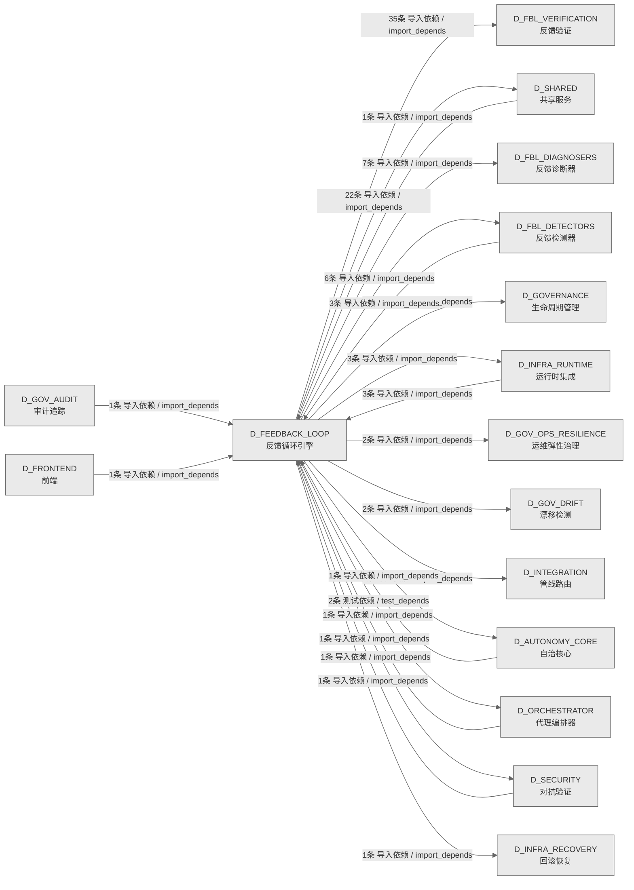

# 18_d_feedback_loop / 反馈循环引擎 / Feedback Loop Engine

> **功能简介 / Overview**: 反馈循环引擎，负责系统自我改进闭环：异常检测、根因诊断、自动修复和自我进化

> **文档作用 / Purpose**: 展示 反馈循环引擎（D_FEEDBACK_LOOP）功能域的域内依赖关系、跨域依赖关系，模块信息（成熟度/中英文名/大白话/文件路径）内嵌于 Mermaid 节点，供架构审查和域治理参考。

> 本文档由 generate_domain_doc.py 从 depgraph (PostgreSQL) 自动生成
> 数据源: depgraph (PostgreSQL) nodes表 + edges表

> **[可缩放 HTML 版 / Zoomable HTML](http://localhost:8765/docs/02_enterprise_architecture/02_domain_architecture_docs/18_d_feedback_loop.html)** — Ctrl+滚轮缩放 ｜ 双击重置 ｜ Ctrl+Shift+D 切换拖动/选择模式

## 域基本信息 / Domain Overview

| 字段 | 值 | Field | Value |
|------|------|-------|-------|
| 编号 | 18 | Number | 18 |
| 域ID | D_FEEDBACK_LOOP | Domain ID | D_FEEDBACK_LOOP |
| 域名称 | 反馈循环引擎 | Domain Name | Feedback Loop Engine |
| 层级 | L1 基础平台层 | Layer | L1 Foundation |
| 模块数 | 125 | Module Count | 125 |
| 域内依赖 | 122 | Internal Dependencies | 122 |
| 跨域入边 | 13 | Cross-domain Incoming | 13 |
| 跨域出边 | 87 | Cross-domain Outgoing | 87 |
| 设计态模块 | 0 | Design Modules | 0 |
| 生产态模块 | 125 | Production Modules | 125 |
| 容量 | 125/150 (正常) | Capacity | 125/150 (正常) |
| 描述 | 反馈收集器(collectors) | Description | 反馈收集器(collectors) |

## 域内依赖图 / Internal Dependency Diagram

> 依赖图内嵌在本文档中，IDE 可直接渲染；网页版可 Ctrl+滚轮缩放 + 拖动平移查看细节。全景图用颜色区分运营态/设计态，不再分页/拆子图。
>
> **图例说明 / Legend**：
> - 🟦 **蓝色 = 运营态模块**（production，已上线运行）
> - 🟧 **橙色虚线 = 设计态模块**（design，蓝图阶段，代码未写）
> - **实线箭头 = 运营态依赖**（已生效的依赖关系）
> - **虚线箭头 = 非运营态依赖**（计划中/验证中的依赖关系）

### 全景依赖图（全部模块，颜色区分运营态/设计态）

> 展示全部 125 个模块（生产态 125 + 设计态 0），节点含成熟度+中英文名+大白话+文件路径。

```mermaid
%%{init: {'theme': 'base', 'themeVariables': {'primaryColor': '#eaeaea', 'primaryTextColor': '#333333', 'primaryBorderColor': '#666666', 'lineColor': '#666666', 'secondaryColor': '#eaeaea', 'tertiaryColor': '#eaeaea', 'fontSize': '14px'}}}%%
flowchart TD
    src_zephyr_feedback_loop_init_py["(生产态 / production) Feedback Loop Engine — MOD-FEEDBACK_LOOP.<br/>Feedback Loop Engine — MOD-FEEDBACK_LOOP.<br/>文件: feedback_loop/__init__.py"]
    src_zephyr_feedback_loop_gen_inherited_py["(生产态 / production)<br/>文件: feedback_loop/_gen_inherited.py"]
    src_zephyr_feedback_loop_actors_init_py["(生产态 / production) feedback-loop.actors — auto-generated package init.<br/>feedback-loop.actors — auto-generated package init.<br/>文件: actors/__init__.py"]
    src_zephyr_feedback_loop_auto_evolution_py["(生产态 / production)<br/>文件: feedback_loop/auto_evolution.py"]
    src_zephyr_feedback_loop_backpressure_bridge_py["(生产态 / production) FLE -> Pipeline 背压桥接（CTR-BP-001~003）<br/>FLE -> Pipeline 背压桥接（CTR-BP-001~003）<br/>文件: feedback_loop/backpressure_bridge.py"]
    src_zephyr_feedback_loop_collectors_init_py["(生产态 / production) feedback-loop.collectors — auto-generated package init.<br/>feedback-loop.collectors — auto-generated package init.<br/>文件: collectors/__init__.py"]
    src_zephyr_feedback_loop_config_py["(生产态 / production)<br/>文件: feedback_loop/config.py"]
    src_zephyr_feedback_loop_db_bridge_py["(生产态 / production) FLE DB契约适配器 — 通过规范zephyr.governance.sqlite_schema连接写入fle_metrics<br/>FLE DB契约适配器 — 通过规范zephyr.governance.sqlite_schema连接写入fle_metrics<br/>文件: feedback_loop/db_bridge.py"]
    src_zephyr_feedback_loop_decision_engine_py["(生产态 / production) Feedback Loop Decision Engine<br/>Feedback Loop Decision Engine<br/>文件: feedback_loop/decision_engine.py"]
    src_zephyr_feedback_loop_docs_init_py["(生产态 / production) feedback-loop.docs — auto-generated package init.<br/>feedback-loop.docs — auto-generated package init.<br/>文件: docs/__init__.py"]
    src_zephyr_feedback_loop_error_budget_py["(生产态 / production) Error Budget 状态机——monthly budget + burn_rate + exhaust_policy。<br/>Error Budget 状态机——monthly budget + burn_rate + exhaust_policy。<br/>文件: feedback_loop/error_budget.py"]
    src_zephyr_feedback_loop_eval_harness_py["(生产态 / production)<br/>文件: feedback_loop/eval_harness.py"]
    src_zephyr_feedback_loop_evolution_init_py["(生产态 / production) feedback-loop.evolution — auto-generated package init.<br/>feedback-loop.evolution — auto-generated package init.<br/>文件: evolution/__init__.py"]
    src_zephyr_feedback_loop_exceptions_py["(生产态 / production)<br/>文件: feedback_loop/exceptions.py"]
    src_zephyr_feedback_loop_feedback_collector_py["(生产态 / production) FeedbackCollector: collect task execution feedback<br/>FeedbackCollector: collect task execution feedback<br/>文件: feedback_loop/feedback_collector.py"]
    src_zephyr_feedback_loop_fitness_functions_py["(生产态 / production)<br/>文件: feedback_loop/fitness_functions.py"]
    src_zephyr_feedback_loop_forensic_init_py["(生产态 / production) feedback-loop.forensic — auto-generated package init.<br/>feedback-loop.forensic — auto-generated package init.<br/>文件: forensic/__init__.py"]
    src_zephyr_feedback_loop_gates_init_py["(生产态 / production) feedback-loop.gates — auto-generated package init.<br/>feedback-loop.gates — auto-generated package init.<br/>文件: gates/__init__.py"]
    src_zephyr_feedback_loop_generator_py["(生产态 / production)<br/>文件: feedback_loop/generator.py"]
    src_zephyr_feedback_loop_metrics_collector_py["(生产态 / production) MetricsCollector: append-only metrics recording.<br/>MetricsCollector: append-only metrics recording.<br/>文件: feedback_loop/metrics_collector.py"]
    src_zephyr_feedback_loop_resilience_init_py["(生产态 / production) feedback-loop.resilience — auto-generated package init.<br/>feedback-loop.resilience — auto-generated package init.<br/>文件: resilience/__init__.py"]
    src_zephyr_feedback_loop_scheduler_py["(生产态 / production) FLE 全链路调度器 —— collect->detect->diagnose->act->verify 闭环。<br/>FLE 全链路调度器 —— collect->detect->diagnose->act->verify 闭环。<br/>文件: feedback_loop/scheduler.py"]
    src_zephyr_feedback_loop_security_init_py["(生产态 / production) feedback-loop.security — auto-generated package init.<br/>feedback-loop.security — auto-generated package init.<br/>文件: security/__init__.py"]
    src_zephyr_feedback_loop_self_diagnosis_py["(生产态 / production) self_diagnosis.py — 自我诊断 (DD120, TASK-020)<br/>self_diagnosis.py — 自我诊断 (DD120, TASK-020)<br/>文件: feedback_loop/self_diagnosis.py"]
    src_zephyr_feedback_loop_session_learner_py["(生产态 / production) session_learner.py — 在线学习 (DD114, TASK-020)<br/>session_learner.py — 在线学习 (DD114, TASK-020)<br/>文件: feedback_loop/session_learner.py"]
    src_zephyr_feedback_loop_slo_manager_py["(生产态 / production)<br/>文件: feedback_loop/slo_manager.py"]
    src_zephyr_feedback_loop_tests_e2e_init_py["(生产态 / production) feedback-loop.tests.e2e — auto-generated package init.<br/>feedback-loop.tests.e2e — auto-generated package init.<br/>文件: e2e/__init__.py"]
    src_zephyr_feedback_loop_validator_py["(生产态 / production)<br/>文件: feedback_loop/validator.py"]
    src_zephyr_feedback_loop_verifiers_init_py["(生产态 / production) feedback-loop.verifiers — auto-generated package init.<br/>feedback-loop.verifiers — auto-generated package init.<br/>文件: verifiers/__init__.py"]
    src_zephyr_feedback_loop_init_py ~~~ src_zephyr_feedback_loop_gen_inherited_py
    src_zephyr_feedback_loop_gen_inherited_py ~~~ src_zephyr_feedback_loop_actors_init_py
    src_zephyr_feedback_loop_actors_init_py ~~~ src_zephyr_feedback_loop_auto_evolution_py
    src_zephyr_feedback_loop_auto_evolution_py ~~~ src_zephyr_feedback_loop_backpressure_bridge_py
    src_zephyr_feedback_loop_backpressure_bridge_py ~~~ src_zephyr_feedback_loop_collectors_init_py
    src_zephyr_feedback_loop_collectors_init_py ~~~ src_zephyr_feedback_loop_config_py
    src_zephyr_feedback_loop_config_py ~~~ src_zephyr_feedback_loop_db_bridge_py
    src_zephyr_feedback_loop_db_bridge_py ~~~ src_zephyr_feedback_loop_decision_engine_py
    src_zephyr_feedback_loop_decision_engine_py ~~~ src_zephyr_feedback_loop_docs_init_py
    src_zephyr_feedback_loop_docs_init_py ~~~ src_zephyr_feedback_loop_error_budget_py
    src_zephyr_feedback_loop_error_budget_py ~~~ src_zephyr_feedback_loop_eval_harness_py
    src_zephyr_feedback_loop_eval_harness_py ~~~ src_zephyr_feedback_loop_evolution_init_py
    src_zephyr_feedback_loop_evolution_init_py ~~~ src_zephyr_feedback_loop_exceptions_py
    src_zephyr_feedback_loop_exceptions_py ~~~ src_zephyr_feedback_loop_feedback_collector_py
    src_zephyr_feedback_loop_feedback_collector_py ~~~ src_zephyr_feedback_loop_fitness_functions_py
    src_zephyr_feedback_loop_fitness_functions_py ~~~ src_zephyr_feedback_loop_forensic_init_py
    src_zephyr_feedback_loop_forensic_init_py ~~~ src_zephyr_feedback_loop_gates_init_py
    src_zephyr_feedback_loop_gates_init_py ~~~ src_zephyr_feedback_loop_generator_py
    src_zephyr_feedback_loop_generator_py ~~~ src_zephyr_feedback_loop_metrics_collector_py
    src_zephyr_feedback_loop_metrics_collector_py ~~~ src_zephyr_feedback_loop_resilience_init_py
    src_zephyr_feedback_loop_resilience_init_py ~~~ src_zephyr_feedback_loop_scheduler_py
    src_zephyr_feedback_loop_scheduler_py ~~~ src_zephyr_feedback_loop_security_init_py
    src_zephyr_feedback_loop_security_init_py ~~~ src_zephyr_feedback_loop_self_diagnosis_py
    src_zephyr_feedback_loop_self_diagnosis_py ~~~ src_zephyr_feedback_loop_session_learner_py
    src_zephyr_feedback_loop_session_learner_py ~~~ src_zephyr_feedback_loop_slo_manager_py
    src_zephyr_feedback_loop_slo_manager_py ~~~ src_zephyr_feedback_loop_tests_e2e_init_py
    src_zephyr_feedback_loop_tests_e2e_init_py ~~~ src_zephyr_feedback_loop_validator_py
    src_zephyr_feedback_loop_validator_py ~~~ src_zephyr_feedback_loop_verifiers_init_py
    src_zephyr_feedback_loop_actors_agent_lifecycle_py["(生产态 / production) Agent Lifecycle Manager — v0.12.0 R159c<br/>Agent Lifecycle Manager — v0.12.0 R159c<br/>文件: actors/agent_lifecycle.py"]
    src_zephyr_feedback_loop_actors_api_version_contract_py["(生产态 / production) API Version Contract — v0.14.0 R188<br/>API Version Contract — v0.14.0 R188<br/>文件: actors/api_version_contract.py"]
    src_zephyr_feedback_loop_actors_global_action_scheduler_py["(生产态 / production) Global Action Scheduler — v0.16.0 R226<br/>Global Action Scheduler — v0.16.0 R226<br/>文件: actors/global_action_scheduler.py"]
    src_zephyr_feedback_loop_actors_incident_priority_triage_automator_py["(生产态 / production) Incident Priority Triage Automator — v0.37.0 R463<br/>Incident Priority Triage Automator — v0.37.0 R463<br/>文件: actors/incident_priority_triage_automator.py"]
    src_zephyr_feedback_loop_actors_intent_driven_ops_py["(生产态 / production) Intent-Driven Ops — v0.12.0 R159<br/>Intent-Driven Ops — v0.12.0 R159<br/>文件: actors/intent_driven_ops.py"]
    src_zephyr_feedback_loop_actors_multi_agent_orchestrator_py["(生产态 / production) Multi-Agent Orchestrator — v0.12.0 R159b<br/>Multi-Agent Orchestrator — v0.12.0 R159b<br/>文件: actors/multi_agent_orchestrator.py"]
    src_zephyr_feedback_loop_actors_notification_personalizer_py["(生产态 / production) Notification Personalizer — v0.6.0 R67<br/>Notification Personalizer — v0.6.0 R67<br/>文件: actors/notification_personalizer.py"]
    src_zephyr_feedback_loop_actors_owner_absence_escalation_py["(生产态 / production) Owner Absence Escalation — v0.37.0 R462<br/>Owner Absence Escalation — v0.37.0 R462<br/>文件: actors/owner_absence_escalation.py"]
    src_zephyr_feedback_loop_actors_saga_compensator_py["(生产态 / production) Saga Compensator — v0.3.0 R19b<br/>Saga Compensator — v0.3.0 R19b<br/>文件: actors/saga_compensator.py"]
    src_zephyr_feedback_loop_actors_secondary_alert_channel_py["(生产态 / production) Secondary Alert Channel — v0.37.0 R461<br/>Secondary Alert Channel — v0.37.0 R461<br/>文件: actors/secondary_alert_channel.py"]
    src_zephyr_feedback_loop_collectors_calendar_adapter_py["(生产态 / production) Calendar Adapter — v0.8.0 R102b<br/>Calendar Adapter — v0.8.0 R102b<br/>文件: collectors/calendar_adapter.py"]
    src_zephyr_feedback_loop_collectors_config_timeline_py["(生产态 / production) Config Timeline — v0.8.0 R99<br/>Config Timeline — v0.8.0 R99<br/>文件: collectors/config_timeline.py"]
    src_zephyr_feedback_loop_collectors_data_quality_validator_py["(生产态 / production) Data Quality Validator — v0.9.0 R110<br/>Data Quality Validator — v0.9.0 R110<br/>文件: collectors/data_quality_validator.py"]
    src_zephyr_feedback_loop_collectors_financial_stratification_py["(生产态 / production) Financial Stratification — v0.5.0 R50<br/>Financial Stratification — v0.5.0 R50<br/>文件: collectors/financial_stratification.py"]
    src_zephyr_feedback_loop_collectors_kb_provenance_py["(生产态 / production) KB Provenance — v0.10.0 R136<br/>KB Provenance — v0.10.0 R136<br/>文件: collectors/kb_provenance.py"]
    src_zephyr_feedback_loop_collectors_knowledge_capture_py["(生产态 / production) Knowledge Capture — v0.4.0 R30<br/>Knowledge Capture — v0.4.0 R30<br/>文件: collectors/knowledge_capture.py"]
    src_zephyr_feedback_loop_collectors_knowledge_freshness_py["(生产态 / production) Knowledge Freshness — v0.5.0 R47<br/>Knowledge Freshness — v0.5.0 R47<br/>文件: collectors/knowledge_freshness.py"]
    src_zephyr_feedback_loop_collectors_knowledge_injection_py["(生产态 / production) Knowledge Injection — v0.8.0 R102<br/>Knowledge Injection — v0.8.0 R102<br/>文件: collectors/knowledge_injection.py"]
    src_zephyr_feedback_loop_collectors_knowledge_packaging_py["(生产态 / production) Knowledge Packaging — v0.9.0 R123<br/>Knowledge Packaging — v0.9.0 R123<br/>文件: collectors/knowledge_packaging.py"]
    src_zephyr_feedback_loop_collectors_known_unknown_registry_py["(生产态 / production) Known-Unknown Registry — v0.16.0 R229<br/>Known-Unknown Registry — v0.16.0 R229<br/>文件: collectors/known_unknown_registry.py"]
    src_zephyr_feedback_loop_collectors_llm_cost_accounting_py["(生产态 / production) LLM Cost Accounting — v0.4.0 R35<br/>LLM Cost Accounting — v0.4.0 R35<br/>文件: collectors/llm_cost_accounting.py"]
    src_zephyr_feedback_loop_collectors_market_calendar_py["(生产态 / production) Market Calendar — v0.5.0 R48<br/>Market Calendar — v0.5.0 R48<br/>文件: collectors/market_calendar.py"]
    src_zephyr_feedback_loop_collectors_market_event_integrator_py["(生产态 / production) Market Event Integrator — v0.14.0 R197<br/>Market Event Integrator — v0.14.0 R197<br/>文件: collectors/market_event_integrator.py"]
    src_zephyr_feedback_loop_collectors_notification_feedback_py["(生产态 / production) Notification Feedback — v0.9.0 R118<br/>Notification Feedback — v0.9.0 R118<br/>文件: collectors/notification_feedback.py"]
    src_zephyr_feedback_loop_collectors_schema_evolution_py["(生产态 / production) Schema Evolution — v0.9.0 R111<br/>Schema Evolution — v0.9.0 R111<br/>文件: collectors/schema_evolution.py"]
    src_zephyr_feedback_loop_collectors_schema_migration_py["(生产态 / production) Schema Migration — v0.14.0 R190<br/>Schema Migration — v0.14.0 R190<br/>文件: collectors/schema_migration.py"]
    src_zephyr_feedback_loop_collectors_temporal_event_store_py["(生产态 / production) Temporal Event Store — v0.3.0 R9<br/>Temporal Event Store — v0.3.0 R9<br/>文件: collectors/temporal_event_store.py"]
    src_zephyr_feedback_loop_collectors_token_finops_py["(生产态 / production) Token FinOps — v0.12.0 R162<br/>Token FinOps — v0.12.0 R162<br/>文件: collectors/token_finops.py"]
    src_zephyr_feedback_loop_core_py["(生产态 / production) FeedbackLoop core — 反馈闭环核心类。<br/>FeedbackLoop core — 反馈闭环核心类。<br/>文件: feedback_loop/core.py"]
    src_zephyr_feedback_loop_db_writer_py["(生产态 / production) FLE 持久化写入器 — 写 metrics/alerts/dispatch_log 到 SQLite<br/>FLE 持久化写入器 — 写 metrics/alerts/dispatch_log 到 SQLite<br/>文件: feedback_loop/db_writer.py"]
    src_zephyr_feedback_loop_docs_cold_start_manual_py["(生产态 / production)<br/>文件: docs/cold_start_manual.py"]
    src_zephyr_feedback_loop_evolution_auto_reward_py["(生产态 / production) Auto Reward — v0.7.0 R76<br/>Auto Reward — v0.7.0 R76<br/>文件: evolution/auto_reward.py"]
    src_zephyr_feedback_loop_evolution_conformal_prediction_py["(生产态 / production) Conformal Prediction — v0.7.0 R74<br/>Conformal Prediction — v0.7.0 R74<br/>文件: evolution/conformal_prediction.py"]
    src_zephyr_feedback_loop_evolution_cross_gen_validation_py["(生产态 / production) Cross-Gen Validation — v0.7.0 R78<br/>Cross-Gen Validation — v0.7.0 R78<br/>文件: evolution/cross_gen_validation.py"]
    src_zephyr_feedback_loop_evolution_dynamic_threshold_py["(生产态 / production) Dynamic Threshold — v0.7.0 R71<br/>Dynamic Threshold — v0.7.0 R71<br/>文件: evolution/dynamic_threshold.py"]
    src_zephyr_feedback_loop_evolution_ewc_kb_review_py["(生产态 / production) EWC KB Review — v0.6.0 R51<br/>EWC KB Review — v0.6.0 R51<br/>文件: evolution/ewc_kb_review.py"]
    src_zephyr_feedback_loop_evolution_failure_replay_py["(生产态 / production) Failure Replay — v0.7.0 R77<br/>Failure Replay — v0.7.0 R77<br/>文件: evolution/failure_replay.py"]
    src_zephyr_feedback_loop_evolution_graduated_activation_protocol_py["(生产态 / production) Graduated Activation Protocol — v0.38.0 R485<br/>Graduated Activation Protocol — v0.38.0 R485<br/>文件: evolution/graduated_activation_protocol.py"]
    src_zephyr_feedback_loop_evolution_hypernetwork_py["(生产态 / production) HyperNetwork — v0.7.0 R72<br/>HyperNetwork — v0.7.0 R72<br/>文件: evolution/hypernetwork.py"]
    src_zephyr_feedback_loop_evolution_knowledge_distillation_py["(生产态 / production) Knowledge Distillation — v0.6.0 R52<br/>Knowledge Distillation — v0.6.0 R52<br/>文件: evolution/knowledge_distillation.py"]
    src_zephyr_feedback_loop_evolution_online_feature_importance_py["(生产态 / production) Online Feature Importance — v0.7.0 R73<br/>Online Feature Importance — v0.7.0 R73<br/>文件: evolution/online_feature_importance.py"]
    src_zephyr_feedback_loop_evolution_prompt_factory_governance_py["(生产态 / production) Prompt Factory Governance — v0.16.0 R224<br/>Prompt Factory Governance — v0.16.0 R224<br/>文件: evolution/prompt_factory_governance.py"]
    src_zephyr_feedback_loop_evolution_prompt_optimization_regression_detector_py["(生产态 / production) R514: PromptOptimizationRegressionDetector<br/>R514: PromptOptimizationRegressionDetector<br/>文件: evolution/prompt_optimization_regression_detector.py"]
    src_zephyr_feedback_loop_evolution_prompt_self_optimization_loop_py["(生产态 / production) R502: PromptSelfOptimizationLoop<br/>R502: PromptSelfOptimizationLoop<br/>文件: evolution/prompt_self_optimization_loop.py"]
    src_zephyr_feedback_loop_evolution_self_reflection_py["(生产态 / production) Self Reflection — v0.7.0 R75<br/>Self Reflection — v0.7.0 R75<br/>文件: evolution/self_reflection.py"]
    src_zephyr_feedback_loop_evolution_self_upgrade_canary_py["(生产态 / production) Self Upgrade Canary — v0.14.0 R194<br/>Self Upgrade Canary — v0.14.0 R194<br/>文件: evolution/self_upgrade_canary.py"]
    src_zephyr_feedback_loop_evolution_semantic_intent_preservation_guard_py["(生产态 / production) R505: SemanticIntentPreservationGuard<br/>R505: SemanticIntentPreservationGuard<br/>文件: evolution/semantic_intent_preservation_guard.py"]
    src_zephyr_feedback_loop_evolution_teacher_transfer_py["(生产态 / production) Teacher Transfer — v0.6.0 R53<br/>Teacher Transfer — v0.6.0 R53<br/>文件: evolution/teacher_transfer.py"]
    src_zephyr_feedback_loop_evolution_training_data_gov_py["(生产态 / production) Training Data Governance — v0.14.0 R191<br/>Training Data Governance — v0.14.0 R191<br/>文件: evolution/training_data_gov.py"]
    src_zephyr_feedback_loop_evolution_engine_py["(生产态 / production)<br/>文件: feedback_loop/evolution_engine.py"]
    src_zephyr_feedback_loop_forensic_architectural_sod_py["(生产态 / production) Architectural SoD — v0.15.0 R205<br/>Architectural SoD — v0.15.0 R205<br/>文件: forensic/architectural_sod.py"]
    src_zephyr_feedback_loop_forensic_automated_rca_postmortem_generator_py["(生产态 / production) Automated RCA Postmortem Generator — v0.38.0 R486<br/>Automated RCA Postmortem Generator — v0.38.0 R486<br/>文件: forensic/automated_rca_postmortem_generator.py"]
    src_zephyr_feedback_loop_forensic_crypto_bootstrap_py["(生产态 / production) Cryptographic Bootstrap — v0.15.0 R204<br/>Cryptographic Bootstrap — v0.15.0 R204<br/>文件: forensic/crypto_bootstrap.py"]
    src_zephyr_feedback_loop_forensic_deterministic_replay_py["(生产态 / production) Deterministic Replay — v0.15.0 R206<br/>Deterministic Replay — v0.15.0 R206<br/>文件: forensic/deterministic_replay.py"]
    src_zephyr_feedback_loop_forensic_external_verifier_py["(生产态 / production) External Verifier — v0.15.0 R203<br/>External Verifier — v0.15.0 R203<br/>文件: forensic/external_verifier.py"]
    src_zephyr_feedback_loop_forensic_fle_upgrade_safety_validator_py["(生产态 / production) R529: FLEUpgradeSafetyValidator<br/>R529: FLEUpgradeSafetyValidator<br/>文件: forensic/fle_upgrade_safety_validator.py"]
    src_zephyr_feedback_loop_forensic_guard_configuration_drift_monitor_py["(生产态 / production) R521: GuardConfigurationDriftMonitor<br/>R521: GuardConfigurationDriftMonitor<br/>文件: forensic/guard_configuration_drift_monitor.py"]
    src_zephyr_feedback_loop_forensic_interrupt_coherence_validator_py["(生产态 / production) R531: InterruptCoherenceValidator<br/>R531: InterruptCoherenceValidator<br/>文件: forensic/interrupt_coherence_validator.py"]
    src_zephyr_feedback_loop_forensic_knowledge_injection_pre_flight_verifier_py["(生产态 / production) R515: KnowledgeInjectionPreFlightVerifier<br/>R515: KnowledgeInjectionPreFlightVerifier<br/>文件: forensic/knowledge_injection_pre_flight_verifier.py"]
    src_zephyr_feedback_loop_forensic_point_in_time_reconstructor_py["(生产态 / production) Point-in-Time Reconstructor — v0.37.0 R465<br/>Point-in-Time Reconstructor — v0.37.0 R465<br/>文件: forensic/point_in_time_reconstructor.py"]
    src_zephyr_feedback_loop_forensic_self_modification_audit_py["(生产态 / production) Self-Modification Audit — v0.15.0 R218<br/>Self-Modification Audit — v0.15.0 R218<br/>文件: forensic/self_modification_audit.py"]
    src_zephyr_feedback_loop_forensic_serialization_format_tracker_py["(生产态 / production) Serialization Format Tracker — v0.39.0 R488<br/>Serialization Format Tracker — v0.39.0 R488<br/>文件: forensic/serialization_format_tracker.py"]
    src_zephyr_feedback_loop_forensic_state_migration_validator_py["(生产态 / production) State Migration Validator — v0.40.0 R497<br/>State Migration Validator — v0.40.0 R497<br/>文件: forensic/state_migration_validator.py"]
    src_zephyr_feedback_loop_forensic_sub_agent_collusion_py["(生产态 / production) Sub-Agent Collusion Detector — v0.15.0 R213<br/>Sub-Agent Collusion Detector — v0.15.0 R213<br/>文件: forensic/sub_agent_collusion.py"]
    src_zephyr_feedback_loop_forensic_toctou_guard_py["(生产态 / production) TOCTOU Guard — v0.15.0 R207<br/>TOCTOU Guard — v0.15.0 R207<br/>文件: forensic/toctou_guard.py"]
    src_zephyr_feedback_loop_forensic_worm_write_integrity_py["(生产态 / production) WORM Write Integrity — v0.15.0 R216<br/>WORM Write Integrity — v0.15.0 R216<br/>文件: forensic/worm_write_integrity.py"]
    src_zephyr_feedback_loop_resilience_deadman_switch_py["(生产态 / production) Deadman Switch — v0.15.0 R212<br/>Deadman Switch — v0.15.0 R212<br/>文件: resilience/deadman_switch.py"]
    src_zephyr_feedback_loop_resilience_dr_automation_py["(生产态 / production) DR Automation — v0.14.0 R187<br/>DR Automation — v0.14.0 R187<br/>文件: resilience/dr_automation.py"]
    src_zephyr_feedback_loop_resilience_multi_instance_coord_py["(生产态 / production) Multi-Instance Coordinator — v0.14.0 R199<br/>Multi-Instance Coordinator — v0.14.0 R199<br/>文件: resilience/multi_instance_coord.py"]
    src_zephyr_feedback_loop_resilience_resource_starvation_aware_py["(生产态 / production) Resource Starvation Aware — v0.15.0 R209<br/>Resource Starvation Aware — v0.15.0 R209<br/>文件: resilience/resource_starvation_aware.py"]
    src_zephyr_feedback_loop_resilience_split_brain_quorum_py["(生产态 / production) Split-Brain Quorum — v0.37.0 R451<br/>Split-Brain Quorum — v0.37.0 R451<br/>文件: resilience/split_brain_quorum.py"]
    src_zephyr_feedback_loop_scheduler_act_py["(生产态 / production)<br/>文件: feedback_loop/scheduler_act.py"]
    src_zephyr_feedback_loop_scheduler_collect_detect_py["(生产态 / production)<br/>文件: feedback_loop/scheduler_collect_detect.py"]
    src_zephyr_feedback_loop_scheduler_health_py["(生产态 / production)<br/>文件: feedback_loop/scheduler_health.py"]
    src_zephyr_feedback_loop_scheduler_safety_py["(生产态 / production)<br/>文件: feedback_loop/scheduler_safety.py"]
    src_zephyr_feedback_loop_security_agent_skill_guard_py["(生产态 / production) Agent Skill Guard — v0.14.0 R201<br/>Agent Skill Guard — v0.14.0 R201<br/>文件: security/agent_skill_guard.py"]
    src_zephyr_feedback_loop_security_dep_cve_correlator_py["(生产态 / production) Dependency CVE Correlator — v0.14.0 R196<br/>Dependency CVE Correlator — v0.14.0 R196<br/>文件: security/dep_cve_correlator.py"]
    src_zephyr_feedback_loop_security_metric_prompt_scanner_py["(生产态 / production) Metric-Prompt Scanner — v0.15.0 R215<br/>Metric-Prompt Scanner — v0.15.0 R215<br/>文件: security/metric_prompt_scanner.py"]
    src_zephyr_feedback_loop_security_remote_attestation_py["(生产态 / production) Remote Attestation — v0.15.0 R211<br/>Remote Attestation — v0.15.0 R211<br/>文件: security/remote_attestation.py"]
    src_zephyr_feedback_loop_security_secret_rotation_py["(生产态 / production) Secret Rotation — v0.14.0 R189<br/>Secret Rotation — v0.14.0 R189<br/>文件: security/secret_rotation.py"]
    src_zephyr_feedback_loop_template_py["(生产态 / production)<br/>文件: feedback_loop/template.py"]
    src_zephyr_feedback_loop_tests_e2e_integration_test_pipeline_py["(生产态 / production) E2E Integration Test Pipeline — TASK-MOD-FEEDBACK_LOOP-0028 (Phase43-87)<br/>E2E Integration Test Pipeline — TASK-MOD-FEEDBACK_LOOP-0028 (Phase43-87)<br/>文件: e2e/integration_test_pipeline.py"]
    src_zephyr_feedback_loop_actors_agent_lifecycle_py ~~~ src_zephyr_feedback_loop_actors_api_version_contract_py
    src_zephyr_feedback_loop_actors_api_version_contract_py ~~~ src_zephyr_feedback_loop_actors_global_action_scheduler_py
    src_zephyr_feedback_loop_actors_global_action_scheduler_py ~~~ src_zephyr_feedback_loop_actors_incident_priority_triage_automator_py
    src_zephyr_feedback_loop_actors_incident_priority_triage_automator_py ~~~ src_zephyr_feedback_loop_actors_intent_driven_ops_py
    src_zephyr_feedback_loop_actors_intent_driven_ops_py ~~~ src_zephyr_feedback_loop_actors_multi_agent_orchestrator_py
    src_zephyr_feedback_loop_actors_multi_agent_orchestrator_py ~~~ src_zephyr_feedback_loop_actors_notification_personalizer_py
    src_zephyr_feedback_loop_actors_notification_personalizer_py ~~~ src_zephyr_feedback_loop_actors_owner_absence_escalation_py
    src_zephyr_feedback_loop_actors_owner_absence_escalation_py ~~~ src_zephyr_feedback_loop_actors_saga_compensator_py
    src_zephyr_feedback_loop_actors_saga_compensator_py ~~~ src_zephyr_feedback_loop_actors_secondary_alert_channel_py
    src_zephyr_feedback_loop_actors_secondary_alert_channel_py ~~~ src_zephyr_feedback_loop_collectors_calendar_adapter_py
    src_zephyr_feedback_loop_collectors_calendar_adapter_py ~~~ src_zephyr_feedback_loop_collectors_config_timeline_py
    src_zephyr_feedback_loop_collectors_config_timeline_py ~~~ src_zephyr_feedback_loop_collectors_data_quality_validator_py
    src_zephyr_feedback_loop_collectors_data_quality_validator_py ~~~ src_zephyr_feedback_loop_collectors_financial_stratification_py
    src_zephyr_feedback_loop_collectors_financial_stratification_py ~~~ src_zephyr_feedback_loop_collectors_kb_provenance_py
    src_zephyr_feedback_loop_collectors_kb_provenance_py ~~~ src_zephyr_feedback_loop_collectors_knowledge_capture_py
    src_zephyr_feedback_loop_collectors_knowledge_capture_py ~~~ src_zephyr_feedback_loop_collectors_knowledge_freshness_py
    src_zephyr_feedback_loop_collectors_knowledge_freshness_py ~~~ src_zephyr_feedback_loop_collectors_knowledge_injection_py
    src_zephyr_feedback_loop_collectors_knowledge_injection_py ~~~ src_zephyr_feedback_loop_collectors_knowledge_packaging_py
    src_zephyr_feedback_loop_collectors_knowledge_packaging_py ~~~ src_zephyr_feedback_loop_collectors_known_unknown_registry_py
    src_zephyr_feedback_loop_collectors_known_unknown_registry_py ~~~ src_zephyr_feedback_loop_collectors_llm_cost_accounting_py
    src_zephyr_feedback_loop_collectors_llm_cost_accounting_py ~~~ src_zephyr_feedback_loop_collectors_market_calendar_py
    src_zephyr_feedback_loop_collectors_market_calendar_py ~~~ src_zephyr_feedback_loop_collectors_market_event_integrator_py
    src_zephyr_feedback_loop_collectors_market_event_integrator_py ~~~ src_zephyr_feedback_loop_collectors_notification_feedback_py
    src_zephyr_feedback_loop_collectors_notification_feedback_py ~~~ src_zephyr_feedback_loop_collectors_schema_evolution_py
    src_zephyr_feedback_loop_collectors_schema_evolution_py ~~~ src_zephyr_feedback_loop_collectors_schema_migration_py
    src_zephyr_feedback_loop_collectors_schema_migration_py ~~~ src_zephyr_feedback_loop_collectors_temporal_event_store_py
    src_zephyr_feedback_loop_collectors_temporal_event_store_py ~~~ src_zephyr_feedback_loop_collectors_token_finops_py
    src_zephyr_feedback_loop_collectors_token_finops_py ~~~ src_zephyr_feedback_loop_core_py
    src_zephyr_feedback_loop_core_py ~~~ src_zephyr_feedback_loop_db_writer_py
    src_zephyr_feedback_loop_db_writer_py ~~~ src_zephyr_feedback_loop_docs_cold_start_manual_py
    src_zephyr_feedback_loop_docs_cold_start_manual_py ~~~ src_zephyr_feedback_loop_evolution_auto_reward_py
    src_zephyr_feedback_loop_evolution_auto_reward_py ~~~ src_zephyr_feedback_loop_evolution_conformal_prediction_py
    src_zephyr_feedback_loop_evolution_conformal_prediction_py ~~~ src_zephyr_feedback_loop_evolution_cross_gen_validation_py
    src_zephyr_feedback_loop_evolution_cross_gen_validation_py ~~~ src_zephyr_feedback_loop_evolution_dynamic_threshold_py
    src_zephyr_feedback_loop_evolution_dynamic_threshold_py ~~~ src_zephyr_feedback_loop_evolution_ewc_kb_review_py
    src_zephyr_feedback_loop_evolution_ewc_kb_review_py ~~~ src_zephyr_feedback_loop_evolution_failure_replay_py
    src_zephyr_feedback_loop_evolution_failure_replay_py ~~~ src_zephyr_feedback_loop_evolution_graduated_activation_protocol_py
    src_zephyr_feedback_loop_evolution_graduated_activation_protocol_py ~~~ src_zephyr_feedback_loop_evolution_hypernetwork_py
    src_zephyr_feedback_loop_evolution_hypernetwork_py ~~~ src_zephyr_feedback_loop_evolution_knowledge_distillation_py
    src_zephyr_feedback_loop_evolution_knowledge_distillation_py ~~~ src_zephyr_feedback_loop_evolution_online_feature_importance_py
    src_zephyr_feedback_loop_evolution_online_feature_importance_py ~~~ src_zephyr_feedback_loop_evolution_prompt_factory_governance_py
    src_zephyr_feedback_loop_evolution_prompt_factory_governance_py ~~~ src_zephyr_feedback_loop_evolution_prompt_optimization_regression_detector_py
    src_zephyr_feedback_loop_evolution_prompt_optimization_regression_detector_py ~~~ src_zephyr_feedback_loop_evolution_prompt_self_optimization_loop_py
    src_zephyr_feedback_loop_evolution_prompt_self_optimization_loop_py ~~~ src_zephyr_feedback_loop_evolution_self_reflection_py
    src_zephyr_feedback_loop_evolution_self_reflection_py ~~~ src_zephyr_feedback_loop_evolution_self_upgrade_canary_py
    src_zephyr_feedback_loop_evolution_self_upgrade_canary_py ~~~ src_zephyr_feedback_loop_evolution_semantic_intent_preservation_guard_py
    src_zephyr_feedback_loop_evolution_semantic_intent_preservation_guard_py ~~~ src_zephyr_feedback_loop_evolution_teacher_transfer_py
    src_zephyr_feedback_loop_evolution_teacher_transfer_py ~~~ src_zephyr_feedback_loop_evolution_training_data_gov_py
    src_zephyr_feedback_loop_evolution_training_data_gov_py ~~~ src_zephyr_feedback_loop_evolution_engine_py
    src_zephyr_feedback_loop_evolution_engine_py ~~~ src_zephyr_feedback_loop_forensic_architectural_sod_py
    src_zephyr_feedback_loop_forensic_architectural_sod_py ~~~ src_zephyr_feedback_loop_forensic_automated_rca_postmortem_generator_py
    src_zephyr_feedback_loop_forensic_automated_rca_postmortem_generator_py ~~~ src_zephyr_feedback_loop_forensic_crypto_bootstrap_py
    src_zephyr_feedback_loop_forensic_crypto_bootstrap_py ~~~ src_zephyr_feedback_loop_forensic_deterministic_replay_py
    src_zephyr_feedback_loop_forensic_deterministic_replay_py ~~~ src_zephyr_feedback_loop_forensic_external_verifier_py
    src_zephyr_feedback_loop_forensic_external_verifier_py ~~~ src_zephyr_feedback_loop_forensic_fle_upgrade_safety_validator_py
    src_zephyr_feedback_loop_forensic_fle_upgrade_safety_validator_py ~~~ src_zephyr_feedback_loop_forensic_guard_configuration_drift_monitor_py
    src_zephyr_feedback_loop_forensic_guard_configuration_drift_monitor_py ~~~ src_zephyr_feedback_loop_forensic_interrupt_coherence_validator_py
    src_zephyr_feedback_loop_forensic_interrupt_coherence_validator_py ~~~ src_zephyr_feedback_loop_forensic_knowledge_injection_pre_flight_verifier_py
    src_zephyr_feedback_loop_forensic_knowledge_injection_pre_flight_verifier_py ~~~ src_zephyr_feedback_loop_forensic_point_in_time_reconstructor_py
    src_zephyr_feedback_loop_forensic_point_in_time_reconstructor_py ~~~ src_zephyr_feedback_loop_forensic_self_modification_audit_py
    src_zephyr_feedback_loop_forensic_self_modification_audit_py ~~~ src_zephyr_feedback_loop_forensic_serialization_format_tracker_py
    src_zephyr_feedback_loop_forensic_serialization_format_tracker_py ~~~ src_zephyr_feedback_loop_forensic_state_migration_validator_py
    src_zephyr_feedback_loop_forensic_state_migration_validator_py ~~~ src_zephyr_feedback_loop_forensic_sub_agent_collusion_py
    src_zephyr_feedback_loop_forensic_sub_agent_collusion_py ~~~ src_zephyr_feedback_loop_forensic_toctou_guard_py
    src_zephyr_feedback_loop_forensic_toctou_guard_py ~~~ src_zephyr_feedback_loop_forensic_worm_write_integrity_py
    src_zephyr_feedback_loop_forensic_worm_write_integrity_py ~~~ src_zephyr_feedback_loop_resilience_deadman_switch_py
    src_zephyr_feedback_loop_resilience_deadman_switch_py ~~~ src_zephyr_feedback_loop_resilience_dr_automation_py
    src_zephyr_feedback_loop_resilience_dr_automation_py ~~~ src_zephyr_feedback_loop_resilience_multi_instance_coord_py
    src_zephyr_feedback_loop_resilience_multi_instance_coord_py ~~~ src_zephyr_feedback_loop_resilience_resource_starvation_aware_py
    src_zephyr_feedback_loop_resilience_resource_starvation_aware_py ~~~ src_zephyr_feedback_loop_resilience_split_brain_quorum_py
    src_zephyr_feedback_loop_resilience_split_brain_quorum_py ~~~ src_zephyr_feedback_loop_scheduler_act_py
    src_zephyr_feedback_loop_scheduler_act_py ~~~ src_zephyr_feedback_loop_scheduler_collect_detect_py
    src_zephyr_feedback_loop_scheduler_collect_detect_py ~~~ src_zephyr_feedback_loop_scheduler_health_py
    src_zephyr_feedback_loop_scheduler_health_py ~~~ src_zephyr_feedback_loop_scheduler_safety_py
    src_zephyr_feedback_loop_scheduler_safety_py ~~~ src_zephyr_feedback_loop_security_agent_skill_guard_py
    src_zephyr_feedback_loop_security_agent_skill_guard_py ~~~ src_zephyr_feedback_loop_security_dep_cve_correlator_py
    src_zephyr_feedback_loop_security_dep_cve_correlator_py ~~~ src_zephyr_feedback_loop_security_metric_prompt_scanner_py
    src_zephyr_feedback_loop_security_metric_prompt_scanner_py ~~~ src_zephyr_feedback_loop_security_remote_attestation_py
    src_zephyr_feedback_loop_security_remote_attestation_py ~~~ src_zephyr_feedback_loop_security_secret_rotation_py
    src_zephyr_feedback_loop_security_secret_rotation_py ~~~ src_zephyr_feedback_loop_template_py
    src_zephyr_feedback_loop_template_py ~~~ src_zephyr_feedback_loop_tests_e2e_integration_test_pipeline_py
    src_zephyr_feedback_loop_actors_action_selector_py["(生产态 / production)<br/>文件: actors/action_selector.py"]
    src_zephyr_feedback_loop_alert_dispatcher_py["(生产态 / production) FLE->Orc 告警分派器 — dispatch() 生产者<br/>FLE->Orc 告警分派器 — dispatch() 生产者<br/>文件: feedback_loop/alert_dispatcher.py"]
    src_zephyr_feedback_loop_collectors_feedback_collector_py["(生产态 / production)<br/>文件: collectors/feedback_collector.py"]
    src_zephyr_feedback_loop_collectors_metrics_collector_py["(生产态 / production)<br/>文件: collectors/metrics_collector.py"]
    src_zephyr_feedback_loop_evolution_self_modification_rate_limiter_py["(生产态 / production) R522: SelfModificationRateLimiter<br/>R522: SelfModificationRateLimiter<br/>文件: evolution/self_modification_rate_limiter.py"]
    src_zephyr_feedback_loop_forensic_boot_integrity_attestation_py["(生产态 / production) Boot Integrity Attestation — v0.38.0 R487<br/>Boot Integrity Attestation — v0.38.0 R487<br/>文件: forensic/boot_integrity_attestation.py"]
    src_zephyr_feedback_loop_forensic_guard_complexity_budget_py["(生产态 / production) R523: GuardComplexityBudget<br/>R523: GuardComplexityBudget<br/>文件: forensic/guard_complexity_budget.py"]
    src_zephyr_feedback_loop_resilience_config_hot_reload_guard_py["(生产态 / production) Config Hot-Reload Guard — v0.40.0 R498<br/>Config Hot-Reload Guard — v0.40.0 R498<br/>文件: resilience/config_hot_reload_guard.py"]
    src_zephyr_feedback_loop_resilience_graceful_degradation_planner_py["(生产态 / production) Graceful Degradation Planner — v0.40.0 R496<br/>Graceful Degradation Planner — v0.40.0 R496<br/>文件: resilience/graceful_degradation_planner.py"]
    src_zephyr_feedback_loop_resilience_oscillation_damping_py["(生产态 / production) Oscillation Damping — v0.37.0 R450<br/>Oscillation Damping — v0.37.0 R450<br/>文件: resilience/oscillation_damping.py"]
    src_zephyr_feedback_loop_resilience_self_api_throttle_defense_py["(生产态 / production) Self API Throttle Defense — v0.39.0 R491<br/>Self API Throttle Defense — v0.39.0 R491<br/>文件: resilience/self_api_throttle_defense.py"]
    src_zephyr_feedback_loop_security_wireheading_prevention_py["(生产态 / production) Wireheading Prevention — v0.37.0 R486<br/>Wireheading Prevention — v0.37.0 R486<br/>文件: security/wireheading_prevention.py"]
    src_zephyr_feedback_loop_actors_action_selector_py ~~~ src_zephyr_feedback_loop_alert_dispatcher_py
    src_zephyr_feedback_loop_alert_dispatcher_py ~~~ src_zephyr_feedback_loop_collectors_feedback_collector_py
    src_zephyr_feedback_loop_collectors_feedback_collector_py ~~~ src_zephyr_feedback_loop_collectors_metrics_collector_py
    src_zephyr_feedback_loop_collectors_metrics_collector_py ~~~ src_zephyr_feedback_loop_evolution_self_modification_rate_limiter_py
    src_zephyr_feedback_loop_evolution_self_modification_rate_limiter_py ~~~ src_zephyr_feedback_loop_forensic_boot_integrity_attestation_py
    src_zephyr_feedback_loop_forensic_boot_integrity_attestation_py ~~~ src_zephyr_feedback_loop_forensic_guard_complexity_budget_py
    src_zephyr_feedback_loop_forensic_guard_complexity_budget_py ~~~ src_zephyr_feedback_loop_resilience_config_hot_reload_guard_py
    src_zephyr_feedback_loop_resilience_config_hot_reload_guard_py ~~~ src_zephyr_feedback_loop_resilience_graceful_degradation_planner_py
    src_zephyr_feedback_loop_resilience_graceful_degradation_planner_py ~~~ src_zephyr_feedback_loop_resilience_oscillation_damping_py
    src_zephyr_feedback_loop_resilience_oscillation_damping_py ~~~ src_zephyr_feedback_loop_resilience_self_api_throttle_defense_py
    src_zephyr_feedback_loop_resilience_self_api_throttle_defense_py ~~~ src_zephyr_feedback_loop_security_wireheading_prevention_py
    src_zephyr_feedback_loop_actors_alert_router_py["(生产态 / production) alert_router.py — Severity-based alert channel router.<br/>alert_router.py — Severity-based alert channel router.<br/>文件: actors/alert_router.py"]
    src_zephyr_feedback_loop_protocols_py["(生产态 / production)<br/>文件: feedback_loop/protocols.py"]
    src_zephyr_feedback_loop_actors_alert_router_py ~~~ src_zephyr_feedback_loop_protocols_py
    src_zephyr_feedback_loop_backpressure_bridge_py -->|导入依赖 / import_depends| src_zephyr_feedback_loop_evolution_engine_py
    src_zephyr_feedback_loop_alert_dispatcher_py -->|导入依赖 / import_depends| src_zephyr_feedback_loop_actors_alert_router_py
    src_zephyr_feedback_loop_db_writer_py -->|导入依赖 / import_depends| src_zephyr_feedback_loop_alert_dispatcher_py
    src_zephyr_feedback_loop_auto_evolution_py -->|导入依赖 / import_depends| src_zephyr_feedback_loop_evolution_engine_py
    src_zephyr_feedback_loop_decision_engine_py -->|导入依赖 / import_depends| src_zephyr_feedback_loop_protocols_py
    src_zephyr_feedback_loop_generator_py -->|导入依赖 / import_depends| src_zephyr_feedback_loop_template_py
    src_zephyr_feedback_loop_scheduler_py -->|导入依赖 / import_depends| src_zephyr_feedback_loop_alert_dispatcher_py
    src_zephyr_feedback_loop_scheduler_py -->|导入依赖 / import_depends| src_zephyr_feedback_loop_db_writer_py
    src_zephyr_feedback_loop_scheduler_py -->|导入依赖 / import_depends| src_zephyr_feedback_loop_scheduler_act_py
    src_zephyr_feedback_loop_scheduler_py -->|导入依赖 / import_depends| src_zephyr_feedback_loop_scheduler_collect_detect_py
    src_zephyr_feedback_loop_scheduler_py -->|导入依赖 / import_depends| src_zephyr_feedback_loop_scheduler_health_py
    src_zephyr_feedback_loop_scheduler_py -->|导入依赖 / import_depends| src_zephyr_feedback_loop_scheduler_safety_py
    src_zephyr_feedback_loop_scheduler_py -->|导入依赖 / import_depends| src_zephyr_feedback_loop_actors_action_selector_py
    src_zephyr_feedback_loop_scheduler_py -->|导入依赖 / import_depends| src_zephyr_feedback_loop_collectors_feedback_collector_py
    src_zephyr_feedback_loop_scheduler_py -->|导入依赖 / import_depends| src_zephyr_feedback_loop_collectors_metrics_collector_py
    src_zephyr_feedback_loop_scheduler_act_py -->|导入依赖 / import_depends| src_zephyr_feedback_loop_protocols_py
    src_zephyr_feedback_loop_scheduler_act_py -->|导入依赖 / import_depends| src_zephyr_feedback_loop_actors_action_selector_py
    src_zephyr_feedback_loop_scheduler_act_py -->|导入依赖 / import_depends| src_zephyr_feedback_loop_evolution_self_modification_rate_limiter_py
    src_zephyr_feedback_loop_scheduler_act_py -->|导入依赖 / import_depends| src_zephyr_feedback_loop_resilience_oscillation_damping_py
    src_zephyr_feedback_loop_scheduler_act_py -->|导入依赖 / import_depends| src_zephyr_feedback_loop_resilience_graceful_degradation_planner_py
    src_zephyr_feedback_loop_scheduler_act_py -->|导入依赖 / import_depends| src_zephyr_feedback_loop_resilience_self_api_throttle_defense_py
    src_zephyr_feedback_loop_scheduler_collect_detect_py -->|导入依赖 / import_depends| src_zephyr_feedback_loop_collectors_feedback_collector_py
    src_zephyr_feedback_loop_scheduler_collect_detect_py -->|导入依赖 / import_depends| src_zephyr_feedback_loop_collectors_metrics_collector_py
    src_zephyr_feedback_loop_scheduler_health_py -->|导入依赖 / import_depends| src_zephyr_feedback_loop_evolution_self_modification_rate_limiter_py
    src_zephyr_feedback_loop_scheduler_health_py -->|导入依赖 / import_depends| src_zephyr_feedback_loop_forensic_guard_complexity_budget_py
    src_zephyr_feedback_loop_scheduler_health_py -->|导入依赖 / import_depends| src_zephyr_feedback_loop_resilience_graceful_degradation_planner_py
    src_zephyr_feedback_loop_scheduler_health_py -->|导入依赖 / import_depends| src_zephyr_feedback_loop_resilience_self_api_throttle_defense_py
    src_zephyr_feedback_loop_validator_py -->|导入依赖 / import_depends| src_zephyr_feedback_loop_template_py
    src_zephyr_feedback_loop_init_py -->|导入依赖 / import_depends| src_zephyr_feedback_loop_core_py
    src_zephyr_feedback_loop_init_py -->|导入依赖 / import_depends| src_zephyr_feedback_loop_evolution_engine_py
    src_zephyr_feedback_loop_scheduler_safety_py -->|导入依赖 / import_depends| src_zephyr_feedback_loop_forensic_boot_integrity_attestation_py
    src_zephyr_feedback_loop_scheduler_safety_py -->|导入依赖 / import_depends| src_zephyr_feedback_loop_resilience_config_hot_reload_guard_py
    src_zephyr_feedback_loop_scheduler_safety_py -->|导入依赖 / import_depends| src_zephyr_feedback_loop_security_wireheading_prevention_py
    src_zephyr_feedback_loop_actors_action_selector_py -->|导入依赖 / import_depends| src_zephyr_feedback_loop_protocols_py
    src_zephyr_feedback_loop_actors_init_py -->|导入依赖 / import_depends| src_zephyr_feedback_loop_actors_action_selector_py
    src_zephyr_feedback_loop_actors_init_py -->|导入依赖 / import_depends| src_zephyr_feedback_loop_actors_agent_lifecycle_py
    src_zephyr_feedback_loop_actors_init_py -->|导入依赖 / import_depends| src_zephyr_feedback_loop_actors_alert_router_py
    src_zephyr_feedback_loop_actors_init_py -->|导入依赖 / import_depends| src_zephyr_feedback_loop_actors_notification_personalizer_py
    src_zephyr_feedback_loop_actors_init_py -->|导入依赖 / import_depends| src_zephyr_feedback_loop_actors_global_action_scheduler_py
    src_zephyr_feedback_loop_actors_init_py -->|导入依赖 / import_depends| src_zephyr_feedback_loop_actors_multi_agent_orchestrator_py
    src_zephyr_feedback_loop_actors_init_py -->|导入依赖 / import_depends| src_zephyr_feedback_loop_actors_api_version_contract_py
    src_zephyr_feedback_loop_actors_init_py -->|导入依赖 / import_depends| src_zephyr_feedback_loop_actors_incident_priority_triage_automator_py
    src_zephyr_feedback_loop_actors_init_py -->|导入依赖 / import_depends| src_zephyr_feedback_loop_actors_intent_driven_ops_py
    src_zephyr_feedback_loop_actors_init_py -->|导入依赖 / import_depends| src_zephyr_feedback_loop_actors_secondary_alert_channel_py
    src_zephyr_feedback_loop_actors_init_py -->|导入依赖 / import_depends| src_zephyr_feedback_loop_actors_saga_compensator_py
    src_zephyr_feedback_loop_actors_init_py -->|导入依赖 / import_depends| src_zephyr_feedback_loop_actors_owner_absence_escalation_py
    src_zephyr_feedback_loop_collectors_init_py -->|导入依赖 / import_depends| src_zephyr_feedback_loop_collectors_calendar_adapter_py
    src_zephyr_feedback_loop_collectors_init_py -->|导入依赖 / import_depends| src_zephyr_feedback_loop_collectors_data_quality_validator_py
    src_zephyr_feedback_loop_collectors_init_py -->|导入依赖 / import_depends| src_zephyr_feedback_loop_collectors_feedback_collector_py
    src_zephyr_feedback_loop_collectors_init_py -->|导入依赖 / import_depends| src_zephyr_feedback_loop_collectors_config_timeline_py
    src_zephyr_feedback_loop_collectors_init_py -->|导入依赖 / import_depends| src_zephyr_feedback_loop_collectors_knowledge_capture_py
    src_zephyr_feedback_loop_collectors_init_py -->|导入依赖 / import_depends| src_zephyr_feedback_loop_collectors_kb_provenance_py
    src_zephyr_feedback_loop_collectors_init_py -->|导入依赖 / import_depends| src_zephyr_feedback_loop_collectors_financial_stratification_py
    src_zephyr_feedback_loop_collectors_init_py -->|导入依赖 / import_depends| src_zephyr_feedback_loop_collectors_knowledge_freshness_py
    src_zephyr_feedback_loop_collectors_init_py -->|导入依赖 / import_depends| src_zephyr_feedback_loop_collectors_llm_cost_accounting_py
    src_zephyr_feedback_loop_collectors_init_py -->|导入依赖 / import_depends| src_zephyr_feedback_loop_collectors_known_unknown_registry_py
    src_zephyr_feedback_loop_collectors_init_py -->|导入依赖 / import_depends| src_zephyr_feedback_loop_collectors_knowledge_packaging_py
    src_zephyr_feedback_loop_collectors_init_py -->|导入依赖 / import_depends| src_zephyr_feedback_loop_collectors_knowledge_injection_py
    src_zephyr_feedback_loop_collectors_init_py -->|导入依赖 / import_depends| src_zephyr_feedback_loop_collectors_market_event_integrator_py
    src_zephyr_feedback_loop_collectors_init_py -->|导入依赖 / import_depends| src_zephyr_feedback_loop_collectors_schema_evolution_py
    src_zephyr_feedback_loop_collectors_init_py -->|导入依赖 / import_depends| src_zephyr_feedback_loop_collectors_metrics_collector_py
    src_zephyr_feedback_loop_collectors_init_py -->|导入依赖 / import_depends| src_zephyr_feedback_loop_collectors_market_calendar_py
    src_zephyr_feedback_loop_collectors_init_py -->|导入依赖 / import_depends| src_zephyr_feedback_loop_collectors_schema_migration_py
    src_zephyr_feedback_loop_collectors_init_py -->|导入依赖 / import_depends| src_zephyr_feedback_loop_collectors_notification_feedback_py
    src_zephyr_feedback_loop_collectors_init_py -->|导入依赖 / import_depends| src_zephyr_feedback_loop_collectors_token_finops_py
    src_zephyr_feedback_loop_collectors_init_py -->|导入依赖 / import_depends| src_zephyr_feedback_loop_collectors_temporal_event_store_py
    src_zephyr_feedback_loop_docs_init_py -->|导入依赖 / import_depends| src_zephyr_feedback_loop_docs_cold_start_manual_py
    src_zephyr_feedback_loop_evolution_init_py -->|导入依赖 / import_depends| src_zephyr_feedback_loop_evolution_auto_reward_py
    src_zephyr_feedback_loop_evolution_init_py -->|导入依赖 / import_depends| src_zephyr_feedback_loop_evolution_cross_gen_validation_py
    src_zephyr_feedback_loop_evolution_init_py -->|导入依赖 / import_depends| src_zephyr_feedback_loop_evolution_conformal_prediction_py
    src_zephyr_feedback_loop_evolution_init_py -->|导入依赖 / import_depends| src_zephyr_feedback_loop_evolution_dynamic_threshold_py
    src_zephyr_feedback_loop_evolution_init_py -->|导入依赖 / import_depends| src_zephyr_feedback_loop_evolution_ewc_kb_review_py
    src_zephyr_feedback_loop_evolution_init_py -->|导入依赖 / import_depends| src_zephyr_feedback_loop_evolution_failure_replay_py
    src_zephyr_feedback_loop_evolution_init_py -->|导入依赖 / import_depends| src_zephyr_feedback_loop_evolution_graduated_activation_protocol_py
    src_zephyr_feedback_loop_evolution_init_py -->|导入依赖 / import_depends| src_zephyr_feedback_loop_evolution_knowledge_distillation_py
    src_zephyr_feedback_loop_evolution_init_py -->|导入依赖 / import_depends| src_zephyr_feedback_loop_evolution_hypernetwork_py
    src_zephyr_feedback_loop_evolution_init_py -->|导入依赖 / import_depends| src_zephyr_feedback_loop_evolution_prompt_optimization_regression_detector_py
    src_zephyr_feedback_loop_evolution_init_py -->|导入依赖 / import_depends| src_zephyr_feedback_loop_evolution_self_modification_rate_limiter_py
    src_zephyr_feedback_loop_evolution_init_py -->|导入依赖 / import_depends| src_zephyr_feedback_loop_evolution_prompt_self_optimization_loop_py
    src_zephyr_feedback_loop_evolution_init_py -->|导入依赖 / import_depends| src_zephyr_feedback_loop_evolution_online_feature_importance_py
    src_zephyr_feedback_loop_evolution_init_py -->|导入依赖 / import_depends| src_zephyr_feedback_loop_evolution_self_upgrade_canary_py
    src_zephyr_feedback_loop_evolution_init_py -->|导入依赖 / import_depends| src_zephyr_feedback_loop_evolution_semantic_intent_preservation_guard_py
    src_zephyr_feedback_loop_evolution_init_py -->|导入依赖 / import_depends| src_zephyr_feedback_loop_evolution_prompt_factory_governance_py
    src_zephyr_feedback_loop_evolution_init_py -->|导入依赖 / import_depends| src_zephyr_feedback_loop_evolution_training_data_gov_py
    src_zephyr_feedback_loop_evolution_init_py -->|导入依赖 / import_depends| src_zephyr_feedback_loop_evolution_self_reflection_py
    src_zephyr_feedback_loop_evolution_init_py -->|导入依赖 / import_depends| src_zephyr_feedback_loop_evolution_teacher_transfer_py
    src_zephyr_feedback_loop_forensic_init_py -->|导入依赖 / import_depends| src_zephyr_feedback_loop_forensic_architectural_sod_py
    src_zephyr_feedback_loop_forensic_init_py -->|导入依赖 / import_depends| src_zephyr_feedback_loop_forensic_automated_rca_postmortem_generator_py
    src_zephyr_feedback_loop_forensic_init_py -->|导入依赖 / import_depends| src_zephyr_feedback_loop_forensic_fle_upgrade_safety_validator_py
    src_zephyr_feedback_loop_forensic_init_py -->|导入依赖 / import_depends| src_zephyr_feedback_loop_forensic_boot_integrity_attestation_py
    src_zephyr_feedback_loop_forensic_init_py -->|导入依赖 / import_depends| src_zephyr_feedback_loop_forensic_deterministic_replay_py
    src_zephyr_feedback_loop_forensic_init_py -->|导入依赖 / import_depends| src_zephyr_feedback_loop_forensic_guard_configuration_drift_monitor_py
    src_zephyr_feedback_loop_forensic_init_py -->|导入依赖 / import_depends| src_zephyr_feedback_loop_forensic_crypto_bootstrap_py
    src_zephyr_feedback_loop_forensic_init_py -->|导入依赖 / import_depends| src_zephyr_feedback_loop_forensic_guard_complexity_budget_py
    src_zephyr_feedback_loop_forensic_init_py -->|导入依赖 / import_depends| src_zephyr_feedback_loop_forensic_external_verifier_py
    src_zephyr_feedback_loop_forensic_init_py -->|导入依赖 / import_depends| src_zephyr_feedback_loop_forensic_interrupt_coherence_validator_py
    src_zephyr_feedback_loop_forensic_init_py -->|导入依赖 / import_depends| src_zephyr_feedback_loop_forensic_worm_write_integrity_py
    src_zephyr_feedback_loop_forensic_init_py -->|导入依赖 / import_depends| src_zephyr_feedback_loop_forensic_state_migration_validator_py
    src_zephyr_feedback_loop_forensic_init_py -->|导入依赖 / import_depends| src_zephyr_feedback_loop_forensic_point_in_time_reconstructor_py
    src_zephyr_feedback_loop_forensic_init_py -->|导入依赖 / import_depends| src_zephyr_feedback_loop_forensic_serialization_format_tracker_py
    src_zephyr_feedback_loop_forensic_init_py -->|导入依赖 / import_depends| src_zephyr_feedback_loop_forensic_knowledge_injection_pre_flight_verifier_py
    src_zephyr_feedback_loop_forensic_init_py -->|导入依赖 / import_depends| src_zephyr_feedback_loop_forensic_self_modification_audit_py
    src_zephyr_feedback_loop_forensic_init_py -->|导入依赖 / import_depends| src_zephyr_feedback_loop_forensic_sub_agent_collusion_py
    src_zephyr_feedback_loop_forensic_init_py -->|导入依赖 / import_depends| src_zephyr_feedback_loop_forensic_toctou_guard_py
    src_zephyr_feedback_loop_resilience_init_py -->|导入依赖 / import_depends| src_zephyr_feedback_loop_resilience_dr_automation_py
    src_zephyr_feedback_loop_resilience_init_py -->|导入依赖 / import_depends| src_zephyr_feedback_loop_resilience_deadman_switch_py
    src_zephyr_feedback_loop_resilience_init_py -->|导入依赖 / import_depends| src_zephyr_feedback_loop_resilience_multi_instance_coord_py
    src_zephyr_feedback_loop_resilience_init_py -->|导入依赖 / import_depends| src_zephyr_feedback_loop_resilience_oscillation_damping_py
    src_zephyr_feedback_loop_resilience_init_py -->|导入依赖 / import_depends| src_zephyr_feedback_loop_resilience_graceful_degradation_planner_py
    src_zephyr_feedback_loop_resilience_init_py -->|导入依赖 / import_depends| src_zephyr_feedback_loop_resilience_split_brain_quorum_py
    src_zephyr_feedback_loop_resilience_init_py -->|导入依赖 / import_depends| src_zephyr_feedback_loop_resilience_self_api_throttle_defense_py
    src_zephyr_feedback_loop_resilience_init_py -->|导入依赖 / import_depends| src_zephyr_feedback_loop_resilience_config_hot_reload_guard_py
    src_zephyr_feedback_loop_resilience_init_py -->|导入依赖 / import_depends| src_zephyr_feedback_loop_resilience_resource_starvation_aware_py
    src_zephyr_feedback_loop_security_init_py -->|导入依赖 / import_depends| src_zephyr_feedback_loop_security_dep_cve_correlator_py
    src_zephyr_feedback_loop_security_init_py -->|导入依赖 / import_depends| src_zephyr_feedback_loop_security_metric_prompt_scanner_py
    src_zephyr_feedback_loop_security_init_py -->|导入依赖 / import_depends| src_zephyr_feedback_loop_security_remote_attestation_py
    src_zephyr_feedback_loop_security_init_py -->|导入依赖 / import_depends| src_zephyr_feedback_loop_security_agent_skill_guard_py
    src_zephyr_feedback_loop_security_init_py -->|导入依赖 / import_depends| src_zephyr_feedback_loop_security_wireheading_prevention_py
    src_zephyr_feedback_loop_security_init_py -->|导入依赖 / import_depends| src_zephyr_feedback_loop_security_secret_rotation_py
    src_zephyr_feedback_loop_tests_e2e_init_py -->|导入依赖 / import_depends| src_zephyr_feedback_loop_tests_e2e_integration_test_pipeline_py
    src_zephyr_feedback_loop_tests_e2e_integration_test_pipeline_py -->|导入依赖 / import_depends| src_zephyr_feedback_loop_collectors_feedback_collector_py
    src_zephyr_feedback_loop_tests_e2e_integration_test_pipeline_py -->|导入依赖 / import_depends| src_zephyr_feedback_loop_collectors_metrics_collector_py
    D_INFRA_RUNTIME["(生产态 / production) 运行时集成 / Runtime Integration<br/>运行时集成，负责组件生命周期编排、启动钩子和运行时上下文管理<br/>跨域节点 / cross-domain"]
    src_zephyr_feedback_loop_db_writer_py -->|导入依赖 / import_depends| D_INFRA_RUNTIME
    D_GOV_DRIFT["(生产态 / production) 漂移检测 / Drift Detection<br/>漂移检测，负责架构漂移检测和漂移告警<br/>跨域节点 / cross-domain"]
    src_zephyr_feedback_loop_scheduler_py -->|导入依赖 / import_depends| D_GOV_DRIFT
    D_FBL_VERIFICATION["(生产态 / production) 反馈验证 / Feedback Verification<br/>反馈验证，负责反馈循环门禁拦截、结果验证器执行和反馈质量检查<br/>跨域节点 / cross-domain"]
    src_zephyr_feedback_loop_verifiers_init_py -->|导入依赖 / import_depends| D_FBL_VERIFICATION
    D_FBL_DETECTORS["(生产态 / production) 反馈检测器 / Feedback Detectors<br/>反馈检测器，负责异常检测、漂移检测、反馈信号检测和可靠性监控<br/>跨域节点 / cross-domain"]
    src_zephyr_feedback_loop_scheduler_collect_detect_py -->|导入依赖 / import_depends| D_FBL_DETECTORS
    src_zephyr_feedback_loop_verifiers_init_py -->|导入依赖 / import_depends| D_FBL_VERIFICATION
    src_zephyr_feedback_loop_gates_init_py -->|导入依赖 / import_depends| D_FBL_VERIFICATION
    src_zephyr_feedback_loop_scheduler_act_py -->|导入依赖 / import_depends| D_FBL_VERIFICATION
    src_zephyr_feedback_loop_tests_e2e_integration_test_pipeline_py -->|导入依赖 / import_depends| D_FBL_VERIFICATION
    D_GOV_OPS_RESILIENCE["(生产态 / production) 运维弹性治理 / Ops Resilience Governance<br/>运维弹性治理，负责运维治理、安全治理、弹性治理和升级协议<br/>跨域节点 / cross-domain"]
    src_zephyr_feedback_loop_scheduler_act_py -->|导入依赖 / import_depends| D_GOV_OPS_RESILIENCE
    src_zephyr_feedback_loop_verifiers_init_py -->|导入依赖 / import_depends| D_FBL_VERIFICATION
    D_INFRA_RECOVERY["(生产态 / production) 回滚恢复 / Rollback Recovery<br/>回滚恢复，负责系统故障时的状态回滚、事务补偿和恢复编排<br/>跨域节点 / cross-domain"]
    src_zephyr_feedback_loop_scheduler_act_py -->|导入依赖 / import_depends| D_INFRA_RECOVERY
    D_SHARED["(生产态 / production) 共享服务 / Shared Services<br/>共享服务，负责跨域共享的工具、协议和基础服务<br/>跨域节点 / cross-domain"]
    src_zephyr_feedback_loop_scheduler_safety_py -->|导入依赖 / import_depends| D_SHARED
    D_INTEGRATION["(生产态 / production) 管线路由 / Pipeline Routing<br/>管线路由，负责跨域数据流路由、管道编排和集成适配<br/>跨域节点 / cross-domain"]
    src_zephyr_feedback_loop_protocols_py -->|导入依赖 / import_depends| D_INTEGRATION
    src_zephyr_feedback_loop_scheduler_py -->|导入依赖 / import_depends| D_SHARED
    src_zephyr_feedback_loop_security_secret_rotation_py -->|导入依赖 / import_depends| D_SHARED
    D_FRONTEND["(生产态 / production) 前端 / Frontend<br/>前端，负责用户界面展示、交互可视化和前端状态管理<br/>跨域节点 / cross-domain"]
    D_FRONTEND -->|导入依赖 / import_depends| src_zephyr_feedback_loop_fitness_functions_py
    D_SHARED -->|导入依赖 / import_depends| src_zephyr_feedback_loop_security_secret_rotation_py
    D_FBL_DETECTORS -->|导入依赖 / import_depends| src_zephyr_feedback_loop_collectors_metrics_collector_py
    D_ORCHESTRATOR["(生产态 / production) 代理编排器 / Agent Orchestrator<br/>代理编排器，负责 Agent 任务全生命周期：任务入队、调度、沙箱执行、幻觉检测和收尾归档<br/>跨域节点 / cross-domain"]
    D_ORCHESTRATOR -->|导入依赖 / import_depends| src_zephyr_feedback_loop_decision_engine_py
    D_AUTONOMY_CORE["(生产态 / production) 自治核心 / Autonomy Core<br/>自治核心，负责 AI 自治决策、目标分解和执行编排<br/>跨域节点 / cross-domain"]
    D_AUTONOMY_CORE -->|测试依赖 / test_depends| src_zephyr_feedback_loop_scheduler_py
    D_INFRA_RUNTIME -->|导入依赖 / import_depends| src_zephyr_feedback_loop_init_py
    D_GOV_AUDIT["(生产态 / production) 审计追踪 / Audit Trail<br/>审计追踪，负责变更审计追踪和操作日志管理<br/>跨域节点 / cross-domain"]
    D_GOV_AUDIT -->|导入依赖 / import_depends| src_zephyr_feedback_loop_init_py
    D_FBL_DETECTORS -->|导入依赖 / import_depends| src_zephyr_feedback_loop_collectors_feedback_collector_py
    D_SECURITY["(生产态 / production) 对抗验证 / Adversarial Validation<br/>对抗验证，负责系统安全对抗测试、漏洞扫描和攻防验证<br/>跨域节点 / cross-domain"]
    D_SECURITY -->|导入依赖 / import_depends| src_zephyr_feedback_loop_init_py
    D_INFRA_RUNTIME -->|导入依赖 / import_depends| src_zephyr_feedback_loop_init_py
    D_AUTONOMY_CORE -->|测试依赖 / test_depends| src_zephyr_feedback_loop_error_budget_py
    D_INFRA_RUNTIME -->|导入依赖 / import_depends| src_zephyr_feedback_loop_scheduler_py
    D_FBL_DETECTORS -->|导入依赖 / import_depends| src_zephyr_feedback_loop_protocols_py
    classDef production fill:#e1f5fe,stroke:#01579b,stroke-width:2px,color:#000
    classDef design fill:#fff3e0,stroke:#e65100,stroke-width:2px,color:#000,stroke-dasharray: 5 5
    classDef external_prod fill:#e8f4fd,stroke:#0277bd,stroke-width:1px,color:#000
    classDef external_design fill:#fff8e7,stroke:#ef6c00,stroke-width:1px,color:#000,stroke-dasharray: 5 5
    class src_zephyr_feedback_loop_init_py,src_zephyr_feedback_loop_gen_inherited_py,src_zephyr_feedback_loop_actors_init_py,src_zephyr_feedback_loop_actors_action_selector_py,src_zephyr_feedback_loop_actors_agent_lifecycle_py,src_zephyr_feedback_loop_actors_alert_router_py,src_zephyr_feedback_loop_actors_api_version_contract_py,src_zephyr_feedback_loop_actors_global_action_scheduler_py,src_zephyr_feedback_loop_actors_incident_priority_triage_automator_py,src_zephyr_feedback_loop_actors_intent_driven_ops_py,src_zephyr_feedback_loop_actors_multi_agent_orchestrator_py,src_zephyr_feedback_loop_actors_notification_personalizer_py,src_zephyr_feedback_loop_actors_owner_absence_escalation_py,src_zephyr_feedback_loop_actors_saga_compensator_py,src_zephyr_feedback_loop_actors_secondary_alert_channel_py,src_zephyr_feedback_loop_alert_dispatcher_py,src_zephyr_feedback_loop_auto_evolution_py,src_zephyr_feedback_loop_backpressure_bridge_py,src_zephyr_feedback_loop_collectors_init_py,src_zephyr_feedback_loop_collectors_calendar_adapter_py,src_zephyr_feedback_loop_collectors_config_timeline_py,src_zephyr_feedback_loop_collectors_data_quality_validator_py,src_zephyr_feedback_loop_collectors_feedback_collector_py,src_zephyr_feedback_loop_collectors_financial_stratification_py,src_zephyr_feedback_loop_collectors_kb_provenance_py,src_zephyr_feedback_loop_collectors_knowledge_capture_py,src_zephyr_feedback_loop_collectors_knowledge_freshness_py,src_zephyr_feedback_loop_collectors_knowledge_injection_py,src_zephyr_feedback_loop_collectors_knowledge_packaging_py,src_zephyr_feedback_loop_collectors_known_unknown_registry_py,src_zephyr_feedback_loop_collectors_llm_cost_accounting_py,src_zephyr_feedback_loop_collectors_market_calendar_py,src_zephyr_feedback_loop_collectors_market_event_integrator_py,src_zephyr_feedback_loop_collectors_metrics_collector_py,src_zephyr_feedback_loop_collectors_notification_feedback_py,src_zephyr_feedback_loop_collectors_schema_evolution_py,src_zephyr_feedback_loop_collectors_schema_migration_py,src_zephyr_feedback_loop_collectors_temporal_event_store_py,src_zephyr_feedback_loop_collectors_token_finops_py,src_zephyr_feedback_loop_config_py,src_zephyr_feedback_loop_core_py,src_zephyr_feedback_loop_db_bridge_py,src_zephyr_feedback_loop_db_writer_py,src_zephyr_feedback_loop_decision_engine_py,src_zephyr_feedback_loop_docs_init_py,src_zephyr_feedback_loop_docs_cold_start_manual_py,src_zephyr_feedback_loop_error_budget_py,src_zephyr_feedback_loop_eval_harness_py,src_zephyr_feedback_loop_evolution_init_py,src_zephyr_feedback_loop_evolution_auto_reward_py,src_zephyr_feedback_loop_evolution_conformal_prediction_py,src_zephyr_feedback_loop_evolution_cross_gen_validation_py,src_zephyr_feedback_loop_evolution_dynamic_threshold_py,src_zephyr_feedback_loop_evolution_ewc_kb_review_py,src_zephyr_feedback_loop_evolution_failure_replay_py,src_zephyr_feedback_loop_evolution_graduated_activation_protocol_py,src_zephyr_feedback_loop_evolution_hypernetwork_py,src_zephyr_feedback_loop_evolution_knowledge_distillation_py,src_zephyr_feedback_loop_evolution_online_feature_importance_py,src_zephyr_feedback_loop_evolution_prompt_factory_governance_py,src_zephyr_feedback_loop_evolution_prompt_optimization_regression_detector_py,src_zephyr_feedback_loop_evolution_prompt_self_optimization_loop_py,src_zephyr_feedback_loop_evolution_self_modification_rate_limiter_py,src_zephyr_feedback_loop_evolution_self_reflection_py,src_zephyr_feedback_loop_evolution_self_upgrade_canary_py,src_zephyr_feedback_loop_evolution_semantic_intent_preservation_guard_py,src_zephyr_feedback_loop_evolution_teacher_transfer_py,src_zephyr_feedback_loop_evolution_training_data_gov_py,src_zephyr_feedback_loop_evolution_engine_py,src_zephyr_feedback_loop_exceptions_py,src_zephyr_feedback_loop_feedback_collector_py,src_zephyr_feedback_loop_fitness_functions_py,src_zephyr_feedback_loop_forensic_init_py,src_zephyr_feedback_loop_forensic_architectural_sod_py,src_zephyr_feedback_loop_forensic_automated_rca_postmortem_generator_py,src_zephyr_feedback_loop_forensic_boot_integrity_attestation_py,src_zephyr_feedback_loop_forensic_crypto_bootstrap_py,src_zephyr_feedback_loop_forensic_deterministic_replay_py,src_zephyr_feedback_loop_forensic_external_verifier_py,src_zephyr_feedback_loop_forensic_fle_upgrade_safety_validator_py,src_zephyr_feedback_loop_forensic_guard_complexity_budget_py,src_zephyr_feedback_loop_forensic_guard_configuration_drift_monitor_py,src_zephyr_feedback_loop_forensic_interrupt_coherence_validator_py,src_zephyr_feedback_loop_forensic_knowledge_injection_pre_flight_verifier_py,src_zephyr_feedback_loop_forensic_point_in_time_reconstructor_py,src_zephyr_feedback_loop_forensic_self_modification_audit_py,src_zephyr_feedback_loop_forensic_serialization_format_tracker_py,src_zephyr_feedback_loop_forensic_state_migration_validator_py,src_zephyr_feedback_loop_forensic_sub_agent_collusion_py,src_zephyr_feedback_loop_forensic_toctou_guard_py,src_zephyr_feedback_loop_forensic_worm_write_integrity_py,src_zephyr_feedback_loop_gates_init_py,src_zephyr_feedback_loop_generator_py,src_zephyr_feedback_loop_metrics_collector_py,src_zephyr_feedback_loop_protocols_py,src_zephyr_feedback_loop_resilience_init_py,src_zephyr_feedback_loop_resilience_config_hot_reload_guard_py,src_zephyr_feedback_loop_resilience_deadman_switch_py,src_zephyr_feedback_loop_resilience_dr_automation_py,src_zephyr_feedback_loop_resilience_graceful_degradation_planner_py,src_zephyr_feedback_loop_resilience_multi_instance_coord_py,src_zephyr_feedback_loop_resilience_oscillation_damping_py,src_zephyr_feedback_loop_resilience_resource_starvation_aware_py,src_zephyr_feedback_loop_resilience_self_api_throttle_defense_py,src_zephyr_feedback_loop_resilience_split_brain_quorum_py,src_zephyr_feedback_loop_scheduler_py,src_zephyr_feedback_loop_scheduler_act_py,src_zephyr_feedback_loop_scheduler_collect_detect_py,src_zephyr_feedback_loop_scheduler_health_py,src_zephyr_feedback_loop_scheduler_safety_py,src_zephyr_feedback_loop_security_init_py,src_zephyr_feedback_loop_security_agent_skill_guard_py,src_zephyr_feedback_loop_security_dep_cve_correlator_py,src_zephyr_feedback_loop_security_metric_prompt_scanner_py,src_zephyr_feedback_loop_security_remote_attestation_py,src_zephyr_feedback_loop_security_secret_rotation_py,src_zephyr_feedback_loop_security_wireheading_prevention_py,src_zephyr_feedback_loop_self_diagnosis_py,src_zephyr_feedback_loop_session_learner_py,src_zephyr_feedback_loop_slo_manager_py,src_zephyr_feedback_loop_template_py,src_zephyr_feedback_loop_tests_e2e_init_py,src_zephyr_feedback_loop_tests_e2e_integration_test_pipeline_py,src_zephyr_feedback_loop_validator_py,src_zephyr_feedback_loop_verifiers_init_py production
    class D_INFRA_RUNTIME,D_GOV_DRIFT,D_FBL_VERIFICATION,D_FBL_DETECTORS,D_GOV_OPS_RESILIENCE,D_INFRA_RECOVERY,D_SHARED,D_INTEGRATION,D_FRONTEND,D_ORCHESTRATOR,D_AUTONOMY_CORE,D_GOV_AUDIT,D_SECURITY external_prod
```

## 跨域依赖 / Cross-domain Dependencies

### 本域依赖的其他域（出边）/ Depends On

| # | 本域模块 / Source Module | → | 外部域-目标模块 / Target Module | 依赖类型 / Type |
|:--:|---------|:--:|---------|---------|
| 1 | FLE 全链路调度器 —— collect->detect->diagnose->act->ver... | → | D_AUTONOMY_CORE 自治核心: VectorBridge — CE↔VMS 检索桥接 (Connect CT-CE-VMS-001) ... | 导入依赖 / import_depends |
| 2 | FLE 全链路调度器 —— collect->detect->diagnose->act->ver... | → | D_FBL_DETECTORS 反馈检测器: feedback-loop.detectors — GOV-DOC-018: 60个叶子模块拆分... | 导入依赖 / import_depends |
| 3 | FLE 全链路调度器 —— collect->detect->diagnose->act->ver... | → | D_FBL_DETECTORS 反馈检测器: anomaly/anomaly_detector.py | 导入依赖 / import_depends |
| 4 | feedback_loop/scheduler_act.py | → | D_FBL_DETECTORS 反馈检测器: feedback-loop.detectors — GOV-DOC-018: 60个叶子模块拆分... | 导入依赖 / import_depends |
| 5 | feedback_loop/scheduler_collect_detect.py | → | D_FBL_DETECTORS 反馈检测器: feedback-loop.detectors — GOV-DOC-018: 60个叶子模块拆分... | 导入依赖 / import_depends |
| 6 | feedback_loop/scheduler_health.py | → | D_FBL_DETECTORS 反馈检测器: feedback-loop.detectors — GOV-DOC-018: 60个叶子模块拆分... | 导入依赖 / import_depends |
| 7 | E2E Integration Test Pipeline — TASK-MOD-FEEDBACK_LOOP-0... | → | D_FBL_DETECTORS 反馈检测器: feedback-loop.detectors — GOV-DOC-018: 60个叶子模块拆分... | 导入依赖 / import_depends |
| 8 | FLE 全链路调度器 —— collect->detect->diagnose->act->ver... | → | D_FBL_DIAGNOSERS 反馈诊断器: feedback-loop.diagnosers — GOV-DOC-018: 71个叶子模块拆分... | 导入依赖 / import_depends |
| 9 | FLE 全链路调度器 —— collect->detect->diagnose->act->ver... | → | D_FBL_DIAGNOSERS 反馈诊断器: diagnosis/diagnosis_engine.py | 导入依赖 / import_depends |
| 10 | feedback_loop/scheduler_act.py | → | D_FBL_DIAGNOSERS 反馈诊断器: feedback-loop.diagnosers — GOV-DOC-018: 71个叶子模块拆分... | 导入依赖 / import_depends |
| 11 | feedback_loop/scheduler_collect_detect.py | → | D_FBL_DIAGNOSERS 反馈诊断器: feedback-loop.diagnosers — GOV-DOC-018: 71个叶子模块拆分... | 导入依赖 / import_depends |
| 12 | feedback_loop/scheduler_health.py | → | D_FBL_DIAGNOSERS 反馈诊断器: feedback-loop.diagnosers — GOV-DOC-018: 71个叶子模块拆分... | 导入依赖 / import_depends |
| 13 | feedback_loop/scheduler_safety.py | → | D_FBL_DIAGNOSERS 反馈诊断器: feedback-loop.diagnosers — GOV-DOC-018: 71个叶子模块拆分... | 导入依赖 / import_depends |
| 14 | E2E Integration Test Pipeline — TASK-MOD-FEEDBACK_LOOP-0... | → | D_FBL_DIAGNOSERS 反馈诊断器: feedback-loop.diagnosers — GOV-DOC-018: 71个叶子模块拆分... | 导入依赖 / import_depends |
| 15 | feedback-loop.gates — auto-generated package init. (gate... | → | D_FBL_VERIFICATION 反馈验证: gates/_governance_gates.py | 导入依赖 / import_depends |
| 16 | feedback-loop.gates — auto-generated package init. (gate... | → | D_FBL_VERIFICATION 反馈验证: gates/_operational_gates.py | 导入依赖 / import_depends |
| 17 | feedback-loop.gates — auto-generated package init. (gate... | → | D_FBL_VERIFICATION 反馈验证: gates/_safety_gates.py | 导入依赖 / import_depends |
| 18 | feedback-loop.gates — auto-generated package init. (gate... | → | D_FBL_VERIFICATION 反馈验证: gates/_security_gates.py | 导入依赖 / import_depends |
| 19 | FLE 全链路调度器 —— collect->detect->diagnose->act->ver... | → | D_FBL_VERIFICATION 反馈验证: verifiers/verification_engine.py | 导入依赖 / import_depends |
| 20 | feedback_loop/scheduler_act.py | → | D_FBL_VERIFICATION 反馈验证: Cascading Rollback Analyzer — v0.38.0 R482 (verifiers/ca... | 导入依赖 / import_depends |
| 21 | feedback_loop/scheduler_act.py | → | D_FBL_VERIFICATION 反馈验证: Stochastic Diagnosis Verifier — v0.38.0 R483 (verifiers/... | 导入依赖 / import_depends |
| 22 | feedback_loop/scheduler_act.py | → | D_FBL_VERIFICATION 反馈验证: verifiers/verification_engine.py | 导入依赖 / import_depends |
| 23 | feedback_loop/scheduler_safety.py | → | D_FBL_VERIFICATION 反馈验证: Deployment Suppression — v0.37.0 R464 (gates/deployment_... | 导入依赖 / import_depends |
| 24 | feedback_loop/scheduler_safety.py | → | D_FBL_VERIFICATION 反馈验证: Safety Gates L1-L27 — Unified Pipeline (MOD-FEEDBACK_LOO... | 导入依赖 / import_depends |
| 25 | E2E Integration Test Pipeline — TASK-MOD-FEEDBACK_LOOP-0... | → | D_FBL_VERIFICATION 反馈验证: Safety Gates L1-L27 — Unified Pipeline (MOD-FEEDBACK_LOO... | 导入依赖 / import_depends |
| 26 | E2E Integration Test Pipeline — TASK-MOD-FEEDBACK_LOOP-0... | → | D_FBL_VERIFICATION 反馈验证: Safety Gates L66-L67 — Financial Prudence + Full Integra... | 导入依赖 / import_depends |
| 27 | feedback-loop.verifiers — auto-generated package init. (... | → | D_FBL_VERIFICATION 反馈验证: A/B Test Verifier — v0.9.0 R117 (verifiers/ab_test.py) | 导入依赖 / import_depends |
| 28 | feedback-loop.verifiers — auto-generated package init. (... | → | D_FBL_VERIFICATION 反馈验证: Action Explainability — v0.3.0 R15 (verifiers/action_exp... | 导入依赖 / import_depends |
| 29 | feedback-loop.verifiers — auto-generated package init. (... | → | D_FBL_VERIFICATION 反馈验证: AI Comment Veracity — v0.37.0 R459 (verifiers/ai_comment... | 导入依赖 / import_depends |
| 30 | feedback-loop.verifiers — auto-generated package init. (... | → | D_FBL_VERIFICATION 反馈验证: Attack Simulator — v0.6.0 R57 (verifiers/attack_simulato... | 导入依赖 / import_depends |
| 31 | feedback-loop.verifiers — auto-generated package init. (... | → | D_FBL_VERIFICATION 反馈验证: Auto Rollback — v0.8.0 R93 (verifiers/auto_rollback.py) | 导入依赖 / import_depends |
| 32 | feedback-loop.verifiers — auto-generated package init. (... | → | D_FBL_VERIFICATION 反馈验证: Build Reproducibility Verifier — v0.38.0 R484 (verifiers... | 导入依赖 / import_depends |
| 33 | feedback-loop.verifiers — auto-generated package init. (... | → | D_FBL_VERIFICATION 反馈验证: Canary Repair — v0.8.0 R104b (verifiers/canary_repair.py) | 导入依赖 / import_depends |
| 34 | feedback-loop.verifiers — auto-generated package init. (... | → | D_FBL_VERIFICATION 反馈验证: Cascading Rollback Analyzer — v0.38.0 R482 (verifiers/ca... | 导入依赖 / import_depends |
| 35 | feedback-loop.verifiers — auto-generated package init. (... | → | D_FBL_VERIFICATION 反馈验证: Cross-Blueprint Contract Drift Monitor — v0.39.0 R490 (v... | 导入依赖 / import_depends |
| 36 | feedback-loop.verifiers — auto-generated package init. (... | → | D_FBL_VERIFICATION 反馈验证: Cross-Module Integration Verifier — v0.5.0 R39 (verifier... | 导入依赖 / import_depends |
| 37 | feedback-loop.verifiers — auto-generated package init. (... | → | D_FBL_VERIFICATION 反馈验证: Cross-Session Knowledge Integrity — v0.16.0 R225 (verifi... | 导入依赖 / import_depends |
| 38 | feedback-loop.verifiers — auto-generated package init. (... | → | D_FBL_VERIFICATION 反馈验证: Digital Twin Sandbox — v0.6.0 R55 (verifiers/digital_twi... | 导入依赖 / import_depends |
| 39 | feedback-loop.verifiers — auto-generated package init. (... | → | D_FBL_VERIFICATION 反馈验证: Dry Run Sandbox — v0.3.0 R19 (verifiers/dry_run_sandbox.py) | 导入依赖 / import_depends |
| 40 | feedback-loop.verifiers — auto-generated package init. (... | → | D_FBL_VERIFICATION 反馈验证: Federated Protocol — v0.10.0 R129 (verifiers/federated_p... | 导入依赖 / import_depends |
| 41 | feedback-loop.verifiers — auto-generated package init. (... | → | D_FBL_VERIFICATION 反馈验证: Golden Test External — v0.15.0 R214 (verifiers/golden_te... | 导入依赖 / import_depends |
| 42 | feedback-loop.verifiers — auto-generated package init. (... | → | D_FBL_VERIFICATION 反馈验证: No-LLM Degradation Mode — v0.8.0 R94 (verifiers/no_llm_d... | 导入依赖 / import_depends |
| 43 | feedback-loop.verifiers — auto-generated package init. (... | → | D_FBL_VERIFICATION 反馈验证: Pre-Flight Simulator — v0.12.0 R169b (verifiers/pre_flig... | 导入依赖 / import_depends |
| 44 | feedback-loop.verifiers — auto-generated package init. (... | → | D_FBL_VERIFICATION 反馈验证: Preventive Repair — v0.6.0 R69 (verifiers/preventive_rep... | 导入依赖 / import_depends |
| 45 | feedback-loop.verifiers — auto-generated package init. (... | → | D_FBL_VERIFICATION 反馈验证: Rollback Integrity — v0.3.0 R18b (verifiers/rollback_int... | 导入依赖 / import_depends |
| 46 | feedback-loop.verifiers — auto-generated package init. (... | → | D_FBL_VERIFICATION 反馈验证: Sim2Real Calibration — v0.6.0 R56 (verifiers/sim2real_ca... | 导入依赖 / import_depends |
| 47 | feedback-loop.verifiers — auto-generated package init. (... | → | D_FBL_VERIFICATION 反馈验证: Stochastic Diagnosis Verifier — v0.38.0 R483 (verifiers/... | 导入依赖 / import_depends |
| 48 | feedback-loop.verifiers — auto-generated package init. (... | → | D_FBL_VERIFICATION 反馈验证: TOCTOU Revalidation — v0.37.0 R458 (verifiers/toctou_rev... | 导入依赖 / import_depends |
| 49 | feedback-loop.verifiers — auto-generated package init. (... | → | D_FBL_VERIFICATION 反馈验证: verifiers/verification_engine.py | 导入依赖 / import_depends |
| 50 | FLE->Orc 告警分派器 — dispatch() 生产者 (feedback_loop/a... | → | D_GOVERNANCE 生命周期管理: SQLite 元数据层 Schema DDL + 版本化迁移框架（T-1-02 + SH-... | 导入依赖 / import_depends |
| 51 | FLE DB契约适配器 — 通过规范zephyr.governance.sqlite_sche... | → | D_GOVERNANCE 生命周期管理: SQLite 元数据层 Schema DDL + 版本化迁移框架（T-1-02 + SH-... | 导入依赖 / import_depends |
| 52 | FLE 持久化写入器 — 写 metrics/alerts/dispatch_log 到 SQL... | → | D_GOVERNANCE 生命周期管理: SQLite 元数据层 Schema DDL + 版本化迁移框架（T-1-02 + SH-... | 导入依赖 / import_depends |
| 53 | MetricsCollector: append-only metrics recording. (feedbac... | → | D_GOVERNANCE 生命周期管理: SQLite 元数据层 Schema DDL + 版本化迁移框架（T-1-02 + SH-... | 导入依赖 / import_depends |
| 54 | FLE 全链路调度器 —— collect->detect->diagnose->act->ver... | → | D_GOV_DRIFT 漂移检测: Drift Engine — 编排器核心 (SRC-0030 精简后) (gov_drift/d... | 导入依赖 / import_depends |
| 55 | FLE 全链路调度器 —— collect->detect->diagnose->act->ver... | → | D_GOV_DRIFT 漂移检测: governance/integrity.py | 导入依赖 / import_depends |
| 56 | feedback_loop/scheduler_act.py | → | D_GOV_OPS_RESILIENCE 运维弹性治理: Escalation Engine — MOD-INF-022 (escalation/escalation_e... | 导入依赖 / import_depends |
| 57 | feedback_loop/scheduler_act.py | → | D_GOV_OPS_RESILIENCE 运维弹性治理: Escalation Protocol data models — MOD-INF-022 (escalatio... | 导入依赖 / import_depends |
| 58 | feedback_loop/scheduler_act.py | → | D_INFRA_RECOVERY 回滚恢复: RollbackExecutor — 回滚执行器核心封装。 (rollback/rollba... | 导入依赖 / import_depends |
| 59 | FLE -> Pipeline 背压桥接（CTR-BP-001~003） (feedback_loop... | → | D_INFRA_RUNTIME 运行时集成: Pipeline — Backpressure Manager (pipeline/backpressure_m... | 导入依赖 / import_depends |
| 60 | FLE 持久化写入器 — 写 metrics/alerts/dispatch_log 到 SQL... | → | D_INFRA_RUNTIME 运行时集成: TELE->FLE 指标桥接 — emit_metrics() 生产者 (system_telem... | 导入依赖 / import_depends |
| 61 | FLE 全链路调度器 —— collect->detect->diagnose->act->ver... | → | D_INFRA_RUNTIME 运行时集成: TELE->FLE 指标桥接 — emit_metrics() 生产者 (system_telem... | 导入依赖 / import_depends |
| 62 | feedback_loop/protocols.py | → | D_INTEGRATION 管线路由: Structural Protocol interfaces for cross-module contracts... | 导入依赖 / import_depends |
| 63 | FLE 全链路调度器 —— collect->detect->diagnose->act->ver... | → | D_INTEGRATION 管线路由: InProcessVectorMemory — MOD-INF-011 VMS 统一入口 (vector... | 导入依赖 / import_depends |
| 64 | FLE->Orc 告警分派器 — dispatch() 生产者 (feedback_loop/a... | → | D_ORCHESTRATOR 代理编排器: Orc 告警接收器 — handle_alert() 消费者 (contracts/alert_... | 导入依赖 / import_depends |
| 65 | feedback_loop/evolution_engine.py | → | D_SECURITY 对抗验证: llm_security/gateway.py | 导入依赖 / import_depends |
| 66 | API Version Contract — v0.14.0 R188 (actors/api_version_... | → | D_SHARED 共享服务: time_utils.py —— 时间/日期工具（Phase 9 新增 | 盲点 B19... | 导入依赖 / import_depends |
| 67 | FeedbackLoop core — 反馈闭环核心类。 (feedback_loop/core.py) | → | D_SHARED 共享服务: serialization.py —— 统一序列化/反序列化基础设施（Phase ... | 导入依赖 / import_depends |
| 68 | FeedbackLoop core — 反馈闭环核心类。 (feedback_loop/core.py) | → | D_SHARED 共享服务: schema/schemas.py | 导入依赖 / import_depends |
| 69 | FeedbackLoop core — 反馈闭环核心类。 (feedback_loop/core.py) | → | D_SHARED 共享服务: time_utils.py —— 时间/日期工具（Phase 9 新增 | 盲点 B19... | 导入依赖 / import_depends |
| 70 | FLE DB契约适配器 — 通过规范zephyr.governance.sqlite_sche... | → | D_SHARED 共享服务: paths.py — 项目路径常量 SSoT（Single Source of Truth） (... | 导入依赖 / import_depends |
| 71 | feedback_loop/evolution_engine.py | → | D_SHARED 共享服务: async_utils.py — async/sync 边界桥接（5.12.8 修复） (uti... | 导入依赖 / import_depends |
| 72 | FeedbackCollector: collect task execution feedback (feedb... | → | D_SHARED 共享服务: serialization.py —— 统一序列化/反序列化基础设施（Phase ... | 导入依赖 / import_depends |
| 73 | FeedbackCollector: collect task execution feedback (feedb... | → | D_SHARED 共享服务: schema/schemas.py | 导入依赖 / import_depends |
| 74 | FeedbackCollector: collect task execution feedback (feedb... | → | D_SHARED 共享服务: time_utils.py —— 时间/日期工具（Phase 9 新增 | 盲点 B19... | 导入依赖 / import_depends |
| 75 | feedback_loop/fitness_functions.py | → | D_SHARED 共享服务: serialization.py —— 统一序列化/反序列化基础设施（Phase ... | 导入依赖 / import_depends |
| 76 | Self-Modification Audit — v0.15.0 R218 (forensic/self_mo... | → | D_SHARED 共享服务: time_utils.py —— 时间/日期工具（Phase 9 新增 | 盲点 B19... | 导入依赖 / import_depends |
| 77 | MetricsCollector: append-only metrics recording. (feedbac... | → | D_SHARED 共享服务: SQLite 连接工厂真源（SSoT） (io/sqlite_factory.py) | 导入依赖 / import_depends |
| 78 | Config Hot-Reload Guard — v0.40.0 R498 (resilience/confi... | → | D_SHARED 共享服务: serialization.py —— 统一序列化/反序列化基础设施（Phase ... | 导入依赖 / import_depends |
| 79 | FLE 全链路调度器 —— collect->detect->diagnose->act->ver... | → | D_SHARED 共享服务: EventBus — 事件总线（带背压控制）(M-07) (shared/event_bu... | 导入依赖 / import_depends |
| 80 | FLE 全链路调度器 —— collect->detect->diagnose->act->ver... | → | D_SHARED 共享服务: paths.py — 项目路径常量 SSoT（Single Source of Truth） (... | 导入依赖 / import_depends |
| 81 | FLE 全链路调度器 —— collect->detect->diagnose->act->ver... | → | D_SHARED 共享服务: ports — D-DATA 服务的 Protocol 定义 (protocols/ports.py) | 导入依赖 / import_depends |
| 82 | FLE 全链路调度器 —— collect->detect->diagnose->act->ver... | → | D_SHARED 共享服务: async_utils.py — async/sync 边界桥接（5.12.8 修复） (uti... | 导入依赖 / import_depends |
| 83 | feedback_loop/scheduler_act.py | → | D_SHARED 共享服务: EventBus — 事件总线（带背压控制）(M-07) (shared/event_bu... | 导入依赖 / import_depends |
| 84 | feedback_loop/scheduler_safety.py | → | D_SHARED 共享服务: paths.py — 项目路径常量 SSoT（Single Source of Truth） (... | 导入依赖 / import_depends |
| 85 | Secret Rotation — v0.14.0 R189 (security/secret_rotation.py) | → | D_SHARED 共享服务: secrets.py —— Secrets 管理抽象（Phase 7 新增 | 盲点 B12... | 导入依赖 / import_depends |
| 86 | feedback_loop/slo_manager.py | → | D_SHARED 共享服务: EventBus — 事件总线（带背压控制）(M-07) (shared/event_bu... | 导入依赖 / import_depends |
| 87 | feedback_loop/slo_manager.py | → | D_SHARED 共享服务: metrics.py —— 轻量级 Metrics 收集基础设施（Phase 9 新增... | 导入依赖 / import_depends |

### 依赖本域的其他域（入边）/ Depended By

| # | 外部域-源模块 / Source Module | → | 本域模块 / Target Module | 依赖类型 / Type |
|:--:|---------|:--:|---------|---------|
| 1 | D_AUTONOMY_CORE 自治核心: F14 管线编排/反馈环 — 红蓝对抗端到端极端测试 (extreme/te... | → | Error Budget 状态机——monthly budget + burn_rate + exhau... | 测试依赖 / test_depends |
| 2 | D_AUTONOMY_CORE 自治核心: F14 管线编排/反馈环 — 红蓝对抗端到端极端测试 (extreme/te... | → | FLE 全链路调度器 —— collect->detect->diagnose->act->ver... | 测试依赖 / test_depends |
| 3 | D_FBL_DETECTORS 反馈检测器: anomaly/anomaly_detector.py | → | collectors/feedback_collector.py | 导入依赖 / import_depends |
| 4 | D_FBL_DETECTORS 反馈检测器: anomaly/anomaly_detector.py | → | collectors/metrics_collector.py | 导入依赖 / import_depends |
| 5 | D_FBL_DETECTORS 反馈检测器: anomaly/anomaly_detector.py | → | feedback_loop/protocols.py | 导入依赖 / import_depends |
| 6 | D_FRONTEND 前端: fitness_functions · Fitness Functions 仪表盘组件（v3.1.0... | → | feedback_loop/fitness_functions.py | 导入依赖 / import_depends |
| 7 | D_GOV_AUDIT 审计追踪: gov_audit/feedback_bridge.py | → | Feedback Loop Engine — MOD-FEEDBACK_LOOP. (feedback_loop... | 导入依赖 / import_depends |
| 8 | D_INFRA_RUNTIME 运行时集成: AutoRuntimeCore — 三层运行时运营中心（系统大脑） (tradin... | → | Feedback Loop Engine — MOD-FEEDBACK_LOOP. (feedback_loop... | 导入依赖 / import_depends |
| 9 | D_INFRA_RUNTIME 运行时集成: AutoRuntimeCore — 三层运行时运营中心（系统大脑） (tradin... | → | FLE 全链路调度器 —— collect->detect->diagnose->act->ver... | 导入依赖 / import_depends |
| 10 | D_INFRA_RUNTIME 运行时集成: trading/lifecycle_manager.py | → | Feedback Loop Engine — MOD-FEEDBACK_LOOP. (feedback_loop... | 导入依赖 / import_depends |
| 11 | D_ORCHESTRATOR 代理编排器: TriggerRouter — RI-03 触发路由器（M3 跨模块触发分派） (e... | → | Feedback Loop Decision Engine (feedback_loop/decision_eng... | 导入依赖 / import_depends |
| 12 | D_SECURITY 对抗验证: orphan_judge/feedback_bridge.py | → | Feedback Loop Engine — MOD-FEEDBACK_LOOP. (feedback_loop... | 导入依赖 / import_depends |
| 13 | D_SHARED 共享服务: secrets.py —— Secrets 管理抽象（Phase 7 新增 | 盲点 B12... | → | Secret Rotation — v0.14.0 R189 (security/secret_rotation.py) | 导入依赖 / import_depends |

### 跨域依赖图 / Cross-domain Dependency Diagram

> 本域与 15 个外部域直接连接（出边 87 条 + 入边 13 条 = 100 条）。只显示直接连接的域，不展开具体节点。



## 说明 / Notes

- **数据源 / Data Source**: `depgraph (PostgreSQL)` 的 `nodes`、`edges`、`domains` 表
- **生成器 / Generator**: `generate_domain_doc.py`（G2+G10 合并）
- **维护方式 / Maintenance**: 自动生成，全景图更新时刷新
- **文件名规则 / File Naming**: `{编号:02d}_{域ID小写}.md`，如 `16_d_trading.md`
- **图例说明 / Legend**: `[production]`=已上线 / `[design]`=设计中 / `[unknown]`=未知
