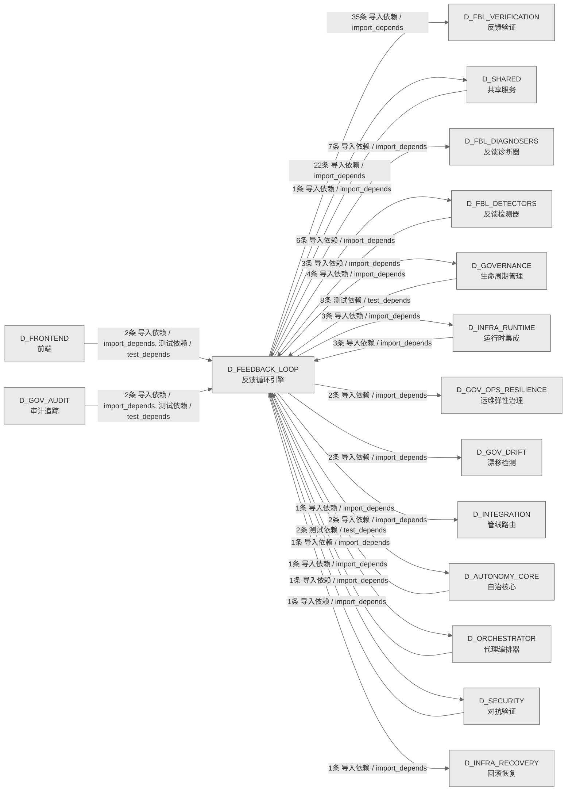

# 18_d_feedback_loop / 反馈循环引擎域 / Feedback Loop Engine

> **功能简介 / Overview**: 反馈循环引擎，负责系统自我改进闭环：异常检测、根因诊断、自动修复和自我进化

> **文档作用 / Purpose**: 展示 反馈循环引擎（D_FEEDBACK_LOOP）功能域的域内依赖关系、跨域依赖关系，模块信息（成熟度/中英文名/大白话/文件路径）内嵌于 Mermaid 节点，供架构审查和域治理参考。

> 本文档由 generate_domain_doc.py 从 depgraph (PostgreSQL) 自动生成
> 数据源: depgraph (PostgreSQL) nodes表 + edges表

> **[可缩放 HTML 版 / Zoomable HTML](http://localhost:8765/docs/02_enterprise_architecture/02_domain_architecture_docs/_zoomable_html/18_d_feedback_loop.html)** — Ctrl+滚轮缩放 ｜ 双击重置 ｜ Ctrl+Shift+D 切换拖动/选择模式

## 域基本信息 / Domain Overview

| 字段 | 值 | Field | Value |
|------|------|-------|-------|
| 编号 | 18 | Number | 18 |
| 域ID | D_FEEDBACK_LOOP | Domain ID | D_FEEDBACK_LOOP |
| 域名称 | 反馈循环引擎 | Domain Name | Feedback Loop Engine |
| 层级 | L1 基础平台层 | Layer | L1 Foundation |
| 模块数 | 125 | Module Count | 125 |
| 域内依赖 | 122 | Internal Dependencies | 122 |
| 跨域入边 | 23 | Cross-domain Incoming | 23 |
| 跨域出边 | 87 | Cross-domain Outgoing | 87 |
| 设计态模块 | 0 | Design Modules | 0 |
| 生产态模块 | 125 | Production Modules | 125 |
| 容量 | 125/150 (正常) | Capacity | 125/150 (正常) |
| 描述 | 反馈收集器(collectors) | Description | 反馈收集器(collectors) |

## 域内依赖图 / Internal Dependency Diagram

> 依赖图内嵌在本文档中，IDE 可直接渲染；网页版可 Ctrl+滚轮缩放 + 拖动平移查看细节。
>
> **图例说明 / Legend**：
> - 🟦 **蓝色 = 运营态模块**（production，已上线运行）
> - 🟧 **橙色虚线 = 设计态模块**（design，蓝图阶段，代码未写）
> - **实线箭头 = 运营态依赖**（已生效的依赖关系）
> - **虚线箭头 = 非运营态依赖**（计划中/验证中的依赖关系）

### 全景图（全部模块，颜色区分运营态/设计态）

> 展示全部 125 个模块（生产态 125 + 设计态 0），含跨域依赖外部节点。节点含成熟度+名称+大白话/简介+文件路径。

```mermaid
%%{init: {'theme': 'base', 'themeVariables': {'primaryColor': '#eaeaea', 'primaryTextColor': '#333333', 'primaryBorderColor': '#666666', 'lineColor': '#666666', 'secondaryColor': '#eaeaea', 'tertiaryColor': '#eaeaea', 'fontSize': '14px'}}}%%
flowchart TD
    src_zephyr_feedback_loop_init_py["zephyr/feedback_loop 包入口<br/>重新导出核心类（原 feedback_loop.py<br/>迁入包内，解决包/文件同名覆盖）<br/>文件: feedback_loop/__init__.py<br/>(生产态 / production)"]
    src_zephyr_feedback_loop_gen_inherited_py["生成inherited<br/>支撑反馈闭环检测修复（gen inherited）<br/>_gen_inherited<br/>文件: feedback_loop/_gen_inherited.py<br/>(生产态 / production)"]
    src_zephyr_feedback_loop_actors_init_py["feedback_loop/actors 包入口<br/>actors 包入口，整合执行器相关模块<br/>文件: actors/__init__.py<br/>(生产态 / production)"]
    src_zephyr_feedback_loop_auto_evolution_py["自动进化<br/>反馈闭环的核心调度模块，整合包入口、告警管理器、<br/>告警precision追踪器、双通道告警等21个子模块协同<br/>工作<br/>auto_evolution<br/>文件: feedback_loop/auto_evolution.py<br/>(生产态 / production)"]
    src_zephyr_feedback_loop_backpressure_bridge_py["背压桥接<br/>AUDIT-08：在 EvolutionEngine 产出含 CRITICAL<br/>提案时，对 BackpressureManager<br/>backpressure_bridge<br/>文件: feedback_loop/backpressure_bridge.py<br/>(生产态 / production)"]
    src_zephyr_feedback_loop_collectors_init_py["feedback_loop/collectors 包入口<br/>collectors 包入口，整合数据采集相关模块<br/>文件: collectors/__init__.py<br/>(生产态 / production)"]
    src_zephyr_feedback_loop_config_py["feedback_loop/config<br/>配置，反馈闭环的配置，管理配置项的读取和校验。<br/>文件: feedback_loop/config.py<br/>(生产态 / production)"]
    src_zephyr_feedback_loop_db_bridge_py["数据库桥接<br/>FLE DB契约适配器 —<br/>通过规范zephyr.governance.sqlite_schema连接写入f<br/>le_metrics<br/>db_bridge<br/>文件: feedback_loop/db_bridge.py<br/>(生产态 / production)"]
    src_zephyr_feedback_loop_decision_engine_py["决策引擎<br/>CT-FLE-ORC-001 桥接模块：FLE 异常检测 -><br/>Orchestrator 调度调整<br/>Feedback Loop Decision Engine<br/>文件: feedback_loop/decision_engine.py<br/>(生产态 / production)"]
    src_zephyr_feedback_loop_docs_init_py["feedback_loop/docs 包入口<br/>docs 包入口，聚合本包模块导出<br/>文件: docs/__init__.py<br/>(生产态 / production)"]
    src_zephyr_feedback_loop_error_budget_py["错误预算<br/>支撑反馈闭环的检测诊断与修复（error budget）<br/>error_budget<br/>文件: feedback_loop/error_budget.py<br/>(生产态 / production)"]
    src_zephyr_feedback_loop_eval_harness_py["评估harness<br/>支撑反馈闭环检测修复（eval harness）<br/>eval_harness<br/>文件: feedback_loop/eval_harness.py<br/>(生产态 / production)"]
    src_zephyr_feedback_loop_evolution_init_py["feedback_loop/evolution 包入口<br/>evolution 包入口，聚合本包模块导出<br/>文件: evolution/__init__.py<br/>(生产态 / production)"]
    src_zephyr_feedback_loop_exceptions_py["异常<br/>支撑反馈闭环检测修复（exceptions）<br/>文件: feedback_loop/exceptions.py<br/>(生产态 / production)"]
    src_zephyr_feedback_loop_feedback_collector_py["反馈收集器<br/>支撑反馈闭环的检测诊断与修复（feedback<br/>collector）<br/>文件: feedback_loop/feedback_collector.py<br/>(生产态 / production)"]
    src_zephyr_feedback_loop_fitness_functions_py["适应度functions<br/>支撑反馈闭环检测修复（fitness functions）<br/>fitness_functions<br/>文件: feedback_loop/fitness_functions.py<br/>(生产态 / production)"]
    src_zephyr_feedback_loop_forensic_init_py["feedback_loop/forensic 包入口<br/>forensic 包入口，整合取证分析相关模块<br/>文件: forensic/__init__.py<br/>(生产态 / production)"]
    src_zephyr_feedback_loop_gates_init_py["feedback_loop/gates 包入口<br/>gates 包入口，整合门禁校验相关模块<br/>文件: gates/__init__.py<br/>(生产态 / production)"]
    src_zephyr_feedback_loop_generator_py["生成器<br/>执行骨骼代码生成. 返回 (created, skipped,<br/>errors).<br/>generator<br/>文件: feedback_loop/generator.py<br/>(生产态 / production)"]
    src_zephyr_feedback_loop_metrics_collector_py["指标收集器<br/>支撑反馈闭环的检测诊断与修复（metrics<br/>collector）<br/>文件: feedback_loop/metrics_collector.py<br/>(生产态 / production)"]
    src_zephyr_feedback_loop_resilience_init_py["feedback_loop/resilience 包入口<br/>resilience 包入口，聚合本包模块导出<br/>文件: resilience/__init__.py<br/>(生产态 / production)"]
    src_zephyr_feedback_loop_scheduler_py["调度器<br/>FLE 全链路调度器 ——<br/>collect->detect->diagnose->act->verify 闭环。<br/>scheduler<br/>文件: feedback_loop/scheduler.py<br/>(生产态 / production)"]
    src_zephyr_feedback_loop_security_init_py["feedback_loop/security 包入口<br/>security 包入口，整合安全防护相关模块<br/>文件: security/__init__.py<br/>(生产态 / production)"]
    src_zephyr_feedback_loop_self_diagnosis_py["自诊断<br/>支撑反馈闭环的检测诊断与修复（self diagnosis）<br/>self_diagnosis<br/>文件: feedback_loop/self_diagnosis.py<br/>(生产态 / production)"]
    src_zephyr_feedback_loop_session_learner_py["会话学习器<br/>支撑反馈闭环的检测诊断与修复（session learner）<br/>session_learner<br/>文件: feedback_loop/session_learner.py<br/>(生产态 / production)"]
    src_zephyr_feedback_loop_slo_manager_py["SLO管理器<br/>5.39.6: SLOManager 进程级单例（boot_hooks<br/>启动时实例化）。<br/>slo_manager<br/>文件: feedback_loop/slo_manager.py<br/>(生产态 / production)"]
    src_zephyr_feedback_loop_tests_e2e_init_py["tests/e2e 包入口<br/>e2e 包入口，聚合本包模块导出<br/>文件: e2e/__init__.py<br/>(生产态 / production)"]
    src_zephyr_feedback_loop_validator_py["返回尚未生成的骨骼文件列表.<br/>验证单个骨骼文件是否存在.<br/>validator<br/>文件: feedback_loop/validator.py<br/>(生产态 / production)"]
    src_zephyr_feedback_loop_verifiers_init_py["feedback_loop/verifiers 包入口<br/>verifiers 包入口，整合一致性校验相关模块<br/>文件: verifiers/__init__.py<br/>(生产态 / production)"]
    src_zephyr_feedback_loop_init_py ~~~ src_zephyr_feedback_loop_gen_inherited_py
    src_zephyr_feedback_loop_gen_inherited_py ~~~ src_zephyr_feedback_loop_actors_init_py
    src_zephyr_feedback_loop_actors_init_py ~~~ src_zephyr_feedback_loop_auto_evolution_py
    src_zephyr_feedback_loop_auto_evolution_py ~~~ src_zephyr_feedback_loop_backpressure_bridge_py
    src_zephyr_feedback_loop_backpressure_bridge_py ~~~ src_zephyr_feedback_loop_collectors_init_py
    src_zephyr_feedback_loop_collectors_init_py ~~~ src_zephyr_feedback_loop_config_py
    src_zephyr_feedback_loop_config_py ~~~ src_zephyr_feedback_loop_db_bridge_py
    src_zephyr_feedback_loop_db_bridge_py ~~~ src_zephyr_feedback_loop_decision_engine_py
    src_zephyr_feedback_loop_decision_engine_py ~~~ src_zephyr_feedback_loop_docs_init_py
    src_zephyr_feedback_loop_docs_init_py ~~~ src_zephyr_feedback_loop_error_budget_py
    src_zephyr_feedback_loop_error_budget_py ~~~ src_zephyr_feedback_loop_eval_harness_py
    src_zephyr_feedback_loop_eval_harness_py ~~~ src_zephyr_feedback_loop_evolution_init_py
    src_zephyr_feedback_loop_evolution_init_py ~~~ src_zephyr_feedback_loop_exceptions_py
    src_zephyr_feedback_loop_exceptions_py ~~~ src_zephyr_feedback_loop_feedback_collector_py
    src_zephyr_feedback_loop_feedback_collector_py ~~~ src_zephyr_feedback_loop_fitness_functions_py
    src_zephyr_feedback_loop_fitness_functions_py ~~~ src_zephyr_feedback_loop_forensic_init_py
    src_zephyr_feedback_loop_forensic_init_py ~~~ src_zephyr_feedback_loop_gates_init_py
    src_zephyr_feedback_loop_gates_init_py ~~~ src_zephyr_feedback_loop_generator_py
    src_zephyr_feedback_loop_generator_py ~~~ src_zephyr_feedback_loop_metrics_collector_py
    src_zephyr_feedback_loop_metrics_collector_py ~~~ src_zephyr_feedback_loop_resilience_init_py
    src_zephyr_feedback_loop_resilience_init_py ~~~ src_zephyr_feedback_loop_scheduler_py
    src_zephyr_feedback_loop_scheduler_py ~~~ src_zephyr_feedback_loop_security_init_py
    src_zephyr_feedback_loop_security_init_py ~~~ src_zephyr_feedback_loop_self_diagnosis_py
    src_zephyr_feedback_loop_self_diagnosis_py ~~~ src_zephyr_feedback_loop_session_learner_py
    src_zephyr_feedback_loop_session_learner_py ~~~ src_zephyr_feedback_loop_slo_manager_py
    src_zephyr_feedback_loop_slo_manager_py ~~~ src_zephyr_feedback_loop_tests_e2e_init_py
    src_zephyr_feedback_loop_tests_e2e_init_py ~~~ src_zephyr_feedback_loop_validator_py
    src_zephyr_feedback_loop_validator_py ~~~ src_zephyr_feedback_loop_verifiers_init_py
    src_zephyr_feedback_loop_actors_agent_lifecycle_py["代理生命周期<br/>支撑反馈闭环的检测诊断与修复（agent lifecycle）<br/>Agent Lifecycle Manager — v0.12.0 R159c<br/>文件: actors/agent_lifecycle.py<br/>(生产态 / production)"]
    src_zephyr_feedback_loop_actors_api_version_contract_py["API版本契约<br/>支撑反馈闭环的检测诊断与修复（api version<br/>contract）<br/>API Version Contract — v0.14.0 R188<br/>文件: actors/api_version_contract.py<br/>(生产态 / production)"]
    src_zephyr_feedback_loop_actors_global_action_scheduler_py["全局动作调度器<br/>支撑反馈闭环的检测诊断与修复（global action）<br/>Global Action Scheduler — v0.16.0 R226<br/>文件: actors/global_action_scheduler.py<br/>(生产态 / production)"]
    src_zephyr_feedback_loop_actors_incident_priority_triage_automator_py["incident优先级分诊automator<br/>incident优先级triageautomator，执行者的核心类，<br/>封装Severity相关逻辑。<br/>文件: actors<br/>/incident_priority_triage_automator.py<br/>(生产态 / production)"]
    src_zephyr_feedback_loop_actors_intent_driven_ops_py["intentdriven运维<br/>按运维声明的意图而非表面症状来驱动运维动作，防止<br/>FLE 把运维故意配的东西当故障修掉。<br/>Intent-Driven Ops — v0.12.0 R159<br/>文件: actors/intent_driven_ops.py<br/>(生产态 / production)"]
    src_zephyr_feedback_loop_actors_multi_agent_orchestrator_py["多代理编排器<br/>支撑反馈闭环的检测诊断与修复（multi agent<br/>orchestrator）<br/>Multi-Agent Orchestrator — v0.12.0 R159b<br/>文件: actors/multi_agent_orchestrator.py<br/>(生产态 / production)"]
    src_zephyr_feedback_loop_actors_notification_personalizer_py["通知personalizer<br/>按运维偏好个性化告警通知，减少千篇一律的告警导致<br/>的告警疲劳。<br/>Notification Personalizer — v0.6.0 R67<br/>文件: actors/notification_personalizer.py<br/>(生产态 / production)"]
    src_zephyr_feedback_loop_actors_owner_absence_escalation_py["ownerabsence升级<br/>所有者absenceescalation。Owner Absence<br/>Escalation，支撑反馈闭环的检测诊断与修复<br/>Owner Absence Escalation — v0.37.0 R462<br/>文件: actors/owner_absence_escalation.py<br/>(生产态 / production)"]
    src_zephyr_feedback_loop_actors_saga_compensator_py["Saga补偿器<br/>执行者的补偿器，对失败操作做补偿<br/>Saga Compensator — v0.3.0 R19b<br/>文件: actors/saga_compensator.py<br/>(生产态 / production)"]
    src_zephyr_feedback_loop_actors_secondary_alert_channel_py["secondary告警通道<br/>Secondary Alert<br/>Channel，支撑反馈闭环的检测诊断与修复<br/>Secondary Alert Channel — v0.37.0 R461<br/>文件: actors/secondary_alert_channel.py<br/>(生产态 / production)"]
    src_zephyr_feedback_loop_collectors_calendar_adapter_py["日历适配器<br/>支撑反馈闭环的检测诊断与修复（calendar）<br/>Calendar Adapter — v0.8.0 R102b<br/>文件: collectors/calendar_adapter.py<br/>(生产态 / production)"]
    src_zephyr_feedback_loop_collectors_config_timeline_py["配置timeline<br/>记录配置变更时间线，把配置变更与异常关联，避免改<br/>配置后的异常被误诊为系统故障。<br/>Config Timeline — v0.8.0 R99<br/>文件: collectors/config_timeline.py<br/>(生产态 / production)"]
    src_zephyr_feedback_loop_collectors_data_quality_validator_py["数据质量校验器<br/>采集数据<br/>Data Quality Validator — v0.9.0 R110<br/>文件: collectors/data_quality_validator.py<br/>(生产态 / production)"]
    src_zephyr_feedback_loop_collectors_financial_stratification_py["金融分层<br/>采集器的核心类，封装FinancialStratification相关<br/>逻辑<br/>Financial Stratification — v0.5.0 R50<br/>文件: collectors/financial_stratification.py<br/>(生产态 / production)"]
    src_zephyr_feedback_loop_collectors_kb_provenance_py["知识库溯源<br/>采集器的核心类，封装KBProvenance相关逻辑<br/>KB Provenance — v0.10.0 R136<br/>文件: collectors/kb_provenance.py<br/>(生产态 / production)"]
    src_zephyr_feedback_loop_collectors_knowledge_capture_py["知识capture<br/>把成功诊断沉淀成可复用知识，避免重复诊断同一异常<br/>浪费资源。<br/>Knowledge Capture — v0.4.0 R30<br/>文件: collectors/knowledge_capture.py<br/>(生产态 / production)"]
    src_zephyr_feedback_loop_collectors_knowledge_freshness_py["知识freshness<br/>给知识库条目算新鲜度，过期知识与新鲜知识权重不同<br/>，防止过时知识误导当前诊断。<br/>Knowledge Freshness — v0.5.0 R47<br/>文件: collectors/knowledge_freshness.py<br/>(生产态 / production)"]
    src_zephyr_feedback_loop_collectors_knowledge_injection_py["知识注入<br/>把人类专家知识注入 FLE 知识库，避免 FLE<br/>重复学习运维已知的东西。<br/>Knowledge Injection — v0.8.0 R102<br/>文件: collectors/knowledge_injection.py<br/>(生产态 / production)"]
    src_zephyr_feedback_loop_collectors_knowledge_packaging_py["知识packaging<br/>把非结构化知识打包成结构化形式，方便下游子系统高<br/>效复用。<br/>Knowledge Packaging — v0.9.0 R123<br/>文件: collectors/knowledge_packaging.py<br/>(生产态 / production)"]
    src_zephyr_feedback_loop_collectors_known_unknown_registry_py["knownunknown注册表<br/>Known-Unknown<br/>Registry，支撑反馈闭环的检测诊断与修复<br/>Known-Unknown Registry — v0.16.0 R229<br/>文件: collectors/known_unknown_registry.py<br/>(生产态 / production)"]
    src_zephyr_feedback_loop_collectors_llm_cost_accounting_py["LLM成本accounting<br/>核算 LLM API<br/>调用成本，让预算可见，防止失控调用带来意外账单。<br/>LLM Cost Accounting — v0.4.0 R35<br/>文件: collectors/llm_cost_accounting.py<br/>(生产态 / production)"]
    src_zephyr_feedback_loop_collectors_market_calendar_py["行情日历<br/>提供市场交易日历，避免节假日无数据被误诊为流水线<br/>故障而误告警。<br/>Market Calendar — v0.5.0 R48<br/>文件: collectors/market_calendar.py<br/>(生产态 / production)"]
    src_zephyr_feedback_loop_collectors_market_event_integrator_py["行情事件integrator<br/>支撑反馈闭环的检测诊断与修复（market event<br/>integrator）<br/>Market Event Integrator — v0.14.0 R197<br/>文件: collectors/market_event_integrator.py<br/>(生产态 / production)"]
    src_zephyr_feedback_loop_collectors_notification_feedback_py["通知反馈<br/>支撑反馈闭环的检测诊断与修复（notification<br/>feedback）<br/>Notification Feedback — v0.9.0 R118<br/>文件: collectors/notification_feedback.py<br/>(生产态 / production)"]
    src_zephyr_feedback_loop_collectors_schema_evolution_py["模式进化<br/>支撑反馈闭环的检测诊断与修复（schema evolution）<br/>Schema Evolution — v0.9.0 R111<br/>文件: collectors/schema_evolution.py<br/>(生产态 / production)"]
    src_zephyr_feedback_loop_collectors_schema_migration_py["模式迁移<br/>支撑反馈闭环的检测诊断与修复（schema migration）<br/>Schema Migration — v0.14.0 R190<br/>文件: collectors/schema_migration.py<br/>(生产态 / production)"]
    src_zephyr_feedback_loop_collectors_temporal_event_store_py["temporal事件存储<br/>Temporal Event<br/>Store，支撑反馈闭环的检测诊断与修复<br/>Temporal Event Store — v0.3.0 R9<br/>文件: collectors/temporal_event_store.py<br/>(生产态 / production)"]
    src_zephyr_feedback_loop_collectors_token_finops_py["令牌finops<br/>按子系统核算 Token<br/>消耗，防止单个子系统悄悄烧掉大部分 LLM 预算。<br/>Token FinOps — v0.12.0 R162<br/>文件: collectors/token_finops.py<br/>(生产态 / production)"]
    src_zephyr_feedback_loop_core_py["核心<br/>从 src/zephyr/trading/feedback_loop.py 迁入 src<br/>/zephyr/feedback_loop/ 包内，解决包<br/>/文件同名覆盖问题。<br/>core<br/>文件: feedback_loop/core.py<br/>(生产态 / production)"]
    src_zephyr_feedback_loop_db_writer_py["db写入器<br/>FLE 持久化写入器 — 写 metrics/alerts<br/>/dispatch_log 到 SQLite<br/>db_writer<br/>文件: feedback_loop/db_writer.py<br/>(生产态 / production)"]
    src_zephyr_feedback_loop_docs_cold_start_manual_py["冷启动手册<br/>支撑反馈闭环的检测诊断与修复（cold start<br/>manual）<br/>cold_start_manual<br/>文件: docs/cold_start_manual.py<br/>(生产态 / production)"]
    src_zephyr_feedback_loop_evolution_auto_reward_py["自动奖励<br/>支撑反馈闭环的检测诊断与修复（auto reward）<br/>Auto Reward — v0.7.0 R76<br/>文件: evolution/auto_reward.py<br/>(生产态 / production)"]
    src_zephyr_feedback_loop_evolution_conformal_prediction_py["conformal预测<br/>给异常分加上校准的置信区间，防止宽置信区间下过度<br/>自信的诊断。<br/>Conformal Prediction — v0.7.0 R74<br/>文件: evolution/conformal_prediction.py<br/>(生产态 / production)"]
    src_zephyr_feedback_loop_evolution_cross_gen_validation_py["跨gen验证<br/>支撑反馈闭环的检测诊断与修复（cross gen<br/>validation）<br/>Cross-Gen Validation — v0.7.0 R78<br/>文件: evolution/cross_gen_validation.py<br/>(生产态 / production)"]
    src_zephyr_feedback_loop_evolution_dynamic_threshold_py["动态阈值<br/>支撑反馈闭环的检测诊断与修复（dynamic<br/>threshold）<br/>Dynamic Threshold — v0.7.0 R71<br/>文件: evolution/dynamic_threshold.py<br/>(生产态 / production)"]
    src_zephyr_feedback_loop_evolution_ewc_kb_review_py["ewc知识库审查<br/>用弹性权重巩固审查知识库更新，防止新知识灾难性抹<br/>掉旧的临界知识。<br/>EWC KB Review — v0.6.0 R51<br/>文件: evolution/ewc_kb_review.py<br/>(生产态 / production)"]
    src_zephyr_feedback_loop_evolution_failure_replay_py["故障replay<br/>failure回放，进化的核心类，封装FailureReplay相关<br/>逻辑。<br/>Failure Replay — v0.7.0 R77<br/>文件: evolution/failure_replay.py<br/>(生产态 / production)"]
    src_zephyr_feedback_loop_evolution_graduated_activation_protocol_py["graduatedactivation协议<br/>新规则和模型按金丝雀、Beta、稳定分阶段灰度上线，<br/>每阶段卡置信阈值，回归自动回滚，防止一次坏部署打<br/>垮整套自动修复。<br/>文件: evolution/graduated_activation_protocol.py<br/>(生产态 / production)"]
    src_zephyr_feedback_loop_evolution_hypernetwork_py["超网络<br/>进化的核心类，封装超网络相关逻辑<br/>HyperNetwork — v0.7.0 R72<br/>文件: evolution/hypernetwork.py<br/>(生产态 / production)"]
    src_zephyr_feedback_loop_evolution_knowledge_distillation_py["知识distillation<br/>把大知识库蒸馏压缩，防止知识库超过 LLM<br/>上下文窗口导致关键知识被截断。<br/>Knowledge Distillation — v0.6.0 R52<br/>文件: evolution/knowledge_distillation.py<br/>(生产态 / production)"]
    src_zephyr_feedback_loop_evolution_online_feature_importance_py["online特征importance<br/>在线实时计算特征重要性，防止离线计算的重要性排名<br/>滞后、用错特征驱动诊断。<br/>Online Feature Importance — v0.7.0 R73<br/>文件: evolution/online_feature_importance.py<br/>(生产态 / production)"]
    src_zephyr_feedback_loop_evolution_prompt_factory_governance_py["提示工厂治理<br/>支撑反馈闭环的检测诊断与修复（prompt factory<br/>governance）<br/>Prompt Factory Governance — v0.16.0 R224<br/>文件: evolution/prompt_factory_governance.py<br/>(生产态 / production)"]
    src_zephyr_feedback_loop_evolution_prompt_optimization_regression_detector_py["提示优化回归检测器<br/>提示优化前A/B验证 —<br/>新旧提示对比held-out验证集，p<0.05才允许部署<br/>文件: evolution<br/>/prompt_optimization_regression_detector.py<br/>(生产态 / production)"]
    src_zephyr_feedback_loop_evolution_prompt_self_optimization_loop_py["提示自优化循环<br/>DSPy/GEPA封闭自提示进化闭环 —<br/>观察效果->LLM反思->生成变体->A/B测试->采纳<br/>R502: PromptSelfOptimizationLoop<br/>文件: evolution/prompt_self_optimization_loop.py<br/>(生产态 / production)"]
    src_zephyr_feedback_loop_evolution_self_reflection_py["自reflection<br/>让 FLE 反思自身诊断质量，防止过度自信不受约束、<br/>从不触发自我纠正。<br/>Self Reflection — v0.7.0 R75<br/>文件: evolution/self_reflection.py<br/>(生产态 / production)"]
    src_zephyr_feedback_loop_evolution_self_upgrade_canary_py["selfupgrade金丝雀<br/>FLE 自身升级按 5% 到 100%<br/>金丝雀部署并自动回滚，防止坏升级一次性影响全部。<br/>Self Upgrade Canary — v0.14.0 R194<br/>文件: evolution/self_upgrade_canary.py<br/>(生产态 / production)"]
    src_zephyr_feedback_loop_evolution_semantic_intent_preservation_guard_py["semanticintentpreservation守卫<br/>自修改语义意图保真校验 — cosine similarity<br/>检测意图漂移<br/>R505: SemanticIntentPreservationGuard<br/>文件: evolution<br/>/semantic_intent_preservation_guard.py<br/>(生产态 / production)"]
    src_zephyr_feedback_loop_evolution_teacher_transfer_py["教师迁移<br/>进化的核心类，封装TeacherTransfer相关逻辑<br/>Teacher Transfer — v0.6.0 R53<br/>文件: evolution/teacher_transfer.py<br/>(生产态 / production)"]
    src_zephyr_feedback_loop_evolution_training_data_gov_py["training数据治理<br/>给训练数据做版本快照并检测分布漂移，防止模型在漂<br/>移数据上训练导致精度静默下降。<br/>Training Data Governance — v0.14.0 R191<br/>文件: evolution/training_data_gov.py<br/>(生产态 / production)"]
    src_zephyr_feedback_loop_evolution_engine_py["进化引擎<br/>依赖网关工作<br/>evolution_engine<br/>文件: feedback_loop/evolution_engine.py<br/>(生产态 / production)"]
    src_zephyr_feedback_loop_forensic_architectural_sod_py["架构职责分离<br/>取证的核心类，封装SoDRole相关逻辑<br/>Architectural SoD — v0.15.0 R205<br/>文件: forensic/architectural_sod.py<br/>(生产态 / production)"]
    src_zephyr_feedback_loop_forensic_automated_rca_postmortem_generator_py["automatedrcapostmortem生成器<br/>using temporal ordering + correlation. Generate<br/>timeline, 追问到底分析，事后取证分析<br/>文件: forensic<br/>/automated_rca_postmortem_generator.py<br/>(生产态 / production)"]
    src_zephyr_feedback_loop_forensic_crypto_bootstrap_py["加密自举<br/>取证的核心类，封装HashLink相关逻辑<br/>Cryptographic Bootstrap — v0.15.0 R204<br/>文件: forensic/crypto_bootstrap.py<br/>(生产态 / production)"]
    src_zephyr_feedback_loop_forensic_deterministic_replay_py["deterministic回放<br/>反馈闭环的记录器，把发生的事件/结果记下来留档<br/>（deterministic replay）<br/>Deterministic Replay — v0.15.0 R206<br/>文件: forensic/deterministic_replay.py<br/>(生产态 / production)"]
    src_zephyr_feedback_loop_forensic_external_verifier_py["外部验证器<br/>事后取证分析（external verifier）<br/>External Verifier — v0.15.0 R203<br/>文件: forensic/external_verifier.py<br/>(生产态 / production)"]
    src_zephyr_feedback_loop_forensic_fle_upgrade_safety_validator_py["fleupgrade安全校验器<br/>FLE自身代码升级兼容性校验 — 持久化状态/阈值<br/>/规则 vs 新版本<br/>R529: FLEUpgradeSafetyValidator<br/>文件: forensic/fle_upgrade_safety_validator.py<br/>(生产态 / production)"]
    src_zephyr_feedback_loop_forensic_guard_configuration_drift_monitor_py["守卫配置漂移监控<br/>集体守卫参数vs黄金基线漂移 —<br/>定期快照，漂移>阈值告警<br/>R521: GuardConfigurationDriftMonitor<br/>文件: forensic<br/>/guard_configuration_drift_monitor.py<br/>(生产态 / production)"]
    src_zephyr_feedback_loop_forensic_interrupt_coherence_validator_py["interruptcoherence校验器<br/>崩溃/重启后状态一致性校验 — 无半应用动作<br/>/无孤立锁/无悬空引用<br/>R531: InterruptCoherenceValidator<br/>文件: forensic/interrupt_coherence_validator.py<br/>(生产态 / production)"]
    src_zephyr_feedback_loop_forensic_knowledge_injection_pre_flight_verifier_py["知识注入preflight验证器<br/>新规则干跑验证 —<br/>在历史事件上回测，净收益>阈值才部署<br/>文件: forensic<br/>/knowledge_injection_pre_flight_verifier.py<br/>(生产态 / production)"]
    src_zephyr_feedback_loop_forensic_point_in_time_reconstructor_py["点入时间reconstructor<br/>事后取证分析（point in time reconstructor）<br/>文件: forensic/point_in_time_reconstructor.py<br/>(生产态 / production)"]
    src_zephyr_feedback_loop_forensic_self_modification_audit_py["selfmodification审计<br/>自modification审计。Self-Modification<br/>Audit，支撑反馈闭环的检测诊断与修复<br/>Self-Modification Audit — v0.15.0 R218<br/>文件: forensic/self_modification_audit.py<br/>(生产态 / production)"]
    src_zephyr_feedback_loop_forensic_serialization_format_tracker_py["serializationformat追踪器<br/>Serialization Format<br/>Tracker，支撑反馈闭环的检测诊断与修复<br/>文件: forensic/serialization_format_tracker.py<br/>(生产态 / production)"]
    src_zephyr_feedback_loop_forensic_state_migration_validator_py["状态迁移校验器<br/>事后取证分析（state migration）<br/>State Migration Validator — v0.40.0 R497<br/>文件: forensic/state_migration_validator.py<br/>(生产态 / production)"]
    src_zephyr_feedback_loop_forensic_sub_agent_collusion_py["sub代理collusion<br/>支撑反馈闭环的检测诊断与修复（sub agent<br/>collusion）<br/>文件: forensic/sub_agent_collusion.py<br/>(生产态 / production)"]
    src_zephyr_feedback_loop_forensic_toctou_guard_py["TOCTOU守卫<br/>时间检查到时间使用守卫：诊断时快照状态，执行前重<br/>新校验，防止状态在诊断和执行之间已变化导致按过期<br/>假设操作。<br/>TOCTOU Guard — v0.15.0 R207<br/>文件: forensic/toctou_guard.py<br/>(生产态 / production)"]
    src_zephyr_feedback_loop_forensic_worm_write_integrity_py["wormwrite完整性<br/>WORM Write<br/>Integrity，支撑反馈闭环的检测诊断与修复<br/>WORM Write Integrity — v0.15.0 R216<br/>文件: forensic/worm_write_integrity.py<br/>(生产态 / production)"]
    src_zephyr_feedback_loop_resilience_deadman_switch_py["deadman开关<br/>60 秒心跳、连续 3<br/>次缺失即自动自锁并外部告警，给失控的自主 FLE<br/>提供外部强制停机手段。<br/>Deadman Switch — v0.15.0 R212<br/>文件: resilience/deadman_switch.py<br/>(生产态 / production)"]
    src_zephyr_feedback_loop_resilience_dr_automation_py["灾备自动化<br/>韧性的结果，封装操作结果的数据结构<br/>DR Automation — v0.14.0 R187<br/>文件: resilience/dr_automation.py<br/>(生产态 / production)"]
    src_zephyr_feedback_loop_resilience_multi_instance_coord_py["多instancecoord<br/>用 Raft 共识选主并防脑裂，避免多 FLE<br/>实例无主各自为政做出冲突修复。<br/>文件: resilience/multi_instance_coord.py<br/>(生产态 / production)"]
    src_zephyr_feedback_loop_resilience_resource_starvation_aware_py["资源starvation感知<br/>resourcestarvation感知，韧性的核心类，封装Resour<br/>ceBudget相关逻辑。<br/>Resource Starvation Aware — v0.15.0 R209<br/>文件: resilience/resource_starvation_aware.py<br/>(生产态 / production)"]
    src_zephyr_feedback_loop_resilience_split_brain_quorum_py["拆分brainquorum<br/>分布式法定人数锁：实例行动前须获取租约锁，过期自<br/>动释放，防止多实例对同一问题竞相做出矛盾修复。<br/>Split-Brain Quorum — v0.37.0 R451<br/>文件: resilience/split_brain_quorum.py<br/>(生产态 / production)"]
    src_zephyr_feedback_loop_scheduler_act_py["调度器act<br/>反馈闭环的结果，封装操作结果的数据结构<br/>（scheduler act）<br/>scheduler_act<br/>文件: feedback_loop/scheduler_act.py<br/>(生产态 / production)"]
    src_zephyr_feedback_loop_scheduler_collect_detect_py["调度器collectdetect<br/>调度器的采集检测诊断执行器，编排一次运行中的采集<br/>、检测、诊断流程并把早退判定回传调度器。<br/>scheduler_collect_detect<br/>文件: feedback_loop/scheduler_collect_detect.py<br/>(生产态 / production)"]
    src_zephyr_feedback_loop_scheduler_health_py["调度器健康<br/>调度器的健康报告器，汇总多项健康指标产出运行健康<br/>报告。<br/>scheduler_health<br/>文件: feedback_loop/scheduler_health.py<br/>(生产态 / production)"]
    src_zephyr_feedback_loop_scheduler_safety_py["调度器安全<br/>调度器的安全门禁管理器，运行数值稳定性、时序完整<br/>性、启动完整性等安全门禁并返回通过情况。<br/>scheduler_safety<br/>文件: feedback_loop/scheduler_safety.py<br/>(生产态 / production)"]
    src_zephyr_feedback_loop_security_agent_skill_guard_py["代理技能守卫<br/>安全防护（agent skill guard）<br/>Agent Skill Guard — v0.14.0 R201<br/>文件: security/agent_skill_guard.py<br/>(生产态 / production)"]
    src_zephyr_feedback_loop_security_dep_cve_correlator_py["依赖CVE关联器<br/>安全的关联器，关联匹配相关数据<br/>Dependency CVE Correlator — v0.14.0 R196<br/>文件: security/dep_cve_correlator.py<br/>(生产态 / production)"]
    src_zephyr_feedback_loop_security_metric_prompt_scanner_py["指标提示扫描器<br/>安全防护（metric prompt）<br/>Metric-Prompt Scanner — v0.15.0 R215<br/>文件: security/metric_prompt_scanner.py<br/>(生产态 / production)"]
    src_zephyr_feedback_loop_security_remote_attestation_py["远程attestation<br/>用 TPM 远程证实验证 FLE<br/>运行时完整性，不再只信自我报告，防止被攻陷的<br/>FLE 谎报自己正常。<br/>Remote Attestation — v0.15.0 R211<br/>文件: security/remote_attestation.py<br/>(生产态 / production)"]
    src_zephyr_feedback_loop_security_secret_rotation_py["密钥rotation<br/>自动扫描 os.environ 中的密钥变量，注册到<br/>SecretRotation 并注入 SecretProvider。<br/>Secret Rotation — v0.14.0 R189<br/>文件: security/secret_rotation.py<br/>(生产态 / production)"]
    src_zephyr_feedback_loop_template_py["模板<br/>SRC-0068a: 从 _gen_inherited.py 拆分 —<br/>骨骼模板数据<br/>template<br/>文件: feedback_loop/template.py<br/>(生产态 / production)"]
    src_zephyr_feedback_loop_tests_e2e_integration_test_pipeline_py["集成测试管线<br/>验证 MOD-FEEDBACK_LOOP 全生命周期集成:<br/>文件: e2e/integration_test_pipeline.py<br/>(生产态 / production)"]
    src_zephyr_feedback_loop_actors_agent_lifecycle_py ~~~ src_zephyr_feedback_loop_actors_api_version_contract_py
    src_zephyr_feedback_loop_actors_api_version_contract_py ~~~ src_zephyr_feedback_loop_actors_global_action_scheduler_py
    src_zephyr_feedback_loop_actors_global_action_scheduler_py ~~~ src_zephyr_feedback_loop_actors_incident_priority_triage_automator_py
    src_zephyr_feedback_loop_actors_incident_priority_triage_automator_py ~~~ src_zephyr_feedback_loop_actors_intent_driven_ops_py
    src_zephyr_feedback_loop_actors_intent_driven_ops_py ~~~ src_zephyr_feedback_loop_actors_multi_agent_orchestrator_py
    src_zephyr_feedback_loop_actors_multi_agent_orchestrator_py ~~~ src_zephyr_feedback_loop_actors_notification_personalizer_py
    src_zephyr_feedback_loop_actors_notification_personalizer_py ~~~ src_zephyr_feedback_loop_actors_owner_absence_escalation_py
    src_zephyr_feedback_loop_actors_owner_absence_escalation_py ~~~ src_zephyr_feedback_loop_actors_saga_compensator_py
    src_zephyr_feedback_loop_actors_saga_compensator_py ~~~ src_zephyr_feedback_loop_actors_secondary_alert_channel_py
    src_zephyr_feedback_loop_actors_secondary_alert_channel_py ~~~ src_zephyr_feedback_loop_collectors_calendar_adapter_py
    src_zephyr_feedback_loop_collectors_calendar_adapter_py ~~~ src_zephyr_feedback_loop_collectors_config_timeline_py
    src_zephyr_feedback_loop_collectors_config_timeline_py ~~~ src_zephyr_feedback_loop_collectors_data_quality_validator_py
    src_zephyr_feedback_loop_collectors_data_quality_validator_py ~~~ src_zephyr_feedback_loop_collectors_financial_stratification_py
    src_zephyr_feedback_loop_collectors_financial_stratification_py ~~~ src_zephyr_feedback_loop_collectors_kb_provenance_py
    src_zephyr_feedback_loop_collectors_kb_provenance_py ~~~ src_zephyr_feedback_loop_collectors_knowledge_capture_py
    src_zephyr_feedback_loop_collectors_knowledge_capture_py ~~~ src_zephyr_feedback_loop_collectors_knowledge_freshness_py
    src_zephyr_feedback_loop_collectors_knowledge_freshness_py ~~~ src_zephyr_feedback_loop_collectors_knowledge_injection_py
    src_zephyr_feedback_loop_collectors_knowledge_injection_py ~~~ src_zephyr_feedback_loop_collectors_knowledge_packaging_py
    src_zephyr_feedback_loop_collectors_knowledge_packaging_py ~~~ src_zephyr_feedback_loop_collectors_known_unknown_registry_py
    src_zephyr_feedback_loop_collectors_known_unknown_registry_py ~~~ src_zephyr_feedback_loop_collectors_llm_cost_accounting_py
    src_zephyr_feedback_loop_collectors_llm_cost_accounting_py ~~~ src_zephyr_feedback_loop_collectors_market_calendar_py
    src_zephyr_feedback_loop_collectors_market_calendar_py ~~~ src_zephyr_feedback_loop_collectors_market_event_integrator_py
    src_zephyr_feedback_loop_collectors_market_event_integrator_py ~~~ src_zephyr_feedback_loop_collectors_notification_feedback_py
    src_zephyr_feedback_loop_collectors_notification_feedback_py ~~~ src_zephyr_feedback_loop_collectors_schema_evolution_py
    src_zephyr_feedback_loop_collectors_schema_evolution_py ~~~ src_zephyr_feedback_loop_collectors_schema_migration_py
    src_zephyr_feedback_loop_collectors_schema_migration_py ~~~ src_zephyr_feedback_loop_collectors_temporal_event_store_py
    src_zephyr_feedback_loop_collectors_temporal_event_store_py ~~~ src_zephyr_feedback_loop_collectors_token_finops_py
    src_zephyr_feedback_loop_collectors_token_finops_py ~~~ src_zephyr_feedback_loop_core_py
    src_zephyr_feedback_loop_core_py ~~~ src_zephyr_feedback_loop_db_writer_py
    src_zephyr_feedback_loop_db_writer_py ~~~ src_zephyr_feedback_loop_docs_cold_start_manual_py
    src_zephyr_feedback_loop_docs_cold_start_manual_py ~~~ src_zephyr_feedback_loop_evolution_auto_reward_py
    src_zephyr_feedback_loop_evolution_auto_reward_py ~~~ src_zephyr_feedback_loop_evolution_conformal_prediction_py
    src_zephyr_feedback_loop_evolution_conformal_prediction_py ~~~ src_zephyr_feedback_loop_evolution_cross_gen_validation_py
    src_zephyr_feedback_loop_evolution_cross_gen_validation_py ~~~ src_zephyr_feedback_loop_evolution_dynamic_threshold_py
    src_zephyr_feedback_loop_evolution_dynamic_threshold_py ~~~ src_zephyr_feedback_loop_evolution_ewc_kb_review_py
    src_zephyr_feedback_loop_evolution_ewc_kb_review_py ~~~ src_zephyr_feedback_loop_evolution_failure_replay_py
    src_zephyr_feedback_loop_evolution_failure_replay_py ~~~ src_zephyr_feedback_loop_evolution_graduated_activation_protocol_py
    src_zephyr_feedback_loop_evolution_graduated_activation_protocol_py ~~~ src_zephyr_feedback_loop_evolution_hypernetwork_py
    src_zephyr_feedback_loop_evolution_hypernetwork_py ~~~ src_zephyr_feedback_loop_evolution_knowledge_distillation_py
    src_zephyr_feedback_loop_evolution_knowledge_distillation_py ~~~ src_zephyr_feedback_loop_evolution_online_feature_importance_py
    src_zephyr_feedback_loop_evolution_online_feature_importance_py ~~~ src_zephyr_feedback_loop_evolution_prompt_factory_governance_py
    src_zephyr_feedback_loop_evolution_prompt_factory_governance_py ~~~ src_zephyr_feedback_loop_evolution_prompt_optimization_regression_detector_py
    src_zephyr_feedback_loop_evolution_prompt_optimization_regression_detector_py ~~~ src_zephyr_feedback_loop_evolution_prompt_self_optimization_loop_py
    src_zephyr_feedback_loop_evolution_prompt_self_optimization_loop_py ~~~ src_zephyr_feedback_loop_evolution_self_reflection_py
    src_zephyr_feedback_loop_evolution_self_reflection_py ~~~ src_zephyr_feedback_loop_evolution_self_upgrade_canary_py
    src_zephyr_feedback_loop_evolution_self_upgrade_canary_py ~~~ src_zephyr_feedback_loop_evolution_semantic_intent_preservation_guard_py
    src_zephyr_feedback_loop_evolution_semantic_intent_preservation_guard_py ~~~ src_zephyr_feedback_loop_evolution_teacher_transfer_py
    src_zephyr_feedback_loop_evolution_teacher_transfer_py ~~~ src_zephyr_feedback_loop_evolution_training_data_gov_py
    src_zephyr_feedback_loop_evolution_training_data_gov_py ~~~ src_zephyr_feedback_loop_evolution_engine_py
    src_zephyr_feedback_loop_evolution_engine_py ~~~ src_zephyr_feedback_loop_forensic_architectural_sod_py
    src_zephyr_feedback_loop_forensic_architectural_sod_py ~~~ src_zephyr_feedback_loop_forensic_automated_rca_postmortem_generator_py
    src_zephyr_feedback_loop_forensic_automated_rca_postmortem_generator_py ~~~ src_zephyr_feedback_loop_forensic_crypto_bootstrap_py
    src_zephyr_feedback_loop_forensic_crypto_bootstrap_py ~~~ src_zephyr_feedback_loop_forensic_deterministic_replay_py
    src_zephyr_feedback_loop_forensic_deterministic_replay_py ~~~ src_zephyr_feedback_loop_forensic_external_verifier_py
    src_zephyr_feedback_loop_forensic_external_verifier_py ~~~ src_zephyr_feedback_loop_forensic_fle_upgrade_safety_validator_py
    src_zephyr_feedback_loop_forensic_fle_upgrade_safety_validator_py ~~~ src_zephyr_feedback_loop_forensic_guard_configuration_drift_monitor_py
    src_zephyr_feedback_loop_forensic_guard_configuration_drift_monitor_py ~~~ src_zephyr_feedback_loop_forensic_interrupt_coherence_validator_py
    src_zephyr_feedback_loop_forensic_interrupt_coherence_validator_py ~~~ src_zephyr_feedback_loop_forensic_knowledge_injection_pre_flight_verifier_py
    src_zephyr_feedback_loop_forensic_knowledge_injection_pre_flight_verifier_py ~~~ src_zephyr_feedback_loop_forensic_point_in_time_reconstructor_py
    src_zephyr_feedback_loop_forensic_point_in_time_reconstructor_py ~~~ src_zephyr_feedback_loop_forensic_self_modification_audit_py
    src_zephyr_feedback_loop_forensic_self_modification_audit_py ~~~ src_zephyr_feedback_loop_forensic_serialization_format_tracker_py
    src_zephyr_feedback_loop_forensic_serialization_format_tracker_py ~~~ src_zephyr_feedback_loop_forensic_state_migration_validator_py
    src_zephyr_feedback_loop_forensic_state_migration_validator_py ~~~ src_zephyr_feedback_loop_forensic_sub_agent_collusion_py
    src_zephyr_feedback_loop_forensic_sub_agent_collusion_py ~~~ src_zephyr_feedback_loop_forensic_toctou_guard_py
    src_zephyr_feedback_loop_forensic_toctou_guard_py ~~~ src_zephyr_feedback_loop_forensic_worm_write_integrity_py
    src_zephyr_feedback_loop_forensic_worm_write_integrity_py ~~~ src_zephyr_feedback_loop_resilience_deadman_switch_py
    src_zephyr_feedback_loop_resilience_deadman_switch_py ~~~ src_zephyr_feedback_loop_resilience_dr_automation_py
    src_zephyr_feedback_loop_resilience_dr_automation_py ~~~ src_zephyr_feedback_loop_resilience_multi_instance_coord_py
    src_zephyr_feedback_loop_resilience_multi_instance_coord_py ~~~ src_zephyr_feedback_loop_resilience_resource_starvation_aware_py
    src_zephyr_feedback_loop_resilience_resource_starvation_aware_py ~~~ src_zephyr_feedback_loop_resilience_split_brain_quorum_py
    src_zephyr_feedback_loop_resilience_split_brain_quorum_py ~~~ src_zephyr_feedback_loop_scheduler_act_py
    src_zephyr_feedback_loop_scheduler_act_py ~~~ src_zephyr_feedback_loop_scheduler_collect_detect_py
    src_zephyr_feedback_loop_scheduler_collect_detect_py ~~~ src_zephyr_feedback_loop_scheduler_health_py
    src_zephyr_feedback_loop_scheduler_health_py ~~~ src_zephyr_feedback_loop_scheduler_safety_py
    src_zephyr_feedback_loop_scheduler_safety_py ~~~ src_zephyr_feedback_loop_security_agent_skill_guard_py
    src_zephyr_feedback_loop_security_agent_skill_guard_py ~~~ src_zephyr_feedback_loop_security_dep_cve_correlator_py
    src_zephyr_feedback_loop_security_dep_cve_correlator_py ~~~ src_zephyr_feedback_loop_security_metric_prompt_scanner_py
    src_zephyr_feedback_loop_security_metric_prompt_scanner_py ~~~ src_zephyr_feedback_loop_security_remote_attestation_py
    src_zephyr_feedback_loop_security_remote_attestation_py ~~~ src_zephyr_feedback_loop_security_secret_rotation_py
    src_zephyr_feedback_loop_security_secret_rotation_py ~~~ src_zephyr_feedback_loop_template_py
    src_zephyr_feedback_loop_template_py ~~~ src_zephyr_feedback_loop_tests_e2e_integration_test_pipeline_py
    src_zephyr_feedback_loop_actors_action_selector_py["动作选择器<br/>反馈闭环的记录器，把发生的事件/结果记下来留档<br/>（action selector）<br/>action_selector<br/>文件: actors/action_selector.py<br/>(生产态 / production)"]
    src_zephyr_feedback_loop_alert_dispatcher_py["alert分发器<br/>FLE->Orc 告警分派器 — dispatch() 生产者<br/>alert_dispatcher<br/>文件: feedback_loop/alert_dispatcher.py<br/>(生产态 / production)"]
    src_zephyr_feedback_loop_collectors_feedback_collector_py["反馈收集器<br/>反馈闭环的数据库，持久化存取结构化数据<br/>（feedback collector）<br/>feedback_collector<br/>文件: collectors/feedback_collector.py<br/>(生产态 / production)"]
    src_zephyr_feedback_loop_collectors_metrics_collector_py["指标收集器<br/>反馈闭环的核心类，封装MetricSnapshot相关逻辑<br/>metrics_collector<br/>文件: collectors/metrics_collector.py<br/>(生产态 / production)"]
    src_zephyr_feedback_loop_evolution_self_modification_rate_limiter_py["selfmodification速率限制器<br/>TokenBucket自修改速率限制 —<br/>每小时最多N次，防止失控螺旋<br/>R522: SelfModificationRateLimiter<br/>文件: evolution<br/>/self_modification_rate_limiter.py<br/>(生产态 / production)"]
    src_zephyr_feedback_loop_forensic_boot_integrity_attestation_py["boot完整性attestation<br/>支撑反馈闭环的检测诊断与修复（boot integrity<br/>attestation）<br/>文件: forensic/boot_integrity_attestation.py<br/>(生产态 / production)"]
    src_zephyr_feedback_loop_forensic_guard_complexity_budget_py["守卫complexity预算<br/>守卫数量边际收益递减追踪 — 1人团队可维护上限告警<br/>R523: GuardComplexityBudget<br/>文件: forensic/guard_complexity_budget.py<br/>(生产态 / production)"]
    src_zephyr_feedback_loop_resilience_config_hot_reload_guard_py["配置hotreload守卫<br/>Config Hot-Reload<br/>Guard，支撑反馈闭环的检测诊断与修复<br/>Config Hot-Reload Guard — v0.40.0 R498<br/>文件: resilience/config_hot_reload_guard.py<br/>(生产态 / production)"]
    src_zephyr_feedback_loop_resilience_graceful_degradation_planner_py["gracefuldegradation规划器<br/>FLE 过载时按四级降级预案逐级降级，避免要么全跑加<br/>剧过载、要么整体崩溃的极端，保证峰值时监控不消失<br/>。<br/>文件: resilience/graceful_degradation_planner.py<br/>(生产态 / production)"]
    src_zephyr_feedback_loop_resilience_oscillation_damping_py["振荡阻尼<br/>韧性的状态机，管理状态流转（oscillation<br/>damping）<br/>Oscillation Damping — v0.37.0 R450<br/>文件: resilience/oscillation_damping.py<br/>(生产态 / production)"]
    src_zephyr_feedback_loop_resilience_self_api_throttle_defense_py["自API限流器防御<br/>支撑反馈闭环的检测诊断与修复（self api throttle<br/>defense）<br/>Self API Throttle Defense — v0.39.0 R491<br/>文件: resilience/self_api_throttle_defense.py<br/>(生产态 / production)"]
    src_zephyr_feedback_loop_security_wireheading_prevention_py["神经劫持防护<br/>安全的状态机，管理状态流转<br/>Wireheading Prevention — v0.37.0 R486<br/>文件: security/wireheading_prevention.py<br/>(生产态 / production)"]
    src_zephyr_feedback_loop_actors_action_selector_py ~~~ src_zephyr_feedback_loop_alert_dispatcher_py
    src_zephyr_feedback_loop_alert_dispatcher_py ~~~ src_zephyr_feedback_loop_collectors_feedback_collector_py
    src_zephyr_feedback_loop_collectors_feedback_collector_py ~~~ src_zephyr_feedback_loop_collectors_metrics_collector_py
    src_zephyr_feedback_loop_collectors_metrics_collector_py ~~~ src_zephyr_feedback_loop_evolution_self_modification_rate_limiter_py
    src_zephyr_feedback_loop_evolution_self_modification_rate_limiter_py ~~~ src_zephyr_feedback_loop_forensic_boot_integrity_attestation_py
    src_zephyr_feedback_loop_forensic_boot_integrity_attestation_py ~~~ src_zephyr_feedback_loop_forensic_guard_complexity_budget_py
    src_zephyr_feedback_loop_forensic_guard_complexity_budget_py ~~~ src_zephyr_feedback_loop_resilience_config_hot_reload_guard_py
    src_zephyr_feedback_loop_resilience_config_hot_reload_guard_py ~~~ src_zephyr_feedback_loop_resilience_graceful_degradation_planner_py
    src_zephyr_feedback_loop_resilience_graceful_degradation_planner_py ~~~ src_zephyr_feedback_loop_resilience_oscillation_damping_py
    src_zephyr_feedback_loop_resilience_oscillation_damping_py ~~~ src_zephyr_feedback_loop_resilience_self_api_throttle_defense_py
    src_zephyr_feedback_loop_resilience_self_api_throttle_defense_py ~~~ src_zephyr_feedback_loop_security_wireheading_prevention_py
    src_zephyr_feedback_loop_actors_alert_router_py["告警路由器<br/>执行者的路由器，按规则分发请求到处理方<br/>文件: actors/alert_router.py<br/>(生产态 / production)"]
    src_zephyr_feedback_loop_protocols_py["协议<br/>反馈闭环的类型，定义数据类型和枚举<br/>protocols<br/>文件: feedback_loop/protocols.py<br/>(生产态 / production)"]
    src_zephyr_feedback_loop_actors_alert_router_py ~~~ src_zephyr_feedback_loop_protocols_py
    src_zephyr_feedback_loop_auto_evolution_py -->|导入依赖 / import_depends| src_zephyr_feedback_loop_evolution_engine_py
    src_zephyr_feedback_loop_backpressure_bridge_py -->|导入依赖 / import_depends| src_zephyr_feedback_loop_evolution_engine_py
    src_zephyr_feedback_loop_alert_dispatcher_py -->|导入依赖 / import_depends| src_zephyr_feedback_loop_actors_alert_router_py
    src_zephyr_feedback_loop_db_writer_py -->|导入依赖 / import_depends| src_zephyr_feedback_loop_alert_dispatcher_py
    src_zephyr_feedback_loop_decision_engine_py -->|导入依赖 / import_depends| src_zephyr_feedback_loop_protocols_py
    src_zephyr_feedback_loop_generator_py -->|导入依赖 / import_depends| src_zephyr_feedback_loop_template_py
    src_zephyr_feedback_loop_scheduler_py -->|导入依赖 / import_depends| src_zephyr_feedback_loop_alert_dispatcher_py
    src_zephyr_feedback_loop_scheduler_py -->|导入依赖 / import_depends| src_zephyr_feedback_loop_db_writer_py
    src_zephyr_feedback_loop_scheduler_py -->|导入依赖 / import_depends| src_zephyr_feedback_loop_scheduler_act_py
    src_zephyr_feedback_loop_scheduler_py -->|导入依赖 / import_depends| src_zephyr_feedback_loop_scheduler_health_py
    src_zephyr_feedback_loop_scheduler_py -->|导入依赖 / import_depends| src_zephyr_feedback_loop_scheduler_safety_py
    src_zephyr_feedback_loop_scheduler_py -->|导入依赖 / import_depends| src_zephyr_feedback_loop_scheduler_collect_detect_py
    src_zephyr_feedback_loop_scheduler_py -->|导入依赖 / import_depends| src_zephyr_feedback_loop_actors_action_selector_py
    src_zephyr_feedback_loop_scheduler_py -->|导入依赖 / import_depends| src_zephyr_feedback_loop_collectors_feedback_collector_py
    src_zephyr_feedback_loop_scheduler_py -->|导入依赖 / import_depends| src_zephyr_feedback_loop_collectors_metrics_collector_py
    src_zephyr_feedback_loop_scheduler_act_py -->|导入依赖 / import_depends| src_zephyr_feedback_loop_protocols_py
    src_zephyr_feedback_loop_scheduler_act_py -->|导入依赖 / import_depends| src_zephyr_feedback_loop_actors_action_selector_py
    src_zephyr_feedback_loop_scheduler_act_py -->|导入依赖 / import_depends| src_zephyr_feedback_loop_evolution_self_modification_rate_limiter_py
    src_zephyr_feedback_loop_scheduler_act_py -->|导入依赖 / import_depends| src_zephyr_feedback_loop_resilience_graceful_degradation_planner_py
    src_zephyr_feedback_loop_scheduler_act_py -->|导入依赖 / import_depends| src_zephyr_feedback_loop_resilience_oscillation_damping_py
    src_zephyr_feedback_loop_scheduler_act_py -->|导入依赖 / import_depends| src_zephyr_feedback_loop_resilience_self_api_throttle_defense_py
    src_zephyr_feedback_loop_scheduler_health_py -->|导入依赖 / import_depends| src_zephyr_feedback_loop_evolution_self_modification_rate_limiter_py
    src_zephyr_feedback_loop_scheduler_health_py -->|导入依赖 / import_depends| src_zephyr_feedback_loop_forensic_guard_complexity_budget_py
    src_zephyr_feedback_loop_scheduler_health_py -->|导入依赖 / import_depends| src_zephyr_feedback_loop_resilience_graceful_degradation_planner_py
    src_zephyr_feedback_loop_scheduler_health_py -->|导入依赖 / import_depends| src_zephyr_feedback_loop_resilience_self_api_throttle_defense_py
    src_zephyr_feedback_loop_scheduler_safety_py -->|导入依赖 / import_depends| src_zephyr_feedback_loop_forensic_boot_integrity_attestation_py
    src_zephyr_feedback_loop_scheduler_safety_py -->|导入依赖 / import_depends| src_zephyr_feedback_loop_resilience_config_hot_reload_guard_py
    src_zephyr_feedback_loop_scheduler_safety_py -->|导入依赖 / import_depends| src_zephyr_feedback_loop_security_wireheading_prevention_py
    src_zephyr_feedback_loop_scheduler_collect_detect_py -->|导入依赖 / import_depends| src_zephyr_feedback_loop_collectors_feedback_collector_py
    src_zephyr_feedback_loop_scheduler_collect_detect_py -->|导入依赖 / import_depends| src_zephyr_feedback_loop_collectors_metrics_collector_py
    src_zephyr_feedback_loop_validator_py -->|导入依赖 / import_depends| src_zephyr_feedback_loop_template_py
    src_zephyr_feedback_loop_init_py -->|导入依赖 / import_depends| src_zephyr_feedback_loop_core_py
    src_zephyr_feedback_loop_init_py -->|导入依赖 / import_depends| src_zephyr_feedback_loop_evolution_engine_py
    src_zephyr_feedback_loop_actors_action_selector_py -->|导入依赖 / import_depends| src_zephyr_feedback_loop_protocols_py
    src_zephyr_feedback_loop_actors_init_py -->|导入依赖 / import_depends| src_zephyr_feedback_loop_actors_alert_router_py
    src_zephyr_feedback_loop_actors_init_py -->|导入依赖 / import_depends| src_zephyr_feedback_loop_actors_agent_lifecycle_py
    src_zephyr_feedback_loop_actors_init_py -->|导入依赖 / import_depends| src_zephyr_feedback_loop_actors_api_version_contract_py
    src_zephyr_feedback_loop_actors_init_py -->|导入依赖 / import_depends| src_zephyr_feedback_loop_actors_action_selector_py
    src_zephyr_feedback_loop_actors_init_py -->|导入依赖 / import_depends| src_zephyr_feedback_loop_actors_global_action_scheduler_py
    src_zephyr_feedback_loop_actors_init_py -->|导入依赖 / import_depends| src_zephyr_feedback_loop_actors_multi_agent_orchestrator_py
    src_zephyr_feedback_loop_actors_init_py -->|导入依赖 / import_depends| src_zephyr_feedback_loop_actors_owner_absence_escalation_py
    src_zephyr_feedback_loop_actors_init_py -->|导入依赖 / import_depends| src_zephyr_feedback_loop_actors_incident_priority_triage_automator_py
    src_zephyr_feedback_loop_actors_init_py -->|导入依赖 / import_depends| src_zephyr_feedback_loop_actors_intent_driven_ops_py
    src_zephyr_feedback_loop_actors_init_py -->|导入依赖 / import_depends| src_zephyr_feedback_loop_actors_notification_personalizer_py
    src_zephyr_feedback_loop_actors_init_py -->|导入依赖 / import_depends| src_zephyr_feedback_loop_actors_secondary_alert_channel_py
    src_zephyr_feedback_loop_actors_init_py -->|导入依赖 / import_depends| src_zephyr_feedback_loop_actors_saga_compensator_py
    src_zephyr_feedback_loop_collectors_init_py -->|导入依赖 / import_depends| src_zephyr_feedback_loop_collectors_calendar_adapter_py
    src_zephyr_feedback_loop_collectors_init_py -->|导入依赖 / import_depends| src_zephyr_feedback_loop_collectors_feedback_collector_py
    src_zephyr_feedback_loop_collectors_init_py -->|导入依赖 / import_depends| src_zephyr_feedback_loop_collectors_financial_stratification_py
    src_zephyr_feedback_loop_collectors_init_py -->|导入依赖 / import_depends| src_zephyr_feedback_loop_collectors_knowledge_capture_py
    src_zephyr_feedback_loop_collectors_init_py -->|导入依赖 / import_depends| src_zephyr_feedback_loop_collectors_knowledge_freshness_py
    src_zephyr_feedback_loop_collectors_init_py -->|导入依赖 / import_depends| src_zephyr_feedback_loop_collectors_data_quality_validator_py
    src_zephyr_feedback_loop_collectors_init_py -->|导入依赖 / import_depends| src_zephyr_feedback_loop_collectors_config_timeline_py
    src_zephyr_feedback_loop_collectors_init_py -->|导入依赖 / import_depends| src_zephyr_feedback_loop_collectors_knowledge_packaging_py
    src_zephyr_feedback_loop_collectors_init_py -->|导入依赖 / import_depends| src_zephyr_feedback_loop_collectors_knowledge_injection_py
    src_zephyr_feedback_loop_collectors_init_py -->|导入依赖 / import_depends| src_zephyr_feedback_loop_collectors_kb_provenance_py
    src_zephyr_feedback_loop_collectors_init_py -->|导入依赖 / import_depends| src_zephyr_feedback_loop_collectors_metrics_collector_py
    src_zephyr_feedback_loop_collectors_init_py -->|导入依赖 / import_depends| src_zephyr_feedback_loop_collectors_schema_evolution_py
    src_zephyr_feedback_loop_collectors_init_py -->|导入依赖 / import_depends| src_zephyr_feedback_loop_collectors_llm_cost_accounting_py
    src_zephyr_feedback_loop_collectors_init_py -->|导入依赖 / import_depends| src_zephyr_feedback_loop_collectors_market_calendar_py
    src_zephyr_feedback_loop_collectors_init_py -->|导入依赖 / import_depends| src_zephyr_feedback_loop_collectors_known_unknown_registry_py
    src_zephyr_feedback_loop_collectors_init_py -->|导入依赖 / import_depends| src_zephyr_feedback_loop_collectors_market_event_integrator_py
    src_zephyr_feedback_loop_collectors_init_py -->|导入依赖 / import_depends| src_zephyr_feedback_loop_collectors_schema_migration_py
    src_zephyr_feedback_loop_collectors_init_py -->|导入依赖 / import_depends| src_zephyr_feedback_loop_collectors_temporal_event_store_py
    src_zephyr_feedback_loop_collectors_init_py -->|导入依赖 / import_depends| src_zephyr_feedback_loop_collectors_token_finops_py
    src_zephyr_feedback_loop_collectors_init_py -->|导入依赖 / import_depends| src_zephyr_feedback_loop_collectors_notification_feedback_py
    src_zephyr_feedback_loop_docs_init_py -->|导入依赖 / import_depends| src_zephyr_feedback_loop_docs_cold_start_manual_py
    src_zephyr_feedback_loop_evolution_init_py -->|导入依赖 / import_depends| src_zephyr_feedback_loop_evolution_auto_reward_py
    src_zephyr_feedback_loop_evolution_init_py -->|导入依赖 / import_depends| src_zephyr_feedback_loop_evolution_conformal_prediction_py
    src_zephyr_feedback_loop_evolution_init_py -->|导入依赖 / import_depends| src_zephyr_feedback_loop_evolution_dynamic_threshold_py
    src_zephyr_feedback_loop_evolution_init_py -->|导入依赖 / import_depends| src_zephyr_feedback_loop_evolution_ewc_kb_review_py
    src_zephyr_feedback_loop_evolution_init_py -->|导入依赖 / import_depends| src_zephyr_feedback_loop_evolution_graduated_activation_protocol_py
    src_zephyr_feedback_loop_evolution_init_py -->|导入依赖 / import_depends| src_zephyr_feedback_loop_evolution_failure_replay_py
    src_zephyr_feedback_loop_evolution_init_py -->|导入依赖 / import_depends| src_zephyr_feedback_loop_evolution_cross_gen_validation_py
    src_zephyr_feedback_loop_evolution_init_py -->|导入依赖 / import_depends| src_zephyr_feedback_loop_evolution_hypernetwork_py
    src_zephyr_feedback_loop_evolution_init_py -->|导入依赖 / import_depends| src_zephyr_feedback_loop_evolution_knowledge_distillation_py
    src_zephyr_feedback_loop_evolution_init_py -->|导入依赖 / import_depends| src_zephyr_feedback_loop_evolution_online_feature_importance_py
    src_zephyr_feedback_loop_evolution_init_py -->|导入依赖 / import_depends| src_zephyr_feedback_loop_evolution_prompt_optimization_regression_detector_py
    src_zephyr_feedback_loop_evolution_init_py -->|导入依赖 / import_depends| src_zephyr_feedback_loop_evolution_self_upgrade_canary_py
    src_zephyr_feedback_loop_evolution_init_py -->|导入依赖 / import_depends| src_zephyr_feedback_loop_evolution_prompt_factory_governance_py
    src_zephyr_feedback_loop_evolution_init_py -->|导入依赖 / import_depends| src_zephyr_feedback_loop_evolution_self_modification_rate_limiter_py
    src_zephyr_feedback_loop_evolution_init_py -->|导入依赖 / import_depends| src_zephyr_feedback_loop_evolution_teacher_transfer_py
    src_zephyr_feedback_loop_evolution_init_py -->|导入依赖 / import_depends| src_zephyr_feedback_loop_evolution_self_reflection_py
    src_zephyr_feedback_loop_evolution_init_py -->|导入依赖 / import_depends| src_zephyr_feedback_loop_evolution_prompt_self_optimization_loop_py
    src_zephyr_feedback_loop_evolution_init_py -->|导入依赖 / import_depends| src_zephyr_feedback_loop_evolution_semantic_intent_preservation_guard_py
    src_zephyr_feedback_loop_evolution_init_py -->|导入依赖 / import_depends| src_zephyr_feedback_loop_evolution_training_data_gov_py
    src_zephyr_feedback_loop_forensic_init_py -->|导入依赖 / import_depends| src_zephyr_feedback_loop_forensic_architectural_sod_py
    src_zephyr_feedback_loop_forensic_init_py -->|导入依赖 / import_depends| src_zephyr_feedback_loop_forensic_boot_integrity_attestation_py
    src_zephyr_feedback_loop_forensic_init_py -->|导入依赖 / import_depends| src_zephyr_feedback_loop_forensic_external_verifier_py
    src_zephyr_feedback_loop_forensic_init_py -->|导入依赖 / import_depends| src_zephyr_feedback_loop_forensic_automated_rca_postmortem_generator_py
    src_zephyr_feedback_loop_forensic_init_py -->|导入依赖 / import_depends| src_zephyr_feedback_loop_forensic_fle_upgrade_safety_validator_py
    src_zephyr_feedback_loop_forensic_init_py -->|导入依赖 / import_depends| src_zephyr_feedback_loop_forensic_deterministic_replay_py
    src_zephyr_feedback_loop_forensic_init_py -->|导入依赖 / import_depends| src_zephyr_feedback_loop_forensic_crypto_bootstrap_py
    src_zephyr_feedback_loop_forensic_init_py -->|导入依赖 / import_depends| src_zephyr_feedback_loop_forensic_guard_complexity_budget_py
    src_zephyr_feedback_loop_forensic_init_py -->|导入依赖 / import_depends| src_zephyr_feedback_loop_forensic_guard_configuration_drift_monitor_py
    src_zephyr_feedback_loop_forensic_init_py -->|导入依赖 / import_depends| src_zephyr_feedback_loop_forensic_interrupt_coherence_validator_py
    src_zephyr_feedback_loop_forensic_init_py -->|导入依赖 / import_depends| src_zephyr_feedback_loop_forensic_self_modification_audit_py
    src_zephyr_feedback_loop_forensic_init_py -->|导入依赖 / import_depends| src_zephyr_feedback_loop_forensic_knowledge_injection_pre_flight_verifier_py
    src_zephyr_feedback_loop_forensic_init_py -->|导入依赖 / import_depends| src_zephyr_feedback_loop_forensic_sub_agent_collusion_py
    src_zephyr_feedback_loop_forensic_init_py -->|导入依赖 / import_depends| src_zephyr_feedback_loop_forensic_point_in_time_reconstructor_py
    src_zephyr_feedback_loop_forensic_init_py -->|导入依赖 / import_depends| src_zephyr_feedback_loop_forensic_serialization_format_tracker_py
    src_zephyr_feedback_loop_forensic_init_py -->|导入依赖 / import_depends| src_zephyr_feedback_loop_forensic_state_migration_validator_py
    src_zephyr_feedback_loop_forensic_init_py -->|导入依赖 / import_depends| src_zephyr_feedback_loop_forensic_worm_write_integrity_py
    src_zephyr_feedback_loop_forensic_init_py -->|导入依赖 / import_depends| src_zephyr_feedback_loop_forensic_toctou_guard_py
    src_zephyr_feedback_loop_resilience_init_py -->|导入依赖 / import_depends| src_zephyr_feedback_loop_resilience_deadman_switch_py
    src_zephyr_feedback_loop_resilience_init_py -->|导入依赖 / import_depends| src_zephyr_feedback_loop_resilience_config_hot_reload_guard_py
    src_zephyr_feedback_loop_resilience_init_py -->|导入依赖 / import_depends| src_zephyr_feedback_loop_resilience_resource_starvation_aware_py
    src_zephyr_feedback_loop_resilience_init_py -->|导入依赖 / import_depends| src_zephyr_feedback_loop_resilience_graceful_degradation_planner_py
    src_zephyr_feedback_loop_resilience_init_py -->|导入依赖 / import_depends| src_zephyr_feedback_loop_resilience_dr_automation_py
    src_zephyr_feedback_loop_resilience_init_py -->|导入依赖 / import_depends| src_zephyr_feedback_loop_resilience_oscillation_damping_py
    src_zephyr_feedback_loop_resilience_init_py -->|导入依赖 / import_depends| src_zephyr_feedback_loop_resilience_split_brain_quorum_py
    src_zephyr_feedback_loop_resilience_init_py -->|导入依赖 / import_depends| src_zephyr_feedback_loop_resilience_self_api_throttle_defense_py
    src_zephyr_feedback_loop_resilience_init_py -->|导入依赖 / import_depends| src_zephyr_feedback_loop_resilience_multi_instance_coord_py
    src_zephyr_feedback_loop_security_init_py -->|导入依赖 / import_depends| src_zephyr_feedback_loop_security_dep_cve_correlator_py
    src_zephyr_feedback_loop_security_init_py -->|导入依赖 / import_depends| src_zephyr_feedback_loop_security_agent_skill_guard_py
    src_zephyr_feedback_loop_security_init_py -->|导入依赖 / import_depends| src_zephyr_feedback_loop_security_remote_attestation_py
    src_zephyr_feedback_loop_security_init_py -->|导入依赖 / import_depends| src_zephyr_feedback_loop_security_metric_prompt_scanner_py
    src_zephyr_feedback_loop_security_init_py -->|导入依赖 / import_depends| src_zephyr_feedback_loop_security_secret_rotation_py
    src_zephyr_feedback_loop_security_init_py -->|导入依赖 / import_depends| src_zephyr_feedback_loop_security_wireheading_prevention_py
    src_zephyr_feedback_loop_tests_e2e_integration_test_pipeline_py -->|导入依赖 / import_depends| src_zephyr_feedback_loop_collectors_feedback_collector_py
    src_zephyr_feedback_loop_tests_e2e_integration_test_pipeline_py -->|导入依赖 / import_depends| src_zephyr_feedback_loop_collectors_metrics_collector_py
    src_zephyr_feedback_loop_tests_e2e_init_py -->|导入依赖 / import_depends| src_zephyr_feedback_loop_tests_e2e_integration_test_pipeline_py
    D_INFRA_RUNTIME["运行时集成<br/>运行时集成，负责组件生命周期编排、启动钩子和运行<br/>时上下文管理<br/>Runtime Integration<br/>跨域节点 / cross-domain<br/>(生产态 / production)"]
    src_zephyr_feedback_loop_scheduler_py -->|导入依赖 / import_depends| D_INFRA_RUNTIME
    D_GOVERNANCE["生命周期管理<br/>生命周期管理，负责蓝图/模块<br/>/任务的声明周期管理和元数据治理<br/>Lifecycle Management<br/>跨域节点 / cross-domain<br/>(生产态 / production)"]
    src_zephyr_feedback_loop_metrics_collector_py -->|导入依赖 / import_depends| D_GOVERNANCE
    D_INFRA_RECOVERY["回滚恢复<br/>回滚恢复，负责系统故障时的状态回滚、事务补偿和恢<br/>复编排<br/>Rollback Recovery<br/>跨域节点 / cross-domain<br/>(生产态 / production)"]
    src_zephyr_feedback_loop_scheduler_act_py -->|导入依赖 / import_depends| D_INFRA_RECOVERY
    D_FBL_DETECTORS["反馈检测器<br/>反馈检测器，负责异常检测、漂移检测、反馈信号检测<br/>和可靠性监控<br/>Feedback Detectors<br/>跨域节点 / cross-domain<br/>(生产态 / production)"]
    src_zephyr_feedback_loop_scheduler_health_py -->|导入依赖 / import_depends| D_FBL_DETECTORS
    D_SHARED["共享服务<br/>共享服务，负责跨域共享的工具、协议和基础服务<br/>Shared Services<br/>跨域节点 / cross-domain<br/>(生产态 / production)"]
    src_zephyr_feedback_loop_feedback_collector_py -->|导入依赖 / import_depends| D_SHARED
    src_zephyr_feedback_loop_core_py -->|导入依赖 / import_depends| D_SHARED
    D_FBL_VERIFICATION["反馈验证<br/>反馈验证，负责反馈循环门禁拦截、结果验证器执行和<br/>反馈质量检查<br/>Feedback Verification<br/>跨域节点 / cross-domain<br/>(生产态 / production)"]
    src_zephyr_feedback_loop_verifiers_init_py -->|导入依赖 / import_depends| D_FBL_VERIFICATION
    src_zephyr_feedback_loop_scheduler_act_py -->|导入依赖 / import_depends| D_FBL_VERIFICATION
    src_zephyr_feedback_loop_verifiers_init_py -->|导入依赖 / import_depends| D_FBL_VERIFICATION
    src_zephyr_feedback_loop_verifiers_init_py -->|导入依赖 / import_depends| D_FBL_VERIFICATION
    src_zephyr_feedback_loop_verifiers_init_py -->|导入依赖 / import_depends| D_FBL_VERIFICATION
    src_zephyr_feedback_loop_scheduler_act_py -->|导入依赖 / import_depends| D_FBL_VERIFICATION
    src_zephyr_feedback_loop_feedback_collector_py -->|导入依赖 / import_depends| D_SHARED
    src_zephyr_feedback_loop_slo_manager_py -->|导入依赖 / import_depends| D_SHARED
    src_zephyr_feedback_loop_scheduler_py -->|导入依赖 / import_depends| D_FBL_DETECTORS
    D_INFRA_RUNTIME -->|导入依赖 / import_depends| src_zephyr_feedback_loop_init_py
    D_INFRA_RUNTIME -->|导入依赖 / import_depends| src_zephyr_feedback_loop_scheduler_py
    D_GOV_AUDIT["审计追踪<br/>审计追踪，负责变更审计追踪和操作日志管理<br/>Audit Trail<br/>跨域节点 / cross-domain<br/>(生产态 / production)"]
    D_GOV_AUDIT -->|测试依赖 / test_depends| src_zephyr_feedback_loop_protocols_py
    D_FRONTEND["前端<br/>前端，负责用户界面展示、交互可视化和前端状态管理<br/>Frontend<br/>跨域节点 / cross-domain<br/>(生产态 / production)"]
    D_FRONTEND -->|测试依赖 / test_depends| src_zephyr_feedback_loop_fitness_functions_py
    D_FBL_DETECTORS -->|导入依赖 / import_depends| src_zephyr_feedback_loop_protocols_py
    D_GOVERNANCE -->|测试依赖 / test_depends| src_zephyr_feedback_loop_feedback_collector_py
    D_GOV_AUDIT -->|导入依赖 / import_depends| src_zephyr_feedback_loop_init_py
    D_GOVERNANCE -->|测试依赖 / test_depends| src_zephyr_feedback_loop_fitness_functions_py
    D_FBL_DETECTORS -->|导入依赖 / import_depends| src_zephyr_feedback_loop_collectors_metrics_collector_py
    D_GOVERNANCE -->|测试依赖 / test_depends| src_zephyr_feedback_loop_resilience_self_api_throttle_defense_py
    D_SHARED -->|导入依赖 / import_depends| src_zephyr_feedback_loop_security_secret_rotation_py
    D_AUTONOMY_CORE["自治核心<br/>自治核心，负责 AI 自治决策、目标分解和执行编排<br/>Autonomy Core<br/>跨域节点 / cross-domain<br/>(生产态 / production)"]
    D_AUTONOMY_CORE -->|测试依赖 / test_depends| src_zephyr_feedback_loop_error_budget_py
    D_AUTONOMY_CORE -->|测试依赖 / test_depends| src_zephyr_feedback_loop_scheduler_py
    D_SECURITY["对抗验证<br/>对抗验证，负责系统安全对抗测试、漏洞扫描和攻防验<br/>证<br/>Adversarial Validation<br/>跨域节点 / cross-domain<br/>(生产态 / production)"]
    D_SECURITY -->|导入依赖 / import_depends| src_zephyr_feedback_loop_init_py
    D_INFRA_RUNTIME -->|导入依赖 / import_depends| src_zephyr_feedback_loop_init_py
    classDef production fill:#e1f5fe,stroke:#01579b,stroke-width:2px,color:#000
    classDef design fill:#fff3e0,stroke:#e65100,stroke-width:2px,color:#000,stroke-dasharray: 5 5
    classDef external_prod fill:#e8f4fd,stroke:#0277bd,stroke-width:1px,color:#000
    classDef external_design fill:#fff8e7,stroke:#ef6c00,stroke-width:1px,color:#000,stroke-dasharray: 5 5
    class src_zephyr_feedback_loop_init_py,src_zephyr_feedback_loop_gen_inherited_py,src_zephyr_feedback_loop_actors_init_py,src_zephyr_feedback_loop_actors_action_selector_py,src_zephyr_feedback_loop_actors_agent_lifecycle_py,src_zephyr_feedback_loop_actors_alert_router_py,src_zephyr_feedback_loop_actors_api_version_contract_py,src_zephyr_feedback_loop_actors_global_action_scheduler_py,src_zephyr_feedback_loop_actors_incident_priority_triage_automator_py,src_zephyr_feedback_loop_actors_intent_driven_ops_py,src_zephyr_feedback_loop_actors_multi_agent_orchestrator_py,src_zephyr_feedback_loop_actors_notification_personalizer_py,src_zephyr_feedback_loop_actors_owner_absence_escalation_py,src_zephyr_feedback_loop_actors_saga_compensator_py,src_zephyr_feedback_loop_actors_secondary_alert_channel_py,src_zephyr_feedback_loop_alert_dispatcher_py,src_zephyr_feedback_loop_auto_evolution_py,src_zephyr_feedback_loop_backpressure_bridge_py,src_zephyr_feedback_loop_collectors_init_py,src_zephyr_feedback_loop_collectors_calendar_adapter_py,src_zephyr_feedback_loop_collectors_config_timeline_py,src_zephyr_feedback_loop_collectors_data_quality_validator_py,src_zephyr_feedback_loop_collectors_feedback_collector_py,src_zephyr_feedback_loop_collectors_financial_stratification_py,src_zephyr_feedback_loop_collectors_kb_provenance_py,src_zephyr_feedback_loop_collectors_knowledge_capture_py,src_zephyr_feedback_loop_collectors_knowledge_freshness_py,src_zephyr_feedback_loop_collectors_knowledge_injection_py,src_zephyr_feedback_loop_collectors_knowledge_packaging_py,src_zephyr_feedback_loop_collectors_known_unknown_registry_py,src_zephyr_feedback_loop_collectors_llm_cost_accounting_py,src_zephyr_feedback_loop_collectors_market_calendar_py,src_zephyr_feedback_loop_collectors_market_event_integrator_py,src_zephyr_feedback_loop_collectors_metrics_collector_py,src_zephyr_feedback_loop_collectors_notification_feedback_py,src_zephyr_feedback_loop_collectors_schema_evolution_py,src_zephyr_feedback_loop_collectors_schema_migration_py,src_zephyr_feedback_loop_collectors_temporal_event_store_py,src_zephyr_feedback_loop_collectors_token_finops_py,src_zephyr_feedback_loop_config_py,src_zephyr_feedback_loop_core_py,src_zephyr_feedback_loop_db_bridge_py,src_zephyr_feedback_loop_db_writer_py,src_zephyr_feedback_loop_decision_engine_py,src_zephyr_feedback_loop_docs_init_py,src_zephyr_feedback_loop_docs_cold_start_manual_py,src_zephyr_feedback_loop_error_budget_py,src_zephyr_feedback_loop_eval_harness_py,src_zephyr_feedback_loop_evolution_init_py,src_zephyr_feedback_loop_evolution_auto_reward_py,src_zephyr_feedback_loop_evolution_conformal_prediction_py,src_zephyr_feedback_loop_evolution_cross_gen_validation_py,src_zephyr_feedback_loop_evolution_dynamic_threshold_py,src_zephyr_feedback_loop_evolution_ewc_kb_review_py,src_zephyr_feedback_loop_evolution_failure_replay_py,src_zephyr_feedback_loop_evolution_graduated_activation_protocol_py,src_zephyr_feedback_loop_evolution_hypernetwork_py,src_zephyr_feedback_loop_evolution_knowledge_distillation_py,src_zephyr_feedback_loop_evolution_online_feature_importance_py,src_zephyr_feedback_loop_evolution_prompt_factory_governance_py,src_zephyr_feedback_loop_evolution_prompt_optimization_regression_detector_py,src_zephyr_feedback_loop_evolution_prompt_self_optimization_loop_py,src_zephyr_feedback_loop_evolution_self_modification_rate_limiter_py,src_zephyr_feedback_loop_evolution_self_reflection_py,src_zephyr_feedback_loop_evolution_self_upgrade_canary_py,src_zephyr_feedback_loop_evolution_semantic_intent_preservation_guard_py,src_zephyr_feedback_loop_evolution_teacher_transfer_py,src_zephyr_feedback_loop_evolution_training_data_gov_py,src_zephyr_feedback_loop_evolution_engine_py,src_zephyr_feedback_loop_exceptions_py,src_zephyr_feedback_loop_feedback_collector_py,src_zephyr_feedback_loop_fitness_functions_py,src_zephyr_feedback_loop_forensic_init_py,src_zephyr_feedback_loop_forensic_architectural_sod_py,src_zephyr_feedback_loop_forensic_automated_rca_postmortem_generator_py,src_zephyr_feedback_loop_forensic_boot_integrity_attestation_py,src_zephyr_feedback_loop_forensic_crypto_bootstrap_py,src_zephyr_feedback_loop_forensic_deterministic_replay_py,src_zephyr_feedback_loop_forensic_external_verifier_py,src_zephyr_feedback_loop_forensic_fle_upgrade_safety_validator_py,src_zephyr_feedback_loop_forensic_guard_complexity_budget_py,src_zephyr_feedback_loop_forensic_guard_configuration_drift_monitor_py,src_zephyr_feedback_loop_forensic_interrupt_coherence_validator_py,src_zephyr_feedback_loop_forensic_knowledge_injection_pre_flight_verifier_py,src_zephyr_feedback_loop_forensic_point_in_time_reconstructor_py,src_zephyr_feedback_loop_forensic_self_modification_audit_py,src_zephyr_feedback_loop_forensic_serialization_format_tracker_py,src_zephyr_feedback_loop_forensic_state_migration_validator_py,src_zephyr_feedback_loop_forensic_sub_agent_collusion_py,src_zephyr_feedback_loop_forensic_toctou_guard_py,src_zephyr_feedback_loop_forensic_worm_write_integrity_py,src_zephyr_feedback_loop_gates_init_py,src_zephyr_feedback_loop_generator_py,src_zephyr_feedback_loop_metrics_collector_py,src_zephyr_feedback_loop_protocols_py,src_zephyr_feedback_loop_resilience_init_py,src_zephyr_feedback_loop_resilience_config_hot_reload_guard_py,src_zephyr_feedback_loop_resilience_deadman_switch_py,src_zephyr_feedback_loop_resilience_dr_automation_py,src_zephyr_feedback_loop_resilience_graceful_degradation_planner_py,src_zephyr_feedback_loop_resilience_multi_instance_coord_py,src_zephyr_feedback_loop_resilience_oscillation_damping_py,src_zephyr_feedback_loop_resilience_resource_starvation_aware_py,src_zephyr_feedback_loop_resilience_self_api_throttle_defense_py,src_zephyr_feedback_loop_resilience_split_brain_quorum_py,src_zephyr_feedback_loop_scheduler_py,src_zephyr_feedback_loop_scheduler_act_py,src_zephyr_feedback_loop_scheduler_collect_detect_py,src_zephyr_feedback_loop_scheduler_health_py,src_zephyr_feedback_loop_scheduler_safety_py,src_zephyr_feedback_loop_security_init_py,src_zephyr_feedback_loop_security_agent_skill_guard_py,src_zephyr_feedback_loop_security_dep_cve_correlator_py,src_zephyr_feedback_loop_security_metric_prompt_scanner_py,src_zephyr_feedback_loop_security_remote_attestation_py,src_zephyr_feedback_loop_security_secret_rotation_py,src_zephyr_feedback_loop_security_wireheading_prevention_py,src_zephyr_feedback_loop_self_diagnosis_py,src_zephyr_feedback_loop_session_learner_py,src_zephyr_feedback_loop_slo_manager_py,src_zephyr_feedback_loop_template_py,src_zephyr_feedback_loop_tests_e2e_init_py,src_zephyr_feedback_loop_tests_e2e_integration_test_pipeline_py,src_zephyr_feedback_loop_validator_py,src_zephyr_feedback_loop_verifiers_init_py production
    class D_INFRA_RUNTIME,D_GOVERNANCE,D_INFRA_RECOVERY,D_FBL_DETECTORS,D_SHARED,D_FBL_VERIFICATION,D_GOV_AUDIT,D_FRONTEND,D_AUTONOMY_CORE,D_SECURITY external_prod
```

### 运营态的图（仅 design_maturity=production 的模块和域内依赖）

> 仅展示已上线运行的模块（共 125 个），不含跨域外部节点。跨域依赖见下方跨域依赖章节。

```mermaid
%%{init: {'theme': 'base', 'themeVariables': {'primaryColor': '#eaeaea', 'primaryTextColor': '#333333', 'primaryBorderColor': '#666666', 'lineColor': '#666666', 'secondaryColor': '#eaeaea', 'tertiaryColor': '#eaeaea', 'fontSize': '14px'}}}%%
flowchart TD
    src_zephyr_feedback_loop_init_py["zephyr/feedback_loop 包入口<br/>重新导出核心类（原 feedback_loop.py<br/>迁入包内，解决包/文件同名覆盖）<br/>文件: feedback_loop/__init__.py<br/>(生产态 / production)"]
    src_zephyr_feedback_loop_gen_inherited_py["生成inherited<br/>支撑反馈闭环检测修复（gen inherited）<br/>_gen_inherited<br/>文件: feedback_loop/_gen_inherited.py<br/>(生产态 / production)"]
    src_zephyr_feedback_loop_actors_init_py["feedback_loop/actors 包入口<br/>actors 包入口，整合执行器相关模块<br/>文件: actors/__init__.py<br/>(生产态 / production)"]
    src_zephyr_feedback_loop_auto_evolution_py["自动进化<br/>反馈闭环的核心调度模块，整合包入口、告警管理器、<br/>告警precision追踪器、双通道告警等21个子模块协同<br/>工作<br/>auto_evolution<br/>文件: feedback_loop/auto_evolution.py<br/>(生产态 / production)"]
    src_zephyr_feedback_loop_backpressure_bridge_py["背压桥接<br/>AUDIT-08：在 EvolutionEngine 产出含 CRITICAL<br/>提案时，对 BackpressureManager<br/>backpressure_bridge<br/>文件: feedback_loop/backpressure_bridge.py<br/>(生产态 / production)"]
    src_zephyr_feedback_loop_collectors_init_py["feedback_loop/collectors 包入口<br/>collectors 包入口，整合数据采集相关模块<br/>文件: collectors/__init__.py<br/>(生产态 / production)"]
    src_zephyr_feedback_loop_config_py["feedback_loop/config<br/>配置，反馈闭环的配置，管理配置项的读取和校验。<br/>文件: feedback_loop/config.py<br/>(生产态 / production)"]
    src_zephyr_feedback_loop_db_bridge_py["数据库桥接<br/>FLE DB契约适配器 —<br/>通过规范zephyr.governance.sqlite_schema连接写入f<br/>le_metrics<br/>db_bridge<br/>文件: feedback_loop/db_bridge.py<br/>(生产态 / production)"]
    src_zephyr_feedback_loop_decision_engine_py["决策引擎<br/>CT-FLE-ORC-001 桥接模块：FLE 异常检测 -><br/>Orchestrator 调度调整<br/>Feedback Loop Decision Engine<br/>文件: feedback_loop/decision_engine.py<br/>(生产态 / production)"]
    src_zephyr_feedback_loop_docs_init_py["feedback_loop/docs 包入口<br/>docs 包入口，聚合本包模块导出<br/>文件: docs/__init__.py<br/>(生产态 / production)"]
    src_zephyr_feedback_loop_error_budget_py["错误预算<br/>支撑反馈闭环的检测诊断与修复（error budget）<br/>error_budget<br/>文件: feedback_loop/error_budget.py<br/>(生产态 / production)"]
    src_zephyr_feedback_loop_eval_harness_py["评估harness<br/>支撑反馈闭环检测修复（eval harness）<br/>eval_harness<br/>文件: feedback_loop/eval_harness.py<br/>(生产态 / production)"]
    src_zephyr_feedback_loop_evolution_init_py["feedback_loop/evolution 包入口<br/>evolution 包入口，聚合本包模块导出<br/>文件: evolution/__init__.py<br/>(生产态 / production)"]
    src_zephyr_feedback_loop_exceptions_py["异常<br/>支撑反馈闭环检测修复（exceptions）<br/>文件: feedback_loop/exceptions.py<br/>(生产态 / production)"]
    src_zephyr_feedback_loop_feedback_collector_py["反馈收集器<br/>支撑反馈闭环的检测诊断与修复（feedback<br/>collector）<br/>文件: feedback_loop/feedback_collector.py<br/>(生产态 / production)"]
    src_zephyr_feedback_loop_fitness_functions_py["适应度functions<br/>支撑反馈闭环检测修复（fitness functions）<br/>fitness_functions<br/>文件: feedback_loop/fitness_functions.py<br/>(生产态 / production)"]
    src_zephyr_feedback_loop_forensic_init_py["feedback_loop/forensic 包入口<br/>forensic 包入口，整合取证分析相关模块<br/>文件: forensic/__init__.py<br/>(生产态 / production)"]
    src_zephyr_feedback_loop_gates_init_py["feedback_loop/gates 包入口<br/>gates 包入口，整合门禁校验相关模块<br/>文件: gates/__init__.py<br/>(生产态 / production)"]
    src_zephyr_feedback_loop_generator_py["生成器<br/>执行骨骼代码生成. 返回 (created, skipped,<br/>errors).<br/>generator<br/>文件: feedback_loop/generator.py<br/>(生产态 / production)"]
    src_zephyr_feedback_loop_metrics_collector_py["指标收集器<br/>支撑反馈闭环的检测诊断与修复（metrics<br/>collector）<br/>文件: feedback_loop/metrics_collector.py<br/>(生产态 / production)"]
    src_zephyr_feedback_loop_resilience_init_py["feedback_loop/resilience 包入口<br/>resilience 包入口，聚合本包模块导出<br/>文件: resilience/__init__.py<br/>(生产态 / production)"]
    src_zephyr_feedback_loop_scheduler_py["调度器<br/>FLE 全链路调度器 ——<br/>collect->detect->diagnose->act->verify 闭环。<br/>scheduler<br/>文件: feedback_loop/scheduler.py<br/>(生产态 / production)"]
    src_zephyr_feedback_loop_security_init_py["feedback_loop/security 包入口<br/>security 包入口，整合安全防护相关模块<br/>文件: security/__init__.py<br/>(生产态 / production)"]
    src_zephyr_feedback_loop_self_diagnosis_py["自诊断<br/>支撑反馈闭环的检测诊断与修复（self diagnosis）<br/>self_diagnosis<br/>文件: feedback_loop/self_diagnosis.py<br/>(生产态 / production)"]
    src_zephyr_feedback_loop_session_learner_py["会话学习器<br/>支撑反馈闭环的检测诊断与修复（session learner）<br/>session_learner<br/>文件: feedback_loop/session_learner.py<br/>(生产态 / production)"]
    src_zephyr_feedback_loop_slo_manager_py["SLO管理器<br/>5.39.6: SLOManager 进程级单例（boot_hooks<br/>启动时实例化）。<br/>slo_manager<br/>文件: feedback_loop/slo_manager.py<br/>(生产态 / production)"]
    src_zephyr_feedback_loop_tests_e2e_init_py["tests/e2e 包入口<br/>e2e 包入口，聚合本包模块导出<br/>文件: e2e/__init__.py<br/>(生产态 / production)"]
    src_zephyr_feedback_loop_validator_py["返回尚未生成的骨骼文件列表.<br/>验证单个骨骼文件是否存在.<br/>validator<br/>文件: feedback_loop/validator.py<br/>(生产态 / production)"]
    src_zephyr_feedback_loop_verifiers_init_py["feedback_loop/verifiers 包入口<br/>verifiers 包入口，整合一致性校验相关模块<br/>文件: verifiers/__init__.py<br/>(生产态 / production)"]
    src_zephyr_feedback_loop_init_py ~~~ src_zephyr_feedback_loop_gen_inherited_py
    src_zephyr_feedback_loop_gen_inherited_py ~~~ src_zephyr_feedback_loop_actors_init_py
    src_zephyr_feedback_loop_actors_init_py ~~~ src_zephyr_feedback_loop_auto_evolution_py
    src_zephyr_feedback_loop_auto_evolution_py ~~~ src_zephyr_feedback_loop_backpressure_bridge_py
    src_zephyr_feedback_loop_backpressure_bridge_py ~~~ src_zephyr_feedback_loop_collectors_init_py
    src_zephyr_feedback_loop_collectors_init_py ~~~ src_zephyr_feedback_loop_config_py
    src_zephyr_feedback_loop_config_py ~~~ src_zephyr_feedback_loop_db_bridge_py
    src_zephyr_feedback_loop_db_bridge_py ~~~ src_zephyr_feedback_loop_decision_engine_py
    src_zephyr_feedback_loop_decision_engine_py ~~~ src_zephyr_feedback_loop_docs_init_py
    src_zephyr_feedback_loop_docs_init_py ~~~ src_zephyr_feedback_loop_error_budget_py
    src_zephyr_feedback_loop_error_budget_py ~~~ src_zephyr_feedback_loop_eval_harness_py
    src_zephyr_feedback_loop_eval_harness_py ~~~ src_zephyr_feedback_loop_evolution_init_py
    src_zephyr_feedback_loop_evolution_init_py ~~~ src_zephyr_feedback_loop_exceptions_py
    src_zephyr_feedback_loop_exceptions_py ~~~ src_zephyr_feedback_loop_feedback_collector_py
    src_zephyr_feedback_loop_feedback_collector_py ~~~ src_zephyr_feedback_loop_fitness_functions_py
    src_zephyr_feedback_loop_fitness_functions_py ~~~ src_zephyr_feedback_loop_forensic_init_py
    src_zephyr_feedback_loop_forensic_init_py ~~~ src_zephyr_feedback_loop_gates_init_py
    src_zephyr_feedback_loop_gates_init_py ~~~ src_zephyr_feedback_loop_generator_py
    src_zephyr_feedback_loop_generator_py ~~~ src_zephyr_feedback_loop_metrics_collector_py
    src_zephyr_feedback_loop_metrics_collector_py ~~~ src_zephyr_feedback_loop_resilience_init_py
    src_zephyr_feedback_loop_resilience_init_py ~~~ src_zephyr_feedback_loop_scheduler_py
    src_zephyr_feedback_loop_scheduler_py ~~~ src_zephyr_feedback_loop_security_init_py
    src_zephyr_feedback_loop_security_init_py ~~~ src_zephyr_feedback_loop_self_diagnosis_py
    src_zephyr_feedback_loop_self_diagnosis_py ~~~ src_zephyr_feedback_loop_session_learner_py
    src_zephyr_feedback_loop_session_learner_py ~~~ src_zephyr_feedback_loop_slo_manager_py
    src_zephyr_feedback_loop_slo_manager_py ~~~ src_zephyr_feedback_loop_tests_e2e_init_py
    src_zephyr_feedback_loop_tests_e2e_init_py ~~~ src_zephyr_feedback_loop_validator_py
    src_zephyr_feedback_loop_validator_py ~~~ src_zephyr_feedback_loop_verifiers_init_py
    src_zephyr_feedback_loop_actors_agent_lifecycle_py["代理生命周期<br/>支撑反馈闭环的检测诊断与修复（agent lifecycle）<br/>Agent Lifecycle Manager — v0.12.0 R159c<br/>文件: actors/agent_lifecycle.py<br/>(生产态 / production)"]
    src_zephyr_feedback_loop_actors_api_version_contract_py["API版本契约<br/>支撑反馈闭环的检测诊断与修复（api version<br/>contract）<br/>API Version Contract — v0.14.0 R188<br/>文件: actors/api_version_contract.py<br/>(生产态 / production)"]
    src_zephyr_feedback_loop_actors_global_action_scheduler_py["全局动作调度器<br/>支撑反馈闭环的检测诊断与修复（global action）<br/>Global Action Scheduler — v0.16.0 R226<br/>文件: actors/global_action_scheduler.py<br/>(生产态 / production)"]
    src_zephyr_feedback_loop_actors_incident_priority_triage_automator_py["incident优先级分诊automator<br/>incident优先级triageautomator，执行者的核心类，<br/>封装Severity相关逻辑。<br/>文件: actors<br/>/incident_priority_triage_automator.py<br/>(生产态 / production)"]
    src_zephyr_feedback_loop_actors_intent_driven_ops_py["intentdriven运维<br/>按运维声明的意图而非表面症状来驱动运维动作，防止<br/>FLE 把运维故意配的东西当故障修掉。<br/>Intent-Driven Ops — v0.12.0 R159<br/>文件: actors/intent_driven_ops.py<br/>(生产态 / production)"]
    src_zephyr_feedback_loop_actors_multi_agent_orchestrator_py["多代理编排器<br/>支撑反馈闭环的检测诊断与修复（multi agent<br/>orchestrator）<br/>Multi-Agent Orchestrator — v0.12.0 R159b<br/>文件: actors/multi_agent_orchestrator.py<br/>(生产态 / production)"]
    src_zephyr_feedback_loop_actors_notification_personalizer_py["通知personalizer<br/>按运维偏好个性化告警通知，减少千篇一律的告警导致<br/>的告警疲劳。<br/>Notification Personalizer — v0.6.0 R67<br/>文件: actors/notification_personalizer.py<br/>(生产态 / production)"]
    src_zephyr_feedback_loop_actors_owner_absence_escalation_py["ownerabsence升级<br/>所有者absenceescalation。Owner Absence<br/>Escalation，支撑反馈闭环的检测诊断与修复<br/>Owner Absence Escalation — v0.37.0 R462<br/>文件: actors/owner_absence_escalation.py<br/>(生产态 / production)"]
    src_zephyr_feedback_loop_actors_saga_compensator_py["Saga补偿器<br/>执行者的补偿器，对失败操作做补偿<br/>Saga Compensator — v0.3.0 R19b<br/>文件: actors/saga_compensator.py<br/>(生产态 / production)"]
    src_zephyr_feedback_loop_actors_secondary_alert_channel_py["secondary告警通道<br/>Secondary Alert<br/>Channel，支撑反馈闭环的检测诊断与修复<br/>Secondary Alert Channel — v0.37.0 R461<br/>文件: actors/secondary_alert_channel.py<br/>(生产态 / production)"]
    src_zephyr_feedback_loop_collectors_calendar_adapter_py["日历适配器<br/>支撑反馈闭环的检测诊断与修复（calendar）<br/>Calendar Adapter — v0.8.0 R102b<br/>文件: collectors/calendar_adapter.py<br/>(生产态 / production)"]
    src_zephyr_feedback_loop_collectors_config_timeline_py["配置timeline<br/>记录配置变更时间线，把配置变更与异常关联，避免改<br/>配置后的异常被误诊为系统故障。<br/>Config Timeline — v0.8.0 R99<br/>文件: collectors/config_timeline.py<br/>(生产态 / production)"]
    src_zephyr_feedback_loop_collectors_data_quality_validator_py["数据质量校验器<br/>采集数据<br/>Data Quality Validator — v0.9.0 R110<br/>文件: collectors/data_quality_validator.py<br/>(生产态 / production)"]
    src_zephyr_feedback_loop_collectors_financial_stratification_py["金融分层<br/>采集器的核心类，封装FinancialStratification相关<br/>逻辑<br/>Financial Stratification — v0.5.0 R50<br/>文件: collectors/financial_stratification.py<br/>(生产态 / production)"]
    src_zephyr_feedback_loop_collectors_kb_provenance_py["知识库溯源<br/>采集器的核心类，封装KBProvenance相关逻辑<br/>KB Provenance — v0.10.0 R136<br/>文件: collectors/kb_provenance.py<br/>(生产态 / production)"]
    src_zephyr_feedback_loop_collectors_knowledge_capture_py["知识capture<br/>把成功诊断沉淀成可复用知识，避免重复诊断同一异常<br/>浪费资源。<br/>Knowledge Capture — v0.4.0 R30<br/>文件: collectors/knowledge_capture.py<br/>(生产态 / production)"]
    src_zephyr_feedback_loop_collectors_knowledge_freshness_py["知识freshness<br/>给知识库条目算新鲜度，过期知识与新鲜知识权重不同<br/>，防止过时知识误导当前诊断。<br/>Knowledge Freshness — v0.5.0 R47<br/>文件: collectors/knowledge_freshness.py<br/>(生产态 / production)"]
    src_zephyr_feedback_loop_collectors_knowledge_injection_py["知识注入<br/>把人类专家知识注入 FLE 知识库，避免 FLE<br/>重复学习运维已知的东西。<br/>Knowledge Injection — v0.8.0 R102<br/>文件: collectors/knowledge_injection.py<br/>(生产态 / production)"]
    src_zephyr_feedback_loop_collectors_knowledge_packaging_py["知识packaging<br/>把非结构化知识打包成结构化形式，方便下游子系统高<br/>效复用。<br/>Knowledge Packaging — v0.9.0 R123<br/>文件: collectors/knowledge_packaging.py<br/>(生产态 / production)"]
    src_zephyr_feedback_loop_collectors_known_unknown_registry_py["knownunknown注册表<br/>Known-Unknown<br/>Registry，支撑反馈闭环的检测诊断与修复<br/>Known-Unknown Registry — v0.16.0 R229<br/>文件: collectors/known_unknown_registry.py<br/>(生产态 / production)"]
    src_zephyr_feedback_loop_collectors_llm_cost_accounting_py["LLM成本accounting<br/>核算 LLM API<br/>调用成本，让预算可见，防止失控调用带来意外账单。<br/>LLM Cost Accounting — v0.4.0 R35<br/>文件: collectors/llm_cost_accounting.py<br/>(生产态 / production)"]
    src_zephyr_feedback_loop_collectors_market_calendar_py["行情日历<br/>提供市场交易日历，避免节假日无数据被误诊为流水线<br/>故障而误告警。<br/>Market Calendar — v0.5.0 R48<br/>文件: collectors/market_calendar.py<br/>(生产态 / production)"]
    src_zephyr_feedback_loop_collectors_market_event_integrator_py["行情事件integrator<br/>支撑反馈闭环的检测诊断与修复（market event<br/>integrator）<br/>Market Event Integrator — v0.14.0 R197<br/>文件: collectors/market_event_integrator.py<br/>(生产态 / production)"]
    src_zephyr_feedback_loop_collectors_notification_feedback_py["通知反馈<br/>支撑反馈闭环的检测诊断与修复（notification<br/>feedback）<br/>Notification Feedback — v0.9.0 R118<br/>文件: collectors/notification_feedback.py<br/>(生产态 / production)"]
    src_zephyr_feedback_loop_collectors_schema_evolution_py["模式进化<br/>支撑反馈闭环的检测诊断与修复（schema evolution）<br/>Schema Evolution — v0.9.0 R111<br/>文件: collectors/schema_evolution.py<br/>(生产态 / production)"]
    src_zephyr_feedback_loop_collectors_schema_migration_py["模式迁移<br/>支撑反馈闭环的检测诊断与修复（schema migration）<br/>Schema Migration — v0.14.0 R190<br/>文件: collectors/schema_migration.py<br/>(生产态 / production)"]
    src_zephyr_feedback_loop_collectors_temporal_event_store_py["temporal事件存储<br/>Temporal Event<br/>Store，支撑反馈闭环的检测诊断与修复<br/>Temporal Event Store — v0.3.0 R9<br/>文件: collectors/temporal_event_store.py<br/>(生产态 / production)"]
    src_zephyr_feedback_loop_collectors_token_finops_py["令牌finops<br/>按子系统核算 Token<br/>消耗，防止单个子系统悄悄烧掉大部分 LLM 预算。<br/>Token FinOps — v0.12.0 R162<br/>文件: collectors/token_finops.py<br/>(生产态 / production)"]
    src_zephyr_feedback_loop_core_py["核心<br/>从 src/zephyr/trading/feedback_loop.py 迁入 src<br/>/zephyr/feedback_loop/ 包内，解决包<br/>/文件同名覆盖问题。<br/>core<br/>文件: feedback_loop/core.py<br/>(生产态 / production)"]
    src_zephyr_feedback_loop_db_writer_py["db写入器<br/>FLE 持久化写入器 — 写 metrics/alerts<br/>/dispatch_log 到 SQLite<br/>db_writer<br/>文件: feedback_loop/db_writer.py<br/>(生产态 / production)"]
    src_zephyr_feedback_loop_docs_cold_start_manual_py["冷启动手册<br/>支撑反馈闭环的检测诊断与修复（cold start<br/>manual）<br/>cold_start_manual<br/>文件: docs/cold_start_manual.py<br/>(生产态 / production)"]
    src_zephyr_feedback_loop_evolution_auto_reward_py["自动奖励<br/>支撑反馈闭环的检测诊断与修复（auto reward）<br/>Auto Reward — v0.7.0 R76<br/>文件: evolution/auto_reward.py<br/>(生产态 / production)"]
    src_zephyr_feedback_loop_evolution_conformal_prediction_py["conformal预测<br/>给异常分加上校准的置信区间，防止宽置信区间下过度<br/>自信的诊断。<br/>Conformal Prediction — v0.7.0 R74<br/>文件: evolution/conformal_prediction.py<br/>(生产态 / production)"]
    src_zephyr_feedback_loop_evolution_cross_gen_validation_py["跨gen验证<br/>支撑反馈闭环的检测诊断与修复（cross gen<br/>validation）<br/>Cross-Gen Validation — v0.7.0 R78<br/>文件: evolution/cross_gen_validation.py<br/>(生产态 / production)"]
    src_zephyr_feedback_loop_evolution_dynamic_threshold_py["动态阈值<br/>支撑反馈闭环的检测诊断与修复（dynamic<br/>threshold）<br/>Dynamic Threshold — v0.7.0 R71<br/>文件: evolution/dynamic_threshold.py<br/>(生产态 / production)"]
    src_zephyr_feedback_loop_evolution_ewc_kb_review_py["ewc知识库审查<br/>用弹性权重巩固审查知识库更新，防止新知识灾难性抹<br/>掉旧的临界知识。<br/>EWC KB Review — v0.6.0 R51<br/>文件: evolution/ewc_kb_review.py<br/>(生产态 / production)"]
    src_zephyr_feedback_loop_evolution_failure_replay_py["故障replay<br/>failure回放，进化的核心类，封装FailureReplay相关<br/>逻辑。<br/>Failure Replay — v0.7.0 R77<br/>文件: evolution/failure_replay.py<br/>(生产态 / production)"]
    src_zephyr_feedback_loop_evolution_graduated_activation_protocol_py["graduatedactivation协议<br/>新规则和模型按金丝雀、Beta、稳定分阶段灰度上线，<br/>每阶段卡置信阈值，回归自动回滚，防止一次坏部署打<br/>垮整套自动修复。<br/>文件: evolution/graduated_activation_protocol.py<br/>(生产态 / production)"]
    src_zephyr_feedback_loop_evolution_hypernetwork_py["超网络<br/>进化的核心类，封装超网络相关逻辑<br/>HyperNetwork — v0.7.0 R72<br/>文件: evolution/hypernetwork.py<br/>(生产态 / production)"]
    src_zephyr_feedback_loop_evolution_knowledge_distillation_py["知识distillation<br/>把大知识库蒸馏压缩，防止知识库超过 LLM<br/>上下文窗口导致关键知识被截断。<br/>Knowledge Distillation — v0.6.0 R52<br/>文件: evolution/knowledge_distillation.py<br/>(生产态 / production)"]
    src_zephyr_feedback_loop_evolution_online_feature_importance_py["online特征importance<br/>在线实时计算特征重要性，防止离线计算的重要性排名<br/>滞后、用错特征驱动诊断。<br/>Online Feature Importance — v0.7.0 R73<br/>文件: evolution/online_feature_importance.py<br/>(生产态 / production)"]
    src_zephyr_feedback_loop_evolution_prompt_factory_governance_py["提示工厂治理<br/>支撑反馈闭环的检测诊断与修复（prompt factory<br/>governance）<br/>Prompt Factory Governance — v0.16.0 R224<br/>文件: evolution/prompt_factory_governance.py<br/>(生产态 / production)"]
    src_zephyr_feedback_loop_evolution_prompt_optimization_regression_detector_py["提示优化回归检测器<br/>提示优化前A/B验证 —<br/>新旧提示对比held-out验证集，p<0.05才允许部署<br/>文件: evolution<br/>/prompt_optimization_regression_detector.py<br/>(生产态 / production)"]
    src_zephyr_feedback_loop_evolution_prompt_self_optimization_loop_py["提示自优化循环<br/>DSPy/GEPA封闭自提示进化闭环 —<br/>观察效果->LLM反思->生成变体->A/B测试->采纳<br/>R502: PromptSelfOptimizationLoop<br/>文件: evolution/prompt_self_optimization_loop.py<br/>(生产态 / production)"]
    src_zephyr_feedback_loop_evolution_self_reflection_py["自reflection<br/>让 FLE 反思自身诊断质量，防止过度自信不受约束、<br/>从不触发自我纠正。<br/>Self Reflection — v0.7.0 R75<br/>文件: evolution/self_reflection.py<br/>(生产态 / production)"]
    src_zephyr_feedback_loop_evolution_self_upgrade_canary_py["selfupgrade金丝雀<br/>FLE 自身升级按 5% 到 100%<br/>金丝雀部署并自动回滚，防止坏升级一次性影响全部。<br/>Self Upgrade Canary — v0.14.0 R194<br/>文件: evolution/self_upgrade_canary.py<br/>(生产态 / production)"]
    src_zephyr_feedback_loop_evolution_semantic_intent_preservation_guard_py["semanticintentpreservation守卫<br/>自修改语义意图保真校验 — cosine similarity<br/>检测意图漂移<br/>R505: SemanticIntentPreservationGuard<br/>文件: evolution<br/>/semantic_intent_preservation_guard.py<br/>(生产态 / production)"]
    src_zephyr_feedback_loop_evolution_teacher_transfer_py["教师迁移<br/>进化的核心类，封装TeacherTransfer相关逻辑<br/>Teacher Transfer — v0.6.0 R53<br/>文件: evolution/teacher_transfer.py<br/>(生产态 / production)"]
    src_zephyr_feedback_loop_evolution_training_data_gov_py["training数据治理<br/>给训练数据做版本快照并检测分布漂移，防止模型在漂<br/>移数据上训练导致精度静默下降。<br/>Training Data Governance — v0.14.0 R191<br/>文件: evolution/training_data_gov.py<br/>(生产态 / production)"]
    src_zephyr_feedback_loop_evolution_engine_py["进化引擎<br/>依赖网关工作<br/>evolution_engine<br/>文件: feedback_loop/evolution_engine.py<br/>(生产态 / production)"]
    src_zephyr_feedback_loop_forensic_architectural_sod_py["架构职责分离<br/>取证的核心类，封装SoDRole相关逻辑<br/>Architectural SoD — v0.15.0 R205<br/>文件: forensic/architectural_sod.py<br/>(生产态 / production)"]
    src_zephyr_feedback_loop_forensic_automated_rca_postmortem_generator_py["automatedrcapostmortem生成器<br/>using temporal ordering + correlation. Generate<br/>timeline, 追问到底分析，事后取证分析<br/>文件: forensic<br/>/automated_rca_postmortem_generator.py<br/>(生产态 / production)"]
    src_zephyr_feedback_loop_forensic_crypto_bootstrap_py["加密自举<br/>取证的核心类，封装HashLink相关逻辑<br/>Cryptographic Bootstrap — v0.15.0 R204<br/>文件: forensic/crypto_bootstrap.py<br/>(生产态 / production)"]
    src_zephyr_feedback_loop_forensic_deterministic_replay_py["deterministic回放<br/>反馈闭环的记录器，把发生的事件/结果记下来留档<br/>（deterministic replay）<br/>Deterministic Replay — v0.15.0 R206<br/>文件: forensic/deterministic_replay.py<br/>(生产态 / production)"]
    src_zephyr_feedback_loop_forensic_external_verifier_py["外部验证器<br/>事后取证分析（external verifier）<br/>External Verifier — v0.15.0 R203<br/>文件: forensic/external_verifier.py<br/>(生产态 / production)"]
    src_zephyr_feedback_loop_forensic_fle_upgrade_safety_validator_py["fleupgrade安全校验器<br/>FLE自身代码升级兼容性校验 — 持久化状态/阈值<br/>/规则 vs 新版本<br/>R529: FLEUpgradeSafetyValidator<br/>文件: forensic/fle_upgrade_safety_validator.py<br/>(生产态 / production)"]
    src_zephyr_feedback_loop_forensic_guard_configuration_drift_monitor_py["守卫配置漂移监控<br/>集体守卫参数vs黄金基线漂移 —<br/>定期快照，漂移>阈值告警<br/>R521: GuardConfigurationDriftMonitor<br/>文件: forensic<br/>/guard_configuration_drift_monitor.py<br/>(生产态 / production)"]
    src_zephyr_feedback_loop_forensic_interrupt_coherence_validator_py["interruptcoherence校验器<br/>崩溃/重启后状态一致性校验 — 无半应用动作<br/>/无孤立锁/无悬空引用<br/>R531: InterruptCoherenceValidator<br/>文件: forensic/interrupt_coherence_validator.py<br/>(生产态 / production)"]
    src_zephyr_feedback_loop_forensic_knowledge_injection_pre_flight_verifier_py["知识注入preflight验证器<br/>新规则干跑验证 —<br/>在历史事件上回测，净收益>阈值才部署<br/>文件: forensic<br/>/knowledge_injection_pre_flight_verifier.py<br/>(生产态 / production)"]
    src_zephyr_feedback_loop_forensic_point_in_time_reconstructor_py["点入时间reconstructor<br/>事后取证分析（point in time reconstructor）<br/>文件: forensic/point_in_time_reconstructor.py<br/>(生产态 / production)"]
    src_zephyr_feedback_loop_forensic_self_modification_audit_py["selfmodification审计<br/>自modification审计。Self-Modification<br/>Audit，支撑反馈闭环的检测诊断与修复<br/>Self-Modification Audit — v0.15.0 R218<br/>文件: forensic/self_modification_audit.py<br/>(生产态 / production)"]
    src_zephyr_feedback_loop_forensic_serialization_format_tracker_py["serializationformat追踪器<br/>Serialization Format<br/>Tracker，支撑反馈闭环的检测诊断与修复<br/>文件: forensic/serialization_format_tracker.py<br/>(生产态 / production)"]
    src_zephyr_feedback_loop_forensic_state_migration_validator_py["状态迁移校验器<br/>事后取证分析（state migration）<br/>State Migration Validator — v0.40.0 R497<br/>文件: forensic/state_migration_validator.py<br/>(生产态 / production)"]
    src_zephyr_feedback_loop_forensic_sub_agent_collusion_py["sub代理collusion<br/>支撑反馈闭环的检测诊断与修复（sub agent<br/>collusion）<br/>文件: forensic/sub_agent_collusion.py<br/>(生产态 / production)"]
    src_zephyr_feedback_loop_forensic_toctou_guard_py["TOCTOU守卫<br/>时间检查到时间使用守卫：诊断时快照状态，执行前重<br/>新校验，防止状态在诊断和执行之间已变化导致按过期<br/>假设操作。<br/>TOCTOU Guard — v0.15.0 R207<br/>文件: forensic/toctou_guard.py<br/>(生产态 / production)"]
    src_zephyr_feedback_loop_forensic_worm_write_integrity_py["wormwrite完整性<br/>WORM Write<br/>Integrity，支撑反馈闭环的检测诊断与修复<br/>WORM Write Integrity — v0.15.0 R216<br/>文件: forensic/worm_write_integrity.py<br/>(生产态 / production)"]
    src_zephyr_feedback_loop_resilience_deadman_switch_py["deadman开关<br/>60 秒心跳、连续 3<br/>次缺失即自动自锁并外部告警，给失控的自主 FLE<br/>提供外部强制停机手段。<br/>Deadman Switch — v0.15.0 R212<br/>文件: resilience/deadman_switch.py<br/>(生产态 / production)"]
    src_zephyr_feedback_loop_resilience_dr_automation_py["灾备自动化<br/>韧性的结果，封装操作结果的数据结构<br/>DR Automation — v0.14.0 R187<br/>文件: resilience/dr_automation.py<br/>(生产态 / production)"]
    src_zephyr_feedback_loop_resilience_multi_instance_coord_py["多instancecoord<br/>用 Raft 共识选主并防脑裂，避免多 FLE<br/>实例无主各自为政做出冲突修复。<br/>文件: resilience/multi_instance_coord.py<br/>(生产态 / production)"]
    src_zephyr_feedback_loop_resilience_resource_starvation_aware_py["资源starvation感知<br/>resourcestarvation感知，韧性的核心类，封装Resour<br/>ceBudget相关逻辑。<br/>Resource Starvation Aware — v0.15.0 R209<br/>文件: resilience/resource_starvation_aware.py<br/>(生产态 / production)"]
    src_zephyr_feedback_loop_resilience_split_brain_quorum_py["拆分brainquorum<br/>分布式法定人数锁：实例行动前须获取租约锁，过期自<br/>动释放，防止多实例对同一问题竞相做出矛盾修复。<br/>Split-Brain Quorum — v0.37.0 R451<br/>文件: resilience/split_brain_quorum.py<br/>(生产态 / production)"]
    src_zephyr_feedback_loop_scheduler_act_py["调度器act<br/>反馈闭环的结果，封装操作结果的数据结构<br/>（scheduler act）<br/>scheduler_act<br/>文件: feedback_loop/scheduler_act.py<br/>(生产态 / production)"]
    src_zephyr_feedback_loop_scheduler_collect_detect_py["调度器collectdetect<br/>调度器的采集检测诊断执行器，编排一次运行中的采集<br/>、检测、诊断流程并把早退判定回传调度器。<br/>scheduler_collect_detect<br/>文件: feedback_loop/scheduler_collect_detect.py<br/>(生产态 / production)"]
    src_zephyr_feedback_loop_scheduler_health_py["调度器健康<br/>调度器的健康报告器，汇总多项健康指标产出运行健康<br/>报告。<br/>scheduler_health<br/>文件: feedback_loop/scheduler_health.py<br/>(生产态 / production)"]
    src_zephyr_feedback_loop_scheduler_safety_py["调度器安全<br/>调度器的安全门禁管理器，运行数值稳定性、时序完整<br/>性、启动完整性等安全门禁并返回通过情况。<br/>scheduler_safety<br/>文件: feedback_loop/scheduler_safety.py<br/>(生产态 / production)"]
    src_zephyr_feedback_loop_security_agent_skill_guard_py["代理技能守卫<br/>安全防护（agent skill guard）<br/>Agent Skill Guard — v0.14.0 R201<br/>文件: security/agent_skill_guard.py<br/>(生产态 / production)"]
    src_zephyr_feedback_loop_security_dep_cve_correlator_py["依赖CVE关联器<br/>安全的关联器，关联匹配相关数据<br/>Dependency CVE Correlator — v0.14.0 R196<br/>文件: security/dep_cve_correlator.py<br/>(生产态 / production)"]
    src_zephyr_feedback_loop_security_metric_prompt_scanner_py["指标提示扫描器<br/>安全防护（metric prompt）<br/>Metric-Prompt Scanner — v0.15.0 R215<br/>文件: security/metric_prompt_scanner.py<br/>(生产态 / production)"]
    src_zephyr_feedback_loop_security_remote_attestation_py["远程attestation<br/>用 TPM 远程证实验证 FLE<br/>运行时完整性，不再只信自我报告，防止被攻陷的<br/>FLE 谎报自己正常。<br/>Remote Attestation — v0.15.0 R211<br/>文件: security/remote_attestation.py<br/>(生产态 / production)"]
    src_zephyr_feedback_loop_security_secret_rotation_py["密钥rotation<br/>自动扫描 os.environ 中的密钥变量，注册到<br/>SecretRotation 并注入 SecretProvider。<br/>Secret Rotation — v0.14.0 R189<br/>文件: security/secret_rotation.py<br/>(生产态 / production)"]
    src_zephyr_feedback_loop_template_py["模板<br/>SRC-0068a: 从 _gen_inherited.py 拆分 —<br/>骨骼模板数据<br/>template<br/>文件: feedback_loop/template.py<br/>(生产态 / production)"]
    src_zephyr_feedback_loop_tests_e2e_integration_test_pipeline_py["集成测试管线<br/>验证 MOD-FEEDBACK_LOOP 全生命周期集成:<br/>文件: e2e/integration_test_pipeline.py<br/>(生产态 / production)"]
    src_zephyr_feedback_loop_actors_agent_lifecycle_py ~~~ src_zephyr_feedback_loop_actors_api_version_contract_py
    src_zephyr_feedback_loop_actors_api_version_contract_py ~~~ src_zephyr_feedback_loop_actors_global_action_scheduler_py
    src_zephyr_feedback_loop_actors_global_action_scheduler_py ~~~ src_zephyr_feedback_loop_actors_incident_priority_triage_automator_py
    src_zephyr_feedback_loop_actors_incident_priority_triage_automator_py ~~~ src_zephyr_feedback_loop_actors_intent_driven_ops_py
    src_zephyr_feedback_loop_actors_intent_driven_ops_py ~~~ src_zephyr_feedback_loop_actors_multi_agent_orchestrator_py
    src_zephyr_feedback_loop_actors_multi_agent_orchestrator_py ~~~ src_zephyr_feedback_loop_actors_notification_personalizer_py
    src_zephyr_feedback_loop_actors_notification_personalizer_py ~~~ src_zephyr_feedback_loop_actors_owner_absence_escalation_py
    src_zephyr_feedback_loop_actors_owner_absence_escalation_py ~~~ src_zephyr_feedback_loop_actors_saga_compensator_py
    src_zephyr_feedback_loop_actors_saga_compensator_py ~~~ src_zephyr_feedback_loop_actors_secondary_alert_channel_py
    src_zephyr_feedback_loop_actors_secondary_alert_channel_py ~~~ src_zephyr_feedback_loop_collectors_calendar_adapter_py
    src_zephyr_feedback_loop_collectors_calendar_adapter_py ~~~ src_zephyr_feedback_loop_collectors_config_timeline_py
    src_zephyr_feedback_loop_collectors_config_timeline_py ~~~ src_zephyr_feedback_loop_collectors_data_quality_validator_py
    src_zephyr_feedback_loop_collectors_data_quality_validator_py ~~~ src_zephyr_feedback_loop_collectors_financial_stratification_py
    src_zephyr_feedback_loop_collectors_financial_stratification_py ~~~ src_zephyr_feedback_loop_collectors_kb_provenance_py
    src_zephyr_feedback_loop_collectors_kb_provenance_py ~~~ src_zephyr_feedback_loop_collectors_knowledge_capture_py
    src_zephyr_feedback_loop_collectors_knowledge_capture_py ~~~ src_zephyr_feedback_loop_collectors_knowledge_freshness_py
    src_zephyr_feedback_loop_collectors_knowledge_freshness_py ~~~ src_zephyr_feedback_loop_collectors_knowledge_injection_py
    src_zephyr_feedback_loop_collectors_knowledge_injection_py ~~~ src_zephyr_feedback_loop_collectors_knowledge_packaging_py
    src_zephyr_feedback_loop_collectors_knowledge_packaging_py ~~~ src_zephyr_feedback_loop_collectors_known_unknown_registry_py
    src_zephyr_feedback_loop_collectors_known_unknown_registry_py ~~~ src_zephyr_feedback_loop_collectors_llm_cost_accounting_py
    src_zephyr_feedback_loop_collectors_llm_cost_accounting_py ~~~ src_zephyr_feedback_loop_collectors_market_calendar_py
    src_zephyr_feedback_loop_collectors_market_calendar_py ~~~ src_zephyr_feedback_loop_collectors_market_event_integrator_py
    src_zephyr_feedback_loop_collectors_market_event_integrator_py ~~~ src_zephyr_feedback_loop_collectors_notification_feedback_py
    src_zephyr_feedback_loop_collectors_notification_feedback_py ~~~ src_zephyr_feedback_loop_collectors_schema_evolution_py
    src_zephyr_feedback_loop_collectors_schema_evolution_py ~~~ src_zephyr_feedback_loop_collectors_schema_migration_py
    src_zephyr_feedback_loop_collectors_schema_migration_py ~~~ src_zephyr_feedback_loop_collectors_temporal_event_store_py
    src_zephyr_feedback_loop_collectors_temporal_event_store_py ~~~ src_zephyr_feedback_loop_collectors_token_finops_py
    src_zephyr_feedback_loop_collectors_token_finops_py ~~~ src_zephyr_feedback_loop_core_py
    src_zephyr_feedback_loop_core_py ~~~ src_zephyr_feedback_loop_db_writer_py
    src_zephyr_feedback_loop_db_writer_py ~~~ src_zephyr_feedback_loop_docs_cold_start_manual_py
    src_zephyr_feedback_loop_docs_cold_start_manual_py ~~~ src_zephyr_feedback_loop_evolution_auto_reward_py
    src_zephyr_feedback_loop_evolution_auto_reward_py ~~~ src_zephyr_feedback_loop_evolution_conformal_prediction_py
    src_zephyr_feedback_loop_evolution_conformal_prediction_py ~~~ src_zephyr_feedback_loop_evolution_cross_gen_validation_py
    src_zephyr_feedback_loop_evolution_cross_gen_validation_py ~~~ src_zephyr_feedback_loop_evolution_dynamic_threshold_py
    src_zephyr_feedback_loop_evolution_dynamic_threshold_py ~~~ src_zephyr_feedback_loop_evolution_ewc_kb_review_py
    src_zephyr_feedback_loop_evolution_ewc_kb_review_py ~~~ src_zephyr_feedback_loop_evolution_failure_replay_py
    src_zephyr_feedback_loop_evolution_failure_replay_py ~~~ src_zephyr_feedback_loop_evolution_graduated_activation_protocol_py
    src_zephyr_feedback_loop_evolution_graduated_activation_protocol_py ~~~ src_zephyr_feedback_loop_evolution_hypernetwork_py
    src_zephyr_feedback_loop_evolution_hypernetwork_py ~~~ src_zephyr_feedback_loop_evolution_knowledge_distillation_py
    src_zephyr_feedback_loop_evolution_knowledge_distillation_py ~~~ src_zephyr_feedback_loop_evolution_online_feature_importance_py
    src_zephyr_feedback_loop_evolution_online_feature_importance_py ~~~ src_zephyr_feedback_loop_evolution_prompt_factory_governance_py
    src_zephyr_feedback_loop_evolution_prompt_factory_governance_py ~~~ src_zephyr_feedback_loop_evolution_prompt_optimization_regression_detector_py
    src_zephyr_feedback_loop_evolution_prompt_optimization_regression_detector_py ~~~ src_zephyr_feedback_loop_evolution_prompt_self_optimization_loop_py
    src_zephyr_feedback_loop_evolution_prompt_self_optimization_loop_py ~~~ src_zephyr_feedback_loop_evolution_self_reflection_py
    src_zephyr_feedback_loop_evolution_self_reflection_py ~~~ src_zephyr_feedback_loop_evolution_self_upgrade_canary_py
    src_zephyr_feedback_loop_evolution_self_upgrade_canary_py ~~~ src_zephyr_feedback_loop_evolution_semantic_intent_preservation_guard_py
    src_zephyr_feedback_loop_evolution_semantic_intent_preservation_guard_py ~~~ src_zephyr_feedback_loop_evolution_teacher_transfer_py
    src_zephyr_feedback_loop_evolution_teacher_transfer_py ~~~ src_zephyr_feedback_loop_evolution_training_data_gov_py
    src_zephyr_feedback_loop_evolution_training_data_gov_py ~~~ src_zephyr_feedback_loop_evolution_engine_py
    src_zephyr_feedback_loop_evolution_engine_py ~~~ src_zephyr_feedback_loop_forensic_architectural_sod_py
    src_zephyr_feedback_loop_forensic_architectural_sod_py ~~~ src_zephyr_feedback_loop_forensic_automated_rca_postmortem_generator_py
    src_zephyr_feedback_loop_forensic_automated_rca_postmortem_generator_py ~~~ src_zephyr_feedback_loop_forensic_crypto_bootstrap_py
    src_zephyr_feedback_loop_forensic_crypto_bootstrap_py ~~~ src_zephyr_feedback_loop_forensic_deterministic_replay_py
    src_zephyr_feedback_loop_forensic_deterministic_replay_py ~~~ src_zephyr_feedback_loop_forensic_external_verifier_py
    src_zephyr_feedback_loop_forensic_external_verifier_py ~~~ src_zephyr_feedback_loop_forensic_fle_upgrade_safety_validator_py
    src_zephyr_feedback_loop_forensic_fle_upgrade_safety_validator_py ~~~ src_zephyr_feedback_loop_forensic_guard_configuration_drift_monitor_py
    src_zephyr_feedback_loop_forensic_guard_configuration_drift_monitor_py ~~~ src_zephyr_feedback_loop_forensic_interrupt_coherence_validator_py
    src_zephyr_feedback_loop_forensic_interrupt_coherence_validator_py ~~~ src_zephyr_feedback_loop_forensic_knowledge_injection_pre_flight_verifier_py
    src_zephyr_feedback_loop_forensic_knowledge_injection_pre_flight_verifier_py ~~~ src_zephyr_feedback_loop_forensic_point_in_time_reconstructor_py
    src_zephyr_feedback_loop_forensic_point_in_time_reconstructor_py ~~~ src_zephyr_feedback_loop_forensic_self_modification_audit_py
    src_zephyr_feedback_loop_forensic_self_modification_audit_py ~~~ src_zephyr_feedback_loop_forensic_serialization_format_tracker_py
    src_zephyr_feedback_loop_forensic_serialization_format_tracker_py ~~~ src_zephyr_feedback_loop_forensic_state_migration_validator_py
    src_zephyr_feedback_loop_forensic_state_migration_validator_py ~~~ src_zephyr_feedback_loop_forensic_sub_agent_collusion_py
    src_zephyr_feedback_loop_forensic_sub_agent_collusion_py ~~~ src_zephyr_feedback_loop_forensic_toctou_guard_py
    src_zephyr_feedback_loop_forensic_toctou_guard_py ~~~ src_zephyr_feedback_loop_forensic_worm_write_integrity_py
    src_zephyr_feedback_loop_forensic_worm_write_integrity_py ~~~ src_zephyr_feedback_loop_resilience_deadman_switch_py
    src_zephyr_feedback_loop_resilience_deadman_switch_py ~~~ src_zephyr_feedback_loop_resilience_dr_automation_py
    src_zephyr_feedback_loop_resilience_dr_automation_py ~~~ src_zephyr_feedback_loop_resilience_multi_instance_coord_py
    src_zephyr_feedback_loop_resilience_multi_instance_coord_py ~~~ src_zephyr_feedback_loop_resilience_resource_starvation_aware_py
    src_zephyr_feedback_loop_resilience_resource_starvation_aware_py ~~~ src_zephyr_feedback_loop_resilience_split_brain_quorum_py
    src_zephyr_feedback_loop_resilience_split_brain_quorum_py ~~~ src_zephyr_feedback_loop_scheduler_act_py
    src_zephyr_feedback_loop_scheduler_act_py ~~~ src_zephyr_feedback_loop_scheduler_collect_detect_py
    src_zephyr_feedback_loop_scheduler_collect_detect_py ~~~ src_zephyr_feedback_loop_scheduler_health_py
    src_zephyr_feedback_loop_scheduler_health_py ~~~ src_zephyr_feedback_loop_scheduler_safety_py
    src_zephyr_feedback_loop_scheduler_safety_py ~~~ src_zephyr_feedback_loop_security_agent_skill_guard_py
    src_zephyr_feedback_loop_security_agent_skill_guard_py ~~~ src_zephyr_feedback_loop_security_dep_cve_correlator_py
    src_zephyr_feedback_loop_security_dep_cve_correlator_py ~~~ src_zephyr_feedback_loop_security_metric_prompt_scanner_py
    src_zephyr_feedback_loop_security_metric_prompt_scanner_py ~~~ src_zephyr_feedback_loop_security_remote_attestation_py
    src_zephyr_feedback_loop_security_remote_attestation_py ~~~ src_zephyr_feedback_loop_security_secret_rotation_py
    src_zephyr_feedback_loop_security_secret_rotation_py ~~~ src_zephyr_feedback_loop_template_py
    src_zephyr_feedback_loop_template_py ~~~ src_zephyr_feedback_loop_tests_e2e_integration_test_pipeline_py
    src_zephyr_feedback_loop_actors_action_selector_py["动作选择器<br/>反馈闭环的记录器，把发生的事件/结果记下来留档<br/>（action selector）<br/>action_selector<br/>文件: actors/action_selector.py<br/>(生产态 / production)"]
    src_zephyr_feedback_loop_alert_dispatcher_py["alert分发器<br/>FLE->Orc 告警分派器 — dispatch() 生产者<br/>alert_dispatcher<br/>文件: feedback_loop/alert_dispatcher.py<br/>(生产态 / production)"]
    src_zephyr_feedback_loop_collectors_feedback_collector_py["反馈收集器<br/>反馈闭环的数据库，持久化存取结构化数据<br/>（feedback collector）<br/>feedback_collector<br/>文件: collectors/feedback_collector.py<br/>(生产态 / production)"]
    src_zephyr_feedback_loop_collectors_metrics_collector_py["指标收集器<br/>反馈闭环的核心类，封装MetricSnapshot相关逻辑<br/>metrics_collector<br/>文件: collectors/metrics_collector.py<br/>(生产态 / production)"]
    src_zephyr_feedback_loop_evolution_self_modification_rate_limiter_py["selfmodification速率限制器<br/>TokenBucket自修改速率限制 —<br/>每小时最多N次，防止失控螺旋<br/>R522: SelfModificationRateLimiter<br/>文件: evolution<br/>/self_modification_rate_limiter.py<br/>(生产态 / production)"]
    src_zephyr_feedback_loop_forensic_boot_integrity_attestation_py["boot完整性attestation<br/>支撑反馈闭环的检测诊断与修复（boot integrity<br/>attestation）<br/>文件: forensic/boot_integrity_attestation.py<br/>(生产态 / production)"]
    src_zephyr_feedback_loop_forensic_guard_complexity_budget_py["守卫complexity预算<br/>守卫数量边际收益递减追踪 — 1人团队可维护上限告警<br/>R523: GuardComplexityBudget<br/>文件: forensic/guard_complexity_budget.py<br/>(生产态 / production)"]
    src_zephyr_feedback_loop_resilience_config_hot_reload_guard_py["配置hotreload守卫<br/>Config Hot-Reload<br/>Guard，支撑反馈闭环的检测诊断与修复<br/>Config Hot-Reload Guard — v0.40.0 R498<br/>文件: resilience/config_hot_reload_guard.py<br/>(生产态 / production)"]
    src_zephyr_feedback_loop_resilience_graceful_degradation_planner_py["gracefuldegradation规划器<br/>FLE 过载时按四级降级预案逐级降级，避免要么全跑加<br/>剧过载、要么整体崩溃的极端，保证峰值时监控不消失<br/>。<br/>文件: resilience/graceful_degradation_planner.py<br/>(生产态 / production)"]
    src_zephyr_feedback_loop_resilience_oscillation_damping_py["振荡阻尼<br/>韧性的状态机，管理状态流转（oscillation<br/>damping）<br/>Oscillation Damping — v0.37.0 R450<br/>文件: resilience/oscillation_damping.py<br/>(生产态 / production)"]
    src_zephyr_feedback_loop_resilience_self_api_throttle_defense_py["自API限流器防御<br/>支撑反馈闭环的检测诊断与修复（self api throttle<br/>defense）<br/>Self API Throttle Defense — v0.39.0 R491<br/>文件: resilience/self_api_throttle_defense.py<br/>(生产态 / production)"]
    src_zephyr_feedback_loop_security_wireheading_prevention_py["神经劫持防护<br/>安全的状态机，管理状态流转<br/>Wireheading Prevention — v0.37.0 R486<br/>文件: security/wireheading_prevention.py<br/>(生产态 / production)"]
    src_zephyr_feedback_loop_actors_action_selector_py ~~~ src_zephyr_feedback_loop_alert_dispatcher_py
    src_zephyr_feedback_loop_alert_dispatcher_py ~~~ src_zephyr_feedback_loop_collectors_feedback_collector_py
    src_zephyr_feedback_loop_collectors_feedback_collector_py ~~~ src_zephyr_feedback_loop_collectors_metrics_collector_py
    src_zephyr_feedback_loop_collectors_metrics_collector_py ~~~ src_zephyr_feedback_loop_evolution_self_modification_rate_limiter_py
    src_zephyr_feedback_loop_evolution_self_modification_rate_limiter_py ~~~ src_zephyr_feedback_loop_forensic_boot_integrity_attestation_py
    src_zephyr_feedback_loop_forensic_boot_integrity_attestation_py ~~~ src_zephyr_feedback_loop_forensic_guard_complexity_budget_py
    src_zephyr_feedback_loop_forensic_guard_complexity_budget_py ~~~ src_zephyr_feedback_loop_resilience_config_hot_reload_guard_py
    src_zephyr_feedback_loop_resilience_config_hot_reload_guard_py ~~~ src_zephyr_feedback_loop_resilience_graceful_degradation_planner_py
    src_zephyr_feedback_loop_resilience_graceful_degradation_planner_py ~~~ src_zephyr_feedback_loop_resilience_oscillation_damping_py
    src_zephyr_feedback_loop_resilience_oscillation_damping_py ~~~ src_zephyr_feedback_loop_resilience_self_api_throttle_defense_py
    src_zephyr_feedback_loop_resilience_self_api_throttle_defense_py ~~~ src_zephyr_feedback_loop_security_wireheading_prevention_py
    src_zephyr_feedback_loop_actors_alert_router_py["告警路由器<br/>执行者的路由器，按规则分发请求到处理方<br/>文件: actors/alert_router.py<br/>(生产态 / production)"]
    src_zephyr_feedback_loop_protocols_py["协议<br/>反馈闭环的类型，定义数据类型和枚举<br/>protocols<br/>文件: feedback_loop/protocols.py<br/>(生产态 / production)"]
    src_zephyr_feedback_loop_actors_alert_router_py ~~~ src_zephyr_feedback_loop_protocols_py
    src_zephyr_feedback_loop_auto_evolution_py -->|导入依赖 / import_depends| src_zephyr_feedback_loop_evolution_engine_py
    src_zephyr_feedback_loop_backpressure_bridge_py -->|导入依赖 / import_depends| src_zephyr_feedback_loop_evolution_engine_py
    src_zephyr_feedback_loop_alert_dispatcher_py -->|导入依赖 / import_depends| src_zephyr_feedback_loop_actors_alert_router_py
    src_zephyr_feedback_loop_db_writer_py -->|导入依赖 / import_depends| src_zephyr_feedback_loop_alert_dispatcher_py
    src_zephyr_feedback_loop_decision_engine_py -->|导入依赖 / import_depends| src_zephyr_feedback_loop_protocols_py
    src_zephyr_feedback_loop_generator_py -->|导入依赖 / import_depends| src_zephyr_feedback_loop_template_py
    src_zephyr_feedback_loop_scheduler_py -->|导入依赖 / import_depends| src_zephyr_feedback_loop_alert_dispatcher_py
    src_zephyr_feedback_loop_scheduler_py -->|导入依赖 / import_depends| src_zephyr_feedback_loop_db_writer_py
    src_zephyr_feedback_loop_scheduler_py -->|导入依赖 / import_depends| src_zephyr_feedback_loop_scheduler_act_py
    src_zephyr_feedback_loop_scheduler_py -->|导入依赖 / import_depends| src_zephyr_feedback_loop_scheduler_health_py
    src_zephyr_feedback_loop_scheduler_py -->|导入依赖 / import_depends| src_zephyr_feedback_loop_scheduler_safety_py
    src_zephyr_feedback_loop_scheduler_py -->|导入依赖 / import_depends| src_zephyr_feedback_loop_scheduler_collect_detect_py
    src_zephyr_feedback_loop_scheduler_py -->|导入依赖 / import_depends| src_zephyr_feedback_loop_actors_action_selector_py
    src_zephyr_feedback_loop_scheduler_py -->|导入依赖 / import_depends| src_zephyr_feedback_loop_collectors_feedback_collector_py
    src_zephyr_feedback_loop_scheduler_py -->|导入依赖 / import_depends| src_zephyr_feedback_loop_collectors_metrics_collector_py
    src_zephyr_feedback_loop_scheduler_act_py -->|导入依赖 / import_depends| src_zephyr_feedback_loop_protocols_py
    src_zephyr_feedback_loop_scheduler_act_py -->|导入依赖 / import_depends| src_zephyr_feedback_loop_actors_action_selector_py
    src_zephyr_feedback_loop_scheduler_act_py -->|导入依赖 / import_depends| src_zephyr_feedback_loop_evolution_self_modification_rate_limiter_py
    src_zephyr_feedback_loop_scheduler_act_py -->|导入依赖 / import_depends| src_zephyr_feedback_loop_resilience_graceful_degradation_planner_py
    src_zephyr_feedback_loop_scheduler_act_py -->|导入依赖 / import_depends| src_zephyr_feedback_loop_resilience_oscillation_damping_py
    src_zephyr_feedback_loop_scheduler_act_py -->|导入依赖 / import_depends| src_zephyr_feedback_loop_resilience_self_api_throttle_defense_py
    src_zephyr_feedback_loop_scheduler_health_py -->|导入依赖 / import_depends| src_zephyr_feedback_loop_evolution_self_modification_rate_limiter_py
    src_zephyr_feedback_loop_scheduler_health_py -->|导入依赖 / import_depends| src_zephyr_feedback_loop_forensic_guard_complexity_budget_py
    src_zephyr_feedback_loop_scheduler_health_py -->|导入依赖 / import_depends| src_zephyr_feedback_loop_resilience_graceful_degradation_planner_py
    src_zephyr_feedback_loop_scheduler_health_py -->|导入依赖 / import_depends| src_zephyr_feedback_loop_resilience_self_api_throttle_defense_py
    src_zephyr_feedback_loop_scheduler_safety_py -->|导入依赖 / import_depends| src_zephyr_feedback_loop_forensic_boot_integrity_attestation_py
    src_zephyr_feedback_loop_scheduler_safety_py -->|导入依赖 / import_depends| src_zephyr_feedback_loop_resilience_config_hot_reload_guard_py
    src_zephyr_feedback_loop_scheduler_safety_py -->|导入依赖 / import_depends| src_zephyr_feedback_loop_security_wireheading_prevention_py
    src_zephyr_feedback_loop_scheduler_collect_detect_py -->|导入依赖 / import_depends| src_zephyr_feedback_loop_collectors_feedback_collector_py
    src_zephyr_feedback_loop_scheduler_collect_detect_py -->|导入依赖 / import_depends| src_zephyr_feedback_loop_collectors_metrics_collector_py
    src_zephyr_feedback_loop_validator_py -->|导入依赖 / import_depends| src_zephyr_feedback_loop_template_py
    src_zephyr_feedback_loop_init_py -->|导入依赖 / import_depends| src_zephyr_feedback_loop_core_py
    src_zephyr_feedback_loop_init_py -->|导入依赖 / import_depends| src_zephyr_feedback_loop_evolution_engine_py
    src_zephyr_feedback_loop_actors_action_selector_py -->|导入依赖 / import_depends| src_zephyr_feedback_loop_protocols_py
    src_zephyr_feedback_loop_actors_init_py -->|导入依赖 / import_depends| src_zephyr_feedback_loop_actors_alert_router_py
    src_zephyr_feedback_loop_actors_init_py -->|导入依赖 / import_depends| src_zephyr_feedback_loop_actors_agent_lifecycle_py
    src_zephyr_feedback_loop_actors_init_py -->|导入依赖 / import_depends| src_zephyr_feedback_loop_actors_api_version_contract_py
    src_zephyr_feedback_loop_actors_init_py -->|导入依赖 / import_depends| src_zephyr_feedback_loop_actors_action_selector_py
    src_zephyr_feedback_loop_actors_init_py -->|导入依赖 / import_depends| src_zephyr_feedback_loop_actors_global_action_scheduler_py
    src_zephyr_feedback_loop_actors_init_py -->|导入依赖 / import_depends| src_zephyr_feedback_loop_actors_multi_agent_orchestrator_py
    src_zephyr_feedback_loop_actors_init_py -->|导入依赖 / import_depends| src_zephyr_feedback_loop_actors_owner_absence_escalation_py
    src_zephyr_feedback_loop_actors_init_py -->|导入依赖 / import_depends| src_zephyr_feedback_loop_actors_incident_priority_triage_automator_py
    src_zephyr_feedback_loop_actors_init_py -->|导入依赖 / import_depends| src_zephyr_feedback_loop_actors_intent_driven_ops_py
    src_zephyr_feedback_loop_actors_init_py -->|导入依赖 / import_depends| src_zephyr_feedback_loop_actors_notification_personalizer_py
    src_zephyr_feedback_loop_actors_init_py -->|导入依赖 / import_depends| src_zephyr_feedback_loop_actors_secondary_alert_channel_py
    src_zephyr_feedback_loop_actors_init_py -->|导入依赖 / import_depends| src_zephyr_feedback_loop_actors_saga_compensator_py
    src_zephyr_feedback_loop_collectors_init_py -->|导入依赖 / import_depends| src_zephyr_feedback_loop_collectors_calendar_adapter_py
    src_zephyr_feedback_loop_collectors_init_py -->|导入依赖 / import_depends| src_zephyr_feedback_loop_collectors_feedback_collector_py
    src_zephyr_feedback_loop_collectors_init_py -->|导入依赖 / import_depends| src_zephyr_feedback_loop_collectors_financial_stratification_py
    src_zephyr_feedback_loop_collectors_init_py -->|导入依赖 / import_depends| src_zephyr_feedback_loop_collectors_knowledge_capture_py
    src_zephyr_feedback_loop_collectors_init_py -->|导入依赖 / import_depends| src_zephyr_feedback_loop_collectors_knowledge_freshness_py
    src_zephyr_feedback_loop_collectors_init_py -->|导入依赖 / import_depends| src_zephyr_feedback_loop_collectors_data_quality_validator_py
    src_zephyr_feedback_loop_collectors_init_py -->|导入依赖 / import_depends| src_zephyr_feedback_loop_collectors_config_timeline_py
    src_zephyr_feedback_loop_collectors_init_py -->|导入依赖 / import_depends| src_zephyr_feedback_loop_collectors_knowledge_packaging_py
    src_zephyr_feedback_loop_collectors_init_py -->|导入依赖 / import_depends| src_zephyr_feedback_loop_collectors_knowledge_injection_py
    src_zephyr_feedback_loop_collectors_init_py -->|导入依赖 / import_depends| src_zephyr_feedback_loop_collectors_kb_provenance_py
    src_zephyr_feedback_loop_collectors_init_py -->|导入依赖 / import_depends| src_zephyr_feedback_loop_collectors_metrics_collector_py
    src_zephyr_feedback_loop_collectors_init_py -->|导入依赖 / import_depends| src_zephyr_feedback_loop_collectors_schema_evolution_py
    src_zephyr_feedback_loop_collectors_init_py -->|导入依赖 / import_depends| src_zephyr_feedback_loop_collectors_llm_cost_accounting_py
    src_zephyr_feedback_loop_collectors_init_py -->|导入依赖 / import_depends| src_zephyr_feedback_loop_collectors_market_calendar_py
    src_zephyr_feedback_loop_collectors_init_py -->|导入依赖 / import_depends| src_zephyr_feedback_loop_collectors_known_unknown_registry_py
    src_zephyr_feedback_loop_collectors_init_py -->|导入依赖 / import_depends| src_zephyr_feedback_loop_collectors_market_event_integrator_py
    src_zephyr_feedback_loop_collectors_init_py -->|导入依赖 / import_depends| src_zephyr_feedback_loop_collectors_schema_migration_py
    src_zephyr_feedback_loop_collectors_init_py -->|导入依赖 / import_depends| src_zephyr_feedback_loop_collectors_temporal_event_store_py
    src_zephyr_feedback_loop_collectors_init_py -->|导入依赖 / import_depends| src_zephyr_feedback_loop_collectors_token_finops_py
    src_zephyr_feedback_loop_collectors_init_py -->|导入依赖 / import_depends| src_zephyr_feedback_loop_collectors_notification_feedback_py
    src_zephyr_feedback_loop_docs_init_py -->|导入依赖 / import_depends| src_zephyr_feedback_loop_docs_cold_start_manual_py
    src_zephyr_feedback_loop_evolution_init_py -->|导入依赖 / import_depends| src_zephyr_feedback_loop_evolution_auto_reward_py
    src_zephyr_feedback_loop_evolution_init_py -->|导入依赖 / import_depends| src_zephyr_feedback_loop_evolution_conformal_prediction_py
    src_zephyr_feedback_loop_evolution_init_py -->|导入依赖 / import_depends| src_zephyr_feedback_loop_evolution_dynamic_threshold_py
    src_zephyr_feedback_loop_evolution_init_py -->|导入依赖 / import_depends| src_zephyr_feedback_loop_evolution_ewc_kb_review_py
    src_zephyr_feedback_loop_evolution_init_py -->|导入依赖 / import_depends| src_zephyr_feedback_loop_evolution_graduated_activation_protocol_py
    src_zephyr_feedback_loop_evolution_init_py -->|导入依赖 / import_depends| src_zephyr_feedback_loop_evolution_failure_replay_py
    src_zephyr_feedback_loop_evolution_init_py -->|导入依赖 / import_depends| src_zephyr_feedback_loop_evolution_cross_gen_validation_py
    src_zephyr_feedback_loop_evolution_init_py -->|导入依赖 / import_depends| src_zephyr_feedback_loop_evolution_hypernetwork_py
    src_zephyr_feedback_loop_evolution_init_py -->|导入依赖 / import_depends| src_zephyr_feedback_loop_evolution_knowledge_distillation_py
    src_zephyr_feedback_loop_evolution_init_py -->|导入依赖 / import_depends| src_zephyr_feedback_loop_evolution_online_feature_importance_py
    src_zephyr_feedback_loop_evolution_init_py -->|导入依赖 / import_depends| src_zephyr_feedback_loop_evolution_prompt_optimization_regression_detector_py
    src_zephyr_feedback_loop_evolution_init_py -->|导入依赖 / import_depends| src_zephyr_feedback_loop_evolution_self_upgrade_canary_py
    src_zephyr_feedback_loop_evolution_init_py -->|导入依赖 / import_depends| src_zephyr_feedback_loop_evolution_prompt_factory_governance_py
    src_zephyr_feedback_loop_evolution_init_py -->|导入依赖 / import_depends| src_zephyr_feedback_loop_evolution_self_modification_rate_limiter_py
    src_zephyr_feedback_loop_evolution_init_py -->|导入依赖 / import_depends| src_zephyr_feedback_loop_evolution_teacher_transfer_py
    src_zephyr_feedback_loop_evolution_init_py -->|导入依赖 / import_depends| src_zephyr_feedback_loop_evolution_self_reflection_py
    src_zephyr_feedback_loop_evolution_init_py -->|导入依赖 / import_depends| src_zephyr_feedback_loop_evolution_prompt_self_optimization_loop_py
    src_zephyr_feedback_loop_evolution_init_py -->|导入依赖 / import_depends| src_zephyr_feedback_loop_evolution_semantic_intent_preservation_guard_py
    src_zephyr_feedback_loop_evolution_init_py -->|导入依赖 / import_depends| src_zephyr_feedback_loop_evolution_training_data_gov_py
    src_zephyr_feedback_loop_forensic_init_py -->|导入依赖 / import_depends| src_zephyr_feedback_loop_forensic_architectural_sod_py
    src_zephyr_feedback_loop_forensic_init_py -->|导入依赖 / import_depends| src_zephyr_feedback_loop_forensic_boot_integrity_attestation_py
    src_zephyr_feedback_loop_forensic_init_py -->|导入依赖 / import_depends| src_zephyr_feedback_loop_forensic_external_verifier_py
    src_zephyr_feedback_loop_forensic_init_py -->|导入依赖 / import_depends| src_zephyr_feedback_loop_forensic_automated_rca_postmortem_generator_py
    src_zephyr_feedback_loop_forensic_init_py -->|导入依赖 / import_depends| src_zephyr_feedback_loop_forensic_fle_upgrade_safety_validator_py
    src_zephyr_feedback_loop_forensic_init_py -->|导入依赖 / import_depends| src_zephyr_feedback_loop_forensic_deterministic_replay_py
    src_zephyr_feedback_loop_forensic_init_py -->|导入依赖 / import_depends| src_zephyr_feedback_loop_forensic_crypto_bootstrap_py
    src_zephyr_feedback_loop_forensic_init_py -->|导入依赖 / import_depends| src_zephyr_feedback_loop_forensic_guard_complexity_budget_py
    src_zephyr_feedback_loop_forensic_init_py -->|导入依赖 / import_depends| src_zephyr_feedback_loop_forensic_guard_configuration_drift_monitor_py
    src_zephyr_feedback_loop_forensic_init_py -->|导入依赖 / import_depends| src_zephyr_feedback_loop_forensic_interrupt_coherence_validator_py
    src_zephyr_feedback_loop_forensic_init_py -->|导入依赖 / import_depends| src_zephyr_feedback_loop_forensic_self_modification_audit_py
    src_zephyr_feedback_loop_forensic_init_py -->|导入依赖 / import_depends| src_zephyr_feedback_loop_forensic_knowledge_injection_pre_flight_verifier_py
    src_zephyr_feedback_loop_forensic_init_py -->|导入依赖 / import_depends| src_zephyr_feedback_loop_forensic_sub_agent_collusion_py
    src_zephyr_feedback_loop_forensic_init_py -->|导入依赖 / import_depends| src_zephyr_feedback_loop_forensic_point_in_time_reconstructor_py
    src_zephyr_feedback_loop_forensic_init_py -->|导入依赖 / import_depends| src_zephyr_feedback_loop_forensic_serialization_format_tracker_py
    src_zephyr_feedback_loop_forensic_init_py -->|导入依赖 / import_depends| src_zephyr_feedback_loop_forensic_state_migration_validator_py
    src_zephyr_feedback_loop_forensic_init_py -->|导入依赖 / import_depends| src_zephyr_feedback_loop_forensic_worm_write_integrity_py
    src_zephyr_feedback_loop_forensic_init_py -->|导入依赖 / import_depends| src_zephyr_feedback_loop_forensic_toctou_guard_py
    src_zephyr_feedback_loop_resilience_init_py -->|导入依赖 / import_depends| src_zephyr_feedback_loop_resilience_deadman_switch_py
    src_zephyr_feedback_loop_resilience_init_py -->|导入依赖 / import_depends| src_zephyr_feedback_loop_resilience_config_hot_reload_guard_py
    src_zephyr_feedback_loop_resilience_init_py -->|导入依赖 / import_depends| src_zephyr_feedback_loop_resilience_resource_starvation_aware_py
    src_zephyr_feedback_loop_resilience_init_py -->|导入依赖 / import_depends| src_zephyr_feedback_loop_resilience_graceful_degradation_planner_py
    src_zephyr_feedback_loop_resilience_init_py -->|导入依赖 / import_depends| src_zephyr_feedback_loop_resilience_dr_automation_py
    src_zephyr_feedback_loop_resilience_init_py -->|导入依赖 / import_depends| src_zephyr_feedback_loop_resilience_oscillation_damping_py
    src_zephyr_feedback_loop_resilience_init_py -->|导入依赖 / import_depends| src_zephyr_feedback_loop_resilience_split_brain_quorum_py
    src_zephyr_feedback_loop_resilience_init_py -->|导入依赖 / import_depends| src_zephyr_feedback_loop_resilience_self_api_throttle_defense_py
    src_zephyr_feedback_loop_resilience_init_py -->|导入依赖 / import_depends| src_zephyr_feedback_loop_resilience_multi_instance_coord_py
    src_zephyr_feedback_loop_security_init_py -->|导入依赖 / import_depends| src_zephyr_feedback_loop_security_dep_cve_correlator_py
    src_zephyr_feedback_loop_security_init_py -->|导入依赖 / import_depends| src_zephyr_feedback_loop_security_agent_skill_guard_py
    src_zephyr_feedback_loop_security_init_py -->|导入依赖 / import_depends| src_zephyr_feedback_loop_security_remote_attestation_py
    src_zephyr_feedback_loop_security_init_py -->|导入依赖 / import_depends| src_zephyr_feedback_loop_security_metric_prompt_scanner_py
    src_zephyr_feedback_loop_security_init_py -->|导入依赖 / import_depends| src_zephyr_feedback_loop_security_secret_rotation_py
    src_zephyr_feedback_loop_security_init_py -->|导入依赖 / import_depends| src_zephyr_feedback_loop_security_wireheading_prevention_py
    src_zephyr_feedback_loop_tests_e2e_integration_test_pipeline_py -->|导入依赖 / import_depends| src_zephyr_feedback_loop_collectors_feedback_collector_py
    src_zephyr_feedback_loop_tests_e2e_integration_test_pipeline_py -->|导入依赖 / import_depends| src_zephyr_feedback_loop_collectors_metrics_collector_py
    src_zephyr_feedback_loop_tests_e2e_init_py -->|导入依赖 / import_depends| src_zephyr_feedback_loop_tests_e2e_integration_test_pipeline_py
    classDef production fill:#e1f5fe,stroke:#01579b,stroke-width:2px,color:#000
    classDef design fill:#fff3e0,stroke:#e65100,stroke-width:2px,color:#000,stroke-dasharray: 5 5
    classDef external_prod fill:#e8f4fd,stroke:#0277bd,stroke-width:1px,color:#000
    classDef external_design fill:#fff8e7,stroke:#ef6c00,stroke-width:1px,color:#000,stroke-dasharray: 5 5
    class src_zephyr_feedback_loop_init_py,src_zephyr_feedback_loop_gen_inherited_py,src_zephyr_feedback_loop_actors_init_py,src_zephyr_feedback_loop_actors_action_selector_py,src_zephyr_feedback_loop_actors_agent_lifecycle_py,src_zephyr_feedback_loop_actors_alert_router_py,src_zephyr_feedback_loop_actors_api_version_contract_py,src_zephyr_feedback_loop_actors_global_action_scheduler_py,src_zephyr_feedback_loop_actors_incident_priority_triage_automator_py,src_zephyr_feedback_loop_actors_intent_driven_ops_py,src_zephyr_feedback_loop_actors_multi_agent_orchestrator_py,src_zephyr_feedback_loop_actors_notification_personalizer_py,src_zephyr_feedback_loop_actors_owner_absence_escalation_py,src_zephyr_feedback_loop_actors_saga_compensator_py,src_zephyr_feedback_loop_actors_secondary_alert_channel_py,src_zephyr_feedback_loop_alert_dispatcher_py,src_zephyr_feedback_loop_auto_evolution_py,src_zephyr_feedback_loop_backpressure_bridge_py,src_zephyr_feedback_loop_collectors_init_py,src_zephyr_feedback_loop_collectors_calendar_adapter_py,src_zephyr_feedback_loop_collectors_config_timeline_py,src_zephyr_feedback_loop_collectors_data_quality_validator_py,src_zephyr_feedback_loop_collectors_feedback_collector_py,src_zephyr_feedback_loop_collectors_financial_stratification_py,src_zephyr_feedback_loop_collectors_kb_provenance_py,src_zephyr_feedback_loop_collectors_knowledge_capture_py,src_zephyr_feedback_loop_collectors_knowledge_freshness_py,src_zephyr_feedback_loop_collectors_knowledge_injection_py,src_zephyr_feedback_loop_collectors_knowledge_packaging_py,src_zephyr_feedback_loop_collectors_known_unknown_registry_py,src_zephyr_feedback_loop_collectors_llm_cost_accounting_py,src_zephyr_feedback_loop_collectors_market_calendar_py,src_zephyr_feedback_loop_collectors_market_event_integrator_py,src_zephyr_feedback_loop_collectors_metrics_collector_py,src_zephyr_feedback_loop_collectors_notification_feedback_py,src_zephyr_feedback_loop_collectors_schema_evolution_py,src_zephyr_feedback_loop_collectors_schema_migration_py,src_zephyr_feedback_loop_collectors_temporal_event_store_py,src_zephyr_feedback_loop_collectors_token_finops_py,src_zephyr_feedback_loop_config_py,src_zephyr_feedback_loop_core_py,src_zephyr_feedback_loop_db_bridge_py,src_zephyr_feedback_loop_db_writer_py,src_zephyr_feedback_loop_decision_engine_py,src_zephyr_feedback_loop_docs_init_py,src_zephyr_feedback_loop_docs_cold_start_manual_py,src_zephyr_feedback_loop_error_budget_py,src_zephyr_feedback_loop_eval_harness_py,src_zephyr_feedback_loop_evolution_init_py,src_zephyr_feedback_loop_evolution_auto_reward_py,src_zephyr_feedback_loop_evolution_conformal_prediction_py,src_zephyr_feedback_loop_evolution_cross_gen_validation_py,src_zephyr_feedback_loop_evolution_dynamic_threshold_py,src_zephyr_feedback_loop_evolution_ewc_kb_review_py,src_zephyr_feedback_loop_evolution_failure_replay_py,src_zephyr_feedback_loop_evolution_graduated_activation_protocol_py,src_zephyr_feedback_loop_evolution_hypernetwork_py,src_zephyr_feedback_loop_evolution_knowledge_distillation_py,src_zephyr_feedback_loop_evolution_online_feature_importance_py,src_zephyr_feedback_loop_evolution_prompt_factory_governance_py,src_zephyr_feedback_loop_evolution_prompt_optimization_regression_detector_py,src_zephyr_feedback_loop_evolution_prompt_self_optimization_loop_py,src_zephyr_feedback_loop_evolution_self_modification_rate_limiter_py,src_zephyr_feedback_loop_evolution_self_reflection_py,src_zephyr_feedback_loop_evolution_self_upgrade_canary_py,src_zephyr_feedback_loop_evolution_semantic_intent_preservation_guard_py,src_zephyr_feedback_loop_evolution_teacher_transfer_py,src_zephyr_feedback_loop_evolution_training_data_gov_py,src_zephyr_feedback_loop_evolution_engine_py,src_zephyr_feedback_loop_exceptions_py,src_zephyr_feedback_loop_feedback_collector_py,src_zephyr_feedback_loop_fitness_functions_py,src_zephyr_feedback_loop_forensic_init_py,src_zephyr_feedback_loop_forensic_architectural_sod_py,src_zephyr_feedback_loop_forensic_automated_rca_postmortem_generator_py,src_zephyr_feedback_loop_forensic_boot_integrity_attestation_py,src_zephyr_feedback_loop_forensic_crypto_bootstrap_py,src_zephyr_feedback_loop_forensic_deterministic_replay_py,src_zephyr_feedback_loop_forensic_external_verifier_py,src_zephyr_feedback_loop_forensic_fle_upgrade_safety_validator_py,src_zephyr_feedback_loop_forensic_guard_complexity_budget_py,src_zephyr_feedback_loop_forensic_guard_configuration_drift_monitor_py,src_zephyr_feedback_loop_forensic_interrupt_coherence_validator_py,src_zephyr_feedback_loop_forensic_knowledge_injection_pre_flight_verifier_py,src_zephyr_feedback_loop_forensic_point_in_time_reconstructor_py,src_zephyr_feedback_loop_forensic_self_modification_audit_py,src_zephyr_feedback_loop_forensic_serialization_format_tracker_py,src_zephyr_feedback_loop_forensic_state_migration_validator_py,src_zephyr_feedback_loop_forensic_sub_agent_collusion_py,src_zephyr_feedback_loop_forensic_toctou_guard_py,src_zephyr_feedback_loop_forensic_worm_write_integrity_py,src_zephyr_feedback_loop_gates_init_py,src_zephyr_feedback_loop_generator_py,src_zephyr_feedback_loop_metrics_collector_py,src_zephyr_feedback_loop_protocols_py,src_zephyr_feedback_loop_resilience_init_py,src_zephyr_feedback_loop_resilience_config_hot_reload_guard_py,src_zephyr_feedback_loop_resilience_deadman_switch_py,src_zephyr_feedback_loop_resilience_dr_automation_py,src_zephyr_feedback_loop_resilience_graceful_degradation_planner_py,src_zephyr_feedback_loop_resilience_multi_instance_coord_py,src_zephyr_feedback_loop_resilience_oscillation_damping_py,src_zephyr_feedback_loop_resilience_resource_starvation_aware_py,src_zephyr_feedback_loop_resilience_self_api_throttle_defense_py,src_zephyr_feedback_loop_resilience_split_brain_quorum_py,src_zephyr_feedback_loop_scheduler_py,src_zephyr_feedback_loop_scheduler_act_py,src_zephyr_feedback_loop_scheduler_collect_detect_py,src_zephyr_feedback_loop_scheduler_health_py,src_zephyr_feedback_loop_scheduler_safety_py,src_zephyr_feedback_loop_security_init_py,src_zephyr_feedback_loop_security_agent_skill_guard_py,src_zephyr_feedback_loop_security_dep_cve_correlator_py,src_zephyr_feedback_loop_security_metric_prompt_scanner_py,src_zephyr_feedback_loop_security_remote_attestation_py,src_zephyr_feedback_loop_security_secret_rotation_py,src_zephyr_feedback_loop_security_wireheading_prevention_py,src_zephyr_feedback_loop_self_diagnosis_py,src_zephyr_feedback_loop_session_learner_py,src_zephyr_feedback_loop_slo_manager_py,src_zephyr_feedback_loop_template_py,src_zephyr_feedback_loop_tests_e2e_init_py,src_zephyr_feedback_loop_tests_e2e_integration_test_pipeline_py,src_zephyr_feedback_loop_validator_py,src_zephyr_feedback_loop_verifiers_init_py production
```

### 设计态的图（仅 design_maturity=design 的模块和域内依赖）

> 仅展示蓝图阶段、代码未写的设计态模块（共 0 个），不含跨域外部节点。

> （无模块 / No modules）

## 跨域依赖 / Cross-domain Dependencies

### 本域依赖的其他域（出边）/ Depends On

| # | 本域模块 / Source Module | → | 外部域-目标模块 / Target Module | 依赖类型 / Type |
|:--:|---------|:--:|---------|---------|
| 1 | 调度器 / scheduler (feedback_loop/scheduler.py) | → | D_AUTONOMY_CORE 自治核心: 向量桥接 / vector_bridge (context/vector_bridge.py) | 导入依赖 / import_depends |
| 2 | 调度器 / scheduler (feedback_loop/scheduler.py) | → | D_FBL_DETECTORS 反馈检测器: 包入口 / __init__ (detectors/__init__.py) | 导入依赖 / import_depends |
| 3 | 调度器 / scheduler (feedback_loop/scheduler.py) | → | D_FBL_DETECTORS 反馈检测器: 异常检测器 / anomaly_detector (anomaly/anomaly_detector.py) | 导入依赖 / import_depends |
| 4 | 调度器act / scheduler_act (feedback_loop/scheduler_act.py) | → | D_FBL_DETECTORS 反馈检测器: 包入口 / __init__ (detectors/__init__.py) | 导入依赖 / import_depends |
| 5 | 调度器collectdetect / scheduler_collect_detect (feedback_... | → | D_FBL_DETECTORS 反馈检测器: 包入口 / __init__ (detectors/__init__.py) | 导入依赖 / import_depends |
| 6 | 调度器健康 / scheduler_health (feedback_loop/scheduler_he... | → | D_FBL_DETECTORS 反馈检测器: 包入口 / __init__ (detectors/__init__.py) | 导入依赖 / import_depends |
| 7 | 集成测试管线 / E2E Integration Test Pipeline — TASK-MOD-... | → | D_FBL_DETECTORS 反馈检测器: 包入口 / __init__ (detectors/__init__.py) | 导入依赖 / import_depends |
| 8 | 调度器 / scheduler (feedback_loop/scheduler.py) | → | D_FBL_DIAGNOSERS 反馈诊断器: 包入口 / __init__ (diagnosers/__init__.py) | 导入依赖 / import_depends |
| 9 | 调度器 / scheduler (feedback_loop/scheduler.py) | → | D_FBL_DIAGNOSERS 反馈诊断器: 诊断引擎 / diagnosis_engine (diagnosis/diagnosis_engine.py) | 导入依赖 / import_depends |
| 10 | 调度器act / scheduler_act (feedback_loop/scheduler_act.py) | → | D_FBL_DIAGNOSERS 反馈诊断器: 包入口 / __init__ (diagnosers/__init__.py) | 导入依赖 / import_depends |
| 11 | 调度器collectdetect / scheduler_collect_detect (feedback_... | → | D_FBL_DIAGNOSERS 反馈诊断器: 包入口 / __init__ (diagnosers/__init__.py) | 导入依赖 / import_depends |
| 12 | 调度器健康 / scheduler_health (feedback_loop/scheduler_he... | → | D_FBL_DIAGNOSERS 反馈诊断器: 包入口 / __init__ (diagnosers/__init__.py) | 导入依赖 / import_depends |
| 13 | 调度器安全 / scheduler_safety (feedback_loop/scheduler_sa... | → | D_FBL_DIAGNOSERS 反馈诊断器: 包入口 / __init__ (diagnosers/__init__.py) | 导入依赖 / import_depends |
| 14 | 集成测试管线 / E2E Integration Test Pipeline — TASK-MOD-... | → | D_FBL_DIAGNOSERS 反馈诊断器: 包入口 / __init__ (diagnosers/__init__.py) | 导入依赖 / import_depends |
| 15 | 包入口 / feedback-loop.gates — auto-generated package in... | → | D_FBL_VERIFICATION 反馈验证: 治理门禁 / _governance_gates (gates/_governance_gates.py) | 导入依赖 / import_depends |
| 16 | 包入口 / feedback-loop.gates — auto-generated package in... | → | D_FBL_VERIFICATION 反馈验证: 运营门禁 / _operational_gates (gates/_operational_gates.py) | 导入依赖 / import_depends |
| 17 | 包入口 / feedback-loop.gates — auto-generated package in... | → | D_FBL_VERIFICATION 反馈验证: 安全门禁 / _safety_gates (gates/_safety_gates.py) | 导入依赖 / import_depends |
| 18 | 包入口 / feedback-loop.gates — auto-generated package in... | → | D_FBL_VERIFICATION 反馈验证: 安全门禁 / _security_gates (gates/_security_gates.py) | 导入依赖 / import_depends |
| 19 | 调度器 / scheduler (feedback_loop/scheduler.py) | → | D_FBL_VERIFICATION 反馈验证: 验证引擎 / verification_engine (verifiers/verification_en... | 导入依赖 / import_depends |
| 20 | 调度器act / scheduler_act (feedback_loop/scheduler_act.py) | → | D_FBL_VERIFICATION 反馈验证: 级联回滚分析器 / Cascading Rollback Analyzer — v0.38.0 R... | 导入依赖 / import_depends |
| 21 | 调度器act / scheduler_act (feedback_loop/scheduler_act.py) | → | D_FBL_VERIFICATION 反馈验证: stochastic诊断验证器 / Stochastic Diagnosis Verifier — v... | 导入依赖 / import_depends |
| 22 | 调度器act / scheduler_act (feedback_loop/scheduler_act.py) | → | D_FBL_VERIFICATION 反馈验证: 验证引擎 / verification_engine (verifiers/verification_en... | 导入依赖 / import_depends |
| 23 | 调度器安全 / scheduler_safety (feedback_loop/scheduler_sa... | → | D_FBL_VERIFICATION 反馈验证: 部署抑制 / Deployment Suppression — v0.37.0 R464 (gates/... | 导入依赖 / import_depends |
| 24 | 调度器安全 / scheduler_safety (feedback_loop/scheduler_sa... | → | D_FBL_VERIFICATION 反馈验证: 安全门禁l1l27 / Safety Gates L1-L27 — Unified Pipeline (... | 导入依赖 / import_depends |
| 25 | 集成测试管线 / E2E Integration Test Pipeline — TASK-MOD-... | → | D_FBL_VERIFICATION 反馈验证: 安全门禁l1l27 / Safety Gates L1-L27 — Unified Pipeline (... | 导入依赖 / import_depends |
| 26 | 集成测试管线 / E2E Integration Test Pipeline — TASK-MOD-... | → | D_FBL_VERIFICATION 反馈验证: 安全门禁l66l67 / Safety Gates L66-L67 — Financial Pruden... | 导入依赖 / import_depends |
| 27 | 包入口 / feedback-loop.verifiers — auto-generated packag... | → | D_FBL_VERIFICATION 反馈验证: ab测试 / A/B Test Verifier — v0.9.0 R117 (verifiers/ab_t... | 导入依赖 / import_depends |
| 28 | 包入口 / feedback-loop.verifiers — auto-generated packag... | → | D_FBL_VERIFICATION 反馈验证: 行为explainability / Action Explainability — v0.3.0 R15 ... | 导入依赖 / import_depends |
| 29 | 包入口 / feedback-loop.verifiers — auto-generated packag... | → | D_FBL_VERIFICATION 反馈验证: AI评论真实性 / AI Comment Veracity — v0.37.0 R459 (verif... | 导入依赖 / import_depends |
| 30 | 包入口 / feedback-loop.verifiers — auto-generated packag... | → | D_FBL_VERIFICATION 反馈验证: 攻击模拟器 / Attack Simulator — v0.6.0 R57 (verifiers/at... | 导入依赖 / import_depends |
| 31 | 包入口 / feedback-loop.verifiers — auto-generated packag... | → | D_FBL_VERIFICATION 反馈验证: 自动回滚 / Auto Rollback — v0.8.0 R93 (verifiers/auto_ro... | 导入依赖 / import_depends |
| 32 | 包入口 / feedback-loop.verifiers — auto-generated packag... | → | D_FBL_VERIFICATION 反馈验证: buildreproducibility验证器 / Build Reproducibility Verifi... | 导入依赖 / import_depends |
| 33 | 包入口 / feedback-loop.verifiers — auto-generated packag... | → | D_FBL_VERIFICATION 反馈验证: 金丝雀修复 / Canary Repair — v0.8.0 R104b (verifiers/can... | 导入依赖 / import_depends |
| 34 | 包入口 / feedback-loop.verifiers — auto-generated packag... | → | D_FBL_VERIFICATION 反馈验证: 级联回滚分析器 / Cascading Rollback Analyzer — v0.38.0 R... | 导入依赖 / import_depends |
| 35 | 包入口 / feedback-loop.verifiers — auto-generated packag... | → | D_FBL_VERIFICATION 反馈验证: 跨蓝图契约漂移 / Cross-Blueprint Contract Drift Monitor ... | 导入依赖 / import_depends |
| 36 | 包入口 / feedback-loop.verifiers — auto-generated packag... | → | D_FBL_VERIFICATION 反馈验证: 跨模块集成 / Cross-Module Integration Verifier — v0.5.0 ... | 导入依赖 / import_depends |
| 37 | 包入口 / feedback-loop.verifiers — auto-generated packag... | → | D_FBL_VERIFICATION 反馈验证: 跨会话知识完整性 / Cross-Session Knowledge Integrity — v... | 导入依赖 / import_depends |
| 38 | 包入口 / feedback-loop.verifiers — auto-generated packag... | → | D_FBL_VERIFICATION 反馈验证: 数字孪生沙箱 / Digital Twin Sandbox — v0.6.0 R55 (verifi... | 导入依赖 / import_depends |
| 39 | 包入口 / feedback-loop.verifiers — auto-generated packag... | → | D_FBL_VERIFICATION 反馈验证: dry运行沙箱 / Dry Run Sandbox — v0.3.0 R19 (verifiers/dr... | 导入依赖 / import_depends |
| 40 | 包入口 / feedback-loop.verifiers — auto-generated packag... | → | D_FBL_VERIFICATION 反馈验证: federated协议 / Federated Protocol — v0.10.0 R129 (verif... | 导入依赖 / import_depends |
| 41 | 包入口 / feedback-loop.verifiers — auto-generated packag... | → | D_FBL_VERIFICATION 反馈验证: golden测试external / Golden Test External — v0.15.0 R214... | 导入依赖 / import_depends |
| 42 | 包入口 / feedback-loop.verifiers — auto-generated packag... | → | D_FBL_VERIFICATION 反馈验证: noLLM退化 / No-LLM Degradation Mode — v0.8.0 R94 (verifi... | 导入依赖 / import_depends |
| 43 | 包入口 / feedback-loop.verifiers — auto-generated packag... | → | D_FBL_VERIFICATION 反馈验证: preflight模拟器 / Pre-Flight Simulator — v0.12.0 R169b (... | 导入依赖 / import_depends |
| 44 | 包入口 / feedback-loop.verifiers — auto-generated packag... | → | D_FBL_VERIFICATION 反馈验证: 预防性修复 / Preventive Repair — v0.6.0 R69 (verifiers/p... | 导入依赖 / import_depends |
| 45 | 包入口 / feedback-loop.verifiers — auto-generated packag... | → | D_FBL_VERIFICATION 反馈验证: 回滚完整性 / Rollback Integrity — v0.3.0 R18b (verifiers... | 导入依赖 / import_depends |
| 46 | 包入口 / feedback-loop.verifiers — auto-generated packag... | → | D_FBL_VERIFICATION 反馈验证: 仿真到实盘校准 / Sim2Real Calibration — v0.6.0 R56 (veri... | 导入依赖 / import_depends |
| 47 | 包入口 / feedback-loop.verifiers — auto-generated packag... | → | D_FBL_VERIFICATION 反馈验证: stochastic诊断验证器 / Stochastic Diagnosis Verifier — v... | 导入依赖 / import_depends |
| 48 | 包入口 / feedback-loop.verifiers — auto-generated packag... | → | D_FBL_VERIFICATION 反馈验证: TOCTOU重新验证 / TOCTOU Revalidation — v0.37.0 R458 (ver... | 导入依赖 / import_depends |
| 49 | 包入口 / feedback-loop.verifiers — auto-generated packag... | → | D_FBL_VERIFICATION 反馈验证: 验证引擎 / verification_engine (verifiers/verification_en... | 导入依赖 / import_depends |
| 50 | alert分发器 / alert_dispatcher (feedback_loop/alert_dispa... | → | D_GOVERNANCE 生命周期管理: sqlite结构 / sqlite_schema (persistence/sqlite_schema.py) | 导入依赖 / import_depends |
| 51 | 数据库桥接 / db_bridge (feedback_loop/db_bridge.py) | → | D_GOVERNANCE 生命周期管理: sqlite结构 / sqlite_schema (persistence/sqlite_schema.py) | 导入依赖 / import_depends |
| 52 | db写入器 / db_writer (feedback_loop/db_writer.py) | → | D_GOVERNANCE 生命周期管理: sqlite结构 / sqlite_schema (persistence/sqlite_schema.py) | 导入依赖 / import_depends |
| 53 | 指标收集器 / MetricsCollector: append-only metrics record... | → | D_GOVERNANCE 生命周期管理: sqlite结构 / sqlite_schema (persistence/sqlite_schema.py) | 导入依赖 / import_depends |
| 54 | 调度器 / scheduler (feedback_loop/scheduler.py) | → | D_GOV_DRIFT 漂移检测: 漂移引擎 / Drift Engine (gov_drift/drift_engine.py) | 导入依赖 / import_depends |
| 55 | 调度器 / scheduler (feedback_loop/scheduler.py) | → | D_GOV_DRIFT 漂移检测: 完整性 / Integrity (governance/integrity.py) | 导入依赖 / import_depends |
| 56 | 调度器act / scheduler_act (feedback_loop/scheduler_act.py) | → | D_GOV_OPS_RESILIENCE 运维弹性治理: 空 Protocol 作为 12 个异构 detector 类的鸭子类型标记 / Es... | 导入依赖 / import_depends |
| 57 | 调度器act / scheduler_act (feedback_loop/scheduler_act.py) | → | D_GOV_OPS_RESILIENCE 运维弹性治理: Escalation模型 / Escalation Models (escalation/escalation... | 导入依赖 / import_depends |
| 58 | 调度器act / scheduler_act (feedback_loop/scheduler_act.py) | → | D_INFRA_RECOVERY 回滚恢复: 回滚执行器 / Rollback Executor (rollback/rollback_executo... | 导入依赖 / import_depends |
| 59 | 背压桥接 / backpressure_bridge (feedback_loop/backpressur... | → | D_INFRA_RUNTIME 运行时集成: Backpressure管理器 / Backpressure Manager (pipeline/backp... | 导入依赖 / import_depends |
| 60 | db写入器 / db_writer (feedback_loop/db_writer.py) | → | D_INFRA_RUNTIME 运行时集成: 指标桥接器 / Metrics Bridge (system_telemetry/metrics_bri... | 导入依赖 / import_depends |
| 61 | 调度器 / scheduler (feedback_loop/scheduler.py) | → | D_INFRA_RUNTIME 运行时集成: 指标桥接器 / Metrics Bridge (system_telemetry/metrics_bri... | 导入依赖 / import_depends |
| 62 | 协议 / protocols (feedback_loop/protocols.py) | → | D_INTEGRATION 管线路由: 协议 / Protocols (contracts/protocols.py) | 导入依赖 / import_depends |
| 63 | 调度器 / scheduler (feedback_loop/scheduler.py) | → | D_INTEGRATION 管线路由: In流程向量记忆 / In Process Vector Memory (vector_memory/... | 导入依赖 / import_depends |
| 64 | alert分发器 / alert_dispatcher (feedback_loop/alert_dispa... | → | D_ORCHESTRATOR 代理编排器: Alert处理器 / Alert Handler (contracts/alert_handler.py) | 导入依赖 / import_depends |
| 65 | 进化引擎 / evolution_engine (feedback_loop/evolution_engi... | → | D_SECURITY 对抗验证: 网关 / Gateway (llm_security/gateway.py) | 导入依赖 / import_depends |
| 66 | API版本契约 / API Version Contract — v0.14.0 R188 (actor... | → | D_SHARED 共享服务: 注册 datetime/date→sqlite3 str 适配器 / Time Utils (util... | 导入依赖 / import_depends |
| 67 | 核心 / core (feedback_loop/core.py) | → | D_SHARED 共享服务: 序列化/反序列化过程中类型不兼容或格式错误 / Serialization... | 导入依赖 / import_depends |
| 68 | 核心 / core (feedback_loop/core.py) | → | D_SHARED 共享服务: 模式定义 / Schemas (schema/schemas.py) | 导入依赖 / import_depends |
| 69 | 核心 / core (feedback_loop/core.py) | → | D_SHARED 共享服务: 注册 datetime/date→sqlite3 str 适配器 / Time Utils (util... | 导入依赖 / import_depends |
| 70 | 数据库桥接 / db_bridge (feedback_loop/db_bridge.py) | → | D_SHARED 共享服务: 从当前文件向上查找项目根目录 / Paths (io/paths.py) | 导入依赖 / import_depends |
| 71 | 进化引擎 / evolution_engine (feedback_loop/evolution_engi... | → | D_SHARED 共享服务: async/sync 边界桥接 / Async Utils (utils/async_utils.py) | 导入依赖 / import_depends |
| 72 | 反馈收集器 / FeedbackCollector: collect task execution fe... | → | D_SHARED 共享服务: 序列化/反序列化过程中类型不兼容或格式错误 / Serialization... | 导入依赖 / import_depends |
| 73 | 反馈收集器 / FeedbackCollector: collect task execution fe... | → | D_SHARED 共享服务: 模式定义 / Schemas (schema/schemas.py) | 导入依赖 / import_depends |
| 74 | 反馈收集器 / FeedbackCollector: collect task execution fe... | → | D_SHARED 共享服务: 注册 datetime/date→sqlite3 str 适配器 / Time Utils (util... | 导入依赖 / import_depends |
| 75 | 适应度functions / fitness_functions (feedback_loop/fitnes... | → | D_SHARED 共享服务: 序列化/反序列化过程中类型不兼容或格式错误 / Serialization... | 导入依赖 / import_depends |
| 76 | selfmodification审计 / Self-Modification Audit — v0.15.0... | → | D_SHARED 共享服务: 注册 datetime/date→sqlite3 str 适配器 / Time Utils (util... | 导入依赖 / import_depends |
| 77 | 指标收集器 / MetricsCollector: append-only metrics record... | → | D_SHARED 共享服务: 对连接应用 KBG-0030 §4.3 PRAGMA 基线 / Sqlite Factory (i... | 导入依赖 / import_depends |
| 78 | 配置hotreload守卫 / Config Hot-Reload Guard — v0.40.0 R4... | → | D_SHARED 共享服务: 序列化/反序列化过程中类型不兼容或格式错误 / Serialization... | 导入依赖 / import_depends |
| 79 | 调度器 / scheduler (feedback_loop/scheduler.py) | → | D_SHARED 共享服务: 任务生命周期事件类型 / Event Bus (shared/event_bus.py) | 导入依赖 / import_depends |
| 80 | 调度器 / scheduler (feedback_loop/scheduler.py) | → | D_SHARED 共享服务: 从当前文件向上查找项目根目录 / Paths (io/paths.py) | 导入依赖 / import_depends |
| 81 | 调度器 / scheduler (feedback_loop/scheduler.py) | → | D_SHARED 共享服务: D-INFRA 通过此接口获取 DB 连接和路径 / Ports (protocols/p... | 导入依赖 / import_depends |
| 82 | 调度器 / scheduler (feedback_loop/scheduler.py) | → | D_SHARED 共享服务: async/sync 边界桥接 / Async Utils (utils/async_utils.py) | 导入依赖 / import_depends |
| 83 | 调度器act / scheduler_act (feedback_loop/scheduler_act.py) | → | D_SHARED 共享服务: 任务生命周期事件类型 / Event Bus (shared/event_bus.py) | 导入依赖 / import_depends |
| 84 | 调度器安全 / scheduler_safety (feedback_loop/scheduler_sa... | → | D_SHARED 共享服务: 从当前文件向上查找项目根目录 / Paths (io/paths.py) | 导入依赖 / import_depends |
| 85 | 密钥rotation / Secret Rotation — v0.14.0 R189 (security/... | → | D_SHARED 共享服务: 密钥 / Secrets (security/secrets.py) | 导入依赖 / import_depends |
| 86 | SLO管理器 / slo_manager (feedback_loop/slo_manager.py) | → | D_SHARED 共享服务: 任务生命周期事件类型 / Event Bus (shared/event_bus.py) | 导入依赖 / import_depends |
| 87 | SLO管理器 / slo_manager (feedback_loop/slo_manager.py) | → | D_SHARED 共享服务: 线程安全的轻量级 Metrics 注册表 / Metrics (observability/... | 导入依赖 / import_depends |

### 依赖本域的其他域（入边）/ Depended By

| # | 外部域-源模块 / Source Module | → | 本域模块 / Target Module | 依赖类型 / Type |
|:--:|---------|:--:|---------|---------|
| 1 | D_AUTONOMY_CORE 自治核心: F14 管线编排/反馈环 — 红蓝对抗端到端极端测试 / test_f14_... | → | 错误预算 / error_budget (feedback_loop/error_budget.py) | 测试依赖 / test_depends |
| 2 | D_AUTONOMY_CORE 自治核心: F14 管线编排/反馈环 — 红蓝对抗端到端极端测试 / test_f14_... | → | 调度器 / scheduler (feedback_loop/scheduler.py) | 测试依赖 / test_depends |
| 3 | D_FBL_DETECTORS 反馈检测器: 异常检测器 / anomaly_detector (anomaly/anomaly_detector.py) | → | 反馈收集器 / feedback_collector (collectors/feedback_coll... | 导入依赖 / import_depends |
| 4 | D_FBL_DETECTORS 反馈检测器: 异常检测器 / anomaly_detector (anomaly/anomaly_detector.py) | → | 指标收集器 / metrics_collector (collectors/metrics_collec... | 导入依赖 / import_depends |
| 5 | D_FBL_DETECTORS 反馈检测器: 异常检测器 / anomaly_detector (anomaly/anomaly_detector.py) | → | 协议 / protocols (feedback_loop/protocols.py) | 导入依赖 / import_depends |
| 6 | D_FRONTEND 前端: 适应度functions / fitness_functions (components/fitness_f... | → | 适应度functions / fitness_functions (feedback_loop/fitnes... | 导入依赖 / import_depends |
| 7 | D_FRONTEND 前端: 仪表盘单元测试 / Test Dashboard Unit (observability/test_... | → | 适应度functions / fitness_functions (feedback_loop/fitnes... | 测试依赖 / test_depends |
| 8 | D_GOVERNANCE 生命周期管理: EvalHarness单元测试 / Test Eval Harness Unit (code_qualit... | → | 评估harness / eval_harness (feedback_loop/eval_harness.py) | 测试依赖 / test_depends |
| 9 | D_GOVERNANCE 生命周期管理: 使用默认阈值的框架实例 / Test Fitness Functions Unit (cod... | → | 适应度functions / fitness_functions (feedback_loop/fitnes... | 测试依赖 / test_depends |
| 10 | D_GOVERNANCE 生命周期管理: SLO 管理器单元测试 / Test Slo Manager Unit (observability... | → | SLO管理器 / slo_manager (feedback_loop/slo_manager.py) | 测试依赖 / test_depends |
| 11 | D_GOVERNANCE 生命周期管理: 调度器Act测试 / Test Scheduler Act (ops/test_scheduler_ac... | → | selfmodification速率限制器 / R522: SelfModificationRateLi... | 测试依赖 / test_depends |
| 12 | D_GOVERNANCE 生命周期管理: 调度器Act测试 / Test Scheduler Act (ops/test_scheduler_ac... | → | gracefuldegradation规划器 / Graceful Degradation Planner ... | 测试依赖 / test_depends |
| 13 | D_GOVERNANCE 生命周期管理: 调度器Act测试 / Test Scheduler Act (ops/test_scheduler_ac... | → | 自API限流器防御 / Self API Throttle Defense — v0.39.0 R4... | 测试依赖 / test_depends |
| 14 | D_GOVERNANCE 生命周期管理: 调度器Act测试 / Test Scheduler Act (ops/test_scheduler_ac... | → | 调度器act / scheduler_act (feedback_loop/scheduler_act.py) | 测试依赖 / test_depends |
| 15 | D_GOVERNANCE 生命周期管理: 反馈收集器单元测试 / Test Feedback Collector Unit (shared... | → | 反馈收集器 / FeedbackCollector: collect task execution fe... | 测试依赖 / test_depends |
| 16 | D_GOV_AUDIT 审计追踪: 反馈桥接 / feedback_bridge (gov_audit/feedback_bridge.py) | → | 包入口 / Feedback Loop Engine — MOD-FEEDBACK_LOOP. (feed... | 导入依赖 / import_depends |
| 17 | D_GOV_AUDIT 审计追踪: Spec审计器测试 / Test Spec Auditor (audit/test_spec_audit... | → | 协议 / protocols (feedback_loop/protocols.py) | 测试依赖 / test_depends |
| 18 | D_INFRA_RUNTIME 运行时集成: 自动运行时核心 / Auto Runtime Core (trading/auto_runtime_... | → | 包入口 / Feedback Loop Engine — MOD-FEEDBACK_LOOP. (feed... | 导入依赖 / import_depends |
| 19 | D_INFRA_RUNTIME 运行时集成: 自动运行时核心 / Auto Runtime Core (trading/auto_runtime_... | → | 调度器 / scheduler (feedback_loop/scheduler.py) | 导入依赖 / import_depends |
| 20 | D_INFRA_RUNTIME 运行时集成: 生命周期管理器 / Lifecycle Manager (trading/lifecycle_man... | → | 包入口 / Feedback Loop Engine — MOD-FEEDBACK_LOOP. (feed... | 导入依赖 / import_depends |
| 21 | D_ORCHESTRATOR 代理编排器: 触发路由审计日志 duck-typed 接口 / Trigger Router (execut... | → | 决策引擎 / Feedback Loop Decision Engine (feedback_loop/d... | 导入依赖 / import_depends |
| 22 | D_SECURITY 对抗验证: 反馈桥接器 / Feedback Bridge (orphan_judge/feedback_bridg... | → | 包入口 / Feedback Loop Engine — MOD-FEEDBACK_LOOP. (feed... | 导入依赖 / import_depends |
| 23 | D_SHARED 共享服务: 密钥 / Secrets (security/secrets.py) | → | 密钥rotation / Secret Rotation — v0.14.0 R189 (security/... | 导入依赖 / import_depends |

### 跨域依赖图 / Cross-domain Dependency Diagram

> 本域与 15 个外部域直接连接（出边 87 条 + 入边 23 条 = 110 条）。只显示直接连接的域，不展开具体节点。



## 说明 / Notes

- **数据源 / Data Source**: `depgraph (PostgreSQL)` 的 `nodes`、`edges`、`domains` 表
- **生成器 / Generator**: `generate_domain_doc.py`（G2+G10 合并）
- **维护方式 / Maintenance**: 自动生成，全景图更新时刷新
- **文件名规则 / File Naming**: `{编号:02d}_{域ID小写}.md`，如 `16_d_trading.md`
- **图例说明 / Legend**: `[production]`=已上线 / `[design]`=设计中 / `[unknown]`=未知
