# 18_d_security / 对抗验证

> **文档作用 / Purpose**: 展示 对抗验证（D_SECURITY）功能域的模块清单、域内依赖关系、跨域依赖关系、架构全景图，供架构审查和域治理参考。

> 本文档由 generate_domain_doc.py 从 depgraph.db 自动生成
> 最后更新: 2026-06-30 01:26:47
> 数据源: depgraph.db nodes表 + edges表

## 域基本信息 / Domain Overview

| 字段 | 值 | Field | Value |
|------|------|-------|-------|
| 编号 | 18 | Number | 18 |
| 域ID | D_SECURITY | Domain ID | D_SECURITY |
| 域名称 | 对抗验证 | Domain Name | 对抗验证 |
| 层级 | L1_foundation | Layer | L1_foundation |
| 模块数 | 230 | Module Count | 230 |
| 域内依赖 | 243 | Internal Dependencies | 243 |
| 跨域入边 | 375 | Cross-domain Incoming | 375 |
| 跨域出边 | 75 | Cross-domain Outgoing | 75 |
| 设计态模块 | 0 | Design Modules | 0 |
| 原型态模块 | 103 | Prototype Modules | 103 |
| 生产态模块 | 127 | Production Modules | 127 |
| 容量 | 132/150 (正常) | Capacity | 132/150 (正常) |
| 描述 | 红蓝对抗验证 | Description | 红蓝对抗验证 |

## 域内依赖图 / Internal Dependency Diagram

> 依赖图内嵌在本文档中，IDE 可直接渲染显示。每30个节点一组分页显示。
>
> **图例说明 / Legend**：
> - **实线边框 = 运营态模块**（production，已上线运行）
> - **虚线边框 = 设计态模块**（design，还在设计中）
> - **实线箭头 = 运营态依赖**（已生效的依赖关系）
> - **虚线箭头 = 设计态依赖**（计划中的依赖关系）

### 第 1 页 / 共 8 页 / Page 1 of 8

```mermaid
graph TD
    subgraph D_SECURITY["D_SECURITY 对抗验证"]
        src_zephyr_behavioral_audit_init_py["src/zephyr/behavioral_audit/__init__.py prototype"]
        src_zephyr_behavioral_audit_main_py["src/zephyr/behavioral_audit/__main__.py prototype"]
        src_zephyr_behavioral_audit_analysis_py["src/zephyr/behavioral_audit/_analysis.py prototype"]
        src_zephyr_behavioral_audit_core_py["src/zephyr/behavioral_audit/_core.py prototype"]
        src_zephyr_behavioral_audit_drift_py["src/zephyr/behavioral_audit/_drift.py prototype"]
        src_zephyr_behavioral_audit_infrastructure_py["src/zephyr/behavioral_audit/_infrastructure.py prototype"]
        src_zephyr_behavioral_audit_scanners_py["src/zephyr/behavioral_audit/_scanners.py prototype"]
        src_zephyr_behavioral_audit_alert_router_py["src/zephyr/behavioral_audit/alert_router.py prototype"]
        src_zephyr_behavioral_audit_cold_start_py["src/zephyr/behavioral_audit/cold_start.py prototype"]
        src_zephyr_behavioral_audit_data_quality_py["src/zephyr/behavioral_audit/data_quality.py prototype"]
        src_zephyr_behavioral_audit_events_py["src/zephyr/behavioral_audit/events.py prototype"]
        src_zephyr_behavioral_audit_integration_test_runner_py["src/zephyr/behavioral_audit/integration_test_ru... prototype"]
        src_zephyr_behavioral_audit_reconciler_py["src/zephyr/behavioral_audit/reconciler.py prototype"]
        src_zephyr_behavioral_audit_runbook_generator_py["src/zephyr/behavioral_audit/runbook_generator.py prototype"]
        src_zephyr_behavioral_audit_state_machine_py["src/zephyr/behavioral_audit/state_machine.py prototype"]
        src_zephyr_security_init_py["src/zephyr/security/__init__.py prototype"]
        src_zephyr_security_access_control_init_py["src/zephyr/security/access_control/__init__.py production"]
        src_zephyr_security_access_control_a2a_check_py["src/zephyr/security/access_control/a2a_check.py production"]
        src_zephyr_security_access_control_abac_guard_py["src/zephyr/security/access_control/abac_guard.py production"]
        src_zephyr_security_access_control_adversarial_resilience_py["src/zephyr/security/access_control/adversarial_... production"]
        src_zephyr_security_access_control_agent_creation_policy_py["src/zephyr/security/access_control/agent_creati... production"]
        src_zephyr_security_access_control_anomaly_detector_py["src/zephyr/security/access_control/anomaly_dete... production"]
        src_zephyr_security_access_control_anti_pattern_guard_py["src/zephyr/security/access_control/anti_pattern... production"]
        src_zephyr_security_access_control_approver_check_py["src/zephyr/security/access_control/approver_che... production"]
        src_zephyr_security_access_control_asymmetric_audit_py["src/zephyr/security/access_control/asymmetric_a... production"]
        src_zephyr_security_access_control_audit_log_guard_py["src/zephyr/security/access_control/audit_log_gu... production"]
        src_zephyr_security_access_control_auto_fix_engine_03_init_py["src/zephyr/security/access_control/auto_fix_eng... prototype"]
        src_zephyr_security_access_control_auto_fix_engine_03_main_py["src/zephyr/security/access_control/auto_fix_eng... prototype"]
        src_zephyr_security_access_control_auto_fix_engine_03_alignment_syncer_py["src/zephyr/security/access_control/auto_fix_eng... prototype"]
        src_zephyr_security_access_control_auto_fix_engine_03_all_completer_py["src/zephyr/security/access_control/auto_fix_eng... prototype"]
    end
    src_zephyr_security_init_py -.->|import_depends| src_zephyr_security_access_control_init_py
    src_zephyr_security_access_control_auto_fix_engine_03_init_py -.->|import_depends| src_zephyr_security_access_control_auto_fix_engine_03_all_completer_py
    src_zephyr_security_access_control_auto_fix_engine_03_init_py -.->|import_depends| src_zephyr_security_access_control_auto_fix_engine_03_alignment_syncer_py
    src_zephyr_behavioral_audit_data_quality_py -.->|config_depends| src_zephyr_behavioral_audit_init_py
    src_zephyr_behavioral_audit_integration_test_runner_py -.->|config_depends| src_zephyr_behavioral_audit_init_py
    src_zephyr_behavioral_audit_analysis_py -.->|import_depends| src_zephyr_behavioral_audit_reconciler_py
    src_zephyr_behavioral_audit_analysis_py -.->|import_depends| src_zephyr_behavioral_audit_runbook_generator_py
    src_zephyr_behavioral_audit_core_py -.->|import_depends| src_zephyr_behavioral_audit_events_py
    src_zephyr_behavioral_audit_core_py -.->|import_depends| src_zephyr_behavioral_audit_state_machine_py
    src_zephyr_behavioral_audit_infrastructure_py -.->|import_depends| src_zephyr_behavioral_audit_alert_router_py
    src_zephyr_behavioral_audit_infrastructure_py -.->|import_depends| src_zephyr_behavioral_audit_cold_start_py
    D_BEHAVIORAL_AUDIT["D_BEHAVIORAL_AUDIT production"]
    src_zephyr_behavioral_audit_cold_start_py -.->|import_depends| D_BEHAVIORAL_AUDIT
    src_zephyr_behavioral_audit_reconciler_py -.->|import_depends| D_BEHAVIORAL_AUDIT
    src_zephyr_behavioral_audit_runbook_generator_py -.->|import_depends| D_BEHAVIORAL_AUDIT
    src_zephyr_behavioral_audit_state_machine_py -.->|import_depends| D_BEHAVIORAL_AUDIT
    src_zephyr_behavioral_audit_analysis_py -.->|import_depends| D_BEHAVIORAL_AUDIT
    src_zephyr_behavioral_audit_analysis_py -.->|import_depends| D_BEHAVIORAL_AUDIT
    src_zephyr_behavioral_audit_analysis_py -.->|import_depends| D_BEHAVIORAL_AUDIT
    src_zephyr_behavioral_audit_analysis_py -.->|import_depends| D_BEHAVIORAL_AUDIT
    src_zephyr_behavioral_audit_analysis_py -.->|import_depends| D_BEHAVIORAL_AUDIT
    src_zephyr_behavioral_audit_analysis_py -.->|import_depends| D_BEHAVIORAL_AUDIT
    src_zephyr_behavioral_audit_analysis_py -.->|import_depends| D_BEHAVIORAL_AUDIT
    src_zephyr_behavioral_audit_analysis_py -.->|import_depends| D_BEHAVIORAL_AUDIT
    src_zephyr_behavioral_audit_analysis_py -.->|import_depends| D_BEHAVIORAL_AUDIT
    src_zephyr_behavioral_audit_analysis_py -.->|import_depends| D_BEHAVIORAL_AUDIT
    src_zephyr_behavioral_audit_analysis_py -.->|import_depends| D_BEHAVIORAL_AUDIT
    D_GOVERNANCE["D_GOVERNANCE prototype"]
    D_GOVERNANCE -.->|import_depends| src_zephyr_behavioral_audit_events_py
    D_GOVERNANCE -.->|import_depends| src_zephyr_behavioral_audit_events_py
    D_GOV_ENFORCEMENT["D_GOV_ENFORCEMENT prototype"]
    D_GOV_ENFORCEMENT -.->|import_depends| src_zephyr_behavioral_audit_reconciler_py
    D_GOV_ENFORCEMENT -.->|import_depends| src_zephyr_behavioral_audit_events_py
    D_GOVERNANCE -.->|import_depends| src_zephyr_behavioral_audit_cold_start_py
    D_OPS["D_OPS prototype"]
    D_OPS -.->|import_depends| src_zephyr_security_access_control_auto_fix_engine_03_init_py
    D_GOV_SCRIPTS["D_GOV_SCRIPTS prototype"]
    D_GOV_SCRIPTS -.->|import_depends| src_zephyr_security_access_control_a2a_check_py
    D_GOVERNANCE -.->|test_depends| src_zephyr_security_access_control_a2a_check_py
    D_GOVERNANCE -.->|test_depends| src_zephyr_security_access_control_abac_guard_py
    D_GOVERNANCE -.->|test_depends| src_zephyr_security_access_control_adversarial_resilience_py
    D_GOVERNANCE -.->|test_depends| src_zephyr_security_access_control_agent_creation_policy_py
    D_GOVERNANCE -.->|test_depends| src_zephyr_security_access_control_anomaly_detector_py
    D_GOVERNANCE -.->|test_depends| src_zephyr_security_access_control_anti_pattern_guard_py
    D_GOVERNANCE -.->|test_depends| src_zephyr_security_access_control_approver_check_py
    D_GOVERNANCE -.->|test_depends| src_zephyr_security_access_control_asymmetric_audit_py
    classDef production fill:#e1f5fe,stroke:#01579b,stroke-width:2px,color:#000
    classDef design fill:#fff3e0,stroke:#e65100,stroke-width:2px,color:#000,stroke-dasharray: 5 5
    classDef external_prod fill:#e8f5e9,stroke:#1b5e20,stroke-width:1px,color:#000
    classDef external_design fill:#fce4ec,stroke:#880e4f,stroke-width:1px,color:#000,stroke-dasharray: 5 5
    class src_zephyr_security_access_control_init_py,src_zephyr_security_access_control_a2a_check_py,src_zephyr_security_access_control_abac_guard_py,src_zephyr_security_access_control_adversarial_resilience_py,src_zephyr_security_access_control_agent_creation_policy_py,src_zephyr_security_access_control_anomaly_detector_py,src_zephyr_security_access_control_anti_pattern_guard_py,src_zephyr_security_access_control_approver_check_py,src_zephyr_security_access_control_asymmetric_audit_py,src_zephyr_security_access_control_audit_log_guard_py production
    class src_zephyr_behavioral_audit_init_py,src_zephyr_behavioral_audit_main_py,src_zephyr_behavioral_audit_analysis_py,src_zephyr_behavioral_audit_core_py,src_zephyr_behavioral_audit_drift_py,src_zephyr_behavioral_audit_infrastructure_py,src_zephyr_behavioral_audit_scanners_py,src_zephyr_behavioral_audit_alert_router_py,src_zephyr_behavioral_audit_cold_start_py,src_zephyr_behavioral_audit_data_quality_py,src_zephyr_behavioral_audit_events_py,src_zephyr_behavioral_audit_integration_test_runner_py,src_zephyr_behavioral_audit_reconciler_py,src_zephyr_behavioral_audit_runbook_generator_py,src_zephyr_behavioral_audit_state_machine_py,src_zephyr_security_init_py,src_zephyr_security_access_control_auto_fix_engine_03_init_py,src_zephyr_security_access_control_auto_fix_engine_03_main_py,src_zephyr_security_access_control_auto_fix_engine_03_alignment_syncer_py,src_zephyr_security_access_control_auto_fix_engine_03_all_completer_py design
    class D_BEHAVIORAL_AUDIT external_prod
    class D_GOVERNANCE,D_GOV_ENFORCEMENT,D_OPS,D_GOV_SCRIPTS external_design
```



### 第 2 页 / 共 8 页 / Page 2 of 8

```mermaid
graph TD
    subgraph D_SECURITY["D_SECURITY 对抗验证"]
        src_zephyr_security_access_control_auto_fix_engine_03_batch_fixer_py["src/zephyr/security/access_control/auto_fix_eng... prototype"]
        src_zephyr_security_access_control_auto_fix_engine_03_compliance_auditor_py["src/zephyr/security/access_control/auto_fix_eng... prototype"]
        src_zephyr_security_access_control_auto_fix_engine_03_config_fixer_py["src/zephyr/security/access_control/auto_fix_eng... prototype"]
        src_zephyr_security_access_control_auto_fix_engine_03_dedup_extractor_py["src/zephyr/security/access_control/auto_fix_eng... prototype"]
        src_zephyr_security_access_control_auto_fix_engine_03_dep_version_fixer_py["src/zephyr/security/access_control/auto_fix_eng... production"]
        src_zephyr_security_access_control_auto_fix_engine_03_drift_fixer_py["src/zephyr/security/access_control/auto_fix_eng... production"]
        src_zephyr_security_access_control_auto_fix_engine_03_engine_py["src/zephyr/security/access_control/auto_fix_eng... production"]
        src_zephyr_security_access_control_auto_fix_engine_03_escalation_bridge_py["src/zephyr/security/access_control/auto_fix_eng... production"]
        src_zephyr_security_access_control_auto_fix_engine_03_event_hooks_py["src/zephyr/security/access_control/auto_fix_eng... production"]
        src_zephyr_security_access_control_auto_fix_engine_03_fix_budget_py["src/zephyr/security/access_control/auto_fix_eng... production"]
        src_zephyr_security_access_control_auto_fix_engine_03_fix_diff_py["src/zephyr/security/access_control/auto_fix_eng... production"]
        src_zephyr_security_access_control_auto_fix_engine_03_fix_health_check_py["src/zephyr/security/access_control/auto_fix_eng... production"]
        src_zephyr_security_access_control_auto_fix_engine_03_fix_pattern_miner_py["src/zephyr/security/access_control/auto_fix_eng... production"]
        src_zephyr_security_access_control_auto_fix_engine_03_fix_reliability_py["src/zephyr/security/access_control/auto_fix_eng... production"]
        src_zephyr_security_access_control_auto_fix_engine_03_fix_report_py["src/zephyr/security/access_control/auto_fix_eng... production"]
        src_zephyr_security_access_control_auto_fix_engine_03_fix_safety_py["src/zephyr/security/access_control/auto_fix_eng... production"]
        src_zephyr_security_access_control_auto_fix_engine_03_fix_scheduler_py["src/zephyr/security/access_control/auto_fix_eng... production"]
        src_zephyr_security_access_control_auto_fix_engine_03_import_fixer_py["src/zephyr/security/access_control/auto_fix_eng... prototype"]
        src_zephyr_security_access_control_auto_fix_engine_03_interrupt_guard_py["src/zephyr/security/access_control/auto_fix_eng... production"]
        src_zephyr_security_access_control_auto_fix_engine_03_llm_fix_adapter_py["src/zephyr/security/access_control/auto_fix_eng... production"]
        src_zephyr_security_access_control_auto_fix_engine_03_models_py["src/zephyr/security/access_control/auto_fix_eng... production"]
        src_zephyr_security_access_control_auto_fix_engine_03_scaffold_registrar_py["src/zephyr/security/access_control/auto_fix_eng... production"]
        src_zephyr_security_access_control_auto_fix_engine_03_self_heal_agent_py["src/zephyr/security/access_control/auto_fix_eng... production"]
        src_zephyr_security_access_control_auto_fix_engine_03_shadow_workspace_py["src/zephyr/security/access_control/auto_fix_eng... production"]
        src_zephyr_security_access_control_auto_fix_engine_03_state_machine_py["src/zephyr/security/access_control/auto_fix_eng... production"]
        src_zephyr_security_access_control_auto_fix_engine_03_zombie_cleaner_py["src/zephyr/security/access_control/auto_fix_eng... production"]
        src_zephyr_security_access_control_auto_maintenance_py["src/zephyr/security/access_control/auto_mainten... production"]
        src_zephyr_security_access_control_blind_spot_tracker_py["src/zephyr/security/access_control/blind_spot_t... production"]
        src_zephyr_security_access_control_blueprint_fidelity_py["src/zephyr/security/access_control/blueprint_fi... production"]
        src_zephyr_security_access_control_bootstrap_superadmin_py["src/zephyr/security/access_control/bootstrap_su... production"]
    end
    src_zephyr_security_access_control_auto_fix_engine_03_compliance_auditor_py -.->|import_depends| src_zephyr_security_access_control_auto_fix_engine_03_models_py
    src_zephyr_security_access_control_auto_fix_engine_03_batch_fixer_py -.->|import_depends| src_zephyr_security_access_control_auto_fix_engine_03_fix_budget_py
    src_zephyr_security_access_control_auto_fix_engine_03_batch_fixer_py -.->|import_depends| src_zephyr_security_access_control_auto_fix_engine_03_fix_reliability_py
    src_zephyr_security_access_control_auto_fix_engine_03_batch_fixer_py -.->|import_depends| src_zephyr_security_access_control_auto_fix_engine_03_models_py
    src_zephyr_security_access_control_auto_fix_engine_03_config_fixer_py -.->|import_depends| src_zephyr_security_access_control_auto_fix_engine_03_models_py
    src_zephyr_security_access_control_auto_fix_engine_03_dep_version_fixer_py -->|import_depends| src_zephyr_security_access_control_auto_fix_engine_03_models_py
    src_zephyr_security_access_control_auto_fix_engine_03_engine_py -.->|import_depends| src_zephyr_security_access_control_auto_fix_engine_03_compliance_auditor_py
    src_zephyr_security_access_control_auto_fix_engine_03_engine_py -.->|import_depends| src_zephyr_security_access_control_auto_fix_engine_03_batch_fixer_py
    src_zephyr_security_access_control_auto_fix_engine_03_engine_py -->|import_depends| src_zephyr_security_access_control_auto_fix_engine_03_escalation_bridge_py
    src_zephyr_security_access_control_auto_fix_engine_03_engine_py -->|import_depends| src_zephyr_security_access_control_auto_fix_engine_03_fix_diff_py
    src_zephyr_security_access_control_auto_fix_engine_03_engine_py -->|import_depends| src_zephyr_security_access_control_auto_fix_engine_03_fix_pattern_miner_py
    src_zephyr_security_access_control_auto_fix_engine_03_engine_py -->|import_depends| src_zephyr_security_access_control_auto_fix_engine_03_fix_budget_py
    src_zephyr_security_access_control_auto_fix_engine_03_engine_py -->|import_depends| src_zephyr_security_access_control_auto_fix_engine_03_fix_reliability_py
    src_zephyr_security_access_control_auto_fix_engine_03_engine_py -->|import_depends| src_zephyr_security_access_control_auto_fix_engine_03_fix_health_check_py
    src_zephyr_security_access_control_auto_fix_engine_03_engine_py -->|import_depends| src_zephyr_security_access_control_auto_fix_engine_03_fix_safety_py
    src_zephyr_security_access_control_auto_fix_engine_03_engine_py -->|import_depends| src_zephyr_security_access_control_auto_fix_engine_03_fix_report_py
    src_zephyr_security_access_control_auto_fix_engine_03_engine_py -->|import_depends| src_zephyr_security_access_control_auto_fix_engine_03_models_py
    src_zephyr_security_access_control_auto_fix_engine_03_engine_py -->|import_depends| src_zephyr_security_access_control_auto_fix_engine_03_shadow_workspace_py
    src_zephyr_security_access_control_auto_fix_engine_03_engine_py -->|import_depends| src_zephyr_security_access_control_auto_fix_engine_03_state_machine_py
    src_zephyr_security_access_control_auto_fix_engine_03_escalation_bridge_py -->|import_depends| src_zephyr_security_access_control_auto_fix_engine_03_models_py
    src_zephyr_security_access_control_auto_fix_engine_03_drift_fixer_py -->|import_depends| src_zephyr_security_access_control_auto_fix_engine_03_models_py
    src_zephyr_security_access_control_auto_fix_engine_03_dedup_extractor_py -.->|import_depends| src_zephyr_security_access_control_auto_fix_engine_03_models_py
    src_zephyr_security_access_control_auto_fix_engine_03_fix_diff_py -->|import_depends| src_zephyr_security_access_control_auto_fix_engine_03_models_py
    src_zephyr_security_access_control_auto_fix_engine_03_fix_pattern_miner_py -->|import_depends| src_zephyr_security_access_control_auto_fix_engine_03_models_py
    src_zephyr_security_access_control_auto_fix_engine_03_fix_budget_py -->|import_depends| src_zephyr_security_access_control_auto_fix_engine_03_models_py
    src_zephyr_security_access_control_auto_fix_engine_03_event_hooks_py -->|import_depends| src_zephyr_security_access_control_auto_fix_engine_03_models_py
    src_zephyr_security_access_control_auto_fix_engine_03_fix_reliability_py -->|import_depends| src_zephyr_security_access_control_auto_fix_engine_03_models_py
    src_zephyr_security_access_control_auto_fix_engine_03_fix_health_check_py -->|import_depends| src_zephyr_security_access_control_auto_fix_engine_03_models_py
    src_zephyr_security_access_control_auto_fix_engine_03_fix_safety_py -->|import_depends| src_zephyr_security_access_control_auto_fix_engine_03_models_py
    src_zephyr_security_access_control_auto_fix_engine_03_fix_report_py -->|import_depends| src_zephyr_security_access_control_auto_fix_engine_03_models_py
    src_zephyr_security_access_control_auto_fix_engine_03_import_fixer_py -.->|import_depends| src_zephyr_security_access_control_auto_fix_engine_03_models_py
    src_zephyr_security_access_control_auto_fix_engine_03_fix_scheduler_py -->|import_depends| src_zephyr_security_access_control_auto_fix_engine_03_models_py
    src_zephyr_security_access_control_auto_fix_engine_03_llm_fix_adapter_py -->|import_depends| src_zephyr_security_access_control_auto_fix_engine_03_fix_safety_py
    src_zephyr_security_access_control_auto_fix_engine_03_llm_fix_adapter_py -->|import_depends| src_zephyr_security_access_control_auto_fix_engine_03_models_py
    src_zephyr_security_access_control_auto_fix_engine_03_scaffold_registrar_py -->|import_depends| src_zephyr_security_access_control_auto_fix_engine_03_models_py
    src_zephyr_security_access_control_auto_fix_engine_03_self_heal_agent_py -->|import_depends| src_zephyr_security_access_control_auto_fix_engine_03_models_py
    src_zephyr_security_access_control_auto_fix_engine_03_shadow_workspace_py -->|import_depends| src_zephyr_security_access_control_auto_fix_engine_03_models_py
    src_zephyr_security_access_control_auto_fix_engine_03_zombie_cleaner_py -->|import_depends| src_zephyr_security_access_control_auto_fix_engine_03_models_py
    D_GOV_AUDIT["D_GOV_AUDIT prototype"]
    src_zephyr_security_access_control_auto_fix_engine_03_engine_py -.->|import_depends| D_GOV_AUDIT
    src_zephyr_security_access_control_auto_fix_engine_03_engine_py -->|import_depends| D_GOV_AUDIT
    D_GOVERNANCE["D_GOVERNANCE production"]
    src_zephyr_security_access_control_auto_fix_engine_03_escalation_bridge_py -->|import_depends| D_GOVERNANCE
    D_SHARED["D_SHARED prototype"]
    src_zephyr_security_access_control_auto_fix_engine_03_llm_fix_adapter_py -.->|import_depends| D_SHARED
    D_TRADING["D_TRADING prototype"]
    D_TRADING -.->|import_depends| src_zephyr_security_access_control_auto_fix_engine_03_engine_py
    D_GOVERNANCE -.->|test_depends| src_zephyr_security_access_control_auto_maintenance_py
    D_GOVERNANCE -.->|test_depends| src_zephyr_security_access_control_auto_fix_engine_03_state_machine_py
    D_GOVERNANCE -.->|test_depends| src_zephyr_security_access_control_blind_spot_tracker_py
    D_GOVERNANCE -.->|test_depends| src_zephyr_security_access_control_blueprint_fidelity_py
    D_GOVERNANCE -.->|test_depends| src_zephyr_security_access_control_bootstrap_superadmin_py
    D_GOVERNANCE -.->|test_depends| src_zephyr_security_access_control_auto_fix_engine_03_dep_version_fixer_py
    D_GOVERNANCE -.->|test_depends| src_zephyr_security_access_control_auto_fix_engine_03_models_py
    D_GOVERNANCE -.->|test_depends| src_zephyr_security_access_control_auto_fix_engine_03_drift_fixer_py
    D_GOVERNANCE -.->|test_depends| src_zephyr_security_access_control_auto_fix_engine_03_models_py
    D_GOVERNANCE -.->|test_depends| src_zephyr_security_access_control_auto_fix_engine_03_models_py
    D_GOVERNANCE -.->|test_depends| src_zephyr_security_access_control_auto_fix_engine_03_engine_py
    D_GOVERNANCE -.->|test_depends| src_zephyr_security_access_control_auto_fix_engine_03_escalation_bridge_py
    D_GOVERNANCE -.->|test_depends| src_zephyr_security_access_control_auto_fix_engine_03_models_py
    D_GOVERNANCE -.->|test_depends| src_zephyr_security_access_control_auto_fix_engine_03_event_hooks_py
    classDef production fill:#e1f5fe,stroke:#01579b,stroke-width:2px,color:#000
    classDef design fill:#fff3e0,stroke:#e65100,stroke-width:2px,color:#000,stroke-dasharray: 5 5
    classDef external_prod fill:#e8f5e9,stroke:#1b5e20,stroke-width:1px,color:#000
    classDef external_design fill:#fce4ec,stroke:#880e4f,stroke-width:1px,color:#000,stroke-dasharray: 5 5
    class src_zephyr_security_access_control_auto_fix_engine_03_dep_version_fixer_py,src_zephyr_security_access_control_auto_fix_engine_03_drift_fixer_py,src_zephyr_security_access_control_auto_fix_engine_03_engine_py,src_zephyr_security_access_control_auto_fix_engine_03_escalation_bridge_py,src_zephyr_security_access_control_auto_fix_engine_03_event_hooks_py,src_zephyr_security_access_control_auto_fix_engine_03_fix_budget_py,src_zephyr_security_access_control_auto_fix_engine_03_fix_diff_py,src_zephyr_security_access_control_auto_fix_engine_03_fix_health_check_py,src_zephyr_security_access_control_auto_fix_engine_03_fix_pattern_miner_py,src_zephyr_security_access_control_auto_fix_engine_03_fix_reliability_py,src_zephyr_security_access_control_auto_fix_engine_03_fix_report_py,src_zephyr_security_access_control_auto_fix_engine_03_fix_safety_py,src_zephyr_security_access_control_auto_fix_engine_03_fix_scheduler_py,src_zephyr_security_access_control_auto_fix_engine_03_interrupt_guard_py,src_zephyr_security_access_control_auto_fix_engine_03_llm_fix_adapter_py,src_zephyr_security_access_control_auto_fix_engine_03_models_py,src_zephyr_security_access_control_auto_fix_engine_03_scaffold_registrar_py,src_zephyr_security_access_control_auto_fix_engine_03_self_heal_agent_py,src_zephyr_security_access_control_auto_fix_engine_03_shadow_workspace_py,src_zephyr_security_access_control_auto_fix_engine_03_state_machine_py,src_zephyr_security_access_control_auto_fix_engine_03_zombie_cleaner_py,src_zephyr_security_access_control_auto_maintenance_py,src_zephyr_security_access_control_blind_spot_tracker_py,src_zephyr_security_access_control_blueprint_fidelity_py,src_zephyr_security_access_control_bootstrap_superadmin_py production
    class src_zephyr_security_access_control_auto_fix_engine_03_batch_fixer_py,src_zephyr_security_access_control_auto_fix_engine_03_compliance_auditor_py,src_zephyr_security_access_control_auto_fix_engine_03_config_fixer_py,src_zephyr_security_access_control_auto_fix_engine_03_dedup_extractor_py,src_zephyr_security_access_control_auto_fix_engine_03_import_fixer_py design
    class D_GOVERNANCE external_prod
    class D_GOV_AUDIT,D_SHARED,D_TRADING external_design
```



### 第 3 页 / 共 8 页 / Page 3 of 8


### 第 4 页 / 共 8 页 / Page 4 of 8

```mermaid
graph TD
    subgraph D_SECURITY["D_SECURITY 对抗验证"]
        src_zephyr_security_access_control_immutable_core_py["src/zephyr/security/access_control/immutable_co... production"]
        src_zephyr_security_access_control_input_guard_py["src/zephyr/security/access_control/input_guard.py production"]
        src_zephyr_security_access_control_integration_py["src/zephyr/security/access_control/integration.py production"]
        src_zephyr_security_access_control_integrity_self_check_py["src/zephyr/security/access_control/integrity_se... production"]
        src_zephyr_security_access_control_intent_binder_py["src/zephyr/security/access_control/intent_binde... production"]
        src_zephyr_security_access_control_key_hierarchy_py["src/zephyr/security/access_control/key_hierarch... production"]
        src_zephyr_security_access_control_kill_switch_py["src/zephyr/security/access_control/kill_switch.py production"]
        src_zephyr_security_access_control_legal_audit_chain_py["src/zephyr/security/access_control/legal_audit_... production"]
        src_zephyr_security_access_control_memory_guard_py["src/zephyr/security/access_control/memory_guard.py production"]
        src_zephyr_security_access_control_memory_provenance_guard_py["src/zephyr/security/access_control/memory_prove... production"]
        src_zephyr_security_access_control_micro_verifier_py["src/zephyr/security/access_control/micro_verifi... production"]
        src_zephyr_security_access_control_microstructure_defense_py["src/zephyr/security/access_control/microstructu... production"]
        src_zephyr_security_access_control_monotonic_clock_py["src/zephyr/security/access_control/monotonic_cl... production"]
        src_zephyr_security_access_control_multi_agent_collusion_detector_py["src/zephyr/security/access_control/multi_agent_... production"]
        src_zephyr_security_access_control_native_api_guard_py["src/zephyr/security/access_control/native_api_g... production"]
        src_zephyr_security_access_control_non_repudiation_py["src/zephyr/security/access_control/non_repudiat... production"]
        src_zephyr_security_access_control_novel_attack_guard_py["src/zephyr/security/access_control/novel_attack... production"]
        src_zephyr_security_access_control_observability_py["src/zephyr/security/access_control/observabilit... production"]
        src_zephyr_security_access_control_orphan_judge_init_py["src/zephyr/security/access_control/orphan_judge... prototype"]
        src_zephyr_security_access_control_orphan_judge_main_py["src/zephyr/security/access_control/orphan_judge... prototype"]
        src_zephyr_security_access_control_orphan_judge_cascade_analyzer_py["src/zephyr/security/access_control/orphan_judge... production"]
        src_zephyr_security_access_control_orphan_judge_config_loader_py["src/zephyr/security/access_control/orphan_judge... prototype"]
        src_zephyr_security_access_control_orphan_judge_db_py["src/zephyr/security/access_control/orphan_judge... prototype"]
        src_zephyr_security_access_control_orphan_judge_decision_table_py["src/zephyr/security/access_control/orphan_judge... production"]
        src_zephyr_security_access_control_orphan_judge_deprecation_tracker_py["src/zephyr/security/access_control/orphan_judge... production"]
        src_zephyr_security_access_control_orphan_judge_drift_bridge_py["src/zephyr/security/access_control/orphan_judge... prototype"]
        src_zephyr_security_access_control_orphan_judge_duplicate_detector_py["src/zephyr/security/access_control/orphan_judge... prototype"]
        src_zephyr_security_access_control_orphan_judge_escalation_bridge_py["src/zephyr/security/access_control/orphan_judge... prototype"]
        src_zephyr_security_access_control_orphan_judge_feedback_bridge_py["src/zephyr/security/access_control/orphan_judge... prototype"]
        src_zephyr_security_access_control_orphan_judge_judge_py["src/zephyr/security/access_control/orphan_judge... production"]
    end
    src_zephyr_security_access_control_orphan_judge_judge_py -.->|import_depends| src_zephyr_security_access_control_orphan_judge_duplicate_detector_py
    src_zephyr_security_access_control_orphan_judge_main_py -.->|import_depends| src_zephyr_security_access_control_orphan_judge_judge_py
    src_zephyr_security_access_control_orphan_judge_init_py -.->|import_depends| src_zephyr_security_access_control_orphan_judge_config_loader_py
    src_zephyr_security_access_control_orphan_judge_init_py -.->|import_depends| src_zephyr_security_access_control_orphan_judge_cascade_analyzer_py
    src_zephyr_security_access_control_orphan_judge_init_py -.->|import_depends| src_zephyr_security_access_control_orphan_judge_deprecation_tracker_py
    src_zephyr_security_access_control_orphan_judge_init_py -.->|import_depends| src_zephyr_security_access_control_orphan_judge_db_py
    src_zephyr_security_access_control_orphan_judge_init_py -.->|import_depends| src_zephyr_security_access_control_orphan_judge_decision_table_py
    src_zephyr_security_access_control_orphan_judge_init_py -.->|import_depends| src_zephyr_security_access_control_orphan_judge_duplicate_detector_py
    src_zephyr_security_access_control_orphan_judge_init_py -.->|import_depends| src_zephyr_security_access_control_orphan_judge_main_py
    D_GOVERNANCE["D_GOVERNANCE production"]
    src_zephyr_security_access_control_orphan_judge_db_py -.->|import_depends| D_GOVERNANCE
    D_TRADING["D_TRADING production"]
    src_zephyr_security_access_control_orphan_judge_feedback_bridge_py -.->|import_depends| D_TRADING
    src_zephyr_security_access_control_orphan_judge_escalation_bridge_py -.->|import_depends| D_GOVERNANCE
    D_GOV_ENFORCEMENT["D_GOV_ENFORCEMENT prototype"]
    src_zephyr_security_access_control_orphan_judge_drift_bridge_py -.->|import_depends| D_GOV_ENFORCEMENT
    src_zephyr_security_access_control_orphan_judge_judge_py -->|import_depends| D_GOV_ENFORCEMENT
    D_GOVERNANCE -.->|import_depends| src_zephyr_security_access_control_immutable_core_py
    D_GOV_AUDIT["D_GOV_AUDIT prototype"]
    D_GOV_AUDIT -.->|import_depends| src_zephyr_security_access_control_orphan_judge_judge_py
    D_GOV_AUDIT -->|import_depends| src_zephyr_security_access_control_orphan_judge_judge_py
    D_TRADING -.->|import_depends| src_zephyr_security_access_control_orphan_judge_judge_py
    D_GOVERNANCE -.->|test_depends| src_zephyr_security_access_control_orphan_judge_cascade_analyzer_py
    D_GOVERNANCE -.->|test_depends| src_zephyr_security_access_control_orphan_judge_decision_table_py
    D_GOVERNANCE -.->|test_depends| src_zephyr_security_access_control_orphan_judge_deprecation_tracker_py
    D_GOVERNANCE -.->|test_depends| src_zephyr_security_access_control_orphan_judge_judge_py
    D_GOVERNANCE -.->|test_depends| src_zephyr_security_access_control_immutable_core_py
    D_GOVERNANCE -.->|test_depends| src_zephyr_security_access_control_immutable_core_py
    D_GOVERNANCE -.->|test_depends| src_zephyr_security_access_control_input_guard_py
    D_GOVERNANCE -.->|test_depends| src_zephyr_security_access_control_immutable_core_py
    D_GOVERNANCE -.->|test_depends| src_zephyr_security_access_control_integration_py
    D_GOVERNANCE -.->|test_depends| src_zephyr_security_access_control_integrity_self_check_py
    D_GOVERNANCE -.->|test_depends| src_zephyr_security_access_control_intent_binder_py
    classDef production fill:#e1f5fe,stroke:#01579b,stroke-width:2px,color:#000
    classDef design fill:#fff3e0,stroke:#e65100,stroke-width:2px,color:#000,stroke-dasharray: 5 5
    classDef external_prod fill:#e8f5e9,stroke:#1b5e20,stroke-width:1px,color:#000
    classDef external_design fill:#fce4ec,stroke:#880e4f,stroke-width:1px,color:#000,stroke-dasharray: 5 5
    class src_zephyr_security_access_control_immutable_core_py,src_zephyr_security_access_control_input_guard_py,src_zephyr_security_access_control_integration_py,src_zephyr_security_access_control_integrity_self_check_py,src_zephyr_security_access_control_intent_binder_py,src_zephyr_security_access_control_key_hierarchy_py,src_zephyr_security_access_control_kill_switch_py,src_zephyr_security_access_control_legal_audit_chain_py,src_zephyr_security_access_control_memory_guard_py,src_zephyr_security_access_control_memory_provenance_guard_py,src_zephyr_security_access_control_micro_verifier_py,src_zephyr_security_access_control_microstructure_defense_py,src_zephyr_security_access_control_monotonic_clock_py,src_zephyr_security_access_control_multi_agent_collusion_detector_py,src_zephyr_security_access_control_native_api_guard_py,src_zephyr_security_access_control_non_repudiation_py,src_zephyr_security_access_control_novel_attack_guard_py,src_zephyr_security_access_control_observability_py,src_zephyr_security_access_control_orphan_judge_cascade_analyzer_py,src_zephyr_security_access_control_orphan_judge_decision_table_py,src_zephyr_security_access_control_orphan_judge_deprecation_tracker_py,src_zephyr_security_access_control_orphan_judge_judge_py production
    class src_zephyr_security_access_control_orphan_judge_init_py,src_zephyr_security_access_control_orphan_judge_main_py,src_zephyr_security_access_control_orphan_judge_config_loader_py,src_zephyr_security_access_control_orphan_judge_db_py,src_zephyr_security_access_control_orphan_judge_drift_bridge_py,src_zephyr_security_access_control_orphan_judge_duplicate_detector_py,src_zephyr_security_access_control_orphan_judge_escalation_bridge_py,src_zephyr_security_access_control_orphan_judge_feedback_bridge_py design
    class D_GOVERNANCE,D_TRADING external_prod
    class D_GOV_ENFORCEMENT,D_GOV_AUDIT external_design
```



### 第 5 页 / 共 8 页 / Page 5 of 8


### 第 6 页 / 共 8 页 / Page 6 of 8

```mermaid
graph TD
    subgraph D_SECURITY["D_SECURITY 对抗验证"]
        src_zephyr_security_access_control_toctou_guard_py["src/zephyr/security/access_control/toctou_guard.py production"]
        src_zephyr_security_access_control_vibe_coding_guard_py["src/zephyr/security/access_control/vibe_coding_... production"]
        src_zephyr_security_adversarial_validation_init_py["src/zephyr/security/adversarial_validation/__in... prototype"]
        src_zephyr_security_adversarial_validation_main_py["src/zephyr/security/adversarial_validation/__ma... prototype"]
        src_zephyr_security_adversarial_validation_ai_attack_generator_py["src/zephyr/security/adversarial_validation/ai_a... prototype"]
        src_zephyr_security_adversarial_validation_async_monitor_py["src/zephyr/security/adversarial_validation/asyn... prototype"]
        src_zephyr_security_adversarial_validation_attack_registry_py["src/zephyr/security/adversarial_validation/atta... prototype"]
        src_zephyr_security_adversarial_validation_blast_radius_py["src/zephyr/security/adversarial_validation/blas... prototype"]
        src_zephyr_security_adversarial_validation_bypass_recorder_py["src/zephyr/security/adversarial_validation/bypa... prototype"]
        src_zephyr_security_adversarial_validation_circuit_breaker_py["src/zephyr/security/adversarial_validation/circ... prototype"]
        src_zephyr_security_adversarial_validation_cleanup_py["src/zephyr/security/adversarial_validation/clea... prototype"]
        src_zephyr_security_adversarial_validation_cli_py["src/zephyr/security/adversarial_validation/cli.py prototype"]
        src_zephyr_security_adversarial_validation_cold_start_py["src/zephyr/security/adversarial_validation/cold... prototype"]
        src_zephyr_security_adversarial_validation_constitution_engine_py["src/zephyr/security/adversarial_validation/cons... prototype"]
        src_zephyr_security_adversarial_validation_constitution_guard_py["src/zephyr/security/adversarial_validation/cons... prototype"]
        src_zephyr_security_adversarial_validation_convergence_checker_py["src/zephyr/security/adversarial_validation/conv... prototype"]
        src_zephyr_security_adversarial_validation_defense_runner_py["src/zephyr/security/adversarial_validation/defe... prototype"]
        src_zephyr_security_adversarial_validation_game_day_runner_py["src/zephyr/security/adversarial_validation/game... prototype"]
        src_zephyr_security_adversarial_validation_game_day_scheduler_py["src/zephyr/security/adversarial_validation/game... prototype"]
        src_zephyr_security_adversarial_validation_injection_engine_py["src/zephyr/security/adversarial_validation/inje... prototype"]
        src_zephyr_security_adversarial_validation_mcp_endpoints_py["src/zephyr/security/adversarial_validation/mcp_... prototype"]
        src_zephyr_security_adversarial_validation_models_py["src/zephyr/security/adversarial_validation/mode... prototype"]
        src_zephyr_security_adversarial_validation_scenario_loader_py["src/zephyr/security/adversarial_validation/scen... prototype"]
        src_zephyr_security_adversarial_validation_steady_state_py["src/zephyr/security/adversarial_validation/stea... prototype"]
        src_zephyr_security_adversarial_validation_validator_py["src/zephyr/security/adversarial_validation/vali... prototype"]
        src_zephyr_security_llm_defense_llm_security_init_py["src/zephyr/security/llm_defense/llm_security/__... prototype"]
        src_zephyr_security_llm_defense_llm_security_behavior_audit_logger_py["src/zephyr/security/llm_defense/llm_security/be... production"]
        src_zephyr_security_llm_defense_llm_security_dashboard_init_py["src/zephyr/security/llm_defense/llm_security/da... prototype"]
        src_zephyr_security_llm_defense_llm_security_dashboard_app_py["src/zephyr/security/llm_defense/llm_security/da... prototype"]
        src_zephyr_security_llm_defense_llm_security_gateway_py["src/zephyr/security/llm_defense/llm_security/ga... production"]
    end
    src_zephyr_security_adversarial_validation_blast_radius_py -.->|import_depends| src_zephyr_security_adversarial_validation_models_py
    src_zephyr_security_adversarial_validation_ai_attack_generator_py -.->|import_depends| src_zephyr_security_adversarial_validation_models_py
    src_zephyr_security_adversarial_validation_async_monitor_py -.->|import_depends| src_zephyr_security_adversarial_validation_circuit_breaker_py
    src_zephyr_security_adversarial_validation_async_monitor_py -.->|import_depends| src_zephyr_security_adversarial_validation_bypass_recorder_py
    src_zephyr_security_adversarial_validation_async_monitor_py -.->|import_depends| src_zephyr_security_adversarial_validation_cleanup_py
    src_zephyr_security_adversarial_validation_circuit_breaker_py -.->|import_depends| src_zephyr_security_adversarial_validation_models_py
    src_zephyr_security_adversarial_validation_bypass_recorder_py -.->|import_depends| src_zephyr_security_adversarial_validation_models_py
    src_zephyr_security_adversarial_validation_constitution_engine_py -.->|import_depends| src_zephyr_security_adversarial_validation_models_py
    src_zephyr_security_adversarial_validation_cli_py -.->|import_depends| src_zephyr_security_adversarial_validation_cold_start_py
    src_zephyr_security_adversarial_validation_cli_py -.->|import_depends| src_zephyr_security_adversarial_validation_convergence_checker_py
    src_zephyr_security_adversarial_validation_cli_py -.->|import_depends| src_zephyr_security_adversarial_validation_game_day_scheduler_py
    src_zephyr_security_adversarial_validation_cli_py -.->|import_depends| src_zephyr_security_adversarial_validation_game_day_runner_py
    src_zephyr_security_adversarial_validation_cli_py -.->|import_depends| src_zephyr_security_adversarial_validation_models_py
    src_zephyr_security_adversarial_validation_cli_py -.->|import_depends| src_zephyr_security_adversarial_validation_scenario_loader_py
    src_zephyr_security_adversarial_validation_cli_py -.->|import_depends| src_zephyr_security_adversarial_validation_validator_py
    src_zephyr_security_adversarial_validation_convergence_checker_py -.->|import_depends| src_zephyr_security_adversarial_validation_models_py
    src_zephyr_security_adversarial_validation_defense_runner_py -.->|import_depends| src_zephyr_security_adversarial_validation_models_py
    src_zephyr_security_adversarial_validation_constitution_guard_py -.->|import_depends| src_zephyr_security_adversarial_validation_models_py
    src_zephyr_security_adversarial_validation_game_day_scheduler_py -.->|import_depends| src_zephyr_security_adversarial_validation_game_day_runner_py
    src_zephyr_security_adversarial_validation_game_day_runner_py -.->|import_depends| src_zephyr_security_adversarial_validation_blast_radius_py
    src_zephyr_security_adversarial_validation_game_day_runner_py -.->|import_depends| src_zephyr_security_adversarial_validation_convergence_checker_py
    src_zephyr_security_adversarial_validation_game_day_runner_py -.->|import_depends| src_zephyr_security_adversarial_validation_models_py
    src_zephyr_security_adversarial_validation_game_day_runner_py -.->|import_depends| src_zephyr_security_adversarial_validation_validator_py
    src_zephyr_security_adversarial_validation_injection_engine_py -.->|import_depends| src_zephyr_security_adversarial_validation_models_py
    src_zephyr_security_adversarial_validation_mcp_endpoints_py -.->|import_depends| src_zephyr_security_adversarial_validation_convergence_checker_py
    src_zephyr_security_adversarial_validation_mcp_endpoints_py -.->|import_depends| src_zephyr_security_adversarial_validation_models_py
    src_zephyr_security_adversarial_validation_mcp_endpoints_py -.->|import_depends| src_zephyr_security_adversarial_validation_scenario_loader_py
    src_zephyr_security_adversarial_validation_mcp_endpoints_py -.->|import_depends| src_zephyr_security_adversarial_validation_validator_py
    src_zephyr_security_adversarial_validation_init_py -.->|import_depends| src_zephyr_security_adversarial_validation_blast_radius_py
    src_zephyr_security_adversarial_validation_init_py -.->|import_depends| src_zephyr_security_adversarial_validation_attack_registry_py
    src_zephyr_security_adversarial_validation_init_py -.->|import_depends| src_zephyr_security_adversarial_validation_ai_attack_generator_py
    src_zephyr_security_adversarial_validation_init_py -.->|import_depends| src_zephyr_security_adversarial_validation_async_monitor_py
    src_zephyr_security_adversarial_validation_init_py -.->|import_depends| src_zephyr_security_adversarial_validation_circuit_breaker_py
    src_zephyr_security_adversarial_validation_init_py -.->|import_depends| src_zephyr_security_adversarial_validation_bypass_recorder_py
    src_zephyr_security_adversarial_validation_init_py -.->|import_depends| src_zephyr_security_adversarial_validation_cleanup_py
    src_zephyr_security_adversarial_validation_init_py -.->|import_depends| src_zephyr_security_adversarial_validation_constitution_engine_py
    src_zephyr_security_adversarial_validation_init_py -.->|import_depends| src_zephyr_security_adversarial_validation_cli_py
    src_zephyr_security_adversarial_validation_init_py -.->|import_depends| src_zephyr_security_adversarial_validation_cold_start_py
    src_zephyr_security_adversarial_validation_init_py -.->|import_depends| src_zephyr_security_adversarial_validation_convergence_checker_py
    src_zephyr_security_adversarial_validation_init_py -.->|import_depends| src_zephyr_security_adversarial_validation_defense_runner_py
    src_zephyr_security_adversarial_validation_init_py -.->|import_depends| src_zephyr_security_adversarial_validation_constitution_guard_py
    src_zephyr_security_adversarial_validation_init_py -.->|import_depends| src_zephyr_security_adversarial_validation_game_day_scheduler_py
    src_zephyr_security_adversarial_validation_init_py -.->|import_depends| src_zephyr_security_adversarial_validation_game_day_runner_py
    src_zephyr_security_adversarial_validation_init_py -.->|import_depends| src_zephyr_security_adversarial_validation_injection_engine_py
    src_zephyr_security_adversarial_validation_init_py -.->|import_depends| src_zephyr_security_adversarial_validation_mcp_endpoints_py
    src_zephyr_security_adversarial_validation_init_py -.->|import_depends| src_zephyr_security_adversarial_validation_models_py
    src_zephyr_security_adversarial_validation_init_py -.->|import_depends| src_zephyr_security_adversarial_validation_scenario_loader_py
    src_zephyr_security_adversarial_validation_init_py -.->|import_depends| src_zephyr_security_adversarial_validation_steady_state_py
    src_zephyr_security_adversarial_validation_init_py -.->|import_depends| src_zephyr_security_adversarial_validation_validator_py
    src_zephyr_security_adversarial_validation_scenario_loader_py -.->|import_depends| src_zephyr_security_adversarial_validation_models_py
    src_zephyr_security_adversarial_validation_steady_state_py -.->|import_depends| src_zephyr_security_adversarial_validation_models_py
    src_zephyr_security_adversarial_validation_validator_py -.->|import_depends| src_zephyr_security_adversarial_validation_blast_radius_py
    src_zephyr_security_adversarial_validation_validator_py -.->|import_depends| src_zephyr_security_adversarial_validation_bypass_recorder_py
    src_zephyr_security_adversarial_validation_validator_py -.->|import_depends| src_zephyr_security_adversarial_validation_cleanup_py
    src_zephyr_security_adversarial_validation_validator_py -.->|import_depends| src_zephyr_security_adversarial_validation_defense_runner_py
    src_zephyr_security_adversarial_validation_validator_py -.->|import_depends| src_zephyr_security_adversarial_validation_models_py
    src_zephyr_security_adversarial_validation_validator_py -.->|import_depends| src_zephyr_security_adversarial_validation_scenario_loader_py
    src_zephyr_security_adversarial_validation_validator_py -.->|import_depends| src_zephyr_security_adversarial_validation_steady_state_py
    src_zephyr_security_adversarial_validation_main_py -.->|import_depends| src_zephyr_security_adversarial_validation_cli_py
    src_zephyr_security_llm_defense_llm_security_dashboard_init_py -.->|import_depends| src_zephyr_security_llm_defense_llm_security_dashboard_app_py
    src_zephyr_security_llm_defense_llm_security_dashboard_app_py -.->|import_depends| src_zephyr_security_llm_defense_llm_security_behavior_audit_logger_py
    src_zephyr_security_llm_defense_llm_security_init_py -.->|import_depends| src_zephyr_security_llm_defense_llm_security_behavior_audit_logger_py
    src_zephyr_security_llm_defense_llm_security_init_py -.->|import_depends| src_zephyr_security_llm_defense_llm_security_gateway_py
    D_GOV_AUDIT["D_GOV_AUDIT prototype"]
    src_zephyr_security_adversarial_validation_defense_runner_py -.->|import_depends| D_GOV_AUDIT
    D_GOV_ENFORCEMENT["D_GOV_ENFORCEMENT production"]
    src_zephyr_security_adversarial_validation_defense_runner_py -.->|import_depends| D_GOV_ENFORCEMENT
    src_zephyr_security_adversarial_validation_defense_runner_py -.->|import_depends| D_GOV_ENFORCEMENT
    D_INTEGRATION["D_INTEGRATION production"]
    src_zephyr_security_adversarial_validation_defense_runner_py -.->|import_depends| D_INTEGRATION
    src_zephyr_security_adversarial_validation_defense_runner_py -.->|import_depends| D_INTEGRATION
    src_zephyr_security_adversarial_validation_constitution_guard_py -.->|import_depends| D_GOV_ENFORCEMENT
    D_SHARED["D_SHARED prototype"]
    src_zephyr_security_llm_defense_llm_security_behavior_audit_logger_py -.->|import_depends| D_SHARED
    src_zephyr_security_llm_defense_llm_security_behavior_audit_logger_py -->|import_depends| D_GOV_AUDIT
    D_AUTONOMY_CORE["D_AUTONOMY_CORE prototype"]
    D_AUTONOMY_CORE -.->|import_depends| src_zephyr_security_llm_defense_llm_security_gateway_py
    D_AUTONOMY_CORE -.->|import_depends| src_zephyr_security_llm_defense_llm_security_gateway_py
    D_AUTONOMY_PERM["D_AUTONOMY_PERM prototype"]
    D_AUTONOMY_PERM -.->|import_depends| src_zephyr_security_adversarial_validation_attack_registry_py
    D_AUTONOMY_PERM -.->|import_depends| src_zephyr_security_adversarial_validation_convergence_checker_py
    D_AUTONOMY_PERM -.->|import_depends| src_zephyr_security_adversarial_validation_defense_runner_py
    D_AUTONOMY_PERM -.->|import_depends| src_zephyr_security_adversarial_validation_constitution_guard_py
    D_AUTONOMY_PERM -.->|import_depends| src_zephyr_security_adversarial_validation_bypass_recorder_py
    D_AUTONOMY_PERM -.->|import_depends| src_zephyr_security_adversarial_validation_game_day_runner_py
    D_AUTONOMY_PERM -.->|import_depends| src_zephyr_security_adversarial_validation_attack_registry_py
    D_AUTONOMY_PERM -.->|import_depends| src_zephyr_security_adversarial_validation_bypass_recorder_py
    D_AUTONOMY_PERM -.->|import_depends| src_zephyr_security_adversarial_validation_constitution_guard_py
    D_AUTONOMY_PERM -.->|import_depends| src_zephyr_security_adversarial_validation_convergence_checker_py
    D_AUTONOMY_PERM -.->|import_depends| src_zephyr_security_adversarial_validation_defense_runner_py
    D_AUTONOMY_PERM -.->|import_depends| src_zephyr_security_adversarial_validation_game_day_runner_py
    D_GOVERNANCE["D_GOVERNANCE prototype"]
    D_GOVERNANCE -.->|import_depends| src_zephyr_security_llm_defense_llm_security_gateway_py
    classDef production fill:#e1f5fe,stroke:#01579b,stroke-width:2px,color:#000
    classDef design fill:#fff3e0,stroke:#e65100,stroke-width:2px,color:#000,stroke-dasharray: 5 5
    classDef external_prod fill:#e8f5e9,stroke:#1b5e20,stroke-width:1px,color:#000
    classDef external_design fill:#fce4ec,stroke:#880e4f,stroke-width:1px,color:#000,stroke-dasharray: 5 5
    class src_zephyr_security_access_control_toctou_guard_py,src_zephyr_security_access_control_vibe_coding_guard_py,src_zephyr_security_llm_defense_llm_security_behavior_audit_logger_py,src_zephyr_security_llm_defense_llm_security_gateway_py production
    class src_zephyr_security_adversarial_validation_init_py,src_zephyr_security_adversarial_validation_main_py,src_zephyr_security_adversarial_validation_ai_attack_generator_py,src_zephyr_security_adversarial_validation_async_monitor_py,src_zephyr_security_adversarial_validation_attack_registry_py,src_zephyr_security_adversarial_validation_blast_radius_py,src_zephyr_security_adversarial_validation_bypass_recorder_py,src_zephyr_security_adversarial_validation_circuit_breaker_py,src_zephyr_security_adversarial_validation_cleanup_py,src_zephyr_security_adversarial_validation_cli_py,src_zephyr_security_adversarial_validation_cold_start_py,src_zephyr_security_adversarial_validation_constitution_engine_py,src_zephyr_security_adversarial_validation_constitution_guard_py,src_zephyr_security_adversarial_validation_convergence_checker_py,src_zephyr_security_adversarial_validation_defense_runner_py,src_zephyr_security_adversarial_validation_game_day_runner_py,src_zephyr_security_adversarial_validation_game_day_scheduler_py,src_zephyr_security_adversarial_validation_injection_engine_py,src_zephyr_security_adversarial_validation_mcp_endpoints_py,src_zephyr_security_adversarial_validation_models_py,src_zephyr_security_adversarial_validation_scenario_loader_py,src_zephyr_security_adversarial_validation_steady_state_py,src_zephyr_security_adversarial_validation_validator_py,src_zephyr_security_llm_defense_llm_security_init_py,src_zephyr_security_llm_defense_llm_security_dashboard_init_py,src_zephyr_security_llm_defense_llm_security_dashboard_app_py design
    class D_GOV_ENFORCEMENT,D_INTEGRATION external_prod
    class D_GOV_AUDIT,D_SHARED,D_AUTONOMY_CORE,D_AUTONOMY_PERM,D_GOVERNANCE external_design
```

### 第 7 页 / 共 8 页 / Page 7 of 8

```mermaid
graph TD
    subgraph D_SECURITY["D_SECURITY 对抗验证"]
        src_zephyr_security_llm_defense_llm_security_input_sanitizer_py["src/zephyr/security/llm_defense/llm_security/in... production"]
        src_zephyr_security_llm_defense_llm_security_layers_init_py["src/zephyr/security/llm_defense/llm_security/la... prototype"]
        src_zephyr_security_llm_defense_llm_security_layers_l0_supply_chain_py["src/zephyr/security/llm_defense/llm_security/la... production"]
        src_zephyr_security_llm_defense_llm_security_layers_l1_input_py["src/zephyr/security/llm_defense/llm_security/la... production"]
        src_zephyr_security_llm_defense_llm_security_layers_l2_prompt_protection_py["src/zephyr/security/llm_defense/llm_security/la... production"]
        src_zephyr_security_llm_defense_llm_security_layers_l2a_process_sandbox_py["src/zephyr/security/llm_defense/llm_security/la... production"]
        src_zephyr_security_llm_defense_llm_security_layers_l3_output_py["src/zephyr/security/llm_defense/llm_security/la... production"]
        src_zephyr_security_llm_defense_llm_security_layers_l4_agent_py["src/zephyr/security/llm_defense/llm_security/la... production"]
        src_zephyr_security_llm_defense_llm_security_layers_l5_resource_protection_py["src/zephyr/security/llm_defense/llm_security/la... production"]
        src_zephyr_security_llm_defense_llm_security_layers_l6_data_flow_py["src/zephyr/security/llm_defense/llm_security/la... prototype"]
        src_zephyr_security_llm_defense_llm_security_layers_l6_observability_py["src/zephyr/security/llm_defense/llm_security/la... production"]
        src_zephyr_security_llm_defense_llm_security_layers_l8_compliance_py["src/zephyr/security/llm_defense/llm_security/la... prototype"]
        src_zephyr_security_llm_defense_llm_security_layers_l8_multi_agent_py["src/zephyr/security/llm_defense/llm_security/la... production"]
        src_zephyr_security_llm_defense_llm_security_patterns_init_py["src/zephyr/security/llm_defense/llm_security/pa... prototype"]
        src_zephyr_security_llm_defense_llm_security_patterns_injection_patterns_py["src/zephyr/security/llm_defense/llm_security/pa... production"]
        src_zephyr_security_llm_defense_llm_security_patterns_secrets_py["src/zephyr/security/llm_defense/llm_security/pa... production"]
        src_zephyr_security_llm_defense_llm_security_payloads_init_py["src/zephyr/security/llm_defense/llm_security/pa... prototype"]
        src_zephyr_security_llm_defense_llm_security_process_sandbox_py["src/zephyr/security/llm_defense/llm_security/pr... production"]
        src_zephyr_security_llm_defense_llm_security_protocol_py["src/zephyr/security/llm_defense/llm_security/pr... prototype"]
        src_zephyr_security_llm_defense_llm_security_self_protection_init_py["src/zephyr/security/llm_defense/llm_security/se... prototype"]
        src_zephyr_security_llm_defense_llm_security_self_protection_adversarial_mutator_py["src/zephyr/security/llm_defense/llm_security/se... production"]
        src_zephyr_security_llm_defense_llm_security_self_protection_code_integrity_py["src/zephyr/security/llm_defense/llm_security/se... production"]
        src_zephyr_security_llm_defense_llm_security_self_protection_isolation_py["src/zephyr/security/llm_defense/llm_security/se... production"]
        src_zephyr_security_llm_defense_llm_security_self_protection_l7_validation_py["src/zephyr/security/llm_defense/llm_security/se... production"]
        src_zephyr_security_llm_defense_llm_security_self_protection_red_team_scanner_py["src/zephyr/security/llm_defense/llm_security/se... production"]
        src_zephyr_security_llm_defense_llm_security_01_init_py["src/zephyr/security/llm_defense/llm_security_01... prototype"]
        src_zephyr_security_llm_defense_llm_security_01_behavior_audit_logger_py["src/zephyr/security/llm_defense/llm_security_01... prototype"]
        src_zephyr_security_llm_defense_llm_security_01_context_scanner_py["src/zephyr/security/llm_defense/llm_security_01... prototype"]
        src_zephyr_security_llm_defense_llm_security_01_gateway_py["src/zephyr/security/llm_defense/llm_security_01... prototype"]
        src_zephyr_security_llm_defense_llm_security_01_input_sanitizer_py["src/zephyr/security/llm_defense/llm_security_01... prototype"]
    end
    src_zephyr_security_llm_defense_llm_security_layers_l6_data_flow_py -.->|config_depends| src_zephyr_security_llm_defense_llm_security_layers_init_py
    src_zephyr_security_llm_defense_llm_security_layers_l8_compliance_py -.->|config_depends| src_zephyr_security_llm_defense_llm_security_layers_init_py
    src_zephyr_security_llm_defense_llm_security_self_protection_red_team_scanner_py -.->|import_depends| src_zephyr_security_llm_defense_llm_security_protocol_py
    src_zephyr_security_llm_defense_llm_security_self_protection_red_team_scanner_py -.->|import_depends| src_zephyr_security_llm_defense_llm_security_payloads_init_py
    src_zephyr_security_llm_defense_llm_security_self_protection_l7_validation_py -->|import_depends| src_zephyr_security_llm_defense_llm_security_self_protection_code_integrity_py
    src_zephyr_security_llm_defense_llm_security_01_init_py -.->|import_depends| src_zephyr_security_llm_defense_llm_security_input_sanitizer_py
    src_zephyr_security_llm_defense_llm_security_01_init_py -.->|import_depends| src_zephyr_security_llm_defense_llm_security_protocol_py
    src_zephyr_security_llm_defense_llm_security_01_init_py -.->|import_depends| src_zephyr_security_llm_defense_llm_security_process_sandbox_py
    src_zephyr_security_llm_defense_llm_security_01_init_py -.->|import_depends| src_zephyr_security_llm_defense_llm_security_01_context_scanner_py
    src_zephyr_security_llm_defense_llm_security_01_input_sanitizer_py -.->|import_depends| src_zephyr_security_llm_defense_llm_security_input_sanitizer_py
    D_SHARED["D_SHARED prototype"]
    src_zephyr_security_llm_defense_llm_security_protocol_py -.->|import_depends| D_SHARED
    src_zephyr_security_llm_defense_llm_security_layers_l6_observability_py -->|import_depends| D_SHARED
    src_zephyr_security_llm_defense_llm_security_patterns_secrets_py -.->|import_depends| D_SHARED
    D_GOV_AUDIT["D_GOV_AUDIT production"]
    src_zephyr_security_llm_defense_llm_security_self_protection_isolation_py -->|import_depends| D_GOV_AUDIT
    D_AUTONOMY_CORE["D_AUTONOMY_CORE prototype"]
    D_AUTONOMY_CORE -.->|import_depends| src_zephyr_security_llm_defense_llm_security_01_context_scanner_py
    D_GOVERNANCE["D_GOVERNANCE prototype"]
    D_GOVERNANCE -.->|import_depends| src_zephyr_security_llm_defense_llm_security_input_sanitizer_py
    D_GOVERNANCE -.->|import_depends| src_zephyr_security_llm_defense_llm_security_self_protection_red_team_scanner_py
    D_GOV_AUDIT -->|import_depends| src_zephyr_security_llm_defense_llm_security_input_sanitizer_py
    D_INTEGRATION["D_INTEGRATION prototype"]
    D_INTEGRATION -.->|import_depends| src_zephyr_security_llm_defense_llm_security_protocol_py
    D_TRADING["D_TRADING prototype"]
    D_TRADING -.->|import_depends| src_zephyr_security_llm_defense_llm_security_input_sanitizer_py
    D_TRADING -.->|import_depends| src_zephyr_security_llm_defense_llm_security_01_context_scanner_py
    D_TRADING -.->|import_depends| src_zephyr_security_llm_defense_llm_security_input_sanitizer_py
    D_GOVERNANCE -.->|test_depends| src_zephyr_security_llm_defense_llm_security_input_sanitizer_py
    D_GOVERNANCE -.->|test_depends| src_zephyr_security_llm_defense_llm_security_input_sanitizer_py
    D_GOVERNANCE -.->|test_depends| src_zephyr_security_llm_defense_llm_security_patterns_secrets_py
    D_GOVERNANCE -.->|test_depends| src_zephyr_security_llm_defense_llm_security_input_sanitizer_py
    D_GOVERNANCE -.->|test_depends| src_zephyr_security_llm_defense_llm_security_patterns_secrets_py
    D_GOVERNANCE -.->|test_depends| src_zephyr_security_llm_defense_llm_security_layers_l3_output_py
    D_GOVERNANCE -.->|test_depends| src_zephyr_security_llm_defense_llm_security_process_sandbox_py
    classDef production fill:#e1f5fe,stroke:#01579b,stroke-width:2px,color:#000
    classDef design fill:#fff3e0,stroke:#e65100,stroke-width:2px,color:#000,stroke-dasharray: 5 5
    classDef external_prod fill:#e8f5e9,stroke:#1b5e20,stroke-width:1px,color:#000
    classDef external_design fill:#fce4ec,stroke:#880e4f,stroke-width:1px,color:#000,stroke-dasharray: 5 5
    class src_zephyr_security_llm_defense_llm_security_input_sanitizer_py,src_zephyr_security_llm_defense_llm_security_layers_l0_supply_chain_py,src_zephyr_security_llm_defense_llm_security_layers_l1_input_py,src_zephyr_security_llm_defense_llm_security_layers_l2_prompt_protection_py,src_zephyr_security_llm_defense_llm_security_layers_l2a_process_sandbox_py,src_zephyr_security_llm_defense_llm_security_layers_l3_output_py,src_zephyr_security_llm_defense_llm_security_layers_l4_agent_py,src_zephyr_security_llm_defense_llm_security_layers_l5_resource_protection_py,src_zephyr_security_llm_defense_llm_security_layers_l6_observability_py,src_zephyr_security_llm_defense_llm_security_layers_l8_multi_agent_py,src_zephyr_security_llm_defense_llm_security_patterns_injection_patterns_py,src_zephyr_security_llm_defense_llm_security_patterns_secrets_py,src_zephyr_security_llm_defense_llm_security_process_sandbox_py,src_zephyr_security_llm_defense_llm_security_self_protection_adversarial_mutator_py,src_zephyr_security_llm_defense_llm_security_self_protection_code_integrity_py,src_zephyr_security_llm_defense_llm_security_self_protection_isolation_py,src_zephyr_security_llm_defense_llm_security_self_protection_l7_validation_py,src_zephyr_security_llm_defense_llm_security_self_protection_red_team_scanner_py production
    class src_zephyr_security_llm_defense_llm_security_layers_init_py,src_zephyr_security_llm_defense_llm_security_layers_l6_data_flow_py,src_zephyr_security_llm_defense_llm_security_layers_l8_compliance_py,src_zephyr_security_llm_defense_llm_security_patterns_init_py,src_zephyr_security_llm_defense_llm_security_payloads_init_py,src_zephyr_security_llm_defense_llm_security_protocol_py,src_zephyr_security_llm_defense_llm_security_self_protection_init_py,src_zephyr_security_llm_defense_llm_security_01_init_py,src_zephyr_security_llm_defense_llm_security_01_behavior_audit_logger_py,src_zephyr_security_llm_defense_llm_security_01_context_scanner_py,src_zephyr_security_llm_defense_llm_security_01_gateway_py,src_zephyr_security_llm_defense_llm_security_01_input_sanitizer_py design
    class D_GOV_AUDIT external_prod
    class D_SHARED,D_AUTONOMY_CORE,D_GOVERNANCE,D_INTEGRATION,D_TRADING external_design
```



### 第 8 页 / 共 8 页 / Page 8 of 8

```mermaid
graph TD
    subgraph D_SECURITY["D_SECURITY 对抗验证"]
        src_zephyr_security_llm_defense_llm_security_01_layers_init_py["src/zephyr/security/llm_defense/llm_security_01... prototype"]
        src_zephyr_security_llm_defense_llm_security_01_layers_l0_supply_chain_py["src/zephyr/security/llm_defense/llm_security_01... prototype"]
        src_zephyr_security_llm_defense_llm_security_01_layers_l1_input_py["src/zephyr/security/llm_defense/llm_security_01... prototype"]
        src_zephyr_security_llm_defense_llm_security_01_layers_l2_prompt_protection_py["src/zephyr/security/llm_defense/llm_security_01... prototype"]
        src_zephyr_security_llm_defense_llm_security_01_layers_l2a_process_sandbox_py["src/zephyr/security/llm_defense/llm_security_01... prototype"]
        src_zephyr_security_llm_defense_llm_security_01_layers_l3_output_py["src/zephyr/security/llm_defense/llm_security_01... prototype"]
        src_zephyr_security_llm_defense_llm_security_01_layers_l4_agent_py["src/zephyr/security/llm_defense/llm_security_01... prototype"]
        src_zephyr_security_llm_defense_llm_security_01_layers_l5_resource_protection_py["src/zephyr/security/llm_defense/llm_security_01... prototype"]
        src_zephyr_security_llm_defense_llm_security_01_layers_l6_observability_py["src/zephyr/security/llm_defense/llm_security_01... prototype"]
        src_zephyr_security_llm_defense_llm_security_01_layers_l8_multi_agent_py["src/zephyr/security/llm_defense/llm_security_01... prototype"]
        src_zephyr_security_llm_defense_llm_security_01_patterns_init_py["src/zephyr/security/llm_defense/llm_security_01... prototype"]
        src_zephyr_security_llm_defense_llm_security_01_patterns_injection_patterns_py["src/zephyr/security/llm_defense/llm_security_01... prototype"]
        src_zephyr_security_llm_defense_llm_security_01_patterns_secrets_py["src/zephyr/security/llm_defense/llm_security_01... prototype"]
        src_zephyr_security_llm_defense_llm_security_01_process_sandbox_py["src/zephyr/security/llm_defense/llm_security_01... prototype"]
        src_zephyr_security_llm_defense_llm_security_01_self_protection_init_py["src/zephyr/security/llm_defense/llm_security_01... prototype"]
        src_zephyr_security_llm_defense_llm_security_01_self_protection_adversarial_mutator_py["src/zephyr/security/llm_defense/llm_security_01... prototype"]
        src_zephyr_security_llm_defense_llm_security_01_self_protection_code_integrity_py["src/zephyr/security/llm_defense/llm_security_01... prototype"]
        src_zephyr_security_llm_defense_llm_security_01_self_protection_isolation_py["src/zephyr/security/llm_defense/llm_security_01... prototype"]
        src_zephyr_security_llm_defense_llm_security_01_self_protection_l7_validation_py["src/zephyr/security/llm_defense/llm_security_01... prototype"]
        src_zephyr_security_llm_defense_llm_security_01_self_protection_red_team_scanner_py["src/zephyr/security/llm_defense/llm_security_01... prototype"]
    end
    classDef production fill:#e1f5fe,stroke:#01579b,stroke-width:2px,color:#000
    classDef design fill:#fff3e0,stroke:#e65100,stroke-width:2px,color:#000,stroke-dasharray: 5 5
    classDef external_prod fill:#e8f5e9,stroke:#1b5e20,stroke-width:1px,color:#000
    classDef external_design fill:#fce4ec,stroke:#880e4f,stroke-width:1px,color:#000,stroke-dasharray: 5 5
    class src_zephyr_security_llm_defense_llm_security_01_layers_init_py,src_zephyr_security_llm_defense_llm_security_01_layers_l0_supply_chain_py,src_zephyr_security_llm_defense_llm_security_01_layers_l1_input_py,src_zephyr_security_llm_defense_llm_security_01_layers_l2_prompt_protection_py,src_zephyr_security_llm_defense_llm_security_01_layers_l2a_process_sandbox_py,src_zephyr_security_llm_defense_llm_security_01_layers_l3_output_py,src_zephyr_security_llm_defense_llm_security_01_layers_l4_agent_py,src_zephyr_security_llm_defense_llm_security_01_layers_l5_resource_protection_py,src_zephyr_security_llm_defense_llm_security_01_layers_l6_observability_py,src_zephyr_security_llm_defense_llm_security_01_layers_l8_multi_agent_py,src_zephyr_security_llm_defense_llm_security_01_patterns_init_py,src_zephyr_security_llm_defense_llm_security_01_patterns_injection_patterns_py,src_zephyr_security_llm_defense_llm_security_01_patterns_secrets_py,src_zephyr_security_llm_defense_llm_security_01_process_sandbox_py,src_zephyr_security_llm_defense_llm_security_01_self_protection_init_py,src_zephyr_security_llm_defense_llm_security_01_self_protection_adversarial_mutator_py,src_zephyr_security_llm_defense_llm_security_01_self_protection_code_integrity_py,src_zephyr_security_llm_defense_llm_security_01_self_protection_isolation_py,src_zephyr_security_llm_defense_llm_security_01_self_protection_l7_validation_py,src_zephyr_security_llm_defense_llm_security_01_self_protection_red_team_scanner_py design
```



## 跨域依赖 / Cross-domain Dependencies

### 本域依赖的其他域（出边）/ Depends On

| 目标域 / Target Domain | 依赖数 / Count | 依赖类型 / Type |
|--------|:---:|---------|
| D_BEHAVIORAL_AUDIT | 51 | import_depends |
| D_SHARED | 5 | import_depends |
| D_GOV_AUDIT | 5 | import_depends |
| D_GOV_ENFORCEMENT | 5 | import_depends |
| D_GOVERNANCE | 4 | import_depends |
| D_TRADING | 2 | import_depends |
| D_INTEGRATION | 2 | import_depends |
| D_INTELLIGENCE | 1 | import_depends |

### 依赖本域的其他域（入边）/ Depended By

| 源域 / Source Domain | 依赖数 / Count | 依赖类型 / Type |
|------|:---:|---------|
| D_GOVERNANCE | 205 | contract,import_depends,runtime,test_depends |
| D_AUTONOMY_PERM | 137 | import_depends,test_depends |
| D_TRADING | 7 | import_depends |
| D_GOV_AUDIT | 6 | import_depends |
| D_OPS | 5 | import_depends,test_depends |
| D_INTEGRATION | 4 | import_depends |
| D_AUDITTEST | 3 | test_depends |
| D_AUTONOMY_CORE | 3 | import_depends |
| D_GOV_SCRIPTS | 2 | import_depends |
| D_GOV_ENFORCEMENT | 2 | import_depends |
| D_GOV_DRIFT | 1 | test_depends |

## 架构全景图 / Architecture Overview

> 按 architecture_layer 分层显示 对抗验证（D_SECURITY）的模块分布。共 230 个模块 / 230 modules。

```

┌──────────────────────────────────────────────────────────────────┐
│            L1 基础层 / Foundation Layer (230 modules)            │
├──────────────────────────────────────────────────────────────────┤
│   src/zephyr/behavioral_audit/__init__.py  [prototype]           │
│   src/zephyr/behavioral_audit/__main__.py  [prototype]           │
│   src/zephyr/behavioral_audit/_analysis.py  [prototype]          │
│   src/zephyr/behavioral_audit/_core.py  [prototype]              │
│   src/zephyr/behavioral_audit/_drift.py  [prototype]             │
│   src/zephyr/behavioral_audit/_infrastructure.py  [prototype]    │
│   src/zephyr/behavioral_audit/_scanners.py  [prototype]          │
│   src/zephyr/behavioral_audit/alert_router.py  [prototype]       │
│   src/zephyr/behavioral_audit/cold_start.py  [prototype]         │
│   src/zephyr/behavioral_audit/data_quality.py  [prototype]       │
│   src/zephyr/behavioral_audit/events.py  [prototype]             │
│   src/zephyr/behavioral_audit/integration_test_runner.py  [pr... │
│   src/zephyr/behavioral_audit/reconciler.py  [prototype]         │
│   src/zephyr/behavioral_audit/runbook_generator.py  [prototype]  │
│   src/zephyr/behavioral_audit/state_machine.py  [prototype]      │
│   src/zephyr/security/__init__.py  [prototype]                   │
│   src/zephyr/security/access_control/__init__.py  [production]   │
│   src/zephyr/security/access_control/a2a_check.py  [production]  │
│   ...还有 212 个模块 / 212 more modules                          │
└──────────────────────────────────────────────────────────────────┘

```

## 模块分层清单 / Module Layered List

> 按 architecture_layer 分组的模块清单（共 230 个模块 / 230 modules）。

### L1 基础层 / Foundation Layer (230 modules)

| # | 模块路径 / Module Path | 模块名称 / Module Name | 成熟度 / Maturity | 构建状态 / Build Status |
|:--:|---------|---------|:---:|:---:|
| 1 | src/zephyr/behavioral_audit/__init__.py | src/zephyr/behavioral_audit/__init__.py | prototype | generated |
| 2 | src/zephyr/behavioral_audit/__main__.py | src/zephyr/behavioral_audit/__main__.py | prototype | generated |
| 3 | src/zephyr/behavioral_audit/_analysis.py | src/zephyr/behavioral_audit/_analysis.py | prototype | generated |
| 4 | src/zephyr/behavioral_audit/_core.py | src/zephyr/behavioral_audit/_core.py | prototype | generated |
| 5 | src/zephyr/behavioral_audit/_drift.py | src/zephyr/behavioral_audit/_drift.py | prototype | generated |
| 6 | src/zephyr/behavioral_audit/_infrastructure.py | src/zephyr/behavioral_audit/_infrastr... | prototype | generated |
| 7 | src/zephyr/behavioral_audit/_scanners.py | src/zephyr/behavioral_audit/_scanners.py | prototype | generated |
| 8 | src/zephyr/behavioral_audit/alert_router.py | src/zephyr/behavioral_audit/alert_rou... | prototype | generated |
| 9 | src/zephyr/behavioral_audit/cold_start.py | src/zephyr/behavioral_audit/cold_star... | prototype | generated |
| 10 | src/zephyr/behavioral_audit/data_quality.py | src/zephyr/behavioral_audit/data_qual... | prototype | generated |
| 11 | src/zephyr/behavioral_audit/events.py | src/zephyr/behavioral_audit/events.py | prototype | generated |
| 12 | src/zephyr/behavioral_audit/integration_test_runner.py | src/zephyr/behavioral_audit/integrati... | prototype | generated |
| 13 | src/zephyr/behavioral_audit/reconciler.py | src/zephyr/behavioral_audit/reconcile... | prototype | generated |
| 14 | src/zephyr/behavioral_audit/runbook_generator.py | src/zephyr/behavioral_audit/runbook_g... | prototype | generated |
| 15 | src/zephyr/behavioral_audit/state_machine.py | src/zephyr/behavioral_audit/state_mac... | prototype | generated |
| 16 | src/zephyr/security/__init__.py | src/zephyr/security/__init__.py | prototype | generated |
| 17 | src/zephyr/security/access_control/__init__.py | src/zephyr/security/access_control/__... | production | stable |
| 18 | src/zephyr/security/access_control/a2a_check.py | src/zephyr/security/access_control/a2... | production | stable |
| 19 | src/zephyr/security/access_control/abac_guard.py | src/zephyr/security/access_control/ab... | production | stable |
| 20 | src/zephyr/security/access_control/adversarial_resilience.py | src/zephyr/security/access_control/ad... | production | stable |
| 21 | src/zephyr/security/access_control/agent_creation_policy.py | src/zephyr/security/access_control/ag... | production | stable |
| 22 | src/zephyr/security/access_control/anomaly_detector.py | src/zephyr/security/access_control/an... | production | stable |
| 23 | src/zephyr/security/access_control/anti_pattern_guard.py | src/zephyr/security/access_control/an... | production | stable |
| 24 | src/zephyr/security/access_control/approver_check.py | src/zephyr/security/access_control/ap... | production | stable |
| 25 | src/zephyr/security/access_control/asymmetric_audit.py | src/zephyr/security/access_control/as... | production | stable |
| 26 | src/zephyr/security/access_control/audit_log_guard.py | src/zephyr/security/access_control/au... | production | stable |
| 27 | src/zephyr/security/access_control/auto_fix_engine_03/__i... | src/zephyr/security/access_control/au... | prototype | stable |
| 28 | src/zephyr/security/access_control/auto_fix_engine_03/__m... | src/zephyr/security/access_control/au... | prototype | stable |
| 29 | src/zephyr/security/access_control/auto_fix_engine_03/ali... | src/zephyr/security/access_control/au... | prototype | stable |
| 30 | src/zephyr/security/access_control/auto_fix_engine_03/all... | src/zephyr/security/access_control/au... | prototype | stable |
| 31 | src/zephyr/security/access_control/auto_fix_engine_03/bat... | src/zephyr/security/access_control/au... | prototype | stable |
| 32 | src/zephyr/security/access_control/auto_fix_engine_03/com... | src/zephyr/security/access_control/au... | prototype | stable |
| 33 | src/zephyr/security/access_control/auto_fix_engine_03/con... | src/zephyr/security/access_control/au... | prototype | stable |
| 34 | src/zephyr/security/access_control/auto_fix_engine_03/ded... | src/zephyr/security/access_control/au... | prototype | stable |
| 35 | src/zephyr/security/access_control/auto_fix_engine_03/dep... | src/zephyr/security/access_control/au... | production | stable |
| 36 | src/zephyr/security/access_control/auto_fix_engine_03/dri... | src/zephyr/security/access_control/au... | production | stable |
| 37 | src/zephyr/security/access_control/auto_fix_engine_03/eng... | src/zephyr/security/access_control/au... | production | stable |
| 38 | src/zephyr/security/access_control/auto_fix_engine_03/esc... | src/zephyr/security/access_control/au... | production | stable |
| 39 | src/zephyr/security/access_control/auto_fix_engine_03/eve... | src/zephyr/security/access_control/au... | production | stable |
| 40 | src/zephyr/security/access_control/auto_fix_engine_03/fix... | src/zephyr/security/access_control/au... | production | stable |
| 41 | src/zephyr/security/access_control/auto_fix_engine_03/fix... | src/zephyr/security/access_control/au... | production | stable |
| 42 | src/zephyr/security/access_control/auto_fix_engine_03/fix... | src/zephyr/security/access_control/au... | production | stable |
| 43 | src/zephyr/security/access_control/auto_fix_engine_03/fix... | src/zephyr/security/access_control/au... | production | stable |
| 44 | src/zephyr/security/access_control/auto_fix_engine_03/fix... | src/zephyr/security/access_control/au... | production | stable |
| 45 | src/zephyr/security/access_control/auto_fix_engine_03/fix... | src/zephyr/security/access_control/au... | production | stable |
| 46 | src/zephyr/security/access_control/auto_fix_engine_03/fix... | src/zephyr/security/access_control/au... | production | stable |
| 47 | src/zephyr/security/access_control/auto_fix_engine_03/fix... | src/zephyr/security/access_control/au... | production | stable |
| 48 | src/zephyr/security/access_control/auto_fix_engine_03/imp... | src/zephyr/security/access_control/au... | prototype | stable |
| 49 | src/zephyr/security/access_control/auto_fix_engine_03/int... | src/zephyr/security/access_control/au... | production | stable |
| 50 | src/zephyr/security/access_control/auto_fix_engine_03/llm... | src/zephyr/security/access_control/au... | production | stable |
| 51 | src/zephyr/security/access_control/auto_fix_engine_03/mod... | src/zephyr/security/access_control/au... | production | stable |
| 52 | src/zephyr/security/access_control/auto_fix_engine_03/sca... | src/zephyr/security/access_control/au... | production | stable |
| 53 | src/zephyr/security/access_control/auto_fix_engine_03/sel... | src/zephyr/security/access_control/au... | production | stable |
| 54 | src/zephyr/security/access_control/auto_fix_engine_03/sha... | src/zephyr/security/access_control/au... | production | stable |
| 55 | src/zephyr/security/access_control/auto_fix_engine_03/sta... | src/zephyr/security/access_control/au... | production | stable |
| 56 | src/zephyr/security/access_control/auto_fix_engine_03/zom... | src/zephyr/security/access_control/au... | production | stable |
| 57 | src/zephyr/security/access_control/auto_maintenance.py | src/zephyr/security/access_control/au... | production | stable |
| 58 | src/zephyr/security/access_control/blind_spot_tracker.py | src/zephyr/security/access_control/bl... | production | stable |
| 59 | src/zephyr/security/access_control/blueprint_fidelity.py | src/zephyr/security/access_control/bl... | production | stable |
| 60 | src/zephyr/security/access_control/bootstrap_superadmin.py | src/zephyr/security/access_control/bo... | production | stable |
| 61 | src/zephyr/security/access_control/bootstrap_verifier.py | src/zephyr/security/access_control/bo... | production | stable |
| 62 | src/zephyr/security/access_control/build_sanitizer.py | src/zephyr/security/access_control/bu... | production | stable |
| 63 | src/zephyr/security/access_control/cache_invalidation.py | src/zephyr/security/access_control/ca... | production | stable |
| 64 | src/zephyr/security/access_control/canary_rollout_manager.py | src/zephyr/security/access_control/ca... | production | stable |
| 65 | src/zephyr/security/access_control/capability_check.py | src/zephyr/security/access_control/ca... | production | stable |
| 66 | src/zephyr/security/access_control/cascading_failure_isol... | src/zephyr/security/access_control/ca... | production | stable |
| 67 | src/zephyr/security/access_control/cold_start_lock.py | src/zephyr/security/access_control/co... | production | stable |
| 68 | src/zephyr/security/access_control/compliance_matrix.py | src/zephyr/security/access_control/co... | production | stable |
| 69 | src/zephyr/security/access_control/context_drift_detector.py | src/zephyr/security/access_control/co... | production | stable |
| 70 | src/zephyr/security/access_control/continuous_verifier.py | src/zephyr/security/access_control/co... | production | stable |
| 71 | src/zephyr/security/access_control/contract_verifier.py | src/zephyr/security/access_control/co... | production | stable |
| 72 | src/zephyr/security/access_control/contracts.py | src/zephyr/security/access_control/co... | production | stable |
| 73 | src/zephyr/security/access_control/cross_cutting.py | src/zephyr/security/access_control/cr... | production | stable |
| 74 | src/zephyr/security/access_control/cross_session_detector.py | src/zephyr/security/access_control/cr... | production | stable |
| 75 | src/zephyr/security/access_control/cybersec_2026_guard.py | src/zephyr/security/access_control/cy... | production | stable |
| 76 | src/zephyr/security/access_control/decision_explainer.py | src/zephyr/security/access_control/de... | production | stable |
| 77 | src/zephyr/security/access_control/decision_registry.py | src/zephyr/security/access_control/de... | production | stable |
| 78 | src/zephyr/security/access_control/defense_depth.py | src/zephyr/security/access_control/de... | production | stable |
| 79 | src/zephyr/security/access_control/dependency_auditor.py | src/zephyr/security/access_control/de... | production | stable |
| 80 | src/zephyr/security/access_control/derive_rbac_roles.py | src/zephyr/security/access_control/de... | production | stable |
| 81 | src/zephyr/security/access_control/dry_run.py | src/zephyr/security/access_control/dr... | production | stable |
| 82 | src/zephyr/security/access_control/emergency_override.py | src/zephyr/security/access_control/em... | production | stable |
| 83 | src/zephyr/security/access_control/engine_degradation.py | src/zephyr/security/access_control/en... | production | stable |
| 84 | src/zephyr/security/access_control/environment_manager.py | src/zephyr/security/access_control/en... | production | stable |
| 85 | src/zephyr/security/access_control/escalation_handler.py | src/zephyr/security/access_control/es... | production | stable |
| 86 | src/zephyr/security/access_control/exceptions.py | src/zephyr/security/access_control/ex... | production | stable |
| 87 | src/zephyr/security/access_control/false_completion_detec... | src/zephyr/security/access_control/fa... | production | stable |
| 88 | src/zephyr/security/access_control/genesis_bootstrap.py | src/zephyr/security/access_control/ge... | production | stable |
| 89 | src/zephyr/security/access_control/guard_layers.py | src/zephyr/security/access_control/gu... | production | stable |
| 90 | src/zephyr/security/access_control/identity.py | src/zephyr/security/access_control/id... | production | stable |
| 91 | src/zephyr/security/access_control/immutable_core.py | src/zephyr/security/access_control/im... | production | stable |
| 92 | src/zephyr/security/access_control/input_guard.py | src/zephyr/security/access_control/in... | production | stable |
| 93 | src/zephyr/security/access_control/integration.py | src/zephyr/security/access_control/in... | production | stable |
| 94 | src/zephyr/security/access_control/integrity_self_check.py | src/zephyr/security/access_control/in... | production | stable |
| 95 | src/zephyr/security/access_control/intent_binder.py | src/zephyr/security/access_control/in... | production | stable |
| 96 | src/zephyr/security/access_control/key_hierarchy.py | src/zephyr/security/access_control/ke... | production | stable |
| 97 | src/zephyr/security/access_control/kill_switch.py | src/zephyr/security/access_control/ki... | production | stable |
| 98 | src/zephyr/security/access_control/legal_audit_chain.py | src/zephyr/security/access_control/le... | production | stable |
| 99 | src/zephyr/security/access_control/memory_guard.py | src/zephyr/security/access_control/me... | production | stable |
| 100 | src/zephyr/security/access_control/memory_provenance_guar... | src/zephyr/security/access_control/me... | production | stable |
| 101 | src/zephyr/security/access_control/micro_verifier.py | src/zephyr/security/access_control/mi... | production | stable |
| 102 | src/zephyr/security/access_control/microstructure_defense.py | src/zephyr/security/access_control/mi... | production | stable |
| 103 | src/zephyr/security/access_control/monotonic_clock.py | src/zephyr/security/access_control/mo... | production | stable |
| 104 | src/zephyr/security/access_control/multi_agent_collusion_... | src/zephyr/security/access_control/mu... | production | stable |
| 105 | src/zephyr/security/access_control/native_api_guard.py | src/zephyr/security/access_control/na... | production | stable |
| 106 | src/zephyr/security/access_control/non_repudiation.py | src/zephyr/security/access_control/no... | production | stable |
| 107 | src/zephyr/security/access_control/novel_attack_guard.py | src/zephyr/security/access_control/no... | production | stable |
| 108 | src/zephyr/security/access_control/observability.py | src/zephyr/security/access_control/ob... | production | stable |
| 109 | src/zephyr/security/access_control/orphan_judge/__init__.py | src/zephyr/security/access_control/or... | prototype | stable |
| 110 | src/zephyr/security/access_control/orphan_judge/__main__.py | src/zephyr/security/access_control/or... | prototype | stable |
| 111 | src/zephyr/security/access_control/orphan_judge/cascade_a... | src/zephyr/security/access_control/or... | production | stable |
| 112 | src/zephyr/security/access_control/orphan_judge/config_lo... | src/zephyr/security/access_control/or... | prototype | stable |
| 113 | src/zephyr/security/access_control/orphan_judge/db.py | src/zephyr/security/access_control/or... | prototype | stable |
| 114 | src/zephyr/security/access_control/orphan_judge/decision_... | src/zephyr/security/access_control/or... | production | stable |
| 115 | src/zephyr/security/access_control/orphan_judge/deprecati... | src/zephyr/security/access_control/or... | production | stable |
| 116 | src/zephyr/security/access_control/orphan_judge/drift_bri... | src/zephyr/security/access_control/or... | prototype | stable |
| 117 | src/zephyr/security/access_control/orphan_judge/duplicate... | src/zephyr/security/access_control/or... | prototype | stable |
| 118 | src/zephyr/security/access_control/orphan_judge/escalatio... | src/zephyr/security/access_control/or... | prototype | stable |
| 119 | src/zephyr/security/access_control/orphan_judge/feedback_... | src/zephyr/security/access_control/or... | prototype | stable |
| 120 | src/zephyr/security/access_control/orphan_judge/judge.py | src/zephyr/security/access_control/or... | production | stable |
| 121 | src/zephyr/security/access_control/orphan_judge/kb_bridge.py | src/zephyr/security/access_control/or... | prototype | stable |
| 122 | src/zephyr/security/access_control/orphan_judge/mcp_integ... | src/zephyr/security/access_control/or... | prototype | stable |
| 123 | src/zephyr/security/access_control/orphan_judge/models.py | src/zephyr/security/access_control/or... | prototype | stable |
| 124 | src/zephyr/security/access_control/orphan_judge/orphan_co... | src/zephyr/security/access_control/or... | prototype | stable |
| 125 | src/zephyr/security/access_control/orphan_judge/orphan_de... | src/zephyr/security/access_control/or... | production | stable |
| 126 | src/zephyr/security/access_control/orphan_judge/rbac_brid... | src/zephyr/security/access_control/or... | prototype | stable |
| 127 | src/zephyr/security/access_control/orphan_judge/reference... | src/zephyr/security/access_control/or... | prototype | stable |
| 128 | src/zephyr/security/access_control/orphan_judge/registrat... | src/zephyr/security/access_control/or... | prototype | stable |
| 129 | src/zephyr/security/access_control/orphan_judge/report_ge... | src/zephyr/security/access_control/or... | prototype | stable |
| 130 | src/zephyr/security/access_control/orphan_judge/safety_fe... | src/zephyr/security/access_control/or... | production | stable |
| 131 | src/zephyr/security/access_control/orphan_judge/standalon... | src/zephyr/security/access_control/or... | prototype | stable |
| 132 | src/zephyr/security/access_control/orphan_judge/swid_tag.py | src/zephyr/security/access_control/or... | prototype | stable |
| 133 | src/zephyr/security/access_control/orphan_judge/unique_an... | src/zephyr/security/access_control/or... | prototype | stable |
| 134 | src/zephyr/security/access_control/output_guard.py | src/zephyr/security/access_control/ou... | production | stable |
| 135 | src/zephyr/security/access_control/path_guard.py | src/zephyr/security/access_control/pa... | production | stable |
| 136 | src/zephyr/security/access_control/permission_guard.py | src/zephyr/security/access_control/pe... | production | stable |
| 137 | src/zephyr/security/access_control/permission_hooks.py | src/zephyr/security/access_control/pe... | production | stable |
| 138 | src/zephyr/security/access_control/permission_mode_manage... | src/zephyr/security/access_control/pe... | production | stable |
| 139 | src/zephyr/security/access_control/phase_executor.py | src/zephyr/security/access_control/ph... | prototype | stable |
| 140 | src/zephyr/security/access_control/post_action_verifier.py | src/zephyr/security/access_control/po... | production | stable |
| 141 | src/zephyr/security/access_control/rbac_guard.py | src/zephyr/security/access_control/rb... | production | stable |
| 142 | src/zephyr/security/access_control/replay_attack_guard.py | src/zephyr/security/access_control/re... | production | stable |
| 143 | src/zephyr/security/access_control/risk_mitigation.py | src/zephyr/security/access_control/ri... | production | stable |
| 144 | src/zephyr/security/access_control/rollback_sandbox.py | src/zephyr/security/access_control/ro... | production | stable |
| 145 | src/zephyr/security/access_control/rule_injection_guard.py | src/zephyr/security/access_control/ru... | production | stable |
| 146 | src/zephyr/security/access_control/secrets_lifecycle.py | src/zephyr/security/access_control/se... | production | stable |
| 147 | src/zephyr/security/access_control/sequence_guard.py | src/zephyr/security/access_control/se... | production | stable |
| 148 | src/zephyr/security/access_control/session_concurrency.py | src/zephyr/security/access_control/se... | production | stable |
| 149 | src/zephyr/security/access_control/session_lifecycle.py | src/zephyr/security/access_control/se... | production | stable |
| 150 | src/zephyr/security/access_control/shell_dialect_detector.py | src/zephyr/security/access_control/sh... | production | stable |
| 151 | src/zephyr/security/access_control/toctou_guard.py | src/zephyr/security/access_control/to... | production | stable |
| 152 | src/zephyr/security/access_control/vibe_coding_guard.py | src/zephyr/security/access_control/vi... | production | stable |
| 153 | src/zephyr/security/adversarial_validation/__init__.py | src/zephyr/security/adversarial_valid... | prototype | generated |
| 154 | src/zephyr/security/adversarial_validation/__main__.py | src/zephyr/security/adversarial_valid... | prototype | generated |
| 155 | src/zephyr/security/adversarial_validation/ai_attack_gene... | src/zephyr/security/adversarial_valid... | prototype | generated |
| 156 | src/zephyr/security/adversarial_validation/async_monitor.py | src/zephyr/security/adversarial_valid... | prototype | generated |
| 157 | src/zephyr/security/adversarial_validation/attack_registr... | src/zephyr/security/adversarial_valid... | prototype | generated |
| 158 | src/zephyr/security/adversarial_validation/blast_radius.py | src/zephyr/security/adversarial_valid... | prototype | generated |
| 159 | src/zephyr/security/adversarial_validation/bypass_recorde... | src/zephyr/security/adversarial_valid... | prototype | generated |
| 160 | src/zephyr/security/adversarial_validation/circuit_breake... | src/zephyr/security/adversarial_valid... | prototype | generated |
| 161 | src/zephyr/security/adversarial_validation/cleanup.py | src/zephyr/security/adversarial_valid... | prototype | generated |
| 162 | src/zephyr/security/adversarial_validation/cli.py | src/zephyr/security/adversarial_valid... | prototype | generated |
| 163 | src/zephyr/security/adversarial_validation/cold_start.py | src/zephyr/security/adversarial_valid... | prototype | generated |
| 164 | src/zephyr/security/adversarial_validation/constitution_e... | src/zephyr/security/adversarial_valid... | prototype | generated |
| 165 | src/zephyr/security/adversarial_validation/constitution_g... | src/zephyr/security/adversarial_valid... | prototype | generated |
| 166 | src/zephyr/security/adversarial_validation/convergence_ch... | src/zephyr/security/adversarial_valid... | prototype | generated |
| 167 | src/zephyr/security/adversarial_validation/defense_runner.py | src/zephyr/security/adversarial_valid... | prototype | generated |
| 168 | src/zephyr/security/adversarial_validation/game_day_runne... | src/zephyr/security/adversarial_valid... | prototype | generated |
| 169 | src/zephyr/security/adversarial_validation/game_day_sched... | src/zephyr/security/adversarial_valid... | prototype | generated |
| 170 | src/zephyr/security/adversarial_validation/injection_engi... | src/zephyr/security/adversarial_valid... | prototype | generated |
| 171 | src/zephyr/security/adversarial_validation/mcp_endpoints.py | src/zephyr/security/adversarial_valid... | prototype | generated |
| 172 | src/zephyr/security/adversarial_validation/models.py | src/zephyr/security/adversarial_valid... | prototype | generated |
| 173 | src/zephyr/security/adversarial_validation/scenario_loade... | src/zephyr/security/adversarial_valid... | prototype | generated |
| 174 | src/zephyr/security/adversarial_validation/steady_state.py | src/zephyr/security/adversarial_valid... | prototype | generated |
| 175 | src/zephyr/security/adversarial_validation/validator.py | src/zephyr/security/adversarial_valid... | prototype | generated |
| 176 | src/zephyr/security/llm_defense/llm_security/__init__.py | src/zephyr/security/llm_defense/llm_s... | prototype | generated |
| 177 | src/zephyr/security/llm_defense/llm_security/behavior_aud... | src/zephyr/security/llm_defense/llm_s... | production | generated |
| 178 | src/zephyr/security/llm_defense/llm_security/dashboard/__... | src/zephyr/security/llm_defense/llm_s... | prototype | generated |
| 179 | src/zephyr/security/llm_defense/llm_security/dashboard/ap... | src/zephyr/security/llm_defense/llm_s... | prototype | generated |
| 180 | src/zephyr/security/llm_defense/llm_security/gateway.py | src/zephyr/security/llm_defense/llm_s... | production | generated |
| 181 | src/zephyr/security/llm_defense/llm_security/input_saniti... | src/zephyr/security/llm_defense/llm_s... | production | generated |
| 182 | src/zephyr/security/llm_defense/llm_security/layers/__ini... | src/zephyr/security/llm_defense/llm_s... | prototype | generated |
| 183 | src/zephyr/security/llm_defense/llm_security/layers/l0_su... | src/zephyr/security/llm_defense/llm_s... | production | generated |
| 184 | src/zephyr/security/llm_defense/llm_security/layers/l1_in... | src/zephyr/security/llm_defense/llm_s... | production | generated |
| 185 | src/zephyr/security/llm_defense/llm_security/layers/l2_pr... | src/zephyr/security/llm_defense/llm_s... | production | generated |
| 186 | src/zephyr/security/llm_defense/llm_security/layers/l2a_p... | src/zephyr/security/llm_defense/llm_s... | production | generated |
| 187 | src/zephyr/security/llm_defense/llm_security/layers/l3_ou... | src/zephyr/security/llm_defense/llm_s... | production | generated |
| 188 | src/zephyr/security/llm_defense/llm_security/layers/l4_ag... | src/zephyr/security/llm_defense/llm_s... | production | generated |
| 189 | src/zephyr/security/llm_defense/llm_security/layers/l5_re... | src/zephyr/security/llm_defense/llm_s... | production | generated |
| 190 | src/zephyr/security/llm_defense/llm_security/layers/l6_da... | src/zephyr/security/llm_defense/llm_s... | prototype | generated |
| 191 | src/zephyr/security/llm_defense/llm_security/layers/l6_ob... | src/zephyr/security/llm_defense/llm_s... | production | generated |
| 192 | src/zephyr/security/llm_defense/llm_security/layers/l8_co... | src/zephyr/security/llm_defense/llm_s... | prototype | generated |
| 193 | src/zephyr/security/llm_defense/llm_security/layers/l8_mu... | src/zephyr/security/llm_defense/llm_s... | production | generated |
| 194 | src/zephyr/security/llm_defense/llm_security/patterns/__i... | src/zephyr/security/llm_defense/llm_s... | prototype | generated |
| 195 | src/zephyr/security/llm_defense/llm_security/patterns/inj... | src/zephyr/security/llm_defense/llm_s... | production | generated |
| 196 | src/zephyr/security/llm_defense/llm_security/patterns/sec... | src/zephyr/security/llm_defense/llm_s... | production | generated |
| 197 | src/zephyr/security/llm_defense/llm_security/payloads/__i... | src/zephyr/security/llm_defense/llm_s... | prototype | generated |
| 198 | src/zephyr/security/llm_defense/llm_security/process_sand... | src/zephyr/security/llm_defense/llm_s... | production | generated |
| 199 | src/zephyr/security/llm_defense/llm_security/protocol.py | src/zephyr/security/llm_defense/llm_s... | prototype | generated |
| 200 | src/zephyr/security/llm_defense/llm_security/self_protect... | src/zephyr/security/llm_defense/llm_s... | prototype | generated |

> (仅显示前 200 个模块，共 230 个)

## 依赖关系图 / Dependency Graph

> 域内模块依赖关系（共 243 条 / 243 edges）。按依赖类型分组，使用 → 表示方向。

```

┌──────────────────────────────────────────────────────────────────┐
│      依赖关系图 / Dependency Graph (共 243 条 / 243 edges)       │
├──────────────────────────────────────────────────────────────────┤
│   依赖类型数 / Dependency Types: 2                               │
│   [import_depends]: 238 条 / edges                               │
│   [config_depends]: 5 条 / edges                                 │
└──────────────────────────────────────────────────────────────────┘

┌──────────────────────────────────────────────────────────────────┐
│                [import_depends] (238 条 / edges)                 │
├──────────────────────────────────────────────────────────────────┤
│   __init__.py → __init__.py                                      │
│   __init__.py → __init__.py                                      │
│   all_completer.py → models.py                                   │
│   alignment_syncer.py → models.py                                │
│   compliance_auditor.py → models.py                              │
│   batch_fixer.py → fix_budget.py                                 │
│   batch_fixer.py → fix_reliability.py                            │
│   batch_fixer.py → models.py                                     │
│   config_fixer.py → models.py                                    │
│   dep_version_fixer.py → models.py                               │
│   engine.py → compliance_auditor.py                              │
│   engine.py → batch_fixer.py                                     │
│   engine.py → escalation_bridge.py                               │
│   engine.py → fix_diff.py                                        │
│   engine.py → fix_pattern_miner.py                               │
│   engine.py → fix_budget.py                                      │
│   engine.py → fix_reliability.py                                 │
│   engine.py → fix_health_check.py                                │
│   engine.py → fix_safety.py                                      │
│   engine.py → fix_report.py                                      │
│   engine.py → models.py                                          │
│   engine.py → shadow_workspace.py                                │
│   engine.py → state_machine.py                                   │
│   escalation_bridge.py → models.py                               │
│   drift_fixer.py → models.py                                     │
│   dedup_extractor.py → models.py                                 │
│   fix_diff.py → models.py                                        │
│   fix_pattern_miner.py → models.py                               │
│   fix_budget.py → models.py                                      │
│   event_hooks.py → models.py                                     │
│   fix_reliability.py → models.py                                 │
│   fix_health_check.py → models.py                                │
│   fix_safety.py → models.py                                      │
│   fix_report.py → models.py                                      │
│   import_fixer.py → models.py                                    │
│   fix_scheduler.py → models.py                                   │
│   llm_fix_adapter.py → fix_safety.py                             │
│   llm_fix_adapter.py → models.py                                 │
│   scaffold_registrar.py → models.py                              │
│   self_heal_agent.py → models.py                                 │
│   shadow_workspace.py → models.py                                │
│   __init__.py → all_completer.py                                 │
│   __init__.py → alignment_syncer.py                              │
│   __init__.py → compliance_auditor.py                            │
│   __init__.py → batch_fixer.py                                   │
│   __init__.py → config_fixer.py                                  │
│   __init__.py → dep_version_fixer.py                             │
│   __init__.py → engine.py                                        │
│   __init__.py → escalation_bridge.py                             │
│   ...还有 189 条 / 189 more edges                                │
└──────────────────────────────────────────────────────────────────┘

**[config_depends]** (5 条 / edges) — 已达显示上限，省略 / limit reached

> (最多显示前 50 条依赖边，共 243 条)

```

## 说明 / Notes

- **数据源 / Data Source**: `depgraph.db` 的 `nodes`、`edges`、`domains` 表
- **生成器 / Generator**: `generate_domain_doc.py`（G2+G10 合并）
- **维护方式 / Maintenance**: 自动生成，全景图更新时刷新
- **文件名规则 / File Naming**: `{编号:02d}_{域ID小写}.md`，如 `16_d_trading.md`
- **图例说明 / Legend**: `[production]`=已上线 / `[design]`=设计中 / `[prototype]`=原型 / `[unknown]`=未知
