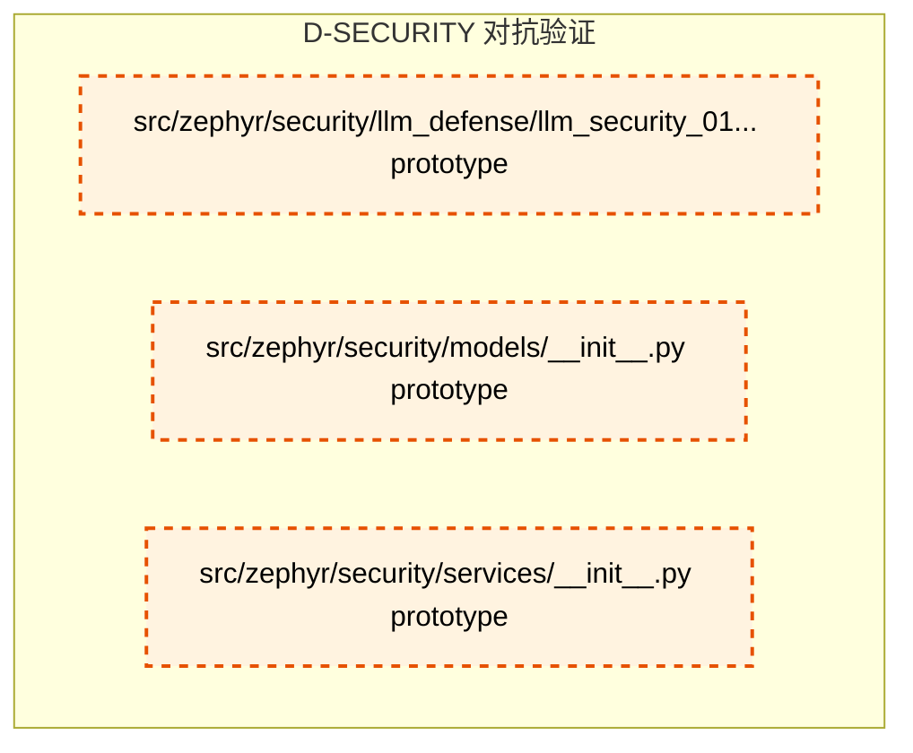

# 18_d_security / 对抗验证

> **文档作用 / Purpose**: 展示 对抗验证（D-SECURITY）功能域的模块清单、域内依赖关系和跨域依赖关系，供架构审查和域治理参考。

> 本文档由 generate_domain_doc.py 从 depgraph.db 自动生成
> 最后更新: 2026-06-29 01:07:22
> 数据源: depgraph.db nodes表 + edges表

## 域基本信息 / Domain Overview

| 字段 | 值 | Field | Value |
|------|------|-------|-------|
| 编号 | 18 | Number | 18 |
| 域ID | D-SECURITY | Domain ID | D-SECURITY |
| 域名称 | 对抗验证 | Domain Name | adversarial_validation |
| 层级 | L1_foundation | Layer | L1_foundation |
| 模块数 | 243 | Module Count | 243 |
| 域内依赖 | 243 | Internal Dependencies | 243 |
| 跨域入边 | 376 | Cross-domain Incoming | 376 |
| 跨域出边 | 75 | Cross-domain Outgoing | 75 |
| 设计态模块 | 0 | Design Modules | 0 |
| 原型态模块 | 111 | Prototype Modules | 111 |
| 生产态模块 | 132 | Production Modules | 132 |
| 容量 | 132/150 (正常) | Capacity | 132/150 (正常) |
| 描述 | 红蓝对抗验证 | Description | 红蓝对抗验证 |

## 模块清单 / Module List

共 243 个模块（按路径排序，全部显示）

| 模块路径 / Module Path | 模块名称 / Module Name | 设计成熟度 / Maturity | 构建状态 / Build Status |
|---------|---------|-----------|---------|
| src/zephyr/behavioral_audit/__init__.py |  | prototype | generated |
| src/zephyr/behavioral_audit/__main__.py |  | prototype | generated |
| src/zephyr/behavioral_audit/_analysis.py |  | prototype | generated |
| src/zephyr/behavioral_audit/_core.py |  | prototype | generated |
| src/zephyr/behavioral_audit/_drift.py |  | prototype | generated |
| src/zephyr/behavioral_audit/_infrastructure.py |  | prototype | generated |
| src/zephyr/behavioral_audit/_scanners.py |  | prototype | generated |
| src/zephyr/behavioral_audit/alert_router.py |  | prototype | generated |
| src/zephyr/behavioral_audit/cold_start.py |  | prototype | generated |
| src/zephyr/behavioral_audit/data_quality.py |  | prototype | generated |
| src/zephyr/behavioral_audit/events.py |  | prototype | generated |
| src/zephyr/behavioral_audit/integration_test_runner.py |  | prototype | generated |
| src/zephyr/behavioral_audit/reconciler.py |  | prototype | generated |
| src/zephyr/behavioral_audit/runbook_generator.py |  | prototype | generated |
| src/zephyr/behavioral_audit/state_machine.py |  | prototype | generated |
| src/zephyr/security/__init__.py |  | prototype | generated |
| src/zephyr/security/_extensions/__init__.py |  | prototype | deprecated |
| src/zephyr/security/access_control/__init__.py |  | production | stable |
| src/zephyr/security/access_control/a2a_check.py |  | production | stable |
| src/zephyr/security/access_control/abac_guard.py |  | production | stable |
| src/zephyr/security/access_control/adversarial_resilience.py |  | production | stable |
| src/zephyr/security/access_control/agent_creation_policy.py |  | production | stable |
| src/zephyr/security/access_control/anomaly_detector.py |  | production | stable |
| src/zephyr/security/access_control/anti_pattern_guard.py |  | production | stable |
| src/zephyr/security/access_control/approver_check.py |  | production | stable |
| src/zephyr/security/access_control/asymmetric_audit.py |  | production | stable |
| src/zephyr/security/access_control/audit_log_guard.py |  | production | stable |
| src/zephyr/security/access_control/auto_fix_engine_03/__init__.py |  | prototype | stable |
| src/zephyr/security/access_control/auto_fix_engine_03/__main__.py |  | prototype | stable |
| src/zephyr/security/access_control/auto_fix_engine_03/alignment_syncer.py |  | prototype | stable |
| src/zephyr/security/access_control/auto_fix_engine_03/all_completer.py |  | prototype | stable |
| src/zephyr/security/access_control/auto_fix_engine_03/batch_fixer.py |  | prototype | stable |
| src/zephyr/security/access_control/auto_fix_engine_03/compliance_auditor.py |  | prototype | stable |
| src/zephyr/security/access_control/auto_fix_engine_03/config_fixer.py |  | prototype | stable |
| src/zephyr/security/access_control/auto_fix_engine_03/dedup_extractor.py |  | prototype | stable |
| src/zephyr/security/access_control/auto_fix_engine_03/dep_version_fixer.py |  | production | stable |
| src/zephyr/security/access_control/auto_fix_engine_03/drift_fixer.py |  | production | stable |
| src/zephyr/security/access_control/auto_fix_engine_03/engine.py |  | production | stable |
| src/zephyr/security/access_control/auto_fix_engine_03/escalation_bridge.py |  | production | stable |
| src/zephyr/security/access_control/auto_fix_engine_03/event_hooks.py |  | production | stable |
| src/zephyr/security/access_control/auto_fix_engine_03/fix_budget.py |  | production | stable |
| src/zephyr/security/access_control/auto_fix_engine_03/fix_diff.py |  | production | stable |
| src/zephyr/security/access_control/auto_fix_engine_03/fix_health_check.py |  | production | stable |
| src/zephyr/security/access_control/auto_fix_engine_03/fix_pattern_miner.py |  | production | stable |
| src/zephyr/security/access_control/auto_fix_engine_03/fix_reliability.py |  | production | stable |
| src/zephyr/security/access_control/auto_fix_engine_03/fix_report.py |  | production | stable |
| src/zephyr/security/access_control/auto_fix_engine_03/fix_safety.py |  | production | stable |
| src/zephyr/security/access_control/auto_fix_engine_03/fix_scheduler.py |  | production | stable |
| src/zephyr/security/access_control/auto_fix_engine_03/import_fixer.py |  | prototype | stable |
| src/zephyr/security/access_control/auto_fix_engine_03/interrupt_guard.py |  | production | stable |
| src/zephyr/security/access_control/auto_fix_engine_03/llm_fix_adapter.py |  | production | stable |
| src/zephyr/security/access_control/auto_fix_engine_03/models.py |  | production | stable |
| src/zephyr/security/access_control/auto_fix_engine_03/scaffold_registrar.py |  | production | stable |
| src/zephyr/security/access_control/auto_fix_engine_03/self_heal_agent.py |  | production | stable |
| src/zephyr/security/access_control/auto_fix_engine_03/shadow_workspace.py |  | production | stable |
| src/zephyr/security/access_control/auto_fix_engine_03/state_machine.py |  | production | stable |
| src/zephyr/security/access_control/auto_fix_engine_03/zombie_cleaner.py |  | production | stable |
| src/zephyr/security/access_control/auto_maintenance.py |  | production | stable |
| src/zephyr/security/access_control/blind_spot_tracker.py |  | production | stable |
| src/zephyr/security/access_control/blueprint_fidelity.py |  | production | stable |
| src/zephyr/security/access_control/bootstrap_superadmin.py |  | production | stable |
| src/zephyr/security/access_control/bootstrap_verifier.py |  | production | stable |
| src/zephyr/security/access_control/build_sanitizer.py |  | production | stable |
| src/zephyr/security/access_control/cache_invalidation.py |  | production | stable |
| src/zephyr/security/access_control/canary_rollout_manager.py |  | production | stable |
| src/zephyr/security/access_control/capability_check.py |  | production | stable |
| src/zephyr/security/access_control/cascading_failure_isolator.py |  | production | stable |
| src/zephyr/security/access_control/cold_start_lock.py |  | production | stable |
| src/zephyr/security/access_control/compliance_matrix.py |  | production | stable |
| src/zephyr/security/access_control/context_drift_detector.py |  | production | stable |
| src/zephyr/security/access_control/continuous_verifier.py |  | production | stable |
| src/zephyr/security/access_control/contract_verifier.py |  | production | stable |
| src/zephyr/security/access_control/contracts.py |  | production | stable |
| src/zephyr/security/access_control/cross_cutting.py |  | production | stable |
| src/zephyr/security/access_control/cross_session_detector.py |  | production | stable |
| src/zephyr/security/access_control/cybersec_2026_guard.py |  | production | stable |
| src/zephyr/security/access_control/decision_explainer.py |  | production | stable |
| src/zephyr/security/access_control/decision_registry.py |  | production | stable |
| src/zephyr/security/access_control/defense_depth.py |  | production | stable |
| src/zephyr/security/access_control/dependency_auditor.py |  | production | stable |
| src/zephyr/security/access_control/derive_rbac_roles.py |  | production | stable |
| src/zephyr/security/access_control/dry_run.py |  | production | stable |
| src/zephyr/security/access_control/emergency_override.py |  | production | stable |
| src/zephyr/security/access_control/engine_degradation.py |  | production | stable |
| src/zephyr/security/access_control/environment_manager.py |  | production | stable |
| src/zephyr/security/access_control/escalation_handler.py |  | production | stable |
| src/zephyr/security/access_control/exceptions.py |  | production | stable |
| src/zephyr/security/access_control/false_completion_detector.py |  | production | stable |
| src/zephyr/security/access_control/genesis_bootstrap.py |  | production | stable |
| src/zephyr/security/access_control/guard_layers.py |  | production | stable |
| src/zephyr/security/access_control/identity.py |  | production | stable |
| src/zephyr/security/access_control/immutable_core.py |  | production | stable |
| src/zephyr/security/access_control/input_guard.py |  | production | stable |
| src/zephyr/security/access_control/integration.py |  | production | stable |
| src/zephyr/security/access_control/integrity_self_check.py |  | production | stable |
| src/zephyr/security/access_control/intent_binder.py |  | production | stable |
| src/zephyr/security/access_control/key_hierarchy.py |  | production | stable |
| src/zephyr/security/access_control/kill_switch.py |  | production | stable |
| src/zephyr/security/access_control/legal_audit_chain.py |  | production | stable |
| src/zephyr/security/access_control/memory_guard.py |  | production | stable |
| src/zephyr/security/access_control/memory_provenance_guard.py |  | production | stable |
| src/zephyr/security/access_control/micro_verifier.py |  | production | stable |
| src/zephyr/security/access_control/microstructure_defense.py |  | production | stable |
| src/zephyr/security/access_control/monotonic_clock.py |  | production | stable |
| src/zephyr/security/access_control/multi_agent_collusion_detector.py |  | production | stable |
| src/zephyr/security/access_control/native_api_guard.py |  | production | stable |
| src/zephyr/security/access_control/non_repudiation.py |  | production | stable |
| src/zephyr/security/access_control/novel_attack_guard.py |  | production | stable |
| src/zephyr/security/access_control/observability.py |  | production | stable |
| src/zephyr/security/access_control/orphan_judge/__init__.py |  | prototype | stable |
| src/zephyr/security/access_control/orphan_judge/__main__.py |  | prototype | stable |
| src/zephyr/security/access_control/orphan_judge/cascade_analyzer.py |  | production | stable |
| src/zephyr/security/access_control/orphan_judge/config_loader.py |  | prototype | stable |
| src/zephyr/security/access_control/orphan_judge/db.py |  | prototype | stable |
| src/zephyr/security/access_control/orphan_judge/decision_table.py |  | production | stable |
| src/zephyr/security/access_control/orphan_judge/deprecation_tracker.py |  | production | stable |
| src/zephyr/security/access_control/orphan_judge/drift_bridge.py |  | prototype | stable |
| src/zephyr/security/access_control/orphan_judge/duplicate_detector.py |  | prototype | stable |
| src/zephyr/security/access_control/orphan_judge/escalation_bridge.py |  | prototype | stable |
| src/zephyr/security/access_control/orphan_judge/feedback_bridge.py |  | prototype | stable |
| src/zephyr/security/access_control/orphan_judge/judge.py |  | production | stable |
| src/zephyr/security/access_control/orphan_judge/kb_bridge.py |  | prototype | stable |
| src/zephyr/security/access_control/orphan_judge/mcp_integration.py |  | prototype | stable |
| src/zephyr/security/access_control/orphan_judge/models.py |  | prototype | stable |
| src/zephyr/security/access_control/orphan_judge/orphan_collector.py |  | prototype | stable |
| src/zephyr/security/access_control/orphan_judge/orphan_detector.py |  | production | stable |
| src/zephyr/security/access_control/orphan_judge/rbac_bridge.py |  | prototype | stable |
| src/zephyr/security/access_control/orphan_judge/reference_graph_engine.py |  | prototype | stable |
| src/zephyr/security/access_control/orphan_judge/registration_checker.py |  | prototype | stable |
| src/zephyr/security/access_control/orphan_judge/report_generator.py |  | prototype | stable |
| src/zephyr/security/access_control/orphan_judge/safety_fence.py |  | production | stable |
| src/zephyr/security/access_control/orphan_judge/standalone_evaluator.py |  | prototype | stable |
| src/zephyr/security/access_control/orphan_judge/swid_tag.py |  | prototype | stable |
| src/zephyr/security/access_control/orphan_judge/unique_analyzer.py |  | prototype | stable |
| src/zephyr/security/access_control/output_guard.py |  | production | stable |
| src/zephyr/security/access_control/path_guard.py |  | production | stable |
| src/zephyr/security/access_control/permission_guard.py |  | production | stable |
| src/zephyr/security/access_control/permission_hooks.py |  | production | stable |
| src/zephyr/security/access_control/permission_mode_manager.py |  | production | stable |
| src/zephyr/security/access_control/phase_executor.py |  | prototype | stable |
| src/zephyr/security/access_control/post_action_verifier.py |  | production | stable |
| src/zephyr/security/access_control/rbac_guard.py |  | production | stable |
| src/zephyr/security/access_control/replay_attack_guard.py |  | production | stable |
| src/zephyr/security/access_control/risk_mitigation.py |  | production | stable |
| src/zephyr/security/access_control/rollback_sandbox.py |  | production | stable |
| src/zephyr/security/access_control/rule_injection_guard.py |  | production | stable |
| src/zephyr/security/access_control/secrets_lifecycle.py |  | production | stable |
| src/zephyr/security/access_control/sequence_guard.py |  | production | stable |
| src/zephyr/security/access_control/session_concurrency.py |  | production | stable |
| src/zephyr/security/access_control/session_lifecycle.py |  | production | stable |
| src/zephyr/security/access_control/shell_dialect_detector.py |  | production | stable |
| src/zephyr/security/access_control/toctou_guard.py |  | production | stable |
| src/zephyr/security/access_control/vibe_coding_guard.py |  | production | stable |
| src/zephyr/security/adversarial_validation/__init__.py |  | prototype | generated |
| src/zephyr/security/adversarial_validation/__main__.py |  | prototype | generated |
| src/zephyr/security/adversarial_validation/ai_attack_generator.py |  | prototype | generated |
| src/zephyr/security/adversarial_validation/async_monitor.py |  | prototype | generated |
| src/zephyr/security/adversarial_validation/attack_registry.py |  | prototype | generated |
| src/zephyr/security/adversarial_validation/blast_radius.py |  | prototype | generated |
| src/zephyr/security/adversarial_validation/bypass_recorder.py |  | prototype | generated |
| src/zephyr/security/adversarial_validation/circuit_breaker.py |  | prototype | generated |
| src/zephyr/security/adversarial_validation/cleanup.py |  | prototype | generated |
| src/zephyr/security/adversarial_validation/cli.py |  | prototype | generated |
| src/zephyr/security/adversarial_validation/cold_start.py |  | prototype | generated |
| src/zephyr/security/adversarial_validation/constitution_engine.py |  | prototype | generated |
| src/zephyr/security/adversarial_validation/constitution_guard.py |  | prototype | generated |
| src/zephyr/security/adversarial_validation/convergence_checker.py |  | prototype | generated |
| src/zephyr/security/adversarial_validation/defense_runner.py |  | prototype | generated |
| src/zephyr/security/adversarial_validation/game_day_runner.py |  | prototype | generated |
| src/zephyr/security/adversarial_validation/game_day_scheduler.py |  | prototype | generated |
| src/zephyr/security/adversarial_validation/injection_engine.py |  | prototype | generated |
| src/zephyr/security/adversarial_validation/mcp_endpoints.py |  | prototype | generated |
| src/zephyr/security/adversarial_validation/models.py |  | prototype | generated |
| src/zephyr/security/adversarial_validation/scenario_loader.py |  | prototype | generated |
| src/zephyr/security/adversarial_validation/steady_state.py |  | prototype | generated |
| src/zephyr/security/adversarial_validation/validator.py |  | prototype | generated |
| src/zephyr/security/api/__init__.py |  | prototype | deprecated |
| src/zephyr/security/core/__init__.py |  | prototype | deprecated |
| src/zephyr/security/infrastructure/__init__.py |  | prototype | deprecated |
| src/zephyr/security/llm_defense/__init__.py |  | prototype | deprecated |
| src/zephyr/security/llm_defense/llm_security/__init__.py |  | prototype | generated |
| src/zephyr/security/llm_defense/llm_security/behavior_audit_logger.py |  | production | generated |
| src/zephyr/security/llm_defense/llm_security/dashboard/__init__.py |  | prototype | generated |
| src/zephyr/security/llm_defense/llm_security/dashboard/app.py |  | prototype | generated |
| src/zephyr/security/llm_defense/llm_security/gateway.py |  | production | generated |
| src/zephyr/security/llm_defense/llm_security/input_sanitizer.py |  | production | generated |
| src/zephyr/security/llm_defense/llm_security/layers/__init__.py |  | prototype | generated |
| src/zephyr/security/llm_defense/llm_security/layers/l0_supply_chain.py |  | production | generated |
| src/zephyr/security/llm_defense/llm_security/layers/l1_input.py |  | production | generated |
| src/zephyr/security/llm_defense/llm_security/layers/l2_prompt_protection.py |  | production | generated |
| src/zephyr/security/llm_defense/llm_security/layers/l2a_process_sandbox.py |  | production | generated |
| src/zephyr/security/llm_defense/llm_security/layers/l3_output.py |  | production | generated |
| src/zephyr/security/llm_defense/llm_security/layers/l4_agent.py |  | production | generated |
| src/zephyr/security/llm_defense/llm_security/layers/l5_resource_protection.py |  | production | generated |
| src/zephyr/security/llm_defense/llm_security/layers/l6_data_flow.py |  | prototype | generated |
| src/zephyr/security/llm_defense/llm_security/layers/l6_observability.py |  | production | generated |
| src/zephyr/security/llm_defense/llm_security/layers/l8_compliance.py |  | prototype | generated |
| src/zephyr/security/llm_defense/llm_security/layers/l8_multi_agent.py |  | production | generated |
| src/zephyr/security/llm_defense/llm_security/patterns/__init__.py |  | prototype | generated |
| src/zephyr/security/llm_defense/llm_security/patterns/injection_patterns.py |  | production | generated |
| src/zephyr/security/llm_defense/llm_security/patterns/secrets.py |  | production | generated |
| src/zephyr/security/llm_defense/llm_security/payloads/__init__.py |  | prototype | generated |
| src/zephyr/security/llm_defense/llm_security/payloads/injection_payloads.yaml |  | production | deprecated |
| src/zephyr/security/llm_defense/llm_security/payloads/leak_probe_phrases.yaml |  | production | deprecated |
| src/zephyr/security/llm_defense/llm_security/payloads/red_team_payloads.yaml |  | production | deprecated |
| src/zephyr/security/llm_defense/llm_security/payloads/tool_call_payloads.yaml |  | production | deprecated |
| src/zephyr/security/llm_defense/llm_security/process_sandbox.py |  | production | generated |
| src/zephyr/security/llm_defense/llm_security/protocol.py |  | prototype | generated |
| src/zephyr/security/llm_defense/llm_security/red_team_corpus.yaml |  | production | deprecated |
| src/zephyr/security/llm_defense/llm_security/sandbox/__init__.py |  | prototype | deprecated |
| src/zephyr/security/llm_defense/llm_security/self_protection/__init__.py |  | prototype | generated |
| ...phyr/security/llm_defense/llm_security/self_protection/adversarial_mutator.py |  | production | generated |
| src/zephyr/security/llm_defense/llm_security/self_protection/code_integrity.py |  | production | generated |
| src/zephyr/security/llm_defense/llm_security/self_protection/isolation.py |  | production | generated |
| src/zephyr/security/llm_defense/llm_security/self_protection/l7_validation.py |  | production | generated |
| src/zephyr/security/llm_defense/llm_security/self_protection/red_team_scanner.py |  | production | generated |
| src/zephyr/security/llm_defense/llm_security_01/__init__.py |  | prototype | generated |
| src/zephyr/security/llm_defense/llm_security_01/behavior_audit_logger.py |  | prototype | generated |
| src/zephyr/security/llm_defense/llm_security_01/context_scanner.py |  | prototype | generated |
| src/zephyr/security/llm_defense/llm_security_01/gateway.py |  | prototype | generated |
| src/zephyr/security/llm_defense/llm_security_01/input_sanitizer.py |  | prototype | generated |
| src/zephyr/security/llm_defense/llm_security_01/layers/__init__.py |  | prototype | generated |
| src/zephyr/security/llm_defense/llm_security_01/layers/l0_supply_chain.py |  | prototype | generated |
| src/zephyr/security/llm_defense/llm_security_01/layers/l1_input.py |  | prototype | generated |
| src/zephyr/security/llm_defense/llm_security_01/layers/l2_prompt_protection.py |  | prototype | generated |
| src/zephyr/security/llm_defense/llm_security_01/layers/l2a_process_sandbox.py |  | prototype | generated |
| src/zephyr/security/llm_defense/llm_security_01/layers/l3_output.py |  | prototype | generated |
| src/zephyr/security/llm_defense/llm_security_01/layers/l4_agent.py |  | prototype | generated |
| src/zephyr/security/llm_defense/llm_security_01/layers/l5_resource_protection.py |  | prototype | generated |
| src/zephyr/security/llm_defense/llm_security_01/layers/l6_observability.py |  | prototype | generated |
| src/zephyr/security/llm_defense/llm_security_01/layers/l8_multi_agent.py |  | prototype | generated |
| src/zephyr/security/llm_defense/llm_security_01/patterns/__init__.py |  | prototype | generated |
| src/zephyr/security/llm_defense/llm_security_01/patterns/injection_patterns.py |  | prototype | generated |
| src/zephyr/security/llm_defense/llm_security_01/patterns/secrets.py |  | prototype | generated |
| src/zephyr/security/llm_defense/llm_security_01/process_sandbox.py |  | prototype | generated |
| src/zephyr/security/llm_defense/llm_security_01/self_protection/__init__.py |  | prototype | generated |
| ...r/security/llm_defense/llm_security_01/self_protection/adversarial_mutator.py |  | prototype | generated |
| ...zephyr/security/llm_defense/llm_security_01/self_protection/code_integrity.py |  | prototype | generated |
| src/zephyr/security/llm_defense/llm_security_01/self_protection/isolation.py |  | prototype | generated |
| src/zephyr/security/llm_defense/llm_security_01/self_protection/l7_validation.py |  | prototype | generated |
| ...phyr/security/llm_defense/llm_security_01/self_protection/red_team_scanner.py |  | prototype | generated |
| src/zephyr/security/models/__init__.py |  | prototype | deprecated |
| src/zephyr/security/services/__init__.py |  | prototype | deprecated |

## 域内依赖图 / Internal Dependency Diagram

> 依赖图内嵌在本文档中，IDE 可直接渲染显示。每30个节点一组分页显示。
>
> **图例说明 / Legend**：
> - **实线边框 = 运营态模块**（production，已上线运行）
> - **虚线边框 = 设计态模块**（design，还在设计中）
> - **实线箭头 = 运营态依赖**（已生效的依赖关系）
> - **虚线箭头 = 设计态依赖**（计划中的依赖关系）

### 第 1 页 / 共 9 页 / Page 1 of 9

```mermaid
graph TD
    subgraph D_SECURITY["D-SECURITY 对抗验证"]
        src_zephyr_behavioral_audit_init_py["src/zephyr/behavioral_audit/__init__.py prototype"]
        src_zephyr_behavioral_audit_main_py["src/zephyr/behavioral_audit/__main__.py prototype"]
        src_zephyr_behavioral_audit_analysis_py["src/zephyr/behavioral_audit/_analysis.py prototype"]
        src_zephyr_behavioral_audit_core_py["src/zephyr/behavioral_audit/_core.py prototype"]
        src_zephyr_behavioral_audit_drift_py["src/zephyr/behavioral_audit/_drift.py prototype"]
        src_zephyr_behavioral_audit_infrastructure_py["src/zephyr/behavioral_audit/_infrastructure.py prototype"]
        src_zephyr_behavioral_audit_scanners_py["src/zephyr/behavioral_audit/_scanners.py prototype"]
        src_zephyr_behavioral_audit_alert_router_py["src/zephyr/behavioral_audit/alert_router.py prototype"]
        src_zephyr_behavioral_audit_cold_start_py["src/zephyr/behavioral_audit/cold_start.py prototype"]
        src_zephyr_behavioral_audit_data_quality_py["src/zephyr/behavioral_audit/data_quality.py prototype"]
        src_zephyr_behavioral_audit_events_py["src/zephyr/behavioral_audit/events.py prototype"]
        src_zephyr_behavioral_audit_integration_test_runner_py["src/zephyr/behavioral_audit/integration_test_ru... prototype"]
        src_zephyr_behavioral_audit_reconciler_py["src/zephyr/behavioral_audit/reconciler.py prototype"]
        src_zephyr_behavioral_audit_runbook_generator_py["src/zephyr/behavioral_audit/runbook_generator.py prototype"]
        src_zephyr_behavioral_audit_state_machine_py["src/zephyr/behavioral_audit/state_machine.py prototype"]
        src_zephyr_security_init_py["src/zephyr/security/__init__.py prototype"]
        src_zephyr_security_extensions_init_py["src/zephyr/security/_extensions/__init__.py prototype"]
        src_zephyr_security_access_control_init_py["src/zephyr/security/access_control/__init__.py production"]
        src_zephyr_security_access_control_a2a_check_py["src/zephyr/security/access_control/a2a_check.py production"]
        src_zephyr_security_access_control_abac_guard_py["src/zephyr/security/access_control/abac_guard.py production"]
        src_zephyr_security_access_control_adversarial_resilience_py["src/zephyr/security/access_control/adversarial_... production"]
        src_zephyr_security_access_control_agent_creation_policy_py["src/zephyr/security/access_control/agent_creati... production"]
        src_zephyr_security_access_control_anomaly_detector_py["src/zephyr/security/access_control/anomaly_dete... production"]
        src_zephyr_security_access_control_anti_pattern_guard_py["src/zephyr/security/access_control/anti_pattern... production"]
        src_zephyr_security_access_control_approver_check_py["src/zephyr/security/access_control/approver_che... production"]
        src_zephyr_security_access_control_asymmetric_audit_py["src/zephyr/security/access_control/asymmetric_a... production"]
        src_zephyr_security_access_control_audit_log_guard_py["src/zephyr/security/access_control/audit_log_gu... production"]
        src_zephyr_security_access_control_auto_fix_engine_03_init_py["src/zephyr/security/access_control/auto_fix_eng... prototype"]
        src_zephyr_security_access_control_auto_fix_engine_03_main_py["src/zephyr/security/access_control/auto_fix_eng... prototype"]
        src_zephyr_security_access_control_auto_fix_engine_03_alignment_syncer_py["src/zephyr/security/access_control/auto_fix_eng... prototype"]
    end
    src_zephyr_security_init_py -.->|import_depends| src_zephyr_security_access_control_init_py
    src_zephyr_security_access_control_auto_fix_engine_03_init_py -.->|import_depends| src_zephyr_security_access_control_auto_fix_engine_03_alignment_syncer_py
    src_zephyr_behavioral_audit_data_quality_py -.->|config_depends| src_zephyr_behavioral_audit_init_py
    src_zephyr_behavioral_audit_integration_test_runner_py -.->|config_depends| src_zephyr_behavioral_audit_init_py
    src_zephyr_behavioral_audit_analysis_py -.->|import_depends| src_zephyr_behavioral_audit_reconciler_py
    src_zephyr_behavioral_audit_analysis_py -.->|import_depends| src_zephyr_behavioral_audit_runbook_generator_py
    src_zephyr_behavioral_audit_core_py -.->|import_depends| src_zephyr_behavioral_audit_events_py
    src_zephyr_behavioral_audit_core_py -.->|import_depends| src_zephyr_behavioral_audit_state_machine_py
    src_zephyr_behavioral_audit_infrastructure_py -.->|import_depends| src_zephyr_behavioral_audit_alert_router_py
    src_zephyr_behavioral_audit_infrastructure_py -.->|import_depends| src_zephyr_behavioral_audit_cold_start_py
    D_BEHAVIORAL_AUDIT["D-BEHAVIORAL_AUDIT production"]
    src_zephyr_behavioral_audit_cold_start_py -.->|import_depends| D_BEHAVIORAL_AUDIT
    src_zephyr_behavioral_audit_reconciler_py -.->|import_depends| D_BEHAVIORAL_AUDIT
    src_zephyr_behavioral_audit_runbook_generator_py -.->|import_depends| D_BEHAVIORAL_AUDIT
    src_zephyr_behavioral_audit_state_machine_py -.->|import_depends| D_BEHAVIORAL_AUDIT
    src_zephyr_behavioral_audit_analysis_py -.->|import_depends| D_BEHAVIORAL_AUDIT
    src_zephyr_behavioral_audit_analysis_py -.->|import_depends| D_BEHAVIORAL_AUDIT
    src_zephyr_behavioral_audit_analysis_py -.->|import_depends| D_BEHAVIORAL_AUDIT
    src_zephyr_behavioral_audit_analysis_py -.->|import_depends| D_BEHAVIORAL_AUDIT
    src_zephyr_behavioral_audit_analysis_py -.->|import_depends| D_BEHAVIORAL_AUDIT
    src_zephyr_behavioral_audit_analysis_py -.->|import_depends| D_BEHAVIORAL_AUDIT
    src_zephyr_behavioral_audit_analysis_py -.->|import_depends| D_BEHAVIORAL_AUDIT
    src_zephyr_behavioral_audit_analysis_py -.->|import_depends| D_BEHAVIORAL_AUDIT
    src_zephyr_behavioral_audit_analysis_py -.->|import_depends| D_BEHAVIORAL_AUDIT
    src_zephyr_behavioral_audit_analysis_py -.->|import_depends| D_BEHAVIORAL_AUDIT
    src_zephyr_behavioral_audit_analysis_py -.->|import_depends| D_BEHAVIORAL_AUDIT
    D_GOVERNANCE["D-GOVERNANCE prototype"]
    D_GOVERNANCE -.->|import_depends| src_zephyr_behavioral_audit_events_py
    D_GOVERNANCE -.->|import_depends| src_zephyr_behavioral_audit_events_py
    D_GOV_ENFORCEMENT["D-GOV_ENFORCEMENT prototype"]
    D_GOV_ENFORCEMENT -.->|import_depends| src_zephyr_behavioral_audit_reconciler_py
    D_GOV_ENFORCEMENT -.->|import_depends| src_zephyr_behavioral_audit_events_py
    D_GOVERNANCE -.->|import_depends| src_zephyr_behavioral_audit_cold_start_py
    D_OPS["D-OPS prototype"]
    D_OPS -.->|import_depends| src_zephyr_security_access_control_auto_fix_engine_03_init_py
    D_GOV_SCRIPTS["D-GOV_SCRIPTS prototype"]
    D_GOV_SCRIPTS -.->|import_depends| src_zephyr_security_access_control_a2a_check_py
    D_GOVERNANCE -.->|test_depends| src_zephyr_security_access_control_a2a_check_py
    D_GOVERNANCE -.->|test_depends| src_zephyr_security_access_control_abac_guard_py
    D_GOVERNANCE -.->|test_depends| src_zephyr_security_access_control_adversarial_resilience_py
    D_GOVERNANCE -.->|test_depends| src_zephyr_security_access_control_agent_creation_policy_py
    D_GOVERNANCE -.->|test_depends| src_zephyr_security_access_control_anomaly_detector_py
    D_GOVERNANCE -.->|test_depends| src_zephyr_security_access_control_anti_pattern_guard_py
    D_GOVERNANCE -.->|test_depends| src_zephyr_security_access_control_approver_check_py
    D_GOVERNANCE -.->|test_depends| src_zephyr_security_access_control_asymmetric_audit_py
    classDef production fill:#e1f5fe,stroke:#01579b,stroke-width:2px,color:#000
    classDef design fill:#fff3e0,stroke:#e65100,stroke-width:2px,color:#000,stroke-dasharray: 5 5
    classDef external_prod fill:#e8f5e9,stroke:#1b5e20,stroke-width:1px,color:#000
    classDef external_design fill:#fce4ec,stroke:#880e4f,stroke-width:1px,color:#000,stroke-dasharray: 5 5
    class src_zephyr_security_access_control_init_py,src_zephyr_security_access_control_a2a_check_py,src_zephyr_security_access_control_abac_guard_py,src_zephyr_security_access_control_adversarial_resilience_py,src_zephyr_security_access_control_agent_creation_policy_py,src_zephyr_security_access_control_anomaly_detector_py,src_zephyr_security_access_control_anti_pattern_guard_py,src_zephyr_security_access_control_approver_check_py,src_zephyr_security_access_control_asymmetric_audit_py,src_zephyr_security_access_control_audit_log_guard_py production
    class src_zephyr_behavioral_audit_init_py,src_zephyr_behavioral_audit_main_py,src_zephyr_behavioral_audit_analysis_py,src_zephyr_behavioral_audit_core_py,src_zephyr_behavioral_audit_drift_py,src_zephyr_behavioral_audit_infrastructure_py,src_zephyr_behavioral_audit_scanners_py,src_zephyr_behavioral_audit_alert_router_py,src_zephyr_behavioral_audit_cold_start_py,src_zephyr_behavioral_audit_data_quality_py,src_zephyr_behavioral_audit_events_py,src_zephyr_behavioral_audit_integration_test_runner_py,src_zephyr_behavioral_audit_reconciler_py,src_zephyr_behavioral_audit_runbook_generator_py,src_zephyr_behavioral_audit_state_machine_py,src_zephyr_security_init_py,src_zephyr_security_extensions_init_py,src_zephyr_security_access_control_auto_fix_engine_03_init_py,src_zephyr_security_access_control_auto_fix_engine_03_main_py,src_zephyr_security_access_control_auto_fix_engine_03_alignment_syncer_py design
    class D_BEHAVIORAL_AUDIT external_prod
    class D_GOVERNANCE,D_GOV_ENFORCEMENT,D_OPS,D_GOV_SCRIPTS external_design
```



### 第 2 页 / 共 9 页 / Page 2 of 9

```mermaid
graph TD
    subgraph D_SECURITY["D-SECURITY 对抗验证"]
        src_zephyr_security_access_control_auto_fix_engine_03_all_completer_py["src/zephyr/security/access_control/auto_fix_eng... prototype"]
        src_zephyr_security_access_control_auto_fix_engine_03_batch_fixer_py["src/zephyr/security/access_control/auto_fix_eng... prototype"]
        src_zephyr_security_access_control_auto_fix_engine_03_compliance_auditor_py["src/zephyr/security/access_control/auto_fix_eng... prototype"]
        src_zephyr_security_access_control_auto_fix_engine_03_config_fixer_py["src/zephyr/security/access_control/auto_fix_eng... prototype"]
        src_zephyr_security_access_control_auto_fix_engine_03_dedup_extractor_py["src/zephyr/security/access_control/auto_fix_eng... prototype"]
        src_zephyr_security_access_control_auto_fix_engine_03_dep_version_fixer_py["src/zephyr/security/access_control/auto_fix_eng... production"]
        src_zephyr_security_access_control_auto_fix_engine_03_drift_fixer_py["src/zephyr/security/access_control/auto_fix_eng... production"]
        src_zephyr_security_access_control_auto_fix_engine_03_engine_py["src/zephyr/security/access_control/auto_fix_eng... production"]
        src_zephyr_security_access_control_auto_fix_engine_03_escalation_bridge_py["src/zephyr/security/access_control/auto_fix_eng... production"]
        src_zephyr_security_access_control_auto_fix_engine_03_event_hooks_py["src/zephyr/security/access_control/auto_fix_eng... production"]
        src_zephyr_security_access_control_auto_fix_engine_03_fix_budget_py["src/zephyr/security/access_control/auto_fix_eng... production"]
        src_zephyr_security_access_control_auto_fix_engine_03_fix_diff_py["src/zephyr/security/access_control/auto_fix_eng... production"]
        src_zephyr_security_access_control_auto_fix_engine_03_fix_health_check_py["src/zephyr/security/access_control/auto_fix_eng... production"]
        src_zephyr_security_access_control_auto_fix_engine_03_fix_pattern_miner_py["src/zephyr/security/access_control/auto_fix_eng... production"]
        src_zephyr_security_access_control_auto_fix_engine_03_fix_reliability_py["src/zephyr/security/access_control/auto_fix_eng... production"]
        src_zephyr_security_access_control_auto_fix_engine_03_fix_report_py["src/zephyr/security/access_control/auto_fix_eng... production"]
        src_zephyr_security_access_control_auto_fix_engine_03_fix_safety_py["src/zephyr/security/access_control/auto_fix_eng... production"]
        src_zephyr_security_access_control_auto_fix_engine_03_fix_scheduler_py["src/zephyr/security/access_control/auto_fix_eng... production"]
        src_zephyr_security_access_control_auto_fix_engine_03_import_fixer_py["src/zephyr/security/access_control/auto_fix_eng... prototype"]
        src_zephyr_security_access_control_auto_fix_engine_03_interrupt_guard_py["src/zephyr/security/access_control/auto_fix_eng... production"]
        src_zephyr_security_access_control_auto_fix_engine_03_llm_fix_adapter_py["src/zephyr/security/access_control/auto_fix_eng... production"]
        src_zephyr_security_access_control_auto_fix_engine_03_models_py["src/zephyr/security/access_control/auto_fix_eng... production"]
        src_zephyr_security_access_control_auto_fix_engine_03_scaffold_registrar_py["src/zephyr/security/access_control/auto_fix_eng... production"]
        src_zephyr_security_access_control_auto_fix_engine_03_self_heal_agent_py["src/zephyr/security/access_control/auto_fix_eng... production"]
        src_zephyr_security_access_control_auto_fix_engine_03_shadow_workspace_py["src/zephyr/security/access_control/auto_fix_eng... production"]
        src_zephyr_security_access_control_auto_fix_engine_03_state_machine_py["src/zephyr/security/access_control/auto_fix_eng... production"]
        src_zephyr_security_access_control_auto_fix_engine_03_zombie_cleaner_py["src/zephyr/security/access_control/auto_fix_eng... production"]
        src_zephyr_security_access_control_auto_maintenance_py["src/zephyr/security/access_control/auto_mainten... production"]
        src_zephyr_security_access_control_blind_spot_tracker_py["src/zephyr/security/access_control/blind_spot_t... production"]
        src_zephyr_security_access_control_blueprint_fidelity_py["src/zephyr/security/access_control/blueprint_fi... production"]
    end
    src_zephyr_security_access_control_auto_fix_engine_03_all_completer_py -.->|import_depends| src_zephyr_security_access_control_auto_fix_engine_03_models_py
    src_zephyr_security_access_control_auto_fix_engine_03_compliance_auditor_py -.->|import_depends| src_zephyr_security_access_control_auto_fix_engine_03_models_py
    src_zephyr_security_access_control_auto_fix_engine_03_batch_fixer_py -.->|import_depends| src_zephyr_security_access_control_auto_fix_engine_03_fix_budget_py
    src_zephyr_security_access_control_auto_fix_engine_03_batch_fixer_py -.->|import_depends| src_zephyr_security_access_control_auto_fix_engine_03_fix_reliability_py
    src_zephyr_security_access_control_auto_fix_engine_03_batch_fixer_py -.->|import_depends| src_zephyr_security_access_control_auto_fix_engine_03_models_py
    src_zephyr_security_access_control_auto_fix_engine_03_config_fixer_py -.->|import_depends| src_zephyr_security_access_control_auto_fix_engine_03_models_py
    src_zephyr_security_access_control_auto_fix_engine_03_dep_version_fixer_py -->|import_depends| src_zephyr_security_access_control_auto_fix_engine_03_models_py
    src_zephyr_security_access_control_auto_fix_engine_03_engine_py -.->|import_depends| src_zephyr_security_access_control_auto_fix_engine_03_compliance_auditor_py
    src_zephyr_security_access_control_auto_fix_engine_03_engine_py -.->|import_depends| src_zephyr_security_access_control_auto_fix_engine_03_batch_fixer_py
    src_zephyr_security_access_control_auto_fix_engine_03_engine_py -->|import_depends| src_zephyr_security_access_control_auto_fix_engine_03_escalation_bridge_py
    src_zephyr_security_access_control_auto_fix_engine_03_engine_py -->|import_depends| src_zephyr_security_access_control_auto_fix_engine_03_fix_diff_py
    src_zephyr_security_access_control_auto_fix_engine_03_engine_py -->|import_depends| src_zephyr_security_access_control_auto_fix_engine_03_fix_pattern_miner_py
    src_zephyr_security_access_control_auto_fix_engine_03_engine_py -->|import_depends| src_zephyr_security_access_control_auto_fix_engine_03_fix_budget_py
    src_zephyr_security_access_control_auto_fix_engine_03_engine_py -->|import_depends| src_zephyr_security_access_control_auto_fix_engine_03_fix_reliability_py
    src_zephyr_security_access_control_auto_fix_engine_03_engine_py -->|import_depends| src_zephyr_security_access_control_auto_fix_engine_03_fix_health_check_py
    src_zephyr_security_access_control_auto_fix_engine_03_engine_py -->|import_depends| src_zephyr_security_access_control_auto_fix_engine_03_fix_safety_py
    src_zephyr_security_access_control_auto_fix_engine_03_engine_py -->|import_depends| src_zephyr_security_access_control_auto_fix_engine_03_fix_report_py
    src_zephyr_security_access_control_auto_fix_engine_03_engine_py -->|import_depends| src_zephyr_security_access_control_auto_fix_engine_03_models_py
    src_zephyr_security_access_control_auto_fix_engine_03_engine_py -->|import_depends| src_zephyr_security_access_control_auto_fix_engine_03_shadow_workspace_py
    src_zephyr_security_access_control_auto_fix_engine_03_engine_py -->|import_depends| src_zephyr_security_access_control_auto_fix_engine_03_state_machine_py
    src_zephyr_security_access_control_auto_fix_engine_03_escalation_bridge_py -->|import_depends| src_zephyr_security_access_control_auto_fix_engine_03_models_py
    src_zephyr_security_access_control_auto_fix_engine_03_drift_fixer_py -->|import_depends| src_zephyr_security_access_control_auto_fix_engine_03_models_py
    src_zephyr_security_access_control_auto_fix_engine_03_dedup_extractor_py -.->|import_depends| src_zephyr_security_access_control_auto_fix_engine_03_models_py
    src_zephyr_security_access_control_auto_fix_engine_03_fix_diff_py -->|import_depends| src_zephyr_security_access_control_auto_fix_engine_03_models_py
    src_zephyr_security_access_control_auto_fix_engine_03_fix_pattern_miner_py -->|import_depends| src_zephyr_security_access_control_auto_fix_engine_03_models_py
    src_zephyr_security_access_control_auto_fix_engine_03_fix_budget_py -->|import_depends| src_zephyr_security_access_control_auto_fix_engine_03_models_py
    src_zephyr_security_access_control_auto_fix_engine_03_event_hooks_py -->|import_depends| src_zephyr_security_access_control_auto_fix_engine_03_models_py
    src_zephyr_security_access_control_auto_fix_engine_03_fix_reliability_py -->|import_depends| src_zephyr_security_access_control_auto_fix_engine_03_models_py
    src_zephyr_security_access_control_auto_fix_engine_03_fix_health_check_py -->|import_depends| src_zephyr_security_access_control_auto_fix_engine_03_models_py
    src_zephyr_security_access_control_auto_fix_engine_03_fix_safety_py -->|import_depends| src_zephyr_security_access_control_auto_fix_engine_03_models_py
    src_zephyr_security_access_control_auto_fix_engine_03_fix_report_py -->|import_depends| src_zephyr_security_access_control_auto_fix_engine_03_models_py
    src_zephyr_security_access_control_auto_fix_engine_03_import_fixer_py -.->|import_depends| src_zephyr_security_access_control_auto_fix_engine_03_models_py
    src_zephyr_security_access_control_auto_fix_engine_03_fix_scheduler_py -->|import_depends| src_zephyr_security_access_control_auto_fix_engine_03_models_py
    src_zephyr_security_access_control_auto_fix_engine_03_llm_fix_adapter_py -->|import_depends| src_zephyr_security_access_control_auto_fix_engine_03_fix_safety_py
    src_zephyr_security_access_control_auto_fix_engine_03_llm_fix_adapter_py -->|import_depends| src_zephyr_security_access_control_auto_fix_engine_03_models_py
    src_zephyr_security_access_control_auto_fix_engine_03_scaffold_registrar_py -->|import_depends| src_zephyr_security_access_control_auto_fix_engine_03_models_py
    src_zephyr_security_access_control_auto_fix_engine_03_self_heal_agent_py -->|import_depends| src_zephyr_security_access_control_auto_fix_engine_03_models_py
    src_zephyr_security_access_control_auto_fix_engine_03_shadow_workspace_py -->|import_depends| src_zephyr_security_access_control_auto_fix_engine_03_models_py
    src_zephyr_security_access_control_auto_fix_engine_03_zombie_cleaner_py -->|import_depends| src_zephyr_security_access_control_auto_fix_engine_03_models_py
    D_GOV_AUDIT["D-GOV_AUDIT prototype"]
    src_zephyr_security_access_control_auto_fix_engine_03_engine_py -.->|import_depends| D_GOV_AUDIT
    src_zephyr_security_access_control_auto_fix_engine_03_engine_py -->|import_depends| D_GOV_AUDIT
    D_GOVERNANCE["D-GOVERNANCE production"]
    src_zephyr_security_access_control_auto_fix_engine_03_escalation_bridge_py -->|import_depends| D_GOVERNANCE
    D_SHARED["D-SHARED prototype"]
    src_zephyr_security_access_control_auto_fix_engine_03_llm_fix_adapter_py -.->|import_depends| D_SHARED
    D_TRADING["D-TRADING prototype"]
    D_TRADING -.->|import_depends| src_zephyr_security_access_control_auto_fix_engine_03_engine_py
    D_GOVERNANCE -.->|test_depends| src_zephyr_security_access_control_auto_maintenance_py
    D_GOVERNANCE -.->|test_depends| src_zephyr_security_access_control_auto_fix_engine_03_state_machine_py
    D_GOVERNANCE -.->|test_depends| src_zephyr_security_access_control_blind_spot_tracker_py
    D_GOVERNANCE -.->|test_depends| src_zephyr_security_access_control_blueprint_fidelity_py
    D_GOVERNANCE -.->|test_depends| src_zephyr_security_access_control_auto_fix_engine_03_dep_version_fixer_py
    D_GOVERNANCE -.->|test_depends| src_zephyr_security_access_control_auto_fix_engine_03_models_py
    D_GOVERNANCE -.->|test_depends| src_zephyr_security_access_control_auto_fix_engine_03_drift_fixer_py
    D_GOVERNANCE -.->|test_depends| src_zephyr_security_access_control_auto_fix_engine_03_models_py
    D_GOVERNANCE -.->|test_depends| src_zephyr_security_access_control_auto_fix_engine_03_models_py
    D_GOVERNANCE -.->|test_depends| src_zephyr_security_access_control_auto_fix_engine_03_engine_py
    D_GOVERNANCE -.->|test_depends| src_zephyr_security_access_control_auto_fix_engine_03_escalation_bridge_py
    D_GOVERNANCE -.->|test_depends| src_zephyr_security_access_control_auto_fix_engine_03_models_py
    D_GOVERNANCE -.->|test_depends| src_zephyr_security_access_control_auto_fix_engine_03_event_hooks_py
    D_GOVERNANCE -.->|test_depends| src_zephyr_security_access_control_auto_fix_engine_03_models_py
    classDef production fill:#e1f5fe,stroke:#01579b,stroke-width:2px,color:#000
    classDef design fill:#fff3e0,stroke:#e65100,stroke-width:2px,color:#000,stroke-dasharray: 5 5
    classDef external_prod fill:#e8f5e9,stroke:#1b5e20,stroke-width:1px,color:#000
    classDef external_design fill:#fce4ec,stroke:#880e4f,stroke-width:1px,color:#000,stroke-dasharray: 5 5
    class src_zephyr_security_access_control_auto_fix_engine_03_dep_version_fixer_py,src_zephyr_security_access_control_auto_fix_engine_03_drift_fixer_py,src_zephyr_security_access_control_auto_fix_engine_03_engine_py,src_zephyr_security_access_control_auto_fix_engine_03_escalation_bridge_py,src_zephyr_security_access_control_auto_fix_engine_03_event_hooks_py,src_zephyr_security_access_control_auto_fix_engine_03_fix_budget_py,src_zephyr_security_access_control_auto_fix_engine_03_fix_diff_py,src_zephyr_security_access_control_auto_fix_engine_03_fix_health_check_py,src_zephyr_security_access_control_auto_fix_engine_03_fix_pattern_miner_py,src_zephyr_security_access_control_auto_fix_engine_03_fix_reliability_py,src_zephyr_security_access_control_auto_fix_engine_03_fix_report_py,src_zephyr_security_access_control_auto_fix_engine_03_fix_safety_py,src_zephyr_security_access_control_auto_fix_engine_03_fix_scheduler_py,src_zephyr_security_access_control_auto_fix_engine_03_interrupt_guard_py,src_zephyr_security_access_control_auto_fix_engine_03_llm_fix_adapter_py,src_zephyr_security_access_control_auto_fix_engine_03_models_py,src_zephyr_security_access_control_auto_fix_engine_03_scaffold_registrar_py,src_zephyr_security_access_control_auto_fix_engine_03_self_heal_agent_py,src_zephyr_security_access_control_auto_fix_engine_03_shadow_workspace_py,src_zephyr_security_access_control_auto_fix_engine_03_state_machine_py,src_zephyr_security_access_control_auto_fix_engine_03_zombie_cleaner_py,src_zephyr_security_access_control_auto_maintenance_py,src_zephyr_security_access_control_blind_spot_tracker_py,src_zephyr_security_access_control_blueprint_fidelity_py production
    class src_zephyr_security_access_control_auto_fix_engine_03_all_completer_py,src_zephyr_security_access_control_auto_fix_engine_03_batch_fixer_py,src_zephyr_security_access_control_auto_fix_engine_03_compliance_auditor_py,src_zephyr_security_access_control_auto_fix_engine_03_config_fixer_py,src_zephyr_security_access_control_auto_fix_engine_03_dedup_extractor_py,src_zephyr_security_access_control_auto_fix_engine_03_import_fixer_py design
    class D_GOVERNANCE external_prod
    class D_GOV_AUDIT,D_SHARED,D_TRADING external_design
```



### 第 3 页 / 共 9 页 / Page 3 of 9


### 第 4 页 / 共 9 页 / Page 4 of 9

```mermaid
graph TD
    subgraph D_SECURITY["D-SECURITY 对抗验证"]
        src_zephyr_security_access_control_identity_py["src/zephyr/security/access_control/identity.py production"]
        src_zephyr_security_access_control_immutable_core_py["src/zephyr/security/access_control/immutable_co... production"]
        src_zephyr_security_access_control_input_guard_py["src/zephyr/security/access_control/input_guard.py production"]
        src_zephyr_security_access_control_integration_py["src/zephyr/security/access_control/integration.py production"]
        src_zephyr_security_access_control_integrity_self_check_py["src/zephyr/security/access_control/integrity_se... production"]
        src_zephyr_security_access_control_intent_binder_py["src/zephyr/security/access_control/intent_binde... production"]
        src_zephyr_security_access_control_key_hierarchy_py["src/zephyr/security/access_control/key_hierarch... production"]
        src_zephyr_security_access_control_kill_switch_py["src/zephyr/security/access_control/kill_switch.py production"]
        src_zephyr_security_access_control_legal_audit_chain_py["src/zephyr/security/access_control/legal_audit_... production"]
        src_zephyr_security_access_control_memory_guard_py["src/zephyr/security/access_control/memory_guard.py production"]
        src_zephyr_security_access_control_memory_provenance_guard_py["src/zephyr/security/access_control/memory_prove... production"]
        src_zephyr_security_access_control_micro_verifier_py["src/zephyr/security/access_control/micro_verifi... production"]
        src_zephyr_security_access_control_microstructure_defense_py["src/zephyr/security/access_control/microstructu... production"]
        src_zephyr_security_access_control_monotonic_clock_py["src/zephyr/security/access_control/monotonic_cl... production"]
        src_zephyr_security_access_control_multi_agent_collusion_detector_py["src/zephyr/security/access_control/multi_agent_... production"]
        src_zephyr_security_access_control_native_api_guard_py["src/zephyr/security/access_control/native_api_g... production"]
        src_zephyr_security_access_control_non_repudiation_py["src/zephyr/security/access_control/non_repudiat... production"]
        src_zephyr_security_access_control_novel_attack_guard_py["src/zephyr/security/access_control/novel_attack... production"]
        src_zephyr_security_access_control_observability_py["src/zephyr/security/access_control/observabilit... production"]
        src_zephyr_security_access_control_orphan_judge_init_py["src/zephyr/security/access_control/orphan_judge... prototype"]
        src_zephyr_security_access_control_orphan_judge_main_py["src/zephyr/security/access_control/orphan_judge... prototype"]
        src_zephyr_security_access_control_orphan_judge_cascade_analyzer_py["src/zephyr/security/access_control/orphan_judge... production"]
        src_zephyr_security_access_control_orphan_judge_config_loader_py["src/zephyr/security/access_control/orphan_judge... prototype"]
        src_zephyr_security_access_control_orphan_judge_db_py["src/zephyr/security/access_control/orphan_judge... prototype"]
        src_zephyr_security_access_control_orphan_judge_decision_table_py["src/zephyr/security/access_control/orphan_judge... production"]
        src_zephyr_security_access_control_orphan_judge_deprecation_tracker_py["src/zephyr/security/access_control/orphan_judge... production"]
        src_zephyr_security_access_control_orphan_judge_drift_bridge_py["src/zephyr/security/access_control/orphan_judge... prototype"]
        src_zephyr_security_access_control_orphan_judge_duplicate_detector_py["src/zephyr/security/access_control/orphan_judge... prototype"]
        src_zephyr_security_access_control_orphan_judge_escalation_bridge_py["src/zephyr/security/access_control/orphan_judge... prototype"]
        src_zephyr_security_access_control_orphan_judge_feedback_bridge_py["src/zephyr/security/access_control/orphan_judge... prototype"]
    end
    src_zephyr_security_access_control_orphan_judge_init_py -.->|import_depends| src_zephyr_security_access_control_orphan_judge_config_loader_py
    src_zephyr_security_access_control_orphan_judge_init_py -.->|import_depends| src_zephyr_security_access_control_orphan_judge_cascade_analyzer_py
    src_zephyr_security_access_control_orphan_judge_init_py -.->|import_depends| src_zephyr_security_access_control_orphan_judge_deprecation_tracker_py
    src_zephyr_security_access_control_orphan_judge_init_py -.->|import_depends| src_zephyr_security_access_control_orphan_judge_db_py
    src_zephyr_security_access_control_orphan_judge_init_py -.->|import_depends| src_zephyr_security_access_control_orphan_judge_decision_table_py
    src_zephyr_security_access_control_orphan_judge_init_py -.->|import_depends| src_zephyr_security_access_control_orphan_judge_duplicate_detector_py
    src_zephyr_security_access_control_orphan_judge_init_py -.->|import_depends| src_zephyr_security_access_control_orphan_judge_main_py
    D_GOVERNANCE["D-GOVERNANCE production"]
    src_zephyr_security_access_control_orphan_judge_db_py -.->|import_depends| D_GOVERNANCE
    D_TRADING["D-TRADING production"]
    src_zephyr_security_access_control_orphan_judge_feedback_bridge_py -.->|import_depends| D_TRADING
    src_zephyr_security_access_control_orphan_judge_escalation_bridge_py -.->|import_depends| D_GOVERNANCE
    D_GOV_ENFORCEMENT["D-GOV_ENFORCEMENT prototype"]
    src_zephyr_security_access_control_orphan_judge_drift_bridge_py -.->|import_depends| D_GOV_ENFORCEMENT
    D_GOVERNANCE -.->|import_depends| src_zephyr_security_access_control_immutable_core_py
    D_GOVERNANCE -.->|test_depends| src_zephyr_security_access_control_orphan_judge_cascade_analyzer_py
    D_GOVERNANCE -.->|test_depends| src_zephyr_security_access_control_orphan_judge_decision_table_py
    D_GOVERNANCE -.->|test_depends| src_zephyr_security_access_control_orphan_judge_deprecation_tracker_py
    D_GOVERNANCE -.->|test_depends| src_zephyr_security_access_control_immutable_core_py
    D_GOVERNANCE -.->|test_depends| src_zephyr_security_access_control_immutable_core_py
    D_GOVERNANCE -.->|test_depends| src_zephyr_security_access_control_input_guard_py
    D_GOVERNANCE -.->|test_depends| src_zephyr_security_access_control_immutable_core_py
    D_GOVERNANCE -.->|test_depends| src_zephyr_security_access_control_integration_py
    D_GOVERNANCE -.->|test_depends| src_zephyr_security_access_control_integrity_self_check_py
    D_GOVERNANCE -.->|test_depends| src_zephyr_security_access_control_intent_binder_py
    D_GOVERNANCE -.->|test_depends| src_zephyr_security_access_control_key_hierarchy_py
    D_AUTONOMY_PERM["D-AUTONOMY_PERM prototype"]
    D_AUTONOMY_PERM -.->|test_depends| src_zephyr_security_access_control_kill_switch_py
    D_AUDITTEST["D-AUDITTEST prototype"]
    D_AUDITTEST -.->|test_depends| src_zephyr_security_access_control_legal_audit_chain_py
    D_GOVERNANCE -.->|test_depends| src_zephyr_security_access_control_memory_guard_py
    classDef production fill:#e1f5fe,stroke:#01579b,stroke-width:2px,color:#000
    classDef design fill:#fff3e0,stroke:#e65100,stroke-width:2px,color:#000,stroke-dasharray: 5 5
    classDef external_prod fill:#e8f5e9,stroke:#1b5e20,stroke-width:1px,color:#000
    classDef external_design fill:#fce4ec,stroke:#880e4f,stroke-width:1px,color:#000,stroke-dasharray: 5 5
    class src_zephyr_security_access_control_identity_py,src_zephyr_security_access_control_immutable_core_py,src_zephyr_security_access_control_input_guard_py,src_zephyr_security_access_control_integration_py,src_zephyr_security_access_control_integrity_self_check_py,src_zephyr_security_access_control_intent_binder_py,src_zephyr_security_access_control_key_hierarchy_py,src_zephyr_security_access_control_kill_switch_py,src_zephyr_security_access_control_legal_audit_chain_py,src_zephyr_security_access_control_memory_guard_py,src_zephyr_security_access_control_memory_provenance_guard_py,src_zephyr_security_access_control_micro_verifier_py,src_zephyr_security_access_control_microstructure_defense_py,src_zephyr_security_access_control_monotonic_clock_py,src_zephyr_security_access_control_multi_agent_collusion_detector_py,src_zephyr_security_access_control_native_api_guard_py,src_zephyr_security_access_control_non_repudiation_py,src_zephyr_security_access_control_novel_attack_guard_py,src_zephyr_security_access_control_observability_py,src_zephyr_security_access_control_orphan_judge_cascade_analyzer_py,src_zephyr_security_access_control_orphan_judge_decision_table_py,src_zephyr_security_access_control_orphan_judge_deprecation_tracker_py production
    class src_zephyr_security_access_control_orphan_judge_init_py,src_zephyr_security_access_control_orphan_judge_main_py,src_zephyr_security_access_control_orphan_judge_config_loader_py,src_zephyr_security_access_control_orphan_judge_db_py,src_zephyr_security_access_control_orphan_judge_drift_bridge_py,src_zephyr_security_access_control_orphan_judge_duplicate_detector_py,src_zephyr_security_access_control_orphan_judge_escalation_bridge_py,src_zephyr_security_access_control_orphan_judge_feedback_bridge_py design
    class D_GOVERNANCE,D_TRADING external_prod
    class D_GOV_ENFORCEMENT,D_AUTONOMY_PERM,D_AUDITTEST external_design
```



### 第 5 页 / 共 9 页 / Page 5 of 9

```mermaid
graph TD
    subgraph D_SECURITY["D-SECURITY 对抗验证"]
        src_zephyr_security_access_control_orphan_judge_judge_py["src/zephyr/security/access_control/orphan_judge... production"]
        src_zephyr_security_access_control_orphan_judge_kb_bridge_py["src/zephyr/security/access_control/orphan_judge... prototype"]
        src_zephyr_security_access_control_orphan_judge_mcp_integration_py["src/zephyr/security/access_control/orphan_judge... prototype"]
        src_zephyr_security_access_control_orphan_judge_models_py["src/zephyr/security/access_control/orphan_judge... prototype"]
        src_zephyr_security_access_control_orphan_judge_orphan_collector_py["src/zephyr/security/access_control/orphan_judge... prototype"]
        src_zephyr_security_access_control_orphan_judge_orphan_detector_py["src/zephyr/security/access_control/orphan_judge... production"]
        src_zephyr_security_access_control_orphan_judge_rbac_bridge_py["src/zephyr/security/access_control/orphan_judge... prototype"]
        src_zephyr_security_access_control_orphan_judge_reference_graph_engine_py["src/zephyr/security/access_control/orphan_judge... prototype"]
        src_zephyr_security_access_control_orphan_judge_registration_checker_py["src/zephyr/security/access_control/orphan_judge... prototype"]
        src_zephyr_security_access_control_orphan_judge_report_generator_py["src/zephyr/security/access_control/orphan_judge... prototype"]
        src_zephyr_security_access_control_orphan_judge_safety_fence_py["src/zephyr/security/access_control/orphan_judge... production"]
        src_zephyr_security_access_control_orphan_judge_standalone_evaluator_py["src/zephyr/security/access_control/orphan_judge... prototype"]
        src_zephyr_security_access_control_orphan_judge_swid_tag_py["src/zephyr/security/access_control/orphan_judge... prototype"]
        src_zephyr_security_access_control_orphan_judge_unique_analyzer_py["src/zephyr/security/access_control/orphan_judge... prototype"]
        src_zephyr_security_access_control_output_guard_py["src/zephyr/security/access_control/output_guard.py production"]
        src_zephyr_security_access_control_path_guard_py["src/zephyr/security/access_control/path_guard.py production"]
        src_zephyr_security_access_control_permission_guard_py["src/zephyr/security/access_control/permission_g... production"]
        src_zephyr_security_access_control_permission_hooks_py["src/zephyr/security/access_control/permission_h... production"]
        src_zephyr_security_access_control_permission_mode_manager_py["src/zephyr/security/access_control/permission_m... production"]
        src_zephyr_security_access_control_phase_executor_py["src/zephyr/security/access_control/phase_execut... prototype"]
        src_zephyr_security_access_control_post_action_verifier_py["src/zephyr/security/access_control/post_action_... production"]
        src_zephyr_security_access_control_rbac_guard_py["src/zephyr/security/access_control/rbac_guard.py production"]
        src_zephyr_security_access_control_replay_attack_guard_py["src/zephyr/security/access_control/replay_attac... production"]
        src_zephyr_security_access_control_risk_mitigation_py["src/zephyr/security/access_control/risk_mitigat... production"]
        src_zephyr_security_access_control_rollback_sandbox_py["src/zephyr/security/access_control/rollback_san... production"]
        src_zephyr_security_access_control_rule_injection_guard_py["src/zephyr/security/access_control/rule_injecti... production"]
        src_zephyr_security_access_control_secrets_lifecycle_py["src/zephyr/security/access_control/secrets_life... production"]
        src_zephyr_security_access_control_sequence_guard_py["src/zephyr/security/access_control/sequence_gua... production"]
        src_zephyr_security_access_control_session_concurrency_py["src/zephyr/security/access_control/session_conc... production"]
        src_zephyr_security_access_control_session_lifecycle_py["src/zephyr/security/access_control/session_life... production"]
    end
    src_zephyr_security_access_control_orphan_judge_models_py -.->|import_depends| src_zephyr_security_access_control_orphan_judge_judge_py
    src_zephyr_security_access_control_orphan_judge_mcp_integration_py -.->|import_depends| src_zephyr_security_access_control_orphan_judge_judge_py
    src_zephyr_security_access_control_orphan_judge_orphan_collector_py -.->|import_depends| src_zephyr_security_access_control_orphan_judge_safety_fence_py
    src_zephyr_security_access_control_orphan_judge_rbac_bridge_py -.->|import_depends| src_zephyr_security_access_control_permission_guard_py
    src_zephyr_security_access_control_orphan_judge_registration_checker_py -.->|import_depends| src_zephyr_security_access_control_orphan_judge_judge_py
    src_zephyr_security_access_control_orphan_judge_reference_graph_engine_py -.->|import_depends| src_zephyr_security_access_control_orphan_judge_judge_py
    src_zephyr_security_access_control_orphan_judge_report_generator_py -.->|import_depends| src_zephyr_security_access_control_orphan_judge_models_py
    src_zephyr_security_access_control_orphan_judge_swid_tag_py -.->|import_depends| src_zephyr_security_access_control_orphan_judge_models_py
    src_zephyr_security_access_control_orphan_judge_unique_analyzer_py -.->|import_depends| src_zephyr_security_access_control_orphan_judge_judge_py
    src_zephyr_security_access_control_orphan_judge_standalone_evaluator_py -.->|import_depends| src_zephyr_security_access_control_orphan_judge_judge_py
    D_GOV_ENFORCEMENT["D-GOV_ENFORCEMENT production"]
    src_zephyr_security_access_control_orphan_judge_judge_py -->|import_depends| D_GOV_ENFORCEMENT
    D_GOVERNANCE["D-GOVERNANCE production"]
    src_zephyr_security_access_control_orphan_judge_mcp_integration_py -.->|import_depends| D_GOVERNANCE
    D_TRADING["D-TRADING production"]
    src_zephyr_security_access_control_orphan_judge_orphan_detector_py -->|import_depends| D_TRADING
    D_INTELLIGENCE["D-INTELLIGENCE production"]
    src_zephyr_security_access_control_orphan_judge_kb_bridge_py -.->|import_depends| D_INTELLIGENCE
    D_GOVERNANCE -.->|import_depends| src_zephyr_security_access_control_permission_guard_py
    D_GOV_AUDIT["D-GOV_AUDIT prototype"]
    D_GOV_AUDIT -.->|import_depends| src_zephyr_security_access_control_orphan_judge_judge_py
    D_GOV_AUDIT -->|import_depends| src_zephyr_security_access_control_orphan_judge_judge_py
    D_GOVERNANCE -.->|import_depends| src_zephyr_security_access_control_permission_guard_py
    D_GOVERNANCE -.->|import_depends| src_zephyr_security_access_control_permission_guard_py
    D_TRADING -.->|import_depends| src_zephyr_security_access_control_orphan_judge_judge_py
    D_GOVERNANCE -.->|test_depends| src_zephyr_security_access_control_orphan_judge_judge_py
    D_GOVERNANCE -.->|test_depends| src_zephyr_security_access_control_orphan_judge_safety_fence_py
    D_GOVERNANCE -.->|test_depends| src_zephyr_security_access_control_orphan_judge_orphan_detector_py
    D_GOVERNANCE -.->|test_depends| src_zephyr_security_access_control_output_guard_py
    D_GOVERNANCE -.->|test_depends| src_zephyr_security_access_control_path_guard_py
    D_GOVERNANCE -.->|test_depends| src_zephyr_security_access_control_permission_hooks_py
    D_GOVERNANCE -.->|test_depends| src_zephyr_security_access_control_permission_mode_manager_py
    D_GOVERNANCE -.->|test_depends| src_zephyr_security_access_control_post_action_verifier_py
    D_GOVERNANCE -.->|test_depends| src_zephyr_security_access_control_rbac_guard_py
    classDef production fill:#e1f5fe,stroke:#01579b,stroke-width:2px,color:#000
    classDef design fill:#fff3e0,stroke:#e65100,stroke-width:2px,color:#000,stroke-dasharray: 5 5
    classDef external_prod fill:#e8f5e9,stroke:#1b5e20,stroke-width:1px,color:#000
    classDef external_design fill:#fce4ec,stroke:#880e4f,stroke-width:1px,color:#000,stroke-dasharray: 5 5
    class src_zephyr_security_access_control_orphan_judge_judge_py,src_zephyr_security_access_control_orphan_judge_orphan_detector_py,src_zephyr_security_access_control_orphan_judge_safety_fence_py,src_zephyr_security_access_control_output_guard_py,src_zephyr_security_access_control_path_guard_py,src_zephyr_security_access_control_permission_guard_py,src_zephyr_security_access_control_permission_hooks_py,src_zephyr_security_access_control_permission_mode_manager_py,src_zephyr_security_access_control_post_action_verifier_py,src_zephyr_security_access_control_rbac_guard_py,src_zephyr_security_access_control_replay_attack_guard_py,src_zephyr_security_access_control_risk_mitigation_py,src_zephyr_security_access_control_rollback_sandbox_py,src_zephyr_security_access_control_rule_injection_guard_py,src_zephyr_security_access_control_secrets_lifecycle_py,src_zephyr_security_access_control_sequence_guard_py,src_zephyr_security_access_control_session_concurrency_py,src_zephyr_security_access_control_session_lifecycle_py production
    class src_zephyr_security_access_control_orphan_judge_kb_bridge_py,src_zephyr_security_access_control_orphan_judge_mcp_integration_py,src_zephyr_security_access_control_orphan_judge_models_py,src_zephyr_security_access_control_orphan_judge_orphan_collector_py,src_zephyr_security_access_control_orphan_judge_rbac_bridge_py,src_zephyr_security_access_control_orphan_judge_reference_graph_engine_py,src_zephyr_security_access_control_orphan_judge_registration_checker_py,src_zephyr_security_access_control_orphan_judge_report_generator_py,src_zephyr_security_access_control_orphan_judge_standalone_evaluator_py,src_zephyr_security_access_control_orphan_judge_swid_tag_py,src_zephyr_security_access_control_orphan_judge_unique_analyzer_py,src_zephyr_security_access_control_phase_executor_py design
    class D_GOV_ENFORCEMENT,D_GOVERNANCE,D_TRADING,D_INTELLIGENCE external_prod
    class D_GOV_AUDIT external_design
```



### 第 6 页 / 共 9 页 / Page 6 of 9

```mermaid
graph TD
    subgraph D_SECURITY["D-SECURITY 对抗验证"]
        src_zephyr_security_access_control_shell_dialect_detector_py["src/zephyr/security/access_control/shell_dialec... production"]
        src_zephyr_security_access_control_toctou_guard_py["src/zephyr/security/access_control/toctou_guard.py production"]
        src_zephyr_security_access_control_vibe_coding_guard_py["src/zephyr/security/access_control/vibe_coding_... production"]
        src_zephyr_security_adversarial_validation_init_py["src/zephyr/security/adversarial_validation/__in... prototype"]
        src_zephyr_security_adversarial_validation_main_py["src/zephyr/security/adversarial_validation/__ma... prototype"]
        src_zephyr_security_adversarial_validation_ai_attack_generator_py["src/zephyr/security/adversarial_validation/ai_a... prototype"]
        src_zephyr_security_adversarial_validation_async_monitor_py["src/zephyr/security/adversarial_validation/asyn... prototype"]
        src_zephyr_security_adversarial_validation_attack_registry_py["src/zephyr/security/adversarial_validation/atta... prototype"]
        src_zephyr_security_adversarial_validation_blast_radius_py["src/zephyr/security/adversarial_validation/blas... prototype"]
        src_zephyr_security_adversarial_validation_bypass_recorder_py["src/zephyr/security/adversarial_validation/bypa... prototype"]
        src_zephyr_security_adversarial_validation_circuit_breaker_py["src/zephyr/security/adversarial_validation/circ... prototype"]
        src_zephyr_security_adversarial_validation_cleanup_py["src/zephyr/security/adversarial_validation/clea... prototype"]
        src_zephyr_security_adversarial_validation_cli_py["src/zephyr/security/adversarial_validation/cli.py prototype"]
        src_zephyr_security_adversarial_validation_cold_start_py["src/zephyr/security/adversarial_validation/cold... prototype"]
        src_zephyr_security_adversarial_validation_constitution_engine_py["src/zephyr/security/adversarial_validation/cons... prototype"]
        src_zephyr_security_adversarial_validation_constitution_guard_py["src/zephyr/security/adversarial_validation/cons... prototype"]
        src_zephyr_security_adversarial_validation_convergence_checker_py["src/zephyr/security/adversarial_validation/conv... prototype"]
        src_zephyr_security_adversarial_validation_defense_runner_py["src/zephyr/security/adversarial_validation/defe... prototype"]
        src_zephyr_security_adversarial_validation_game_day_runner_py["src/zephyr/security/adversarial_validation/game... prototype"]
        src_zephyr_security_adversarial_validation_game_day_scheduler_py["src/zephyr/security/adversarial_validation/game... prototype"]
        src_zephyr_security_adversarial_validation_injection_engine_py["src/zephyr/security/adversarial_validation/inje... prototype"]
        src_zephyr_security_adversarial_validation_mcp_endpoints_py["src/zephyr/security/adversarial_validation/mcp_... prototype"]
        src_zephyr_security_adversarial_validation_models_py["src/zephyr/security/adversarial_validation/mode... prototype"]
        src_zephyr_security_adversarial_validation_scenario_loader_py["src/zephyr/security/adversarial_validation/scen... prototype"]
        src_zephyr_security_adversarial_validation_steady_state_py["src/zephyr/security/adversarial_validation/stea... prototype"]
        src_zephyr_security_adversarial_validation_validator_py["src/zephyr/security/adversarial_validation/vali... prototype"]
        src_zephyr_security_api_init_py["src/zephyr/security/api/__init__.py prototype"]
        src_zephyr_security_core_init_py["src/zephyr/security/core/__init__.py prototype"]
        src_zephyr_security_infrastructure_init_py["src/zephyr/security/infrastructure/__init__.py prototype"]
        src_zephyr_security_llm_defense_init_py["src/zephyr/security/llm_defense/__init__.py prototype"]
    end
    src_zephyr_security_adversarial_validation_blast_radius_py -.->|import_depends| src_zephyr_security_adversarial_validation_models_py
    src_zephyr_security_adversarial_validation_ai_attack_generator_py -.->|import_depends| src_zephyr_security_adversarial_validation_models_py
    src_zephyr_security_adversarial_validation_async_monitor_py -.->|import_depends| src_zephyr_security_adversarial_validation_circuit_breaker_py
    src_zephyr_security_adversarial_validation_async_monitor_py -.->|import_depends| src_zephyr_security_adversarial_validation_bypass_recorder_py
    src_zephyr_security_adversarial_validation_async_monitor_py -.->|import_depends| src_zephyr_security_adversarial_validation_cleanup_py
    src_zephyr_security_adversarial_validation_circuit_breaker_py -.->|import_depends| src_zephyr_security_adversarial_validation_models_py
    src_zephyr_security_adversarial_validation_bypass_recorder_py -.->|import_depends| src_zephyr_security_adversarial_validation_models_py
    src_zephyr_security_adversarial_validation_constitution_engine_py -.->|import_depends| src_zephyr_security_adversarial_validation_models_py
    src_zephyr_security_adversarial_validation_cli_py -.->|import_depends| src_zephyr_security_adversarial_validation_cold_start_py
    src_zephyr_security_adversarial_validation_cli_py -.->|import_depends| src_zephyr_security_adversarial_validation_convergence_checker_py
    src_zephyr_security_adversarial_validation_cli_py -.->|import_depends| src_zephyr_security_adversarial_validation_game_day_scheduler_py
    src_zephyr_security_adversarial_validation_cli_py -.->|import_depends| src_zephyr_security_adversarial_validation_game_day_runner_py
    src_zephyr_security_adversarial_validation_cli_py -.->|import_depends| src_zephyr_security_adversarial_validation_models_py
    src_zephyr_security_adversarial_validation_cli_py -.->|import_depends| src_zephyr_security_adversarial_validation_scenario_loader_py
    src_zephyr_security_adversarial_validation_cli_py -.->|import_depends| src_zephyr_security_adversarial_validation_validator_py
    src_zephyr_security_adversarial_validation_convergence_checker_py -.->|import_depends| src_zephyr_security_adversarial_validation_models_py
    src_zephyr_security_adversarial_validation_defense_runner_py -.->|import_depends| src_zephyr_security_adversarial_validation_models_py
    src_zephyr_security_adversarial_validation_constitution_guard_py -.->|import_depends| src_zephyr_security_adversarial_validation_models_py
    src_zephyr_security_adversarial_validation_game_day_scheduler_py -.->|import_depends| src_zephyr_security_adversarial_validation_game_day_runner_py
    src_zephyr_security_adversarial_validation_game_day_runner_py -.->|import_depends| src_zephyr_security_adversarial_validation_blast_radius_py
    src_zephyr_security_adversarial_validation_game_day_runner_py -.->|import_depends| src_zephyr_security_adversarial_validation_convergence_checker_py
    src_zephyr_security_adversarial_validation_game_day_runner_py -.->|import_depends| src_zephyr_security_adversarial_validation_models_py
    src_zephyr_security_adversarial_validation_game_day_runner_py -.->|import_depends| src_zephyr_security_adversarial_validation_validator_py
    src_zephyr_security_adversarial_validation_injection_engine_py -.->|import_depends| src_zephyr_security_adversarial_validation_models_py
    src_zephyr_security_adversarial_validation_mcp_endpoints_py -.->|import_depends| src_zephyr_security_adversarial_validation_convergence_checker_py
    src_zephyr_security_adversarial_validation_mcp_endpoints_py -.->|import_depends| src_zephyr_security_adversarial_validation_models_py
    src_zephyr_security_adversarial_validation_mcp_endpoints_py -.->|import_depends| src_zephyr_security_adversarial_validation_scenario_loader_py
    src_zephyr_security_adversarial_validation_mcp_endpoints_py -.->|import_depends| src_zephyr_security_adversarial_validation_validator_py
    src_zephyr_security_adversarial_validation_init_py -.->|import_depends| src_zephyr_security_adversarial_validation_blast_radius_py
    src_zephyr_security_adversarial_validation_init_py -.->|import_depends| src_zephyr_security_adversarial_validation_attack_registry_py
    src_zephyr_security_adversarial_validation_init_py -.->|import_depends| src_zephyr_security_adversarial_validation_ai_attack_generator_py
    src_zephyr_security_adversarial_validation_init_py -.->|import_depends| src_zephyr_security_adversarial_validation_async_monitor_py
    src_zephyr_security_adversarial_validation_init_py -.->|import_depends| src_zephyr_security_adversarial_validation_circuit_breaker_py
    src_zephyr_security_adversarial_validation_init_py -.->|import_depends| src_zephyr_security_adversarial_validation_bypass_recorder_py
    src_zephyr_security_adversarial_validation_init_py -.->|import_depends| src_zephyr_security_adversarial_validation_cleanup_py
    src_zephyr_security_adversarial_validation_init_py -.->|import_depends| src_zephyr_security_adversarial_validation_constitution_engine_py
    src_zephyr_security_adversarial_validation_init_py -.->|import_depends| src_zephyr_security_adversarial_validation_cli_py
    src_zephyr_security_adversarial_validation_init_py -.->|import_depends| src_zephyr_security_adversarial_validation_cold_start_py
    src_zephyr_security_adversarial_validation_init_py -.->|import_depends| src_zephyr_security_adversarial_validation_convergence_checker_py
    src_zephyr_security_adversarial_validation_init_py -.->|import_depends| src_zephyr_security_adversarial_validation_defense_runner_py
    src_zephyr_security_adversarial_validation_init_py -.->|import_depends| src_zephyr_security_adversarial_validation_constitution_guard_py
    src_zephyr_security_adversarial_validation_init_py -.->|import_depends| src_zephyr_security_adversarial_validation_game_day_scheduler_py
    src_zephyr_security_adversarial_validation_init_py -.->|import_depends| src_zephyr_security_adversarial_validation_game_day_runner_py
    src_zephyr_security_adversarial_validation_init_py -.->|import_depends| src_zephyr_security_adversarial_validation_injection_engine_py
    src_zephyr_security_adversarial_validation_init_py -.->|import_depends| src_zephyr_security_adversarial_validation_mcp_endpoints_py
    src_zephyr_security_adversarial_validation_init_py -.->|import_depends| src_zephyr_security_adversarial_validation_models_py
    src_zephyr_security_adversarial_validation_init_py -.->|import_depends| src_zephyr_security_adversarial_validation_scenario_loader_py
    src_zephyr_security_adversarial_validation_init_py -.->|import_depends| src_zephyr_security_adversarial_validation_steady_state_py
    src_zephyr_security_adversarial_validation_init_py -.->|import_depends| src_zephyr_security_adversarial_validation_validator_py
    src_zephyr_security_adversarial_validation_scenario_loader_py -.->|import_depends| src_zephyr_security_adversarial_validation_models_py
    src_zephyr_security_adversarial_validation_steady_state_py -.->|import_depends| src_zephyr_security_adversarial_validation_models_py
    src_zephyr_security_adversarial_validation_validator_py -.->|import_depends| src_zephyr_security_adversarial_validation_blast_radius_py
    src_zephyr_security_adversarial_validation_validator_py -.->|import_depends| src_zephyr_security_adversarial_validation_bypass_recorder_py
    src_zephyr_security_adversarial_validation_validator_py -.->|import_depends| src_zephyr_security_adversarial_validation_cleanup_py
    src_zephyr_security_adversarial_validation_validator_py -.->|import_depends| src_zephyr_security_adversarial_validation_defense_runner_py
    src_zephyr_security_adversarial_validation_validator_py -.->|import_depends| src_zephyr_security_adversarial_validation_models_py
    src_zephyr_security_adversarial_validation_validator_py -.->|import_depends| src_zephyr_security_adversarial_validation_scenario_loader_py
    src_zephyr_security_adversarial_validation_validator_py -.->|import_depends| src_zephyr_security_adversarial_validation_steady_state_py
    src_zephyr_security_adversarial_validation_main_py -.->|import_depends| src_zephyr_security_adversarial_validation_cli_py
    D_GOV_AUDIT["D-GOV_AUDIT prototype"]
    src_zephyr_security_adversarial_validation_defense_runner_py -.->|import_depends| D_GOV_AUDIT
    D_GOV_ENFORCEMENT["D-GOV_ENFORCEMENT production"]
    src_zephyr_security_adversarial_validation_defense_runner_py -.->|import_depends| D_GOV_ENFORCEMENT
    src_zephyr_security_adversarial_validation_defense_runner_py -.->|import_depends| D_GOV_ENFORCEMENT
    D_INTEGRATION["D-INTEGRATION production"]
    src_zephyr_security_adversarial_validation_defense_runner_py -.->|import_depends| D_INTEGRATION
    src_zephyr_security_adversarial_validation_defense_runner_py -.->|import_depends| D_INTEGRATION
    src_zephyr_security_adversarial_validation_constitution_guard_py -.->|import_depends| D_GOV_ENFORCEMENT
    D_AUTONOMY_PERM["D-AUTONOMY_PERM prototype"]
    D_AUTONOMY_PERM -.->|import_depends| src_zephyr_security_adversarial_validation_attack_registry_py
    D_AUTONOMY_PERM -.->|import_depends| src_zephyr_security_adversarial_validation_convergence_checker_py
    D_AUTONOMY_PERM -.->|import_depends| src_zephyr_security_adversarial_validation_defense_runner_py
    D_AUTONOMY_PERM -.->|import_depends| src_zephyr_security_adversarial_validation_constitution_guard_py
    D_AUTONOMY_PERM -.->|import_depends| src_zephyr_security_adversarial_validation_bypass_recorder_py
    D_AUTONOMY_PERM -.->|import_depends| src_zephyr_security_adversarial_validation_game_day_runner_py
    D_AUTONOMY_PERM -.->|import_depends| src_zephyr_security_adversarial_validation_attack_registry_py
    D_AUTONOMY_PERM -.->|import_depends| src_zephyr_security_adversarial_validation_bypass_recorder_py
    D_AUTONOMY_PERM -.->|import_depends| src_zephyr_security_adversarial_validation_constitution_guard_py
    D_AUTONOMY_PERM -.->|import_depends| src_zephyr_security_adversarial_validation_convergence_checker_py
    D_AUTONOMY_PERM -.->|import_depends| src_zephyr_security_adversarial_validation_defense_runner_py
    D_AUTONOMY_PERM -.->|import_depends| src_zephyr_security_adversarial_validation_game_day_runner_py
    D_GOV_AUDIT -.->|import_depends| src_zephyr_security_adversarial_validation_validator_py
    D_GOV_AUDIT -.->|import_depends| src_zephyr_security_adversarial_validation_validator_py
    D_OPS["D-OPS prototype"]
    D_OPS -.->|import_depends| src_zephyr_security_adversarial_validation_init_py
    classDef production fill:#e1f5fe,stroke:#01579b,stroke-width:2px,color:#000
    classDef design fill:#fff3e0,stroke:#e65100,stroke-width:2px,color:#000,stroke-dasharray: 5 5
    classDef external_prod fill:#e8f5e9,stroke:#1b5e20,stroke-width:1px,color:#000
    classDef external_design fill:#fce4ec,stroke:#880e4f,stroke-width:1px,color:#000,stroke-dasharray: 5 5
    class src_zephyr_security_access_control_shell_dialect_detector_py,src_zephyr_security_access_control_toctou_guard_py,src_zephyr_security_access_control_vibe_coding_guard_py production
    class src_zephyr_security_adversarial_validation_init_py,src_zephyr_security_adversarial_validation_main_py,src_zephyr_security_adversarial_validation_ai_attack_generator_py,src_zephyr_security_adversarial_validation_async_monitor_py,src_zephyr_security_adversarial_validation_attack_registry_py,src_zephyr_security_adversarial_validation_blast_radius_py,src_zephyr_security_adversarial_validation_bypass_recorder_py,src_zephyr_security_adversarial_validation_circuit_breaker_py,src_zephyr_security_adversarial_validation_cleanup_py,src_zephyr_security_adversarial_validation_cli_py,src_zephyr_security_adversarial_validation_cold_start_py,src_zephyr_security_adversarial_validation_constitution_engine_py,src_zephyr_security_adversarial_validation_constitution_guard_py,src_zephyr_security_adversarial_validation_convergence_checker_py,src_zephyr_security_adversarial_validation_defense_runner_py,src_zephyr_security_adversarial_validation_game_day_runner_py,src_zephyr_security_adversarial_validation_game_day_scheduler_py,src_zephyr_security_adversarial_validation_injection_engine_py,src_zephyr_security_adversarial_validation_mcp_endpoints_py,src_zephyr_security_adversarial_validation_models_py,src_zephyr_security_adversarial_validation_scenario_loader_py,src_zephyr_security_adversarial_validation_steady_state_py,src_zephyr_security_adversarial_validation_validator_py,src_zephyr_security_api_init_py,src_zephyr_security_core_init_py,src_zephyr_security_infrastructure_init_py,src_zephyr_security_llm_defense_init_py design
    class D_GOV_ENFORCEMENT,D_INTEGRATION external_prod
    class D_GOV_AUDIT,D_AUTONOMY_PERM,D_OPS external_design
```

### 第 7 页 / 共 9 页 / Page 7 of 9

```mermaid
graph TD
    subgraph D_SECURITY["D-SECURITY 对抗验证"]
        src_zephyr_security_llm_defense_llm_security_init_py["src/zephyr/security/llm_defense/llm_security/__... prototype"]
        src_zephyr_security_llm_defense_llm_security_behavior_audit_logger_py["src/zephyr/security/llm_defense/llm_security/be... production"]
        src_zephyr_security_llm_defense_llm_security_dashboard_init_py["src/zephyr/security/llm_defense/llm_security/da... prototype"]
        src_zephyr_security_llm_defense_llm_security_dashboard_app_py["src/zephyr/security/llm_defense/llm_security/da... prototype"]
        src_zephyr_security_llm_defense_llm_security_gateway_py["src/zephyr/security/llm_defense/llm_security/ga... production"]
        src_zephyr_security_llm_defense_llm_security_input_sanitizer_py["src/zephyr/security/llm_defense/llm_security/in... production"]
        src_zephyr_security_llm_defense_llm_security_layers_init_py["src/zephyr/security/llm_defense/llm_security/la... prototype"]
        src_zephyr_security_llm_defense_llm_security_layers_l0_supply_chain_py["src/zephyr/security/llm_defense/llm_security/la... production"]
        src_zephyr_security_llm_defense_llm_security_layers_l1_input_py["src/zephyr/security/llm_defense/llm_security/la... production"]
        src_zephyr_security_llm_defense_llm_security_layers_l2_prompt_protection_py["src/zephyr/security/llm_defense/llm_security/la... production"]
        src_zephyr_security_llm_defense_llm_security_layers_l2a_process_sandbox_py["src/zephyr/security/llm_defense/llm_security/la... production"]
        src_zephyr_security_llm_defense_llm_security_layers_l3_output_py["src/zephyr/security/llm_defense/llm_security/la... production"]
        src_zephyr_security_llm_defense_llm_security_layers_l4_agent_py["src/zephyr/security/llm_defense/llm_security/la... production"]
        src_zephyr_security_llm_defense_llm_security_layers_l5_resource_protection_py["src/zephyr/security/llm_defense/llm_security/la... production"]
        src_zephyr_security_llm_defense_llm_security_layers_l6_data_flow_py["src/zephyr/security/llm_defense/llm_security/la... prototype"]
        src_zephyr_security_llm_defense_llm_security_layers_l6_observability_py["src/zephyr/security/llm_defense/llm_security/la... production"]
        src_zephyr_security_llm_defense_llm_security_layers_l8_compliance_py["src/zephyr/security/llm_defense/llm_security/la... prototype"]
        src_zephyr_security_llm_defense_llm_security_layers_l8_multi_agent_py["src/zephyr/security/llm_defense/llm_security/la... production"]
        src_zephyr_security_llm_defense_llm_security_patterns_init_py["src/zephyr/security/llm_defense/llm_security/pa... prototype"]
        src_zephyr_security_llm_defense_llm_security_patterns_injection_patterns_py["src/zephyr/security/llm_defense/llm_security/pa... production"]
        src_zephyr_security_llm_defense_llm_security_patterns_secrets_py["src/zephyr/security/llm_defense/llm_security/pa... production"]
        src_zephyr_security_llm_defense_llm_security_payloads_init_py["src/zephyr/security/llm_defense/llm_security/pa... prototype"]
        src_zephyr_security_llm_defense_llm_security_payloads_injection_payloads_yaml["src/zephyr/security/llm_defense/llm_security/pa... production"]
        src_zephyr_security_llm_defense_llm_security_payloads_leak_probe_phrases_yaml["src/zephyr/security/llm_defense/llm_security/pa... production"]
        src_zephyr_security_llm_defense_llm_security_payloads_red_team_payloads_yaml["src/zephyr/security/llm_defense/llm_security/pa... production"]
        src_zephyr_security_llm_defense_llm_security_payloads_tool_call_payloads_yaml["src/zephyr/security/llm_defense/llm_security/pa... production"]
        src_zephyr_security_llm_defense_llm_security_process_sandbox_py["src/zephyr/security/llm_defense/llm_security/pr... production"]
        src_zephyr_security_llm_defense_llm_security_protocol_py["src/zephyr/security/llm_defense/llm_security/pr... prototype"]
        src_zephyr_security_llm_defense_llm_security_red_team_corpus_yaml["src/zephyr/security/llm_defense/llm_security/re... production"]
        src_zephyr_security_llm_defense_llm_security_sandbox_init_py["src/zephyr/security/llm_defense/llm_security/sa... prototype"]
    end
    src_zephyr_security_llm_defense_llm_security_gateway_py -.->|import_depends| src_zephyr_security_llm_defense_llm_security_protocol_py
    src_zephyr_security_llm_defense_llm_security_gateway_py -->|import_depends| src_zephyr_security_llm_defense_llm_security_layers_l2a_process_sandbox_py
    src_zephyr_security_llm_defense_llm_security_gateway_py -->|import_depends| src_zephyr_security_llm_defense_llm_security_layers_l1_input_py
    src_zephyr_security_llm_defense_llm_security_gateway_py -->|import_depends| src_zephyr_security_llm_defense_llm_security_layers_l0_supply_chain_py
    src_zephyr_security_llm_defense_llm_security_gateway_py -->|import_depends| src_zephyr_security_llm_defense_llm_security_layers_l2_prompt_protection_py
    src_zephyr_security_llm_defense_llm_security_gateway_py -->|import_depends| src_zephyr_security_llm_defense_llm_security_layers_l5_resource_protection_py
    src_zephyr_security_llm_defense_llm_security_gateway_py -->|import_depends| src_zephyr_security_llm_defense_llm_security_layers_l4_agent_py
    src_zephyr_security_llm_defense_llm_security_gateway_py -->|import_depends| src_zephyr_security_llm_defense_llm_security_layers_l3_output_py
    src_zephyr_security_llm_defense_llm_security_gateway_py -->|import_depends| src_zephyr_security_llm_defense_llm_security_layers_l6_observability_py
    src_zephyr_security_llm_defense_llm_security_gateway_py -->|import_depends| src_zephyr_security_llm_defense_llm_security_layers_l8_multi_agent_py
    src_zephyr_security_llm_defense_llm_security_dashboard_init_py -.->|import_depends| src_zephyr_security_llm_defense_llm_security_dashboard_app_py
    src_zephyr_security_llm_defense_llm_security_dashboard_app_py -.->|import_depends| src_zephyr_security_llm_defense_llm_security_behavior_audit_logger_py
    src_zephyr_security_llm_defense_llm_security_dashboard_app_py -.->|import_depends| src_zephyr_security_llm_defense_llm_security_input_sanitizer_py
    src_zephyr_security_llm_defense_llm_security_dashboard_app_py -.->|import_depends| src_zephyr_security_llm_defense_llm_security_protocol_py
    src_zephyr_security_llm_defense_llm_security_dashboard_app_py -.->|import_depends| src_zephyr_security_llm_defense_llm_security_layers_init_py
    src_zephyr_security_llm_defense_llm_security_dashboard_app_py -.->|import_depends| src_zephyr_security_llm_defense_llm_security_payloads_init_py
    src_zephyr_security_llm_defense_llm_security_dashboard_app_py -.->|import_depends| src_zephyr_security_llm_defense_llm_security_patterns_init_py
    src_zephyr_security_llm_defense_llm_security_init_py -.->|import_depends| src_zephyr_security_llm_defense_llm_security_behavior_audit_logger_py
    src_zephyr_security_llm_defense_llm_security_init_py -.->|import_depends| src_zephyr_security_llm_defense_llm_security_input_sanitizer_py
    src_zephyr_security_llm_defense_llm_security_init_py -.->|import_depends| src_zephyr_security_llm_defense_llm_security_protocol_py
    src_zephyr_security_llm_defense_llm_security_init_py -.->|import_depends| src_zephyr_security_llm_defense_llm_security_process_sandbox_py
    src_zephyr_security_llm_defense_llm_security_init_py -.->|import_depends| src_zephyr_security_llm_defense_llm_security_gateway_py
    src_zephyr_security_llm_defense_llm_security_layers_l6_data_flow_py -.->|config_depends| src_zephyr_security_llm_defense_llm_security_layers_init_py
    src_zephyr_security_llm_defense_llm_security_layers_l8_compliance_py -.->|config_depends| src_zephyr_security_llm_defense_llm_security_layers_init_py
    D_SHARED["D-SHARED prototype"]
    src_zephyr_security_llm_defense_llm_security_behavior_audit_logger_py -.->|import_depends| D_SHARED
    D_GOV_AUDIT["D-GOV_AUDIT production"]
    src_zephyr_security_llm_defense_llm_security_behavior_audit_logger_py -->|import_depends| D_GOV_AUDIT
    src_zephyr_security_llm_defense_llm_security_protocol_py -.->|import_depends| D_SHARED
    src_zephyr_security_llm_defense_llm_security_layers_l6_observability_py -->|import_depends| D_SHARED
    src_zephyr_security_llm_defense_llm_security_patterns_secrets_py -.->|import_depends| D_SHARED
    D_AUTONOMY_CORE["D-AUTONOMY_CORE prototype"]
    D_AUTONOMY_CORE -.->|import_depends| src_zephyr_security_llm_defense_llm_security_gateway_py
    D_AUTONOMY_CORE -.->|import_depends| src_zephyr_security_llm_defense_llm_security_gateway_py
    D_GOVERNANCE["D-GOVERNANCE prototype"]
    D_GOVERNANCE -.->|import_depends| src_zephyr_security_llm_defense_llm_security_input_sanitizer_py
    D_GOVERNANCE -.->|import_depends| src_zephyr_security_llm_defense_llm_security_gateway_py
    D_GOVERNANCE -.->|import_depends| src_zephyr_security_llm_defense_llm_security_gateway_py
    D_GOVERNANCE -.->|import_depends| src_zephyr_security_llm_defense_llm_security_gateway_py
    D_GOVERNANCE -.->|import_depends| src_zephyr_security_llm_defense_llm_security_gateway_py
    D_GOVERNANCE -.->|import_depends| src_zephyr_security_llm_defense_llm_security_gateway_py
    D_GOVERNANCE -.->|import_depends| src_zephyr_security_llm_defense_llm_security_gateway_py
    D_GOV_AUDIT -->|import_depends| src_zephyr_security_llm_defense_llm_security_input_sanitizer_py
    D_GOV_AUDIT -->|import_depends| src_zephyr_security_llm_defense_llm_security_gateway_py
    D_GOVERNANCE -.->|import_depends| src_zephyr_security_llm_defense_llm_security_gateway_py
    D_INTEGRATION["D-INTEGRATION prototype"]
    D_INTEGRATION -.->|import_depends| src_zephyr_security_llm_defense_llm_security_gateway_py
    D_INTEGRATION -.->|import_depends| src_zephyr_security_llm_defense_llm_security_gateway_py
    D_INTEGRATION -.->|import_depends| src_zephyr_security_llm_defense_llm_security_gateway_py
    classDef production fill:#e1f5fe,stroke:#01579b,stroke-width:2px,color:#000
    classDef design fill:#fff3e0,stroke:#e65100,stroke-width:2px,color:#000,stroke-dasharray: 5 5
    classDef external_prod fill:#e8f5e9,stroke:#1b5e20,stroke-width:1px,color:#000
    classDef external_design fill:#fce4ec,stroke:#880e4f,stroke-width:1px,color:#000,stroke-dasharray: 5 5
    class src_zephyr_security_llm_defense_llm_security_behavior_audit_logger_py,src_zephyr_security_llm_defense_llm_security_gateway_py,src_zephyr_security_llm_defense_llm_security_input_sanitizer_py,src_zephyr_security_llm_defense_llm_security_layers_l0_supply_chain_py,src_zephyr_security_llm_defense_llm_security_layers_l1_input_py,src_zephyr_security_llm_defense_llm_security_layers_l2_prompt_protection_py,src_zephyr_security_llm_defense_llm_security_layers_l2a_process_sandbox_py,src_zephyr_security_llm_defense_llm_security_layers_l3_output_py,src_zephyr_security_llm_defense_llm_security_layers_l4_agent_py,src_zephyr_security_llm_defense_llm_security_layers_l5_resource_protection_py,src_zephyr_security_llm_defense_llm_security_layers_l6_observability_py,src_zephyr_security_llm_defense_llm_security_layers_l8_multi_agent_py,src_zephyr_security_llm_defense_llm_security_patterns_injection_patterns_py,src_zephyr_security_llm_defense_llm_security_patterns_secrets_py,src_zephyr_security_llm_defense_llm_security_payloads_injection_payloads_yaml,src_zephyr_security_llm_defense_llm_security_payloads_leak_probe_phrases_yaml,src_zephyr_security_llm_defense_llm_security_payloads_red_team_payloads_yaml,src_zephyr_security_llm_defense_llm_security_payloads_tool_call_payloads_yaml,src_zephyr_security_llm_defense_llm_security_process_sandbox_py,src_zephyr_security_llm_defense_llm_security_red_team_corpus_yaml production
    class src_zephyr_security_llm_defense_llm_security_init_py,src_zephyr_security_llm_defense_llm_security_dashboard_init_py,src_zephyr_security_llm_defense_llm_security_dashboard_app_py,src_zephyr_security_llm_defense_llm_security_layers_init_py,src_zephyr_security_llm_defense_llm_security_layers_l6_data_flow_py,src_zephyr_security_llm_defense_llm_security_layers_l8_compliance_py,src_zephyr_security_llm_defense_llm_security_patterns_init_py,src_zephyr_security_llm_defense_llm_security_payloads_init_py,src_zephyr_security_llm_defense_llm_security_protocol_py,src_zephyr_security_llm_defense_llm_security_sandbox_init_py design
    class D_GOV_AUDIT external_prod
    class D_SHARED,D_AUTONOMY_CORE,D_GOVERNANCE,D_INTEGRATION external_design
```



### 第 8 页 / 共 9 页 / Page 8 of 9

```mermaid
graph TD
    subgraph D_SECURITY["D-SECURITY 对抗验证"]
        src_zephyr_security_llm_defense_llm_security_self_protection_init_py["src/zephyr/security/llm_defense/llm_security/se... prototype"]
        src_zephyr_security_llm_defense_llm_security_self_protection_adversarial_mutator_py["src/zephyr/security/llm_defense/llm_security/se... production"]
        src_zephyr_security_llm_defense_llm_security_self_protection_code_integrity_py["src/zephyr/security/llm_defense/llm_security/se... production"]
        src_zephyr_security_llm_defense_llm_security_self_protection_isolation_py["src/zephyr/security/llm_defense/llm_security/se... production"]
        src_zephyr_security_llm_defense_llm_security_self_protection_l7_validation_py["src/zephyr/security/llm_defense/llm_security/se... production"]
        src_zephyr_security_llm_defense_llm_security_self_protection_red_team_scanner_py["src/zephyr/security/llm_defense/llm_security/se... production"]
        src_zephyr_security_llm_defense_llm_security_01_init_py["src/zephyr/security/llm_defense/llm_security_01... prototype"]
        src_zephyr_security_llm_defense_llm_security_01_behavior_audit_logger_py["src/zephyr/security/llm_defense/llm_security_01... prototype"]
        src_zephyr_security_llm_defense_llm_security_01_context_scanner_py["src/zephyr/security/llm_defense/llm_security_01... prototype"]
        src_zephyr_security_llm_defense_llm_security_01_gateway_py["src/zephyr/security/llm_defense/llm_security_01... prototype"]
        src_zephyr_security_llm_defense_llm_security_01_input_sanitizer_py["src/zephyr/security/llm_defense/llm_security_01... prototype"]
        src_zephyr_security_llm_defense_llm_security_01_layers_init_py["src/zephyr/security/llm_defense/llm_security_01... prototype"]
        src_zephyr_security_llm_defense_llm_security_01_layers_l0_supply_chain_py["src/zephyr/security/llm_defense/llm_security_01... prototype"]
        src_zephyr_security_llm_defense_llm_security_01_layers_l1_input_py["src/zephyr/security/llm_defense/llm_security_01... prototype"]
        src_zephyr_security_llm_defense_llm_security_01_layers_l2_prompt_protection_py["src/zephyr/security/llm_defense/llm_security_01... prototype"]
        src_zephyr_security_llm_defense_llm_security_01_layers_l2a_process_sandbox_py["src/zephyr/security/llm_defense/llm_security_01... prototype"]
        src_zephyr_security_llm_defense_llm_security_01_layers_l3_output_py["src/zephyr/security/llm_defense/llm_security_01... prototype"]
        src_zephyr_security_llm_defense_llm_security_01_layers_l4_agent_py["src/zephyr/security/llm_defense/llm_security_01... prototype"]
        src_zephyr_security_llm_defense_llm_security_01_layers_l5_resource_protection_py["src/zephyr/security/llm_defense/llm_security_01... prototype"]
        src_zephyr_security_llm_defense_llm_security_01_layers_l6_observability_py["src/zephyr/security/llm_defense/llm_security_01... prototype"]
        src_zephyr_security_llm_defense_llm_security_01_layers_l8_multi_agent_py["src/zephyr/security/llm_defense/llm_security_01... prototype"]
        src_zephyr_security_llm_defense_llm_security_01_patterns_init_py["src/zephyr/security/llm_defense/llm_security_01... prototype"]
        src_zephyr_security_llm_defense_llm_security_01_patterns_injection_patterns_py["src/zephyr/security/llm_defense/llm_security_01... prototype"]
        src_zephyr_security_llm_defense_llm_security_01_patterns_secrets_py["src/zephyr/security/llm_defense/llm_security_01... prototype"]
        src_zephyr_security_llm_defense_llm_security_01_process_sandbox_py["src/zephyr/security/llm_defense/llm_security_01... prototype"]
        src_zephyr_security_llm_defense_llm_security_01_self_protection_init_py["src/zephyr/security/llm_defense/llm_security_01... prototype"]
        src_zephyr_security_llm_defense_llm_security_01_self_protection_adversarial_mutator_py["src/zephyr/security/llm_defense/llm_security_01... prototype"]
        src_zephyr_security_llm_defense_llm_security_01_self_protection_code_integrity_py["src/zephyr/security/llm_defense/llm_security_01... prototype"]
        src_zephyr_security_llm_defense_llm_security_01_self_protection_isolation_py["src/zephyr/security/llm_defense/llm_security_01... prototype"]
        src_zephyr_security_llm_defense_llm_security_01_self_protection_l7_validation_py["src/zephyr/security/llm_defense/llm_security_01... prototype"]
    end
    src_zephyr_security_llm_defense_llm_security_self_protection_l7_validation_py -->|import_depends| src_zephyr_security_llm_defense_llm_security_self_protection_code_integrity_py
    src_zephyr_security_llm_defense_llm_security_01_init_py -.->|import_depends| src_zephyr_security_llm_defense_llm_security_01_context_scanner_py
    src_zephyr_security_llm_defense_llm_security_01_self_protection_adversarial_mutator_py -.->|import_depends| src_zephyr_security_llm_defense_llm_security_self_protection_adversarial_mutator_py
    src_zephyr_security_llm_defense_llm_security_01_self_protection_isolation_py -.->|import_depends| src_zephyr_security_llm_defense_llm_security_self_protection_isolation_py
    src_zephyr_security_llm_defense_llm_security_01_self_protection_code_integrity_py -.->|import_depends| src_zephyr_security_llm_defense_llm_security_self_protection_code_integrity_py
    src_zephyr_security_llm_defense_llm_security_01_self_protection_l7_validation_py -.->|import_depends| src_zephyr_security_llm_defense_llm_security_self_protection_l7_validation_py
    src_zephyr_security_llm_defense_llm_security_01_self_protection_init_py -.->|import_depends| src_zephyr_security_llm_defense_llm_security_self_protection_isolation_py
    src_zephyr_security_llm_defense_llm_security_01_self_protection_init_py -.->|import_depends| src_zephyr_security_llm_defense_llm_security_self_protection_code_integrity_py
    src_zephyr_security_llm_defense_llm_security_01_self_protection_init_py -.->|import_depends| src_zephyr_security_llm_defense_llm_security_self_protection_red_team_scanner_py
    src_zephyr_security_llm_defense_llm_security_01_self_protection_init_py -.->|import_depends| src_zephyr_security_llm_defense_llm_security_self_protection_adversarial_mutator_py
    src_zephyr_security_llm_defense_llm_security_01_self_protection_init_py -.->|import_depends| src_zephyr_security_llm_defense_llm_security_self_protection_l7_validation_py
    D_GOV_AUDIT["D-GOV_AUDIT production"]
    src_zephyr_security_llm_defense_llm_security_self_protection_isolation_py -->|import_depends| D_GOV_AUDIT
    D_AUTONOMY_CORE["D-AUTONOMY_CORE prototype"]
    D_AUTONOMY_CORE -.->|import_depends| src_zephyr_security_llm_defense_llm_security_01_context_scanner_py
    D_GOVERNANCE["D-GOVERNANCE prototype"]
    D_GOVERNANCE -.->|import_depends| src_zephyr_security_llm_defense_llm_security_self_protection_red_team_scanner_py
    D_TRADING["D-TRADING prototype"]
    D_TRADING -.->|import_depends| src_zephyr_security_llm_defense_llm_security_01_context_scanner_py
    D_GOVERNANCE -.->|test_depends| src_zephyr_security_llm_defense_llm_security_self_protection_code_integrity_py
    D_GOVERNANCE -.->|test_depends| src_zephyr_security_llm_defense_llm_security_self_protection_adversarial_mutator_py
    D_GOVERNANCE -.->|test_depends| src_zephyr_security_llm_defense_llm_security_self_protection_isolation_py
    D_GOVERNANCE -.->|test_depends| src_zephyr_security_llm_defense_llm_security_self_protection_red_team_scanner_py
    D_GOVERNANCE -.->|test_depends| src_zephyr_security_llm_defense_llm_security_self_protection_l7_validation_py
    classDef production fill:#e1f5fe,stroke:#01579b,stroke-width:2px,color:#000
    classDef design fill:#fff3e0,stroke:#e65100,stroke-width:2px,color:#000,stroke-dasharray: 5 5
    classDef external_prod fill:#e8f5e9,stroke:#1b5e20,stroke-width:1px,color:#000
    classDef external_design fill:#fce4ec,stroke:#880e4f,stroke-width:1px,color:#000,stroke-dasharray: 5 5
    class src_zephyr_security_llm_defense_llm_security_self_protection_adversarial_mutator_py,src_zephyr_security_llm_defense_llm_security_self_protection_code_integrity_py,src_zephyr_security_llm_defense_llm_security_self_protection_isolation_py,src_zephyr_security_llm_defense_llm_security_self_protection_l7_validation_py,src_zephyr_security_llm_defense_llm_security_self_protection_red_team_scanner_py production
    class src_zephyr_security_llm_defense_llm_security_self_protection_init_py,src_zephyr_security_llm_defense_llm_security_01_init_py,src_zephyr_security_llm_defense_llm_security_01_behavior_audit_logger_py,src_zephyr_security_llm_defense_llm_security_01_context_scanner_py,src_zephyr_security_llm_defense_llm_security_01_gateway_py,src_zephyr_security_llm_defense_llm_security_01_input_sanitizer_py,src_zephyr_security_llm_defense_llm_security_01_layers_init_py,src_zephyr_security_llm_defense_llm_security_01_layers_l0_supply_chain_py,src_zephyr_security_llm_defense_llm_security_01_layers_l1_input_py,src_zephyr_security_llm_defense_llm_security_01_layers_l2_prompt_protection_py,src_zephyr_security_llm_defense_llm_security_01_layers_l2a_process_sandbox_py,src_zephyr_security_llm_defense_llm_security_01_layers_l3_output_py,src_zephyr_security_llm_defense_llm_security_01_layers_l4_agent_py,src_zephyr_security_llm_defense_llm_security_01_layers_l5_resource_protection_py,src_zephyr_security_llm_defense_llm_security_01_layers_l6_observability_py,src_zephyr_security_llm_defense_llm_security_01_layers_l8_multi_agent_py,src_zephyr_security_llm_defense_llm_security_01_patterns_init_py,src_zephyr_security_llm_defense_llm_security_01_patterns_injection_patterns_py,src_zephyr_security_llm_defense_llm_security_01_patterns_secrets_py,src_zephyr_security_llm_defense_llm_security_01_process_sandbox_py,src_zephyr_security_llm_defense_llm_security_01_self_protection_init_py,src_zephyr_security_llm_defense_llm_security_01_self_protection_adversarial_mutator_py,src_zephyr_security_llm_defense_llm_security_01_self_protection_code_integrity_py,src_zephyr_security_llm_defense_llm_security_01_self_protection_isolation_py,src_zephyr_security_llm_defense_llm_security_01_self_protection_l7_validation_py design
    class D_GOV_AUDIT external_prod
    class D_AUTONOMY_CORE,D_GOVERNANCE,D_TRADING external_design
```



### 第 9 页 / 共 9 页 / Page 9 of 9



## 跨域依赖 / Cross-domain Dependencies

### 本域依赖的其他域（出边）/ Depends On

| 目标域 / Target Domain | 依赖数 / Count | 依赖类型 / Type |
|--------|:---:|---------|
| D-BEHAVIORAL_AUDIT | 51 | import_depends |
| D-SHARED | 5 | import_depends |
| D-GOV_AUDIT | 5 | import_depends |
| D-GOV_ENFORCEMENT | 5 | import_depends |
| D-GOVERNANCE | 4 | import_depends |
| D-TRADING | 2 | import_depends |
| D-INTEGRATION | 2 | import_depends |
| D-INTELLIGENCE | 1 | import_depends |

### 依赖本域的其他域（入边）/ Depended By

| 源域 / Source Domain | 依赖数 / Count | 依赖类型 / Type |
|------|:---:|---------|
| D-GOVERNANCE | 206 | contract,import_depends,runtime,test_depends |
| D-AUTONOMY_PERM | 137 | import_depends,test_depends |
| D-TRADING | 7 | import_depends |
| D-GOV_AUDIT | 6 | import_depends |
| D-OPS | 5 | import_depends,test_depends |
| D-INTEGRATION | 4 | import_depends |
| D-AUDITTEST | 3 | test_depends |
| D-AUTONOMY_CORE | 3 | import_depends |
| D-GOV_SCRIPTS | 2 | import_depends |
| D-GOV_ENFORCEMENT | 2 | import_depends |
| D-GOV_DRIFT | 1 | test_depends |

## 说明 / Notes

- **数据源 / Data Source**: `depgraph.db` 的 `nodes`、`edges`、`domains` 表
- **生成器 / Generator**: `generate_domain_doc.py`
- **维护方式 / Maintenance**: 自动生成，全景图更新时刷新
- **文件名规则 / File Naming**: `{编号:02d}_{域ID小写}.md`，如 `16_d_trading.md`
