# 18_d_security_llm / llm_defense / LLM防御 / LLM Defense

> **功能简介 / Overview**: LLM 安全防御与提示注入防护

> **文档作用 / Purpose**: 展示 LLM防御（D_SECURITY_LLM）功能域的模块清单、域内依赖关系、跨域依赖关系、架构分层视图，供架构审查和域治理参考。

> 本文档由 generate_domain_doc.py 从 depgraph (PostgreSQL) 自动生成
> 最后更新: 2026-07-09 01:10:31
> 数据源: depgraph (PostgreSQL) nodes表 + edges表

## 域基本信息 / Domain Overview

| 字段 | 值 | Field | Value |
|------|------|-------|-------|
| 编号 | 18 | Number | 18 |
| 域ID | D_SECURITY_LLM | Domain ID | D_SECURITY_LLM |
| 域名称 | LLM防御 | Domain Name | LLM Defense |
| 层级 | L1 基础平台层 | Layer | L1 Foundation |
| 模块数 | 44 | Module Count | 44 |
| 域内依赖 | 47 | Internal Dependencies | 47 |
| 跨域入边 | 53 | Cross-domain Incoming | 53 |
| 跨域出边 | 19 | Cross-domain Outgoing | 19 |
| 设计态模块 | 0 | Design Modules | 0 |
| 原型态模块 | 11 | Prototype Modules | 11 |
| 生产态模块 | 33 | Production Modules | 33 |
| 容量 | 33/150 (正常) | Capacity | 33/150 (正常) |
| 描述 | L0供应链安全(模型验证/依赖扫描) | Description | L0供应链安全(模型验证/依赖扫描) |

## 域内依赖图 / Internal Dependency Diagram

> 依赖图内嵌在本文档中，IDE 可直接渲染显示。每30个节点一组分页显示。
>
> **图例说明 / Legend**：
> - **实线边框 = 运营态模块**（production，已上线运行）
> - **虚线边框 = 设计态模块**（design，还在设计中）
> - **实线箭头 = 运营态依赖**（已生效的依赖关系）
> - **虚线箭头 = 设计态依赖**（计划中的依赖关系）

### 第 1 页 / 共 2 页 / Page 1 of 2

```mermaid
graph TD
    subgraph D_SECURITY_LLM["D_SECURITY_LLM LLM防御"]
        src_zephyr_security_llm_defense_init_py["(原型态 / prototype) __init__.py"]
        src_zephyr_security_llm_defense_llm_security_init_py["(原型态 / prototype) __init__.py"]
        src_zephyr_security_llm_defense_llm_security_adversarial_robustness_py["(生产态 / production) adversarial_robustness.py"]
        src_zephyr_security_llm_defense_llm_security_alignment_scorer_py["(生产态 / production) alignment_scorer.py"]
        src_zephyr_security_llm_defense_llm_security_behavior_audit_logger_py["(生产态 / production) behavior_audit_logger.py"]
        src_zephyr_security_llm_defense_llm_security_dashboard_init_py["(原型态 / prototype) __init__.py"]
        src_zephyr_security_llm_defense_llm_security_dashboard_app_py["(原型态 / prototype) app.py"]
        src_zephyr_security_llm_defense_llm_security_gateway_py["(生产态 / production) gateway.py"]
        src_zephyr_security_llm_defense_llm_security_input_sanitizer_py["(生产态 / production) input_sanitizer.py"]
        src_zephyr_security_llm_defense_llm_security_layers_init_py["(原型态 / prototype) __init__.py"]
        src_zephyr_security_llm_defense_llm_security_layers_l0_supply_chain_py["(生产态 / production) l0_supply_chain.py"]
        src_zephyr_security_llm_defense_llm_security_layers_l1_input_py["(生产态 / production) l1_input.py"]
        src_zephyr_security_llm_defense_llm_security_layers_l2_prompt_protection_py["(生产态 / production) l2_prompt_protection.py"]
        src_zephyr_security_llm_defense_llm_security_layers_l2a_process_sandbox_py["(生产态 / production) l2a_process_sandbox.py"]
        src_zephyr_security_llm_defense_llm_security_layers_l3_output_py["(生产态 / production) l3_output.py"]
        src_zephyr_security_llm_defense_llm_security_layers_l4_agent_py["(生产态 / production) l4_agent.py"]
        src_zephyr_security_llm_defense_llm_security_layers_l5_resource_protection_py["(生产态 / production) l5_resource_protection.py"]
        src_zephyr_security_llm_defense_llm_security_layers_l6_data_flow_py["(原型态 / prototype) l6_data_flow.py"]
        src_zephyr_security_llm_defense_llm_security_layers_l6_observability_py["(生产态 / production) l6_observability.py"]
        src_zephyr_security_llm_defense_llm_security_layers_l8_compliance_py["(原型态 / prototype) l8_compliance.py"]
        src_zephyr_security_llm_defense_llm_security_layers_l8_multi_agent_py["(生产态 / production) l8_multi_agent.py"]
        src_zephyr_security_llm_defense_llm_security_lsg_pattern_tracker_py["(生产态 / production) lsg_pattern_tracker.py"]
        src_zephyr_security_llm_defense_llm_security_patterns_init_py["(原型态 / prototype) __init__.py"]
        src_zephyr_security_llm_defense_llm_security_patterns_injection_patterns_py["(生产态 / production) injection_patterns.py"]
        src_zephyr_security_llm_defense_llm_security_patterns_secrets_py["(生产态 / production) secrets.py"]
        src_zephyr_security_llm_defense_llm_security_payloads_init_py["(原型态 / prototype) __init__.py"]
        src_zephyr_security_llm_defense_llm_security_payloads_injection_payloads_yaml["(生产态 / production) injection_payloads.yaml"]
        src_zephyr_security_llm_defense_llm_security_payloads_leak_probe_phrases_yaml["(生产态 / production) leak_probe_phrases.yaml"]
        src_zephyr_security_llm_defense_llm_security_payloads_red_team_payloads_yaml["(生产态 / production) red_team_payloads.yaml"]
        src_zephyr_security_llm_defense_llm_security_payloads_tool_call_payloads_yaml["(生产态 / production) tool_call_payloads.yaml"]
    end
    src_zephyr_security_llm_defense_llm_security_gateway_py -->|导入依赖 / import_depends| src_zephyr_security_llm_defense_llm_security_layers_l1_input_py
    src_zephyr_security_llm_defense_llm_security_gateway_py -->|导入依赖 / import_depends| src_zephyr_security_llm_defense_llm_security_layers_l2a_process_sandbox_py
    src_zephyr_security_llm_defense_llm_security_gateway_py -->|导入依赖 / import_depends| src_zephyr_security_llm_defense_llm_security_layers_l2_prompt_protection_py
    src_zephyr_security_llm_defense_llm_security_gateway_py -->|导入依赖 / import_depends| src_zephyr_security_llm_defense_llm_security_layers_l5_resource_protection_py
    src_zephyr_security_llm_defense_llm_security_gateway_py -->|导入依赖 / import_depends| src_zephyr_security_llm_defense_llm_security_layers_l3_output_py
    src_zephyr_security_llm_defense_llm_security_gateway_py -->|导入依赖 / import_depends| src_zephyr_security_llm_defense_llm_security_layers_l0_supply_chain_py
    src_zephyr_security_llm_defense_llm_security_gateway_py -->|导入依赖 / import_depends| src_zephyr_security_llm_defense_llm_security_layers_l6_observability_py
    src_zephyr_security_llm_defense_llm_security_gateway_py -->|导入依赖 / import_depends| src_zephyr_security_llm_defense_llm_security_layers_l4_agent_py
    src_zephyr_security_llm_defense_llm_security_gateway_py -->|导入依赖 / import_depends| src_zephyr_security_llm_defense_llm_security_layers_l8_multi_agent_py
    src_zephyr_security_llm_defense_llm_security_init_py -.->|导入依赖 / import_depends| src_zephyr_security_llm_defense_llm_security_gateway_py
    src_zephyr_security_llm_defense_llm_security_init_py -.->|导入依赖 / import_depends| src_zephyr_security_llm_defense_llm_security_input_sanitizer_py
    src_zephyr_security_llm_defense_llm_security_init_py -.->|导入依赖 / import_depends| src_zephyr_security_llm_defense_llm_security_behavior_audit_logger_py
    src_zephyr_security_llm_defense_llm_security_dashboard_init_py -.->|config_depends / config_depends| src_zephyr_security_llm_defense_llm_security_dashboard_app_py
    src_zephyr_security_llm_defense_llm_security_dashboard_app_py -.->|导入依赖 / import_depends| src_zephyr_security_llm_defense_llm_security_input_sanitizer_py
    src_zephyr_security_llm_defense_llm_security_dashboard_app_py -.->|导入依赖 / import_depends| src_zephyr_security_llm_defense_llm_security_behavior_audit_logger_py
    src_zephyr_security_llm_defense_llm_security_dashboard_app_py -.->|导入依赖 / import_depends| src_zephyr_security_llm_defense_llm_security_layers_init_py
    src_zephyr_security_llm_defense_llm_security_dashboard_app_py -.->|导入依赖 / import_depends| src_zephyr_security_llm_defense_llm_security_patterns_init_py
    src_zephyr_security_llm_defense_llm_security_dashboard_app_py -.->|导入依赖 / import_depends| src_zephyr_security_llm_defense_llm_security_payloads_init_py
    src_zephyr_security_llm_defense_llm_security_layers_l6_data_flow_py -.->|config_depends / config_depends| src_zephyr_security_llm_defense_llm_security_layers_init_py
    src_zephyr_security_llm_defense_llm_security_layers_l8_compliance_py -.->|config_depends / config_depends| src_zephyr_security_llm_defense_llm_security_layers_init_py
    src_zephyr_security_llm_defense_llm_security_payloads_injection_payloads_yaml -.->|config_depends / config_depends| src_zephyr_security_llm_defense_llm_security_payloads_init_py
    src_zephyr_security_llm_defense_llm_security_payloads_leak_probe_phrases_yaml -.->|config_depends / config_depends| src_zephyr_security_llm_defense_llm_security_payloads_init_py
    src_zephyr_security_llm_defense_llm_security_payloads_tool_call_payloads_yaml -.->|config_depends / config_depends| src_zephyr_security_llm_defense_llm_security_payloads_init_py
    src_zephyr_security_llm_defense_llm_security_payloads_red_team_payloads_yaml -.->|config_depends / config_depends| src_zephyr_security_llm_defense_llm_security_payloads_init_py
    D_SHARED["[生产态 / production] D_SHARED"]
    src_zephyr_security_llm_defense_llm_security_dashboard_app_py -.->|导入依赖 / import_depends| D_SHARED
    D_GOVERNANCE["[生产态 / production] D_GOVERNANCE"]
    src_zephyr_security_llm_defense_llm_security_behavior_audit_logger_py -->|导入依赖 / import_depends| D_GOVERNANCE
    src_zephyr_security_llm_defense_llm_security_behavior_audit_logger_py -->|导入依赖 / import_depends| D_SHARED
    src_zephyr_security_llm_defense_llm_security_layers_l1_input_py -->|导入依赖 / import_depends| D_SHARED
    src_zephyr_security_llm_defense_llm_security_layers_l2a_process_sandbox_py -->|导入依赖 / import_depends| D_SHARED
    src_zephyr_security_llm_defense_llm_security_layers_l2_prompt_protection_py -->|导入依赖 / import_depends| D_SHARED
    src_zephyr_security_llm_defense_llm_security_layers_l5_resource_protection_py -->|导入依赖 / import_depends| D_SHARED
    src_zephyr_security_llm_defense_llm_security_layers_l3_output_py -->|导入依赖 / import_depends| D_SHARED
    src_zephyr_security_llm_defense_llm_security_layers_l0_supply_chain_py -->|导入依赖 / import_depends| D_SHARED
    src_zephyr_security_llm_defense_llm_security_layers_l6_observability_py -->|导入依赖 / import_depends| D_SHARED
    src_zephyr_security_llm_defense_llm_security_layers_l4_agent_py -->|导入依赖 / import_depends| D_SHARED
    src_zephyr_security_llm_defense_llm_security_layers_l8_multi_agent_py -->|导入依赖 / import_depends| D_SHARED
    src_zephyr_security_llm_defense_llm_security_patterns_secrets_py -->|导入依赖 / import_depends| D_SHARED
    D_GOVERNANCE -.->|导入依赖 / import_depends| src_zephyr_security_llm_defense_llm_security_init_py
    D_AUDITTEST["[原型态 / prototype] D_AUDITTEST"]
    D_AUDITTEST -.->|测试依赖 / test_depends| src_zephyr_security_llm_defense_llm_security_alignment_scorer_py
    D_AUDITTEST -.->|测试依赖 / test_depends| src_zephyr_security_llm_defense_llm_security_lsg_pattern_tracker_py
    D_AUDITTEST -.->|测试依赖 / test_depends| src_zephyr_security_llm_defense_llm_security_adversarial_robustness_py
    D_AUDITTEST -.->|测试依赖 / test_depends| src_zephyr_security_llm_defense_llm_security_gateway_py
    D_AUDITTEST -.->|测试依赖 / test_depends| src_zephyr_security_llm_defense_llm_security_gateway_py
    D_AUDITTEST -.->|测试依赖 / test_depends| src_zephyr_security_llm_defense_llm_security_gateway_py
    D_TRADING["[生产态 / production] D_TRADING"]
    D_TRADING -->|导入依赖 / import_depends| src_zephyr_security_llm_defense_llm_security_gateway_py
    D_TRADING -->|导入依赖 / import_depends| src_zephyr_security_llm_defense_llm_security_gateway_py
    D_INTEGRATION_GATEWAY["[生产态 / production] D_INTEGRATION_GATEWAY"]
    D_INTEGRATION_GATEWAY -->|导入依赖 / import_depends| src_zephyr_security_llm_defense_llm_security_gateway_py
    D_INTEGRATION["[生产态 / production] D_INTEGRATION"]
    D_INTEGRATION -->|导入依赖 / import_depends| src_zephyr_security_llm_defense_llm_security_gateway_py
    D_GOVERNANCE -->|导入依赖 / import_depends| src_zephyr_security_llm_defense_llm_security_gateway_py
    D_GOVERNANCE -->|导入依赖 / import_depends| src_zephyr_security_llm_defense_llm_security_gateway_py
    D_GOVERNANCE -->|导入依赖 / import_depends| src_zephyr_security_llm_defense_llm_security_gateway_py
    D_AUTONOMY_CORE["[生产态 / production] D_AUTONOMY_CORE"]
    D_AUTONOMY_CORE -->|导入依赖 / import_depends| src_zephyr_security_llm_defense_llm_security_gateway_py
    classDef production fill:#e1f5fe,stroke:#01579b,stroke-width:2px,color:#000
    classDef design fill:#fff3e0,stroke:#e65100,stroke-width:2px,color:#000,stroke-dasharray: 5 5
    classDef external_prod fill:#e8f5e9,stroke:#1b5e20,stroke-width:1px,color:#000
    classDef external_design fill:#fce4ec,stroke:#880e4f,stroke-width:1px,color:#000,stroke-dasharray: 5 5
    class src_zephyr_security_llm_defense_llm_security_adversarial_robustness_py,src_zephyr_security_llm_defense_llm_security_alignment_scorer_py,src_zephyr_security_llm_defense_llm_security_behavior_audit_logger_py,src_zephyr_security_llm_defense_llm_security_gateway_py,src_zephyr_security_llm_defense_llm_security_input_sanitizer_py,src_zephyr_security_llm_defense_llm_security_layers_l0_supply_chain_py,src_zephyr_security_llm_defense_llm_security_layers_l1_input_py,src_zephyr_security_llm_defense_llm_security_layers_l2_prompt_protection_py,src_zephyr_security_llm_defense_llm_security_layers_l2a_process_sandbox_py,src_zephyr_security_llm_defense_llm_security_layers_l3_output_py,src_zephyr_security_llm_defense_llm_security_layers_l4_agent_py,src_zephyr_security_llm_defense_llm_security_layers_l5_resource_protection_py,src_zephyr_security_llm_defense_llm_security_layers_l6_observability_py,src_zephyr_security_llm_defense_llm_security_layers_l8_multi_agent_py,src_zephyr_security_llm_defense_llm_security_lsg_pattern_tracker_py,src_zephyr_security_llm_defense_llm_security_patterns_injection_patterns_py,src_zephyr_security_llm_defense_llm_security_patterns_secrets_py,src_zephyr_security_llm_defense_llm_security_payloads_injection_payloads_yaml,src_zephyr_security_llm_defense_llm_security_payloads_leak_probe_phrases_yaml,src_zephyr_security_llm_defense_llm_security_payloads_red_team_payloads_yaml,src_zephyr_security_llm_defense_llm_security_payloads_tool_call_payloads_yaml production
    class src_zephyr_security_llm_defense_init_py,src_zephyr_security_llm_defense_llm_security_init_py,src_zephyr_security_llm_defense_llm_security_dashboard_init_py,src_zephyr_security_llm_defense_llm_security_dashboard_app_py,src_zephyr_security_llm_defense_llm_security_layers_init_py,src_zephyr_security_llm_defense_llm_security_layers_l6_data_flow_py,src_zephyr_security_llm_defense_llm_security_layers_l8_compliance_py,src_zephyr_security_llm_defense_llm_security_patterns_init_py,src_zephyr_security_llm_defense_llm_security_payloads_init_py design
    class D_SHARED,D_GOVERNANCE,D_TRADING,D_INTEGRATION_GATEWAY,D_INTEGRATION,D_AUTONOMY_CORE external_prod
    class D_AUDITTEST external_design
```



### 第 2 页 / 共 2 页 / Page 2 of 2

```mermaid
graph TD
    subgraph D_SECURITY_LLM["D_SECURITY_LLM LLM防御"]
        src_zephyr_security_llm_defense_llm_security_poisoning_monitor_py["(生产态 / production) poisoning_monitor.py"]
        src_zephyr_security_llm_defense_llm_security_process_sandbox_py["(生产态 / production) process_sandbox.py"]
        src_zephyr_security_llm_defense_llm_security_protocol_py["(生产态 / production) protocol.py"]
        src_zephyr_security_llm_defense_llm_security_red_team_corpus_yaml["(生产态 / production) red_team_corpus.yaml"]
        src_zephyr_security_llm_defense_llm_security_runtime_interceptor_py["(生产态 / production) runtime_interceptor.py"]
        src_zephyr_security_llm_defense_llm_security_sandbox_init_py["(原型态 / prototype) __init__.py"]
        src_zephyr_security_llm_defense_llm_security_self_protection_init_py["(原型态 / prototype) __init__.py"]
        src_zephyr_security_llm_defense_llm_security_self_protection_adversarial_mutator_py["(生产态 / production) adversarial_mutator.py"]
        src_zephyr_security_llm_defense_llm_security_self_protection_code_integrity_py["(生产态 / production) code_integrity.py"]
        src_zephyr_security_llm_defense_llm_security_self_protection_isolation_py["(生产态 / production) isolation.py"]
        src_zephyr_security_llm_defense_llm_security_self_protection_l7_validation_py["(生产态 / production) l7_validation.py"]
        src_zephyr_security_llm_defense_llm_security_self_protection_red_team_scanner_py["(生产态 / production) red_team_scanner.py"]
        src_zephyr_security_llm_defense_llm_security_sensitivity_classifier_py["(生产态 / production) sensitivity_classifier.py"]
        src_zephyr_security_llm_defense_llm_security_solo_dev_safety_net_py["(生产态 / production) solo_dev_safety_net.py"]
    end
    src_zephyr_security_llm_defense_llm_security_self_protection_l7_validation_py -->|导入依赖 / import_depends| src_zephyr_security_llm_defense_llm_security_protocol_py
    src_zephyr_security_llm_defense_llm_security_self_protection_l7_validation_py -->|导入依赖 / import_depends| src_zephyr_security_llm_defense_llm_security_self_protection_code_integrity_py
    src_zephyr_security_llm_defense_llm_security_self_protection_red_team_scanner_py -->|导入依赖 / import_depends| src_zephyr_security_llm_defense_llm_security_protocol_py
    D_SHARED["[生产态 / production] D_SHARED"]
    src_zephyr_security_llm_defense_llm_security_process_sandbox_py -->|导入依赖 / import_depends| D_SHARED
    src_zephyr_security_llm_defense_llm_security_protocol_py -->|导入依赖 / import_depends| D_SHARED
    src_zephyr_security_llm_defense_llm_security_self_protection_l7_validation_py -->|导入依赖 / import_depends| D_SHARED
    src_zephyr_security_llm_defense_llm_security_self_protection_adversarial_mutator_py -.->|导入依赖 / import_depends| D_SHARED
    src_zephyr_security_llm_defense_llm_security_self_protection_red_team_scanner_py -.->|导入依赖 / import_depends| D_SHARED
    D_GOVERNANCE["[生产态 / production] D_GOVERNANCE"]
    src_zephyr_security_llm_defense_llm_security_self_protection_isolation_py -->|导入依赖 / import_depends| D_GOVERNANCE
    D_INTEGRATION_GATEWAY["[生产态 / production] D_INTEGRATION_GATEWAY"]
    D_INTEGRATION_GATEWAY -->|导入依赖 / import_depends| src_zephyr_security_llm_defense_llm_security_protocol_py
    D_AUDITTEST["[原型态 / prototype] D_AUDITTEST"]
    D_AUDITTEST -.->|测试依赖 / test_depends| src_zephyr_security_llm_defense_llm_security_poisoning_monitor_py
    D_AUDITTEST -.->|测试依赖 / test_depends| src_zephyr_security_llm_defense_llm_security_solo_dev_safety_net_py
    D_AUDITTEST -.->|测试依赖 / test_depends| src_zephyr_security_llm_defense_llm_security_sensitivity_classifier_py
    D_AUDITTEST -.->|测试依赖 / test_depends| src_zephyr_security_llm_defense_llm_security_self_protection_adversarial_mutator_py
    D_AUDITTEST -.->|测试依赖 / test_depends| src_zephyr_security_llm_defense_llm_security_self_protection_code_integrity_py
    D_AUDITTEST -.->|测试依赖 / test_depends| src_zephyr_security_llm_defense_llm_security_protocol_py
    D_AUDITTEST -.->|测试依赖 / test_depends| src_zephyr_security_llm_defense_llm_security_self_protection_isolation_py
    D_AUDITTEST -.->|测试依赖 / test_depends| src_zephyr_security_llm_defense_llm_security_protocol_py
    D_AUDITTEST -.->|测试依赖 / test_depends| src_zephyr_security_llm_defense_llm_security_protocol_py
    D_AUDITTEST -.->|测试依赖 / test_depends| src_zephyr_security_llm_defense_llm_security_protocol_py
    D_AUDITTEST -.->|测试依赖 / test_depends| src_zephyr_security_llm_defense_llm_security_protocol_py
    D_AUDITTEST -.->|测试依赖 / test_depends| src_zephyr_security_llm_defense_llm_security_protocol_py
    D_AUDITTEST -.->|测试依赖 / test_depends| src_zephyr_security_llm_defense_llm_security_protocol_py
    D_AUDITTEST -.->|测试依赖 / test_depends| src_zephyr_security_llm_defense_llm_security_self_protection_red_team_scanner_py
    classDef production fill:#e1f5fe,stroke:#01579b,stroke-width:2px,color:#000
    classDef design fill:#fff3e0,stroke:#e65100,stroke-width:2px,color:#000,stroke-dasharray: 5 5
    classDef external_prod fill:#e8f5e9,stroke:#1b5e20,stroke-width:1px,color:#000
    classDef external_design fill:#fce4ec,stroke:#880e4f,stroke-width:1px,color:#000,stroke-dasharray: 5 5
    class src_zephyr_security_llm_defense_llm_security_poisoning_monitor_py,src_zephyr_security_llm_defense_llm_security_process_sandbox_py,src_zephyr_security_llm_defense_llm_security_protocol_py,src_zephyr_security_llm_defense_llm_security_red_team_corpus_yaml,src_zephyr_security_llm_defense_llm_security_runtime_interceptor_py,src_zephyr_security_llm_defense_llm_security_self_protection_adversarial_mutator_py,src_zephyr_security_llm_defense_llm_security_self_protection_code_integrity_py,src_zephyr_security_llm_defense_llm_security_self_protection_isolation_py,src_zephyr_security_llm_defense_llm_security_self_protection_l7_validation_py,src_zephyr_security_llm_defense_llm_security_self_protection_red_team_scanner_py,src_zephyr_security_llm_defense_llm_security_sensitivity_classifier_py,src_zephyr_security_llm_defense_llm_security_solo_dev_safety_net_py production
    class src_zephyr_security_llm_defense_llm_security_sandbox_init_py,src_zephyr_security_llm_defense_llm_security_self_protection_init_py design
    class D_SHARED,D_GOVERNANCE,D_INTEGRATION_GATEWAY external_prod
    class D_AUDITTEST external_design
```



## 跨域依赖 / Cross-domain Dependencies

### 本域依赖的其他域（出边）/ Depends On

| 目标域 / Target Domain | 依赖数 / Count | 依赖类型 / Type |
|--------|:---:|---------|
| D_SHARED | 17 | 导入依赖 / import_depends |
| D_GOVERNANCE | 2 | 导入依赖 / import_depends |

### 依赖本域的其他域（入边）/ Depended By

| 源域 / Source Domain | 依赖数 / Count | 依赖类型 / Type |
|------|:---:|---------|
| D_AUDITTEST | 40 | 测试依赖 / test_depends |
| D_GOVERNANCE | 5 | 导入依赖 / import_depends |
| D_TRADING | 4 | 导入依赖 / import_depends |
| D_INTEGRATION_GATEWAY | 2 | 导入依赖 / import_depends |
| D_AUTONOMY_CORE | 1 | 导入依赖 / import_depends |
| D_INTEGRATION | 1 | 导入依赖 / import_depends |

## 架构分层视图 / Architecture Overview

> 按 architecture_layer 分层显示 LLM防御（D_SECURITY_LLM）的模块分布。共 44 个模块 / 44 modules。

```

┌──────────────────────────────────────────────────────────────────┐
│    L1 基础层 / Foundation Layer（共 44 个模块 / 44 modules）     │
├──────────────────────────────────────────────────────────────────┤
│   __init__.py [原型态 / prototype]                               │
│   __init__.py [原型态 / prototype]                               │
│   adversarial_robustness.py [生产态 / production]                │
│   alignment_scorer.py [生产态 / production]                      │
│   behavior_audit_logger.py [生产态 / production]                 │
│   __init__.py [原型态 / prototype]                               │
│   app.py [原型态 / prototype]                                    │
│   gateway.py [生产态 / production]                               │
│   input_sanitizer.py [生产态 / production]                       │
│   __init__.py [原型态 / prototype]                               │
│   l0_supply_chain.py [生产态 / production]                       │
│   l1_input.py [生产态 / production]                              │
│   l2_prompt_protection.py [生产态 / production]                  │
│   l2a_process_sandbox.py [生产态 / production]                   │
│   l3_output.py [生产态 / production]                             │
│   l4_agent.py [生产态 / production]                              │
│   l5_resource_protection.py [生产态 / production]                │
│   l6_data_flow.py [原型态 / prototype]                           │
│   ...还有 26 个模块 / 26 more modules                            │
└──────────────────────────────────────────────────────────────────┘

```

## 模块分层清单 / Module Layered List

> 按 architecture_layer 分组的模块清单（共 44 个模块 / 44 modules）。

### L1 基础层 / Foundation Layer (44 modules)

| # | 模块路径 / Module Path | 模块名称 / Module Name | 功能简介 / Description | 成熟度 / Maturity | 构建状态 / Build Status |
|:--:|---------|---------|---------|:---:|:---:|
| 1 | src/zephyr/security/llm_defense/__init__.py | src/zephyr/security/llm_defense/__ini... |  | prototype | generated |
| 2 | src/zephyr/security/llm_defense/llm_security/__init__.py | src/zephyr/security/llm_defense/llm_s... |  | prototype | generated |
| 3 | src/zephyr/security/llm_defense/llm_security/adversarial_... | src/zephyr/security/llm_defense/llm_s... | adversarial_robustness.py — 对抗鲁棒性 (B8, DD82, TASK-015 beta w) | production | generated |
| 4 | src/zephyr/security/llm_defense/llm_security/alignment_sc... | src/zephyr/security/llm_defense/llm_s... | alignment_scorer.py — 对齐评分 (B11, DD85, TASK-015 beta w) | production | generated |
| 5 | src/zephyr/security/llm_defense/llm_security/behavior_aud... | src/zephyr/security/llm_defense/llm_s... |  | production | generated |
| 6 | src/zephyr/security/llm_defense/llm_security/dashboard/__... | src/zephyr/security/llm_defense/llm_s... | LLM Security Gateway Dashboard Module. | prototype | generated |
| 7 | src/zephyr/security/llm_defense/llm_security/dashboard/ap... | src/zephyr/security/llm_defense/llm_s... | LLM Security Gateway - Streamlit Dashboard. | prototype | generated |
| 8 | src/zephyr/security/llm_defense/llm_security/gateway.py | src/zephyr/security/llm_defense/llm_s... |  | production | generated |
| 9 | src/zephyr/security/llm_defense/llm_security/input_saniti... | src/zephyr/security/llm_defense/llm_s... | InputSanitizer: path whitelist + command whitelist + token budget guard. | production | generated |
| 10 | src/zephyr/security/llm_defense/llm_security/layers/__ini... | src/zephyr/security/llm_defense/llm_s... |  | prototype | generated |
| 11 | src/zephyr/security/llm_defense/llm_security/layers/l0_su... | src/zephyr/security/llm_defense/llm_s... |  | production | generated |
| 12 | src/zephyr/security/llm_defense/llm_security/layers/l1_in... | src/zephyr/security/llm_defense/llm_s... |  | production | generated |
| 13 | src/zephyr/security/llm_defense/llm_security/layers/l2_pr... | src/zephyr/security/llm_defense/llm_s... |  | production | generated |
| 14 | src/zephyr/security/llm_defense/llm_security/layers/l2a_p... | src/zephyr/security/llm_defense/llm_s... |  | production | generated |
| 15 | src/zephyr/security/llm_defense/llm_security/layers/l3_ou... | src/zephyr/security/llm_defense/llm_s... |  | production | generated |
| 16 | src/zephyr/security/llm_defense/llm_security/layers/l4_ag... | src/zephyr/security/llm_defense/llm_s... |  | production | generated |
| 17 | src/zephyr/security/llm_defense/llm_security/layers/l5_re... | src/zephyr/security/llm_defense/llm_s... |  | production | generated |
| 18 | src/zephyr/security/llm_defense/llm_security/layers/l6_da... | src/zephyr/security/llm_defense/llm_s... |  | prototype | generated |
| 19 | src/zephyr/security/llm_defense/llm_security/layers/l6_ob... | src/zephyr/security/llm_defense/llm_s... | L6 Observability Layer — security event logging, alerting, and reporting. | production | generated |
| 20 | src/zephyr/security/llm_defense/llm_security/layers/l8_co... | src/zephyr/security/llm_defense/llm_s... |  | prototype | generated |
| 21 | src/zephyr/security/llm_defense/llm_security/layers/l8_mu... | src/zephyr/security/llm_defense/llm_s... |  | production | generated |
| 22 | src/zephyr/security/llm_defense/llm_security/lsg_pattern_... | src/zephyr/security/llm_defense/llm_s... | lsg_pattern_tracker.py — LSG 模式逃逸追踪 (B20, DD94, TASK-017) | production | generated |
| 23 | src/zephyr/security/llm_defense/llm_security/patterns/__i... | src/zephyr/security/llm_defense/llm_s... |  | prototype | generated |
| 24 | src/zephyr/security/llm_defense/llm_security/patterns/inj... | src/zephyr/security/llm_defense/llm_s... |  | production | generated |
| 25 | src/zephyr/security/llm_defense/llm_security/patterns/sec... | src/zephyr/security/llm_defense/llm_s... |  | production | generated |
| 26 | src/zephyr/security/llm_defense/llm_security/payloads/__i... | src/zephyr/security/llm_defense/llm_s... |  | prototype | generated |
| 27 | src/zephyr/security/llm_defense/llm_security/payloads/inj... | src/zephyr/security/llm_defense/llm_s... | 提示词注入攻击载荷库——覆盖直接/间接/跨语言注入 | production | generated |
| 28 | src/zephyr/security/llm_defense/llm_security/payloads/lea... | src/zephyr/security/llm_defense/llm_s... | 提示词泄露探测短语——用于主动扫描模型是否泄露系统指令或内部知识 | production | generated |
| 29 | src/zephyr/security/llm_defense/llm_security/payloads/red... | src/zephyr/security/llm_defense/llm_s... | Red Team 攻击载荷库——覆盖 OWASP LLM01-LLM10 十大威胁类别，200+ 攻击变体 | production | generated |
| 30 | src/zephyr/security/llm_defense/llm_security/payloads/too... | src/zephyr/security/llm_defense/llm_s... | Agent工具调用攻击载荷——覆盖权限提升/参数混淆/平台注入三大类 | production | generated |
| 31 | src/zephyr/security/llm_defense/llm_security/poisoning_mo... | src/zephyr/security/llm_defense/llm_s... | poisoning_monitor.py — Embed 污染检测 (DD97, TASK-019) | production | generated |
| 32 | src/zephyr/security/llm_defense/llm_security/process_sand... | src/zephyr/security/llm_defense/llm_s... | L2a ProcessSandbox — subprocess 路径白名单沙箱 | production | generated |
| 33 | src/zephyr/security/llm_defense/llm_security/protocol.py | src/zephyr/security/llm_defense/llm_s... |  | production | generated |
| 34 | src/zephyr/security/llm_defense/llm_security/red_team_cor... | src/zephyr/security/llm_defense/llm_s... | LSG 红队语料库种子文件。对标 06-security_architecture.md §7 LSG 四层防御。 | production | generated |
| 35 | src/zephyr/security/llm_defense/llm_security/runtime_inte... | src/zephyr/security/llm_defense/llm_s... | runtime_interceptor.py — 运行时 LLM 裸调拦截器（GATE-20 后备防线） | production | generated |
| 36 | src/zephyr/security/llm_defense/llm_security/sandbox/__in... | src/zephyr/security/llm_defense/llm_s... | LSG 代码执行沙箱包。 | prototype | generated |
| 37 | src/zephyr/security/llm_defense/llm_security/self_protect... | src/zephyr/security/llm_defense/llm_s... |  | prototype | generated |
| 38 | src/zephyr/security/llm_defense/llm_security/self_protect... | src/zephyr/security/llm_defense/llm_s... |  | production | generated |
| 39 | src/zephyr/security/llm_defense/llm_security/self_protect... | src/zephyr/security/llm_defense/llm_s... |  | production | generated |
| 40 | src/zephyr/security/llm_defense/llm_security/self_protect... | src/zephyr/security/llm_defense/llm_s... |  | production | generated |
| 41 | src/zephyr/security/llm_defense/llm_security/self_protect... | src/zephyr/security/llm_defense/llm_s... |  | production | generated |
| 42 | src/zephyr/security/llm_defense/llm_security/self_protect... | src/zephyr/security/llm_defense/llm_s... |  | production | generated |
| 43 | src/zephyr/security/llm_defense/llm_security/sensitivity_... | src/zephyr/security/llm_defense/llm_s... | sensitivity_classifier.py — 数据分级 (B9, DD83, TASK-015 beta w) | production | generated |
| 44 | src/zephyr/security/llm_defense/llm_security/solo_dev_saf... | src/zephyr/security/llm_defense/llm_s... | solo_dev_safety_net.py — 单人无审查安全网 (B15, DD89, TASK-017) | production | generated |

## 依赖关系图 / Dependency Graph

> 域内模块依赖关系（共 47 条 / 47 edges）。按依赖类型分组，使用 → 表示方向。

```

┌──────────────────────────────────────────────────────────────────┐
│       依赖关系图 / Dependency Graph (共 47 条 / 47 edges)        │
├──────────────────────────────────────────────────────────────────┤
│   依赖类型数 / Dependency Types: 2                               │
│   [import_depends]: 39 条 / edges                                │
│   [config_depends]: 8 条 / edges                                 │
└──────────────────────────────────────────────────────────────────┘

┌──────────────────────────────────────────────────────────────────┐
│           [导入依赖 / import_depends]（39 条 / edges）           │
├──────────────────────────────────────────────────────────────────┤
│   gateway.py → runtime_interceptor.py                            │
│   gateway.py → protocol.py                                       │
│   gateway.py → l1_input.py                                       │
│   gateway.py → l2a_process_sandbox.py                            │
│   gateway.py → l2_prompt_protection.py                           │
│   gateway.py → l5_resource_protection.py                         │
│   gateway.py → l3_output.py                                      │
│   gateway.py → l0_supply_chain.py                                │
│   gateway.py → l6_observability.py                               │
│   gateway.py → l4_agent.py                                       │
│   gateway.py → l8_multi_agent.py                                 │
│   gateway.py → l7_validation.py                                  │
│   __init__.py → gateway.py                                       │
│   __init__.py → input_sanitizer.py                               │
│   __init__.py → process_sandbox.py                               │
│   __init__.py → behavior_audit_logger.py                         │
│   __init__.py → protocol.py                                      │
│   app.py → input_sanitizer.py                                    │
│   app.py → behavior_audit_logger.py                              │
│   app.py → protocol.py                                           │
│   app.py → __init__.py                                           │
│   app.py → __init__.py                                           │
│   app.py → __init__.py                                           │
│   app.py → __init__.py                                           │
│   l1_input.py → protocol.py                                      │
│   l2a_process_sandbox.py → protocol.py                           │
│   l2_prompt_protection.py → protocol.py                          │
│   l5_resource_protection.py → protocol.py                        │
│   l3_output.py → protocol.py                                     │
│   l0_supply_chain.py → protocol.py                               │
│   l6_observability.py → protocol.py                              │
│   l4_agent.py → protocol.py                                      │
│   l8_multi_agent.py → protocol.py                                │
│   l7_validation.py → protocol.py                                 │
│   l7_validation.py → code_integrity.py                           │
│   adversarial_mutator.py → gateway.py                            │
│   red_team_scanner.py → gateway.py                               │
│   red_team_scanner.py → protocol.py                              │
│   red_team_scanner.py → __init__.py                              │
└──────────────────────────────────────────────────────────────────┘

┌──────────────────────────────────────────────────────────────────┐
│        [config_depends / config_depends]（8 条 / edges）         │
├──────────────────────────────────────────────────────────────────┤
│   __init__.py → app.py                                           │
│   l6_data_flow.py → __init__.py                                  │
│   l8_compliance.py → __init__.py                                 │
│   red_team_corpus.yaml → __init__.py                             │
│   injection_payloads.yaml → __init__.py                          │
│   leak_probe_phrases.yaml → __init__.py                          │
│   tool_call_payloads.yaml → __init__.py                          │
│   red_team_payloads.yaml → __init__.py                           │
└──────────────────────────────────────────────────────────────────┘

```

## 说明 / Notes

- **数据源 / Data Source**: `depgraph (PostgreSQL)` 的 `nodes`、`edges`、`domains` 表
- **生成器 / Generator**: `generate_domain_doc.py`（G2+G10 合并）
- **维护方式 / Maintenance**: 自动生成，全景图更新时刷新
- **文件名规则 / File Naming**: `{编号:02d}_{域ID小写}.md`，如 `16_d_trading.md`
- **图例说明 / Legend**: `[生产态 / production]`=已上线 / `[设计态 / design]`=设计中 / `[原型态 / prototype]`=原型 / `[未知 / unknown]`=未知
