# 19_d_cross_asset / 跨资产

> **文档作用 / Purpose**: 展示 跨资产（D-CROSS_ASSET）功能域的模块清单、域内依赖关系和跨域依赖关系，供架构审查和域治理参考。

> 本文档由 generate_domain_doc.py 从 depgraph.db 自动生成
> 最后更新: 2026-06-24 21:40:08
> 数据源: depgraph.db nodes表 + edges表

## 域基本信息 / Domain Overview

| 字段 | 值 | Field | Value |
|------|------|-------|-------|
| 编号 | 19 | Number | 19 |
| 域ID | D-CROSS_ASSET | Domain ID | D-CROSS_ASSET |
| 域名称 | 跨资产 | Domain Name | 跨资产 |
| 层级 | L2_domain | Layer | L2_domain |
| 模块数 | 79 | Module Count | 79 |
| 域内依赖 | 63 | Internal Dependencies | 63 |
| 跨域入边 | 16 | Cross-domain Incoming | 16 |
| 跨域出边 | 119 | Cross-domain Outgoing | 119 |
| 设计态模块 | 66 | Design Modules | 66 |
| 原型态模块 | 6 | Prototype Modules | 6 |
| 生产态模块 | 1 | Production Modules | 1 |
| 容量 | 79/150 (正常) | Capacity | 79/150 (正常) |
| 描述 | 跨资产策略与配置 | Description | 跨资产策略与配置 |

## 模块清单 / Module List

共 79 个模块（按路径排序，全部显示）

| 模块路径 / Module Path | 模块名称 / Module Name | 设计成熟度 / Maturity | 构建状态 / Build Status |
|---------|---------|-----------|---------|
| D-CROSS-ASSET/AShareCrossMarketRiskMatrix A股跨市场风险矩阵 | AShareCrossMarketRiskMatrix A股跨市场风险矩阵 | design | design_only |
| D-CROSS-ASSET/AShareQMTMultiMarketAdapter A股QMT多市场适配器 | AShareQMTMultiMarketAdapter A股QMT多市场适配器 | design | design_only |
| D-CROSS-ASSET/AutoSkill自动技能发现 AutoSkill Discovery | AutoSkill自动技能发现 AutoSkill Discovery | design | design_only |
| D-CROSS-ASSET/CommodityAnalyzer 大宗商品分析器 | CommodityAnalyzer 大宗商品分析器 | design | design_only |
| D-CROSS-ASSET/Config Center 配置中心 | Config Center 配置中心 | design | design_only |
| D-CROSS-ASSET/CorrelationRegimeDetector 相关性体制检测器 | CorrelationRegimeDetector 相关性体制检测器 | design | design_only |
| D-CROSS-ASSET/CorrelationRegimeDetector 相关性状态检测器 | CorrelationRegimeDetector 相关性状态检测器 | design | design_only |
| D-CROSS-ASSET/CorrelationRegimeShifted 相关性体制切换 | CorrelationRegimeShifted 相关性体制切换 | design | design_only |
| D-CROSS-ASSET/CorrelationRegimeSignal 相关性体制信号 | CorrelationRegimeSignal 相关性体制信号 | design | design_only |
| D-CROSS-ASSET/CreditRiskAnalyzer 信用风险分析器 | CreditRiskAnalyzer 信用风险分析器 | design | design_only |
| D-CROSS-ASSET/Cross Asset Cross Market Domain 跨资产跨市场域 | Cross Asset Cross Market Domain 跨资产跨市场域 | design | design_only |
| D-CROSS-ASSET/Cross-Market Arbitrage Opportunity Scanner 跨市场套利机会扫描器 | Cross-Market Arbitrage Opportunity Sc... | design | design_only |
| D-CROSS-ASSET/CrossAssetLiquidityMonitor 跨资产流动性监控器 | CrossAssetLiquidityMonitor 跨资产流动性监控器 | design | design_only |
| D-CROSS-ASSET/CrossAssetPosition 跨资产持仓 | CrossAssetPosition 跨资产持仓 | design | design_only |
| D-CROSS-ASSET/CrossAssetRisk 跨资产风险 | CrossAssetRisk 跨资产风险 | design | design_only |
| D-CROSS-ASSET/CrossBorderRegulatoryNavigator 跨境监管导航器 | CrossBorderRegulatoryNavigator 跨境监管导航器 | design | design_only |
| D-CROSS-ASSET/CrossMarketArbDetector 跨市场套利检测器 | CrossMarketArbDetector 跨市场套利检测器 | design | design_only |
| D-CROSS-ASSET/CrossMarketArbScanner 跨市场套利扫描器 | CrossMarketArbScanner 跨市场套利扫描器 | design | design_only |
| D-CROSS-ASSET/CrossMarketPropagationDetected 跨市场传导检测 | CrossMarketPropagationDetected 跨市场传导检测 | design | design_only |
| D-CROSS-ASSET/CrossMarketRegimeDelayDetector 跨市场Regime延迟检测器 | CrossMarketRegimeDelayDetector 跨市场Reg... | design | design_only |
| D-CROSS-ASSET/CrossMarketRiskPropagator 跨市场风险传导器 | CrossMarketRiskPropagator 跨市场风险传导器 | design | design_only |
| D-CROSS-ASSET/CurrencyExposureChanged 货币敞口变化 | CurrencyExposureChanged 货币敞口变化 | design | design_only |
| D-CROSS-ASSET/CurrencyHedger 货币对冲器 | CurrencyHedger 货币对冲器 | design | design_only |
| D-CROSS-ASSET/D-CROSS-ASSET | D-CROSS-ASSET | design | design_only |
| D-CROSS-ASSET/DigitalAssetAdapter 数字资产适配器 | DigitalAssetAdapter 数字资产适配器 | design | design_only |
| D-CROSS-ASSET/FixedIncomeAnalyzer 固收分析器 | FixedIncomeAnalyzer 固收分析器 | design | design_only |
| D-CROSS-ASSET/GlobalMacroScenarioGenerator 全球宏观情景生成器 | GlobalMacroScenarioGenerator 全球宏观情景生成器 | design | design_only |
| D-CROSS-ASSET/Health Checker 健康检查器 | Health Checker 健康检查器 | design | design_only |
| D-CROSS-ASSET/HedgingRebalanceRequired 对冲再平衡触发 | HedgingRebalanceRequired 对冲再平衡触发 | design | design_only |
| D-CROSS-ASSET/Logger 日志器 | Logger 日志器 | design | design_only |
| D-CROSS-ASSET/Metrics Collector 指标采集器 | Metrics Collector 指标采集器 | design | design_only |
| D-CROSS-ASSET/MicrostructureAnalysisEngine 微观结构分析引擎 | MicrostructureAnalysisEngine 微观结构分析引擎 | design | design_only |
| D-CROSS-ASSET/Multi-Market Data Router 多市场数据路由 | Multi-Market Data Router 多市场数据路由 | design | design_only |
| D-CROSS-ASSET/MultiMarketDataRouter 多市场数据路由器 | MultiMarketDataRouter 多市场数据路由器 | design | design_only |
| D-CROSS-ASSET/OptionsPricingGreeks 期权定价与Greeks | OptionsPricingGreeks 期权定价与Greeks | design | design_only |
| D-CROSS-ASSET/RealEstateAnalyzer 房地产分析器 | RealEstateAnalyzer 房地产分析器 | design | design_only |
| D-CROSS-ASSET/Retry & Circuit Breaker 重试与熔断器 | Retry & Circuit Breaker 重试与熔断器 | design | design_only |
| D-CROSS-ASSET/Task Scheduler 任务调度器 | Task Scheduler 任务调度器 | design | design_only |
| D-CROSS-ASSET/Tests 测试模块 | Tests 测试模块 | design | design_only |
| D-CROSS-ASSET/VolatilitySurfaceModeler 波动率曲面建模器 | VolatilitySurfaceModeler 波动率曲面建模器 | design | design_only |
| D-CROSS-ASSET/YieldCurveBuilder 收益率曲线构建器 | YieldCurveBuilder 收益率曲线构建器 | design | design_only |
| D-CROSS-ASSET/事件Schema版本管理 Event Schema Versioning | 事件Schema版本管理 Event Schema Versioning | design | design_only |
| D-CROSS-ASSET/在线EWC Online EWC | 在线EWC Online EWC | design | design_only |
| D-CROSS-ASSET/审计系统 Audit System | 审计系统 Audit System | design | design_only |
| D-CROSS-ASSET/情感传导时滞建模 Sentiment Propagation Delay Modeling | 情感传导时滞建模 Sentiment Propagation Delay ... | design | design_only |
| D-CROSS-ASSET/时变传导延迟函数 Time-Varying Propagation Delay | 时变传导延迟函数 Time-Varying Propagation Delay | design | design_only |
| D-CROSS-ASSET/期货现货传导 Futures Spot Propagation | 期货现货传导 Futures Spot Propagation | design | design_only |
| D-CROSS-ASSET/汇率A股传导 FX A-Share Propagation | 汇率A股传导 FX A-Share Propagation | design | design_only |
| D-CROSS-ASSET/港股A股传导 HK A-Share Propagation | 港股A股传导 HK A-Share Propagation | design | design_only |
| D-CROSS-ASSET/美股A股传导 US A-Share Propagation | 美股A股传导 US A-Share Propagation | design | design_only |
| D-CROSS-ASSET/跨市场PIT管理器 Cross-Market PIT Manager | 跨市场PIT管理器 Cross-Market PIT Manager | design | design_only |
| D-CROSS-ASSET/跨市场公告NLP引擎 Cross-Market Filing NLP Engine | 跨市场公告NLP引擎 Cross-Market Filing NLP En... | design | design_only |
| D-CROSS-ASSET/跨市场制度知识 Cross-Market Regime Knowledge | 跨市场制度知识 Cross-Market Regime Knowledge | design | design_only |
| D-CROSS-ASSET/跨市场多模态融合引擎 Cross-Market Multimodal Fusion Engine | 跨市场多模态融合引擎 Cross-Market Multimodal Fu... | design | design_only |
| D-CROSS-ASSET/跨市场情感传导检测 Cross-Market Sentiment Propagation | 跨市场情感传导检测 Cross-Market Sentiment Prop... | design | design_only |
| D-CROSS-ASSET/跨市场情感引擎 Cross-Market Sentiment Engine | 跨市场情感引擎 Cross-Market Sentiment Engine | design | design_only |
| D-CROSS-ASSET/跨资产Feature Store Cross-Asset Feature Store | 跨资产Feature Store Cross-Asset Feature ... | design | design_only |
| D-CROSS-ASSET/跨资产MLOps管线 Cross-Asset MLOps Pipeline | 跨资产MLOps管线 Cross-Asset MLOps Pipeline | design | design_only |
| D-CROSS-ASSET/跨资产四层闭环架构 Cross-Asset Four-Layer Architecture | 跨资产四层闭环架构 Cross-Asset Four-Layer Arch... | design | design_only |
| D-CROSS-ASSET/跨资产相关性知识 Cross-Asset Correlation Knowledge | 跨资产相关性知识 Cross-Asset Correlation Know... | design | design_only |
| D-CROSS-ASSET/适配器机制 Adapter Mechanism | 适配器机制 Adapter Mechanism | design | design_only |
| src/zephyr/cross_asset/ | 跨资产域 | design | design_only |
| src/zephyr/cross_asset/__init__.py |  | prototype | draft |
| src/zephyr/cross_asset/_extensions/__init__.py |  | scaffold_placeholder | orphan |
| src/zephyr/cross_asset/allocator/ | 跨资产分配器 | design | design_only |
| src/zephyr/cross_asset/api/__init__.py |  | scaffold_placeholder | orphan |
| src/zephyr/cross_asset/core/__init__.py |  | scaffold_placeholder | orphan |
| src/zephyr/cross_asset/correlation/ | 跨资产相关性 | design | design_only |
| src/zephyr/cross_asset/cross_asset_risk_decomposer/__init__.py |  | prototype | orphan |
| src/zephyr/cross_asset/cross_market_data_adapter/__init__.py |  | prototype | draft |
| src/zephyr/cross_asset/cross_market_data_adapter/ml_experiment_pipeline.py |  | production | draft |
| src/zephyr/cross_asset/currency_hedger_and_fixed_income/__init__.py |  | prototype | orphan |
| src/zephyr/cross_asset/hedger/ | 跨资产对冲 | design | design_only |
| src/zephyr/cross_asset/infrastructure/__init__.py |  | scaffold_placeholder | orphan |
| src/zephyr/cross_asset/models/__init__.py |  | scaffold_placeholder | orphan |
| src/zephyr/cross_asset/risk_manager.py |  | prototype | draft |
| src/zephyr/cross_asset/risk_manager_base.py |  | prototype | draft |
| src/zephyr/cross_asset/services/__init__.py |  | scaffold_placeholder | orphan |
| src/zephyr/cross_asset/strategy/ | 跨资产策略引擎 | design | design_only |

## 域内依赖图 / Internal Dependency Diagram

> 依赖图内嵌在本文档中，IDE 可直接渲染显示。每30个节点一组分页显示。
>
> **图例说明 / Legend**：
> - **实线边框 = 运营态模块**（production，已上线运行）
> - **虚线边框 = 设计态模块**（design，还在设计中）
> - **实线箭头 = 运营态依赖**（已生效的依赖关系）
> - **虚线箭头 = 设计态依赖**（计划中的依赖关系）

### 第 1 页 / 共 3 页 / Page 1 of 3

```mermaid
graph TD
    subgraph D_CROSS_ASSET["D-CROSS_ASSET 跨资产"]
        D_CROSS_ASSET_AShareCrossMarketRiskMatrix_A["AShareCrossMarketRiskMatrix A股跨市场风险矩阵 design"]
        D_CROSS_ASSET_AShareQMTMultiMarketAdapter_A_QMT["AShareQMTMultiMarketAdapter A股QMT多市场适配器 design"]
        D_CROSS_ASSET_AutoSkill_AutoSkill_Discovery["AutoSkill自动技能发现 AutoSkill Discovery design"]
        D_CROSS_ASSET_CommodityAnalyzer["CommodityAnalyzer 大宗商品分析器 design"]
        D_CROSS_ASSET_Config_Center["Config Center 配置中心 design"]
        D_CROSS_ASSET_CorrelationRegimeDetector["CorrelationRegimeDetector 相关性体制检测器 design"]
        D_CROSS_ASSET_CorrelationRegimeDetector_1["CorrelationRegimeDetector 相关性状态检测器 design"]
        D_CROSS_ASSET_CorrelationRegimeShifted["CorrelationRegimeShifted 相关性体制切换 design"]
        D_CROSS_ASSET_CorrelationRegimeSignal["CorrelationRegimeSignal 相关性体制信号 design"]
        D_CROSS_ASSET_CreditRiskAnalyzer["CreditRiskAnalyzer 信用风险分析器 design"]
        D_CROSS_ASSET_Cross_Asset_Cross_Market_Domain["Cross Asset Cross Market Domain 跨资产跨市场域 design"]
        D_CROSS_ASSET_Cross_Market_Arbitrage_Opportunity_Scanner["Cross-Market Arbitrage Opportunity Scanner 跨市场套... design"]
        D_CROSS_ASSET_CrossAssetLiquidityMonitor["CrossAssetLiquidityMonitor 跨资产流动性监控器 design"]
        D_CROSS_ASSET_CrossAssetPosition["CrossAssetPosition 跨资产持仓 design"]
        D_CROSS_ASSET_CrossAssetRisk["CrossAssetRisk 跨资产风险 design"]
        D_CROSS_ASSET_CrossBorderRegulatoryNavigator["CrossBorderRegulatoryNavigator 跨境监管导航器 design"]
        D_CROSS_ASSET_CrossMarketArbDetector["CrossMarketArbDetector 跨市场套利检测器 design"]
        D_CROSS_ASSET_CrossMarketArbScanner["CrossMarketArbScanner 跨市场套利扫描器 design"]
        D_CROSS_ASSET_CrossMarketPropagationDetected["CrossMarketPropagationDetected 跨市场传导检测 design"]
        D_CROSS_ASSET_CrossMarketRegimeDelayDetector_Regime["CrossMarketRegimeDelayDetector 跨市场Regime延迟检测器 design"]
        D_CROSS_ASSET_CrossMarketRiskPropagator["CrossMarketRiskPropagator 跨市场风险传导器 design"]
        D_CROSS_ASSET_CurrencyExposureChanged["CurrencyExposureChanged 货币敞口变化 design"]
        D_CROSS_ASSET_CurrencyHedger["CurrencyHedger 货币对冲器 design"]
        D_CROSS_ASSET_D_CROSS_ASSET["D-CROSS-ASSET design"]
        D_CROSS_ASSET_DigitalAssetAdapter["DigitalAssetAdapter 数字资产适配器 design"]
        D_CROSS_ASSET_FixedIncomeAnalyzer["FixedIncomeAnalyzer 固收分析器 design"]
        D_CROSS_ASSET_GlobalMacroScenarioGenerator["GlobalMacroScenarioGenerator 全球宏观情景生成器 design"]
        D_CROSS_ASSET_Health_Checker["Health Checker 健康检查器 design"]
        D_CROSS_ASSET_HedgingRebalanceRequired["HedgingRebalanceRequired 对冲再平衡触发 design"]
        D_CROSS_ASSET_Logger["Logger 日志器 design"]
    end
    D_CROSS_ASSET_CurrencyHedger -.->|import_depends| D_CROSS_ASSET_CorrelationRegimeDetector
    D_CROSS_ASSET_CorrelationRegimeDetector -.->|import_depends| D_CROSS_ASSET_FixedIncomeAnalyzer
    D_CROSS_ASSET_FixedIncomeAnalyzer -.->|import_depends| D_CROSS_ASSET_CrossMarketRiskPropagator
    D_CROSS_ASSET_CreditRiskAnalyzer -.->|import_depends| D_CROSS_ASSET_CommodityAnalyzer
    D_CROSS_ASSET_DigitalAssetAdapter -.->|import_depends| D_CROSS_ASSET_CrossAssetLiquidityMonitor
    D_CROSS_ASSET_CrossAssetLiquidityMonitor -.->|import_depends| D_CROSS_ASSET_GlobalMacroScenarioGenerator
    D_CROSS_ASSET_GlobalMacroScenarioGenerator -.->|import_depends| D_CROSS_ASSET_CrossBorderRegulatoryNavigator
    D_CROSS_ASSET_GlobalMacroScenarioGenerator -.->|import_depends| D_CROSS_ASSET_CrossAssetPosition
    D_CROSS_ASSET_AShareCrossMarketRiskMatrix_A -.->|import_depends| D_CROSS_ASSET_CrossMarketRegimeDelayDetector_Regime
    D_CROSS_ASSET_CrossMarketRegimeDelayDetector_Regime -.->|import_depends| D_CROSS_ASSET_AShareQMTMultiMarketAdapter_A_QMT
    D_CROSS_ASSET_CrossMarketRegimeDelayDetector_Regime -.->|import_depends| D_CROSS_ASSET_Health_Checker
    D_CROSS_ASSET_CrossMarketRegimeDelayDetector_Regime -.->|import_depends| D_CROSS_ASSET_Cross_Asset_Cross_Market_Domain
    D_CROSS_ASSET_CrossMarketArbScanner -.->|event| D_CROSS_ASSET_CrossMarketPropagationDetected
    D_CROSS_ASSET_Cross_Market_Arbitrage_Opportunity_Scanner -.->|import_depends| D_CROSS_ASSET_CorrelationRegimeDetector_1
    D_CROSS_ASSET_Cross_Market_Arbitrage_Opportunity_Scanner -.->|contract| D_CROSS_ASSET_CrossAssetRisk
    D_INFRA_RUNTIME["D-INFRA_RUNTIME design"]
    D_CROSS_ASSET_D_CROSS_ASSET -.->|event| D_INFRA_RUNTIME
    D_SIGNAL["D-SIGNAL design"]
    D_CROSS_ASSET_D_CROSS_ASSET -.->|domain_dependency| D_SIGNAL
    D_MKT_DATA["D-MKT_DATA design"]
    D_CROSS_ASSET_CorrelationRegimeDetector -.->|data| D_MKT_DATA
    D_INFRA_OPS["D-INFRA_OPS design"]
    D_CROSS_ASSET_CorrelationRegimeDetector -.->|contract| D_INFRA_OPS
    D_RISK["D-RISK design"]
    D_CROSS_ASSET_FixedIncomeAnalyzer -.->|contract| D_RISK
    D_SECURITY["D-SECURITY design"]
    D_CROSS_ASSET_FixedIncomeAnalyzer -.->|contract| D_SECURITY
    D_INTELLIGENCE["D-INTELLIGENCE design"]
    D_CROSS_ASSET_CrossMarketRiskPropagator -.->|contract| D_INTELLIGENCE
    D_CROSS_ASSET_CreditRiskAnalyzer -.->|contract| D_SIGNAL
    D_SIMULATION["D-SIMULATION design"]
    D_CROSS_ASSET_CreditRiskAnalyzer -.->|data| D_SIMULATION
    D_CROSS_ASSET_CreditRiskAnalyzer -.->|event| D_SIGNAL
    D_AUTONOMY_CORE["D-AUTONOMY_CORE design"]
    D_CROSS_ASSET_CrossMarketArbDetector -.->|data| D_AUTONOMY_CORE
    D_CROSS_ASSET_DigitalAssetAdapter -.->|contract| D_AUTONOMY_CORE
    D_CROSS_ASSET_DigitalAssetAdapter -.->|data| D_RISK
    D_PF_CORE["D-PF_CORE design"]
    D_CROSS_ASSET_CrossAssetLiquidityMonitor -.->|contract| D_PF_CORE
    D_EX_SOR["D-EX_SOR design"]
    D_CROSS_ASSET_CrossAssetLiquidityMonitor -.->|contract| D_EX_SOR
    D_COMPLIANCE["D-COMPLIANCE design"]
    D_COMPLIANCE -.->|event| D_CROSS_ASSET_CrossBorderRegulatoryNavigator
    D_COMPLIANCE -.->|config_depends| D_CROSS_ASSET_CrossMarketArbScanner
    D_COMPLIANCE -.->|data| D_CROSS_ASSET_Health_Checker
    D_COMPLIANCE -.->|config_depends| D_CROSS_ASSET_Cross_Asset_Cross_Market_Domain
    D_COMPLIANCE -.->|contract| D_CROSS_ASSET_CrossAssetPosition
    D_COMPLIANCE -.->|event| D_CROSS_ASSET_CorrelationRegimeShifted
    classDef production fill:#e1f5fe,stroke:#01579b,stroke-width:2px,color:#000
    classDef design fill:#fff3e0,stroke:#e65100,stroke-width:2px,color:#000,stroke-dasharray: 5 5
    classDef external_prod fill:#e8f5e9,stroke:#1b5e20,stroke-width:1px,color:#000
    classDef external_design fill:#fce4ec,stroke:#880e4f,stroke-width:1px,color:#000,stroke-dasharray: 5 5
    class D_CROSS_ASSET_AShareCrossMarketRiskMatrix_A,D_CROSS_ASSET_AShareQMTMultiMarketAdapter_A_QMT,D_CROSS_ASSET_AutoSkill_AutoSkill_Discovery,D_CROSS_ASSET_CommodityAnalyzer,D_CROSS_ASSET_Config_Center,D_CROSS_ASSET_CorrelationRegimeDetector,D_CROSS_ASSET_CorrelationRegimeDetector_1,D_CROSS_ASSET_CorrelationRegimeShifted,D_CROSS_ASSET_CorrelationRegimeSignal,D_CROSS_ASSET_CreditRiskAnalyzer,D_CROSS_ASSET_Cross_Asset_Cross_Market_Domain,D_CROSS_ASSET_Cross_Market_Arbitrage_Opportunity_Scanner,D_CROSS_ASSET_CrossAssetLiquidityMonitor,D_CROSS_ASSET_CrossAssetPosition,D_CROSS_ASSET_CrossAssetRisk,D_CROSS_ASSET_CrossBorderRegulatoryNavigator,D_CROSS_ASSET_CrossMarketArbDetector,D_CROSS_ASSET_CrossMarketArbScanner,D_CROSS_ASSET_CrossMarketPropagationDetected,D_CROSS_ASSET_CrossMarketRegimeDelayDetector_Regime,D_CROSS_ASSET_CrossMarketRiskPropagator,D_CROSS_ASSET_CurrencyExposureChanged,D_CROSS_ASSET_CurrencyHedger,D_CROSS_ASSET_D_CROSS_ASSET,D_CROSS_ASSET_DigitalAssetAdapter,D_CROSS_ASSET_FixedIncomeAnalyzer,D_CROSS_ASSET_GlobalMacroScenarioGenerator,D_CROSS_ASSET_Health_Checker,D_CROSS_ASSET_HedgingRebalanceRequired,D_CROSS_ASSET_Logger design
    class D_INFRA_RUNTIME,D_SIGNAL,D_MKT_DATA,D_INFRA_OPS,D_RISK,D_SECURITY,D_INTELLIGENCE,D_SIMULATION,D_AUTONOMY_CORE,D_PF_CORE,D_EX_SOR,D_COMPLIANCE external_design
```

### 第 2 页 / 共 3 页 / Page 2 of 3

```mermaid
graph TD
    subgraph D_CROSS_ASSET["D-CROSS_ASSET 跨资产"]
        D_CROSS_ASSET_Metrics_Collector["Metrics Collector 指标采集器 design"]
        D_CROSS_ASSET_MicrostructureAnalysisEngine["MicrostructureAnalysisEngine 微观结构分析引擎 design"]
        D_CROSS_ASSET_Multi_Market_Data_Router["Multi-Market Data Router 多市场数据路由 design"]
        D_CROSS_ASSET_MultiMarketDataRouter["MultiMarketDataRouter 多市场数据路由器 design"]
        D_CROSS_ASSET_OptionsPricingGreeks_Greeks["OptionsPricingGreeks 期权定价与Greeks design"]
        D_CROSS_ASSET_RealEstateAnalyzer["RealEstateAnalyzer 房地产分析器 design"]
        D_CROSS_ASSET_Retry_Circuit_Breaker["Retry & Circuit Breaker 重试与熔断器 design"]
        D_CROSS_ASSET_Task_Scheduler["Task Scheduler 任务调度器 design"]
        D_CROSS_ASSET_Tests["Tests 测试模块 design"]
        D_CROSS_ASSET_VolatilitySurfaceModeler["VolatilitySurfaceModeler 波动率曲面建模器 design"]
        D_CROSS_ASSET_YieldCurveBuilder["YieldCurveBuilder 收益率曲线构建器 design"]
        D_CROSS_ASSET_Schema_Event_Schema_Versioning["事件Schema版本管理 Event Schema Versioning design"]
        D_CROSS_ASSET_EWC_Online_EWC["在线EWC Online EWC design"]
        D_CROSS_ASSET_Audit_System["审计系统 Audit System design"]
        D_CROSS_ASSET_Sentiment_Propagation_Delay_Modeling["情感传导时滞建模 Sentiment Propagation Delay Modeling design"]
        D_CROSS_ASSET_Time_Varying_Propagation_Delay["时变传导延迟函数 Time-Varying Propagation Delay design"]
        D_CROSS_ASSET_Futures_Spot_Propagation["期货现货传导 Futures Spot Propagation design"]
        D_CROSS_ASSET_A_FX_A_Share_Propagation["汇率A股传导 FX A-Share Propagation design"]
        D_CROSS_ASSET_A_HK_A_Share_Propagation["港股A股传导 HK A-Share Propagation design"]
        D_CROSS_ASSET_A_US_A_Share_Propagation["美股A股传导 US A-Share Propagation design"]
        D_CROSS_ASSET_PIT_Cross_Market_PIT_Manager["跨市场PIT管理器 Cross-Market PIT Manager design"]
        D_CROSS_ASSET_NLP_Cross_Market_Filing_NLP_Engine["跨市场公告NLP引擎 Cross-Market Filing NLP Engine design"]
        D_CROSS_ASSET_Cross_Market_Regime_Knowledge["跨市场制度知识 Cross-Market Regime Knowledge design"]
        D_CROSS_ASSET_Cross_Market_Multimodal_Fusion_Engine["跨市场多模态融合引擎 Cross-Market Multimodal Fusion Engine design"]
        D_CROSS_ASSET_Cross_Market_Sentiment_Propagation["跨市场情感传导检测 Cross-Market Sentiment Propagation design"]
        D_CROSS_ASSET_Cross_Market_Sentiment_Engine["跨市场情感引擎 Cross-Market Sentiment Engine design"]
        D_CROSS_ASSET_Feature_Store_Cross_Asset_Feature_Store["跨资产Feature Store Cross-Asset Feature Store design"]
        D_CROSS_ASSET_MLOps_Cross_Asset_MLOps_Pipeline["跨资产MLOps管线 Cross-Asset MLOps Pipeline design"]
        D_CROSS_ASSET_Cross_Asset_Four_Layer_Architecture["跨资产四层闭环架构 Cross-Asset Four-Layer Architecture design"]
        D_CROSS_ASSET_Cross_Asset_Correlation_Knowledge["跨资产相关性知识 Cross-Asset Correlation Knowledge design"]
    end
    D_CROSS_ASSET_MicrostructureAnalysisEngine -.->|import_depends| D_CROSS_ASSET_Task_Scheduler
    D_CROSS_ASSET_Metrics_Collector -.->|import_depends| D_CROSS_ASSET_Cross_Asset_Correlation_Knowledge
    D_CROSS_ASSET_A_HK_A_Share_Propagation -.->|import_depends| D_CROSS_ASSET_A_US_A_Share_Propagation
    D_CROSS_ASSET_A_US_A_Share_Propagation -.->|import_depends| D_CROSS_ASSET_Futures_Spot_Propagation
    D_CROSS_ASSET_Futures_Spot_Propagation -.->|import_depends| D_CROSS_ASSET_A_FX_A_Share_Propagation
    D_CROSS_ASSET_A_FX_A_Share_Propagation -.->|import_depends| D_CROSS_ASSET_Time_Varying_Propagation_Delay
    D_CROSS_ASSET_Time_Varying_Propagation_Delay -.->|import_depends| D_CROSS_ASSET_Feature_Store_Cross_Asset_Feature_Store
    D_CROSS_ASSET_Feature_Store_Cross_Asset_Feature_Store -.->|import_depends| D_CROSS_ASSET_MLOps_Cross_Asset_MLOps_Pipeline
    D_CROSS_ASSET_MLOps_Cross_Asset_MLOps_Pipeline -.->|import_depends| D_CROSS_ASSET_Cross_Asset_Four_Layer_Architecture
    D_CROSS_ASSET_Cross_Asset_Four_Layer_Architecture -.->|import_depends| D_CROSS_ASSET_Schema_Event_Schema_Versioning
    D_CROSS_ASSET_Schema_Event_Schema_Versioning -.->|import_depends| D_CROSS_ASSET_Cross_Market_Regime_Knowledge
    D_CROSS_ASSET_Cross_Market_Regime_Knowledge -.->|import_depends| D_CROSS_ASSET_Cross_Asset_Correlation_Knowledge
    D_CROSS_ASSET_Cross_Asset_Correlation_Knowledge -.->|import_depends| D_CROSS_ASSET_EWC_Online_EWC
    D_CROSS_ASSET_PIT_Cross_Market_PIT_Manager -.->|import_depends| D_CROSS_ASSET_Cross_Market_Sentiment_Engine
    D_CROSS_ASSET_Cross_Market_Sentiment_Engine -.->|import_depends| D_CROSS_ASSET_NLP_Cross_Market_Filing_NLP_Engine
    D_CROSS_ASSET_NLP_Cross_Market_Filing_NLP_Engine -.->|import_depends| D_CROSS_ASSET_Cross_Market_Multimodal_Fusion_Engine
    D_CROSS_ASSET_Cross_Market_Multimodal_Fusion_Engine -.->|import_depends| D_CROSS_ASSET_Cross_Market_Sentiment_Propagation
    D_CROSS_ASSET_Cross_Market_Sentiment_Propagation -.->|import_depends| D_CROSS_ASSET_Sentiment_Propagation_Delay_Modeling
    D_CROSS_ASSET_Sentiment_Propagation_Delay_Modeling -.->|import_depends| D_CROSS_ASSET_MultiMarketDataRouter
    D_RISK["D-RISK design"]
    D_CROSS_ASSET_Multi_Market_Data_Router -.->|contract| D_RISK
    D_SECURITY["D-SECURITY design"]
    D_CROSS_ASSET_RealEstateAnalyzer -.->|event| D_SECURITY
    D_DATA_ENG["D-DATA_ENG design"]
    D_CROSS_ASSET_OptionsPricingGreeks_Greeks -.->|contract| D_DATA_ENG
    D_FACTOR["D-FACTOR design"]
    D_CROSS_ASSET_OptionsPricingGreeks_Greeks -.->|config_depends| D_FACTOR
    D_CROSS_ASSET_MicrostructureAnalysisEngine -.->|contract| D_SECURITY
    D_AUTONOMY_CORE["D-AUTONOMY_CORE design"]
    D_CROSS_ASSET_MicrostructureAnalysisEngine -.->|event| D_AUTONOMY_CORE
    D_CROSS_ASSET_Metrics_Collector -.->|data| D_SECURITY
    D_CROSS_ASSET_Metrics_Collector -.->|config_depends| D_DATA_ENG
    D_AUTONOMY_PERM["D-AUTONOMY_PERM design"]
    D_CROSS_ASSET_Metrics_Collector -.->|contract| D_AUTONOMY_PERM
    D_CROSS_ASSET_Metrics_Collector -.->|config_depends| D_FACTOR
    D_REPORTING["D-REPORTING design"]
    D_CROSS_ASSET_Retry_Circuit_Breaker -.->|event| D_REPORTING
    D_CROSS_ASSET_Audit_System -.->|contract| D_RISK
    D_SIGNAL["D-SIGNAL design"]
    D_CROSS_ASSET_Audit_System -.->|contract| D_SIGNAL
    D_ML_SERVE["D-ML_SERVE design"]
    D_CROSS_ASSET_Audit_System -.->|data| D_ML_SERVE
    D_CROSS_ASSET_Tests -.->|data| D_DATA_ENG
    D_COMPLIANCE["D-COMPLIANCE design"]
    D_COMPLIANCE -.->|config_depends| D_CROSS_ASSET_RealEstateAnalyzer
    D_COMPLIANCE -.->|contract| D_CROSS_ASSET_Metrics_Collector
    D_COMPLIANCE -.->|contract| D_CROSS_ASSET_Task_Scheduler
    D_COMPLIANCE -.->|data| D_CROSS_ASSET_Tests
    D_COMPLIANCE -.->|contract| D_CROSS_ASSET_A_US_A_Share_Propagation
    D_COMPLIANCE -.->|event| D_CROSS_ASSET_PIT_Cross_Market_PIT_Manager
    D_COMPLIANCE -.->|data| D_CROSS_ASSET_Cross_Market_Sentiment_Engine
    D_COMPLIANCE -.->|contract| D_CROSS_ASSET_Cross_Market_Multimodal_Fusion_Engine
    classDef production fill:#e1f5fe,stroke:#01579b,stroke-width:2px,color:#000
    classDef design fill:#fff3e0,stroke:#e65100,stroke-width:2px,color:#000,stroke-dasharray: 5 5
    classDef external_prod fill:#e8f5e9,stroke:#1b5e20,stroke-width:1px,color:#000
    classDef external_design fill:#fce4ec,stroke:#880e4f,stroke-width:1px,color:#000,stroke-dasharray: 5 5
    class D_CROSS_ASSET_Metrics_Collector,D_CROSS_ASSET_MicrostructureAnalysisEngine,D_CROSS_ASSET_Multi_Market_Data_Router,D_CROSS_ASSET_MultiMarketDataRouter,D_CROSS_ASSET_OptionsPricingGreeks_Greeks,D_CROSS_ASSET_RealEstateAnalyzer,D_CROSS_ASSET_Retry_Circuit_Breaker,D_CROSS_ASSET_Task_Scheduler,D_CROSS_ASSET_Tests,D_CROSS_ASSET_VolatilitySurfaceModeler,D_CROSS_ASSET_YieldCurveBuilder,D_CROSS_ASSET_Schema_Event_Schema_Versioning,D_CROSS_ASSET_EWC_Online_EWC,D_CROSS_ASSET_Audit_System,D_CROSS_ASSET_Sentiment_Propagation_Delay_Modeling,D_CROSS_ASSET_Time_Varying_Propagation_Delay,D_CROSS_ASSET_Futures_Spot_Propagation,D_CROSS_ASSET_A_FX_A_Share_Propagation,D_CROSS_ASSET_A_HK_A_Share_Propagation,D_CROSS_ASSET_A_US_A_Share_Propagation,D_CROSS_ASSET_PIT_Cross_Market_PIT_Manager,D_CROSS_ASSET_NLP_Cross_Market_Filing_NLP_Engine,D_CROSS_ASSET_Cross_Market_Regime_Knowledge,D_CROSS_ASSET_Cross_Market_Multimodal_Fusion_Engine,D_CROSS_ASSET_Cross_Market_Sentiment_Propagation,D_CROSS_ASSET_Cross_Market_Sentiment_Engine,D_CROSS_ASSET_Feature_Store_Cross_Asset_Feature_Store,D_CROSS_ASSET_MLOps_Cross_Asset_MLOps_Pipeline,D_CROSS_ASSET_Cross_Asset_Four_Layer_Architecture,D_CROSS_ASSET_Cross_Asset_Correlation_Knowledge design
    class D_RISK,D_SECURITY,D_DATA_ENG,D_FACTOR,D_AUTONOMY_CORE,D_AUTONOMY_PERM,D_REPORTING,D_SIGNAL,D_ML_SERVE,D_COMPLIANCE external_design
```

### 第 3 页 / 共 3 页 / Page 3 of 3

```mermaid
graph TD
    subgraph D_CROSS_ASSET["D-CROSS_ASSET 跨资产"]
        D_CROSS_ASSET_Adapter_Mechanism["适配器机制 Adapter Mechanism design"]
        src_zephyr_cross_asset["跨资产域 design"]
        src_zephyr_cross_asset_init_py["src/zephyr/cross_asset/__init__.py prototype"]
        src_zephyr_cross_asset_extensions_init_py["src/zephyr/cross_asset/_extensions/__init__.py scaffold_placeholder"]
        src_zephyr_cross_asset_allocator["跨资产分配器 design"]
        src_zephyr_cross_asset_api_init_py["src/zephyr/cross_asset/api/__init__.py scaffold_placeholder"]
        src_zephyr_cross_asset_core_init_py["src/zephyr/cross_asset/core/__init__.py scaffold_placeholder"]
        src_zephyr_cross_asset_correlation["跨资产相关性 design"]
        src_zephyr_cross_asset_cross_asset_risk_decomposer_init_py["src/zephyr/cross_asset/cross_asset_risk_decompo... prototype"]
        src_zephyr_cross_asset_cross_market_data_adapter_init_py["src/zephyr/cross_asset/cross_market_data_adapte... prototype"]
        src_zephyr_cross_asset_cross_market_data_adapter_ml_experiment_pipeline_py["src/zephyr/cross_asset/cross_market_data_adapte... production"]
        src_zephyr_cross_asset_currency_hedger_and_fixed_income_init_py["src/zephyr/cross_asset/currency_hedger_and_fixe... prototype"]
        src_zephyr_cross_asset_hedger["跨资产对冲 design"]
        src_zephyr_cross_asset_infrastructure_init_py["src/zephyr/cross_asset/infrastructure/__init__.py scaffold_placeholder"]
        src_zephyr_cross_asset_models_init_py["src/zephyr/cross_asset/models/__init__.py scaffold_placeholder"]
        src_zephyr_cross_asset_risk_manager_py["src/zephyr/cross_asset/risk_manager.py prototype"]
        src_zephyr_cross_asset_risk_manager_base_py["src/zephyr/cross_asset/risk_manager_base.py prototype"]
        src_zephyr_cross_asset_services_init_py["src/zephyr/cross_asset/services/__init__.py scaffold_placeholder"]
        src_zephyr_cross_asset_strategy["跨资产策略引擎 design"]
    end
    src_zephyr_cross_asset_risk_manager_base_py -.->|config_depends| src_zephyr_cross_asset_init_py
    src_zephyr_cross_asset_cross_market_data_adapter_init_py -.->|config_depends| src_zephyr_cross_asset_cross_market_data_adapter_ml_experiment_pipeline_py
    D_TRADING["D-TRADING prototype"]
    src_zephyr_cross_asset -.->|contract| D_TRADING
    src_zephyr_cross_asset_risk_manager_py -.->|import_depends| D_TRADING
    src_zephyr_cross_asset_risk_manager_py -.->|import_depends| D_TRADING
    src_zephyr_cross_asset_risk_manager_py -.->|import_depends| D_TRADING
    src_zephyr_cross_asset_risk_manager_py -.->|import_depends| D_TRADING
    D_SHARED["D-SHARED prototype"]
    src_zephyr_cross_asset_cross_market_data_adapter_ml_experiment_pipeline_py -.->|import_depends| D_SHARED
    D_EX_SOR["D-EX_SOR design"]
    D_CROSS_ASSET_Adapter_Mechanism -.->|data| D_EX_SOR
    D_GOVERNANCE["D-GOVERNANCE prototype"]
    D_GOVERNANCE -.->|test_depends| src_zephyr_cross_asset_cross_market_data_adapter_ml_experiment_pipeline_py
    D_GOVERNANCE -.->|test_depends| src_zephyr_cross_asset_cross_market_data_adapter_ml_experiment_pipeline_py
    classDef production fill:#e1f5fe,stroke:#01579b,stroke-width:2px,color:#000
    classDef design fill:#fff3e0,stroke:#e65100,stroke-width:2px,color:#000,stroke-dasharray: 5 5
    classDef external_prod fill:#e8f5e9,stroke:#1b5e20,stroke-width:1px,color:#000
    classDef external_design fill:#fce4ec,stroke:#880e4f,stroke-width:1px,color:#000,stroke-dasharray: 5 5
    class src_zephyr_cross_asset_cross_market_data_adapter_ml_experiment_pipeline_py production
    class D_CROSS_ASSET_Adapter_Mechanism,src_zephyr_cross_asset,src_zephyr_cross_asset_init_py,src_zephyr_cross_asset_extensions_init_py,src_zephyr_cross_asset_allocator,src_zephyr_cross_asset_api_init_py,src_zephyr_cross_asset_core_init_py,src_zephyr_cross_asset_correlation,src_zephyr_cross_asset_cross_asset_risk_decomposer_init_py,src_zephyr_cross_asset_cross_market_data_adapter_init_py,src_zephyr_cross_asset_currency_hedger_and_fixed_income_init_py,src_zephyr_cross_asset_hedger,src_zephyr_cross_asset_infrastructure_init_py,src_zephyr_cross_asset_models_init_py,src_zephyr_cross_asset_risk_manager_py,src_zephyr_cross_asset_risk_manager_base_py,src_zephyr_cross_asset_services_init_py,src_zephyr_cross_asset_strategy design
    class D_TRADING,D_SHARED,D_EX_SOR,D_GOVERNANCE external_design
```

## 跨域依赖 / Cross-domain Dependencies

### 本域依赖的其他域（出边）/ Depends On

| 目标域 / Target Domain | 依赖数 / Count | 依赖类型 / Type |
|--------|:---:|---------|
| D-RISK | 13 | contract,data,config_depends,event |
| D-SIGNAL | 10 | domain_dependency,contract,event,config_depends,data |
| D-INTEGRATION | 9 | contract,config_depends,event,data |
| D-INFRA_RUNTIME | 9 | event,config_depends,contract,data |
| D-SECURITY | 7 | contract,event,data |
| D-INTELLIGENCE | 6 | contract,config_depends,data |
| D-GOVERNANCE | 6 | config_depends,contract,event |
| D-AUTONOMY_CORE | 6 | data,contract,event |
| D-TRADING | 5 | contract,import_depends |
| D-MKT_DATA | 5 | data,contract,config_depends,event |
| D-INFRA_OPS | 5 | contract,event,data |
| D-DATA_ENG | 5 | contract,config_depends,data |
| D-PF_CORE | 4 | contract,event,data |
| D-FACTOR | 4 | config_depends,event,contract |
| D-SIMULATION | 3 | data,contract |
| D-REPORTING | 3 | contract,event |
| D-EX_SOR | 3 | contract,data,event |
| D-AUTONOMY_PERM | 3 | contract,event,data |
| D-PF_ALLOC | 2 | data,event |
| D-OPS | 2 | event,data |
| D-ML_TRAIN | 2 | event,data |
| D-KNOWLEDGE | 2 | event,config_depends |
| D-EX_CORE | 2 | contract,config_depends |
| D-SHARED | 1 | import_depends |
| D-ML_SERVE | 1 | data |
| D-FRONTEND | 1 | contract |

### 依赖本域的其他域（入边）/ Depended By

| 源域 / Source Domain | 依赖数 / Count | 依赖类型 / Type |
|------|:---:|---------|
| D-COMPLIANCE | 14 | config_depends,event,data,contract |
| D-GOVERNANCE | 2 | test_depends |

## 说明 / Notes

- **数据源 / Data Source**: `depgraph.db` 的 `nodes`、`edges`、`domains` 表
- **生成器 / Generator**: `generate_domain_doc.py`
- **维护方式 / Maintenance**: 自动生成，全景图更新时刷新
- **文件名规则 / File Naming**: `{编号:02d}_{域ID小写}.md`，如 `16_d_trading.md`
