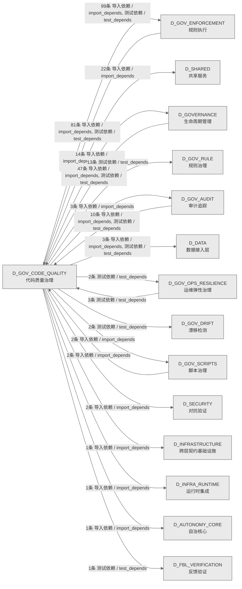

# 19_d_gov_code_quality / 代码质量治理域 / Code Quality Governance

> **功能简介 / Overview**: 代码质量治理，负责代码去重引擎、函数重复检测、AST语义分析和提交门禁引擎

> **文档作用 / Purpose**: 展示 代码质量治理（D_GOV_CODE_QUALITY）功能域的域内依赖关系、跨域依赖关系，模块信息（成熟度/中英文名/大白话/文件路径）内嵌于 Mermaid 节点，供架构审查和域治理参考。

> 本文档由 generate_domain_doc.py 从 depgraph (PostgreSQL) 自动生成
> 数据源: depgraph (PostgreSQL) nodes表 + edges表

> **[可缩放 HTML 版 / Zoomable HTML](http://localhost:8765/docs/02_enterprise_architecture/02_domain_architecture_docs/_zoomable_html/19_d_gov_code_quality.html)** — Ctrl+滚轮缩放 ｜ 双击重置 ｜ Ctrl+Shift+D 切换拖动/选择模式

## 域基本信息 / Domain Overview

| 字段 | 值 | Field | Value |
|------|------|-------|-------|
| 编号 | 19 | Number | 19 |
| 域ID | D_GOV_CODE_QUALITY | Domain ID | D_GOV_CODE_QUALITY |
| 域名称 | 代码质量治理 | Domain Name | Code Quality Governance |
| 层级 | L1 基础平台层 | Layer | L1 Foundation |
| 模块数 | 215 | Module Count | 215 |
| 域内依赖 | 63 | Internal Dependencies | 63 |
| 跨域入边 | 143 | Cross-domain Incoming | 143 |
| 跨域出边 | 166 | Cross-domain Outgoing | 166 |
| 设计态模块 | 0 | Design Modules | 0 |
| 生产态模块 | 215 | Production Modules | 215 |
| 容量 | 215/150 (超容) | Capacity | 215/150 (超容) |
| 描述 | 代码去重引擎(code_dedup) | Description | 代码去重引擎(code_dedup) |

## 域内依赖图 / Internal Dependency Diagram

> 依赖图内嵌在本文档中，IDE 可直接渲染；网页版可 Ctrl+滚轮缩放 + 拖动平移查看细节。
>
> **图例说明 / Legend**：
> - 🟦 **蓝色 = 运营态模块**（production，已上线运行）
> - 🟧 **橙色虚线 = 设计态模块**（design，蓝图阶段，代码未写）
> - **实线箭头 = 运营态依赖**（已生效的依赖关系）
> - **虚线箭头 = 非运营态依赖**（计划中/验证中的依赖关系）

### 全景图（全部模块，颜色区分运营态/设计态）

> 展示全部 215 个模块（生产态 215 + 设计态 0），含跨域依赖外部节点。节点含成熟度+名称+大白话/简介+文件路径。

```mermaid
%%{init: {'theme': 'base', 'themeVariables': {'primaryColor': '#eaeaea', 'primaryTextColor': '#333333', 'primaryBorderColor': '#666666', 'lineColor': '#666666', 'secondaryColor': '#eaeaea', 'tertiaryColor': '#eaeaea', 'fontSize': '14px'}}}%%
flowchart TD
    scripts_governance_d3_metadata_check_pure_assertion_py["检查pureassertion<br/>GOV-DOC-016 纯陈述原则检测真源（SSoT）。<br/>check_pure_assertion<br/>文件: d3_metadata/check_pure_assertion.py<br/>(生产态 / production)"]
    scripts_governance_d7_code_check_module_id_consistency_py["检查模块id一致性<br/>module_id 全仓一致性扫描（--scan-existing<br/>模式）.<br/>check_module_id_consistency<br/>文件: d7_code/check_module_id_consistency.py<br/>(生产态 / production)"]
    scripts_governance_d7_code_check_yaml_anchor_consistency_py["YAML 治理锚定一致性扫描.<br/>check_yaml_anchor_consistency.py — YAML<br/>治理锚定一致性扫描.<br/>Check Yaml Anchor Consistency<br/>文件: d7_code/check_yaml_anchor_consistency.py<br/>(生产态 / production)"]
    src_zephyr_gov_code_quality_init_py["zephyr/gov_code_quality 包入口<br/>gov_code_quality 包入口，聚合本包模块导出<br/>文件: gov_code_quality/__init__.py<br/>(生产态 / production)"]
    src_zephyr_gov_code_quality_code_dedup_init_py["gov_code_quality/code_dedup 包入口<br/>code-dedup-engine 子包 — 重复代码检测与治理引擎.<br/>文件: code_dedup/__init__.py<br/>(生产态 / production)"]
    src_zephyr_gov_code_quality_code_dedup_behavioral_sampler_py["behavioral采样器<br/>行为采样验证器 — Stage 0.25 低成本快速验证.<br/>behavioral_sampler<br/>文件: code_dedup/behavioral_sampler.py<br/>(生产态 / production)"]
    src_zephyr_gov_code_quality_code_dedup_behavioral_trust_checker_py["行为信任检查器 — 行为漂移DIVERGED检测.<br/>行为信任检查器 — 行为漂移DIVERGED检测，code<br/>dedup相关功能（behavioral trust checker）<br/>behavioral_trust_checker<br/>文件: code_dedup/behavioral_trust_checker.py<br/>(生产态 / production)"]
    src_zephyr_gov_code_quality_code_dedup_cache_manager_py["缓存管理器<br/>Stage 0: 函数缓存管理器 — 增量扫描的加速核心.<br/>cache_manager<br/>文件: code_dedup/cache_manager.py<br/>(生产态 / production)"]
    src_zephyr_gov_code_quality_code_dedup_canary_manager_py["金丝雀管理器<br/>金丝雀工厂——生成已知oracle 文件<br/>用于引擎检出+回归测试.<br/>canary_manager<br/>文件: code_dedup/canary_manager.py<br/>(生产态 / production)"]
    src_zephyr_gov_code_quality_code_dedup_canary_register_py["金丝雀注册表维护器 — 注册/过期/腐败检测.<br/>金丝雀函数注册表.<br/>canary_register<br/>文件: code_dedup/canary_register.py<br/>(生产态 / production)"]
    src_zephyr_gov_code_quality_code_dedup_cli_py["code_dedup/cli<br/>code-dedup-engine<br/>CLI——子命令映射+退出码+扫描入口.<br/>文件: code_dedup/cli.py<br/>(生产态 / production)"]
    src_zephyr_gov_code_quality_code_dedup_code_analyzer_runner_py["代码分析器运行器<br/>检查运行器——按照敏感基线运行三阶段+导出 yaml<br/>报告.<br/>code_analyzer_runner<br/>文件: code_dedup/code_analyzer_runner.py<br/>(生产态 / production)"]
    src_zephyr_gov_code_quality_code_dedup_code_simulator_py["代码模拟器<br/>播放录制的克隆演化序列，stress-test AST<br/>/baseline归一化<br/>code_simulator<br/>文件: code_dedup/code_simulator.py<br/>(生产态 / production)"]
    src_zephyr_gov_code_quality_code_dedup_contract_consistency_checker_py["API契约一致性检查器 — 存在性·行为·契约三维.<br/>contract_consistency_checker<br/>文件: code_dedup/contract_consistency_checker.py<br/>(生产态 / production)"]
    src_zephyr_gov_code_quality_code_dedup_cross_boundary_detector_py["跨boundary检测器<br/>跨边界克隆感知——四大边界差异化检测+独立策略+跨边<br/>界保守auto_fix规则.<br/>cross_boundary_detector<br/>文件: code_dedup/cross_boundary_detector.py<br/>(生产态 / production)"]
    src_zephyr_gov_code_quality_code_dedup_dead_module_detector_py["deadmodule检测器<br/>死共享模块检测器 — shared/子模块无人使用 -><br/>DEAD.<br/>dead_module_detector<br/>文件: code_dedup/dead_module_detector.py<br/>(生产态 / production)"]
    src_zephyr_gov_code_quality_code_dedup_debt_projector_py["debt投影器<br/>去重债务预测器 — weeks_to_payoff + intake_rate<br/>vs fix_rate 蒙特卡洛模拟.<br/>debt_projector<br/>文件: code_dedup/debt_projector.py<br/>(生产态 / production)"]
    src_zephyr_gov_code_quality_code_dedup_decision_auditor_py["决策审计器<br/>决策审计链 — DecisionFingerprint 不可变追加日志.<br/>decision_auditor<br/>文件: code_dedup/decision_auditor.py<br/>(生产态 / production)"]
    src_zephyr_gov_code_quality_code_dedup_degradation_py["退化<br/>降级运行管理器 — 各 Stage 独立 try/except +<br/>degradation_level + exit code.<br/>文件: code_dedup/degradation.py<br/>(生产态 / production)"]
    src_zephyr_gov_code_quality_code_dedup_diff_detector_py["差异检测器<br/>Stage 0: Git diff 变更检测器 — 函数粒度增量.<br/>diff_detector<br/>文件: code_dedup/diff_detector.py<br/>(生产态 / production)"]
    src_zephyr_gov_code_quality_code_dedup_doom_loop_guard_py["doom循环守卫<br/>Doom Loop 防护 — 修复升级阶梯 L0-L4 状态机.<br/>doom_loop_guard<br/>文件: code_dedup/doom_loop_guard.py<br/>(生产态 / production)"]
    src_zephyr_gov_code_quality_code_dedup_extraction_safety_py["extraction安全<br/>安全提取适配性评估器 — Suitability Score 0-100<br/>+ 不安全提取模式检测.<br/>extraction_safety<br/>文件: code_dedup/extraction_safety.py<br/>(生产态 / production)"]
    src_zephyr_gov_code_quality_code_dedup_false_negative_auditor_py["falsenegative审计器<br/>- L1 Sweep：增量扫描漏过的去重对（全量 vs 增量<br/>diff）<br/>false_negative_auditor<br/>文件: code_dedup/false_negative_auditor.py<br/>(生产态 / production)"]
    src_zephyr_gov_code_quality_code_dedup_fifteen_dimension_auditor_py["15维超综合审计首页 — 逐项证明'做过且做对'.<br/>- 15维审计刹车：每一项给出 PASS/FAIL/WAIVED +<br/>证据<br/>fifteen_dimension_auditor<br/>文件: code_dedup/fifteen_dimension_auditor.py<br/>(生产态 / production)"]
    src_zephyr_gov_code_quality_code_dedup_file_creator_py["文件创建清单执行器 — 验证所有源/测试<br/>/数据文件存在性.<br/>文件创建清单验证器.<br/>file_creator<br/>文件: code_dedup/file_creator.py<br/>(生产态 / production)"]
    src_zephyr_gov_code_quality_code_dedup_function_discovery_py["共享函数主动发现 — 签名+语义双通道从被动到主动.<br/>主动发现未注册的共享函数.<br/>function_discovery<br/>文件: code_dedup/function_discovery.py<br/>(生产态 / production)"]
    src_zephyr_gov_code_quality_code_dedup_health_monitor_py["健康监控<br/>健康仪表盘 — Dedup Health Score 0-100 + 趋势 +<br/>Session Log 写入.<br/>health_monitor<br/>文件: code_dedup/health_monitor.py<br/>(生产态 / production)"]
    src_zephyr_gov_code_quality_code_dedup_integration_hub_py["集成hub<br/>集成协调器 — 24集成+19更新+16GitHub整合.<br/>integration_hub<br/>文件: code_dedup/integration_hub.py<br/>(生产态 / production)"]
    src_zephyr_gov_code_quality_code_dedup_integrations_py["集成管理——预提交钩子+CI-only 扫描+超时边界.<br/>去重集成管理器，注册预提交钩子与 CI-only<br/>扫描，设置超时边界防卡死。<br/>integrations<br/>文件: code_dedup/integrations.py<br/>(生产态 / production)"]
    src_zephyr_gov_code_quality_code_dedup_micro_clone_detector_py["microclone检测器<br/>微型克隆检测器 — n-gram频率计数,<br/>1-2行高频模式聚合.<br/>micro_clone_detector<br/>文件: code_dedup/micro_clone_detector.py<br/>(生产态 / production)"]
    src_zephyr_gov_code_quality_code_dedup_monoculture_guard_py["monoculture守卫<br/>Monoculture 免疫 — BRS 0-100 + 去重悖论检测.<br/>monoculture_guard<br/>文件: code_dedup/monoculture_guard.py<br/>(生产态 / production)"]
    src_zephyr_gov_code_quality_code_dedup_observation_window_guard_py["提取后稳定观察期守护 — 对标SDP 14天观察.<br/>提取后稳定观察期守护 — 对标SDP 14天观察，code<br/>dedup相关功能（observation window guard）<br/>observation_window_guard<br/>文件: code_dedup/observation_window_guard.py<br/>(生产态 / production)"]
    src_zephyr_gov_code_quality_code_dedup_path_index_validator_py["路径索引校验器<br/>路径索引验证——验证 config<br/>数据集相对路径表与实际文件系统同步.<br/>path_index_validator<br/>文件: code_dedup/path_index_validator.py<br/>(生产态 / production)"]
    src_zephyr_gov_code_quality_code_dedup_phase_executor_py["阶段执行器<br/>6Phase施工执行器 — Phase 0~5 执行状态追踪.<br/>phase_executor<br/>文件: code_dedup/phase_executor.py<br/>(生产态 / production)"]
    src_zephyr_gov_code_quality_code_dedup_prioritizer_py["修复优先级排序器 — 置信度×Impact×适配性<br/>三因子排序.<br/>三因子修复优先级排序.<br/>prioritizer<br/>文件: code_dedup/prioritizer.py<br/>(生产态 / production)"]
    src_zephyr_gov_code_quality_code_dedup_recovery_manifest_writer_py["恢复清单写入器<br/>保障代码质量与合规（recovery manifest writer）<br/>recovery_manifest_writer<br/>文件: code_dedup/recovery_manifest_writer.py<br/>(生产态 / production)"]
    src_zephyr_gov_code_quality_code_dedup_risk_mitigator_py["风险mitigator<br/>R1-R45全量风险缓解执行器 — 逐条检查缓解措施 +<br/>mitigation_tracker.yaml.<br/>risk_mitigator<br/>文件: code_dedup/risk_mitigator.py<br/>(生产态 / production)"]
    src_zephyr_gov_code_quality_code_dedup_self_scanner_py["自扫描器<br/>引擎自扫描器 — Dogfooding 检测引擎自身源码重复.<br/>self_scanner<br/>文件: code_dedup/self_scanner.py<br/>(生产态 / production)"]
    src_zephyr_gov_code_quality_code_dedup_sensitivity_sweeper_py["sensitivity清扫器<br/>敏感性扫荡——threshold扫描->固化成new baseline<br/>（零假阳性+触达率保险）.<br/>sensitivity_sweeper<br/>文件: code_dedup/sensitivity_sweeper.py<br/>(生产态 / production)"]
    src_zephyr_gov_code_quality_code_dedup_shadow_trust_validator_py["影子信任校验器<br/>影子信任验证器 — ImportError 防护回路.<br/>shadow_trust_validator<br/>文件: code_dedup/shadow_trust_validator.py<br/>(生产态 / production)"]
    src_zephyr_gov_code_quality_code_dedup_shadow_verifier_py["影子验证器<br/>影子清单验证器 — size sanity check +<br/>semantic验证 + 覆盖度报告.<br/>shadow_verifier<br/>文件: code_dedup/shadow_verifier.py<br/>(生产态 / production)"]
    src_zephyr_gov_code_quality_code_dedup_shared_evolver_py["共享函数自我进化引擎 — 自动升降级 +<br/>行为漂移锁定.<br/>- shared函数被频繁使用(>50次) -><br/>自动晋升为(*A)autonomous<br/>shared_evolver<br/>文件: code_dedup/shared_evolver.py<br/>(生产态 / production)"]
    src_zephyr_gov_code_quality_code_dedup_shared_lifecycle_manager_py["共享生命周期管理器<br/>共享函数生命周期管理 —<br/>Active->Deprecated->Grace->Sunset->Retired<br/>五阶段状态机.<br/>shared_lifecycle_manager<br/>文件: code_dedup/shared_lifecycle_manager.py<br/>(生产态 / production)"]
    src_zephyr_gov_code_quality_code_dedup_signature_matcher_py["signature匹配器<br/>5: 签名指纹 SHA256(:12) O(1) 精确匹配<br/>signature_matcher<br/>文件: code_dedup/signature_matcher.py<br/>(生产态 / production)"]
    src_zephyr_gov_code_quality_code_dedup_simplicity_auditor_py["引擎成本效益自审计器 — SAS 0-100 月度审计 + Tax<br/>报告.<br/>引擎成本效益自审计器 — SAS 0-100 月度审计 + Tax<br/>报告，code dedup相关功能（simplicity auditor）<br/>simplicity_auditor<br/>文件: code_dedup/simplicity_auditor.py<br/>(生产态 / production)"]
    src_zephyr_gov_code_quality_code_dedup_stale_shared_detector_py["stale共享检测器<br/>过时共享函数检测器 — 无caller × 30天 -><br/>STALE标记.<br/>stale_shared_detector<br/>文件: code_dedup/stale_shared_detector.py<br/>(生产态 / production)"]
    src_zephyr_gov_code_quality_code_dedup_success_validator_py["成功验证——判断一次去重操作是否真正消灭了克隆.<br/>去重成功验证器，对比修复前后克隆计数判断一次去重<br/>操作是否真正消灭了克隆。<br/>success_validator<br/>文件: code_dedup/success_validator.py<br/>(生产态 / production)"]
    src_zephyr_gov_code_quality_code_dedup_symbol_index_py["symbol索引<br/>符号索引 — 全局函数/类/import映射表.<br/>symbol_index<br/>文件: code_dedup/symbol_index.py<br/>(生产态 / production)"]
    src_zephyr_gov_code_quality_code_dedup_thematic_clusterer_py["主题聚类器 — 噪声信号比·告警疲劳缓解.<br/>重复组主题聚类——将50组重复归约到3-5个主题.<br/>thematic_clusterer<br/>文件: code_dedup/thematic_clusterer.py<br/>(生产态 / production)"]
    src_zephyr_gov_code_quality_code_dedup_trackers_init_py["code_dedup/trackers 包入口<br/>tracker 族子包 — 风险/盲点/热点跟踪器集合.<br/>文件: trackers/__init__.py<br/>(生产态 / production)"]
    src_zephyr_gov_code_quality_code_dedup_trackers_consequence_tracker_py["后果追踪——记录每次修复操作对依赖方的影响.<br/>修复后果追踪器，记录每次修复操作对依赖方文件的影<br/>响，支持回滚与汇总。<br/>consequence_tracker<br/>文件: trackers/consequence_tracker.py<br/>(生产态 / production)"]
    src_zephyr_gov_code_quality_code_dedup_trackers_hotspot_tracker_py["热点追踪器 — 90天滑动窗口 + 高频变动检测 +<br/>新项目预热清单.<br/>热点追踪——90天滑动窗口.<br/>hotspot_tracker<br/>文件: trackers/hotspot_tracker.py<br/>(生产态 / production)"]
    src_zephyr_gov_code_quality_code_dedup_trackers_import_surface_tracker_py["importsurface追踪器<br/>Import表面积 (SBS) 负债追踪，保障代码质量与合规<br/>import_surface_tracker<br/>文件: trackers/import_surface_tracker.py<br/>(生产态 / production)"]
    src_zephyr_gov_code_quality_code_dedup_trackers_risk_mitigation_tracker_py["风险缓解追踪——捕获哪些克隆报告了但在N次扫描后仍<br/>未fix.<br/>风险缓解追踪器，捕获报告了但在多次扫描后仍未修复<br/>的克隆，标记为 stale 提醒干预。<br/>risk_mitigation_tracker<br/>文件: trackers/risk_mitigation_tracker.py<br/>(生产态 / production)"]
    src_zephyr_gov_code_quality_code_dedup_verifier_py["验证器<br/>修复验证器 — import + 类型 + 行为采样验证.<br/>verifier<br/>文件: code_dedup/verifier.py<br/>(生产态 / production)"]
    src_zephyr_gov_enforcement_commit_gates_arch_reference_gate_py["archreference门禁<br/>#ARCH-NNN / #ARCH-DOMAIN-NNN<br/>悬空引用自动检测门禁<br/>arch_reference_gate<br/>文件: commit_gates/arch_reference_gate.py<br/>(生产态 / production)"]
    src_zephyr_gov_enforcement_commit_gates_asyncio_run_in_context_gate_py["asynciorunin上下文门禁<br/>异步上下文误用硬阻断门禁<br/>asyncio_run_in_context_gate<br/>文件: commit_gates<br/>/asyncio_run_in_context_gate.py<br/>(生产态 / production)"]
    src_zephyr_gov_enforcement_commit_gates_bare_getenv_gate_py["baregetenv门禁<br/>裸 os.getenv 读密钥阻断门禁<br/>（NO-BARE-GETENV，§5.17.10 治本）<br/>bare_getenv_gate<br/>文件: commit_gates/bare_getenv_gate.py<br/>(生产态 / production)"]
    src_zephyr_gov_enforcement_commit_gates_bare_sql_gate_py["baresql门禁<br/>裸SQL字面量阻断门禁（NO-BARE-SQL，§5.160.2<br/>防复发）<br/>bare_sql_gate<br/>文件: commit_gates/bare_sql_gate.py<br/>(生产态 / production)"]
    src_zephyr_gov_enforcement_commit_gates_bare_subprocess_gate_py["baresubprocess门禁<br/>裸 subprocess 调用硬阻断门禁<br/>bare_subprocess_gate<br/>文件: commit_gates/bare_subprocess_gate.py<br/>(生产态 / production)"]
    src_zephyr_gov_enforcement_commit_gates_blueprint_amodule_consistency_gate_py["蓝图amoduleconsistency门禁<br/>(A_module) 头部 module_id 格式一致性门禁<br/>blueprint_amodule_consistency_gate<br/>文件: commit_gates<br/>/blueprint_amodule_consistency_gate.py<br/>(生产态 / production)"]
    src_zephyr_gov_enforcement_commit_gates_blueprint_amodule_cross_check_gate_py["蓝图amodule跨check门禁<br/>- module_id_consistency_gate（prio=88）：跨文件<br/>(A_*) 唯一性，显式排除<br/>blueprint_amodule_cross_check_gate<br/>文件: commit_gates<br/>/blueprint_amodule_cross_check_gate.py<br/>(生产态 / production)"]
    src_zephyr_gov_enforcement_commit_gates_blueprint_format_gate_py["蓝图format门禁<br/>(BLUEPRINT) 头部 module_id 格式阻断门禁<br/>（BLUEPRINT-FORMAT，裁定#214 Phase 0 防蔓延）<br/>blueprint_format_gate<br/>文件: commit_gates/blueprint_format_gate.py<br/>(生产态 / production)"]
    src_zephyr_gov_enforcement_commit_gates_capability_consistency_gate_py["能力一致性门禁<br/>Provider 路由-meta 一致性门禁<br/>（CAP-CONSISTENCY，裁定 #ARCH-CH-022 Phase 4.4）<br/>capability_consistency_gate<br/>文件: commit_gates<br/>/capability_consistency_gate.py<br/>(生产态 / production)"]
    src_zephyr_gov_enforcement_commit_gates_capability_lookup_required_gate_py["capabilitylookuprequired门禁<br/>检测 commit 含 ``src/zephyr/**/*.py``<br/>业务代码变更时，当前 session 是否调用了<br/>capability_lookup_required_gate<br/>文件: commit_gates<br/>/capability_lookup_required_gate.py<br/>(生产态 / production)"]
    src_zephyr_gov_enforcement_commit_gates_capability_overlap_gate_py["capabilityoverlap门禁<br/>新建 .py 文件 CapabilityLookup 提示门禁<br/>（warn-only，2026-06-30 治本）<br/>capability_overlap_gate<br/>文件: commit_gates/capability_overlap_gate.py<br/>(生产态 / production)"]
    src_zephyr_gov_enforcement_commit_gates_ch_batch_size_gate_py["ch批次大小门禁<br/>CH 批量写入防回退门禁（CH-BATCH-SIZE，§18.4<br/>防复发）<br/>ch_batch_size_gate<br/>文件: commit_gates/ch_batch_size_gate.py<br/>(生产态 / production)"]
    src_zephyr_gov_enforcement_commit_gates_ch_final_gate_py["ch最终门禁<br/>query() 直接调用阻断门禁（CH-FINAL-GATE，裁定<br/>#ARCH-CH-007 B5）<br/>ch_final_gate<br/>文件: commit_gates/ch_final_gate.py<br/>(生产态 / production)"]
    src_zephyr_gov_enforcement_commit_gates_ch_version_col_gate_py["ch版本col门禁<br/>CH version 列语义误用阻断门禁<br/>（CH-VERSION-COL，裁定 #ARCH-CH-009）<br/>ch_version_col_gate<br/>文件: commit_gates/ch_version_col_gate.py<br/>(生产态 / production)"]
    src_zephyr_gov_enforcement_commit_gates_claim_required_gate_py["claimrequired门禁<br/>claim_files 前置检查门禁<br/>（CLAIM-REQUIRED，2026-06-30 治本）<br/>claim_required_gate<br/>文件: commit_gates/claim_required_gate.py<br/>(生产态 / production)"]
    src_zephyr_gov_enforcement_commit_gates_consumers_accuracy_gate_py["consumersaccuracy门禁<br/>CONSUMERS 字段准确性 warn-only 门禁<br/>（CONSUMERS-ACCURACY，提交前合规门禁检查<br/>consumers_accuracy_gate<br/>文件: commit_gates/consumers_accuracy_gate.py<br/>(生产态 / production)"]
    src_zephyr_gov_enforcement_commit_gates_create_guard_py["创建守卫<br/>新建 .py / 非 rules/ .yaml 文件 creation_token<br/>阻断门禁（CREATE-GUARD，2026-06-30 治本）<br/>create_guard<br/>文件: commit_gates/create_guard.py<br/>(生产态 / production)"]
    src_zephyr_gov_enforcement_commit_gates_dangling_reference_gate_py["danglingreference门禁<br/>md §X.Y 悬空引用自动检测门禁<br/>dangling_reference_gate<br/>文件: commit_gates/dangling_reference_gate.py<br/>(生产态 / production)"]
    src_zephyr_gov_enforcement_commit_gates_data_task_completeness_gate_py["数据taskcompleteness门禁<br/>数据任务完整性门禁（warn 级，提醒型）<br/>data_task_completeness_gate<br/>文件: commit_gates<br/>/data_task_completeness_gate.py<br/>(生产态 / production)"]
    src_zephyr_gov_enforcement_commit_gates_datetime_now_forbidden_gate_py["datetimenowforbidden门禁<br/>时间戳约定硬阻断门禁<br/>datetime_now_forbidden_gate<br/>文件: commit_gates<br/>/datetime_now_forbidden_gate.py<br/>(生产态 / production)"]
    src_zephyr_gov_enforcement_commit_gates_depgraph_freshness_gate_py["depgraphfreshness门禁<br/>治本目标（fail-silent 三要素之「可阻断」补强）：<br/>depgraph_freshness_gate<br/>文件: commit_gates/depgraph_freshness_gate.py<br/>(生产态 / production)"]
    src_zephyr_gov_enforcement_commit_gates_depgraph_pre_registration_gate_py["depgraph planned→production 流转强制门禁<br/>depgraph_pre_registration_gate.py — depgraph<br/>planned→production 流转强制门...<br/>Depgraph Pre Registration Gate<br/>文件: commit_gates<br/>/depgraph_pre_registration_gate.py<br/>(生产态 / production)"]
    src_zephyr_gov_enforcement_commit_gates_depgraph_write_path_gate_py["depgraphwritepath门禁<br/>depgraph 写入路径白名单门禁<br/>depgraph_write_path_gate<br/>文件: commit_gates/depgraph_write_path_gate.py<br/>(生产态 / production)"]
    src_zephyr_gov_enforcement_commit_gates_derivation_annotation_gate_py["derivationannotation门禁<br/>派生关系声明真实性校验门禁<br/>derivation_annotation_gate<br/>文件: commit_gates/derivation_annotation_gate.py<br/>(生产态 / production)"]
    src_zephyr_gov_enforcement_commit_gates_derived_file_deletion_gate_py["派生文件删除保护门禁<br/>derived_file_deletion_gate.py —<br/>派生文件删除保护门禁（DERIVED-FILE-DELETION-...<br/>Derived File Deletion Gate<br/>文件: commit_gates/derived_file_deletion_gate.py<br/>(生产态 / production)"]
    src_zephyr_gov_enforcement_commit_gates_directory_contract_gate_py["directorycontract门禁<br/>DCR-001~007 等效校验门禁（治本：弥补<br/>--no-verify 绕过 pre-commit 的缺口）<br/>directory_contract_gate<br/>文件: commit_gates/directory_contract_gate.py<br/>(生产态 / production)"]
    src_zephyr_gov_enforcement_commit_gates_domain_fk_gate_py["域fk门禁<br/>(DOMAIN) 头部域注册表 FK 校验门禁<br/>domain_fk_gate<br/>文件: commit_gates/domain_fk_gate.py<br/>(生产态 / production)"]
    src_zephyr_gov_enforcement_commit_gates_domain_name_zh_direct_access_gate_py["domainnamezhdirect访问门禁<br/>DOMAIN_NAME_ZH 字典直接访问硬阻断门禁<br/>domain_name_zh_direct_access_gate<br/>文件: commit_gates<br/>/domain_name_zh_direct_access_gate.py<br/>(生产态 / production)"]
    src_zephyr_gov_enforcement_commit_gates_empty_handler_gate_py["empty处理器门禁<br/>空事件 handler 函数阻断门禁<br/>empty_handler_gate<br/>文件: commit_gates/empty_handler_gate.py<br/>(生产态 / production)"]
    src_zephyr_gov_enforcement_commit_gates_encoding_gate_py["encoding门禁<br/>编码安全校验门禁（治本：弥补 --no-verify 绕过<br/>pre-commit GATE-ENCODING 的缺口）<br/>encoding_gate<br/>文件: commit_gates/encoding_gate.py<br/>(生产态 / production)"]
    src_zephyr_gov_enforcement_commit_gates_exempt_zone_frontmatter_gate_py["exemptzonefrontmatter门禁<br/>豁免区 frontmatter 门禁，从 post-commit 升级为<br/>pre-commit 硬阻断带 doc_type 的豁免区文件。<br/>exempt_zone_frontmatter_gate<br/>文件: commit_gates<br/>/exempt_zone_frontmatter_gate.py<br/>(生产态 / production)"]
    src_zephyr_gov_enforcement_commit_gates_file_copy_gate_py["filecopy门禁<br/>新增 .py 文件复制检测阻断门禁<br/>（FILE-COPY，2026-07-03 Phase 1 sub-task 3）<br/>file_copy_gate<br/>文件: commit_gates/file_copy_gate.py<br/>(生产态 / production)"]
    src_zephyr_gov_enforcement_commit_gates_file_placement_ttl_gate_py["fileplacementttl门禁<br/>文件放置与 TTL 一致性门禁（治本<br/>#ARCH-049：防止临时文件乱放根目录）<br/>file_placement_ttl_gate<br/>文件: commit_gates/file_placement_ttl_gate.py<br/>(生产态 / production)"]
    src_zephyr_gov_enforcement_commit_gates_folder_capacity_hard_limit_gate_py["folder容量hardlimit门禁<br/>文件夹容量硬上限门禁<br/>folder_capacity_hard_limit_gate<br/>文件: commit_gates<br/>/folder_capacity_hard_limit_gate.py<br/>(生产态 / production)"]
    src_zephyr_gov_enforcement_commit_gates_foreign_change_gate_py["foreignchange门禁<br/>外来变更检测门禁<br/>（FOREIGN-CHANGE-DETECTION，ARCH-054 治本）<br/>foreign_change_gate<br/>文件: commit_gates/foreign_change_gate.py<br/>(生产态 / production)"]
    src_zephyr_gov_enforcement_commit_gates_forged_gw_marker_gate_py["forgedgwmarker门禁<br/>Forged GW Marker 前置检测门禁<br/>（FORGED-GW-MARKER， Phase 2，提交前合规门禁检查<br/>forged_gw_marker_gate<br/>文件: commit_gates/forged_gw_marker_gate.py<br/>(生产态 / production)"]
    src_zephyr_gov_enforcement_commit_gates_function_dup_gate_py["函数dup门禁<br/>重复函数实现阻断门禁<br/>function_dup_gate<br/>文件: commit_gates/function_dup_gate.py<br/>(生产态 / production)"]
    src_zephyr_gov_enforcement_commit_gates_gate_repo_py["门禁repo<br/>gates 表持久化仓库（AUDIT-07 P1-5: 从<br/>gate_engine.py 提取）<br/>gate_repo<br/>文件: commit_gates/gate_repo.py<br/>(生产态 / production)"]
    src_zephyr_gov_enforcement_commit_gates_git_call_budget_gate_py["Gitcall预算门禁<br/>检测 staged .py 文件中 ``subprocess.run(('git',<br/>...))`` 在 for/while 循环内直接调用<br/>git_call_budget_gate<br/>文件: commit_gates/git_call_budget_gate.py<br/>(生产态 / production)"]
    src_zephyr_gov_enforcement_commit_gates_god_class_gate_py["god类门禁<br/>检测 staged .py 文件中**新增**类的方法数 > 20。<br/>god_class_gate<br/>文件: commit_gates/god_class_gate.py<br/>(生产态 / production)"]
    src_zephyr_gov_enforcement_commit_gates_hardcoded_url_gate_py["hardcodedurl门禁<br/>硬编码 localhost URL 阻断门禁<br/>（NO-HARDCODED-URL，§5.160.9 防复发）<br/>hardcoded_url_gate<br/>文件: commit_gates/hardcoded_url_gate.py<br/>(生产态 / production)"]
    src_zephyr_gov_enforcement_commit_gates_held_overlap_gate_py["heldoverlap门禁<br/>搭便车防护门禁（HELD-OVERLAP，2026-06-30 治本）<br/>held_overlap_gate<br/>文件: commit_gates/held_overlap_gate.py<br/>(生产态 / production)"]
    src_zephyr_gov_enforcement_commit_gates_high_complexity_gate_py["highcomplexity门禁<br/>高循环复杂度阻断门禁<br/>（NO-HIGH-COMPLEXITY，§5.158 防复发）<br/>high_complexity_gate<br/>文件: commit_gates/high_complexity_gate.py<br/>(生产态 / production)"]
    src_zephyr_gov_enforcement_commit_gates_id_uniqueness_gate_py["iduniqueness门禁<br/>ID 唯一性门禁，从 post-commit 升级为 pre-commit<br/>硬阻断重复 module_id。<br/>id_uniqueness_gate<br/>文件: commit_gates/id_uniqueness_gate.py<br/>(生产态 / production)"]
    src_zephyr_gov_enforcement_commit_gates_import_direction_gate_py["importdirection门禁<br/>shared 层向上依赖阻断门禁<br/>（NO-UPWARD-IMPORT，§5.152 防复发）<br/>import_direction_gate<br/>文件: commit_gates/import_direction_gate.py<br/>(生产态 / production)"]
    src_zephyr_gov_enforcement_commit_gates_import_integrity_gate_py["导入完整性门禁<br/>提交前合规门禁检查<br/>import_integrity_gate<br/>文件: commit_gates/import_integrity_gate.py<br/>(生产态 / production)"]
    src_zephyr_gov_enforcement_commit_gates_issue_resolved_integrity_gate_py["issueresolved完整性门禁<br/>'Resolved but incomplete' 系统性风险——AI<br/>倾向于在主体工作完成后立即标记<br/>issue_resolved_integrity_gate<br/>文件: commit_gates<br/>/issue_resolved_integrity_gate.py<br/>(生产态 / production)"]
    src_zephyr_gov_enforcement_commit_gates_long_param_list_gate_py["longparamlist门禁<br/>长参数列表阻断门禁（NO-LONG-PARAM-LIST，§5.150<br/>防复发）<br/>long_param_list_gate<br/>文件: commit_gates/long_param_list_gate.py<br/>(生产态 / production)"]
    src_zephyr_gov_enforcement_commit_gates_manual_only_permanent_gate_py["手册onlypermanent门禁<br/>永久系统脚本 manual 触发无事件订阅阻断门禁<br/>（MANUAL-ONLY-PERMANENT，#ARCH-GOV-CONVERGENCE-M<br/>ETA Phase 3.6 补齐<br/>manual_only_permanent_gate<br/>文件: commit_gates/manual_only_permanent_gate.py<br/>(生产态 / production)"]
    src_zephyr_gov_enforcement_commit_gates_mcp_version_field_gate_py["MCP版本字段门禁<br/>MCP version 字段缺失硬阻断门禁<br/>mcp_version_field_gate<br/>文件: commit_gates/mcp_version_field_gate.py<br/>(生产态 / production)"]
    src_zephyr_gov_enforcement_commit_gates_module_id_consistency_gate_py["模块id一致性门禁<br/>module_id 三声明轨道一致性 + count 派生 +<br/>跨文件唯一性门禁（Phase 3 reconciler->gate<br/>收敛）<br/>module_id_consistency_gate<br/>文件: commit_gates/module_id_consistency_gate.py<br/>(生产态 / production)"]
    src_zephyr_gov_enforcement_commit_gates_msg_exposure_gate_py["msg敞口门禁<br/>错误消息暴露敏感信息阻断门禁<br/>msg_exposure_gate<br/>文件: commit_gates/msg_exposure_gate.py<br/>(生产态 / production)"]
    src_zephyr_gov_enforcement_commit_gates_msg_style_gate_py["msgstyle门禁<br/>错误消息标点/箭头风格阻断门禁<br/>msg_style_gate<br/>文件: commit_gates/msg_style_gate.py<br/>(生产态 / production)"]
    src_zephyr_gov_enforcement_commit_gates_mutable_const_without_final_gate_py["mutableconstwithoutfinal门禁<br/>可变常量缺 Final 标注硬阻断门禁<br/>mutable_const_without_final_gate<br/>文件: commit_gates<br/>/mutable_const_without_final_gate.py<br/>(生产态 / production)"]
    src_zephyr_gov_enforcement_commit_gates_new_file_depgraph_gate_py["新文件依赖图门禁<br/>新建 .py 文件 depgraph 未登记硬阻断门禁<br/>new_file_depgraph_gate<br/>文件: commit_gates/new_file_depgraph_gate.py<br/>(生产态 / production)"]
    src_zephyr_gov_enforcement_commit_gates_no_import_side_effect_gate_py["noimportsideeffect门禁<br/>模块导入零副作用门禁<br/>no_import_side_effect_gate<br/>文件: commit_gates/no_import_side_effect_gate.py<br/>(生产态 / production)"]
    src_zephyr_gov_enforcement_commit_gates_noqa_validation_gate_py["noqa验证门禁<br/>自定义 lint 豁免标记合规性门禁，在 commit<br/>阶段拦截未登记或无理由的自定义豁免标记防止滥用，<br/>标准 ruff/flake8<br/>错误码放行，合法标记从豁免注册表动态加载。<br/>noqa_validation_gate<br/>文件: commit_gates/noqa_validation_gate.py<br/>(生产态 / production)"]
    src_zephyr_gov_enforcement_commit_gates_open_without_with_gate_py["openwithoutwith门禁<br/>() 未在 with 内硬阻断门禁<br/>open_without_with_gate<br/>文件: commit_gates/open_without_with_gate.py<br/>(生产态 / production)"]
    src_zephyr_gov_enforcement_commit_gates_orphan_module_gate_py["孤儿module门禁<br/>孤儿模块（无 import 引用）阻断门禁<br/>orphan_module_gate<br/>文件: commit_gates/orphan_module_gate.py<br/>(生产态 / production)"]
    src_zephyr_gov_enforcement_commit_gates_panorama_alignment_gate_py["panorama对齐门禁<br/>三图模块对齐门禁（四图模块对齐 Step 4，ARCH-056<br/>升级）<br/>panorama_alignment_gate<br/>文件: commit_gates/panorama_alignment_gate.py<br/>(生产态 / production)"]
    src_zephyr_gov_enforcement_commit_gates_precommit_offline_gate_py["precommitoffline门禁<br/>pre-commit 配置离线可运行检测门禁<br/>precommit_offline_gate<br/>文件: commit_gates/precommit_offline_gate.py<br/>(生产态 / production)"]
    src_zephyr_gov_enforcement_commit_gates_protected_paths_gate_py["受保护路径写入检测门禁<br/>protected_paths_gate.py —<br/>受保护路径写入检测门禁（PROTECTED-PATHS，...<br/>Protected Paths Gate<br/>文件: commit_gates/protected_paths_gate.py<br/>(生产态 / production)"]
    src_zephyr_gov_enforcement_commit_gates_pure_assertion_gate_py["pureassertion门禁<br/>纯陈述原则阻断门禁（PURE-ASSERTION，GOV-DOC-016<br/>治本）<br/>pure_assertion_gate<br/>文件: commit_gates/pure_assertion_gate.py<br/>(生产态 / production)"]
    src_zephyr_gov_enforcement_commit_gates_pure_shim_gate_py["pureshim门禁<br/>（GATE-SSOT-CODE 三合一之一），``git commit<br/>--no-verify`` 绕过所有 pre-commit hooks。<br/>pure_shim_gate<br/>文件: commit_gates/pure_shim_gate.py<br/>(生产态 / production)"]
    src_zephyr_gov_enforcement_commit_gates_r5_digit_suffix_gate_py["r5digitsuffix门禁<br/>R5 数字后缀目录禁止<br/>r5_digit_suffix_gate<br/>文件: commit_gates/r5_digit_suffix_gate.py<br/>(生产态 / production)"]
    src_zephyr_gov_enforcement_commit_gates_reconciler_health_gate_py["reconciler 健康度门禁<br/>reconciler_health_gate.py — reconciler<br/>健康度门禁（#ARCH-DATAQUALITY-V1.7）<br/>Reconciler Health Gate<br/>文件: commit_gates/reconciler_health_gate.py<br/>(生产态 / production)"]
    src_zephyr_gov_enforcement_commit_gates_relative_path_literal_gate_py["相对路径字面量硬阻断门禁<br/>relative_path_literal_gate.py —<br/>相对路径字面量硬阻断门禁（RELATIVE-PATH-LITE...<br/>Relative Path Literal Gate<br/>文件: commit_gates/relative_path_literal_gate.py<br/>(生产态 / production)"]
    src_zephyr_gov_enforcement_commit_gates_rename_depgraph_sync_gate_py["文件重命名后 depgraph 未同步阻断门禁<br/>rename_depgraph_sync_gate.py — 文件重命名后<br/>depgraph 未同步阻断门禁（RENAME-...<br/>Rename Depgraph Sync Gate<br/>文件: commit_gates/rename_depgraph_sync_gate.py<br/>(生产态 / production)"]
    src_zephyr_gov_enforcement_commit_gates_rule_execution_pairing_gate_py["规则-执行配对门禁<br/>rule_execution_pairing_gate.py —<br/>规则-执行配对门禁（RULE-EXECUTION-PAIRING，...<br/>Rule Execution Pairing Gate<br/>文件: commit_gates<br/>/rule_execution_pairing_gate.py<br/>(生产态 / production)"]
    src_zephyr_gov_enforcement_commit_gates_rule_four_way_alignment_gate_py["规则四方对齐门禁<br/>rule_four_way_alignment_gate.py —<br/>规则四方对齐门禁（RULE-FOUR-WAY-ALIGN）<br/>Rule Four Way Alignment Gate<br/>文件: commit_gates<br/>/rule_four_way_alignment_gate.py<br/>(生产态 / production)"]
    src_zephyr_gov_enforcement_commit_gates_ruling_commit_verified_gate_py["文档'已完成'声明 commit hash 真实性硬验证门禁<br/>ruling_commit_verified_gate.py —<br/>文档'已完成'声明 commit hash 真实性硬验证门...<br/>Ruling Commit Verified Gate<br/>文件: commit_gates<br/>/ruling_commit_verified_gate.py<br/>(生产态 / production)"]
    src_zephyr_gov_enforcement_commit_gates_ruling_reference_gate_py["裁定#NNN 悬空引用自动检测门禁<br/>ruling_reference_gate.py — 裁定#NNN<br/>悬空引用自动检测门禁（RULING-REFERENCE）<br/>Ruling Reference Gate<br/>文件: commit_gates/ruling_reference_gate.py<br/>(生产态 / production)"]
    src_zephyr_gov_enforcement_commit_gates_schema_file_exists_gate_py["SCHEMA-FILE-EXISTS block 门禁<br/>schema_file_exists_gate.py — SCHEMA-FILE-EXISTS<br/>block 门禁<br/>Schema File Exists Gate<br/>文件: commit_gates/schema_file_exists_gate.py<br/>(生产态 / production)"]
    src_zephyr_gov_enforcement_commit_gates_scripts_import_integrity_gate_py["_shared.constants 符号导入完整性门禁<br/>scripts_import_integrity_gate.py —<br/>_shared.constants 符号导入完整性门禁<br/>Scripts Import Integrity Gate<br/>文件: commit_gates<br/>/scripts_import_integrity_gate.py<br/>(生产态 / production)"]
    src_zephyr_gov_enforcement_commit_gates_session_required_gate_py["session 注册强制门禁<br/>session_required_gate.py — session<br/>注册强制门禁（SESSION-REQUIRED，2026-07-0...<br/>Session Required Gate<br/>文件: commit_gates/session_required_gate.py<br/>(生产态 / production)"]
    src_zephyr_gov_enforcement_commit_gates_snapshot_drift_gate_py["运行时违规快照漂移阻断门禁<br/>snapshot_drift_gate.py —<br/>运行时违规快照漂移阻断门禁（SNAPSHOT-DRIFT，...<br/>Snapshot Drift Gate<br/>文件: commit_gates/snapshot_drift_gate.py<br/>(生产态 / production)"]
    src_zephyr_gov_enforcement_commit_gates_ssot_redefinition_gate_py["SSoT 符号重复定义硬阻断门禁<br/>ssot_redefinition_gate.py — SSoT<br/>符号重复定义硬阻断门禁<br/>Ssot Redefinition Gate<br/>文件: commit_gates/ssot_redefinition_gate.py<br/>(生产态 / production)"]
    src_zephyr_gov_enforcement_commit_gates_table_name_registry_gate_py["TABLE-NAME-REGISTRY block 门禁<br/>table_name_registry_gate.py —<br/>TABLE-NAME-REGISTRY block 门禁<br/>Table Name Registry Gate<br/>文件: commit_gates/table_name_registry_gate.py<br/>(生产态 / production)"]
    src_zephyr_gov_enforcement_commit_gates_test_source_consistency_gate_py["测试-源码符号一致性门禁<br/>test_source_consistency_gate.py —<br/>测试-源码符号一致性门禁（TEST-SOURCE-CONSI...<br/>Test Source Consistency Gate<br/>文件: commit_gates<br/>/test_source_consistency_gate.py<br/>(生产态 / production)"]
    src_zephyr_gov_enforcement_commit_gates_tests_coverage_gate_py["Gate 测试覆盖率校验 meta-gate<br/>tests_coverage_gate.py — Gate 测试覆盖率校验<br/>meta-gate（META-TESTS-COVERAGE...<br/>Tests Coverage Gate<br/>文件: commit_gates/tests_coverage_gate.py<br/>(生产态 / production)"]
    src_zephyr_gov_enforcement_commit_gates_translation_coverage_gate_py["新建 .py 文件大白话简介覆盖率门禁<br/>translation_coverage_gate.py — 新建 .py<br/>文件大白话简介覆盖率门禁（TRANSLATIO...<br/>Translation Coverage Gate<br/>文件: commit_gates/translation_coverage_gate.py<br/>(生产态 / production)"]
    src_zephyr_gov_enforcement_commit_gates_ttl_gate_py["ttl 字段校验门禁<br/>ttl_gate.py — ttl 字段校验门禁（治本：弥补<br/>--no-verify 绕过 pre-commit GATE-...<br/>Ttl Gate<br/>文件: commit_gates/ttl_gate.py<br/>(生产态 / production)"]
    src_zephyr_gov_enforcement_commit_gates_undefined_name_gate_py["UNDEFINED-NAME 门禁<br/>undefined_name_gate.py — UNDEFINED-NAME 门禁<br/>（F821 未定义符号硬阻断）<br/>Undefined Name Gate<br/>文件: commit_gates/undefined_name_gate.py<br/>(生产态 / production)"]
    src_zephyr_gov_enforcement_commit_gates_unsafe_dict_spread_gate_py["``**data`` 直接展开模式 warn 级门禁<br/>unsafe_dict_spread_gate.py — ``**data``<br/>直接展开模式 warn 级门禁<br/>Unsafe Dict Spread Gate<br/>文件: commit_gates/unsafe_dict_spread_gate.py<br/>(生产态 / production)"]
    src_zephyr_gov_enforcement_commit_gates_vocab_chain_gate_py["SSoT 引用硬编码阻断门禁<br/>vocab_chain_gate.py — SSoT 引用硬编码阻断门禁<br/>（VOCAB-CHAIN，...<br/>Vocab Chain Gate<br/>文件: commit_gates/vocab_chain_gate.py<br/>(生产态 / production)"]
    src_zephyr_gov_enforcement_commit_gates_vocab_hardcode_gate_py["新增 .py 文件词表硬编码阻断门禁<br/>vocab_hardcode_gate.py — 新增 .py<br/>文件词表硬编码阻断门禁（VOCAB-HARDCODE，20...<br/>Vocab Hardcode Gate<br/>文件: commit_gates/vocab_hardcode_gate.py<br/>(生产态 / production)"]
    src_zephyr_gov_enforcement_commit_gates_worktree_required_gate_py["worktree 隔离强制门禁<br/>worktree_required_gate.py — worktree<br/>隔离强制门禁（WORKTREE-REQUIRED，...<br/>Worktree Required Gate<br/>文件: commit_gates/worktree_required_gate.py<br/>(生产态 / production)"]
    src_zephyr_gov_enforcement_commit_gates_zephyr_env_direct_access_gate_py["ZEPHYR_ENV 直访硬阻断门禁<br/>zephyr_env_direct_access_gate.py — ZEPHYR_ENV<br/>直访硬阻断门禁（ZEPHYR-ENV-DIR...<br/>Zephyr Env Direct Access Gate<br/>文件: commit_gates<br/>/zephyr_env_direct_access_gate.py<br/>(生产态 / production)"]
    src_zephyr_gov_enforcement_rule_bridge_gate_auto_registrar_py["YAML 驱动的 in-process gate 自动注册器<br/>gate_auto_registrar.py — YAML 驱动的 in-process<br/>gate 自动注册器（...<br/>Gate Auto Registrar<br/>文件: rule_bridge/gate_auto_registrar.py<br/>(生产态 / production)"]
    tests_data_test_symbol_normalizer_py["TRAE-082 symbol 标准化模块测试<br/>test_symbol_normalizer.py — TRAE-082 symbol<br/>标准化模块测试。<br/>Test Symbol Normalizer<br/>文件: data/test_symbol_normalizer.py<br/>(生产态 / production)"]
    tests_governance_code_dedup_test_atomic_fixer_py["Test Atomic Fixer<br/>code dedup包的test_atomic_fixer模块<br/>文件: code_dedup/test_atomic_fixer.py<br/>(生产态 / production)"]
    tests_governance_code_dedup_test_grandfather_manager_py["Test Grandfather Manager<br/>code dedup包的test_grandfather_manager模块<br/>文件: code_dedup/test_grandfather_manager.py<br/>(生产态 / production)"]
    tests_governance_code_dedup_test_policy_tree_validator_py["Test Policy Tree Validator<br/>code dedup包的test_policy_tree_validator模块<br/>文件: code_dedup/test_policy_tree_validator.py<br/>(生产态 / production)"]
    tests_governance_code_dedup_test_pre_apply_integrity_gate_py["Test Pre Apply Integrity Gate<br/>code dedup包的test_pre_apply_integrity_gate模块<br/>文件: code_dedup<br/>/test_pre_apply_integrity_gate.py<br/>(生产态 / production)"]
    tests_governance_code_dedup_test_ssot_registrar_py["Test Ssot Registrar<br/>code dedup包的test_ssot_registrar模块<br/>文件: code_dedup/test_ssot_registrar.py<br/>(生产态 / production)"]
    tests_governance_commit_gates_test_blueprint_node_id_hardcode_gate_py["BLUEPRINT-NODE-ID-HARDCODE 门禁单测<br/>test_blueprint_node_id_hardcode_gate.py —<br/>BLUEPRINT-NODE-ID-HARDCODE 门禁单测<br/>Test Blueprint Node Id Hardcode Gate<br/>文件: commit_gates<br/>/test_blueprint_node_id_hardcode_gate.py<br/>(生产态 / production)"]
    tests_governance_commit_gates_test_check_yaml_anchor_consistency_py["YAML 治理锚定一致性扫描 smoke test.<br/>test_check_yaml_anchor_consistency.py — YAML<br/>治理锚定一致性扫描 smoke test.<br/>Test Check Yaml Anchor Consistency<br/>文件: commit_gates<br/>/test_check_yaml_anchor_consistency.py<br/>(生产态 / production)"]
    tests_governance_commit_gates_test_test_residue_ssot_gate_py["TEST-RESIDUE-SSOT 门禁单测<br/>test_test_residue_ssot_gate.py —<br/>TEST-RESIDUE-SSOT 门禁单测<br/>Test Test Residue Ssot Gate<br/>文件: commit_gates<br/>/test_test_residue_ssot_gate.py<br/>(生产态 / production)"]
    tests_governance_governance_misc_test_annotations_py["Test Annotations<br/>governance misc包的test_annotations模块<br/>文件: governance_misc/test_annotations.py<br/>(生产态 / production)"]
    tests_governance_governance_misc_test_atomic_transaction_manager_unit_py["Test Atomic Transaction Manager Unit<br/>单元测试：src/zephyr/db<br/>/atomic_transaction_manager.py（T-2-30）<br/>文件: governance_misc<br/>/test_atomic_transaction_manager_unit.py<br/>(生产态 / production)"]
    tests_governance_governance_misc_test_bare_repo_scanner_py["Test Bare Repo Scanner<br/>governance misc包的test_bare_repo_scanner模块<br/>文件: governance_misc/test_bare_repo_scanner.py<br/>(生产态 / production)"]
    tests_governance_governance_misc_test_governance_result_types_py["Test Governance Result Types<br/>governance<br/>misc包的test_governance_result_types模块<br/>文件: governance_misc<br/>/test_governance_result_types.py<br/>(生产态 / production)"]
    tests_governance_governance_misc_test_mock_duplicate_generator_py["Test Mock Duplicate Generator<br/>governance<br/>misc包的test_mock_duplicate_generator模块<br/>文件: governance_misc<br/>/test_mock_duplicate_generator.py<br/>(生产态 / production)"]
    tests_governance_governance_misc_test_question_tracker_py["Test Question Tracker<br/>governance misc包的test_question_tracker模块<br/>文件: governance_misc/test_question_tracker.py<br/>(生产态 / production)"]
    tests_governance_rule_enforcement_gate_engine_test_adversarial_gate_integration_py["Test Adversarial Gate Integration<br/>gate engine包的test_adversarial_gate_integration<br/>模块<br/>文件: gate_engine<br/>/test_adversarial_gate_integration.py<br/>(生产态 / production)"]
    tests_governance_rule_enforcement_gate_engine_test_adversarial_validation_py["Test Adversarial Validation<br/>gate engine包的test_adversarial_validation模块<br/>文件: gate_engine/test_adversarial_validation.py<br/>(生产态 / production)"]
    tests_governance_rule_enforcement_gate_engine_test_adversarial_validation_gate_py["Test Adversarial Validation Gate<br/>gate engine包的test_adversarial_validation_gate<br/>模块<br/>文件: gate_engine<br/>/test_adversarial_validation_gate.py<br/>(生产态 / production)"]
    tests_governance_rule_enforcement_invariants_test_en_001_circular_dependency_py["Test En 001 Circular Dependency<br/>invariants包的test_en_001_circular_dependency模<br/>块<br/>文件: invariants<br/>/test_en_001_circular_dependency.py<br/>(生产态 / production)"]
    tests_governance_rule_enforcement_invariants_test_en_002_enforcement_validator_py["Test En 002 Enforcement Validator<br/>invariants包的test_en_002_enforcement_validator<br/>模块<br/>文件: invariants<br/>/test_en_002_enforcement_validator.py<br/>(生产态 / production)"]
    tests_governance_rule_enforcement_invariants_test_en_003_contract_compatibility_py["Test En 003 Contract Compatibility<br/>invariants包的test_en_003_contract_compatibility<br/>模块<br/>文件: invariants<br/>/test_en_003_contract_compatibility.py<br/>(生产态 / production)"]
    tests_governance_rule_enforcement_invariants_test_en_process_lifecycle_gateway_py["Test En Process Lifecycle Gateway<br/>invariants包的test_en_process_lifecycle_gateway<br/>模块<br/>文件: invariants<br/>/test_en_process_lifecycle_gateway.py<br/>(生产态 / production)"]
    tests_governance_rule_enforcement_invariants_test_post_doc_review_py["在 tmp_path 初始化 git 仓库并返回初始 commit<br/>hash<br/>invariants包的test_post_doc_review模块<br/>Test Post Doc Review<br/>文件: invariants/test_post_doc_review.py<br/>(生产态 / production)"]
    tests_governance_rule_enforcement_invariants_test_zero_residue_check_py["Test Zero Residue Check<br/>invariants包的test_zero_residue_check模块<br/>文件: invariants/test_zero_residue_check.py<br/>(生产态 / production)"]
    tests_governance_rule_enforcement_test_adaptive_threshold_py["Test Adaptive Threshold<br/>rule enforcement包的test_adaptive_threshold模块<br/>文件: rule_enforcement<br/>/test_adaptive_threshold.py<br/>(生产态 / production)"]
    tests_governance_rule_enforcement_test_adversarial_strategies_py["Test Adversarial Strategies<br/>rule enforcement包的test_adversarial_strategies<br/>模块<br/>文件: rule_enforcement<br/>/test_adversarial_strategies.py<br/>(生产态 / production)"]
    tests_governance_rule_enforcement_test_breaking_change_detector_py["Test Breaking Change Detector<br/>rule enforcement包的test_breaking_change_detecto<br/>r模块<br/>文件: rule_enforcement<br/>/test_breaking_change_detector.py<br/>(生产态 / production)"]
    tests_governance_rule_enforcement_test_integration_test_runner_py["Test Integration Test Runner<br/>rule enforcement包的test_integration_test_runner<br/>模块<br/>文件: rule_enforcement<br/>/test_integration_test_runner.py<br/>(生产态 / production)"]
    tests_governance_rule_enforcement_test_kiss_enforcer_py["Test Kiss Enforcer<br/>rule enforcement包的test_kiss_enforcer模块<br/>文件: rule_enforcement/test_kiss_enforcer.py<br/>(生产态 / production)"]
    tests_governance_rule_enforcement_test_output_quality_gate_py["Test Output Quality Gate<br/>rule enforcement包的test_output_quality_gate模块<br/>文件: rule_enforcement<br/>/test_output_quality_gate.py<br/>(生产态 / production)"]
    tests_governance_rule_enforcement_test_secrets_guard_py["Test Secrets Guard<br/>rule enforcement包的test_secrets_guard模块<br/>文件: rule_enforcement/test_secrets_guard.py<br/>(生产态 / production)"]
    tests_governance_rule_enforcement_test_triple_alignment_py["Test Triple Alignment<br/>rule enforcement包的test_triple_alignment模块<br/>文件: rule_enforcement/test_triple_alignment.py<br/>(生产态 / production)"]
    tests_governance_test_apply_dataflowgraph_smoke_py["apply_dataflowgraph.py end-to-end smoke test<br/>test_apply_dataflowgraph_smoke.py —<br/>apply_dataflowgraph.py end-to-end smoke test<br/>Test Apply Dataflowgraph Smoke<br/>文件: governance<br/>/test_apply_dataflowgraph_smoke.py<br/>(生产态 / production)"]
    tests_governance_test_apply_decisiongraph_smoke_py["apply_decisiongraph.py end-to-end smoke test<br/>test_apply_decisiongraph_smoke.py —<br/>apply_decisiongraph.py end-to-end smoke test<br/>Test Apply Decisiongraph Smoke<br/>文件: governance<br/>/test_apply_decisiongraph_smoke.py<br/>(生产态 / production)"]
    tests_governance_test_apply_depgraph_smoke_py["apply_depgraph.py end-to-end smoke test<br/>test_apply_depgraph_smoke.py —<br/>apply_depgraph.py end-to-end smoke test<br/>Test Apply Depgraph Smoke<br/>文件: governance/test_apply_depgraph_smoke.py<br/>(生产态 / production)"]
    tests_governance_test_audit_return_contract_usage_py["返回契约 ok 键审计脚本单元测试<br/>test_audit_return_contract_usage.py — 返回契约<br/>ok 键审计脚本单元测试<br/>Test Audit Return Contract Usage<br/>文件: governance<br/>/test_audit_return_contract_usage.py<br/>(生产态 / production)"]
    tests_governance_test_audit_worktree_ops_telemetry_py["worktree_ops_log 遥测完整性审计测试<br/>test_audit_worktree_ops_telemetry.py —<br/>worktree_ops_log 遥测完整性审计测试<br/>Test Audit Worktree Ops Telemetry<br/>文件: governance<br/>/test_audit_worktree_ops_telemetry.py<br/>(生产态 / production)"]
    tests_governance_test_battle_map_execution_flow_py["执行阶段 6 环节数据流转闭环验证<br/>test_battle_map_execution_flow.py — 执行阶段 6<br/>环节数据流转闭环验证<br/>Test Battle Map Execution Flow<br/>文件: governance<br/>/test_battle_map_execution_flow.py<br/>(生产态 / production)"]
    tests_governance_test_battle_map_research_incubation_py["研究孵化阶段 25 环节逻辑全覆盖验证<br/>test_battle_map_research_incubation.py —<br/>研究孵化阶段 25 环节逻辑全覆盖验证<br/>Test Battle Map Research Incubation<br/>文件: governance<br/>/test_battle_map_research_incubation.py<br/>(生产态 / production)"]
    tests_governance_test_battle_map_simulation_validation_py["仿真验证阶段 7 环节逻辑全覆盖验证<br/>test_battle_map_simulation_validation.py —<br/>仿真验证阶段 7 环节逻辑全覆盖验证<br/>Test Battle Map Simulation Validation<br/>文件: governance<br/>/test_battle_map_simulation_validation.py<br/>(生产态 / production)"]
    tests_governance_test_generate_project_depgraph_smoke_py["generate_project_depgraph.py e2e smoke test<br/>test_generate_project_depgraph_smoke.py —<br/>generate_project_depgraph.py e2e s...<br/>Test Generate Project Depgraph Smoke<br/>文件: governance<br/>/test_generate_project_depgraph_smoke.py<br/>(生产态 / production)"]
    tests_governance_test_post_commit_guard_no_verify_threshold_py["高基数 --no-verify 阈值阻断 e2e 测试<br/>test_post_commit_guard_no_verify_threshold.py —<br/>高基数 --no-verify 阈值阻断 ...<br/>文件: governance<br/>/test_post_commit_guard_no_verify_threshold.py<br/>(生产态 / production)"]
    tests_governance_test_post_commit_oscillation_guard_py["post_commit_regen_yaml.py 防振荡强化机制测试<br/>test_post_commit_oscillation_guard.py —<br/>post_commit_regen_yaml.py 防振荡强化...<br/>Test Post Commit Oscillation Guard<br/>文件: governance<br/>/test_post_commit_oscillation_guard.py<br/>(生产态 / production)"]
    tests_governance_test_reconcile_generators_py["reconcile_generators.py e2e smoke test<br/>test_reconcile_generators.py —<br/>reconcile_generators.py e2e smoke test<br/>Test Reconcile Generators<br/>文件: governance/test_reconcile_generators.py<br/>(生产态 / production)"]
    tests_governance_test_run_silent_failure_regression_py["silent-failure 回归 runner 单元测试<br/>test_run_silent_failure_regression.py —<br/>silent-failure 回归 runner 单元测试...<br/>Test Run Silent Failure Regression<br/>文件: governance<br/>/test_run_silent_failure_regression.py<br/>(生产态 / production)"]
    tests_governance_test_session_startup_health_check_py["AI session 启动健康度自检单元测试<br/>test_session_startup_health_check.py — AI<br/>session 启动健康度自检单元测试<br/>Test Session Startup Health Check<br/>文件: governance<br/>/test_session_startup_health_check.py<br/>(生产态 / production)"]
    tests_governance_test_sync_yaml_to_depgraph_smoke_py["sync_yaml_to_depgraph.py e2e smoke test<br/>test_sync_yaml_to_depgraph_smoke.py —<br/>sync_yaml_to_depgraph.py e2e smoke test<br/>Test Sync Yaml To Depgraph Smoke<br/>文件: governance<br/>/test_sync_yaml_to_depgraph_smoke.py<br/>(生产态 / production)"]
    scripts_governance_d3_metadata_check_pure_assertion_py ~~~ scripts_governance_d7_code_check_module_id_consistency_py
    scripts_governance_d7_code_check_module_id_consistency_py ~~~ scripts_governance_d7_code_check_yaml_anchor_consistency_py
    scripts_governance_d7_code_check_yaml_anchor_consistency_py ~~~ src_zephyr_gov_code_quality_init_py
    src_zephyr_gov_code_quality_init_py ~~~ src_zephyr_gov_code_quality_code_dedup_init_py
    src_zephyr_gov_code_quality_code_dedup_init_py ~~~ src_zephyr_gov_code_quality_code_dedup_behavioral_sampler_py
    src_zephyr_gov_code_quality_code_dedup_behavioral_sampler_py ~~~ src_zephyr_gov_code_quality_code_dedup_behavioral_trust_checker_py
    src_zephyr_gov_code_quality_code_dedup_behavioral_trust_checker_py ~~~ src_zephyr_gov_code_quality_code_dedup_cache_manager_py
    src_zephyr_gov_code_quality_code_dedup_cache_manager_py ~~~ src_zephyr_gov_code_quality_code_dedup_canary_manager_py
    src_zephyr_gov_code_quality_code_dedup_canary_manager_py ~~~ src_zephyr_gov_code_quality_code_dedup_canary_register_py
    src_zephyr_gov_code_quality_code_dedup_canary_register_py ~~~ src_zephyr_gov_code_quality_code_dedup_cli_py
    src_zephyr_gov_code_quality_code_dedup_cli_py ~~~ src_zephyr_gov_code_quality_code_dedup_code_analyzer_runner_py
    src_zephyr_gov_code_quality_code_dedup_code_analyzer_runner_py ~~~ src_zephyr_gov_code_quality_code_dedup_code_simulator_py
    src_zephyr_gov_code_quality_code_dedup_code_simulator_py ~~~ src_zephyr_gov_code_quality_code_dedup_contract_consistency_checker_py
    src_zephyr_gov_code_quality_code_dedup_contract_consistency_checker_py ~~~ src_zephyr_gov_code_quality_code_dedup_cross_boundary_detector_py
    src_zephyr_gov_code_quality_code_dedup_cross_boundary_detector_py ~~~ src_zephyr_gov_code_quality_code_dedup_dead_module_detector_py
    src_zephyr_gov_code_quality_code_dedup_dead_module_detector_py ~~~ src_zephyr_gov_code_quality_code_dedup_debt_projector_py
    src_zephyr_gov_code_quality_code_dedup_debt_projector_py ~~~ src_zephyr_gov_code_quality_code_dedup_decision_auditor_py
    src_zephyr_gov_code_quality_code_dedup_decision_auditor_py ~~~ src_zephyr_gov_code_quality_code_dedup_degradation_py
    src_zephyr_gov_code_quality_code_dedup_degradation_py ~~~ src_zephyr_gov_code_quality_code_dedup_diff_detector_py
    src_zephyr_gov_code_quality_code_dedup_diff_detector_py ~~~ src_zephyr_gov_code_quality_code_dedup_doom_loop_guard_py
    src_zephyr_gov_code_quality_code_dedup_doom_loop_guard_py ~~~ src_zephyr_gov_code_quality_code_dedup_extraction_safety_py
    src_zephyr_gov_code_quality_code_dedup_extraction_safety_py ~~~ src_zephyr_gov_code_quality_code_dedup_false_negative_auditor_py
    src_zephyr_gov_code_quality_code_dedup_false_negative_auditor_py ~~~ src_zephyr_gov_code_quality_code_dedup_fifteen_dimension_auditor_py
    src_zephyr_gov_code_quality_code_dedup_fifteen_dimension_auditor_py ~~~ src_zephyr_gov_code_quality_code_dedup_file_creator_py
    src_zephyr_gov_code_quality_code_dedup_file_creator_py ~~~ src_zephyr_gov_code_quality_code_dedup_function_discovery_py
    src_zephyr_gov_code_quality_code_dedup_function_discovery_py ~~~ src_zephyr_gov_code_quality_code_dedup_health_monitor_py
    src_zephyr_gov_code_quality_code_dedup_health_monitor_py ~~~ src_zephyr_gov_code_quality_code_dedup_integration_hub_py
    src_zephyr_gov_code_quality_code_dedup_integration_hub_py ~~~ src_zephyr_gov_code_quality_code_dedup_integrations_py
    src_zephyr_gov_code_quality_code_dedup_integrations_py ~~~ src_zephyr_gov_code_quality_code_dedup_micro_clone_detector_py
    src_zephyr_gov_code_quality_code_dedup_micro_clone_detector_py ~~~ src_zephyr_gov_code_quality_code_dedup_monoculture_guard_py
    src_zephyr_gov_code_quality_code_dedup_monoculture_guard_py ~~~ src_zephyr_gov_code_quality_code_dedup_observation_window_guard_py
    src_zephyr_gov_code_quality_code_dedup_observation_window_guard_py ~~~ src_zephyr_gov_code_quality_code_dedup_path_index_validator_py
    src_zephyr_gov_code_quality_code_dedup_path_index_validator_py ~~~ src_zephyr_gov_code_quality_code_dedup_phase_executor_py
    src_zephyr_gov_code_quality_code_dedup_phase_executor_py ~~~ src_zephyr_gov_code_quality_code_dedup_prioritizer_py
    src_zephyr_gov_code_quality_code_dedup_prioritizer_py ~~~ src_zephyr_gov_code_quality_code_dedup_recovery_manifest_writer_py
    src_zephyr_gov_code_quality_code_dedup_recovery_manifest_writer_py ~~~ src_zephyr_gov_code_quality_code_dedup_risk_mitigator_py
    src_zephyr_gov_code_quality_code_dedup_risk_mitigator_py ~~~ src_zephyr_gov_code_quality_code_dedup_self_scanner_py
    src_zephyr_gov_code_quality_code_dedup_self_scanner_py ~~~ src_zephyr_gov_code_quality_code_dedup_sensitivity_sweeper_py
    src_zephyr_gov_code_quality_code_dedup_sensitivity_sweeper_py ~~~ src_zephyr_gov_code_quality_code_dedup_shadow_trust_validator_py
    src_zephyr_gov_code_quality_code_dedup_shadow_trust_validator_py ~~~ src_zephyr_gov_code_quality_code_dedup_shadow_verifier_py
    src_zephyr_gov_code_quality_code_dedup_shadow_verifier_py ~~~ src_zephyr_gov_code_quality_code_dedup_shared_evolver_py
    src_zephyr_gov_code_quality_code_dedup_shared_evolver_py ~~~ src_zephyr_gov_code_quality_code_dedup_shared_lifecycle_manager_py
    src_zephyr_gov_code_quality_code_dedup_shared_lifecycle_manager_py ~~~ src_zephyr_gov_code_quality_code_dedup_signature_matcher_py
    src_zephyr_gov_code_quality_code_dedup_signature_matcher_py ~~~ src_zephyr_gov_code_quality_code_dedup_simplicity_auditor_py
    src_zephyr_gov_code_quality_code_dedup_simplicity_auditor_py ~~~ src_zephyr_gov_code_quality_code_dedup_stale_shared_detector_py
    src_zephyr_gov_code_quality_code_dedup_stale_shared_detector_py ~~~ src_zephyr_gov_code_quality_code_dedup_success_validator_py
    src_zephyr_gov_code_quality_code_dedup_success_validator_py ~~~ src_zephyr_gov_code_quality_code_dedup_symbol_index_py
    src_zephyr_gov_code_quality_code_dedup_symbol_index_py ~~~ src_zephyr_gov_code_quality_code_dedup_thematic_clusterer_py
    src_zephyr_gov_code_quality_code_dedup_thematic_clusterer_py ~~~ src_zephyr_gov_code_quality_code_dedup_trackers_init_py
    src_zephyr_gov_code_quality_code_dedup_trackers_init_py ~~~ src_zephyr_gov_code_quality_code_dedup_trackers_consequence_tracker_py
    src_zephyr_gov_code_quality_code_dedup_trackers_consequence_tracker_py ~~~ src_zephyr_gov_code_quality_code_dedup_trackers_hotspot_tracker_py
    src_zephyr_gov_code_quality_code_dedup_trackers_hotspot_tracker_py ~~~ src_zephyr_gov_code_quality_code_dedup_trackers_import_surface_tracker_py
    src_zephyr_gov_code_quality_code_dedup_trackers_import_surface_tracker_py ~~~ src_zephyr_gov_code_quality_code_dedup_trackers_risk_mitigation_tracker_py
    src_zephyr_gov_code_quality_code_dedup_trackers_risk_mitigation_tracker_py ~~~ src_zephyr_gov_code_quality_code_dedup_verifier_py
    src_zephyr_gov_code_quality_code_dedup_verifier_py ~~~ src_zephyr_gov_enforcement_commit_gates_arch_reference_gate_py
    src_zephyr_gov_enforcement_commit_gates_arch_reference_gate_py ~~~ src_zephyr_gov_enforcement_commit_gates_asyncio_run_in_context_gate_py
    src_zephyr_gov_enforcement_commit_gates_asyncio_run_in_context_gate_py ~~~ src_zephyr_gov_enforcement_commit_gates_bare_getenv_gate_py
    src_zephyr_gov_enforcement_commit_gates_bare_getenv_gate_py ~~~ src_zephyr_gov_enforcement_commit_gates_bare_sql_gate_py
    src_zephyr_gov_enforcement_commit_gates_bare_sql_gate_py ~~~ src_zephyr_gov_enforcement_commit_gates_bare_subprocess_gate_py
    src_zephyr_gov_enforcement_commit_gates_bare_subprocess_gate_py ~~~ src_zephyr_gov_enforcement_commit_gates_blueprint_amodule_consistency_gate_py
    src_zephyr_gov_enforcement_commit_gates_blueprint_amodule_consistency_gate_py ~~~ src_zephyr_gov_enforcement_commit_gates_blueprint_amodule_cross_check_gate_py
    src_zephyr_gov_enforcement_commit_gates_blueprint_amodule_cross_check_gate_py ~~~ src_zephyr_gov_enforcement_commit_gates_blueprint_format_gate_py
    src_zephyr_gov_enforcement_commit_gates_blueprint_format_gate_py ~~~ src_zephyr_gov_enforcement_commit_gates_capability_consistency_gate_py
    src_zephyr_gov_enforcement_commit_gates_capability_consistency_gate_py ~~~ src_zephyr_gov_enforcement_commit_gates_capability_lookup_required_gate_py
    src_zephyr_gov_enforcement_commit_gates_capability_lookup_required_gate_py ~~~ src_zephyr_gov_enforcement_commit_gates_capability_overlap_gate_py
    src_zephyr_gov_enforcement_commit_gates_capability_overlap_gate_py ~~~ src_zephyr_gov_enforcement_commit_gates_ch_batch_size_gate_py
    src_zephyr_gov_enforcement_commit_gates_ch_batch_size_gate_py ~~~ src_zephyr_gov_enforcement_commit_gates_ch_final_gate_py
    src_zephyr_gov_enforcement_commit_gates_ch_final_gate_py ~~~ src_zephyr_gov_enforcement_commit_gates_ch_version_col_gate_py
    src_zephyr_gov_enforcement_commit_gates_ch_version_col_gate_py ~~~ src_zephyr_gov_enforcement_commit_gates_claim_required_gate_py
    src_zephyr_gov_enforcement_commit_gates_claim_required_gate_py ~~~ src_zephyr_gov_enforcement_commit_gates_consumers_accuracy_gate_py
    src_zephyr_gov_enforcement_commit_gates_consumers_accuracy_gate_py ~~~ src_zephyr_gov_enforcement_commit_gates_create_guard_py
    src_zephyr_gov_enforcement_commit_gates_create_guard_py ~~~ src_zephyr_gov_enforcement_commit_gates_dangling_reference_gate_py
    src_zephyr_gov_enforcement_commit_gates_dangling_reference_gate_py ~~~ src_zephyr_gov_enforcement_commit_gates_data_task_completeness_gate_py
    src_zephyr_gov_enforcement_commit_gates_data_task_completeness_gate_py ~~~ src_zephyr_gov_enforcement_commit_gates_datetime_now_forbidden_gate_py
    src_zephyr_gov_enforcement_commit_gates_datetime_now_forbidden_gate_py ~~~ src_zephyr_gov_enforcement_commit_gates_depgraph_freshness_gate_py
    src_zephyr_gov_enforcement_commit_gates_depgraph_freshness_gate_py ~~~ src_zephyr_gov_enforcement_commit_gates_depgraph_pre_registration_gate_py
    src_zephyr_gov_enforcement_commit_gates_depgraph_pre_registration_gate_py ~~~ src_zephyr_gov_enforcement_commit_gates_depgraph_write_path_gate_py
    src_zephyr_gov_enforcement_commit_gates_depgraph_write_path_gate_py ~~~ src_zephyr_gov_enforcement_commit_gates_derivation_annotation_gate_py
    src_zephyr_gov_enforcement_commit_gates_derivation_annotation_gate_py ~~~ src_zephyr_gov_enforcement_commit_gates_derived_file_deletion_gate_py
    src_zephyr_gov_enforcement_commit_gates_derived_file_deletion_gate_py ~~~ src_zephyr_gov_enforcement_commit_gates_directory_contract_gate_py
    src_zephyr_gov_enforcement_commit_gates_directory_contract_gate_py ~~~ src_zephyr_gov_enforcement_commit_gates_domain_fk_gate_py
    src_zephyr_gov_enforcement_commit_gates_domain_fk_gate_py ~~~ src_zephyr_gov_enforcement_commit_gates_domain_name_zh_direct_access_gate_py
    src_zephyr_gov_enforcement_commit_gates_domain_name_zh_direct_access_gate_py ~~~ src_zephyr_gov_enforcement_commit_gates_empty_handler_gate_py
    src_zephyr_gov_enforcement_commit_gates_empty_handler_gate_py ~~~ src_zephyr_gov_enforcement_commit_gates_encoding_gate_py
    src_zephyr_gov_enforcement_commit_gates_encoding_gate_py ~~~ src_zephyr_gov_enforcement_commit_gates_exempt_zone_frontmatter_gate_py
    src_zephyr_gov_enforcement_commit_gates_exempt_zone_frontmatter_gate_py ~~~ src_zephyr_gov_enforcement_commit_gates_file_copy_gate_py
    src_zephyr_gov_enforcement_commit_gates_file_copy_gate_py ~~~ src_zephyr_gov_enforcement_commit_gates_file_placement_ttl_gate_py
    src_zephyr_gov_enforcement_commit_gates_file_placement_ttl_gate_py ~~~ src_zephyr_gov_enforcement_commit_gates_folder_capacity_hard_limit_gate_py
    src_zephyr_gov_enforcement_commit_gates_folder_capacity_hard_limit_gate_py ~~~ src_zephyr_gov_enforcement_commit_gates_foreign_change_gate_py
    src_zephyr_gov_enforcement_commit_gates_foreign_change_gate_py ~~~ src_zephyr_gov_enforcement_commit_gates_forged_gw_marker_gate_py
    src_zephyr_gov_enforcement_commit_gates_forged_gw_marker_gate_py ~~~ src_zephyr_gov_enforcement_commit_gates_function_dup_gate_py
    src_zephyr_gov_enforcement_commit_gates_function_dup_gate_py ~~~ src_zephyr_gov_enforcement_commit_gates_gate_repo_py
    src_zephyr_gov_enforcement_commit_gates_gate_repo_py ~~~ src_zephyr_gov_enforcement_commit_gates_git_call_budget_gate_py
    src_zephyr_gov_enforcement_commit_gates_git_call_budget_gate_py ~~~ src_zephyr_gov_enforcement_commit_gates_god_class_gate_py
    src_zephyr_gov_enforcement_commit_gates_god_class_gate_py ~~~ src_zephyr_gov_enforcement_commit_gates_hardcoded_url_gate_py
    src_zephyr_gov_enforcement_commit_gates_hardcoded_url_gate_py ~~~ src_zephyr_gov_enforcement_commit_gates_held_overlap_gate_py
    src_zephyr_gov_enforcement_commit_gates_held_overlap_gate_py ~~~ src_zephyr_gov_enforcement_commit_gates_high_complexity_gate_py
    src_zephyr_gov_enforcement_commit_gates_high_complexity_gate_py ~~~ src_zephyr_gov_enforcement_commit_gates_id_uniqueness_gate_py
    src_zephyr_gov_enforcement_commit_gates_id_uniqueness_gate_py ~~~ src_zephyr_gov_enforcement_commit_gates_import_direction_gate_py
    src_zephyr_gov_enforcement_commit_gates_import_direction_gate_py ~~~ src_zephyr_gov_enforcement_commit_gates_import_integrity_gate_py
    src_zephyr_gov_enforcement_commit_gates_import_integrity_gate_py ~~~ src_zephyr_gov_enforcement_commit_gates_issue_resolved_integrity_gate_py
    src_zephyr_gov_enforcement_commit_gates_issue_resolved_integrity_gate_py ~~~ src_zephyr_gov_enforcement_commit_gates_long_param_list_gate_py
    src_zephyr_gov_enforcement_commit_gates_long_param_list_gate_py ~~~ src_zephyr_gov_enforcement_commit_gates_manual_only_permanent_gate_py
    src_zephyr_gov_enforcement_commit_gates_manual_only_permanent_gate_py ~~~ src_zephyr_gov_enforcement_commit_gates_mcp_version_field_gate_py
    src_zephyr_gov_enforcement_commit_gates_mcp_version_field_gate_py ~~~ src_zephyr_gov_enforcement_commit_gates_module_id_consistency_gate_py
    src_zephyr_gov_enforcement_commit_gates_module_id_consistency_gate_py ~~~ src_zephyr_gov_enforcement_commit_gates_msg_exposure_gate_py
    src_zephyr_gov_enforcement_commit_gates_msg_exposure_gate_py ~~~ src_zephyr_gov_enforcement_commit_gates_msg_style_gate_py
    src_zephyr_gov_enforcement_commit_gates_msg_style_gate_py ~~~ src_zephyr_gov_enforcement_commit_gates_mutable_const_without_final_gate_py
    src_zephyr_gov_enforcement_commit_gates_mutable_const_without_final_gate_py ~~~ src_zephyr_gov_enforcement_commit_gates_new_file_depgraph_gate_py
    src_zephyr_gov_enforcement_commit_gates_new_file_depgraph_gate_py ~~~ src_zephyr_gov_enforcement_commit_gates_no_import_side_effect_gate_py
    src_zephyr_gov_enforcement_commit_gates_no_import_side_effect_gate_py ~~~ src_zephyr_gov_enforcement_commit_gates_noqa_validation_gate_py
    src_zephyr_gov_enforcement_commit_gates_noqa_validation_gate_py ~~~ src_zephyr_gov_enforcement_commit_gates_open_without_with_gate_py
    src_zephyr_gov_enforcement_commit_gates_open_without_with_gate_py ~~~ src_zephyr_gov_enforcement_commit_gates_orphan_module_gate_py
    src_zephyr_gov_enforcement_commit_gates_orphan_module_gate_py ~~~ src_zephyr_gov_enforcement_commit_gates_panorama_alignment_gate_py
    src_zephyr_gov_enforcement_commit_gates_panorama_alignment_gate_py ~~~ src_zephyr_gov_enforcement_commit_gates_precommit_offline_gate_py
    src_zephyr_gov_enforcement_commit_gates_precommit_offline_gate_py ~~~ src_zephyr_gov_enforcement_commit_gates_protected_paths_gate_py
    src_zephyr_gov_enforcement_commit_gates_protected_paths_gate_py ~~~ src_zephyr_gov_enforcement_commit_gates_pure_assertion_gate_py
    src_zephyr_gov_enforcement_commit_gates_pure_assertion_gate_py ~~~ src_zephyr_gov_enforcement_commit_gates_pure_shim_gate_py
    src_zephyr_gov_enforcement_commit_gates_pure_shim_gate_py ~~~ src_zephyr_gov_enforcement_commit_gates_r5_digit_suffix_gate_py
    src_zephyr_gov_enforcement_commit_gates_r5_digit_suffix_gate_py ~~~ src_zephyr_gov_enforcement_commit_gates_reconciler_health_gate_py
    src_zephyr_gov_enforcement_commit_gates_reconciler_health_gate_py ~~~ src_zephyr_gov_enforcement_commit_gates_relative_path_literal_gate_py
    src_zephyr_gov_enforcement_commit_gates_relative_path_literal_gate_py ~~~ src_zephyr_gov_enforcement_commit_gates_rename_depgraph_sync_gate_py
    src_zephyr_gov_enforcement_commit_gates_rename_depgraph_sync_gate_py ~~~ src_zephyr_gov_enforcement_commit_gates_rule_execution_pairing_gate_py
    src_zephyr_gov_enforcement_commit_gates_rule_execution_pairing_gate_py ~~~ src_zephyr_gov_enforcement_commit_gates_rule_four_way_alignment_gate_py
    src_zephyr_gov_enforcement_commit_gates_rule_four_way_alignment_gate_py ~~~ src_zephyr_gov_enforcement_commit_gates_ruling_commit_verified_gate_py
    src_zephyr_gov_enforcement_commit_gates_ruling_commit_verified_gate_py ~~~ src_zephyr_gov_enforcement_commit_gates_ruling_reference_gate_py
    src_zephyr_gov_enforcement_commit_gates_ruling_reference_gate_py ~~~ src_zephyr_gov_enforcement_commit_gates_schema_file_exists_gate_py
    src_zephyr_gov_enforcement_commit_gates_schema_file_exists_gate_py ~~~ src_zephyr_gov_enforcement_commit_gates_scripts_import_integrity_gate_py
    src_zephyr_gov_enforcement_commit_gates_scripts_import_integrity_gate_py ~~~ src_zephyr_gov_enforcement_commit_gates_session_required_gate_py
    src_zephyr_gov_enforcement_commit_gates_session_required_gate_py ~~~ src_zephyr_gov_enforcement_commit_gates_snapshot_drift_gate_py
    src_zephyr_gov_enforcement_commit_gates_snapshot_drift_gate_py ~~~ src_zephyr_gov_enforcement_commit_gates_ssot_redefinition_gate_py
    src_zephyr_gov_enforcement_commit_gates_ssot_redefinition_gate_py ~~~ src_zephyr_gov_enforcement_commit_gates_table_name_registry_gate_py
    src_zephyr_gov_enforcement_commit_gates_table_name_registry_gate_py ~~~ src_zephyr_gov_enforcement_commit_gates_test_source_consistency_gate_py
    src_zephyr_gov_enforcement_commit_gates_test_source_consistency_gate_py ~~~ src_zephyr_gov_enforcement_commit_gates_tests_coverage_gate_py
    src_zephyr_gov_enforcement_commit_gates_tests_coverage_gate_py ~~~ src_zephyr_gov_enforcement_commit_gates_translation_coverage_gate_py
    src_zephyr_gov_enforcement_commit_gates_translation_coverage_gate_py ~~~ src_zephyr_gov_enforcement_commit_gates_ttl_gate_py
    src_zephyr_gov_enforcement_commit_gates_ttl_gate_py ~~~ src_zephyr_gov_enforcement_commit_gates_undefined_name_gate_py
    src_zephyr_gov_enforcement_commit_gates_undefined_name_gate_py ~~~ src_zephyr_gov_enforcement_commit_gates_unsafe_dict_spread_gate_py
    src_zephyr_gov_enforcement_commit_gates_unsafe_dict_spread_gate_py ~~~ src_zephyr_gov_enforcement_commit_gates_vocab_chain_gate_py
    src_zephyr_gov_enforcement_commit_gates_vocab_chain_gate_py ~~~ src_zephyr_gov_enforcement_commit_gates_vocab_hardcode_gate_py
    src_zephyr_gov_enforcement_commit_gates_vocab_hardcode_gate_py ~~~ src_zephyr_gov_enforcement_commit_gates_worktree_required_gate_py
    src_zephyr_gov_enforcement_commit_gates_worktree_required_gate_py ~~~ src_zephyr_gov_enforcement_commit_gates_zephyr_env_direct_access_gate_py
    src_zephyr_gov_enforcement_commit_gates_zephyr_env_direct_access_gate_py ~~~ src_zephyr_gov_enforcement_rule_bridge_gate_auto_registrar_py
    src_zephyr_gov_enforcement_rule_bridge_gate_auto_registrar_py ~~~ tests_data_test_symbol_normalizer_py
    tests_data_test_symbol_normalizer_py ~~~ tests_governance_code_dedup_test_atomic_fixer_py
    tests_governance_code_dedup_test_atomic_fixer_py ~~~ tests_governance_code_dedup_test_grandfather_manager_py
    tests_governance_code_dedup_test_grandfather_manager_py ~~~ tests_governance_code_dedup_test_policy_tree_validator_py
    tests_governance_code_dedup_test_policy_tree_validator_py ~~~ tests_governance_code_dedup_test_pre_apply_integrity_gate_py
    tests_governance_code_dedup_test_pre_apply_integrity_gate_py ~~~ tests_governance_code_dedup_test_ssot_registrar_py
    tests_governance_code_dedup_test_ssot_registrar_py ~~~ tests_governance_commit_gates_test_blueprint_node_id_hardcode_gate_py
    tests_governance_commit_gates_test_blueprint_node_id_hardcode_gate_py ~~~ tests_governance_commit_gates_test_check_yaml_anchor_consistency_py
    tests_governance_commit_gates_test_check_yaml_anchor_consistency_py ~~~ tests_governance_commit_gates_test_test_residue_ssot_gate_py
    tests_governance_commit_gates_test_test_residue_ssot_gate_py ~~~ tests_governance_governance_misc_test_annotations_py
    tests_governance_governance_misc_test_annotations_py ~~~ tests_governance_governance_misc_test_atomic_transaction_manager_unit_py
    tests_governance_governance_misc_test_atomic_transaction_manager_unit_py ~~~ tests_governance_governance_misc_test_bare_repo_scanner_py
    tests_governance_governance_misc_test_bare_repo_scanner_py ~~~ tests_governance_governance_misc_test_governance_result_types_py
    tests_governance_governance_misc_test_governance_result_types_py ~~~ tests_governance_governance_misc_test_mock_duplicate_generator_py
    tests_governance_governance_misc_test_mock_duplicate_generator_py ~~~ tests_governance_governance_misc_test_question_tracker_py
    tests_governance_governance_misc_test_question_tracker_py ~~~ tests_governance_rule_enforcement_gate_engine_test_adversarial_gate_integration_py
    tests_governance_rule_enforcement_gate_engine_test_adversarial_gate_integration_py ~~~ tests_governance_rule_enforcement_gate_engine_test_adversarial_validation_py
    tests_governance_rule_enforcement_gate_engine_test_adversarial_validation_py ~~~ tests_governance_rule_enforcement_gate_engine_test_adversarial_validation_gate_py
    tests_governance_rule_enforcement_gate_engine_test_adversarial_validation_gate_py ~~~ tests_governance_rule_enforcement_invariants_test_en_001_circular_dependency_py
    tests_governance_rule_enforcement_invariants_test_en_001_circular_dependency_py ~~~ tests_governance_rule_enforcement_invariants_test_en_002_enforcement_validator_py
    tests_governance_rule_enforcement_invariants_test_en_002_enforcement_validator_py ~~~ tests_governance_rule_enforcement_invariants_test_en_003_contract_compatibility_py
    tests_governance_rule_enforcement_invariants_test_en_003_contract_compatibility_py ~~~ tests_governance_rule_enforcement_invariants_test_en_process_lifecycle_gateway_py
    tests_governance_rule_enforcement_invariants_test_en_process_lifecycle_gateway_py ~~~ tests_governance_rule_enforcement_invariants_test_post_doc_review_py
    tests_governance_rule_enforcement_invariants_test_post_doc_review_py ~~~ tests_governance_rule_enforcement_invariants_test_zero_residue_check_py
    tests_governance_rule_enforcement_invariants_test_zero_residue_check_py ~~~ tests_governance_rule_enforcement_test_adaptive_threshold_py
    tests_governance_rule_enforcement_test_adaptive_threshold_py ~~~ tests_governance_rule_enforcement_test_adversarial_strategies_py
    tests_governance_rule_enforcement_test_adversarial_strategies_py ~~~ tests_governance_rule_enforcement_test_breaking_change_detector_py
    tests_governance_rule_enforcement_test_breaking_change_detector_py ~~~ tests_governance_rule_enforcement_test_integration_test_runner_py
    tests_governance_rule_enforcement_test_integration_test_runner_py ~~~ tests_governance_rule_enforcement_test_kiss_enforcer_py
    tests_governance_rule_enforcement_test_kiss_enforcer_py ~~~ tests_governance_rule_enforcement_test_output_quality_gate_py
    tests_governance_rule_enforcement_test_output_quality_gate_py ~~~ tests_governance_rule_enforcement_test_secrets_guard_py
    tests_governance_rule_enforcement_test_secrets_guard_py ~~~ tests_governance_rule_enforcement_test_triple_alignment_py
    tests_governance_rule_enforcement_test_triple_alignment_py ~~~ tests_governance_test_apply_dataflowgraph_smoke_py
    tests_governance_test_apply_dataflowgraph_smoke_py ~~~ tests_governance_test_apply_decisiongraph_smoke_py
    tests_governance_test_apply_decisiongraph_smoke_py ~~~ tests_governance_test_apply_depgraph_smoke_py
    tests_governance_test_apply_depgraph_smoke_py ~~~ tests_governance_test_audit_return_contract_usage_py
    tests_governance_test_audit_return_contract_usage_py ~~~ tests_governance_test_audit_worktree_ops_telemetry_py
    tests_governance_test_audit_worktree_ops_telemetry_py ~~~ tests_governance_test_battle_map_execution_flow_py
    tests_governance_test_battle_map_execution_flow_py ~~~ tests_governance_test_battle_map_research_incubation_py
    tests_governance_test_battle_map_research_incubation_py ~~~ tests_governance_test_battle_map_simulation_validation_py
    tests_governance_test_battle_map_simulation_validation_py ~~~ tests_governance_test_generate_project_depgraph_smoke_py
    tests_governance_test_generate_project_depgraph_smoke_py ~~~ tests_governance_test_post_commit_guard_no_verify_threshold_py
    tests_governance_test_post_commit_guard_no_verify_threshold_py ~~~ tests_governance_test_post_commit_oscillation_guard_py
    tests_governance_test_post_commit_oscillation_guard_py ~~~ tests_governance_test_reconcile_generators_py
    tests_governance_test_reconcile_generators_py ~~~ tests_governance_test_run_silent_failure_regression_py
    tests_governance_test_run_silent_failure_regression_py ~~~ tests_governance_test_session_startup_health_check_py
    tests_governance_test_session_startup_health_check_py ~~~ tests_governance_test_sync_yaml_to_depgraph_smoke_py
    src_zephyr_gov_code_quality_code_dedup_annotations_py["共享函数注解引擎 — @shared / @knowndup / @inten<br/>共享函数注解引擎 — @shared / @known_dup /<br/>@intentional 三注解.<br/>annotations<br/>文件: code_dedup/annotations.py<br/>(生产态 / production)"]
    src_zephyr_gov_code_quality_code_dedup_ast_comparator_py["ast比较器<br/>保障代码质量与合规（ast comparator）<br/>ast_comparator<br/>文件: code_dedup/ast_comparator.py<br/>(生产态 / production)"]
    src_zephyr_gov_code_quality_code_dedup_atomic_fixer_py["原子性修复引擎 — WAL 式 PREFLIGHT -> CHECKPOINT<br/>> APPLY -> RECOVER<br/>atomic_fixer<br/>文件: code_dedup/atomic_fixer.py<br/>(生产态 / production)"]
    src_zephyr_gov_code_quality_code_dedup_auto_fixer_py["安全自动修复引擎——五直接开关+五间接约束.<br/>安全自动修复引擎，用五直接开关与五间接约束控制修<br/>复行为，按 SafetyTier(always/review/never)<br/>分级放行。<br/>auto_fixer<br/>文件: code_dedup/auto_fixer.py<br/>(生产态 / production)"]
    src_zephyr_gov_code_quality_code_dedup_exit_codes_py["退出codes<br/>退出码定义模块——五档exit code<br/>0-4枚举+描述+判定逻辑.<br/>exit_codes<br/>文件: code_dedup/exit_codes.py<br/>(生产态 / production)"]
    src_zephyr_gov_code_quality_code_dedup_grandfather_manager_py["grandfather管理器<br/>Grandfather 三定律 — 古老重复管理.<br/>grandfather_manager<br/>文件: code_dedup/grandfather_manager.py<br/>(生产态 / production)"]
    src_zephyr_gov_code_quality_code_dedup_mock_duplicate_generator_py["可控克隆生产器——零假阳性可期待引擎分子离散<br/>可控克隆生成器，按 exact/renamed/reordered<br/>/wrapped<br/>四种类型生成测试用重复代码，零假阳性可期待。<br/>mock_duplicate_generator<br/>文件: code_dedup/mock_duplicate_generator.py<br/>(生产态 / production)"]
    src_zephyr_gov_code_quality_code_dedup_policy_tree_validator_py["策略树自动一致性校验器 — 虚线箭头影响分析.<br/>策略树一致性 + 影响分析.<br/>policy_tree_validator<br/>文件: code_dedup/policy_tree_validator.py<br/>(生产态 / production)"]
    src_zephyr_gov_code_quality_code_dedup_pre_apply_integrity_gate_py["预应用完整性门禁<br/>Pre-Apply 完整性门 — SHA256重新验证.<br/>pre_apply_integrity_gate<br/>文件: code_dedup/pre_apply_integrity_gate.py<br/>(生产态 / production)"]
    src_zephyr_gov_code_quality_code_dedup_report_py["报告<br/>生成器 — YAML/JSON 输出 + 退出码判定 + Health<br/>Score 聚合<br/>report<br/>文件: code_dedup/report.py<br/>(生产态 / production)"]
    src_zephyr_gov_code_quality_code_dedup_ssot_registrar_py["SSoT注册器 — 提取函数自动注册到 shared API清单.<br/>ssot_registrar<br/>文件: code_dedup/ssot_registrar.py<br/>(生产态 / production)"]
    src_zephyr_gov_code_quality_code_dedup_trackers_blind_spot_tracker_py["盲点关闭追踪器 — 自动验证各轮盲点是否已覆盖.<br/>盲点关闭追踪器 —<br/>自动验证各轮盲点是否已覆盖，追踪器相关功能<br/>（blind spot tracker）<br/>blind_spot_tracker<br/>文件: trackers/blind_spot_tracker.py<br/>(生产态 / production)"]
    src_zephyr_gov_code_quality_code_dedup_trackers_question_tracker_py["问题追踪——扫描中发现需要人工处理的问题.<br/>问题追踪器，收集扫描中发现需人工处理的问题，支持<br/>raise/resolve/get_open 生命周期。<br/>question_tracker<br/>文件: trackers/question_tracker.py<br/>(生产态 / production)"]
    src_zephyr_gov_enforcement_commit_gates_init_py["gov_enforcement/commit_gates 包入口<br/>每个 gate 一个文件 + ``make_*_gate()``<br/>工厂函数，返回 ``GateSpec``。<br/>文件: commit_gates/__init__.py<br/>(生产态 / production)"]
    src_zephyr_gov_enforcement_commit_gates_reference_helpers_py["reference辅助<br/>引用检测门禁共享工具函数<br/>_reference_helpers<br/>文件: commit_gates/_reference_helpers.py<br/>(生产态 / production)"]
    src_zephyr_gov_enforcement_commit_gates_capability_lookup_bypass_policy_py["capabilitylookup绕过策略<br/>CAPABILITY-LOOKUP-HEALTH,<br/>priority=220）的唯一共享入口。，提交前合规门禁检<br/>查<br/>capability_lookup_bypass_policy<br/>文件: commit_gates<br/>/capability_lookup_bypass_policy.py<br/>(生产态 / production)"]
    src_zephyr_gov_enforcement_commit_gates_perm_trigger_gate_py["permtrigger门禁<br/>永久系统脚本时间触发模式无事件订阅阻断门禁<br/>perm_trigger_gate<br/>文件: commit_gates/perm_trigger_gate.py<br/>(生产态 / production)"]
    src_zephyr_gov_code_quality_code_dedup_annotations_py ~~~ src_zephyr_gov_code_quality_code_dedup_ast_comparator_py
    src_zephyr_gov_code_quality_code_dedup_ast_comparator_py ~~~ src_zephyr_gov_code_quality_code_dedup_atomic_fixer_py
    src_zephyr_gov_code_quality_code_dedup_atomic_fixer_py ~~~ src_zephyr_gov_code_quality_code_dedup_auto_fixer_py
    src_zephyr_gov_code_quality_code_dedup_auto_fixer_py ~~~ src_zephyr_gov_code_quality_code_dedup_exit_codes_py
    src_zephyr_gov_code_quality_code_dedup_exit_codes_py ~~~ src_zephyr_gov_code_quality_code_dedup_grandfather_manager_py
    src_zephyr_gov_code_quality_code_dedup_grandfather_manager_py ~~~ src_zephyr_gov_code_quality_code_dedup_mock_duplicate_generator_py
    src_zephyr_gov_code_quality_code_dedup_mock_duplicate_generator_py ~~~ src_zephyr_gov_code_quality_code_dedup_policy_tree_validator_py
    src_zephyr_gov_code_quality_code_dedup_policy_tree_validator_py ~~~ src_zephyr_gov_code_quality_code_dedup_pre_apply_integrity_gate_py
    src_zephyr_gov_code_quality_code_dedup_pre_apply_integrity_gate_py ~~~ src_zephyr_gov_code_quality_code_dedup_report_py
    src_zephyr_gov_code_quality_code_dedup_report_py ~~~ src_zephyr_gov_code_quality_code_dedup_ssot_registrar_py
    src_zephyr_gov_code_quality_code_dedup_ssot_registrar_py ~~~ src_zephyr_gov_code_quality_code_dedup_trackers_blind_spot_tracker_py
    src_zephyr_gov_code_quality_code_dedup_trackers_blind_spot_tracker_py ~~~ src_zephyr_gov_code_quality_code_dedup_trackers_question_tracker_py
    src_zephyr_gov_code_quality_code_dedup_trackers_question_tracker_py ~~~ src_zephyr_gov_enforcement_commit_gates_init_py
    src_zephyr_gov_enforcement_commit_gates_init_py ~~~ src_zephyr_gov_enforcement_commit_gates_reference_helpers_py
    src_zephyr_gov_enforcement_commit_gates_reference_helpers_py ~~~ src_zephyr_gov_enforcement_commit_gates_capability_lookup_bypass_policy_py
    src_zephyr_gov_enforcement_commit_gates_capability_lookup_bypass_policy_py ~~~ src_zephyr_gov_enforcement_commit_gates_perm_trigger_gate_py
    src_zephyr_gov_code_quality_code_dedup_config_py["code_dedup/config<br/>配置管理 — 策略树 YAML 加载 + 项目规模感知四<br/>Tier 自适应阈值.<br/>文件: code_dedup/config.py<br/>(生产态 / production)"]
    src_zephyr_gov_enforcement_commit_gates_blueprint_node_id_hardcode_gate_py["蓝图物理ID硬编码阻断门禁<br/>检查准备提交的蓝图文件里有没有写死数据库自增ID<br/>（node_id<br/>/edge_id）。这些ID是数据库自动生成的序号，删了重<br/>建就变，写死在文档里会变成找不到的死链接。本门禁<br/>在提交时拦截，强制改用稳定的模块编号。<br/>文件: commit_gates<br/>/blueprint_node_id_hardcode_gate.py<br/>(生产态 / production)"]
    src_zephyr_gov_enforcement_commit_gates_secret_hardcode_gate_py["密钥值硬编码阻断门禁<br/>提交代码时扫描新增/修改的代码和配置文件（.py<br/>/.yaml/.yml/.json<br/>/.toml）的新增行，检测是否硬编码了密钥、Token、<br/>凭证（如 sk-、AKIA、ghp_、API_KEY='值'<br/>等），命中则阻断提交，防止 AI<br/>把密钥明文写进代码导致泄漏；与裸 getenv<br/>门禁互补——一个管读密钥方式违规，一个管密钥值硬编<br/>码。<br/>文件: commit_gates/secret_hardcode_gate.py<br/>(生产态 / production)"]
    src_zephyr_gov_enforcement_commit_gates_secret_registry_consistency_gate_py["密钥注册表一致性门禁<br/>提交代码时校验 .env.example 与<br/>secret_registry.yaml 中的密钥 KEY<br/>是否一致，强制新增密钥必须同时完成加 KEY 到<br/>.env、更新 .env.example、更新 registry<br/>三步，防止 AI 新增密钥时遗漏文档化或注册登记。<br/>文件: commit_gates<br/>/secret_registry_consistency_gate.py<br/>(生产态 / production)"]
    src_zephyr_gov_enforcement_commit_gates_test_residue_ssot_gate_py["测试残留前缀硬编码阻断门禁<br/>检查准备提交的 Python<br/>脚本里有没有把测试残留目录的前缀（比如<br/>pytest_、git_guard_test_<br/>这些）写死成一串常量。这些前缀的真源在 trae_071<br/>规则文件里，reconciliation_registry<br/>已经提供了统一的加载函数。如果新脚本又自己写死一<br/>份，就会和规则文件对不上、各改各的导致漂移。本门<br/>禁在提交时拦截这种'重复造轮子'，强制改用动态加载<br/>，前缀清单只留一处真源。<br/>文件: commit_gates/test_residue_ssot_gate.py<br/>(生产态 / production)"]
    src_zephyr_gov_code_quality_code_dedup_config_py ~~~ src_zephyr_gov_enforcement_commit_gates_blueprint_node_id_hardcode_gate_py
    src_zephyr_gov_enforcement_commit_gates_blueprint_node_id_hardcode_gate_py ~~~ src_zephyr_gov_enforcement_commit_gates_secret_hardcode_gate_py
    src_zephyr_gov_enforcement_commit_gates_secret_hardcode_gate_py ~~~ src_zephyr_gov_enforcement_commit_gates_secret_registry_consistency_gate_py
    src_zephyr_gov_enforcement_commit_gates_secret_registry_consistency_gate_py ~~~ src_zephyr_gov_enforcement_commit_gates_test_residue_ssot_gate_py
    src_zephyr_gov_enforcement_commit_gates_diff_helpers_py["差异辅助<br/>门禁 共享 diff 解析工具模块<br/>_diff_helpers<br/>文件: commit_gates/_diff_helpers.py<br/>(生产态 / production)"]
    src_zephyr_gov_enforcement_commit_gates_doc_ref_broken_gate_py["docrefbroken门禁<br/>文档相对路径断裂引用阻断门禁<br/>doc_ref_broken_gate<br/>文件: commit_gates/doc_ref_broken_gate.py<br/>(生产态 / production)"]
    src_zephyr_gov_enforcement_commit_gates_diff_helpers_py ~~~ src_zephyr_gov_enforcement_commit_gates_doc_ref_broken_gate_py
    src_zephyr_gov_code_quality_code_dedup_cli_py -->|导入依赖 / import_depends| src_zephyr_gov_code_quality_code_dedup_auto_fixer_py
    src_zephyr_gov_code_quality_code_dedup_cli_py -->|导入依赖 / import_depends| src_zephyr_gov_code_quality_code_dedup_exit_codes_py
    src_zephyr_gov_code_quality_code_dedup_cli_py -->|导入依赖 / import_depends| src_zephyr_gov_code_quality_code_dedup_report_py
    src_zephyr_gov_code_quality_code_dedup_policy_tree_validator_py -->|导入依赖 / import_depends| src_zephyr_gov_code_quality_code_dedup_config_py
    src_zephyr_gov_code_quality_code_dedup_init_py -->|config_depends / config_depends| src_zephyr_gov_code_quality_code_dedup_ast_comparator_py
    src_zephyr_gov_code_quality_code_dedup_trackers_init_py -->|config_depends / config_depends| src_zephyr_gov_code_quality_code_dedup_trackers_blind_spot_tracker_py
    src_zephyr_gov_enforcement_commit_gates_bare_sql_gate_py -->|导入依赖 / import_depends| src_zephyr_gov_enforcement_commit_gates_diff_helpers_py
    src_zephyr_gov_enforcement_commit_gates_asyncio_run_in_context_gate_py -->|导入依赖 / import_depends| src_zephyr_gov_enforcement_commit_gates_diff_helpers_py
    src_zephyr_gov_enforcement_commit_gates_bare_subprocess_gate_py -->|导入依赖 / import_depends| src_zephyr_gov_enforcement_commit_gates_diff_helpers_py
    src_zephyr_gov_enforcement_commit_gates_blueprint_amodule_cross_check_gate_py -->|导入依赖 / import_depends| src_zephyr_gov_enforcement_commit_gates_diff_helpers_py
    src_zephyr_gov_enforcement_commit_gates_arch_reference_gate_py -->|导入依赖 / import_depends| src_zephyr_gov_enforcement_commit_gates_reference_helpers_py
    src_zephyr_gov_enforcement_commit_gates_blueprint_amodule_consistency_gate_py -->|导入依赖 / import_depends| src_zephyr_gov_enforcement_commit_gates_diff_helpers_py
    src_zephyr_gov_enforcement_commit_gates_blueprint_node_id_hardcode_gate_py -->|导入依赖 / import_depends| src_zephyr_gov_enforcement_commit_gates_doc_ref_broken_gate_py
    src_zephyr_gov_enforcement_commit_gates_blueprint_format_gate_py -->|导入依赖 / import_depends| src_zephyr_gov_enforcement_commit_gates_diff_helpers_py
    src_zephyr_gov_enforcement_commit_gates_capability_consistency_gate_py -->|导入依赖 / import_depends| src_zephyr_gov_enforcement_commit_gates_diff_helpers_py
    src_zephyr_gov_enforcement_commit_gates_capability_lookup_required_gate_py -->|导入依赖 / import_depends| src_zephyr_gov_enforcement_commit_gates_capability_lookup_bypass_policy_py
    src_zephyr_gov_enforcement_commit_gates_ch_batch_size_gate_py -->|导入依赖 / import_depends| src_zephyr_gov_enforcement_commit_gates_diff_helpers_py
    src_zephyr_gov_enforcement_commit_gates_datetime_now_forbidden_gate_py -->|导入依赖 / import_depends| src_zephyr_gov_enforcement_commit_gates_diff_helpers_py
    src_zephyr_gov_enforcement_commit_gates_dangling_reference_gate_py -->|导入依赖 / import_depends| src_zephyr_gov_enforcement_commit_gates_reference_helpers_py
    src_zephyr_gov_enforcement_commit_gates_consumers_accuracy_gate_py -->|导入依赖 / import_depends| src_zephyr_gov_enforcement_commit_gates_diff_helpers_py
    src_zephyr_gov_enforcement_commit_gates_depgraph_write_path_gate_py -->|导入依赖 / import_depends| src_zephyr_gov_enforcement_commit_gates_diff_helpers_py
    src_zephyr_gov_enforcement_commit_gates_domain_name_zh_direct_access_gate_py -->|导入依赖 / import_depends| src_zephyr_gov_enforcement_commit_gates_diff_helpers_py
    src_zephyr_gov_enforcement_commit_gates_domain_fk_gate_py -->|导入依赖 / import_depends| src_zephyr_gov_enforcement_commit_gates_diff_helpers_py
    src_zephyr_gov_enforcement_commit_gates_git_call_budget_gate_py -->|导入依赖 / import_depends| src_zephyr_gov_enforcement_commit_gates_diff_helpers_py
    src_zephyr_gov_enforcement_commit_gates_hardcoded_url_gate_py -->|导入依赖 / import_depends| src_zephyr_gov_enforcement_commit_gates_diff_helpers_py
    src_zephyr_gov_enforcement_commit_gates_god_class_gate_py -->|导入依赖 / import_depends| src_zephyr_gov_enforcement_commit_gates_diff_helpers_py
    src_zephyr_gov_enforcement_commit_gates_import_integrity_gate_py -->|导入依赖 / import_depends| src_zephyr_gov_enforcement_commit_gates_diff_helpers_py
    src_zephyr_gov_enforcement_commit_gates_high_complexity_gate_py -->|导入依赖 / import_depends| src_zephyr_gov_enforcement_commit_gates_diff_helpers_py
    src_zephyr_gov_enforcement_commit_gates_issue_resolved_integrity_gate_py -->|导入依赖 / import_depends| src_zephyr_gov_enforcement_commit_gates_diff_helpers_py
    src_zephyr_gov_enforcement_commit_gates_manual_only_permanent_gate_py -->|导入依赖 / import_depends| src_zephyr_gov_enforcement_commit_gates_perm_trigger_gate_py
    src_zephyr_gov_enforcement_commit_gates_mcp_version_field_gate_py -->|导入依赖 / import_depends| src_zephyr_gov_enforcement_commit_gates_diff_helpers_py
    src_zephyr_gov_enforcement_commit_gates_mutable_const_without_final_gate_py -->|导入依赖 / import_depends| src_zephyr_gov_enforcement_commit_gates_diff_helpers_py
    src_zephyr_gov_enforcement_commit_gates_long_param_list_gate_py -->|导入依赖 / import_depends| src_zephyr_gov_enforcement_commit_gates_diff_helpers_py
    src_zephyr_gov_enforcement_commit_gates_open_without_with_gate_py -->|导入依赖 / import_depends| src_zephyr_gov_enforcement_commit_gates_diff_helpers_py
    src_zephyr_gov_enforcement_commit_gates_no_import_side_effect_gate_py -->|导入依赖 / import_depends| src_zephyr_gov_enforcement_commit_gates_diff_helpers_py
    src_zephyr_gov_enforcement_commit_gates_relative_path_literal_gate_py -->|导入依赖 / import_depends| src_zephyr_gov_enforcement_commit_gates_diff_helpers_py
    src_zephyr_gov_enforcement_commit_gates_ruling_commit_verified_gate_py -->|导入依赖 / import_depends| src_zephyr_gov_enforcement_commit_gates_reference_helpers_py
    src_zephyr_gov_enforcement_commit_gates_ruling_reference_gate_py -->|导入依赖 / import_depends| src_zephyr_gov_enforcement_commit_gates_reference_helpers_py
    src_zephyr_gov_enforcement_commit_gates_scripts_import_integrity_gate_py -->|导入依赖 / import_depends| src_zephyr_gov_enforcement_commit_gates_diff_helpers_py
    src_zephyr_gov_enforcement_commit_gates_schema_file_exists_gate_py -->|导入依赖 / import_depends| src_zephyr_gov_enforcement_commit_gates_diff_helpers_py
    src_zephyr_gov_enforcement_commit_gates_secret_hardcode_gate_py -->|导入依赖 / import_depends| src_zephyr_gov_enforcement_commit_gates_diff_helpers_py
    src_zephyr_gov_enforcement_commit_gates_table_name_registry_gate_py -->|导入依赖 / import_depends| src_zephyr_gov_enforcement_commit_gates_diff_helpers_py
    src_zephyr_gov_enforcement_commit_gates_test_source_consistency_gate_py -->|导入依赖 / import_depends| src_zephyr_gov_enforcement_commit_gates_diff_helpers_py
    src_zephyr_gov_enforcement_commit_gates_test_residue_ssot_gate_py -->|导入依赖 / import_depends| src_zephyr_gov_enforcement_commit_gates_doc_ref_broken_gate_py
    src_zephyr_gov_enforcement_commit_gates_unsafe_dict_spread_gate_py -->|导入依赖 / import_depends| src_zephyr_gov_enforcement_commit_gates_diff_helpers_py
    src_zephyr_gov_enforcement_commit_gates_undefined_name_gate_py -->|导入依赖 / import_depends| src_zephyr_gov_enforcement_commit_gates_diff_helpers_py
    src_zephyr_gov_enforcement_commit_gates_zephyr_env_direct_access_gate_py -->|导入依赖 / import_depends| src_zephyr_gov_enforcement_commit_gates_diff_helpers_py
    src_zephyr_gov_enforcement_commit_gates_init_py -->|导入依赖 / import_depends| src_zephyr_gov_enforcement_commit_gates_blueprint_node_id_hardcode_gate_py
    src_zephyr_gov_enforcement_commit_gates_init_py -->|导入依赖 / import_depends| src_zephyr_gov_enforcement_commit_gates_secret_registry_consistency_gate_py
    src_zephyr_gov_enforcement_commit_gates_init_py -->|导入依赖 / import_depends| src_zephyr_gov_enforcement_commit_gates_secret_hardcode_gate_py
    src_zephyr_gov_enforcement_commit_gates_init_py -->|导入依赖 / import_depends| src_zephyr_gov_enforcement_commit_gates_test_residue_ssot_gate_py
    tests_governance_code_dedup_test_atomic_fixer_py -->|测试依赖 / test_depends| src_zephyr_gov_code_quality_code_dedup_atomic_fixer_py
    tests_governance_code_dedup_test_policy_tree_validator_py -->|测试依赖 / test_depends| src_zephyr_gov_code_quality_code_dedup_policy_tree_validator_py
    tests_governance_code_dedup_test_grandfather_manager_py -->|测试依赖 / test_depends| src_zephyr_gov_code_quality_code_dedup_grandfather_manager_py
    tests_governance_code_dedup_test_ssot_registrar_py -->|测试依赖 / test_depends| src_zephyr_gov_code_quality_code_dedup_ssot_registrar_py
    tests_governance_code_dedup_test_pre_apply_integrity_gate_py -->|测试依赖 / test_depends| src_zephyr_gov_code_quality_code_dedup_pre_apply_integrity_gate_py
    tests_governance_commit_gates_test_blueprint_node_id_hardcode_gate_py -->|测试依赖 / test_depends| src_zephyr_gov_enforcement_commit_gates_blueprint_node_id_hardcode_gate_py
    tests_governance_commit_gates_test_blueprint_node_id_hardcode_gate_py -->|测试依赖 / test_depends| src_zephyr_gov_enforcement_commit_gates_init_py
    tests_governance_commit_gates_test_test_residue_ssot_gate_py -->|测试依赖 / test_depends| src_zephyr_gov_enforcement_commit_gates_test_residue_ssot_gate_py
    tests_governance_commit_gates_test_test_residue_ssot_gate_py -->|测试依赖 / test_depends| src_zephyr_gov_enforcement_commit_gates_init_py
    tests_governance_governance_misc_test_annotations_py -->|测试依赖 / test_depends| src_zephyr_gov_code_quality_code_dedup_annotations_py
    tests_governance_governance_misc_test_question_tracker_py -->|测试依赖 / test_depends| src_zephyr_gov_code_quality_code_dedup_trackers_question_tracker_py
    tests_governance_governance_misc_test_mock_duplicate_generator_py -->|测试依赖 / test_depends| src_zephyr_gov_code_quality_code_dedup_mock_duplicate_generator_py
    D_GOV_ENFORCEMENT["规则执行<br/>规则执行，负责治理规则执行和门禁拦截<br/>Rule Enforcement<br/>跨域节点 / cross-domain<br/>(生产态 / production)"]
    src_zephyr_gov_enforcement_commit_gates_secret_registry_consistency_gate_py -->|导入依赖 / import_depends| D_GOV_ENFORCEMENT
    src_zephyr_gov_enforcement_commit_gates_test_residue_ssot_gate_py -->|导入依赖 / import_depends| D_GOV_ENFORCEMENT
    tests_governance_commit_gates_test_test_residue_ssot_gate_py -->|测试依赖 / test_depends| D_GOV_ENFORCEMENT
    src_zephyr_gov_enforcement_commit_gates_secret_hardcode_gate_py -->|导入依赖 / import_depends| D_GOV_ENFORCEMENT
    src_zephyr_gov_enforcement_commit_gates_blueprint_node_id_hardcode_gate_py -->|导入依赖 / import_depends| D_GOV_ENFORCEMENT
    D_SHARED["共享服务<br/>共享服务，负责跨域共享的工具、协议和基础服务<br/>Shared Services<br/>跨域节点 / cross-domain<br/>(生产态 / production)"]
    src_zephyr_gov_enforcement_commit_gates_blueprint_node_id_hardcode_gate_py -->|导入依赖 / import_depends| D_SHARED
    D_GOV_AUDIT["审计追踪<br/>审计追踪，负责变更审计追踪和操作日志管理<br/>Audit Trail<br/>跨域节点 / cross-domain<br/>(生产态 / production)"]
    src_zephyr_gov_enforcement_commit_gates_test_residue_ssot_gate_py -->|导入依赖 / import_depends| D_GOV_AUDIT
    src_zephyr_gov_enforcement_commit_gates_worktree_required_gate_py -->|导入依赖 / import_depends| D_GOV_ENFORCEMENT
    tests_governance_commit_gates_test_blueprint_node_id_hardcode_gate_py -->|测试依赖 / test_depends| D_GOV_ENFORCEMENT
    src_zephyr_gov_enforcement_commit_gates_vocab_chain_gate_py -->|导入依赖 / import_depends| D_GOV_ENFORCEMENT
    src_zephyr_gov_enforcement_commit_gates_protected_paths_gate_py -->|导入依赖 / import_depends| D_GOV_ENFORCEMENT
    src_zephyr_gov_enforcement_commit_gates_depgraph_freshness_gate_py -->|导入依赖 / import_depends| D_GOV_ENFORCEMENT
    src_zephyr_gov_enforcement_commit_gates_pure_shim_gate_py -->|导入依赖 / import_depends| D_SHARED
    src_zephyr_gov_enforcement_commit_gates_pure_assertion_gate_py -->|导入依赖 / import_depends| D_SHARED
    D_GOVERNANCE["生命周期管理<br/>生命周期管理，负责蓝图/模块<br/>/任务的声明周期管理和元数据治理<br/>Lifecycle Management<br/>跨域节点 / cross-domain<br/>(生产态 / production)"]
    src_zephyr_gov_enforcement_commit_gates_capability_overlap_gate_py -->|导入依赖 / import_depends| D_GOVERNANCE
    D_GOV_ENFORCEMENT -->|测试依赖 / test_depends| src_zephyr_gov_enforcement_commit_gates_secret_registry_consistency_gate_py
    D_GOV_ENFORCEMENT -->|测试依赖 / test_depends| src_zephyr_gov_enforcement_commit_gates_msg_exposure_gate_py
    D_GOV_ENFORCEMENT -->|测试依赖 / test_depends| src_zephyr_gov_enforcement_commit_gates_worktree_required_gate_py
    D_GOV_ENFORCEMENT -->|测试依赖 / test_depends| src_zephyr_gov_enforcement_commit_gates_secret_hardcode_gate_py
    D_GOV_ENFORCEMENT -->|测试依赖 / test_depends| src_zephyr_gov_enforcement_commit_gates_empty_handler_gate_py
    D_GOV_ENFORCEMENT -->|测试依赖 / test_depends| src_zephyr_gov_enforcement_commit_gates_unsafe_dict_spread_gate_py
    D_GOV_AUDIT -->|导入依赖 / import_depends| src_zephyr_gov_enforcement_commit_gates_scripts_import_integrity_gate_py
    D_GOV_ENFORCEMENT -->|测试依赖 / test_depends| src_zephyr_gov_enforcement_commit_gates_domain_name_zh_direct_access_gate_py
    D_GOV_OPS_RESILIENCE["运维弹性治理<br/>运维弹性治理，负责运维治理、安全治理、弹性治理和<br/>升级协议<br/>Ops Resilience Governance<br/>跨域节点 / cross-domain<br/>(生产态 / production)"]
    D_GOV_OPS_RESILIENCE -->|测试依赖 / test_depends| src_zephyr_gov_code_quality_code_dedup_prioritizer_py
    D_GOV_OPS_RESILIENCE -->|测试依赖 / test_depends| src_zephyr_gov_code_quality_code_dedup_degradation_py
    D_GOV_ENFORCEMENT -->|测试依赖 / test_depends| src_zephyr_gov_enforcement_commit_gates_mutable_const_without_final_gate_py
    D_GOV_ENFORCEMENT -->|测试依赖 / test_depends| src_zephyr_gov_enforcement_commit_gates_id_uniqueness_gate_py
    D_GOV_ENFORCEMENT -->|测试依赖 / test_depends| src_zephyr_gov_enforcement_commit_gates_import_integrity_gate_py
    D_GOV_AUDIT -->|导入依赖 / import_depends| src_zephyr_gov_enforcement_commit_gates_reference_helpers_py
    D_GOV_AUDIT -->|测试依赖 / test_depends| src_zephyr_gov_code_quality_code_dedup_fifteen_dimension_auditor_py
    classDef production fill:#e1f5fe,stroke:#01579b,stroke-width:2px,color:#000
    classDef design fill:#fff3e0,stroke:#e65100,stroke-width:2px,color:#000,stroke-dasharray: 5 5
    classDef external_prod fill:#e8f4fd,stroke:#0277bd,stroke-width:1px,color:#000
    classDef external_design fill:#fff8e7,stroke:#ef6c00,stroke-width:1px,color:#000,stroke-dasharray: 5 5
    class scripts_governance_d3_metadata_check_pure_assertion_py,scripts_governance_d7_code_check_module_id_consistency_py,scripts_governance_d7_code_check_yaml_anchor_consistency_py,src_zephyr_gov_code_quality_init_py,src_zephyr_gov_code_quality_code_dedup_init_py,src_zephyr_gov_code_quality_code_dedup_annotations_py,src_zephyr_gov_code_quality_code_dedup_ast_comparator_py,src_zephyr_gov_code_quality_code_dedup_atomic_fixer_py,src_zephyr_gov_code_quality_code_dedup_auto_fixer_py,src_zephyr_gov_code_quality_code_dedup_behavioral_sampler_py,src_zephyr_gov_code_quality_code_dedup_behavioral_trust_checker_py,src_zephyr_gov_code_quality_code_dedup_cache_manager_py,src_zephyr_gov_code_quality_code_dedup_canary_manager_py,src_zephyr_gov_code_quality_code_dedup_canary_register_py,src_zephyr_gov_code_quality_code_dedup_cli_py,src_zephyr_gov_code_quality_code_dedup_code_analyzer_runner_py,src_zephyr_gov_code_quality_code_dedup_code_simulator_py,src_zephyr_gov_code_quality_code_dedup_config_py,src_zephyr_gov_code_quality_code_dedup_contract_consistency_checker_py,src_zephyr_gov_code_quality_code_dedup_cross_boundary_detector_py,src_zephyr_gov_code_quality_code_dedup_dead_module_detector_py,src_zephyr_gov_code_quality_code_dedup_debt_projector_py,src_zephyr_gov_code_quality_code_dedup_decision_auditor_py,src_zephyr_gov_code_quality_code_dedup_degradation_py,src_zephyr_gov_code_quality_code_dedup_diff_detector_py,src_zephyr_gov_code_quality_code_dedup_doom_loop_guard_py,src_zephyr_gov_code_quality_code_dedup_exit_codes_py,src_zephyr_gov_code_quality_code_dedup_extraction_safety_py,src_zephyr_gov_code_quality_code_dedup_false_negative_auditor_py,src_zephyr_gov_code_quality_code_dedup_fifteen_dimension_auditor_py,src_zephyr_gov_code_quality_code_dedup_file_creator_py,src_zephyr_gov_code_quality_code_dedup_function_discovery_py,src_zephyr_gov_code_quality_code_dedup_grandfather_manager_py,src_zephyr_gov_code_quality_code_dedup_health_monitor_py,src_zephyr_gov_code_quality_code_dedup_integration_hub_py,src_zephyr_gov_code_quality_code_dedup_integrations_py,src_zephyr_gov_code_quality_code_dedup_micro_clone_detector_py,src_zephyr_gov_code_quality_code_dedup_mock_duplicate_generator_py,src_zephyr_gov_code_quality_code_dedup_monoculture_guard_py,src_zephyr_gov_code_quality_code_dedup_observation_window_guard_py,src_zephyr_gov_code_quality_code_dedup_path_index_validator_py,src_zephyr_gov_code_quality_code_dedup_phase_executor_py,src_zephyr_gov_code_quality_code_dedup_policy_tree_validator_py,src_zephyr_gov_code_quality_code_dedup_pre_apply_integrity_gate_py,src_zephyr_gov_code_quality_code_dedup_prioritizer_py,src_zephyr_gov_code_quality_code_dedup_recovery_manifest_writer_py,src_zephyr_gov_code_quality_code_dedup_report_py,src_zephyr_gov_code_quality_code_dedup_risk_mitigator_py,src_zephyr_gov_code_quality_code_dedup_self_scanner_py,src_zephyr_gov_code_quality_code_dedup_sensitivity_sweeper_py,src_zephyr_gov_code_quality_code_dedup_shadow_trust_validator_py,src_zephyr_gov_code_quality_code_dedup_shadow_verifier_py,src_zephyr_gov_code_quality_code_dedup_shared_evolver_py,src_zephyr_gov_code_quality_code_dedup_shared_lifecycle_manager_py,src_zephyr_gov_code_quality_code_dedup_signature_matcher_py,src_zephyr_gov_code_quality_code_dedup_simplicity_auditor_py,src_zephyr_gov_code_quality_code_dedup_ssot_registrar_py,src_zephyr_gov_code_quality_code_dedup_stale_shared_detector_py,src_zephyr_gov_code_quality_code_dedup_success_validator_py,src_zephyr_gov_code_quality_code_dedup_symbol_index_py,src_zephyr_gov_code_quality_code_dedup_thematic_clusterer_py,src_zephyr_gov_code_quality_code_dedup_trackers_init_py,src_zephyr_gov_code_quality_code_dedup_trackers_blind_spot_tracker_py,src_zephyr_gov_code_quality_code_dedup_trackers_consequence_tracker_py,src_zephyr_gov_code_quality_code_dedup_trackers_hotspot_tracker_py,src_zephyr_gov_code_quality_code_dedup_trackers_import_surface_tracker_py,src_zephyr_gov_code_quality_code_dedup_trackers_question_tracker_py,src_zephyr_gov_code_quality_code_dedup_trackers_risk_mitigation_tracker_py,src_zephyr_gov_code_quality_code_dedup_verifier_py,src_zephyr_gov_enforcement_commit_gates_init_py,src_zephyr_gov_enforcement_commit_gates_diff_helpers_py,src_zephyr_gov_enforcement_commit_gates_reference_helpers_py,src_zephyr_gov_enforcement_commit_gates_arch_reference_gate_py,src_zephyr_gov_enforcement_commit_gates_asyncio_run_in_context_gate_py,src_zephyr_gov_enforcement_commit_gates_bare_getenv_gate_py,src_zephyr_gov_enforcement_commit_gates_bare_sql_gate_py,src_zephyr_gov_enforcement_commit_gates_bare_subprocess_gate_py,src_zephyr_gov_enforcement_commit_gates_blueprint_amodule_consistency_gate_py,src_zephyr_gov_enforcement_commit_gates_blueprint_amodule_cross_check_gate_py,src_zephyr_gov_enforcement_commit_gates_blueprint_format_gate_py,src_zephyr_gov_enforcement_commit_gates_blueprint_node_id_hardcode_gate_py,src_zephyr_gov_enforcement_commit_gates_capability_consistency_gate_py,src_zephyr_gov_enforcement_commit_gates_capability_lookup_bypass_policy_py,src_zephyr_gov_enforcement_commit_gates_capability_lookup_required_gate_py,src_zephyr_gov_enforcement_commit_gates_capability_overlap_gate_py,src_zephyr_gov_enforcement_commit_gates_ch_batch_size_gate_py,src_zephyr_gov_enforcement_commit_gates_ch_final_gate_py,src_zephyr_gov_enforcement_commit_gates_ch_version_col_gate_py,src_zephyr_gov_enforcement_commit_gates_claim_required_gate_py,src_zephyr_gov_enforcement_commit_gates_consumers_accuracy_gate_py,src_zephyr_gov_enforcement_commit_gates_create_guard_py,src_zephyr_gov_enforcement_commit_gates_dangling_reference_gate_py,src_zephyr_gov_enforcement_commit_gates_data_task_completeness_gate_py,src_zephyr_gov_enforcement_commit_gates_datetime_now_forbidden_gate_py,src_zephyr_gov_enforcement_commit_gates_depgraph_freshness_gate_py,src_zephyr_gov_enforcement_commit_gates_depgraph_pre_registration_gate_py,src_zephyr_gov_enforcement_commit_gates_depgraph_write_path_gate_py,src_zephyr_gov_enforcement_commit_gates_derivation_annotation_gate_py,src_zephyr_gov_enforcement_commit_gates_derived_file_deletion_gate_py,src_zephyr_gov_enforcement_commit_gates_directory_contract_gate_py,src_zephyr_gov_enforcement_commit_gates_doc_ref_broken_gate_py,src_zephyr_gov_enforcement_commit_gates_domain_fk_gate_py,src_zephyr_gov_enforcement_commit_gates_domain_name_zh_direct_access_gate_py,src_zephyr_gov_enforcement_commit_gates_empty_handler_gate_py,src_zephyr_gov_enforcement_commit_gates_encoding_gate_py,src_zephyr_gov_enforcement_commit_gates_exempt_zone_frontmatter_gate_py,src_zephyr_gov_enforcement_commit_gates_file_copy_gate_py,src_zephyr_gov_enforcement_commit_gates_file_placement_ttl_gate_py,src_zephyr_gov_enforcement_commit_gates_folder_capacity_hard_limit_gate_py,src_zephyr_gov_enforcement_commit_gates_foreign_change_gate_py,src_zephyr_gov_enforcement_commit_gates_forged_gw_marker_gate_py,src_zephyr_gov_enforcement_commit_gates_function_dup_gate_py,src_zephyr_gov_enforcement_commit_gates_gate_repo_py,src_zephyr_gov_enforcement_commit_gates_git_call_budget_gate_py,src_zephyr_gov_enforcement_commit_gates_god_class_gate_py,src_zephyr_gov_enforcement_commit_gates_hardcoded_url_gate_py,src_zephyr_gov_enforcement_commit_gates_held_overlap_gate_py,src_zephyr_gov_enforcement_commit_gates_high_complexity_gate_py,src_zephyr_gov_enforcement_commit_gates_id_uniqueness_gate_py,src_zephyr_gov_enforcement_commit_gates_import_direction_gate_py,src_zephyr_gov_enforcement_commit_gates_import_integrity_gate_py,src_zephyr_gov_enforcement_commit_gates_issue_resolved_integrity_gate_py,src_zephyr_gov_enforcement_commit_gates_long_param_list_gate_py,src_zephyr_gov_enforcement_commit_gates_manual_only_permanent_gate_py,src_zephyr_gov_enforcement_commit_gates_mcp_version_field_gate_py,src_zephyr_gov_enforcement_commit_gates_module_id_consistency_gate_py,src_zephyr_gov_enforcement_commit_gates_msg_exposure_gate_py,src_zephyr_gov_enforcement_commit_gates_msg_style_gate_py,src_zephyr_gov_enforcement_commit_gates_mutable_const_without_final_gate_py,src_zephyr_gov_enforcement_commit_gates_new_file_depgraph_gate_py,src_zephyr_gov_enforcement_commit_gates_no_import_side_effect_gate_py,src_zephyr_gov_enforcement_commit_gates_noqa_validation_gate_py,src_zephyr_gov_enforcement_commit_gates_open_without_with_gate_py,src_zephyr_gov_enforcement_commit_gates_orphan_module_gate_py,src_zephyr_gov_enforcement_commit_gates_panorama_alignment_gate_py,src_zephyr_gov_enforcement_commit_gates_perm_trigger_gate_py,src_zephyr_gov_enforcement_commit_gates_precommit_offline_gate_py,src_zephyr_gov_enforcement_commit_gates_protected_paths_gate_py,src_zephyr_gov_enforcement_commit_gates_pure_assertion_gate_py,src_zephyr_gov_enforcement_commit_gates_pure_shim_gate_py,src_zephyr_gov_enforcement_commit_gates_r5_digit_suffix_gate_py,src_zephyr_gov_enforcement_commit_gates_reconciler_health_gate_py,src_zephyr_gov_enforcement_commit_gates_relative_path_literal_gate_py,src_zephyr_gov_enforcement_commit_gates_rename_depgraph_sync_gate_py,src_zephyr_gov_enforcement_commit_gates_rule_execution_pairing_gate_py,src_zephyr_gov_enforcement_commit_gates_rule_four_way_alignment_gate_py,src_zephyr_gov_enforcement_commit_gates_ruling_commit_verified_gate_py,src_zephyr_gov_enforcement_commit_gates_ruling_reference_gate_py,src_zephyr_gov_enforcement_commit_gates_schema_file_exists_gate_py,src_zephyr_gov_enforcement_commit_gates_scripts_import_integrity_gate_py,src_zephyr_gov_enforcement_commit_gates_secret_hardcode_gate_py,src_zephyr_gov_enforcement_commit_gates_secret_registry_consistency_gate_py,src_zephyr_gov_enforcement_commit_gates_session_required_gate_py,src_zephyr_gov_enforcement_commit_gates_snapshot_drift_gate_py,src_zephyr_gov_enforcement_commit_gates_ssot_redefinition_gate_py,src_zephyr_gov_enforcement_commit_gates_table_name_registry_gate_py,src_zephyr_gov_enforcement_commit_gates_test_residue_ssot_gate_py,src_zephyr_gov_enforcement_commit_gates_test_source_consistency_gate_py,src_zephyr_gov_enforcement_commit_gates_tests_coverage_gate_py,src_zephyr_gov_enforcement_commit_gates_translation_coverage_gate_py,src_zephyr_gov_enforcement_commit_gates_ttl_gate_py,src_zephyr_gov_enforcement_commit_gates_undefined_name_gate_py,src_zephyr_gov_enforcement_commit_gates_unsafe_dict_spread_gate_py,src_zephyr_gov_enforcement_commit_gates_vocab_chain_gate_py,src_zephyr_gov_enforcement_commit_gates_vocab_hardcode_gate_py,src_zephyr_gov_enforcement_commit_gates_worktree_required_gate_py,src_zephyr_gov_enforcement_commit_gates_zephyr_env_direct_access_gate_py,src_zephyr_gov_enforcement_rule_bridge_gate_auto_registrar_py,tests_data_test_symbol_normalizer_py,tests_governance_code_dedup_test_atomic_fixer_py,tests_governance_code_dedup_test_grandfather_manager_py,tests_governance_code_dedup_test_policy_tree_validator_py,tests_governance_code_dedup_test_pre_apply_integrity_gate_py,tests_governance_code_dedup_test_ssot_registrar_py,tests_governance_commit_gates_test_blueprint_node_id_hardcode_gate_py,tests_governance_commit_gates_test_check_yaml_anchor_consistency_py,tests_governance_commit_gates_test_test_residue_ssot_gate_py,tests_governance_governance_misc_test_annotations_py,tests_governance_governance_misc_test_atomic_transaction_manager_unit_py,tests_governance_governance_misc_test_bare_repo_scanner_py,tests_governance_governance_misc_test_governance_result_types_py,tests_governance_governance_misc_test_mock_duplicate_generator_py,tests_governance_governance_misc_test_question_tracker_py,tests_governance_rule_enforcement_gate_engine_test_adversarial_gate_integration_py,tests_governance_rule_enforcement_gate_engine_test_adversarial_validation_py,tests_governance_rule_enforcement_gate_engine_test_adversarial_validation_gate_py,tests_governance_rule_enforcement_invariants_test_en_001_circular_dependency_py,tests_governance_rule_enforcement_invariants_test_en_002_enforcement_validator_py,tests_governance_rule_enforcement_invariants_test_en_003_contract_compatibility_py,tests_governance_rule_enforcement_invariants_test_en_process_lifecycle_gateway_py,tests_governance_rule_enforcement_invariants_test_post_doc_review_py,tests_governance_rule_enforcement_invariants_test_zero_residue_check_py,tests_governance_rule_enforcement_test_adaptive_threshold_py,tests_governance_rule_enforcement_test_adversarial_strategies_py,tests_governance_rule_enforcement_test_breaking_change_detector_py,tests_governance_rule_enforcement_test_integration_test_runner_py,tests_governance_rule_enforcement_test_kiss_enforcer_py,tests_governance_rule_enforcement_test_output_quality_gate_py,tests_governance_rule_enforcement_test_secrets_guard_py,tests_governance_rule_enforcement_test_triple_alignment_py,tests_governance_test_apply_dataflowgraph_smoke_py,tests_governance_test_apply_decisiongraph_smoke_py,tests_governance_test_apply_depgraph_smoke_py,tests_governance_test_audit_return_contract_usage_py,tests_governance_test_audit_worktree_ops_telemetry_py,tests_governance_test_battle_map_execution_flow_py,tests_governance_test_battle_map_research_incubation_py,tests_governance_test_battle_map_simulation_validation_py,tests_governance_test_generate_project_depgraph_smoke_py,tests_governance_test_post_commit_guard_no_verify_threshold_py,tests_governance_test_post_commit_oscillation_guard_py,tests_governance_test_reconcile_generators_py,tests_governance_test_run_silent_failure_regression_py,tests_governance_test_session_startup_health_check_py,tests_governance_test_sync_yaml_to_depgraph_smoke_py production
    class D_GOV_ENFORCEMENT,D_SHARED,D_GOV_AUDIT,D_GOVERNANCE,D_GOV_OPS_RESILIENCE external_prod
```

### 运营态的图（仅 design_maturity=production 的模块和域内依赖）

> 仅展示已上线运行的模块（共 215 个），不含跨域外部节点。跨域依赖见下方跨域依赖章节。

```mermaid
%%{init: {'theme': 'base', 'themeVariables': {'primaryColor': '#eaeaea', 'primaryTextColor': '#333333', 'primaryBorderColor': '#666666', 'lineColor': '#666666', 'secondaryColor': '#eaeaea', 'tertiaryColor': '#eaeaea', 'fontSize': '14px'}}}%%
flowchart TD
    scripts_governance_d3_metadata_check_pure_assertion_py["检查pureassertion<br/>GOV-DOC-016 纯陈述原则检测真源（SSoT）。<br/>check_pure_assertion<br/>文件: d3_metadata/check_pure_assertion.py<br/>(生产态 / production)"]
    scripts_governance_d7_code_check_module_id_consistency_py["检查模块id一致性<br/>module_id 全仓一致性扫描（--scan-existing<br/>模式）.<br/>check_module_id_consistency<br/>文件: d7_code/check_module_id_consistency.py<br/>(生产态 / production)"]
    scripts_governance_d7_code_check_yaml_anchor_consistency_py["YAML 治理锚定一致性扫描.<br/>check_yaml_anchor_consistency.py — YAML<br/>治理锚定一致性扫描.<br/>Check Yaml Anchor Consistency<br/>文件: d7_code/check_yaml_anchor_consistency.py<br/>(生产态 / production)"]
    src_zephyr_gov_code_quality_init_py["zephyr/gov_code_quality 包入口<br/>gov_code_quality 包入口，聚合本包模块导出<br/>文件: gov_code_quality/__init__.py<br/>(生产态 / production)"]
    src_zephyr_gov_code_quality_code_dedup_init_py["gov_code_quality/code_dedup 包入口<br/>code-dedup-engine 子包 — 重复代码检测与治理引擎.<br/>文件: code_dedup/__init__.py<br/>(生产态 / production)"]
    src_zephyr_gov_code_quality_code_dedup_behavioral_sampler_py["behavioral采样器<br/>行为采样验证器 — Stage 0.25 低成本快速验证.<br/>behavioral_sampler<br/>文件: code_dedup/behavioral_sampler.py<br/>(生产态 / production)"]
    src_zephyr_gov_code_quality_code_dedup_behavioral_trust_checker_py["行为信任检查器 — 行为漂移DIVERGED检测.<br/>行为信任检查器 — 行为漂移DIVERGED检测，code<br/>dedup相关功能（behavioral trust checker）<br/>behavioral_trust_checker<br/>文件: code_dedup/behavioral_trust_checker.py<br/>(生产态 / production)"]
    src_zephyr_gov_code_quality_code_dedup_cache_manager_py["缓存管理器<br/>Stage 0: 函数缓存管理器 — 增量扫描的加速核心.<br/>cache_manager<br/>文件: code_dedup/cache_manager.py<br/>(生产态 / production)"]
    src_zephyr_gov_code_quality_code_dedup_canary_manager_py["金丝雀管理器<br/>金丝雀工厂——生成已知oracle 文件<br/>用于引擎检出+回归测试.<br/>canary_manager<br/>文件: code_dedup/canary_manager.py<br/>(生产态 / production)"]
    src_zephyr_gov_code_quality_code_dedup_canary_register_py["金丝雀注册表维护器 — 注册/过期/腐败检测.<br/>金丝雀函数注册表.<br/>canary_register<br/>文件: code_dedup/canary_register.py<br/>(生产态 / production)"]
    src_zephyr_gov_code_quality_code_dedup_cli_py["code_dedup/cli<br/>code-dedup-engine<br/>CLI——子命令映射+退出码+扫描入口.<br/>文件: code_dedup/cli.py<br/>(生产态 / production)"]
    src_zephyr_gov_code_quality_code_dedup_code_analyzer_runner_py["代码分析器运行器<br/>检查运行器——按照敏感基线运行三阶段+导出 yaml<br/>报告.<br/>code_analyzer_runner<br/>文件: code_dedup/code_analyzer_runner.py<br/>(生产态 / production)"]
    src_zephyr_gov_code_quality_code_dedup_code_simulator_py["代码模拟器<br/>播放录制的克隆演化序列，stress-test AST<br/>/baseline归一化<br/>code_simulator<br/>文件: code_dedup/code_simulator.py<br/>(生产态 / production)"]
    src_zephyr_gov_code_quality_code_dedup_contract_consistency_checker_py["API契约一致性检查器 — 存在性·行为·契约三维.<br/>contract_consistency_checker<br/>文件: code_dedup/contract_consistency_checker.py<br/>(生产态 / production)"]
    src_zephyr_gov_code_quality_code_dedup_cross_boundary_detector_py["跨boundary检测器<br/>跨边界克隆感知——四大边界差异化检测+独立策略+跨边<br/>界保守auto_fix规则.<br/>cross_boundary_detector<br/>文件: code_dedup/cross_boundary_detector.py<br/>(生产态 / production)"]
    src_zephyr_gov_code_quality_code_dedup_dead_module_detector_py["deadmodule检测器<br/>死共享模块检测器 — shared/子模块无人使用 -><br/>DEAD.<br/>dead_module_detector<br/>文件: code_dedup/dead_module_detector.py<br/>(生产态 / production)"]
    src_zephyr_gov_code_quality_code_dedup_debt_projector_py["debt投影器<br/>去重债务预测器 — weeks_to_payoff + intake_rate<br/>vs fix_rate 蒙特卡洛模拟.<br/>debt_projector<br/>文件: code_dedup/debt_projector.py<br/>(生产态 / production)"]
    src_zephyr_gov_code_quality_code_dedup_decision_auditor_py["决策审计器<br/>决策审计链 — DecisionFingerprint 不可变追加日志.<br/>decision_auditor<br/>文件: code_dedup/decision_auditor.py<br/>(生产态 / production)"]
    src_zephyr_gov_code_quality_code_dedup_degradation_py["退化<br/>降级运行管理器 — 各 Stage 独立 try/except +<br/>degradation_level + exit code.<br/>文件: code_dedup/degradation.py<br/>(生产态 / production)"]
    src_zephyr_gov_code_quality_code_dedup_diff_detector_py["差异检测器<br/>Stage 0: Git diff 变更检测器 — 函数粒度增量.<br/>diff_detector<br/>文件: code_dedup/diff_detector.py<br/>(生产态 / production)"]
    src_zephyr_gov_code_quality_code_dedup_doom_loop_guard_py["doom循环守卫<br/>Doom Loop 防护 — 修复升级阶梯 L0-L4 状态机.<br/>doom_loop_guard<br/>文件: code_dedup/doom_loop_guard.py<br/>(生产态 / production)"]
    src_zephyr_gov_code_quality_code_dedup_extraction_safety_py["extraction安全<br/>安全提取适配性评估器 — Suitability Score 0-100<br/>+ 不安全提取模式检测.<br/>extraction_safety<br/>文件: code_dedup/extraction_safety.py<br/>(生产态 / production)"]
    src_zephyr_gov_code_quality_code_dedup_false_negative_auditor_py["falsenegative审计器<br/>- L1 Sweep：增量扫描漏过的去重对（全量 vs 增量<br/>diff）<br/>false_negative_auditor<br/>文件: code_dedup/false_negative_auditor.py<br/>(生产态 / production)"]
    src_zephyr_gov_code_quality_code_dedup_fifteen_dimension_auditor_py["15维超综合审计首页 — 逐项证明'做过且做对'.<br/>- 15维审计刹车：每一项给出 PASS/FAIL/WAIVED +<br/>证据<br/>fifteen_dimension_auditor<br/>文件: code_dedup/fifteen_dimension_auditor.py<br/>(生产态 / production)"]
    src_zephyr_gov_code_quality_code_dedup_file_creator_py["文件创建清单执行器 — 验证所有源/测试<br/>/数据文件存在性.<br/>文件创建清单验证器.<br/>file_creator<br/>文件: code_dedup/file_creator.py<br/>(生产态 / production)"]
    src_zephyr_gov_code_quality_code_dedup_function_discovery_py["共享函数主动发现 — 签名+语义双通道从被动到主动.<br/>主动发现未注册的共享函数.<br/>function_discovery<br/>文件: code_dedup/function_discovery.py<br/>(生产态 / production)"]
    src_zephyr_gov_code_quality_code_dedup_health_monitor_py["健康监控<br/>健康仪表盘 — Dedup Health Score 0-100 + 趋势 +<br/>Session Log 写入.<br/>health_monitor<br/>文件: code_dedup/health_monitor.py<br/>(生产态 / production)"]
    src_zephyr_gov_code_quality_code_dedup_integration_hub_py["集成hub<br/>集成协调器 — 24集成+19更新+16GitHub整合.<br/>integration_hub<br/>文件: code_dedup/integration_hub.py<br/>(生产态 / production)"]
    src_zephyr_gov_code_quality_code_dedup_integrations_py["集成管理——预提交钩子+CI-only 扫描+超时边界.<br/>去重集成管理器，注册预提交钩子与 CI-only<br/>扫描，设置超时边界防卡死。<br/>integrations<br/>文件: code_dedup/integrations.py<br/>(生产态 / production)"]
    src_zephyr_gov_code_quality_code_dedup_micro_clone_detector_py["microclone检测器<br/>微型克隆检测器 — n-gram频率计数,<br/>1-2行高频模式聚合.<br/>micro_clone_detector<br/>文件: code_dedup/micro_clone_detector.py<br/>(生产态 / production)"]
    src_zephyr_gov_code_quality_code_dedup_monoculture_guard_py["monoculture守卫<br/>Monoculture 免疫 — BRS 0-100 + 去重悖论检测.<br/>monoculture_guard<br/>文件: code_dedup/monoculture_guard.py<br/>(生产态 / production)"]
    src_zephyr_gov_code_quality_code_dedup_observation_window_guard_py["提取后稳定观察期守护 — 对标SDP 14天观察.<br/>提取后稳定观察期守护 — 对标SDP 14天观察，code<br/>dedup相关功能（observation window guard）<br/>observation_window_guard<br/>文件: code_dedup/observation_window_guard.py<br/>(生产态 / production)"]
    src_zephyr_gov_code_quality_code_dedup_path_index_validator_py["路径索引校验器<br/>路径索引验证——验证 config<br/>数据集相对路径表与实际文件系统同步.<br/>path_index_validator<br/>文件: code_dedup/path_index_validator.py<br/>(生产态 / production)"]
    src_zephyr_gov_code_quality_code_dedup_phase_executor_py["阶段执行器<br/>6Phase施工执行器 — Phase 0~5 执行状态追踪.<br/>phase_executor<br/>文件: code_dedup/phase_executor.py<br/>(生产态 / production)"]
    src_zephyr_gov_code_quality_code_dedup_prioritizer_py["修复优先级排序器 — 置信度×Impact×适配性<br/>三因子排序.<br/>三因子修复优先级排序.<br/>prioritizer<br/>文件: code_dedup/prioritizer.py<br/>(生产态 / production)"]
    src_zephyr_gov_code_quality_code_dedup_recovery_manifest_writer_py["恢复清单写入器<br/>保障代码质量与合规（recovery manifest writer）<br/>recovery_manifest_writer<br/>文件: code_dedup/recovery_manifest_writer.py<br/>(生产态 / production)"]
    src_zephyr_gov_code_quality_code_dedup_risk_mitigator_py["风险mitigator<br/>R1-R45全量风险缓解执行器 — 逐条检查缓解措施 +<br/>mitigation_tracker.yaml.<br/>risk_mitigator<br/>文件: code_dedup/risk_mitigator.py<br/>(生产态 / production)"]
    src_zephyr_gov_code_quality_code_dedup_self_scanner_py["自扫描器<br/>引擎自扫描器 — Dogfooding 检测引擎自身源码重复.<br/>self_scanner<br/>文件: code_dedup/self_scanner.py<br/>(生产态 / production)"]
    src_zephyr_gov_code_quality_code_dedup_sensitivity_sweeper_py["sensitivity清扫器<br/>敏感性扫荡——threshold扫描->固化成new baseline<br/>（零假阳性+触达率保险）.<br/>sensitivity_sweeper<br/>文件: code_dedup/sensitivity_sweeper.py<br/>(生产态 / production)"]
    src_zephyr_gov_code_quality_code_dedup_shadow_trust_validator_py["影子信任校验器<br/>影子信任验证器 — ImportError 防护回路.<br/>shadow_trust_validator<br/>文件: code_dedup/shadow_trust_validator.py<br/>(生产态 / production)"]
    src_zephyr_gov_code_quality_code_dedup_shadow_verifier_py["影子验证器<br/>影子清单验证器 — size sanity check +<br/>semantic验证 + 覆盖度报告.<br/>shadow_verifier<br/>文件: code_dedup/shadow_verifier.py<br/>(生产态 / production)"]
    src_zephyr_gov_code_quality_code_dedup_shared_evolver_py["共享函数自我进化引擎 — 自动升降级 +<br/>行为漂移锁定.<br/>- shared函数被频繁使用(>50次) -><br/>自动晋升为(*A)autonomous<br/>shared_evolver<br/>文件: code_dedup/shared_evolver.py<br/>(生产态 / production)"]
    src_zephyr_gov_code_quality_code_dedup_shared_lifecycle_manager_py["共享生命周期管理器<br/>共享函数生命周期管理 —<br/>Active->Deprecated->Grace->Sunset->Retired<br/>五阶段状态机.<br/>shared_lifecycle_manager<br/>文件: code_dedup/shared_lifecycle_manager.py<br/>(生产态 / production)"]
    src_zephyr_gov_code_quality_code_dedup_signature_matcher_py["signature匹配器<br/>5: 签名指纹 SHA256(:12) O(1) 精确匹配<br/>signature_matcher<br/>文件: code_dedup/signature_matcher.py<br/>(生产态 / production)"]
    src_zephyr_gov_code_quality_code_dedup_simplicity_auditor_py["引擎成本效益自审计器 — SAS 0-100 月度审计 + Tax<br/>报告.<br/>引擎成本效益自审计器 — SAS 0-100 月度审计 + Tax<br/>报告，code dedup相关功能（simplicity auditor）<br/>simplicity_auditor<br/>文件: code_dedup/simplicity_auditor.py<br/>(生产态 / production)"]
    src_zephyr_gov_code_quality_code_dedup_stale_shared_detector_py["stale共享检测器<br/>过时共享函数检测器 — 无caller × 30天 -><br/>STALE标记.<br/>stale_shared_detector<br/>文件: code_dedup/stale_shared_detector.py<br/>(生产态 / production)"]
    src_zephyr_gov_code_quality_code_dedup_success_validator_py["成功验证——判断一次去重操作是否真正消灭了克隆.<br/>去重成功验证器，对比修复前后克隆计数判断一次去重<br/>操作是否真正消灭了克隆。<br/>success_validator<br/>文件: code_dedup/success_validator.py<br/>(生产态 / production)"]
    src_zephyr_gov_code_quality_code_dedup_symbol_index_py["symbol索引<br/>符号索引 — 全局函数/类/import映射表.<br/>symbol_index<br/>文件: code_dedup/symbol_index.py<br/>(生产态 / production)"]
    src_zephyr_gov_code_quality_code_dedup_thematic_clusterer_py["主题聚类器 — 噪声信号比·告警疲劳缓解.<br/>重复组主题聚类——将50组重复归约到3-5个主题.<br/>thematic_clusterer<br/>文件: code_dedup/thematic_clusterer.py<br/>(生产态 / production)"]
    src_zephyr_gov_code_quality_code_dedup_trackers_init_py["code_dedup/trackers 包入口<br/>tracker 族子包 — 风险/盲点/热点跟踪器集合.<br/>文件: trackers/__init__.py<br/>(生产态 / production)"]
    src_zephyr_gov_code_quality_code_dedup_trackers_consequence_tracker_py["后果追踪——记录每次修复操作对依赖方的影响.<br/>修复后果追踪器，记录每次修复操作对依赖方文件的影<br/>响，支持回滚与汇总。<br/>consequence_tracker<br/>文件: trackers/consequence_tracker.py<br/>(生产态 / production)"]
    src_zephyr_gov_code_quality_code_dedup_trackers_hotspot_tracker_py["热点追踪器 — 90天滑动窗口 + 高频变动检测 +<br/>新项目预热清单.<br/>热点追踪——90天滑动窗口.<br/>hotspot_tracker<br/>文件: trackers/hotspot_tracker.py<br/>(生产态 / production)"]
    src_zephyr_gov_code_quality_code_dedup_trackers_import_surface_tracker_py["importsurface追踪器<br/>Import表面积 (SBS) 负债追踪，保障代码质量与合规<br/>import_surface_tracker<br/>文件: trackers/import_surface_tracker.py<br/>(生产态 / production)"]
    src_zephyr_gov_code_quality_code_dedup_trackers_risk_mitigation_tracker_py["风险缓解追踪——捕获哪些克隆报告了但在N次扫描后仍<br/>未fix.<br/>风险缓解追踪器，捕获报告了但在多次扫描后仍未修复<br/>的克隆，标记为 stale 提醒干预。<br/>risk_mitigation_tracker<br/>文件: trackers/risk_mitigation_tracker.py<br/>(生产态 / production)"]
    src_zephyr_gov_code_quality_code_dedup_verifier_py["验证器<br/>修复验证器 — import + 类型 + 行为采样验证.<br/>verifier<br/>文件: code_dedup/verifier.py<br/>(生产态 / production)"]
    src_zephyr_gov_enforcement_commit_gates_arch_reference_gate_py["archreference门禁<br/>#ARCH-NNN / #ARCH-DOMAIN-NNN<br/>悬空引用自动检测门禁<br/>arch_reference_gate<br/>文件: commit_gates/arch_reference_gate.py<br/>(生产态 / production)"]
    src_zephyr_gov_enforcement_commit_gates_asyncio_run_in_context_gate_py["asynciorunin上下文门禁<br/>异步上下文误用硬阻断门禁<br/>asyncio_run_in_context_gate<br/>文件: commit_gates<br/>/asyncio_run_in_context_gate.py<br/>(生产态 / production)"]
    src_zephyr_gov_enforcement_commit_gates_bare_getenv_gate_py["baregetenv门禁<br/>裸 os.getenv 读密钥阻断门禁<br/>（NO-BARE-GETENV，§5.17.10 治本）<br/>bare_getenv_gate<br/>文件: commit_gates/bare_getenv_gate.py<br/>(生产态 / production)"]
    src_zephyr_gov_enforcement_commit_gates_bare_sql_gate_py["baresql门禁<br/>裸SQL字面量阻断门禁（NO-BARE-SQL，§5.160.2<br/>防复发）<br/>bare_sql_gate<br/>文件: commit_gates/bare_sql_gate.py<br/>(生产态 / production)"]
    src_zephyr_gov_enforcement_commit_gates_bare_subprocess_gate_py["baresubprocess门禁<br/>裸 subprocess 调用硬阻断门禁<br/>bare_subprocess_gate<br/>文件: commit_gates/bare_subprocess_gate.py<br/>(生产态 / production)"]
    src_zephyr_gov_enforcement_commit_gates_blueprint_amodule_consistency_gate_py["蓝图amoduleconsistency门禁<br/>(A_module) 头部 module_id 格式一致性门禁<br/>blueprint_amodule_consistency_gate<br/>文件: commit_gates<br/>/blueprint_amodule_consistency_gate.py<br/>(生产态 / production)"]
    src_zephyr_gov_enforcement_commit_gates_blueprint_amodule_cross_check_gate_py["蓝图amodule跨check门禁<br/>- module_id_consistency_gate（prio=88）：跨文件<br/>(A_*) 唯一性，显式排除<br/>blueprint_amodule_cross_check_gate<br/>文件: commit_gates<br/>/blueprint_amodule_cross_check_gate.py<br/>(生产态 / production)"]
    src_zephyr_gov_enforcement_commit_gates_blueprint_format_gate_py["蓝图format门禁<br/>(BLUEPRINT) 头部 module_id 格式阻断门禁<br/>（BLUEPRINT-FORMAT，裁定#214 Phase 0 防蔓延）<br/>blueprint_format_gate<br/>文件: commit_gates/blueprint_format_gate.py<br/>(生产态 / production)"]
    src_zephyr_gov_enforcement_commit_gates_capability_consistency_gate_py["能力一致性门禁<br/>Provider 路由-meta 一致性门禁<br/>（CAP-CONSISTENCY，裁定 #ARCH-CH-022 Phase 4.4）<br/>capability_consistency_gate<br/>文件: commit_gates<br/>/capability_consistency_gate.py<br/>(生产态 / production)"]
    src_zephyr_gov_enforcement_commit_gates_capability_lookup_required_gate_py["capabilitylookuprequired门禁<br/>检测 commit 含 ``src/zephyr/**/*.py``<br/>业务代码变更时，当前 session 是否调用了<br/>capability_lookup_required_gate<br/>文件: commit_gates<br/>/capability_lookup_required_gate.py<br/>(生产态 / production)"]
    src_zephyr_gov_enforcement_commit_gates_capability_overlap_gate_py["capabilityoverlap门禁<br/>新建 .py 文件 CapabilityLookup 提示门禁<br/>（warn-only，2026-06-30 治本）<br/>capability_overlap_gate<br/>文件: commit_gates/capability_overlap_gate.py<br/>(生产态 / production)"]
    src_zephyr_gov_enforcement_commit_gates_ch_batch_size_gate_py["ch批次大小门禁<br/>CH 批量写入防回退门禁（CH-BATCH-SIZE，§18.4<br/>防复发）<br/>ch_batch_size_gate<br/>文件: commit_gates/ch_batch_size_gate.py<br/>(生产态 / production)"]
    src_zephyr_gov_enforcement_commit_gates_ch_final_gate_py["ch最终门禁<br/>query() 直接调用阻断门禁（CH-FINAL-GATE，裁定<br/>#ARCH-CH-007 B5）<br/>ch_final_gate<br/>文件: commit_gates/ch_final_gate.py<br/>(生产态 / production)"]
    src_zephyr_gov_enforcement_commit_gates_ch_version_col_gate_py["ch版本col门禁<br/>CH version 列语义误用阻断门禁<br/>（CH-VERSION-COL，裁定 #ARCH-CH-009）<br/>ch_version_col_gate<br/>文件: commit_gates/ch_version_col_gate.py<br/>(生产态 / production)"]
    src_zephyr_gov_enforcement_commit_gates_claim_required_gate_py["claimrequired门禁<br/>claim_files 前置检查门禁<br/>（CLAIM-REQUIRED，2026-06-30 治本）<br/>claim_required_gate<br/>文件: commit_gates/claim_required_gate.py<br/>(生产态 / production)"]
    src_zephyr_gov_enforcement_commit_gates_consumers_accuracy_gate_py["consumersaccuracy门禁<br/>CONSUMERS 字段准确性 warn-only 门禁<br/>（CONSUMERS-ACCURACY，提交前合规门禁检查<br/>consumers_accuracy_gate<br/>文件: commit_gates/consumers_accuracy_gate.py<br/>(生产态 / production)"]
    src_zephyr_gov_enforcement_commit_gates_create_guard_py["创建守卫<br/>新建 .py / 非 rules/ .yaml 文件 creation_token<br/>阻断门禁（CREATE-GUARD，2026-06-30 治本）<br/>create_guard<br/>文件: commit_gates/create_guard.py<br/>(生产态 / production)"]
    src_zephyr_gov_enforcement_commit_gates_dangling_reference_gate_py["danglingreference门禁<br/>md §X.Y 悬空引用自动检测门禁<br/>dangling_reference_gate<br/>文件: commit_gates/dangling_reference_gate.py<br/>(生产态 / production)"]
    src_zephyr_gov_enforcement_commit_gates_data_task_completeness_gate_py["数据taskcompleteness门禁<br/>数据任务完整性门禁（warn 级，提醒型）<br/>data_task_completeness_gate<br/>文件: commit_gates<br/>/data_task_completeness_gate.py<br/>(生产态 / production)"]
    src_zephyr_gov_enforcement_commit_gates_datetime_now_forbidden_gate_py["datetimenowforbidden门禁<br/>时间戳约定硬阻断门禁<br/>datetime_now_forbidden_gate<br/>文件: commit_gates<br/>/datetime_now_forbidden_gate.py<br/>(生产态 / production)"]
    src_zephyr_gov_enforcement_commit_gates_depgraph_freshness_gate_py["depgraphfreshness门禁<br/>治本目标（fail-silent 三要素之「可阻断」补强）：<br/>depgraph_freshness_gate<br/>文件: commit_gates/depgraph_freshness_gate.py<br/>(生产态 / production)"]
    src_zephyr_gov_enforcement_commit_gates_depgraph_pre_registration_gate_py["depgraph planned→production 流转强制门禁<br/>depgraph_pre_registration_gate.py — depgraph<br/>planned→production 流转强制门...<br/>Depgraph Pre Registration Gate<br/>文件: commit_gates<br/>/depgraph_pre_registration_gate.py<br/>(生产态 / production)"]
    src_zephyr_gov_enforcement_commit_gates_depgraph_write_path_gate_py["depgraphwritepath门禁<br/>depgraph 写入路径白名单门禁<br/>depgraph_write_path_gate<br/>文件: commit_gates/depgraph_write_path_gate.py<br/>(生产态 / production)"]
    src_zephyr_gov_enforcement_commit_gates_derivation_annotation_gate_py["derivationannotation门禁<br/>派生关系声明真实性校验门禁<br/>derivation_annotation_gate<br/>文件: commit_gates/derivation_annotation_gate.py<br/>(生产态 / production)"]
    src_zephyr_gov_enforcement_commit_gates_derived_file_deletion_gate_py["派生文件删除保护门禁<br/>derived_file_deletion_gate.py —<br/>派生文件删除保护门禁（DERIVED-FILE-DELETION-...<br/>Derived File Deletion Gate<br/>文件: commit_gates/derived_file_deletion_gate.py<br/>(生产态 / production)"]
    src_zephyr_gov_enforcement_commit_gates_directory_contract_gate_py["directorycontract门禁<br/>DCR-001~007 等效校验门禁（治本：弥补<br/>--no-verify 绕过 pre-commit 的缺口）<br/>directory_contract_gate<br/>文件: commit_gates/directory_contract_gate.py<br/>(生产态 / production)"]
    src_zephyr_gov_enforcement_commit_gates_domain_fk_gate_py["域fk门禁<br/>(DOMAIN) 头部域注册表 FK 校验门禁<br/>domain_fk_gate<br/>文件: commit_gates/domain_fk_gate.py<br/>(生产态 / production)"]
    src_zephyr_gov_enforcement_commit_gates_domain_name_zh_direct_access_gate_py["domainnamezhdirect访问门禁<br/>DOMAIN_NAME_ZH 字典直接访问硬阻断门禁<br/>domain_name_zh_direct_access_gate<br/>文件: commit_gates<br/>/domain_name_zh_direct_access_gate.py<br/>(生产态 / production)"]
    src_zephyr_gov_enforcement_commit_gates_empty_handler_gate_py["empty处理器门禁<br/>空事件 handler 函数阻断门禁<br/>empty_handler_gate<br/>文件: commit_gates/empty_handler_gate.py<br/>(生产态 / production)"]
    src_zephyr_gov_enforcement_commit_gates_encoding_gate_py["encoding门禁<br/>编码安全校验门禁（治本：弥补 --no-verify 绕过<br/>pre-commit GATE-ENCODING 的缺口）<br/>encoding_gate<br/>文件: commit_gates/encoding_gate.py<br/>(生产态 / production)"]
    src_zephyr_gov_enforcement_commit_gates_exempt_zone_frontmatter_gate_py["exemptzonefrontmatter门禁<br/>豁免区 frontmatter 门禁，从 post-commit 升级为<br/>pre-commit 硬阻断带 doc_type 的豁免区文件。<br/>exempt_zone_frontmatter_gate<br/>文件: commit_gates<br/>/exempt_zone_frontmatter_gate.py<br/>(生产态 / production)"]
    src_zephyr_gov_enforcement_commit_gates_file_copy_gate_py["filecopy门禁<br/>新增 .py 文件复制检测阻断门禁<br/>（FILE-COPY，2026-07-03 Phase 1 sub-task 3）<br/>file_copy_gate<br/>文件: commit_gates/file_copy_gate.py<br/>(生产态 / production)"]
    src_zephyr_gov_enforcement_commit_gates_file_placement_ttl_gate_py["fileplacementttl门禁<br/>文件放置与 TTL 一致性门禁（治本<br/>#ARCH-049：防止临时文件乱放根目录）<br/>file_placement_ttl_gate<br/>文件: commit_gates/file_placement_ttl_gate.py<br/>(生产态 / production)"]
    src_zephyr_gov_enforcement_commit_gates_folder_capacity_hard_limit_gate_py["folder容量hardlimit门禁<br/>文件夹容量硬上限门禁<br/>folder_capacity_hard_limit_gate<br/>文件: commit_gates<br/>/folder_capacity_hard_limit_gate.py<br/>(生产态 / production)"]
    src_zephyr_gov_enforcement_commit_gates_foreign_change_gate_py["foreignchange门禁<br/>外来变更检测门禁<br/>（FOREIGN-CHANGE-DETECTION，ARCH-054 治本）<br/>foreign_change_gate<br/>文件: commit_gates/foreign_change_gate.py<br/>(生产态 / production)"]
    src_zephyr_gov_enforcement_commit_gates_forged_gw_marker_gate_py["forgedgwmarker门禁<br/>Forged GW Marker 前置检测门禁<br/>（FORGED-GW-MARKER， Phase 2，提交前合规门禁检查<br/>forged_gw_marker_gate<br/>文件: commit_gates/forged_gw_marker_gate.py<br/>(生产态 / production)"]
    src_zephyr_gov_enforcement_commit_gates_function_dup_gate_py["函数dup门禁<br/>重复函数实现阻断门禁<br/>function_dup_gate<br/>文件: commit_gates/function_dup_gate.py<br/>(生产态 / production)"]
    src_zephyr_gov_enforcement_commit_gates_gate_repo_py["门禁repo<br/>gates 表持久化仓库（AUDIT-07 P1-5: 从<br/>gate_engine.py 提取）<br/>gate_repo<br/>文件: commit_gates/gate_repo.py<br/>(生产态 / production)"]
    src_zephyr_gov_enforcement_commit_gates_git_call_budget_gate_py["Gitcall预算门禁<br/>检测 staged .py 文件中 ``subprocess.run(('git',<br/>...))`` 在 for/while 循环内直接调用<br/>git_call_budget_gate<br/>文件: commit_gates/git_call_budget_gate.py<br/>(生产态 / production)"]
    src_zephyr_gov_enforcement_commit_gates_god_class_gate_py["god类门禁<br/>检测 staged .py 文件中**新增**类的方法数 > 20。<br/>god_class_gate<br/>文件: commit_gates/god_class_gate.py<br/>(生产态 / production)"]
    src_zephyr_gov_enforcement_commit_gates_hardcoded_url_gate_py["hardcodedurl门禁<br/>硬编码 localhost URL 阻断门禁<br/>（NO-HARDCODED-URL，§5.160.9 防复发）<br/>hardcoded_url_gate<br/>文件: commit_gates/hardcoded_url_gate.py<br/>(生产态 / production)"]
    src_zephyr_gov_enforcement_commit_gates_held_overlap_gate_py["heldoverlap门禁<br/>搭便车防护门禁（HELD-OVERLAP，2026-06-30 治本）<br/>held_overlap_gate<br/>文件: commit_gates/held_overlap_gate.py<br/>(生产态 / production)"]
    src_zephyr_gov_enforcement_commit_gates_high_complexity_gate_py["highcomplexity门禁<br/>高循环复杂度阻断门禁<br/>（NO-HIGH-COMPLEXITY，§5.158 防复发）<br/>high_complexity_gate<br/>文件: commit_gates/high_complexity_gate.py<br/>(生产态 / production)"]
    src_zephyr_gov_enforcement_commit_gates_id_uniqueness_gate_py["iduniqueness门禁<br/>ID 唯一性门禁，从 post-commit 升级为 pre-commit<br/>硬阻断重复 module_id。<br/>id_uniqueness_gate<br/>文件: commit_gates/id_uniqueness_gate.py<br/>(生产态 / production)"]
    src_zephyr_gov_enforcement_commit_gates_import_direction_gate_py["importdirection门禁<br/>shared 层向上依赖阻断门禁<br/>（NO-UPWARD-IMPORT，§5.152 防复发）<br/>import_direction_gate<br/>文件: commit_gates/import_direction_gate.py<br/>(生产态 / production)"]
    src_zephyr_gov_enforcement_commit_gates_import_integrity_gate_py["导入完整性门禁<br/>提交前合规门禁检查<br/>import_integrity_gate<br/>文件: commit_gates/import_integrity_gate.py<br/>(生产态 / production)"]
    src_zephyr_gov_enforcement_commit_gates_issue_resolved_integrity_gate_py["issueresolved完整性门禁<br/>'Resolved but incomplete' 系统性风险——AI<br/>倾向于在主体工作完成后立即标记<br/>issue_resolved_integrity_gate<br/>文件: commit_gates<br/>/issue_resolved_integrity_gate.py<br/>(生产态 / production)"]
    src_zephyr_gov_enforcement_commit_gates_long_param_list_gate_py["longparamlist门禁<br/>长参数列表阻断门禁（NO-LONG-PARAM-LIST，§5.150<br/>防复发）<br/>long_param_list_gate<br/>文件: commit_gates/long_param_list_gate.py<br/>(生产态 / production)"]
    src_zephyr_gov_enforcement_commit_gates_manual_only_permanent_gate_py["手册onlypermanent门禁<br/>永久系统脚本 manual 触发无事件订阅阻断门禁<br/>（MANUAL-ONLY-PERMANENT，#ARCH-GOV-CONVERGENCE-M<br/>ETA Phase 3.6 补齐<br/>manual_only_permanent_gate<br/>文件: commit_gates/manual_only_permanent_gate.py<br/>(生产态 / production)"]
    src_zephyr_gov_enforcement_commit_gates_mcp_version_field_gate_py["MCP版本字段门禁<br/>MCP version 字段缺失硬阻断门禁<br/>mcp_version_field_gate<br/>文件: commit_gates/mcp_version_field_gate.py<br/>(生产态 / production)"]
    src_zephyr_gov_enforcement_commit_gates_module_id_consistency_gate_py["模块id一致性门禁<br/>module_id 三声明轨道一致性 + count 派生 +<br/>跨文件唯一性门禁（Phase 3 reconciler->gate<br/>收敛）<br/>module_id_consistency_gate<br/>文件: commit_gates/module_id_consistency_gate.py<br/>(生产态 / production)"]
    src_zephyr_gov_enforcement_commit_gates_msg_exposure_gate_py["msg敞口门禁<br/>错误消息暴露敏感信息阻断门禁<br/>msg_exposure_gate<br/>文件: commit_gates/msg_exposure_gate.py<br/>(生产态 / production)"]
    src_zephyr_gov_enforcement_commit_gates_msg_style_gate_py["msgstyle门禁<br/>错误消息标点/箭头风格阻断门禁<br/>msg_style_gate<br/>文件: commit_gates/msg_style_gate.py<br/>(生产态 / production)"]
    src_zephyr_gov_enforcement_commit_gates_mutable_const_without_final_gate_py["mutableconstwithoutfinal门禁<br/>可变常量缺 Final 标注硬阻断门禁<br/>mutable_const_without_final_gate<br/>文件: commit_gates<br/>/mutable_const_without_final_gate.py<br/>(生产态 / production)"]
    src_zephyr_gov_enforcement_commit_gates_new_file_depgraph_gate_py["新文件依赖图门禁<br/>新建 .py 文件 depgraph 未登记硬阻断门禁<br/>new_file_depgraph_gate<br/>文件: commit_gates/new_file_depgraph_gate.py<br/>(生产态 / production)"]
    src_zephyr_gov_enforcement_commit_gates_no_import_side_effect_gate_py["noimportsideeffect门禁<br/>模块导入零副作用门禁<br/>no_import_side_effect_gate<br/>文件: commit_gates/no_import_side_effect_gate.py<br/>(生产态 / production)"]
    src_zephyr_gov_enforcement_commit_gates_noqa_validation_gate_py["noqa验证门禁<br/>自定义 lint 豁免标记合规性门禁，在 commit<br/>阶段拦截未登记或无理由的自定义豁免标记防止滥用，<br/>标准 ruff/flake8<br/>错误码放行，合法标记从豁免注册表动态加载。<br/>noqa_validation_gate<br/>文件: commit_gates/noqa_validation_gate.py<br/>(生产态 / production)"]
    src_zephyr_gov_enforcement_commit_gates_open_without_with_gate_py["openwithoutwith门禁<br/>() 未在 with 内硬阻断门禁<br/>open_without_with_gate<br/>文件: commit_gates/open_without_with_gate.py<br/>(生产态 / production)"]
    src_zephyr_gov_enforcement_commit_gates_orphan_module_gate_py["孤儿module门禁<br/>孤儿模块（无 import 引用）阻断门禁<br/>orphan_module_gate<br/>文件: commit_gates/orphan_module_gate.py<br/>(生产态 / production)"]
    src_zephyr_gov_enforcement_commit_gates_panorama_alignment_gate_py["panorama对齐门禁<br/>三图模块对齐门禁（四图模块对齐 Step 4，ARCH-056<br/>升级）<br/>panorama_alignment_gate<br/>文件: commit_gates/panorama_alignment_gate.py<br/>(生产态 / production)"]
    src_zephyr_gov_enforcement_commit_gates_precommit_offline_gate_py["precommitoffline门禁<br/>pre-commit 配置离线可运行检测门禁<br/>precommit_offline_gate<br/>文件: commit_gates/precommit_offline_gate.py<br/>(生产态 / production)"]
    src_zephyr_gov_enforcement_commit_gates_protected_paths_gate_py["受保护路径写入检测门禁<br/>protected_paths_gate.py —<br/>受保护路径写入检测门禁（PROTECTED-PATHS，...<br/>Protected Paths Gate<br/>文件: commit_gates/protected_paths_gate.py<br/>(生产态 / production)"]
    src_zephyr_gov_enforcement_commit_gates_pure_assertion_gate_py["pureassertion门禁<br/>纯陈述原则阻断门禁（PURE-ASSERTION，GOV-DOC-016<br/>治本）<br/>pure_assertion_gate<br/>文件: commit_gates/pure_assertion_gate.py<br/>(生产态 / production)"]
    src_zephyr_gov_enforcement_commit_gates_pure_shim_gate_py["pureshim门禁<br/>（GATE-SSOT-CODE 三合一之一），``git commit<br/>--no-verify`` 绕过所有 pre-commit hooks。<br/>pure_shim_gate<br/>文件: commit_gates/pure_shim_gate.py<br/>(生产态 / production)"]
    src_zephyr_gov_enforcement_commit_gates_r5_digit_suffix_gate_py["r5digitsuffix门禁<br/>R5 数字后缀目录禁止<br/>r5_digit_suffix_gate<br/>文件: commit_gates/r5_digit_suffix_gate.py<br/>(生产态 / production)"]
    src_zephyr_gov_enforcement_commit_gates_reconciler_health_gate_py["reconciler 健康度门禁<br/>reconciler_health_gate.py — reconciler<br/>健康度门禁（#ARCH-DATAQUALITY-V1.7）<br/>Reconciler Health Gate<br/>文件: commit_gates/reconciler_health_gate.py<br/>(生产态 / production)"]
    src_zephyr_gov_enforcement_commit_gates_relative_path_literal_gate_py["相对路径字面量硬阻断门禁<br/>relative_path_literal_gate.py —<br/>相对路径字面量硬阻断门禁（RELATIVE-PATH-LITE...<br/>Relative Path Literal Gate<br/>文件: commit_gates/relative_path_literal_gate.py<br/>(生产态 / production)"]
    src_zephyr_gov_enforcement_commit_gates_rename_depgraph_sync_gate_py["文件重命名后 depgraph 未同步阻断门禁<br/>rename_depgraph_sync_gate.py — 文件重命名后<br/>depgraph 未同步阻断门禁（RENAME-...<br/>Rename Depgraph Sync Gate<br/>文件: commit_gates/rename_depgraph_sync_gate.py<br/>(生产态 / production)"]
    src_zephyr_gov_enforcement_commit_gates_rule_execution_pairing_gate_py["规则-执行配对门禁<br/>rule_execution_pairing_gate.py —<br/>规则-执行配对门禁（RULE-EXECUTION-PAIRING，...<br/>Rule Execution Pairing Gate<br/>文件: commit_gates<br/>/rule_execution_pairing_gate.py<br/>(生产态 / production)"]
    src_zephyr_gov_enforcement_commit_gates_rule_four_way_alignment_gate_py["规则四方对齐门禁<br/>rule_four_way_alignment_gate.py —<br/>规则四方对齐门禁（RULE-FOUR-WAY-ALIGN）<br/>Rule Four Way Alignment Gate<br/>文件: commit_gates<br/>/rule_four_way_alignment_gate.py<br/>(生产态 / production)"]
    src_zephyr_gov_enforcement_commit_gates_ruling_commit_verified_gate_py["文档'已完成'声明 commit hash 真实性硬验证门禁<br/>ruling_commit_verified_gate.py —<br/>文档'已完成'声明 commit hash 真实性硬验证门...<br/>Ruling Commit Verified Gate<br/>文件: commit_gates<br/>/ruling_commit_verified_gate.py<br/>(生产态 / production)"]
    src_zephyr_gov_enforcement_commit_gates_ruling_reference_gate_py["裁定#NNN 悬空引用自动检测门禁<br/>ruling_reference_gate.py — 裁定#NNN<br/>悬空引用自动检测门禁（RULING-REFERENCE）<br/>Ruling Reference Gate<br/>文件: commit_gates/ruling_reference_gate.py<br/>(生产态 / production)"]
    src_zephyr_gov_enforcement_commit_gates_schema_file_exists_gate_py["SCHEMA-FILE-EXISTS block 门禁<br/>schema_file_exists_gate.py — SCHEMA-FILE-EXISTS<br/>block 门禁<br/>Schema File Exists Gate<br/>文件: commit_gates/schema_file_exists_gate.py<br/>(生产态 / production)"]
    src_zephyr_gov_enforcement_commit_gates_scripts_import_integrity_gate_py["_shared.constants 符号导入完整性门禁<br/>scripts_import_integrity_gate.py —<br/>_shared.constants 符号导入完整性门禁<br/>Scripts Import Integrity Gate<br/>文件: commit_gates<br/>/scripts_import_integrity_gate.py<br/>(生产态 / production)"]
    src_zephyr_gov_enforcement_commit_gates_session_required_gate_py["session 注册强制门禁<br/>session_required_gate.py — session<br/>注册强制门禁（SESSION-REQUIRED，2026-07-0...<br/>Session Required Gate<br/>文件: commit_gates/session_required_gate.py<br/>(生产态 / production)"]
    src_zephyr_gov_enforcement_commit_gates_snapshot_drift_gate_py["运行时违规快照漂移阻断门禁<br/>snapshot_drift_gate.py —<br/>运行时违规快照漂移阻断门禁（SNAPSHOT-DRIFT，...<br/>Snapshot Drift Gate<br/>文件: commit_gates/snapshot_drift_gate.py<br/>(生产态 / production)"]
    src_zephyr_gov_enforcement_commit_gates_ssot_redefinition_gate_py["SSoT 符号重复定义硬阻断门禁<br/>ssot_redefinition_gate.py — SSoT<br/>符号重复定义硬阻断门禁<br/>Ssot Redefinition Gate<br/>文件: commit_gates/ssot_redefinition_gate.py<br/>(生产态 / production)"]
    src_zephyr_gov_enforcement_commit_gates_table_name_registry_gate_py["TABLE-NAME-REGISTRY block 门禁<br/>table_name_registry_gate.py —<br/>TABLE-NAME-REGISTRY block 门禁<br/>Table Name Registry Gate<br/>文件: commit_gates/table_name_registry_gate.py<br/>(生产态 / production)"]
    src_zephyr_gov_enforcement_commit_gates_test_source_consistency_gate_py["测试-源码符号一致性门禁<br/>test_source_consistency_gate.py —<br/>测试-源码符号一致性门禁（TEST-SOURCE-CONSI...<br/>Test Source Consistency Gate<br/>文件: commit_gates<br/>/test_source_consistency_gate.py<br/>(生产态 / production)"]
    src_zephyr_gov_enforcement_commit_gates_tests_coverage_gate_py["Gate 测试覆盖率校验 meta-gate<br/>tests_coverage_gate.py — Gate 测试覆盖率校验<br/>meta-gate（META-TESTS-COVERAGE...<br/>Tests Coverage Gate<br/>文件: commit_gates/tests_coverage_gate.py<br/>(生产态 / production)"]
    src_zephyr_gov_enforcement_commit_gates_translation_coverage_gate_py["新建 .py 文件大白话简介覆盖率门禁<br/>translation_coverage_gate.py — 新建 .py<br/>文件大白话简介覆盖率门禁（TRANSLATIO...<br/>Translation Coverage Gate<br/>文件: commit_gates/translation_coverage_gate.py<br/>(生产态 / production)"]
    src_zephyr_gov_enforcement_commit_gates_ttl_gate_py["ttl 字段校验门禁<br/>ttl_gate.py — ttl 字段校验门禁（治本：弥补<br/>--no-verify 绕过 pre-commit GATE-...<br/>Ttl Gate<br/>文件: commit_gates/ttl_gate.py<br/>(生产态 / production)"]
    src_zephyr_gov_enforcement_commit_gates_undefined_name_gate_py["UNDEFINED-NAME 门禁<br/>undefined_name_gate.py — UNDEFINED-NAME 门禁<br/>（F821 未定义符号硬阻断）<br/>Undefined Name Gate<br/>文件: commit_gates/undefined_name_gate.py<br/>(生产态 / production)"]
    src_zephyr_gov_enforcement_commit_gates_unsafe_dict_spread_gate_py["``**data`` 直接展开模式 warn 级门禁<br/>unsafe_dict_spread_gate.py — ``**data``<br/>直接展开模式 warn 级门禁<br/>Unsafe Dict Spread Gate<br/>文件: commit_gates/unsafe_dict_spread_gate.py<br/>(生产态 / production)"]
    src_zephyr_gov_enforcement_commit_gates_vocab_chain_gate_py["SSoT 引用硬编码阻断门禁<br/>vocab_chain_gate.py — SSoT 引用硬编码阻断门禁<br/>（VOCAB-CHAIN，...<br/>Vocab Chain Gate<br/>文件: commit_gates/vocab_chain_gate.py<br/>(生产态 / production)"]
    src_zephyr_gov_enforcement_commit_gates_vocab_hardcode_gate_py["新增 .py 文件词表硬编码阻断门禁<br/>vocab_hardcode_gate.py — 新增 .py<br/>文件词表硬编码阻断门禁（VOCAB-HARDCODE，20...<br/>Vocab Hardcode Gate<br/>文件: commit_gates/vocab_hardcode_gate.py<br/>(生产态 / production)"]
    src_zephyr_gov_enforcement_commit_gates_worktree_required_gate_py["worktree 隔离强制门禁<br/>worktree_required_gate.py — worktree<br/>隔离强制门禁（WORKTREE-REQUIRED，...<br/>Worktree Required Gate<br/>文件: commit_gates/worktree_required_gate.py<br/>(生产态 / production)"]
    src_zephyr_gov_enforcement_commit_gates_zephyr_env_direct_access_gate_py["ZEPHYR_ENV 直访硬阻断门禁<br/>zephyr_env_direct_access_gate.py — ZEPHYR_ENV<br/>直访硬阻断门禁（ZEPHYR-ENV-DIR...<br/>Zephyr Env Direct Access Gate<br/>文件: commit_gates<br/>/zephyr_env_direct_access_gate.py<br/>(生产态 / production)"]
    src_zephyr_gov_enforcement_rule_bridge_gate_auto_registrar_py["YAML 驱动的 in-process gate 自动注册器<br/>gate_auto_registrar.py — YAML 驱动的 in-process<br/>gate 自动注册器（...<br/>Gate Auto Registrar<br/>文件: rule_bridge/gate_auto_registrar.py<br/>(生产态 / production)"]
    tests_data_test_symbol_normalizer_py["TRAE-082 symbol 标准化模块测试<br/>test_symbol_normalizer.py — TRAE-082 symbol<br/>标准化模块测试。<br/>Test Symbol Normalizer<br/>文件: data/test_symbol_normalizer.py<br/>(生产态 / production)"]
    tests_governance_code_dedup_test_atomic_fixer_py["Test Atomic Fixer<br/>code dedup包的test_atomic_fixer模块<br/>文件: code_dedup/test_atomic_fixer.py<br/>(生产态 / production)"]
    tests_governance_code_dedup_test_grandfather_manager_py["Test Grandfather Manager<br/>code dedup包的test_grandfather_manager模块<br/>文件: code_dedup/test_grandfather_manager.py<br/>(生产态 / production)"]
    tests_governance_code_dedup_test_policy_tree_validator_py["Test Policy Tree Validator<br/>code dedup包的test_policy_tree_validator模块<br/>文件: code_dedup/test_policy_tree_validator.py<br/>(生产态 / production)"]
    tests_governance_code_dedup_test_pre_apply_integrity_gate_py["Test Pre Apply Integrity Gate<br/>code dedup包的test_pre_apply_integrity_gate模块<br/>文件: code_dedup<br/>/test_pre_apply_integrity_gate.py<br/>(生产态 / production)"]
    tests_governance_code_dedup_test_ssot_registrar_py["Test Ssot Registrar<br/>code dedup包的test_ssot_registrar模块<br/>文件: code_dedup/test_ssot_registrar.py<br/>(生产态 / production)"]
    tests_governance_commit_gates_test_blueprint_node_id_hardcode_gate_py["BLUEPRINT-NODE-ID-HARDCODE 门禁单测<br/>test_blueprint_node_id_hardcode_gate.py —<br/>BLUEPRINT-NODE-ID-HARDCODE 门禁单测<br/>Test Blueprint Node Id Hardcode Gate<br/>文件: commit_gates<br/>/test_blueprint_node_id_hardcode_gate.py<br/>(生产态 / production)"]
    tests_governance_commit_gates_test_check_yaml_anchor_consistency_py["YAML 治理锚定一致性扫描 smoke test.<br/>test_check_yaml_anchor_consistency.py — YAML<br/>治理锚定一致性扫描 smoke test.<br/>Test Check Yaml Anchor Consistency<br/>文件: commit_gates<br/>/test_check_yaml_anchor_consistency.py<br/>(生产态 / production)"]
    tests_governance_commit_gates_test_test_residue_ssot_gate_py["TEST-RESIDUE-SSOT 门禁单测<br/>test_test_residue_ssot_gate.py —<br/>TEST-RESIDUE-SSOT 门禁单测<br/>Test Test Residue Ssot Gate<br/>文件: commit_gates<br/>/test_test_residue_ssot_gate.py<br/>(生产态 / production)"]
    tests_governance_governance_misc_test_annotations_py["Test Annotations<br/>governance misc包的test_annotations模块<br/>文件: governance_misc/test_annotations.py<br/>(生产态 / production)"]
    tests_governance_governance_misc_test_atomic_transaction_manager_unit_py["Test Atomic Transaction Manager Unit<br/>单元测试：src/zephyr/db<br/>/atomic_transaction_manager.py（T-2-30）<br/>文件: governance_misc<br/>/test_atomic_transaction_manager_unit.py<br/>(生产态 / production)"]
    tests_governance_governance_misc_test_bare_repo_scanner_py["Test Bare Repo Scanner<br/>governance misc包的test_bare_repo_scanner模块<br/>文件: governance_misc/test_bare_repo_scanner.py<br/>(生产态 / production)"]
    tests_governance_governance_misc_test_governance_result_types_py["Test Governance Result Types<br/>governance<br/>misc包的test_governance_result_types模块<br/>文件: governance_misc<br/>/test_governance_result_types.py<br/>(生产态 / production)"]
    tests_governance_governance_misc_test_mock_duplicate_generator_py["Test Mock Duplicate Generator<br/>governance<br/>misc包的test_mock_duplicate_generator模块<br/>文件: governance_misc<br/>/test_mock_duplicate_generator.py<br/>(生产态 / production)"]
    tests_governance_governance_misc_test_question_tracker_py["Test Question Tracker<br/>governance misc包的test_question_tracker模块<br/>文件: governance_misc/test_question_tracker.py<br/>(生产态 / production)"]
    tests_governance_rule_enforcement_gate_engine_test_adversarial_gate_integration_py["Test Adversarial Gate Integration<br/>gate engine包的test_adversarial_gate_integration<br/>模块<br/>文件: gate_engine<br/>/test_adversarial_gate_integration.py<br/>(生产态 / production)"]
    tests_governance_rule_enforcement_gate_engine_test_adversarial_validation_py["Test Adversarial Validation<br/>gate engine包的test_adversarial_validation模块<br/>文件: gate_engine/test_adversarial_validation.py<br/>(生产态 / production)"]
    tests_governance_rule_enforcement_gate_engine_test_adversarial_validation_gate_py["Test Adversarial Validation Gate<br/>gate engine包的test_adversarial_validation_gate<br/>模块<br/>文件: gate_engine<br/>/test_adversarial_validation_gate.py<br/>(生产态 / production)"]
    tests_governance_rule_enforcement_invariants_test_en_001_circular_dependency_py["Test En 001 Circular Dependency<br/>invariants包的test_en_001_circular_dependency模<br/>块<br/>文件: invariants<br/>/test_en_001_circular_dependency.py<br/>(生产态 / production)"]
    tests_governance_rule_enforcement_invariants_test_en_002_enforcement_validator_py["Test En 002 Enforcement Validator<br/>invariants包的test_en_002_enforcement_validator<br/>模块<br/>文件: invariants<br/>/test_en_002_enforcement_validator.py<br/>(生产态 / production)"]
    tests_governance_rule_enforcement_invariants_test_en_003_contract_compatibility_py["Test En 003 Contract Compatibility<br/>invariants包的test_en_003_contract_compatibility<br/>模块<br/>文件: invariants<br/>/test_en_003_contract_compatibility.py<br/>(生产态 / production)"]
    tests_governance_rule_enforcement_invariants_test_en_process_lifecycle_gateway_py["Test En Process Lifecycle Gateway<br/>invariants包的test_en_process_lifecycle_gateway<br/>模块<br/>文件: invariants<br/>/test_en_process_lifecycle_gateway.py<br/>(生产态 / production)"]
    tests_governance_rule_enforcement_invariants_test_post_doc_review_py["在 tmp_path 初始化 git 仓库并返回初始 commit<br/>hash<br/>invariants包的test_post_doc_review模块<br/>Test Post Doc Review<br/>文件: invariants/test_post_doc_review.py<br/>(生产态 / production)"]
    tests_governance_rule_enforcement_invariants_test_zero_residue_check_py["Test Zero Residue Check<br/>invariants包的test_zero_residue_check模块<br/>文件: invariants/test_zero_residue_check.py<br/>(生产态 / production)"]
    tests_governance_rule_enforcement_test_adaptive_threshold_py["Test Adaptive Threshold<br/>rule enforcement包的test_adaptive_threshold模块<br/>文件: rule_enforcement<br/>/test_adaptive_threshold.py<br/>(生产态 / production)"]
    tests_governance_rule_enforcement_test_adversarial_strategies_py["Test Adversarial Strategies<br/>rule enforcement包的test_adversarial_strategies<br/>模块<br/>文件: rule_enforcement<br/>/test_adversarial_strategies.py<br/>(生产态 / production)"]
    tests_governance_rule_enforcement_test_breaking_change_detector_py["Test Breaking Change Detector<br/>rule enforcement包的test_breaking_change_detecto<br/>r模块<br/>文件: rule_enforcement<br/>/test_breaking_change_detector.py<br/>(生产态 / production)"]
    tests_governance_rule_enforcement_test_integration_test_runner_py["Test Integration Test Runner<br/>rule enforcement包的test_integration_test_runner<br/>模块<br/>文件: rule_enforcement<br/>/test_integration_test_runner.py<br/>(生产态 / production)"]
    tests_governance_rule_enforcement_test_kiss_enforcer_py["Test Kiss Enforcer<br/>rule enforcement包的test_kiss_enforcer模块<br/>文件: rule_enforcement/test_kiss_enforcer.py<br/>(生产态 / production)"]
    tests_governance_rule_enforcement_test_output_quality_gate_py["Test Output Quality Gate<br/>rule enforcement包的test_output_quality_gate模块<br/>文件: rule_enforcement<br/>/test_output_quality_gate.py<br/>(生产态 / production)"]
    tests_governance_rule_enforcement_test_secrets_guard_py["Test Secrets Guard<br/>rule enforcement包的test_secrets_guard模块<br/>文件: rule_enforcement/test_secrets_guard.py<br/>(生产态 / production)"]
    tests_governance_rule_enforcement_test_triple_alignment_py["Test Triple Alignment<br/>rule enforcement包的test_triple_alignment模块<br/>文件: rule_enforcement/test_triple_alignment.py<br/>(生产态 / production)"]
    tests_governance_test_apply_dataflowgraph_smoke_py["apply_dataflowgraph.py end-to-end smoke test<br/>test_apply_dataflowgraph_smoke.py —<br/>apply_dataflowgraph.py end-to-end smoke test<br/>Test Apply Dataflowgraph Smoke<br/>文件: governance<br/>/test_apply_dataflowgraph_smoke.py<br/>(生产态 / production)"]
    tests_governance_test_apply_decisiongraph_smoke_py["apply_decisiongraph.py end-to-end smoke test<br/>test_apply_decisiongraph_smoke.py —<br/>apply_decisiongraph.py end-to-end smoke test<br/>Test Apply Decisiongraph Smoke<br/>文件: governance<br/>/test_apply_decisiongraph_smoke.py<br/>(生产态 / production)"]
    tests_governance_test_apply_depgraph_smoke_py["apply_depgraph.py end-to-end smoke test<br/>test_apply_depgraph_smoke.py —<br/>apply_depgraph.py end-to-end smoke test<br/>Test Apply Depgraph Smoke<br/>文件: governance/test_apply_depgraph_smoke.py<br/>(生产态 / production)"]
    tests_governance_test_audit_return_contract_usage_py["返回契约 ok 键审计脚本单元测试<br/>test_audit_return_contract_usage.py — 返回契约<br/>ok 键审计脚本单元测试<br/>Test Audit Return Contract Usage<br/>文件: governance<br/>/test_audit_return_contract_usage.py<br/>(生产态 / production)"]
    tests_governance_test_audit_worktree_ops_telemetry_py["worktree_ops_log 遥测完整性审计测试<br/>test_audit_worktree_ops_telemetry.py —<br/>worktree_ops_log 遥测完整性审计测试<br/>Test Audit Worktree Ops Telemetry<br/>文件: governance<br/>/test_audit_worktree_ops_telemetry.py<br/>(生产态 / production)"]
    tests_governance_test_battle_map_execution_flow_py["执行阶段 6 环节数据流转闭环验证<br/>test_battle_map_execution_flow.py — 执行阶段 6<br/>环节数据流转闭环验证<br/>Test Battle Map Execution Flow<br/>文件: governance<br/>/test_battle_map_execution_flow.py<br/>(生产态 / production)"]
    tests_governance_test_battle_map_research_incubation_py["研究孵化阶段 25 环节逻辑全覆盖验证<br/>test_battle_map_research_incubation.py —<br/>研究孵化阶段 25 环节逻辑全覆盖验证<br/>Test Battle Map Research Incubation<br/>文件: governance<br/>/test_battle_map_research_incubation.py<br/>(生产态 / production)"]
    tests_governance_test_battle_map_simulation_validation_py["仿真验证阶段 7 环节逻辑全覆盖验证<br/>test_battle_map_simulation_validation.py —<br/>仿真验证阶段 7 环节逻辑全覆盖验证<br/>Test Battle Map Simulation Validation<br/>文件: governance<br/>/test_battle_map_simulation_validation.py<br/>(生产态 / production)"]
    tests_governance_test_generate_project_depgraph_smoke_py["generate_project_depgraph.py e2e smoke test<br/>test_generate_project_depgraph_smoke.py —<br/>generate_project_depgraph.py e2e s...<br/>Test Generate Project Depgraph Smoke<br/>文件: governance<br/>/test_generate_project_depgraph_smoke.py<br/>(生产态 / production)"]
    tests_governance_test_post_commit_guard_no_verify_threshold_py["高基数 --no-verify 阈值阻断 e2e 测试<br/>test_post_commit_guard_no_verify_threshold.py —<br/>高基数 --no-verify 阈值阻断 ...<br/>文件: governance<br/>/test_post_commit_guard_no_verify_threshold.py<br/>(生产态 / production)"]
    tests_governance_test_post_commit_oscillation_guard_py["post_commit_regen_yaml.py 防振荡强化机制测试<br/>test_post_commit_oscillation_guard.py —<br/>post_commit_regen_yaml.py 防振荡强化...<br/>Test Post Commit Oscillation Guard<br/>文件: governance<br/>/test_post_commit_oscillation_guard.py<br/>(生产态 / production)"]
    tests_governance_test_reconcile_generators_py["reconcile_generators.py e2e smoke test<br/>test_reconcile_generators.py —<br/>reconcile_generators.py e2e smoke test<br/>Test Reconcile Generators<br/>文件: governance/test_reconcile_generators.py<br/>(生产态 / production)"]
    tests_governance_test_run_silent_failure_regression_py["silent-failure 回归 runner 单元测试<br/>test_run_silent_failure_regression.py —<br/>silent-failure 回归 runner 单元测试...<br/>Test Run Silent Failure Regression<br/>文件: governance<br/>/test_run_silent_failure_regression.py<br/>(生产态 / production)"]
    tests_governance_test_session_startup_health_check_py["AI session 启动健康度自检单元测试<br/>test_session_startup_health_check.py — AI<br/>session 启动健康度自检单元测试<br/>Test Session Startup Health Check<br/>文件: governance<br/>/test_session_startup_health_check.py<br/>(生产态 / production)"]
    tests_governance_test_sync_yaml_to_depgraph_smoke_py["sync_yaml_to_depgraph.py e2e smoke test<br/>test_sync_yaml_to_depgraph_smoke.py —<br/>sync_yaml_to_depgraph.py e2e smoke test<br/>Test Sync Yaml To Depgraph Smoke<br/>文件: governance<br/>/test_sync_yaml_to_depgraph_smoke.py<br/>(生产态 / production)"]
    scripts_governance_d3_metadata_check_pure_assertion_py ~~~ scripts_governance_d7_code_check_module_id_consistency_py
    scripts_governance_d7_code_check_module_id_consistency_py ~~~ scripts_governance_d7_code_check_yaml_anchor_consistency_py
    scripts_governance_d7_code_check_yaml_anchor_consistency_py ~~~ src_zephyr_gov_code_quality_init_py
    src_zephyr_gov_code_quality_init_py ~~~ src_zephyr_gov_code_quality_code_dedup_init_py
    src_zephyr_gov_code_quality_code_dedup_init_py ~~~ src_zephyr_gov_code_quality_code_dedup_behavioral_sampler_py
    src_zephyr_gov_code_quality_code_dedup_behavioral_sampler_py ~~~ src_zephyr_gov_code_quality_code_dedup_behavioral_trust_checker_py
    src_zephyr_gov_code_quality_code_dedup_behavioral_trust_checker_py ~~~ src_zephyr_gov_code_quality_code_dedup_cache_manager_py
    src_zephyr_gov_code_quality_code_dedup_cache_manager_py ~~~ src_zephyr_gov_code_quality_code_dedup_canary_manager_py
    src_zephyr_gov_code_quality_code_dedup_canary_manager_py ~~~ src_zephyr_gov_code_quality_code_dedup_canary_register_py
    src_zephyr_gov_code_quality_code_dedup_canary_register_py ~~~ src_zephyr_gov_code_quality_code_dedup_cli_py
    src_zephyr_gov_code_quality_code_dedup_cli_py ~~~ src_zephyr_gov_code_quality_code_dedup_code_analyzer_runner_py
    src_zephyr_gov_code_quality_code_dedup_code_analyzer_runner_py ~~~ src_zephyr_gov_code_quality_code_dedup_code_simulator_py
    src_zephyr_gov_code_quality_code_dedup_code_simulator_py ~~~ src_zephyr_gov_code_quality_code_dedup_contract_consistency_checker_py
    src_zephyr_gov_code_quality_code_dedup_contract_consistency_checker_py ~~~ src_zephyr_gov_code_quality_code_dedup_cross_boundary_detector_py
    src_zephyr_gov_code_quality_code_dedup_cross_boundary_detector_py ~~~ src_zephyr_gov_code_quality_code_dedup_dead_module_detector_py
    src_zephyr_gov_code_quality_code_dedup_dead_module_detector_py ~~~ src_zephyr_gov_code_quality_code_dedup_debt_projector_py
    src_zephyr_gov_code_quality_code_dedup_debt_projector_py ~~~ src_zephyr_gov_code_quality_code_dedup_decision_auditor_py
    src_zephyr_gov_code_quality_code_dedup_decision_auditor_py ~~~ src_zephyr_gov_code_quality_code_dedup_degradation_py
    src_zephyr_gov_code_quality_code_dedup_degradation_py ~~~ src_zephyr_gov_code_quality_code_dedup_diff_detector_py
    src_zephyr_gov_code_quality_code_dedup_diff_detector_py ~~~ src_zephyr_gov_code_quality_code_dedup_doom_loop_guard_py
    src_zephyr_gov_code_quality_code_dedup_doom_loop_guard_py ~~~ src_zephyr_gov_code_quality_code_dedup_extraction_safety_py
    src_zephyr_gov_code_quality_code_dedup_extraction_safety_py ~~~ src_zephyr_gov_code_quality_code_dedup_false_negative_auditor_py
    src_zephyr_gov_code_quality_code_dedup_false_negative_auditor_py ~~~ src_zephyr_gov_code_quality_code_dedup_fifteen_dimension_auditor_py
    src_zephyr_gov_code_quality_code_dedup_fifteen_dimension_auditor_py ~~~ src_zephyr_gov_code_quality_code_dedup_file_creator_py
    src_zephyr_gov_code_quality_code_dedup_file_creator_py ~~~ src_zephyr_gov_code_quality_code_dedup_function_discovery_py
    src_zephyr_gov_code_quality_code_dedup_function_discovery_py ~~~ src_zephyr_gov_code_quality_code_dedup_health_monitor_py
    src_zephyr_gov_code_quality_code_dedup_health_monitor_py ~~~ src_zephyr_gov_code_quality_code_dedup_integration_hub_py
    src_zephyr_gov_code_quality_code_dedup_integration_hub_py ~~~ src_zephyr_gov_code_quality_code_dedup_integrations_py
    src_zephyr_gov_code_quality_code_dedup_integrations_py ~~~ src_zephyr_gov_code_quality_code_dedup_micro_clone_detector_py
    src_zephyr_gov_code_quality_code_dedup_micro_clone_detector_py ~~~ src_zephyr_gov_code_quality_code_dedup_monoculture_guard_py
    src_zephyr_gov_code_quality_code_dedup_monoculture_guard_py ~~~ src_zephyr_gov_code_quality_code_dedup_observation_window_guard_py
    src_zephyr_gov_code_quality_code_dedup_observation_window_guard_py ~~~ src_zephyr_gov_code_quality_code_dedup_path_index_validator_py
    src_zephyr_gov_code_quality_code_dedup_path_index_validator_py ~~~ src_zephyr_gov_code_quality_code_dedup_phase_executor_py
    src_zephyr_gov_code_quality_code_dedup_phase_executor_py ~~~ src_zephyr_gov_code_quality_code_dedup_prioritizer_py
    src_zephyr_gov_code_quality_code_dedup_prioritizer_py ~~~ src_zephyr_gov_code_quality_code_dedup_recovery_manifest_writer_py
    src_zephyr_gov_code_quality_code_dedup_recovery_manifest_writer_py ~~~ src_zephyr_gov_code_quality_code_dedup_risk_mitigator_py
    src_zephyr_gov_code_quality_code_dedup_risk_mitigator_py ~~~ src_zephyr_gov_code_quality_code_dedup_self_scanner_py
    src_zephyr_gov_code_quality_code_dedup_self_scanner_py ~~~ src_zephyr_gov_code_quality_code_dedup_sensitivity_sweeper_py
    src_zephyr_gov_code_quality_code_dedup_sensitivity_sweeper_py ~~~ src_zephyr_gov_code_quality_code_dedup_shadow_trust_validator_py
    src_zephyr_gov_code_quality_code_dedup_shadow_trust_validator_py ~~~ src_zephyr_gov_code_quality_code_dedup_shadow_verifier_py
    src_zephyr_gov_code_quality_code_dedup_shadow_verifier_py ~~~ src_zephyr_gov_code_quality_code_dedup_shared_evolver_py
    src_zephyr_gov_code_quality_code_dedup_shared_evolver_py ~~~ src_zephyr_gov_code_quality_code_dedup_shared_lifecycle_manager_py
    src_zephyr_gov_code_quality_code_dedup_shared_lifecycle_manager_py ~~~ src_zephyr_gov_code_quality_code_dedup_signature_matcher_py
    src_zephyr_gov_code_quality_code_dedup_signature_matcher_py ~~~ src_zephyr_gov_code_quality_code_dedup_simplicity_auditor_py
    src_zephyr_gov_code_quality_code_dedup_simplicity_auditor_py ~~~ src_zephyr_gov_code_quality_code_dedup_stale_shared_detector_py
    src_zephyr_gov_code_quality_code_dedup_stale_shared_detector_py ~~~ src_zephyr_gov_code_quality_code_dedup_success_validator_py
    src_zephyr_gov_code_quality_code_dedup_success_validator_py ~~~ src_zephyr_gov_code_quality_code_dedup_symbol_index_py
    src_zephyr_gov_code_quality_code_dedup_symbol_index_py ~~~ src_zephyr_gov_code_quality_code_dedup_thematic_clusterer_py
    src_zephyr_gov_code_quality_code_dedup_thematic_clusterer_py ~~~ src_zephyr_gov_code_quality_code_dedup_trackers_init_py
    src_zephyr_gov_code_quality_code_dedup_trackers_init_py ~~~ src_zephyr_gov_code_quality_code_dedup_trackers_consequence_tracker_py
    src_zephyr_gov_code_quality_code_dedup_trackers_consequence_tracker_py ~~~ src_zephyr_gov_code_quality_code_dedup_trackers_hotspot_tracker_py
    src_zephyr_gov_code_quality_code_dedup_trackers_hotspot_tracker_py ~~~ src_zephyr_gov_code_quality_code_dedup_trackers_import_surface_tracker_py
    src_zephyr_gov_code_quality_code_dedup_trackers_import_surface_tracker_py ~~~ src_zephyr_gov_code_quality_code_dedup_trackers_risk_mitigation_tracker_py
    src_zephyr_gov_code_quality_code_dedup_trackers_risk_mitigation_tracker_py ~~~ src_zephyr_gov_code_quality_code_dedup_verifier_py
    src_zephyr_gov_code_quality_code_dedup_verifier_py ~~~ src_zephyr_gov_enforcement_commit_gates_arch_reference_gate_py
    src_zephyr_gov_enforcement_commit_gates_arch_reference_gate_py ~~~ src_zephyr_gov_enforcement_commit_gates_asyncio_run_in_context_gate_py
    src_zephyr_gov_enforcement_commit_gates_asyncio_run_in_context_gate_py ~~~ src_zephyr_gov_enforcement_commit_gates_bare_getenv_gate_py
    src_zephyr_gov_enforcement_commit_gates_bare_getenv_gate_py ~~~ src_zephyr_gov_enforcement_commit_gates_bare_sql_gate_py
    src_zephyr_gov_enforcement_commit_gates_bare_sql_gate_py ~~~ src_zephyr_gov_enforcement_commit_gates_bare_subprocess_gate_py
    src_zephyr_gov_enforcement_commit_gates_bare_subprocess_gate_py ~~~ src_zephyr_gov_enforcement_commit_gates_blueprint_amodule_consistency_gate_py
    src_zephyr_gov_enforcement_commit_gates_blueprint_amodule_consistency_gate_py ~~~ src_zephyr_gov_enforcement_commit_gates_blueprint_amodule_cross_check_gate_py
    src_zephyr_gov_enforcement_commit_gates_blueprint_amodule_cross_check_gate_py ~~~ src_zephyr_gov_enforcement_commit_gates_blueprint_format_gate_py
    src_zephyr_gov_enforcement_commit_gates_blueprint_format_gate_py ~~~ src_zephyr_gov_enforcement_commit_gates_capability_consistency_gate_py
    src_zephyr_gov_enforcement_commit_gates_capability_consistency_gate_py ~~~ src_zephyr_gov_enforcement_commit_gates_capability_lookup_required_gate_py
    src_zephyr_gov_enforcement_commit_gates_capability_lookup_required_gate_py ~~~ src_zephyr_gov_enforcement_commit_gates_capability_overlap_gate_py
    src_zephyr_gov_enforcement_commit_gates_capability_overlap_gate_py ~~~ src_zephyr_gov_enforcement_commit_gates_ch_batch_size_gate_py
    src_zephyr_gov_enforcement_commit_gates_ch_batch_size_gate_py ~~~ src_zephyr_gov_enforcement_commit_gates_ch_final_gate_py
    src_zephyr_gov_enforcement_commit_gates_ch_final_gate_py ~~~ src_zephyr_gov_enforcement_commit_gates_ch_version_col_gate_py
    src_zephyr_gov_enforcement_commit_gates_ch_version_col_gate_py ~~~ src_zephyr_gov_enforcement_commit_gates_claim_required_gate_py
    src_zephyr_gov_enforcement_commit_gates_claim_required_gate_py ~~~ src_zephyr_gov_enforcement_commit_gates_consumers_accuracy_gate_py
    src_zephyr_gov_enforcement_commit_gates_consumers_accuracy_gate_py ~~~ src_zephyr_gov_enforcement_commit_gates_create_guard_py
    src_zephyr_gov_enforcement_commit_gates_create_guard_py ~~~ src_zephyr_gov_enforcement_commit_gates_dangling_reference_gate_py
    src_zephyr_gov_enforcement_commit_gates_dangling_reference_gate_py ~~~ src_zephyr_gov_enforcement_commit_gates_data_task_completeness_gate_py
    src_zephyr_gov_enforcement_commit_gates_data_task_completeness_gate_py ~~~ src_zephyr_gov_enforcement_commit_gates_datetime_now_forbidden_gate_py
    src_zephyr_gov_enforcement_commit_gates_datetime_now_forbidden_gate_py ~~~ src_zephyr_gov_enforcement_commit_gates_depgraph_freshness_gate_py
    src_zephyr_gov_enforcement_commit_gates_depgraph_freshness_gate_py ~~~ src_zephyr_gov_enforcement_commit_gates_depgraph_pre_registration_gate_py
    src_zephyr_gov_enforcement_commit_gates_depgraph_pre_registration_gate_py ~~~ src_zephyr_gov_enforcement_commit_gates_depgraph_write_path_gate_py
    src_zephyr_gov_enforcement_commit_gates_depgraph_write_path_gate_py ~~~ src_zephyr_gov_enforcement_commit_gates_derivation_annotation_gate_py
    src_zephyr_gov_enforcement_commit_gates_derivation_annotation_gate_py ~~~ src_zephyr_gov_enforcement_commit_gates_derived_file_deletion_gate_py
    src_zephyr_gov_enforcement_commit_gates_derived_file_deletion_gate_py ~~~ src_zephyr_gov_enforcement_commit_gates_directory_contract_gate_py
    src_zephyr_gov_enforcement_commit_gates_directory_contract_gate_py ~~~ src_zephyr_gov_enforcement_commit_gates_domain_fk_gate_py
    src_zephyr_gov_enforcement_commit_gates_domain_fk_gate_py ~~~ src_zephyr_gov_enforcement_commit_gates_domain_name_zh_direct_access_gate_py
    src_zephyr_gov_enforcement_commit_gates_domain_name_zh_direct_access_gate_py ~~~ src_zephyr_gov_enforcement_commit_gates_empty_handler_gate_py
    src_zephyr_gov_enforcement_commit_gates_empty_handler_gate_py ~~~ src_zephyr_gov_enforcement_commit_gates_encoding_gate_py
    src_zephyr_gov_enforcement_commit_gates_encoding_gate_py ~~~ src_zephyr_gov_enforcement_commit_gates_exempt_zone_frontmatter_gate_py
    src_zephyr_gov_enforcement_commit_gates_exempt_zone_frontmatter_gate_py ~~~ src_zephyr_gov_enforcement_commit_gates_file_copy_gate_py
    src_zephyr_gov_enforcement_commit_gates_file_copy_gate_py ~~~ src_zephyr_gov_enforcement_commit_gates_file_placement_ttl_gate_py
    src_zephyr_gov_enforcement_commit_gates_file_placement_ttl_gate_py ~~~ src_zephyr_gov_enforcement_commit_gates_folder_capacity_hard_limit_gate_py
    src_zephyr_gov_enforcement_commit_gates_folder_capacity_hard_limit_gate_py ~~~ src_zephyr_gov_enforcement_commit_gates_foreign_change_gate_py
    src_zephyr_gov_enforcement_commit_gates_foreign_change_gate_py ~~~ src_zephyr_gov_enforcement_commit_gates_forged_gw_marker_gate_py
    src_zephyr_gov_enforcement_commit_gates_forged_gw_marker_gate_py ~~~ src_zephyr_gov_enforcement_commit_gates_function_dup_gate_py
    src_zephyr_gov_enforcement_commit_gates_function_dup_gate_py ~~~ src_zephyr_gov_enforcement_commit_gates_gate_repo_py
    src_zephyr_gov_enforcement_commit_gates_gate_repo_py ~~~ src_zephyr_gov_enforcement_commit_gates_git_call_budget_gate_py
    src_zephyr_gov_enforcement_commit_gates_git_call_budget_gate_py ~~~ src_zephyr_gov_enforcement_commit_gates_god_class_gate_py
    src_zephyr_gov_enforcement_commit_gates_god_class_gate_py ~~~ src_zephyr_gov_enforcement_commit_gates_hardcoded_url_gate_py
    src_zephyr_gov_enforcement_commit_gates_hardcoded_url_gate_py ~~~ src_zephyr_gov_enforcement_commit_gates_held_overlap_gate_py
    src_zephyr_gov_enforcement_commit_gates_held_overlap_gate_py ~~~ src_zephyr_gov_enforcement_commit_gates_high_complexity_gate_py
    src_zephyr_gov_enforcement_commit_gates_high_complexity_gate_py ~~~ src_zephyr_gov_enforcement_commit_gates_id_uniqueness_gate_py
    src_zephyr_gov_enforcement_commit_gates_id_uniqueness_gate_py ~~~ src_zephyr_gov_enforcement_commit_gates_import_direction_gate_py
    src_zephyr_gov_enforcement_commit_gates_import_direction_gate_py ~~~ src_zephyr_gov_enforcement_commit_gates_import_integrity_gate_py
    src_zephyr_gov_enforcement_commit_gates_import_integrity_gate_py ~~~ src_zephyr_gov_enforcement_commit_gates_issue_resolved_integrity_gate_py
    src_zephyr_gov_enforcement_commit_gates_issue_resolved_integrity_gate_py ~~~ src_zephyr_gov_enforcement_commit_gates_long_param_list_gate_py
    src_zephyr_gov_enforcement_commit_gates_long_param_list_gate_py ~~~ src_zephyr_gov_enforcement_commit_gates_manual_only_permanent_gate_py
    src_zephyr_gov_enforcement_commit_gates_manual_only_permanent_gate_py ~~~ src_zephyr_gov_enforcement_commit_gates_mcp_version_field_gate_py
    src_zephyr_gov_enforcement_commit_gates_mcp_version_field_gate_py ~~~ src_zephyr_gov_enforcement_commit_gates_module_id_consistency_gate_py
    src_zephyr_gov_enforcement_commit_gates_module_id_consistency_gate_py ~~~ src_zephyr_gov_enforcement_commit_gates_msg_exposure_gate_py
    src_zephyr_gov_enforcement_commit_gates_msg_exposure_gate_py ~~~ src_zephyr_gov_enforcement_commit_gates_msg_style_gate_py
    src_zephyr_gov_enforcement_commit_gates_msg_style_gate_py ~~~ src_zephyr_gov_enforcement_commit_gates_mutable_const_without_final_gate_py
    src_zephyr_gov_enforcement_commit_gates_mutable_const_without_final_gate_py ~~~ src_zephyr_gov_enforcement_commit_gates_new_file_depgraph_gate_py
    src_zephyr_gov_enforcement_commit_gates_new_file_depgraph_gate_py ~~~ src_zephyr_gov_enforcement_commit_gates_no_import_side_effect_gate_py
    src_zephyr_gov_enforcement_commit_gates_no_import_side_effect_gate_py ~~~ src_zephyr_gov_enforcement_commit_gates_noqa_validation_gate_py
    src_zephyr_gov_enforcement_commit_gates_noqa_validation_gate_py ~~~ src_zephyr_gov_enforcement_commit_gates_open_without_with_gate_py
    src_zephyr_gov_enforcement_commit_gates_open_without_with_gate_py ~~~ src_zephyr_gov_enforcement_commit_gates_orphan_module_gate_py
    src_zephyr_gov_enforcement_commit_gates_orphan_module_gate_py ~~~ src_zephyr_gov_enforcement_commit_gates_panorama_alignment_gate_py
    src_zephyr_gov_enforcement_commit_gates_panorama_alignment_gate_py ~~~ src_zephyr_gov_enforcement_commit_gates_precommit_offline_gate_py
    src_zephyr_gov_enforcement_commit_gates_precommit_offline_gate_py ~~~ src_zephyr_gov_enforcement_commit_gates_protected_paths_gate_py
    src_zephyr_gov_enforcement_commit_gates_protected_paths_gate_py ~~~ src_zephyr_gov_enforcement_commit_gates_pure_assertion_gate_py
    src_zephyr_gov_enforcement_commit_gates_pure_assertion_gate_py ~~~ src_zephyr_gov_enforcement_commit_gates_pure_shim_gate_py
    src_zephyr_gov_enforcement_commit_gates_pure_shim_gate_py ~~~ src_zephyr_gov_enforcement_commit_gates_r5_digit_suffix_gate_py
    src_zephyr_gov_enforcement_commit_gates_r5_digit_suffix_gate_py ~~~ src_zephyr_gov_enforcement_commit_gates_reconciler_health_gate_py
    src_zephyr_gov_enforcement_commit_gates_reconciler_health_gate_py ~~~ src_zephyr_gov_enforcement_commit_gates_relative_path_literal_gate_py
    src_zephyr_gov_enforcement_commit_gates_relative_path_literal_gate_py ~~~ src_zephyr_gov_enforcement_commit_gates_rename_depgraph_sync_gate_py
    src_zephyr_gov_enforcement_commit_gates_rename_depgraph_sync_gate_py ~~~ src_zephyr_gov_enforcement_commit_gates_rule_execution_pairing_gate_py
    src_zephyr_gov_enforcement_commit_gates_rule_execution_pairing_gate_py ~~~ src_zephyr_gov_enforcement_commit_gates_rule_four_way_alignment_gate_py
    src_zephyr_gov_enforcement_commit_gates_rule_four_way_alignment_gate_py ~~~ src_zephyr_gov_enforcement_commit_gates_ruling_commit_verified_gate_py
    src_zephyr_gov_enforcement_commit_gates_ruling_commit_verified_gate_py ~~~ src_zephyr_gov_enforcement_commit_gates_ruling_reference_gate_py
    src_zephyr_gov_enforcement_commit_gates_ruling_reference_gate_py ~~~ src_zephyr_gov_enforcement_commit_gates_schema_file_exists_gate_py
    src_zephyr_gov_enforcement_commit_gates_schema_file_exists_gate_py ~~~ src_zephyr_gov_enforcement_commit_gates_scripts_import_integrity_gate_py
    src_zephyr_gov_enforcement_commit_gates_scripts_import_integrity_gate_py ~~~ src_zephyr_gov_enforcement_commit_gates_session_required_gate_py
    src_zephyr_gov_enforcement_commit_gates_session_required_gate_py ~~~ src_zephyr_gov_enforcement_commit_gates_snapshot_drift_gate_py
    src_zephyr_gov_enforcement_commit_gates_snapshot_drift_gate_py ~~~ src_zephyr_gov_enforcement_commit_gates_ssot_redefinition_gate_py
    src_zephyr_gov_enforcement_commit_gates_ssot_redefinition_gate_py ~~~ src_zephyr_gov_enforcement_commit_gates_table_name_registry_gate_py
    src_zephyr_gov_enforcement_commit_gates_table_name_registry_gate_py ~~~ src_zephyr_gov_enforcement_commit_gates_test_source_consistency_gate_py
    src_zephyr_gov_enforcement_commit_gates_test_source_consistency_gate_py ~~~ src_zephyr_gov_enforcement_commit_gates_tests_coverage_gate_py
    src_zephyr_gov_enforcement_commit_gates_tests_coverage_gate_py ~~~ src_zephyr_gov_enforcement_commit_gates_translation_coverage_gate_py
    src_zephyr_gov_enforcement_commit_gates_translation_coverage_gate_py ~~~ src_zephyr_gov_enforcement_commit_gates_ttl_gate_py
    src_zephyr_gov_enforcement_commit_gates_ttl_gate_py ~~~ src_zephyr_gov_enforcement_commit_gates_undefined_name_gate_py
    src_zephyr_gov_enforcement_commit_gates_undefined_name_gate_py ~~~ src_zephyr_gov_enforcement_commit_gates_unsafe_dict_spread_gate_py
    src_zephyr_gov_enforcement_commit_gates_unsafe_dict_spread_gate_py ~~~ src_zephyr_gov_enforcement_commit_gates_vocab_chain_gate_py
    src_zephyr_gov_enforcement_commit_gates_vocab_chain_gate_py ~~~ src_zephyr_gov_enforcement_commit_gates_vocab_hardcode_gate_py
    src_zephyr_gov_enforcement_commit_gates_vocab_hardcode_gate_py ~~~ src_zephyr_gov_enforcement_commit_gates_worktree_required_gate_py
    src_zephyr_gov_enforcement_commit_gates_worktree_required_gate_py ~~~ src_zephyr_gov_enforcement_commit_gates_zephyr_env_direct_access_gate_py
    src_zephyr_gov_enforcement_commit_gates_zephyr_env_direct_access_gate_py ~~~ src_zephyr_gov_enforcement_rule_bridge_gate_auto_registrar_py
    src_zephyr_gov_enforcement_rule_bridge_gate_auto_registrar_py ~~~ tests_data_test_symbol_normalizer_py
    tests_data_test_symbol_normalizer_py ~~~ tests_governance_code_dedup_test_atomic_fixer_py
    tests_governance_code_dedup_test_atomic_fixer_py ~~~ tests_governance_code_dedup_test_grandfather_manager_py
    tests_governance_code_dedup_test_grandfather_manager_py ~~~ tests_governance_code_dedup_test_policy_tree_validator_py
    tests_governance_code_dedup_test_policy_tree_validator_py ~~~ tests_governance_code_dedup_test_pre_apply_integrity_gate_py
    tests_governance_code_dedup_test_pre_apply_integrity_gate_py ~~~ tests_governance_code_dedup_test_ssot_registrar_py
    tests_governance_code_dedup_test_ssot_registrar_py ~~~ tests_governance_commit_gates_test_blueprint_node_id_hardcode_gate_py
    tests_governance_commit_gates_test_blueprint_node_id_hardcode_gate_py ~~~ tests_governance_commit_gates_test_check_yaml_anchor_consistency_py
    tests_governance_commit_gates_test_check_yaml_anchor_consistency_py ~~~ tests_governance_commit_gates_test_test_residue_ssot_gate_py
    tests_governance_commit_gates_test_test_residue_ssot_gate_py ~~~ tests_governance_governance_misc_test_annotations_py
    tests_governance_governance_misc_test_annotations_py ~~~ tests_governance_governance_misc_test_atomic_transaction_manager_unit_py
    tests_governance_governance_misc_test_atomic_transaction_manager_unit_py ~~~ tests_governance_governance_misc_test_bare_repo_scanner_py
    tests_governance_governance_misc_test_bare_repo_scanner_py ~~~ tests_governance_governance_misc_test_governance_result_types_py
    tests_governance_governance_misc_test_governance_result_types_py ~~~ tests_governance_governance_misc_test_mock_duplicate_generator_py
    tests_governance_governance_misc_test_mock_duplicate_generator_py ~~~ tests_governance_governance_misc_test_question_tracker_py
    tests_governance_governance_misc_test_question_tracker_py ~~~ tests_governance_rule_enforcement_gate_engine_test_adversarial_gate_integration_py
    tests_governance_rule_enforcement_gate_engine_test_adversarial_gate_integration_py ~~~ tests_governance_rule_enforcement_gate_engine_test_adversarial_validation_py
    tests_governance_rule_enforcement_gate_engine_test_adversarial_validation_py ~~~ tests_governance_rule_enforcement_gate_engine_test_adversarial_validation_gate_py
    tests_governance_rule_enforcement_gate_engine_test_adversarial_validation_gate_py ~~~ tests_governance_rule_enforcement_invariants_test_en_001_circular_dependency_py
    tests_governance_rule_enforcement_invariants_test_en_001_circular_dependency_py ~~~ tests_governance_rule_enforcement_invariants_test_en_002_enforcement_validator_py
    tests_governance_rule_enforcement_invariants_test_en_002_enforcement_validator_py ~~~ tests_governance_rule_enforcement_invariants_test_en_003_contract_compatibility_py
    tests_governance_rule_enforcement_invariants_test_en_003_contract_compatibility_py ~~~ tests_governance_rule_enforcement_invariants_test_en_process_lifecycle_gateway_py
    tests_governance_rule_enforcement_invariants_test_en_process_lifecycle_gateway_py ~~~ tests_governance_rule_enforcement_invariants_test_post_doc_review_py
    tests_governance_rule_enforcement_invariants_test_post_doc_review_py ~~~ tests_governance_rule_enforcement_invariants_test_zero_residue_check_py
    tests_governance_rule_enforcement_invariants_test_zero_residue_check_py ~~~ tests_governance_rule_enforcement_test_adaptive_threshold_py
    tests_governance_rule_enforcement_test_adaptive_threshold_py ~~~ tests_governance_rule_enforcement_test_adversarial_strategies_py
    tests_governance_rule_enforcement_test_adversarial_strategies_py ~~~ tests_governance_rule_enforcement_test_breaking_change_detector_py
    tests_governance_rule_enforcement_test_breaking_change_detector_py ~~~ tests_governance_rule_enforcement_test_integration_test_runner_py
    tests_governance_rule_enforcement_test_integration_test_runner_py ~~~ tests_governance_rule_enforcement_test_kiss_enforcer_py
    tests_governance_rule_enforcement_test_kiss_enforcer_py ~~~ tests_governance_rule_enforcement_test_output_quality_gate_py
    tests_governance_rule_enforcement_test_output_quality_gate_py ~~~ tests_governance_rule_enforcement_test_secrets_guard_py
    tests_governance_rule_enforcement_test_secrets_guard_py ~~~ tests_governance_rule_enforcement_test_triple_alignment_py
    tests_governance_rule_enforcement_test_triple_alignment_py ~~~ tests_governance_test_apply_dataflowgraph_smoke_py
    tests_governance_test_apply_dataflowgraph_smoke_py ~~~ tests_governance_test_apply_decisiongraph_smoke_py
    tests_governance_test_apply_decisiongraph_smoke_py ~~~ tests_governance_test_apply_depgraph_smoke_py
    tests_governance_test_apply_depgraph_smoke_py ~~~ tests_governance_test_audit_return_contract_usage_py
    tests_governance_test_audit_return_contract_usage_py ~~~ tests_governance_test_audit_worktree_ops_telemetry_py
    tests_governance_test_audit_worktree_ops_telemetry_py ~~~ tests_governance_test_battle_map_execution_flow_py
    tests_governance_test_battle_map_execution_flow_py ~~~ tests_governance_test_battle_map_research_incubation_py
    tests_governance_test_battle_map_research_incubation_py ~~~ tests_governance_test_battle_map_simulation_validation_py
    tests_governance_test_battle_map_simulation_validation_py ~~~ tests_governance_test_generate_project_depgraph_smoke_py
    tests_governance_test_generate_project_depgraph_smoke_py ~~~ tests_governance_test_post_commit_guard_no_verify_threshold_py
    tests_governance_test_post_commit_guard_no_verify_threshold_py ~~~ tests_governance_test_post_commit_oscillation_guard_py
    tests_governance_test_post_commit_oscillation_guard_py ~~~ tests_governance_test_reconcile_generators_py
    tests_governance_test_reconcile_generators_py ~~~ tests_governance_test_run_silent_failure_regression_py
    tests_governance_test_run_silent_failure_regression_py ~~~ tests_governance_test_session_startup_health_check_py
    tests_governance_test_session_startup_health_check_py ~~~ tests_governance_test_sync_yaml_to_depgraph_smoke_py
    src_zephyr_gov_code_quality_code_dedup_annotations_py["共享函数注解引擎 — @shared / @knowndup / @inten<br/>共享函数注解引擎 — @shared / @known_dup /<br/>@intentional 三注解.<br/>annotations<br/>文件: code_dedup/annotations.py<br/>(生产态 / production)"]
    src_zephyr_gov_code_quality_code_dedup_ast_comparator_py["ast比较器<br/>保障代码质量与合规（ast comparator）<br/>ast_comparator<br/>文件: code_dedup/ast_comparator.py<br/>(生产态 / production)"]
    src_zephyr_gov_code_quality_code_dedup_atomic_fixer_py["原子性修复引擎 — WAL 式 PREFLIGHT -> CHECKPOINT<br/>> APPLY -> RECOVER<br/>atomic_fixer<br/>文件: code_dedup/atomic_fixer.py<br/>(生产态 / production)"]
    src_zephyr_gov_code_quality_code_dedup_auto_fixer_py["安全自动修复引擎——五直接开关+五间接约束.<br/>安全自动修复引擎，用五直接开关与五间接约束控制修<br/>复行为，按 SafetyTier(always/review/never)<br/>分级放行。<br/>auto_fixer<br/>文件: code_dedup/auto_fixer.py<br/>(生产态 / production)"]
    src_zephyr_gov_code_quality_code_dedup_exit_codes_py["退出codes<br/>退出码定义模块——五档exit code<br/>0-4枚举+描述+判定逻辑.<br/>exit_codes<br/>文件: code_dedup/exit_codes.py<br/>(生产态 / production)"]
    src_zephyr_gov_code_quality_code_dedup_grandfather_manager_py["grandfather管理器<br/>Grandfather 三定律 — 古老重复管理.<br/>grandfather_manager<br/>文件: code_dedup/grandfather_manager.py<br/>(生产态 / production)"]
    src_zephyr_gov_code_quality_code_dedup_mock_duplicate_generator_py["可控克隆生产器——零假阳性可期待引擎分子离散<br/>可控克隆生成器，按 exact/renamed/reordered<br/>/wrapped<br/>四种类型生成测试用重复代码，零假阳性可期待。<br/>mock_duplicate_generator<br/>文件: code_dedup/mock_duplicate_generator.py<br/>(生产态 / production)"]
    src_zephyr_gov_code_quality_code_dedup_policy_tree_validator_py["策略树自动一致性校验器 — 虚线箭头影响分析.<br/>策略树一致性 + 影响分析.<br/>policy_tree_validator<br/>文件: code_dedup/policy_tree_validator.py<br/>(生产态 / production)"]
    src_zephyr_gov_code_quality_code_dedup_pre_apply_integrity_gate_py["预应用完整性门禁<br/>Pre-Apply 完整性门 — SHA256重新验证.<br/>pre_apply_integrity_gate<br/>文件: code_dedup/pre_apply_integrity_gate.py<br/>(生产态 / production)"]
    src_zephyr_gov_code_quality_code_dedup_report_py["报告<br/>生成器 — YAML/JSON 输出 + 退出码判定 + Health<br/>Score 聚合<br/>report<br/>文件: code_dedup/report.py<br/>(生产态 / production)"]
    src_zephyr_gov_code_quality_code_dedup_ssot_registrar_py["SSoT注册器 — 提取函数自动注册到 shared API清单.<br/>ssot_registrar<br/>文件: code_dedup/ssot_registrar.py<br/>(生产态 / production)"]
    src_zephyr_gov_code_quality_code_dedup_trackers_blind_spot_tracker_py["盲点关闭追踪器 — 自动验证各轮盲点是否已覆盖.<br/>盲点关闭追踪器 —<br/>自动验证各轮盲点是否已覆盖，追踪器相关功能<br/>（blind spot tracker）<br/>blind_spot_tracker<br/>文件: trackers/blind_spot_tracker.py<br/>(生产态 / production)"]
    src_zephyr_gov_code_quality_code_dedup_trackers_question_tracker_py["问题追踪——扫描中发现需要人工处理的问题.<br/>问题追踪器，收集扫描中发现需人工处理的问题，支持<br/>raise/resolve/get_open 生命周期。<br/>question_tracker<br/>文件: trackers/question_tracker.py<br/>(生产态 / production)"]
    src_zephyr_gov_enforcement_commit_gates_init_py["gov_enforcement/commit_gates 包入口<br/>每个 gate 一个文件 + ``make_*_gate()``<br/>工厂函数，返回 ``GateSpec``。<br/>文件: commit_gates/__init__.py<br/>(生产态 / production)"]
    src_zephyr_gov_enforcement_commit_gates_reference_helpers_py["reference辅助<br/>引用检测门禁共享工具函数<br/>_reference_helpers<br/>文件: commit_gates/_reference_helpers.py<br/>(生产态 / production)"]
    src_zephyr_gov_enforcement_commit_gates_capability_lookup_bypass_policy_py["capabilitylookup绕过策略<br/>CAPABILITY-LOOKUP-HEALTH,<br/>priority=220）的唯一共享入口。，提交前合规门禁检<br/>查<br/>capability_lookup_bypass_policy<br/>文件: commit_gates<br/>/capability_lookup_bypass_policy.py<br/>(生产态 / production)"]
    src_zephyr_gov_enforcement_commit_gates_perm_trigger_gate_py["permtrigger门禁<br/>永久系统脚本时间触发模式无事件订阅阻断门禁<br/>perm_trigger_gate<br/>文件: commit_gates/perm_trigger_gate.py<br/>(生产态 / production)"]
    src_zephyr_gov_code_quality_code_dedup_annotations_py ~~~ src_zephyr_gov_code_quality_code_dedup_ast_comparator_py
    src_zephyr_gov_code_quality_code_dedup_ast_comparator_py ~~~ src_zephyr_gov_code_quality_code_dedup_atomic_fixer_py
    src_zephyr_gov_code_quality_code_dedup_atomic_fixer_py ~~~ src_zephyr_gov_code_quality_code_dedup_auto_fixer_py
    src_zephyr_gov_code_quality_code_dedup_auto_fixer_py ~~~ src_zephyr_gov_code_quality_code_dedup_exit_codes_py
    src_zephyr_gov_code_quality_code_dedup_exit_codes_py ~~~ src_zephyr_gov_code_quality_code_dedup_grandfather_manager_py
    src_zephyr_gov_code_quality_code_dedup_grandfather_manager_py ~~~ src_zephyr_gov_code_quality_code_dedup_mock_duplicate_generator_py
    src_zephyr_gov_code_quality_code_dedup_mock_duplicate_generator_py ~~~ src_zephyr_gov_code_quality_code_dedup_policy_tree_validator_py
    src_zephyr_gov_code_quality_code_dedup_policy_tree_validator_py ~~~ src_zephyr_gov_code_quality_code_dedup_pre_apply_integrity_gate_py
    src_zephyr_gov_code_quality_code_dedup_pre_apply_integrity_gate_py ~~~ src_zephyr_gov_code_quality_code_dedup_report_py
    src_zephyr_gov_code_quality_code_dedup_report_py ~~~ src_zephyr_gov_code_quality_code_dedup_ssot_registrar_py
    src_zephyr_gov_code_quality_code_dedup_ssot_registrar_py ~~~ src_zephyr_gov_code_quality_code_dedup_trackers_blind_spot_tracker_py
    src_zephyr_gov_code_quality_code_dedup_trackers_blind_spot_tracker_py ~~~ src_zephyr_gov_code_quality_code_dedup_trackers_question_tracker_py
    src_zephyr_gov_code_quality_code_dedup_trackers_question_tracker_py ~~~ src_zephyr_gov_enforcement_commit_gates_init_py
    src_zephyr_gov_enforcement_commit_gates_init_py ~~~ src_zephyr_gov_enforcement_commit_gates_reference_helpers_py
    src_zephyr_gov_enforcement_commit_gates_reference_helpers_py ~~~ src_zephyr_gov_enforcement_commit_gates_capability_lookup_bypass_policy_py
    src_zephyr_gov_enforcement_commit_gates_capability_lookup_bypass_policy_py ~~~ src_zephyr_gov_enforcement_commit_gates_perm_trigger_gate_py
    src_zephyr_gov_code_quality_code_dedup_config_py["code_dedup/config<br/>配置管理 — 策略树 YAML 加载 + 项目规模感知四<br/>Tier 自适应阈值.<br/>文件: code_dedup/config.py<br/>(生产态 / production)"]
    src_zephyr_gov_enforcement_commit_gates_blueprint_node_id_hardcode_gate_py["蓝图物理ID硬编码阻断门禁<br/>检查准备提交的蓝图文件里有没有写死数据库自增ID<br/>（node_id<br/>/edge_id）。这些ID是数据库自动生成的序号，删了重<br/>建就变，写死在文档里会变成找不到的死链接。本门禁<br/>在提交时拦截，强制改用稳定的模块编号。<br/>文件: commit_gates<br/>/blueprint_node_id_hardcode_gate.py<br/>(生产态 / production)"]
    src_zephyr_gov_enforcement_commit_gates_secret_hardcode_gate_py["密钥值硬编码阻断门禁<br/>提交代码时扫描新增/修改的代码和配置文件（.py<br/>/.yaml/.yml/.json<br/>/.toml）的新增行，检测是否硬编码了密钥、Token、<br/>凭证（如 sk-、AKIA、ghp_、API_KEY='值'<br/>等），命中则阻断提交，防止 AI<br/>把密钥明文写进代码导致泄漏；与裸 getenv<br/>门禁互补——一个管读密钥方式违规，一个管密钥值硬编<br/>码。<br/>文件: commit_gates/secret_hardcode_gate.py<br/>(生产态 / production)"]
    src_zephyr_gov_enforcement_commit_gates_secret_registry_consistency_gate_py["密钥注册表一致性门禁<br/>提交代码时校验 .env.example 与<br/>secret_registry.yaml 中的密钥 KEY<br/>是否一致，强制新增密钥必须同时完成加 KEY 到<br/>.env、更新 .env.example、更新 registry<br/>三步，防止 AI 新增密钥时遗漏文档化或注册登记。<br/>文件: commit_gates<br/>/secret_registry_consistency_gate.py<br/>(生产态 / production)"]
    src_zephyr_gov_enforcement_commit_gates_test_residue_ssot_gate_py["测试残留前缀硬编码阻断门禁<br/>检查准备提交的 Python<br/>脚本里有没有把测试残留目录的前缀（比如<br/>pytest_、git_guard_test_<br/>这些）写死成一串常量。这些前缀的真源在 trae_071<br/>规则文件里，reconciliation_registry<br/>已经提供了统一的加载函数。如果新脚本又自己写死一<br/>份，就会和规则文件对不上、各改各的导致漂移。本门<br/>禁在提交时拦截这种'重复造轮子'，强制改用动态加载<br/>，前缀清单只留一处真源。<br/>文件: commit_gates/test_residue_ssot_gate.py<br/>(生产态 / production)"]
    src_zephyr_gov_code_quality_code_dedup_config_py ~~~ src_zephyr_gov_enforcement_commit_gates_blueprint_node_id_hardcode_gate_py
    src_zephyr_gov_enforcement_commit_gates_blueprint_node_id_hardcode_gate_py ~~~ src_zephyr_gov_enforcement_commit_gates_secret_hardcode_gate_py
    src_zephyr_gov_enforcement_commit_gates_secret_hardcode_gate_py ~~~ src_zephyr_gov_enforcement_commit_gates_secret_registry_consistency_gate_py
    src_zephyr_gov_enforcement_commit_gates_secret_registry_consistency_gate_py ~~~ src_zephyr_gov_enforcement_commit_gates_test_residue_ssot_gate_py
    src_zephyr_gov_enforcement_commit_gates_diff_helpers_py["差异辅助<br/>门禁 共享 diff 解析工具模块<br/>_diff_helpers<br/>文件: commit_gates/_diff_helpers.py<br/>(生产态 / production)"]
    src_zephyr_gov_enforcement_commit_gates_doc_ref_broken_gate_py["docrefbroken门禁<br/>文档相对路径断裂引用阻断门禁<br/>doc_ref_broken_gate<br/>文件: commit_gates/doc_ref_broken_gate.py<br/>(生产态 / production)"]
    src_zephyr_gov_enforcement_commit_gates_diff_helpers_py ~~~ src_zephyr_gov_enforcement_commit_gates_doc_ref_broken_gate_py
    src_zephyr_gov_code_quality_code_dedup_cli_py -->|导入依赖 / import_depends| src_zephyr_gov_code_quality_code_dedup_auto_fixer_py
    src_zephyr_gov_code_quality_code_dedup_cli_py -->|导入依赖 / import_depends| src_zephyr_gov_code_quality_code_dedup_exit_codes_py
    src_zephyr_gov_code_quality_code_dedup_cli_py -->|导入依赖 / import_depends| src_zephyr_gov_code_quality_code_dedup_report_py
    src_zephyr_gov_code_quality_code_dedup_policy_tree_validator_py -->|导入依赖 / import_depends| src_zephyr_gov_code_quality_code_dedup_config_py
    src_zephyr_gov_code_quality_code_dedup_init_py -->|config_depends / config_depends| src_zephyr_gov_code_quality_code_dedup_ast_comparator_py
    src_zephyr_gov_code_quality_code_dedup_trackers_init_py -->|config_depends / config_depends| src_zephyr_gov_code_quality_code_dedup_trackers_blind_spot_tracker_py
    src_zephyr_gov_enforcement_commit_gates_bare_sql_gate_py -->|导入依赖 / import_depends| src_zephyr_gov_enforcement_commit_gates_diff_helpers_py
    src_zephyr_gov_enforcement_commit_gates_asyncio_run_in_context_gate_py -->|导入依赖 / import_depends| src_zephyr_gov_enforcement_commit_gates_diff_helpers_py
    src_zephyr_gov_enforcement_commit_gates_bare_subprocess_gate_py -->|导入依赖 / import_depends| src_zephyr_gov_enforcement_commit_gates_diff_helpers_py
    src_zephyr_gov_enforcement_commit_gates_blueprint_amodule_cross_check_gate_py -->|导入依赖 / import_depends| src_zephyr_gov_enforcement_commit_gates_diff_helpers_py
    src_zephyr_gov_enforcement_commit_gates_arch_reference_gate_py -->|导入依赖 / import_depends| src_zephyr_gov_enforcement_commit_gates_reference_helpers_py
    src_zephyr_gov_enforcement_commit_gates_blueprint_amodule_consistency_gate_py -->|导入依赖 / import_depends| src_zephyr_gov_enforcement_commit_gates_diff_helpers_py
    src_zephyr_gov_enforcement_commit_gates_blueprint_node_id_hardcode_gate_py -->|导入依赖 / import_depends| src_zephyr_gov_enforcement_commit_gates_doc_ref_broken_gate_py
    src_zephyr_gov_enforcement_commit_gates_blueprint_format_gate_py -->|导入依赖 / import_depends| src_zephyr_gov_enforcement_commit_gates_diff_helpers_py
    src_zephyr_gov_enforcement_commit_gates_capability_consistency_gate_py -->|导入依赖 / import_depends| src_zephyr_gov_enforcement_commit_gates_diff_helpers_py
    src_zephyr_gov_enforcement_commit_gates_capability_lookup_required_gate_py -->|导入依赖 / import_depends| src_zephyr_gov_enforcement_commit_gates_capability_lookup_bypass_policy_py
    src_zephyr_gov_enforcement_commit_gates_ch_batch_size_gate_py -->|导入依赖 / import_depends| src_zephyr_gov_enforcement_commit_gates_diff_helpers_py
    src_zephyr_gov_enforcement_commit_gates_datetime_now_forbidden_gate_py -->|导入依赖 / import_depends| src_zephyr_gov_enforcement_commit_gates_diff_helpers_py
    src_zephyr_gov_enforcement_commit_gates_dangling_reference_gate_py -->|导入依赖 / import_depends| src_zephyr_gov_enforcement_commit_gates_reference_helpers_py
    src_zephyr_gov_enforcement_commit_gates_consumers_accuracy_gate_py -->|导入依赖 / import_depends| src_zephyr_gov_enforcement_commit_gates_diff_helpers_py
    src_zephyr_gov_enforcement_commit_gates_depgraph_write_path_gate_py -->|导入依赖 / import_depends| src_zephyr_gov_enforcement_commit_gates_diff_helpers_py
    src_zephyr_gov_enforcement_commit_gates_domain_name_zh_direct_access_gate_py -->|导入依赖 / import_depends| src_zephyr_gov_enforcement_commit_gates_diff_helpers_py
    src_zephyr_gov_enforcement_commit_gates_domain_fk_gate_py -->|导入依赖 / import_depends| src_zephyr_gov_enforcement_commit_gates_diff_helpers_py
    src_zephyr_gov_enforcement_commit_gates_git_call_budget_gate_py -->|导入依赖 / import_depends| src_zephyr_gov_enforcement_commit_gates_diff_helpers_py
    src_zephyr_gov_enforcement_commit_gates_hardcoded_url_gate_py -->|导入依赖 / import_depends| src_zephyr_gov_enforcement_commit_gates_diff_helpers_py
    src_zephyr_gov_enforcement_commit_gates_god_class_gate_py -->|导入依赖 / import_depends| src_zephyr_gov_enforcement_commit_gates_diff_helpers_py
    src_zephyr_gov_enforcement_commit_gates_import_integrity_gate_py -->|导入依赖 / import_depends| src_zephyr_gov_enforcement_commit_gates_diff_helpers_py
    src_zephyr_gov_enforcement_commit_gates_high_complexity_gate_py -->|导入依赖 / import_depends| src_zephyr_gov_enforcement_commit_gates_diff_helpers_py
    src_zephyr_gov_enforcement_commit_gates_issue_resolved_integrity_gate_py -->|导入依赖 / import_depends| src_zephyr_gov_enforcement_commit_gates_diff_helpers_py
    src_zephyr_gov_enforcement_commit_gates_manual_only_permanent_gate_py -->|导入依赖 / import_depends| src_zephyr_gov_enforcement_commit_gates_perm_trigger_gate_py
    src_zephyr_gov_enforcement_commit_gates_mcp_version_field_gate_py -->|导入依赖 / import_depends| src_zephyr_gov_enforcement_commit_gates_diff_helpers_py
    src_zephyr_gov_enforcement_commit_gates_mutable_const_without_final_gate_py -->|导入依赖 / import_depends| src_zephyr_gov_enforcement_commit_gates_diff_helpers_py
    src_zephyr_gov_enforcement_commit_gates_long_param_list_gate_py -->|导入依赖 / import_depends| src_zephyr_gov_enforcement_commit_gates_diff_helpers_py
    src_zephyr_gov_enforcement_commit_gates_open_without_with_gate_py -->|导入依赖 / import_depends| src_zephyr_gov_enforcement_commit_gates_diff_helpers_py
    src_zephyr_gov_enforcement_commit_gates_no_import_side_effect_gate_py -->|导入依赖 / import_depends| src_zephyr_gov_enforcement_commit_gates_diff_helpers_py
    src_zephyr_gov_enforcement_commit_gates_relative_path_literal_gate_py -->|导入依赖 / import_depends| src_zephyr_gov_enforcement_commit_gates_diff_helpers_py
    src_zephyr_gov_enforcement_commit_gates_ruling_commit_verified_gate_py -->|导入依赖 / import_depends| src_zephyr_gov_enforcement_commit_gates_reference_helpers_py
    src_zephyr_gov_enforcement_commit_gates_ruling_reference_gate_py -->|导入依赖 / import_depends| src_zephyr_gov_enforcement_commit_gates_reference_helpers_py
    src_zephyr_gov_enforcement_commit_gates_scripts_import_integrity_gate_py -->|导入依赖 / import_depends| src_zephyr_gov_enforcement_commit_gates_diff_helpers_py
    src_zephyr_gov_enforcement_commit_gates_schema_file_exists_gate_py -->|导入依赖 / import_depends| src_zephyr_gov_enforcement_commit_gates_diff_helpers_py
    src_zephyr_gov_enforcement_commit_gates_secret_hardcode_gate_py -->|导入依赖 / import_depends| src_zephyr_gov_enforcement_commit_gates_diff_helpers_py
    src_zephyr_gov_enforcement_commit_gates_table_name_registry_gate_py -->|导入依赖 / import_depends| src_zephyr_gov_enforcement_commit_gates_diff_helpers_py
    src_zephyr_gov_enforcement_commit_gates_test_source_consistency_gate_py -->|导入依赖 / import_depends| src_zephyr_gov_enforcement_commit_gates_diff_helpers_py
    src_zephyr_gov_enforcement_commit_gates_test_residue_ssot_gate_py -->|导入依赖 / import_depends| src_zephyr_gov_enforcement_commit_gates_doc_ref_broken_gate_py
    src_zephyr_gov_enforcement_commit_gates_unsafe_dict_spread_gate_py -->|导入依赖 / import_depends| src_zephyr_gov_enforcement_commit_gates_diff_helpers_py
    src_zephyr_gov_enforcement_commit_gates_undefined_name_gate_py -->|导入依赖 / import_depends| src_zephyr_gov_enforcement_commit_gates_diff_helpers_py
    src_zephyr_gov_enforcement_commit_gates_zephyr_env_direct_access_gate_py -->|导入依赖 / import_depends| src_zephyr_gov_enforcement_commit_gates_diff_helpers_py
    src_zephyr_gov_enforcement_commit_gates_init_py -->|导入依赖 / import_depends| src_zephyr_gov_enforcement_commit_gates_blueprint_node_id_hardcode_gate_py
    src_zephyr_gov_enforcement_commit_gates_init_py -->|导入依赖 / import_depends| src_zephyr_gov_enforcement_commit_gates_secret_registry_consistency_gate_py
    src_zephyr_gov_enforcement_commit_gates_init_py -->|导入依赖 / import_depends| src_zephyr_gov_enforcement_commit_gates_secret_hardcode_gate_py
    src_zephyr_gov_enforcement_commit_gates_init_py -->|导入依赖 / import_depends| src_zephyr_gov_enforcement_commit_gates_test_residue_ssot_gate_py
    tests_governance_code_dedup_test_atomic_fixer_py -->|测试依赖 / test_depends| src_zephyr_gov_code_quality_code_dedup_atomic_fixer_py
    tests_governance_code_dedup_test_policy_tree_validator_py -->|测试依赖 / test_depends| src_zephyr_gov_code_quality_code_dedup_policy_tree_validator_py
    tests_governance_code_dedup_test_grandfather_manager_py -->|测试依赖 / test_depends| src_zephyr_gov_code_quality_code_dedup_grandfather_manager_py
    tests_governance_code_dedup_test_ssot_registrar_py -->|测试依赖 / test_depends| src_zephyr_gov_code_quality_code_dedup_ssot_registrar_py
    tests_governance_code_dedup_test_pre_apply_integrity_gate_py -->|测试依赖 / test_depends| src_zephyr_gov_code_quality_code_dedup_pre_apply_integrity_gate_py
    tests_governance_commit_gates_test_blueprint_node_id_hardcode_gate_py -->|测试依赖 / test_depends| src_zephyr_gov_enforcement_commit_gates_blueprint_node_id_hardcode_gate_py
    tests_governance_commit_gates_test_blueprint_node_id_hardcode_gate_py -->|测试依赖 / test_depends| src_zephyr_gov_enforcement_commit_gates_init_py
    tests_governance_commit_gates_test_test_residue_ssot_gate_py -->|测试依赖 / test_depends| src_zephyr_gov_enforcement_commit_gates_test_residue_ssot_gate_py
    tests_governance_commit_gates_test_test_residue_ssot_gate_py -->|测试依赖 / test_depends| src_zephyr_gov_enforcement_commit_gates_init_py
    tests_governance_governance_misc_test_annotations_py -->|测试依赖 / test_depends| src_zephyr_gov_code_quality_code_dedup_annotations_py
    tests_governance_governance_misc_test_question_tracker_py -->|测试依赖 / test_depends| src_zephyr_gov_code_quality_code_dedup_trackers_question_tracker_py
    tests_governance_governance_misc_test_mock_duplicate_generator_py -->|测试依赖 / test_depends| src_zephyr_gov_code_quality_code_dedup_mock_duplicate_generator_py
    classDef production fill:#e1f5fe,stroke:#01579b,stroke-width:2px,color:#000
    classDef design fill:#fff3e0,stroke:#e65100,stroke-width:2px,color:#000,stroke-dasharray: 5 5
    classDef external_prod fill:#e8f4fd,stroke:#0277bd,stroke-width:1px,color:#000
    classDef external_design fill:#fff8e7,stroke:#ef6c00,stroke-width:1px,color:#000,stroke-dasharray: 5 5
    class scripts_governance_d3_metadata_check_pure_assertion_py,scripts_governance_d7_code_check_module_id_consistency_py,scripts_governance_d7_code_check_yaml_anchor_consistency_py,src_zephyr_gov_code_quality_init_py,src_zephyr_gov_code_quality_code_dedup_init_py,src_zephyr_gov_code_quality_code_dedup_annotations_py,src_zephyr_gov_code_quality_code_dedup_ast_comparator_py,src_zephyr_gov_code_quality_code_dedup_atomic_fixer_py,src_zephyr_gov_code_quality_code_dedup_auto_fixer_py,src_zephyr_gov_code_quality_code_dedup_behavioral_sampler_py,src_zephyr_gov_code_quality_code_dedup_behavioral_trust_checker_py,src_zephyr_gov_code_quality_code_dedup_cache_manager_py,src_zephyr_gov_code_quality_code_dedup_canary_manager_py,src_zephyr_gov_code_quality_code_dedup_canary_register_py,src_zephyr_gov_code_quality_code_dedup_cli_py,src_zephyr_gov_code_quality_code_dedup_code_analyzer_runner_py,src_zephyr_gov_code_quality_code_dedup_code_simulator_py,src_zephyr_gov_code_quality_code_dedup_config_py,src_zephyr_gov_code_quality_code_dedup_contract_consistency_checker_py,src_zephyr_gov_code_quality_code_dedup_cross_boundary_detector_py,src_zephyr_gov_code_quality_code_dedup_dead_module_detector_py,src_zephyr_gov_code_quality_code_dedup_debt_projector_py,src_zephyr_gov_code_quality_code_dedup_decision_auditor_py,src_zephyr_gov_code_quality_code_dedup_degradation_py,src_zephyr_gov_code_quality_code_dedup_diff_detector_py,src_zephyr_gov_code_quality_code_dedup_doom_loop_guard_py,src_zephyr_gov_code_quality_code_dedup_exit_codes_py,src_zephyr_gov_code_quality_code_dedup_extraction_safety_py,src_zephyr_gov_code_quality_code_dedup_false_negative_auditor_py,src_zephyr_gov_code_quality_code_dedup_fifteen_dimension_auditor_py,src_zephyr_gov_code_quality_code_dedup_file_creator_py,src_zephyr_gov_code_quality_code_dedup_function_discovery_py,src_zephyr_gov_code_quality_code_dedup_grandfather_manager_py,src_zephyr_gov_code_quality_code_dedup_health_monitor_py,src_zephyr_gov_code_quality_code_dedup_integration_hub_py,src_zephyr_gov_code_quality_code_dedup_integrations_py,src_zephyr_gov_code_quality_code_dedup_micro_clone_detector_py,src_zephyr_gov_code_quality_code_dedup_mock_duplicate_generator_py,src_zephyr_gov_code_quality_code_dedup_monoculture_guard_py,src_zephyr_gov_code_quality_code_dedup_observation_window_guard_py,src_zephyr_gov_code_quality_code_dedup_path_index_validator_py,src_zephyr_gov_code_quality_code_dedup_phase_executor_py,src_zephyr_gov_code_quality_code_dedup_policy_tree_validator_py,src_zephyr_gov_code_quality_code_dedup_pre_apply_integrity_gate_py,src_zephyr_gov_code_quality_code_dedup_prioritizer_py,src_zephyr_gov_code_quality_code_dedup_recovery_manifest_writer_py,src_zephyr_gov_code_quality_code_dedup_report_py,src_zephyr_gov_code_quality_code_dedup_risk_mitigator_py,src_zephyr_gov_code_quality_code_dedup_self_scanner_py,src_zephyr_gov_code_quality_code_dedup_sensitivity_sweeper_py,src_zephyr_gov_code_quality_code_dedup_shadow_trust_validator_py,src_zephyr_gov_code_quality_code_dedup_shadow_verifier_py,src_zephyr_gov_code_quality_code_dedup_shared_evolver_py,src_zephyr_gov_code_quality_code_dedup_shared_lifecycle_manager_py,src_zephyr_gov_code_quality_code_dedup_signature_matcher_py,src_zephyr_gov_code_quality_code_dedup_simplicity_auditor_py,src_zephyr_gov_code_quality_code_dedup_ssot_registrar_py,src_zephyr_gov_code_quality_code_dedup_stale_shared_detector_py,src_zephyr_gov_code_quality_code_dedup_success_validator_py,src_zephyr_gov_code_quality_code_dedup_symbol_index_py,src_zephyr_gov_code_quality_code_dedup_thematic_clusterer_py,src_zephyr_gov_code_quality_code_dedup_trackers_init_py,src_zephyr_gov_code_quality_code_dedup_trackers_blind_spot_tracker_py,src_zephyr_gov_code_quality_code_dedup_trackers_consequence_tracker_py,src_zephyr_gov_code_quality_code_dedup_trackers_hotspot_tracker_py,src_zephyr_gov_code_quality_code_dedup_trackers_import_surface_tracker_py,src_zephyr_gov_code_quality_code_dedup_trackers_question_tracker_py,src_zephyr_gov_code_quality_code_dedup_trackers_risk_mitigation_tracker_py,src_zephyr_gov_code_quality_code_dedup_verifier_py,src_zephyr_gov_enforcement_commit_gates_init_py,src_zephyr_gov_enforcement_commit_gates_diff_helpers_py,src_zephyr_gov_enforcement_commit_gates_reference_helpers_py,src_zephyr_gov_enforcement_commit_gates_arch_reference_gate_py,src_zephyr_gov_enforcement_commit_gates_asyncio_run_in_context_gate_py,src_zephyr_gov_enforcement_commit_gates_bare_getenv_gate_py,src_zephyr_gov_enforcement_commit_gates_bare_sql_gate_py,src_zephyr_gov_enforcement_commit_gates_bare_subprocess_gate_py,src_zephyr_gov_enforcement_commit_gates_blueprint_amodule_consistency_gate_py,src_zephyr_gov_enforcement_commit_gates_blueprint_amodule_cross_check_gate_py,src_zephyr_gov_enforcement_commit_gates_blueprint_format_gate_py,src_zephyr_gov_enforcement_commit_gates_blueprint_node_id_hardcode_gate_py,src_zephyr_gov_enforcement_commit_gates_capability_consistency_gate_py,src_zephyr_gov_enforcement_commit_gates_capability_lookup_bypass_policy_py,src_zephyr_gov_enforcement_commit_gates_capability_lookup_required_gate_py,src_zephyr_gov_enforcement_commit_gates_capability_overlap_gate_py,src_zephyr_gov_enforcement_commit_gates_ch_batch_size_gate_py,src_zephyr_gov_enforcement_commit_gates_ch_final_gate_py,src_zephyr_gov_enforcement_commit_gates_ch_version_col_gate_py,src_zephyr_gov_enforcement_commit_gates_claim_required_gate_py,src_zephyr_gov_enforcement_commit_gates_consumers_accuracy_gate_py,src_zephyr_gov_enforcement_commit_gates_create_guard_py,src_zephyr_gov_enforcement_commit_gates_dangling_reference_gate_py,src_zephyr_gov_enforcement_commit_gates_data_task_completeness_gate_py,src_zephyr_gov_enforcement_commit_gates_datetime_now_forbidden_gate_py,src_zephyr_gov_enforcement_commit_gates_depgraph_freshness_gate_py,src_zephyr_gov_enforcement_commit_gates_depgraph_pre_registration_gate_py,src_zephyr_gov_enforcement_commit_gates_depgraph_write_path_gate_py,src_zephyr_gov_enforcement_commit_gates_derivation_annotation_gate_py,src_zephyr_gov_enforcement_commit_gates_derived_file_deletion_gate_py,src_zephyr_gov_enforcement_commit_gates_directory_contract_gate_py,src_zephyr_gov_enforcement_commit_gates_doc_ref_broken_gate_py,src_zephyr_gov_enforcement_commit_gates_domain_fk_gate_py,src_zephyr_gov_enforcement_commit_gates_domain_name_zh_direct_access_gate_py,src_zephyr_gov_enforcement_commit_gates_empty_handler_gate_py,src_zephyr_gov_enforcement_commit_gates_encoding_gate_py,src_zephyr_gov_enforcement_commit_gates_exempt_zone_frontmatter_gate_py,src_zephyr_gov_enforcement_commit_gates_file_copy_gate_py,src_zephyr_gov_enforcement_commit_gates_file_placement_ttl_gate_py,src_zephyr_gov_enforcement_commit_gates_folder_capacity_hard_limit_gate_py,src_zephyr_gov_enforcement_commit_gates_foreign_change_gate_py,src_zephyr_gov_enforcement_commit_gates_forged_gw_marker_gate_py,src_zephyr_gov_enforcement_commit_gates_function_dup_gate_py,src_zephyr_gov_enforcement_commit_gates_gate_repo_py,src_zephyr_gov_enforcement_commit_gates_git_call_budget_gate_py,src_zephyr_gov_enforcement_commit_gates_god_class_gate_py,src_zephyr_gov_enforcement_commit_gates_hardcoded_url_gate_py,src_zephyr_gov_enforcement_commit_gates_held_overlap_gate_py,src_zephyr_gov_enforcement_commit_gates_high_complexity_gate_py,src_zephyr_gov_enforcement_commit_gates_id_uniqueness_gate_py,src_zephyr_gov_enforcement_commit_gates_import_direction_gate_py,src_zephyr_gov_enforcement_commit_gates_import_integrity_gate_py,src_zephyr_gov_enforcement_commit_gates_issue_resolved_integrity_gate_py,src_zephyr_gov_enforcement_commit_gates_long_param_list_gate_py,src_zephyr_gov_enforcement_commit_gates_manual_only_permanent_gate_py,src_zephyr_gov_enforcement_commit_gates_mcp_version_field_gate_py,src_zephyr_gov_enforcement_commit_gates_module_id_consistency_gate_py,src_zephyr_gov_enforcement_commit_gates_msg_exposure_gate_py,src_zephyr_gov_enforcement_commit_gates_msg_style_gate_py,src_zephyr_gov_enforcement_commit_gates_mutable_const_without_final_gate_py,src_zephyr_gov_enforcement_commit_gates_new_file_depgraph_gate_py,src_zephyr_gov_enforcement_commit_gates_no_import_side_effect_gate_py,src_zephyr_gov_enforcement_commit_gates_noqa_validation_gate_py,src_zephyr_gov_enforcement_commit_gates_open_without_with_gate_py,src_zephyr_gov_enforcement_commit_gates_orphan_module_gate_py,src_zephyr_gov_enforcement_commit_gates_panorama_alignment_gate_py,src_zephyr_gov_enforcement_commit_gates_perm_trigger_gate_py,src_zephyr_gov_enforcement_commit_gates_precommit_offline_gate_py,src_zephyr_gov_enforcement_commit_gates_protected_paths_gate_py,src_zephyr_gov_enforcement_commit_gates_pure_assertion_gate_py,src_zephyr_gov_enforcement_commit_gates_pure_shim_gate_py,src_zephyr_gov_enforcement_commit_gates_r5_digit_suffix_gate_py,src_zephyr_gov_enforcement_commit_gates_reconciler_health_gate_py,src_zephyr_gov_enforcement_commit_gates_relative_path_literal_gate_py,src_zephyr_gov_enforcement_commit_gates_rename_depgraph_sync_gate_py,src_zephyr_gov_enforcement_commit_gates_rule_execution_pairing_gate_py,src_zephyr_gov_enforcement_commit_gates_rule_four_way_alignment_gate_py,src_zephyr_gov_enforcement_commit_gates_ruling_commit_verified_gate_py,src_zephyr_gov_enforcement_commit_gates_ruling_reference_gate_py,src_zephyr_gov_enforcement_commit_gates_schema_file_exists_gate_py,src_zephyr_gov_enforcement_commit_gates_scripts_import_integrity_gate_py,src_zephyr_gov_enforcement_commit_gates_secret_hardcode_gate_py,src_zephyr_gov_enforcement_commit_gates_secret_registry_consistency_gate_py,src_zephyr_gov_enforcement_commit_gates_session_required_gate_py,src_zephyr_gov_enforcement_commit_gates_snapshot_drift_gate_py,src_zephyr_gov_enforcement_commit_gates_ssot_redefinition_gate_py,src_zephyr_gov_enforcement_commit_gates_table_name_registry_gate_py,src_zephyr_gov_enforcement_commit_gates_test_residue_ssot_gate_py,src_zephyr_gov_enforcement_commit_gates_test_source_consistency_gate_py,src_zephyr_gov_enforcement_commit_gates_tests_coverage_gate_py,src_zephyr_gov_enforcement_commit_gates_translation_coverage_gate_py,src_zephyr_gov_enforcement_commit_gates_ttl_gate_py,src_zephyr_gov_enforcement_commit_gates_undefined_name_gate_py,src_zephyr_gov_enforcement_commit_gates_unsafe_dict_spread_gate_py,src_zephyr_gov_enforcement_commit_gates_vocab_chain_gate_py,src_zephyr_gov_enforcement_commit_gates_vocab_hardcode_gate_py,src_zephyr_gov_enforcement_commit_gates_worktree_required_gate_py,src_zephyr_gov_enforcement_commit_gates_zephyr_env_direct_access_gate_py,src_zephyr_gov_enforcement_rule_bridge_gate_auto_registrar_py,tests_data_test_symbol_normalizer_py,tests_governance_code_dedup_test_atomic_fixer_py,tests_governance_code_dedup_test_grandfather_manager_py,tests_governance_code_dedup_test_policy_tree_validator_py,tests_governance_code_dedup_test_pre_apply_integrity_gate_py,tests_governance_code_dedup_test_ssot_registrar_py,tests_governance_commit_gates_test_blueprint_node_id_hardcode_gate_py,tests_governance_commit_gates_test_check_yaml_anchor_consistency_py,tests_governance_commit_gates_test_test_residue_ssot_gate_py,tests_governance_governance_misc_test_annotations_py,tests_governance_governance_misc_test_atomic_transaction_manager_unit_py,tests_governance_governance_misc_test_bare_repo_scanner_py,tests_governance_governance_misc_test_governance_result_types_py,tests_governance_governance_misc_test_mock_duplicate_generator_py,tests_governance_governance_misc_test_question_tracker_py,tests_governance_rule_enforcement_gate_engine_test_adversarial_gate_integration_py,tests_governance_rule_enforcement_gate_engine_test_adversarial_validation_py,tests_governance_rule_enforcement_gate_engine_test_adversarial_validation_gate_py,tests_governance_rule_enforcement_invariants_test_en_001_circular_dependency_py,tests_governance_rule_enforcement_invariants_test_en_002_enforcement_validator_py,tests_governance_rule_enforcement_invariants_test_en_003_contract_compatibility_py,tests_governance_rule_enforcement_invariants_test_en_process_lifecycle_gateway_py,tests_governance_rule_enforcement_invariants_test_post_doc_review_py,tests_governance_rule_enforcement_invariants_test_zero_residue_check_py,tests_governance_rule_enforcement_test_adaptive_threshold_py,tests_governance_rule_enforcement_test_adversarial_strategies_py,tests_governance_rule_enforcement_test_breaking_change_detector_py,tests_governance_rule_enforcement_test_integration_test_runner_py,tests_governance_rule_enforcement_test_kiss_enforcer_py,tests_governance_rule_enforcement_test_output_quality_gate_py,tests_governance_rule_enforcement_test_secrets_guard_py,tests_governance_rule_enforcement_test_triple_alignment_py,tests_governance_test_apply_dataflowgraph_smoke_py,tests_governance_test_apply_decisiongraph_smoke_py,tests_governance_test_apply_depgraph_smoke_py,tests_governance_test_audit_return_contract_usage_py,tests_governance_test_audit_worktree_ops_telemetry_py,tests_governance_test_battle_map_execution_flow_py,tests_governance_test_battle_map_research_incubation_py,tests_governance_test_battle_map_simulation_validation_py,tests_governance_test_generate_project_depgraph_smoke_py,tests_governance_test_post_commit_guard_no_verify_threshold_py,tests_governance_test_post_commit_oscillation_guard_py,tests_governance_test_reconcile_generators_py,tests_governance_test_run_silent_failure_regression_py,tests_governance_test_session_startup_health_check_py,tests_governance_test_sync_yaml_to_depgraph_smoke_py production
```

### 设计态的图（仅 design_maturity=design 的模块和域内依赖）

> 仅展示蓝图阶段、代码未写的设计态模块（共 0 个），不含跨域外部节点。

> （无模块 / No modules）

## 跨域依赖 / Cross-domain Dependencies

### 本域依赖的其他域（出边）/ Depends On

| # | 本域模块 / Source Module | → | 外部域-目标模块 / Target Module | 依赖类型 / Type |
|:--:|---------|:--:|---------|---------|
| 1 | 集成hub / integration_hub (code_dedup/integration_hub.py) | → | D_AUTONOMY_CORE 自治核心: 上下文规则注册表 / context_rule_registry (context/context... | 导入依赖 / import_depends |
| 2 | 能力一致性门禁 / capability_consistency_gate (commit_gate... | → | D_DATA 数据接入层: 能力校验器 / capability_validator (data/capability_valida... | 导入依赖 / import_depends |
| 3 | TABLE-NAME-REGISTRY block 门禁 / Table Name Registry Gate... | → | D_DATA 数据接入层: table注册表 / table_registry (data/table_registry.py) | 导入依赖 / import_depends |
| 4 | TRAE-082 symbol 标准化模块测试 / Test Symbol Normalizer (... | → | D_DATA 数据接入层: 包入口 / __init__ (symbol_normalizer/__init__.py) | 测试依赖 / test_depends |
| 5 | Test Adversarial Validation / Test Adversarial Validation... | → | D_FBL_VERIFICATION 反馈验证: 对抗验证 / Adversarial Validation Gate — FLE-ADVERSARIAL... | 测试依赖 / test_depends |
| 6 | 命令行 / cli (code_dedup/cli.py) | → | D_GOVERNANCE 生命周期管理: 自基准 / self_benchmark (intelligence_governance/self_ben... | 导入依赖 / import_depends |
| 7 | capabilityoverlap门禁 / capability_overlap_gate (commit_g... | → | D_GOVERNANCE 生命周期管理: 能力lookup / capability_lookup (governance/capability_loo... | 导入依赖 / import_depends |
| 8 | 创建守卫 / create_guard (commit_gates/create_guard.py) | → | D_GOVERNANCE 生命周期管理: 能力lookup / capability_lookup (governance/capability_loo... | 导入依赖 / import_depends |
| 9 | 创建守卫 / create_guard (commit_gates/create_guard.py) | → | D_GOVERNANCE 生命周期管理: 规则模式 / rule_patterns (governance/rule_patterns.py) | 导入依赖 / import_depends |
| 10 | depgraph planned→production 流转强制门禁 / Depgraph Pre ... | → | D_GOVERNANCE 生命周期管理: 依赖图模式 / depgraph_schema (governance/depgraph_schema.py) | 导入依赖 / import_depends |
| 11 | 新文件依赖图门禁 / new_file_depgraph_gate (commit_gates/n... | → | D_GOVERNANCE 生命周期管理: 依赖图模式 / depgraph_schema (governance/depgraph_schema.py) | 导入依赖 / import_depends |
| 12 | 文件重命名后 depgraph 未同步阻断门禁 / Rename Depgraph Sy... | → | D_GOVERNANCE 生命周期管理: 依赖图模式 / depgraph_schema (governance/depgraph_schema.py) | 导入依赖 / import_depends |
| 13 | SSoT 符号重复定义硬阻断门禁 / Ssot Redefinition Gate (com... | → | D_GOVERNANCE 生命周期管理: 能力lookup / capability_lookup (governance/capability_loo... | 导入依赖 / import_depends |
| 14 | Test Atomic Transaction Manager Unit / Test Atomic Transa... | → | D_GOVERNANCE 生命周期管理: atomic交易管理器 / atomic_transaction_manager (financial_... | 测试依赖 / test_depends |
| 15 | 执行阶段 6 环节数据流转闭环验证 / Test Battle Map Executi... | → | D_GOVERNANCE 生命周期管理: 将 JSONB 字段从字符串解析为 Python 对象 / Battle Map Read... | 测试依赖 / test_depends |
| 16 | 研究孵化阶段 25 环节逻辑全覆盖验证 / Test Battle Map Rese... | → | D_GOVERNANCE 生命周期管理: 将 JSONB 字段从字符串解析为 Python 对象 / Battle Map Read... | 测试依赖 / test_depends |
| 17 | 仿真验证阶段 7 环节逻辑全覆盖验证 / Test Battle Map Simul... | → | D_GOVERNANCE 生命周期管理: 将 JSONB 字段从字符串解析为 Python 对象 / Battle Map Read... | 测试依赖 / test_depends |
| 18 | 仿真验证阶段 7 环节逻辑全覆盖验证 / Test Battle Map Simul... | → | D_GOVERNANCE 生命周期管理: depgraph读取器 / depgraph_reader (persistence/depgraph_re... | 测试依赖 / test_depends |
| 19 | sync_yaml_to_depgraph.py e2e smoke test / Test Sync Yaml ... | → | D_GOVERNANCE 生命周期管理: 依赖图模式 / depgraph_schema (governance/depgraph_schema.py) | 测试依赖 / test_depends |
| 20 | panorama对齐门禁 / panorama_alignment_gate (commit_gates/... | → | D_GOV_AUDIT 审计追踪: 对账注册表 / reconciliation_registry (audit/reconciliatio... | 导入依赖 / import_depends |
| 21 | reconciler 健康度门禁 / Reconciler Health Gate (commit_ga... | → | D_GOV_AUDIT 审计追踪: 对账注册表 / reconciliation_registry (audit/reconciliatio... | 导入依赖 / import_depends |
| 22 | 测试残留前缀硬编码阻断门禁 (commit_gates/test_residue_sso... | → | D_GOV_AUDIT 审计追踪: 对账注册表 / reconciliation_registry (audit/reconciliatio... | 导入依赖 / import_depends |
| 23 | Test En 002 Enforcement Validator / Test En 002 Enforceme... | → | D_GOV_DRIFT 漂移检测: 从 YAML 真源加载契约文件路径 / En 002 Enforcement Validat... | 测试依赖 / test_depends |
| 24 | Test Breaking Change Detector / Test Breaking Change Dete... | → | D_GOV_DRIFT 漂移检测: —字段删除/类型变更->CI FAIL / Breaking Change Detector (... | 测试依赖 / test_depends |
| 25 | reference辅助 / _reference_helpers (commit_gates/_referen... | → | D_GOV_ENFORCEMENT 规则执行: GitCommitGateway pre-commit 门禁注册表 / Commit Gate Regi... | 导入依赖 / import_depends |
| 26 | archreference门禁 / arch_reference_gate (commit_gates/arc... | → | D_GOV_ENFORCEMENT 规则执行: GitCommitGateway pre-commit 门禁注册表 / Commit Gate Regi... | 导入依赖 / import_depends |
| 27 | asynciorunin上下文门禁 / asyncio_run_in_context_gate (com... | → | D_GOV_ENFORCEMENT 规则执行: GitCommitGateway pre-commit 门禁注册表 / Commit Gate Regi... | 导入依赖 / import_depends |
| 28 | baregetenv门禁 / bare_getenv_gate (commit_gates/bare_gete... | → | D_GOV_ENFORCEMENT 规则执行: GitCommitGateway pre-commit 门禁注册表 / Commit Gate Regi... | 导入依赖 / import_depends |
| 29 | baresql门禁 / bare_sql_gate (commit_gates/bare_sql_gate.py) | → | D_GOV_ENFORCEMENT 规则执行: GitCommitGateway pre-commit 门禁注册表 / Commit Gate Regi... | 导入依赖 / import_depends |
| 30 | baresubprocess门禁 / bare_subprocess_gate (commit_gates/b... | → | D_GOV_ENFORCEMENT 规则执行: GitCommitGateway pre-commit 门禁注册表 / Commit Gate Regi... | 导入依赖 / import_depends |
| 31 | 蓝图amoduleconsistency门禁 / blueprint_amodule_consistenc... | → | D_GOV_ENFORCEMENT 规则执行: GitCommitGateway pre-commit 门禁注册表 / Commit Gate Regi... | 导入依赖 / import_depends |
| 32 | 蓝图amodule跨check门禁 / blueprint_amodule_cross_check_ga... | → | D_GOV_ENFORCEMENT 规则执行: GitCommitGateway pre-commit 门禁注册表 / Commit Gate Regi... | 导入依赖 / import_depends |
| 33 | 蓝图format门禁 / blueprint_format_gate (commit_gates/blue... | → | D_GOV_ENFORCEMENT 规则执行: GitCommitGateway pre-commit 门禁注册表 / Commit Gate Regi... | 导入依赖 / import_depends |
| 34 | 蓝图物理ID硬编码阻断门禁 (commit_gates/blueprint_node_id_... | → | D_GOV_ENFORCEMENT 规则执行: GitCommitGateway pre-commit 门禁注册表 / Commit Gate Regi... | 导入依赖 / import_depends |
| 35 | 能力一致性门禁 / capability_consistency_gate (commit_gate... | → | D_GOV_ENFORCEMENT 规则执行: GitCommitGateway pre-commit 门禁注册表 / Commit Gate Regi... | 导入依赖 / import_depends |
| 36 | capabilitylookuprequired门禁 / capability_lookup_required... | → | D_GOV_ENFORCEMENT 规则执行: GitCommitGateway pre-commit 门禁注册表 / Commit Gate Regi... | 导入依赖 / import_depends |
| 37 | capabilityoverlap门禁 / capability_overlap_gate (commit_g... | → | D_GOV_ENFORCEMENT 规则执行: GitCommitGateway pre-commit 门禁注册表 / Commit Gate Regi... | 导入依赖 / import_depends |
| 38 | ch批次大小门禁 / ch_batch_size_gate (commit_gates/ch_batc... | → | D_GOV_ENFORCEMENT 规则执行: GitCommitGateway pre-commit 门禁注册表 / Commit Gate Regi... | 导入依赖 / import_depends |
| 39 | ch最终门禁 / ch_final_gate (commit_gates/ch_final_gate.py) | → | D_GOV_ENFORCEMENT 规则执行: GitCommitGateway pre-commit 门禁注册表 / Commit Gate Regi... | 导入依赖 / import_depends |
| 40 | ch版本col门禁 / ch_version_col_gate (commit_gates/ch_vers... | → | D_GOV_ENFORCEMENT 规则执行: GitCommitGateway pre-commit 门禁注册表 / Commit Gate Regi... | 导入依赖 / import_depends |
| 41 | claimrequired门禁 / claim_required_gate (commit_gates/cla... | → | D_GOV_ENFORCEMENT 规则执行: GitCommitGateway pre-commit 门禁注册表 / Commit Gate Regi... | 导入依赖 / import_depends |
| 42 | consumersaccuracy门禁 / consumers_accuracy_gate (commit_g... | → | D_GOV_ENFORCEMENT 规则执行: GitCommitGateway pre-commit 门禁注册表 / Commit Gate Regi... | 导入依赖 / import_depends |
| 43 | 创建守卫 / create_guard (commit_gates/create_guard.py) | → | D_GOV_ENFORCEMENT 规则执行: GitCommitGateway pre-commit 门禁注册表 / Commit Gate Regi... | 导入依赖 / import_depends |
| 44 | danglingreference门禁 / dangling_reference_gate (commit_g... | → | D_GOV_ENFORCEMENT 规则执行: GitCommitGateway pre-commit 门禁注册表 / Commit Gate Regi... | 导入依赖 / import_depends |
| 45 | 数据taskcompleteness门禁 / data_task_completeness_gate (c... | → | D_GOV_ENFORCEMENT 规则执行: GitCommitGateway pre-commit 门禁注册表 / Commit Gate Regi... | 导入依赖 / import_depends |
| 46 | datetimenowforbidden门禁 / datetime_now_forbidden_gate (c... | → | D_GOV_ENFORCEMENT 规则执行: GitCommitGateway pre-commit 门禁注册表 / Commit Gate Regi... | 导入依赖 / import_depends |
| 47 | depgraphfreshness门禁 / depgraph_freshness_gate (commit_g... | → | D_GOV_ENFORCEMENT 规则执行: GitCommitGateway pre-commit 门禁注册表 / Commit Gate Regi... | 导入依赖 / import_depends |
| 48 | depgraph planned→production 流转强制门禁 / Depgraph Pre ... | → | D_GOV_ENFORCEMENT 规则执行: GitCommitGateway pre-commit 门禁注册表 / Commit Gate Regi... | 导入依赖 / import_depends |
| 49 | depgraphwritepath门禁 / depgraph_write_path_gate (commit_... | → | D_GOV_ENFORCEMENT 规则执行: GitCommitGateway pre-commit 门禁注册表 / Commit Gate Regi... | 导入依赖 / import_depends |
| 50 | derivationannotation门禁 / derivation_annotation_gate (co... | → | D_GOV_ENFORCEMENT 规则执行: GitCommitGateway pre-commit 门禁注册表 / Commit Gate Regi... | 导入依赖 / import_depends |
| 51 | 派生文件删除保护门禁 / Derived File Deletion Gate (commit... | → | D_GOV_ENFORCEMENT 规则执行: GitCommitGateway pre-commit 门禁注册表 / Commit Gate Regi... | 导入依赖 / import_depends |
| 52 | directorycontract门禁 / directory_contract_gate (commit_g... | → | D_GOV_ENFORCEMENT 规则执行: GitCommitGateway pre-commit 门禁注册表 / Commit Gate Regi... | 导入依赖 / import_depends |
| 53 | docrefbroken门禁 / doc_ref_broken_gate (commit_gates/doc_... | → | D_GOV_ENFORCEMENT 规则执行: GitCommitGateway pre-commit 门禁注册表 / Commit Gate Regi... | 导入依赖 / import_depends |
| 54 | 域fk门禁 / domain_fk_gate (commit_gates/domain_fk_gate.py) | → | D_GOV_ENFORCEMENT 规则执行: GitCommitGateway pre-commit 门禁注册表 / Commit Gate Regi... | 导入依赖 / import_depends |
| 55 | domainnamezhdirect访问门禁 / domain_name_zh_direct_access... | → | D_GOV_ENFORCEMENT 规则执行: GitCommitGateway pre-commit 门禁注册表 / Commit Gate Regi... | 导入依赖 / import_depends |
| 56 | empty处理器门禁 / empty_handler_gate (commit_gates/empty_... | → | D_GOV_ENFORCEMENT 规则执行: GitCommitGateway pre-commit 门禁注册表 / Commit Gate Regi... | 导入依赖 / import_depends |
| 57 | encoding门禁 / encoding_gate (commit_gates/encoding_gate.py) | → | D_GOV_ENFORCEMENT 规则执行: GitCommitGateway pre-commit 门禁注册表 / Commit Gate Regi... | 导入依赖 / import_depends |
| 58 | exemptzonefrontmatter门禁 / exempt_zone_frontmatter_gate ... | → | D_GOV_ENFORCEMENT 规则执行: GitCommitGateway pre-commit 门禁注册表 / Commit Gate Regi... | 导入依赖 / import_depends |
| 59 | filecopy门禁 / file_copy_gate (commit_gates/file_copy_gat... | → | D_GOV_ENFORCEMENT 规则执行: GitCommitGateway pre-commit 门禁注册表 / Commit Gate Regi... | 导入依赖 / import_depends |
| 60 | fileplacementttl门禁 / file_placement_ttl_gate (commit_ga... | → | D_GOV_ENFORCEMENT 规则执行: GitCommitGateway pre-commit 门禁注册表 / Commit Gate Regi... | 导入依赖 / import_depends |
| 61 | folder容量hardlimit门禁 / folder_capacity_hard_limit_gate... | → | D_GOV_ENFORCEMENT 规则执行: GitCommitGateway pre-commit 门禁注册表 / Commit Gate Regi... | 导入依赖 / import_depends |
| 62 | foreignchange门禁 / foreign_change_gate (commit_gates/for... | → | D_GOV_ENFORCEMENT 规则执行: GitCommitGateway pre-commit 门禁注册表 / Commit Gate Regi... | 导入依赖 / import_depends |
| 63 | forgedgwmarker门禁 / forged_gw_marker_gate (commit_gates/... | → | D_GOV_ENFORCEMENT 规则执行: GitCommitGateway pre-commit 门禁注册表 / Commit Gate Regi... | 导入依赖 / import_depends |
| 64 | 函数dup门禁 / function_dup_gate (commit_gates/function_du... | → | D_GOV_ENFORCEMENT 规则执行: GitCommitGateway pre-commit 门禁注册表 / Commit Gate Regi... | 导入依赖 / import_depends |
| 65 | Gitcall预算门禁 / git_call_budget_gate (commit_gates/git_... | → | D_GOV_ENFORCEMENT 规则执行: GitCommitGateway pre-commit 门禁注册表 / Commit Gate Regi... | 导入依赖 / import_depends |
| 66 | god类门禁 / god_class_gate (commit_gates/god_class_gate.py) | → | D_GOV_ENFORCEMENT 规则执行: GitCommitGateway pre-commit 门禁注册表 / Commit Gate Regi... | 导入依赖 / import_depends |
| 67 | hardcodedurl门禁 / hardcoded_url_gate (commit_gates/hardc... | → | D_GOV_ENFORCEMENT 规则执行: GitCommitGateway pre-commit 门禁注册表 / Commit Gate Regi... | 导入依赖 / import_depends |
| 68 | heldoverlap门禁 / held_overlap_gate (commit_gates/held_ov... | → | D_GOV_ENFORCEMENT 规则执行: GitCommitGateway pre-commit 门禁注册表 / Commit Gate Regi... | 导入依赖 / import_depends |
| 69 | highcomplexity门禁 / high_complexity_gate (commit_gates/h... | → | D_GOV_ENFORCEMENT 规则执行: GitCommitGateway pre-commit 门禁注册表 / Commit Gate Regi... | 导入依赖 / import_depends |
| 70 | iduniqueness门禁 / id_uniqueness_gate (commit_gates/id_un... | → | D_GOV_ENFORCEMENT 规则执行: GitCommitGateway pre-commit 门禁注册表 / Commit Gate Regi... | 导入依赖 / import_depends |
| 71 | importdirection门禁 / import_direction_gate (commit_gates... | → | D_GOV_ENFORCEMENT 规则执行: GitCommitGateway pre-commit 门禁注册表 / Commit Gate Regi... | 导入依赖 / import_depends |
| 72 | 导入完整性门禁 / import_integrity_gate (commit_gates/impo... | → | D_GOV_ENFORCEMENT 规则执行: GitCommitGateway pre-commit 门禁注册表 / Commit Gate Regi... | 导入依赖 / import_depends |
| 73 | issueresolved完整性门禁 / issue_resolved_integrity_gate (... | → | D_GOV_ENFORCEMENT 规则执行: GitCommitGateway pre-commit 门禁注册表 / Commit Gate Regi... | 导入依赖 / import_depends |
| 74 | longparamlist门禁 / long_param_list_gate (commit_gates/lo... | → | D_GOV_ENFORCEMENT 规则执行: GitCommitGateway pre-commit 门禁注册表 / Commit Gate Regi... | 导入依赖 / import_depends |
| 75 | 手册onlypermanent门禁 / manual_only_permanent_gate (commi... | → | D_GOV_ENFORCEMENT 规则执行: GitCommitGateway pre-commit 门禁注册表 / Commit Gate Regi... | 导入依赖 / import_depends |
| 76 | MCP版本字段门禁 / mcp_version_field_gate (commit_gates/mc... | → | D_GOV_ENFORCEMENT 规则执行: GitCommitGateway pre-commit 门禁注册表 / Commit Gate Regi... | 导入依赖 / import_depends |
| 77 | 模块id一致性门禁 / module_id_consistency_gate (commit_gat... | → | D_GOV_ENFORCEMENT 规则执行: GitCommitGateway pre-commit 门禁注册表 / Commit Gate Regi... | 导入依赖 / import_depends |
| 78 | msg敞口门禁 / msg_exposure_gate (commit_gates/msg_exposur... | → | D_GOV_ENFORCEMENT 规则执行: GitCommitGateway pre-commit 门禁注册表 / Commit Gate Regi... | 导入依赖 / import_depends |
| 79 | msgstyle门禁 / msg_style_gate (commit_gates/msg_style_gat... | → | D_GOV_ENFORCEMENT 规则执行: GitCommitGateway pre-commit 门禁注册表 / Commit Gate Regi... | 导入依赖 / import_depends |
| 80 | mutableconstwithoutfinal门禁 / mutable_const_without_fina... | → | D_GOV_ENFORCEMENT 规则执行: GitCommitGateway pre-commit 门禁注册表 / Commit Gate Regi... | 导入依赖 / import_depends |
| 81 | 新文件依赖图门禁 / new_file_depgraph_gate (commit_gates/n... | → | D_GOV_ENFORCEMENT 规则执行: GitCommitGateway pre-commit 门禁注册表 / Commit Gate Regi... | 导入依赖 / import_depends |
| 82 | noimportsideeffect门禁 / no_import_side_effect_gate (comm... | → | D_GOV_ENFORCEMENT 规则执行: GitCommitGateway pre-commit 门禁注册表 / Commit Gate Regi... | 导入依赖 / import_depends |
| 83 | noqa验证门禁 / noqa_validation_gate (commit_gates/noqa_va... | → | D_GOV_ENFORCEMENT 规则执行: GitCommitGateway pre-commit 门禁注册表 / Commit Gate Regi... | 导入依赖 / import_depends |
| 84 | openwithoutwith门禁 / open_without_with_gate (commit_gate... | → | D_GOV_ENFORCEMENT 规则执行: GitCommitGateway pre-commit 门禁注册表 / Commit Gate Regi... | 导入依赖 / import_depends |
| 85 | 孤儿module门禁 / orphan_module_gate (commit_gates/orphan_... | → | D_GOV_ENFORCEMENT 规则执行: GitCommitGateway pre-commit 门禁注册表 / Commit Gate Regi... | 导入依赖 / import_depends |
| 86 | panorama对齐门禁 / panorama_alignment_gate (commit_gates/... | → | D_GOV_ENFORCEMENT 规则执行: GitCommitGateway pre-commit 门禁注册表 / Commit Gate Regi... | 导入依赖 / import_depends |
| 87 | permtrigger门禁 / perm_trigger_gate (commit_gates/perm_tr... | → | D_GOV_ENFORCEMENT 规则执行: GitCommitGateway pre-commit 门禁注册表 / Commit Gate Regi... | 导入依赖 / import_depends |
| 88 | precommitoffline门禁 / precommit_offline_gate (commit_gat... | → | D_GOV_ENFORCEMENT 规则执行: GitCommitGateway pre-commit 门禁注册表 / Commit Gate Regi... | 导入依赖 / import_depends |
| 89 | 受保护路径写入检测门禁 / Protected Paths Gate (commit_gat... | → | D_GOV_ENFORCEMENT 规则执行: GitCommitGateway pre-commit 门禁注册表 / Commit Gate Regi... | 导入依赖 / import_depends |
| 90 | pureassertion门禁 / pure_assertion_gate (commit_gates/pur... | → | D_GOV_ENFORCEMENT 规则执行: GitCommitGateway pre-commit 门禁注册表 / Commit Gate Regi... | 导入依赖 / import_depends |
| 91 | pureshim门禁 / pure_shim_gate (commit_gates/pure_shim_gat... | → | D_GOV_ENFORCEMENT 规则执行: GitCommitGateway pre-commit 门禁注册表 / Commit Gate Regi... | 导入依赖 / import_depends |
| 92 | r5digitsuffix门禁 / r5_digit_suffix_gate (commit_gates/r5... | → | D_GOV_ENFORCEMENT 规则执行: GitCommitGateway pre-commit 门禁注册表 / Commit Gate Regi... | 导入依赖 / import_depends |
| 93 | reconciler 健康度门禁 / Reconciler Health Gate (commit_ga... | → | D_GOV_ENFORCEMENT 规则执行: GitCommitGateway pre-commit 门禁注册表 / Commit Gate Regi... | 导入依赖 / import_depends |
| 94 | 相对路径字面量硬阻断门禁 / Relative Path Literal Gate (co... | → | D_GOV_ENFORCEMENT 规则执行: GitCommitGateway pre-commit 门禁注册表 / Commit Gate Regi... | 导入依赖 / import_depends |
| 95 | 文件重命名后 depgraph 未同步阻断门禁 / Rename Depgraph Sy... | → | D_GOV_ENFORCEMENT 规则执行: GitCommitGateway pre-commit 门禁注册表 / Commit Gate Regi... | 导入依赖 / import_depends |
| 96 | 规则-执行配对门禁 / Rule Execution Pairing Gate (commit_g... | → | D_GOV_ENFORCEMENT 规则执行: GitCommitGateway pre-commit 门禁注册表 / Commit Gate Regi... | 导入依赖 / import_depends |
| 97 | 规则四方对齐门禁 / Rule Four Way Alignment Gate (commit_g... | → | D_GOV_ENFORCEMENT 规则执行: GitCommitGateway pre-commit 门禁注册表 / Commit Gate Regi... | 导入依赖 / import_depends |
| 98 | 文档"已完成"声明 commit hash 真实性硬验证门禁 / Ruling Co... | → | D_GOV_ENFORCEMENT 规则执行: GitCommitGateway pre-commit 门禁注册表 / Commit Gate Regi... | 导入依赖 / import_depends |
| 99 | 裁定#NNN 悬空引用自动检测门禁 / Ruling Reference Gate (co... | → | D_GOV_ENFORCEMENT 规则执行: GitCommitGateway pre-commit 门禁注册表 / Commit Gate Regi... | 导入依赖 / import_depends |
| 100 | SCHEMA-FILE-EXISTS block 门禁 / Schema File Exists Gate (... | → | D_GOV_ENFORCEMENT 规则执行: GitCommitGateway pre-commit 门禁注册表 / Commit Gate Regi... | 导入依赖 / import_depends |
| 101 | _shared.constants 符号导入完整性门禁 / Scripts Import Int... | → | D_GOV_ENFORCEMENT 规则执行: GitCommitGateway pre-commit 门禁注册表 / Commit Gate Regi... | 导入依赖 / import_depends |
| 102 | 密钥值硬编码阻断门禁 (commit_gates/secret_hardcode_gate.py) | → | D_GOV_ENFORCEMENT 规则执行: GitCommitGateway pre-commit 门禁注册表 / Commit Gate Regi... | 导入依赖 / import_depends |
| 103 | 密钥注册表一致性门禁 (commit_gates/secret_registry_consis... | → | D_GOV_ENFORCEMENT 规则执行: GitCommitGateway pre-commit 门禁注册表 / Commit Gate Regi... | 导入依赖 / import_depends |
| 104 | session 注册强制门禁 / Session Required Gate (commit_gate... | → | D_GOV_ENFORCEMENT 规则执行: GitCommitGateway pre-commit 门禁注册表 / Commit Gate Regi... | 导入依赖 / import_depends |
| 105 | 运行时违规快照漂移阻断门禁 / Snapshot Drift Gate (commit_... | → | D_GOV_ENFORCEMENT 规则执行: GitCommitGateway pre-commit 门禁注册表 / Commit Gate Regi... | 导入依赖 / import_depends |
| 106 | SSoT 符号重复定义硬阻断门禁 / Ssot Redefinition Gate (com... | → | D_GOV_ENFORCEMENT 规则执行: GitCommitGateway pre-commit 门禁注册表 / Commit Gate Regi... | 导入依赖 / import_depends |
| 107 | TABLE-NAME-REGISTRY block 门禁 / Table Name Registry Gate... | → | D_GOV_ENFORCEMENT 规则执行: GitCommitGateway pre-commit 门禁注册表 / Commit Gate Regi... | 导入依赖 / import_depends |
| 108 | 测试残留前缀硬编码阻断门禁 (commit_gates/test_residue_sso... | → | D_GOV_ENFORCEMENT 规则执行: GitCommitGateway pre-commit 门禁注册表 / Commit Gate Regi... | 导入依赖 / import_depends |
| 109 | 测试-源码符号一致性门禁 / Test Source Consistency Gate (c... | → | D_GOV_ENFORCEMENT 规则执行: GitCommitGateway pre-commit 门禁注册表 / Commit Gate Regi... | 导入依赖 / import_depends |
| 110 | Gate 测试覆盖率校验 meta-gate / Tests Coverage Gate (comm... | → | D_GOV_ENFORCEMENT 规则执行: GitCommitGateway pre-commit 门禁注册表 / Commit Gate Regi... | 导入依赖 / import_depends |
| 111 | 新建 .py 文件大白话简介覆盖率门禁 / Translation Coverage ... | → | D_GOV_ENFORCEMENT 规则执行: GitCommitGateway pre-commit 门禁注册表 / Commit Gate Regi... | 导入依赖 / import_depends |
| 112 | ttl 字段校验门禁 / Ttl Gate (commit_gates/ttl_gate.py) | → | D_GOV_ENFORCEMENT 规则执行: GitCommitGateway pre-commit 门禁注册表 / Commit Gate Regi... | 导入依赖 / import_depends |
| 113 | UNDEFINED-NAME 门禁 / Undefined Name Gate (commit_gates/u... | → | D_GOV_ENFORCEMENT 规则执行: GitCommitGateway pre-commit 门禁注册表 / Commit Gate Regi... | 导入依赖 / import_depends |
| 114 | ``**data`` 直接展开模式 warn 级门禁 / Unsafe Dict Spread ... | → | D_GOV_ENFORCEMENT 规则执行: GitCommitGateway pre-commit 门禁注册表 / Commit Gate Regi... | 导入依赖 / import_depends |
| 115 | SSoT 引用硬编码阻断门禁 / Vocab Chain Gate (commit_gates/... | → | D_GOV_ENFORCEMENT 规则执行: GitCommitGateway pre-commit 门禁注册表 / Commit Gate Regi... | 导入依赖 / import_depends |
| 116 | 新增 .py 文件词表硬编码阻断门禁 / Vocab Hardcode Gate (co... | → | D_GOV_ENFORCEMENT 规则执行: GitCommitGateway pre-commit 门禁注册表 / Commit Gate Regi... | 导入依赖 / import_depends |
| 117 | worktree 隔离强制门禁 / Worktree Required Gate (commit_ga... | → | D_GOV_ENFORCEMENT 规则执行: GitCommitGateway pre-commit 门禁注册表 / Commit Gate Regi... | 导入依赖 / import_depends |
| 118 | ZEPHYR_ENV 直访硬阻断门禁 / Zephyr Env Direct Access Gate... | → | D_GOV_ENFORCEMENT 规则执行: GitCommitGateway pre-commit 门禁注册表 / Commit Gate Regi... | 导入依赖 / import_depends |
| 119 | YAML 驱动的 in-process gate 自动注册器 / Gate Auto Regist... | → | D_GOV_ENFORCEMENT 规则执行: GitCommitGateway pre-commit 门禁注册表 / Commit Gate Regi... | 导入依赖 / import_depends |
| 120 | BLUEPRINT-NODE-ID-HARDCODE 门禁单测 / Test Blueprint Node... | → | D_GOV_ENFORCEMENT 规则执行: GitCommitGateway pre-commit 门禁注册表 / Commit Gate Regi... | 测试依赖 / test_depends |
| 121 | TEST-RESIDUE-SSOT 门禁单测 / Test Test Residue Ssot Gate ... | → | D_GOV_ENFORCEMENT 规则执行: GitCommitGateway pre-commit 门禁注册表 / Commit Gate Regi... | 测试依赖 / test_depends |
| 122 | Test Output Quality Gate / Test Output Quality Gate (rule... | → | D_GOV_ENFORCEMENT 规则执行: 只读：rules / Output Quality Gate (rule_enforcement/outpu... | 测试依赖 / test_depends |
| 123 | worktree_ops_log 遥测完整性审计测试 / Test Audit Worktree... | → | D_GOV_ENFORCEMENT 规则执行: Session Worktree / Session Worktree (rule_bridge/session_... | 测试依赖 / test_depends |
| 124 | Test Bare Repo Scanner / Test Bare Repo Scanner (governan... | → | D_GOV_OPS_RESILIENCE 运维弹性治理: Bare Repo Scanner / Bare Repo Scanner (security_governanc... | 测试依赖 / test_depends |
| 125 | Test Governance Result Types / Test Governance Result Typ... | → | D_GOV_OPS_RESILIENCE 运维弹性治理: Result Types / Result Types (escalation/result_types.py) | 测试依赖 / test_depends |
| 126 | Test Adversarial Gate Integration / Test Adversarial Gate... | → | D_GOV_RULE 规则治理: 对抗样本生成器 / Adversarial Strategies (rule_enforcement... | 测试依赖 / test_depends |
| 127 | Test Adversarial Gate Integration / Test Adversarial Gate... | → | D_GOV_RULE 规则治理: 对抗验证门禁 / Adversarial Validation (gate_engine/advers... | 测试依赖 / test_depends |
| 128 | Test Adversarial Validation Gate / Test Adversarial Valid... | → | D_GOV_RULE 规则治理: 对抗验证门禁 / Adversarial Validation (gate_engine/advers... | 测试依赖 / test_depends |
| 129 | Test En 001 Circular Dependency / Test En 001 Circular De... | → | D_GOV_RULE 规则治理: 循环依赖扫描器 / Circular Dependency Scanner (invariants/... | 测试依赖 / test_depends |
| 130 | Test En 003 Contract Compatibility / Test En 003 Contract... | → | D_GOV_RULE 规则治理: 契约兼容性检查器 / Contract Compatibility Checker (invari... | 测试依赖 / test_depends |
| 131 | Test En Process Lifecycle Gateway / Test En Process Lifec... | → | D_GOV_RULE 规则治理: 进程生命周期网关 / Process Lifecycle Gateway (invariants/... | 测试依赖 / test_depends |
| 132 | Test Zero Residue Check / Test Zero Residue Check (invari... | → | D_GOV_RULE 规则治理: 零残留检查器 / Zero Residue Check (invariants/zero_residu... | 测试依赖 / test_depends |
| 133 | Test Adaptive Threshold / Test Adaptive Threshold (rule_e... | → | D_GOV_RULE 规则治理: 自适应阈值 / Adaptive Threshold (rule_enforcement/adaptiv... | 测试依赖 / test_depends |
| 134 | Test Adversarial Strategies / Test Adversarial Strategies... | → | D_GOV_RULE 规则治理: 对抗样本生成器 / Adversarial Strategies (rule_enforcement... | 测试依赖 / test_depends |
| 135 | Test Integration Test Runner / Test Integration Test Runn... | → | D_GOV_RULE 规则治理: 集成测试运行器 / Integration Test Runner (rule_enforcemen... | 测试依赖 / test_depends |
| 136 | Test Kiss Enforcer / Test Kiss Enforcer (rule_enforcement... | → | D_GOV_RULE 规则治理: KISS 约束执行器 / KISS Enforcer (rule_enforcement/kiss_en... | 测试依赖 / test_depends |
| 137 | Test Secrets Guard / Test Secrets Guard (rule_enforcement... | → | D_GOV_RULE 规则治理: 密钥守卫 / Secrets Guard (rule_enforcement/secrets_guard.py) | 测试依赖 / test_depends |
| 138 | Test Triple Alignment / Test Triple Alignment (rule_enfor... | → | D_GOV_RULE 规则治理: 三方对齐门禁 / Triple Alignment (rule_enforcement/triple_... | 测试依赖 / test_depends |
| 139 | 检查模块id一致性 / check_module_id_consistency (d7_code/c... | → | D_GOV_SCRIPTS 脚本治理: 标记 depgraph / Constants (_shared/constants.py) | 导入依赖 / import_depends |
| 140 | 新建 .py 文件大白话简介覆盖率门禁 / Translation Coverage ... | → | D_GOV_SCRIPTS 脚本治理: 模块级翻译共享加载器 / Module Translation Loader (_shared... | 导入依赖 / import_depends |
| 141 | 配置 / config (code_dedup/config.py) | → | D_INFRASTRUCTURE 跨层契约基础设施: 应用配置数据类 / App Config (config/app_config.py) | 导入依赖 / import_depends |
| 142 | 命令行 / cli (code_dedup/cli.py) | → | D_INFRA_RUNTIME 运行时集成: MOD-INF-026 L1 全量文件系统扫描器 / Scanner (asset_invent... | 导入依赖 / import_depends |
| 143 | forgedgwmarker门禁 / forged_gw_marker_gate (commit_gates/... | → | D_SECURITY 对抗验证: Session 级并发协调模块 / Session Concurrency (access_cont... | 导入依赖 / import_depends |
| 144 | 导入完整性门禁 / import_integrity_gate (commit_gates/impo... | → | D_SECURITY 对抗验证: Session 级并发协调模块 / Session Concurrency (access_cont... | 导入依赖 / import_depends |
| 145 | 缓存管理器 / cache_manager (code_dedup/cache_manager.py) | → | D_SHARED 共享服务: 序列化/反序列化过程中类型不兼容或格式错误 / Serialization... | 导入依赖 / import_depends |
| 146 | 差异检测器 / diff_detector (code_dedup/diff_detector.py) | → | D_SHARED 共享服务: 返回 Windows 无窗口 creationflags；POSIX 返回 0 / Process... | 导入依赖 / import_depends |
| 147 | reference辅助 / _reference_helpers (commit_gates/_referen... | → | D_SHARED 共享服务: 返回 Windows 无窗口 creationflags；POSIX 返回 0 / Process... | 导入依赖 / import_depends |
| 148 | baregetenv门禁 / bare_getenv_gate (commit_gates/bare_gete... | → | D_SHARED 共享服务: Secrets / Secrets (security/secrets.py) | 导入依赖 / import_depends |
| 149 | 蓝图format门禁 / blueprint_format_gate (commit_gates/blue... | → | D_SHARED 共享服务: 从当前文件向上查找项目根目录 / Paths (io/paths.py) | 导入依赖 / import_depends |
| 150 | 蓝图物理ID硬编码阻断门禁 (commit_gates/blueprint_node_id_... | → | D_SHARED 共享服务: 返回 Windows 无窗口 creationflags；POSIX 返回 0 / Process... | 导入依赖 / import_depends |
| 151 | capabilitylookuprequired门禁 / capability_lookup_required... | → | D_SHARED 共享服务: 从当前文件向上查找项目根目录 / Paths (io/paths.py) | 导入依赖 / import_depends |
| 152 | 创建守卫 / create_guard (commit_gates/create_guard.py) | → | D_SHARED 共享服务: 从当前文件向上查找项目根目录 / Paths (io/paths.py) | 导入依赖 / import_depends |
| 153 | 数据taskcompleteness门禁 / data_task_completeness_gate (c... | → | D_SHARED 共享服务: 返回 Windows 无窗口 creationflags；POSIX 返回 0 / Process... | 导入依赖 / import_depends |
| 154 | encoding门禁 / encoding_gate (commit_gates/encoding_gate.py) | → | D_SHARED 共享服务: 返回 Windows 无窗口 creationflags；POSIX 返回 0 / Process... | 导入依赖 / import_depends |
| 155 | exemptzonefrontmatter门禁 / exempt_zone_frontmatter_gate ... | → | D_SHARED 共享服务: 返回 Windows 无窗口 creationflags；POSIX 返回 0 / Process... | 导入依赖 / import_depends |
| 156 | 门禁repo / gate_repo (commit_gates/gate_repo.py) | → | D_SHARED 共享服务: 从当前文件向上查找项目根目录 / Paths (io/paths.py) | 导入依赖 / import_depends |
| 157 | 门禁repo / gate_repo (commit_gates/gate_repo.py) | → | D_SHARED 共享服务: 确保数据库 schema 已初始化 / Db Utils (utils/db_utils.py) | 导入依赖 / import_depends |
| 158 | 受保护路径写入检测门禁 / Protected Paths Gate (commit_gat... | → | D_SHARED 共享服务: 从当前文件向上查找项目根目录 / Paths (io/paths.py) | 导入依赖 / import_depends |
| 159 | pureassertion门禁 / pure_assertion_gate (commit_gates/pur... | → | D_SHARED 共享服务: 返回 Windows 无窗口 creationflags；POSIX 返回 0 / Process... | 导入依赖 / import_depends |
| 160 | pureshim门禁 / pure_shim_gate (commit_gates/pure_shim_gat... | → | D_SHARED 共享服务: 返回 Windows 无窗口 creationflags；POSIX 返回 0 / Process... | 导入依赖 / import_depends |
| 161 | r5digitsuffix门禁 / r5_digit_suffix_gate (commit_gates/r5... | → | D_SHARED 共享服务: 返回 Windows 无窗口 creationflags；POSIX 返回 0 / Process... | 导入依赖 / import_depends |
| 162 | 文档"已完成"声明 commit hash 真实性硬验证门禁 / Ruling Co... | → | D_SHARED 共享服务: 返回 Windows 无窗口 creationflags；POSIX 返回 0 / Process... | 导入依赖 / import_depends |
| 163 | _shared.constants 符号导入完整性门禁 / Scripts Import Int... | → | D_SHARED 共享服务: 从当前文件向上查找项目根目录 / Paths (io/paths.py) | 导入依赖 / import_depends |
| 164 | 测试-源码符号一致性门禁 / Test Source Consistency Gate (c... | → | D_SHARED 共享服务: 从当前文件向上查找项目根目录 / Paths (io/paths.py) | 导入依赖 / import_depends |
| 165 | 新建 .py 文件大白话简介覆盖率门禁 / Translation Coverage ... | → | D_SHARED 共享服务: 从当前文件向上查找项目根目录 / Paths (io/paths.py) | 导入依赖 / import_depends |
| 166 | YAML 驱动的 in-process gate 自动注册器 / Gate Auto Regist... | → | D_SHARED 共享服务: 从当前文件向上查找项目根目录 / Paths (io/paths.py) | 导入依赖 / import_depends |

### 依赖本域的其他域（入边）/ Depended By

| # | 外部域-源模块 / Source Module | → | 本域模块 / Target Module | 依赖类型 / Type |
|:--:|---------|:--:|---------|---------|
| 1 | D_GOVERNANCE 生命周期管理: 自基准 / self_benchmark (intelligence_governance/self_ben... | → | ast比较器 / ast_comparator (code_dedup/ast_comparator.py) | 导入依赖 / import_depends |
| 2 | D_GOVERNANCE 生命周期管理: 自基准 / self_benchmark (intelligence_governance/self_ben... | → | behavioral采样器 / behavioral_sampler (code_dedup/behavio... | 导入依赖 / import_depends |
| 3 | D_GOVERNANCE 生命周期管理: 自基准 / self_benchmark (intelligence_governance/self_ben... | → | microclone检测器 / micro_clone_detector (code_dedup/micro... | 导入依赖 / import_depends |
| 4 | D_GOVERNANCE 生命周期管理: Test Shadow Verifier / Test Shadow Verifier (adversarial/... | → | 影子验证器 / shadow_verifier (code_dedup/shadow_verifier.py) | 测试依赖 / test_depends |
| 5 | D_GOVERNANCE 生命周期管理: Test Ast Comparator / Test Ast Comparator (code_quality/t... | → | ast比较器 / ast_comparator (code_dedup/ast_comparator.py) | 测试依赖 / test_depends |
| 6 | D_GOVERNANCE 生命周期管理: Test Code Analyzer Runner / Test Code Analyzer Runner (co... | → | 代码分析器运行器 / code_analyzer_runner (code_dedup/code_... | 测试依赖 / test_depends |
| 7 | D_GOVERNANCE 生命周期管理: Scanner, MonocultureGuard, AutoFixer.""" / Test Code Dedu... | → | 安全自动修复引擎——五直接开关+五间接约束. / auto_fixer (... | 测试依赖 / test_depends |
| 8 | D_GOVERNANCE 生命周期管理: Scanner, MonocultureGuard, AutoFixer.""" / Test Code Dedu... | → | monoculture守卫 / monoculture_guard (code_dedup/monocultu... | 测试依赖 / test_depends |
| 9 | D_GOVERNANCE 生命周期管理: MOD-INF-017. / Test Code Dedup Engine Red Team (code_qual... | → | 决策审计器 / decision_auditor (code_dedup/decision_audito... | 测试依赖 / test_depends |
| 10 | D_GOVERNANCE 生命周期管理: MOD-INF-017. / Test Code Dedup Engine Red Team (code_qual... | → | 退出codes / exit_codes (code_dedup/exit_codes.py) | 测试依赖 / test_depends |
| 11 | D_GOVERNANCE 生命周期管理: MOD-INF-017. / Test Code Dedup Engine Red Team (code_qual... | → | 集成hub / integration_hub (code_dedup/integration_hub.py) | 测试依赖 / test_depends |
| 12 | D_GOVERNANCE 生命周期管理: MOD-INF-017. / Test Code Dedup Engine Red Team (code_qual... | → | monoculture守卫 / monoculture_guard (code_dedup/monocultu... | 测试依赖 / test_depends |
| 13 | D_GOVERNANCE 生命周期管理: MOD-INF-017. / Test Code Dedup Engine Red Team (code_qual... | → | 自扫描器 / self_scanner (code_dedup/self_scanner.py) | 测试依赖 / test_depends |
| 14 | D_GOVERNANCE 生命周期管理: Test Code Simulator / Test Code Simulator (code_quality/t... | → | 代码模拟器 / code_simulator (code_dedup/code_simulator.py) | 测试依赖 / test_depends |
| 15 | D_GOVERNANCE 生命周期管理: Test Function Discovery / Test Function Discovery (code_q... | → | 共享函数主动发现 — 签名+语义双通道从被动到主动. / functi... | 测试依赖 / test_depends |
| 16 | D_GOVERNANCE 生命周期管理: Test Simplicity Auditor / Test Simplicity Auditor (code_q... | → | 引擎成本效益自审计器 — SAS 0-100 月度审计 + Tax 报告. / ... | 测试依赖 / test_depends |
| 17 | D_GOVERNANCE 生命周期管理: META-TESTS-COVERAGE meta-gate 单测 / Test Tests Coverage ... | → | Gate 测试覆盖率校验 meta-gate / Tests Coverage Gate (comm... | 测试依赖 / test_depends |
| 18 | D_GOVERNANCE 生命周期管理: Test Thematic Clusterer / Test Thematic Clusterer (compli... | → | 主题聚类器 — 噪声信号比·告警疲劳缓解. / thematic_cluste... | 测试依赖 / test_depends |
| 19 | D_GOVERNANCE 生命周期管理: Test Dedup Cache Manager / Test Dedup Cache Manager (data... | → | 缓存管理器 / cache_manager (code_dedup/cache_manager.py) | 测试依赖 / test_depends |
| 20 | D_GOVERNANCE 生命周期管理: Test Symbol Index / Test Symbol Index (data_layer/test_sy... | → | symbol索引 / symbol_index (code_dedup/symbol_index.py) | 测试依赖 / test_depends |
| 21 | D_GOVERNANCE 生命周期管理: Test Behavioral Sampler / Test Behavioral Sampler (delega... | → | behavioral采样器 / behavioral_sampler (code_dedup/behavio... | 测试依赖 / test_depends |
| 22 | D_GOVERNANCE 生命周期管理: Test Behavioral Trust Checker / Test Behavioral Trust Che... | → | 行为信任检查器 — 行为漂移DIVERGED检测. / behavioral_trus... | 测试依赖 / test_depends |
| 23 | D_GOVERNANCE 生命周期管理: Test Consequence Tracker / Test Consequence Tracker (dele... | → | 后果追踪——记录每次修复操作对依赖方的影响. / consequence... | 测试依赖 / test_depends |
| 24 | D_GOVERNANCE 生命周期管理: Test Shadow Trust Validator / Test Shadow Trust Validator... | → | 影子信任校验器 / shadow_trust_validator (code_dedup/shado... | 测试依赖 / test_depends |
| 25 | D_GOVERNANCE 生命周期管理: Test Dead Module Detector / Test Dead Module Detector (dr... | → | deadmodule检测器 / dead_module_detector (code_dedup/dead_... | 测试依赖 / test_depends |
| 26 | D_GOVERNANCE 生命周期管理: Test Diff Detector / Test Diff Detector (drift/test_diff_... | → | 差异检测器 / diff_detector (code_dedup/diff_detector.py) | 测试依赖 / test_depends |
| 27 | D_GOVERNANCE 生命周期管理: Test Micro Clone Detector / Test Micro Clone Detector (dr... | → | microclone检测器 / micro_clone_detector (code_dedup/micro... | 测试依赖 / test_depends |
| 28 | D_GOVERNANCE 生命周期管理: Test Stale Shared Detector / Test Stale Shared Detector (... | → | stale共享检测器 / stale_shared_detector (code_dedup/stale... | 测试依赖 / test_depends |
| 29 | D_GOVERNANCE 生命周期管理: Test Integration Hub / Test Integration Hub (integration/... | → | 集成hub / integration_hub (code_dedup/integration_hub.py) | 测试依赖 / test_depends |
| 30 | D_GOVERNANCE 生命周期管理: Test Integrations / Test Integrations (integration/test_i... | → | 集成管理——预提交钩子+CI-only 扫描+超时边界. / integrati... | 测试依赖 / test_depends |
| 31 | D_GOVERNANCE 生命周期管理: Test Hotspot Tracker / Test Hotspot Tracker (observabilit... | → | 热点追踪器 — 90天滑动窗口 + 高频变动检测 + 新项目预热清... | 测试依赖 / test_depends |
| 32 | D_GOVERNANCE 生命周期管理: Test Report / Test Report (observability/test_report.py) | → | 报告 / report (code_dedup/report.py) | 测试依赖 / test_depends |
| 33 | D_GOVERNANCE 生命周期管理: Test Exit Codes / Test Exit Codes (ops/test_exit_codes.py) | → | 退出codes / exit_codes (code_dedup/exit_codes.py) | 测试依赖 / test_depends |
| 34 | D_GOVERNANCE 生命周期管理: Test Health Monitor / Test Health Monitor (ops/test_healt... | → | 健康监控 / health_monitor (code_dedup/health_monitor.py) | 测试依赖 / test_depends |
| 35 | D_GOVERNANCE 生命周期管理: Test Success Validator / Test Success Validator (ops/test... | → | 成功验证——判断一次去重操作是否真正消灭了克隆. / success... | 测试依赖 / test_depends |
| 36 | D_GOVERNANCE 生命周期管理: Test Verifier / Test Verifier (ops/test_verifier.py) | → | 验证器 / verifier (code_dedup/verifier.py) | 测试依赖 / test_depends |
| 37 | D_GOVERNANCE 生命周期管理: Test Doom Loop Guard / Test Doom Loop Guard (resilience/t... | → | doom循环守卫 / doom_loop_guard (code_dedup/doom_loop_guar... | 测试依赖 / test_depends |
| 38 | D_GOVERNANCE 生命周期管理: Test Observation Window Guard / Test Observation Window G... | → | 提取后稳定观察期守护 — 对标SDP 14天观察. / observation_w... | 测试依赖 / test_depends |
| 39 | D_GOVERNANCE 生命周期管理: Test Recovery Manifest Writer / Test Recovery Manifest Wr... | → | 恢复清单写入器 / recovery_manifest_writer (code_dedup/rec... | 测试依赖 / test_depends |
| 40 | D_GOVERNANCE 生命周期管理: Test Extraction Safety / Test Extraction Safety (security... | → | extraction安全 / extraction_safety (code_dedup/extraction... | 测试依赖 / test_depends |
| 41 | D_GOVERNANCE 生命周期管理: Test Import Surface Tracker / Test Import Surface Tracker... | → | importsurface追踪器 / import_surface_tracker (trackers/im... | 测试依赖 / test_depends |
| 42 | D_GOVERNANCE 生命周期管理: Test Monoculture Guard / Test Monoculture Guard (security... | → | monoculture守卫 / monoculture_guard (code_dedup/monocultu... | 测试依赖 / test_depends |
| 43 | D_GOVERNANCE 生命周期管理: Test Sensitivity Sweeper / Test Sensitivity Sweeper (secu... | → | sensitivity清扫器 / sensitivity_sweeper (code_dedup/sensi... | 测试依赖 / test_depends |
| 44 | D_GOVERNANCE 生命周期管理: Test Signature Matcher / Test Signature Matcher (security... | → | signature匹配器 / signature_matcher (code_dedup/signature... | 测试依赖 / test_depends |
| 45 | D_GOVERNANCE 生命周期管理: YAML + 环境变量覆盖 / Test App Config Yaml (shared/test_a... | → | 配置 / config (code_dedup/config.py) | 测试依赖 / test_depends |
| 46 | D_GOVERNANCE 生命周期管理: Test Shared Evolver / Test Shared Evolver (shared/test_sh... | → | 共享函数自我进化引擎 — 自动升降级 + 行为漂移锁定. / shar... | 测试依赖 / test_depends |
| 47 | D_GOVERNANCE 生命周期管理: Test Shared Lifecycle Manager / Test Shared Lifecycle Man... | → | 共享生命周期管理器 / shared_lifecycle_manager (code_dedup... | 测试依赖 / test_depends |
| 48 | D_GOV_AUDIT 审计追踪: 对账注册表 / reconciliation_registry (audit/reconciliatio... | → | reference辅助 / _reference_helpers (commit_gates/_referen... | 导入依赖 / import_depends |
| 49 | D_GOV_AUDIT 审计追踪: 对账注册表 / reconciliation_registry (audit/reconciliatio... | → | capabilitylookup绕过策略 / capability_lookup_bypass_polic... | 导入依赖 / import_depends |
| 50 | D_GOV_AUDIT 审计追踪: 对账注册表 / reconciliation_registry (audit/reconciliatio... | → | consumersaccuracy门禁 / consumers_accuracy_gate (commit_g... | 导入依赖 / import_depends |
| 51 | D_GOV_AUDIT 审计追踪: 对账注册表 / reconciliation_registry (audit/reconciliatio... | → | _shared.constants 符号导入完整性门禁 / Scripts Import Int... | 导入依赖 / import_depends |
| 52 | D_GOV_AUDIT 审计追踪: 对账注册表 / reconciliation_registry (audit/reconciliatio... | → | UNDEFINED-NAME 门禁 / Undefined Name Gate (commit_gates/u... | 导入依赖 / import_depends |
| 53 | D_GOV_AUDIT 审计追踪: 对账注册表 / reconciliation_registry (audit/reconciliatio... | → | YAML 驱动的 in-process gate 自动注册器 / Gate Auto Regist... | 导入依赖 / import_depends |
| 54 | D_GOV_AUDIT 审计追踪: Test False Negative Auditor / Test False Negative Auditor... | → | falsenegative审计器 / false_negative_auditor (code_dedup/... | 测试依赖 / test_depends |
| 55 | D_GOV_AUDIT 审计追踪: Test Fifteen Dimension Auditor / Test Fifteen Dimension A... | → | 15维超综合审计首页 — 逐项证明"做过且做对". / fifteen_dim... | 测试依赖 / test_depends |
| 56 | D_GOV_AUDIT 审计追踪: GATE-UNDEFINED-NAME-BASELINE reconciler 单测 / Test Undef... | → | 包入口 / __init__ (commit_gates/__init__.py) | 测试依赖 / test_depends |
| 57 | D_GOV_AUDIT 审计追踪: GATE-UNDEFINED-NAME-BASELINE reconciler 单测 / Test Undef... | → | UNDEFINED-NAME 门禁 / Undefined Name Gate (commit_gates/u... | 测试依赖 / test_depends |
| 58 | D_GOV_ENFORCEMENT 规则执行: 全项目唯一合法 git commit 入口 / Git Commit Gateway (rule... | → | YAML 驱动的 in-process gate 自动注册器 / Gate Auto Regist... | 导入依赖 / import_depends |
| 59 | D_GOV_ENFORCEMENT 规则执行: Session Worktree / Session Worktree (rule_bridge/session_... | → | 包入口 / __init__ (commit_gates/__init__.py) | 导入依赖 / import_depends |
| 60 | D_GOV_ENFORCEMENT 规则执行: Session Worktree / Session Worktree (rule_bridge/session_... | → | capabilitylookuprequired门禁 / capability_lookup_required... | 导入依赖 / import_depends |
| 61 | D_GOV_ENFORCEMENT 规则执行: Session Worktree / Session Worktree (rule_bridge/session_... | → | 测试-源码符号一致性门禁 / Test Source Consistency Gate (c... | 导入依赖 / import_depends |
| 62 | D_GOV_ENFORCEMENT 规则执行: #ARCH-NNN 悬空引用检测门禁单测 / Test Arch Reference Gate... | → | reference辅助 / _reference_helpers (commit_gates/_referen... | 测试依赖 / test_depends |
| 63 | D_GOV_ENFORCEMENT 规则执行: #ARCH-NNN 悬空引用检测门禁单测 / Test Arch Reference Gate... | → | archreference门禁 / arch_reference_gate (commit_gates/arc... | 测试依赖 / test_depends |
| 64 | D_GOV_ENFORCEMENT 规则执行: asyncio API 误用硬阻断门禁单测 / Test Asyncio Run In Cont... | → | asynciorunin上下文门禁 / asyncio_run_in_context_gate (com... | 测试依赖 / test_depends |
| 65 | D_GOV_ENFORCEMENT 规则执行: NO-BARE-GETENV 门禁单测 / Test Bare Getenv Gate (commit_g... | → | baregetenv门禁 / bare_getenv_gate (commit_gates/bare_gete... | 测试依赖 / test_depends |
| 66 | D_GOV_ENFORCEMENT 规则执行: NO-BARE-SQL 门禁单测 / Test Bare Sql Gate (commit_gates/t... | → | baresql门禁 / bare_sql_gate (commit_gates/bare_sql_gate.py) | 测试依赖 / test_depends |
| 67 | D_GOV_ENFORCEMENT 规则执行: BARE-SUBPROCESS 门禁单测 / Test Bare Subprocess Gate (com... | → | baresubprocess门禁 / bare_subprocess_gate (commit_gates/b... | 测试依赖 / test_depends |
| 68 | D_GOV_ENFORCEMENT 规则执行: BLUEPRINT-AMODULE-CONSISTENCY 门禁单测 / Test Blueprint A... | → | 蓝图amoduleconsistency门禁 / blueprint_amodule_consistenc... | 测试依赖 / test_depends |
| 69 | D_GOV_ENFORCEMENT 规则执行: BLUEPRINT-AMODULE-CROSS-CHECK 门禁单测 / Test Blueprint A... | → | 蓝图amodule跨check门禁 / blueprint_amodule_cross_check_ga... | 测试依赖 / test_depends |
| 70 | D_GOV_ENFORCEMENT 规则执行: capability_lookup audit log 落盘 e2e smoke test / Test Ca... | → | capabilitylookuprequired门禁 / capability_lookup_required... | 测试依赖 / test_depends |
| 71 | D_GOV_ENFORCEMENT 规则执行: CAPABILITY-LOOKUP bypass 策略共享模块单测 / Test Capabili... | → | 包入口 / __init__ (commit_gates/__init__.py) | 测试依赖 / test_depends |
| 72 | D_GOV_ENFORCEMENT 规则执行: CAPABILITY-LOOKUP bypass 策略共享模块单测 / Test Capabili... | → | capabilitylookup绕过策略 / capability_lookup_bypass_polic... | 测试依赖 / test_depends |
| 73 | D_GOV_ENFORCEMENT 规则执行: CAPABILITY-LOOKUP-REQUIRED 门禁单测 / Test Capability Loo... | → | capabilitylookuprequired门禁 / capability_lookup_required... | 测试依赖 / test_depends |
| 74 | D_GOV_ENFORCEMENT 规则执行: CAPABILITY-OVERLAP 门禁单测 / Test Capability Overlap Gat... | → | capabilityoverlap门禁 / capability_overlap_gate (commit_g... | 测试依赖 / test_depends |
| 75 | D_GOV_ENFORCEMENT 规则执行: CH-BATCH-SIZE 门禁单测 / Test Ch Batch Size Gate (commit_... | → | ch批次大小门禁 / ch_batch_size_gate (commit_gates/ch_batc... | 测试依赖 / test_depends |
| 76 | D_GOV_ENFORCEMENT 规则执行: CH-VERSION-COL 门禁单测 / Test Ch Version Col Gate (commi... | → | ch版本col门禁 / ch_version_col_gate (commit_gates/ch_vers... | 测试依赖 / test_depends |
| 77 | D_GOV_ENFORCEMENT 规则执行: claim_files 前置检查门禁单测 / Test Claim Required Gate (... | → | claimrequired门禁 / claim_required_gate (commit_gates/cla... | 测试依赖 / test_depends |
| 78 | D_GOV_ENFORCEMENT 规则执行: CONSUMERS-ACCURACY 门禁单测 / Test Consumers Accuracy Gat... | → | consumersaccuracy门禁 / consumers_accuracy_gate (commit_g... | 测试依赖 / test_depends |
| 79 | D_GOV_ENFORCEMENT 规则执行: CREATE-GUARD 门禁单元测试 / Test Create Guard (commit_gat... | → | 创建守卫 / create_guard (commit_gates/create_guard.py) | 测试依赖 / test_depends |
| 80 | D_GOV_ENFORCEMENT 规则执行: AGENTS.md §X.Y 悬空引用检测门禁单测 / Test Dangling Refe... | → | danglingreference门禁 / dangling_reference_gate (commit_g... | 测试依赖 / test_depends |
| 81 | D_GOV_ENFORCEMENT 规则执行: 生成器代码 datetime.now / Test Datetime Now Forbidden Gat... | → | datetimenowforbidden门禁 / datetime_now_forbidden_gate (c... | 测试依赖 / test_depends |
| 82 | D_GOV_ENFORCEMENT 规则执行: DEPGRAPH-FRESHNESS 门禁单测 / Test Depgraph Freshness Gat... | → | depgraphfreshness门禁 / depgraph_freshness_gate (commit_g... | 测试依赖 / test_depends |
| 83 | D_GOV_ENFORCEMENT 规则执行: DEPGRAPH-PRE-REGISTRATION gate 测试 / Test Depgraph Pre R... | → | depgraph planned→production 流转强制门禁 / Depgraph Pre ... | 测试依赖 / test_depends |
| 84 | D_GOV_ENFORCEMENT 规则执行: 派生文件删除保护门禁单测 / Test Derived File Deletion Gat... | → | 派生文件删除保护门禁 / Derived File Deletion Gate (commit... | 测试依赖 / test_depends |
| 85 | D_GOV_ENFORCEMENT 规则执行: gate 共享 diff 解析工具模块单测 / Test Diff Helpers (comm... | → | 差异辅助 / _diff_helpers (commit_gates/_diff_helpers.py) | 测试依赖 / test_depends |
| 86 | D_GOV_ENFORCEMENT 规则执行: DOC-REF-BROKEN 门禁单测 / Test Doc Ref Broken Gate (commi... | → | docrefbroken门禁 / doc_ref_broken_gate (commit_gates/doc_... | 测试依赖 / test_depends |
| 87 | D_GOV_ENFORCEMENT 规则执行: GATE-DOMAIN-FK 门禁单测 / Test Domain Fk Gate (commit_gat... | → | 域fk门禁 / domain_fk_gate (commit_gates/domain_fk_gate.py) | 测试依赖 / test_depends |
| 88 | D_GOV_ENFORCEMENT 规则执行: NO-DOMAIN-NAME-ZH-DIRECT-ACCESS 门禁单测 / Test Domain Na... | → | domainnamezhdirect访问门禁 / domain_name_zh_direct_access... | 测试依赖 / test_depends |
| 89 | D_GOV_ENFORCEMENT 规则执行: EMPTY-HANDLER 门禁单测 / Test Empty Handler Gate (commit_... | → | empty处理器门禁 / empty_handler_gate (commit_gates/empty_... | 测试依赖 / test_depends |
| 90 | D_GOV_ENFORCEMENT 规则执行: EXEMPT-ZONE-FM 门禁单测 / Test Exempt Zone Frontmatter Ga... | → | exemptzonefrontmatter门禁 / exempt_zone_frontmatter_gate ... | 测试依赖 / test_depends |
| 91 | D_GOV_ENFORCEMENT 规则执行: FILE-COPY 门禁单测 / Test File Copy Gate (commit_gates/te... | → | filecopy门禁 / file_copy_gate (commit_gates/file_copy_gat... | 测试依赖 / test_depends |
| 92 | D_GOV_ENFORCEMENT 规则执行: 外来变更检测门禁单测 / Test Foreign Change Gate (commit_g... | → | foreignchange门禁 / foreign_change_gate (commit_gates/for... | 测试依赖 / test_depends |
| 93 | D_GOV_ENFORCEMENT 规则执行: Forged GW Marker 前置检测门禁单测 / Test Forged Gw Marker... | → | forgedgwmarker门禁 / forged_gw_marker_gate (commit_gates/... | 测试依赖 / test_depends |
| 94 | D_GOV_ENFORCEMENT 规则执行: FUNCTION-DUP 门禁单测 / Test Function Dup Gate (commit_ga... | → | 函数dup门禁 / function_dup_gate (commit_gates/function_du... | 测试依赖 / test_depends |
| 95 | D_GOV_ENFORCEMENT 规则执行: NO-GOD-CLASS 门禁单测 / Test God Class Gate (commit_gates... | → | god类门禁 / god_class_gate (commit_gates/god_class_gate.py) | 测试依赖 / test_depends |
| 96 | D_GOV_ENFORCEMENT 规则执行: NO-HARDCODED-URL 门禁单测 / Test Hardcoded Url Gate (comm... | → | hardcodedurl门禁 / hardcoded_url_gate (commit_gates/hardc... | 测试依赖 / test_depends |
| 97 | D_GOV_ENFORCEMENT 规则执行: 搭便车防护门禁单测 / Test Held Overlap Gate (commit_gates... | → | heldoverlap门禁 / held_overlap_gate (commit_gates/held_ov... | 测试依赖 / test_depends |
| 98 | D_GOV_ENFORCEMENT 规则执行: NO-HIGH-COMPLEXITY 门禁单测 / Test High Complexity Gate (... | → | highcomplexity门禁 / high_complexity_gate (commit_gates/h... | 测试依赖 / test_depends |
| 99 | D_GOV_ENFORCEMENT 规则执行: ID-UNIQUENESS 门禁单测 / Test Id Uniqueness Gate (commit_... | → | iduniqueness门禁 / id_uniqueness_gate (commit_gates/id_un... | 测试依赖 / test_depends |
| 100 | D_GOV_ENFORCEMENT 规则执行: NO-UPWARD-IMPORT 门禁单测 / Test Import Direction Gate (c... | → | importdirection门禁 / import_direction_gate (commit_gates... | 测试依赖 / test_depends |
| 101 | D_GOV_ENFORCEMENT 规则执行: IMPORT-INTEGRITY 门禁单测 / Test Import Integrity Gate (c... | → | 导入完整性门禁 / import_integrity_gate (commit_gates/impo... | 测试依赖 / test_depends |
| 102 | D_GOV_ENFORCEMENT 规则执行: NO-LONG-PARAM-LIST 门禁单测 / Test Long Param List Gate (... | → | longparamlist门禁 / long_param_list_gate (commit_gates/lo... | 测试依赖 / test_depends |
| 103 | D_GOV_ENFORCEMENT 规则执行: MANUAL-ONLY-PERMANENT m11 noqa 豁免单测 / Test Manual Onl... | → | 手册onlypermanent门禁 / manual_only_permanent_gate (commi... | 测试依赖 / test_depends |
| 104 | D_GOV_ENFORCEMENT 规则执行: MCP version 字段缺失硬阻断门禁单测 / Test Mcp Version Fie... | → | MCP版本字段门禁 / mcp_version_field_gate (commit_gates/mc... | 测试依赖 / test_depends |
| 105 | D_GOV_ENFORCEMENT 规则执行: module_id 三声明轨道一致性 + count 派生 + 跨文件唯一性门... | → | 模块id一致性门禁 / module_id_consistency_gate (commit_gat... | 测试依赖 / test_depends |
| 106 | D_GOV_ENFORCEMENT 规则执行: MSG-EXPOSURE 门禁单测 / Test Msg Exposure Gate (commit_ga... | → | msg敞口门禁 / msg_exposure_gate (commit_gates/msg_exposur... | 测试依赖 / test_depends |
| 107 | D_GOV_ENFORCEMENT 规则执行: MSG-STYLE 门禁单测 / Test Msg Style Gate (commit_gates/te... | → | msgstyle门禁 / msg_style_gate (commit_gates/msg_style_gat... | 测试依赖 / test_depends |
| 108 | D_GOV_ENFORCEMENT 规则执行: 可变常量缺 Final 标注硬阻断门禁单测 / Test Mutable Const ... | → | mutableconstwithoutfinal门禁 / mutable_const_without_fina... | 测试依赖 / test_depends |
| 109 | D_GOV_ENFORCEMENT 规则执行: NEW-FILE-DEPGRAPH-ENFORCEMENT 门禁单测 / Test New File De... | → | 新文件依赖图门禁 / new_file_depgraph_gate (commit_gates/n... | 测试依赖 / test_depends |
| 110 | D_GOV_ENFORCEMENT 规则执行: NO-IMPORT-SIDE-EFFECT 门禁单测 / Test No Import Side Effe... | → | noimportsideeffect门禁 / no_import_side_effect_gate (comm... | 测试依赖 / test_depends |
| 111 | D_GOV_ENFORCEMENT 规则执行: open / Test Open Without With Gate (commit_gates/test_ope... | → | openwithoutwith门禁 / open_without_with_gate (commit_gate... | 测试依赖 / test_depends |
| 112 | D_GOV_ENFORCEMENT 规则执行: ORPHAN-MODULE 门禁单测 / Test Orphan Module Gate (commit_... | → | 孤儿module门禁 / orphan_module_gate (commit_gates/orphan_... | 测试依赖 / test_depends |
| 113 | D_GOV_ENFORCEMENT 规则执行: 四图模块对齐门禁单测 / Test Panorama Alignment Gate (comm... | → | panorama对齐门禁 / panorama_alignment_gate (commit_gates/... | 测试依赖 / test_depends |
| 114 | D_GOV_ENFORCEMENT 规则执行: PERM-TRIGGER 门禁单测 / Test Perm Trigger Gate (commit_ga... | → | permtrigger门禁 / perm_trigger_gate (commit_gates/perm_tr... | 测试依赖 / test_depends |
| 115 | D_GOV_ENFORCEMENT 规则执行: GATE-PRECOMMIT-OFFLINE 门禁单测 / Test Precommit Offline ... | → | precommitoffline门禁 / precommit_offline_gate (commit_gat... | 测试依赖 / test_depends |
| 116 | D_GOV_ENFORCEMENT 规则执行: 受保护路径写入检测门禁单测 / Test Protected Paths Gate (c... | → | 受保护路径写入检测门禁 / Protected Paths Gate (commit_gat... | 测试依赖 / test_depends |
| 117 | D_GOV_ENFORCEMENT 规则执行: R5-DIGIT-SUFFIX 门禁单元测试 / Test R5 Digit Suffix Gate ... | → | r5digitsuffix门禁 / r5_digit_suffix_gate (commit_gates/r5... | 测试依赖 / test_depends |
| 118 | D_GOV_ENFORCEMENT 规则执行: RECONCILER-HEALTH 门禁单测 / Test Reconciler Health Gate ... | → | reconciler 健康度门禁 / Reconciler Health Gate (commit_ga... | 测试依赖 / test_depends |
| 119 | D_GOV_ENFORCEMENT 规则执行: RENAME-DEPGRAPH-SYNC 门禁单测 / Test Rename Depgraph Sync... | → | 文件重命名后 depgraph 未同步阻断门禁 / Rename Depgraph Sy... | 测试依赖 / test_depends |
| 120 | D_GOV_ENFORCEMENT 规则执行: Test Rule Execution Pairing Gate / Test Rule Execution Pa... | → | 规则-执行配对门禁 / Rule Execution Pairing Gate (commit_g... | 测试依赖 / test_depends |
| 121 | D_GOV_ENFORCEMENT 规则执行: RULE-FOUR-WAY-ALIGN 门禁单测 / Test Rule Four Way Alignme... | → | 规则四方对齐门禁 / Rule Four Way Alignment Gate (commit_g... | 测试依赖 / test_depends |
| 122 | D_GOV_ENFORCEMENT 规则执行: RULING-COMMIT-VERIFIED 门禁单测 / Test Ruling Commit Veri... | → | 文档"已完成"声明 commit hash 真实性硬验证门禁 / Ruling Co... | 测试依赖 / test_depends |
| 123 | D_GOV_ENFORCEMENT 规则执行: 裁定#NNN 悬空引用检测门禁单测 / Test Ruling Reference Gat... | → | 裁定#NNN 悬空引用自动检测门禁 / Ruling Reference Gate (co... | 测试依赖 / test_depends |
| 124 | D_GOV_ENFORCEMENT 规则执行: SCHEMA-FILE-EXISTS 门禁单测 / Test Schema File Exists Gat... | → | 差异辅助 / _diff_helpers (commit_gates/_diff_helpers.py) | 测试依赖 / test_depends |
| 125 | D_GOV_ENFORCEMENT 规则执行: SCHEMA-FILE-EXISTS 门禁单测 / Test Schema File Exists Gat... | → | SCHEMA-FILE-EXISTS block 门禁 / Schema File Exists Gate (... | 测试依赖 / test_depends |
| 126 | D_GOV_ENFORCEMENT 规则执行: SCRIPTS-IMPORT-INTEGRITY 门禁单测 / Test Scripts Import I... | → | _shared.constants 符号导入完整性门禁 / Scripts Import Int... | 测试依赖 / test_depends |
| 127 | D_GOV_ENFORCEMENT 规则执行: NO-SECRET-HARDCODE 门禁单测 / Test Secret Hardcode Gate (... | → | 密钥值硬编码阻断门禁 (commit_gates/secret_hardcode_gate.py) | 测试依赖 / test_depends |
| 128 | D_GOV_ENFORCEMENT 规则执行: SECRET-REGISTRY-CONSISTENCY 门禁单测 / Test Secret Regist... | → | 密钥注册表一致性门禁 (commit_gates/secret_registry_consis... | 测试依赖 / test_depends |
| 129 | D_GOV_ENFORCEMENT 规则执行: SESSION-REQUIRED 门禁单测 / Test Session Required Gate (c... | → | session 注册强制门禁 / Session Required Gate (commit_gate... | 测试依赖 / test_depends |
| 130 | D_GOV_ENFORCEMENT 规则执行: SSoT 符号重复定义硬阻断门禁单测 / Test Ssot Redefinition ... | → | SSoT 符号重复定义硬阻断门禁 / Ssot Redefinition Gate (com... | 测试依赖 / test_depends |
| 131 | D_GOV_ENFORCEMENT 规则执行: TEST-SOURCE-CONSISTENCY 门禁单测 / Test Test Source Consi... | → | 测试-源码符号一致性门禁 / Test Source Consistency Gate (c... | 测试依赖 / test_depends |
| 132 | D_GOV_ENFORCEMENT 规则执行: TRANSLATION-COVERAGE 门禁单测 / Test Translation Coverage... | → | 新建 .py 文件大白话简介覆盖率门禁 / Translation Coverage ... | 测试依赖 / test_depends |
| 133 | D_GOV_ENFORCEMENT 规则执行: UNDEFINED-NAME 门禁单测 / Test Undefined Name Gate (commi... | → | UNDEFINED-NAME 门禁 / Undefined Name Gate (commit_gates/u... | 测试依赖 / test_depends |
| 134 | D_GOV_ENFORCEMENT 规则执行: ``**data`` 直接展开 warn 级门禁单测 / Test Unsafe Dict Sp... | → | ``**data`` 直接展开模式 warn 级门禁 / Unsafe Dict Spread ... | 测试依赖 / test_depends |
| 135 | D_GOV_ENFORCEMENT 规则执行: VOCAB-HARDCODE 门禁单测 / Test Vocab Hardcode Gate (commi... | → | 新增 .py 文件词表硬编码阻断门禁 / Vocab Hardcode Gate (co... | 测试依赖 / test_depends |
| 136 | D_GOV_ENFORCEMENT 规则执行: WORKTREE-REQUIRED 门禁单测 / Test Worktree Required Gate ... | → | worktree 隔离强制门禁 / Worktree Required Gate (commit_ga... | 测试依赖 / test_depends |
| 137 | D_GOV_ENFORCEMENT 规则执行: ZEPHYR_ENV 直访硬阻断门禁单测 / Test Zephyr Env Direct Ac... | → | ZEPHYR_ENV 直访硬阻断门禁 / Zephyr Env Direct Access Gate... | 测试依赖 / test_depends |
| 138 | D_GOV_ENFORCEMENT 规则执行: gate_auto_registrar 单元测试 / Test Gate Auto Registrar (... | → | YAML 驱动的 in-process gate 自动注册器 / Gate Auto Regist... | 测试依赖 / test_depends |
| 139 | D_GOV_OPS_RESILIENCE 运维弹性治理: Test Debt Projector / Test Debt Projector (budget/test_de... | → | debt投影器 / debt_projector (code_dedup/debt_projector.py) | 测试依赖 / test_depends |
| 140 | D_GOV_OPS_RESILIENCE 运维弹性治理: Test Degradation / Test Degradation (budget/test_degradat... | → | 退化 / degradation (code_dedup/degradation.py) | 测试依赖 / test_depends |
| 141 | D_GOV_OPS_RESILIENCE 运维弹性治理: Test Prioritizer / Test Prioritizer (orchestrator/test_pr... | → | 修复优先级排序器 — 置信度×Impact×适配性 三因子排序. / ... | 测试依赖 / test_depends |
| 142 | D_GOV_SCRIPTS 脚本治理: CONSUMERS 字段准确性 baseline-scan 脚本 / Scan Consumers ... | → | 差异辅助 / _diff_helpers (commit_gates/_diff_helpers.py) | 导入依赖 / import_depends |
| 143 | D_GOV_SCRIPTS 脚本治理: CONSUMERS 字段准确性 baseline-scan 脚本 / Scan Consumers ... | → | consumersaccuracy门禁 / consumers_accuracy_gate (commit_g... | 导入依赖 / import_depends |

### 跨域依赖图 / Cross-domain Dependency Diagram

> 本域与 14 个外部域直接连接（出边 166 条 + 入边 143 条 = 309 条）。只显示直接连接的域，不展开具体节点。



## 说明 / Notes

- **数据源 / Data Source**: `depgraph (PostgreSQL)` 的 `nodes`、`edges`、`domains` 表
- **生成器 / Generator**: `generate_domain_doc.py`（G2+G10 合并）
- **维护方式 / Maintenance**: 自动生成，全景图更新时刷新
- **文件名规则 / File Naming**: `{编号:02d}_{域ID小写}.md`，如 `16_d_trading.md`
- **图例说明 / Legend**: `[production]`=已上线 / `[design]`=设计中 / `[unknown]`=未知
