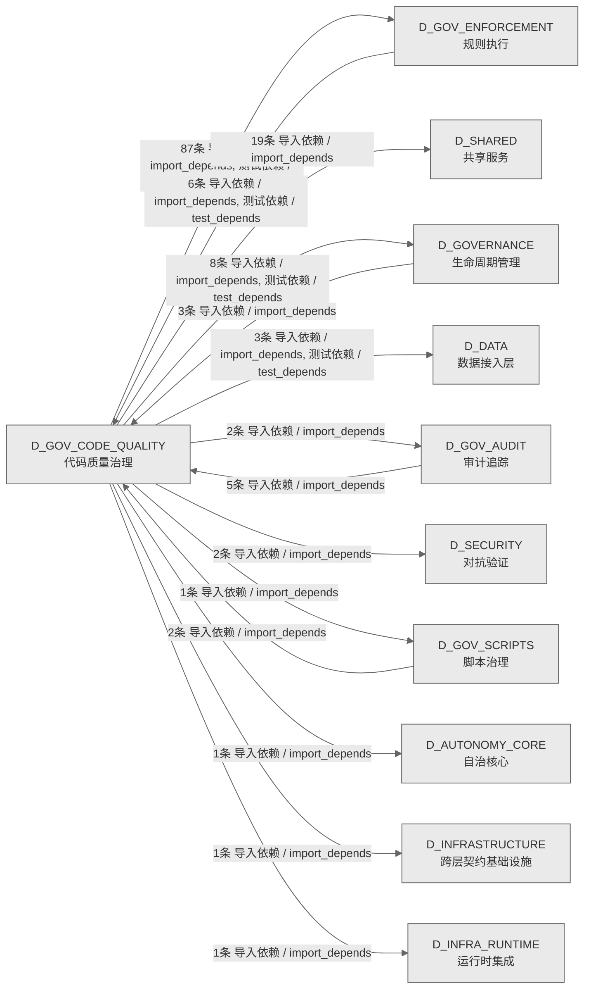

# 19_d_gov_code_quality / 代码质量治理域 / Code Quality Governance

> **功能简介 / Overview**: 代码质量治理，负责代码去重引擎、函数重复检测、AST语义分析和提交门禁引擎

> **文档作用 / Purpose**: 展示 代码质量治理（D_GOV_CODE_QUALITY）功能域的域内依赖关系、跨域依赖关系，模块信息（成熟度/中英文名/大白话/文件路径）内嵌于 Mermaid 节点，供架构审查和域治理参考。

> 本文档由 generate_domain_doc.py 从 depgraph (PostgreSQL) 自动生成
> 数据源: depgraph (PostgreSQL) nodes表 + edges表

> **[可缩放 HTML 版 / Zoomable HTML](http://localhost:8765/docs/02_enterprise_architecture/02_domain_architecture_docs/_zoomable_html/19_d_gov_code_quality.html)** — Ctrl+滚轮缩放 ｜ 双击重置 ｜ Ctrl+Shift+D 切换拖动/选择模式

## 域基本信息 / Domain Overview

| 字段 | 值 | Field | Value |
|------|------|-------|-------|
| 编号 | 19 | Number | 19 |
| 域ID | D_GOV_CODE_QUALITY | Domain ID | D_GOV_CODE_QUALITY |
| 域名称 | 代码质量治理 | Domain Name | Code Quality Governance |
| 层级 | L1 基础平台层 | Layer | L1 Foundation |
| 模块数 | 169 | Module Count | 169 |
| 域内依赖 | 44 | Internal Dependencies | 44 |
| 跨域入边 | 16 | Cross-domain Incoming | 16 |
| 跨域出边 | 125 | Cross-domain Outgoing | 125 |
| 设计态模块 | 0 | Design Modules | 0 |
| 生产态模块 | 169 | Production Modules | 169 |
| 容量 | 169/150 (超容) | Capacity | 169/150 (超容) |
| 描述 | 代码去重引擎(code_dedup) | Description | 代码去重引擎(code_dedup) |

## 域内依赖图 / Internal Dependency Diagram

> 依赖图内嵌在本文档中，IDE 可直接渲染；网页版可 Ctrl+滚轮缩放 + 拖动平移查看细节。
>
> **图例说明 / Legend**：
> - 🟦 **蓝色 = 运营态模块**（production，已上线运行）
> - 🟧 **橙色虚线 = 设计态模块**（design，蓝图阶段，代码未写）
> - **实线箭头 = 运营态依赖**（已生效的依赖关系）
> - **虚线箭头 = 非运营态依赖**（计划中/验证中的依赖关系）

### 全景图（全部模块，颜色区分运营态/设计态）

> 展示全部 169 个模块（生产态 169 + 设计态 0），含跨域依赖外部节点。节点含成熟度+名称+大白话/简介+文件路径。

```mermaid
%%{init: {'theme': 'base', 'themeVariables': {'primaryColor': '#eaeaea', 'primaryTextColor': '#333333', 'primaryBorderColor': '#666666', 'lineColor': '#666666', 'secondaryColor': '#eaeaea', 'tertiaryColor': '#eaeaea', 'fontSize': '14px'}}}%%
flowchart TD
    scripts_governance_d3_metadata_check_pure_assertion_py["(生产态 / production) 检查pureassertion / check_<br/>pure_assertion<br/>GOV-DOC-016 纯陈述原则检测真源（SSoT）。<br/>文件: d3_metadata/check_pure_assertion.py"]
    scripts_governance_d7_code_check_module_id_consistency_py["(生产态 / production) 检查模块id一致性 / check_<br/>module_id_consistency<br/>module_id 全仓一致性扫描（--scan-existing<br/>模式）.<br/>文件: d7_code/check_module_id_consistency.py"]
    src_zephyr_gov_code_quality_init_py["(生产态 / production) 包入口 / gov_code_quality<br/>domain package — code quality governance (D<br/>包入口。gov_code_quality domain package — code<br/>quality governance (D_GOV_CODE_QUALITY).<br/>文件: gov_code_quality/__init__.py"]
    src_zephyr_gov_code_quality_code_dedup_init_py["(生产态 / production) 包入口 / __init__<br/>code-dedup-engine 子包 — 重复代码检测与治理引擎.<br/>文件: code_dedup/__init__.py"]
    src_zephyr_gov_code_quality_code_dedup_annotations_py["(生产态 / production) 共享函数注解引擎 —<br/>@shared / @knowndup / @inten / annotations<br/>共享函数注解引擎 — @shared / @known_dup /<br/>@intentional 三注解.<br/>文件: code_dedup/annotations.py"]
    src_zephyr_gov_code_quality_code_dedup_atomic_fixer_py["(生产态 / production) 原子性修复引擎 — WAL 式<br/>PREFLIGHT -> CHECKPOINT  / atomic_fixer<br/>原子性修复引擎 — WAL 式 PREFLIGHT -> CHECKPOINT<br/>-> APPLY -> RECOVER.<br/>文件: code_dedup/atomic_fixer.py"]
    src_zephyr_gov_code_quality_code_dedup_behavioral_sampler_py["(生产态 / production) behavioral采样器 /<br/>behavioral_sampler<br/>行为采样验证器 — Stage 0.25 低成本快速验证.<br/>文件: code_dedup/behavioral_sampler.py"]
    src_zephyr_gov_code_quality_code_dedup_behavioral_trust_checker_py["(生产态 / production) 行为信任检查器 —<br/>行为漂移DIVERGED检测. / behavioral_trust_checker<br/>行为信任检查器 — 行为漂移DIVERGED检测.<br/>文件: code_dedup/behavioral_trust_checker.py"]
    src_zephyr_gov_code_quality_code_dedup_cache_manager_py["(生产态 / production) 缓存管理器 / cache_manager<br/>Stage 0: 函数缓存管理器 — 增量扫描的加速核心.<br/>文件: code_dedup/cache_manager.py"]
    src_zephyr_gov_code_quality_code_dedup_canary_manager_py["(生产态 / production) 金丝雀管理器 / canary_<br/>manager<br/>金丝雀工厂——生成已知oracle 文件<br/>用于引擎检出+回归测试.<br/>文件: code_dedup/canary_manager.py"]
    src_zephyr_gov_code_quality_code_dedup_canary_register_py["(生产态 / production) 金丝雀注册表维护器 — 注册<br/>/过期/腐败检测. / canary_register<br/>金丝雀注册表维护器 — 注册/过期/腐败检测.<br/>文件: code_dedup/canary_register.py"]
    src_zephyr_gov_code_quality_code_dedup_cli_py["(生产态 / production) 命令行 / cli<br/>code-dedup-engine<br/>CLI——子命令映射+退出码+扫描入口.<br/>文件: code_dedup/cli.py"]
    src_zephyr_gov_code_quality_code_dedup_code_analyzer_runner_py["(生产态 / production) 代码分析器运行器 / code_<br/>analyzer_runner<br/>检查运行器——按照敏感基线运行三阶段+导出 yaml<br/>报告.<br/>文件: code_dedup/code_analyzer_runner.py"]
    src_zephyr_gov_code_quality_code_dedup_code_simulator_py["(生产态 / production) 代码模拟器 / code_<br/>simulator<br/>代码模拟器——播放录制的克隆演化序列，stress-test<br/>AST/baseline归一化.<br/>文件: code_dedup/code_simulator.py"]
    src_zephyr_gov_code_quality_code_dedup_contract_consistency_checker_py["(生产态 / production) API契约一致性检查器 —<br/>存在性·行为·契约三维. / contract_consistency_<br/>checker<br/>API契约一致性检查器 — 存在性·行为·契约三维.<br/>文件: code_dedup/contract_consistency_checker.py"]
    src_zephyr_gov_code_quality_code_dedup_cross_boundary_detector_py["(生产态 / production) 跨boundary检测器 / cross_<br/>boundary_detector<br/>跨边界克隆感知——四大边界差异化检测+独立策略+跨边<br/>界保守auto_fix规则.<br/>文件: code_dedup/cross_boundary_detector.py"]
    src_zephyr_gov_code_quality_code_dedup_dead_module_detector_py["(生产态 / production) deadmodule检测器 / dead_<br/>module_detector<br/>死共享模块检测器 — shared/子模块无人使用 -><br/>DEAD.<br/>文件: code_dedup/dead_module_detector.py"]
    src_zephyr_gov_code_quality_code_dedup_debt_projector_py["(生产态 / production) debt投影器 / debt_<br/>projector<br/>去重债务预测器 — weeks_to_payoff + intake_rate<br/>vs fix_rate 蒙特卡洛模拟.<br/>文件: code_dedup/debt_projector.py"]
    src_zephyr_gov_code_quality_code_dedup_decision_auditor_py["(生产态 / production) 决策审计器 / decision_<br/>auditor<br/>决策审计链 — DecisionFingerprint 不可变追加日志.<br/>文件: code_dedup/decision_auditor.py"]
    src_zephyr_gov_code_quality_code_dedup_degradation_py["(生产态 / production) 退化 / degradation<br/>降级运行管理器 — 各 Stage 独立 try/except +<br/>degradation_level + exit code.<br/>文件: code_dedup/degradation.py"]
    src_zephyr_gov_code_quality_code_dedup_diff_detector_py["(生产态 / production) 差异检测器 / diff_detector<br/>Stage 0: Git diff 变更检测器 — 函数粒度增量.<br/>文件: code_dedup/diff_detector.py"]
    src_zephyr_gov_code_quality_code_dedup_doom_loop_guard_py["(生产态 / production) doom循环守卫 / doom_loop_<br/>guard<br/>Doom Loop 防护 — 修复升级阶梯 L0-L4 状态机.<br/>文件: code_dedup/doom_loop_guard.py"]
    src_zephyr_gov_code_quality_code_dedup_extraction_safety_py["(生产态 / production) extraction安全 /<br/>extraction_safety<br/>安全提取适配性评估器 — Suitability Score 0-100<br/>+ 不安全提取模式检测.<br/>文件: code_dedup/extraction_safety.py"]
    src_zephyr_gov_code_quality_code_dedup_false_negative_auditor_py["(生产态 / production) falsenegative审计器 /<br/>false_negative_auditor<br/>三层漏报盲审器 — L1 Sweep + L2 Canary + L3<br/>Sampling.<br/>文件: code_dedup/false_negative_auditor.py"]
    src_zephyr_gov_code_quality_code_dedup_fifteen_dimension_auditor_py["(生产态 / production) 15维超综合审计首页 —<br/>逐项证明'做过且做对'. / fifteen_dimension_<br/>auditor<br/>15维超综合审计首页 — 逐项证明'做过且做对'.<br/>文件: code_dedup/fifteen_dimension_auditor.py"]
    src_zephyr_gov_code_quality_code_dedup_file_creator_py["(生产态 / production) 文件创建清单执行器 —<br/>验证所有源/测试/数据文件存在性. / file_creator<br/>文件创建清单执行器 — 验证所有源/测试<br/>/数据文件存在性.<br/>文件: code_dedup/file_creator.py"]
    src_zephyr_gov_code_quality_code_dedup_function_discovery_py["(生产态 / production) 共享函数主动发现 —<br/>签名+语义双通道从被动到主动. / function_<br/>discovery<br/>共享函数主动发现 — 签名+语义双通道从被动到主动.<br/>文件: code_dedup/function_discovery.py"]
    src_zephyr_gov_code_quality_code_dedup_grandfather_manager_py["(生产态 / production) grandfather管理器 /<br/>grandfather_manager<br/>Grandfather 三定律 — 古老重复管理.<br/>文件: code_dedup/grandfather_manager.py"]
    src_zephyr_gov_code_quality_code_dedup_health_monitor_py["(生产态 / production) 健康监控 / health_monitor<br/>健康仪表盘 — Dedup Health Score 0-100 + 趋势 +<br/>Session Log 写入.<br/>文件: code_dedup/health_monitor.py"]
    src_zephyr_gov_code_quality_code_dedup_integration_hub_py["(生产态 / production) 集成hub / integration_hub<br/>集成协调器 — 24集成+19更新+16GitHub整合.<br/>文件: code_dedup/integration_hub.py"]
    src_zephyr_gov_code_quality_code_dedup_integrations_py["(生产态 / production)<br/>集成管理——预提交钩子+CI-only 扫描+超时边界. /<br/>integrations<br/>集成管理——预提交钩子+CI-only 扫描+超时边界.<br/>文件: code_dedup/integrations.py"]
    src_zephyr_gov_code_quality_code_dedup_micro_clone_detector_py["(生产态 / production) microclone检测器 / micro_<br/>clone_detector<br/>微型克隆检测器 — n-gram频率计数,<br/>1-2行高频模式聚合.<br/>文件: code_dedup/micro_clone_detector.py"]
    src_zephyr_gov_code_quality_code_dedup_mock_duplicate_generator_py["(生产态 / production)<br/>可控克隆生产器——零假阳性可期待引擎分子离散 /<br/>mock_duplicate_generator<br/>可控克隆生产器——零假阳性可期待引擎分子离散<br/>文件: code_dedup/mock_duplicate_generator.py"]
    src_zephyr_gov_code_quality_code_dedup_monoculture_guard_py["(生产态 / production) monoculture守卫 /<br/>monoculture_guard<br/>Monoculture 免疫 — BRS 0-100 + 去重悖论检测.<br/>文件: code_dedup/monoculture_guard.py"]
    src_zephyr_gov_code_quality_code_dedup_observation_window_guard_py["(生产态 / production) 提取后稳定观察期守护 —<br/>对标SDP 14天观察. / observation_window_guard<br/>提取后稳定观察期守护 — 对标SDP 14天观察.<br/>文件: code_dedup/observation_window_guard.py"]
    src_zephyr_gov_code_quality_code_dedup_path_index_validator_py["(生产态 / production) 路径索引校验器 / path_<br/>index_validator<br/>路径索引验证——验证 config<br/>数据集相对路径表与实际文件系统同步.<br/>文件: code_dedup/path_index_validator.py"]
    src_zephyr_gov_code_quality_code_dedup_phase_executor_py["(生产态 / production) 阶段执行器 / phase_<br/>executor<br/>6Phase施工执行器 — Phase 0~5 执行状态追踪.<br/>文件: code_dedup/phase_executor.py"]
    src_zephyr_gov_code_quality_code_dedup_policy_tree_validator_py["(生产态 / production) 策略树自动一致性校验器 —<br/>虚线箭头影响分析. / policy_tree_validator<br/>策略树自动一致性校验器 — 虚线箭头影响分析.<br/>文件: code_dedup/policy_tree_validator.py"]
    src_zephyr_gov_code_quality_code_dedup_pre_apply_integrity_gate_py["(生产态 / production) 预应用完整性门禁 / pre_<br/>apply_integrity_gate<br/>Pre-Apply 完整性门 — SHA256重新验证.<br/>文件: code_dedup/pre_apply_integrity_gate.py"]
    src_zephyr_gov_code_quality_code_dedup_prioritizer_py["(生产态 / production) 修复优先级排序器 —<br/>置信度×Impact×适配性 三因子排序. / prioritizer<br/>修复优先级排序器 — 置信度×Impact×适配性<br/>三因子排序.<br/>文件: code_dedup/prioritizer.py"]
    src_zephyr_gov_code_quality_code_dedup_recovery_manifest_writer_py["(生产态 / production) 恢复清单写入器 / recovery_<br/>manifest_writer<br/>Recovery Manifest Writer — R2纯文本base64<br/>Manifest.<br/>文件: code_dedup/recovery_manifest_writer.py"]
    src_zephyr_gov_code_quality_code_dedup_risk_mitigator_py["(生产态 / production) 风险mitigator / risk_<br/>mitigator<br/>R1-R45全量风险缓解执行器 — 逐条检查缓解措施 +<br/>mitigation_tracker.yaml.<br/>文件: code_dedup/risk_mitigator.py"]
    src_zephyr_gov_code_quality_code_dedup_self_scanner_py["(生产态 / production) 自扫描器 / self_scanner<br/>引擎自扫描器 — Dogfooding 检测引擎自身源码重复.<br/>文件: code_dedup/self_scanner.py"]
    src_zephyr_gov_code_quality_code_dedup_sensitivity_sweeper_py["(生产态 / production) sensitivity清扫器 /<br/>sensitivity_sweeper<br/>敏感性扫荡——threshold扫描->固化成new baseline<br/>（零假阳性+触达率保险）.<br/>文件: code_dedup/sensitivity_sweeper.py"]
    src_zephyr_gov_code_quality_code_dedup_shadow_trust_validator_py["(生产态 / production) 影子信任校验器 / shadow_<br/>trust_validator<br/>影子信任验证器 — ImportError 防护回路.<br/>文件: code_dedup/shadow_trust_validator.py"]
    src_zephyr_gov_code_quality_code_dedup_shadow_verifier_py["(生产态 / production) 影子验证器 / shadow_<br/>verifier<br/>影子清单验证器 — size sanity check +<br/>semantic验证 + 覆盖度报告.<br/>文件: code_dedup/shadow_verifier.py"]
    src_zephyr_gov_code_quality_code_dedup_shared_evolver_py["(生产态 / production) 共享函数自我进化引擎 —<br/>自动升降级 + 行为漂移锁定. / shared_evolver<br/>共享函数自我进化引擎 — 自动升降级 +<br/>行为漂移锁定.<br/>文件: code_dedup/shared_evolver.py"]
    src_zephyr_gov_code_quality_code_dedup_shared_lifecycle_manager_py["(生产态 / production) 共享生命周期管理器 /<br/>shared_lifecycle_manager<br/>共享函数生命周期管理 —<br/>Active->Deprecated->Grace->Sunset->Retired<br/>五阶段状态机.<br/>文件: code_dedup/shared_lifecycle_manager.py"]
    src_zephyr_gov_code_quality_code_dedup_signature_matcher_py["(生产态 / production) signature匹配器 /<br/>signature_matcher<br/>signature匹配器.5: 签名指纹 SHA256(:12) O(1)<br/>精确匹配.<br/>文件: code_dedup/signature_matcher.py"]
    src_zephyr_gov_code_quality_code_dedup_simplicity_auditor_py["(生产态 / production) 引擎成本效益自审计器 —<br/>SAS 0-100 月度审计 + Tax 报告. / simplicity_<br/>auditor<br/>引擎成本效益自审计器 — SAS 0-100 月度审计 + Tax<br/>报告.<br/>文件: code_dedup/simplicity_auditor.py"]
    src_zephyr_gov_code_quality_code_dedup_ssot_registrar_py["(生产态 / production) SSoT注册器 —<br/>提取函数自动注册到 shared API清单. / ssot_<br/>registrar<br/>SSoT注册器 — 提取函数自动注册到 shared API清单.<br/>文件: code_dedup/ssot_registrar.py"]
    src_zephyr_gov_code_quality_code_dedup_stale_shared_detector_py["(生产态 / production) stale共享检测器 / stale_<br/>shared_detector<br/>过时共享函数检测器 — 无caller × 30天 -><br/>STALE标记.<br/>文件: code_dedup/stale_shared_detector.py"]
    src_zephyr_gov_code_quality_code_dedup_success_validator_py["(生产态 / production)<br/>成功验证——判断一次去重操作是否真正消灭了克隆. /<br/>success_validator<br/>成功验证——判断一次去重操作是否真正消灭了克隆.<br/>文件: code_dedup/success_validator.py"]
    src_zephyr_gov_code_quality_code_dedup_symbol_index_py["(生产态 / production) symbol索引 / symbol_index<br/>符号索引 — 全局函数/类/import映射表.<br/>文件: code_dedup/symbol_index.py"]
    src_zephyr_gov_code_quality_code_dedup_thematic_clusterer_py["(生产态 / production) 主题聚类器 —<br/>噪声信号比·告警疲劳缓解. / thematic_clusterer<br/>主题聚类器 — 噪声信号比·告警疲劳缓解.<br/>文件: code_dedup/thematic_clusterer.py"]
    src_zephyr_gov_code_quality_code_dedup_trackers_init_py["(生产态 / production) 包入口 / __init__<br/>tracker 族子包 — 风险/盲点/热点跟踪器集合.<br/>文件: trackers/__init__.py"]
    src_zephyr_gov_code_quality_code_dedup_trackers_consequence_tracker_py["(生产态 / production)<br/>后果追踪——记录每次修复操作对依赖方的影响. /<br/>consequence_tracker<br/>后果追踪——记录每次修复操作对依赖方的影响.<br/>文件: trackers/consequence_tracker.py"]
    src_zephyr_gov_code_quality_code_dedup_trackers_hotspot_tracker_py["(生产态 / production) 热点追踪器 — 90天滑动窗口<br/>+ 高频变动检测 + 新项目预热清单. / hotspot_<br/>tracker<br/>热点追踪器 — 90天滑动窗口 + 高频变动检测 +<br/>新项目预热清单.<br/>文件: trackers/hotspot_tracker.py"]
    src_zephyr_gov_code_quality_code_dedup_trackers_import_surface_tracker_py["(生产态 / production) importsurface追踪器 /<br/>import_surface_tracker<br/>Import表面积负债追踪 — SBS 0-100 + shared<br/>burden score.<br/>文件: trackers/import_surface_tracker.py"]
    src_zephyr_gov_code_quality_code_dedup_trackers_question_tracker_py["(生产态 / production)<br/>问题追踪——扫描中发现需要人工处理的问题. /<br/>question_tracker<br/>问题追踪——扫描中发现需要人工处理的问题.<br/>文件: trackers/question_tracker.py"]
    src_zephyr_gov_code_quality_code_dedup_trackers_risk_mitigation_tracker_py["(生产态 / production)<br/>风险缓解追踪——捕获哪些克隆报告了但在N次扫描后仍<br/>未fix. / risk_mitigation_tracker<br/>风险缓解追踪——捕获哪些克隆报告了但在N次扫描后仍<br/>未fix.<br/>文件: trackers/risk_mitigation_tracker.py"]
    src_zephyr_gov_code_quality_code_dedup_verifier_py["(生产态 / production) 验证器 / verifier<br/>修复验证器 — import + 类型 + 行为采样验证.<br/>文件: code_dedup/verifier.py"]
    src_zephyr_gov_enforcement_commit_gates_init_py["(生产态 / production) 包入口 / __init__<br/>commit_gates — GitCommitGateway pre-commit<br/>门禁实现包。<br/>文件: commit_gates/__init__.py"]
    src_zephyr_gov_enforcement_commit_gates_arch_reference_gate_py["(生产态 / production) archreference门禁 / arch_<br/>reference_gate<br/>#ARCH-NNN / #ARCH-DOMAIN-NNN<br/>悬空引用自动检测门禁<br/>文件: commit_gates/arch_reference_gate.py"]
    src_zephyr_gov_enforcement_commit_gates_asyncio_run_in_context_gate_py["(生产态 / production) asynciorunin上下文门禁 /<br/>asyncio_run_in_context_gate<br/>异步上下文误用硬阻断门禁<br/>文件: commit_gates/asyncio_run_in_context_<br/>gate.py"]
    src_zephyr_gov_enforcement_commit_gates_bare_getenv_gate_py["(生产态 / production) baregetenv门禁 / bare_<br/>getenv_gate<br/>裸 os.getenv 读密钥阻断门禁<br/>（NO-BARE-GETENV，§5.17.10 治本）<br/>文件: commit_gates/bare_getenv_gate.py"]
    src_zephyr_gov_enforcement_commit_gates_bare_sql_gate_py["(生产态 / production) baresql门禁 / bare_sql_<br/>gate<br/>裸SQL字面量阻断门禁（NO-BARE-SQL，§5.160.2<br/>防复发）<br/>文件: commit_gates/bare_sql_gate.py"]
    src_zephyr_gov_enforcement_commit_gates_bare_subprocess_gate_py["(生产态 / production) baresubprocess门禁 / bare_<br/>subprocess_gate<br/>裸 subprocess 调用硬阻断门禁<br/>文件: commit_gates/bare_subprocess_gate.py"]
    src_zephyr_gov_enforcement_commit_gates_blueprint_amodule_consistency_gate_py["(生产态 / production)<br/>蓝图amoduleconsistency门禁 / blueprint_amodule_<br/>consistency_gate<br/>(A_module) 头部 module_id 格式一致性门禁<br/>文件: commit_gates/blueprint_amodule_<br/>consistency_gate.py"]
    src_zephyr_gov_enforcement_commit_gates_blueprint_amodule_cross_check_gate_py["(生产态 / production) 蓝图amodule跨check门禁 /<br/>blueprint_amodule_cross_check_gate<br/>(BLUEPRINT) vs (A_module) 交叉校验门禁<br/>文件: commit_gates/blueprint_amodule_cross_<br/>check_gate.py"]
    src_zephyr_gov_enforcement_commit_gates_blueprint_format_gate_py["(生产态 / production) 蓝图format门禁 /<br/>blueprint_format_gate<br/>(BLUEPRINT) 头部 module_id 格式阻断门禁<br/>（BLUEPRINT-FORMAT，裁定#214 Phase 0 防蔓延）<br/>文件: commit_gates/blueprint_format_gate.py"]
    src_zephyr_gov_enforcement_commit_gates_capability_consistency_gate_py["(生产态 / production) 能力一致性门禁 /<br/>capability_consistency_gate<br/>Provider 路由-meta 一致性门禁<br/>（CAP-CONSISTENCY，裁定 #ARCH-CH-022 Phase 4.4）<br/>文件: commit_gates/capability_consistency_<br/>gate.py"]
    src_zephyr_gov_enforcement_commit_gates_capability_lookup_required_gate_py["(生产态 / production)<br/>capabilitylookuprequired门禁 / capability_<br/>lookup_required_gate<br/>Capability Lookup 强制门禁<br/>（CAPABILITY-LOOKUP-REQUIRED，#ARCH-GOV-CONVERGE<br/>NCE-META Phase<br/>文件: commit_gates/capability_lookup_required_<br/>gate.py"]
    src_zephyr_gov_enforcement_commit_gates_capability_overlap_gate_py["(生产态 / production) capabilityoverlap门禁 /<br/>capability_overlap_gate<br/>新建 .py 文件 CapabilityLookup 提示门禁<br/>（warn-only，2026-06-30 治本）<br/>文件: commit_gates/capability_overlap_gate.py"]
    src_zephyr_gov_enforcement_commit_gates_ch_batch_size_gate_py["(生产态 / production) ch批次大小门禁 / ch_batch_<br/>size_gate<br/>CH 批量写入防回退门禁（CH-BATCH-SIZE，§18.4<br/>防复发）<br/>文件: commit_gates/ch_batch_size_gate.py"]
    src_zephyr_gov_enforcement_commit_gates_ch_final_gate_py["(生产态 / production) ch最终门禁 / ch_final_gate<br/>ch最终门禁.query() 直接调用阻断门禁<br/>（CH-FINAL-GATE，裁定 #ARCH-CH-007 B5）<br/>文件: commit_gates/ch_final_gate.py"]
    src_zephyr_gov_enforcement_commit_gates_ch_version_col_gate_py["(生产态 / production) ch版本col门禁 / ch_<br/>version_col_gate<br/>CH version 列语义误用阻断门禁<br/>（CH-VERSION-COL，裁定 #ARCH-CH-009）<br/>文件: commit_gates/ch_version_col_gate.py"]
    src_zephyr_gov_enforcement_commit_gates_claim_required_gate_py["(生产态 / production) claimrequired门禁 / claim_<br/>required_gate<br/>claim_files 前置检查门禁<br/>（CLAIM-REQUIRED，2026-06-30 治本）<br/>文件: commit_gates/claim_required_gate.py"]
    src_zephyr_gov_enforcement_commit_gates_consumers_accuracy_gate_py["(生产态 / production) consumersaccuracy门禁 /<br/>consumers_accuracy_gate<br/>CONSUMERS 字段准确性 warn-only 门禁<br/>文件: commit_gates/consumers_accuracy_gate.py"]
    src_zephyr_gov_enforcement_commit_gates_create_guard_py["(生产态 / production) 创建守卫 / create_guard<br/>新建 .py / 非 rules/ .yaml 文件 creation_token<br/>阻断门禁（CREATE-GUARD，2026-06-30 治本）<br/>文件: commit_gates/create_guard.py"]
    src_zephyr_gov_enforcement_commit_gates_dangling_reference_gate_py["(生产态 / production) danglingreference门禁 /<br/>dangling_reference_gate<br/>danglingreference门禁.md §X.Y<br/>悬空引用自动检测门禁<br/>文件: commit_gates/dangling_reference_gate.py"]
    src_zephyr_gov_enforcement_commit_gates_data_task_completeness_gate_py["(生产态 / production) 数据taskcompleteness门禁<br/>/ data_task_completeness_gate<br/>数据任务完整性门禁（warn 级，提醒型）<br/>文件: commit_gates/data_task_completeness_<br/>gate.py"]
    src_zephyr_gov_enforcement_commit_gates_datetime_now_forbidden_gate_py["(生产态 / production) datetimenowforbidden门禁<br/>/ datetime_now_forbidden_gate<br/>时间戳约定硬阻断门禁<br/>文件: commit_gates/datetime_now_forbidden_<br/>gate.py"]
    src_zephyr_gov_enforcement_commit_gates_depgraph_freshness_gate_py["(生产态 / production) depgraphfreshness门禁 /<br/>depgraph_freshness_gate<br/>depgraph 新鲜度门禁<br/>（dual-threshold，#ARCH-DEPGRAPH-RECONCILER-FAIL<br/>SILENT Phase 3.1）<br/>文件: commit_gates/depgraph_freshness_gate.py"]
    src_zephyr_gov_enforcement_commit_gates_depgraph_write_path_gate_py["(生产态 / production) depgraphwritepath门禁 /<br/>depgraph_write_path_gate<br/>depgraph 写入路径白名单门禁<br/>文件: commit_gates/depgraph_write_path_gate.py"]
    src_zephyr_gov_enforcement_commit_gates_derivation_annotation_gate_py["(生产态 / production) derivationannotation门禁<br/>/ derivation_annotation_gate<br/>派生关系声明真实性校验门禁<br/>文件: commit_gates/derivation_annotation_gate.py"]
    src_zephyr_gov_enforcement_commit_gates_directory_contract_gate_py["(生产态 / production) directorycontract门禁 /<br/>directory_contract_gate<br/>DCR-001~007 等效校验门禁（治本：弥补<br/>--no-verify 绕过 pre-commit 的缺口）<br/>文件: commit_gates/directory_contract_gate.py"]
    src_zephyr_gov_enforcement_commit_gates_doc_ref_broken_gate_py["(生产态 / production) docrefbroken门禁 / doc_<br/>ref_broken_gate<br/>文档相对路径断裂引用阻断门禁<br/>文件: commit_gates/doc_ref_broken_gate.py"]
    src_zephyr_gov_enforcement_commit_gates_domain_fk_gate_py["(生产态 / production) 域fk门禁 / domain_fk_gate<br/>(DOMAIN) 头部域注册表 FK 校验门禁<br/>文件: commit_gates/domain_fk_gate.py"]
    src_zephyr_gov_enforcement_commit_gates_domain_name_zh_direct_access_gate_py["(生产态 / production)<br/>domainnamezhdirect访问门禁 / domain_name_zh_<br/>direct_access_gate<br/>DOMAIN_NAME_ZH 字典直接访问硬阻断门禁<br/>文件: commit_gates/domain_name_zh_direct_access_<br/>gate.py"]
    src_zephyr_gov_enforcement_commit_gates_empty_handler_gate_py["(生产态 / production) empty处理器门禁 / empty_<br/>handler_gate<br/>空事件 handler 函数阻断门禁<br/>文件: commit_gates/empty_handler_gate.py"]
    src_zephyr_gov_enforcement_commit_gates_encoding_gate_py["(生产态 / production) encoding门禁 / encoding_<br/>gate<br/>编码安全校验门禁（治本：弥补 --no-verify 绕过<br/>pre-commit GATE-ENCODING 的缺口）<br/>文件: commit_gates/encoding_gate.py"]
    src_zephyr_gov_enforcement_commit_gates_exempt_zone_frontmatter_gate_py["(生产态 / production) exemptzonefrontmatter门禁<br/>/ exempt_zone_frontmatter_gate<br/>豁免区 frontmatter 门禁（Phase 3<br/>reconciler->gate 收敛）<br/>文件: commit_gates/exempt_zone_frontmatter_<br/>gate.py"]
    src_zephyr_gov_enforcement_commit_gates_file_copy_gate_py["(生产态 / production) filecopy门禁 / file_copy_<br/>gate<br/>新增 .py 文件复制检测阻断门禁<br/>（FILE-COPY，2026-07-03 Phase 1 sub-task 3）<br/>文件: commit_gates/file_copy_gate.py"]
    src_zephyr_gov_enforcement_commit_gates_file_placement_ttl_gate_py["(生产态 / production) fileplacementttl门禁 /<br/>file_placement_ttl_gate<br/>文件放置与 TTL 一致性门禁（治本<br/>#ARCH-049：防止临时文件乱放根目录）<br/>文件: commit_gates/file_placement_ttl_gate.py"]
    src_zephyr_gov_enforcement_commit_gates_folder_capacity_hard_limit_gate_py["(生产态 / production) folder容量hardlimit门禁 /<br/>folder_capacity_hard_limit_gate<br/>文件夹容量硬上限门禁<br/>文件: commit_gates/folder_capacity_hard_limit_<br/>gate.py"]
    src_zephyr_gov_enforcement_commit_gates_foreign_change_gate_py["(生产态 / production) foreignchange门禁 /<br/>foreign_change_gate<br/>外来变更检测门禁<br/>（FOREIGN-CHANGE-DETECTION，ARCH-054 治本）<br/>文件: commit_gates/foreign_change_gate.py"]
    src_zephyr_gov_enforcement_commit_gates_forged_gw_marker_gate_py["(生产态 / production) forgedgwmarker门禁 /<br/>forged_gw_marker_gate<br/>Forged GW Marker 前置检测门禁<br/>（FORGED-GW-MARKER，#ARCH-PREVENTABILITY-LAYER-0<br/>01 Phase 2）<br/>文件: commit_gates/forged_gw_marker_gate.py"]
    src_zephyr_gov_enforcement_commit_gates_function_dup_gate_py["(生产态 / production) 函数dup门禁 / function_<br/>dup_gate<br/>重复函数实现阻断门禁<br/>文件: commit_gates/function_dup_gate.py"]
    src_zephyr_gov_enforcement_commit_gates_gate_repo_py["(生产态 / production) 门禁repo / gate_repo<br/>gates 表持久化仓库（AUDIT-07 P1-5: 从 gate_<br/>engine.py 提取）<br/>文件: commit_gates/gate_repo.py"]
    src_zephyr_gov_enforcement_commit_gates_git_call_budget_gate_py["(生产态 / production) Gitcall预算门禁 / git_<br/>call_budget_gate<br/>Git 调用预算 warn-only 门禁<br/>（GIT-CALL-BUDGET，§ARCH-GIT-CALL-BUDGET P2.2）<br/>文件: commit_gates/git_call_budget_gate.py"]
    src_zephyr_gov_enforcement_commit_gates_god_class_gate_py["(生产态 / production) god类门禁 / god_class_gate<br/>God Class 阻断门禁（NO-GOD-CLASS，§5.150<br/>防复发）<br/>文件: commit_gates/god_class_gate.py"]
    src_zephyr_gov_enforcement_commit_gates_hardcoded_url_gate_py["(生产态 / production) hardcodedurl门禁 /<br/>hardcoded_url_gate<br/>硬编码 localhost URL 阻断门禁<br/>（NO-HARDCODED-URL，§5.160.9 防复发）<br/>文件: commit_gates/hardcoded_url_gate.py"]
    src_zephyr_gov_enforcement_commit_gates_held_overlap_gate_py["(生产态 / production) heldoverlap门禁 / held_<br/>overlap_gate<br/>搭便车防护门禁（HELD-OVERLAP，2026-06-30 治本）<br/>文件: commit_gates/held_overlap_gate.py"]
    src_zephyr_gov_enforcement_commit_gates_high_complexity_gate_py["(生产态 / production) highcomplexity门禁 / high_<br/>complexity_gate<br/>高循环复杂度阻断门禁<br/>（NO-HIGH-COMPLEXITY，§5.158 防复发）<br/>文件: commit_gates/high_complexity_gate.py"]
    src_zephyr_gov_enforcement_commit_gates_id_uniqueness_gate_py["(生产态 / production) iduniqueness门禁 / id_<br/>uniqueness_gate<br/>pre-commit hook ID 唯一性门禁（Phase 3<br/>reconciler->gate 收敛）<br/>文件: commit_gates/id_uniqueness_gate.py"]
    src_zephyr_gov_enforcement_commit_gates_import_direction_gate_py["(生产态 / production) importdirection门禁 /<br/>import_direction_gate<br/>shared 层向上依赖阻断门禁<br/>（NO-UPWARD-IMPORT，§5.152 防复发）<br/>文件: commit_gates/import_direction_gate.py"]
    src_zephyr_gov_enforcement_commit_gates_import_integrity_gate_py["(生产态 / production) 导入完整性门禁 / import_<br/>integrity_gate<br/>IMPORT-INTEGRITY 门禁（悬空 import 硬阻断）<br/>文件: commit_gates/import_integrity_gate.py"]
    src_zephyr_gov_enforcement_commit_gates_issue_resolved_integrity_gate_py["(生产态 / production) issueresolved完整性门禁 /<br/>issue_resolved_integrity_gate<br/>ISSUE-RESOLVED-INTEGRITY warn-only 门禁<br/>文件: commit_gates/issue_resolved_integrity_<br/>gate.py"]
    src_zephyr_gov_enforcement_commit_gates_long_param_list_gate_py["(生产态 / production) longparamlist门禁 / long_<br/>param_list_gate<br/>长参数列表阻断门禁（NO-LONG-PARAM-LIST，§5.150<br/>防复发）<br/>文件: commit_gates/long_param_list_gate.py"]
    src_zephyr_gov_enforcement_commit_gates_manual_only_permanent_gate_py["(生产态 / production) 手册onlypermanent门禁 /<br/>manual_only_permanent_gate<br/>永久系统脚本 manual 触发无事件订阅阻断门禁<br/>（MANUAL-ONLY-PERMANENT，#ARCH-GOV-CONVERGENCE-M<br/>ETA Phase 3.6 补齐<br/>文件: commit_gates/manual_only_permanent_gate.py"]
    src_zephyr_gov_enforcement_commit_gates_mcp_version_field_gate_py["(生产态 / production) MCP版本字段门禁 / mcp_<br/>version_field_gate<br/>MCP version 字段缺失硬阻断门禁<br/>文件: commit_gates/mcp_version_field_gate.py"]
    src_zephyr_gov_enforcement_commit_gates_module_id_consistency_gate_py["(生产态 / production) 模块id一致性门禁 / module_<br/>id_consistency_gate<br/>module_id 三声明轨道一致性 + count 派生 +<br/>跨文件唯一性门禁（Phase 3 reconciler->gate<br/>收敛）<br/>文件: commit_gates/module_id_consistency_gate.py"]
    src_zephyr_gov_enforcement_commit_gates_msg_exposure_gate_py["(生产态 / production) msg敞口门禁 / msg_<br/>exposure_gate<br/>错误消息暴露敏感信息阻断门禁<br/>文件: commit_gates/msg_exposure_gate.py"]
    src_zephyr_gov_enforcement_commit_gates_msg_style_gate_py["(生产态 / production) msgstyle门禁 / msg_style_<br/>gate<br/>错误消息标点/箭头风格阻断门禁<br/>文件: commit_gates/msg_style_gate.py"]
    src_zephyr_gov_enforcement_commit_gates_mutable_const_without_final_gate_py["(生产态 / production)<br/>mutableconstwithoutfinal门禁 / mutable_const_<br/>without_final_gate<br/>可变常量缺 Final 标注硬阻断门禁<br/>文件: commit_gates/mutable_const_without_final_<br/>gate.py"]
    src_zephyr_gov_enforcement_commit_gates_new_file_depgraph_gate_py["(生产态 / production) 新文件依赖图门禁 / new_<br/>file_depgraph_gate<br/>新建 .py 文件 depgraph 未登记硬阻断门禁<br/>文件: commit_gates/new_file_depgraph_gate.py"]
    src_zephyr_gov_enforcement_commit_gates_no_import_side_effect_gate_py["(生产态 / production) noimportsideeffect门禁 /<br/>no_import_side_effect_gate<br/>模块导入零副作用门禁<br/>文件: commit_gates/no_import_side_effect_gate.py"]
    src_zephyr_gov_enforcement_commit_gates_noqa_validation_gate_py["(生产态 / production) noqa验证门禁 / noqa_<br/>validation_gate<br/>自定义 noqa 标记合规性门禁<br/>（NOQA-VALIDATION，ARCH-NOQA-GOV-001 治本）<br/>文件: commit_gates/noqa_validation_gate.py"]
    src_zephyr_gov_enforcement_commit_gates_open_without_with_gate_py["(生产态 / production) openwithoutwith门禁 /<br/>open_without_with_gate<br/>openwithoutwith门禁() 未在 with 内硬阻断门禁<br/>文件: commit_gates/open_without_with_gate.py"]
    src_zephyr_gov_enforcement_commit_gates_orphan_module_gate_py["(生产态 / production) 孤儿module门禁 / orphan_<br/>module_gate<br/>孤儿模块（无 import 引用）阻断门禁<br/>文件: commit_gates/orphan_module_gate.py"]
    src_zephyr_gov_enforcement_commit_gates_panorama_alignment_gate_py["(生产态 / production) panorama对齐门禁 /<br/>panorama_alignment_gate<br/>三图模块对齐门禁（四图模块对齐 Step 4，ARCH-056<br/>升级）<br/>文件: commit_gates/panorama_alignment_gate.py"]
    src_zephyr_gov_enforcement_commit_gates_precommit_offline_gate_py["(生产态 / production) precommitoffline门禁 /<br/>precommit_offline_gate<br/>pre-commit 配置离线可运行检测门禁<br/>文件: commit_gates/precommit_offline_gate.py"]
    src_zephyr_gov_enforcement_commit_gates_pure_assertion_gate_py["(生产态 / production) pureassertion门禁 / pure_<br/>assertion_gate<br/>纯陈述原则阻断门禁（PURE-ASSERTION，GOV-DOC-016<br/>治本）<br/>文件: commit_gates/pure_assertion_gate.py"]
    src_zephyr_gov_enforcement_commit_gates_pure_shim_gate_py["(生产态 / production) pureshim门禁 / pure_shim_<br/>gate<br/>纯 re-export shim 阻断门禁（PURE-SHIM，P6 治本<br/>2026-07-09）<br/>文件: commit_gates/pure_shim_gate.py"]
    src_zephyr_gov_enforcement_commit_gates_r5_digit_suffix_gate_py["(生产态 / production) r5digitsuffix门禁 / r5_<br/>digit_suffix_gate<br/>R5 数字后缀目录禁止门禁（治本：弥补 --no-verify<br/>绕过 pre-commit 的缺口）<br/>文件: commit_gates/r5_digit_suffix_gate.py"]
    src_zephyr_gov_enforcement_commit_gates_reconciler_health_gate_py["(生产态 / production) 协调器健康门禁 /<br/>reconciler_health_gate<br/>reconciler 健康度门禁（#ARCH-DATAQUALITY-V1.7）<br/>文件: commit_gates/reconciler_health_gate.py"]
    src_zephyr_gov_enforcement_commit_gates_relative_path_literal_gate_py["(生产态 / production) relativepathliteral门禁 /<br/>relative_path_literal_gate<br/>相对路径字面量硬阻断门禁<br/>文件: commit_gates/relative_path_literal_gate.py"]
    src_zephyr_gov_enforcement_commit_gates_rename_depgraph_sync_gate_py["(生产态 / production) renamedepgraphsync门禁 /<br/>rename_depgraph_sync_gate<br/>文件重命名后 depgraph 未同步阻断门禁<br/>文件: commit_gates/rename_depgraph_sync_gate.py"]
    src_zephyr_gov_enforcement_commit_gates_rule_execution_pairing_gate_py["(生产态 / production) 规则执行pairing门禁 /<br/>rule_execution_pairing_gate<br/>规则-执行配对门禁<br/>（RULE-EXECUTION-PAIRING，Phase 3.5）<br/>文件: commit_gates/rule_execution_pairing_<br/>gate.py"]
    src_zephyr_gov_enforcement_commit_gates_rule_four_way_alignment_gate_py["(生产态 / production) 规则fourway对齐门禁 /<br/>rule_four_way_alignment_gate<br/>规则四方对齐门禁<br/>文件: commit_gates/rule_four_way_alignment_<br/>gate.py"]
    src_zephyr_gov_enforcement_commit_gates_ruling_commit_verified_gate_py["(生产态 / production) rulingcommitverified门禁<br/>/ ruling_commit_verified_gate<br/>文档'已完成'声明 commit hash 真实性硬验证门禁<br/>文件: commit_gates/ruling_commit_verified_<br/>gate.py"]
    src_zephyr_gov_enforcement_commit_gates_ruling_reference_gate_py["(生产态 / production) rulingreference门禁 /<br/>ruling_reference_gate<br/>裁定#NNN 悬空引用自动检测门禁<br/>文件: commit_gates/ruling_reference_gate.py"]
    src_zephyr_gov_enforcement_commit_gates_schema_file_exists_gate_py["(生产态 / production) 结构fileexists门禁 /<br/>schema_file_exists_gate<br/>SCHEMA-FILE-EXISTS block 门禁<br/>文件: commit_gates/schema_file_exists_gate.py"]
    src_zephyr_gov_enforcement_commit_gates_scripts_import_integrity_gate_py["(生产态 / production) 脚本导入完整性门禁 /<br/>scripts_import_integrity_gate<br/>脚本导入完整性门禁.constants 符号导入完整性门禁<br/>文件: commit_gates/scripts_import_integrity_<br/>gate.py"]
    src_zephyr_gov_enforcement_commit_gates_session_required_gate_py["(生产态 / production) 会话required门禁 /<br/>session_required_gate<br/>会话 注册强制门禁（SESSION-REQUIRED，2026-07-01<br/>治本 FP-ISO.4B 件1改）<br/>文件: commit_gates/session_required_gate.py"]
    src_zephyr_gov_enforcement_commit_gates_snapshot_drift_gate_py["(生产态 / production) 快照漂移门禁 / snapshot_<br/>drift_gate<br/>运行时违规快照漂移阻断门禁<br/>（SNAPSHOT-DRIFT，#ARCH-GOV-CONVERGENCE-META<br/>Phase 3.6 补齐 rc1 enforceability）<br/>文件: commit_gates/snapshot_drift_gate.py"]
    src_zephyr_gov_enforcement_commit_gates_ssot_redefinition_gate_py["(生产态 / production) ssotredefinition门禁 /<br/>ssot_redefinition_gate<br/>SSoT 符号重复定义硬阻断门禁<br/>文件: commit_gates/ssot_redefinition_gate.py"]
    src_zephyr_gov_enforcement_commit_gates_table_name_registry_gate_py["(生产态 / production) tablename注册表门禁 /<br/>table_name_registry_gate<br/>TABLE-NAME-REGISTRY block 门禁<br/>文件: commit_gates/table_name_registry_gate.py"]
    src_zephyr_gov_enforcement_commit_gates_test_source_consistency_gate_py["(生产态 / production) 测试源一致性门禁 / test_<br/>source_consistency_gate<br/>测试-源码符号一致性门禁<br/>（TEST-SOURCE-CONSISTENCY，§5.178 防复发）<br/>文件: commit_gates/test_source_consistency_<br/>gate.py"]
    src_zephyr_gov_enforcement_commit_gates_tests_coverage_gate_py["(生产态 / production) testscoverage门禁 / tests_<br/>coverage_gate<br/>Gate 测试覆盖率校验 meta-gate<br/>（META-TESTS-COVERAGE，#ARCH-057）<br/>文件: commit_gates/tests_coverage_gate.py"]
    src_zephyr_gov_enforcement_commit_gates_ttl_gate_py["(生产态 / production) 存活时间门禁 / ttl_gate<br/>ttl 字段校验门禁（治本：弥补 --no-verify 绕过<br/>pre-commit GATE-15 的缺口）<br/>文件: commit_gates/ttl_gate.py"]
    src_zephyr_gov_enforcement_commit_gates_undefined_name_gate_py["(生产态 / production) undefinedname门禁 /<br/>undefined_name_gate<br/>UNDEFINED-NAME 门禁（F821 未定义符号硬阻断）<br/>文件: commit_gates/undefined_name_gate.py"]
    src_zephyr_gov_enforcement_commit_gates_unsafe_dict_spread_gate_py["(生产态 / production) unsafedictspread门禁 /<br/>unsafe_dict_spread_gate<br/>``**data`` 直接展开模式 warn 级门禁<br/>文件: commit_gates/unsafe_dict_spread_gate.py"]
    src_zephyr_gov_enforcement_commit_gates_vocab_chain_gate_py["(生产态 / production) vocabchain门禁 / vocab_<br/>chain_gate<br/>SSoT 引用硬编码阻断门禁<br/>（VOCAB-CHAIN，#ARCH-GOV-CONVERGENCE-META Phase<br/>3.6 补齐 rc2 enforceability）<br/>文件: commit_gates/vocab_chain_gate.py"]
    src_zephyr_gov_enforcement_commit_gates_vocab_hardcode_gate_py["(生产态 / production) vocabhardcode门禁 / vocab_<br/>hardcode_gate<br/>新增 .py 文件词表硬编码阻断门禁<br/>（VOCAB-HARDCODE，2026-07-03 Phase 1）<br/>文件: commit_gates/vocab_hardcode_gate.py"]
    src_zephyr_gov_enforcement_commit_gates_zephyr_env_direct_access_gate_py["(生产态 / production) zephyrenvdirect访问门禁 /<br/>zephyr_env_direct_access_gate<br/>ZEPHYR_ENV 直访硬阻断门禁<br/>文件: commit_gates/zephyr_env_direct_access_<br/>gate.py"]
    src_zephyr_gov_enforcement_rule_bridge_gate_auto_registrar_py["(生产态 / production) 门禁自动registrar / gate_<br/>auto_registrar<br/>YAML 驱动的 in-process gate 自动注册器<br/>（#ARCH-GATE-REGISTRY-AUTO-001 Phase 3）<br/>文件: rule_bridge/gate_auto_registrar.py"]
    tests_data_test_symbol_normalizer_py["(生产态 / production) 测试symbol归一化器 / test_<br/>symbol_normalizer<br/>TRAE-082 symbol 标准化模块测试。<br/>文件: data/test_symbol_normalizer.py"]
    tests_governance_test_apply_dataflowgraph_smoke_py["(生产态 / production)<br/>测试applydataflowgraphsmoke / test_apply_<br/>dataflowgraph_smoke.py — apply_dataflowgraph.py<br/>e<br/>测试应用dataflowgraphsmoke。test_apply_<br/>dataflowgraph_smoke.py — apply_dataflowgraph.py<br/>end-to-end smoke test<br/>文件: governance/test_apply_dataflowgraph_<br/>smoke.py"]
    tests_governance_test_apply_decisiongraph_smoke_py["(生产态 / production)<br/>测试applydecisiongraphsmoke / test_apply_<br/>decisiongraph_smoke.py — apply_decisiongraph.py<br/>e<br/>测试应用decisiongraphsmoke。test_apply_<br/>decisiongraph_smoke.py — apply_decisiongraph.py<br/>end-to-end smoke test<br/>文件: governance/test_apply_decisiongraph_<br/>smoke.py"]
    tests_governance_test_apply_depgraph_smoke_py["(生产态 / production) 测试applydepgraphsmoke /<br/>test_apply_depgraph_smoke.py — apply_<br/>depgraph.py end-to-end<br/>测试应用依赖图smoke。test_apply_depgraph_<br/>smoke.py — apply_depgraph.py end-to-end smoke<br/>test<br/>文件: governance/test_apply_depgraph_smoke.py"]
    tests_governance_test_audit_return_contract_usage_py["(生产态 / production)<br/>测试审计returncontractusage / test_audit_return_<br/>contract_usage<br/>返回契约 ok 键审计脚本单元测试<br/>文件: governance/test_audit_return_contract_<br/>usage.py"]
    tests_governance_test_audit_worktree_ops_telemetry_py["(生产态 / production) 测试审计worktree运维遥测<br/>/ test_audit_worktree_ops_telemetry<br/>worktree_ops_log 遥测完整性审计测试<br/>文件: governance/test_audit_worktree_ops_<br/>telemetry.py"]
    tests_governance_test_generate_project_depgraph_smoke_py["(生产态 / production)<br/>测试generateprojectdepgraphsmoke / test_<br/>generate_project_depgraph_smoke.py — generate_<br/>project_d<br/>测试生成project依赖图smoke。test_generate_<br/>project_depgraph_smoke.py — generate_project_<br/>depgraph.py e2e smoke test<br/>文件: governance/test_generate_project_depgraph_<br/>smoke.py"]
    tests_governance_test_post_commit_guard_no_verify_threshold_py["(生产态 / production)<br/>测试提交提交守卫no校验阈值 / test_post_commit_<br/>guard_no_verify_threshold<br/>高基数 --no-verify 阈值阻断 e2e 测试<br/>文件: governance/test_post_commit_guard_no_<br/>verify_threshold.py"]
    tests_governance_test_run_silent_failure_regression_py["(生产态 / production)<br/>测试runsilent故障regression / test_run_silent_<br/>failure_regression<br/>silent-failure 回归 runner 单元测试<br/>文件: governance/test_run_silent_failure_<br/>regression.py"]
    tests_governance_test_session_startup_health_check_py["(生产态 / production) 测试会话启动健康检查 /<br/>test_session_startup_health_check<br/>AI session 启动健康度自检单元测试<br/>文件: governance/test_session_startup_health_<br/>check.py"]
    tests_governance_test_sync_yaml_to_depgraph_smoke_py["(生产态 / production)<br/>测试syncyamltodepgraphsmoke / test_sync_yaml_to_<br/>depgraph_smoke.py — sync_yaml_to_depgraph.<br/>测试同步yamlto依赖图smoke。test_sync_yaml_to_<br/>depgraph_smoke.py — sync_yaml_to_depgraph.py<br/>e2e smoke test<br/>文件: governance/test_sync_yaml_to_depgraph_<br/>smoke.py"]
    scripts_governance_d3_metadata_check_pure_assertion_py ~~~ scripts_governance_d7_code_check_module_id_consistency_py
    scripts_governance_d7_code_check_module_id_consistency_py ~~~ src_zephyr_gov_code_quality_init_py
    src_zephyr_gov_code_quality_init_py ~~~ src_zephyr_gov_code_quality_code_dedup_init_py
    src_zephyr_gov_code_quality_code_dedup_init_py ~~~ src_zephyr_gov_code_quality_code_dedup_annotations_py
    src_zephyr_gov_code_quality_code_dedup_annotations_py ~~~ src_zephyr_gov_code_quality_code_dedup_atomic_fixer_py
    src_zephyr_gov_code_quality_code_dedup_atomic_fixer_py ~~~ src_zephyr_gov_code_quality_code_dedup_behavioral_sampler_py
    src_zephyr_gov_code_quality_code_dedup_behavioral_sampler_py ~~~ src_zephyr_gov_code_quality_code_dedup_behavioral_trust_checker_py
    src_zephyr_gov_code_quality_code_dedup_behavioral_trust_checker_py ~~~ src_zephyr_gov_code_quality_code_dedup_cache_manager_py
    src_zephyr_gov_code_quality_code_dedup_cache_manager_py ~~~ src_zephyr_gov_code_quality_code_dedup_canary_manager_py
    src_zephyr_gov_code_quality_code_dedup_canary_manager_py ~~~ src_zephyr_gov_code_quality_code_dedup_canary_register_py
    src_zephyr_gov_code_quality_code_dedup_canary_register_py ~~~ src_zephyr_gov_code_quality_code_dedup_cli_py
    src_zephyr_gov_code_quality_code_dedup_cli_py ~~~ src_zephyr_gov_code_quality_code_dedup_code_analyzer_runner_py
    src_zephyr_gov_code_quality_code_dedup_code_analyzer_runner_py ~~~ src_zephyr_gov_code_quality_code_dedup_code_simulator_py
    src_zephyr_gov_code_quality_code_dedup_code_simulator_py ~~~ src_zephyr_gov_code_quality_code_dedup_contract_consistency_checker_py
    src_zephyr_gov_code_quality_code_dedup_contract_consistency_checker_py ~~~ src_zephyr_gov_code_quality_code_dedup_cross_boundary_detector_py
    src_zephyr_gov_code_quality_code_dedup_cross_boundary_detector_py ~~~ src_zephyr_gov_code_quality_code_dedup_dead_module_detector_py
    src_zephyr_gov_code_quality_code_dedup_dead_module_detector_py ~~~ src_zephyr_gov_code_quality_code_dedup_debt_projector_py
    src_zephyr_gov_code_quality_code_dedup_debt_projector_py ~~~ src_zephyr_gov_code_quality_code_dedup_decision_auditor_py
    src_zephyr_gov_code_quality_code_dedup_decision_auditor_py ~~~ src_zephyr_gov_code_quality_code_dedup_degradation_py
    src_zephyr_gov_code_quality_code_dedup_degradation_py ~~~ src_zephyr_gov_code_quality_code_dedup_diff_detector_py
    src_zephyr_gov_code_quality_code_dedup_diff_detector_py ~~~ src_zephyr_gov_code_quality_code_dedup_doom_loop_guard_py
    src_zephyr_gov_code_quality_code_dedup_doom_loop_guard_py ~~~ src_zephyr_gov_code_quality_code_dedup_extraction_safety_py
    src_zephyr_gov_code_quality_code_dedup_extraction_safety_py ~~~ src_zephyr_gov_code_quality_code_dedup_false_negative_auditor_py
    src_zephyr_gov_code_quality_code_dedup_false_negative_auditor_py ~~~ src_zephyr_gov_code_quality_code_dedup_fifteen_dimension_auditor_py
    src_zephyr_gov_code_quality_code_dedup_fifteen_dimension_auditor_py ~~~ src_zephyr_gov_code_quality_code_dedup_file_creator_py
    src_zephyr_gov_code_quality_code_dedup_file_creator_py ~~~ src_zephyr_gov_code_quality_code_dedup_function_discovery_py
    src_zephyr_gov_code_quality_code_dedup_function_discovery_py ~~~ src_zephyr_gov_code_quality_code_dedup_grandfather_manager_py
    src_zephyr_gov_code_quality_code_dedup_grandfather_manager_py ~~~ src_zephyr_gov_code_quality_code_dedup_health_monitor_py
    src_zephyr_gov_code_quality_code_dedup_health_monitor_py ~~~ src_zephyr_gov_code_quality_code_dedup_integration_hub_py
    src_zephyr_gov_code_quality_code_dedup_integration_hub_py ~~~ src_zephyr_gov_code_quality_code_dedup_integrations_py
    src_zephyr_gov_code_quality_code_dedup_integrations_py ~~~ src_zephyr_gov_code_quality_code_dedup_micro_clone_detector_py
    src_zephyr_gov_code_quality_code_dedup_micro_clone_detector_py ~~~ src_zephyr_gov_code_quality_code_dedup_mock_duplicate_generator_py
    src_zephyr_gov_code_quality_code_dedup_mock_duplicate_generator_py ~~~ src_zephyr_gov_code_quality_code_dedup_monoculture_guard_py
    src_zephyr_gov_code_quality_code_dedup_monoculture_guard_py ~~~ src_zephyr_gov_code_quality_code_dedup_observation_window_guard_py
    src_zephyr_gov_code_quality_code_dedup_observation_window_guard_py ~~~ src_zephyr_gov_code_quality_code_dedup_path_index_validator_py
    src_zephyr_gov_code_quality_code_dedup_path_index_validator_py ~~~ src_zephyr_gov_code_quality_code_dedup_phase_executor_py
    src_zephyr_gov_code_quality_code_dedup_phase_executor_py ~~~ src_zephyr_gov_code_quality_code_dedup_policy_tree_validator_py
    src_zephyr_gov_code_quality_code_dedup_policy_tree_validator_py ~~~ src_zephyr_gov_code_quality_code_dedup_pre_apply_integrity_gate_py
    src_zephyr_gov_code_quality_code_dedup_pre_apply_integrity_gate_py ~~~ src_zephyr_gov_code_quality_code_dedup_prioritizer_py
    src_zephyr_gov_code_quality_code_dedup_prioritizer_py ~~~ src_zephyr_gov_code_quality_code_dedup_recovery_manifest_writer_py
    src_zephyr_gov_code_quality_code_dedup_recovery_manifest_writer_py ~~~ src_zephyr_gov_code_quality_code_dedup_risk_mitigator_py
    src_zephyr_gov_code_quality_code_dedup_risk_mitigator_py ~~~ src_zephyr_gov_code_quality_code_dedup_self_scanner_py
    src_zephyr_gov_code_quality_code_dedup_self_scanner_py ~~~ src_zephyr_gov_code_quality_code_dedup_sensitivity_sweeper_py
    src_zephyr_gov_code_quality_code_dedup_sensitivity_sweeper_py ~~~ src_zephyr_gov_code_quality_code_dedup_shadow_trust_validator_py
    src_zephyr_gov_code_quality_code_dedup_shadow_trust_validator_py ~~~ src_zephyr_gov_code_quality_code_dedup_shadow_verifier_py
    src_zephyr_gov_code_quality_code_dedup_shadow_verifier_py ~~~ src_zephyr_gov_code_quality_code_dedup_shared_evolver_py
    src_zephyr_gov_code_quality_code_dedup_shared_evolver_py ~~~ src_zephyr_gov_code_quality_code_dedup_shared_lifecycle_manager_py
    src_zephyr_gov_code_quality_code_dedup_shared_lifecycle_manager_py ~~~ src_zephyr_gov_code_quality_code_dedup_signature_matcher_py
    src_zephyr_gov_code_quality_code_dedup_signature_matcher_py ~~~ src_zephyr_gov_code_quality_code_dedup_simplicity_auditor_py
    src_zephyr_gov_code_quality_code_dedup_simplicity_auditor_py ~~~ src_zephyr_gov_code_quality_code_dedup_ssot_registrar_py
    src_zephyr_gov_code_quality_code_dedup_ssot_registrar_py ~~~ src_zephyr_gov_code_quality_code_dedup_stale_shared_detector_py
    src_zephyr_gov_code_quality_code_dedup_stale_shared_detector_py ~~~ src_zephyr_gov_code_quality_code_dedup_success_validator_py
    src_zephyr_gov_code_quality_code_dedup_success_validator_py ~~~ src_zephyr_gov_code_quality_code_dedup_symbol_index_py
    src_zephyr_gov_code_quality_code_dedup_symbol_index_py ~~~ src_zephyr_gov_code_quality_code_dedup_thematic_clusterer_py
    src_zephyr_gov_code_quality_code_dedup_thematic_clusterer_py ~~~ src_zephyr_gov_code_quality_code_dedup_trackers_init_py
    src_zephyr_gov_code_quality_code_dedup_trackers_init_py ~~~ src_zephyr_gov_code_quality_code_dedup_trackers_consequence_tracker_py
    src_zephyr_gov_code_quality_code_dedup_trackers_consequence_tracker_py ~~~ src_zephyr_gov_code_quality_code_dedup_trackers_hotspot_tracker_py
    src_zephyr_gov_code_quality_code_dedup_trackers_hotspot_tracker_py ~~~ src_zephyr_gov_code_quality_code_dedup_trackers_import_surface_tracker_py
    src_zephyr_gov_code_quality_code_dedup_trackers_import_surface_tracker_py ~~~ src_zephyr_gov_code_quality_code_dedup_trackers_question_tracker_py
    src_zephyr_gov_code_quality_code_dedup_trackers_question_tracker_py ~~~ src_zephyr_gov_code_quality_code_dedup_trackers_risk_mitigation_tracker_py
    src_zephyr_gov_code_quality_code_dedup_trackers_risk_mitigation_tracker_py ~~~ src_zephyr_gov_code_quality_code_dedup_verifier_py
    src_zephyr_gov_code_quality_code_dedup_verifier_py ~~~ src_zephyr_gov_enforcement_commit_gates_init_py
    src_zephyr_gov_enforcement_commit_gates_init_py ~~~ src_zephyr_gov_enforcement_commit_gates_arch_reference_gate_py
    src_zephyr_gov_enforcement_commit_gates_arch_reference_gate_py ~~~ src_zephyr_gov_enforcement_commit_gates_asyncio_run_in_context_gate_py
    src_zephyr_gov_enforcement_commit_gates_asyncio_run_in_context_gate_py ~~~ src_zephyr_gov_enforcement_commit_gates_bare_getenv_gate_py
    src_zephyr_gov_enforcement_commit_gates_bare_getenv_gate_py ~~~ src_zephyr_gov_enforcement_commit_gates_bare_sql_gate_py
    src_zephyr_gov_enforcement_commit_gates_bare_sql_gate_py ~~~ src_zephyr_gov_enforcement_commit_gates_bare_subprocess_gate_py
    src_zephyr_gov_enforcement_commit_gates_bare_subprocess_gate_py ~~~ src_zephyr_gov_enforcement_commit_gates_blueprint_amodule_consistency_gate_py
    src_zephyr_gov_enforcement_commit_gates_blueprint_amodule_consistency_gate_py ~~~ src_zephyr_gov_enforcement_commit_gates_blueprint_amodule_cross_check_gate_py
    src_zephyr_gov_enforcement_commit_gates_blueprint_amodule_cross_check_gate_py ~~~ src_zephyr_gov_enforcement_commit_gates_blueprint_format_gate_py
    src_zephyr_gov_enforcement_commit_gates_blueprint_format_gate_py ~~~ src_zephyr_gov_enforcement_commit_gates_capability_consistency_gate_py
    src_zephyr_gov_enforcement_commit_gates_capability_consistency_gate_py ~~~ src_zephyr_gov_enforcement_commit_gates_capability_lookup_required_gate_py
    src_zephyr_gov_enforcement_commit_gates_capability_lookup_required_gate_py ~~~ src_zephyr_gov_enforcement_commit_gates_capability_overlap_gate_py
    src_zephyr_gov_enforcement_commit_gates_capability_overlap_gate_py ~~~ src_zephyr_gov_enforcement_commit_gates_ch_batch_size_gate_py
    src_zephyr_gov_enforcement_commit_gates_ch_batch_size_gate_py ~~~ src_zephyr_gov_enforcement_commit_gates_ch_final_gate_py
    src_zephyr_gov_enforcement_commit_gates_ch_final_gate_py ~~~ src_zephyr_gov_enforcement_commit_gates_ch_version_col_gate_py
    src_zephyr_gov_enforcement_commit_gates_ch_version_col_gate_py ~~~ src_zephyr_gov_enforcement_commit_gates_claim_required_gate_py
    src_zephyr_gov_enforcement_commit_gates_claim_required_gate_py ~~~ src_zephyr_gov_enforcement_commit_gates_consumers_accuracy_gate_py
    src_zephyr_gov_enforcement_commit_gates_consumers_accuracy_gate_py ~~~ src_zephyr_gov_enforcement_commit_gates_create_guard_py
    src_zephyr_gov_enforcement_commit_gates_create_guard_py ~~~ src_zephyr_gov_enforcement_commit_gates_dangling_reference_gate_py
    src_zephyr_gov_enforcement_commit_gates_dangling_reference_gate_py ~~~ src_zephyr_gov_enforcement_commit_gates_data_task_completeness_gate_py
    src_zephyr_gov_enforcement_commit_gates_data_task_completeness_gate_py ~~~ src_zephyr_gov_enforcement_commit_gates_datetime_now_forbidden_gate_py
    src_zephyr_gov_enforcement_commit_gates_datetime_now_forbidden_gate_py ~~~ src_zephyr_gov_enforcement_commit_gates_depgraph_freshness_gate_py
    src_zephyr_gov_enforcement_commit_gates_depgraph_freshness_gate_py ~~~ src_zephyr_gov_enforcement_commit_gates_depgraph_write_path_gate_py
    src_zephyr_gov_enforcement_commit_gates_depgraph_write_path_gate_py ~~~ src_zephyr_gov_enforcement_commit_gates_derivation_annotation_gate_py
    src_zephyr_gov_enforcement_commit_gates_derivation_annotation_gate_py ~~~ src_zephyr_gov_enforcement_commit_gates_directory_contract_gate_py
    src_zephyr_gov_enforcement_commit_gates_directory_contract_gate_py ~~~ src_zephyr_gov_enforcement_commit_gates_doc_ref_broken_gate_py
    src_zephyr_gov_enforcement_commit_gates_doc_ref_broken_gate_py ~~~ src_zephyr_gov_enforcement_commit_gates_domain_fk_gate_py
    src_zephyr_gov_enforcement_commit_gates_domain_fk_gate_py ~~~ src_zephyr_gov_enforcement_commit_gates_domain_name_zh_direct_access_gate_py
    src_zephyr_gov_enforcement_commit_gates_domain_name_zh_direct_access_gate_py ~~~ src_zephyr_gov_enforcement_commit_gates_empty_handler_gate_py
    src_zephyr_gov_enforcement_commit_gates_empty_handler_gate_py ~~~ src_zephyr_gov_enforcement_commit_gates_encoding_gate_py
    src_zephyr_gov_enforcement_commit_gates_encoding_gate_py ~~~ src_zephyr_gov_enforcement_commit_gates_exempt_zone_frontmatter_gate_py
    src_zephyr_gov_enforcement_commit_gates_exempt_zone_frontmatter_gate_py ~~~ src_zephyr_gov_enforcement_commit_gates_file_copy_gate_py
    src_zephyr_gov_enforcement_commit_gates_file_copy_gate_py ~~~ src_zephyr_gov_enforcement_commit_gates_file_placement_ttl_gate_py
    src_zephyr_gov_enforcement_commit_gates_file_placement_ttl_gate_py ~~~ src_zephyr_gov_enforcement_commit_gates_folder_capacity_hard_limit_gate_py
    src_zephyr_gov_enforcement_commit_gates_folder_capacity_hard_limit_gate_py ~~~ src_zephyr_gov_enforcement_commit_gates_foreign_change_gate_py
    src_zephyr_gov_enforcement_commit_gates_foreign_change_gate_py ~~~ src_zephyr_gov_enforcement_commit_gates_forged_gw_marker_gate_py
    src_zephyr_gov_enforcement_commit_gates_forged_gw_marker_gate_py ~~~ src_zephyr_gov_enforcement_commit_gates_function_dup_gate_py
    src_zephyr_gov_enforcement_commit_gates_function_dup_gate_py ~~~ src_zephyr_gov_enforcement_commit_gates_gate_repo_py
    src_zephyr_gov_enforcement_commit_gates_gate_repo_py ~~~ src_zephyr_gov_enforcement_commit_gates_git_call_budget_gate_py
    src_zephyr_gov_enforcement_commit_gates_git_call_budget_gate_py ~~~ src_zephyr_gov_enforcement_commit_gates_god_class_gate_py
    src_zephyr_gov_enforcement_commit_gates_god_class_gate_py ~~~ src_zephyr_gov_enforcement_commit_gates_hardcoded_url_gate_py
    src_zephyr_gov_enforcement_commit_gates_hardcoded_url_gate_py ~~~ src_zephyr_gov_enforcement_commit_gates_held_overlap_gate_py
    src_zephyr_gov_enforcement_commit_gates_held_overlap_gate_py ~~~ src_zephyr_gov_enforcement_commit_gates_high_complexity_gate_py
    src_zephyr_gov_enforcement_commit_gates_high_complexity_gate_py ~~~ src_zephyr_gov_enforcement_commit_gates_id_uniqueness_gate_py
    src_zephyr_gov_enforcement_commit_gates_id_uniqueness_gate_py ~~~ src_zephyr_gov_enforcement_commit_gates_import_direction_gate_py
    src_zephyr_gov_enforcement_commit_gates_import_direction_gate_py ~~~ src_zephyr_gov_enforcement_commit_gates_import_integrity_gate_py
    src_zephyr_gov_enforcement_commit_gates_import_integrity_gate_py ~~~ src_zephyr_gov_enforcement_commit_gates_issue_resolved_integrity_gate_py
    src_zephyr_gov_enforcement_commit_gates_issue_resolved_integrity_gate_py ~~~ src_zephyr_gov_enforcement_commit_gates_long_param_list_gate_py
    src_zephyr_gov_enforcement_commit_gates_long_param_list_gate_py ~~~ src_zephyr_gov_enforcement_commit_gates_manual_only_permanent_gate_py
    src_zephyr_gov_enforcement_commit_gates_manual_only_permanent_gate_py ~~~ src_zephyr_gov_enforcement_commit_gates_mcp_version_field_gate_py
    src_zephyr_gov_enforcement_commit_gates_mcp_version_field_gate_py ~~~ src_zephyr_gov_enforcement_commit_gates_module_id_consistency_gate_py
    src_zephyr_gov_enforcement_commit_gates_module_id_consistency_gate_py ~~~ src_zephyr_gov_enforcement_commit_gates_msg_exposure_gate_py
    src_zephyr_gov_enforcement_commit_gates_msg_exposure_gate_py ~~~ src_zephyr_gov_enforcement_commit_gates_msg_style_gate_py
    src_zephyr_gov_enforcement_commit_gates_msg_style_gate_py ~~~ src_zephyr_gov_enforcement_commit_gates_mutable_const_without_final_gate_py
    src_zephyr_gov_enforcement_commit_gates_mutable_const_without_final_gate_py ~~~ src_zephyr_gov_enforcement_commit_gates_new_file_depgraph_gate_py
    src_zephyr_gov_enforcement_commit_gates_new_file_depgraph_gate_py ~~~ src_zephyr_gov_enforcement_commit_gates_no_import_side_effect_gate_py
    src_zephyr_gov_enforcement_commit_gates_no_import_side_effect_gate_py ~~~ src_zephyr_gov_enforcement_commit_gates_noqa_validation_gate_py
    src_zephyr_gov_enforcement_commit_gates_noqa_validation_gate_py ~~~ src_zephyr_gov_enforcement_commit_gates_open_without_with_gate_py
    src_zephyr_gov_enforcement_commit_gates_open_without_with_gate_py ~~~ src_zephyr_gov_enforcement_commit_gates_orphan_module_gate_py
    src_zephyr_gov_enforcement_commit_gates_orphan_module_gate_py ~~~ src_zephyr_gov_enforcement_commit_gates_panorama_alignment_gate_py
    src_zephyr_gov_enforcement_commit_gates_panorama_alignment_gate_py ~~~ src_zephyr_gov_enforcement_commit_gates_precommit_offline_gate_py
    src_zephyr_gov_enforcement_commit_gates_precommit_offline_gate_py ~~~ src_zephyr_gov_enforcement_commit_gates_pure_assertion_gate_py
    src_zephyr_gov_enforcement_commit_gates_pure_assertion_gate_py ~~~ src_zephyr_gov_enforcement_commit_gates_pure_shim_gate_py
    src_zephyr_gov_enforcement_commit_gates_pure_shim_gate_py ~~~ src_zephyr_gov_enforcement_commit_gates_r5_digit_suffix_gate_py
    src_zephyr_gov_enforcement_commit_gates_r5_digit_suffix_gate_py ~~~ src_zephyr_gov_enforcement_commit_gates_reconciler_health_gate_py
    src_zephyr_gov_enforcement_commit_gates_reconciler_health_gate_py ~~~ src_zephyr_gov_enforcement_commit_gates_relative_path_literal_gate_py
    src_zephyr_gov_enforcement_commit_gates_relative_path_literal_gate_py ~~~ src_zephyr_gov_enforcement_commit_gates_rename_depgraph_sync_gate_py
    src_zephyr_gov_enforcement_commit_gates_rename_depgraph_sync_gate_py ~~~ src_zephyr_gov_enforcement_commit_gates_rule_execution_pairing_gate_py
    src_zephyr_gov_enforcement_commit_gates_rule_execution_pairing_gate_py ~~~ src_zephyr_gov_enforcement_commit_gates_rule_four_way_alignment_gate_py
    src_zephyr_gov_enforcement_commit_gates_rule_four_way_alignment_gate_py ~~~ src_zephyr_gov_enforcement_commit_gates_ruling_commit_verified_gate_py
    src_zephyr_gov_enforcement_commit_gates_ruling_commit_verified_gate_py ~~~ src_zephyr_gov_enforcement_commit_gates_ruling_reference_gate_py
    src_zephyr_gov_enforcement_commit_gates_ruling_reference_gate_py ~~~ src_zephyr_gov_enforcement_commit_gates_schema_file_exists_gate_py
    src_zephyr_gov_enforcement_commit_gates_schema_file_exists_gate_py ~~~ src_zephyr_gov_enforcement_commit_gates_scripts_import_integrity_gate_py
    src_zephyr_gov_enforcement_commit_gates_scripts_import_integrity_gate_py ~~~ src_zephyr_gov_enforcement_commit_gates_session_required_gate_py
    src_zephyr_gov_enforcement_commit_gates_session_required_gate_py ~~~ src_zephyr_gov_enforcement_commit_gates_snapshot_drift_gate_py
    src_zephyr_gov_enforcement_commit_gates_snapshot_drift_gate_py ~~~ src_zephyr_gov_enforcement_commit_gates_ssot_redefinition_gate_py
    src_zephyr_gov_enforcement_commit_gates_ssot_redefinition_gate_py ~~~ src_zephyr_gov_enforcement_commit_gates_table_name_registry_gate_py
    src_zephyr_gov_enforcement_commit_gates_table_name_registry_gate_py ~~~ src_zephyr_gov_enforcement_commit_gates_test_source_consistency_gate_py
    src_zephyr_gov_enforcement_commit_gates_test_source_consistency_gate_py ~~~ src_zephyr_gov_enforcement_commit_gates_tests_coverage_gate_py
    src_zephyr_gov_enforcement_commit_gates_tests_coverage_gate_py ~~~ src_zephyr_gov_enforcement_commit_gates_ttl_gate_py
    src_zephyr_gov_enforcement_commit_gates_ttl_gate_py ~~~ src_zephyr_gov_enforcement_commit_gates_undefined_name_gate_py
    src_zephyr_gov_enforcement_commit_gates_undefined_name_gate_py ~~~ src_zephyr_gov_enforcement_commit_gates_unsafe_dict_spread_gate_py
    src_zephyr_gov_enforcement_commit_gates_unsafe_dict_spread_gate_py ~~~ src_zephyr_gov_enforcement_commit_gates_vocab_chain_gate_py
    src_zephyr_gov_enforcement_commit_gates_vocab_chain_gate_py ~~~ src_zephyr_gov_enforcement_commit_gates_vocab_hardcode_gate_py
    src_zephyr_gov_enforcement_commit_gates_vocab_hardcode_gate_py ~~~ src_zephyr_gov_enforcement_commit_gates_zephyr_env_direct_access_gate_py
    src_zephyr_gov_enforcement_commit_gates_zephyr_env_direct_access_gate_py ~~~ src_zephyr_gov_enforcement_rule_bridge_gate_auto_registrar_py
    src_zephyr_gov_enforcement_rule_bridge_gate_auto_registrar_py ~~~ tests_data_test_symbol_normalizer_py
    tests_data_test_symbol_normalizer_py ~~~ tests_governance_test_apply_dataflowgraph_smoke_py
    tests_governance_test_apply_dataflowgraph_smoke_py ~~~ tests_governance_test_apply_decisiongraph_smoke_py
    tests_governance_test_apply_decisiongraph_smoke_py ~~~ tests_governance_test_apply_depgraph_smoke_py
    tests_governance_test_apply_depgraph_smoke_py ~~~ tests_governance_test_audit_return_contract_usage_py
    tests_governance_test_audit_return_contract_usage_py ~~~ tests_governance_test_audit_worktree_ops_telemetry_py
    tests_governance_test_audit_worktree_ops_telemetry_py ~~~ tests_governance_test_generate_project_depgraph_smoke_py
    tests_governance_test_generate_project_depgraph_smoke_py ~~~ tests_governance_test_post_commit_guard_no_verify_threshold_py
    tests_governance_test_post_commit_guard_no_verify_threshold_py ~~~ tests_governance_test_run_silent_failure_regression_py
    tests_governance_test_run_silent_failure_regression_py ~~~ tests_governance_test_session_startup_health_check_py
    tests_governance_test_session_startup_health_check_py ~~~ tests_governance_test_sync_yaml_to_depgraph_smoke_py
    src_zephyr_gov_code_quality_code_dedup_ast_comparator_py["(生产态 / production) ast比较器 / ast_comparator<br/>Stage 2: AST 级精确比对器.<br/>文件: code_dedup/ast_comparator.py"]
    src_zephyr_gov_code_quality_code_dedup_auto_fixer_py["(生产态 / production)<br/>安全自动修复引擎——五直接开关+五间接约束. / auto_<br/>fixer<br/>安全自动修复引擎——五直接开关+五间接约束.<br/>文件: code_dedup/auto_fixer.py"]
    src_zephyr_gov_code_quality_code_dedup_config_py["(生产态 / production) 配置 / config<br/>配置管理 — 策略树 YAML 加载 + 项目规模感知四<br/>Tier 自适应阈值.<br/>文件: code_dedup/config.py"]
    src_zephyr_gov_code_quality_code_dedup_exit_codes_py["(生产态 / production) 退出codes / exit_codes<br/>退出码定义模块——五档exit code<br/>0-4枚举+描述+判定逻辑.<br/>文件: code_dedup/exit_codes.py"]
    src_zephyr_gov_code_quality_code_dedup_report_py["(生产态 / production) 报告 / report<br/>报告生成器 — YAML/JSON 输出 + 退出码判定 +<br/>Health Score 聚合.<br/>文件: code_dedup/report.py"]
    src_zephyr_gov_code_quality_code_dedup_trackers_blind_spot_tracker_py["(生产态 / production) 盲点关闭追踪器 —<br/>自动验证各轮盲点是否已覆盖. / blind_spot_tracker<br/>盲点关闭追踪器 — 自动验证各轮盲点是否已覆盖.<br/>文件: trackers/blind_spot_tracker.py"]
    src_zephyr_gov_enforcement_commit_gates_diff_helpers_py["(生产态 / production) 差异辅助 / _diff_helpers<br/>门禁 共享 diff 解析工具模块<br/>文件: commit_gates/_diff_helpers.py"]
    src_zephyr_gov_enforcement_commit_gates_reference_helpers_py["(生产态 / production) reference辅助 / _<br/>reference_helpers<br/>引用检测门禁共享工具函数<br/>文件: commit_gates/_reference_helpers.py"]
    src_zephyr_gov_enforcement_commit_gates_capability_lookup_bypass_policy_py["(生产态 / production) capabilitylookup绕过策略<br/>/ capability_lookup_bypass_policy<br/>CAPABILITY-LOOKUP bypass 策略共享模块<br/>文件: commit_gates/capability_lookup_bypass_<br/>policy.py"]
    src_zephyr_gov_enforcement_commit_gates_perm_trigger_gate_py["(生产态 / production) permtrigger门禁 / perm_<br/>trigger_gate<br/>永久系统脚本时间触发模式无事件订阅阻断门禁<br/>文件: commit_gates/perm_trigger_gate.py"]
    src_zephyr_gov_code_quality_code_dedup_ast_comparator_py ~~~ src_zephyr_gov_code_quality_code_dedup_auto_fixer_py
    src_zephyr_gov_code_quality_code_dedup_auto_fixer_py ~~~ src_zephyr_gov_code_quality_code_dedup_config_py
    src_zephyr_gov_code_quality_code_dedup_config_py ~~~ src_zephyr_gov_code_quality_code_dedup_exit_codes_py
    src_zephyr_gov_code_quality_code_dedup_exit_codes_py ~~~ src_zephyr_gov_code_quality_code_dedup_report_py
    src_zephyr_gov_code_quality_code_dedup_report_py ~~~ src_zephyr_gov_code_quality_code_dedup_trackers_blind_spot_tracker_py
    src_zephyr_gov_code_quality_code_dedup_trackers_blind_spot_tracker_py ~~~ src_zephyr_gov_enforcement_commit_gates_diff_helpers_py
    src_zephyr_gov_enforcement_commit_gates_diff_helpers_py ~~~ src_zephyr_gov_enforcement_commit_gates_reference_helpers_py
    src_zephyr_gov_enforcement_commit_gates_reference_helpers_py ~~~ src_zephyr_gov_enforcement_commit_gates_capability_lookup_bypass_policy_py
    src_zephyr_gov_enforcement_commit_gates_capability_lookup_bypass_policy_py ~~~ src_zephyr_gov_enforcement_commit_gates_perm_trigger_gate_py
    src_zephyr_gov_code_quality_code_dedup_cli_py -->|导入依赖 / import_depends| src_zephyr_gov_code_quality_code_dedup_auto_fixer_py
    src_zephyr_gov_code_quality_code_dedup_cli_py -->|导入依赖 / import_depends| src_zephyr_gov_code_quality_code_dedup_exit_codes_py
    src_zephyr_gov_code_quality_code_dedup_cli_py -->|导入依赖 / import_depends| src_zephyr_gov_code_quality_code_dedup_report_py
    src_zephyr_gov_code_quality_code_dedup_policy_tree_validator_py -->|导入依赖 / import_depends| src_zephyr_gov_code_quality_code_dedup_config_py
    src_zephyr_gov_code_quality_code_dedup_trackers_init_py -->|config_depends / config_depends| src_zephyr_gov_code_quality_code_dedup_trackers_blind_spot_tracker_py
    src_zephyr_gov_code_quality_code_dedup_init_py -->|config_depends / config_depends| src_zephyr_gov_code_quality_code_dedup_ast_comparator_py
    src_zephyr_gov_enforcement_commit_gates_asyncio_run_in_context_gate_py -->|导入依赖 / import_depends| src_zephyr_gov_enforcement_commit_gates_diff_helpers_py
    src_zephyr_gov_enforcement_commit_gates_bare_subprocess_gate_py -->|导入依赖 / import_depends| src_zephyr_gov_enforcement_commit_gates_diff_helpers_py
    src_zephyr_gov_enforcement_commit_gates_blueprint_amodule_cross_check_gate_py -->|导入依赖 / import_depends| src_zephyr_gov_enforcement_commit_gates_diff_helpers_py
    src_zephyr_gov_enforcement_commit_gates_bare_sql_gate_py -->|导入依赖 / import_depends| src_zephyr_gov_enforcement_commit_gates_diff_helpers_py
    src_zephyr_gov_enforcement_commit_gates_arch_reference_gate_py -->|导入依赖 / import_depends| src_zephyr_gov_enforcement_commit_gates_reference_helpers_py
    src_zephyr_gov_enforcement_commit_gates_blueprint_amodule_consistency_gate_py -->|导入依赖 / import_depends| src_zephyr_gov_enforcement_commit_gates_diff_helpers_py
    src_zephyr_gov_enforcement_commit_gates_blueprint_format_gate_py -->|导入依赖 / import_depends| src_zephyr_gov_enforcement_commit_gates_diff_helpers_py
    src_zephyr_gov_enforcement_commit_gates_capability_lookup_required_gate_py -->|导入依赖 / import_depends| src_zephyr_gov_enforcement_commit_gates_capability_lookup_bypass_policy_py
    src_zephyr_gov_enforcement_commit_gates_capability_consistency_gate_py -->|导入依赖 / import_depends| src_zephyr_gov_enforcement_commit_gates_diff_helpers_py
    src_zephyr_gov_enforcement_commit_gates_ch_batch_size_gate_py -->|导入依赖 / import_depends| src_zephyr_gov_enforcement_commit_gates_diff_helpers_py
    src_zephyr_gov_enforcement_commit_gates_consumers_accuracy_gate_py -->|导入依赖 / import_depends| src_zephyr_gov_enforcement_commit_gates_diff_helpers_py
    src_zephyr_gov_enforcement_commit_gates_dangling_reference_gate_py -->|导入依赖 / import_depends| src_zephyr_gov_enforcement_commit_gates_reference_helpers_py
    src_zephyr_gov_enforcement_commit_gates_datetime_now_forbidden_gate_py -->|导入依赖 / import_depends| src_zephyr_gov_enforcement_commit_gates_diff_helpers_py
    src_zephyr_gov_enforcement_commit_gates_depgraph_write_path_gate_py -->|导入依赖 / import_depends| src_zephyr_gov_enforcement_commit_gates_diff_helpers_py
    src_zephyr_gov_enforcement_commit_gates_domain_name_zh_direct_access_gate_py -->|导入依赖 / import_depends| src_zephyr_gov_enforcement_commit_gates_diff_helpers_py
    src_zephyr_gov_enforcement_commit_gates_domain_fk_gate_py -->|导入依赖 / import_depends| src_zephyr_gov_enforcement_commit_gates_diff_helpers_py
    src_zephyr_gov_enforcement_commit_gates_god_class_gate_py -->|导入依赖 / import_depends| src_zephyr_gov_enforcement_commit_gates_diff_helpers_py
    src_zephyr_gov_enforcement_commit_gates_git_call_budget_gate_py -->|导入依赖 / import_depends| src_zephyr_gov_enforcement_commit_gates_diff_helpers_py
    src_zephyr_gov_enforcement_commit_gates_hardcoded_url_gate_py -->|导入依赖 / import_depends| src_zephyr_gov_enforcement_commit_gates_diff_helpers_py
    src_zephyr_gov_enforcement_commit_gates_long_param_list_gate_py -->|导入依赖 / import_depends| src_zephyr_gov_enforcement_commit_gates_diff_helpers_py
    src_zephyr_gov_enforcement_commit_gates_high_complexity_gate_py -->|导入依赖 / import_depends| src_zephyr_gov_enforcement_commit_gates_diff_helpers_py
    src_zephyr_gov_enforcement_commit_gates_mcp_version_field_gate_py -->|导入依赖 / import_depends| src_zephyr_gov_enforcement_commit_gates_diff_helpers_py
    src_zephyr_gov_enforcement_commit_gates_import_integrity_gate_py -->|导入依赖 / import_depends| src_zephyr_gov_enforcement_commit_gates_diff_helpers_py
    src_zephyr_gov_enforcement_commit_gates_manual_only_permanent_gate_py -->|导入依赖 / import_depends| src_zephyr_gov_enforcement_commit_gates_perm_trigger_gate_py
    src_zephyr_gov_enforcement_commit_gates_issue_resolved_integrity_gate_py -->|导入依赖 / import_depends| src_zephyr_gov_enforcement_commit_gates_diff_helpers_py
    src_zephyr_gov_enforcement_commit_gates_mutable_const_without_final_gate_py -->|导入依赖 / import_depends| src_zephyr_gov_enforcement_commit_gates_diff_helpers_py
    src_zephyr_gov_enforcement_commit_gates_no_import_side_effect_gate_py -->|导入依赖 / import_depends| src_zephyr_gov_enforcement_commit_gates_diff_helpers_py
    src_zephyr_gov_enforcement_commit_gates_open_without_with_gate_py -->|导入依赖 / import_depends| src_zephyr_gov_enforcement_commit_gates_diff_helpers_py
    src_zephyr_gov_enforcement_commit_gates_ruling_commit_verified_gate_py -->|导入依赖 / import_depends| src_zephyr_gov_enforcement_commit_gates_reference_helpers_py
    src_zephyr_gov_enforcement_commit_gates_schema_file_exists_gate_py -->|导入依赖 / import_depends| src_zephyr_gov_enforcement_commit_gates_diff_helpers_py
    src_zephyr_gov_enforcement_commit_gates_ruling_reference_gate_py -->|导入依赖 / import_depends| src_zephyr_gov_enforcement_commit_gates_reference_helpers_py
    src_zephyr_gov_enforcement_commit_gates_relative_path_literal_gate_py -->|导入依赖 / import_depends| src_zephyr_gov_enforcement_commit_gates_diff_helpers_py
    src_zephyr_gov_enforcement_commit_gates_scripts_import_integrity_gate_py -->|导入依赖 / import_depends| src_zephyr_gov_enforcement_commit_gates_diff_helpers_py
    src_zephyr_gov_enforcement_commit_gates_test_source_consistency_gate_py -->|导入依赖 / import_depends| src_zephyr_gov_enforcement_commit_gates_diff_helpers_py
    src_zephyr_gov_enforcement_commit_gates_unsafe_dict_spread_gate_py -->|导入依赖 / import_depends| src_zephyr_gov_enforcement_commit_gates_diff_helpers_py
    src_zephyr_gov_enforcement_commit_gates_table_name_registry_gate_py -->|导入依赖 / import_depends| src_zephyr_gov_enforcement_commit_gates_diff_helpers_py
    src_zephyr_gov_enforcement_commit_gates_undefined_name_gate_py -->|导入依赖 / import_depends| src_zephyr_gov_enforcement_commit_gates_diff_helpers_py
    src_zephyr_gov_enforcement_commit_gates_zephyr_env_direct_access_gate_py -->|导入依赖 / import_depends| src_zephyr_gov_enforcement_commit_gates_diff_helpers_py
    D_GOV_ENFORCEMENT["(生产态 / production) 规则执行 / Rule<br/>Enforcement<br/>规则执行，负责治理规则执行和门禁拦截<br/>跨域节点 / cross-domain"]
    src_zephyr_gov_enforcement_commit_gates_encoding_gate_py -->|导入依赖 / import_depends| D_GOV_ENFORCEMENT
    D_SHARED["(生产态 / production) 共享服务 / Shared Services<br/>共享服务，负责跨域共享的工具、协议和基础服务<br/>跨域节点 / cross-domain"]
    src_zephyr_gov_enforcement_commit_gates_blueprint_format_gate_py -->|导入依赖 / import_depends| D_SHARED
    src_zephyr_gov_enforcement_commit_gates_domain_name_zh_direct_access_gate_py -->|导入依赖 / import_depends| D_GOV_ENFORCEMENT
    src_zephyr_gov_enforcement_commit_gates_hardcoded_url_gate_py -->|导入依赖 / import_depends| D_GOV_ENFORCEMENT
    src_zephyr_gov_enforcement_commit_gates_test_source_consistency_gate_py -->|导入依赖 / import_depends| D_SHARED
    src_zephyr_gov_enforcement_commit_gates_pure_assertion_gate_py -->|导入依赖 / import_depends| D_SHARED
    src_zephyr_gov_enforcement_commit_gates_ruling_reference_gate_py -->|导入依赖 / import_depends| D_GOV_ENFORCEMENT
    src_zephyr_gov_enforcement_commit_gates_directory_contract_gate_py -->|导入依赖 / import_depends| D_GOV_ENFORCEMENT
    src_zephyr_gov_enforcement_commit_gates_mcp_version_field_gate_py -->|导入依赖 / import_depends| D_GOV_ENFORCEMENT
    src_zephyr_gov_enforcement_commit_gates_r5_digit_suffix_gate_py -->|导入依赖 / import_depends| D_SHARED
    tests_governance_test_audit_worktree_ops_telemetry_py -->|测试依赖 / test_depends| D_GOV_ENFORCEMENT
    src_zephyr_gov_enforcement_commit_gates_data_task_completeness_gate_py -->|导入依赖 / import_depends| D_GOV_ENFORCEMENT
    D_GOV_SCRIPTS["(生产态 / production) 脚本治理 / Script<br/>Governance<br/>脚本治理，负责脚本生命周期管理和脚本质量门禁<br/>跨域节点 / cross-domain"]
    scripts_governance_d7_code_check_module_id_consistency_py -->|导入依赖 / import_depends| D_GOV_SCRIPTS
    src_zephyr_gov_enforcement_commit_gates_ruling_commit_verified_gate_py -->|导入依赖 / import_depends| D_SHARED
    src_zephyr_gov_enforcement_commit_gates_encoding_gate_py -->|导入依赖 / import_depends| D_SHARED
    D_GOV_ENFORCEMENT -->|导入依赖 / import_depends| src_zephyr_gov_enforcement_commit_gates_test_source_consistency_gate_py
    D_GOV_AUDIT["(生产态 / production) 审计追踪 / Audit Trail<br/>审计追踪，负责变更审计追踪和操作日志管理<br/>跨域节点 / cross-domain"]
    D_GOV_AUDIT -->|导入依赖 / import_depends| src_zephyr_gov_enforcement_commit_gates_consumers_accuracy_gate_py
    D_GOV_AUDIT -->|导入依赖 / import_depends| src_zephyr_gov_enforcement_commit_gates_capability_lookup_bypass_policy_py
    D_GOV_ENFORCEMENT -->|导入依赖 / import_depends| src_zephyr_gov_enforcement_rule_bridge_gate_auto_registrar_py
    D_GOV_SCRIPTS -->|导入依赖 / import_depends| src_zephyr_gov_enforcement_commit_gates_consumers_accuracy_gate_py
    D_GOV_AUDIT -->|导入依赖 / import_depends| src_zephyr_gov_enforcement_commit_gates_undefined_name_gate_py
    D_GOV_SCRIPTS -->|导入依赖 / import_depends| src_zephyr_gov_enforcement_commit_gates_diff_helpers_py
    D_GOV_AUDIT -->|导入依赖 / import_depends| src_zephyr_gov_enforcement_rule_bridge_gate_auto_registrar_py
    D_GOVERNANCE["(生产态 / production) 生命周期管理 / Lifecycle<br/>Management<br/>生命周期管理，负责蓝图/模块<br/>/任务的声明周期管理和元数据治理<br/>跨域节点 / cross-domain"]
    D_GOVERNANCE -->|导入依赖 / import_depends| src_zephyr_gov_code_quality_code_dedup_behavioral_sampler_py
    D_GOV_AUDIT -->|导入依赖 / import_depends| src_zephyr_gov_enforcement_commit_gates_scripts_import_integrity_gate_py
    D_GOV_ENFORCEMENT -->|导入依赖 / import_depends| src_zephyr_gov_enforcement_commit_gates_init_py
    D_GOVERNANCE -->|导入依赖 / import_depends| src_zephyr_gov_code_quality_code_dedup_ast_comparator_py
    D_GOV_ENFORCEMENT -->|测试依赖 / test_depends| src_zephyr_gov_enforcement_commit_gates_r5_digit_suffix_gate_py
    D_GOVERNANCE -->|导入依赖 / import_depends| src_zephyr_gov_code_quality_code_dedup_micro_clone_detector_py
    D_GOV_ENFORCEMENT -->|测试依赖 / test_depends| src_zephyr_gov_enforcement_commit_gates_create_guard_py
    classDef production fill:#e1f5fe,stroke:#01579b,stroke-width:2px,color:#000
    classDef design fill:#fff3e0,stroke:#e65100,stroke-width:2px,color:#000,stroke-dasharray: 5 5
    classDef external_prod fill:#e8f4fd,stroke:#0277bd,stroke-width:1px,color:#000
    classDef external_design fill:#fff8e7,stroke:#ef6c00,stroke-width:1px,color:#000,stroke-dasharray: 5 5
    class scripts_governance_d3_metadata_check_pure_assertion_py,scripts_governance_d7_code_check_module_id_consistency_py,src_zephyr_gov_code_quality_init_py,src_zephyr_gov_code_quality_code_dedup_init_py,src_zephyr_gov_code_quality_code_dedup_annotations_py,src_zephyr_gov_code_quality_code_dedup_ast_comparator_py,src_zephyr_gov_code_quality_code_dedup_atomic_fixer_py,src_zephyr_gov_code_quality_code_dedup_auto_fixer_py,src_zephyr_gov_code_quality_code_dedup_behavioral_sampler_py,src_zephyr_gov_code_quality_code_dedup_behavioral_trust_checker_py,src_zephyr_gov_code_quality_code_dedup_cache_manager_py,src_zephyr_gov_code_quality_code_dedup_canary_manager_py,src_zephyr_gov_code_quality_code_dedup_canary_register_py,src_zephyr_gov_code_quality_code_dedup_cli_py,src_zephyr_gov_code_quality_code_dedup_code_analyzer_runner_py,src_zephyr_gov_code_quality_code_dedup_code_simulator_py,src_zephyr_gov_code_quality_code_dedup_config_py,src_zephyr_gov_code_quality_code_dedup_contract_consistency_checker_py,src_zephyr_gov_code_quality_code_dedup_cross_boundary_detector_py,src_zephyr_gov_code_quality_code_dedup_dead_module_detector_py,src_zephyr_gov_code_quality_code_dedup_debt_projector_py,src_zephyr_gov_code_quality_code_dedup_decision_auditor_py,src_zephyr_gov_code_quality_code_dedup_degradation_py,src_zephyr_gov_code_quality_code_dedup_diff_detector_py,src_zephyr_gov_code_quality_code_dedup_doom_loop_guard_py,src_zephyr_gov_code_quality_code_dedup_exit_codes_py,src_zephyr_gov_code_quality_code_dedup_extraction_safety_py,src_zephyr_gov_code_quality_code_dedup_false_negative_auditor_py,src_zephyr_gov_code_quality_code_dedup_fifteen_dimension_auditor_py,src_zephyr_gov_code_quality_code_dedup_file_creator_py,src_zephyr_gov_code_quality_code_dedup_function_discovery_py,src_zephyr_gov_code_quality_code_dedup_grandfather_manager_py,src_zephyr_gov_code_quality_code_dedup_health_monitor_py,src_zephyr_gov_code_quality_code_dedup_integration_hub_py,src_zephyr_gov_code_quality_code_dedup_integrations_py,src_zephyr_gov_code_quality_code_dedup_micro_clone_detector_py,src_zephyr_gov_code_quality_code_dedup_mock_duplicate_generator_py,src_zephyr_gov_code_quality_code_dedup_monoculture_guard_py,src_zephyr_gov_code_quality_code_dedup_observation_window_guard_py,src_zephyr_gov_code_quality_code_dedup_path_index_validator_py,src_zephyr_gov_code_quality_code_dedup_phase_executor_py,src_zephyr_gov_code_quality_code_dedup_policy_tree_validator_py,src_zephyr_gov_code_quality_code_dedup_pre_apply_integrity_gate_py,src_zephyr_gov_code_quality_code_dedup_prioritizer_py,src_zephyr_gov_code_quality_code_dedup_recovery_manifest_writer_py,src_zephyr_gov_code_quality_code_dedup_report_py,src_zephyr_gov_code_quality_code_dedup_risk_mitigator_py,src_zephyr_gov_code_quality_code_dedup_self_scanner_py,src_zephyr_gov_code_quality_code_dedup_sensitivity_sweeper_py,src_zephyr_gov_code_quality_code_dedup_shadow_trust_validator_py,src_zephyr_gov_code_quality_code_dedup_shadow_verifier_py,src_zephyr_gov_code_quality_code_dedup_shared_evolver_py,src_zephyr_gov_code_quality_code_dedup_shared_lifecycle_manager_py,src_zephyr_gov_code_quality_code_dedup_signature_matcher_py,src_zephyr_gov_code_quality_code_dedup_simplicity_auditor_py,src_zephyr_gov_code_quality_code_dedup_ssot_registrar_py,src_zephyr_gov_code_quality_code_dedup_stale_shared_detector_py,src_zephyr_gov_code_quality_code_dedup_success_validator_py,src_zephyr_gov_code_quality_code_dedup_symbol_index_py,src_zephyr_gov_code_quality_code_dedup_thematic_clusterer_py,src_zephyr_gov_code_quality_code_dedup_trackers_init_py,src_zephyr_gov_code_quality_code_dedup_trackers_blind_spot_tracker_py,src_zephyr_gov_code_quality_code_dedup_trackers_consequence_tracker_py,src_zephyr_gov_code_quality_code_dedup_trackers_hotspot_tracker_py,src_zephyr_gov_code_quality_code_dedup_trackers_import_surface_tracker_py,src_zephyr_gov_code_quality_code_dedup_trackers_question_tracker_py,src_zephyr_gov_code_quality_code_dedup_trackers_risk_mitigation_tracker_py,src_zephyr_gov_code_quality_code_dedup_verifier_py,src_zephyr_gov_enforcement_commit_gates_init_py,src_zephyr_gov_enforcement_commit_gates_diff_helpers_py,src_zephyr_gov_enforcement_commit_gates_reference_helpers_py,src_zephyr_gov_enforcement_commit_gates_arch_reference_gate_py,src_zephyr_gov_enforcement_commit_gates_asyncio_run_in_context_gate_py,src_zephyr_gov_enforcement_commit_gates_bare_getenv_gate_py,src_zephyr_gov_enforcement_commit_gates_bare_sql_gate_py,src_zephyr_gov_enforcement_commit_gates_bare_subprocess_gate_py,src_zephyr_gov_enforcement_commit_gates_blueprint_amodule_consistency_gate_py,src_zephyr_gov_enforcement_commit_gates_blueprint_amodule_cross_check_gate_py,src_zephyr_gov_enforcement_commit_gates_blueprint_format_gate_py,src_zephyr_gov_enforcement_commit_gates_capability_consistency_gate_py,src_zephyr_gov_enforcement_commit_gates_capability_lookup_bypass_policy_py,src_zephyr_gov_enforcement_commit_gates_capability_lookup_required_gate_py,src_zephyr_gov_enforcement_commit_gates_capability_overlap_gate_py,src_zephyr_gov_enforcement_commit_gates_ch_batch_size_gate_py,src_zephyr_gov_enforcement_commit_gates_ch_final_gate_py,src_zephyr_gov_enforcement_commit_gates_ch_version_col_gate_py,src_zephyr_gov_enforcement_commit_gates_claim_required_gate_py,src_zephyr_gov_enforcement_commit_gates_consumers_accuracy_gate_py,src_zephyr_gov_enforcement_commit_gates_create_guard_py,src_zephyr_gov_enforcement_commit_gates_dangling_reference_gate_py,src_zephyr_gov_enforcement_commit_gates_data_task_completeness_gate_py,src_zephyr_gov_enforcement_commit_gates_datetime_now_forbidden_gate_py,src_zephyr_gov_enforcement_commit_gates_depgraph_freshness_gate_py,src_zephyr_gov_enforcement_commit_gates_depgraph_write_path_gate_py,src_zephyr_gov_enforcement_commit_gates_derivation_annotation_gate_py,src_zephyr_gov_enforcement_commit_gates_directory_contract_gate_py,src_zephyr_gov_enforcement_commit_gates_doc_ref_broken_gate_py,src_zephyr_gov_enforcement_commit_gates_domain_fk_gate_py,src_zephyr_gov_enforcement_commit_gates_domain_name_zh_direct_access_gate_py,src_zephyr_gov_enforcement_commit_gates_empty_handler_gate_py,src_zephyr_gov_enforcement_commit_gates_encoding_gate_py,src_zephyr_gov_enforcement_commit_gates_exempt_zone_frontmatter_gate_py,src_zephyr_gov_enforcement_commit_gates_file_copy_gate_py,src_zephyr_gov_enforcement_commit_gates_file_placement_ttl_gate_py,src_zephyr_gov_enforcement_commit_gates_folder_capacity_hard_limit_gate_py,src_zephyr_gov_enforcement_commit_gates_foreign_change_gate_py,src_zephyr_gov_enforcement_commit_gates_forged_gw_marker_gate_py,src_zephyr_gov_enforcement_commit_gates_function_dup_gate_py,src_zephyr_gov_enforcement_commit_gates_gate_repo_py,src_zephyr_gov_enforcement_commit_gates_git_call_budget_gate_py,src_zephyr_gov_enforcement_commit_gates_god_class_gate_py,src_zephyr_gov_enforcement_commit_gates_hardcoded_url_gate_py,src_zephyr_gov_enforcement_commit_gates_held_overlap_gate_py,src_zephyr_gov_enforcement_commit_gates_high_complexity_gate_py,src_zephyr_gov_enforcement_commit_gates_id_uniqueness_gate_py,src_zephyr_gov_enforcement_commit_gates_import_direction_gate_py,src_zephyr_gov_enforcement_commit_gates_import_integrity_gate_py,src_zephyr_gov_enforcement_commit_gates_issue_resolved_integrity_gate_py,src_zephyr_gov_enforcement_commit_gates_long_param_list_gate_py,src_zephyr_gov_enforcement_commit_gates_manual_only_permanent_gate_py,src_zephyr_gov_enforcement_commit_gates_mcp_version_field_gate_py,src_zephyr_gov_enforcement_commit_gates_module_id_consistency_gate_py,src_zephyr_gov_enforcement_commit_gates_msg_exposure_gate_py,src_zephyr_gov_enforcement_commit_gates_msg_style_gate_py,src_zephyr_gov_enforcement_commit_gates_mutable_const_without_final_gate_py,src_zephyr_gov_enforcement_commit_gates_new_file_depgraph_gate_py,src_zephyr_gov_enforcement_commit_gates_no_import_side_effect_gate_py,src_zephyr_gov_enforcement_commit_gates_noqa_validation_gate_py,src_zephyr_gov_enforcement_commit_gates_open_without_with_gate_py,src_zephyr_gov_enforcement_commit_gates_orphan_module_gate_py,src_zephyr_gov_enforcement_commit_gates_panorama_alignment_gate_py,src_zephyr_gov_enforcement_commit_gates_perm_trigger_gate_py,src_zephyr_gov_enforcement_commit_gates_precommit_offline_gate_py,src_zephyr_gov_enforcement_commit_gates_pure_assertion_gate_py,src_zephyr_gov_enforcement_commit_gates_pure_shim_gate_py,src_zephyr_gov_enforcement_commit_gates_r5_digit_suffix_gate_py,src_zephyr_gov_enforcement_commit_gates_reconciler_health_gate_py,src_zephyr_gov_enforcement_commit_gates_relative_path_literal_gate_py,src_zephyr_gov_enforcement_commit_gates_rename_depgraph_sync_gate_py,src_zephyr_gov_enforcement_commit_gates_rule_execution_pairing_gate_py,src_zephyr_gov_enforcement_commit_gates_rule_four_way_alignment_gate_py,src_zephyr_gov_enforcement_commit_gates_ruling_commit_verified_gate_py,src_zephyr_gov_enforcement_commit_gates_ruling_reference_gate_py,src_zephyr_gov_enforcement_commit_gates_schema_file_exists_gate_py,src_zephyr_gov_enforcement_commit_gates_scripts_import_integrity_gate_py,src_zephyr_gov_enforcement_commit_gates_session_required_gate_py,src_zephyr_gov_enforcement_commit_gates_snapshot_drift_gate_py,src_zephyr_gov_enforcement_commit_gates_ssot_redefinition_gate_py,src_zephyr_gov_enforcement_commit_gates_table_name_registry_gate_py,src_zephyr_gov_enforcement_commit_gates_test_source_consistency_gate_py,src_zephyr_gov_enforcement_commit_gates_tests_coverage_gate_py,src_zephyr_gov_enforcement_commit_gates_ttl_gate_py,src_zephyr_gov_enforcement_commit_gates_undefined_name_gate_py,src_zephyr_gov_enforcement_commit_gates_unsafe_dict_spread_gate_py,src_zephyr_gov_enforcement_commit_gates_vocab_chain_gate_py,src_zephyr_gov_enforcement_commit_gates_vocab_hardcode_gate_py,src_zephyr_gov_enforcement_commit_gates_zephyr_env_direct_access_gate_py,src_zephyr_gov_enforcement_rule_bridge_gate_auto_registrar_py,tests_data_test_symbol_normalizer_py,tests_governance_test_apply_dataflowgraph_smoke_py,tests_governance_test_apply_decisiongraph_smoke_py,tests_governance_test_apply_depgraph_smoke_py,tests_governance_test_audit_return_contract_usage_py,tests_governance_test_audit_worktree_ops_telemetry_py,tests_governance_test_generate_project_depgraph_smoke_py,tests_governance_test_post_commit_guard_no_verify_threshold_py,tests_governance_test_run_silent_failure_regression_py,tests_governance_test_session_startup_health_check_py,tests_governance_test_sync_yaml_to_depgraph_smoke_py production
    class D_GOV_ENFORCEMENT,D_SHARED,D_GOV_SCRIPTS,D_GOV_AUDIT,D_GOVERNANCE external_prod
```

### 运营态的图（仅 design_maturity=production 的模块和域内依赖）

> 仅展示已上线运行的模块（共 169 个），不含跨域外部节点。跨域依赖见下方跨域依赖章节。

```mermaid
%%{init: {'theme': 'base', 'themeVariables': {'primaryColor': '#eaeaea', 'primaryTextColor': '#333333', 'primaryBorderColor': '#666666', 'lineColor': '#666666', 'secondaryColor': '#eaeaea', 'tertiaryColor': '#eaeaea', 'fontSize': '14px'}}}%%
flowchart TD
    scripts_governance_d3_metadata_check_pure_assertion_py["(生产态 / production) 检查pureassertion / check_<br/>pure_assertion<br/>GOV-DOC-016 纯陈述原则检测真源（SSoT）。<br/>文件: d3_metadata/check_pure_assertion.py"]
    scripts_governance_d7_code_check_module_id_consistency_py["(生产态 / production) 检查模块id一致性 / check_<br/>module_id_consistency<br/>module_id 全仓一致性扫描（--scan-existing<br/>模式）.<br/>文件: d7_code/check_module_id_consistency.py"]
    src_zephyr_gov_code_quality_init_py["(生产态 / production) 包入口 / gov_code_quality<br/>domain package — code quality governance (D<br/>包入口。gov_code_quality domain package — code<br/>quality governance (D_GOV_CODE_QUALITY).<br/>文件: gov_code_quality/__init__.py"]
    src_zephyr_gov_code_quality_code_dedup_init_py["(生产态 / production) 包入口 / __init__<br/>code-dedup-engine 子包 — 重复代码检测与治理引擎.<br/>文件: code_dedup/__init__.py"]
    src_zephyr_gov_code_quality_code_dedup_annotations_py["(生产态 / production) 共享函数注解引擎 —<br/>@shared / @knowndup / @inten / annotations<br/>共享函数注解引擎 — @shared / @known_dup /<br/>@intentional 三注解.<br/>文件: code_dedup/annotations.py"]
    src_zephyr_gov_code_quality_code_dedup_atomic_fixer_py["(生产态 / production) 原子性修复引擎 — WAL 式<br/>PREFLIGHT -> CHECKPOINT  / atomic_fixer<br/>原子性修复引擎 — WAL 式 PREFLIGHT -> CHECKPOINT<br/>-> APPLY -> RECOVER.<br/>文件: code_dedup/atomic_fixer.py"]
    src_zephyr_gov_code_quality_code_dedup_behavioral_sampler_py["(生产态 / production) behavioral采样器 /<br/>behavioral_sampler<br/>行为采样验证器 — Stage 0.25 低成本快速验证.<br/>文件: code_dedup/behavioral_sampler.py"]
    src_zephyr_gov_code_quality_code_dedup_behavioral_trust_checker_py["(生产态 / production) 行为信任检查器 —<br/>行为漂移DIVERGED检测. / behavioral_trust_checker<br/>行为信任检查器 — 行为漂移DIVERGED检测.<br/>文件: code_dedup/behavioral_trust_checker.py"]
    src_zephyr_gov_code_quality_code_dedup_cache_manager_py["(生产态 / production) 缓存管理器 / cache_manager<br/>Stage 0: 函数缓存管理器 — 增量扫描的加速核心.<br/>文件: code_dedup/cache_manager.py"]
    src_zephyr_gov_code_quality_code_dedup_canary_manager_py["(生产态 / production) 金丝雀管理器 / canary_<br/>manager<br/>金丝雀工厂——生成已知oracle 文件<br/>用于引擎检出+回归测试.<br/>文件: code_dedup/canary_manager.py"]
    src_zephyr_gov_code_quality_code_dedup_canary_register_py["(生产态 / production) 金丝雀注册表维护器 — 注册<br/>/过期/腐败检测. / canary_register<br/>金丝雀注册表维护器 — 注册/过期/腐败检测.<br/>文件: code_dedup/canary_register.py"]
    src_zephyr_gov_code_quality_code_dedup_cli_py["(生产态 / production) 命令行 / cli<br/>code-dedup-engine<br/>CLI——子命令映射+退出码+扫描入口.<br/>文件: code_dedup/cli.py"]
    src_zephyr_gov_code_quality_code_dedup_code_analyzer_runner_py["(生产态 / production) 代码分析器运行器 / code_<br/>analyzer_runner<br/>检查运行器——按照敏感基线运行三阶段+导出 yaml<br/>报告.<br/>文件: code_dedup/code_analyzer_runner.py"]
    src_zephyr_gov_code_quality_code_dedup_code_simulator_py["(生产态 / production) 代码模拟器 / code_<br/>simulator<br/>代码模拟器——播放录制的克隆演化序列，stress-test<br/>AST/baseline归一化.<br/>文件: code_dedup/code_simulator.py"]
    src_zephyr_gov_code_quality_code_dedup_contract_consistency_checker_py["(生产态 / production) API契约一致性检查器 —<br/>存在性·行为·契约三维. / contract_consistency_<br/>checker<br/>API契约一致性检查器 — 存在性·行为·契约三维.<br/>文件: code_dedup/contract_consistency_checker.py"]
    src_zephyr_gov_code_quality_code_dedup_cross_boundary_detector_py["(生产态 / production) 跨boundary检测器 / cross_<br/>boundary_detector<br/>跨边界克隆感知——四大边界差异化检测+独立策略+跨边<br/>界保守auto_fix规则.<br/>文件: code_dedup/cross_boundary_detector.py"]
    src_zephyr_gov_code_quality_code_dedup_dead_module_detector_py["(生产态 / production) deadmodule检测器 / dead_<br/>module_detector<br/>死共享模块检测器 — shared/子模块无人使用 -><br/>DEAD.<br/>文件: code_dedup/dead_module_detector.py"]
    src_zephyr_gov_code_quality_code_dedup_debt_projector_py["(生产态 / production) debt投影器 / debt_<br/>projector<br/>去重债务预测器 — weeks_to_payoff + intake_rate<br/>vs fix_rate 蒙特卡洛模拟.<br/>文件: code_dedup/debt_projector.py"]
    src_zephyr_gov_code_quality_code_dedup_decision_auditor_py["(生产态 / production) 决策审计器 / decision_<br/>auditor<br/>决策审计链 — DecisionFingerprint 不可变追加日志.<br/>文件: code_dedup/decision_auditor.py"]
    src_zephyr_gov_code_quality_code_dedup_degradation_py["(生产态 / production) 退化 / degradation<br/>降级运行管理器 — 各 Stage 独立 try/except +<br/>degradation_level + exit code.<br/>文件: code_dedup/degradation.py"]
    src_zephyr_gov_code_quality_code_dedup_diff_detector_py["(生产态 / production) 差异检测器 / diff_detector<br/>Stage 0: Git diff 变更检测器 — 函数粒度增量.<br/>文件: code_dedup/diff_detector.py"]
    src_zephyr_gov_code_quality_code_dedup_doom_loop_guard_py["(生产态 / production) doom循环守卫 / doom_loop_<br/>guard<br/>Doom Loop 防护 — 修复升级阶梯 L0-L4 状态机.<br/>文件: code_dedup/doom_loop_guard.py"]
    src_zephyr_gov_code_quality_code_dedup_extraction_safety_py["(生产态 / production) extraction安全 /<br/>extraction_safety<br/>安全提取适配性评估器 — Suitability Score 0-100<br/>+ 不安全提取模式检测.<br/>文件: code_dedup/extraction_safety.py"]
    src_zephyr_gov_code_quality_code_dedup_false_negative_auditor_py["(生产态 / production) falsenegative审计器 /<br/>false_negative_auditor<br/>三层漏报盲审器 — L1 Sweep + L2 Canary + L3<br/>Sampling.<br/>文件: code_dedup/false_negative_auditor.py"]
    src_zephyr_gov_code_quality_code_dedup_fifteen_dimension_auditor_py["(生产态 / production) 15维超综合审计首页 —<br/>逐项证明'做过且做对'. / fifteen_dimension_<br/>auditor<br/>15维超综合审计首页 — 逐项证明'做过且做对'.<br/>文件: code_dedup/fifteen_dimension_auditor.py"]
    src_zephyr_gov_code_quality_code_dedup_file_creator_py["(生产态 / production) 文件创建清单执行器 —<br/>验证所有源/测试/数据文件存在性. / file_creator<br/>文件创建清单执行器 — 验证所有源/测试<br/>/数据文件存在性.<br/>文件: code_dedup/file_creator.py"]
    src_zephyr_gov_code_quality_code_dedup_function_discovery_py["(生产态 / production) 共享函数主动发现 —<br/>签名+语义双通道从被动到主动. / function_<br/>discovery<br/>共享函数主动发现 — 签名+语义双通道从被动到主动.<br/>文件: code_dedup/function_discovery.py"]
    src_zephyr_gov_code_quality_code_dedup_grandfather_manager_py["(生产态 / production) grandfather管理器 /<br/>grandfather_manager<br/>Grandfather 三定律 — 古老重复管理.<br/>文件: code_dedup/grandfather_manager.py"]
    src_zephyr_gov_code_quality_code_dedup_health_monitor_py["(生产态 / production) 健康监控 / health_monitor<br/>健康仪表盘 — Dedup Health Score 0-100 + 趋势 +<br/>Session Log 写入.<br/>文件: code_dedup/health_monitor.py"]
    src_zephyr_gov_code_quality_code_dedup_integration_hub_py["(生产态 / production) 集成hub / integration_hub<br/>集成协调器 — 24集成+19更新+16GitHub整合.<br/>文件: code_dedup/integration_hub.py"]
    src_zephyr_gov_code_quality_code_dedup_integrations_py["(生产态 / production)<br/>集成管理——预提交钩子+CI-only 扫描+超时边界. /<br/>integrations<br/>集成管理——预提交钩子+CI-only 扫描+超时边界.<br/>文件: code_dedup/integrations.py"]
    src_zephyr_gov_code_quality_code_dedup_micro_clone_detector_py["(生产态 / production) microclone检测器 / micro_<br/>clone_detector<br/>微型克隆检测器 — n-gram频率计数,<br/>1-2行高频模式聚合.<br/>文件: code_dedup/micro_clone_detector.py"]
    src_zephyr_gov_code_quality_code_dedup_mock_duplicate_generator_py["(生产态 / production)<br/>可控克隆生产器——零假阳性可期待引擎分子离散 /<br/>mock_duplicate_generator<br/>可控克隆生产器——零假阳性可期待引擎分子离散<br/>文件: code_dedup/mock_duplicate_generator.py"]
    src_zephyr_gov_code_quality_code_dedup_monoculture_guard_py["(生产态 / production) monoculture守卫 /<br/>monoculture_guard<br/>Monoculture 免疫 — BRS 0-100 + 去重悖论检测.<br/>文件: code_dedup/monoculture_guard.py"]
    src_zephyr_gov_code_quality_code_dedup_observation_window_guard_py["(生产态 / production) 提取后稳定观察期守护 —<br/>对标SDP 14天观察. / observation_window_guard<br/>提取后稳定观察期守护 — 对标SDP 14天观察.<br/>文件: code_dedup/observation_window_guard.py"]
    src_zephyr_gov_code_quality_code_dedup_path_index_validator_py["(生产态 / production) 路径索引校验器 / path_<br/>index_validator<br/>路径索引验证——验证 config<br/>数据集相对路径表与实际文件系统同步.<br/>文件: code_dedup/path_index_validator.py"]
    src_zephyr_gov_code_quality_code_dedup_phase_executor_py["(生产态 / production) 阶段执行器 / phase_<br/>executor<br/>6Phase施工执行器 — Phase 0~5 执行状态追踪.<br/>文件: code_dedup/phase_executor.py"]
    src_zephyr_gov_code_quality_code_dedup_policy_tree_validator_py["(生产态 / production) 策略树自动一致性校验器 —<br/>虚线箭头影响分析. / policy_tree_validator<br/>策略树自动一致性校验器 — 虚线箭头影响分析.<br/>文件: code_dedup/policy_tree_validator.py"]
    src_zephyr_gov_code_quality_code_dedup_pre_apply_integrity_gate_py["(生产态 / production) 预应用完整性门禁 / pre_<br/>apply_integrity_gate<br/>Pre-Apply 完整性门 — SHA256重新验证.<br/>文件: code_dedup/pre_apply_integrity_gate.py"]
    src_zephyr_gov_code_quality_code_dedup_prioritizer_py["(生产态 / production) 修复优先级排序器 —<br/>置信度×Impact×适配性 三因子排序. / prioritizer<br/>修复优先级排序器 — 置信度×Impact×适配性<br/>三因子排序.<br/>文件: code_dedup/prioritizer.py"]
    src_zephyr_gov_code_quality_code_dedup_recovery_manifest_writer_py["(生产态 / production) 恢复清单写入器 / recovery_<br/>manifest_writer<br/>Recovery Manifest Writer — R2纯文本base64<br/>Manifest.<br/>文件: code_dedup/recovery_manifest_writer.py"]
    src_zephyr_gov_code_quality_code_dedup_risk_mitigator_py["(生产态 / production) 风险mitigator / risk_<br/>mitigator<br/>R1-R45全量风险缓解执行器 — 逐条检查缓解措施 +<br/>mitigation_tracker.yaml.<br/>文件: code_dedup/risk_mitigator.py"]
    src_zephyr_gov_code_quality_code_dedup_self_scanner_py["(生产态 / production) 自扫描器 / self_scanner<br/>引擎自扫描器 — Dogfooding 检测引擎自身源码重复.<br/>文件: code_dedup/self_scanner.py"]
    src_zephyr_gov_code_quality_code_dedup_sensitivity_sweeper_py["(生产态 / production) sensitivity清扫器 /<br/>sensitivity_sweeper<br/>敏感性扫荡——threshold扫描->固化成new baseline<br/>（零假阳性+触达率保险）.<br/>文件: code_dedup/sensitivity_sweeper.py"]
    src_zephyr_gov_code_quality_code_dedup_shadow_trust_validator_py["(生产态 / production) 影子信任校验器 / shadow_<br/>trust_validator<br/>影子信任验证器 — ImportError 防护回路.<br/>文件: code_dedup/shadow_trust_validator.py"]
    src_zephyr_gov_code_quality_code_dedup_shadow_verifier_py["(生产态 / production) 影子验证器 / shadow_<br/>verifier<br/>影子清单验证器 — size sanity check +<br/>semantic验证 + 覆盖度报告.<br/>文件: code_dedup/shadow_verifier.py"]
    src_zephyr_gov_code_quality_code_dedup_shared_evolver_py["(生产态 / production) 共享函数自我进化引擎 —<br/>自动升降级 + 行为漂移锁定. / shared_evolver<br/>共享函数自我进化引擎 — 自动升降级 +<br/>行为漂移锁定.<br/>文件: code_dedup/shared_evolver.py"]
    src_zephyr_gov_code_quality_code_dedup_shared_lifecycle_manager_py["(生产态 / production) 共享生命周期管理器 /<br/>shared_lifecycle_manager<br/>共享函数生命周期管理 —<br/>Active->Deprecated->Grace->Sunset->Retired<br/>五阶段状态机.<br/>文件: code_dedup/shared_lifecycle_manager.py"]
    src_zephyr_gov_code_quality_code_dedup_signature_matcher_py["(生产态 / production) signature匹配器 /<br/>signature_matcher<br/>signature匹配器.5: 签名指纹 SHA256(:12) O(1)<br/>精确匹配.<br/>文件: code_dedup/signature_matcher.py"]
    src_zephyr_gov_code_quality_code_dedup_simplicity_auditor_py["(生产态 / production) 引擎成本效益自审计器 —<br/>SAS 0-100 月度审计 + Tax 报告. / simplicity_<br/>auditor<br/>引擎成本效益自审计器 — SAS 0-100 月度审计 + Tax<br/>报告.<br/>文件: code_dedup/simplicity_auditor.py"]
    src_zephyr_gov_code_quality_code_dedup_ssot_registrar_py["(生产态 / production) SSoT注册器 —<br/>提取函数自动注册到 shared API清单. / ssot_<br/>registrar<br/>SSoT注册器 — 提取函数自动注册到 shared API清单.<br/>文件: code_dedup/ssot_registrar.py"]
    src_zephyr_gov_code_quality_code_dedup_stale_shared_detector_py["(生产态 / production) stale共享检测器 / stale_<br/>shared_detector<br/>过时共享函数检测器 — 无caller × 30天 -><br/>STALE标记.<br/>文件: code_dedup/stale_shared_detector.py"]
    src_zephyr_gov_code_quality_code_dedup_success_validator_py["(生产态 / production)<br/>成功验证——判断一次去重操作是否真正消灭了克隆. /<br/>success_validator<br/>成功验证——判断一次去重操作是否真正消灭了克隆.<br/>文件: code_dedup/success_validator.py"]
    src_zephyr_gov_code_quality_code_dedup_symbol_index_py["(生产态 / production) symbol索引 / symbol_index<br/>符号索引 — 全局函数/类/import映射表.<br/>文件: code_dedup/symbol_index.py"]
    src_zephyr_gov_code_quality_code_dedup_thematic_clusterer_py["(生产态 / production) 主题聚类器 —<br/>噪声信号比·告警疲劳缓解. / thematic_clusterer<br/>主题聚类器 — 噪声信号比·告警疲劳缓解.<br/>文件: code_dedup/thematic_clusterer.py"]
    src_zephyr_gov_code_quality_code_dedup_trackers_init_py["(生产态 / production) 包入口 / __init__<br/>tracker 族子包 — 风险/盲点/热点跟踪器集合.<br/>文件: trackers/__init__.py"]
    src_zephyr_gov_code_quality_code_dedup_trackers_consequence_tracker_py["(生产态 / production)<br/>后果追踪——记录每次修复操作对依赖方的影响. /<br/>consequence_tracker<br/>后果追踪——记录每次修复操作对依赖方的影响.<br/>文件: trackers/consequence_tracker.py"]
    src_zephyr_gov_code_quality_code_dedup_trackers_hotspot_tracker_py["(生产态 / production) 热点追踪器 — 90天滑动窗口<br/>+ 高频变动检测 + 新项目预热清单. / hotspot_<br/>tracker<br/>热点追踪器 — 90天滑动窗口 + 高频变动检测 +<br/>新项目预热清单.<br/>文件: trackers/hotspot_tracker.py"]
    src_zephyr_gov_code_quality_code_dedup_trackers_import_surface_tracker_py["(生产态 / production) importsurface追踪器 /<br/>import_surface_tracker<br/>Import表面积负债追踪 — SBS 0-100 + shared<br/>burden score.<br/>文件: trackers/import_surface_tracker.py"]
    src_zephyr_gov_code_quality_code_dedup_trackers_question_tracker_py["(生产态 / production)<br/>问题追踪——扫描中发现需要人工处理的问题. /<br/>question_tracker<br/>问题追踪——扫描中发现需要人工处理的问题.<br/>文件: trackers/question_tracker.py"]
    src_zephyr_gov_code_quality_code_dedup_trackers_risk_mitigation_tracker_py["(生产态 / production)<br/>风险缓解追踪——捕获哪些克隆报告了但在N次扫描后仍<br/>未fix. / risk_mitigation_tracker<br/>风险缓解追踪——捕获哪些克隆报告了但在N次扫描后仍<br/>未fix.<br/>文件: trackers/risk_mitigation_tracker.py"]
    src_zephyr_gov_code_quality_code_dedup_verifier_py["(生产态 / production) 验证器 / verifier<br/>修复验证器 — import + 类型 + 行为采样验证.<br/>文件: code_dedup/verifier.py"]
    src_zephyr_gov_enforcement_commit_gates_init_py["(生产态 / production) 包入口 / __init__<br/>commit_gates — GitCommitGateway pre-commit<br/>门禁实现包。<br/>文件: commit_gates/__init__.py"]
    src_zephyr_gov_enforcement_commit_gates_arch_reference_gate_py["(生产态 / production) archreference门禁 / arch_<br/>reference_gate<br/>#ARCH-NNN / #ARCH-DOMAIN-NNN<br/>悬空引用自动检测门禁<br/>文件: commit_gates/arch_reference_gate.py"]
    src_zephyr_gov_enforcement_commit_gates_asyncio_run_in_context_gate_py["(生产态 / production) asynciorunin上下文门禁 /<br/>asyncio_run_in_context_gate<br/>异步上下文误用硬阻断门禁<br/>文件: commit_gates/asyncio_run_in_context_<br/>gate.py"]
    src_zephyr_gov_enforcement_commit_gates_bare_getenv_gate_py["(生产态 / production) baregetenv门禁 / bare_<br/>getenv_gate<br/>裸 os.getenv 读密钥阻断门禁<br/>（NO-BARE-GETENV，§5.17.10 治本）<br/>文件: commit_gates/bare_getenv_gate.py"]
    src_zephyr_gov_enforcement_commit_gates_bare_sql_gate_py["(生产态 / production) baresql门禁 / bare_sql_<br/>gate<br/>裸SQL字面量阻断门禁（NO-BARE-SQL，§5.160.2<br/>防复发）<br/>文件: commit_gates/bare_sql_gate.py"]
    src_zephyr_gov_enforcement_commit_gates_bare_subprocess_gate_py["(生产态 / production) baresubprocess门禁 / bare_<br/>subprocess_gate<br/>裸 subprocess 调用硬阻断门禁<br/>文件: commit_gates/bare_subprocess_gate.py"]
    src_zephyr_gov_enforcement_commit_gates_blueprint_amodule_consistency_gate_py["(生产态 / production)<br/>蓝图amoduleconsistency门禁 / blueprint_amodule_<br/>consistency_gate<br/>(A_module) 头部 module_id 格式一致性门禁<br/>文件: commit_gates/blueprint_amodule_<br/>consistency_gate.py"]
    src_zephyr_gov_enforcement_commit_gates_blueprint_amodule_cross_check_gate_py["(生产态 / production) 蓝图amodule跨check门禁 /<br/>blueprint_amodule_cross_check_gate<br/>(BLUEPRINT) vs (A_module) 交叉校验门禁<br/>文件: commit_gates/blueprint_amodule_cross_<br/>check_gate.py"]
    src_zephyr_gov_enforcement_commit_gates_blueprint_format_gate_py["(生产态 / production) 蓝图format门禁 /<br/>blueprint_format_gate<br/>(BLUEPRINT) 头部 module_id 格式阻断门禁<br/>（BLUEPRINT-FORMAT，裁定#214 Phase 0 防蔓延）<br/>文件: commit_gates/blueprint_format_gate.py"]
    src_zephyr_gov_enforcement_commit_gates_capability_consistency_gate_py["(生产态 / production) 能力一致性门禁 /<br/>capability_consistency_gate<br/>Provider 路由-meta 一致性门禁<br/>（CAP-CONSISTENCY，裁定 #ARCH-CH-022 Phase 4.4）<br/>文件: commit_gates/capability_consistency_<br/>gate.py"]
    src_zephyr_gov_enforcement_commit_gates_capability_lookup_required_gate_py["(生产态 / production)<br/>capabilitylookuprequired门禁 / capability_<br/>lookup_required_gate<br/>Capability Lookup 强制门禁<br/>（CAPABILITY-LOOKUP-REQUIRED，#ARCH-GOV-CONVERGE<br/>NCE-META Phase<br/>文件: commit_gates/capability_lookup_required_<br/>gate.py"]
    src_zephyr_gov_enforcement_commit_gates_capability_overlap_gate_py["(生产态 / production) capabilityoverlap门禁 /<br/>capability_overlap_gate<br/>新建 .py 文件 CapabilityLookup 提示门禁<br/>（warn-only，2026-06-30 治本）<br/>文件: commit_gates/capability_overlap_gate.py"]
    src_zephyr_gov_enforcement_commit_gates_ch_batch_size_gate_py["(生产态 / production) ch批次大小门禁 / ch_batch_<br/>size_gate<br/>CH 批量写入防回退门禁（CH-BATCH-SIZE，§18.4<br/>防复发）<br/>文件: commit_gates/ch_batch_size_gate.py"]
    src_zephyr_gov_enforcement_commit_gates_ch_final_gate_py["(生产态 / production) ch最终门禁 / ch_final_gate<br/>ch最终门禁.query() 直接调用阻断门禁<br/>（CH-FINAL-GATE，裁定 #ARCH-CH-007 B5）<br/>文件: commit_gates/ch_final_gate.py"]
    src_zephyr_gov_enforcement_commit_gates_ch_version_col_gate_py["(生产态 / production) ch版本col门禁 / ch_<br/>version_col_gate<br/>CH version 列语义误用阻断门禁<br/>（CH-VERSION-COL，裁定 #ARCH-CH-009）<br/>文件: commit_gates/ch_version_col_gate.py"]
    src_zephyr_gov_enforcement_commit_gates_claim_required_gate_py["(生产态 / production) claimrequired门禁 / claim_<br/>required_gate<br/>claim_files 前置检查门禁<br/>（CLAIM-REQUIRED，2026-06-30 治本）<br/>文件: commit_gates/claim_required_gate.py"]
    src_zephyr_gov_enforcement_commit_gates_consumers_accuracy_gate_py["(生产态 / production) consumersaccuracy门禁 /<br/>consumers_accuracy_gate<br/>CONSUMERS 字段准确性 warn-only 门禁<br/>文件: commit_gates/consumers_accuracy_gate.py"]
    src_zephyr_gov_enforcement_commit_gates_create_guard_py["(生产态 / production) 创建守卫 / create_guard<br/>新建 .py / 非 rules/ .yaml 文件 creation_token<br/>阻断门禁（CREATE-GUARD，2026-06-30 治本）<br/>文件: commit_gates/create_guard.py"]
    src_zephyr_gov_enforcement_commit_gates_dangling_reference_gate_py["(生产态 / production) danglingreference门禁 /<br/>dangling_reference_gate<br/>danglingreference门禁.md §X.Y<br/>悬空引用自动检测门禁<br/>文件: commit_gates/dangling_reference_gate.py"]
    src_zephyr_gov_enforcement_commit_gates_data_task_completeness_gate_py["(生产态 / production) 数据taskcompleteness门禁<br/>/ data_task_completeness_gate<br/>数据任务完整性门禁（warn 级，提醒型）<br/>文件: commit_gates/data_task_completeness_<br/>gate.py"]
    src_zephyr_gov_enforcement_commit_gates_datetime_now_forbidden_gate_py["(生产态 / production) datetimenowforbidden门禁<br/>/ datetime_now_forbidden_gate<br/>时间戳约定硬阻断门禁<br/>文件: commit_gates/datetime_now_forbidden_<br/>gate.py"]
    src_zephyr_gov_enforcement_commit_gates_depgraph_freshness_gate_py["(生产态 / production) depgraphfreshness门禁 /<br/>depgraph_freshness_gate<br/>depgraph 新鲜度门禁<br/>（dual-threshold，#ARCH-DEPGRAPH-RECONCILER-FAIL<br/>SILENT Phase 3.1）<br/>文件: commit_gates/depgraph_freshness_gate.py"]
    src_zephyr_gov_enforcement_commit_gates_depgraph_write_path_gate_py["(生产态 / production) depgraphwritepath门禁 /<br/>depgraph_write_path_gate<br/>depgraph 写入路径白名单门禁<br/>文件: commit_gates/depgraph_write_path_gate.py"]
    src_zephyr_gov_enforcement_commit_gates_derivation_annotation_gate_py["(生产态 / production) derivationannotation门禁<br/>/ derivation_annotation_gate<br/>派生关系声明真实性校验门禁<br/>文件: commit_gates/derivation_annotation_gate.py"]
    src_zephyr_gov_enforcement_commit_gates_directory_contract_gate_py["(生产态 / production) directorycontract门禁 /<br/>directory_contract_gate<br/>DCR-001~007 等效校验门禁（治本：弥补<br/>--no-verify 绕过 pre-commit 的缺口）<br/>文件: commit_gates/directory_contract_gate.py"]
    src_zephyr_gov_enforcement_commit_gates_doc_ref_broken_gate_py["(生产态 / production) docrefbroken门禁 / doc_<br/>ref_broken_gate<br/>文档相对路径断裂引用阻断门禁<br/>文件: commit_gates/doc_ref_broken_gate.py"]
    src_zephyr_gov_enforcement_commit_gates_domain_fk_gate_py["(生产态 / production) 域fk门禁 / domain_fk_gate<br/>(DOMAIN) 头部域注册表 FK 校验门禁<br/>文件: commit_gates/domain_fk_gate.py"]
    src_zephyr_gov_enforcement_commit_gates_domain_name_zh_direct_access_gate_py["(生产态 / production)<br/>domainnamezhdirect访问门禁 / domain_name_zh_<br/>direct_access_gate<br/>DOMAIN_NAME_ZH 字典直接访问硬阻断门禁<br/>文件: commit_gates/domain_name_zh_direct_access_<br/>gate.py"]
    src_zephyr_gov_enforcement_commit_gates_empty_handler_gate_py["(生产态 / production) empty处理器门禁 / empty_<br/>handler_gate<br/>空事件 handler 函数阻断门禁<br/>文件: commit_gates/empty_handler_gate.py"]
    src_zephyr_gov_enforcement_commit_gates_encoding_gate_py["(生产态 / production) encoding门禁 / encoding_<br/>gate<br/>编码安全校验门禁（治本：弥补 --no-verify 绕过<br/>pre-commit GATE-ENCODING 的缺口）<br/>文件: commit_gates/encoding_gate.py"]
    src_zephyr_gov_enforcement_commit_gates_exempt_zone_frontmatter_gate_py["(生产态 / production) exemptzonefrontmatter门禁<br/>/ exempt_zone_frontmatter_gate<br/>豁免区 frontmatter 门禁（Phase 3<br/>reconciler->gate 收敛）<br/>文件: commit_gates/exempt_zone_frontmatter_<br/>gate.py"]
    src_zephyr_gov_enforcement_commit_gates_file_copy_gate_py["(生产态 / production) filecopy门禁 / file_copy_<br/>gate<br/>新增 .py 文件复制检测阻断门禁<br/>（FILE-COPY，2026-07-03 Phase 1 sub-task 3）<br/>文件: commit_gates/file_copy_gate.py"]
    src_zephyr_gov_enforcement_commit_gates_file_placement_ttl_gate_py["(生产态 / production) fileplacementttl门禁 /<br/>file_placement_ttl_gate<br/>文件放置与 TTL 一致性门禁（治本<br/>#ARCH-049：防止临时文件乱放根目录）<br/>文件: commit_gates/file_placement_ttl_gate.py"]
    src_zephyr_gov_enforcement_commit_gates_folder_capacity_hard_limit_gate_py["(生产态 / production) folder容量hardlimit门禁 /<br/>folder_capacity_hard_limit_gate<br/>文件夹容量硬上限门禁<br/>文件: commit_gates/folder_capacity_hard_limit_<br/>gate.py"]
    src_zephyr_gov_enforcement_commit_gates_foreign_change_gate_py["(生产态 / production) foreignchange门禁 /<br/>foreign_change_gate<br/>外来变更检测门禁<br/>（FOREIGN-CHANGE-DETECTION，ARCH-054 治本）<br/>文件: commit_gates/foreign_change_gate.py"]
    src_zephyr_gov_enforcement_commit_gates_forged_gw_marker_gate_py["(生产态 / production) forgedgwmarker门禁 /<br/>forged_gw_marker_gate<br/>Forged GW Marker 前置检测门禁<br/>（FORGED-GW-MARKER，#ARCH-PREVENTABILITY-LAYER-0<br/>01 Phase 2）<br/>文件: commit_gates/forged_gw_marker_gate.py"]
    src_zephyr_gov_enforcement_commit_gates_function_dup_gate_py["(生产态 / production) 函数dup门禁 / function_<br/>dup_gate<br/>重复函数实现阻断门禁<br/>文件: commit_gates/function_dup_gate.py"]
    src_zephyr_gov_enforcement_commit_gates_gate_repo_py["(生产态 / production) 门禁repo / gate_repo<br/>gates 表持久化仓库（AUDIT-07 P1-5: 从 gate_<br/>engine.py 提取）<br/>文件: commit_gates/gate_repo.py"]
    src_zephyr_gov_enforcement_commit_gates_git_call_budget_gate_py["(生产态 / production) Gitcall预算门禁 / git_<br/>call_budget_gate<br/>Git 调用预算 warn-only 门禁<br/>（GIT-CALL-BUDGET，§ARCH-GIT-CALL-BUDGET P2.2）<br/>文件: commit_gates/git_call_budget_gate.py"]
    src_zephyr_gov_enforcement_commit_gates_god_class_gate_py["(生产态 / production) god类门禁 / god_class_gate<br/>God Class 阻断门禁（NO-GOD-CLASS，§5.150<br/>防复发）<br/>文件: commit_gates/god_class_gate.py"]
    src_zephyr_gov_enforcement_commit_gates_hardcoded_url_gate_py["(生产态 / production) hardcodedurl门禁 /<br/>hardcoded_url_gate<br/>硬编码 localhost URL 阻断门禁<br/>（NO-HARDCODED-URL，§5.160.9 防复发）<br/>文件: commit_gates/hardcoded_url_gate.py"]
    src_zephyr_gov_enforcement_commit_gates_held_overlap_gate_py["(生产态 / production) heldoverlap门禁 / held_<br/>overlap_gate<br/>搭便车防护门禁（HELD-OVERLAP，2026-06-30 治本）<br/>文件: commit_gates/held_overlap_gate.py"]
    src_zephyr_gov_enforcement_commit_gates_high_complexity_gate_py["(生产态 / production) highcomplexity门禁 / high_<br/>complexity_gate<br/>高循环复杂度阻断门禁<br/>（NO-HIGH-COMPLEXITY，§5.158 防复发）<br/>文件: commit_gates/high_complexity_gate.py"]
    src_zephyr_gov_enforcement_commit_gates_id_uniqueness_gate_py["(生产态 / production) iduniqueness门禁 / id_<br/>uniqueness_gate<br/>pre-commit hook ID 唯一性门禁（Phase 3<br/>reconciler->gate 收敛）<br/>文件: commit_gates/id_uniqueness_gate.py"]
    src_zephyr_gov_enforcement_commit_gates_import_direction_gate_py["(生产态 / production) importdirection门禁 /<br/>import_direction_gate<br/>shared 层向上依赖阻断门禁<br/>（NO-UPWARD-IMPORT，§5.152 防复发）<br/>文件: commit_gates/import_direction_gate.py"]
    src_zephyr_gov_enforcement_commit_gates_import_integrity_gate_py["(生产态 / production) 导入完整性门禁 / import_<br/>integrity_gate<br/>IMPORT-INTEGRITY 门禁（悬空 import 硬阻断）<br/>文件: commit_gates/import_integrity_gate.py"]
    src_zephyr_gov_enforcement_commit_gates_issue_resolved_integrity_gate_py["(生产态 / production) issueresolved完整性门禁 /<br/>issue_resolved_integrity_gate<br/>ISSUE-RESOLVED-INTEGRITY warn-only 门禁<br/>文件: commit_gates/issue_resolved_integrity_<br/>gate.py"]
    src_zephyr_gov_enforcement_commit_gates_long_param_list_gate_py["(生产态 / production) longparamlist门禁 / long_<br/>param_list_gate<br/>长参数列表阻断门禁（NO-LONG-PARAM-LIST，§5.150<br/>防复发）<br/>文件: commit_gates/long_param_list_gate.py"]
    src_zephyr_gov_enforcement_commit_gates_manual_only_permanent_gate_py["(生产态 / production) 手册onlypermanent门禁 /<br/>manual_only_permanent_gate<br/>永久系统脚本 manual 触发无事件订阅阻断门禁<br/>（MANUAL-ONLY-PERMANENT，#ARCH-GOV-CONVERGENCE-M<br/>ETA Phase 3.6 补齐<br/>文件: commit_gates/manual_only_permanent_gate.py"]
    src_zephyr_gov_enforcement_commit_gates_mcp_version_field_gate_py["(生产态 / production) MCP版本字段门禁 / mcp_<br/>version_field_gate<br/>MCP version 字段缺失硬阻断门禁<br/>文件: commit_gates/mcp_version_field_gate.py"]
    src_zephyr_gov_enforcement_commit_gates_module_id_consistency_gate_py["(生产态 / production) 模块id一致性门禁 / module_<br/>id_consistency_gate<br/>module_id 三声明轨道一致性 + count 派生 +<br/>跨文件唯一性门禁（Phase 3 reconciler->gate<br/>收敛）<br/>文件: commit_gates/module_id_consistency_gate.py"]
    src_zephyr_gov_enforcement_commit_gates_msg_exposure_gate_py["(生产态 / production) msg敞口门禁 / msg_<br/>exposure_gate<br/>错误消息暴露敏感信息阻断门禁<br/>文件: commit_gates/msg_exposure_gate.py"]
    src_zephyr_gov_enforcement_commit_gates_msg_style_gate_py["(生产态 / production) msgstyle门禁 / msg_style_<br/>gate<br/>错误消息标点/箭头风格阻断门禁<br/>文件: commit_gates/msg_style_gate.py"]
    src_zephyr_gov_enforcement_commit_gates_mutable_const_without_final_gate_py["(生产态 / production)<br/>mutableconstwithoutfinal门禁 / mutable_const_<br/>without_final_gate<br/>可变常量缺 Final 标注硬阻断门禁<br/>文件: commit_gates/mutable_const_without_final_<br/>gate.py"]
    src_zephyr_gov_enforcement_commit_gates_new_file_depgraph_gate_py["(生产态 / production) 新文件依赖图门禁 / new_<br/>file_depgraph_gate<br/>新建 .py 文件 depgraph 未登记硬阻断门禁<br/>文件: commit_gates/new_file_depgraph_gate.py"]
    src_zephyr_gov_enforcement_commit_gates_no_import_side_effect_gate_py["(生产态 / production) noimportsideeffect门禁 /<br/>no_import_side_effect_gate<br/>模块导入零副作用门禁<br/>文件: commit_gates/no_import_side_effect_gate.py"]
    src_zephyr_gov_enforcement_commit_gates_noqa_validation_gate_py["(生产态 / production) noqa验证门禁 / noqa_<br/>validation_gate<br/>自定义 noqa 标记合规性门禁<br/>（NOQA-VALIDATION，ARCH-NOQA-GOV-001 治本）<br/>文件: commit_gates/noqa_validation_gate.py"]
    src_zephyr_gov_enforcement_commit_gates_open_without_with_gate_py["(生产态 / production) openwithoutwith门禁 /<br/>open_without_with_gate<br/>openwithoutwith门禁() 未在 with 内硬阻断门禁<br/>文件: commit_gates/open_without_with_gate.py"]
    src_zephyr_gov_enforcement_commit_gates_orphan_module_gate_py["(生产态 / production) 孤儿module门禁 / orphan_<br/>module_gate<br/>孤儿模块（无 import 引用）阻断门禁<br/>文件: commit_gates/orphan_module_gate.py"]
    src_zephyr_gov_enforcement_commit_gates_panorama_alignment_gate_py["(生产态 / production) panorama对齐门禁 /<br/>panorama_alignment_gate<br/>三图模块对齐门禁（四图模块对齐 Step 4，ARCH-056<br/>升级）<br/>文件: commit_gates/panorama_alignment_gate.py"]
    src_zephyr_gov_enforcement_commit_gates_precommit_offline_gate_py["(生产态 / production) precommitoffline门禁 /<br/>precommit_offline_gate<br/>pre-commit 配置离线可运行检测门禁<br/>文件: commit_gates/precommit_offline_gate.py"]
    src_zephyr_gov_enforcement_commit_gates_pure_assertion_gate_py["(生产态 / production) pureassertion门禁 / pure_<br/>assertion_gate<br/>纯陈述原则阻断门禁（PURE-ASSERTION，GOV-DOC-016<br/>治本）<br/>文件: commit_gates/pure_assertion_gate.py"]
    src_zephyr_gov_enforcement_commit_gates_pure_shim_gate_py["(生产态 / production) pureshim门禁 / pure_shim_<br/>gate<br/>纯 re-export shim 阻断门禁（PURE-SHIM，P6 治本<br/>2026-07-09）<br/>文件: commit_gates/pure_shim_gate.py"]
    src_zephyr_gov_enforcement_commit_gates_r5_digit_suffix_gate_py["(生产态 / production) r5digitsuffix门禁 / r5_<br/>digit_suffix_gate<br/>R5 数字后缀目录禁止门禁（治本：弥补 --no-verify<br/>绕过 pre-commit 的缺口）<br/>文件: commit_gates/r5_digit_suffix_gate.py"]
    src_zephyr_gov_enforcement_commit_gates_reconciler_health_gate_py["(生产态 / production) 协调器健康门禁 /<br/>reconciler_health_gate<br/>reconciler 健康度门禁（#ARCH-DATAQUALITY-V1.7）<br/>文件: commit_gates/reconciler_health_gate.py"]
    src_zephyr_gov_enforcement_commit_gates_relative_path_literal_gate_py["(生产态 / production) relativepathliteral门禁 /<br/>relative_path_literal_gate<br/>相对路径字面量硬阻断门禁<br/>文件: commit_gates/relative_path_literal_gate.py"]
    src_zephyr_gov_enforcement_commit_gates_rename_depgraph_sync_gate_py["(生产态 / production) renamedepgraphsync门禁 /<br/>rename_depgraph_sync_gate<br/>文件重命名后 depgraph 未同步阻断门禁<br/>文件: commit_gates/rename_depgraph_sync_gate.py"]
    src_zephyr_gov_enforcement_commit_gates_rule_execution_pairing_gate_py["(生产态 / production) 规则执行pairing门禁 /<br/>rule_execution_pairing_gate<br/>规则-执行配对门禁<br/>（RULE-EXECUTION-PAIRING，Phase 3.5）<br/>文件: commit_gates/rule_execution_pairing_<br/>gate.py"]
    src_zephyr_gov_enforcement_commit_gates_rule_four_way_alignment_gate_py["(生产态 / production) 规则fourway对齐门禁 /<br/>rule_four_way_alignment_gate<br/>规则四方对齐门禁<br/>文件: commit_gates/rule_four_way_alignment_<br/>gate.py"]
    src_zephyr_gov_enforcement_commit_gates_ruling_commit_verified_gate_py["(生产态 / production) rulingcommitverified门禁<br/>/ ruling_commit_verified_gate<br/>文档'已完成'声明 commit hash 真实性硬验证门禁<br/>文件: commit_gates/ruling_commit_verified_<br/>gate.py"]
    src_zephyr_gov_enforcement_commit_gates_ruling_reference_gate_py["(生产态 / production) rulingreference门禁 /<br/>ruling_reference_gate<br/>裁定#NNN 悬空引用自动检测门禁<br/>文件: commit_gates/ruling_reference_gate.py"]
    src_zephyr_gov_enforcement_commit_gates_schema_file_exists_gate_py["(生产态 / production) 结构fileexists门禁 /<br/>schema_file_exists_gate<br/>SCHEMA-FILE-EXISTS block 门禁<br/>文件: commit_gates/schema_file_exists_gate.py"]
    src_zephyr_gov_enforcement_commit_gates_scripts_import_integrity_gate_py["(生产态 / production) 脚本导入完整性门禁 /<br/>scripts_import_integrity_gate<br/>脚本导入完整性门禁.constants 符号导入完整性门禁<br/>文件: commit_gates/scripts_import_integrity_<br/>gate.py"]
    src_zephyr_gov_enforcement_commit_gates_session_required_gate_py["(生产态 / production) 会话required门禁 /<br/>session_required_gate<br/>会话 注册强制门禁（SESSION-REQUIRED，2026-07-01<br/>治本 FP-ISO.4B 件1改）<br/>文件: commit_gates/session_required_gate.py"]
    src_zephyr_gov_enforcement_commit_gates_snapshot_drift_gate_py["(生产态 / production) 快照漂移门禁 / snapshot_<br/>drift_gate<br/>运行时违规快照漂移阻断门禁<br/>（SNAPSHOT-DRIFT，#ARCH-GOV-CONVERGENCE-META<br/>Phase 3.6 补齐 rc1 enforceability）<br/>文件: commit_gates/snapshot_drift_gate.py"]
    src_zephyr_gov_enforcement_commit_gates_ssot_redefinition_gate_py["(生产态 / production) ssotredefinition门禁 /<br/>ssot_redefinition_gate<br/>SSoT 符号重复定义硬阻断门禁<br/>文件: commit_gates/ssot_redefinition_gate.py"]
    src_zephyr_gov_enforcement_commit_gates_table_name_registry_gate_py["(生产态 / production) tablename注册表门禁 /<br/>table_name_registry_gate<br/>TABLE-NAME-REGISTRY block 门禁<br/>文件: commit_gates/table_name_registry_gate.py"]
    src_zephyr_gov_enforcement_commit_gates_test_source_consistency_gate_py["(生产态 / production) 测试源一致性门禁 / test_<br/>source_consistency_gate<br/>测试-源码符号一致性门禁<br/>（TEST-SOURCE-CONSISTENCY，§5.178 防复发）<br/>文件: commit_gates/test_source_consistency_<br/>gate.py"]
    src_zephyr_gov_enforcement_commit_gates_tests_coverage_gate_py["(生产态 / production) testscoverage门禁 / tests_<br/>coverage_gate<br/>Gate 测试覆盖率校验 meta-gate<br/>（META-TESTS-COVERAGE，#ARCH-057）<br/>文件: commit_gates/tests_coverage_gate.py"]
    src_zephyr_gov_enforcement_commit_gates_ttl_gate_py["(生产态 / production) 存活时间门禁 / ttl_gate<br/>ttl 字段校验门禁（治本：弥补 --no-verify 绕过<br/>pre-commit GATE-15 的缺口）<br/>文件: commit_gates/ttl_gate.py"]
    src_zephyr_gov_enforcement_commit_gates_undefined_name_gate_py["(生产态 / production) undefinedname门禁 /<br/>undefined_name_gate<br/>UNDEFINED-NAME 门禁（F821 未定义符号硬阻断）<br/>文件: commit_gates/undefined_name_gate.py"]
    src_zephyr_gov_enforcement_commit_gates_unsafe_dict_spread_gate_py["(生产态 / production) unsafedictspread门禁 /<br/>unsafe_dict_spread_gate<br/>``**data`` 直接展开模式 warn 级门禁<br/>文件: commit_gates/unsafe_dict_spread_gate.py"]
    src_zephyr_gov_enforcement_commit_gates_vocab_chain_gate_py["(生产态 / production) vocabchain门禁 / vocab_<br/>chain_gate<br/>SSoT 引用硬编码阻断门禁<br/>（VOCAB-CHAIN，#ARCH-GOV-CONVERGENCE-META Phase<br/>3.6 补齐 rc2 enforceability）<br/>文件: commit_gates/vocab_chain_gate.py"]
    src_zephyr_gov_enforcement_commit_gates_vocab_hardcode_gate_py["(生产态 / production) vocabhardcode门禁 / vocab_<br/>hardcode_gate<br/>新增 .py 文件词表硬编码阻断门禁<br/>（VOCAB-HARDCODE，2026-07-03 Phase 1）<br/>文件: commit_gates/vocab_hardcode_gate.py"]
    src_zephyr_gov_enforcement_commit_gates_zephyr_env_direct_access_gate_py["(生产态 / production) zephyrenvdirect访问门禁 /<br/>zephyr_env_direct_access_gate<br/>ZEPHYR_ENV 直访硬阻断门禁<br/>文件: commit_gates/zephyr_env_direct_access_<br/>gate.py"]
    src_zephyr_gov_enforcement_rule_bridge_gate_auto_registrar_py["(生产态 / production) 门禁自动registrar / gate_<br/>auto_registrar<br/>YAML 驱动的 in-process gate 自动注册器<br/>（#ARCH-GATE-REGISTRY-AUTO-001 Phase 3）<br/>文件: rule_bridge/gate_auto_registrar.py"]
    tests_data_test_symbol_normalizer_py["(生产态 / production) 测试symbol归一化器 / test_<br/>symbol_normalizer<br/>TRAE-082 symbol 标准化模块测试。<br/>文件: data/test_symbol_normalizer.py"]
    tests_governance_test_apply_dataflowgraph_smoke_py["(生产态 / production)<br/>测试applydataflowgraphsmoke / test_apply_<br/>dataflowgraph_smoke.py — apply_dataflowgraph.py<br/>e<br/>测试应用dataflowgraphsmoke。test_apply_<br/>dataflowgraph_smoke.py — apply_dataflowgraph.py<br/>end-to-end smoke test<br/>文件: governance/test_apply_dataflowgraph_<br/>smoke.py"]
    tests_governance_test_apply_decisiongraph_smoke_py["(生产态 / production)<br/>测试applydecisiongraphsmoke / test_apply_<br/>decisiongraph_smoke.py — apply_decisiongraph.py<br/>e<br/>测试应用decisiongraphsmoke。test_apply_<br/>decisiongraph_smoke.py — apply_decisiongraph.py<br/>end-to-end smoke test<br/>文件: governance/test_apply_decisiongraph_<br/>smoke.py"]
    tests_governance_test_apply_depgraph_smoke_py["(生产态 / production) 测试applydepgraphsmoke /<br/>test_apply_depgraph_smoke.py — apply_<br/>depgraph.py end-to-end<br/>测试应用依赖图smoke。test_apply_depgraph_<br/>smoke.py — apply_depgraph.py end-to-end smoke<br/>test<br/>文件: governance/test_apply_depgraph_smoke.py"]
    tests_governance_test_audit_return_contract_usage_py["(生产态 / production)<br/>测试审计returncontractusage / test_audit_return_<br/>contract_usage<br/>返回契约 ok 键审计脚本单元测试<br/>文件: governance/test_audit_return_contract_<br/>usage.py"]
    tests_governance_test_audit_worktree_ops_telemetry_py["(生产态 / production) 测试审计worktree运维遥测<br/>/ test_audit_worktree_ops_telemetry<br/>worktree_ops_log 遥测完整性审计测试<br/>文件: governance/test_audit_worktree_ops_<br/>telemetry.py"]
    tests_governance_test_generate_project_depgraph_smoke_py["(生产态 / production)<br/>测试generateprojectdepgraphsmoke / test_<br/>generate_project_depgraph_smoke.py — generate_<br/>project_d<br/>测试生成project依赖图smoke。test_generate_<br/>project_depgraph_smoke.py — generate_project_<br/>depgraph.py e2e smoke test<br/>文件: governance/test_generate_project_depgraph_<br/>smoke.py"]
    tests_governance_test_post_commit_guard_no_verify_threshold_py["(生产态 / production)<br/>测试提交提交守卫no校验阈值 / test_post_commit_<br/>guard_no_verify_threshold<br/>高基数 --no-verify 阈值阻断 e2e 测试<br/>文件: governance/test_post_commit_guard_no_<br/>verify_threshold.py"]
    tests_governance_test_run_silent_failure_regression_py["(生产态 / production)<br/>测试runsilent故障regression / test_run_silent_<br/>failure_regression<br/>silent-failure 回归 runner 单元测试<br/>文件: governance/test_run_silent_failure_<br/>regression.py"]
    tests_governance_test_session_startup_health_check_py["(生产态 / production) 测试会话启动健康检查 /<br/>test_session_startup_health_check<br/>AI session 启动健康度自检单元测试<br/>文件: governance/test_session_startup_health_<br/>check.py"]
    tests_governance_test_sync_yaml_to_depgraph_smoke_py["(生产态 / production)<br/>测试syncyamltodepgraphsmoke / test_sync_yaml_to_<br/>depgraph_smoke.py — sync_yaml_to_depgraph.<br/>测试同步yamlto依赖图smoke。test_sync_yaml_to_<br/>depgraph_smoke.py — sync_yaml_to_depgraph.py<br/>e2e smoke test<br/>文件: governance/test_sync_yaml_to_depgraph_<br/>smoke.py"]
    scripts_governance_d3_metadata_check_pure_assertion_py ~~~ scripts_governance_d7_code_check_module_id_consistency_py
    scripts_governance_d7_code_check_module_id_consistency_py ~~~ src_zephyr_gov_code_quality_init_py
    src_zephyr_gov_code_quality_init_py ~~~ src_zephyr_gov_code_quality_code_dedup_init_py
    src_zephyr_gov_code_quality_code_dedup_init_py ~~~ src_zephyr_gov_code_quality_code_dedup_annotations_py
    src_zephyr_gov_code_quality_code_dedup_annotations_py ~~~ src_zephyr_gov_code_quality_code_dedup_atomic_fixer_py
    src_zephyr_gov_code_quality_code_dedup_atomic_fixer_py ~~~ src_zephyr_gov_code_quality_code_dedup_behavioral_sampler_py
    src_zephyr_gov_code_quality_code_dedup_behavioral_sampler_py ~~~ src_zephyr_gov_code_quality_code_dedup_behavioral_trust_checker_py
    src_zephyr_gov_code_quality_code_dedup_behavioral_trust_checker_py ~~~ src_zephyr_gov_code_quality_code_dedup_cache_manager_py
    src_zephyr_gov_code_quality_code_dedup_cache_manager_py ~~~ src_zephyr_gov_code_quality_code_dedup_canary_manager_py
    src_zephyr_gov_code_quality_code_dedup_canary_manager_py ~~~ src_zephyr_gov_code_quality_code_dedup_canary_register_py
    src_zephyr_gov_code_quality_code_dedup_canary_register_py ~~~ src_zephyr_gov_code_quality_code_dedup_cli_py
    src_zephyr_gov_code_quality_code_dedup_cli_py ~~~ src_zephyr_gov_code_quality_code_dedup_code_analyzer_runner_py
    src_zephyr_gov_code_quality_code_dedup_code_analyzer_runner_py ~~~ src_zephyr_gov_code_quality_code_dedup_code_simulator_py
    src_zephyr_gov_code_quality_code_dedup_code_simulator_py ~~~ src_zephyr_gov_code_quality_code_dedup_contract_consistency_checker_py
    src_zephyr_gov_code_quality_code_dedup_contract_consistency_checker_py ~~~ src_zephyr_gov_code_quality_code_dedup_cross_boundary_detector_py
    src_zephyr_gov_code_quality_code_dedup_cross_boundary_detector_py ~~~ src_zephyr_gov_code_quality_code_dedup_dead_module_detector_py
    src_zephyr_gov_code_quality_code_dedup_dead_module_detector_py ~~~ src_zephyr_gov_code_quality_code_dedup_debt_projector_py
    src_zephyr_gov_code_quality_code_dedup_debt_projector_py ~~~ src_zephyr_gov_code_quality_code_dedup_decision_auditor_py
    src_zephyr_gov_code_quality_code_dedup_decision_auditor_py ~~~ src_zephyr_gov_code_quality_code_dedup_degradation_py
    src_zephyr_gov_code_quality_code_dedup_degradation_py ~~~ src_zephyr_gov_code_quality_code_dedup_diff_detector_py
    src_zephyr_gov_code_quality_code_dedup_diff_detector_py ~~~ src_zephyr_gov_code_quality_code_dedup_doom_loop_guard_py
    src_zephyr_gov_code_quality_code_dedup_doom_loop_guard_py ~~~ src_zephyr_gov_code_quality_code_dedup_extraction_safety_py
    src_zephyr_gov_code_quality_code_dedup_extraction_safety_py ~~~ src_zephyr_gov_code_quality_code_dedup_false_negative_auditor_py
    src_zephyr_gov_code_quality_code_dedup_false_negative_auditor_py ~~~ src_zephyr_gov_code_quality_code_dedup_fifteen_dimension_auditor_py
    src_zephyr_gov_code_quality_code_dedup_fifteen_dimension_auditor_py ~~~ src_zephyr_gov_code_quality_code_dedup_file_creator_py
    src_zephyr_gov_code_quality_code_dedup_file_creator_py ~~~ src_zephyr_gov_code_quality_code_dedup_function_discovery_py
    src_zephyr_gov_code_quality_code_dedup_function_discovery_py ~~~ src_zephyr_gov_code_quality_code_dedup_grandfather_manager_py
    src_zephyr_gov_code_quality_code_dedup_grandfather_manager_py ~~~ src_zephyr_gov_code_quality_code_dedup_health_monitor_py
    src_zephyr_gov_code_quality_code_dedup_health_monitor_py ~~~ src_zephyr_gov_code_quality_code_dedup_integration_hub_py
    src_zephyr_gov_code_quality_code_dedup_integration_hub_py ~~~ src_zephyr_gov_code_quality_code_dedup_integrations_py
    src_zephyr_gov_code_quality_code_dedup_integrations_py ~~~ src_zephyr_gov_code_quality_code_dedup_micro_clone_detector_py
    src_zephyr_gov_code_quality_code_dedup_micro_clone_detector_py ~~~ src_zephyr_gov_code_quality_code_dedup_mock_duplicate_generator_py
    src_zephyr_gov_code_quality_code_dedup_mock_duplicate_generator_py ~~~ src_zephyr_gov_code_quality_code_dedup_monoculture_guard_py
    src_zephyr_gov_code_quality_code_dedup_monoculture_guard_py ~~~ src_zephyr_gov_code_quality_code_dedup_observation_window_guard_py
    src_zephyr_gov_code_quality_code_dedup_observation_window_guard_py ~~~ src_zephyr_gov_code_quality_code_dedup_path_index_validator_py
    src_zephyr_gov_code_quality_code_dedup_path_index_validator_py ~~~ src_zephyr_gov_code_quality_code_dedup_phase_executor_py
    src_zephyr_gov_code_quality_code_dedup_phase_executor_py ~~~ src_zephyr_gov_code_quality_code_dedup_policy_tree_validator_py
    src_zephyr_gov_code_quality_code_dedup_policy_tree_validator_py ~~~ src_zephyr_gov_code_quality_code_dedup_pre_apply_integrity_gate_py
    src_zephyr_gov_code_quality_code_dedup_pre_apply_integrity_gate_py ~~~ src_zephyr_gov_code_quality_code_dedup_prioritizer_py
    src_zephyr_gov_code_quality_code_dedup_prioritizer_py ~~~ src_zephyr_gov_code_quality_code_dedup_recovery_manifest_writer_py
    src_zephyr_gov_code_quality_code_dedup_recovery_manifest_writer_py ~~~ src_zephyr_gov_code_quality_code_dedup_risk_mitigator_py
    src_zephyr_gov_code_quality_code_dedup_risk_mitigator_py ~~~ src_zephyr_gov_code_quality_code_dedup_self_scanner_py
    src_zephyr_gov_code_quality_code_dedup_self_scanner_py ~~~ src_zephyr_gov_code_quality_code_dedup_sensitivity_sweeper_py
    src_zephyr_gov_code_quality_code_dedup_sensitivity_sweeper_py ~~~ src_zephyr_gov_code_quality_code_dedup_shadow_trust_validator_py
    src_zephyr_gov_code_quality_code_dedup_shadow_trust_validator_py ~~~ src_zephyr_gov_code_quality_code_dedup_shadow_verifier_py
    src_zephyr_gov_code_quality_code_dedup_shadow_verifier_py ~~~ src_zephyr_gov_code_quality_code_dedup_shared_evolver_py
    src_zephyr_gov_code_quality_code_dedup_shared_evolver_py ~~~ src_zephyr_gov_code_quality_code_dedup_shared_lifecycle_manager_py
    src_zephyr_gov_code_quality_code_dedup_shared_lifecycle_manager_py ~~~ src_zephyr_gov_code_quality_code_dedup_signature_matcher_py
    src_zephyr_gov_code_quality_code_dedup_signature_matcher_py ~~~ src_zephyr_gov_code_quality_code_dedup_simplicity_auditor_py
    src_zephyr_gov_code_quality_code_dedup_simplicity_auditor_py ~~~ src_zephyr_gov_code_quality_code_dedup_ssot_registrar_py
    src_zephyr_gov_code_quality_code_dedup_ssot_registrar_py ~~~ src_zephyr_gov_code_quality_code_dedup_stale_shared_detector_py
    src_zephyr_gov_code_quality_code_dedup_stale_shared_detector_py ~~~ src_zephyr_gov_code_quality_code_dedup_success_validator_py
    src_zephyr_gov_code_quality_code_dedup_success_validator_py ~~~ src_zephyr_gov_code_quality_code_dedup_symbol_index_py
    src_zephyr_gov_code_quality_code_dedup_symbol_index_py ~~~ src_zephyr_gov_code_quality_code_dedup_thematic_clusterer_py
    src_zephyr_gov_code_quality_code_dedup_thematic_clusterer_py ~~~ src_zephyr_gov_code_quality_code_dedup_trackers_init_py
    src_zephyr_gov_code_quality_code_dedup_trackers_init_py ~~~ src_zephyr_gov_code_quality_code_dedup_trackers_consequence_tracker_py
    src_zephyr_gov_code_quality_code_dedup_trackers_consequence_tracker_py ~~~ src_zephyr_gov_code_quality_code_dedup_trackers_hotspot_tracker_py
    src_zephyr_gov_code_quality_code_dedup_trackers_hotspot_tracker_py ~~~ src_zephyr_gov_code_quality_code_dedup_trackers_import_surface_tracker_py
    src_zephyr_gov_code_quality_code_dedup_trackers_import_surface_tracker_py ~~~ src_zephyr_gov_code_quality_code_dedup_trackers_question_tracker_py
    src_zephyr_gov_code_quality_code_dedup_trackers_question_tracker_py ~~~ src_zephyr_gov_code_quality_code_dedup_trackers_risk_mitigation_tracker_py
    src_zephyr_gov_code_quality_code_dedup_trackers_risk_mitigation_tracker_py ~~~ src_zephyr_gov_code_quality_code_dedup_verifier_py
    src_zephyr_gov_code_quality_code_dedup_verifier_py ~~~ src_zephyr_gov_enforcement_commit_gates_init_py
    src_zephyr_gov_enforcement_commit_gates_init_py ~~~ src_zephyr_gov_enforcement_commit_gates_arch_reference_gate_py
    src_zephyr_gov_enforcement_commit_gates_arch_reference_gate_py ~~~ src_zephyr_gov_enforcement_commit_gates_asyncio_run_in_context_gate_py
    src_zephyr_gov_enforcement_commit_gates_asyncio_run_in_context_gate_py ~~~ src_zephyr_gov_enforcement_commit_gates_bare_getenv_gate_py
    src_zephyr_gov_enforcement_commit_gates_bare_getenv_gate_py ~~~ src_zephyr_gov_enforcement_commit_gates_bare_sql_gate_py
    src_zephyr_gov_enforcement_commit_gates_bare_sql_gate_py ~~~ src_zephyr_gov_enforcement_commit_gates_bare_subprocess_gate_py
    src_zephyr_gov_enforcement_commit_gates_bare_subprocess_gate_py ~~~ src_zephyr_gov_enforcement_commit_gates_blueprint_amodule_consistency_gate_py
    src_zephyr_gov_enforcement_commit_gates_blueprint_amodule_consistency_gate_py ~~~ src_zephyr_gov_enforcement_commit_gates_blueprint_amodule_cross_check_gate_py
    src_zephyr_gov_enforcement_commit_gates_blueprint_amodule_cross_check_gate_py ~~~ src_zephyr_gov_enforcement_commit_gates_blueprint_format_gate_py
    src_zephyr_gov_enforcement_commit_gates_blueprint_format_gate_py ~~~ src_zephyr_gov_enforcement_commit_gates_capability_consistency_gate_py
    src_zephyr_gov_enforcement_commit_gates_capability_consistency_gate_py ~~~ src_zephyr_gov_enforcement_commit_gates_capability_lookup_required_gate_py
    src_zephyr_gov_enforcement_commit_gates_capability_lookup_required_gate_py ~~~ src_zephyr_gov_enforcement_commit_gates_capability_overlap_gate_py
    src_zephyr_gov_enforcement_commit_gates_capability_overlap_gate_py ~~~ src_zephyr_gov_enforcement_commit_gates_ch_batch_size_gate_py
    src_zephyr_gov_enforcement_commit_gates_ch_batch_size_gate_py ~~~ src_zephyr_gov_enforcement_commit_gates_ch_final_gate_py
    src_zephyr_gov_enforcement_commit_gates_ch_final_gate_py ~~~ src_zephyr_gov_enforcement_commit_gates_ch_version_col_gate_py
    src_zephyr_gov_enforcement_commit_gates_ch_version_col_gate_py ~~~ src_zephyr_gov_enforcement_commit_gates_claim_required_gate_py
    src_zephyr_gov_enforcement_commit_gates_claim_required_gate_py ~~~ src_zephyr_gov_enforcement_commit_gates_consumers_accuracy_gate_py
    src_zephyr_gov_enforcement_commit_gates_consumers_accuracy_gate_py ~~~ src_zephyr_gov_enforcement_commit_gates_create_guard_py
    src_zephyr_gov_enforcement_commit_gates_create_guard_py ~~~ src_zephyr_gov_enforcement_commit_gates_dangling_reference_gate_py
    src_zephyr_gov_enforcement_commit_gates_dangling_reference_gate_py ~~~ src_zephyr_gov_enforcement_commit_gates_data_task_completeness_gate_py
    src_zephyr_gov_enforcement_commit_gates_data_task_completeness_gate_py ~~~ src_zephyr_gov_enforcement_commit_gates_datetime_now_forbidden_gate_py
    src_zephyr_gov_enforcement_commit_gates_datetime_now_forbidden_gate_py ~~~ src_zephyr_gov_enforcement_commit_gates_depgraph_freshness_gate_py
    src_zephyr_gov_enforcement_commit_gates_depgraph_freshness_gate_py ~~~ src_zephyr_gov_enforcement_commit_gates_depgraph_write_path_gate_py
    src_zephyr_gov_enforcement_commit_gates_depgraph_write_path_gate_py ~~~ src_zephyr_gov_enforcement_commit_gates_derivation_annotation_gate_py
    src_zephyr_gov_enforcement_commit_gates_derivation_annotation_gate_py ~~~ src_zephyr_gov_enforcement_commit_gates_directory_contract_gate_py
    src_zephyr_gov_enforcement_commit_gates_directory_contract_gate_py ~~~ src_zephyr_gov_enforcement_commit_gates_doc_ref_broken_gate_py
    src_zephyr_gov_enforcement_commit_gates_doc_ref_broken_gate_py ~~~ src_zephyr_gov_enforcement_commit_gates_domain_fk_gate_py
    src_zephyr_gov_enforcement_commit_gates_domain_fk_gate_py ~~~ src_zephyr_gov_enforcement_commit_gates_domain_name_zh_direct_access_gate_py
    src_zephyr_gov_enforcement_commit_gates_domain_name_zh_direct_access_gate_py ~~~ src_zephyr_gov_enforcement_commit_gates_empty_handler_gate_py
    src_zephyr_gov_enforcement_commit_gates_empty_handler_gate_py ~~~ src_zephyr_gov_enforcement_commit_gates_encoding_gate_py
    src_zephyr_gov_enforcement_commit_gates_encoding_gate_py ~~~ src_zephyr_gov_enforcement_commit_gates_exempt_zone_frontmatter_gate_py
    src_zephyr_gov_enforcement_commit_gates_exempt_zone_frontmatter_gate_py ~~~ src_zephyr_gov_enforcement_commit_gates_file_copy_gate_py
    src_zephyr_gov_enforcement_commit_gates_file_copy_gate_py ~~~ src_zephyr_gov_enforcement_commit_gates_file_placement_ttl_gate_py
    src_zephyr_gov_enforcement_commit_gates_file_placement_ttl_gate_py ~~~ src_zephyr_gov_enforcement_commit_gates_folder_capacity_hard_limit_gate_py
    src_zephyr_gov_enforcement_commit_gates_folder_capacity_hard_limit_gate_py ~~~ src_zephyr_gov_enforcement_commit_gates_foreign_change_gate_py
    src_zephyr_gov_enforcement_commit_gates_foreign_change_gate_py ~~~ src_zephyr_gov_enforcement_commit_gates_forged_gw_marker_gate_py
    src_zephyr_gov_enforcement_commit_gates_forged_gw_marker_gate_py ~~~ src_zephyr_gov_enforcement_commit_gates_function_dup_gate_py
    src_zephyr_gov_enforcement_commit_gates_function_dup_gate_py ~~~ src_zephyr_gov_enforcement_commit_gates_gate_repo_py
    src_zephyr_gov_enforcement_commit_gates_gate_repo_py ~~~ src_zephyr_gov_enforcement_commit_gates_git_call_budget_gate_py
    src_zephyr_gov_enforcement_commit_gates_git_call_budget_gate_py ~~~ src_zephyr_gov_enforcement_commit_gates_god_class_gate_py
    src_zephyr_gov_enforcement_commit_gates_god_class_gate_py ~~~ src_zephyr_gov_enforcement_commit_gates_hardcoded_url_gate_py
    src_zephyr_gov_enforcement_commit_gates_hardcoded_url_gate_py ~~~ src_zephyr_gov_enforcement_commit_gates_held_overlap_gate_py
    src_zephyr_gov_enforcement_commit_gates_held_overlap_gate_py ~~~ src_zephyr_gov_enforcement_commit_gates_high_complexity_gate_py
    src_zephyr_gov_enforcement_commit_gates_high_complexity_gate_py ~~~ src_zephyr_gov_enforcement_commit_gates_id_uniqueness_gate_py
    src_zephyr_gov_enforcement_commit_gates_id_uniqueness_gate_py ~~~ src_zephyr_gov_enforcement_commit_gates_import_direction_gate_py
    src_zephyr_gov_enforcement_commit_gates_import_direction_gate_py ~~~ src_zephyr_gov_enforcement_commit_gates_import_integrity_gate_py
    src_zephyr_gov_enforcement_commit_gates_import_integrity_gate_py ~~~ src_zephyr_gov_enforcement_commit_gates_issue_resolved_integrity_gate_py
    src_zephyr_gov_enforcement_commit_gates_issue_resolved_integrity_gate_py ~~~ src_zephyr_gov_enforcement_commit_gates_long_param_list_gate_py
    src_zephyr_gov_enforcement_commit_gates_long_param_list_gate_py ~~~ src_zephyr_gov_enforcement_commit_gates_manual_only_permanent_gate_py
    src_zephyr_gov_enforcement_commit_gates_manual_only_permanent_gate_py ~~~ src_zephyr_gov_enforcement_commit_gates_mcp_version_field_gate_py
    src_zephyr_gov_enforcement_commit_gates_mcp_version_field_gate_py ~~~ src_zephyr_gov_enforcement_commit_gates_module_id_consistency_gate_py
    src_zephyr_gov_enforcement_commit_gates_module_id_consistency_gate_py ~~~ src_zephyr_gov_enforcement_commit_gates_msg_exposure_gate_py
    src_zephyr_gov_enforcement_commit_gates_msg_exposure_gate_py ~~~ src_zephyr_gov_enforcement_commit_gates_msg_style_gate_py
    src_zephyr_gov_enforcement_commit_gates_msg_style_gate_py ~~~ src_zephyr_gov_enforcement_commit_gates_mutable_const_without_final_gate_py
    src_zephyr_gov_enforcement_commit_gates_mutable_const_without_final_gate_py ~~~ src_zephyr_gov_enforcement_commit_gates_new_file_depgraph_gate_py
    src_zephyr_gov_enforcement_commit_gates_new_file_depgraph_gate_py ~~~ src_zephyr_gov_enforcement_commit_gates_no_import_side_effect_gate_py
    src_zephyr_gov_enforcement_commit_gates_no_import_side_effect_gate_py ~~~ src_zephyr_gov_enforcement_commit_gates_noqa_validation_gate_py
    src_zephyr_gov_enforcement_commit_gates_noqa_validation_gate_py ~~~ src_zephyr_gov_enforcement_commit_gates_open_without_with_gate_py
    src_zephyr_gov_enforcement_commit_gates_open_without_with_gate_py ~~~ src_zephyr_gov_enforcement_commit_gates_orphan_module_gate_py
    src_zephyr_gov_enforcement_commit_gates_orphan_module_gate_py ~~~ src_zephyr_gov_enforcement_commit_gates_panorama_alignment_gate_py
    src_zephyr_gov_enforcement_commit_gates_panorama_alignment_gate_py ~~~ src_zephyr_gov_enforcement_commit_gates_precommit_offline_gate_py
    src_zephyr_gov_enforcement_commit_gates_precommit_offline_gate_py ~~~ src_zephyr_gov_enforcement_commit_gates_pure_assertion_gate_py
    src_zephyr_gov_enforcement_commit_gates_pure_assertion_gate_py ~~~ src_zephyr_gov_enforcement_commit_gates_pure_shim_gate_py
    src_zephyr_gov_enforcement_commit_gates_pure_shim_gate_py ~~~ src_zephyr_gov_enforcement_commit_gates_r5_digit_suffix_gate_py
    src_zephyr_gov_enforcement_commit_gates_r5_digit_suffix_gate_py ~~~ src_zephyr_gov_enforcement_commit_gates_reconciler_health_gate_py
    src_zephyr_gov_enforcement_commit_gates_reconciler_health_gate_py ~~~ src_zephyr_gov_enforcement_commit_gates_relative_path_literal_gate_py
    src_zephyr_gov_enforcement_commit_gates_relative_path_literal_gate_py ~~~ src_zephyr_gov_enforcement_commit_gates_rename_depgraph_sync_gate_py
    src_zephyr_gov_enforcement_commit_gates_rename_depgraph_sync_gate_py ~~~ src_zephyr_gov_enforcement_commit_gates_rule_execution_pairing_gate_py
    src_zephyr_gov_enforcement_commit_gates_rule_execution_pairing_gate_py ~~~ src_zephyr_gov_enforcement_commit_gates_rule_four_way_alignment_gate_py
    src_zephyr_gov_enforcement_commit_gates_rule_four_way_alignment_gate_py ~~~ src_zephyr_gov_enforcement_commit_gates_ruling_commit_verified_gate_py
    src_zephyr_gov_enforcement_commit_gates_ruling_commit_verified_gate_py ~~~ src_zephyr_gov_enforcement_commit_gates_ruling_reference_gate_py
    src_zephyr_gov_enforcement_commit_gates_ruling_reference_gate_py ~~~ src_zephyr_gov_enforcement_commit_gates_schema_file_exists_gate_py
    src_zephyr_gov_enforcement_commit_gates_schema_file_exists_gate_py ~~~ src_zephyr_gov_enforcement_commit_gates_scripts_import_integrity_gate_py
    src_zephyr_gov_enforcement_commit_gates_scripts_import_integrity_gate_py ~~~ src_zephyr_gov_enforcement_commit_gates_session_required_gate_py
    src_zephyr_gov_enforcement_commit_gates_session_required_gate_py ~~~ src_zephyr_gov_enforcement_commit_gates_snapshot_drift_gate_py
    src_zephyr_gov_enforcement_commit_gates_snapshot_drift_gate_py ~~~ src_zephyr_gov_enforcement_commit_gates_ssot_redefinition_gate_py
    src_zephyr_gov_enforcement_commit_gates_ssot_redefinition_gate_py ~~~ src_zephyr_gov_enforcement_commit_gates_table_name_registry_gate_py
    src_zephyr_gov_enforcement_commit_gates_table_name_registry_gate_py ~~~ src_zephyr_gov_enforcement_commit_gates_test_source_consistency_gate_py
    src_zephyr_gov_enforcement_commit_gates_test_source_consistency_gate_py ~~~ src_zephyr_gov_enforcement_commit_gates_tests_coverage_gate_py
    src_zephyr_gov_enforcement_commit_gates_tests_coverage_gate_py ~~~ src_zephyr_gov_enforcement_commit_gates_ttl_gate_py
    src_zephyr_gov_enforcement_commit_gates_ttl_gate_py ~~~ src_zephyr_gov_enforcement_commit_gates_undefined_name_gate_py
    src_zephyr_gov_enforcement_commit_gates_undefined_name_gate_py ~~~ src_zephyr_gov_enforcement_commit_gates_unsafe_dict_spread_gate_py
    src_zephyr_gov_enforcement_commit_gates_unsafe_dict_spread_gate_py ~~~ src_zephyr_gov_enforcement_commit_gates_vocab_chain_gate_py
    src_zephyr_gov_enforcement_commit_gates_vocab_chain_gate_py ~~~ src_zephyr_gov_enforcement_commit_gates_vocab_hardcode_gate_py
    src_zephyr_gov_enforcement_commit_gates_vocab_hardcode_gate_py ~~~ src_zephyr_gov_enforcement_commit_gates_zephyr_env_direct_access_gate_py
    src_zephyr_gov_enforcement_commit_gates_zephyr_env_direct_access_gate_py ~~~ src_zephyr_gov_enforcement_rule_bridge_gate_auto_registrar_py
    src_zephyr_gov_enforcement_rule_bridge_gate_auto_registrar_py ~~~ tests_data_test_symbol_normalizer_py
    tests_data_test_symbol_normalizer_py ~~~ tests_governance_test_apply_dataflowgraph_smoke_py
    tests_governance_test_apply_dataflowgraph_smoke_py ~~~ tests_governance_test_apply_decisiongraph_smoke_py
    tests_governance_test_apply_decisiongraph_smoke_py ~~~ tests_governance_test_apply_depgraph_smoke_py
    tests_governance_test_apply_depgraph_smoke_py ~~~ tests_governance_test_audit_return_contract_usage_py
    tests_governance_test_audit_return_contract_usage_py ~~~ tests_governance_test_audit_worktree_ops_telemetry_py
    tests_governance_test_audit_worktree_ops_telemetry_py ~~~ tests_governance_test_generate_project_depgraph_smoke_py
    tests_governance_test_generate_project_depgraph_smoke_py ~~~ tests_governance_test_post_commit_guard_no_verify_threshold_py
    tests_governance_test_post_commit_guard_no_verify_threshold_py ~~~ tests_governance_test_run_silent_failure_regression_py
    tests_governance_test_run_silent_failure_regression_py ~~~ tests_governance_test_session_startup_health_check_py
    tests_governance_test_session_startup_health_check_py ~~~ tests_governance_test_sync_yaml_to_depgraph_smoke_py
    src_zephyr_gov_code_quality_code_dedup_ast_comparator_py["(生产态 / production) ast比较器 / ast_comparator<br/>Stage 2: AST 级精确比对器.<br/>文件: code_dedup/ast_comparator.py"]
    src_zephyr_gov_code_quality_code_dedup_auto_fixer_py["(生产态 / production)<br/>安全自动修复引擎——五直接开关+五间接约束. / auto_<br/>fixer<br/>安全自动修复引擎——五直接开关+五间接约束.<br/>文件: code_dedup/auto_fixer.py"]
    src_zephyr_gov_code_quality_code_dedup_config_py["(生产态 / production) 配置 / config<br/>配置管理 — 策略树 YAML 加载 + 项目规模感知四<br/>Tier 自适应阈值.<br/>文件: code_dedup/config.py"]
    src_zephyr_gov_code_quality_code_dedup_exit_codes_py["(生产态 / production) 退出codes / exit_codes<br/>退出码定义模块——五档exit code<br/>0-4枚举+描述+判定逻辑.<br/>文件: code_dedup/exit_codes.py"]
    src_zephyr_gov_code_quality_code_dedup_report_py["(生产态 / production) 报告 / report<br/>报告生成器 — YAML/JSON 输出 + 退出码判定 +<br/>Health Score 聚合.<br/>文件: code_dedup/report.py"]
    src_zephyr_gov_code_quality_code_dedup_trackers_blind_spot_tracker_py["(生产态 / production) 盲点关闭追踪器 —<br/>自动验证各轮盲点是否已覆盖. / blind_spot_tracker<br/>盲点关闭追踪器 — 自动验证各轮盲点是否已覆盖.<br/>文件: trackers/blind_spot_tracker.py"]
    src_zephyr_gov_enforcement_commit_gates_diff_helpers_py["(生产态 / production) 差异辅助 / _diff_helpers<br/>门禁 共享 diff 解析工具模块<br/>文件: commit_gates/_diff_helpers.py"]
    src_zephyr_gov_enforcement_commit_gates_reference_helpers_py["(生产态 / production) reference辅助 / _<br/>reference_helpers<br/>引用检测门禁共享工具函数<br/>文件: commit_gates/_reference_helpers.py"]
    src_zephyr_gov_enforcement_commit_gates_capability_lookup_bypass_policy_py["(生产态 / production) capabilitylookup绕过策略<br/>/ capability_lookup_bypass_policy<br/>CAPABILITY-LOOKUP bypass 策略共享模块<br/>文件: commit_gates/capability_lookup_bypass_<br/>policy.py"]
    src_zephyr_gov_enforcement_commit_gates_perm_trigger_gate_py["(生产态 / production) permtrigger门禁 / perm_<br/>trigger_gate<br/>永久系统脚本时间触发模式无事件订阅阻断门禁<br/>文件: commit_gates/perm_trigger_gate.py"]
    src_zephyr_gov_code_quality_code_dedup_ast_comparator_py ~~~ src_zephyr_gov_code_quality_code_dedup_auto_fixer_py
    src_zephyr_gov_code_quality_code_dedup_auto_fixer_py ~~~ src_zephyr_gov_code_quality_code_dedup_config_py
    src_zephyr_gov_code_quality_code_dedup_config_py ~~~ src_zephyr_gov_code_quality_code_dedup_exit_codes_py
    src_zephyr_gov_code_quality_code_dedup_exit_codes_py ~~~ src_zephyr_gov_code_quality_code_dedup_report_py
    src_zephyr_gov_code_quality_code_dedup_report_py ~~~ src_zephyr_gov_code_quality_code_dedup_trackers_blind_spot_tracker_py
    src_zephyr_gov_code_quality_code_dedup_trackers_blind_spot_tracker_py ~~~ src_zephyr_gov_enforcement_commit_gates_diff_helpers_py
    src_zephyr_gov_enforcement_commit_gates_diff_helpers_py ~~~ src_zephyr_gov_enforcement_commit_gates_reference_helpers_py
    src_zephyr_gov_enforcement_commit_gates_reference_helpers_py ~~~ src_zephyr_gov_enforcement_commit_gates_capability_lookup_bypass_policy_py
    src_zephyr_gov_enforcement_commit_gates_capability_lookup_bypass_policy_py ~~~ src_zephyr_gov_enforcement_commit_gates_perm_trigger_gate_py
    src_zephyr_gov_code_quality_code_dedup_cli_py -->|导入依赖 / import_depends| src_zephyr_gov_code_quality_code_dedup_auto_fixer_py
    src_zephyr_gov_code_quality_code_dedup_cli_py -->|导入依赖 / import_depends| src_zephyr_gov_code_quality_code_dedup_exit_codes_py
    src_zephyr_gov_code_quality_code_dedup_cli_py -->|导入依赖 / import_depends| src_zephyr_gov_code_quality_code_dedup_report_py
    src_zephyr_gov_code_quality_code_dedup_policy_tree_validator_py -->|导入依赖 / import_depends| src_zephyr_gov_code_quality_code_dedup_config_py
    src_zephyr_gov_code_quality_code_dedup_trackers_init_py -->|config_depends / config_depends| src_zephyr_gov_code_quality_code_dedup_trackers_blind_spot_tracker_py
    src_zephyr_gov_code_quality_code_dedup_init_py -->|config_depends / config_depends| src_zephyr_gov_code_quality_code_dedup_ast_comparator_py
    src_zephyr_gov_enforcement_commit_gates_asyncio_run_in_context_gate_py -->|导入依赖 / import_depends| src_zephyr_gov_enforcement_commit_gates_diff_helpers_py
    src_zephyr_gov_enforcement_commit_gates_bare_subprocess_gate_py -->|导入依赖 / import_depends| src_zephyr_gov_enforcement_commit_gates_diff_helpers_py
    src_zephyr_gov_enforcement_commit_gates_blueprint_amodule_cross_check_gate_py -->|导入依赖 / import_depends| src_zephyr_gov_enforcement_commit_gates_diff_helpers_py
    src_zephyr_gov_enforcement_commit_gates_bare_sql_gate_py -->|导入依赖 / import_depends| src_zephyr_gov_enforcement_commit_gates_diff_helpers_py
    src_zephyr_gov_enforcement_commit_gates_arch_reference_gate_py -->|导入依赖 / import_depends| src_zephyr_gov_enforcement_commit_gates_reference_helpers_py
    src_zephyr_gov_enforcement_commit_gates_blueprint_amodule_consistency_gate_py -->|导入依赖 / import_depends| src_zephyr_gov_enforcement_commit_gates_diff_helpers_py
    src_zephyr_gov_enforcement_commit_gates_blueprint_format_gate_py -->|导入依赖 / import_depends| src_zephyr_gov_enforcement_commit_gates_diff_helpers_py
    src_zephyr_gov_enforcement_commit_gates_capability_lookup_required_gate_py -->|导入依赖 / import_depends| src_zephyr_gov_enforcement_commit_gates_capability_lookup_bypass_policy_py
    src_zephyr_gov_enforcement_commit_gates_capability_consistency_gate_py -->|导入依赖 / import_depends| src_zephyr_gov_enforcement_commit_gates_diff_helpers_py
    src_zephyr_gov_enforcement_commit_gates_ch_batch_size_gate_py -->|导入依赖 / import_depends| src_zephyr_gov_enforcement_commit_gates_diff_helpers_py
    src_zephyr_gov_enforcement_commit_gates_consumers_accuracy_gate_py -->|导入依赖 / import_depends| src_zephyr_gov_enforcement_commit_gates_diff_helpers_py
    src_zephyr_gov_enforcement_commit_gates_dangling_reference_gate_py -->|导入依赖 / import_depends| src_zephyr_gov_enforcement_commit_gates_reference_helpers_py
    src_zephyr_gov_enforcement_commit_gates_datetime_now_forbidden_gate_py -->|导入依赖 / import_depends| src_zephyr_gov_enforcement_commit_gates_diff_helpers_py
    src_zephyr_gov_enforcement_commit_gates_depgraph_write_path_gate_py -->|导入依赖 / import_depends| src_zephyr_gov_enforcement_commit_gates_diff_helpers_py
    src_zephyr_gov_enforcement_commit_gates_domain_name_zh_direct_access_gate_py -->|导入依赖 / import_depends| src_zephyr_gov_enforcement_commit_gates_diff_helpers_py
    src_zephyr_gov_enforcement_commit_gates_domain_fk_gate_py -->|导入依赖 / import_depends| src_zephyr_gov_enforcement_commit_gates_diff_helpers_py
    src_zephyr_gov_enforcement_commit_gates_god_class_gate_py -->|导入依赖 / import_depends| src_zephyr_gov_enforcement_commit_gates_diff_helpers_py
    src_zephyr_gov_enforcement_commit_gates_git_call_budget_gate_py -->|导入依赖 / import_depends| src_zephyr_gov_enforcement_commit_gates_diff_helpers_py
    src_zephyr_gov_enforcement_commit_gates_hardcoded_url_gate_py -->|导入依赖 / import_depends| src_zephyr_gov_enforcement_commit_gates_diff_helpers_py
    src_zephyr_gov_enforcement_commit_gates_long_param_list_gate_py -->|导入依赖 / import_depends| src_zephyr_gov_enforcement_commit_gates_diff_helpers_py
    src_zephyr_gov_enforcement_commit_gates_high_complexity_gate_py -->|导入依赖 / import_depends| src_zephyr_gov_enforcement_commit_gates_diff_helpers_py
    src_zephyr_gov_enforcement_commit_gates_mcp_version_field_gate_py -->|导入依赖 / import_depends| src_zephyr_gov_enforcement_commit_gates_diff_helpers_py
    src_zephyr_gov_enforcement_commit_gates_import_integrity_gate_py -->|导入依赖 / import_depends| src_zephyr_gov_enforcement_commit_gates_diff_helpers_py
    src_zephyr_gov_enforcement_commit_gates_manual_only_permanent_gate_py -->|导入依赖 / import_depends| src_zephyr_gov_enforcement_commit_gates_perm_trigger_gate_py
    src_zephyr_gov_enforcement_commit_gates_issue_resolved_integrity_gate_py -->|导入依赖 / import_depends| src_zephyr_gov_enforcement_commit_gates_diff_helpers_py
    src_zephyr_gov_enforcement_commit_gates_mutable_const_without_final_gate_py -->|导入依赖 / import_depends| src_zephyr_gov_enforcement_commit_gates_diff_helpers_py
    src_zephyr_gov_enforcement_commit_gates_no_import_side_effect_gate_py -->|导入依赖 / import_depends| src_zephyr_gov_enforcement_commit_gates_diff_helpers_py
    src_zephyr_gov_enforcement_commit_gates_open_without_with_gate_py -->|导入依赖 / import_depends| src_zephyr_gov_enforcement_commit_gates_diff_helpers_py
    src_zephyr_gov_enforcement_commit_gates_ruling_commit_verified_gate_py -->|导入依赖 / import_depends| src_zephyr_gov_enforcement_commit_gates_reference_helpers_py
    src_zephyr_gov_enforcement_commit_gates_schema_file_exists_gate_py -->|导入依赖 / import_depends| src_zephyr_gov_enforcement_commit_gates_diff_helpers_py
    src_zephyr_gov_enforcement_commit_gates_ruling_reference_gate_py -->|导入依赖 / import_depends| src_zephyr_gov_enforcement_commit_gates_reference_helpers_py
    src_zephyr_gov_enforcement_commit_gates_relative_path_literal_gate_py -->|导入依赖 / import_depends| src_zephyr_gov_enforcement_commit_gates_diff_helpers_py
    src_zephyr_gov_enforcement_commit_gates_scripts_import_integrity_gate_py -->|导入依赖 / import_depends| src_zephyr_gov_enforcement_commit_gates_diff_helpers_py
    src_zephyr_gov_enforcement_commit_gates_test_source_consistency_gate_py -->|导入依赖 / import_depends| src_zephyr_gov_enforcement_commit_gates_diff_helpers_py
    src_zephyr_gov_enforcement_commit_gates_unsafe_dict_spread_gate_py -->|导入依赖 / import_depends| src_zephyr_gov_enforcement_commit_gates_diff_helpers_py
    src_zephyr_gov_enforcement_commit_gates_table_name_registry_gate_py -->|导入依赖 / import_depends| src_zephyr_gov_enforcement_commit_gates_diff_helpers_py
    src_zephyr_gov_enforcement_commit_gates_undefined_name_gate_py -->|导入依赖 / import_depends| src_zephyr_gov_enforcement_commit_gates_diff_helpers_py
    src_zephyr_gov_enforcement_commit_gates_zephyr_env_direct_access_gate_py -->|导入依赖 / import_depends| src_zephyr_gov_enforcement_commit_gates_diff_helpers_py
    classDef production fill:#e1f5fe,stroke:#01579b,stroke-width:2px,color:#000
    classDef design fill:#fff3e0,stroke:#e65100,stroke-width:2px,color:#000,stroke-dasharray: 5 5
    classDef external_prod fill:#e8f4fd,stroke:#0277bd,stroke-width:1px,color:#000
    classDef external_design fill:#fff8e7,stroke:#ef6c00,stroke-width:1px,color:#000,stroke-dasharray: 5 5
    class scripts_governance_d3_metadata_check_pure_assertion_py,scripts_governance_d7_code_check_module_id_consistency_py,src_zephyr_gov_code_quality_init_py,src_zephyr_gov_code_quality_code_dedup_init_py,src_zephyr_gov_code_quality_code_dedup_annotations_py,src_zephyr_gov_code_quality_code_dedup_ast_comparator_py,src_zephyr_gov_code_quality_code_dedup_atomic_fixer_py,src_zephyr_gov_code_quality_code_dedup_auto_fixer_py,src_zephyr_gov_code_quality_code_dedup_behavioral_sampler_py,src_zephyr_gov_code_quality_code_dedup_behavioral_trust_checker_py,src_zephyr_gov_code_quality_code_dedup_cache_manager_py,src_zephyr_gov_code_quality_code_dedup_canary_manager_py,src_zephyr_gov_code_quality_code_dedup_canary_register_py,src_zephyr_gov_code_quality_code_dedup_cli_py,src_zephyr_gov_code_quality_code_dedup_code_analyzer_runner_py,src_zephyr_gov_code_quality_code_dedup_code_simulator_py,src_zephyr_gov_code_quality_code_dedup_config_py,src_zephyr_gov_code_quality_code_dedup_contract_consistency_checker_py,src_zephyr_gov_code_quality_code_dedup_cross_boundary_detector_py,src_zephyr_gov_code_quality_code_dedup_dead_module_detector_py,src_zephyr_gov_code_quality_code_dedup_debt_projector_py,src_zephyr_gov_code_quality_code_dedup_decision_auditor_py,src_zephyr_gov_code_quality_code_dedup_degradation_py,src_zephyr_gov_code_quality_code_dedup_diff_detector_py,src_zephyr_gov_code_quality_code_dedup_doom_loop_guard_py,src_zephyr_gov_code_quality_code_dedup_exit_codes_py,src_zephyr_gov_code_quality_code_dedup_extraction_safety_py,src_zephyr_gov_code_quality_code_dedup_false_negative_auditor_py,src_zephyr_gov_code_quality_code_dedup_fifteen_dimension_auditor_py,src_zephyr_gov_code_quality_code_dedup_file_creator_py,src_zephyr_gov_code_quality_code_dedup_function_discovery_py,src_zephyr_gov_code_quality_code_dedup_grandfather_manager_py,src_zephyr_gov_code_quality_code_dedup_health_monitor_py,src_zephyr_gov_code_quality_code_dedup_integration_hub_py,src_zephyr_gov_code_quality_code_dedup_integrations_py,src_zephyr_gov_code_quality_code_dedup_micro_clone_detector_py,src_zephyr_gov_code_quality_code_dedup_mock_duplicate_generator_py,src_zephyr_gov_code_quality_code_dedup_monoculture_guard_py,src_zephyr_gov_code_quality_code_dedup_observation_window_guard_py,src_zephyr_gov_code_quality_code_dedup_path_index_validator_py,src_zephyr_gov_code_quality_code_dedup_phase_executor_py,src_zephyr_gov_code_quality_code_dedup_policy_tree_validator_py,src_zephyr_gov_code_quality_code_dedup_pre_apply_integrity_gate_py,src_zephyr_gov_code_quality_code_dedup_prioritizer_py,src_zephyr_gov_code_quality_code_dedup_recovery_manifest_writer_py,src_zephyr_gov_code_quality_code_dedup_report_py,src_zephyr_gov_code_quality_code_dedup_risk_mitigator_py,src_zephyr_gov_code_quality_code_dedup_self_scanner_py,src_zephyr_gov_code_quality_code_dedup_sensitivity_sweeper_py,src_zephyr_gov_code_quality_code_dedup_shadow_trust_validator_py,src_zephyr_gov_code_quality_code_dedup_shadow_verifier_py,src_zephyr_gov_code_quality_code_dedup_shared_evolver_py,src_zephyr_gov_code_quality_code_dedup_shared_lifecycle_manager_py,src_zephyr_gov_code_quality_code_dedup_signature_matcher_py,src_zephyr_gov_code_quality_code_dedup_simplicity_auditor_py,src_zephyr_gov_code_quality_code_dedup_ssot_registrar_py,src_zephyr_gov_code_quality_code_dedup_stale_shared_detector_py,src_zephyr_gov_code_quality_code_dedup_success_validator_py,src_zephyr_gov_code_quality_code_dedup_symbol_index_py,src_zephyr_gov_code_quality_code_dedup_thematic_clusterer_py,src_zephyr_gov_code_quality_code_dedup_trackers_init_py,src_zephyr_gov_code_quality_code_dedup_trackers_blind_spot_tracker_py,src_zephyr_gov_code_quality_code_dedup_trackers_consequence_tracker_py,src_zephyr_gov_code_quality_code_dedup_trackers_hotspot_tracker_py,src_zephyr_gov_code_quality_code_dedup_trackers_import_surface_tracker_py,src_zephyr_gov_code_quality_code_dedup_trackers_question_tracker_py,src_zephyr_gov_code_quality_code_dedup_trackers_risk_mitigation_tracker_py,src_zephyr_gov_code_quality_code_dedup_verifier_py,src_zephyr_gov_enforcement_commit_gates_init_py,src_zephyr_gov_enforcement_commit_gates_diff_helpers_py,src_zephyr_gov_enforcement_commit_gates_reference_helpers_py,src_zephyr_gov_enforcement_commit_gates_arch_reference_gate_py,src_zephyr_gov_enforcement_commit_gates_asyncio_run_in_context_gate_py,src_zephyr_gov_enforcement_commit_gates_bare_getenv_gate_py,src_zephyr_gov_enforcement_commit_gates_bare_sql_gate_py,src_zephyr_gov_enforcement_commit_gates_bare_subprocess_gate_py,src_zephyr_gov_enforcement_commit_gates_blueprint_amodule_consistency_gate_py,src_zephyr_gov_enforcement_commit_gates_blueprint_amodule_cross_check_gate_py,src_zephyr_gov_enforcement_commit_gates_blueprint_format_gate_py,src_zephyr_gov_enforcement_commit_gates_capability_consistency_gate_py,src_zephyr_gov_enforcement_commit_gates_capability_lookup_bypass_policy_py,src_zephyr_gov_enforcement_commit_gates_capability_lookup_required_gate_py,src_zephyr_gov_enforcement_commit_gates_capability_overlap_gate_py,src_zephyr_gov_enforcement_commit_gates_ch_batch_size_gate_py,src_zephyr_gov_enforcement_commit_gates_ch_final_gate_py,src_zephyr_gov_enforcement_commit_gates_ch_version_col_gate_py,src_zephyr_gov_enforcement_commit_gates_claim_required_gate_py,src_zephyr_gov_enforcement_commit_gates_consumers_accuracy_gate_py,src_zephyr_gov_enforcement_commit_gates_create_guard_py,src_zephyr_gov_enforcement_commit_gates_dangling_reference_gate_py,src_zephyr_gov_enforcement_commit_gates_data_task_completeness_gate_py,src_zephyr_gov_enforcement_commit_gates_datetime_now_forbidden_gate_py,src_zephyr_gov_enforcement_commit_gates_depgraph_freshness_gate_py,src_zephyr_gov_enforcement_commit_gates_depgraph_write_path_gate_py,src_zephyr_gov_enforcement_commit_gates_derivation_annotation_gate_py,src_zephyr_gov_enforcement_commit_gates_directory_contract_gate_py,src_zephyr_gov_enforcement_commit_gates_doc_ref_broken_gate_py,src_zephyr_gov_enforcement_commit_gates_domain_fk_gate_py,src_zephyr_gov_enforcement_commit_gates_domain_name_zh_direct_access_gate_py,src_zephyr_gov_enforcement_commit_gates_empty_handler_gate_py,src_zephyr_gov_enforcement_commit_gates_encoding_gate_py,src_zephyr_gov_enforcement_commit_gates_exempt_zone_frontmatter_gate_py,src_zephyr_gov_enforcement_commit_gates_file_copy_gate_py,src_zephyr_gov_enforcement_commit_gates_file_placement_ttl_gate_py,src_zephyr_gov_enforcement_commit_gates_folder_capacity_hard_limit_gate_py,src_zephyr_gov_enforcement_commit_gates_foreign_change_gate_py,src_zephyr_gov_enforcement_commit_gates_forged_gw_marker_gate_py,src_zephyr_gov_enforcement_commit_gates_function_dup_gate_py,src_zephyr_gov_enforcement_commit_gates_gate_repo_py,src_zephyr_gov_enforcement_commit_gates_git_call_budget_gate_py,src_zephyr_gov_enforcement_commit_gates_god_class_gate_py,src_zephyr_gov_enforcement_commit_gates_hardcoded_url_gate_py,src_zephyr_gov_enforcement_commit_gates_held_overlap_gate_py,src_zephyr_gov_enforcement_commit_gates_high_complexity_gate_py,src_zephyr_gov_enforcement_commit_gates_id_uniqueness_gate_py,src_zephyr_gov_enforcement_commit_gates_import_direction_gate_py,src_zephyr_gov_enforcement_commit_gates_import_integrity_gate_py,src_zephyr_gov_enforcement_commit_gates_issue_resolved_integrity_gate_py,src_zephyr_gov_enforcement_commit_gates_long_param_list_gate_py,src_zephyr_gov_enforcement_commit_gates_manual_only_permanent_gate_py,src_zephyr_gov_enforcement_commit_gates_mcp_version_field_gate_py,src_zephyr_gov_enforcement_commit_gates_module_id_consistency_gate_py,src_zephyr_gov_enforcement_commit_gates_msg_exposure_gate_py,src_zephyr_gov_enforcement_commit_gates_msg_style_gate_py,src_zephyr_gov_enforcement_commit_gates_mutable_const_without_final_gate_py,src_zephyr_gov_enforcement_commit_gates_new_file_depgraph_gate_py,src_zephyr_gov_enforcement_commit_gates_no_import_side_effect_gate_py,src_zephyr_gov_enforcement_commit_gates_noqa_validation_gate_py,src_zephyr_gov_enforcement_commit_gates_open_without_with_gate_py,src_zephyr_gov_enforcement_commit_gates_orphan_module_gate_py,src_zephyr_gov_enforcement_commit_gates_panorama_alignment_gate_py,src_zephyr_gov_enforcement_commit_gates_perm_trigger_gate_py,src_zephyr_gov_enforcement_commit_gates_precommit_offline_gate_py,src_zephyr_gov_enforcement_commit_gates_pure_assertion_gate_py,src_zephyr_gov_enforcement_commit_gates_pure_shim_gate_py,src_zephyr_gov_enforcement_commit_gates_r5_digit_suffix_gate_py,src_zephyr_gov_enforcement_commit_gates_reconciler_health_gate_py,src_zephyr_gov_enforcement_commit_gates_relative_path_literal_gate_py,src_zephyr_gov_enforcement_commit_gates_rename_depgraph_sync_gate_py,src_zephyr_gov_enforcement_commit_gates_rule_execution_pairing_gate_py,src_zephyr_gov_enforcement_commit_gates_rule_four_way_alignment_gate_py,src_zephyr_gov_enforcement_commit_gates_ruling_commit_verified_gate_py,src_zephyr_gov_enforcement_commit_gates_ruling_reference_gate_py,src_zephyr_gov_enforcement_commit_gates_schema_file_exists_gate_py,src_zephyr_gov_enforcement_commit_gates_scripts_import_integrity_gate_py,src_zephyr_gov_enforcement_commit_gates_session_required_gate_py,src_zephyr_gov_enforcement_commit_gates_snapshot_drift_gate_py,src_zephyr_gov_enforcement_commit_gates_ssot_redefinition_gate_py,src_zephyr_gov_enforcement_commit_gates_table_name_registry_gate_py,src_zephyr_gov_enforcement_commit_gates_test_source_consistency_gate_py,src_zephyr_gov_enforcement_commit_gates_tests_coverage_gate_py,src_zephyr_gov_enforcement_commit_gates_ttl_gate_py,src_zephyr_gov_enforcement_commit_gates_undefined_name_gate_py,src_zephyr_gov_enforcement_commit_gates_unsafe_dict_spread_gate_py,src_zephyr_gov_enforcement_commit_gates_vocab_chain_gate_py,src_zephyr_gov_enforcement_commit_gates_vocab_hardcode_gate_py,src_zephyr_gov_enforcement_commit_gates_zephyr_env_direct_access_gate_py,src_zephyr_gov_enforcement_rule_bridge_gate_auto_registrar_py,tests_data_test_symbol_normalizer_py,tests_governance_test_apply_dataflowgraph_smoke_py,tests_governance_test_apply_decisiongraph_smoke_py,tests_governance_test_apply_depgraph_smoke_py,tests_governance_test_audit_return_contract_usage_py,tests_governance_test_audit_worktree_ops_telemetry_py,tests_governance_test_generate_project_depgraph_smoke_py,tests_governance_test_post_commit_guard_no_verify_threshold_py,tests_governance_test_run_silent_failure_regression_py,tests_governance_test_session_startup_health_check_py,tests_governance_test_sync_yaml_to_depgraph_smoke_py production
```

### 设计态的图（仅 design_maturity=design 的模块和域内依赖）

> 仅展示蓝图阶段、代码未写的设计态模块（共 0 个），不含跨域外部节点。

> （无模块 / No modules）

## 跨域依赖 / Cross-domain Dependencies

### 本域依赖的其他域（出边）/ Depends On

| # | 本域模块 / Source Module | → | 外部域-目标模块 / Target Module | 依赖类型 / Type |
|:--:|---------|:--:|---------|---------|
| 1 | 集成hub / integration_hub (code_dedup/integration_hub.py) | → | D_AUTONOMY_CORE 自治核心: 上下文规则注册表 / context_rule_registry (context/context... | 导入依赖 / import_depends |
| 2 | 能力一致性门禁 / capability_consistency_gate (commit_gate... | → | D_DATA 数据接入层: 能力校验器 / capability_validator (data/capability_valida... | 导入依赖 / import_depends |
| 3 | tablename注册表门禁 / table_name_registry_gate (commit_ga... | → | D_DATA 数据接入层: table注册表 / table_registry (data/table_registry.py) | 导入依赖 / import_depends |
| 4 | 测试symbol归一化器 / test_symbol_normalizer (data/test_sy... | → | D_DATA 数据接入层: 包入口 / __init__ (symbol_normalizer/__init__.py) | 测试依赖 / test_depends |
| 5 | 命令行 / cli (code_dedup/cli.py) | → | D_GOVERNANCE 生命周期管理: 自基准 / self_benchmark (intelligence_governance/self_ben... | 导入依赖 / import_depends |
| 6 | capabilityoverlap门禁 / capability_overlap_gate (commit_g... | → | D_GOVERNANCE 生命周期管理: 能力lookup / capability_lookup (governance/capability_loo... | 导入依赖 / import_depends |
| 7 | 创建守卫 / create_guard (commit_gates/create_guard.py) | → | D_GOVERNANCE 生命周期管理: 能力lookup / capability_lookup (governance/capability_loo... | 导入依赖 / import_depends |
| 8 | 创建守卫 / create_guard (commit_gates/create_guard.py) | → | D_GOVERNANCE 生命周期管理: 规则模式 / rule_patterns (governance/rule_patterns.py) | 导入依赖 / import_depends |
| 9 | 新文件依赖图门禁 / new_file_depgraph_gate (commit_gates/n... | → | D_GOVERNANCE 生命周期管理: 依赖图模式 / depgraph_schema (governance/depgraph_schema.py) | 导入依赖 / import_depends |
| 10 | renamedepgraphsync门禁 / rename_depgraph_sync_gate (commi... | → | D_GOVERNANCE 生命周期管理: 依赖图模式 / depgraph_schema (governance/depgraph_schema.py) | 导入依赖 / import_depends |
| 11 | ssotredefinition门禁 / ssot_redefinition_gate (commit_gat... | → | D_GOVERNANCE 生命周期管理: 能力lookup / capability_lookup (governance/capability_loo... | 导入依赖 / import_depends |
| 12 | 测试syncyamltodepgraphsmoke / test_sync_yaml_to_depgraph_... | → | D_GOVERNANCE 生命周期管理: 依赖图模式 / depgraph_schema (governance/depgraph_schema.py) | 测试依赖 / test_depends |
| 13 | panorama对齐门禁 / panorama_alignment_gate (commit_gates/... | → | D_GOV_AUDIT 审计追踪: 对账注册表 / reconciliation_registry (audit/reconciliatio... | 导入依赖 / import_depends |
| 14 | 协调器健康门禁 / reconciler_health_gate (commit_gates/rec... | → | D_GOV_AUDIT 审计追踪: 对账注册表 / reconciliation_registry (audit/reconciliatio... | 导入依赖 / import_depends |
| 15 | reference辅助 / _reference_helpers (commit_gates/_referen... | → | D_GOV_ENFORCEMENT 规则执行: 提交门禁注册表 / commit_gate_registry (rule_bridge/commit... | 导入依赖 / import_depends |
| 16 | archreference门禁 / arch_reference_gate (commit_gates/arc... | → | D_GOV_ENFORCEMENT 规则执行: 提交门禁注册表 / commit_gate_registry (rule_bridge/commit... | 导入依赖 / import_depends |
| 17 | asynciorunin上下文门禁 / asyncio_run_in_context_gate (com... | → | D_GOV_ENFORCEMENT 规则执行: 提交门禁注册表 / commit_gate_registry (rule_bridge/commit... | 导入依赖 / import_depends |
| 18 | baregetenv门禁 / bare_getenv_gate (commit_gates/bare_gete... | → | D_GOV_ENFORCEMENT 规则执行: 提交门禁注册表 / commit_gate_registry (rule_bridge/commit... | 导入依赖 / import_depends |
| 19 | baresql门禁 / bare_sql_gate (commit_gates/bare_sql_gate.py) | → | D_GOV_ENFORCEMENT 规则执行: 提交门禁注册表 / commit_gate_registry (rule_bridge/commit... | 导入依赖 / import_depends |
| 20 | baresubprocess门禁 / bare_subprocess_gate (commit_gates/b... | → | D_GOV_ENFORCEMENT 规则执行: 提交门禁注册表 / commit_gate_registry (rule_bridge/commit... | 导入依赖 / import_depends |
| 21 | 蓝图amoduleconsistency门禁 / blueprint_amodule_consistenc... | → | D_GOV_ENFORCEMENT 规则执行: 提交门禁注册表 / commit_gate_registry (rule_bridge/commit... | 导入依赖 / import_depends |
| 22 | 蓝图amodule跨check门禁 / blueprint_amodule_cross_check_ga... | → | D_GOV_ENFORCEMENT 规则执行: 提交门禁注册表 / commit_gate_registry (rule_bridge/commit... | 导入依赖 / import_depends |
| 23 | 蓝图format门禁 / blueprint_format_gate (commit_gates/blue... | → | D_GOV_ENFORCEMENT 规则执行: 提交门禁注册表 / commit_gate_registry (rule_bridge/commit... | 导入依赖 / import_depends |
| 24 | 能力一致性门禁 / capability_consistency_gate (commit_gate... | → | D_GOV_ENFORCEMENT 规则执行: 提交门禁注册表 / commit_gate_registry (rule_bridge/commit... | 导入依赖 / import_depends |
| 25 | capabilitylookuprequired门禁 / capability_lookup_required... | → | D_GOV_ENFORCEMENT 规则执行: 提交门禁注册表 / commit_gate_registry (rule_bridge/commit... | 导入依赖 / import_depends |
| 26 | capabilityoverlap门禁 / capability_overlap_gate (commit_g... | → | D_GOV_ENFORCEMENT 规则执行: 提交门禁注册表 / commit_gate_registry (rule_bridge/commit... | 导入依赖 / import_depends |
| 27 | ch批次大小门禁 / ch_batch_size_gate (commit_gates/ch_batc... | → | D_GOV_ENFORCEMENT 规则执行: 提交门禁注册表 / commit_gate_registry (rule_bridge/commit... | 导入依赖 / import_depends |
| 28 | ch最终门禁 / ch_final_gate (commit_gates/ch_final_gate.py) | → | D_GOV_ENFORCEMENT 规则执行: 提交门禁注册表 / commit_gate_registry (rule_bridge/commit... | 导入依赖 / import_depends |
| 29 | ch版本col门禁 / ch_version_col_gate (commit_gates/ch_vers... | → | D_GOV_ENFORCEMENT 规则执行: 提交门禁注册表 / commit_gate_registry (rule_bridge/commit... | 导入依赖 / import_depends |
| 30 | claimrequired门禁 / claim_required_gate (commit_gates/cla... | → | D_GOV_ENFORCEMENT 规则执行: 提交门禁注册表 / commit_gate_registry (rule_bridge/commit... | 导入依赖 / import_depends |
| 31 | consumersaccuracy门禁 / consumers_accuracy_gate (commit_g... | → | D_GOV_ENFORCEMENT 规则执行: 提交门禁注册表 / commit_gate_registry (rule_bridge/commit... | 导入依赖 / import_depends |
| 32 | 创建守卫 / create_guard (commit_gates/create_guard.py) | → | D_GOV_ENFORCEMENT 规则执行: 提交门禁注册表 / commit_gate_registry (rule_bridge/commit... | 导入依赖 / import_depends |
| 33 | danglingreference门禁 / dangling_reference_gate (commit_g... | → | D_GOV_ENFORCEMENT 规则执行: 提交门禁注册表 / commit_gate_registry (rule_bridge/commit... | 导入依赖 / import_depends |
| 34 | 数据taskcompleteness门禁 / data_task_completeness_gate (c... | → | D_GOV_ENFORCEMENT 规则执行: 提交门禁注册表 / commit_gate_registry (rule_bridge/commit... | 导入依赖 / import_depends |
| 35 | datetimenowforbidden门禁 / datetime_now_forbidden_gate (c... | → | D_GOV_ENFORCEMENT 规则执行: 提交门禁注册表 / commit_gate_registry (rule_bridge/commit... | 导入依赖 / import_depends |
| 36 | depgraphfreshness门禁 / depgraph_freshness_gate (commit_g... | → | D_GOV_ENFORCEMENT 规则执行: 提交门禁注册表 / commit_gate_registry (rule_bridge/commit... | 导入依赖 / import_depends |
| 37 | depgraphwritepath门禁 / depgraph_write_path_gate (commit_... | → | D_GOV_ENFORCEMENT 规则执行: 提交门禁注册表 / commit_gate_registry (rule_bridge/commit... | 导入依赖 / import_depends |
| 38 | derivationannotation门禁 / derivation_annotation_gate (co... | → | D_GOV_ENFORCEMENT 规则执行: 提交门禁注册表 / commit_gate_registry (rule_bridge/commit... | 导入依赖 / import_depends |
| 39 | directorycontract门禁 / directory_contract_gate (commit_g... | → | D_GOV_ENFORCEMENT 规则执行: 提交门禁注册表 / commit_gate_registry (rule_bridge/commit... | 导入依赖 / import_depends |
| 40 | docrefbroken门禁 / doc_ref_broken_gate (commit_gates/doc_... | → | D_GOV_ENFORCEMENT 规则执行: 提交门禁注册表 / commit_gate_registry (rule_bridge/commit... | 导入依赖 / import_depends |
| 41 | 域fk门禁 / domain_fk_gate (commit_gates/domain_fk_gate.py) | → | D_GOV_ENFORCEMENT 规则执行: 提交门禁注册表 / commit_gate_registry (rule_bridge/commit... | 导入依赖 / import_depends |
| 42 | domainnamezhdirect访问门禁 / domain_name_zh_direct_access... | → | D_GOV_ENFORCEMENT 规则执行: 提交门禁注册表 / commit_gate_registry (rule_bridge/commit... | 导入依赖 / import_depends |
| 43 | empty处理器门禁 / empty_handler_gate (commit_gates/empty_... | → | D_GOV_ENFORCEMENT 规则执行: 提交门禁注册表 / commit_gate_registry (rule_bridge/commit... | 导入依赖 / import_depends |
| 44 | encoding门禁 / encoding_gate (commit_gates/encoding_gate.py) | → | D_GOV_ENFORCEMENT 规则执行: 提交门禁注册表 / commit_gate_registry (rule_bridge/commit... | 导入依赖 / import_depends |
| 45 | exemptzonefrontmatter门禁 / exempt_zone_frontmatter_gate ... | → | D_GOV_ENFORCEMENT 规则执行: 提交门禁注册表 / commit_gate_registry (rule_bridge/commit... | 导入依赖 / import_depends |
| 46 | filecopy门禁 / file_copy_gate (commit_gates/file_copy_gat... | → | D_GOV_ENFORCEMENT 规则执行: 提交门禁注册表 / commit_gate_registry (rule_bridge/commit... | 导入依赖 / import_depends |
| 47 | fileplacementttl门禁 / file_placement_ttl_gate (commit_ga... | → | D_GOV_ENFORCEMENT 规则执行: 提交门禁注册表 / commit_gate_registry (rule_bridge/commit... | 导入依赖 / import_depends |
| 48 | folder容量hardlimit门禁 / folder_capacity_hard_limit_gate... | → | D_GOV_ENFORCEMENT 规则执行: 提交门禁注册表 / commit_gate_registry (rule_bridge/commit... | 导入依赖 / import_depends |
| 49 | foreignchange门禁 / foreign_change_gate (commit_gates/for... | → | D_GOV_ENFORCEMENT 规则执行: 提交门禁注册表 / commit_gate_registry (rule_bridge/commit... | 导入依赖 / import_depends |
| 50 | forgedgwmarker门禁 / forged_gw_marker_gate (commit_gates/... | → | D_GOV_ENFORCEMENT 规则执行: 提交门禁注册表 / commit_gate_registry (rule_bridge/commit... | 导入依赖 / import_depends |
| 51 | 函数dup门禁 / function_dup_gate (commit_gates/function_du... | → | D_GOV_ENFORCEMENT 规则执行: 提交门禁注册表 / commit_gate_registry (rule_bridge/commit... | 导入依赖 / import_depends |
| 52 | Gitcall预算门禁 / git_call_budget_gate (commit_gates/git_... | → | D_GOV_ENFORCEMENT 规则执行: 提交门禁注册表 / commit_gate_registry (rule_bridge/commit... | 导入依赖 / import_depends |
| 53 | god类门禁 / god_class_gate (commit_gates/god_class_gate.py) | → | D_GOV_ENFORCEMENT 规则执行: 提交门禁注册表 / commit_gate_registry (rule_bridge/commit... | 导入依赖 / import_depends |
| 54 | hardcodedurl门禁 / hardcoded_url_gate (commit_gates/hardc... | → | D_GOV_ENFORCEMENT 规则执行: 提交门禁注册表 / commit_gate_registry (rule_bridge/commit... | 导入依赖 / import_depends |
| 55 | heldoverlap门禁 / held_overlap_gate (commit_gates/held_ov... | → | D_GOV_ENFORCEMENT 规则执行: 提交门禁注册表 / commit_gate_registry (rule_bridge/commit... | 导入依赖 / import_depends |
| 56 | highcomplexity门禁 / high_complexity_gate (commit_gates/h... | → | D_GOV_ENFORCEMENT 规则执行: 提交门禁注册表 / commit_gate_registry (rule_bridge/commit... | 导入依赖 / import_depends |
| 57 | iduniqueness门禁 / id_uniqueness_gate (commit_gates/id_un... | → | D_GOV_ENFORCEMENT 规则执行: 提交门禁注册表 / commit_gate_registry (rule_bridge/commit... | 导入依赖 / import_depends |
| 58 | importdirection门禁 / import_direction_gate (commit_gates... | → | D_GOV_ENFORCEMENT 规则执行: 提交门禁注册表 / commit_gate_registry (rule_bridge/commit... | 导入依赖 / import_depends |
| 59 | 导入完整性门禁 / import_integrity_gate (commit_gates/impo... | → | D_GOV_ENFORCEMENT 规则执行: 提交门禁注册表 / commit_gate_registry (rule_bridge/commit... | 导入依赖 / import_depends |
| 60 | issueresolved完整性门禁 / issue_resolved_integrity_gate (... | → | D_GOV_ENFORCEMENT 规则执行: 提交门禁注册表 / commit_gate_registry (rule_bridge/commit... | 导入依赖 / import_depends |
| 61 | longparamlist门禁 / long_param_list_gate (commit_gates/lo... | → | D_GOV_ENFORCEMENT 规则执行: 提交门禁注册表 / commit_gate_registry (rule_bridge/commit... | 导入依赖 / import_depends |
| 62 | 手册onlypermanent门禁 / manual_only_permanent_gate (commi... | → | D_GOV_ENFORCEMENT 规则执行: 提交门禁注册表 / commit_gate_registry (rule_bridge/commit... | 导入依赖 / import_depends |
| 63 | MCP版本字段门禁 / mcp_version_field_gate (commit_gates/mc... | → | D_GOV_ENFORCEMENT 规则执行: 提交门禁注册表 / commit_gate_registry (rule_bridge/commit... | 导入依赖 / import_depends |
| 64 | 模块id一致性门禁 / module_id_consistency_gate (commit_gat... | → | D_GOV_ENFORCEMENT 规则执行: 提交门禁注册表 / commit_gate_registry (rule_bridge/commit... | 导入依赖 / import_depends |
| 65 | msg敞口门禁 / msg_exposure_gate (commit_gates/msg_exposur... | → | D_GOV_ENFORCEMENT 规则执行: 提交门禁注册表 / commit_gate_registry (rule_bridge/commit... | 导入依赖 / import_depends |
| 66 | msgstyle门禁 / msg_style_gate (commit_gates/msg_style_gat... | → | D_GOV_ENFORCEMENT 规则执行: 提交门禁注册表 / commit_gate_registry (rule_bridge/commit... | 导入依赖 / import_depends |
| 67 | mutableconstwithoutfinal门禁 / mutable_const_without_fina... | → | D_GOV_ENFORCEMENT 规则执行: 提交门禁注册表 / commit_gate_registry (rule_bridge/commit... | 导入依赖 / import_depends |
| 68 | 新文件依赖图门禁 / new_file_depgraph_gate (commit_gates/n... | → | D_GOV_ENFORCEMENT 规则执行: 提交门禁注册表 / commit_gate_registry (rule_bridge/commit... | 导入依赖 / import_depends |
| 69 | noimportsideeffect门禁 / no_import_side_effect_gate (comm... | → | D_GOV_ENFORCEMENT 规则执行: 提交门禁注册表 / commit_gate_registry (rule_bridge/commit... | 导入依赖 / import_depends |
| 70 | noqa验证门禁 / noqa_validation_gate (commit_gates/noqa_va... | → | D_GOV_ENFORCEMENT 规则执行: 提交门禁注册表 / commit_gate_registry (rule_bridge/commit... | 导入依赖 / import_depends |
| 71 | openwithoutwith门禁 / open_without_with_gate (commit_gate... | → | D_GOV_ENFORCEMENT 规则执行: 提交门禁注册表 / commit_gate_registry (rule_bridge/commit... | 导入依赖 / import_depends |
| 72 | 孤儿module门禁 / orphan_module_gate (commit_gates/orphan_... | → | D_GOV_ENFORCEMENT 规则执行: 提交门禁注册表 / commit_gate_registry (rule_bridge/commit... | 导入依赖 / import_depends |
| 73 | panorama对齐门禁 / panorama_alignment_gate (commit_gates/... | → | D_GOV_ENFORCEMENT 规则执行: 提交门禁注册表 / commit_gate_registry (rule_bridge/commit... | 导入依赖 / import_depends |
| 74 | permtrigger门禁 / perm_trigger_gate (commit_gates/perm_tr... | → | D_GOV_ENFORCEMENT 规则执行: 提交门禁注册表 / commit_gate_registry (rule_bridge/commit... | 导入依赖 / import_depends |
| 75 | precommitoffline门禁 / precommit_offline_gate (commit_gat... | → | D_GOV_ENFORCEMENT 规则执行: 提交门禁注册表 / commit_gate_registry (rule_bridge/commit... | 导入依赖 / import_depends |
| 76 | pureassertion门禁 / pure_assertion_gate (commit_gates/pur... | → | D_GOV_ENFORCEMENT 规则执行: 提交门禁注册表 / commit_gate_registry (rule_bridge/commit... | 导入依赖 / import_depends |
| 77 | pureshim门禁 / pure_shim_gate (commit_gates/pure_shim_gat... | → | D_GOV_ENFORCEMENT 规则执行: 提交门禁注册表 / commit_gate_registry (rule_bridge/commit... | 导入依赖 / import_depends |
| 78 | r5digitsuffix门禁 / r5_digit_suffix_gate (commit_gates/r5... | → | D_GOV_ENFORCEMENT 规则执行: 提交门禁注册表 / commit_gate_registry (rule_bridge/commit... | 导入依赖 / import_depends |
| 79 | 协调器健康门禁 / reconciler_health_gate (commit_gates/rec... | → | D_GOV_ENFORCEMENT 规则执行: 提交门禁注册表 / commit_gate_registry (rule_bridge/commit... | 导入依赖 / import_depends |
| 80 | relativepathliteral门禁 / relative_path_literal_gate (com... | → | D_GOV_ENFORCEMENT 规则执行: 提交门禁注册表 / commit_gate_registry (rule_bridge/commit... | 导入依赖 / import_depends |
| 81 | renamedepgraphsync门禁 / rename_depgraph_sync_gate (commi... | → | D_GOV_ENFORCEMENT 规则执行: 提交门禁注册表 / commit_gate_registry (rule_bridge/commit... | 导入依赖 / import_depends |
| 82 | 规则执行pairing门禁 / rule_execution_pairing_gate (commit... | → | D_GOV_ENFORCEMENT 规则执行: 提交门禁注册表 / commit_gate_registry (rule_bridge/commit... | 导入依赖 / import_depends |
| 83 | 规则fourway对齐门禁 / rule_four_way_alignment_gate (commi... | → | D_GOV_ENFORCEMENT 规则执行: 提交门禁注册表 / commit_gate_registry (rule_bridge/commit... | 导入依赖 / import_depends |
| 84 | rulingcommitverified门禁 / ruling_commit_verified_gate (c... | → | D_GOV_ENFORCEMENT 规则执行: 提交门禁注册表 / commit_gate_registry (rule_bridge/commit... | 导入依赖 / import_depends |
| 85 | rulingreference门禁 / ruling_reference_gate (commit_gates... | → | D_GOV_ENFORCEMENT 规则执行: 提交门禁注册表 / commit_gate_registry (rule_bridge/commit... | 导入依赖 / import_depends |
| 86 | 结构fileexists门禁 / schema_file_exists_gate (commit_gate... | → | D_GOV_ENFORCEMENT 规则执行: 提交门禁注册表 / commit_gate_registry (rule_bridge/commit... | 导入依赖 / import_depends |
| 87 | 脚本导入完整性门禁 / scripts_import_integrity_gate (commi... | → | D_GOV_ENFORCEMENT 规则执行: 提交门禁注册表 / commit_gate_registry (rule_bridge/commit... | 导入依赖 / import_depends |
| 88 | 会话required门禁 / session_required_gate (commit_gates/se... | → | D_GOV_ENFORCEMENT 规则执行: 提交门禁注册表 / commit_gate_registry (rule_bridge/commit... | 导入依赖 / import_depends |
| 89 | 快照漂移门禁 / snapshot_drift_gate (commit_gates/snapshot... | → | D_GOV_ENFORCEMENT 规则执行: 提交门禁注册表 / commit_gate_registry (rule_bridge/commit... | 导入依赖 / import_depends |
| 90 | ssotredefinition门禁 / ssot_redefinition_gate (commit_gat... | → | D_GOV_ENFORCEMENT 规则执行: 提交门禁注册表 / commit_gate_registry (rule_bridge/commit... | 导入依赖 / import_depends |
| 91 | tablename注册表门禁 / table_name_registry_gate (commit_ga... | → | D_GOV_ENFORCEMENT 规则执行: 提交门禁注册表 / commit_gate_registry (rule_bridge/commit... | 导入依赖 / import_depends |
| 92 | 测试源一致性门禁 / test_source_consistency_gate (commit_g... | → | D_GOV_ENFORCEMENT 规则执行: 提交门禁注册表 / commit_gate_registry (rule_bridge/commit... | 导入依赖 / import_depends |
| 93 | testscoverage门禁 / tests_coverage_gate (commit_gates/tes... | → | D_GOV_ENFORCEMENT 规则执行: 提交门禁注册表 / commit_gate_registry (rule_bridge/commit... | 导入依赖 / import_depends |
| 94 | 存活时间门禁 / ttl_gate (commit_gates/ttl_gate.py) | → | D_GOV_ENFORCEMENT 规则执行: 提交门禁注册表 / commit_gate_registry (rule_bridge/commit... | 导入依赖 / import_depends |
| 95 | undefinedname门禁 / undefined_name_gate (commit_gates/und... | → | D_GOV_ENFORCEMENT 规则执行: 提交门禁注册表 / commit_gate_registry (rule_bridge/commit... | 导入依赖 / import_depends |
| 96 | unsafedictspread门禁 / unsafe_dict_spread_gate (commit_ga... | → | D_GOV_ENFORCEMENT 规则执行: 提交门禁注册表 / commit_gate_registry (rule_bridge/commit... | 导入依赖 / import_depends |
| 97 | vocabchain门禁 / vocab_chain_gate (commit_gates/vocab_cha... | → | D_GOV_ENFORCEMENT 规则执行: 提交门禁注册表 / commit_gate_registry (rule_bridge/commit... | 导入依赖 / import_depends |
| 98 | vocabhardcode门禁 / vocab_hardcode_gate (commit_gates/voc... | → | D_GOV_ENFORCEMENT 规则执行: 提交门禁注册表 / commit_gate_registry (rule_bridge/commit... | 导入依赖 / import_depends |
| 99 | zephyrenvdirect访问门禁 / zephyr_env_direct_access_gate (... | → | D_GOV_ENFORCEMENT 规则执行: 提交门禁注册表 / commit_gate_registry (rule_bridge/commit... | 导入依赖 / import_depends |
| 100 | 门禁自动registrar / gate_auto_registrar (rule_bridge/gate... | → | D_GOV_ENFORCEMENT 规则执行: 提交门禁注册表 / commit_gate_registry (rule_bridge/commit... | 导入依赖 / import_depends |
| 101 | 测试审计worktree运维遥测 / test_audit_worktree_ops_teleme... | → | D_GOV_ENFORCEMENT 规则执行: 会话worktree / session_worktree (rule_bridge/session_work... | 测试依赖 / test_depends |
| 102 | 检查模块id一致性 / check_module_id_consistency (d7_code/c... | → | D_GOV_SCRIPTS 脚本治理: 常量 / constants (_shared/constants.py) | 导入依赖 / import_depends |
| 103 | 配置 / config (code_dedup/config.py) | → | D_INFRASTRUCTURE 跨层契约基础设施: 应用配置 / app_config (config/app_config.py) | 导入依赖 / import_depends |
| 104 | 命令行 / cli (code_dedup/cli.py) | → | D_INFRA_RUNTIME 运行时集成: 扫描器 / scanner (asset_inventory/scanner.py) | 导入依赖 / import_depends |
| 105 | forgedgwmarker门禁 / forged_gw_marker_gate (commit_gates/... | → | D_SECURITY 对抗验证: 会话并发 / session_concurrency (access_control/session_co... | 导入依赖 / import_depends |
| 106 | 导入完整性门禁 / import_integrity_gate (commit_gates/impo... | → | D_SECURITY 对抗验证: 会话并发 / session_concurrency (access_control/session_co... | 导入依赖 / import_depends |
| 107 | 缓存管理器 / cache_manager (code_dedup/cache_manager.py) | → | D_SHARED 共享服务: serialization.py —— 统一序列化/反序列化基础设施（Phase ... | 导入依赖 / import_depends |
| 108 | 差异检测器 / diff_detector (code_dedup/diff_detector.py) | → | D_SHARED 共享服务: 进程池 / process_pool.py - Shared process pool for MCP se... | 导入依赖 / import_depends |
| 109 | reference辅助 / _reference_helpers (commit_gates/_referen... | → | D_SHARED 共享服务: 进程池 / process_pool.py - Shared process pool for MCP se... | 导入依赖 / import_depends |
| 110 | baregetenv门禁 / bare_getenv_gate (commit_gates/bare_gete... | → | D_SHARED 共享服务: 密钥 / secrets (security/secrets.py) | 导入依赖 / import_depends |
| 111 | 蓝图format门禁 / blueprint_format_gate (commit_gates/blue... | → | D_SHARED 共享服务: paths.py — 项目路径常量 SSoT（Single Source of  / paths ... | 导入依赖 / import_depends |
| 112 | capabilitylookuprequired门禁 / capability_lookup_required... | → | D_SHARED 共享服务: paths.py — 项目路径常量 SSoT（Single Source of  / paths ... | 导入依赖 / import_depends |
| 113 | 创建守卫 / create_guard (commit_gates/create_guard.py) | → | D_SHARED 共享服务: paths.py — 项目路径常量 SSoT（Single Source of  / paths ... | 导入依赖 / import_depends |
| 114 | 数据taskcompleteness门禁 / data_task_completeness_gate (c... | → | D_SHARED 共享服务: 进程池 / process_pool.py - Shared process pool for MCP se... | 导入依赖 / import_depends |
| 115 | encoding门禁 / encoding_gate (commit_gates/encoding_gate.py) | → | D_SHARED 共享服务: 进程池 / process_pool.py - Shared process pool for MCP se... | 导入依赖 / import_depends |
| 116 | exemptzonefrontmatter门禁 / exempt_zone_frontmatter_gate ... | → | D_SHARED 共享服务: 进程池 / process_pool.py - Shared process pool for MCP se... | 导入依赖 / import_depends |
| 117 | 门禁repo / gate_repo (commit_gates/gate_repo.py) | → | D_SHARED 共享服务: paths.py — 项目路径常量 SSoT（Single Source of  / paths ... | 导入依赖 / import_depends |
| 118 | 门禁repo / gate_repo (commit_gates/gate_repo.py) | → | D_SHARED 共享服务: 数据库工具 / db_utils (utils/db_utils.py) | 导入依赖 / import_depends |
| 119 | pureassertion门禁 / pure_assertion_gate (commit_gates/pur... | → | D_SHARED 共享服务: 进程池 / process_pool.py - Shared process pool for MCP se... | 导入依赖 / import_depends |
| 120 | pureshim门禁 / pure_shim_gate (commit_gates/pure_shim_gat... | → | D_SHARED 共享服务: 进程池 / process_pool.py - Shared process pool for MCP se... | 导入依赖 / import_depends |
| 121 | r5digitsuffix门禁 / r5_digit_suffix_gate (commit_gates/r5... | → | D_SHARED 共享服务: 进程池 / process_pool.py - Shared process pool for MCP se... | 导入依赖 / import_depends |
| 122 | rulingcommitverified门禁 / ruling_commit_verified_gate (c... | → | D_SHARED 共享服务: 进程池 / process_pool.py - Shared process pool for MCP se... | 导入依赖 / import_depends |
| 123 | 脚本导入完整性门禁 / scripts_import_integrity_gate (commi... | → | D_SHARED 共享服务: paths.py — 项目路径常量 SSoT（Single Source of  / paths ... | 导入依赖 / import_depends |
| 124 | 测试源一致性门禁 / test_source_consistency_gate (commit_g... | → | D_SHARED 共享服务: paths.py — 项目路径常量 SSoT（Single Source of  / paths ... | 导入依赖 / import_depends |
| 125 | 门禁自动registrar / gate_auto_registrar (rule_bridge/gate... | → | D_SHARED 共享服务: paths.py — 项目路径常量 SSoT（Single Source of  / paths ... | 导入依赖 / import_depends |

### 依赖本域的其他域（入边）/ Depended By

| # | 外部域-源模块 / Source Module | → | 本域模块 / Target Module | 依赖类型 / Type |
|:--:|---------|:--:|---------|---------|
| 1 | D_GOVERNANCE 生命周期管理: 自基准 / self_benchmark (intelligence_governance/self_ben... | → | ast比较器 / ast_comparator (code_dedup/ast_comparator.py) | 导入依赖 / import_depends |
| 2 | D_GOVERNANCE 生命周期管理: 自基准 / self_benchmark (intelligence_governance/self_ben... | → | behavioral采样器 / behavioral_sampler (code_dedup/behavio... | 导入依赖 / import_depends |
| 3 | D_GOVERNANCE 生命周期管理: 自基准 / self_benchmark (intelligence_governance/self_ben... | → | microclone检测器 / micro_clone_detector (code_dedup/micro... | 导入依赖 / import_depends |
| 4 | D_GOV_AUDIT 审计追踪: 对账注册表 / reconciliation_registry (audit/reconciliatio... | → | capabilitylookup绕过策略 / capability_lookup_bypass_polic... | 导入依赖 / import_depends |
| 5 | D_GOV_AUDIT 审计追踪: 对账注册表 / reconciliation_registry (audit/reconciliatio... | → | consumersaccuracy门禁 / consumers_accuracy_gate (commit_g... | 导入依赖 / import_depends |
| 6 | D_GOV_AUDIT 审计追踪: 对账注册表 / reconciliation_registry (audit/reconciliatio... | → | 脚本导入完整性门禁 / scripts_import_integrity_gate (commi... | 导入依赖 / import_depends |
| 7 | D_GOV_AUDIT 审计追踪: 对账注册表 / reconciliation_registry (audit/reconciliatio... | → | undefinedname门禁 / undefined_name_gate (commit_gates/und... | 导入依赖 / import_depends |
| 8 | D_GOV_AUDIT 审计追踪: 对账注册表 / reconciliation_registry (audit/reconciliatio... | → | 门禁自动registrar / gate_auto_registrar (rule_bridge/gate... | 导入依赖 / import_depends |
| 9 | D_GOV_ENFORCEMENT 规则执行: Git提交网关 / git_commit_gateway (rule_bridge/git_commit_... | → | 门禁自动registrar / gate_auto_registrar (rule_bridge/gate... | 导入依赖 / import_depends |
| 10 | D_GOV_ENFORCEMENT 规则执行: 会话worktree / session_worktree (rule_bridge/session_work... | → | 包入口 / __init__ (commit_gates/__init__.py) | 导入依赖 / import_depends |
| 11 | D_GOV_ENFORCEMENT 规则执行: 会话worktree / session_worktree (rule_bridge/session_work... | → | capabilitylookuprequired门禁 / capability_lookup_required... | 导入依赖 / import_depends |
| 12 | D_GOV_ENFORCEMENT 规则执行: 会话worktree / session_worktree (rule_bridge/session_work... | → | 测试源一致性门禁 / test_source_consistency_gate (commit_g... | 导入依赖 / import_depends |
| 13 | D_GOV_ENFORCEMENT 规则执行: 测试创建守卫 / test_create_guard (commit_gates/test_creat... | → | 创建守卫 / create_guard (commit_gates/create_guard.py) | 测试依赖 / test_depends |
| 14 | D_GOV_ENFORCEMENT 规则执行: 测试r5digitsuffix门禁 / test_r5_digit_suffix_gate (commit... | → | r5digitsuffix门禁 / r5_digit_suffix_gate (commit_gates/r5... | 测试依赖 / test_depends |
| 15 | D_GOV_SCRIPTS 脚本治理: 扫描消费者accuracy / scan_consumers_accuracy (d7_code/sca... | → | 差异辅助 / _diff_helpers (commit_gates/_diff_helpers.py) | 导入依赖 / import_depends |
| 16 | D_GOV_SCRIPTS 脚本治理: 扫描消费者accuracy / scan_consumers_accuracy (d7_code/sca... | → | consumersaccuracy门禁 / consumers_accuracy_gate (commit_g... | 导入依赖 / import_depends |

### 跨域依赖图 / Cross-domain Dependency Diagram

> 本域与 10 个外部域直接连接（出边 125 条 + 入边 16 条 = 141 条）。只显示直接连接的域，不展开具体节点。



## 说明 / Notes

- **数据源 / Data Source**: `depgraph (PostgreSQL)` 的 `nodes`、`edges`、`domains` 表
- **生成器 / Generator**: `generate_domain_doc.py`（G2+G10 合并）
- **维护方式 / Maintenance**: 自动生成，全景图更新时刷新
- **文件名规则 / File Naming**: `{编号:02d}_{域ID小写}.md`，如 `16_d_trading.md`
- **图例说明 / Legend**: `[production]`=已上线 / `[design]`=设计中 / `[unknown]`=未知
