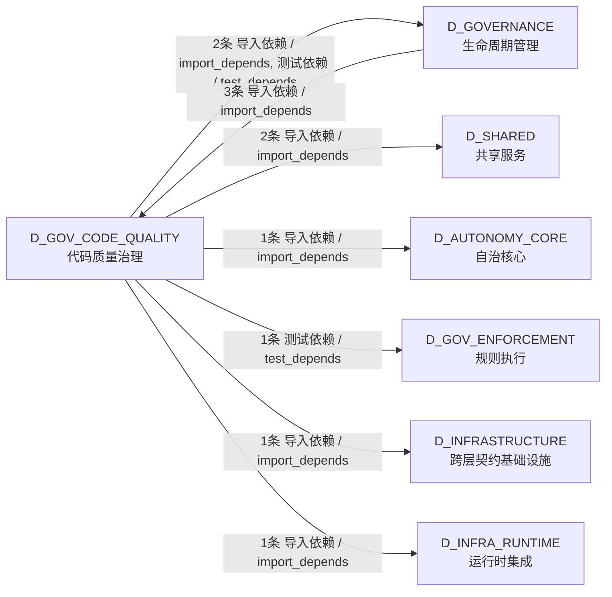

# 19_d_gov_code_quality / 代码质量治理 / Code Quality Governance

> **功能简介 / Overview**: 代码质量治理，负责代码去重引擎、函数重复检测、AST语义分析和提交门禁引擎

> **文档作用 / Purpose**: 展示 代码质量治理（D_GOV_CODE_QUALITY）功能域的模块清单、域内依赖关系、跨域依赖关系、架构分层视图，供架构审查和域治理参考。

> 本文档由 generate_domain_doc.py 从 depgraph (PostgreSQL) 自动生成
> 数据源: depgraph (PostgreSQL) nodes表 + edges表

## 域基本信息 / Domain Overview

| 字段 | 值 | Field | Value |
|------|------|-------|-------|
| 编号 | 19 | Number | 19 |
| 域ID | D_GOV_CODE_QUALITY | Domain ID | D_GOV_CODE_QUALITY |
| 域名称 | 代码质量治理 | Domain Name | Code Quality Governance |
| 层级 | L1 基础平台层 | Layer | L1 Foundation |
| 模块数 | 78 | Module Count | 78 |
| 域内依赖 | 6 | Internal Dependencies | 6 |
| 跨域入边 | 3 | Cross-domain Incoming | 3 |
| 跨域出边 | 8 | Cross-domain Outgoing | 8 |
| 设计态模块 | 0 | Design Modules | 0 |
| 生产态模块 | 78 | Production Modules | 78 |
| 容量 | 168/150 (超容) | Capacity | 168/150 (超容) |
| 描述 | 代码去重引擎(code_dedup) | Description | 代码去重引擎(code_dedup) |

## 模块分层清单 / Module Layered List

> 按 architecture_layer 分组的模块清单（共 78 个模块 / 78 modules）。

### L1 基础层 / Foundation Layer (78 modules)

| # | 模块路径 / Module Path | 模块名称 / Module Name (功能简介 / Description) | 成熟度 / Maturity | 蓝图 / Blueprint |
|:--:|---------|---------|:---:|:---:|
| 1 | scripts/governance/d3_metadata/check_pure_assertion.py | check_pure_assertion.py — GOV-DOC-016 纯陈述原... | 生产态 / production |  |
| 2 | scripts/governance/d7_code/check_module_id_consistency.py | check_module_id_consistency.py — module_id 全... | 生产态 / production |  |
| 3 | src/zephyr/gov_code_quality/__init__.py | gov_code_quality domain package — code quality... | 生产态 / production |  |
| 4 | src/zephyr/gov_code_quality/code_dedup/__init__.py | code-dedup-engine 子包 — 重复代码检测与治理引擎. | 生产态 / production |  |
| 5 | src/zephyr/gov_code_quality/code_dedup/annotations.py | 共享函数注解引擎 — @shared / @known_dup / @int... | 生产态 / production |  |
| 6 | src/zephyr/gov_code_quality/code_dedup/ast_comparator.py | Stage 2: AST 级精确比对器. | 生产态 / production |  |
| 7 | src/zephyr/gov_code_quality/code_dedup/atomic_fixer.py | 原子性修复引擎 — WAL 式 PREFLIGHT -> CHECKPOIN... | 生产态 / production |  |
| 8 | src/zephyr/gov_code_quality/code_dedup/auto_fixer.py | 安全自动修复引擎——五直接开关+五间接约束. | 生产态 / production |  |
| 9 | src/zephyr/gov_code_quality/code_dedup/behavioral_sampler.py | 行为采样验证器 — Stage 0.25 低成本快速验证. | 生产态 / production |  |
| 10 | src/zephyr/gov_code_quality/code_dedup/behavioral_trust_c... | 行为信任检查器 — 行为漂移DIVERGED检测. | 生产态 / production |  |
| 11 | src/zephyr/gov_code_quality/code_dedup/cache_manager.py | Stage 0: 函数缓存管理器 — 增量扫描的加速核心. | 生产态 / production |  |
| 12 | src/zephyr/gov_code_quality/code_dedup/canary_manager.py | 金丝雀工厂——生成已知oracle 文件 用于引擎检出+... | 生产态 / production |  |
| 13 | src/zephyr/gov_code_quality/code_dedup/canary_register.py | 金丝雀注册表维护器 — 注册/过期/腐败检测. | 生产态 / production |  |
| 14 | src/zephyr/gov_code_quality/code_dedup/cli.py | code-dedup-engine CLI——子命令映射+退出码+扫描入口. | 生产态 / production |  |
| 15 | src/zephyr/gov_code_quality/code_dedup/code_analyzer_runn... | 检查运行器——按照敏感基线运行三阶段+导出 yaml 报告. | 生产态 / production |  |
| 16 | src/zephyr/gov_code_quality/code_dedup/code_simulator.py | 代码模拟器——播放录制的克隆演化序列，stress-te... | 生产态 / production |  |
| 17 | src/zephyr/gov_code_quality/code_dedup/config.py | 配置管理 — 策略树 YAML 加载 + 项目规模感知四 T... | 生产态 / production |  |
| 18 | src/zephyr/gov_code_quality/code_dedup/contract_consisten... | API契约一致性检查器 — 存在性·行为·契约三维. | 生产态 / production |  |
| 19 | src/zephyr/gov_code_quality/code_dedup/cross_boundary_det... | 跨边界克隆感知——四大边界差异化检测+独立策略+... | 生产态 / production |  |
| 20 | src/zephyr/gov_code_quality/code_dedup/dead_module_detect... | 死共享模块检测器 — shared/子模块无人使用 -> DEAD. | 生产态 / production |  |
| 21 | src/zephyr/gov_code_quality/code_dedup/debt_projector.py | 去重债务预测器 — weeks_to_payoff + intake_rate... | 生产态 / production |  |
| 22 | src/zephyr/gov_code_quality/code_dedup/decision_auditor.py | 决策审计链 — DecisionFingerprint 不可变追加日志. | 生产态 / production |  |
| 23 | src/zephyr/gov_code_quality/code_dedup/degradation.py | 降级运行管理器 — 各 Stage 独立 try/except + de... | 生产态 / production |  |
| 24 | src/zephyr/gov_code_quality/code_dedup/diff_detector.py | Stage 0: Git diff 变更检测器 — 函数粒度增量. | 生产态 / production |  |
| 25 | src/zephyr/gov_code_quality/code_dedup/doom_loop_guard.py | Doom Loop 防护 — 修复升级阶梯 L0-L4 状态机. | 生产态 / production |  |
| 26 | src/zephyr/gov_code_quality/code_dedup/exit_codes.py | 退出码定义模块——五档exit code 0-4枚举+描述+判... | 生产态 / production |  |
| 27 | src/zephyr/gov_code_quality/code_dedup/extraction_safety.py | 安全提取适配性评估器 — Suitability Score 0-100... | 生产态 / production |  |
| 28 | src/zephyr/gov_code_quality/code_dedup/false_negative_aud... | 三层漏报盲审器 — L1 Sweep + L2 Canary + L3 Sam... | 生产态 / production |  |
| 29 | src/zephyr/gov_code_quality/code_dedup/fifteen_dimension_... | 15维超综合审计首页 — 逐项证明"做过且做对". | 生产态 / production |  |
| 30 | src/zephyr/gov_code_quality/code_dedup/file_creator.py | 文件创建清单执行器 — 验证所有源/测试/数据文件... | 生产态 / production |  |
| 31 | src/zephyr/gov_code_quality/code_dedup/function_discovery.py | 共享函数主动发现 — 签名+语义双通道从被动到主动. | 生产态 / production |  |
| 32 | src/zephyr/gov_code_quality/code_dedup/grandfather_manage... | Grandfather 三定律 — 古老重复管理. | 生产态 / production |  |
| 33 | src/zephyr/gov_code_quality/code_dedup/health_monitor.py | 健康仪表盘 — Dedup Health Score 0-100 + 趋势 +... | 生产态 / production |  |
| 34 | src/zephyr/gov_code_quality/code_dedup/integration_hub.py | 集成协调器 — 24集成+19更新+16GitHub整合. | 生产态 / production |  |
| 35 | src/zephyr/gov_code_quality/code_dedup/integrations.py | 集成管理——预提交钩子+CI-only 扫描+超时边界. | 生产态 / production |  |
| 36 | src/zephyr/gov_code_quality/code_dedup/micro_clone_detect... | 微型克隆检测器 — n-gram频率计数, 1-2行高频模式... | 生产态 / production |  |
| 37 | src/zephyr/gov_code_quality/code_dedup/mock_duplicate_gen... | 可控克隆生产器——零假阳性可期待引擎分子离散 | 生产态 / production |  |
| 38 | src/zephyr/gov_code_quality/code_dedup/monoculture_guard.py | Monoculture 免疫 — BRS 0-100 + 去重悖论检测. | 生产态 / production |  |
| 39 | src/zephyr/gov_code_quality/code_dedup/observation_window... | 提取后稳定观察期守护 — 对标SDP 14天观察. | 生产态 / production |  |
| 40 | src/zephyr/gov_code_quality/code_dedup/path_index_validat... | 路径索引验证——验证 config 数据集相对路径表与... | 生产态 / production |  |
| 41 | src/zephyr/gov_code_quality/code_dedup/phase_executor.py | 6Phase施工执行器 — Phase 0~5 执行状态追踪. | 生产态 / production |  |
| 42 | src/zephyr/gov_code_quality/code_dedup/policy_tree_valida... | 策略树自动一致性校验器 — 虚线箭头影响分析. | 生产态 / production |  |
| 43 | src/zephyr/gov_code_quality/code_dedup/pre_apply_integrit... | Pre-Apply 完整性门 — SHA256重新验证. | 生产态 / production |  |
| 44 | src/zephyr/gov_code_quality/code_dedup/prioritizer.py | 修复优先级排序器 — 置信度×Impact×适配性 三因... | 生产态 / production |  |
| 45 | src/zephyr/gov_code_quality/code_dedup/recovery_manifest_... | Recovery Manifest Writer — R2纯文本base64 Mani... | 生产态 / production |  |
| 46 | src/zephyr/gov_code_quality/code_dedup/report.py | 报告生成器 — YAML/JSON 输出 + 退出码判定 + Hea... | 生产态 / production |  |
| 47 | src/zephyr/gov_code_quality/code_dedup/risk_mitigator.py | R1-R45全量风险缓解执行器 — 逐条检查缓解措施 + ... | 生产态 / production |  |
| 48 | src/zephyr/gov_code_quality/code_dedup/self_scanner.py | 引擎自扫描器 — Dogfooding 检测引擎自身源码重复. | 生产态 / production |  |
| 49 | src/zephyr/gov_code_quality/code_dedup/sensitivity_sweepe... | 敏感性扫荡——threshold扫描->固化成new baseline... | 生产态 / production |  |
| 50 | src/zephyr/gov_code_quality/code_dedup/shadow_trust_valid... | 影子信任验证器 — ImportError 防护回路. | 生产态 / production |  |
| 51 | src/zephyr/gov_code_quality/code_dedup/shadow_verifier.py | 影子清单验证器 — size sanity check + semantic... | 生产态 / production |  |
| 52 | src/zephyr/gov_code_quality/code_dedup/shared_evolver.py | 共享函数自我进化引擎 — 自动升降级 + 行为漂移锁定. | 生产态 / production |  |
| 53 | src/zephyr/gov_code_quality/code_dedup/shared_lifecycle_m... | 共享函数生命周期管理 — Active->Deprecated->Gra... | 生产态 / production |  |
| 54 | src/zephyr/gov_code_quality/code_dedup/signature_matcher.py | Stage 0.5: 签名指纹 SHA256[:12] O(1) 精确匹配. | 生产态 / production |  |
| 55 | src/zephyr/gov_code_quality/code_dedup/simplicity_auditor.py | 引擎成本效益自审计器 — SAS 0-100 月度审计 + Ta... | 生产态 / production |  |
| 56 | src/zephyr/gov_code_quality/code_dedup/ssot_registrar.py | SSoT注册器 — 提取函数自动注册到 shared API清单. | 生产态 / production |  |
| 57 | src/zephyr/gov_code_quality/code_dedup/stale_shared_detec... | 过时共享函数检测器 — 无caller × 30天 -> STALE标记. | 生产态 / production |  |
| 58 | src/zephyr/gov_code_quality/code_dedup/success_validator.py | 成功验证——判断一次去重操作是否真正消灭了克隆. | 生产态 / production |  |
| 59 | src/zephyr/gov_code_quality/code_dedup/symbol_index.py | 符号索引 — 全局函数/类/import映射表. | 生产态 / production |  |
| 60 | src/zephyr/gov_code_quality/code_dedup/thematic_clusterer.py | 主题聚类器 — 噪声信号比·告警疲劳缓解. | 生产态 / production |  |
| 61 | src/zephyr/gov_code_quality/code_dedup/trackers/__init__.py | tracker 族子包 — 风险/盲点/热点跟踪器集合. | 生产态 / production |  |
| 62 | src/zephyr/gov_code_quality/code_dedup/trackers/blind_spo... | 盲点关闭追踪器 — 自动验证各轮盲点是否已覆盖. | 生产态 / production |  |
| 63 | src/zephyr/gov_code_quality/code_dedup/trackers/consequen... | 后果追踪——记录每次修复操作对依赖方的影响. | 生产态 / production |  |
| 64 | src/zephyr/gov_code_quality/code_dedup/trackers/hotspot_t... | 热点追踪器 — 90天滑动窗口 + 高频变动检测 + 新... | 生产态 / production |  |
| 65 | src/zephyr/gov_code_quality/code_dedup/trackers/import_su... | Import表面积负债追踪 — SBS 0-100 + shared burd... | 生产态 / production |  |
| 66 | src/zephyr/gov_code_quality/code_dedup/trackers/question_... | 问题追踪——扫描中发现需要人工处理的问题. | 生产态 / production |  |
| 67 | src/zephyr/gov_code_quality/code_dedup/trackers/risk_miti... | 风险缓解追踪——捕获哪些克隆报告了但在N次扫描后... | 生产态 / production |  |
| 68 | src/zephyr/gov_code_quality/code_dedup/verifier.py | 修复验证器 — import + 类型 + 行为采样验证. | 生产态 / production |  |
| 69 | tests/governance/test_apply_dataflowgraph_smoke.py | test_apply_dataflowgraph_smoke.py — apply_data... | 生产态 / production |  |
| 70 | tests/governance/test_apply_decisiongraph_smoke.py | test_apply_decisiongraph_smoke.py — apply_deci... | 生产态 / production |  |
| 71 | tests/governance/test_apply_depgraph_smoke.py | test_apply_depgraph_smoke.py — apply_depgraph.... | 生产态 / production |  |
| 72 | tests/governance/test_audit_return_contract_usage.py | test_audit_return_contract_usage.py — 返回契约... | 生产态 / production |  |
| 73 | tests/governance/test_audit_worktree_ops_telemetry.py | test_audit_worktree_ops_telemetry.py — worktre... | 生产态 / production |  |
| 74 | tests/governance/test_generate_project_depgraph_smoke.py | test_generate_project_depgraph_smoke.py — gene... | 生产态 / production |  |
| 75 | tests/governance/test_post_commit_guard_no_verify_thresho... | test_post_commit_guard_no_verify_threshold.py ... | 生产态 / production |  |
| 76 | tests/governance/test_run_silent_failure_regression.py | test_run_silent_failure_regression.py — silent... | 生产态 / production |  |
| 77 | tests/governance/test_session_startup_health_check.py | test_session_startup_health_check.py — AI sess... | 生产态 / production |  |
| 78 | tests/governance/test_sync_yaml_to_depgraph_smoke.py | test_sync_yaml_to_depgraph_smoke.py — sync_yam... | 生产态 / production |  |

## 域内依赖图 / Internal Dependency Diagram

> 依赖图内嵌在本文档中，IDE 可直接渲染显示。参考 decision_index.md 设计，分三个视图：合并全景图、运营态子图、设计态子图（按 design_maturity 实际值拆分）。
>
> **图例说明 / Legend**：
> - **实线边框 = 运营态模块**（production，已上线运行）
> - **虚线边框 = 设计态模块**（design，蓝图阶段，代码未写）
> - **实线箭头 = 运营态依赖**（已生效的依赖关系）
> - **虚线箭头 = 非运营态依赖**（计划中/验证中的依赖关系）

### 合并全景图（全部模块，标签标注成熟度）

> 展示全部 78 个模块（生产态 78 + 设计态 0），标签标注成熟度。

#### 第 1 页 / 共 3 页

```mermaid
graph TD
    subgraph D_GOV_CODE_QUALITY["D_GOV_CODE_QUALITY 代码质量治理"]
        scripts_governance_d3_metadata_check_pure_assertion_py["(生产态 / production) check_pure_assertion.py — GOV-DOC-016 纯陈述原...<br/>文件: check_pure_assertion.py"]
        scripts_governance_d7_code_check_module_id_consistency_py["(生产态 / production) check_module_id_consistency.py — module_id 全...<br/>文件: check_module_id_consistency.py"]
        src_zephyr_gov_code_quality_init_py["(生产态 / production) gov_code_quality domain package — code quality...<br/>文件: __init__.py"]
        src_zephyr_gov_code_quality_code_dedup_init_py["(生产态 / production) code-dedup-engine 子包 — 重复代码检测与治理引擎.<br/>文件: __init__.py"]
        src_zephyr_gov_code_quality_code_dedup_annotations_py["(生产态 / production) 共享函数注解引擎 — @shared / @known_dup / @int...<br/>文件: annotations.py"]
        src_zephyr_gov_code_quality_code_dedup_ast_comparator_py["(生产态 / production) Stage 2: AST 级精确比对器.<br/>文件: ast_comparator.py"]
        src_zephyr_gov_code_quality_code_dedup_atomic_fixer_py["(生产态 / production) 原子性修复引擎 — WAL 式 PREFLIGHT -> CHECKPOIN...<br/>文件: atomic_fixer.py"]
        src_zephyr_gov_code_quality_code_dedup_auto_fixer_py["(生产态 / production) 安全自动修复引擎——五直接开关+五间接约束.<br/>文件: auto_fixer.py"]
        src_zephyr_gov_code_quality_code_dedup_behavioral_sampler_py["(生产态 / production) 行为采样验证器 — Stage 0.25 低成本快速验证.<br/>文件: behavioral_sampler.py"]
        src_zephyr_gov_code_quality_code_dedup_behavioral_trust_checker_py["(生产态 / production) 行为信任检查器 — 行为漂移DIVERGED检测.<br/>文件: behavioral_trust_checker.py"]
        src_zephyr_gov_code_quality_code_dedup_cache_manager_py["(生产态 / production) Stage 0: 函数缓存管理器 — 增量扫描的加速核心.<br/>文件: cache_manager.py"]
        src_zephyr_gov_code_quality_code_dedup_canary_manager_py["(生产态 / production) 金丝雀工厂——生成已知oracle 文件 用于引擎检出+...<br/>文件: canary_manager.py"]
        src_zephyr_gov_code_quality_code_dedup_canary_register_py["(生产态 / production) 金丝雀注册表维护器 — 注册/过期/腐败检测.<br/>文件: canary_register.py"]
        src_zephyr_gov_code_quality_code_dedup_cli_py["(生产态 / production) code-dedup-engine CLI——子命令映射+退出码+扫描入口.<br/>文件: cli.py"]
        src_zephyr_gov_code_quality_code_dedup_code_analyzer_runner_py["(生产态 / production) 检查运行器——按照敏感基线运行三阶段+导出 yaml 报告.<br/>文件: code_analyzer_runner.py"]
        src_zephyr_gov_code_quality_code_dedup_code_simulator_py["(生产态 / production) 代码模拟器——播放录制的克隆演化序列，stress-te...<br/>文件: code_simulator.py"]
        src_zephyr_gov_code_quality_code_dedup_config_py["(生产态 / production) 配置管理 — 策略树 YAML 加载 + 项目规模感知四 T...<br/>文件: config.py"]
        src_zephyr_gov_code_quality_code_dedup_contract_consistency_checker_py["(生产态 / production) API契约一致性检查器 — 存在性·行为·契约三维.<br/>文件: contract_consistency_checker.py"]
        src_zephyr_gov_code_quality_code_dedup_cross_boundary_detector_py["(生产态 / production) 跨边界克隆感知——四大边界差异化检测+独立策略+...<br/>文件: cross_boundary_detector.py"]
        src_zephyr_gov_code_quality_code_dedup_dead_module_detector_py["(生产态 / production) 死共享模块检测器 — shared/子模块无人使用 -> DEAD.<br/>文件: dead_module_detector.py"]
        src_zephyr_gov_code_quality_code_dedup_debt_projector_py["(生产态 / production) 去重债务预测器 — weeks_to_payoff + intake_rate...<br/>文件: debt_projector.py"]
        src_zephyr_gov_code_quality_code_dedup_decision_auditor_py["(生产态 / production) 决策审计链 — DecisionFingerprint 不可变追加日志.<br/>文件: decision_auditor.py"]
        src_zephyr_gov_code_quality_code_dedup_degradation_py["(生产态 / production) 降级运行管理器 — 各 Stage 独立 try/except + de...<br/>文件: degradation.py"]
        src_zephyr_gov_code_quality_code_dedup_diff_detector_py["(生产态 / production) Stage 0: Git diff 变更检测器 — 函数粒度增量.<br/>文件: diff_detector.py"]
        src_zephyr_gov_code_quality_code_dedup_doom_loop_guard_py["(生产态 / production) Doom Loop 防护 — 修复升级阶梯 L0-L4 状态机.<br/>文件: doom_loop_guard.py"]
        src_zephyr_gov_code_quality_code_dedup_exit_codes_py["(生产态 / production) 退出码定义模块——五档exit code 0-4枚举+描述+判...<br/>文件: exit_codes.py"]
        src_zephyr_gov_code_quality_code_dedup_extraction_safety_py["(生产态 / production) 安全提取适配性评估器 — Suitability Score 0-100...<br/>文件: extraction_safety.py"]
        src_zephyr_gov_code_quality_code_dedup_false_negative_auditor_py["(生产态 / production) 三层漏报盲审器 — L1 Sweep + L2 Canary + L3 Sam...<br/>文件: false_negative_auditor.py"]
        src_zephyr_gov_code_quality_code_dedup_fifteen_dimension_auditor_py["(生产态 / production) 15维超综合审计首页 — 逐项证明'做过且做对'.<br/>文件: fifteen_dimension_auditor.py"]
        src_zephyr_gov_code_quality_code_dedup_file_creator_py["(生产态 / production) 文件创建清单执行器 — 验证所有源/测试/数据文件...<br/>文件: file_creator.py"]
    end
    src_zephyr_gov_code_quality_code_dedup_cli_py -->|导入依赖 / import_depends| src_zephyr_gov_code_quality_code_dedup_auto_fixer_py
    src_zephyr_gov_code_quality_code_dedup_cli_py -->|导入依赖 / import_depends| src_zephyr_gov_code_quality_code_dedup_exit_codes_py
    src_zephyr_gov_code_quality_code_dedup_init_py -->|config_depends / config_depends| src_zephyr_gov_code_quality_code_dedup_atomic_fixer_py
    D_SHARED["(生产态 / production) D_SHARED"]
    src_zephyr_gov_code_quality_code_dedup_cache_manager_py -->|导入依赖 / import_depends| D_SHARED
    D_GOVERNANCE["(生产态 / production) D_GOVERNANCE"]
    src_zephyr_gov_code_quality_code_dedup_cli_py -->|导入依赖 / import_depends| D_GOVERNANCE
    D_INFRA_RUNTIME["(生产态 / production) D_INFRA_RUNTIME"]
    src_zephyr_gov_code_quality_code_dedup_cli_py -->|导入依赖 / import_depends| D_INFRA_RUNTIME
    D_INFRASTRUCTURE["(生产态 / production) D_INFRASTRUCTURE"]
    src_zephyr_gov_code_quality_code_dedup_config_py -->|导入依赖 / import_depends| D_INFRASTRUCTURE
    src_zephyr_gov_code_quality_code_dedup_diff_detector_py -->|导入依赖 / import_depends| D_SHARED
    D_GOVERNANCE -->|导入依赖 / import_depends| src_zephyr_gov_code_quality_code_dedup_ast_comparator_py
    D_GOVERNANCE -->|导入依赖 / import_depends| src_zephyr_gov_code_quality_code_dedup_behavioral_sampler_py
    classDef production fill:#e1f5fe,stroke:#01579b,stroke-width:2px,color:#000
    classDef design fill:#fff3e0,stroke:#e65100,stroke-width:2px,color:#000,stroke-dasharray: 5 5
    classDef external_prod fill:#e8f5e9,stroke:#1b5e20,stroke-width:1px,color:#000
    classDef external_design fill:#fce4ec,stroke:#880e4f,stroke-width:1px,color:#000,stroke-dasharray: 5 5
    class scripts_governance_d3_metadata_check_pure_assertion_py,scripts_governance_d7_code_check_module_id_consistency_py,src_zephyr_gov_code_quality_init_py,src_zephyr_gov_code_quality_code_dedup_init_py,src_zephyr_gov_code_quality_code_dedup_annotations_py,src_zephyr_gov_code_quality_code_dedup_ast_comparator_py,src_zephyr_gov_code_quality_code_dedup_atomic_fixer_py,src_zephyr_gov_code_quality_code_dedup_auto_fixer_py,src_zephyr_gov_code_quality_code_dedup_behavioral_sampler_py,src_zephyr_gov_code_quality_code_dedup_behavioral_trust_checker_py,src_zephyr_gov_code_quality_code_dedup_cache_manager_py,src_zephyr_gov_code_quality_code_dedup_canary_manager_py,src_zephyr_gov_code_quality_code_dedup_canary_register_py,src_zephyr_gov_code_quality_code_dedup_cli_py,src_zephyr_gov_code_quality_code_dedup_code_analyzer_runner_py,src_zephyr_gov_code_quality_code_dedup_code_simulator_py,src_zephyr_gov_code_quality_code_dedup_config_py,src_zephyr_gov_code_quality_code_dedup_contract_consistency_checker_py,src_zephyr_gov_code_quality_code_dedup_cross_boundary_detector_py,src_zephyr_gov_code_quality_code_dedup_dead_module_detector_py,src_zephyr_gov_code_quality_code_dedup_debt_projector_py,src_zephyr_gov_code_quality_code_dedup_decision_auditor_py,src_zephyr_gov_code_quality_code_dedup_degradation_py,src_zephyr_gov_code_quality_code_dedup_diff_detector_py,src_zephyr_gov_code_quality_code_dedup_doom_loop_guard_py,src_zephyr_gov_code_quality_code_dedup_exit_codes_py,src_zephyr_gov_code_quality_code_dedup_extraction_safety_py,src_zephyr_gov_code_quality_code_dedup_false_negative_auditor_py,src_zephyr_gov_code_quality_code_dedup_fifteen_dimension_auditor_py,src_zephyr_gov_code_quality_code_dedup_file_creator_py production
    class D_SHARED,D_GOVERNANCE,D_INFRA_RUNTIME,D_INFRASTRUCTURE external_prod
```



#### 第 2 页 / 共 3 页

```mermaid
graph TD
    subgraph D_GOV_CODE_QUALITY["D_GOV_CODE_QUALITY 代码质量治理"]
        src_zephyr_gov_code_quality_code_dedup_function_discovery_py["(生产态 / production) 共享函数主动发现 — 签名+语义双通道从被动到主动.<br/>文件: function_discovery.py"]
        src_zephyr_gov_code_quality_code_dedup_grandfather_manager_py["(生产态 / production) Grandfather 三定律 — 古老重复管理.<br/>文件: grandfather_manager.py"]
        src_zephyr_gov_code_quality_code_dedup_health_monitor_py["(生产态 / production) 健康仪表盘 — Dedup Health Score 0-100 + 趋势 +...<br/>文件: health_monitor.py"]
        src_zephyr_gov_code_quality_code_dedup_integration_hub_py["(生产态 / production) 集成协调器 — 24集成+19更新+16GitHub整合.<br/>文件: integration_hub.py"]
        src_zephyr_gov_code_quality_code_dedup_integrations_py["(生产态 / production) 集成管理——预提交钩子+CI-only 扫描+超时边界.<br/>文件: integrations.py"]
        src_zephyr_gov_code_quality_code_dedup_micro_clone_detector_py["(生产态 / production) 微型克隆检测器 — n-gram频率计数, 1-2行高频模式...<br/>文件: micro_clone_detector.py"]
        src_zephyr_gov_code_quality_code_dedup_mock_duplicate_generator_py["(生产态 / production) 可控克隆生产器——零假阳性可期待引擎分子离散<br/>文件: mock_duplicate_generator.py"]
        src_zephyr_gov_code_quality_code_dedup_monoculture_guard_py["(生产态 / production) Monoculture 免疫 — BRS 0-100 + 去重悖论检测.<br/>文件: monoculture_guard.py"]
        src_zephyr_gov_code_quality_code_dedup_observation_window_guard_py["(生产态 / production) 提取后稳定观察期守护 — 对标SDP 14天观察.<br/>文件: observation_window_guard.py"]
        src_zephyr_gov_code_quality_code_dedup_path_index_validator_py["(生产态 / production) 路径索引验证——验证 config 数据集相对路径表与...<br/>文件: path_index_validator.py"]
        src_zephyr_gov_code_quality_code_dedup_phase_executor_py["(生产态 / production) 6Phase施工执行器 — Phase 0~5 执行状态追踪.<br/>文件: phase_executor.py"]
        src_zephyr_gov_code_quality_code_dedup_policy_tree_validator_py["(生产态 / production) 策略树自动一致性校验器 — 虚线箭头影响分析.<br/>文件: policy_tree_validator.py"]
        src_zephyr_gov_code_quality_code_dedup_pre_apply_integrity_gate_py["(生产态 / production) Pre-Apply 完整性门 — SHA256重新验证.<br/>文件: pre_apply_integrity_gate.py"]
        src_zephyr_gov_code_quality_code_dedup_prioritizer_py["(生产态 / production) 修复优先级排序器 — 置信度×Impact×适配性 三因...<br/>文件: prioritizer.py"]
        src_zephyr_gov_code_quality_code_dedup_recovery_manifest_writer_py["(生产态 / production) Recovery Manifest Writer — R2纯文本base64 Mani...<br/>文件: recovery_manifest_writer.py"]
        src_zephyr_gov_code_quality_code_dedup_report_py["(生产态 / production) 报告生成器 — YAML/JSON 输出 + 退出码判定 + Hea...<br/>文件: report.py"]
        src_zephyr_gov_code_quality_code_dedup_risk_mitigator_py["(生产态 / production) R1-R45全量风险缓解执行器 — 逐条检查缓解措施 + ...<br/>文件: risk_mitigator.py"]
        src_zephyr_gov_code_quality_code_dedup_self_scanner_py["(生产态 / production) 引擎自扫描器 — Dogfooding 检测引擎自身源码重复.<br/>文件: self_scanner.py"]
        src_zephyr_gov_code_quality_code_dedup_sensitivity_sweeper_py["(生产态 / production) 敏感性扫荡——threshold扫描->固化成new baseline...<br/>文件: sensitivity_sweeper.py"]
        src_zephyr_gov_code_quality_code_dedup_shadow_trust_validator_py["(生产态 / production) 影子信任验证器 — ImportError 防护回路.<br/>文件: shadow_trust_validator.py"]
        src_zephyr_gov_code_quality_code_dedup_shadow_verifier_py["(生产态 / production) 影子清单验证器 — size sanity check + semantic...<br/>文件: shadow_verifier.py"]
        src_zephyr_gov_code_quality_code_dedup_shared_evolver_py["(生产态 / production) 共享函数自我进化引擎 — 自动升降级 + 行为漂移锁定.<br/>文件: shared_evolver.py"]
        src_zephyr_gov_code_quality_code_dedup_shared_lifecycle_manager_py["(生产态 / production) 共享函数生命周期管理 — Active->Deprecated->Gra...<br/>文件: shared_lifecycle_manager.py"]
        src_zephyr_gov_code_quality_code_dedup_signature_matcher_py["(生产态 / production) Stage 0.5: 签名指纹 SHA256(:12) O(1) 精确匹配.<br/>文件: signature_matcher.py"]
        src_zephyr_gov_code_quality_code_dedup_simplicity_auditor_py["(生产态 / production) 引擎成本效益自审计器 — SAS 0-100 月度审计 + Ta...<br/>文件: simplicity_auditor.py"]
        src_zephyr_gov_code_quality_code_dedup_ssot_registrar_py["(生产态 / production) SSoT注册器 — 提取函数自动注册到 shared API清单.<br/>文件: ssot_registrar.py"]
        src_zephyr_gov_code_quality_code_dedup_stale_shared_detector_py["(生产态 / production) 过时共享函数检测器 — 无caller × 30天 -> STALE标记.<br/>文件: stale_shared_detector.py"]
        src_zephyr_gov_code_quality_code_dedup_success_validator_py["(生产态 / production) 成功验证——判断一次去重操作是否真正消灭了克隆.<br/>文件: success_validator.py"]
        src_zephyr_gov_code_quality_code_dedup_symbol_index_py["(生产态 / production) 符号索引 — 全局函数/类/import映射表.<br/>文件: symbol_index.py"]
        src_zephyr_gov_code_quality_code_dedup_thematic_clusterer_py["(生产态 / production) 主题聚类器 — 噪声信号比·告警疲劳缓解.<br/>文件: thematic_clusterer.py"]
    end
    D_AUTONOMY_CORE["(生产态 / production) D_AUTONOMY_CORE"]
    src_zephyr_gov_code_quality_code_dedup_integration_hub_py -->|导入依赖 / import_depends| D_AUTONOMY_CORE
    D_GOVERNANCE["(生产态 / production) D_GOVERNANCE"]
    D_GOVERNANCE -->|导入依赖 / import_depends| src_zephyr_gov_code_quality_code_dedup_micro_clone_detector_py
    classDef production fill:#e1f5fe,stroke:#01579b,stroke-width:2px,color:#000
    classDef design fill:#fff3e0,stroke:#e65100,stroke-width:2px,color:#000,stroke-dasharray: 5 5
    classDef external_prod fill:#e8f5e9,stroke:#1b5e20,stroke-width:1px,color:#000
    classDef external_design fill:#fce4ec,stroke:#880e4f,stroke-width:1px,color:#000,stroke-dasharray: 5 5
    class src_zephyr_gov_code_quality_code_dedup_function_discovery_py,src_zephyr_gov_code_quality_code_dedup_grandfather_manager_py,src_zephyr_gov_code_quality_code_dedup_health_monitor_py,src_zephyr_gov_code_quality_code_dedup_integration_hub_py,src_zephyr_gov_code_quality_code_dedup_integrations_py,src_zephyr_gov_code_quality_code_dedup_micro_clone_detector_py,src_zephyr_gov_code_quality_code_dedup_mock_duplicate_generator_py,src_zephyr_gov_code_quality_code_dedup_monoculture_guard_py,src_zephyr_gov_code_quality_code_dedup_observation_window_guard_py,src_zephyr_gov_code_quality_code_dedup_path_index_validator_py,src_zephyr_gov_code_quality_code_dedup_phase_executor_py,src_zephyr_gov_code_quality_code_dedup_policy_tree_validator_py,src_zephyr_gov_code_quality_code_dedup_pre_apply_integrity_gate_py,src_zephyr_gov_code_quality_code_dedup_prioritizer_py,src_zephyr_gov_code_quality_code_dedup_recovery_manifest_writer_py,src_zephyr_gov_code_quality_code_dedup_report_py,src_zephyr_gov_code_quality_code_dedup_risk_mitigator_py,src_zephyr_gov_code_quality_code_dedup_self_scanner_py,src_zephyr_gov_code_quality_code_dedup_sensitivity_sweeper_py,src_zephyr_gov_code_quality_code_dedup_shadow_trust_validator_py,src_zephyr_gov_code_quality_code_dedup_shadow_verifier_py,src_zephyr_gov_code_quality_code_dedup_shared_evolver_py,src_zephyr_gov_code_quality_code_dedup_shared_lifecycle_manager_py,src_zephyr_gov_code_quality_code_dedup_signature_matcher_py,src_zephyr_gov_code_quality_code_dedup_simplicity_auditor_py,src_zephyr_gov_code_quality_code_dedup_ssot_registrar_py,src_zephyr_gov_code_quality_code_dedup_stale_shared_detector_py,src_zephyr_gov_code_quality_code_dedup_success_validator_py,src_zephyr_gov_code_quality_code_dedup_symbol_index_py,src_zephyr_gov_code_quality_code_dedup_thematic_clusterer_py production
    class D_AUTONOMY_CORE,D_GOVERNANCE external_prod
```



#### 第 3 页 / 共 3 页

```mermaid
graph TD
    subgraph D_GOV_CODE_QUALITY["D_GOV_CODE_QUALITY 代码质量治理"]
        src_zephyr_gov_code_quality_code_dedup_trackers_init_py["(生产态 / production) tracker 族子包 — 风险/盲点/热点跟踪器集合.<br/>文件: __init__.py"]
        src_zephyr_gov_code_quality_code_dedup_trackers_blind_spot_tracker_py["(生产态 / production) 盲点关闭追踪器 — 自动验证各轮盲点是否已覆盖.<br/>文件: blind_spot_tracker.py"]
        src_zephyr_gov_code_quality_code_dedup_trackers_consequence_tracker_py["(生产态 / production) 后果追踪——记录每次修复操作对依赖方的影响.<br/>文件: consequence_tracker.py"]
        src_zephyr_gov_code_quality_code_dedup_trackers_hotspot_tracker_py["(生产态 / production) 热点追踪器 — 90天滑动窗口 + 高频变动检测 + 新...<br/>文件: hotspot_tracker.py"]
        src_zephyr_gov_code_quality_code_dedup_trackers_import_surface_tracker_py["(生产态 / production) Import表面积负债追踪 — SBS 0-100 + shared burd...<br/>文件: import_surface_tracker.py"]
        src_zephyr_gov_code_quality_code_dedup_trackers_question_tracker_py["(生产态 / production) 问题追踪——扫描中发现需要人工处理的问题.<br/>文件: question_tracker.py"]
        src_zephyr_gov_code_quality_code_dedup_trackers_risk_mitigation_tracker_py["(生产态 / production) 风险缓解追踪——捕获哪些克隆报告了但在N次扫描后...<br/>文件: risk_mitigation_tracker.py"]
        src_zephyr_gov_code_quality_code_dedup_verifier_py["(生产态 / production) 修复验证器 — import + 类型 + 行为采样验证.<br/>文件: verifier.py"]
        tests_governance_test_apply_dataflowgraph_smoke_py["(生产态 / production) test_apply_dataflowgraph_smoke.py — apply_data...<br/>文件: test_apply_dataflowgraph_smoke.py"]
        tests_governance_test_apply_decisiongraph_smoke_py["(生产态 / production) test_apply_decisiongraph_smoke.py — apply_deci...<br/>文件: test_apply_decisiongraph_smoke.py"]
        tests_governance_test_apply_depgraph_smoke_py["(生产态 / production) test_apply_depgraph_smoke.py — apply_depgraph....<br/>文件: test_apply_depgraph_smoke.py"]
        tests_governance_test_audit_return_contract_usage_py["(生产态 / production) test_audit_return_contract_usage.py — 返回契约...<br/>文件: test_audit_return_contract_usage.py"]
        tests_governance_test_audit_worktree_ops_telemetry_py["(生产态 / production) test_audit_worktree_ops_telemetry.py — worktre...<br/>文件: test_audit_worktree_ops_telemetry.py"]
        tests_governance_test_generate_project_depgraph_smoke_py["(生产态 / production) test_generate_project_depgraph_smoke.py — gene...<br/>文件: test_generate_project_depgraph_smoke.py"]
        tests_governance_test_post_commit_guard_no_verify_threshold_py["(生产态 / production) test_post_commit_guard_no_verify_threshold.py ...<br/>文件: test_post_commit_guard_no_verify_threshold.py"]
        tests_governance_test_run_silent_failure_regression_py["(生产态 / production) test_run_silent_failure_regression.py — silent...<br/>文件: test_run_silent_failure_regression.py"]
        tests_governance_test_session_startup_health_check_py["(生产态 / production) test_session_startup_health_check.py — AI sess...<br/>文件: test_session_startup_health_check.py"]
        tests_governance_test_sync_yaml_to_depgraph_smoke_py["(生产态 / production) test_sync_yaml_to_depgraph_smoke.py — sync_yam...<br/>文件: test_sync_yaml_to_depgraph_smoke.py"]
    end
    src_zephyr_gov_code_quality_code_dedup_trackers_init_py -->|config_depends / config_depends| src_zephyr_gov_code_quality_code_dedup_trackers_blind_spot_tracker_py
    D_GOV_ENFORCEMENT["(生产态 / production) D_GOV_ENFORCEMENT"]
    tests_governance_test_audit_worktree_ops_telemetry_py -->|测试依赖 / test_depends| D_GOV_ENFORCEMENT
    D_GOVERNANCE["(生产态 / production) D_GOVERNANCE"]
    tests_governance_test_sync_yaml_to_depgraph_smoke_py -->|测试依赖 / test_depends| D_GOVERNANCE
    classDef production fill:#e1f5fe,stroke:#01579b,stroke-width:2px,color:#000
    classDef design fill:#fff3e0,stroke:#e65100,stroke-width:2px,color:#000,stroke-dasharray: 5 5
    classDef external_prod fill:#e8f5e9,stroke:#1b5e20,stroke-width:1px,color:#000
    classDef external_design fill:#fce4ec,stroke:#880e4f,stroke-width:1px,color:#000,stroke-dasharray: 5 5
    class src_zephyr_gov_code_quality_code_dedup_trackers_init_py,src_zephyr_gov_code_quality_code_dedup_trackers_blind_spot_tracker_py,src_zephyr_gov_code_quality_code_dedup_trackers_consequence_tracker_py,src_zephyr_gov_code_quality_code_dedup_trackers_hotspot_tracker_py,src_zephyr_gov_code_quality_code_dedup_trackers_import_surface_tracker_py,src_zephyr_gov_code_quality_code_dedup_trackers_question_tracker_py,src_zephyr_gov_code_quality_code_dedup_trackers_risk_mitigation_tracker_py,src_zephyr_gov_code_quality_code_dedup_verifier_py,tests_governance_test_apply_dataflowgraph_smoke_py,tests_governance_test_apply_decisiongraph_smoke_py,tests_governance_test_apply_depgraph_smoke_py,tests_governance_test_audit_return_contract_usage_py,tests_governance_test_audit_worktree_ops_telemetry_py,tests_governance_test_generate_project_depgraph_smoke_py,tests_governance_test_post_commit_guard_no_verify_threshold_py,tests_governance_test_run_silent_failure_regression_py,tests_governance_test_session_startup_health_check_py,tests_governance_test_sync_yaml_to_depgraph_smoke_py production
    class D_GOV_ENFORCEMENT,D_GOVERNANCE external_prod
```



### 运营态子图（仅 design_maturity=production 的模块和依赖）

> 仅展示已上线运行的模块（共 78 个，6 条域内依赖）。

```mermaid
graph TD
    subgraph D_GOV_CODE_QUALITY["D_GOV_CODE_QUALITY 代码质量治理"]
        scripts_governance_d3_metadata_check_pure_assertion_py["(生产态 / production) check_pure_assertion.py — GOV-DOC-016 纯陈述原...<br/>文件: check_pure_assertion.py"]
        scripts_governance_d7_code_check_module_id_consistency_py["(生产态 / production) check_module_id_consistency.py — module_id 全...<br/>文件: check_module_id_consistency.py"]
        src_zephyr_gov_code_quality_init_py["(生产态 / production) gov_code_quality domain package — code quality...<br/>文件: __init__.py"]
        src_zephyr_gov_code_quality_code_dedup_init_py["(生产态 / production) code-dedup-engine 子包 — 重复代码检测与治理引擎.<br/>文件: __init__.py"]
        src_zephyr_gov_code_quality_code_dedup_annotations_py["(生产态 / production) 共享函数注解引擎 — @shared / @known_dup / @int...<br/>文件: annotations.py"]
        src_zephyr_gov_code_quality_code_dedup_ast_comparator_py["(生产态 / production) Stage 2: AST 级精确比对器.<br/>文件: ast_comparator.py"]
        src_zephyr_gov_code_quality_code_dedup_atomic_fixer_py["(生产态 / production) 原子性修复引擎 — WAL 式 PREFLIGHT -> CHECKPOIN...<br/>文件: atomic_fixer.py"]
        src_zephyr_gov_code_quality_code_dedup_auto_fixer_py["(生产态 / production) 安全自动修复引擎——五直接开关+五间接约束.<br/>文件: auto_fixer.py"]
        src_zephyr_gov_code_quality_code_dedup_behavioral_sampler_py["(生产态 / production) 行为采样验证器 — Stage 0.25 低成本快速验证.<br/>文件: behavioral_sampler.py"]
        src_zephyr_gov_code_quality_code_dedup_behavioral_trust_checker_py["(生产态 / production) 行为信任检查器 — 行为漂移DIVERGED检测.<br/>文件: behavioral_trust_checker.py"]
        src_zephyr_gov_code_quality_code_dedup_cache_manager_py["(生产态 / production) Stage 0: 函数缓存管理器 — 增量扫描的加速核心.<br/>文件: cache_manager.py"]
        src_zephyr_gov_code_quality_code_dedup_canary_manager_py["(生产态 / production) 金丝雀工厂——生成已知oracle 文件 用于引擎检出+...<br/>文件: canary_manager.py"]
        src_zephyr_gov_code_quality_code_dedup_canary_register_py["(生产态 / production) 金丝雀注册表维护器 — 注册/过期/腐败检测.<br/>文件: canary_register.py"]
        src_zephyr_gov_code_quality_code_dedup_cli_py["(生产态 / production) code-dedup-engine CLI——子命令映射+退出码+扫描入口.<br/>文件: cli.py"]
        src_zephyr_gov_code_quality_code_dedup_code_analyzer_runner_py["(生产态 / production) 检查运行器——按照敏感基线运行三阶段+导出 yaml 报告.<br/>文件: code_analyzer_runner.py"]
        src_zephyr_gov_code_quality_code_dedup_code_simulator_py["(生产态 / production) 代码模拟器——播放录制的克隆演化序列，stress-te...<br/>文件: code_simulator.py"]
        src_zephyr_gov_code_quality_code_dedup_config_py["(生产态 / production) 配置管理 — 策略树 YAML 加载 + 项目规模感知四 T...<br/>文件: config.py"]
        src_zephyr_gov_code_quality_code_dedup_contract_consistency_checker_py["(生产态 / production) API契约一致性检查器 — 存在性·行为·契约三维.<br/>文件: contract_consistency_checker.py"]
        src_zephyr_gov_code_quality_code_dedup_cross_boundary_detector_py["(生产态 / production) 跨边界克隆感知——四大边界差异化检测+独立策略+...<br/>文件: cross_boundary_detector.py"]
        src_zephyr_gov_code_quality_code_dedup_dead_module_detector_py["(生产态 / production) 死共享模块检测器 — shared/子模块无人使用 -> DEAD.<br/>文件: dead_module_detector.py"]
        src_zephyr_gov_code_quality_code_dedup_debt_projector_py["(生产态 / production) 去重债务预测器 — weeks_to_payoff + intake_rate...<br/>文件: debt_projector.py"]
        src_zephyr_gov_code_quality_code_dedup_decision_auditor_py["(生产态 / production) 决策审计链 — DecisionFingerprint 不可变追加日志.<br/>文件: decision_auditor.py"]
        src_zephyr_gov_code_quality_code_dedup_degradation_py["(生产态 / production) 降级运行管理器 — 各 Stage 独立 try/except + de...<br/>文件: degradation.py"]
        src_zephyr_gov_code_quality_code_dedup_diff_detector_py["(生产态 / production) Stage 0: Git diff 变更检测器 — 函数粒度增量.<br/>文件: diff_detector.py"]
        src_zephyr_gov_code_quality_code_dedup_doom_loop_guard_py["(生产态 / production) Doom Loop 防护 — 修复升级阶梯 L0-L4 状态机.<br/>文件: doom_loop_guard.py"]
        src_zephyr_gov_code_quality_code_dedup_exit_codes_py["(生产态 / production) 退出码定义模块——五档exit code 0-4枚举+描述+判...<br/>文件: exit_codes.py"]
        src_zephyr_gov_code_quality_code_dedup_extraction_safety_py["(生产态 / production) 安全提取适配性评估器 — Suitability Score 0-100...<br/>文件: extraction_safety.py"]
        src_zephyr_gov_code_quality_code_dedup_false_negative_auditor_py["(生产态 / production) 三层漏报盲审器 — L1 Sweep + L2 Canary + L3 Sam...<br/>文件: false_negative_auditor.py"]
        src_zephyr_gov_code_quality_code_dedup_fifteen_dimension_auditor_py["(生产态 / production) 15维超综合审计首页 — 逐项证明'做过且做对'.<br/>文件: fifteen_dimension_auditor.py"]
        src_zephyr_gov_code_quality_code_dedup_file_creator_py["(生产态 / production) 文件创建清单执行器 — 验证所有源/测试/数据文件...<br/>文件: file_creator.py"]
        src_zephyr_gov_code_quality_code_dedup_function_discovery_py["(生产态 / production) 共享函数主动发现 — 签名+语义双通道从被动到主动.<br/>文件: function_discovery.py"]
        src_zephyr_gov_code_quality_code_dedup_grandfather_manager_py["(生产态 / production) Grandfather 三定律 — 古老重复管理.<br/>文件: grandfather_manager.py"]
        src_zephyr_gov_code_quality_code_dedup_health_monitor_py["(生产态 / production) 健康仪表盘 — Dedup Health Score 0-100 + 趋势 +...<br/>文件: health_monitor.py"]
        src_zephyr_gov_code_quality_code_dedup_integration_hub_py["(生产态 / production) 集成协调器 — 24集成+19更新+16GitHub整合.<br/>文件: integration_hub.py"]
        src_zephyr_gov_code_quality_code_dedup_integrations_py["(生产态 / production) 集成管理——预提交钩子+CI-only 扫描+超时边界.<br/>文件: integrations.py"]
        src_zephyr_gov_code_quality_code_dedup_micro_clone_detector_py["(生产态 / production) 微型克隆检测器 — n-gram频率计数, 1-2行高频模式...<br/>文件: micro_clone_detector.py"]
        src_zephyr_gov_code_quality_code_dedup_mock_duplicate_generator_py["(生产态 / production) 可控克隆生产器——零假阳性可期待引擎分子离散<br/>文件: mock_duplicate_generator.py"]
        src_zephyr_gov_code_quality_code_dedup_monoculture_guard_py["(生产态 / production) Monoculture 免疫 — BRS 0-100 + 去重悖论检测.<br/>文件: monoculture_guard.py"]
        src_zephyr_gov_code_quality_code_dedup_observation_window_guard_py["(生产态 / production) 提取后稳定观察期守护 — 对标SDP 14天观察.<br/>文件: observation_window_guard.py"]
        src_zephyr_gov_code_quality_code_dedup_path_index_validator_py["(生产态 / production) 路径索引验证——验证 config 数据集相对路径表与...<br/>文件: path_index_validator.py"]
        src_zephyr_gov_code_quality_code_dedup_phase_executor_py["(生产态 / production) 6Phase施工执行器 — Phase 0~5 执行状态追踪.<br/>文件: phase_executor.py"]
        src_zephyr_gov_code_quality_code_dedup_policy_tree_validator_py["(生产态 / production) 策略树自动一致性校验器 — 虚线箭头影响分析.<br/>文件: policy_tree_validator.py"]
        src_zephyr_gov_code_quality_code_dedup_pre_apply_integrity_gate_py["(生产态 / production) Pre-Apply 完整性门 — SHA256重新验证.<br/>文件: pre_apply_integrity_gate.py"]
        src_zephyr_gov_code_quality_code_dedup_prioritizer_py["(生产态 / production) 修复优先级排序器 — 置信度×Impact×适配性 三因...<br/>文件: prioritizer.py"]
        src_zephyr_gov_code_quality_code_dedup_recovery_manifest_writer_py["(生产态 / production) Recovery Manifest Writer — R2纯文本base64 Mani...<br/>文件: recovery_manifest_writer.py"]
        src_zephyr_gov_code_quality_code_dedup_report_py["(生产态 / production) 报告生成器 — YAML/JSON 输出 + 退出码判定 + Hea...<br/>文件: report.py"]
        src_zephyr_gov_code_quality_code_dedup_risk_mitigator_py["(生产态 / production) R1-R45全量风险缓解执行器 — 逐条检查缓解措施 + ...<br/>文件: risk_mitigator.py"]
        src_zephyr_gov_code_quality_code_dedup_self_scanner_py["(生产态 / production) 引擎自扫描器 — Dogfooding 检测引擎自身源码重复.<br/>文件: self_scanner.py"]
        src_zephyr_gov_code_quality_code_dedup_sensitivity_sweeper_py["(生产态 / production) 敏感性扫荡——threshold扫描->固化成new baseline...<br/>文件: sensitivity_sweeper.py"]
        src_zephyr_gov_code_quality_code_dedup_shadow_trust_validator_py["(生产态 / production) 影子信任验证器 — ImportError 防护回路.<br/>文件: shadow_trust_validator.py"]
        src_zephyr_gov_code_quality_code_dedup_shadow_verifier_py["(生产态 / production) 影子清单验证器 — size sanity check + semantic...<br/>文件: shadow_verifier.py"]
        src_zephyr_gov_code_quality_code_dedup_shared_evolver_py["(生产态 / production) 共享函数自我进化引擎 — 自动升降级 + 行为漂移锁定.<br/>文件: shared_evolver.py"]
        src_zephyr_gov_code_quality_code_dedup_shared_lifecycle_manager_py["(生产态 / production) 共享函数生命周期管理 — Active->Deprecated->Gra...<br/>文件: shared_lifecycle_manager.py"]
        src_zephyr_gov_code_quality_code_dedup_signature_matcher_py["(生产态 / production) Stage 0.5: 签名指纹 SHA256(:12) O(1) 精确匹配.<br/>文件: signature_matcher.py"]
        src_zephyr_gov_code_quality_code_dedup_simplicity_auditor_py["(生产态 / production) 引擎成本效益自审计器 — SAS 0-100 月度审计 + Ta...<br/>文件: simplicity_auditor.py"]
        src_zephyr_gov_code_quality_code_dedup_ssot_registrar_py["(生产态 / production) SSoT注册器 — 提取函数自动注册到 shared API清单.<br/>文件: ssot_registrar.py"]
        src_zephyr_gov_code_quality_code_dedup_stale_shared_detector_py["(生产态 / production) 过时共享函数检测器 — 无caller × 30天 -> STALE标记.<br/>文件: stale_shared_detector.py"]
        src_zephyr_gov_code_quality_code_dedup_success_validator_py["(生产态 / production) 成功验证——判断一次去重操作是否真正消灭了克隆.<br/>文件: success_validator.py"]
        src_zephyr_gov_code_quality_code_dedup_symbol_index_py["(生产态 / production) 符号索引 — 全局函数/类/import映射表.<br/>文件: symbol_index.py"]
        src_zephyr_gov_code_quality_code_dedup_thematic_clusterer_py["(生产态 / production) 主题聚类器 — 噪声信号比·告警疲劳缓解.<br/>文件: thematic_clusterer.py"]
        src_zephyr_gov_code_quality_code_dedup_trackers_init_py["(生产态 / production) tracker 族子包 — 风险/盲点/热点跟踪器集合.<br/>文件: __init__.py"]
        src_zephyr_gov_code_quality_code_dedup_trackers_blind_spot_tracker_py["(生产态 / production) 盲点关闭追踪器 — 自动验证各轮盲点是否已覆盖.<br/>文件: blind_spot_tracker.py"]
        src_zephyr_gov_code_quality_code_dedup_trackers_consequence_tracker_py["(生产态 / production) 后果追踪——记录每次修复操作对依赖方的影响.<br/>文件: consequence_tracker.py"]
        src_zephyr_gov_code_quality_code_dedup_trackers_hotspot_tracker_py["(生产态 / production) 热点追踪器 — 90天滑动窗口 + 高频变动检测 + 新...<br/>文件: hotspot_tracker.py"]
        src_zephyr_gov_code_quality_code_dedup_trackers_import_surface_tracker_py["(生产态 / production) Import表面积负债追踪 — SBS 0-100 + shared burd...<br/>文件: import_surface_tracker.py"]
        src_zephyr_gov_code_quality_code_dedup_trackers_question_tracker_py["(生产态 / production) 问题追踪——扫描中发现需要人工处理的问题.<br/>文件: question_tracker.py"]
        src_zephyr_gov_code_quality_code_dedup_trackers_risk_mitigation_tracker_py["(生产态 / production) 风险缓解追踪——捕获哪些克隆报告了但在N次扫描后...<br/>文件: risk_mitigation_tracker.py"]
        src_zephyr_gov_code_quality_code_dedup_verifier_py["(生产态 / production) 修复验证器 — import + 类型 + 行为采样验证.<br/>文件: verifier.py"]
        tests_governance_test_apply_dataflowgraph_smoke_py["(生产态 / production) test_apply_dataflowgraph_smoke.py — apply_data...<br/>文件: test_apply_dataflowgraph_smoke.py"]
        tests_governance_test_apply_decisiongraph_smoke_py["(生产态 / production) test_apply_decisiongraph_smoke.py — apply_deci...<br/>文件: test_apply_decisiongraph_smoke.py"]
        tests_governance_test_apply_depgraph_smoke_py["(生产态 / production) test_apply_depgraph_smoke.py — apply_depgraph....<br/>文件: test_apply_depgraph_smoke.py"]
        tests_governance_test_audit_return_contract_usage_py["(生产态 / production) test_audit_return_contract_usage.py — 返回契约...<br/>文件: test_audit_return_contract_usage.py"]
        tests_governance_test_audit_worktree_ops_telemetry_py["(生产态 / production) test_audit_worktree_ops_telemetry.py — worktre...<br/>文件: test_audit_worktree_ops_telemetry.py"]
        tests_governance_test_generate_project_depgraph_smoke_py["(生产态 / production) test_generate_project_depgraph_smoke.py — gene...<br/>文件: test_generate_project_depgraph_smoke.py"]
        tests_governance_test_post_commit_guard_no_verify_threshold_py["(生产态 / production) test_post_commit_guard_no_verify_threshold.py ...<br/>文件: test_post_commit_guard_no_verify_threshold.py"]
        tests_governance_test_run_silent_failure_regression_py["(生产态 / production) test_run_silent_failure_regression.py — silent...<br/>文件: test_run_silent_failure_regression.py"]
        tests_governance_test_session_startup_health_check_py["(生产态 / production) test_session_startup_health_check.py — AI sess...<br/>文件: test_session_startup_health_check.py"]
        tests_governance_test_sync_yaml_to_depgraph_smoke_py["(生产态 / production) test_sync_yaml_to_depgraph_smoke.py — sync_yam...<br/>文件: test_sync_yaml_to_depgraph_smoke.py"]
    end
    src_zephyr_gov_code_quality_code_dedup_cli_py -->|导入依赖 / import_depends| src_zephyr_gov_code_quality_code_dedup_auto_fixer_py
    src_zephyr_gov_code_quality_code_dedup_cli_py -->|导入依赖 / import_depends| src_zephyr_gov_code_quality_code_dedup_exit_codes_py
    src_zephyr_gov_code_quality_code_dedup_cli_py -->|导入依赖 / import_depends| src_zephyr_gov_code_quality_code_dedup_report_py
    src_zephyr_gov_code_quality_code_dedup_policy_tree_validator_py -->|导入依赖 / import_depends| src_zephyr_gov_code_quality_code_dedup_config_py
    src_zephyr_gov_code_quality_code_dedup_init_py -->|config_depends / config_depends| src_zephyr_gov_code_quality_code_dedup_atomic_fixer_py
    src_zephyr_gov_code_quality_code_dedup_trackers_init_py -->|config_depends / config_depends| src_zephyr_gov_code_quality_code_dedup_trackers_blind_spot_tracker_py
    D_INFRASTRUCTURE["(生产态 / production) D_INFRASTRUCTURE"]
    src_zephyr_gov_code_quality_code_dedup_config_py -->|导入依赖 / import_depends| D_INFRASTRUCTURE
    D_INFRA_RUNTIME["(生产态 / production) D_INFRA_RUNTIME"]
    src_zephyr_gov_code_quality_code_dedup_cli_py -->|导入依赖 / import_depends| D_INFRA_RUNTIME
    D_GOV_ENFORCEMENT["(生产态 / production) D_GOV_ENFORCEMENT"]
    tests_governance_test_audit_worktree_ops_telemetry_py -->|测试依赖 / test_depends| D_GOV_ENFORCEMENT
    D_AUTONOMY_CORE["(生产态 / production) D_AUTONOMY_CORE"]
    src_zephyr_gov_code_quality_code_dedup_integration_hub_py -->|导入依赖 / import_depends| D_AUTONOMY_CORE
    D_SHARED["(生产态 / production) D_SHARED"]
    src_zephyr_gov_code_quality_code_dedup_diff_detector_py -->|导入依赖 / import_depends| D_SHARED
    src_zephyr_gov_code_quality_code_dedup_cache_manager_py -->|导入依赖 / import_depends| D_SHARED
    D_GOVERNANCE["(生产态 / production) D_GOVERNANCE"]
    src_zephyr_gov_code_quality_code_dedup_cli_py -->|导入依赖 / import_depends| D_GOVERNANCE
    tests_governance_test_sync_yaml_to_depgraph_smoke_py -->|测试依赖 / test_depends| D_GOVERNANCE
    D_GOVERNANCE -->|导入依赖 / import_depends| src_zephyr_gov_code_quality_code_dedup_ast_comparator_py
    D_GOVERNANCE -->|导入依赖 / import_depends| src_zephyr_gov_code_quality_code_dedup_behavioral_sampler_py
    D_GOVERNANCE -->|导入依赖 / import_depends| src_zephyr_gov_code_quality_code_dedup_micro_clone_detector_py
    classDef production fill:#e1f5fe,stroke:#01579b,stroke-width:2px,color:#000
    classDef design fill:#fff3e0,stroke:#e65100,stroke-width:2px,color:#000,stroke-dasharray: 5 5
    classDef external_prod fill:#e8f5e9,stroke:#1b5e20,stroke-width:1px,color:#000
    classDef external_design fill:#fce4ec,stroke:#880e4f,stroke-width:1px,color:#000,stroke-dasharray: 5 5
    class scripts_governance_d3_metadata_check_pure_assertion_py,scripts_governance_d7_code_check_module_id_consistency_py,src_zephyr_gov_code_quality_init_py,src_zephyr_gov_code_quality_code_dedup_init_py,src_zephyr_gov_code_quality_code_dedup_annotations_py,src_zephyr_gov_code_quality_code_dedup_ast_comparator_py,src_zephyr_gov_code_quality_code_dedup_atomic_fixer_py,src_zephyr_gov_code_quality_code_dedup_auto_fixer_py,src_zephyr_gov_code_quality_code_dedup_behavioral_sampler_py,src_zephyr_gov_code_quality_code_dedup_behavioral_trust_checker_py,src_zephyr_gov_code_quality_code_dedup_cache_manager_py,src_zephyr_gov_code_quality_code_dedup_canary_manager_py,src_zephyr_gov_code_quality_code_dedup_canary_register_py,src_zephyr_gov_code_quality_code_dedup_cli_py,src_zephyr_gov_code_quality_code_dedup_code_analyzer_runner_py,src_zephyr_gov_code_quality_code_dedup_code_simulator_py,src_zephyr_gov_code_quality_code_dedup_config_py,src_zephyr_gov_code_quality_code_dedup_contract_consistency_checker_py,src_zephyr_gov_code_quality_code_dedup_cross_boundary_detector_py,src_zephyr_gov_code_quality_code_dedup_dead_module_detector_py,src_zephyr_gov_code_quality_code_dedup_debt_projector_py,src_zephyr_gov_code_quality_code_dedup_decision_auditor_py,src_zephyr_gov_code_quality_code_dedup_degradation_py,src_zephyr_gov_code_quality_code_dedup_diff_detector_py,src_zephyr_gov_code_quality_code_dedup_doom_loop_guard_py,src_zephyr_gov_code_quality_code_dedup_exit_codes_py,src_zephyr_gov_code_quality_code_dedup_extraction_safety_py,src_zephyr_gov_code_quality_code_dedup_false_negative_auditor_py,src_zephyr_gov_code_quality_code_dedup_fifteen_dimension_auditor_py,src_zephyr_gov_code_quality_code_dedup_file_creator_py,src_zephyr_gov_code_quality_code_dedup_function_discovery_py,src_zephyr_gov_code_quality_code_dedup_grandfather_manager_py,src_zephyr_gov_code_quality_code_dedup_health_monitor_py,src_zephyr_gov_code_quality_code_dedup_integration_hub_py,src_zephyr_gov_code_quality_code_dedup_integrations_py,src_zephyr_gov_code_quality_code_dedup_micro_clone_detector_py,src_zephyr_gov_code_quality_code_dedup_mock_duplicate_generator_py,src_zephyr_gov_code_quality_code_dedup_monoculture_guard_py,src_zephyr_gov_code_quality_code_dedup_observation_window_guard_py,src_zephyr_gov_code_quality_code_dedup_path_index_validator_py,src_zephyr_gov_code_quality_code_dedup_phase_executor_py,src_zephyr_gov_code_quality_code_dedup_policy_tree_validator_py,src_zephyr_gov_code_quality_code_dedup_pre_apply_integrity_gate_py,src_zephyr_gov_code_quality_code_dedup_prioritizer_py,src_zephyr_gov_code_quality_code_dedup_recovery_manifest_writer_py,src_zephyr_gov_code_quality_code_dedup_report_py,src_zephyr_gov_code_quality_code_dedup_risk_mitigator_py,src_zephyr_gov_code_quality_code_dedup_self_scanner_py,src_zephyr_gov_code_quality_code_dedup_sensitivity_sweeper_py,src_zephyr_gov_code_quality_code_dedup_shadow_trust_validator_py,src_zephyr_gov_code_quality_code_dedup_shadow_verifier_py,src_zephyr_gov_code_quality_code_dedup_shared_evolver_py,src_zephyr_gov_code_quality_code_dedup_shared_lifecycle_manager_py,src_zephyr_gov_code_quality_code_dedup_signature_matcher_py,src_zephyr_gov_code_quality_code_dedup_simplicity_auditor_py,src_zephyr_gov_code_quality_code_dedup_ssot_registrar_py,src_zephyr_gov_code_quality_code_dedup_stale_shared_detector_py,src_zephyr_gov_code_quality_code_dedup_success_validator_py,src_zephyr_gov_code_quality_code_dedup_symbol_index_py,src_zephyr_gov_code_quality_code_dedup_thematic_clusterer_py,src_zephyr_gov_code_quality_code_dedup_trackers_init_py,src_zephyr_gov_code_quality_code_dedup_trackers_blind_spot_tracker_py,src_zephyr_gov_code_quality_code_dedup_trackers_consequence_tracker_py,src_zephyr_gov_code_quality_code_dedup_trackers_hotspot_tracker_py,src_zephyr_gov_code_quality_code_dedup_trackers_import_surface_tracker_py,src_zephyr_gov_code_quality_code_dedup_trackers_question_tracker_py,src_zephyr_gov_code_quality_code_dedup_trackers_risk_mitigation_tracker_py,src_zephyr_gov_code_quality_code_dedup_verifier_py,tests_governance_test_apply_dataflowgraph_smoke_py,tests_governance_test_apply_decisiongraph_smoke_py,tests_governance_test_apply_depgraph_smoke_py,tests_governance_test_audit_return_contract_usage_py,tests_governance_test_audit_worktree_ops_telemetry_py,tests_governance_test_generate_project_depgraph_smoke_py,tests_governance_test_post_commit_guard_no_verify_threshold_py,tests_governance_test_run_silent_failure_regression_py,tests_governance_test_session_startup_health_check_py,tests_governance_test_sync_yaml_to_depgraph_smoke_py production
    class D_INFRASTRUCTURE,D_INFRA_RUNTIME,D_GOV_ENFORCEMENT,D_AUTONOMY_CORE,D_SHARED,D_GOVERNANCE external_prod
```

### 设计态子图（仅 design_maturity=design 的模块和依赖）

> 仅展示蓝图阶段、代码未写的设计态模块（共 0 个，0 条域内依赖）。

> （无设计态模块 / No design modules）

## 跨域依赖 / Cross-domain Dependencies

### 本域依赖的其他域（出边）/ Depends On

| # | 本域模块 / Source Module | → | 外部域-目标模块 / Target Module | 依赖类型 / Type |
|:--:|---------|:--:|---------|---------|
| 1 | 集成协调器 — 24集成+19更新+16GitHub整合. (inte... | → | D_AUTONOMY_CORE 自治核心: context_rule_registry.py | 导入依赖 / import_depends |
| 2 | code-dedup-engine CLI——子命令映射+退出码+扫描... | → | D_GOVERNANCE 生命周期管理: Self-Benchmark (W3-7) — 5 组已知对自验证 + 引.... | 导入依赖 / import_depends |
| 3 | test_sync_yaml_to_depgraph_smoke.py — sync_yam... | → | D_GOVERNANCE 生命周期管理: depgraph Schema DDL + 版本化迁移框架 (depgraph_... | 测试依赖 / test_depends |
| 4 | test_audit_worktree_ops_telemetry.py — worktre... | → | D_GOV_ENFORCEMENT 规则执行: session_worktree.py — AI 对话 worktree 物理隔.... | 测试依赖 / test_depends |
| 5 | 配置管理 — 策略树 YAML 加载 + 项目规模感知四 T... | → | D_INFRASTRUCTURE 跨层契约基础设施: app_config.py — 应用配置数据类与加载/热重载逻... | 导入依赖 / import_depends |
| 6 | code-dedup-engine CLI——子命令映射+退出码+扫描... | → | D_INFRA_RUNTIME 运行时集成: AssetDiscoveryScanner — MOD-INF-026 L1 全量文.... | 导入依赖 / import_depends |
| 7 | Stage 0: 函数缓存管理器 — 增量扫描的加速核心. ... | → | D_SHARED 共享服务: serialization.py —— 统一序列化/反序列化基础设... | 导入依赖 / import_depends |
| 8 | Stage 0: Git diff 变更检测器 — 函数粒度增量. (... | → | D_SHARED 共享服务: process_pool.py - Shared process pool for MCP s... | 导入依赖 / import_depends |

### 依赖本域的其他域（入边）/ Depended By

| # | 外部域-源模块 / Source Module | → | 本域模块 / Target Module | 依赖类型 / Type |
|:--:|---------|:--:|---------|---------|
| 1 | D_GOVERNANCE 生命周期管理: Self-Benchmark (W3-7) — 5 组已知对自验证 + 引.... | → | Stage 2: AST 级精确比对器. (ast_comparator.py) | 导入依赖 / import_depends |
| 2 | D_GOVERNANCE 生命周期管理: Self-Benchmark (W3-7) — 5 组已知对自验证 + 引.... | → | 行为采样验证器 — Stage 0.25 低成本快速验证. (b... | 导入依赖 / import_depends |
| 3 | D_GOVERNANCE 生命周期管理: Self-Benchmark (W3-7) — 5 组已知对自验证 + 引.... | → | 微型克隆检测器 — n-gram频率计数, 1-2行高频模式... | 导入依赖 / import_depends |

### 跨域依赖图 / Cross-domain Dependency Diagram

> 本域与 6 个外部域直接连接（出边 8 条 + 入边 3 条 = 11 条）。只显示直接连接的域，不展开具体节点。



## 说明 / Notes

- **数据源 / Data Source**: `depgraph (PostgreSQL)` 的 `nodes`、`edges`、`domains` 表
- **生成器 / Generator**: `generate_domain_doc.py`（G2+G10 合并）
- **维护方式 / Maintenance**: 自动生成，全景图更新时刷新
- **文件名规则 / File Naming**: `{编号:02d}_{域ID小写}.md`，如 `16_d_trading.md`
- **图例说明 / Legend**: `[production]`=已上线 / `[design]`=设计中 / `[unknown]`=未知
