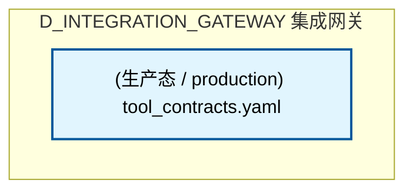
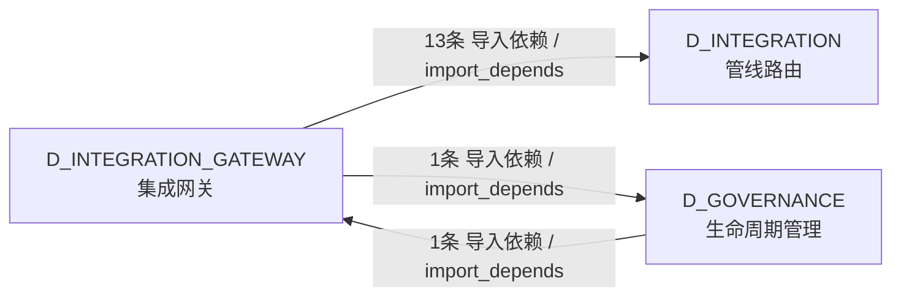

# 19_d_integration_gateway / mcp_servers / 集成网关 / Integration Gateway

> **功能简介 / Overview**: 集成网关，负责外部系统接入、协议转换和请求路由

> **文档作用 / Purpose**: 展示 集成网关（D_INTEGRATION_GATEWAY）功能域的模块清单、域内依赖关系、跨域依赖关系、架构分层视图，供架构审查和域治理参考。

> 本文档由 generate_domain_doc.py 从 depgraph (PostgreSQL) 自动生成
> 最后更新: 2026-07-17 03:12:20
> 数据源: depgraph (PostgreSQL) nodes表 + edges表

## 域基本信息 / Domain Overview

| 字段 | 值 | Field | Value |
|------|------|-------|-------|
| 编号 | 19 | Number | 19 |
| 域ID | D_INTEGRATION_GATEWAY | Domain ID | D_INTEGRATION_GATEWAY |
| 域名称 | 集成网关 | Domain Name | Integration Gateway |
| 层级 | L1 基础平台层 | Layer | L1 Foundation |
| 模块数 | 2 | Module Count | 2 |
| 域内依赖 | 1 | Internal Dependencies | 1 |
| 跨域入边 | 1 | Cross-domain Incoming | 1 |
| 跨域出边 | 14 | Cross-domain Outgoing | 14 |
| 设计态模块 | 0 | Design Modules | 0 |
| 原型态模块 | 1 | Prototype Modules | 1 |
| 生产态模块 | 1 | Production Modules | 1 |
| 容量 | 1/150 (正常) | Capacity | 1/150 (正常) |
| 描述 | 11个MCP服务端 + 1 Gateway | Description | 11个MCP服务端 + 1 Gateway |

## 模块分层清单 / Module Layered List

> 按 architecture_layer 分组的模块清单（共 2 个模块 / 2 modules）。

### L1 基础层 / Foundation Layer (2 modules)

| # | 模块路径 / Module Path | 模块名称 / Module Name (功能简介 / Description) | 成熟度 / Maturity | 蓝图 / Blueprint |
|:--:|---------|---------|:---:|:---:|
| 1 | src/zephyr/integration/mcp/__init__.py | ZephyrAlpha MCP (Model Context Protocol) 子包。 | 原型态 / prototype | [MOD-INF-013](../../03_modules/_cross_layer/model_context_protocol_servers/blueprint.md) |
| 2 | src/zephyr/integration/mcp/tool_contracts.yaml | tool_contracts.yaml | 生产态 / production | [MOD-INF-013](../../03_modules/_cross_layer/model_context_protocol_servers/blueprint.md) |

## 域内依赖图 / Internal Dependency Diagram

> 依赖图内嵌在本文档中，IDE 可直接渲染显示。参考 decision_index.md 设计，分四个视图：合并全景图、运营态子图、设计态子图、原型态子图（按 design_maturity 实际值拆分）。
>
> **图例说明 / Legend**：
> - **实线边框 = 运营态模块**（production，已上线运行）
> - **虚线边框 = 设计态模块**（design，蓝图阶段，代码未写）
> - **虚线边框 = 原型态模块**（prototype，代码已写，验证中未稳定上线）
> - **实线箭头 = 运营态依赖**（已生效的依赖关系）
> - **虚线箭头 = 非运营态依赖**（计划中/验证中的依赖关系）

### 合并全景图（全部模块，标签标注成熟度）

> 展示全部 2 个模块（生产态 1 + 设计态 0 + 原型态 1），标签标注成熟度。

```mermaid
graph TD
    subgraph D_INTEGRATION_GATEWAY["D_INTEGRATION_GATEWAY 集成网关"]
        src_zephyr_integration_mcp_init_py["(原型态 / prototype) ZephyrAlpha MCP (Model Context Protocol) 子包。<br/>文件: __init__.py"]
        src_zephyr_integration_mcp_tool_contracts_yaml["(生产态 / production) tool_contracts.yaml"]
    end
    src_zephyr_integration_mcp_tool_contracts_yaml -.->|config_depends / config_depends| src_zephyr_integration_mcp_init_py
    D_INTEGRATION["(生产态 / production) D_INTEGRATION"]
    src_zephyr_integration_mcp_init_py -.->|导入依赖 / import_depends| D_INTEGRATION
    src_zephyr_integration_mcp_init_py -.->|导入依赖 / import_depends| D_INTEGRATION
    src_zephyr_integration_mcp_init_py -.->|导入依赖 / import_depends| D_INTEGRATION
    src_zephyr_integration_mcp_init_py -.->|导入依赖 / import_depends| D_INTEGRATION
    D_GOVERNANCE["(生产态 / production) D_GOVERNANCE"]
    src_zephyr_integration_mcp_init_py -.->|导入依赖 / import_depends| D_GOVERNANCE
    src_zephyr_integration_mcp_init_py -.->|导入依赖 / import_depends| D_INTEGRATION
    src_zephyr_integration_mcp_init_py -.->|导入依赖 / import_depends| D_INTEGRATION
    src_zephyr_integration_mcp_init_py -.->|导入依赖 / import_depends| D_INTEGRATION
    src_zephyr_integration_mcp_init_py -.->|导入依赖 / import_depends| D_INTEGRATION
    src_zephyr_integration_mcp_init_py -.->|导入依赖 / import_depends| D_INTEGRATION
    src_zephyr_integration_mcp_init_py -.->|导入依赖 / import_depends| D_INTEGRATION
    src_zephyr_integration_mcp_init_py -.->|导入依赖 / import_depends| D_INTEGRATION
    src_zephyr_integration_mcp_init_py -.->|导入依赖 / import_depends| D_INTEGRATION
    src_zephyr_integration_mcp_init_py -.->|导入依赖 / import_depends| D_INTEGRATION
    D_GOVERNANCE -.->|导入依赖 / import_depends| src_zephyr_integration_mcp_init_py
    classDef production fill:#e1f5fe,stroke:#01579b,stroke-width:2px,color:#000
    classDef design fill:#fff3e0,stroke:#e65100,stroke-width:2px,color:#000,stroke-dasharray: 5 5
    classDef external_prod fill:#e8f5e9,stroke:#1b5e20,stroke-width:1px,color:#000
    classDef external_design fill:#fce4ec,stroke:#880e4f,stroke-width:1px,color:#000,stroke-dasharray: 5 5
    class src_zephyr_integration_mcp_tool_contracts_yaml production
    class src_zephyr_integration_mcp_init_py design
    class D_INTEGRATION,D_GOVERNANCE external_prod
```

### 运营态子图（仅 design_maturity=production 的模块和依赖）

> 仅展示已上线运行的模块（共 1 个，0 条域内依赖）。

### 设计态子图（仅 design_maturity=design 的模块和依赖）

> 仅展示蓝图阶段、代码未写的设计态模块（共 0 个，0 条域内依赖）。

> （无设计态模块 / No design modules）

### 原型态子图（仅 design_maturity=prototype 的模块和依赖）

> 仅展示代码已写、验证中未稳定上线的原型态模块（共 1 个，0 条域内依赖）。

```mermaid
graph TD
    subgraph D_INTEGRATION_GATEWAY["D_INTEGRATION_GATEWAY 集成网关"]
        src_zephyr_integration_mcp_init_py["(原型态 / prototype) ZephyrAlpha MCP (Model Context Protocol) 子包。<br/>文件: __init__.py"]
    end
    D_INTEGRATION["(生产态 / production) D_INTEGRATION"]
    src_zephyr_integration_mcp_init_py -.->|导入依赖 / import_depends| D_INTEGRATION
    src_zephyr_integration_mcp_init_py -.->|导入依赖 / import_depends| D_INTEGRATION
    src_zephyr_integration_mcp_init_py -.->|导入依赖 / import_depends| D_INTEGRATION
    src_zephyr_integration_mcp_init_py -.->|导入依赖 / import_depends| D_INTEGRATION
    D_GOVERNANCE["(生产态 / production) D_GOVERNANCE"]
    src_zephyr_integration_mcp_init_py -.->|导入依赖 / import_depends| D_GOVERNANCE
    src_zephyr_integration_mcp_init_py -.->|导入依赖 / import_depends| D_INTEGRATION
    src_zephyr_integration_mcp_init_py -.->|导入依赖 / import_depends| D_INTEGRATION
    src_zephyr_integration_mcp_init_py -.->|导入依赖 / import_depends| D_INTEGRATION
    src_zephyr_integration_mcp_init_py -.->|导入依赖 / import_depends| D_INTEGRATION
    src_zephyr_integration_mcp_init_py -.->|导入依赖 / import_depends| D_INTEGRATION
    src_zephyr_integration_mcp_init_py -.->|导入依赖 / import_depends| D_INTEGRATION
    src_zephyr_integration_mcp_init_py -.->|导入依赖 / import_depends| D_INTEGRATION
    src_zephyr_integration_mcp_init_py -.->|导入依赖 / import_depends| D_INTEGRATION
    src_zephyr_integration_mcp_init_py -.->|导入依赖 / import_depends| D_INTEGRATION
    D_GOVERNANCE -.->|导入依赖 / import_depends| src_zephyr_integration_mcp_init_py
    classDef production fill:#e1f5fe,stroke:#01579b,stroke-width:2px,color:#000
    classDef design fill:#fff3e0,stroke:#e65100,stroke-width:2px,color:#000,stroke-dasharray: 5 5
    classDef external_prod fill:#e8f5e9,stroke:#1b5e20,stroke-width:1px,color:#000
    classDef external_design fill:#fce4ec,stroke:#880e4f,stroke-width:1px,color:#000,stroke-dasharray: 5 5
    class src_zephyr_integration_mcp_init_py design
    class D_INTEGRATION,D_GOVERNANCE external_prod
```

## 跨域依赖 / Cross-domain Dependencies

### 本域依赖的其他域（出边）/ Depends On

| # | 本域模块 / Source Module | → | 外部域-目标模块 / Target Module | 依赖类型 / Type |
|:--:|---------|:--:|---------|---------|
| 1 | ZephyrAlpha MCP (Model Context Protocol) 子包。... | → | D_GOVERNANCE 生命周期管理: GovernanceServer: 治理域统一MCP入口 (governance... | 导入依赖 / import_depends |
| 2 | ZephyrAlpha MCP (Model Context Protocol) 子包。... | → | D_INTEGRATION 管线路由: BaseMCPServer: stdio 传输 + JSON-RPC 2.0 协议基... | 导入依赖 / import_depends |
| 3 | ZephyrAlpha MCP (Model Context Protocol) 子包。... | → | D_INTEGRATION 管线路由: BlueprintSearchServer — MCP Server for bluepri... | 导入依赖 / import_depends |
| 4 | ZephyrAlpha MCP (Model Context Protocol) 子包。... | → | D_INTEGRATION 管线路由: DocGuardServer: 跨会话交接协议服务 MCP Server (... | 导入依赖 / import_depends |
| 5 | ZephyrAlpha MCP (Model Context Protocol) 子包。... | → | D_INTEGRATION 管线路由: GateEngineServer: 门禁裁决服务 MCP Server (gate... | 导入依赖 / import_depends |
| 6 | ZephyrAlpha MCP (Model Context Protocol) 子包。... | → | D_INTEGRATION 管线路由: Handoff 自动加载器——从 handoff 包恢复 AI sess... | 导入依赖 / import_depends |
| 7 | ZephyrAlpha MCP (Model Context Protocol) 子包。... | → | D_INTEGRATION 管线路由: KnowledgeBaseServer: 知识库语义检索 MCP Server ... | 导入依赖 / import_depends |
| 8 | ZephyrAlpha MCP (Model Context Protocol) 子包。... | → | D_INTEGRATION 管线路由: MCP Prompt 模板提供者（MOD-INF-013 Phase 6 — .... | 导入依赖 / import_depends |
| 9 | ZephyrAlpha MCP (Model Context Protocol) 子包。... | → | D_INTEGRATION 管线路由: MCP Resource 提供者（MOD-INF-013 Phase 6 — 关.... | 导入依赖 / import_depends |
| 10 | ZephyrAlpha MCP (Model Context Protocol) 子包。... | → | D_INTEGRATION 管线路由: MCP sandbox 安全代码执行沙箱（MOD-INF-013 Phase... | 导入依赖 / import_depends |
| 11 | ZephyrAlpha MCP (Model Context Protocol) 子包。... | → | D_INTEGRATION 管线路由: SentinelServer: 意图路由哨兵 MCP Server (sentin... | 导入依赖 / import_depends |
| 12 | ZephyrAlpha MCP (Model Context Protocol) 子包。... | → | D_INTEGRATION 管线路由: ZephyrAlpha MCP Task Manager Server (task_manag... | 导入依赖 / import_depends |
| 13 | ZephyrAlpha MCP (Model Context Protocol) 子包。... | → | D_INTEGRATION 管线路由: ZephyrAlpha MCP Telemetry Server — 系统可观测.... | 导入依赖 / import_depends |
| 14 | ZephyrAlpha MCP (Model Context Protocol) 子包。... | → | D_INTEGRATION 管线路由: VectorMemoryServer: VMS 向量记忆 MCP Server (MO... | 导入依赖 / import_depends |

### 依赖本域的其他域（入边）/ Depended By

| # | 外部域-源模块 / Source Module | → | 本域模块 / Target Module | 依赖类型 / Type |
|:--:|---------|:--:|---------|---------|
| 1 | D_GOVERNANCE 生命周期管理: scaffold.py — ZephyrAlpha 唯一创建入口（RULE-T... | → | ZephyrAlpha MCP (Model Context Protocol) 子包。... | 导入依赖 / import_depends |

### 跨域依赖图 / Cross-domain Dependency Diagram

> 本域与 2 个外部域直接连接（出边 14 条 + 入边 1 条 = 15 条）。只显示直接连接的域，不展开具体节点。

## 说明 / Notes

- **数据源 / Data Source**: `depgraph (PostgreSQL)` 的 `nodes`、`edges`、`domains` 表
- **生成器 / Generator**: `generate_domain_doc.py`（G2+G10 合并）
- **维护方式 / Maintenance**: 自动生成，全景图更新时刷新
- **文件名规则 / File Naming**: `{编号:02d}_{域ID小写}.md`，如 `16_d_trading.md`
- **图例说明 / Legend**: `[production]`=已上线 / `[design]`=设计中 / `[prototype]`=原型 / `[unknown]`=未知
