# 19_d_shared / shared_services / 共享服务 / Shared Services

> **功能简介 / Overview**: 跨域共享服务与公共组件

> **文档作用 / Purpose**: 展示 共享服务（D_SHARED）功能域的模块清单、域内依赖关系、跨域依赖关系、架构分层视图，供架构审查和域治理参考。

> 本文档由 generate_domain_doc.py 从 depgraph (PostgreSQL) 自动生成
> 最后更新: 2026-07-09 01:10:32
> 数据源: depgraph (PostgreSQL) nodes表 + edges表

## 域基本信息 / Domain Overview

| 字段 | 值 | Field | Value |
|------|------|-------|-------|
| 编号 | 19 | Number | 19 |
| 域ID | D_SHARED | Domain ID | D_SHARED |
| 域名称 | 共享服务 | Domain Name | Shared Services |
| 层级 | L1 基础平台层 | Layer | L1 Foundation |
| 模块数 | 223 | Module Count | 223 |
| 域内依赖 | 169 | Internal Dependencies | 169 |
| 跨域入边 | 713 | Cross-domain Incoming | 713 |
| 跨域出边 | 10 | Cross-domain Outgoing | 10 |
| 设计态模块 | 0 | Design Modules | 0 |
| 原型态模块 | 129 | Prototype Modules | 129 |
| 生产态模块 | 94 | Production Modules | 94 |
| 容量 | 94/150 (正常) | Capacity | 94/150 (正常) |
| 描述 | 事件总线(event_bus) | Description | 事件总线(event_bus) |

## 域内依赖图 / Internal Dependency Diagram

> 依赖图内嵌在本文档中，IDE 可直接渲染显示。每30个节点一组分页显示。
>
> **图例说明 / Legend**：
> - **实线边框 = 运营态模块**（production，已上线运行）
> - **虚线边框 = 设计态模块**（design，还在设计中）
> - **实线箭头 = 运营态依赖**（已生效的依赖关系）
> - **虚线箭头 = 设计态依赖**（计划中的依赖关系）

### 第 1 页 / 共 8 页 / Page 1 of 8

```mermaid
graph TD
    subgraph D_SHARED["D_SHARED 共享服务"]
        src_zephyr_shared_init_py["(原型态 / prototype) __init__.py"]
        src_zephyr_shared_version_py["(生产态 / production) __version__.py"]
        src_zephyr_shared_cross_layer_init_py["(原型态 / prototype) __init__.py"]
        src_zephyr_shared_cross_layer_ml_experiment_pipeline_py["(原型态 / prototype) ml_experiment_pipeline.py"]
        src_zephyr_shared_adaptation_init_py["(原型态 / prototype) __init__.py"]
        src_zephyr_shared_ai_guards_ai_audit_guard_py["(生产态 / production) ai_audit_guard.py"]
        src_zephyr_shared_ai_guards_combinatorial_gate_py["(生产态 / production) combinatorial_gate.py"]
        src_zephyr_shared_ai_guards_config_safety_guard_py["(生产态 / production) config_safety_guard.py"]
        src_zephyr_shared_ai_guards_core_integrity_guard_py["(生产态 / production) core_integrity_guard.py"]
        src_zephyr_shared_alerts_alert_escalation_py["(生产态 / production) alert_escalation.py"]
        src_zephyr_shared_alerts_alert_manager_py["(生产态 / production) alert_manager.py"]
        src_zephyr_shared_alerts_alert_precision_tracker_py["(生产态 / production) alert_precision_tracker.py"]
        src_zephyr_shared_alerts_dual_channel_alert_py["(生产态 / production) dual_channel_alert.py"]
        src_zephyr_shared_alerts_heartbeat_server_py["(生产态 / production) heartbeat_server.py"]
        src_zephyr_shared_api_init_py["(原型态 / prototype) __init__.py"]
        src_zephyr_shared_api_api_client_py["(原型态 / prototype) api_client.py"]
        src_zephyr_shared_api_api_index_py["(原型态 / prototype) api_index.py"]
        src_zephyr_shared_api_dos_launcher_py["(生产态 / production) dos_launcher.py"]
        src_zephyr_shared_api_shared_quickref_yaml["(生产态 / production) shared_quickref.yaml"]
        src_zephyr_shared_blueprint_tools_init_py["(原型态 / prototype) __init__.py"]
        src_zephyr_shared_blueprint_tools_ai_understandability_constraint_py["(生产态 / production) ai_understandability_constraint.py"]
        src_zephyr_shared_blueprint_tools_architecture_context_loader_py["(生产态 / production) architecture_context_loader.py"]
        src_zephyr_shared_blueprint_tools_blueprint_code_auditor_py["(生产态 / production) blueprint_code_auditor.py"]
        src_zephyr_shared_blueprint_tools_blueprint_scorer_py["(原型态 / prototype) blueprint_scorer.py"]
        src_zephyr_shared_capacity_governance_init_py["(原型态 / prototype) __init__.py"]
        src_zephyr_shared_capacity_governance_adaptive_sampler_py["(生产态 / production) adaptive_sampler.py"]
        src_zephyr_shared_capacity_governance_budget_aware_prompt_py["(生产态 / production) budget_aware_prompt.py"]
        src_zephyr_shared_capacity_governance_capacity_calibrator_py["(生产态 / production) capacity_calibrator.py"]
        src_zephyr_shared_capacity_governance_capacity_digital_twin_py["(生产态 / production) capacity_digital_twin.py"]
        src_zephyr_shared_capacity_governance_capacity_fingerprint_py["(生产态 / production) capacity_fingerprint.py"]
    end
    src_zephyr_shared_api_api_index_py -.->|config_depends / config_depends| src_zephyr_shared_api_init_py
    src_zephyr_shared_blueprint_tools_blueprint_scorer_py -.->|config_depends / config_depends| src_zephyr_shared_blueprint_tools_init_py
    src_zephyr_shared_capacity_governance_init_py -.->|config_depends / config_depends| src_zephyr_shared_capacity_governance_budget_aware_prompt_py
    src_zephyr_shared_cross_layer_init_py -.->|config_depends / config_depends| src_zephyr_shared_cross_layer_ml_experiment_pipeline_py
    src_zephyr_shared_api_shared_quickref_yaml -.->|config_depends / config_depends| src_zephyr_shared_api_init_py
    D_ML_TRAIN["[原型态 / prototype] D_ML_TRAIN"]
    src_zephyr_shared_cross_layer_ml_experiment_pipeline_py -.->|导入依赖 / import_depends| D_ML_TRAIN
    src_zephyr_shared_cross_layer_ml_experiment_pipeline_py -.->|导入依赖 / import_depends| D_ML_TRAIN
    D_SIMULATION["[生产态 / production] D_SIMULATION"]
    src_zephyr_shared_cross_layer_ml_experiment_pipeline_py -.->|导入依赖 / import_depends| D_SIMULATION
    D_AUTONOMY_CORE["[生产态 / production] D_AUTONOMY_CORE"]
    D_AUTONOMY_CORE -->|导入依赖 / import_depends| src_zephyr_shared_blueprint_tools_architecture_context_loader_py
    D_INTEGRATION["[生产态 / production] D_INTEGRATION"]
    D_INTEGRATION -->|导入依赖 / import_depends| src_zephyr_shared_version_py
    D_RISK["[生产态 / production] D_RISK"]
    D_RISK -.->|导入依赖 / import_depends| src_zephyr_shared_cross_layer_ml_experiment_pipeline_py
    D_TRADING["[生产态 / production] D_TRADING"]
    D_TRADING -->|导入依赖 / import_depends| src_zephyr_shared_capacity_governance_capacity_calibrator_py
    D_TRADING -->|导入依赖 / import_depends| src_zephyr_shared_capacity_governance_capacity_digital_twin_py
    D_TRADING -->|导入依赖 / import_depends| src_zephyr_shared_capacity_governance_capacity_fingerprint_py
    D_AUDITTEST["[原型态 / prototype] D_AUDITTEST"]
    D_AUDITTEST -.->|测试依赖 / test_depends| src_zephyr_shared_blueprint_tools_architecture_context_loader_py
    D_AUDITTEST -.->|测试依赖 / test_depends| src_zephyr_shared_blueprint_tools_architecture_context_loader_py
    D_AUDITTEST -.->|测试依赖 / test_depends| src_zephyr_shared_ai_guards_config_safety_guard_py
    D_AUDITTEST -.->|测试依赖 / test_depends| src_zephyr_shared_version_py
    classDef production fill:#e1f5fe,stroke:#01579b,stroke-width:2px,color:#000
    classDef design fill:#fff3e0,stroke:#e65100,stroke-width:2px,color:#000,stroke-dasharray: 5 5
    classDef external_prod fill:#e8f5e9,stroke:#1b5e20,stroke-width:1px,color:#000
    classDef external_design fill:#fce4ec,stroke:#880e4f,stroke-width:1px,color:#000,stroke-dasharray: 5 5
    class src_zephyr_shared_version_py,src_zephyr_shared_ai_guards_ai_audit_guard_py,src_zephyr_shared_ai_guards_combinatorial_gate_py,src_zephyr_shared_ai_guards_config_safety_guard_py,src_zephyr_shared_ai_guards_core_integrity_guard_py,src_zephyr_shared_alerts_alert_escalation_py,src_zephyr_shared_alerts_alert_manager_py,src_zephyr_shared_alerts_alert_precision_tracker_py,src_zephyr_shared_alerts_dual_channel_alert_py,src_zephyr_shared_alerts_heartbeat_server_py,src_zephyr_shared_api_dos_launcher_py,src_zephyr_shared_api_shared_quickref_yaml,src_zephyr_shared_blueprint_tools_ai_understandability_constraint_py,src_zephyr_shared_blueprint_tools_architecture_context_loader_py,src_zephyr_shared_blueprint_tools_blueprint_code_auditor_py,src_zephyr_shared_capacity_governance_adaptive_sampler_py,src_zephyr_shared_capacity_governance_budget_aware_prompt_py,src_zephyr_shared_capacity_governance_capacity_calibrator_py,src_zephyr_shared_capacity_governance_capacity_digital_twin_py,src_zephyr_shared_capacity_governance_capacity_fingerprint_py production
    class src_zephyr_shared_init_py,src_zephyr_shared_cross_layer_init_py,src_zephyr_shared_cross_layer_ml_experiment_pipeline_py,src_zephyr_shared_adaptation_init_py,src_zephyr_shared_api_init_py,src_zephyr_shared_api_api_client_py,src_zephyr_shared_api_api_index_py,src_zephyr_shared_blueprint_tools_init_py,src_zephyr_shared_blueprint_tools_blueprint_scorer_py,src_zephyr_shared_capacity_governance_init_py design
    class D_SIMULATION,D_AUTONOMY_CORE,D_INTEGRATION,D_RISK,D_TRADING external_prod
    class D_ML_TRAIN,D_AUDITTEST external_design
```



### 第 2 页 / 共 8 页 / Page 2 of 8

```mermaid
graph TD
    subgraph D_SHARED["D_SHARED 共享服务"]
        src_zephyr_shared_capacity_governance_capacity_governance_loop_py["(生产态 / production) capacity_governance_loop.py"]
        src_zephyr_shared_capacity_governance_capacity_runbook_generator_py["(生产态 / production) capacity_runbook_generator.py"]
        src_zephyr_shared_capacity_governance_cost_estimator_py["(生产态 / production) cost_estimator.py"]
        src_zephyr_shared_capacity_governance_dependency_capacity_guard_py["(生产态 / production) dependency_capacity_guard.py"]
        src_zephyr_shared_capacity_governance_model_capacity_probe_py["(生产态 / production) model_capacity_probe.py"]
        src_zephyr_shared_compensation_init_py["(原型态 / prototype) __init__.py"]
        src_zephyr_shared_contracts_init_py["(原型态 / prototype) __init__.py"]
        src_zephyr_shared_contracts_backpressure_init_py["(原型态 / prototype) __init__.py"]
        src_zephyr_shared_contracts_backpressure_types_py["(原型态 / prototype) _types.py"]
        src_zephyr_shared_contracts_backpressure_pause_py["(原型态 / prototype) pause.py"]
        src_zephyr_shared_contracts_backpressure_resume_py["(原型态 / prototype) resume.py"]
        src_zephyr_shared_contracts_backpressure_throttle_py["(原型态 / prototype) throttle.py"]
        src_zephyr_shared_contracts_capital_allocation_result_py["(原型态 / prototype) capital_allocation_result.py"]
        src_zephyr_shared_contracts_compliance_rule_py["(原型态 / prototype) compliance_rule.py"]
        src_zephyr_shared_contracts_contract_bus_py["(原型态 / prototype) contract_bus.py"]
        src_zephyr_shared_contracts_contract_tester_py["(原型态 / prototype) contract_tester.py"]
        src_zephyr_shared_contracts_core_init_py["(原型态 / prototype) __init__.py"]
        src_zephyr_shared_contracts_core_base_event_py["(原型态 / prototype) base_event.py"]
        src_zephyr_shared_contracts_core_enforcer_py["(生产态 / production) enforcer.py"]
        src_zephyr_shared_contracts_core_factories_py["(原型态 / prototype) factories.py"]
        src_zephyr_shared_contracts_core_gate_types_py["(原型态 / prototype) gate_types.py"]
        src_zephyr_shared_contracts_core_registry_py["(原型态 / prototype) registry.py"]
        src_zephyr_shared_contracts_core_runtime_plane_tag_py["(原型态 / prototype) runtime_plane_tag.py"]
        src_zephyr_shared_contracts_core_system_configuration_py["(生产态 / production) system_configuration.py"]
        src_zephyr_shared_contracts_core_timestamp_py["(原型态 / prototype) timestamp.py"]
        src_zephyr_shared_contracts_core_trace_context_py["(生产态 / production) trace_context.py"]
        src_zephyr_shared_contracts_errors_init_py["(原型态 / prototype) __init__.py"]
        src_zephyr_shared_contracts_errors_contract_violation_error_py["(原型态 / prototype) contract_violation_error.py"]
        src_zephyr_shared_contracts_errors_data_quality_error_py["(原型态 / prototype) data_quality_error.py"]
        src_zephyr_shared_contracts_errors_execution_rejection_error_py["(原型态 / prototype) execution_rejection_error.py"]
    end
    src_zephyr_shared_contracts_capital_allocation_result_py -.->|config_depends / config_depends| src_zephyr_shared_contracts_init_py
    src_zephyr_shared_contracts_contract_bus_py -.->|config_depends / config_depends| src_zephyr_shared_contracts_init_py
    src_zephyr_shared_contracts_contract_tester_py -.->|config_depends / config_depends| src_zephyr_shared_contracts_init_py
    src_zephyr_shared_contracts_backpressure_pause_py -.->|导入依赖 / import_depends| src_zephyr_shared_contracts_core_trace_context_py
    src_zephyr_shared_contracts_backpressure_throttle_py -.->|导入依赖 / import_depends| src_zephyr_shared_contracts_core_trace_context_py
    src_zephyr_shared_contracts_backpressure_types_py -.->|导入依赖 / import_depends| src_zephyr_shared_contracts_core_trace_context_py
    src_zephyr_shared_contracts_init_py -.->|导入依赖 / import_depends| src_zephyr_shared_contracts_backpressure_init_py
    src_zephyr_shared_contracts_init_py -.->|导入依赖 / import_depends| src_zephyr_shared_contracts_core_enforcer_py
    src_zephyr_shared_contracts_init_py -.->|导入依赖 / import_depends| src_zephyr_shared_contracts_core_factories_py
    src_zephyr_shared_contracts_init_py -.->|导入依赖 / import_depends| src_zephyr_shared_contracts_core_runtime_plane_tag_py
    src_zephyr_shared_contracts_init_py -.->|导入依赖 / import_depends| src_zephyr_shared_contracts_core_registry_py
    src_zephyr_shared_contracts_init_py -.->|导入依赖 / import_depends| src_zephyr_shared_contracts_core_timestamp_py
    src_zephyr_shared_contracts_init_py -.->|导入依赖 / import_depends| src_zephyr_shared_contracts_core_system_configuration_py
    src_zephyr_shared_contracts_init_py -.->|导入依赖 / import_depends| src_zephyr_shared_contracts_core_trace_context_py
    src_zephyr_shared_contracts_init_py -.->|导入依赖 / import_depends| src_zephyr_shared_contracts_errors_init_py
    src_zephyr_shared_contracts_backpressure_resume_py -.->|导入依赖 / import_depends| src_zephyr_shared_contracts_core_trace_context_py
    src_zephyr_shared_contracts_backpressure_init_py -.->|导入依赖 / import_depends| src_zephyr_shared_contracts_backpressure_pause_py
    src_zephyr_shared_contracts_backpressure_init_py -.->|导入依赖 / import_depends| src_zephyr_shared_contracts_backpressure_throttle_py
    src_zephyr_shared_contracts_backpressure_init_py -.->|导入依赖 / import_depends| src_zephyr_shared_contracts_backpressure_resume_py
    src_zephyr_shared_contracts_core_init_py -.->|导入依赖 / import_depends| src_zephyr_shared_contracts_core_base_event_py
    src_zephyr_shared_contracts_core_init_py -.->|导入依赖 / import_depends| src_zephyr_shared_contracts_core_gate_types_py
    src_zephyr_shared_contracts_errors_execution_rejection_error_py -.->|导入依赖 / import_depends| src_zephyr_shared_contracts_core_trace_context_py
    src_zephyr_shared_contracts_errors_contract_violation_error_py -.->|导入依赖 / import_depends| src_zephyr_shared_contracts_core_trace_context_py
    src_zephyr_shared_contracts_errors_data_quality_error_py -.->|导入依赖 / import_depends| src_zephyr_shared_contracts_core_trace_context_py
    src_zephyr_shared_contracts_errors_init_py -.->|导入依赖 / import_depends| src_zephyr_shared_contracts_errors_execution_rejection_error_py
    src_zephyr_shared_contracts_errors_init_py -.->|导入依赖 / import_depends| src_zephyr_shared_contracts_errors_contract_violation_error_py
    src_zephyr_shared_contracts_errors_init_py -.->|导入依赖 / import_depends| src_zephyr_shared_contracts_errors_data_quality_error_py
    D_BACKTEST["[生产态 / production] D_BACKTEST"]
    D_BACKTEST -->|导入依赖 / import_depends| src_zephyr_shared_contracts_core_trace_context_py
    D_GOV_ENFORCEMENT["[原型态 / prototype] D_GOV_ENFORCEMENT"]
    D_GOV_ENFORCEMENT -.->|导入依赖 / import_depends| src_zephyr_shared_contracts_compliance_rule_py
    D_INFRA_RUNTIME["[生产态 / production] D_INFRA_RUNTIME"]
    D_INFRA_RUNTIME -->|导入依赖 / import_depends| src_zephyr_shared_contracts_core_trace_context_py
    D_INTEGRATION["[原型态 / prototype] D_INTEGRATION"]
    D_INTEGRATION -.->|导入依赖 / import_depends| src_zephyr_shared_contracts_core_trace_context_py
    D_INTEGRATION -.->|导入依赖 / import_depends| src_zephyr_shared_contracts_core_trace_context_py
    D_INTEGRATION -.->|导入依赖 / import_depends| src_zephyr_shared_contracts_core_trace_context_py
    D_TRADING["[生产态 / production] D_TRADING"]
    D_TRADING -->|导入依赖 / import_depends| src_zephyr_shared_contracts_core_system_configuration_py
    D_TRADING -->|导入依赖 / import_depends| src_zephyr_shared_capacity_governance_capacity_governance_loop_py
    D_TRADING -->|导入依赖 / import_depends| src_zephyr_shared_capacity_governance_capacity_runbook_generator_py
    D_TRADING -->|导入依赖 / import_depends| src_zephyr_shared_capacity_governance_model_capacity_probe_py
    classDef production fill:#e1f5fe,stroke:#01579b,stroke-width:2px,color:#000
    classDef design fill:#fff3e0,stroke:#e65100,stroke-width:2px,color:#000,stroke-dasharray: 5 5
    classDef external_prod fill:#e8f5e9,stroke:#1b5e20,stroke-width:1px,color:#000
    classDef external_design fill:#fce4ec,stroke:#880e4f,stroke-width:1px,color:#000,stroke-dasharray: 5 5
    class src_zephyr_shared_capacity_governance_capacity_governance_loop_py,src_zephyr_shared_capacity_governance_capacity_runbook_generator_py,src_zephyr_shared_capacity_governance_cost_estimator_py,src_zephyr_shared_capacity_governance_dependency_capacity_guard_py,src_zephyr_shared_capacity_governance_model_capacity_probe_py,src_zephyr_shared_contracts_core_enforcer_py,src_zephyr_shared_contracts_core_system_configuration_py,src_zephyr_shared_contracts_core_trace_context_py production
    class src_zephyr_shared_compensation_init_py,src_zephyr_shared_contracts_init_py,src_zephyr_shared_contracts_backpressure_init_py,src_zephyr_shared_contracts_backpressure_types_py,src_zephyr_shared_contracts_backpressure_pause_py,src_zephyr_shared_contracts_backpressure_resume_py,src_zephyr_shared_contracts_backpressure_throttle_py,src_zephyr_shared_contracts_capital_allocation_result_py,src_zephyr_shared_contracts_compliance_rule_py,src_zephyr_shared_contracts_contract_bus_py,src_zephyr_shared_contracts_contract_tester_py,src_zephyr_shared_contracts_core_init_py,src_zephyr_shared_contracts_core_base_event_py,src_zephyr_shared_contracts_core_factories_py,src_zephyr_shared_contracts_core_gate_types_py,src_zephyr_shared_contracts_core_registry_py,src_zephyr_shared_contracts_core_runtime_plane_tag_py,src_zephyr_shared_contracts_core_timestamp_py,src_zephyr_shared_contracts_errors_init_py,src_zephyr_shared_contracts_errors_contract_violation_error_py,src_zephyr_shared_contracts_errors_data_quality_error_py,src_zephyr_shared_contracts_errors_execution_rejection_error_py design
    class D_BACKTEST,D_INFRA_RUNTIME,D_TRADING external_prod
    class D_GOV_ENFORCEMENT,D_INTEGRATION external_design
```



### 第 3 页 / 共 8 页 / Page 3 of 8


### 第 4 页 / 共 8 页 / Page 4 of 8

```mermaid
graph TD
    subgraph D_SHARED["D_SHARED 共享服务"]
        src_zephyr_shared_contracts_market_factor_monitor_report_py["(原型态 / prototype) factor_monitor_report.py"]
        src_zephyr_shared_contracts_market_factor_signal_py["(原型态 / prototype) factor_signal.py"]
        src_zephyr_shared_contracts_market_instrument_py["(原型态 / prototype) instrument.py"]
        src_zephyr_shared_contracts_market_macro_factor_signal_py["(原型态 / prototype) macro_factor_signal.py"]
        src_zephyr_shared_contracts_market_market_data_py["(原型态 / prototype) market_data.py"]
        src_zephyr_shared_contracts_market_synthesized_signal_py["(原型态 / prototype) synthesized_signal.py"]
        src_zephyr_shared_contracts_market_data_py["(原型态 / prototype) market_data.py"]
        src_zephyr_shared_contracts_model_serving_request_py["(原型态 / prototype) model_serving_request.py"]
        src_zephyr_shared_contracts_model_serving_response_py["(生产态 / production) model_serving_response.py"]
        src_zephyr_shared_contracts_orchestration_protocol_py["(原型态 / prototype) orchestration_protocol.py"]
        src_zephyr_shared_contracts_order_py["(原型态 / prototype) order.py"]
        src_zephyr_shared_contracts_performance_attribution_report_py["(生产态 / production) performance_attribution_report.py"]
        src_zephyr_shared_contracts_portfolio_init_py["(原型态 / prototype) __init__.py"]
        src_zephyr_shared_contracts_portfolio_money_py["(生产态 / production) money.py"]
        src_zephyr_shared_contracts_portfolio_performance_attribution_report_py["(原型态 / prototype) performance_attribution_report.py"]
        src_zephyr_shared_contracts_portfolio_position_py["(原型态 / prototype) position.py"]
        src_zephyr_shared_contracts_portfolio_strategy_lifecycle_event_py["(原型态 / prototype) strategy_lifecycle_event.py"]
        src_zephyr_shared_contracts_position_py["(原型态 / prototype) position.py"]
        src_zephyr_shared_contracts_risk_init_py["(原型态 / prototype) __init__.py"]
        src_zephyr_shared_contracts_risk_compliance_rule_py["(原型态 / prototype) compliance_rule.py"]
        src_zephyr_shared_contracts_risk_risk_dashboard_snapshot_py["(原型态 / prototype) risk_dashboard_snapshot.py"]
        src_zephyr_shared_contracts_risk_risk_limits_py["(原型态 / prototype) risk_limits.py"]
        src_zephyr_shared_contracts_risk_risk_metrics_py["(原型态 / prototype) risk_metrics.py"]
        src_zephyr_shared_contracts_risk_risk_validator_protocol_py["(原型态 / prototype) risk_validator_protocol.py"]
        src_zephyr_shared_contracts_risk_dashboard_snapshot_py["(原型态 / prototype) risk_dashboard_snapshot.py"]
        src_zephyr_shared_contracts_risk_limits_py["(生产态 / production) risk_limits.py"]
        src_zephyr_shared_contracts_risk_metrics_py["(原型态 / prototype) risk_metrics.py"]
        src_zephyr_shared_contracts_runtime_types_py["(生产态 / production) runtime_types.py"]
        src_zephyr_shared_contracts_security_init_py["(原型态 / prototype) __init__.py"]
        src_zephyr_shared_contracts_security_security_decision_py["(生产态 / production) security_decision.py"]
    end
    src_zephyr_shared_contracts_portfolio_performance_attribution_report_py -.->|导入依赖 / import_depends| src_zephyr_shared_contracts_performance_attribution_report_py
    src_zephyr_shared_contracts_portfolio_init_py -.->|导入依赖 / import_depends| src_zephyr_shared_contracts_portfolio_position_py
    src_zephyr_shared_contracts_risk_init_py -.->|导入依赖 / import_depends| src_zephyr_shared_contracts_risk_risk_limits_py
    src_zephyr_shared_contracts_risk_init_py -.->|导入依赖 / import_depends| src_zephyr_shared_contracts_risk_compliance_rule_py
    src_zephyr_shared_contracts_risk_init_py -.->|导入依赖 / import_depends| src_zephyr_shared_contracts_risk_risk_metrics_py
    src_zephyr_shared_contracts_risk_init_py -.->|导入依赖 / import_depends| src_zephyr_shared_contracts_risk_risk_validator_protocol_py
    src_zephyr_shared_contracts_risk_init_py -.->|导入依赖 / import_depends| src_zephyr_shared_contracts_risk_risk_dashboard_snapshot_py
    src_zephyr_shared_contracts_security_init_py -.->|导入依赖 / import_depends| src_zephyr_shared_contracts_security_security_decision_py
    D_TRADING["[生产态 / production] D_TRADING"]
    src_zephyr_shared_contracts_order_py -.->|导入依赖 / import_depends| D_TRADING
    D_EX_CORE["[生产态 / production] D_EX_CORE"]
    D_EX_CORE -->|导入依赖 / import_depends| src_zephyr_shared_contracts_risk_limits_py
    D_GOVERNANCE["[原型态 / prototype] D_GOVERNANCE"]
    D_GOVERNANCE -.->|导入依赖 / import_depends| src_zephyr_shared_contracts_risk_limits_py
    D_GOVERNANCE -->|导入依赖 / import_depends| src_zephyr_shared_contracts_security_security_decision_py
    D_INFRA_A2A["[生产态 / production] D_INFRA_A2A"]
    D_INFRA_A2A -->|导入依赖 / import_depends| src_zephyr_shared_contracts_security_security_decision_py
    D_INFRA_A2A -.->|导入依赖 / import_depends| src_zephyr_shared_contracts_security_security_decision_py
    D_INTEGRATION["[生产态 / production] D_INTEGRATION"]
    D_INTEGRATION -.->|导入依赖 / import_depends| src_zephyr_shared_contracts_security_init_py
    D_MKT_DATA["[原型态 / prototype] D_MKT_DATA"]
    D_MKT_DATA -.->|导入依赖 / import_depends| src_zephyr_shared_contracts_market_data_py
    D_RISK["[生产态 / production] D_RISK"]
    D_RISK -->|导入依赖 / import_depends| src_zephyr_shared_contracts_risk_limits_py
    D_RISK -->|导入依赖 / import_depends| src_zephyr_shared_contracts_risk_limits_py
    D_SECURITY_LLM["[生产态 / production] D_SECURITY_LLM"]
    D_SECURITY_LLM -->|导入依赖 / import_depends| src_zephyr_shared_contracts_security_security_decision_py
    D_SECURITY_LLM -->|导入依赖 / import_depends| src_zephyr_shared_contracts_security_security_decision_py
    D_SECURITY_LLM -->|导入依赖 / import_depends| src_zephyr_shared_contracts_security_security_decision_py
    D_SECURITY_LLM -->|导入依赖 / import_depends| src_zephyr_shared_contracts_security_security_decision_py
    D_SECURITY_LLM -->|导入依赖 / import_depends| src_zephyr_shared_contracts_security_security_decision_py
    D_SECURITY_LLM -->|导入依赖 / import_depends| src_zephyr_shared_contracts_security_security_decision_py
    classDef production fill:#e1f5fe,stroke:#01579b,stroke-width:2px,color:#000
    classDef design fill:#fff3e0,stroke:#e65100,stroke-width:2px,color:#000,stroke-dasharray: 5 5
    classDef external_prod fill:#e8f5e9,stroke:#1b5e20,stroke-width:1px,color:#000
    classDef external_design fill:#fce4ec,stroke:#880e4f,stroke-width:1px,color:#000,stroke-dasharray: 5 5
    class src_zephyr_shared_contracts_model_serving_response_py,src_zephyr_shared_contracts_performance_attribution_report_py,src_zephyr_shared_contracts_portfolio_money_py,src_zephyr_shared_contracts_risk_limits_py,src_zephyr_shared_contracts_runtime_types_py,src_zephyr_shared_contracts_security_security_decision_py production
    class src_zephyr_shared_contracts_market_factor_monitor_report_py,src_zephyr_shared_contracts_market_factor_signal_py,src_zephyr_shared_contracts_market_instrument_py,src_zephyr_shared_contracts_market_macro_factor_signal_py,src_zephyr_shared_contracts_market_market_data_py,src_zephyr_shared_contracts_market_synthesized_signal_py,src_zephyr_shared_contracts_market_data_py,src_zephyr_shared_contracts_model_serving_request_py,src_zephyr_shared_contracts_orchestration_protocol_py,src_zephyr_shared_contracts_order_py,src_zephyr_shared_contracts_portfolio_init_py,src_zephyr_shared_contracts_portfolio_performance_attribution_report_py,src_zephyr_shared_contracts_portfolio_position_py,src_zephyr_shared_contracts_portfolio_strategy_lifecycle_event_py,src_zephyr_shared_contracts_position_py,src_zephyr_shared_contracts_risk_init_py,src_zephyr_shared_contracts_risk_compliance_rule_py,src_zephyr_shared_contracts_risk_risk_dashboard_snapshot_py,src_zephyr_shared_contracts_risk_risk_limits_py,src_zephyr_shared_contracts_risk_risk_metrics_py,src_zephyr_shared_contracts_risk_risk_validator_protocol_py,src_zephyr_shared_contracts_risk_dashboard_snapshot_py,src_zephyr_shared_contracts_risk_metrics_py,src_zephyr_shared_contracts_security_init_py design
    class D_TRADING,D_EX_CORE,D_INFRA_A2A,D_INTEGRATION,D_RISK,D_SECURITY_LLM external_prod
    class D_GOVERNANCE,D_MKT_DATA external_design
```



### 第 5 页 / 共 8 页 / Page 5 of 8

```mermaid
graph TD
    subgraph D_SHARED["D_SHARED 共享服务"]
        src_zephyr_shared_contracts_skill_protocol_py["(原型态 / prototype) skill_protocol.py"]
        src_zephyr_shared_contracts_strategy_lifecycle_event_py["(生产态 / production) strategy_lifecycle_event.py"]
        src_zephyr_shared_contracts_synthesized_signal_py["(原型态 / prototype) synthesized_signal.py"]
        src_zephyr_shared_contracts_system_configuration_py["(原型态 / prototype) system_configuration.py"]
        src_zephyr_shared_contracts_task_repository_protocol_py["(原型态 / prototype) task_repository_protocol.py"]
        src_zephyr_shared_contracts_telemetry_emitter_py["(生产态 / production) telemetry_emitter.py"]
        src_zephyr_shared_contracts_trace_context_py["(原型态 / prototype) trace_context.py"]
        src_zephyr_shared_database_init_py["(原型态 / prototype) __init__.py"]
        src_zephyr_shared_database_database_crud_mixin_py["(原型态 / prototype) database_crud_mixin.py"]
        src_zephyr_shared_dependency_init_py["(原型态 / prototype) __init__.py"]
        src_zephyr_shared_dependency_dependency_tracker_py["(生产态 / production) dependency_tracker.py"]
        src_zephyr_shared_draft_init_py["(原型态 / prototype) __init__.py"]
        src_zephyr_shared_event_bus_py["(生产态 / production) event_bus.py"]
        src_zephyr_shared_events_init_py["(原型态 / prototype) __init__.py"]
        src_zephyr_shared_events_dlq_py["(原型态 / prototype) dlq.py"]
        src_zephyr_shared_events_dlq_bridge_py["(原型态 / prototype) dlq_bridge.py"]
        src_zephyr_shared_events_event_bus_upgrade_py["(生产态 / production) event_bus_upgrade.py"]
        src_zephyr_shared_events_event_schemas_py["(原型态 / prototype) event_schemas.py"]
        src_zephyr_shared_events_observer_py["(原型态 / prototype) observer.py"]
        src_zephyr_shared_events_outbox_py["(原型态 / prototype) outbox.py"]
        src_zephyr_shared_events_upgrade_strategy_py["(原型态 / prototype) upgrade_strategy.py"]
        src_zephyr_shared_foundation_init_py["(生产态 / production) __init__.py"]
        src_zephyr_shared_foundation_constants_py["(原型态 / prototype) constants.py"]
        src_zephyr_shared_foundation_deprecation_py["(生产态 / production) deprecation.py"]
        src_zephyr_shared_foundation_env_py["(原型态 / prototype) env.py"]
        src_zephyr_shared_foundation_errors_py["(生产态 / production) errors.py"]
        src_zephyr_shared_foundation_flags_py["(生产态 / production) flags.py"]
        src_zephyr_shared_foundation_migration_py["(生产态 / production) migration.py"]
        src_zephyr_shared_foundation_types_py["(原型态 / prototype) types.py"]
        src_zephyr_shared_infra_init_py["(原型态 / prototype) __init__.py"]
    end
    src_zephyr_shared_database_init_py -.->|config_depends / config_depends| src_zephyr_shared_database_database_crud_mixin_py
    src_zephyr_shared_events_dlq_bridge_py -.->|导入依赖 / import_depends| src_zephyr_shared_events_dlq_py
    src_zephyr_shared_events_upgrade_strategy_py -.->|导入依赖 / import_depends| src_zephyr_shared_events_observer_py
    src_zephyr_shared_events_init_py -.->|导入依赖 / import_depends| src_zephyr_shared_events_dlq_bridge_py
    src_zephyr_shared_foundation_env_py -.->|config_depends / config_depends| src_zephyr_shared_foundation_init_py
    src_zephyr_shared_foundation_flags_py -->|导入依赖 / import_depends| src_zephyr_shared_foundation_errors_py
    src_zephyr_shared_foundation_types_py -.->|config_depends / config_depends| src_zephyr_shared_foundation_init_py
    D_AUTONOMY_CORE["[生产态 / production] D_AUTONOMY_CORE"]
    D_AUTONOMY_CORE -->|导入依赖 / import_depends| src_zephyr_shared_event_bus_py
    D_GOVERNANCE["[生产态 / production] D_GOVERNANCE"]
    D_GOVERNANCE -->|导入依赖 / import_depends| src_zephyr_shared_foundation_errors_py
    D_AUTONOMY_CORE -->|导入依赖 / import_depends| src_zephyr_shared_event_bus_py
    D_GOVERNANCE -.->|导入依赖 / import_depends| src_zephyr_shared_contracts_skill_protocol_py
    D_GOVERNANCE -.->|导入依赖 / import_depends| src_zephyr_shared_event_bus_py
    D_GOVERNANCE -->|导入依赖 / import_depends| src_zephyr_shared_event_bus_py
    D_GOVERNANCE -.->|导入依赖 / import_depends| src_zephyr_shared_event_bus_py
    D_GOVERNANCE -.->|导入依赖 / import_depends| src_zephyr_shared_foundation_errors_py
    D_GOVERNANCE -->|导入依赖 / import_depends| src_zephyr_shared_event_bus_py
    D_GOVERNANCE -->|导入依赖 / import_depends| src_zephyr_shared_foundation_errors_py
    D_GOVERNANCE -.->|导入依赖 / import_depends| src_zephyr_shared_database_database_crud_mixin_py
    D_GOVERNANCE -->|导入依赖 / import_depends| src_zephyr_shared_event_bus_py
    D_GOVERNANCE -->|导入依赖 / import_depends| src_zephyr_shared_event_bus_py
    D_INFRA_RUNTIME["[原型态 / prototype] D_INFRA_RUNTIME"]
    D_INFRA_RUNTIME -.->|导入依赖 / import_depends| src_zephyr_shared_database_database_crud_mixin_py
    D_INFRA_RUNTIME -.->|导入依赖 / import_depends| src_zephyr_shared_events_upgrade_strategy_py
    classDef production fill:#e1f5fe,stroke:#01579b,stroke-width:2px,color:#000
    classDef design fill:#fff3e0,stroke:#e65100,stroke-width:2px,color:#000,stroke-dasharray: 5 5
    classDef external_prod fill:#e8f5e9,stroke:#1b5e20,stroke-width:1px,color:#000
    classDef external_design fill:#fce4ec,stroke:#880e4f,stroke-width:1px,color:#000,stroke-dasharray: 5 5
    class src_zephyr_shared_contracts_strategy_lifecycle_event_py,src_zephyr_shared_contracts_telemetry_emitter_py,src_zephyr_shared_dependency_dependency_tracker_py,src_zephyr_shared_event_bus_py,src_zephyr_shared_events_event_bus_upgrade_py,src_zephyr_shared_foundation_init_py,src_zephyr_shared_foundation_deprecation_py,src_zephyr_shared_foundation_errors_py,src_zephyr_shared_foundation_flags_py,src_zephyr_shared_foundation_migration_py production
    class src_zephyr_shared_contracts_skill_protocol_py,src_zephyr_shared_contracts_synthesized_signal_py,src_zephyr_shared_contracts_system_configuration_py,src_zephyr_shared_contracts_task_repository_protocol_py,src_zephyr_shared_contracts_trace_context_py,src_zephyr_shared_database_init_py,src_zephyr_shared_database_database_crud_mixin_py,src_zephyr_shared_dependency_init_py,src_zephyr_shared_draft_init_py,src_zephyr_shared_events_init_py,src_zephyr_shared_events_dlq_py,src_zephyr_shared_events_dlq_bridge_py,src_zephyr_shared_events_event_schemas_py,src_zephyr_shared_events_observer_py,src_zephyr_shared_events_outbox_py,src_zephyr_shared_events_upgrade_strategy_py,src_zephyr_shared_foundation_constants_py,src_zephyr_shared_foundation_env_py,src_zephyr_shared_foundation_types_py,src_zephyr_shared_infra_init_py design
    class D_AUTONOMY_CORE,D_GOVERNANCE external_prod
    class D_INFRA_RUNTIME external_design
```



### 第 6 页 / 共 8 页 / Page 6 of 8

```mermaid
graph TD
    subgraph D_SHARED["D_SHARED 共享服务"]
        src_zephyr_shared_infra_cache_py["(生产态 / production) cache.py"]
        src_zephyr_shared_infra_idempotency_py["(生产态 / production) idempotency.py"]
        src_zephyr_shared_infra_limiter_py["(原型态 / prototype) limiter.py"]
        src_zephyr_shared_infra_lock_py["(生产态 / production) lock.py"]
        src_zephyr_shared_infra_observer_py["(生产态 / production) observer.py"]
        src_zephyr_shared_infra_outbox_py["(生产态 / production) outbox.py"]
        src_zephyr_shared_infra_process_lifecycle_gateway_py["(生产态 / production) process_lifecycle_gateway.py"]
        src_zephyr_shared_infra_process_pool_py["(生产态 / production) process_pool.py"]
        src_zephyr_shared_io_init_py["(原型态 / prototype) __init__.py"]
        src_zephyr_shared_io_cache_invalidation_py["(生产态 / production) cache_invalidation.py"]
        src_zephyr_shared_io_content_fingerprint_py["(生产态 / production) content_fingerprint.py"]
        src_zephyr_shared_io_doc_compressor_py["(生产态 / production) doc_compressor.py"]
        src_zephyr_shared_io_file_utils_py["(生产态 / production) file_utils.py"]
        src_zephyr_shared_io_frontmatter_utils_py["(生产态 / production) frontmatter_utils.py"]
        src_zephyr_shared_io_io_cache_py["(生产态 / production) io_cache.py"]
        src_zephyr_shared_io_paths_py["(生产态 / production) paths.py"]
        src_zephyr_shared_io_serialization_py["(生产态 / production) serialization.py"]
        src_zephyr_shared_io_sqlite_factory_py["(原型态 / prototype) sqlite_factory.py"]
        src_zephyr_shared_io_streaming_reader_py["(生产态 / production) streaming_reader.py"]
        src_zephyr_shared_io_yaml_utils_py["(原型态 / prototype) yaml_utils.py"]
        src_zephyr_shared_knowledge_init_py["(原型态 / prototype) __init__.py"]
        src_zephyr_shared_maintenance_init_py["(原型态 / prototype) __init__.py"]
        src_zephyr_shared_maintenance_code_economy_analyzer_py["(生产态 / production) code_economy_analyzer.py"]
        src_zephyr_shared_maintenance_owner_trust_gauge_py["(生产态 / production) owner_trust_gauge.py"]
        src_zephyr_shared_maintenance_slo_review_assistant_py["(生产态 / production) slo_review_assistant.py"]
        src_zephyr_shared_protocols_init_py["(原型态 / prototype) __init__.py"]
        src_zephyr_shared_protocols_a2a_init_py["(原型态 / prototype) __init__.py"]
        src_zephyr_shared_protocols_a2a_a2a_coordination_py["(原型态 / prototype) a2a_coordination.py"]
        src_zephyr_shared_protocols_a2a_a2a_governance_py["(原型态 / prototype) a2a_governance.py"]
        src_zephyr_shared_protocols_a2a_a2a_protocol_py["(原型态 / prototype) a2a_protocol.py"]
    end
    src_zephyr_shared_infra_process_lifecycle_gateway_py -->|导入依赖 / import_depends| src_zephyr_shared_infra_process_pool_py
    src_zephyr_shared_io_doc_compressor_py -->|导入依赖 / import_depends| src_zephyr_shared_io_paths_py
    src_zephyr_shared_io_init_py -.->|config_depends / config_depends| src_zephyr_shared_io_content_fingerprint_py
    src_zephyr_shared_io_yaml_utils_py -.->|导入依赖 / import_depends| src_zephyr_shared_io_paths_py
    src_zephyr_shared_io_sqlite_factory_py -.->|导入依赖 / import_depends| src_zephyr_shared_io_paths_py
    src_zephyr_shared_maintenance_init_py -.->|config_depends / config_depends| src_zephyr_shared_maintenance_code_economy_analyzer_py
    src_zephyr_shared_protocols_init_py -.->|导入依赖 / import_depends| src_zephyr_shared_protocols_a2a_init_py
    src_zephyr_shared_protocols_a2a_init_py -.->|导入依赖 / import_depends| src_zephyr_shared_protocols_a2a_a2a_coordination_py
    src_zephyr_shared_protocols_a2a_init_py -.->|导入依赖 / import_depends| src_zephyr_shared_protocols_a2a_a2a_protocol_py
    src_zephyr_shared_protocols_a2a_init_py -.->|导入依赖 / import_depends| src_zephyr_shared_protocols_a2a_a2a_governance_py
    D_INFRA_RUNTIME["[生产态 / production] D_INFRA_RUNTIME"]
    src_zephyr_shared_infra_process_pool_py -->|导入依赖 / import_depends| D_INFRA_RUNTIME
    src_zephyr_shared_infra_process_lifecycle_gateway_py -->|导入依赖 / import_depends| D_INFRA_RUNTIME
    src_zephyr_shared_io_io_cache_py -->|导入依赖 / import_depends| D_INFRA_RUNTIME
    D_GOV_ENFORCEMENT["[生产态 / production] D_GOV_ENFORCEMENT"]
    src_zephyr_shared_protocols_a2a_a2a_coordination_py -.->|导入依赖 / import_depends| D_GOV_ENFORCEMENT
    D_AUTONOMY_CORE["[原型态 / prototype] D_AUTONOMY_CORE"]
    D_AUTONOMY_CORE -.->|导入依赖 / import_depends| src_zephyr_shared_io_paths_py
    D_INFRA_RUNTIME -.->|导入依赖 / import_depends| src_zephyr_shared_io_paths_py
    D_AUTONOMY_CORE -->|导入依赖 / import_depends| src_zephyr_shared_io_serialization_py
    D_AUTONOMY_CORE -->|导入依赖 / import_depends| src_zephyr_shared_io_doc_compressor_py
    D_AUTONOMY_CORE -->|导入依赖 / import_depends| src_zephyr_shared_io_paths_py
    D_AUTONOMY_CORE -->|导入依赖 / import_depends| src_zephyr_shared_infra_observer_py
    D_AUTONOMY_CORE -->|导入依赖 / import_depends| src_zephyr_shared_io_doc_compressor_py
    D_AUTONOMY_CORE -->|导入依赖 / import_depends| src_zephyr_shared_io_paths_py
    D_AUTONOMY_CORE -->|导入依赖 / import_depends| src_zephyr_shared_io_serialization_py
    D_GOVERNANCE["[原型态 / prototype] D_GOVERNANCE"]
    D_GOVERNANCE -.->|导入依赖 / import_depends| src_zephyr_shared_io_paths_py
    D_GOVERNANCE -->|导入依赖 / import_depends| src_zephyr_shared_io_paths_py
    D_GOVERNANCE -.->|导入依赖 / import_depends| src_zephyr_shared_io_sqlite_factory_py
    D_GOVERNANCE -.->|导入依赖 / import_depends| src_zephyr_shared_io_paths_py
    D_GOVERNANCE -.->|导入依赖 / import_depends| src_zephyr_shared_io_paths_py
    D_GOVERNANCE -.->|导入依赖 / import_depends| src_zephyr_shared_io_paths_py
    classDef production fill:#e1f5fe,stroke:#01579b,stroke-width:2px,color:#000
    classDef design fill:#fff3e0,stroke:#e65100,stroke-width:2px,color:#000,stroke-dasharray: 5 5
    classDef external_prod fill:#e8f5e9,stroke:#1b5e20,stroke-width:1px,color:#000
    classDef external_design fill:#fce4ec,stroke:#880e4f,stroke-width:1px,color:#000,stroke-dasharray: 5 5
    class src_zephyr_shared_infra_cache_py,src_zephyr_shared_infra_idempotency_py,src_zephyr_shared_infra_lock_py,src_zephyr_shared_infra_observer_py,src_zephyr_shared_infra_outbox_py,src_zephyr_shared_infra_process_lifecycle_gateway_py,src_zephyr_shared_infra_process_pool_py,src_zephyr_shared_io_cache_invalidation_py,src_zephyr_shared_io_content_fingerprint_py,src_zephyr_shared_io_doc_compressor_py,src_zephyr_shared_io_file_utils_py,src_zephyr_shared_io_frontmatter_utils_py,src_zephyr_shared_io_io_cache_py,src_zephyr_shared_io_paths_py,src_zephyr_shared_io_serialization_py,src_zephyr_shared_io_streaming_reader_py,src_zephyr_shared_maintenance_code_economy_analyzer_py,src_zephyr_shared_maintenance_owner_trust_gauge_py,src_zephyr_shared_maintenance_slo_review_assistant_py production
    class src_zephyr_shared_infra_limiter_py,src_zephyr_shared_io_init_py,src_zephyr_shared_io_sqlite_factory_py,src_zephyr_shared_io_yaml_utils_py,src_zephyr_shared_knowledge_init_py,src_zephyr_shared_maintenance_init_py,src_zephyr_shared_protocols_init_py,src_zephyr_shared_protocols_a2a_init_py,src_zephyr_shared_protocols_a2a_a2a_coordination_py,src_zephyr_shared_protocols_a2a_a2a_governance_py,src_zephyr_shared_protocols_a2a_a2a_protocol_py design
    class D_INFRA_RUNTIME,D_GOV_ENFORCEMENT external_prod
    class D_AUTONOMY_CORE,D_GOVERNANCE external_design
```



### 第 7 页 / 共 8 页 / Page 7 of 8

```mermaid
graph TD
    subgraph D_SHARED["D_SHARED 共享服务"]
        src_zephyr_shared_protocols_a2a_a2a_registry_py["(原型态 / prototype) a2a_registry.py"]
        src_zephyr_shared_protocols_a2a_a2a_schemas_py["(原型态 / prototype) a2a_schemas.py"]
        src_zephyr_shared_protocols_a2a_layer3_coordination_init_py["(原型态 / prototype) __init__.py"]
        src_zephyr_shared_protocols_capability_py["(原型态 / prototype) capability.py"]
        src_zephyr_shared_protocols_module_birth_registry_py["(生产态 / production) module_birth_registry.py"]
        src_zephyr_shared_queue_init_py["(原型态 / prototype) __init__.py"]
        src_zephyr_shared_reliability_init_py["(原型态 / prototype) __init__.py"]
        src_zephyr_shared_resilience_init_py["(生产态 / production) __init__.py"]
        src_zephyr_shared_resilience_circuit_breaker_py["(生产态 / production) circuit_breaker.py"]
        src_zephyr_shared_resilience_degradation_chain_py["(生产态 / production) degradation_chain.py"]
        src_zephyr_shared_resilience_error_budget_tracker_py["(生产态 / production) error_budget_tracker.py"]
        src_zephyr_shared_resilience_fallback_py["(生产态 / production) fallback.py"]
        src_zephyr_shared_resilience_fault_isolator_py["(生产态 / production) fault_isolator.py"]
        src_zephyr_shared_resilience_limiter_py["(生产态 / production) limiter.py"]
        src_zephyr_shared_resilience_retry_py["(生产态 / production) retry.py"]
        src_zephyr_shared_schema_init_py["(原型态 / prototype) __init__.py"]
        src_zephyr_shared_schema_base_config_py["(原型态 / prototype) base_config.py"]
        src_zephyr_shared_schema_schema_registry_py["(原型态 / prototype) schema_registry.py"]
        src_zephyr_shared_schema_schemas_py["(原型态 / prototype) schemas.py"]
        src_zephyr_shared_schema_severity_types_py["(生产态 / production) severity_types.py"]
        src_zephyr_shared_security_init_py["(原型态 / prototype) __init__.py"]
        src_zephyr_shared_security_capability_py["(生产态 / production) capability.py"]
        src_zephyr_shared_security_idempotency_py["(原型态 / prototype) idempotency.py"]
        src_zephyr_shared_security_lock_py["(原型态 / prototype) lock.py"]
        src_zephyr_shared_security_sandbox_executor_py["(生产态 / production) sandbox_executor.py"]
        src_zephyr_shared_security_secrets_py["(生产态 / production) secrets.py"]
        src_zephyr_shared_security_ssot_guard_py["(生产态 / production) ssot_guard.py"]
        src_zephyr_shared_session_init_py["(原型态 / prototype) __init__.py"]
        src_zephyr_shared_session_session_audit_py["(生产态 / production) session_audit.py"]
        src_zephyr_shared_shared_util_init_py["(原型态 / prototype) __init__.py"]
    end
    src_zephyr_shared_protocols_capability_py -.->|导入依赖 / import_depends| src_zephyr_shared_security_capability_py
    src_zephyr_shared_schema_schemas_py -.->|导入依赖 / import_depends| src_zephyr_shared_schema_severity_types_py
    src_zephyr_shared_schema_schemas_py -.->|导入依赖 / import_depends| src_zephyr_shared_schema_base_config_py
    src_zephyr_shared_schema_init_py -.->|config_depends / config_depends| src_zephyr_shared_schema_severity_types_py
    src_zephyr_shared_security_init_py -.->|config_depends / config_depends| src_zephyr_shared_security_capability_py
    D_TRADING["[生产态 / production] D_TRADING"]
    src_zephyr_shared_security_secrets_py -->|导入依赖 / import_depends| D_TRADING
    D_GOVERNANCE["[生产态 / production] D_GOVERNANCE"]
    src_zephyr_shared_session_session_audit_py -->|导入依赖 / import_depends| D_GOVERNANCE
    D_GOVERNANCE -.->|导入依赖 / import_depends| src_zephyr_shared_security_secrets_py
    D_GOVERNANCE -->|导入依赖 / import_depends| src_zephyr_shared_security_secrets_py
    D_GOVERNANCE -.->|导入依赖 / import_depends| src_zephyr_shared_schema_schemas_py
    D_GOVERNANCE -.->|导入依赖 / import_depends| src_zephyr_shared_security_secrets_py
    D_GOVERNANCE -.->|导入依赖 / import_depends| src_zephyr_shared_schema_schemas_py
    D_GOVERNANCE -.->|导入依赖 / import_depends| src_zephyr_shared_schema_schemas_py
    D_GOVERNANCE -.->|导入依赖 / import_depends| src_zephyr_shared_schema_schemas_py
    D_GOVERNANCE -.->|导入依赖 / import_depends| src_zephyr_shared_security_capability_py
    D_GOV_ENFORCEMENT["[生产态 / production] D_GOV_ENFORCEMENT"]
    D_GOV_ENFORCEMENT -->|导入依赖 / import_depends| src_zephyr_shared_security_capability_py
    D_GOV_ENFORCEMENT -.->|导入依赖 / import_depends| src_zephyr_shared_schema_schemas_py
    D_INFRA_RUNTIME["[原型态 / prototype] D_INFRA_RUNTIME"]
    D_INFRA_RUNTIME -.->|导入依赖 / import_depends| src_zephyr_shared_security_secrets_py
    D_INFRA_A2A["[生产态 / production] D_INFRA_A2A"]
    D_INFRA_A2A -.->|导入依赖 / import_depends| src_zephyr_shared_protocols_a2a_a2a_schemas_py
    D_INFRA_A2A -.->|导入依赖 / import_depends| src_zephyr_shared_protocols_a2a_a2a_registry_py
    D_INFRA_A2A -.->|导入依赖 / import_depends| src_zephyr_shared_protocols_a2a_a2a_schemas_py
    D_INFRA_A2A -.->|导入依赖 / import_depends| src_zephyr_shared_protocols_a2a_a2a_registry_py
    classDef production fill:#e1f5fe,stroke:#01579b,stroke-width:2px,color:#000
    classDef design fill:#fff3e0,stroke:#e65100,stroke-width:2px,color:#000,stroke-dasharray: 5 5
    classDef external_prod fill:#e8f5e9,stroke:#1b5e20,stroke-width:1px,color:#000
    classDef external_design fill:#fce4ec,stroke:#880e4f,stroke-width:1px,color:#000,stroke-dasharray: 5 5
    class src_zephyr_shared_protocols_module_birth_registry_py,src_zephyr_shared_resilience_init_py,src_zephyr_shared_resilience_circuit_breaker_py,src_zephyr_shared_resilience_degradation_chain_py,src_zephyr_shared_resilience_error_budget_tracker_py,src_zephyr_shared_resilience_fallback_py,src_zephyr_shared_resilience_fault_isolator_py,src_zephyr_shared_resilience_limiter_py,src_zephyr_shared_resilience_retry_py,src_zephyr_shared_schema_severity_types_py,src_zephyr_shared_security_capability_py,src_zephyr_shared_security_sandbox_executor_py,src_zephyr_shared_security_secrets_py,src_zephyr_shared_security_ssot_guard_py,src_zephyr_shared_session_session_audit_py production
    class src_zephyr_shared_protocols_a2a_a2a_registry_py,src_zephyr_shared_protocols_a2a_a2a_schemas_py,src_zephyr_shared_protocols_a2a_layer3_coordination_init_py,src_zephyr_shared_protocols_capability_py,src_zephyr_shared_queue_init_py,src_zephyr_shared_reliability_init_py,src_zephyr_shared_schema_init_py,src_zephyr_shared_schema_base_config_py,src_zephyr_shared_schema_schema_registry_py,src_zephyr_shared_schema_schemas_py,src_zephyr_shared_security_init_py,src_zephyr_shared_security_idempotency_py,src_zephyr_shared_security_lock_py,src_zephyr_shared_session_init_py,src_zephyr_shared_shared_util_init_py design
    class D_TRADING,D_GOVERNANCE,D_GOV_ENFORCEMENT,D_INFRA_A2A external_prod
    class D_INFRA_RUNTIME external_design
```



### 第 8 页 / 共 8 页 / Page 8 of 8

```mermaid
graph TD
    subgraph D_SHARED["D_SHARED 共享服务"]
        src_zephyr_shared_utils_init_py["(原型态 / prototype) __init__.py"]
        src_zephyr_shared_utils_async_utils_py["(原型态 / prototype) async_utils.py"]
        src_zephyr_shared_utils_context_py["(生产态 / production) context.py"]
        src_zephyr_shared_utils_db_utils_py["(生产态 / production) db_utils.py"]
        src_zephyr_shared_utils_diff_utils_py["(生产态 / production) diff_utils.py"]
        src_zephyr_shared_utils_logging_py["(生产态 / production) logging.py"]
        src_zephyr_shared_utils_migration_py["(原型态 / prototype) migration.py"]
        src_zephyr_shared_utils_pagination_py["(生产态 / production) pagination.py"]
        src_zephyr_shared_utils_testing_py["(生产态 / production) testing.py"]
        src_zephyr_shared_utils_time_utils_py["(生产态 / production) time_utils.py"]
        src_zephyr_shared_utils_verify_paths_py["(生产态 / production) verify_paths.py"]
        src_zephyr_shared_utils_zephyr_logger_py["(生产态 / production) zephyr_logger.py"]
        src_zephyr_shared_versioning_vibe_experiment_tracker_py["(生产态 / production) vibe_experiment_tracker.py"]
    end
    src_zephyr_shared_utils_zephyr_logger_py -->|导入依赖 / import_depends| src_zephyr_shared_utils_logging_py
    src_zephyr_shared_utils_init_py -.->|导入依赖 / import_depends| src_zephyr_shared_utils_context_py
    D_AUTONOMY_CORE["[生产态 / production] D_AUTONOMY_CORE"]
    D_AUTONOMY_CORE -.->|导入依赖 / import_depends| src_zephyr_shared_utils_async_utils_py
    D_BACKTEST["[原型态 / prototype] D_BACKTEST"]
    D_BACKTEST -.->|导入依赖 / import_depends| src_zephyr_shared_utils_time_utils_py
    D_GOVERNANCE["[原型态 / prototype] D_GOVERNANCE"]
    D_GOVERNANCE -.->|导入依赖 / import_depends| src_zephyr_shared_utils_time_utils_py
    D_GOVERNANCE -.->|导入依赖 / import_depends| src_zephyr_shared_utils_time_utils_py
    D_EX_CORE["[原型态 / prototype] D_EX_CORE"]
    D_EX_CORE -.->|导入依赖 / import_depends| src_zephyr_shared_utils_time_utils_py
    D_FRONTEND["[生产态 / production] D_FRONTEND"]
    D_FRONTEND -->|导入依赖 / import_depends| src_zephyr_shared_utils_time_utils_py
    D_GOVERNANCE -->|导入依赖 / import_depends| src_zephyr_shared_utils_time_utils_py
    D_GOVERNANCE -->|导入依赖 / import_depends| src_zephyr_shared_utils_time_utils_py
    D_GOVERNANCE -->|导入依赖 / import_depends| src_zephyr_shared_utils_time_utils_py
    D_GOVERNANCE -->|导入依赖 / import_depends| src_zephyr_shared_utils_time_utils_py
    D_GOVERNANCE -->|导入依赖 / import_depends| src_zephyr_shared_utils_time_utils_py
    D_GOVERNANCE -->|导入依赖 / import_depends| src_zephyr_shared_utils_time_utils_py
    D_GOVERNANCE -->|导入依赖 / import_depends| src_zephyr_shared_utils_time_utils_py
    D_GOVERNANCE -->|导入依赖 / import_depends| src_zephyr_shared_utils_time_utils_py
    D_GOVERNANCE -->|导入依赖 / import_depends| src_zephyr_shared_utils_time_utils_py
    classDef production fill:#e1f5fe,stroke:#01579b,stroke-width:2px,color:#000
    classDef design fill:#fff3e0,stroke:#e65100,stroke-width:2px,color:#000,stroke-dasharray: 5 5
    classDef external_prod fill:#e8f5e9,stroke:#1b5e20,stroke-width:1px,color:#000
    classDef external_design fill:#fce4ec,stroke:#880e4f,stroke-width:1px,color:#000,stroke-dasharray: 5 5
    class src_zephyr_shared_utils_context_py,src_zephyr_shared_utils_db_utils_py,src_zephyr_shared_utils_diff_utils_py,src_zephyr_shared_utils_logging_py,src_zephyr_shared_utils_pagination_py,src_zephyr_shared_utils_testing_py,src_zephyr_shared_utils_time_utils_py,src_zephyr_shared_utils_verify_paths_py,src_zephyr_shared_utils_zephyr_logger_py,src_zephyr_shared_versioning_vibe_experiment_tracker_py production
    class src_zephyr_shared_utils_init_py,src_zephyr_shared_utils_async_utils_py,src_zephyr_shared_utils_migration_py design
    class D_AUTONOMY_CORE,D_FRONTEND external_prod
    class D_BACKTEST,D_GOVERNANCE,D_EX_CORE external_design
```



## 跨域依赖 / Cross-domain Dependencies

### 本域依赖的其他域（出边）/ Depends On

| 目标域 / Target Domain | 依赖数 / Count | 依赖类型 / Type |
|--------|:---:|---------|
| D_INFRA_RUNTIME | 3 | 导入依赖 / import_depends |
| D_ML_TRAIN | 2 | 导入依赖 / import_depends |
| D_TRADING | 2 | 导入依赖 / import_depends |
| D_GOVERNANCE | 1 | 导入依赖 / import_depends |
| D_GOV_ENFORCEMENT | 1 | 导入依赖 / import_depends |
| D_SIMULATION | 1 | 导入依赖 / import_depends |

### 依赖本域的其他域（入边）/ Depended By

| 源域 / Source Domain | 依赖数 / Count | 依赖类型 / Type |
|------|:---:|---------|
| D_AUDITTEST | 170 | 测试依赖 / test_depends |
| D_GOVERNANCE | 146 | 导入依赖 / import_depends |
| D_TRADING | 95 | 导入依赖 / import_depends |
| D_INFRA_RUNTIME | 69 | 导入依赖 / import_depends |
| D_GOV_SCRIPTS | 42 | 导入依赖 / import_depends |
| D_INTEGRATION | 39 | 导入依赖 / import_depends |
| D_INTEGRATION_GATEWAY | 19 | 导入依赖 / import_depends |
| D_GOV_ENFORCEMENT | 19 | 导入依赖 / import_depends |
| D_INFRA_RECOVERY | 18 | 导入依赖 / import_depends |
| D_SECURITY_LLM | 17 | 导入依赖 / import_depends |
| D_INFRA_A2A | 16 | 导入依赖 / import_depends |
| D_INTELLIGENCE | 14 | 导入依赖 / import_depends |
| D_AUTONOMY_CORE | 12 | 导入依赖 / import_depends |
| D_INFRA_TELEMETRY | 10 | 导入依赖 / import_depends |
| D_SECURITY | 9 | 导入依赖 / import_depends |
| D_RISK | 3 | 导入依赖 / import_depends |
| D_ML_TRAIN | 3 | 导入依赖 / import_depends |
| D_FRONTEND | 2 | 导入依赖 / import_depends |
| D_EX_CORE | 2 | 导入依赖 / import_depends |
| D_BACKTEST | 2 | 导入依赖 / import_depends |
| D_FUNDAMENTAL_SIGNAL | 2 | 导入依赖 / import_depends |
| D_OPS | 2 | 导入依赖 / import_depends |
| D_SIMULATION | 1 | 导入依赖 / import_depends |
| D_MKT_DATA | 1 | 导入依赖 / import_depends |

## 架构分层视图 / Architecture Overview

> 按 architecture_layer 分层显示 共享服务（D_SHARED）的模块分布。共 223 个模块 / 223 modules。

```

┌──────────────────────────────────────────────────────────────────┐
│   L1 基础层 / Foundation Layer（共 223 个模块 / 223 modules）    │
├──────────────────────────────────────────────────────────────────┤
│   __init__.py [原型态 / prototype]                               │
│   __version__.py [生产态 / production]                           │
│   __init__.py [原型态 / prototype]                               │
│   ml_experiment_pipeline.py [原型态 / prototype]                 │
│   __init__.py [原型态 / prototype]                               │
│   ai_audit_guard.py [生产态 / production]                        │
│   combinatorial_gate.py [生产态 / production]                    │
│   config_safety_guard.py [生产态 / production]                   │
│   core_integrity_guard.py [生产态 / production]                  │
│   alert_escalation.py [生产态 / production]                      │
│   alert_manager.py [生产态 / production]                         │
│   alert_precision_tracker.py [生产态 / production]               │
│   dual_channel_alert.py [生产态 / production]                    │
│   heartbeat_server.py [生产态 / production]                      │
│   __init__.py [原型态 / prototype]                               │
│   api_client.py [原型态 / prototype]                             │
│   api_index.py [原型态 / prototype]                              │
│   dos_launcher.py [生产态 / production]                          │
│   ...还有 205 个模块 / 205 more modules                          │
└──────────────────────────────────────────────────────────────────┘

```

## 模块分层清单 / Module Layered List

> 按 architecture_layer 分组的模块清单（共 223 个模块 / 223 modules）。

### L1 基础层 / Foundation Layer (223 modules)

| # | 模块路径 / Module Path | 模块名称 / Module Name | 功能简介 / Description | 成熟度 / Maturity | 构建状态 / Build Status |
|:--:|---------|---------|---------|:---:|:---:|
| 1 | src/zephyr/shared/__init__.py | src/zephyr/shared/__init__.py |  | prototype | generated |
| 2 | src/zephyr/shared/__version__.py | src/zephyr/shared/__version__.py | __version__.py —— ZephyrAlpha Shared 模块版本常量 | production | generated |
| 3 | src/zephyr/shared/_cross_layer/__init__.py | src/zephyr/shared/_cross_layer/__init... | _cross_layer: Cross-layer integration pipelines for domain blueprints. | prototype | generated |
| 4 | src/zephyr/shared/_cross_layer/ml_experiment_pipeline.py | src/zephyr/shared/_cross_layer/ml_exp... | MLExperimentPipeline D_ML_TRAIN->实验跨层集成管道 | prototype | generated |
| 5 | src/zephyr/shared/adaptation/__init__.py | src/zephyr/shared/adaptation/__init__.py | 包 shared.adaptation 的初始化文件。 | prototype | generated |
| 6 | src/zephyr/shared/ai_guards/ai_audit_guard.py | src/zephyr/shared/ai_guards/ai_audit_... |  | production | generated |
| 7 | src/zephyr/shared/ai_guards/combinatorial_gate.py | src/zephyr/shared/ai_guards/combinato... |  | production | generated |
| 8 | src/zephyr/shared/ai_guards/config_safety_guard.py | src/zephyr/shared/ai_guards/config_sa... | config_safety_guard.py — 配置自毁防护 (B16, DD90, TASK-017) | production | generated |
| 9 | src/zephyr/shared/ai_guards/core_integrity_guard.py | src/zephyr/shared/ai_guards/core_inte... |  | production | generated |
| 10 | src/zephyr/shared/alerts/alert_escalation.py | src/zephyr/shared/alerts/alert_escala... | AlertEscalation — re-homed to eliminate shared->infrastructure circular import. | production | generated |
| 11 | src/zephyr/shared/alerts/alert_manager.py | src/zephyr/shared/alerts/alert_manage... |  | production | generated |
| 12 | src/zephyr/shared/alerts/alert_precision_tracker.py | src/zephyr/shared/alerts/alert_precis... |  | production | generated |
| 13 | src/zephyr/shared/alerts/dual_channel_alert.py | src/zephyr/shared/alerts/dual_channel... |  | production | generated |
| 14 | src/zephyr/shared/alerts/heartbeat_server.py | src/zephyr/shared/alerts/heartbeat_se... |  | production | generated |
| 15 | src/zephyr/shared/api/__init__.py | src/zephyr/shared/api/__init__.py | shared.api — auto-generated package init. | prototype | generated |
| 16 | src/zephyr/shared/api/api_client.py | src/zephyr/shared/api/api_client.py | api_client.py —— 统一 API Client 基类（Phase 7 新增 | 盲点 B11 修复） | prototype | generated |
| 17 | src/zephyr/shared/api/api_index.py | src/zephyr/shared/api/api_index.py | shared/ API 索引 — AI session 冷启动时的"员工通讯录" | prototype | generated |
| 18 | src/zephyr/shared/api/dos_launcher.py | src/zephyr/shared/api/dos_launcher.py |  | production | generated |
| 19 | src/zephyr/shared/api/shared_quickref.yaml | src/zephyr/shared/api/shared_quickref... |  | production | generated |
| 20 | src/zephyr/shared/blueprint_tools/__init__.py | src/zephyr/shared/blueprint_tools/__i... | 包 shared.blueprint_tools 的初始化文件。 | prototype | generated |
| 21 | src/zephyr/shared/blueprint_tools/ai_understandability_co... | src/zephyr/shared/blueprint_tools/ai_... |  | production | generated |
| 22 | src/zephyr/shared/blueprint_tools/architecture_context_lo... | src/zephyr/shared/blueprint_tools/arc... | architecture_context_loader — 加载 ``generate_architecture_context.py`` 产出... | production | generated |
| 23 | src/zephyr/shared/blueprint_tools/blueprint_code_auditor.py | src/zephyr/shared/blueprint_tools/blu... |  | production | generated |
| 24 | src/zephyr/shared/blueprint_tools/blueprint_scorer.py | src/zephyr/shared/blueprint_tools/blu... | blueprint_scorer.py — Re-export wrapper -> canonical: zephyr.trading.orchest... | prototype | generated |
| 25 | src/zephyr/shared/capacity_governance/__init__.py | src/zephyr/shared/capacity_governance... | 包 shared.capacity_governance 的初始化文件。 | prototype | generated |
| 26 | src/zephyr/shared/capacity_governance/adaptive_sampler.py | src/zephyr/shared/capacity_governance... |  | production | generated |
| 27 | src/zephyr/shared/capacity_governance/budget_aware_prompt.py | src/zephyr/shared/capacity_governance... |  | production | generated |
| 28 | src/zephyr/shared/capacity_governance/capacity_calibrator.py | src/zephyr/shared/capacity_governance... |  | production | generated |
| 29 | src/zephyr/shared/capacity_governance/capacity_digital_tw... | src/zephyr/shared/capacity_governance... |  | production | generated |
| 30 | src/zephyr/shared/capacity_governance/capacity_fingerprin... | src/zephyr/shared/capacity_governance... |  | production | generated |
| 31 | src/zephyr/shared/capacity_governance/capacity_governance... | src/zephyr/shared/capacity_governance... |  | production | generated |
| 32 | src/zephyr/shared/capacity_governance/capacity_runbook_ge... | src/zephyr/shared/capacity_governance... |  | production | generated |
| 33 | src/zephyr/shared/capacity_governance/cost_estimator.py | src/zephyr/shared/capacity_governance... |  | production | generated |
| 34 | src/zephyr/shared/capacity_governance/dependency_capacity... | src/zephyr/shared/capacity_governance... |  | production | generated |
| 35 | src/zephyr/shared/capacity_governance/model_capacity_prob... | src/zephyr/shared/capacity_governance... |  | production | generated |
| 36 | src/zephyr/shared/compensation/__init__.py | src/zephyr/shared/compensation/__init... | 包 shared.compensation 的初始化文件。 | prototype | generated |
| 37 | src/zephyr/shared/contracts/__init__.py | src/zephyr/shared/contracts/__init__.py | ZephyrAlpha — shared/contracts/ | prototype | generated |
| 38 | src/zephyr/shared/contracts/backpressure/__init__.py | src/zephyr/shared/contracts/backpress... | Auto-generated contracts package — backpressure | prototype | generated |
| 39 | src/zephyr/shared/contracts/backpressure/_types.py | src/zephyr/shared/contracts/backpress... | Shared internal backpressure type definitions. | prototype | generated |
| 40 | src/zephyr/shared/contracts/backpressure/pause.py | src/zephyr/shared/contracts/backpress... |  | prototype | generated |
| 41 | src/zephyr/shared/contracts/backpressure/resume.py | src/zephyr/shared/contracts/backpress... |  | prototype | generated |
| 42 | src/zephyr/shared/contracts/backpressure/throttle.py | src/zephyr/shared/contracts/backpress... |  | prototype | generated |
| 43 | src/zephyr/shared/contracts/capital_allocation_result.py | src/zephyr/shared/contracts/capital_a... |  | prototype | generated |
| 44 | src/zephyr/shared/contracts/compliance_rule.py | src/zephyr/shared/contracts/complianc... |  | prototype | generated |
| 45 | src/zephyr/shared/contracts/contract_bus.py | src/zephyr/shared/contracts/contract_... | ContractBus — 跨层通信抽象 + Pydantic v2 Schema Enforcement (M-09) | prototype | generated |
| 46 | src/zephyr/shared/contracts/contract_tester.py | src/zephyr/shared/contracts/contract_... | ContractTester — 契约测试框架 | prototype | generated |
| 47 | src/zephyr/shared/contracts/core/__init__.py | src/zephyr/shared/contracts/core/__in... | shared.contracts.core — auto-generated package init. | prototype | generated |
| 48 | src/zephyr/shared/contracts/core/base_event.py | src/zephyr/shared/contracts/core/base... | BaseEvent — 跨层事件基类 | prototype | generated |
| 49 | src/zephyr/shared/contracts/core/enforcer.py | src/zephyr/shared/contracts/core/enfo... | ZephyrAlpha — shared/contracts/enforcer.py | production | generated |
| 50 | src/zephyr/shared/contracts/core/factories.py | src/zephyr/shared/contracts/core/fact... | shared/contracts/factories.py — 跨层数据契约工厂方法 | prototype | generated |
| 51 | src/zephyr/shared/contracts/core/gate_types.py | src/zephyr/shared/contracts/core/gate... |  | prototype | generated |
| 52 | src/zephyr/shared/contracts/core/registry.py | src/zephyr/shared/contracts/core/regi... | ZephyrAlpha — shared/contracts/registry.py | prototype | generated |
| 53 | src/zephyr/shared/contracts/core/runtime_plane_tag.py | src/zephyr/shared/contracts/core/runt... | ZephyrAlpha — shared/contracts/runtime_plane_tag.py | prototype | generated |
| 54 | src/zephyr/shared/contracts/core/system_configuration.py | src/zephyr/shared/contracts/core/syst... |  | production | generated |
| 55 | src/zephyr/shared/contracts/core/timestamp.py | src/zephyr/shared/contracts/core/time... | ZephyrAlpha — shared/contracts/timestamp.py | prototype | generated |
| 56 | src/zephyr/shared/contracts/core/trace_context.py | src/zephyr/shared/contracts/core/trac... |  | production | generated |
| 57 | src/zephyr/shared/contracts/errors/__init__.py | src/zephyr/shared/contracts/errors/__... | Auto-generated contracts package — errors | prototype | generated |
| 58 | src/zephyr/shared/contracts/errors/contract_violation_err... | src/zephyr/shared/contracts/errors/co... |  | prototype | generated |
| 59 | src/zephyr/shared/contracts/errors/data_quality_error.py | src/zephyr/shared/contracts/errors/da... | CTR-ERR-001: DataQualityError / 行情质量门禁不通过错误 | prototype | generated |
| 60 | src/zephyr/shared/contracts/errors/execution_rejection_er... | src/zephyr/shared/contracts/errors/ex... |  | prototype | generated |
| 61 | src/zephyr/shared/contracts/errors/factor_computation_err... | src/zephyr/shared/contracts/errors/fa... | CTR-ERR-002: FactorComputationError / 因子计算失败错误 | prototype | generated |
| 62 | src/zephyr/shared/contracts/errors/risk_limit_violation_e... | src/zephyr/shared/contracts/errors/ri... |  | prototype | generated |
| 63 | src/zephyr/shared/contracts/errors/signal_degradation_war... | src/zephyr/shared/contracts/errors/si... |  | prototype | generated |
| 64 | src/zephyr/shared/contracts/escalation/__init__.py | src/zephyr/shared/contracts/escalatio... |  | prototype | generated |
| 65 | src/zephyr/shared/contracts/escalation/budget_alert.py | src/zephyr/shared/contracts/escalatio... |  | production | generated |
| 66 | src/zephyr/shared/contracts/execution/__init__.py | src/zephyr/shared/contracts/execution... | Backward-compat shim — canonical location is zephyr.trading.trading_contract... | prototype | generated |
| 67 | src/zephyr/shared/contracts/execution/capital_allocation_... | src/zephyr/shared/contracts/execution... | Backward-compat shim — canonical location is zephyr.trading.trading_contract... | prototype | generated |
| 68 | src/zephyr/shared/contracts/execution/execution_report.py | src/zephyr/shared/contracts/execution... | Backward-compat shim — canonical location is zephyr.trading.trading_contract... | prototype | generated |
| 69 | src/zephyr/shared/contracts/execution/fill.py | src/zephyr/shared/contracts/execution... | Backward-compat shim — canonical location is zephyr.trading.trading_contract... | prototype | generated |
| 70 | src/zephyr/shared/contracts/execution/model_serving_reque... | src/zephyr/shared/contracts/execution... | Backward-compat shim — canonical location is zephyr.trading.trading_contract... | prototype | generated |
| 71 | src/zephyr/shared/contracts/execution/order.py | src/zephyr/shared/contracts/execution... | Backward-compat shim — canonical location is zephyr.trading.trading_contract... | prototype | generated |
| 72 | src/zephyr/shared/contracts/execution_report.py | src/zephyr/shared/contracts/execution... |  | prototype | generated |
| 73 | src/zephyr/shared/contracts/experiment/__init__.py | src/zephyr/shared/contracts/experimen... | shared.contracts.experiment — auto-generated package init. | prototype | generated |
| 74 | src/zephyr/shared/contracts/experiment/experiment_result.py | src/zephyr/shared/contracts/experimen... |  | prototype | generated |
| 75 | src/zephyr/shared/contracts/experiment/model_serving_resp... | src/zephyr/shared/contracts/experimen... |  | prototype | generated |
| 76 | src/zephyr/shared/contracts/experiment_result.py | src/zephyr/shared/contracts/experimen... |  | production | generated |
| 77 | src/zephyr/shared/contracts/external/__init__.py | src/zephyr/shared/contracts/external/... | Auto-generated contracts package — external | prototype | generated |
| 78 | src/zephyr/shared/contracts/external/ext_001.py | src/zephyr/shared/contracts/external/... |  | prototype | generated |
| 79 | src/zephyr/shared/contracts/external/ext_002.py | src/zephyr/shared/contracts/external/... |  | prototype | generated |
| 80 | src/zephyr/shared/contracts/external/ext_003.py | src/zephyr/shared/contracts/external/... |  | prototype | generated |
| 81 | src/zephyr/shared/contracts/external/ext_004.py | src/zephyr/shared/contracts/external/... |  | prototype | generated |
| 82 | src/zephyr/shared/contracts/factor_monitor_report.py | src/zephyr/shared/contracts/factor_mo... |  | production | generated |
| 83 | src/zephyr/shared/contracts/factor_signal.py | src/zephyr/shared/contracts/factor_si... |  | prototype | generated |
| 84 | src/zephyr/shared/contracts/fill.py | src/zephyr/shared/contracts/fill.py |  | prototype | generated |
| 85 | src/zephyr/shared/contracts/identity/__init__.py | src/zephyr/shared/contracts/identity/... |  | prototype | generated |
| 86 | src/zephyr/shared/contracts/identity/agent_identity.py | src/zephyr/shared/contracts/identity/... |  | production | generated |
| 87 | src/zephyr/shared/contracts/identity/permission.py | src/zephyr/shared/contracts/identity/... |  | production | generated |
| 88 | src/zephyr/shared/contracts/llm_gateway_protocol.py | src/zephyr/shared/contracts/llm_gatew... | LLMGatewayProtocol — LLM 网关抽象接口 | prototype | generated |
| 89 | src/zephyr/shared/contracts/macro_factor_signal.py | src/zephyr/shared/contracts/macro_fac... |  | production | generated |
| 90 | src/zephyr/shared/contracts/market/__init__.py | src/zephyr/shared/contracts/market/__... | Backward-compat shim — canonical location is zephyr.trading.trading_contract... | prototype | generated |
| 91 | src/zephyr/shared/contracts/market/factor_monitor_report.py | src/zephyr/shared/contracts/market/fa... | Backward-compat shim — canonical location is zephyr.trading.trading_contract... | prototype | generated |
| 92 | src/zephyr/shared/contracts/market/factor_signal.py | src/zephyr/shared/contracts/market/fa... | Backward-compat shim — canonical location is zephyr.trading.trading_contract... | prototype | generated |
| 93 | src/zephyr/shared/contracts/market/instrument.py | src/zephyr/shared/contracts/market/in... | Backward-compat shim — canonical location is zephyr.trading.trading_contract... | prototype | generated |
| 94 | src/zephyr/shared/contracts/market/macro_factor_signal.py | src/zephyr/shared/contracts/market/ma... | Backward-compat shim — canonical location is zephyr.trading.trading_contract... | prototype | generated |
| 95 | src/zephyr/shared/contracts/market/market_data.py | src/zephyr/shared/contracts/market/ma... | Backward-compat shim — canonical location is zephyr.trading.trading_contract... | prototype | generated |
| 96 | src/zephyr/shared/contracts/market/synthesized_signal.py | src/zephyr/shared/contracts/market/sy... | Backward-compat shim — canonical location is zephyr.trading.trading_contract... | prototype | generated |
| 97 | src/zephyr/shared/contracts/market_data.py | src/zephyr/shared/contracts/market_da... |  | prototype | generated |
| 98 | src/zephyr/shared/contracts/model_serving_request.py | src/zephyr/shared/contracts/model_ser... |  | prototype | generated |
| 99 | src/zephyr/shared/contracts/model_serving_response.py | src/zephyr/shared/contracts/model_ser... |  | production | generated |
| 100 | src/zephyr/shared/contracts/orchestration_protocol.py | src/zephyr/shared/contracts/orchestra... |  | prototype | generated |
| 101 | src/zephyr/shared/contracts/order.py | src/zephyr/shared/contracts/order.py |  | prototype | generated |
| 102 | src/zephyr/shared/contracts/performance_attribution_repor... | src/zephyr/shared/contracts/performan... |  | production | generated |
| 103 | src/zephyr/shared/contracts/portfolio/__init__.py | src/zephyr/shared/contracts/portfolio... | shared.contracts.portfolio — auto-generated package init. | prototype | generated |
| 104 | src/zephyr/shared/contracts/portfolio/money.py | src/zephyr/shared/contracts/portfolio... |  | production | generated |
| 105 | src/zephyr/shared/contracts/portfolio/performance_attribu... | src/zephyr/shared/contracts/portfolio... | Re-export shim — 真源已收敛至 zephyr.shared.contracts.performance_attributio... | prototype | generated |
| 106 | src/zephyr/shared/contracts/portfolio/position.py | src/zephyr/shared/contracts/portfolio... | Backward-compat shim — canonical location is zephyr.trading.trading_contract... | prototype | generated |
| 107 | src/zephyr/shared/contracts/portfolio/strategy_lifecycle_... | src/zephyr/shared/contracts/portfolio... |  | prototype | generated |
| 108 | src/zephyr/shared/contracts/position.py | src/zephyr/shared/contracts/position.py |  | prototype | generated |
| 109 | src/zephyr/shared/contracts/risk/__init__.py | src/zephyr/shared/contracts/risk/__in... | Backward-compat shim — canonical location is zephyr.trading.trading_contract... | prototype | generated |
| 110 | src/zephyr/shared/contracts/risk/compliance_rule.py | src/zephyr/shared/contracts/risk/comp... | Backward-compat shim — canonical location is zephyr.trading.trading_contract... | prototype | generated |
| 111 | src/zephyr/shared/contracts/risk/risk_dashboard_snapshot.py | src/zephyr/shared/contracts/risk/risk... | Backward-compat shim — canonical location is zephyr.trading.trading_contract... | prototype | generated |
| 112 | src/zephyr/shared/contracts/risk/risk_limits.py | src/zephyr/shared/contracts/risk/risk... | Backward-compat shim — canonical location is zephyr.trading.trading_contract... | prototype | generated |
| 113 | src/zephyr/shared/contracts/risk/risk_metrics.py | src/zephyr/shared/contracts/risk/risk... | Backward-compat shim — canonical location is zephyr.trading.trading_contract... | prototype | generated |
| 114 | src/zephyr/shared/contracts/risk/risk_validator_protocol.py | src/zephyr/shared/contracts/risk/risk... | Backward-compat shim — canonical location is zephyr.trading.trading_contract... | prototype | generated |
| 115 | src/zephyr/shared/contracts/risk_dashboard_snapshot.py | src/zephyr/shared/contracts/risk_dash... |  | prototype | generated |
| 116 | src/zephyr/shared/contracts/risk_limits.py | src/zephyr/shared/contracts/risk_limi... |  | production | generated |
| 117 | src/zephyr/shared/contracts/risk_metrics.py | src/zephyr/shared/contracts/risk_metr... |  | prototype | generated |
| 118 | src/zephyr/shared/contracts/runtime_types.py | src/zephyr/shared/contracts/runtime_t... |  | production | generated |
| 119 | src/zephyr/shared/contracts/security/__init__.py | src/zephyr/shared/contracts/security/... |  | prototype | generated |
| 120 | src/zephyr/shared/contracts/security/security_decision.py | src/zephyr/shared/contracts/security/... |  | production | generated |
| 121 | src/zephyr/shared/contracts/skill_protocol.py | src/zephyr/shared/contracts/skill_pro... |  | prototype | generated |
| 122 | src/zephyr/shared/contracts/strategy_lifecycle_event.py | src/zephyr/shared/contracts/strategy_... |  | production | generated |
| 123 | src/zephyr/shared/contracts/synthesized_signal.py | src/zephyr/shared/contracts/synthesiz... |  | prototype | generated |
| 124 | src/zephyr/shared/contracts/system_configuration.py | src/zephyr/shared/contracts/system_co... |  | prototype | generated |
| 125 | src/zephyr/shared/contracts/task_repository_protocol.py | src/zephyr/shared/contracts/task_repo... | TaskRepositoryProtocol — TaskRepository 的 Protocol 接口 | prototype | generated |
| 126 | src/zephyr/shared/contracts/telemetry_emitter.py | src/zephyr/shared/contracts/telemetry... |  | production | generated |
| 127 | src/zephyr/shared/contracts/trace_context.py | src/zephyr/shared/contracts/trace_con... |  | prototype | generated |
| 128 | src/zephyr/shared/database/__init__.py | src/zephyr/shared/database/__init__.py | 共享数据库工具包：提供 DatabaseService 共用的 CRUD mixin。 | prototype | generated |
| 129 | src/zephyr/shared/database/database_crud_mixin.py | src/zephyr/shared/database/database_c... | DatabaseCRUDMixin: 共享的 governance.db + depgraph CRUD 方法 | prototype | generated |
| 130 | src/zephyr/shared/dependency/__init__.py | src/zephyr/shared/dependency/__init__.py | 包 shared.dependency 的初始化文件。 | prototype | generated |
| 131 | src/zephyr/shared/dependency/dependency_tracker.py | src/zephyr/shared/dependency/dependen... | dependency_tracker.py — 依赖追踪 (DD116, TASK-020) | production | generated |
| 132 | src/zephyr/shared/draft/__init__.py | src/zephyr/shared/draft/__init__.py | 包 shared.draft 的初始化文件。 | prototype | generated |
| 133 | src/zephyr/shared/event_bus.py | src/zephyr/shared/event_bus.py | EventBus — 事件总线（带背压控制）(M-07) | production | generated |
| 134 | src/zephyr/shared/events/__init__.py | src/zephyr/shared/events/__init__.py |  | prototype | generated |
| 135 | src/zephyr/shared/events/dlq.py | src/zephyr/shared/events/dlq.py | dlq.py —— ZephyrAlpha 死信队列（Dead Letter Queue） | prototype | generated |
| 136 | src/zephyr/shared/events/dlq_bridge.py | src/zephyr/shared/events/dlq_bridge.py | CT-DLQ-001: DeadLetterQueue -> System Event Bus integration bridge. | prototype | generated |
| 137 | src/zephyr/shared/events/event_bus_upgrade.py | src/zephyr/shared/events/event_bus_up... | EventBus Upgrade — 事件总线升级 (M-16) | production | generated |
| 138 | src/zephyr/shared/events/event_schemas.py | src/zephyr/shared/events/event_schema... | event_schemas.py —— Observer 事件体 Pydantic V2 Schema（盲点 B6/B10 修复） | prototype | generated |
| 139 | src/zephyr/shared/events/observer.py | src/zephyr/shared/events/observer.py | observer.py —— Re-export wrapper -> canonical: zephyr.shared.infra.observer | prototype | generated |
| 140 | src/zephyr/shared/events/outbox.py | src/zephyr/shared/events/outbox.py | outbox.py —— Re-export wrapper -> canonical: zephyr.shared.infra.outbox | prototype | generated |
| 141 | src/zephyr/shared/events/upgrade_strategy.py | src/zephyr/shared/events/upgrade_stra... | EventBus 升级策略引擎 | prototype | generated |
| 142 | src/zephyr/shared/foundation/__init__.py | src/zephyr/shared/foundation/__init__.py | shared.foundation — auto-generated package init. | production | generated |
| 143 | src/zephyr/shared/foundation/constants.py | src/zephyr/shared/foundation/constant... | constants.py —— 共享枚举 & 常量集中 re-export（Single Source of Truth） | prototype | generated |
| 144 | src/zephyr/shared/foundation/deprecation.py | src/zephyr/shared/foundation/deprecat... | deprecation.py —— ZephyrAlpha API 废弃策略 | production | generated |
| 145 | src/zephyr/shared/foundation/env.py | src/zephyr/shared/foundation/env.py |  | prototype | generated |
| 146 | src/zephyr/shared/foundation/errors.py | src/zephyr/shared/foundation/errors.py | errors.py —— ZephyrAlpha 统一错误层次（Traditional Exception Hierarchy） | production | generated |
| 147 | src/zephyr/shared/foundation/flags.py | src/zephyr/shared/foundation/flags.py |  | production | generated |
| 148 | src/zephyr/shared/foundation/migration.py | src/zephyr/shared/foundation/migratio... | migration.py —— Re-export wrapper -> canonical: zephyr.shared.utils.migration | production | generated |
| 149 | src/zephyr/shared/foundation/types.py | src/zephyr/shared/foundation/types.py | types.py —— 共享类型别名 & 语义化 NewType（Phase 3 新增 | 盲点 #5 修复） | prototype | generated |
| 150 | src/zephyr/shared/infra/__init__.py | src/zephyr/shared/infra/__init__.py |  | prototype | generated |
| 151 | src/zephyr/shared/infra/cache.py | src/zephyr/shared/infra/cache.py | cache.py —— 统一缓存抽象（Phase 8 新增 | 盲点 B13 修复） | production | generated |
| 152 | src/zephyr/shared/infra/idempotency.py | src/zephyr/shared/infra/idempotency.py | idempotency.py —— 幂等性基础设施（Phase 8 新增 | 盲点 B15 修复） | production | generated |
| 153 | src/zephyr/shared/infra/limiter.py | src/zephyr/shared/infra/limiter.py |  | prototype | generated |
| 154 | src/zephyr/shared/infra/lock.py | src/zephyr/shared/infra/lock.py | lock.py —— 分布式锁抽象（Phase 10 新增 | 盲点 B23 修复） | production | generated |
| 155 | src/zephyr/shared/infra/observer.py | src/zephyr/shared/infra/observer.py | Zero-dependency Observer pattern (subscribe/emit/unsubscribe). | production | generated |
| 156 | src/zephyr/shared/infra/outbox.py | src/zephyr/shared/infra/outbox.py | outbox.py —— 事务性 Outbox 模式（Phase 10 新增 | 盲点 B24 修复） | production | generated |
| 157 | src/zephyr/shared/infra/process_lifecycle_gateway.py | src/zephyr/shared/infra/process_lifec... | ProcessLifecycleGateway — 进程生命周期统一入口 | production | generated |
| 158 | src/zephyr/shared/infra/process_pool.py | src/zephyr/shared/infra/process_pool.py | process_pool.py - Shared process pool for MCP servers and subprocess tasks | production | generated |
| 159 | src/zephyr/shared/io/__init__.py | src/zephyr/shared/io/__init__.py | shared.io — auto-generated package init. | prototype | generated |
| 160 | src/zephyr/shared/io/cache_invalidation.py | src/zephyr/shared/io/cache_invalidati... | cache_invalidation.py — 缓存一致性 (DD113, TASK-020) | production | generated |
| 161 | src/zephyr/shared/io/content_fingerprint.py | src/zephyr/shared/io/content_fingerpr... | SHA-256 content fingerprint computation and verification. | production | generated |
| 162 | src/zephyr/shared/io/doc_compressor.py | src/zephyr/shared/io/doc_compressor.py | DocCompressor — 文档压缩服务（CL-018 RI 扩展模式） | production | generated |
| 163 | src/zephyr/shared/io/file_utils.py | src/zephyr/shared/io/file_utils.py | file_utils.py —— 安全文件操作工具（Phase 3 新增 | 盲点 #15 修复） | production | generated |
| 164 | src/zephyr/shared/io/frontmatter_utils.py | src/zephyr/shared/io/frontmatter_util... | frontmatter_utils.py — Markdown/YAML frontmatter 解析 SSoT | production | generated |
| 165 | src/zephyr/shared/io/io_cache.py | src/zephyr/shared/io/io_cache.py | io_cache.py - File-level I/O cache with LRU eviction | production | generated |
| 166 | src/zephyr/shared/io/paths.py | src/zephyr/shared/io/paths.py | paths.py — 项目路径常量 SSoT（Single Source of Truth） | production | generated |
| 167 | src/zephyr/shared/io/serialization.py | src/zephyr/shared/io/serialization.py | serialization.py —— 统一序列化/反序列化基础设施（Phase 7 新增 | 盲点 B10 修复） | production | generated |
| 168 | src/zephyr/shared/io/sqlite_factory.py | src/zephyr/shared/io/sqlite_factory.py | SQLite 连接工厂真源（SSoT） | prototype | generated |
| 169 | src/zephyr/shared/io/streaming_reader.py | src/zephyr/shared/io/streaming_reader.py | streaming_reader.py - Memory-efficient streaming file readers | production | generated |
| 170 | src/zephyr/shared/io/yaml_utils.py | src/zephyr/shared/io/yaml_utils.py | yaml_utils.py — vocabulary YAML 加载公共工具（SSoT 真源） | prototype | generated |
| 171 | src/zephyr/shared/knowledge/__init__.py | src/zephyr/shared/knowledge/__init__.py | 包 shared.knowledge 的初始化文件。 | prototype | generated |
| 172 | src/zephyr/shared/maintenance/__init__.py | src/zephyr/shared/maintenance/__init_... | 包 shared.maintenance 的初始化文件。 | prototype | generated |
| 173 | src/zephyr/shared/maintenance/code_economy_analyzer.py | src/zephyr/shared/maintenance/code_ec... |  | production | generated |
| 174 | src/zephyr/shared/maintenance/owner_trust_gauge.py | src/zephyr/shared/maintenance/owner_t... |  | production | generated |
| 175 | src/zephyr/shared/maintenance/slo_review_assistant.py | src/zephyr/shared/maintenance/slo_rev... |  | production | generated |
| 176 | src/zephyr/shared/protocols/__init__.py | src/zephyr/shared/protocols/__init__.py | Shared Protocols — cross-domain interface definitions. | prototype | generated |
| 177 | src/zephyr/shared/protocols/a2a/__init__.py | src/zephyr/shared/protocols/a2a/__ini... | A2A Protocol — shared interface definitions. | prototype | generated |
| 178 | src/zephyr/shared/protocols/a2a/a2a_coordination.py | src/zephyr/shared/protocols/a2a/a2a_c... | A2A Coordination — shared interface definitions for multi-agent coordination. | prototype | generated |
| 179 | src/zephyr/shared/protocols/a2a/a2a_governance.py | src/zephyr/shared/protocols/a2a/a2a_g... | A2A Governance — shared interface definitions for governance layer. | prototype | generated |
| 180 | src/zephyr/shared/protocols/a2a/a2a_protocol.py | src/zephyr/shared/protocols/a2a/a2a_p... | Core A2A Protocol interface and governance data contracts. | prototype | generated |
| 181 | src/zephyr/shared/protocols/a2a/a2a_registry.py | src/zephyr/shared/protocols/a2a/a2a_r... | A2A Registry and Agent Card contracts — discovery and identity interfaces. | prototype | generated |
| 182 | src/zephyr/shared/protocols/a2a/a2a_schemas.py | src/zephyr/shared/protocols/a2a/a2a_s... | A2A data structure contracts — Message, Task, and StateMachine schemas. | prototype | generated |
| 183 | src/zephyr/shared/protocols/a2a/layer3_coordination/__ini... | src/zephyr/shared/protocols/a2a/layer... | A2A Layer3 Coordination — shared Protocol interfaces and data contracts. | prototype | generated |
| 184 | src/zephyr/shared/protocols/capability.py | src/zephyr/shared/protocols/capabilit... | capability.py —— Re-export wrapper -> canonical: zephyr.shared.security.cap... | prototype | generated |
| 185 | src/zephyr/shared/protocols/module_birth_registry.py | src/zephyr/shared/protocols/module_bi... |  | production | generated |
| 186 | src/zephyr/shared/queue/__init__.py | src/zephyr/shared/queue/__init__.py |  | prototype | generated |
| 187 | src/zephyr/shared/reliability/__init__.py | src/zephyr/shared/reliability/__init_... | 包 shared.reliability 的初始化文件。 | prototype | generated |
| 188 | src/zephyr/shared/resilience/__init__.py | src/zephyr/shared/resilience/__init__.py | resilience/__init__.py — 韧性工具包入口（Phase 2 新增） | production | generated |
| 189 | src/zephyr/shared/resilience/circuit_breaker.py | src/zephyr/shared/resilience/circuit_... | circuit_breaker.py —— 轻量熔断器状态机（Phase 2 新增 | 零依赖） | production | generated |
| 190 | src/zephyr/shared/resilience/degradation_chain.py | src/zephyr/shared/resilience/degradat... |  | production | generated |
| 191 | src/zephyr/shared/resilience/error_budget_tracker.py | src/zephyr/shared/resilience/error_bu... |  | production | generated |
| 192 | src/zephyr/shared/resilience/fallback.py | src/zephyr/shared/resilience/fallback.py | fallback.py —— 降级策略模式（Phase 2 新增 | 零依赖） | production | generated |
| 193 | src/zephyr/shared/resilience/fault_isolator.py | src/zephyr/shared/resilience/fault_is... |  | production | generated |
| 194 | src/zephyr/shared/resilience/limiter.py | src/zephyr/shared/resilience/limiter.py | limiter.py —— Re-export wrapper -> canonical: zephyr.shared.infra.limiter | production | generated |
| 195 | src/zephyr/shared/resilience/retry.py | src/zephyr/shared/resilience/retry.py | retry.py —— 统一重试策略（Phase 2 新增 | 零依赖） | production | generated |
| 196 | src/zephyr/shared/schema/__init__.py | src/zephyr/shared/schema/__init__.py | shared.schema — auto-generated package init. | prototype | generated |
| 197 | src/zephyr/shared/schema/base_config.py | src/zephyr/shared/schema/base_config.py |  | prototype | generated |
| 198 | src/zephyr/shared/schema/schema_registry.py | src/zephyr/shared/schema/schema_regis... |  | prototype | generated |
| 199 | src/zephyr/shared/schema/schemas.py | src/zephyr/shared/schema/schemas.py |  | prototype | generated |
| 200 | src/zephyr/shared/schema/severity_types.py | src/zephyr/shared/schema/severity_typ... |  | production | generated |

> (仅显示前 200 个模块，共 223 个)

## 依赖关系图 / Dependency Graph

> 域内模块依赖关系（共 169 条 / 169 edges）。按依赖类型分组，使用 → 表示方向。

```

┌──────────────────────────────────────────────────────────────────┐
│      依赖关系图 / Dependency Graph (共 169 条 / 169 edges)       │
├──────────────────────────────────────────────────────────────────┤
│   依赖类型数 / Dependency Types: 2                               │
│   [import_depends]: 140 条 / edges                               │
│   [config_depends]: 29 条 / edges                                │
└──────────────────────────────────────────────────────────────────┘

┌──────────────────────────────────────────────────────────────────┐
│          [导入依赖 / import_depends]（140 条 / edges）           │
├──────────────────────────────────────────────────────────────────┤
│   event_bus.py → __init__.py                                     │
│   alert_escalation.py → time_utils.py                            │
│   dos_launcher.py → paths.py                                     │
│   dos_launcher.py → schemas.py                                   │
│   api_client.py → errors.py                                      │
│   api_client.py → serialization.py                               │
│   api_client.py → circuit_breaker.py                             │
│   api_client.py → retry.py                                       │
│   factor_signal.py → trace_context.py                            │
│   experiment_result.py → trace_context.py                        │
│   fill.py → trace_context.py                                     │
│   market_data.py → trace_context.py                              │
│   order.py → trace_context.py                                    │
│   position.py → trace_context.py                                 │
│   risk_limits.py → trace_context.py                              │
│   synthesized_signal.py → trace_context.py                       │
│   runtime_types.py → paths.py                                    │
│   runtime_types.py → base_config.py                              │
│   pause.py → trace_context.py                                    │
│   throttle.py → trace_context.py                                 │
│   _types.py → trace_context.py                                   │
│   __init__.py → orchestration_protocol.py                        │
│   __init__.py → llm_gateway_protocol.py                          │
│   __init__.py → skill_protocol.py                                │
│   __init__.py → task_repository_protocol.py                      │
│   __init__.py → telemetry_emitter.py                             │
│   __init__.py → __init__.py                                      │
│   __init__.py → enforcer.py                                      │
│   __init__.py → factories.py                                     │
│   __init__.py → runtime_plane_tag.py                             │
│   __init__.py → registry.py                                      │
│   __init__.py → timestamp.py                                     │
│   __init__.py → system_configuration.py                          │
│   __init__.py → trace_context.py                                 │
│   __init__.py → __init__.py                                      │
│   __init__.py → __init__.py                                      │
│   __init__.py → model_serving_response.py                        │
│   __init__.py → experiment_result.py                             │
│   __init__.py → __init__.py                                      │
│   __init__.py → performance_attribution_r...                     │
│   __init__.py → strategy_lifecycle_event.py                      │
│   __init__.py → money.py                                         │
│   resume.py → trace_context.py                                   │
│   __init__.py → pause.py                                         │
│   __init__.py → throttle.py                                      │
│   __init__.py → resume.py                                        │
│   registry.py → observer.py                                      │
│   registry.py → paths.py                                         │
│   registry.py → schemas.py                                       │
│   ...还有 91 条 / 91 more edges                                  │
└──────────────────────────────────────────────────────────────────┘

**[config_depends / config_depends]** (29 条 / edges) — 已达显示上限，省略 / limit reached

> (最多显示前 50 条依赖边，共 169 条)

```

## 说明 / Notes

- **数据源 / Data Source**: `depgraph (PostgreSQL)` 的 `nodes`、`edges`、`domains` 表
- **生成器 / Generator**: `generate_domain_doc.py`（G2+G10 合并）
- **维护方式 / Maintenance**: 自动生成，全景图更新时刷新
- **文件名规则 / File Naming**: `{编号:02d}_{域ID小写}.md`，如 `16_d_trading.md`
- **图例说明 / Legend**: `[生产态 / production]`=已上线 / `[设计态 / design]`=设计中 / `[原型态 / prototype]`=原型 / `[未知 / unknown]`=未知
