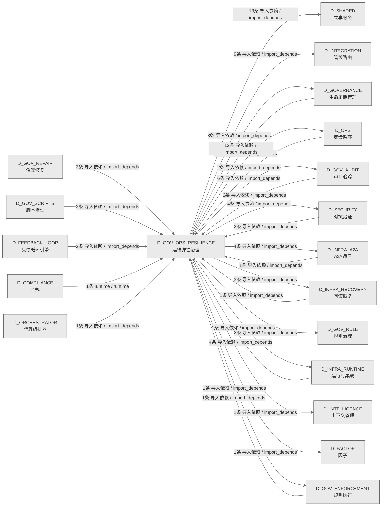

# 20_d_gov_ops_resilience / 运维弹性治理域 / Ops Resilience Governance

> **功能简介 / Overview**: 运维弹性治理，负责运维治理、安全治理、弹性治理和升级协议

> **文档作用 / Purpose**: 展示 运维弹性治理（D_GOV_OPS_RESILIENCE）功能域的域内依赖关系、跨域依赖关系，模块信息（成熟度/中英文名/大白话/文件路径）内嵌于 Mermaid 节点，供架构审查和域治理参考。

> 本文档由 generate_domain_doc.py 从 depgraph (PostgreSQL) 自动生成
> 数据源: depgraph (PostgreSQL) nodes表 + edges表

> **[可缩放 HTML 版 / Zoomable HTML](http://localhost:8765/docs/02_enterprise_architecture/02_domain_architecture_docs/_zoomable_html/20_d_gov_ops_resilience.html)** — Ctrl+滚轮缩放 ｜ 双击重置 ｜ Ctrl+Shift+D 切换拖动/选择模式

## 域基本信息 / Domain Overview

| 字段 | 值 | Field | Value |
|------|------|-------|-------|
| 编号 | 20 | Number | 20 |
| 域ID | D_GOV_OPS_RESILIENCE | Domain ID | D_GOV_OPS_RESILIENCE |
| 域名称 | 运维弹性治理 | Domain Name | Ops Resilience Governance |
| 层级 | L1 基础平台层 | Layer | L1 Foundation |
| 模块数 | 91 | Module Count | 91 |
| 域内依赖 | 17 | Internal Dependencies | 17 |
| 跨域入边 | 34 | Cross-domain Incoming | 34 |
| 跨域出边 | 60 | Cross-domain Outgoing | 60 |
| 设计态模块 | 0 | Design Modules | 0 |
| 生产态模块 | 91 | Production Modules | 91 |
| 容量 | 91/150 (正常) | Capacity | 91/150 (正常) |
| 描述 | 运维治理(ops_governance) | Description | 运维治理(ops_governance) |

## 域内依赖图 / Internal Dependency Diagram

> 依赖图内嵌在本文档中，IDE 可直接渲染；网页版可 Ctrl+滚轮缩放 + 拖动平移查看细节。
>
> **图例说明 / Legend**：
> - 🟦 **蓝色 = 运营态模块**（production，已上线运行）
> - 🟧 **橙色虚线 = 设计态模块**（design，蓝图阶段，代码未写）
> - **实线箭头 = 运营态依赖**（已生效的依赖关系）
> - **虚线箭头 = 非运营态依赖**（计划中/验证中的依赖关系）

### 全景图（全部模块，颜色区分运营态/设计态）

> 展示全部 91 个模块（生产态 91 + 设计态 0），含跨域依赖外部节点。节点含成熟度+名称+大白话/简介+文件路径。

```mermaid
%%{init: {'theme': 'base', 'themeVariables': {'primaryColor': '#eaeaea', 'primaryTextColor': '#333333', 'primaryBorderColor': '#666666', 'lineColor': '#666666', 'secondaryColor': '#eaeaea', 'tertiaryColor': '#eaeaea', 'fontSize': '14px'}}}%%
flowchart TD
    src_zephyr_governance_budget_enforcer_init_py["(生产态 / production) 包入口 / __init__<br/>治理的包入口，把这一层的子模块归到一起统一管理，用到谁才加载谁，避免一次性全加载拖慢启动。<br/>文件: budget-enforcer/__init__.py"]
    src_zephyr_governance_escalation_alternative_path_blocker_py["(生产态 / production) alternative路径blocker / alternative_path_blocker<br/>Alternative Path Blocker — v0.13.0 替代工具路径拦截器。<br/>文件: escalation/alternative_path_blocker.py"]
    src_zephyr_governance_escalation_consequence_manager_py["(生产态 / production) consequence管理器 / consequence_manager<br/>consequence管理器，IO的管理器，统一管理资源生命周期。<br/>文件: escalation/consequence_manager.py"]
    src_zephyr_governance_escalation_contracts_py["(生产态 / production) 契约 / contracts<br/>G-CT-003 消费端 — Escalation.on_rollback_failure() + G-CT-004/G-CT-006/G-CT-008 升级入口.<br/>文件: escalation/contracts.py"]
    src_zephyr_governance_escalation_escalation_api_py["(生产态 / production) 升级api / escalation_api<br/>Escalation API — v0.7.0 Service Account API: 外部系统安全触发升级，不绕过引擎。<br/>文件: escalation/escalation_api.py"]
    src_zephyr_governance_escalation_escalation_fatigue_manager_py["(生产态 / production) 升级fatigue管理器 / escalation_fatigue_manager<br/>Escalation Fatigue Manager — v0.11.0 升级疲劳管理器。<br/>文件: escalation/escalation_fatigue_manager.py"]
    src_zephyr_governance_escalation_escalation_loop_detector_py["(生产态 / production) 升级循环检测器 / escalation_loop_detector<br/>Escalation Loop Detector — v0.10.0 跨模块升级循环: escalate->block->auto_guard->escalate循环检测。<br/>文件: escalation/escalation_loop_detector.py"]
    src_zephyr_governance_escalation_escalation_smoke_tests_py["(生产态 / production) 升级smoketests / escalation_smoke_tests<br/>Escalation Smoke Tests — v0.11.0 升级协议烟雾测试。<br/>文件: escalation/escalation_smoke_tests.py"]
    src_zephyr_governance_escalation_git_hook_pre_scanner_py["(生产态 / production) Git钩子预扫描器 / git_hook_pre_scanner<br/>Git Hook Pre-Scanner — v0.14.0 Git操作Hook预扫描器。<br/>文件: escalation/git_hook_pre_scanner.py"]
    src_zephyr_governance_escalation_human_factors_py["(生产态 / production) Human Factors — v0.7.0 人因工程: 通知疲劳管理+上下文简 / human_factors<br/>Human Factors — v0.7.0 人因工程: 通知疲劳管理+上下文简洁性+多通道notifications。<br/>文件: escalation/human_factors.py"]
    src_zephyr_governance_escalation_identity_verifier_py["(生产态 / production) identity验证器 / identity_verifier<br/>Identity Verifier — D-022-12 Agent身份验证器: session_id+role+capability三元组验证。<br/>文件: escalation/identity_verifier.py"]
    src_zephyr_governance_escalation_incident_response_py["(生产态 / production) incident响应 / incident_response<br/>incident响应，供MOD-INF-027;MOD-INF-020;MOD-IN使用<br/>文件: escalation/incident_response.py"]
    src_zephyr_governance_escalation_owner_absent_py["(生产态 / production) 所有者absent / owner_absent<br/>Owner Absent — 人力缺席分级处置。<br/>文件: escalation/owner_absent.py"]
    src_zephyr_governance_escalation_result_types_py["(生产态 / production) 结果类型定义 / G-CT-003 — RollbackResult backward-compat re-export facade.<br/>结果类型定义。G-CT-003 — RollbackResult backward-compat re-export facade.<br/>文件: escalation/result_types.py"]
    src_zephyr_governance_escalation_spof_checker_py["(生产态 / production) spof检查器 / spof_checker<br/>spof检查器，治理的类型，定义数据类型和枚举。<br/>文件: escalation/spof_checker.py"]
    src_zephyr_governance_escalation_triage_py["(生产态 / production) 分诊 / triage<br/>G2 Triage 门禁 — 知识分类评分（T-2-13-B）<br/>文件: escalation/triage.py"]
    src_zephyr_governance_ops_governance_agent_dispatch_py["(生产态 / production) 代理分发 / agent_dispatch<br/>根据 domain key 返回分派信息。找不到返回 None。<br/>文件: ops_governance/agent_dispatch.py"]
    src_zephyr_governance_ops_governance_auto_runner_py["(生产态 / production) 自动运行器 / auto_runner<br/>GovernanceAutoRunner — 治理脚本自动运行/自动关闭调度器.<br/>文件: ops_governance/auto_runner.py"]
    src_zephyr_governance_ops_governance_bandwidth_optimizer_py["(生产态 / production) bandwidth优化器 / bandwidth_optimizer<br/>bandwidth优化器，供MOD-INF-020;MOD-INF-018;MOD-IN使用<br/>文件: ops_governance/bandwidth_optimizer.py"]
    src_zephyr_governance_ops_governance_burn_rate_monitor_py["(生产态 / production) burn速率监控器 / Burn Rate Monitor — MOD-INF-024<br/>burn率监控。Burn Rate Monitor — MOD-INF-024<br/>文件: ops_governance/burn_rate_monitor.py"]
    src_zephyr_governance_ops_governance_clock_guard_py["(生产态 / production) clock守卫 / clock_guard<br/>Clock Guard — v0.8.0 时钟完整性防御: NTP漂移检测+wall clock monotonic验证。<br/>文件: ops_governance/clock_guard.py"]
    src_zephyr_governance_ops_governance_coldstart_manager_py["(生产态 / production) coldstart管理器 / coldstart_manager<br/>Coldstart Manager — v0.7.0 冷启动管理器: escalation rules加载+引擎初始化+健康检查。<br/>文件: ops_governance/coldstart_manager.py"]
    src_zephyr_governance_ops_governance_cost_attributor_py["(生产态 / production) 成本attributor / cost_attributor<br/>成本attributor，依赖预算模型工作<br/>文件: ops_governance/cost_attributor.py"]
    src_zephyr_governance_ops_governance_cost_router_py["(生产态 / production) 成本路由器 / cost_router<br/>根据预估token总量计算成本。<br/>文件: ops_governance/cost_router.py"]
    src_zephyr_governance_ops_governance_daily_ops_py["(生产态 / production) daily运维 / daily_ops<br/>daily运维，供MOD-INF-020;MOD-INF-018;MOD-IN使用<br/>文件: ops_governance/daily_ops.py"]
    src_zephyr_governance_ops_governance_decision_fatigue_py["(生产态 / production) 决策疲劳 / decision_fatigue<br/>决策疲劳，治理的核心类，封装EisenhowerPriority相关逻辑。<br/>文件: ops_governance/decision_fatigue.py"]
    src_zephyr_governance_ops_governance_degradation_manager_py["(生产态 / production) 退化管理器 / degradation_manager<br/>退化管理器，依赖预算模型工作<br/>文件: ops_governance/degradation_manager.py"]
    src_zephyr_governance_ops_governance_environment_manager_py["(生产态 / production) 环境管理器 / environment_manager<br/>环境管理器，提供包入口和模块加载功能<br/>文件: ops_governance/environment_manager.py"]
    src_zephyr_governance_ops_governance_error_budget_burst_limiter_py["(生产态 / production) 错误预算burst限制器 / error_budget_burst_limiter<br/>Error Budget Burst Limiter — v0.11.0 错误预算Burst限流器。<br/>文件: ops_governance/error_budget_burst_limiter.py"]
    src_zephyr_governance_ops_governance_interrupt_handler_py["(生产态 / production) 中断处理器 / interrupt_handler<br/>Interrupt Handler — D-022-06 硬中断处理器: Owner紧急中断+优雅停止+状态保存。<br/>文件: ops_governance/interrupt_handler.py"]
    src_zephyr_governance_ops_governance_maintenance_window_adapter_py["(生产态 / production) maintenancewindow适配器 / maintenance_window_adapter<br/>Maintenance Window Adapter — v0.10.0 计划维护窗口适配器。<br/>文件: ops_governance/maintenance_window_adapter.py"]
    src_zephyr_governance_ops_governance_ops_foundation_py["(生产态 / production) 运维foundation / ops_foundation<br/>运维foundation，供MOD-INF-020;MOD-INF-018;MOD-IN使用<br/>文件: ops_governance/ops_foundation.py"]
    src_zephyr_governance_ops_governance_parent_child_attributor_py["(生产态 / production) 父子attributor / parent_child_attributor<br/>父子attributor，提供包入口和模块加载功能<br/>文件: ops_governance/parent_child_attributor.py"]
    src_zephyr_governance_ops_governance_roi_calculator_py["(生产态 / production) roi计算器 / roi_calculator<br/>roi计算器，治理的结果，封装操作结果的数据结构。<br/>文件: ops_governance/roi_calculator.py"]
    src_zephyr_governance_ops_governance_self_budget_tracker_py["(生产态 / production) 自预算追踪器 / self_budget_tracker<br/>自预算追踪器，提供包入口和模块加载功能<br/>文件: ops_governance/self_budget_tracker.py"]
    src_zephyr_governance_ops_governance_service_registration_py["(生产态 / production) 服务registration / service_registration<br/>D-DATA -> ServiceRegistry 注册模块<br/>文件: ops_governance/service_registration.py"]
    src_zephyr_governance_ops_governance_startup_shutdown_py["(生产态 / production) 启动关机 / startup_shutdown<br/>启动关机，提供包入口和模块加载功能<br/>文件: ops_governance/startup_shutdown.py"]
    src_zephyr_governance_ops_governance_startup_shutdown_cli_py["(生产态 / production) 启动关机命令行 / startup_shutdown_cli<br/>启动关机命令行，提供包入口和模块加载功能<br/>文件: ops_governance/startup_shutdown_cli.py"]
    src_zephyr_governance_ops_governance_tco_model_py["(生产态 / production) tco模型 / tco_model<br/>tco模型，主要提供monthly成本、exceeds预算等功能<br/>文件: ops_governance/tco_model.py"]
    src_zephyr_governance_ops_governance_time_sync_py["(生产态 / production) 时间同步 / time_sync<br/>时间同步，治理的同步器，保持数据同步一致。<br/>文件: ops_governance/time_sync.py"]
    src_zephyr_governance_ops_governance_timeout_guard_py["(生产态 / production) 超时守卫 / timeout_guard<br/>超时守卫，提供包入口和模块加载功能<br/>文件: ops_governance/timeout_guard.py"]
    src_zephyr_governance_resilience_governance_init_py["(生产态 / production) 包入口 / __init__<br/>治理的包入口，把这一层的子模块归到一起统一管理，用到谁才加载谁，避免一次性全加载拖慢启动。<br/>文件: resilience_governance/__init__.py"]
    src_zephyr_governance_resilience_governance_account_isolator_py["(生产态 / production) 账户隔离器 / account_isolator<br/>Account Isolator — v0.10.0 多账户升级隔离器。<br/>文件: resilience_governance/account_isolator.py"]
    src_zephyr_governance_resilience_governance_broker_resilience_py["(生产态 / production) 经纪人韧性 / broker_resilience<br/>经纪人韧性，供MOD-INF-027;MOD-INF-020;MOD-IN使用<br/>文件: resilience_governance/broker_resilience.py"]
    src_zephyr_governance_resilience_governance_bus_factor_defense_py["(生产态 / production) 总线因子防御 / bus_factor_defense<br/>总线因子防御，依赖总线因子防御工作<br/>文件: resilience_governance/bus_factor_defense.py"]
    src_zephyr_governance_resilience_governance_decision_fatigue_cli_py["(生产态 / production) 决策疲劳命令行 / decision_fatigue_cli<br/>决策疲劳命令行，供MOD-INF-027;MOD-INF-020;MOD-IN使用<br/>文件: resilience_governance/decision_fatigue_cli.py"]
    src_zephyr_governance_resilience_governance_engine_sandbox_py["(生产态 / production) 引擎沙箱 / EngineSandbox — D-022-08 OS-level sandboxing for the escalat<br/>引擎sandbox。EngineSandbox — D-022-08 OS-level sandboxing for the escalation engine.<br/>文件: resilience_governance/engine_sandbox.py"]
    src_zephyr_governance_resilience_governance_f5_boot_integration_py["(生产态 / production) f5启动集成 / f5_boot_integration<br/>F5BootIntegration — F5 自动启动/关闭集成 (MOD-INF-022 §2).<br/>文件: resilience_governance/f5_boot_integration.py"]
    src_zephyr_governance_resilience_governance_f5_event_subscriber_py["(生产态 / production) f5事件订阅器 / f5_event_subscriber<br/>F5EventSubscriber — F5 事件启动机制 (MOD-INF-022 §3).<br/>文件: resilience_governance/f5_event_subscriber.py"]
    src_zephyr_governance_resilience_governance_f5_shutdown_manager_py["(生产态 / production) f5关机管理器 / f5_shutdown_manager<br/>F5ShutdownManager — F5 自动关闭/状态持久化/信号处理 (MOD-INF-022 §2).<br/>文件: resilience_governance/f5_shutdown_manager.py"]
    src_zephyr_governance_resilience_governance_fail_mode_manager_py["(生产态 / production) failmode管理器 / fail_mode_manager<br/>failmode管理器，提供包入口和模块加载功能<br/>文件: resilience_governance/fail_mode_manager.py"]
    src_zephyr_governance_resilience_governance_fault_tolerance_py["(生产态 / production) 故障容错 / fault_tolerance<br/>故障容错，提供包入口和模块加载功能<br/>文件: resilience_governance/fault_tolerance.py"]
    src_zephyr_governance_resilience_governance_last_resort_watchdog_py["(生产态 / production) 末resortwatchdog / last_resort_watchdog<br/>Last Resort Watchdog — v0.8.0 终极逃生舱: 所有escalation失败后的final fallback+shutdown。<br/>文件: resilience_governance/last_resort_watchdog.py"]
    src_zephyr_governance_resilience_governance_offline_autonomy_py["(生产态 / production) 离线autonomy / offline_autonomy<br/>离线autonomy，依赖离线autonomy工作<br/>文件: resilience_governance/offline_autonomy.py"]
    src_zephyr_governance_resilience_governance_offline_resilience_py["(生产态 / production) 离线韧性 / offline_resilience<br/>离线韧性，依赖离线韧性工作<br/>文件: resilience_governance/offline_resilience.py"]
    src_zephyr_governance_resilience_governance_policy_sandbox_py["(生产态 / production) 策略沙箱 / policy_sandbox<br/>策略sandbox，治理的数据库，持久化存取结构化数据。<br/>文件: resilience_governance/policy_sandbox.py"]
    src_zephyr_governance_resilience_governance_process_isolator_py["(生产态 / production) 进程隔离器 / process_isolator<br/>Process Isolator — v0.6.0 进程隔离器: engine运行在独立进程+资源限制+crash恢复。<br/>文件: resilience_governance/process_isolator.py"]
    src_zephyr_governance_resilience_governance_witness_isolation_py["(生产态 / production) Witness Isolation — v0.8.0 Witness隔离: N版 / witness_isolation<br/>Witness Isolation — v0.8.0 Witness隔离: N版本decision验证+投票机制+majority判定。<br/>文件: resilience_governance/witness_isolation.py"]
    src_zephyr_governance_security_governance_init_py["(生产态 / production) 包入口 / __init__<br/>安全的包入口，把这一层的子模块归到一起统一管理，用到谁才加载谁，避免一次性全加载拖慢启动。<br/>文件: security_governance/__init__.py"]
    src_zephyr_governance_security_governance_adversarial_tester_py["(生产态 / production) 对抗测试器 / adversarial_tester<br/>对抗测试器，依赖ipi防御、流中止守卫、预算引擎工作<br/>文件: security_governance/adversarial_tester.py"]
    src_zephyr_governance_security_governance_api_response_sanitizer_py["(生产态 / production) API响应清洗器 / api_response_sanitizer<br/>API Response Sanitizer — v0.9.0 API响应清洗器: 外部API返回内容清洗+injection检测。<br/>文件: security_governance/api_response_sanitizer.py"]
    src_zephyr_governance_security_governance_bare_repo_scanner_py["(生产态 / production) barerepo扫描器 / bare_repo_scanner<br/>Bare Repo Scanner — v0.14.0 嵌入式裸仓库检测器。<br/>文件: security_governance/bare_repo_scanner.py"]
    src_zephyr_governance_security_governance_compositional_safety_tester_py["(生产态 / production) compositional安全测试器 / compositional_safety_tester<br/>Compositional Safety Tester — v0.14.0 组合性不安全测试器。<br/>文件: security_governance/compositional_safety_tester.py"]
    src_zephyr_governance_security_governance_config_scanner_py["(生产态 / production) 配置扫描器 / config_scanner<br/>Config Scanner — v0.9.0 AI配置文件注入扫描器: 检测AI修改的配置+注入攻击。<br/>文件: security_governance/config_scanner.py"]
    src_zephyr_governance_security_governance_credential_guard_py["(生产态 / production) 凭证守卫 / credential_guard<br/>Credential Guard — v0.7.0 密钥泄露防护: env检测+git log扫描+运行时脱敏。<br/>文件: security_governance/credential_guard.py"]
    src_zephyr_governance_security_governance_default_security_gateway_py["(生产态 / production) 默认安全网关 / default_security_gateway<br/>DefaultSecurityGateway — SecurityGateway 三层防御 OCP-004 实现<br/>文件: security_governance/default_security_gateway.py"]
    src_zephyr_governance_security_governance_ghost_scan_py["(生产态 / production) ghost扫描 / ghost_scan<br/>Ghost Scan — v0.8.0 幽灵进程检测: lingering process扫描+资源泄漏检测。<br/>文件: security_governance/ghost_scan.py"]
    src_zephyr_governance_security_governance_github_api_guard_py["(生产态 / production) githubAPI守卫 / github_api_guard<br/>GitHub API Guard — v0.9.0 Comment and Control防御: PR评论命令注入检测+限制。<br/>文件: security_governance/github_api_guard.py"]
    src_zephyr_governance_security_governance_hooks_integrity_guard_py["(生产态 / production) 钩子完整性守卫 / hooks_integrity_guard<br/>Hooks Integrity Guard — v0.11.0 Hooks自编辑防护器。<br/>文件: security_governance/hooks_integrity_guard.py"]
    src_zephyr_governance_security_governance_memory_poison_guard_py["(生产态 / production) 记忆poison守卫 / memory_poison_guard<br/>Memory Poison Guard — v0.9.0 记忆投毒防护: Memory写入内容审计+恶意注入检测。<br/>文件: security_governance/memory_poison_guard.py"]
    src_zephyr_governance_security_governance_persuasion_detector_py["(生产态 / production) persuasion检测器 / persuasion_detector<br/>Persuasion Detector — D-022-09 心理说服检测: 对抗语气+恳求+绕过指令。<br/>文件: security_governance/persuasion_detector.py"]
    src_zephyr_governance_security_governance_poison_cascade_detector_py["(生产态 / production) poison级联检测器 / poison_cascade_detector<br/>poison级联检测器，安全的事件，定义和分发事件。<br/>文件: security_governance/poison_cascade_detector.py"]
    src_zephyr_governance_security_governance_sbom_guard_py["(生产态 / production) sbom守卫 / sbom_guard<br/>SBOM Guard — v0.8.0 SBOM供应链防护: 依赖版本锁定+脆弱性扫描+cve告警。<br/>文件: security_governance/sbom_guard.py"]
    src_zephyr_governance_security_governance_security_config_scanner_py["(生产态 / production) 安全配置扫描器 / security_config_scanner<br/>Security Config Scanner — v0.13.0 缺失安全配置扫描器。<br/>文件: security_governance/security_config_scanner.py"]
    src_zephyr_governance_security_governance_tamper_evident_log_py["(生产态 / production) tamperevident日志 / tamper_evident_log<br/>5.17.5 修复：解析 HMAC 密钥（env > 兜底默认）。<br/>文件: security_governance/tamper_evident_log.py"]
    src_zephyr_governance_security_governance_vibe_security_verify_py["(生产态 / production) vibe安全verify / vibe_security_verify<br/>Vibe Security Verifier — v0.9.0 Vibe Coding安全验证器: AI生成代码安全基线检查。<br/>文件: security_governance/vibe_security_verify.py"]
    src_zephyr_governance_security_governance_vibe_verify_integration_py["(生产态 / production) vibeverify集成 / vibe_verify_integration<br/>VibeVerify Integration — v0.9.0 VibeVerify集成器: auto_guard级别+增量修复+confidence回传。<br/>文件: security_governance/vibe_verify_integration.py"]
    src_zephyr_governance_budget_enforcer_init_py ~~~ src_zephyr_governance_escalation_alternative_path_blocker_py
    src_zephyr_governance_escalation_alternative_path_blocker_py ~~~ src_zephyr_governance_escalation_consequence_manager_py
    src_zephyr_governance_escalation_consequence_manager_py ~~~ src_zephyr_governance_escalation_contracts_py
    src_zephyr_governance_escalation_contracts_py ~~~ src_zephyr_governance_escalation_escalation_api_py
    src_zephyr_governance_escalation_escalation_api_py ~~~ src_zephyr_governance_escalation_escalation_fatigue_manager_py
    src_zephyr_governance_escalation_escalation_fatigue_manager_py ~~~ src_zephyr_governance_escalation_escalation_loop_detector_py
    src_zephyr_governance_escalation_escalation_loop_detector_py ~~~ src_zephyr_governance_escalation_escalation_smoke_tests_py
    src_zephyr_governance_escalation_escalation_smoke_tests_py ~~~ src_zephyr_governance_escalation_git_hook_pre_scanner_py
    src_zephyr_governance_escalation_git_hook_pre_scanner_py ~~~ src_zephyr_governance_escalation_human_factors_py
    src_zephyr_governance_escalation_human_factors_py ~~~ src_zephyr_governance_escalation_identity_verifier_py
    src_zephyr_governance_escalation_identity_verifier_py ~~~ src_zephyr_governance_escalation_incident_response_py
    src_zephyr_governance_escalation_incident_response_py ~~~ src_zephyr_governance_escalation_owner_absent_py
    src_zephyr_governance_escalation_owner_absent_py ~~~ src_zephyr_governance_escalation_result_types_py
    src_zephyr_governance_escalation_result_types_py ~~~ src_zephyr_governance_escalation_spof_checker_py
    src_zephyr_governance_escalation_spof_checker_py ~~~ src_zephyr_governance_escalation_triage_py
    src_zephyr_governance_escalation_triage_py ~~~ src_zephyr_governance_ops_governance_agent_dispatch_py
    src_zephyr_governance_ops_governance_agent_dispatch_py ~~~ src_zephyr_governance_ops_governance_auto_runner_py
    src_zephyr_governance_ops_governance_auto_runner_py ~~~ src_zephyr_governance_ops_governance_bandwidth_optimizer_py
    src_zephyr_governance_ops_governance_bandwidth_optimizer_py ~~~ src_zephyr_governance_ops_governance_burn_rate_monitor_py
    src_zephyr_governance_ops_governance_burn_rate_monitor_py ~~~ src_zephyr_governance_ops_governance_clock_guard_py
    src_zephyr_governance_ops_governance_clock_guard_py ~~~ src_zephyr_governance_ops_governance_coldstart_manager_py
    src_zephyr_governance_ops_governance_coldstart_manager_py ~~~ src_zephyr_governance_ops_governance_cost_attributor_py
    src_zephyr_governance_ops_governance_cost_attributor_py ~~~ src_zephyr_governance_ops_governance_cost_router_py
    src_zephyr_governance_ops_governance_cost_router_py ~~~ src_zephyr_governance_ops_governance_daily_ops_py
    src_zephyr_governance_ops_governance_daily_ops_py ~~~ src_zephyr_governance_ops_governance_decision_fatigue_py
    src_zephyr_governance_ops_governance_decision_fatigue_py ~~~ src_zephyr_governance_ops_governance_degradation_manager_py
    src_zephyr_governance_ops_governance_degradation_manager_py ~~~ src_zephyr_governance_ops_governance_environment_manager_py
    src_zephyr_governance_ops_governance_environment_manager_py ~~~ src_zephyr_governance_ops_governance_error_budget_burst_limiter_py
    src_zephyr_governance_ops_governance_error_budget_burst_limiter_py ~~~ src_zephyr_governance_ops_governance_interrupt_handler_py
    src_zephyr_governance_ops_governance_interrupt_handler_py ~~~ src_zephyr_governance_ops_governance_maintenance_window_adapter_py
    src_zephyr_governance_ops_governance_maintenance_window_adapter_py ~~~ src_zephyr_governance_ops_governance_ops_foundation_py
    src_zephyr_governance_ops_governance_ops_foundation_py ~~~ src_zephyr_governance_ops_governance_parent_child_attributor_py
    src_zephyr_governance_ops_governance_parent_child_attributor_py ~~~ src_zephyr_governance_ops_governance_roi_calculator_py
    src_zephyr_governance_ops_governance_roi_calculator_py ~~~ src_zephyr_governance_ops_governance_self_budget_tracker_py
    src_zephyr_governance_ops_governance_self_budget_tracker_py ~~~ src_zephyr_governance_ops_governance_service_registration_py
    src_zephyr_governance_ops_governance_service_registration_py ~~~ src_zephyr_governance_ops_governance_startup_shutdown_py
    src_zephyr_governance_ops_governance_startup_shutdown_py ~~~ src_zephyr_governance_ops_governance_startup_shutdown_cli_py
    src_zephyr_governance_ops_governance_startup_shutdown_cli_py ~~~ src_zephyr_governance_ops_governance_tco_model_py
    src_zephyr_governance_ops_governance_tco_model_py ~~~ src_zephyr_governance_ops_governance_time_sync_py
    src_zephyr_governance_ops_governance_time_sync_py ~~~ src_zephyr_governance_ops_governance_timeout_guard_py
    src_zephyr_governance_ops_governance_timeout_guard_py ~~~ src_zephyr_governance_resilience_governance_init_py
    src_zephyr_governance_resilience_governance_init_py ~~~ src_zephyr_governance_resilience_governance_account_isolator_py
    src_zephyr_governance_resilience_governance_account_isolator_py ~~~ src_zephyr_governance_resilience_governance_broker_resilience_py
    src_zephyr_governance_resilience_governance_broker_resilience_py ~~~ src_zephyr_governance_resilience_governance_bus_factor_defense_py
    src_zephyr_governance_resilience_governance_bus_factor_defense_py ~~~ src_zephyr_governance_resilience_governance_decision_fatigue_cli_py
    src_zephyr_governance_resilience_governance_decision_fatigue_cli_py ~~~ src_zephyr_governance_resilience_governance_engine_sandbox_py
    src_zephyr_governance_resilience_governance_engine_sandbox_py ~~~ src_zephyr_governance_resilience_governance_f5_boot_integration_py
    src_zephyr_governance_resilience_governance_f5_boot_integration_py ~~~ src_zephyr_governance_resilience_governance_f5_event_subscriber_py
    src_zephyr_governance_resilience_governance_f5_event_subscriber_py ~~~ src_zephyr_governance_resilience_governance_f5_shutdown_manager_py
    src_zephyr_governance_resilience_governance_f5_shutdown_manager_py ~~~ src_zephyr_governance_resilience_governance_fail_mode_manager_py
    src_zephyr_governance_resilience_governance_fail_mode_manager_py ~~~ src_zephyr_governance_resilience_governance_fault_tolerance_py
    src_zephyr_governance_resilience_governance_fault_tolerance_py ~~~ src_zephyr_governance_resilience_governance_last_resort_watchdog_py
    src_zephyr_governance_resilience_governance_last_resort_watchdog_py ~~~ src_zephyr_governance_resilience_governance_offline_autonomy_py
    src_zephyr_governance_resilience_governance_offline_autonomy_py ~~~ src_zephyr_governance_resilience_governance_offline_resilience_py
    src_zephyr_governance_resilience_governance_offline_resilience_py ~~~ src_zephyr_governance_resilience_governance_policy_sandbox_py
    src_zephyr_governance_resilience_governance_policy_sandbox_py ~~~ src_zephyr_governance_resilience_governance_process_isolator_py
    src_zephyr_governance_resilience_governance_process_isolator_py ~~~ src_zephyr_governance_resilience_governance_witness_isolation_py
    src_zephyr_governance_resilience_governance_witness_isolation_py ~~~ src_zephyr_governance_security_governance_init_py
    src_zephyr_governance_security_governance_init_py ~~~ src_zephyr_governance_security_governance_adversarial_tester_py
    src_zephyr_governance_security_governance_adversarial_tester_py ~~~ src_zephyr_governance_security_governance_api_response_sanitizer_py
    src_zephyr_governance_security_governance_api_response_sanitizer_py ~~~ src_zephyr_governance_security_governance_bare_repo_scanner_py
    src_zephyr_governance_security_governance_bare_repo_scanner_py ~~~ src_zephyr_governance_security_governance_compositional_safety_tester_py
    src_zephyr_governance_security_governance_compositional_safety_tester_py ~~~ src_zephyr_governance_security_governance_config_scanner_py
    src_zephyr_governance_security_governance_config_scanner_py ~~~ src_zephyr_governance_security_governance_credential_guard_py
    src_zephyr_governance_security_governance_credential_guard_py ~~~ src_zephyr_governance_security_governance_default_security_gateway_py
    src_zephyr_governance_security_governance_default_security_gateway_py ~~~ src_zephyr_governance_security_governance_ghost_scan_py
    src_zephyr_governance_security_governance_ghost_scan_py ~~~ src_zephyr_governance_security_governance_github_api_guard_py
    src_zephyr_governance_security_governance_github_api_guard_py ~~~ src_zephyr_governance_security_governance_hooks_integrity_guard_py
    src_zephyr_governance_security_governance_hooks_integrity_guard_py ~~~ src_zephyr_governance_security_governance_memory_poison_guard_py
    src_zephyr_governance_security_governance_memory_poison_guard_py ~~~ src_zephyr_governance_security_governance_persuasion_detector_py
    src_zephyr_governance_security_governance_persuasion_detector_py ~~~ src_zephyr_governance_security_governance_poison_cascade_detector_py
    src_zephyr_governance_security_governance_poison_cascade_detector_py ~~~ src_zephyr_governance_security_governance_sbom_guard_py
    src_zephyr_governance_security_governance_sbom_guard_py ~~~ src_zephyr_governance_security_governance_security_config_scanner_py
    src_zephyr_governance_security_governance_security_config_scanner_py ~~~ src_zephyr_governance_security_governance_tamper_evident_log_py
    src_zephyr_governance_security_governance_tamper_evident_log_py ~~~ src_zephyr_governance_security_governance_vibe_security_verify_py
    src_zephyr_governance_security_governance_vibe_security_verify_py ~~~ src_zephyr_governance_security_governance_vibe_verify_integration_py
    src_zephyr_governance_escalation_escalation_engine_py["(生产态 / production) 升级引擎 / Escalation Engine — MOD-INF-022<br/>escalation引擎。Escalation Engine — MOD-INF-022<br/>文件: escalation/escalation_engine.py"]
    src_zephyr_governance_ops_governance_event_hook_py["(生产态 / production) 事件钩子 / event_hook<br/>EventHook — 声明式任务系统事件订阅<br/>文件: ops_governance/event_hook.py"]
    src_zephyr_governance_ops_governance_phase_manager_py["(生产态 / production) 阶段管理器 / phase_manager<br/>Phase Manager — ZephyrAlpha 施工阶段门控引擎.<br/>文件: ops_governance/phase_manager.py"]
    src_zephyr_governance_ops_governance_stream_abort_guard_py["(生产态 / production) 流中止守卫 / stream_abort_guard<br/>StreamAbortGuard — 流式中断守卫<br/>文件: ops_governance/stream_abort_guard.py"]
    src_zephyr_governance_resilience_governance_blast_radius_py["(生产态 / production) 爆炸半径 / blast_radius — MOD-INF-028 §3.1 Stage 9<br/>depgraph YAML 加载或结构校验失败.<br/>文件: resilience_governance/blast_radius.py"]
    src_zephyr_governance_resilience_governance_deadlock_detector_py["(生产态 / production) deadlock检测器 / deadlock_detector<br/>Deadlock Detector — D-022-04 多Agent死锁+循环依赖检测+超时破解。<br/>文件: resilience_governance/deadlock_detector.py"]
    src_zephyr_governance_resilience_governance_decision_fatigue_py["(生产态 / production) 决策疲劳 / decision_fatigue<br/>决策疲劳，供MOD-INF-027;MOD-INF-020;MOD-IN使用<br/>文件: resilience_governance/decision_fatigue.py"]
    src_zephyr_governance_security_governance_anti_automation_bias_py["(生产态 / production) anti自动化bias / Anti-Automation Bias — D-022-09 mandatory human oversight en<br/>anti自动化bias，提供包入口和模块加载功能<br/>文件: security_governance/anti_automation_bias.py"]
    src_zephyr_governance_security_governance_ipi_defense_py["(生产态 / production) ipi防御 / ipi_defense<br/>ipi防御，安全的报告器，汇总数据生成报告。<br/>文件: security_governance/ipi_defense.py"]
    src_zephyr_governance_security_governance_security_gateway_base_py["(生产态 / production) 安全网关基类 / D_COMPLIANCE — Governance & Compliance Layer<br/>安全网关基类。D_COMPLIANCE — Governance & Compliance Layer<br/>文件: security_governance/security_gateway_base.py"]
    src_zephyr_governance_escalation_escalation_engine_py ~~~ src_zephyr_governance_ops_governance_event_hook_py
    src_zephyr_governance_ops_governance_event_hook_py ~~~ src_zephyr_governance_ops_governance_phase_manager_py
    src_zephyr_governance_ops_governance_phase_manager_py ~~~ src_zephyr_governance_ops_governance_stream_abort_guard_py
    src_zephyr_governance_ops_governance_stream_abort_guard_py ~~~ src_zephyr_governance_resilience_governance_blast_radius_py
    src_zephyr_governance_resilience_governance_blast_radius_py ~~~ src_zephyr_governance_resilience_governance_deadlock_detector_py
    src_zephyr_governance_resilience_governance_deadlock_detector_py ~~~ src_zephyr_governance_resilience_governance_decision_fatigue_py
    src_zephyr_governance_resilience_governance_decision_fatigue_py ~~~ src_zephyr_governance_security_governance_anti_automation_bias_py
    src_zephyr_governance_security_governance_anti_automation_bias_py ~~~ src_zephyr_governance_security_governance_ipi_defense_py
    src_zephyr_governance_security_governance_ipi_defense_py ~~~ src_zephyr_governance_security_governance_security_gateway_base_py
    src_zephyr_governance_escalation_escalation_metrics_py["(生产态 / production) 升级指标 / escalation_metrics<br/>Escalation Metrics — D-022-07 指标收集器: 升级率/误升级率/响应延迟。<br/>文件: escalation/escalation_metrics.py"]
    src_zephyr_governance_escalation_escalation_models_py["(生产态 / production) 升级模型 / Escalation Protocol data models — MOD-INF-022<br/>escalation模型。Escalation Protocol data models — MOD-INF-022<br/>文件: escalation/escalation_models.py"]
    src_zephyr_governance_ops_governance_phase_check_registry_py["(生产态 / production) 阶段检查注册表 / phase_check_registry<br/>PhaseManager->GateEngine 检查注册表桥梁 — 44 个阶段门控检查映射.<br/>文件: ops_governance/phase_check_registry.py"]
    src_zephyr_governance_resilience_governance_circuit_breaker_py["(生产态 / production) 熔断断路器 / Circuit Breaker — MOD-INF-022<br/>熔断断路器。Circuit Breaker — MOD-INF-022<br/>文件: resilience_governance/circuit_breaker.py"]
    src_zephyr_governance_escalation_escalation_metrics_py ~~~ src_zephyr_governance_escalation_escalation_models_py
    src_zephyr_governance_escalation_escalation_models_py ~~~ src_zephyr_governance_ops_governance_phase_check_registry_py
    src_zephyr_governance_ops_governance_phase_check_registry_py ~~~ src_zephyr_governance_resilience_governance_circuit_breaker_py
    src_zephyr_governance_escalation_escalation_api_py -->|导入依赖 / import_depends| src_zephyr_governance_escalation_escalation_models_py
    src_zephyr_governance_escalation_escalation_engine_py -->|导入依赖 / import_depends| src_zephyr_governance_escalation_escalation_metrics_py
    src_zephyr_governance_escalation_escalation_engine_py -->|导入依赖 / import_depends| src_zephyr_governance_escalation_escalation_models_py
    src_zephyr_governance_escalation_escalation_engine_py -->|导入依赖 / import_depends| src_zephyr_governance_resilience_governance_circuit_breaker_py
    src_zephyr_governance_ops_governance_auto_runner_py -->|导入依赖 / import_depends| src_zephyr_governance_ops_governance_phase_check_registry_py
    src_zephyr_governance_ops_governance_auto_runner_py -->|导入依赖 / import_depends| src_zephyr_governance_ops_governance_phase_manager_py
    src_zephyr_governance_ops_governance_phase_manager_py -->|导入依赖 / import_depends| src_zephyr_governance_ops_governance_phase_check_registry_py
    src_zephyr_governance_resilience_governance_f5_event_subscriber_py -->|导入依赖 / import_depends| src_zephyr_governance_escalation_escalation_models_py
    src_zephyr_governance_resilience_governance_f5_boot_integration_py -->|导入依赖 / import_depends| src_zephyr_governance_escalation_escalation_engine_py
    src_zephyr_governance_resilience_governance_f5_boot_integration_py -->|导入依赖 / import_depends| src_zephyr_governance_ops_governance_event_hook_py
    src_zephyr_governance_resilience_governance_f5_boot_integration_py -->|导入依赖 / import_depends| src_zephyr_governance_resilience_governance_deadlock_detector_py
    src_zephyr_governance_resilience_governance_decision_fatigue_cli_py -->|导入依赖 / import_depends| src_zephyr_governance_resilience_governance_decision_fatigue_py
    src_zephyr_governance_resilience_governance_init_py -->|config_depends / config_depends| src_zephyr_governance_resilience_governance_blast_radius_py
    src_zephyr_governance_security_governance_adversarial_tester_py -->|导入依赖 / import_depends| src_zephyr_governance_ops_governance_stream_abort_guard_py
    src_zephyr_governance_security_governance_adversarial_tester_py -->|导入依赖 / import_depends| src_zephyr_governance_security_governance_ipi_defense_py
    src_zephyr_governance_security_governance_default_security_gateway_py -->|导入依赖 / import_depends| src_zephyr_governance_security_governance_security_gateway_base_py
    src_zephyr_governance_security_governance_init_py -->|config_depends / config_depends| src_zephyr_governance_security_governance_anti_automation_bias_py
    D_INFRA_A2A["(生产态 / production) A2A通信 / A2A Communication<br/>Agent 与 Agent 之间的通信协议层，负责 AI 代理间的消息传递、请求路由和协议适配<br/>跨域节点 / cross-domain"]
    src_zephyr_governance_resilience_governance_f5_boot_integration_py -->|导入依赖 / import_depends| D_INFRA_A2A
    D_GOVERNANCE["(生产态 / production) 生命周期管理 / Lifecycle Management<br/>生命周期管理，负责蓝图/模块/任务的声明周期管理和元数据治理<br/>跨域节点 / cross-domain"]
    src_zephyr_governance_ops_governance_auto_runner_py -->|导入依赖 / import_depends| D_GOVERNANCE
    D_GOV_AUDIT["(生产态 / production) 审计追踪 / Audit Trail<br/>审计追踪，负责变更审计追踪和操作日志管理<br/>跨域节点 / cross-domain"]
    src_zephyr_governance_security_governance_tamper_evident_log_py -->|导入依赖 / import_depends| D_GOV_AUDIT
    src_zephyr_governance_resilience_governance_offline_resilience_py -->|导入依赖 / import_depends| D_INFRA_A2A
    D_INTEGRATION["(生产态 / production) 管线路由 / Pipeline Routing<br/>管线路由，负责跨域数据流路由、管道编排和集成适配<br/>跨域节点 / cross-domain"]
    src_zephyr_governance_ops_governance_phase_check_registry_py -->|导入依赖 / import_depends| D_INTEGRATION
    D_SECURITY["(生产态 / production) 对抗验证 / Adversarial Validation<br/>对抗验证，负责系统安全对抗测试、漏洞扫描和攻防验证<br/>跨域节点 / cross-domain"]
    src_zephyr_governance_security_governance_default_security_gateway_py -->|导入依赖 / import_depends| D_SECURITY
    src_zephyr_governance_ops_governance_phase_check_registry_py -->|导入依赖 / import_depends| D_GOV_AUDIT
    src_zephyr_governance_escalation_result_types_py -->|导入依赖 / import_depends| D_INTEGRATION
    src_zephyr_governance_ops_governance_phase_check_registry_py -->|导入依赖 / import_depends| D_GOV_AUDIT
    src_zephyr_governance_ops_governance_phase_manager_py -->|导入依赖 / import_depends| D_SECURITY
    D_SHARED["(生产态 / production) 共享服务 / Shared Services<br/>共享服务，负责跨域共享的工具、协议和基础服务<br/>跨域节点 / cross-domain"]
    src_zephyr_governance_escalation_contracts_py -->|导入依赖 / import_depends| D_SHARED
    src_zephyr_governance_resilience_governance_blast_radius_py -->|导入依赖 / import_depends| D_GOV_AUDIT
    D_GOV_RULE["(生产态 / production) 规则治理 / Rule Governance<br/>规则治理，负责规则注册、规则版本和规则依赖管理<br/>跨域节点 / cross-domain"]
    src_zephyr_governance_escalation_triage_py -->|导入依赖 / import_depends| D_GOV_RULE
    src_zephyr_governance_security_governance_default_security_gateway_py -->|导入依赖 / import_depends| D_SECURITY
    src_zephyr_governance_ops_governance_phase_check_registry_py -->|导入依赖 / import_depends| D_GOV_AUDIT
    D_COMPLIANCE["(设计态 / design) 合规 / Compliance<br/>合规，负责交易合规检查、规则引擎和合规报告<br/>跨域节点 / cross-domain"]
    D_COMPLIANCE -.->|runtime / runtime| src_zephyr_governance_security_governance_security_gateway_base_py
    D_GOV_REPAIR["(生产态 / production) 治理修复 / Governance Repair<br/>治理修复，负责治理问题自动修复和修复策略管理<br/>跨域节点 / cross-domain"]
    D_GOV_REPAIR -->|导入依赖 / import_depends| src_zephyr_governance_ops_governance_timeout_guard_py
    D_GOV_SCRIPTS["(生产态 / production) 脚本治理 / Script Governance<br/>脚本治理，负责脚本生命周期管理和脚本质量门禁<br/>跨域节点 / cross-domain"]
    D_GOV_SCRIPTS -->|导入依赖 / import_depends| src_zephyr_governance_ops_governance_phase_check_registry_py
    D_OPS["(生产态 / production) 反馈循环 / Feedback Loop<br/>反馈循环，负责系统运行反馈、性能监控和自动调优闭环<br/>跨域节点 / cross-domain"]
    D_OPS -->|导入依赖 / import_depends| src_zephyr_governance_escalation_contracts_py
    D_ORCHESTRATOR["(生产态 / production) 代理编排器 / Agent Orchestrator<br/>代理编排器，负责 Agent 任务全生命周期：任务入队、调度、沙箱执行、幻觉检测和收尾归档<br/>跨域节点 / cross-domain"]
    D_ORCHESTRATOR -->|导入依赖 / import_depends| src_zephyr_governance_ops_governance_event_hook_py
    D_GOV_ENFORCEMENT["(生产态 / production) 规则执行 / Rule Enforcement<br/>规则执行，负责治理规则执行和门禁拦截<br/>跨域节点 / cross-domain"]
    D_GOV_ENFORCEMENT -->|导入依赖 / import_depends| src_zephyr_governance_ops_governance_phase_manager_py
    D_GOV_SCRIPTS -->|导入依赖 / import_depends| src_zephyr_governance_ops_governance_phase_manager_py
    D_FEEDBACK_LOOP["(生产态 / production) 反馈循环引擎 / Feedback Loop Engine<br/>反馈循环引擎，负责系统自我改进闭环：异常检测、根因诊断、自动修复和自我进化<br/>跨域节点 / cross-domain"]
    D_FEEDBACK_LOOP -->|导入依赖 / import_depends| src_zephyr_governance_escalation_escalation_engine_py
    D_SECURITY -->|导入依赖 / import_depends| src_zephyr_governance_ops_governance_phase_manager_py
    D_GOVERNANCE -->|导入依赖 / import_depends| src_zephyr_governance_escalation_escalation_models_py
    D_GOV_REPAIR -->|导入依赖 / import_depends| src_zephyr_governance_ops_governance_degradation_manager_py
    D_GOVERNANCE -->|导入依赖 / import_depends| src_zephyr_governance_escalation_escalation_engine_py
    D_INFRA_RUNTIME["(生产态 / production) 运行时集成 / Runtime Integration<br/>运行时集成，负责组件生命周期编排、启动钩子和运行时上下文管理<br/>跨域节点 / cross-domain"]
    D_INFRA_RUNTIME -->|导入依赖 / import_depends| src_zephyr_governance_resilience_governance_f5_shutdown_manager_py
    D_INFRA_RUNTIME -->|导入依赖 / import_depends| src_zephyr_governance_ops_governance_phase_manager_py
    D_GOV_AUDIT -->|导入依赖 / import_depends| src_zephyr_governance_escalation_escalation_engine_py
    classDef production fill:#e1f5fe,stroke:#01579b,stroke-width:2px,color:#000
    classDef design fill:#fff3e0,stroke:#e65100,stroke-width:2px,color:#000,stroke-dasharray: 5 5
    classDef external_prod fill:#e8f4fd,stroke:#0277bd,stroke-width:1px,color:#000
    classDef external_design fill:#fff8e7,stroke:#ef6c00,stroke-width:1px,color:#000,stroke-dasharray: 5 5
    class src_zephyr_governance_budget_enforcer_init_py,src_zephyr_governance_escalation_alternative_path_blocker_py,src_zephyr_governance_escalation_consequence_manager_py,src_zephyr_governance_escalation_contracts_py,src_zephyr_governance_escalation_escalation_api_py,src_zephyr_governance_escalation_escalation_engine_py,src_zephyr_governance_escalation_escalation_fatigue_manager_py,src_zephyr_governance_escalation_escalation_loop_detector_py,src_zephyr_governance_escalation_escalation_metrics_py,src_zephyr_governance_escalation_escalation_models_py,src_zephyr_governance_escalation_escalation_smoke_tests_py,src_zephyr_governance_escalation_git_hook_pre_scanner_py,src_zephyr_governance_escalation_human_factors_py,src_zephyr_governance_escalation_identity_verifier_py,src_zephyr_governance_escalation_incident_response_py,src_zephyr_governance_escalation_owner_absent_py,src_zephyr_governance_escalation_result_types_py,src_zephyr_governance_escalation_spof_checker_py,src_zephyr_governance_escalation_triage_py,src_zephyr_governance_ops_governance_agent_dispatch_py,src_zephyr_governance_ops_governance_auto_runner_py,src_zephyr_governance_ops_governance_bandwidth_optimizer_py,src_zephyr_governance_ops_governance_burn_rate_monitor_py,src_zephyr_governance_ops_governance_clock_guard_py,src_zephyr_governance_ops_governance_coldstart_manager_py,src_zephyr_governance_ops_governance_cost_attributor_py,src_zephyr_governance_ops_governance_cost_router_py,src_zephyr_governance_ops_governance_daily_ops_py,src_zephyr_governance_ops_governance_decision_fatigue_py,src_zephyr_governance_ops_governance_degradation_manager_py,src_zephyr_governance_ops_governance_environment_manager_py,src_zephyr_governance_ops_governance_error_budget_burst_limiter_py,src_zephyr_governance_ops_governance_event_hook_py,src_zephyr_governance_ops_governance_interrupt_handler_py,src_zephyr_governance_ops_governance_maintenance_window_adapter_py,src_zephyr_governance_ops_governance_ops_foundation_py,src_zephyr_governance_ops_governance_parent_child_attributor_py,src_zephyr_governance_ops_governance_phase_check_registry_py,src_zephyr_governance_ops_governance_phase_manager_py,src_zephyr_governance_ops_governance_roi_calculator_py,src_zephyr_governance_ops_governance_self_budget_tracker_py,src_zephyr_governance_ops_governance_service_registration_py,src_zephyr_governance_ops_governance_startup_shutdown_py,src_zephyr_governance_ops_governance_startup_shutdown_cli_py,src_zephyr_governance_ops_governance_stream_abort_guard_py,src_zephyr_governance_ops_governance_tco_model_py,src_zephyr_governance_ops_governance_time_sync_py,src_zephyr_governance_ops_governance_timeout_guard_py,src_zephyr_governance_resilience_governance_init_py,src_zephyr_governance_resilience_governance_account_isolator_py,src_zephyr_governance_resilience_governance_blast_radius_py,src_zephyr_governance_resilience_governance_broker_resilience_py,src_zephyr_governance_resilience_governance_bus_factor_defense_py,src_zephyr_governance_resilience_governance_circuit_breaker_py,src_zephyr_governance_resilience_governance_deadlock_detector_py,src_zephyr_governance_resilience_governance_decision_fatigue_py,src_zephyr_governance_resilience_governance_decision_fatigue_cli_py,src_zephyr_governance_resilience_governance_engine_sandbox_py,src_zephyr_governance_resilience_governance_f5_boot_integration_py,src_zephyr_governance_resilience_governance_f5_event_subscriber_py,src_zephyr_governance_resilience_governance_f5_shutdown_manager_py,src_zephyr_governance_resilience_governance_fail_mode_manager_py,src_zephyr_governance_resilience_governance_fault_tolerance_py,src_zephyr_governance_resilience_governance_last_resort_watchdog_py,src_zephyr_governance_resilience_governance_offline_autonomy_py,src_zephyr_governance_resilience_governance_offline_resilience_py,src_zephyr_governance_resilience_governance_policy_sandbox_py,src_zephyr_governance_resilience_governance_process_isolator_py,src_zephyr_governance_resilience_governance_witness_isolation_py,src_zephyr_governance_security_governance_init_py,src_zephyr_governance_security_governance_adversarial_tester_py,src_zephyr_governance_security_governance_anti_automation_bias_py,src_zephyr_governance_security_governance_api_response_sanitizer_py,src_zephyr_governance_security_governance_bare_repo_scanner_py,src_zephyr_governance_security_governance_compositional_safety_tester_py,src_zephyr_governance_security_governance_config_scanner_py,src_zephyr_governance_security_governance_credential_guard_py,src_zephyr_governance_security_governance_default_security_gateway_py,src_zephyr_governance_security_governance_ghost_scan_py,src_zephyr_governance_security_governance_github_api_guard_py,src_zephyr_governance_security_governance_hooks_integrity_guard_py,src_zephyr_governance_security_governance_ipi_defense_py,src_zephyr_governance_security_governance_memory_poison_guard_py,src_zephyr_governance_security_governance_persuasion_detector_py,src_zephyr_governance_security_governance_poison_cascade_detector_py,src_zephyr_governance_security_governance_sbom_guard_py,src_zephyr_governance_security_governance_security_config_scanner_py,src_zephyr_governance_security_governance_security_gateway_base_py,src_zephyr_governance_security_governance_tamper_evident_log_py,src_zephyr_governance_security_governance_vibe_security_verify_py,src_zephyr_governance_security_governance_vibe_verify_integration_py production
    class D_INFRA_A2A,D_GOVERNANCE,D_GOV_AUDIT,D_INTEGRATION,D_SECURITY,D_SHARED,D_GOV_RULE,D_GOV_REPAIR,D_GOV_SCRIPTS,D_OPS,D_ORCHESTRATOR,D_GOV_ENFORCEMENT,D_FEEDBACK_LOOP,D_INFRA_RUNTIME external_prod
    class D_COMPLIANCE external_design
```

### 运营态的图（仅 design_maturity=production 的模块和域内依赖）

> 仅展示已上线运行的模块（共 91 个），不含跨域外部节点。跨域依赖见下方跨域依赖章节。

```mermaid
%%{init: {'theme': 'base', 'themeVariables': {'primaryColor': '#eaeaea', 'primaryTextColor': '#333333', 'primaryBorderColor': '#666666', 'lineColor': '#666666', 'secondaryColor': '#eaeaea', 'tertiaryColor': '#eaeaea', 'fontSize': '14px'}}}%%
flowchart TD
    src_zephyr_governance_budget_enforcer_init_py["(生产态 / production) 包入口 / __init__<br/>治理的包入口，把这一层的子模块归到一起统一管理，用到谁才加载谁，避免一次性全加载拖慢启动。<br/>文件: budget-enforcer/__init__.py"]
    src_zephyr_governance_escalation_alternative_path_blocker_py["(生产态 / production) alternative路径blocker / alternative_path_blocker<br/>Alternative Path Blocker — v0.13.0 替代工具路径拦截器。<br/>文件: escalation/alternative_path_blocker.py"]
    src_zephyr_governance_escalation_consequence_manager_py["(生产态 / production) consequence管理器 / consequence_manager<br/>consequence管理器，IO的管理器，统一管理资源生命周期。<br/>文件: escalation/consequence_manager.py"]
    src_zephyr_governance_escalation_contracts_py["(生产态 / production) 契约 / contracts<br/>G-CT-003 消费端 — Escalation.on_rollback_failure() + G-CT-004/G-CT-006/G-CT-008 升级入口.<br/>文件: escalation/contracts.py"]
    src_zephyr_governance_escalation_escalation_api_py["(生产态 / production) 升级api / escalation_api<br/>Escalation API — v0.7.0 Service Account API: 外部系统安全触发升级，不绕过引擎。<br/>文件: escalation/escalation_api.py"]
    src_zephyr_governance_escalation_escalation_fatigue_manager_py["(生产态 / production) 升级fatigue管理器 / escalation_fatigue_manager<br/>Escalation Fatigue Manager — v0.11.0 升级疲劳管理器。<br/>文件: escalation/escalation_fatigue_manager.py"]
    src_zephyr_governance_escalation_escalation_loop_detector_py["(生产态 / production) 升级循环检测器 / escalation_loop_detector<br/>Escalation Loop Detector — v0.10.0 跨模块升级循环: escalate->block->auto_guard->escalate循环检测。<br/>文件: escalation/escalation_loop_detector.py"]
    src_zephyr_governance_escalation_escalation_smoke_tests_py["(生产态 / production) 升级smoketests / escalation_smoke_tests<br/>Escalation Smoke Tests — v0.11.0 升级协议烟雾测试。<br/>文件: escalation/escalation_smoke_tests.py"]
    src_zephyr_governance_escalation_git_hook_pre_scanner_py["(生产态 / production) Git钩子预扫描器 / git_hook_pre_scanner<br/>Git Hook Pre-Scanner — v0.14.0 Git操作Hook预扫描器。<br/>文件: escalation/git_hook_pre_scanner.py"]
    src_zephyr_governance_escalation_human_factors_py["(生产态 / production) Human Factors — v0.7.0 人因工程: 通知疲劳管理+上下文简 / human_factors<br/>Human Factors — v0.7.0 人因工程: 通知疲劳管理+上下文简洁性+多通道notifications。<br/>文件: escalation/human_factors.py"]
    src_zephyr_governance_escalation_identity_verifier_py["(生产态 / production) identity验证器 / identity_verifier<br/>Identity Verifier — D-022-12 Agent身份验证器: session_id+role+capability三元组验证。<br/>文件: escalation/identity_verifier.py"]
    src_zephyr_governance_escalation_incident_response_py["(生产态 / production) incident响应 / incident_response<br/>incident响应，供MOD-INF-027;MOD-INF-020;MOD-IN使用<br/>文件: escalation/incident_response.py"]
    src_zephyr_governance_escalation_owner_absent_py["(生产态 / production) 所有者absent / owner_absent<br/>Owner Absent — 人力缺席分级处置。<br/>文件: escalation/owner_absent.py"]
    src_zephyr_governance_escalation_result_types_py["(生产态 / production) 结果类型定义 / G-CT-003 — RollbackResult backward-compat re-export facade.<br/>结果类型定义。G-CT-003 — RollbackResult backward-compat re-export facade.<br/>文件: escalation/result_types.py"]
    src_zephyr_governance_escalation_spof_checker_py["(生产态 / production) spof检查器 / spof_checker<br/>spof检查器，治理的类型，定义数据类型和枚举。<br/>文件: escalation/spof_checker.py"]
    src_zephyr_governance_escalation_triage_py["(生产态 / production) 分诊 / triage<br/>G2 Triage 门禁 — 知识分类评分（T-2-13-B）<br/>文件: escalation/triage.py"]
    src_zephyr_governance_ops_governance_agent_dispatch_py["(生产态 / production) 代理分发 / agent_dispatch<br/>根据 domain key 返回分派信息。找不到返回 None。<br/>文件: ops_governance/agent_dispatch.py"]
    src_zephyr_governance_ops_governance_auto_runner_py["(生产态 / production) 自动运行器 / auto_runner<br/>GovernanceAutoRunner — 治理脚本自动运行/自动关闭调度器.<br/>文件: ops_governance/auto_runner.py"]
    src_zephyr_governance_ops_governance_bandwidth_optimizer_py["(生产态 / production) bandwidth优化器 / bandwidth_optimizer<br/>bandwidth优化器，供MOD-INF-020;MOD-INF-018;MOD-IN使用<br/>文件: ops_governance/bandwidth_optimizer.py"]
    src_zephyr_governance_ops_governance_burn_rate_monitor_py["(生产态 / production) burn速率监控器 / Burn Rate Monitor — MOD-INF-024<br/>burn率监控。Burn Rate Monitor — MOD-INF-024<br/>文件: ops_governance/burn_rate_monitor.py"]
    src_zephyr_governance_ops_governance_clock_guard_py["(生产态 / production) clock守卫 / clock_guard<br/>Clock Guard — v0.8.0 时钟完整性防御: NTP漂移检测+wall clock monotonic验证。<br/>文件: ops_governance/clock_guard.py"]
    src_zephyr_governance_ops_governance_coldstart_manager_py["(生产态 / production) coldstart管理器 / coldstart_manager<br/>Coldstart Manager — v0.7.0 冷启动管理器: escalation rules加载+引擎初始化+健康检查。<br/>文件: ops_governance/coldstart_manager.py"]
    src_zephyr_governance_ops_governance_cost_attributor_py["(生产态 / production) 成本attributor / cost_attributor<br/>成本attributor，依赖预算模型工作<br/>文件: ops_governance/cost_attributor.py"]
    src_zephyr_governance_ops_governance_cost_router_py["(生产态 / production) 成本路由器 / cost_router<br/>根据预估token总量计算成本。<br/>文件: ops_governance/cost_router.py"]
    src_zephyr_governance_ops_governance_daily_ops_py["(生产态 / production) daily运维 / daily_ops<br/>daily运维，供MOD-INF-020;MOD-INF-018;MOD-IN使用<br/>文件: ops_governance/daily_ops.py"]
    src_zephyr_governance_ops_governance_decision_fatigue_py["(生产态 / production) 决策疲劳 / decision_fatigue<br/>决策疲劳，治理的核心类，封装EisenhowerPriority相关逻辑。<br/>文件: ops_governance/decision_fatigue.py"]
    src_zephyr_governance_ops_governance_degradation_manager_py["(生产态 / production) 退化管理器 / degradation_manager<br/>退化管理器，依赖预算模型工作<br/>文件: ops_governance/degradation_manager.py"]
    src_zephyr_governance_ops_governance_environment_manager_py["(生产态 / production) 环境管理器 / environment_manager<br/>环境管理器，提供包入口和模块加载功能<br/>文件: ops_governance/environment_manager.py"]
    src_zephyr_governance_ops_governance_error_budget_burst_limiter_py["(生产态 / production) 错误预算burst限制器 / error_budget_burst_limiter<br/>Error Budget Burst Limiter — v0.11.0 错误预算Burst限流器。<br/>文件: ops_governance/error_budget_burst_limiter.py"]
    src_zephyr_governance_ops_governance_interrupt_handler_py["(生产态 / production) 中断处理器 / interrupt_handler<br/>Interrupt Handler — D-022-06 硬中断处理器: Owner紧急中断+优雅停止+状态保存。<br/>文件: ops_governance/interrupt_handler.py"]
    src_zephyr_governance_ops_governance_maintenance_window_adapter_py["(生产态 / production) maintenancewindow适配器 / maintenance_window_adapter<br/>Maintenance Window Adapter — v0.10.0 计划维护窗口适配器。<br/>文件: ops_governance/maintenance_window_adapter.py"]
    src_zephyr_governance_ops_governance_ops_foundation_py["(生产态 / production) 运维foundation / ops_foundation<br/>运维foundation，供MOD-INF-020;MOD-INF-018;MOD-IN使用<br/>文件: ops_governance/ops_foundation.py"]
    src_zephyr_governance_ops_governance_parent_child_attributor_py["(生产态 / production) 父子attributor / parent_child_attributor<br/>父子attributor，提供包入口和模块加载功能<br/>文件: ops_governance/parent_child_attributor.py"]
    src_zephyr_governance_ops_governance_roi_calculator_py["(生产态 / production) roi计算器 / roi_calculator<br/>roi计算器，治理的结果，封装操作结果的数据结构。<br/>文件: ops_governance/roi_calculator.py"]
    src_zephyr_governance_ops_governance_self_budget_tracker_py["(生产态 / production) 自预算追踪器 / self_budget_tracker<br/>自预算追踪器，提供包入口和模块加载功能<br/>文件: ops_governance/self_budget_tracker.py"]
    src_zephyr_governance_ops_governance_service_registration_py["(生产态 / production) 服务registration / service_registration<br/>D-DATA -> ServiceRegistry 注册模块<br/>文件: ops_governance/service_registration.py"]
    src_zephyr_governance_ops_governance_startup_shutdown_py["(生产态 / production) 启动关机 / startup_shutdown<br/>启动关机，提供包入口和模块加载功能<br/>文件: ops_governance/startup_shutdown.py"]
    src_zephyr_governance_ops_governance_startup_shutdown_cli_py["(生产态 / production) 启动关机命令行 / startup_shutdown_cli<br/>启动关机命令行，提供包入口和模块加载功能<br/>文件: ops_governance/startup_shutdown_cli.py"]
    src_zephyr_governance_ops_governance_tco_model_py["(生产态 / production) tco模型 / tco_model<br/>tco模型，主要提供monthly成本、exceeds预算等功能<br/>文件: ops_governance/tco_model.py"]
    src_zephyr_governance_ops_governance_time_sync_py["(生产态 / production) 时间同步 / time_sync<br/>时间同步，治理的同步器，保持数据同步一致。<br/>文件: ops_governance/time_sync.py"]
    src_zephyr_governance_ops_governance_timeout_guard_py["(生产态 / production) 超时守卫 / timeout_guard<br/>超时守卫，提供包入口和模块加载功能<br/>文件: ops_governance/timeout_guard.py"]
    src_zephyr_governance_resilience_governance_init_py["(生产态 / production) 包入口 / __init__<br/>治理的包入口，把这一层的子模块归到一起统一管理，用到谁才加载谁，避免一次性全加载拖慢启动。<br/>文件: resilience_governance/__init__.py"]
    src_zephyr_governance_resilience_governance_account_isolator_py["(生产态 / production) 账户隔离器 / account_isolator<br/>Account Isolator — v0.10.0 多账户升级隔离器。<br/>文件: resilience_governance/account_isolator.py"]
    src_zephyr_governance_resilience_governance_broker_resilience_py["(生产态 / production) 经纪人韧性 / broker_resilience<br/>经纪人韧性，供MOD-INF-027;MOD-INF-020;MOD-IN使用<br/>文件: resilience_governance/broker_resilience.py"]
    src_zephyr_governance_resilience_governance_bus_factor_defense_py["(生产态 / production) 总线因子防御 / bus_factor_defense<br/>总线因子防御，依赖总线因子防御工作<br/>文件: resilience_governance/bus_factor_defense.py"]
    src_zephyr_governance_resilience_governance_decision_fatigue_cli_py["(生产态 / production) 决策疲劳命令行 / decision_fatigue_cli<br/>决策疲劳命令行，供MOD-INF-027;MOD-INF-020;MOD-IN使用<br/>文件: resilience_governance/decision_fatigue_cli.py"]
    src_zephyr_governance_resilience_governance_engine_sandbox_py["(生产态 / production) 引擎沙箱 / EngineSandbox — D-022-08 OS-level sandboxing for the escalat<br/>引擎sandbox。EngineSandbox — D-022-08 OS-level sandboxing for the escalation engine.<br/>文件: resilience_governance/engine_sandbox.py"]
    src_zephyr_governance_resilience_governance_f5_boot_integration_py["(生产态 / production) f5启动集成 / f5_boot_integration<br/>F5BootIntegration — F5 自动启动/关闭集成 (MOD-INF-022 §2).<br/>文件: resilience_governance/f5_boot_integration.py"]
    src_zephyr_governance_resilience_governance_f5_event_subscriber_py["(生产态 / production) f5事件订阅器 / f5_event_subscriber<br/>F5EventSubscriber — F5 事件启动机制 (MOD-INF-022 §3).<br/>文件: resilience_governance/f5_event_subscriber.py"]
    src_zephyr_governance_resilience_governance_f5_shutdown_manager_py["(生产态 / production) f5关机管理器 / f5_shutdown_manager<br/>F5ShutdownManager — F5 自动关闭/状态持久化/信号处理 (MOD-INF-022 §2).<br/>文件: resilience_governance/f5_shutdown_manager.py"]
    src_zephyr_governance_resilience_governance_fail_mode_manager_py["(生产态 / production) failmode管理器 / fail_mode_manager<br/>failmode管理器，提供包入口和模块加载功能<br/>文件: resilience_governance/fail_mode_manager.py"]
    src_zephyr_governance_resilience_governance_fault_tolerance_py["(生产态 / production) 故障容错 / fault_tolerance<br/>故障容错，提供包入口和模块加载功能<br/>文件: resilience_governance/fault_tolerance.py"]
    src_zephyr_governance_resilience_governance_last_resort_watchdog_py["(生产态 / production) 末resortwatchdog / last_resort_watchdog<br/>Last Resort Watchdog — v0.8.0 终极逃生舱: 所有escalation失败后的final fallback+shutdown。<br/>文件: resilience_governance/last_resort_watchdog.py"]
    src_zephyr_governance_resilience_governance_offline_autonomy_py["(生产态 / production) 离线autonomy / offline_autonomy<br/>离线autonomy，依赖离线autonomy工作<br/>文件: resilience_governance/offline_autonomy.py"]
    src_zephyr_governance_resilience_governance_offline_resilience_py["(生产态 / production) 离线韧性 / offline_resilience<br/>离线韧性，依赖离线韧性工作<br/>文件: resilience_governance/offline_resilience.py"]
    src_zephyr_governance_resilience_governance_policy_sandbox_py["(生产态 / production) 策略沙箱 / policy_sandbox<br/>策略sandbox，治理的数据库，持久化存取结构化数据。<br/>文件: resilience_governance/policy_sandbox.py"]
    src_zephyr_governance_resilience_governance_process_isolator_py["(生产态 / production) 进程隔离器 / process_isolator<br/>Process Isolator — v0.6.0 进程隔离器: engine运行在独立进程+资源限制+crash恢复。<br/>文件: resilience_governance/process_isolator.py"]
    src_zephyr_governance_resilience_governance_witness_isolation_py["(生产态 / production) Witness Isolation — v0.8.0 Witness隔离: N版 / witness_isolation<br/>Witness Isolation — v0.8.0 Witness隔离: N版本decision验证+投票机制+majority判定。<br/>文件: resilience_governance/witness_isolation.py"]
    src_zephyr_governance_security_governance_init_py["(生产态 / production) 包入口 / __init__<br/>安全的包入口，把这一层的子模块归到一起统一管理，用到谁才加载谁，避免一次性全加载拖慢启动。<br/>文件: security_governance/__init__.py"]
    src_zephyr_governance_security_governance_adversarial_tester_py["(生产态 / production) 对抗测试器 / adversarial_tester<br/>对抗测试器，依赖ipi防御、流中止守卫、预算引擎工作<br/>文件: security_governance/adversarial_tester.py"]
    src_zephyr_governance_security_governance_api_response_sanitizer_py["(生产态 / production) API响应清洗器 / api_response_sanitizer<br/>API Response Sanitizer — v0.9.0 API响应清洗器: 外部API返回内容清洗+injection检测。<br/>文件: security_governance/api_response_sanitizer.py"]
    src_zephyr_governance_security_governance_bare_repo_scanner_py["(生产态 / production) barerepo扫描器 / bare_repo_scanner<br/>Bare Repo Scanner — v0.14.0 嵌入式裸仓库检测器。<br/>文件: security_governance/bare_repo_scanner.py"]
    src_zephyr_governance_security_governance_compositional_safety_tester_py["(生产态 / production) compositional安全测试器 / compositional_safety_tester<br/>Compositional Safety Tester — v0.14.0 组合性不安全测试器。<br/>文件: security_governance/compositional_safety_tester.py"]
    src_zephyr_governance_security_governance_config_scanner_py["(生产态 / production) 配置扫描器 / config_scanner<br/>Config Scanner — v0.9.0 AI配置文件注入扫描器: 检测AI修改的配置+注入攻击。<br/>文件: security_governance/config_scanner.py"]
    src_zephyr_governance_security_governance_credential_guard_py["(生产态 / production) 凭证守卫 / credential_guard<br/>Credential Guard — v0.7.0 密钥泄露防护: env检测+git log扫描+运行时脱敏。<br/>文件: security_governance/credential_guard.py"]
    src_zephyr_governance_security_governance_default_security_gateway_py["(生产态 / production) 默认安全网关 / default_security_gateway<br/>DefaultSecurityGateway — SecurityGateway 三层防御 OCP-004 实现<br/>文件: security_governance/default_security_gateway.py"]
    src_zephyr_governance_security_governance_ghost_scan_py["(生产态 / production) ghost扫描 / ghost_scan<br/>Ghost Scan — v0.8.0 幽灵进程检测: lingering process扫描+资源泄漏检测。<br/>文件: security_governance/ghost_scan.py"]
    src_zephyr_governance_security_governance_github_api_guard_py["(生产态 / production) githubAPI守卫 / github_api_guard<br/>GitHub API Guard — v0.9.0 Comment and Control防御: PR评论命令注入检测+限制。<br/>文件: security_governance/github_api_guard.py"]
    src_zephyr_governance_security_governance_hooks_integrity_guard_py["(生产态 / production) 钩子完整性守卫 / hooks_integrity_guard<br/>Hooks Integrity Guard — v0.11.0 Hooks自编辑防护器。<br/>文件: security_governance/hooks_integrity_guard.py"]
    src_zephyr_governance_security_governance_memory_poison_guard_py["(生产态 / production) 记忆poison守卫 / memory_poison_guard<br/>Memory Poison Guard — v0.9.0 记忆投毒防护: Memory写入内容审计+恶意注入检测。<br/>文件: security_governance/memory_poison_guard.py"]
    src_zephyr_governance_security_governance_persuasion_detector_py["(生产态 / production) persuasion检测器 / persuasion_detector<br/>Persuasion Detector — D-022-09 心理说服检测: 对抗语气+恳求+绕过指令。<br/>文件: security_governance/persuasion_detector.py"]
    src_zephyr_governance_security_governance_poison_cascade_detector_py["(生产态 / production) poison级联检测器 / poison_cascade_detector<br/>poison级联检测器，安全的事件，定义和分发事件。<br/>文件: security_governance/poison_cascade_detector.py"]
    src_zephyr_governance_security_governance_sbom_guard_py["(生产态 / production) sbom守卫 / sbom_guard<br/>SBOM Guard — v0.8.0 SBOM供应链防护: 依赖版本锁定+脆弱性扫描+cve告警。<br/>文件: security_governance/sbom_guard.py"]
    src_zephyr_governance_security_governance_security_config_scanner_py["(生产态 / production) 安全配置扫描器 / security_config_scanner<br/>Security Config Scanner — v0.13.0 缺失安全配置扫描器。<br/>文件: security_governance/security_config_scanner.py"]
    src_zephyr_governance_security_governance_tamper_evident_log_py["(生产态 / production) tamperevident日志 / tamper_evident_log<br/>5.17.5 修复：解析 HMAC 密钥（env > 兜底默认）。<br/>文件: security_governance/tamper_evident_log.py"]
    src_zephyr_governance_security_governance_vibe_security_verify_py["(生产态 / production) vibe安全verify / vibe_security_verify<br/>Vibe Security Verifier — v0.9.0 Vibe Coding安全验证器: AI生成代码安全基线检查。<br/>文件: security_governance/vibe_security_verify.py"]
    src_zephyr_governance_security_governance_vibe_verify_integration_py["(生产态 / production) vibeverify集成 / vibe_verify_integration<br/>VibeVerify Integration — v0.9.0 VibeVerify集成器: auto_guard级别+增量修复+confidence回传。<br/>文件: security_governance/vibe_verify_integration.py"]
    src_zephyr_governance_budget_enforcer_init_py ~~~ src_zephyr_governance_escalation_alternative_path_blocker_py
    src_zephyr_governance_escalation_alternative_path_blocker_py ~~~ src_zephyr_governance_escalation_consequence_manager_py
    src_zephyr_governance_escalation_consequence_manager_py ~~~ src_zephyr_governance_escalation_contracts_py
    src_zephyr_governance_escalation_contracts_py ~~~ src_zephyr_governance_escalation_escalation_api_py
    src_zephyr_governance_escalation_escalation_api_py ~~~ src_zephyr_governance_escalation_escalation_fatigue_manager_py
    src_zephyr_governance_escalation_escalation_fatigue_manager_py ~~~ src_zephyr_governance_escalation_escalation_loop_detector_py
    src_zephyr_governance_escalation_escalation_loop_detector_py ~~~ src_zephyr_governance_escalation_escalation_smoke_tests_py
    src_zephyr_governance_escalation_escalation_smoke_tests_py ~~~ src_zephyr_governance_escalation_git_hook_pre_scanner_py
    src_zephyr_governance_escalation_git_hook_pre_scanner_py ~~~ src_zephyr_governance_escalation_human_factors_py
    src_zephyr_governance_escalation_human_factors_py ~~~ src_zephyr_governance_escalation_identity_verifier_py
    src_zephyr_governance_escalation_identity_verifier_py ~~~ src_zephyr_governance_escalation_incident_response_py
    src_zephyr_governance_escalation_incident_response_py ~~~ src_zephyr_governance_escalation_owner_absent_py
    src_zephyr_governance_escalation_owner_absent_py ~~~ src_zephyr_governance_escalation_result_types_py
    src_zephyr_governance_escalation_result_types_py ~~~ src_zephyr_governance_escalation_spof_checker_py
    src_zephyr_governance_escalation_spof_checker_py ~~~ src_zephyr_governance_escalation_triage_py
    src_zephyr_governance_escalation_triage_py ~~~ src_zephyr_governance_ops_governance_agent_dispatch_py
    src_zephyr_governance_ops_governance_agent_dispatch_py ~~~ src_zephyr_governance_ops_governance_auto_runner_py
    src_zephyr_governance_ops_governance_auto_runner_py ~~~ src_zephyr_governance_ops_governance_bandwidth_optimizer_py
    src_zephyr_governance_ops_governance_bandwidth_optimizer_py ~~~ src_zephyr_governance_ops_governance_burn_rate_monitor_py
    src_zephyr_governance_ops_governance_burn_rate_monitor_py ~~~ src_zephyr_governance_ops_governance_clock_guard_py
    src_zephyr_governance_ops_governance_clock_guard_py ~~~ src_zephyr_governance_ops_governance_coldstart_manager_py
    src_zephyr_governance_ops_governance_coldstart_manager_py ~~~ src_zephyr_governance_ops_governance_cost_attributor_py
    src_zephyr_governance_ops_governance_cost_attributor_py ~~~ src_zephyr_governance_ops_governance_cost_router_py
    src_zephyr_governance_ops_governance_cost_router_py ~~~ src_zephyr_governance_ops_governance_daily_ops_py
    src_zephyr_governance_ops_governance_daily_ops_py ~~~ src_zephyr_governance_ops_governance_decision_fatigue_py
    src_zephyr_governance_ops_governance_decision_fatigue_py ~~~ src_zephyr_governance_ops_governance_degradation_manager_py
    src_zephyr_governance_ops_governance_degradation_manager_py ~~~ src_zephyr_governance_ops_governance_environment_manager_py
    src_zephyr_governance_ops_governance_environment_manager_py ~~~ src_zephyr_governance_ops_governance_error_budget_burst_limiter_py
    src_zephyr_governance_ops_governance_error_budget_burst_limiter_py ~~~ src_zephyr_governance_ops_governance_interrupt_handler_py
    src_zephyr_governance_ops_governance_interrupt_handler_py ~~~ src_zephyr_governance_ops_governance_maintenance_window_adapter_py
    src_zephyr_governance_ops_governance_maintenance_window_adapter_py ~~~ src_zephyr_governance_ops_governance_ops_foundation_py
    src_zephyr_governance_ops_governance_ops_foundation_py ~~~ src_zephyr_governance_ops_governance_parent_child_attributor_py
    src_zephyr_governance_ops_governance_parent_child_attributor_py ~~~ src_zephyr_governance_ops_governance_roi_calculator_py
    src_zephyr_governance_ops_governance_roi_calculator_py ~~~ src_zephyr_governance_ops_governance_self_budget_tracker_py
    src_zephyr_governance_ops_governance_self_budget_tracker_py ~~~ src_zephyr_governance_ops_governance_service_registration_py
    src_zephyr_governance_ops_governance_service_registration_py ~~~ src_zephyr_governance_ops_governance_startup_shutdown_py
    src_zephyr_governance_ops_governance_startup_shutdown_py ~~~ src_zephyr_governance_ops_governance_startup_shutdown_cli_py
    src_zephyr_governance_ops_governance_startup_shutdown_cli_py ~~~ src_zephyr_governance_ops_governance_tco_model_py
    src_zephyr_governance_ops_governance_tco_model_py ~~~ src_zephyr_governance_ops_governance_time_sync_py
    src_zephyr_governance_ops_governance_time_sync_py ~~~ src_zephyr_governance_ops_governance_timeout_guard_py
    src_zephyr_governance_ops_governance_timeout_guard_py ~~~ src_zephyr_governance_resilience_governance_init_py
    src_zephyr_governance_resilience_governance_init_py ~~~ src_zephyr_governance_resilience_governance_account_isolator_py
    src_zephyr_governance_resilience_governance_account_isolator_py ~~~ src_zephyr_governance_resilience_governance_broker_resilience_py
    src_zephyr_governance_resilience_governance_broker_resilience_py ~~~ src_zephyr_governance_resilience_governance_bus_factor_defense_py
    src_zephyr_governance_resilience_governance_bus_factor_defense_py ~~~ src_zephyr_governance_resilience_governance_decision_fatigue_cli_py
    src_zephyr_governance_resilience_governance_decision_fatigue_cli_py ~~~ src_zephyr_governance_resilience_governance_engine_sandbox_py
    src_zephyr_governance_resilience_governance_engine_sandbox_py ~~~ src_zephyr_governance_resilience_governance_f5_boot_integration_py
    src_zephyr_governance_resilience_governance_f5_boot_integration_py ~~~ src_zephyr_governance_resilience_governance_f5_event_subscriber_py
    src_zephyr_governance_resilience_governance_f5_event_subscriber_py ~~~ src_zephyr_governance_resilience_governance_f5_shutdown_manager_py
    src_zephyr_governance_resilience_governance_f5_shutdown_manager_py ~~~ src_zephyr_governance_resilience_governance_fail_mode_manager_py
    src_zephyr_governance_resilience_governance_fail_mode_manager_py ~~~ src_zephyr_governance_resilience_governance_fault_tolerance_py
    src_zephyr_governance_resilience_governance_fault_tolerance_py ~~~ src_zephyr_governance_resilience_governance_last_resort_watchdog_py
    src_zephyr_governance_resilience_governance_last_resort_watchdog_py ~~~ src_zephyr_governance_resilience_governance_offline_autonomy_py
    src_zephyr_governance_resilience_governance_offline_autonomy_py ~~~ src_zephyr_governance_resilience_governance_offline_resilience_py
    src_zephyr_governance_resilience_governance_offline_resilience_py ~~~ src_zephyr_governance_resilience_governance_policy_sandbox_py
    src_zephyr_governance_resilience_governance_policy_sandbox_py ~~~ src_zephyr_governance_resilience_governance_process_isolator_py
    src_zephyr_governance_resilience_governance_process_isolator_py ~~~ src_zephyr_governance_resilience_governance_witness_isolation_py
    src_zephyr_governance_resilience_governance_witness_isolation_py ~~~ src_zephyr_governance_security_governance_init_py
    src_zephyr_governance_security_governance_init_py ~~~ src_zephyr_governance_security_governance_adversarial_tester_py
    src_zephyr_governance_security_governance_adversarial_tester_py ~~~ src_zephyr_governance_security_governance_api_response_sanitizer_py
    src_zephyr_governance_security_governance_api_response_sanitizer_py ~~~ src_zephyr_governance_security_governance_bare_repo_scanner_py
    src_zephyr_governance_security_governance_bare_repo_scanner_py ~~~ src_zephyr_governance_security_governance_compositional_safety_tester_py
    src_zephyr_governance_security_governance_compositional_safety_tester_py ~~~ src_zephyr_governance_security_governance_config_scanner_py
    src_zephyr_governance_security_governance_config_scanner_py ~~~ src_zephyr_governance_security_governance_credential_guard_py
    src_zephyr_governance_security_governance_credential_guard_py ~~~ src_zephyr_governance_security_governance_default_security_gateway_py
    src_zephyr_governance_security_governance_default_security_gateway_py ~~~ src_zephyr_governance_security_governance_ghost_scan_py
    src_zephyr_governance_security_governance_ghost_scan_py ~~~ src_zephyr_governance_security_governance_github_api_guard_py
    src_zephyr_governance_security_governance_github_api_guard_py ~~~ src_zephyr_governance_security_governance_hooks_integrity_guard_py
    src_zephyr_governance_security_governance_hooks_integrity_guard_py ~~~ src_zephyr_governance_security_governance_memory_poison_guard_py
    src_zephyr_governance_security_governance_memory_poison_guard_py ~~~ src_zephyr_governance_security_governance_persuasion_detector_py
    src_zephyr_governance_security_governance_persuasion_detector_py ~~~ src_zephyr_governance_security_governance_poison_cascade_detector_py
    src_zephyr_governance_security_governance_poison_cascade_detector_py ~~~ src_zephyr_governance_security_governance_sbom_guard_py
    src_zephyr_governance_security_governance_sbom_guard_py ~~~ src_zephyr_governance_security_governance_security_config_scanner_py
    src_zephyr_governance_security_governance_security_config_scanner_py ~~~ src_zephyr_governance_security_governance_tamper_evident_log_py
    src_zephyr_governance_security_governance_tamper_evident_log_py ~~~ src_zephyr_governance_security_governance_vibe_security_verify_py
    src_zephyr_governance_security_governance_vibe_security_verify_py ~~~ src_zephyr_governance_security_governance_vibe_verify_integration_py
    src_zephyr_governance_escalation_escalation_engine_py["(生产态 / production) 升级引擎 / Escalation Engine — MOD-INF-022<br/>escalation引擎。Escalation Engine — MOD-INF-022<br/>文件: escalation/escalation_engine.py"]
    src_zephyr_governance_ops_governance_event_hook_py["(生产态 / production) 事件钩子 / event_hook<br/>EventHook — 声明式任务系统事件订阅<br/>文件: ops_governance/event_hook.py"]
    src_zephyr_governance_ops_governance_phase_manager_py["(生产态 / production) 阶段管理器 / phase_manager<br/>Phase Manager — ZephyrAlpha 施工阶段门控引擎.<br/>文件: ops_governance/phase_manager.py"]
    src_zephyr_governance_ops_governance_stream_abort_guard_py["(生产态 / production) 流中止守卫 / stream_abort_guard<br/>StreamAbortGuard — 流式中断守卫<br/>文件: ops_governance/stream_abort_guard.py"]
    src_zephyr_governance_resilience_governance_blast_radius_py["(生产态 / production) 爆炸半径 / blast_radius — MOD-INF-028 §3.1 Stage 9<br/>depgraph YAML 加载或结构校验失败.<br/>文件: resilience_governance/blast_radius.py"]
    src_zephyr_governance_resilience_governance_deadlock_detector_py["(生产态 / production) deadlock检测器 / deadlock_detector<br/>Deadlock Detector — D-022-04 多Agent死锁+循环依赖检测+超时破解。<br/>文件: resilience_governance/deadlock_detector.py"]
    src_zephyr_governance_resilience_governance_decision_fatigue_py["(生产态 / production) 决策疲劳 / decision_fatigue<br/>决策疲劳，供MOD-INF-027;MOD-INF-020;MOD-IN使用<br/>文件: resilience_governance/decision_fatigue.py"]
    src_zephyr_governance_security_governance_anti_automation_bias_py["(生产态 / production) anti自动化bias / Anti-Automation Bias — D-022-09 mandatory human oversight en<br/>anti自动化bias，提供包入口和模块加载功能<br/>文件: security_governance/anti_automation_bias.py"]
    src_zephyr_governance_security_governance_ipi_defense_py["(生产态 / production) ipi防御 / ipi_defense<br/>ipi防御，安全的报告器，汇总数据生成报告。<br/>文件: security_governance/ipi_defense.py"]
    src_zephyr_governance_security_governance_security_gateway_base_py["(生产态 / production) 安全网关基类 / D_COMPLIANCE — Governance & Compliance Layer<br/>安全网关基类。D_COMPLIANCE — Governance & Compliance Layer<br/>文件: security_governance/security_gateway_base.py"]
    src_zephyr_governance_escalation_escalation_engine_py ~~~ src_zephyr_governance_ops_governance_event_hook_py
    src_zephyr_governance_ops_governance_event_hook_py ~~~ src_zephyr_governance_ops_governance_phase_manager_py
    src_zephyr_governance_ops_governance_phase_manager_py ~~~ src_zephyr_governance_ops_governance_stream_abort_guard_py
    src_zephyr_governance_ops_governance_stream_abort_guard_py ~~~ src_zephyr_governance_resilience_governance_blast_radius_py
    src_zephyr_governance_resilience_governance_blast_radius_py ~~~ src_zephyr_governance_resilience_governance_deadlock_detector_py
    src_zephyr_governance_resilience_governance_deadlock_detector_py ~~~ src_zephyr_governance_resilience_governance_decision_fatigue_py
    src_zephyr_governance_resilience_governance_decision_fatigue_py ~~~ src_zephyr_governance_security_governance_anti_automation_bias_py
    src_zephyr_governance_security_governance_anti_automation_bias_py ~~~ src_zephyr_governance_security_governance_ipi_defense_py
    src_zephyr_governance_security_governance_ipi_defense_py ~~~ src_zephyr_governance_security_governance_security_gateway_base_py
    src_zephyr_governance_escalation_escalation_metrics_py["(生产态 / production) 升级指标 / escalation_metrics<br/>Escalation Metrics — D-022-07 指标收集器: 升级率/误升级率/响应延迟。<br/>文件: escalation/escalation_metrics.py"]
    src_zephyr_governance_escalation_escalation_models_py["(生产态 / production) 升级模型 / Escalation Protocol data models — MOD-INF-022<br/>escalation模型。Escalation Protocol data models — MOD-INF-022<br/>文件: escalation/escalation_models.py"]
    src_zephyr_governance_ops_governance_phase_check_registry_py["(生产态 / production) 阶段检查注册表 / phase_check_registry<br/>PhaseManager->GateEngine 检查注册表桥梁 — 44 个阶段门控检查映射.<br/>文件: ops_governance/phase_check_registry.py"]
    src_zephyr_governance_resilience_governance_circuit_breaker_py["(生产态 / production) 熔断断路器 / Circuit Breaker — MOD-INF-022<br/>熔断断路器。Circuit Breaker — MOD-INF-022<br/>文件: resilience_governance/circuit_breaker.py"]
    src_zephyr_governance_escalation_escalation_metrics_py ~~~ src_zephyr_governance_escalation_escalation_models_py
    src_zephyr_governance_escalation_escalation_models_py ~~~ src_zephyr_governance_ops_governance_phase_check_registry_py
    src_zephyr_governance_ops_governance_phase_check_registry_py ~~~ src_zephyr_governance_resilience_governance_circuit_breaker_py
    src_zephyr_governance_escalation_escalation_api_py -->|导入依赖 / import_depends| src_zephyr_governance_escalation_escalation_models_py
    src_zephyr_governance_escalation_escalation_engine_py -->|导入依赖 / import_depends| src_zephyr_governance_escalation_escalation_metrics_py
    src_zephyr_governance_escalation_escalation_engine_py -->|导入依赖 / import_depends| src_zephyr_governance_escalation_escalation_models_py
    src_zephyr_governance_escalation_escalation_engine_py -->|导入依赖 / import_depends| src_zephyr_governance_resilience_governance_circuit_breaker_py
    src_zephyr_governance_ops_governance_auto_runner_py -->|导入依赖 / import_depends| src_zephyr_governance_ops_governance_phase_check_registry_py
    src_zephyr_governance_ops_governance_auto_runner_py -->|导入依赖 / import_depends| src_zephyr_governance_ops_governance_phase_manager_py
    src_zephyr_governance_ops_governance_phase_manager_py -->|导入依赖 / import_depends| src_zephyr_governance_ops_governance_phase_check_registry_py
    src_zephyr_governance_resilience_governance_f5_event_subscriber_py -->|导入依赖 / import_depends| src_zephyr_governance_escalation_escalation_models_py
    src_zephyr_governance_resilience_governance_f5_boot_integration_py -->|导入依赖 / import_depends| src_zephyr_governance_escalation_escalation_engine_py
    src_zephyr_governance_resilience_governance_f5_boot_integration_py -->|导入依赖 / import_depends| src_zephyr_governance_ops_governance_event_hook_py
    src_zephyr_governance_resilience_governance_f5_boot_integration_py -->|导入依赖 / import_depends| src_zephyr_governance_resilience_governance_deadlock_detector_py
    src_zephyr_governance_resilience_governance_decision_fatigue_cli_py -->|导入依赖 / import_depends| src_zephyr_governance_resilience_governance_decision_fatigue_py
    src_zephyr_governance_resilience_governance_init_py -->|config_depends / config_depends| src_zephyr_governance_resilience_governance_blast_radius_py
    src_zephyr_governance_security_governance_adversarial_tester_py -->|导入依赖 / import_depends| src_zephyr_governance_ops_governance_stream_abort_guard_py
    src_zephyr_governance_security_governance_adversarial_tester_py -->|导入依赖 / import_depends| src_zephyr_governance_security_governance_ipi_defense_py
    src_zephyr_governance_security_governance_default_security_gateway_py -->|导入依赖 / import_depends| src_zephyr_governance_security_governance_security_gateway_base_py
    src_zephyr_governance_security_governance_init_py -->|config_depends / config_depends| src_zephyr_governance_security_governance_anti_automation_bias_py
    classDef production fill:#e1f5fe,stroke:#01579b,stroke-width:2px,color:#000
    classDef design fill:#fff3e0,stroke:#e65100,stroke-width:2px,color:#000,stroke-dasharray: 5 5
    classDef external_prod fill:#e8f4fd,stroke:#0277bd,stroke-width:1px,color:#000
    classDef external_design fill:#fff8e7,stroke:#ef6c00,stroke-width:1px,color:#000,stroke-dasharray: 5 5
    class src_zephyr_governance_budget_enforcer_init_py,src_zephyr_governance_escalation_alternative_path_blocker_py,src_zephyr_governance_escalation_consequence_manager_py,src_zephyr_governance_escalation_contracts_py,src_zephyr_governance_escalation_escalation_api_py,src_zephyr_governance_escalation_escalation_engine_py,src_zephyr_governance_escalation_escalation_fatigue_manager_py,src_zephyr_governance_escalation_escalation_loop_detector_py,src_zephyr_governance_escalation_escalation_metrics_py,src_zephyr_governance_escalation_escalation_models_py,src_zephyr_governance_escalation_escalation_smoke_tests_py,src_zephyr_governance_escalation_git_hook_pre_scanner_py,src_zephyr_governance_escalation_human_factors_py,src_zephyr_governance_escalation_identity_verifier_py,src_zephyr_governance_escalation_incident_response_py,src_zephyr_governance_escalation_owner_absent_py,src_zephyr_governance_escalation_result_types_py,src_zephyr_governance_escalation_spof_checker_py,src_zephyr_governance_escalation_triage_py,src_zephyr_governance_ops_governance_agent_dispatch_py,src_zephyr_governance_ops_governance_auto_runner_py,src_zephyr_governance_ops_governance_bandwidth_optimizer_py,src_zephyr_governance_ops_governance_burn_rate_monitor_py,src_zephyr_governance_ops_governance_clock_guard_py,src_zephyr_governance_ops_governance_coldstart_manager_py,src_zephyr_governance_ops_governance_cost_attributor_py,src_zephyr_governance_ops_governance_cost_router_py,src_zephyr_governance_ops_governance_daily_ops_py,src_zephyr_governance_ops_governance_decision_fatigue_py,src_zephyr_governance_ops_governance_degradation_manager_py,src_zephyr_governance_ops_governance_environment_manager_py,src_zephyr_governance_ops_governance_error_budget_burst_limiter_py,src_zephyr_governance_ops_governance_event_hook_py,src_zephyr_governance_ops_governance_interrupt_handler_py,src_zephyr_governance_ops_governance_maintenance_window_adapter_py,src_zephyr_governance_ops_governance_ops_foundation_py,src_zephyr_governance_ops_governance_parent_child_attributor_py,src_zephyr_governance_ops_governance_phase_check_registry_py,src_zephyr_governance_ops_governance_phase_manager_py,src_zephyr_governance_ops_governance_roi_calculator_py,src_zephyr_governance_ops_governance_self_budget_tracker_py,src_zephyr_governance_ops_governance_service_registration_py,src_zephyr_governance_ops_governance_startup_shutdown_py,src_zephyr_governance_ops_governance_startup_shutdown_cli_py,src_zephyr_governance_ops_governance_stream_abort_guard_py,src_zephyr_governance_ops_governance_tco_model_py,src_zephyr_governance_ops_governance_time_sync_py,src_zephyr_governance_ops_governance_timeout_guard_py,src_zephyr_governance_resilience_governance_init_py,src_zephyr_governance_resilience_governance_account_isolator_py,src_zephyr_governance_resilience_governance_blast_radius_py,src_zephyr_governance_resilience_governance_broker_resilience_py,src_zephyr_governance_resilience_governance_bus_factor_defense_py,src_zephyr_governance_resilience_governance_circuit_breaker_py,src_zephyr_governance_resilience_governance_deadlock_detector_py,src_zephyr_governance_resilience_governance_decision_fatigue_py,src_zephyr_governance_resilience_governance_decision_fatigue_cli_py,src_zephyr_governance_resilience_governance_engine_sandbox_py,src_zephyr_governance_resilience_governance_f5_boot_integration_py,src_zephyr_governance_resilience_governance_f5_event_subscriber_py,src_zephyr_governance_resilience_governance_f5_shutdown_manager_py,src_zephyr_governance_resilience_governance_fail_mode_manager_py,src_zephyr_governance_resilience_governance_fault_tolerance_py,src_zephyr_governance_resilience_governance_last_resort_watchdog_py,src_zephyr_governance_resilience_governance_offline_autonomy_py,src_zephyr_governance_resilience_governance_offline_resilience_py,src_zephyr_governance_resilience_governance_policy_sandbox_py,src_zephyr_governance_resilience_governance_process_isolator_py,src_zephyr_governance_resilience_governance_witness_isolation_py,src_zephyr_governance_security_governance_init_py,src_zephyr_governance_security_governance_adversarial_tester_py,src_zephyr_governance_security_governance_anti_automation_bias_py,src_zephyr_governance_security_governance_api_response_sanitizer_py,src_zephyr_governance_security_governance_bare_repo_scanner_py,src_zephyr_governance_security_governance_compositional_safety_tester_py,src_zephyr_governance_security_governance_config_scanner_py,src_zephyr_governance_security_governance_credential_guard_py,src_zephyr_governance_security_governance_default_security_gateway_py,src_zephyr_governance_security_governance_ghost_scan_py,src_zephyr_governance_security_governance_github_api_guard_py,src_zephyr_governance_security_governance_hooks_integrity_guard_py,src_zephyr_governance_security_governance_ipi_defense_py,src_zephyr_governance_security_governance_memory_poison_guard_py,src_zephyr_governance_security_governance_persuasion_detector_py,src_zephyr_governance_security_governance_poison_cascade_detector_py,src_zephyr_governance_security_governance_sbom_guard_py,src_zephyr_governance_security_governance_security_config_scanner_py,src_zephyr_governance_security_governance_security_gateway_base_py,src_zephyr_governance_security_governance_tamper_evident_log_py,src_zephyr_governance_security_governance_vibe_security_verify_py,src_zephyr_governance_security_governance_vibe_verify_integration_py production
```

### 设计态的图（仅 design_maturity=design 的模块和域内依赖）

> 仅展示蓝图阶段、代码未写的设计态模块（共 0 个），不含跨域外部节点。

> （无模块 / No modules）

## 跨域依赖 / Cross-domain Dependencies

### 本域依赖的其他域（出边）/ Depends On

| # | 本域模块 / Source Module | → | 外部域-目标模块 / Target Module | 依赖类型 / Type |
|:--:|---------|:--:|---------|---------|
| 1 | 总线因子防御 / bus_factor_defense (resilience_governance/... | → | D_FACTOR 因子: 总线因子防御 / bus_factor_defense (factor/bus_factor_defe... | 导入依赖 / import_depends |
| 2 | 自动运行器 / auto_runner (ops_governance/auto_runner.py) | → | D_GOVERNANCE 生命周期管理: 依赖图模式 / depgraph_schema (governance/depgraph_schema.py) | 导入依赖 / import_depends |
| 3 | 阶段检查注册表 / phase_check_registry (ops_governance/pha... | → | D_GOVERNANCE 生命周期管理: 自测试 / Escalation Protocol Self-Test — MOD-INF-022. (i... | 导入依赖 / import_depends |
| 4 | 服务registration / service_registration (ops_governance/s... | → | D_GOVERNANCE 生命周期管理: sqlite结构 / sqlite_schema (persistence/sqlite_schema.py) | 导入依赖 / import_depends |
| 5 | 服务registration / service_registration (ops_governance/s... | → | D_GOVERNANCE 生命周期管理: 任务repo / task_repo (persistence/task_repo.py) | 导入依赖 / import_depends |
| 6 | f5启动集成 / f5_boot_integration (resilience_governance/f... | → | D_GOVERNANCE 生命周期管理: delegation引擎 / Delegation Engine — MOD-INF-022 (intell... | 导入依赖 / import_depends |
| 7 | f5事件订阅器 / f5_event_subscriber (resilience_governance... | → | D_GOVERNANCE 生命周期管理: 适配器 / adapter (services/adapter.py) | 导入依赖 / import_depends |
| 8 | f5关机管理器 / f5_shutdown_manager (resilience_governance... | → | D_GOVERNANCE 生命周期管理: sqlite结构 / sqlite_schema (persistence/sqlite_schema.py) | 导入依赖 / import_depends |
| 9 | 默认安全网关 / default_security_gateway (security_governa... | → | D_GOVERNANCE 生命周期管理: aisg沙箱 / aisg_sandbox (intelligence_governance/aisg_san... | 导入依赖 / import_depends |
| 10 | 阶段检查注册表 / phase_check_registry (ops_governance/pha... | → | D_GOV_AUDIT 审计追踪: 完整性 / integrity (gov_audit/integrity.py) | 导入依赖 / import_depends |
| 11 | 阶段检查注册表 / phase_check_registry (ops_governance/pha... | → | D_GOV_AUDIT 审计追踪: 旧版查询引擎（保留以兼容现有调用方）。 / query (gov_audit... | 导入依赖 / import_depends |
| 12 | 阶段检查注册表 / phase_check_registry (ops_governance/pha... | → | D_GOV_AUDIT 审计追踪: 不可变审计写入器——JSONL 追加 + SHA-256 哈 / writer (gov... | 导入依赖 / import_depends |
| 13 | 阶段检查注册表 / phase_check_registry (ops_governance/pha... | → | D_GOV_AUDIT 审计追踪: sys主合规 / SYS-MASTER-001 Compliance Checker (rule_enfor... | 导入依赖 / import_depends |
| 14 | 爆炸半径 / blast_radius — MOD-INF-028 §3.1 Stage 9 (res... | → | D_GOV_AUDIT 审计追踪: 语义审计管线数据模型 — MOD-INF-028 §4.2 / models (seman... | 导入依赖 / import_depends |
| 15 | tamperevident日志 / tamper_evident_log (security_governan... | → | D_GOV_AUDIT 审计追踪: 不可变审计写入器——JSONL 追加 + SHA-256 哈 / writer (gov... | 导入依赖 / import_depends |
| 16 | 安全网关基类 / D_COMPLIANCE — Governance & Compliance La... | → | D_GOV_ENFORCEMENT 规则执行: 合规规则 / compliance_rule (rule_enforcement/compliance_r... | 导入依赖 / import_depends |
| 17 | 分诊 / triage (escalation/triage.py) | → | D_GOV_RULE 规则治理: 门禁裁决引擎 / Gate Engine (gate_engine/gate_engine.py) | 导入依赖 / import_depends |
| 18 | 分诊 / triage (escalation/triage.py) | → | D_GOV_RULE 规则治理: 门禁类型定义 / Gate Types (rule_enforcement/gate_types.py) | 导入依赖 / import_depends |
| 19 | f5启动集成 / f5_boot_integration (resilience_governance/f... | → | D_INFRA_A2A A2A通信: 仲裁器 / arbitrator (layer3_coordination/arbitrator.py) | 导入依赖 / import_depends |
| 20 | f5事件订阅器 / f5_event_subscriber (resilience_governance... | → | D_INFRA_A2A A2A通信: 仲裁器 / arbitrator (layer3_coordination/arbitrator.py) | 导入依赖 / import_depends |
| 21 | 离线autonomy / offline_autonomy (resilience_governance/of... | → | D_INFRA_A2A A2A通信: 离线autonomy / offline_autonomy (a2a_protocol/offline_aut... | 导入依赖 / import_depends |
| 22 | 离线韧性 / offline_resilience (resilience_governance/offl... | → | D_INFRA_A2A A2A通信: 离线韧性 / offline_resilience (a2a_protocol/offline_resil... | 导入依赖 / import_depends |
| 23 | 契约 / contracts (escalation/contracts.py) | → | D_INFRA_RECOVERY 回滚恢复: 契约 / contracts (rollback/contracts.py) | 导入依赖 / import_depends |
| 24 | 阶段检查注册表 / phase_check_registry (ops_governance/pha... | → | D_INFRA_RECOVERY 回滚恢复: 终止开关 / kill_switch (rollback/kill_switch.py) | 导入依赖 / import_depends |
| 25 | 阶段检查注册表 / phase_check_registry (ops_governance/pha... | → | D_INFRA_RECOVERY 回滚恢复: 回滚执行器 / rollback_executor (rollback/rollback_executo... | 导入依赖 / import_depends |
| 26 | 熔断断路器 / Circuit Breaker — MOD-INF-022 (resilience_g... | → | D_INFRA_RUNTIME 运行时集成: 熔断断路器 / circuit_breaker (reliability/circuit_breaker... | 导入依赖 / import_depends |
| 27 | 契约 / contracts (escalation/contracts.py) | → | D_INTEGRATION 管线路由: 回滚类型定义 / rollback_types (contracts/rollback_types.py) | 导入依赖 / import_depends |
| 28 | 结果类型定义 / G-CT-003 — RollbackResult backward-compat... | → | D_INTEGRATION 管线路由: 回滚类型定义 / rollback_types (contracts/rollback_types.py) | 导入依赖 / import_depends |
| 29 | 阶段检查注册表 / phase_check_registry (ops_governance/pha... | → | D_INTEGRATION 管线路由: 桥接层 / bridge_layer (vector_memory/bridge_layer.py) | 导入依赖 / import_depends |
| 30 | 阶段检查注册表 / phase_check_registry (ops_governance/pha... | → | D_INTEGRATION 管线路由: 收集管理器 / collection_manager (vector_memory/collection... | 导入依赖 / import_depends |
| 31 | 阶段检查注册表 / phase_check_registry (ops_governance/pha... | → | D_INTEGRATION 管线路由: 入进程向量记忆 / in_process_vector_memory (vector_memory/... | 导入依赖 / import_depends |
| 32 | 阶段检查注册表 / phase_check_registry (ops_governance/pha... | → | D_INTEGRATION 管线路由: 索引健康监控 / index_health_monitor (vector_memory/index_... | 导入依赖 / import_depends |
| 33 | 阶段检查注册表 / phase_check_registry (ops_governance/pha... | → | D_INTEGRATION 管线路由: 协议 / Structural Protocol interfaces for cross-module co... | 导入依赖 / import_depends |
| 34 | 服务registration / service_registration (ops_governance/s... | → | D_INTEGRATION 管线路由: 收集管理器 / collection_manager (vector_memory/collection... | 导入依赖 / import_depends |
| 35 | 服务registration / service_registration (ops_governance/s... | → | D_INTEGRATION 管线路由: 入进程向量记忆 / in_process_vector_memory (vector_memory/... | 导入依赖 / import_depends |
| 36 | 服务registration / service_registration (ops_governance/s... | → | D_INTELLIGENCE 上下文管理: Cross-Encoder 重排序层 — BGE-reranker-v2-m3 / reranker (... | 导入依赖 / import_depends |
| 37 | burn速率监控器 / Burn Rate Monitor — MOD-INF-024 (ops_go... | → | D_OPS 反馈循环: 预算模型 / Budget Enforcer data models — MOD-INF-024 (op... | 导入依赖 / import_depends |
| 38 | 成本attributor / cost_attributor (ops_governance/cost_att... | → | D_OPS 反馈循环: 预算模型 / Budget Enforcer data models — MOD-INF-024 (op... | 导入依赖 / import_depends |
| 39 | 退化管理器 / degradation_manager (ops_governance/degradat... | → | D_OPS 反馈循环: 预算模型 / Budget Enforcer data models — MOD-INF-024 (op... | 导入依赖 / import_depends |
| 40 | 阶段检查注册表 / phase_check_registry (ops_governance/pha... | → | D_OPS 反馈循环: 预算引擎 / Budget Enforcer core engine — MOD-INF-024 (op... | 导入依赖 / import_depends |
| 41 | 阶段检查注册表 / phase_check_registry (ops_governance/pha... | → | D_OPS 反馈循环: 预算模型 / Budget Enforcer data models — MOD-INF-024 (op... | 导入依赖 / import_depends |
| 42 | 对抗测试器 / adversarial_tester (security_governance/adve... | → | D_OPS 反馈循环: 预算引擎 / Budget Enforcer core engine — MOD-INF-024 (op... | 导入依赖 / import_depends |
| 43 | 对抗测试器 / adversarial_tester (security_governance/adve... | → | D_OPS 反馈循环: 预算模型 / Budget Enforcer data models — MOD-INF-024 (op... | 导入依赖 / import_depends |
| 44 | 升级引擎 / Escalation Engine — MOD-INF-022 (escalation/e... | → | D_SECURITY 对抗验证: 网关 / gateway (llm_security/gateway.py) | 导入依赖 / import_depends |
| 45 | 阶段管理器 / phase_manager (ops_governance/phase_manager.py) | → | D_SECURITY 对抗验证: 会话并发 / session_concurrency (access_control/session_co... | 导入依赖 / import_depends |
| 46 | 默认安全网关 / default_security_gateway (security_governa... | → | D_SECURITY 对抗验证: 网关 / gateway (llm_security/gateway.py) | 导入依赖 / import_depends |
| 47 | 默认安全网关 / default_security_gateway (security_governa... | → | D_SECURITY 对抗验证: 输入清洗器 / InputSanitizer: path whitelist + command whi... | 导入依赖 / import_depends |
| 48 | 契约 / contracts (escalation/contracts.py) | → | D_SHARED 共享服务: 预算告警 / budget_alert (escalation/budget_alert.py) | 导入依赖 / import_depends |
| 49 | 升级引擎 / Escalation Engine — MOD-INF-022 (escalation/e... | → | D_SHARED 共享服务: 异步工具 / async_utils (utils/async_utils.py) | 导入依赖 / import_depends |
| 50 | 分诊 / triage (escalation/triage.py) | → | D_SHARED 共享服务: yaml工具 / yaml_utils (io/yaml_utils.py) | 导入依赖 / import_depends |
| 51 | 阶段检查注册表 / phase_check_registry (ops_governance/pha... | → | D_SHARED 共享服务: 进程池 / process_pool.py - Shared process pool for MCP se... | 导入依赖 / import_depends |
| 52 | 阶段检查注册表 / phase_check_registry (ops_governance/pha... | → | D_SHARED 共享服务: paths.py — 项目路径常量 SSoT（Single Source of  / paths ... | 导入依赖 / import_depends |
| 53 | 阶段检查注册表 / phase_check_registry (ops_governance/pha... | → | D_SHARED 共享服务: 会话continuity / session_continuity (session/session_cont... | 导入依赖 / import_depends |
| 54 | 服务registration / service_registration (ops_governance/s... | → | D_SHARED 共享服务: paths.py — 项目路径常量 SSoT（Single Source of  / paths ... | 导入依赖 / import_depends |
| 55 | 服务registration / service_registration (ops_governance/s... | → | D_SHARED 共享服务: 注册表 / registry (protocols/registry.py) | 导入依赖 / import_depends |
| 56 | 爆炸半径 / blast_radius — MOD-INF-028 §3.1 Stage 9 (res... | → | D_SHARED 共享服务: paths.py — 项目路径常量 SSoT（Single Source of  / paths ... | 导入依赖 / import_depends |
| 57 | f5事件订阅器 / f5_event_subscriber (resilience_governance... | → | D_SHARED 共享服务: 事件总线 / event_bus (shared/event_bus.py) | 导入依赖 / import_depends |
| 58 | f5关机管理器 / f5_shutdown_manager (resilience_governance... | → | D_SHARED 共享服务: serialization.py —— 统一序列化/反序列化基础设施（Phase ... | 导入依赖 / import_depends |
| 59 | 默认安全网关 / default_security_gateway (security_governa... | → | D_SHARED 共享服务: 安全决策 / security_decision (security/security_decision.py) | 导入依赖 / import_depends |
| 60 | 默认安全网关 / default_security_gateway (security_governa... | → | D_SHARED 共享服务: 异步工具 / async_utils (utils/async_utils.py) | 导入依赖 / import_depends |

### 依赖本域的其他域（入边）/ Depended By

| # | 外部域-源模块 / Source Module | → | 本域模块 / Target Module | 依赖类型 / Type |
|:--:|---------|:--:|---------|---------|
| 1 | D_COMPLIANCE 合规: 异步intercept队列 / async_intercept_queue (compliance/asy... | → | 安全网关基类 / D_COMPLIANCE — Governance & Compliance La... | runtime / runtime |
| 2 | D_FEEDBACK_LOOP 反馈循环引擎: 调度器act / scheduler_act (feedback_loop/scheduler_act.py) | → | 升级引擎 / Escalation Engine — MOD-INF-022 (escalation/e... | 导入依赖 / import_depends |
| 3 | D_FEEDBACK_LOOP 反馈循环引擎: 调度器act / scheduler_act (feedback_loop/scheduler_act.py) | → | 升级模型 / Escalation Protocol data models — MOD-INF-022... | 导入依赖 / import_depends |
| 4 | D_GOVERNANCE 生命周期管理: A2A故障 / a2a_failure (agent_spec/a2a_failure.py) | → | 契约 / contracts (escalation/contracts.py) | 导入依赖 / import_depends |
| 5 | D_GOVERNANCE 生命周期管理: 默认安全网关 / default_security_gateway (implementations/... | → | 默认安全网关 / default_security_gateway (security_governa... | 导入依赖 / import_depends |
| 6 | D_GOVERNANCE 生命周期管理: delegation引擎 / Delegation Engine — MOD-INF-022 (intell... | → | 升级模型 / Escalation Protocol data models — MOD-INF-022... | 导入依赖 / import_depends |
| 7 | D_GOVERNANCE 生命周期管理: 自测试 / Escalation Protocol Self-Test — MOD-INF-022. (i... | → | 升级引擎 / Escalation Engine — MOD-INF-022 (escalation/e... | 导入依赖 / import_depends |
| 8 | D_GOVERNANCE 生命周期管理: 自测试 / Escalation Protocol Self-Test — MOD-INF-022. (i... | → | 升级模型 / Escalation Protocol data models — MOD-INF-022... | 导入依赖 / import_depends |
| 9 | D_GOVERNANCE 生命周期管理: 自测试 / Escalation Protocol Self-Test — MOD-INF-022. (i... | → | 熔断断路器 / Circuit Breaker — MOD-INF-022 (resilience_g... | 导入依赖 / import_depends |
| 10 | D_GOVERNANCE 生命周期管理: 转换 / transition (lifecycle_governance/transition.py) | → | 事件钩子 / event_hook (ops_governance/event_hook.py) | 导入依赖 / import_depends |
| 11 | D_GOVERNANCE 生命周期管理: 任务repo / task_repo (persistence/task_repo.py) | → | 事件钩子 / event_hook (ops_governance/event_hook.py) | 导入依赖 / import_depends |
| 12 | D_GOVERNANCE 生命周期管理: 适配器 / adapter (services/adapter.py) | → | 升级引擎 / Escalation Engine — MOD-INF-022 (escalation/e... | 导入依赖 / import_depends |
| 13 | D_GOVERNANCE 生命周期管理: 适配器 / adapter (services/adapter.py) | → | 升级模型 / Escalation Protocol data models — MOD-INF-022... | 导入依赖 / import_depends |
| 14 | D_GOVERNANCE 生命周期管理: 治理服务端 / governance_server (mcp/governance_server.py) | → | 升级引擎 / Escalation Engine — MOD-INF-022 (escalation/e... | 导入依赖 / import_depends |
| 15 | D_GOVERNANCE 生命周期管理: 治理服务端 / governance_server (mcp/governance_server.py) | → | 升级模型 / Escalation Protocol data models — MOD-INF-022... | 导入依赖 / import_depends |
| 16 | D_GOV_AUDIT 审计追踪: delegation桥接 / delegation_bridge (gov_audit/delegation_... | → | 升级引擎 / Escalation Engine — MOD-INF-022 (escalation/e... | 导入依赖 / import_depends |
| 17 | D_GOV_AUDIT 审计追踪: 管线运行器 / pipeline_runner (gov_audit/pipeline_runner.py) | → | 阶段检查注册表 / phase_check_registry (ops_governance/pha... | 导入依赖 / import_depends |
| 18 | D_GOV_ENFORCEMENT 规则执行: Git提交网关 / git_commit_gateway (rule_bridge/git_commit_... | → | 阶段管理器 / phase_manager (ops_governance/phase_manager.py) | 导入依赖 / import_depends |
| 19 | D_GOV_REPAIR 治理修复: 预算执行 / budget_enforcement (financial_governance/budge... | → | burn速率监控器 / Burn Rate Monitor — MOD-INF-024 (ops_go... | 导入依赖 / import_depends |
| 20 | D_GOV_REPAIR 治理修复: 预算执行 / budget_enforcement (financial_governance/budge... | → | 退化管理器 / degradation_manager (ops_governance/degradat... | 导入依赖 / import_depends |
| 21 | D_GOV_REPAIR 治理修复: 预算执行 / budget_enforcement (financial_governance/budge... | → | 超时守卫 / timeout_guard (ops_governance/timeout_guard.py) | 导入依赖 / import_depends |
| 22 | D_GOV_SCRIPTS 脚本治理: 会话启动检查 / session_startup_check (meta/session_startu... | → | 阶段检查注册表 / phase_check_registry (ops_governance/pha... | 导入依赖 / import_depends |
| 23 | D_GOV_SCRIPTS 脚本治理: 会话启动检查 / session_startup_check (meta/session_startu... | → | 阶段管理器 / phase_manager (ops_governance/phase_manager.py) | 导入依赖 / import_depends |
| 24 | D_INFRA_A2A A2A通信: 仲裁器 / arbitrator (layer3_coordination/arbitrator.py) | → | 升级模型 / Escalation Protocol data models — MOD-INF-022... | 导入依赖 / import_depends |
| 25 | D_INFRA_RECOVERY 回滚恢复: 回滚启动集成 / rollback_boot_integration (rollback/rollba... | → | 事件钩子 / event_hook (ops_governance/event_hook.py) | 导入依赖 / import_depends |
| 26 | D_INFRA_RUNTIME 运行时集成: 自动自举 / auto_bootstrap (system_telemetry/auto_bootstra... | → | 阶段管理器 / phase_manager (ops_governance/phase_manager.py) | 导入依赖 / import_depends |
| 27 | D_INFRA_RUNTIME 运行时集成: 自动运行时核心 / auto_runtime_core (trading/auto_runtime_... | → | coldstart管理器 / coldstart_manager (ops_governance/colds... | 导入依赖 / import_depends |
| 28 | D_INFRA_RUNTIME 运行时集成: 启动钩子 / boot_hooks (trading/boot_hooks.py) | → | f5启动集成 / f5_boot_integration (resilience_governance/f... | 导入依赖 / import_depends |
| 29 | D_INFRA_RUNTIME 运行时集成: 启动钩子 / boot_hooks (trading/boot_hooks.py) | → | f5关机管理器 / f5_shutdown_manager (resilience_governance... | 导入依赖 / import_depends |
| 30 | D_OPS 反馈循环: 预算引擎 / Budget Enforcer core engine — MOD-INF-024 (op... | → | ipi防御 / ipi_defense (security_governance/ipi_defense.py) | 导入依赖 / import_depends |
| 31 | D_OPS 反馈循环: 预算处理器 / budget_handler (ops_governance/budget_handle... | → | 契约 / contracts (escalation/contracts.py) | 导入依赖 / import_depends |
| 32 | D_ORCHESTRATOR 代理编排器: 故障匹配器 / failure_matcher (resilience/failure_matcher.py) | → | 事件钩子 / event_hook (ops_governance/event_hook.py) | 导入依赖 / import_depends |
| 33 | D_SECURITY 对抗验证: 升级桥接 / escalation_bridge (orphan_judge/escalation_bri... | → | 升级引擎 / Escalation Engine — MOD-INF-022 (escalation/e... | 导入依赖 / import_depends |
| 34 | D_SECURITY 对抗验证: gameday调度器 / game_day_scheduler (adversarial_validatio... | → | 阶段管理器 / phase_manager (ops_governance/phase_manager.py) | 导入依赖 / import_depends |

### 跨域依赖图 / Cross-domain Dependency Diagram

> 本域与 18 个外部域直接连接（出边 60 条 + 入边 34 条 = 94 条）。只显示直接连接的域，不展开具体节点。



## 说明 / Notes

- **数据源 / Data Source**: `depgraph (PostgreSQL)` 的 `nodes`、`edges`、`domains` 表
- **生成器 / Generator**: `generate_domain_doc.py`（G2+G10 合并）
- **维护方式 / Maintenance**: 自动生成，全景图更新时刷新
- **文件名规则 / File Naming**: `{编号:02d}_{域ID小写}.md`，如 `16_d_trading.md`
- **图例说明 / Legend**: `[production]`=已上线 / `[design]`=设计中 / `[unknown]`=未知
