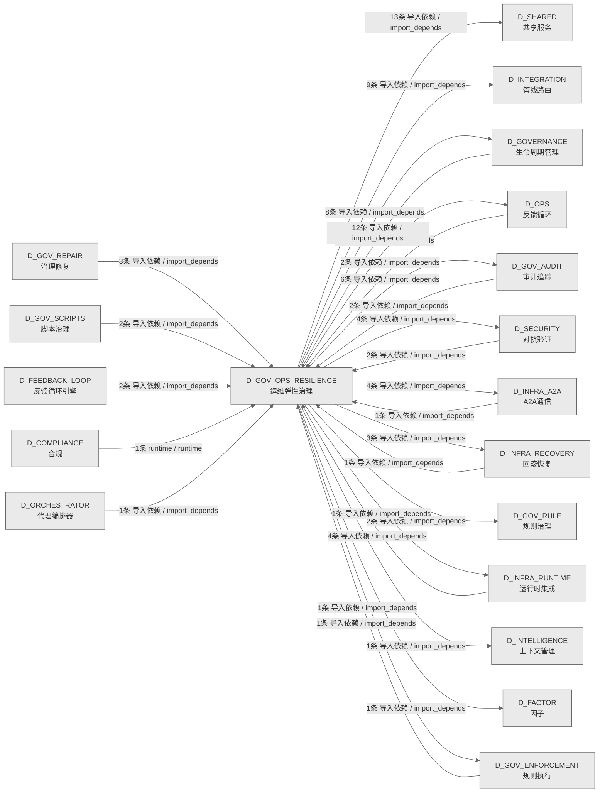

# 20_d_gov_ops_resilience / 运维弹性治理域 / Ops Resilience Governance

> **功能简介 / Overview**: 运维弹性治理，负责运维治理、安全治理、弹性治理和升级协议

> **文档作用 / Purpose**: 展示 运维弹性治理（D_GOV_OPS_RESILIENCE）功能域的域内依赖关系、跨域依赖关系，模块信息（成熟度/中英文名/大白话/文件路径）内嵌于 Mermaid 节点，供架构审查和域治理参考。

> 本文档由 generate_domain_doc.py 从 depgraph (PostgreSQL) 自动生成
> 数据源: depgraph (PostgreSQL) nodes表 + edges表

> **[可缩放 HTML 版 / Zoomable HTML](http://localhost:8765/docs/02_enterprise_architecture/02_domain_architecture_docs/_zoomable_html/20_d_gov_ops_resilience.html)** — Ctrl+滚轮缩放 ｜ 双击重置 ｜ Ctrl+Shift+D 切换拖动/选择模式

## 域基本信息 / Domain Overview

| 字段 | 值 | Field | Value |
|------|------|-------|-------|
| 编号 | 20 | Number | 20 |
| 域ID | D_GOV_OPS_RESILIENCE | Domain ID | D_GOV_OPS_RESILIENCE |
| 域名称 | 运维弹性治理 | Domain Name | Ops Resilience Governance |
| 层级 | L1 基础平台层 | Layer | L1 Foundation |
| 模块数 | 91 | Module Count | 91 |
| 域内依赖 | 17 | Internal Dependencies | 17 |
| 跨域入边 | 34 | Cross-domain Incoming | 34 |
| 跨域出边 | 60 | Cross-domain Outgoing | 60 |
| 设计态模块 | 0 | Design Modules | 0 |
| 生产态模块 | 91 | Production Modules | 91 |
| 容量 | 91/150 (正常) | Capacity | 91/150 (正常) |
| 描述 | 运维治理(ops_governance) | Description | 运维治理(ops_governance) |

## 域内依赖图 / Internal Dependency Diagram

> 依赖图内嵌在本文档中，IDE 可直接渲染；网页版可 Ctrl+滚轮缩放 + 拖动平移查看细节。全景图用颜色区分运营态/设计态，不再分页/拆子图。
>
> **图例说明 / Legend**：
> - 🟦 **蓝色 = 运营态模块**（production，已上线运行）
> - 🟧 **橙色虚线 = 设计态模块**（design，蓝图阶段，代码未写）
> - **实线箭头 = 运营态依赖**（已生效的依赖关系）
> - **虚线箭头 = 非运营态依赖**（计划中/验证中的依赖关系）

### 全景依赖图（全部模块，颜色区分运营态/设计态）

> 展示全部 91 个模块（生产态 91 + 设计态 0），节点含成熟度+中英文名+大白话+文件路径。

```mermaid
%%{init: {'theme': 'base', 'themeVariables': {'primaryColor': '#eaeaea', 'primaryTextColor': '#333333', 'primaryBorderColor': '#666666', 'lineColor': '#666666', 'secondaryColor': '#eaeaea', 'tertiaryColor': '#eaeaea', 'fontSize': '14px'}}}%%
flowchart TD
    src_zephyr_governance_budget_enforcer_init_py["(生产态 / production) 治理修复Budget-enforcer包 / Governance Budget-enforcer Package<br/>治理修复域下 budget-enforcer 子包，归集该方向的模块。本身不含业务逻辑，只是组织归属。<br/>文件: budget-enforcer/__init__.py"]
    src_zephyr_governance_escalation_alternative_path_blocker_py["(生产态 / production) alternative路径blocker / Alternative Path Blocker<br/>Alternative Path Blocker — v0.13.0 替代工具路径拦截器。<br/>文件: escalation/alternative_path_blocker.py"]
    src_zephyr_governance_escalation_consequence_manager_py["(生产态 / production) 后果管理器 / Consequence Manager<br/>EscalationError;TimeoutError<br/>文件: escalation/consequence_manager.py"]
    src_zephyr_governance_escalation_contracts_py["(生产态 / production) 契约 / Contracts<br/>G-CT-003 消费端 — Escalation.on_rollback_failure() + G-CT-004/G-CT-006/G-CT-...<br/>文件: escalation/contracts.py"]
    src_zephyr_governance_escalation_escalation_api_py["(生产态 / production) 升级API / Escalation API<br/>Escalation API — v0.7.0 Service Account API: 外部系统安全触发升级，不绕过引擎。<br/>文件: escalation/escalation_api.py"]
    src_zephyr_governance_escalation_escalation_fatigue_manager_py["(生产态 / production) 升级疲劳管理器 / Escalation Fatigue Manager<br/>Escalation Fatigue Manager — v0.11.0 升级疲劳管理器。<br/>文件: escalation/escalation_fatigue_manager.py"]
    src_zephyr_governance_escalation_escalation_loop_detector_py["(生产态 / production) 升级环路检测器 / Escalation Loop Detector<br/>Escalation Loop Detector — v0.10.0 跨模块升级循环: escalate->block->auto_gua...<br/>文件: escalation/escalation_loop_detector.py"]
    src_zephyr_governance_escalation_escalation_smoke_tests_py["(生产态 / production) 升级smoketests / Escalation Smoke Tests<br/>Escalation Smoke Tests — v0.11.0 升级协议烟雾测试。<br/>文件: escalation/escalation_smoke_tests.py"]
    src_zephyr_governance_escalation_git_hook_pre_scanner_py["(生产态 / production) git钩子预scanner / Git Hook Pre Scanner<br/>Git Hook Pre-Scanner — v0.14.0 Git操作Hook预扫描器。<br/>文件: escalation/git_hook_pre_scanner.py"]
    src_zephyr_governance_escalation_human_factors_py["(生产态 / production) humanfactors / Human Factors<br/>Human Factors — v0.7.0 人因工程: 通知疲劳管理+上下文简洁性+多通道notifications。<br/>文件: escalation/human_factors.py"]
    src_zephyr_governance_escalation_identity_verifier_py["(生产态 / production) 身份验证器 / Identity Verifier<br/>Identity Verifier — D-022-12 Agent身份验证器: session_id+role+capability三元...<br/>文件: escalation/identity_verifier.py"]
    src_zephyr_governance_escalation_incident_response_py["(生产态 / production) 事件响应 / Incident Response<br/>EscalationError;TimeoutError<br/>文件: escalation/incident_response.py"]
    src_zephyr_governance_escalation_owner_absent_py["(生产态 / production) 所有者absent / Owner Absent<br/>Owner Absent — 人力缺席分级处置。<br/>文件: escalation/owner_absent.py"]
    src_zephyr_governance_escalation_result_types_py["(生产态 / production) 结果类型 / Result Types<br/>G-CT-003 — RollbackResult backward-compat re-export facade.<br/>文件: escalation/result_types.py"]
    src_zephyr_governance_escalation_spof_checker_py["(生产态 / production) 单点故障检查器 / SPOF Checker<br/>EscalationError;TimeoutError<br/>文件: escalation/spof_checker.py"]
    src_zephyr_governance_escalation_triage_py["(生产态 / production) triage / Triage<br/>G2 Triage 门禁 — 知识分类评分（T-2-13-B）<br/>文件: escalation/triage.py"]
    src_zephyr_governance_ops_governance_agent_dispatch_py["(生产态 / production) 代理dispatch / Agent Dispatch<br/>根据 domain key 返回分派信息。找不到返回 None。<br/>文件: ops_governance/agent_dispatch.py"]
    src_zephyr_governance_ops_governance_auto_runner_py["(生产态 / production) 自动运行器 / Auto Runner<br/>GovernanceAutoRunner — 治理脚本自动运行/自动关闭调度器.<br/>文件: ops_governance/auto_runner.py"]
    src_zephyr_governance_ops_governance_bandwidth_optimizer_py["(生产态 / production) 带宽优化器 / Bandwidth Optimizer<br/>BudgetExceededError;CostLimitError<br/>文件: ops_governance/bandwidth_optimizer.py"]
    src_zephyr_governance_ops_governance_burn_rate_monitor_py["(生产态 / production) burnrate监控器 / Burn Rate Monitor<br/>Burn Rate Monitor — MOD-INF-024<br/>文件: ops_governance/burn_rate_monitor.py"]
    src_zephyr_governance_ops_governance_clock_guard_py["(生产态 / production) clock守卫 / Clock Guard<br/>Clock Guard — v0.8.0 时钟完整性防御: NTP漂移检测+wall clock monotonic验证。<br/>文件: ops_governance/clock_guard.py"]
    src_zephyr_governance_ops_governance_coldstart_manager_py["(生产态 / production) coldstart管理器 / Coldstart Manager<br/>Coldstart Manager — v0.7.0 冷启动管理器: escalation rules加载+引擎初始化+健...<br/>文件: ops_governance/coldstart_manager.py"]
    src_zephyr_governance_ops_governance_cost_attributor_py["(生产态 / production) 成本归因器 / Cost Attributor<br/>定义 CostAttribution、CostSummary、CostAttributor 等类型。<br/>文件: ops_governance/cost_attributor.py"]
    src_zephyr_governance_ops_governance_cost_router_py["(生产态 / production) 成本路由器 / Cost Router<br/>根据预估token总量计算成本。<br/>文件: ops_governance/cost_router.py"]
    src_zephyr_governance_ops_governance_daily_ops_py["(生产态 / production) 日常运维 / Daily Ops<br/>BudgetExceededError;CostLimitError<br/>文件: ops_governance/daily_ops.py"]
    src_zephyr_governance_ops_governance_decision_fatigue_py["(生产态 / production) 决策疲劳 / Decision Fatigue<br/>定义 EisenhowerPriority、TaskTriage、triage 等类型。<br/>文件: ops_governance/decision_fatigue.py"]
    src_zephyr_governance_ops_governance_degradation_manager_py["(生产态 / production) 降级管理器 / Degradation Manager<br/>定义 DegradationLevel、DegradationAction、DegradationState 等类型。<br/>文件: ops_governance/degradation_manager.py"]
    src_zephyr_governance_ops_governance_environment_manager_py["(生产态 / production) 环境管理器 / Environment Manager<br/>定义 Environment、EnvConfig、get_env 等类型。<br/>文件: ops_governance/environment_manager.py"]
    src_zephyr_governance_ops_governance_error_budget_burst_limiter_py["(生产态 / production) 错误预算burstlimiter / Error Budget Burst Limiter<br/>Error Budget Burst Limiter — v0.11.0 错误预算Burst限流器。<br/>文件: ops_governance/error_budget_burst_limiter.py"]
    src_zephyr_governance_ops_governance_interrupt_handler_py["(生产态 / production) 中断handler / Interrupt Handler<br/>Interrupt Handler — D-022-06 硬中断处理器: Owner紧急中断+优雅停止+状态保存。<br/>文件: ops_governance/interrupt_handler.py"]
    src_zephyr_governance_ops_governance_maintenance_window_adapter_py["(生产态 / production) maintenancewindow适配器 / Maintenance Window Adapter<br/>Maintenance Window Adapter — v0.10.0 计划维护窗口适配器。<br/>文件: ops_governance/maintenance_window_adapter.py"]
    src_zephyr_governance_ops_governance_ops_foundation_py["(生产态 / production) 运维基础 / Ops Foundation<br/>BudgetExceededError;CostLimitError<br/>文件: ops_governance/ops_foundation.py"]
    src_zephyr_governance_ops_governance_parent_child_attributor_py["(生产态 / production) 父子归因器 / Parent Child Attributor<br/>定义 AttributionChain、DelegationReport、ParentChildAttributor 等类型。<br/>文件: ops_governance/parent_child_attributor.py"]
    src_zephyr_governance_ops_governance_roi_calculator_py["(生产态 / production) 投资回报计算器 / ROI Calculator<br/>定义 ROIResult、ROICalculator 等类型。<br/>文件: ops_governance/roi_calculator.py"]
    src_zephyr_governance_ops_governance_self_budget_tracker_py["(生产态 / production) 自我预算追踪器 / Self Budget Tracker<br/>定义 SelfBudgetStatus、SelfBudgetTracker 等类型。<br/>文件: ops_governance/self_budget_tracker.py"]
    src_zephyr_governance_ops_governance_service_registration_py["(生产态 / production) 服务registration / Service Registration<br/>D-DATA -> ServiceRegistry 注册模块<br/>文件: ops_governance/service_registration.py"]
    src_zephyr_governance_ops_governance_startup_shutdown_py["(生产态 / production) 启动关闭 / Startup Shutdown<br/>定义 StartupPhase、PhaseState、StartupPhaseDef 等类型。<br/>文件: ops_governance/startup_shutdown.py"]
    src_zephyr_governance_ops_governance_startup_shutdown_cli_py["(生产态 / production) 启动关闭命令行 / Startup Shutdown CLI<br/>定义 build_argparser、parse_phase_range、main 等类型。<br/>文件: ops_governance/startup_shutdown_cli.py"]
    src_zephyr_governance_ops_governance_tco_model_py["(生产态 / production) 总拥有成本模型 / TCO Model<br/>BudgetExceededError;CostLimitError<br/>文件: ops_governance/tco_model.py"]
    src_zephyr_governance_ops_governance_time_sync_py["(生产态 / production) 时间同步 / Time Sync<br/>BudgetExceededError;CostLimitError<br/>文件: ops_governance/time_sync.py"]
    src_zephyr_governance_ops_governance_timeout_guard_py["(生产态 / production) timeout守卫 / Timeout Guard<br/>noqa: m10-time-trigger  M10豁免: threading.Timer用于一次性超时/延迟执行，非周...<br/>文件: ops_governance/timeout_guard.py"]
    src_zephyr_governance_resilience_governance_init_py["(生产态 / production) 治理修复Resilience Governance包 / Governance Resilience Governance Package<br/>治理修复域下 resilience_governance 子包，归集该方向的模块。本身不含业务逻辑，只是组织归属。<br/>文件: resilience_governance/__init__.py"]
    src_zephyr_governance_resilience_governance_account_isolator_py["(生产态 / production) account隔离器 / Account Isolator<br/>Account Isolator — v0.10.0 多账户升级隔离器。<br/>文件: resilience_governance/account_isolator.py"]
    src_zephyr_governance_resilience_governance_blast_radius_py["(生产态 / production) 爆炸半径 / Blast Radius<br/>blast_radius — MOD-INF-028 §3.1 Stage 9<br/>文件: resilience_governance/blast_radius.py"]
    src_zephyr_governance_resilience_governance_broker_resilience_py["(生产态 / production) 券商韧性 / Broker Resilience<br/>EscalationError;TimeoutError<br/>文件: resilience_governance/broker_resilience.py"]
    src_zephyr_governance_resilience_governance_decision_fatigue_cli_py["(生产态 / production) 决策疲劳命令行 / Decision Fatigue CLI<br/>EscalationError;TimeoutError<br/>文件: resilience_governance/decision_fatigue_cli.py"]
    src_zephyr_governance_resilience_governance_engine_sandbox_py["(生产态 / production) 引擎沙箱 / Engine Sandbox<br/>EngineSandbox — D-022-08 OS-level sandboxing for the escalation engine.<br/>文件: resilience_governance/engine_sandbox.py"]
    src_zephyr_governance_resilience_governance_f5_boot_integration_py["(生产态 / production) f5boot集成 / F5 Boot Integration<br/>F5BootIntegration — F5 自动启动/关闭集成 (MOD-INF-022 §2).<br/>文件: resilience_governance/f5_boot_integration.py"]
    src_zephyr_governance_resilience_governance_f5_event_subscriber_py["(生产态 / production) f5事件subscriber / F5 Event Subscriber<br/>F5EventSubscriber — F5 事件启动机制 (MOD-INF-022 §3).<br/>文件: resilience_governance/f5_event_subscriber.py"]
    src_zephyr_governance_resilience_governance_f5_shutdown_manager_py["(生产态 / production) f5关闭管理器 / F5 Shutdown Manager<br/>F5ShutdownManager — F5 自动关闭/状态持久化/信号处理 (MOD-INF-022 §2).<br/>文件: resilience_governance/f5_shutdown_manager.py"]
    src_zephyr_governance_resilience_governance_fail_mode_manager_py["(生产态 / production) 失败模式管理器 / Fail Mode Manager<br/>定义 FailMode、FailModeState、HealthCheck 等类型。<br/>文件: resilience_governance/fail_mode_manager.py"]
    src_zephyr_governance_resilience_governance_fault_tolerance_py["(生产态 / production) 故障容错 / Fault Tolerance<br/>定义 BulkheadPool、DegradationLevel、RetryPolicy 等类型。<br/>文件: resilience_governance/fault_tolerance.py"]
    src_zephyr_governance_resilience_governance_last_resort_watchdog_py["(生产态 / production) lastresortwatchdog / Last Resort Watchdog<br/>Last Resort Watchdog — v0.8.0 终极逃生舱: 所有escalation失败后的final fallba...<br/>文件: resilience_governance/last_resort_watchdog.py"]
    src_zephyr_governance_resilience_governance_offline_autonomy_py["(生产态 / production) 离线autonomy / Offline Autonomy<br/>Re-export shim: canonical source = zephyr.infrastructure.a2a_protocol.offline...<br/>文件: resilience_governance/offline_autonomy.py"]
    src_zephyr_governance_resilience_governance_offline_resilience_py["(生产态 / production) 离线韧性 / Offline Resilience<br/>Re-export shim: canonical source = zephyr.infrastructure.a2a_protocol.offline...<br/>文件: resilience_governance/offline_resilience.py"]
    src_zephyr_governance_resilience_governance_policy_sandbox_py["(生产态 / production) 策略沙箱 / Policy Sandbox<br/>定义 SandboxTrial、PolicySandbox 等类型。<br/>文件: resilience_governance/policy_sandbox.py"]
    src_zephyr_governance_resilience_governance_process_isolator_py["(生产态 / production) process隔离器 / Process Isolator<br/>Process Isolator — v0.6.0 进程隔离器: engine运行在独立进程+资源限制+crash恢复。<br/>文件: resilience_governance/process_isolator.py"]
    src_zephyr_governance_resilience_governance_witness_isolation_py["(生产态 / production) witnessisolation / Witness Isolation<br/>Witness Isolation — v0.8.0 Witness隔离: N版本decision验证+投票机制+majority...<br/>文件: resilience_governance/witness_isolation.py"]
    src_zephyr_governance_security_governance_init_py["(生产态 / production) 治理修复Security Governance包 / Governance Security Governance Package<br/>治理修复域下 security_governance 子包，归集该方向的模块。本身不含业务逻辑，只是组织归属。<br/>文件: security_governance/__init__.py"]
    src_zephyr_governance_security_governance_anti_automation_bias_py["(生产态 / production) antiautomationbias / Anti Automation Bias<br/>Anti-Automation Bias — D-022-09 mandatory human oversight enforcement.<br/>文件: security_governance/anti_automation_bias.py"]
    src_zephyr_governance_security_governance_api_response_sanitizer_py["(生产态 / production) API响应sanitizer / API Response Sanitizer<br/>API Response Sanitizer — v0.9.0 API响应清洗器: 外部API返回内容清洗+injection...<br/>文件: security_governance/api_response_sanitizer.py"]
    src_zephyr_governance_security_governance_bare_repo_scanner_py["(生产态 / production) barereposcanner / Bare Repo Scanner<br/>Bare Repo Scanner — v0.14.0 嵌入式裸仓库检测器。<br/>文件: security_governance/bare_repo_scanner.py"]
    src_zephyr_governance_security_governance_compositional_safety_tester_py["(生产态 / production) compositional安全测试器 / Compositional Safety Tester<br/>Compositional Safety Tester — v0.14.0 组合性不安全测试器。<br/>文件: security_governance/compositional_safety_tester.py"]
    src_zephyr_governance_security_governance_config_scanner_py["(生产态 / production) 配置scanner / Config Scanner<br/>Config Scanner — v0.9.0 AI配置文件注入扫描器: 检测AI修改的配置+注入攻击。<br/>文件: security_governance/config_scanner.py"]
    src_zephyr_governance_security_governance_credential_guard_py["(生产态 / production) credential守卫 / Credential Guard<br/>Credential Guard — v0.7.0 密钥泄露防护: env检测+git log扫描+运行时脱敏。<br/>文件: security_governance/credential_guard.py"]
    src_zephyr_governance_security_governance_default_security_gateway_py["(生产态 / production) default安全gateway / Default Security Gateway<br/>DefaultSecurityGateway — SecurityGateway 三层防御 OCP-004 实现<br/>文件: security_governance/default_security_gateway.py"]
    src_zephyr_governance_security_governance_ghost_scan_py["(生产态 / production) ghostscan / Ghost Scan<br/>Ghost Scan — v0.8.0 幽灵进程检测: lingering process扫描+资源泄漏检测。<br/>文件: security_governance/ghost_scan.py"]
    src_zephyr_governance_security_governance_github_api_guard_py["(生产态 / production) githubAPI守卫 / Github API Guard<br/>GitHub API Guard — v0.9.0 Comment and Control防御: PR评论命令注入检测+限制。<br/>文件: security_governance/github_api_guard.py"]
    src_zephyr_governance_security_governance_hooks_integrity_guard_py["(生产态 / production) hooks完整性守卫 / Hooks Integrity Guard<br/>Hooks Integrity Guard — v0.11.0 Hooks自编辑防护器。<br/>文件: security_governance/hooks_integrity_guard.py"]
    src_zephyr_governance_security_governance_memory_poison_guard_py["(生产态 / production) memory投毒守卫 / Memory Poison Guard<br/>Memory Poison Guard — v0.9.0 记忆投毒防护: Memory写入内容审计+恶意注入检测。<br/>文件: security_governance/memory_poison_guard.py"]
    src_zephyr_governance_security_governance_persuasion_detector_py["(生产态 / production) persuasion检测器 / Persuasion Detector<br/>Persuasion Detector — D-022-09 心理说服检测: 对抗语气+恳求+绕过指令。<br/>文件: security_governance/persuasion_detector.py"]
    src_zephyr_governance_security_governance_poison_cascade_detector_py["(生产态 / production) 投毒级联检测器 / Poison Cascade Detector<br/>定义 PoisonEvent、PoisonReport、PoisonCascadeDetector 等类型。<br/>文件: security_governance/poison_cascade_detector.py"]
    src_zephyr_governance_security_governance_sbom_guard_py["(生产态 / production) sbom守卫 / Sbom Guard<br/>SBOM Guard — v0.8.0 SBOM供应链防护: 依赖版本锁定+脆弱性扫描+cve告警。<br/>文件: security_governance/sbom_guard.py"]
    src_zephyr_governance_security_governance_security_config_scanner_py["(生产态 / production) 安全配置scanner / Security Config Scanner<br/>Security Config Scanner — v0.13.0 缺失安全配置扫描器。<br/>文件: security_governance/security_config_scanner.py"]
    src_zephyr_governance_security_governance_tamper_evident_log_py["(生产态 / production) tamperevidentlog / Tamper Evident Log<br/>noqa: m03-duplicate  M03豁免: AI趋同演化(不同模块为相似问题生成相似代码),非复...<br/>文件: security_governance/tamper_evident_log.py"]
    src_zephyr_governance_security_governance_vibe_security_verify_py["(生产态 / production) 直觉安全verify / Vibe Security Verify<br/>Vibe Security Verifier — v0.9.0 Vibe Coding安全验证器: AI生成代码安全基线检查。<br/>文件: security_governance/vibe_security_verify.py"]
    src_zephyr_governance_security_governance_vibe_verify_integration_py["(生产态 / production) 直觉verify集成 / Vibe Verify Integration<br/>VibeVerify Integration — v0.9.0 VibeVerify集成器: auto_guard级别+增量修复+co...<br/>文件: security_governance/vibe_verify_integration.py"]
    src_zephyr_governance_budget_enforcer_init_py ~~~ src_zephyr_governance_escalation_alternative_path_blocker_py
    src_zephyr_governance_escalation_alternative_path_blocker_py ~~~ src_zephyr_governance_escalation_consequence_manager_py
    src_zephyr_governance_escalation_consequence_manager_py ~~~ src_zephyr_governance_escalation_contracts_py
    src_zephyr_governance_escalation_contracts_py ~~~ src_zephyr_governance_escalation_escalation_api_py
    src_zephyr_governance_escalation_escalation_api_py ~~~ src_zephyr_governance_escalation_escalation_fatigue_manager_py
    src_zephyr_governance_escalation_escalation_fatigue_manager_py ~~~ src_zephyr_governance_escalation_escalation_loop_detector_py
    src_zephyr_governance_escalation_escalation_loop_detector_py ~~~ src_zephyr_governance_escalation_escalation_smoke_tests_py
    src_zephyr_governance_escalation_escalation_smoke_tests_py ~~~ src_zephyr_governance_escalation_git_hook_pre_scanner_py
    src_zephyr_governance_escalation_git_hook_pre_scanner_py ~~~ src_zephyr_governance_escalation_human_factors_py
    src_zephyr_governance_escalation_human_factors_py ~~~ src_zephyr_governance_escalation_identity_verifier_py
    src_zephyr_governance_escalation_identity_verifier_py ~~~ src_zephyr_governance_escalation_incident_response_py
    src_zephyr_governance_escalation_incident_response_py ~~~ src_zephyr_governance_escalation_owner_absent_py
    src_zephyr_governance_escalation_owner_absent_py ~~~ src_zephyr_governance_escalation_result_types_py
    src_zephyr_governance_escalation_result_types_py ~~~ src_zephyr_governance_escalation_spof_checker_py
    src_zephyr_governance_escalation_spof_checker_py ~~~ src_zephyr_governance_escalation_triage_py
    src_zephyr_governance_escalation_triage_py ~~~ src_zephyr_governance_ops_governance_agent_dispatch_py
    src_zephyr_governance_ops_governance_agent_dispatch_py ~~~ src_zephyr_governance_ops_governance_auto_runner_py
    src_zephyr_governance_ops_governance_auto_runner_py ~~~ src_zephyr_governance_ops_governance_bandwidth_optimizer_py
    src_zephyr_governance_ops_governance_bandwidth_optimizer_py ~~~ src_zephyr_governance_ops_governance_burn_rate_monitor_py
    src_zephyr_governance_ops_governance_burn_rate_monitor_py ~~~ src_zephyr_governance_ops_governance_clock_guard_py
    src_zephyr_governance_ops_governance_clock_guard_py ~~~ src_zephyr_governance_ops_governance_coldstart_manager_py
    src_zephyr_governance_ops_governance_coldstart_manager_py ~~~ src_zephyr_governance_ops_governance_cost_attributor_py
    src_zephyr_governance_ops_governance_cost_attributor_py ~~~ src_zephyr_governance_ops_governance_cost_router_py
    src_zephyr_governance_ops_governance_cost_router_py ~~~ src_zephyr_governance_ops_governance_daily_ops_py
    src_zephyr_governance_ops_governance_daily_ops_py ~~~ src_zephyr_governance_ops_governance_decision_fatigue_py
    src_zephyr_governance_ops_governance_decision_fatigue_py ~~~ src_zephyr_governance_ops_governance_degradation_manager_py
    src_zephyr_governance_ops_governance_degradation_manager_py ~~~ src_zephyr_governance_ops_governance_environment_manager_py
    src_zephyr_governance_ops_governance_environment_manager_py ~~~ src_zephyr_governance_ops_governance_error_budget_burst_limiter_py
    src_zephyr_governance_ops_governance_error_budget_burst_limiter_py ~~~ src_zephyr_governance_ops_governance_interrupt_handler_py
    src_zephyr_governance_ops_governance_interrupt_handler_py ~~~ src_zephyr_governance_ops_governance_maintenance_window_adapter_py
    src_zephyr_governance_ops_governance_maintenance_window_adapter_py ~~~ src_zephyr_governance_ops_governance_ops_foundation_py
    src_zephyr_governance_ops_governance_ops_foundation_py ~~~ src_zephyr_governance_ops_governance_parent_child_attributor_py
    src_zephyr_governance_ops_governance_parent_child_attributor_py ~~~ src_zephyr_governance_ops_governance_roi_calculator_py
    src_zephyr_governance_ops_governance_roi_calculator_py ~~~ src_zephyr_governance_ops_governance_self_budget_tracker_py
    src_zephyr_governance_ops_governance_self_budget_tracker_py ~~~ src_zephyr_governance_ops_governance_service_registration_py
    src_zephyr_governance_ops_governance_service_registration_py ~~~ src_zephyr_governance_ops_governance_startup_shutdown_py
    src_zephyr_governance_ops_governance_startup_shutdown_py ~~~ src_zephyr_governance_ops_governance_startup_shutdown_cli_py
    src_zephyr_governance_ops_governance_startup_shutdown_cli_py ~~~ src_zephyr_governance_ops_governance_tco_model_py
    src_zephyr_governance_ops_governance_tco_model_py ~~~ src_zephyr_governance_ops_governance_time_sync_py
    src_zephyr_governance_ops_governance_time_sync_py ~~~ src_zephyr_governance_ops_governance_timeout_guard_py
    src_zephyr_governance_ops_governance_timeout_guard_py ~~~ src_zephyr_governance_resilience_governance_init_py
    src_zephyr_governance_resilience_governance_init_py ~~~ src_zephyr_governance_resilience_governance_account_isolator_py
    src_zephyr_governance_resilience_governance_account_isolator_py ~~~ src_zephyr_governance_resilience_governance_blast_radius_py
    src_zephyr_governance_resilience_governance_blast_radius_py ~~~ src_zephyr_governance_resilience_governance_broker_resilience_py
    src_zephyr_governance_resilience_governance_broker_resilience_py ~~~ src_zephyr_governance_resilience_governance_decision_fatigue_cli_py
    src_zephyr_governance_resilience_governance_decision_fatigue_cli_py ~~~ src_zephyr_governance_resilience_governance_engine_sandbox_py
    src_zephyr_governance_resilience_governance_engine_sandbox_py ~~~ src_zephyr_governance_resilience_governance_f5_boot_integration_py
    src_zephyr_governance_resilience_governance_f5_boot_integration_py ~~~ src_zephyr_governance_resilience_governance_f5_event_subscriber_py
    src_zephyr_governance_resilience_governance_f5_event_subscriber_py ~~~ src_zephyr_governance_resilience_governance_f5_shutdown_manager_py
    src_zephyr_governance_resilience_governance_f5_shutdown_manager_py ~~~ src_zephyr_governance_resilience_governance_fail_mode_manager_py
    src_zephyr_governance_resilience_governance_fail_mode_manager_py ~~~ src_zephyr_governance_resilience_governance_fault_tolerance_py
    src_zephyr_governance_resilience_governance_fault_tolerance_py ~~~ src_zephyr_governance_resilience_governance_last_resort_watchdog_py
    src_zephyr_governance_resilience_governance_last_resort_watchdog_py ~~~ src_zephyr_governance_resilience_governance_offline_autonomy_py
    src_zephyr_governance_resilience_governance_offline_autonomy_py ~~~ src_zephyr_governance_resilience_governance_offline_resilience_py
    src_zephyr_governance_resilience_governance_offline_resilience_py ~~~ src_zephyr_governance_resilience_governance_policy_sandbox_py
    src_zephyr_governance_resilience_governance_policy_sandbox_py ~~~ src_zephyr_governance_resilience_governance_process_isolator_py
    src_zephyr_governance_resilience_governance_process_isolator_py ~~~ src_zephyr_governance_resilience_governance_witness_isolation_py
    src_zephyr_governance_resilience_governance_witness_isolation_py ~~~ src_zephyr_governance_security_governance_init_py
    src_zephyr_governance_security_governance_init_py ~~~ src_zephyr_governance_security_governance_anti_automation_bias_py
    src_zephyr_governance_security_governance_anti_automation_bias_py ~~~ src_zephyr_governance_security_governance_api_response_sanitizer_py
    src_zephyr_governance_security_governance_api_response_sanitizer_py ~~~ src_zephyr_governance_security_governance_bare_repo_scanner_py
    src_zephyr_governance_security_governance_bare_repo_scanner_py ~~~ src_zephyr_governance_security_governance_compositional_safety_tester_py
    src_zephyr_governance_security_governance_compositional_safety_tester_py ~~~ src_zephyr_governance_security_governance_config_scanner_py
    src_zephyr_governance_security_governance_config_scanner_py ~~~ src_zephyr_governance_security_governance_credential_guard_py
    src_zephyr_governance_security_governance_credential_guard_py ~~~ src_zephyr_governance_security_governance_default_security_gateway_py
    src_zephyr_governance_security_governance_default_security_gateway_py ~~~ src_zephyr_governance_security_governance_ghost_scan_py
    src_zephyr_governance_security_governance_ghost_scan_py ~~~ src_zephyr_governance_security_governance_github_api_guard_py
    src_zephyr_governance_security_governance_github_api_guard_py ~~~ src_zephyr_governance_security_governance_hooks_integrity_guard_py
    src_zephyr_governance_security_governance_hooks_integrity_guard_py ~~~ src_zephyr_governance_security_governance_memory_poison_guard_py
    src_zephyr_governance_security_governance_memory_poison_guard_py ~~~ src_zephyr_governance_security_governance_persuasion_detector_py
    src_zephyr_governance_security_governance_persuasion_detector_py ~~~ src_zephyr_governance_security_governance_poison_cascade_detector_py
    src_zephyr_governance_security_governance_poison_cascade_detector_py ~~~ src_zephyr_governance_security_governance_sbom_guard_py
    src_zephyr_governance_security_governance_sbom_guard_py ~~~ src_zephyr_governance_security_governance_security_config_scanner_py
    src_zephyr_governance_security_governance_security_config_scanner_py ~~~ src_zephyr_governance_security_governance_tamper_evident_log_py
    src_zephyr_governance_security_governance_tamper_evident_log_py ~~~ src_zephyr_governance_security_governance_vibe_security_verify_py
    src_zephyr_governance_security_governance_vibe_security_verify_py ~~~ src_zephyr_governance_security_governance_vibe_verify_integration_py
    src_zephyr_governance_escalation_escalation_engine_py["(生产态 / production) 升级引擎 / Escalation Engine<br/>Escalation Engine — MOD-INF-022<br/>文件: escalation/escalation_engine.py"]
    src_zephyr_governance_ops_governance_event_hook_py["(生产态 / production) 事件钩子 / Event Hook<br/>EventHook — 声明式任务系统事件订阅<br/>文件: ops_governance/event_hook.py"]
    src_zephyr_governance_ops_governance_phase_manager_py["(生产态 / production) phase管理器 / Phase Manager<br/>Phase Manager — ZephyrAlpha 施工阶段门控引擎.<br/>文件: ops_governance/phase_manager.py"]
    src_zephyr_governance_resilience_governance_bus_factor_defense_py["(生产态 / production) 总线因子防御 / Bus Factor Defense<br/>Re-export shim: canonical source = zephyr.factor.bus_factor_defense (SSoT 收...<br/>文件: resilience_governance/bus_factor_defense.py"]
    src_zephyr_governance_resilience_governance_deadlock_detector_py["(生产态 / production) deadlock检测器 / Deadlock Detector<br/>Deadlock Detector — D-022-04 多Agent死锁+循环依赖检测+超时破解。<br/>文件: resilience_governance/deadlock_detector.py"]
    src_zephyr_governance_resilience_governance_decision_fatigue_py["(生产态 / production) 决策疲劳 / Decision Fatigue<br/>EscalationError;TimeoutError<br/>文件: resilience_governance/decision_fatigue.py"]
    src_zephyr_governance_security_governance_adversarial_tester_py["(生产态 / production) 对抗测试器 / Adversarial Tester<br/>定义 AdversarialTestCase、AdversarialResult、AdversarialTester 等类型。<br/>文件: security_governance/adversarial_tester.py"]
    src_zephyr_governance_security_governance_security_gateway_base_py["(生产态 / production) 安全gateway基础 / Security Gateway Base<br/>D_COMPLIANCE — Governance & Compliance Layer<br/>文件: security_governance/security_gateway_base.py"]
    src_zephyr_governance_escalation_escalation_engine_py ~~~ src_zephyr_governance_ops_governance_event_hook_py
    src_zephyr_governance_ops_governance_event_hook_py ~~~ src_zephyr_governance_ops_governance_phase_manager_py
    src_zephyr_governance_ops_governance_phase_manager_py ~~~ src_zephyr_governance_resilience_governance_bus_factor_defense_py
    src_zephyr_governance_resilience_governance_bus_factor_defense_py ~~~ src_zephyr_governance_resilience_governance_deadlock_detector_py
    src_zephyr_governance_resilience_governance_deadlock_detector_py ~~~ src_zephyr_governance_resilience_governance_decision_fatigue_py
    src_zephyr_governance_resilience_governance_decision_fatigue_py ~~~ src_zephyr_governance_security_governance_adversarial_tester_py
    src_zephyr_governance_security_governance_adversarial_tester_py ~~~ src_zephyr_governance_security_governance_security_gateway_base_py
    src_zephyr_governance_escalation_escalation_metrics_py["(生产态 / production) 升级指标 / Escalation Metrics<br/>Escalation Metrics — D-022-07 指标收集器: 升级率/误升级率/响应延迟。<br/>文件: escalation/escalation_metrics.py"]
    src_zephyr_governance_escalation_escalation_models_py["(生产态 / production) 升级模型 / Escalation Models<br/>Escalation Protocol data models — MOD-INF-022<br/>文件: escalation/escalation_models.py"]
    src_zephyr_governance_ops_governance_phase_check_registry_py["(生产态 / production) phase检查注册表 / Phase Check Registry<br/>PhaseManager->GateEngine 检查注册表桥梁 — 44 个阶段门控检查映射.<br/>文件: ops_governance/phase_check_registry.py"]
    src_zephyr_governance_ops_governance_stream_abort_guard_py["(生产态 / production) streamabort守卫 / Stream Abort Guard<br/>StreamAbortGuard — 流式中断守卫<br/>文件: ops_governance/stream_abort_guard.py"]
    src_zephyr_governance_resilience_governance_circuit_breaker_py["(生产态 / production) 断路熔断器 / Circuit Breaker<br/>Circuit Breaker — MOD-INF-022<br/>文件: resilience_governance/circuit_breaker.py"]
    src_zephyr_governance_security_governance_ipi_defense_py["(生产态 / production) ipi防御 / Ipi Defense<br/>noqa: m03-duplicate  M03豁免: AI趋同演化(不同模块为相似问题生成相似代码),非复...<br/>文件: security_governance/ipi_defense.py"]
    src_zephyr_governance_escalation_escalation_metrics_py ~~~ src_zephyr_governance_escalation_escalation_models_py
    src_zephyr_governance_escalation_escalation_models_py ~~~ src_zephyr_governance_ops_governance_phase_check_registry_py
    src_zephyr_governance_ops_governance_phase_check_registry_py ~~~ src_zephyr_governance_ops_governance_stream_abort_guard_py
    src_zephyr_governance_ops_governance_stream_abort_guard_py ~~~ src_zephyr_governance_resilience_governance_circuit_breaker_py
    src_zephyr_governance_resilience_governance_circuit_breaker_py ~~~ src_zephyr_governance_security_governance_ipi_defense_py
    src_zephyr_governance_escalation_escalation_api_py -->|导入依赖 / import_depends| src_zephyr_governance_escalation_escalation_models_py
    src_zephyr_governance_escalation_escalation_engine_py -->|导入依赖 / import_depends| src_zephyr_governance_escalation_escalation_models_py
    src_zephyr_governance_escalation_escalation_engine_py -->|导入依赖 / import_depends| src_zephyr_governance_escalation_escalation_metrics_py
    src_zephyr_governance_escalation_escalation_engine_py -->|导入依赖 / import_depends| src_zephyr_governance_resilience_governance_circuit_breaker_py
    src_zephyr_governance_ops_governance_auto_runner_py -->|导入依赖 / import_depends| src_zephyr_governance_ops_governance_phase_check_registry_py
    src_zephyr_governance_ops_governance_auto_runner_py -->|导入依赖 / import_depends| src_zephyr_governance_ops_governance_phase_manager_py
    src_zephyr_governance_ops_governance_phase_manager_py -->|导入依赖 / import_depends| src_zephyr_governance_ops_governance_phase_check_registry_py
    src_zephyr_governance_resilience_governance_f5_event_subscriber_py -->|导入依赖 / import_depends| src_zephyr_governance_escalation_escalation_models_py
    src_zephyr_governance_resilience_governance_decision_fatigue_cli_py -->|导入依赖 / import_depends| src_zephyr_governance_resilience_governance_decision_fatigue_py
    src_zephyr_governance_resilience_governance_f5_boot_integration_py -->|导入依赖 / import_depends| src_zephyr_governance_escalation_escalation_engine_py
    src_zephyr_governance_resilience_governance_f5_boot_integration_py -->|导入依赖 / import_depends| src_zephyr_governance_ops_governance_event_hook_py
    src_zephyr_governance_resilience_governance_f5_boot_integration_py -->|导入依赖 / import_depends| src_zephyr_governance_resilience_governance_deadlock_detector_py
    src_zephyr_governance_resilience_governance_init_py -->|config_depends / config_depends| src_zephyr_governance_resilience_governance_bus_factor_defense_py
    src_zephyr_governance_security_governance_adversarial_tester_py -->|导入依赖 / import_depends| src_zephyr_governance_ops_governance_stream_abort_guard_py
    src_zephyr_governance_security_governance_adversarial_tester_py -->|导入依赖 / import_depends| src_zephyr_governance_security_governance_ipi_defense_py
    src_zephyr_governance_security_governance_default_security_gateway_py -->|导入依赖 / import_depends| src_zephyr_governance_security_governance_security_gateway_base_py
    src_zephyr_governance_security_governance_init_py -->|config_depends / config_depends| src_zephyr_governance_security_governance_adversarial_tester_py
    D_GOV_ENFORCEMENT["(生产态 / production) 规则执行 / Rule Enforcement<br/>规则执行，负责治理规则执行和门禁拦截<br/>跨域节点 / cross-domain"]
    src_zephyr_governance_security_governance_security_gateway_base_py -->|导入依赖 / import_depends| D_GOV_ENFORCEMENT
    D_GOVERNANCE["(生产态 / production) 生命周期管理 / Lifecycle Management<br/>生命周期管理，负责蓝图/模块/任务的声明周期管理和元数据治理<br/>跨域节点 / cross-domain"]
    src_zephyr_governance_ops_governance_service_registration_py -->|导入依赖 / import_depends| D_GOVERNANCE
    D_OPS["(生产态 / production) 反馈循环 / Feedback Loop<br/>反馈循环，负责系统运行反馈、性能监控和自动调优闭环<br/>跨域节点 / cross-domain"]
    src_zephyr_governance_security_governance_adversarial_tester_py -->|导入依赖 / import_depends| D_OPS
    D_INFRA_A2A["(生产态 / production) A2A通信 / A2A Communication<br/>Agent 与 Agent 之间的通信协议层，负责 AI 代理间的消息传递、请求路由和协议适配<br/>跨域节点 / cross-domain"]
    src_zephyr_governance_resilience_governance_f5_boot_integration_py -->|导入依赖 / import_depends| D_INFRA_A2A
    src_zephyr_governance_resilience_governance_offline_resilience_py -->|导入依赖 / import_depends| D_INFRA_A2A
    src_zephyr_governance_ops_governance_auto_runner_py -->|导入依赖 / import_depends| D_GOVERNANCE
    D_INTEGRATION["(生产态 / production) 管线路由 / Pipeline Routing<br/>管线路由，负责跨域数据流路由、管道编排和集成适配<br/>跨域节点 / cross-domain"]
    src_zephyr_governance_escalation_result_types_py -->|导入依赖 / import_depends| D_INTEGRATION
    D_GOV_AUDIT["(生产态 / production) 审计追踪 / Audit Trail<br/>审计追踪，负责变更审计追踪和操作日志管理<br/>跨域节点 / cross-domain"]
    src_zephyr_governance_security_governance_tamper_evident_log_py -->|导入依赖 / import_depends| D_GOV_AUDIT
    src_zephyr_governance_ops_governance_phase_check_registry_py -->|导入依赖 / import_depends| D_INTEGRATION
    src_zephyr_governance_ops_governance_phase_check_registry_py -->|导入依赖 / import_depends| D_GOV_AUDIT
    D_SECURITY["(生产态 / production) 对抗验证 / Adversarial Validation<br/>对抗验证，负责系统安全对抗测试、漏洞扫描和攻防验证<br/>跨域节点 / cross-domain"]
    src_zephyr_governance_security_governance_default_security_gateway_py -->|导入依赖 / import_depends| D_SECURITY
    src_zephyr_governance_ops_governance_phase_check_registry_py -->|导入依赖 / import_depends| D_GOV_AUDIT
    D_SHARED["(生产态 / production) 共享服务 / Shared Services<br/>共享服务，负责跨域共享的工具、协议和基础服务<br/>跨域节点 / cross-domain"]
    src_zephyr_governance_escalation_contracts_py -->|导入依赖 / import_depends| D_SHARED
    src_zephyr_governance_resilience_governance_blast_radius_py -->|导入依赖 / import_depends| D_GOV_AUDIT
    D_GOV_RULE["(生产态 / production) 规则治理 / Rule Governance<br/>规则治理，负责规则注册、规则版本和规则依赖管理<br/>跨域节点 / cross-domain"]
    src_zephyr_governance_escalation_triage_py -->|导入依赖 / import_depends| D_GOV_RULE
    D_GOV_REPAIR["(生产态 / production) 治理修复 / Governance Repair<br/>治理修复，负责治理问题自动修复和修复策略管理<br/>跨域节点 / cross-domain"]
    D_GOV_REPAIR -->|导入依赖 / import_depends| src_zephyr_governance_ops_governance_timeout_guard_py
    D_GOV_SCRIPTS["(生产态 / production) 脚本治理 / Script Governance<br/>脚本治理，负责脚本生命周期管理和脚本质量门禁<br/>跨域节点 / cross-domain"]
    D_GOV_SCRIPTS -->|导入依赖 / import_depends| src_zephyr_governance_ops_governance_phase_check_registry_py
    D_OPS -->|导入依赖 / import_depends| src_zephyr_governance_escalation_contracts_py
    D_ORCHESTRATOR["(生产态 / production) 代理编排器 / Agent Orchestrator<br/>代理编排器，负责 Agent 任务全生命周期：任务入队、调度、沙箱执行、幻觉检测和收尾归档<br/>跨域节点 / cross-domain"]
    D_ORCHESTRATOR -->|导入依赖 / import_depends| src_zephyr_governance_ops_governance_event_hook_py
    D_GOV_ENFORCEMENT -->|导入依赖 / import_depends| src_zephyr_governance_ops_governance_phase_manager_py
    D_GOV_SCRIPTS -->|导入依赖 / import_depends| src_zephyr_governance_ops_governance_phase_manager_py
    D_FEEDBACK_LOOP["(生产态 / production) 反馈循环引擎 / Feedback Loop Engine<br/>反馈循环引擎，负责系统自我改进闭环：异常检测、根因诊断、自动修复和自我进化<br/>跨域节点 / cross-domain"]
    D_FEEDBACK_LOOP -->|导入依赖 / import_depends| src_zephyr_governance_escalation_escalation_engine_py
    D_SECURITY -->|导入依赖 / import_depends| src_zephyr_governance_ops_governance_phase_manager_py
    D_GOVERNANCE -->|导入依赖 / import_depends| src_zephyr_governance_escalation_escalation_models_py
    D_GOVERNANCE -->|导入依赖 / import_depends| src_zephyr_governance_escalation_escalation_engine_py
    D_GOV_REPAIR -->|导入依赖 / import_depends| src_zephyr_governance_ops_governance_degradation_manager_py
    D_INFRA_RUNTIME["(生产态 / production) 运行时集成 / Runtime Integration<br/>运行时集成，负责组件生命周期编排、启动钩子和运行时上下文管理<br/>跨域节点 / cross-domain"]
    D_INFRA_RUNTIME -->|导入依赖 / import_depends| src_zephyr_governance_resilience_governance_f5_shutdown_manager_py
    D_INFRA_RUNTIME -->|导入依赖 / import_depends| src_zephyr_governance_ops_governance_phase_manager_py
    D_GOV_AUDIT -->|导入依赖 / import_depends| src_zephyr_governance_escalation_escalation_engine_py
    classDef production fill:#e1f5fe,stroke:#01579b,stroke-width:2px,color:#000
    classDef design fill:#fff3e0,stroke:#e65100,stroke-width:2px,color:#000,stroke-dasharray: 5 5
    classDef external_prod fill:#e8f4fd,stroke:#0277bd,stroke-width:1px,color:#000
    classDef external_design fill:#fff8e7,stroke:#ef6c00,stroke-width:1px,color:#000,stroke-dasharray: 5 5
    class src_zephyr_governance_budget_enforcer_init_py,src_zephyr_governance_escalation_alternative_path_blocker_py,src_zephyr_governance_escalation_consequence_manager_py,src_zephyr_governance_escalation_contracts_py,src_zephyr_governance_escalation_escalation_api_py,src_zephyr_governance_escalation_escalation_engine_py,src_zephyr_governance_escalation_escalation_fatigue_manager_py,src_zephyr_governance_escalation_escalation_loop_detector_py,src_zephyr_governance_escalation_escalation_metrics_py,src_zephyr_governance_escalation_escalation_models_py,src_zephyr_governance_escalation_escalation_smoke_tests_py,src_zephyr_governance_escalation_git_hook_pre_scanner_py,src_zephyr_governance_escalation_human_factors_py,src_zephyr_governance_escalation_identity_verifier_py,src_zephyr_governance_escalation_incident_response_py,src_zephyr_governance_escalation_owner_absent_py,src_zephyr_governance_escalation_result_types_py,src_zephyr_governance_escalation_spof_checker_py,src_zephyr_governance_escalation_triage_py,src_zephyr_governance_ops_governance_agent_dispatch_py,src_zephyr_governance_ops_governance_auto_runner_py,src_zephyr_governance_ops_governance_bandwidth_optimizer_py,src_zephyr_governance_ops_governance_burn_rate_monitor_py,src_zephyr_governance_ops_governance_clock_guard_py,src_zephyr_governance_ops_governance_coldstart_manager_py,src_zephyr_governance_ops_governance_cost_attributor_py,src_zephyr_governance_ops_governance_cost_router_py,src_zephyr_governance_ops_governance_daily_ops_py,src_zephyr_governance_ops_governance_decision_fatigue_py,src_zephyr_governance_ops_governance_degradation_manager_py,src_zephyr_governance_ops_governance_environment_manager_py,src_zephyr_governance_ops_governance_error_budget_burst_limiter_py,src_zephyr_governance_ops_governance_event_hook_py,src_zephyr_governance_ops_governance_interrupt_handler_py,src_zephyr_governance_ops_governance_maintenance_window_adapter_py,src_zephyr_governance_ops_governance_ops_foundation_py,src_zephyr_governance_ops_governance_parent_child_attributor_py,src_zephyr_governance_ops_governance_phase_check_registry_py,src_zephyr_governance_ops_governance_phase_manager_py,src_zephyr_governance_ops_governance_roi_calculator_py,src_zephyr_governance_ops_governance_self_budget_tracker_py,src_zephyr_governance_ops_governance_service_registration_py,src_zephyr_governance_ops_governance_startup_shutdown_py,src_zephyr_governance_ops_governance_startup_shutdown_cli_py,src_zephyr_governance_ops_governance_stream_abort_guard_py,src_zephyr_governance_ops_governance_tco_model_py,src_zephyr_governance_ops_governance_time_sync_py,src_zephyr_governance_ops_governance_timeout_guard_py,src_zephyr_governance_resilience_governance_init_py,src_zephyr_governance_resilience_governance_account_isolator_py,src_zephyr_governance_resilience_governance_blast_radius_py,src_zephyr_governance_resilience_governance_broker_resilience_py,src_zephyr_governance_resilience_governance_bus_factor_defense_py,src_zephyr_governance_resilience_governance_circuit_breaker_py,src_zephyr_governance_resilience_governance_deadlock_detector_py,src_zephyr_governance_resilience_governance_decision_fatigue_py,src_zephyr_governance_resilience_governance_decision_fatigue_cli_py,src_zephyr_governance_resilience_governance_engine_sandbox_py,src_zephyr_governance_resilience_governance_f5_boot_integration_py,src_zephyr_governance_resilience_governance_f5_event_subscriber_py,src_zephyr_governance_resilience_governance_f5_shutdown_manager_py,src_zephyr_governance_resilience_governance_fail_mode_manager_py,src_zephyr_governance_resilience_governance_fault_tolerance_py,src_zephyr_governance_resilience_governance_last_resort_watchdog_py,src_zephyr_governance_resilience_governance_offline_autonomy_py,src_zephyr_governance_resilience_governance_offline_resilience_py,src_zephyr_governance_resilience_governance_policy_sandbox_py,src_zephyr_governance_resilience_governance_process_isolator_py,src_zephyr_governance_resilience_governance_witness_isolation_py,src_zephyr_governance_security_governance_init_py,src_zephyr_governance_security_governance_adversarial_tester_py,src_zephyr_governance_security_governance_anti_automation_bias_py,src_zephyr_governance_security_governance_api_response_sanitizer_py,src_zephyr_governance_security_governance_bare_repo_scanner_py,src_zephyr_governance_security_governance_compositional_safety_tester_py,src_zephyr_governance_security_governance_config_scanner_py,src_zephyr_governance_security_governance_credential_guard_py,src_zephyr_governance_security_governance_default_security_gateway_py,src_zephyr_governance_security_governance_ghost_scan_py,src_zephyr_governance_security_governance_github_api_guard_py,src_zephyr_governance_security_governance_hooks_integrity_guard_py,src_zephyr_governance_security_governance_ipi_defense_py,src_zephyr_governance_security_governance_memory_poison_guard_py,src_zephyr_governance_security_governance_persuasion_detector_py,src_zephyr_governance_security_governance_poison_cascade_detector_py,src_zephyr_governance_security_governance_sbom_guard_py,src_zephyr_governance_security_governance_security_config_scanner_py,src_zephyr_governance_security_governance_security_gateway_base_py,src_zephyr_governance_security_governance_tamper_evident_log_py,src_zephyr_governance_security_governance_vibe_security_verify_py,src_zephyr_governance_security_governance_vibe_verify_integration_py production
    class D_GOV_ENFORCEMENT,D_GOVERNANCE,D_OPS,D_INFRA_A2A,D_INTEGRATION,D_GOV_AUDIT,D_SECURITY,D_SHARED,D_GOV_RULE,D_GOV_REPAIR,D_GOV_SCRIPTS,D_ORCHESTRATOR,D_FEEDBACK_LOOP,D_INFRA_RUNTIME external_prod
```

## 跨域依赖 / Cross-domain Dependencies

### 本域依赖的其他域（出边）/ Depends On

| # | 本域模块 / Source Module | → | 外部域-目标模块 / Target Module | 依赖类型 / Type |
|:--:|---------|:--:|---------|---------|
| 1 | 总线因子防御 / Bus Factor Defense (resilience_governance/... | → | D_FACTOR 因子: 总线因子防御 / Bus Factor Defense (factor/bus_factor_defe... | 导入依赖 / import_depends |
| 2 | 自动运行器 / Auto Runner (ops_governance/auto_runner.py) | → | D_GOVERNANCE 生命周期管理: depgraphschema / Depgraph Schema (governance/depgraph_sch... | 导入依赖 / import_depends |
| 3 | phase检查注册表 / Phase Check Registry (ops_governance/ph... | → | D_GOVERNANCE 生命周期管理: 自我测试 / Self Test (intelligence_governance/self_test.py) | 导入依赖 / import_depends |
| 4 | 服务registration / Service Registration (ops_governance/s... | → | D_GOVERNANCE 生命周期管理: sqliteschema / Sqlite Schema (persistence/sqlite_schema.py) | 导入依赖 / import_depends |
| 5 | 服务registration / Service Registration (ops_governance/s... | → | D_GOVERNANCE 生命周期管理: 任务repo / Task Repo (persistence/task_repo.py) | 导入依赖 / import_depends |
| 6 | f5boot集成 / F5 Boot Integration (resilience_governance/f... | → | D_GOVERNANCE 生命周期管理: delegation引擎 / Delegation Engine (intelligence_governan... | 导入依赖 / import_depends |
| 7 | f5事件subscriber / F5 Event Subscriber (resilience_govern... | → | D_GOVERNANCE 生命周期管理: 适配器 / Adapter (services/adapter.py) | 导入依赖 / import_depends |
| 8 | f5关闭管理器 / F5 Shutdown Manager (resilience_governance... | → | D_GOVERNANCE 生命周期管理: sqliteschema / Sqlite Schema (persistence/sqlite_schema.py) | 导入依赖 / import_depends |
| 9 | default安全gateway / Default Security Gateway (security_g... | → | D_GOVERNANCE 生命周期管理: aisg沙箱 / Aisg Sandbox (intelligence_governance/aisg_san... | 导入依赖 / import_depends |
| 10 | phase检查注册表 / Phase Check Registry (ops_governance/ph... | → | D_GOV_AUDIT 审计追踪: 完整性 / Integrity (gov_audit/integrity.py) | 导入依赖 / import_depends |
| 11 | phase检查注册表 / Phase Check Registry (ops_governance/ph... | → | D_GOV_AUDIT 审计追踪: query / Query (gov_audit/query.py) | 导入依赖 / import_depends |
| 12 | phase检查注册表 / Phase Check Registry (ops_governance/ph... | → | D_GOV_AUDIT 审计追踪: writer / Writer (gov_audit/writer.py) | 导入依赖 / import_depends |
| 13 | phase检查注册表 / Phase Check Registry (ops_governance/ph... | → | D_GOV_AUDIT 审计追踪: sysmaster合规 / Sys Master Compliance (rule_enforcement/s... | 导入依赖 / import_depends |
| 14 | 爆炸半径 / Blast Radius (resilience_governance/blast_radi... | → | D_GOV_AUDIT 审计追踪: 模型 / Models (semantic_audit/models.py) | 导入依赖 / import_depends |
| 15 | tamperevidentlog / Tamper Evident Log (security_governanc... | → | D_GOV_AUDIT 审计追踪: writer / Writer (gov_audit/writer.py) | 导入依赖 / import_depends |
| 16 | 安全gateway基础 / Security Gateway Base (security_governa... | → | D_GOV_ENFORCEMENT 规则执行: 合规规则 / Compliance Rule (rule_enforcement/compliance_r... | 导入依赖 / import_depends |
| 17 | triage / Triage (escalation/triage.py) | → | D_GOV_RULE 规则治理: 门禁裁决引擎 / Gate Engine (gate_engine/gate_engine.py) | 导入依赖 / import_depends |
| 18 | triage / Triage (escalation/triage.py) | → | D_GOV_RULE 规则治理: 门禁类型定义 / Gate Types (rule_enforcement/gate_types.py) | 导入依赖 / import_depends |
| 19 | f5boot集成 / F5 Boot Integration (resilience_governance/f... | → | D_INFRA_A2A A2A通信: arbitrator / Arbitrator (layer3_coordination/arbitrator.py) | 导入依赖 / import_depends |
| 20 | f5事件subscriber / F5 Event Subscriber (resilience_govern... | → | D_INFRA_A2A A2A通信: arbitrator / Arbitrator (layer3_coordination/arbitrator.py) | 导入依赖 / import_depends |
| 21 | 离线autonomy / Offline Autonomy (resilience_governance/of... | → | D_INFRA_A2A A2A通信: 离线autonomy / Offline Autonomy (a2a_protocol/offline_aut... | 导入依赖 / import_depends |
| 22 | 离线韧性 / Offline Resilience (resilience_governance/offl... | → | D_INFRA_A2A A2A通信: 离线韧性 / Offline Resilience (a2a_protocol/offline_resil... | 导入依赖 / import_depends |
| 23 | 契约 / Contracts (escalation/contracts.py) | → | D_INFRA_RECOVERY 回滚恢复: 契约 / Contracts (rollback/contracts.py) | 导入依赖 / import_depends |
| 24 | phase检查注册表 / Phase Check Registry (ops_governance/ph... | → | D_INFRA_RECOVERY 回滚恢复: killswitch / Kill Switch (rollback/kill_switch.py) | 导入依赖 / import_depends |
| 25 | phase检查注册表 / Phase Check Registry (ops_governance/ph... | → | D_INFRA_RECOVERY 回滚恢复: rollbackexecutor / Rollback Executor (rollback/rollback_e... | 导入依赖 / import_depends |
| 26 | 断路熔断器 / Circuit Breaker (resilience_governance/circu... | → | D_INFRA_RUNTIME 运行时集成: 断路熔断器 / Circuit Breaker (reliability/circuit_breaker... | 导入依赖 / import_depends |
| 27 | 契约 / Contracts (escalation/contracts.py) | → | D_INTEGRATION 管线路由: rollback类型 / Rollback Types (contracts/rollback_types.py) | 导入依赖 / import_depends |
| 28 | 结果类型 / Result Types (escalation/result_types.py) | → | D_INTEGRATION 管线路由: rollback类型 / Rollback Types (contracts/rollback_types.py) | 导入依赖 / import_depends |
| 29 | phase检查注册表 / Phase Check Registry (ops_governance/ph... | → | D_INTEGRATION 管线路由: 桥接层 / Bridge Layer (vector_memory/bridge_layer.py) | 导入依赖 / import_depends |
| 30 | phase检查注册表 / Phase Check Registry (ops_governance/ph... | → | D_INTEGRATION 管线路由: 集合管理器 / Collection Manager (vector_memory/collection... | 导入依赖 / import_depends |
| 31 | phase检查注册表 / Phase Check Registry (ops_governance/ph... | → | D_INTEGRATION 管线路由: inprocessvectormemory / In Process Vector Memory (vector_... | 导入依赖 / import_depends |
| 32 | phase检查注册表 / Phase Check Registry (ops_governance/ph... | → | D_INTEGRATION 管线路由: 索引健康监控器 / Index Health Monitor (vector_memory/inde... | 导入依赖 / import_depends |
| 33 | phase检查注册表 / Phase Check Registry (ops_governance/ph... | → | D_INTEGRATION 管线路由: 协议 / Protocols (contracts/protocols.py) | 导入依赖 / import_depends |
| 34 | 服务registration / Service Registration (ops_governance/s... | → | D_INTEGRATION 管线路由: 集合管理器 / Collection Manager (vector_memory/collection... | 导入依赖 / import_depends |
| 35 | 服务registration / Service Registration (ops_governance/s... | → | D_INTEGRATION 管线路由: inprocessvectormemory / In Process Vector Memory (vector_... | 导入依赖 / import_depends |
| 36 | 服务registration / Service Registration (ops_governance/s... | → | D_INTELLIGENCE 上下文管理: reranker / Reranker (model_evaluation/reranker.py) | 导入依赖 / import_depends |
| 37 | burnrate监控器 / Burn Rate Monitor (ops_governance/burn_r... | → | D_OPS 反馈循环: 预算模型 / Budget Models (ops_governance/budget_models.py) | 导入依赖 / import_depends |
| 38 | 成本归因器 / Cost Attributor (ops_governance/cost_attribu... | → | D_OPS 反馈循环: 预算模型 / Budget Models (ops_governance/budget_models.py) | 导入依赖 / import_depends |
| 39 | 降级管理器 / Degradation Manager (ops_governance/degradat... | → | D_OPS 反馈循环: 预算模型 / Budget Models (ops_governance/budget_models.py) | 导入依赖 / import_depends |
| 40 | phase检查注册表 / Phase Check Registry (ops_governance/ph... | → | D_OPS 反馈循环: 预算引擎 / Budget Engine (ops_governance/budget_engine.py) | 导入依赖 / import_depends |
| 41 | phase检查注册表 / Phase Check Registry (ops_governance/ph... | → | D_OPS 反馈循环: 预算模型 / Budget Models (ops_governance/budget_models.py) | 导入依赖 / import_depends |
| 42 | 对抗测试器 / Adversarial Tester (security_governance/adve... | → | D_OPS 反馈循环: 预算引擎 / Budget Engine (ops_governance/budget_engine.py) | 导入依赖 / import_depends |
| 43 | 对抗测试器 / Adversarial Tester (security_governance/adve... | → | D_OPS 反馈循环: 预算模型 / Budget Models (ops_governance/budget_models.py) | 导入依赖 / import_depends |
| 44 | 升级引擎 / Escalation Engine (escalation/escalation_engin... | → | D_SECURITY 对抗验证: gateway / Gateway (llm_security/gateway.py) | 导入依赖 / import_depends |
| 45 | phase管理器 / Phase Manager (ops_governance/phase_manager... | → | D_SECURITY 对抗验证: 会话concurrency / Session Concurrency (access_control/ses... | 导入依赖 / import_depends |
| 46 | default安全gateway / Default Security Gateway (security_g... | → | D_SECURITY 对抗验证: gateway / Gateway (llm_security/gateway.py) | 导入依赖 / import_depends |
| 47 | default安全gateway / Default Security Gateway (security_g... | → | D_SECURITY 对抗验证: inputsanitizer / Input Sanitizer (llm_security/input_sani... | 导入依赖 / import_depends |
| 48 | 契约 / Contracts (escalation/contracts.py) | → | D_SHARED 共享服务: 预算告警 / Budget Alert (escalation/budget_alert.py) | 导入依赖 / import_depends |
| 49 | 升级引擎 / Escalation Engine (escalation/escalation_engin... | → | D_SHARED 共享服务: 异步utils / Async Utils (utils/async_utils.py) | 导入依赖 / import_depends |
| 50 | triage / Triage (escalation/triage.py) | → | D_SHARED 共享服务: yamlutils / Yaml Utils (io/yaml_utils.py) | 导入依赖 / import_depends |
| 51 | phase检查注册表 / Phase Check Registry (ops_governance/ph... | → | D_SHARED 共享服务: process池 / Process Pool (infra/process_pool.py) | 导入依赖 / import_depends |
| 52 | phase检查注册表 / Phase Check Registry (ops_governance/ph... | → | D_SHARED 共享服务: paths / Paths (io/paths.py) | 导入依赖 / import_depends |
| 53 | phase检查注册表 / Phase Check Registry (ops_governance/ph... | → | D_SHARED 共享服务: 会话continuity / Session Continuity (session/session_cont... | 导入依赖 / import_depends |
| 54 | 服务registration / Service Registration (ops_governance/s... | → | D_SHARED 共享服务: paths / Paths (io/paths.py) | 导入依赖 / import_depends |
| 55 | 服务registration / Service Registration (ops_governance/s... | → | D_SHARED 共享服务: 注册表 / Registry (protocols/registry.py) | 导入依赖 / import_depends |
| 56 | 爆炸半径 / Blast Radius (resilience_governance/blast_radi... | → | D_SHARED 共享服务: paths / Paths (io/paths.py) | 导入依赖 / import_depends |
| 57 | f5事件subscriber / F5 Event Subscriber (resilience_govern... | → | D_SHARED 共享服务: 事件总线 / Event Bus (shared/event_bus.py) | 导入依赖 / import_depends |
| 58 | f5关闭管理器 / F5 Shutdown Manager (resilience_governance... | → | D_SHARED 共享服务: serialization / Serialization (io/serialization.py) | 导入依赖 / import_depends |
| 59 | default安全gateway / Default Security Gateway (security_g... | → | D_SHARED 共享服务: 安全决策 / Security Decision (security/security_decision.py) | 导入依赖 / import_depends |
| 60 | default安全gateway / Default Security Gateway (security_g... | → | D_SHARED 共享服务: 异步utils / Async Utils (utils/async_utils.py) | 导入依赖 / import_depends |

### 依赖本域的其他域（入边）/ Depended By

| # | 外部域-源模块 / Source Module | → | 本域模块 / Target Module | 依赖类型 / Type |
|:--:|---------|:--:|---------|---------|
| 1 | D_FEEDBACK_LOOP 反馈循环引擎: 调度器执行 / Scheduler Act (feedback_loop/scheduler_act.py) | → | 升级引擎 / Escalation Engine (escalation/escalation_engin... | 导入依赖 / import_depends |
| 2 | D_FEEDBACK_LOOP 反馈循环引擎: 调度器执行 / Scheduler Act (feedback_loop/scheduler_act.py) | → | 升级模型 / Escalation Models (escalation/escalation_model... | 导入依赖 / import_depends |
| 3 | D_GOVERNANCE 生命周期管理: a2afailure / A2a Failure (agent_spec/a2a_failure.py) | → | 契约 / Contracts (escalation/contracts.py) | 导入依赖 / import_depends |
| 4 | D_GOVERNANCE 生命周期管理: default安全gateway / Default Security Gateway (implementa... | → | default安全gateway / Default Security Gateway (security_g... | 导入依赖 / import_depends |
| 5 | D_GOVERNANCE 生命周期管理: delegation引擎 / Delegation Engine (intelligence_governan... | → | 升级模型 / Escalation Models (escalation/escalation_model... | 导入依赖 / import_depends |
| 6 | D_GOVERNANCE 生命周期管理: 自我测试 / Self Test (intelligence_governance/self_test.py) | → | 升级引擎 / Escalation Engine (escalation/escalation_engin... | 导入依赖 / import_depends |
| 7 | D_GOVERNANCE 生命周期管理: 自我测试 / Self Test (intelligence_governance/self_test.py) | → | 升级模型 / Escalation Models (escalation/escalation_model... | 导入依赖 / import_depends |
| 8 | D_GOVERNANCE 生命周期管理: 自我测试 / Self Test (intelligence_governance/self_test.py) | → | 断路熔断器 / Circuit Breaker (resilience_governance/circu... | 导入依赖 / import_depends |
| 9 | D_GOVERNANCE 生命周期管理: 过渡 / Transition (lifecycle_governance/transition.py) | → | 事件钩子 / Event Hook (ops_governance/event_hook.py) | 导入依赖 / import_depends |
| 10 | D_GOVERNANCE 生命周期管理: 任务repo / Task Repo (persistence/task_repo.py) | → | 事件钩子 / Event Hook (ops_governance/event_hook.py) | 导入依赖 / import_depends |
| 11 | D_GOVERNANCE 生命周期管理: 适配器 / Adapter (services/adapter.py) | → | 升级引擎 / Escalation Engine (escalation/escalation_engin... | 导入依赖 / import_depends |
| 12 | D_GOVERNANCE 生命周期管理: 适配器 / Adapter (services/adapter.py) | → | 升级模型 / Escalation Models (escalation/escalation_model... | 导入依赖 / import_depends |
| 13 | D_GOVERNANCE 生命周期管理: 治理服务端 / Governance Server (mcp/governance_server.py) | → | 升级引擎 / Escalation Engine (escalation/escalation_engin... | 导入依赖 / import_depends |
| 14 | D_GOVERNANCE 生命周期管理: 治理服务端 / Governance Server (mcp/governance_server.py) | → | 升级模型 / Escalation Models (escalation/escalation_model... | 导入依赖 / import_depends |
| 15 | D_GOV_AUDIT 审计追踪: delegation桥接 / Delegation Bridge (gov_audit/delegation_... | → | 升级引擎 / Escalation Engine (escalation/escalation_engin... | 导入依赖 / import_depends |
| 16 | D_GOV_AUDIT 审计追踪: 流水线运行器 / Pipeline Runner (gov_audit/pipeline_runner... | → | phase检查注册表 / Phase Check Registry (ops_governance/ph... | 导入依赖 / import_depends |
| 17 | D_GOV_ENFORCEMENT 规则执行: gitcommitgateway / Git Commit Gateway (rule_bridge/git_co... | → | phase管理器 / Phase Manager (ops_governance/phase_manager... | 导入依赖 / import_depends |
| 18 | D_GOV_REPAIR 治理修复: 预算enforcement / Budget Enforcement (financial_governanc... | → | burnrate监控器 / Burn Rate Monitor (ops_governance/burn_r... | 导入依赖 / import_depends |
| 19 | D_GOV_REPAIR 治理修复: 预算enforcement / Budget Enforcement (financial_governanc... | → | 降级管理器 / Degradation Manager (ops_governance/degradat... | 导入依赖 / import_depends |
| 20 | D_GOV_REPAIR 治理修复: 预算enforcement / Budget Enforcement (financial_governanc... | → | timeout守卫 / Timeout Guard (ops_governance/timeout_guard... | 导入依赖 / import_depends |
| 21 | D_GOV_SCRIPTS 脚本治理: 会话启动检查 / Session Startup Check (meta/session_startu... | → | phase检查注册表 / Phase Check Registry (ops_governance/ph... | 导入依赖 / import_depends |
| 22 | D_GOV_SCRIPTS 脚本治理: 会话启动检查 / Session Startup Check (meta/session_startu... | → | phase管理器 / Phase Manager (ops_governance/phase_manager... | 导入依赖 / import_depends |
| 23 | D_INFRA_A2A A2A通信: arbitrator / Arbitrator (layer3_coordination/arbitrator.py) | → | 升级模型 / Escalation Models (escalation/escalation_model... | 导入依赖 / import_depends |
| 24 | D_INFRA_RECOVERY 回滚恢复: rollbackboot集成 / Rollback Boot Integration (rollback/ro... | → | 事件钩子 / Event Hook (ops_governance/event_hook.py) | 导入依赖 / import_depends |
| 25 | D_INFRA_RUNTIME 运行时集成: 自动bootstrap / Auto Bootstrap (system_telemetry/auto_boo... | → | phase管理器 / Phase Manager (ops_governance/phase_manager... | 导入依赖 / import_depends |
| 26 | D_INFRA_RUNTIME 运行时集成: 自动运行时核心 / Auto Runtime Core (trading/auto_runtime_... | → | coldstart管理器 / Coldstart Manager (ops_governance/colds... | 导入依赖 / import_depends |
| 27 | D_INFRA_RUNTIME 运行时集成: boothooks / Boot Hooks (trading/boot_hooks.py) | → | f5boot集成 / F5 Boot Integration (resilience_governance/f... | 导入依赖 / import_depends |
| 28 | D_INFRA_RUNTIME 运行时集成: boothooks / Boot Hooks (trading/boot_hooks.py) | → | f5关闭管理器 / F5 Shutdown Manager (resilience_governance... | 导入依赖 / import_depends |
| 29 | D_OPS 反馈循环: 预算引擎 / Budget Engine (ops_governance/budget_engine.py) | → | ipi防御 / Ipi Defense (security_governance/ipi_defense.py) | 导入依赖 / import_depends |
| 30 | D_OPS 反馈循环: 预算handler / Budget Handler (ops_governance/budget_handl... | → | 契约 / Contracts (escalation/contracts.py) | 导入依赖 / import_depends |
| 31 | D_ORCHESTRATOR 代理编排器: failurematcher / Failure Matcher (resilience/failure_matc... | → | 事件钩子 / Event Hook (ops_governance/event_hook.py) | 导入依赖 / import_depends |
| 32 | D_SECURITY 对抗验证: 升级桥接 / Escalation Bridge (orphan_judge/escalation_bri... | → | 升级引擎 / Escalation Engine (escalation/escalation_engin... | 导入依赖 / import_depends |
| 33 | D_SECURITY 对抗验证: 博弈日调度器 / Game Day Scheduler (adversarial_validation... | → | phase管理器 / Phase Manager (ops_governance/phase_manager... | 导入依赖 / import_depends |

### 跨域依赖图 / Cross-domain Dependency Diagram

> 本域与 18 个外部域直接连接（出边 60 条 + 入边 34 条 = 94 条）。只显示直接连接的域，不展开具体节点。



## 说明 / Notes

- **数据源 / Data Source**: `depgraph (PostgreSQL)` 的 `nodes`、`edges`、`domains` 表
- **生成器 / Generator**: `generate_domain_doc.py`（G2+G10 合并）
- **维护方式 / Maintenance**: 自动生成，全景图更新时刷新
- **文件名规则 / File Naming**: `{编号:02d}_{域ID小写}.md`，如 `16_d_trading.md`
- **图例说明 / Legend**: `[production]`=已上线 / `[design]`=设计中 / `[unknown]`=未知
