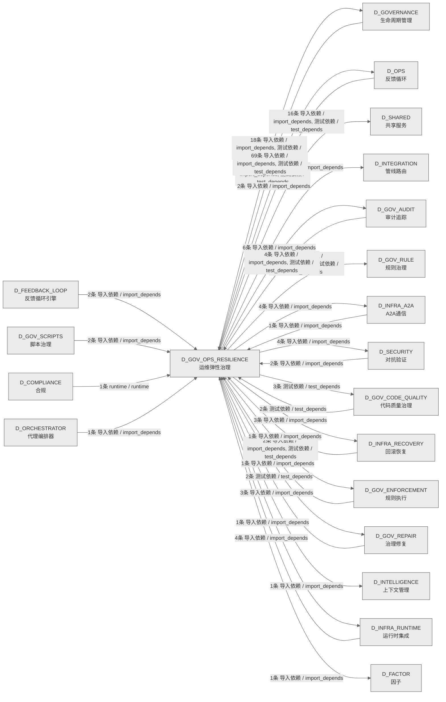

# 20_d_gov_ops_resilience / 运维弹性治理域 / Ops Resilience Governance

> **功能简介 / Overview**: 运维弹性治理，负责运维治理、安全治理、弹性治理和升级协议

> **文档作用 / Purpose**: 展示 运维弹性治理（D_GOV_OPS_RESILIENCE）功能域的域内依赖关系、跨域依赖关系，模块信息（成熟度/中英文名/大白话/文件路径）内嵌于 Mermaid 节点，供架构审查和域治理参考。

> 本文档由 generate_domain_doc.py 从 depgraph (PostgreSQL) 自动生成
> 数据源: depgraph (PostgreSQL) nodes表 + edges表

> **[可缩放 HTML 版 / Zoomable HTML](http://localhost:8765/docs/02_enterprise_architecture/02_domain_architecture_docs/_zoomable_html/20_d_gov_ops_resilience.html)** — Ctrl+滚轮缩放 ｜ 双击重置 ｜ Ctrl+Shift+D 切换拖动/选择模式

## 域基本信息 / Domain Overview

| 字段 | 值 | Field | Value |
|------|------|-------|-------|
| 编号 | 20 | Number | 20 |
| 域ID | D_GOV_OPS_RESILIENCE | Domain ID | D_GOV_OPS_RESILIENCE |
| 域名称 | 运维弹性治理 | Domain Name | Ops Resilience Governance |
| 层级 | L1 基础平台层 | Layer | L1 Foundation |
| 模块数 | 115 | Module Count | 115 |
| 域内依赖 | 25 | Internal Dependencies | 25 |
| 跨域入边 | 95 | Cross-domain Incoming | 95 |
| 跨域出边 | 92 | Cross-domain Outgoing | 92 |
| 设计态模块 | 0 | Design Modules | 0 |
| 生产态模块 | 115 | Production Modules | 115 |
| 容量 | 115/150 (正常) | Capacity | 115/150 (正常) |
| 描述 | 运维治理(ops_governance) | Description | 运维治理(ops_governance) |

## 域内依赖图 / Internal Dependency Diagram

> 依赖图内嵌在本文档中，IDE 可直接渲染；网页版可 Ctrl+滚轮缩放 + 拖动平移查看细节。
>
> **图例说明 / Legend**：
> - 🟦 **蓝色 = 运营态模块**（production，已上线运行）
> - 🟧 **橙色虚线 = 设计态模块**（design，蓝图阶段，代码未写）
> - **实线箭头 = 运营态依赖**（已生效的依赖关系）
> - **虚线箭头 = 非运营态依赖**（计划中/验证中的依赖关系）

### 全景图（全部模块，颜色区分运营态/设计态）

> 展示全部 115 个模块（生产态 115 + 设计态 0），含跨域依赖外部节点。节点含成熟度+名称+大白话/简介+文件路径。

```mermaid
%%{init: {'theme': 'base', 'themeVariables': {'primaryColor': '#eaeaea', 'primaryTextColor': '#333333', 'primaryBorderColor': '#666666', 'lineColor': '#666666', 'secondaryColor': '#eaeaea', 'tertiaryColor': '#eaeaea', 'fontSize': '14px'}}}%%
flowchart TD
    src_zephyr_governance_budget_enforcer_init_py["governance/budget-enforcer 包入口<br/>管理governance.budget-enforcer子包的加载和懒导入<br/>文件: budget-enforcer/__init__.py<br/>(生产态 / production)"]
    src_zephyr_governance_escalation_alternative_path_blocker_py["escalation/alternative_path_blocker<br/>Alternative Path Blocker — v0.13.0<br/>替代工具路径拦截器。<br/>文件: escalation/alternative_path_blocker.py<br/>(生产态 / production)"]
    src_zephyr_governance_escalation_consequence_manager_py["escalation/consequence_manager<br/>治理/escalation包的consequence_manager模块<br/>文件: escalation/consequence_manager.py<br/>(生产态 / production)"]
    src_zephyr_governance_escalation_contracts_py["escalation/contracts<br/>G-CT-003 消费端 —<br/>Escalation.on_rollback_failure() + G-CT-004<br/>/G-CT-006/G-CT-...<br/>文件: escalation/contracts.py<br/>(生产态 / production)"]
    src_zephyr_governance_escalation_escalation_api_py["escalation/escalation_api<br/>Escalation API — v0.7.0 Service Account API:<br/>外部系统安全触发升级，不绕过引擎。<br/>文件: escalation/escalation_api.py<br/>(生产态 / production)"]
    src_zephyr_governance_escalation_escalation_fatigue_manager_py["escalation/escalation_fatigue_manager<br/>Escalation Fatigue Manager — v0.11.0<br/>升级疲劳管理器。<br/>文件: escalation/escalation_fatigue_manager.py<br/>(生产态 / production)"]
    src_zephyr_governance_escalation_escalation_loop_detector_py["escalation/escalation_loop_detector<br/>Escalation Loop Detector — v0.10.0<br/>跨模块升级循环: escalate->block->auto_gua...<br/>文件: escalation/escalation_loop_detector.py<br/>(生产态 / production)"]
    src_zephyr_governance_escalation_escalation_smoke_tests_py["escalation/escalation_smoke_tests<br/>Escalation Smoke Tests — v0.11.0<br/>升级协议烟雾测试。<br/>文件: escalation/escalation_smoke_tests.py<br/>(生产态 / production)"]
    src_zephyr_governance_escalation_git_hook_pre_scanner_py["escalation/git_hook_pre_scanner<br/>Git Hook Pre-Scanner — v0.14.0<br/>Git操作Hook预扫描器。<br/>文件: escalation/git_hook_pre_scanner.py<br/>(生产态 / production)"]
    src_zephyr_governance_escalation_human_factors_py["escalation/human_factors<br/>Human Factors — v0.7.0 人因工程:<br/>通知疲劳管理+上下文简洁性+多通道notifications。<br/>文件: escalation/human_factors.py<br/>(生产态 / production)"]
    src_zephyr_governance_escalation_identity_verifier_py["escalation/identity_verifier<br/>Identity Verifier — D-022-12 Agent身份验证器:<br/>session_id+role+capability三元...<br/>文件: escalation/identity_verifier.py<br/>(生产态 / production)"]
    src_zephyr_governance_escalation_incident_response_py["escalation/incident_response<br/>治理/escalation包的incident_response模块<br/>文件: escalation/incident_response.py<br/>(生产态 / production)"]
    src_zephyr_governance_escalation_owner_absent_py["escalation/owner_absent<br/>Owner Absent — 人力缺席分级处置。<br/>文件: escalation/owner_absent.py<br/>(生产态 / production)"]
    src_zephyr_governance_escalation_result_types_py["escalation/result_types<br/>G-CT-003 — RollbackResult backward-compat<br/>re-export facade.<br/>文件: escalation/result_types.py<br/>(生产态 / production)"]
    src_zephyr_governance_escalation_spof_checker_py["escalation/spof_checker<br/>治理/escalation包的spof_checker模块<br/>文件: escalation/spof_checker.py<br/>(生产态 / production)"]
    src_zephyr_governance_escalation_triage_py["escalation/triage<br/>G2 Triage 门禁 — 知识分类评分（T-2-13-B）<br/>文件: escalation/triage.py<br/>(生产态 / production)"]
    src_zephyr_governance_ops_governance_agent_dispatch_py["ops_governance/agent_dispatch<br/>治理/ops governance包的agent_dispatch模块<br/>文件: ops_governance/agent_dispatch.py<br/>(生产态 / production)"]
    src_zephyr_governance_ops_governance_auto_runner_py["ops_governance/auto_runner<br/>GovernanceAutoRunner — 治理脚本自动运行<br/>/自动关闭调度器.<br/>文件: ops_governance/auto_runner.py<br/>(生产态 / production)"]
    src_zephyr_governance_ops_governance_bandwidth_optimizer_py["ops_governance/bandwidth_optimizer<br/>治理/ops governance包的bandwidth_optimizer模块<br/>文件: ops_governance/bandwidth_optimizer.py<br/>(生产态 / production)"]
    src_zephyr_governance_ops_governance_clock_guard_py["ops_governance/clock_guard<br/>Clock Guard — v0.8.0 时钟完整性防御:<br/>NTP漂移检测+wall clock monotonic验证。<br/>文件: ops_governance/clock_guard.py<br/>(生产态 / production)"]
    src_zephyr_governance_ops_governance_coldstart_manager_py["ops_governance/coldstart_manager<br/>Coldstart Manager — v0.7.0 冷启动管理器:<br/>escalation rules加载+引擎初始化+健...<br/>文件: ops_governance/coldstart_manager.py<br/>(生产态 / production)"]
    src_zephyr_governance_ops_governance_daily_ops_py["ops_governance/daily_ops<br/>治理/ops governance包的daily_ops模块<br/>文件: ops_governance/daily_ops.py<br/>(生产态 / production)"]
    src_zephyr_governance_ops_governance_decision_fatigue_py["ops_governance/decision_fatigue<br/>治理/ops governance包的decision_fatigue模块<br/>文件: ops_governance/decision_fatigue.py<br/>(生产态 / production)"]
    src_zephyr_governance_ops_governance_environment_manager_py["ops_governance/environment_manager<br/>治理/ops governance包的environment_manager模块<br/>文件: ops_governance/environment_manager.py<br/>(生产态 / production)"]
    src_zephyr_governance_ops_governance_interrupt_handler_py["ops_governance/interrupt_handler<br/>Interrupt Handler — D-022-06 硬中断处理器:<br/>Owner紧急中断+优雅停止+状态保存。<br/>文件: ops_governance/interrupt_handler.py<br/>(生产态 / production)"]
    src_zephyr_governance_ops_governance_maintenance_window_adapter_py["ops_governance/maintenance_window_adapter<br/>Maintenance Window Adapter — v0.10.0<br/>计划维护窗口适配器。<br/>文件: ops_governance<br/>/maintenance_window_adapter.py<br/>(生产态 / production)"]
    src_zephyr_governance_ops_governance_ops_foundation_py["ops_governance/ops_foundation<br/>治理/ops governance包的ops_foundation模块<br/>文件: ops_governance/ops_foundation.py<br/>(生产态 / production)"]
    src_zephyr_governance_ops_governance_parent_child_attributor_py["ops_governance/parent_child_attributor<br/>治理/ops governance包的parent_child_attributor模<br/>块<br/>文件: ops_governance/parent_child_attributor.py<br/>(生产态 / production)"]
    src_zephyr_governance_ops_governance_self_budget_tracker_py["ops_governance/self_budget_tracker<br/>治理/ops governance包的self_budget_tracker模块<br/>文件: ops_governance/self_budget_tracker.py<br/>(生产态 / production)"]
    src_zephyr_governance_ops_governance_service_registration_py["ops_governance/service_registration<br/>D-DATA -> ServiceRegistry 注册模块<br/>文件: ops_governance/service_registration.py<br/>(生产态 / production)"]
    src_zephyr_governance_ops_governance_startup_shutdown_py["ops_governance/startup_shutdown<br/>治理/ops governance包的startup_shutdown模块<br/>文件: ops_governance/startup_shutdown.py<br/>(生产态 / production)"]
    src_zephyr_governance_ops_governance_startup_shutdown_cli_py["ops_governance/startup_shutdown_cli<br/>治理/ops governance包的startup_shutdown_cli模块<br/>文件: ops_governance/startup_shutdown_cli.py<br/>(生产态 / production)"]
    src_zephyr_governance_ops_governance_time_sync_py["ops_governance/time_sync<br/>治理/ops governance包的time_sync模块<br/>文件: ops_governance/time_sync.py<br/>(生产态 / production)"]
    src_zephyr_governance_ops_governance_timeout_guard_py["ops_governance/timeout_guard<br/>治理/ops governance包的timeout_guard模块<br/>文件: ops_governance/timeout_guard.py<br/>(生产态 / production)"]
    src_zephyr_governance_resilience_governance_init_py["governance/resilience_governance 包入口<br/>管理governance.resilience_governance子包的加载和<br/>懒导入<br/>文件: resilience_governance/__init__.py<br/>(生产态 / production)"]
    src_zephyr_governance_resilience_governance_blast_radius_py["resilience_governance/blast_radius<br/>blast_radius — MOD-INF-028 §3.1 Stage 9<br/>文件: resilience_governance/blast_radius.py<br/>(生产态 / production)"]
    src_zephyr_governance_resilience_governance_broker_resilience_py["resilience_governance/broker_resilience<br/>治理/resilience<br/>governance包的broker_resilience模块<br/>文件: resilience_governance/broker_resilience.py<br/>(生产态 / production)"]
    src_zephyr_governance_resilience_governance_bus_factor_defense_py["resilience_governance/bus_factor_defense<br/>治理/resilience<br/>governance包的bus_factor_defense模块<br/>文件: resilience_governance<br/>/bus_factor_defense.py<br/>(生产态 / production)"]
    src_zephyr_governance_resilience_governance_decision_fatigue_cli_py["resilience_governance/decision_fatigue_cli<br/>治理/resilience<br/>governance包的decision_fatigue_cli模块<br/>文件: resilience_governance<br/>/decision_fatigue_cli.py<br/>(生产态 / production)"]
    src_zephyr_governance_resilience_governance_f5_boot_integration_py["resilience_governance/f5_boot_integration<br/>F5BootIntegration — F5 自动启动/关闭集成<br/>(MOD-INF-022 §2).<br/>文件: resilience_governance<br/>/f5_boot_integration.py<br/>(生产态 / production)"]
    src_zephyr_governance_resilience_governance_f5_event_subscriber_py["resilience_governance/f5_event_subscriber<br/>F5EventSubscriber — F5 事件启动机制<br/>(MOD-INF-022 §3).<br/>文件: resilience_governance<br/>/f5_event_subscriber.py<br/>(生产态 / production)"]
    src_zephyr_governance_resilience_governance_f5_shutdown_manager_py["resilience_governance/f5_shutdown_manager<br/>F5ShutdownManager — F5 自动关闭/状态持久化<br/>/信号处理 (MOD-INF-022 §2).<br/>文件: resilience_governance<br/>/f5_shutdown_manager.py<br/>(生产态 / production)"]
    src_zephyr_governance_resilience_governance_fail_mode_manager_py["resilience_governance/fail_mode_manager<br/>治理/resilience<br/>governance包的fail_mode_manager模块<br/>文件: resilience_governance/fail_mode_manager.py<br/>(生产态 / production)"]
    src_zephyr_governance_resilience_governance_fault_tolerance_py["resilience_governance/fault_tolerance<br/>治理/resilience<br/>governance包的fault_tolerance模块<br/>文件: resilience_governance/fault_tolerance.py<br/>(生产态 / production)"]
    src_zephyr_governance_resilience_governance_last_resort_watchdog_py["resilience_governance/last_resort_watchdog<br/>Last Resort Watchdog — v0.8.0 终极逃生舱:<br/>所有escalation失败后的final fallba...<br/>文件: resilience_governance<br/>/last_resort_watchdog.py<br/>(生产态 / production)"]
    src_zephyr_governance_resilience_governance_offline_autonomy_py["resilience_governance/offline_autonomy<br/>治理/resilience<br/>governance包的offline_autonomy模块<br/>文件: resilience_governance/offline_autonomy.py<br/>(生产态 / production)"]
    src_zephyr_governance_resilience_governance_offline_resilience_py["resilience_governance/offline_resilience<br/>治理/resilience<br/>governance包的offline_resilience模块<br/>文件: resilience_governance<br/>/offline_resilience.py<br/>(生产态 / production)"]
    src_zephyr_governance_resilience_governance_policy_sandbox_py["resilience_governance/policy_sandbox<br/>治理/resilience governance包的policy_sandbox模块<br/>文件: resilience_governance/policy_sandbox.py<br/>(生产态 / production)"]
    src_zephyr_governance_resilience_governance_process_isolator_py["resilience_governance/process_isolator<br/>Process Isolator — v0.6.0 进程隔离器:<br/>engine运行在独立进程+资源限制+crash恢复。<br/>文件: resilience_governance/process_isolator.py<br/>(生产态 / production)"]
    src_zephyr_governance_resilience_governance_witness_isolation_py["resilience_governance/witness_isolation<br/>Witness Isolation — v0.8.0 Witness隔离:<br/>N版本decision验证+投票机制+majority...<br/>文件: resilience_governance/witness_isolation.py<br/>(生产态 / production)"]
    src_zephyr_governance_security_governance_init_py["governance/security_governance 包入口<br/>管理governance.security_governance子包的加载和懒<br/>导入<br/>文件: security_governance/__init__.py<br/>(生产态 / production)"]
    src_zephyr_governance_security_governance_anti_automation_bias_py["security_governance/anti_automation_bias<br/>Anti-Automation Bias — D-022-09 mandatory human<br/>oversight enforcement.<br/>文件: security_governance<br/>/anti_automation_bias.py<br/>(生产态 / production)"]
    src_zephyr_governance_security_governance_api_response_sanitizer_py["security_governance/api_response_sanitizer<br/>API Response Sanitizer — v0.9.0 API响应清洗器:<br/>外部API返回内容清洗+injection...<br/>文件: security_governance<br/>/api_response_sanitizer.py<br/>(生产态 / production)"]
    src_zephyr_governance_security_governance_bare_repo_scanner_py["security_governance/bare_repo_scanner<br/>Bare Repo Scanner — v0.14.0 嵌入式裸仓库检测器。<br/>文件: security_governance/bare_repo_scanner.py<br/>(生产态 / production)"]
    src_zephyr_governance_security_governance_compositional_safety_tester_py["security_governance/compositional_safety_tester<br/>Compositional Safety Tester — v0.14.0<br/>组合性不安全测试器。<br/>文件: security_governance<br/>/compositional_safety_tester.py<br/>(生产态 / production)"]
    src_zephyr_governance_security_governance_config_scanner_py["security_governance/config_scanner<br/>Config Scanner — v0.9.0 AI配置文件注入扫描器:<br/>检测AI修改的配置+注入攻击。<br/>文件: security_governance/config_scanner.py<br/>(生产态 / production)"]
    src_zephyr_governance_security_governance_credential_guard_py["security_governance/credential_guard<br/>Credential Guard — v0.7.0 密钥泄露防护:<br/>env检测+git log扫描+运行时脱敏。<br/>文件: security_governance/credential_guard.py<br/>(生产态 / production)"]
    src_zephyr_governance_security_governance_default_security_gateway_py["security_governance/default_security_gateway<br/>DefaultSecurityGateway — SecurityGateway<br/>三层防御 OCP-004 实现<br/>文件: security_governance<br/>/default_security_gateway.py<br/>(生产态 / production)"]
    src_zephyr_governance_security_governance_ghost_scan_py["security_governance/ghost_scan<br/>Ghost Scan — v0.8.0 幽灵进程检测: lingering<br/>process扫描+资源泄漏检测。<br/>文件: security_governance/ghost_scan.py<br/>(生产态 / production)"]
    src_zephyr_governance_security_governance_github_api_guard_py["security_governance/github_api_guard<br/>GitHub API Guard — v0.9.0 Comment and<br/>Control防御: PR评论命令注入检测+限制。<br/>文件: security_governance/github_api_guard.py<br/>(生产态 / production)"]
    src_zephyr_governance_security_governance_hooks_integrity_guard_py["security_governance/hooks_integrity_guard<br/>Hooks Integrity Guard — v0.11.0<br/>Hooks自编辑防护器。<br/>文件: security_governance<br/>/hooks_integrity_guard.py<br/>(生产态 / production)"]
    src_zephyr_governance_security_governance_memory_poison_guard_py["security_governance/memory_poison_guard<br/>Memory Poison Guard — v0.9.0 记忆投毒防护:<br/>Memory写入内容审计+恶意注入检测。<br/>文件: security_governance/memory_poison_guard.py<br/>(生产态 / production)"]
    src_zephyr_governance_security_governance_persuasion_detector_py["security_governance/persuasion_detector<br/>Persuasion Detector — D-022-09 心理说服检测:<br/>对抗语气+恳求+绕过指令。<br/>文件: security_governance/persuasion_detector.py<br/>(生产态 / production)"]
    src_zephyr_governance_security_governance_poison_cascade_detector_py["security_governance/poison_cascade_detector<br/>治理/security<br/>governance包的poison_cascade_detector模块<br/>文件: security_governance<br/>/poison_cascade_detector.py<br/>(生产态 / production)"]
    src_zephyr_governance_security_governance_sbom_guard_py["security_governance/sbom_guard<br/>SBOM Guard — v0.8.0 SBOM供应链防护:<br/>依赖版本锁定+脆弱性扫描+cve告警。<br/>文件: security_governance/sbom_guard.py<br/>(生产态 / production)"]
    src_zephyr_governance_security_governance_security_config_scanner_py["security_governance/security_config_scanner<br/>Security Config Scanner — v0.13.0<br/>缺失安全配置扫描器。<br/>文件: security_governance<br/>/security_config_scanner.py<br/>(生产态 / production)"]
    src_zephyr_governance_security_governance_tamper_evident_log_py["security_governance/tamper_evident_log<br/>治理/security<br/>governance包的tamper_evident_log模块<br/>文件: security_governance/tamper_evident_log.py<br/>(生产态 / production)"]
    src_zephyr_governance_security_governance_vibe_security_verify_py["security_governance/vibe_security_verify<br/>Vibe Security Verifier — v0.9.0 Vibe<br/>Coding安全验证器: AI生成代码安全基线检查。<br/>文件: security_governance<br/>/vibe_security_verify.py<br/>(生产态 / production)"]
    src_zephyr_governance_security_governance_vibe_verify_integration_py["security_governance/vibe_verify_integration<br/>VibeVerify Integration — v0.9.0<br/>VibeVerify集成器: auto_guard级别+增量修复+co...<br/>文件: security_governance<br/>/vibe_verify_integration.py<br/>(生产态 / production)"]
    tests_governance_budget_test_budget_enforcer_smoke_py["budget/test_budget_enforcer_smoke<br/>budget包的test_budget_enforcer_smoke模块<br/>文件: budget/test_budget_enforcer_smoke.py<br/>(生产态 / production)"]
    tests_governance_budget_test_burn_rate_monitor_py["budget/test_burn_rate_monitor<br/>budget包的test_burn_rate_monitor模块<br/>文件: budget/test_burn_rate_monitor.py<br/>(生产态 / production)"]
    tests_governance_budget_test_conversation_tax_detector_py["budget/test_conversation_tax_detector<br/>budget包的test_conversation_tax_detector模块<br/>文件: budget/test_conversation_tax_detector.py<br/>(生产态 / production)"]
    tests_governance_budget_test_cost_attributor_py["budget/test_cost_attributor<br/>budget包的test_cost_attributor模块<br/>文件: budget/test_cost_attributor.py<br/>(生产态 / production)"]
    tests_governance_budget_test_cost_budget_root_py["budget/test_cost_budget_root<br/>budget包的test_cost_budget_root模块<br/>文件: budget/test_cost_budget_root.py<br/>(生产态 / production)"]
    tests_governance_budget_test_cost_budget_unit_py["budget/test_cost_budget_unit<br/>Unit tests for cost_budget.py<br/>文件: budget/test_cost_budget_unit.py<br/>(生产态 / production)"]
    tests_governance_budget_test_cost_router_py["budget/test_cost_router<br/>budget包的test_cost_router模块<br/>文件: budget/test_cost_router.py<br/>(生产态 / production)"]
    tests_governance_budget_test_debt_projector_py["budget/test_debt_projector<br/>budget包的test_debt_projector模块<br/>文件: budget/test_debt_projector.py<br/>(生产态 / production)"]
    tests_governance_budget_test_degradation_py["budget/test_degradation<br/>budget包的test_degradation模块<br/>文件: budget/test_degradation.py<br/>(生产态 / production)"]
    tests_governance_budget_test_degradation_manager_py["budget/test_degradation_manager<br/>budget包的test_degradation_manager模块<br/>文件: budget/test_degradation_manager.py<br/>(生产态 / production)"]
    tests_governance_budget_test_error_budget_burst_limiter_py["budget/test_error_budget_burst_limiter<br/>budget包的test_error_budget_burst_limiter模块<br/>文件: budget/test_error_budget_burst_limiter.py<br/>(生产态 / production)"]
    tests_governance_budget_test_gct_024_hard_checks_py["budget/test_gct_024_hard_checks<br/>budget包的test_gct_024_hard_checks模块<br/>文件: budget/test_gct_024_hard_checks.py<br/>(生产态 / production)"]
    tests_governance_budget_test_governance_budget_tracker_py["budget/test_governance_budget_tracker<br/>budget包的test_governance_budget_tracker模块<br/>文件: budget/test_governance_budget_tracker.py<br/>(生产态 / production)"]
    tests_governance_budget_test_pre_flight_gate_py["budget/test_pre_flight_gate<br/>budget包的test_pre_flight_gate模块<br/>文件: budget/test_pre_flight_gate.py<br/>(生产态 / production)"]
    tests_governance_budget_test_roi_calculator_py["budget/test_roi_calculator<br/>budget包的test_roi_calculator模块<br/>文件: budget/test_roi_calculator.py<br/>(生产态 / production)"]
    tests_governance_budget_test_tco_model_py["budget/test_tco_model<br/>budget包的test_tco_model模块<br/>文件: budget/test_tco_model.py<br/>(生产态 / production)"]
    tests_governance_context_governance_test_command_chain_length_gate_py["context_governance<br/>/test_command_chain_length_gate<br/>context<br/>governance包的test_command_chain_length_gate模块<br/>文件: context_governance<br/>/test_command_chain_length_gate.py<br/>(生产态 / production)"]
    tests_governance_orchestrator_test_engine_sandbox_py["orchestrator/test_engine_sandbox<br/>EngineSandbox — filesystem/network/boundary<br/>isolation and integrity tests.<br/>文件: orchestrator/test_engine_sandbox.py<br/>(生产态 / production)"]
    tests_governance_orchestrator_test_gate_engine_unit_py["orchestrator/test_gate_engine_unit<br/>测试套件：GateEngine + TaskRepository 门禁集成<br/>（T-2-19）<br/>文件: orchestrator/test_gate_engine_unit.py<br/>(生产态 / production)"]
    tests_governance_orchestrator_test_mvep_orchestrator_py["orchestrator/test_mvep_orchestrator<br/>编排包的test_mvep_orchestrator模块<br/>文件: orchestrator/test_mvep_orchestrator.py<br/>(生产态 / production)"]
    tests_governance_orchestrator_test_objective_tracker_py["orchestrator/test_objective_tracker<br/>编排包的test_objective_tracker模块<br/>文件: orchestrator/test_objective_tracker.py<br/>(生产态 / production)"]
    tests_governance_orchestrator_test_prioritizer_py["orchestrator/test_prioritizer<br/>编排包的test_prioritizer模块<br/>文件: orchestrator/test_prioritizer.py<br/>(生产态 / production)"]
    tests_governance_orchestrator_test_think_time_model_py["orchestrator/test_think_time_model<br/>编排包的test_think_time_model模块<br/>文件: orchestrator/test_think_time_model.py<br/>(生产态 / production)"]
    tests_governance_orchestrator_test_verify_b54_b56_b59_deep_py["orchestrator/test_verify_b54_b56_b59_deep<br/>Deeper integration test: P0 inflation guard +<br/>block_sessions_count + timeout ...<br/>文件: orchestrator<br/>/test_verify_b54_b56_b59_deep.py<br/>(生产态 / production)"]
    src_zephyr_governance_budget_enforcer_init_py ~~~ src_zephyr_governance_escalation_alternative_path_blocker_py
    src_zephyr_governance_escalation_alternative_path_blocker_py ~~~ src_zephyr_governance_escalation_consequence_manager_py
    src_zephyr_governance_escalation_consequence_manager_py ~~~ src_zephyr_governance_escalation_contracts_py
    src_zephyr_governance_escalation_contracts_py ~~~ src_zephyr_governance_escalation_escalation_api_py
    src_zephyr_governance_escalation_escalation_api_py ~~~ src_zephyr_governance_escalation_escalation_fatigue_manager_py
    src_zephyr_governance_escalation_escalation_fatigue_manager_py ~~~ src_zephyr_governance_escalation_escalation_loop_detector_py
    src_zephyr_governance_escalation_escalation_loop_detector_py ~~~ src_zephyr_governance_escalation_escalation_smoke_tests_py
    src_zephyr_governance_escalation_escalation_smoke_tests_py ~~~ src_zephyr_governance_escalation_git_hook_pre_scanner_py
    src_zephyr_governance_escalation_git_hook_pre_scanner_py ~~~ src_zephyr_governance_escalation_human_factors_py
    src_zephyr_governance_escalation_human_factors_py ~~~ src_zephyr_governance_escalation_identity_verifier_py
    src_zephyr_governance_escalation_identity_verifier_py ~~~ src_zephyr_governance_escalation_incident_response_py
    src_zephyr_governance_escalation_incident_response_py ~~~ src_zephyr_governance_escalation_owner_absent_py
    src_zephyr_governance_escalation_owner_absent_py ~~~ src_zephyr_governance_escalation_result_types_py
    src_zephyr_governance_escalation_result_types_py ~~~ src_zephyr_governance_escalation_spof_checker_py
    src_zephyr_governance_escalation_spof_checker_py ~~~ src_zephyr_governance_escalation_triage_py
    src_zephyr_governance_escalation_triage_py ~~~ src_zephyr_governance_ops_governance_agent_dispatch_py
    src_zephyr_governance_ops_governance_agent_dispatch_py ~~~ src_zephyr_governance_ops_governance_auto_runner_py
    src_zephyr_governance_ops_governance_auto_runner_py ~~~ src_zephyr_governance_ops_governance_bandwidth_optimizer_py
    src_zephyr_governance_ops_governance_bandwidth_optimizer_py ~~~ src_zephyr_governance_ops_governance_clock_guard_py
    src_zephyr_governance_ops_governance_clock_guard_py ~~~ src_zephyr_governance_ops_governance_coldstart_manager_py
    src_zephyr_governance_ops_governance_coldstart_manager_py ~~~ src_zephyr_governance_ops_governance_daily_ops_py
    src_zephyr_governance_ops_governance_daily_ops_py ~~~ src_zephyr_governance_ops_governance_decision_fatigue_py
    src_zephyr_governance_ops_governance_decision_fatigue_py ~~~ src_zephyr_governance_ops_governance_environment_manager_py
    src_zephyr_governance_ops_governance_environment_manager_py ~~~ src_zephyr_governance_ops_governance_interrupt_handler_py
    src_zephyr_governance_ops_governance_interrupt_handler_py ~~~ src_zephyr_governance_ops_governance_maintenance_window_adapter_py
    src_zephyr_governance_ops_governance_maintenance_window_adapter_py ~~~ src_zephyr_governance_ops_governance_ops_foundation_py
    src_zephyr_governance_ops_governance_ops_foundation_py ~~~ src_zephyr_governance_ops_governance_parent_child_attributor_py
    src_zephyr_governance_ops_governance_parent_child_attributor_py ~~~ src_zephyr_governance_ops_governance_self_budget_tracker_py
    src_zephyr_governance_ops_governance_self_budget_tracker_py ~~~ src_zephyr_governance_ops_governance_service_registration_py
    src_zephyr_governance_ops_governance_service_registration_py ~~~ src_zephyr_governance_ops_governance_startup_shutdown_py
    src_zephyr_governance_ops_governance_startup_shutdown_py ~~~ src_zephyr_governance_ops_governance_startup_shutdown_cli_py
    src_zephyr_governance_ops_governance_startup_shutdown_cli_py ~~~ src_zephyr_governance_ops_governance_time_sync_py
    src_zephyr_governance_ops_governance_time_sync_py ~~~ src_zephyr_governance_ops_governance_timeout_guard_py
    src_zephyr_governance_ops_governance_timeout_guard_py ~~~ src_zephyr_governance_resilience_governance_init_py
    src_zephyr_governance_resilience_governance_init_py ~~~ src_zephyr_governance_resilience_governance_blast_radius_py
    src_zephyr_governance_resilience_governance_blast_radius_py ~~~ src_zephyr_governance_resilience_governance_broker_resilience_py
    src_zephyr_governance_resilience_governance_broker_resilience_py ~~~ src_zephyr_governance_resilience_governance_bus_factor_defense_py
    src_zephyr_governance_resilience_governance_bus_factor_defense_py ~~~ src_zephyr_governance_resilience_governance_decision_fatigue_cli_py
    src_zephyr_governance_resilience_governance_decision_fatigue_cli_py ~~~ src_zephyr_governance_resilience_governance_f5_boot_integration_py
    src_zephyr_governance_resilience_governance_f5_boot_integration_py ~~~ src_zephyr_governance_resilience_governance_f5_event_subscriber_py
    src_zephyr_governance_resilience_governance_f5_event_subscriber_py ~~~ src_zephyr_governance_resilience_governance_f5_shutdown_manager_py
    src_zephyr_governance_resilience_governance_f5_shutdown_manager_py ~~~ src_zephyr_governance_resilience_governance_fail_mode_manager_py
    src_zephyr_governance_resilience_governance_fail_mode_manager_py ~~~ src_zephyr_governance_resilience_governance_fault_tolerance_py
    src_zephyr_governance_resilience_governance_fault_tolerance_py ~~~ src_zephyr_governance_resilience_governance_last_resort_watchdog_py
    src_zephyr_governance_resilience_governance_last_resort_watchdog_py ~~~ src_zephyr_governance_resilience_governance_offline_autonomy_py
    src_zephyr_governance_resilience_governance_offline_autonomy_py ~~~ src_zephyr_governance_resilience_governance_offline_resilience_py
    src_zephyr_governance_resilience_governance_offline_resilience_py ~~~ src_zephyr_governance_resilience_governance_policy_sandbox_py
    src_zephyr_governance_resilience_governance_policy_sandbox_py ~~~ src_zephyr_governance_resilience_governance_process_isolator_py
    src_zephyr_governance_resilience_governance_process_isolator_py ~~~ src_zephyr_governance_resilience_governance_witness_isolation_py
    src_zephyr_governance_resilience_governance_witness_isolation_py ~~~ src_zephyr_governance_security_governance_init_py
    src_zephyr_governance_security_governance_init_py ~~~ src_zephyr_governance_security_governance_anti_automation_bias_py
    src_zephyr_governance_security_governance_anti_automation_bias_py ~~~ src_zephyr_governance_security_governance_api_response_sanitizer_py
    src_zephyr_governance_security_governance_api_response_sanitizer_py ~~~ src_zephyr_governance_security_governance_bare_repo_scanner_py
    src_zephyr_governance_security_governance_bare_repo_scanner_py ~~~ src_zephyr_governance_security_governance_compositional_safety_tester_py
    src_zephyr_governance_security_governance_compositional_safety_tester_py ~~~ src_zephyr_governance_security_governance_config_scanner_py
    src_zephyr_governance_security_governance_config_scanner_py ~~~ src_zephyr_governance_security_governance_credential_guard_py
    src_zephyr_governance_security_governance_credential_guard_py ~~~ src_zephyr_governance_security_governance_default_security_gateway_py
    src_zephyr_governance_security_governance_default_security_gateway_py ~~~ src_zephyr_governance_security_governance_ghost_scan_py
    src_zephyr_governance_security_governance_ghost_scan_py ~~~ src_zephyr_governance_security_governance_github_api_guard_py
    src_zephyr_governance_security_governance_github_api_guard_py ~~~ src_zephyr_governance_security_governance_hooks_integrity_guard_py
    src_zephyr_governance_security_governance_hooks_integrity_guard_py ~~~ src_zephyr_governance_security_governance_memory_poison_guard_py
    src_zephyr_governance_security_governance_memory_poison_guard_py ~~~ src_zephyr_governance_security_governance_persuasion_detector_py
    src_zephyr_governance_security_governance_persuasion_detector_py ~~~ src_zephyr_governance_security_governance_poison_cascade_detector_py
    src_zephyr_governance_security_governance_poison_cascade_detector_py ~~~ src_zephyr_governance_security_governance_sbom_guard_py
    src_zephyr_governance_security_governance_sbom_guard_py ~~~ src_zephyr_governance_security_governance_security_config_scanner_py
    src_zephyr_governance_security_governance_security_config_scanner_py ~~~ src_zephyr_governance_security_governance_tamper_evident_log_py
    src_zephyr_governance_security_governance_tamper_evident_log_py ~~~ src_zephyr_governance_security_governance_vibe_security_verify_py
    src_zephyr_governance_security_governance_vibe_security_verify_py ~~~ src_zephyr_governance_security_governance_vibe_verify_integration_py
    src_zephyr_governance_security_governance_vibe_verify_integration_py ~~~ tests_governance_budget_test_budget_enforcer_smoke_py
    tests_governance_budget_test_budget_enforcer_smoke_py ~~~ tests_governance_budget_test_burn_rate_monitor_py
    tests_governance_budget_test_burn_rate_monitor_py ~~~ tests_governance_budget_test_conversation_tax_detector_py
    tests_governance_budget_test_conversation_tax_detector_py ~~~ tests_governance_budget_test_cost_attributor_py
    tests_governance_budget_test_cost_attributor_py ~~~ tests_governance_budget_test_cost_budget_root_py
    tests_governance_budget_test_cost_budget_root_py ~~~ tests_governance_budget_test_cost_budget_unit_py
    tests_governance_budget_test_cost_budget_unit_py ~~~ tests_governance_budget_test_cost_router_py
    tests_governance_budget_test_cost_router_py ~~~ tests_governance_budget_test_debt_projector_py
    tests_governance_budget_test_debt_projector_py ~~~ tests_governance_budget_test_degradation_py
    tests_governance_budget_test_degradation_py ~~~ tests_governance_budget_test_degradation_manager_py
    tests_governance_budget_test_degradation_manager_py ~~~ tests_governance_budget_test_error_budget_burst_limiter_py
    tests_governance_budget_test_error_budget_burst_limiter_py ~~~ tests_governance_budget_test_gct_024_hard_checks_py
    tests_governance_budget_test_gct_024_hard_checks_py ~~~ tests_governance_budget_test_governance_budget_tracker_py
    tests_governance_budget_test_governance_budget_tracker_py ~~~ tests_governance_budget_test_pre_flight_gate_py
    tests_governance_budget_test_pre_flight_gate_py ~~~ tests_governance_budget_test_roi_calculator_py
    tests_governance_budget_test_roi_calculator_py ~~~ tests_governance_budget_test_tco_model_py
    tests_governance_budget_test_tco_model_py ~~~ tests_governance_context_governance_test_command_chain_length_gate_py
    tests_governance_context_governance_test_command_chain_length_gate_py ~~~ tests_governance_orchestrator_test_engine_sandbox_py
    tests_governance_orchestrator_test_engine_sandbox_py ~~~ tests_governance_orchestrator_test_gate_engine_unit_py
    tests_governance_orchestrator_test_gate_engine_unit_py ~~~ tests_governance_orchestrator_test_mvep_orchestrator_py
    tests_governance_orchestrator_test_mvep_orchestrator_py ~~~ tests_governance_orchestrator_test_objective_tracker_py
    tests_governance_orchestrator_test_objective_tracker_py ~~~ tests_governance_orchestrator_test_prioritizer_py
    tests_governance_orchestrator_test_prioritizer_py ~~~ tests_governance_orchestrator_test_think_time_model_py
    tests_governance_orchestrator_test_think_time_model_py ~~~ tests_governance_orchestrator_test_verify_b54_b56_b59_deep_py
    src_zephyr_governance_escalation_escalation_engine_py["escalation/escalation_engine<br/>Escalation Engine — MOD-INF-022<br/>文件: escalation/escalation_engine.py<br/>(生产态 / production)"]
    src_zephyr_governance_ops_governance_burn_rate_monitor_py["ops_governance/burn_rate_monitor<br/>Burn Rate Monitor — MOD-INF-024<br/>文件: ops_governance/burn_rate_monitor.py<br/>(生产态 / production)"]
    src_zephyr_governance_ops_governance_cost_attributor_py["ops_governance/cost_attributor<br/>治理/ops governance包的cost_attributor模块<br/>文件: ops_governance/cost_attributor.py<br/>(生产态 / production)"]
    src_zephyr_governance_ops_governance_cost_router_py["ops_governance/cost_router<br/>治理/ops governance包的cost_router模块<br/>文件: ops_governance/cost_router.py<br/>(生产态 / production)"]
    src_zephyr_governance_ops_governance_degradation_manager_py["ops_governance/degradation_manager<br/>治理/ops governance包的degradation_manager模块<br/>文件: ops_governance/degradation_manager.py<br/>(生产态 / production)"]
    src_zephyr_governance_ops_governance_error_budget_burst_limiter_py["ops_governance/error_budget_burst_limiter<br/>Error Budget Burst Limiter — v0.11.0<br/>错误预算Burst限流器。<br/>文件: ops_governance<br/>/error_budget_burst_limiter.py<br/>(生产态 / production)"]
    src_zephyr_governance_ops_governance_event_hook_py["ops_governance/event_hook<br/>EventHook — 声明式任务系统事件订阅<br/>文件: ops_governance/event_hook.py<br/>(生产态 / production)"]
    src_zephyr_governance_ops_governance_phase_manager_py["ops_governance/phase_manager<br/>Phase Manager — ZephyrAlpha 施工阶段门控引擎.<br/>文件: ops_governance/phase_manager.py<br/>(生产态 / production)"]
    src_zephyr_governance_ops_governance_roi_calculator_py["ops_governance/roi_calculator<br/>治理/ops governance包的roi_calculator模块<br/>文件: ops_governance/roi_calculator.py<br/>(生产态 / production)"]
    src_zephyr_governance_ops_governance_tco_model_py["ops_governance/tco_model<br/>治理/ops governance包的tco_model模块<br/>文件: ops_governance/tco_model.py<br/>(生产态 / production)"]
    src_zephyr_governance_resilience_governance_account_isolator_py["resilience_governance/account_isolator<br/>Account Isolator — v0.10.0 多账户升级隔离器。<br/>文件: resilience_governance/account_isolator.py<br/>(生产态 / production)"]
    src_zephyr_governance_resilience_governance_deadlock_detector_py["resilience_governance/deadlock_detector<br/>Deadlock Detector — D-022-04<br/>多Agent死锁+循环依赖检测+超时破解。<br/>文件: resilience_governance/deadlock_detector.py<br/>(生产态 / production)"]
    src_zephyr_governance_resilience_governance_decision_fatigue_py["resilience_governance/decision_fatigue<br/>治理/resilience<br/>governance包的decision_fatigue模块<br/>文件: resilience_governance/decision_fatigue.py<br/>(生产态 / production)"]
    src_zephyr_governance_resilience_governance_engine_sandbox_py["resilience_governance/engine_sandbox<br/>EngineSandbox — D-022-08 OS-level sandboxing<br/>for the escalation engine.<br/>文件: resilience_governance/engine_sandbox.py<br/>(生产态 / production)"]
    src_zephyr_governance_security_governance_adversarial_tester_py["security_governance/adversarial_tester<br/>治理/security<br/>governance包的adversarial_tester模块<br/>文件: security_governance/adversarial_tester.py<br/>(生产态 / production)"]
    src_zephyr_governance_security_governance_security_gateway_base_py["security_governance/security_gateway_base<br/>D_COMPLIANCE — Governance & Compliance Layer<br/>文件: security_governance<br/>/security_gateway_base.py<br/>(生产态 / production)"]
    src_zephyr_governance_escalation_escalation_engine_py ~~~ src_zephyr_governance_ops_governance_burn_rate_monitor_py
    src_zephyr_governance_ops_governance_burn_rate_monitor_py ~~~ src_zephyr_governance_ops_governance_cost_attributor_py
    src_zephyr_governance_ops_governance_cost_attributor_py ~~~ src_zephyr_governance_ops_governance_cost_router_py
    src_zephyr_governance_ops_governance_cost_router_py ~~~ src_zephyr_governance_ops_governance_degradation_manager_py
    src_zephyr_governance_ops_governance_degradation_manager_py ~~~ src_zephyr_governance_ops_governance_error_budget_burst_limiter_py
    src_zephyr_governance_ops_governance_error_budget_burst_limiter_py ~~~ src_zephyr_governance_ops_governance_event_hook_py
    src_zephyr_governance_ops_governance_event_hook_py ~~~ src_zephyr_governance_ops_governance_phase_manager_py
    src_zephyr_governance_ops_governance_phase_manager_py ~~~ src_zephyr_governance_ops_governance_roi_calculator_py
    src_zephyr_governance_ops_governance_roi_calculator_py ~~~ src_zephyr_governance_ops_governance_tco_model_py
    src_zephyr_governance_ops_governance_tco_model_py ~~~ src_zephyr_governance_resilience_governance_account_isolator_py
    src_zephyr_governance_resilience_governance_account_isolator_py ~~~ src_zephyr_governance_resilience_governance_deadlock_detector_py
    src_zephyr_governance_resilience_governance_deadlock_detector_py ~~~ src_zephyr_governance_resilience_governance_decision_fatigue_py
    src_zephyr_governance_resilience_governance_decision_fatigue_py ~~~ src_zephyr_governance_resilience_governance_engine_sandbox_py
    src_zephyr_governance_resilience_governance_engine_sandbox_py ~~~ src_zephyr_governance_security_governance_adversarial_tester_py
    src_zephyr_governance_security_governance_adversarial_tester_py ~~~ src_zephyr_governance_security_governance_security_gateway_base_py
    src_zephyr_governance_escalation_escalation_metrics_py["escalation/escalation_metrics<br/>Escalation Metrics — D-022-07 指标收集器:<br/>升级率/误升级率/响应延迟。<br/>文件: escalation/escalation_metrics.py<br/>(生产态 / production)"]
    src_zephyr_governance_escalation_escalation_models_py["escalation/escalation_models<br/>Escalation Protocol data models — MOD-INF-022<br/>文件: escalation/escalation_models.py<br/>(生产态 / production)"]
    src_zephyr_governance_ops_governance_phase_check_registry_py["ops_governance/phase_check_registry<br/>PhaseManager->GateEngine 检查注册表桥梁 — 44<br/>个阶段门控检查映射.<br/>文件: ops_governance/phase_check_registry.py<br/>(生产态 / production)"]
    src_zephyr_governance_ops_governance_stream_abort_guard_py["ops_governance/stream_abort_guard<br/>StreamAbortGuard — 流式中断守卫<br/>文件: ops_governance/stream_abort_guard.py<br/>(生产态 / production)"]
    src_zephyr_governance_resilience_governance_circuit_breaker_py["resilience_governance/circuit_breaker<br/>Circuit Breaker — MOD-INF-022<br/>文件: resilience_governance/circuit_breaker.py<br/>(生产态 / production)"]
    src_zephyr_governance_security_governance_ipi_defense_py["security_governance/ipi_defense<br/>治理/security governance包的ipi_defense模块<br/>文件: security_governance/ipi_defense.py<br/>(生产态 / production)"]
    src_zephyr_governance_escalation_escalation_metrics_py ~~~ src_zephyr_governance_escalation_escalation_models_py
    src_zephyr_governance_escalation_escalation_models_py ~~~ src_zephyr_governance_ops_governance_phase_check_registry_py
    src_zephyr_governance_ops_governance_phase_check_registry_py ~~~ src_zephyr_governance_ops_governance_stream_abort_guard_py
    src_zephyr_governance_ops_governance_stream_abort_guard_py ~~~ src_zephyr_governance_resilience_governance_circuit_breaker_py
    src_zephyr_governance_resilience_governance_circuit_breaker_py ~~~ src_zephyr_governance_security_governance_ipi_defense_py
    src_zephyr_governance_escalation_escalation_api_py -->|导入依赖 / import_depends| src_zephyr_governance_escalation_escalation_models_py
    src_zephyr_governance_escalation_escalation_engine_py -->|导入依赖 / import_depends| src_zephyr_governance_escalation_escalation_metrics_py
    src_zephyr_governance_escalation_escalation_engine_py -->|导入依赖 / import_depends| src_zephyr_governance_escalation_escalation_models_py
    src_zephyr_governance_escalation_escalation_engine_py -->|导入依赖 / import_depends| src_zephyr_governance_resilience_governance_circuit_breaker_py
    src_zephyr_governance_ops_governance_auto_runner_py -->|导入依赖 / import_depends| src_zephyr_governance_ops_governance_phase_manager_py
    src_zephyr_governance_ops_governance_auto_runner_py -->|导入依赖 / import_depends| src_zephyr_governance_ops_governance_phase_check_registry_py
    src_zephyr_governance_ops_governance_phase_manager_py -->|导入依赖 / import_depends| src_zephyr_governance_ops_governance_phase_check_registry_py
    src_zephyr_governance_resilience_governance_f5_boot_integration_py -->|导入依赖 / import_depends| src_zephyr_governance_escalation_escalation_engine_py
    src_zephyr_governance_resilience_governance_f5_boot_integration_py -->|导入依赖 / import_depends| src_zephyr_governance_ops_governance_event_hook_py
    src_zephyr_governance_resilience_governance_f5_boot_integration_py -->|导入依赖 / import_depends| src_zephyr_governance_resilience_governance_deadlock_detector_py
    src_zephyr_governance_resilience_governance_decision_fatigue_cli_py -->|导入依赖 / import_depends| src_zephyr_governance_resilience_governance_decision_fatigue_py
    src_zephyr_governance_resilience_governance_f5_event_subscriber_py -->|导入依赖 / import_depends| src_zephyr_governance_escalation_escalation_models_py
    src_zephyr_governance_resilience_governance_init_py -->|config_depends / config_depends| src_zephyr_governance_resilience_governance_account_isolator_py
    src_zephyr_governance_security_governance_adversarial_tester_py -->|导入依赖 / import_depends| src_zephyr_governance_ops_governance_stream_abort_guard_py
    src_zephyr_governance_security_governance_adversarial_tester_py -->|导入依赖 / import_depends| src_zephyr_governance_security_governance_ipi_defense_py
    src_zephyr_governance_security_governance_default_security_gateway_py -->|导入依赖 / import_depends| src_zephyr_governance_security_governance_security_gateway_base_py
    src_zephyr_governance_security_governance_init_py -->|config_depends / config_depends| src_zephyr_governance_security_governance_adversarial_tester_py
    tests_governance_budget_test_cost_attributor_py -->|测试依赖 / test_depends| src_zephyr_governance_ops_governance_cost_attributor_py
    tests_governance_budget_test_burn_rate_monitor_py -->|测试依赖 / test_depends| src_zephyr_governance_ops_governance_burn_rate_monitor_py
    tests_governance_budget_test_cost_router_py -->|测试依赖 / test_depends| src_zephyr_governance_ops_governance_cost_router_py
    tests_governance_budget_test_degradation_manager_py -->|测试依赖 / test_depends| src_zephyr_governance_ops_governance_degradation_manager_py
    tests_governance_budget_test_error_budget_burst_limiter_py -->|测试依赖 / test_depends| src_zephyr_governance_ops_governance_error_budget_burst_limiter_py
    tests_governance_budget_test_tco_model_py -->|测试依赖 / test_depends| src_zephyr_governance_ops_governance_tco_model_py
    tests_governance_budget_test_roi_calculator_py -->|测试依赖 / test_depends| src_zephyr_governance_ops_governance_roi_calculator_py
    tests_governance_orchestrator_test_engine_sandbox_py -->|测试依赖 / test_depends| src_zephyr_governance_resilience_governance_engine_sandbox_py
    D_INFRA_A2A["A2A通信<br/>Agent 与 Agent 之间的通信协议层，负责 AI<br/>代理间的消息传递、请求路由和协议适配<br/>A2A Communication<br/>跨域节点 / cross-domain<br/>(生产态 / production)"]
    src_zephyr_governance_resilience_governance_offline_autonomy_py -->|导入依赖 / import_depends| D_INFRA_A2A
    D_OPS["反馈循环<br/>反馈循环，负责系统运行反馈、性能监控和自动调优闭<br/>环<br/>Feedback Loop<br/>跨域节点 / cross-domain<br/>(生产态 / production)"]
    src_zephyr_governance_security_governance_adversarial_tester_py -->|导入依赖 / import_depends| D_OPS
    D_GOV_AUDIT["审计追踪<br/>审计追踪，负责变更审计追踪和操作日志管理<br/>Audit Trail<br/>跨域节点 / cross-domain<br/>(生产态 / production)"]
    src_zephyr_governance_resilience_governance_blast_radius_py -->|导入依赖 / import_depends| D_GOV_AUDIT
    D_SHARED["共享服务<br/>共享服务，负责跨域共享的工具、协议和基础服务<br/>Shared Services<br/>跨域节点 / cross-domain<br/>(生产态 / production)"]
    src_zephyr_governance_resilience_governance_blast_radius_py -->|导入依赖 / import_depends| D_SHARED
    D_GOV_CODE_QUALITY["代码质量治理<br/>代码质量治理，负责代码去重引擎、函数重复检测、AS<br/>T语义分析和提交门禁引擎<br/>Code Quality Governance<br/>跨域节点 / cross-domain<br/>(生产态 / production)"]
    tests_governance_budget_test_degradation_py -->|测试依赖 / test_depends| D_GOV_CODE_QUALITY
    D_GOV_REPAIR["治理修复<br/>治理修复，负责治理问题自动修复和修复策略管理<br/>Governance Repair<br/>跨域节点 / cross-domain<br/>(生产态 / production)"]
    tests_governance_budget_test_budget_enforcer_smoke_py -->|测试依赖 / test_depends| D_GOV_REPAIR
    D_GOVERNANCE["生命周期管理<br/>生命周期管理，负责蓝图/模块<br/>/任务的声明周期管理和元数据治理<br/>Lifecycle Management<br/>跨域节点 / cross-domain<br/>(生产态 / production)"]
    tests_governance_budget_test_budget_enforcer_smoke_py -->|测试依赖 / test_depends| D_GOVERNANCE
    tests_governance_budget_test_conversation_tax_detector_py -->|测试依赖 / test_depends| D_GOVERNANCE
    tests_governance_budget_test_cost_budget_root_py -->|测试依赖 / test_depends| D_OPS
    tests_governance_budget_test_debt_projector_py -->|测试依赖 / test_depends| D_GOV_CODE_QUALITY
    tests_governance_budget_test_gct_024_hard_checks_py -->|测试依赖 / test_depends| D_OPS
    tests_governance_budget_test_gct_024_hard_checks_py -->|测试依赖 / test_depends| D_GOVERNANCE
    tests_governance_budget_test_gct_024_hard_checks_py -->|测试依赖 / test_depends| D_OPS
    tests_governance_budget_test_gct_024_hard_checks_py -->|测试依赖 / test_depends| D_GOVERNANCE
    tests_governance_budget_test_gct_024_hard_checks_py -->|测试依赖 / test_depends| D_GOV_REPAIR
    D_COMPLIANCE["合规<br/>合规，负责交易合规检查、规则引擎和合规报告<br/>Compliance<br/>跨域节点 / cross-domain<br/>(设计态 / design)"]
    D_COMPLIANCE -.->|runtime / runtime| src_zephyr_governance_security_governance_security_gateway_base_py
    D_GOVERNANCE -->|测试依赖 / test_depends| src_zephyr_governance_ops_governance_daily_ops_py
    D_GOVERNANCE -->|导入依赖 / import_depends| src_zephyr_governance_ops_governance_event_hook_py
    D_GOVERNANCE -->|导入依赖 / import_depends| src_zephyr_governance_escalation_escalation_engine_py
    D_GOVERNANCE -->|测试依赖 / test_depends| src_zephyr_governance_security_governance_credential_guard_py
    D_GOVERNANCE -->|测试依赖 / test_depends| src_zephyr_governance_resilience_governance_account_isolator_py
    D_GOVERNANCE -->|测试依赖 / test_depends| src_zephyr_governance_security_governance_adversarial_tester_py
    D_GOVERNANCE -->|测试依赖 / test_depends| src_zephyr_governance_security_governance_compositional_safety_tester_py
    D_GOVERNANCE -->|测试依赖 / test_depends| src_zephyr_governance_security_governance_persuasion_detector_py
    D_GOVERNANCE -->|测试依赖 / test_depends| src_zephyr_governance_security_governance_poison_cascade_detector_py
    D_GOVERNANCE -->|测试依赖 / test_depends| src_zephyr_governance_security_governance_vibe_verify_integration_py
    D_GOV_AUDIT -->|测试依赖 / test_depends| src_zephyr_governance_escalation_contracts_py
    D_GOVERNANCE -->|导入依赖 / import_depends| src_zephyr_governance_escalation_escalation_models_py
    D_GOVERNANCE -->|导入依赖 / import_depends| src_zephyr_governance_escalation_contracts_py
    D_GOVERNANCE -->|测试依赖 / test_depends| src_zephyr_governance_escalation_human_factors_py
    classDef production fill:#e1f5fe,stroke:#01579b,stroke-width:2px,color:#000
    classDef design fill:#fff3e0,stroke:#e65100,stroke-width:2px,color:#000,stroke-dasharray: 5 5
    classDef external_prod fill:#e8f4fd,stroke:#0277bd,stroke-width:1px,color:#000
    classDef external_design fill:#fff8e7,stroke:#ef6c00,stroke-width:1px,color:#000,stroke-dasharray: 5 5
    class src_zephyr_governance_budget_enforcer_init_py,src_zephyr_governance_escalation_alternative_path_blocker_py,src_zephyr_governance_escalation_consequence_manager_py,src_zephyr_governance_escalation_contracts_py,src_zephyr_governance_escalation_escalation_api_py,src_zephyr_governance_escalation_escalation_engine_py,src_zephyr_governance_escalation_escalation_fatigue_manager_py,src_zephyr_governance_escalation_escalation_loop_detector_py,src_zephyr_governance_escalation_escalation_metrics_py,src_zephyr_governance_escalation_escalation_models_py,src_zephyr_governance_escalation_escalation_smoke_tests_py,src_zephyr_governance_escalation_git_hook_pre_scanner_py,src_zephyr_governance_escalation_human_factors_py,src_zephyr_governance_escalation_identity_verifier_py,src_zephyr_governance_escalation_incident_response_py,src_zephyr_governance_escalation_owner_absent_py,src_zephyr_governance_escalation_result_types_py,src_zephyr_governance_escalation_spof_checker_py,src_zephyr_governance_escalation_triage_py,src_zephyr_governance_ops_governance_agent_dispatch_py,src_zephyr_governance_ops_governance_auto_runner_py,src_zephyr_governance_ops_governance_bandwidth_optimizer_py,src_zephyr_governance_ops_governance_burn_rate_monitor_py,src_zephyr_governance_ops_governance_clock_guard_py,src_zephyr_governance_ops_governance_coldstart_manager_py,src_zephyr_governance_ops_governance_cost_attributor_py,src_zephyr_governance_ops_governance_cost_router_py,src_zephyr_governance_ops_governance_daily_ops_py,src_zephyr_governance_ops_governance_decision_fatigue_py,src_zephyr_governance_ops_governance_degradation_manager_py,src_zephyr_governance_ops_governance_environment_manager_py,src_zephyr_governance_ops_governance_error_budget_burst_limiter_py,src_zephyr_governance_ops_governance_event_hook_py,src_zephyr_governance_ops_governance_interrupt_handler_py,src_zephyr_governance_ops_governance_maintenance_window_adapter_py,src_zephyr_governance_ops_governance_ops_foundation_py,src_zephyr_governance_ops_governance_parent_child_attributor_py,src_zephyr_governance_ops_governance_phase_check_registry_py,src_zephyr_governance_ops_governance_phase_manager_py,src_zephyr_governance_ops_governance_roi_calculator_py,src_zephyr_governance_ops_governance_self_budget_tracker_py,src_zephyr_governance_ops_governance_service_registration_py,src_zephyr_governance_ops_governance_startup_shutdown_py,src_zephyr_governance_ops_governance_startup_shutdown_cli_py,src_zephyr_governance_ops_governance_stream_abort_guard_py,src_zephyr_governance_ops_governance_tco_model_py,src_zephyr_governance_ops_governance_time_sync_py,src_zephyr_governance_ops_governance_timeout_guard_py,src_zephyr_governance_resilience_governance_init_py,src_zephyr_governance_resilience_governance_account_isolator_py,src_zephyr_governance_resilience_governance_blast_radius_py,src_zephyr_governance_resilience_governance_broker_resilience_py,src_zephyr_governance_resilience_governance_bus_factor_defense_py,src_zephyr_governance_resilience_governance_circuit_breaker_py,src_zephyr_governance_resilience_governance_deadlock_detector_py,src_zephyr_governance_resilience_governance_decision_fatigue_py,src_zephyr_governance_resilience_governance_decision_fatigue_cli_py,src_zephyr_governance_resilience_governance_engine_sandbox_py,src_zephyr_governance_resilience_governance_f5_boot_integration_py,src_zephyr_governance_resilience_governance_f5_event_subscriber_py,src_zephyr_governance_resilience_governance_f5_shutdown_manager_py,src_zephyr_governance_resilience_governance_fail_mode_manager_py,src_zephyr_governance_resilience_governance_fault_tolerance_py,src_zephyr_governance_resilience_governance_last_resort_watchdog_py,src_zephyr_governance_resilience_governance_offline_autonomy_py,src_zephyr_governance_resilience_governance_offline_resilience_py,src_zephyr_governance_resilience_governance_policy_sandbox_py,src_zephyr_governance_resilience_governance_process_isolator_py,src_zephyr_governance_resilience_governance_witness_isolation_py,src_zephyr_governance_security_governance_init_py,src_zephyr_governance_security_governance_adversarial_tester_py,src_zephyr_governance_security_governance_anti_automation_bias_py,src_zephyr_governance_security_governance_api_response_sanitizer_py,src_zephyr_governance_security_governance_bare_repo_scanner_py,src_zephyr_governance_security_governance_compositional_safety_tester_py,src_zephyr_governance_security_governance_config_scanner_py,src_zephyr_governance_security_governance_credential_guard_py,src_zephyr_governance_security_governance_default_security_gateway_py,src_zephyr_governance_security_governance_ghost_scan_py,src_zephyr_governance_security_governance_github_api_guard_py,src_zephyr_governance_security_governance_hooks_integrity_guard_py,src_zephyr_governance_security_governance_ipi_defense_py,src_zephyr_governance_security_governance_memory_poison_guard_py,src_zephyr_governance_security_governance_persuasion_detector_py,src_zephyr_governance_security_governance_poison_cascade_detector_py,src_zephyr_governance_security_governance_sbom_guard_py,src_zephyr_governance_security_governance_security_config_scanner_py,src_zephyr_governance_security_governance_security_gateway_base_py,src_zephyr_governance_security_governance_tamper_evident_log_py,src_zephyr_governance_security_governance_vibe_security_verify_py,src_zephyr_governance_security_governance_vibe_verify_integration_py,tests_governance_budget_test_budget_enforcer_smoke_py,tests_governance_budget_test_burn_rate_monitor_py,tests_governance_budget_test_conversation_tax_detector_py,tests_governance_budget_test_cost_attributor_py,tests_governance_budget_test_cost_budget_root_py,tests_governance_budget_test_cost_budget_unit_py,tests_governance_budget_test_cost_router_py,tests_governance_budget_test_debt_projector_py,tests_governance_budget_test_degradation_py,tests_governance_budget_test_degradation_manager_py,tests_governance_budget_test_error_budget_burst_limiter_py,tests_governance_budget_test_gct_024_hard_checks_py,tests_governance_budget_test_governance_budget_tracker_py,tests_governance_budget_test_pre_flight_gate_py,tests_governance_budget_test_roi_calculator_py,tests_governance_budget_test_tco_model_py,tests_governance_context_governance_test_command_chain_length_gate_py,tests_governance_orchestrator_test_engine_sandbox_py,tests_governance_orchestrator_test_gate_engine_unit_py,tests_governance_orchestrator_test_mvep_orchestrator_py,tests_governance_orchestrator_test_objective_tracker_py,tests_governance_orchestrator_test_prioritizer_py,tests_governance_orchestrator_test_think_time_model_py,tests_governance_orchestrator_test_verify_b54_b56_b59_deep_py production
    class D_INFRA_A2A,D_OPS,D_GOV_AUDIT,D_SHARED,D_GOV_CODE_QUALITY,D_GOV_REPAIR,D_GOVERNANCE external_prod
    class D_COMPLIANCE external_design
```

### 运营态的图（仅 design_maturity=production 的模块和域内依赖）

> 仅展示已上线运行的模块（共 115 个），不含跨域外部节点。跨域依赖见下方跨域依赖章节。

```mermaid
%%{init: {'theme': 'base', 'themeVariables': {'primaryColor': '#eaeaea', 'primaryTextColor': '#333333', 'primaryBorderColor': '#666666', 'lineColor': '#666666', 'secondaryColor': '#eaeaea', 'tertiaryColor': '#eaeaea', 'fontSize': '14px'}}}%%
flowchart TD
    src_zephyr_governance_budget_enforcer_init_py["governance/budget-enforcer 包入口<br/>管理governance.budget-enforcer子包的加载和懒导入<br/>文件: budget-enforcer/__init__.py<br/>(生产态 / production)"]
    src_zephyr_governance_escalation_alternative_path_blocker_py["escalation/alternative_path_blocker<br/>Alternative Path Blocker — v0.13.0<br/>替代工具路径拦截器。<br/>文件: escalation/alternative_path_blocker.py<br/>(生产态 / production)"]
    src_zephyr_governance_escalation_consequence_manager_py["escalation/consequence_manager<br/>治理/escalation包的consequence_manager模块<br/>文件: escalation/consequence_manager.py<br/>(生产态 / production)"]
    src_zephyr_governance_escalation_contracts_py["escalation/contracts<br/>G-CT-003 消费端 —<br/>Escalation.on_rollback_failure() + G-CT-004<br/>/G-CT-006/G-CT-...<br/>文件: escalation/contracts.py<br/>(生产态 / production)"]
    src_zephyr_governance_escalation_escalation_api_py["escalation/escalation_api<br/>Escalation API — v0.7.0 Service Account API:<br/>外部系统安全触发升级，不绕过引擎。<br/>文件: escalation/escalation_api.py<br/>(生产态 / production)"]
    src_zephyr_governance_escalation_escalation_fatigue_manager_py["escalation/escalation_fatigue_manager<br/>Escalation Fatigue Manager — v0.11.0<br/>升级疲劳管理器。<br/>文件: escalation/escalation_fatigue_manager.py<br/>(生产态 / production)"]
    src_zephyr_governance_escalation_escalation_loop_detector_py["escalation/escalation_loop_detector<br/>Escalation Loop Detector — v0.10.0<br/>跨模块升级循环: escalate->block->auto_gua...<br/>文件: escalation/escalation_loop_detector.py<br/>(生产态 / production)"]
    src_zephyr_governance_escalation_escalation_smoke_tests_py["escalation/escalation_smoke_tests<br/>Escalation Smoke Tests — v0.11.0<br/>升级协议烟雾测试。<br/>文件: escalation/escalation_smoke_tests.py<br/>(生产态 / production)"]
    src_zephyr_governance_escalation_git_hook_pre_scanner_py["escalation/git_hook_pre_scanner<br/>Git Hook Pre-Scanner — v0.14.0<br/>Git操作Hook预扫描器。<br/>文件: escalation/git_hook_pre_scanner.py<br/>(生产态 / production)"]
    src_zephyr_governance_escalation_human_factors_py["escalation/human_factors<br/>Human Factors — v0.7.0 人因工程:<br/>通知疲劳管理+上下文简洁性+多通道notifications。<br/>文件: escalation/human_factors.py<br/>(生产态 / production)"]
    src_zephyr_governance_escalation_identity_verifier_py["escalation/identity_verifier<br/>Identity Verifier — D-022-12 Agent身份验证器:<br/>session_id+role+capability三元...<br/>文件: escalation/identity_verifier.py<br/>(生产态 / production)"]
    src_zephyr_governance_escalation_incident_response_py["escalation/incident_response<br/>治理/escalation包的incident_response模块<br/>文件: escalation/incident_response.py<br/>(生产态 / production)"]
    src_zephyr_governance_escalation_owner_absent_py["escalation/owner_absent<br/>Owner Absent — 人力缺席分级处置。<br/>文件: escalation/owner_absent.py<br/>(生产态 / production)"]
    src_zephyr_governance_escalation_result_types_py["escalation/result_types<br/>G-CT-003 — RollbackResult backward-compat<br/>re-export facade.<br/>文件: escalation/result_types.py<br/>(生产态 / production)"]
    src_zephyr_governance_escalation_spof_checker_py["escalation/spof_checker<br/>治理/escalation包的spof_checker模块<br/>文件: escalation/spof_checker.py<br/>(生产态 / production)"]
    src_zephyr_governance_escalation_triage_py["escalation/triage<br/>G2 Triage 门禁 — 知识分类评分（T-2-13-B）<br/>文件: escalation/triage.py<br/>(生产态 / production)"]
    src_zephyr_governance_ops_governance_agent_dispatch_py["ops_governance/agent_dispatch<br/>治理/ops governance包的agent_dispatch模块<br/>文件: ops_governance/agent_dispatch.py<br/>(生产态 / production)"]
    src_zephyr_governance_ops_governance_auto_runner_py["ops_governance/auto_runner<br/>GovernanceAutoRunner — 治理脚本自动运行<br/>/自动关闭调度器.<br/>文件: ops_governance/auto_runner.py<br/>(生产态 / production)"]
    src_zephyr_governance_ops_governance_bandwidth_optimizer_py["ops_governance/bandwidth_optimizer<br/>治理/ops governance包的bandwidth_optimizer模块<br/>文件: ops_governance/bandwidth_optimizer.py<br/>(生产态 / production)"]
    src_zephyr_governance_ops_governance_clock_guard_py["ops_governance/clock_guard<br/>Clock Guard — v0.8.0 时钟完整性防御:<br/>NTP漂移检测+wall clock monotonic验证。<br/>文件: ops_governance/clock_guard.py<br/>(生产态 / production)"]
    src_zephyr_governance_ops_governance_coldstart_manager_py["ops_governance/coldstart_manager<br/>Coldstart Manager — v0.7.0 冷启动管理器:<br/>escalation rules加载+引擎初始化+健...<br/>文件: ops_governance/coldstart_manager.py<br/>(生产态 / production)"]
    src_zephyr_governance_ops_governance_daily_ops_py["ops_governance/daily_ops<br/>治理/ops governance包的daily_ops模块<br/>文件: ops_governance/daily_ops.py<br/>(生产态 / production)"]
    src_zephyr_governance_ops_governance_decision_fatigue_py["ops_governance/decision_fatigue<br/>治理/ops governance包的decision_fatigue模块<br/>文件: ops_governance/decision_fatigue.py<br/>(生产态 / production)"]
    src_zephyr_governance_ops_governance_environment_manager_py["ops_governance/environment_manager<br/>治理/ops governance包的environment_manager模块<br/>文件: ops_governance/environment_manager.py<br/>(生产态 / production)"]
    src_zephyr_governance_ops_governance_interrupt_handler_py["ops_governance/interrupt_handler<br/>Interrupt Handler — D-022-06 硬中断处理器:<br/>Owner紧急中断+优雅停止+状态保存。<br/>文件: ops_governance/interrupt_handler.py<br/>(生产态 / production)"]
    src_zephyr_governance_ops_governance_maintenance_window_adapter_py["ops_governance/maintenance_window_adapter<br/>Maintenance Window Adapter — v0.10.0<br/>计划维护窗口适配器。<br/>文件: ops_governance<br/>/maintenance_window_adapter.py<br/>(生产态 / production)"]
    src_zephyr_governance_ops_governance_ops_foundation_py["ops_governance/ops_foundation<br/>治理/ops governance包的ops_foundation模块<br/>文件: ops_governance/ops_foundation.py<br/>(生产态 / production)"]
    src_zephyr_governance_ops_governance_parent_child_attributor_py["ops_governance/parent_child_attributor<br/>治理/ops governance包的parent_child_attributor模<br/>块<br/>文件: ops_governance/parent_child_attributor.py<br/>(生产态 / production)"]
    src_zephyr_governance_ops_governance_self_budget_tracker_py["ops_governance/self_budget_tracker<br/>治理/ops governance包的self_budget_tracker模块<br/>文件: ops_governance/self_budget_tracker.py<br/>(生产态 / production)"]
    src_zephyr_governance_ops_governance_service_registration_py["ops_governance/service_registration<br/>D-DATA -> ServiceRegistry 注册模块<br/>文件: ops_governance/service_registration.py<br/>(生产态 / production)"]
    src_zephyr_governance_ops_governance_startup_shutdown_py["ops_governance/startup_shutdown<br/>治理/ops governance包的startup_shutdown模块<br/>文件: ops_governance/startup_shutdown.py<br/>(生产态 / production)"]
    src_zephyr_governance_ops_governance_startup_shutdown_cli_py["ops_governance/startup_shutdown_cli<br/>治理/ops governance包的startup_shutdown_cli模块<br/>文件: ops_governance/startup_shutdown_cli.py<br/>(生产态 / production)"]
    src_zephyr_governance_ops_governance_time_sync_py["ops_governance/time_sync<br/>治理/ops governance包的time_sync模块<br/>文件: ops_governance/time_sync.py<br/>(生产态 / production)"]
    src_zephyr_governance_ops_governance_timeout_guard_py["ops_governance/timeout_guard<br/>治理/ops governance包的timeout_guard模块<br/>文件: ops_governance/timeout_guard.py<br/>(生产态 / production)"]
    src_zephyr_governance_resilience_governance_init_py["governance/resilience_governance 包入口<br/>管理governance.resilience_governance子包的加载和<br/>懒导入<br/>文件: resilience_governance/__init__.py<br/>(生产态 / production)"]
    src_zephyr_governance_resilience_governance_blast_radius_py["resilience_governance/blast_radius<br/>blast_radius — MOD-INF-028 §3.1 Stage 9<br/>文件: resilience_governance/blast_radius.py<br/>(生产态 / production)"]
    src_zephyr_governance_resilience_governance_broker_resilience_py["resilience_governance/broker_resilience<br/>治理/resilience<br/>governance包的broker_resilience模块<br/>文件: resilience_governance/broker_resilience.py<br/>(生产态 / production)"]
    src_zephyr_governance_resilience_governance_bus_factor_defense_py["resilience_governance/bus_factor_defense<br/>治理/resilience<br/>governance包的bus_factor_defense模块<br/>文件: resilience_governance<br/>/bus_factor_defense.py<br/>(生产态 / production)"]
    src_zephyr_governance_resilience_governance_decision_fatigue_cli_py["resilience_governance/decision_fatigue_cli<br/>治理/resilience<br/>governance包的decision_fatigue_cli模块<br/>文件: resilience_governance<br/>/decision_fatigue_cli.py<br/>(生产态 / production)"]
    src_zephyr_governance_resilience_governance_f5_boot_integration_py["resilience_governance/f5_boot_integration<br/>F5BootIntegration — F5 自动启动/关闭集成<br/>(MOD-INF-022 §2).<br/>文件: resilience_governance<br/>/f5_boot_integration.py<br/>(生产态 / production)"]
    src_zephyr_governance_resilience_governance_f5_event_subscriber_py["resilience_governance/f5_event_subscriber<br/>F5EventSubscriber — F5 事件启动机制<br/>(MOD-INF-022 §3).<br/>文件: resilience_governance<br/>/f5_event_subscriber.py<br/>(生产态 / production)"]
    src_zephyr_governance_resilience_governance_f5_shutdown_manager_py["resilience_governance/f5_shutdown_manager<br/>F5ShutdownManager — F5 自动关闭/状态持久化<br/>/信号处理 (MOD-INF-022 §2).<br/>文件: resilience_governance<br/>/f5_shutdown_manager.py<br/>(生产态 / production)"]
    src_zephyr_governance_resilience_governance_fail_mode_manager_py["resilience_governance/fail_mode_manager<br/>治理/resilience<br/>governance包的fail_mode_manager模块<br/>文件: resilience_governance/fail_mode_manager.py<br/>(生产态 / production)"]
    src_zephyr_governance_resilience_governance_fault_tolerance_py["resilience_governance/fault_tolerance<br/>治理/resilience<br/>governance包的fault_tolerance模块<br/>文件: resilience_governance/fault_tolerance.py<br/>(生产态 / production)"]
    src_zephyr_governance_resilience_governance_last_resort_watchdog_py["resilience_governance/last_resort_watchdog<br/>Last Resort Watchdog — v0.8.0 终极逃生舱:<br/>所有escalation失败后的final fallba...<br/>文件: resilience_governance<br/>/last_resort_watchdog.py<br/>(生产态 / production)"]
    src_zephyr_governance_resilience_governance_offline_autonomy_py["resilience_governance/offline_autonomy<br/>治理/resilience<br/>governance包的offline_autonomy模块<br/>文件: resilience_governance/offline_autonomy.py<br/>(生产态 / production)"]
    src_zephyr_governance_resilience_governance_offline_resilience_py["resilience_governance/offline_resilience<br/>治理/resilience<br/>governance包的offline_resilience模块<br/>文件: resilience_governance<br/>/offline_resilience.py<br/>(生产态 / production)"]
    src_zephyr_governance_resilience_governance_policy_sandbox_py["resilience_governance/policy_sandbox<br/>治理/resilience governance包的policy_sandbox模块<br/>文件: resilience_governance/policy_sandbox.py<br/>(生产态 / production)"]
    src_zephyr_governance_resilience_governance_process_isolator_py["resilience_governance/process_isolator<br/>Process Isolator — v0.6.0 进程隔离器:<br/>engine运行在独立进程+资源限制+crash恢复。<br/>文件: resilience_governance/process_isolator.py<br/>(生产态 / production)"]
    src_zephyr_governance_resilience_governance_witness_isolation_py["resilience_governance/witness_isolation<br/>Witness Isolation — v0.8.0 Witness隔离:<br/>N版本decision验证+投票机制+majority...<br/>文件: resilience_governance/witness_isolation.py<br/>(生产态 / production)"]
    src_zephyr_governance_security_governance_init_py["governance/security_governance 包入口<br/>管理governance.security_governance子包的加载和懒<br/>导入<br/>文件: security_governance/__init__.py<br/>(生产态 / production)"]
    src_zephyr_governance_security_governance_anti_automation_bias_py["security_governance/anti_automation_bias<br/>Anti-Automation Bias — D-022-09 mandatory human<br/>oversight enforcement.<br/>文件: security_governance<br/>/anti_automation_bias.py<br/>(生产态 / production)"]
    src_zephyr_governance_security_governance_api_response_sanitizer_py["security_governance/api_response_sanitizer<br/>API Response Sanitizer — v0.9.0 API响应清洗器:<br/>外部API返回内容清洗+injection...<br/>文件: security_governance<br/>/api_response_sanitizer.py<br/>(生产态 / production)"]
    src_zephyr_governance_security_governance_bare_repo_scanner_py["security_governance/bare_repo_scanner<br/>Bare Repo Scanner — v0.14.0 嵌入式裸仓库检测器。<br/>文件: security_governance/bare_repo_scanner.py<br/>(生产态 / production)"]
    src_zephyr_governance_security_governance_compositional_safety_tester_py["security_governance/compositional_safety_tester<br/>Compositional Safety Tester — v0.14.0<br/>组合性不安全测试器。<br/>文件: security_governance<br/>/compositional_safety_tester.py<br/>(生产态 / production)"]
    src_zephyr_governance_security_governance_config_scanner_py["security_governance/config_scanner<br/>Config Scanner — v0.9.0 AI配置文件注入扫描器:<br/>检测AI修改的配置+注入攻击。<br/>文件: security_governance/config_scanner.py<br/>(生产态 / production)"]
    src_zephyr_governance_security_governance_credential_guard_py["security_governance/credential_guard<br/>Credential Guard — v0.7.0 密钥泄露防护:<br/>env检测+git log扫描+运行时脱敏。<br/>文件: security_governance/credential_guard.py<br/>(生产态 / production)"]
    src_zephyr_governance_security_governance_default_security_gateway_py["security_governance/default_security_gateway<br/>DefaultSecurityGateway — SecurityGateway<br/>三层防御 OCP-004 实现<br/>文件: security_governance<br/>/default_security_gateway.py<br/>(生产态 / production)"]
    src_zephyr_governance_security_governance_ghost_scan_py["security_governance/ghost_scan<br/>Ghost Scan — v0.8.0 幽灵进程检测: lingering<br/>process扫描+资源泄漏检测。<br/>文件: security_governance/ghost_scan.py<br/>(生产态 / production)"]
    src_zephyr_governance_security_governance_github_api_guard_py["security_governance/github_api_guard<br/>GitHub API Guard — v0.9.0 Comment and<br/>Control防御: PR评论命令注入检测+限制。<br/>文件: security_governance/github_api_guard.py<br/>(生产态 / production)"]
    src_zephyr_governance_security_governance_hooks_integrity_guard_py["security_governance/hooks_integrity_guard<br/>Hooks Integrity Guard — v0.11.0<br/>Hooks自编辑防护器。<br/>文件: security_governance<br/>/hooks_integrity_guard.py<br/>(生产态 / production)"]
    src_zephyr_governance_security_governance_memory_poison_guard_py["security_governance/memory_poison_guard<br/>Memory Poison Guard — v0.9.0 记忆投毒防护:<br/>Memory写入内容审计+恶意注入检测。<br/>文件: security_governance/memory_poison_guard.py<br/>(生产态 / production)"]
    src_zephyr_governance_security_governance_persuasion_detector_py["security_governance/persuasion_detector<br/>Persuasion Detector — D-022-09 心理说服检测:<br/>对抗语气+恳求+绕过指令。<br/>文件: security_governance/persuasion_detector.py<br/>(生产态 / production)"]
    src_zephyr_governance_security_governance_poison_cascade_detector_py["security_governance/poison_cascade_detector<br/>治理/security<br/>governance包的poison_cascade_detector模块<br/>文件: security_governance<br/>/poison_cascade_detector.py<br/>(生产态 / production)"]
    src_zephyr_governance_security_governance_sbom_guard_py["security_governance/sbom_guard<br/>SBOM Guard — v0.8.0 SBOM供应链防护:<br/>依赖版本锁定+脆弱性扫描+cve告警。<br/>文件: security_governance/sbom_guard.py<br/>(生产态 / production)"]
    src_zephyr_governance_security_governance_security_config_scanner_py["security_governance/security_config_scanner<br/>Security Config Scanner — v0.13.0<br/>缺失安全配置扫描器。<br/>文件: security_governance<br/>/security_config_scanner.py<br/>(生产态 / production)"]
    src_zephyr_governance_security_governance_tamper_evident_log_py["security_governance/tamper_evident_log<br/>治理/security<br/>governance包的tamper_evident_log模块<br/>文件: security_governance/tamper_evident_log.py<br/>(生产态 / production)"]
    src_zephyr_governance_security_governance_vibe_security_verify_py["security_governance/vibe_security_verify<br/>Vibe Security Verifier — v0.9.0 Vibe<br/>Coding安全验证器: AI生成代码安全基线检查。<br/>文件: security_governance<br/>/vibe_security_verify.py<br/>(生产态 / production)"]
    src_zephyr_governance_security_governance_vibe_verify_integration_py["security_governance/vibe_verify_integration<br/>VibeVerify Integration — v0.9.0<br/>VibeVerify集成器: auto_guard级别+增量修复+co...<br/>文件: security_governance<br/>/vibe_verify_integration.py<br/>(生产态 / production)"]
    tests_governance_budget_test_budget_enforcer_smoke_py["budget/test_budget_enforcer_smoke<br/>budget包的test_budget_enforcer_smoke模块<br/>文件: budget/test_budget_enforcer_smoke.py<br/>(生产态 / production)"]
    tests_governance_budget_test_burn_rate_monitor_py["budget/test_burn_rate_monitor<br/>budget包的test_burn_rate_monitor模块<br/>文件: budget/test_burn_rate_monitor.py<br/>(生产态 / production)"]
    tests_governance_budget_test_conversation_tax_detector_py["budget/test_conversation_tax_detector<br/>budget包的test_conversation_tax_detector模块<br/>文件: budget/test_conversation_tax_detector.py<br/>(生产态 / production)"]
    tests_governance_budget_test_cost_attributor_py["budget/test_cost_attributor<br/>budget包的test_cost_attributor模块<br/>文件: budget/test_cost_attributor.py<br/>(生产态 / production)"]
    tests_governance_budget_test_cost_budget_root_py["budget/test_cost_budget_root<br/>budget包的test_cost_budget_root模块<br/>文件: budget/test_cost_budget_root.py<br/>(生产态 / production)"]
    tests_governance_budget_test_cost_budget_unit_py["budget/test_cost_budget_unit<br/>Unit tests for cost_budget.py<br/>文件: budget/test_cost_budget_unit.py<br/>(生产态 / production)"]
    tests_governance_budget_test_cost_router_py["budget/test_cost_router<br/>budget包的test_cost_router模块<br/>文件: budget/test_cost_router.py<br/>(生产态 / production)"]
    tests_governance_budget_test_debt_projector_py["budget/test_debt_projector<br/>budget包的test_debt_projector模块<br/>文件: budget/test_debt_projector.py<br/>(生产态 / production)"]
    tests_governance_budget_test_degradation_py["budget/test_degradation<br/>budget包的test_degradation模块<br/>文件: budget/test_degradation.py<br/>(生产态 / production)"]
    tests_governance_budget_test_degradation_manager_py["budget/test_degradation_manager<br/>budget包的test_degradation_manager模块<br/>文件: budget/test_degradation_manager.py<br/>(生产态 / production)"]
    tests_governance_budget_test_error_budget_burst_limiter_py["budget/test_error_budget_burst_limiter<br/>budget包的test_error_budget_burst_limiter模块<br/>文件: budget/test_error_budget_burst_limiter.py<br/>(生产态 / production)"]
    tests_governance_budget_test_gct_024_hard_checks_py["budget/test_gct_024_hard_checks<br/>budget包的test_gct_024_hard_checks模块<br/>文件: budget/test_gct_024_hard_checks.py<br/>(生产态 / production)"]
    tests_governance_budget_test_governance_budget_tracker_py["budget/test_governance_budget_tracker<br/>budget包的test_governance_budget_tracker模块<br/>文件: budget/test_governance_budget_tracker.py<br/>(生产态 / production)"]
    tests_governance_budget_test_pre_flight_gate_py["budget/test_pre_flight_gate<br/>budget包的test_pre_flight_gate模块<br/>文件: budget/test_pre_flight_gate.py<br/>(生产态 / production)"]
    tests_governance_budget_test_roi_calculator_py["budget/test_roi_calculator<br/>budget包的test_roi_calculator模块<br/>文件: budget/test_roi_calculator.py<br/>(生产态 / production)"]
    tests_governance_budget_test_tco_model_py["budget/test_tco_model<br/>budget包的test_tco_model模块<br/>文件: budget/test_tco_model.py<br/>(生产态 / production)"]
    tests_governance_context_governance_test_command_chain_length_gate_py["context_governance<br/>/test_command_chain_length_gate<br/>context<br/>governance包的test_command_chain_length_gate模块<br/>文件: context_governance<br/>/test_command_chain_length_gate.py<br/>(生产态 / production)"]
    tests_governance_orchestrator_test_engine_sandbox_py["orchestrator/test_engine_sandbox<br/>EngineSandbox — filesystem/network/boundary<br/>isolation and integrity tests.<br/>文件: orchestrator/test_engine_sandbox.py<br/>(生产态 / production)"]
    tests_governance_orchestrator_test_gate_engine_unit_py["orchestrator/test_gate_engine_unit<br/>测试套件：GateEngine + TaskRepository 门禁集成<br/>（T-2-19）<br/>文件: orchestrator/test_gate_engine_unit.py<br/>(生产态 / production)"]
    tests_governance_orchestrator_test_mvep_orchestrator_py["orchestrator/test_mvep_orchestrator<br/>编排包的test_mvep_orchestrator模块<br/>文件: orchestrator/test_mvep_orchestrator.py<br/>(生产态 / production)"]
    tests_governance_orchestrator_test_objective_tracker_py["orchestrator/test_objective_tracker<br/>编排包的test_objective_tracker模块<br/>文件: orchestrator/test_objective_tracker.py<br/>(生产态 / production)"]
    tests_governance_orchestrator_test_prioritizer_py["orchestrator/test_prioritizer<br/>编排包的test_prioritizer模块<br/>文件: orchestrator/test_prioritizer.py<br/>(生产态 / production)"]
    tests_governance_orchestrator_test_think_time_model_py["orchestrator/test_think_time_model<br/>编排包的test_think_time_model模块<br/>文件: orchestrator/test_think_time_model.py<br/>(生产态 / production)"]
    tests_governance_orchestrator_test_verify_b54_b56_b59_deep_py["orchestrator/test_verify_b54_b56_b59_deep<br/>Deeper integration test: P0 inflation guard +<br/>block_sessions_count + timeout ...<br/>文件: orchestrator<br/>/test_verify_b54_b56_b59_deep.py<br/>(生产态 / production)"]
    src_zephyr_governance_budget_enforcer_init_py ~~~ src_zephyr_governance_escalation_alternative_path_blocker_py
    src_zephyr_governance_escalation_alternative_path_blocker_py ~~~ src_zephyr_governance_escalation_consequence_manager_py
    src_zephyr_governance_escalation_consequence_manager_py ~~~ src_zephyr_governance_escalation_contracts_py
    src_zephyr_governance_escalation_contracts_py ~~~ src_zephyr_governance_escalation_escalation_api_py
    src_zephyr_governance_escalation_escalation_api_py ~~~ src_zephyr_governance_escalation_escalation_fatigue_manager_py
    src_zephyr_governance_escalation_escalation_fatigue_manager_py ~~~ src_zephyr_governance_escalation_escalation_loop_detector_py
    src_zephyr_governance_escalation_escalation_loop_detector_py ~~~ src_zephyr_governance_escalation_escalation_smoke_tests_py
    src_zephyr_governance_escalation_escalation_smoke_tests_py ~~~ src_zephyr_governance_escalation_git_hook_pre_scanner_py
    src_zephyr_governance_escalation_git_hook_pre_scanner_py ~~~ src_zephyr_governance_escalation_human_factors_py
    src_zephyr_governance_escalation_human_factors_py ~~~ src_zephyr_governance_escalation_identity_verifier_py
    src_zephyr_governance_escalation_identity_verifier_py ~~~ src_zephyr_governance_escalation_incident_response_py
    src_zephyr_governance_escalation_incident_response_py ~~~ src_zephyr_governance_escalation_owner_absent_py
    src_zephyr_governance_escalation_owner_absent_py ~~~ src_zephyr_governance_escalation_result_types_py
    src_zephyr_governance_escalation_result_types_py ~~~ src_zephyr_governance_escalation_spof_checker_py
    src_zephyr_governance_escalation_spof_checker_py ~~~ src_zephyr_governance_escalation_triage_py
    src_zephyr_governance_escalation_triage_py ~~~ src_zephyr_governance_ops_governance_agent_dispatch_py
    src_zephyr_governance_ops_governance_agent_dispatch_py ~~~ src_zephyr_governance_ops_governance_auto_runner_py
    src_zephyr_governance_ops_governance_auto_runner_py ~~~ src_zephyr_governance_ops_governance_bandwidth_optimizer_py
    src_zephyr_governance_ops_governance_bandwidth_optimizer_py ~~~ src_zephyr_governance_ops_governance_clock_guard_py
    src_zephyr_governance_ops_governance_clock_guard_py ~~~ src_zephyr_governance_ops_governance_coldstart_manager_py
    src_zephyr_governance_ops_governance_coldstart_manager_py ~~~ src_zephyr_governance_ops_governance_daily_ops_py
    src_zephyr_governance_ops_governance_daily_ops_py ~~~ src_zephyr_governance_ops_governance_decision_fatigue_py
    src_zephyr_governance_ops_governance_decision_fatigue_py ~~~ src_zephyr_governance_ops_governance_environment_manager_py
    src_zephyr_governance_ops_governance_environment_manager_py ~~~ src_zephyr_governance_ops_governance_interrupt_handler_py
    src_zephyr_governance_ops_governance_interrupt_handler_py ~~~ src_zephyr_governance_ops_governance_maintenance_window_adapter_py
    src_zephyr_governance_ops_governance_maintenance_window_adapter_py ~~~ src_zephyr_governance_ops_governance_ops_foundation_py
    src_zephyr_governance_ops_governance_ops_foundation_py ~~~ src_zephyr_governance_ops_governance_parent_child_attributor_py
    src_zephyr_governance_ops_governance_parent_child_attributor_py ~~~ src_zephyr_governance_ops_governance_self_budget_tracker_py
    src_zephyr_governance_ops_governance_self_budget_tracker_py ~~~ src_zephyr_governance_ops_governance_service_registration_py
    src_zephyr_governance_ops_governance_service_registration_py ~~~ src_zephyr_governance_ops_governance_startup_shutdown_py
    src_zephyr_governance_ops_governance_startup_shutdown_py ~~~ src_zephyr_governance_ops_governance_startup_shutdown_cli_py
    src_zephyr_governance_ops_governance_startup_shutdown_cli_py ~~~ src_zephyr_governance_ops_governance_time_sync_py
    src_zephyr_governance_ops_governance_time_sync_py ~~~ src_zephyr_governance_ops_governance_timeout_guard_py
    src_zephyr_governance_ops_governance_timeout_guard_py ~~~ src_zephyr_governance_resilience_governance_init_py
    src_zephyr_governance_resilience_governance_init_py ~~~ src_zephyr_governance_resilience_governance_blast_radius_py
    src_zephyr_governance_resilience_governance_blast_radius_py ~~~ src_zephyr_governance_resilience_governance_broker_resilience_py
    src_zephyr_governance_resilience_governance_broker_resilience_py ~~~ src_zephyr_governance_resilience_governance_bus_factor_defense_py
    src_zephyr_governance_resilience_governance_bus_factor_defense_py ~~~ src_zephyr_governance_resilience_governance_decision_fatigue_cli_py
    src_zephyr_governance_resilience_governance_decision_fatigue_cli_py ~~~ src_zephyr_governance_resilience_governance_f5_boot_integration_py
    src_zephyr_governance_resilience_governance_f5_boot_integration_py ~~~ src_zephyr_governance_resilience_governance_f5_event_subscriber_py
    src_zephyr_governance_resilience_governance_f5_event_subscriber_py ~~~ src_zephyr_governance_resilience_governance_f5_shutdown_manager_py
    src_zephyr_governance_resilience_governance_f5_shutdown_manager_py ~~~ src_zephyr_governance_resilience_governance_fail_mode_manager_py
    src_zephyr_governance_resilience_governance_fail_mode_manager_py ~~~ src_zephyr_governance_resilience_governance_fault_tolerance_py
    src_zephyr_governance_resilience_governance_fault_tolerance_py ~~~ src_zephyr_governance_resilience_governance_last_resort_watchdog_py
    src_zephyr_governance_resilience_governance_last_resort_watchdog_py ~~~ src_zephyr_governance_resilience_governance_offline_autonomy_py
    src_zephyr_governance_resilience_governance_offline_autonomy_py ~~~ src_zephyr_governance_resilience_governance_offline_resilience_py
    src_zephyr_governance_resilience_governance_offline_resilience_py ~~~ src_zephyr_governance_resilience_governance_policy_sandbox_py
    src_zephyr_governance_resilience_governance_policy_sandbox_py ~~~ src_zephyr_governance_resilience_governance_process_isolator_py
    src_zephyr_governance_resilience_governance_process_isolator_py ~~~ src_zephyr_governance_resilience_governance_witness_isolation_py
    src_zephyr_governance_resilience_governance_witness_isolation_py ~~~ src_zephyr_governance_security_governance_init_py
    src_zephyr_governance_security_governance_init_py ~~~ src_zephyr_governance_security_governance_anti_automation_bias_py
    src_zephyr_governance_security_governance_anti_automation_bias_py ~~~ src_zephyr_governance_security_governance_api_response_sanitizer_py
    src_zephyr_governance_security_governance_api_response_sanitizer_py ~~~ src_zephyr_governance_security_governance_bare_repo_scanner_py
    src_zephyr_governance_security_governance_bare_repo_scanner_py ~~~ src_zephyr_governance_security_governance_compositional_safety_tester_py
    src_zephyr_governance_security_governance_compositional_safety_tester_py ~~~ src_zephyr_governance_security_governance_config_scanner_py
    src_zephyr_governance_security_governance_config_scanner_py ~~~ src_zephyr_governance_security_governance_credential_guard_py
    src_zephyr_governance_security_governance_credential_guard_py ~~~ src_zephyr_governance_security_governance_default_security_gateway_py
    src_zephyr_governance_security_governance_default_security_gateway_py ~~~ src_zephyr_governance_security_governance_ghost_scan_py
    src_zephyr_governance_security_governance_ghost_scan_py ~~~ src_zephyr_governance_security_governance_github_api_guard_py
    src_zephyr_governance_security_governance_github_api_guard_py ~~~ src_zephyr_governance_security_governance_hooks_integrity_guard_py
    src_zephyr_governance_security_governance_hooks_integrity_guard_py ~~~ src_zephyr_governance_security_governance_memory_poison_guard_py
    src_zephyr_governance_security_governance_memory_poison_guard_py ~~~ src_zephyr_governance_security_governance_persuasion_detector_py
    src_zephyr_governance_security_governance_persuasion_detector_py ~~~ src_zephyr_governance_security_governance_poison_cascade_detector_py
    src_zephyr_governance_security_governance_poison_cascade_detector_py ~~~ src_zephyr_governance_security_governance_sbom_guard_py
    src_zephyr_governance_security_governance_sbom_guard_py ~~~ src_zephyr_governance_security_governance_security_config_scanner_py
    src_zephyr_governance_security_governance_security_config_scanner_py ~~~ src_zephyr_governance_security_governance_tamper_evident_log_py
    src_zephyr_governance_security_governance_tamper_evident_log_py ~~~ src_zephyr_governance_security_governance_vibe_security_verify_py
    src_zephyr_governance_security_governance_vibe_security_verify_py ~~~ src_zephyr_governance_security_governance_vibe_verify_integration_py
    src_zephyr_governance_security_governance_vibe_verify_integration_py ~~~ tests_governance_budget_test_budget_enforcer_smoke_py
    tests_governance_budget_test_budget_enforcer_smoke_py ~~~ tests_governance_budget_test_burn_rate_monitor_py
    tests_governance_budget_test_burn_rate_monitor_py ~~~ tests_governance_budget_test_conversation_tax_detector_py
    tests_governance_budget_test_conversation_tax_detector_py ~~~ tests_governance_budget_test_cost_attributor_py
    tests_governance_budget_test_cost_attributor_py ~~~ tests_governance_budget_test_cost_budget_root_py
    tests_governance_budget_test_cost_budget_root_py ~~~ tests_governance_budget_test_cost_budget_unit_py
    tests_governance_budget_test_cost_budget_unit_py ~~~ tests_governance_budget_test_cost_router_py
    tests_governance_budget_test_cost_router_py ~~~ tests_governance_budget_test_debt_projector_py
    tests_governance_budget_test_debt_projector_py ~~~ tests_governance_budget_test_degradation_py
    tests_governance_budget_test_degradation_py ~~~ tests_governance_budget_test_degradation_manager_py
    tests_governance_budget_test_degradation_manager_py ~~~ tests_governance_budget_test_error_budget_burst_limiter_py
    tests_governance_budget_test_error_budget_burst_limiter_py ~~~ tests_governance_budget_test_gct_024_hard_checks_py
    tests_governance_budget_test_gct_024_hard_checks_py ~~~ tests_governance_budget_test_governance_budget_tracker_py
    tests_governance_budget_test_governance_budget_tracker_py ~~~ tests_governance_budget_test_pre_flight_gate_py
    tests_governance_budget_test_pre_flight_gate_py ~~~ tests_governance_budget_test_roi_calculator_py
    tests_governance_budget_test_roi_calculator_py ~~~ tests_governance_budget_test_tco_model_py
    tests_governance_budget_test_tco_model_py ~~~ tests_governance_context_governance_test_command_chain_length_gate_py
    tests_governance_context_governance_test_command_chain_length_gate_py ~~~ tests_governance_orchestrator_test_engine_sandbox_py
    tests_governance_orchestrator_test_engine_sandbox_py ~~~ tests_governance_orchestrator_test_gate_engine_unit_py
    tests_governance_orchestrator_test_gate_engine_unit_py ~~~ tests_governance_orchestrator_test_mvep_orchestrator_py
    tests_governance_orchestrator_test_mvep_orchestrator_py ~~~ tests_governance_orchestrator_test_objective_tracker_py
    tests_governance_orchestrator_test_objective_tracker_py ~~~ tests_governance_orchestrator_test_prioritizer_py
    tests_governance_orchestrator_test_prioritizer_py ~~~ tests_governance_orchestrator_test_think_time_model_py
    tests_governance_orchestrator_test_think_time_model_py ~~~ tests_governance_orchestrator_test_verify_b54_b56_b59_deep_py
    src_zephyr_governance_escalation_escalation_engine_py["escalation/escalation_engine<br/>Escalation Engine — MOD-INF-022<br/>文件: escalation/escalation_engine.py<br/>(生产态 / production)"]
    src_zephyr_governance_ops_governance_burn_rate_monitor_py["ops_governance/burn_rate_monitor<br/>Burn Rate Monitor — MOD-INF-024<br/>文件: ops_governance/burn_rate_monitor.py<br/>(生产态 / production)"]
    src_zephyr_governance_ops_governance_cost_attributor_py["ops_governance/cost_attributor<br/>治理/ops governance包的cost_attributor模块<br/>文件: ops_governance/cost_attributor.py<br/>(生产态 / production)"]
    src_zephyr_governance_ops_governance_cost_router_py["ops_governance/cost_router<br/>治理/ops governance包的cost_router模块<br/>文件: ops_governance/cost_router.py<br/>(生产态 / production)"]
    src_zephyr_governance_ops_governance_degradation_manager_py["ops_governance/degradation_manager<br/>治理/ops governance包的degradation_manager模块<br/>文件: ops_governance/degradation_manager.py<br/>(生产态 / production)"]
    src_zephyr_governance_ops_governance_error_budget_burst_limiter_py["ops_governance/error_budget_burst_limiter<br/>Error Budget Burst Limiter — v0.11.0<br/>错误预算Burst限流器。<br/>文件: ops_governance<br/>/error_budget_burst_limiter.py<br/>(生产态 / production)"]
    src_zephyr_governance_ops_governance_event_hook_py["ops_governance/event_hook<br/>EventHook — 声明式任务系统事件订阅<br/>文件: ops_governance/event_hook.py<br/>(生产态 / production)"]
    src_zephyr_governance_ops_governance_phase_manager_py["ops_governance/phase_manager<br/>Phase Manager — ZephyrAlpha 施工阶段门控引擎.<br/>文件: ops_governance/phase_manager.py<br/>(生产态 / production)"]
    src_zephyr_governance_ops_governance_roi_calculator_py["ops_governance/roi_calculator<br/>治理/ops governance包的roi_calculator模块<br/>文件: ops_governance/roi_calculator.py<br/>(生产态 / production)"]
    src_zephyr_governance_ops_governance_tco_model_py["ops_governance/tco_model<br/>治理/ops governance包的tco_model模块<br/>文件: ops_governance/tco_model.py<br/>(生产态 / production)"]
    src_zephyr_governance_resilience_governance_account_isolator_py["resilience_governance/account_isolator<br/>Account Isolator — v0.10.0 多账户升级隔离器。<br/>文件: resilience_governance/account_isolator.py<br/>(生产态 / production)"]
    src_zephyr_governance_resilience_governance_deadlock_detector_py["resilience_governance/deadlock_detector<br/>Deadlock Detector — D-022-04<br/>多Agent死锁+循环依赖检测+超时破解。<br/>文件: resilience_governance/deadlock_detector.py<br/>(生产态 / production)"]
    src_zephyr_governance_resilience_governance_decision_fatigue_py["resilience_governance/decision_fatigue<br/>治理/resilience<br/>governance包的decision_fatigue模块<br/>文件: resilience_governance/decision_fatigue.py<br/>(生产态 / production)"]
    src_zephyr_governance_resilience_governance_engine_sandbox_py["resilience_governance/engine_sandbox<br/>EngineSandbox — D-022-08 OS-level sandboxing<br/>for the escalation engine.<br/>文件: resilience_governance/engine_sandbox.py<br/>(生产态 / production)"]
    src_zephyr_governance_security_governance_adversarial_tester_py["security_governance/adversarial_tester<br/>治理/security<br/>governance包的adversarial_tester模块<br/>文件: security_governance/adversarial_tester.py<br/>(生产态 / production)"]
    src_zephyr_governance_security_governance_security_gateway_base_py["security_governance/security_gateway_base<br/>D_COMPLIANCE — Governance & Compliance Layer<br/>文件: security_governance<br/>/security_gateway_base.py<br/>(生产态 / production)"]
    src_zephyr_governance_escalation_escalation_engine_py ~~~ src_zephyr_governance_ops_governance_burn_rate_monitor_py
    src_zephyr_governance_ops_governance_burn_rate_monitor_py ~~~ src_zephyr_governance_ops_governance_cost_attributor_py
    src_zephyr_governance_ops_governance_cost_attributor_py ~~~ src_zephyr_governance_ops_governance_cost_router_py
    src_zephyr_governance_ops_governance_cost_router_py ~~~ src_zephyr_governance_ops_governance_degradation_manager_py
    src_zephyr_governance_ops_governance_degradation_manager_py ~~~ src_zephyr_governance_ops_governance_error_budget_burst_limiter_py
    src_zephyr_governance_ops_governance_error_budget_burst_limiter_py ~~~ src_zephyr_governance_ops_governance_event_hook_py
    src_zephyr_governance_ops_governance_event_hook_py ~~~ src_zephyr_governance_ops_governance_phase_manager_py
    src_zephyr_governance_ops_governance_phase_manager_py ~~~ src_zephyr_governance_ops_governance_roi_calculator_py
    src_zephyr_governance_ops_governance_roi_calculator_py ~~~ src_zephyr_governance_ops_governance_tco_model_py
    src_zephyr_governance_ops_governance_tco_model_py ~~~ src_zephyr_governance_resilience_governance_account_isolator_py
    src_zephyr_governance_resilience_governance_account_isolator_py ~~~ src_zephyr_governance_resilience_governance_deadlock_detector_py
    src_zephyr_governance_resilience_governance_deadlock_detector_py ~~~ src_zephyr_governance_resilience_governance_decision_fatigue_py
    src_zephyr_governance_resilience_governance_decision_fatigue_py ~~~ src_zephyr_governance_resilience_governance_engine_sandbox_py
    src_zephyr_governance_resilience_governance_engine_sandbox_py ~~~ src_zephyr_governance_security_governance_adversarial_tester_py
    src_zephyr_governance_security_governance_adversarial_tester_py ~~~ src_zephyr_governance_security_governance_security_gateway_base_py
    src_zephyr_governance_escalation_escalation_metrics_py["escalation/escalation_metrics<br/>Escalation Metrics — D-022-07 指标收集器:<br/>升级率/误升级率/响应延迟。<br/>文件: escalation/escalation_metrics.py<br/>(生产态 / production)"]
    src_zephyr_governance_escalation_escalation_models_py["escalation/escalation_models<br/>Escalation Protocol data models — MOD-INF-022<br/>文件: escalation/escalation_models.py<br/>(生产态 / production)"]
    src_zephyr_governance_ops_governance_phase_check_registry_py["ops_governance/phase_check_registry<br/>PhaseManager->GateEngine 检查注册表桥梁 — 44<br/>个阶段门控检查映射.<br/>文件: ops_governance/phase_check_registry.py<br/>(生产态 / production)"]
    src_zephyr_governance_ops_governance_stream_abort_guard_py["ops_governance/stream_abort_guard<br/>StreamAbortGuard — 流式中断守卫<br/>文件: ops_governance/stream_abort_guard.py<br/>(生产态 / production)"]
    src_zephyr_governance_resilience_governance_circuit_breaker_py["resilience_governance/circuit_breaker<br/>Circuit Breaker — MOD-INF-022<br/>文件: resilience_governance/circuit_breaker.py<br/>(生产态 / production)"]
    src_zephyr_governance_security_governance_ipi_defense_py["security_governance/ipi_defense<br/>治理/security governance包的ipi_defense模块<br/>文件: security_governance/ipi_defense.py<br/>(生产态 / production)"]
    src_zephyr_governance_escalation_escalation_metrics_py ~~~ src_zephyr_governance_escalation_escalation_models_py
    src_zephyr_governance_escalation_escalation_models_py ~~~ src_zephyr_governance_ops_governance_phase_check_registry_py
    src_zephyr_governance_ops_governance_phase_check_registry_py ~~~ src_zephyr_governance_ops_governance_stream_abort_guard_py
    src_zephyr_governance_ops_governance_stream_abort_guard_py ~~~ src_zephyr_governance_resilience_governance_circuit_breaker_py
    src_zephyr_governance_resilience_governance_circuit_breaker_py ~~~ src_zephyr_governance_security_governance_ipi_defense_py
    src_zephyr_governance_escalation_escalation_api_py -->|导入依赖 / import_depends| src_zephyr_governance_escalation_escalation_models_py
    src_zephyr_governance_escalation_escalation_engine_py -->|导入依赖 / import_depends| src_zephyr_governance_escalation_escalation_metrics_py
    src_zephyr_governance_escalation_escalation_engine_py -->|导入依赖 / import_depends| src_zephyr_governance_escalation_escalation_models_py
    src_zephyr_governance_escalation_escalation_engine_py -->|导入依赖 / import_depends| src_zephyr_governance_resilience_governance_circuit_breaker_py
    src_zephyr_governance_ops_governance_auto_runner_py -->|导入依赖 / import_depends| src_zephyr_governance_ops_governance_phase_manager_py
    src_zephyr_governance_ops_governance_auto_runner_py -->|导入依赖 / import_depends| src_zephyr_governance_ops_governance_phase_check_registry_py
    src_zephyr_governance_ops_governance_phase_manager_py -->|导入依赖 / import_depends| src_zephyr_governance_ops_governance_phase_check_registry_py
    src_zephyr_governance_resilience_governance_f5_boot_integration_py -->|导入依赖 / import_depends| src_zephyr_governance_escalation_escalation_engine_py
    src_zephyr_governance_resilience_governance_f5_boot_integration_py -->|导入依赖 / import_depends| src_zephyr_governance_ops_governance_event_hook_py
    src_zephyr_governance_resilience_governance_f5_boot_integration_py -->|导入依赖 / import_depends| src_zephyr_governance_resilience_governance_deadlock_detector_py
    src_zephyr_governance_resilience_governance_decision_fatigue_cli_py -->|导入依赖 / import_depends| src_zephyr_governance_resilience_governance_decision_fatigue_py
    src_zephyr_governance_resilience_governance_f5_event_subscriber_py -->|导入依赖 / import_depends| src_zephyr_governance_escalation_escalation_models_py
    src_zephyr_governance_resilience_governance_init_py -->|config_depends / config_depends| src_zephyr_governance_resilience_governance_account_isolator_py
    src_zephyr_governance_security_governance_adversarial_tester_py -->|导入依赖 / import_depends| src_zephyr_governance_ops_governance_stream_abort_guard_py
    src_zephyr_governance_security_governance_adversarial_tester_py -->|导入依赖 / import_depends| src_zephyr_governance_security_governance_ipi_defense_py
    src_zephyr_governance_security_governance_default_security_gateway_py -->|导入依赖 / import_depends| src_zephyr_governance_security_governance_security_gateway_base_py
    src_zephyr_governance_security_governance_init_py -->|config_depends / config_depends| src_zephyr_governance_security_governance_adversarial_tester_py
    tests_governance_budget_test_cost_attributor_py -->|测试依赖 / test_depends| src_zephyr_governance_ops_governance_cost_attributor_py
    tests_governance_budget_test_burn_rate_monitor_py -->|测试依赖 / test_depends| src_zephyr_governance_ops_governance_burn_rate_monitor_py
    tests_governance_budget_test_cost_router_py -->|测试依赖 / test_depends| src_zephyr_governance_ops_governance_cost_router_py
    tests_governance_budget_test_degradation_manager_py -->|测试依赖 / test_depends| src_zephyr_governance_ops_governance_degradation_manager_py
    tests_governance_budget_test_error_budget_burst_limiter_py -->|测试依赖 / test_depends| src_zephyr_governance_ops_governance_error_budget_burst_limiter_py
    tests_governance_budget_test_tco_model_py -->|测试依赖 / test_depends| src_zephyr_governance_ops_governance_tco_model_py
    tests_governance_budget_test_roi_calculator_py -->|测试依赖 / test_depends| src_zephyr_governance_ops_governance_roi_calculator_py
    tests_governance_orchestrator_test_engine_sandbox_py -->|测试依赖 / test_depends| src_zephyr_governance_resilience_governance_engine_sandbox_py
    classDef production fill:#e1f5fe,stroke:#01579b,stroke-width:2px,color:#000
    classDef design fill:#fff3e0,stroke:#e65100,stroke-width:2px,color:#000,stroke-dasharray: 5 5
    classDef external_prod fill:#e8f4fd,stroke:#0277bd,stroke-width:1px,color:#000
    classDef external_design fill:#fff8e7,stroke:#ef6c00,stroke-width:1px,color:#000,stroke-dasharray: 5 5
    class src_zephyr_governance_budget_enforcer_init_py,src_zephyr_governance_escalation_alternative_path_blocker_py,src_zephyr_governance_escalation_consequence_manager_py,src_zephyr_governance_escalation_contracts_py,src_zephyr_governance_escalation_escalation_api_py,src_zephyr_governance_escalation_escalation_engine_py,src_zephyr_governance_escalation_escalation_fatigue_manager_py,src_zephyr_governance_escalation_escalation_loop_detector_py,src_zephyr_governance_escalation_escalation_metrics_py,src_zephyr_governance_escalation_escalation_models_py,src_zephyr_governance_escalation_escalation_smoke_tests_py,src_zephyr_governance_escalation_git_hook_pre_scanner_py,src_zephyr_governance_escalation_human_factors_py,src_zephyr_governance_escalation_identity_verifier_py,src_zephyr_governance_escalation_incident_response_py,src_zephyr_governance_escalation_owner_absent_py,src_zephyr_governance_escalation_result_types_py,src_zephyr_governance_escalation_spof_checker_py,src_zephyr_governance_escalation_triage_py,src_zephyr_governance_ops_governance_agent_dispatch_py,src_zephyr_governance_ops_governance_auto_runner_py,src_zephyr_governance_ops_governance_bandwidth_optimizer_py,src_zephyr_governance_ops_governance_burn_rate_monitor_py,src_zephyr_governance_ops_governance_clock_guard_py,src_zephyr_governance_ops_governance_coldstart_manager_py,src_zephyr_governance_ops_governance_cost_attributor_py,src_zephyr_governance_ops_governance_cost_router_py,src_zephyr_governance_ops_governance_daily_ops_py,src_zephyr_governance_ops_governance_decision_fatigue_py,src_zephyr_governance_ops_governance_degradation_manager_py,src_zephyr_governance_ops_governance_environment_manager_py,src_zephyr_governance_ops_governance_error_budget_burst_limiter_py,src_zephyr_governance_ops_governance_event_hook_py,src_zephyr_governance_ops_governance_interrupt_handler_py,src_zephyr_governance_ops_governance_maintenance_window_adapter_py,src_zephyr_governance_ops_governance_ops_foundation_py,src_zephyr_governance_ops_governance_parent_child_attributor_py,src_zephyr_governance_ops_governance_phase_check_registry_py,src_zephyr_governance_ops_governance_phase_manager_py,src_zephyr_governance_ops_governance_roi_calculator_py,src_zephyr_governance_ops_governance_self_budget_tracker_py,src_zephyr_governance_ops_governance_service_registration_py,src_zephyr_governance_ops_governance_startup_shutdown_py,src_zephyr_governance_ops_governance_startup_shutdown_cli_py,src_zephyr_governance_ops_governance_stream_abort_guard_py,src_zephyr_governance_ops_governance_tco_model_py,src_zephyr_governance_ops_governance_time_sync_py,src_zephyr_governance_ops_governance_timeout_guard_py,src_zephyr_governance_resilience_governance_init_py,src_zephyr_governance_resilience_governance_account_isolator_py,src_zephyr_governance_resilience_governance_blast_radius_py,src_zephyr_governance_resilience_governance_broker_resilience_py,src_zephyr_governance_resilience_governance_bus_factor_defense_py,src_zephyr_governance_resilience_governance_circuit_breaker_py,src_zephyr_governance_resilience_governance_deadlock_detector_py,src_zephyr_governance_resilience_governance_decision_fatigue_py,src_zephyr_governance_resilience_governance_decision_fatigue_cli_py,src_zephyr_governance_resilience_governance_engine_sandbox_py,src_zephyr_governance_resilience_governance_f5_boot_integration_py,src_zephyr_governance_resilience_governance_f5_event_subscriber_py,src_zephyr_governance_resilience_governance_f5_shutdown_manager_py,src_zephyr_governance_resilience_governance_fail_mode_manager_py,src_zephyr_governance_resilience_governance_fault_tolerance_py,src_zephyr_governance_resilience_governance_last_resort_watchdog_py,src_zephyr_governance_resilience_governance_offline_autonomy_py,src_zephyr_governance_resilience_governance_offline_resilience_py,src_zephyr_governance_resilience_governance_policy_sandbox_py,src_zephyr_governance_resilience_governance_process_isolator_py,src_zephyr_governance_resilience_governance_witness_isolation_py,src_zephyr_governance_security_governance_init_py,src_zephyr_governance_security_governance_adversarial_tester_py,src_zephyr_governance_security_governance_anti_automation_bias_py,src_zephyr_governance_security_governance_api_response_sanitizer_py,src_zephyr_governance_security_governance_bare_repo_scanner_py,src_zephyr_governance_security_governance_compositional_safety_tester_py,src_zephyr_governance_security_governance_config_scanner_py,src_zephyr_governance_security_governance_credential_guard_py,src_zephyr_governance_security_governance_default_security_gateway_py,src_zephyr_governance_security_governance_ghost_scan_py,src_zephyr_governance_security_governance_github_api_guard_py,src_zephyr_governance_security_governance_hooks_integrity_guard_py,src_zephyr_governance_security_governance_ipi_defense_py,src_zephyr_governance_security_governance_memory_poison_guard_py,src_zephyr_governance_security_governance_persuasion_detector_py,src_zephyr_governance_security_governance_poison_cascade_detector_py,src_zephyr_governance_security_governance_sbom_guard_py,src_zephyr_governance_security_governance_security_config_scanner_py,src_zephyr_governance_security_governance_security_gateway_base_py,src_zephyr_governance_security_governance_tamper_evident_log_py,src_zephyr_governance_security_governance_vibe_security_verify_py,src_zephyr_governance_security_governance_vibe_verify_integration_py,tests_governance_budget_test_budget_enforcer_smoke_py,tests_governance_budget_test_burn_rate_monitor_py,tests_governance_budget_test_conversation_tax_detector_py,tests_governance_budget_test_cost_attributor_py,tests_governance_budget_test_cost_budget_root_py,tests_governance_budget_test_cost_budget_unit_py,tests_governance_budget_test_cost_router_py,tests_governance_budget_test_debt_projector_py,tests_governance_budget_test_degradation_py,tests_governance_budget_test_degradation_manager_py,tests_governance_budget_test_error_budget_burst_limiter_py,tests_governance_budget_test_gct_024_hard_checks_py,tests_governance_budget_test_governance_budget_tracker_py,tests_governance_budget_test_pre_flight_gate_py,tests_governance_budget_test_roi_calculator_py,tests_governance_budget_test_tco_model_py,tests_governance_context_governance_test_command_chain_length_gate_py,tests_governance_orchestrator_test_engine_sandbox_py,tests_governance_orchestrator_test_gate_engine_unit_py,tests_governance_orchestrator_test_mvep_orchestrator_py,tests_governance_orchestrator_test_objective_tracker_py,tests_governance_orchestrator_test_prioritizer_py,tests_governance_orchestrator_test_think_time_model_py,tests_governance_orchestrator_test_verify_b54_b56_b59_deep_py production
```

### 设计态的图（仅 design_maturity=design 的模块和域内依赖）

> 仅展示蓝图阶段、代码未写的设计态模块（共 0 个），不含跨域外部节点。

> （无模块 / No modules）

## 跨域依赖 / Cross-domain Dependencies

### 本域依赖的其他域（出边）/ Depends On

| # | 本域模块 / Source Module | → | 外部域-目标模块 / Target Module | 依赖类型 / Type |
|:--:|---------|:--:|---------|---------|
| 1 | resilience_governance/bus_factor_defense.py | → | D_FACTOR 因子: 总线因子防御 / bus_factor_defense (factor/bus_factor_defe... | 导入依赖 / import_depends |
| 2 | GovernanceAutoRunner — 治理脚本自动运行/自动关闭调度器. ... | → | D_GOVERNANCE 生命周期管理: 依赖图模式 / depgraph_schema (governance/depgraph_schema.py) | 导入依赖 / import_depends |
| 3 | PhaseManager->GateEngine 检查注册表桥梁 — 44 个阶段门控... | → | D_GOVERNANCE 生命周期管理: 自测试 / Escalation Protocol Self-Test — MOD-INF-022. (i... | 导入依赖 / import_depends |
| 4 | D-DATA -> ServiceRegistry 注册模块 (ops_governance/servic... | → | D_GOVERNANCE 生命周期管理: sqlite结构 / sqlite_schema (persistence/sqlite_schema.py) | 导入依赖 / import_depends |
| 5 | D-DATA -> ServiceRegistry 注册模块 (ops_governance/servic... | → | D_GOVERNANCE 生命周期管理: 任务repo / task_repo (persistence/task_repo.py) | 导入依赖 / import_depends |
| 6 | F5BootIntegration — F5 自动启动/关闭集成 (MOD-INF-022 §... | → | D_GOVERNANCE 生命周期管理: delegation引擎 / Delegation Engine — MOD-INF-022 (intell... | 导入依赖 / import_depends |
| 7 | F5EventSubscriber — F5 事件启动机制 (MOD-INF-022 §3). (... | → | D_GOVERNANCE 生命周期管理: 适配器 / adapter (services/adapter.py) | 导入依赖 / import_depends |
| 8 | F5ShutdownManager — F5 自动关闭/状态持久化/信号处理 (MOD... | → | D_GOVERNANCE 生命周期管理: sqlite结构 / sqlite_schema (persistence/sqlite_schema.py) | 导入依赖 / import_depends |
| 9 | DefaultSecurityGateway — SecurityGateway 三层防御 OCP-00... | → | D_GOVERNANCE 生命周期管理: aisg沙箱 / aisg_sandbox (intelligence_governance/aisg_san... | 导入依赖 / import_depends |
| 10 | budget/test_budget_enforcer_smoke.py | → | D_GOVERNANCE 生命周期管理: 模型路由器 / model_router (intelligence_governance/model_... | 测试依赖 / test_depends |
| 11 | budget/test_conversation_tax_detector.py | → | D_GOVERNANCE 生命周期管理: conversationtax检测器 / conversation_tax_detector (contex... | 测试依赖 / test_depends |
| 12 | budget/test_gct_024_hard_checks.py | → | D_GOVERNANCE 生命周期管理: RBAC桥接 / rbac_bridge (agent_spec/rbac_bridge.py) | 测试依赖 / test_depends |
| 13 | budget/test_gct_024_hard_checks.py | → | D_GOVERNANCE 生命周期管理: 告警 / G-CT-006 — BudgetAlert re-exported from shared.co... | 测试依赖 / test_depends |
| 14 | context_governance/test_command_chain_length_gate.py | → | D_GOVERNANCE 生命周期管理: 命令链长度门禁 / command_chain_length_gate (context_gover... | 测试依赖 / test_depends |
| 15 | 测试套件：GateEngine + TaskRepository 门禁集成（T-2-19） ... | → | D_GOVERNANCE 生命周期管理: 任务repo / task_repo (persistence/task_repo.py) | 测试依赖 / test_depends |
| 16 | orchestrator/test_mvep_orchestrator.py | → | D_GOVERNANCE 生命周期管理: mvep编排器 / mvep_orchestrator (intelligence_governance/m... | 测试依赖 / test_depends |
| 17 | orchestrator/test_objective_tracker.py | → | D_GOVERNANCE 生命周期管理: objective追踪器 / objective_tracker (observability_govern... | 测试依赖 / test_depends |
| 18 | orchestrator/test_think_time_model.py | → | D_GOVERNANCE 生命周期管理: thinktime模型 / think_time_model (context_governance/thin... | 测试依赖 / test_depends |
| 19 | Deeper integration test: P0 inflation guard + block_sessi... | → | D_GOVERNANCE 生命周期管理: 任务repo / task_repo (persistence/task_repo.py) | 测试依赖 / test_depends |
| 20 | PhaseManager->GateEngine 检查注册表桥梁 — 44 个阶段门控... | → | D_GOV_AUDIT 审计追踪: 完整性 / integrity (gov_audit/integrity.py) | 导入依赖 / import_depends |
| 21 | PhaseManager->GateEngine 检查注册表桥梁 — 44 个阶段门控... | → | D_GOV_AUDIT 审计追踪: 旧版查询引擎（保留以兼容现有调用方）。 / query (gov_audit... | 导入依赖 / import_depends |
| 22 | PhaseManager->GateEngine 检查注册表桥梁 — 44 个阶段门控... | → | D_GOV_AUDIT 审计追踪: 不可变审计写入器——JSONL 追加 + SHA-256 哈 / writer (gov... | 导入依赖 / import_depends |
| 23 | PhaseManager->GateEngine 检查注册表桥梁 — 44 个阶段门控... | → | D_GOV_AUDIT 审计追踪: sys主合规 / SYS-MASTER-001 Compliance Checker (rule_enfor... | 导入依赖 / import_depends |
| 24 | blast_radius — MOD-INF-028 §3.1 Stage 9 (resilience_gov... | → | D_GOV_AUDIT 审计追踪: 语义审计管线数据模型 — MOD-INF-028 §4.2 / models (seman... | 导入依赖 / import_depends |
| 25 | security_governance/tamper_evident_log.py | → | D_GOV_AUDIT 审计追踪: 不可变审计写入器——JSONL 追加 + SHA-256 哈 / writer (gov... | 导入依赖 / import_depends |
| 26 | budget/test_debt_projector.py | → | D_GOV_CODE_QUALITY 代码质量治理: debt投影器 / debt_projector (code_dedup/debt_projector.py) | 测试依赖 / test_depends |
| 27 | budget/test_degradation.py | → | D_GOV_CODE_QUALITY 代码质量治理: 退化 / degradation (code_dedup/degradation.py) | 测试依赖 / test_depends |
| 28 | orchestrator/test_prioritizer.py | → | D_GOV_CODE_QUALITY 代码质量治理: 修复优先级排序器 — 置信度×Impact×适配性 三因子排序. / ... | 测试依赖 / test_depends |
| 29 | D_COMPLIANCE — Governance & Compliance Layer (security_g... | → | D_GOV_ENFORCEMENT 规则执行: Re-export shim — ComplianceRule 真源已合并至 zephyr.shar... | 导入依赖 / import_depends |
| 30 | budget/test_pre_flight_gate.py | → | D_GOV_ENFORCEMENT 规则执行: rule_enforcement/pre_flight_gate.py | 测试依赖 / test_depends |
| 31 | budget/test_budget_enforcer_smoke.py | → | D_GOV_REPAIR 治理修复: financial_governance/budget_enforcement.py | 测试依赖 / test_depends |
| 32 | budget/test_gct_024_hard_checks.py | → | D_GOV_REPAIR 治理修复: financial_governance/budget_enforcement.py | 测试依赖 / test_depends |
| 33 | G2 Triage 门禁 — 知识分类评分（T-2-13-B） (escalation/tr... | → | D_GOV_RULE 规则治理: 门禁裁决引擎 / Gate Engine (gate_engine/gate_engine.py) | 导入依赖 / import_depends |
| 34 | G2 Triage 门禁 — 知识分类评分（T-2-13-B） (escalation/tr... | → | D_GOV_RULE 规则治理: 门禁类型定义 / Gate Types (rule_enforcement/gate_types.py) | 导入依赖 / import_depends |
| 35 | 测试套件：GateEngine + TaskRepository 门禁集成（T-2-19） ... | → | D_GOV_RULE 规则治理: 门禁裁决引擎 / Gate Engine (gate_engine/gate_engine.py) | 测试依赖 / test_depends |
| 36 | 测试套件：GateEngine + TaskRepository 门禁集成（T-2-19） ... | → | D_GOV_RULE 规则治理: 任务类型定义 / Task Types (rule_enforcement/task_types.py) | 测试依赖 / test_depends |
| 37 | Deeper integration test: P0 inflation guard + block_sessi... | → | D_GOV_RULE 规则治理: 任务类型定义 / Task Types (rule_enforcement/task_types.py) | 测试依赖 / test_depends |
| 38 | F5BootIntegration — F5 自动启动/关闭集成 (MOD-INF-022 §... | → | D_INFRA_A2A A2A通信: A2A 三级仲裁引擎 — priority -> rule -> escalation (layer... | 导入依赖 / import_depends |
| 39 | F5EventSubscriber — F5 事件启动机制 (MOD-INF-022 §3). (... | → | D_INFRA_A2A A2A通信: A2A 三级仲裁引擎 — priority -> rule -> escalation (layer... | 导入依赖 / import_depends |
| 40 | resilience_governance/offline_autonomy.py | → | D_INFRA_A2A A2A通信: a2a_protocol/offline_autonomy.py | 导入依赖 / import_depends |
| 41 | resilience_governance/offline_resilience.py | → | D_INFRA_A2A A2A通信: a2a_protocol/offline_resilience.py | 导入依赖 / import_depends |
| 42 | G-CT-003 消费端 — Escalation.on_rollback_failure() + G-C... | → | D_INFRA_RECOVERY 回滚恢复: G-CT-002 Rollback 消费端 — on_audit_anomaly() 接口. (rol... | 导入依赖 / import_depends |
| 43 | PhaseManager->GateEngine 检查注册表桥梁 — 44 个阶段门控... | → | D_INFRA_RECOVERY 回滚恢复: KillSwitchManager — 三级 Kill Switch 管理器。 (rollback/... | 导入依赖 / import_depends |
| 44 | PhaseManager->GateEngine 检查注册表桥梁 — 44 个阶段门控... | → | D_INFRA_RECOVERY 回滚恢复: RollbackExecutor — 回滚执行器核心封装。 (rollback/rollba... | 导入依赖 / import_depends |
| 45 | Circuit Breaker — MOD-INF-022 (resilience_governance/cir... | → | D_INFRA_RUNTIME 运行时集成: Circuit Breaker — 熔断器：连续失败 -> OPEN -> 暂停执行。... | 导入依赖 / import_depends |
| 46 | G-CT-003 消费端 — Escalation.on_rollback_failure() + G-C... | → | D_INTEGRATION 管线路由: G-CT-003 — RollbackResult Pydantic V2 BaseModel 回滚结果... | 导入依赖 / import_depends |
| 47 | G-CT-003 — RollbackResult backward-compat re-export faca... | → | D_INTEGRATION 管线路由: G-CT-003 — RollbackResult Pydantic V2 BaseModel 回滚结果... | 导入依赖 / import_depends |
| 48 | PhaseManager->GateEngine 检查注册表桥梁 — 44 个阶段门控... | → | D_INTEGRATION 管线路由: BridgeLayer — MOD-INF-011 kb/ ↔ VMS 过渡桥接 (vector_me... | 导入依赖 / import_depends |
| 49 | PhaseManager->GateEngine 检查注册表桥梁 — 44 个阶段门控... | → | D_INTEGRATION 管线路由: CollectionManager — MOD-INF-011 八大 Collection 全生命周... | 导入依赖 / import_depends |
| 50 | PhaseManager->GateEngine 检查注册表桥梁 — 44 个阶段门控... | → | D_INTEGRATION 管线路由: InProcessVectorMemory — MOD-INF-011 VMS 统一入口 (vector... | 导入依赖 / import_depends |
| 51 | PhaseManager->GateEngine 检查注册表桥梁 — 44 个阶段门控... | → | D_INTEGRATION 管线路由: IndexHealthMonitor — MOD-INF-011 索引健康自检与自动修复 ... | 导入依赖 / import_depends |
| 52 | PhaseManager->GateEngine 检查注册表桥梁 — 44 个阶段门控... | → | D_INTEGRATION 管线路由: Structural Protocol interfaces for cross-module contracts... | 导入依赖 / import_depends |
| 53 | D-DATA -> ServiceRegistry 注册模块 (ops_governance/servic... | → | D_INTEGRATION 管线路由: CollectionManager — MOD-INF-011 八大 Collection 全生命周... | 导入依赖 / import_depends |
| 54 | D-DATA -> ServiceRegistry 注册模块 (ops_governance/servic... | → | D_INTEGRATION 管线路由: InProcessVectorMemory — MOD-INF-011 VMS 统一入口 (vector... | 导入依赖 / import_depends |
| 55 | D-DATA -> ServiceRegistry 注册模块 (ops_governance/servic... | → | D_INTELLIGENCE 上下文管理: Cross-Encoder 重排序层 — BGE-reranker-v2-m3 (model_evalu... | 导入依赖 / import_depends |
| 56 | Burn Rate Monitor — MOD-INF-024 (ops_governance/burn_rat... | → | D_OPS 反馈循环: Budget Enforcer data models — MOD-INF-024 (ops_governanc... | 导入依赖 / import_depends |
| 57 | ops_governance/cost_attributor.py | → | D_OPS 反馈循环: Budget Enforcer data models — MOD-INF-024 (ops_governanc... | 导入依赖 / import_depends |
| 58 | ops_governance/degradation_manager.py | → | D_OPS 反馈循环: Budget Enforcer data models — MOD-INF-024 (ops_governanc... | 导入依赖 / import_depends |
| 59 | PhaseManager->GateEngine 检查注册表桥梁 — 44 个阶段门控... | → | D_OPS 反馈循环: Budget Enforcer core engine — MOD-INF-024 (ops_governanc... | 导入依赖 / import_depends |
| 60 | PhaseManager->GateEngine 检查注册表桥梁 — 44 个阶段门控... | → | D_OPS 反馈循环: Budget Enforcer data models — MOD-INF-024 (ops_governanc... | 导入依赖 / import_depends |
| 61 | security_governance/adversarial_tester.py | → | D_OPS 反馈循环: Budget Enforcer core engine — MOD-INF-024 (ops_governanc... | 导入依赖 / import_depends |
| 62 | security_governance/adversarial_tester.py | → | D_OPS 反馈循环: Budget Enforcer data models — MOD-INF-024 (ops_governanc... | 导入依赖 / import_depends |
| 63 | budget/test_burn_rate_monitor.py | → | D_OPS 反馈循环: Budget Enforcer data models — MOD-INF-024 (ops_governanc... | 测试依赖 / test_depends |
| 64 | budget/test_cost_attributor.py | → | D_OPS 反馈循环: Budget Enforcer data models — MOD-INF-024 (ops_governanc... | 测试依赖 / test_depends |
| 65 | budget/test_cost_budget_root.py | → | D_OPS 反馈循环: cost_budget.py —— AI 成本预算与强制熔断（Phase 11 | 盲... | 测试依赖 / test_depends |
| 66 | Unit tests for cost_budget.py (budget/test_cost_budget_un... | → | D_OPS 反馈循环: cost_budget.py —— AI 成本预算与强制熔断（Phase 11 | 盲... | 测试依赖 / test_depends |
| 67 | budget/test_degradation_manager.py | → | D_OPS 反馈循环: Budget Enforcer data models — MOD-INF-024 (ops_governanc... | 测试依赖 / test_depends |
| 68 | budget/test_gct_024_hard_checks.py | → | D_OPS 反馈循环: Budget Enforcer core engine — MOD-INF-024 (ops_governanc... | 测试依赖 / test_depends |
| 69 | budget/test_gct_024_hard_checks.py | → | D_OPS 反馈循环: G-CT-006 消费端 — Escalation.on_budget_alert() 预算告急... | 测试依赖 / test_depends |
| 70 | budget/test_governance_budget_tracker.py | → | D_OPS 反馈循环: ops_governance/budget_tracker.py | 测试依赖 / test_depends |
| 71 | budget/test_pre_flight_gate.py | → | D_OPS 反馈循环: Budget Enforcer core engine — MOD-INF-024 (ops_governanc... | 测试依赖 / test_depends |
| 72 | budget/test_pre_flight_gate.py | → | D_OPS 反馈循环: Budget Enforcer data models — MOD-INF-024 (ops_governanc... | 测试依赖 / test_depends |
| 73 | Escalation Engine — MOD-INF-022 (escalation/escalation_e... | → | D_SECURITY 对抗验证: llm_security/gateway.py | 导入依赖 / import_depends |
| 74 | Phase Manager — ZephyrAlpha 施工阶段门控引擎. (ops_gover... | → | D_SECURITY 对抗验证: Session 级并发协调模块（P2-SES 落地）。 (access_control/s... | 导入依赖 / import_depends |
| 75 | DefaultSecurityGateway — SecurityGateway 三层防御 OCP-00... | → | D_SECURITY 对抗验证: llm_security/gateway.py | 导入依赖 / import_depends |
| 76 | DefaultSecurityGateway — SecurityGateway 三层防御 OCP-00... | → | D_SECURITY 对抗验证: InputSanitizer: path whitelist + command whitelist + toke... | 导入依赖 / import_depends |
| 77 | G-CT-003 消费端 — Escalation.on_rollback_failure() + G-C... | → | D_SHARED 共享服务: escalation/budget_alert.py | 导入依赖 / import_depends |
| 78 | Escalation Engine — MOD-INF-022 (escalation/escalation_e... | → | D_SHARED 共享服务: async_utils.py — async/sync 边界桥接（5.12.8 修复） (uti... | 导入依赖 / import_depends |
| 79 | G2 Triage 门禁 — 知识分类评分（T-2-13-B） (escalation/tr... | → | D_SHARED 共享服务: yaml_utils.py — vocabulary YAML 加载公共工具（SSoT 真源... | 导入依赖 / import_depends |
| 80 | PhaseManager->GateEngine 检查注册表桥梁 — 44 个阶段门控... | → | D_SHARED 共享服务: process_pool.py - Shared process pool for MCP servers and... | 导入依赖 / import_depends |
| 81 | PhaseManager->GateEngine 检查注册表桥梁 — 44 个阶段门控... | → | D_SHARED 共享服务: paths.py — 项目路径常量 SSoT（Single Source of Truth） (... | 导入依赖 / import_depends |
| 82 | PhaseManager->GateEngine 检查注册表桥梁 — 44 个阶段门控... | → | D_SHARED 共享服务: SessionContinuity — Session 交接包自动生成与恢复 (sessio... | 导入依赖 / import_depends |
| 83 | D-DATA -> ServiceRegistry 注册模块 (ops_governance/servic... | → | D_SHARED 共享服务: paths.py — 项目路径常量 SSoT（Single Source of Truth） (... | 导入依赖 / import_depends |
| 84 | D-DATA -> ServiceRegistry 注册模块 (ops_governance/servic... | → | D_SHARED 共享服务: registry — 运行时 DI 容器 (protocols/registry.py) | 导入依赖 / import_depends |
| 85 | blast_radius — MOD-INF-028 §3.1 Stage 9 (resilience_gov... | → | D_SHARED 共享服务: paths.py — 项目路径常量 SSoT（Single Source of Truth） (... | 导入依赖 / import_depends |
| 86 | F5EventSubscriber — F5 事件启动机制 (MOD-INF-022 §3). (... | → | D_SHARED 共享服务: EventBus — 事件总线（带背压控制）(M-07) (shared/event_bu... | 导入依赖 / import_depends |
| 87 | F5ShutdownManager — F5 自动关闭/状态持久化/信号处理 (MOD... | → | D_SHARED 共享服务: serialization.py —— 统一序列化/反序列化基础设施（Phase ... | 导入依赖 / import_depends |
| 88 | DefaultSecurityGateway — SecurityGateway 三层防御 OCP-00... | → | D_SHARED 共享服务: security/security_decision.py | 导入依赖 / import_depends |
| 89 | DefaultSecurityGateway — SecurityGateway 三层防御 OCP-00... | → | D_SHARED 共享服务: async_utils.py — async/sync 边界桥接（5.12.8 修复） (uti... | 导入依赖 / import_depends |
| 90 | 测试套件：GateEngine + TaskRepository 门禁集成（T-2-19） ... | → | D_SHARED 共享服务: ZephyrAlpha 任务系统核心数据模型 (foundation/models.py) | 测试依赖 / test_depends |
| 91 | Deeper integration test: P0 inflation guard + block_sessi... | → | D_SHARED 共享服务: ZephyrAlpha 任务系统核心数据模型 (foundation/models.py) | 测试依赖 / test_depends |
| 92 | Deeper integration test: P0 inflation guard + block_sessi... | → | D_SHARED 共享服务: schema/severity_types.py | 测试依赖 / test_depends |

### 依赖本域的其他域（入边）/ Depended By

| # | 外部域-源模块 / Source Module | → | 本域模块 / Target Module | 依赖类型 / Type |
|:--:|---------|:--:|---------|---------|
| 1 | D_COMPLIANCE 合规: 异步intercept队列 / async_intercept_queue (compliance/asy... | → | D_COMPLIANCE — Governance & Compliance Layer (security_g... | runtime / runtime |
| 2 | D_FEEDBACK_LOOP 反馈循环引擎: 调度器act / scheduler_act (feedback_loop/scheduler_act.py) | → | Escalation Engine — MOD-INF-022 (escalation/escalation_e... | 导入依赖 / import_depends |
| 3 | D_FEEDBACK_LOOP 反馈循环引擎: 调度器act / scheduler_act (feedback_loop/scheduler_act.py) | → | Escalation Protocol data models — MOD-INF-022 (escalatio... | 导入依赖 / import_depends |
| 4 | D_GOVERNANCE 生命周期管理: A2A故障 / a2a_failure (agent_spec/a2a_failure.py) | → | G-CT-003 消费端 — Escalation.on_rollback_failure() + G-C... | 导入依赖 / import_depends |
| 5 | D_GOVERNANCE 生命周期管理: 默认安全网关 / default_security_gateway (implementations/... | → | DefaultSecurityGateway — SecurityGateway 三层防御 OCP-00... | 导入依赖 / import_depends |
| 6 | D_GOVERNANCE 生命周期管理: delegation引擎 / Delegation Engine — MOD-INF-022 (intell... | → | Escalation Protocol data models — MOD-INF-022 (escalatio... | 导入依赖 / import_depends |
| 7 | D_GOVERNANCE 生命周期管理: 自测试 / Escalation Protocol Self-Test — MOD-INF-022. (i... | → | Escalation Engine — MOD-INF-022 (escalation/escalation_e... | 导入依赖 / import_depends |
| 8 | D_GOVERNANCE 生命周期管理: 自测试 / Escalation Protocol Self-Test — MOD-INF-022. (i... | → | Escalation Protocol data models — MOD-INF-022 (escalatio... | 导入依赖 / import_depends |
| 9 | D_GOVERNANCE 生命周期管理: 自测试 / Escalation Protocol Self-Test — MOD-INF-022. (i... | → | Circuit Breaker — MOD-INF-022 (resilience_governance/cir... | 导入依赖 / import_depends |
| 10 | D_GOVERNANCE 生命周期管理: 转换 / transition (lifecycle_governance/transition.py) | → | EventHook — 声明式任务系统事件订阅 (ops_governance/event... | 导入依赖 / import_depends |
| 11 | D_GOVERNANCE 生命周期管理: 任务repo / task_repo (persistence/task_repo.py) | → | EventHook — 声明式任务系统事件订阅 (ops_governance/event... | 导入依赖 / import_depends |
| 12 | D_GOVERNANCE 生命周期管理: 适配器 / adapter (services/adapter.py) | → | Escalation Engine — MOD-INF-022 (escalation/escalation_e... | 导入依赖 / import_depends |
| 13 | D_GOVERNANCE 生命周期管理: 适配器 / adapter (services/adapter.py) | → | Escalation Protocol data models — MOD-INF-022 (escalatio... | 导入依赖 / import_depends |
| 14 | D_GOVERNANCE 生命周期管理: 治理服务端 / governance_server (mcp/governance_server.py) | → | Escalation Engine — MOD-INF-022 (escalation/escalation_e... | 导入依赖 / import_depends |
| 15 | D_GOVERNANCE 生命周期管理: 治理服务端 / governance_server (mcp/governance_server.py) | → | Escalation Protocol data models — MOD-INF-022 (escalatio... | 导入依赖 / import_depends |
| 16 | D_GOVERNANCE 生命周期管理: access_control/test_account_isolator.py | → | Account Isolator — v0.10.0 多账户升级隔离器。 (resilienc... | 测试依赖 / test_depends |
| 17 | D_GOVERNANCE 生命周期管理: access_control/test_credential_guard.py | → | Credential Guard — v0.7.0 密钥泄露防护: env检测+git log... | 测试依赖 / test_depends |
| 18 | D_GOVERNANCE 生命周期管理: adversarial/test_adversarial_tester.py | → | security_governance/adversarial_tester.py | 测试依赖 / test_depends |
| 19 | D_GOVERNANCE 生命周期管理: adversarial/test_anti_automation_bias.py | → | Anti-Automation Bias — D-022-09 mandatory human oversigh... | 测试依赖 / test_depends |
| 20 | D_GOVERNANCE 生命周期管理: adversarial/test_compositional_safety_tester.py | → | Compositional Safety Tester — v0.14.0 组合性不安全测试器... | 测试依赖 / test_depends |
| 21 | D_GOVERNANCE 生命周期管理: adversarial/test_persuasion_detector.py | → | Persuasion Detector — D-022-09 心理说服检测: 对抗语气+恳... | 测试依赖 / test_depends |
| 22 | D_GOVERNANCE 生命周期管理: adversarial/test_poison_cascade_detector.py | → | security_governance/poison_cascade_detector.py | 测试依赖 / test_depends |
| 23 | D_GOVERNANCE 生命周期管理: adversarial/test_vibe_security_verify.py | → | Vibe Security Verifier — v0.9.0 Vibe Coding安全验证器: A... | 测试依赖 / test_depends |
| 24 | D_GOVERNANCE 生命周期管理: adversarial/test_vibe_verify_integration.py | → | VibeVerify Integration — v0.9.0 VibeVerify集成器: auto_g... | 测试依赖 / test_depends |
| 25 | D_GOVERNANCE 生命周期管理: compliance/test_human_factors.py | → | Human Factors — v0.7.0 人因工程: 通知疲劳管理+上下文简洁... | 测试依赖 / test_depends |
| 26 | D_GOVERNANCE 生命周期管理: compliance/test_owner_absent.py | → | Owner Absent — 人力缺席分级处置。 (escalation/owner_abse... | 测试依赖 / test_depends |
| 27 | D_GOVERNANCE 生命周期管理: delegation/test_consequence_manager.py | → | escalation/consequence_manager.py | 测试依赖 / test_depends |
| 28 | D_GOVERNANCE 生命周期管理: delegation/test_delegation_engine.py | → | Escalation Protocol data models — MOD-INF-022 (escalatio... | 测试依赖 / test_depends |
| 29 | D_GOVERNANCE 生命周期管理: delegation/test_parent_child_attributor.py | → | ops_governance/parent_child_attributor.py | 测试依赖 / test_depends |
| 30 | D_GOVERNANCE 生命周期管理: G-CT GCT集成契约测试. (drift/test_gct_integration.py) | → | G-CT-003 消费端 — Escalation.on_rollback_failure() + G-C... | 测试依赖 / test_depends |
| 31 | D_GOVERNANCE 生命周期管理: G-CT GCT集成契约测试. (drift/test_gct_integration.py) | → | G-CT-003 — RollbackResult backward-compat re-export faca... | 测试依赖 / test_depends |
| 32 | D_GOVERNANCE 生命周期管理: drift/test_ghost_scan.py | → | Ghost Scan — v0.8.0 幽灵进程检测: lingering process扫描+... | 测试依赖 / test_depends |
| 33 | D_GOVERNANCE 生命周期管理: escalation/test_alternative_path_blocker.py | → | Alternative Path Blocker — v0.13.0 替代工具路径拦截器。 ... | 测试依赖 / test_depends |
| 34 | D_GOVERNANCE 生命周期管理: escalation/test_result_types.py | → | G-CT-003 — RollbackResult backward-compat re-export faca... | 测试依赖 / test_depends |
| 35 | D_GOVERNANCE 生命周期管理: G-CT-003 — Rollback → Escalation 集成测试. (governance_... | → | G-CT-003 消费端 — Escalation.on_rollback_failure() + G-C... | 测试依赖 / test_depends |
| 36 | D_GOVERNANCE 生命周期管理: G-CT-003 — Rollback → Escalation 集成测试. (governance_... | → | G-CT-003 — RollbackResult backward-compat re-export faca... | 测试依赖 / test_depends |
| 37 | D_GOVERNANCE 生命周期管理: G-CT-009: Five-System Governance Discovery Integration Te... | → | Escalation Engine — MOD-INF-022 (escalation/escalation_e... | 测试依赖 / test_depends |
| 38 | D_GOVERNANCE 生命周期管理: integration/test_api_response_sanitizer.py | → | API Response Sanitizer — v0.9.0 API响应清洗器: 外部API返... | 测试依赖 / test_depends |
| 39 | D_GOVERNANCE 生命周期管理: integration/test_bandwidth_optimizer.py | → | ops_governance/bandwidth_optimizer.py | 测试依赖 / test_depends |
| 40 | D_GOVERNANCE 生命周期管理: lifecycle/test_coldstart_manager.py | → | Coldstart Manager — v0.7.0 冷启动管理器: escalation rule... | 测试依赖 / test_depends |
| 41 | D_GOVERNANCE 生命周期管理: lifecycle/test_maintenance_window_adapter.py | → | Maintenance Window Adapter — v0.10.0 计划维护窗口适配器... | 测试依赖 / test_depends |
| 42 | D_GOVERNANCE 生命周期管理: lifecycle/test_startup_shutdown_cli.py | → | ops_governance/startup_shutdown_cli.py | 测试依赖 / test_depends |
| 43 | D_GOVERNANCE 生命周期管理: lifecycle/test_time_sync.py | → | ops_governance/time_sync.py | 测试依赖 / test_depends |
| 44 | D_GOVERNANCE 生命周期管理: ops/test_clock_guard.py | → | Clock Guard — v0.8.0 时钟完整性防御: NTP漂移检测+wall cl... | 测试依赖 / test_depends |
| 45 | D_GOVERNANCE 生命周期管理: ops/test_daily_ops.py | → | ops_governance/daily_ops.py | 测试依赖 / test_depends |
| 46 | D_GOVERNANCE 生命周期管理: ops/test_incident_response.py | → | escalation/incident_response.py | 测试依赖 / test_depends |
| 47 | D_GOVERNANCE 生命周期管理: ops/test_ops_foundation.py | → | ops_governance/ops_foundation.py | 测试依赖 / test_depends |
| 48 | D_GOVERNANCE 生命周期管理: resilience/test_broker_resilience.py | → | resilience_governance/broker_resilience.py | 测试依赖 / test_depends |
| 49 | D_GOVERNANCE 生命周期管理: resilience/test_deadlock_detector.py | → | Escalation Protocol data models — MOD-INF-022 (escalatio... | 测试依赖 / test_depends |
| 50 | D_GOVERNANCE 生命周期管理: resilience/test_deadlock_detector.py | → | Deadlock Detector — D-022-04 多Agent死锁+循环依赖检测+超... | 测试依赖 / test_depends |
| 51 | D_GOVERNANCE 生命周期管理: resilience/test_fail_mode_manager.py | → | resilience_governance/fail_mode_manager.py | 测试依赖 / test_depends |
| 52 | D_GOVERNANCE 生命周期管理: resilience/test_fault_tolerance.py | → | resilience_governance/fault_tolerance.py | 测试依赖 / test_depends |
| 53 | D_GOVERNANCE 生命周期管理: resilience/test_interrupt_handler.py | → | Interrupt Handler — D-022-06 硬中断处理器: Owner紧急中断... | 测试依赖 / test_depends |
| 54 | D_GOVERNANCE 生命周期管理: resilience/test_last_resort_watchdog.py | → | Last Resort Watchdog — v0.8.0 终极逃生舱: 所有escalation... | 测试依赖 / test_depends |
| 55 | D_GOVERNANCE 生命周期管理: resilience/test_policy_sandbox.py | → | resilience_governance/policy_sandbox.py | 测试依赖 / test_depends |
| 56 | D_GOVERNANCE 生命周期管理: resilience/test_process_isolator.py | → | Process Isolator — v0.6.0 进程隔离器: engine运行在独立进... | 测试依赖 / test_depends |
| 57 | D_GOVERNANCE 生命周期管理: resilience/test_spof_checker.py | → | escalation/spof_checker.py | 测试依赖 / test_depends |
| 58 | D_GOVERNANCE 生命周期管理: resilience/test_stream_abort_guard.py | → | StreamAbortGuard — 流式中断守卫 (ops_governance/stream_a... | 测试依赖 / test_depends |
| 59 | D_GOVERNANCE 生命周期管理: resilience/test_timeout_guard.py | → | ops_governance/timeout_guard.py | 测试依赖 / test_depends |
| 60 | D_GOVERNANCE 生命周期管理: resilience/test_witness_isolation.py | → | Witness Isolation — v0.8.0 Witness隔离: N版本decision验... | 测试依赖 / test_depends |
| 61 | D_GOVERNANCE 生命周期管理: security/test_github_api_guard.py | → | GitHub API Guard — v0.9.0 Comment and Control防御: PR评... | 测试依赖 / test_depends |
| 62 | D_GOVERNANCE 生命周期管理: security/test_hooks_integrity_guard.py | → | Hooks Integrity Guard — v0.11.0 Hooks自编辑防护器。 (sec... | 测试依赖 / test_depends |
| 63 | D_GOVERNANCE 生命周期管理: security/test_ipi_defense.py | → | security_governance/ipi_defense.py | 测试依赖 / test_depends |
| 64 | D_GOVERNANCE 生命周期管理: DOM-GOV-001 P0 测试用例 — P0-U1 冒烟测试 + P0-U2 输入校... | → | G-CT-003 消费端 — Escalation.on_rollback_failure() + G-C... | 测试依赖 / test_depends |
| 65 | D_GOVERNANCE 生命周期管理: DOM-GOV-001 P0 测试用例 — P0-U1 冒烟测试 + P0-U2 输入校... | → | G-CT-003 — RollbackResult backward-compat re-export faca... | 测试依赖 / test_depends |
| 66 | D_GOVERNANCE 生命周期管理: security/test_sbom_guard.py | → | SBOM Guard — v0.8.0 SBOM供应链防护: 依赖版本锁定+脆弱性... | 测试依赖 / test_depends |
| 67 | D_GOVERNANCE 生命周期管理: security/test_security_config_scanner.py | → | Security Config Scanner — v0.13.0 缺失安全配置扫描器。 (... | 测试依赖 / test_depends |
| 68 | D_GOVERNANCE 生命周期管理: Test suite: governance core (PhaseCheckRegistry + archite... | → | PhaseManager->GateEngine 检查注册表桥梁 — 44 个阶段门控... | 测试依赖 / test_depends |
| 69 | D_GOVERNANCE 生命周期管理: Phase Gates + 依赖审计隔离 + A2A Phase 4 Hold 测试. (shar... | → | G-CT-003 消费端 — Escalation.on_rollback_failure() + G-C... | 测试依赖 / test_depends |
| 70 | D_GOVERNANCE 生命周期管理: Phase Gates + 依赖审计隔离 + A2A Phase 4 Hold 测试. (shar... | → | G-CT-003 — RollbackResult backward-compat re-export faca... | 测试依赖 / test_depends |
| 71 | D_GOVERNANCE 生命周期管理: shared/test_triage_unit.py | → | G2 Triage 门禁 — 知识分类评分（T-2-13-B） (escalation/tr... | 测试依赖 / test_depends |
| 72 | D_GOVERNANCE 生命周期管理: E2E 集成测试：全流水线贯通测试 (trading/test_e2e_pipeline... | → | DefaultSecurityGateway — SecurityGateway 三层防御 OCP-00... | 测试依赖 / test_depends |
| 73 | D_GOV_AUDIT 审计追踪: delegation桥接 / delegation_bridge (gov_audit/delegation_... | → | Escalation Engine — MOD-INF-022 (escalation/escalation_e... | 导入依赖 / import_depends |
| 74 | D_GOV_AUDIT 审计追踪: 管线运行器 / pipeline_runner (gov_audit/pipeline_runner.py) | → | PhaseManager->GateEngine 检查注册表桥梁 — 44 个阶段门控... | 导入依赖 / import_depends |
| 75 | D_GOV_AUDIT 审计追踪: P0-I2 施工顺序验证 — DOM-GOV-001 §8.4. (audit/test_p0_i... | → | G-CT-003 消费端 — Escalation.on_rollback_failure() + G-C... | 测试依赖 / test_depends |
| 76 | D_GOV_AUDIT 审计追踪: audit/test_tamper_evident_log.py | → | security_governance/tamper_evident_log.py | 测试依赖 / test_depends |
| 77 | D_GOV_CODE_QUALITY 代码质量治理: governance_misc/test_bare_repo_scanner.py | → | Bare Repo Scanner — v0.14.0 嵌入式裸仓库检测器。 (securi... | 测试依赖 / test_depends |
| 78 | D_GOV_CODE_QUALITY 代码质量治理: governance_misc/test_governance_result_types.py | → | G-CT-003 — RollbackResult backward-compat re-export faca... | 测试依赖 / test_depends |
| 79 | D_GOV_ENFORCEMENT 规则执行: GitCommitGateway — 全项目唯一合法 git commit 入口（OPS-2... | → | Phase Manager — ZephyrAlpha 施工阶段门控引擎. (ops_gover... | 导入依赖 / import_depends |
| 80 | D_GOV_REPAIR 治理修复: financial_governance/budget_enforcement.py | → | Burn Rate Monitor — MOD-INF-024 (ops_governance/burn_rat... | 导入依赖 / import_depends |
| 81 | D_GOV_REPAIR 治理修复: financial_governance/budget_enforcement.py | → | ops_governance/degradation_manager.py | 导入依赖 / import_depends |
| 82 | D_GOV_REPAIR 治理修复: financial_governance/budget_enforcement.py | → | ops_governance/timeout_guard.py | 导入依赖 / import_depends |
| 83 | D_GOV_SCRIPTS 脚本治理: Session 冷启动自检 — 运行 Phase 0 全部 14 个检查并输出状... | → | PhaseManager->GateEngine 检查注册表桥梁 — 44 个阶段门控... | 导入依赖 / import_depends |
| 84 | D_GOV_SCRIPTS 脚本治理: Session 冷启动自检 — 运行 Phase 0 全部 14 个检查并输出状... | → | Phase Manager — ZephyrAlpha 施工阶段门控引擎. (ops_gover... | 导入依赖 / import_depends |
| 85 | D_INFRA_A2A A2A通信: A2A 三级仲裁引擎 — priority -> rule -> escalation (layer... | → | Escalation Protocol data models — MOD-INF-022 (escalatio... | 导入依赖 / import_depends |
| 86 | D_INFRA_RECOVERY 回滚恢复: RollbackBootIntegration — 回滚系统自动启动/关闭集成 (MOD... | → | EventHook — 声明式任务系统事件订阅 (ops_governance/event... | 导入依赖 / import_depends |
| 87 | D_INFRA_RUNTIME 运行时集成: auto_bootstrap — 全自动遥测注入钩子（MOD-INF-015 v2.1.0... | → | Phase Manager — ZephyrAlpha 施工阶段门控引擎. (ops_gover... | 导入依赖 / import_depends |
| 88 | D_INFRA_RUNTIME 运行时集成: AutoRuntimeCore — 三层运行时运营中心（系统大脑） (tradin... | → | Coldstart Manager — v0.7.0 冷启动管理器: escalation rule... | 导入依赖 / import_depends |
| 89 | D_INFRA_RUNTIME 运行时集成: trading/boot_hooks.py | → | F5BootIntegration — F5 自动启动/关闭集成 (MOD-INF-022 §... | 导入依赖 / import_depends |
| 90 | D_INFRA_RUNTIME 运行时集成: trading/boot_hooks.py | → | F5ShutdownManager — F5 自动关闭/状态持久化/信号处理 (MOD... | 导入依赖 / import_depends |
| 91 | D_OPS 反馈循环: Budget Enforcer core engine — MOD-INF-024 (ops_governanc... | → | security_governance/ipi_defense.py | 导入依赖 / import_depends |
| 92 | D_OPS 反馈循环: G-CT-006 消费端 — Escalation.on_budget_alert() 预算告急... | → | G-CT-003 消费端 — Escalation.on_rollback_failure() + G-C... | 导入依赖 / import_depends |
| 93 | D_ORCHESTRATOR 代理编排器: FailurePatternMatcher — 任务失败模式识别与纠正建议 (resi... | → | EventHook — 声明式任务系统事件订阅 (ops_governance/event... | 导入依赖 / import_depends |
| 94 | D_SECURITY 对抗验证: orphan_judge/escalation_bridge.py | → | Escalation Engine — MOD-INF-022 (escalation/escalation_e... | 导入依赖 / import_depends |
| 95 | D_SECURITY 对抗验证: adversarial_validation/game_day_scheduler.py | → | Phase Manager — ZephyrAlpha 施工阶段门控引擎. (ops_gover... | 导入依赖 / import_depends |

### 跨域依赖图 / Cross-domain Dependency Diagram

> 本域与 19 个外部域直接连接（出边 92 条 + 入边 95 条 = 187 条）。只显示直接连接的域，不展开具体节点。



## 说明 / Notes

- **数据源 / Data Source**: `depgraph (PostgreSQL)` 的 `nodes`、`edges`、`domains` 表
- **生成器 / Generator**: `generate_domain_doc.py`（G2+G10 合并）
- **维护方式 / Maintenance**: 自动生成，全景图更新时刷新
- **文件名规则 / File Naming**: `{编号:02d}_{域ID小写}.md`，如 `16_d_trading.md`
- **图例说明 / Legend**: `[production]`=已上线 / `[design]`=设计中 / `[unknown]`=未知
