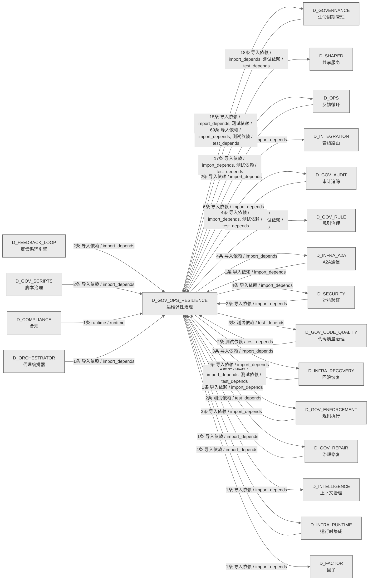

# 20_d_gov_ops_resilience / 运维弹性治理域 / Ops Resilience Governance

> **功能简介 / Overview**: 运维弹性治理，负责运维治理、安全治理、弹性治理和升级协议

> **文档作用 / Purpose**: 展示 运维弹性治理（D_GOV_OPS_RESILIENCE）功能域的域内依赖关系、跨域依赖关系，模块信息（成熟度/中英文名/大白话/文件路径）内嵌于 Mermaid 节点，供架构审查和域治理参考。

> 本文档由 generate_domain_doc.py 从 depgraph (PostgreSQL) 自动生成
> 数据源: depgraph (PostgreSQL) nodes表 + edges表

> **[可缩放 HTML 版 / Zoomable HTML](http://localhost:8765/docs/02_enterprise_architecture/02_domain_architecture_docs/_zoomable_html/20_d_gov_ops_resilience.html)** — Ctrl+滚轮缩放 ｜ 双击重置 ｜ Ctrl+Shift+D 切换拖动/选择模式

## 域基本信息 / Domain Overview

| 字段 | 值 | Field | Value |
|------|------|-------|-------|
| 编号 | 20 | Number | 20 |
| 域ID | D_GOV_OPS_RESILIENCE | Domain ID | D_GOV_OPS_RESILIENCE |
| 域名称 | 运维弹性治理 | Domain Name | Ops Resilience Governance |
| 层级 | L1 基础平台层 | Layer | L1 Foundation |
| 模块数 | 115 | Module Count | 115 |
| 域内依赖 | 25 | Internal Dependencies | 25 |
| 跨域入边 | 95 | Cross-domain Incoming | 95 |
| 跨域出边 | 94 | Cross-domain Outgoing | 94 |
| 设计态模块 | 0 | Design Modules | 0 |
| 生产态模块 | 115 | Production Modules | 115 |
| 容量 | 115/150 (正常) | Capacity | 115/150 (正常) |
| 描述 | 运维治理(ops_governance) | Description | 运维治理(ops_governance) |

## 域内依赖图 / Internal Dependency Diagram

> 依赖图内嵌在本文档中，IDE 可直接渲染；网页版可 Ctrl+滚轮缩放 + 拖动平移查看细节。
>
> **图例说明 / Legend**：
> - 🟦 **蓝色 = 运营态模块**（production，已上线运行）
> - 🟧 **橙色虚线 = 设计态模块**（design，蓝图阶段，代码未写）
> - **实线箭头 = 运营态依赖**（已生效的依赖关系）
> - **虚线箭头 = 非运营态依赖**（计划中/验证中的依赖关系）

### 全景图（全部模块，颜色区分运营态/设计态）

> 展示全部 115 个模块（生产态 115 + 设计态 0），含跨域依赖外部节点。节点含成熟度+名称+大白话/简介+文件路径。

```mermaid
%%{init: {'theme': 'base', 'themeVariables': {'primaryColor': '#eaeaea', 'primaryTextColor': '#333333', 'primaryBorderColor': '#666666', 'lineColor': '#666666', 'secondaryColor': '#eaeaea', 'tertiaryColor': '#eaeaea', 'fontSize': '14px'}}}%%
flowchart TD
    src_zephyr_governance_budget_enforcer_init_py["Init<br/>管理governance.budget-enforcer子包的加载和懒导入<br/>文件: budget-enforcer/__init__.py<br/>(生产态 / production)"]
    src_zephyr_governance_escalation_alternative_path_blocker_py["Alternative Path Blocker<br/>v0.13.0 替代工具路径拦截器<br/>文件: escalation/alternative_path_blocker.py<br/>(生产态 / production)"]
    src_zephyr_governance_escalation_consequence_manager_py["Consequence Manager<br/>治理/escalation包的consequence_manager模块<br/>文件: escalation/consequence_manager.py<br/>(生产态 / production)"]
    src_zephyr_governance_escalation_contracts_py["G-CT-003/004/006/008 消费端.'''<br/>G-CT-003 消费端 —<br/>Escalation.on_rollback_failure() + G-CT-004<br/>/G-CT-006/G-CT-...<br/>Contracts<br/>文件: escalation/contracts.py<br/>(生产态 / production)"]
    src_zephyr_governance_escalation_escalation_api_py["只读：api_keys<br/>Escalation API — v0.7.0 Service Account API:<br/>外部系统安全触发升级，不绕过引擎。<br/>文件: escalation/escalation_api.py<br/>(生产态 / production)"]
    src_zephyr_governance_escalation_escalation_fatigue_manager_py["每 owner 升级时间戳列表<br/>Escalation Fatigue Manager — v0.11.0<br/>升级疲劳管理器。<br/>文件: escalation/escalation_fatigue_manager.py<br/>(生产态 / production)"]
    src_zephyr_governance_escalation_escalation_loop_detector_py["只读：history<br/>Escalation Loop Detector — v0.10.0<br/>跨模块升级循环: escalate->block->auto_gua...<br/>文件: escalation/escalation_loop_detector.py<br/>(生产态 / production)"]
    src_zephyr_governance_escalation_escalation_smoke_tests_py["Escalation Smoke Tests<br/>v0.11.0 升级协议烟雾测试<br/>文件: escalation/escalation_smoke_tests.py<br/>(生产态 / production)"]
    src_zephyr_governance_escalation_git_hook_pre_scanner_py["Git Hook Pre Scanner<br/>Git Hook Pre-Scanner — v0.14.0<br/>Git操作Hook预扫描器。<br/>文件: escalation/git_hook_pre_scanner.py<br/>(生产态 / production)"]
    src_zephyr_governance_escalation_human_factors_py["每 owner 通知计数<br/>Human Factors — v0.7.0 人因工程:<br/>通知疲劳管理+上下文简洁性+多通道notifications。<br/>文件: escalation/human_factors.py<br/>(生产态 / production)"]
    src_zephyr_governance_escalation_identity_verifier_py["Identity Verifier<br/>D-022-12 Agent身份验证器:<br/>session_id+role+capability三元<br/>文件: escalation/identity_verifier.py<br/>(生产态 / production)"]
    src_zephyr_governance_escalation_incident_response_py["Incident Response<br/>治理/escalation包的incident_response模块<br/>文件: escalation/incident_response.py<br/>(生产态 / production)"]
    src_zephyr_governance_escalation_owner_absent_py["只读：data_dir<br/>Owner Absent — 人力缺席分级处置。<br/>文件: escalation/owner_absent.py<br/>(生产态 / production)"]
    src_zephyr_governance_escalation_result_types_py["Result Types<br/>G-CT-003 — RollbackResult backward-compat<br/>re-export facade.<br/>文件: escalation/result_types.py<br/>(生产态 / production)"]
    src_zephyr_governance_escalation_spof_checker_py["Spof Checker<br/>治理/escalation包的spof_checker模块<br/>文件: escalation/spof_checker.py<br/>(生产态 / production)"]
    src_zephyr_governance_escalation_triage_py["Triage<br/>G2 Triage 门禁 — 知识分类评分（T-2-13-B）<br/>文件: escalation/triage.py<br/>(生产态 / production)"]
    src_zephyr_governance_ops_governance_agent_dispatch_py["Agent Dispatch<br/>治理/ops governance包的agent_dispatch模块<br/>文件: ops_governance/agent_dispatch.py<br/>(生产态 / production)"]
    src_zephyr_governance_ops_governance_auto_runner_py["治理脚本自动运行/自动关闭调度器.<br/>GovernanceAutoRunner — 治理脚本自动运行<br/>/自动关闭调度器.<br/>Auto Runner<br/>文件: ops_governance/auto_runner.py<br/>(生产态 / production)"]
    src_zephyr_governance_ops_governance_bandwidth_optimizer_py["每维度 self-normalize 到 (0,1) 范围<br/>治理/ops governance包的bandwidth_optimizer模块<br/>Bandwidth Optimizer<br/>文件: ops_governance/bandwidth_optimizer.py<br/>(生产态 / production)"]
    src_zephyr_governance_ops_governance_clock_guard_py["只读：monotonic_start<br/>Clock Guard — v0.8.0 时钟完整性防御:<br/>NTP漂移检测+wall clock monotonic验证。<br/>文件: ops_governance/clock_guard.py<br/>(生产态 / production)"]
    src_zephyr_governance_ops_governance_coldstart_manager_py["Coldstart Manager<br/>v0.7.0 冷启动管理器: escalation<br/>rules加载+引擎初始化+健<br/>文件: ops_governance/coldstart_manager.py<br/>(生产态 / production)"]
    src_zephyr_governance_ops_governance_daily_ops_py["Daily Ops<br/>治理/ops governance包的daily_ops模块<br/>文件: ops_governance/daily_ops.py<br/>(生产态 / production)"]
    src_zephyr_governance_ops_governance_decision_fatigue_py["Decision Fatigue<br/>治理/ops governance包的decision_fatigue模块<br/>文件: ops_governance/decision_fatigue.py<br/>(生产态 / production)"]
    src_zephyr_governance_ops_governance_environment_manager_py["Environment Manager<br/>治理/ops governance包的environment_manager模块<br/>文件: ops_governance/environment_manager.py<br/>(生产态 / production)"]
    src_zephyr_governance_ops_governance_interrupt_handler_py["只读：signal<br/>Interrupt Handler — D-022-06 硬中断处理器:<br/>Owner紧急中断+优雅停止+状态保存。<br/>文件: ops_governance/interrupt_handler.py<br/>(生产态 / production)"]
    src_zephyr_governance_ops_governance_maintenance_window_adapter_py["Maintenance Window Adapter<br/>v0.10.0 计划维护窗口适配器<br/>文件: ops_governance<br/>/maintenance_window_adapter.py<br/>(生产态 / production)"]
    src_zephyr_governance_ops_governance_ops_foundation_py["Ops Foundation<br/>治理/ops governance包的ops_foundation模块<br/>文件: ops_governance/ops_foundation.py<br/>(生产态 / production)"]
    src_zephyr_governance_ops_governance_parent_child_attributor_py["只读：max_depth<br/>治理/ops governance包的parent_child_attributor模<br/>块<br/>Parent Child Attributor<br/>文件: ops_governance/parent_child_attributor.py<br/>(生产态 / production)"]
    src_zephyr_governance_ops_governance_self_budget_tracker_py["Self Budget Tracker<br/>治理/ops governance包的self_budget_tracker模块<br/>文件: ops_governance/self_budget_tracker.py<br/>(生产态 / production)"]
    src_zephyr_governance_ops_governance_service_registration_py["将 D-DATA 实现注册到 ServiceRegistry<br/>D-DATA -> ServiceRegistry 注册模块<br/>Service Registration<br/>文件: ops_governance/service_registration.py<br/>(生产态 / production)"]
    src_zephyr_governance_ops_governance_startup_shutdown_py["Startup Shutdown<br/>治理/ops governance包的startup_shutdown模块<br/>文件: ops_governance/startup_shutdown.py<br/>(生产态 / production)"]
    src_zephyr_governance_ops_governance_startup_shutdown_cli_py["Startup Shutdown Cli<br/>治理/ops governance包的startup_shutdown_cli模块<br/>文件: ops_governance/startup_shutdown_cli.py<br/>(生产态 / production)"]
    src_zephyr_governance_ops_governance_time_sync_py["Time Sync<br/>治理/ops governance包的time_sync模块<br/>文件: ops_governance/time_sync.py<br/>(生产态 / production)"]
    src_zephyr_governance_ops_governance_timeout_guard_py["只读：timeouts<br/>治理/ops governance包的timeout_guard模块<br/>Timeout Guard<br/>文件: ops_governance/timeout_guard.py<br/>(生产态 / production)"]
    src_zephyr_governance_resilience_governance_init_py["Init<br/>管理governance.resilience_governance子包的加载和<br/>懒导入<br/>文件: resilience_governance/__init__.py<br/>(生产态 / production)"]
    src_zephyr_governance_resilience_governance_account_isolator_py["Account Isolator<br/>v0.10.0 多账户升级隔离器<br/>文件: resilience_governance/account_isolator.py<br/>(生产态 / production)"]
    src_zephyr_governance_resilience_governance_broker_resilience_py["Broker Resilience<br/>治理/resilience<br/>governance包的broker_resilience模块<br/>文件: resilience_governance/broker_resilience.py<br/>(生产态 / production)"]
    src_zephyr_governance_resilience_governance_bus_factor_defense_py["Bus Factor Defense<br/>治理/resilience<br/>governance包的bus_factor_defense模块<br/>文件: resilience_governance<br/>/bus_factor_defense.py<br/>(生产态 / production)"]
    src_zephyr_governance_resilience_governance_decision_fatigue_cli_py["Decision Fatigue Cli<br/>治理/resilience<br/>governance包的decision_fatigue_cli模块<br/>文件: resilience_governance<br/>/decision_fatigue_cli.py<br/>(生产态 / production)"]
    src_zephyr_governance_resilience_governance_f5_boot_integration_py["启动/关闭结果<br/>F5BootIntegration — F5 自动启动/关闭集成<br/>(MOD-INF-022 §2).<br/>F5 Boot Integration<br/>文件: resilience_governance<br/>/f5_boot_integration.py<br/>(生产态 / production)"]
    src_zephyr_governance_resilience_governance_f5_event_subscriber_py["订阅操作结果<br/>F5EventSubscriber — F5 事件启动机制<br/>(MOD-INF-022 §3).<br/>F5 Event Subscriber<br/>文件: resilience_governance<br/>/f5_event_subscriber.py<br/>(生产态 / production)"]
    src_zephyr_governance_resilience_governance_f5_shutdown_manager_py["5.66.6 修复：白名单校验表名，仅允许已知表名用于<br/>SQL 拼接<br/>F5ShutdownManager — F5 自动关闭/状态持久化<br/>/信号处理 (MOD-INF-022 §2).<br/>F5 Shutdown Manager<br/>文件: resilience_governance<br/>/f5_shutdown_manager.py<br/>(生产态 / production)"]
    src_zephyr_governance_resilience_governance_fail_mode_manager_py["只读：state<br/>治理/resilience<br/>governance包的fail_mode_manager模块<br/>Fail Mode Manager<br/>文件: resilience_governance/fail_mode_manager.py<br/>(生产态 / production)"]
    src_zephyr_governance_resilience_governance_fault_tolerance_py["Fault Tolerance<br/>治理/resilience<br/>governance包的fault_tolerance模块<br/>文件: resilience_governance/fault_tolerance.py<br/>(生产态 / production)"]
    src_zephyr_governance_resilience_governance_last_resort_watchdog_py["只读：activated<br/>Last Resort Watchdog — v0.8.0 终极逃生舱:<br/>所有escalation失败后的final fallba...<br/>文件: resilience_governance<br/>/last_resort_watchdog.py<br/>(生产态 / production)"]
    src_zephyr_governance_resilience_governance_offline_autonomy_py["Offline Autonomy<br/>治理/resilience<br/>governance包的offline_autonomy模块<br/>文件: resilience_governance/offline_autonomy.py<br/>(生产态 / production)"]
    src_zephyr_governance_resilience_governance_offline_resilience_py["Offline Resilience<br/>治理/resilience<br/>governance包的offline_resilience模块<br/>文件: resilience_governance<br/>/offline_resilience.py<br/>(生产态 / production)"]
    src_zephyr_governance_resilience_governance_policy_sandbox_py["初始化 PolicySandbox<br/>治理/resilience governance包的policy_sandbox模块<br/>Policy Sandbox<br/>文件: resilience_governance/policy_sandbox.py<br/>(生产态 / production)"]
    src_zephyr_governance_resilience_governance_process_isolator_py["只读：processes<br/>Process Isolator — v0.6.0 进程隔离器:<br/>engine运行在独立进程+资源限制+crash恢复。<br/>文件: resilience_governance/process_isolator.py<br/>(生产态 / production)"]
    src_zephyr_governance_resilience_governance_witness_isolation_py["只读：witnesses<br/>Witness Isolation — v0.8.0 Witness隔离:<br/>N版本decision验证+投票机制+majority...<br/>文件: resilience_governance/witness_isolation.py<br/>(生产态 / production)"]
    src_zephyr_governance_security_governance_init_py["Init<br/>管理governance.security_governance子包的加载和懒<br/>导入<br/>文件: security_governance/__init__.py<br/>(生产态 / production)"]
    src_zephyr_governance_security_governance_adversarial_tester_py["Adversarial Tester<br/>治理/security<br/>governance包的adversarial_tester模块<br/>文件: security_governance/adversarial_tester.py<br/>(生产态 / production)"]
    src_zephyr_governance_security_governance_anti_automation_bias_py["D-022-09 mandatory human oversight enforcement.<br/>Anti-Automation Bias — D-022-09 mandatory human<br/>oversight enforcement.<br/>Anti Automation Bias<br/>文件: security_governance<br/>/anti_automation_bias.py<br/>(生产态 / production)"]
    src_zephyr_governance_security_governance_bare_repo_scanner_py["Bare Repo Scanner<br/>v0.14.0 嵌入式裸仓库检测器<br/>文件: security_governance/bare_repo_scanner.py<br/>(生产态 / production)"]
    src_zephyr_governance_security_governance_compositional_safety_tester_py["Compositional Safety Tester<br/>v0.14.0 组合性不安全测试器<br/>文件: security_governance<br/>/compositional_safety_tester.py<br/>(生产态 / production)"]
    src_zephyr_governance_security_governance_config_scanner_py["只读：baseline<br/>Config Scanner — v0.9.0 AI配置文件注入扫描器:<br/>检测AI修改的配置+注入攻击。<br/>文件: security_governance/config_scanner.py<br/>(生产态 / production)"]
    src_zephyr_governance_security_governance_credential_guard_py["Credential Guard<br/>v0.7.0 密钥泄露防护: env检测+git<br/>log扫描+运行时脱敏<br/>文件: security_governance/credential_guard.py<br/>(生产态 / production)"]
    src_zephyr_governance_security_governance_default_security_gateway_py["' in finding` 语法<br/>DefaultSecurityGateway — SecurityGateway<br/>三层防御 OCP-004 实现<br/>Default Security Gateway<br/>文件: security_governance<br/>/default_security_gateway.py<br/>(生产态 / production)"]
    src_zephyr_governance_security_governance_ghost_scan_py["只读：registered_pids<br/>Ghost Scan — v0.8.0 幽灵进程检测: lingering<br/>process扫描+资源泄漏检测。<br/>文件: security_governance/ghost_scan.py<br/>(生产态 / production)"]
    src_zephyr_governance_security_governance_github_api_guard_py["只读：allowed_commands<br/>GitHub API Guard — v0.9.0 Comment and<br/>Control防御: PR评论命令注入检测+限制。<br/>文件: security_governance/github_api_guard.py<br/>(生产态 / production)"]
    src_zephyr_governance_security_governance_hooks_integrity_guard_py["只读：hooks_hashes<br/>Hooks Integrity Guard — v0.11.0<br/>Hooks自编辑防护器。<br/>文件: security_governance<br/>/hooks_integrity_guard.py<br/>(生产态 / production)"]
    src_zephyr_governance_security_governance_memory_poison_guard_py["只读：trusted_agents<br/>Memory Poison Guard — v0.9.0 记忆投毒防护:<br/>Memory写入内容审计+恶意注入检测。<br/>文件: security_governance/memory_poison_guard.py<br/>(生产态 / production)"]
    src_zephyr_governance_security_governance_persuasion_detector_py["Persuasion Detector<br/>D-022-09 心理说服检测: 对抗语气+恳求+绕过指令<br/>文件: security_governance/persuasion_detector.py<br/>(生产态 / production)"]
    src_zephyr_governance_security_governance_poison_cascade_detector_py["只读：suspicion_threshold<br/>治理/security<br/>governance包的poison_cascade_detector模块<br/>Poison Cascade Detector<br/>文件: security_governance<br/>/poison_cascade_detector.py<br/>(生产态 / production)"]
    src_zephyr_governance_security_governance_sbom_guard_py["只读：sbom<br/>SBOM Guard — v0.8.0 SBOM供应链防护:<br/>依赖版本锁定+脆弱性扫描+cve告警。<br/>文件: security_governance/sbom_guard.py<br/>(生产态 / production)"]
    src_zephyr_governance_security_governance_security_config_scanner_py["Security Config Scanner<br/>v0.13.0 缺失安全配置扫描器<br/>文件: security_governance<br/>/security_config_scanner.py<br/>(生产态 / production)"]
    src_zephyr_governance_security_governance_tamper_evident_log_py["5.17.5 修复：解析 HMAC 密钥<br/>治理/security<br/>governance包的tamper_evident_log模块<br/>Tamper Evident Log<br/>文件: security_governance/tamper_evident_log.py<br/>(生产态 / production)"]
    src_zephyr_governance_security_governance_vibe_security_verify_py["Vibe Security Verify<br/>Vibe Security Verifier — v0.9.0 Vibe<br/>Coding安全验证器: AI生成代码安全基线检查。<br/>文件: security_governance<br/>/vibe_security_verify.py<br/>(生产态 / production)"]
    src_zephyr_governance_security_governance_vibe_verify_integration_py["只读：scan_count<br/>VibeVerify Integration — v0.9.0<br/>VibeVerify集成器: auto_guard级别+增量修复+co...<br/>Vibe Verify Integration<br/>文件: security_governance<br/>/vibe_verify_integration.py<br/>(生产态 / production)"]
    tests_governance_budget_test_budget_enforcer_smoke_py["Test Budget Enforcer Smoke<br/>budget包的test_budget_enforcer_smoke模块<br/>文件: budget/test_budget_enforcer_smoke.py<br/>(生产态 / production)"]
    tests_governance_budget_test_burn_rate_monitor_py["Test Burn Rate Monitor<br/>budget包的test_burn_rate_monitor模块<br/>文件: budget/test_burn_rate_monitor.py<br/>(生产态 / production)"]
    tests_governance_budget_test_conversation_tax_detector_py["Test Conversation Tax Detector<br/>budget包的test_conversation_tax_detector模块<br/>文件: budget/test_conversation_tax_detector.py<br/>(生产态 / production)"]
    tests_governance_budget_test_cost_attributor_py["Test Cost Attributor<br/>budget包的test_cost_attributor模块<br/>文件: budget/test_cost_attributor.py<br/>(生产态 / production)"]
    tests_governance_budget_test_cost_budget_root_py["Test Cost Budget Root<br/>budget包的test_cost_budget_root模块<br/>文件: budget/test_cost_budget_root.py<br/>(生产态 / production)"]
    tests_governance_budget_test_cost_budget_unit_py["Test Cost Budget Unit<br/>Unit tests for cost_budget.py<br/>文件: budget/test_cost_budget_unit.py<br/>(生产态 / production)"]
    tests_governance_budget_test_cost_router_py["Test Cost Router<br/>budget包的test_cost_router模块<br/>文件: budget/test_cost_router.py<br/>(生产态 / production)"]
    tests_governance_budget_test_debt_projector_py["Test Debt Projector<br/>budget包的test_debt_projector模块<br/>文件: budget/test_debt_projector.py<br/>(生产态 / production)"]
    tests_governance_budget_test_degradation_py["Test Degradation<br/>budget包的test_degradation模块<br/>文件: budget/test_degradation.py<br/>(生产态 / production)"]
    tests_governance_budget_test_degradation_manager_py["Test Degradation Manager<br/>budget包的test_degradation_manager模块<br/>文件: budget/test_degradation_manager.py<br/>(生产态 / production)"]
    tests_governance_budget_test_error_budget_burst_limiter_py["Test Error Budget Burst Limiter<br/>budget包的test_error_budget_burst_limiter模块<br/>文件: budget/test_error_budget_burst_limiter.py<br/>(生产态 / production)"]
    tests_governance_budget_test_gct_024_hard_checks_py["GCT-024 硬检查：验证 BudgetEngine<br/>实例化、三维覆盖、策略文件存在'''<br/>budget包的test_gct_024_hard_checks模块<br/>Test Gct 024 Hard Checks<br/>文件: budget/test_gct_024_hard_checks.py<br/>(生产态 / production)"]
    tests_governance_budget_test_governance_budget_tracker_py["Test Governance Budget Tracker<br/>budget包的test_governance_budget_tracker模块<br/>文件: budget/test_governance_budget_tracker.py<br/>(生产态 / production)"]
    tests_governance_budget_test_pre_flight_gate_py["Test Pre Flight Gate<br/>budget包的test_pre_flight_gate模块<br/>文件: budget/test_pre_flight_gate.py<br/>(生产态 / production)"]
    tests_governance_budget_test_roi_calculator_py["Test Roi Calculator<br/>budget包的test_roi_calculator模块<br/>文件: budget/test_roi_calculator.py<br/>(生产态 / production)"]
    tests_governance_budget_test_tco_model_py["Test Tco Model<br/>budget包的test_tco_model模块<br/>文件: budget/test_tco_model.py<br/>(生产态 / production)"]
    tests_governance_context_governance_test_command_chain_length_gate_py["Test Command Chain Length Gate<br/>context<br/>governance包的test_command_chain_length_gate模块<br/>文件: context_governance<br/>/test_command_chain_length_gate.py<br/>(生产态 / production)"]
    tests_governance_orchestrator_test_engine_sandbox_py["filesystem/network/boundary isolation and<br/>integrity tests.'''<br/>EngineSandbox — filesystem/network/boundary<br/>isolation and integrity tests.<br/>Test Engine Sandbox<br/>文件: orchestrator/test_engine_sandbox.py<br/>(生产态 / production)"]
    tests_governance_orchestrator_test_gate_engine_unit_py["从 _registry.yaml 动态计算期望的 gate_id 集合<br/>测试套件：GateEngine + TaskRepository 门禁集成<br/>（T-2-19）<br/>Test Gate Engine Unit<br/>文件: orchestrator/test_gate_engine_unit.py<br/>(生产态 / production)"]
    tests_governance_orchestrator_test_mvep_orchestrator_py["Test Mvep Orchestrator<br/>编排包的test_mvep_orchestrator模块<br/>文件: orchestrator/test_mvep_orchestrator.py<br/>(生产态 / production)"]
    tests_governance_orchestrator_test_objective_tracker_py["Test Objective Tracker<br/>编排包的test_objective_tracker模块<br/>文件: orchestrator/test_objective_tracker.py<br/>(生产态 / production)"]
    tests_governance_orchestrator_test_prioritizer_py["Test Prioritizer<br/>编排包的test_prioritizer模块<br/>文件: orchestrator/test_prioritizer.py<br/>(生产态 / production)"]
    tests_governance_orchestrator_test_think_time_model_py["Test Think Time Model<br/>编排包的test_think_time_model模块<br/>文件: orchestrator/test_think_time_model.py<br/>(生产态 / production)"]
    tests_governance_orchestrator_test_verify_b54_b56_b59_deep_py["P0 inflation guard + block_sessions_count +<br/>timeout exemption'''<br/>Deeper integration test: P0 inflation guard +<br/>block_sessions_count + timeout ...<br/>Test Verify B54 B56 B59 Deep<br/>文件: orchestrator<br/>/test_verify_b54_b56_b59_deep.py<br/>(生产态 / production)"]
    src_zephyr_governance_budget_enforcer_init_py ~~~ src_zephyr_governance_escalation_alternative_path_blocker_py
    src_zephyr_governance_escalation_alternative_path_blocker_py ~~~ src_zephyr_governance_escalation_consequence_manager_py
    src_zephyr_governance_escalation_consequence_manager_py ~~~ src_zephyr_governance_escalation_contracts_py
    src_zephyr_governance_escalation_contracts_py ~~~ src_zephyr_governance_escalation_escalation_api_py
    src_zephyr_governance_escalation_escalation_api_py ~~~ src_zephyr_governance_escalation_escalation_fatigue_manager_py
    src_zephyr_governance_escalation_escalation_fatigue_manager_py ~~~ src_zephyr_governance_escalation_escalation_loop_detector_py
    src_zephyr_governance_escalation_escalation_loop_detector_py ~~~ src_zephyr_governance_escalation_escalation_smoke_tests_py
    src_zephyr_governance_escalation_escalation_smoke_tests_py ~~~ src_zephyr_governance_escalation_git_hook_pre_scanner_py
    src_zephyr_governance_escalation_git_hook_pre_scanner_py ~~~ src_zephyr_governance_escalation_human_factors_py
    src_zephyr_governance_escalation_human_factors_py ~~~ src_zephyr_governance_escalation_identity_verifier_py
    src_zephyr_governance_escalation_identity_verifier_py ~~~ src_zephyr_governance_escalation_incident_response_py
    src_zephyr_governance_escalation_incident_response_py ~~~ src_zephyr_governance_escalation_owner_absent_py
    src_zephyr_governance_escalation_owner_absent_py ~~~ src_zephyr_governance_escalation_result_types_py
    src_zephyr_governance_escalation_result_types_py ~~~ src_zephyr_governance_escalation_spof_checker_py
    src_zephyr_governance_escalation_spof_checker_py ~~~ src_zephyr_governance_escalation_triage_py
    src_zephyr_governance_escalation_triage_py ~~~ src_zephyr_governance_ops_governance_agent_dispatch_py
    src_zephyr_governance_ops_governance_agent_dispatch_py ~~~ src_zephyr_governance_ops_governance_auto_runner_py
    src_zephyr_governance_ops_governance_auto_runner_py ~~~ src_zephyr_governance_ops_governance_bandwidth_optimizer_py
    src_zephyr_governance_ops_governance_bandwidth_optimizer_py ~~~ src_zephyr_governance_ops_governance_clock_guard_py
    src_zephyr_governance_ops_governance_clock_guard_py ~~~ src_zephyr_governance_ops_governance_coldstart_manager_py
    src_zephyr_governance_ops_governance_coldstart_manager_py ~~~ src_zephyr_governance_ops_governance_daily_ops_py
    src_zephyr_governance_ops_governance_daily_ops_py ~~~ src_zephyr_governance_ops_governance_decision_fatigue_py
    src_zephyr_governance_ops_governance_decision_fatigue_py ~~~ src_zephyr_governance_ops_governance_environment_manager_py
    src_zephyr_governance_ops_governance_environment_manager_py ~~~ src_zephyr_governance_ops_governance_interrupt_handler_py
    src_zephyr_governance_ops_governance_interrupt_handler_py ~~~ src_zephyr_governance_ops_governance_maintenance_window_adapter_py
    src_zephyr_governance_ops_governance_maintenance_window_adapter_py ~~~ src_zephyr_governance_ops_governance_ops_foundation_py
    src_zephyr_governance_ops_governance_ops_foundation_py ~~~ src_zephyr_governance_ops_governance_parent_child_attributor_py
    src_zephyr_governance_ops_governance_parent_child_attributor_py ~~~ src_zephyr_governance_ops_governance_self_budget_tracker_py
    src_zephyr_governance_ops_governance_self_budget_tracker_py ~~~ src_zephyr_governance_ops_governance_service_registration_py
    src_zephyr_governance_ops_governance_service_registration_py ~~~ src_zephyr_governance_ops_governance_startup_shutdown_py
    src_zephyr_governance_ops_governance_startup_shutdown_py ~~~ src_zephyr_governance_ops_governance_startup_shutdown_cli_py
    src_zephyr_governance_ops_governance_startup_shutdown_cli_py ~~~ src_zephyr_governance_ops_governance_time_sync_py
    src_zephyr_governance_ops_governance_time_sync_py ~~~ src_zephyr_governance_ops_governance_timeout_guard_py
    src_zephyr_governance_ops_governance_timeout_guard_py ~~~ src_zephyr_governance_resilience_governance_init_py
    src_zephyr_governance_resilience_governance_init_py ~~~ src_zephyr_governance_resilience_governance_account_isolator_py
    src_zephyr_governance_resilience_governance_account_isolator_py ~~~ src_zephyr_governance_resilience_governance_broker_resilience_py
    src_zephyr_governance_resilience_governance_broker_resilience_py ~~~ src_zephyr_governance_resilience_governance_bus_factor_defense_py
    src_zephyr_governance_resilience_governance_bus_factor_defense_py ~~~ src_zephyr_governance_resilience_governance_decision_fatigue_cli_py
    src_zephyr_governance_resilience_governance_decision_fatigue_cli_py ~~~ src_zephyr_governance_resilience_governance_f5_boot_integration_py
    src_zephyr_governance_resilience_governance_f5_boot_integration_py ~~~ src_zephyr_governance_resilience_governance_f5_event_subscriber_py
    src_zephyr_governance_resilience_governance_f5_event_subscriber_py ~~~ src_zephyr_governance_resilience_governance_f5_shutdown_manager_py
    src_zephyr_governance_resilience_governance_f5_shutdown_manager_py ~~~ src_zephyr_governance_resilience_governance_fail_mode_manager_py
    src_zephyr_governance_resilience_governance_fail_mode_manager_py ~~~ src_zephyr_governance_resilience_governance_fault_tolerance_py
    src_zephyr_governance_resilience_governance_fault_tolerance_py ~~~ src_zephyr_governance_resilience_governance_last_resort_watchdog_py
    src_zephyr_governance_resilience_governance_last_resort_watchdog_py ~~~ src_zephyr_governance_resilience_governance_offline_autonomy_py
    src_zephyr_governance_resilience_governance_offline_autonomy_py ~~~ src_zephyr_governance_resilience_governance_offline_resilience_py
    src_zephyr_governance_resilience_governance_offline_resilience_py ~~~ src_zephyr_governance_resilience_governance_policy_sandbox_py
    src_zephyr_governance_resilience_governance_policy_sandbox_py ~~~ src_zephyr_governance_resilience_governance_process_isolator_py
    src_zephyr_governance_resilience_governance_process_isolator_py ~~~ src_zephyr_governance_resilience_governance_witness_isolation_py
    src_zephyr_governance_resilience_governance_witness_isolation_py ~~~ src_zephyr_governance_security_governance_init_py
    src_zephyr_governance_security_governance_init_py ~~~ src_zephyr_governance_security_governance_adversarial_tester_py
    src_zephyr_governance_security_governance_adversarial_tester_py ~~~ src_zephyr_governance_security_governance_anti_automation_bias_py
    src_zephyr_governance_security_governance_anti_automation_bias_py ~~~ src_zephyr_governance_security_governance_bare_repo_scanner_py
    src_zephyr_governance_security_governance_bare_repo_scanner_py ~~~ src_zephyr_governance_security_governance_compositional_safety_tester_py
    src_zephyr_governance_security_governance_compositional_safety_tester_py ~~~ src_zephyr_governance_security_governance_config_scanner_py
    src_zephyr_governance_security_governance_config_scanner_py ~~~ src_zephyr_governance_security_governance_credential_guard_py
    src_zephyr_governance_security_governance_credential_guard_py ~~~ src_zephyr_governance_security_governance_default_security_gateway_py
    src_zephyr_governance_security_governance_default_security_gateway_py ~~~ src_zephyr_governance_security_governance_ghost_scan_py
    src_zephyr_governance_security_governance_ghost_scan_py ~~~ src_zephyr_governance_security_governance_github_api_guard_py
    src_zephyr_governance_security_governance_github_api_guard_py ~~~ src_zephyr_governance_security_governance_hooks_integrity_guard_py
    src_zephyr_governance_security_governance_hooks_integrity_guard_py ~~~ src_zephyr_governance_security_governance_memory_poison_guard_py
    src_zephyr_governance_security_governance_memory_poison_guard_py ~~~ src_zephyr_governance_security_governance_persuasion_detector_py
    src_zephyr_governance_security_governance_persuasion_detector_py ~~~ src_zephyr_governance_security_governance_poison_cascade_detector_py
    src_zephyr_governance_security_governance_poison_cascade_detector_py ~~~ src_zephyr_governance_security_governance_sbom_guard_py
    src_zephyr_governance_security_governance_sbom_guard_py ~~~ src_zephyr_governance_security_governance_security_config_scanner_py
    src_zephyr_governance_security_governance_security_config_scanner_py ~~~ src_zephyr_governance_security_governance_tamper_evident_log_py
    src_zephyr_governance_security_governance_tamper_evident_log_py ~~~ src_zephyr_governance_security_governance_vibe_security_verify_py
    src_zephyr_governance_security_governance_vibe_security_verify_py ~~~ src_zephyr_governance_security_governance_vibe_verify_integration_py
    src_zephyr_governance_security_governance_vibe_verify_integration_py ~~~ tests_governance_budget_test_budget_enforcer_smoke_py
    tests_governance_budget_test_budget_enforcer_smoke_py ~~~ tests_governance_budget_test_burn_rate_monitor_py
    tests_governance_budget_test_burn_rate_monitor_py ~~~ tests_governance_budget_test_conversation_tax_detector_py
    tests_governance_budget_test_conversation_tax_detector_py ~~~ tests_governance_budget_test_cost_attributor_py
    tests_governance_budget_test_cost_attributor_py ~~~ tests_governance_budget_test_cost_budget_root_py
    tests_governance_budget_test_cost_budget_root_py ~~~ tests_governance_budget_test_cost_budget_unit_py
    tests_governance_budget_test_cost_budget_unit_py ~~~ tests_governance_budget_test_cost_router_py
    tests_governance_budget_test_cost_router_py ~~~ tests_governance_budget_test_debt_projector_py
    tests_governance_budget_test_debt_projector_py ~~~ tests_governance_budget_test_degradation_py
    tests_governance_budget_test_degradation_py ~~~ tests_governance_budget_test_degradation_manager_py
    tests_governance_budget_test_degradation_manager_py ~~~ tests_governance_budget_test_error_budget_burst_limiter_py
    tests_governance_budget_test_error_budget_burst_limiter_py ~~~ tests_governance_budget_test_gct_024_hard_checks_py
    tests_governance_budget_test_gct_024_hard_checks_py ~~~ tests_governance_budget_test_governance_budget_tracker_py
    tests_governance_budget_test_governance_budget_tracker_py ~~~ tests_governance_budget_test_pre_flight_gate_py
    tests_governance_budget_test_pre_flight_gate_py ~~~ tests_governance_budget_test_roi_calculator_py
    tests_governance_budget_test_roi_calculator_py ~~~ tests_governance_budget_test_tco_model_py
    tests_governance_budget_test_tco_model_py ~~~ tests_governance_context_governance_test_command_chain_length_gate_py
    tests_governance_context_governance_test_command_chain_length_gate_py ~~~ tests_governance_orchestrator_test_engine_sandbox_py
    tests_governance_orchestrator_test_engine_sandbox_py ~~~ tests_governance_orchestrator_test_gate_engine_unit_py
    tests_governance_orchestrator_test_gate_engine_unit_py ~~~ tests_governance_orchestrator_test_mvep_orchestrator_py
    tests_governance_orchestrator_test_mvep_orchestrator_py ~~~ tests_governance_orchestrator_test_objective_tracker_py
    tests_governance_orchestrator_test_objective_tracker_py ~~~ tests_governance_orchestrator_test_prioritizer_py
    tests_governance_orchestrator_test_prioritizer_py ~~~ tests_governance_orchestrator_test_think_time_model_py
    tests_governance_orchestrator_test_think_time_model_py ~~~ tests_governance_orchestrator_test_verify_b54_b56_b59_deep_py
    src_zephyr_governance_escalation_escalation_engine_py["空 Protocol 作为 12 个异构 detector<br/>类的鸭子类型标记<br/>Escalation Engine — MOD-INF-022<br/>文件: escalation/escalation_engine.py<br/>(生产态 / production)"]
    src_zephyr_governance_ops_governance_burn_rate_monitor_py["公共接口：wasserstein_1d<br/>Burn Rate Monitor — MOD-INF-024<br/>文件: ops_governance/burn_rate_monitor.py<br/>(生产态 / production)"]
    src_zephyr_governance_ops_governance_cost_attributor_py["只读：attributions<br/>治理/ops governance包的cost_attributor模块<br/>Cost Attributor<br/>文件: ops_governance/cost_attributor.py<br/>(生产态 / production)"]
    src_zephyr_governance_ops_governance_cost_router_py["Cost Router<br/>治理/ops governance包的cost_router模块<br/>文件: ops_governance/cost_router.py<br/>(生产态 / production)"]
    src_zephyr_governance_ops_governance_degradation_manager_py["Degradation Manager<br/>治理/ops governance包的degradation_manager模块<br/>文件: ops_governance/degradation_manager.py<br/>(生产态 / production)"]
    src_zephyr_governance_ops_governance_error_budget_burst_limiter_py["只读：burst_window_s<br/>Error Budget Burst Limiter — v0.11.0<br/>错误预算Burst限流器。<br/>文件: ops_governance<br/>/error_budget_burst_limiter.py<br/>(生产态 / production)"]
    src_zephyr_governance_ops_governance_event_hook_py["声明式事件钩子注册表<br/>EventHook — 声明式任务系统事件订阅<br/>Event Hook<br/>文件: ops_governance/event_hook.py<br/>(生产态 / production)"]
    src_zephyr_governance_ops_governance_phase_manager_py["ZephyrAlpha 施工阶段门控引擎.<br/>Phase Manager — ZephyrAlpha 施工阶段门控引擎.<br/>文件: ops_governance/phase_manager.py<br/>(生产态 / production)"]
    src_zephyr_governance_ops_governance_roi_calculator_py["Roi Calculator<br/>治理/ops governance包的roi_calculator模块<br/>文件: ops_governance/roi_calculator.py<br/>(生产态 / production)"]
    src_zephyr_governance_ops_governance_stream_abort_guard_py["流式中断守卫<br/>StreamAbortGuard — 流式中断守卫<br/>Stream Abort Guard<br/>文件: ops_governance/stream_abort_guard.py<br/>(生产态 / production)"]
    src_zephyr_governance_ops_governance_tco_model_py["Tco Model<br/>治理/ops governance包的tco_model模块<br/>文件: ops_governance/tco_model.py<br/>(生产态 / production)"]
    src_zephyr_governance_resilience_governance_blast_radius_py["depgraph YAML 加载或结构校验失败.'''<br/>blast_radius — MOD-INF-028 §3.1 Stage 9<br/>Blast Radius<br/>文件: resilience_governance/blast_radius.py<br/>(生产态 / production)"]
    src_zephyr_governance_resilience_governance_deadlock_detector_py["Deadlock Detector<br/>D-022-04 多Agent死锁+循环依赖检测+超时破解<br/>文件: resilience_governance/deadlock_detector.py<br/>(生产态 / production)"]
    src_zephyr_governance_resilience_governance_decision_fatigue_py["Decision Fatigue<br/>治理/resilience<br/>governance包的decision_fatigue模块<br/>文件: resilience_governance/decision_fatigue.py<br/>(生产态 / production)"]
    src_zephyr_governance_resilience_governance_engine_sandbox_py["Engine Sandbox<br/>EngineSandbox — D-022-08 OS-level sandboxing<br/>for the escalation engine.<br/>文件: resilience_governance/engine_sandbox.py<br/>(生产态 / production)"]
    src_zephyr_governance_security_governance_api_response_sanitizer_py["Api Response Sanitizer<br/>API Response Sanitizer — v0.9.0 API响应清洗器:<br/>外部API返回内容清洗+injection...<br/>文件: security_governance<br/>/api_response_sanitizer.py<br/>(生产态 / production)"]
    src_zephyr_governance_security_governance_ipi_defense_py["只读：block_threshold<br/>治理/security governance包的ipi_defense模块<br/>Ipi Defense<br/>文件: security_governance/ipi_defense.py<br/>(生产态 / production)"]
    src_zephyr_governance_security_governance_security_gateway_base_py["审计动作类型'''<br/>D_COMPLIANCE — Governance & Compliance Layer<br/>Security Gateway Base<br/>文件: security_governance<br/>/security_gateway_base.py<br/>(生产态 / production)"]
    src_zephyr_governance_escalation_escalation_engine_py ~~~ src_zephyr_governance_ops_governance_burn_rate_monitor_py
    src_zephyr_governance_ops_governance_burn_rate_monitor_py ~~~ src_zephyr_governance_ops_governance_cost_attributor_py
    src_zephyr_governance_ops_governance_cost_attributor_py ~~~ src_zephyr_governance_ops_governance_cost_router_py
    src_zephyr_governance_ops_governance_cost_router_py ~~~ src_zephyr_governance_ops_governance_degradation_manager_py
    src_zephyr_governance_ops_governance_degradation_manager_py ~~~ src_zephyr_governance_ops_governance_error_budget_burst_limiter_py
    src_zephyr_governance_ops_governance_error_budget_burst_limiter_py ~~~ src_zephyr_governance_ops_governance_event_hook_py
    src_zephyr_governance_ops_governance_event_hook_py ~~~ src_zephyr_governance_ops_governance_phase_manager_py
    src_zephyr_governance_ops_governance_phase_manager_py ~~~ src_zephyr_governance_ops_governance_roi_calculator_py
    src_zephyr_governance_ops_governance_roi_calculator_py ~~~ src_zephyr_governance_ops_governance_stream_abort_guard_py
    src_zephyr_governance_ops_governance_stream_abort_guard_py ~~~ src_zephyr_governance_ops_governance_tco_model_py
    src_zephyr_governance_ops_governance_tco_model_py ~~~ src_zephyr_governance_resilience_governance_blast_radius_py
    src_zephyr_governance_resilience_governance_blast_radius_py ~~~ src_zephyr_governance_resilience_governance_deadlock_detector_py
    src_zephyr_governance_resilience_governance_deadlock_detector_py ~~~ src_zephyr_governance_resilience_governance_decision_fatigue_py
    src_zephyr_governance_resilience_governance_decision_fatigue_py ~~~ src_zephyr_governance_resilience_governance_engine_sandbox_py
    src_zephyr_governance_resilience_governance_engine_sandbox_py ~~~ src_zephyr_governance_security_governance_api_response_sanitizer_py
    src_zephyr_governance_security_governance_api_response_sanitizer_py ~~~ src_zephyr_governance_security_governance_ipi_defense_py
    src_zephyr_governance_security_governance_ipi_defense_py ~~~ src_zephyr_governance_security_governance_security_gateway_base_py
    src_zephyr_governance_escalation_escalation_metrics_py["Escalation Metrics<br/>D-022-07 指标收集器: 升级率/误升级率/响应延迟<br/>文件: escalation/escalation_metrics.py<br/>(生产态 / production)"]
    src_zephyr_governance_escalation_escalation_models_py["Escalation Models<br/>Escalation Protocol data models — MOD-INF-022<br/>文件: escalation/escalation_models.py<br/>(生产态 / production)"]
    src_zephyr_governance_ops_governance_phase_check_registry_py["44 个阶段门控检查映射.<br/>PhaseManager->GateEngine 检查注册表桥梁 — 44<br/>个阶段门控检查映射.<br/>Phase Check Registry<br/>文件: ops_governance/phase_check_registry.py<br/>(生产态 / production)"]
    src_zephyr_governance_resilience_governance_circuit_breaker_py["只读：failure_count<br/>Circuit Breaker — MOD-INF-022<br/>文件: resilience_governance/circuit_breaker.py<br/>(生产态 / production)"]
    src_zephyr_governance_escalation_escalation_metrics_py ~~~ src_zephyr_governance_escalation_escalation_models_py
    src_zephyr_governance_escalation_escalation_models_py ~~~ src_zephyr_governance_ops_governance_phase_check_registry_py
    src_zephyr_governance_ops_governance_phase_check_registry_py ~~~ src_zephyr_governance_resilience_governance_circuit_breaker_py
    src_zephyr_governance_escalation_escalation_api_py -->|导入依赖 / import_depends| src_zephyr_governance_escalation_escalation_models_py
    src_zephyr_governance_escalation_escalation_engine_py -->|导入依赖 / import_depends| src_zephyr_governance_escalation_escalation_models_py
    src_zephyr_governance_escalation_escalation_engine_py -->|导入依赖 / import_depends| src_zephyr_governance_escalation_escalation_metrics_py
    src_zephyr_governance_escalation_escalation_engine_py -->|导入依赖 / import_depends| src_zephyr_governance_resilience_governance_circuit_breaker_py
    src_zephyr_governance_ops_governance_auto_runner_py -->|导入依赖 / import_depends| src_zephyr_governance_ops_governance_phase_check_registry_py
    src_zephyr_governance_ops_governance_auto_runner_py -->|导入依赖 / import_depends| src_zephyr_governance_ops_governance_phase_manager_py
    src_zephyr_governance_ops_governance_phase_manager_py -->|导入依赖 / import_depends| src_zephyr_governance_ops_governance_phase_check_registry_py
    src_zephyr_governance_resilience_governance_decision_fatigue_cli_py -->|导入依赖 / import_depends| src_zephyr_governance_resilience_governance_decision_fatigue_py
    src_zephyr_governance_resilience_governance_f5_boot_integration_py -->|导入依赖 / import_depends| src_zephyr_governance_escalation_escalation_engine_py
    src_zephyr_governance_resilience_governance_f5_boot_integration_py -->|导入依赖 / import_depends| src_zephyr_governance_ops_governance_event_hook_py
    src_zephyr_governance_resilience_governance_f5_boot_integration_py -->|导入依赖 / import_depends| src_zephyr_governance_resilience_governance_deadlock_detector_py
    src_zephyr_governance_resilience_governance_f5_event_subscriber_py -->|导入依赖 / import_depends| src_zephyr_governance_escalation_escalation_models_py
    src_zephyr_governance_resilience_governance_init_py -->|config_depends / config_depends| src_zephyr_governance_resilience_governance_blast_radius_py
    src_zephyr_governance_security_governance_adversarial_tester_py -->|导入依赖 / import_depends| src_zephyr_governance_ops_governance_stream_abort_guard_py
    src_zephyr_governance_security_governance_adversarial_tester_py -->|导入依赖 / import_depends| src_zephyr_governance_security_governance_ipi_defense_py
    src_zephyr_governance_security_governance_default_security_gateway_py -->|导入依赖 / import_depends| src_zephyr_governance_security_governance_security_gateway_base_py
    src_zephyr_governance_security_governance_init_py -->|config_depends / config_depends| src_zephyr_governance_security_governance_api_response_sanitizer_py
    tests_governance_budget_test_cost_attributor_py -->|测试依赖 / test_depends| src_zephyr_governance_ops_governance_cost_attributor_py
    tests_governance_budget_test_burn_rate_monitor_py -->|测试依赖 / test_depends| src_zephyr_governance_ops_governance_burn_rate_monitor_py
    tests_governance_budget_test_error_budget_burst_limiter_py -->|测试依赖 / test_depends| src_zephyr_governance_ops_governance_error_budget_burst_limiter_py
    tests_governance_budget_test_degradation_manager_py -->|测试依赖 / test_depends| src_zephyr_governance_ops_governance_degradation_manager_py
    tests_governance_budget_test_cost_router_py -->|测试依赖 / test_depends| src_zephyr_governance_ops_governance_cost_router_py
    tests_governance_budget_test_tco_model_py -->|测试依赖 / test_depends| src_zephyr_governance_ops_governance_tco_model_py
    tests_governance_budget_test_roi_calculator_py -->|测试依赖 / test_depends| src_zephyr_governance_ops_governance_roi_calculator_py
    tests_governance_orchestrator_test_engine_sandbox_py -->|测试依赖 / test_depends| src_zephyr_governance_resilience_governance_engine_sandbox_py
    D_SHARED["共享服务<br/>共享服务，负责跨域共享的工具、协议和基础服务<br/>Shared Services<br/>跨域节点 / cross-domain<br/>(生产态 / production)"]
    src_zephyr_governance_ops_governance_environment_manager_py -->|导入依赖 / import_depends| D_SHARED
    src_zephyr_governance_security_governance_tamper_evident_log_py -->|导入依赖 / import_depends| D_SHARED
    D_OPS["反馈循环<br/>反馈循环，负责系统运行反馈、性能监控和自动调优闭<br/>环<br/>Feedback Loop<br/>跨域节点 / cross-domain<br/>(生产态 / production)"]
    tests_governance_budget_test_pre_flight_gate_py -->|测试依赖 / test_depends| D_OPS
    D_GOV_RULE["规则治理<br/>规则治理，负责规则注册、规则版本和规则依赖管理<br/>Rule Governance<br/>跨域节点 / cross-domain<br/>(生产态 / production)"]
    src_zephyr_governance_escalation_triage_py -->|导入依赖 / import_depends| D_GOV_RULE
    D_INFRA_A2A["A2A通信<br/>Agent 与 Agent 之间的通信协议层，负责 AI<br/>代理间的消息传递、请求路由和协议适配<br/>A2A Communication<br/>跨域节点 / cross-domain<br/>(生产态 / production)"]
    src_zephyr_governance_resilience_governance_offline_resilience_py -->|导入依赖 / import_depends| D_INFRA_A2A
    D_GOVERNANCE["生命周期管理<br/>生命周期管理，负责蓝图/模块<br/>/任务的声明周期管理和元数据治理<br/>Lifecycle Management<br/>跨域节点 / cross-domain<br/>(生产态 / production)"]
    src_zephyr_governance_ops_governance_service_registration_py -->|导入依赖 / import_depends| D_GOVERNANCE
    D_INTEGRATION["管线路由<br/>管线路由，负责跨域数据流路由、管道编排和集成适配<br/>Pipeline Routing<br/>跨域节点 / cross-domain<br/>(生产态 / production)"]
    src_zephyr_governance_ops_governance_service_registration_py -->|导入依赖 / import_depends| D_INTEGRATION
    src_zephyr_governance_ops_governance_phase_check_registry_py -->|导入依赖 / import_depends| D_OPS
    src_zephyr_governance_resilience_governance_f5_shutdown_manager_py -->|导入依赖 / import_depends| D_GOVERNANCE
    src_zephyr_governance_ops_governance_phase_check_registry_py -->|导入依赖 / import_depends| D_INTEGRATION
    D_GOV_CODE_QUALITY["代码质量治理<br/>代码质量治理，负责代码去重引擎、函数重复检测、AS<br/>T语义分析和提交门禁引擎<br/>Code Quality Governance<br/>跨域节点 / cross-domain<br/>(生产态 / production)"]
    tests_governance_orchestrator_test_prioritizer_py -->|测试依赖 / test_depends| D_GOV_CODE_QUALITY
    D_INFRA_RECOVERY["回滚恢复<br/>回滚恢复，负责系统故障时的状态回滚、事务补偿和恢<br/>复编排<br/>Rollback Recovery<br/>跨域节点 / cross-domain<br/>(生产态 / production)"]
    src_zephyr_governance_ops_governance_phase_check_registry_py -->|导入依赖 / import_depends| D_INFRA_RECOVERY
    tests_governance_orchestrator_test_gate_engine_unit_py -->|测试依赖 / test_depends| D_SHARED
    tests_governance_budget_test_degradation_py -->|测试依赖 / test_depends| D_GOV_CODE_QUALITY
    src_zephyr_governance_resilience_governance_offline_autonomy_py -->|导入依赖 / import_depends| D_INFRA_A2A
    D_COMPLIANCE["合规<br/>合规，负责交易合规检查、规则引擎和合规报告<br/>Compliance<br/>跨域节点 / cross-domain<br/>(设计态 / design)"]
    D_COMPLIANCE -.->|runtime / runtime| src_zephyr_governance_security_governance_security_gateway_base_py
    D_GOVERNANCE -->|测试依赖 / test_depends| src_zephyr_governance_escalation_consequence_manager_py
    D_GOVERNANCE -->|导入依赖 / import_depends| src_zephyr_governance_escalation_escalation_engine_py
    D_GOV_REPAIR["治理修复<br/>治理修复，负责治理问题自动修复和修复策略管理<br/>Governance Repair<br/>跨域节点 / cross-domain<br/>(生产态 / production)"]
    D_GOV_REPAIR -->|导入依赖 / import_depends| src_zephyr_governance_ops_governance_timeout_guard_py
    D_FEEDBACK_LOOP["反馈循环引擎<br/>反馈循环引擎，负责系统自我改进闭环：异常检测、根<br/>因诊断、自动修复和自我进化<br/>Feedback Loop Engine<br/>跨域节点 / cross-domain<br/>(生产态 / production)"]
    D_FEEDBACK_LOOP -->|导入依赖 / import_depends| src_zephyr_governance_escalation_escalation_models_py
    D_GOVERNANCE -->|测试依赖 / test_depends| src_zephyr_governance_ops_governance_timeout_guard_py
    D_GOVERNANCE -->|测试依赖 / test_depends| src_zephyr_governance_security_governance_compositional_safety_tester_py
    D_OPS -->|导入依赖 / import_depends| src_zephyr_governance_security_governance_ipi_defense_py
    D_OPS -->|导入依赖 / import_depends| src_zephyr_governance_escalation_contracts_py
    D_GOVERNANCE -->|导入依赖 / import_depends| src_zephyr_governance_escalation_escalation_models_py
    D_GOVERNANCE -->|测试依赖 / test_depends| src_zephyr_governance_security_governance_poison_cascade_detector_py
    D_GOVERNANCE -->|测试依赖 / test_depends| src_zephyr_governance_escalation_result_types_py
    D_GOVERNANCE -->|测试依赖 / test_depends| src_zephyr_governance_resilience_governance_account_isolator_py
    D_GOVERNANCE -->|测试依赖 / test_depends| src_zephyr_governance_escalation_result_types_py
    D_GOVERNANCE -->|测试依赖 / test_depends| src_zephyr_governance_resilience_governance_last_resort_watchdog_py
    classDef production fill:#e1f5fe,stroke:#01579b,stroke-width:2px,color:#000
    classDef design fill:#fff3e0,stroke:#e65100,stroke-width:2px,color:#000,stroke-dasharray: 5 5
    classDef external_prod fill:#e8f4fd,stroke:#0277bd,stroke-width:1px,color:#000
    classDef external_design fill:#fff8e7,stroke:#ef6c00,stroke-width:1px,color:#000,stroke-dasharray: 5 5
    class src_zephyr_governance_budget_enforcer_init_py,src_zephyr_governance_escalation_alternative_path_blocker_py,src_zephyr_governance_escalation_consequence_manager_py,src_zephyr_governance_escalation_contracts_py,src_zephyr_governance_escalation_escalation_api_py,src_zephyr_governance_escalation_escalation_engine_py,src_zephyr_governance_escalation_escalation_fatigue_manager_py,src_zephyr_governance_escalation_escalation_loop_detector_py,src_zephyr_governance_escalation_escalation_metrics_py,src_zephyr_governance_escalation_escalation_models_py,src_zephyr_governance_escalation_escalation_smoke_tests_py,src_zephyr_governance_escalation_git_hook_pre_scanner_py,src_zephyr_governance_escalation_human_factors_py,src_zephyr_governance_escalation_identity_verifier_py,src_zephyr_governance_escalation_incident_response_py,src_zephyr_governance_escalation_owner_absent_py,src_zephyr_governance_escalation_result_types_py,src_zephyr_governance_escalation_spof_checker_py,src_zephyr_governance_escalation_triage_py,src_zephyr_governance_ops_governance_agent_dispatch_py,src_zephyr_governance_ops_governance_auto_runner_py,src_zephyr_governance_ops_governance_bandwidth_optimizer_py,src_zephyr_governance_ops_governance_burn_rate_monitor_py,src_zephyr_governance_ops_governance_clock_guard_py,src_zephyr_governance_ops_governance_coldstart_manager_py,src_zephyr_governance_ops_governance_cost_attributor_py,src_zephyr_governance_ops_governance_cost_router_py,src_zephyr_governance_ops_governance_daily_ops_py,src_zephyr_governance_ops_governance_decision_fatigue_py,src_zephyr_governance_ops_governance_degradation_manager_py,src_zephyr_governance_ops_governance_environment_manager_py,src_zephyr_governance_ops_governance_error_budget_burst_limiter_py,src_zephyr_governance_ops_governance_event_hook_py,src_zephyr_governance_ops_governance_interrupt_handler_py,src_zephyr_governance_ops_governance_maintenance_window_adapter_py,src_zephyr_governance_ops_governance_ops_foundation_py,src_zephyr_governance_ops_governance_parent_child_attributor_py,src_zephyr_governance_ops_governance_phase_check_registry_py,src_zephyr_governance_ops_governance_phase_manager_py,src_zephyr_governance_ops_governance_roi_calculator_py,src_zephyr_governance_ops_governance_self_budget_tracker_py,src_zephyr_governance_ops_governance_service_registration_py,src_zephyr_governance_ops_governance_startup_shutdown_py,src_zephyr_governance_ops_governance_startup_shutdown_cli_py,src_zephyr_governance_ops_governance_stream_abort_guard_py,src_zephyr_governance_ops_governance_tco_model_py,src_zephyr_governance_ops_governance_time_sync_py,src_zephyr_governance_ops_governance_timeout_guard_py,src_zephyr_governance_resilience_governance_init_py,src_zephyr_governance_resilience_governance_account_isolator_py,src_zephyr_governance_resilience_governance_blast_radius_py,src_zephyr_governance_resilience_governance_broker_resilience_py,src_zephyr_governance_resilience_governance_bus_factor_defense_py,src_zephyr_governance_resilience_governance_circuit_breaker_py,src_zephyr_governance_resilience_governance_deadlock_detector_py,src_zephyr_governance_resilience_governance_decision_fatigue_py,src_zephyr_governance_resilience_governance_decision_fatigue_cli_py,src_zephyr_governance_resilience_governance_engine_sandbox_py,src_zephyr_governance_resilience_governance_f5_boot_integration_py,src_zephyr_governance_resilience_governance_f5_event_subscriber_py,src_zephyr_governance_resilience_governance_f5_shutdown_manager_py,src_zephyr_governance_resilience_governance_fail_mode_manager_py,src_zephyr_governance_resilience_governance_fault_tolerance_py,src_zephyr_governance_resilience_governance_last_resort_watchdog_py,src_zephyr_governance_resilience_governance_offline_autonomy_py,src_zephyr_governance_resilience_governance_offline_resilience_py,src_zephyr_governance_resilience_governance_policy_sandbox_py,src_zephyr_governance_resilience_governance_process_isolator_py,src_zephyr_governance_resilience_governance_witness_isolation_py,src_zephyr_governance_security_governance_init_py,src_zephyr_governance_security_governance_adversarial_tester_py,src_zephyr_governance_security_governance_anti_automation_bias_py,src_zephyr_governance_security_governance_api_response_sanitizer_py,src_zephyr_governance_security_governance_bare_repo_scanner_py,src_zephyr_governance_security_governance_compositional_safety_tester_py,src_zephyr_governance_security_governance_config_scanner_py,src_zephyr_governance_security_governance_credential_guard_py,src_zephyr_governance_security_governance_default_security_gateway_py,src_zephyr_governance_security_governance_ghost_scan_py,src_zephyr_governance_security_governance_github_api_guard_py,src_zephyr_governance_security_governance_hooks_integrity_guard_py,src_zephyr_governance_security_governance_ipi_defense_py,src_zephyr_governance_security_governance_memory_poison_guard_py,src_zephyr_governance_security_governance_persuasion_detector_py,src_zephyr_governance_security_governance_poison_cascade_detector_py,src_zephyr_governance_security_governance_sbom_guard_py,src_zephyr_governance_security_governance_security_config_scanner_py,src_zephyr_governance_security_governance_security_gateway_base_py,src_zephyr_governance_security_governance_tamper_evident_log_py,src_zephyr_governance_security_governance_vibe_security_verify_py,src_zephyr_governance_security_governance_vibe_verify_integration_py,tests_governance_budget_test_budget_enforcer_smoke_py,tests_governance_budget_test_burn_rate_monitor_py,tests_governance_budget_test_conversation_tax_detector_py,tests_governance_budget_test_cost_attributor_py,tests_governance_budget_test_cost_budget_root_py,tests_governance_budget_test_cost_budget_unit_py,tests_governance_budget_test_cost_router_py,tests_governance_budget_test_debt_projector_py,tests_governance_budget_test_degradation_py,tests_governance_budget_test_degradation_manager_py,tests_governance_budget_test_error_budget_burst_limiter_py,tests_governance_budget_test_gct_024_hard_checks_py,tests_governance_budget_test_governance_budget_tracker_py,tests_governance_budget_test_pre_flight_gate_py,tests_governance_budget_test_roi_calculator_py,tests_governance_budget_test_tco_model_py,tests_governance_context_governance_test_command_chain_length_gate_py,tests_governance_orchestrator_test_engine_sandbox_py,tests_governance_orchestrator_test_gate_engine_unit_py,tests_governance_orchestrator_test_mvep_orchestrator_py,tests_governance_orchestrator_test_objective_tracker_py,tests_governance_orchestrator_test_prioritizer_py,tests_governance_orchestrator_test_think_time_model_py,tests_governance_orchestrator_test_verify_b54_b56_b59_deep_py production
    class D_SHARED,D_OPS,D_GOV_RULE,D_INFRA_A2A,D_GOVERNANCE,D_INTEGRATION,D_GOV_CODE_QUALITY,D_INFRA_RECOVERY,D_GOV_REPAIR,D_FEEDBACK_LOOP external_prod
    class D_COMPLIANCE external_design
```

### 运营态的图（仅 design_maturity=production 的模块和域内依赖）

> 仅展示已上线运行的模块（共 115 个），不含跨域外部节点。跨域依赖见下方跨域依赖章节。

```mermaid
%%{init: {'theme': 'base', 'themeVariables': {'primaryColor': '#eaeaea', 'primaryTextColor': '#333333', 'primaryBorderColor': '#666666', 'lineColor': '#666666', 'secondaryColor': '#eaeaea', 'tertiaryColor': '#eaeaea', 'fontSize': '14px'}}}%%
flowchart TD
    src_zephyr_governance_budget_enforcer_init_py["Init<br/>管理governance.budget-enforcer子包的加载和懒导入<br/>文件: budget-enforcer/__init__.py<br/>(生产态 / production)"]
    src_zephyr_governance_escalation_alternative_path_blocker_py["Alternative Path Blocker<br/>v0.13.0 替代工具路径拦截器<br/>文件: escalation/alternative_path_blocker.py<br/>(生产态 / production)"]
    src_zephyr_governance_escalation_consequence_manager_py["Consequence Manager<br/>治理/escalation包的consequence_manager模块<br/>文件: escalation/consequence_manager.py<br/>(生产态 / production)"]
    src_zephyr_governance_escalation_contracts_py["G-CT-003/004/006/008 消费端.'''<br/>G-CT-003 消费端 —<br/>Escalation.on_rollback_failure() + G-CT-004<br/>/G-CT-006/G-CT-...<br/>Contracts<br/>文件: escalation/contracts.py<br/>(生产态 / production)"]
    src_zephyr_governance_escalation_escalation_api_py["只读：api_keys<br/>Escalation API — v0.7.0 Service Account API:<br/>外部系统安全触发升级，不绕过引擎。<br/>文件: escalation/escalation_api.py<br/>(生产态 / production)"]
    src_zephyr_governance_escalation_escalation_fatigue_manager_py["每 owner 升级时间戳列表<br/>Escalation Fatigue Manager — v0.11.0<br/>升级疲劳管理器。<br/>文件: escalation/escalation_fatigue_manager.py<br/>(生产态 / production)"]
    src_zephyr_governance_escalation_escalation_loop_detector_py["只读：history<br/>Escalation Loop Detector — v0.10.0<br/>跨模块升级循环: escalate->block->auto_gua...<br/>文件: escalation/escalation_loop_detector.py<br/>(生产态 / production)"]
    src_zephyr_governance_escalation_escalation_smoke_tests_py["Escalation Smoke Tests<br/>v0.11.0 升级协议烟雾测试<br/>文件: escalation/escalation_smoke_tests.py<br/>(生产态 / production)"]
    src_zephyr_governance_escalation_git_hook_pre_scanner_py["Git Hook Pre Scanner<br/>Git Hook Pre-Scanner — v0.14.0<br/>Git操作Hook预扫描器。<br/>文件: escalation/git_hook_pre_scanner.py<br/>(生产态 / production)"]
    src_zephyr_governance_escalation_human_factors_py["每 owner 通知计数<br/>Human Factors — v0.7.0 人因工程:<br/>通知疲劳管理+上下文简洁性+多通道notifications。<br/>文件: escalation/human_factors.py<br/>(生产态 / production)"]
    src_zephyr_governance_escalation_identity_verifier_py["Identity Verifier<br/>D-022-12 Agent身份验证器:<br/>session_id+role+capability三元<br/>文件: escalation/identity_verifier.py<br/>(生产态 / production)"]
    src_zephyr_governance_escalation_incident_response_py["Incident Response<br/>治理/escalation包的incident_response模块<br/>文件: escalation/incident_response.py<br/>(生产态 / production)"]
    src_zephyr_governance_escalation_owner_absent_py["只读：data_dir<br/>Owner Absent — 人力缺席分级处置。<br/>文件: escalation/owner_absent.py<br/>(生产态 / production)"]
    src_zephyr_governance_escalation_result_types_py["Result Types<br/>G-CT-003 — RollbackResult backward-compat<br/>re-export facade.<br/>文件: escalation/result_types.py<br/>(生产态 / production)"]
    src_zephyr_governance_escalation_spof_checker_py["Spof Checker<br/>治理/escalation包的spof_checker模块<br/>文件: escalation/spof_checker.py<br/>(生产态 / production)"]
    src_zephyr_governance_escalation_triage_py["Triage<br/>G2 Triage 门禁 — 知识分类评分（T-2-13-B）<br/>文件: escalation/triage.py<br/>(生产态 / production)"]
    src_zephyr_governance_ops_governance_agent_dispatch_py["Agent Dispatch<br/>治理/ops governance包的agent_dispatch模块<br/>文件: ops_governance/agent_dispatch.py<br/>(生产态 / production)"]
    src_zephyr_governance_ops_governance_auto_runner_py["治理脚本自动运行/自动关闭调度器.<br/>GovernanceAutoRunner — 治理脚本自动运行<br/>/自动关闭调度器.<br/>Auto Runner<br/>文件: ops_governance/auto_runner.py<br/>(生产态 / production)"]
    src_zephyr_governance_ops_governance_bandwidth_optimizer_py["每维度 self-normalize 到 (0,1) 范围<br/>治理/ops governance包的bandwidth_optimizer模块<br/>Bandwidth Optimizer<br/>文件: ops_governance/bandwidth_optimizer.py<br/>(生产态 / production)"]
    src_zephyr_governance_ops_governance_clock_guard_py["只读：monotonic_start<br/>Clock Guard — v0.8.0 时钟完整性防御:<br/>NTP漂移检测+wall clock monotonic验证。<br/>文件: ops_governance/clock_guard.py<br/>(生产态 / production)"]
    src_zephyr_governance_ops_governance_coldstart_manager_py["Coldstart Manager<br/>v0.7.0 冷启动管理器: escalation<br/>rules加载+引擎初始化+健<br/>文件: ops_governance/coldstart_manager.py<br/>(生产态 / production)"]
    src_zephyr_governance_ops_governance_daily_ops_py["Daily Ops<br/>治理/ops governance包的daily_ops模块<br/>文件: ops_governance/daily_ops.py<br/>(生产态 / production)"]
    src_zephyr_governance_ops_governance_decision_fatigue_py["Decision Fatigue<br/>治理/ops governance包的decision_fatigue模块<br/>文件: ops_governance/decision_fatigue.py<br/>(生产态 / production)"]
    src_zephyr_governance_ops_governance_environment_manager_py["Environment Manager<br/>治理/ops governance包的environment_manager模块<br/>文件: ops_governance/environment_manager.py<br/>(生产态 / production)"]
    src_zephyr_governance_ops_governance_interrupt_handler_py["只读：signal<br/>Interrupt Handler — D-022-06 硬中断处理器:<br/>Owner紧急中断+优雅停止+状态保存。<br/>文件: ops_governance/interrupt_handler.py<br/>(生产态 / production)"]
    src_zephyr_governance_ops_governance_maintenance_window_adapter_py["Maintenance Window Adapter<br/>v0.10.0 计划维护窗口适配器<br/>文件: ops_governance<br/>/maintenance_window_adapter.py<br/>(生产态 / production)"]
    src_zephyr_governance_ops_governance_ops_foundation_py["Ops Foundation<br/>治理/ops governance包的ops_foundation模块<br/>文件: ops_governance/ops_foundation.py<br/>(生产态 / production)"]
    src_zephyr_governance_ops_governance_parent_child_attributor_py["只读：max_depth<br/>治理/ops governance包的parent_child_attributor模<br/>块<br/>Parent Child Attributor<br/>文件: ops_governance/parent_child_attributor.py<br/>(生产态 / production)"]
    src_zephyr_governance_ops_governance_self_budget_tracker_py["Self Budget Tracker<br/>治理/ops governance包的self_budget_tracker模块<br/>文件: ops_governance/self_budget_tracker.py<br/>(生产态 / production)"]
    src_zephyr_governance_ops_governance_service_registration_py["将 D-DATA 实现注册到 ServiceRegistry<br/>D-DATA -> ServiceRegistry 注册模块<br/>Service Registration<br/>文件: ops_governance/service_registration.py<br/>(生产态 / production)"]
    src_zephyr_governance_ops_governance_startup_shutdown_py["Startup Shutdown<br/>治理/ops governance包的startup_shutdown模块<br/>文件: ops_governance/startup_shutdown.py<br/>(生产态 / production)"]
    src_zephyr_governance_ops_governance_startup_shutdown_cli_py["Startup Shutdown Cli<br/>治理/ops governance包的startup_shutdown_cli模块<br/>文件: ops_governance/startup_shutdown_cli.py<br/>(生产态 / production)"]
    src_zephyr_governance_ops_governance_time_sync_py["Time Sync<br/>治理/ops governance包的time_sync模块<br/>文件: ops_governance/time_sync.py<br/>(生产态 / production)"]
    src_zephyr_governance_ops_governance_timeout_guard_py["只读：timeouts<br/>治理/ops governance包的timeout_guard模块<br/>Timeout Guard<br/>文件: ops_governance/timeout_guard.py<br/>(生产态 / production)"]
    src_zephyr_governance_resilience_governance_init_py["Init<br/>管理governance.resilience_governance子包的加载和<br/>懒导入<br/>文件: resilience_governance/__init__.py<br/>(生产态 / production)"]
    src_zephyr_governance_resilience_governance_account_isolator_py["Account Isolator<br/>v0.10.0 多账户升级隔离器<br/>文件: resilience_governance/account_isolator.py<br/>(生产态 / production)"]
    src_zephyr_governance_resilience_governance_broker_resilience_py["Broker Resilience<br/>治理/resilience<br/>governance包的broker_resilience模块<br/>文件: resilience_governance/broker_resilience.py<br/>(生产态 / production)"]
    src_zephyr_governance_resilience_governance_bus_factor_defense_py["Bus Factor Defense<br/>治理/resilience<br/>governance包的bus_factor_defense模块<br/>文件: resilience_governance<br/>/bus_factor_defense.py<br/>(生产态 / production)"]
    src_zephyr_governance_resilience_governance_decision_fatigue_cli_py["Decision Fatigue Cli<br/>治理/resilience<br/>governance包的decision_fatigue_cli模块<br/>文件: resilience_governance<br/>/decision_fatigue_cli.py<br/>(生产态 / production)"]
    src_zephyr_governance_resilience_governance_f5_boot_integration_py["启动/关闭结果<br/>F5BootIntegration — F5 自动启动/关闭集成<br/>(MOD-INF-022 §2).<br/>F5 Boot Integration<br/>文件: resilience_governance<br/>/f5_boot_integration.py<br/>(生产态 / production)"]
    src_zephyr_governance_resilience_governance_f5_event_subscriber_py["订阅操作结果<br/>F5EventSubscriber — F5 事件启动机制<br/>(MOD-INF-022 §3).<br/>F5 Event Subscriber<br/>文件: resilience_governance<br/>/f5_event_subscriber.py<br/>(生产态 / production)"]
    src_zephyr_governance_resilience_governance_f5_shutdown_manager_py["5.66.6 修复：白名单校验表名，仅允许已知表名用于<br/>SQL 拼接<br/>F5ShutdownManager — F5 自动关闭/状态持久化<br/>/信号处理 (MOD-INF-022 §2).<br/>F5 Shutdown Manager<br/>文件: resilience_governance<br/>/f5_shutdown_manager.py<br/>(生产态 / production)"]
    src_zephyr_governance_resilience_governance_fail_mode_manager_py["只读：state<br/>治理/resilience<br/>governance包的fail_mode_manager模块<br/>Fail Mode Manager<br/>文件: resilience_governance/fail_mode_manager.py<br/>(生产态 / production)"]
    src_zephyr_governance_resilience_governance_fault_tolerance_py["Fault Tolerance<br/>治理/resilience<br/>governance包的fault_tolerance模块<br/>文件: resilience_governance/fault_tolerance.py<br/>(生产态 / production)"]
    src_zephyr_governance_resilience_governance_last_resort_watchdog_py["只读：activated<br/>Last Resort Watchdog — v0.8.0 终极逃生舱:<br/>所有escalation失败后的final fallba...<br/>文件: resilience_governance<br/>/last_resort_watchdog.py<br/>(生产态 / production)"]
    src_zephyr_governance_resilience_governance_offline_autonomy_py["Offline Autonomy<br/>治理/resilience<br/>governance包的offline_autonomy模块<br/>文件: resilience_governance/offline_autonomy.py<br/>(生产态 / production)"]
    src_zephyr_governance_resilience_governance_offline_resilience_py["Offline Resilience<br/>治理/resilience<br/>governance包的offline_resilience模块<br/>文件: resilience_governance<br/>/offline_resilience.py<br/>(生产态 / production)"]
    src_zephyr_governance_resilience_governance_policy_sandbox_py["初始化 PolicySandbox<br/>治理/resilience governance包的policy_sandbox模块<br/>Policy Sandbox<br/>文件: resilience_governance/policy_sandbox.py<br/>(生产态 / production)"]
    src_zephyr_governance_resilience_governance_process_isolator_py["只读：processes<br/>Process Isolator — v0.6.0 进程隔离器:<br/>engine运行在独立进程+资源限制+crash恢复。<br/>文件: resilience_governance/process_isolator.py<br/>(生产态 / production)"]
    src_zephyr_governance_resilience_governance_witness_isolation_py["只读：witnesses<br/>Witness Isolation — v0.8.0 Witness隔离:<br/>N版本decision验证+投票机制+majority...<br/>文件: resilience_governance/witness_isolation.py<br/>(生产态 / production)"]
    src_zephyr_governance_security_governance_init_py["Init<br/>管理governance.security_governance子包的加载和懒<br/>导入<br/>文件: security_governance/__init__.py<br/>(生产态 / production)"]
    src_zephyr_governance_security_governance_adversarial_tester_py["Adversarial Tester<br/>治理/security<br/>governance包的adversarial_tester模块<br/>文件: security_governance/adversarial_tester.py<br/>(生产态 / production)"]
    src_zephyr_governance_security_governance_anti_automation_bias_py["D-022-09 mandatory human oversight enforcement.<br/>Anti-Automation Bias — D-022-09 mandatory human<br/>oversight enforcement.<br/>Anti Automation Bias<br/>文件: security_governance<br/>/anti_automation_bias.py<br/>(生产态 / production)"]
    src_zephyr_governance_security_governance_bare_repo_scanner_py["Bare Repo Scanner<br/>v0.14.0 嵌入式裸仓库检测器<br/>文件: security_governance/bare_repo_scanner.py<br/>(生产态 / production)"]
    src_zephyr_governance_security_governance_compositional_safety_tester_py["Compositional Safety Tester<br/>v0.14.0 组合性不安全测试器<br/>文件: security_governance<br/>/compositional_safety_tester.py<br/>(生产态 / production)"]
    src_zephyr_governance_security_governance_config_scanner_py["只读：baseline<br/>Config Scanner — v0.9.0 AI配置文件注入扫描器:<br/>检测AI修改的配置+注入攻击。<br/>文件: security_governance/config_scanner.py<br/>(生产态 / production)"]
    src_zephyr_governance_security_governance_credential_guard_py["Credential Guard<br/>v0.7.0 密钥泄露防护: env检测+git<br/>log扫描+运行时脱敏<br/>文件: security_governance/credential_guard.py<br/>(生产态 / production)"]
    src_zephyr_governance_security_governance_default_security_gateway_py["' in finding` 语法<br/>DefaultSecurityGateway — SecurityGateway<br/>三层防御 OCP-004 实现<br/>Default Security Gateway<br/>文件: security_governance<br/>/default_security_gateway.py<br/>(生产态 / production)"]
    src_zephyr_governance_security_governance_ghost_scan_py["只读：registered_pids<br/>Ghost Scan — v0.8.0 幽灵进程检测: lingering<br/>process扫描+资源泄漏检测。<br/>文件: security_governance/ghost_scan.py<br/>(生产态 / production)"]
    src_zephyr_governance_security_governance_github_api_guard_py["只读：allowed_commands<br/>GitHub API Guard — v0.9.0 Comment and<br/>Control防御: PR评论命令注入检测+限制。<br/>文件: security_governance/github_api_guard.py<br/>(生产态 / production)"]
    src_zephyr_governance_security_governance_hooks_integrity_guard_py["只读：hooks_hashes<br/>Hooks Integrity Guard — v0.11.0<br/>Hooks自编辑防护器。<br/>文件: security_governance<br/>/hooks_integrity_guard.py<br/>(生产态 / production)"]
    src_zephyr_governance_security_governance_memory_poison_guard_py["只读：trusted_agents<br/>Memory Poison Guard — v0.9.0 记忆投毒防护:<br/>Memory写入内容审计+恶意注入检测。<br/>文件: security_governance/memory_poison_guard.py<br/>(生产态 / production)"]
    src_zephyr_governance_security_governance_persuasion_detector_py["Persuasion Detector<br/>D-022-09 心理说服检测: 对抗语气+恳求+绕过指令<br/>文件: security_governance/persuasion_detector.py<br/>(生产态 / production)"]
    src_zephyr_governance_security_governance_poison_cascade_detector_py["只读：suspicion_threshold<br/>治理/security<br/>governance包的poison_cascade_detector模块<br/>Poison Cascade Detector<br/>文件: security_governance<br/>/poison_cascade_detector.py<br/>(生产态 / production)"]
    src_zephyr_governance_security_governance_sbom_guard_py["只读：sbom<br/>SBOM Guard — v0.8.0 SBOM供应链防护:<br/>依赖版本锁定+脆弱性扫描+cve告警。<br/>文件: security_governance/sbom_guard.py<br/>(生产态 / production)"]
    src_zephyr_governance_security_governance_security_config_scanner_py["Security Config Scanner<br/>v0.13.0 缺失安全配置扫描器<br/>文件: security_governance<br/>/security_config_scanner.py<br/>(生产态 / production)"]
    src_zephyr_governance_security_governance_tamper_evident_log_py["5.17.5 修复：解析 HMAC 密钥<br/>治理/security<br/>governance包的tamper_evident_log模块<br/>Tamper Evident Log<br/>文件: security_governance/tamper_evident_log.py<br/>(生产态 / production)"]
    src_zephyr_governance_security_governance_vibe_security_verify_py["Vibe Security Verify<br/>Vibe Security Verifier — v0.9.0 Vibe<br/>Coding安全验证器: AI生成代码安全基线检查。<br/>文件: security_governance<br/>/vibe_security_verify.py<br/>(生产态 / production)"]
    src_zephyr_governance_security_governance_vibe_verify_integration_py["只读：scan_count<br/>VibeVerify Integration — v0.9.0<br/>VibeVerify集成器: auto_guard级别+增量修复+co...<br/>Vibe Verify Integration<br/>文件: security_governance<br/>/vibe_verify_integration.py<br/>(生产态 / production)"]
    tests_governance_budget_test_budget_enforcer_smoke_py["Test Budget Enforcer Smoke<br/>budget包的test_budget_enforcer_smoke模块<br/>文件: budget/test_budget_enforcer_smoke.py<br/>(生产态 / production)"]
    tests_governance_budget_test_burn_rate_monitor_py["Test Burn Rate Monitor<br/>budget包的test_burn_rate_monitor模块<br/>文件: budget/test_burn_rate_monitor.py<br/>(生产态 / production)"]
    tests_governance_budget_test_conversation_tax_detector_py["Test Conversation Tax Detector<br/>budget包的test_conversation_tax_detector模块<br/>文件: budget/test_conversation_tax_detector.py<br/>(生产态 / production)"]
    tests_governance_budget_test_cost_attributor_py["Test Cost Attributor<br/>budget包的test_cost_attributor模块<br/>文件: budget/test_cost_attributor.py<br/>(生产态 / production)"]
    tests_governance_budget_test_cost_budget_root_py["Test Cost Budget Root<br/>budget包的test_cost_budget_root模块<br/>文件: budget/test_cost_budget_root.py<br/>(生产态 / production)"]
    tests_governance_budget_test_cost_budget_unit_py["Test Cost Budget Unit<br/>Unit tests for cost_budget.py<br/>文件: budget/test_cost_budget_unit.py<br/>(生产态 / production)"]
    tests_governance_budget_test_cost_router_py["Test Cost Router<br/>budget包的test_cost_router模块<br/>文件: budget/test_cost_router.py<br/>(生产态 / production)"]
    tests_governance_budget_test_debt_projector_py["Test Debt Projector<br/>budget包的test_debt_projector模块<br/>文件: budget/test_debt_projector.py<br/>(生产态 / production)"]
    tests_governance_budget_test_degradation_py["Test Degradation<br/>budget包的test_degradation模块<br/>文件: budget/test_degradation.py<br/>(生产态 / production)"]
    tests_governance_budget_test_degradation_manager_py["Test Degradation Manager<br/>budget包的test_degradation_manager模块<br/>文件: budget/test_degradation_manager.py<br/>(生产态 / production)"]
    tests_governance_budget_test_error_budget_burst_limiter_py["Test Error Budget Burst Limiter<br/>budget包的test_error_budget_burst_limiter模块<br/>文件: budget/test_error_budget_burst_limiter.py<br/>(生产态 / production)"]
    tests_governance_budget_test_gct_024_hard_checks_py["GCT-024 硬检查：验证 BudgetEngine<br/>实例化、三维覆盖、策略文件存在'''<br/>budget包的test_gct_024_hard_checks模块<br/>Test Gct 024 Hard Checks<br/>文件: budget/test_gct_024_hard_checks.py<br/>(生产态 / production)"]
    tests_governance_budget_test_governance_budget_tracker_py["Test Governance Budget Tracker<br/>budget包的test_governance_budget_tracker模块<br/>文件: budget/test_governance_budget_tracker.py<br/>(生产态 / production)"]
    tests_governance_budget_test_pre_flight_gate_py["Test Pre Flight Gate<br/>budget包的test_pre_flight_gate模块<br/>文件: budget/test_pre_flight_gate.py<br/>(生产态 / production)"]
    tests_governance_budget_test_roi_calculator_py["Test Roi Calculator<br/>budget包的test_roi_calculator模块<br/>文件: budget/test_roi_calculator.py<br/>(生产态 / production)"]
    tests_governance_budget_test_tco_model_py["Test Tco Model<br/>budget包的test_tco_model模块<br/>文件: budget/test_tco_model.py<br/>(生产态 / production)"]
    tests_governance_context_governance_test_command_chain_length_gate_py["Test Command Chain Length Gate<br/>context<br/>governance包的test_command_chain_length_gate模块<br/>文件: context_governance<br/>/test_command_chain_length_gate.py<br/>(生产态 / production)"]
    tests_governance_orchestrator_test_engine_sandbox_py["filesystem/network/boundary isolation and<br/>integrity tests.'''<br/>EngineSandbox — filesystem/network/boundary<br/>isolation and integrity tests.<br/>Test Engine Sandbox<br/>文件: orchestrator/test_engine_sandbox.py<br/>(生产态 / production)"]
    tests_governance_orchestrator_test_gate_engine_unit_py["从 _registry.yaml 动态计算期望的 gate_id 集合<br/>测试套件：GateEngine + TaskRepository 门禁集成<br/>（T-2-19）<br/>Test Gate Engine Unit<br/>文件: orchestrator/test_gate_engine_unit.py<br/>(生产态 / production)"]
    tests_governance_orchestrator_test_mvep_orchestrator_py["Test Mvep Orchestrator<br/>编排包的test_mvep_orchestrator模块<br/>文件: orchestrator/test_mvep_orchestrator.py<br/>(生产态 / production)"]
    tests_governance_orchestrator_test_objective_tracker_py["Test Objective Tracker<br/>编排包的test_objective_tracker模块<br/>文件: orchestrator/test_objective_tracker.py<br/>(生产态 / production)"]
    tests_governance_orchestrator_test_prioritizer_py["Test Prioritizer<br/>编排包的test_prioritizer模块<br/>文件: orchestrator/test_prioritizer.py<br/>(生产态 / production)"]
    tests_governance_orchestrator_test_think_time_model_py["Test Think Time Model<br/>编排包的test_think_time_model模块<br/>文件: orchestrator/test_think_time_model.py<br/>(生产态 / production)"]
    tests_governance_orchestrator_test_verify_b54_b56_b59_deep_py["P0 inflation guard + block_sessions_count +<br/>timeout exemption'''<br/>Deeper integration test: P0 inflation guard +<br/>block_sessions_count + timeout ...<br/>Test Verify B54 B56 B59 Deep<br/>文件: orchestrator<br/>/test_verify_b54_b56_b59_deep.py<br/>(生产态 / production)"]
    src_zephyr_governance_budget_enforcer_init_py ~~~ src_zephyr_governance_escalation_alternative_path_blocker_py
    src_zephyr_governance_escalation_alternative_path_blocker_py ~~~ src_zephyr_governance_escalation_consequence_manager_py
    src_zephyr_governance_escalation_consequence_manager_py ~~~ src_zephyr_governance_escalation_contracts_py
    src_zephyr_governance_escalation_contracts_py ~~~ src_zephyr_governance_escalation_escalation_api_py
    src_zephyr_governance_escalation_escalation_api_py ~~~ src_zephyr_governance_escalation_escalation_fatigue_manager_py
    src_zephyr_governance_escalation_escalation_fatigue_manager_py ~~~ src_zephyr_governance_escalation_escalation_loop_detector_py
    src_zephyr_governance_escalation_escalation_loop_detector_py ~~~ src_zephyr_governance_escalation_escalation_smoke_tests_py
    src_zephyr_governance_escalation_escalation_smoke_tests_py ~~~ src_zephyr_governance_escalation_git_hook_pre_scanner_py
    src_zephyr_governance_escalation_git_hook_pre_scanner_py ~~~ src_zephyr_governance_escalation_human_factors_py
    src_zephyr_governance_escalation_human_factors_py ~~~ src_zephyr_governance_escalation_identity_verifier_py
    src_zephyr_governance_escalation_identity_verifier_py ~~~ src_zephyr_governance_escalation_incident_response_py
    src_zephyr_governance_escalation_incident_response_py ~~~ src_zephyr_governance_escalation_owner_absent_py
    src_zephyr_governance_escalation_owner_absent_py ~~~ src_zephyr_governance_escalation_result_types_py
    src_zephyr_governance_escalation_result_types_py ~~~ src_zephyr_governance_escalation_spof_checker_py
    src_zephyr_governance_escalation_spof_checker_py ~~~ src_zephyr_governance_escalation_triage_py
    src_zephyr_governance_escalation_triage_py ~~~ src_zephyr_governance_ops_governance_agent_dispatch_py
    src_zephyr_governance_ops_governance_agent_dispatch_py ~~~ src_zephyr_governance_ops_governance_auto_runner_py
    src_zephyr_governance_ops_governance_auto_runner_py ~~~ src_zephyr_governance_ops_governance_bandwidth_optimizer_py
    src_zephyr_governance_ops_governance_bandwidth_optimizer_py ~~~ src_zephyr_governance_ops_governance_clock_guard_py
    src_zephyr_governance_ops_governance_clock_guard_py ~~~ src_zephyr_governance_ops_governance_coldstart_manager_py
    src_zephyr_governance_ops_governance_coldstart_manager_py ~~~ src_zephyr_governance_ops_governance_daily_ops_py
    src_zephyr_governance_ops_governance_daily_ops_py ~~~ src_zephyr_governance_ops_governance_decision_fatigue_py
    src_zephyr_governance_ops_governance_decision_fatigue_py ~~~ src_zephyr_governance_ops_governance_environment_manager_py
    src_zephyr_governance_ops_governance_environment_manager_py ~~~ src_zephyr_governance_ops_governance_interrupt_handler_py
    src_zephyr_governance_ops_governance_interrupt_handler_py ~~~ src_zephyr_governance_ops_governance_maintenance_window_adapter_py
    src_zephyr_governance_ops_governance_maintenance_window_adapter_py ~~~ src_zephyr_governance_ops_governance_ops_foundation_py
    src_zephyr_governance_ops_governance_ops_foundation_py ~~~ src_zephyr_governance_ops_governance_parent_child_attributor_py
    src_zephyr_governance_ops_governance_parent_child_attributor_py ~~~ src_zephyr_governance_ops_governance_self_budget_tracker_py
    src_zephyr_governance_ops_governance_self_budget_tracker_py ~~~ src_zephyr_governance_ops_governance_service_registration_py
    src_zephyr_governance_ops_governance_service_registration_py ~~~ src_zephyr_governance_ops_governance_startup_shutdown_py
    src_zephyr_governance_ops_governance_startup_shutdown_py ~~~ src_zephyr_governance_ops_governance_startup_shutdown_cli_py
    src_zephyr_governance_ops_governance_startup_shutdown_cli_py ~~~ src_zephyr_governance_ops_governance_time_sync_py
    src_zephyr_governance_ops_governance_time_sync_py ~~~ src_zephyr_governance_ops_governance_timeout_guard_py
    src_zephyr_governance_ops_governance_timeout_guard_py ~~~ src_zephyr_governance_resilience_governance_init_py
    src_zephyr_governance_resilience_governance_init_py ~~~ src_zephyr_governance_resilience_governance_account_isolator_py
    src_zephyr_governance_resilience_governance_account_isolator_py ~~~ src_zephyr_governance_resilience_governance_broker_resilience_py
    src_zephyr_governance_resilience_governance_broker_resilience_py ~~~ src_zephyr_governance_resilience_governance_bus_factor_defense_py
    src_zephyr_governance_resilience_governance_bus_factor_defense_py ~~~ src_zephyr_governance_resilience_governance_decision_fatigue_cli_py
    src_zephyr_governance_resilience_governance_decision_fatigue_cli_py ~~~ src_zephyr_governance_resilience_governance_f5_boot_integration_py
    src_zephyr_governance_resilience_governance_f5_boot_integration_py ~~~ src_zephyr_governance_resilience_governance_f5_event_subscriber_py
    src_zephyr_governance_resilience_governance_f5_event_subscriber_py ~~~ src_zephyr_governance_resilience_governance_f5_shutdown_manager_py
    src_zephyr_governance_resilience_governance_f5_shutdown_manager_py ~~~ src_zephyr_governance_resilience_governance_fail_mode_manager_py
    src_zephyr_governance_resilience_governance_fail_mode_manager_py ~~~ src_zephyr_governance_resilience_governance_fault_tolerance_py
    src_zephyr_governance_resilience_governance_fault_tolerance_py ~~~ src_zephyr_governance_resilience_governance_last_resort_watchdog_py
    src_zephyr_governance_resilience_governance_last_resort_watchdog_py ~~~ src_zephyr_governance_resilience_governance_offline_autonomy_py
    src_zephyr_governance_resilience_governance_offline_autonomy_py ~~~ src_zephyr_governance_resilience_governance_offline_resilience_py
    src_zephyr_governance_resilience_governance_offline_resilience_py ~~~ src_zephyr_governance_resilience_governance_policy_sandbox_py
    src_zephyr_governance_resilience_governance_policy_sandbox_py ~~~ src_zephyr_governance_resilience_governance_process_isolator_py
    src_zephyr_governance_resilience_governance_process_isolator_py ~~~ src_zephyr_governance_resilience_governance_witness_isolation_py
    src_zephyr_governance_resilience_governance_witness_isolation_py ~~~ src_zephyr_governance_security_governance_init_py
    src_zephyr_governance_security_governance_init_py ~~~ src_zephyr_governance_security_governance_adversarial_tester_py
    src_zephyr_governance_security_governance_adversarial_tester_py ~~~ src_zephyr_governance_security_governance_anti_automation_bias_py
    src_zephyr_governance_security_governance_anti_automation_bias_py ~~~ src_zephyr_governance_security_governance_bare_repo_scanner_py
    src_zephyr_governance_security_governance_bare_repo_scanner_py ~~~ src_zephyr_governance_security_governance_compositional_safety_tester_py
    src_zephyr_governance_security_governance_compositional_safety_tester_py ~~~ src_zephyr_governance_security_governance_config_scanner_py
    src_zephyr_governance_security_governance_config_scanner_py ~~~ src_zephyr_governance_security_governance_credential_guard_py
    src_zephyr_governance_security_governance_credential_guard_py ~~~ src_zephyr_governance_security_governance_default_security_gateway_py
    src_zephyr_governance_security_governance_default_security_gateway_py ~~~ src_zephyr_governance_security_governance_ghost_scan_py
    src_zephyr_governance_security_governance_ghost_scan_py ~~~ src_zephyr_governance_security_governance_github_api_guard_py
    src_zephyr_governance_security_governance_github_api_guard_py ~~~ src_zephyr_governance_security_governance_hooks_integrity_guard_py
    src_zephyr_governance_security_governance_hooks_integrity_guard_py ~~~ src_zephyr_governance_security_governance_memory_poison_guard_py
    src_zephyr_governance_security_governance_memory_poison_guard_py ~~~ src_zephyr_governance_security_governance_persuasion_detector_py
    src_zephyr_governance_security_governance_persuasion_detector_py ~~~ src_zephyr_governance_security_governance_poison_cascade_detector_py
    src_zephyr_governance_security_governance_poison_cascade_detector_py ~~~ src_zephyr_governance_security_governance_sbom_guard_py
    src_zephyr_governance_security_governance_sbom_guard_py ~~~ src_zephyr_governance_security_governance_security_config_scanner_py
    src_zephyr_governance_security_governance_security_config_scanner_py ~~~ src_zephyr_governance_security_governance_tamper_evident_log_py
    src_zephyr_governance_security_governance_tamper_evident_log_py ~~~ src_zephyr_governance_security_governance_vibe_security_verify_py
    src_zephyr_governance_security_governance_vibe_security_verify_py ~~~ src_zephyr_governance_security_governance_vibe_verify_integration_py
    src_zephyr_governance_security_governance_vibe_verify_integration_py ~~~ tests_governance_budget_test_budget_enforcer_smoke_py
    tests_governance_budget_test_budget_enforcer_smoke_py ~~~ tests_governance_budget_test_burn_rate_monitor_py
    tests_governance_budget_test_burn_rate_monitor_py ~~~ tests_governance_budget_test_conversation_tax_detector_py
    tests_governance_budget_test_conversation_tax_detector_py ~~~ tests_governance_budget_test_cost_attributor_py
    tests_governance_budget_test_cost_attributor_py ~~~ tests_governance_budget_test_cost_budget_root_py
    tests_governance_budget_test_cost_budget_root_py ~~~ tests_governance_budget_test_cost_budget_unit_py
    tests_governance_budget_test_cost_budget_unit_py ~~~ tests_governance_budget_test_cost_router_py
    tests_governance_budget_test_cost_router_py ~~~ tests_governance_budget_test_debt_projector_py
    tests_governance_budget_test_debt_projector_py ~~~ tests_governance_budget_test_degradation_py
    tests_governance_budget_test_degradation_py ~~~ tests_governance_budget_test_degradation_manager_py
    tests_governance_budget_test_degradation_manager_py ~~~ tests_governance_budget_test_error_budget_burst_limiter_py
    tests_governance_budget_test_error_budget_burst_limiter_py ~~~ tests_governance_budget_test_gct_024_hard_checks_py
    tests_governance_budget_test_gct_024_hard_checks_py ~~~ tests_governance_budget_test_governance_budget_tracker_py
    tests_governance_budget_test_governance_budget_tracker_py ~~~ tests_governance_budget_test_pre_flight_gate_py
    tests_governance_budget_test_pre_flight_gate_py ~~~ tests_governance_budget_test_roi_calculator_py
    tests_governance_budget_test_roi_calculator_py ~~~ tests_governance_budget_test_tco_model_py
    tests_governance_budget_test_tco_model_py ~~~ tests_governance_context_governance_test_command_chain_length_gate_py
    tests_governance_context_governance_test_command_chain_length_gate_py ~~~ tests_governance_orchestrator_test_engine_sandbox_py
    tests_governance_orchestrator_test_engine_sandbox_py ~~~ tests_governance_orchestrator_test_gate_engine_unit_py
    tests_governance_orchestrator_test_gate_engine_unit_py ~~~ tests_governance_orchestrator_test_mvep_orchestrator_py
    tests_governance_orchestrator_test_mvep_orchestrator_py ~~~ tests_governance_orchestrator_test_objective_tracker_py
    tests_governance_orchestrator_test_objective_tracker_py ~~~ tests_governance_orchestrator_test_prioritizer_py
    tests_governance_orchestrator_test_prioritizer_py ~~~ tests_governance_orchestrator_test_think_time_model_py
    tests_governance_orchestrator_test_think_time_model_py ~~~ tests_governance_orchestrator_test_verify_b54_b56_b59_deep_py
    src_zephyr_governance_escalation_escalation_engine_py["空 Protocol 作为 12 个异构 detector<br/>类的鸭子类型标记<br/>Escalation Engine — MOD-INF-022<br/>文件: escalation/escalation_engine.py<br/>(生产态 / production)"]
    src_zephyr_governance_ops_governance_burn_rate_monitor_py["公共接口：wasserstein_1d<br/>Burn Rate Monitor — MOD-INF-024<br/>文件: ops_governance/burn_rate_monitor.py<br/>(生产态 / production)"]
    src_zephyr_governance_ops_governance_cost_attributor_py["只读：attributions<br/>治理/ops governance包的cost_attributor模块<br/>Cost Attributor<br/>文件: ops_governance/cost_attributor.py<br/>(生产态 / production)"]
    src_zephyr_governance_ops_governance_cost_router_py["Cost Router<br/>治理/ops governance包的cost_router模块<br/>文件: ops_governance/cost_router.py<br/>(生产态 / production)"]
    src_zephyr_governance_ops_governance_degradation_manager_py["Degradation Manager<br/>治理/ops governance包的degradation_manager模块<br/>文件: ops_governance/degradation_manager.py<br/>(生产态 / production)"]
    src_zephyr_governance_ops_governance_error_budget_burst_limiter_py["只读：burst_window_s<br/>Error Budget Burst Limiter — v0.11.0<br/>错误预算Burst限流器。<br/>文件: ops_governance<br/>/error_budget_burst_limiter.py<br/>(生产态 / production)"]
    src_zephyr_governance_ops_governance_event_hook_py["声明式事件钩子注册表<br/>EventHook — 声明式任务系统事件订阅<br/>Event Hook<br/>文件: ops_governance/event_hook.py<br/>(生产态 / production)"]
    src_zephyr_governance_ops_governance_phase_manager_py["ZephyrAlpha 施工阶段门控引擎.<br/>Phase Manager — ZephyrAlpha 施工阶段门控引擎.<br/>文件: ops_governance/phase_manager.py<br/>(生产态 / production)"]
    src_zephyr_governance_ops_governance_roi_calculator_py["Roi Calculator<br/>治理/ops governance包的roi_calculator模块<br/>文件: ops_governance/roi_calculator.py<br/>(生产态 / production)"]
    src_zephyr_governance_ops_governance_stream_abort_guard_py["流式中断守卫<br/>StreamAbortGuard — 流式中断守卫<br/>Stream Abort Guard<br/>文件: ops_governance/stream_abort_guard.py<br/>(生产态 / production)"]
    src_zephyr_governance_ops_governance_tco_model_py["Tco Model<br/>治理/ops governance包的tco_model模块<br/>文件: ops_governance/tco_model.py<br/>(生产态 / production)"]
    src_zephyr_governance_resilience_governance_blast_radius_py["depgraph YAML 加载或结构校验失败.'''<br/>blast_radius — MOD-INF-028 §3.1 Stage 9<br/>Blast Radius<br/>文件: resilience_governance/blast_radius.py<br/>(生产态 / production)"]
    src_zephyr_governance_resilience_governance_deadlock_detector_py["Deadlock Detector<br/>D-022-04 多Agent死锁+循环依赖检测+超时破解<br/>文件: resilience_governance/deadlock_detector.py<br/>(生产态 / production)"]
    src_zephyr_governance_resilience_governance_decision_fatigue_py["Decision Fatigue<br/>治理/resilience<br/>governance包的decision_fatigue模块<br/>文件: resilience_governance/decision_fatigue.py<br/>(生产态 / production)"]
    src_zephyr_governance_resilience_governance_engine_sandbox_py["Engine Sandbox<br/>EngineSandbox — D-022-08 OS-level sandboxing<br/>for the escalation engine.<br/>文件: resilience_governance/engine_sandbox.py<br/>(生产态 / production)"]
    src_zephyr_governance_security_governance_api_response_sanitizer_py["Api Response Sanitizer<br/>API Response Sanitizer — v0.9.0 API响应清洗器:<br/>外部API返回内容清洗+injection...<br/>文件: security_governance<br/>/api_response_sanitizer.py<br/>(生产态 / production)"]
    src_zephyr_governance_security_governance_ipi_defense_py["只读：block_threshold<br/>治理/security governance包的ipi_defense模块<br/>Ipi Defense<br/>文件: security_governance/ipi_defense.py<br/>(生产态 / production)"]
    src_zephyr_governance_security_governance_security_gateway_base_py["审计动作类型'''<br/>D_COMPLIANCE — Governance & Compliance Layer<br/>Security Gateway Base<br/>文件: security_governance<br/>/security_gateway_base.py<br/>(生产态 / production)"]
    src_zephyr_governance_escalation_escalation_engine_py ~~~ src_zephyr_governance_ops_governance_burn_rate_monitor_py
    src_zephyr_governance_ops_governance_burn_rate_monitor_py ~~~ src_zephyr_governance_ops_governance_cost_attributor_py
    src_zephyr_governance_ops_governance_cost_attributor_py ~~~ src_zephyr_governance_ops_governance_cost_router_py
    src_zephyr_governance_ops_governance_cost_router_py ~~~ src_zephyr_governance_ops_governance_degradation_manager_py
    src_zephyr_governance_ops_governance_degradation_manager_py ~~~ src_zephyr_governance_ops_governance_error_budget_burst_limiter_py
    src_zephyr_governance_ops_governance_error_budget_burst_limiter_py ~~~ src_zephyr_governance_ops_governance_event_hook_py
    src_zephyr_governance_ops_governance_event_hook_py ~~~ src_zephyr_governance_ops_governance_phase_manager_py
    src_zephyr_governance_ops_governance_phase_manager_py ~~~ src_zephyr_governance_ops_governance_roi_calculator_py
    src_zephyr_governance_ops_governance_roi_calculator_py ~~~ src_zephyr_governance_ops_governance_stream_abort_guard_py
    src_zephyr_governance_ops_governance_stream_abort_guard_py ~~~ src_zephyr_governance_ops_governance_tco_model_py
    src_zephyr_governance_ops_governance_tco_model_py ~~~ src_zephyr_governance_resilience_governance_blast_radius_py
    src_zephyr_governance_resilience_governance_blast_radius_py ~~~ src_zephyr_governance_resilience_governance_deadlock_detector_py
    src_zephyr_governance_resilience_governance_deadlock_detector_py ~~~ src_zephyr_governance_resilience_governance_decision_fatigue_py
    src_zephyr_governance_resilience_governance_decision_fatigue_py ~~~ src_zephyr_governance_resilience_governance_engine_sandbox_py
    src_zephyr_governance_resilience_governance_engine_sandbox_py ~~~ src_zephyr_governance_security_governance_api_response_sanitizer_py
    src_zephyr_governance_security_governance_api_response_sanitizer_py ~~~ src_zephyr_governance_security_governance_ipi_defense_py
    src_zephyr_governance_security_governance_ipi_defense_py ~~~ src_zephyr_governance_security_governance_security_gateway_base_py
    src_zephyr_governance_escalation_escalation_metrics_py["Escalation Metrics<br/>D-022-07 指标收集器: 升级率/误升级率/响应延迟<br/>文件: escalation/escalation_metrics.py<br/>(生产态 / production)"]
    src_zephyr_governance_escalation_escalation_models_py["Escalation Models<br/>Escalation Protocol data models — MOD-INF-022<br/>文件: escalation/escalation_models.py<br/>(生产态 / production)"]
    src_zephyr_governance_ops_governance_phase_check_registry_py["44 个阶段门控检查映射.<br/>PhaseManager->GateEngine 检查注册表桥梁 — 44<br/>个阶段门控检查映射.<br/>Phase Check Registry<br/>文件: ops_governance/phase_check_registry.py<br/>(生产态 / production)"]
    src_zephyr_governance_resilience_governance_circuit_breaker_py["只读：failure_count<br/>Circuit Breaker — MOD-INF-022<br/>文件: resilience_governance/circuit_breaker.py<br/>(生产态 / production)"]
    src_zephyr_governance_escalation_escalation_metrics_py ~~~ src_zephyr_governance_escalation_escalation_models_py
    src_zephyr_governance_escalation_escalation_models_py ~~~ src_zephyr_governance_ops_governance_phase_check_registry_py
    src_zephyr_governance_ops_governance_phase_check_registry_py ~~~ src_zephyr_governance_resilience_governance_circuit_breaker_py
    src_zephyr_governance_escalation_escalation_api_py -->|导入依赖 / import_depends| src_zephyr_governance_escalation_escalation_models_py
    src_zephyr_governance_escalation_escalation_engine_py -->|导入依赖 / import_depends| src_zephyr_governance_escalation_escalation_models_py
    src_zephyr_governance_escalation_escalation_engine_py -->|导入依赖 / import_depends| src_zephyr_governance_escalation_escalation_metrics_py
    src_zephyr_governance_escalation_escalation_engine_py -->|导入依赖 / import_depends| src_zephyr_governance_resilience_governance_circuit_breaker_py
    src_zephyr_governance_ops_governance_auto_runner_py -->|导入依赖 / import_depends| src_zephyr_governance_ops_governance_phase_check_registry_py
    src_zephyr_governance_ops_governance_auto_runner_py -->|导入依赖 / import_depends| src_zephyr_governance_ops_governance_phase_manager_py
    src_zephyr_governance_ops_governance_phase_manager_py -->|导入依赖 / import_depends| src_zephyr_governance_ops_governance_phase_check_registry_py
    src_zephyr_governance_resilience_governance_decision_fatigue_cli_py -->|导入依赖 / import_depends| src_zephyr_governance_resilience_governance_decision_fatigue_py
    src_zephyr_governance_resilience_governance_f5_boot_integration_py -->|导入依赖 / import_depends| src_zephyr_governance_escalation_escalation_engine_py
    src_zephyr_governance_resilience_governance_f5_boot_integration_py -->|导入依赖 / import_depends| src_zephyr_governance_ops_governance_event_hook_py
    src_zephyr_governance_resilience_governance_f5_boot_integration_py -->|导入依赖 / import_depends| src_zephyr_governance_resilience_governance_deadlock_detector_py
    src_zephyr_governance_resilience_governance_f5_event_subscriber_py -->|导入依赖 / import_depends| src_zephyr_governance_escalation_escalation_models_py
    src_zephyr_governance_resilience_governance_init_py -->|config_depends / config_depends| src_zephyr_governance_resilience_governance_blast_radius_py
    src_zephyr_governance_security_governance_adversarial_tester_py -->|导入依赖 / import_depends| src_zephyr_governance_ops_governance_stream_abort_guard_py
    src_zephyr_governance_security_governance_adversarial_tester_py -->|导入依赖 / import_depends| src_zephyr_governance_security_governance_ipi_defense_py
    src_zephyr_governance_security_governance_default_security_gateway_py -->|导入依赖 / import_depends| src_zephyr_governance_security_governance_security_gateway_base_py
    src_zephyr_governance_security_governance_init_py -->|config_depends / config_depends| src_zephyr_governance_security_governance_api_response_sanitizer_py
    tests_governance_budget_test_cost_attributor_py -->|测试依赖 / test_depends| src_zephyr_governance_ops_governance_cost_attributor_py
    tests_governance_budget_test_burn_rate_monitor_py -->|测试依赖 / test_depends| src_zephyr_governance_ops_governance_burn_rate_monitor_py
    tests_governance_budget_test_error_budget_burst_limiter_py -->|测试依赖 / test_depends| src_zephyr_governance_ops_governance_error_budget_burst_limiter_py
    tests_governance_budget_test_degradation_manager_py -->|测试依赖 / test_depends| src_zephyr_governance_ops_governance_degradation_manager_py
    tests_governance_budget_test_cost_router_py -->|测试依赖 / test_depends| src_zephyr_governance_ops_governance_cost_router_py
    tests_governance_budget_test_tco_model_py -->|测试依赖 / test_depends| src_zephyr_governance_ops_governance_tco_model_py
    tests_governance_budget_test_roi_calculator_py -->|测试依赖 / test_depends| src_zephyr_governance_ops_governance_roi_calculator_py
    tests_governance_orchestrator_test_engine_sandbox_py -->|测试依赖 / test_depends| src_zephyr_governance_resilience_governance_engine_sandbox_py
    classDef production fill:#e1f5fe,stroke:#01579b,stroke-width:2px,color:#000
    classDef design fill:#fff3e0,stroke:#e65100,stroke-width:2px,color:#000,stroke-dasharray: 5 5
    classDef external_prod fill:#e8f4fd,stroke:#0277bd,stroke-width:1px,color:#000
    classDef external_design fill:#fff8e7,stroke:#ef6c00,stroke-width:1px,color:#000,stroke-dasharray: 5 5
    class src_zephyr_governance_budget_enforcer_init_py,src_zephyr_governance_escalation_alternative_path_blocker_py,src_zephyr_governance_escalation_consequence_manager_py,src_zephyr_governance_escalation_contracts_py,src_zephyr_governance_escalation_escalation_api_py,src_zephyr_governance_escalation_escalation_engine_py,src_zephyr_governance_escalation_escalation_fatigue_manager_py,src_zephyr_governance_escalation_escalation_loop_detector_py,src_zephyr_governance_escalation_escalation_metrics_py,src_zephyr_governance_escalation_escalation_models_py,src_zephyr_governance_escalation_escalation_smoke_tests_py,src_zephyr_governance_escalation_git_hook_pre_scanner_py,src_zephyr_governance_escalation_human_factors_py,src_zephyr_governance_escalation_identity_verifier_py,src_zephyr_governance_escalation_incident_response_py,src_zephyr_governance_escalation_owner_absent_py,src_zephyr_governance_escalation_result_types_py,src_zephyr_governance_escalation_spof_checker_py,src_zephyr_governance_escalation_triage_py,src_zephyr_governance_ops_governance_agent_dispatch_py,src_zephyr_governance_ops_governance_auto_runner_py,src_zephyr_governance_ops_governance_bandwidth_optimizer_py,src_zephyr_governance_ops_governance_burn_rate_monitor_py,src_zephyr_governance_ops_governance_clock_guard_py,src_zephyr_governance_ops_governance_coldstart_manager_py,src_zephyr_governance_ops_governance_cost_attributor_py,src_zephyr_governance_ops_governance_cost_router_py,src_zephyr_governance_ops_governance_daily_ops_py,src_zephyr_governance_ops_governance_decision_fatigue_py,src_zephyr_governance_ops_governance_degradation_manager_py,src_zephyr_governance_ops_governance_environment_manager_py,src_zephyr_governance_ops_governance_error_budget_burst_limiter_py,src_zephyr_governance_ops_governance_event_hook_py,src_zephyr_governance_ops_governance_interrupt_handler_py,src_zephyr_governance_ops_governance_maintenance_window_adapter_py,src_zephyr_governance_ops_governance_ops_foundation_py,src_zephyr_governance_ops_governance_parent_child_attributor_py,src_zephyr_governance_ops_governance_phase_check_registry_py,src_zephyr_governance_ops_governance_phase_manager_py,src_zephyr_governance_ops_governance_roi_calculator_py,src_zephyr_governance_ops_governance_self_budget_tracker_py,src_zephyr_governance_ops_governance_service_registration_py,src_zephyr_governance_ops_governance_startup_shutdown_py,src_zephyr_governance_ops_governance_startup_shutdown_cli_py,src_zephyr_governance_ops_governance_stream_abort_guard_py,src_zephyr_governance_ops_governance_tco_model_py,src_zephyr_governance_ops_governance_time_sync_py,src_zephyr_governance_ops_governance_timeout_guard_py,src_zephyr_governance_resilience_governance_init_py,src_zephyr_governance_resilience_governance_account_isolator_py,src_zephyr_governance_resilience_governance_blast_radius_py,src_zephyr_governance_resilience_governance_broker_resilience_py,src_zephyr_governance_resilience_governance_bus_factor_defense_py,src_zephyr_governance_resilience_governance_circuit_breaker_py,src_zephyr_governance_resilience_governance_deadlock_detector_py,src_zephyr_governance_resilience_governance_decision_fatigue_py,src_zephyr_governance_resilience_governance_decision_fatigue_cli_py,src_zephyr_governance_resilience_governance_engine_sandbox_py,src_zephyr_governance_resilience_governance_f5_boot_integration_py,src_zephyr_governance_resilience_governance_f5_event_subscriber_py,src_zephyr_governance_resilience_governance_f5_shutdown_manager_py,src_zephyr_governance_resilience_governance_fail_mode_manager_py,src_zephyr_governance_resilience_governance_fault_tolerance_py,src_zephyr_governance_resilience_governance_last_resort_watchdog_py,src_zephyr_governance_resilience_governance_offline_autonomy_py,src_zephyr_governance_resilience_governance_offline_resilience_py,src_zephyr_governance_resilience_governance_policy_sandbox_py,src_zephyr_governance_resilience_governance_process_isolator_py,src_zephyr_governance_resilience_governance_witness_isolation_py,src_zephyr_governance_security_governance_init_py,src_zephyr_governance_security_governance_adversarial_tester_py,src_zephyr_governance_security_governance_anti_automation_bias_py,src_zephyr_governance_security_governance_api_response_sanitizer_py,src_zephyr_governance_security_governance_bare_repo_scanner_py,src_zephyr_governance_security_governance_compositional_safety_tester_py,src_zephyr_governance_security_governance_config_scanner_py,src_zephyr_governance_security_governance_credential_guard_py,src_zephyr_governance_security_governance_default_security_gateway_py,src_zephyr_governance_security_governance_ghost_scan_py,src_zephyr_governance_security_governance_github_api_guard_py,src_zephyr_governance_security_governance_hooks_integrity_guard_py,src_zephyr_governance_security_governance_ipi_defense_py,src_zephyr_governance_security_governance_memory_poison_guard_py,src_zephyr_governance_security_governance_persuasion_detector_py,src_zephyr_governance_security_governance_poison_cascade_detector_py,src_zephyr_governance_security_governance_sbom_guard_py,src_zephyr_governance_security_governance_security_config_scanner_py,src_zephyr_governance_security_governance_security_gateway_base_py,src_zephyr_governance_security_governance_tamper_evident_log_py,src_zephyr_governance_security_governance_vibe_security_verify_py,src_zephyr_governance_security_governance_vibe_verify_integration_py,tests_governance_budget_test_budget_enforcer_smoke_py,tests_governance_budget_test_burn_rate_monitor_py,tests_governance_budget_test_conversation_tax_detector_py,tests_governance_budget_test_cost_attributor_py,tests_governance_budget_test_cost_budget_root_py,tests_governance_budget_test_cost_budget_unit_py,tests_governance_budget_test_cost_router_py,tests_governance_budget_test_debt_projector_py,tests_governance_budget_test_degradation_py,tests_governance_budget_test_degradation_manager_py,tests_governance_budget_test_error_budget_burst_limiter_py,tests_governance_budget_test_gct_024_hard_checks_py,tests_governance_budget_test_governance_budget_tracker_py,tests_governance_budget_test_pre_flight_gate_py,tests_governance_budget_test_roi_calculator_py,tests_governance_budget_test_tco_model_py,tests_governance_context_governance_test_command_chain_length_gate_py,tests_governance_orchestrator_test_engine_sandbox_py,tests_governance_orchestrator_test_gate_engine_unit_py,tests_governance_orchestrator_test_mvep_orchestrator_py,tests_governance_orchestrator_test_objective_tracker_py,tests_governance_orchestrator_test_prioritizer_py,tests_governance_orchestrator_test_think_time_model_py,tests_governance_orchestrator_test_verify_b54_b56_b59_deep_py production
```

### 设计态的图（仅 design_maturity=design 的模块和域内依赖）

> 仅展示蓝图阶段、代码未写的设计态模块（共 0 个），不含跨域外部节点。

> （无模块 / No modules）

## 跨域依赖 / Cross-domain Dependencies

### 本域依赖的其他域（出边）/ Depends On

| # | 本域模块 / Source Module | → | 外部域-目标模块 / Target Module | 依赖类型 / Type |
|:--:|---------|:--:|---------|---------|
| 1 | Bus Factor Defense (resilience_governance/bus_factor_defe... | → | D_FACTOR 因子: 总线因子防御 / bus_factor_defense (factor/bus_factor_defe... | 导入依赖 / import_depends |
| 2 | 治理脚本自动运行/自动关闭调度器. / Auto Runner (ops_gover... | → | D_GOVERNANCE 生命周期管理: 依赖图模式 / depgraph_schema (governance/depgraph_schema.py) | 导入依赖 / import_depends |
| 3 | 44 个阶段门控检查映射. / Phase Check Registry (ops_govern... | → | D_GOVERNANCE 生命周期管理: 自测试 / Escalation Protocol Self-Test — MOD-INF-022. (i... | 导入依赖 / import_depends |
| 4 | 将 D-DATA 实现注册到 ServiceRegistry / Service Registrati... | → | D_GOVERNANCE 生命周期管理: sqlite结构 / sqlite_schema (persistence/sqlite_schema.py) | 导入依赖 / import_depends |
| 5 | 将 D-DATA 实现注册到 ServiceRegistry / Service Registrati... | → | D_GOVERNANCE 生命周期管理: 任务repo / task_repo (persistence/task_repo.py) | 导入依赖 / import_depends |
| 6 | 启动/关闭结果 / F5 Boot Integration (resilience_governanc... | → | D_GOVERNANCE 生命周期管理: delegation引擎 / Delegation Engine — MOD-INF-022 (intell... | 导入依赖 / import_depends |
| 7 | 订阅操作结果 / F5 Event Subscriber (resilience_governance... | → | D_GOVERNANCE 生命周期管理: 适配器 / adapter (services/adapter.py) | 导入依赖 / import_depends |
| 8 | 5.66.6 修复：白名单校验表名，仅允许已知表名用于 SQL 拼接 ... | → | D_GOVERNANCE 生命周期管理: sqlite结构 / sqlite_schema (persistence/sqlite_schema.py) | 导入依赖 / import_depends |
| 9 | " in finding` 语法 / Default Security Gateway (security_g... | → | D_GOVERNANCE 生命周期管理: aisg沙箱 / aisg_sandbox (intelligence_governance/aisg_san... | 导入依赖 / import_depends |
| 10 | Test Budget Enforcer Smoke (budget/test_budget_enforcer_s... | → | D_GOVERNANCE 生命周期管理: 模型路由器 / model_router (intelligence_governance/model_... | 测试依赖 / test_depends |
| 11 | Test Conversation Tax Detector (budget/test_conversation_... | → | D_GOVERNANCE 生命周期管理: conversationtax检测器 / conversation_tax_detector (contex... | 测试依赖 / test_depends |
| 12 | GCT-024 硬检查：验证 BudgetEngine 实例化、三维覆盖、策略... | → | D_GOVERNANCE 生命周期管理: RBAC桥接 / rbac_bridge (agent_spec/rbac_bridge.py) | 测试依赖 / test_depends |
| 13 | GCT-024 硬检查：验证 BudgetEngine 实例化、三维覆盖、策略... | → | D_GOVERNANCE 生命周期管理: 告警 / G-CT-006 — BudgetAlert re-exported from shared.co... | 测试依赖 / test_depends |
| 14 | Test Command Chain Length Gate (context_governance/test_c... | → | D_GOVERNANCE 生命周期管理: 命令链长度门禁 / command_chain_length_gate (context_gover... | 测试依赖 / test_depends |
| 15 | 从 _registry.yaml 动态计算期望的 gate_id 集合 / Test Gate... | → | D_GOVERNANCE 生命周期管理: 任务repo / task_repo (persistence/task_repo.py) | 测试依赖 / test_depends |
| 16 | Test Mvep Orchestrator (orchestrator/test_mvep_orchestrat... | → | D_GOVERNANCE 生命周期管理: mvep编排器 / mvep_orchestrator (intelligence_governance/m... | 测试依赖 / test_depends |
| 17 | Test Objective Tracker (orchestrator/test_objective_track... | → | D_GOVERNANCE 生命周期管理: objective追踪器 / objective_tracker (observability_govern... | 测试依赖 / test_depends |
| 18 | Test Think Time Model (orchestrator/test_think_time_model... | → | D_GOVERNANCE 生命周期管理: thinktime模型 / think_time_model (context_governance/thin... | 测试依赖 / test_depends |
| 19 | Test Verify B54 B56 B59 Deep (orchestrator/test_verify_b5... | → | D_GOVERNANCE 生命周期管理: 任务repo / task_repo (persistence/task_repo.py) | 测试依赖 / test_depends |
| 20 | 44 个阶段门控检查映射. / Phase Check Registry (ops_govern... | → | D_GOV_AUDIT 审计追踪: 完整性 / integrity (gov_audit/integrity.py) | 导入依赖 / import_depends |
| 21 | 44 个阶段门控检查映射. / Phase Check Registry (ops_govern... | → | D_GOV_AUDIT 审计追踪: 旧版查询引擎（保留以兼容现有调用方）。 / query (gov_audit... | 导入依赖 / import_depends |
| 22 | 44 个阶段门控检查映射. / Phase Check Registry (ops_govern... | → | D_GOV_AUDIT 审计追踪: 不可变审计写入器——JSONL 追加 + SHA-256 哈 / writer (gov... | 导入依赖 / import_depends |
| 23 | 44 个阶段门控检查映射. / Phase Check Registry (ops_govern... | → | D_GOV_AUDIT 审计追踪: sys主合规 / SYS-MASTER-001 Compliance Checker (rule_enfor... | 导入依赖 / import_depends |
| 24 | depgraph YAML 加载或结构校验失败. / Blast Radius (resilie... | → | D_GOV_AUDIT 审计追踪: 语义审计管线数据模型 — MOD-INF-028 §4.2 / models (seman... | 导入依赖 / import_depends |
| 25 | 5.17.5 修复：解析 HMAC 密钥 / Tamper Evident Log (securit... | → | D_GOV_AUDIT 审计追踪: 不可变审计写入器——JSONL 追加 + SHA-256 哈 / writer (gov... | 导入依赖 / import_depends |
| 26 | Test Debt Projector (budget/test_debt_projector.py) | → | D_GOV_CODE_QUALITY 代码质量治理: debt投影器 / debt_projector (code_dedup/debt_projector.py) | 测试依赖 / test_depends |
| 27 | Test Degradation (budget/test_degradation.py) | → | D_GOV_CODE_QUALITY 代码质量治理: 退化 / degradation (code_dedup/degradation.py) | 测试依赖 / test_depends |
| 28 | Test Prioritizer (orchestrator/test_prioritizer.py) | → | D_GOV_CODE_QUALITY 代码质量治理: 修复优先级排序器 — 置信度×Impact×适配性 三因子排序. / ... | 测试依赖 / test_depends |
| 29 | 审计动作类型 / Security Gateway Base (security_governance... | → | D_GOV_ENFORCEMENT 规则执行: ComplianceRule 真源已合并至 zephyr.shared.contracts.compl... | 导入依赖 / import_depends |
| 30 | Test Pre Flight Gate (budget/test_pre_flight_gate.py) | → | D_GOV_ENFORCEMENT 规则执行: 只读：engine / Pre Flight Gate (rule_enforcement/pre_flig... | 测试依赖 / test_depends |
| 31 | Test Budget Enforcer Smoke (budget/test_budget_enforcer_s... | → | D_GOV_REPAIR 治理修复: 延迟导入 BudgetEngine 避免循环依赖. / Budget Enforcement ... | 测试依赖 / test_depends |
| 32 | GCT-024 硬检查：验证 BudgetEngine 实例化、三维覆盖、策略... | → | D_GOV_REPAIR 治理修复: 延迟导入 BudgetEngine 避免循环依赖. / Budget Enforcement ... | 测试依赖 / test_depends |
| 33 | Triage (escalation/triage.py) | → | D_GOV_RULE 规则治理: 门禁裁决引擎 / Gate Engine (gate_engine/gate_engine.py) | 导入依赖 / import_depends |
| 34 | Triage (escalation/triage.py) | → | D_GOV_RULE 规则治理: 门禁类型定义 / Gate Types (rule_enforcement/gate_types.py) | 导入依赖 / import_depends |
| 35 | 从 _registry.yaml 动态计算期望的 gate_id 集合 / Test Gate... | → | D_GOV_RULE 规则治理: 门禁裁决引擎 / Gate Engine (gate_engine/gate_engine.py) | 测试依赖 / test_depends |
| 36 | 从 _registry.yaml 动态计算期望的 gate_id 集合 / Test Gate... | → | D_GOV_RULE 规则治理: 任务类型定义 / Task Types (rule_enforcement/task_types.py) | 测试依赖 / test_depends |
| 37 | Test Verify B54 B56 B59 Deep (orchestrator/test_verify_b5... | → | D_GOV_RULE 规则治理: 任务类型定义 / Task Types (rule_enforcement/task_types.py) | 测试依赖 / test_depends |
| 38 | 启动/关闭结果 / F5 Boot Integration (resilience_governanc... | → | D_INFRA_A2A A2A通信: Arbitrator (layer3_coordination/arbitrator.py) | 导入依赖 / import_depends |
| 39 | 订阅操作结果 / F5 Event Subscriber (resilience_governance... | → | D_INFRA_A2A A2A通信: Arbitrator (layer3_coordination/arbitrator.py) | 导入依赖 / import_depends |
| 40 | Offline Autonomy (resilience_governance/offline_autonomy.py) | → | D_INFRA_A2A A2A通信: Offline Autonomy (a2a_protocol/offline_autonomy.py) | 导入依赖 / import_depends |
| 41 | Offline Resilience (resilience_governance/offline_resilie... | → | D_INFRA_A2A A2A通信: Offline Resilience (a2a_protocol/offline_resilience.py) | 导入依赖 / import_depends |
| 42 | G-CT-003/004/006/008 消费端. / Contracts (escalation/cont... | → | D_INFRA_RECOVERY 回滚恢复: Contracts (rollback/contracts.py) | 导入依赖 / import_depends |
| 43 | 44 个阶段门控检查映射. / Phase Check Registry (ops_govern... | → | D_INFRA_RECOVERY 回滚恢复: Kill Switch (rollback/kill_switch.py) | 导入依赖 / import_depends |
| 44 | 44 个阶段门控检查映射. / Phase Check Registry (ops_govern... | → | D_INFRA_RECOVERY 回滚恢复: Rollback Executor (rollback/rollback_executor.py) | 导入依赖 / import_depends |
| 45 | 只读：failure_count / Circuit Breaker (resilience_governa... | → | D_INFRA_RUNTIME 运行时集成: Circuit Breaker (reliability/circuit_breaker.py) | 导入依赖 / import_depends |
| 46 | G-CT-003/004/006/008 消费端. / Contracts (escalation/cont... | → | D_INTEGRATION 管线路由: Rollback Types (contracts/rollback_types.py) | 导入依赖 / import_depends |
| 47 | Result Types (escalation/result_types.py) | → | D_INTEGRATION 管线路由: Rollback Types (contracts/rollback_types.py) | 导入依赖 / import_depends |
| 48 | 44 个阶段门控检查映射. / Phase Check Registry (ops_govern... | → | D_INTEGRATION 管线路由: Bridge Layer (vector_memory/bridge_layer.py) | 导入依赖 / import_depends |
| 49 | 44 个阶段门控检查映射. / Phase Check Registry (ops_govern... | → | D_INTEGRATION 管线路由: Collection Manager (vector_memory/collection_manager.py) | 导入依赖 / import_depends |
| 50 | 44 个阶段门控检查映射. / Phase Check Registry (ops_govern... | → | D_INTEGRATION 管线路由: In Process Vector Memory (vector_memory/in_process_vector... | 导入依赖 / import_depends |
| 51 | 44 个阶段门控检查映射. / Phase Check Registry (ops_govern... | → | D_INTEGRATION 管线路由: Index Health Monitor (vector_memory/index_health_monitor.py) | 导入依赖 / import_depends |
| 52 | 44 个阶段门控检查映射. / Phase Check Registry (ops_govern... | → | D_INTEGRATION 管线路由: 协议 / Protocols (contracts/protocols.py) | 导入依赖 / import_depends |
| 53 | 将 D-DATA 实现注册到 ServiceRegistry / Service Registrati... | → | D_INTEGRATION 管线路由: Collection Manager (vector_memory/collection_manager.py) | 导入依赖 / import_depends |
| 54 | 将 D-DATA 实现注册到 ServiceRegistry / Service Registrati... | → | D_INTEGRATION 管线路由: In Process Vector Memory (vector_memory/in_process_vector... | 导入依赖 / import_depends |
| 55 | 将 D-DATA 实现注册到 ServiceRegistry / Service Registrati... | → | D_INTELLIGENCE 上下文管理: 重排器 / Reranker (model_evaluation/reranker.py) | 导入依赖 / import_depends |
| 56 | 公共接口：wasserstein_1d / Burn Rate Monitor (ops_governa... | → | D_OPS 反馈循环: Budget Models (ops_governance/budget_models.py) | 导入依赖 / import_depends |
| 57 | 只读：attributions / Cost Attributor (ops_governance/cost... | → | D_OPS 反馈循环: Budget Models (ops_governance/budget_models.py) | 导入依赖 / import_depends |
| 58 | Degradation Manager (ops_governance/degradation_manager.py) | → | D_OPS 反馈循环: Budget Models (ops_governance/budget_models.py) | 导入依赖 / import_depends |
| 59 | 44 个阶段门控检查映射. / Phase Check Registry (ops_govern... | → | D_OPS 反馈循环: 5.133.2 DI 注入契约 / Budget Engine (ops_governance/budge... | 导入依赖 / import_depends |
| 60 | 44 个阶段门控检查映射. / Phase Check Registry (ops_govern... | → | D_OPS 反馈循环: Budget Models (ops_governance/budget_models.py) | 导入依赖 / import_depends |
| 61 | Adversarial Tester (security_governance/adversarial_teste... | → | D_OPS 反馈循环: 5.133.2 DI 注入契约 / Budget Engine (ops_governance/budge... | 导入依赖 / import_depends |
| 62 | Adversarial Tester (security_governance/adversarial_teste... | → | D_OPS 反馈循环: Budget Models (ops_governance/budget_models.py) | 导入依赖 / import_depends |
| 63 | Test Burn Rate Monitor (budget/test_burn_rate_monitor.py) | → | D_OPS 反馈循环: Budget Models (ops_governance/budget_models.py) | 测试依赖 / test_depends |
| 64 | Test Cost Attributor (budget/test_cost_attributor.py) | → | D_OPS 反馈循环: Budget Models (ops_governance/budget_models.py) | 测试依赖 / test_depends |
| 65 | Test Cost Budget Root (budget/test_cost_budget_root.py) | → | D_OPS 反馈循环: 成本预算超出硬性熔断阈值时抛出 / Cost Budget (ops_governa... | 测试依赖 / test_depends |
| 66 | Test Cost Budget Unit (budget/test_cost_budget_unit.py) | → | D_OPS 反馈循环: 成本预算超出硬性熔断阈值时抛出 / Cost Budget (ops_governa... | 测试依赖 / test_depends |
| 67 | Test Degradation Manager (budget/test_degradation_manager... | → | D_OPS 反馈循环: Budget Models (ops_governance/budget_models.py) | 测试依赖 / test_depends |
| 68 | GCT-024 硬检查：验证 BudgetEngine 实例化、三维覆盖、策略... | → | D_OPS 反馈循环: 5.133.2 DI 注入契约 / Budget Engine (ops_governance/budge... | 测试依赖 / test_depends |
| 69 | GCT-024 硬检查：验证 BudgetEngine 实例化、三维覆盖、策略... | → | D_OPS 反馈循环: Budget Handler (ops_governance/budget_handler.py) | 测试依赖 / test_depends |
| 70 | Test Governance Budget Tracker (budget/test_governance_bu... | → | D_OPS 反馈循环: Budget Tracker (ops_governance/budget_tracker.py) | 测试依赖 / test_depends |
| 71 | Test Pre Flight Gate (budget/test_pre_flight_gate.py) | → | D_OPS 反馈循环: 5.133.2 DI 注入契约 / Budget Engine (ops_governance/budge... | 测试依赖 / test_depends |
| 72 | Test Pre Flight Gate (budget/test_pre_flight_gate.py) | → | D_OPS 反馈循环: Budget Models (ops_governance/budget_models.py) | 测试依赖 / test_depends |
| 73 | 空 Protocol 作为 12 个异构 detector 类的鸭子类型标记 / Es... | → | D_SECURITY 对抗验证: Gateway (llm_security/gateway.py) | 导入依赖 / import_depends |
| 74 | ZephyrAlpha 施工阶段门控引擎. / Phase Manager (ops_govern... | → | D_SECURITY 对抗验证: Session 级并发协调模块 / Session Concurrency (access_cont... | 导入依赖 / import_depends |
| 75 | " in finding` 语法 / Default Security Gateway (security_g... | → | D_SECURITY 对抗验证: Gateway (llm_security/gateway.py) | 导入依赖 / import_depends |
| 76 | " in finding` 语法 / Default Security Gateway (security_g... | → | D_SECURITY 对抗验证: 输入净化器 / Input Sanitizer (llm_security/input_sanitize... | 导入依赖 / import_depends |
| 77 | G-CT-003/004/006/008 消费端. / Contracts (escalation/cont... | → | D_SHARED 共享服务: Budget Alert (escalation/budget_alert.py) | 导入依赖 / import_depends |
| 78 | 空 Protocol 作为 12 个异构 detector 类的鸭子类型标记 / Es... | → | D_SHARED 共享服务: async/sync 边界桥接 / Async Utils (utils/async_utils.py) | 导入依赖 / import_depends |
| 79 | Triage (escalation/triage.py) | → | D_SHARED 共享服务: vocabulary YAML 加载公共工具 / Yaml Utils (io/yaml_utils.py) | 导入依赖 / import_depends |
| 80 | Environment Manager (ops_governance/environment_manager.py) | → | D_SHARED 共享服务: 密钥 / Secrets (security/secrets.py) | 导入依赖 / import_depends |
| 81 | 44 个阶段门控检查映射. / Phase Check Registry (ops_govern... | → | D_SHARED 共享服务: 返回 Windows 无窗口 creationflags；POSIX 返回 0 / Process... | 导入依赖 / import_depends |
| 82 | 44 个阶段门控检查映射. / Phase Check Registry (ops_govern... | → | D_SHARED 共享服务: 从当前文件向上查找项目根目录 / Paths (io/paths.py) | 导入依赖 / import_depends |
| 83 | 44 个阶段门控检查映射. / Phase Check Registry (ops_govern... | → | D_SHARED 共享服务: Session Continuity (session/session_continuity.py) | 导入依赖 / import_depends |
| 84 | 将 D-DATA 实现注册到 ServiceRegistry / Service Registrati... | → | D_SHARED 共享服务: 从当前文件向上查找项目根目录 / Paths (io/paths.py) | 导入依赖 / import_depends |
| 85 | 将 D-DATA 实现注册到 ServiceRegistry / Service Registrati... | → | D_SHARED 共享服务: 进程级单例服务注册表 / Registry (protocols/registry.py) | 导入依赖 / import_depends |
| 86 | depgraph YAML 加载或结构校验失败. / Blast Radius (resilie... | → | D_SHARED 共享服务: 从当前文件向上查找项目根目录 / Paths (io/paths.py) | 导入依赖 / import_depends |
| 87 | 订阅操作结果 / F5 Event Subscriber (resilience_governance... | → | D_SHARED 共享服务: 任务生命周期事件类型 / Event Bus (shared/event_bus.py) | 导入依赖 / import_depends |
| 88 | 5.66.6 修复：白名单校验表名，仅允许已知表名用于 SQL 拼接 ... | → | D_SHARED 共享服务: 序列化/反序列化过程中类型不兼容或格式错误 / Serialization... | 导入依赖 / import_depends |
| 89 | " in finding` 语法 / Default Security Gateway (security_g... | → | D_SHARED 共享服务: Security Decision (security/security_decision.py) | 导入依赖 / import_depends |
| 90 | " in finding` 语法 / Default Security Gateway (security_g... | → | D_SHARED 共享服务: async/sync 边界桥接 / Async Utils (utils/async_utils.py) | 导入依赖 / import_depends |
| 91 | 5.17.5 修复：解析 HMAC 密钥 / Tamper Evident Log (securit... | → | D_SHARED 共享服务: 密钥 / Secrets (security/secrets.py) | 导入依赖 / import_depends |
| 92 | 从 _registry.yaml 动态计算期望的 gate_id 集合 / Test Gate... | → | D_SHARED 共享服务: 蓝图 MOD-TASK_SYSTEM §3.2.2 / Models (foundation/models.py) | 测试依赖 / test_depends |
| 93 | Test Verify B54 B56 B59 Deep (orchestrator/test_verify_b5... | → | D_SHARED 共享服务: 蓝图 MOD-TASK_SYSTEM §3.2.2 / Models (foundation/models.py) | 测试依赖 / test_depends |
| 94 | Test Verify B54 B56 B59 Deep (orchestrator/test_verify_b5... | → | D_SHARED 共享服务: Severity Types (schema/severity_types.py) | 测试依赖 / test_depends |

### 依赖本域的其他域（入边）/ Depended By

| # | 外部域-源模块 / Source Module | → | 本域模块 / Target Module | 依赖类型 / Type |
|:--:|---------|:--:|---------|---------|
| 1 | D_COMPLIANCE 合规: 异步intercept队列 / async_intercept_queue (compliance/asy... | → | 审计动作类型 / Security Gateway Base (security_governance... | runtime / runtime |
| 2 | D_FEEDBACK_LOOP 反馈循环引擎: 调度器act / scheduler_act (feedback_loop/scheduler_act.py) | → | 空 Protocol 作为 12 个异构 detector 类的鸭子类型标记 / Es... | 导入依赖 / import_depends |
| 3 | D_FEEDBACK_LOOP 反馈循环引擎: 调度器act / scheduler_act (feedback_loop/scheduler_act.py) | → | Escalation Models (escalation/escalation_models.py) | 导入依赖 / import_depends |
| 4 | D_GOVERNANCE 生命周期管理: A2A故障 / a2a_failure (agent_spec/a2a_failure.py) | → | G-CT-003/004/006/008 消费端. / Contracts (escalation/cont... | 导入依赖 / import_depends |
| 5 | D_GOVERNANCE 生命周期管理: 默认安全网关 / default_security_gateway (implementations/... | → | " in finding` 语法 / Default Security Gateway (security_g... | 导入依赖 / import_depends |
| 6 | D_GOVERNANCE 生命周期管理: delegation引擎 / Delegation Engine — MOD-INF-022 (intell... | → | Escalation Models (escalation/escalation_models.py) | 导入依赖 / import_depends |
| 7 | D_GOVERNANCE 生命周期管理: 自测试 / Escalation Protocol Self-Test — MOD-INF-022. (i... | → | 空 Protocol 作为 12 个异构 detector 类的鸭子类型标记 / Es... | 导入依赖 / import_depends |
| 8 | D_GOVERNANCE 生命周期管理: 自测试 / Escalation Protocol Self-Test — MOD-INF-022. (i... | → | Escalation Models (escalation/escalation_models.py) | 导入依赖 / import_depends |
| 9 | D_GOVERNANCE 生命周期管理: 自测试 / Escalation Protocol Self-Test — MOD-INF-022. (i... | → | 只读：failure_count / Circuit Breaker (resilience_governa... | 导入依赖 / import_depends |
| 10 | D_GOVERNANCE 生命周期管理: 转换 / transition (lifecycle_governance/transition.py) | → | 声明式事件钩子注册表 / Event Hook (ops_governance/event_h... | 导入依赖 / import_depends |
| 11 | D_GOVERNANCE 生命周期管理: 任务repo / task_repo (persistence/task_repo.py) | → | 声明式事件钩子注册表 / Event Hook (ops_governance/event_h... | 导入依赖 / import_depends |
| 12 | D_GOVERNANCE 生命周期管理: 适配器 / adapter (services/adapter.py) | → | 空 Protocol 作为 12 个异构 detector 类的鸭子类型标记 / Es... | 导入依赖 / import_depends |
| 13 | D_GOVERNANCE 生命周期管理: 适配器 / adapter (services/adapter.py) | → | Escalation Models (escalation/escalation_models.py) | 导入依赖 / import_depends |
| 14 | D_GOVERNANCE 生命周期管理: 治理服务端 / governance_server (mcp/governance_server.py) | → | 空 Protocol 作为 12 个异构 detector 类的鸭子类型标记 / Es... | 导入依赖 / import_depends |
| 15 | D_GOVERNANCE 生命周期管理: 治理服务端 / governance_server (mcp/governance_server.py) | → | Escalation Models (escalation/escalation_models.py) | 导入依赖 / import_depends |
| 16 | D_GOVERNANCE 生命周期管理: Test Account Isolator (access_control/test_account_isolat... | → | Account Isolator (resilience_governance/account_isolator.py) | 测试依赖 / test_depends |
| 17 | D_GOVERNANCE 生命周期管理: Test Credential Guard (access_control/test_credential_gua... | → | Credential Guard (security_governance/credential_guard.py) | 测试依赖 / test_depends |
| 18 | D_GOVERNANCE 生命周期管理: Test Adversarial Tester (adversarial/test_adversarial_tes... | → | Adversarial Tester (security_governance/adversarial_teste... | 测试依赖 / test_depends |
| 19 | D_GOVERNANCE 生命周期管理: Test Anti Automation Bias (adversarial/test_anti_automati... | → | Anti Automation Bias (security_governance/anti_automation... | 测试依赖 / test_depends |
| 20 | D_GOVERNANCE 生命周期管理: Test Compositional Safety Tester (adversarial/test_compos... | → | Compositional Safety Tester (security_governance/composit... | 测试依赖 / test_depends |
| 21 | D_GOVERNANCE 生命周期管理: Test Persuasion Detector (adversarial/test_persuasion_det... | → | Persuasion Detector (security_governance/persuasion_detec... | 测试依赖 / test_depends |
| 22 | D_GOVERNANCE 生命周期管理: Test Poison Cascade Detector (adversarial/test_poison_cas... | → | 只读：suspicion_threshold / Poison Cascade Detector (secu... | 测试依赖 / test_depends |
| 23 | D_GOVERNANCE 生命周期管理: Test Vibe Security Verify (adversarial/test_vibe_security... | → | Vibe Security Verify (security_governance/vibe_security_v... | 测试依赖 / test_depends |
| 24 | D_GOVERNANCE 生命周期管理: Test Vibe Verify Integration (adversarial/test_vibe_verif... | → | 只读：scan_count / Vibe Verify Integration (security_gove... | 测试依赖 / test_depends |
| 25 | D_GOVERNANCE 生命周期管理: Test Human Factors (compliance/test_human_factors.py) | → | 每 owner 通知计数 / Human Factors (escalation/human_facto... | 测试依赖 / test_depends |
| 26 | D_GOVERNANCE 生命周期管理: Test Owner Absent (compliance/test_owner_absent.py) | → | 只读：data_dir / Owner Absent (escalation/owner_absent.py) | 测试依赖 / test_depends |
| 27 | D_GOVERNANCE 生命周期管理: Test Consequence Manager (delegation/test_consequence_man... | → | Consequence Manager (escalation/consequence_manager.py) | 测试依赖 / test_depends |
| 28 | D_GOVERNANCE 生命周期管理: Test Delegation Engine (delegation/test_delegation_engine... | → | Escalation Models (escalation/escalation_models.py) | 测试依赖 / test_depends |
| 29 | D_GOVERNANCE 生命周期管理: Test Parent Child Attributor (delegation/test_parent_chil... | → | 只读：max_depth / Parent Child Attributor (ops_governance... | 测试依赖 / test_depends |
| 30 | D_GOVERNANCE 生命周期管理: G-CT GCT集成契约测试. / Test Gct Integration (drift/test_... | → | G-CT-003/004/006/008 消费端. / Contracts (escalation/cont... | 测试依赖 / test_depends |
| 31 | D_GOVERNANCE 生命周期管理: G-CT GCT集成契约测试. / Test Gct Integration (drift/test_... | → | Result Types (escalation/result_types.py) | 测试依赖 / test_depends |
| 32 | D_GOVERNANCE 生命周期管理: Test Ghost Scan (drift/test_ghost_scan.py) | → | 只读：registered_pids / Ghost Scan (security_governance/g... | 测试依赖 / test_depends |
| 33 | D_GOVERNANCE 生命周期管理: Test Alternative Path Blocker (escalation/test_alternativ... | → | Alternative Path Blocker (escalation/alternative_path_blo... | 测试依赖 / test_depends |
| 34 | D_GOVERNANCE 生命周期管理: Test Result Types (escalation/test_result_types.py) | → | Result Types (escalation/result_types.py) | 测试依赖 / test_depends |
| 35 | D_GOVERNANCE 生命周期管理: Rollback → Escalation 集成测试. / Test Gct 003 Rollback ... | → | G-CT-003/004/006/008 消费端. / Contracts (escalation/cont... | 测试依赖 / test_depends |
| 36 | D_GOVERNANCE 生命周期管理: Rollback → Escalation 集成测试. / Test Gct 003 Rollback ... | → | Result Types (escalation/result_types.py) | 测试依赖 / test_depends |
| 37 | D_GOVERNANCE 生命周期管理: Test Gov 5system Integration (governance_e2e/test_gov_5sy... | → | 空 Protocol 作为 12 个异构 detector 类的鸭子类型标记 / Es... | 测试依赖 / test_depends |
| 38 | D_GOVERNANCE 生命周期管理: Test Api Response Sanitizer (integration/test_api_respons... | → | Api Response Sanitizer (security_governance/api_response_... | 测试依赖 / test_depends |
| 39 | D_GOVERNANCE 生命周期管理: Test Bandwidth Optimizer (integration/test_bandwidth_opti... | → | 每维度 self-normalize 到 [0,1] 范围 / Bandwidth Optimizer... | 测试依赖 / test_depends |
| 40 | D_GOVERNANCE 生命周期管理: Test Coldstart Manager (lifecycle/test_coldstart_manager.py) | → | Coldstart Manager (ops_governance/coldstart_manager.py) | 测试依赖 / test_depends |
| 41 | D_GOVERNANCE 生命周期管理: Test Maintenance Window Adapter (lifecycle/test_maintenan... | → | Maintenance Window Adapter (ops_governance/maintenance_wi... | 测试依赖 / test_depends |
| 42 | D_GOVERNANCE 生命周期管理: Test Startup Shutdown Cli (lifecycle/test_startup_shutdow... | → | Startup Shutdown Cli (ops_governance/startup_shutdown_cli... | 测试依赖 / test_depends |
| 43 | D_GOVERNANCE 生命周期管理: Test Time Sync (lifecycle/test_time_sync.py) | → | Time Sync (ops_governance/time_sync.py) | 测试依赖 / test_depends |
| 44 | D_GOVERNANCE 生命周期管理: Test Clock Guard (ops/test_clock_guard.py) | → | 只读：monotonic_start / Clock Guard (ops_governance/clock... | 测试依赖 / test_depends |
| 45 | D_GOVERNANCE 生命周期管理: Test Daily Ops (ops/test_daily_ops.py) | → | Daily Ops (ops_governance/daily_ops.py) | 测试依赖 / test_depends |
| 46 | D_GOVERNANCE 生命周期管理: Test Incident Response (ops/test_incident_response.py) | → | Incident Response (escalation/incident_response.py) | 测试依赖 / test_depends |
| 47 | D_GOVERNANCE 生命周期管理: Test Ops Foundation (ops/test_ops_foundation.py) | → | Ops Foundation (ops_governance/ops_foundation.py) | 测试依赖 / test_depends |
| 48 | D_GOVERNANCE 生命周期管理: Test Broker Resilience (resilience/test_broker_resilience... | → | Broker Resilience (resilience_governance/broker_resilienc... | 测试依赖 / test_depends |
| 49 | D_GOVERNANCE 生命周期管理: Test Deadlock Detector (resilience/test_deadlock_detector... | → | Escalation Models (escalation/escalation_models.py) | 测试依赖 / test_depends |
| 50 | D_GOVERNANCE 生命周期管理: Test Deadlock Detector (resilience/test_deadlock_detector... | → | Deadlock Detector (resilience_governance/deadlock_detecto... | 测试依赖 / test_depends |
| 51 | D_GOVERNANCE 生命周期管理: Test Fail Mode Manager (resilience/test_fail_mode_manager... | → | 只读：state / Fail Mode Manager (resilience_governance/fa... | 测试依赖 / test_depends |
| 52 | D_GOVERNANCE 生命周期管理: Test Fault Tolerance (resilience/test_fault_tolerance.py) | → | Fault Tolerance (resilience_governance/fault_tolerance.py) | 测试依赖 / test_depends |
| 53 | D_GOVERNANCE 生命周期管理: Test Interrupt Handler (resilience/test_interrupt_handler... | → | 只读：signal / Interrupt Handler (ops_governance/interrup... | 测试依赖 / test_depends |
| 54 | D_GOVERNANCE 生命周期管理: Test Last Resort Watchdog (resilience/test_last_resort_wa... | → | 只读：activated / Last Resort Watchdog (resilience_govern... | 测试依赖 / test_depends |
| 55 | D_GOVERNANCE 生命周期管理: Test Policy Sandbox (resilience/test_policy_sandbox.py) | → | 初始化 PolicySandbox / Policy Sandbox (resilience_governa... | 测试依赖 / test_depends |
| 56 | D_GOVERNANCE 生命周期管理: Test Process Isolator (resilience/test_process_isolator.py) | → | 只读：processes / Process Isolator (resilience_governance... | 测试依赖 / test_depends |
| 57 | D_GOVERNANCE 生命周期管理: Test Spof Checker (resilience/test_spof_checker.py) | → | Spof Checker (escalation/spof_checker.py) | 测试依赖 / test_depends |
| 58 | D_GOVERNANCE 生命周期管理: Test Stream Abort Guard (resilience/test_stream_abort_gua... | → | 流式中断守卫 / Stream Abort Guard (ops_governance/stream_... | 测试依赖 / test_depends |
| 59 | D_GOVERNANCE 生命周期管理: Test Timeout Guard (resilience/test_timeout_guard.py) | → | 只读：timeouts / Timeout Guard (ops_governance/timeout_gu... | 测试依赖 / test_depends |
| 60 | D_GOVERNANCE 生命周期管理: Test Witness Isolation (resilience/test_witness_isolation... | → | 只读：witnesses / Witness Isolation (resilience_governanc... | 测试依赖 / test_depends |
| 61 | D_GOVERNANCE 生命周期管理: Test Github Api Guard (security/test_github_api_guard.py) | → | 只读：allowed_commands / Github Api Guard (security_gover... | 测试依赖 / test_depends |
| 62 | D_GOVERNANCE 生命周期管理: Test Hooks Integrity Guard (security/test_hooks_integrity... | → | 只读：hooks_hashes / Hooks Integrity Guard (security_gove... | 测试依赖 / test_depends |
| 63 | D_GOVERNANCE 生命周期管理: Test Ipi Defense (security/test_ipi_defense.py) | → | 只读：block_threshold / Ipi Defense (security_governance/... | 测试依赖 / test_depends |
| 64 | D_GOVERNANCE 生命周期管理: G-CT-001~008 每条契约的端到端数据流通断言 / Test P0 U1 Co... | → | G-CT-003/004/006/008 消费端. / Contracts (escalation/cont... | 测试依赖 / test_depends |
| 65 | D_GOVERNANCE 生命周期管理: G-CT-001~008 每条契约的端到端数据流通断言 / Test P0 U1 Co... | → | Result Types (escalation/result_types.py) | 测试依赖 / test_depends |
| 66 | D_GOVERNANCE 生命周期管理: Test Sbom Guard (security/test_sbom_guard.py) | → | 只读：sbom / Sbom Guard (security_governance/sbom_guard.py) | 测试依赖 / test_depends |
| 67 | D_GOVERNANCE 生命周期管理: Test Security Config Scanner (security/test_security_conf... | → | Security Config Scanner (security_governance/security_con... | 测试依赖 / test_depends |
| 68 | D_GOVERNANCE 生命周期管理: Test Governance Core (shared/test_governance_core.py) | → | 44 个阶段门控检查映射. / Phase Check Registry (ops_govern... | 测试依赖 / test_depends |
| 69 | D_GOVERNANCE 生命周期管理: Phase Gates + 依赖审计隔离 + A2A Phase 4 Hold 测试. / Tes... | → | G-CT-003/004/006/008 消费端. / Contracts (escalation/cont... | 测试依赖 / test_depends |
| 70 | D_GOVERNANCE 生命周期管理: Phase Gates + 依赖审计隔离 + A2A Phase 4 Hold 测试. / Tes... | → | Result Types (escalation/result_types.py) | 测试依赖 / test_depends |
| 71 | D_GOVERNANCE 生命周期管理: Test Triage Unit (shared/test_triage_unit.py) | → | Triage (escalation/triage.py) | 测试依赖 / test_depends |
| 72 | D_GOVERNANCE 生命周期管理: Test E2e Pipeline (trading/test_e2e_pipeline.py) | → | " in finding` 语法 / Default Security Gateway (security_g... | 测试依赖 / test_depends |
| 73 | D_GOV_AUDIT 审计追踪: delegation桥接 / delegation_bridge (gov_audit/delegation_... | → | 空 Protocol 作为 12 个异构 detector 类的鸭子类型标记 / Es... | 导入依赖 / import_depends |
| 74 | D_GOV_AUDIT 审计追踪: 管线运行器 / pipeline_runner (gov_audit/pipeline_runner.py) | → | 44 个阶段门控检查映射. / Phase Check Registry (ops_govern... | 导入依赖 / import_depends |
| 75 | D_GOV_AUDIT 审计追踪: Test P0 I2 Construction Order (audit/test_p0_i2_construct... | → | G-CT-003/004/006/008 消费端. / Contracts (escalation/cont... | 测试依赖 / test_depends |
| 76 | D_GOV_AUDIT 审计追踪: Test Tamper Evident Log (audit/test_tamper_evident_log.py) | → | 5.17.5 修复：解析 HMAC 密钥 / Tamper Evident Log (securit... | 测试依赖 / test_depends |
| 77 | D_GOV_CODE_QUALITY 代码质量治理: Test Bare Repo Scanner (governance_misc/test_bare_repo_sc... | → | Bare Repo Scanner (security_governance/bare_repo_scanner.py) | 测试依赖 / test_depends |
| 78 | D_GOV_CODE_QUALITY 代码质量治理: Test Governance Result Types (governance_misc/test_govern... | → | Result Types (escalation/result_types.py) | 测试依赖 / test_depends |
| 79 | D_GOV_ENFORCEMENT 规则执行: 全项目唯一合法 git commit 入口 / Git Commit Gateway (rule... | → | ZephyrAlpha 施工阶段门控引擎. / Phase Manager (ops_govern... | 导入依赖 / import_depends |
| 80 | D_GOV_REPAIR 治理修复: 延迟导入 BudgetEngine 避免循环依赖. / Budget Enforcement ... | → | 公共接口：wasserstein_1d / Burn Rate Monitor (ops_governa... | 导入依赖 / import_depends |
| 81 | D_GOV_REPAIR 治理修复: 延迟导入 BudgetEngine 避免循环依赖. / Budget Enforcement ... | → | Degradation Manager (ops_governance/degradation_manager.py) | 导入依赖 / import_depends |
| 82 | D_GOV_REPAIR 治理修复: 延迟导入 BudgetEngine 避免循环依赖. / Budget Enforcement ... | → | 只读：timeouts / Timeout Guard (ops_governance/timeout_gu... | 导入依赖 / import_depends |
| 83 | D_GOV_SCRIPTS 脚本治理: 运行 Phase 0 全部 14 个检查并输出状态报告. / Session Star... | → | 44 个阶段门控检查映射. / Phase Check Registry (ops_govern... | 导入依赖 / import_depends |
| 84 | D_GOV_SCRIPTS 脚本治理: 运行 Phase 0 全部 14 个检查并输出状态报告. / Session Star... | → | ZephyrAlpha 施工阶段门控引擎. / Phase Manager (ops_govern... | 导入依赖 / import_depends |
| 85 | D_INFRA_A2A A2A通信: Arbitrator (layer3_coordination/arbitrator.py) | → | Escalation Models (escalation/escalation_models.py) | 导入依赖 / import_depends |
| 86 | D_INFRA_RECOVERY 回滚恢复: 启动/关闭结果 / Rollback Boot Integration (rollback/rollb... | → | 声明式事件钩子注册表 / Event Hook (ops_governance/event_h... | 导入依赖 / import_depends |
| 87 | D_INFRA_RUNTIME 运行时集成: 全自动遥测注入钩子 / Auto Bootstrap (system_telemetry/aut... | → | ZephyrAlpha 施工阶段门控引擎. / Phase Manager (ops_govern... | 导入依赖 / import_depends |
| 88 | D_INFRA_RUNTIME 运行时集成: Auto Runtime Core (trading/auto_runtime_core.py) | → | Coldstart Manager (ops_governance/coldstart_manager.py) | 导入依赖 / import_depends |
| 89 | D_INFRA_RUNTIME 运行时集成: 从 TaskRepository 查询 task 的 source_blueprint，失败返回... | → | 启动/关闭结果 / F5 Boot Integration (resilience_governanc... | 导入依赖 / import_depends |
| 90 | D_INFRA_RUNTIME 运行时集成: 从 TaskRepository 查询 task 的 source_blueprint，失败返回... | → | 5.66.6 修复：白名单校验表名，仅允许已知表名用于 SQL 拼接 ... | 导入依赖 / import_depends |
| 91 | D_OPS 反馈循环: 5.133.2 DI 注入契约 / Budget Engine (ops_governance/budge... | → | 只读：block_threshold / Ipi Defense (security_governance/... | 导入依赖 / import_depends |
| 92 | D_OPS 反馈循环: Budget Handler (ops_governance/budget_handler.py) | → | G-CT-003/004/006/008 消费端. / Contracts (escalation/cont... | 导入依赖 / import_depends |
| 93 | D_ORCHESTRATOR 代理编排器: Failure Matcher (resilience/failure_matcher.py) | → | 声明式事件钩子注册表 / Event Hook (ops_governance/event_h... | 导入依赖 / import_depends |
| 94 | D_SECURITY 对抗验证: Escalation Bridge (orphan_judge/escalation_bridge.py) | → | 空 Protocol 作为 12 个异构 detector 类的鸭子类型标记 / Es... | 导入依赖 / import_depends |
| 95 | D_SECURITY 对抗验证: Game Day Scheduler (adversarial_validation/game_day_sched... | → | ZephyrAlpha 施工阶段门控引擎. / Phase Manager (ops_govern... | 导入依赖 / import_depends |

### 跨域依赖图 / Cross-domain Dependency Diagram

> 本域与 19 个外部域直接连接（出边 94 条 + 入边 95 条 = 189 条）。只显示直接连接的域，不展开具体节点。



## 说明 / Notes

- **数据源 / Data Source**: `depgraph (PostgreSQL)` 的 `nodes`、`edges`、`domains` 表
- **生成器 / Generator**: `generate_domain_doc.py`（G2+G10 合并）
- **维护方式 / Maintenance**: 自动生成，全景图更新时刷新
- **文件名规则 / File Naming**: `{编号:02d}_{域ID小写}.md`，如 `16_d_trading.md`
- **图例说明 / Legend**: `[production]`=已上线 / `[design]`=设计中 / `[unknown]`=未知
