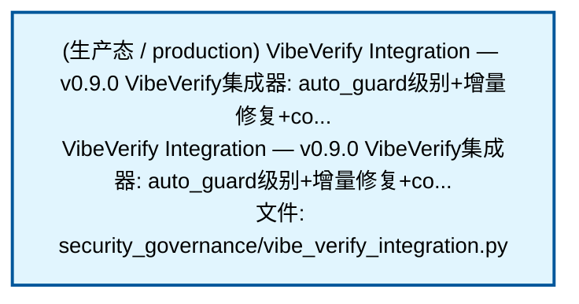
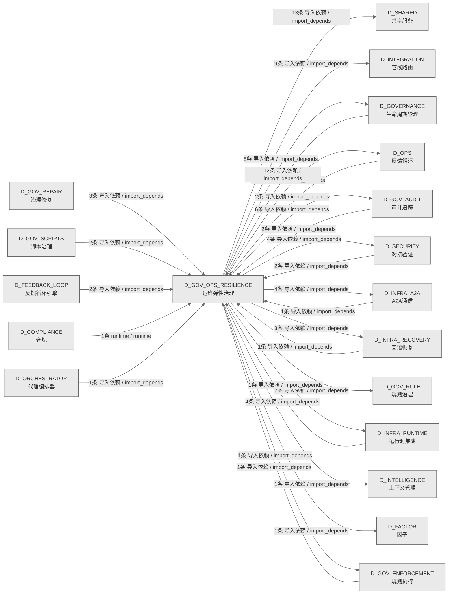

# 20_d_gov_ops_resilience / 运维弹性治理 / Ops Resilience Governance

> **功能简介 / Overview**: 运维弹性治理，负责运维治理、安全治理、弹性治理和升级协议

> **文档作用 / Purpose**: 展示 运维弹性治理（D_GOV_OPS_RESILIENCE）功能域的模块清单、域内依赖关系、跨域依赖关系、架构分层视图，供架构审查和域治理参考。

> 本文档由 generate_domain_doc.py 从 depgraph (PostgreSQL) 自动生成
> 数据源: depgraph (PostgreSQL) nodes表 + edges表

> **[可缩放 HTML 版 / Zoomable HTML](http://localhost:8765/docs/02_enterprise_architecture/02_domain_architecture_docs/20_d_gov_ops_resilience.html)** — Ctrl+滚轮缩放 ｜ 双击重置 ｜ Ctrl+Shift+D 切换拖动/选择模式

## 域基本信息 / Domain Overview

| 字段 | 值 | Field | Value |
|------|------|-------|-------|
| 编号 | 20 | Number | 20 |
| 域ID | D_GOV_OPS_RESILIENCE | Domain ID | D_GOV_OPS_RESILIENCE |
| 域名称 | 运维弹性治理 | Domain Name | Ops Resilience Governance |
| 层级 | L1 基础平台层 | Layer | L1 Foundation |
| 模块数 | 91 | Module Count | 91 |
| 域内依赖 | 17 | Internal Dependencies | 17 |
| 跨域入边 | 34 | Cross-domain Incoming | 34 |
| 跨域出边 | 60 | Cross-domain Outgoing | 60 |
| 设计态模块 | 0 | Design Modules | 0 |
| 生产态模块 | 91 | Production Modules | 91 |
| 容量 | 91/150 (正常) | Capacity | 91/150 (正常) |
| 描述 | 运维治理(ops_governance) | Description | 运维治理(ops_governance) |

## 模块分层清单 / Module Layered List

> 按 architecture_layer 分组的模块清单（共 91 个模块 / 91 modules）。

### L1 基础层 / Foundation Layer (91 modules)

| # | 模块路径 / Module Path | 模块名称 / Module Name (功能简介 / Description) | 成熟度 / Maturity | 蓝图 / Blueprint |
|:--:|---------|---------|:---:|:---:|
| 1 | src/zephyr/governance/budget-enforcer/__init__.py | budget-enforcer/__init__.py | 生产态 / production | [MOD-INF-024](../../03_modules/_domain_autonomy_perm/budget_enforcer/blueprint.md) |
| 2 | src/zephyr/governance/escalation/alternative_path_blocker.py | Alternative Path Blocker — v0.13.0 替代工具路径拦截器。 | 生产态 / production | [MOD-INF-022](../../03_modules/_domain_autonomy_perm/escalation_protocol/blueprint.md) |
| 3 | src/zephyr/governance/escalation/consequence_manager.py | escalation/consequence_manager.py | 生产态 / production | [MOD-INF-022](../../03_modules/_domain_autonomy_perm/escalation_protocol/blueprint.md) |
| 4 | src/zephyr/governance/escalation/contracts.py | G-CT-003 消费端 — Escalation.on_rollback_failure() + G-CT-004/G-CT-006/G-CT-... | 生产态 / production | [MOD-INF-022](../../03_modules/_domain_autonomy_perm/escalation_protocol/blueprint.md) |
| 5 | src/zephyr/governance/escalation/escalation_api.py | Escalation API — v0.7.0 Service Account API: 外部系统安全触发升级，不绕过引擎。 | 生产态 / production | [MOD-INF-022](../../03_modules/_domain_autonomy_perm/escalation_protocol/blueprint.md) |
| 6 | src/zephyr/governance/escalation/escalation_engine.py | Escalation Engine — MOD-INF-022 | 生产态 / production | [MOD-INF-022](../../03_modules/_domain_autonomy_perm/escalation_protocol/blueprint.md) |
| 7 | src/zephyr/governance/escalation/escalation_fatigue_manag... | Escalation Fatigue Manager — v0.11.0 升级疲劳管理器。 | 生产态 / production | [MOD-INF-022](../../03_modules/_domain_autonomy_perm/escalation_protocol/blueprint.md) |
| 8 | src/zephyr/governance/escalation/escalation_loop_detector.py | Escalation Loop Detector — v0.10.0 跨模块升级循环: escalate->block->auto_gua... | 生产态 / production | [MOD-INF-022](../../03_modules/_domain_autonomy_perm/escalation_protocol/blueprint.md) |
| 9 | src/zephyr/governance/escalation/escalation_metrics.py | Escalation Metrics — D-022-07 指标收集器: 升级率/误升级率/响应延迟。 | 生产态 / production | [MOD-INF-022](../../03_modules/_domain_autonomy_perm/escalation_protocol/blueprint.md) |
| 10 | src/zephyr/governance/escalation/escalation_models.py | Escalation Protocol data models — MOD-INF-022 | 生产态 / production | [MOD-INF-022](../../03_modules/_domain_autonomy_perm/escalation_protocol/blueprint.md) |
| 11 | src/zephyr/governance/escalation/escalation_smoke_tests.py | Escalation Smoke Tests — v0.11.0 升级协议烟雾测试。 | 生产态 / production | [MOD-INF-022](../../03_modules/_domain_autonomy_perm/escalation_protocol/blueprint.md) |
| 12 | src/zephyr/governance/escalation/git_hook_pre_scanner.py | Git Hook Pre-Scanner — v0.14.0 Git操作Hook预扫描器。 | 生产态 / production | [MOD-INF-022](../../03_modules/_domain_autonomy_perm/escalation_protocol/blueprint.md) |
| 13 | src/zephyr/governance/escalation/human_factors.py | Human Factors — v0.7.0 人因工程: 通知疲劳管理+上下文简洁性+多通道notifications。 | 生产态 / production | [MOD-INF-022](../../03_modules/_domain_autonomy_perm/escalation_protocol/blueprint.md) |
| 14 | src/zephyr/governance/escalation/identity_verifier.py | Identity Verifier — D-022-12 Agent身份验证器: session_id+role+capability三元... | 生产态 / production | [MOD-INF-022](../../03_modules/_domain_autonomy_perm/escalation_protocol/blueprint.md) |
| 15 | src/zephyr/governance/escalation/incident_response.py | escalation/incident_response.py | 生产态 / production | [MOD-INF-022](../../03_modules/_domain_autonomy_perm/escalation_protocol/blueprint.md) |
| 16 | src/zephyr/governance/escalation/owner_absent.py | Owner Absent — 人力缺席分级处置。 | 生产态 / production | [MOD-INF-022](../../03_modules/_domain_autonomy_perm/escalation_protocol/blueprint.md) |
| 17 | src/zephyr/governance/escalation/result_types.py | G-CT-003 — RollbackResult backward-compat re-export facade. | 生产态 / production | [MOD-INF-021](../../03_modules/_domain_autonomy_core/rollback_system/blueprint.md) |
| 18 | src/zephyr/governance/escalation/spof_checker.py | escalation/spof_checker.py | 生产态 / production | [MOD-INF-022](../../03_modules/_domain_autonomy_perm/escalation_protocol/blueprint.md) |
| 19 | src/zephyr/governance/escalation/triage.py | G2 Triage 门禁 — 知识分类评分（T-2-13-B） | 生产态 / production | [MOD-INF-021](../../03_modules/_domain_autonomy_core/rollback_system/blueprint.md) |
| 20 | src/zephyr/governance/ops_governance/agent_dispatch.py | ops_governance/agent_dispatch.py | 生产态 / production | [MOD-GOVERNANCE](../../03_modules/_domain_governance/blueprint.md) |
| 21 | src/zephyr/governance/ops_governance/auto_runner.py | GovernanceAutoRunner — 治理脚本自动运行/自动关闭调度器. | 生产态 / production | [MOD-INF-005](../../03_modules/_domain_governance/governance_automation/blueprint.md) |
| 22 | src/zephyr/governance/ops_governance/bandwidth_optimizer.py | ops_governance/bandwidth_optimizer.py | 生产态 / production | [MOD-INF-024](../../03_modules/_domain_autonomy_perm/budget_enforcer/blueprint.md) |
| 23 | src/zephyr/governance/ops_governance/burn_rate_monitor.py | Burn Rate Monitor — MOD-INF-024 | 生产态 / production | [MOD-INF-024](../../03_modules/_domain_autonomy_perm/budget_enforcer/blueprint.md) |
| 24 | src/zephyr/governance/ops_governance/clock_guard.py | Clock Guard — v0.8.0 时钟完整性防御: NTP漂移检测+wall clock monotonic验证。 | 生产态 / production | [MOD-INF-022](../../03_modules/_domain_autonomy_perm/escalation_protocol/blueprint.md) |
| 25 | src/zephyr/governance/ops_governance/coldstart_manager.py | Coldstart Manager — v0.7.0 冷启动管理器: escalation rules加载+引擎初始化+健... | 生产态 / production | [MOD-INF-022](../../03_modules/_domain_autonomy_perm/escalation_protocol/blueprint.md) |
| 26 | src/zephyr/governance/ops_governance/cost_attributor.py | ops_governance/cost_attributor.py | 生产态 / production | [MOD-INF-024](../../03_modules/_domain_autonomy_perm/budget_enforcer/blueprint.md) |
| 27 | src/zephyr/governance/ops_governance/cost_router.py | ops_governance/cost_router.py | 生产态 / production | [MOD-INF-024](../../03_modules/_domain_autonomy_perm/budget_enforcer/blueprint.md) |
| 28 | src/zephyr/governance/ops_governance/daily_ops.py | ops_governance/daily_ops.py | 生产态 / production | [MOD-INF-024](../../03_modules/_domain_autonomy_perm/budget_enforcer/blueprint.md) |
| 29 | src/zephyr/governance/ops_governance/decision_fatigue.py | ops_governance/decision_fatigue.py | 生产态 / production | [MOD-GOVERNANCE](../../03_modules/_domain_governance/blueprint.md) |
| 30 | src/zephyr/governance/ops_governance/degradation_manager.py | ops_governance/degradation_manager.py | 生产态 / production | [MOD-INF-024](../../03_modules/_domain_autonomy_perm/budget_enforcer/blueprint.md) |
| 31 | src/zephyr/governance/ops_governance/environment_manager.py | ops_governance/environment_manager.py | 生产态 / production | [MOD-GOVERNANCE](../../03_modules/_domain_governance/blueprint.md) |
| 32 | src/zephyr/governance/ops_governance/error_budget_burst_l... | Error Budget Burst Limiter — v0.11.0 错误预算Burst限流器。 | 生产态 / production | [MOD-INF-022](../../03_modules/_domain_autonomy_perm/escalation_protocol/blueprint.md) |
| 33 | src/zephyr/governance/ops_governance/event_hook.py | EventHook — 声明式任务系统事件订阅 | 生产态 / production | [MOD-INF-002](../../03_modules/_domain_infrastructure_runtime/runtime_integration/blueprint.md) |
| 34 | src/zephyr/governance/ops_governance/interrupt_handler.py | Interrupt Handler — D-022-06 硬中断处理器: Owner紧急中断+优雅停止+状态保存。 | 生产态 / production | [MOD-INF-022](../../03_modules/_domain_autonomy_perm/escalation_protocol/blueprint.md) |
| 35 | src/zephyr/governance/ops_governance/maintenance_window_a... | Maintenance Window Adapter — v0.10.0 计划维护窗口适配器。 | 生产态 / production | [MOD-INF-022](../../03_modules/_domain_autonomy_perm/escalation_protocol/blueprint.md) |
| 36 | src/zephyr/governance/ops_governance/ops_foundation.py | ops_governance/ops_foundation.py | 生产态 / production | [MOD-INF-024](../../03_modules/_domain_autonomy_perm/budget_enforcer/blueprint.md) |
| 37 | src/zephyr/governance/ops_governance/parent_child_attribu... | ops_governance/parent_child_attributor.py | 生产态 / production | [MOD-INF-024](../../03_modules/_domain_autonomy_perm/budget_enforcer/blueprint.md) |
| 38 | src/zephyr/governance/ops_governance/phase_check_registry.py | PhaseManager->GateEngine 检查注册表桥梁 — 44 个阶段门控检查映射. | 生产态 / production | [MOD-GOVERNANCE](../../03_modules/_domain_governance/blueprint.md) |
| 39 | src/zephyr/governance/ops_governance/phase_manager.py | Phase Manager — ZephyrAlpha 施工阶段门控引擎. | 生产态 / production | [MOD-GOVERNANCE](../../03_modules/_domain_governance/blueprint.md) |
| 40 | src/zephyr/governance/ops_governance/roi_calculator.py | ops_governance/roi_calculator.py | 生产态 / production | [MOD-INF-024](../../03_modules/_domain_autonomy_perm/budget_enforcer/blueprint.md) |
| 41 | src/zephyr/governance/ops_governance/self_budget_tracker.py | ops_governance/self_budget_tracker.py | 生产态 / production | [MOD-INF-024](../../03_modules/_domain_autonomy_perm/budget_enforcer/blueprint.md) |
| 42 | src/zephyr/governance/ops_governance/service_registration.py | D-DATA -> ServiceRegistry 注册模块 | 生产态 / production | [MOD-INF-024](../../03_modules/_domain_autonomy_perm/budget_enforcer/blueprint.md) |
| 43 | src/zephyr/governance/ops_governance/startup_shutdown.py | ops_governance/startup_shutdown.py | 生产态 / production | [MOD-GOVERNANCE](../../03_modules/_domain_governance/blueprint.md) |
| 44 | src/zephyr/governance/ops_governance/startup_shutdown_cli.py | ops_governance/startup_shutdown_cli.py | 生产态 / production | [MOD-GOVERNANCE](../../03_modules/_domain_governance/blueprint.md) |
| 45 | src/zephyr/governance/ops_governance/stream_abort_guard.py | StreamAbortGuard — 流式中断守卫 | 生产态 / production | [MOD-INF-024](../../03_modules/_domain_autonomy_perm/budget_enforcer/blueprint.md) |
| 46 | src/zephyr/governance/ops_governance/tco_model.py | ops_governance/tco_model.py | 生产态 / production | [MOD-INF-024](../../03_modules/_domain_autonomy_perm/budget_enforcer/blueprint.md) |
| 47 | src/zephyr/governance/ops_governance/time_sync.py | ops_governance/time_sync.py | 生产态 / production | [MOD-INF-024](../../03_modules/_domain_autonomy_perm/budget_enforcer/blueprint.md) |
| 48 | src/zephyr/governance/ops_governance/timeout_guard.py | ops_governance/timeout_guard.py | 生产态 / production | [MOD-INF-024](../../03_modules/_domain_autonomy_perm/budget_enforcer/blueprint.md) |
| 49 | src/zephyr/governance/resilience_governance/__init__.py | resilience_governance/__init__.py | 生产态 / production |  |
| 50 | src/zephyr/governance/resilience_governance/account_isola... | Account Isolator — v0.10.0 多账户升级隔离器。 | 生产态 / production | [MOD-INF-022](../../03_modules/_domain_autonomy_perm/escalation_protocol/blueprint.md) |
| 51 | src/zephyr/governance/resilience_governance/blast_radius.py | blast_radius — MOD-INF-028 §3.1 Stage 9 | 生产态 / production | [MOD-INF-028](../../03_modules/_cross_layer/semantic_auditor/blueprint.md) |
| 52 | src/zephyr/governance/resilience_governance/broker_resili... | resilience_governance/broker_resilience.py | 生产态 / production | [MOD-INF-022](../../03_modules/_domain_autonomy_perm/escalation_protocol/blueprint.md) |
| 53 | src/zephyr/governance/resilience_governance/bus_factor_de... | resilience_governance/bus_factor_defense.py | 生产态 / production | [MOD-GOVERNANCE](../../03_modules/_domain_governance/blueprint.md) |
| 54 | src/zephyr/governance/resilience_governance/circuit_break... | Circuit Breaker — MOD-INF-022 | 生产态 / production | [MOD-INF-022](../../03_modules/_domain_autonomy_perm/escalation_protocol/blueprint.md) |
| 55 | src/zephyr/governance/resilience_governance/deadlock_dete... | Deadlock Detector — D-022-04 多Agent死锁+循环依赖检测+超时破解。 | 生产态 / production | [MOD-INF-022](../../03_modules/_domain_autonomy_perm/escalation_protocol/blueprint.md) |
| 56 | src/zephyr/governance/resilience_governance/decision_fati... | resilience_governance/decision_fatigue.py | 生产态 / production | [MOD-INF-022](../../03_modules/_domain_autonomy_perm/escalation_protocol/blueprint.md) |
| 57 | src/zephyr/governance/resilience_governance/decision_fati... | resilience_governance/decision_fatigue_cli.py | 生产态 / production | [MOD-INF-022](../../03_modules/_domain_autonomy_perm/escalation_protocol/blueprint.md) |
| 58 | src/zephyr/governance/resilience_governance/engine_sandbo... | EngineSandbox — D-022-08 OS-level sandboxing for the escalation engine. | 生产态 / production | [MOD-INF-022](../../03_modules/_domain_autonomy_perm/escalation_protocol/blueprint.md) |
| 59 | src/zephyr/governance/resilience_governance/f5_boot_integ... | F5BootIntegration — F5 自动启动/关闭集成 (MOD-INF-022 §2). | 生产态 / production | [MOD-INF-022](../../03_modules/_domain_autonomy_perm/escalation_protocol/blueprint.md) |
| 60 | src/zephyr/governance/resilience_governance/f5_event_subs... | F5EventSubscriber — F5 事件启动机制 (MOD-INF-022 §3). | 生产态 / production | [MOD-INF-022](../../03_modules/_domain_autonomy_perm/escalation_protocol/blueprint.md) |
| 61 | src/zephyr/governance/resilience_governance/f5_shutdown_m... | F5ShutdownManager — F5 自动关闭/状态持久化/信号处理 (MOD-INF-022 §2). | 生产态 / production | [MOD-INF-022](../../03_modules/_domain_autonomy_perm/escalation_protocol/blueprint.md) |
| 62 | src/zephyr/governance/resilience_governance/fail_mode_man... | resilience_governance/fail_mode_manager.py | 生产态 / production | [MOD-INF-024](../../03_modules/_domain_autonomy_perm/budget_enforcer/blueprint.md) |
| 63 | src/zephyr/governance/resilience_governance/fault_toleran... | resilience_governance/fault_tolerance.py | 生产态 / production | [MOD-GOVERNANCE](../../03_modules/_domain_governance/blueprint.md) |
| 64 | src/zephyr/governance/resilience_governance/last_resort_w... | Last Resort Watchdog — v0.8.0 终极逃生舱: 所有escalation失败后的final fallba... | 生产态 / production | [MOD-INF-022](../../03_modules/_domain_autonomy_perm/escalation_protocol/blueprint.md) |
| 65 | src/zephyr/governance/resilience_governance/offline_auton... | resilience_governance/offline_autonomy.py | 生产态 / production | [MOD-GOVERNANCE](../../03_modules/_domain_governance/blueprint.md) |
| 66 | src/zephyr/governance/resilience_governance/offline_resil... | resilience_governance/offline_resilience.py | 生产态 / production | [MOD-GOVERNANCE](../../03_modules/_domain_governance/blueprint.md) |
| 67 | src/zephyr/governance/resilience_governance/policy_sandbo... | resilience_governance/policy_sandbox.py | 生产态 / production | [MOD-INF-024](../../03_modules/_domain_autonomy_perm/budget_enforcer/blueprint.md) |
| 68 | src/zephyr/governance/resilience_governance/process_isola... | Process Isolator — v0.6.0 进程隔离器: engine运行在独立进程+资源限制+crash恢复。 | 生产态 / production | [MOD-INF-022](../../03_modules/_domain_autonomy_perm/escalation_protocol/blueprint.md) |
| 69 | src/zephyr/governance/resilience_governance/witness_isola... | Witness Isolation — v0.8.0 Witness隔离: N版本decision验证+投票机制+majority... | 生产态 / production | [MOD-INF-022](../../03_modules/_domain_autonomy_perm/escalation_protocol/blueprint.md) |
| 70 | src/zephyr/governance/security_governance/__init__.py | security_governance/__init__.py | 生产态 / production |  |
| 71 | src/zephyr/governance/security_governance/adversarial_tes... | security_governance/adversarial_tester.py | 生产态 / production | [MOD-INF-024](../../03_modules/_domain_autonomy_perm/budget_enforcer/blueprint.md) |
| 72 | src/zephyr/governance/security_governance/anti_automation... | Anti-Automation Bias — D-022-09 mandatory human oversight enforcement. | 生产态 / production | [MOD-INF-022](../../03_modules/_domain_autonomy_perm/escalation_protocol/blueprint.md) |
| 73 | src/zephyr/governance/security_governance/api_response_sa... | API Response Sanitizer — v0.9.0 API响应清洗器: 外部API返回内容清洗+injection... | 生产态 / production | [MOD-INF-022](../../03_modules/_domain_autonomy_perm/escalation_protocol/blueprint.md) |
| 74 | src/zephyr/governance/security_governance/bare_repo_scann... | Bare Repo Scanner — v0.14.0 嵌入式裸仓库检测器。 | 生产态 / production | [MOD-INF-022](../../03_modules/_domain_autonomy_perm/escalation_protocol/blueprint.md) |
| 75 | src/zephyr/governance/security_governance/compositional_s... | Compositional Safety Tester — v0.14.0 组合性不安全测试器。 | 生产态 / production | [MOD-INF-022](../../03_modules/_domain_autonomy_perm/escalation_protocol/blueprint.md) |
| 76 | src/zephyr/governance/security_governance/config_scanner.py | Config Scanner — v0.9.0 AI配置文件注入扫描器: 检测AI修改的配置+注入攻击。 | 生产态 / production | [MOD-INF-022](../../03_modules/_domain_autonomy_perm/escalation_protocol/blueprint.md) |
| 77 | src/zephyr/governance/security_governance/credential_guar... | Credential Guard — v0.7.0 密钥泄露防护: env检测+git log扫描+运行时脱敏。 | 生产态 / production | [MOD-INF-022](../../03_modules/_domain_autonomy_perm/escalation_protocol/blueprint.md) |
| 78 | src/zephyr/governance/security_governance/default_securit... | DefaultSecurityGateway — SecurityGateway 三层防御 OCP-004 实现 | 生产态 / production | [MOD-L10-001](../../03_modules/_domain_compliance/blueprint.md) |
| 79 | src/zephyr/governance/security_governance/ghost_scan.py | Ghost Scan — v0.8.0 幽灵进程检测: lingering process扫描+资源泄漏检测。 | 生产态 / production | [MOD-INF-022](../../03_modules/_domain_autonomy_perm/escalation_protocol/blueprint.md) |
| 80 | src/zephyr/governance/security_governance/github_api_guar... | GitHub API Guard — v0.9.0 Comment and Control防御: PR评论命令注入检测+限制。 | 生产态 / production | [MOD-INF-022](../../03_modules/_domain_autonomy_perm/escalation_protocol/blueprint.md) |
| 81 | src/zephyr/governance/security_governance/hooks_integrity... | Hooks Integrity Guard — v0.11.0 Hooks自编辑防护器。 | 生产态 / production | [MOD-INF-022](../../03_modules/_domain_autonomy_perm/escalation_protocol/blueprint.md) |
| 82 | src/zephyr/governance/security_governance/ipi_defense.py | security_governance/ipi_defense.py | 生产态 / production | [MOD-INF-024](../../03_modules/_domain_autonomy_perm/budget_enforcer/blueprint.md) |
| 83 | src/zephyr/governance/security_governance/memory_poison_g... | Memory Poison Guard — v0.9.0 记忆投毒防护: Memory写入内容审计+恶意注入检测。 | 生产态 / production | [MOD-INF-022](../../03_modules/_domain_autonomy_perm/escalation_protocol/blueprint.md) |
| 84 | src/zephyr/governance/security_governance/persuasion_dete... | Persuasion Detector — D-022-09 心理说服检测: 对抗语气+恳求+绕过指令。 | 生产态 / production | [MOD-INF-022](../../03_modules/_domain_autonomy_perm/escalation_protocol/blueprint.md) |
| 85 | src/zephyr/governance/security_governance/poison_cascade_... | security_governance/poison_cascade_detector.py | 生产态 / production | [MOD-INF-024](../../03_modules/_domain_autonomy_perm/budget_enforcer/blueprint.md) |
| 86 | src/zephyr/governance/security_governance/sbom_guard.py | SBOM Guard — v0.8.0 SBOM供应链防护: 依赖版本锁定+脆弱性扫描+cve告警。 | 生产态 / production | [MOD-INF-022](../../03_modules/_domain_autonomy_perm/escalation_protocol/blueprint.md) |
| 87 | src/zephyr/governance/security_governance/security_config... | Security Config Scanner — v0.13.0 缺失安全配置扫描器。 | 生产态 / production | [MOD-INF-022](../../03_modules/_domain_autonomy_perm/escalation_protocol/blueprint.md) |
| 88 | src/zephyr/governance/security_governance/security_gatewa... | D_COMPLIANCE — Governance & Compliance Layer | 生产态 / production | [MOD-L10-001](../../03_modules/_domain_compliance/blueprint.md) |
| 89 | src/zephyr/governance/security_governance/tamper_evident_... | security_governance/tamper_evident_log.py | 生产态 / production | [MOD-INF-024](../../03_modules/_domain_autonomy_perm/budget_enforcer/blueprint.md) |
| 90 | src/zephyr/governance/security_governance/vibe_security_v... | Vibe Security Verifier — v0.9.0 Vibe Coding安全验证器: AI生成代码安全基线检查。 | 生产态 / production | [MOD-INF-022](../../03_modules/_domain_autonomy_perm/escalation_protocol/blueprint.md) |
| 91 | src/zephyr/governance/security_governance/vibe_verify_int... | VibeVerify Integration — v0.9.0 VibeVerify集成器: auto_guard级别+增量修复+co... | 生产态 / production | [MOD-INF-022](../../03_modules/_domain_autonomy_perm/escalation_protocol/blueprint.md) |

## 域内依赖图 / Internal Dependency Diagram

> 依赖图内嵌在本文档中，IDE 可直接渲染显示。参考 decision_index.md 设计，分三个视图：合并全景图、运营态子图、设计态子图（按 design_maturity 实际值拆分）。
>
> **图例说明 / Legend**：
> - 🟦 **蓝色 = 运营态模块**（production，已上线运行）
> - 🟧 **橙色虚线 = 设计态模块**（design，蓝图阶段，代码未写）
> - **实线箭头 = 运营态依赖**（已生效的依赖关系）
> - **虚线箭头 = 非运营态依赖**（计划中/验证中的依赖关系）

### 合并全景图（全部模块，标签标注成熟度）

> 展示全部 91 个模块（生产态 91 + 设计态 0），标签标注成熟度。

#### 第 1 页 / 共 4 页

```mermaid
%%{init: {'theme': 'base', 'themeVariables': {'primaryColor': '#eaeaea', 'primaryTextColor': '#333333', 'primaryBorderColor': '#666666', 'lineColor': '#666666', 'secondaryColor': '#eaeaea', 'tertiaryColor': '#eaeaea', 'fontSize': '14px'}}}%%
flowchart TD
    src_zephyr_governance_budget_enforcer_init_py["(生产态 / production)<br/>文件: budget-enforcer/__init__.py"]
    src_zephyr_governance_escalation_alternative_path_blocker_py["(生产态 / production) Alternative Path Blocker — v0.13.0 替代工具路径拦截器。<br/>Alternative Path Blocker — v0.13.0 替代工具路径拦截器。<br/>文件: escalation/alternative_path_blocker.py"]
    src_zephyr_governance_escalation_consequence_manager_py["(生产态 / production)<br/>文件: escalation/consequence_manager.py"]
    src_zephyr_governance_escalation_contracts_py["(生产态 / production) G-CT-003 消费端 — Escalation.on_rollback_failure() + G-CT-004/G-CT-006/G-CT-...<br/>G-CT-003 消费端 — Escalation.on_rollback_failure() + G-CT-004/G-CT-006/G-CT-...<br/>文件: escalation/contracts.py"]
    src_zephyr_governance_escalation_escalation_api_py["(生产态 / production) Escalation API — v0.7.0 Service Account API: 外部系统安全触发升级，不绕过引擎。<br/>Escalation API — v0.7.0 Service Account API: 外部系统安全触发升级，不绕过引擎。<br/>文件: escalation/escalation_api.py"]
    src_zephyr_governance_escalation_escalation_engine_py["(生产态 / production) Escalation Engine — MOD-INF-022<br/>Escalation Engine — MOD-INF-022<br/>文件: escalation/escalation_engine.py"]
    src_zephyr_governance_escalation_escalation_fatigue_manager_py["(生产态 / production) Escalation Fatigue Manager — v0.11.0 升级疲劳管理器。<br/>Escalation Fatigue Manager — v0.11.0 升级疲劳管理器。<br/>文件: escalation/escalation_fatigue_manager.py"]
    src_zephyr_governance_escalation_escalation_loop_detector_py["(生产态 / production) Escalation Loop Detector — v0.10.0 跨模块升级循环: escalate->block->auto_gua...<br/>Escalation Loop Detector — v0.10.0 跨模块升级循环: escalate->block->auto_gua...<br/>文件: escalation/escalation_loop_detector.py"]
    src_zephyr_governance_escalation_escalation_smoke_tests_py["(生产态 / production) Escalation Smoke Tests — v0.11.0 升级协议烟雾测试。<br/>Escalation Smoke Tests — v0.11.0 升级协议烟雾测试。<br/>文件: escalation/escalation_smoke_tests.py"]
    src_zephyr_governance_escalation_git_hook_pre_scanner_py["(生产态 / production) Git Hook Pre-Scanner — v0.14.0 Git操作Hook预扫描器。<br/>Git Hook Pre-Scanner — v0.14.0 Git操作Hook预扫描器。<br/>文件: escalation/git_hook_pre_scanner.py"]
    src_zephyr_governance_escalation_human_factors_py["(生产态 / production) Human Factors — v0.7.0 人因工程: 通知疲劳管理+上下文简洁性+多通道notifications。<br/>Human Factors — v0.7.0 人因工程: 通知疲劳管理+上下文简洁性+多通道notifications。<br/>文件: escalation/human_factors.py"]
    src_zephyr_governance_escalation_identity_verifier_py["(生产态 / production) Identity Verifier — D-022-12 Agent身份验证器: session_id+role+capability三元...<br/>Identity Verifier — D-022-12 Agent身份验证器: session_id+role+capability三元...<br/>文件: escalation/identity_verifier.py"]
    src_zephyr_governance_escalation_incident_response_py["(生产态 / production)<br/>文件: escalation/incident_response.py"]
    src_zephyr_governance_escalation_owner_absent_py["(生产态 / production) Owner Absent — 人力缺席分级处置。<br/>Owner Absent — 人力缺席分级处置。<br/>文件: escalation/owner_absent.py"]
    src_zephyr_governance_escalation_result_types_py["(生产态 / production) G-CT-003 — RollbackResult backward-compat re-export facade.<br/>G-CT-003 — RollbackResult backward-compat re-export facade.<br/>文件: escalation/result_types.py"]
    src_zephyr_governance_escalation_spof_checker_py["(生产态 / production)<br/>文件: escalation/spof_checker.py"]
    src_zephyr_governance_escalation_triage_py["(生产态 / production) G2 Triage 门禁 — 知识分类评分（T-2-13-B）<br/>G2 Triage 门禁 — 知识分类评分（T-2-13-B）<br/>文件: escalation/triage.py"]
    src_zephyr_governance_ops_governance_agent_dispatch_py["(生产态 / production)<br/>文件: ops_governance/agent_dispatch.py"]
    src_zephyr_governance_ops_governance_auto_runner_py["(生产态 / production) GovernanceAutoRunner — 治理脚本自动运行/自动关闭调度器.<br/>GovernanceAutoRunner — 治理脚本自动运行/自动关闭调度器.<br/>文件: ops_governance/auto_runner.py"]
    src_zephyr_governance_ops_governance_bandwidth_optimizer_py["(生产态 / production)<br/>文件: ops_governance/bandwidth_optimizer.py"]
    src_zephyr_governance_ops_governance_burn_rate_monitor_py["(生产态 / production) Burn Rate Monitor — MOD-INF-024<br/>Burn Rate Monitor — MOD-INF-024<br/>文件: ops_governance/burn_rate_monitor.py"]
    src_zephyr_governance_ops_governance_clock_guard_py["(生产态 / production) Clock Guard — v0.8.0 时钟完整性防御: NTP漂移检测+wall clock monotonic验证。<br/>Clock Guard — v0.8.0 时钟完整性防御: NTP漂移检测+wall clock monotonic验证。<br/>文件: ops_governance/clock_guard.py"]
    src_zephyr_governance_ops_governance_coldstart_manager_py["(生产态 / production) Coldstart Manager — v0.7.0 冷启动管理器: escalation rules加载+引擎初始化+健...<br/>Coldstart Manager — v0.7.0 冷启动管理器: escalation rules加载+引擎初始化+健...<br/>文件: ops_governance/coldstart_manager.py"]
    src_zephyr_governance_ops_governance_cost_attributor_py["(生产态 / production)<br/>文件: ops_governance/cost_attributor.py"]
    src_zephyr_governance_ops_governance_cost_router_py["(生产态 / production)<br/>文件: ops_governance/cost_router.py"]
    src_zephyr_governance_ops_governance_daily_ops_py["(生产态 / production)<br/>文件: ops_governance/daily_ops.py"]
    src_zephyr_governance_ops_governance_decision_fatigue_py["(生产态 / production)<br/>文件: ops_governance/decision_fatigue.py"]
    src_zephyr_governance_ops_governance_degradation_manager_py["(生产态 / production)<br/>文件: ops_governance/degradation_manager.py"]
    src_zephyr_governance_budget_enforcer_init_py ~~~ src_zephyr_governance_escalation_alternative_path_blocker_py
    src_zephyr_governance_escalation_alternative_path_blocker_py ~~~ src_zephyr_governance_escalation_consequence_manager_py
    src_zephyr_governance_escalation_consequence_manager_py ~~~ src_zephyr_governance_escalation_contracts_py
    src_zephyr_governance_escalation_contracts_py ~~~ src_zephyr_governance_escalation_escalation_api_py
    src_zephyr_governance_escalation_escalation_api_py ~~~ src_zephyr_governance_escalation_escalation_engine_py
    src_zephyr_governance_escalation_escalation_engine_py ~~~ src_zephyr_governance_escalation_escalation_fatigue_manager_py
    src_zephyr_governance_escalation_escalation_fatigue_manager_py ~~~ src_zephyr_governance_escalation_escalation_loop_detector_py
    src_zephyr_governance_escalation_escalation_loop_detector_py ~~~ src_zephyr_governance_escalation_escalation_smoke_tests_py
    src_zephyr_governance_escalation_escalation_smoke_tests_py ~~~ src_zephyr_governance_escalation_git_hook_pre_scanner_py
    src_zephyr_governance_escalation_git_hook_pre_scanner_py ~~~ src_zephyr_governance_escalation_human_factors_py
    src_zephyr_governance_escalation_human_factors_py ~~~ src_zephyr_governance_escalation_identity_verifier_py
    src_zephyr_governance_escalation_identity_verifier_py ~~~ src_zephyr_governance_escalation_incident_response_py
    src_zephyr_governance_escalation_incident_response_py ~~~ src_zephyr_governance_escalation_owner_absent_py
    src_zephyr_governance_escalation_owner_absent_py ~~~ src_zephyr_governance_escalation_result_types_py
    src_zephyr_governance_escalation_result_types_py ~~~ src_zephyr_governance_escalation_spof_checker_py
    src_zephyr_governance_escalation_spof_checker_py ~~~ src_zephyr_governance_escalation_triage_py
    src_zephyr_governance_escalation_triage_py ~~~ src_zephyr_governance_ops_governance_agent_dispatch_py
    src_zephyr_governance_ops_governance_agent_dispatch_py ~~~ src_zephyr_governance_ops_governance_auto_runner_py
    src_zephyr_governance_ops_governance_auto_runner_py ~~~ src_zephyr_governance_ops_governance_bandwidth_optimizer_py
    src_zephyr_governance_ops_governance_bandwidth_optimizer_py ~~~ src_zephyr_governance_ops_governance_burn_rate_monitor_py
    src_zephyr_governance_ops_governance_burn_rate_monitor_py ~~~ src_zephyr_governance_ops_governance_clock_guard_py
    src_zephyr_governance_ops_governance_clock_guard_py ~~~ src_zephyr_governance_ops_governance_coldstart_manager_py
    src_zephyr_governance_ops_governance_coldstart_manager_py ~~~ src_zephyr_governance_ops_governance_cost_attributor_py
    src_zephyr_governance_ops_governance_cost_attributor_py ~~~ src_zephyr_governance_ops_governance_cost_router_py
    src_zephyr_governance_ops_governance_cost_router_py ~~~ src_zephyr_governance_ops_governance_daily_ops_py
    src_zephyr_governance_ops_governance_daily_ops_py ~~~ src_zephyr_governance_ops_governance_decision_fatigue_py
    src_zephyr_governance_ops_governance_decision_fatigue_py ~~~ src_zephyr_governance_ops_governance_degradation_manager_py
    src_zephyr_governance_escalation_escalation_metrics_py["(生产态 / production) Escalation Metrics — D-022-07 指标收集器: 升级率/误升级率/响应延迟。<br/>Escalation Metrics — D-022-07 指标收集器: 升级率/误升级率/响应延迟。<br/>文件: escalation/escalation_metrics.py"]
    src_zephyr_governance_escalation_escalation_models_py["(生产态 / production) Escalation Protocol data models — MOD-INF-022<br/>Escalation Protocol data models — MOD-INF-022<br/>文件: escalation/escalation_models.py"]
    src_zephyr_governance_escalation_escalation_metrics_py ~~~ src_zephyr_governance_escalation_escalation_models_py
    src_zephyr_governance_escalation_escalation_engine_py -->|导入依赖 / import_depends| src_zephyr_governance_escalation_escalation_models_py
    src_zephyr_governance_escalation_escalation_engine_py -->|导入依赖 / import_depends| src_zephyr_governance_escalation_escalation_metrics_py
    src_zephyr_governance_escalation_escalation_api_py -->|导入依赖 / import_depends| src_zephyr_governance_escalation_escalation_models_py
    D_INTEGRATION["(生产态 / production) D_INTEGRATION 管线路由"]
    src_zephyr_governance_escalation_contracts_py -->|导入依赖 / import_depends| D_INTEGRATION
    D_SHARED["(生产态 / production) D_SHARED 共享服务"]
    src_zephyr_governance_escalation_contracts_py -->|导入依赖 / import_depends| D_SHARED
    D_INFRA_RECOVERY["(生产态 / production) D_INFRA_RECOVERY 回滚恢复"]
    src_zephyr_governance_escalation_contracts_py -->|导入依赖 / import_depends| D_INFRA_RECOVERY
    src_zephyr_governance_escalation_escalation_engine_py -->|导入依赖 / import_depends| D_SHARED
    D_SECURITY["(生产态 / production) D_SECURITY 对抗验证"]
    src_zephyr_governance_escalation_escalation_engine_py -->|导入依赖 / import_depends| D_SECURITY
    src_zephyr_governance_escalation_result_types_py -->|导入依赖 / import_depends| D_INTEGRATION
    src_zephyr_governance_escalation_triage_py -->|导入依赖 / import_depends| D_SHARED
    D_GOV_RULE["(生产态 / production) D_GOV_RULE 规则治理"]
    src_zephyr_governance_escalation_triage_py -->|导入依赖 / import_depends| D_GOV_RULE
    src_zephyr_governance_escalation_triage_py -->|导入依赖 / import_depends| D_GOV_RULE
    D_GOVERNANCE["(生产态 / production) D_GOVERNANCE 生命周期管理"]
    src_zephyr_governance_ops_governance_auto_runner_py -->|导入依赖 / import_depends| D_GOVERNANCE
    D_OPS["(生产态 / production) D_OPS 反馈循环"]
    src_zephyr_governance_ops_governance_cost_attributor_py -->|导入依赖 / import_depends| D_OPS
    src_zephyr_governance_ops_governance_burn_rate_monitor_py -->|导入依赖 / import_depends| D_OPS
    src_zephyr_governance_ops_governance_degradation_manager_py -->|导入依赖 / import_depends| D_OPS
    D_GOVERNANCE -->|导入依赖 / import_depends| src_zephyr_governance_escalation_escalation_engine_py
    D_FEEDBACK_LOOP["(生产态 / production) D_FEEDBACK_LOOP 反馈循环引擎"]
    D_FEEDBACK_LOOP -->|导入依赖 / import_depends| src_zephyr_governance_escalation_escalation_engine_py
    D_GOVERNANCE -->|导入依赖 / import_depends| src_zephyr_governance_escalation_escalation_models_py
    D_GOVERNANCE -->|导入依赖 / import_depends| src_zephyr_governance_escalation_escalation_engine_py
    D_GOV_REPAIR["(生产态 / production) D_GOV_REPAIR 治理修复"]
    D_GOV_REPAIR -->|导入依赖 / import_depends| src_zephyr_governance_ops_governance_degradation_manager_py
    D_GOV_AUDIT["(生产态 / production) D_GOV_AUDIT 审计追踪"]
    D_GOV_AUDIT -->|导入依赖 / import_depends| src_zephyr_governance_escalation_escalation_engine_py
    D_INFRA_RUNTIME["(生产态 / production) D_INFRA_RUNTIME 运行时集成"]
    D_INFRA_RUNTIME -->|导入依赖 / import_depends| src_zephyr_governance_ops_governance_coldstart_manager_py
    D_GOVERNANCE -->|导入依赖 / import_depends| src_zephyr_governance_escalation_escalation_engine_py
    D_SECURITY -->|导入依赖 / import_depends| src_zephyr_governance_escalation_escalation_engine_py
    D_OPS -->|导入依赖 / import_depends| src_zephyr_governance_escalation_contracts_py
    D_GOVERNANCE -->|导入依赖 / import_depends| src_zephyr_governance_escalation_escalation_models_py
    D_GOVERNANCE -->|导入依赖 / import_depends| src_zephyr_governance_escalation_escalation_models_py
    D_GOVERNANCE -->|导入依赖 / import_depends| src_zephyr_governance_escalation_contracts_py
    D_GOV_REPAIR -->|导入依赖 / import_depends| src_zephyr_governance_ops_governance_burn_rate_monitor_py
    D_INFRA_A2A["(生产态 / production) D_INFRA_A2A A2A通信"]
    D_INFRA_A2A -->|导入依赖 / import_depends| src_zephyr_governance_escalation_escalation_models_py
    classDef production fill:#e1f5fe,stroke:#01579b,stroke-width:2px,color:#000
    classDef design fill:#fff3e0,stroke:#e65100,stroke-width:2px,color:#000,stroke-dasharray: 5 5
    classDef external_prod fill:#e8f4fd,stroke:#0277bd,stroke-width:1px,color:#000
    classDef external_design fill:#fff8e7,stroke:#ef6c00,stroke-width:1px,color:#000,stroke-dasharray: 5 5
    class src_zephyr_governance_budget_enforcer_init_py,src_zephyr_governance_escalation_alternative_path_blocker_py,src_zephyr_governance_escalation_consequence_manager_py,src_zephyr_governance_escalation_contracts_py,src_zephyr_governance_escalation_escalation_api_py,src_zephyr_governance_escalation_escalation_engine_py,src_zephyr_governance_escalation_escalation_fatigue_manager_py,src_zephyr_governance_escalation_escalation_loop_detector_py,src_zephyr_governance_escalation_escalation_metrics_py,src_zephyr_governance_escalation_escalation_models_py,src_zephyr_governance_escalation_escalation_smoke_tests_py,src_zephyr_governance_escalation_git_hook_pre_scanner_py,src_zephyr_governance_escalation_human_factors_py,src_zephyr_governance_escalation_identity_verifier_py,src_zephyr_governance_escalation_incident_response_py,src_zephyr_governance_escalation_owner_absent_py,src_zephyr_governance_escalation_result_types_py,src_zephyr_governance_escalation_spof_checker_py,src_zephyr_governance_escalation_triage_py,src_zephyr_governance_ops_governance_agent_dispatch_py,src_zephyr_governance_ops_governance_auto_runner_py,src_zephyr_governance_ops_governance_bandwidth_optimizer_py,src_zephyr_governance_ops_governance_burn_rate_monitor_py,src_zephyr_governance_ops_governance_clock_guard_py,src_zephyr_governance_ops_governance_coldstart_manager_py,src_zephyr_governance_ops_governance_cost_attributor_py,src_zephyr_governance_ops_governance_cost_router_py,src_zephyr_governance_ops_governance_daily_ops_py,src_zephyr_governance_ops_governance_decision_fatigue_py,src_zephyr_governance_ops_governance_degradation_manager_py production
    class D_INTEGRATION,D_SHARED,D_INFRA_RECOVERY,D_SECURITY,D_GOV_RULE,D_GOVERNANCE,D_OPS,D_FEEDBACK_LOOP,D_GOV_REPAIR,D_GOV_AUDIT,D_INFRA_RUNTIME,D_INFRA_A2A external_prod
```



#### 第 2 页 / 共 4 页

```mermaid
%%{init: {'theme': 'base', 'themeVariables': {'primaryColor': '#eaeaea', 'primaryTextColor': '#333333', 'primaryBorderColor': '#666666', 'lineColor': '#666666', 'secondaryColor': '#eaeaea', 'tertiaryColor': '#eaeaea', 'fontSize': '14px'}}}%%
flowchart TD
    src_zephyr_governance_ops_governance_environment_manager_py["(生产态 / production)<br/>文件: ops_governance/environment_manager.py"]
    src_zephyr_governance_ops_governance_error_budget_burst_limiter_py["(生产态 / production) Error Budget Burst Limiter — v0.11.0 错误预算Burst限流器。<br/>Error Budget Burst Limiter — v0.11.0 错误预算Burst限流器。<br/>文件: ops_governance/error_budget_burst_limiter.py"]
    src_zephyr_governance_ops_governance_interrupt_handler_py["(生产态 / production) Interrupt Handler — D-022-06 硬中断处理器: Owner紧急中断+优雅停止+状态保存。<br/>Interrupt Handler — D-022-06 硬中断处理器: Owner紧急中断+优雅停止+状态保存。<br/>文件: ops_governance/interrupt_handler.py"]
    src_zephyr_governance_ops_governance_maintenance_window_adapter_py["(生产态 / production) Maintenance Window Adapter — v0.10.0 计划维护窗口适配器。<br/>Maintenance Window Adapter — v0.10.0 计划维护窗口适配器。<br/>文件: ops_governance/maintenance_window_adapter.py"]
    src_zephyr_governance_ops_governance_ops_foundation_py["(生产态 / production)<br/>文件: ops_governance/ops_foundation.py"]
    src_zephyr_governance_ops_governance_parent_child_attributor_py["(生产态 / production)<br/>文件: ops_governance/parent_child_attributor.py"]
    src_zephyr_governance_ops_governance_phase_manager_py["(生产态 / production) Phase Manager — ZephyrAlpha 施工阶段门控引擎.<br/>Phase Manager — ZephyrAlpha 施工阶段门控引擎.<br/>文件: ops_governance/phase_manager.py"]
    src_zephyr_governance_ops_governance_roi_calculator_py["(生产态 / production)<br/>文件: ops_governance/roi_calculator.py"]
    src_zephyr_governance_ops_governance_self_budget_tracker_py["(生产态 / production)<br/>文件: ops_governance/self_budget_tracker.py"]
    src_zephyr_governance_ops_governance_service_registration_py["(生产态 / production) D-DATA -> ServiceRegistry 注册模块<br/>D-DATA -> ServiceRegistry 注册模块<br/>文件: ops_governance/service_registration.py"]
    src_zephyr_governance_ops_governance_startup_shutdown_py["(生产态 / production)<br/>文件: ops_governance/startup_shutdown.py"]
    src_zephyr_governance_ops_governance_startup_shutdown_cli_py["(生产态 / production)<br/>文件: ops_governance/startup_shutdown_cli.py"]
    src_zephyr_governance_ops_governance_stream_abort_guard_py["(生产态 / production) StreamAbortGuard — 流式中断守卫<br/>StreamAbortGuard — 流式中断守卫<br/>文件: ops_governance/stream_abort_guard.py"]
    src_zephyr_governance_ops_governance_tco_model_py["(生产态 / production)<br/>文件: ops_governance/tco_model.py"]
    src_zephyr_governance_ops_governance_time_sync_py["(生产态 / production)<br/>文件: ops_governance/time_sync.py"]
    src_zephyr_governance_ops_governance_timeout_guard_py["(生产态 / production)<br/>文件: ops_governance/timeout_guard.py"]
    src_zephyr_governance_resilience_governance_init_py["(生产态 / production)<br/>文件: resilience_governance/__init__.py"]
    src_zephyr_governance_resilience_governance_account_isolator_py["(生产态 / production) Account Isolator — v0.10.0 多账户升级隔离器。<br/>Account Isolator — v0.10.0 多账户升级隔离器。<br/>文件: resilience_governance/account_isolator.py"]
    src_zephyr_governance_resilience_governance_blast_radius_py["(生产态 / production) blast_radius — MOD-INF-028 §3.1 Stage 9<br/>blast_radius — MOD-INF-028 §3.1 Stage 9<br/>文件: resilience_governance/blast_radius.py"]
    src_zephyr_governance_resilience_governance_bus_factor_defense_py["(生产态 / production)<br/>文件: resilience_governance/bus_factor_defense.py"]
    src_zephyr_governance_resilience_governance_circuit_breaker_py["(生产态 / production) Circuit Breaker — MOD-INF-022<br/>Circuit Breaker — MOD-INF-022<br/>文件: resilience_governance/circuit_breaker.py"]
    src_zephyr_governance_resilience_governance_decision_fatigue_cli_py["(生产态 / production)<br/>文件: resilience_governance/decision_fatigue_cli.py"]
    src_zephyr_governance_resilience_governance_engine_sandbox_py["(生产态 / production) EngineSandbox — D-022-08 OS-level sandboxing for the escalation engine.<br/>EngineSandbox — D-022-08 OS-level sandboxing for the escalation engine.<br/>文件: resilience_governance/engine_sandbox.py"]
    src_zephyr_governance_resilience_governance_f5_boot_integration_py["(生产态 / production) F5BootIntegration — F5 自动启动/关闭集成 (MOD-INF-022 §2).<br/>F5BootIntegration — F5 自动启动/关闭集成 (MOD-INF-022 §2).<br/>文件: resilience_governance/f5_boot_integration.py"]
    src_zephyr_governance_resilience_governance_f5_event_subscriber_py["(生产态 / production) F5EventSubscriber — F5 事件启动机制 (MOD-INF-022 §3).<br/>F5EventSubscriber — F5 事件启动机制 (MOD-INF-022 §3).<br/>文件: resilience_governance/f5_event_subscriber.py"]
    src_zephyr_governance_ops_governance_environment_manager_py ~~~ src_zephyr_governance_ops_governance_error_budget_burst_limiter_py
    src_zephyr_governance_ops_governance_error_budget_burst_limiter_py ~~~ src_zephyr_governance_ops_governance_interrupt_handler_py
    src_zephyr_governance_ops_governance_interrupt_handler_py ~~~ src_zephyr_governance_ops_governance_maintenance_window_adapter_py
    src_zephyr_governance_ops_governance_maintenance_window_adapter_py ~~~ src_zephyr_governance_ops_governance_ops_foundation_py
    src_zephyr_governance_ops_governance_ops_foundation_py ~~~ src_zephyr_governance_ops_governance_parent_child_attributor_py
    src_zephyr_governance_ops_governance_parent_child_attributor_py ~~~ src_zephyr_governance_ops_governance_phase_manager_py
    src_zephyr_governance_ops_governance_phase_manager_py ~~~ src_zephyr_governance_ops_governance_roi_calculator_py
    src_zephyr_governance_ops_governance_roi_calculator_py ~~~ src_zephyr_governance_ops_governance_self_budget_tracker_py
    src_zephyr_governance_ops_governance_self_budget_tracker_py ~~~ src_zephyr_governance_ops_governance_service_registration_py
    src_zephyr_governance_ops_governance_service_registration_py ~~~ src_zephyr_governance_ops_governance_startup_shutdown_py
    src_zephyr_governance_ops_governance_startup_shutdown_py ~~~ src_zephyr_governance_ops_governance_startup_shutdown_cli_py
    src_zephyr_governance_ops_governance_startup_shutdown_cli_py ~~~ src_zephyr_governance_ops_governance_stream_abort_guard_py
    src_zephyr_governance_ops_governance_stream_abort_guard_py ~~~ src_zephyr_governance_ops_governance_tco_model_py
    src_zephyr_governance_ops_governance_tco_model_py ~~~ src_zephyr_governance_ops_governance_time_sync_py
    src_zephyr_governance_ops_governance_time_sync_py ~~~ src_zephyr_governance_ops_governance_timeout_guard_py
    src_zephyr_governance_ops_governance_timeout_guard_py ~~~ src_zephyr_governance_resilience_governance_init_py
    src_zephyr_governance_resilience_governance_init_py ~~~ src_zephyr_governance_resilience_governance_account_isolator_py
    src_zephyr_governance_resilience_governance_account_isolator_py ~~~ src_zephyr_governance_resilience_governance_blast_radius_py
    src_zephyr_governance_resilience_governance_blast_radius_py ~~~ src_zephyr_governance_resilience_governance_bus_factor_defense_py
    src_zephyr_governance_resilience_governance_bus_factor_defense_py ~~~ src_zephyr_governance_resilience_governance_circuit_breaker_py
    src_zephyr_governance_resilience_governance_circuit_breaker_py ~~~ src_zephyr_governance_resilience_governance_decision_fatigue_cli_py
    src_zephyr_governance_resilience_governance_decision_fatigue_cli_py ~~~ src_zephyr_governance_resilience_governance_engine_sandbox_py
    src_zephyr_governance_resilience_governance_engine_sandbox_py ~~~ src_zephyr_governance_resilience_governance_f5_boot_integration_py
    src_zephyr_governance_resilience_governance_f5_boot_integration_py ~~~ src_zephyr_governance_resilience_governance_f5_event_subscriber_py
    src_zephyr_governance_ops_governance_event_hook_py["(生产态 / production) EventHook — 声明式任务系统事件订阅<br/>EventHook — 声明式任务系统事件订阅<br/>文件: ops_governance/event_hook.py"]
    src_zephyr_governance_ops_governance_phase_check_registry_py["(生产态 / production) PhaseManager->GateEngine 检查注册表桥梁 — 44 个阶段门控检查映射.<br/>PhaseManager->GateEngine 检查注册表桥梁 — 44 个阶段门控检查映射.<br/>文件: ops_governance/phase_check_registry.py"]
    src_zephyr_governance_resilience_governance_broker_resilience_py["(生产态 / production)<br/>文件: resilience_governance/broker_resilience.py"]
    src_zephyr_governance_resilience_governance_deadlock_detector_py["(生产态 / production) Deadlock Detector — D-022-04 多Agent死锁+循环依赖检测+超时破解。<br/>Deadlock Detector — D-022-04 多Agent死锁+循环依赖检测+超时破解。<br/>文件: resilience_governance/deadlock_detector.py"]
    src_zephyr_governance_resilience_governance_decision_fatigue_py["(生产态 / production)<br/>文件: resilience_governance/decision_fatigue.py"]
    src_zephyr_governance_ops_governance_event_hook_py ~~~ src_zephyr_governance_ops_governance_phase_check_registry_py
    src_zephyr_governance_ops_governance_phase_check_registry_py ~~~ src_zephyr_governance_resilience_governance_broker_resilience_py
    src_zephyr_governance_resilience_governance_broker_resilience_py ~~~ src_zephyr_governance_resilience_governance_deadlock_detector_py
    src_zephyr_governance_resilience_governance_deadlock_detector_py ~~~ src_zephyr_governance_resilience_governance_decision_fatigue_py
    src_zephyr_governance_ops_governance_phase_manager_py -->|导入依赖 / import_depends| src_zephyr_governance_ops_governance_phase_check_registry_py
    src_zephyr_governance_resilience_governance_f5_boot_integration_py -->|导入依赖 / import_depends| src_zephyr_governance_ops_governance_event_hook_py
    src_zephyr_governance_resilience_governance_f5_boot_integration_py -->|导入依赖 / import_depends| src_zephyr_governance_resilience_governance_deadlock_detector_py
    src_zephyr_governance_resilience_governance_decision_fatigue_cli_py -->|导入依赖 / import_depends| src_zephyr_governance_resilience_governance_decision_fatigue_py
    src_zephyr_governance_resilience_governance_init_py -->|config_depends / config_depends| src_zephyr_governance_resilience_governance_broker_resilience_py
    D_SHARED["(生产态 / production) D_SHARED 共享服务"]
    src_zephyr_governance_ops_governance_phase_check_registry_py -->|导入依赖 / import_depends| D_SHARED
    D_INFRA_RECOVERY["(生产态 / production) D_INFRA_RECOVERY 回滚恢复"]
    src_zephyr_governance_ops_governance_phase_check_registry_py -->|导入依赖 / import_depends| D_INFRA_RECOVERY
    D_GOV_AUDIT["(生产态 / production) D_GOV_AUDIT 审计追踪"]
    src_zephyr_governance_ops_governance_phase_check_registry_py -->|导入依赖 / import_depends| D_GOV_AUDIT
    src_zephyr_governance_ops_governance_phase_check_registry_py -->|导入依赖 / import_depends| D_INFRA_RECOVERY
    src_zephyr_governance_ops_governance_phase_check_registry_py -->|导入依赖 / import_depends| D_SHARED
    src_zephyr_governance_ops_governance_service_registration_py -->|导入依赖 / import_depends| D_SHARED
    D_INTELLIGENCE["(生产态 / production) D_INTELLIGENCE 上下文管理"]
    src_zephyr_governance_ops_governance_service_registration_py -->|导入依赖 / import_depends| D_INTELLIGENCE
    src_zephyr_governance_resilience_governance_blast_radius_py -->|导入依赖 / import_depends| D_SHARED
    src_zephyr_governance_ops_governance_service_registration_py -->|导入依赖 / import_depends| D_SHARED
    D_OPS["(生产态 / production) D_OPS 反馈循环"]
    src_zephyr_governance_ops_governance_phase_check_registry_py -->|导入依赖 / import_depends| D_OPS
    D_GOVERNANCE["(生产态 / production) D_GOVERNANCE 生命周期管理"]
    src_zephyr_governance_resilience_governance_f5_boot_integration_py -->|导入依赖 / import_depends| D_GOVERNANCE
    src_zephyr_governance_ops_governance_phase_check_registry_py -->|导入依赖 / import_depends| D_OPS
    D_INTEGRATION["(生产态 / production) D_INTEGRATION 管线路由"]
    src_zephyr_governance_ops_governance_phase_check_registry_py -->|导入依赖 / import_depends| D_INTEGRATION
    src_zephyr_governance_ops_governance_phase_check_registry_py -->|导入依赖 / import_depends| D_INTEGRATION
    D_INFRA_A2A["(生产态 / production) D_INFRA_A2A A2A通信"]
    src_zephyr_governance_resilience_governance_f5_boot_integration_py -->|导入依赖 / import_depends| D_INFRA_A2A
    D_SECURITY["(生产态 / production) D_SECURITY 对抗验证"]
    D_SECURITY -->|导入依赖 / import_depends| src_zephyr_governance_ops_governance_phase_manager_py
    D_INFRA_RUNTIME["(生产态 / production) D_INFRA_RUNTIME 运行时集成"]
    D_INFRA_RUNTIME -->|导入依赖 / import_depends| src_zephyr_governance_ops_governance_phase_manager_py
    D_GOVERNANCE -->|导入依赖 / import_depends| src_zephyr_governance_resilience_governance_circuit_breaker_py
    D_INFRA_RECOVERY -->|导入依赖 / import_depends| src_zephyr_governance_ops_governance_event_hook_py
    D_GOV_REPAIR["(生产态 / production) D_GOV_REPAIR 治理修复"]
    D_GOV_REPAIR -->|导入依赖 / import_depends| src_zephyr_governance_ops_governance_timeout_guard_py
    D_GOV_SCRIPTS["(生产态 / production) D_GOV_SCRIPTS 脚本治理"]
    D_GOV_SCRIPTS -->|导入依赖 / import_depends| src_zephyr_governance_ops_governance_phase_check_registry_py
    D_ORCHESTRATOR["(生产态 / production) D_ORCHESTRATOR 代理编排器"]
    D_ORCHESTRATOR -->|导入依赖 / import_depends| src_zephyr_governance_ops_governance_event_hook_py
    D_GOV_ENFORCEMENT["(生产态 / production) D_GOV_ENFORCEMENT 规则执行"]
    D_GOV_ENFORCEMENT -->|导入依赖 / import_depends| src_zephyr_governance_ops_governance_phase_manager_py
    D_GOV_SCRIPTS -->|导入依赖 / import_depends| src_zephyr_governance_ops_governance_phase_manager_py
    D_INFRA_RUNTIME -->|导入依赖 / import_depends| src_zephyr_governance_resilience_governance_f5_boot_integration_py
    D_GOVERNANCE -->|导入依赖 / import_depends| src_zephyr_governance_ops_governance_event_hook_py
    D_GOVERNANCE -->|导入依赖 / import_depends| src_zephyr_governance_ops_governance_event_hook_py
    D_GOV_AUDIT -->|导入依赖 / import_depends| src_zephyr_governance_ops_governance_phase_check_registry_py
    classDef production fill:#e1f5fe,stroke:#01579b,stroke-width:2px,color:#000
    classDef design fill:#fff3e0,stroke:#e65100,stroke-width:2px,color:#000,stroke-dasharray: 5 5
    classDef external_prod fill:#e8f4fd,stroke:#0277bd,stroke-width:1px,color:#000
    classDef external_design fill:#fff8e7,stroke:#ef6c00,stroke-width:1px,color:#000,stroke-dasharray: 5 5
    class src_zephyr_governance_ops_governance_environment_manager_py,src_zephyr_governance_ops_governance_error_budget_burst_limiter_py,src_zephyr_governance_ops_governance_event_hook_py,src_zephyr_governance_ops_governance_interrupt_handler_py,src_zephyr_governance_ops_governance_maintenance_window_adapter_py,src_zephyr_governance_ops_governance_ops_foundation_py,src_zephyr_governance_ops_governance_parent_child_attributor_py,src_zephyr_governance_ops_governance_phase_check_registry_py,src_zephyr_governance_ops_governance_phase_manager_py,src_zephyr_governance_ops_governance_roi_calculator_py,src_zephyr_governance_ops_governance_self_budget_tracker_py,src_zephyr_governance_ops_governance_service_registration_py,src_zephyr_governance_ops_governance_startup_shutdown_py,src_zephyr_governance_ops_governance_startup_shutdown_cli_py,src_zephyr_governance_ops_governance_stream_abort_guard_py,src_zephyr_governance_ops_governance_tco_model_py,src_zephyr_governance_ops_governance_time_sync_py,src_zephyr_governance_ops_governance_timeout_guard_py,src_zephyr_governance_resilience_governance_init_py,src_zephyr_governance_resilience_governance_account_isolator_py,src_zephyr_governance_resilience_governance_blast_radius_py,src_zephyr_governance_resilience_governance_broker_resilience_py,src_zephyr_governance_resilience_governance_bus_factor_defense_py,src_zephyr_governance_resilience_governance_circuit_breaker_py,src_zephyr_governance_resilience_governance_deadlock_detector_py,src_zephyr_governance_resilience_governance_decision_fatigue_py,src_zephyr_governance_resilience_governance_decision_fatigue_cli_py,src_zephyr_governance_resilience_governance_engine_sandbox_py,src_zephyr_governance_resilience_governance_f5_boot_integration_py,src_zephyr_governance_resilience_governance_f5_event_subscriber_py production
    class D_SHARED,D_INFRA_RECOVERY,D_GOV_AUDIT,D_INTELLIGENCE,D_OPS,D_GOVERNANCE,D_INTEGRATION,D_INFRA_A2A,D_SECURITY,D_INFRA_RUNTIME,D_GOV_REPAIR,D_GOV_SCRIPTS,D_ORCHESTRATOR,D_GOV_ENFORCEMENT external_prod
```



#### 第 3 页 / 共 4 页

```mermaid
%%{init: {'theme': 'base', 'themeVariables': {'primaryColor': '#eaeaea', 'primaryTextColor': '#333333', 'primaryBorderColor': '#666666', 'lineColor': '#666666', 'secondaryColor': '#eaeaea', 'tertiaryColor': '#eaeaea', 'fontSize': '14px'}}}%%
flowchart TD
    src_zephyr_governance_resilience_governance_f5_shutdown_manager_py["(生产态 / production) F5ShutdownManager — F5 自动关闭/状态持久化/信号处理 (MOD-INF-022 §2).<br/>F5ShutdownManager — F5 自动关闭/状态持久化/信号处理 (MOD-INF-022 §2).<br/>文件: resilience_governance/f5_shutdown_manager.py"]
    src_zephyr_governance_resilience_governance_fail_mode_manager_py["(生产态 / production)<br/>文件: resilience_governance/fail_mode_manager.py"]
    src_zephyr_governance_resilience_governance_fault_tolerance_py["(生产态 / production)<br/>文件: resilience_governance/fault_tolerance.py"]
    src_zephyr_governance_resilience_governance_last_resort_watchdog_py["(生产态 / production) Last Resort Watchdog — v0.8.0 终极逃生舱: 所有escalation失败后的final fallba...<br/>Last Resort Watchdog — v0.8.0 终极逃生舱: 所有escalation失败后的final fallba...<br/>文件: resilience_governance/last_resort_watchdog.py"]
    src_zephyr_governance_resilience_governance_offline_autonomy_py["(生产态 / production)<br/>文件: resilience_governance/offline_autonomy.py"]
    src_zephyr_governance_resilience_governance_offline_resilience_py["(生产态 / production)<br/>文件: resilience_governance/offline_resilience.py"]
    src_zephyr_governance_resilience_governance_policy_sandbox_py["(生产态 / production)<br/>文件: resilience_governance/policy_sandbox.py"]
    src_zephyr_governance_resilience_governance_process_isolator_py["(生产态 / production) Process Isolator — v0.6.0 进程隔离器: engine运行在独立进程+资源限制+crash恢复。<br/>Process Isolator — v0.6.0 进程隔离器: engine运行在独立进程+资源限制+crash恢复。<br/>文件: resilience_governance/process_isolator.py"]
    src_zephyr_governance_resilience_governance_witness_isolation_py["(生产态 / production) Witness Isolation — v0.8.0 Witness隔离: N版本decision验证+投票机制+majority...<br/>Witness Isolation — v0.8.0 Witness隔离: N版本decision验证+投票机制+majority...<br/>文件: resilience_governance/witness_isolation.py"]
    src_zephyr_governance_security_governance_init_py["(生产态 / production)<br/>文件: security_governance/__init__.py"]
    src_zephyr_governance_security_governance_adversarial_tester_py["(生产态 / production)<br/>文件: security_governance/adversarial_tester.py"]
    src_zephyr_governance_security_governance_anti_automation_bias_py["(生产态 / production) Anti-Automation Bias — D-022-09 mandatory human oversight enforcement.<br/>Anti-Automation Bias — D-022-09 mandatory human oversight enforcement.<br/>文件: security_governance/anti_automation_bias.py"]
    src_zephyr_governance_security_governance_api_response_sanitizer_py["(生产态 / production) API Response Sanitizer — v0.9.0 API响应清洗器: 外部API返回内容清洗+injection...<br/>API Response Sanitizer — v0.9.0 API响应清洗器: 外部API返回内容清洗+injection...<br/>文件: security_governance/api_response_sanitizer.py"]
    src_zephyr_governance_security_governance_compositional_safety_tester_py["(生产态 / production) Compositional Safety Tester — v0.14.0 组合性不安全测试器。<br/>Compositional Safety Tester — v0.14.0 组合性不安全测试器。<br/>文件: security_governance/compositional_safety_tester.py"]
    src_zephyr_governance_security_governance_config_scanner_py["(生产态 / production) Config Scanner — v0.9.0 AI配置文件注入扫描器: 检测AI修改的配置+注入攻击。<br/>Config Scanner — v0.9.0 AI配置文件注入扫描器: 检测AI修改的配置+注入攻击。<br/>文件: security_governance/config_scanner.py"]
    src_zephyr_governance_security_governance_credential_guard_py["(生产态 / production) Credential Guard — v0.7.0 密钥泄露防护: env检测+git log扫描+运行时脱敏。<br/>Credential Guard — v0.7.0 密钥泄露防护: env检测+git log扫描+运行时脱敏。<br/>文件: security_governance/credential_guard.py"]
    src_zephyr_governance_security_governance_default_security_gateway_py["(生产态 / production) DefaultSecurityGateway — SecurityGateway 三层防御 OCP-004 实现<br/>DefaultSecurityGateway — SecurityGateway 三层防御 OCP-004 实现<br/>文件: security_governance/default_security_gateway.py"]
    src_zephyr_governance_security_governance_ghost_scan_py["(生产态 / production) Ghost Scan — v0.8.0 幽灵进程检测: lingering process扫描+资源泄漏检测。<br/>Ghost Scan — v0.8.0 幽灵进程检测: lingering process扫描+资源泄漏检测。<br/>文件: security_governance/ghost_scan.py"]
    src_zephyr_governance_security_governance_github_api_guard_py["(生产态 / production) GitHub API Guard — v0.9.0 Comment and Control防御: PR评论命令注入检测+限制。<br/>GitHub API Guard — v0.9.0 Comment and Control防御: PR评论命令注入检测+限制。<br/>文件: security_governance/github_api_guard.py"]
    src_zephyr_governance_security_governance_hooks_integrity_guard_py["(生产态 / production) Hooks Integrity Guard — v0.11.0 Hooks自编辑防护器。<br/>Hooks Integrity Guard — v0.11.0 Hooks自编辑防护器。<br/>文件: security_governance/hooks_integrity_guard.py"]
    src_zephyr_governance_security_governance_memory_poison_guard_py["(生产态 / production) Memory Poison Guard — v0.9.0 记忆投毒防护: Memory写入内容审计+恶意注入检测。<br/>Memory Poison Guard — v0.9.0 记忆投毒防护: Memory写入内容审计+恶意注入检测。<br/>文件: security_governance/memory_poison_guard.py"]
    src_zephyr_governance_security_governance_persuasion_detector_py["(生产态 / production) Persuasion Detector — D-022-09 心理说服检测: 对抗语气+恳求+绕过指令。<br/>Persuasion Detector — D-022-09 心理说服检测: 对抗语气+恳求+绕过指令。<br/>文件: security_governance/persuasion_detector.py"]
    src_zephyr_governance_security_governance_poison_cascade_detector_py["(生产态 / production)<br/>文件: security_governance/poison_cascade_detector.py"]
    src_zephyr_governance_security_governance_sbom_guard_py["(生产态 / production) SBOM Guard — v0.8.0 SBOM供应链防护: 依赖版本锁定+脆弱性扫描+cve告警。<br/>SBOM Guard — v0.8.0 SBOM供应链防护: 依赖版本锁定+脆弱性扫描+cve告警。<br/>文件: security_governance/sbom_guard.py"]
    src_zephyr_governance_security_governance_security_config_scanner_py["(生产态 / production) Security Config Scanner — v0.13.0 缺失安全配置扫描器。<br/>Security Config Scanner — v0.13.0 缺失安全配置扫描器。<br/>文件: security_governance/security_config_scanner.py"]
    src_zephyr_governance_security_governance_tamper_evident_log_py["(生产态 / production)<br/>文件: security_governance/tamper_evident_log.py"]
    src_zephyr_governance_security_governance_vibe_security_verify_py["(生产态 / production) Vibe Security Verifier — v0.9.0 Vibe Coding安全验证器: AI生成代码安全基线检查。<br/>Vibe Security Verifier — v0.9.0 Vibe Coding安全验证器: AI生成代码安全基线检查。<br/>文件: security_governance/vibe_security_verify.py"]
    src_zephyr_governance_resilience_governance_f5_shutdown_manager_py ~~~ src_zephyr_governance_resilience_governance_fail_mode_manager_py
    src_zephyr_governance_resilience_governance_fail_mode_manager_py ~~~ src_zephyr_governance_resilience_governance_fault_tolerance_py
    src_zephyr_governance_resilience_governance_fault_tolerance_py ~~~ src_zephyr_governance_resilience_governance_last_resort_watchdog_py
    src_zephyr_governance_resilience_governance_last_resort_watchdog_py ~~~ src_zephyr_governance_resilience_governance_offline_autonomy_py
    src_zephyr_governance_resilience_governance_offline_autonomy_py ~~~ src_zephyr_governance_resilience_governance_offline_resilience_py
    src_zephyr_governance_resilience_governance_offline_resilience_py ~~~ src_zephyr_governance_resilience_governance_policy_sandbox_py
    src_zephyr_governance_resilience_governance_policy_sandbox_py ~~~ src_zephyr_governance_resilience_governance_process_isolator_py
    src_zephyr_governance_resilience_governance_process_isolator_py ~~~ src_zephyr_governance_resilience_governance_witness_isolation_py
    src_zephyr_governance_resilience_governance_witness_isolation_py ~~~ src_zephyr_governance_security_governance_init_py
    src_zephyr_governance_security_governance_init_py ~~~ src_zephyr_governance_security_governance_adversarial_tester_py
    src_zephyr_governance_security_governance_adversarial_tester_py ~~~ src_zephyr_governance_security_governance_anti_automation_bias_py
    src_zephyr_governance_security_governance_anti_automation_bias_py ~~~ src_zephyr_governance_security_governance_api_response_sanitizer_py
    src_zephyr_governance_security_governance_api_response_sanitizer_py ~~~ src_zephyr_governance_security_governance_compositional_safety_tester_py
    src_zephyr_governance_security_governance_compositional_safety_tester_py ~~~ src_zephyr_governance_security_governance_config_scanner_py
    src_zephyr_governance_security_governance_config_scanner_py ~~~ src_zephyr_governance_security_governance_credential_guard_py
    src_zephyr_governance_security_governance_credential_guard_py ~~~ src_zephyr_governance_security_governance_default_security_gateway_py
    src_zephyr_governance_security_governance_default_security_gateway_py ~~~ src_zephyr_governance_security_governance_ghost_scan_py
    src_zephyr_governance_security_governance_ghost_scan_py ~~~ src_zephyr_governance_security_governance_github_api_guard_py
    src_zephyr_governance_security_governance_github_api_guard_py ~~~ src_zephyr_governance_security_governance_hooks_integrity_guard_py
    src_zephyr_governance_security_governance_hooks_integrity_guard_py ~~~ src_zephyr_governance_security_governance_memory_poison_guard_py
    src_zephyr_governance_security_governance_memory_poison_guard_py ~~~ src_zephyr_governance_security_governance_persuasion_detector_py
    src_zephyr_governance_security_governance_persuasion_detector_py ~~~ src_zephyr_governance_security_governance_poison_cascade_detector_py
    src_zephyr_governance_security_governance_poison_cascade_detector_py ~~~ src_zephyr_governance_security_governance_sbom_guard_py
    src_zephyr_governance_security_governance_sbom_guard_py ~~~ src_zephyr_governance_security_governance_security_config_scanner_py
    src_zephyr_governance_security_governance_security_config_scanner_py ~~~ src_zephyr_governance_security_governance_tamper_evident_log_py
    src_zephyr_governance_security_governance_tamper_evident_log_py ~~~ src_zephyr_governance_security_governance_vibe_security_verify_py
    src_zephyr_governance_security_governance_bare_repo_scanner_py["(生产态 / production) Bare Repo Scanner — v0.14.0 嵌入式裸仓库检测器。<br/>Bare Repo Scanner — v0.14.0 嵌入式裸仓库检测器。<br/>文件: security_governance/bare_repo_scanner.py"]
    src_zephyr_governance_security_governance_ipi_defense_py["(生产态 / production)<br/>文件: security_governance/ipi_defense.py"]
    src_zephyr_governance_security_governance_security_gateway_base_py["(生产态 / production) D_COMPLIANCE — Governance & Compliance Layer<br/>D_COMPLIANCE — Governance & Compliance Layer<br/>文件: security_governance/security_gateway_base.py"]
    src_zephyr_governance_security_governance_bare_repo_scanner_py ~~~ src_zephyr_governance_security_governance_ipi_defense_py
    src_zephyr_governance_security_governance_ipi_defense_py ~~~ src_zephyr_governance_security_governance_security_gateway_base_py
    src_zephyr_governance_security_governance_adversarial_tester_py -->|导入依赖 / import_depends| src_zephyr_governance_security_governance_ipi_defense_py
    src_zephyr_governance_security_governance_default_security_gateway_py -->|导入依赖 / import_depends| src_zephyr_governance_security_governance_security_gateway_base_py
    src_zephyr_governance_security_governance_init_py -->|config_depends / config_depends| src_zephyr_governance_security_governance_bare_repo_scanner_py
    D_SHARED["(生产态 / production) D_SHARED 共享服务"]
    src_zephyr_governance_security_governance_default_security_gateway_py -->|导入依赖 / import_depends| D_SHARED
    D_SECURITY["(生产态 / production) D_SECURITY 对抗验证"]
    src_zephyr_governance_security_governance_default_security_gateway_py -->|导入依赖 / import_depends| D_SECURITY
    src_zephyr_governance_security_governance_default_security_gateway_py -->|导入依赖 / import_depends| D_SECURITY
    D_GOVERNANCE["(生产态 / production) D_GOVERNANCE 生命周期管理"]
    src_zephyr_governance_security_governance_default_security_gateway_py -->|导入依赖 / import_depends| D_GOVERNANCE
    src_zephyr_governance_security_governance_default_security_gateway_py -->|导入依赖 / import_depends| D_SHARED
    D_GOV_ENFORCEMENT["(生产态 / production) D_GOV_ENFORCEMENT 规则执行"]
    src_zephyr_governance_security_governance_security_gateway_base_py -->|导入依赖 / import_depends| D_GOV_ENFORCEMENT
    D_INFRA_A2A["(生产态 / production) D_INFRA_A2A A2A通信"]
    src_zephyr_governance_resilience_governance_offline_autonomy_py -->|导入依赖 / import_depends| D_INFRA_A2A
    src_zephyr_governance_resilience_governance_f5_shutdown_manager_py -->|导入依赖 / import_depends| D_GOVERNANCE
    src_zephyr_governance_resilience_governance_f5_shutdown_manager_py -->|导入依赖 / import_depends| D_SHARED
    src_zephyr_governance_resilience_governance_offline_resilience_py -->|导入依赖 / import_depends| D_INFRA_A2A
    D_OPS["(生产态 / production) D_OPS 反馈循环"]
    src_zephyr_governance_security_governance_adversarial_tester_py -->|导入依赖 / import_depends| D_OPS
    src_zephyr_governance_security_governance_adversarial_tester_py -->|导入依赖 / import_depends| D_OPS
    D_GOV_AUDIT["(生产态 / production) D_GOV_AUDIT 审计追踪"]
    src_zephyr_governance_security_governance_tamper_evident_log_py -->|导入依赖 / import_depends| D_GOV_AUDIT
    D_INFRA_RUNTIME["(生产态 / production) D_INFRA_RUNTIME 运行时集成"]
    D_INFRA_RUNTIME -->|导入依赖 / import_depends| src_zephyr_governance_resilience_governance_f5_shutdown_manager_py
    D_GOVERNANCE -->|导入依赖 / import_depends| src_zephyr_governance_security_governance_default_security_gateway_py
    D_OPS -->|导入依赖 / import_depends| src_zephyr_governance_security_governance_ipi_defense_py
    classDef production fill:#e1f5fe,stroke:#01579b,stroke-width:2px,color:#000
    classDef design fill:#fff3e0,stroke:#e65100,stroke-width:2px,color:#000,stroke-dasharray: 5 5
    classDef external_prod fill:#e8f4fd,stroke:#0277bd,stroke-width:1px,color:#000
    classDef external_design fill:#fff8e7,stroke:#ef6c00,stroke-width:1px,color:#000,stroke-dasharray: 5 5
    class src_zephyr_governance_resilience_governance_f5_shutdown_manager_py,src_zephyr_governance_resilience_governance_fail_mode_manager_py,src_zephyr_governance_resilience_governance_fault_tolerance_py,src_zephyr_governance_resilience_governance_last_resort_watchdog_py,src_zephyr_governance_resilience_governance_offline_autonomy_py,src_zephyr_governance_resilience_governance_offline_resilience_py,src_zephyr_governance_resilience_governance_policy_sandbox_py,src_zephyr_governance_resilience_governance_process_isolator_py,src_zephyr_governance_resilience_governance_witness_isolation_py,src_zephyr_governance_security_governance_init_py,src_zephyr_governance_security_governance_adversarial_tester_py,src_zephyr_governance_security_governance_anti_automation_bias_py,src_zephyr_governance_security_governance_api_response_sanitizer_py,src_zephyr_governance_security_governance_bare_repo_scanner_py,src_zephyr_governance_security_governance_compositional_safety_tester_py,src_zephyr_governance_security_governance_config_scanner_py,src_zephyr_governance_security_governance_credential_guard_py,src_zephyr_governance_security_governance_default_security_gateway_py,src_zephyr_governance_security_governance_ghost_scan_py,src_zephyr_governance_security_governance_github_api_guard_py,src_zephyr_governance_security_governance_hooks_integrity_guard_py,src_zephyr_governance_security_governance_ipi_defense_py,src_zephyr_governance_security_governance_memory_poison_guard_py,src_zephyr_governance_security_governance_persuasion_detector_py,src_zephyr_governance_security_governance_poison_cascade_detector_py,src_zephyr_governance_security_governance_sbom_guard_py,src_zephyr_governance_security_governance_security_config_scanner_py,src_zephyr_governance_security_governance_security_gateway_base_py,src_zephyr_governance_security_governance_tamper_evident_log_py,src_zephyr_governance_security_governance_vibe_security_verify_py production
    class D_SHARED,D_SECURITY,D_GOVERNANCE,D_GOV_ENFORCEMENT,D_INFRA_A2A,D_OPS,D_GOV_AUDIT,D_INFRA_RUNTIME external_prod
```



#### 第 4 页 / 共 4 页



### 运营态子图（仅 design_maturity=production 的模块和依赖）

> 仅展示已上线运行的模块（共 91 个，17 条域内依赖）。

```mermaid
%%{init: {'theme': 'base', 'themeVariables': {'primaryColor': '#eaeaea', 'primaryTextColor': '#333333', 'primaryBorderColor': '#666666', 'lineColor': '#666666', 'secondaryColor': '#eaeaea', 'tertiaryColor': '#eaeaea', 'fontSize': '14px'}}}%%
flowchart TD
    src_zephyr_governance_budget_enforcer_init_py["(生产态 / production)<br/>文件: budget-enforcer/__init__.py"]
    src_zephyr_governance_escalation_alternative_path_blocker_py["(生产态 / production) Alternative Path Blocker — v0.13.0 替代工具路径拦截器。<br/>Alternative Path Blocker — v0.13.0 替代工具路径拦截器。<br/>文件: escalation/alternative_path_blocker.py"]
    src_zephyr_governance_escalation_consequence_manager_py["(生产态 / production)<br/>文件: escalation/consequence_manager.py"]
    src_zephyr_governance_escalation_contracts_py["(生产态 / production) G-CT-003 消费端 — Escalation.on_rollback_failure() + G-CT-004/G-CT-006/G-CT-...<br/>G-CT-003 消费端 — Escalation.on_rollback_failure() + G-CT-004/G-CT-006/G-CT-...<br/>文件: escalation/contracts.py"]
    src_zephyr_governance_escalation_escalation_api_py["(生产态 / production) Escalation API — v0.7.0 Service Account API: 外部系统安全触发升级，不绕过引擎。<br/>Escalation API — v0.7.0 Service Account API: 外部系统安全触发升级，不绕过引擎。<br/>文件: escalation/escalation_api.py"]
    src_zephyr_governance_escalation_escalation_fatigue_manager_py["(生产态 / production) Escalation Fatigue Manager — v0.11.0 升级疲劳管理器。<br/>Escalation Fatigue Manager — v0.11.0 升级疲劳管理器。<br/>文件: escalation/escalation_fatigue_manager.py"]
    src_zephyr_governance_escalation_escalation_loop_detector_py["(生产态 / production) Escalation Loop Detector — v0.10.0 跨模块升级循环: escalate->block->auto_gua...<br/>Escalation Loop Detector — v0.10.0 跨模块升级循环: escalate->block->auto_gua...<br/>文件: escalation/escalation_loop_detector.py"]
    src_zephyr_governance_escalation_escalation_smoke_tests_py["(生产态 / production) Escalation Smoke Tests — v0.11.0 升级协议烟雾测试。<br/>Escalation Smoke Tests — v0.11.0 升级协议烟雾测试。<br/>文件: escalation/escalation_smoke_tests.py"]
    src_zephyr_governance_escalation_git_hook_pre_scanner_py["(生产态 / production) Git Hook Pre-Scanner — v0.14.0 Git操作Hook预扫描器。<br/>Git Hook Pre-Scanner — v0.14.0 Git操作Hook预扫描器。<br/>文件: escalation/git_hook_pre_scanner.py"]
    src_zephyr_governance_escalation_human_factors_py["(生产态 / production) Human Factors — v0.7.0 人因工程: 通知疲劳管理+上下文简洁性+多通道notifications。<br/>Human Factors — v0.7.0 人因工程: 通知疲劳管理+上下文简洁性+多通道notifications。<br/>文件: escalation/human_factors.py"]
    src_zephyr_governance_escalation_identity_verifier_py["(生产态 / production) Identity Verifier — D-022-12 Agent身份验证器: session_id+role+capability三元...<br/>Identity Verifier — D-022-12 Agent身份验证器: session_id+role+capability三元...<br/>文件: escalation/identity_verifier.py"]
    src_zephyr_governance_escalation_incident_response_py["(生产态 / production)<br/>文件: escalation/incident_response.py"]
    src_zephyr_governance_escalation_owner_absent_py["(生产态 / production) Owner Absent — 人力缺席分级处置。<br/>Owner Absent — 人力缺席分级处置。<br/>文件: escalation/owner_absent.py"]
    src_zephyr_governance_escalation_result_types_py["(生产态 / production) G-CT-003 — RollbackResult backward-compat re-export facade.<br/>G-CT-003 — RollbackResult backward-compat re-export facade.<br/>文件: escalation/result_types.py"]
    src_zephyr_governance_escalation_spof_checker_py["(生产态 / production)<br/>文件: escalation/spof_checker.py"]
    src_zephyr_governance_escalation_triage_py["(生产态 / production) G2 Triage 门禁 — 知识分类评分（T-2-13-B）<br/>G2 Triage 门禁 — 知识分类评分（T-2-13-B）<br/>文件: escalation/triage.py"]
    src_zephyr_governance_ops_governance_agent_dispatch_py["(生产态 / production)<br/>文件: ops_governance/agent_dispatch.py"]
    src_zephyr_governance_ops_governance_auto_runner_py["(生产态 / production) GovernanceAutoRunner — 治理脚本自动运行/自动关闭调度器.<br/>GovernanceAutoRunner — 治理脚本自动运行/自动关闭调度器.<br/>文件: ops_governance/auto_runner.py"]
    src_zephyr_governance_ops_governance_bandwidth_optimizer_py["(生产态 / production)<br/>文件: ops_governance/bandwidth_optimizer.py"]
    src_zephyr_governance_ops_governance_burn_rate_monitor_py["(生产态 / production) Burn Rate Monitor — MOD-INF-024<br/>Burn Rate Monitor — MOD-INF-024<br/>文件: ops_governance/burn_rate_monitor.py"]
    src_zephyr_governance_ops_governance_clock_guard_py["(生产态 / production) Clock Guard — v0.8.0 时钟完整性防御: NTP漂移检测+wall clock monotonic验证。<br/>Clock Guard — v0.8.0 时钟完整性防御: NTP漂移检测+wall clock monotonic验证。<br/>文件: ops_governance/clock_guard.py"]
    src_zephyr_governance_ops_governance_coldstart_manager_py["(生产态 / production) Coldstart Manager — v0.7.0 冷启动管理器: escalation rules加载+引擎初始化+健...<br/>Coldstart Manager — v0.7.0 冷启动管理器: escalation rules加载+引擎初始化+健...<br/>文件: ops_governance/coldstart_manager.py"]
    src_zephyr_governance_ops_governance_cost_attributor_py["(生产态 / production)<br/>文件: ops_governance/cost_attributor.py"]
    src_zephyr_governance_ops_governance_cost_router_py["(生产态 / production)<br/>文件: ops_governance/cost_router.py"]
    src_zephyr_governance_ops_governance_daily_ops_py["(生产态 / production)<br/>文件: ops_governance/daily_ops.py"]
    src_zephyr_governance_ops_governance_decision_fatigue_py["(生产态 / production)<br/>文件: ops_governance/decision_fatigue.py"]
    src_zephyr_governance_ops_governance_degradation_manager_py["(生产态 / production)<br/>文件: ops_governance/degradation_manager.py"]
    src_zephyr_governance_ops_governance_environment_manager_py["(生产态 / production)<br/>文件: ops_governance/environment_manager.py"]
    src_zephyr_governance_ops_governance_error_budget_burst_limiter_py["(生产态 / production) Error Budget Burst Limiter — v0.11.0 错误预算Burst限流器。<br/>Error Budget Burst Limiter — v0.11.0 错误预算Burst限流器。<br/>文件: ops_governance/error_budget_burst_limiter.py"]
    src_zephyr_governance_ops_governance_interrupt_handler_py["(生产态 / production) Interrupt Handler — D-022-06 硬中断处理器: Owner紧急中断+优雅停止+状态保存。<br/>Interrupt Handler — D-022-06 硬中断处理器: Owner紧急中断+优雅停止+状态保存。<br/>文件: ops_governance/interrupt_handler.py"]
    src_zephyr_governance_ops_governance_maintenance_window_adapter_py["(生产态 / production) Maintenance Window Adapter — v0.10.0 计划维护窗口适配器。<br/>Maintenance Window Adapter — v0.10.0 计划维护窗口适配器。<br/>文件: ops_governance/maintenance_window_adapter.py"]
    src_zephyr_governance_ops_governance_ops_foundation_py["(生产态 / production)<br/>文件: ops_governance/ops_foundation.py"]
    src_zephyr_governance_ops_governance_parent_child_attributor_py["(生产态 / production)<br/>文件: ops_governance/parent_child_attributor.py"]
    src_zephyr_governance_ops_governance_roi_calculator_py["(生产态 / production)<br/>文件: ops_governance/roi_calculator.py"]
    src_zephyr_governance_ops_governance_self_budget_tracker_py["(生产态 / production)<br/>文件: ops_governance/self_budget_tracker.py"]
    src_zephyr_governance_ops_governance_service_registration_py["(生产态 / production) D-DATA -> ServiceRegistry 注册模块<br/>D-DATA -> ServiceRegistry 注册模块<br/>文件: ops_governance/service_registration.py"]
    src_zephyr_governance_ops_governance_startup_shutdown_py["(生产态 / production)<br/>文件: ops_governance/startup_shutdown.py"]
    src_zephyr_governance_ops_governance_startup_shutdown_cli_py["(生产态 / production)<br/>文件: ops_governance/startup_shutdown_cli.py"]
    src_zephyr_governance_ops_governance_tco_model_py["(生产态 / production)<br/>文件: ops_governance/tco_model.py"]
    src_zephyr_governance_ops_governance_time_sync_py["(生产态 / production)<br/>文件: ops_governance/time_sync.py"]
    src_zephyr_governance_ops_governance_timeout_guard_py["(生产态 / production)<br/>文件: ops_governance/timeout_guard.py"]
    src_zephyr_governance_resilience_governance_init_py["(生产态 / production)<br/>文件: resilience_governance/__init__.py"]
    src_zephyr_governance_resilience_governance_account_isolator_py["(生产态 / production) Account Isolator — v0.10.0 多账户升级隔离器。<br/>Account Isolator — v0.10.0 多账户升级隔离器。<br/>文件: resilience_governance/account_isolator.py"]
    src_zephyr_governance_resilience_governance_blast_radius_py["(生产态 / production) blast_radius — MOD-INF-028 §3.1 Stage 9<br/>blast_radius — MOD-INF-028 §3.1 Stage 9<br/>文件: resilience_governance/blast_radius.py"]
    src_zephyr_governance_resilience_governance_bus_factor_defense_py["(生产态 / production)<br/>文件: resilience_governance/bus_factor_defense.py"]
    src_zephyr_governance_resilience_governance_decision_fatigue_cli_py["(生产态 / production)<br/>文件: resilience_governance/decision_fatigue_cli.py"]
    src_zephyr_governance_resilience_governance_engine_sandbox_py["(生产态 / production) EngineSandbox — D-022-08 OS-level sandboxing for the escalation engine.<br/>EngineSandbox — D-022-08 OS-level sandboxing for the escalation engine.<br/>文件: resilience_governance/engine_sandbox.py"]
    src_zephyr_governance_resilience_governance_f5_boot_integration_py["(生产态 / production) F5BootIntegration — F5 自动启动/关闭集成 (MOD-INF-022 §2).<br/>F5BootIntegration — F5 自动启动/关闭集成 (MOD-INF-022 §2).<br/>文件: resilience_governance/f5_boot_integration.py"]
    src_zephyr_governance_resilience_governance_f5_event_subscriber_py["(生产态 / production) F5EventSubscriber — F5 事件启动机制 (MOD-INF-022 §3).<br/>F5EventSubscriber — F5 事件启动机制 (MOD-INF-022 §3).<br/>文件: resilience_governance/f5_event_subscriber.py"]
    src_zephyr_governance_resilience_governance_f5_shutdown_manager_py["(生产态 / production) F5ShutdownManager — F5 自动关闭/状态持久化/信号处理 (MOD-INF-022 §2).<br/>F5ShutdownManager — F5 自动关闭/状态持久化/信号处理 (MOD-INF-022 §2).<br/>文件: resilience_governance/f5_shutdown_manager.py"]
    src_zephyr_governance_resilience_governance_fail_mode_manager_py["(生产态 / production)<br/>文件: resilience_governance/fail_mode_manager.py"]
    src_zephyr_governance_resilience_governance_fault_tolerance_py["(生产态 / production)<br/>文件: resilience_governance/fault_tolerance.py"]
    src_zephyr_governance_resilience_governance_last_resort_watchdog_py["(生产态 / production) Last Resort Watchdog — v0.8.0 终极逃生舱: 所有escalation失败后的final fallba...<br/>Last Resort Watchdog — v0.8.0 终极逃生舱: 所有escalation失败后的final fallba...<br/>文件: resilience_governance/last_resort_watchdog.py"]
    src_zephyr_governance_resilience_governance_offline_autonomy_py["(生产态 / production)<br/>文件: resilience_governance/offline_autonomy.py"]
    src_zephyr_governance_resilience_governance_offline_resilience_py["(生产态 / production)<br/>文件: resilience_governance/offline_resilience.py"]
    src_zephyr_governance_resilience_governance_policy_sandbox_py["(生产态 / production)<br/>文件: resilience_governance/policy_sandbox.py"]
    src_zephyr_governance_resilience_governance_process_isolator_py["(生产态 / production) Process Isolator — v0.6.0 进程隔离器: engine运行在独立进程+资源限制+crash恢复。<br/>Process Isolator — v0.6.0 进程隔离器: engine运行在独立进程+资源限制+crash恢复。<br/>文件: resilience_governance/process_isolator.py"]
    src_zephyr_governance_resilience_governance_witness_isolation_py["(生产态 / production) Witness Isolation — v0.8.0 Witness隔离: N版本decision验证+投票机制+majority...<br/>Witness Isolation — v0.8.0 Witness隔离: N版本decision验证+投票机制+majority...<br/>文件: resilience_governance/witness_isolation.py"]
    src_zephyr_governance_security_governance_init_py["(生产态 / production)<br/>文件: security_governance/__init__.py"]
    src_zephyr_governance_security_governance_adversarial_tester_py["(生产态 / production)<br/>文件: security_governance/adversarial_tester.py"]
    src_zephyr_governance_security_governance_anti_automation_bias_py["(生产态 / production) Anti-Automation Bias — D-022-09 mandatory human oversight enforcement.<br/>Anti-Automation Bias — D-022-09 mandatory human oversight enforcement.<br/>文件: security_governance/anti_automation_bias.py"]
    src_zephyr_governance_security_governance_api_response_sanitizer_py["(生产态 / production) API Response Sanitizer — v0.9.0 API响应清洗器: 外部API返回内容清洗+injection...<br/>API Response Sanitizer — v0.9.0 API响应清洗器: 外部API返回内容清洗+injection...<br/>文件: security_governance/api_response_sanitizer.py"]
    src_zephyr_governance_security_governance_compositional_safety_tester_py["(生产态 / production) Compositional Safety Tester — v0.14.0 组合性不安全测试器。<br/>Compositional Safety Tester — v0.14.0 组合性不安全测试器。<br/>文件: security_governance/compositional_safety_tester.py"]
    src_zephyr_governance_security_governance_config_scanner_py["(生产态 / production) Config Scanner — v0.9.0 AI配置文件注入扫描器: 检测AI修改的配置+注入攻击。<br/>Config Scanner — v0.9.0 AI配置文件注入扫描器: 检测AI修改的配置+注入攻击。<br/>文件: security_governance/config_scanner.py"]
    src_zephyr_governance_security_governance_credential_guard_py["(生产态 / production) Credential Guard — v0.7.0 密钥泄露防护: env检测+git log扫描+运行时脱敏。<br/>Credential Guard — v0.7.0 密钥泄露防护: env检测+git log扫描+运行时脱敏。<br/>文件: security_governance/credential_guard.py"]
    src_zephyr_governance_security_governance_default_security_gateway_py["(生产态 / production) DefaultSecurityGateway — SecurityGateway 三层防御 OCP-004 实现<br/>DefaultSecurityGateway — SecurityGateway 三层防御 OCP-004 实现<br/>文件: security_governance/default_security_gateway.py"]
    src_zephyr_governance_security_governance_ghost_scan_py["(生产态 / production) Ghost Scan — v0.8.0 幽灵进程检测: lingering process扫描+资源泄漏检测。<br/>Ghost Scan — v0.8.0 幽灵进程检测: lingering process扫描+资源泄漏检测。<br/>文件: security_governance/ghost_scan.py"]
    src_zephyr_governance_security_governance_github_api_guard_py["(生产态 / production) GitHub API Guard — v0.9.0 Comment and Control防御: PR评论命令注入检测+限制。<br/>GitHub API Guard — v0.9.0 Comment and Control防御: PR评论命令注入检测+限制。<br/>文件: security_governance/github_api_guard.py"]
    src_zephyr_governance_security_governance_hooks_integrity_guard_py["(生产态 / production) Hooks Integrity Guard — v0.11.0 Hooks自编辑防护器。<br/>Hooks Integrity Guard — v0.11.0 Hooks自编辑防护器。<br/>文件: security_governance/hooks_integrity_guard.py"]
    src_zephyr_governance_security_governance_memory_poison_guard_py["(生产态 / production) Memory Poison Guard — v0.9.0 记忆投毒防护: Memory写入内容审计+恶意注入检测。<br/>Memory Poison Guard — v0.9.0 记忆投毒防护: Memory写入内容审计+恶意注入检测。<br/>文件: security_governance/memory_poison_guard.py"]
    src_zephyr_governance_security_governance_persuasion_detector_py["(生产态 / production) Persuasion Detector — D-022-09 心理说服检测: 对抗语气+恳求+绕过指令。<br/>Persuasion Detector — D-022-09 心理说服检测: 对抗语气+恳求+绕过指令。<br/>文件: security_governance/persuasion_detector.py"]
    src_zephyr_governance_security_governance_poison_cascade_detector_py["(生产态 / production)<br/>文件: security_governance/poison_cascade_detector.py"]
    src_zephyr_governance_security_governance_sbom_guard_py["(生产态 / production) SBOM Guard — v0.8.0 SBOM供应链防护: 依赖版本锁定+脆弱性扫描+cve告警。<br/>SBOM Guard — v0.8.0 SBOM供应链防护: 依赖版本锁定+脆弱性扫描+cve告警。<br/>文件: security_governance/sbom_guard.py"]
    src_zephyr_governance_security_governance_security_config_scanner_py["(生产态 / production) Security Config Scanner — v0.13.0 缺失安全配置扫描器。<br/>Security Config Scanner — v0.13.0 缺失安全配置扫描器。<br/>文件: security_governance/security_config_scanner.py"]
    src_zephyr_governance_security_governance_tamper_evident_log_py["(生产态 / production)<br/>文件: security_governance/tamper_evident_log.py"]
    src_zephyr_governance_security_governance_vibe_security_verify_py["(生产态 / production) Vibe Security Verifier — v0.9.0 Vibe Coding安全验证器: AI生成代码安全基线检查。<br/>Vibe Security Verifier — v0.9.0 Vibe Coding安全验证器: AI生成代码安全基线检查。<br/>文件: security_governance/vibe_security_verify.py"]
    src_zephyr_governance_security_governance_vibe_verify_integration_py["(生产态 / production) VibeVerify Integration — v0.9.0 VibeVerify集成器: auto_guard级别+增量修复+co...<br/>VibeVerify Integration — v0.9.0 VibeVerify集成器: auto_guard级别+增量修复+co...<br/>文件: security_governance/vibe_verify_integration.py"]
    src_zephyr_governance_budget_enforcer_init_py ~~~ src_zephyr_governance_escalation_alternative_path_blocker_py
    src_zephyr_governance_escalation_alternative_path_blocker_py ~~~ src_zephyr_governance_escalation_consequence_manager_py
    src_zephyr_governance_escalation_consequence_manager_py ~~~ src_zephyr_governance_escalation_contracts_py
    src_zephyr_governance_escalation_contracts_py ~~~ src_zephyr_governance_escalation_escalation_api_py
    src_zephyr_governance_escalation_escalation_api_py ~~~ src_zephyr_governance_escalation_escalation_fatigue_manager_py
    src_zephyr_governance_escalation_escalation_fatigue_manager_py ~~~ src_zephyr_governance_escalation_escalation_loop_detector_py
    src_zephyr_governance_escalation_escalation_loop_detector_py ~~~ src_zephyr_governance_escalation_escalation_smoke_tests_py
    src_zephyr_governance_escalation_escalation_smoke_tests_py ~~~ src_zephyr_governance_escalation_git_hook_pre_scanner_py
    src_zephyr_governance_escalation_git_hook_pre_scanner_py ~~~ src_zephyr_governance_escalation_human_factors_py
    src_zephyr_governance_escalation_human_factors_py ~~~ src_zephyr_governance_escalation_identity_verifier_py
    src_zephyr_governance_escalation_identity_verifier_py ~~~ src_zephyr_governance_escalation_incident_response_py
    src_zephyr_governance_escalation_incident_response_py ~~~ src_zephyr_governance_escalation_owner_absent_py
    src_zephyr_governance_escalation_owner_absent_py ~~~ src_zephyr_governance_escalation_result_types_py
    src_zephyr_governance_escalation_result_types_py ~~~ src_zephyr_governance_escalation_spof_checker_py
    src_zephyr_governance_escalation_spof_checker_py ~~~ src_zephyr_governance_escalation_triage_py
    src_zephyr_governance_escalation_triage_py ~~~ src_zephyr_governance_ops_governance_agent_dispatch_py
    src_zephyr_governance_ops_governance_agent_dispatch_py ~~~ src_zephyr_governance_ops_governance_auto_runner_py
    src_zephyr_governance_ops_governance_auto_runner_py ~~~ src_zephyr_governance_ops_governance_bandwidth_optimizer_py
    src_zephyr_governance_ops_governance_bandwidth_optimizer_py ~~~ src_zephyr_governance_ops_governance_burn_rate_monitor_py
    src_zephyr_governance_ops_governance_burn_rate_monitor_py ~~~ src_zephyr_governance_ops_governance_clock_guard_py
    src_zephyr_governance_ops_governance_clock_guard_py ~~~ src_zephyr_governance_ops_governance_coldstart_manager_py
    src_zephyr_governance_ops_governance_coldstart_manager_py ~~~ src_zephyr_governance_ops_governance_cost_attributor_py
    src_zephyr_governance_ops_governance_cost_attributor_py ~~~ src_zephyr_governance_ops_governance_cost_router_py
    src_zephyr_governance_ops_governance_cost_router_py ~~~ src_zephyr_governance_ops_governance_daily_ops_py
    src_zephyr_governance_ops_governance_daily_ops_py ~~~ src_zephyr_governance_ops_governance_decision_fatigue_py
    src_zephyr_governance_ops_governance_decision_fatigue_py ~~~ src_zephyr_governance_ops_governance_degradation_manager_py
    src_zephyr_governance_ops_governance_degradation_manager_py ~~~ src_zephyr_governance_ops_governance_environment_manager_py
    src_zephyr_governance_ops_governance_environment_manager_py ~~~ src_zephyr_governance_ops_governance_error_budget_burst_limiter_py
    src_zephyr_governance_ops_governance_error_budget_burst_limiter_py ~~~ src_zephyr_governance_ops_governance_interrupt_handler_py
    src_zephyr_governance_ops_governance_interrupt_handler_py ~~~ src_zephyr_governance_ops_governance_maintenance_window_adapter_py
    src_zephyr_governance_ops_governance_maintenance_window_adapter_py ~~~ src_zephyr_governance_ops_governance_ops_foundation_py
    src_zephyr_governance_ops_governance_ops_foundation_py ~~~ src_zephyr_governance_ops_governance_parent_child_attributor_py
    src_zephyr_governance_ops_governance_parent_child_attributor_py ~~~ src_zephyr_governance_ops_governance_roi_calculator_py
    src_zephyr_governance_ops_governance_roi_calculator_py ~~~ src_zephyr_governance_ops_governance_self_budget_tracker_py
    src_zephyr_governance_ops_governance_self_budget_tracker_py ~~~ src_zephyr_governance_ops_governance_service_registration_py
    src_zephyr_governance_ops_governance_service_registration_py ~~~ src_zephyr_governance_ops_governance_startup_shutdown_py
    src_zephyr_governance_ops_governance_startup_shutdown_py ~~~ src_zephyr_governance_ops_governance_startup_shutdown_cli_py
    src_zephyr_governance_ops_governance_startup_shutdown_cli_py ~~~ src_zephyr_governance_ops_governance_tco_model_py
    src_zephyr_governance_ops_governance_tco_model_py ~~~ src_zephyr_governance_ops_governance_time_sync_py
    src_zephyr_governance_ops_governance_time_sync_py ~~~ src_zephyr_governance_ops_governance_timeout_guard_py
    src_zephyr_governance_ops_governance_timeout_guard_py ~~~ src_zephyr_governance_resilience_governance_init_py
    src_zephyr_governance_resilience_governance_init_py ~~~ src_zephyr_governance_resilience_governance_account_isolator_py
    src_zephyr_governance_resilience_governance_account_isolator_py ~~~ src_zephyr_governance_resilience_governance_blast_radius_py
    src_zephyr_governance_resilience_governance_blast_radius_py ~~~ src_zephyr_governance_resilience_governance_bus_factor_defense_py
    src_zephyr_governance_resilience_governance_bus_factor_defense_py ~~~ src_zephyr_governance_resilience_governance_decision_fatigue_cli_py
    src_zephyr_governance_resilience_governance_decision_fatigue_cli_py ~~~ src_zephyr_governance_resilience_governance_engine_sandbox_py
    src_zephyr_governance_resilience_governance_engine_sandbox_py ~~~ src_zephyr_governance_resilience_governance_f5_boot_integration_py
    src_zephyr_governance_resilience_governance_f5_boot_integration_py ~~~ src_zephyr_governance_resilience_governance_f5_event_subscriber_py
    src_zephyr_governance_resilience_governance_f5_event_subscriber_py ~~~ src_zephyr_governance_resilience_governance_f5_shutdown_manager_py
    src_zephyr_governance_resilience_governance_f5_shutdown_manager_py ~~~ src_zephyr_governance_resilience_governance_fail_mode_manager_py
    src_zephyr_governance_resilience_governance_fail_mode_manager_py ~~~ src_zephyr_governance_resilience_governance_fault_tolerance_py
    src_zephyr_governance_resilience_governance_fault_tolerance_py ~~~ src_zephyr_governance_resilience_governance_last_resort_watchdog_py
    src_zephyr_governance_resilience_governance_last_resort_watchdog_py ~~~ src_zephyr_governance_resilience_governance_offline_autonomy_py
    src_zephyr_governance_resilience_governance_offline_autonomy_py ~~~ src_zephyr_governance_resilience_governance_offline_resilience_py
    src_zephyr_governance_resilience_governance_offline_resilience_py ~~~ src_zephyr_governance_resilience_governance_policy_sandbox_py
    src_zephyr_governance_resilience_governance_policy_sandbox_py ~~~ src_zephyr_governance_resilience_governance_process_isolator_py
    src_zephyr_governance_resilience_governance_process_isolator_py ~~~ src_zephyr_governance_resilience_governance_witness_isolation_py
    src_zephyr_governance_resilience_governance_witness_isolation_py ~~~ src_zephyr_governance_security_governance_init_py
    src_zephyr_governance_security_governance_init_py ~~~ src_zephyr_governance_security_governance_adversarial_tester_py
    src_zephyr_governance_security_governance_adversarial_tester_py ~~~ src_zephyr_governance_security_governance_anti_automation_bias_py
    src_zephyr_governance_security_governance_anti_automation_bias_py ~~~ src_zephyr_governance_security_governance_api_response_sanitizer_py
    src_zephyr_governance_security_governance_api_response_sanitizer_py ~~~ src_zephyr_governance_security_governance_compositional_safety_tester_py
    src_zephyr_governance_security_governance_compositional_safety_tester_py ~~~ src_zephyr_governance_security_governance_config_scanner_py
    src_zephyr_governance_security_governance_config_scanner_py ~~~ src_zephyr_governance_security_governance_credential_guard_py
    src_zephyr_governance_security_governance_credential_guard_py ~~~ src_zephyr_governance_security_governance_default_security_gateway_py
    src_zephyr_governance_security_governance_default_security_gateway_py ~~~ src_zephyr_governance_security_governance_ghost_scan_py
    src_zephyr_governance_security_governance_ghost_scan_py ~~~ src_zephyr_governance_security_governance_github_api_guard_py
    src_zephyr_governance_security_governance_github_api_guard_py ~~~ src_zephyr_governance_security_governance_hooks_integrity_guard_py
    src_zephyr_governance_security_governance_hooks_integrity_guard_py ~~~ src_zephyr_governance_security_governance_memory_poison_guard_py
    src_zephyr_governance_security_governance_memory_poison_guard_py ~~~ src_zephyr_governance_security_governance_persuasion_detector_py
    src_zephyr_governance_security_governance_persuasion_detector_py ~~~ src_zephyr_governance_security_governance_poison_cascade_detector_py
    src_zephyr_governance_security_governance_poison_cascade_detector_py ~~~ src_zephyr_governance_security_governance_sbom_guard_py
    src_zephyr_governance_security_governance_sbom_guard_py ~~~ src_zephyr_governance_security_governance_security_config_scanner_py
    src_zephyr_governance_security_governance_security_config_scanner_py ~~~ src_zephyr_governance_security_governance_tamper_evident_log_py
    src_zephyr_governance_security_governance_tamper_evident_log_py ~~~ src_zephyr_governance_security_governance_vibe_security_verify_py
    src_zephyr_governance_security_governance_vibe_security_verify_py ~~~ src_zephyr_governance_security_governance_vibe_verify_integration_py
    src_zephyr_governance_escalation_escalation_engine_py["(生产态 / production) Escalation Engine — MOD-INF-022<br/>Escalation Engine — MOD-INF-022<br/>文件: escalation/escalation_engine.py"]
    src_zephyr_governance_ops_governance_event_hook_py["(生产态 / production) EventHook — 声明式任务系统事件订阅<br/>EventHook — 声明式任务系统事件订阅<br/>文件: ops_governance/event_hook.py"]
    src_zephyr_governance_ops_governance_phase_manager_py["(生产态 / production) Phase Manager — ZephyrAlpha 施工阶段门控引擎.<br/>Phase Manager — ZephyrAlpha 施工阶段门控引擎.<br/>文件: ops_governance/phase_manager.py"]
    src_zephyr_governance_ops_governance_stream_abort_guard_py["(生产态 / production) StreamAbortGuard — 流式中断守卫<br/>StreamAbortGuard — 流式中断守卫<br/>文件: ops_governance/stream_abort_guard.py"]
    src_zephyr_governance_resilience_governance_broker_resilience_py["(生产态 / production)<br/>文件: resilience_governance/broker_resilience.py"]
    src_zephyr_governance_resilience_governance_deadlock_detector_py["(生产态 / production) Deadlock Detector — D-022-04 多Agent死锁+循环依赖检测+超时破解。<br/>Deadlock Detector — D-022-04 多Agent死锁+循环依赖检测+超时破解。<br/>文件: resilience_governance/deadlock_detector.py"]
    src_zephyr_governance_resilience_governance_decision_fatigue_py["(生产态 / production)<br/>文件: resilience_governance/decision_fatigue.py"]
    src_zephyr_governance_security_governance_bare_repo_scanner_py["(生产态 / production) Bare Repo Scanner — v0.14.0 嵌入式裸仓库检测器。<br/>Bare Repo Scanner — v0.14.0 嵌入式裸仓库检测器。<br/>文件: security_governance/bare_repo_scanner.py"]
    src_zephyr_governance_security_governance_ipi_defense_py["(生产态 / production)<br/>文件: security_governance/ipi_defense.py"]
    src_zephyr_governance_security_governance_security_gateway_base_py["(生产态 / production) D_COMPLIANCE — Governance & Compliance Layer<br/>D_COMPLIANCE — Governance & Compliance Layer<br/>文件: security_governance/security_gateway_base.py"]
    src_zephyr_governance_escalation_escalation_engine_py ~~~ src_zephyr_governance_ops_governance_event_hook_py
    src_zephyr_governance_ops_governance_event_hook_py ~~~ src_zephyr_governance_ops_governance_phase_manager_py
    src_zephyr_governance_ops_governance_phase_manager_py ~~~ src_zephyr_governance_ops_governance_stream_abort_guard_py
    src_zephyr_governance_ops_governance_stream_abort_guard_py ~~~ src_zephyr_governance_resilience_governance_broker_resilience_py
    src_zephyr_governance_resilience_governance_broker_resilience_py ~~~ src_zephyr_governance_resilience_governance_deadlock_detector_py
    src_zephyr_governance_resilience_governance_deadlock_detector_py ~~~ src_zephyr_governance_resilience_governance_decision_fatigue_py
    src_zephyr_governance_resilience_governance_decision_fatigue_py ~~~ src_zephyr_governance_security_governance_bare_repo_scanner_py
    src_zephyr_governance_security_governance_bare_repo_scanner_py ~~~ src_zephyr_governance_security_governance_ipi_defense_py
    src_zephyr_governance_security_governance_ipi_defense_py ~~~ src_zephyr_governance_security_governance_security_gateway_base_py
    src_zephyr_governance_escalation_escalation_metrics_py["(生产态 / production) Escalation Metrics — D-022-07 指标收集器: 升级率/误升级率/响应延迟。<br/>Escalation Metrics — D-022-07 指标收集器: 升级率/误升级率/响应延迟。<br/>文件: escalation/escalation_metrics.py"]
    src_zephyr_governance_escalation_escalation_models_py["(生产态 / production) Escalation Protocol data models — MOD-INF-022<br/>Escalation Protocol data models — MOD-INF-022<br/>文件: escalation/escalation_models.py"]
    src_zephyr_governance_ops_governance_phase_check_registry_py["(生产态 / production) PhaseManager->GateEngine 检查注册表桥梁 — 44 个阶段门控检查映射.<br/>PhaseManager->GateEngine 检查注册表桥梁 — 44 个阶段门控检查映射.<br/>文件: ops_governance/phase_check_registry.py"]
    src_zephyr_governance_resilience_governance_circuit_breaker_py["(生产态 / production) Circuit Breaker — MOD-INF-022<br/>Circuit Breaker — MOD-INF-022<br/>文件: resilience_governance/circuit_breaker.py"]
    src_zephyr_governance_escalation_escalation_metrics_py ~~~ src_zephyr_governance_escalation_escalation_models_py
    src_zephyr_governance_escalation_escalation_models_py ~~~ src_zephyr_governance_ops_governance_phase_check_registry_py
    src_zephyr_governance_ops_governance_phase_check_registry_py ~~~ src_zephyr_governance_resilience_governance_circuit_breaker_py
    src_zephyr_governance_escalation_escalation_engine_py -->|导入依赖 / import_depends| src_zephyr_governance_escalation_escalation_models_py
    src_zephyr_governance_escalation_escalation_engine_py -->|导入依赖 / import_depends| src_zephyr_governance_escalation_escalation_metrics_py
    src_zephyr_governance_escalation_escalation_engine_py -->|导入依赖 / import_depends| src_zephyr_governance_resilience_governance_circuit_breaker_py
    src_zephyr_governance_escalation_escalation_api_py -->|导入依赖 / import_depends| src_zephyr_governance_escalation_escalation_models_py
    src_zephyr_governance_ops_governance_auto_runner_py -->|导入依赖 / import_depends| src_zephyr_governance_ops_governance_phase_check_registry_py
    src_zephyr_governance_ops_governance_auto_runner_py -->|导入依赖 / import_depends| src_zephyr_governance_ops_governance_phase_manager_py
    src_zephyr_governance_ops_governance_phase_manager_py -->|导入依赖 / import_depends| src_zephyr_governance_ops_governance_phase_check_registry_py
    src_zephyr_governance_resilience_governance_f5_event_subscriber_py -->|导入依赖 / import_depends| src_zephyr_governance_escalation_escalation_models_py
    src_zephyr_governance_resilience_governance_f5_boot_integration_py -->|导入依赖 / import_depends| src_zephyr_governance_escalation_escalation_engine_py
    src_zephyr_governance_resilience_governance_f5_boot_integration_py -->|导入依赖 / import_depends| src_zephyr_governance_ops_governance_event_hook_py
    src_zephyr_governance_resilience_governance_f5_boot_integration_py -->|导入依赖 / import_depends| src_zephyr_governance_resilience_governance_deadlock_detector_py
    src_zephyr_governance_resilience_governance_decision_fatigue_cli_py -->|导入依赖 / import_depends| src_zephyr_governance_resilience_governance_decision_fatigue_py
    src_zephyr_governance_resilience_governance_init_py -->|config_depends / config_depends| src_zephyr_governance_resilience_governance_broker_resilience_py
    src_zephyr_governance_security_governance_adversarial_tester_py -->|导入依赖 / import_depends| src_zephyr_governance_ops_governance_stream_abort_guard_py
    src_zephyr_governance_security_governance_adversarial_tester_py -->|导入依赖 / import_depends| src_zephyr_governance_security_governance_ipi_defense_py
    src_zephyr_governance_security_governance_default_security_gateway_py -->|导入依赖 / import_depends| src_zephyr_governance_security_governance_security_gateway_base_py
    src_zephyr_governance_security_governance_init_py -->|config_depends / config_depends| src_zephyr_governance_security_governance_bare_repo_scanner_py
    D_INFRA_A2A["(生产态 / production) D_INFRA_A2A A2A通信"]
    src_zephyr_governance_resilience_governance_offline_autonomy_py -->|导入依赖 / import_depends| D_INFRA_A2A
    D_OPS["(生产态 / production) D_OPS 反馈循环"]
    src_zephyr_governance_ops_governance_burn_rate_monitor_py -->|导入依赖 / import_depends| D_OPS
    D_SHARED["(生产态 / production) D_SHARED 共享服务"]
    src_zephyr_governance_ops_governance_phase_check_registry_py -->|导入依赖 / import_depends| D_SHARED
    D_INFRA_RECOVERY["(生产态 / production) D_INFRA_RECOVERY 回滚恢复"]
    src_zephyr_governance_ops_governance_phase_check_registry_py -->|导入依赖 / import_depends| D_INFRA_RECOVERY
    src_zephyr_governance_resilience_governance_f5_shutdown_manager_py -->|导入依赖 / import_depends| D_SHARED
    D_GOV_AUDIT["(生产态 / production) D_GOV_AUDIT 审计追踪"]
    src_zephyr_governance_ops_governance_phase_check_registry_py -->|导入依赖 / import_depends| D_GOV_AUDIT
    src_zephyr_governance_ops_governance_phase_check_registry_py -->|导入依赖 / import_depends| D_INFRA_RECOVERY
    src_zephyr_governance_ops_governance_phase_check_registry_py -->|导入依赖 / import_depends| D_SHARED
    src_zephyr_governance_security_governance_default_security_gateway_py -->|导入依赖 / import_depends| D_SHARED
    src_zephyr_governance_escalation_contracts_py -->|导入依赖 / import_depends| D_INFRA_RECOVERY
    src_zephyr_governance_ops_governance_service_registration_py -->|导入依赖 / import_depends| D_SHARED
    D_GOVERNANCE["(生产态 / production) D_GOVERNANCE 生命周期管理"]
    src_zephyr_governance_security_governance_default_security_gateway_py -->|导入依赖 / import_depends| D_GOVERNANCE
    D_INTELLIGENCE["(生产态 / production) D_INTELLIGENCE 上下文管理"]
    src_zephyr_governance_ops_governance_service_registration_py -->|导入依赖 / import_depends| D_INTELLIGENCE
    src_zephyr_governance_resilience_governance_blast_radius_py -->|导入依赖 / import_depends| D_SHARED
    D_SECURITY["(生产态 / production) D_SECURITY 对抗验证"]
    src_zephyr_governance_escalation_escalation_engine_py -->|导入依赖 / import_depends| D_SECURITY
    D_GOVERNANCE -->|导入依赖 / import_depends| src_zephyr_governance_escalation_escalation_engine_py
    D_FEEDBACK_LOOP["(生产态 / production) D_FEEDBACK_LOOP 反馈循环引擎"]
    D_FEEDBACK_LOOP -->|导入依赖 / import_depends| src_zephyr_governance_escalation_escalation_engine_py
    D_SECURITY -->|导入依赖 / import_depends| src_zephyr_governance_ops_governance_phase_manager_py
    D_GOVERNANCE -->|导入依赖 / import_depends| src_zephyr_governance_escalation_escalation_models_py
    D_GOVERNANCE -->|导入依赖 / import_depends| src_zephyr_governance_escalation_escalation_engine_py
    D_GOV_REPAIR["(生产态 / production) D_GOV_REPAIR 治理修复"]
    D_GOV_REPAIR -->|导入依赖 / import_depends| src_zephyr_governance_ops_governance_degradation_manager_py
    D_INFRA_RUNTIME["(生产态 / production) D_INFRA_RUNTIME 运行时集成"]
    D_INFRA_RUNTIME -->|导入依赖 / import_depends| src_zephyr_governance_resilience_governance_f5_shutdown_manager_py
    D_INFRA_RUNTIME -->|导入依赖 / import_depends| src_zephyr_governance_ops_governance_phase_manager_py
    D_GOV_AUDIT -->|导入依赖 / import_depends| src_zephyr_governance_escalation_escalation_engine_py
    D_GOVERNANCE -->|导入依赖 / import_depends| src_zephyr_governance_resilience_governance_circuit_breaker_py
    D_INFRA_RUNTIME -->|导入依赖 / import_depends| src_zephyr_governance_ops_governance_coldstart_manager_py
    D_GOVERNANCE -->|导入依赖 / import_depends| src_zephyr_governance_escalation_escalation_engine_py
    D_SECURITY -->|导入依赖 / import_depends| src_zephyr_governance_escalation_escalation_engine_py
    D_INFRA_RECOVERY -->|导入依赖 / import_depends| src_zephyr_governance_ops_governance_event_hook_py
    classDef production fill:#e1f5fe,stroke:#01579b,stroke-width:2px,color:#000
    classDef design fill:#fff3e0,stroke:#e65100,stroke-width:2px,color:#000,stroke-dasharray: 5 5
    classDef external_prod fill:#e8f4fd,stroke:#0277bd,stroke-width:1px,color:#000
    classDef external_design fill:#fff8e7,stroke:#ef6c00,stroke-width:1px,color:#000,stroke-dasharray: 5 5
    class src_zephyr_governance_budget_enforcer_init_py,src_zephyr_governance_escalation_alternative_path_blocker_py,src_zephyr_governance_escalation_consequence_manager_py,src_zephyr_governance_escalation_contracts_py,src_zephyr_governance_escalation_escalation_api_py,src_zephyr_governance_escalation_escalation_engine_py,src_zephyr_governance_escalation_escalation_fatigue_manager_py,src_zephyr_governance_escalation_escalation_loop_detector_py,src_zephyr_governance_escalation_escalation_metrics_py,src_zephyr_governance_escalation_escalation_models_py,src_zephyr_governance_escalation_escalation_smoke_tests_py,src_zephyr_governance_escalation_git_hook_pre_scanner_py,src_zephyr_governance_escalation_human_factors_py,src_zephyr_governance_escalation_identity_verifier_py,src_zephyr_governance_escalation_incident_response_py,src_zephyr_governance_escalation_owner_absent_py,src_zephyr_governance_escalation_result_types_py,src_zephyr_governance_escalation_spof_checker_py,src_zephyr_governance_escalation_triage_py,src_zephyr_governance_ops_governance_agent_dispatch_py,src_zephyr_governance_ops_governance_auto_runner_py,src_zephyr_governance_ops_governance_bandwidth_optimizer_py,src_zephyr_governance_ops_governance_burn_rate_monitor_py,src_zephyr_governance_ops_governance_clock_guard_py,src_zephyr_governance_ops_governance_coldstart_manager_py,src_zephyr_governance_ops_governance_cost_attributor_py,src_zephyr_governance_ops_governance_cost_router_py,src_zephyr_governance_ops_governance_daily_ops_py,src_zephyr_governance_ops_governance_decision_fatigue_py,src_zephyr_governance_ops_governance_degradation_manager_py,src_zephyr_governance_ops_governance_environment_manager_py,src_zephyr_governance_ops_governance_error_budget_burst_limiter_py,src_zephyr_governance_ops_governance_event_hook_py,src_zephyr_governance_ops_governance_interrupt_handler_py,src_zephyr_governance_ops_governance_maintenance_window_adapter_py,src_zephyr_governance_ops_governance_ops_foundation_py,src_zephyr_governance_ops_governance_parent_child_attributor_py,src_zephyr_governance_ops_governance_phase_check_registry_py,src_zephyr_governance_ops_governance_phase_manager_py,src_zephyr_governance_ops_governance_roi_calculator_py,src_zephyr_governance_ops_governance_self_budget_tracker_py,src_zephyr_governance_ops_governance_service_registration_py,src_zephyr_governance_ops_governance_startup_shutdown_py,src_zephyr_governance_ops_governance_startup_shutdown_cli_py,src_zephyr_governance_ops_governance_stream_abort_guard_py,src_zephyr_governance_ops_governance_tco_model_py,src_zephyr_governance_ops_governance_time_sync_py,src_zephyr_governance_ops_governance_timeout_guard_py,src_zephyr_governance_resilience_governance_init_py,src_zephyr_governance_resilience_governance_account_isolator_py,src_zephyr_governance_resilience_governance_blast_radius_py,src_zephyr_governance_resilience_governance_broker_resilience_py,src_zephyr_governance_resilience_governance_bus_factor_defense_py,src_zephyr_governance_resilience_governance_circuit_breaker_py,src_zephyr_governance_resilience_governance_deadlock_detector_py,src_zephyr_governance_resilience_governance_decision_fatigue_py,src_zephyr_governance_resilience_governance_decision_fatigue_cli_py,src_zephyr_governance_resilience_governance_engine_sandbox_py,src_zephyr_governance_resilience_governance_f5_boot_integration_py,src_zephyr_governance_resilience_governance_f5_event_subscriber_py,src_zephyr_governance_resilience_governance_f5_shutdown_manager_py,src_zephyr_governance_resilience_governance_fail_mode_manager_py,src_zephyr_governance_resilience_governance_fault_tolerance_py,src_zephyr_governance_resilience_governance_last_resort_watchdog_py,src_zephyr_governance_resilience_governance_offline_autonomy_py,src_zephyr_governance_resilience_governance_offline_resilience_py,src_zephyr_governance_resilience_governance_policy_sandbox_py,src_zephyr_governance_resilience_governance_process_isolator_py,src_zephyr_governance_resilience_governance_witness_isolation_py,src_zephyr_governance_security_governance_init_py,src_zephyr_governance_security_governance_adversarial_tester_py,src_zephyr_governance_security_governance_anti_automation_bias_py,src_zephyr_governance_security_governance_api_response_sanitizer_py,src_zephyr_governance_security_governance_bare_repo_scanner_py,src_zephyr_governance_security_governance_compositional_safety_tester_py,src_zephyr_governance_security_governance_config_scanner_py,src_zephyr_governance_security_governance_credential_guard_py,src_zephyr_governance_security_governance_default_security_gateway_py,src_zephyr_governance_security_governance_ghost_scan_py,src_zephyr_governance_security_governance_github_api_guard_py,src_zephyr_governance_security_governance_hooks_integrity_guard_py,src_zephyr_governance_security_governance_ipi_defense_py,src_zephyr_governance_security_governance_memory_poison_guard_py,src_zephyr_governance_security_governance_persuasion_detector_py,src_zephyr_governance_security_governance_poison_cascade_detector_py,src_zephyr_governance_security_governance_sbom_guard_py,src_zephyr_governance_security_governance_security_config_scanner_py,src_zephyr_governance_security_governance_security_gateway_base_py,src_zephyr_governance_security_governance_tamper_evident_log_py,src_zephyr_governance_security_governance_vibe_security_verify_py,src_zephyr_governance_security_governance_vibe_verify_integration_py production
    class D_INFRA_A2A,D_OPS,D_SHARED,D_INFRA_RECOVERY,D_GOV_AUDIT,D_GOVERNANCE,D_INTELLIGENCE,D_SECURITY,D_FEEDBACK_LOOP,D_GOV_REPAIR,D_INFRA_RUNTIME external_prod
```

### 设计态子图（仅 design_maturity=design 的模块和依赖）

> 仅展示蓝图阶段、代码未写的设计态模块（共 0 个，0 条域内依赖）。

> （无设计态模块 / No design modules）

## 跨域依赖 / Cross-domain Dependencies

### 本域依赖的其他域（出边）/ Depends On

| # | 本域模块 / Source Module | → | 外部域-目标模块 / Target Module | 依赖类型 / Type |
|:--:|---------|:--:|---------|---------|
| 1 | resilience_governance/bus_factor_defense.py | → | D_FACTOR 因子: factor/bus_factor_defense.py | 导入依赖 / import_depends |
| 2 | GovernanceAutoRunner — 治理脚本自动运行/自动关闭调度器. ... | → | D_GOVERNANCE 生命周期管理: depgraph Schema DDL + 版本化迁移框架 (governance/depgraph... | 导入依赖 / import_depends |
| 3 | PhaseManager->GateEngine 检查注册表桥梁 — 44 个阶段门控... | → | D_GOVERNANCE 生命周期管理: Escalation Protocol Self-Test — MOD-INF-022. (intelligen... | 导入依赖 / import_depends |
| 4 | D-DATA -> ServiceRegistry 注册模块 (ops_governance/servic... | → | D_GOVERNANCE 生命周期管理: SQLite 元数据层 Schema DDL + 版本化迁移框架（T-1-02 + SH-... | 导入依赖 / import_depends |
| 5 | D-DATA -> ServiceRegistry 注册模块 (ops_governance/servic... | → | D_GOVERNANCE 生命周期管理: TaskRepository — 任务登记表 CRUD + 状态机（T-1-04） (per... | 导入依赖 / import_depends |
| 6 | F5BootIntegration — F5 自动启动/关闭集成 (MOD-INF-022 §... | → | D_GOVERNANCE 生命周期管理: Delegation Engine — MOD-INF-022 (intelligence_governance... | 导入依赖 / import_depends |
| 7 | F5EventSubscriber — F5 事件启动机制 (MOD-INF-022 §3). (... | → | D_GOVERNANCE 生命周期管理: Escalation Adapter — MOD-INF-022 统一集成入口. (services... | 导入依赖 / import_depends |
| 8 | F5ShutdownManager — F5 自动关闭/状态持久化/信号处理 (MOD... | → | D_GOVERNANCE 生命周期管理: SQLite 元数据层 Schema DDL + 版本化迁移框架（T-1-02 + SH-... | 导入依赖 / import_depends |
| 9 | DefaultSecurityGateway — SecurityGateway 三层防御 OCP-00... | → | D_GOVERNANCE 生命周期管理: AISG Sandbox Testing — AI Security Gateway 沙箱验证 (INV... | 导入依赖 / import_depends |
| 10 | PhaseManager->GateEngine 检查注册表桥梁 — 44 个阶段门控... | → | D_GOV_AUDIT 审计追踪: audit-trail.integrity — MOD-INF-020 · 密码学完整性验证... | 导入依赖 / import_depends |
| 11 | PhaseManager->GateEngine 检查注册表桥梁 — 44 个阶段门控... | → | D_GOV_AUDIT 审计追踪: gov_audit/query.py | 导入依赖 / import_depends |
| 12 | PhaseManager->GateEngine 检查注册表桥梁 — 44 个阶段门控... | → | D_GOV_AUDIT 审计追踪: gov_audit/writer.py | 导入依赖 / import_depends |
| 13 | PhaseManager->GateEngine 检查注册表桥梁 — 44 个阶段门控... | → | D_GOV_AUDIT 审计追踪: SYS-MASTER-001 Compliance Checker (rule_enforcement/sys_m... | 导入依赖 / import_depends |
| 14 | blast_radius — MOD-INF-028 §3.1 Stage 9 (resilience_gov... | → | D_GOV_AUDIT 审计追踪: 语义审计管线数据模型 — MOD-INF-028 §4.2 (semantic_audit... | 导入依赖 / import_depends |
| 15 | security_governance/tamper_evident_log.py | → | D_GOV_AUDIT 审计追踪: gov_audit/writer.py | 导入依赖 / import_depends |
| 16 | D_COMPLIANCE — Governance & Compliance Layer (security_g... | → | D_GOV_ENFORCEMENT 规则执行: Re-export shim — ComplianceRule 真源已合并至 zephyr.shar... | 导入依赖 / import_depends |
| 17 | G2 Triage 门禁 — 知识分类评分（T-2-13-B） (escalation/tr... | → | D_GOV_RULE 规则治理: 门禁裁决引擎 / Gate Engine (gate_engine/gate_engine.py) | 导入依赖 / import_depends |
| 18 | G2 Triage 门禁 — 知识分类评分（T-2-13-B） (escalation/tr... | → | D_GOV_RULE 规则治理: 门禁类型定义 / Gate Types (rule_enforcement/gate_types.py) | 导入依赖 / import_depends |
| 19 | F5BootIntegration — F5 自动启动/关闭集成 (MOD-INF-022 §... | → | D_INFRA_A2A A2A通信: A2A 三级仲裁引擎 — priority -> rule -> escalation (layer... | 导入依赖 / import_depends |
| 20 | F5EventSubscriber — F5 事件启动机制 (MOD-INF-022 §3). (... | → | D_INFRA_A2A A2A通信: A2A 三级仲裁引擎 — priority -> rule -> escalation (layer... | 导入依赖 / import_depends |
| 21 | resilience_governance/offline_autonomy.py | → | D_INFRA_A2A A2A通信: a2a_protocol/offline_autonomy.py | 导入依赖 / import_depends |
| 22 | resilience_governance/offline_resilience.py | → | D_INFRA_A2A A2A通信: a2a_protocol/offline_resilience.py | 导入依赖 / import_depends |
| 23 | G-CT-003 消费端 — Escalation.on_rollback_failure() + G-C... | → | D_INFRA_RECOVERY 回滚恢复: G-CT-002 Rollback 消费端 — on_audit_anomaly() 接口. (rol... | 导入依赖 / import_depends |
| 24 | PhaseManager->GateEngine 检查注册表桥梁 — 44 个阶段门控... | → | D_INFRA_RECOVERY 回滚恢复: KillSwitchManager — 三级 Kill Switch 管理器。 (rollback/... | 导入依赖 / import_depends |
| 25 | PhaseManager->GateEngine 检查注册表桥梁 — 44 个阶段门控... | → | D_INFRA_RECOVERY 回滚恢复: RollbackExecutor — 回滚执行器核心封装。 (rollback/rollba... | 导入依赖 / import_depends |
| 26 | Circuit Breaker — MOD-INF-022 (resilience_governance/cir... | → | D_INFRA_RUNTIME 运行时集成: Circuit Breaker — 熔断器：连续失败 -> OPEN -> 暂停执行。... | 导入依赖 / import_depends |
| 27 | G-CT-003 消费端 — Escalation.on_rollback_failure() + G-C... | → | D_INTEGRATION 管线路由: G-CT-003 — RollbackResult Pydantic V2 BaseModel 回滚结果... | 导入依赖 / import_depends |
| 28 | G-CT-003 — RollbackResult backward-compat re-export faca... | → | D_INTEGRATION 管线路由: G-CT-003 — RollbackResult Pydantic V2 BaseModel 回滚结果... | 导入依赖 / import_depends |
| 29 | PhaseManager->GateEngine 检查注册表桥梁 — 44 个阶段门控... | → | D_INTEGRATION 管线路由: BridgeLayer — MOD-INF-011 kb/ ↔ VMS 过渡桥接 (vector_me... | 导入依赖 / import_depends |
| 30 | PhaseManager->GateEngine 检查注册表桥梁 — 44 个阶段门控... | → | D_INTEGRATION 管线路由: CollectionManager — MOD-INF-011 八大 Collection 全生命周... | 导入依赖 / import_depends |
| 31 | PhaseManager->GateEngine 检查注册表桥梁 — 44 个阶段门控... | → | D_INTEGRATION 管线路由: InProcessVectorMemory — MOD-INF-011 VMS 统一入口 (vector... | 导入依赖 / import_depends |
| 32 | PhaseManager->GateEngine 检查注册表桥梁 — 44 个阶段门控... | → | D_INTEGRATION 管线路由: IndexHealthMonitor — MOD-INF-011 索引健康自检与自动修复 ... | 导入依赖 / import_depends |
| 33 | PhaseManager->GateEngine 检查注册表桥梁 — 44 个阶段门控... | → | D_INTEGRATION 管线路由: Structural Protocol interfaces for cross-module contracts... | 导入依赖 / import_depends |
| 34 | D-DATA -> ServiceRegistry 注册模块 (ops_governance/servic... | → | D_INTEGRATION 管线路由: CollectionManager — MOD-INF-011 八大 Collection 全生命周... | 导入依赖 / import_depends |
| 35 | D-DATA -> ServiceRegistry 注册模块 (ops_governance/servic... | → | D_INTEGRATION 管线路由: InProcessVectorMemory — MOD-INF-011 VMS 统一入口 (vector... | 导入依赖 / import_depends |
| 36 | D-DATA -> ServiceRegistry 注册模块 (ops_governance/servic... | → | D_INTELLIGENCE 上下文管理: Cross-Encoder 重排序层 — BGE-reranker-v2-m3 (model_evalu... | 导入依赖 / import_depends |
| 37 | Burn Rate Monitor — MOD-INF-024 (ops_governance/burn_rat... | → | D_OPS 反馈循环: Budget Enforcer data models — MOD-INF-024 (ops_governanc... | 导入依赖 / import_depends |
| 38 | ops_governance/cost_attributor.py | → | D_OPS 反馈循环: Budget Enforcer data models — MOD-INF-024 (ops_governanc... | 导入依赖 / import_depends |
| 39 | ops_governance/degradation_manager.py | → | D_OPS 反馈循环: Budget Enforcer data models — MOD-INF-024 (ops_governanc... | 导入依赖 / import_depends |
| 40 | PhaseManager->GateEngine 检查注册表桥梁 — 44 个阶段门控... | → | D_OPS 反馈循环: Budget Enforcer core engine — MOD-INF-024 (ops_governanc... | 导入依赖 / import_depends |
| 41 | PhaseManager->GateEngine 检查注册表桥梁 — 44 个阶段门控... | → | D_OPS 反馈循环: Budget Enforcer data models — MOD-INF-024 (ops_governanc... | 导入依赖 / import_depends |
| 42 | security_governance/adversarial_tester.py | → | D_OPS 反馈循环: Budget Enforcer core engine — MOD-INF-024 (ops_governanc... | 导入依赖 / import_depends |
| 43 | security_governance/adversarial_tester.py | → | D_OPS 反馈循环: Budget Enforcer data models — MOD-INF-024 (ops_governanc... | 导入依赖 / import_depends |
| 44 | Escalation Engine — MOD-INF-022 (escalation/escalation_e... | → | D_SECURITY 对抗验证: llm_security/gateway.py | 导入依赖 / import_depends |
| 45 | Phase Manager — ZephyrAlpha 施工阶段门控引擎. (ops_gover... | → | D_SECURITY 对抗验证: Session 级并发协调模块（P2-SES 落地）。 (access_control/s... | 导入依赖 / import_depends |
| 46 | DefaultSecurityGateway — SecurityGateway 三层防御 OCP-00... | → | D_SECURITY 对抗验证: llm_security/gateway.py | 导入依赖 / import_depends |
| 47 | DefaultSecurityGateway — SecurityGateway 三层防御 OCP-00... | → | D_SECURITY 对抗验证: InputSanitizer: path whitelist + command whitelist + toke... | 导入依赖 / import_depends |
| 48 | G-CT-003 消费端 — Escalation.on_rollback_failure() + G-C... | → | D_SHARED 共享服务: escalation/budget_alert.py | 导入依赖 / import_depends |
| 49 | Escalation Engine — MOD-INF-022 (escalation/escalation_e... | → | D_SHARED 共享服务: async_utils.py — async/sync 边界桥接（5.12.8 修复） (uti... | 导入依赖 / import_depends |
| 50 | G2 Triage 门禁 — 知识分类评分（T-2-13-B） (escalation/tr... | → | D_SHARED 共享服务: yaml_utils.py — vocabulary YAML 加载公共工具（SSoT 真源... | 导入依赖 / import_depends |
| 51 | PhaseManager->GateEngine 检查注册表桥梁 — 44 个阶段门控... | → | D_SHARED 共享服务: process_pool.py - Shared process pool for MCP servers and... | 导入依赖 / import_depends |
| 52 | PhaseManager->GateEngine 检查注册表桥梁 — 44 个阶段门控... | → | D_SHARED 共享服务: paths.py — 项目路径常量 SSoT（Single Source of Truth） (... | 导入依赖 / import_depends |
| 53 | PhaseManager->GateEngine 检查注册表桥梁 — 44 个阶段门控... | → | D_SHARED 共享服务: SessionContinuity — Session 交接包自动生成与恢复 (sessio... | 导入依赖 / import_depends |
| 54 | D-DATA -> ServiceRegistry 注册模块 (ops_governance/servic... | → | D_SHARED 共享服务: paths.py — 项目路径常量 SSoT（Single Source of Truth） (... | 导入依赖 / import_depends |
| 55 | D-DATA -> ServiceRegistry 注册模块 (ops_governance/servic... | → | D_SHARED 共享服务: registry — 运行时 DI 容器 (protocols/registry.py) | 导入依赖 / import_depends |
| 56 | blast_radius — MOD-INF-028 §3.1 Stage 9 (resilience_gov... | → | D_SHARED 共享服务: paths.py — 项目路径常量 SSoT（Single Source of Truth） (... | 导入依赖 / import_depends |
| 57 | F5EventSubscriber — F5 事件启动机制 (MOD-INF-022 §3). (... | → | D_SHARED 共享服务: EventBus — 事件总线（带背压控制）(M-07) (shared/event_bu... | 导入依赖 / import_depends |
| 58 | F5ShutdownManager — F5 自动关闭/状态持久化/信号处理 (MOD... | → | D_SHARED 共享服务: serialization.py —— 统一序列化/反序列化基础设施（Phase ... | 导入依赖 / import_depends |
| 59 | DefaultSecurityGateway — SecurityGateway 三层防御 OCP-00... | → | D_SHARED 共享服务: security/security_decision.py | 导入依赖 / import_depends |
| 60 | DefaultSecurityGateway — SecurityGateway 三层防御 OCP-00... | → | D_SHARED 共享服务: async_utils.py — async/sync 边界桥接（5.12.8 修复） (uti... | 导入依赖 / import_depends |

### 依赖本域的其他域（入边）/ Depended By

| # | 外部域-源模块 / Source Module | → | 本域模块 / Target Module | 依赖类型 / Type |
|:--:|---------|:--:|---------|---------|
| 1 | D_FEEDBACK_LOOP 反馈循环引擎: feedback_loop/scheduler_act.py | → | Escalation Engine — MOD-INF-022 (escalation/escalation_e... | 导入依赖 / import_depends |
| 2 | D_FEEDBACK_LOOP 反馈循环引擎: feedback_loop/scheduler_act.py | → | Escalation Protocol data models — MOD-INF-022 (escalatio... | 导入依赖 / import_depends |
| 3 | D_GOVERNANCE 生命周期管理: G-CT-008 消费端 — Escalation.on_a2a_failure() 跨 agent ... | → | G-CT-003 消费端 — Escalation.on_rollback_failure() + G-C... | 导入依赖 / import_depends |
| 4 | D_GOVERNANCE 生命周期管理: implementations/default_security_gateway.py | → | DefaultSecurityGateway — SecurityGateway 三层防御 OCP-00... | 导入依赖 / import_depends |
| 5 | D_GOVERNANCE 生命周期管理: Delegation Engine — MOD-INF-022 (intelligence_governance... | → | Escalation Protocol data models — MOD-INF-022 (escalatio... | 导入依赖 / import_depends |
| 6 | D_GOVERNANCE 生命周期管理: Escalation Protocol Self-Test — MOD-INF-022. (intelligen... | → | Escalation Engine — MOD-INF-022 (escalation/escalation_e... | 导入依赖 / import_depends |
| 7 | D_GOVERNANCE 生命周期管理: Escalation Protocol Self-Test — MOD-INF-022. (intelligen... | → | Escalation Protocol data models — MOD-INF-022 (escalatio... | 导入依赖 / import_depends |
| 8 | D_GOVERNANCE 生命周期管理: Escalation Protocol Self-Test — MOD-INF-022. (intelligen... | → | Circuit Breaker — MOD-INF-022 (resilience_governance/cir... | 导入依赖 / import_depends |
| 9 | D_GOVERNANCE 生命周期管理: transition — 状态机转换 Mixin（从 task_repo.py 拆分，SRC... | → | EventHook — 声明式任务系统事件订阅 (ops_governance/event... | 导入依赖 / import_depends |
| 10 | D_GOVERNANCE 生命周期管理: TaskRepository — 任务登记表 CRUD + 状态机（T-1-04） (per... | → | EventHook — 声明式任务系统事件订阅 (ops_governance/event... | 导入依赖 / import_depends |
| 11 | D_GOVERNANCE 生命周期管理: Escalation Adapter — MOD-INF-022 统一集成入口. (services... | → | Escalation Engine — MOD-INF-022 (escalation/escalation_e... | 导入依赖 / import_depends |
| 12 | D_GOVERNANCE 生命周期管理: Escalation Adapter — MOD-INF-022 统一集成入口. (services... | → | Escalation Protocol data models — MOD-INF-022 (escalatio... | 导入依赖 / import_depends |
| 13 | D_GOVERNANCE 生命周期管理: GovernanceServer: 治理域统一MCP入口 (mcp/governance_serve... | → | Escalation Engine — MOD-INF-022 (escalation/escalation_e... | 导入依赖 / import_depends |
| 14 | D_GOVERNANCE 生命周期管理: GovernanceServer: 治理域统一MCP入口 (mcp/governance_serve... | → | Escalation Protocol data models — MOD-INF-022 (escalatio... | 导入依赖 / import_depends |
| 15 | D_GOV_AUDIT 审计追踪: gov_audit/delegation_bridge.py | → | Escalation Engine — MOD-INF-022 (escalation/escalation_e... | 导入依赖 / import_depends |
| 16 | D_GOV_AUDIT 审计追踪: gov_audit/pipeline_runner.py | → | PhaseManager->GateEngine 检查注册表桥梁 — 44 个阶段门控... | 导入依赖 / import_depends |
| 17 | D_GOV_ENFORCEMENT 规则执行: GitCommitGateway — 全项目唯一合法 git commit 入口（OPS-2... | → | Phase Manager — ZephyrAlpha 施工阶段门控引擎. (ops_gover... | 导入依赖 / import_depends |
| 18 | D_GOV_REPAIR 治理修复: financial_governance/budget_enforcement.py | → | Burn Rate Monitor — MOD-INF-024 (ops_governance/burn_rat... | 导入依赖 / import_depends |
| 19 | D_GOV_REPAIR 治理修复: financial_governance/budget_enforcement.py | → | ops_governance/degradation_manager.py | 导入依赖 / import_depends |
| 20 | D_GOV_REPAIR 治理修复: financial_governance/budget_enforcement.py | → | ops_governance/timeout_guard.py | 导入依赖 / import_depends |
| 21 | D_GOV_SCRIPTS 脚本治理: Session 冷启动自检 — 运行 Phase 0 全部 14 个检查并输出状... | → | PhaseManager->GateEngine 检查注册表桥梁 — 44 个阶段门控... | 导入依赖 / import_depends |
| 22 | D_GOV_SCRIPTS 脚本治理: Session 冷启动自检 — 运行 Phase 0 全部 14 个检查并输出状... | → | Phase Manager — ZephyrAlpha 施工阶段门控引擎. (ops_gover... | 导入依赖 / import_depends |
| 23 | D_INFRA_A2A A2A通信: A2A 三级仲裁引擎 — priority -> rule -> escalation (layer... | → | Escalation Protocol data models — MOD-INF-022 (escalatio... | 导入依赖 / import_depends |
| 24 | D_INFRA_RECOVERY 回滚恢复: RollbackBootIntegration — 回滚系统自动启动/关闭集成 (MOD... | → | EventHook — 声明式任务系统事件订阅 (ops_governance/event... | 导入依赖 / import_depends |
| 25 | D_INFRA_RUNTIME 运行时集成: auto_bootstrap — 全自动遥测注入钩子（MOD-INF-015 v2.1.0... | → | Phase Manager — ZephyrAlpha 施工阶段门控引擎. (ops_gover... | 导入依赖 / import_depends |
| 26 | D_INFRA_RUNTIME 运行时集成: AutoRuntimeCore — 三层运行时运营中心（系统大脑） (tradin... | → | Coldstart Manager — v0.7.0 冷启动管理器: escalation rule... | 导入依赖 / import_depends |
| 27 | D_INFRA_RUNTIME 运行时集成: trading/boot_hooks.py | → | F5BootIntegration — F5 自动启动/关闭集成 (MOD-INF-022 §... | 导入依赖 / import_depends |
| 28 | D_INFRA_RUNTIME 运行时集成: trading/boot_hooks.py | → | F5ShutdownManager — F5 自动关闭/状态持久化/信号处理 (MOD... | 导入依赖 / import_depends |
| 29 | D_OPS 反馈循环: Budget Enforcer core engine — MOD-INF-024 (ops_governanc... | → | security_governance/ipi_defense.py | 导入依赖 / import_depends |
| 30 | D_OPS 反馈循环: G-CT-006 消费端 — Escalation.on_budget_alert() 预算告急... | → | G-CT-003 消费端 — Escalation.on_rollback_failure() + G-C... | 导入依赖 / import_depends |
| 31 | D_ORCHESTRATOR 代理编排器: FailurePatternMatcher — 任务失败模式识别与纠正建议 (resi... | → | EventHook — 声明式任务系统事件订阅 (ops_governance/event... | 导入依赖 / import_depends |
| 32 | D_SECURITY 对抗验证: orphan_judge/escalation_bridge.py | → | Escalation Engine — MOD-INF-022 (escalation/escalation_e... | 导入依赖 / import_depends |
| 33 | D_SECURITY 对抗验证: adversarial_validation/game_day_scheduler.py | → | Phase Manager — ZephyrAlpha 施工阶段门控引擎. (ops_gover... | 导入依赖 / import_depends |

### 跨域依赖图 / Cross-domain Dependency Diagram

> 本域与 18 个外部域直接连接（出边 60 条 + 入边 34 条 = 94 条）。只显示直接连接的域，不展开具体节点。



## 说明 / Notes

- **数据源 / Data Source**: `depgraph (PostgreSQL)` 的 `nodes`、`edges`、`domains` 表
- **生成器 / Generator**: `generate_domain_doc.py`（G2+G10 合并）
- **维护方式 / Maintenance**: 自动生成，全景图更新时刷新
- **文件名规则 / File Naming**: `{编号:02d}_{域ID小写}.md`，如 `16_d_trading.md`
- **图例说明 / Legend**: `[production]`=已上线 / `[design]`=设计中 / `[unknown]`=未知
