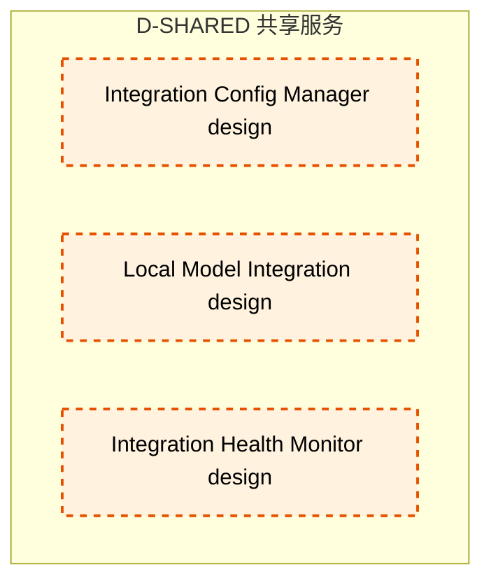

# 20_d_shared / 共享服务

> **文档作用 / Purpose**: 展示 共享服务（D-SHARED）功能域的模块清单、域内依赖关系和跨域依赖关系，供架构审查和域治理参考。

> 本文档由 generate_domain_doc.py 从 depgraph.db 自动生成
> 最后更新: 2026-06-25 18:42:45
> 数据源: depgraph.db nodes表 + edges表

## 域基本信息 / Domain Overview

| 字段 | 值 | Field | Value |
|------|------|-------|-------|
| 编号 | 20 | Number | 20 |
| 域ID | D-SHARED | Domain ID | D-SHARED |
| 域名称 | 共享服务 | Domain Name | shared_services |
| 层级 | L1_foundation | Layer | L1_foundation |
| 模块数 | 303 | Module Count | 303 |
| 域内依赖 | 186 | Internal Dependencies | 186 |
| 跨域入边 | 489 | Cross-domain Incoming | 489 |
| 跨域出边 | 30 | Cross-domain Outgoing | 30 |
| 设计态模块 | 6 | Design Modules | 6 |
| 原型态模块 | 203 | Prototype Modules | 203 |
| 生产态模块 | 94 | Production Modules | 94 |
| 容量 | 94/150 (正常) | Capacity | 94/150 (正常) |
| 描述 | 事件总线(event_bus) | Description | 事件总线(event_bus) |

## 模块清单 / Module List

共 303 个模块（按路径排序，全部显示）

| 模块路径 / Module Path | 模块名称 / Module Name | 设计成熟度 / Maturity | 构建状态 / Build Status |
|---------|---------|-----------|---------|
| F11-context-engine/ |  | design | stable |
| F22-event-bus/ |  | design | stable |
| src/zephyr/integration/shared/api_03/api_index.py |  | prototype | generated |
| src/zephyr/integration/shared_08/context.py |  | prototype | generated |
| src/zephyr/integration/shared_08/contracts/gate/gate_result.py |  | prototype | generated |
| src/zephyr/shared/__init__.py |  | production | generated |
| src/zephyr/shared/__version__.py |  | prototype | generated |
| src/zephyr/shared/_cross_layer/__init__.py |  | prototype | generated |
| src/zephyr/shared/_cross_layer/ml_experiment_pipeline.py |  | prototype | generated |
| src/zephyr/shared/adaptation/__init__.py |  | production | generated |
| src/zephyr/shared/adaptation/execution_tuner.py |  | prototype | generated |
| src/zephyr/shared/adaptation/prompt_version_manager.py |  | prototype | generated |
| src/zephyr/shared/adaptive_sampler.py |  | production | generated |
| src/zephyr/shared/ai_audit_guard.py |  | production | generated |
| src/zephyr/shared/ai_understandability_constraint.py |  | production | generated |
| src/zephyr/shared/alert_escalation.py |  | production | generated |
| src/zephyr/shared/alert_manager.py |  | production | generated |
| src/zephyr/shared/alert_precision_tracker.py |  | production | generated |
| src/zephyr/shared/api/__init__.py |  | prototype | generated |
| src/zephyr/shared/api/api_client.py |  | prototype | generated |
| src/zephyr/shared/api/api_index.py |  | prototype | generated |
| src/zephyr/shared/api/dos_launcher.py |  | prototype | generated |
| src/zephyr/shared/api/shared_quickref.yaml |  | production | deprecated |
| src/zephyr/shared/api_client.py |  | prototype | generated |
| src/zephyr/shared/blueprint_code_auditor.py |  | production | generated |
| src/zephyr/shared/blueprint_decomposer.py |  | prototype | generated |
| src/zephyr/shared/blueprint_scorer.py |  | prototype | generated |
| src/zephyr/shared/budget_aware_prompt.py |  | production | generated |
| src/zephyr/shared/cache.py |  | prototype | generated |
| src/zephyr/shared/capability.py |  | prototype | generated |
| src/zephyr/shared/capacity_calibrator.py |  | production | generated |
| src/zephyr/shared/capacity_digital_twin.py |  | production | generated |
| src/zephyr/shared/capacity_fingerprint.py |  | production | generated |
| src/zephyr/shared/capacity_runbook_generator.py |  | production | generated |
| src/zephyr/shared/code_economy_analyzer.py |  | production | generated |
| src/zephyr/shared/combinatorial_gate.py |  | production | generated |
| src/zephyr/shared/compensation/__init__.py |  | production | generated |
| src/zephyr/shared/compensation/saga_compensator.py |  | prototype | deprecated |
| src/zephyr/shared/config/__init__.py |  | prototype | generated |
| src/zephyr/shared/config/loader.py |  | prototype | generated |
| src/zephyr/shared/constants.py |  | prototype | generated |
| src/zephyr/shared/content_fingerprint.py |  | prototype | generated |
| src/zephyr/shared/context_engine.py |  | prototype | generated |
| src/zephyr/shared/contract_bus.py |  | prototype | generated |
| src/zephyr/shared/contract_tester.py |  | prototype | generated |
| src/zephyr/shared/contracts/__init__.py |  | prototype | generated |
| src/zephyr/shared/contracts/backpressure/__init__.py |  | prototype | generated |
| src/zephyr/shared/contracts/backpressure/_types.py |  | prototype | generated |
| src/zephyr/shared/contracts/backpressure/pause.py |  | prototype | generated |
| src/zephyr/shared/contracts/backpressure/resume.py |  | prototype | generated |
| src/zephyr/shared/contracts/backpressure/throttle.py |  | prototype | generated |
| src/zephyr/shared/contracts/core/__init__.py |  | prototype | generated |
| src/zephyr/shared/contracts/core/base_event.py |  | prototype | generated |
| src/zephyr/shared/contracts/core/enforcer.py |  | prototype | generated |
| src/zephyr/shared/contracts/core/factories.py |  | prototype | generated |
| src/zephyr/shared/contracts/core/gate_types.py |  | prototype | generated |
| src/zephyr/shared/contracts/core/registry.py |  | prototype | generated |
| src/zephyr/shared/contracts/core/runtime_plane_tag.py |  | prototype | generated |
| src/zephyr/shared/contracts/core/system_configuration.py |  | prototype | generated |
| src/zephyr/shared/contracts/core/telemetry_emitter.py |  | production | stable |
| src/zephyr/shared/contracts/core/timestamp.py |  | prototype | generated |
| src/zephyr/shared/contracts/core/trace_context.py |  | prototype | generated |
| src/zephyr/shared/contracts/errors/__init__.py |  | prototype | generated |
| src/zephyr/shared/contracts/errors/contract_violation_error.py |  | prototype | generated |
| src/zephyr/shared/contracts/errors/data_quality_error.py |  | prototype | generated |
| src/zephyr/shared/contracts/errors/execution_rejection_error.py |  | prototype | generated |
| src/zephyr/shared/contracts/errors/factor_computation_error.py |  | prototype | generated |
| src/zephyr/shared/contracts/errors/risk_limit_violation_error.py |  | prototype | generated |
| src/zephyr/shared/contracts/errors/signal_degradation_warning.py |  | prototype | generated |
| src/zephyr/shared/contracts/escalation/__init__.py |  | prototype | generated |
| src/zephyr/shared/contracts/escalation/budget_alert.py |  | production | generated |
| src/zephyr/shared/contracts/execution/__init__.py |  | prototype | generated |
| src/zephyr/shared/contracts/execution/capital_allocation_result.py |  | prototype | generated |
| src/zephyr/shared/contracts/execution/execution_report.py |  | prototype | generated |
| src/zephyr/shared/contracts/execution/fill.py |  | prototype | generated |
| src/zephyr/shared/contracts/execution/model_serving_request.py |  | prototype | generated |
| src/zephyr/shared/contracts/execution/order.py |  | prototype | generated |
| src/zephyr/shared/contracts/experiment/__init__.py |  | prototype | generated |
| src/zephyr/shared/contracts/experiment/experiment_result.py |  | prototype | generated |
| src/zephyr/shared/contracts/experiment/model_serving_response.py |  | prototype | generated |
| src/zephyr/shared/contracts/external/__init__.py |  | prototype | generated |
| src/zephyr/shared/contracts/external/ext_001.py |  | prototype | generated |
| src/zephyr/shared/contracts/external/ext_002.py |  | prototype | generated |
| src/zephyr/shared/contracts/external/ext_003.py |  | prototype | generated |
| src/zephyr/shared/contracts/external/ext_004.py |  | prototype | generated |
| src/zephyr/shared/contracts/identity/__init__.py |  | prototype | generated |
| src/zephyr/shared/contracts/identity/agent_identity.py |  | prototype | generated |
| src/zephyr/shared/contracts/identity/permission.py |  | prototype | generated |
| src/zephyr/shared/contracts/llm_gateway_protocol.py |  | prototype | generated |
| src/zephyr/shared/contracts/market/__init__.py |  | prototype | generated |
| src/zephyr/shared/contracts/market/factor_monitor_report.py |  | production | stable |
| src/zephyr/shared/contracts/market/factor_signal.py |  | prototype | generated |
| src/zephyr/shared/contracts/market/instrument.py |  | prototype | generated |
| src/zephyr/shared/contracts/market/macro_factor_signal.py |  | prototype | generated |
| src/zephyr/shared/contracts/market/market_data.py |  | prototype | generated |
| src/zephyr/shared/contracts/market/synthesized_signal.py |  | prototype | generated |
| src/zephyr/shared/contracts/orchestration_protocol.py |  | prototype | generated |
| src/zephyr/shared/contracts/portfolio/__init__.py |  | prototype | generated |
| src/zephyr/shared/contracts/portfolio/money.py |  | production | generated |
| src/zephyr/shared/contracts/portfolio/performance_attribution_report.py |  | prototype | generated |
| src/zephyr/shared/contracts/portfolio/position.py |  | prototype | generated |
| src/zephyr/shared/contracts/portfolio/strategy_lifecycle_event.py |  | prototype | generated |
| src/zephyr/shared/contracts/risk/__init__.py |  | prototype | generated |
| src/zephyr/shared/contracts/risk/compliance_rule.py |  | prototype | generated |
| src/zephyr/shared/contracts/risk/risk_dashboard_snapshot.py |  | production | stable |
| src/zephyr/shared/contracts/risk/risk_limits.py |  | prototype | generated |
| src/zephyr/shared/contracts/risk/risk_metrics.py |  | production | stable |
| src/zephyr/shared/contracts/risk/risk_validator_protocol.py |  | prototype | generated |
| src/zephyr/shared/contracts/security/__init__.py |  | prototype | generated |
| src/zephyr/shared/contracts/security/security_decision.py |  | prototype | generated |
| src/zephyr/shared/contracts/skill_protocol.py |  | prototype | generated |
| src/zephyr/shared/contracts/task_repository_protocol.py |  | prototype | generated |
| src/zephyr/shared/core_integrity_guard.py |  | production | generated |
| src/zephyr/shared/cost_estimator.py |  | production | generated |
| src/zephyr/shared/degradation_chain.py |  | production | generated |
| src/zephyr/shared/dependency/__init__.py |  | production | generated |
| src/zephyr/shared/dependency/dependency_graph.py |  | prototype | deprecated |
| src/zephyr/shared/dependency_capacity_guard.py |  | production | generated |
| src/zephyr/shared/deprecation.py |  | prototype | generated |
| src/zephyr/shared/diff_utils.py |  | prototype | generated |
| src/zephyr/shared/draft/__init__.py |  | production | generated |
| src/zephyr/shared/draft/draft_assistant.py |  | prototype | deprecated |
| src/zephyr/shared/dual_channel_alert.py |  | production | generated |
| src/zephyr/shared/env.py |  | prototype | generated |
| src/zephyr/shared/error_budget_tracker.py |  | production | generated |
| src/zephyr/shared/errors.py |  | prototype | generated |
| src/zephyr/shared/event_bus.py |  | production | stable |
| src/zephyr/shared/event_bus.py |  | production | generated |
| src/zephyr/shared/events/__init__.py |  | prototype | generated |
| src/zephyr/shared/events/dlq.py |  | prototype | generated |
| src/zephyr/shared/events/dlq_bridge.py |  | prototype | generated |
| src/zephyr/shared/events/event_bus.py |  | production | stable |
| src/zephyr/shared/events/event_bus_upgrade.py |  | production | generated |
| src/zephyr/shared/events/event_reactor.py |  | prototype | generated |
| src/zephyr/shared/events/event_schemas.py |  | prototype | generated |
| src/zephyr/shared/events/hook_dispatcher.py |  | prototype | generated |
| src/zephyr/shared/events/upgrade_strategy.py |  | prototype | generated |
| src/zephyr/shared/fault_isolator.py |  | production | generated |
| src/zephyr/shared/file_utils.py |  | prototype | generated |
| src/zephyr/shared/flags.py |  | prototype | generated |
| src/zephyr/shared/foundation/__init__.py |  | prototype | generated |
| src/zephyr/shared/foundation/constants.py |  | prototype | generated |
| src/zephyr/shared/foundation/deprecation.py |  | prototype | generated |
| src/zephyr/shared/foundation/env.py |  | prototype | generated |
| src/zephyr/shared/foundation/errors.py |  | prototype | generated |
| src/zephyr/shared/foundation/flags.py |  | prototype | generated |
| src/zephyr/shared/foundation/types.py |  | prototype | generated |
| src/zephyr/shared/frontmatter_utils.py |  | prototype | generated |
| src/zephyr/shared/health.py |  | production | stable |
| src/zephyr/shared/healthcheck_service.py |  | production | stable |
| src/zephyr/shared/heartbeat_server.py |  | production | generated |
| src/zephyr/shared/idempotency.py |  | prototype | generated |
| src/zephyr/shared/infra/__init__.py |  | prototype | generated |
| src/zephyr/shared/infra/cache.py |  | prototype | generated |
| src/zephyr/shared/infra/idempotency.py |  | prototype | generated |
| src/zephyr/shared/infra/limiter.py |  | prototype | generated |
| src/zephyr/shared/infra/lock.py |  | prototype | generated |
| src/zephyr/shared/infra/observer.py |  | prototype | generated |
| src/zephyr/shared/infra/outbox.py |  | prototype | generated |
| src/zephyr/shared/infra/process_lifecycle_gateway.py |  | production | generated |
| src/zephyr/shared/infra/process_pool.py |  | prototype | generated |
| src/zephyr/shared/infra_06/__init__.py |  | production | generated |
| src/zephyr/shared/infra_06/idempotency.py |  | prototype | generated |
| src/zephyr/shared/infra_06/limiter.py |  | prototype | generated |
| src/zephyr/shared/infra_06/lock.py |  | prototype | generated |
| src/zephyr/shared/infra_06/observer.py |  | prototype | generated |
| src/zephyr/shared/infra_06/outbox.py |  | prototype | generated |
| src/zephyr/shared/io/__init__.py |  | prototype | generated |
| src/zephyr/shared/io/content_fingerprint.py |  | prototype | generated |
| src/zephyr/shared/io/file_utils.py |  | prototype | generated |
| src/zephyr/shared/io/frontmatter_utils.py |  | prototype | generated |
| src/zephyr/shared/io/io_cache.py |  | prototype | generated |
| src/zephyr/shared/io/paths.py |  | prototype | generated |
| src/zephyr/shared/io/serialization.py |  | prototype | generated |
| src/zephyr/shared/io/streaming_reader.py |  | prototype | generated |
| src/zephyr/shared/knowledge/__init__.py |  | production | generated |
| src/zephyr/shared/knowledge/ke_linker.py |  | prototype | generated |
| src/zephyr/shared/knowledge/ke_structurer.py |  | prototype | generated |
| src/zephyr/shared/knowledge/kms_interface.py |  | prototype | generated |
| src/zephyr/shared/lifecycle/scope_guard.py |  | production | generated |
| src/zephyr/shared/lifecycle/task_lifecycle_manager.py |  | production | generated |
| src/zephyr/shared/limiter.py |  | prototype | generated |
| src/zephyr/shared/lock.py |  | prototype | generated |
| src/zephyr/shared/logging.py |  | prototype | generated |
| src/zephyr/shared/longevity_monitor.py |  | production | generated |
| src/zephyr/shared/maintenance/__init__.py |  | production | generated |
| src/zephyr/shared/maintenance/autonomy_monitor.py |  | production | stable |
| src/zephyr/shared/maintenance/dogfooding.py |  | prototype | generated |
| src/zephyr/shared/maintenance/handbook.py |  | prototype | generated |
| src/zephyr/shared/maintenance/zero_config.py |  | prototype | generated |
| src/zephyr/shared/metrics.py |  | production | stable |
| src/zephyr/shared/migration.py |  | prototype | generated |
| src/zephyr/shared/model_capacity_probe.py |  | production | generated |
| src/zephyr/shared/models.py |  | prototype | generated |
| src/zephyr/shared/module_birth_registry.py |  | production | generated |
| src/zephyr/shared/observability_02/__init__.py |  | production | generated |
| src/zephyr/shared/observability_02/health.py |  | production | stable |
| src/zephyr/shared/observability_02/health_discovery.py |  | production | stable |
| src/zephyr/shared/observability_02/logging.py |  | prototype | generated |
| src/zephyr/shared/observability_02/metrics.py |  | production | stable |
| src/zephyr/shared/observability_02/tracing.py |  | prototype | generated |
| src/zephyr/shared/observer.py |  | prototype | generated |
| src/zephyr/shared/outbox.py |  | prototype | generated |
| src/zephyr/shared/owner_trust_gauge.py |  | production | generated |
| src/zephyr/shared/pagination.py |  | prototype | generated |
| src/zephyr/shared/paths.py |  | prototype | generated |
| src/zephyr/shared/ports.py |  | prototype | generated |
| src/zephyr/shared/protocols/__init__.py |  | prototype | generated |
| src/zephyr/shared/protocols/a2a/__init__.py |  | prototype | generated |
| src/zephyr/shared/protocols/a2a/a2a_coordination.py |  | prototype | generated |
| src/zephyr/shared/protocols/a2a/a2a_protocol.py |  | prototype | generated |
| src/zephyr/shared/protocols/a2a/a2a_registry.py |  | prototype | generated |
| src/zephyr/shared/protocols/a2a/a2a_schemas.py |  | prototype | generated |
| src/zephyr/shared/protocols/a2a/layer3_coordination/__init__.py |  | prototype | generated |
| src/zephyr/shared/quality/__init__.py |  | production | generated |
| src/zephyr/shared/quality/quality_monitor.py | quality_monitor | production | stable |
| src/zephyr/shared/queue/__init__.py |  | production | generated |
| src/zephyr/shared/queue/task_scheduler.py |  | production | generated |
| src/zephyr/shared/reasoning_spans.py |  | production | generated |
| src/zephyr/shared/registry.py |  | prototype | generated |
| src/zephyr/shared/reliability/__init__.py |  | production | generated |
| src/zephyr/shared/reliability/context_guard.py |  | production | generated |
| src/zephyr/shared/reliability/diff_planner.py |  | prototype | generated |
| src/zephyr/shared/reliability/retry_handler.py |  | prototype | generated |
| src/zephyr/shared/resilience/__init__.py |  | prototype | generated |
| src/zephyr/shared/resilience/circuit_breaker.py |  | prototype | generated |
| src/zephyr/shared/resilience/fallback.py |  | prototype | generated |
| src/zephyr/shared/resilience/retry.py |  | prototype | generated |
| src/zephyr/shared/sandbox_executor.py |  | production | generated |
| src/zephyr/shared/schema/__init__.py |  | prototype | generated |
| src/zephyr/shared/schema/base_config.py |  | prototype | generated |
| src/zephyr/shared/schema/schema_registry.py |  | prototype | generated |
| src/zephyr/shared/schema/schemas.py |  | prototype | generated |
| src/zephyr/shared/schema/severity_types.py |  | prototype | generated |
| src/zephyr/shared/schema_registry.py |  | prototype | generated |
| src/zephyr/shared/schemas.py |  | prototype | generated |
| src/zephyr/shared/secrets.py |  | prototype | generated |
| src/zephyr/shared/security/__init__.py |  | prototype | generated |
| src/zephyr/shared/security/capability.py |  | prototype | generated |
| src/zephyr/shared/security/secrets.py |  | prototype | generated |
| src/zephyr/shared/security/ssot_guard.py |  | prototype | generated |
| src/zephyr/shared/serialization.py |  | prototype | generated |
| src/zephyr/shared/session/__init__.py |  | production | generated |
| src/zephyr/shared/session/session_boundary.py |  | prototype | generated |
| src/zephyr/shared/session/session_continuity.py |  | prototype | generated |
| src/zephyr/shared/session_audit.py |  | prototype | generated |
| src/zephyr/shared/session_continuity.py |  | prototype | generated |
| src/zephyr/shared/shared_quickref.yaml |  | production | deprecated |
| src/zephyr/shared/shared_services/__init__.py |  | production | generated |
| src/zephyr/shared/shared_services/blueprint_decomposer.py |  | production | generated |
| src/zephyr/shared/shared_services/events/__init__.py |  | production | generated |
| src/zephyr/shared/shared_services/infra_06/__init__.py |  | prototype | generated |
| src/zephyr/shared/shared_services/infra_06/cache.py |  | production | generated |
| src/zephyr/shared/shared_services/infra_06/idempotency.py |  | production | generated |
| src/zephyr/shared/shared_services/infra_06/limiter.py |  | prototype | generated |
| src/zephyr/shared/shared_services/infra_06/lock.py |  | production | generated |
| src/zephyr/shared/shared_services/infra_06/observer.py |  | production | generated |
| src/zephyr/shared/shared_services/infra_06/outbox.py |  | production | generated |
| src/zephyr/shared/shared_services/infra_06/process_pool.py |  | production | generated |
| src/zephyr/shared/shared_services/lifecycle/__init__.py |  | production | generated |
| src/zephyr/shared/shared_services/lifecycle/daemon_registry.py |  | production | generated |
| src/zephyr/shared/shared_services/lifecycle/task_lifecycle_manager.py |  | production | generated |
| src/zephyr/shared/shared_services/models.py |  | production | generated |
| src/zephyr/shared/shared_services/observability_02/__init__.py |  | prototype | generated |
| src/zephyr/shared/shared_services/observability_02/health.py |  | production | stable |
| src/zephyr/shared/shared_services/observability_02/logging.py |  | production | generated |
| src/zephyr/shared/shared_services/observability_02/metrics.py |  | production | stable |
| src/zephyr/shared/shared_services/observability_02/session_audit.py |  | production | generated |
| src/zephyr/shared/shared_services/observability_02/token_utils.py |  | prototype | generated |
| src/zephyr/shared/shared_services/observability_02/token_utils.py |  | prototype | generated |
| src/zephyr/shared/shared_services/observability_02/token_utils.py |  | production | generated |
| src/zephyr/shared/shared_services/observability_02/tracing.py |  | production | generated |
| src/zephyr/shared/shared_services/queue/__init__.py |  | production | generated |
| src/zephyr/shared/shared_services/queue/task_queue.py |  | prototype | generated |
| src/zephyr/shared/shared_services/session_continuity.py |  | production | generated |
| src/zephyr/shared/shared_util/__init__.py |  | prototype | deprecated |
| src/zephyr/shared/sla/__init__.py |  | production | generated |
| src/zephyr/shared/sla/sla_monitor.py | sla_monitor | production | stable |
| src/zephyr/shared/slo_review_assistant.py |  | production | generated |
| src/zephyr/shared/ssot_guard.py |  | prototype | generated |
| src/zephyr/shared/state_machine.py |  | prototype | generated |
| src/zephyr/shared/task_heartbeat.py |  | production | generated |
| src/zephyr/shared/task_types.py |  | prototype | generated |
| src/zephyr/shared/testing.py |  | prototype | generated |
| src/zephyr/shared/time_utils.py |  | prototype | generated |
| src/zephyr/shared/tracing.py |  | prototype | generated |
| src/zephyr/shared/ttl_cleanup_engine.py |  | production | generated |
| src/zephyr/shared/types.py |  | prototype | generated |
| src/zephyr/shared/utils/__init__.py |  | prototype | generated |
| src/zephyr/shared/utils/context.py |  | prototype | generated |
| src/zephyr/shared/utils/db_utils.py |  | prototype | generated |
| src/zephyr/shared/utils/diff_utils.py |  | prototype | generated |
| src/zephyr/shared/utils/migration.py |  | prototype | generated |
| src/zephyr/shared/utils/pagination.py |  | prototype | generated |
| src/zephyr/shared/utils/testing.py |  | prototype | generated |
| src/zephyr/shared/utils/time_utils.py |  | prototype | generated |
| src/zephyr/shared/vibe_experiment_tracker.py |  | production | generated |
| src/zephyr/shared/zephyr_logger.py |  | production | generated |
| tools/_gen_dedup_tests.py |  | prototype | deprecated |
| ✅保留/D-INTEGRATION-11 | Event Bus Manager | design | planned |
| ✅能建/D-INTEGRATION-33 | Integration Config Manager | design | planned |
| ✅能建/D-INTEGRATION-43 | Local Model Integration | design | planned |
| 移除/D-INTEGRATION-13 | Integration Health Monitor | design | planned |

## 域内依赖图 / Internal Dependency Diagram

> 依赖图内嵌在本文档中，IDE 可直接渲染显示。每30个节点一组分页显示。
>
> **图例说明 / Legend**：
> - **实线边框 = 运营态模块**（production，已上线运行）
> - **虚线边框 = 设计态模块**（design，还在设计中）
> - **实线箭头 = 运营态依赖**（已生效的依赖关系）
> - **虚线箭头 = 设计态依赖**（计划中的依赖关系）

### 第 1 页 / 共 11 页 / Page 1 of 11

### 第 2 页 / 共 11 页 / Page 2 of 11

### 第 3 页 / 共 11 页 / Page 3 of 11

```mermaid
graph TD
    subgraph D_SHARED["D-SHARED 共享服务"]
        src_zephyr_shared_contracts_core_timestamp_py["src/zephyr/shared/contracts/core/timestamp.py prototype"]
        src_zephyr_shared_contracts_core_trace_context_py["src/zephyr/shared/contracts/core/trace_context.py prototype"]
        src_zephyr_shared_contracts_errors_init_py["src/zephyr/shared/contracts/errors/__init__.py prototype"]
        src_zephyr_shared_contracts_errors_contract_violation_error_py["src/zephyr/shared/contracts/errors/contract_vio... prototype"]
        src_zephyr_shared_contracts_errors_data_quality_error_py["src/zephyr/shared/contracts/errors/data_quality... prototype"]
        src_zephyr_shared_contracts_errors_execution_rejection_error_py["src/zephyr/shared/contracts/errors/execution_re... prototype"]
        src_zephyr_shared_contracts_errors_factor_computation_error_py["src/zephyr/shared/contracts/errors/factor_compu... prototype"]
        src_zephyr_shared_contracts_errors_risk_limit_violation_error_py["src/zephyr/shared/contracts/errors/risk_limit_v... prototype"]
        src_zephyr_shared_contracts_errors_signal_degradation_warning_py["src/zephyr/shared/contracts/errors/signal_degra... prototype"]
        src_zephyr_shared_contracts_escalation_init_py["src/zephyr/shared/contracts/escalation/__init__.py prototype"]
        src_zephyr_shared_contracts_escalation_budget_alert_py["src/zephyr/shared/contracts/escalation/budget_a... production"]
        src_zephyr_shared_contracts_execution_init_py["src/zephyr/shared/contracts/execution/__init__.py prototype"]
        src_zephyr_shared_contracts_execution_capital_allocation_result_py["src/zephyr/shared/contracts/execution/capital_a... prototype"]
        src_zephyr_shared_contracts_execution_execution_report_py["src/zephyr/shared/contracts/execution/execution... prototype"]
        src_zephyr_shared_contracts_execution_fill_py["src/zephyr/shared/contracts/execution/fill.py prototype"]
        src_zephyr_shared_contracts_execution_model_serving_request_py["src/zephyr/shared/contracts/execution/model_ser... prototype"]
        src_zephyr_shared_contracts_execution_order_py["src/zephyr/shared/contracts/execution/order.py prototype"]
        src_zephyr_shared_contracts_experiment_init_py["src/zephyr/shared/contracts/experiment/__init__.py prototype"]
        src_zephyr_shared_contracts_experiment_experiment_result_py["src/zephyr/shared/contracts/experiment/experime... prototype"]
        src_zephyr_shared_contracts_experiment_model_serving_response_py["src/zephyr/shared/contracts/experiment/model_se... prototype"]
        src_zephyr_shared_contracts_external_init_py["src/zephyr/shared/contracts/external/__init__.py prototype"]
        src_zephyr_shared_contracts_external_ext_001_py["src/zephyr/shared/contracts/external/ext_001.py prototype"]
        src_zephyr_shared_contracts_external_ext_002_py["src/zephyr/shared/contracts/external/ext_002.py prototype"]
        src_zephyr_shared_contracts_external_ext_003_py["src/zephyr/shared/contracts/external/ext_003.py prototype"]
        src_zephyr_shared_contracts_external_ext_004_py["src/zephyr/shared/contracts/external/ext_004.py prototype"]
        src_zephyr_shared_contracts_identity_init_py["src/zephyr/shared/contracts/identity/__init__.py prototype"]
        src_zephyr_shared_contracts_identity_agent_identity_py["src/zephyr/shared/contracts/identity/agent_iden... prototype"]
        src_zephyr_shared_contracts_identity_permission_py["src/zephyr/shared/contracts/identity/permission.py prototype"]
        src_zephyr_shared_contracts_llm_gateway_protocol_py["src/zephyr/shared/contracts/llm_gateway_protoco... prototype"]
        src_zephyr_shared_contracts_market_init_py["src/zephyr/shared/contracts/market/__init__.py prototype"]
    end
    src_zephyr_shared_contracts_errors_contract_violation_error_py -.->|import_depends| src_zephyr_shared_contracts_core_trace_context_py
    src_zephyr_shared_contracts_errors_data_quality_error_py -.->|import_depends| src_zephyr_shared_contracts_core_trace_context_py
    src_zephyr_shared_contracts_errors_factor_computation_error_py -.->|import_depends| src_zephyr_shared_contracts_core_trace_context_py
    src_zephyr_shared_contracts_errors_execution_rejection_error_py -.->|config_depends| src_zephyr_shared_contracts_errors_init_py
    src_zephyr_shared_contracts_escalation_init_py -.->|import_depends| src_zephyr_shared_contracts_escalation_budget_alert_py
    src_zephyr_shared_contracts_errors_signal_degradation_warning_py -.->|config_depends| src_zephyr_shared_contracts_errors_init_py
    src_zephyr_shared_contracts_errors_risk_limit_violation_error_py -.->|config_depends| src_zephyr_shared_contracts_errors_init_py
    src_zephyr_shared_contracts_errors_init_py -.->|import_depends| src_zephyr_shared_contracts_errors_contract_violation_error_py
    src_zephyr_shared_contracts_errors_init_py -.->|import_depends| src_zephyr_shared_contracts_errors_data_quality_error_py
    src_zephyr_shared_contracts_errors_init_py -.->|import_depends| src_zephyr_shared_contracts_errors_factor_computation_error_py
    src_zephyr_shared_contracts_execution_fill_py -.->|config_depends| src_zephyr_shared_contracts_execution_init_py
    src_zephyr_shared_contracts_execution_execution_report_py -.->|config_depends| src_zephyr_shared_contracts_execution_init_py
    src_zephyr_shared_contracts_execution_capital_allocation_result_py -.->|config_depends| src_zephyr_shared_contracts_execution_init_py
    src_zephyr_shared_contracts_execution_model_serving_request_py -.->|config_depends| src_zephyr_shared_contracts_execution_init_py
    src_zephyr_shared_contracts_execution_order_py -.->|config_depends| src_zephyr_shared_contracts_execution_init_py
    src_zephyr_shared_contracts_experiment_experiment_result_py -.->|import_depends| src_zephyr_shared_contracts_core_trace_context_py
    src_zephyr_shared_contracts_experiment_init_py -.->|config_depends| src_zephyr_shared_contracts_experiment_experiment_result_py
    src_zephyr_shared_contracts_external_init_py -.->|config_depends| src_zephyr_shared_contracts_external_ext_001_py
    src_zephyr_shared_contracts_identity_init_py -.->|import_depends| src_zephyr_shared_contracts_identity_agent_identity_py
    src_zephyr_shared_contracts_identity_init_py -.->|import_depends| src_zephyr_shared_contracts_identity_permission_py
    D_INFRA_RECOVERY["D-INFRA_RECOVERY production"]
    D_INFRA_RECOVERY -.->|import_depends| src_zephyr_shared_contracts_llm_gateway_protocol_py
    D_INFRA_RUNTIME["D-INFRA_RUNTIME production"]
    D_INFRA_RUNTIME -.->|import_depends| src_zephyr_shared_contracts_llm_gateway_protocol_py
    D_INTEGRATION["D-INTEGRATION prototype"]
    D_INTEGRATION -.->|import_depends| src_zephyr_shared_contracts_llm_gateway_protocol_py
    D_SECURITY["D-SECURITY production"]
    D_SECURITY -.->|import_depends| src_zephyr_shared_contracts_llm_gateway_protocol_py
    D_GOVERNANCE["D-GOVERNANCE prototype"]
    D_GOVERNANCE -.->|import_depends| src_zephyr_shared_contracts_errors_data_quality_error_py
    D_FACTOR["D-FACTOR production"]
    D_FACTOR -.->|import_depends| src_zephyr_shared_contracts_errors_factor_computation_error_py
    D_INFRA_TELEMETRY["D-INFRA_TELEMETRY production"]
    D_INFRA_TELEMETRY -.->|import_depends| src_zephyr_shared_contracts_core_timestamp_py
    D_INFRA_A2A["D-INFRA_A2A production"]
    D_INFRA_A2A -.->|import_depends| src_zephyr_shared_contracts_core_trace_context_py
    D_GOVERNANCE -.->|import_depends| src_zephyr_shared_contracts_escalation_budget_alert_py
    D_OPS["D-OPS prototype"]
    D_OPS -.->|import_depends| src_zephyr_shared_contracts_escalation_budget_alert_py
    D_GOVERNANCE -.->|import_depends| src_zephyr_shared_contracts_escalation_budget_alert_py
    D_GOVERNANCE -.->|import_depends| src_zephyr_shared_contracts_escalation_budget_alert_py
    D_GOVERNANCE -.->|import_depends| src_zephyr_shared_contracts_escalation_budget_alert_py
    D_GOVERNANCE -.->|import_depends| src_zephyr_shared_contracts_escalation_budget_alert_py
    D_GOVERNANCE -.->|test_depends| src_zephyr_shared_contracts_escalation_budget_alert_py
    classDef production fill:#e1f5fe,stroke:#01579b,stroke-width:2px,color:#000
    classDef design fill:#fff3e0,stroke:#e65100,stroke-width:2px,color:#000,stroke-dasharray: 5 5
    classDef external_prod fill:#e8f5e9,stroke:#1b5e20,stroke-width:1px,color:#000
    classDef external_design fill:#fce4ec,stroke:#880e4f,stroke-width:1px,color:#000,stroke-dasharray: 5 5
    class src_zephyr_shared_contracts_escalation_budget_alert_py production
    class src_zephyr_shared_contracts_core_timestamp_py,src_zephyr_shared_contracts_core_trace_context_py,src_zephyr_shared_contracts_errors_init_py,src_zephyr_shared_contracts_errors_contract_violation_error_py,src_zephyr_shared_contracts_errors_data_quality_error_py,src_zephyr_shared_contracts_errors_execution_rejection_error_py,src_zephyr_shared_contracts_errors_factor_computation_error_py,src_zephyr_shared_contracts_errors_risk_limit_violation_error_py,src_zephyr_shared_contracts_errors_signal_degradation_warning_py,src_zephyr_shared_contracts_escalation_init_py,src_zephyr_shared_contracts_execution_init_py,src_zephyr_shared_contracts_execution_capital_allocation_result_py,src_zephyr_shared_contracts_execution_execution_report_py,src_zephyr_shared_contracts_execution_fill_py,src_zephyr_shared_contracts_execution_model_serving_request_py,src_zephyr_shared_contracts_execution_order_py,src_zephyr_shared_contracts_experiment_init_py,src_zephyr_shared_contracts_experiment_experiment_result_py,src_zephyr_shared_contracts_experiment_model_serving_response_py,src_zephyr_shared_contracts_external_init_py,src_zephyr_shared_contracts_external_ext_001_py,src_zephyr_shared_contracts_external_ext_002_py,src_zephyr_shared_contracts_external_ext_003_py,src_zephyr_shared_contracts_external_ext_004_py,src_zephyr_shared_contracts_identity_init_py,src_zephyr_shared_contracts_identity_agent_identity_py,src_zephyr_shared_contracts_identity_permission_py,src_zephyr_shared_contracts_llm_gateway_protocol_py,src_zephyr_shared_contracts_market_init_py design
    class D_INFRA_RECOVERY,D_INFRA_RUNTIME,D_SECURITY,D_FACTOR,D_INFRA_TELEMETRY,D_INFRA_A2A external_prod
    class D_INTEGRATION,D_GOVERNANCE,D_OPS external_design
```

### 第 4 页 / 共 11 页 / Page 4 of 11

### 第 5 页 / 共 11 页 / Page 5 of 11

```mermaid
graph TD
    subgraph D_SHARED["D-SHARED 共享服务"]
        src_zephyr_shared_draft_init_py["src/zephyr/shared/draft/__init__.py production"]
        src_zephyr_shared_draft_draft_assistant_py["src/zephyr/shared/draft/draft_assistant.py prototype"]
        src_zephyr_shared_dual_channel_alert_py["src/zephyr/shared/dual_channel_alert.py production"]
        src_zephyr_shared_env_py["src/zephyr/shared/env.py prototype"]
        src_zephyr_shared_error_budget_tracker_py["src/zephyr/shared/error_budget_tracker.py production"]
        src_zephyr_shared_errors_py["src/zephyr/shared/errors.py prototype"]
        src_zephyr_shared_event_bus_py["src/zephyr/shared/event_bus.py production"]
        src_zephyr_shared_event_bus_py_1["src/zephyr/shared/event_bus.py production"]
        src_zephyr_shared_events_init_py["src/zephyr/shared/events/__init__.py prototype"]
        src_zephyr_shared_events_dlq_py["src/zephyr/shared/events/dlq.py prototype"]
        src_zephyr_shared_events_dlq_bridge_py["src/zephyr/shared/events/dlq_bridge.py prototype"]
        src_zephyr_shared_events_event_bus_py["src/zephyr/shared/events/event_bus.py production"]
        src_zephyr_shared_events_event_bus_upgrade_py["src/zephyr/shared/events/event_bus_upgrade.py production"]
        src_zephyr_shared_events_event_reactor_py["src/zephyr/shared/events/event_reactor.py prototype"]
        src_zephyr_shared_events_event_schemas_py["src/zephyr/shared/events/event_schemas.py prototype"]
        src_zephyr_shared_events_hook_dispatcher_py["src/zephyr/shared/events/hook_dispatcher.py prototype"]
        src_zephyr_shared_events_upgrade_strategy_py["src/zephyr/shared/events/upgrade_strategy.py prototype"]
        src_zephyr_shared_fault_isolator_py["src/zephyr/shared/fault_isolator.py production"]
        src_zephyr_shared_file_utils_py["src/zephyr/shared/file_utils.py prototype"]
        src_zephyr_shared_flags_py["src/zephyr/shared/flags.py prototype"]
        src_zephyr_shared_foundation_init_py["src/zephyr/shared/foundation/__init__.py prototype"]
        src_zephyr_shared_foundation_constants_py["src/zephyr/shared/foundation/constants.py prototype"]
        src_zephyr_shared_foundation_deprecation_py["src/zephyr/shared/foundation/deprecation.py prototype"]
        src_zephyr_shared_foundation_env_py["src/zephyr/shared/foundation/env.py prototype"]
        src_zephyr_shared_foundation_errors_py["src/zephyr/shared/foundation/errors.py prototype"]
        src_zephyr_shared_foundation_flags_py["src/zephyr/shared/foundation/flags.py prototype"]
        src_zephyr_shared_foundation_types_py["src/zephyr/shared/foundation/types.py prototype"]
        src_zephyr_shared_frontmatter_utils_py["src/zephyr/shared/frontmatter_utils.py prototype"]
        src_zephyr_shared_health_py["src/zephyr/shared/health.py production"]
        src_zephyr_shared_healthcheck_service_py["src/zephyr/shared/healthcheck_service.py production"]
    end
    src_zephyr_shared_errors_py -.->|import_depends| src_zephyr_shared_foundation_errors_py
    src_zephyr_shared_env_py -.->|import_depends| src_zephyr_shared_foundation_env_py
    src_zephyr_shared_flags_py -.->|import_depends| src_zephyr_shared_foundation_flags_py
    src_zephyr_shared_events_dlq_bridge_py -.->|import_depends| src_zephyr_shared_events_dlq_py
    src_zephyr_shared_events_event_reactor_py -.->|import_depends| src_zephyr_shared_event_bus_py_1
    src_zephyr_shared_events_init_py -.->|import_depends| src_zephyr_shared_events_dlq_bridge_py
    src_zephyr_shared_foundation_flags_py -.->|import_depends| src_zephyr_shared_foundation_errors_py
    src_zephyr_shared_events_hook_dispatcher_py -.->|import_depends| src_zephyr_shared_event_bus_py_1
    src_zephyr_shared_foundation_init_py -.->|config_depends| src_zephyr_shared_foundation_constants_py
    src_zephyr_shared_event_bus_py_1 -->|import_depends| src_zephyr_shared_events_event_bus_py
    D_OPS["D-OPS prototype"]
    src_zephyr_shared_health_py -.->|import_depends| D_OPS
    D_INFRA_RUNTIME["D-INFRA_RUNTIME production"]
    src_zephyr_shared_healthcheck_service_py -->|import_depends| D_INFRA_RUNTIME
    D_INTEGRATION["D-INTEGRATION production"]
    src_zephyr_shared_events_event_bus_py -->|import_depends| D_INTEGRATION
    D_GOVERNANCE["D-GOVERNANCE production"]
    src_zephyr_shared_foundation_constants_py -.->|import_depends| D_GOVERNANCE
    D_INFRA_RUNTIME -->|import_depends| src_zephyr_shared_dual_channel_alert_py
    D_OPS -.->|import_depends| src_zephyr_shared_dual_channel_alert_py
    D_GOVERNANCE -.->|test_depends| src_zephyr_shared_dual_channel_alert_py
    D_TRADING["D-TRADING prototype"]
    D_TRADING -.->|import_depends| src_zephyr_shared_event_bus_py_1
    D_INFRA_RUNTIME -->|import_depends| src_zephyr_shared_error_budget_tracker_py
    D_OPS -.->|import_depends| src_zephyr_shared_error_budget_tracker_py
    D_GOVERNANCE -.->|test_depends| src_zephyr_shared_error_budget_tracker_py
    D_GOVERNANCE -.->|test_depends| src_zephyr_shared_fault_isolator_py
    D_INFRA_A2A["D-INFRA_A2A production"]
    D_INFRA_A2A -.->|import_depends| src_zephyr_shared_events_dlq_bridge_py
    D_TRADING -.->|import_depends| src_zephyr_shared_events_event_bus_upgrade_py
    D_GOVERNANCE -.->|test_depends| src_zephyr_shared_events_event_bus_upgrade_py
    D_AUTONOMY_CORE["D-AUTONOMY_CORE prototype"]
    D_AUTONOMY_CORE -.->|import_depends| src_zephyr_shared_events_event_schemas_py
    D_INFRA_RUNTIME -.->|import_depends| src_zephyr_shared_events_upgrade_strategy_py
    D_INFRA_A2A -->|import_depends| src_zephyr_shared_event_bus_py_1
    D_GOVERNANCE -.->|test_depends| src_zephyr_shared_event_bus_py_1
    classDef production fill:#e1f5fe,stroke:#01579b,stroke-width:2px,color:#000
    classDef design fill:#fff3e0,stroke:#e65100,stroke-width:2px,color:#000,stroke-dasharray: 5 5
    classDef external_prod fill:#e8f5e9,stroke:#1b5e20,stroke-width:1px,color:#000
    classDef external_design fill:#fce4ec,stroke:#880e4f,stroke-width:1px,color:#000,stroke-dasharray: 5 5
    class src_zephyr_shared_draft_init_py,src_zephyr_shared_dual_channel_alert_py,src_zephyr_shared_error_budget_tracker_py,src_zephyr_shared_event_bus_py,src_zephyr_shared_event_bus_py_1,src_zephyr_shared_events_event_bus_py,src_zephyr_shared_events_event_bus_upgrade_py,src_zephyr_shared_fault_isolator_py,src_zephyr_shared_health_py,src_zephyr_shared_healthcheck_service_py production
    class src_zephyr_shared_draft_draft_assistant_py,src_zephyr_shared_env_py,src_zephyr_shared_errors_py,src_zephyr_shared_events_init_py,src_zephyr_shared_events_dlq_py,src_zephyr_shared_events_dlq_bridge_py,src_zephyr_shared_events_event_reactor_py,src_zephyr_shared_events_event_schemas_py,src_zephyr_shared_events_hook_dispatcher_py,src_zephyr_shared_events_upgrade_strategy_py,src_zephyr_shared_file_utils_py,src_zephyr_shared_flags_py,src_zephyr_shared_foundation_init_py,src_zephyr_shared_foundation_constants_py,src_zephyr_shared_foundation_deprecation_py,src_zephyr_shared_foundation_env_py,src_zephyr_shared_foundation_errors_py,src_zephyr_shared_foundation_flags_py,src_zephyr_shared_foundation_types_py,src_zephyr_shared_frontmatter_utils_py design
    class D_INFRA_RUNTIME,D_INTEGRATION,D_GOVERNANCE,D_INFRA_A2A external_prod
    class D_OPS,D_TRADING,D_AUTONOMY_CORE external_design
```

### 第 6 页 / 共 11 页 / Page 6 of 11

```mermaid
graph TD
    subgraph D_SHARED["D-SHARED 共享服务"]
        src_zephyr_shared_heartbeat_server_py["src/zephyr/shared/heartbeat_server.py production"]
        src_zephyr_shared_idempotency_py["src/zephyr/shared/idempotency.py prototype"]
        src_zephyr_shared_infra_init_py["src/zephyr/shared/infra/__init__.py prototype"]
        src_zephyr_shared_infra_cache_py["src/zephyr/shared/infra/cache.py prototype"]
        src_zephyr_shared_infra_idempotency_py["src/zephyr/shared/infra/idempotency.py prototype"]
        src_zephyr_shared_infra_limiter_py["src/zephyr/shared/infra/limiter.py prototype"]
        src_zephyr_shared_infra_lock_py["src/zephyr/shared/infra/lock.py prototype"]
        src_zephyr_shared_infra_observer_py["src/zephyr/shared/infra/observer.py prototype"]
        src_zephyr_shared_infra_outbox_py["src/zephyr/shared/infra/outbox.py prototype"]
        src_zephyr_shared_infra_process_lifecycle_gateway_py["src/zephyr/shared/infra/process_lifecycle_gatew... production"]
        src_zephyr_shared_infra_process_pool_py["src/zephyr/shared/infra/process_pool.py prototype"]
        src_zephyr_shared_infra_06_init_py["src/zephyr/shared/infra_06/__init__.py production"]
        src_zephyr_shared_infra_06_idempotency_py["src/zephyr/shared/infra_06/idempotency.py prototype"]
        src_zephyr_shared_infra_06_limiter_py["src/zephyr/shared/infra_06/limiter.py prototype"]
        src_zephyr_shared_infra_06_lock_py["src/zephyr/shared/infra_06/lock.py prototype"]
        src_zephyr_shared_infra_06_observer_py["src/zephyr/shared/infra_06/observer.py prototype"]
        src_zephyr_shared_infra_06_outbox_py["src/zephyr/shared/infra_06/outbox.py prototype"]
        src_zephyr_shared_io_init_py["src/zephyr/shared/io/__init__.py prototype"]
        src_zephyr_shared_io_content_fingerprint_py["src/zephyr/shared/io/content_fingerprint.py prototype"]
        src_zephyr_shared_io_file_utils_py["src/zephyr/shared/io/file_utils.py prototype"]
        src_zephyr_shared_io_frontmatter_utils_py["src/zephyr/shared/io/frontmatter_utils.py prototype"]
        src_zephyr_shared_io_io_cache_py["src/zephyr/shared/io/io_cache.py prototype"]
        src_zephyr_shared_io_paths_py["src/zephyr/shared/io/paths.py prototype"]
        src_zephyr_shared_io_serialization_py["src/zephyr/shared/io/serialization.py prototype"]
        src_zephyr_shared_io_streaming_reader_py["src/zephyr/shared/io/streaming_reader.py prototype"]
        src_zephyr_shared_knowledge_init_py["src/zephyr/shared/knowledge/__init__.py production"]
        src_zephyr_shared_knowledge_ke_linker_py["src/zephyr/shared/knowledge/ke_linker.py prototype"]
        src_zephyr_shared_knowledge_ke_structurer_py["src/zephyr/shared/knowledge/ke_structurer.py prototype"]
        src_zephyr_shared_knowledge_kms_interface_py["src/zephyr/shared/knowledge/kms_interface.py prototype"]
        src_zephyr_shared_lifecycle_scope_guard_py["src/zephyr/shared/lifecycle/scope_guard.py production"]
    end
    src_zephyr_shared_idempotency_py -.->|import_depends| src_zephyr_shared_infra_idempotency_py
    src_zephyr_shared_infra_process_lifecycle_gateway_py -.->|import_depends| src_zephyr_shared_infra_process_pool_py
    src_zephyr_shared_infra_init_py -.->|import_depends| src_zephyr_shared_infra_cache_py
    src_zephyr_shared_infra_init_py -.->|import_depends| src_zephyr_shared_infra_process_lifecycle_gateway_py
    src_zephyr_shared_io_init_py -.->|config_depends| src_zephyr_shared_io_content_fingerprint_py
    src_zephyr_shared_knowledge_ke_linker_py -.->|config_depends| src_zephyr_shared_knowledge_ke_structurer_py
    src_zephyr_shared_knowledge_kms_interface_py -.->|config_depends| src_zephyr_shared_knowledge_ke_linker_py
    D_INTEGRATION["D-INTEGRATION prototype"]
    src_zephyr_shared_infra_06_lock_py -.->|import_depends| D_INTEGRATION
    D_INFRA_RUNTIME["D-INFRA_RUNTIME production"]
    src_zephyr_shared_infra_process_lifecycle_gateway_py -->|import_depends| D_INFRA_RUNTIME
    src_zephyr_shared_infra_process_pool_py -.->|import_depends| D_INFRA_RUNTIME
    src_zephyr_shared_infra_06_idempotency_py -.->|import_depends| D_INTEGRATION
    src_zephyr_shared_infra_06_limiter_py -.->|import_depends| D_INTEGRATION
    src_zephyr_shared_infra_06_outbox_py -.->|import_depends| D_INTEGRATION
    src_zephyr_shared_io_io_cache_py -.->|import_depends| D_INFRA_RUNTIME
    D_INFRA_RUNTIME -->|import_depends| src_zephyr_shared_heartbeat_server_py
    D_GOVERNANCE["D-GOVERNANCE prototype"]
    D_GOVERNANCE -.->|test_depends| src_zephyr_shared_heartbeat_server_py
    D_AUTONOMY_CORE["D-AUTONOMY_CORE prototype"]
    D_AUTONOMY_CORE -.->|import_depends| src_zephyr_shared_infra_cache_py
    D_GOV_AUDIT["D-GOV_AUDIT prototype"]
    D_GOV_AUDIT -.->|import_depends| src_zephyr_shared_infra_observer_py
    D_GOV_AUDIT -.->|import_depends| src_zephyr_shared_infra_observer_py
    D_INFRA_RUNTIME -.->|import_depends| src_zephyr_shared_infra_observer_py
    D_INFRA_RUNTIME -->|import_depends| src_zephyr_shared_infra_process_lifecycle_gateway_py
    D_GOVERNANCE -.->|test_depends| src_zephyr_shared_infra_process_lifecycle_gateway_py
    D_GOV_ENFORCEMENT["D-GOV-ENFORCEMENT production"]
    D_GOV_ENFORCEMENT -.->|import_depends| src_zephyr_shared_io_io_cache_py
    D_GOV_AUDIT -.->|import_depends| src_zephyr_shared_io_streaming_reader_py
    D_GOV_AUDIT -.->|import_depends| src_zephyr_shared_io_paths_py
    D_GOV_AUDIT -.->|import_depends| src_zephyr_shared_io_paths_py
    D_GOV_AUDIT -.->|import_depends| src_zephyr_shared_io_paths_py
    D_GOV_AUDIT -.->|import_depends| src_zephyr_shared_io_paths_py
    D_GOV_DOCS["D-GOV-DOCS prototype"]
    D_GOV_DOCS -.->|import_depends| src_zephyr_shared_io_paths_py
    classDef production fill:#e1f5fe,stroke:#01579b,stroke-width:2px,color:#000
    classDef design fill:#fff3e0,stroke:#e65100,stroke-width:2px,color:#000,stroke-dasharray: 5 5
    classDef external_prod fill:#e8f5e9,stroke:#1b5e20,stroke-width:1px,color:#000
    classDef external_design fill:#fce4ec,stroke:#880e4f,stroke-width:1px,color:#000,stroke-dasharray: 5 5
    class src_zephyr_shared_heartbeat_server_py,src_zephyr_shared_infra_process_lifecycle_gateway_py,src_zephyr_shared_infra_06_init_py,src_zephyr_shared_knowledge_init_py,src_zephyr_shared_lifecycle_scope_guard_py production
    class src_zephyr_shared_idempotency_py,src_zephyr_shared_infra_init_py,src_zephyr_shared_infra_cache_py,src_zephyr_shared_infra_idempotency_py,src_zephyr_shared_infra_limiter_py,src_zephyr_shared_infra_lock_py,src_zephyr_shared_infra_observer_py,src_zephyr_shared_infra_outbox_py,src_zephyr_shared_infra_process_pool_py,src_zephyr_shared_infra_06_idempotency_py,src_zephyr_shared_infra_06_limiter_py,src_zephyr_shared_infra_06_lock_py,src_zephyr_shared_infra_06_observer_py,src_zephyr_shared_infra_06_outbox_py,src_zephyr_shared_io_init_py,src_zephyr_shared_io_content_fingerprint_py,src_zephyr_shared_io_file_utils_py,src_zephyr_shared_io_frontmatter_utils_py,src_zephyr_shared_io_io_cache_py,src_zephyr_shared_io_paths_py,src_zephyr_shared_io_serialization_py,src_zephyr_shared_io_streaming_reader_py,src_zephyr_shared_knowledge_ke_linker_py,src_zephyr_shared_knowledge_ke_structurer_py,src_zephyr_shared_knowledge_kms_interface_py design
    class D_INFRA_RUNTIME,D_GOV_ENFORCEMENT external_prod
    class D_INTEGRATION,D_GOVERNANCE,D_AUTONOMY_CORE,D_GOV_AUDIT,D_GOV_DOCS external_design
```

### 第 7 页 / 共 11 页 / Page 7 of 11

```mermaid
graph TD
    subgraph D_SHARED["D-SHARED 共享服务"]
        src_zephyr_shared_lifecycle_task_lifecycle_manager_py["src/zephyr/shared/lifecycle/task_lifecycle_mana... production"]
        src_zephyr_shared_limiter_py["src/zephyr/shared/limiter.py prototype"]
        src_zephyr_shared_lock_py["src/zephyr/shared/lock.py prototype"]
        src_zephyr_shared_logging_py["src/zephyr/shared/logging.py prototype"]
        src_zephyr_shared_longevity_monitor_py["src/zephyr/shared/longevity_monitor.py production"]
        src_zephyr_shared_maintenance_init_py["src/zephyr/shared/maintenance/__init__.py production"]
        src_zephyr_shared_maintenance_autonomy_monitor_py["src/zephyr/shared/maintenance/autonomy_monitor.py production"]
        src_zephyr_shared_maintenance_dogfooding_py["src/zephyr/shared/maintenance/dogfooding.py prototype"]
        src_zephyr_shared_maintenance_handbook_py["src/zephyr/shared/maintenance/handbook.py prototype"]
        src_zephyr_shared_maintenance_zero_config_py["src/zephyr/shared/maintenance/zero_config.py prototype"]
        src_zephyr_shared_metrics_py["src/zephyr/shared/metrics.py production"]
        src_zephyr_shared_migration_py["src/zephyr/shared/migration.py prototype"]
        src_zephyr_shared_model_capacity_probe_py["src/zephyr/shared/model_capacity_probe.py production"]
        src_zephyr_shared_models_py["src/zephyr/shared/models.py prototype"]
        src_zephyr_shared_module_birth_registry_py["src/zephyr/shared/module_birth_registry.py production"]
        src_zephyr_shared_observability_02_init_py["src/zephyr/shared/observability_02/__init__.py production"]
        src_zephyr_shared_observability_02_health_py["src/zephyr/shared/observability_02/health.py production"]
        src_zephyr_shared_observability_02_health_discovery_py["src/zephyr/shared/observability_02/health_disco... production"]
        src_zephyr_shared_observability_02_logging_py["src/zephyr/shared/observability_02/logging.py prototype"]
        src_zephyr_shared_observability_02_metrics_py["src/zephyr/shared/observability_02/metrics.py production"]
        src_zephyr_shared_observability_02_tracing_py["src/zephyr/shared/observability_02/tracing.py prototype"]
        src_zephyr_shared_observer_py["src/zephyr/shared/observer.py prototype"]
        src_zephyr_shared_outbox_py["src/zephyr/shared/outbox.py prototype"]
        src_zephyr_shared_owner_trust_gauge_py["src/zephyr/shared/owner_trust_gauge.py production"]
        src_zephyr_shared_pagination_py["src/zephyr/shared/pagination.py prototype"]
        src_zephyr_shared_paths_py["src/zephyr/shared/paths.py prototype"]
        src_zephyr_shared_ports_py["src/zephyr/shared/ports.py prototype"]
        src_zephyr_shared_protocols_init_py["src/zephyr/shared/protocols/__init__.py prototype"]
        src_zephyr_shared_protocols_a2a_init_py["src/zephyr/shared/protocols/a2a/__init__.py prototype"]
        src_zephyr_shared_protocols_a2a_a2a_coordination_py["src/zephyr/shared/protocols/a2a/a2a_coordinatio... prototype"]
    end
    src_zephyr_shared_maintenance_zero_config_py -.->|config_depends| src_zephyr_shared_maintenance_dogfooding_py
    src_zephyr_shared_maintenance_autonomy_monitor_py -.->|config_depends| src_zephyr_shared_maintenance_zero_config_py
    src_zephyr_shared_maintenance_handbook_py -.->|config_depends| src_zephyr_shared_maintenance_zero_config_py
    src_zephyr_shared_observability_02_health_discovery_py -->|config_depends| src_zephyr_shared_observability_02_health_py
    src_zephyr_shared_observability_02_tracing_py -.->|import_depends| src_zephyr_shared_observability_02_logging_py
    src_zephyr_shared_protocols_init_py -.->|import_depends| src_zephyr_shared_protocols_a2a_init_py
    src_zephyr_shared_protocols_a2a_init_py -.->|import_depends| src_zephyr_shared_protocols_a2a_a2a_coordination_py
    D_OPS["D-OPS prototype"]
    src_zephyr_shared_logging_py -.->|import_depends| D_OPS
    src_zephyr_shared_metrics_py -.->|import_depends| D_OPS
    D_INTEGRATION["D-INTEGRATION prototype"]
    src_zephyr_shared_observability_02_health_py -.->|import_depends| D_INTEGRATION
    D_GOVERNANCE["D-GOVERNANCE prototype"]
    src_zephyr_shared_protocols_a2a_init_py -.->|import_depends| D_GOVERNANCE
    D_INFRA_RUNTIME["D-INFRA_RUNTIME production"]
    D_INFRA_RUNTIME -->|import_depends| src_zephyr_shared_longevity_monitor_py
    D_GOVERNANCE -.->|test_depends| src_zephyr_shared_longevity_monitor_py
    D_TRADING["D-TRADING prototype"]
    D_TRADING -.->|import_depends| src_zephyr_shared_model_capacity_probe_py
    D_GOVERNANCE -.->|test_depends| src_zephyr_shared_model_capacity_probe_py
    D_GOVERNANCE -->|import_depends| src_zephyr_shared_module_birth_registry_py
    D_GOVERNANCE -.->|test_depends| src_zephyr_shared_module_birth_registry_py
    D_GOVERNANCE -.->|test_depends| src_zephyr_shared_owner_trust_gauge_py
    D_INFRA_A2A["D-INFRA_A2A production"]
    D_INFRA_A2A -.->|import_depends| src_zephyr_shared_protocols_a2a_a2a_coordination_py
    D_INFRA_A2A -.->|import_depends| src_zephyr_shared_protocols_a2a_init_py
    D_INTEGRATION -.->|import_depends| src_zephyr_shared_protocols_a2a_init_py
    classDef production fill:#e1f5fe,stroke:#01579b,stroke-width:2px,color:#000
    classDef design fill:#fff3e0,stroke:#e65100,stroke-width:2px,color:#000,stroke-dasharray: 5 5
    classDef external_prod fill:#e8f5e9,stroke:#1b5e20,stroke-width:1px,color:#000
    classDef external_design fill:#fce4ec,stroke:#880e4f,stroke-width:1px,color:#000,stroke-dasharray: 5 5
    class src_zephyr_shared_lifecycle_task_lifecycle_manager_py,src_zephyr_shared_longevity_monitor_py,src_zephyr_shared_maintenance_init_py,src_zephyr_shared_maintenance_autonomy_monitor_py,src_zephyr_shared_metrics_py,src_zephyr_shared_model_capacity_probe_py,src_zephyr_shared_module_birth_registry_py,src_zephyr_shared_observability_02_init_py,src_zephyr_shared_observability_02_health_py,src_zephyr_shared_observability_02_health_discovery_py,src_zephyr_shared_observability_02_metrics_py,src_zephyr_shared_owner_trust_gauge_py production
    class src_zephyr_shared_limiter_py,src_zephyr_shared_lock_py,src_zephyr_shared_logging_py,src_zephyr_shared_maintenance_dogfooding_py,src_zephyr_shared_maintenance_handbook_py,src_zephyr_shared_maintenance_zero_config_py,src_zephyr_shared_migration_py,src_zephyr_shared_models_py,src_zephyr_shared_observability_02_logging_py,src_zephyr_shared_observability_02_tracing_py,src_zephyr_shared_observer_py,src_zephyr_shared_outbox_py,src_zephyr_shared_pagination_py,src_zephyr_shared_paths_py,src_zephyr_shared_ports_py,src_zephyr_shared_protocols_init_py,src_zephyr_shared_protocols_a2a_init_py,src_zephyr_shared_protocols_a2a_a2a_coordination_py design
    class D_INFRA_RUNTIME,D_INFRA_A2A external_prod
    class D_OPS,D_INTEGRATION,D_GOVERNANCE,D_TRADING external_design
```

### 第 8 页 / 共 11 页 / Page 8 of 11

```mermaid
graph TD
    subgraph D_SHARED["D-SHARED 共享服务"]
        src_zephyr_shared_protocols_a2a_a2a_protocol_py["src/zephyr/shared/protocols/a2a/a2a_protocol.py prototype"]
        src_zephyr_shared_protocols_a2a_a2a_registry_py["src/zephyr/shared/protocols/a2a/a2a_registry.py prototype"]
        src_zephyr_shared_protocols_a2a_a2a_schemas_py["src/zephyr/shared/protocols/a2a/a2a_schemas.py prototype"]
        src_zephyr_shared_protocols_a2a_layer3_coordination_init_py["src/zephyr/shared/protocols/a2a/layer3_coordina... prototype"]
        src_zephyr_shared_quality_init_py["src/zephyr/shared/quality/__init__.py production"]
        src_zephyr_shared_quality_quality_monitor_py["quality_monitor production"]
        src_zephyr_shared_queue_init_py["src/zephyr/shared/queue/__init__.py production"]
        src_zephyr_shared_queue_task_scheduler_py["src/zephyr/shared/queue/task_scheduler.py production"]
        src_zephyr_shared_reasoning_spans_py["src/zephyr/shared/reasoning_spans.py production"]
        src_zephyr_shared_registry_py["src/zephyr/shared/registry.py prototype"]
        src_zephyr_shared_reliability_init_py["src/zephyr/shared/reliability/__init__.py production"]
        src_zephyr_shared_reliability_context_guard_py["src/zephyr/shared/reliability/context_guard.py production"]
        src_zephyr_shared_reliability_diff_planner_py["src/zephyr/shared/reliability/diff_planner.py prototype"]
        src_zephyr_shared_reliability_retry_handler_py["src/zephyr/shared/reliability/retry_handler.py prototype"]
        src_zephyr_shared_resilience_init_py["src/zephyr/shared/resilience/__init__.py prototype"]
        src_zephyr_shared_resilience_circuit_breaker_py["src/zephyr/shared/resilience/circuit_breaker.py prototype"]
        src_zephyr_shared_resilience_fallback_py["src/zephyr/shared/resilience/fallback.py prototype"]
        src_zephyr_shared_resilience_retry_py["src/zephyr/shared/resilience/retry.py prototype"]
        src_zephyr_shared_sandbox_executor_py["src/zephyr/shared/sandbox_executor.py production"]
        src_zephyr_shared_schema_init_py["src/zephyr/shared/schema/__init__.py prototype"]
        src_zephyr_shared_schema_base_config_py["src/zephyr/shared/schema/base_config.py prototype"]
        src_zephyr_shared_schema_schema_registry_py["src/zephyr/shared/schema/schema_registry.py prototype"]
        src_zephyr_shared_schema_schemas_py["src/zephyr/shared/schema/schemas.py prototype"]
        src_zephyr_shared_schema_severity_types_py["src/zephyr/shared/schema/severity_types.py prototype"]
        src_zephyr_shared_schema_registry_py["src/zephyr/shared/schema_registry.py prototype"]
        src_zephyr_shared_schemas_py["src/zephyr/shared/schemas.py prototype"]
        src_zephyr_shared_secrets_py["src/zephyr/shared/secrets.py prototype"]
        src_zephyr_shared_security_init_py["src/zephyr/shared/security/__init__.py prototype"]
        src_zephyr_shared_security_capability_py["src/zephyr/shared/security/capability.py prototype"]
        src_zephyr_shared_security_secrets_py["src/zephyr/shared/security/secrets.py prototype"]
    end
    src_zephyr_shared_schema_registry_py -.->|import_depends| src_zephyr_shared_schema_schema_registry_py
    src_zephyr_shared_schemas_py -.->|import_depends| src_zephyr_shared_schema_schemas_py
    src_zephyr_shared_secrets_py -.->|import_depends| src_zephyr_shared_security_secrets_py
    src_zephyr_shared_reliability_diff_planner_py -.->|config_depends| src_zephyr_shared_reliability_retry_handler_py
    src_zephyr_shared_schema_schemas_py -.->|import_depends| src_zephyr_shared_schema_severity_types_py
    src_zephyr_shared_schema_schemas_py -.->|import_depends| src_zephyr_shared_schema_base_config_py
    src_zephyr_shared_resilience_init_py -.->|config_depends| src_zephyr_shared_resilience_fallback_py
    src_zephyr_shared_schema_init_py -.->|config_depends| src_zephyr_shared_schema_severity_types_py
    src_zephyr_shared_security_init_py -.->|config_depends| src_zephyr_shared_security_secrets_py
    D_GOVERNANCE["D-GOVERNANCE prototype"]
    src_zephyr_shared_protocols_a2a_layer3_coordination_init_py -.->|import_depends| D_GOVERNANCE
    D_OPS["D-OPS prototype"]
    D_OPS -.->|import_depends| src_zephyr_shared_reasoning_spans_py
    D_GOVERNANCE -.->|test_depends| src_zephyr_shared_reasoning_spans_py
    D_GOVERNANCE -.->|test_depends| src_zephyr_shared_sandbox_executor_py
    D_INFRA_A2A["D-INFRA_A2A production"]
    D_INFRA_A2A -.->|import_depends| src_zephyr_shared_protocols_a2a_a2a_registry_py
    D_INFRA_A2A -.->|import_depends| src_zephyr_shared_protocols_a2a_a2a_registry_py
    D_INTEGRATION["D-INTEGRATION prototype"]
    D_INTEGRATION -.->|import_depends| src_zephyr_shared_protocols_a2a_a2a_registry_py
    D_INTEGRATION -.->|import_depends| src_zephyr_shared_protocols_a2a_a2a_registry_py
    D_INTEGRATION -.->|import_depends| src_zephyr_shared_protocols_a2a_a2a_registry_py
    D_INTEGRATION -.->|import_depends| src_zephyr_shared_protocols_a2a_a2a_registry_py
    D_TRADING["D-TRADING production"]
    D_TRADING -.->|import_depends| src_zephyr_shared_protocols_a2a_a2a_registry_py
    D_INFRA_RUNTIME["D-INFRA_RUNTIME production"]
    D_INFRA_RUNTIME -.->|import_depends| src_zephyr_shared_protocols_a2a_a2a_protocol_py
    D_INFRA_A2A -.->|import_depends| src_zephyr_shared_protocols_a2a_a2a_protocol_py
    D_GOVERNANCE -.->|import_depends| src_zephyr_shared_protocols_a2a_a2a_protocol_py
    D_GOVERNANCE -.->|import_depends| src_zephyr_shared_protocols_a2a_a2a_protocol_py
    D_GOVERNANCE -.->|import_depends| src_zephyr_shared_protocols_a2a_a2a_protocol_py
    classDef production fill:#e1f5fe,stroke:#01579b,stroke-width:2px,color:#000
    classDef design fill:#fff3e0,stroke:#e65100,stroke-width:2px,color:#000,stroke-dasharray: 5 5
    classDef external_prod fill:#e8f5e9,stroke:#1b5e20,stroke-width:1px,color:#000
    classDef external_design fill:#fce4ec,stroke:#880e4f,stroke-width:1px,color:#000,stroke-dasharray: 5 5
    class src_zephyr_shared_quality_init_py,src_zephyr_shared_quality_quality_monitor_py,src_zephyr_shared_queue_init_py,src_zephyr_shared_queue_task_scheduler_py,src_zephyr_shared_reasoning_spans_py,src_zephyr_shared_reliability_init_py,src_zephyr_shared_reliability_context_guard_py,src_zephyr_shared_sandbox_executor_py production
    class src_zephyr_shared_protocols_a2a_a2a_protocol_py,src_zephyr_shared_protocols_a2a_a2a_registry_py,src_zephyr_shared_protocols_a2a_a2a_schemas_py,src_zephyr_shared_protocols_a2a_layer3_coordination_init_py,src_zephyr_shared_registry_py,src_zephyr_shared_reliability_diff_planner_py,src_zephyr_shared_reliability_retry_handler_py,src_zephyr_shared_resilience_init_py,src_zephyr_shared_resilience_circuit_breaker_py,src_zephyr_shared_resilience_fallback_py,src_zephyr_shared_resilience_retry_py,src_zephyr_shared_schema_init_py,src_zephyr_shared_schema_base_config_py,src_zephyr_shared_schema_schema_registry_py,src_zephyr_shared_schema_schemas_py,src_zephyr_shared_schema_severity_types_py,src_zephyr_shared_schema_registry_py,src_zephyr_shared_schemas_py,src_zephyr_shared_secrets_py,src_zephyr_shared_security_init_py,src_zephyr_shared_security_capability_py,src_zephyr_shared_security_secrets_py design
    class D_INFRA_A2A,D_TRADING,D_INFRA_RUNTIME external_prod
    class D_GOVERNANCE,D_OPS,D_INTEGRATION external_design
```

### 第 9 页 / 共 11 页 / Page 9 of 11

```mermaid
graph TD
    subgraph D_SHARED["D-SHARED 共享服务"]
        src_zephyr_shared_security_ssot_guard_py["src/zephyr/shared/security/ssot_guard.py prototype"]
        src_zephyr_shared_serialization_py["src/zephyr/shared/serialization.py prototype"]
        src_zephyr_shared_session_init_py["src/zephyr/shared/session/__init__.py production"]
        src_zephyr_shared_session_session_boundary_py["src/zephyr/shared/session/session_boundary.py prototype"]
        src_zephyr_shared_session_session_continuity_py["src/zephyr/shared/session/session_continuity.py prototype"]
        src_zephyr_shared_session_audit_py["src/zephyr/shared/session_audit.py prototype"]
        src_zephyr_shared_session_continuity_py["src/zephyr/shared/session_continuity.py prototype"]
        src_zephyr_shared_shared_quickref_yaml["src/zephyr/shared/shared_quickref.yaml production"]
        src_zephyr_shared_shared_services_init_py["src/zephyr/shared/shared_services/__init__.py production"]
        src_zephyr_shared_shared_services_blueprint_decomposer_py["src/zephyr/shared/shared_services/blueprint_dec... production"]
        src_zephyr_shared_shared_services_events_init_py["src/zephyr/shared/shared_services/events/__init... production"]
        src_zephyr_shared_shared_services_infra_06_init_py["src/zephyr/shared/shared_services/infra_06/__in... prototype"]
        src_zephyr_shared_shared_services_infra_06_cache_py["src/zephyr/shared/shared_services/infra_06/cach... production"]
        src_zephyr_shared_shared_services_infra_06_idempotency_py["src/zephyr/shared/shared_services/infra_06/idem... production"]
        src_zephyr_shared_shared_services_infra_06_limiter_py["src/zephyr/shared/shared_services/infra_06/limi... prototype"]
        src_zephyr_shared_shared_services_infra_06_lock_py["src/zephyr/shared/shared_services/infra_06/lock.py production"]
        src_zephyr_shared_shared_services_infra_06_observer_py["src/zephyr/shared/shared_services/infra_06/obse... production"]
        src_zephyr_shared_shared_services_infra_06_outbox_py["src/zephyr/shared/shared_services/infra_06/outb... production"]
        src_zephyr_shared_shared_services_infra_06_process_pool_py["src/zephyr/shared/shared_services/infra_06/proc... production"]
        src_zephyr_shared_shared_services_lifecycle_init_py["src/zephyr/shared/shared_services/lifecycle/__i... production"]
        src_zephyr_shared_shared_services_lifecycle_daemon_registry_py["src/zephyr/shared/shared_services/lifecycle/dae... production"]
        src_zephyr_shared_shared_services_lifecycle_task_lifecycle_manager_py["src/zephyr/shared/shared_services/lifecycle/tas... production"]
        src_zephyr_shared_shared_services_models_py["src/zephyr/shared/shared_services/models.py production"]
        src_zephyr_shared_shared_services_observability_02_init_py["src/zephyr/shared/shared_services/observability... prototype"]
        src_zephyr_shared_shared_services_observability_02_health_py["src/zephyr/shared/shared_services/observability... production"]
        src_zephyr_shared_shared_services_observability_02_logging_py["src/zephyr/shared/shared_services/observability... production"]
        src_zephyr_shared_shared_services_observability_02_metrics_py["src/zephyr/shared/shared_services/observability... production"]
        src_zephyr_shared_shared_services_observability_02_session_audit_py["src/zephyr/shared/shared_services/observability... production"]
        src_zephyr_shared_shared_services_observability_02_token_utils_py["src/zephyr/shared/shared_services/observability... prototype"]
        src_zephyr_shared_shared_services_observability_02_token_utils_py_1["src/zephyr/shared/shared_services/observability... prototype"]
    end
    src_zephyr_shared_session_session_boundary_py -.->|config_depends| src_zephyr_shared_session_session_continuity_py
    src_zephyr_shared_shared_services_infra_06_init_py -.->|config_depends| src_zephyr_shared_shared_services_infra_06_cache_py
    src_zephyr_shared_shared_services_observability_02_session_audit_py -.->|import_depends| src_zephyr_shared_session_audit_py
    D_GOV_AUDIT["D-GOV_AUDIT production"]
    src_zephyr_shared_session_audit_py -.->|import_depends| D_GOV_AUDIT
    D_OPS["D-OPS prototype"]
    src_zephyr_shared_shared_services_observability_02_token_utils_py_1 -.->|import_depends| D_OPS
    D_INFRA_RUNTIME["D-INFRA_RUNTIME production"]
    src_zephyr_shared_shared_services_lifecycle_daemon_registry_py -->|import_depends| D_INFRA_RUNTIME
    src_zephyr_shared_shared_services_lifecycle_task_lifecycle_manager_py -->|import_depends| D_INFRA_RUNTIME
    D_OPS -.->|import_depends| src_zephyr_shared_session_audit_py
    D_INFRA_RUNTIME -->|import_depends| src_zephyr_shared_shared_services_blueprint_decomposer_py
    D_INFRA_RUNTIME -->|import_depends| src_zephyr_shared_shared_services_blueprint_decomposer_py
    D_INTEGRATION["D-INTEGRATION prototype"]
    D_INTEGRATION -.->|import_depends| src_zephyr_shared_shared_services_blueprint_decomposer_py
    D_GOVERNANCE["D-GOVERNANCE prototype"]
    D_GOVERNANCE -.->|test_depends| src_zephyr_shared_shared_services_blueprint_decomposer_py
    D_GOVERNANCE -.->|test_depends| src_zephyr_shared_shared_services_blueprint_decomposer_py
    D_GOVERNANCE -.->|test_depends| src_zephyr_shared_shared_services_blueprint_decomposer_py
    D_GOVERNANCE -.->|test_depends| src_zephyr_shared_shared_services_blueprint_decomposer_py
    D_GOVERNANCE -.->|test_depends| src_zephyr_shared_shared_services_blueprint_decomposer_py
    D_GOVERNANCE -.->|test_depends| src_zephyr_shared_shared_services_blueprint_decomposer_py
    D_GOV_AUDIT -.->|import_depends| src_zephyr_shared_shared_services_models_py
    D_GOV_AUDIT -.->|import_depends| src_zephyr_shared_shared_services_models_py
    D_INFRA_RUNTIME -->|import_depends| src_zephyr_shared_shared_services_models_py
    D_INFRA_RUNTIME -->|import_depends| src_zephyr_shared_shared_services_models_py
    D_INFRA_A2A["D-INFRA_A2A production"]
    D_INFRA_A2A -->|import_depends| src_zephyr_shared_shared_services_models_py
    classDef production fill:#e1f5fe,stroke:#01579b,stroke-width:2px,color:#000
    classDef design fill:#fff3e0,stroke:#e65100,stroke-width:2px,color:#000,stroke-dasharray: 5 5
    classDef external_prod fill:#e8f5e9,stroke:#1b5e20,stroke-width:1px,color:#000
    classDef external_design fill:#fce4ec,stroke:#880e4f,stroke-width:1px,color:#000,stroke-dasharray: 5 5
    class src_zephyr_shared_session_init_py,src_zephyr_shared_shared_quickref_yaml,src_zephyr_shared_shared_services_init_py,src_zephyr_shared_shared_services_blueprint_decomposer_py,src_zephyr_shared_shared_services_events_init_py,src_zephyr_shared_shared_services_infra_06_cache_py,src_zephyr_shared_shared_services_infra_06_idempotency_py,src_zephyr_shared_shared_services_infra_06_lock_py,src_zephyr_shared_shared_services_infra_06_observer_py,src_zephyr_shared_shared_services_infra_06_outbox_py,src_zephyr_shared_shared_services_infra_06_process_pool_py,src_zephyr_shared_shared_services_lifecycle_init_py,src_zephyr_shared_shared_services_lifecycle_daemon_registry_py,src_zephyr_shared_shared_services_lifecycle_task_lifecycle_manager_py,src_zephyr_shared_shared_services_models_py,src_zephyr_shared_shared_services_observability_02_health_py,src_zephyr_shared_shared_services_observability_02_logging_py,src_zephyr_shared_shared_services_observability_02_metrics_py,src_zephyr_shared_shared_services_observability_02_session_audit_py production
    class src_zephyr_shared_security_ssot_guard_py,src_zephyr_shared_serialization_py,src_zephyr_shared_session_session_boundary_py,src_zephyr_shared_session_session_continuity_py,src_zephyr_shared_session_audit_py,src_zephyr_shared_session_continuity_py,src_zephyr_shared_shared_services_infra_06_init_py,src_zephyr_shared_shared_services_infra_06_limiter_py,src_zephyr_shared_shared_services_observability_02_init_py,src_zephyr_shared_shared_services_observability_02_token_utils_py,src_zephyr_shared_shared_services_observability_02_token_utils_py_1 design
    class D_GOV_AUDIT,D_INFRA_RUNTIME,D_INFRA_A2A external_prod
    class D_OPS,D_INTEGRATION,D_GOVERNANCE external_design
```

### 第 10 页 / 共 11 页 / Page 10 of 11

```mermaid
graph TD
    subgraph D_SHARED["D-SHARED 共享服务"]
        src_zephyr_shared_shared_services_observability_02_token_utils_py["src/zephyr/shared/shared_services/observability... production"]
        src_zephyr_shared_shared_services_observability_02_tracing_py["src/zephyr/shared/shared_services/observability... production"]
        src_zephyr_shared_shared_services_queue_init_py["src/zephyr/shared/shared_services/queue/__init_... production"]
        src_zephyr_shared_shared_services_queue_task_queue_py["src/zephyr/shared/shared_services/queue/task_qu... prototype"]
        src_zephyr_shared_shared_services_session_continuity_py["src/zephyr/shared/shared_services/session_conti... production"]
        src_zephyr_shared_shared_util_init_py["src/zephyr/shared/shared_util/__init__.py prototype"]
        src_zephyr_shared_sla_init_py["src/zephyr/shared/sla/__init__.py production"]
        src_zephyr_shared_sla_sla_monitor_py["sla_monitor production"]
        src_zephyr_shared_slo_review_assistant_py["src/zephyr/shared/slo_review_assistant.py production"]
        src_zephyr_shared_ssot_guard_py["src/zephyr/shared/ssot_guard.py prototype"]
        src_zephyr_shared_state_machine_py["src/zephyr/shared/state_machine.py prototype"]
        src_zephyr_shared_task_heartbeat_py["src/zephyr/shared/task_heartbeat.py production"]
        src_zephyr_shared_task_types_py["src/zephyr/shared/task_types.py prototype"]
        src_zephyr_shared_testing_py["src/zephyr/shared/testing.py prototype"]
        src_zephyr_shared_time_utils_py["src/zephyr/shared/time_utils.py prototype"]
        src_zephyr_shared_tracing_py["src/zephyr/shared/tracing.py prototype"]
        src_zephyr_shared_ttl_cleanup_engine_py["src/zephyr/shared/ttl_cleanup_engine.py production"]
        src_zephyr_shared_types_py["src/zephyr/shared/types.py prototype"]
        src_zephyr_shared_utils_init_py["src/zephyr/shared/utils/__init__.py prototype"]
        src_zephyr_shared_utils_context_py["src/zephyr/shared/utils/context.py prototype"]
        src_zephyr_shared_utils_db_utils_py["src/zephyr/shared/utils/db_utils.py prototype"]
        src_zephyr_shared_utils_diff_utils_py["src/zephyr/shared/utils/diff_utils.py prototype"]
        src_zephyr_shared_utils_migration_py["src/zephyr/shared/utils/migration.py prototype"]
        src_zephyr_shared_utils_pagination_py["src/zephyr/shared/utils/pagination.py prototype"]
        src_zephyr_shared_utils_testing_py["src/zephyr/shared/utils/testing.py prototype"]
        src_zephyr_shared_utils_time_utils_py["src/zephyr/shared/utils/time_utils.py prototype"]
        src_zephyr_shared_vibe_experiment_tracker_py["src/zephyr/shared/vibe_experiment_tracker.py production"]
        src_zephyr_shared_zephyr_logger_py["src/zephyr/shared/zephyr_logger.py production"]
        tools_gen_dedup_tests_py["tools/_gen_dedup_tests.py prototype"]
        D_INTEGRATION_11["Event Bus Manager design"]
    end
    src_zephyr_shared_testing_py -.->|import_depends| src_zephyr_shared_utils_testing_py
    src_zephyr_shared_time_utils_py -.->|import_depends| src_zephyr_shared_utils_time_utils_py
    src_zephyr_shared_utils_init_py -.->|import_depends| src_zephyr_shared_utils_context_py
    D_INTEGRATION["D-INTEGRATION design"]
    D_INTEGRATION_11 -.->|contract| D_INTEGRATION
    D_OPS["D-OPS prototype"]
    src_zephyr_shared_zephyr_logger_py -.->|import_depends| D_OPS
    src_zephyr_shared_tracing_py -.->|import_depends| D_OPS
    D_INFRA_A2A["D-INFRA_A2A production"]
    src_zephyr_shared_shared_services_queue_task_queue_py -.->|import_depends| D_INFRA_A2A
    D_ALT_DATA["D-ALT_DATA prototype"]
    D_ALT_DATA -.->|contract| D_INTEGRATION_11
    D_POSITION["D-POSITION prototype"]
    D_POSITION -.->|contract| D_INTEGRATION_11
    D_EX_SOR["D-EX_SOR prototype"]
    D_EX_SOR -.->|contract| D_INTEGRATION_11
    D_SELL_DECISION["D-SELL_DECISION prototype"]
    D_SELL_DECISION -.->|contract| D_INTEGRATION_11
    D_KNOWLEDGE["D-KNOWLEDGE design"]
    D_KNOWLEDGE -.->|contract| D_INTEGRATION_11
    D_ML_SERVE["D-ML_SERVE design"]
    D_ML_SERVE -.->|contract| D_INTEGRATION_11
    D_DATA_ENG["D-DATA_ENG design"]
    D_DATA_ENG -.->|contract| D_INTEGRATION_11
    D_GOV_ENFORCEMENT["D-GOV-ENFORCEMENT production"]
    D_GOV_ENFORCEMENT -->|import_depends| src_zephyr_shared_slo_review_assistant_py
    D_INFRA_RUNTIME["D-INFRA_RUNTIME production"]
    D_INFRA_RUNTIME -->|import_depends| src_zephyr_shared_slo_review_assistant_py
    D_GOVERNANCE["D-GOVERNANCE prototype"]
    D_GOVERNANCE -.->|test_depends| src_zephyr_shared_slo_review_assistant_py
    D_GOVERNANCE -.->|import_depends| src_zephyr_shared_state_machine_py
    D_INFRA_RECOVERY["D-INFRA_RECOVERY production"]
    D_INFRA_RECOVERY -.->|import_depends| src_zephyr_shared_state_machine_py
    D_GOVERNANCE -.->|import_depends| src_zephyr_shared_task_types_py
    D_INFRA_RUNTIME -->|import_depends| src_zephyr_shared_task_heartbeat_py
    D_GOVERNANCE -.->|test_depends| src_zephyr_shared_task_heartbeat_py
    classDef production fill:#e1f5fe,stroke:#01579b,stroke-width:2px,color:#000
    classDef design fill:#fff3e0,stroke:#e65100,stroke-width:2px,color:#000,stroke-dasharray: 5 5
    classDef external_prod fill:#e8f5e9,stroke:#1b5e20,stroke-width:1px,color:#000
    classDef external_design fill:#fce4ec,stroke:#880e4f,stroke-width:1px,color:#000,stroke-dasharray: 5 5
    class src_zephyr_shared_shared_services_observability_02_token_utils_py,src_zephyr_shared_shared_services_observability_02_tracing_py,src_zephyr_shared_shared_services_queue_init_py,src_zephyr_shared_shared_services_session_continuity_py,src_zephyr_shared_sla_init_py,src_zephyr_shared_sla_sla_monitor_py,src_zephyr_shared_slo_review_assistant_py,src_zephyr_shared_task_heartbeat_py,src_zephyr_shared_ttl_cleanup_engine_py,src_zephyr_shared_vibe_experiment_tracker_py,src_zephyr_shared_zephyr_logger_py production
    class src_zephyr_shared_shared_services_queue_task_queue_py,src_zephyr_shared_shared_util_init_py,src_zephyr_shared_ssot_guard_py,src_zephyr_shared_state_machine_py,src_zephyr_shared_task_types_py,src_zephyr_shared_testing_py,src_zephyr_shared_time_utils_py,src_zephyr_shared_tracing_py,src_zephyr_shared_types_py,src_zephyr_shared_utils_init_py,src_zephyr_shared_utils_context_py,src_zephyr_shared_utils_db_utils_py,src_zephyr_shared_utils_diff_utils_py,src_zephyr_shared_utils_migration_py,src_zephyr_shared_utils_pagination_py,src_zephyr_shared_utils_testing_py,src_zephyr_shared_utils_time_utils_py,tools_gen_dedup_tests_py,D_INTEGRATION_11 design
    class D_INFRA_A2A,D_GOV_ENFORCEMENT,D_INFRA_RUNTIME,D_INFRA_RECOVERY external_prod
    class D_INTEGRATION,D_OPS,D_ALT_DATA,D_POSITION,D_EX_SOR,D_SELL_DECISION,D_KNOWLEDGE,D_ML_SERVE,D_DATA_ENG,D_GOVERNANCE external_design
```

### 第 11 页 / 共 11 页 / Page 11 of 11

## 跨域依赖 / Cross-domain Dependencies

### 本域依赖的其他域（出边）/ Depends On

| 目标域 / Target Domain | 依赖数 / Count | 依赖类型 / Type |
|--------|:---:|---------|
| D-INTEGRATION | 10 | contract,import_depends,data |
| D-OPS | 6 | import_depends |
| D-INFRA_RUNTIME | 6 | import_depends |
| D-GOVERNANCE | 3 | import_depends |
| D-ML_TRAIN | 2 | import_depends |
| D-SIMULATION | 1 | import_depends |
| D-INFRA_A2A | 1 | import_depends |
| D-GOV_AUDIT | 1 | import_depends |

### 依赖本域的其他域（入边）/ Depended By

| 源域 / Source Domain | 依赖数 / Count | 依赖类型 / Type |
|------|:---:|---------|
| D-GOVERNANCE | 185 | test_depends,import_depends |
| D-INTEGRATION | 71 | import_depends,runtime |
| D-TRADING | 43 | import_depends,contract |
| D-GOV_AUDIT | 42 | import_depends,runtime |
| D-INFRA_RUNTIME | 36 | import_depends |
| D-GOV-DOCS | 20 | import_depends |
| D-INFRA_A2A | 18 | import_depends |
| D-OPS | 15 | import_depends,test_depends,runtime |
| D-GOV-ENFORCEMENT | 8 | import_depends |
| D-AUTONOMY_CORE | 8 | import_depends,runtime |
| D-SECURITY | 7 | import_depends,runtime |
| D-INFRA_OPS | 6 | import_depends,runtime |
| D-INFRA_RECOVERY | 5 | import_depends |
| D-INFRA_TELEMETRY | 3 | import_depends |
| D-GOV-SCRIPTS | 3 | import_depends |
| D-PF_ALLOC | 2 | contract,import_depends |
| D-ML_TRAIN | 2 | import_depends |
| D-SELL_DECISION | 1 | contract |
| D-RISK | 1 | import_depends |
| D-POSITION | 1 | contract |
| D-ML_SERVE | 1 | contract |
| D-KNOWLEDGE | 1 | contract |
| D-INTELLIGENCE | 1 | import_depends |
| D-GOV_RULE | 1 | import_depends |
| D-GOV_AUDIT_TESTS | 1 | test_depends |
| D-FRONTEND | 1 | import_depends |
| D-FACTOR | 1 | import_depends |
| D-EX_SOR | 1 | contract |
| D-DATA_ENG | 1 | contract |
| D-CROSS_ASSET | 1 | import_depends |
| D-BEHAVIORAL_AUDIT | 1 | import_depends |
| D-ALT_DATA | 1 | contract |

## 说明 / Notes

- **数据源 / Data Source**: `depgraph.db` 的 `nodes`、`edges`、`domains` 表
- **生成器 / Generator**: `generate_domain_doc.py`
- **维护方式 / Maintenance**: 自动生成，全景图更新时刷新
- **文件名规则 / File Naming**: `{编号:02d}_{域ID小写}.md`，如 `16_d_trading.md`
