# 20_d_shared / 共享服务

> **文档作用 / Purpose**: 展示 共享服务（D_SHARED）功能域的模块清单、域内依赖关系、跨域依赖关系、架构分层视图，供架构审查和域治理参考。

> 本文档由 generate_domain_doc.py 从 depgraph (PostgreSQL) 自动生成
> 最后更新: 2026-07-02 06:22:07
> 数据源: depgraph (PostgreSQL) nodes表 + edges表

## 域基本信息 / Domain Overview

| 字段 | 值 | Field | Value |
|------|------|-------|-------|
| 编号 | 20 | Number | 20 |
| 域ID | D_SHARED | Domain ID | D_SHARED |
| 域名称 | 共享服务 | Domain Name | 共享服务 |
| 层级 | L1_foundation | Layer | L1_foundation |
| 模块数 | 172 | Module Count | 172 |
| 域内依赖 | 141 | Internal Dependencies | 141 |
| 跨域入边 | 579 | Cross-domain Incoming | 579 |
| 跨域出边 | 11 | Cross-domain Outgoing | 11 |
| 设计态模块 | 0 | Design Modules | 0 |
| 原型态模块 | 126 | Prototype Modules | 126 |
| 生产态模块 | 46 | Production Modules | 46 |
| 容量 | 101/150 (正常) | Capacity | 101/150 (正常) |
| 描述 | 事件总线(event_bus) | Description | 事件总线(event_bus) |

## 域内依赖图 / Internal Dependency Diagram

> 依赖图内嵌在本文档中，IDE 可直接渲染显示。每30个节点一组分页显示。
>
> **图例说明 / Legend**：
> - **实线边框 = 运营态模块**（production，已上线运行）
> - **虚线边框 = 设计态模块**（design，还在设计中）
> - **实线箭头 = 运营态依赖**（已生效的依赖关系）
> - **虚线箭头 = 设计态依赖**（计划中的依赖关系）

### 第 1 页 / 共 6 页 / Page 1 of 6

```mermaid
graph TD
    subgraph D_SHARED["D_SHARED 共享服务"]
        src_zephyr_shared_init_py["src/zephyr/shared/__init__.py production"]
        src_zephyr_shared_version_py["src/zephyr/shared/__version__.py production"]
        src_zephyr_shared_cross_layer_init_py["src/zephyr/shared/_cross_layer/__init__.py prototype"]
        src_zephyr_shared_cross_layer_ml_experiment_pipeline_py["src/zephyr/shared/_cross_layer/ml_experiment_pi... prototype"]
        src_zephyr_shared_adaptation_init_py["src/zephyr/shared/adaptation/__init__.py prototype"]
        src_zephyr_shared_api_init_py["src/zephyr/shared/api/__init__.py prototype"]
        src_zephyr_shared_api_api_client_py["src/zephyr/shared/api/api_client.py prototype"]
        src_zephyr_shared_api_api_index_py["src/zephyr/shared/api/api_index.py prototype"]
        src_zephyr_shared_api_dos_launcher_py["src/zephyr/shared/api/dos_launcher.py production"]
        src_zephyr_shared_api_shared_quickref_yaml["src/zephyr/shared/api/shared_quickref.yaml production"]
        src_zephyr_shared_compensation_init_py["src/zephyr/shared/compensation/__init__.py prototype"]
        src_zephyr_shared_contracts_init_py["src/zephyr/shared/contracts/__init__.py prototype"]
        src_zephyr_shared_contracts_backpressure_init_py["src/zephyr/shared/contracts/backpressure/__init... prototype"]
        src_zephyr_shared_contracts_backpressure_types_py["src/zephyr/shared/contracts/backpressure/_types.py prototype"]
        src_zephyr_shared_contracts_backpressure_pause_py["src/zephyr/shared/contracts/backpressure/pause.py prototype"]
        src_zephyr_shared_contracts_backpressure_resume_py["src/zephyr/shared/contracts/backpressure/resume.py prototype"]
        src_zephyr_shared_contracts_backpressure_throttle_py["src/zephyr/shared/contracts/backpressure/thrott... prototype"]
        src_zephyr_shared_contracts_capital_allocation_result_py["src/zephyr/shared/contracts/capital_allocation_... prototype"]
        src_zephyr_shared_contracts_compliance_rule_py["src/zephyr/shared/contracts/compliance_rule.py prototype"]
        src_zephyr_shared_contracts_core_init_py["src/zephyr/shared/contracts/core/__init__.py prototype"]
        src_zephyr_shared_contracts_core_base_event_py["src/zephyr/shared/contracts/core/base_event.py prototype"]
        src_zephyr_shared_contracts_core_enforcer_py["src/zephyr/shared/contracts/core/enforcer.py production"]
        src_zephyr_shared_contracts_core_factories_py["src/zephyr/shared/contracts/core/factories.py prototype"]
        src_zephyr_shared_contracts_core_gate_types_py["src/zephyr/shared/contracts/core/gate_types.py prototype"]
        src_zephyr_shared_contracts_core_registry_py["src/zephyr/shared/contracts/core/registry.py prototype"]
        src_zephyr_shared_contracts_core_runtime_plane_tag_py["src/zephyr/shared/contracts/core/runtime_plane_... prototype"]
        src_zephyr_shared_contracts_core_system_configuration_py["src/zephyr/shared/contracts/core/system_configu... production"]
        src_zephyr_shared_contracts_core_telemetry_emitter_py["src/zephyr/shared/contracts/core/telemetry_emit... production"]
        src_zephyr_shared_contracts_core_timestamp_py["src/zephyr/shared/contracts/core/timestamp.py prototype"]
        src_zephyr_shared_contracts_core_trace_context_py["src/zephyr/shared/contracts/core/trace_context.py production"]
    end
    src_zephyr_shared_api_api_index_py -.->|config_depends| src_zephyr_shared_api_init_py
    src_zephyr_shared_contracts_compliance_rule_py -.->|config_depends| src_zephyr_shared_contracts_init_py
    src_zephyr_shared_contracts_capital_allocation_result_py -.->|config_depends| src_zephyr_shared_contracts_init_py
    src_zephyr_shared_contracts_backpressure_pause_py -.->|import_depends| src_zephyr_shared_contracts_core_trace_context_py
    src_zephyr_shared_contracts_init_py -.->|import_depends| src_zephyr_shared_contracts_core_enforcer_py
    src_zephyr_shared_contracts_init_py -.->|import_depends| src_zephyr_shared_contracts_backpressure_init_py
    src_zephyr_shared_contracts_init_py -.->|import_depends| src_zephyr_shared_contracts_core_factories_py
    src_zephyr_shared_contracts_init_py -.->|import_depends| src_zephyr_shared_contracts_core_runtime_plane_tag_py
    src_zephyr_shared_contracts_init_py -.->|import_depends| src_zephyr_shared_contracts_core_registry_py
    src_zephyr_shared_contracts_init_py -.->|import_depends| src_zephyr_shared_contracts_core_trace_context_py
    src_zephyr_shared_contracts_init_py -.->|import_depends| src_zephyr_shared_contracts_core_telemetry_emitter_py
    src_zephyr_shared_contracts_init_py -.->|import_depends| src_zephyr_shared_contracts_core_timestamp_py
    src_zephyr_shared_contracts_init_py -.->|import_depends| src_zephyr_shared_contracts_core_system_configuration_py
    src_zephyr_shared_contracts_backpressure_throttle_py -.->|import_depends| src_zephyr_shared_contracts_core_trace_context_py
    src_zephyr_shared_contracts_backpressure_types_py -.->|import_depends| src_zephyr_shared_contracts_core_trace_context_py
    src_zephyr_shared_contracts_backpressure_resume_py -.->|import_depends| src_zephyr_shared_contracts_core_trace_context_py
    src_zephyr_shared_contracts_backpressure_init_py -.->|import_depends| src_zephyr_shared_contracts_backpressure_pause_py
    src_zephyr_shared_contracts_backpressure_init_py -.->|import_depends| src_zephyr_shared_contracts_backpressure_throttle_py
    src_zephyr_shared_contracts_backpressure_init_py -.->|import_depends| src_zephyr_shared_contracts_backpressure_resume_py
    src_zephyr_shared_contracts_core_init_py -.->|import_depends| src_zephyr_shared_contracts_core_gate_types_py
    src_zephyr_shared_contracts_core_init_py -.->|import_depends| src_zephyr_shared_contracts_core_base_event_py
    src_zephyr_shared_cross_layer_init_py -.->|config_depends| src_zephyr_shared_cross_layer_ml_experiment_pipeline_py
    src_zephyr_shared_api_shared_quickref_yaml -.->|config_depends| src_zephyr_shared_api_init_py
    D_ML_TRAIN["D_ML_TRAIN prototype"]
    src_zephyr_shared_cross_layer_ml_experiment_pipeline_py -.->|import_depends| D_ML_TRAIN
    src_zephyr_shared_cross_layer_ml_experiment_pipeline_py -.->|import_depends| D_ML_TRAIN
    D_SIMULATION["D_SIMULATION production"]
    src_zephyr_shared_cross_layer_ml_experiment_pipeline_py -.->|import_depends| D_SIMULATION
    D_INFRA_RUNTIME["D_INFRA_RUNTIME production"]
    D_INFRA_RUNTIME -->|import_depends| src_zephyr_shared_contracts_core_trace_context_py
    D_INTEGRATION["D_INTEGRATION production"]
    D_INTEGRATION -->|import_depends| src_zephyr_shared_contracts_core_trace_context_py
    D_INTEGRATION -.->|import_depends| src_zephyr_shared_contracts_core_trace_context_py
    D_INTEGRATION -.->|import_depends| src_zephyr_shared_contracts_core_trace_context_py
    D_INTEGRATION -->|import_depends| src_zephyr_shared_contracts_core_trace_context_py
    D_INTEGRATION -->|import_depends| src_zephyr_shared_version_py
    D_RISK["D_RISK production"]
    D_RISK -.->|import_depends| src_zephyr_shared_cross_layer_ml_experiment_pipeline_py
    D_TRADING["D_TRADING production"]
    D_TRADING -->|import_depends| src_zephyr_shared_contracts_core_system_configuration_py
    D_TRADING -->|import_depends| src_zephyr_shared_contracts_core_telemetry_emitter_py
    D_AUDITTEST["D_AUDITTEST prototype"]
    D_AUDITTEST -.->|test_depends| src_zephyr_shared_version_py
    classDef production fill:#e1f5fe,stroke:#01579b,stroke-width:2px,color:#000
    classDef design fill:#fff3e0,stroke:#e65100,stroke-width:2px,color:#000,stroke-dasharray: 5 5
    classDef external_prod fill:#e8f5e9,stroke:#1b5e20,stroke-width:1px,color:#000
    classDef external_design fill:#fce4ec,stroke:#880e4f,stroke-width:1px,color:#000,stroke-dasharray: 5 5
    class src_zephyr_shared_init_py,src_zephyr_shared_version_py,src_zephyr_shared_api_dos_launcher_py,src_zephyr_shared_api_shared_quickref_yaml,src_zephyr_shared_contracts_core_enforcer_py,src_zephyr_shared_contracts_core_system_configuration_py,src_zephyr_shared_contracts_core_telemetry_emitter_py,src_zephyr_shared_contracts_core_trace_context_py production
    class src_zephyr_shared_cross_layer_init_py,src_zephyr_shared_cross_layer_ml_experiment_pipeline_py,src_zephyr_shared_adaptation_init_py,src_zephyr_shared_api_init_py,src_zephyr_shared_api_api_client_py,src_zephyr_shared_api_api_index_py,src_zephyr_shared_compensation_init_py,src_zephyr_shared_contracts_init_py,src_zephyr_shared_contracts_backpressure_init_py,src_zephyr_shared_contracts_backpressure_types_py,src_zephyr_shared_contracts_backpressure_pause_py,src_zephyr_shared_contracts_backpressure_resume_py,src_zephyr_shared_contracts_backpressure_throttle_py,src_zephyr_shared_contracts_capital_allocation_result_py,src_zephyr_shared_contracts_compliance_rule_py,src_zephyr_shared_contracts_core_init_py,src_zephyr_shared_contracts_core_base_event_py,src_zephyr_shared_contracts_core_factories_py,src_zephyr_shared_contracts_core_gate_types_py,src_zephyr_shared_contracts_core_registry_py,src_zephyr_shared_contracts_core_runtime_plane_tag_py,src_zephyr_shared_contracts_core_timestamp_py design
    class D_SIMULATION,D_INFRA_RUNTIME,D_INTEGRATION,D_RISK,D_TRADING external_prod
    class D_ML_TRAIN,D_AUDITTEST external_design
```



### 第 2 页 / 共 6 页 / Page 2 of 6


### 第 3 页 / 共 6 页 / Page 3 of 6

```mermaid
graph TD
    subgraph D_SHARED["D_SHARED 共享服务"]
        src_zephyr_shared_contracts_identity_permission_py["src/zephyr/shared/contracts/identity/permission.py production"]
        src_zephyr_shared_contracts_llm_gateway_protocol_py["src/zephyr/shared/contracts/llm_gateway_protoco... prototype"]
        src_zephyr_shared_contracts_macro_factor_signal_py["src/zephyr/shared/contracts/macro_factor_signal.py production"]
        src_zephyr_shared_contracts_market_init_py["src/zephyr/shared/contracts/market/__init__.py prototype"]
        src_zephyr_shared_contracts_market_factor_monitor_report_py["src/zephyr/shared/contracts/market/factor_monit... production"]
        src_zephyr_shared_contracts_market_factor_signal_py["src/zephyr/shared/contracts/market/factor_signa... prototype"]
        src_zephyr_shared_contracts_market_instrument_py["src/zephyr/shared/contracts/market/instrument.py prototype"]
        src_zephyr_shared_contracts_market_macro_factor_signal_py["src/zephyr/shared/contracts/market/macro_factor... prototype"]
        src_zephyr_shared_contracts_market_market_data_py["src/zephyr/shared/contracts/market/market_data.py prototype"]
        src_zephyr_shared_contracts_market_synthesized_signal_py["src/zephyr/shared/contracts/market/synthesized_... prototype"]
        src_zephyr_shared_contracts_market_data_py["src/zephyr/shared/contracts/market_data.py prototype"]
        src_zephyr_shared_contracts_model_serving_request_py["src/zephyr/shared/contracts/model_serving_reque... prototype"]
        src_zephyr_shared_contracts_model_serving_response_py["src/zephyr/shared/contracts/model_serving_respo... production"]
        src_zephyr_shared_contracts_orchestration_protocol_py["src/zephyr/shared/contracts/orchestration_proto... prototype"]
        src_zephyr_shared_contracts_order_py["src/zephyr/shared/contracts/order.py prototype"]
        src_zephyr_shared_contracts_performance_attribution_report_py["src/zephyr/shared/contracts/performance_attribu... production"]
        src_zephyr_shared_contracts_portfolio_init_py["src/zephyr/shared/contracts/portfolio/__init__.py prototype"]
        src_zephyr_shared_contracts_portfolio_money_py["src/zephyr/shared/contracts/portfolio/money.py production"]
        src_zephyr_shared_contracts_portfolio_performance_attribution_report_py["src/zephyr/shared/contracts/portfolio/performan... prototype"]
        src_zephyr_shared_contracts_portfolio_position_py["src/zephyr/shared/contracts/portfolio/position.py prototype"]
        src_zephyr_shared_contracts_portfolio_strategy_lifecycle_event_py["src/zephyr/shared/contracts/portfolio/strategy_... prototype"]
        src_zephyr_shared_contracts_position_py["src/zephyr/shared/contracts/position.py prototype"]
        src_zephyr_shared_contracts_risk_init_py["src/zephyr/shared/contracts/risk/__init__.py prototype"]
        src_zephyr_shared_contracts_risk_compliance_rule_py["src/zephyr/shared/contracts/risk/compliance_rul... prototype"]
        src_zephyr_shared_contracts_risk_risk_dashboard_snapshot_py["src/zephyr/shared/contracts/risk/risk_dashboard... production"]
        src_zephyr_shared_contracts_risk_risk_limits_py["src/zephyr/shared/contracts/risk/risk_limits.py prototype"]
        src_zephyr_shared_contracts_risk_risk_metrics_py["src/zephyr/shared/contracts/risk/risk_metrics.py production"]
        src_zephyr_shared_contracts_risk_risk_validator_protocol_py["src/zephyr/shared/contracts/risk/risk_validator... prototype"]
        src_zephyr_shared_contracts_risk_dashboard_snapshot_py["src/zephyr/shared/contracts/risk_dashboard_snap... prototype"]
        src_zephyr_shared_contracts_risk_limits_py["src/zephyr/shared/contracts/risk_limits.py prototype"]
    end
    src_zephyr_shared_contracts_market_init_py -.->|import_depends| src_zephyr_shared_contracts_market_factor_monitor_report_py
    src_zephyr_shared_contracts_market_init_py -.->|import_depends| src_zephyr_shared_contracts_market_factor_signal_py
    src_zephyr_shared_contracts_market_init_py -.->|import_depends| src_zephyr_shared_contracts_market_macro_factor_signal_py
    src_zephyr_shared_contracts_market_init_py -.->|import_depends| src_zephyr_shared_contracts_market_instrument_py
    src_zephyr_shared_contracts_market_init_py -.->|import_depends| src_zephyr_shared_contracts_market_market_data_py
    src_zephyr_shared_contracts_market_init_py -.->|import_depends| src_zephyr_shared_contracts_market_synthesized_signal_py
    src_zephyr_shared_contracts_portfolio_init_py -.->|import_depends| src_zephyr_shared_contracts_portfolio_position_py
    src_zephyr_shared_contracts_risk_init_py -.->|import_depends| src_zephyr_shared_contracts_risk_compliance_rule_py
    src_zephyr_shared_contracts_risk_init_py -.->|import_depends| src_zephyr_shared_contracts_risk_risk_metrics_py
    src_zephyr_shared_contracts_risk_init_py -.->|import_depends| src_zephyr_shared_contracts_risk_risk_limits_py
    src_zephyr_shared_contracts_risk_init_py -.->|import_depends| src_zephyr_shared_contracts_risk_risk_dashboard_snapshot_py
    src_zephyr_shared_contracts_risk_init_py -.->|import_depends| src_zephyr_shared_contracts_risk_risk_validator_protocol_py
    D_TRADING["D_TRADING production"]
    src_zephyr_shared_contracts_order_py -.->|import_depends| D_TRADING
    D_GOVERNANCE["D_GOVERNANCE production"]
    D_GOVERNANCE -->|import_depends| src_zephyr_shared_contracts_identity_permission_py
    D_INFRA_RUNTIME["D_INFRA_RUNTIME production"]
    D_INFRA_RUNTIME -.->|import_depends| src_zephyr_shared_contracts_llm_gateway_protocol_py
    D_INTEGRATION["D_INTEGRATION production"]
    D_INTEGRATION -.->|import_depends| src_zephyr_shared_contracts_llm_gateway_protocol_py
    D_GOVERNANCE -.->|import_depends| src_zephyr_shared_contracts_order_py
    D_GOVERNANCE -.->|import_depends| src_zephyr_shared_contracts_model_serving_request_py
    D_AUDITTEST["D_AUDITTEST prototype"]
    D_AUDITTEST -.->|test_depends| src_zephyr_shared_contracts_identity_permission_py
    classDef production fill:#e1f5fe,stroke:#01579b,stroke-width:2px,color:#000
    classDef design fill:#fff3e0,stroke:#e65100,stroke-width:2px,color:#000,stroke-dasharray: 5 5
    classDef external_prod fill:#e8f5e9,stroke:#1b5e20,stroke-width:1px,color:#000
    classDef external_design fill:#fce4ec,stroke:#880e4f,stroke-width:1px,color:#000,stroke-dasharray: 5 5
    class src_zephyr_shared_contracts_identity_permission_py,src_zephyr_shared_contracts_macro_factor_signal_py,src_zephyr_shared_contracts_market_factor_monitor_report_py,src_zephyr_shared_contracts_model_serving_response_py,src_zephyr_shared_contracts_performance_attribution_report_py,src_zephyr_shared_contracts_portfolio_money_py,src_zephyr_shared_contracts_risk_risk_dashboard_snapshot_py,src_zephyr_shared_contracts_risk_risk_metrics_py production
    class src_zephyr_shared_contracts_llm_gateway_protocol_py,src_zephyr_shared_contracts_market_init_py,src_zephyr_shared_contracts_market_factor_signal_py,src_zephyr_shared_contracts_market_instrument_py,src_zephyr_shared_contracts_market_macro_factor_signal_py,src_zephyr_shared_contracts_market_market_data_py,src_zephyr_shared_contracts_market_synthesized_signal_py,src_zephyr_shared_contracts_market_data_py,src_zephyr_shared_contracts_model_serving_request_py,src_zephyr_shared_contracts_orchestration_protocol_py,src_zephyr_shared_contracts_order_py,src_zephyr_shared_contracts_portfolio_init_py,src_zephyr_shared_contracts_portfolio_performance_attribution_report_py,src_zephyr_shared_contracts_portfolio_position_py,src_zephyr_shared_contracts_portfolio_strategy_lifecycle_event_py,src_zephyr_shared_contracts_position_py,src_zephyr_shared_contracts_risk_init_py,src_zephyr_shared_contracts_risk_compliance_rule_py,src_zephyr_shared_contracts_risk_risk_limits_py,src_zephyr_shared_contracts_risk_risk_validator_protocol_py,src_zephyr_shared_contracts_risk_dashboard_snapshot_py,src_zephyr_shared_contracts_risk_limits_py design
    class D_TRADING,D_GOVERNANCE,D_INFRA_RUNTIME,D_INTEGRATION external_prod
    class D_AUDITTEST external_design
```



### 第 4 页 / 共 6 页 / Page 4 of 6

```mermaid
graph TD
    subgraph D_SHARED["D_SHARED 共享服务"]
        src_zephyr_shared_contracts_risk_metrics_py["src/zephyr/shared/contracts/risk_metrics.py prototype"]
        src_zephyr_shared_contracts_runtime_types_py["src/zephyr/shared/contracts/runtime_types.py production"]
        src_zephyr_shared_contracts_security_init_py["src/zephyr/shared/contracts/security/__init__.py prototype"]
        src_zephyr_shared_contracts_security_security_decision_py["src/zephyr/shared/contracts/security/security_d... production"]
        src_zephyr_shared_contracts_skill_protocol_py["src/zephyr/shared/contracts/skill_protocol.py prototype"]
        src_zephyr_shared_contracts_strategy_lifecycle_event_py["src/zephyr/shared/contracts/strategy_lifecycle_... production"]
        src_zephyr_shared_contracts_synthesized_signal_py["src/zephyr/shared/contracts/synthesized_signal.py prototype"]
        src_zephyr_shared_contracts_system_configuration_py["src/zephyr/shared/contracts/system_configuratio... prototype"]
        src_zephyr_shared_contracts_task_repository_protocol_py["src/zephyr/shared/contracts/task_repository_pro... prototype"]
        src_zephyr_shared_contracts_telemetry_emitter_py["src/zephyr/shared/contracts/telemetry_emitter.py prototype"]
        src_zephyr_shared_contracts_trace_context_py["src/zephyr/shared/contracts/trace_context.py prototype"]
        src_zephyr_shared_dependency_init_py["src/zephyr/shared/dependency/__init__.py prototype"]
        src_zephyr_shared_draft_init_py["src/zephyr/shared/draft/__init__.py prototype"]
        src_zephyr_shared_events_init_py["src/zephyr/shared/events/__init__.py prototype"]
        src_zephyr_shared_events_dlq_py["src/zephyr/shared/events/dlq.py prototype"]
        src_zephyr_shared_events_dlq_bridge_py["src/zephyr/shared/events/dlq_bridge.py prototype"]
        src_zephyr_shared_events_event_bus_upgrade_py["src/zephyr/shared/events/event_bus_upgrade.py production"]
        src_zephyr_shared_events_event_schemas_py["src/zephyr/shared/events/event_schemas.py prototype"]
        src_zephyr_shared_events_upgrade_strategy_py["src/zephyr/shared/events/upgrade_strategy.py prototype"]
        src_zephyr_shared_foundation_init_py["src/zephyr/shared/foundation/__init__.py production"]
        src_zephyr_shared_foundation_constants_py["src/zephyr/shared/foundation/constants.py prototype"]
        src_zephyr_shared_foundation_deprecation_py["src/zephyr/shared/foundation/deprecation.py prototype"]
        src_zephyr_shared_foundation_env_py["src/zephyr/shared/foundation/env.py prototype"]
        src_zephyr_shared_foundation_errors_py["src/zephyr/shared/foundation/errors.py prototype"]
        src_zephyr_shared_foundation_flags_py["src/zephyr/shared/foundation/flags.py prototype"]
        src_zephyr_shared_foundation_types_py["src/zephyr/shared/foundation/types.py prototype"]
        src_zephyr_shared_infra_init_py["src/zephyr/shared/infra/__init__.py prototype"]
        src_zephyr_shared_infra_cache_py["src/zephyr/shared/infra/cache.py production"]
        src_zephyr_shared_infra_idempotency_py["src/zephyr/shared/infra/idempotency.py production"]
        src_zephyr_shared_infra_limiter_py["src/zephyr/shared/infra/limiter.py prototype"]
    end
    src_zephyr_shared_contracts_security_init_py -.->|import_depends| src_zephyr_shared_contracts_security_security_decision_py
    src_zephyr_shared_events_dlq_bridge_py -.->|import_depends| src_zephyr_shared_events_dlq_py
    src_zephyr_shared_events_init_py -.->|import_depends| src_zephyr_shared_events_dlq_bridge_py
    src_zephyr_shared_foundation_flags_py -.->|import_depends| src_zephyr_shared_foundation_errors_py
    src_zephyr_shared_infra_idempotency_py -.->|import_depends| src_zephyr_shared_foundation_errors_py
    src_zephyr_shared_infra_limiter_py -.->|import_depends| src_zephyr_shared_foundation_errors_py
    src_zephyr_shared_infra_cache_py -.->|import_depends| src_zephyr_shared_foundation_errors_py
    src_zephyr_shared_infra_init_py -.->|import_depends| src_zephyr_shared_infra_cache_py
    D_INTEGRATION["D_INTEGRATION production"]
    src_zephyr_shared_contracts_runtime_types_py -->|import_depends| D_INTEGRATION
    D_GOVERNANCE["D_GOVERNANCE production"]
    src_zephyr_shared_foundation_constants_py -.->|import_depends| D_GOVERNANCE
    D_GOVERNANCE -.->|import_depends| src_zephyr_shared_contracts_skill_protocol_py
    D_GOVERNANCE -.->|import_depends| src_zephyr_shared_contracts_security_security_decision_py
    D_GOVERNANCE -.->|import_depends| src_zephyr_shared_contracts_task_repository_protocol_py
    D_GOVERNANCE -.->|import_depends| src_zephyr_shared_contracts_task_repository_protocol_py
    D_SECURITY["D_SECURITY prototype"]
    D_SECURITY -.->|import_depends| src_zephyr_shared_contracts_security_security_decision_py
    D_GOVERNANCE -->|import_depends| src_zephyr_shared_contracts_security_security_decision_py
    D_INFRA_RUNTIME["D_INFRA_RUNTIME production"]
    D_INFRA_RUNTIME -.->|import_depends| src_zephyr_shared_events_upgrade_strategy_py
    D_INFRA_RUNTIME -->|import_depends| src_zephyr_shared_contracts_security_security_decision_py
    D_INFRA_RUNTIME -.->|import_depends| src_zephyr_shared_contracts_skill_protocol_py
    D_INFRA_A2A["D_INFRA_A2A production"]
    D_INFRA_A2A -->|import_depends| src_zephyr_shared_contracts_security_security_decision_py
    D_INFRA_A2A -->|import_depends| src_zephyr_shared_contracts_security_security_decision_py
    D_INFRA_A2A -.->|import_depends| src_zephyr_shared_contracts_security_security_decision_py
    D_INTEGRATION -.->|import_depends| src_zephyr_shared_contracts_security_init_py
    D_INTEGRATION -.->|import_depends| src_zephyr_shared_contracts_task_repository_protocol_py
    D_INTEGRATION -.->|import_depends| src_zephyr_shared_contracts_security_init_py
    classDef production fill:#e1f5fe,stroke:#01579b,stroke-width:2px,color:#000
    classDef design fill:#fff3e0,stroke:#e65100,stroke-width:2px,color:#000,stroke-dasharray: 5 5
    classDef external_prod fill:#e8f5e9,stroke:#1b5e20,stroke-width:1px,color:#000
    classDef external_design fill:#fce4ec,stroke:#880e4f,stroke-width:1px,color:#000,stroke-dasharray: 5 5
    class src_zephyr_shared_contracts_runtime_types_py,src_zephyr_shared_contracts_security_security_decision_py,src_zephyr_shared_contracts_strategy_lifecycle_event_py,src_zephyr_shared_events_event_bus_upgrade_py,src_zephyr_shared_foundation_init_py,src_zephyr_shared_infra_cache_py,src_zephyr_shared_infra_idempotency_py production
    class src_zephyr_shared_contracts_risk_metrics_py,src_zephyr_shared_contracts_security_init_py,src_zephyr_shared_contracts_skill_protocol_py,src_zephyr_shared_contracts_synthesized_signal_py,src_zephyr_shared_contracts_system_configuration_py,src_zephyr_shared_contracts_task_repository_protocol_py,src_zephyr_shared_contracts_telemetry_emitter_py,src_zephyr_shared_contracts_trace_context_py,src_zephyr_shared_dependency_init_py,src_zephyr_shared_draft_init_py,src_zephyr_shared_events_init_py,src_zephyr_shared_events_dlq_py,src_zephyr_shared_events_dlq_bridge_py,src_zephyr_shared_events_event_schemas_py,src_zephyr_shared_events_upgrade_strategy_py,src_zephyr_shared_foundation_constants_py,src_zephyr_shared_foundation_deprecation_py,src_zephyr_shared_foundation_env_py,src_zephyr_shared_foundation_errors_py,src_zephyr_shared_foundation_flags_py,src_zephyr_shared_foundation_types_py,src_zephyr_shared_infra_init_py,src_zephyr_shared_infra_limiter_py design
    class D_INTEGRATION,D_GOVERNANCE,D_INFRA_RUNTIME,D_INFRA_A2A external_prod
    class D_SECURITY external_design
```



### 第 5 页 / 共 6 页 / Page 5 of 6

```mermaid
graph TD
    subgraph D_SHARED["D_SHARED 共享服务"]
        src_zephyr_shared_infra_lock_py["src/zephyr/shared/infra/lock.py production"]
        src_zephyr_shared_infra_observer_py["src/zephyr/shared/infra/observer.py production"]
        src_zephyr_shared_infra_outbox_py["src/zephyr/shared/infra/outbox.py production"]
        src_zephyr_shared_infra_process_lifecycle_gateway_py["src/zephyr/shared/infra/process_lifecycle_gatew... production"]
        src_zephyr_shared_infra_process_pool_py["src/zephyr/shared/infra/process_pool.py production"]
        src_zephyr_shared_io_init_py["src/zephyr/shared/io/__init__.py prototype"]
        src_zephyr_shared_io_content_fingerprint_py["src/zephyr/shared/io/content_fingerprint.py prototype"]
        src_zephyr_shared_io_file_utils_py["src/zephyr/shared/io/file_utils.py prototype"]
        src_zephyr_shared_io_frontmatter_utils_py["src/zephyr/shared/io/frontmatter_utils.py prototype"]
        src_zephyr_shared_io_io_cache_py["src/zephyr/shared/io/io_cache.py production"]
        src_zephyr_shared_io_paths_py["src/zephyr/shared/io/paths.py production"]
        src_zephyr_shared_io_serialization_py["src/zephyr/shared/io/serialization.py prototype"]
        src_zephyr_shared_io_streaming_reader_py["src/zephyr/shared/io/streaming_reader.py production"]
        src_zephyr_shared_io_yaml_utils_py["src/zephyr/shared/io/yaml_utils.py prototype"]
        src_zephyr_shared_knowledge_init_py["src/zephyr/shared/knowledge/__init__.py prototype"]
        src_zephyr_shared_maintenance_init_py["src/zephyr/shared/maintenance/__init__.py prototype"]
        src_zephyr_shared_protocols_init_py["src/zephyr/shared/protocols/__init__.py prototype"]
        src_zephyr_shared_protocols_a2a_init_py["src/zephyr/shared/protocols/a2a/__init__.py prototype"]
        src_zephyr_shared_protocols_a2a_a2a_coordination_py["src/zephyr/shared/protocols/a2a/a2a_coordinatio... prototype"]
        src_zephyr_shared_protocols_a2a_a2a_governance_py["src/zephyr/shared/protocols/a2a/a2a_governance.py prototype"]
        src_zephyr_shared_protocols_a2a_a2a_protocol_py["src/zephyr/shared/protocols/a2a/a2a_protocol.py prototype"]
        src_zephyr_shared_protocols_a2a_a2a_registry_py["src/zephyr/shared/protocols/a2a/a2a_registry.py prototype"]
        src_zephyr_shared_protocols_a2a_a2a_schemas_py["src/zephyr/shared/protocols/a2a/a2a_schemas.py prototype"]
        src_zephyr_shared_protocols_a2a_layer3_coordination_init_py["src/zephyr/shared/protocols/a2a/layer3_coordina... prototype"]
        src_zephyr_shared_queue_init_py["src/zephyr/shared/queue/__init__.py prototype"]
        src_zephyr_shared_queue_task_scheduler_py["src/zephyr/shared/queue/task_scheduler.py production"]
        src_zephyr_shared_reliability_init_py["src/zephyr/shared/reliability/__init__.py prototype"]
        src_zephyr_shared_reliability_context_guard_py["src/zephyr/shared/reliability/context_guard.py production"]
        src_zephyr_shared_resilience_init_py["src/zephyr/shared/resilience/__init__.py production"]
        src_zephyr_shared_resilience_circuit_breaker_py["src/zephyr/shared/resilience/circuit_breaker.py production"]
    end
    src_zephyr_shared_infra_process_lifecycle_gateway_py -->|import_depends| src_zephyr_shared_infra_process_pool_py
    src_zephyr_shared_io_init_py -.->|config_depends| src_zephyr_shared_io_content_fingerprint_py
    src_zephyr_shared_protocols_init_py -.->|import_depends| src_zephyr_shared_protocols_a2a_init_py
    src_zephyr_shared_protocols_a2a_layer3_coordination_init_py -.->|import_depends| src_zephyr_shared_protocols_a2a_a2a_coordination_py
    src_zephyr_shared_protocols_a2a_layer3_coordination_init_py -.->|import_depends| src_zephyr_shared_protocols_a2a_a2a_governance_py
    src_zephyr_shared_protocols_a2a_init_py -.->|import_depends| src_zephyr_shared_protocols_a2a_a2a_coordination_py
    src_zephyr_shared_protocols_a2a_init_py -.->|import_depends| src_zephyr_shared_protocols_a2a_a2a_protocol_py
    src_zephyr_shared_protocols_a2a_init_py -.->|import_depends| src_zephyr_shared_protocols_a2a_a2a_governance_py
    src_zephyr_shared_protocols_a2a_init_py -.->|import_depends| src_zephyr_shared_protocols_a2a_a2a_registry_py
    src_zephyr_shared_protocols_a2a_init_py -.->|import_depends| src_zephyr_shared_protocols_a2a_a2a_schemas_py
    src_zephyr_shared_queue_init_py -.->|import_depends| src_zephyr_shared_queue_task_scheduler_py
    src_zephyr_shared_reliability_init_py -.->|config_depends| src_zephyr_shared_reliability_context_guard_py
    D_INFRA_RUNTIME["D_INFRA_RUNTIME production"]
    src_zephyr_shared_infra_process_lifecycle_gateway_py -->|import_depends| D_INFRA_RUNTIME
    src_zephyr_shared_infra_process_pool_py -->|import_depends| D_INFRA_RUNTIME
    src_zephyr_shared_io_io_cache_py -->|import_depends| D_INFRA_RUNTIME
    D_GOVERNANCE["D_GOVERNANCE design"]
    D_GOVERNANCE -.->|runtime| src_zephyr_shared_protocols_init_py
    D_INFRA_RUNTIME -->|import_depends| src_zephyr_shared_io_paths_py
    D_AUTONOMY_CORE["D_AUTONOMY_CORE prototype"]
    D_AUTONOMY_CORE -.->|import_depends| src_zephyr_shared_io_paths_py
    D_AUTONOMY_CORE -->|import_depends| src_zephyr_shared_io_paths_py
    D_AUTONOMY_CORE -->|import_depends| src_zephyr_shared_infra_observer_py
    D_AUTONOMY_CORE -->|import_depends| src_zephyr_shared_io_paths_py
    D_GOVERNANCE -->|import_depends| src_zephyr_shared_io_paths_py
    D_GOVERNANCE -->|import_depends| src_zephyr_shared_io_paths_py
    D_GOVERNANCE -->|import_depends| src_zephyr_shared_io_paths_py
    D_GOVERNANCE -->|import_depends| src_zephyr_shared_io_paths_py
    D_GOVERNANCE -->|import_depends| src_zephyr_shared_io_paths_py
    D_GOVERNANCE -.->|import_depends| src_zephyr_shared_io_paths_py
    D_GOVERNANCE -.->|import_depends| src_zephyr_shared_io_paths_py
    D_GOVERNANCE -.->|import_depends| src_zephyr_shared_io_paths_py
    D_GOVERNANCE -.->|import_depends| src_zephyr_shared_io_paths_py
    classDef production fill:#e1f5fe,stroke:#01579b,stroke-width:2px,color:#000
    classDef design fill:#fff3e0,stroke:#e65100,stroke-width:2px,color:#000,stroke-dasharray: 5 5
    classDef external_prod fill:#e8f5e9,stroke:#1b5e20,stroke-width:1px,color:#000
    classDef external_design fill:#fce4ec,stroke:#880e4f,stroke-width:1px,color:#000,stroke-dasharray: 5 5
    class src_zephyr_shared_infra_lock_py,src_zephyr_shared_infra_observer_py,src_zephyr_shared_infra_outbox_py,src_zephyr_shared_infra_process_lifecycle_gateway_py,src_zephyr_shared_infra_process_pool_py,src_zephyr_shared_io_io_cache_py,src_zephyr_shared_io_paths_py,src_zephyr_shared_io_streaming_reader_py,src_zephyr_shared_queue_task_scheduler_py,src_zephyr_shared_reliability_context_guard_py,src_zephyr_shared_resilience_init_py,src_zephyr_shared_resilience_circuit_breaker_py production
    class src_zephyr_shared_io_init_py,src_zephyr_shared_io_content_fingerprint_py,src_zephyr_shared_io_file_utils_py,src_zephyr_shared_io_frontmatter_utils_py,src_zephyr_shared_io_serialization_py,src_zephyr_shared_io_yaml_utils_py,src_zephyr_shared_knowledge_init_py,src_zephyr_shared_maintenance_init_py,src_zephyr_shared_protocols_init_py,src_zephyr_shared_protocols_a2a_init_py,src_zephyr_shared_protocols_a2a_a2a_coordination_py,src_zephyr_shared_protocols_a2a_a2a_governance_py,src_zephyr_shared_protocols_a2a_a2a_protocol_py,src_zephyr_shared_protocols_a2a_a2a_registry_py,src_zephyr_shared_protocols_a2a_a2a_schemas_py,src_zephyr_shared_protocols_a2a_layer3_coordination_init_py,src_zephyr_shared_queue_init_py,src_zephyr_shared_reliability_init_py design
    class D_INFRA_RUNTIME external_prod
    class D_GOVERNANCE,D_AUTONOMY_CORE external_design
```



### 第 6 页 / 共 6 页 / Page 6 of 6

```mermaid
graph TD
    subgraph D_SHARED["D_SHARED 共享服务"]
        src_zephyr_shared_resilience_fallback_py["src/zephyr/shared/resilience/fallback.py production"]
        src_zephyr_shared_resilience_retry_py["src/zephyr/shared/resilience/retry.py production"]
        src_zephyr_shared_schema_init_py["src/zephyr/shared/schema/__init__.py prototype"]
        src_zephyr_shared_schema_base_config_py["src/zephyr/shared/schema/base_config.py prototype"]
        src_zephyr_shared_schema_schema_registry_py["src/zephyr/shared/schema/schema_registry.py prototype"]
        src_zephyr_shared_schema_schemas_py["src/zephyr/shared/schema/schemas.py prototype"]
        src_zephyr_shared_schema_severity_types_py["src/zephyr/shared/schema/severity_types.py production"]
        src_zephyr_shared_security_init_py["src/zephyr/shared/security/__init__.py prototype"]
        src_zephyr_shared_security_capability_py["src/zephyr/shared/security/capability.py production"]
        src_zephyr_shared_security_secrets_py["src/zephyr/shared/security/secrets.py prototype"]
        src_zephyr_shared_security_ssot_guard_py["src/zephyr/shared/security/ssot_guard.py production"]
        src_zephyr_shared_session_init_py["src/zephyr/shared/session/__init__.py prototype"]
        src_zephyr_shared_shared_util_init_py["src/zephyr/shared/shared_util/__init__.py prototype"]
        src_zephyr_shared_utils_init_py["src/zephyr/shared/utils/__init__.py prototype"]
        src_zephyr_shared_utils_async_utils_py["src/zephyr/shared/utils/async_utils.py prototype"]
        src_zephyr_shared_utils_context_py["src/zephyr/shared/utils/context.py production"]
        src_zephyr_shared_utils_db_utils_py["src/zephyr/shared/utils/db_utils.py production"]
        src_zephyr_shared_utils_diff_utils_py["src/zephyr/shared/utils/diff_utils.py prototype"]
        src_zephyr_shared_utils_migration_py["src/zephyr/shared/utils/migration.py prototype"]
        src_zephyr_shared_utils_pagination_py["src/zephyr/shared/utils/pagination.py prototype"]
        src_zephyr_shared_utils_testing_py["src/zephyr/shared/utils/testing.py prototype"]
        src_zephyr_shared_utils_time_utils_py["src/zephyr/shared/utils/time_utils.py prototype"]
    end
    src_zephyr_shared_schema_schemas_py -.->|import_depends| src_zephyr_shared_schema_base_config_py
    src_zephyr_shared_schema_schemas_py -.->|import_depends| src_zephyr_shared_schema_severity_types_py
    src_zephyr_shared_schema_init_py -.->|config_depends| src_zephyr_shared_schema_base_config_py
    src_zephyr_shared_security_init_py -.->|config_depends| src_zephyr_shared_security_capability_py
    src_zephyr_shared_utils_testing_py -.->|import_depends| src_zephyr_shared_schema_schemas_py
    src_zephyr_shared_utils_init_py -.->|import_depends| src_zephyr_shared_utils_context_py
    D_AUTONOMY_CORE["D_AUTONOMY_CORE production"]
    D_AUTONOMY_CORE -.->|import_depends| src_zephyr_shared_utils_async_utils_py
    D_GOVERNANCE["D_GOVERNANCE production"]
    D_GOVERNANCE -->|import_depends| src_zephyr_shared_utils_db_utils_py
    D_GOVERNANCE -.->|import_depends| src_zephyr_shared_schema_schemas_py
    D_GOVERNANCE -.->|import_depends| src_zephyr_shared_utils_time_utils_py
    D_GOVERNANCE -.->|import_depends| src_zephyr_shared_utils_db_utils_py
    D_GOVERNANCE -.->|import_depends| src_zephyr_shared_utils_time_utils_py
    D_GOVERNANCE -.->|import_depends| src_zephyr_shared_schema_schemas_py
    D_GOVERNANCE -.->|import_depends| src_zephyr_shared_utils_time_utils_py
    D_GOVERNANCE -.->|import_depends| src_zephyr_shared_utils_db_utils_py
    D_GOVERNANCE -.->|import_depends| src_zephyr_shared_schema_schemas_py
    D_GOVERNANCE -.->|import_depends| src_zephyr_shared_utils_time_utils_py
    D_GOVERNANCE -.->|import_depends| src_zephyr_shared_schema_schemas_py
    D_GOVERNANCE -.->|import_depends| src_zephyr_shared_utils_time_utils_py
    D_GOVERNANCE -.->|import_depends| src_zephyr_shared_utils_db_utils_py
    D_GOVERNANCE -.->|import_depends| src_zephyr_shared_utils_time_utils_py
    classDef production fill:#e1f5fe,stroke:#01579b,stroke-width:2px,color:#000
    classDef design fill:#fff3e0,stroke:#e65100,stroke-width:2px,color:#000,stroke-dasharray: 5 5
    classDef external_prod fill:#e8f5e9,stroke:#1b5e20,stroke-width:1px,color:#000
    classDef external_design fill:#fce4ec,stroke:#880e4f,stroke-width:1px,color:#000,stroke-dasharray: 5 5
    class src_zephyr_shared_resilience_fallback_py,src_zephyr_shared_resilience_retry_py,src_zephyr_shared_schema_severity_types_py,src_zephyr_shared_security_capability_py,src_zephyr_shared_security_ssot_guard_py,src_zephyr_shared_utils_context_py,src_zephyr_shared_utils_db_utils_py production
    class src_zephyr_shared_schema_init_py,src_zephyr_shared_schema_base_config_py,src_zephyr_shared_schema_schema_registry_py,src_zephyr_shared_schema_schemas_py,src_zephyr_shared_security_init_py,src_zephyr_shared_security_secrets_py,src_zephyr_shared_session_init_py,src_zephyr_shared_shared_util_init_py,src_zephyr_shared_utils_init_py,src_zephyr_shared_utils_async_utils_py,src_zephyr_shared_utils_diff_utils_py,src_zephyr_shared_utils_migration_py,src_zephyr_shared_utils_pagination_py,src_zephyr_shared_utils_testing_py,src_zephyr_shared_utils_time_utils_py design
    class D_AUTONOMY_CORE,D_GOVERNANCE external_prod
```



## 跨域依赖 / Cross-domain Dependencies

### 本域依赖的其他域（出边）/ Depends On

| 目标域 / Target Domain | 依赖数 / Count | 依赖类型 / Type |
|--------|:---:|---------|
| D_INFRA_RUNTIME | 4 | import_depends |
| D_GOVERNANCE | 2 | import_depends |
| D_ML_TRAIN | 2 | import_depends |
| D_INTEGRATION | 1 | import_depends |
| D_SIMULATION | 1 | import_depends |
| D_TRADING | 1 | import_depends |

### 依赖本域的其他域（入边）/ Depended By

| 源域 / Source Domain | 依赖数 / Count | 依赖类型 / Type |
|------|:---:|---------|
| D_AUDITTEST | 162 | test_depends |
| D_GOVERNANCE | 117 | import_depends,runtime |
| D_TRADING | 74 | import_depends |
| D_INFRA_RUNTIME | 55 | import_depends |
| D_INTEGRATION | 37 | import_depends |
| D_GOV_SCRIPTS | 30 | import_depends |
| D_INFRA_A2A | 18 | import_depends |
| D_INTEGRATION_GATEWAY | 18 | import_depends |
| D_SECURITY_LLM | 17 | import_depends |
| D_GOV_ENFORCEMENT | 15 | import_depends |
| D_INFRA_RECOVERY | 8 | import_depends |
| D_AUTONOMY_CORE | 7 | import_depends |
| D_SECURITY | 6 | import_depends |
| D_INFRA_TELEMETRY | 6 | import_depends |
| D_INTELLIGENCE | 5 | import_depends |
| D_ML_TRAIN | 2 | import_depends |
| D_SIMULATION | 1 | import_depends |
| D_RISK | 1 | import_depends |

## 架构分层视图 / Architecture Overview

> 按 architecture_layer 分层显示 共享服务（D_SHARED）的模块分布。共 172 个模块 / 172 modules。

```

┌──────────────────────────────────────────────────────────────────┐
│            L1 基础层 / Foundation Layer (172 modules)            │
├──────────────────────────────────────────────────────────────────┤
│   src/zephyr/shared/__init__.py  [production]                    │
│   src/zephyr/shared/__version__.py  [production]                 │
│   src/zephyr/shared/_cross_layer/__init__.py  [prototype]        │
│   src/zephyr/shared/_cross_layer/ml_experiment_pipeline.py  [... │
│   src/zephyr/shared/adaptation/__init__.py  [prototype]          │
│   src/zephyr/shared/api/__init__.py  [prototype]                 │
│   src/zephyr/shared/api/api_client.py  [prototype]               │
│   src/zephyr/shared/api/api_index.py  [prototype]                │
│   src/zephyr/shared/api/dos_launcher.py  [production]            │
│   src/zephyr/shared/api/shared_quickref.yaml  [production]       │
│   src/zephyr/shared/compensation/__init__.py  [prototype]        │
│   src/zephyr/shared/contracts/__init__.py  [prototype]           │
│   src/zephyr/shared/contracts/backpressure/__init__.py  [prot... │
│   src/zephyr/shared/contracts/backpressure/_types.py  [protot... │
│   src/zephyr/shared/contracts/backpressure/pause.py  [prototype] │
│   src/zephyr/shared/contracts/backpressure/resume.py  [protot... │
│   src/zephyr/shared/contracts/backpressure/throttle.py  [prot... │
│   src/zephyr/shared/contracts/capital_allocation_result.py  [... │
│   ...还有 154 个模块 / 154 more modules                          │
└──────────────────────────────────────────────────────────────────┘

```

## 模块分层清单 / Module Layered List

> 按 architecture_layer 分组的模块清单（共 172 个模块 / 172 modules）。

### L1 基础层 / Foundation Layer (172 modules)

| # | 模块路径 / Module Path | 模块名称 / Module Name | 成熟度 / Maturity | 构建状态 / Build Status |
|:--:|---------|---------|:---:|:---:|
| 1 | src/zephyr/shared/__init__.py | src/zephyr/shared/__init__.py | production | generated |
| 2 | src/zephyr/shared/__version__.py | src/zephyr/shared/__version__.py | production | generated |
| 3 | src/zephyr/shared/_cross_layer/__init__.py | src/zephyr/shared/_cross_layer/__init... | prototype | generated |
| 4 | src/zephyr/shared/_cross_layer/ml_experiment_pipeline.py | src/zephyr/shared/_cross_layer/ml_exp... | prototype | generated |
| 5 | src/zephyr/shared/adaptation/__init__.py | src/zephyr/shared/adaptation/__init__.py | prototype | generated |
| 6 | src/zephyr/shared/api/__init__.py | src/zephyr/shared/api/__init__.py | prototype | generated |
| 7 | src/zephyr/shared/api/api_client.py | src/zephyr/shared/api/api_client.py | prototype | generated |
| 8 | src/zephyr/shared/api/api_index.py | src/zephyr/shared/api/api_index.py | prototype | generated |
| 9 | src/zephyr/shared/api/dos_launcher.py | src/zephyr/shared/api/dos_launcher.py | production | generated |
| 10 | src/zephyr/shared/api/shared_quickref.yaml | src/zephyr/shared/api/shared_quickref... | production | generated |
| 11 | src/zephyr/shared/compensation/__init__.py | src/zephyr/shared/compensation/__init... | prototype | generated |
| 12 | src/zephyr/shared/contracts/__init__.py | src/zephyr/shared/contracts/__init__.py | prototype | generated |
| 13 | src/zephyr/shared/contracts/backpressure/__init__.py | src/zephyr/shared/contracts/backpress... | prototype | generated |
| 14 | src/zephyr/shared/contracts/backpressure/_types.py | src/zephyr/shared/contracts/backpress... | prototype | generated |
| 15 | src/zephyr/shared/contracts/backpressure/pause.py | src/zephyr/shared/contracts/backpress... | prototype | generated |
| 16 | src/zephyr/shared/contracts/backpressure/resume.py | src/zephyr/shared/contracts/backpress... | prototype | generated |
| 17 | src/zephyr/shared/contracts/backpressure/throttle.py | src/zephyr/shared/contracts/backpress... | prototype | generated |
| 18 | src/zephyr/shared/contracts/capital_allocation_result.py | src/zephyr/shared/contracts/capital_a... | prototype | generated |
| 19 | src/zephyr/shared/contracts/compliance_rule.py | src/zephyr/shared/contracts/complianc... | prototype | generated |
| 20 | src/zephyr/shared/contracts/core/__init__.py | src/zephyr/shared/contracts/core/__in... | prototype | generated |
| 21 | src/zephyr/shared/contracts/core/base_event.py | src/zephyr/shared/contracts/core/base... | prototype | generated |
| 22 | src/zephyr/shared/contracts/core/enforcer.py | src/zephyr/shared/contracts/core/enfo... | production | generated |
| 23 | src/zephyr/shared/contracts/core/factories.py | src/zephyr/shared/contracts/core/fact... | prototype | generated |
| 24 | src/zephyr/shared/contracts/core/gate_types.py | src/zephyr/shared/contracts/core/gate... | prototype | generated |
| 25 | src/zephyr/shared/contracts/core/registry.py | src/zephyr/shared/contracts/core/regi... | prototype | generated |
| 26 | src/zephyr/shared/contracts/core/runtime_plane_tag.py | src/zephyr/shared/contracts/core/runt... | prototype | generated |
| 27 | src/zephyr/shared/contracts/core/system_configuration.py | src/zephyr/shared/contracts/core/syst... | production | generated |
| 28 | src/zephyr/shared/contracts/core/telemetry_emitter.py | src/zephyr/shared/contracts/core/tele... | production | generated |
| 29 | src/zephyr/shared/contracts/core/timestamp.py | src/zephyr/shared/contracts/core/time... | prototype | generated |
| 30 | src/zephyr/shared/contracts/core/trace_context.py | src/zephyr/shared/contracts/core/trac... | production | generated |
| 31 | src/zephyr/shared/contracts/errors/__init__.py | src/zephyr/shared/contracts/errors/__... | prototype | generated |
| 32 | src/zephyr/shared/contracts/errors/contract_violation_err... | src/zephyr/shared/contracts/errors/co... | prototype | generated |
| 33 | src/zephyr/shared/contracts/errors/data_quality_error.py | src/zephyr/shared/contracts/errors/da... | prototype | generated |
| 34 | src/zephyr/shared/contracts/errors/execution_rejection_er... | src/zephyr/shared/contracts/errors/ex... | prototype | generated |
| 35 | src/zephyr/shared/contracts/errors/factor_computation_err... | src/zephyr/shared/contracts/errors/fa... | prototype | generated |
| 36 | src/zephyr/shared/contracts/errors/risk_limit_violation_e... | src/zephyr/shared/contracts/errors/ri... | prototype | generated |
| 37 | src/zephyr/shared/contracts/errors/signal_degradation_war... | src/zephyr/shared/contracts/errors/si... | prototype | generated |
| 38 | src/zephyr/shared/contracts/escalation/__init__.py | src/zephyr/shared/contracts/escalatio... | prototype | generated |
| 39 | src/zephyr/shared/contracts/escalation/budget_alert.py | src/zephyr/shared/contracts/escalatio... | production | generated |
| 40 | src/zephyr/shared/contracts/execution/__init__.py | src/zephyr/shared/contracts/execution... | prototype | generated |
| 41 | src/zephyr/shared/contracts/execution/capital_allocation_... | src/zephyr/shared/contracts/execution... | prototype | generated |
| 42 | src/zephyr/shared/contracts/execution/execution_report.py | src/zephyr/shared/contracts/execution... | prototype | generated |
| 43 | src/zephyr/shared/contracts/execution/fill.py | src/zephyr/shared/contracts/execution... | prototype | generated |
| 44 | src/zephyr/shared/contracts/execution/model_serving_reque... | src/zephyr/shared/contracts/execution... | prototype | generated |
| 45 | src/zephyr/shared/contracts/execution/order.py | src/zephyr/shared/contracts/execution... | prototype | generated |
| 46 | src/zephyr/shared/contracts/execution_report.py | src/zephyr/shared/contracts/execution... | prototype | generated |
| 47 | src/zephyr/shared/contracts/experiment/__init__.py | src/zephyr/shared/contracts/experimen... | prototype | generated |
| 48 | src/zephyr/shared/contracts/experiment/experiment_result.py | src/zephyr/shared/contracts/experimen... | prototype | generated |
| 49 | src/zephyr/shared/contracts/experiment/model_serving_resp... | src/zephyr/shared/contracts/experimen... | prototype | generated |
| 50 | src/zephyr/shared/contracts/experiment_result.py | src/zephyr/shared/contracts/experimen... | production | generated |
| 51 | src/zephyr/shared/contracts/external/__init__.py | src/zephyr/shared/contracts/external/... | prototype | generated |
| 52 | src/zephyr/shared/contracts/external/ext_001.py | src/zephyr/shared/contracts/external/... | prototype | generated |
| 53 | src/zephyr/shared/contracts/external/ext_002.py | src/zephyr/shared/contracts/external/... | prototype | generated |
| 54 | src/zephyr/shared/contracts/external/ext_003.py | src/zephyr/shared/contracts/external/... | prototype | generated |
| 55 | src/zephyr/shared/contracts/external/ext_004.py | src/zephyr/shared/contracts/external/... | prototype | generated |
| 56 | src/zephyr/shared/contracts/factor_monitor_report.py | src/zephyr/shared/contracts/factor_mo... | production | generated |
| 57 | src/zephyr/shared/contracts/factor_signal.py | src/zephyr/shared/contracts/factor_si... | prototype | generated |
| 58 | src/zephyr/shared/contracts/fill.py | src/zephyr/shared/contracts/fill.py | prototype | generated |
| 59 | src/zephyr/shared/contracts/identity/__init__.py | src/zephyr/shared/contracts/identity/... | prototype | generated |
| 60 | src/zephyr/shared/contracts/identity/agent_identity.py | src/zephyr/shared/contracts/identity/... | production | generated |
| 61 | src/zephyr/shared/contracts/identity/permission.py | src/zephyr/shared/contracts/identity/... | production | generated |
| 62 | src/zephyr/shared/contracts/llm_gateway_protocol.py | src/zephyr/shared/contracts/llm_gatew... | prototype | generated |
| 63 | src/zephyr/shared/contracts/macro_factor_signal.py | src/zephyr/shared/contracts/macro_fac... | production | generated |
| 64 | src/zephyr/shared/contracts/market/__init__.py | src/zephyr/shared/contracts/market/__... | prototype | generated |
| 65 | src/zephyr/shared/contracts/market/factor_monitor_report.py | src/zephyr/shared/contracts/market/fa... | production | generated |
| 66 | src/zephyr/shared/contracts/market/factor_signal.py | src/zephyr/shared/contracts/market/fa... | prototype | generated |
| 67 | src/zephyr/shared/contracts/market/instrument.py | src/zephyr/shared/contracts/market/in... | prototype | generated |
| 68 | src/zephyr/shared/contracts/market/macro_factor_signal.py | src/zephyr/shared/contracts/market/ma... | prototype | generated |
| 69 | src/zephyr/shared/contracts/market/market_data.py | src/zephyr/shared/contracts/market/ma... | prototype | generated |
| 70 | src/zephyr/shared/contracts/market/synthesized_signal.py | src/zephyr/shared/contracts/market/sy... | prototype | generated |
| 71 | src/zephyr/shared/contracts/market_data.py | src/zephyr/shared/contracts/market_da... | prototype | generated |
| 72 | src/zephyr/shared/contracts/model_serving_request.py | src/zephyr/shared/contracts/model_ser... | prototype | generated |
| 73 | src/zephyr/shared/contracts/model_serving_response.py | src/zephyr/shared/contracts/model_ser... | production | generated |
| 74 | src/zephyr/shared/contracts/orchestration_protocol.py | src/zephyr/shared/contracts/orchestra... | prototype | generated |
| 75 | src/zephyr/shared/contracts/order.py | src/zephyr/shared/contracts/order.py | prototype | generated |
| 76 | src/zephyr/shared/contracts/performance_attribution_repor... | src/zephyr/shared/contracts/performan... | production | generated |
| 77 | src/zephyr/shared/contracts/portfolio/__init__.py | src/zephyr/shared/contracts/portfolio... | prototype | generated |
| 78 | src/zephyr/shared/contracts/portfolio/money.py | src/zephyr/shared/contracts/portfolio... | production | generated |
| 79 | src/zephyr/shared/contracts/portfolio/performance_attribu... | src/zephyr/shared/contracts/portfolio... | prototype | generated |
| 80 | src/zephyr/shared/contracts/portfolio/position.py | src/zephyr/shared/contracts/portfolio... | prototype | generated |
| 81 | src/zephyr/shared/contracts/portfolio/strategy_lifecycle_... | src/zephyr/shared/contracts/portfolio... | prototype | generated |
| 82 | src/zephyr/shared/contracts/position.py | src/zephyr/shared/contracts/position.py | prototype | generated |
| 83 | src/zephyr/shared/contracts/risk/__init__.py | src/zephyr/shared/contracts/risk/__in... | prototype | generated |
| 84 | src/zephyr/shared/contracts/risk/compliance_rule.py | src/zephyr/shared/contracts/risk/comp... | prototype | generated |
| 85 | src/zephyr/shared/contracts/risk/risk_dashboard_snapshot.py | src/zephyr/shared/contracts/risk/risk... | production | generated |
| 86 | src/zephyr/shared/contracts/risk/risk_limits.py | src/zephyr/shared/contracts/risk/risk... | prototype | generated |
| 87 | src/zephyr/shared/contracts/risk/risk_metrics.py | src/zephyr/shared/contracts/risk/risk... | production | generated |
| 88 | src/zephyr/shared/contracts/risk/risk_validator_protocol.py | src/zephyr/shared/contracts/risk/risk... | prototype | generated |
| 89 | src/zephyr/shared/contracts/risk_dashboard_snapshot.py | src/zephyr/shared/contracts/risk_dash... | prototype | generated |
| 90 | src/zephyr/shared/contracts/risk_limits.py | src/zephyr/shared/contracts/risk_limi... | prototype | generated |
| 91 | src/zephyr/shared/contracts/risk_metrics.py | src/zephyr/shared/contracts/risk_metr... | prototype | generated |
| 92 | src/zephyr/shared/contracts/runtime_types.py | src/zephyr/shared/contracts/runtime_t... | production | generated |
| 93 | src/zephyr/shared/contracts/security/__init__.py | src/zephyr/shared/contracts/security/... | prototype | generated |
| 94 | src/zephyr/shared/contracts/security/security_decision.py | src/zephyr/shared/contracts/security/... | production | generated |
| 95 | src/zephyr/shared/contracts/skill_protocol.py | src/zephyr/shared/contracts/skill_pro... | prototype | generated |
| 96 | src/zephyr/shared/contracts/strategy_lifecycle_event.py | src/zephyr/shared/contracts/strategy_... | production | generated |
| 97 | src/zephyr/shared/contracts/synthesized_signal.py | src/zephyr/shared/contracts/synthesiz... | prototype | generated |
| 98 | src/zephyr/shared/contracts/system_configuration.py | src/zephyr/shared/contracts/system_co... | prototype | generated |
| 99 | src/zephyr/shared/contracts/task_repository_protocol.py | src/zephyr/shared/contracts/task_repo... | prototype | generated |
| 100 | src/zephyr/shared/contracts/telemetry_emitter.py | src/zephyr/shared/contracts/telemetry... | prototype | generated |
| 101 | src/zephyr/shared/contracts/trace_context.py | src/zephyr/shared/contracts/trace_con... | prototype | generated |
| 102 | src/zephyr/shared/dependency/__init__.py | src/zephyr/shared/dependency/__init__.py | prototype | generated |
| 103 | src/zephyr/shared/draft/__init__.py | src/zephyr/shared/draft/__init__.py | prototype | generated |
| 104 | src/zephyr/shared/events/__init__.py | src/zephyr/shared/events/__init__.py | prototype | generated |
| 105 | src/zephyr/shared/events/dlq.py | src/zephyr/shared/events/dlq.py | prototype | generated |
| 106 | src/zephyr/shared/events/dlq_bridge.py | src/zephyr/shared/events/dlq_bridge.py | prototype | generated |
| 107 | src/zephyr/shared/events/event_bus_upgrade.py | src/zephyr/shared/events/event_bus_up... | production | generated |
| 108 | src/zephyr/shared/events/event_schemas.py | src/zephyr/shared/events/event_schema... | prototype | generated |
| 109 | src/zephyr/shared/events/upgrade_strategy.py | src/zephyr/shared/events/upgrade_stra... | prototype | generated |
| 110 | src/zephyr/shared/foundation/__init__.py | src/zephyr/shared/foundation/__init__.py | production | generated |
| 111 | src/zephyr/shared/foundation/constants.py | src/zephyr/shared/foundation/constant... | prototype | generated |
| 112 | src/zephyr/shared/foundation/deprecation.py | src/zephyr/shared/foundation/deprecat... | prototype | generated |
| 113 | src/zephyr/shared/foundation/env.py | src/zephyr/shared/foundation/env.py | prototype | generated |
| 114 | src/zephyr/shared/foundation/errors.py | src/zephyr/shared/foundation/errors.py | prototype | generated |
| 115 | src/zephyr/shared/foundation/flags.py | src/zephyr/shared/foundation/flags.py | prototype | generated |
| 116 | src/zephyr/shared/foundation/types.py | src/zephyr/shared/foundation/types.py | prototype | generated |
| 117 | src/zephyr/shared/infra/__init__.py | src/zephyr/shared/infra/__init__.py | prototype | generated |
| 118 | src/zephyr/shared/infra/cache.py | src/zephyr/shared/infra/cache.py | production | generated |
| 119 | src/zephyr/shared/infra/idempotency.py | src/zephyr/shared/infra/idempotency.py | production | generated |
| 120 | src/zephyr/shared/infra/limiter.py | src/zephyr/shared/infra/limiter.py | prototype | generated |
| 121 | src/zephyr/shared/infra/lock.py | src/zephyr/shared/infra/lock.py | production | generated |
| 122 | src/zephyr/shared/infra/observer.py | src/zephyr/shared/infra/observer.py | production | generated |
| 123 | src/zephyr/shared/infra/outbox.py | src/zephyr/shared/infra/outbox.py | production | generated |
| 124 | src/zephyr/shared/infra/process_lifecycle_gateway.py | src/zephyr/shared/infra/process_lifec... | production | generated |
| 125 | src/zephyr/shared/infra/process_pool.py | src/zephyr/shared/infra/process_pool.py | production | generated |
| 126 | src/zephyr/shared/io/__init__.py | src/zephyr/shared/io/__init__.py | prototype | generated |
| 127 | src/zephyr/shared/io/content_fingerprint.py | src/zephyr/shared/io/content_fingerpr... | prototype | generated |
| 128 | src/zephyr/shared/io/file_utils.py | src/zephyr/shared/io/file_utils.py | prototype | generated |
| 129 | src/zephyr/shared/io/frontmatter_utils.py | src/zephyr/shared/io/frontmatter_util... | prototype | generated |
| 130 | src/zephyr/shared/io/io_cache.py | src/zephyr/shared/io/io_cache.py | production | generated |
| 131 | src/zephyr/shared/io/paths.py | src/zephyr/shared/io/paths.py | production | generated |
| 132 | src/zephyr/shared/io/serialization.py | src/zephyr/shared/io/serialization.py | prototype | generated |
| 133 | src/zephyr/shared/io/streaming_reader.py | src/zephyr/shared/io/streaming_reader.py | production | generated |
| 134 | src/zephyr/shared/io/yaml_utils.py | src/zephyr/shared/io/yaml_utils.py | prototype | generated |
| 135 | src/zephyr/shared/knowledge/__init__.py | src/zephyr/shared/knowledge/__init__.py | prototype | generated |
| 136 | src/zephyr/shared/maintenance/__init__.py | src/zephyr/shared/maintenance/__init_... | prototype | generated |
| 137 | src/zephyr/shared/protocols/__init__.py | src/zephyr/shared/protocols/__init__.py | prototype | generated |
| 138 | src/zephyr/shared/protocols/a2a/__init__.py | src/zephyr/shared/protocols/a2a/__ini... | prototype | generated |
| 139 | src/zephyr/shared/protocols/a2a/a2a_coordination.py | src/zephyr/shared/protocols/a2a/a2a_c... | prototype | generated |
| 140 | src/zephyr/shared/protocols/a2a/a2a_governance.py | src/zephyr/shared/protocols/a2a/a2a_g... | prototype | generated |
| 141 | src/zephyr/shared/protocols/a2a/a2a_protocol.py | src/zephyr/shared/protocols/a2a/a2a_p... | prototype | generated |
| 142 | src/zephyr/shared/protocols/a2a/a2a_registry.py | src/zephyr/shared/protocols/a2a/a2a_r... | prototype | generated |
| 143 | src/zephyr/shared/protocols/a2a/a2a_schemas.py | src/zephyr/shared/protocols/a2a/a2a_s... | prototype | generated |
| 144 | src/zephyr/shared/protocols/a2a/layer3_coordination/__ini... | src/zephyr/shared/protocols/a2a/layer... | prototype | generated |
| 145 | src/zephyr/shared/queue/__init__.py | src/zephyr/shared/queue/__init__.py | prototype | generated |
| 146 | src/zephyr/shared/queue/task_scheduler.py | src/zephyr/shared/queue/task_schedule... | production | generated |
| 147 | src/zephyr/shared/reliability/__init__.py | src/zephyr/shared/reliability/__init_... | prototype | generated |
| 148 | src/zephyr/shared/reliability/context_guard.py | src/zephyr/shared/reliability/context... | production | generated |
| 149 | src/zephyr/shared/resilience/__init__.py | src/zephyr/shared/resilience/__init__.py | production | generated |
| 150 | src/zephyr/shared/resilience/circuit_breaker.py | src/zephyr/shared/resilience/circuit_... | production | generated |
| 151 | src/zephyr/shared/resilience/fallback.py | src/zephyr/shared/resilience/fallback.py | production | generated |
| 152 | src/zephyr/shared/resilience/retry.py | src/zephyr/shared/resilience/retry.py | production | generated |
| 153 | src/zephyr/shared/schema/__init__.py | src/zephyr/shared/schema/__init__.py | prototype | generated |
| 154 | src/zephyr/shared/schema/base_config.py | src/zephyr/shared/schema/base_config.py | prototype | generated |
| 155 | src/zephyr/shared/schema/schema_registry.py | src/zephyr/shared/schema/schema_regis... | prototype | generated |
| 156 | src/zephyr/shared/schema/schemas.py | src/zephyr/shared/schema/schemas.py | prototype | generated |
| 157 | src/zephyr/shared/schema/severity_types.py | src/zephyr/shared/schema/severity_typ... | production | generated |
| 158 | src/zephyr/shared/security/__init__.py | src/zephyr/shared/security/__init__.py | prototype | generated |
| 159 | src/zephyr/shared/security/capability.py | src/zephyr/shared/security/capability.py | production | generated |
| 160 | src/zephyr/shared/security/secrets.py | src/zephyr/shared/security/secrets.py | prototype | generated |
| 161 | src/zephyr/shared/security/ssot_guard.py | src/zephyr/shared/security/ssot_guard.py | production | generated |
| 162 | src/zephyr/shared/session/__init__.py | src/zephyr/shared/session/__init__.py | prototype | generated |
| 163 | src/zephyr/shared/shared_util/__init__.py | src/zephyr/shared/shared_util/__init_... | prototype | generated |
| 164 | src/zephyr/shared/utils/__init__.py | src/zephyr/shared/utils/__init__.py | prototype | generated |
| 165 | src/zephyr/shared/utils/async_utils.py | src/zephyr/shared/utils/async_utils.py | prototype | generated |
| 166 | src/zephyr/shared/utils/context.py | src/zephyr/shared/utils/context.py | production | generated |
| 167 | src/zephyr/shared/utils/db_utils.py | src/zephyr/shared/utils/db_utils.py | production | generated |
| 168 | src/zephyr/shared/utils/diff_utils.py | src/zephyr/shared/utils/diff_utils.py | prototype | generated |
| 169 | src/zephyr/shared/utils/migration.py | src/zephyr/shared/utils/migration.py | prototype | generated |
| 170 | src/zephyr/shared/utils/pagination.py | src/zephyr/shared/utils/pagination.py | prototype | generated |
| 171 | src/zephyr/shared/utils/testing.py | src/zephyr/shared/utils/testing.py | prototype | generated |
| 172 | src/zephyr/shared/utils/time_utils.py | src/zephyr/shared/utils/time_utils.py | prototype | generated |

## 依赖关系图 / Dependency Graph

> 域内模块依赖关系（共 141 条 / 141 edges）。按依赖类型分组，使用 → 表示方向。

```

┌──────────────────────────────────────────────────────────────────┐
│      依赖关系图 / Dependency Graph (共 141 条 / 141 edges)       │
├──────────────────────────────────────────────────────────────────┤
│   依赖类型数 / Dependency Types: 2                               │
│   [import_depends]: 116 条 / edges                               │
│   [config_depends]: 25 条 / edges                                │
└──────────────────────────────────────────────────────────────────┘

┌──────────────────────────────────────────────────────────────────┐
│                [import_depends] (116 条 / edges)                 │
├──────────────────────────────────────────────────────────────────┤
│   api_client.py → errors.py                                      │
│   api_client.py → serialization.py                               │
│   api_client.py → circuit_breaker.py                             │
│   api_client.py → retry.py                                       │
│   dos_launcher.py → paths.py                                     │
│   dos_launcher.py → schemas.py                                   │
│   experiment_result.py → trace_context.py                        │
│   factor_signal.py → trace_context.py                            │
│   fill.py → trace_context.py                                     │
│   market_data.py → trace_context.py                              │
│   order.py → trace_context.py                                    │
│   position.py → trace_context.py                                 │
│   risk_limits.py → trace_context.py                              │
│   synthesized_signal.py → trace_context.py                       │
│   runtime_types.py → paths.py                                    │
│   pause.py → trace_context.py                                    │
│   __init__.py → llm_gateway_protocol.py                          │
│   __init__.py → orchestration_protocol.py                        │
│   __init__.py → skill_protocol.py                                │
│   __init__.py → task_repository_protocol.py                      │
│   __init__.py → enforcer.py                                      │
│   __init__.py → __init__.py                                      │
│   __init__.py → factories.py                                     │
│   __init__.py → runtime_plane_tag.py                             │
│   __init__.py → registry.py                                      │
│   __init__.py → trace_context.py                                 │
│   __init__.py → telemetry_emitter.py                             │
│   __init__.py → timestamp.py                                     │
│   __init__.py → system_configuration.py                          │
│   __init__.py → __init__.py                                      │
│   __init__.py → __init__.py                                      │
│   __init__.py → experiment_result.py                             │
│   __init__.py → model_serving_response.py                        │
│   __init__.py → __init__.py                                      │
│   __init__.py → money.py                                         │
│   __init__.py → performance_attribution_r...                     │
│   __init__.py → strategy_lifecycle_event.py                      │
│   throttle.py → trace_context.py                                 │
│   _types.py → trace_context.py                                   │
│   resume.py → trace_context.py                                   │
│   __init__.py → pause.py                                         │
│   __init__.py → throttle.py                                      │
│   __init__.py → resume.py                                        │
│   registry.py → observer.py                                      │
│   registry.py → paths.py                                         │
│   registry.py → schemas.py                                       │
│   __init__.py → gate_types.py                                    │
│   __init__.py → base_event.py                                    │
│   contract_violation_error.py → trace_context.py                 │
│   ...还有 67 条 / 67 more edges                                  │
└──────────────────────────────────────────────────────────────────┘

**[config_depends]** (25 条 / edges) — 已达显示上限，省略 / limit reached

> (最多显示前 50 条依赖边，共 141 条)

```

## 说明 / Notes

- **数据源 / Data Source**: `depgraph (PostgreSQL)` 的 `nodes`、`edges`、`domains` 表
- **生成器 / Generator**: `generate_domain_doc.py`（G2+G10 合并）
- **维护方式 / Maintenance**: 自动生成，全景图更新时刷新
- **文件名规则 / File Naming**: `{编号:02d}_{域ID小写}.md`，如 `16_d_trading.md`
- **图例说明 / Legend**: `[production]`=已上线 / `[design]`=设计中 / `[prototype]`=原型 / `[unknown]`=未知
