# 21_d_ashare_signal / A股特色信号

> **文档作用 / Purpose**: 展示 A股特色信号（D-ASHARE_SIGNAL）功能域的模块清单、域内依赖关系和跨域依赖关系，供架构审查和域治理参考。

> 本文档由 generate_domain_doc.py 从 depgraph.db 自动生成
> 最后更新: 2026-06-25 18:42:45
> 数据源: depgraph.db nodes表 + edges表

## 域基本信息 / Domain Overview

| 字段 | 值 | Field | Value |
|------|------|-------|-------|
| 编号 | 21 | Number | 21 |
| 域ID | D-ASHARE_SIGNAL | Domain ID | D-ASHARE_SIGNAL |
| 域名称 | A股特色信号 | Domain Name | A股特色信号 |
| 层级 | L2_domain | Layer | L2_domain |
| 模块数 | 27 | Module Count | 27 |
| 域内依赖 | 0 | Internal Dependencies | 0 |
| 跨域入边 | 0 | Cross-domain Incoming | 0 |
| 跨域出边 | 0 | Cross-domain Outgoing | 0 |
| 设计态模块 | 20 | Design Modules | 20 |
| 原型态模块 | 7 | Prototype Modules | 7 |
| 生产态模块 | 0 | Production Modules | 0 |
| 容量 | 0/150 (正常) | Capacity | 0/150 (正常) |
| 描述 | A股特色信号域。负责A股市场特有的信号生成，包括资金流向信号、龙虎榜信号、融资融券信号、限售股解禁信号。拆分自原D-SIGNAL域。 | Description | A股特色信号域。负责A股市场特有的信号生成，包括资金流向信号、龙虎榜信号、融资融券信号、限售股解禁信号。拆分自原D-SIGNAL域。 |

## 模块清单 / Module List

共 27 个模块（按路径排序，全部显示）

| 模块路径 / Module Path | 模块名称 / Module Name | 设计成熟度 / Maturity | 构建状态 / Build Status |
|---------|---------|-----------|---------|
| src/zephyr/signal_ashare/__init__.py |  | prototype | deprecated |
| src/zephyr/signal_ashare/_extensions/__init__.py |  | prototype | deprecated |
| src/zephyr/signal_ashare/api/__init__.py |  | prototype | deprecated |
| src/zephyr/signal_ashare/core/__init__.py |  | prototype | deprecated |
| src/zephyr/signal_ashare/infrastructure/__init__.py |  | prototype | deprecated |
| src/zephyr/signal_ashare/models/__init__.py |  | prototype | deprecated |
| src/zephyr/signal_ashare/services/__init__.py |  | prototype | deprecated |
| 信号域-A股特色-主力资金/D-SIGNAL-21 | A-Share Institutional Behavior Analyzer | design | planned |
| 信号域-A股特色-主力资金/D-SIGNAL-23 | A-Share Short-term Stock Selector | design | planned |
| 信号域-A股特色-主力资金/D-SIGNAL-36 | A-Share Capital-Force Conflict Observer | design | planned |
| 信号域-A股特色-买卖点/D-SIGNAL-47 | A-Share Post-Buy Quick Diagnostician | design | planned |
| 信号域-A股特色-决策评估/D-SIGNAL-27 | A-Share Decision Priority Engine | design | planned |
| 信号域-A股特色-决策评估/D-SIGNAL-45 | A-Share Plan Conformity Evaluator | design | planned |
| 信号域-A股特色-分时技术/D-SIGNAL-29 | A-Share Intraday Pattern Analyzer | design | planned |
| 信号域-A股特色-分时技术/D-SIGNAL-40 | A-Share KDJ-MACD Multi-Period Screener | design | planned |
| 信号域-A股特色-分时技术/D-SIGNAL-51 | A-Share 4-Min Surge Anomaly Detector | design | planned |
| 信号域-A股特色-大盘阶段/D-SIGNAL-31 | A-Share Market Phase Threshold Classi... | design | planned |
| 信号域-A股特色-大盘阶段/D-SIGNAL-49 | A-Share Contrarian Signal Sensitivity... | design | planned |
| 信号域-A股特色-情绪周期/D-SIGNAL-25 | A-Share Market Sentiment Analyzer | design | planned |
| 信号域-A股特色-情绪周期/D-SIGNAL-33 | A-Share Youzi Relay Emotion Engine | design | planned |
| 信号域-A股特色-板块轮动/D-SIGNAL-63 | A-Share Rotation Warning Signaler | design | planned |
| 信号域-A股特色-涨停封单/D-SIGNAL-53 | A-Share Seal Order Level Jump Detector | design | planned |
| 信号域-A股特色-特殊信号/D-SIGNAL-38 | A-Share Contrarian Capital 5-Day Tracker | design | planned |
| 信号域-A股特色-特殊信号/D-SIGNAL-42 | A-Share Signal Post-Rise Filter | design | planned |
| 信号域-A股特色-特殊信号/D-SIGNAL-55 | A-Share National Team Dual-Mode Ident... | design | planned |
| 信号域-A股特色-特殊信号/D-SIGNAL-61 | A-Share Unexpected Strength/Weakness ... | design | planned |
| 信号域-A股特色-量化双引擎/D-SIGNAL-57 | A-Share Dual-Engine 5-Type Decision M... | design | planned |

## 域内依赖图 / Internal Dependency Diagram

> 依赖图内嵌在本文档中，IDE 可直接渲染显示。每30个节点一组分页显示。
>
> **图例说明 / Legend**：
> - **实线边框 = 运营态模块**（production，已上线运行）
> - **虚线边框 = 设计态模块**（design，还在设计中）
> - **实线箭头 = 运营态依赖**（已生效的依赖关系）
> - **虚线箭头 = 设计态依赖**（计划中的依赖关系）

```mermaid
graph TD
    subgraph D_ASHARE_SIGNAL["D-ASHARE_SIGNAL A股特色信号"]
        src_zephyr_signal_ashare_init_py["src/zephyr/signal_ashare/__init__.py prototype"]
        src_zephyr_signal_ashare_extensions_init_py["src/zephyr/signal_ashare/_extensions/__init__.py prototype"]
        src_zephyr_signal_ashare_api_init_py["src/zephyr/signal_ashare/api/__init__.py prototype"]
        src_zephyr_signal_ashare_core_init_py["src/zephyr/signal_ashare/core/__init__.py prototype"]
        src_zephyr_signal_ashare_infrastructure_init_py["src/zephyr/signal_ashare/infrastructure/__init_... prototype"]
        src_zephyr_signal_ashare_models_init_py["src/zephyr/signal_ashare/models/__init__.py prototype"]
        src_zephyr_signal_ashare_services_init_py["src/zephyr/signal_ashare/services/__init__.py prototype"]
        A_D_SIGNAL_21["A-Share Institutional Behavior Analyzer design"]
        A_D_SIGNAL_23["A-Share Short-term Stock Selector design"]
        A_D_SIGNAL_36["A-Share Capital-Force Conflict Observer design"]
        A_D_SIGNAL_47["A-Share Post-Buy Quick Diagnostician design"]
        A_D_SIGNAL_27["A-Share Decision Priority Engine design"]
        A_D_SIGNAL_45["A-Share Plan Conformity Evaluator design"]
        A_D_SIGNAL_29["A-Share Intraday Pattern Analyzer design"]
        A_D_SIGNAL_40["A-Share KDJ-MACD Multi-Period Screener design"]
        A_D_SIGNAL_51["A-Share 4-Min Surge Anomaly Detector design"]
        A_D_SIGNAL_31["A-Share Market Phase Threshold Classifier design"]
        A_D_SIGNAL_49["A-Share Contrarian Signal Sensitivity Configurator design"]
        A_D_SIGNAL_25["A-Share Market Sentiment Analyzer design"]
        A_D_SIGNAL_33["A-Share Youzi Relay Emotion Engine design"]
        A_D_SIGNAL_63["A-Share Rotation Warning Signaler design"]
        A_D_SIGNAL_53["A-Share Seal Order Level Jump Detector design"]
        A_D_SIGNAL_38["A-Share Contrarian Capital 5-Day Tracker design"]
        A_D_SIGNAL_42["A-Share Signal Post-Rise Filter design"]
        A_D_SIGNAL_55["A-Share National Team Dual-Mode Identifier design"]
        A_D_SIGNAL_61["A-Share Unexpected Strength/Weakness Detector design"]
        A_D_SIGNAL_57["A-Share Dual-Engine 5-Type Decision Mapper design"]
    end
    classDef production fill:#e1f5fe,stroke:#01579b,stroke-width:2px,color:#000
    classDef design fill:#fff3e0,stroke:#e65100,stroke-width:2px,color:#000,stroke-dasharray: 5 5
    classDef external_prod fill:#e8f5e9,stroke:#1b5e20,stroke-width:1px,color:#000
    classDef external_design fill:#fce4ec,stroke:#880e4f,stroke-width:1px,color:#000,stroke-dasharray: 5 5
    class src_zephyr_signal_ashare_init_py,src_zephyr_signal_ashare_extensions_init_py,src_zephyr_signal_ashare_api_init_py,src_zephyr_signal_ashare_core_init_py,src_zephyr_signal_ashare_infrastructure_init_py,src_zephyr_signal_ashare_models_init_py,src_zephyr_signal_ashare_services_init_py,A_D_SIGNAL_21,A_D_SIGNAL_23,A_D_SIGNAL_36,A_D_SIGNAL_47,A_D_SIGNAL_27,A_D_SIGNAL_45,A_D_SIGNAL_29,A_D_SIGNAL_40,A_D_SIGNAL_51,A_D_SIGNAL_31,A_D_SIGNAL_49,A_D_SIGNAL_25,A_D_SIGNAL_33,A_D_SIGNAL_63,A_D_SIGNAL_53,A_D_SIGNAL_38,A_D_SIGNAL_42,A_D_SIGNAL_55,A_D_SIGNAL_61,A_D_SIGNAL_57 design
```

## 跨域依赖 / Cross-domain Dependencies

### 本域依赖的其他域（出边）/ Depends On

无跨域出边依赖 / No cross-domain outgoing dependencies

### 依赖本域的其他域（入边）/ Depended By

无跨域入边依赖 / No cross-domain incoming dependencies

## 说明 / Notes

- **数据源 / Data Source**: `depgraph.db` 的 `nodes`、`edges`、`domains` 表
- **生成器 / Generator**: `generate_domain_doc.py`
- **维护方式 / Maintenance**: 自动生成，全景图更新时刷新
- **文件名规则 / File Naming**: `{编号:02d}_{域ID小写}.md`，如 `16_d_trading.md`
