# 21_d_audittest / audit_test_suite / 审计测试套件 / Audit Test Suite

> **功能简介 / Overview**: 审计测试套件，负责审计测试用例管理和测试执行

> **文档作用 / Purpose**: 展示 审计测试套件（D_AUDITTEST）功能域的模块清单、域内依赖关系、跨域依赖关系、架构分层视图，供架构审查和域治理参考。

> 本文档由 generate_domain_doc.py 从 depgraph (PostgreSQL) 自动生成
> 最后更新: 2026-07-09 17:10:46
> 数据源: depgraph (PostgreSQL) nodes表 + edges表

## 域基本信息 / Domain Overview

| 字段 | 值 | Field | Value |
|------|------|-------|-------|
| 编号 | 21 | Number | 21 |
| 域ID | D_AUDITTEST | Domain ID | D_AUDITTEST |
| 域名称 | 审计测试套件 | Domain Name | Audit Test Suite |
| 层级 | L2 业务域层 | Layer | L2 Domain |
| 模块数 | 1701 | Module Count | 1701 |
| 域内依赖 | 11 | Internal Dependencies | 11 |
| 跨域入边 | 0 | Cross-domain Incoming | 0 |
| 跨域出边 | 2269 | Cross-domain Outgoing | 2269 |
| 设计态模块 | 0 | Design Modules | 0 |
| 原型态模块 | 1652 | Prototype Modules | 1652 |
| 生产态模块 | 49 | Production Modules | 49 |
| 容量 | 49/150 (正常) | Capacity | 49/150 (正常) |
| 描述 | 审计单元测试(unit) | Description | 审计单元测试(unit) |

## 模块分层清单 / Module Layered List

> 按 architecture_layer 分组的模块清单（共 1701 个模块 / 1701 modules）。

### L1 基础层 / Foundation Layer (1 modules)

| # | 模块路径 / Module Path | 模块名称 / Module Name (功能简介 / Description) | 成熟度 / Maturity | 蓝图 / Blueprint |
|:--:|---------|---------|:---:|:---:|
| 1 | docs/01_policies_and_standards/_registry/catalogs/test_su... | [聚合节点 / Aggregated] 测试集 / Test Suite (1715 items) | 生产态 / production |  |
| ↳1 |   ↳ tests/a2a/test_a2a_anomaly_detector.py |  | - | - |
| ↳2 |   ↳ tests/a2a/test_a2a_behavior_fingerprint.py |  | - | - |
| ↳3 |   ↳ tests/a2a/test_a2a_blame_attribution.py |  | - | - |
| ↳4 |   ↳ tests/a2a/test_a2a_carbon.py |  | - | - |
| ↳5 |   ↳ tests/a2a/test_a2a_card_registry.py |  | - | - |
| ↳6 |   ↳ tests/a2a/test_a2a_causal_trace.py |  | - | - |
| ↳7 |   ↳ tests/a2a/test_a2a_check.py |  | - | - |
| ↳8 |   ↳ tests/a2a/test_a2a_checkpoint.py |  | - | - |
| ↳9 |   ↳ tests/a2a/test_a2a_collusion_detector.py |  | - | - |
| ↳10 |   ↳ tests/a2a/test_a2a_consent.py |  | - | - |
| ↳11 |   ↳ tests/a2a/test_a2a_constitutional.py |  | - | - |
| ↳12 |   ↳ tests/a2a/test_a2a_context_rot.py |  | - | - |
| ↳13 |   ↳ tests/a2a/test_a2a_cross_agent_semantic_flow.py |  | - | - |
| ↳14 |   ↳ tests/a2a/test_a2a_dashboard.py |  | - | - |
| ↳15 |   ↳ tests/a2a/test_a2a_debate.py |  | - | - |
| ↳16 |   ↳ tests/a2a/test_a2a_delegation_chain.py |  | - | - |
| ↳17 |   ↳ tests/a2a/test_a2a_economics.py |  | - | - |
| ↳18 |   ↳ tests/a2a/test_a2a_failure.py |  | - | - |
| ↳19 |   ↳ tests/a2a/test_a2a_forgetting.py |  | - | - |
| ↳20 |   ↳ tests/a2a/test_a2a_formal_verification.py |  | - | - |
| ↳21 |   ↳ tests/a2a/test_a2a_frame_negotiation.py |  | - | - |
| ↳22 |   ↳ tests/a2a/test_a2a_governance.py |  | - | - |
| ↳23 |   ↳ tests/a2a/test_a2a_governance_adapter.py |  | - | - |
| ↳24 |   ↳ tests/a2a/test_a2a_hardware_router.py |  | - | - |
| ↳25 |   ↳ tests/a2a/test_a2a_hibernate.py |  | - | - |
| ↳26 |   ↳ tests/a2a/test_a2a_idempotency.py |  | - | - |
| ↳27 |   ↳ tests/a2a/test_a2a_idle_guard.py |  | - | - |
| ↳28 |   ↳ tests/a2a/test_a2a_immune.py |  | - | - |
| ↳29 |   ↳ tests/a2a/test_a2a_knowledge_distill.py |  | - | - |
| ↳30 |   ↳ tests/a2a/test_a2a_latent_comm.py |  | - | - |
| ↳31 |   ↳ tests/a2a/test_a2a_layer1_discovery.py |  | - | - |
| ↳32 |   ↳ tests/a2a/test_a2a_metrics.py |  | - | - |
| ↳33 |   ↳ tests/a2a/test_a2a_negotiation.py |  | - | - |
| ↳34 |   ↳ tests/a2a/test_a2a_protocol_gateway.py |  | - | - |
| ↳35 |   ↳ tests/a2a/test_a2a_protocol_security.py |  | - | - |
| ↳36 |   ↳ tests/a2a/test_a2a_red_team.py |  | - | - |
| ↳37 |   ↳ tests/a2a/test_a2a_saga.py |  | - | - |
| ↳38 |   ↳ tests/a2a/test_a2a_schemas.py |  | - | - |
| ↳39 |   ↳ tests/a2a/test_a2a_security.py |  | - | - |
| ↳40 |   ↳ tests/a2a/test_a2a_state.py |  | - | - |
| ↳41 |   ↳ tests/a2a/test_a2a_temporal_admission.py |  | - | - |
| ↳42 |   ↳ tests/a2a/test_a2a_tracing.py |  | - | - |
| ↳43 |   ↳ tests/a2a/test_a2a_vector_reputation.py |  | - | - |
| ↳44 |   ↳ tests/a2a/test_a2a_voting.py |  | - | - |
| ↳45 |   ↳ tests/a2a/test_a2a_work_steal.py |  | - | - |
| ↳46 |   ↳ tests/a2a/test_construction_verifier.py |  | - | - |
| ↳47 |   ↳ tests/a2a/test_mcp.py |  | - | - |
| ↳48 |   ↳ tests/a2a/test_spec_sync.py |  | - | - |
| ↳49 |   ↳ tests/action/test_action_composition_health_monitor.py |  | - | - |
| ↳50 |   ↳ tests/action/test_action_dispatcher.py |  | - | - |
| ↳51 |   ↳ tests/action/test_action_efficacy_decay_detector.py |  | - | - |
| ↳52 |   ↳ tests/action/test_action_explainability.py |  | - | - |
| ↳53 |   ↳ tests/action/test_action_history.py |  | - | - |
| ↳54 |   ↳ tests/action/test_action_interaction_detector.py |  | - | - |
| ↳55 |   ↳ tests/action/test_action_reversibility.py |  | - | - |
| ↳56 |   ↳ tests/action/test_action_selector.py |  | - | - |
| ↳57 |   ↳ tests/action/test_action_side_effect_cumulative_dete... |  | - | - |
| ↳58 |   ↳ tests/agent/test_agent_cooldown.py |  | - | - |
| ↳59 |   ↳ tests/agent/test_agent_creation_policy.py |  | - | - |
| ↳60 |   ↳ tests/agent/test_agent_health_monitor_root.py |  | - | - |
| ↳61 |   ↳ tests/agent/test_agent_lifecycle.py |  | - | - |
| ↳62 |   ↳ tests/agent/test_agent_observability.py |  | - | - |
| ↳63 |   ↳ tests/agent/test_agent_orchestrator_root.py |  | - | - |
| ↳64 |   ↳ tests/agent/test_agent_quality.py |  | - | - |
| ↳65 |   ↳ tests/agent/test_agent_signer.py |  | - | - |
| ↳66 |   ↳ tests/agent/test_agent_skill_guard.py |  | - | - |
| ↳67 |   ↳ tests/agent/test_agent_spec_main.py |  | - | - |
| ↳68 |   ↳ tests/agent/test_agent_spec_registry.py |  | - | - |
| ↳69 |   ↳ tests/agent/test_agent_trajectory_anomaly_detector.py |  | - | - |
| ↳70 |   ↳ tests/agent_rbac/conftest.py |  | - | - |
| ↳71 |   ↳ tests/agent_rbac/test_abac_guard_agent_rbac.py |  | - | - |
| ↳72 |   ↳ tests/agent_rbac/test_adversarial_agent_rbac.py |  | - | - |
| ↳73 |   ↳ tests/agent_rbac/test_adversarial_resilience.py |  | - | - |
| ↳74 |   ↳ tests/agent_rbac/test_cross_model_consistency.py |  | - | - |
| ↳75 |   ↳ tests/agent_rbac/test_crosscut_d.py |  | - | - |
| ↳76 |   ↳ tests/agent_rbac/test_cybersec_2026.py |  | - | - |
| ↳77 |   ↳ tests/agent_rbac/test_decision_explainer_agent_rbac.py |  | - | - |
| ↳78 |   ↳ tests/agent_rbac/test_decisions.py |  | - | - |
| ↳79 |   ↳ tests/agent_rbac/test_derive_rbac.py |  | - | - |
| ↳80 |   ↳ tests/agent_rbac/test_dry_run_agent_rbac.py |  | - | - |
| ↳81 |   ↳ tests/agent_rbac/test_engine_degradation_agent_rbac.py |  | - | - |
| ↳82 |   ↳ tests/agent_rbac/test_enhanced_security.py |  | - | - |
| ↳83 |   ↳ tests/agent_rbac/test_exceptions_agent_rbac.py |  | - | - |
| ↳84 |   ↳ tests/agent_rbac/test_forensic_a.py |  | - | - |
| ↳85 |   ↳ tests/agent_rbac/test_forensic_b.py |  | - | - |
| ↳86 |   ↳ tests/agent_rbac/test_forensic_c.py |  | - | - |
| ↳87 |   ↳ tests/agent_rbac/test_guard_layers_agent_rbac.py |  | - | - |
| ↳88 |   ↳ tests/agent_rbac/test_identity.py |  | - | - |
| ↳89 |   ↳ tests/agent_rbac/test_immutable_core_agent_rbac.py |  | - | - |
| ↳90 |   ↳ tests/agent_rbac/test_input_guard_agent_rbac.py |  | - | - |
| ↳91 |   ↳ tests/agent_rbac/test_integration_agent_rbac.py |  | - | - |
| ↳92 |   ↳ tests/agent_rbac/test_integration_root.py |  | - | - |
| ↳93 |   ↳ tests/agent_rbac/test_integrity_agent_rbac.py |  | - | - |
| ↳94 |   ↳ tests/agent_rbac/test_intent_binder_agent_rbac.py |  | - | - |
| ↳95 |   ↳ tests/agent_rbac/test_kill_switch_agent_rbac.py |  | - | - |
| ↳96 |   ↳ tests/agent_rbac/test_novel_attack.py |  | - | - |
| ↳97 |   ↳ tests/agent_rbac/test_observability_agent_rbac.py |  | - | - |
| ↳98 |   ↳ tests/agent_rbac/test_output_guard_agent_rbac.py |  | - | - |
| ↳99 |   ↳ tests/agent_rbac/test_permission_guard.py |  | - | - |
| ↳100 |   ↳ tests/agent_rbac/test_permissions.py |  | - | - |
| | | > (仅显示前 100 个 items，共 1715 个) | | |

### L2 领域层 / Domain Layer (1700 modules)

| # | 模块路径 / Module Path | 模块名称 / Module Name (功能简介 / Description) | 成熟度 / Maturity | 蓝图 / Blueprint |
|:--:|---------|---------|:---:|:---:|
| 1 | tests/a2a/test_a2a_anomaly_detector.py | test_a2a_anomaly_detector.py | 原型态 / prototype | [MOD-INF-025](../../03_modules/_domain_infrastructure_operations/agent_to_agent_protocol/blueprint.md) |
| 2 | tests/a2a/test_a2a_behavior_fingerprint.py | test_a2a_behavior_fingerprint.py | 原型态 / prototype | [MOD-INF-025](../../03_modules/_domain_infrastructure_operations/agent_to_agent_protocol/blueprint.md) |
| 3 | tests/a2a/test_a2a_blame_attribution.py | test_a2a_blame_attribution.py | 原型态 / prototype | [MOD-INF-025](../../03_modules/_domain_infrastructure_operations/agent_to_agent_protocol/blueprint.md) |
| 4 | tests/a2a/test_a2a_carbon.py | test_a2a_carbon.py | 原型态 / prototype | [MOD-INF-025](../../03_modules/_domain_infrastructure_operations/agent_to_agent_protocol/blueprint.md) |
| 5 | tests/a2a/test_a2a_card_registry.py | test_a2a_card_registry.py | 原型态 / prototype | [MOD-INF-025](../../03_modules/_domain_infrastructure_operations/agent_to_agent_protocol/blueprint.md) |
| 6 | tests/a2a/test_a2a_causal_trace.py | test_a2a_causal_trace.py | 原型态 / prototype | [MOD-INF-025](../../03_modules/_domain_infrastructure_operations/agent_to_agent_protocol/blueprint.md) |
| 7 | tests/a2a/test_a2a_check.py | test_a2a_check.py | 原型态 / prototype | [MOD-INF-018](../../03_modules/_domain_autonomy_core/agent_role_based_access_control/blueprint.md) |
| 8 | tests/a2a/test_a2a_checkpoint.py | test_a2a_checkpoint.py | 原型态 / prototype | [MOD-INF-025](../../03_modules/_domain_infrastructure_operations/agent_to_agent_protocol/blueprint.md) |
| 9 | tests/a2a/test_a2a_collusion_detector.py | test_a2a_collusion_detector.py | 原型态 / prototype | [MOD-INF-025](../../03_modules/_domain_infrastructure_operations/agent_to_agent_protocol/blueprint.md) |
| 10 | tests/a2a/test_a2a_consent.py | test_a2a_consent.py | 原型态 / prototype | [MOD-INF-025](../../03_modules/_domain_infrastructure_operations/agent_to_agent_protocol/blueprint.md) |
| 11 | tests/a2a/test_a2a_constitutional.py | test_a2a_constitutional.py | 原型态 / prototype | [MOD-INF-025](../../03_modules/_domain_infrastructure_operations/agent_to_agent_protocol/blueprint.md) |
| 12 | tests/a2a/test_a2a_context_rot.py | test_a2a_context_rot.py | 原型态 / prototype | [MOD-INF-025](../../03_modules/_domain_infrastructure_operations/agent_to_agent_protocol/blueprint.md) |
| 13 | tests/a2a/test_a2a_cross_agent_semantic_flow.py | test_a2a_cross_agent_semantic_flow.py | 原型态 / prototype | [MOD-INF-025](../../03_modules/_domain_infrastructure_operations/agent_to_agent_protocol/blueprint.md) |
| 14 | tests/a2a/test_a2a_dashboard.py | test_a2a_dashboard.py | 原型态 / prototype | [MOD-INF-025](../../03_modules/_domain_infrastructure_operations/agent_to_agent_protocol/blueprint.md) |
| 15 | tests/a2a/test_a2a_debate.py | test_a2a_debate.py | 原型态 / prototype | [MOD-INF-025](../../03_modules/_domain_infrastructure_operations/agent_to_agent_protocol/blueprint.md) |
| 16 | tests/a2a/test_a2a_delegation_chain.py | test_a2a_delegation_chain.py | 原型态 / prototype | [MOD-INF-025](../../03_modules/_domain_infrastructure_operations/agent_to_agent_protocol/blueprint.md) |
| 17 | tests/a2a/test_a2a_economics.py | test_a2a_economics.py | 原型态 / prototype | [MOD-INF-025](../../03_modules/_domain_infrastructure_operations/agent_to_agent_protocol/blueprint.md) |
| 18 | tests/a2a/test_a2a_failure.py | test_a2a_failure.py | 原型态 / prototype | [MOD-INF-021](../../03_modules/_domain_autonomy_core/rollback_system/blueprint.md) |
| 19 | tests/a2a/test_a2a_forgetting.py | test_a2a_forgetting.py | 原型态 / prototype | [MOD-INF-025](../../03_modules/_domain_infrastructure_operations/agent_to_agent_protocol/blueprint.md) |
| 20 | tests/a2a/test_a2a_formal_verification.py | test_a2a_formal_verification.py | 原型态 / prototype | [MOD-INF-025](../../03_modules/_domain_infrastructure_operations/agent_to_agent_protocol/blueprint.md) |
| 21 | tests/a2a/test_a2a_frame_negotiation.py | test_a2a_frame_negotiation.py | 原型态 / prototype | [MOD-INF-025](../../03_modules/_domain_infrastructure_operations/agent_to_agent_protocol/blueprint.md) |
| 22 | tests/a2a/test_a2a_governance.py | test_a2a_governance.py | 原型态 / prototype | [MOD-INF-025](../../03_modules/_domain_infrastructure_operations/agent_to_agent_protocol/blueprint.md) |
| 23 | tests/a2a/test_a2a_governance_adapter.py | test_a2a_governance_adapter.py | 原型态 / prototype | [MOD-INF-025](../../03_modules/_domain_infrastructure_operations/agent_to_agent_protocol/blueprint.md) |
| 24 | tests/a2a/test_a2a_hardware_router.py | test_a2a_hardware_router.py | 原型态 / prototype | [MOD-INF-025](../../03_modules/_domain_infrastructure_operations/agent_to_agent_protocol/blueprint.md) |
| 25 | tests/a2a/test_a2a_hibernate.py | test_a2a_hibernate.py | 原型态 / prototype | [MOD-INF-025](../../03_modules/_domain_infrastructure_operations/agent_to_agent_protocol/blueprint.md) |
| 26 | tests/a2a/test_a2a_idempotency.py | test_a2a_idempotency.py | 原型态 / prototype | [MOD-INF-025](../../03_modules/_domain_infrastructure_operations/agent_to_agent_protocol/blueprint.md) |
| 27 | tests/a2a/test_a2a_idle_guard.py | test_a2a_idle_guard.py | 原型态 / prototype | [MOD-INF-025](../../03_modules/_domain_infrastructure_operations/agent_to_agent_protocol/blueprint.md) |
| 28 | tests/a2a/test_a2a_immune.py | test_a2a_immune.py | 原型态 / prototype | [MOD-INF-025](../../03_modules/_domain_infrastructure_operations/agent_to_agent_protocol/blueprint.md) |
| 29 | tests/a2a/test_a2a_knowledge_distill.py | test_a2a_knowledge_distill.py | 原型态 / prototype | [MOD-INF-025](../../03_modules/_domain_infrastructure_operations/agent_to_agent_protocol/blueprint.md) |
| 30 | tests/a2a/test_a2a_latent_comm.py | test_a2a_latent_comm.py | 原型态 / prototype | [MOD-INF-025](../../03_modules/_domain_infrastructure_operations/agent_to_agent_protocol/blueprint.md) |
| 31 | tests/a2a/test_a2a_layer1_discovery.py | test_a2a_layer1_discovery.py | 原型态 / prototype | [MOD-INF-025](../../03_modules/_domain_infrastructure_operations/agent_to_agent_protocol/blueprint.md) |
| 32 | tests/a2a/test_a2a_metrics.py | test_a2a_metrics.py | 原型态 / prototype | [MOD-INF-025](../../03_modules/_domain_infrastructure_operations/agent_to_agent_protocol/blueprint.md) |
| 33 | tests/a2a/test_a2a_negotiation.py | test_a2a_negotiation.py | 原型态 / prototype | [MOD-INF-025](../../03_modules/_domain_infrastructure_operations/agent_to_agent_protocol/blueprint.md) |
| 34 | tests/a2a/test_a2a_protocol_gateway.py | test_a2a_protocol_gateway.py | 原型态 / prototype | [MOD-INF-025](../../03_modules/_domain_infrastructure_operations/agent_to_agent_protocol/blueprint.md) |
| 35 | tests/a2a/test_a2a_protocol_security.py | test_a2a_protocol_security.py | 原型态 / prototype | [MOD-INF-025](../../03_modules/_domain_infrastructure_operations/agent_to_agent_protocol/blueprint.md) |
| 36 | tests/a2a/test_a2a_red_team.py | test_a2a_red_team.py | 原型态 / prototype | [MOD-INF-025](../../03_modules/_domain_infrastructure_operations/agent_to_agent_protocol/blueprint.md) |
| 37 | tests/a2a/test_a2a_saga.py | test_a2a_saga.py | 原型态 / prototype | [MOD-INF-025](../../03_modules/_domain_infrastructure_operations/agent_to_agent_protocol/blueprint.md) |
| 38 | tests/a2a/test_a2a_schemas.py | test_a2a_schemas.py | 原型态 / prototype | [MOD-INF-025](../../03_modules/_domain_infrastructure_operations/agent_to_agent_protocol/blueprint.md) |
| 39 | tests/a2a/test_a2a_security.py | test_a2a_security.py | 原型态 / prototype | [MOD-INF-025](../../03_modules/_domain_infrastructure_operations/agent_to_agent_protocol/blueprint.md) |
| 40 | tests/a2a/test_a2a_state.py | test_a2a_state.py | 原型态 / prototype | [MOD-INF-025](../../03_modules/_domain_infrastructure_operations/agent_to_agent_protocol/blueprint.md) |
| 41 | tests/a2a/test_a2a_temporal_admission.py | test_a2a_temporal_admission.py | 原型态 / prototype | [MOD-INF-025](../../03_modules/_domain_infrastructure_operations/agent_to_agent_protocol/blueprint.md) |
| 42 | tests/a2a/test_a2a_tracing.py | test_a2a_tracing.py | 原型态 / prototype | [MOD-INF-025](../../03_modules/_domain_infrastructure_operations/agent_to_agent_protocol/blueprint.md) |
| 43 | tests/a2a/test_a2a_vector_reputation.py | test_a2a_vector_reputation.py | 原型态 / prototype | [MOD-INF-025](../../03_modules/_domain_infrastructure_operations/agent_to_agent_protocol/blueprint.md) |
| 44 | tests/a2a/test_a2a_voting.py | test_a2a_voting.py | 原型态 / prototype | [MOD-INF-025](../../03_modules/_domain_infrastructure_operations/agent_to_agent_protocol/blueprint.md) |
| 45 | tests/a2a/test_a2a_work_steal.py | test_a2a_work_steal.py | 原型态 / prototype | [MOD-INF-025](../../03_modules/_domain_infrastructure_operations/agent_to_agent_protocol/blueprint.md) |
| 46 | tests/a2a/test_construction_verifier.py | test_construction_verifier.py | 原型态 / prototype | [MOD-INF-025](../../03_modules/_domain_infrastructure_operations/agent_to_agent_protocol/blueprint.md) |
| 47 | tests/a2a/test_mcp.py | test_mcp.py | 原型态 / prototype | [MOD-INF-013](../../03_modules/_cross_layer/model_context_protocol_servers/blueprint.md) |
| 48 | tests/a2a/test_spec_sync.py | test_spec_sync.py | 原型态 / prototype | [MOD-INF-025](../../03_modules/_domain_infrastructure_operations/agent_to_agent_protocol/blueprint.md) |
| 49 | tests/action/test_action_composition_health_monitor.py | test_action_composition_health_monitor.py | 原型态 / prototype | [MOD-FEEDBACK_LOOP](../../03_modules/_cross_layer/feedback_loop/blueprint.md) |
| 50 | tests/action/test_action_dispatcher.py | test_action_dispatcher.py | 原型态 / prototype | [MOD-INF-035](../../03_modules/_cross_layer/auto_runtime_core/blueprint.md) |
| 51 | tests/action/test_action_efficacy_decay_detector.py | test_action_efficacy_decay_detector.py | 原型态 / prototype | [MOD-FEEDBACK_LOOP](../../03_modules/_cross_layer/feedback_loop/blueprint.md) |
| 52 | tests/action/test_action_explainability.py | test_action_explainability.py | 原型态 / prototype | [MOD-FEEDBACK_LOOP](../../03_modules/_cross_layer/feedback_loop/blueprint.md) |
| 53 | tests/action/test_action_history.py | test_action_history.py | 原型态 / prototype | [MOD-INF-024](../../03_modules/_domain_autonomy_perm/budget_enforcer/blueprint.md) |
| 54 | tests/action/test_action_interaction_detector.py | test_action_interaction_detector.py | 原型态 / prototype | [MOD-FEEDBACK_LOOP](../../03_modules/_cross_layer/feedback_loop/blueprint.md) |
| 55 | tests/action/test_action_reversibility.py | test_action_reversibility.py | 原型态 / prototype | [MOD-GATE_ENGINE](../../03_modules/_cross_layer/gate_engine/blueprint.md) |
| 56 | tests/action/test_action_selector.py | test_action_selector.py | 原型态 / prototype | [MOD-FEEDBACK_LOOP](../../03_modules/_cross_layer/feedback_loop/blueprint.md) |
| 57 | tests/action/test_action_side_effect_cumulative_detector.py | test_action_side_effect_cumulative_detector.py | 原型态 / prototype | [MOD-FEEDBACK_LOOP](../../03_modules/_cross_layer/feedback_loop/blueprint.md) |
| 58 | tests/agent/test_agent_cooldown.py | test_agent_cooldown.py | 原型态 / prototype | [MOD-INF-021](../../03_modules/_domain_autonomy_core/rollback_system/blueprint.md) |
| 59 | tests/agent/test_agent_creation_policy.py | test_agent_creation_policy.py | 原型态 / prototype | [MOD-INF-018](../../03_modules/_domain_autonomy_core/agent_role_based_access_control/blueprint.md) |
| 60 | tests/agent/test_agent_health_monitor_root.py | test_agent_health_monitor_root.py | 原型态 / prototype | [MOD-INF-039](../../03_modules/_cross_layer/agent_orchestrator/blueprint.md) |
| 61 | tests/agent/test_agent_lifecycle.py | test_agent_lifecycle.py | 原型态 / prototype | [MOD-FEEDBACK_LOOP](../../03_modules/_cross_layer/feedback_loop/blueprint.md) |
| 62 | tests/agent/test_agent_observability.py | test_agent_observability.py | 原型态 / prototype | [MOD-INF-019](../../03_modules/_domain_autonomy_core/agent_spec/blueprint.md) |
| 63 | tests/agent/test_agent_orchestrator_root.py | test_agent_orchestrator_root.py | 原型态 / prototype | [MOD-INF-039](../../03_modules/_cross_layer/agent_orchestrator/blueprint.md) |
| 64 | tests/agent/test_agent_quality.py | test_agent_quality.py | 原型态 / prototype | [MOD-INF-039](../../03_modules/_cross_layer/agent_orchestrator/blueprint.md) |
| 65 | tests/agent/test_agent_signer.py | test_agent_signer.py | 原型态 / prototype | [MOD-INF-020](../../03_modules/_domain_governance/audit_trail/blueprint.md) |
| 66 | tests/agent/test_agent_skill_guard.py | test_agent_skill_guard.py | 原型态 / prototype | [MOD-FEEDBACK_LOOP](../../03_modules/_cross_layer/feedback_loop/blueprint.md) |
| 67 | tests/agent/test_agent_spec_main.py | test_agent_spec_main.py | 原型态 / prototype | [MOD-INF-019](../../03_modules/_domain_autonomy_core/agent_spec/blueprint.md) |
| 68 | tests/agent/test_agent_spec_registry.py | test_agent_spec_registry.py | 原型态 / prototype | [MOD-INF-019](../../03_modules/_domain_autonomy_core/agent_spec/blueprint.md) |
| 69 | tests/agent/test_agent_trajectory_anomaly_detector.py | test_agent_trajectory_anomaly_detector.py | 原型态 / prototype | [MOD-FEEDBACK_LOOP](../../03_modules/_cross_layer/feedback_loop/blueprint.md) |
| 70 | tests/agent_rbac/conftest.py | pytest fixtures for agent-rbac tests. | 原型态 / prototype | [MOD-INF-018](../../03_modules/_domain_autonomy_core/agent_role_based_access_control/blueprint.md) |
| 71 | tests/agent_rbac/test_abac_guard_agent_rbac.py | 测试 L2 ABACGuard — 五维属性权限判定 | 原型态 / prototype | [MOD-INF-018](../../03_modules/_domain_autonomy_core/agent_role_based_access_control/blueprint.md) |
| 72 | tests/agent_rbac/test_adversarial_agent_rbac.py | MOD-INF-018 test_adversarial.py — 对抗性测试: ... | 原型态 / prototype | [MOD-INF-018](../../03_modules/_domain_autonomy_core/agent_role_based_access_control/blueprint.md) |
| 73 | tests/agent_rbac/test_adversarial_resilience.py | test_adversarial_resilience.py | 原型态 / prototype | [MOD-INF-018](../../03_modules/_domain_autonomy_core/agent_role_based_access_control/blueprint.md) |
| 74 | tests/agent_rbac/test_cross_model_consistency.py | MOD-INF-018 跨模型一致性测试 — DeepSeek/GLM/Cl... | 原型态 / prototype | [MOD-INF-018](../../03_modules/_domain_autonomy_core/agent_role_based_access_control/blueprint.md) |
| 75 | tests/agent_rbac/test_crosscut_d.py | 跨切面 D 异常检测 + 蓝图保真 + 原生API守卫 + 内... | 原型态 / prototype | [MOD-INF-018](../../03_modules/_domain_autonomy_core/agent_role_based_access_control/blueprint.md) |
| 76 | tests/agent_rbac/test_cybersec_2026.py | cybersec 2026 独立测试. | 原型态 / prototype | [MOD-INF-018](../../03_modules/_domain_autonomy_core/agent_role_based_access_control/blueprint.md) |
| 77 | tests/agent_rbac/test_decision_explainer_agent_rbac.py | 测试 DecisionExplainer — 结构化拒绝原因 | 原型态 / prototype | [MOD-INF-018](../../03_modules/_domain_autonomy_core/agent_role_based_access_control/blueprint.md) |
| 78 | tests/agent_rbac/test_decisions.py | 决策注册表测试. | 原型态 / prototype | [MOD-INF-018](../../03_modules/_domain_autonomy_core/agent_role_based_access_control/blueprint.md) |
| 79 | tests/agent_rbac/test_derive_rbac.py | MOD-INF-018 test_derive_rbac.py — RBAC 自动派... | 原型态 / prototype | [MOD-INF-018](../../03_modules/_domain_autonomy_core/agent_role_based_access_control/blueprint.md) |
| 80 | tests/agent_rbac/test_dry_run_agent_rbac.py | 测试 L7 DryRun — 权限模拟与影响分析 | 原型态 / prototype | [MOD-INF-018](../../03_modules/_domain_autonomy_core/agent_role_based_access_control/blueprint.md) |
| 81 | tests/agent_rbac/test_engine_degradation_agent_rbac.py | 测试 L0 EngineDegradation — 权限引擎降级策略 | 原型态 / prototype | [MOD-INF-018](../../03_modules/_domain_autonomy_core/agent_role_based_access_control/blueprint.md) |
| 82 | tests/agent_rbac/test_enhanced_security.py | 七项增强安全机制整合测试. | 原型态 / prototype | [MOD-INF-018](../../03_modules/_domain_autonomy_core/agent_role_based_access_control/blueprint.md) |
| 83 | tests/agent_rbac/test_exceptions_agent_rbac.py | 测试 AgentRbac 异常类型 | 原型态 / prototype | [MOD-INF-018](../../03_modules/_domain_autonomy_core/agent_role_based_access_control/blueprint.md) |
| 84 | tests/agent_rbac/test_forensic_a.py | 跨切面 B 取证审计 A 层——genesis/asymmetric/no... | 原型态 / prototype | [MOD-INF-018](../../03_modules/_domain_autonomy_core/agent_role_based_access_control/blueprint.md) |
| 85 | tests/agent_rbac/test_forensic_b.py | 跨切面 B 取证审计 B 层——path/shell/rule_injec... | 原型态 / prototype | [MOD-INF-018](../../03_modules/_domain_autonomy_core/agent_role_based_access_control/blueprint.md) |
| 86 | tests/agent_rbac/test_forensic_c.py | 跨切面 B 取证审计 C 层——audit_log/replay/lega... | 原型态 / prototype | [MOD-INF-018](../../03_modules/_domain_autonomy_core/agent_role_based_access_control/blueprint.md) |
| 87 | tests/agent_rbac/test_guard_layers_agent_rbac.py | 测试防护层模块 — ColdStartLock, AutoGuard, Esc... | 原型态 / prototype | [MOD-INF-018](../../03_modules/_domain_autonomy_core/agent_role_based_access_control/blueprint.md) |
| 88 | tests/agent_rbac/test_identity.py | 测试 AgentIdentity — 身份模型 | 原型态 / prototype | [MOD-INF-018](../../03_modules/_domain_autonomy_core/agent_role_based_access_control/blueprint.md) |
| 89 | tests/agent_rbac/test_immutable_core_agent_rbac.py | 测试 L0 ImmutableCore — 硬编码不可变保护区 | 原型态 / prototype | [MOD-INF-018](../../03_modules/_domain_autonomy_core/agent_role_based_access_control/blueprint.md) |
| 90 | tests/agent_rbac/test_input_guard_agent_rbac.py | 测试 L3 InputGuard — 参数级护栏 | 原型态 / prototype | [MOD-INF-018](../../03_modules/_domain_autonomy_core/agent_role_based_access_control/blueprint.md) |
| 91 | tests/agent_rbac/test_integration_agent_rbac.py | 集成 + 契约验证测试. | 原型态 / prototype | [MOD-INF-018](../../03_modules/_domain_autonomy_core/agent_role_based_access_control/blueprint.md) |
| 92 | tests/agent_rbac/test_integration_root.py | test_integration_root.py | 原型态 / prototype | [MOD-INF-018](../../03_modules/_domain_autonomy_core/agent_role_based_access_control/blueprint.md) |
| 93 | tests/agent_rbac/test_integrity_agent_rbac.py | 完整性自检测试. | 原型态 / prototype | [MOD-INF-018](../../03_modules/_domain_autonomy_core/agent_role_based_access_control/blueprint.md) |
| 94 | tests/agent_rbac/test_intent_binder_agent_rbac.py | 测试 IntentBinder — 意图绑定与连续验证 | 原型态 / prototype | [MOD-INF-018](../../03_modules/_domain_autonomy_core/agent_role_based_access_control/blueprint.md) |
| 95 | tests/agent_rbac/test_kill_switch_agent_rbac.py | 测试 L0 KillSwitch — 全局熔断机制 | 原型态 / prototype | [MOD-INF-018](../../03_modules/_domain_autonomy_core/agent_role_based_access_control/blueprint.md) |
| 96 | tests/agent_rbac/test_novel_attack.py | 新攻击 / cybersec 2026 专项测试. | 原型态 / prototype | [MOD-INF-018](../../03_modules/_domain_autonomy_core/agent_role_based_access_control/blueprint.md) |
| 97 | tests/agent_rbac/test_observability_agent_rbac.py | 测试 L6 Observability — 指标上报与异常检测 | 原型态 / prototype | [MOD-INF-018](../../03_modules/_domain_autonomy_core/agent_role_based_access_control/blueprint.md) |
| 98 | tests/agent_rbac/test_output_guard_agent_rbac.py | 测试 L5 OutputGuard — 输出护栏 | 原型态 / prototype | [MOD-INF-018](../../03_modules/_domain_autonomy_core/agent_role_based_access_control/blueprint.md) |
| 99 | tests/agent_rbac/test_permission_guard.py | 测试 PermissionGuard — 七层统一编排 | 原型态 / prototype | [MOD-INF-018](../../03_modules/_domain_autonomy_core/agent_role_based_access_control/blueprint.md) |
| 100 | tests/agent_rbac/test_permissions.py | 权限自动化测试——120+攻击向量/跨模型一致性/对... | 原型态 / prototype | [MOD-INF-018](../../03_modules/_domain_autonomy_core/agent_role_based_access_control/blueprint.md) |
| 101 | tests/agent_rbac/test_post_action.py | MOD-INF-018 test_post_action.py — L5 Post-Acti... | 原型态 / prototype | [MOD-INF-018](../../03_modules/_domain_autonomy_core/agent_role_based_access_control/blueprint.md) |
| 102 | tests/agent_rbac/test_rbac_auto_lifecycle.py | RBAC 自动启动/关闭生命周期集成测试. | 原型态 / prototype | [MOD-INF-018](../../03_modules/_domain_autonomy_core/agent_role_based_access_control/blueprint.md) |
| 103 | tests/agent_rbac/test_rbac_guard_agent_rbac.py | 测试 L1 RBACGuard — 三层权限模型 | 原型态 / prototype | [MOD-INF-018](../../03_modules/_domain_autonomy_core/agent_role_based_access_control/blueprint.md) |
| 104 | tests/agent_rbac/test_redteam_adversarial.py | MOD-INF-018 对抗性红队测试 — 专用 Agent 尝试绕... | 原型态 / prototype | [MOD-INF-018](../../03_modules/_domain_autonomy_core/agent_role_based_access_control/blueprint.md) |
| 105 | tests/agent_rbac/test_risk_mitigation_agent_rbac.py | 风险缓解测试. | 原型态 / prototype | [MOD-INF-018](../../03_modules/_domain_autonomy_core/agent_role_based_access_control/blueprint.md) |
| 106 | tests/agent_rbac/test_sequence_guard_agent_rbac.py | 测试 L4 SequenceGuard — 操作序列追踪与危险序列阻断 | 原型态 / prototype | [MOD-INF-018](../../03_modules/_domain_autonomy_core/agent_role_based_access_control/blueprint.md) |
| 107 | tests/agent_rbac/test_session_aware_stash_red_blue.py | session 隔离 stash 红蓝对抗极限测试。 | 原型态 / prototype | [MOD-INF-035](../../03_modules/_cross_layer/auto_runtime_core/blueprint.md) |
| 108 | tests/agent_rbac/test_toctou_guard_agent_rbac.py | 测试 TOCTOU Guard — 竞态防护 | 原型态 / prototype | [MOD-INF-018](../../03_modules/_domain_autonomy_core/agent_role_based_access_control/blueprint.md) |
| 109 | tests/agent_rbac/test_vibe_coding.py | Vibe Coding / Novel Attack / Cybersec 2026 攻击... | 原型态 / prototype | [MOD-INF-018](../../03_modules/_domain_autonomy_core/agent_role_based_access_control/blueprint.md) |
| 110 | tests/ai/test_ai_audit_logger.py | test_ai_audit_logger.py | 原型态 / prototype | [MOD-INF-035](../../03_modules/_cross_layer/auto_runtime_core/blueprint.md) |
| 111 | tests/ai/test_ai_capability_guard.py | test_ai_capability_guard.py | 原型态 / prototype | [MOD-GATE_ENGINE](../../03_modules/_cross_layer/gate_engine/blueprint.md) |
| 112 | tests/ai/test_ai_comment_veracity.py | test_ai_comment_veracity.py | 原型态 / prototype | [MOD-FEEDBACK_LOOP](../../03_modules/_cross_layer/feedback_loop/blueprint.md) |
| 113 | tests/ai/test_ai_construction_detectors.py | test_ai_construction_detectors.py | 原型态 / prototype | [MOD-INF-033](../../03_modules/_cross_layer/behavioral_auditor/blueprint.md) |
| 114 | tests/ai/test_ai_context_injector.py | test_ai_context_injector.py | 原型态 / prototype | [MOD-INF-033](../../03_modules/_cross_layer/behavioral_auditor/blueprint.md) |
| 115 | tests/asset_inventory/test_asset_inventory.py | test_asset_inventory.py | 原型态 / prototype | [MOD-INF-026](../../03_modules/_domain_infrastructure_operations/asset_inventory/blueprint.md) |
| 116 | tests/audit/test_ab_test.py | test_ab_test.py | 原型态 / prototype | [MOD-FEEDBACK_LOOP](../../03_modules/_cross_layer/feedback_loop/blueprint.md) |
| 117 | tests/audit/test_absence_manager.py | test_absence_manager.py | 原型态 / prototype | [MOD-INF-033](../../03_modules/_cross_layer/behavioral_auditor/blueprint.md) |
| 118 | tests/audit/test_amplification_guard.py | test_amplification_guard.py | 原型态 / prototype | [MOD-FEEDBACK_LOOP](../../03_modules/_cross_layer/feedback_loop/blueprint.md) |
| 119 | tests/audit/test_api_dependency_metrics.py | test_api_dependency_metrics.py | 原型态 / prototype | [MOD-FEEDBACK_LOOP](../../03_modules/_cross_layer/feedback_loop/blueprint.md) |
| 120 | tests/audit/test_architecture_contracts.py | test_architecture_contracts.py | 原型态 / prototype | [MOD-INF-023](../../03_modules/_domain_governance/drift_detector/blueprint.md) |
| 121 | tests/audit/test_architecture_principles.py | test_architecture_principles.py | 原型态 / prototype | [MOD-INF-023](../../03_modules/_domain_governance/drift_detector/blueprint.md) |
| 122 | tests/audit/test_audit_anomaly.py | test_audit_anomaly.py | 原型态 / prototype | [MOD-INF-020](../../03_modules/_domain_governance/audit_trail/blueprint.md) |
| 123 | tests/audit/test_audit_api_lifecycle.py | test_audit_api_lifecycle.py | 原型态 / prototype | [MOD-INF-020](../../03_modules/_domain_governance/audit_trail/blueprint.md) |
| 124 | tests/audit/test_audit_bridge.py | test_audit_bridge.py | 原型态 / prototype | [MOD-INF-020](../../03_modules/_domain_governance/audit_trail/blueprint.md) |
| 125 | tests/audit/test_audit_chain_verifier.py | test_audit_chain_verifier.py | 原型态 / prototype | [MOD-GATE_ENGINE](../../03_modules/_cross_layer/gate_engine/blueprint.md) |
| 126 | tests/audit/test_audit_cli.py | test_audit_cli.py | 原型态 / prototype | [MOD-INF-020](../../03_modules/_domain_governance/audit_trail/blueprint.md) |
| 127 | tests/audit/test_audit_contracts.py | test_audit_contracts.py | 原型态 / prototype | [MOD-INF-020](../../03_modules/_domain_governance/audit_trail/blueprint.md) |
| 128 | tests/audit/test_audit_dim_d1_d4_e2e.py | test_audit_dim_d1_d4_e2e.py | 原型态 / prototype | [MOD-INF-027](../../03_modules/_cross_layer/audit_orchestrator/blueprint.md) |
| 129 | tests/audit/test_audit_dim_d5_d8_e2e.py | test_audit_dim_d5_d8_e2e.py | 原型态 / prototype | [MOD-INF-027](../../03_modules/_cross_layer/audit_orchestrator/blueprint.md) |
| 130 | tests/audit/test_audit_dim_d9_d12_e2e.py | test_audit_dim_d9_d12_e2e.py | 原型态 / prototype | [MOD-INF-027](../../03_modules/_cross_layer/audit_orchestrator/blueprint.md) |
| 131 | tests/audit/test_audit_financial_compliance.py | test_audit_financial_compliance.py | 原型态 / prototype | [MOD-INF-020](../../03_modules/_domain_governance/audit_trail/blueprint.md) |
| 132 | tests/audit/test_audit_full_closure_e2e.py | test_audit_full_closure_e2e.py | 原型态 / prototype | [MOD-INF-027](../../03_modules/_cross_layer/audit_orchestrator/blueprint.md) |
| 133 | tests/audit/test_audit_full_pipeline_e2e.py | test_audit_full_pipeline_e2e.py | 原型态 / prototype | [MOD-INF-027](../../03_modules/_cross_layer/audit_orchestrator/blueprint.md) |
| 134 | tests/audit/test_audit_incremental_review.py | test_audit_incremental_review.py | 原型态 / prototype | [MOD-INF-020](../../03_modules/_domain_governance/audit_trail/blueprint.md) |
| 135 | tests/audit/test_audit_indexer.py | test_audit_indexer.py | 原型态 / prototype | [MOD-INF-020](../../03_modules/_domain_governance/audit_trail/blueprint.md) |
| 136 | tests/audit/test_audit_integrity.py | test_audit_integrity.py | 原型态 / prototype | [MOD-INF-020](../../03_modules/_domain_governance/audit_trail/blueprint.md) |
| 137 | tests/audit/test_audit_log_guard.py | test_audit_log_guard.py | 原型态 / prototype | [MOD-INF-018](../../03_modules/_domain_autonomy_core/agent_role_based_access_control/blueprint.md) |
| 138 | tests/audit/test_audit_models.py | test_audit_models.py | 原型态 / prototype | [MOD-INF-020](../../03_modules/_domain_governance/audit_trail/blueprint.md) |
| 139 | tests/audit/test_audit_observability_dashboard.py | test_audit_observability_dashboard.py | 原型态 / prototype | [MOD-INF-020](../../03_modules/_domain_governance/audit_trail/blueprint.md) |
| 140 | tests/audit/test_audit_orchestrator_e2e.py | test_audit_orchestrator_e2e.py | 原型态 / prototype | [MOD-INF-027](../../03_modules/_cross_layer/audit_orchestrator/blueprint.md) |
| 141 | tests/audit/test_audit_orphan_judge_e2e.py | [INVARIANTS] E2E tests cover DecisionTable 12-r... | 原型态 / prototype | [MOD-INF-029](../../03_modules/_cross_layer/orphan_judge/blueprint.md) |
| 142 | tests/audit/test_audit_provenance_tracker.py | test_audit_provenance_tracker.py | 原型态 / prototype | [MOD-INF-020](../../03_modules/_domain_governance/audit_trail/blueprint.md) |
| 143 | tests/audit/test_audit_red_blue_e2e.py | test_audit_red_blue_e2e.py | 原型态 / prototype | [MOD-INF-030](../../03_modules/_cross_layer/red_blue_validator/blueprint.md) |
| 144 | tests/audit/test_audit_registry_gate_e2e.py | test_audit_registry_gate_e2e.py | 原型态 / prototype | [MOD-INF-027](../../03_modules/_cross_layer/audit_orchestrator/blueprint.md) |
| 145 | tests/audit/test_audit_self_healer_e2e.py | test_audit_self_healer_e2e.py | 原型态 / prototype | [MOD-INF-028](../../03_modules/_cross_layer/semantic_auditor/blueprint.md) |
| 146 | tests/audit/test_audit_spec_auditor.py | test_audit_spec_auditor.py | 原型态 / prototype | [MOD-INF-020](../../03_modules/_domain_governance/audit_trail/blueprint.md) |
| 147 | tests/audit/test_audit_supply_chain_security.py | test_audit_supply_chain_security.py | 原型态 / prototype | [MOD-INF-020](../../03_modules/_domain_governance/audit_trail/blueprint.md) |
| 148 | tests/audit/test_audit_write_failure_protector.py | test_audit_write_failure_protector.py | 原型态 / prototype | [MOD-INF-021](../../03_modules/_domain_autonomy_core/rollback_system/blueprint.md) |
| 149 | tests/audit/test_backcompat_checker.py | test_backcompat_checker.py | 原型态 / prototype | [MOD-INF-033](../../03_modules/_cross_layer/behavioral_auditor/blueprint.md) |
| 150 | tests/audit/test_baseline_manager.py | test_baseline_manager.py | 原型态 / prototype | [MOD-INF-033](../../03_modules/_cross_layer/behavioral_auditor/blueprint.md) |
| 151 | tests/audit/test_baseline_poisoning_guard.py | test_baseline_poisoning_guard.py | 原型态 / prototype | [MOD-INF-033](../../03_modules/_cross_layer/behavioral_auditor/blueprint.md) |
| 152 | tests/audit/test_benchmark_integrity.py | test_benchmark_integrity.py | 原型态 / prototype | [MOD-INF-023](../../03_modules/_domain_governance/drift_detector/blueprint.md) |
| 153 | tests/audit/test_brain_integration_root.py | test_brain_integration_root.py | 原型态 / prototype | [MOD-INF-033](../../03_modules/_cross_layer/behavioral_auditor/blueprint.md) |
| 154 | tests/audit/test_build_reproducibility_verifier.py | test_build_reproducibility_verifier.py | 原型态 / prototype | [MOD-FEEDBACK_LOOP](../../03_modules/_cross_layer/feedback_loop/blueprint.md) |
| 155 | tests/audit/test_build_reproducibility_verifier_v2.py | test_build_reproducibility_verifier_v2.py | 原型态 / prototype | [MOD-FEEDBACK_LOOP](../../03_modules/_cross_layer/feedback_loop/blueprint.md) |
| 156 | tests/audit/test_burn_rate_alerter.py | test_burn_rate_alerter.py | 原型态 / prototype | [MOD-FEEDBACK_LOOP](../../03_modules/_cross_layer/feedback_loop/blueprint.md) |
| 157 | tests/audit/test_burnout_alarm.py | test_burnout_alarm.py | 原型态 / prototype | [MOD-FEEDBACK_LOOP](../../03_modules/_cross_layer/feedback_loop/blueprint.md) |
| 158 | tests/audit/test_cascade_detector.py | test_cascade_detector.py | 原型态 / prototype | [MOD-INF-033](../../03_modules/_cross_layer/behavioral_auditor/blueprint.md) |
| 159 | tests/audit/test_causal_inference_engine.py | test_causal_inference_engine.py | 原型态 / prototype | [MOD-FEEDBACK_LOOP](../../03_modules/_cross_layer/feedback_loop/blueprint.md) |
| 160 | tests/audit/test_code_review_ai.py | test_code_review_ai.py | 原型态 / prototype | [MOD-INF-033](../../03_modules/_cross_layer/behavioral_auditor/blueprint.md) |
| 161 | tests/audit/test_cognitive_load_budget.py | test_cognitive_load_budget.py | 原型态 / prototype | [MOD-FEEDBACK_LOOP](../../03_modules/_cross_layer/feedback_loop/blueprint.md) |
| 162 | tests/audit/test_correlation_engine.py | test_correlation_engine.py | 原型态 / prototype | [MOD-INF-033](../../03_modules/_cross_layer/behavioral_auditor/blueprint.md) |
| 163 | tests/audit/test_credibility_engine.py | test_credibility_engine.py | 原型态 / prototype | [MOD-INF-033](../../03_modules/_cross_layer/behavioral_auditor/blueprint.md) |
| 164 | tests/audit/test_crypto_bootstrap.py | test_crypto_bootstrap.py | 原型态 / prototype | [MOD-FEEDBACK_LOOP](../../03_modules/_cross_layer/feedback_loop/blueprint.md) |
| 165 | tests/audit/test_detector_dispatcher.py | test_detector_dispatcher.py | 原型态 / prototype | [MOD-INF-033](../../03_modules/_cross_layer/behavioral_auditor/blueprint.md) |
| 166 | tests/audit/test_deterministic_replay.py | test_deterministic_replay.py | 原型态 / prototype | [MOD-FEEDBACK_LOOP](../../03_modules/_cross_layer/feedback_loop/blueprint.md) |
| 167 | tests/audit/test_diagnosis_kpi.py | test_diagnosis_kpi.py | 原型态 / prototype | [MOD-FEEDBACK_LOOP](../../03_modules/_cross_layer/feedback_loop/blueprint.md) |
| 168 | tests/audit/test_emergent_behavior_detector.py | test_emergent_behavior_detector.py | 原型态 / prototype | [MOD-FEEDBACK_LOOP](../../03_modules/_cross_layer/feedback_loop/blueprint.md) |
| 169 | tests/audit/test_events_ba.py | test_events_ba.py | 原型态 / prototype | [MOD-INF-033](../../03_modules/_cross_layer/behavioral_auditor/blueprint.md) |
| 170 | tests/audit/test_forensics_engine.py | test_forensics_engine.py | 原型态 / prototype | [MOD-INF-033](../../03_modules/_cross_layer/behavioral_auditor/blueprint.md) |
| 171 | tests/audit/test_gitignore_auditor.py | test_gitignore_auditor.py | 原型态 / prototype | [MOD-INF-033](../../03_modules/_cross_layer/behavioral_auditor/blueprint.md) |
| 172 | tests/audit/test_global_health_map.py | test_global_health_map.py | 原型态 / prototype | [MOD-FEEDBACK_LOOP](../../03_modules/_cross_layer/feedback_loop/blueprint.md) |
| 173 | tests/audit/test_handoff_manager.py | test_handoff_manager.py | 原型态 / prototype | [MOD-INF-025](../../03_modules/_domain_infrastructure_operations/agent_to_agent_protocol/blueprint.md) |
| 174 | tests/audit/test_headless_scanner.py | test_headless_scanner.py | 原型态 / prototype | [MOD-INF-033](../../03_modules/_cross_layer/behavioral_auditor/blueprint.md) |
| 175 | tests/audit/test_human_anomaly_flood_detector.py | test_human_anomaly_flood_detector.py | 原型态 / prototype | [MOD-FEEDBACK_LOOP](../../03_modules/_cross_layer/feedback_loop/blueprint.md) |
| 176 | tests/audit/test_incremental_scanner.py | test_incremental_scanner.py | 原型态 / prototype | [MOD-INF-033](../../03_modules/_cross_layer/behavioral_auditor/blueprint.md) |
| 177 | tests/audit/test_interactive_diagnosis.py | test_interactive_diagnosis.py | 原型态 / prototype | [MOD-FEEDBACK_LOOP](../../03_modules/_cross_layer/feedback_loop/blueprint.md) |
| 178 | tests/audit/test_intermittent_failure_pattern.py | test_intermittent_failure_pattern.py | 原型态 / prototype | [MOD-FEEDBACK_LOOP](../../03_modules/_cross_layer/feedback_loop/blueprint.md) |
| 179 | tests/audit/test_latency_slo.py | test_latency_slo.py | 原型态 / prototype | [MOD-FEEDBACK_LOOP](../../03_modules/_cross_layer/feedback_loop/blueprint.md) |
| 180 | tests/audit/test_ml_engineering.py | test_ml_engineering.py | 原型态 / prototype | [MOD-INF-023](../../03_modules/_domain_governance/drift_detector/blueprint.md) |
| 181 | tests/audit/test_mtti_tracker.py | test_mtti_tracker.py | 原型态 / prototype | [MOD-FEEDBACK_LOOP](../../03_modules/_cross_layer/feedback_loop/blueprint.md) |
| 182 | tests/audit/test_naming_magic_checker.py | test_naming_magic_checker.py | 原型态 / prototype | [MOD-INF-033](../../03_modules/_cross_layer/behavioral_auditor/blueprint.md) |
| 183 | tests/audit/test_orphan_scanner.py | test_orphan_scanner.py | 原型态 / prototype | [MOD-INF-033](../../03_modules/_cross_layer/behavioral_auditor/blueprint.md) |
| 184 | tests/audit/test_performance_baseline.py | test_performance_baseline.py | 原型态 / prototype | [MOD-INF-023](../../03_modules/_domain_governance/drift_detector/blueprint.md) |
| 185 | tests/audit/test_point_in_time_reconstructor.py | test_point_in_time_reconstructor.py | 原型态 / prototype | [MOD-FEEDBACK_LOOP](../../03_modules/_cross_layer/feedback_loop/blueprint.md) |
| 186 | tests/audit/test_pre_flight_simulator.py | test_pre_flight_simulator.py | 原型态 / prototype | [MOD-FEEDBACK_LOOP](../../03_modules/_cross_layer/feedback_loop/blueprint.md) |
| 187 | tests/audit/test_preventive_repair.py | test_preventive_repair.py | 原型态 / prototype | [MOD-FEEDBACK_LOOP](../../03_modules/_cross_layer/feedback_loop/blueprint.md) |
| 188 | tests/audit/test_python_compat.py | test_python_compat.py | 原型态 / prototype | [MOD-INF-033](../../03_modules/_cross_layer/behavioral_auditor/blueprint.md) |
| 189 | tests/audit/test_regime_detector.py | test_regime_detector.py | 原型态 / prototype | [MOD-INF-023](../../03_modules/_domain_governance/drift_detector/blueprint.md) |
| 190 | tests/audit/test_regime_gain_scheduling.py | test_regime_gain_scheduling.py | 原型态 / prototype | [MOD-FEEDBACK_LOOP](../../03_modules/_cross_layer/feedback_loop/blueprint.md) |
| 191 | tests/audit/test_roi_engine.py | test_roi_engine.py | 原型态 / prototype | [MOD-INF-033](../../03_modules/_cross_layer/behavioral_auditor/blueprint.md) |
| 192 | tests/audit/test_scan_mutex.py | test_scan_mutex.py | 原型态 / prototype | [MOD-INF-033](../../03_modules/_cross_layer/behavioral_auditor/blueprint.md) |
| 193 | tests/audit/test_serialization_format_tracker.py | test_serialization_format_tracker.py | 原型态 / prototype | [MOD-FEEDBACK_LOOP](../../03_modules/_cross_layer/feedback_loop/blueprint.md) |
| 194 | tests/audit/test_sim2real_calibration.py | test_sim2real_calibration.py | 原型态 / prototype | [MOD-FEEDBACK_LOOP](../../03_modules/_cross_layer/feedback_loop/blueprint.md) |
| 195 | tests/audit/test_socratic_questions.py | test_socratic_questions.py | 原型态 / prototype | [MOD-FEEDBACK_LOOP](../../03_modules/_cross_layer/feedback_loop/blueprint.md) |
| 196 | tests/audit/test_state_machine.py | test_state_machine.py | 原型态 / prototype | [MOD-INF-033](../../03_modules/_cross_layer/behavioral_auditor/blueprint.md) |
| 197 | tests/audit/test_statistical_hygiene_auditor.py | test_statistical_hygiene_auditor.py | 原型态 / prototype | [MOD-FEEDBACK_LOOP](../../03_modules/_cross_layer/feedback_loop/blueprint.md) |
| 198 | tests/audit/test_sub_agent_collusion.py | test_sub_agent_collusion.py | 原型态 / prototype | [MOD-FEEDBACK_LOOP](../../03_modules/_cross_layer/feedback_loop/blueprint.md) |
| 199 | tests/audit/test_suppression_learner.py | test_suppression_learner.py | 原型态 / prototype | [MOD-INF-033](../../03_modules/_cross_layer/behavioral_auditor/blueprint.md) |
| 200 | tests/audit/test_symlink_checker.py | test_symlink_checker.py | 原型态 / prototype | [MOD-INF-033](../../03_modules/_cross_layer/behavioral_auditor/blueprint.md) |

> (仅显示前 200 个模块，共 1700 个)

## 域内依赖图 / Internal Dependency Diagram

> 依赖图内嵌在本文档中，IDE 可直接渲染显示。参考 decision_index.md 设计，分四个视图：合并全景图、运营态子图、设计态子图、原型态子图（按 design_maturity 实际值拆分）。
>
> **图例说明 / Legend**：
> - **实线边框 = 运营态模块**（production，已上线运行）
> - **虚线边框 = 设计态模块**（design，蓝图阶段，代码未写）
> - **虚线边框 = 原型态模块**（prototype，代码已写，验证中未稳定上线）
> - **实线箭头 = 运营态依赖**（已生效的依赖关系）
> - **虚线箭头 = 非运营态依赖**（计划中/验证中的依赖关系）

### 合并全景图（全部模块，标签标注成熟度）

> 展示全部 1701 个模块（生产态 49 + 设计态 0 + 原型态 1652），标签标注成熟度。

#### 第 1 页 / 共 57 页


#### 第 2 页 / 共 57 页

```mermaid
graph TD
    subgraph D_AUDITTEST["D_AUDITTEST 审计测试套件"]
        tests_a2a_test_a2a_latent_comm_py["(原型态 / prototype) test_a2a_latent_comm.py"]
        tests_a2a_test_a2a_layer1_discovery_py["(原型态 / prototype) test_a2a_layer1_discovery.py"]
        tests_a2a_test_a2a_metrics_py["(原型态 / prototype) test_a2a_metrics.py"]
        tests_a2a_test_a2a_negotiation_py["(原型态 / prototype) test_a2a_negotiation.py"]
        tests_a2a_test_a2a_protocol_gateway_py["(原型态 / prototype) test_a2a_protocol_gateway.py"]
        tests_a2a_test_a2a_protocol_security_py["(原型态 / prototype) test_a2a_protocol_security.py"]
        tests_a2a_test_a2a_red_team_py["(原型态 / prototype) test_a2a_red_team.py"]
        tests_a2a_test_a2a_saga_py["(原型态 / prototype) test_a2a_saga.py"]
        tests_a2a_test_a2a_schemas_py["(原型态 / prototype) test_a2a_schemas.py"]
        tests_a2a_test_a2a_security_py["(原型态 / prototype) test_a2a_security.py"]
        tests_a2a_test_a2a_state_py["(原型态 / prototype) test_a2a_state.py"]
        tests_a2a_test_a2a_temporal_admission_py["(原型态 / prototype) test_a2a_temporal_admission.py"]
        tests_a2a_test_a2a_tracing_py["(原型态 / prototype) test_a2a_tracing.py"]
        tests_a2a_test_a2a_vector_reputation_py["(原型态 / prototype) test_a2a_vector_reputation.py"]
        tests_a2a_test_a2a_voting_py["(原型态 / prototype) test_a2a_voting.py"]
        tests_a2a_test_a2a_work_steal_py["(原型态 / prototype) test_a2a_work_steal.py"]
        tests_a2a_test_construction_verifier_py["(原型态 / prototype) test_construction_verifier.py"]
        tests_a2a_test_mcp_py["(原型态 / prototype) test_mcp.py"]
        tests_a2a_test_spec_sync_py["(原型态 / prototype) test_spec_sync.py"]
        tests_action_test_action_composition_health_monitor_py["(原型态 / prototype) test_action_composition_health_monitor.py"]
        tests_action_test_action_dispatcher_py["(原型态 / prototype) test_action_dispatcher.py"]
        tests_action_test_action_efficacy_decay_detector_py["(原型态 / prototype) test_action_efficacy_decay_detector.py"]
        tests_action_test_action_explainability_py["(原型态 / prototype) test_action_explainability.py"]
        tests_action_test_action_history_py["(原型态 / prototype) test_action_history.py"]
        tests_action_test_action_interaction_detector_py["(原型态 / prototype) test_action_interaction_detector.py"]
        tests_action_test_action_reversibility_py["(原型态 / prototype) test_action_reversibility.py"]
        tests_action_test_action_selector_py["(原型态 / prototype) test_action_selector.py"]
        tests_action_test_action_side_effect_cumulative_detector_py["(原型态 / prototype) test_action_side_effect_cumulative_detector.py"]
        tests_agent_test_agent_cooldown_py["(原型态 / prototype) test_agent_cooldown.py"]
        tests_agent_test_agent_creation_policy_py["(原型态 / prototype) test_agent_creation_policy.py"]
    end
    D_INFRA_A2A["(生产态 / production) D_INFRA_A2A"]
    tests_a2a_test_a2a_layer1_discovery_py -.->|测试依赖 / test_depends| D_INFRA_A2A
    tests_a2a_test_a2a_layer1_discovery_py -.->|测试依赖 / test_depends| D_INFRA_A2A
    tests_a2a_test_a2a_layer1_discovery_py -.->|测试依赖 / test_depends| D_INFRA_A2A
    tests_a2a_test_a2a_negotiation_py -.->|测试依赖 / test_depends| D_INFRA_A2A
    tests_a2a_test_a2a_state_py -.->|测试依赖 / test_depends| D_INFRA_A2A
    tests_a2a_test_a2a_schemas_py -.->|测试依赖 / test_depends| D_INFRA_A2A
    tests_a2a_test_a2a_saga_py -.->|测试依赖 / test_depends| D_INFRA_A2A
    tests_a2a_test_a2a_work_steal_py -.->|测试依赖 / test_depends| D_INFRA_A2A
    tests_a2a_test_a2a_voting_py -.->|测试依赖 / test_depends| D_INFRA_A2A
    D_TRADING["(生产态 / production) D_TRADING"]
    tests_action_test_action_efficacy_decay_detector_py -.->|测试依赖 / test_depends| D_TRADING
    tests_action_test_action_dispatcher_py -.->|测试依赖 / test_depends| D_TRADING
    tests_action_test_action_explainability_py -.->|测试依赖 / test_depends| D_TRADING
    tests_action_test_action_composition_health_monitor_py -.->|测试依赖 / test_depends| D_TRADING
    D_GOVERNANCE["(生产态 / production) D_GOVERNANCE"]
    tests_action_test_action_history_py -.->|测试依赖 / test_depends| D_GOVERNANCE
    tests_action_test_action_interaction_detector_py -.->|测试依赖 / test_depends| D_TRADING
    classDef production fill:#e1f5fe,stroke:#01579b,stroke-width:2px,color:#000
    classDef design fill:#fff3e0,stroke:#e65100,stroke-width:2px,color:#000,stroke-dasharray: 5 5
    classDef external_prod fill:#e8f5e9,stroke:#1b5e20,stroke-width:1px,color:#000
    classDef external_design fill:#fce4ec,stroke:#880e4f,stroke-width:1px,color:#000,stroke-dasharray: 5 5
    class tests_a2a_test_a2a_latent_comm_py,tests_a2a_test_a2a_layer1_discovery_py,tests_a2a_test_a2a_metrics_py,tests_a2a_test_a2a_negotiation_py,tests_a2a_test_a2a_protocol_gateway_py,tests_a2a_test_a2a_protocol_security_py,tests_a2a_test_a2a_red_team_py,tests_a2a_test_a2a_saga_py,tests_a2a_test_a2a_schemas_py,tests_a2a_test_a2a_security_py,tests_a2a_test_a2a_state_py,tests_a2a_test_a2a_temporal_admission_py,tests_a2a_test_a2a_tracing_py,tests_a2a_test_a2a_vector_reputation_py,tests_a2a_test_a2a_voting_py,tests_a2a_test_a2a_work_steal_py,tests_a2a_test_construction_verifier_py,tests_a2a_test_mcp_py,tests_a2a_test_spec_sync_py,tests_action_test_action_composition_health_monitor_py,tests_action_test_action_dispatcher_py,tests_action_test_action_efficacy_decay_detector_py,tests_action_test_action_explainability_py,tests_action_test_action_history_py,tests_action_test_action_interaction_detector_py,tests_action_test_action_reversibility_py,tests_action_test_action_selector_py,tests_action_test_action_side_effect_cumulative_detector_py,tests_agent_test_agent_cooldown_py,tests_agent_test_agent_creation_policy_py design
    class D_INFRA_A2A,D_TRADING,D_GOVERNANCE external_prod
```

#### 第 3 页 / 共 57 页

```mermaid
graph TD
    subgraph D_AUDITTEST["D_AUDITTEST 审计测试套件"]
        tests_agent_test_agent_health_monitor_root_py["(原型态 / prototype) test_agent_health_monitor_root.py"]
        tests_agent_test_agent_lifecycle_py["(原型态 / prototype) test_agent_lifecycle.py"]
        tests_agent_test_agent_observability_py["(原型态 / prototype) test_agent_observability.py"]
        tests_agent_test_agent_orchestrator_root_py["(原型态 / prototype) test_agent_orchestrator_root.py"]
        tests_agent_test_agent_quality_py["(原型态 / prototype) test_agent_quality.py"]
        tests_agent_test_agent_signer_py["(原型态 / prototype) test_agent_signer.py"]
        tests_agent_test_agent_skill_guard_py["(原型态 / prototype) test_agent_skill_guard.py"]
        tests_agent_test_agent_spec_main_py["(原型态 / prototype) test_agent_spec_main.py"]
        tests_agent_test_agent_spec_registry_py["(原型态 / prototype) test_agent_spec_registry.py"]
        tests_agent_test_agent_trajectory_anomaly_detector_py["(原型态 / prototype) test_agent_trajectory_anomaly_detector.py"]
        tests_agent_rbac_conftest_py["(原型态 / prototype) pytest fixtures for agent-rbac tests.<br/>文件: conftest.py"]
        tests_agent_rbac_test_abac_guard_agent_rbac_py["(原型态 / prototype) 测试 L2 ABACGuard — 五维属性权限判定<br/>文件: test_abac_guard_agent_rbac.py"]
        tests_agent_rbac_test_adversarial_agent_rbac_py["(原型态 / prototype) MOD-INF-018 test_adversarial.py — 对抗性测试: ...<br/>文件: test_adversarial_agent_rbac.py"]
        tests_agent_rbac_test_adversarial_resilience_py["(原型态 / prototype) test_adversarial_resilience.py"]
        tests_agent_rbac_test_cross_model_consistency_py["(原型态 / prototype) MOD-INF-018 跨模型一致性测试 — DeepSeek/GLM/Cl...<br/>文件: test_cross_model_consistency.py"]
        tests_agent_rbac_test_crosscut_d_py["(原型态 / prototype) 跨切面 D 异常检测 + 蓝图保真 + 原生API守卫 + 内...<br/>文件: test_crosscut_d.py"]
        tests_agent_rbac_test_cybersec_2026_py["(原型态 / prototype) cybersec 2026 独立测试.<br/>文件: test_cybersec_2026.py"]
        tests_agent_rbac_test_decision_explainer_agent_rbac_py["(原型态 / prototype) 测试 DecisionExplainer — 结构化拒绝原因<br/>文件: test_decision_explainer_agent_rbac.py"]
        tests_agent_rbac_test_decisions_py["(原型态 / prototype) 决策注册表测试.<br/>文件: test_decisions.py"]
        tests_agent_rbac_test_derive_rbac_py["(原型态 / prototype) MOD-INF-018 test_derive_rbac.py — RBAC 自动派...<br/>文件: test_derive_rbac.py"]
        tests_agent_rbac_test_dry_run_agent_rbac_py["(原型态 / prototype) 测试 L7 DryRun — 权限模拟与影响分析<br/>文件: test_dry_run_agent_rbac.py"]
        tests_agent_rbac_test_engine_degradation_agent_rbac_py["(原型态 / prototype) 测试 L0 EngineDegradation — 权限引擎降级策略<br/>文件: test_engine_degradation_agent_rbac.py"]
        tests_agent_rbac_test_enhanced_security_py["(原型态 / prototype) 七项增强安全机制整合测试.<br/>文件: test_enhanced_security.py"]
        tests_agent_rbac_test_exceptions_agent_rbac_py["(原型态 / prototype) 测试 AgentRbac 异常类型<br/>文件: test_exceptions_agent_rbac.py"]
        tests_agent_rbac_test_forensic_a_py["(原型态 / prototype) 跨切面 B 取证审计 A 层——genesis/asymmetric/no...<br/>文件: test_forensic_a.py"]
        tests_agent_rbac_test_forensic_b_py["(原型态 / prototype) 跨切面 B 取证审计 B 层——path/shell/rule_injec...<br/>文件: test_forensic_b.py"]
        tests_agent_rbac_test_forensic_c_py["(原型态 / prototype) 跨切面 B 取证审计 C 层——audit_log/replay/lega...<br/>文件: test_forensic_c.py"]
        tests_agent_rbac_test_guard_layers_agent_rbac_py["(原型态 / prototype) 测试防护层模块 — ColdStartLock, AutoGuard, Esc...<br/>文件: test_guard_layers_agent_rbac.py"]
        tests_agent_rbac_test_identity_py["(原型态 / prototype) 测试 AgentIdentity — 身份模型<br/>文件: test_identity.py"]
        tests_agent_rbac_test_immutable_core_agent_rbac_py["(原型态 / prototype) 测试 L0 ImmutableCore — 硬编码不可变保护区<br/>文件: test_immutable_core_agent_rbac.py"]
    end
    D_TRADING["(生产态 / production) D_TRADING"]
    tests_agent_test_agent_health_monitor_root_py -.->|测试依赖 / test_depends| D_TRADING
    tests_agent_test_agent_health_monitor_root_py -.->|测试依赖 / test_depends| D_TRADING
    tests_agent_test_agent_lifecycle_py -.->|测试依赖 / test_depends| D_TRADING
    tests_agent_test_agent_orchestrator_root_py -.->|测试依赖 / test_depends| D_TRADING
    D_AUTONOMY_CORE["(生产态 / production) D_AUTONOMY_CORE"]
    tests_agent_test_agent_observability_py -.->|测试依赖 / test_depends| D_AUTONOMY_CORE
    tests_agent_test_agent_skill_guard_py -.->|测试依赖 / test_depends| D_TRADING
    tests_agent_test_agent_quality_py -.->|测试依赖 / test_depends| D_TRADING
    D_GOVERNANCE["(生产态 / production) D_GOVERNANCE"]
    tests_agent_test_agent_signer_py -.->|测试依赖 / test_depends| D_GOVERNANCE
    tests_agent_test_agent_spec_main_py -.->|测试依赖 / test_depends| D_AUTONOMY_CORE
    tests_agent_test_agent_trajectory_anomaly_detector_py -.->|测试依赖 / test_depends| D_TRADING
    tests_agent_test_agent_spec_registry_py -.->|测试依赖 / test_depends| D_AUTONOMY_CORE
    D_SECURITY["(生产态 / production) D_SECURITY"]
    tests_agent_rbac_test_abac_guard_agent_rbac_py -.->|测试依赖 / test_depends| D_SECURITY
    tests_agent_rbac_test_abac_guard_agent_rbac_py -.->|测试依赖 / test_depends| D_SECURITY
    tests_agent_rbac_test_adversarial_agent_rbac_py -.->|测试依赖 / test_depends| D_SECURITY
    tests_agent_rbac_test_adversarial_agent_rbac_py -.->|测试依赖 / test_depends| D_SECURITY
    classDef production fill:#e1f5fe,stroke:#01579b,stroke-width:2px,color:#000
    classDef design fill:#fff3e0,stroke:#e65100,stroke-width:2px,color:#000,stroke-dasharray: 5 5
    classDef external_prod fill:#e8f5e9,stroke:#1b5e20,stroke-width:1px,color:#000
    classDef external_design fill:#fce4ec,stroke:#880e4f,stroke-width:1px,color:#000,stroke-dasharray: 5 5
    class tests_agent_test_agent_health_monitor_root_py,tests_agent_test_agent_lifecycle_py,tests_agent_test_agent_observability_py,tests_agent_test_agent_orchestrator_root_py,tests_agent_test_agent_quality_py,tests_agent_test_agent_signer_py,tests_agent_test_agent_skill_guard_py,tests_agent_test_agent_spec_main_py,tests_agent_test_agent_spec_registry_py,tests_agent_test_agent_trajectory_anomaly_detector_py,tests_agent_rbac_conftest_py,tests_agent_rbac_test_abac_guard_agent_rbac_py,tests_agent_rbac_test_adversarial_agent_rbac_py,tests_agent_rbac_test_adversarial_resilience_py,tests_agent_rbac_test_cross_model_consistency_py,tests_agent_rbac_test_crosscut_d_py,tests_agent_rbac_test_cybersec_2026_py,tests_agent_rbac_test_decision_explainer_agent_rbac_py,tests_agent_rbac_test_decisions_py,tests_agent_rbac_test_derive_rbac_py,tests_agent_rbac_test_dry_run_agent_rbac_py,tests_agent_rbac_test_engine_degradation_agent_rbac_py,tests_agent_rbac_test_enhanced_security_py,tests_agent_rbac_test_exceptions_agent_rbac_py,tests_agent_rbac_test_forensic_a_py,tests_agent_rbac_test_forensic_b_py,tests_agent_rbac_test_forensic_c_py,tests_agent_rbac_test_guard_layers_agent_rbac_py,tests_agent_rbac_test_identity_py,tests_agent_rbac_test_immutable_core_agent_rbac_py design
    class D_TRADING,D_AUTONOMY_CORE,D_GOVERNANCE,D_SECURITY external_prod
```

#### 第 4 页 / 共 57 页

```mermaid
graph TD
    subgraph D_AUDITTEST["D_AUDITTEST 审计测试套件"]
        tests_agent_rbac_test_input_guard_agent_rbac_py["(原型态 / prototype) 测试 L3 InputGuard — 参数级护栏<br/>文件: test_input_guard_agent_rbac.py"]
        tests_agent_rbac_test_integration_agent_rbac_py["(原型态 / prototype) 集成 + 契约验证测试.<br/>文件: test_integration_agent_rbac.py"]
        tests_agent_rbac_test_integration_root_py["(原型态 / prototype) test_integration_root.py"]
        tests_agent_rbac_test_integrity_agent_rbac_py["(原型态 / prototype) 完整性自检测试.<br/>文件: test_integrity_agent_rbac.py"]
        tests_agent_rbac_test_intent_binder_agent_rbac_py["(原型态 / prototype) 测试 IntentBinder — 意图绑定与连续验证<br/>文件: test_intent_binder_agent_rbac.py"]
        tests_agent_rbac_test_kill_switch_agent_rbac_py["(原型态 / prototype) 测试 L0 KillSwitch — 全局熔断机制<br/>文件: test_kill_switch_agent_rbac.py"]
        tests_agent_rbac_test_novel_attack_py["(原型态 / prototype) 新攻击 / cybersec 2026 专项测试.<br/>文件: test_novel_attack.py"]
        tests_agent_rbac_test_observability_agent_rbac_py["(原型态 / prototype) 测试 L6 Observability — 指标上报与异常检测<br/>文件: test_observability_agent_rbac.py"]
        tests_agent_rbac_test_output_guard_agent_rbac_py["(原型态 / prototype) 测试 L5 OutputGuard — 输出护栏<br/>文件: test_output_guard_agent_rbac.py"]
        tests_agent_rbac_test_permission_guard_py["(原型态 / prototype) 测试 PermissionGuard — 七层统一编排<br/>文件: test_permission_guard.py"]
        tests_agent_rbac_test_permissions_py["(原型态 / prototype) 权限自动化测试——120+攻击向量/跨模型一致性/对...<br/>文件: test_permissions.py"]
        tests_agent_rbac_test_post_action_py["(原型态 / prototype) MOD-INF-018 test_post_action.py — L5 Post-Acti...<br/>文件: test_post_action.py"]
        tests_agent_rbac_test_rbac_auto_lifecycle_py["(原型态 / prototype) RBAC 自动启动/关闭生命周期集成测试.<br/>文件: test_rbac_auto_lifecycle.py"]
        tests_agent_rbac_test_rbac_guard_agent_rbac_py["(原型态 / prototype) 测试 L1 RBACGuard — 三层权限模型<br/>文件: test_rbac_guard_agent_rbac.py"]
        tests_agent_rbac_test_redteam_adversarial_py["(原型态 / prototype) MOD-INF-018 对抗性红队测试 — 专用 Agent 尝试绕...<br/>文件: test_redteam_adversarial.py"]
        tests_agent_rbac_test_risk_mitigation_agent_rbac_py["(原型态 / prototype) 风险缓解测试.<br/>文件: test_risk_mitigation_agent_rbac.py"]
        tests_agent_rbac_test_sequence_guard_agent_rbac_py["(原型态 / prototype) 测试 L4 SequenceGuard — 操作序列追踪与危险序列阻断<br/>文件: test_sequence_guard_agent_rbac.py"]
        tests_agent_rbac_test_session_aware_stash_red_blue_py["(原型态 / prototype) session 隔离 stash 红蓝对抗极限测试。<br/>文件: test_session_aware_stash_red_blue.py"]
        tests_agent_rbac_test_toctou_guard_agent_rbac_py["(原型态 / prototype) 测试 TOCTOU Guard — 竞态防护<br/>文件: test_toctou_guard_agent_rbac.py"]
        tests_agent_rbac_test_vibe_coding_py["(原型态 / prototype) Vibe Coding / Novel Attack / Cybersec 2026 攻击...<br/>文件: test_vibe_coding.py"]
        tests_ai_test_ai_audit_logger_py["(原型态 / prototype) test_ai_audit_logger.py"]
        tests_ai_test_ai_capability_guard_py["(原型态 / prototype) test_ai_capability_guard.py"]
        tests_ai_test_ai_comment_veracity_py["(原型态 / prototype) test_ai_comment_veracity.py"]
        tests_ai_test_ai_construction_detectors_py["(原型态 / prototype) test_ai_construction_detectors.py"]
        tests_ai_test_ai_context_injector_py["(原型态 / prototype) test_ai_context_injector.py"]
        tests_asset_inventory_test_asset_inventory_py["(原型态 / prototype) test_asset_inventory.py"]
        tests_audit_test_ab_test_py["(原型态 / prototype) test_ab_test.py"]
        tests_audit_test_absence_manager_py["(原型态 / prototype) test_absence_manager.py"]
        tests_audit_test_amplification_guard_py["(原型态 / prototype) test_amplification_guard.py"]
        tests_audit_test_api_dependency_metrics_py["(原型态 / prototype) test_api_dependency_metrics.py"]
    end
    D_SECURITY["(生产态 / production) D_SECURITY"]
    tests_agent_rbac_test_input_guard_agent_rbac_py -.->|测试依赖 / test_depends| D_SECURITY
    tests_agent_rbac_test_integration_root_py -.->|测试依赖 / test_depends| D_SECURITY
    tests_agent_rbac_test_integration_agent_rbac_py -.->|测试依赖 / test_depends| D_SECURITY
    tests_agent_rbac_test_integration_agent_rbac_py -.->|测试依赖 / test_depends| D_SECURITY
    tests_agent_rbac_test_integrity_agent_rbac_py -.->|测试依赖 / test_depends| D_SECURITY
    tests_agent_rbac_test_intent_binder_agent_rbac_py -.->|测试依赖 / test_depends| D_SECURITY
    tests_agent_rbac_test_kill_switch_agent_rbac_py -.->|测试依赖 / test_depends| D_SECURITY
    tests_agent_rbac_test_permissions_py -.->|测试依赖 / test_depends| D_SECURITY
    tests_agent_rbac_test_permissions_py -.->|测试依赖 / test_depends| D_SECURITY
    tests_agent_rbac_test_permissions_py -.->|测试依赖 / test_depends| D_SECURITY
    tests_agent_rbac_test_permissions_py -.->|测试依赖 / test_depends| D_SECURITY
    tests_agent_rbac_test_permissions_py -.->|测试依赖 / test_depends| D_SECURITY
    tests_agent_rbac_test_permissions_py -.->|测试依赖 / test_depends| D_SECURITY
    tests_agent_rbac_test_permissions_py -.->|测试依赖 / test_depends| D_SECURITY
    tests_agent_rbac_test_permissions_py -.->|测试依赖 / test_depends| D_SECURITY
    classDef production fill:#e1f5fe,stroke:#01579b,stroke-width:2px,color:#000
    classDef design fill:#fff3e0,stroke:#e65100,stroke-width:2px,color:#000,stroke-dasharray: 5 5
    classDef external_prod fill:#e8f5e9,stroke:#1b5e20,stroke-width:1px,color:#000
    classDef external_design fill:#fce4ec,stroke:#880e4f,stroke-width:1px,color:#000,stroke-dasharray: 5 5
    class tests_agent_rbac_test_input_guard_agent_rbac_py,tests_agent_rbac_test_integration_agent_rbac_py,tests_agent_rbac_test_integration_root_py,tests_agent_rbac_test_integrity_agent_rbac_py,tests_agent_rbac_test_intent_binder_agent_rbac_py,tests_agent_rbac_test_kill_switch_agent_rbac_py,tests_agent_rbac_test_novel_attack_py,tests_agent_rbac_test_observability_agent_rbac_py,tests_agent_rbac_test_output_guard_agent_rbac_py,tests_agent_rbac_test_permission_guard_py,tests_agent_rbac_test_permissions_py,tests_agent_rbac_test_post_action_py,tests_agent_rbac_test_rbac_auto_lifecycle_py,tests_agent_rbac_test_rbac_guard_agent_rbac_py,tests_agent_rbac_test_redteam_adversarial_py,tests_agent_rbac_test_risk_mitigation_agent_rbac_py,tests_agent_rbac_test_sequence_guard_agent_rbac_py,tests_agent_rbac_test_session_aware_stash_red_blue_py,tests_agent_rbac_test_toctou_guard_agent_rbac_py,tests_agent_rbac_test_vibe_coding_py,tests_ai_test_ai_audit_logger_py,tests_ai_test_ai_capability_guard_py,tests_ai_test_ai_comment_veracity_py,tests_ai_test_ai_construction_detectors_py,tests_ai_test_ai_context_injector_py,tests_asset_inventory_test_asset_inventory_py,tests_audit_test_ab_test_py,tests_audit_test_absence_manager_py,tests_audit_test_amplification_guard_py,tests_audit_test_api_dependency_metrics_py design
    class D_SECURITY external_prod
```

#### 第 5 页 / 共 57 页


#### 第 6 页 / 共 57 页

```mermaid
graph TD
    subgraph D_AUDITTEST["D_AUDITTEST 审计测试套件"]
        tests_audit_test_baseline_manager_py["(原型态 / prototype) test_baseline_manager.py"]
        tests_audit_test_baseline_poisoning_guard_py["(原型态 / prototype) test_baseline_poisoning_guard.py"]
        tests_audit_test_benchmark_integrity_py["(原型态 / prototype) test_benchmark_integrity.py"]
        tests_audit_test_brain_integration_root_py["(原型态 / prototype) test_brain_integration_root.py"]
        tests_audit_test_build_reproducibility_verifier_py["(原型态 / prototype) test_build_reproducibility_verifier.py"]
        tests_audit_test_build_reproducibility_verifier_v2_py["(原型态 / prototype) test_build_reproducibility_verifier_v2.py"]
        tests_audit_test_burn_rate_alerter_py["(原型态 / prototype) test_burn_rate_alerter.py"]
        tests_audit_test_burnout_alarm_py["(原型态 / prototype) test_burnout_alarm.py"]
        tests_audit_test_cascade_detector_py["(原型态 / prototype) test_cascade_detector.py"]
        tests_audit_test_causal_inference_engine_py["(原型态 / prototype) test_causal_inference_engine.py"]
        tests_audit_test_code_review_ai_py["(原型态 / prototype) test_code_review_ai.py"]
        tests_audit_test_cognitive_load_budget_py["(原型态 / prototype) test_cognitive_load_budget.py"]
        tests_audit_test_correlation_engine_py["(原型态 / prototype) test_correlation_engine.py"]
        tests_audit_test_credibility_engine_py["(原型态 / prototype) test_credibility_engine.py"]
        tests_audit_test_crypto_bootstrap_py["(原型态 / prototype) test_crypto_bootstrap.py"]
        tests_audit_test_detector_dispatcher_py["(原型态 / prototype) test_detector_dispatcher.py"]
        tests_audit_test_deterministic_replay_py["(原型态 / prototype) test_deterministic_replay.py"]
        tests_audit_test_diagnosis_kpi_py["(原型态 / prototype) test_diagnosis_kpi.py"]
        tests_audit_test_emergent_behavior_detector_py["(原型态 / prototype) test_emergent_behavior_detector.py"]
        tests_audit_test_events_ba_py["(原型态 / prototype) test_events_ba.py"]
        tests_audit_test_forensics_engine_py["(原型态 / prototype) test_forensics_engine.py"]
        tests_audit_test_gitignore_auditor_py["(原型态 / prototype) test_gitignore_auditor.py"]
        tests_audit_test_global_health_map_py["(原型态 / prototype) test_global_health_map.py"]
        tests_audit_test_handoff_manager_py["(原型态 / prototype) test_handoff_manager.py"]
        tests_audit_test_headless_scanner_py["(原型态 / prototype) test_headless_scanner.py"]
        tests_audit_test_human_anomaly_flood_detector_py["(原型态 / prototype) test_human_anomaly_flood_detector.py"]
        tests_audit_test_incremental_scanner_py["(原型态 / prototype) test_incremental_scanner.py"]
        tests_audit_test_interactive_diagnosis_py["(原型态 / prototype) test_interactive_diagnosis.py"]
        tests_audit_test_intermittent_failure_pattern_py["(原型态 / prototype) test_intermittent_failure_pattern.py"]
        tests_audit_test_latency_slo_py["(原型态 / prototype) test_latency_slo.py"]
    end
    D_GOVERNANCE["(生产态 / production) D_GOVERNANCE"]
    tests_audit_test_baseline_manager_py -.->|测试依赖 / test_depends| D_GOVERNANCE
    D_TRADING["(生产态 / production) D_TRADING"]
    tests_audit_test_build_reproducibility_verifier_py -.->|测试依赖 / test_depends| D_TRADING
    tests_audit_test_benchmark_integrity_py -.->|测试依赖 / test_depends| D_GOVERNANCE
    tests_audit_test_build_reproducibility_verifier_v2_py -.->|测试依赖 / test_depends| D_TRADING
    tests_audit_test_baseline_poisoning_guard_py -.->|测试依赖 / test_depends| D_GOVERNANCE
    tests_audit_test_brain_integration_root_py -.->|测试依赖 / test_depends| D_GOVERNANCE
    tests_audit_test_burn_rate_alerter_py -.->|测试依赖 / test_depends| D_TRADING
    tests_audit_test_burnout_alarm_py -.->|测试依赖 / test_depends| D_TRADING
    tests_audit_test_causal_inference_engine_py -.->|测试依赖 / test_depends| D_TRADING
    tests_audit_test_cognitive_load_budget_py -.->|测试依赖 / test_depends| D_TRADING
    tests_audit_test_cascade_detector_py -.->|测试依赖 / test_depends| D_GOVERNANCE
    tests_audit_test_correlation_engine_py -.->|测试依赖 / test_depends| D_GOVERNANCE
    tests_audit_test_credibility_engine_py -.->|测试依赖 / test_depends| D_GOVERNANCE
    tests_audit_test_crypto_bootstrap_py -.->|测试依赖 / test_depends| D_TRADING
    tests_audit_test_deterministic_replay_py -.->|测试依赖 / test_depends| D_TRADING
    classDef production fill:#e1f5fe,stroke:#01579b,stroke-width:2px,color:#000
    classDef design fill:#fff3e0,stroke:#e65100,stroke-width:2px,color:#000,stroke-dasharray: 5 5
    classDef external_prod fill:#e8f5e9,stroke:#1b5e20,stroke-width:1px,color:#000
    classDef external_design fill:#fce4ec,stroke:#880e4f,stroke-width:1px,color:#000,stroke-dasharray: 5 5
    class tests_audit_test_baseline_manager_py,tests_audit_test_baseline_poisoning_guard_py,tests_audit_test_benchmark_integrity_py,tests_audit_test_brain_integration_root_py,tests_audit_test_build_reproducibility_verifier_py,tests_audit_test_build_reproducibility_verifier_v2_py,tests_audit_test_burn_rate_alerter_py,tests_audit_test_burnout_alarm_py,tests_audit_test_cascade_detector_py,tests_audit_test_causal_inference_engine_py,tests_audit_test_code_review_ai_py,tests_audit_test_cognitive_load_budget_py,tests_audit_test_correlation_engine_py,tests_audit_test_credibility_engine_py,tests_audit_test_crypto_bootstrap_py,tests_audit_test_detector_dispatcher_py,tests_audit_test_deterministic_replay_py,tests_audit_test_diagnosis_kpi_py,tests_audit_test_emergent_behavior_detector_py,tests_audit_test_events_ba_py,tests_audit_test_forensics_engine_py,tests_audit_test_gitignore_auditor_py,tests_audit_test_global_health_map_py,tests_audit_test_handoff_manager_py,tests_audit_test_headless_scanner_py,tests_audit_test_human_anomaly_flood_detector_py,tests_audit_test_incremental_scanner_py,tests_audit_test_interactive_diagnosis_py,tests_audit_test_intermittent_failure_pattern_py,tests_audit_test_latency_slo_py design
    class D_GOVERNANCE,D_TRADING external_prod
```

#### 第 7 页 / 共 57 页

```mermaid
graph TD
    subgraph D_AUDITTEST["D_AUDITTEST 审计测试套件"]
        tests_audit_test_ml_engineering_py["(原型态 / prototype) test_ml_engineering.py"]
        tests_audit_test_mtti_tracker_py["(原型态 / prototype) test_mtti_tracker.py"]
        tests_audit_test_naming_magic_checker_py["(原型态 / prototype) test_naming_magic_checker.py"]
        tests_audit_test_orphan_scanner_py["(原型态 / prototype) test_orphan_scanner.py"]
        tests_audit_test_performance_baseline_py["(原型态 / prototype) test_performance_baseline.py"]
        tests_audit_test_point_in_time_reconstructor_py["(原型态 / prototype) test_point_in_time_reconstructor.py"]
        tests_audit_test_pre_flight_simulator_py["(原型态 / prototype) test_pre_flight_simulator.py"]
        tests_audit_test_preventive_repair_py["(原型态 / prototype) test_preventive_repair.py"]
        tests_audit_test_python_compat_py["(原型态 / prototype) test_python_compat.py"]
        tests_audit_test_regime_detector_py["(原型态 / prototype) test_regime_detector.py"]
        tests_audit_test_regime_gain_scheduling_py["(原型态 / prototype) test_regime_gain_scheduling.py"]
        tests_audit_test_roi_engine_py["(原型态 / prototype) test_roi_engine.py"]
        tests_audit_test_scan_mutex_py["(原型态 / prototype) test_scan_mutex.py"]
        tests_audit_test_serialization_format_tracker_py["(原型态 / prototype) test_serialization_format_tracker.py"]
        tests_audit_test_sim2real_calibration_py["(原型态 / prototype) test_sim2real_calibration.py"]
        tests_audit_test_socratic_questions_py["(原型态 / prototype) test_socratic_questions.py"]
        tests_audit_test_state_machine_py["(原型态 / prototype) test_state_machine.py"]
        tests_audit_test_statistical_hygiene_auditor_py["(原型态 / prototype) test_statistical_hygiene_auditor.py"]
        tests_audit_test_sub_agent_collusion_py["(原型态 / prototype) test_sub_agent_collusion.py"]
        tests_audit_test_suppression_learner_py["(原型态 / prototype) test_suppression_learner.py"]
        tests_audit_test_symlink_checker_py["(原型态 / prototype) test_symlink_checker.py"]
        tests_audit_test_tamper_proof_audit_py["(原型态 / prototype) test_tamper_proof_audit.py"]
        tests_audit_test_test_fixture_checker_py["(原型态 / prototype) test_test_fixture_checker.py"]
        tests_audit_test_toctou_revalidation_py["(原型态 / prototype) test_toctou_revalidation.py"]
        tests_audit_test_toil_quantification_py["(原型态 / prototype) test_toil_quantification.py"]
        tests_audit_test_tone_adapter_py["(原型态 / prototype) test_tone_adapter.py"]
        tests_audit_test_tone_adapter_v2_py["(原型态 / prototype) test_tone_adapter_v2.py"]
        tests_audit_test_traffic_replay_validator_py["(原型态 / prototype) test_traffic_replay_validator.py"]
        tests_audit_test_trend_analyzer_py["(原型态 / prototype) test_trend_analyzer.py"]
        tests_audit_test_value_added_baseline_py["(原型态 / prototype) test_value_added_baseline.py"]
    end
    D_GOVERNANCE["(生产态 / production) D_GOVERNANCE"]
    tests_audit_test_ml_engineering_py -.->|测试依赖 / test_depends| D_GOVERNANCE
    tests_audit_test_orphan_scanner_py -.->|测试依赖 / test_depends| D_GOVERNANCE
    tests_audit_test_performance_baseline_py -.->|测试依赖 / test_depends| D_GOVERNANCE
    D_TRADING["(生产态 / production) D_TRADING"]
    tests_audit_test_mtti_tracker_py -.->|测试依赖 / test_depends| D_TRADING
    tests_audit_test_preventive_repair_py -.->|测试依赖 / test_depends| D_TRADING
    tests_audit_test_point_in_time_reconstructor_py -.->|测试依赖 / test_depends| D_TRADING
    tests_audit_test_naming_magic_checker_py -.->|测试依赖 / test_depends| D_GOVERNANCE
    tests_audit_test_regime_detector_py -.->|测试依赖 / test_depends| D_GOVERNANCE
    tests_audit_test_python_compat_py -.->|测试依赖 / test_depends| D_GOVERNANCE
    tests_audit_test_pre_flight_simulator_py -.->|测试依赖 / test_depends| D_TRADING
    tests_audit_test_regime_gain_scheduling_py -.->|测试依赖 / test_depends| D_TRADING
    tests_audit_test_roi_engine_py -.->|测试依赖 / test_depends| D_GOVERNANCE
    tests_audit_test_scan_mutex_py -.->|测试依赖 / test_depends| D_GOVERNANCE
    tests_audit_test_scan_mutex_py -.->|测试依赖 / test_depends| D_GOVERNANCE
    tests_audit_test_sim2real_calibration_py -.->|测试依赖 / test_depends| D_TRADING
    classDef production fill:#e1f5fe,stroke:#01579b,stroke-width:2px,color:#000
    classDef design fill:#fff3e0,stroke:#e65100,stroke-width:2px,color:#000,stroke-dasharray: 5 5
    classDef external_prod fill:#e8f5e9,stroke:#1b5e20,stroke-width:1px,color:#000
    classDef external_design fill:#fce4ec,stroke:#880e4f,stroke-width:1px,color:#000,stroke-dasharray: 5 5
    class tests_audit_test_ml_engineering_py,tests_audit_test_mtti_tracker_py,tests_audit_test_naming_magic_checker_py,tests_audit_test_orphan_scanner_py,tests_audit_test_performance_baseline_py,tests_audit_test_point_in_time_reconstructor_py,tests_audit_test_pre_flight_simulator_py,tests_audit_test_preventive_repair_py,tests_audit_test_python_compat_py,tests_audit_test_regime_detector_py,tests_audit_test_regime_gain_scheduling_py,tests_audit_test_roi_engine_py,tests_audit_test_scan_mutex_py,tests_audit_test_serialization_format_tracker_py,tests_audit_test_sim2real_calibration_py,tests_audit_test_socratic_questions_py,tests_audit_test_state_machine_py,tests_audit_test_statistical_hygiene_auditor_py,tests_audit_test_sub_agent_collusion_py,tests_audit_test_suppression_learner_py,tests_audit_test_symlink_checker_py,tests_audit_test_tamper_proof_audit_py,tests_audit_test_test_fixture_checker_py,tests_audit_test_toctou_revalidation_py,tests_audit_test_toil_quantification_py,tests_audit_test_tone_adapter_py,tests_audit_test_tone_adapter_v2_py,tests_audit_test_traffic_replay_validator_py,tests_audit_test_trend_analyzer_py,tests_audit_test_value_added_baseline_py design
    class D_GOVERNANCE,D_TRADING external_prod
```

#### 第 8 页 / 共 57 页

```mermaid
graph TD
    subgraph D_AUDITTEST["D_AUDITTEST 审计测试套件"]
        tests_audit_test_verification_engine_py["(原型态 / prototype) test_verification_engine.py"]
        tests_audit_test_zombie_fle_detector_py["(原型态 / prototype) test_zombie_fle_detector.py"]
        tests_automation_test_auto_bootstrap_py["(原型态 / prototype) test_auto_bootstrap.py"]
        tests_automation_test_auto_diagnosis_py["(原型态 / prototype) test_auto_diagnosis.py"]
        tests_automation_test_auto_diagnostics_py["(原型态 / prototype) test_auto_diagnostics.py"]
        tests_automation_test_auto_evolution_root_py["(原型态 / prototype) test_auto_evolution_root.py"]
        tests_automation_test_auto_fix_autopilot_py["(原型态 / prototype) DM-202509 验收测试: F15注册到AutoPilot实现任务调度<br/>文件: test_auto_fix_autopilot.py"]
        tests_automation_test_auto_fix_engine_py["(原型态 / prototype) test_auto_fix_engine.py"]
        tests_automation_test_auto_fix_phase_manager_py["(原型态 / prototype) DM-202508 验收测试: F15注册到phase_manager实现...<br/>文件: test_auto_fix_phase_manager.py"]
        tests_automation_test_auto_fix_red_blue_py["(原型态 / prototype) F15 自动修复引擎 - 红蓝对抗极端测试<br/>文件: test_auto_fix_red_blue.py"]
        tests_automation_test_auto_fixer_py["(原型态 / prototype) test_auto_fixer.py"]
        tests_automation_test_auto_integrator_py["(原型态 / prototype) test_auto_integrator.py"]
        tests_automation_test_auto_maintenance_py["(原型态 / prototype) test_auto_maintenance.py"]
        tests_automation_test_auto_reward_py["(原型态 / prototype) test_auto_reward.py"]
        tests_automation_test_auto_rollback_py["(原型态 / prototype) test_auto_rollback.py"]
        tests_automation_test_auto_rollback_trigger_py["(原型态 / prototype) test_auto_rollback_trigger.py"]
        tests_automation_test_auto_runtime_core_py["(原型态 / prototype) test_auto_runtime_core.py"]
        tests_automation_test_auto_runtime_e2e_py["(原型态 / prototype) F1 AutoRuntimeCore 非mock端到端集成测试<br/>文件: test_auto_runtime_e2e.py"]
        tests_automation_test_auto_runtime_fle_integration_py["(原型态 / prototype) AutoRuntimeCore → FeedbackLoopScheduler 自动启...<br/>文件: test_auto_runtime_fle_integration.py"]
        tests_automation_test_auto_split_py["(原型态 / prototype) test_auto_split.py"]
        tests_automation_test_auto_task_generator_py["(原型态 / prototype) test_auto_task_generator.py"]
        tests_automation_test_auto_test_generator_py["(原型态 / prototype) test_auto_test_generator.py"]
        tests_autonomy_test_adversarial_robustness_py["(原型态 / prototype) test_adversarial_robustness.py"]
        tests_autonomy_test_alignment_scorer_py["(原型态 / prototype) test_alignment_scorer.py"]
        tests_autonomy_test_all_skill_modules_py["(原型态 / prototype) test_all_skill_modules.py"]
        tests_autonomy_test_architecture_context_loader_py["(原型态 / prototype) test_architecture_context_loader.py"]
        tests_autonomy_test_assembly_context_assembler_py["(原型态 / prototype) test_assembly_context_assembler.py"]
        tests_autonomy_test_assembly_context_injector_py["(原型态 / prototype) test_assembly_context_injector.py"]
        tests_autonomy_test_assembly_context_pipeline_py["(原型态 / prototype) test_assembly_context_pipeline.py"]
        tests_autonomy_test_atomic_injector_py["(原型态 / prototype) test_atomic_injector.py"]
    end
    D_TRADING["(生产态 / production) D_TRADING"]
    tests_audit_test_verification_engine_py -.->|测试依赖 / test_depends| D_TRADING
    tests_audit_test_zombie_fle_detector_py -.->|测试依赖 / test_depends| D_TRADING
    tests_automation_test_auto_diagnosis_py -.->|测试依赖 / test_depends| D_TRADING
    D_GOVERNANCE["(生产态 / production) D_GOVERNANCE"]
    tests_automation_test_auto_fixer_py -.->|测试依赖 / test_depends| D_GOVERNANCE
    D_INFRA_RUNTIME["(生产态 / production) D_INFRA_RUNTIME"]
    tests_automation_test_auto_diagnostics_py -.->|测试依赖 / test_depends| D_INFRA_RUNTIME
    tests_automation_test_auto_evolution_root_py -.->|测试依赖 / test_depends| D_TRADING
    tests_automation_test_auto_evolution_root_py -.->|测试依赖 / test_depends| D_TRADING
    tests_automation_test_auto_fix_phase_manager_py -.->|测试依赖 / test_depends| D_INFRA_RUNTIME
    tests_automation_test_auto_fix_phase_manager_py -.->|测试依赖 / test_depends| D_INFRA_RUNTIME
    tests_automation_test_auto_fix_red_blue_py -.->|测试依赖 / test_depends| D_INFRA_RUNTIME
    tests_automation_test_auto_fix_red_blue_py -.->|测试依赖 / test_depends| D_INFRA_RUNTIME
    tests_automation_test_auto_fix_red_blue_py -.->|测试依赖 / test_depends| D_INFRA_RUNTIME
    tests_automation_test_auto_fix_red_blue_py -.->|测试依赖 / test_depends| D_INFRA_RUNTIME
    tests_automation_test_auto_fix_red_blue_py -.->|测试依赖 / test_depends| D_INFRA_RUNTIME
    tests_automation_test_auto_fix_red_blue_py -.->|测试依赖 / test_depends| D_INFRA_RUNTIME
    classDef production fill:#e1f5fe,stroke:#01579b,stroke-width:2px,color:#000
    classDef design fill:#fff3e0,stroke:#e65100,stroke-width:2px,color:#000,stroke-dasharray: 5 5
    classDef external_prod fill:#e8f5e9,stroke:#1b5e20,stroke-width:1px,color:#000
    classDef external_design fill:#fce4ec,stroke:#880e4f,stroke-width:1px,color:#000,stroke-dasharray: 5 5
    class tests_audit_test_verification_engine_py,tests_audit_test_zombie_fle_detector_py,tests_automation_test_auto_bootstrap_py,tests_automation_test_auto_diagnosis_py,tests_automation_test_auto_diagnostics_py,tests_automation_test_auto_evolution_root_py,tests_automation_test_auto_fix_autopilot_py,tests_automation_test_auto_fix_engine_py,tests_automation_test_auto_fix_phase_manager_py,tests_automation_test_auto_fix_red_blue_py,tests_automation_test_auto_fixer_py,tests_automation_test_auto_integrator_py,tests_automation_test_auto_maintenance_py,tests_automation_test_auto_reward_py,tests_automation_test_auto_rollback_py,tests_automation_test_auto_rollback_trigger_py,tests_automation_test_auto_runtime_core_py,tests_automation_test_auto_runtime_e2e_py,tests_automation_test_auto_runtime_fle_integration_py,tests_automation_test_auto_split_py,tests_automation_test_auto_task_generator_py,tests_automation_test_auto_test_generator_py,tests_autonomy_test_adversarial_robustness_py,tests_autonomy_test_alignment_scorer_py,tests_autonomy_test_all_skill_modules_py,tests_autonomy_test_architecture_context_loader_py,tests_autonomy_test_assembly_context_assembler_py,tests_autonomy_test_assembly_context_injector_py,tests_autonomy_test_assembly_context_pipeline_py,tests_autonomy_test_atomic_injector_py design
    class D_TRADING,D_GOVERNANCE,D_INFRA_RUNTIME external_prod
```

#### 第 9 页 / 共 57 页

```mermaid
graph TD
    subgraph D_AUDITTEST["D_AUDITTEST 审计测试套件"]
        tests_autonomy_test_autonomy_credit_py["(原型态 / prototype) test_autonomy_credit.py"]
        tests_autonomy_test_autonomy_dashboard_py["(原型态 / prototype) test_autonomy_dashboard.py"]
        tests_autonomy_test_autonomy_guard_py["(原型态 / prototype) test_autonomy_guard.py"]
        tests_autonomy_test_autonomy_maturity_py["(原型态 / prototype) test_autonomy_maturity.py"]
        tests_autonomy_test_autonomy_regressor_py["(原型态 / prototype) test_autonomy_regressor.py"]
        tests_autonomy_test_behavioral_auditor_main_py["(原型态 / prototype) test_behavioral_auditor_main.py"]
        tests_autonomy_test_cache_invalidation_py["(原型态 / prototype) test_cache_invalidation.py"]
        tests_autonomy_test_checkpoint_manager_py["(原型态 / prototype) test_checkpoint_manager.py"]
        tests_autonomy_test_citation_walker_py["(原型态 / prototype) test_citation_walker.py"]
        tests_autonomy_test_complexity_budget_py["(原型态 / prototype) test_complexity_budget.py"]
        tests_autonomy_test_context_pipeline_red_blue_py["(原型态 / prototype) F11 ContextPipeline 红蓝对抗极端测试<br/>文件: test_context_pipeline_red_blue.py"]
        tests_autonomy_test_contextual_fetch_api_py["(原型态 / prototype) test_contextual_fetch_api.py"]
        tests_autonomy_test_curation_loop_root_py["(原型态 / prototype) test_curation_loop_root.py"]
        tests_autonomy_test_diff_injector_py["(原型态 / prototype) test_diff_injector.py"]
        tests_autonomy_test_dispatch_table_root_py["(原型态 / prototype) test_dispatch_table_root.py"]
        tests_autonomy_test_diversity_constraint_py["(原型态 / prototype) test_diversity_constraint.py"]
        tests_autonomy_test_doc_compressor_root_py["(原型态 / prototype) test_doc_compressor_root.py"]
        tests_autonomy_test_domain_decay_config_py["(原型态 / prototype) test_domain_decay_config.py"]
        tests_autonomy_test_embedding_version_lock_py["(原型态 / prototype) test_embedding_version_lock.py"]
        tests_autonomy_test_fallback_staleness_gate_py["(原型态 / prototype) test_fallback_staleness_gate.py"]
        tests_autonomy_test_fragmentation_index_py["(原型态 / prototype) test_fragmentation_index.py"]
        tests_autonomy_test_host_resource_governor_py["(原型态 / prototype) test_host_resource_governor.py"]
        tests_autonomy_test_ide_watcher_py["(原型态 / prototype) test_ide_watcher.py"]
        tests_autonomy_test_integrity_check_py["(原型态 / prototype) test_integrity_check.py"]
        tests_autonomy_test_list_ce_files_py["(原型态 / prototype) test_list_ce_files.py"]
        tests_autonomy_test_lsg_pattern_tracker_py["(原型态 / prototype) test_lsg_pattern_tracker.py"]
        tests_autonomy_test_mgmt_context_budget_tracker_py["(原型态 / prototype) test_mgmt_context_budget_tracker.py"]
        tests_autonomy_test_mgmt_context_evictor_py["(原型态 / prototype) test_mgmt_context_evictor.py"]
        tests_autonomy_test_mgmt_context_rot_model_py["(原型态 / prototype) test_mgmt_context_rot_model.py"]
        tests_autonomy_test_mode_manager_py["(原型态 / prototype) test_mode_manager.py"]
    end
    D_TRADING["(生产态 / production) D_TRADING"]
    tests_autonomy_test_autonomy_credit_py -.->|测试依赖 / test_depends| D_TRADING
    tests_autonomy_test_autonomy_guard_py -.->|测试依赖 / test_depends| D_TRADING
    tests_autonomy_test_autonomy_maturity_py -.->|测试依赖 / test_depends| D_TRADING
    D_GOVERNANCE["(生产态 / production) D_GOVERNANCE"]
    tests_autonomy_test_autonomy_regressor_py -.->|测试依赖 / test_depends| D_GOVERNANCE
    D_SHARED["(生产态 / production) D_SHARED"]
    tests_autonomy_test_cache_invalidation_py -.->|测试依赖 / test_depends| D_SHARED
    D_AUTONOMY_CORE["(生产态 / production) D_AUTONOMY_CORE"]
    tests_autonomy_test_behavioral_auditor_main_py -.->|测试依赖 / test_depends| D_AUTONOMY_CORE
    tests_autonomy_test_curation_loop_root_py -.->|测试依赖 / test_depends| D_AUTONOMY_CORE
    tests_autonomy_test_citation_walker_py -.->|测试依赖 / test_depends| D_GOVERNANCE
    tests_autonomy_test_context_pipeline_red_blue_py -.->|测试依赖 / test_depends| D_AUTONOMY_CORE
    D_INFRA_RUNTIME["(生产态 / production) D_INFRA_RUNTIME"]
    tests_autonomy_test_context_pipeline_red_blue_py -.->|测试依赖 / test_depends| D_INFRA_RUNTIME
    tests_autonomy_test_context_pipeline_red_blue_py -.->|测试依赖 / test_depends| D_AUTONOMY_CORE
    tests_autonomy_test_contextual_fetch_api_py -.->|测试依赖 / test_depends| D_AUTONOMY_CORE
    tests_autonomy_test_dispatch_table_root_py -.->|测试依赖 / test_depends| D_TRADING
    tests_autonomy_test_checkpoint_manager_py -.->|测试依赖 / test_depends| D_AUTONOMY_CORE
    tests_autonomy_test_diff_injector_py -.->|测试依赖 / test_depends| D_AUTONOMY_CORE
    classDef production fill:#e1f5fe,stroke:#01579b,stroke-width:2px,color:#000
    classDef design fill:#fff3e0,stroke:#e65100,stroke-width:2px,color:#000,stroke-dasharray: 5 5
    classDef external_prod fill:#e8f5e9,stroke:#1b5e20,stroke-width:1px,color:#000
    classDef external_design fill:#fce4ec,stroke:#880e4f,stroke-width:1px,color:#000,stroke-dasharray: 5 5
    class tests_autonomy_test_autonomy_credit_py,tests_autonomy_test_autonomy_dashboard_py,tests_autonomy_test_autonomy_guard_py,tests_autonomy_test_autonomy_maturity_py,tests_autonomy_test_autonomy_regressor_py,tests_autonomy_test_behavioral_auditor_main_py,tests_autonomy_test_cache_invalidation_py,tests_autonomy_test_checkpoint_manager_py,tests_autonomy_test_citation_walker_py,tests_autonomy_test_complexity_budget_py,tests_autonomy_test_context_pipeline_red_blue_py,tests_autonomy_test_contextual_fetch_api_py,tests_autonomy_test_curation_loop_root_py,tests_autonomy_test_diff_injector_py,tests_autonomy_test_dispatch_table_root_py,tests_autonomy_test_diversity_constraint_py,tests_autonomy_test_doc_compressor_root_py,tests_autonomy_test_domain_decay_config_py,tests_autonomy_test_embedding_version_lock_py,tests_autonomy_test_fallback_staleness_gate_py,tests_autonomy_test_fragmentation_index_py,tests_autonomy_test_host_resource_governor_py,tests_autonomy_test_ide_watcher_py,tests_autonomy_test_integrity_check_py,tests_autonomy_test_list_ce_files_py,tests_autonomy_test_lsg_pattern_tracker_py,tests_autonomy_test_mgmt_context_budget_tracker_py,tests_autonomy_test_mgmt_context_evictor_py,tests_autonomy_test_mgmt_context_rot_model_py,tests_autonomy_test_mode_manager_py design
    class D_TRADING,D_GOVERNANCE,D_SHARED,D_AUTONOMY_CORE,D_INFRA_RUNTIME external_prod
```

#### 第 10 页 / 共 57 页

```mermaid
graph TD
    subgraph D_AUDITTEST["D_AUDITTEST 审计测试套件"]
        tests_autonomy_test_otel_instrumentation_py["(原型态 / prototype) test_otel_instrumentation.py"]
        tests_autonomy_test_parsing_intent_keyword_mapper_py["(原型态 / prototype) test_parsing_intent_keyword_mapper.py"]
        tests_autonomy_test_parsing_intent_parser_py["(原型态 / prototype) test_parsing_intent_parser.py"]
        tests_autonomy_test_pattern_library_root_py["(原型态 / prototype) test_pattern_library_root.py"]
        tests_autonomy_test_poisoning_monitor_py["(原型态 / prototype) test_poisoning_monitor.py"]
        tests_autonomy_test_position_optimizer_py["(原型态 / prototype) test_position_optimizer.py"]
        tests_autonomy_test_progressive_disclosure_injector_py["(原型态 / prototype) test_progressive_disclosure_injector.py"]
        tests_autonomy_test_rational_py["(原型态 / prototype) test_rational.py"]
        tests_autonomy_test_registry_py["(原型态 / prototype) test_registry.py"]
        tests_autonomy_test_sensitivity_classifier_py["(原型态 / prototype) test_sensitivity_classifier.py"]
        tests_autonomy_test_shadow_canary_py["(原型态 / prototype) test_shadow_canary.py"]
        tests_autonomy_test_solo_dev_safety_net_py["(原型态 / prototype) test_solo_dev_safety_net.py"]
        tests_autonomy_test_staleness_manager_py["(原型态 / prototype) test_staleness_manager.py"]
        tests_autonomy_test_support_architecture_context_loader_py["(原型态 / prototype) test_support_architecture_context_loader.py"]
        tests_autonomy_test_support_doc_compressor_py["(原型态 / prototype) test_support_doc_compressor.py"]
        tests_autonomy_test_support_prompt_registry_py["(原型态 / prototype) test_support_prompt_registry.py"]
        tests_autonomy_test_support_system_snapshot_py["(原型态 / prototype) test_support_system_snapshot.py"]
        tests_autonomy_test_system_snapshot_root_py["(原型态 / prototype) test_system_snapshot_root.py"]
        tests_autonomy_test_token_budget_root_py["(原型态 / prototype) test_token_budget_root.py"]
        tests_autonomy_test_trigger_router_root_py["(原型态 / prototype) test_trigger_router_root.py"]
        tests_autonomy_test_vector_bridge_py["(原型态 / prototype) test_vector_bridge.py"]
        tests_autonomy_test_verify_paths_py["(原型态 / prototype) test_verify_paths.py"]
        tests_ba_test_ba_canary_controller_py["(原型态 / prototype) test_ba_canary_controller.py"]
        tests_ba_test_ba_chaos_injector_py["(原型态 / prototype) test_ba_chaos_injector.py"]
        tests_ba_test_ba_dashboard_py["(原型态 / prototype) test_ba_dashboard.py"]
        tests_ba_test_ba_data_lifecycle_py["(原型态 / prototype) test_ba_data_lifecycle.py"]
        tests_ba_test_ba_dependency_manager_py["(原型态 / prototype) test_ba_dependency_manager.py"]
        tests_ba_test_ba_events_py["(原型态 / prototype) test_ba_events.py"]
        tests_ba_test_ba_handoff_manager_py["(原型态 / prototype) test_ba_handoff_manager.py"]
        tests_ba_test_ba_integration_test_runner_py["(原型态 / prototype) test_ba_integration_test_runner.py"]
    end
    D_SECURITY_LLM["(生产态 / production) D_SECURITY_LLM"]
    tests_autonomy_test_poisoning_monitor_py -.->|测试依赖 / test_depends| D_SECURITY_LLM
    D_AUTONOMY_CORE["(生产态 / production) D_AUTONOMY_CORE"]
    tests_autonomy_test_position_optimizer_py -.->|测试依赖 / test_depends| D_AUTONOMY_CORE
    tests_autonomy_test_progressive_disclosure_injector_py -.->|测试依赖 / test_depends| D_AUTONOMY_CORE
    D_INFRA_TELEMETRY["(生产态 / production) D_INFRA_TELEMETRY"]
    tests_autonomy_test_otel_instrumentation_py -.->|测试依赖 / test_depends| D_INFRA_TELEMETRY
    D_GOVERNANCE["(生产态 / production) D_GOVERNANCE"]
    tests_autonomy_test_parsing_intent_keyword_mapper_py -.->|测试依赖 / test_depends| D_GOVERNANCE
    tests_autonomy_test_parsing_intent_parser_py -.->|测试依赖 / test_depends| D_GOVERNANCE
    tests_autonomy_test_parsing_intent_parser_py -.->|测试依赖 / test_depends| D_GOVERNANCE
    tests_autonomy_test_pattern_library_root_py -.->|测试依赖 / test_depends| D_GOVERNANCE
    tests_autonomy_test_rational_py -.->|测试依赖 / test_depends| D_GOVERNANCE
    tests_autonomy_test_registry_py -.->|测试依赖 / test_depends| D_AUTONOMY_CORE
    tests_autonomy_test_shadow_canary_py -.->|测试依赖 / test_depends| D_AUTONOMY_CORE
    tests_autonomy_test_staleness_manager_py -.->|测试依赖 / test_depends| D_AUTONOMY_CORE
    D_SHARED["(生产态 / production) D_SHARED"]
    tests_autonomy_test_support_doc_compressor_py -.->|测试依赖 / test_depends| D_SHARED
    tests_autonomy_test_sensitivity_classifier_py -.->|测试依赖 / test_depends| D_SECURITY_LLM
    tests_autonomy_test_solo_dev_safety_net_py -.->|测试依赖 / test_depends| D_SECURITY_LLM
    classDef production fill:#e1f5fe,stroke:#01579b,stroke-width:2px,color:#000
    classDef design fill:#fff3e0,stroke:#e65100,stroke-width:2px,color:#000,stroke-dasharray: 5 5
    classDef external_prod fill:#e8f5e9,stroke:#1b5e20,stroke-width:1px,color:#000
    classDef external_design fill:#fce4ec,stroke:#880e4f,stroke-width:1px,color:#000,stroke-dasharray: 5 5
    class tests_autonomy_test_otel_instrumentation_py,tests_autonomy_test_parsing_intent_keyword_mapper_py,tests_autonomy_test_parsing_intent_parser_py,tests_autonomy_test_pattern_library_root_py,tests_autonomy_test_poisoning_monitor_py,tests_autonomy_test_position_optimizer_py,tests_autonomy_test_progressive_disclosure_injector_py,tests_autonomy_test_rational_py,tests_autonomy_test_registry_py,tests_autonomy_test_sensitivity_classifier_py,tests_autonomy_test_shadow_canary_py,tests_autonomy_test_solo_dev_safety_net_py,tests_autonomy_test_staleness_manager_py,tests_autonomy_test_support_architecture_context_loader_py,tests_autonomy_test_support_doc_compressor_py,tests_autonomy_test_support_prompt_registry_py,tests_autonomy_test_support_system_snapshot_py,tests_autonomy_test_system_snapshot_root_py,tests_autonomy_test_token_budget_root_py,tests_autonomy_test_trigger_router_root_py,tests_autonomy_test_vector_bridge_py,tests_autonomy_test_verify_paths_py,tests_ba_test_ba_canary_controller_py,tests_ba_test_ba_chaos_injector_py,tests_ba_test_ba_dashboard_py,tests_ba_test_ba_data_lifecycle_py,tests_ba_test_ba_dependency_manager_py,tests_ba_test_ba_events_py,tests_ba_test_ba_handoff_manager_py,tests_ba_test_ba_integration_test_runner_py design
    class D_SECURITY_LLM,D_AUTONOMY_CORE,D_INFRA_TELEMETRY,D_GOVERNANCE,D_SHARED external_prod
```

#### 第 11 页 / 共 57 页

```mermaid
graph TD
    subgraph D_AUDITTEST["D_AUDITTEST 审计测试套件"]
        tests_ba_test_ba_main_py["(原型态 / prototype) test_ba_main.py"]
        tests_ba_test_ba_state_machine_py["(原型态 / prototype) test_ba_state_machine.py"]
        tests_blueprint_test_blueprint_bloat_monitor_py["(原型态 / prototype) test_blueprint_bloat_monitor.py"]
        tests_blueprint_test_blueprint_code_consistency_py["(原型态 / prototype) test_blueprint_code_consistency.py"]
        tests_blueprint_test_blueprint_code_reconciler_py["(原型态 / prototype) test_blueprint_code_reconciler.py"]
        tests_blueprint_test_blueprint_fidelity_py["(原型态 / prototype) test_blueprint_fidelity.py"]
        tests_blueprint_test_blueprint_metrics_py["(原型态 / prototype) test_blueprint_metrics.py"]
        tests_blueprint_test_blueprint_reconciler_py["(原型态 / prototype) test_blueprint_reconciler.py"]
        tests_blueprint_test_blueprint_scorer_py["(原型态 / prototype) test_blueprint_scorer.py"]
        tests_blueprint_test_blueprint_validator_py["(原型态 / prototype) test_blueprint_validator.py"]
        tests_blueprint_test_gen_inherited_py["(原型态 / prototype) test_gen_inherited.py"]
        tests_bridges_test_bridges_anomaly_py["(原型态 / prototype) test_bridges_anomaly.py"]
        tests_bridges_test_bridges_contracts_py["(原型态 / prototype) test_bridges_contracts.py"]
        tests_bridges_test_bridges_delegation_bridge_py["(原型态 / prototype) test_bridges_delegation_bridge.py"]
        tests_bridges_test_bridges_drift_bridge_py["(原型态 / prototype) test_bridges_drift_bridge.py"]
        tests_bridges_test_bridges_feedback_bridge_py["(原型态 / prototype) test_bridges_feedback_bridge.py"]
        tests_bridges_test_bridges_spec_auditor_py["(原型态 / prototype) test_bridges_spec_auditor.py"]
        tests_bridges_test_bridges_tiered_storage_bridge_py["(原型态 / prototype) test_bridges_tiered_storage_bridge.py"]
        tests_bridges_test_bridges_trust_bridge_py["(原型态 / prototype) test_bridges_trust_bridge.py"]
        tests_budget_test_budget_enforcer_rbac_bridge_py["(原型态 / prototype) test_budget_enforcer_rbac_bridge.py"]
        tests_budget_test_budget_engine_root_py["(原型态 / prototype) test_budget_engine_root.py"]
        tests_budget_test_budget_event_driven_py["(原型态 / prototype) DM-201503: F4 事件驱动预算执行——超限/IPI/螺旋...<br/>文件: test_budget_event_driven.py"]
        tests_budget_test_budget_forecaster_py["(原型态 / prototype) test_budget_forecaster.py"]
        tests_budget_test_budget_handler_py["(原型态 / prototype) test_budget_handler.py"]
        tests_budget_test_budget_lifecycle_e2e_py["(原型态 / prototype) DM-201505: F4 自动化集成测试——完整生命周期端到端。<br/>文件: test_budget_lifecycle_e2e.py"]
        tests_budget_test_budget_models_py["(原型态 / prototype) test_budget_models.py"]
        tests_budget_test_budget_profile_manager_py["(原型态 / prototype) test_budget_profile_manager.py"]
        tests_budget_test_budget_shutdown_py["(原型态 / prototype) DM-201504: F4 BudgetEngine自动关闭——shutdown...<br/>文件: test_budget_shutdown.py"]
        tests_budget_test_budget_telemetry_bridge_py["(原型态 / prototype) test_budget_telemetry_bridge.py"]
        tests_budget_test_budget_tracker_py["(原型态 / prototype) test_budget_tracker.py"]
    end
    D_AUTONOMY_CORE["(生产态 / production) D_AUTONOMY_CORE"]
    tests_ba_test_ba_main_py -.->|测试依赖 / test_depends| D_AUTONOMY_CORE
    D_GOVERNANCE["(生产态 / production) D_GOVERNANCE"]
    tests_blueprint_test_blueprint_bloat_monitor_py -.->|测试依赖 / test_depends| D_GOVERNANCE
    D_TRADING["(生产态 / production) D_TRADING"]
    tests_blueprint_test_blueprint_code_reconciler_py -.->|测试依赖 / test_depends| D_TRADING
    tests_blueprint_test_blueprint_code_consistency_py -.->|测试依赖 / test_depends| D_GOVERNANCE
    tests_ba_test_ba_state_machine_py -.->|测试依赖 / test_depends| D_GOVERNANCE
    D_INFRA_RUNTIME["(生产态 / production) D_INFRA_RUNTIME"]
    tests_ba_test_ba_state_machine_py -.->|测试依赖 / test_depends| D_INFRA_RUNTIME
    tests_blueprint_test_blueprint_reconciler_py -.->|测试依赖 / test_depends| D_GOVERNANCE
    D_SECURITY["(生产态 / production) D_SECURITY"]
    tests_blueprint_test_blueprint_fidelity_py -.->|测试依赖 / test_depends| D_SECURITY
    tests_blueprint_test_blueprint_validator_py -.->|测试依赖 / test_depends| D_TRADING
    tests_blueprint_test_blueprint_scorer_py -.->|测试依赖 / test_depends| D_TRADING
    tests_bridges_test_bridges_feedback_bridge_py -.->|测试依赖 / test_depends| D_GOVERNANCE
    tests_bridges_test_bridges_trust_bridge_py -.->|测试依赖 / test_depends| D_GOVERNANCE
    tests_budget_test_budget_enforcer_rbac_bridge_py -.->|测试依赖 / test_depends| D_GOVERNANCE
    tests_blueprint_test_gen_inherited_py -.->|测试依赖 / test_depends| D_TRADING
    tests_bridges_test_bridges_delegation_bridge_py -.->|测试依赖 / test_depends| D_GOVERNANCE
    classDef production fill:#e1f5fe,stroke:#01579b,stroke-width:2px,color:#000
    classDef design fill:#fff3e0,stroke:#e65100,stroke-width:2px,color:#000,stroke-dasharray: 5 5
    classDef external_prod fill:#e8f5e9,stroke:#1b5e20,stroke-width:1px,color:#000
    classDef external_design fill:#fce4ec,stroke:#880e4f,stroke-width:1px,color:#000,stroke-dasharray: 5 5
    class tests_ba_test_ba_main_py,tests_ba_test_ba_state_machine_py,tests_blueprint_test_blueprint_bloat_monitor_py,tests_blueprint_test_blueprint_code_consistency_py,tests_blueprint_test_blueprint_code_reconciler_py,tests_blueprint_test_blueprint_fidelity_py,tests_blueprint_test_blueprint_metrics_py,tests_blueprint_test_blueprint_reconciler_py,tests_blueprint_test_blueprint_scorer_py,tests_blueprint_test_blueprint_validator_py,tests_blueprint_test_gen_inherited_py,tests_bridges_test_bridges_anomaly_py,tests_bridges_test_bridges_contracts_py,tests_bridges_test_bridges_delegation_bridge_py,tests_bridges_test_bridges_drift_bridge_py,tests_bridges_test_bridges_feedback_bridge_py,tests_bridges_test_bridges_spec_auditor_py,tests_bridges_test_bridges_tiered_storage_bridge_py,tests_bridges_test_bridges_trust_bridge_py,tests_budget_test_budget_enforcer_rbac_bridge_py,tests_budget_test_budget_engine_root_py,tests_budget_test_budget_event_driven_py,tests_budget_test_budget_forecaster_py,tests_budget_test_budget_handler_py,tests_budget_test_budget_lifecycle_e2e_py,tests_budget_test_budget_models_py,tests_budget_test_budget_profile_manager_py,tests_budget_test_budget_shutdown_py,tests_budget_test_budget_telemetry_bridge_py,tests_budget_test_budget_tracker_py design
    class D_AUTONOMY_CORE,D_GOVERNANCE,D_TRADING,D_INFRA_RUNTIME,D_SECURITY external_prod
```

#### 第 12 页 / 共 57 页

```mermaid
graph TD
    subgraph D_AUDITTEST["D_AUDITTEST 审计测试套件"]
        tests_budget_test_error_budget_py["(原型态 / prototype) test_error_budget.py"]
        tests_canary_test_canary_controller_py["(原型态 / prototype) test_canary_controller.py"]
        tests_canary_test_canary_manager_py["(原型态 / prototype) test_canary_manager.py"]
        tests_canary_test_canary_register_py["(原型态 / prototype) test_canary_register.py"]
        tests_canary_test_canary_repair_py["(原型态 / prototype) test_canary_repair.py"]
        tests_canary_test_canary_rollout_manager_py["(原型态 / prototype) test_canary_rollout_manager.py"]
        tests_capability_test_capability_card_py["(原型态 / prototype) test_capability_card.py"]
        tests_capability_test_capability_check_py["(原型态 / prototype) test_capability_check.py"]
        tests_capability_test_capability_lookup_py["(原型态 / prototype) test_capability_lookup — CapabilityLookup 反查...<br/>文件: test_capability_lookup.py"]
        tests_capability_test_capability_overlap_gate_py["(原型态 / prototype) test_capability_overlap_gate.py — CAPABILITY-O...<br/>文件: test_capability_overlap_gate.py"]
        tests_capability_test_capability_passport_py["(原型态 / prototype) test_capability_passport.py"]
        tests_capability_test_capability_registry_py["(原型态 / prototype) test_capability_registry.py"]
        tests_capability_test_capability_sync_py["(原型态 / prototype) test_capability_sync.py"]
        tests_capacity_test_batch1_infra_py["(原型态 / prototype) test_batch1_infra.py"]
        tests_capacity_test_batch2_governance_py["(原型态 / prototype) test_batch2_governance.py"]
        tests_capacity_test_batch3_integration_py["(原型态 / prototype) test_batch3_integration.py"]
        tests_capacity_test_capacity_assurance_py["(原型态 / prototype) test_capacity_assurance.py"]
        tests_capacity_test_capacity_aware_repair_py["(原型态 / prototype) test_capacity_aware_repair.py"]
        tests_capacity_test_capacity_budget_root_py["(原型态 / prototype) test_capacity_budget_root.py"]
        tests_capacity_test_capacity_forecast_py["(原型态 / prototype) test_capacity_forecast.py"]
        tests_capacity_test_tech_stack_py["(原型态 / prototype) test_tech_stack.py"]
        tests_ce_test_ce_bootstrap_py["(原型态 / prototype) test_ce_bootstrap.py"]
        tests_ce_test_ce_cache_invalidation_py["(原型态 / prototype) test_ce_cache_invalidation.py"]
        tests_ce_test_ce_explain_cli_py["(原型态 / prototype) test_ce_explain_cli.py"]
        tests_ce_test_ce_integrity_check_py["(原型态 / prototype) test_ce_integrity_check.py"]
        tests_ce_test_ce_kill_switch_py["(原型态 / prototype) test_ce_kill_switch.py"]
        tests_ce_test_ce_playground_v2_py["(原型态 / prototype) test_ce_playground_v2.py"]
        tests_ce_test_ce_vibe_shortcuts_py["(原型态 / prototype) test_ce_vibe_shortcuts.py"]
        tests_chaos_test_chaos_engine_py["(原型态 / prototype) test_chaos_engine.py"]
        tests_chaos_test_chaos_engine_ops_py["(原型态 / prototype) test_chaos_engine_ops.py"]
    end
    D_GOVERNANCE["(生产态 / production) D_GOVERNANCE"]
    tests_canary_test_canary_controller_py -.->|测试依赖 / test_depends| D_GOVERNANCE
    D_TRADING["(生产态 / production) D_TRADING"]
    tests_canary_test_canary_manager_py -.->|测试依赖 / test_depends| D_TRADING
    tests_budget_test_error_budget_py -.->|测试依赖 / test_depends| D_TRADING
    D_SECURITY["(生产态 / production) D_SECURITY"]
    tests_canary_test_canary_rollout_manager_py -.->|测试依赖 / test_depends| D_SECURITY
    tests_capability_test_capability_card_py -.->|测试依赖 / test_depends| D_TRADING
    tests_canary_test_canary_repair_py -.->|测试依赖 / test_depends| D_TRADING
    tests_canary_test_canary_register_py -.->|测试依赖 / test_depends| D_GOVERNANCE
    D_AUTONOMY_CORE["(生产态 / production) D_AUTONOMY_CORE"]
    tests_capability_test_capability_check_py -.->|测试依赖 / test_depends| D_AUTONOMY_CORE
    tests_capability_test_capability_check_py -.->|测试依赖 / test_depends| D_SECURITY
    tests_capability_test_capability_overlap_gate_py -.->|测试依赖 / test_depends| D_GOVERNANCE
    tests_capability_test_capability_overlap_gate_py -.->|测试依赖 / test_depends| D_GOVERNANCE
    tests_capability_test_capability_registry_py -.->|测试依赖 / test_depends| D_TRADING
    tests_capability_test_capability_registry_py -.->|测试依赖 / test_depends| D_TRADING
    tests_capability_test_capability_lookup_py -.->|测试依赖 / test_depends| D_GOVERNANCE
    D_INTELLIGENCE["(生产态 / production) D_INTELLIGENCE"]
    tests_capability_test_capability_passport_py -.->|测试依赖 / test_depends| D_INTELLIGENCE
    classDef production fill:#e1f5fe,stroke:#01579b,stroke-width:2px,color:#000
    classDef design fill:#fff3e0,stroke:#e65100,stroke-width:2px,color:#000,stroke-dasharray: 5 5
    classDef external_prod fill:#e8f5e9,stroke:#1b5e20,stroke-width:1px,color:#000
    classDef external_design fill:#fce4ec,stroke:#880e4f,stroke-width:1px,color:#000,stroke-dasharray: 5 5
    class tests_budget_test_error_budget_py,tests_canary_test_canary_controller_py,tests_canary_test_canary_manager_py,tests_canary_test_canary_register_py,tests_canary_test_canary_repair_py,tests_canary_test_canary_rollout_manager_py,tests_capability_test_capability_card_py,tests_capability_test_capability_check_py,tests_capability_test_capability_lookup_py,tests_capability_test_capability_overlap_gate_py,tests_capability_test_capability_passport_py,tests_capability_test_capability_registry_py,tests_capability_test_capability_sync_py,tests_capacity_test_batch1_infra_py,tests_capacity_test_batch2_governance_py,tests_capacity_test_batch3_integration_py,tests_capacity_test_capacity_assurance_py,tests_capacity_test_capacity_aware_repair_py,tests_capacity_test_capacity_budget_root_py,tests_capacity_test_capacity_forecast_py,tests_capacity_test_tech_stack_py,tests_ce_test_ce_bootstrap_py,tests_ce_test_ce_cache_invalidation_py,tests_ce_test_ce_explain_cli_py,tests_ce_test_ce_integrity_check_py,tests_ce_test_ce_kill_switch_py,tests_ce_test_ce_playground_v2_py,tests_ce_test_ce_vibe_shortcuts_py,tests_chaos_test_chaos_engine_py,tests_chaos_test_chaos_engine_ops_py design
    class D_GOVERNANCE,D_TRADING,D_SECURITY,D_AUTONOMY_CORE,D_INTELLIGENCE external_prod
```

#### 第 13 页 / 共 57 页

```mermaid
graph TD
    subgraph D_AUDITTEST["D_AUDITTEST 审计测试套件"]
        tests_chaos_test_chaos_engineering_py["(原型态 / prototype) test_chaos_engineering.py"]
        tests_chaos_test_chaos_hooks_py["(原型态 / prototype) test_chaos_hooks.py"]
        tests_chaos_test_chaos_injector_py["(原型态 / prototype) test_chaos_injector.py"]
        tests_cold_test_cold_start_py["(原型态 / prototype) test_cold_start.py"]
        tests_cold_test_cold_start_booster_py["(原型态 / prototype) test_cold_start_booster.py"]
        tests_cold_test_cold_start_conservative_mode_py["(原型态 / prototype) test_cold_start_conservative_mode.py"]
        tests_cold_test_cold_start_lock_py["(原型态 / prototype) test_cold_start_lock.py"]
        tests_cold_test_cold_stub_py["(原型态 / prototype) test_cold_stub.py"]
        tests_config_test_config_complexity_budget_py["(原型态 / prototype) test_config_complexity_budget.py"]
        tests_config_test_config_consistency_py["(原型态 / prototype) test_config_consistency.py"]
        tests_config_test_config_drift_py["(原型态 / prototype) test_config_drift.py"]
        tests_config_test_config_fixer_py["(原型态 / prototype) test_config_fixer.py"]
        tests_config_test_config_governance_py["(原型态 / prototype) test_config_governance.py"]
        tests_config_test_config_hot_reload_guard_py["(原型态 / prototype) test_config_hot_reload_guard.py"]
        tests_config_test_config_root_py["(原型态 / prototype) test_config_root.py"]
        tests_config_test_config_safety_guard_py["(原型态 / prototype) test_config_safety_guard.py"]
        tests_config_test_config_scanner_py["(原型态 / prototype) test_config_scanner.py"]
        tests_config_test_config_validator_py["(原型态 / prototype) test_config_validator.py"]
        tests_context_test_context_assembler_root_py["(原型态 / prototype) test_context_assembler_root.py"]
        tests_context_test_context_budget_root_py["(原型态 / prototype) test_context_budget_root.py"]
        tests_context_test_context_budget_tracker_py["(原型态 / prototype) test_context_budget_tracker.py"]
        tests_context_test_context_debt_score_py["(原型态 / prototype) Tests for zephyr.autonomy_core.context.context_...<br/>文件: test_context_debt_score.py"]
        tests_context_test_context_drift_detector_py["(原型态 / prototype) test_context_drift_detector.py"]
        tests_context_test_context_evaluator_root_py["(原型态 / prototype) test_context_evaluator_root.py"]
        tests_context_test_context_evictor_root_py["(原型态 / prototype) test_context_evictor_root.py"]
        tests_context_test_context_health_score_py["(原型态 / prototype) test_context_health_score.py"]
        tests_context_test_context_injector_root_py["(原型态 / prototype) test_context_injector_root.py"]
        tests_context_test_context_manager_py["(原型态 / prototype) test_context_manager.py"]
        tests_context_test_context_model_strategy_py["(原型态 / prototype) test_context_model_strategy.py"]
        tests_context_test_context_outcome_tracker_py["(原型态 / prototype) test_context_outcome_tracker.py"]
    end
    D_TRADING["(生产态 / production) D_TRADING"]
    tests_chaos_test_chaos_engineering_py -.->|测试依赖 / test_depends| D_TRADING
    D_GOVERNANCE["(生产态 / production) D_GOVERNANCE"]
    tests_chaos_test_chaos_injector_py -.->|测试依赖 / test_depends| D_GOVERNANCE
    tests_chaos_test_chaos_hooks_py -.->|测试依赖 / test_depends| D_TRADING
    tests_chaos_test_chaos_hooks_py -.->|测试依赖 / test_depends| D_TRADING
    D_AUTONOMY_CORE["(生产态 / production) D_AUTONOMY_CORE"]
    tests_cold_test_cold_start_booster_py -.->|测试依赖 / test_depends| D_AUTONOMY_CORE
    tests_cold_test_cold_start_conservative_mode_py -.->|测试依赖 / test_depends| D_TRADING
    tests_cold_test_cold_start_py -.->|测试依赖 / test_depends| D_GOVERNANCE
    tests_config_test_config_complexity_budget_py -.->|测试依赖 / test_depends| D_TRADING
    tests_config_test_config_consistency_py -.->|测试依赖 / test_depends| D_GOVERNANCE
    D_SECURITY["(生产态 / production) D_SECURITY"]
    tests_cold_test_cold_start_lock_py -.->|测试依赖 / test_depends| D_SECURITY
    tests_cold_test_cold_start_lock_py -.->|测试依赖 / test_depends| D_SECURITY
    tests_config_test_config_drift_py -.->|测试依赖 / test_depends| D_TRADING
    tests_config_test_config_hot_reload_guard_py -.->|测试依赖 / test_depends| D_TRADING
    tests_config_test_config_governance_py -.->|测试依赖 / test_depends| D_TRADING
    tests_config_test_config_root_py -.->|测试依赖 / test_depends| D_GOVERNANCE
    classDef production fill:#e1f5fe,stroke:#01579b,stroke-width:2px,color:#000
    classDef design fill:#fff3e0,stroke:#e65100,stroke-width:2px,color:#000,stroke-dasharray: 5 5
    classDef external_prod fill:#e8f5e9,stroke:#1b5e20,stroke-width:1px,color:#000
    classDef external_design fill:#fce4ec,stroke:#880e4f,stroke-width:1px,color:#000,stroke-dasharray: 5 5
    class tests_chaos_test_chaos_engineering_py,tests_chaos_test_chaos_hooks_py,tests_chaos_test_chaos_injector_py,tests_cold_test_cold_start_py,tests_cold_test_cold_start_booster_py,tests_cold_test_cold_start_conservative_mode_py,tests_cold_test_cold_start_lock_py,tests_cold_test_cold_stub_py,tests_config_test_config_complexity_budget_py,tests_config_test_config_consistency_py,tests_config_test_config_drift_py,tests_config_test_config_fixer_py,tests_config_test_config_governance_py,tests_config_test_config_hot_reload_guard_py,tests_config_test_config_root_py,tests_config_test_config_safety_guard_py,tests_config_test_config_scanner_py,tests_config_test_config_validator_py,tests_context_test_context_assembler_root_py,tests_context_test_context_budget_root_py,tests_context_test_context_budget_tracker_py,tests_context_test_context_debt_score_py,tests_context_test_context_drift_detector_py,tests_context_test_context_evaluator_root_py,tests_context_test_context_evictor_root_py,tests_context_test_context_health_score_py,tests_context_test_context_injector_root_py,tests_context_test_context_manager_py,tests_context_test_context_model_strategy_py,tests_context_test_context_outcome_tracker_py design
    class D_TRADING,D_GOVERNANCE,D_AUTONOMY_CORE,D_SECURITY external_prod
```

#### 第 14 页 / 共 57 页

```mermaid
graph TD
    subgraph D_AUDITTEST["D_AUDITTEST 审计测试套件"]
        tests_context_test_context_package_py["(原型态 / prototype) test_context_package.py"]
        tests_context_test_context_pipeline_auto_py["(原型态 / prototype) F11 ContextPipeline 三层自动化机制测试<br/>文件: test_context_pipeline_auto.py"]
        tests_context_test_context_pipeline_root_py["(原型态 / prototype) test_context_pipeline_root.py"]
        tests_context_test_context_playground_py["(原型态 / prototype) test_context_playground.py"]
        tests_context_test_context_rot_model_root_py["(原型态 / prototype) test_context_rot_model_root.py"]
        tests_context_test_context_rule_registry_root_py["(原型态 / prototype) test_context_rule_registry_root.py"]
        tests_context_test_context_rule_registry_unit_py["(原型态 / prototype) test_context_rule_registry_unit.py"]
        tests_context_test_context_switch_governor_py["(原型态 / prototype) test_context_switch_governor.py"]
        tests_context_test_context_truncation_py["(原型态 / prototype) test_context_truncation.py"]
        tests_context_test_context_value_attribution_py["(原型态 / prototype) test_context_value_attribution.py"]
        tests_context_test_context_waste_detector_py["(原型态 / prototype) test_context_waste_detector.py"]
        tests_context_test_context_window_contamination_detector_py["(原型态 / prototype) test_context_window_contamination_detector.py"]
        tests_context_test_context_window_pressure_manager_py["(原型态 / prototype) test_context_window_pressure_manager.py"]
        tests_contracts_meta_init_py["(原型态 / prototype) __init__.py"]
        tests_contracts_test_abac_guard_root_py["(原型态 / prototype) test_abac_guard_root.py"]
        tests_contracts_test_alerts_bridge_py["(原型态 / prototype) test_alerts_bridge.py"]
        tests_contracts_test_api_version_contract_py["(原型态 / prototype) test_api_version_contract.py"]
        tests_contracts_test_contract_bus_py["(原型态 / prototype) test_contract_bus.py"]
        tests_contracts_test_contract_consistency_checker_py["(原型态 / prototype) test_contract_consistency_checker.py"]
        tests_contracts_test_contract_drift_detector_py["(原型态 / prototype) test_contract_drift_detector.py"]
        tests_contracts_test_contract_metrics_root_py["(原型态 / prototype) test_contract_metrics_root.py"]
        tests_contracts_test_contract_registry_root_py["(原型态 / prototype) test_contract_registry_root.py"]
        tests_contracts_test_contract_router_root_py["(原型态 / prototype) test_contract_router_root.py"]
        tests_contracts_test_contract_tester_py["(原型态 / prototype) test_contract_tester.py"]
        tests_contracts_test_contract_verifier_py["(原型态 / prototype) test_contract_verifier.py"]
        tests_contracts_test_ct_audit_findings_resolved_py["(原型态 / prototype) test_ct_audit_findings_resolved.py"]
        tests_contracts_test_ct_blueprint_read_check_py["(原型态 / prototype) test_ct_blueprint_read_check.py"]
        tests_contracts_test_ct_circuit_breaker_py["(原型态 / prototype) test_ct_circuit_breaker.py"]
        tests_contracts_test_ct_circular_dependency_scan_py["(原型态 / prototype) test_ct_circular_dependency_scan.py"]
        tests_contracts_test_ct_classification_py["(原型态 / prototype) test_ct_classification.py"]
    end
    D_AUTONOMY_CORE["(生产态 / production) D_AUTONOMY_CORE"]
    tests_context_test_context_pipeline_root_py -.->|测试依赖 / test_depends| D_AUTONOMY_CORE
    tests_context_test_context_pipeline_root_py -.->|测试依赖 / test_depends| D_AUTONOMY_CORE
    D_GOVERNANCE["(生产态 / production) D_GOVERNANCE"]
    tests_context_test_context_package_py -.->|测试依赖 / test_depends| D_GOVERNANCE
    tests_context_test_context_pipeline_auto_py -.->|测试依赖 / test_depends| D_AUTONOMY_CORE
    D_INFRA_RUNTIME["(生产态 / production) D_INFRA_RUNTIME"]
    tests_context_test_context_pipeline_auto_py -.->|测试依赖 / test_depends| D_INFRA_RUNTIME
    D_SHARED["(生产态 / production) D_SHARED"]
    tests_context_test_context_pipeline_auto_py -.->|测试依赖 / test_depends| D_SHARED
    tests_context_test_context_playground_py -.->|测试依赖 / test_depends| D_AUTONOMY_CORE
    tests_context_test_context_rot_model_root_py -.->|测试依赖 / test_depends| D_AUTONOMY_CORE
    tests_context_test_context_rule_registry_root_py -.->|测试依赖 / test_depends| D_AUTONOMY_CORE
    tests_context_test_context_switch_governor_py -.->|测试依赖 / test_depends| D_GOVERNANCE
    tests_context_test_context_rule_registry_unit_py -.->|测试依赖 / test_depends| D_AUTONOMY_CORE
    D_TRADING["(生产态 / production) D_TRADING"]
    tests_context_test_context_truncation_py -.->|测试依赖 / test_depends| D_TRADING
    tests_context_test_context_window_contamination_detector_py -.->|测试依赖 / test_depends| D_TRADING
    tests_context_test_context_value_attribution_py -.->|测试依赖 / test_depends| D_AUTONOMY_CORE
    tests_context_test_context_waste_detector_py -.->|测试依赖 / test_depends| D_GOVERNANCE
    classDef production fill:#e1f5fe,stroke:#01579b,stroke-width:2px,color:#000
    classDef design fill:#fff3e0,stroke:#e65100,stroke-width:2px,color:#000,stroke-dasharray: 5 5
    classDef external_prod fill:#e8f5e9,stroke:#1b5e20,stroke-width:1px,color:#000
    classDef external_design fill:#fce4ec,stroke:#880e4f,stroke-width:1px,color:#000,stroke-dasharray: 5 5
    class tests_context_test_context_package_py,tests_context_test_context_pipeline_auto_py,tests_context_test_context_pipeline_root_py,tests_context_test_context_playground_py,tests_context_test_context_rot_model_root_py,tests_context_test_context_rule_registry_root_py,tests_context_test_context_rule_registry_unit_py,tests_context_test_context_switch_governor_py,tests_context_test_context_truncation_py,tests_context_test_context_value_attribution_py,tests_context_test_context_waste_detector_py,tests_context_test_context_window_contamination_detector_py,tests_context_test_context_window_pressure_manager_py,tests_contracts_meta_init_py,tests_contracts_test_abac_guard_root_py,tests_contracts_test_alerts_bridge_py,tests_contracts_test_api_version_contract_py,tests_contracts_test_contract_bus_py,tests_contracts_test_contract_consistency_checker_py,tests_contracts_test_contract_drift_detector_py,tests_contracts_test_contract_metrics_root_py,tests_contracts_test_contract_registry_root_py,tests_contracts_test_contract_router_root_py,tests_contracts_test_contract_tester_py,tests_contracts_test_contract_verifier_py,tests_contracts_test_ct_audit_findings_resolved_py,tests_contracts_test_ct_blueprint_read_check_py,tests_contracts_test_ct_circuit_breaker_py,tests_contracts_test_ct_circular_dependency_scan_py,tests_contracts_test_ct_classification_py design
    class D_AUTONOMY_CORE,D_GOVERNANCE,D_INFRA_RUNTIME,D_SHARED,D_TRADING external_prod
```

#### 第 15 页 / 共 57 页

```mermaid
graph TD
    subgraph D_AUDITTEST["D_AUDITTEST 审计测试套件"]
        tests_contracts_test_ct_content_length_py["(原型态 / prototype) test_ct_content_length.py"]
        tests_contracts_test_ct_content_quality_py["(原型态 / prototype) test_ct_content_quality.py"]
        tests_contracts_test_ct_contract_compatibility_check_py["(原型态 / prototype) test_ct_contract_compatibility_check.py"]
        tests_contracts_test_ct_deduplication_py["(原型态 / prototype) test_ct_deduplication.py"]
        tests_contracts_test_ct_drift_budget_py["(原型态 / prototype) test_ct_drift_budget.py"]
        tests_contracts_test_ct_encoding_py["(原型态 / prototype) test_ct_encoding.py"]
        tests_contracts_test_ct_enforcement_mode_check_py["(原型态 / prototype) test_ct_enforcement_mode_check.py"]
        tests_contracts_test_ct_field_presence_py["(原型态 / prototype) test_ct_field_presence.py"]
        tests_contracts_test_ct_file_extension_py["(原型态 / prototype) test_ct_file_extension.py"]
        tests_contracts_test_ct_fle_gate_py["(原型态 / prototype) test_ct_fle_gate.py"]
        tests_contracts_test_ct_frontmatter_py["(原型态 / prototype) test_ct_frontmatter.py"]
        tests_contracts_test_ct_leverage_limit_py["(原型态 / prototype) test_ct_leverage_limit.py"]
        tests_contracts_test_ct_line_ending_py["(原型态 / prototype) test_ct_line_ending.py"]
        tests_contracts_test_ct_manual_approval_py["(原型态 / prototype) test_ct_manual_approval.py"]
        tests_contracts_test_ct_path_blacklist_py["(原型态 / prototype) test_ct_path_blacklist.py"]
        tests_contracts_test_ct_path_routing_py["(原型态 / prototype) test_ct_path_routing.py"]
        tests_contracts_test_ct_path_whitelist_py["(原型态 / prototype) test_ct_path_whitelist.py"]
        tests_contracts_test_ct_pipe_routing_root_py["(原型态 / prototype) test_ct_pipe_routing_root.py"]
        tests_contracts_test_ct_position_limit_py["(原型态 / prototype) test_ct_position_limit.py"]
        tests_contracts_test_ct_reference_check_py["(原型态 / prototype) test_ct_reference_check.py"]
        tests_contracts_test_ct_regex_pattern_py["(原型态 / prototype) test_ct_regex_pattern.py"]
        tests_contracts_test_ct_restructuring_safety_py["(原型态 / prototype) test_ct_restructuring_safety.py"]
        tests_contracts_test_ct_rollback_exit_code_py["(原型态 / prototype) test_ct_rollback_exit_code.py"]
        tests_contracts_test_ct_score_threshold_py["(原型态 / prototype) test_ct_score_threshold.py"]
        tests_contracts_test_ct_security_artifact_scan_py["(原型态 / prototype) test_ct_security_artifact_scan.py"]
        tests_contracts_test_ct_strategy_correlation_py["(原型态 / prototype) test_ct_strategy_correlation.py"]
        tests_contracts_test_ct_temporal_py["(原型态 / prototype) test_ct_temporal.py"]
        tests_contracts_test_ct_zero_residue_check_py["(原型态 / prototype) test_ct_zero_residue_check.py"]
        tests_contracts_test_rbac_guard_root_py["(原型态 / prototype) test_rbac_guard_root.py"]
        tests_cross_test_cross_agent_conflict_detector_py["(原型态 / prototype) test_cross_agent_conflict_detector.py"]
    end
    D_GOV_ENFORCEMENT["(生产态 / production) D_GOV_ENFORCEMENT"]
    tests_contracts_test_ct_content_length_py -.->|测试依赖 / test_depends| D_GOV_ENFORCEMENT
    tests_contracts_test_ct_content_length_py -.->|测试依赖 / test_depends| D_GOV_ENFORCEMENT
    D_INTEGRATION["(生产态 / production) D_INTEGRATION"]
    tests_contracts_test_ct_content_length_py -.->|测试依赖 / test_depends| D_INTEGRATION
    tests_contracts_test_ct_content_quality_py -.->|测试依赖 / test_depends| D_GOV_ENFORCEMENT
    tests_contracts_test_ct_content_quality_py -.->|测试依赖 / test_depends| D_GOV_ENFORCEMENT
    tests_contracts_test_ct_content_quality_py -.->|测试依赖 / test_depends| D_INTEGRATION
    tests_contracts_test_ct_deduplication_py -.->|测试依赖 / test_depends| D_GOV_ENFORCEMENT
    tests_contracts_test_ct_deduplication_py -.->|测试依赖 / test_depends| D_GOV_ENFORCEMENT
    tests_contracts_test_ct_deduplication_py -.->|测试依赖 / test_depends| D_INTEGRATION
    tests_contracts_test_ct_encoding_py -.->|测试依赖 / test_depends| D_GOV_ENFORCEMENT
    tests_contracts_test_ct_encoding_py -.->|测试依赖 / test_depends| D_GOV_ENFORCEMENT
    tests_contracts_test_ct_encoding_py -.->|测试依赖 / test_depends| D_INTEGRATION
    tests_contracts_test_ct_drift_budget_py -.->|测试依赖 / test_depends| D_GOV_ENFORCEMENT
    tests_contracts_test_ct_drift_budget_py -.->|测试依赖 / test_depends| D_GOV_ENFORCEMENT
    tests_contracts_test_ct_drift_budget_py -.->|测试依赖 / test_depends| D_INTEGRATION
    classDef production fill:#e1f5fe,stroke:#01579b,stroke-width:2px,color:#000
    classDef design fill:#fff3e0,stroke:#e65100,stroke-width:2px,color:#000,stroke-dasharray: 5 5
    classDef external_prod fill:#e8f5e9,stroke:#1b5e20,stroke-width:1px,color:#000
    classDef external_design fill:#fce4ec,stroke:#880e4f,stroke-width:1px,color:#000,stroke-dasharray: 5 5
    class tests_contracts_test_ct_content_length_py,tests_contracts_test_ct_content_quality_py,tests_contracts_test_ct_contract_compatibility_check_py,tests_contracts_test_ct_deduplication_py,tests_contracts_test_ct_drift_budget_py,tests_contracts_test_ct_encoding_py,tests_contracts_test_ct_enforcement_mode_check_py,tests_contracts_test_ct_field_presence_py,tests_contracts_test_ct_file_extension_py,tests_contracts_test_ct_fle_gate_py,tests_contracts_test_ct_frontmatter_py,tests_contracts_test_ct_leverage_limit_py,tests_contracts_test_ct_line_ending_py,tests_contracts_test_ct_manual_approval_py,tests_contracts_test_ct_path_blacklist_py,tests_contracts_test_ct_path_routing_py,tests_contracts_test_ct_path_whitelist_py,tests_contracts_test_ct_pipe_routing_root_py,tests_contracts_test_ct_position_limit_py,tests_contracts_test_ct_reference_check_py,tests_contracts_test_ct_regex_pattern_py,tests_contracts_test_ct_restructuring_safety_py,tests_contracts_test_ct_rollback_exit_code_py,tests_contracts_test_ct_score_threshold_py,tests_contracts_test_ct_security_artifact_scan_py,tests_contracts_test_ct_strategy_correlation_py,tests_contracts_test_ct_temporal_py,tests_contracts_test_ct_zero_residue_check_py,tests_contracts_test_rbac_guard_root_py,tests_cross_test_cross_agent_conflict_detector_py design
    class D_GOV_ENFORCEMENT,D_INTEGRATION external_prod
```

#### 第 16 页 / 共 57 页

```mermaid
graph TD
    subgraph D_AUDITTEST["D_AUDITTEST 审计测试套件"]
        tests_cross_test_cross_assistant_adapter_py["(原型态 / prototype) test_cross_assistant_adapter.py"]
        tests_cross_test_cross_blueprint_contract_drift_py["(原型态 / prototype) test_cross_blueprint_contract_drift.py"]
        tests_cross_test_cross_boundary_detector_py["(原型态 / prototype) test_cross_boundary_detector.py"]
        tests_cross_test_cross_cutting_py["(原型态 / prototype) test_cross_cutting.py"]
        tests_cross_test_cross_env_consistency_py["(原型态 / prototype) test_cross_env_consistency.py"]
        tests_cross_test_cross_gen_validation_py["(原型态 / prototype) test_cross_gen_validation.py"]
        tests_cross_test_cross_guard_conflict_detector_py["(原型态 / prototype) test_cross_guard_conflict_detector.py"]
        tests_cross_test_cross_layer_py["(原型态 / prototype) test_cross_layer.py"]
        tests_cross_test_cross_module_integration_root_py["(原型态 / prototype) test_cross_module_integration_root.py"]
        tests_cross_test_cross_module_score_py["(原型态 / prototype) test_cross_module_score.py"]
        tests_cross_test_cross_platform_shell_py["(原型态 / prototype) test_cross_platform_shell.py"]
        tests_cross_test_cross_session_consistency_validator_py["(原型态 / prototype) test_cross_session_consistency_validator.py"]
        tests_cross_test_cross_session_correlator_py["(原型态 / prototype) test_cross_session_correlator.py"]
        tests_cross_test_cross_session_detector_py["(原型态 / prototype) test_cross_session_detector.py"]
        tests_cross_test_cross_session_knowledge_integrity_py["(原型态 / prototype) test_cross_session_knowledge_integrity.py"]
        tests_cross_test_cross_signal_validator_py["(原型态 / prototype) test_cross_signal_validator.py"]
        tests_cross_test_cross_system_correlator_py["(原型态 / prototype) test_cross_system_correlator.py"]
        tests_data_test_data_lifecycle_py["(原型态 / prototype) test_data_lifecycle.py"]
        tests_data_test_data_pipeline_guard_py["(原型态 / prototype) test_data_pipeline_guard.py"]
        tests_data_test_data_quality_gate_py["(原型态 / prototype) test_data_quality_gate.py"]
        tests_data_test_data_source_reliability_py["(原型态 / prototype) test_data_source_reliability.py"]
        tests_data_test_data_volume_growth_monitor_py["(原型态 / prototype) test_data_volume_growth_monitor.py"]
        tests_db_test_db_auto_ops_py["(原型态 / prototype) DM-100021: 事件驱动自动启动检查+自动运行检查<br/>文件: test_db_auto_ops.py"]
        tests_db_test_db_bridge_py["(原型态 / prototype) Tests for zephyr.trading.feedback_loop.db_bridg...<br/>文件: test_db_bridge.py"]
        tests_db_test_db_integration_py["(原型态 / prototype) DM-100019: 双库集成测试+四方对齐验证<br/>文件: test_db_integration.py"]
        tests_db_test_db_integrity_py["(原型态 / prototype) test_db_integrity.py"]
        tests_db_test_db_query_py["(原型态 / prototype) test_db_query.py"]
        tests_db_test_db_red_blue_py["(原型态 / prototype) DM-100020: 红蓝对抗测试：数据库安全与韧性<br/>文件: test_db_red_blue.py"]
        tests_db_test_db_transition_py["(原型态 / prototype) test_db_transition.py"]
        tests_db_test_dm400_stale_task_fix_py["(原型态 / prototype) DM-400/DM-401 端到端 + 红蓝对抗测试。<br/>文件: test_dm400_stale_task_fix.py"]
    end
    D_GOVERNANCE["(生产态 / production) D_GOVERNANCE"]
    tests_cross_test_cross_assistant_adapter_py -.->|测试依赖 / test_depends| D_GOVERNANCE
    tests_cross_test_cross_boundary_detector_py -.->|测试依赖 / test_depends| D_GOVERNANCE
    D_TRADING["(生产态 / production) D_TRADING"]
    tests_cross_test_cross_blueprint_contract_drift_py -.->|测试依赖 / test_depends| D_TRADING
    tests_cross_test_cross_guard_conflict_detector_py -.->|测试依赖 / test_depends| D_TRADING
    D_SECURITY["(生产态 / production) D_SECURITY"]
    tests_cross_test_cross_cutting_py -.->|测试依赖 / test_depends| D_SECURITY
    D_INTELLIGENCE["(生产态 / production) D_INTELLIGENCE"]
    tests_cross_test_cross_layer_py -.->|测试依赖 / test_depends| D_INTELLIGENCE
    D_SIMULATION["(生产态 / production) D_SIMULATION"]
    tests_cross_test_cross_layer_py -.->|测试依赖 / test_depends| D_SIMULATION
    D_FUNDAMENTAL_SIGNAL["(生产态 / production) D_FUNDAMENTAL_SIGNAL"]
    tests_cross_test_cross_layer_py -.->|测试依赖 / test_depends| D_FUNDAMENTAL_SIGNAL
    tests_cross_test_cross_gen_validation_py -.->|测试依赖 / test_depends| D_TRADING
    tests_cross_test_cross_module_integration_root_py -.->|测试依赖 / test_depends| D_TRADING
    tests_cross_test_cross_session_consistency_validator_py -.->|测试依赖 / test_depends| D_TRADING
    D_INFRA_RECOVERY["(生产态 / production) D_INFRA_RECOVERY"]
    tests_cross_test_cross_platform_shell_py -.->|测试依赖 / test_depends| D_INFRA_RECOVERY
    tests_cross_test_cross_session_detector_py -.->|测试依赖 / test_depends| D_SECURITY
    tests_cross_test_cross_session_knowledge_integrity_py -.->|测试依赖 / test_depends| D_TRADING
    tests_cross_test_cross_session_correlator_py -.->|测试依赖 / test_depends| D_GOVERNANCE
    classDef production fill:#e1f5fe,stroke:#01579b,stroke-width:2px,color:#000
    classDef design fill:#fff3e0,stroke:#e65100,stroke-width:2px,color:#000,stroke-dasharray: 5 5
    classDef external_prod fill:#e8f5e9,stroke:#1b5e20,stroke-width:1px,color:#000
    classDef external_design fill:#fce4ec,stroke:#880e4f,stroke-width:1px,color:#000,stroke-dasharray: 5 5
    class tests_cross_test_cross_assistant_adapter_py,tests_cross_test_cross_blueprint_contract_drift_py,tests_cross_test_cross_boundary_detector_py,tests_cross_test_cross_cutting_py,tests_cross_test_cross_env_consistency_py,tests_cross_test_cross_gen_validation_py,tests_cross_test_cross_guard_conflict_detector_py,tests_cross_test_cross_layer_py,tests_cross_test_cross_module_integration_root_py,tests_cross_test_cross_module_score_py,tests_cross_test_cross_platform_shell_py,tests_cross_test_cross_session_consistency_validator_py,tests_cross_test_cross_session_correlator_py,tests_cross_test_cross_session_detector_py,tests_cross_test_cross_session_knowledge_integrity_py,tests_cross_test_cross_signal_validator_py,tests_cross_test_cross_system_correlator_py,tests_data_test_data_lifecycle_py,tests_data_test_data_pipeline_guard_py,tests_data_test_data_quality_gate_py,tests_data_test_data_source_reliability_py,tests_data_test_data_volume_growth_monitor_py,tests_db_test_db_auto_ops_py,tests_db_test_db_bridge_py,tests_db_test_db_integration_py,tests_db_test_db_integrity_py,tests_db_test_db_query_py,tests_db_test_db_red_blue_py,tests_db_test_db_transition_py,tests_db_test_dm400_stale_task_fix_py design
    class D_GOVERNANCE,D_TRADING,D_SECURITY,D_INTELLIGENCE,D_SIMULATION,D_FUNDAMENTAL_SIGNAL,D_INFRA_RECOVERY external_prod
```

#### 第 17 页 / 共 57 页

```mermaid
graph TD
    subgraph D_AUDITTEST["D_AUDITTEST 审计测试套件"]
        tests_decision_test_decision_auditor_py["(原型态 / prototype) test_decision_auditor.py"]
        tests_decision_test_decision_engine_py["(原型态 / prototype) test_decision_engine.py"]
        tests_decision_test_decision_explainer_root_py["(原型态 / prototype) test_decision_explainer_root.py"]
        tests_decision_test_decision_provenance_py["(原型态 / prototype) test_decision_provenance.py"]
        tests_decision_test_decision_registry_py["(原型态 / prototype) test_decision_registry.py"]
        tests_dependency_test_dependency_auditor_py["(原型态 / prototype) test_dependency_auditor.py"]
        tests_dependency_test_dependency_freshness_monitor_py["(原型态 / prototype) test_dependency_freshness_monitor.py"]
        tests_dependency_test_dependency_lock_py["(原型态 / prototype) test_dependency_lock.py"]
        tests_dependency_test_dependency_manager_py["(原型态 / prototype) test_dependency_manager.py"]
        tests_dependency_test_dependency_root_py["(原型态 / prototype) test_dependency_root.py"]
        tests_dependency_test_dependency_tracker_py["(原型态 / prototype) test_dependency_tracker.py"]
        tests_drift_test_concept_drift_py["(原型态 / prototype) test_concept_drift.py"]
        tests_drift_test_drift_bridge_py["(原型态 / prototype) test_drift_bridge.py"]
        tests_drift_test_drift_detector_ee_py["(原型态 / prototype) test_drift_detector_ee.py"]
        tests_drift_test_drift_detector_gate_py["(原型态 / prototype) test_drift_detector_gate.py"]
        tests_drift_test_drift_engine_py["(原型态 / prototype) test_drift_engine.py"]
        tests_drift_test_drift_fix_py["(原型态 / prototype) test_drift_fix.py"]
        tests_drift_test_drift_fixer_py["(原型态 / prototype) test_drift_fixer.py"]
        tests_drift_test_drift_hotfix_bypass_py["(原型态 / prototype) test_drift_hotfix_bypass.py"]
        tests_drift_test_drift_infrastructure_py["(原型态 / prototype) test_drift_infrastructure.py"]
        tests_drift_test_drift_models_py["(原型态 / prototype) test_drift_models.py"]
        tests_drift_test_drift_result_types_py["(原型态 / prototype) test_drift_result_types.py"]
        tests_drift_test_drift_training_py["(原型态 / prototype) test_drift_training.py"]
        tests_drift_test_schema_evolution_root_py["(原型态 / prototype) test_schema_evolution_root.py"]
        tests_drift_test_version_migrator_py["(原型态 / prototype) test_version_migrator.py"]
        tests_e_test_e_circuit_breaker_py["(原型态 / prototype) test_e_circuit_breaker.py"]
        tests_e_test_e_clock_guard_py["(原型态 / prototype) test_e_clock_guard.py"]
        tests_e_test_e_confidence_estimator_py["(原型态 / prototype) test_e_confidence_estimator.py"]
        tests_e_test_e_consequence_manager_py["(原型态 / prototype) test_e_consequence_manager.py"]
        tests_e_test_e_context_package_py["(原型态 / prototype) test_e_context_package.py"]
    end
    D_GOVERNANCE["(生产态 / production) D_GOVERNANCE"]
    tests_decision_test_decision_auditor_py -.->|测试依赖 / test_depends| D_GOVERNANCE
    D_TRADING["(生产态 / production) D_TRADING"]
    tests_decision_test_decision_provenance_py -.->|测试依赖 / test_depends| D_TRADING
    D_SECURITY["(生产态 / production) D_SECURITY"]
    tests_decision_test_decision_explainer_root_py -.->|测试依赖 / test_depends| D_SECURITY
    tests_decision_test_decision_registry_py -.->|测试依赖 / test_depends| D_SECURITY
    tests_decision_test_decision_engine_py -.->|测试依赖 / test_depends| D_TRADING
    tests_decision_test_decision_engine_py -.->|测试依赖 / test_depends| D_TRADING
    tests_dependency_test_dependency_auditor_py -.->|测试依赖 / test_depends| D_SECURITY
    tests_dependency_test_dependency_freshness_monitor_py -.->|测试依赖 / test_depends| D_TRADING
    tests_dependency_test_dependency_lock_py -.->|测试依赖 / test_depends| D_TRADING
    D_SHARED["(生产态 / production) D_SHARED"]
    tests_dependency_test_dependency_tracker_py -.->|测试依赖 / test_depends| D_SHARED
    D_INFRA_RUNTIME["(生产态 / production) D_INFRA_RUNTIME"]
    tests_dependency_test_dependency_root_py -.->|测试依赖 / test_depends| D_INFRA_RUNTIME
    tests_drift_test_concept_drift_py -.->|测试依赖 / test_depends| D_TRADING
    tests_drift_test_drift_bridge_py -.->|测试依赖 / test_depends| D_GOVERNANCE
    tests_drift_test_drift_detector_ee_py -.->|测试依赖 / test_depends| D_GOVERNANCE
    tests_drift_test_drift_detector_gate_py -.->|测试依赖 / test_depends| D_GOVERNANCE
    classDef production fill:#e1f5fe,stroke:#01579b,stroke-width:2px,color:#000
    classDef design fill:#fff3e0,stroke:#e65100,stroke-width:2px,color:#000,stroke-dasharray: 5 5
    classDef external_prod fill:#e8f5e9,stroke:#1b5e20,stroke-width:1px,color:#000
    classDef external_design fill:#fce4ec,stroke:#880e4f,stroke-width:1px,color:#000,stroke-dasharray: 5 5
    class tests_decision_test_decision_auditor_py,tests_decision_test_decision_engine_py,tests_decision_test_decision_explainer_root_py,tests_decision_test_decision_provenance_py,tests_decision_test_decision_registry_py,tests_dependency_test_dependency_auditor_py,tests_dependency_test_dependency_freshness_monitor_py,tests_dependency_test_dependency_lock_py,tests_dependency_test_dependency_manager_py,tests_dependency_test_dependency_root_py,tests_dependency_test_dependency_tracker_py,tests_drift_test_concept_drift_py,tests_drift_test_drift_bridge_py,tests_drift_test_drift_detector_ee_py,tests_drift_test_drift_detector_gate_py,tests_drift_test_drift_engine_py,tests_drift_test_drift_fix_py,tests_drift_test_drift_fixer_py,tests_drift_test_drift_hotfix_bypass_py,tests_drift_test_drift_infrastructure_py,tests_drift_test_drift_models_py,tests_drift_test_drift_result_types_py,tests_drift_test_drift_training_py,tests_drift_test_schema_evolution_root_py,tests_drift_test_version_migrator_py,tests_e_test_e_circuit_breaker_py,tests_e_test_e_clock_guard_py,tests_e_test_e_confidence_estimator_py,tests_e_test_e_consequence_manager_py,tests_e_test_e_context_package_py design
    class D_GOVERNANCE,D_TRADING,D_SECURITY,D_SHARED,D_INFRA_RUNTIME external_prod
```

#### 第 18 页 / 共 57 页

```mermaid
graph TD
    subgraph D_AUDITTEST["D_AUDITTEST 审计测试套件"]
        tests_e_test_e_deadlock_detector_py["(原型态 / prototype) test_e_deadlock_detector.py"]
        tests_e_test_e_decision_fatigue_py["(原型态 / prototype) test_e_decision_fatigue.py"]
        tests_e_test_e_error_budget_burst_limiter_py["(原型态 / prototype) test_e_error_budget_burst_limiter.py"]
        tests_e_test_e_escalation_api_py["(原型态 / prototype) test_e_escalation_api.py"]
        tests_e_test_e_escalation_metrics_py["(原型态 / prototype) test_e_escalation_metrics.py"]
        tests_e_test_e_escalation_models_py["(原型态 / prototype) test_e_escalation_models.py"]
        tests_e_test_e_exchange_partition_detector_py["(原型态 / prototype) test_e_exchange_partition_detector.py"]
        tests_e_test_e_flash_crash_guard_py["(原型态 / prototype) test_e_flash_crash_guard.py"]
        tests_e_test_e_forensic_package_py["(原型态 / prototype) test_e_forensic_package.py"]
        tests_e_test_e_gap_analyzer_py["(原型态 / prototype) test_e_gap_analyzer.py"]
        tests_e_test_e_ghost_scan_py["(原型态 / prototype) test_e_ghost_scan.py"]
        tests_e_test_e_gov_a2a_failure_py["(原型态 / prototype) test_e_gov_a2a_failure.py"]
        tests_e_test_e_gov_approval_py["(原型态 / prototype) test_e_gov_approval.py"]
        tests_e_test_e_gov_budget_handler_py["(原型态 / prototype) test_e_gov_budget_handler.py"]
        tests_e_test_e_gov_contracts_py["(原型态 / prototype) test_e_gov_contracts.py"]
        tests_e_test_e_gov_rbac_bridge_py["(原型态 / prototype) test_e_gov_rbac_bridge.py"]
        tests_e_test_e_identity_verifier_py["(原型态 / prototype) test_e_identity_verifier.py"]
        tests_e_test_e_integrity_verifier_py["(原型态 / prototype) test_e_integrity_verifier.py"]
        tests_e_test_e_interrupt_handler_py["(原型态 / prototype) test_e_interrupt_handler.py"]
        tests_e_test_e_merkle_audit_py["(原型态 / prototype) test_e_merkle_audit.py"]
        tests_e_test_e_meta_confidence_py["(原型态 / prototype) test_e_meta_confidence.py"]
        tests_e_test_e_objective_tracker_py["(原型态 / prototype) test_e_objective_tracker.py"]
        tests_e_test_e_position_reconciler_py["(原型态 / prototype) test_e_position_reconciler.py"]
        tests_e_test_e_protocol_state_store_py["(原型态 / prototype) test_e_protocol_state_store.py"]
        tests_e_test_e_reward_hacking_py["(原型态 / prototype) test_e_reward_hacking.py"]
        tests_e_test_e_risk_matrix_py["(原型态 / prototype) test_e_risk_matrix.py"]
        tests_e_test_e_self_test_py["(原型态 / prototype) test_e_self_test.py"]
        tests_e_test_e_self_validator_py["(原型态 / prototype) test_e_self_validator.py"]
        tests_e_test_e_silence_detector_py["(原型态 / prototype) test_e_silence_detector.py"]
        tests_e_test_e_slo_contract_py["(原型态 / prototype) test_e_slo_contract.py"]
    end
    D_GOVERNANCE["(生产态 / production) D_GOVERNANCE"]
    tests_e_test_e_error_budget_burst_limiter_py -.->|测试依赖 / test_depends| D_GOVERNANCE
    tests_e_test_e_decision_fatigue_py -.->|测试依赖 / test_depends| D_GOVERNANCE
    tests_e_test_e_deadlock_detector_py -.->|测试依赖 / test_depends| D_GOVERNANCE
    tests_e_test_e_escalation_metrics_py -.->|测试依赖 / test_depends| D_GOVERNANCE
    tests_e_test_e_escalation_api_py -.->|测试依赖 / test_depends| D_GOVERNANCE
    tests_e_test_e_escalation_models_py -.->|测试依赖 / test_depends| D_GOVERNANCE
    tests_e_test_e_flash_crash_guard_py -.->|测试依赖 / test_depends| D_GOVERNANCE
    tests_e_test_e_exchange_partition_detector_py -.->|测试依赖 / test_depends| D_GOVERNANCE
    tests_e_test_e_ghost_scan_py -.->|测试依赖 / test_depends| D_GOVERNANCE
    tests_e_test_e_forensic_package_py -.->|测试依赖 / test_depends| D_GOVERNANCE
    tests_e_test_e_gap_analyzer_py -.->|测试依赖 / test_depends| D_GOVERNANCE
    tests_e_test_e_gov_budget_handler_py -.->|测试依赖 / test_depends| D_GOVERNANCE
    D_SHARED["(生产态 / production) D_SHARED"]
    tests_e_test_e_gov_budget_handler_py -.->|测试依赖 / test_depends| D_SHARED
    tests_e_test_e_gov_rbac_bridge_py -.->|测试依赖 / test_depends| D_GOVERNANCE
    tests_e_test_e_interrupt_handler_py -.->|测试依赖 / test_depends| D_GOVERNANCE
    classDef production fill:#e1f5fe,stroke:#01579b,stroke-width:2px,color:#000
    classDef design fill:#fff3e0,stroke:#e65100,stroke-width:2px,color:#000,stroke-dasharray: 5 5
    classDef external_prod fill:#e8f5e9,stroke:#1b5e20,stroke-width:1px,color:#000
    classDef external_design fill:#fce4ec,stroke:#880e4f,stroke-width:1px,color:#000,stroke-dasharray: 5 5
    class tests_e_test_e_deadlock_detector_py,tests_e_test_e_decision_fatigue_py,tests_e_test_e_error_budget_burst_limiter_py,tests_e_test_e_escalation_api_py,tests_e_test_e_escalation_metrics_py,tests_e_test_e_escalation_models_py,tests_e_test_e_exchange_partition_detector_py,tests_e_test_e_flash_crash_guard_py,tests_e_test_e_forensic_package_py,tests_e_test_e_gap_analyzer_py,tests_e_test_e_ghost_scan_py,tests_e_test_e_gov_a2a_failure_py,tests_e_test_e_gov_approval_py,tests_e_test_e_gov_budget_handler_py,tests_e_test_e_gov_contracts_py,tests_e_test_e_gov_rbac_bridge_py,tests_e_test_e_identity_verifier_py,tests_e_test_e_integrity_verifier_py,tests_e_test_e_interrupt_handler_py,tests_e_test_e_merkle_audit_py,tests_e_test_e_meta_confidence_py,tests_e_test_e_objective_tracker_py,tests_e_test_e_position_reconciler_py,tests_e_test_e_protocol_state_store_py,tests_e_test_e_reward_hacking_py,tests_e_test_e_risk_matrix_py,tests_e_test_e_self_test_py,tests_e_test_e_self_validator_py,tests_e_test_e_silence_detector_py,tests_e_test_e_slo_contract_py design
    class D_GOVERNANCE,D_SHARED external_prod
```

#### 第 19 页 / 共 57 页

```mermaid
graph TD
    subgraph D_AUDITTEST["D_AUDITTEST 审计测试套件"]
        tests_e_test_e_strategy_portfolio_py["(原型态 / prototype) test_e_strategy_portfolio.py"]
        tests_e_test_e_strategy_scoper_py["(原型态 / prototype) test_e_strategy_scoper.py"]
        tests_escalation_conftest_py["(原型态 / prototype) conftest.py"]
        tests_escalation_test_escalation_adapter_py["(原型态 / prototype) test_escalation_adapter.py"]
        tests_escalation_test_escalation_api_py["(原型态 / prototype) test_escalation_api.py"]
        tests_escalation_test_escalation_bridge_py["(原型态 / prototype) test_escalation_bridge.py"]
        tests_escalation_test_escalation_contracts_py["(原型态 / prototype) test_escalation_contracts.py"]
        tests_escalation_test_escalation_fatigue_manager_py["(原型态 / prototype) test_escalation_fatigue_manager.py"]
        tests_escalation_test_escalation_gov_a2a_failure_py["(原型态 / prototype) test_escalation_gov_a2a_failure.py"]
        tests_escalation_test_escalation_gov_approval_py["(原型态 / prototype) test_escalation_gov_approval.py"]
        tests_escalation_test_escalation_gov_budget_handler_py["(原型态 / prototype) test_escalation_gov_budget_handler.py"]
        tests_escalation_test_escalation_gov_contracts_py["(原型态 / prototype) test_escalation_gov_contracts.py"]
        tests_escalation_test_escalation_gov_rbac_bridge_py["(原型态 / prototype) test_escalation_gov_rbac_bridge.py"]
        tests_escalation_test_escalation_handler_py["(原型态 / prototype) test_escalation_handler.py"]
        tests_escalation_test_escalation_incident_response_py["(原型态 / prototype) test_escalation_incident_response.py"]
        tests_escalation_test_escalation_loop_detector_py["(原型态 / prototype) test_escalation_loop_detector.py"]
        tests_escalation_test_escalation_metrics_py["(原型态 / prototype) test_escalation_metrics.py"]
        tests_escalation_test_escalation_models_py["(原型态 / prototype) test_escalation_models.py"]
        tests_escalation_test_escalation_smoke_tests_py["(原型态 / prototype) test_escalation_smoke_tests.py"]
        tests_escalation_test_incident_priority_triage_automator_py["(原型态 / prototype) test_incident_priority_triage_automator.py"]
        tests_escalation_test_order_state_escalator_py["(原型态 / prototype) test_order_state_escalator.py"]
        tests_escalation_test_owner_absence_escalation_py["(原型态 / prototype) test_owner_absence_escalation.py"]
        tests_event_test_event_bus_upgrade_py["(原型态 / prototype) test_event_bus_upgrade.py"]
        tests_event_test_event_hook_py["(原型态 / prototype) test_event_hook.py"]
        tests_event_test_event_hooks_py["(原型态 / prototype) test_event_hooks.py"]
        tests_event_test_event_sink_py["(原型态 / prototype) test_event_sink.py"]
        tests_event_test_event_store_py["(原型态 / prototype) test_event_store.py"]
        tests_event_test_event_store_stress_py["(原型态 / prototype) test_event_store_stress.py — Event Store 压力...<br/>文件: test_event_store_stress.py"]
        tests_external_test_external_health_py["(原型态 / prototype) test_external_health.py"]
        tests_external_test_external_merkle_proof_py["(原型态 / prototype) test_external_merkle_proof.py"]
    end
    D_INFRA_RUNTIME["(生产态 / production) D_INFRA_RUNTIME"]
    tests_escalation_test_escalation_bridge_py -.->|测试依赖 / test_depends| D_INFRA_RUNTIME
    tests_escalation_test_escalation_bridge_py -.->|测试依赖 / test_depends| D_INFRA_RUNTIME
    D_GOVERNANCE["(生产态 / production) D_GOVERNANCE"]
    tests_escalation_test_escalation_adapter_py -.->|测试依赖 / test_depends| D_GOVERNANCE
    tests_e_test_e_strategy_scoper_py -.->|测试依赖 / test_depends| D_GOVERNANCE
    tests_escalation_test_escalation_api_py -.->|测试依赖 / test_depends| D_GOVERNANCE
    tests_escalation_test_escalation_contracts_py -.->|测试依赖 / test_depends| D_GOVERNANCE
    D_SHARED["(生产态 / production) D_SHARED"]
    tests_escalation_test_escalation_contracts_py -.->|测试依赖 / test_depends| D_SHARED
    tests_escalation_test_escalation_gov_budget_handler_py -.->|测试依赖 / test_depends| D_GOVERNANCE
    tests_escalation_test_escalation_gov_budget_handler_py -.->|测试依赖 / test_depends| D_SHARED
    tests_escalation_test_escalation_fatigue_manager_py -.->|测试依赖 / test_depends| D_GOVERNANCE
    D_GOV_ENFORCEMENT["(生产态 / production) D_GOV_ENFORCEMENT"]
    tests_escalation_test_escalation_gov_approval_py -.->|测试依赖 / test_depends| D_GOV_ENFORCEMENT
    tests_escalation_test_escalation_gov_contracts_py -.->|测试依赖 / test_depends| D_GOVERNANCE
    tests_escalation_test_escalation_gov_contracts_py -.->|测试依赖 / test_depends| D_SHARED
    tests_escalation_test_escalation_gov_rbac_bridge_py -.->|测试依赖 / test_depends| D_GOVERNANCE
    tests_escalation_test_escalation_gov_rbac_bridge_py -.->|测试依赖 / test_depends| D_SHARED
    classDef production fill:#e1f5fe,stroke:#01579b,stroke-width:2px,color:#000
    classDef design fill:#fff3e0,stroke:#e65100,stroke-width:2px,color:#000,stroke-dasharray: 5 5
    classDef external_prod fill:#e8f5e9,stroke:#1b5e20,stroke-width:1px,color:#000
    classDef external_design fill:#fce4ec,stroke:#880e4f,stroke-width:1px,color:#000,stroke-dasharray: 5 5
    class tests_e_test_e_strategy_portfolio_py,tests_e_test_e_strategy_scoper_py,tests_escalation_conftest_py,tests_escalation_test_escalation_adapter_py,tests_escalation_test_escalation_api_py,tests_escalation_test_escalation_bridge_py,tests_escalation_test_escalation_contracts_py,tests_escalation_test_escalation_fatigue_manager_py,tests_escalation_test_escalation_gov_a2a_failure_py,tests_escalation_test_escalation_gov_approval_py,tests_escalation_test_escalation_gov_budget_handler_py,tests_escalation_test_escalation_gov_contracts_py,tests_escalation_test_escalation_gov_rbac_bridge_py,tests_escalation_test_escalation_handler_py,tests_escalation_test_escalation_incident_response_py,tests_escalation_test_escalation_loop_detector_py,tests_escalation_test_escalation_metrics_py,tests_escalation_test_escalation_models_py,tests_escalation_test_escalation_smoke_tests_py,tests_escalation_test_incident_priority_triage_automator_py,tests_escalation_test_order_state_escalator_py,tests_escalation_test_owner_absence_escalation_py,tests_event_test_event_bus_upgrade_py,tests_event_test_event_hook_py,tests_event_test_event_hooks_py,tests_event_test_event_sink_py,tests_event_test_event_store_py,tests_event_test_event_store_stress_py,tests_external_test_external_health_py,tests_external_test_external_merkle_proof_py design
    class D_INFRA_RUNTIME,D_GOVERNANCE,D_SHARED,D_GOV_ENFORCEMENT external_prod
```

#### 第 20 页 / 共 57 页

```mermaid
graph TD
    subgraph D_AUDITTEST["D_AUDITTEST 审计测试套件"]
        tests_external_test_external_tool_audit_py["(原型态 / prototype) test_external_tool_audit.py"]
        tests_external_test_external_validation_checkpoint_py["(原型态 / prototype) test_external_validation_checkpoint.py"]
        tests_external_test_external_verifier_py["(原型态 / prototype) test_external_verifier.py"]
        tests_f_lifecycle_test_f10_red_blue_py["(原型态 / prototype) DM-202009: F10 红蓝对抗测试套件。<br/>文件: test_f10_red_blue.py"]
        tests_f_lifecycle_test_f18_automation_py["(原型态 / prototype) F18 治理脚本系统自动化测试.<br/>文件: test_f18_automation.py"]
        tests_f_lifecycle_test_f18_redblue_py["(原型态 / prototype) F18 红蓝极限对抗测试.<br/>文件: test_f18_redblue.py"]
        tests_f_lifecycle_test_f1_event_trigger_py["(原型态 / prototype) F1 事件触发启动测试<br/>文件: test_f1_event_trigger.py"]
        tests_f_lifecycle_test_f21_auto_run_py["(原型态 / prototype) F21 自动运行测试 — DM-201250<br/>文件: test_f21_auto_run.py"]
        tests_f_lifecycle_test_f21_auto_shutdown_py["(原型态 / prototype) F21 自动关闭测试 — DM-201250<br/>文件: test_f21_auto_shutdown.py"]
        tests_f_lifecycle_test_f21_auto_startup_py["(原型态 / prototype) F21 自动启动测试 — DM-201250<br/>文件: test_f21_auto_startup.py"]
        tests_f_lifecycle_test_f21_event_driven_py["(原型态 / prototype) F21 事件启动测试 — DM-201250<br/>文件: test_f21_event_driven.py"]
        tests_f_lifecycle_test_f5_auto_shutdown_py["(原型态 / prototype) test_f5_auto_shutdown.py"]
        tests_f_lifecycle_test_f5_auto_startup_py["(原型态 / prototype) test_f5_auto_startup.py"]
        tests_f_lifecycle_test_f5_e2e_lifecycle_py["(原型态 / prototype) F5 端到端集成测试 — boot→run→shutdown→resta...<br/>文件: test_f5_e2e_lifecycle.py"]
        tests_f_lifecycle_test_f5_event_startup_py["(原型态 / prototype) test_f5_event_startup.py"]
        tests_f_lifecycle_test_f5_red_team_extreme_py["(原型态 / prototype) F5 红蓝对抗极端测试 — DM-201513<br/>文件: test_f5_red_team_extreme.py"]
        tests_f_lifecycle_test_flag_lifecycle_py["(原型态 / prototype) test_flag_lifecycle.py"]
        tests_f_lifecycle_test_lifecycle_hooks_py["(原型态 / prototype) test_lifecycle_hooks.py"]
        tests_f_lifecycle_test_openfeature_py["(原型态 / prototype) test_openfeature.py"]
        tests_federated_learning_test_fl_action_reversibility_py["(原型态 / prototype) test_fl_action_reversibility.py"]
        tests_federated_learning_test_fl_action_selector_py["(原型态 / prototype) test_fl_action_selector.py"]
        tests_federated_learning_test_fl_adversarial_validation_py["(原型态 / prototype) test_fl_adversarial_validation.py"]
        tests_federated_learning_test_fl_agent_lifecycle_py["(原型态 / prototype) test_fl_agent_lifecycle.py"]
        tests_federated_learning_test_fl_anomaly_detector_py["(原型态 / prototype) test_fl_anomaly_detector.py"]
        tests_federated_learning_test_fl_api_version_contract_py["(原型态 / prototype) test_fl_api_version_contract.py"]
        tests_federated_learning_test_fl_auto_evolution_py["(原型态 / prototype) test_fl_auto_evolution.py"]
        tests_federated_learning_test_fl_autonomy_credit_py["(原型态 / prototype) test_fl_autonomy_credit.py"]
        tests_federated_learning_test_fl_autonomy_maturity_py["(原型态 / prototype) test_fl_autonomy_maturity.py"]
        tests_federated_learning_test_fl_backpressure_bridge_py["(原型态 / prototype) test_fl_backpressure_bridge.py"]
        tests_federated_learning_test_fl_blueprint_code_reconciler_py["(原型态 / prototype) test_fl_blueprint_code_reconciler.py"]
    end
    D_GOVERNANCE["(生产态 / production) D_GOVERNANCE"]
    tests_external_test_external_tool_audit_py -.->|测试依赖 / test_depends| D_GOVERNANCE
    D_TRADING["(生产态 / production) D_TRADING"]
    tests_federated_learning_test_fl_action_selector_py -.->|测试依赖 / test_depends| D_TRADING
    tests_federated_learning_test_fl_action_selector_py -.->|测试依赖 / test_depends| D_TRADING
    tests_external_test_external_validation_checkpoint_py -.->|测试依赖 / test_depends| D_TRADING
    D_GOV_ENFORCEMENT["(生产态 / production) D_GOV_ENFORCEMENT"]
    tests_federated_learning_test_fl_adversarial_validation_py -.->|测试依赖 / test_depends| D_GOV_ENFORCEMENT
    tests_external_test_external_verifier_py -.->|测试依赖 / test_depends| D_TRADING
    tests_federated_learning_test_fl_agent_lifecycle_py -.->|测试依赖 / test_depends| D_TRADING
    tests_federated_learning_test_fl_action_reversibility_py -.->|测试依赖 / test_depends| D_TRADING
    tests_federated_learning_test_fl_api_version_contract_py -.->|测试依赖 / test_depends| D_TRADING
    tests_federated_learning_test_fl_anomaly_detector_py -.->|测试依赖 / test_depends| D_TRADING
    tests_federated_learning_test_fl_anomaly_detector_py -.->|测试依赖 / test_depends| D_TRADING
    tests_federated_learning_test_fl_anomaly_detector_py -.->|测试依赖 / test_depends| D_TRADING
    tests_federated_learning_test_fl_anomaly_detector_py -.->|测试依赖 / test_depends| D_TRADING
    tests_federated_learning_test_fl_autonomy_credit_py -.->|测试依赖 / test_depends| D_TRADING
    tests_federated_learning_test_fl_autonomy_maturity_py -.->|测试依赖 / test_depends| D_TRADING
    classDef production fill:#e1f5fe,stroke:#01579b,stroke-width:2px,color:#000
    classDef design fill:#fff3e0,stroke:#e65100,stroke-width:2px,color:#000,stroke-dasharray: 5 5
    classDef external_prod fill:#e8f5e9,stroke:#1b5e20,stroke-width:1px,color:#000
    classDef external_design fill:#fce4ec,stroke:#880e4f,stroke-width:1px,color:#000,stroke-dasharray: 5 5
    class tests_external_test_external_tool_audit_py,tests_external_test_external_validation_checkpoint_py,tests_external_test_external_verifier_py,tests_f_lifecycle_test_f10_red_blue_py,tests_f_lifecycle_test_f18_automation_py,tests_f_lifecycle_test_f18_redblue_py,tests_f_lifecycle_test_f1_event_trigger_py,tests_f_lifecycle_test_f21_auto_run_py,tests_f_lifecycle_test_f21_auto_shutdown_py,tests_f_lifecycle_test_f21_auto_startup_py,tests_f_lifecycle_test_f21_event_driven_py,tests_f_lifecycle_test_f5_auto_shutdown_py,tests_f_lifecycle_test_f5_auto_startup_py,tests_f_lifecycle_test_f5_e2e_lifecycle_py,tests_f_lifecycle_test_f5_event_startup_py,tests_f_lifecycle_test_f5_red_team_extreme_py,tests_f_lifecycle_test_flag_lifecycle_py,tests_f_lifecycle_test_lifecycle_hooks_py,tests_f_lifecycle_test_openfeature_py,tests_federated_learning_test_fl_action_reversibility_py,tests_federated_learning_test_fl_action_selector_py,tests_federated_learning_test_fl_adversarial_validation_py,tests_federated_learning_test_fl_agent_lifecycle_py,tests_federated_learning_test_fl_anomaly_detector_py,tests_federated_learning_test_fl_api_version_contract_py,tests_federated_learning_test_fl_auto_evolution_py,tests_federated_learning_test_fl_autonomy_credit_py,tests_federated_learning_test_fl_autonomy_maturity_py,tests_federated_learning_test_fl_backpressure_bridge_py,tests_federated_learning_test_fl_blueprint_code_reconciler_py design
    class D_GOVERNANCE,D_TRADING,D_GOV_ENFORCEMENT external_prod
```

#### 第 21 页 / 共 57 页

```mermaid
graph TD
    subgraph D_AUDITTEST["D_AUDITTEST 审计测试套件"]
        tests_federated_learning_test_fl_blueprint_validator_py["(原型态 / prototype) test_fl_blueprint_validator.py"]
        tests_federated_learning_test_fl_calendar_adapter_py["(原型态 / prototype) test_fl_calendar_adapter.py"]
        tests_federated_learning_test_fl_checkpoint_manager_py["(原型态 / prototype) test_fl_checkpoint_manager.py"]
        tests_federated_learning_test_fl_ci_cd_pre_scanner_py["(原型态 / prototype) test_fl_ci_cd_pre_scanner.py"]
        tests_federated_learning_test_fl_concurrent_change_deconfliction_py["(原型态 / prototype) test_fl_concurrent_change_deconfliction.py"]
        tests_federated_learning_test_fl_config_py["(原型态 / prototype) test_fl_config.py"]
        tests_federated_learning_test_fl_config_complexity_budget_py["(原型态 / prototype) test_fl_config_complexity_budget.py"]
        tests_federated_learning_test_fl_config_governance_py["(原型态 / prototype) test_fl_config_governance.py"]
        tests_federated_learning_test_fl_config_timeline_py["(原型态 / prototype) test_fl_config_timeline.py"]
        tests_federated_learning_test_fl_conflict_arbitration_py["(原型态 / prototype) test_fl_conflict_arbitration.py"]
        tests_federated_learning_test_fl_cve_scanner_py["(原型态 / prototype) test_fl_cve_scanner.py"]
        tests_federated_learning_test_fl_data_quality_gate_py["(原型态 / prototype) test_fl_data_quality_gate.py"]
        tests_federated_learning_test_fl_data_quality_validator_py["(原型态 / prototype) test_fl_data_quality_validator.py"]
        tests_federated_learning_test_fl_db_bridge_py["(原型态 / prototype) test_fl_db_bridge.py"]
        tests_federated_learning_test_fl_db_integrity_py["(原型态 / prototype) test_fl_db_integrity.py"]
        tests_federated_learning_test_fl_decision_engine_py["(原型态 / prototype) test_fl_decision_engine.py"]
        tests_federated_learning_test_fl_deployment_suppression_py["(原型态 / prototype) test_fl_deployment_suppression.py"]
        tests_federated_learning_test_fl_dynamic_llm_cost_router_py["(原型态 / prototype) test_fl_dynamic_llm_cost_router.py"]
        tests_federated_learning_test_fl_emergency_takeover_py["(原型态 / prototype) test_fl_emergency_takeover.py"]
        tests_federated_learning_test_fl_error_budget_py["(原型态 / prototype) test_fl_error_budget.py"]
        tests_federated_learning_test_fl_eval_harness_py["(原型态 / prototype) test_fl_eval_harness.py"]
        tests_federated_learning_test_fl_evolution_engine_py["(原型态 / prototype) test_fl_evolution_engine.py"]
        tests_federated_learning_test_fl_exceptions_py["(原型态 / prototype) test_fl_exceptions.py"]
        tests_federated_learning_test_fl_federated_security_py["(原型态 / prototype) test_fl_federated_security.py"]
        tests_federated_learning_test_fl_financial_stratification_py["(原型态 / prototype) test_fl_financial_stratification.py"]
        tests_federated_learning_test_fl_fitness_functions_py["(原型态 / prototype) test_fl_fitness_functions.py"]
        tests_federated_learning_test_fl_flag_lifecycle_manager_py["(原型态 / prototype) test_fl_flag_lifecycle_manager.py"]
        tests_federated_learning_test_fl_generator_py["(原型态 / prototype) test_fl_generator.py"]
        tests_federated_learning_test_fl_global_action_scheduler_py["(原型态 / prototype) test_fl_global_action_scheduler.py"]
        tests_federated_learning_test_fl_incident_priority_triage_automator_py["(原型态 / prototype) test_fl_incident_priority_triage_automator.py"]
    end
    D_TRADING["(生产态 / production) D_TRADING"]
    tests_federated_learning_test_fl_blueprint_validator_py -.->|测试依赖 / test_depends| D_TRADING
    tests_federated_learning_test_fl_checkpoint_manager_py -.->|测试依赖 / test_depends| D_TRADING
    tests_federated_learning_test_fl_calendar_adapter_py -.->|测试依赖 / test_depends| D_TRADING
    tests_federated_learning_test_fl_ci_cd_pre_scanner_py -.->|测试依赖 / test_depends| D_TRADING
    tests_federated_learning_test_fl_concurrent_change_deconfliction_py -.->|测试依赖 / test_depends| D_TRADING
    tests_federated_learning_test_fl_config_py -.->|测试依赖 / test_depends| D_TRADING
    tests_federated_learning_test_fl_config_governance_py -.->|测试依赖 / test_depends| D_TRADING
    tests_federated_learning_test_fl_cve_scanner_py -.->|测试依赖 / test_depends| D_TRADING
    tests_federated_learning_test_fl_config_complexity_budget_py -.->|测试依赖 / test_depends| D_TRADING
    tests_federated_learning_test_fl_conflict_arbitration_py -.->|测试依赖 / test_depends| D_TRADING
    tests_federated_learning_test_fl_config_timeline_py -.->|测试依赖 / test_depends| D_TRADING
    tests_federated_learning_test_fl_data_quality_gate_py -.->|测试依赖 / test_depends| D_TRADING
    tests_federated_learning_test_fl_data_quality_validator_py -.->|测试依赖 / test_depends| D_TRADING
    tests_federated_learning_test_fl_db_bridge_py -.->|测试依赖 / test_depends| D_TRADING
    tests_federated_learning_test_fl_deployment_suppression_py -.->|测试依赖 / test_depends| D_TRADING
    classDef production fill:#e1f5fe,stroke:#01579b,stroke-width:2px,color:#000
    classDef design fill:#fff3e0,stroke:#e65100,stroke-width:2px,color:#000,stroke-dasharray: 5 5
    classDef external_prod fill:#e8f5e9,stroke:#1b5e20,stroke-width:1px,color:#000
    classDef external_design fill:#fce4ec,stroke:#880e4f,stroke-width:1px,color:#000,stroke-dasharray: 5 5
    class tests_federated_learning_test_fl_blueprint_validator_py,tests_federated_learning_test_fl_calendar_adapter_py,tests_federated_learning_test_fl_checkpoint_manager_py,tests_federated_learning_test_fl_ci_cd_pre_scanner_py,tests_federated_learning_test_fl_concurrent_change_deconfliction_py,tests_federated_learning_test_fl_config_py,tests_federated_learning_test_fl_config_complexity_budget_py,tests_federated_learning_test_fl_config_governance_py,tests_federated_learning_test_fl_config_timeline_py,tests_federated_learning_test_fl_conflict_arbitration_py,tests_federated_learning_test_fl_cve_scanner_py,tests_federated_learning_test_fl_data_quality_gate_py,tests_federated_learning_test_fl_data_quality_validator_py,tests_federated_learning_test_fl_db_bridge_py,tests_federated_learning_test_fl_db_integrity_py,tests_federated_learning_test_fl_decision_engine_py,tests_federated_learning_test_fl_deployment_suppression_py,tests_federated_learning_test_fl_dynamic_llm_cost_router_py,tests_federated_learning_test_fl_emergency_takeover_py,tests_federated_learning_test_fl_error_budget_py,tests_federated_learning_test_fl_eval_harness_py,tests_federated_learning_test_fl_evolution_engine_py,tests_federated_learning_test_fl_exceptions_py,tests_federated_learning_test_fl_federated_security_py,tests_federated_learning_test_fl_financial_stratification_py,tests_federated_learning_test_fl_fitness_functions_py,tests_federated_learning_test_fl_flag_lifecycle_manager_py,tests_federated_learning_test_fl_generator_py,tests_federated_learning_test_fl_global_action_scheduler_py,tests_federated_learning_test_fl_incident_priority_triage_automator_py design
    class D_TRADING external_prod
```

#### 第 22 页 / 共 57 页

```mermaid
graph TD
    subgraph D_AUDITTEST["D_AUDITTEST 审计测试套件"]
        tests_federated_learning_test_fl_intent_driven_ops_py["(原型态 / prototype) test_fl_intent_driven_ops.py"]
        tests_federated_learning_test_fl_kb_provenance_py["(原型态 / prototype) test_fl_kb_provenance.py"]
        tests_federated_learning_test_fl_license_compliance_py["(原型态 / prototype) test_fl_license_compliance.py"]
        tests_federated_learning_test_fl_llm_cost_router_py["(原型态 / prototype) test_fl_llm_cost_router.py"]
        tests_federated_learning_test_fl_merkle_audit_root_py["(原型态 / prototype) test_fl_merkle_audit_root.py"]
        tests_federated_learning_test_fl_meta_performance_gate_py["(原型态 / prototype) test_fl_meta_performance_gate.py"]
        tests_federated_learning_test_fl_multi_agent_orchestrator_py["(原型态 / prototype) test_fl_multi_agent_orchestrator.py"]
        tests_federated_learning_test_fl_notification_personalizer_py["(原型态 / prototype) test_fl_notification_personalizer.py"]
        tests_federated_learning_test_fl_owner_absence_escalation_py["(原型态 / prototype) test_fl_owner_absence_escalation.py"]
        tests_federated_learning_test_fl_parameterized_safety_gate_py["(原型态 / prototype) test_fl_parameterized_safety_gate.py"]
        tests_federated_learning_test_fl_protocols_py["(原型态 / prototype) test_fl_protocols.py"]
        tests_federated_learning_test_fl_safety_gate_l1_l27_py["(原型态 / prototype) test_fl_safety_gate_l1_l27.py"]
        tests_federated_learning_test_fl_saga_compensator_py["(原型态 / prototype) test_fl_saga_compensator.py"]
        tests_federated_learning_test_fl_scheduler_py["(原型态 / prototype) test_fl_scheduler.py"]
        tests_federated_learning_test_fl_scheduler_act_py["(原型态 / prototype) test_fl_scheduler_act.py"]
        tests_federated_learning_test_fl_scheduler_collect_detect_py["(原型态 / prototype) test_fl_scheduler_collect_detect.py"]
        tests_federated_learning_test_fl_scheduler_health_py["(原型态 / prototype) test_fl_scheduler_health.py"]
        tests_federated_learning_test_fl_scheduler_safety_py["(原型态 / prototype) test_fl_scheduler_safety.py"]
        tests_federated_learning_test_fl_scope_creep_monitor_py["(原型态 / prototype) test_fl_scope_creep_monitor.py"]
        tests_federated_learning_test_fl_slo_manager_py["(原型态 / prototype) test_fl_slo_manager.py"]
        tests_federated_learning_test_fl_template_py["(原型态 / prototype) test_fl_template.py"]
        tests_federated_learning_test_fl_validator_py["(原型态 / prototype) test_fl_validator.py"]
        tests_feedback_test_actors_init_py["(原型态 / prototype) test_actors_init.py"]
        tests_feedback_test_adaptive_param_tuning_py["(原型态 / prototype) test_adaptive_param_tuning.py"]
        tests_feedback_test_alert_desensitization_curve_py["(原型态 / prototype) test_alert_desensitization_curve.py"]
        tests_feedback_test_anomaly_clustering_py["(原型态 / prototype) test_anomaly_clustering.py"]
        tests_feedback_test_architectural_sod_py["(原型态 / prototype) test_architectural_sod.py"]
        tests_feedback_test_automated_rca_postmortem_generator_py["(原型态 / prototype) test_automated_rca_postmortem_generator.py"]
        tests_feedback_test_autoscale_remediation_py["(原型态 / prototype) test_autoscale_remediation.py"]
        tests_feedback_test_backpressure_bridge_root_py["(原型态 / prototype) test_backpressure_bridge_root.py"]
    end
    D_TRADING["(生产态 / production) D_TRADING"]
    tests_federated_learning_test_fl_intent_driven_ops_py -.->|测试依赖 / test_depends| D_TRADING
    tests_federated_learning_test_fl_license_compliance_py -.->|测试依赖 / test_depends| D_TRADING
    tests_federated_learning_test_fl_kb_provenance_py -.->|测试依赖 / test_depends| D_TRADING
    tests_federated_learning_test_fl_llm_cost_router_py -.->|测试依赖 / test_depends| D_TRADING
    tests_federated_learning_test_fl_notification_personalizer_py -.->|测试依赖 / test_depends| D_TRADING
    tests_federated_learning_test_fl_merkle_audit_root_py -.->|测试依赖 / test_depends| D_TRADING
    tests_federated_learning_test_fl_multi_agent_orchestrator_py -.->|测试依赖 / test_depends| D_TRADING
    tests_federated_learning_test_fl_meta_performance_gate_py -.->|测试依赖 / test_depends| D_TRADING
    tests_federated_learning_test_fl_owner_absence_escalation_py -.->|测试依赖 / test_depends| D_TRADING
    tests_federated_learning_test_fl_parameterized_safety_gate_py -.->|测试依赖 / test_depends| D_TRADING
    tests_federated_learning_test_fl_protocols_py -.->|测试依赖 / test_depends| D_TRADING
    tests_federated_learning_test_fl_safety_gate_l1_l27_py -.->|测试依赖 / test_depends| D_TRADING
    tests_federated_learning_test_fl_scheduler_py -.->|测试依赖 / test_depends| D_TRADING
    tests_federated_learning_test_fl_scheduler_act_py -.->|测试依赖 / test_depends| D_TRADING
    tests_federated_learning_test_fl_scheduler_act_py -.->|测试依赖 / test_depends| D_TRADING
    classDef production fill:#e1f5fe,stroke:#01579b,stroke-width:2px,color:#000
    classDef design fill:#fff3e0,stroke:#e65100,stroke-width:2px,color:#000,stroke-dasharray: 5 5
    classDef external_prod fill:#e8f5e9,stroke:#1b5e20,stroke-width:1px,color:#000
    classDef external_design fill:#fce4ec,stroke:#880e4f,stroke-width:1px,color:#000,stroke-dasharray: 5 5
    class tests_federated_learning_test_fl_intent_driven_ops_py,tests_federated_learning_test_fl_kb_provenance_py,tests_federated_learning_test_fl_license_compliance_py,tests_federated_learning_test_fl_llm_cost_router_py,tests_federated_learning_test_fl_merkle_audit_root_py,tests_federated_learning_test_fl_meta_performance_gate_py,tests_federated_learning_test_fl_multi_agent_orchestrator_py,tests_federated_learning_test_fl_notification_personalizer_py,tests_federated_learning_test_fl_owner_absence_escalation_py,tests_federated_learning_test_fl_parameterized_safety_gate_py,tests_federated_learning_test_fl_protocols_py,tests_federated_learning_test_fl_safety_gate_l1_l27_py,tests_federated_learning_test_fl_saga_compensator_py,tests_federated_learning_test_fl_scheduler_py,tests_federated_learning_test_fl_scheduler_act_py,tests_federated_learning_test_fl_scheduler_collect_detect_py,tests_federated_learning_test_fl_scheduler_health_py,tests_federated_learning_test_fl_scheduler_safety_py,tests_federated_learning_test_fl_scope_creep_monitor_py,tests_federated_learning_test_fl_slo_manager_py,tests_federated_learning_test_fl_template_py,tests_federated_learning_test_fl_validator_py,tests_feedback_test_actors_init_py,tests_feedback_test_adaptive_param_tuning_py,tests_feedback_test_alert_desensitization_curve_py,tests_feedback_test_anomaly_clustering_py,tests_feedback_test_architectural_sod_py,tests_feedback_test_automated_rca_postmortem_generator_py,tests_feedback_test_autoscale_remediation_py,tests_feedback_test_backpressure_bridge_root_py design
    class D_TRADING external_prod
```

#### 第 23 页 / 共 57 页

```mermaid
graph TD
    subgraph D_AUDITTEST["D_AUDITTEST 审计测试套件"]
        tests_feedback_test_blast_radius_budget_py["(原型态 / prototype) test_blast_radius_budget.py"]
        tests_feedback_test_boot_integrity_attestation_py["(原型态 / prototype) test_boot_integrity_attestation.py"]
        tests_feedback_test_cascading_rollback_analyzer_py["(原型态 / prototype) test_cascading_rollback_analyzer.py"]
        tests_feedback_test_cognitive_load_py["(原型态 / prototype) test_cognitive_load.py"]
        tests_feedback_test_collaborative_learning_py["(原型态 / prototype) test_collaborative_learning.py"]
        tests_feedback_test_collectors_py["(原型态 / prototype) test_collectors.py"]
        tests_feedback_test_confidence_decomposer_py["(原型态 / prototype) test_confidence_decomposer.py"]
        tests_feedback_test_config_feedback_loop_py["(原型态 / prototype) test_config_feedback_loop.py"]
        tests_feedback_test_conformal_prediction_py["(原型态 / prototype) test_conformal_prediction.py"]
        tests_feedback_test_counterfactual_py["(原型态 / prototype) test_counterfactual.py"]
        tests_feedback_test_deadman_switch_py["(原型态 / prototype) test_deadman_switch.py"]
        tests_feedback_test_diagnosers_py["(原型态 / prototype) test_diagnosers.py"]
        tests_feedback_test_diagnosis_engine_py["(原型态 / prototype) test_diagnosis_engine.py"]
        tests_feedback_test_digital_twin_sandbox_py["(原型态 / prototype) test_digital_twin_sandbox.py"]
        tests_feedback_test_diminishing_returns_detector_py["(原型态 / prototype) test_diminishing_returns_detector.py"]
        tests_feedback_test_docs_init_py["(原型态 / prototype) test_docs_init.py"]
        tests_feedback_test_dr_automation_py["(原型态 / prototype) test_dr_automation.py"]
        tests_feedback_test_dr_resilience_metrics_py["(原型态 / prototype) test_dr_resilience_metrics.py"]
        tests_feedback_test_dry_run_sandbox_py["(原型态 / prototype) test_dry_run_sandbox.py"]
        tests_feedback_test_dynamic_threshold_py["(原型态 / prototype) test_dynamic_threshold.py"]
        tests_feedback_test_e2e_integration_health_py["(原型态 / prototype) test_e2e_integration_health.py"]
        tests_feedback_test_ebpf_monitor_py["(原型态 / prototype) test_ebpf_monitor.py"]
        tests_feedback_test_ensemble_detector_py["(原型态 / prototype) test_ensemble_detector.py"]
        tests_feedback_test_ensemble_drift_py["(原型态 / prototype) test_ensemble_drift.py"]
        tests_feedback_test_eval_harness_root_py["(原型态 / prototype) test_eval_harness_root.py"]
        tests_feedback_test_evolution_engine_root_py["(原型态 / prototype) test_evolution_engine_root.py"]
        tests_feedback_test_evolution_init_py["(原型态 / prototype) test_evolution_init.py"]
        tests_feedback_test_ewc_kb_review_py["(原型态 / prototype) test_ewc_kb_review.py"]
        tests_feedback_test_exceptions_feedback_loop_py["(原型态 / prototype) test_exceptions_feedback_loop.py"]
        tests_feedback_test_failure_replay_py["(原型态 / prototype) test_failure_replay.py"]
    end
    D_TRADING["(生产态 / production) D_TRADING"]
    tests_feedback_test_boot_integrity_attestation_py -.->|测试依赖 / test_depends| D_TRADING
    tests_feedback_test_blast_radius_budget_py -.->|测试依赖 / test_depends| D_TRADING
    tests_feedback_test_cascading_rollback_analyzer_py -.->|测试依赖 / test_depends| D_TRADING
    tests_feedback_test_cognitive_load_py -.->|测试依赖 / test_depends| D_TRADING
    tests_feedback_test_collectors_py -.->|测试依赖 / test_depends| D_TRADING
    tests_feedback_test_collectors_py -.->|测试依赖 / test_depends| D_TRADING
    tests_feedback_test_collectors_py -.->|测试依赖 / test_depends| D_TRADING
    tests_feedback_test_collectors_py -.->|测试依赖 / test_depends| D_TRADING
    tests_feedback_test_collectors_py -.->|测试依赖 / test_depends| D_TRADING
    tests_feedback_test_collectors_py -.->|测试依赖 / test_depends| D_TRADING
    tests_feedback_test_collectors_py -.->|测试依赖 / test_depends| D_TRADING
    tests_feedback_test_collectors_py -.->|测试依赖 / test_depends| D_TRADING
    tests_feedback_test_collectors_py -.->|测试依赖 / test_depends| D_TRADING
    tests_feedback_test_collectors_py -.->|测试依赖 / test_depends| D_TRADING
    tests_feedback_test_collectors_py -.->|测试依赖 / test_depends| D_TRADING
    classDef production fill:#e1f5fe,stroke:#01579b,stroke-width:2px,color:#000
    classDef design fill:#fff3e0,stroke:#e65100,stroke-width:2px,color:#000,stroke-dasharray: 5 5
    classDef external_prod fill:#e8f5e9,stroke:#1b5e20,stroke-width:1px,color:#000
    classDef external_design fill:#fce4ec,stroke:#880e4f,stroke-width:1px,color:#000,stroke-dasharray: 5 5
    class tests_feedback_test_blast_radius_budget_py,tests_feedback_test_boot_integrity_attestation_py,tests_feedback_test_cascading_rollback_analyzer_py,tests_feedback_test_cognitive_load_py,tests_feedback_test_collaborative_learning_py,tests_feedback_test_collectors_py,tests_feedback_test_confidence_decomposer_py,tests_feedback_test_config_feedback_loop_py,tests_feedback_test_conformal_prediction_py,tests_feedback_test_counterfactual_py,tests_feedback_test_deadman_switch_py,tests_feedback_test_diagnosers_py,tests_feedback_test_diagnosis_engine_py,tests_feedback_test_digital_twin_sandbox_py,tests_feedback_test_diminishing_returns_detector_py,tests_feedback_test_docs_init_py,tests_feedback_test_dr_automation_py,tests_feedback_test_dr_resilience_metrics_py,tests_feedback_test_dry_run_sandbox_py,tests_feedback_test_dynamic_threshold_py,tests_feedback_test_e2e_integration_health_py,tests_feedback_test_ebpf_monitor_py,tests_feedback_test_ensemble_detector_py,tests_feedback_test_ensemble_drift_py,tests_feedback_test_eval_harness_root_py,tests_feedback_test_evolution_engine_root_py,tests_feedback_test_evolution_init_py,tests_feedback_test_ewc_kb_review_py,tests_feedback_test_exceptions_feedback_loop_py,tests_feedback_test_failure_replay_py design
    class D_TRADING external_prod
```

#### 第 24 页 / 共 57 页

```mermaid
graph TD
    subgraph D_AUDITTEST["D_AUDITTEST 审计测试套件"]
        tests_feedback_test_federated_protocol_py["(原型态 / prototype) test_federated_protocol.py"]
        tests_feedback_test_feedback_bridge_py["(原型态 / prototype) test_feedback_bridge.py"]
        tests_feedback_test_feedback_collector_root_py["(原型态 / prototype) test_feedback_collector_root.py"]
        tests_feedback_test_feedback_core_py["(原型态 / prototype) Test suite: feedback-loop core (FeedbackCollect...<br/>文件: test_feedback_core.py"]
        tests_feedback_test_feedback_delay_compensator_py["(原型态 / prototype) test_feedback_delay_compensator.py"]
        tests_feedback_test_feedback_loop_py["(原型态 / prototype) test_feedback_loop.py"]
        tests_feedback_test_feedback_policy_py["(原型态 / prototype) test_feedback_policy.py"]
        tests_feedback_test_feedback_self_audit_py["(原型态 / prototype) test_feedback_self_audit.py"]
        tests_feedback_test_flapping_detector_py["(原型态 / prototype) test_flapping_detector.py"]
        tests_feedback_test_gamification_py["(原型态 / prototype) test_gamification.py"]
        tests_feedback_test_global_action_scheduler_py["(原型态 / prototype) test_global_action_scheduler.py"]
        tests_feedback_test_golden_test_external_py["(原型态 / prototype) test_golden_test_external.py"]
        tests_feedback_test_gradual_poisoning_detector_py["(原型态 / prototype) test_gradual_poisoning_detector.py"]
        tests_feedback_test_graduated_activation_protocol_py["(原型态 / prototype) test_graduated_activation_protocol.py"]
        tests_feedback_test_heisenbug_detector_py["(原型态 / prototype) test_heisenbug_detector.py"]
        tests_feedback_test_hypernetwork_py["(原型态 / prototype) test_hypernetwork.py"]
        tests_feedback_test_impact_predictor_py["(原型态 / prototype) test_impact_predictor.py"]
        tests_feedback_test_incident_knowledge_injector_py["(原型态 / prototype) test_incident_knowledge_injector.py"]
        tests_feedback_test_infinite_loop_detector_py["(原型态 / prototype) test_infinite_loop_detector.py"]
        tests_feedback_test_interrupt_coherence_validator_py["(原型态 / prototype) test_interrupt_coherence_validator.py"]
        tests_feedback_test_known_unknown_registry_py["(原型态 / prototype) test_known_unknown_registry.py"]
        tests_feedback_test_log_anomaly_py["(原型态 / prototype) test_log_anomaly.py"]
        tests_feedback_test_maintenance_coordinator_py["(原型态 / prototype) test_maintenance_coordinator.py"]
        tests_feedback_test_market_calendar_py["(原型态 / prototype) test_market_calendar.py"]
        tests_feedback_test_market_event_integrator_py["(原型态 / prototype) test_market_event_integrator.py"]
        tests_feedback_test_meta_guard_latency_budget_py["(原型态 / prototype) test_meta_guard_latency_budget.py"]
        tests_feedback_test_metric_cardinality_guard_py["(原型态 / prototype) test_metric_cardinality_guard.py"]
        tests_feedback_test_metrics_collector_py["(原型态 / prototype) test_metrics_collector.py"]
        tests_feedback_test_no_llm_degradation_py["(原型态 / prototype) test_no_llm_degradation.py"]
        tests_feedback_test_nonstationary_effectiveness_py["(原型态 / prototype) test_nonstationary_effectiveness.py"]
    end
    D_GOVERNANCE["(生产态 / production) D_GOVERNANCE"]
    tests_feedback_test_feedback_bridge_py -.->|测试依赖 / test_depends| D_GOVERNANCE
    D_TRADING["(生产态 / production) D_TRADING"]
    tests_feedback_test_federated_protocol_py -.->|测试依赖 / test_depends| D_TRADING
    tests_feedback_test_feedback_collector_root_py -.->|测试依赖 / test_depends| D_TRADING
    tests_feedback_test_feedback_core_py -.->|测试依赖 / test_depends| D_TRADING
    tests_feedback_test_feedback_core_py -.->|测试依赖 / test_depends| D_TRADING
    tests_feedback_test_feedback_policy_py -.->|测试依赖 / test_depends| D_GOVERNANCE
    tests_feedback_test_feedback_delay_compensator_py -.->|测试依赖 / test_depends| D_TRADING
    tests_feedback_test_feedback_loop_py -.->|测试依赖 / test_depends| D_TRADING
    tests_feedback_test_feedback_self_audit_py -.->|测试依赖 / test_depends| D_GOVERNANCE
    tests_feedback_test_gradual_poisoning_detector_py -.->|测试依赖 / test_depends| D_TRADING
    tests_feedback_test_golden_test_external_py -.->|测试依赖 / test_depends| D_TRADING
    tests_feedback_test_gamification_py -.->|测试依赖 / test_depends| D_TRADING
    tests_feedback_test_graduated_activation_protocol_py -.->|测试依赖 / test_depends| D_TRADING
    tests_feedback_test_flapping_detector_py -.->|测试依赖 / test_depends| D_TRADING
    tests_feedback_test_global_action_scheduler_py -.->|测试依赖 / test_depends| D_TRADING
    classDef production fill:#e1f5fe,stroke:#01579b,stroke-width:2px,color:#000
    classDef design fill:#fff3e0,stroke:#e65100,stroke-width:2px,color:#000,stroke-dasharray: 5 5
    classDef external_prod fill:#e8f5e9,stroke:#1b5e20,stroke-width:1px,color:#000
    classDef external_design fill:#fce4ec,stroke:#880e4f,stroke-width:1px,color:#000,stroke-dasharray: 5 5
    class tests_feedback_test_federated_protocol_py,tests_feedback_test_feedback_bridge_py,tests_feedback_test_feedback_collector_root_py,tests_feedback_test_feedback_core_py,tests_feedback_test_feedback_delay_compensator_py,tests_feedback_test_feedback_loop_py,tests_feedback_test_feedback_policy_py,tests_feedback_test_feedback_self_audit_py,tests_feedback_test_flapping_detector_py,tests_feedback_test_gamification_py,tests_feedback_test_global_action_scheduler_py,tests_feedback_test_golden_test_external_py,tests_feedback_test_gradual_poisoning_detector_py,tests_feedback_test_graduated_activation_protocol_py,tests_feedback_test_heisenbug_detector_py,tests_feedback_test_hypernetwork_py,tests_feedback_test_impact_predictor_py,tests_feedback_test_incident_knowledge_injector_py,tests_feedback_test_infinite_loop_detector_py,tests_feedback_test_interrupt_coherence_validator_py,tests_feedback_test_known_unknown_registry_py,tests_feedback_test_log_anomaly_py,tests_feedback_test_maintenance_coordinator_py,tests_feedback_test_market_calendar_py,tests_feedback_test_market_event_integrator_py,tests_feedback_test_meta_guard_latency_budget_py,tests_feedback_test_metric_cardinality_guard_py,tests_feedback_test_metrics_collector_py,tests_feedback_test_no_llm_degradation_py,tests_feedback_test_nonstationary_effectiveness_py design
    class D_GOVERNANCE,D_TRADING external_prod
```

#### 第 25 页 / 共 57 页

```mermaid
graph TD
    subgraph D_AUDITTEST["D_AUDITTEST 审计测试套件"]
        tests_feedback_test_notification_feedback_py["(原型态 / prototype) test_notification_feedback.py"]
        tests_feedback_test_notification_personalizer_py["(原型态 / prototype) test_notification_personalizer.py"]
        tests_feedback_test_numerical_stability_guard_py["(原型态 / prototype) test_numerical_stability_guard.py"]
        tests_feedback_test_online_feature_importance_py["(原型态 / prototype) test_online_feature_importance.py"]
        tests_feedback_test_operational_seasonality_py["(原型态 / prototype) test_operational_seasonality.py"]
        tests_feedback_test_oscillation_damping_py["(原型态 / prototype) test_oscillation_damping.py"]
        tests_feedback_test_otel_adapter_py["(原型态 / prototype) test_otel_adapter.py"]
        tests_feedback_test_placebo_action_detector_py["(原型态 / prototype) test_placebo_action_detector.py"]
        tests_feedback_test_positive_feedback_defense_py["(原型态 / prototype) test_positive_feedback_defense.py"]
        tests_feedback_test_protocols_py["(原型态 / prototype) test_protocols.py"]
        tests_feedback_test_recovery_time_stats_py["(原型态 / prototype) test_recovery_time_stats.py"]
        tests_feedback_test_recursive_diagnosis_trust_evaluator_py["(原型态 / prototype) test_recursive_diagnosis_trust_evaluator.py"]
        tests_feedback_test_regulatory_audit_py["(原型态 / prototype) test_regulatory_audit.py"]
        tests_feedback_test_resolution_tracker_py["(原型态 / prototype) test_resolution_tracker.py"]
        tests_feedback_test_retirement_planner_py["(原型态 / prototype) test_retirement_planner.py"]
        tests_feedback_test_rumor_noise_filter_py["(原型态 / prototype) test_rumor_noise_filter.py"]
        tests_feedback_test_runbook_executor_py["(原型态 / prototype) test_runbook_executor.py"]
        tests_feedback_test_scheduler_collect_detect_py["(原型态 / prototype) test_scheduler_collect_detect.py"]
        tests_feedback_test_scheduler_health_py["(原型态 / prototype) test_scheduler_health.py"]
        tests_feedback_test_scheduler_integration_py["(原型态 / prototype) Integration tests: FeedbackLoopScheduler start/...<br/>文件: test_scheduler_integration.py"]
        tests_feedback_test_secondary_alert_channel_py["(原型态 / prototype) test_secondary_alert_channel.py"]
        tests_feedback_test_silent_corruption_detector_py["(原型态 / prototype) test_silent_corruption_detector.py"]
        tests_feedback_test_slo_capacity_metrics_py["(原型态 / prototype) test_slo_capacity_metrics.py"]
        tests_feedback_test_slo_manager_root_py["(原型态 / prototype) test_slo_manager_root.py"]
        tests_feedback_test_state_migration_validator_py["(原型态 / prototype) test_state_migration_validator.py"]
        tests_feedback_test_stochastic_diagnosis_verifier_py["(原型态 / prototype) test_stochastic_diagnosis_verifier.py"]
        tests_feedback_test_stochastic_diagnosis_verifier_v2_py["(原型态 / prototype) test_stochastic_diagnosis_verifier_v2.py"]
        tests_feedback_test_synthetic_anomaly_generator_py["(原型态 / prototype) test_synthetic_anomaly_generator.py"]
        tests_feedback_test_system_entropy_monitor_py["(原型态 / prototype) test_system_entropy_monitor.py"]
        tests_feedback_test_teacher_transfer_py["(原型态 / prototype) test_teacher_transfer.py"]
    end
    D_TRADING["(生产态 / production) D_TRADING"]
    tests_feedback_test_notification_feedback_py -.->|测试依赖 / test_depends| D_TRADING
    tests_feedback_test_notification_personalizer_py -.->|测试依赖 / test_depends| D_TRADING
    tests_feedback_test_numerical_stability_guard_py -.->|测试依赖 / test_depends| D_TRADING
    tests_feedback_test_online_feature_importance_py -.->|测试依赖 / test_depends| D_TRADING
    tests_feedback_test_placebo_action_detector_py -.->|测试依赖 / test_depends| D_TRADING
    tests_feedback_test_oscillation_damping_py -.->|测试依赖 / test_depends| D_TRADING
    tests_feedback_test_operational_seasonality_py -.->|测试依赖 / test_depends| D_TRADING
    tests_feedback_test_otel_adapter_py -.->|测试依赖 / test_depends| D_TRADING
    tests_feedback_test_protocols_py -.->|测试依赖 / test_depends| D_TRADING
    tests_feedback_test_positive_feedback_defense_py -.->|测试依赖 / test_depends| D_TRADING
    tests_feedback_test_recovery_time_stats_py -.->|测试依赖 / test_depends| D_TRADING
    tests_feedback_test_recursive_diagnosis_trust_evaluator_py -.->|测试依赖 / test_depends| D_TRADING
    tests_feedback_test_retirement_planner_py -.->|测试依赖 / test_depends| D_TRADING
    tests_feedback_test_resolution_tracker_py -.->|测试依赖 / test_depends| D_TRADING
    tests_feedback_test_regulatory_audit_py -.->|测试依赖 / test_depends| D_TRADING
    classDef production fill:#e1f5fe,stroke:#01579b,stroke-width:2px,color:#000
    classDef design fill:#fff3e0,stroke:#e65100,stroke-width:2px,color:#000,stroke-dasharray: 5 5
    classDef external_prod fill:#e8f5e9,stroke:#1b5e20,stroke-width:1px,color:#000
    classDef external_design fill:#fce4ec,stroke:#880e4f,stroke-width:1px,color:#000,stroke-dasharray: 5 5
    class tests_feedback_test_notification_feedback_py,tests_feedback_test_notification_personalizer_py,tests_feedback_test_numerical_stability_guard_py,tests_feedback_test_online_feature_importance_py,tests_feedback_test_operational_seasonality_py,tests_feedback_test_oscillation_damping_py,tests_feedback_test_otel_adapter_py,tests_feedback_test_placebo_action_detector_py,tests_feedback_test_positive_feedback_defense_py,tests_feedback_test_protocols_py,tests_feedback_test_recovery_time_stats_py,tests_feedback_test_recursive_diagnosis_trust_evaluator_py,tests_feedback_test_regulatory_audit_py,tests_feedback_test_resolution_tracker_py,tests_feedback_test_retirement_planner_py,tests_feedback_test_rumor_noise_filter_py,tests_feedback_test_runbook_executor_py,tests_feedback_test_scheduler_collect_detect_py,tests_feedback_test_scheduler_health_py,tests_feedback_test_scheduler_integration_py,tests_feedback_test_secondary_alert_channel_py,tests_feedback_test_silent_corruption_detector_py,tests_feedback_test_slo_capacity_metrics_py,tests_feedback_test_slo_manager_root_py,tests_feedback_test_state_migration_validator_py,tests_feedback_test_stochastic_diagnosis_verifier_py,tests_feedback_test_stochastic_diagnosis_verifier_v2_py,tests_feedback_test_synthetic_anomaly_generator_py,tests_feedback_test_system_entropy_monitor_py,tests_feedback_test_teacher_transfer_py design
    class D_TRADING external_prod
```

#### 第 26 页 / 共 57 页

```mermaid
graph TD
    subgraph D_AUDITTEST["D_AUDITTEST 审计测试套件"]
        tests_feedback_test_timezone_semantic_reasoner_py["(原型态 / prototype) test_timezone_semantic_reasoner.py"]
        tests_feedback_test_token_finops_py["(原型态 / prototype) test_token_finops.py"]
        tests_feedback_test_training_data_gov_py["(原型态 / prototype) test_training_data_gov.py"]
        tests_feedback_test_trend_cycle_separator_py["(原型态 / prototype) test_trend_cycle_separator.py"]
        tests_feedback_test_validator_py["(原型态 / prototype) test_validator.py"]
        tests_feedback_test_vertical_self_assessment_py["(原型态 / prototype) test_vertical_self_assessment.py"]
        tests_feedback_test_worm_write_integrity_py["(原型态 / prototype) test_worm_write_integrity.py"]
        tests_file_test_file_attr_checker_py["(原型态 / prototype) test_file_attr_checker.py"]
        tests_file_test_file_autoregister_py["(原型态 / prototype) test_file_autoregister.py"]
        tests_file_test_file_creator_py["(原型态 / prototype) test_file_creator.py"]
        tests_file_test_file_task_mapper_root_py["(原型态 / prototype) test_file_task_mapper_root.py"]
        tests_file_test_file_watcher_py["(原型态 / prototype) test_file_watcher.py"]
        tests_fix_test_alignment_syncer_py["(原型态 / prototype) test_alignment_syncer.py"]
        tests_fix_test_all_completer_py["(原型态 / prototype) test_all_completer.py"]
        tests_fix_test_compliance_auditor_py["(原型态 / prototype) test_compliance_auditor.py"]
        tests_fix_test_fix_budget_py["(原型态 / prototype) test_fix_budget.py"]
        tests_fix_test_fix_diff_py["(原型态 / prototype) test_fix_diff.py"]
        tests_fix_test_fix_health_check_py["(原型态 / prototype) test_fix_health_check.py"]
        tests_fix_test_fix_pattern_miner_py["(原型态 / prototype) test_fix_pattern_miner.py"]
        tests_fix_test_fix_reliability_py["(原型态 / prototype) test_fix_reliability.py"]
        tests_fix_test_fix_report_py["(原型态 / prototype) test_fix_report.py"]
        tests_fix_test_fix_safety_py["(原型态 / prototype) test_fix_safety.py"]
        tests_fix_test_fix_scheduler_py["(原型态 / prototype) test_fix_scheduler.py"]
        tests_fix_test_import_fixer_py["(原型态 / prototype) test_import_fixer.py"]
        tests_fixtures_test_commit_target_py["(原型态 / prototype) _test_commit_target.py"]
        tests_fixtures_test_lock_target_py["(原型态 / prototype) _test_lock_target.py"]
        tests_fixtures_test_mixed_target_py["(原型态 / prototype) _test_mixed_target.py"]
        tests_fixtures_test_staging_target_py["(原型态 / prototype) _test_staging_target.py"]
        tests_fixtures_g_trae_003_mock_yaml["(生产态 / production) Mock task to test TRAE-003 gate. This is a vali...<br/>文件: g_trae_003_mock.yaml"]
        tests_fixtures_g_trae_004_mock_yaml["(生产态 / production) Mock task to test TRAE-004 gate. This is a vali...<br/>文件: g_trae_004_mock.yaml"]
    end
    D_TRADING["(生产态 / production) D_TRADING"]
    tests_feedback_test_timezone_semantic_reasoner_py -.->|测试依赖 / test_depends| D_TRADING
    tests_feedback_test_token_finops_py -.->|测试依赖 / test_depends| D_TRADING
    tests_feedback_test_training_data_gov_py -.->|测试依赖 / test_depends| D_TRADING
    tests_feedback_test_worm_write_integrity_py -.->|测试依赖 / test_depends| D_TRADING
    tests_feedback_test_validator_py -.->|测试依赖 / test_depends| D_TRADING
    tests_feedback_test_validator_py -.->|测试依赖 / test_depends| D_TRADING
    D_GOVERNANCE["(生产态 / production) D_GOVERNANCE"]
    tests_file_test_file_attr_checker_py -.->|测试依赖 / test_depends| D_GOVERNANCE
    tests_feedback_test_vertical_self_assessment_py -.->|测试依赖 / test_depends| D_TRADING
    tests_feedback_test_trend_cycle_separator_py -.->|测试依赖 / test_depends| D_TRADING
    tests_file_test_file_creator_py -.->|测试依赖 / test_depends| D_GOVERNANCE
    D_GOV_ENFORCEMENT["(生产态 / production) D_GOV_ENFORCEMENT"]
    tests_file_test_file_task_mapper_root_py -.->|测试依赖 / test_depends| D_GOV_ENFORCEMENT
    tests_file_test_file_task_mapper_root_py -.->|测试依赖 / test_depends| D_TRADING
    D_INFRA_RUNTIME["(生产态 / production) D_INFRA_RUNTIME"]
    tests_file_test_file_watcher_py -.->|测试依赖 / test_depends| D_INFRA_RUNTIME
    tests_fix_test_fix_budget_py -.->|测试依赖 / test_depends| D_INFRA_RUNTIME
    tests_fix_test_fix_budget_py -.->|测试依赖 / test_depends| D_INFRA_RUNTIME
    classDef production fill:#e1f5fe,stroke:#01579b,stroke-width:2px,color:#000
    classDef design fill:#fff3e0,stroke:#e65100,stroke-width:2px,color:#000,stroke-dasharray: 5 5
    classDef external_prod fill:#e8f5e9,stroke:#1b5e20,stroke-width:1px,color:#000
    classDef external_design fill:#fce4ec,stroke:#880e4f,stroke-width:1px,color:#000,stroke-dasharray: 5 5
    class tests_fixtures_g_trae_003_mock_yaml,tests_fixtures_g_trae_004_mock_yaml production
    class tests_feedback_test_timezone_semantic_reasoner_py,tests_feedback_test_token_finops_py,tests_feedback_test_training_data_gov_py,tests_feedback_test_trend_cycle_separator_py,tests_feedback_test_validator_py,tests_feedback_test_vertical_self_assessment_py,tests_feedback_test_worm_write_integrity_py,tests_file_test_file_attr_checker_py,tests_file_test_file_autoregister_py,tests_file_test_file_creator_py,tests_file_test_file_task_mapper_root_py,tests_file_test_file_watcher_py,tests_fix_test_alignment_syncer_py,tests_fix_test_all_completer_py,tests_fix_test_compliance_auditor_py,tests_fix_test_fix_budget_py,tests_fix_test_fix_diff_py,tests_fix_test_fix_health_check_py,tests_fix_test_fix_pattern_miner_py,tests_fix_test_fix_reliability_py,tests_fix_test_fix_report_py,tests_fix_test_fix_safety_py,tests_fix_test_fix_scheduler_py,tests_fix_test_import_fixer_py,tests_fixtures_test_commit_target_py,tests_fixtures_test_lock_target_py,tests_fixtures_test_mixed_target_py,tests_fixtures_test_staging_target_py design
    class D_TRADING,D_GOVERNANCE,D_GOV_ENFORCEMENT,D_INFRA_RUNTIME external_prod
```

#### 第 27 页 / 共 57 页

```mermaid
graph TD
    subgraph D_AUDITTEST["D_AUDITTEST 审计测试套件"]
        tests_fixtures_g_trae_006_mock_yaml["(生产态 / production) Mock task to test TRAE-006 gate. This is a vali...<br/>文件: g_trae_006_mock.yaml"]
        tests_fixtures_g_trae_007_mock_yaml["(生产态 / production) Mock task to test TRAE-007 gate. This is a vali...<br/>文件: g_trae_007_mock.yaml"]
        tests_fixtures_g_trae_008_mock_yaml["(生产态 / production) Mock task to test TRAE-008 gate. This is a vali...<br/>文件: g_trae_008_mock.yaml"]
        tests_fixtures_g_trae_009_mock_yaml["(生产态 / production) Mock task to test TRAE-009 gate. This is a vali...<br/>文件: g_trae_009_mock.yaml"]
        tests_fixtures_g_trae_010_mock_yaml["(生产态 / production) Mock task to test TRAE-010 gate. This is a vali...<br/>文件: g_trae_010_mock.yaml"]
        tests_fixtures_g_trae_011_mock_yaml["(生产态 / production) Mock task to test TRAE-011 gate. This is a vali...<br/>文件: g_trae_011_mock.yaml"]
        tests_fixtures_g_trae_012_mock_yaml["(生产态 / production) Mock task to test TRAE-012 gate. This is a vali...<br/>文件: g_trae_012_mock.yaml"]
        tests_fixtures_g_trae_016_mock_yaml["(生产态 / production) Mock task to test TRAE-016 gate. This is a vali...<br/>文件: g_trae_016_mock.yaml"]
        tests_fixtures_g_trae_017_mock_yaml["(生产态 / production) Mock task to test TRAE-017 gate. This is a vali...<br/>文件: g_trae_017_mock.yaml"]
        tests_fixtures_g_trae_018_mock_yaml["(生产态 / production) Mock task to test TRAE-018 gate. This is a vali...<br/>文件: g_trae_018_mock.yaml"]
        tests_fixtures_g_trae_020_mock_yaml["(生产态 / production) Mock task to test TRAE-020 gate. This is a vali...<br/>文件: g_trae_020_mock.yaml"]
        tests_fixtures_g_trae_021_mock_yaml["(生产态 / production) Mock task to test TRAE-021 gate. This is a vali...<br/>文件: g_trae_021_mock.yaml"]
        tests_fixtures_g_trae_022_mock_yaml["(生产态 / production) Mock task to test TRAE-022 gate. This is a vali...<br/>文件: g_trae_022_mock.yaml"]
        tests_fixtures_g_trae_023_mock_yaml["(生产态 / production) Mock task to test TRAE-023 gate. This is a vali...<br/>文件: g_trae_023_mock.yaml"]
        tests_fixtures_g_trae_024_mock_yaml["(生产态 / production) Mock task to test TRAE-024 gate. This is a vali...<br/>文件: g_trae_024_mock.yaml"]
        tests_fixtures_g_trae_025_mock_yaml["(生产态 / production) Mock task to test TRAE-025 gate. This is a vali...<br/>文件: g_trae_025_mock.yaml"]
        tests_fixtures_g_trae_026_mock_yaml["(生产态 / production) Mock task to test TRAE-026 gate. This is a vali...<br/>文件: g_trae_026_mock.yaml"]
        tests_fixtures_g_trae_027_mock_yaml["(生产态 / production) Mock task to test TRAE-027 gate. This is a vali...<br/>文件: g_trae_027_mock.yaml"]
        tests_fixtures_g_trae_028_mock_yaml["(生产态 / production) Mock task to test TRAE-028 gate. This is a vali...<br/>文件: g_trae_028_mock.yaml"]
        tests_fixtures_g_trae_029_mock_yaml["(生产态 / production) Mock task to test TRAE-029 gate. This is a vali...<br/>文件: g_trae_029_mock.yaml"]
        tests_fixtures_g_trae_030_mock_yaml["(生产态 / production) Mock task to test TRAE-030 gate. This is a vali...<br/>文件: g_trae_030_mock.yaml"]
        tests_fixtures_g_trae_031_mock_yaml["(生产态 / production) Mock task to test TRAE-031 gate. This is a vali...<br/>文件: g_trae_031_mock.yaml"]
        tests_fixtures_g_trae_032_mock_yaml["(生产态 / production) Mock task to test TRAE-032 gate. This is a vali...<br/>文件: g_trae_032_mock.yaml"]
        tests_fixtures_g_trae_033_mock_yaml["(生产态 / production) Mock task to test TRAE-033 gate. This is a vali...<br/>文件: g_trae_033_mock.yaml"]
        tests_fixtures_g_trae_034_mock_yaml["(生产态 / production) Mock task to test TRAE-034 gate. This is a vali...<br/>文件: g_trae_034_mock.yaml"]
        tests_fixtures_g_trae_035_mock_yaml["(生产态 / production) Mock task to test TRAE-035 gate. This is a vali...<br/>文件: g_trae_035_mock.yaml"]
        tests_fixtures_g_trae_036_mock_yaml["(生产态 / production) Mock task to test TRAE-036 gate. This is a vali...<br/>文件: g_trae_036_mock.yaml"]
        tests_fixtures_g_trae_037_mock_yaml["(生产态 / production) Mock task to test TRAE-037 gate. This is a vali...<br/>文件: g_trae_037_mock.yaml"]
        tests_fixtures_g_trae_038_mock_yaml["(生产态 / production) Mock task to test TRAE-038 gate. This is a vali...<br/>文件: g_trae_038_mock.yaml"]
        tests_fixtures_g_trae_039_mock_yaml["(生产态 / production) Mock task to test TRAE-039 gate. This is a vali...<br/>文件: g_trae_039_mock.yaml"]
    end
    classDef production fill:#e1f5fe,stroke:#01579b,stroke-width:2px,color:#000
    classDef design fill:#fff3e0,stroke:#e65100,stroke-width:2px,color:#000,stroke-dasharray: 5 5
    classDef external_prod fill:#e8f5e9,stroke:#1b5e20,stroke-width:1px,color:#000
    classDef external_design fill:#fce4ec,stroke:#880e4f,stroke-width:1px,color:#000,stroke-dasharray: 5 5
    class tests_fixtures_g_trae_006_mock_yaml,tests_fixtures_g_trae_007_mock_yaml,tests_fixtures_g_trae_008_mock_yaml,tests_fixtures_g_trae_009_mock_yaml,tests_fixtures_g_trae_010_mock_yaml,tests_fixtures_g_trae_011_mock_yaml,tests_fixtures_g_trae_012_mock_yaml,tests_fixtures_g_trae_016_mock_yaml,tests_fixtures_g_trae_017_mock_yaml,tests_fixtures_g_trae_018_mock_yaml,tests_fixtures_g_trae_020_mock_yaml,tests_fixtures_g_trae_021_mock_yaml,tests_fixtures_g_trae_022_mock_yaml,tests_fixtures_g_trae_023_mock_yaml,tests_fixtures_g_trae_024_mock_yaml,tests_fixtures_g_trae_025_mock_yaml,tests_fixtures_g_trae_026_mock_yaml,tests_fixtures_g_trae_027_mock_yaml,tests_fixtures_g_trae_028_mock_yaml,tests_fixtures_g_trae_029_mock_yaml,tests_fixtures_g_trae_030_mock_yaml,tests_fixtures_g_trae_031_mock_yaml,tests_fixtures_g_trae_032_mock_yaml,tests_fixtures_g_trae_033_mock_yaml,tests_fixtures_g_trae_034_mock_yaml,tests_fixtures_g_trae_035_mock_yaml,tests_fixtures_g_trae_036_mock_yaml,tests_fixtures_g_trae_037_mock_yaml,tests_fixtures_g_trae_038_mock_yaml,tests_fixtures_g_trae_039_mock_yaml production
```

#### 第 28 页 / 共 57 页

```mermaid
graph TD
    subgraph D_AUDITTEST["D_AUDITTEST 审计测试套件"]
        tests_fixtures_g_trae_040_mock_yaml["(生产态 / production) Mock task to test TRAE-040 gate. This is a vali...<br/>文件: g_trae_040_mock.yaml"]
        tests_fixtures_g_trae_041_mock_yaml["(生产态 / production) Mock task to test TRAE-041 gate. This is a vali...<br/>文件: g_trae_041_mock.yaml"]
        tests_fixtures_g_trae_042_mock_yaml["(生产态 / production) Mock task to test TRAE-042 gate. This is a vali...<br/>文件: g_trae_042_mock.yaml"]
        tests_fixtures_g_trae_043_mock_yaml["(生产态 / production) Mock task to test TRAE-043 gate. This is a vali...<br/>文件: g_trae_043_mock.yaml"]
        tests_fixtures_g_trae_044_mock_yaml["(生产态 / production) Mock task to test TRAE-044 gate. This is a vali...<br/>文件: g_trae_044_mock.yaml"]
        tests_fixtures_g_trae_045_mock_yaml["(生产态 / production) Mock task to test TRAE-045 gate. This is a vali...<br/>文件: g_trae_045_mock.yaml"]
        tests_fixtures_g_trae_046_mock_yaml["(生产态 / production) Mock task to test TRAE-046 gate. This is a vali...<br/>文件: g_trae_046_mock.yaml"]
        tests_fixtures_g_trae_047_mock_yaml["(生产态 / production) Mock task to test TRAE-047 gate. This is a vali...<br/>文件: g_trae_047_mock.yaml"]
        tests_fixtures_g_trae_048_mock_yaml["(生产态 / production) Mock task to test TRAE-048 gate. This is a vali...<br/>文件: g_trae_048_mock.yaml"]
        tests_fixtures_g_trae_049_mock_yaml["(生产态 / production) Mock task to test TRAE-049 gate. This is a vali...<br/>文件: g_trae_049_mock.yaml"]
        tests_fixtures_g_trae_050_mock_yaml["(生产态 / production) Mock task to test TRAE-050 gate. This is a vali...<br/>文件: g_trae_050_mock.yaml"]
        tests_fixtures_g_trae_051_mock_yaml["(生产态 / production) Mock task to test TRAE-051 gate. This is a vali...<br/>文件: g_trae_051_mock.yaml"]
        tests_fixtures_g_trae_052_mock_yaml["(生产态 / production) Mock task to test TRAE-052 gate. This is a vali...<br/>文件: g_trae_052_mock.yaml"]
        tests_fixtures_g_trae_053_mock_yaml["(生产态 / production) Mock task to test TRAE-053 gate. This is a vali...<br/>文件: g_trae_053_mock.yaml"]
        tests_fixtures_g_trae_054_mock_yaml["(生产态 / production) Mock task to test TRAE-054 gate. This is a vali...<br/>文件: g_trae_054_mock.yaml"]
        tests_fixtures_g_trae_055_mock_yaml["(生产态 / production) Mock task to test TRAE-055 gate. This is a vali...<br/>文件: g_trae_055_mock.yaml"]
        tests_fixtures_psv_mock_script_py["(原型态 / prototype) Mock script for post_sync_validator flag-regist...<br/>文件: psv_mock_script.py"]
        tests_fixtures_psv_mock_script_alt_py["(原型态 / prototype) Alt mock script for post_sync_validator per-sub...<br/>文件: psv_mock_script_alt.py"]
        tests_fle_test_fle_anomaly_detector_py["(原型态 / prototype) test_fle_anomaly_detector.py"]
        tests_fle_test_fle_chaos_engineering_py["(原型态 / prototype) test_fle_chaos_engineering.py"]
        tests_fle_test_fle_config_py["(原型态 / prototype) test_fle_config.py"]
        tests_fle_test_fle_dogfood_monitor_py["(原型态 / prototype) test_fle_dogfood_monitor.py"]
        tests_fle_test_fle_exceptions_py["(原型态 / prototype) test_fle_exceptions.py"]
        tests_fle_test_fle_feedback_collector_py["(原型态 / prototype) test_fle_feedback_collector.py"]
        tests_fle_test_fle_generator_py["(原型态 / prototype) test_fle_generator.py"]
        tests_fle_test_fle_metrics_collector_py["(原型态 / prototype) test_fle_metrics_collector.py"]
        tests_fle_test_fle_performance_regression_detector_py["(原型态 / prototype) test_fle_performance_regression_detector.py"]
        tests_fle_test_fle_protocols_py["(原型态 / prototype) test_fle_protocols.py"]
        tests_fle_test_fle_regime_detector_py["(原型态 / prototype) test_fle_regime_detector.py"]
        tests_fle_test_fle_self_slo_metrics_py["(原型态 / prototype) test_fle_self_slo_metrics.py"]
    end
    D_TRADING["(生产态 / production) D_TRADING"]
    tests_fle_test_fle_config_py -.->|测试依赖 / test_depends| D_TRADING
    tests_fle_test_fle_chaos_engineering_py -.->|测试依赖 / test_depends| D_TRADING
    tests_fle_test_fle_dogfood_monitor_py -.->|测试依赖 / test_depends| D_TRADING
    tests_fle_test_fle_anomaly_detector_py -.->|测试依赖 / test_depends| D_TRADING
    tests_fle_test_fle_anomaly_detector_py -.->|测试依赖 / test_depends| D_TRADING
    tests_fle_test_fle_anomaly_detector_py -.->|测试依赖 / test_depends| D_TRADING
    tests_fle_test_fle_anomaly_detector_py -.->|测试依赖 / test_depends| D_TRADING
    tests_fle_test_fle_exceptions_py -.->|测试依赖 / test_depends| D_TRADING
    tests_fle_test_fle_generator_py -.->|测试依赖 / test_depends| D_TRADING
    tests_fle_test_fle_feedback_collector_py -.->|测试依赖 / test_depends| D_TRADING
    tests_fle_test_fle_metrics_collector_py -.->|测试依赖 / test_depends| D_TRADING
    tests_fle_test_fle_performance_regression_detector_py -.->|测试依赖 / test_depends| D_TRADING
    tests_fle_test_fle_regime_detector_py -.->|测试依赖 / test_depends| D_TRADING
    tests_fle_test_fle_protocols_py -.->|测试依赖 / test_depends| D_TRADING
    tests_fle_test_fle_self_slo_metrics_py -.->|测试依赖 / test_depends| D_TRADING
    classDef production fill:#e1f5fe,stroke:#01579b,stroke-width:2px,color:#000
    classDef design fill:#fff3e0,stroke:#e65100,stroke-width:2px,color:#000,stroke-dasharray: 5 5
    classDef external_prod fill:#e8f5e9,stroke:#1b5e20,stroke-width:1px,color:#000
    classDef external_design fill:#fce4ec,stroke:#880e4f,stroke-width:1px,color:#000,stroke-dasharray: 5 5
    class tests_fixtures_g_trae_040_mock_yaml,tests_fixtures_g_trae_041_mock_yaml,tests_fixtures_g_trae_042_mock_yaml,tests_fixtures_g_trae_043_mock_yaml,tests_fixtures_g_trae_044_mock_yaml,tests_fixtures_g_trae_045_mock_yaml,tests_fixtures_g_trae_046_mock_yaml,tests_fixtures_g_trae_047_mock_yaml,tests_fixtures_g_trae_048_mock_yaml,tests_fixtures_g_trae_049_mock_yaml,tests_fixtures_g_trae_050_mock_yaml,tests_fixtures_g_trae_051_mock_yaml,tests_fixtures_g_trae_052_mock_yaml,tests_fixtures_g_trae_053_mock_yaml,tests_fixtures_g_trae_054_mock_yaml,tests_fixtures_g_trae_055_mock_yaml production
    class tests_fixtures_psv_mock_script_py,tests_fixtures_psv_mock_script_alt_py,tests_fle_test_fle_anomaly_detector_py,tests_fle_test_fle_chaos_engineering_py,tests_fle_test_fle_config_py,tests_fle_test_fle_dogfood_monitor_py,tests_fle_test_fle_exceptions_py,tests_fle_test_fle_feedback_collector_py,tests_fle_test_fle_generator_py,tests_fle_test_fle_metrics_collector_py,tests_fle_test_fle_performance_regression_detector_py,tests_fle_test_fle_protocols_py,tests_fle_test_fle_regime_detector_py,tests_fle_test_fle_self_slo_metrics_py design
    class D_TRADING external_prod
```

#### 第 29 页 / 共 57 页

```mermaid
graph TD
    subgraph D_AUDITTEST["D_AUDITTEST 审计测试套件"]
        tests_fle_test_fle_template_py["(原型态 / prototype) test_fle_template.py"]
        tests_fle_test_fle_upgrade_safety_validator_py["(原型态 / prototype) test_fle_upgrade_safety_validator.py"]
        tests_fle_test_fle_validator_py["(原型态 / prototype) test_fle_validator.py"]
        tests_gate_test_ci_cd_pre_scanner_py["(原型态 / prototype) test_ci_cd_pre_scanner.py"]
        tests_gate_test_circuit_breaker_types_py["(原型态 / prototype) test_circuit_breaker_types.py"]
        tests_gate_test_concurrent_change_deconfliction_py["(原型态 / prototype) test_concurrent_change_deconfliction.py"]
        tests_gate_test_conflict_arbitration_py["(原型态 / prototype) test_conflict_arbitration.py"]
        tests_gate_test_cve_scanner_py["(原型态 / prototype) test_cve_scanner.py"]
        tests_gate_test_deployment_suppression_py["(原型态 / prototype) test_deployment_suppression.py"]
        tests_gate_test_dynamic_llm_cost_router_py["(原型态 / prototype) test_dynamic_llm_cost_router.py"]
        tests_gate_test_emergency_takeover_py["(原型态 / prototype) test_emergency_takeover.py"]
        tests_gate_test_federated_security_py["(原型态 / prototype) test_federated_security.py"]
        tests_gate_test_flag_lifecycle_manager_py["(原型态 / prototype) test_flag_lifecycle_manager.py"]
        tests_gate_test_gate_context_py["(原型态 / prototype) test_gate_context.py"]
        tests_gate_test_gate_health_py["(原型态 / prototype) test_gate_health.py"]
        tests_gate_test_gate_integrity_guard_py["(原型态 / prototype) test_gate_integrity_guard.py"]
        tests_gate_test_gate_override_py["(原型态 / prototype) test_gate_override.py"]
        tests_gate_test_gate_persistence_py["(原型态 / prototype) test_gate_persistence.py"]
        tests_gate_test_gate_pipeline_py["(原型态 / prototype) test_gate_pipeline.py"]
        tests_gate_test_gate_simulator_py["(原型态 / prototype) test_gate_simulator.py"]
        tests_gate_test_gate_types_py["(原型态 / prototype) test_gate_types.py"]
        tests_gate_test_license_compliance_py["(原型态 / prototype) test_license_compliance.py"]
        tests_gate_test_merkle_audit_root_py["(原型态 / prototype) test_merkle_audit_root.py"]
        tests_gate_test_meta_performance_gate_py["(原型态 / prototype) test_meta_performance_gate.py"]
        tests_gate_test_parameterized_safety_gate_py["(原型态 / prototype) test_parameterized_safety_gate.py"]
        tests_gate_test_resilience_circuit_breaker_py["(原型态 / prototype) test_resilience_circuit_breaker.py"]
        tests_gate_test_scope_creep_monitor_py["(原型态 / prototype) test_scope_creep_monitor.py"]
        tests_git_test_git_bisector_py["(原型态 / prototype) test_git_bisector.py"]
        tests_git_test_git_commit_concurrent_py["(原型态 / prototype) test_git_commit_concurrent.py — 幽灵提交红蓝对...<br/>文件: test_git_commit_concurrent.py"]
        tests_git_test_git_commit_extreme_py["(原型态 / prototype) test_git_commit_extreme.py — GitCommitGateway ...<br/>文件: test_git_commit_extreme.py"]
    end
    D_TRADING["(生产态 / production) D_TRADING"]
    tests_fle_test_fle_validator_py -.->|测试依赖 / test_depends| D_TRADING
    tests_fle_test_fle_validator_py -.->|测试依赖 / test_depends| D_TRADING
    tests_fle_test_fle_upgrade_safety_validator_py -.->|测试依赖 / test_depends| D_TRADING
    tests_fle_test_fle_template_py -.->|测试依赖 / test_depends| D_TRADING
    D_SHARED["(生产态 / production) D_SHARED"]
    tests_gate_test_circuit_breaker_types_py -.->|测试依赖 / test_depends| D_SHARED
    tests_gate_test_concurrent_change_deconfliction_py -.->|测试依赖 / test_depends| D_TRADING
    tests_gate_test_ci_cd_pre_scanner_py -.->|测试依赖 / test_depends| D_TRADING
    tests_gate_test_conflict_arbitration_py -.->|测试依赖 / test_depends| D_TRADING
    tests_gate_test_deployment_suppression_py -.->|测试依赖 / test_depends| D_TRADING
    tests_gate_test_cve_scanner_py -.->|测试依赖 / test_depends| D_TRADING
    tests_gate_test_dynamic_llm_cost_router_py -.->|测试依赖 / test_depends| D_TRADING
    tests_gate_test_federated_security_py -.->|测试依赖 / test_depends| D_TRADING
    tests_gate_test_flag_lifecycle_manager_py -.->|测试依赖 / test_depends| D_TRADING
    tests_gate_test_emergency_takeover_py -.->|测试依赖 / test_depends| D_TRADING
    D_GOV_ENFORCEMENT["(生产态 / production) D_GOV_ENFORCEMENT"]
    tests_gate_test_gate_context_py -.->|测试依赖 / test_depends| D_GOV_ENFORCEMENT
    classDef production fill:#e1f5fe,stroke:#01579b,stroke-width:2px,color:#000
    classDef design fill:#fff3e0,stroke:#e65100,stroke-width:2px,color:#000,stroke-dasharray: 5 5
    classDef external_prod fill:#e8f5e9,stroke:#1b5e20,stroke-width:1px,color:#000
    classDef external_design fill:#fce4ec,stroke:#880e4f,stroke-width:1px,color:#000,stroke-dasharray: 5 5
    class tests_fle_test_fle_template_py,tests_fle_test_fle_upgrade_safety_validator_py,tests_fle_test_fle_validator_py,tests_gate_test_ci_cd_pre_scanner_py,tests_gate_test_circuit_breaker_types_py,tests_gate_test_concurrent_change_deconfliction_py,tests_gate_test_conflict_arbitration_py,tests_gate_test_cve_scanner_py,tests_gate_test_deployment_suppression_py,tests_gate_test_dynamic_llm_cost_router_py,tests_gate_test_emergency_takeover_py,tests_gate_test_federated_security_py,tests_gate_test_flag_lifecycle_manager_py,tests_gate_test_gate_context_py,tests_gate_test_gate_health_py,tests_gate_test_gate_integrity_guard_py,tests_gate_test_gate_override_py,tests_gate_test_gate_persistence_py,tests_gate_test_gate_pipeline_py,tests_gate_test_gate_simulator_py,tests_gate_test_gate_types_py,tests_gate_test_license_compliance_py,tests_gate_test_merkle_audit_root_py,tests_gate_test_meta_performance_gate_py,tests_gate_test_parameterized_safety_gate_py,tests_gate_test_resilience_circuit_breaker_py,tests_gate_test_scope_creep_monitor_py,tests_git_test_git_bisector_py,tests_git_test_git_commit_concurrent_py,tests_git_test_git_commit_extreme_py design
    class D_TRADING,D_SHARED,D_GOV_ENFORCEMENT external_prod
```

#### 第 30 页 / 共 57 页

```mermaid
graph TD
    subgraph D_AUDITTEST["D_AUDITTEST 审计测试套件"]
        tests_git_test_git_commit_gateway_py["(原型态 / prototype) test_git_commit_gateway.py — GitCommitGateway ...<br/>文件: test_git_commit_gateway.py"]
        tests_git_test_git_hook_pre_scanner_py["(原型态 / prototype) test_git_hook_pre_scanner.py"]
        tests_git_test_git_infra_snapshot_py["(原型态 / prototype) test_git_infra_snapshot.py"]
        tests_git_test_lock_release_uncommitted_py["(原型态 / prototype) DM-202919 验收测试: lock_files.py release 加 gi...<br/>文件: test_lock_release_uncommitted.py"]
        tests_governance_access_control_test_account_isolator_py["(原型态 / prototype) test_account_isolator.py"]
        tests_governance_access_control_test_approval_py["(原型态 / prototype) test_approval.py"]
        tests_governance_access_control_test_credential_guard_py["(原型态 / prototype) test_credential_guard.py"]
        tests_governance_access_control_test_credential_rotation_trigger_py["(原型态 / prototype) test_credential_rotation_trigger.py"]
        tests_governance_access_control_test_rbac_bridge_py["(原型态 / prototype) test_rbac_bridge.py"]
        tests_governance_access_control_test_rbac_bridge_bridge_py["(原型态 / prototype) test_rbac_bridge_bridge.py"]
        tests_governance_access_control_test_secret_rotation_aware_py["(原型态 / prototype) test_secret_rotation_aware.py"]
        tests_governance_adversarial_test_adversarial_tester_py["(原型态 / prototype) test_adversarial_tester.py"]
        tests_governance_adversarial_test_anti_automation_bias_py["(原型态 / prototype) test_anti_automation_bias.py"]
        tests_governance_adversarial_test_compositional_safety_tester_py["(原型态 / prototype) test_compositional_safety_tester.py"]
        tests_governance_adversarial_test_hallucination_guard_py["(原型态 / prototype) test_hallucination_guard.py"]
        tests_governance_adversarial_test_persuasion_detector_py["(原型态 / prototype) test_persuasion_detector.py"]
        tests_governance_adversarial_test_poison_cascade_detector_py["(原型态 / prototype) test_poison_cascade_detector.py"]
        tests_governance_adversarial_test_reward_hacking_rebound_detector_py["(原型态 / prototype) test_reward_hacking_rebound_detector.py"]
        tests_governance_adversarial_test_shadow_verifier_py["(原型态 / prototype) test_shadow_verifier.py"]
        tests_governance_adversarial_test_vibe_security_verify_py["(原型态 / prototype) test_vibe_security_verify.py"]
        tests_governance_adversarial_test_vibe_verify_integration_py["(原型态 / prototype) test_vibe_verify_integration.py"]
        tests_governance_adversarial_test_vigil_runtime_py["(原型态 / prototype) test_vigil_runtime.py"]
        tests_governance_audit_test_alerts_py["(原型态 / prototype) test_alerts.py"]
        tests_governance_audit_test_anomaly_py["(原型态 / prototype) test_anomaly.py"]
        tests_governance_audit_test_auditor_py["(原型态 / prototype) test_auditor.py"]
        tests_governance_audit_test_bridge_py["(原型态 / prototype) test_bridge.py"]
        tests_governance_audit_test_changelog_manager_py["(原型态 / prototype) test_changelog_manager.py"]
        tests_governance_audit_test_code_archaeology_py["(原型态 / prototype) test_code_archaeology.py"]
        tests_governance_audit_test_compliance_map_py["(原型态 / prototype) test_compliance_map.py"]
        tests_governance_audit_test_corporate_actions_py["(原型态 / prototype) test_corporate_actions.py"]
    end
    D_INFRA_RECOVERY["(生产态 / production) D_INFRA_RECOVERY"]
    tests_git_test_git_infra_snapshot_py -.->|测试依赖 / test_depends| D_INFRA_RECOVERY
    D_GOVERNANCE["(生产态 / production) D_GOVERNANCE"]
    tests_git_test_git_commit_gateway_py -.->|测试依赖 / test_depends| D_GOVERNANCE
    tests_git_test_git_hook_pre_scanner_py -.->|测试依赖 / test_depends| D_GOVERNANCE
    tests_governance_access_control_test_account_isolator_py -.->|测试依赖 / test_depends| D_GOVERNANCE
    D_GOV_ENFORCEMENT["(生产态 / production) D_GOV_ENFORCEMENT"]
    tests_governance_access_control_test_approval_py -.->|测试依赖 / test_depends| D_GOV_ENFORCEMENT
    tests_governance_access_control_test_credential_guard_py -.->|测试依赖 / test_depends| D_GOVERNANCE
    tests_governance_access_control_test_rbac_bridge_bridge_py -.->|测试依赖 / test_depends| D_GOVERNANCE
    tests_governance_access_control_test_rbac_bridge_py -.->|测试依赖 / test_depends| D_GOVERNANCE
    tests_governance_access_control_test_credential_rotation_trigger_py -.->|测试依赖 / test_depends| D_INFRA_RECOVERY
    tests_governance_access_control_test_secret_rotation_aware_py -.->|测试依赖 / test_depends| D_INFRA_RECOVERY
    tests_governance_adversarial_test_adversarial_tester_py -.->|测试依赖 / test_depends| D_GOVERNANCE
    tests_governance_adversarial_test_anti_automation_bias_py -.->|测试依赖 / test_depends| D_GOVERNANCE
    tests_governance_adversarial_test_compositional_safety_tester_py -.->|测试依赖 / test_depends| D_GOVERNANCE
    tests_governance_adversarial_test_hallucination_guard_py -.->|测试依赖 / test_depends| D_INFRA_RECOVERY
    tests_governance_adversarial_test_persuasion_detector_py -.->|测试依赖 / test_depends| D_GOVERNANCE
    classDef production fill:#e1f5fe,stroke:#01579b,stroke-width:2px,color:#000
    classDef design fill:#fff3e0,stroke:#e65100,stroke-width:2px,color:#000,stroke-dasharray: 5 5
    classDef external_prod fill:#e8f5e9,stroke:#1b5e20,stroke-width:1px,color:#000
    classDef external_design fill:#fce4ec,stroke:#880e4f,stroke-width:1px,color:#000,stroke-dasharray: 5 5
    class tests_git_test_git_commit_gateway_py,tests_git_test_git_hook_pre_scanner_py,tests_git_test_git_infra_snapshot_py,tests_git_test_lock_release_uncommitted_py,tests_governance_access_control_test_account_isolator_py,tests_governance_access_control_test_approval_py,tests_governance_access_control_test_credential_guard_py,tests_governance_access_control_test_credential_rotation_trigger_py,tests_governance_access_control_test_rbac_bridge_py,tests_governance_access_control_test_rbac_bridge_bridge_py,tests_governance_access_control_test_secret_rotation_aware_py,tests_governance_adversarial_test_adversarial_tester_py,tests_governance_adversarial_test_anti_automation_bias_py,tests_governance_adversarial_test_compositional_safety_tester_py,tests_governance_adversarial_test_hallucination_guard_py,tests_governance_adversarial_test_persuasion_detector_py,tests_governance_adversarial_test_poison_cascade_detector_py,tests_governance_adversarial_test_reward_hacking_rebound_detector_py,tests_governance_adversarial_test_shadow_verifier_py,tests_governance_adversarial_test_vibe_security_verify_py,tests_governance_adversarial_test_vibe_verify_integration_py,tests_governance_adversarial_test_vigil_runtime_py,tests_governance_audit_test_alerts_py,tests_governance_audit_test_anomaly_py,tests_governance_audit_test_auditor_py,tests_governance_audit_test_bridge_py,tests_governance_audit_test_changelog_manager_py,tests_governance_audit_test_code_archaeology_py,tests_governance_audit_test_compliance_map_py,tests_governance_audit_test_corporate_actions_py design
    class D_INFRA_RECOVERY,D_GOVERNANCE,D_GOV_ENFORCEMENT external_prod
```

#### 第 31 页 / 共 57 页

```mermaid
graph TD
    subgraph D_AUDITTEST["D_AUDITTEST 审计测试套件"]
        tests_governance_audit_test_delegation_auditor_py["(原型态 / prototype) test_delegation_auditor.py"]
        tests_governance_audit_test_delegation_bridge_py["(原型态 / prototype) test_delegation_bridge.py"]
        tests_governance_audit_test_dora_metrics_py["(原型态 / prototype) test_dora_metrics.py"]
        tests_governance_audit_test_evidence_pack_py["(原型态 / prototype) test_evidence_pack.py"]
        tests_governance_audit_test_false_negative_auditor_py["(原型态 / prototype) test_false_negative_auditor.py"]
        tests_governance_audit_test_fifteen_dimension_auditor_py["(原型态 / prototype) test_fifteen_dimension_auditor.py"]
        tests_governance_audit_test_forensic_py["(原型态 / prototype) test_forensic.py"]
        tests_governance_audit_test_forensic_package_py["(原型态 / prototype) test_forensic_package.py"]
        tests_governance_audit_test_gap_analyzer_py["(原型态 / prototype) test_gap_analyzer.py"]
        tests_governance_audit_test_genesis_py["(原型态 / prototype) test_genesis.py"]
        tests_governance_audit_test_glossary_matrix_py["(原型态 / prototype) test_glossary_matrix.py"]
        tests_governance_audit_test_governance_auditor_py["(原型态 / prototype) test_governance_auditor.py"]
        tests_governance_audit_test_indexer_py["(原型态 / prototype) test_indexer.py"]
        tests_governance_audit_test_integrity_root_py["(原型态 / prototype) test_integrity_root.py"]
        tests_governance_audit_test_integrity_verifier_py["(原型态 / prototype) test_integrity_verifier.py"]
        tests_governance_audit_test_log_rotation_py["(原型态 / prototype) test_log_rotation.py"]
        tests_governance_audit_test_merkle_audit_py["(原型态 / prototype) test_merkle_audit.py"]
        tests_governance_audit_test_merkle_hourly_py["(原型态 / prototype) test_merkle_hourly.py"]
        tests_governance_audit_test_orchestrator_py["(原型态 / prototype) test_orchestrator.py"]
        tests_governance_audit_test_privacy_py["(原型态 / prototype) test_privacy.py"]
        tests_governance_audit_test_query_py["(原型态 / prototype) test_query.py"]
        tests_governance_audit_test_replay_engine_py["(原型态 / prototype) test_replay_engine.py"]
        tests_governance_audit_test_retention_py["(原型态 / prototype) test_retention.py"]
        tests_governance_audit_test_sbom_generator_py["(原型态 / prototype) test_sbom_generator.py"]
        tests_governance_audit_test_spec_auditor_py["(原型态 / prototype) test_spec_auditor.py"]
        tests_governance_audit_test_supply_chain_py["(原型态 / prototype) test_supply_chain.py"]
        tests_governance_audit_test_tamper_evident_log_py["(原型态 / prototype) test_tamper_evident_log.py"]
        tests_governance_audit_test_tiered_storage_py["(原型态 / prototype) test_tiered_storage.py"]
        tests_governance_audit_test_tiered_storage_bridge_py["(原型态 / prototype) test_tiered_storage_bridge.py"]
        tests_governance_audit_test_trust_bridge_py["(原型态 / prototype) test_trust_bridge.py"]
    end
    D_GOVERNANCE["(生产态 / production) D_GOVERNANCE"]
    tests_governance_audit_test_delegation_bridge_py -.->|测试依赖 / test_depends| D_GOVERNANCE
    tests_governance_audit_test_delegation_auditor_py -.->|测试依赖 / test_depends| D_GOVERNANCE
    tests_governance_audit_test_dora_metrics_py -.->|测试依赖 / test_depends| D_GOVERNANCE
    tests_governance_audit_test_fifteen_dimension_auditor_py -.->|测试依赖 / test_depends| D_GOVERNANCE
    tests_governance_audit_test_forensic_package_py -.->|测试依赖 / test_depends| D_GOVERNANCE
    D_INFRA_RECOVERY["(生产态 / production) D_INFRA_RECOVERY"]
    tests_governance_audit_test_forensic_py -.->|测试依赖 / test_depends| D_INFRA_RECOVERY
    tests_governance_audit_test_false_negative_auditor_py -.->|测试依赖 / test_depends| D_GOVERNANCE
    tests_governance_audit_test_evidence_pack_py -.->|测试依赖 / test_depends| D_GOVERNANCE
    tests_governance_audit_test_gap_analyzer_py -.->|测试依赖 / test_depends| D_GOVERNANCE
    tests_governance_audit_test_indexer_py -.->|测试依赖 / test_depends| D_GOVERNANCE
    tests_governance_audit_test_governance_auditor_py -.->|测试依赖 / test_depends| D_INFRA_RECOVERY
    tests_governance_audit_test_glossary_matrix_py -.->|测试依赖 / test_depends| D_GOVERNANCE
    tests_governance_audit_test_genesis_py -.->|测试依赖 / test_depends| D_GOVERNANCE
    tests_governance_audit_test_integrity_root_py -.->|测试依赖 / test_depends| D_GOVERNANCE
    tests_governance_audit_test_integrity_verifier_py -.->|测试依赖 / test_depends| D_GOVERNANCE
    classDef production fill:#e1f5fe,stroke:#01579b,stroke-width:2px,color:#000
    classDef design fill:#fff3e0,stroke:#e65100,stroke-width:2px,color:#000,stroke-dasharray: 5 5
    classDef external_prod fill:#e8f5e9,stroke:#1b5e20,stroke-width:1px,color:#000
    classDef external_design fill:#fce4ec,stroke:#880e4f,stroke-width:1px,color:#000,stroke-dasharray: 5 5
    class tests_governance_audit_test_delegation_auditor_py,tests_governance_audit_test_delegation_bridge_py,tests_governance_audit_test_dora_metrics_py,tests_governance_audit_test_evidence_pack_py,tests_governance_audit_test_false_negative_auditor_py,tests_governance_audit_test_fifteen_dimension_auditor_py,tests_governance_audit_test_forensic_py,tests_governance_audit_test_forensic_package_py,tests_governance_audit_test_gap_analyzer_py,tests_governance_audit_test_genesis_py,tests_governance_audit_test_glossary_matrix_py,tests_governance_audit_test_governance_auditor_py,tests_governance_audit_test_indexer_py,tests_governance_audit_test_integrity_root_py,tests_governance_audit_test_integrity_verifier_py,tests_governance_audit_test_log_rotation_py,tests_governance_audit_test_merkle_audit_py,tests_governance_audit_test_merkle_hourly_py,tests_governance_audit_test_orchestrator_py,tests_governance_audit_test_privacy_py,tests_governance_audit_test_query_py,tests_governance_audit_test_replay_engine_py,tests_governance_audit_test_retention_py,tests_governance_audit_test_sbom_generator_py,tests_governance_audit_test_spec_auditor_py,tests_governance_audit_test_supply_chain_py,tests_governance_audit_test_tamper_evident_log_py,tests_governance_audit_test_tiered_storage_py,tests_governance_audit_test_tiered_storage_bridge_py,tests_governance_audit_test_trust_bridge_py design
    class D_GOVERNANCE,D_INFRA_RECOVERY external_prod
```

#### 第 32 页 / 共 57 页

```mermaid
graph TD
    subgraph D_AUDITTEST["D_AUDITTEST 审计测试套件"]
        tests_governance_audit_test_trust_engine_py["(原型态 / prototype) test_trust_engine.py"]
        tests_governance_audit_test_verdict_engine_py["(原型态 / prototype) test_verdict_engine.py"]
        tests_governance_audit_test_wqa_scorer_py["(原型态 / prototype) test_wqa_scorer.py"]
        tests_governance_audit_test_writer_py["(原型态 / prototype) test_writer.py"]
        tests_governance_budget_test_adversarial_extreme_py["(原型态 / prototype) F4 红蓝对抗极端测试——真实降级链/并发/分块/col...<br/>文件: test_adversarial_extreme.py"]
        tests_governance_budget_test_burn_rate_monitor_py["(原型态 / prototype) test_burn_rate_monitor.py"]
        tests_governance_budget_test_conversation_tax_detector_py["(原型态 / prototype) test_conversation_tax_detector.py"]
        tests_governance_budget_test_cost_attributor_py["(原型态 / prototype) test_cost_attributor.py"]
        tests_governance_budget_test_cost_budget_root_py["(原型态 / prototype) test_cost_budget_root.py"]
        tests_governance_budget_test_cost_router_py["(原型态 / prototype) test_cost_router.py"]
        tests_governance_budget_test_debt_projector_py["(原型态 / prototype) test_debt_projector.py"]
        tests_governance_budget_test_degradation_py["(原型态 / prototype) test_degradation.py"]
        tests_governance_budget_test_degradation_manager_py["(原型态 / prototype) test_degradation_manager.py"]
        tests_governance_budget_test_error_budget_burst_limiter_py["(原型态 / prototype) test_error_budget_burst_limiter.py"]
        tests_governance_budget_test_governance_budget_tracker_py["(原型态 / prototype) test_governance_budget_tracker.py"]
        tests_governance_budget_test_pre_flight_gate_py["(原型态 / prototype) test_pre_flight_gate.py"]
        tests_governance_budget_test_roi_calculator_py["(原型态 / prototype) test_roi_calculator.py"]
        tests_governance_budget_test_tco_model_py["(原型态 / prototype) test_tco_model.py"]
        tests_governance_code_dedup_test_atomic_fixer_py["(原型态 / prototype) test_atomic_fixer.py"]
        tests_governance_code_dedup_test_grandfather_manager_py["(原型态 / prototype) test_grandfather_manager.py"]
        tests_governance_code_dedup_test_policy_tree_validator_py["(原型态 / prototype) test_policy_tree_validator.py"]
        tests_governance_code_dedup_test_pre_apply_integrity_gate_py["(原型态 / prototype) test_pre_apply_integrity_gate.py"]
        tests_governance_code_dedup_test_ssot_registrar_py["(原型态 / prototype) test_ssot_registrar.py"]
        tests_governance_code_quality_test_ast_comparator_py["(原型态 / prototype) test_ast_comparator.py"]
        tests_governance_code_quality_test_check_frontmatter_metadata_py["(原型态 / prototype) 单元测试：scripts/governance/d3_metadata/check_...<br/>文件: test_check_frontmatter_metadata.py"]
        tests_governance_code_quality_test_code_analyzer_runner_py["(原型态 / prototype) test_code_analyzer_runner.py"]
        tests_governance_code_quality_test_code_simulator_py["(原型态 / prototype) test_code_simulator.py"]
        tests_governance_code_quality_test_detect_forward_reference_py["(原型态 / prototype) test_detect_forward_reference.py"]
        tests_governance_code_quality_test_formal_verifier_py["(原型态 / prototype) test_formal_verifier.py"]
        tests_governance_code_quality_test_fsm_verifier_py["(原型态 / prototype) test_fsm_verifier.py"]
    end
    D_GOVERNANCE["(生产态 / production) D_GOVERNANCE"]
    tests_governance_audit_test_writer_py -.->|测试依赖 / test_depends| D_GOVERNANCE
    tests_governance_audit_test_trust_engine_py -.->|测试依赖 / test_depends| D_GOVERNANCE
    tests_governance_audit_test_wqa_scorer_py -.->|测试依赖 / test_depends| D_GOVERNANCE
    D_TRADING["(生产态 / production) D_TRADING"]
    tests_governance_audit_test_verdict_engine_py -.->|测试依赖 / test_depends| D_TRADING
    tests_governance_audit_test_verdict_engine_py -.->|测试依赖 / test_depends| D_GOVERNANCE
    tests_governance_budget_test_burn_rate_monitor_py -.->|测试依赖 / test_depends| D_GOVERNANCE
    tests_governance_budget_test_burn_rate_monitor_py -.->|测试依赖 / test_depends| D_GOVERNANCE
    tests_governance_budget_test_adversarial_extreme_py -.->|测试依赖 / test_depends| D_GOVERNANCE
    tests_governance_budget_test_adversarial_extreme_py -.->|测试依赖 / test_depends| D_GOVERNANCE
    tests_governance_budget_test_adversarial_extreme_py -.->|测试依赖 / test_depends| D_GOVERNANCE
    tests_governance_budget_test_adversarial_extreme_py -.->|测试依赖 / test_depends| D_GOVERNANCE
    tests_governance_budget_test_adversarial_extreme_py -.->|测试依赖 / test_depends| D_GOVERNANCE
    tests_governance_budget_test_cost_router_py -.->|测试依赖 / test_depends| D_GOVERNANCE
    tests_governance_budget_test_conversation_tax_detector_py -.->|测试依赖 / test_depends| D_GOVERNANCE
    tests_governance_budget_test_cost_budget_root_py -.->|测试依赖 / test_depends| D_GOVERNANCE
    classDef production fill:#e1f5fe,stroke:#01579b,stroke-width:2px,color:#000
    classDef design fill:#fff3e0,stroke:#e65100,stroke-width:2px,color:#000,stroke-dasharray: 5 5
    classDef external_prod fill:#e8f5e9,stroke:#1b5e20,stroke-width:1px,color:#000
    classDef external_design fill:#fce4ec,stroke:#880e4f,stroke-width:1px,color:#000,stroke-dasharray: 5 5
    class tests_governance_audit_test_trust_engine_py,tests_governance_audit_test_verdict_engine_py,tests_governance_audit_test_wqa_scorer_py,tests_governance_audit_test_writer_py,tests_governance_budget_test_adversarial_extreme_py,tests_governance_budget_test_burn_rate_monitor_py,tests_governance_budget_test_conversation_tax_detector_py,tests_governance_budget_test_cost_attributor_py,tests_governance_budget_test_cost_budget_root_py,tests_governance_budget_test_cost_router_py,tests_governance_budget_test_debt_projector_py,tests_governance_budget_test_degradation_py,tests_governance_budget_test_degradation_manager_py,tests_governance_budget_test_error_budget_burst_limiter_py,tests_governance_budget_test_governance_budget_tracker_py,tests_governance_budget_test_pre_flight_gate_py,tests_governance_budget_test_roi_calculator_py,tests_governance_budget_test_tco_model_py,tests_governance_code_dedup_test_atomic_fixer_py,tests_governance_code_dedup_test_grandfather_manager_py,tests_governance_code_dedup_test_policy_tree_validator_py,tests_governance_code_dedup_test_pre_apply_integrity_gate_py,tests_governance_code_dedup_test_ssot_registrar_py,tests_governance_code_quality_test_ast_comparator_py,tests_governance_code_quality_test_check_frontmatter_metadata_py,tests_governance_code_quality_test_code_analyzer_runner_py,tests_governance_code_quality_test_code_simulator_py,tests_governance_code_quality_test_detect_forward_reference_py,tests_governance_code_quality_test_formal_verifier_py,tests_governance_code_quality_test_fsm_verifier_py design
    class D_GOVERNANCE,D_TRADING external_prod
```

#### 第 33 页 / 共 57 页

```mermaid
graph TD
    subgraph D_AUDITTEST["D_AUDITTEST 审计测试套件"]
        tests_governance_code_quality_test_function_discovery_py["(原型态 / prototype) test_function_discovery.py"]
        tests_governance_code_quality_test_simplicity_auditor_py["(原型态 / prototype) test_simplicity_auditor.py"]
        tests_governance_commit_gates_test_arch_reference_gate_py["(原型态 / prototype) test_arch_reference_gate.py — #ARCH-NNN 悬空引...<br/>文件: test_arch_reference_gate.py"]
        tests_governance_commit_gates_test_bare_getenv_gate_py["(原型态 / prototype) test_bare_getenv_gate.py — NO-BARE-GETENV 门禁单测<br/>文件: test_bare_getenv_gate.py"]
        tests_governance_commit_gates_test_bare_sql_gate_py["(原型态 / prototype) test_bare_sql_gate.py — NO-BARE-SQL 门禁单测<br/>文件: test_bare_sql_gate.py"]
        tests_governance_commit_gates_test_capability_overlap_gate_py["(原型态 / prototype) test_capability_overlap_gate.py — CAPABILITY-O...<br/>文件: test_capability_overlap_gate.py"]
        tests_governance_commit_gates_test_claim_required_gate_py["(原型态 / prototype) test_claim_required_gate.py — claim_files 前置...<br/>文件: test_claim_required_gate.py"]
        tests_governance_commit_gates_test_create_guard_py["(原型态 / prototype) test_create_guard.py — CREATE-GUARD 门禁单元测...<br/>文件: test_create_guard.py"]
        tests_governance_commit_gates_test_dangling_reference_gate_py["(原型态 / prototype) test_dangling_reference_gate.py — AGENTS.md §...<br/>文件: test_dangling_reference_gate.py"]
        tests_governance_commit_gates_test_datetime_now_forbidden_gate_py["(原型态 / prototype) test_datetime_now_forbidden_gate.py — 生成器代...<br/>文件: test_datetime_now_forbidden_gate.py"]
        tests_governance_commit_gates_test_directory_contract_gate_py["(原型态 / prototype) test_directory_contract_gate.py — DCR-001~007 ...<br/>文件: test_directory_contract_gate.py"]
        tests_governance_commit_gates_test_doc_ref_broken_gate_py["(原型态 / prototype) test_doc_ref_broken_gate.py — DOC-REF-BROKEN ...<br/>文件: test_doc_ref_broken_gate.py"]
        tests_governance_commit_gates_test_exempt_zone_frontmatter_gate_py["(原型态 / prototype) test_exempt_zone_frontmatter_gate.py — EXEMPT-...<br/>文件: test_exempt_zone_frontmatter_gate.py"]
        tests_governance_commit_gates_test_file_copy_gate_py["(原型态 / prototype) test_file_copy_gate.py — 新增 .py 文件复制检测...<br/>文件: test_file_copy_gate.py"]
        tests_governance_commit_gates_test_file_placement_ttl_gate_py["(原型态 / prototype) test_file_placement_ttl_gate.py — 文件放置与 T...<br/>文件: test_file_placement_ttl_gate.py"]
        tests_governance_commit_gates_test_foreign_change_gate_py["(原型态 / prototype) test_foreign_change_gate.py — 外来变更检测门禁...<br/>文件: test_foreign_change_gate.py"]
        tests_governance_commit_gates_test_function_dup_gate_py["(原型态 / prototype) test_function_dup_gate.py — FUNCTION-DUP 门禁单测<br/>文件: test_function_dup_gate.py"]
        tests_governance_commit_gates_test_god_class_gate_py["(原型态 / prototype) test_god_class_gate.py — NO-GOD-CLASS 门禁单测<br/>文件: test_god_class_gate.py"]
        tests_governance_commit_gates_test_hardcoded_url_gate_py["(原型态 / prototype) test_hardcoded_url_gate.py — 硬编码 localhost ...<br/>文件: test_hardcoded_url_gate.py"]
        tests_governance_commit_gates_test_held_overlap_gate_py["(原型态 / prototype) test_held_overlap_gate.py — 搭便车防护门禁单测...<br/>文件: test_held_overlap_gate.py"]
        tests_governance_commit_gates_test_high_complexity_gate_py["(原型态 / prototype) test_high_complexity_gate.py — NO-HIGH-COMPLEX...<br/>文件: test_high_complexity_gate.py"]
        tests_governance_commit_gates_test_id_uniqueness_gate_py["(原型态 / prototype) test_id_uniqueness_gate.py — ID-UNIQUENESS 门...<br/>文件: test_id_uniqueness_gate.py"]
        tests_governance_commit_gates_test_long_param_list_gate_py["(原型态 / prototype) test_long_param_list_gate.py — NO-LONG-PARAM-L...<br/>文件: test_long_param_list_gate.py"]
        tests_governance_commit_gates_test_module_id_consistency_gate_py["(原型态 / prototype) test_module_id_consistency_gate.py — module_id...<br/>文件: test_module_id_consistency_gate.py"]
        tests_governance_commit_gates_test_msg_exposure_gate_py["(原型态 / prototype) test_msg_exposure_gate.py — MSG-EXPOSURE 门禁单测<br/>文件: test_msg_exposure_gate.py"]
        tests_governance_commit_gates_test_msg_style_gate_py["(原型态 / prototype) test_msg_style_gate.py — MSG-STYLE 门禁单测<br/>文件: test_msg_style_gate.py"]
        tests_governance_commit_gates_test_panorama_alignment_gate_py["(原型态 / prototype) test_panorama_alignment_gate.py — 三图模块对齐...<br/>文件: test_panorama_alignment_gate.py"]
        tests_governance_commit_gates_test_r5_digit_suffix_gate_py["(原型态 / prototype) test_r5_digit_suffix_gate.py — R5-DIGIT-SUFFIX...<br/>文件: test_r5_digit_suffix_gate.py"]
        tests_governance_commit_gates_test_rule_four_way_alignment_gate_py["(原型态 / prototype) test_rule_four_way_alignment_gate.py — 规则四...<br/>文件: test_rule_four_way_alignment_gate.py"]
        tests_governance_commit_gates_test_session_required_gate_py["(原型态 / prototype) test_session_required_gate.py — SESSION-REQUIR...<br/>文件: test_session_required_gate.py"]
    end
    D_GOVERNANCE["(生产态 / production) D_GOVERNANCE"]
    tests_governance_code_quality_test_function_discovery_py -.->|测试依赖 / test_depends| D_GOVERNANCE
    tests_governance_code_quality_test_simplicity_auditor_py -.->|测试依赖 / test_depends| D_GOVERNANCE
    tests_governance_commit_gates_test_bare_getenv_gate_py -.->|测试依赖 / test_depends| D_GOVERNANCE
    tests_governance_commit_gates_test_bare_getenv_gate_py -.->|测试依赖 / test_depends| D_GOVERNANCE
    tests_governance_commit_gates_test_arch_reference_gate_py -.->|测试依赖 / test_depends| D_GOVERNANCE
    tests_governance_commit_gates_test_dangling_reference_gate_py -.->|测试依赖 / test_depends| D_GOVERNANCE
    tests_governance_commit_gates_test_bare_sql_gate_py -.->|测试依赖 / test_depends| D_GOVERNANCE
    tests_governance_commit_gates_test_bare_sql_gate_py -.->|测试依赖 / test_depends| D_GOVERNANCE
    tests_governance_commit_gates_test_create_guard_py -.->|测试依赖 / test_depends| D_GOVERNANCE
    tests_governance_commit_gates_test_create_guard_py -.->|测试依赖 / test_depends| D_GOVERNANCE
    tests_governance_commit_gates_test_capability_overlap_gate_py -.->|测试依赖 / test_depends| D_GOVERNANCE
    tests_governance_commit_gates_test_capability_overlap_gate_py -.->|测试依赖 / test_depends| D_GOVERNANCE
    tests_governance_commit_gates_test_claim_required_gate_py -.->|测试依赖 / test_depends| D_GOVERNANCE
    tests_governance_commit_gates_test_claim_required_gate_py -.->|测试依赖 / test_depends| D_GOVERNANCE
    tests_governance_commit_gates_test_datetime_now_forbidden_gate_py -.->|测试依赖 / test_depends| D_GOVERNANCE
    classDef production fill:#e1f5fe,stroke:#01579b,stroke-width:2px,color:#000
    classDef design fill:#fff3e0,stroke:#e65100,stroke-width:2px,color:#000,stroke-dasharray: 5 5
    classDef external_prod fill:#e8f5e9,stroke:#1b5e20,stroke-width:1px,color:#000
    classDef external_design fill:#fce4ec,stroke:#880e4f,stroke-width:1px,color:#000,stroke-dasharray: 5 5
    class tests_governance_code_quality_test_function_discovery_py,tests_governance_code_quality_test_simplicity_auditor_py,tests_governance_commit_gates_test_arch_reference_gate_py,tests_governance_commit_gates_test_bare_getenv_gate_py,tests_governance_commit_gates_test_bare_sql_gate_py,tests_governance_commit_gates_test_capability_overlap_gate_py,tests_governance_commit_gates_test_claim_required_gate_py,tests_governance_commit_gates_test_create_guard_py,tests_governance_commit_gates_test_dangling_reference_gate_py,tests_governance_commit_gates_test_datetime_now_forbidden_gate_py,tests_governance_commit_gates_test_directory_contract_gate_py,tests_governance_commit_gates_test_doc_ref_broken_gate_py,tests_governance_commit_gates_test_exempt_zone_frontmatter_gate_py,tests_governance_commit_gates_test_file_copy_gate_py,tests_governance_commit_gates_test_file_placement_ttl_gate_py,tests_governance_commit_gates_test_foreign_change_gate_py,tests_governance_commit_gates_test_function_dup_gate_py,tests_governance_commit_gates_test_god_class_gate_py,tests_governance_commit_gates_test_hardcoded_url_gate_py,tests_governance_commit_gates_test_held_overlap_gate_py,tests_governance_commit_gates_test_high_complexity_gate_py,tests_governance_commit_gates_test_id_uniqueness_gate_py,tests_governance_commit_gates_test_long_param_list_gate_py,tests_governance_commit_gates_test_module_id_consistency_gate_py,tests_governance_commit_gates_test_msg_exposure_gate_py,tests_governance_commit_gates_test_msg_style_gate_py,tests_governance_commit_gates_test_panorama_alignment_gate_py,tests_governance_commit_gates_test_r5_digit_suffix_gate_py,tests_governance_commit_gates_test_rule_four_way_alignment_gate_py,tests_governance_commit_gates_test_session_required_gate_py design
    class D_GOVERNANCE external_prod
```

#### 第 34 页 / 共 57 页

```mermaid
graph TD
    subgraph D_AUDITTEST["D_AUDITTEST 审计测试套件"]
        tests_governance_commit_gates_test_ssot_redefinition_gate_py["(原型态 / prototype) test_ssot_redefinition_gate.py — SSoT 符号重复...<br/>文件: test_ssot_redefinition_gate.py"]
        tests_governance_commit_gates_test_ttl_gate_py["(原型态 / prototype) test_ttl_gate.py — ttl 字段校验门禁单元测试。<br/>文件: test_ttl_gate.py"]
        tests_governance_commit_gates_test_unsafe_dict_spread_gate_py["(原型态 / prototype) test_unsafe_dict_spread_gate.py — ``**data`` ...<br/>文件: test_unsafe_dict_spread_gate.py"]
        tests_governance_commit_gates_test_vocab_hardcode_gate_py["(原型态 / prototype) test_vocab_hardcode_gate.py — 新增 .py 文件词...<br/>文件: test_vocab_hardcode_gate.py"]
        tests_governance_compliance_test_compliance_mapper_py["(原型态 / prototype) test_compliance_mapper.py"]
        tests_governance_compliance_test_human_factors_py["(原型态 / prototype) test_human_factors.py"]
        tests_governance_compliance_test_load_bearing_py["(原型态 / prototype) test_load_bearing.py"]
        tests_governance_compliance_test_owner_absent_py["(原型态 / prototype) test_owner_absent.py"]
        tests_governance_compliance_test_quiet_period_monitor_py["(原型态 / prototype) test_quiet_period_monitor.py"]
        tests_governance_compliance_test_right_to_be_forgotten_py["(原型态 / prototype) test_right_to_be_forgotten.py"]
        tests_governance_compliance_test_thematic_clusterer_py["(原型态 / prototype) test_thematic_clusterer.py"]
        tests_governance_context_governance_test_command_chain_length_gate_py["(原型态 / prototype) test_command_chain_length_gate.py"]
        tests_governance_data_layer_test_cache_manager_py["(原型态 / prototype) test_cache_manager.py"]
        tests_governance_data_layer_test_s3_snapshot_lifecycle_py["(原型态 / prototype) test_s3_snapshot_lifecycle.py"]
        tests_governance_data_layer_test_sqlite_dumper_py["(原型态 / prototype) test_sqlite_dumper.py"]
        tests_governance_data_layer_test_sqlite_schema_root_py["(原型态 / prototype) test_sqlite_schema_root.py"]
        tests_governance_data_layer_test_symbol_index_py["(原型态 / prototype) test_symbol_index.py"]
        tests_governance_delegation_test_behavioral_sampler_py["(原型态 / prototype) test_behavioral_sampler.py"]
        tests_governance_delegation_test_behavioral_trust_checker_py["(原型态 / prototype) test_behavioral_trust_checker.py"]
        tests_governance_delegation_test_consequence_tracker_py["(原型态 / prototype) test_consequence_tracker.py"]
        tests_governance_delegation_test_continuous_trust_py["(原型态 / prototype) test_continuous_trust.py"]
        tests_governance_delegation_test_delegation_engine_py["(原型态 / prototype) test_delegation_engine.py"]
        tests_governance_delegation_test_parent_child_attributor_py["(原型态 / prototype) test_parent_child_attributor.py"]
        tests_governance_delegation_test_shadow_trust_validator_py["(原型态 / prototype) test_shadow_trust_validator.py"]
        tests_governance_delegation_test_trust_ring_manager_py["(原型态 / prototype) test_trust_ring_manager.py"]
        tests_governance_depgraph_test_depgraph_db_py["(原型态 / prototype) DM-100017: depgraph端到端功能测试（P2迁移后：Po...<br/>文件: test_depgraph_db.py"]
        tests_governance_depgraph_test_depgraph_generator_design_protection_py["(原型态 / prototype) DM-100026: 极端红蓝测试：depgraph生成器vs设计态...<br/>文件: test_depgraph_generator_design_protection.py"]
        tests_governance_drift_test_dead_module_detector_py["(原型态 / prototype) test_dead_module_detector.py"]
        tests_governance_drift_test_diff_detector_py["(原型态 / prototype) test_diff_detector.py"]
        tests_governance_drift_test_ghost_scan_py["(原型态 / prototype) test_ghost_scan.py"]
    end
    D_GOVERNANCE["(生产态 / production) D_GOVERNANCE"]
    tests_governance_commit_gates_test_ttl_gate_py -.->|测试依赖 / test_depends| D_GOVERNANCE
    tests_governance_commit_gates_test_ttl_gate_py -.->|测试依赖 / test_depends| D_GOVERNANCE
    tests_governance_commit_gates_test_ssot_redefinition_gate_py -.->|测试依赖 / test_depends| D_GOVERNANCE
    tests_governance_commit_gates_test_ssot_redefinition_gate_py -.->|测试依赖 / test_depends| D_GOVERNANCE
    tests_governance_commit_gates_test_vocab_hardcode_gate_py -.->|测试依赖 / test_depends| D_GOVERNANCE
    tests_governance_commit_gates_test_vocab_hardcode_gate_py -.->|测试依赖 / test_depends| D_GOVERNANCE
    tests_governance_commit_gates_test_unsafe_dict_spread_gate_py -.->|测试依赖 / test_depends| D_GOVERNANCE
    tests_governance_commit_gates_test_unsafe_dict_spread_gate_py -.->|测试依赖 / test_depends| D_GOVERNANCE
    D_SECURITY["(生产态 / production) D_SECURITY"]
    tests_governance_compliance_test_compliance_mapper_py -.->|测试依赖 / test_depends| D_SECURITY
    tests_governance_compliance_test_load_bearing_py -.->|测试依赖 / test_depends| D_GOVERNANCE
    tests_governance_compliance_test_human_factors_py -.->|测试依赖 / test_depends| D_GOVERNANCE
    D_INFRA_RECOVERY["(生产态 / production) D_INFRA_RECOVERY"]
    tests_governance_compliance_test_right_to_be_forgotten_py -.->|测试依赖 / test_depends| D_INFRA_RECOVERY
    tests_governance_compliance_test_quiet_period_monitor_py -.->|测试依赖 / test_depends| D_GOVERNANCE
    tests_governance_data_layer_test_cache_manager_py -.->|测试依赖 / test_depends| D_GOVERNANCE
    tests_governance_context_governance_test_command_chain_length_gate_py -.->|测试依赖 / test_depends| D_GOVERNANCE
    classDef production fill:#e1f5fe,stroke:#01579b,stroke-width:2px,color:#000
    classDef design fill:#fff3e0,stroke:#e65100,stroke-width:2px,color:#000,stroke-dasharray: 5 5
    classDef external_prod fill:#e8f5e9,stroke:#1b5e20,stroke-width:1px,color:#000
    classDef external_design fill:#fce4ec,stroke:#880e4f,stroke-width:1px,color:#000,stroke-dasharray: 5 5
    class tests_governance_commit_gates_test_ssot_redefinition_gate_py,tests_governance_commit_gates_test_ttl_gate_py,tests_governance_commit_gates_test_unsafe_dict_spread_gate_py,tests_governance_commit_gates_test_vocab_hardcode_gate_py,tests_governance_compliance_test_compliance_mapper_py,tests_governance_compliance_test_human_factors_py,tests_governance_compliance_test_load_bearing_py,tests_governance_compliance_test_owner_absent_py,tests_governance_compliance_test_quiet_period_monitor_py,tests_governance_compliance_test_right_to_be_forgotten_py,tests_governance_compliance_test_thematic_clusterer_py,tests_governance_context_governance_test_command_chain_length_gate_py,tests_governance_data_layer_test_cache_manager_py,tests_governance_data_layer_test_s3_snapshot_lifecycle_py,tests_governance_data_layer_test_sqlite_dumper_py,tests_governance_data_layer_test_sqlite_schema_root_py,tests_governance_data_layer_test_symbol_index_py,tests_governance_delegation_test_behavioral_sampler_py,tests_governance_delegation_test_behavioral_trust_checker_py,tests_governance_delegation_test_consequence_tracker_py,tests_governance_delegation_test_continuous_trust_py,tests_governance_delegation_test_delegation_engine_py,tests_governance_delegation_test_parent_child_attributor_py,tests_governance_delegation_test_shadow_trust_validator_py,tests_governance_delegation_test_trust_ring_manager_py,tests_governance_depgraph_test_depgraph_db_py,tests_governance_depgraph_test_depgraph_generator_design_protection_py,tests_governance_drift_test_dead_module_detector_py,tests_governance_drift_test_diff_detector_py,tests_governance_drift_test_ghost_scan_py design
    class D_GOVERNANCE,D_SECURITY,D_INFRA_RECOVERY external_prod
```

#### 第 35 页 / 共 57 页

```mermaid
graph TD
    subgraph D_AUDITTEST["D_AUDITTEST 审计测试套件"]
        tests_governance_drift_test_governance_drift_fix_py["(原型态 / prototype) test_governance_drift_fix.py"]
        tests_governance_drift_test_micro_clone_detector_py["(原型态 / prototype) test_micro_clone_detector.py"]
        tests_governance_drift_test_stale_shared_detector_py["(原型态 / prototype) test_stale_shared_detector.py"]
        tests_governance_escalation_test_alternative_path_blocker_py["(原型态 / prototype) test_alternative_path_blocker.py"]
        tests_governance_escalation_test_result_types_py["(原型态 / prototype) test_result_types.py"]
        tests_governance_generators_init_py["(原型态 / prototype) __init__.py"]
        tests_governance_generators_test_check_gate_inventory_drift_py["(原型态 / prototype) test_check_gate_inventory_drift.py — commit_ga...<br/>文件: test_check_gate_inventory_drift.py"]
        tests_governance_governance_e2e_test_naming_e2e_py["(原型态 / prototype) DM-398: 命名规范端到端测试 — 验证完整防护链路。<br/>文件: test_naming_e2e.py"]
        tests_governance_governance_e2e_test_validate_rule_frontmatter_red_blue_py["(原型态 / prototype) GATE-RULE-FM 红蓝极端对抗测试。<br/>文件: test_validate_rule_frontmatter_red_blue.py"]
        tests_governance_governance_misc_test_annotations_py["(原型态 / prototype) test_annotations.py"]
        tests_governance_governance_misc_test_bare_repo_scanner_py["(原型态 / prototype) test_bare_repo_scanner.py"]
        tests_governance_governance_misc_test_governance_result_types_py["(原型态 / prototype) test_governance_result_types.py"]
        tests_governance_governance_misc_test_mock_duplicate_generator_py["(原型态 / prototype) test_mock_duplicate_generator.py"]
        tests_governance_governance_misc_test_question_tracker_py["(原型态 / prototype) test_question_tracker.py"]
        tests_governance_integration_test_api_response_sanitizer_py["(原型态 / prototype) test_api_response_sanitizer.py"]
        tests_governance_integration_test_bandwidth_optimizer_py["(原型态 / prototype) test_bandwidth_optimizer.py"]
        tests_governance_integration_test_contract_py["(原型态 / prototype) test_contract.py"]
        tests_governance_integration_test_integration_hub_py["(原型态 / prototype) test_integration_hub.py"]
        tests_governance_integration_test_integrations_py["(原型态 / prototype) test_integrations.py"]
        tests_governance_integration_test_protocol_self_context_py["(原型态 / prototype) test_protocol_self_context.py"]
        tests_governance_integration_test_protocol_state_store_py["(原型态 / prototype) test_protocol_state_store.py"]
        tests_governance_integration_test_schema_schema_registry_py["(原型态 / prototype) test_schema_schema_registry.py"]
        tests_governance_integration_test_schema_schemas_py["(原型态 / prototype) test_schema_schemas.py"]
        tests_governance_integration_test_slo_contract_py["(原型态 / prototype) test_slo_contract.py"]
        tests_governance_integration_test_subagent_hook_propagator_py["(原型态 / prototype) test_subagent_hook_propagator.py"]
        tests_governance_integration_test_submodule_sync_py["(原型态 / prototype) test_submodule_sync.py"]
        tests_governance_lifecycle_test_bootstrapping_calibrator_py["(原型态 / prototype) test_bootstrapping_calibrator.py"]
        tests_governance_lifecycle_test_checkpoint_gc_py["(原型态 / prototype) test_checkpoint_gc.py"]
        tests_governance_lifecycle_test_coldstart_manager_py["(原型态 / prototype) test_coldstart_manager.py"]
        tests_governance_lifecycle_test_maintenance_window_adapter_py["(原型态 / prototype) test_maintenance_window_adapter.py"]
    end
    tests_governance_generators_test_check_gate_inventory_drift_py -.->|config_depends / config_depends| tests_governance_generators_init_py
    D_GOVERNANCE["(生产态 / production) D_GOVERNANCE"]
    tests_governance_drift_test_governance_drift_fix_py -.->|测试依赖 / test_depends| D_GOVERNANCE
    tests_governance_drift_test_micro_clone_detector_py -.->|测试依赖 / test_depends| D_GOVERNANCE
    tests_governance_escalation_test_alternative_path_blocker_py -.->|测试依赖 / test_depends| D_GOVERNANCE
    tests_governance_drift_test_stale_shared_detector_py -.->|测试依赖 / test_depends| D_GOVERNANCE
    tests_governance_escalation_test_result_types_py -.->|测试依赖 / test_depends| D_GOVERNANCE
    tests_governance_governance_misc_test_annotations_py -.->|测试依赖 / test_depends| D_GOVERNANCE
    tests_governance_governance_misc_test_bare_repo_scanner_py -.->|测试依赖 / test_depends| D_GOVERNANCE
    tests_governance_governance_misc_test_governance_result_types_py -.->|测试依赖 / test_depends| D_GOVERNANCE
    tests_governance_governance_misc_test_mock_duplicate_generator_py -.->|测试依赖 / test_depends| D_GOVERNANCE
    tests_governance_governance_misc_test_question_tracker_py -.->|测试依赖 / test_depends| D_GOVERNANCE
    tests_governance_integration_test_bandwidth_optimizer_py -.->|测试依赖 / test_depends| D_GOVERNANCE
    tests_governance_integration_test_api_response_sanitizer_py -.->|测试依赖 / test_depends| D_GOVERNANCE
    D_INFRA_RECOVERY["(生产态 / production) D_INFRA_RECOVERY"]
    tests_governance_integration_test_contract_py -.->|测试依赖 / test_depends| D_INFRA_RECOVERY
    tests_governance_integration_test_integrations_py -.->|测试依赖 / test_depends| D_GOVERNANCE
    tests_governance_integration_test_protocol_state_store_py -.->|测试依赖 / test_depends| D_GOVERNANCE
    classDef production fill:#e1f5fe,stroke:#01579b,stroke-width:2px,color:#000
    classDef design fill:#fff3e0,stroke:#e65100,stroke-width:2px,color:#000,stroke-dasharray: 5 5
    classDef external_prod fill:#e8f5e9,stroke:#1b5e20,stroke-width:1px,color:#000
    classDef external_design fill:#fce4ec,stroke:#880e4f,stroke-width:1px,color:#000,stroke-dasharray: 5 5
    class tests_governance_drift_test_governance_drift_fix_py,tests_governance_drift_test_micro_clone_detector_py,tests_governance_drift_test_stale_shared_detector_py,tests_governance_escalation_test_alternative_path_blocker_py,tests_governance_escalation_test_result_types_py,tests_governance_generators_init_py,tests_governance_generators_test_check_gate_inventory_drift_py,tests_governance_governance_e2e_test_naming_e2e_py,tests_governance_governance_e2e_test_validate_rule_frontmatter_red_blue_py,tests_governance_governance_misc_test_annotations_py,tests_governance_governance_misc_test_bare_repo_scanner_py,tests_governance_governance_misc_test_governance_result_types_py,tests_governance_governance_misc_test_mock_duplicate_generator_py,tests_governance_governance_misc_test_question_tracker_py,tests_governance_integration_test_api_response_sanitizer_py,tests_governance_integration_test_bandwidth_optimizer_py,tests_governance_integration_test_contract_py,tests_governance_integration_test_integration_hub_py,tests_governance_integration_test_integrations_py,tests_governance_integration_test_protocol_self_context_py,tests_governance_integration_test_protocol_state_store_py,tests_governance_integration_test_schema_schema_registry_py,tests_governance_integration_test_schema_schemas_py,tests_governance_integration_test_slo_contract_py,tests_governance_integration_test_subagent_hook_propagator_py,tests_governance_integration_test_submodule_sync_py,tests_governance_lifecycle_test_bootstrapping_calibrator_py,tests_governance_lifecycle_test_checkpoint_gc_py,tests_governance_lifecycle_test_coldstart_manager_py,tests_governance_lifecycle_test_maintenance_window_adapter_py design
    class D_GOVERNANCE,D_INFRA_RECOVERY external_prod
```

#### 第 36 页 / 共 57 页

```mermaid
graph TD
    subgraph D_AUDITTEST["D_AUDITTEST 审计测试套件"]
        tests_governance_lifecycle_test_post_live_verification_py["(原型态 / prototype) test_post_live_verification.py"]
        tests_governance_lifecycle_test_startup_shutdown_py["(原型态 / prototype) test_startup_shutdown.py"]
        tests_governance_lifecycle_test_startup_shutdown_cli_py["(原型态 / prototype) test_startup_shutdown_cli.py"]
        tests_governance_lifecycle_test_time_sync_py["(原型态 / prototype) test_time_sync.py"]
        tests_governance_lifecycle_test_venv_sync_py["(原型态 / prototype) test_venv_sync.py"]
        tests_governance_observability_test_app_panel_unit_py["(原型态 / prototype) test_app_panel_unit · app_panel.py 单元测试（v...<br/>文件: test_app_panel_unit.py"]
        tests_governance_observability_test_confidence_estimator_py["(原型态 / prototype) test_confidence_estimator.py"]
        tests_governance_observability_test_confidence_quantifier_py["(原型态 / prototype) test_confidence_quantifier.py"]
        tests_governance_observability_test_hotspot_tracker_py["(原型态 / prototype) test_hotspot_tracker.py"]
        tests_governance_observability_test_instruction_bloat_detector_py["(原型态 / prototype) test_instruction_bloat_detector.py"]
        tests_governance_observability_test_meta_confidence_py["(原型态 / prototype) test_meta_confidence.py"]
        tests_governance_observability_test_meta_observability_py["(原型态 / prototype) test_meta_observability.py"]
        tests_governance_observability_test_p1_components_unit_py["(原型态 / prototype) test_p1_components_unit · 5 个 P1 交易/回测组...<br/>文件: test_p1_components_unit.py"]
        tests_governance_observability_test_report_py["(原型态 / prototype) test_report.py"]
        tests_governance_ops_test_clock_guard_py["(原型态 / prototype) test_clock_guard.py"]
        tests_governance_ops_test_daily_ops_py["(原型态 / prototype) test_daily_ops.py"]
        tests_governance_ops_test_env_watcher_py["(原型态 / prototype) test_env_watcher.py"]
        tests_governance_ops_test_exit_codes_py["(原型态 / prototype) test_exit_codes.py"]
        tests_governance_ops_test_health_monitor_py["(原型态 / prototype) test_health_monitor.py"]
        tests_governance_ops_test_runbook_generator_py["(原型态 / prototype) test_runbook_generator.py"]
        tests_governance_ops_test_scheduler_act_py["(原型态 / prototype) test_scheduler_act.py"]
        tests_governance_ops_test_success_validator_py["(原型态 / prototype) test_success_validator.py"]
        tests_governance_ops_test_verifier_py["(原型态 / prototype) test_verifier.py"]
        tests_governance_orchestrator_test_engine_sandbox_py["(原型态 / prototype) EngineSandbox — filesystem/network/boundary is...<br/>文件: test_engine_sandbox.py"]
        tests_governance_orchestrator_test_mvep_orchestrator_py["(原型态 / prototype) test_mvep_orchestrator.py"]
        tests_governance_orchestrator_test_objective_tracker_py["(原型态 / prototype) test_objective_tracker.py"]
        tests_governance_orchestrator_test_prioritizer_py["(原型态 / prototype) test_prioritizer.py"]
        tests_governance_orchestrator_test_think_time_model_py["(原型态 / prototype) test_think_time_model.py"]
        tests_governance_persistence_test_base_repo_py["(原型态 / prototype) test_base_repo.py"]
        tests_governance_persistence_test_decisiongraph_schema_domain_id_py["(原型态 / prototype) test_decisiongraph_schema_domain_id.py — decis...<br/>文件: test_decisiongraph_schema_domain_id.py"]
    end
    D_GOVERNANCE["(生产态 / production) D_GOVERNANCE"]
    tests_governance_lifecycle_test_time_sync_py -.->|测试依赖 / test_depends| D_GOVERNANCE
    tests_governance_observability_test_confidence_estimator_py -.->|测试依赖 / test_depends| D_GOVERNANCE
    D_INFRA_RECOVERY["(生产态 / production) D_INFRA_RECOVERY"]
    tests_governance_lifecycle_test_venv_sync_py -.->|测试依赖 / test_depends| D_INFRA_RECOVERY
    D_FRONTEND["(生产态 / production) D_FRONTEND"]
    tests_governance_observability_test_app_panel_unit_py -.->|测试依赖 / test_depends| D_FRONTEND
    tests_governance_observability_test_app_panel_unit_py -.->|测试依赖 / test_depends| D_FRONTEND
    tests_governance_observability_test_hotspot_tracker_py -.->|测试依赖 / test_depends| D_GOVERNANCE
    tests_governance_observability_test_instruction_bloat_detector_py -.->|测试依赖 / test_depends| D_GOVERNANCE
    tests_governance_observability_test_meta_observability_py -.->|测试依赖 / test_depends| D_GOVERNANCE
    tests_governance_observability_test_meta_confidence_py -.->|测试依赖 / test_depends| D_GOVERNANCE
    tests_governance_observability_test_p1_components_unit_py -.->|测试依赖 / test_depends| D_FRONTEND
    tests_governance_observability_test_p1_components_unit_py -.->|测试依赖 / test_depends| D_FRONTEND
    tests_governance_observability_test_p1_components_unit_py -.->|测试依赖 / test_depends| D_FRONTEND
    tests_governance_observability_test_p1_components_unit_py -.->|测试依赖 / test_depends| D_FRONTEND
    tests_governance_observability_test_p1_components_unit_py -.->|测试依赖 / test_depends| D_FRONTEND
    tests_governance_observability_test_report_py -.->|测试依赖 / test_depends| D_GOVERNANCE
    classDef production fill:#e1f5fe,stroke:#01579b,stroke-width:2px,color:#000
    classDef design fill:#fff3e0,stroke:#e65100,stroke-width:2px,color:#000,stroke-dasharray: 5 5
    classDef external_prod fill:#e8f5e9,stroke:#1b5e20,stroke-width:1px,color:#000
    classDef external_design fill:#fce4ec,stroke:#880e4f,stroke-width:1px,color:#000,stroke-dasharray: 5 5
    class tests_governance_lifecycle_test_post_live_verification_py,tests_governance_lifecycle_test_startup_shutdown_py,tests_governance_lifecycle_test_startup_shutdown_cli_py,tests_governance_lifecycle_test_time_sync_py,tests_governance_lifecycle_test_venv_sync_py,tests_governance_observability_test_app_panel_unit_py,tests_governance_observability_test_confidence_estimator_py,tests_governance_observability_test_confidence_quantifier_py,tests_governance_observability_test_hotspot_tracker_py,tests_governance_observability_test_instruction_bloat_detector_py,tests_governance_observability_test_meta_confidence_py,tests_governance_observability_test_meta_observability_py,tests_governance_observability_test_p1_components_unit_py,tests_governance_observability_test_report_py,tests_governance_ops_test_clock_guard_py,tests_governance_ops_test_daily_ops_py,tests_governance_ops_test_env_watcher_py,tests_governance_ops_test_exit_codes_py,tests_governance_ops_test_health_monitor_py,tests_governance_ops_test_runbook_generator_py,tests_governance_ops_test_scheduler_act_py,tests_governance_ops_test_success_validator_py,tests_governance_ops_test_verifier_py,tests_governance_orchestrator_test_engine_sandbox_py,tests_governance_orchestrator_test_mvep_orchestrator_py,tests_governance_orchestrator_test_objective_tracker_py,tests_governance_orchestrator_test_prioritizer_py,tests_governance_orchestrator_test_think_time_model_py,tests_governance_persistence_test_base_repo_py,tests_governance_persistence_test_decisiongraph_schema_domain_id_py design
    class D_GOVERNANCE,D_INFRA_RECOVERY,D_FRONTEND external_prod
```

#### 第 37 页 / 共 57 页

```mermaid
graph TD
    subgraph D_AUDITTEST["D_AUDITTEST 审计测试套件"]
        tests_governance_resilience_test_deadlock_detector_py["(原型态 / prototype) test_deadlock_detector.py"]
        tests_governance_resilience_test_doom_loop_guard_py["(原型态 / prototype) test_doom_loop_guard.py"]
        tests_governance_resilience_test_fail_mode_manager_py["(原型态 / prototype) test_fail_mode_manager.py"]
        tests_governance_resilience_test_fault_tolerance_py["(原型态 / prototype) test_fault_tolerance.py"]
        tests_governance_resilience_test_flash_crash_guard_py["(原型态 / prototype) test_flash_crash_guard.py"]
        tests_governance_resilience_test_interrupt_handler_py["(原型态 / prototype) test_interrupt_handler.py"]
        tests_governance_resilience_test_knowngoodstate_ledger_py["(原型态 / prototype) test_knowngoodstate_ledger.py"]
        tests_governance_resilience_test_last_resort_watchdog_py["(原型态 / prototype) test_last_resort_watchdog.py"]
        tests_governance_resilience_test_observation_window_guard_py["(原型态 / prototype) test_observation_window_guard.py"]
        tests_governance_resilience_test_policy_sandbox_py["(原型态 / prototype) test_policy_sandbox.py"]
        tests_governance_resilience_test_process_isolator_py["(原型态 / prototype) test_process_isolator.py"]
        tests_governance_resilience_test_provider_failover_py["(原型态 / prototype) test_provider_failover.py"]
        tests_governance_resilience_test_recovery_manifest_writer_py["(原型态 / prototype) test_recovery_manifest_writer.py"]
        tests_governance_resilience_test_silence_detector_py["(原型态 / prototype) test_silence_detector.py"]
        tests_governance_resilience_test_spiral_ews_py["(原型态 / prototype) test_spiral_ews.py"]
        tests_governance_resilience_test_stream_abort_guard_py["(原型态 / prototype) test_stream_abort_guard.py"]
        tests_governance_resilience_test_timeout_guard_py["(原型态 / prototype) test_timeout_guard.py"]
        tests_governance_resilience_test_warm_standby_py["(原型态 / prototype) test_warm_standby.py"]
        tests_governance_resilience_test_witness_isolation_py["(原型态 / prototype) test_witness_isolation.py"]
        tests_governance_rule_bridge_test_commit_gate_registry_py["(原型态 / prototype) test_commit_gate_registry.py — CommitGateRegis...<br/>文件: test_commit_gate_registry.py"]
        tests_governance_rule_bridge_test_session_worktree_py["(原型态 / prototype) test_session_worktree.py — worktree 物理隔离端...<br/>文件: test_session_worktree.py"]
        tests_governance_rule_bridge_test_ssot_gate_py["(原型态 / prototype) test_ssot_gate — SSoT 创建门禁红蓝变异测试。<br/>文件: test_ssot_gate.py"]
        tests_governance_rule_enforcement_check_types_test_check_type_registry_py["(原型态 / prototype) test_check_type_registry.py"]
        tests_governance_rule_enforcement_gate_engine_test_adversarial_gate_integration_py["(原型态 / prototype) test_adversarial_gate_integration.py"]
        tests_governance_rule_enforcement_gate_engine_test_adversarial_validation_py["(原型态 / prototype) test_adversarial_validation.py"]
        tests_governance_rule_enforcement_gate_engine_test_adversarial_validation_gate_py["(原型态 / prototype) test_adversarial_validation_gate.py"]
        tests_governance_rule_enforcement_invariants_test_en_001_circular_dependency_py["(原型态 / prototype) test_en_001_circular_dependency.py"]
        tests_governance_rule_enforcement_invariants_test_en_002_enforcement_validator_py["(原型态 / prototype) test_en_002_enforcement_validator.py"]
        tests_governance_rule_enforcement_invariants_test_en_003_contract_compatibility_py["(原型态 / prototype) test_en_003_contract_compatibility.py"]
        tests_governance_rule_enforcement_invariants_test_en_process_lifecycle_gateway_py["(原型态 / prototype) test_en_process_lifecycle_gateway.py"]
    end
    D_GOVERNANCE["(生产态 / production) D_GOVERNANCE"]
    tests_governance_resilience_test_doom_loop_guard_py -.->|测试依赖 / test_depends| D_GOVERNANCE
    tests_governance_resilience_test_deadlock_detector_py -.->|测试依赖 / test_depends| D_GOVERNANCE
    tests_governance_resilience_test_deadlock_detector_py -.->|测试依赖 / test_depends| D_GOVERNANCE
    tests_governance_resilience_test_deadlock_detector_py -.->|测试依赖 / test_depends| D_GOVERNANCE
    tests_governance_resilience_test_fail_mode_manager_py -.->|测试依赖 / test_depends| D_GOVERNANCE
    tests_governance_resilience_test_flash_crash_guard_py -.->|测试依赖 / test_depends| D_GOVERNANCE
    D_INFRA_RECOVERY["(生产态 / production) D_INFRA_RECOVERY"]
    tests_governance_resilience_test_knowngoodstate_ledger_py -.->|测试依赖 / test_depends| D_INFRA_RECOVERY
    tests_governance_resilience_test_interrupt_handler_py -.->|测试依赖 / test_depends| D_GOVERNANCE
    tests_governance_resilience_test_provider_failover_py -.->|测试依赖 / test_depends| D_GOVERNANCE
    tests_governance_resilience_test_policy_sandbox_py -.->|测试依赖 / test_depends| D_GOVERNANCE
    tests_governance_resilience_test_last_resort_watchdog_py -.->|测试依赖 / test_depends| D_GOVERNANCE
    tests_governance_resilience_test_observation_window_guard_py -.->|测试依赖 / test_depends| D_GOVERNANCE
    tests_governance_resilience_test_process_isolator_py -.->|测试依赖 / test_depends| D_GOVERNANCE
    tests_governance_resilience_test_recovery_manifest_writer_py -.->|测试依赖 / test_depends| D_GOVERNANCE
    tests_governance_resilience_test_spiral_ews_py -.->|测试依赖 / test_depends| D_GOVERNANCE
    classDef production fill:#e1f5fe,stroke:#01579b,stroke-width:2px,color:#000
    classDef design fill:#fff3e0,stroke:#e65100,stroke-width:2px,color:#000,stroke-dasharray: 5 5
    classDef external_prod fill:#e8f5e9,stroke:#1b5e20,stroke-width:1px,color:#000
    classDef external_design fill:#fce4ec,stroke:#880e4f,stroke-width:1px,color:#000,stroke-dasharray: 5 5
    class tests_governance_resilience_test_deadlock_detector_py,tests_governance_resilience_test_doom_loop_guard_py,tests_governance_resilience_test_fail_mode_manager_py,tests_governance_resilience_test_fault_tolerance_py,tests_governance_resilience_test_flash_crash_guard_py,tests_governance_resilience_test_interrupt_handler_py,tests_governance_resilience_test_knowngoodstate_ledger_py,tests_governance_resilience_test_last_resort_watchdog_py,tests_governance_resilience_test_observation_window_guard_py,tests_governance_resilience_test_policy_sandbox_py,tests_governance_resilience_test_process_isolator_py,tests_governance_resilience_test_provider_failover_py,tests_governance_resilience_test_recovery_manifest_writer_py,tests_governance_resilience_test_silence_detector_py,tests_governance_resilience_test_spiral_ews_py,tests_governance_resilience_test_stream_abort_guard_py,tests_governance_resilience_test_timeout_guard_py,tests_governance_resilience_test_warm_standby_py,tests_governance_resilience_test_witness_isolation_py,tests_governance_rule_bridge_test_commit_gate_registry_py,tests_governance_rule_bridge_test_session_worktree_py,tests_governance_rule_bridge_test_ssot_gate_py,tests_governance_rule_enforcement_check_types_test_check_type_registry_py,tests_governance_rule_enforcement_gate_engine_test_adversarial_gate_integration_py,tests_governance_rule_enforcement_gate_engine_test_adversarial_validation_py,tests_governance_rule_enforcement_gate_engine_test_adversarial_validation_gate_py,tests_governance_rule_enforcement_invariants_test_en_001_circular_dependency_py,tests_governance_rule_enforcement_invariants_test_en_002_enforcement_validator_py,tests_governance_rule_enforcement_invariants_test_en_003_contract_compatibility_py,tests_governance_rule_enforcement_invariants_test_en_process_lifecycle_gateway_py design
    class D_GOVERNANCE,D_INFRA_RECOVERY external_prod
```

#### 第 38 页 / 共 57 页

```mermaid
graph TD
    subgraph D_AUDITTEST["D_AUDITTEST 审计测试套件"]
        tests_governance_rule_enforcement_invariants_test_post_doc_review_py["(原型态 / prototype) test_post_doc_review.py"]
        tests_governance_rule_enforcement_invariants_test_zero_residue_check_py["(原型态 / prototype) test_zero_residue_check.py"]
        tests_governance_rule_enforcement_test_adaptive_threshold_py["(原型态 / prototype) test_adaptive_threshold.py"]
        tests_governance_rule_enforcement_test_adversarial_strategies_py["(原型态 / prototype) test_adversarial_strategies.py"]
        tests_governance_rule_enforcement_test_breaking_change_detector_py["(原型态 / prototype) test_breaking_change_detector.py"]
        tests_governance_rule_enforcement_test_end_to_end_walkthrough_py["(原型态 / prototype) test_end_to_end_walkthrough.py"]
        tests_governance_rule_enforcement_test_integration_test_runner_py["(原型态 / prototype) test_integration_test_runner.py"]
        tests_governance_rule_enforcement_test_kiss_enforcer_py["(原型态 / prototype) test_kiss_enforcer.py"]
        tests_governance_rule_enforcement_test_output_quality_gate_py["(原型态 / prototype) test_output_quality_gate.py"]
        tests_governance_rule_enforcement_test_secrets_guard_py["(原型态 / prototype) test_secrets_guard.py"]
        tests_governance_rule_enforcement_test_triple_alignment_py["(原型态 / prototype) test_triple_alignment.py"]
        tests_governance_scripts_governance_test_check_vocab_hardcode_py["(原型态 / prototype) test_check_vocab_hardcode.py — GATE-VOCAB 检测...<br/>文件: test_check_vocab_hardcode.py"]
        tests_governance_scripts_governance_test_pre_write_gate_py["(原型态 / prototype) test_pre_write_gate.py — _check_session_overla...<br/>文件: test_pre_write_gate.py"]
        tests_governance_security_test_extraction_safety_py["(原型态 / prototype) test_extraction_safety.py"]
        tests_governance_security_test_github_api_guard_py["(原型态 / prototype) test_github_api_guard.py"]
        tests_governance_security_test_governance_a2a_check_py["(原型态 / prototype) test_governance_a2a_check.py"]
        tests_governance_security_test_governance_approver_check_py["(原型态 / prototype) test_governance_approver_check.py"]
        tests_governance_security_test_governance_bootstrap_superadmin_py["(原型态 / prototype) test_governance_bootstrap_superadmin.py"]
        tests_governance_security_test_governance_capability_check_py["(原型态 / prototype) test_governance_capability_check.py"]
        tests_governance_security_test_governance_contracts_py["(原型态 / prototype) test_governance_contracts.py"]
        tests_governance_security_test_hooks_integrity_guard_py["(原型态 / prototype) test_hooks_integrity_guard.py"]
        tests_governance_security_test_import_surface_tracker_py["(原型态 / prototype) test_import_surface_tracker.py"]
        tests_governance_security_test_ipi_defense_py["(原型态 / prototype) test_ipi_defense.py"]
        tests_governance_security_test_monoculture_guard_py["(原型态 / prototype) test_monoculture_guard.py"]
        tests_governance_security_test_sandbox_enforcer_py["(原型态 / prototype) test_sandbox_enforcer.py"]
        tests_governance_security_test_sbom_guard_py["(原型态 / prototype) test_sbom_guard.py"]
        tests_governance_security_test_security_config_scanner_py["(原型态 / prototype) test_security_config_scanner.py"]
        tests_governance_security_test_sensitivity_sweeper_py["(原型态 / prototype) test_sensitivity_sweeper.py"]
        tests_governance_security_test_signature_matcher_py["(原型态 / prototype) test_signature_matcher.py"]
        tests_governance_security_test_vulnerability_rescanner_py["(原型态 / prototype) test_vulnerability_rescanner.py"]
    end
    D_GOV_ENFORCEMENT["(生产态 / production) D_GOV_ENFORCEMENT"]
    tests_governance_rule_enforcement_test_adaptive_threshold_py -.->|测试依赖 / test_depends| D_GOV_ENFORCEMENT
    tests_governance_rule_enforcement_test_breaking_change_detector_py -.->|测试依赖 / test_depends| D_GOV_ENFORCEMENT
    tests_governance_rule_enforcement_test_kiss_enforcer_py -.->|测试依赖 / test_depends| D_GOV_ENFORCEMENT
    tests_governance_rule_enforcement_test_end_to_end_walkthrough_py -.->|测试依赖 / test_depends| D_GOV_ENFORCEMENT
    tests_governance_rule_enforcement_test_adversarial_strategies_py -.->|测试依赖 / test_depends| D_GOV_ENFORCEMENT
    tests_governance_rule_enforcement_test_integration_test_runner_py -.->|测试依赖 / test_depends| D_GOV_ENFORCEMENT
    tests_governance_rule_enforcement_test_output_quality_gate_py -.->|测试依赖 / test_depends| D_GOV_ENFORCEMENT
    tests_governance_rule_enforcement_test_triple_alignment_py -.->|测试依赖 / test_depends| D_GOV_ENFORCEMENT
    tests_governance_rule_enforcement_test_secrets_guard_py -.->|测试依赖 / test_depends| D_GOV_ENFORCEMENT
    tests_governance_rule_enforcement_invariants_test_post_doc_review_py -.->|测试依赖 / test_depends| D_GOV_ENFORCEMENT
    tests_governance_rule_enforcement_invariants_test_zero_residue_check_py -.->|测试依赖 / test_depends| D_GOV_ENFORCEMENT
    D_GOVERNANCE["(生产态 / production) D_GOVERNANCE"]
    tests_governance_security_test_extraction_safety_py -.->|测试依赖 / test_depends| D_GOVERNANCE
    tests_governance_security_test_github_api_guard_py -.->|测试依赖 / test_depends| D_GOVERNANCE
    D_SECURITY["(生产态 / production) D_SECURITY"]
    tests_governance_security_test_governance_a2a_check_py -.->|测试依赖 / test_depends| D_SECURITY
    tests_governance_security_test_governance_approver_check_py -.->|测试依赖 / test_depends| D_SECURITY
    classDef production fill:#e1f5fe,stroke:#01579b,stroke-width:2px,color:#000
    classDef design fill:#fff3e0,stroke:#e65100,stroke-width:2px,color:#000,stroke-dasharray: 5 5
    classDef external_prod fill:#e8f5e9,stroke:#1b5e20,stroke-width:1px,color:#000
    classDef external_design fill:#fce4ec,stroke:#880e4f,stroke-width:1px,color:#000,stroke-dasharray: 5 5
    class tests_governance_rule_enforcement_invariants_test_post_doc_review_py,tests_governance_rule_enforcement_invariants_test_zero_residue_check_py,tests_governance_rule_enforcement_test_adaptive_threshold_py,tests_governance_rule_enforcement_test_adversarial_strategies_py,tests_governance_rule_enforcement_test_breaking_change_detector_py,tests_governance_rule_enforcement_test_end_to_end_walkthrough_py,tests_governance_rule_enforcement_test_integration_test_runner_py,tests_governance_rule_enforcement_test_kiss_enforcer_py,tests_governance_rule_enforcement_test_output_quality_gate_py,tests_governance_rule_enforcement_test_secrets_guard_py,tests_governance_rule_enforcement_test_triple_alignment_py,tests_governance_scripts_governance_test_check_vocab_hardcode_py,tests_governance_scripts_governance_test_pre_write_gate_py,tests_governance_security_test_extraction_safety_py,tests_governance_security_test_github_api_guard_py,tests_governance_security_test_governance_a2a_check_py,tests_governance_security_test_governance_approver_check_py,tests_governance_security_test_governance_bootstrap_superadmin_py,tests_governance_security_test_governance_capability_check_py,tests_governance_security_test_governance_contracts_py,tests_governance_security_test_hooks_integrity_guard_py,tests_governance_security_test_import_surface_tracker_py,tests_governance_security_test_ipi_defense_py,tests_governance_security_test_monoculture_guard_py,tests_governance_security_test_sandbox_enforcer_py,tests_governance_security_test_sbom_guard_py,tests_governance_security_test_security_config_scanner_py,tests_governance_security_test_sensitivity_sweeper_py,tests_governance_security_test_signature_matcher_py,tests_governance_security_test_vulnerability_rescanner_py design
    class D_GOV_ENFORCEMENT,D_GOVERNANCE,D_SECURITY external_prod
```

#### 第 39 页 / 共 57 页

```mermaid
graph TD
    subgraph D_AUDITTEST["D_AUDITTEST 审计测试套件"]
        tests_governance_shared_test_boot_hooks_unlock_py["(原型态 / prototype) test_boot_hooks_unlock.py"]
        tests_governance_shared_test_finding_py["(原型态 / prototype) test_finding.py"]
        tests_governance_shared_test_governance_db_py["(原型态 / prototype) DM-100016: governance.db端到端功能测试<br/>文件: test_governance_db.py"]
        tests_governance_shared_test_post_sync_validation_py["(原型态 / prototype) 36-scenario permanent regression test for post_...<br/>文件: test_post_sync_validation.py"]
        tests_governance_shared_test_shared_evolver_py["(原型态 / prototype) test_shared_evolver.py"]
        tests_governance_shared_test_shared_lifecycle_manager_py["(原型态 / prototype) test_shared_lifecycle_manager.py"]
        tests_governance_test_ast_import_rewriter_py["(原型态 / prototype) Tests for scripts/governance/ast_import_rewrite...<br/>文件: test_ast_import_rewriter.py"]
        tests_governance_test_blueprint_frontmatter_reconciler_py["(原型态 / prototype) test_blueprint_frontmatter_reconciler.py — 蓝...<br/>文件: test_blueprint_frontmatter_reconciler.py"]
        tests_governance_test_query_module_panorama_py["(原型态 / prototype) test_query_module_panorama.py — 模块全景查询入...<br/>文件: test_query_module_panorama.py"]
        tests_governance_test_rule_patterns_py["(原型态 / prototype) test_rule_patterns.py — 治理规则正则 + 安全审...<br/>文件: test_rule_patterns.py"]
        tests_governance_test_sync_panorama_module_py["(原型态 / prototype) test_sync_panorama_module.py — 四图模块同步引...<br/>文件: test_sync_panorama_module.py"]
        tests_governance_trading_test_arbitrage_asymmetry_detector_py["(原型态 / prototype) test_arbitrage_asymmetry_detector.py"]
        tests_governance_trading_test_exchange_partition_detector_py["(原型态 / prototype) test_exchange_partition_detector.py"]
        tests_governance_trading_test_exchange_reg_monitor_py["(原型态 / prototype) test_exchange_reg_monitor.py"]
        tests_governance_trading_test_paper_live_transition_py["(原型态 / prototype) test_paper_live_transition.py"]
        tests_governance_trading_test_pricing_sync_py["(原型态 / prototype) test_pricing_sync.py"]
        tests_governance_trading_test_strategy_scoper_py["(原型态 / prototype) test_strategy_scoper.py"]
        tests_guard_test_guard_cascade_detector_py["(原型态 / prototype) test_guard_cascade_detector.py"]
        tests_guard_test_guard_complexity_budget_py["(原型态 / prototype) test_guard_complexity_budget.py"]
        tests_guard_test_guard_configuration_drift_monitor_py["(原型态 / prototype) test_guard_configuration_drift_monitor.py"]
        tests_guard_test_guard_interaction_topology_mapper_py["(原型态 / prototype) test_guard_interaction_topology_mapper.py"]
        tests_guard_test_guard_layers_root_py["(原型态 / prototype) test_guard_layers_root.py"]
        tests_guard_test_guard_oscillation_detector_py["(原型态 / prototype) test_guard_oscillation_detector.py"]
        tests_guard_test_guard_self_consistency_auditor_py["(原型态 / prototype) test_guard_self_consistency_auditor.py"]
        tests_infrastructure_test_arbiter_py["(原型态 / prototype) test_arbiter.py"]
        tests_infrastructure_test_arbitrator_py["(原型态 / prototype) test_arbitrator.py"]
        tests_infrastructure_test_audit_rename_completeness_py["(原型态 / prototype) audit_rename_completeness.py 回归测试（红蓝对抗...<br/>文件: test_audit_rename_completeness.py"]
        tests_infrastructure_test_cascade_guard_py["(原型态 / prototype) test_cascade_guard.py"]
        tests_infrastructure_test_classifier_root_py["(原型态 / prototype) test_classifier_root.py"]
        tests_infrastructure_test_commit_quality_gate_py["(原型态 / prototype) test_commit_quality_gate.py"]
    end
    D_GOVERNANCE["(生产态 / production) D_GOVERNANCE"]
    tests_governance_test_rule_patterns_py -.->|测试依赖 / test_depends| D_GOVERNANCE
    D_SHARED["(生产态 / production) D_SHARED"]
    tests_governance_shared_test_boot_hooks_unlock_py -.->|测试依赖 / test_depends| D_SHARED
    tests_governance_shared_test_boot_hooks_unlock_py -.->|测试依赖 / test_depends| D_GOVERNANCE
    D_INTEGRATION["(生产态 / production) D_INTEGRATION"]
    tests_governance_shared_test_boot_hooks_unlock_py -.->|测试依赖 / test_depends| D_INTEGRATION
    tests_governance_shared_test_boot_hooks_unlock_py -.->|测试依赖 / test_depends| D_INTEGRATION
    tests_governance_shared_test_governance_db_py -.->|测试依赖 / test_depends| D_SHARED
    tests_governance_shared_test_shared_evolver_py -.->|测试依赖 / test_depends| D_GOVERNANCE
    tests_governance_shared_test_shared_lifecycle_manager_py -.->|测试依赖 / test_depends| D_GOVERNANCE
    tests_governance_trading_test_arbitrage_asymmetry_detector_py -.->|测试依赖 / test_depends| D_GOVERNANCE
    tests_governance_trading_test_exchange_partition_detector_py -.->|测试依赖 / test_depends| D_GOVERNANCE
    tests_governance_trading_test_exchange_reg_monitor_py -.->|测试依赖 / test_depends| D_GOVERNANCE
    tests_governance_trading_test_pricing_sync_py -.->|测试依赖 / test_depends| D_GOVERNANCE
    tests_governance_trading_test_strategy_scoper_py -.->|测试依赖 / test_depends| D_GOVERNANCE
    D_TRADING["(生产态 / production) D_TRADING"]
    tests_guard_test_guard_cascade_detector_py -.->|测试依赖 / test_depends| D_TRADING
    tests_guard_test_guard_complexity_budget_py -.->|测试依赖 / test_depends| D_TRADING
    classDef production fill:#e1f5fe,stroke:#01579b,stroke-width:2px,color:#000
    classDef design fill:#fff3e0,stroke:#e65100,stroke-width:2px,color:#000,stroke-dasharray: 5 5
    classDef external_prod fill:#e8f5e9,stroke:#1b5e20,stroke-width:1px,color:#000
    classDef external_design fill:#fce4ec,stroke:#880e4f,stroke-width:1px,color:#000,stroke-dasharray: 5 5
    class tests_governance_shared_test_boot_hooks_unlock_py,tests_governance_shared_test_finding_py,tests_governance_shared_test_governance_db_py,tests_governance_shared_test_post_sync_validation_py,tests_governance_shared_test_shared_evolver_py,tests_governance_shared_test_shared_lifecycle_manager_py,tests_governance_test_ast_import_rewriter_py,tests_governance_test_blueprint_frontmatter_reconciler_py,tests_governance_test_query_module_panorama_py,tests_governance_test_rule_patterns_py,tests_governance_test_sync_panorama_module_py,tests_governance_trading_test_arbitrage_asymmetry_detector_py,tests_governance_trading_test_exchange_partition_detector_py,tests_governance_trading_test_exchange_reg_monitor_py,tests_governance_trading_test_paper_live_transition_py,tests_governance_trading_test_pricing_sync_py,tests_governance_trading_test_strategy_scoper_py,tests_guard_test_guard_cascade_detector_py,tests_guard_test_guard_complexity_budget_py,tests_guard_test_guard_configuration_drift_monitor_py,tests_guard_test_guard_interaction_topology_mapper_py,tests_guard_test_guard_layers_root_py,tests_guard_test_guard_oscillation_detector_py,tests_guard_test_guard_self_consistency_auditor_py,tests_infrastructure_test_arbiter_py,tests_infrastructure_test_arbitrator_py,tests_infrastructure_test_audit_rename_completeness_py,tests_infrastructure_test_cascade_guard_py,tests_infrastructure_test_classifier_root_py,tests_infrastructure_test_commit_quality_gate_py design
    class D_GOVERNANCE,D_SHARED,D_INTEGRATION,D_TRADING external_prod
```

#### 第 40 页 / 共 57 页

```mermaid
graph TD
    subgraph D_AUDITTEST["D_AUDITTEST 审计测试套件"]
        tests_infrastructure_test_conflict_detector_py["(原型态 / prototype) test_conflict_detector.py"]
        tests_infrastructure_test_cost_tracker_py["(原型态 / prototype) test_cost_tracker.py"]
        tests_infrastructure_test_dashboard_root_py["(原型态 / prototype) test_dashboard_root.py"]
        tests_infrastructure_test_deadlock_guard_py["(原型态 / prototype) test_deadlock_guard.py"]
        tests_infrastructure_test_dry_run_simulator_py["(原型态 / prototype) test_dry_run_simulator.py"]
        tests_infrastructure_test_f18_governance_adversarial_py["(原型态 / prototype) F18 治理脚本系统红蓝对抗极端测试.<br/>文件: test_f18_governance_adversarial.py"]
        tests_infrastructure_test_finding_task_bridge_py["(原型态 / prototype) test_finding_task_bridge.py"]
        tests_infrastructure_test_forward_fix_runner_py["(原型态 / prototype) test_forward_fix_runner.py"]
        tests_infrastructure_test_graceful_degradation_planner_py["(原型态 / prototype) test_graceful_degradation_planner.py"]
        tests_infrastructure_test_index_generator_root_py["(原型态 / prototype) test_index_generator_root.py"]
        tests_infrastructure_test_infra_cache_py["(原型态 / prototype) test_infra_cache.py"]
        tests_infrastructure_test_infra_idempotency_py["(原型态 / prototype) test_infra_idempotency.py"]
        tests_infrastructure_test_infra_limiter_py["(原型态 / prototype) test_infra_limiter.py"]
        tests_infrastructure_test_infra_lock_py["(原型态 / prototype) test_infra_lock.py"]
        tests_infrastructure_test_infra_observer_py["(原型态 / prototype) test_infra_observer.py"]
        tests_infrastructure_test_infra_outbox_py["(原型态 / prototype) test_infra_outbox.py"]
        tests_infrastructure_test_infrastructure_base_py["(原型态 / prototype) test_infrastructure_base.py"]
        tests_infrastructure_test_kill_switch_sim_py["(原型态 / prototype) test_kill_switch_sim.py"]
        tests_infrastructure_test_lifecycle_root_py["(原型态 / prototype) test_lifecycle_root.py"]
        tests_infrastructure_test_livelock_detector_py["(原型态 / prototype) test_livelock_detector.py"]
        tests_infrastructure_test_mcp_adapter_py["(原型态 / prototype) test_mcp_adapter.py"]
        tests_infrastructure_test_mcp_boot_hooks_integration_py["(原型态 / prototype) DM-202910: MCP boot_hooks 集成测试——验证10进...<br/>文件: test_mcp_boot_hooks_integration.py"]
        tests_infrastructure_test_mcp_full_lifecycle_e2e_py["(原型态 / prototype) DM-202914: MCP boot→FLE→MCP→shutdown全链路E2...<br/>文件: test_mcp_full_lifecycle_e2e.py"]
        tests_infrastructure_test_mcp_health_check_recovery_py["(原型态 / prototype) DM-202913: MCP _mcp_health_check死亡进程检测+re...<br/>文件: test_mcp_health_check_recovery.py"]
        tests_infrastructure_test_mcp_idle_timeout_py["(原型态 / prototype) DM-202912: MCP idle_timeout 10分钟自动回收验证。<br/>文件: test_mcp_idle_timeout.py"]
        tests_infrastructure_test_mcp_signal_shutdown_py["(原型态 / prototype) DM-202911: MCP SIGINT/SIGTERM 信号优雅关闭进程...<br/>文件: test_mcp_signal_shutdown.py"]
        tests_infrastructure_test_message_router_py["(原型态 / prototype) test_message_router.py"]
        tests_infrastructure_test_metadata_py["(原型态 / prototype) test_metadata.py"]
        tests_infrastructure_test_preemption_manager_py["(原型态 / prototype) test_preemption_manager.py"]
        tests_infrastructure_test_push_notifier_py["(原型态 / prototype) test_push_notifier.py"]
    end
    D_INFRA_A2A["(生产态 / production) D_INFRA_A2A"]
    tests_infrastructure_test_conflict_detector_py -.->|测试依赖 / test_depends| D_INFRA_A2A
    D_INFRA_RUNTIME["(生产态 / production) D_INFRA_RUNTIME"]
    tests_infrastructure_test_dashboard_root_py -.->|测试依赖 / test_depends| D_INFRA_RUNTIME
    tests_infrastructure_test_dashboard_root_py -.->|测试依赖 / test_depends| D_INFRA_RUNTIME
    tests_infrastructure_test_cost_tracker_py -.->|测试依赖 / test_depends| D_INFRA_RUNTIME
    tests_infrastructure_test_deadlock_guard_py -.->|测试依赖 / test_depends| D_INFRA_A2A
    tests_infrastructure_test_dry_run_simulator_py -.->|测试依赖 / test_depends| D_INFRA_RUNTIME
    D_SHARED["(生产态 / production) D_SHARED"]
    tests_infrastructure_test_f18_governance_adversarial_py -.->|测试依赖 / test_depends| D_SHARED
    tests_infrastructure_test_finding_task_bridge_py -.->|测试依赖 / test_depends| D_INFRA_RUNTIME
    D_INFRA_RECOVERY["(生产态 / production) D_INFRA_RECOVERY"]
    tests_infrastructure_test_forward_fix_runner_py -.->|测试依赖 / test_depends| D_INFRA_RECOVERY
    tests_infrastructure_test_index_generator_root_py -.->|测试依赖 / test_depends| D_INFRA_RUNTIME
    tests_infrastructure_test_index_generator_root_py -.->|测试依赖 / test_depends| D_INFRA_RUNTIME
    D_TRADING["(生产态 / production) D_TRADING"]
    tests_infrastructure_test_graceful_degradation_planner_py -.->|测试依赖 / test_depends| D_TRADING
    tests_infrastructure_test_infrastructure_base_py -.->|测试依赖 / test_depends| D_INFRA_RUNTIME
    tests_infrastructure_test_infra_cache_py -.->|测试依赖 / test_depends| D_SHARED
    tests_infrastructure_test_infra_cache_py -.->|测试依赖 / test_depends| D_SHARED
    classDef production fill:#e1f5fe,stroke:#01579b,stroke-width:2px,color:#000
    classDef design fill:#fff3e0,stroke:#e65100,stroke-width:2px,color:#000,stroke-dasharray: 5 5
    classDef external_prod fill:#e8f5e9,stroke:#1b5e20,stroke-width:1px,color:#000
    classDef external_design fill:#fce4ec,stroke:#880e4f,stroke-width:1px,color:#000,stroke-dasharray: 5 5
    class tests_infrastructure_test_conflict_detector_py,tests_infrastructure_test_cost_tracker_py,tests_infrastructure_test_dashboard_root_py,tests_infrastructure_test_deadlock_guard_py,tests_infrastructure_test_dry_run_simulator_py,tests_infrastructure_test_f18_governance_adversarial_py,tests_infrastructure_test_finding_task_bridge_py,tests_infrastructure_test_forward_fix_runner_py,tests_infrastructure_test_graceful_degradation_planner_py,tests_infrastructure_test_index_generator_root_py,tests_infrastructure_test_infra_cache_py,tests_infrastructure_test_infra_idempotency_py,tests_infrastructure_test_infra_limiter_py,tests_infrastructure_test_infra_lock_py,tests_infrastructure_test_infra_observer_py,tests_infrastructure_test_infra_outbox_py,tests_infrastructure_test_infrastructure_base_py,tests_infrastructure_test_kill_switch_sim_py,tests_infrastructure_test_lifecycle_root_py,tests_infrastructure_test_livelock_detector_py,tests_infrastructure_test_mcp_adapter_py,tests_infrastructure_test_mcp_boot_hooks_integration_py,tests_infrastructure_test_mcp_full_lifecycle_e2e_py,tests_infrastructure_test_mcp_health_check_recovery_py,tests_infrastructure_test_mcp_idle_timeout_py,tests_infrastructure_test_mcp_signal_shutdown_py,tests_infrastructure_test_message_router_py,tests_infrastructure_test_metadata_py,tests_infrastructure_test_preemption_manager_py,tests_infrastructure_test_push_notifier_py design
    class D_INFRA_A2A,D_INFRA_RUNTIME,D_SHARED,D_INFRA_RECOVERY,D_TRADING external_prod
```

#### 第 41 页 / 共 57 页

```mermaid
graph TD
    subgraph D_AUDITTEST["D_AUDITTEST 审计测试套件"]
        tests_infrastructure_test_pydantic_v2_migrator_py["(原型态 / prototype) test_pydantic_v2_migrator.py"]
        tests_infrastructure_test_reconciler_root_py["(原型态 / prototype) test_reconciler_root.py"]
        tests_infrastructure_test_registry_adapter_root_py["(原型态 / prototype) test_registry_adapter_root.py"]
        tests_infrastructure_test_registry_governance_infrastructure_py["(原型态 / prototype) (INVARIANTS) 功能域注册表是功能域声明的唯一真源...<br/>文件: test_registry_governance_infrastructure.py"]
        tests_infrastructure_test_registry_governance_root_py["(原型态 / prototype) test_registry_governance_root.py"]
        tests_infrastructure_test_scanner_root_py["(原型态 / prototype) test_scanner_root.py"]
        tests_infrastructure_test_span_stub_py["(原型态 / prototype) test_span_stub.py"]
        tests_infrastructure_test_split_brain_quorum_py["(原型态 / prototype) test_split_brain_quorum.py"]
        tests_infrastructure_test_streaming_py["(原型态 / prototype) test_streaming.py"]
        tests_infrastructure_test_supervisor_py["(原型态 / prototype) test_supervisor.py"]
        tests_infrastructure_test_telemetry_py["(原型态 / prototype) test_telemetry.py"]
        tests_infrastructure_test_topology_change_log_py["(原型态 / prototype) test_topology_change_log.py"]
        tests_infrastructure_test_trigger_monitor_py["(原型态 / prototype) test_trigger_monitor.py"]
        tests_infrastructure_test_trust_anchor_root_py["(原型态 / prototype) test_trust_anchor_root.py"]
        tests_infrastructure_test_warm_hot_gate_py["(原型态 / prototype) test_warm_hot_gate.py"]
        tests_intent_test_intent_archiver_py["(原型态 / prototype) test_intent_archiver.py"]
        tests_intent_test_intent_binder_root_py["(原型态 / prototype) test_intent_binder_root.py"]
        tests_intent_test_intent_driven_ops_py["(原型态 / prototype) test_intent_driven_ops.py"]
        tests_intent_test_intent_keyword_mapper_root_py["(原型态 / prototype) test_intent_keyword_mapper_root.py"]
        tests_intent_test_intent_parser_root_py["(原型态 / prototype) test_intent_parser_root.py"]
        tests_io_test_depgraph_schema_py["(原型态 / prototype) test_depgraph_schema.py — depgraph_schema.py D...<br/>文件: test_depgraph_schema.py"]
        tests_io_test_io_content_fingerprint_py["(原型态 / prototype) test_io_content_fingerprint.py"]
        tests_io_test_io_file_utils_py["(原型态 / prototype) test_io_file_utils.py"]
        tests_io_test_io_frontmatter_utils_py["(原型态 / prototype) test_io_frontmatter_utils.py"]
        tests_io_test_io_paths_py["(原型态 / prototype) test_io_paths.py"]
        tests_io_test_io_serialization_py["(原型态 / prototype) test_io_serialization.py"]
        tests_io_test_mcp_launcher_py["(原型态 / prototype) MCP集群launcher.py自动化测试——DAG拓扑/路径/dr...<br/>文件: test_mcp_launcher.py"]
        tests_io_test_mcp_task_claim_py["(原型态 / prototype) test_mcp_task_claim.py"]
        tests_io_test_verify_schema_health_py["(原型态 / prototype) test_verify_schema_health.py — verify_schema_h...<br/>文件: test_verify_schema_health.py"]
        tests_kb_test_kb_activate_py["(原型态 / prototype) test_kb_activate.py"]
    end
    D_INFRA_RUNTIME["(生产态 / production) D_INFRA_RUNTIME"]
    tests_infrastructure_test_pydantic_v2_migrator_py -.->|测试依赖 / test_depends| D_INFRA_RUNTIME
    tests_infrastructure_test_reconciler_root_py -.->|测试依赖 / test_depends| D_INFRA_RUNTIME
    tests_infrastructure_test_reconciler_root_py -.->|测试依赖 / test_depends| D_INFRA_RUNTIME
    tests_infrastructure_test_registry_governance_infrastructure_py -.->|测试依赖 / test_depends| D_INFRA_RUNTIME
    tests_infrastructure_test_registry_adapter_root_py -.->|测试依赖 / test_depends| D_INFRA_RUNTIME
    tests_infrastructure_test_registry_adapter_root_py -.->|测试依赖 / test_depends| D_INFRA_RUNTIME
    tests_infrastructure_test_registry_governance_root_py -.->|测试依赖 / test_depends| D_INFRA_RUNTIME
    tests_infrastructure_test_scanner_root_py -.->|测试依赖 / test_depends| D_INFRA_RUNTIME
    tests_infrastructure_test_scanner_root_py -.->|测试依赖 / test_depends| D_INFRA_RUNTIME
    D_TRADING["(生产态 / production) D_TRADING"]
    tests_infrastructure_test_split_brain_quorum_py -.->|测试依赖 / test_depends| D_TRADING
    tests_infrastructure_test_telemetry_py -.->|测试依赖 / test_depends| D_INFRA_RUNTIME
    D_INFRA_A2A["(生产态 / production) D_INFRA_A2A"]
    tests_infrastructure_test_streaming_py -.->|测试依赖 / test_depends| D_INFRA_A2A
    tests_infrastructure_test_supervisor_py -.->|测试依赖 / test_depends| D_INFRA_A2A
    tests_infrastructure_test_supervisor_py -.->|测试依赖 / test_depends| D_INFRA_A2A
    tests_infrastructure_test_trigger_monitor_py -.->|测试依赖 / test_depends| D_INFRA_A2A
    classDef production fill:#e1f5fe,stroke:#01579b,stroke-width:2px,color:#000
    classDef design fill:#fff3e0,stroke:#e65100,stroke-width:2px,color:#000,stroke-dasharray: 5 5
    classDef external_prod fill:#e8f5e9,stroke:#1b5e20,stroke-width:1px,color:#000
    classDef external_design fill:#fce4ec,stroke:#880e4f,stroke-width:1px,color:#000,stroke-dasharray: 5 5
    class tests_infrastructure_test_pydantic_v2_migrator_py,tests_infrastructure_test_reconciler_root_py,tests_infrastructure_test_registry_adapter_root_py,tests_infrastructure_test_registry_governance_infrastructure_py,tests_infrastructure_test_registry_governance_root_py,tests_infrastructure_test_scanner_root_py,tests_infrastructure_test_span_stub_py,tests_infrastructure_test_split_brain_quorum_py,tests_infrastructure_test_streaming_py,tests_infrastructure_test_supervisor_py,tests_infrastructure_test_telemetry_py,tests_infrastructure_test_topology_change_log_py,tests_infrastructure_test_trigger_monitor_py,tests_infrastructure_test_trust_anchor_root_py,tests_infrastructure_test_warm_hot_gate_py,tests_intent_test_intent_archiver_py,tests_intent_test_intent_binder_root_py,tests_intent_test_intent_driven_ops_py,tests_intent_test_intent_keyword_mapper_root_py,tests_intent_test_intent_parser_root_py,tests_io_test_depgraph_schema_py,tests_io_test_io_content_fingerprint_py,tests_io_test_io_file_utils_py,tests_io_test_io_frontmatter_utils_py,tests_io_test_io_paths_py,tests_io_test_io_serialization_py,tests_io_test_mcp_launcher_py,tests_io_test_mcp_task_claim_py,tests_io_test_verify_schema_health_py,tests_kb_test_kb_activate_py design
    class D_INFRA_RUNTIME,D_TRADING,D_INFRA_A2A external_prod
```

#### 第 42 页 / 共 57 页

```mermaid
graph TD
    subgraph D_AUDITTEST["D_AUDITTEST 审计测试套件"]
        tests_kb_test_kb_analyze_py["(原型态 / prototype) test_kb_analyze.py"]
        tests_kb_test_kb_batch_ingest_py["(原型态 / prototype) test_kb_batch_ingest.py"]
        tests_kb_test_kb_bootstrap_py["(原型态 / prototype) test_kb_bootstrap.py"]
        tests_kb_test_kb_embedding_migrate_py["(原型态 / prototype) test_kb_embedding_migrate.py"]
        tests_kb_test_kb_extract_py["(原型态 / prototype) test_kb_extract.py"]
        tests_kb_test_kb_freeze_py["(原型态 / prototype) test_kb_freeze.py"]
        tests_kb_test_kb_gate_py["(原型态 / prototype) test_kb_gate.py"]
        tests_kb_test_kb_gate_task_py["(原型态 / prototype) test_kb_gate_task.py"]
        tests_kb_test_kb_graph_validator_py["(原型态 / prototype) test_kb_graph_validator.py"]
        tests_kb_test_kb_ingest_py["(原型态 / prototype) test_kb_ingest.py"]
        tests_kb_test_kb_integrity_py["(原型态 / prototype) test_kb_integrity.py"]
        tests_kb_test_kb_migration_embedding_py["(原型态 / prototype) test_kb_migration_embedding.py"]
        tests_kb_test_kb_migration_gate_py["(原型态 / prototype) test_kb_migration_gate.py"]
        tests_kb_test_kb_pipeline_activate_py["(原型态 / prototype) test_kb_pipeline_activate.py"]
        tests_kb_test_kb_reranker_py["(原型态 / prototype) test_kb_reranker.py"]
        tests_kb_test_kb_self_test_py["(原型态 / prototype) test_kb_self_test.py"]
        tests_kb_test_kb_storage_backend_py["(原型态 / prototype) test_kb_storage_backend.py"]
        tests_kb_test_kb_triage_py["(原型态 / prototype) test_kb_triage.py"]
        tests_kb_test_kb_unified_memory_api_py["(原型态 / prototype) test_kb_unified_memory_api.py"]
        tests_kb_test_kb_verify_py["(原型态 / prototype) test_kb_verify.py"]
        tests_kb_test_kb_vms_memory_backend_py["(原型态 / prototype) test_kb_vms_memory_backend.py"]
        tests_kb_test_vector_memory_root_py["(原型态 / prototype) test_vector_memory_root.py"]
        tests_knowledge_engine_test_ke_quality_py["(原型态 / prototype) test_ke_quality.py"]
        tests_knowledge_engine_test_ke_tombstone_py["(原型态 / prototype) test_ke_tombstone.py"]
        tests_knowledge_engine_test_knowledge_bus_factor_monitor_py["(原型态 / prototype) test_knowledge_bus_factor_monitor.py"]
        tests_knowledge_engine_test_knowledge_capture_py["(原型态 / prototype) test_knowledge_capture.py"]
        tests_knowledge_engine_test_knowledge_distillation_py["(原型态 / prototype) test_knowledge_distillation.py"]
        tests_knowledge_engine_test_knowledge_distiller_py["(原型态 / prototype) test_knowledge_distiller.py"]
        tests_knowledge_engine_test_knowledge_freshness_py["(原型态 / prototype) test_knowledge_freshness.py"]
        tests_knowledge_engine_test_knowledge_injection_py["(原型态 / prototype) test_knowledge_injection.py"]
    end
    D_GOVERNANCE["(生产态 / production) D_GOVERNANCE"]
    tests_kb_test_kb_analyze_py -.->|测试依赖 / test_depends| D_GOVERNANCE
    D_GOV_ENFORCEMENT["(生产态 / production) D_GOV_ENFORCEMENT"]
    tests_kb_test_kb_analyze_py -.->|测试依赖 / test_depends| D_GOV_ENFORCEMENT
    tests_kb_test_kb_bootstrap_py -.->|测试依赖 / test_depends| D_GOVERNANCE
    tests_kb_test_kb_freeze_py -.->|测试依赖 / test_depends| D_GOVERNANCE
    tests_kb_test_kb_embedding_migrate_py -.->|测试依赖 / test_depends| D_GOVERNANCE
    tests_kb_test_kb_extract_py -.->|测试依赖 / test_depends| D_GOVERNANCE
    tests_kb_test_kb_extract_py -.->|测试依赖 / test_depends| D_GOV_ENFORCEMENT
    tests_kb_test_kb_gate_py -.->|测试依赖 / test_depends| D_GOVERNANCE
    tests_kb_test_kb_gate_task_py -.->|测试依赖 / test_depends| D_GOVERNANCE
    tests_kb_test_kb_graph_validator_py -.->|测试依赖 / test_depends| D_GOVERNANCE
    tests_kb_test_kb_integrity_py -.->|测试依赖 / test_depends| D_GOVERNANCE
    tests_kb_test_kb_migration_embedding_py -.->|测试依赖 / test_depends| D_GOVERNANCE
    tests_kb_test_kb_migration_gate_py -.->|测试依赖 / test_depends| D_GOVERNANCE
    tests_kb_test_kb_migration_gate_py -.->|测试依赖 / test_depends| D_GOV_ENFORCEMENT
    D_INTELLIGENCE["(生产态 / production) D_INTELLIGENCE"]
    tests_kb_test_kb_pipeline_activate_py -.->|测试依赖 / test_depends| D_INTELLIGENCE
    classDef production fill:#e1f5fe,stroke:#01579b,stroke-width:2px,color:#000
    classDef design fill:#fff3e0,stroke:#e65100,stroke-width:2px,color:#000,stroke-dasharray: 5 5
    classDef external_prod fill:#e8f5e9,stroke:#1b5e20,stroke-width:1px,color:#000
    classDef external_design fill:#fce4ec,stroke:#880e4f,stroke-width:1px,color:#000,stroke-dasharray: 5 5
    class tests_kb_test_kb_analyze_py,tests_kb_test_kb_batch_ingest_py,tests_kb_test_kb_bootstrap_py,tests_kb_test_kb_embedding_migrate_py,tests_kb_test_kb_extract_py,tests_kb_test_kb_freeze_py,tests_kb_test_kb_gate_py,tests_kb_test_kb_gate_task_py,tests_kb_test_kb_graph_validator_py,tests_kb_test_kb_ingest_py,tests_kb_test_kb_integrity_py,tests_kb_test_kb_migration_embedding_py,tests_kb_test_kb_migration_gate_py,tests_kb_test_kb_pipeline_activate_py,tests_kb_test_kb_reranker_py,tests_kb_test_kb_self_test_py,tests_kb_test_kb_storage_backend_py,tests_kb_test_kb_triage_py,tests_kb_test_kb_unified_memory_api_py,tests_kb_test_kb_verify_py,tests_kb_test_kb_vms_memory_backend_py,tests_kb_test_vector_memory_root_py,tests_knowledge_engine_test_ke_quality_py,tests_knowledge_engine_test_ke_tombstone_py,tests_knowledge_engine_test_knowledge_bus_factor_monitor_py,tests_knowledge_engine_test_knowledge_capture_py,tests_knowledge_engine_test_knowledge_distillation_py,tests_knowledge_engine_test_knowledge_distiller_py,tests_knowledge_engine_test_knowledge_freshness_py,tests_knowledge_engine_test_knowledge_injection_py design
    class D_GOVERNANCE,D_GOV_ENFORCEMENT,D_INTELLIGENCE external_prod
```

#### 第 43 页 / 共 57 页

```mermaid
graph TD
    subgraph D_AUDITTEST["D_AUDITTEST 审计测试套件"]
        tests_knowledge_engine_test_knowledge_injection_pre_flight_verifier_py["(原型态 / prototype) test_knowledge_injection_pre_flight_verifier.py"]
        tests_knowledge_engine_test_knowledge_market_py["(原型态 / prototype) test_knowledge_market.py"]
        tests_knowledge_engine_test_knowledge_packaging_py["(原型态 / prototype) test_knowledge_packaging.py"]
        tests_llm_security_test_adversarial_mutator_py["(原型态 / prototype) test_adversarial_mutator.py"]
        tests_llm_security_test_batch_fixer_py["(原型态 / prototype) test_batch_fixer.py"]
        tests_llm_security_test_behavior_audit_logger_py["(原型态 / prototype) test_behavior_audit_logger.py"]
        tests_llm_security_test_code_integrity_py["(原型态 / prototype) test_code_integrity.py"]
        tests_llm_security_test_cross_module_integration_llm_security_py["(原型态 / prototype) test_cross_module_integration_llm_security.py"]
        tests_llm_security_test_db_py["(原型态 / prototype) test_db.py"]
        tests_llm_security_test_dedup_extractor_py["(原型态 / prototype) test_dedup_extractor.py"]
        tests_llm_security_test_dep_cve_correlator_py["(原型态 / prototype) test_dep_cve_correlator.py"]
        tests_llm_security_test_dep_version_fixer_py["(原型态 / prototype) test_dep_version_fixer.py"]
        tests_llm_security_test_engine_root_py["(原型态 / prototype) test_engine_root.py"]
        tests_llm_security_test_fail_closed_py["(原型态 / prototype) test_fail_closed.py"]
        tests_llm_security_test_gateway_e2e_py["(原型态 / prototype) test_gateway_e2e.py"]
        tests_llm_security_test_injection_patterns_py["(原型态 / prototype) test_injection_patterns.py"]
        tests_llm_security_test_input_sanitizer_llm_security_py["(原型态 / prototype) test_input_sanitizer_llm_security.py"]
        tests_llm_security_test_interrupt_guard_py["(原型态 / prototype) test_interrupt_guard.py"]
        tests_llm_security_test_isolation_py["(原型态 / prototype) test_isolation.py"]
        tests_llm_security_test_l0_supply_chain_py["(原型态 / prototype) test_l0_supply_chain.py"]
        tests_llm_security_test_l1_input_defense_py["(原型态 / prototype) test_l1_input_defense.py"]
        tests_llm_security_test_l2_prompt_protection_py["(原型态 / prototype) test_l2_prompt_protection.py"]
        tests_llm_security_test_l2a_process_sandbox_py["(原型态 / prototype) test_l2a_process_sandbox.py"]
        tests_llm_security_test_l3_output_security_py["(原型态 / prototype) test_l3_output_security.py"]
        tests_llm_security_test_l4_agent_security_py["(原型态 / prototype) test_l4_agent_security.py"]
        tests_llm_security_test_l5_resource_protection_py["(原型态 / prototype) test_l5_resource_protection.py"]
        tests_llm_security_test_l6_observability_py["(原型态 / prototype) test_l6_observability.py"]
        tests_llm_security_test_l7_red_team_py["(原型态 / prototype) test_l7_red_team.py"]
        tests_llm_security_test_l7_validation_py["(原型态 / prototype) test_l7_validation.py"]
        tests_llm_security_test_l8_multi_agent_py["(原型态 / prototype) test_l8_multi_agent.py"]
    end
    D_TRADING["(生产态 / production) D_TRADING"]
    tests_knowledge_engine_test_knowledge_packaging_py -.->|测试依赖 / test_depends| D_TRADING
    tests_knowledge_engine_test_knowledge_injection_pre_flight_verifier_py -.->|测试依赖 / test_depends| D_TRADING
    tests_knowledge_engine_test_knowledge_market_py -.->|测试依赖 / test_depends| D_TRADING
    D_SECURITY_LLM["(生产态 / production) D_SECURITY_LLM"]
    tests_llm_security_test_adversarial_mutator_py -.->|测试依赖 / test_depends| D_SECURITY_LLM
    tests_llm_security_test_behavior_audit_logger_py -.->|测试依赖 / test_depends| D_SECURITY_LLM
    D_SHARED["(生产态 / production) D_SHARED"]
    tests_llm_security_test_code_integrity_py -.->|测试依赖 / test_depends| D_SHARED
    tests_llm_security_test_code_integrity_py -.->|测试依赖 / test_depends| D_SECURITY_LLM
    D_INTEGRATION["(生产态 / production) D_INTEGRATION"]
    tests_llm_security_test_cross_module_integration_llm_security_py -.->|测试依赖 / test_depends| D_INTEGRATION
    tests_llm_security_test_cross_module_integration_llm_security_py -.->|测试依赖 / test_depends| D_TRADING
    D_INTEGRATION_GATEWAY["(生产态 / production) D_INTEGRATION_GATEWAY"]
    tests_llm_security_test_cross_module_integration_llm_security_py -.->|测试依赖 / test_depends| D_INTEGRATION_GATEWAY
    D_INFRA_RUNTIME["(生产态 / production) D_INFRA_RUNTIME"]
    tests_llm_security_test_cross_module_integration_llm_security_py -.->|测试依赖 / test_depends| D_INFRA_RUNTIME
    D_GOVERNANCE["(生产态 / production) D_GOVERNANCE"]
    tests_llm_security_test_cross_module_integration_llm_security_py -.->|测试依赖 / test_depends| D_GOVERNANCE
    D_INFRA_A2A["(生产态 / production) D_INFRA_A2A"]
    tests_llm_security_test_cross_module_integration_llm_security_py -.->|测试依赖 / test_depends| D_INFRA_A2A
    D_GOV_ENFORCEMENT["(生产态 / production) D_GOV_ENFORCEMENT"]
    tests_llm_security_test_db_py -.->|测试依赖 / test_depends| D_GOV_ENFORCEMENT
    tests_llm_security_test_db_py -.->|测试依赖 / test_depends| D_INTEGRATION
    classDef production fill:#e1f5fe,stroke:#01579b,stroke-width:2px,color:#000
    classDef design fill:#fff3e0,stroke:#e65100,stroke-width:2px,color:#000,stroke-dasharray: 5 5
    classDef external_prod fill:#e8f5e9,stroke:#1b5e20,stroke-width:1px,color:#000
    classDef external_design fill:#fce4ec,stroke:#880e4f,stroke-width:1px,color:#000,stroke-dasharray: 5 5
    class tests_knowledge_engine_test_knowledge_injection_pre_flight_verifier_py,tests_knowledge_engine_test_knowledge_market_py,tests_knowledge_engine_test_knowledge_packaging_py,tests_llm_security_test_adversarial_mutator_py,tests_llm_security_test_batch_fixer_py,tests_llm_security_test_behavior_audit_logger_py,tests_llm_security_test_code_integrity_py,tests_llm_security_test_cross_module_integration_llm_security_py,tests_llm_security_test_db_py,tests_llm_security_test_dedup_extractor_py,tests_llm_security_test_dep_cve_correlator_py,tests_llm_security_test_dep_version_fixer_py,tests_llm_security_test_engine_root_py,tests_llm_security_test_fail_closed_py,tests_llm_security_test_gateway_e2e_py,tests_llm_security_test_injection_patterns_py,tests_llm_security_test_input_sanitizer_llm_security_py,tests_llm_security_test_interrupt_guard_py,tests_llm_security_test_isolation_py,tests_llm_security_test_l0_supply_chain_py,tests_llm_security_test_l1_input_defense_py,tests_llm_security_test_l2_prompt_protection_py,tests_llm_security_test_l2a_process_sandbox_py,tests_llm_security_test_l3_output_security_py,tests_llm_security_test_l4_agent_security_py,tests_llm_security_test_l5_resource_protection_py,tests_llm_security_test_l6_observability_py,tests_llm_security_test_l7_red_team_py,tests_llm_security_test_l7_validation_py,tests_llm_security_test_l8_multi_agent_py design
    class D_TRADING,D_SECURITY_LLM,D_SHARED,D_INTEGRATION,D_INTEGRATION_GATEWAY,D_INFRA_RUNTIME,D_GOVERNANCE,D_INFRA_A2A,D_GOV_ENFORCEMENT external_prod
```

#### 第 44 页 / 共 57 页

```mermaid
graph TD
    subgraph D_AUDITTEST["D_AUDITTEST 审计测试套件"]
        tests_llm_security_test_llm_cost_accounting_py["(原型态 / prototype) test_llm_cost_accounting.py"]
        tests_llm_security_test_llm_cost_router_py["(原型态 / prototype) test_llm_cost_router.py"]
        tests_llm_security_test_llm_fix_adapter_py["(原型态 / prototype) test_llm_fix_adapter.py"]
        tests_llm_security_test_llm_gateway_py["(原型态 / prototype) test_llm_gateway.py"]
        tests_llm_security_test_llm_provider_integrity_py["(原型态 / prototype) test_llm_provider_integrity.py"]
        tests_llm_security_test_llm_quality_regression_py["(原型态 / prototype) test_llm_quality_regression.py"]
        tests_llm_security_test_llm_security_py["(原型态 / prototype) test_llm_security.py"]
        tests_llm_security_test_metric_prompt_scanner_py["(原型态 / prototype) test_metric_prompt_scanner.py"]
        tests_llm_security_test_models_root_py["(原型态 / prototype) test_models_root.py"]
        tests_llm_security_test_orphan_detector_py["(原型态 / prototype) test_orphan_detector.py"]
        tests_llm_security_test_process_sandbox_llm_security_py["(原型态 / prototype) test_process_sandbox_llm_security.py"]
        tests_llm_security_test_remote_attestation_py["(原型态 / prototype) test_remote_attestation.py"]
        tests_llm_security_test_runtime_interceptor_py["(原型态 / prototype) test_runtime_interceptor.py — 运行时 LLM 裸调...<br/>文件: test_runtime_interceptor.py"]
        tests_llm_security_test_scaffold_registrar_py["(原型态 / prototype) test_scaffold_registrar.py"]
        tests_llm_security_test_secret_rotation_py["(原型态 / prototype) test_secret_rotation.py"]
        tests_llm_security_test_secrets_py["(原型态 / prototype) test_secrets.py"]
        tests_llm_security_test_security_py["(原型态 / prototype) test_security.py"]
        tests_llm_security_test_security_capability_py["(原型态 / prototype) test_security_capability.py"]
        tests_llm_security_test_security_secrets_py["(原型态 / prototype) test_security_secrets.py"]
        tests_llm_security_test_security_ssot_guard_py["(原型态 / prototype) test_security_ssot_guard.py"]
        tests_llm_security_test_shadow_workspace_py["(原型态 / prototype) test_shadow_workspace.py"]
        tests_llm_security_test_wireheading_prevention_py["(原型态 / prototype) test_wireheading_prevention.py"]
        tests_llm_security_test_zombie_cleaner_py["(原型态 / prototype) test_zombie_cleaner.py"]
        tests_memory_test_memory_bank_root_py["(原型态 / prototype) test_memory_bank_root.py"]
        tests_memory_test_memory_guard_py["(原型态 / prototype) test_memory_guard.py"]
        tests_memory_test_memory_poison_guard_py["(原型态 / prototype) test_memory_poison_guard.py"]
        tests_memory_test_memory_provenance_py["(原型态 / prototype) test_memory_provenance.py"]
        tests_memory_test_memory_provenance_guard_py["(原型态 / prototype) test_memory_provenance_guard.py"]
        tests_memory_test_memory_self_check_py["(原型态 / prototype) test_memory_self_check.py"]
        tests_memory_test_vms_adversarial_hijack_py["(原型态 / prototype) DM-202208 红蓝对抗-知识污染与检索劫持测试<br/>文件: test_vms_adversarial_hijack.py"]
    end
    D_TRADING["(生产态 / production) D_TRADING"]
    tests_llm_security_test_llm_cost_accounting_py -.->|测试依赖 / test_depends| D_TRADING
    D_INFRA_RUNTIME["(生产态 / production) D_INFRA_RUNTIME"]
    tests_llm_security_test_llm_fix_adapter_py -.->|测试依赖 / test_depends| D_INFRA_RUNTIME
    tests_llm_security_test_llm_fix_adapter_py -.->|测试依赖 / test_depends| D_INFRA_RUNTIME
    tests_llm_security_test_llm_cost_router_py -.->|测试依赖 / test_depends| D_TRADING
    tests_llm_security_test_llm_provider_integrity_py -.->|测试依赖 / test_depends| D_TRADING
    tests_llm_security_test_llm_gateway_py -.->|测试依赖 / test_depends| D_INFRA_RUNTIME
    tests_llm_security_test_metric_prompt_scanner_py -.->|测试依赖 / test_depends| D_TRADING
    tests_llm_security_test_llm_quality_regression_py -.->|测试依赖 / test_depends| D_TRADING
    tests_llm_security_test_models_root_py -.->|测试依赖 / test_depends| D_INFRA_RUNTIME
    D_SECURITY["(生产态 / production) D_SECURITY"]
    tests_llm_security_test_orphan_detector_py -.->|测试依赖 / test_depends| D_SECURITY
    tests_llm_security_test_orphan_detector_py -.->|测试依赖 / test_depends| D_TRADING
    D_SECURITY_LLM["(生产态 / production) D_SECURITY_LLM"]
    tests_llm_security_test_process_sandbox_llm_security_py -.->|测试依赖 / test_depends| D_SECURITY_LLM
    D_SHARED["(生产态 / production) D_SHARED"]
    tests_llm_security_test_process_sandbox_llm_security_py -.->|测试依赖 / test_depends| D_SHARED
    tests_llm_security_test_remote_attestation_py -.->|测试依赖 / test_depends| D_TRADING
    tests_llm_security_test_runtime_interceptor_py -.->|测试依赖 / test_depends| D_SHARED
    classDef production fill:#e1f5fe,stroke:#01579b,stroke-width:2px,color:#000
    classDef design fill:#fff3e0,stroke:#e65100,stroke-width:2px,color:#000,stroke-dasharray: 5 5
    classDef external_prod fill:#e8f5e9,stroke:#1b5e20,stroke-width:1px,color:#000
    classDef external_design fill:#fce4ec,stroke:#880e4f,stroke-width:1px,color:#000,stroke-dasharray: 5 5
    class tests_llm_security_test_llm_cost_accounting_py,tests_llm_security_test_llm_cost_router_py,tests_llm_security_test_llm_fix_adapter_py,tests_llm_security_test_llm_gateway_py,tests_llm_security_test_llm_provider_integrity_py,tests_llm_security_test_llm_quality_regression_py,tests_llm_security_test_llm_security_py,tests_llm_security_test_metric_prompt_scanner_py,tests_llm_security_test_models_root_py,tests_llm_security_test_orphan_detector_py,tests_llm_security_test_process_sandbox_llm_security_py,tests_llm_security_test_remote_attestation_py,tests_llm_security_test_runtime_interceptor_py,tests_llm_security_test_scaffold_registrar_py,tests_llm_security_test_secret_rotation_py,tests_llm_security_test_secrets_py,tests_llm_security_test_security_py,tests_llm_security_test_security_capability_py,tests_llm_security_test_security_secrets_py,tests_llm_security_test_security_ssot_guard_py,tests_llm_security_test_shadow_workspace_py,tests_llm_security_test_wireheading_prevention_py,tests_llm_security_test_zombie_cleaner_py,tests_memory_test_memory_bank_root_py,tests_memory_test_memory_guard_py,tests_memory_test_memory_poison_guard_py,tests_memory_test_memory_provenance_py,tests_memory_test_memory_provenance_guard_py,tests_memory_test_memory_self_check_py,tests_memory_test_vms_adversarial_hijack_py design
    class D_TRADING,D_INFRA_RUNTIME,D_SECURITY,D_SECURITY_LLM,D_SHARED external_prod
```

#### 第 45 页 / 共 57 页

```mermaid
graph TD
    subgraph D_AUDITTEST["D_AUDITTEST 审计测试套件"]
        tests_memory_test_vms_adversarial_injection_py["(原型态 / prototype) VMS 红蓝对抗测试 — 向量注入与投毒检测<br/>文件: test_vms_adversarial_injection.py"]
        tests_memory_test_vms_automation_py["(原型态 / prototype) DM-202210 自动化机制-事件触发与定时任务测试<br/>文件: test_vms_automation.py"]
        tests_memory_test_vms_lifecycle_py["(原型态 / prototype) DM-202209 自动化机制-启动与关闭生命周期测试<br/>文件: test_vms_lifecycle.py"]
        tests_model_test_benchmark_suite_py["(原型态 / prototype) test_benchmark_suite.py"]
        tests_model_test_calibrate_model_diff_py["(原型态 / prototype) calibrate_model_diff.py 单元测试（P1-3 配套, 零...<br/>文件: test_calibrate_model_diff.py"]
        tests_model_test_cli_py["(原型态 / prototype) test_cli.py"]
        tests_model_test_deepseek_v4_chat_py["(原型态 / prototype) test_deepseek_v4_chat.py"]
        tests_model_test_exam_orchestrator_py["(原型态 / prototype) test_exam_orchestrator.py"]
        tests_model_test_exam_test_cases_py["(原型态 / prototype) test_exam_test_cases.py"]
        tests_model_test_job_matcher_py["(原型态 / prototype) test_job_matcher.py"]
        tests_model_test_local_model_py["(原型态 / prototype) test_local_model.py"]
        tests_model_test_model_capability_exam_py["(原型态 / prototype) test_model_capability_exam.py"]
        tests_model_test_model_discovery_py["(原型态 / prototype) test_model_discovery.py"]
        tests_model_test_model_drift_detector_py["(原型态 / prototype) test_model_drift_detector.py"]
        tests_model_test_model_drift_monitor_py["(原型态 / prototype) test_model_drift_monitor.py"]
        tests_model_test_model_health_py["(原型态 / prototype) test_model_health.py"]
        tests_model_test_model_rotation_py["(原型态 / prototype) test_model_rotation.py"]
        tests_model_test_model_rotation_v2_py["(原型态 / prototype) test_model_rotation_v2.py"]
        tests_model_test_model_router_py["(原型态 / prototype) test_model_router.py"]
        tests_model_test_model_version_detector_py["(原型态 / prototype) test_model_version_detector.py"]
        tests_model_test_model_version_semantic_drift_py["(原型态 / prototype) test_model_version_semantic_drift.py"]
        tests_model_test_profiler_py["(原型态 / prototype) test_profiler.py"]
        tests_model_test_provider_data_py["(原型态 / prototype) test_provider_data.py"]
        tests_model_test_results_writer_py["(原型态 / prototype) test_results_writer.py"]
        tests_multi_test_multi_agent_collusion_detector_py["(原型态 / prototype) test_multi_agent_collusion_detector.py"]
        tests_multi_test_multi_agent_orchestrator_py["(原型态 / prototype) test_multi_agent_orchestrator.py"]
        tests_multi_test_multi_agent_root_py["(原型态 / prototype) test_multi_agent_root.py"]
        tests_multi_test_multi_instance_coord_py["(原型态 / prototype) test_multi_instance_coord.py"]
        tests_multi_test_multi_signal_correlator_py["(原型态 / prototype) test_multi_signal_correlator.py"]
        tests_multi_test_multi_turn_intent_analyzer_py["(原型态 / prototype) test_multi_turn_intent_analyzer.py"]
    end
    D_INTEGRATION["(生产态 / production) D_INTEGRATION"]
    tests_memory_test_vms_automation_py -.->|测试依赖 / test_depends| D_INTEGRATION
    tests_memory_test_vms_automation_py -.->|测试依赖 / test_depends| D_INTEGRATION
    tests_memory_test_vms_automation_py -.->|测试依赖 / test_depends| D_INTEGRATION
    tests_memory_test_vms_automation_py -.->|测试依赖 / test_depends| D_INTEGRATION
    tests_memory_test_vms_automation_py -.->|测试依赖 / test_depends| D_INTEGRATION
    tests_memory_test_vms_adversarial_injection_py -.->|测试依赖 / test_depends| D_INTEGRATION
    tests_memory_test_vms_adversarial_injection_py -.->|测试依赖 / test_depends| D_INTEGRATION
    tests_memory_test_vms_adversarial_injection_py -.->|测试依赖 / test_depends| D_INTEGRATION
    tests_memory_test_vms_adversarial_injection_py -.->|测试依赖 / test_depends| D_INTEGRATION
    tests_memory_test_vms_lifecycle_py -.->|测试依赖 / test_depends| D_INTEGRATION
    tests_memory_test_vms_lifecycle_py -.->|测试依赖 / test_depends| D_INTEGRATION
    tests_memory_test_vms_lifecycle_py -.->|测试依赖 / test_depends| D_INTEGRATION
    D_INTELLIGENCE["(生产态 / production) D_INTELLIGENCE"]
    tests_model_test_cli_py -.->|测试依赖 / test_depends| D_INTELLIGENCE
    D_EX_CORE["(生产态 / production) D_EX_CORE"]
    tests_model_test_cli_py -.->|测试依赖 / test_depends| D_EX_CORE
    tests_model_test_deepseek_v4_chat_py -.->|测试依赖 / test_depends| D_INTELLIGENCE
    classDef production fill:#e1f5fe,stroke:#01579b,stroke-width:2px,color:#000
    classDef design fill:#fff3e0,stroke:#e65100,stroke-width:2px,color:#000,stroke-dasharray: 5 5
    classDef external_prod fill:#e8f5e9,stroke:#1b5e20,stroke-width:1px,color:#000
    classDef external_design fill:#fce4ec,stroke:#880e4f,stroke-width:1px,color:#000,stroke-dasharray: 5 5
    class tests_memory_test_vms_adversarial_injection_py,tests_memory_test_vms_automation_py,tests_memory_test_vms_lifecycle_py,tests_model_test_benchmark_suite_py,tests_model_test_calibrate_model_diff_py,tests_model_test_cli_py,tests_model_test_deepseek_v4_chat_py,tests_model_test_exam_orchestrator_py,tests_model_test_exam_test_cases_py,tests_model_test_job_matcher_py,tests_model_test_local_model_py,tests_model_test_model_capability_exam_py,tests_model_test_model_discovery_py,tests_model_test_model_drift_detector_py,tests_model_test_model_drift_monitor_py,tests_model_test_model_health_py,tests_model_test_model_rotation_py,tests_model_test_model_rotation_v2_py,tests_model_test_model_router_py,tests_model_test_model_version_detector_py,tests_model_test_model_version_semantic_drift_py,tests_model_test_profiler_py,tests_model_test_provider_data_py,tests_model_test_results_writer_py,tests_multi_test_multi_agent_collusion_detector_py,tests_multi_test_multi_agent_orchestrator_py,tests_multi_test_multi_agent_root_py,tests_multi_test_multi_instance_coord_py,tests_multi_test_multi_signal_correlator_py,tests_multi_test_multi_turn_intent_analyzer_py design
    class D_INTEGRATION,D_INTELLIGENCE,D_EX_CORE external_prod
```

#### 第 46 页 / 共 57 页

```mermaid
graph TD
    subgraph D_AUDITTEST["D_AUDITTEST 审计测试套件"]
        tests_observability_test_facade_py["(原型态 / prototype) test_facade.py"]
        tests_observability_test_health_aggregator_root_py["(原型态 / prototype) test_health_aggregator_root.py"]
        tests_observability_test_health_probes_root_py["(原型态 / prototype) test_health_probes_root.py"]
        tests_observability_test_observability_health_py["(原型态 / prototype) test_observability_health.py"]
        tests_observability_test_observability_logging_py["(原型态 / prototype) test_observability_logging.py"]
        tests_observability_test_observability_metrics_py["(原型态 / prototype) test_observability_metrics.py"]
        tests_observability_test_observability_root_py["(原型态 / prototype) test_observability_root.py"]
        tests_observability_test_observability_tracing_py["(原型态 / prototype) test_observability_tracing.py"]
        tests_observability_test_structured_sink_py["(原型态 / prototype) test_structured_sink.py"]
        tests_observability_test_trace_bridge_py["(原型态 / prototype) test_trace_bridge.py"]
        tests_observability_test_trace_causal_bridge_py["(原型态 / prototype) test_trace_causal_bridge.py"]
        tests_observability_test_watchdog_py["(原型态 / prototype) test_watchdog.py"]
        tests_orchestrator_test_deferred_queue_py["(原型态 / prototype) test_deferred_queue.py"]
        tests_orchestrator_test_orchestrator_data_lifecycle_py["(原型态 / prototype) test_orchestrator_data_lifecycle.py"]
        tests_orchestrator_test_orchestrator_failure_matcher_py["(原型态 / prototype) test_orchestrator_failure_matcher.py"]
        tests_orchestrator_test_orchestrator_hallucination_detector_py["(原型态 / prototype) test_orchestrator_hallucination_detector.py"]
        tests_orchestrator_test_orchestrator_model_registry_py["(原型态 / prototype) test_orchestrator_model_registry.py"]
        tests_orchestrator_test_orchestrator_rollback_manager_py["(原型态 / prototype) test_orchestrator_rollback_manager.py"]
        tests_orchestrator_test_orchestrator_task_queue_py["(原型态 / prototype) test_orchestrator_task_queue.py"]
        tests_orchestrator_test_orchestrator_trigger_router_py["(原型态 / prototype) test_orchestrator_trigger_router.py"]
        tests_orchestrator_test_orchestrator_wave_generator_py["(原型态 / prototype) test_orchestrator_wave_generator.py"]
        tests_path_test_path_guard_py["(原型态 / prototype) test_path_guard.py"]
        tests_path_test_path_index_py["(原型态 / prototype) test_path_index.py"]
        tests_path_test_path_index_validator_py["(原型态 / prototype) test_path_index_validator.py"]
        tests_path_test_path_tree_generator_design_protection_py["(原型态 / prototype) DM-100027: 极端红蓝测试：路径树生成器vs设计态保护<br/>文件: test_path_tree_generator_design_protection.py"]
        tests_phase_test_phase_check_registry_py["(原型态 / prototype) test_phase_check_registry.py"]
        tests_phase_test_phase_executor_root_py["(原型态 / prototype) test_phase_executor_root.py"]
        tests_phase_test_phase_hold_py["(原型态 / prototype) test_phase_hold.py"]
        tests_phase_test_phase_manager_py["(原型态 / prototype) test_phase_manager.py"]
        tests_phase_test_phase_planner_py["(原型态 / prototype) test_phase_planner.py"]
    end
    D_OPS["(生产态 / production) D_OPS"]
    tests_observability_test_observability_metrics_py -.->|测试依赖 / test_depends| D_OPS
    D_INFRA_TELEMETRY["(生产态 / production) D_INFRA_TELEMETRY"]
    tests_observability_test_observability_health_py -.->|测试依赖 / test_depends| D_INFRA_TELEMETRY
    D_INFRA_RUNTIME["(生产态 / production) D_INFRA_RUNTIME"]
    tests_observability_test_observability_health_py -.->|测试依赖 / test_depends| D_INFRA_RUNTIME
    D_SHARED["(生产态 / production) D_SHARED"]
    tests_observability_test_observability_tracing_py -.->|测试依赖 / test_depends| D_SHARED
    tests_observability_test_observability_tracing_py -.->|测试依赖 / test_depends| D_OPS
    tests_observability_test_observability_logging_py -.->|测试依赖 / test_depends| D_SHARED
    D_SECURITY["(生产态 / production) D_SECURITY"]
    tests_observability_test_observability_root_py -.->|测试依赖 / test_depends| D_SECURITY
    D_TRADING["(生产态 / production) D_TRADING"]
    tests_observability_test_trace_causal_bridge_py -.->|测试依赖 / test_depends| D_TRADING
    tests_orchestrator_test_deferred_queue_py -.->|测试依赖 / test_depends| D_SHARED
    tests_orchestrator_test_deferred_queue_py -.->|测试依赖 / test_depends| D_TRADING
    tests_orchestrator_test_orchestrator_data_lifecycle_py -.->|测试依赖 / test_depends| D_TRADING
    tests_orchestrator_test_orchestrator_hallucination_detector_py -.->|测试依赖 / test_depends| D_TRADING
    tests_orchestrator_test_orchestrator_failure_matcher_py -.->|测试依赖 / test_depends| D_TRADING
    tests_orchestrator_test_orchestrator_model_registry_py -.->|测试依赖 / test_depends| D_TRADING
    tests_orchestrator_test_orchestrator_task_queue_py -.->|测试依赖 / test_depends| D_TRADING
    classDef production fill:#e1f5fe,stroke:#01579b,stroke-width:2px,color:#000
    classDef design fill:#fff3e0,stroke:#e65100,stroke-width:2px,color:#000,stroke-dasharray: 5 5
    classDef external_prod fill:#e8f5e9,stroke:#1b5e20,stroke-width:1px,color:#000
    classDef external_design fill:#fce4ec,stroke:#880e4f,stroke-width:1px,color:#000,stroke-dasharray: 5 5
    class tests_observability_test_facade_py,tests_observability_test_health_aggregator_root_py,tests_observability_test_health_probes_root_py,tests_observability_test_observability_health_py,tests_observability_test_observability_logging_py,tests_observability_test_observability_metrics_py,tests_observability_test_observability_root_py,tests_observability_test_observability_tracing_py,tests_observability_test_structured_sink_py,tests_observability_test_trace_bridge_py,tests_observability_test_trace_causal_bridge_py,tests_observability_test_watchdog_py,tests_orchestrator_test_deferred_queue_py,tests_orchestrator_test_orchestrator_data_lifecycle_py,tests_orchestrator_test_orchestrator_failure_matcher_py,tests_orchestrator_test_orchestrator_hallucination_detector_py,tests_orchestrator_test_orchestrator_model_registry_py,tests_orchestrator_test_orchestrator_rollback_manager_py,tests_orchestrator_test_orchestrator_task_queue_py,tests_orchestrator_test_orchestrator_trigger_router_py,tests_orchestrator_test_orchestrator_wave_generator_py,tests_path_test_path_guard_py,tests_path_test_path_index_py,tests_path_test_path_index_validator_py,tests_path_test_path_tree_generator_design_protection_py,tests_phase_test_phase_check_registry_py,tests_phase_test_phase_executor_root_py,tests_phase_test_phase_hold_py,tests_phase_test_phase_manager_py,tests_phase_test_phase_planner_py design
    class D_OPS,D_INFRA_TELEMETRY,D_INFRA_RUNTIME,D_SHARED,D_SECURITY,D_TRADING external_prod
```

#### 第 47 页 / 共 57 页

```mermaid
graph TD
    subgraph D_AUDITTEST["D_AUDITTEST 审计测试套件"]
        tests_pipeline_conftest_py["(原型态 / prototype) Pipeline 测试全局配置——阻止单元测试命中真实 L...<br/>文件: conftest.py"]
        tests_pipeline_test_alpha_signal_pipeline_py["(原型态 / prototype) test_alpha_signal_pipeline.py"]
        tests_pipeline_test_integration_test_pipeline_py["(原型态 / prototype) test_integration_test_pipeline.py"]
        tests_pipeline_test_pipeline_agent_bridge_py["(原型态 / prototype) test_pipeline_agent_bridge.py"]
        tests_pipeline_test_pipeline_bridge_py["(原型态 / prototype) test_pipeline_bridge.py"]
        tests_pipeline_test_pipeline_cost_tracker_py["(原型态 / prototype) test_pipeline_cost_tracker.py"]
        tests_pipeline_test_pipeline_lock_py["(原型态 / prototype) test_pipeline_lock.py"]
        tests_pipeline_test_pipeline_models_py["(原型态 / prototype) test_pipeline_models.py"]
        tests_pipeline_test_pipeline_orchestrator_auto_py["(原型态 / prototype) DM-202010: PipelineOrchestrator 自动启动/周期运...<br/>文件: test_pipeline_orchestrator_auto.py"]
        tests_pipeline_test_pipeline_orchestrator_root_py["(原型态 / prototype) test_pipeline_orchestrator_root.py"]
        tests_pipeline_test_pipeline_roadmap_py["(原型态 / prototype) test_pipeline_roadmap.py"]
        tests_prompt_test_prompt_factory_governance_py["(原型态 / prototype) test_prompt_factory_governance.py"]
        tests_prompt_test_prompt_fingerprint_py["(原型态 / prototype) test_prompt_fingerprint.py"]
        tests_prompt_test_prompt_optimization_regression_detector_py["(原型态 / prototype) test_prompt_optimization_regression_detector.py"]
        tests_prompt_test_prompt_registry_root_py["(原型态 / prototype) test_prompt_registry_root.py"]
        tests_prompt_test_prompt_sanitizer_py["(原型态 / prototype) test_prompt_sanitizer.py"]
        tests_prompt_test_prompt_self_optimization_loop_py["(原型态 / prototype) test_prompt_self_optimization_loop.py"]
        tests_prompt_test_prompt_version_py["(原型态 / prototype) test_prompt_version.py"]
        tests_resource_test_resource_guard_py["(原型态 / prototype) test_resource_guard.py"]
        tests_resource_test_resource_optimization_py["(原型态 / prototype) test_resource_optimization.py"]
        tests_resource_test_resource_starvation_aware_py["(原型态 / prototype) test_resource_starvation_aware.py"]
        tests_risk_test_blast_radius_detector_py["(原型态 / prototype) test_blast_radius_detector.py"]
        tests_risk_test_ml_experiment_pipeline_py["(原型态 / prototype) test_ml_experiment_pipeline.py"]
        tests_risk_test_risk_matrix_py["(原型态 / prototype) test_risk_matrix.py"]
        tests_risk_test_risk_mitigation_root_py["(原型态 / prototype) test_risk_mitigation_root.py"]
        tests_risk_test_risk_mitigation_tracker_py["(原型态 / prototype) test_risk_mitigation_tracker.py"]
        tests_risk_test_risk_mitigator_py["(原型态 / prototype) test_risk_mitigator.py"]
        tests_risk_test_risk_registry_root_py["(原型态 / prototype) test_risk_registry_root.py"]
        tests_risk_test_risk_ssot_py["(原型态 / prototype) test_risk_ssot.py"]
        tests_rollback_conftest_py["(原型态 / prototype) conftest.py"]
    end
    D_TRADING["(生产态 / production) D_TRADING"]
    tests_pipeline_test_integration_test_pipeline_py -.->|测试依赖 / test_depends| D_TRADING
    D_FUNDAMENTAL_SIGNAL["(生产态 / production) D_FUNDAMENTAL_SIGNAL"]
    tests_pipeline_test_alpha_signal_pipeline_py -.->|测试依赖 / test_depends| D_FUNDAMENTAL_SIGNAL
    D_INFRA_RUNTIME["(生产态 / production) D_INFRA_RUNTIME"]
    tests_pipeline_test_pipeline_agent_bridge_py -.->|测试依赖 / test_depends| D_INFRA_RUNTIME
    tests_pipeline_test_pipeline_agent_bridge_py -.->|测试依赖 / test_depends| D_INFRA_RUNTIME
    tests_pipeline_test_pipeline_agent_bridge_py -.->|测试依赖 / test_depends| D_TRADING
    tests_pipeline_test_pipeline_cost_tracker_py -.->|测试依赖 / test_depends| D_INFRA_RUNTIME
    tests_pipeline_test_pipeline_cost_tracker_py -.->|测试依赖 / test_depends| D_INFRA_RUNTIME
    tests_pipeline_test_pipeline_orchestrator_auto_py -.->|测试依赖 / test_depends| D_INFRA_RUNTIME
    D_INTEGRATION["(生产态 / production) D_INTEGRATION"]
    tests_pipeline_test_pipeline_orchestrator_auto_py -.->|测试依赖 / test_depends| D_INTEGRATION
    tests_pipeline_test_pipeline_models_py -.->|测试依赖 / test_depends| D_INFRA_RUNTIME
    tests_pipeline_test_pipeline_lock_py -.->|测试依赖 / test_depends| D_INFRA_RUNTIME
    D_AUTONOMY_CORE["(生产态 / production) D_AUTONOMY_CORE"]
    tests_pipeline_test_pipeline_bridge_py -.->|测试依赖 / test_depends| D_AUTONOMY_CORE
    tests_pipeline_test_pipeline_bridge_py -.->|测试依赖 / test_depends| D_AUTONOMY_CORE
    tests_pipeline_test_pipeline_orchestrator_root_py -.->|测试依赖 / test_depends| D_INTEGRATION
    tests_pipeline_test_pipeline_roadmap_py -.->|测试依赖 / test_depends| D_INFRA_RUNTIME
    classDef production fill:#e1f5fe,stroke:#01579b,stroke-width:2px,color:#000
    classDef design fill:#fff3e0,stroke:#e65100,stroke-width:2px,color:#000,stroke-dasharray: 5 5
    classDef external_prod fill:#e8f5e9,stroke:#1b5e20,stroke-width:1px,color:#000
    classDef external_design fill:#fce4ec,stroke:#880e4f,stroke-width:1px,color:#000,stroke-dasharray: 5 5
    class tests_pipeline_conftest_py,tests_pipeline_test_alpha_signal_pipeline_py,tests_pipeline_test_integration_test_pipeline_py,tests_pipeline_test_pipeline_agent_bridge_py,tests_pipeline_test_pipeline_bridge_py,tests_pipeline_test_pipeline_cost_tracker_py,tests_pipeline_test_pipeline_lock_py,tests_pipeline_test_pipeline_models_py,tests_pipeline_test_pipeline_orchestrator_auto_py,tests_pipeline_test_pipeline_orchestrator_root_py,tests_pipeline_test_pipeline_roadmap_py,tests_prompt_test_prompt_factory_governance_py,tests_prompt_test_prompt_fingerprint_py,tests_prompt_test_prompt_optimization_regression_detector_py,tests_prompt_test_prompt_registry_root_py,tests_prompt_test_prompt_sanitizer_py,tests_prompt_test_prompt_self_optimization_loop_py,tests_prompt_test_prompt_version_py,tests_resource_test_resource_guard_py,tests_resource_test_resource_optimization_py,tests_resource_test_resource_starvation_aware_py,tests_risk_test_blast_radius_detector_py,tests_risk_test_ml_experiment_pipeline_py,tests_risk_test_risk_matrix_py,tests_risk_test_risk_mitigation_root_py,tests_risk_test_risk_mitigation_tracker_py,tests_risk_test_risk_mitigator_py,tests_risk_test_risk_registry_root_py,tests_risk_test_risk_ssot_py,tests_rollback_conftest_py design
    class D_TRADING,D_FUNDAMENTAL_SIGNAL,D_INFRA_RUNTIME,D_INTEGRATION,D_AUTONOMY_CORE external_prod
```

#### 第 48 页 / 共 57 页

```mermaid
graph TD
    subgraph D_AUDITTEST["D_AUDITTEST 审计测试套件"]
        tests_rollback_test_concurrency_guard_py["(原型态 / prototype) test_concurrency_guard.py"]
        tests_rollback_test_concurrency_guard_red_blue_py["(原型态 / prototype) 红蓝对抗极端测试 — git_guard + concurrency_gua...<br/>文件: test_concurrency_guard_red_blue.py"]
        tests_rollback_test_concurrent_mv_guard_py["(原型态 / prototype) 并发红蓝极限对抗测试 — 多 AI 并发执行 git mv ...<br/>文件: test_concurrent_mv_guard.py"]
        tests_rollback_test_position_reconciler_py["(原型态 / prototype) test_position_reconciler.py"]
        tests_rollback_test_rollback_abuse_detector_py["(原型态 / prototype) test_rollback_abuse_detector.py"]
        tests_rollback_test_rollback_audit_nexus_py["(原型态 / prototype) test_rollback_audit_nexus.py"]
        tests_rollback_test_rollback_bootstrap_py["(原型态 / prototype) test_rollback_bootstrap.py"]
        tests_rollback_test_rollback_bridge_py["(原型态 / prototype) test_rollback_bridge.py"]
        tests_rollback_test_rollback_budget_py["(原型态 / prototype) test_rollback_budget.py"]
        tests_rollback_test_rollback_concurrent_extreme_py["(原型态 / prototype) Extreme tests for concurrent rollback (MOD-INF-...<br/>文件: test_rollback_concurrent_extreme.py"]
        tests_rollback_test_rollback_context_restorer_py["(原型态 / prototype) test_rollback_context_restorer.py"]
        tests_rollback_test_rollback_dashboard_py["(原型态 / prototype) test_rollback_dashboard.py"]
        tests_rollback_test_rollback_drill_py["(原型态 / prototype) test_rollback_drill.py"]
        tests_rollback_test_rollback_executor_root_py["(原型态 / prototype) test_rollback_executor_root.py"]
        tests_rollback_test_rollback_integration_py["(原型态 / prototype) test_rollback_integration.py"]
        tests_rollback_test_rollback_integrity_py["(原型态 / prototype) test_rollback_integrity.py"]
        tests_rollback_test_rollback_lock_py["(原型态 / prototype) test_rollback_lock.py"]
        tests_rollback_test_rollback_loop_detector_py["(原型态 / prototype) test_rollback_loop_detector.py"]
        tests_rollback_test_rollback_partial_extreme_py["(原型态 / prototype) Extreme tests for partial_revert (MOD-INF-021 B...<br/>文件: test_rollback_partial_extreme.py"]
        tests_rollback_test_rollback_sandbox_py["(原型态 / prototype) test_rollback_sandbox.py"]
        tests_rollback_test_rollback_simulator_py["(原型态 / prototype) test_rollback_simulator.py"]
        tests_rollback_test_rollback_state_machine_py["(原型态 / prototype) test_rollback_state_machine.py"]
        tests_rollback_test_rollback_target_staleness_py["(原型态 / prototype) test_rollback_target_staleness.py"]
        tests_rollback_test_rollback_verifier_root_py["(原型态 / prototype) test_rollback_verifier_root.py"]
        tests_rollback_test_rollback_wal_py["(原型态 / prototype) test_rollback_wal.py"]
        tests_rule_test_rule_canary_manager_py["(原型态 / prototype) test_rule_canary_manager.py"]
        tests_rule_test_rule_debt_auditor_py["(原型态 / prototype) test_rule_debt_auditor.py"]
        tests_rule_test_rule_e2e_py["(原型态 / prototype) test_rule_e2e.py"]
        tests_rule_test_rule_injection_guard_py["(原型态 / prototype) test_rule_injection_guard.py"]
        tests_rule_test_rule_integration_py["(原型态 / prototype) test_rule_integration.py"]
    end
    D_INFRA_RECOVERY["(生产态 / production) D_INFRA_RECOVERY"]
    tests_rollback_test_rollback_abuse_detector_py -.->|测试依赖 / test_depends| D_INFRA_RECOVERY
    D_GOVERNANCE["(生产态 / production) D_GOVERNANCE"]
    tests_rollback_test_concurrency_guard_red_blue_py -.->|测试依赖 / test_depends| D_GOVERNANCE
    tests_rollback_test_concurrent_mv_guard_py -.->|测试依赖 / test_depends| D_GOVERNANCE
    tests_rollback_test_rollback_audit_nexus_py -.->|测试依赖 / test_depends| D_INFRA_RECOVERY
    D_POSITION["(生产态 / production) D_POSITION"]
    tests_rollback_test_position_reconciler_py -.->|测试依赖 / test_depends| D_POSITION
    tests_rollback_test_rollback_budget_py -.->|测试依赖 / test_depends| D_INFRA_RECOVERY
    tests_rollback_test_rollback_dashboard_py -.->|测试依赖 / test_depends| D_INFRA_RECOVERY
    tests_rollback_test_rollback_bridge_py -.->|测试依赖 / test_depends| D_GOVERNANCE
    tests_rollback_test_rollback_bootstrap_py -.->|测试依赖 / test_depends| D_INFRA_RECOVERY
    tests_rollback_test_rollback_concurrent_extreme_py -.->|测试依赖 / test_depends| D_INFRA_RECOVERY
    tests_rollback_test_rollback_concurrent_extreme_py -.->|测试依赖 / test_depends| D_INFRA_RECOVERY
    tests_rollback_test_rollback_context_restorer_py -.->|测试依赖 / test_depends| D_INFRA_RECOVERY
    tests_rollback_test_rollback_drill_py -.->|测试依赖 / test_depends| D_INFRA_RECOVERY
    tests_rollback_test_rollback_lock_py -.->|测试依赖 / test_depends| D_INFRA_RECOVERY
    D_TRADING["(生产态 / production) D_TRADING"]
    tests_rollback_test_rollback_integrity_py -.->|测试依赖 / test_depends| D_TRADING
    classDef production fill:#e1f5fe,stroke:#01579b,stroke-width:2px,color:#000
    classDef design fill:#fff3e0,stroke:#e65100,stroke-width:2px,color:#000,stroke-dasharray: 5 5
    classDef external_prod fill:#e8f5e9,stroke:#1b5e20,stroke-width:1px,color:#000
    classDef external_design fill:#fce4ec,stroke:#880e4f,stroke-width:1px,color:#000,stroke-dasharray: 5 5
    class tests_rollback_test_concurrency_guard_py,tests_rollback_test_concurrency_guard_red_blue_py,tests_rollback_test_concurrent_mv_guard_py,tests_rollback_test_position_reconciler_py,tests_rollback_test_rollback_abuse_detector_py,tests_rollback_test_rollback_audit_nexus_py,tests_rollback_test_rollback_bootstrap_py,tests_rollback_test_rollback_bridge_py,tests_rollback_test_rollback_budget_py,tests_rollback_test_rollback_concurrent_extreme_py,tests_rollback_test_rollback_context_restorer_py,tests_rollback_test_rollback_dashboard_py,tests_rollback_test_rollback_drill_py,tests_rollback_test_rollback_executor_root_py,tests_rollback_test_rollback_integration_py,tests_rollback_test_rollback_integrity_py,tests_rollback_test_rollback_lock_py,tests_rollback_test_rollback_loop_detector_py,tests_rollback_test_rollback_partial_extreme_py,tests_rollback_test_rollback_sandbox_py,tests_rollback_test_rollback_simulator_py,tests_rollback_test_rollback_state_machine_py,tests_rollback_test_rollback_target_staleness_py,tests_rollback_test_rollback_verifier_root_py,tests_rollback_test_rollback_wal_py,tests_rule_test_rule_canary_manager_py,tests_rule_test_rule_debt_auditor_py,tests_rule_test_rule_e2e_py,tests_rule_test_rule_injection_guard_py,tests_rule_test_rule_integration_py design
    class D_INFRA_RECOVERY,D_GOVERNANCE,D_POSITION,D_TRADING external_prod
```

#### 第 49 页 / 共 57 页

```mermaid
graph TD
    subgraph D_AUDITTEST["D_AUDITTEST 审计测试套件"]
        tests_rule_test_rule_red_blue_py["(原型态 / prototype) test_rule_red_blue.py"]
        tests_rule_test_rule_shadow_runner_py["(原型态 / prototype) test_rule_shadow_runner.py"]
        tests_safety_test_async_monitor_py["(原型态 / prototype) test_async_monitor.py"]
        tests_safety_test_attack_simulator_py["(原型态 / prototype) test_attack_simulator.py"]
        tests_safety_test_circuit_breaker_py["(原型态 / prototype) test_circuit_breaker.py"]
        tests_safety_test_commit_trigger_py["(原型态 / prototype) test_commit_trigger.py"]
        tests_safety_test_constitution_engine_py["(原型态 / prototype) test_constitution_engine.py"]
        tests_safety_test_defense_runner_py["(原型态 / prototype) test_defense_runner.py"]
        tests_safety_test_event_integration_py["(原型态 / prototype) test_event_integration.py"]
        tests_safety_test_game_day_scheduler_py["(原型态 / prototype) test_game_day_scheduler.py"]
        tests_safety_test_injection_engine_py["(原型态 / prototype) test_injection_engine.py"]
        tests_safety_test_phase_manager_integration_py["(原型态 / prototype) test_phase_manager_integration.py"]
        tests_safety_test_red_blue_validator_py["(原型态 / prototype) test_red_blue_validator.py"]
        tests_safety_test_red_blue_validator_tests_py["(原型态 / prototype) test_red_blue_validator_tests.py"]
        tests_safety_test_safety_brake_py["(原型态 / prototype) test_safety_brake.py"]
        tests_safety_test_safety_gate_l1_l27_py["(原型态 / prototype) test_safety_gate_l1_l27.py"]
        tests_safety_test_scheduler_safety_py["(原型态 / prototype) test_scheduler_safety.py"]
        tests_self_check_test_self_api_throttle_defense_py["(原型态 / prototype) test_self_api_throttle_defense.py"]
        tests_self_check_test_self_audit_py["(原型态 / prototype) test_self_audit.py"]
        tests_self_check_test_self_benchmark_py["(原型态 / prototype) test_self_benchmark.py"]
        tests_self_check_test_self_bottleneck_detector_py["(原型态 / prototype) test_self_bottleneck_detector.py"]
        tests_self_check_test_self_budget_tracker_py["(原型态 / prototype) test_self_budget_tracker.py"]
        tests_self_check_test_self_check_py["(原型态 / prototype) test_self_check.py"]
        tests_self_check_test_self_diagnosis_py["(原型态 / prototype) test_self_diagnosis.py"]
        tests_self_check_test_self_diagnosis_data_leak_detector_py["(原型态 / prototype) test_self_diagnosis_data_leak_detector.py"]
        tests_self_check_test_self_evolution_fidelity_gate_py["(原型态 / prototype) test_self_evolution_fidelity_gate.py"]
        tests_self_check_test_self_ha_py["(原型态 / prototype) test_self_ha.py"]
        tests_self_check_test_self_heal_agent_py["(原型态 / prototype) test_self_heal_agent.py"]
        tests_self_check_test_self_health_monitor_py["(原型态 / prototype) test_self_health_monitor.py"]
        tests_self_check_test_self_llm_observability_py["(原型态 / prototype) test_self_llm_observability.py"]
    end
    D_SECURITY["(生产态 / production) D_SECURITY"]
    tests_safety_test_async_monitor_py -.->|测试依赖 / test_depends| D_SECURITY
    D_GOV_ENFORCEMENT["(生产态 / production) D_GOV_ENFORCEMENT"]
    tests_rule_test_rule_shadow_runner_py -.->|测试依赖 / test_depends| D_GOV_ENFORCEMENT
    D_GOVERNANCE["(生产态 / production) D_GOVERNANCE"]
    tests_rule_test_rule_red_blue_py -.->|测试依赖 / test_depends| D_GOVERNANCE
    tests_safety_test_commit_trigger_py -.->|测试依赖 / test_depends| D_SECURITY
    D_TRADING["(生产态 / production) D_TRADING"]
    tests_safety_test_attack_simulator_py -.->|测试依赖 / test_depends| D_TRADING
    tests_safety_test_constitution_engine_py -.->|测试依赖 / test_depends| D_SECURITY
    tests_safety_test_defense_runner_py -.->|测试依赖 / test_depends| D_SECURITY
    tests_safety_test_game_day_scheduler_py -.->|测试依赖 / test_depends| D_SECURITY
    tests_safety_test_phase_manager_integration_py -.->|测试依赖 / test_depends| D_SECURITY
    tests_safety_test_safety_brake_py -.->|测试依赖 / test_depends| D_GOVERNANCE
    tests_safety_test_safety_gate_l1_l27_py -.->|测试依赖 / test_depends| D_TRADING
    tests_safety_test_scheduler_safety_py -.->|测试依赖 / test_depends| D_TRADING
    tests_self_check_test_self_audit_py -.->|测试依赖 / test_depends| D_TRADING
    tests_self_check_test_self_benchmark_py -.->|测试依赖 / test_depends| D_TRADING
    tests_self_check_test_self_budget_tracker_py -.->|测试依赖 / test_depends| D_GOVERNANCE
    classDef production fill:#e1f5fe,stroke:#01579b,stroke-width:2px,color:#000
    classDef design fill:#fff3e0,stroke:#e65100,stroke-width:2px,color:#000,stroke-dasharray: 5 5
    classDef external_prod fill:#e8f5e9,stroke:#1b5e20,stroke-width:1px,color:#000
    classDef external_design fill:#fce4ec,stroke:#880e4f,stroke-width:1px,color:#000,stroke-dasharray: 5 5
    class tests_rule_test_rule_red_blue_py,tests_rule_test_rule_shadow_runner_py,tests_safety_test_async_monitor_py,tests_safety_test_attack_simulator_py,tests_safety_test_circuit_breaker_py,tests_safety_test_commit_trigger_py,tests_safety_test_constitution_engine_py,tests_safety_test_defense_runner_py,tests_safety_test_event_integration_py,tests_safety_test_game_day_scheduler_py,tests_safety_test_injection_engine_py,tests_safety_test_phase_manager_integration_py,tests_safety_test_red_blue_validator_py,tests_safety_test_red_blue_validator_tests_py,tests_safety_test_safety_brake_py,tests_safety_test_safety_gate_l1_l27_py,tests_safety_test_scheduler_safety_py,tests_self_check_test_self_api_throttle_defense_py,tests_self_check_test_self_audit_py,tests_self_check_test_self_benchmark_py,tests_self_check_test_self_bottleneck_detector_py,tests_self_check_test_self_budget_tracker_py,tests_self_check_test_self_check_py,tests_self_check_test_self_diagnosis_py,tests_self_check_test_self_diagnosis_data_leak_detector_py,tests_self_check_test_self_evolution_fidelity_gate_py,tests_self_check_test_self_ha_py,tests_self_check_test_self_heal_agent_py,tests_self_check_test_self_health_monitor_py,tests_self_check_test_self_llm_observability_py design
    class D_SECURITY,D_GOV_ENFORCEMENT,D_GOVERNANCE,D_TRADING external_prod
```

#### 第 50 页 / 共 57 页

```mermaid
graph TD
    subgraph D_AUDITTEST["D_AUDITTEST 审计测试套件"]
        tests_self_check_test_self_modification_audit_py["(原型态 / prototype) test_self_modification_audit.py"]
        tests_self_check_test_self_modification_rate_limiter_py["(原型态 / prototype) test_self_modification_rate_limiter.py"]
        tests_self_check_test_self_monitor_py["(原型态 / prototype) test_self_monitor.py"]
        tests_self_check_test_self_reflection_py["(原型态 / prototype) test_self_reflection.py"]
        tests_self_check_test_self_scanner_py["(原型态 / prototype) test_self_scanner.py"]
        tests_self_check_test_self_test_py["(原型态 / prototype) test_self_test.py"]
        tests_self_check_test_self_test_verifier_py["(原型态 / prototype) test_self_test_verifier.py"]
        tests_self_check_test_self_upgrade_canary_py["(原型态 / prototype) test_self_upgrade_canary.py"]
        tests_self_check_test_self_validator_py["(原型态 / prototype) test_self_validator.py"]
        tests_semantic_auditor_init_py["(原型态 / prototype) __init__.py"]
        tests_semantic_auditor_test_blast_radius_py["(原型态 / prototype) blast_radius 单元测试 — BlastRadiusAnalyzer 全...<br/>文件: test_blast_radius.py"]
        tests_semantic_auditor_test_blast_radius_red_team_py["(原型态 / prototype) blast_radius 红蓝对抗测试 — 对抗性场景覆盖.<br/>文件: test_blast_radius_red_team.py"]
        tests_semantic_auditor_test_semantic_auditor_py["(原型态 / prototype) test_semantic_auditor.py"]
        tests_semantic_auditor_test_semantic_cache_py["(原型态 / prototype) test_semantic_cache.py"]
        tests_semantic_auditor_test_semantic_diff_py["(原型态 / prototype) test_semantic_diff.py"]
        tests_semantic_auditor_test_semantic_intent_preservation_guard_py["(原型态 / prototype) test_semantic_intent_preservation_guard.py"]
        tests_semantic_auditor_test_semantic_rollback_tag_py["(原型态 / prototype) test_semantic_rollback_tag.py"]
        tests_semantic_auditor_test_semantic_similar_detector_py["(原型态 / prototype) test_semantic_similar_detector.py"]
        tests_session_test_session_conflict_py["(原型态 / prototype) test_session_conflict.py"]
        tests_session_test_session_learner_py["(原型态 / prototype) test_session_learner.py"]
        tests_session_test_session_lifecycle_py["(原型态 / prototype) test_session_lifecycle.py"]
        tests_session_test_session_manager_py["(原型态 / prototype) test_session_manager.py"]
        tests_session_test_session_smuggling_defense_py["(原型态 / prototype) test_session_smuggling_defense.py"]
        tests_skill_test_skill_attention_py["(原型态 / prototype) test_skill_attention.py"]
        tests_skill_test_skill_breakage_checker_py["(原型态 / prototype) test_skill_breakage_checker.py"]
        tests_skill_test_skill_cache_provider_py["(原型态 / prototype) test_skill_cache_provider.py"]
        tests_skill_test_skill_calibration_py["(原型态 / prototype) test_skill_calibration.py"]
        tests_skill_test_skill_canary_py["(原型态 / prototype) test_skill_canary.py"]
        tests_skill_test_skill_cognitive_preservation_py["(原型态 / prototype) test_skill_cognitive_preservation.py"]
        tests_skill_test_skill_compliance_py["(原型态 / prototype) test_skill_compliance.py"]
    end
    tests_semantic_auditor_test_semantic_diff_py -.->|config_depends / config_depends| tests_semantic_auditor_init_py
    D_TRADING["(生产态 / production) D_TRADING"]
    tests_self_check_test_self_modification_audit_py -.->|测试依赖 / test_depends| D_TRADING
    D_GOVERNANCE["(生产态 / production) D_GOVERNANCE"]
    tests_self_check_test_self_scanner_py -.->|测试依赖 / test_depends| D_GOVERNANCE
    tests_self_check_test_self_modification_rate_limiter_py -.->|测试依赖 / test_depends| D_TRADING
    tests_self_check_test_self_monitor_py -.->|测试依赖 / test_depends| D_GOVERNANCE
    tests_self_check_test_self_reflection_py -.->|测试依赖 / test_depends| D_TRADING
    tests_self_check_test_self_test_verifier_py -.->|测试依赖 / test_depends| D_GOVERNANCE
    tests_self_check_test_self_upgrade_canary_py -.->|测试依赖 / test_depends| D_TRADING
    tests_semantic_auditor_test_semantic_auditor_py -.->|测试依赖 / test_depends| D_GOVERNANCE
    tests_self_check_test_self_test_py -.->|测试依赖 / test_depends| D_GOVERNANCE
    tests_self_check_test_self_validator_py -.->|测试依赖 / test_depends| D_GOVERNANCE
    tests_semantic_auditor_test_blast_radius_py -.->|测试依赖 / test_depends| D_GOVERNANCE
    tests_semantic_auditor_test_blast_radius_py -.->|测试依赖 / test_depends| D_GOVERNANCE
    tests_semantic_auditor_test_blast_radius_red_team_py -.->|测试依赖 / test_depends| D_GOVERNANCE
    tests_semantic_auditor_test_blast_radius_red_team_py -.->|测试依赖 / test_depends| D_GOVERNANCE
    tests_semantic_auditor_test_semantic_intent_preservation_guard_py -.->|测试依赖 / test_depends| D_TRADING
    classDef production fill:#e1f5fe,stroke:#01579b,stroke-width:2px,color:#000
    classDef design fill:#fff3e0,stroke:#e65100,stroke-width:2px,color:#000,stroke-dasharray: 5 5
    classDef external_prod fill:#e8f5e9,stroke:#1b5e20,stroke-width:1px,color:#000
    classDef external_design fill:#fce4ec,stroke:#880e4f,stroke-width:1px,color:#000,stroke-dasharray: 5 5
    class tests_self_check_test_self_modification_audit_py,tests_self_check_test_self_modification_rate_limiter_py,tests_self_check_test_self_monitor_py,tests_self_check_test_self_reflection_py,tests_self_check_test_self_scanner_py,tests_self_check_test_self_test_py,tests_self_check_test_self_test_verifier_py,tests_self_check_test_self_upgrade_canary_py,tests_self_check_test_self_validator_py,tests_semantic_auditor_init_py,tests_semantic_auditor_test_blast_radius_py,tests_semantic_auditor_test_blast_radius_red_team_py,tests_semantic_auditor_test_semantic_auditor_py,tests_semantic_auditor_test_semantic_cache_py,tests_semantic_auditor_test_semantic_diff_py,tests_semantic_auditor_test_semantic_intent_preservation_guard_py,tests_semantic_auditor_test_semantic_rollback_tag_py,tests_semantic_auditor_test_semantic_similar_detector_py,tests_session_test_session_conflict_py,tests_session_test_session_learner_py,tests_session_test_session_lifecycle_py,tests_session_test_session_manager_py,tests_session_test_session_smuggling_defense_py,tests_skill_test_skill_attention_py,tests_skill_test_skill_breakage_checker_py,tests_skill_test_skill_cache_provider_py,tests_skill_test_skill_calibration_py,tests_skill_test_skill_canary_py,tests_skill_test_skill_cognitive_preservation_py,tests_skill_test_skill_compliance_py design
    class D_TRADING,D_GOVERNANCE external_prod
```

#### 第 51 页 / 共 57 页

```mermaid
graph TD
    subgraph D_AUDITTEST["D_AUDITTEST 审计测试套件"]
        tests_skill_test_skill_consensus_py["(原型态 / prototype) test_skill_consensus.py"]
        tests_skill_test_skill_constructor_py["(原型态 / prototype) test_skill_constructor.py"]
        tests_skill_test_skill_context_isolation_py["(原型态 / prototype) test_skill_context_isolation.py"]
        tests_skill_test_skill_contract_py["(原型态 / prototype) test_skill_contract.py"]
        tests_skill_test_skill_cross_model_py["(原型态 / prototype) test_skill_cross_model.py"]
        tests_skill_test_skill_di_py["(原型态 / prototype) test_skill_di.py"]
        tests_skill_test_skill_discovery_py["(原型态 / prototype) test_skill_discovery.py"]
        tests_skill_test_skill_durable_py["(原型态 / prototype) test_skill_durable.py"]
        tests_skill_test_skill_economics_py["(原型态 / prototype) test_skill_economics.py"]
        tests_skill_test_skill_efficacy_calibrator_py["(原型态 / prototype) test_skill_efficacy_calibrator.py"]
        tests_skill_test_skill_evaluator_py["(原型态 / prototype) test_skill_evaluator.py"]
        tests_skill_test_skill_executor_py["(原型态 / prototype) test_skill_executor.py"]
        tests_skill_test_skill_explain_py["(原型态 / prototype) test_skill_explain.py"]
        tests_skill_test_skill_factory_py["(原型态 / prototype) test_skill_factory.py"]
        tests_skill_test_skill_feature_flags_py["(原型态 / prototype) test_skill_feature_flags.py"]
        tests_skill_test_skill_feedback_py["(原型态 / prototype) test_skill_feedback.py"]
        tests_skill_test_skill_freshness_py["(原型态 / prototype) test_skill_freshness.py"]
        tests_skill_test_skill_freshness_ext_py["(原型态 / prototype) test_skill_freshness_ext.py"]
        tests_skill_test_skill_gitops_py["(原型态 / prototype) test_skill_gitops.py"]
        tests_skill_test_skill_guardrails_py["(原型态 / prototype) test_skill_guardrails.py"]
        tests_skill_test_skill_idempotency_py["(原型态 / prototype) test_skill_idempotency.py"]
        tests_skill_test_skill_kill_switch_py["(原型态 / prototype) test_skill_kill_switch.py"]
        tests_skill_test_skill_knowledge_base_py["(原型态 / prototype) test_skill_knowledge_base.py"]
        tests_skill_test_skill_kya_py["(原型态 / prototype) test_skill_kya.py"]
        tests_skill_test_skill_learning_py["(原型态 / prototype) test_skill_learning.py"]
        tests_skill_test_skill_lifecycle_py["(原型态 / prototype) test_skill_lifecycle.py"]
        tests_skill_test_skill_lineage_py["(原型态 / prototype) test_skill_lineage.py"]
        tests_skill_test_skill_loader_py["(原型态 / prototype) test_skill_loader.py"]
        tests_skill_test_skill_locking_py["(原型态 / prototype) test_skill_locking.py"]
        tests_skill_test_skill_model_py["(原型态 / prototype) test_skill_model.py"]
    end
    D_AUTONOMY_CORE["(生产态 / production) D_AUTONOMY_CORE"]
    tests_skill_test_skill_consensus_py -.->|测试依赖 / test_depends| D_AUTONOMY_CORE
    tests_skill_test_skill_context_isolation_py -.->|测试依赖 / test_depends| D_AUTONOMY_CORE
    tests_skill_test_skill_contract_py -.->|测试依赖 / test_depends| D_AUTONOMY_CORE
    tests_skill_test_skill_di_py -.->|测试依赖 / test_depends| D_AUTONOMY_CORE
    tests_skill_test_skill_cross_model_py -.->|测试依赖 / test_depends| D_AUTONOMY_CORE
    tests_skill_test_skill_constructor_py -.->|测试依赖 / test_depends| D_AUTONOMY_CORE
    tests_skill_test_skill_durable_py -.->|测试依赖 / test_depends| D_AUTONOMY_CORE
    tests_skill_test_skill_economics_py -.->|测试依赖 / test_depends| D_AUTONOMY_CORE
    tests_skill_test_skill_discovery_py -.->|测试依赖 / test_depends| D_AUTONOMY_CORE
    tests_skill_test_skill_evaluator_py -.->|测试依赖 / test_depends| D_AUTONOMY_CORE
    tests_skill_test_skill_executor_py -.->|测试依赖 / test_depends| D_AUTONOMY_CORE
    tests_skill_test_skill_factory_py -.->|测试依赖 / test_depends| D_AUTONOMY_CORE
    tests_skill_test_skill_efficacy_calibrator_py -.->|测试依赖 / test_depends| D_AUTONOMY_CORE
    tests_skill_test_skill_explain_py -.->|测试依赖 / test_depends| D_AUTONOMY_CORE
    tests_skill_test_skill_feature_flags_py -.->|测试依赖 / test_depends| D_AUTONOMY_CORE
    classDef production fill:#e1f5fe,stroke:#01579b,stroke-width:2px,color:#000
    classDef design fill:#fff3e0,stroke:#e65100,stroke-width:2px,color:#000,stroke-dasharray: 5 5
    classDef external_prod fill:#e8f5e9,stroke:#1b5e20,stroke-width:1px,color:#000
    classDef external_design fill:#fce4ec,stroke:#880e4f,stroke-width:1px,color:#000,stroke-dasharray: 5 5
    class tests_skill_test_skill_consensus_py,tests_skill_test_skill_constructor_py,tests_skill_test_skill_context_isolation_py,tests_skill_test_skill_contract_py,tests_skill_test_skill_cross_model_py,tests_skill_test_skill_di_py,tests_skill_test_skill_discovery_py,tests_skill_test_skill_durable_py,tests_skill_test_skill_economics_py,tests_skill_test_skill_efficacy_calibrator_py,tests_skill_test_skill_evaluator_py,tests_skill_test_skill_executor_py,tests_skill_test_skill_explain_py,tests_skill_test_skill_factory_py,tests_skill_test_skill_feature_flags_py,tests_skill_test_skill_feedback_py,tests_skill_test_skill_freshness_py,tests_skill_test_skill_freshness_ext_py,tests_skill_test_skill_gitops_py,tests_skill_test_skill_guardrails_py,tests_skill_test_skill_idempotency_py,tests_skill_test_skill_kill_switch_py,tests_skill_test_skill_knowledge_base_py,tests_skill_test_skill_kya_py,tests_skill_test_skill_learning_py,tests_skill_test_skill_lifecycle_py,tests_skill_test_skill_lineage_py,tests_skill_test_skill_loader_py,tests_skill_test_skill_locking_py,tests_skill_test_skill_model_py design
    class D_AUTONOMY_CORE external_prod
```

#### 第 52 页 / 共 57 页

```mermaid
graph TD
    subgraph D_AUDITTEST["D_AUDITTEST 审计测试套件"]
        tests_skill_test_skill_model_evolution_py["(原型态 / prototype) test_skill_model_evolution.py"]
        tests_skill_test_skill_observability_py["(原型态 / prototype) test_skill_observability.py"]
        tests_skill_test_skill_ontology_py["(原型态 / prototype) test_skill_ontology.py"]
        tests_skill_test_skill_postmortem_py["(原型态 / prototype) test_skill_postmortem.py"]
        tests_skill_test_skill_prompt_cache_py["(原型态 / prototype) test_skill_prompt_cache.py"]
        tests_skill_test_skill_prompt_opt_py["(原型态 / prototype) test_skill_prompt_opt.py"]
        tests_skill_test_skill_registry_root_py["(原型态 / prototype) test_skill_registry_root.py"]
        tests_skill_test_skill_resilience_py["(原型态 / prototype) test_skill_resilience.py"]
        tests_skill_test_skill_risk_mitigator_py["(原型态 / prototype) test_skill_risk_mitigator.py"]
        tests_skill_test_skill_router_py["(原型态 / prototype) test_skill_router.py"]
        tests_skill_test_skill_sandbox_py["(原型态 / prototype) test_skill_sandbox.py"]
        tests_skill_test_skill_schema_registry_py["(原型态 / prototype) test_skill_schema_registry.py"]
        tests_skill_test_skill_security_py["(原型态 / prototype) test_skill_security.py"]
        tests_skill_test_skill_shadow_py["(原型态 / prototype) test_skill_shadow.py"]
        tests_skill_test_skill_silent_failure_py["(原型态 / prototype) test_skill_silent_failure.py"]
        tests_skill_test_skill_team_optimizer_py["(原型态 / prototype) test_skill_team_optimizer.py"]
        tests_skill_test_skill_telemetry_py["(原型态 / prototype) test_skill_telemetry.py"]
        tests_skill_test_skill_temperature_py["(原型态 / prototype) test_skill_temperature.py"]
        tests_skill_test_skill_tokenomics_py["(原型态 / prototype) test_skill_tokenomics.py"]
        tests_skill_test_skill_translator_py["(原型态 / prototype) test_skill_translator.py"]
        tests_skill_test_skill_workflow_py["(原型态 / prototype) test_skill_workflow.py"]
        tests_task_test_task_gate_py["(原型态 / prototype) test_task_gate.py"]
        tests_task_test_task_model_learner_py["(原型态 / prototype) test_task_model_learner.py"]
        tests_task_test_task_repo_auto_commit_py["(原型态 / prototype) DM-202918: transition(COMPLETED)自动git commit...<br/>文件: test_task_repo_auto_commit.py"]
        tests_task_test_task_repo_gateway_e2e_py["(原型态 / prototype) test_task_repo_gateway_e2e.py — 端到端链路测试...<br/>文件: test_task_repo_gateway_e2e.py"]
        tests_task_test_task_types_py["(原型态 / prototype) test_task_types.py"]
        tests_temporal_test_temporal_coherence_of_self_model_py["(原型态 / prototype) test_temporal_coherence_of_self_model.py"]
        tests_temporal_test_temporal_context_adapter_py["(原型态 / prototype) test_temporal_context_adapter.py"]
        tests_temporal_test_temporal_drift_tracker_py["(原型态 / prototype) test_temporal_drift_tracker.py"]
        tests_temporal_test_temporal_event_store_py["(原型态 / prototype) test_temporal_event_store.py"]
    end
    D_AUTONOMY_CORE["(生产态 / production) D_AUTONOMY_CORE"]
    tests_skill_test_skill_prompt_opt_py -.->|测试依赖 / test_depends| D_AUTONOMY_CORE
    tests_skill_test_skill_postmortem_py -.->|测试依赖 / test_depends| D_AUTONOMY_CORE
    tests_skill_test_skill_observability_py -.->|测试依赖 / test_depends| D_AUTONOMY_CORE
    tests_skill_test_skill_ontology_py -.->|测试依赖 / test_depends| D_AUTONOMY_CORE
    tests_skill_test_skill_prompt_cache_py -.->|测试依赖 / test_depends| D_AUTONOMY_CORE
    tests_skill_test_skill_model_evolution_py -.->|测试依赖 / test_depends| D_AUTONOMY_CORE
    tests_skill_test_skill_registry_root_py -.->|测试依赖 / test_depends| D_AUTONOMY_CORE
    tests_skill_test_skill_shadow_py -.->|测试依赖 / test_depends| D_AUTONOMY_CORE
    tests_skill_test_skill_silent_failure_py -.->|测试依赖 / test_depends| D_AUTONOMY_CORE
    tests_skill_test_skill_security_py -.->|测试依赖 / test_depends| D_AUTONOMY_CORE
    tests_skill_test_skill_resilience_py -.->|测试依赖 / test_depends| D_AUTONOMY_CORE
    tests_skill_test_skill_risk_mitigator_py -.->|测试依赖 / test_depends| D_AUTONOMY_CORE
    tests_skill_test_skill_schema_registry_py -.->|测试依赖 / test_depends| D_AUTONOMY_CORE
    tests_skill_test_skill_sandbox_py -.->|测试依赖 / test_depends| D_AUTONOMY_CORE
    tests_skill_test_skill_team_optimizer_py -.->|测试依赖 / test_depends| D_AUTONOMY_CORE
    classDef production fill:#e1f5fe,stroke:#01579b,stroke-width:2px,color:#000
    classDef design fill:#fff3e0,stroke:#e65100,stroke-width:2px,color:#000,stroke-dasharray: 5 5
    classDef external_prod fill:#e8f5e9,stroke:#1b5e20,stroke-width:1px,color:#000
    classDef external_design fill:#fce4ec,stroke:#880e4f,stroke-width:1px,color:#000,stroke-dasharray: 5 5
    class tests_skill_test_skill_model_evolution_py,tests_skill_test_skill_observability_py,tests_skill_test_skill_ontology_py,tests_skill_test_skill_postmortem_py,tests_skill_test_skill_prompt_cache_py,tests_skill_test_skill_prompt_opt_py,tests_skill_test_skill_registry_root_py,tests_skill_test_skill_resilience_py,tests_skill_test_skill_risk_mitigator_py,tests_skill_test_skill_router_py,tests_skill_test_skill_sandbox_py,tests_skill_test_skill_schema_registry_py,tests_skill_test_skill_security_py,tests_skill_test_skill_shadow_py,tests_skill_test_skill_silent_failure_py,tests_skill_test_skill_team_optimizer_py,tests_skill_test_skill_telemetry_py,tests_skill_test_skill_temperature_py,tests_skill_test_skill_tokenomics_py,tests_skill_test_skill_translator_py,tests_skill_test_skill_workflow_py,tests_task_test_task_gate_py,tests_task_test_task_model_learner_py,tests_task_test_task_repo_auto_commit_py,tests_task_test_task_repo_gateway_e2e_py,tests_task_test_task_types_py,tests_temporal_test_temporal_coherence_of_self_model_py,tests_temporal_test_temporal_context_adapter_py,tests_temporal_test_temporal_drift_tracker_py,tests_temporal_test_temporal_event_store_py design
    class D_AUTONOMY_CORE external_prod
```

#### 第 53 页 / 共 57 页

```mermaid
graph TD
    subgraph D_AUDITTEST["D_AUDITTEST 审计测试套件"]
        tests_temporal_test_temporal_integrity_guard_py["(原型态 / prototype) test_temporal_integrity_guard.py"]
        tests_temporal_test_temporal_pattern_py["(原型态 / prototype) test_temporal_pattern.py"]
        tests_test_apply_decisiongraph_py["(原型态 / prototype) test_apply_decisiongraph — apply_decisiongraph...<br/>文件: test_apply_decisiongraph.py"]
        tests_test_backtest_decisiongraph_adapter_py["(原型态 / prototype) test_backtest_decisiongraph_adapter — Backtest...<br/>文件: test_backtest_decisiongraph_adapter.py"]
        tests_test_decision_graph_reader_py["(原型态 / prototype) test_decision_graph_reader — DecisionGraphRead...<br/>文件: test_decision_graph_reader.py"]
        tests_test_event_driven_engine_py["(原型态 / prototype) event_driven_engine 正式测试（原 scripts/tests/...<br/>文件: test_event_driven_engine.py"]
        tests_test_extract_decisiongraph_py["(原型态 / prototype) test_extract_decisiongraph — extract_decisiong...<br/>文件: test_extract_decisiongraph.py"]
        tests_test_generate_decision_diagram_py["(原型态 / prototype) test_generate_decision_diagram.py — generate_d...<br/>文件: test_generate_decision_diagram.py"]
        tests_test_generate_decision_graph_py["(原型态 / prototype) test_generate_decision_graph — generate_decisi...<br/>文件: test_generate_decision_graph.py"]
        tests_test_matching_engine_py["(原型态 / prototype) matching_engine + matching_logic + portfolio 正...<br/>文件: test_matching_engine.py"]
        tests_test_miniqmt_broker_py["(原型态 / prototype) miniqmt_broker 正式测试（原 scripts/tests/ 临时...<br/>文件: test_miniqmt_broker.py"]
        tests_test_tick_replay_data_handler_py["(原型态 / prototype) tick_replay + data_handler 正式测试（原 scripts...<br/>文件: test_tick_replay_data_handler.py"]
        tests_trading_test_admission_controller_py["(原型态 / prototype) test_admission_controller.py"]
        tests_trading_test_backpressure_manager_py["(原型态 / prototype) test_backpressure_manager.py"]
        tests_trading_test_backpressure_types_py["(原型态 / prototype) test_backpressure_types.py"]
        tests_trading_test_batch_orchestrator_py["(原型态 / prototype) test_batch_orchestrator.py"]
        tests_trading_test_behavioral_admission_py["(原型态 / prototype) test_behavioral_admission.py"]
        tests_trading_test_benchmark_runner_py["(原型态 / prototype) test_benchmark_runner.py"]
        tests_trading_test_blind_spot_closure_py["(原型态 / prototype) test_blind_spot_closure.py"]
        tests_trading_test_boot_cron_jobs_py["(原型态 / prototype) test_boot_cron_jobs.py"]
        tests_trading_test_boot_hooks_py["(原型态 / prototype) test_boot_hooks.py"]
        tests_trading_test_bulkhead_manager_py["(原型态 / prototype) test_bulkhead_manager.py"]
        tests_trading_test_circuit_breaker_manager_py["(原型态 / prototype) test_circuit_breaker_manager.py"]
        tests_trading_test_conductor_py["(原型态 / prototype) Conductor 单元测试——覆盖核心编排接口。<br/>文件: test_conductor.py"]
        tests_trading_test_construction_guide_py["(原型态 / prototype) test_construction_guide.py"]
        tests_trading_test_dead_letter_queue_py["(原型态 / prototype) test_dead_letter_queue.py"]
        tests_trading_test_degrade_cascade_py["(原型态 / prototype) test_degrade_cascade.py"]
        tests_trading_test_design_decisions_root_py["(原型态 / prototype) test_design_decisions_root.py"]
        tests_trading_test_disk_guard_py["(原型态 / prototype) test_disk_guard.py"]
        tests_trading_test_dlq_manager_root_py["(原型态 / prototype) test_dlq_manager_root.py"]
    end
    D_GOVERNANCE["(生产态 / production) D_GOVERNANCE"]
    tests_test_decision_graph_reader_py -.->|测试依赖 / test_depends| D_GOVERNANCE
    tests_test_decision_graph_reader_py -.->|测试依赖 / test_depends| D_GOVERNANCE
    D_BACKTEST["(生产态 / production) D_BACKTEST"]
    tests_test_backtest_decisiongraph_adapter_py -.->|测试依赖 / test_depends| D_BACKTEST
    tests_test_backtest_decisiongraph_adapter_py -.->|测试依赖 / test_depends| D_BACKTEST
    tests_test_event_driven_engine_py -.->|测试依赖 / test_depends| D_BACKTEST
    tests_test_event_driven_engine_py -.->|测试依赖 / test_depends| D_BACKTEST
    tests_test_event_driven_engine_py -.->|测试依赖 / test_depends| D_BACKTEST
    tests_test_event_driven_engine_py -.->|测试依赖 / test_depends| D_BACKTEST
    tests_test_extract_decisiongraph_py -.->|测试依赖 / test_depends| D_GOVERNANCE
    tests_test_matching_engine_py -.->|测试依赖 / test_depends| D_BACKTEST
    tests_test_matching_engine_py -.->|测试依赖 / test_depends| D_BACKTEST
    tests_test_matching_engine_py -.->|测试依赖 / test_depends| D_BACKTEST
    tests_test_miniqmt_broker_py -.->|测试依赖 / test_depends| D_BACKTEST
    D_TRADING["(生产态 / production) D_TRADING"]
    tests_test_miniqmt_broker_py -.->|测试依赖 / test_depends| D_TRADING
    tests_test_tick_replay_data_handler_py -.->|测试依赖 / test_depends| D_BACKTEST
    classDef production fill:#e1f5fe,stroke:#01579b,stroke-width:2px,color:#000
    classDef design fill:#fff3e0,stroke:#e65100,stroke-width:2px,color:#000,stroke-dasharray: 5 5
    classDef external_prod fill:#e8f5e9,stroke:#1b5e20,stroke-width:1px,color:#000
    classDef external_design fill:#fce4ec,stroke:#880e4f,stroke-width:1px,color:#000,stroke-dasharray: 5 5
    class tests_temporal_test_temporal_integrity_guard_py,tests_temporal_test_temporal_pattern_py,tests_test_apply_decisiongraph_py,tests_test_backtest_decisiongraph_adapter_py,tests_test_decision_graph_reader_py,tests_test_event_driven_engine_py,tests_test_extract_decisiongraph_py,tests_test_generate_decision_diagram_py,tests_test_generate_decision_graph_py,tests_test_matching_engine_py,tests_test_miniqmt_broker_py,tests_test_tick_replay_data_handler_py,tests_trading_test_admission_controller_py,tests_trading_test_backpressure_manager_py,tests_trading_test_backpressure_types_py,tests_trading_test_batch_orchestrator_py,tests_trading_test_behavioral_admission_py,tests_trading_test_benchmark_runner_py,tests_trading_test_blind_spot_closure_py,tests_trading_test_boot_cron_jobs_py,tests_trading_test_boot_hooks_py,tests_trading_test_bulkhead_manager_py,tests_trading_test_circuit_breaker_manager_py,tests_trading_test_conductor_py,tests_trading_test_construction_guide_py,tests_trading_test_dead_letter_queue_py,tests_trading_test_degrade_cascade_py,tests_trading_test_design_decisions_root_py,tests_trading_test_disk_guard_py,tests_trading_test_dlq_manager_root_py design
    class D_GOVERNANCE,D_BACKTEST,D_TRADING external_prod
```

#### 第 54 页 / 共 57 页

```mermaid
graph TD
    subgraph D_AUDITTEST["D_AUDITTEST 审计测试套件"]
        tests_trading_test_dream_cycle_py["(原型态 / prototype) test_dream_cycle.py"]
        tests_trading_test_f14_pipeline_extreme_py["(原型态 / prototype) F14 管线编排/反馈环 — 红蓝对抗端到端极端测试<br/>文件: test_f14_pipeline_extreme.py"]
        tests_trading_test_f1_extreme_py["(原型态 / prototype) F1 自动驾驶/运行时大脑 — 红蓝对抗端到端极端测试<br/>文件: test_f1_extreme.py"]
        tests_trading_test_fault_types_py["(原型态 / prototype) test_fault_types.py"]
        tests_trading_test_feature_flag_py["(原型态 / prototype) test_feature_flag.py"]
        tests_trading_test_finalizer_py["(原型态 / prototype) test_finalizer.py"]
        tests_trading_test_finding_bridge_py["(原型态 / prototype) test_finding_bridge.py"]
        tests_trading_test_gpu_consensus_scheduler_py["(原型态 / prototype) test_gpu_consensus_scheduler.py"]
        tests_trading_test_housekeeping_py["(原型态 / prototype) test_housekeeping.py"]
        tests_trading_test_ide_health_daemon_py["(原型态 / prototype) IdeHealthDaemon 测试.<br/>文件: test_ide_health_daemon.py"]
        tests_trading_test_incident_postmortem_py["(原型态 / prototype) test_incident_postmortem.py"]
        tests_trading_test_integration_registry_py["(原型态 / prototype) test_integration_registry.py"]
        tests_trading_test_lean_scanner_py["(原型态 / prototype) test_lean_scanner.py"]
        tests_trading_test_lifecycle_manager_py["(原型态 / prototype) test_lifecycle_manager.py"]
        tests_trading_test_module_onboarding_scanner_py["(原型态 / prototype) test_module_onboarding_scanner.py"]
        tests_trading_test_network_partition_py["(原型态 / prototype) test_network_partition.py"]
        tests_trading_test_night_shift_queue_py["(原型态 / prototype) test_night_shift_queue.py"]
        tests_trading_test_protection_index_py["(原型态 / prototype) test_protection_index.py"]
        tests_trading_test_reconciliation_loop_py["(原型态 / prototype) test_reconciliation_loop.py"]
        tests_trading_test_rolling_upgrade_py["(原型态 / prototype) test_rolling_upgrade.py"]
        tests_trading_test_routing_plugins_py["(原型态 / prototype) test_routing_plugins.py"]
        tests_trading_test_runtime_config_py["(原型态 / prototype) test_runtime_config.py"]
        tests_trading_test_schema_migration_py["(原型态 / prototype) test_schema_migration.py"]
        tests_trading_test_stability_guard_py["(原型态 / prototype) test_stability_guard.py"]
        tests_trading_test_staging_area_py["(原型态 / prototype) test_staging_area.py"]
        tests_trading_test_startup_sequencer_py["(原型态 / prototype) test_startup_sequencer.py"]
        tests_trading_test_state_propagation_root_py["(原型态 / prototype) test_state_propagation_root.py"]
        tests_trading_test_state_synchronizer_root_py["(原型态 / prototype) test_state_synchronizer_root.py"]
        tests_trading_test_status_dashboard_py["(原型态 / prototype) test_status_dashboard.py"]
        tests_trading_test_stop_gate_py["(原型态 / prototype) test_stop_gate.py"]
    end
    D_TRADING["(生产态 / production) D_TRADING"]
    tests_trading_test_dream_cycle_py -.->|测试依赖 / test_depends| D_TRADING
    tests_trading_test_f1_extreme_py -.->|测试依赖 / test_depends| D_TRADING
    tests_trading_test_f1_extreme_py -.->|测试依赖 / test_depends| D_TRADING
    tests_trading_test_f1_extreme_py -.->|测试依赖 / test_depends| D_TRADING
    tests_trading_test_f1_extreme_py -.->|测试依赖 / test_depends| D_TRADING
    tests_trading_test_feature_flag_py -.->|测试依赖 / test_depends| D_TRADING
    D_INFRA_RUNTIME["(生产态 / production) D_INFRA_RUNTIME"]
    tests_trading_test_f14_pipeline_extreme_py -.->|测试依赖 / test_depends| D_INFRA_RUNTIME
    tests_trading_test_f14_pipeline_extreme_py -.->|测试依赖 / test_depends| D_INFRA_RUNTIME
    tests_trading_test_f14_pipeline_extreme_py -.->|测试依赖 / test_depends| D_INFRA_RUNTIME
    tests_trading_test_f14_pipeline_extreme_py -.->|测试依赖 / test_depends| D_INFRA_RUNTIME
    tests_trading_test_f14_pipeline_extreme_py -.->|测试依赖 / test_depends| D_TRADING
    tests_trading_test_f14_pipeline_extreme_py -.->|测试依赖 / test_depends| D_TRADING
    tests_trading_test_fault_types_py -.->|测试依赖 / test_depends| D_TRADING
    tests_trading_test_finalizer_py -.->|测试依赖 / test_depends| D_TRADING
    tests_trading_test_finding_bridge_py -.->|测试依赖 / test_depends| D_TRADING
    classDef production fill:#e1f5fe,stroke:#01579b,stroke-width:2px,color:#000
    classDef design fill:#fff3e0,stroke:#e65100,stroke-width:2px,color:#000,stroke-dasharray: 5 5
    classDef external_prod fill:#e8f5e9,stroke:#1b5e20,stroke-width:1px,color:#000
    classDef external_design fill:#fce4ec,stroke:#880e4f,stroke-width:1px,color:#000,stroke-dasharray: 5 5
    class tests_trading_test_dream_cycle_py,tests_trading_test_f14_pipeline_extreme_py,tests_trading_test_f1_extreme_py,tests_trading_test_fault_types_py,tests_trading_test_feature_flag_py,tests_trading_test_finalizer_py,tests_trading_test_finding_bridge_py,tests_trading_test_gpu_consensus_scheduler_py,tests_trading_test_housekeeping_py,tests_trading_test_ide_health_daemon_py,tests_trading_test_incident_postmortem_py,tests_trading_test_integration_registry_py,tests_trading_test_lean_scanner_py,tests_trading_test_lifecycle_manager_py,tests_trading_test_module_onboarding_scanner_py,tests_trading_test_network_partition_py,tests_trading_test_night_shift_queue_py,tests_trading_test_protection_index_py,tests_trading_test_reconciliation_loop_py,tests_trading_test_rolling_upgrade_py,tests_trading_test_routing_plugins_py,tests_trading_test_runtime_config_py,tests_trading_test_schema_migration_py,tests_trading_test_stability_guard_py,tests_trading_test_staging_area_py,tests_trading_test_startup_sequencer_py,tests_trading_test_state_propagation_root_py,tests_trading_test_state_synchronizer_root_py,tests_trading_test_status_dashboard_py,tests_trading_test_stop_gate_py design
    class D_TRADING,D_INFRA_RUNTIME external_prod
```

#### 第 55 页 / 共 57 页

```mermaid
graph TD
    subgraph D_AUDITTEST["D_AUDITTEST 审计测试套件"]
        tests_trading_test_system_transfer_py["(原型态 / prototype) test_system_transfer.py"]
        tests_trading_test_teardown_manager_py["(原型态 / prototype) test_teardown_manager.py"]
        tests_trading_test_trading_contracts_py["(原型态 / prototype) test_trading_contracts.py"]
        tests_trading_test_trading_kill_switch_py["(原型态 / prototype) test_trading_kill_switch.py"]
        tests_trading_test_trading_session_lifecycle_py["(原型态 / prototype) tests.test_trading_session_lifecycle — F1 Sess...<br/>文件: test_trading_session_lifecycle.py"]
        tests_trading_test_version_manifest_py["(原型态 / prototype) test_version_manifest.py"]
        tests_trading_test_work_dag_py["(原型态 / prototype) test_work_dag.py"]
        tests_trading_test_work_orchestrator_py["(原型态 / prototype) test_work_orchestrator.py"]
        tests_trae_rules_test_g_trae_003_py["(原型态 / prototype) Test gate g_trae_003 for rule TRAE-003 — calls...<br/>文件: test_g_trae_003.py"]
        tests_trae_rules_test_g_trae_004_py["(原型态 / prototype) Test gate g_trae_004 for rule TRAE-004 — calls...<br/>文件: test_g_trae_004.py"]
        tests_trae_rules_test_g_trae_006_py["(原型态 / prototype) Test gate g_trae_006 for rule TRAE-006 — calls...<br/>文件: test_g_trae_006.py"]
        tests_trae_rules_test_g_trae_007_py["(原型态 / prototype) Test gate g_trae_007 for rule TRAE-007 — calls...<br/>文件: test_g_trae_007.py"]
        tests_trae_rules_test_g_trae_008_py["(原型态 / prototype) Test gate g_trae_008 for rule TRAE-008 — calls...<br/>文件: test_g_trae_008.py"]
        tests_trae_rules_test_g_trae_009_py["(原型态 / prototype) Test gate g_trae_009 for rule TRAE-009 — calls...<br/>文件: test_g_trae_009.py"]
        tests_trae_rules_test_g_trae_010_py["(原型态 / prototype) Test gate g_trae_010 for rule TRAE-010 — calls...<br/>文件: test_g_trae_010.py"]
        tests_trae_rules_test_g_trae_011_py["(原型态 / prototype) Test gate g_trae_011 for rule TRAE-011 — calls...<br/>文件: test_g_trae_011.py"]
        tests_trae_rules_test_g_trae_012_py["(原型态 / prototype) Test gate g_trae_012 for rule TRAE-012 — calls...<br/>文件: test_g_trae_012.py"]
        tests_trae_rules_test_g_trae_016_py["(原型态 / prototype) Test gate g_trae_016 for rule TRAE-016 — calls...<br/>文件: test_g_trae_016.py"]
        tests_trae_rules_test_g_trae_017_py["(原型态 / prototype) Test gate g_trae_017 for rule TRAE-017 — calls...<br/>文件: test_g_trae_017.py"]
        tests_trae_rules_test_g_trae_018_py["(原型态 / prototype) Test gate g_trae_018 for rule TRAE-018 — calls...<br/>文件: test_g_trae_018.py"]
        tests_trae_rules_test_g_trae_020_py["(原型态 / prototype) Test gate g_trae_020 for rule TRAE-020 — calls...<br/>文件: test_g_trae_020.py"]
        tests_trae_rules_test_g_trae_021_py["(原型态 / prototype) Test gate g_trae_021 for rule TRAE-021 — calls...<br/>文件: test_g_trae_021.py"]
        tests_trae_rules_test_g_trae_022_py["(原型态 / prototype) Test gate g_trae_022 for rule TRAE-022 — calls...<br/>文件: test_g_trae_022.py"]
        tests_trae_rules_test_g_trae_023_py["(原型态 / prototype) Test gate g_trae_023 for rule TRAE-023 — calls...<br/>文件: test_g_trae_023.py"]
        tests_trae_rules_test_g_trae_024_py["(原型态 / prototype) Test gate g_trae_024 for rule TRAE-024 — calls...<br/>文件: test_g_trae_024.py"]
        tests_trae_rules_test_g_trae_025_py["(原型态 / prototype) Test gate g_trae_025 for rule TRAE-025 — calls...<br/>文件: test_g_trae_025.py"]
        tests_trae_rules_test_g_trae_026_py["(原型态 / prototype) Test gate g_trae_026 for rule TRAE-026 — calls...<br/>文件: test_g_trae_026.py"]
        tests_trae_rules_test_g_trae_027_py["(原型态 / prototype) Test gate g_trae_027 for rule TRAE-027 — calls...<br/>文件: test_g_trae_027.py"]
        tests_trae_rules_test_g_trae_028_py["(原型态 / prototype) Test gate g_trae_028 for rule TRAE-028 — calls...<br/>文件: test_g_trae_028.py"]
        tests_trae_rules_test_g_trae_029_py["(原型态 / prototype) Test gate g_trae_029 for rule TRAE-029 — calls...<br/>文件: test_g_trae_029.py"]
    end
    D_TRADING["(生产态 / production) D_TRADING"]
    tests_trading_test_system_transfer_py -.->|测试依赖 / test_depends| D_TRADING
    D_GOVERNANCE["(生产态 / production) D_GOVERNANCE"]
    tests_trading_test_trading_session_lifecycle_py -.->|测试依赖 / test_depends| D_GOVERNANCE
    D_SHARED["(生产态 / production) D_SHARED"]
    tests_trading_test_trading_session_lifecycle_py -.->|测试依赖 / test_depends| D_SHARED
    tests_trading_test_teardown_manager_py -.->|测试依赖 / test_depends| D_TRADING
    tests_trading_test_work_dag_py -.->|测试依赖 / test_depends| D_TRADING
    tests_trading_test_version_manifest_py -.->|测试依赖 / test_depends| D_TRADING
    tests_trae_rules_test_g_trae_006_py -.->|测试依赖 / test_depends| D_SHARED
    D_GOV_ENFORCEMENT["(生产态 / production) D_GOV_ENFORCEMENT"]
    tests_trae_rules_test_g_trae_006_py -.->|测试依赖 / test_depends| D_GOV_ENFORCEMENT
    tests_trae_rules_test_g_trae_006_py -.->|测试依赖 / test_depends| D_GOV_ENFORCEMENT
    tests_trae_rules_test_g_trae_004_py -.->|测试依赖 / test_depends| D_SHARED
    tests_trae_rules_test_g_trae_004_py -.->|测试依赖 / test_depends| D_GOV_ENFORCEMENT
    tests_trae_rules_test_g_trae_004_py -.->|测试依赖 / test_depends| D_GOV_ENFORCEMENT
    tests_trading_test_work_orchestrator_py -.->|测试依赖 / test_depends| D_TRADING
    tests_trading_test_work_orchestrator_py -.->|测试依赖 / test_depends| D_TRADING
    tests_trae_rules_test_g_trae_003_py -.->|测试依赖 / test_depends| D_SHARED
    classDef production fill:#e1f5fe,stroke:#01579b,stroke-width:2px,color:#000
    classDef design fill:#fff3e0,stroke:#e65100,stroke-width:2px,color:#000,stroke-dasharray: 5 5
    classDef external_prod fill:#e8f5e9,stroke:#1b5e20,stroke-width:1px,color:#000
    classDef external_design fill:#fce4ec,stroke:#880e4f,stroke-width:1px,color:#000,stroke-dasharray: 5 5
    class tests_trading_test_system_transfer_py,tests_trading_test_teardown_manager_py,tests_trading_test_trading_contracts_py,tests_trading_test_trading_kill_switch_py,tests_trading_test_trading_session_lifecycle_py,tests_trading_test_version_manifest_py,tests_trading_test_work_dag_py,tests_trading_test_work_orchestrator_py,tests_trae_rules_test_g_trae_003_py,tests_trae_rules_test_g_trae_004_py,tests_trae_rules_test_g_trae_006_py,tests_trae_rules_test_g_trae_007_py,tests_trae_rules_test_g_trae_008_py,tests_trae_rules_test_g_trae_009_py,tests_trae_rules_test_g_trae_010_py,tests_trae_rules_test_g_trae_011_py,tests_trae_rules_test_g_trae_012_py,tests_trae_rules_test_g_trae_016_py,tests_trae_rules_test_g_trae_017_py,tests_trae_rules_test_g_trae_018_py,tests_trae_rules_test_g_trae_020_py,tests_trae_rules_test_g_trae_021_py,tests_trae_rules_test_g_trae_022_py,tests_trae_rules_test_g_trae_023_py,tests_trae_rules_test_g_trae_024_py,tests_trae_rules_test_g_trae_025_py,tests_trae_rules_test_g_trae_026_py,tests_trae_rules_test_g_trae_027_py,tests_trae_rules_test_g_trae_028_py,tests_trae_rules_test_g_trae_029_py design
    class D_TRADING,D_GOVERNANCE,D_SHARED,D_GOV_ENFORCEMENT external_prod
```

#### 第 56 页 / 共 57 页

```mermaid
graph TD
    subgraph D_AUDITTEST["D_AUDITTEST 审计测试套件"]
        tests_trae_rules_test_g_trae_030_py["(原型态 / prototype) Test gate g_trae_030 for rule TRAE-030 — calls...<br/>文件: test_g_trae_030.py"]
        tests_trae_rules_test_g_trae_031_py["(原型态 / prototype) Test gate g_trae_031 for rule TRAE-031 — calls...<br/>文件: test_g_trae_031.py"]
        tests_trae_rules_test_g_trae_032_py["(原型态 / prototype) Test gate g_trae_032 for rule TRAE-032 — calls...<br/>文件: test_g_trae_032.py"]
        tests_trae_rules_test_g_trae_033_py["(原型态 / prototype) Test gate g_trae_033 for rule TRAE-033 — calls...<br/>文件: test_g_trae_033.py"]
        tests_trae_rules_test_g_trae_034_py["(原型态 / prototype) Test gate g_trae_034 for rule TRAE-034 — calls...<br/>文件: test_g_trae_034.py"]
        tests_trae_rules_test_g_trae_035_py["(原型态 / prototype) Test gate g_trae_035 for rule TRAE-035 — calls...<br/>文件: test_g_trae_035.py"]
        tests_trae_rules_test_g_trae_036_py["(原型态 / prototype) Test gate g_trae_036 for rule TRAE-036 — calls...<br/>文件: test_g_trae_036.py"]
        tests_trae_rules_test_g_trae_037_py["(原型态 / prototype) Test gate g_trae_037 for rule TRAE-037 — calls...<br/>文件: test_g_trae_037.py"]
        tests_trae_rules_test_g_trae_038_py["(原型态 / prototype) Test gate g_trae_038 for rule TRAE-038 — calls...<br/>文件: test_g_trae_038.py"]
        tests_trae_rules_test_g_trae_039_py["(原型态 / prototype) Test gate g_trae_039 for rule TRAE-039 — calls...<br/>文件: test_g_trae_039.py"]
        tests_trae_rules_test_g_trae_040_py["(原型态 / prototype) Test gate g_trae_040 for rule TRAE-040 — calls...<br/>文件: test_g_trae_040.py"]
        tests_trae_rules_test_g_trae_041_py["(原型态 / prototype) Test gate g_trae_041 for rule TRAE-041 — calls...<br/>文件: test_g_trae_041.py"]
        tests_trae_rules_test_g_trae_042_py["(原型态 / prototype) Test gate g_trae_042 for rule TRAE-042 — calls...<br/>文件: test_g_trae_042.py"]
        tests_trae_rules_test_g_trae_043_py["(原型态 / prototype) Test gate g_trae_043 for rule TRAE-043 — calls...<br/>文件: test_g_trae_043.py"]
        tests_trae_rules_test_g_trae_044_py["(原型态 / prototype) Test gate g_trae_044 for rule TRAE-044 — calls...<br/>文件: test_g_trae_044.py"]
        tests_trae_rules_test_g_trae_045_py["(原型态 / prototype) Test gate g_trae_045 for rule TRAE-045 — calls...<br/>文件: test_g_trae_045.py"]
        tests_trae_rules_test_g_trae_046_py["(原型态 / prototype) Test gate g_trae_046 for rule TRAE-046 — calls...<br/>文件: test_g_trae_046.py"]
        tests_trae_rules_test_g_trae_047_py["(原型态 / prototype) Test gate g_trae_047 for rule TRAE-047 — calls...<br/>文件: test_g_trae_047.py"]
        tests_trae_rules_test_g_trae_048_py["(原型态 / prototype) Test gate g_trae_048 for rule TRAE-048 — calls...<br/>文件: test_g_trae_048.py"]
        tests_trae_rules_test_g_trae_049_py["(原型态 / prototype) Test gate g_trae_049 for rule TRAE-049 — calls...<br/>文件: test_g_trae_049.py"]
        tests_trae_rules_test_g_trae_050_py["(原型态 / prototype) Test gate g_trae_050 for rule TRAE-050 — calls...<br/>文件: test_g_trae_050.py"]
        tests_trae_rules_test_g_trae_051_py["(原型态 / prototype) Test gate g_trae_051 for rule TRAE-051 — calls...<br/>文件: test_g_trae_051.py"]
        tests_trae_rules_test_g_trae_052_py["(原型态 / prototype) Test gate g_trae_052 for rule TRAE-052 — calls...<br/>文件: test_g_trae_052.py"]
        tests_trae_rules_test_g_trae_053_py["(原型态 / prototype) Test gate g_trae_053 for rule TRAE-053 — calls...<br/>文件: test_g_trae_053.py"]
        tests_trae_rules_test_g_trae_054_py["(原型态 / prototype) Test gate g_trae_054 for rule TRAE-054 — calls...<br/>文件: test_g_trae_054.py"]
        tests_trae_rules_test_g_trae_055_py["(原型态 / prototype) Test gate g_trae_055 for rule TRAE-055 — calls...<br/>文件: test_g_trae_055.py"]
        tests_utils_test_foundation_deprecation_py["(原型态 / prototype) test_foundation_deprecation.py"]
        tests_utils_test_foundation_env_py["(原型态 / prototype) test_foundation_env.py"]
        tests_utils_test_foundation_errors_py["(原型态 / prototype) test_foundation_errors.py"]
        tests_utils_test_foundation_flags_py["(原型态 / prototype) test_foundation_flags.py"]
    end
    D_SHARED["(生产态 / production) D_SHARED"]
    tests_trae_rules_test_g_trae_030_py -.->|测试依赖 / test_depends| D_SHARED
    D_GOV_ENFORCEMENT["(生产态 / production) D_GOV_ENFORCEMENT"]
    tests_trae_rules_test_g_trae_030_py -.->|测试依赖 / test_depends| D_GOV_ENFORCEMENT
    tests_trae_rules_test_g_trae_030_py -.->|测试依赖 / test_depends| D_GOV_ENFORCEMENT
    tests_trae_rules_test_g_trae_033_py -.->|测试依赖 / test_depends| D_SHARED
    tests_trae_rules_test_g_trae_033_py -.->|测试依赖 / test_depends| D_GOV_ENFORCEMENT
    tests_trae_rules_test_g_trae_033_py -.->|测试依赖 / test_depends| D_GOV_ENFORCEMENT
    tests_trae_rules_test_g_trae_032_py -.->|测试依赖 / test_depends| D_SHARED
    tests_trae_rules_test_g_trae_032_py -.->|测试依赖 / test_depends| D_GOV_ENFORCEMENT
    tests_trae_rules_test_g_trae_032_py -.->|测试依赖 / test_depends| D_GOV_ENFORCEMENT
    tests_trae_rules_test_g_trae_034_py -.->|测试依赖 / test_depends| D_SHARED
    tests_trae_rules_test_g_trae_034_py -.->|测试依赖 / test_depends| D_GOV_ENFORCEMENT
    tests_trae_rules_test_g_trae_034_py -.->|测试依赖 / test_depends| D_GOV_ENFORCEMENT
    tests_trae_rules_test_g_trae_031_py -.->|测试依赖 / test_depends| D_SHARED
    tests_trae_rules_test_g_trae_031_py -.->|测试依赖 / test_depends| D_GOV_ENFORCEMENT
    tests_trae_rules_test_g_trae_031_py -.->|测试依赖 / test_depends| D_GOV_ENFORCEMENT
    classDef production fill:#e1f5fe,stroke:#01579b,stroke-width:2px,color:#000
    classDef design fill:#fff3e0,stroke:#e65100,stroke-width:2px,color:#000,stroke-dasharray: 5 5
    classDef external_prod fill:#e8f5e9,stroke:#1b5e20,stroke-width:1px,color:#000
    classDef external_design fill:#fce4ec,stroke:#880e4f,stroke-width:1px,color:#000,stroke-dasharray: 5 5
    class tests_trae_rules_test_g_trae_030_py,tests_trae_rules_test_g_trae_031_py,tests_trae_rules_test_g_trae_032_py,tests_trae_rules_test_g_trae_033_py,tests_trae_rules_test_g_trae_034_py,tests_trae_rules_test_g_trae_035_py,tests_trae_rules_test_g_trae_036_py,tests_trae_rules_test_g_trae_037_py,tests_trae_rules_test_g_trae_038_py,tests_trae_rules_test_g_trae_039_py,tests_trae_rules_test_g_trae_040_py,tests_trae_rules_test_g_trae_041_py,tests_trae_rules_test_g_trae_042_py,tests_trae_rules_test_g_trae_043_py,tests_trae_rules_test_g_trae_044_py,tests_trae_rules_test_g_trae_045_py,tests_trae_rules_test_g_trae_046_py,tests_trae_rules_test_g_trae_047_py,tests_trae_rules_test_g_trae_048_py,tests_trae_rules_test_g_trae_049_py,tests_trae_rules_test_g_trae_050_py,tests_trae_rules_test_g_trae_051_py,tests_trae_rules_test_g_trae_052_py,tests_trae_rules_test_g_trae_053_py,tests_trae_rules_test_g_trae_054_py,tests_trae_rules_test_g_trae_055_py,tests_utils_test_foundation_deprecation_py,tests_utils_test_foundation_env_py,tests_utils_test_foundation_errors_py,tests_utils_test_foundation_flags_py design
    class D_SHARED,D_GOV_ENFORCEMENT external_prod
```

#### 第 57 页 / 共 57 页

```mermaid
graph TD
    subgraph D_AUDITTEST["D_AUDITTEST 审计测试套件"]
        tests_utils_test_resilience_fallback_py["(原型态 / prototype) test_resilience_fallback.py"]
        tests_utils_test_resilience_retry_py["(原型态 / prototype) test_resilience_retry.py"]
        tests_utils_test_utils_context_py["(原型态 / prototype) test_utils_context.py"]
        tests_utils_test_utils_diff_utils_py["(原型态 / prototype) test_utils_diff_utils.py"]
        tests_utils_test_utils_migration_py["(原型态 / prototype) test_utils_migration.py"]
        tests_utils_test_utils_pagination_py["(原型态 / prototype) test_utils_pagination.py"]
        tests_utils_test_utils_testing_py["(原型态 / prototype) test_utils_testing.py"]
        tests_utils_test_utils_time_utils_py["(原型态 / prototype) test_utils_time_utils.py"]
        tests_utils_test_version_py["(原型态 / prototype) test_version.py"]
        tests_zephyr_data_init_py["(原型态 / prototype) __init__.py"]
        tests_zephyr_data_test_alerter_py["(原型态 / prototype) alerter 单测（MOD-L00-004 阶段2）。<br/>文件: test_alerter.py"]
        tests_zephyr_data_test_ch_writer_py["(原型态 / prototype) ch_writer 单测（MOD-L00-004 阶段2）。<br/>文件: test_ch_writer.py"]
        tests_zephyr_data_test_cli_py["(原型态 / prototype) cli 单测（MOD-L00-004 阶段3）。<br/>文件: test_cli.py"]
        tests_zephyr_data_test_metrics_py["(原型态 / prototype) IntegratorMetrics 单测（MOD-L00-004 §11 可观测...<br/>文件: test_metrics.py"]
        tests_zephyr_data_test_policy_registry_py["(原型态 / prototype) policy_registry 单测（MOD-L00-004 阶段1）。<br/>文件: test_policy_registry.py"]
        tests_zephyr_data_test_progress_store_py["(原型态 / prototype) progress_store 单测（MOD-L00-004 阶段2）。<br/>文件: test_progress_store.py"]
        tests_zephyr_data_test_provider_base_py["(原型态 / prototype) provider_base 单测（MOD-L00-004 阶段1）。<br/>文件: test_provider_base.py"]
        tests_zephyr_data_test_providers_py["(原型态 / prototype) Provider 实现的单测（MOD-L00-004 阶段1）。<br/>文件: test_providers.py"]
        tests_zephyr_data_test_providers_stage3_py["(原型态 / prototype) 阶段3 5 个新 Provider 单测（MOD-L00-004 阶段3）。<br/>文件: test_providers_stage3.py"]
        tests_zephyr_data_test_scheduler_py["(原型态 / prototype) scheduler 单测（MOD-L00-004 阶段2）。<br/>文件: test_scheduler.py"]
        tests_zephyr_data_test_task_queue_py["(原型态 / prototype) task_queue 单测（MOD-L00-004 阶段2）。<br/>文件: test_task_queue.py"]
    end
    tests_zephyr_data_test_ch_writer_py -.->|config_depends / config_depends| tests_zephyr_data_init_py
    tests_zephyr_data_test_alerter_py -.->|config_depends / config_depends| tests_zephyr_data_init_py
    tests_zephyr_data_test_metrics_py -.->|config_depends / config_depends| tests_zephyr_data_init_py
    tests_zephyr_data_test_providers_py -.->|config_depends / config_depends| tests_zephyr_data_init_py
    tests_zephyr_data_test_policy_registry_py -.->|config_depends / config_depends| tests_zephyr_data_init_py
    tests_zephyr_data_test_progress_store_py -.->|config_depends / config_depends| tests_zephyr_data_init_py
    tests_zephyr_data_test_providers_stage3_py -.->|config_depends / config_depends| tests_zephyr_data_init_py
    tests_zephyr_data_test_provider_base_py -.->|config_depends / config_depends| tests_zephyr_data_init_py
    tests_zephyr_data_test_task_queue_py -.->|config_depends / config_depends| tests_zephyr_data_init_py
    D_SHARED["(生产态 / production) D_SHARED"]
    tests_utils_test_resilience_retry_py -.->|测试依赖 / test_depends| D_SHARED
    tests_utils_test_resilience_retry_py -.->|测试依赖 / test_depends| D_SHARED
    tests_utils_test_resilience_fallback_py -.->|测试依赖 / test_depends| D_SHARED
    tests_utils_test_resilience_fallback_py -.->|测试依赖 / test_depends| D_SHARED
    tests_utils_test_utils_context_py -.->|测试依赖 / test_depends| D_SHARED
    tests_utils_test_utils_migration_py -.->|测试依赖 / test_depends| D_SHARED
    tests_utils_test_utils_diff_utils_py -.->|测试依赖 / test_depends| D_SHARED
    tests_utils_test_version_py -.->|测试依赖 / test_depends| D_SHARED
    tests_utils_test_utils_time_utils_py -.->|测试依赖 / test_depends| D_SHARED
    tests_utils_test_utils_pagination_py -.->|测试依赖 / test_depends| D_SHARED
    D_GOV_ENFORCEMENT["(生产态 / production) D_GOV_ENFORCEMENT"]
    tests_utils_test_utils_testing_py -.->|测试依赖 / test_depends| D_GOV_ENFORCEMENT
    D_INTEGRATION["(生产态 / production) D_INTEGRATION"]
    tests_utils_test_utils_testing_py -.->|测试依赖 / test_depends| D_INTEGRATION
    tests_utils_test_utils_testing_py -.->|测试依赖 / test_depends| D_INTEGRATION
    tests_utils_test_utils_testing_py -.->|测试依赖 / test_depends| D_SHARED
    D_GOVERNANCE["(生产态 / production) D_GOVERNANCE"]
    tests_zephyr_data_test_cli_py -.->|测试依赖 / test_depends| D_GOVERNANCE
    classDef production fill:#e1f5fe,stroke:#01579b,stroke-width:2px,color:#000
    classDef design fill:#fff3e0,stroke:#e65100,stroke-width:2px,color:#000,stroke-dasharray: 5 5
    classDef external_prod fill:#e8f5e9,stroke:#1b5e20,stroke-width:1px,color:#000
    classDef external_design fill:#fce4ec,stroke:#880e4f,stroke-width:1px,color:#000,stroke-dasharray: 5 5
    class tests_utils_test_resilience_fallback_py,tests_utils_test_resilience_retry_py,tests_utils_test_utils_context_py,tests_utils_test_utils_diff_utils_py,tests_utils_test_utils_migration_py,tests_utils_test_utils_pagination_py,tests_utils_test_utils_testing_py,tests_utils_test_utils_time_utils_py,tests_utils_test_version_py,tests_zephyr_data_init_py,tests_zephyr_data_test_alerter_py,tests_zephyr_data_test_ch_writer_py,tests_zephyr_data_test_cli_py,tests_zephyr_data_test_metrics_py,tests_zephyr_data_test_policy_registry_py,tests_zephyr_data_test_progress_store_py,tests_zephyr_data_test_provider_base_py,tests_zephyr_data_test_providers_py,tests_zephyr_data_test_providers_stage3_py,tests_zephyr_data_test_scheduler_py,tests_zephyr_data_test_task_queue_py design
    class D_SHARED,D_GOV_ENFORCEMENT,D_INTEGRATION,D_GOVERNANCE external_prod
```

### 运营态子图（仅 design_maturity=production 的模块和依赖）

> 仅展示已上线运行的模块（共 49 个，0 条域内依赖）。

```mermaid
graph TD
    subgraph D_AUDITTEST["D_AUDITTEST 审计测试套件"]
        docs_01_policies_and_standards_registry_catalogs_test_suite_registry_yaml["(生产态 / production)  Test Suite — ARCH-052 聚合节点 production"]
        tests_fixtures_g_trae_003_mock_yaml["(生产态 / production) Mock task to test TRAE-003 gate. This is a vali...<br/>文件: g_trae_003_mock.yaml"]
        tests_fixtures_g_trae_004_mock_yaml["(生产态 / production) Mock task to test TRAE-004 gate. This is a vali...<br/>文件: g_trae_004_mock.yaml"]
        tests_fixtures_g_trae_006_mock_yaml["(生产态 / production) Mock task to test TRAE-006 gate. This is a vali...<br/>文件: g_trae_006_mock.yaml"]
        tests_fixtures_g_trae_007_mock_yaml["(生产态 / production) Mock task to test TRAE-007 gate. This is a vali...<br/>文件: g_trae_007_mock.yaml"]
        tests_fixtures_g_trae_008_mock_yaml["(生产态 / production) Mock task to test TRAE-008 gate. This is a vali...<br/>文件: g_trae_008_mock.yaml"]
        tests_fixtures_g_trae_009_mock_yaml["(生产态 / production) Mock task to test TRAE-009 gate. This is a vali...<br/>文件: g_trae_009_mock.yaml"]
        tests_fixtures_g_trae_010_mock_yaml["(生产态 / production) Mock task to test TRAE-010 gate. This is a vali...<br/>文件: g_trae_010_mock.yaml"]
        tests_fixtures_g_trae_011_mock_yaml["(生产态 / production) Mock task to test TRAE-011 gate. This is a vali...<br/>文件: g_trae_011_mock.yaml"]
        tests_fixtures_g_trae_012_mock_yaml["(生产态 / production) Mock task to test TRAE-012 gate. This is a vali...<br/>文件: g_trae_012_mock.yaml"]
        tests_fixtures_g_trae_016_mock_yaml["(生产态 / production) Mock task to test TRAE-016 gate. This is a vali...<br/>文件: g_trae_016_mock.yaml"]
        tests_fixtures_g_trae_017_mock_yaml["(生产态 / production) Mock task to test TRAE-017 gate. This is a vali...<br/>文件: g_trae_017_mock.yaml"]
        tests_fixtures_g_trae_018_mock_yaml["(生产态 / production) Mock task to test TRAE-018 gate. This is a vali...<br/>文件: g_trae_018_mock.yaml"]
        tests_fixtures_g_trae_020_mock_yaml["(生产态 / production) Mock task to test TRAE-020 gate. This is a vali...<br/>文件: g_trae_020_mock.yaml"]
        tests_fixtures_g_trae_021_mock_yaml["(生产态 / production) Mock task to test TRAE-021 gate. This is a vali...<br/>文件: g_trae_021_mock.yaml"]
        tests_fixtures_g_trae_022_mock_yaml["(生产态 / production) Mock task to test TRAE-022 gate. This is a vali...<br/>文件: g_trae_022_mock.yaml"]
        tests_fixtures_g_trae_023_mock_yaml["(生产态 / production) Mock task to test TRAE-023 gate. This is a vali...<br/>文件: g_trae_023_mock.yaml"]
        tests_fixtures_g_trae_024_mock_yaml["(生产态 / production) Mock task to test TRAE-024 gate. This is a vali...<br/>文件: g_trae_024_mock.yaml"]
        tests_fixtures_g_trae_025_mock_yaml["(生产态 / production) Mock task to test TRAE-025 gate. This is a vali...<br/>文件: g_trae_025_mock.yaml"]
        tests_fixtures_g_trae_026_mock_yaml["(生产态 / production) Mock task to test TRAE-026 gate. This is a vali...<br/>文件: g_trae_026_mock.yaml"]
        tests_fixtures_g_trae_027_mock_yaml["(生产态 / production) Mock task to test TRAE-027 gate. This is a vali...<br/>文件: g_trae_027_mock.yaml"]
        tests_fixtures_g_trae_028_mock_yaml["(生产态 / production) Mock task to test TRAE-028 gate. This is a vali...<br/>文件: g_trae_028_mock.yaml"]
        tests_fixtures_g_trae_029_mock_yaml["(生产态 / production) Mock task to test TRAE-029 gate. This is a vali...<br/>文件: g_trae_029_mock.yaml"]
        tests_fixtures_g_trae_030_mock_yaml["(生产态 / production) Mock task to test TRAE-030 gate. This is a vali...<br/>文件: g_trae_030_mock.yaml"]
        tests_fixtures_g_trae_031_mock_yaml["(生产态 / production) Mock task to test TRAE-031 gate. This is a vali...<br/>文件: g_trae_031_mock.yaml"]
        tests_fixtures_g_trae_032_mock_yaml["(生产态 / production) Mock task to test TRAE-032 gate. This is a vali...<br/>文件: g_trae_032_mock.yaml"]
        tests_fixtures_g_trae_033_mock_yaml["(生产态 / production) Mock task to test TRAE-033 gate. This is a vali...<br/>文件: g_trae_033_mock.yaml"]
        tests_fixtures_g_trae_034_mock_yaml["(生产态 / production) Mock task to test TRAE-034 gate. This is a vali...<br/>文件: g_trae_034_mock.yaml"]
        tests_fixtures_g_trae_035_mock_yaml["(生产态 / production) Mock task to test TRAE-035 gate. This is a vali...<br/>文件: g_trae_035_mock.yaml"]
        tests_fixtures_g_trae_036_mock_yaml["(生产态 / production) Mock task to test TRAE-036 gate. This is a vali...<br/>文件: g_trae_036_mock.yaml"]
        tests_fixtures_g_trae_037_mock_yaml["(生产态 / production) Mock task to test TRAE-037 gate. This is a vali...<br/>文件: g_trae_037_mock.yaml"]
        tests_fixtures_g_trae_038_mock_yaml["(生产态 / production) Mock task to test TRAE-038 gate. This is a vali...<br/>文件: g_trae_038_mock.yaml"]
        tests_fixtures_g_trae_039_mock_yaml["(生产态 / production) Mock task to test TRAE-039 gate. This is a vali...<br/>文件: g_trae_039_mock.yaml"]
        tests_fixtures_g_trae_040_mock_yaml["(生产态 / production) Mock task to test TRAE-040 gate. This is a vali...<br/>文件: g_trae_040_mock.yaml"]
        tests_fixtures_g_trae_041_mock_yaml["(生产态 / production) Mock task to test TRAE-041 gate. This is a vali...<br/>文件: g_trae_041_mock.yaml"]
        tests_fixtures_g_trae_042_mock_yaml["(生产态 / production) Mock task to test TRAE-042 gate. This is a vali...<br/>文件: g_trae_042_mock.yaml"]
        tests_fixtures_g_trae_043_mock_yaml["(生产态 / production) Mock task to test TRAE-043 gate. This is a vali...<br/>文件: g_trae_043_mock.yaml"]
        tests_fixtures_g_trae_044_mock_yaml["(生产态 / production) Mock task to test TRAE-044 gate. This is a vali...<br/>文件: g_trae_044_mock.yaml"]
        tests_fixtures_g_trae_045_mock_yaml["(生产态 / production) Mock task to test TRAE-045 gate. This is a vali...<br/>文件: g_trae_045_mock.yaml"]
        tests_fixtures_g_trae_046_mock_yaml["(生产态 / production) Mock task to test TRAE-046 gate. This is a vali...<br/>文件: g_trae_046_mock.yaml"]
        tests_fixtures_g_trae_047_mock_yaml["(生产态 / production) Mock task to test TRAE-047 gate. This is a vali...<br/>文件: g_trae_047_mock.yaml"]
        tests_fixtures_g_trae_048_mock_yaml["(生产态 / production) Mock task to test TRAE-048 gate. This is a vali...<br/>文件: g_trae_048_mock.yaml"]
        tests_fixtures_g_trae_049_mock_yaml["(生产态 / production) Mock task to test TRAE-049 gate. This is a vali...<br/>文件: g_trae_049_mock.yaml"]
        tests_fixtures_g_trae_050_mock_yaml["(生产态 / production) Mock task to test TRAE-050 gate. This is a vali...<br/>文件: g_trae_050_mock.yaml"]
        tests_fixtures_g_trae_051_mock_yaml["(生产态 / production) Mock task to test TRAE-051 gate. This is a vali...<br/>文件: g_trae_051_mock.yaml"]
        tests_fixtures_g_trae_052_mock_yaml["(生产态 / production) Mock task to test TRAE-052 gate. This is a vali...<br/>文件: g_trae_052_mock.yaml"]
        tests_fixtures_g_trae_053_mock_yaml["(生产态 / production) Mock task to test TRAE-053 gate. This is a vali...<br/>文件: g_trae_053_mock.yaml"]
        tests_fixtures_g_trae_054_mock_yaml["(生产态 / production) Mock task to test TRAE-054 gate. This is a vali...<br/>文件: g_trae_054_mock.yaml"]
        tests_fixtures_g_trae_055_mock_yaml["(生产态 / production) Mock task to test TRAE-055 gate. This is a vali...<br/>文件: g_trae_055_mock.yaml"]
    end
    classDef production fill:#e1f5fe,stroke:#01579b,stroke-width:2px,color:#000
    classDef design fill:#fff3e0,stroke:#e65100,stroke-width:2px,color:#000,stroke-dasharray: 5 5
    classDef external_prod fill:#e8f5e9,stroke:#1b5e20,stroke-width:1px,color:#000
    classDef external_design fill:#fce4ec,stroke:#880e4f,stroke-width:1px,color:#000,stroke-dasharray: 5 5
    class docs_01_policies_and_standards_registry_catalogs_test_suite_registry_yaml,tests_fixtures_g_trae_003_mock_yaml,tests_fixtures_g_trae_004_mock_yaml,tests_fixtures_g_trae_006_mock_yaml,tests_fixtures_g_trae_007_mock_yaml,tests_fixtures_g_trae_008_mock_yaml,tests_fixtures_g_trae_009_mock_yaml,tests_fixtures_g_trae_010_mock_yaml,tests_fixtures_g_trae_011_mock_yaml,tests_fixtures_g_trae_012_mock_yaml,tests_fixtures_g_trae_016_mock_yaml,tests_fixtures_g_trae_017_mock_yaml,tests_fixtures_g_trae_018_mock_yaml,tests_fixtures_g_trae_020_mock_yaml,tests_fixtures_g_trae_021_mock_yaml,tests_fixtures_g_trae_022_mock_yaml,tests_fixtures_g_trae_023_mock_yaml,tests_fixtures_g_trae_024_mock_yaml,tests_fixtures_g_trae_025_mock_yaml,tests_fixtures_g_trae_026_mock_yaml,tests_fixtures_g_trae_027_mock_yaml,tests_fixtures_g_trae_028_mock_yaml,tests_fixtures_g_trae_029_mock_yaml,tests_fixtures_g_trae_030_mock_yaml,tests_fixtures_g_trae_031_mock_yaml,tests_fixtures_g_trae_032_mock_yaml,tests_fixtures_g_trae_033_mock_yaml,tests_fixtures_g_trae_034_mock_yaml,tests_fixtures_g_trae_035_mock_yaml,tests_fixtures_g_trae_036_mock_yaml,tests_fixtures_g_trae_037_mock_yaml,tests_fixtures_g_trae_038_mock_yaml,tests_fixtures_g_trae_039_mock_yaml,tests_fixtures_g_trae_040_mock_yaml,tests_fixtures_g_trae_041_mock_yaml,tests_fixtures_g_trae_042_mock_yaml,tests_fixtures_g_trae_043_mock_yaml,tests_fixtures_g_trae_044_mock_yaml,tests_fixtures_g_trae_045_mock_yaml,tests_fixtures_g_trae_046_mock_yaml,tests_fixtures_g_trae_047_mock_yaml,tests_fixtures_g_trae_048_mock_yaml,tests_fixtures_g_trae_049_mock_yaml,tests_fixtures_g_trae_050_mock_yaml,tests_fixtures_g_trae_051_mock_yaml,tests_fixtures_g_trae_052_mock_yaml,tests_fixtures_g_trae_053_mock_yaml,tests_fixtures_g_trae_054_mock_yaml,tests_fixtures_g_trae_055_mock_yaml production
```

### 设计态子图（仅 design_maturity=design 的模块和依赖）

> 仅展示蓝图阶段、代码未写的设计态模块（共 0 个，0 条域内依赖）。

> （无设计态模块 / No design modules）

### 原型态子图（仅 design_maturity=prototype 的模块和依赖）

> 仅展示代码已写、验证中未稳定上线的原型态模块（共 1652 个，11 条域内依赖）。

```mermaid
graph TD
    subgraph D_AUDITTEST["D_AUDITTEST 审计测试套件"]
        tests_a2a_test_a2a_anomaly_detector_py["(原型态 / prototype) test_a2a_anomaly_detector.py"]
        tests_a2a_test_a2a_behavior_fingerprint_py["(原型态 / prototype) test_a2a_behavior_fingerprint.py"]
        tests_a2a_test_a2a_blame_attribution_py["(原型态 / prototype) test_a2a_blame_attribution.py"]
        tests_a2a_test_a2a_carbon_py["(原型态 / prototype) test_a2a_carbon.py"]
        tests_a2a_test_a2a_card_registry_py["(原型态 / prototype) test_a2a_card_registry.py"]
        tests_a2a_test_a2a_causal_trace_py["(原型态 / prototype) test_a2a_causal_trace.py"]
        tests_a2a_test_a2a_check_py["(原型态 / prototype) test_a2a_check.py"]
        tests_a2a_test_a2a_checkpoint_py["(原型态 / prototype) test_a2a_checkpoint.py"]
        tests_a2a_test_a2a_collusion_detector_py["(原型态 / prototype) test_a2a_collusion_detector.py"]
        tests_a2a_test_a2a_consent_py["(原型态 / prototype) test_a2a_consent.py"]
        tests_a2a_test_a2a_constitutional_py["(原型态 / prototype) test_a2a_constitutional.py"]
        tests_a2a_test_a2a_context_rot_py["(原型态 / prototype) test_a2a_context_rot.py"]
        tests_a2a_test_a2a_cross_agent_semantic_flow_py["(原型态 / prototype) test_a2a_cross_agent_semantic_flow.py"]
        tests_a2a_test_a2a_dashboard_py["(原型态 / prototype) test_a2a_dashboard.py"]
        tests_a2a_test_a2a_debate_py["(原型态 / prototype) test_a2a_debate.py"]
        tests_a2a_test_a2a_delegation_chain_py["(原型态 / prototype) test_a2a_delegation_chain.py"]
        tests_a2a_test_a2a_economics_py["(原型态 / prototype) test_a2a_economics.py"]
        tests_a2a_test_a2a_failure_py["(原型态 / prototype) test_a2a_failure.py"]
        tests_a2a_test_a2a_forgetting_py["(原型态 / prototype) test_a2a_forgetting.py"]
        tests_a2a_test_a2a_formal_verification_py["(原型态 / prototype) test_a2a_formal_verification.py"]
        tests_a2a_test_a2a_frame_negotiation_py["(原型态 / prototype) test_a2a_frame_negotiation.py"]
        tests_a2a_test_a2a_governance_py["(原型态 / prototype) test_a2a_governance.py"]
        tests_a2a_test_a2a_governance_adapter_py["(原型态 / prototype) test_a2a_governance_adapter.py"]
        tests_a2a_test_a2a_hardware_router_py["(原型态 / prototype) test_a2a_hardware_router.py"]
        tests_a2a_test_a2a_hibernate_py["(原型态 / prototype) test_a2a_hibernate.py"]
        tests_a2a_test_a2a_idempotency_py["(原型态 / prototype) test_a2a_idempotency.py"]
        tests_a2a_test_a2a_idle_guard_py["(原型态 / prototype) test_a2a_idle_guard.py"]
        tests_a2a_test_a2a_immune_py["(原型态 / prototype) test_a2a_immune.py"]
        tests_a2a_test_a2a_knowledge_distill_py["(原型态 / prototype) test_a2a_knowledge_distill.py"]
        tests_a2a_test_a2a_latent_comm_py["(原型态 / prototype) test_a2a_latent_comm.py"]
        tests_a2a_test_a2a_layer1_discovery_py["(原型态 / prototype) test_a2a_layer1_discovery.py"]
        tests_a2a_test_a2a_metrics_py["(原型态 / prototype) test_a2a_metrics.py"]
        tests_a2a_test_a2a_negotiation_py["(原型态 / prototype) test_a2a_negotiation.py"]
        tests_a2a_test_a2a_protocol_gateway_py["(原型态 / prototype) test_a2a_protocol_gateway.py"]
        tests_a2a_test_a2a_protocol_security_py["(原型态 / prototype) test_a2a_protocol_security.py"]
        tests_a2a_test_a2a_red_team_py["(原型态 / prototype) test_a2a_red_team.py"]
        tests_a2a_test_a2a_saga_py["(原型态 / prototype) test_a2a_saga.py"]
        tests_a2a_test_a2a_schemas_py["(原型态 / prototype) test_a2a_schemas.py"]
        tests_a2a_test_a2a_security_py["(原型态 / prototype) test_a2a_security.py"]
        tests_a2a_test_a2a_state_py["(原型态 / prototype) test_a2a_state.py"]
        tests_a2a_test_a2a_temporal_admission_py["(原型态 / prototype) test_a2a_temporal_admission.py"]
        tests_a2a_test_a2a_tracing_py["(原型态 / prototype) test_a2a_tracing.py"]
        tests_a2a_test_a2a_vector_reputation_py["(原型态 / prototype) test_a2a_vector_reputation.py"]
        tests_a2a_test_a2a_voting_py["(原型态 / prototype) test_a2a_voting.py"]
        tests_a2a_test_a2a_work_steal_py["(原型态 / prototype) test_a2a_work_steal.py"]
        tests_a2a_test_construction_verifier_py["(原型态 / prototype) test_construction_verifier.py"]
        tests_a2a_test_mcp_py["(原型态 / prototype) test_mcp.py"]
        tests_a2a_test_spec_sync_py["(原型态 / prototype) test_spec_sync.py"]
        tests_action_test_action_composition_health_monitor_py["(原型态 / prototype) test_action_composition_health_monitor.py"]
        tests_action_test_action_dispatcher_py["(原型态 / prototype) test_action_dispatcher.py"]
        tests_action_test_action_efficacy_decay_detector_py["(原型态 / prototype) test_action_efficacy_decay_detector.py"]
        tests_action_test_action_explainability_py["(原型态 / prototype) test_action_explainability.py"]
        tests_action_test_action_history_py["(原型态 / prototype) test_action_history.py"]
        tests_action_test_action_interaction_detector_py["(原型态 / prototype) test_action_interaction_detector.py"]
        tests_action_test_action_reversibility_py["(原型态 / prototype) test_action_reversibility.py"]
        tests_action_test_action_selector_py["(原型态 / prototype) test_action_selector.py"]
        tests_action_test_action_side_effect_cumulative_detector_py["(原型态 / prototype) test_action_side_effect_cumulative_detector.py"]
        tests_agent_test_agent_cooldown_py["(原型态 / prototype) test_agent_cooldown.py"]
        tests_agent_test_agent_creation_policy_py["(原型态 / prototype) test_agent_creation_policy.py"]
        tests_agent_test_agent_health_monitor_root_py["(原型态 / prototype) test_agent_health_monitor_root.py"]
        tests_agent_test_agent_lifecycle_py["(原型态 / prototype) test_agent_lifecycle.py"]
        tests_agent_test_agent_observability_py["(原型态 / prototype) test_agent_observability.py"]
        tests_agent_test_agent_orchestrator_root_py["(原型态 / prototype) test_agent_orchestrator_root.py"]
        tests_agent_test_agent_quality_py["(原型态 / prototype) test_agent_quality.py"]
        tests_agent_test_agent_signer_py["(原型态 / prototype) test_agent_signer.py"]
        tests_agent_test_agent_skill_guard_py["(原型态 / prototype) test_agent_skill_guard.py"]
        tests_agent_test_agent_spec_main_py["(原型态 / prototype) test_agent_spec_main.py"]
        tests_agent_test_agent_spec_registry_py["(原型态 / prototype) test_agent_spec_registry.py"]
        tests_agent_test_agent_trajectory_anomaly_detector_py["(原型态 / prototype) test_agent_trajectory_anomaly_detector.py"]
        tests_agent_rbac_conftest_py["(原型态 / prototype) pytest fixtures for agent-rbac tests.<br/>文件: conftest.py"]
        tests_agent_rbac_test_abac_guard_agent_rbac_py["(原型态 / prototype) 测试 L2 ABACGuard — 五维属性权限判定<br/>文件: test_abac_guard_agent_rbac.py"]
        tests_agent_rbac_test_adversarial_agent_rbac_py["(原型态 / prototype) MOD-INF-018 test_adversarial.py — 对抗性测试: ...<br/>文件: test_adversarial_agent_rbac.py"]
        tests_agent_rbac_test_adversarial_resilience_py["(原型态 / prototype) test_adversarial_resilience.py"]
        tests_agent_rbac_test_cross_model_consistency_py["(原型态 / prototype) MOD-INF-018 跨模型一致性测试 — DeepSeek/GLM/Cl...<br/>文件: test_cross_model_consistency.py"]
        tests_agent_rbac_test_crosscut_d_py["(原型态 / prototype) 跨切面 D 异常检测 + 蓝图保真 + 原生API守卫 + 内...<br/>文件: test_crosscut_d.py"]
        tests_agent_rbac_test_cybersec_2026_py["(原型态 / prototype) cybersec 2026 独立测试.<br/>文件: test_cybersec_2026.py"]
        tests_agent_rbac_test_decision_explainer_agent_rbac_py["(原型态 / prototype) 测试 DecisionExplainer — 结构化拒绝原因<br/>文件: test_decision_explainer_agent_rbac.py"]
        tests_agent_rbac_test_decisions_py["(原型态 / prototype) 决策注册表测试.<br/>文件: test_decisions.py"]
        tests_agent_rbac_test_derive_rbac_py["(原型态 / prototype) MOD-INF-018 test_derive_rbac.py — RBAC 自动派...<br/>文件: test_derive_rbac.py"]
        tests_agent_rbac_test_dry_run_agent_rbac_py["(原型态 / prototype) 测试 L7 DryRun — 权限模拟与影响分析<br/>文件: test_dry_run_agent_rbac.py"]
        tests_agent_rbac_test_engine_degradation_agent_rbac_py["(原型态 / prototype) 测试 L0 EngineDegradation — 权限引擎降级策略<br/>文件: test_engine_degradation_agent_rbac.py"]
        tests_agent_rbac_test_enhanced_security_py["(原型态 / prototype) 七项增强安全机制整合测试.<br/>文件: test_enhanced_security.py"]
        tests_agent_rbac_test_exceptions_agent_rbac_py["(原型态 / prototype) 测试 AgentRbac 异常类型<br/>文件: test_exceptions_agent_rbac.py"]
        tests_agent_rbac_test_forensic_a_py["(原型态 / prototype) 跨切面 B 取证审计 A 层——genesis/asymmetric/no...<br/>文件: test_forensic_a.py"]
        tests_agent_rbac_test_forensic_b_py["(原型态 / prototype) 跨切面 B 取证审计 B 层——path/shell/rule_injec...<br/>文件: test_forensic_b.py"]
        tests_agent_rbac_test_forensic_c_py["(原型态 / prototype) 跨切面 B 取证审计 C 层——audit_log/replay/lega...<br/>文件: test_forensic_c.py"]
        tests_agent_rbac_test_guard_layers_agent_rbac_py["(原型态 / prototype) 测试防护层模块 — ColdStartLock, AutoGuard, Esc...<br/>文件: test_guard_layers_agent_rbac.py"]
        tests_agent_rbac_test_identity_py["(原型态 / prototype) 测试 AgentIdentity — 身份模型<br/>文件: test_identity.py"]
        tests_agent_rbac_test_immutable_core_agent_rbac_py["(原型态 / prototype) 测试 L0 ImmutableCore — 硬编码不可变保护区<br/>文件: test_immutable_core_agent_rbac.py"]
        tests_agent_rbac_test_input_guard_agent_rbac_py["(原型态 / prototype) 测试 L3 InputGuard — 参数级护栏<br/>文件: test_input_guard_agent_rbac.py"]
        tests_agent_rbac_test_integration_agent_rbac_py["(原型态 / prototype) 集成 + 契约验证测试.<br/>文件: test_integration_agent_rbac.py"]
        tests_agent_rbac_test_integration_root_py["(原型态 / prototype) test_integration_root.py"]
        tests_agent_rbac_test_integrity_agent_rbac_py["(原型态 / prototype) 完整性自检测试.<br/>文件: test_integrity_agent_rbac.py"]
        tests_agent_rbac_test_intent_binder_agent_rbac_py["(原型态 / prototype) 测试 IntentBinder — 意图绑定与连续验证<br/>文件: test_intent_binder_agent_rbac.py"]
        tests_agent_rbac_test_kill_switch_agent_rbac_py["(原型态 / prototype) 测试 L0 KillSwitch — 全局熔断机制<br/>文件: test_kill_switch_agent_rbac.py"]
        tests_agent_rbac_test_novel_attack_py["(原型态 / prototype) 新攻击 / cybersec 2026 专项测试.<br/>文件: test_novel_attack.py"]
        tests_agent_rbac_test_observability_agent_rbac_py["(原型态 / prototype) 测试 L6 Observability — 指标上报与异常检测<br/>文件: test_observability_agent_rbac.py"]
        tests_agent_rbac_test_output_guard_agent_rbac_py["(原型态 / prototype) 测试 L5 OutputGuard — 输出护栏<br/>文件: test_output_guard_agent_rbac.py"]
        tests_agent_rbac_test_permission_guard_py["(原型态 / prototype) 测试 PermissionGuard — 七层统一编排<br/>文件: test_permission_guard.py"]
        tests_agent_rbac_test_permissions_py["(原型态 / prototype) 权限自动化测试——120+攻击向量/跨模型一致性/对...<br/>文件: test_permissions.py"]
        tests_agent_rbac_test_post_action_py["(原型态 / prototype) MOD-INF-018 test_post_action.py — L5 Post-Acti...<br/>文件: test_post_action.py"]
        tests_agent_rbac_test_rbac_auto_lifecycle_py["(原型态 / prototype) RBAC 自动启动/关闭生命周期集成测试.<br/>文件: test_rbac_auto_lifecycle.py"]
        tests_agent_rbac_test_rbac_guard_agent_rbac_py["(原型态 / prototype) 测试 L1 RBACGuard — 三层权限模型<br/>文件: test_rbac_guard_agent_rbac.py"]
        tests_agent_rbac_test_redteam_adversarial_py["(原型态 / prototype) MOD-INF-018 对抗性红队测试 — 专用 Agent 尝试绕...<br/>文件: test_redteam_adversarial.py"]
        tests_agent_rbac_test_risk_mitigation_agent_rbac_py["(原型态 / prototype) 风险缓解测试.<br/>文件: test_risk_mitigation_agent_rbac.py"]
        tests_agent_rbac_test_sequence_guard_agent_rbac_py["(原型态 / prototype) 测试 L4 SequenceGuard — 操作序列追踪与危险序列阻断<br/>文件: test_sequence_guard_agent_rbac.py"]
        tests_agent_rbac_test_session_aware_stash_red_blue_py["(原型态 / prototype) session 隔离 stash 红蓝对抗极限测试。<br/>文件: test_session_aware_stash_red_blue.py"]
        tests_agent_rbac_test_toctou_guard_agent_rbac_py["(原型态 / prototype) 测试 TOCTOU Guard — 竞态防护<br/>文件: test_toctou_guard_agent_rbac.py"]
        tests_agent_rbac_test_vibe_coding_py["(原型态 / prototype) Vibe Coding / Novel Attack / Cybersec 2026 攻击...<br/>文件: test_vibe_coding.py"]
        tests_ai_test_ai_audit_logger_py["(原型态 / prototype) test_ai_audit_logger.py"]
        tests_ai_test_ai_capability_guard_py["(原型态 / prototype) test_ai_capability_guard.py"]
        tests_ai_test_ai_comment_veracity_py["(原型态 / prototype) test_ai_comment_veracity.py"]
        tests_ai_test_ai_construction_detectors_py["(原型态 / prototype) test_ai_construction_detectors.py"]
        tests_ai_test_ai_context_injector_py["(原型态 / prototype) test_ai_context_injector.py"]
        tests_asset_inventory_test_asset_inventory_py["(原型态 / prototype) test_asset_inventory.py"]
        tests_audit_test_ab_test_py["(原型态 / prototype) test_ab_test.py"]
        tests_audit_test_absence_manager_py["(原型态 / prototype) test_absence_manager.py"]
        tests_audit_test_amplification_guard_py["(原型态 / prototype) test_amplification_guard.py"]
        tests_audit_test_api_dependency_metrics_py["(原型态 / prototype) test_api_dependency_metrics.py"]
        tests_audit_test_architecture_contracts_py["(原型态 / prototype) test_architecture_contracts.py"]
        tests_audit_test_architecture_principles_py["(原型态 / prototype) test_architecture_principles.py"]
        tests_audit_test_audit_anomaly_py["(原型态 / prototype) test_audit_anomaly.py"]
        tests_audit_test_audit_api_lifecycle_py["(原型态 / prototype) test_audit_api_lifecycle.py"]
        tests_audit_test_audit_bridge_py["(原型态 / prototype) test_audit_bridge.py"]
        tests_audit_test_audit_chain_verifier_py["(原型态 / prototype) test_audit_chain_verifier.py"]
        tests_audit_test_audit_cli_py["(原型态 / prototype) test_audit_cli.py"]
        tests_audit_test_audit_contracts_py["(原型态 / prototype) test_audit_contracts.py"]
        tests_audit_test_audit_dim_d1_d4_e2e_py["(原型态 / prototype) test_audit_dim_d1_d4_e2e.py"]
        tests_audit_test_audit_dim_d5_d8_e2e_py["(原型态 / prototype) test_audit_dim_d5_d8_e2e.py"]
        tests_audit_test_audit_dim_d9_d12_e2e_py["(原型态 / prototype) test_audit_dim_d9_d12_e2e.py"]
        tests_audit_test_audit_financial_compliance_py["(原型态 / prototype) test_audit_financial_compliance.py"]
        tests_audit_test_audit_full_closure_e2e_py["(原型态 / prototype) test_audit_full_closure_e2e.py"]
        tests_audit_test_audit_full_pipeline_e2e_py["(原型态 / prototype) test_audit_full_pipeline_e2e.py"]
        tests_audit_test_audit_incremental_review_py["(原型态 / prototype) test_audit_incremental_review.py"]
        tests_audit_test_audit_indexer_py["(原型态 / prototype) test_audit_indexer.py"]
        tests_audit_test_audit_integrity_py["(原型态 / prototype) test_audit_integrity.py"]
        tests_audit_test_audit_log_guard_py["(原型态 / prototype) test_audit_log_guard.py"]
        tests_audit_test_audit_models_py["(原型态 / prototype) test_audit_models.py"]
        tests_audit_test_audit_observability_dashboard_py["(原型态 / prototype) test_audit_observability_dashboard.py"]
        tests_audit_test_audit_orchestrator_e2e_py["(原型态 / prototype) test_audit_orchestrator_e2e.py"]
        tests_audit_test_audit_orphan_judge_e2e_py["(原型态 / prototype) (INVARIANTS) E2E tests cover DecisionTable 12-r...<br/>文件: test_audit_orphan_judge_e2e.py"]
        tests_audit_test_audit_provenance_tracker_py["(原型态 / prototype) test_audit_provenance_tracker.py"]
        tests_audit_test_audit_red_blue_e2e_py["(原型态 / prototype) test_audit_red_blue_e2e.py"]
        tests_audit_test_audit_registry_gate_e2e_py["(原型态 / prototype) test_audit_registry_gate_e2e.py"]
        tests_audit_test_audit_self_healer_e2e_py["(原型态 / prototype) test_audit_self_healer_e2e.py"]
        tests_audit_test_audit_spec_auditor_py["(原型态 / prototype) test_audit_spec_auditor.py"]
        tests_audit_test_audit_supply_chain_security_py["(原型态 / prototype) test_audit_supply_chain_security.py"]
        tests_audit_test_audit_write_failure_protector_py["(原型态 / prototype) test_audit_write_failure_protector.py"]
        tests_audit_test_backcompat_checker_py["(原型态 / prototype) test_backcompat_checker.py"]
        tests_audit_test_baseline_manager_py["(原型态 / prototype) test_baseline_manager.py"]
        tests_audit_test_baseline_poisoning_guard_py["(原型态 / prototype) test_baseline_poisoning_guard.py"]
        tests_audit_test_benchmark_integrity_py["(原型态 / prototype) test_benchmark_integrity.py"]
        tests_audit_test_brain_integration_root_py["(原型态 / prototype) test_brain_integration_root.py"]
        tests_audit_test_build_reproducibility_verifier_py["(原型态 / prototype) test_build_reproducibility_verifier.py"]
        tests_audit_test_build_reproducibility_verifier_v2_py["(原型态 / prototype) test_build_reproducibility_verifier_v2.py"]
        tests_audit_test_burn_rate_alerter_py["(原型态 / prototype) test_burn_rate_alerter.py"]
        tests_audit_test_burnout_alarm_py["(原型态 / prototype) test_burnout_alarm.py"]
        tests_audit_test_cascade_detector_py["(原型态 / prototype) test_cascade_detector.py"]
        tests_audit_test_causal_inference_engine_py["(原型态 / prototype) test_causal_inference_engine.py"]
        tests_audit_test_code_review_ai_py["(原型态 / prototype) test_code_review_ai.py"]
        tests_audit_test_cognitive_load_budget_py["(原型态 / prototype) test_cognitive_load_budget.py"]
        tests_audit_test_correlation_engine_py["(原型态 / prototype) test_correlation_engine.py"]
        tests_audit_test_credibility_engine_py["(原型态 / prototype) test_credibility_engine.py"]
        tests_audit_test_crypto_bootstrap_py["(原型态 / prototype) test_crypto_bootstrap.py"]
        tests_audit_test_detector_dispatcher_py["(原型态 / prototype) test_detector_dispatcher.py"]
        tests_audit_test_deterministic_replay_py["(原型态 / prototype) test_deterministic_replay.py"]
        tests_audit_test_diagnosis_kpi_py["(原型态 / prototype) test_diagnosis_kpi.py"]
        tests_audit_test_emergent_behavior_detector_py["(原型态 / prototype) test_emergent_behavior_detector.py"]
        tests_audit_test_events_ba_py["(原型态 / prototype) test_events_ba.py"]
        tests_audit_test_forensics_engine_py["(原型态 / prototype) test_forensics_engine.py"]
        tests_audit_test_gitignore_auditor_py["(原型态 / prototype) test_gitignore_auditor.py"]
        tests_audit_test_global_health_map_py["(原型态 / prototype) test_global_health_map.py"]
        tests_audit_test_handoff_manager_py["(原型态 / prototype) test_handoff_manager.py"]
        tests_audit_test_headless_scanner_py["(原型态 / prototype) test_headless_scanner.py"]
        tests_audit_test_human_anomaly_flood_detector_py["(原型态 / prototype) test_human_anomaly_flood_detector.py"]
        tests_audit_test_incremental_scanner_py["(原型态 / prototype) test_incremental_scanner.py"]
        tests_audit_test_interactive_diagnosis_py["(原型态 / prototype) test_interactive_diagnosis.py"]
        tests_audit_test_intermittent_failure_pattern_py["(原型态 / prototype) test_intermittent_failure_pattern.py"]
        tests_audit_test_latency_slo_py["(原型态 / prototype) test_latency_slo.py"]
        tests_audit_test_ml_engineering_py["(原型态 / prototype) test_ml_engineering.py"]
        tests_audit_test_mtti_tracker_py["(原型态 / prototype) test_mtti_tracker.py"]
        tests_audit_test_naming_magic_checker_py["(原型态 / prototype) test_naming_magic_checker.py"]
        tests_audit_test_orphan_scanner_py["(原型态 / prototype) test_orphan_scanner.py"]
        tests_audit_test_performance_baseline_py["(原型态 / prototype) test_performance_baseline.py"]
        tests_audit_test_point_in_time_reconstructor_py["(原型态 / prototype) test_point_in_time_reconstructor.py"]
        tests_audit_test_pre_flight_simulator_py["(原型态 / prototype) test_pre_flight_simulator.py"]
        tests_audit_test_preventive_repair_py["(原型态 / prototype) test_preventive_repair.py"]
        tests_audit_test_python_compat_py["(原型态 / prototype) test_python_compat.py"]
        tests_audit_test_regime_detector_py["(原型态 / prototype) test_regime_detector.py"]
        tests_audit_test_regime_gain_scheduling_py["(原型态 / prototype) test_regime_gain_scheduling.py"]
        tests_audit_test_roi_engine_py["(原型态 / prototype) test_roi_engine.py"]
        tests_audit_test_scan_mutex_py["(原型态 / prototype) test_scan_mutex.py"]
        tests_audit_test_serialization_format_tracker_py["(原型态 / prototype) test_serialization_format_tracker.py"]
        tests_audit_test_sim2real_calibration_py["(原型态 / prototype) test_sim2real_calibration.py"]
        tests_audit_test_socratic_questions_py["(原型态 / prototype) test_socratic_questions.py"]
        tests_audit_test_state_machine_py["(原型态 / prototype) test_state_machine.py"]
        tests_audit_test_statistical_hygiene_auditor_py["(原型态 / prototype) test_statistical_hygiene_auditor.py"]
        tests_audit_test_sub_agent_collusion_py["(原型态 / prototype) test_sub_agent_collusion.py"]
        tests_audit_test_suppression_learner_py["(原型态 / prototype) test_suppression_learner.py"]
        tests_audit_test_symlink_checker_py["(原型态 / prototype) test_symlink_checker.py"]
        tests_audit_test_tamper_proof_audit_py["(原型态 / prototype) test_tamper_proof_audit.py"]
        tests_audit_test_test_fixture_checker_py["(原型态 / prototype) test_test_fixture_checker.py"]
        tests_audit_test_toctou_revalidation_py["(原型态 / prototype) test_toctou_revalidation.py"]
        tests_audit_test_toil_quantification_py["(原型态 / prototype) test_toil_quantification.py"]
        tests_audit_test_tone_adapter_py["(原型态 / prototype) test_tone_adapter.py"]
        tests_audit_test_tone_adapter_v2_py["(原型态 / prototype) test_tone_adapter_v2.py"]
        tests_audit_test_traffic_replay_validator_py["(原型态 / prototype) test_traffic_replay_validator.py"]
        tests_audit_test_trend_analyzer_py["(原型态 / prototype) test_trend_analyzer.py"]
        tests_audit_test_value_added_baseline_py["(原型态 / prototype) test_value_added_baseline.py"]
        tests_audit_test_verification_engine_py["(原型态 / prototype) test_verification_engine.py"]
        tests_audit_test_zombie_fle_detector_py["(原型态 / prototype) test_zombie_fle_detector.py"]
        tests_automation_test_auto_bootstrap_py["(原型态 / prototype) test_auto_bootstrap.py"]
        tests_automation_test_auto_diagnosis_py["(原型态 / prototype) test_auto_diagnosis.py"]
        tests_automation_test_auto_diagnostics_py["(原型态 / prototype) test_auto_diagnostics.py"]
        tests_automation_test_auto_evolution_root_py["(原型态 / prototype) test_auto_evolution_root.py"]
        tests_automation_test_auto_fix_autopilot_py["(原型态 / prototype) DM-202509 验收测试: F15注册到AutoPilot实现任务调度<br/>文件: test_auto_fix_autopilot.py"]
        tests_automation_test_auto_fix_engine_py["(原型态 / prototype) test_auto_fix_engine.py"]
        tests_automation_test_auto_fix_phase_manager_py["(原型态 / prototype) DM-202508 验收测试: F15注册到phase_manager实现...<br/>文件: test_auto_fix_phase_manager.py"]
        tests_automation_test_auto_fix_red_blue_py["(原型态 / prototype) F15 自动修复引擎 - 红蓝对抗极端测试<br/>文件: test_auto_fix_red_blue.py"]
        tests_automation_test_auto_fixer_py["(原型态 / prototype) test_auto_fixer.py"]
        tests_automation_test_auto_integrator_py["(原型态 / prototype) test_auto_integrator.py"]
        tests_automation_test_auto_maintenance_py["(原型态 / prototype) test_auto_maintenance.py"]
        tests_automation_test_auto_reward_py["(原型态 / prototype) test_auto_reward.py"]
        tests_automation_test_auto_rollback_py["(原型态 / prototype) test_auto_rollback.py"]
        tests_automation_test_auto_rollback_trigger_py["(原型态 / prototype) test_auto_rollback_trigger.py"]
        tests_automation_test_auto_runtime_core_py["(原型态 / prototype) test_auto_runtime_core.py"]
        tests_automation_test_auto_runtime_e2e_py["(原型态 / prototype) F1 AutoRuntimeCore 非mock端到端集成测试<br/>文件: test_auto_runtime_e2e.py"]
        tests_automation_test_auto_runtime_fle_integration_py["(原型态 / prototype) AutoRuntimeCore → FeedbackLoopScheduler 自动启...<br/>文件: test_auto_runtime_fle_integration.py"]
        tests_automation_test_auto_split_py["(原型态 / prototype) test_auto_split.py"]
        tests_automation_test_auto_task_generator_py["(原型态 / prototype) test_auto_task_generator.py"]
        tests_automation_test_auto_test_generator_py["(原型态 / prototype) test_auto_test_generator.py"]
        tests_autonomy_test_adversarial_robustness_py["(原型态 / prototype) test_adversarial_robustness.py"]
        tests_autonomy_test_alignment_scorer_py["(原型态 / prototype) test_alignment_scorer.py"]
        tests_autonomy_test_all_skill_modules_py["(原型态 / prototype) test_all_skill_modules.py"]
        tests_autonomy_test_architecture_context_loader_py["(原型态 / prototype) test_architecture_context_loader.py"]
        tests_autonomy_test_assembly_context_assembler_py["(原型态 / prototype) test_assembly_context_assembler.py"]
        tests_autonomy_test_assembly_context_injector_py["(原型态 / prototype) test_assembly_context_injector.py"]
        tests_autonomy_test_assembly_context_pipeline_py["(原型态 / prototype) test_assembly_context_pipeline.py"]
        tests_autonomy_test_atomic_injector_py["(原型态 / prototype) test_atomic_injector.py"]
        tests_autonomy_test_autonomy_credit_py["(原型态 / prototype) test_autonomy_credit.py"]
        tests_autonomy_test_autonomy_dashboard_py["(原型态 / prototype) test_autonomy_dashboard.py"]
        tests_autonomy_test_autonomy_guard_py["(原型态 / prototype) test_autonomy_guard.py"]
        tests_autonomy_test_autonomy_maturity_py["(原型态 / prototype) test_autonomy_maturity.py"]
        tests_autonomy_test_autonomy_regressor_py["(原型态 / prototype) test_autonomy_regressor.py"]
        tests_autonomy_test_behavioral_auditor_main_py["(原型态 / prototype) test_behavioral_auditor_main.py"]
        tests_autonomy_test_cache_invalidation_py["(原型态 / prototype) test_cache_invalidation.py"]
        tests_autonomy_test_checkpoint_manager_py["(原型态 / prototype) test_checkpoint_manager.py"]
        tests_autonomy_test_citation_walker_py["(原型态 / prototype) test_citation_walker.py"]
        tests_autonomy_test_complexity_budget_py["(原型态 / prototype) test_complexity_budget.py"]
        tests_autonomy_test_context_pipeline_red_blue_py["(原型态 / prototype) F11 ContextPipeline 红蓝对抗极端测试<br/>文件: test_context_pipeline_red_blue.py"]
        tests_autonomy_test_contextual_fetch_api_py["(原型态 / prototype) test_contextual_fetch_api.py"]
        tests_autonomy_test_curation_loop_root_py["(原型态 / prototype) test_curation_loop_root.py"]
        tests_autonomy_test_diff_injector_py["(原型态 / prototype) test_diff_injector.py"]
        tests_autonomy_test_dispatch_table_root_py["(原型态 / prototype) test_dispatch_table_root.py"]
        tests_autonomy_test_diversity_constraint_py["(原型态 / prototype) test_diversity_constraint.py"]
        tests_autonomy_test_doc_compressor_root_py["(原型态 / prototype) test_doc_compressor_root.py"]
        tests_autonomy_test_domain_decay_config_py["(原型态 / prototype) test_domain_decay_config.py"]
        tests_autonomy_test_embedding_version_lock_py["(原型态 / prototype) test_embedding_version_lock.py"]
        tests_autonomy_test_fallback_staleness_gate_py["(原型态 / prototype) test_fallback_staleness_gate.py"]
        tests_autonomy_test_fragmentation_index_py["(原型态 / prototype) test_fragmentation_index.py"]
        tests_autonomy_test_host_resource_governor_py["(原型态 / prototype) test_host_resource_governor.py"]
        tests_autonomy_test_ide_watcher_py["(原型态 / prototype) test_ide_watcher.py"]
        tests_autonomy_test_integrity_check_py["(原型态 / prototype) test_integrity_check.py"]
        tests_autonomy_test_list_ce_files_py["(原型态 / prototype) test_list_ce_files.py"]
        tests_autonomy_test_lsg_pattern_tracker_py["(原型态 / prototype) test_lsg_pattern_tracker.py"]
        tests_autonomy_test_mgmt_context_budget_tracker_py["(原型态 / prototype) test_mgmt_context_budget_tracker.py"]
        tests_autonomy_test_mgmt_context_evictor_py["(原型态 / prototype) test_mgmt_context_evictor.py"]
        tests_autonomy_test_mgmt_context_rot_model_py["(原型态 / prototype) test_mgmt_context_rot_model.py"]
        tests_autonomy_test_mode_manager_py["(原型态 / prototype) test_mode_manager.py"]
        tests_autonomy_test_otel_instrumentation_py["(原型态 / prototype) test_otel_instrumentation.py"]
        tests_autonomy_test_parsing_intent_keyword_mapper_py["(原型态 / prototype) test_parsing_intent_keyword_mapper.py"]
        tests_autonomy_test_parsing_intent_parser_py["(原型态 / prototype) test_parsing_intent_parser.py"]
        tests_autonomy_test_pattern_library_root_py["(原型态 / prototype) test_pattern_library_root.py"]
        tests_autonomy_test_poisoning_monitor_py["(原型态 / prototype) test_poisoning_monitor.py"]
        tests_autonomy_test_position_optimizer_py["(原型态 / prototype) test_position_optimizer.py"]
        tests_autonomy_test_progressive_disclosure_injector_py["(原型态 / prototype) test_progressive_disclosure_injector.py"]
        tests_autonomy_test_rational_py["(原型态 / prototype) test_rational.py"]
        tests_autonomy_test_registry_py["(原型态 / prototype) test_registry.py"]
        tests_autonomy_test_sensitivity_classifier_py["(原型态 / prototype) test_sensitivity_classifier.py"]
        tests_autonomy_test_shadow_canary_py["(原型态 / prototype) test_shadow_canary.py"]
        tests_autonomy_test_solo_dev_safety_net_py["(原型态 / prototype) test_solo_dev_safety_net.py"]
        tests_autonomy_test_staleness_manager_py["(原型态 / prototype) test_staleness_manager.py"]
        tests_autonomy_test_support_architecture_context_loader_py["(原型态 / prototype) test_support_architecture_context_loader.py"]
        tests_autonomy_test_support_doc_compressor_py["(原型态 / prototype) test_support_doc_compressor.py"]
        tests_autonomy_test_support_prompt_registry_py["(原型态 / prototype) test_support_prompt_registry.py"]
        tests_autonomy_test_support_system_snapshot_py["(原型态 / prototype) test_support_system_snapshot.py"]
        tests_autonomy_test_system_snapshot_root_py["(原型态 / prototype) test_system_snapshot_root.py"]
        tests_autonomy_test_token_budget_root_py["(原型态 / prototype) test_token_budget_root.py"]
        tests_autonomy_test_trigger_router_root_py["(原型态 / prototype) test_trigger_router_root.py"]
        tests_autonomy_test_vector_bridge_py["(原型态 / prototype) test_vector_bridge.py"]
        tests_autonomy_test_verify_paths_py["(原型态 / prototype) test_verify_paths.py"]
        tests_ba_test_ba_canary_controller_py["(原型态 / prototype) test_ba_canary_controller.py"]
        tests_ba_test_ba_chaos_injector_py["(原型态 / prototype) test_ba_chaos_injector.py"]
        tests_ba_test_ba_dashboard_py["(原型态 / prototype) test_ba_dashboard.py"]
        tests_ba_test_ba_data_lifecycle_py["(原型态 / prototype) test_ba_data_lifecycle.py"]
        tests_ba_test_ba_dependency_manager_py["(原型态 / prototype) test_ba_dependency_manager.py"]
        tests_ba_test_ba_events_py["(原型态 / prototype) test_ba_events.py"]
        tests_ba_test_ba_handoff_manager_py["(原型态 / prototype) test_ba_handoff_manager.py"]
        tests_ba_test_ba_integration_test_runner_py["(原型态 / prototype) test_ba_integration_test_runner.py"]
        tests_ba_test_ba_main_py["(原型态 / prototype) test_ba_main.py"]
        tests_ba_test_ba_state_machine_py["(原型态 / prototype) test_ba_state_machine.py"]
        tests_blueprint_test_blueprint_bloat_monitor_py["(原型态 / prototype) test_blueprint_bloat_monitor.py"]
        tests_blueprint_test_blueprint_code_consistency_py["(原型态 / prototype) test_blueprint_code_consistency.py"]
        tests_blueprint_test_blueprint_code_reconciler_py["(原型态 / prototype) test_blueprint_code_reconciler.py"]
        tests_blueprint_test_blueprint_fidelity_py["(原型态 / prototype) test_blueprint_fidelity.py"]
        tests_blueprint_test_blueprint_metrics_py["(原型态 / prototype) test_blueprint_metrics.py"]
        tests_blueprint_test_blueprint_reconciler_py["(原型态 / prototype) test_blueprint_reconciler.py"]
        tests_blueprint_test_blueprint_scorer_py["(原型态 / prototype) test_blueprint_scorer.py"]
        tests_blueprint_test_blueprint_validator_py["(原型态 / prototype) test_blueprint_validator.py"]
        tests_blueprint_test_gen_inherited_py["(原型态 / prototype) test_gen_inherited.py"]
        tests_bridges_test_bridges_anomaly_py["(原型态 / prototype) test_bridges_anomaly.py"]
        tests_bridges_test_bridges_contracts_py["(原型态 / prototype) test_bridges_contracts.py"]
        tests_bridges_test_bridges_delegation_bridge_py["(原型态 / prototype) test_bridges_delegation_bridge.py"]
        tests_bridges_test_bridges_drift_bridge_py["(原型态 / prototype) test_bridges_drift_bridge.py"]
        tests_bridges_test_bridges_feedback_bridge_py["(原型态 / prototype) test_bridges_feedback_bridge.py"]
        tests_bridges_test_bridges_spec_auditor_py["(原型态 / prototype) test_bridges_spec_auditor.py"]
        tests_bridges_test_bridges_tiered_storage_bridge_py["(原型态 / prototype) test_bridges_tiered_storage_bridge.py"]
        tests_bridges_test_bridges_trust_bridge_py["(原型态 / prototype) test_bridges_trust_bridge.py"]
        tests_budget_test_budget_enforcer_rbac_bridge_py["(原型态 / prototype) test_budget_enforcer_rbac_bridge.py"]
        tests_budget_test_budget_engine_root_py["(原型态 / prototype) test_budget_engine_root.py"]
        tests_budget_test_budget_event_driven_py["(原型态 / prototype) DM-201503: F4 事件驱动预算执行——超限/IPI/螺旋...<br/>文件: test_budget_event_driven.py"]
        tests_budget_test_budget_forecaster_py["(原型态 / prototype) test_budget_forecaster.py"]
        tests_budget_test_budget_handler_py["(原型态 / prototype) test_budget_handler.py"]
        tests_budget_test_budget_lifecycle_e2e_py["(原型态 / prototype) DM-201505: F4 自动化集成测试——完整生命周期端到端。<br/>文件: test_budget_lifecycle_e2e.py"]
        tests_budget_test_budget_models_py["(原型态 / prototype) test_budget_models.py"]
        tests_budget_test_budget_profile_manager_py["(原型态 / prototype) test_budget_profile_manager.py"]
        tests_budget_test_budget_shutdown_py["(原型态 / prototype) DM-201504: F4 BudgetEngine自动关闭——shutdown...<br/>文件: test_budget_shutdown.py"]
        tests_budget_test_budget_telemetry_bridge_py["(原型态 / prototype) test_budget_telemetry_bridge.py"]
        tests_budget_test_budget_tracker_py["(原型态 / prototype) test_budget_tracker.py"]
        tests_budget_test_error_budget_py["(原型态 / prototype) test_error_budget.py"]
        tests_canary_test_canary_controller_py["(原型态 / prototype) test_canary_controller.py"]
        tests_canary_test_canary_manager_py["(原型态 / prototype) test_canary_manager.py"]
        tests_canary_test_canary_register_py["(原型态 / prototype) test_canary_register.py"]
        tests_canary_test_canary_repair_py["(原型态 / prototype) test_canary_repair.py"]
        tests_canary_test_canary_rollout_manager_py["(原型态 / prototype) test_canary_rollout_manager.py"]
        tests_capability_test_capability_card_py["(原型态 / prototype) test_capability_card.py"]
        tests_capability_test_capability_check_py["(原型态 / prototype) test_capability_check.py"]
        tests_capability_test_capability_lookup_py["(原型态 / prototype) test_capability_lookup — CapabilityLookup 反查...<br/>文件: test_capability_lookup.py"]
        tests_capability_test_capability_overlap_gate_py["(原型态 / prototype) test_capability_overlap_gate.py — CAPABILITY-O...<br/>文件: test_capability_overlap_gate.py"]
        tests_capability_test_capability_passport_py["(原型态 / prototype) test_capability_passport.py"]
        tests_capability_test_capability_registry_py["(原型态 / prototype) test_capability_registry.py"]
        tests_capability_test_capability_sync_py["(原型态 / prototype) test_capability_sync.py"]
        tests_capacity_test_batch1_infra_py["(原型态 / prototype) test_batch1_infra.py"]
        tests_capacity_test_batch2_governance_py["(原型态 / prototype) test_batch2_governance.py"]
        tests_capacity_test_batch3_integration_py["(原型态 / prototype) test_batch3_integration.py"]
        tests_capacity_test_capacity_assurance_py["(原型态 / prototype) test_capacity_assurance.py"]
        tests_capacity_test_capacity_aware_repair_py["(原型态 / prototype) test_capacity_aware_repair.py"]
        tests_capacity_test_capacity_budget_root_py["(原型态 / prototype) test_capacity_budget_root.py"]
        tests_capacity_test_capacity_forecast_py["(原型态 / prototype) test_capacity_forecast.py"]
        tests_capacity_test_tech_stack_py["(原型态 / prototype) test_tech_stack.py"]
        tests_ce_test_ce_bootstrap_py["(原型态 / prototype) test_ce_bootstrap.py"]
        tests_ce_test_ce_cache_invalidation_py["(原型态 / prototype) test_ce_cache_invalidation.py"]
        tests_ce_test_ce_explain_cli_py["(原型态 / prototype) test_ce_explain_cli.py"]
        tests_ce_test_ce_integrity_check_py["(原型态 / prototype) test_ce_integrity_check.py"]
        tests_ce_test_ce_kill_switch_py["(原型态 / prototype) test_ce_kill_switch.py"]
        tests_ce_test_ce_playground_v2_py["(原型态 / prototype) test_ce_playground_v2.py"]
        tests_ce_test_ce_vibe_shortcuts_py["(原型态 / prototype) test_ce_vibe_shortcuts.py"]
        tests_chaos_test_chaos_engine_py["(原型态 / prototype) test_chaos_engine.py"]
        tests_chaos_test_chaos_engine_ops_py["(原型态 / prototype) test_chaos_engine_ops.py"]
        tests_chaos_test_chaos_engineering_py["(原型态 / prototype) test_chaos_engineering.py"]
        tests_chaos_test_chaos_hooks_py["(原型态 / prototype) test_chaos_hooks.py"]
        tests_chaos_test_chaos_injector_py["(原型态 / prototype) test_chaos_injector.py"]
        tests_cold_test_cold_start_py["(原型态 / prototype) test_cold_start.py"]
        tests_cold_test_cold_start_booster_py["(原型态 / prototype) test_cold_start_booster.py"]
        tests_cold_test_cold_start_conservative_mode_py["(原型态 / prototype) test_cold_start_conservative_mode.py"]
        tests_cold_test_cold_start_lock_py["(原型态 / prototype) test_cold_start_lock.py"]
        tests_cold_test_cold_stub_py["(原型态 / prototype) test_cold_stub.py"]
        tests_config_test_config_complexity_budget_py["(原型态 / prototype) test_config_complexity_budget.py"]
        tests_config_test_config_consistency_py["(原型态 / prototype) test_config_consistency.py"]
        tests_config_test_config_drift_py["(原型态 / prototype) test_config_drift.py"]
        tests_config_test_config_fixer_py["(原型态 / prototype) test_config_fixer.py"]
        tests_config_test_config_governance_py["(原型态 / prototype) test_config_governance.py"]
        tests_config_test_config_hot_reload_guard_py["(原型态 / prototype) test_config_hot_reload_guard.py"]
        tests_config_test_config_root_py["(原型态 / prototype) test_config_root.py"]
        tests_config_test_config_safety_guard_py["(原型态 / prototype) test_config_safety_guard.py"]
        tests_config_test_config_scanner_py["(原型态 / prototype) test_config_scanner.py"]
        tests_config_test_config_validator_py["(原型态 / prototype) test_config_validator.py"]
        tests_context_test_context_assembler_root_py["(原型态 / prototype) test_context_assembler_root.py"]
        tests_context_test_context_budget_root_py["(原型态 / prototype) test_context_budget_root.py"]
        tests_context_test_context_budget_tracker_py["(原型态 / prototype) test_context_budget_tracker.py"]
        tests_context_test_context_debt_score_py["(原型态 / prototype) Tests for zephyr.autonomy_core.context.context_...<br/>文件: test_context_debt_score.py"]
        tests_context_test_context_drift_detector_py["(原型态 / prototype) test_context_drift_detector.py"]
        tests_context_test_context_evaluator_root_py["(原型态 / prototype) test_context_evaluator_root.py"]
        tests_context_test_context_evictor_root_py["(原型态 / prototype) test_context_evictor_root.py"]
        tests_context_test_context_health_score_py["(原型态 / prototype) test_context_health_score.py"]
        tests_context_test_context_injector_root_py["(原型态 / prototype) test_context_injector_root.py"]
        tests_context_test_context_manager_py["(原型态 / prototype) test_context_manager.py"]
        tests_context_test_context_model_strategy_py["(原型态 / prototype) test_context_model_strategy.py"]
        tests_context_test_context_outcome_tracker_py["(原型态 / prototype) test_context_outcome_tracker.py"]
        tests_context_test_context_package_py["(原型态 / prototype) test_context_package.py"]
        tests_context_test_context_pipeline_auto_py["(原型态 / prototype) F11 ContextPipeline 三层自动化机制测试<br/>文件: test_context_pipeline_auto.py"]
        tests_context_test_context_pipeline_root_py["(原型态 / prototype) test_context_pipeline_root.py"]
        tests_context_test_context_playground_py["(原型态 / prototype) test_context_playground.py"]
        tests_context_test_context_rot_model_root_py["(原型态 / prototype) test_context_rot_model_root.py"]
        tests_context_test_context_rule_registry_root_py["(原型态 / prototype) test_context_rule_registry_root.py"]
        tests_context_test_context_rule_registry_unit_py["(原型态 / prototype) test_context_rule_registry_unit.py"]
        tests_context_test_context_switch_governor_py["(原型态 / prototype) test_context_switch_governor.py"]
        tests_context_test_context_truncation_py["(原型态 / prototype) test_context_truncation.py"]
        tests_context_test_context_value_attribution_py["(原型态 / prototype) test_context_value_attribution.py"]
        tests_context_test_context_waste_detector_py["(原型态 / prototype) test_context_waste_detector.py"]
        tests_context_test_context_window_contamination_detector_py["(原型态 / prototype) test_context_window_contamination_detector.py"]
        tests_context_test_context_window_pressure_manager_py["(原型态 / prototype) test_context_window_pressure_manager.py"]
        tests_contracts_meta_init_py["(原型态 / prototype) __init__.py"]
        tests_contracts_test_abac_guard_root_py["(原型态 / prototype) test_abac_guard_root.py"]
        tests_contracts_test_alerts_bridge_py["(原型态 / prototype) test_alerts_bridge.py"]
        tests_contracts_test_api_version_contract_py["(原型态 / prototype) test_api_version_contract.py"]
        tests_contracts_test_contract_bus_py["(原型态 / prototype) test_contract_bus.py"]
        tests_contracts_test_contract_consistency_checker_py["(原型态 / prototype) test_contract_consistency_checker.py"]
        tests_contracts_test_contract_drift_detector_py["(原型态 / prototype) test_contract_drift_detector.py"]
        tests_contracts_test_contract_metrics_root_py["(原型态 / prototype) test_contract_metrics_root.py"]
        tests_contracts_test_contract_registry_root_py["(原型态 / prototype) test_contract_registry_root.py"]
        tests_contracts_test_contract_router_root_py["(原型态 / prototype) test_contract_router_root.py"]
        tests_contracts_test_contract_tester_py["(原型态 / prototype) test_contract_tester.py"]
        tests_contracts_test_contract_verifier_py["(原型态 / prototype) test_contract_verifier.py"]
        tests_contracts_test_ct_audit_findings_resolved_py["(原型态 / prototype) test_ct_audit_findings_resolved.py"]
        tests_contracts_test_ct_blueprint_read_check_py["(原型态 / prototype) test_ct_blueprint_read_check.py"]
        tests_contracts_test_ct_circuit_breaker_py["(原型态 / prototype) test_ct_circuit_breaker.py"]
        tests_contracts_test_ct_circular_dependency_scan_py["(原型态 / prototype) test_ct_circular_dependency_scan.py"]
        tests_contracts_test_ct_classification_py["(原型态 / prototype) test_ct_classification.py"]
        tests_contracts_test_ct_content_length_py["(原型态 / prototype) test_ct_content_length.py"]
        tests_contracts_test_ct_content_quality_py["(原型态 / prototype) test_ct_content_quality.py"]
        tests_contracts_test_ct_contract_compatibility_check_py["(原型态 / prototype) test_ct_contract_compatibility_check.py"]
        tests_contracts_test_ct_deduplication_py["(原型态 / prototype) test_ct_deduplication.py"]
        tests_contracts_test_ct_drift_budget_py["(原型态 / prototype) test_ct_drift_budget.py"]
        tests_contracts_test_ct_encoding_py["(原型态 / prototype) test_ct_encoding.py"]
        tests_contracts_test_ct_enforcement_mode_check_py["(原型态 / prototype) test_ct_enforcement_mode_check.py"]
        tests_contracts_test_ct_field_presence_py["(原型态 / prototype) test_ct_field_presence.py"]
        tests_contracts_test_ct_file_extension_py["(原型态 / prototype) test_ct_file_extension.py"]
        tests_contracts_test_ct_fle_gate_py["(原型态 / prototype) test_ct_fle_gate.py"]
        tests_contracts_test_ct_frontmatter_py["(原型态 / prototype) test_ct_frontmatter.py"]
        tests_contracts_test_ct_leverage_limit_py["(原型态 / prototype) test_ct_leverage_limit.py"]
        tests_contracts_test_ct_line_ending_py["(原型态 / prototype) test_ct_line_ending.py"]
        tests_contracts_test_ct_manual_approval_py["(原型态 / prototype) test_ct_manual_approval.py"]
        tests_contracts_test_ct_path_blacklist_py["(原型态 / prototype) test_ct_path_blacklist.py"]
        tests_contracts_test_ct_path_routing_py["(原型态 / prototype) test_ct_path_routing.py"]
        tests_contracts_test_ct_path_whitelist_py["(原型态 / prototype) test_ct_path_whitelist.py"]
        tests_contracts_test_ct_pipe_routing_root_py["(原型态 / prototype) test_ct_pipe_routing_root.py"]
        tests_contracts_test_ct_position_limit_py["(原型态 / prototype) test_ct_position_limit.py"]
        tests_contracts_test_ct_reference_check_py["(原型态 / prototype) test_ct_reference_check.py"]
        tests_contracts_test_ct_regex_pattern_py["(原型态 / prototype) test_ct_regex_pattern.py"]
        tests_contracts_test_ct_restructuring_safety_py["(原型态 / prototype) test_ct_restructuring_safety.py"]
        tests_contracts_test_ct_rollback_exit_code_py["(原型态 / prototype) test_ct_rollback_exit_code.py"]
        tests_contracts_test_ct_score_threshold_py["(原型态 / prototype) test_ct_score_threshold.py"]
        tests_contracts_test_ct_security_artifact_scan_py["(原型态 / prototype) test_ct_security_artifact_scan.py"]
        tests_contracts_test_ct_strategy_correlation_py["(原型态 / prototype) test_ct_strategy_correlation.py"]
        tests_contracts_test_ct_temporal_py["(原型态 / prototype) test_ct_temporal.py"]
        tests_contracts_test_ct_zero_residue_check_py["(原型态 / prototype) test_ct_zero_residue_check.py"]
        tests_contracts_test_rbac_guard_root_py["(原型态 / prototype) test_rbac_guard_root.py"]
        tests_cross_test_cross_agent_conflict_detector_py["(原型态 / prototype) test_cross_agent_conflict_detector.py"]
        tests_cross_test_cross_assistant_adapter_py["(原型态 / prototype) test_cross_assistant_adapter.py"]
        tests_cross_test_cross_blueprint_contract_drift_py["(原型态 / prototype) test_cross_blueprint_contract_drift.py"]
        tests_cross_test_cross_boundary_detector_py["(原型态 / prototype) test_cross_boundary_detector.py"]
        tests_cross_test_cross_cutting_py["(原型态 / prototype) test_cross_cutting.py"]
        tests_cross_test_cross_env_consistency_py["(原型态 / prototype) test_cross_env_consistency.py"]
        tests_cross_test_cross_gen_validation_py["(原型态 / prototype) test_cross_gen_validation.py"]
        tests_cross_test_cross_guard_conflict_detector_py["(原型态 / prototype) test_cross_guard_conflict_detector.py"]
        tests_cross_test_cross_layer_py["(原型态 / prototype) test_cross_layer.py"]
        tests_cross_test_cross_module_integration_root_py["(原型态 / prototype) test_cross_module_integration_root.py"]
        tests_cross_test_cross_module_score_py["(原型态 / prototype) test_cross_module_score.py"]
        tests_cross_test_cross_platform_shell_py["(原型态 / prototype) test_cross_platform_shell.py"]
        tests_cross_test_cross_session_consistency_validator_py["(原型态 / prototype) test_cross_session_consistency_validator.py"]
        tests_cross_test_cross_session_correlator_py["(原型态 / prototype) test_cross_session_correlator.py"]
        tests_cross_test_cross_session_detector_py["(原型态 / prototype) test_cross_session_detector.py"]
        tests_cross_test_cross_session_knowledge_integrity_py["(原型态 / prototype) test_cross_session_knowledge_integrity.py"]
        tests_cross_test_cross_signal_validator_py["(原型态 / prototype) test_cross_signal_validator.py"]
        tests_cross_test_cross_system_correlator_py["(原型态 / prototype) test_cross_system_correlator.py"]
        tests_data_test_data_lifecycle_py["(原型态 / prototype) test_data_lifecycle.py"]
        tests_data_test_data_pipeline_guard_py["(原型态 / prototype) test_data_pipeline_guard.py"]
        tests_data_test_data_quality_gate_py["(原型态 / prototype) test_data_quality_gate.py"]
        tests_data_test_data_source_reliability_py["(原型态 / prototype) test_data_source_reliability.py"]
        tests_data_test_data_volume_growth_monitor_py["(原型态 / prototype) test_data_volume_growth_monitor.py"]
        tests_db_test_db_auto_ops_py["(原型态 / prototype) DM-100021: 事件驱动自动启动检查+自动运行检查<br/>文件: test_db_auto_ops.py"]
        tests_db_test_db_bridge_py["(原型态 / prototype) Tests for zephyr.trading.feedback_loop.db_bridg...<br/>文件: test_db_bridge.py"]
        tests_db_test_db_integration_py["(原型态 / prototype) DM-100019: 双库集成测试+四方对齐验证<br/>文件: test_db_integration.py"]
        tests_db_test_db_integrity_py["(原型态 / prototype) test_db_integrity.py"]
        tests_db_test_db_query_py["(原型态 / prototype) test_db_query.py"]
        tests_db_test_db_red_blue_py["(原型态 / prototype) DM-100020: 红蓝对抗测试：数据库安全与韧性<br/>文件: test_db_red_blue.py"]
        tests_db_test_db_transition_py["(原型态 / prototype) test_db_transition.py"]
        tests_db_test_dm400_stale_task_fix_py["(原型态 / prototype) DM-400/DM-401 端到端 + 红蓝对抗测试。<br/>文件: test_dm400_stale_task_fix.py"]
        tests_decision_test_decision_auditor_py["(原型态 / prototype) test_decision_auditor.py"]
        tests_decision_test_decision_engine_py["(原型态 / prototype) test_decision_engine.py"]
        tests_decision_test_decision_explainer_root_py["(原型态 / prototype) test_decision_explainer_root.py"]
        tests_decision_test_decision_provenance_py["(原型态 / prototype) test_decision_provenance.py"]
        tests_decision_test_decision_registry_py["(原型态 / prototype) test_decision_registry.py"]
        tests_dependency_test_dependency_auditor_py["(原型态 / prototype) test_dependency_auditor.py"]
        tests_dependency_test_dependency_freshness_monitor_py["(原型态 / prototype) test_dependency_freshness_monitor.py"]
        tests_dependency_test_dependency_lock_py["(原型态 / prototype) test_dependency_lock.py"]
        tests_dependency_test_dependency_manager_py["(原型态 / prototype) test_dependency_manager.py"]
        tests_dependency_test_dependency_root_py["(原型态 / prototype) test_dependency_root.py"]
        tests_dependency_test_dependency_tracker_py["(原型态 / prototype) test_dependency_tracker.py"]
        tests_drift_test_concept_drift_py["(原型态 / prototype) test_concept_drift.py"]
        tests_drift_test_drift_bridge_py["(原型态 / prototype) test_drift_bridge.py"]
        tests_drift_test_drift_detector_ee_py["(原型态 / prototype) test_drift_detector_ee.py"]
        tests_drift_test_drift_detector_gate_py["(原型态 / prototype) test_drift_detector_gate.py"]
        tests_drift_test_drift_engine_py["(原型态 / prototype) test_drift_engine.py"]
        tests_drift_test_drift_fix_py["(原型态 / prototype) test_drift_fix.py"]
        tests_drift_test_drift_fixer_py["(原型态 / prototype) test_drift_fixer.py"]
        tests_drift_test_drift_hotfix_bypass_py["(原型态 / prototype) test_drift_hotfix_bypass.py"]
        tests_drift_test_drift_infrastructure_py["(原型态 / prototype) test_drift_infrastructure.py"]
        tests_drift_test_drift_models_py["(原型态 / prototype) test_drift_models.py"]
        tests_drift_test_drift_result_types_py["(原型态 / prototype) test_drift_result_types.py"]
        tests_drift_test_drift_training_py["(原型态 / prototype) test_drift_training.py"]
        tests_drift_test_schema_evolution_root_py["(原型态 / prototype) test_schema_evolution_root.py"]
        tests_drift_test_version_migrator_py["(原型态 / prototype) test_version_migrator.py"]
        tests_e_test_e_circuit_breaker_py["(原型态 / prototype) test_e_circuit_breaker.py"]
        tests_e_test_e_clock_guard_py["(原型态 / prototype) test_e_clock_guard.py"]
        tests_e_test_e_confidence_estimator_py["(原型态 / prototype) test_e_confidence_estimator.py"]
        tests_e_test_e_consequence_manager_py["(原型态 / prototype) test_e_consequence_manager.py"]
        tests_e_test_e_context_package_py["(原型态 / prototype) test_e_context_package.py"]
        tests_e_test_e_deadlock_detector_py["(原型态 / prototype) test_e_deadlock_detector.py"]
        tests_e_test_e_decision_fatigue_py["(原型态 / prototype) test_e_decision_fatigue.py"]
        tests_e_test_e_error_budget_burst_limiter_py["(原型态 / prototype) test_e_error_budget_burst_limiter.py"]
        tests_e_test_e_escalation_api_py["(原型态 / prototype) test_e_escalation_api.py"]
        tests_e_test_e_escalation_metrics_py["(原型态 / prototype) test_e_escalation_metrics.py"]
        tests_e_test_e_escalation_models_py["(原型态 / prototype) test_e_escalation_models.py"]
        tests_e_test_e_exchange_partition_detector_py["(原型态 / prototype) test_e_exchange_partition_detector.py"]
        tests_e_test_e_flash_crash_guard_py["(原型态 / prototype) test_e_flash_crash_guard.py"]
        tests_e_test_e_forensic_package_py["(原型态 / prototype) test_e_forensic_package.py"]
        tests_e_test_e_gap_analyzer_py["(原型态 / prototype) test_e_gap_analyzer.py"]
        tests_e_test_e_ghost_scan_py["(原型态 / prototype) test_e_ghost_scan.py"]
        tests_e_test_e_gov_a2a_failure_py["(原型态 / prototype) test_e_gov_a2a_failure.py"]
        tests_e_test_e_gov_approval_py["(原型态 / prototype) test_e_gov_approval.py"]
        tests_e_test_e_gov_budget_handler_py["(原型态 / prototype) test_e_gov_budget_handler.py"]
        tests_e_test_e_gov_contracts_py["(原型态 / prototype) test_e_gov_contracts.py"]
        tests_e_test_e_gov_rbac_bridge_py["(原型态 / prototype) test_e_gov_rbac_bridge.py"]
        tests_e_test_e_identity_verifier_py["(原型态 / prototype) test_e_identity_verifier.py"]
        tests_e_test_e_integrity_verifier_py["(原型态 / prototype) test_e_integrity_verifier.py"]
        tests_e_test_e_interrupt_handler_py["(原型态 / prototype) test_e_interrupt_handler.py"]
        tests_e_test_e_merkle_audit_py["(原型态 / prototype) test_e_merkle_audit.py"]
        tests_e_test_e_meta_confidence_py["(原型态 / prototype) test_e_meta_confidence.py"]
        tests_e_test_e_objective_tracker_py["(原型态 / prototype) test_e_objective_tracker.py"]
        tests_e_test_e_position_reconciler_py["(原型态 / prototype) test_e_position_reconciler.py"]
        tests_e_test_e_protocol_state_store_py["(原型态 / prototype) test_e_protocol_state_store.py"]
        tests_e_test_e_reward_hacking_py["(原型态 / prototype) test_e_reward_hacking.py"]
        tests_e_test_e_risk_matrix_py["(原型态 / prototype) test_e_risk_matrix.py"]
        tests_e_test_e_self_test_py["(原型态 / prototype) test_e_self_test.py"]
        tests_e_test_e_self_validator_py["(原型态 / prototype) test_e_self_validator.py"]
        tests_e_test_e_silence_detector_py["(原型态 / prototype) test_e_silence_detector.py"]
        tests_e_test_e_slo_contract_py["(原型态 / prototype) test_e_slo_contract.py"]
        tests_e_test_e_strategy_portfolio_py["(原型态 / prototype) test_e_strategy_portfolio.py"]
        tests_e_test_e_strategy_scoper_py["(原型态 / prototype) test_e_strategy_scoper.py"]
        tests_escalation_conftest_py["(原型态 / prototype) conftest.py"]
        tests_escalation_test_escalation_adapter_py["(原型态 / prototype) test_escalation_adapter.py"]
        tests_escalation_test_escalation_api_py["(原型态 / prototype) test_escalation_api.py"]
        tests_escalation_test_escalation_bridge_py["(原型态 / prototype) test_escalation_bridge.py"]
        tests_escalation_test_escalation_contracts_py["(原型态 / prototype) test_escalation_contracts.py"]
        tests_escalation_test_escalation_fatigue_manager_py["(原型态 / prototype) test_escalation_fatigue_manager.py"]
        tests_escalation_test_escalation_gov_a2a_failure_py["(原型态 / prototype) test_escalation_gov_a2a_failure.py"]
        tests_escalation_test_escalation_gov_approval_py["(原型态 / prototype) test_escalation_gov_approval.py"]
        tests_escalation_test_escalation_gov_budget_handler_py["(原型态 / prototype) test_escalation_gov_budget_handler.py"]
        tests_escalation_test_escalation_gov_contracts_py["(原型态 / prototype) test_escalation_gov_contracts.py"]
        tests_escalation_test_escalation_gov_rbac_bridge_py["(原型态 / prototype) test_escalation_gov_rbac_bridge.py"]
        tests_escalation_test_escalation_handler_py["(原型态 / prototype) test_escalation_handler.py"]
        tests_escalation_test_escalation_incident_response_py["(原型态 / prototype) test_escalation_incident_response.py"]
        tests_escalation_test_escalation_loop_detector_py["(原型态 / prototype) test_escalation_loop_detector.py"]
        tests_escalation_test_escalation_metrics_py["(原型态 / prototype) test_escalation_metrics.py"]
        tests_escalation_test_escalation_models_py["(原型态 / prototype) test_escalation_models.py"]
        tests_escalation_test_escalation_smoke_tests_py["(原型态 / prototype) test_escalation_smoke_tests.py"]
        tests_escalation_test_incident_priority_triage_automator_py["(原型态 / prototype) test_incident_priority_triage_automator.py"]
        tests_escalation_test_order_state_escalator_py["(原型态 / prototype) test_order_state_escalator.py"]
        tests_escalation_test_owner_absence_escalation_py["(原型态 / prototype) test_owner_absence_escalation.py"]
        tests_event_test_event_bus_upgrade_py["(原型态 / prototype) test_event_bus_upgrade.py"]
        tests_event_test_event_hook_py["(原型态 / prototype) test_event_hook.py"]
        tests_event_test_event_hooks_py["(原型态 / prototype) test_event_hooks.py"]
        tests_event_test_event_sink_py["(原型态 / prototype) test_event_sink.py"]
        tests_event_test_event_store_py["(原型态 / prototype) test_event_store.py"]
        tests_event_test_event_store_stress_py["(原型态 / prototype) test_event_store_stress.py — Event Store 压力...<br/>文件: test_event_store_stress.py"]
        tests_external_test_external_health_py["(原型态 / prototype) test_external_health.py"]
        tests_external_test_external_merkle_proof_py["(原型态 / prototype) test_external_merkle_proof.py"]
        tests_external_test_external_tool_audit_py["(原型态 / prototype) test_external_tool_audit.py"]
        tests_external_test_external_validation_checkpoint_py["(原型态 / prototype) test_external_validation_checkpoint.py"]
        tests_external_test_external_verifier_py["(原型态 / prototype) test_external_verifier.py"]
        tests_f_lifecycle_test_f10_red_blue_py["(原型态 / prototype) DM-202009: F10 红蓝对抗测试套件。<br/>文件: test_f10_red_blue.py"]
        tests_f_lifecycle_test_f18_automation_py["(原型态 / prototype) F18 治理脚本系统自动化测试.<br/>文件: test_f18_automation.py"]
        tests_f_lifecycle_test_f18_redblue_py["(原型态 / prototype) F18 红蓝极限对抗测试.<br/>文件: test_f18_redblue.py"]
        tests_f_lifecycle_test_f1_event_trigger_py["(原型态 / prototype) F1 事件触发启动测试<br/>文件: test_f1_event_trigger.py"]
        tests_f_lifecycle_test_f21_auto_run_py["(原型态 / prototype) F21 自动运行测试 — DM-201250<br/>文件: test_f21_auto_run.py"]
        tests_f_lifecycle_test_f21_auto_shutdown_py["(原型态 / prototype) F21 自动关闭测试 — DM-201250<br/>文件: test_f21_auto_shutdown.py"]
        tests_f_lifecycle_test_f21_auto_startup_py["(原型态 / prototype) F21 自动启动测试 — DM-201250<br/>文件: test_f21_auto_startup.py"]
        tests_f_lifecycle_test_f21_event_driven_py["(原型态 / prototype) F21 事件启动测试 — DM-201250<br/>文件: test_f21_event_driven.py"]
        tests_f_lifecycle_test_f5_auto_shutdown_py["(原型态 / prototype) test_f5_auto_shutdown.py"]
        tests_f_lifecycle_test_f5_auto_startup_py["(原型态 / prototype) test_f5_auto_startup.py"]
        tests_f_lifecycle_test_f5_e2e_lifecycle_py["(原型态 / prototype) F5 端到端集成测试 — boot→run→shutdown→resta...<br/>文件: test_f5_e2e_lifecycle.py"]
        tests_f_lifecycle_test_f5_event_startup_py["(原型态 / prototype) test_f5_event_startup.py"]
        tests_f_lifecycle_test_f5_red_team_extreme_py["(原型态 / prototype) F5 红蓝对抗极端测试 — DM-201513<br/>文件: test_f5_red_team_extreme.py"]
        tests_f_lifecycle_test_flag_lifecycle_py["(原型态 / prototype) test_flag_lifecycle.py"]
        tests_f_lifecycle_test_lifecycle_hooks_py["(原型态 / prototype) test_lifecycle_hooks.py"]
        tests_f_lifecycle_test_openfeature_py["(原型态 / prototype) test_openfeature.py"]
        tests_federated_learning_test_fl_action_reversibility_py["(原型态 / prototype) test_fl_action_reversibility.py"]
        tests_federated_learning_test_fl_action_selector_py["(原型态 / prototype) test_fl_action_selector.py"]
        tests_federated_learning_test_fl_adversarial_validation_py["(原型态 / prototype) test_fl_adversarial_validation.py"]
        tests_federated_learning_test_fl_agent_lifecycle_py["(原型态 / prototype) test_fl_agent_lifecycle.py"]
        tests_federated_learning_test_fl_anomaly_detector_py["(原型态 / prototype) test_fl_anomaly_detector.py"]
        tests_federated_learning_test_fl_api_version_contract_py["(原型态 / prototype) test_fl_api_version_contract.py"]
        tests_federated_learning_test_fl_auto_evolution_py["(原型态 / prototype) test_fl_auto_evolution.py"]
        tests_federated_learning_test_fl_autonomy_credit_py["(原型态 / prototype) test_fl_autonomy_credit.py"]
        tests_federated_learning_test_fl_autonomy_maturity_py["(原型态 / prototype) test_fl_autonomy_maturity.py"]
        tests_federated_learning_test_fl_backpressure_bridge_py["(原型态 / prototype) test_fl_backpressure_bridge.py"]
        tests_federated_learning_test_fl_blueprint_code_reconciler_py["(原型态 / prototype) test_fl_blueprint_code_reconciler.py"]
        tests_federated_learning_test_fl_blueprint_validator_py["(原型态 / prototype) test_fl_blueprint_validator.py"]
        tests_federated_learning_test_fl_calendar_adapter_py["(原型态 / prototype) test_fl_calendar_adapter.py"]
        tests_federated_learning_test_fl_checkpoint_manager_py["(原型态 / prototype) test_fl_checkpoint_manager.py"]
        tests_federated_learning_test_fl_ci_cd_pre_scanner_py["(原型态 / prototype) test_fl_ci_cd_pre_scanner.py"]
        tests_federated_learning_test_fl_concurrent_change_deconfliction_py["(原型态 / prototype) test_fl_concurrent_change_deconfliction.py"]
        tests_federated_learning_test_fl_config_py["(原型态 / prototype) test_fl_config.py"]
        tests_federated_learning_test_fl_config_complexity_budget_py["(原型态 / prototype) test_fl_config_complexity_budget.py"]
        tests_federated_learning_test_fl_config_governance_py["(原型态 / prototype) test_fl_config_governance.py"]
        tests_federated_learning_test_fl_config_timeline_py["(原型态 / prototype) test_fl_config_timeline.py"]
        tests_federated_learning_test_fl_conflict_arbitration_py["(原型态 / prototype) test_fl_conflict_arbitration.py"]
        tests_federated_learning_test_fl_cve_scanner_py["(原型态 / prototype) test_fl_cve_scanner.py"]
        tests_federated_learning_test_fl_data_quality_gate_py["(原型态 / prototype) test_fl_data_quality_gate.py"]
        tests_federated_learning_test_fl_data_quality_validator_py["(原型态 / prototype) test_fl_data_quality_validator.py"]
        tests_federated_learning_test_fl_db_bridge_py["(原型态 / prototype) test_fl_db_bridge.py"]
        tests_federated_learning_test_fl_db_integrity_py["(原型态 / prototype) test_fl_db_integrity.py"]
        tests_federated_learning_test_fl_decision_engine_py["(原型态 / prototype) test_fl_decision_engine.py"]
        tests_federated_learning_test_fl_deployment_suppression_py["(原型态 / prototype) test_fl_deployment_suppression.py"]
        tests_federated_learning_test_fl_dynamic_llm_cost_router_py["(原型态 / prototype) test_fl_dynamic_llm_cost_router.py"]
        tests_federated_learning_test_fl_emergency_takeover_py["(原型态 / prototype) test_fl_emergency_takeover.py"]
        tests_federated_learning_test_fl_error_budget_py["(原型态 / prototype) test_fl_error_budget.py"]
        tests_federated_learning_test_fl_eval_harness_py["(原型态 / prototype) test_fl_eval_harness.py"]
        tests_federated_learning_test_fl_evolution_engine_py["(原型态 / prototype) test_fl_evolution_engine.py"]
        tests_federated_learning_test_fl_exceptions_py["(原型态 / prototype) test_fl_exceptions.py"]
        tests_federated_learning_test_fl_federated_security_py["(原型态 / prototype) test_fl_federated_security.py"]
        tests_federated_learning_test_fl_financial_stratification_py["(原型态 / prototype) test_fl_financial_stratification.py"]
        tests_federated_learning_test_fl_fitness_functions_py["(原型态 / prototype) test_fl_fitness_functions.py"]
        tests_federated_learning_test_fl_flag_lifecycle_manager_py["(原型态 / prototype) test_fl_flag_lifecycle_manager.py"]
        tests_federated_learning_test_fl_generator_py["(原型态 / prototype) test_fl_generator.py"]
        tests_federated_learning_test_fl_global_action_scheduler_py["(原型态 / prototype) test_fl_global_action_scheduler.py"]
        tests_federated_learning_test_fl_incident_priority_triage_automator_py["(原型态 / prototype) test_fl_incident_priority_triage_automator.py"]
        tests_federated_learning_test_fl_intent_driven_ops_py["(原型态 / prototype) test_fl_intent_driven_ops.py"]
        tests_federated_learning_test_fl_kb_provenance_py["(原型态 / prototype) test_fl_kb_provenance.py"]
        tests_federated_learning_test_fl_license_compliance_py["(原型态 / prototype) test_fl_license_compliance.py"]
        tests_federated_learning_test_fl_llm_cost_router_py["(原型态 / prototype) test_fl_llm_cost_router.py"]
        tests_federated_learning_test_fl_merkle_audit_root_py["(原型态 / prototype) test_fl_merkle_audit_root.py"]
        tests_federated_learning_test_fl_meta_performance_gate_py["(原型态 / prototype) test_fl_meta_performance_gate.py"]
        tests_federated_learning_test_fl_multi_agent_orchestrator_py["(原型态 / prototype) test_fl_multi_agent_orchestrator.py"]
        tests_federated_learning_test_fl_notification_personalizer_py["(原型态 / prototype) test_fl_notification_personalizer.py"]
        tests_federated_learning_test_fl_owner_absence_escalation_py["(原型态 / prototype) test_fl_owner_absence_escalation.py"]
        tests_federated_learning_test_fl_parameterized_safety_gate_py["(原型态 / prototype) test_fl_parameterized_safety_gate.py"]
        tests_federated_learning_test_fl_protocols_py["(原型态 / prototype) test_fl_protocols.py"]
        tests_federated_learning_test_fl_safety_gate_l1_l27_py["(原型态 / prototype) test_fl_safety_gate_l1_l27.py"]
        tests_federated_learning_test_fl_saga_compensator_py["(原型态 / prototype) test_fl_saga_compensator.py"]
        tests_federated_learning_test_fl_scheduler_py["(原型态 / prototype) test_fl_scheduler.py"]
        tests_federated_learning_test_fl_scheduler_act_py["(原型态 / prototype) test_fl_scheduler_act.py"]
        tests_federated_learning_test_fl_scheduler_collect_detect_py["(原型态 / prototype) test_fl_scheduler_collect_detect.py"]
        tests_federated_learning_test_fl_scheduler_health_py["(原型态 / prototype) test_fl_scheduler_health.py"]
        tests_federated_learning_test_fl_scheduler_safety_py["(原型态 / prototype) test_fl_scheduler_safety.py"]
        tests_federated_learning_test_fl_scope_creep_monitor_py["(原型态 / prototype) test_fl_scope_creep_monitor.py"]
        tests_federated_learning_test_fl_slo_manager_py["(原型态 / prototype) test_fl_slo_manager.py"]
        tests_federated_learning_test_fl_template_py["(原型态 / prototype) test_fl_template.py"]
        tests_federated_learning_test_fl_validator_py["(原型态 / prototype) test_fl_validator.py"]
        tests_feedback_test_actors_init_py["(原型态 / prototype) test_actors_init.py"]
        tests_feedback_test_adaptive_param_tuning_py["(原型态 / prototype) test_adaptive_param_tuning.py"]
        tests_feedback_test_alert_desensitization_curve_py["(原型态 / prototype) test_alert_desensitization_curve.py"]
        tests_feedback_test_anomaly_clustering_py["(原型态 / prototype) test_anomaly_clustering.py"]
        tests_feedback_test_architectural_sod_py["(原型态 / prototype) test_architectural_sod.py"]
        tests_feedback_test_automated_rca_postmortem_generator_py["(原型态 / prototype) test_automated_rca_postmortem_generator.py"]
        tests_feedback_test_autoscale_remediation_py["(原型态 / prototype) test_autoscale_remediation.py"]
        tests_feedback_test_backpressure_bridge_root_py["(原型态 / prototype) test_backpressure_bridge_root.py"]
        tests_feedback_test_blast_radius_budget_py["(原型态 / prototype) test_blast_radius_budget.py"]
        tests_feedback_test_boot_integrity_attestation_py["(原型态 / prototype) test_boot_integrity_attestation.py"]
        tests_feedback_test_cascading_rollback_analyzer_py["(原型态 / prototype) test_cascading_rollback_analyzer.py"]
        tests_feedback_test_cognitive_load_py["(原型态 / prototype) test_cognitive_load.py"]
        tests_feedback_test_collaborative_learning_py["(原型态 / prototype) test_collaborative_learning.py"]
        tests_feedback_test_collectors_py["(原型态 / prototype) test_collectors.py"]
        tests_feedback_test_confidence_decomposer_py["(原型态 / prototype) test_confidence_decomposer.py"]
        tests_feedback_test_config_feedback_loop_py["(原型态 / prototype) test_config_feedback_loop.py"]
        tests_feedback_test_conformal_prediction_py["(原型态 / prototype) test_conformal_prediction.py"]
        tests_feedback_test_counterfactual_py["(原型态 / prototype) test_counterfactual.py"]
        tests_feedback_test_deadman_switch_py["(原型态 / prototype) test_deadman_switch.py"]
        tests_feedback_test_diagnosers_py["(原型态 / prototype) test_diagnosers.py"]
        tests_feedback_test_diagnosis_engine_py["(原型态 / prototype) test_diagnosis_engine.py"]
        tests_feedback_test_digital_twin_sandbox_py["(原型态 / prototype) test_digital_twin_sandbox.py"]
        tests_feedback_test_diminishing_returns_detector_py["(原型态 / prototype) test_diminishing_returns_detector.py"]
        tests_feedback_test_docs_init_py["(原型态 / prototype) test_docs_init.py"]
        tests_feedback_test_dr_automation_py["(原型态 / prototype) test_dr_automation.py"]
        tests_feedback_test_dr_resilience_metrics_py["(原型态 / prototype) test_dr_resilience_metrics.py"]
        tests_feedback_test_dry_run_sandbox_py["(原型态 / prototype) test_dry_run_sandbox.py"]
        tests_feedback_test_dynamic_threshold_py["(原型态 / prototype) test_dynamic_threshold.py"]
        tests_feedback_test_e2e_integration_health_py["(原型态 / prototype) test_e2e_integration_health.py"]
        tests_feedback_test_ebpf_monitor_py["(原型态 / prototype) test_ebpf_monitor.py"]
        tests_feedback_test_ensemble_detector_py["(原型态 / prototype) test_ensemble_detector.py"]
        tests_feedback_test_ensemble_drift_py["(原型态 / prototype) test_ensemble_drift.py"]
        tests_feedback_test_eval_harness_root_py["(原型态 / prototype) test_eval_harness_root.py"]
        tests_feedback_test_evolution_engine_root_py["(原型态 / prototype) test_evolution_engine_root.py"]
        tests_feedback_test_evolution_init_py["(原型态 / prototype) test_evolution_init.py"]
        tests_feedback_test_ewc_kb_review_py["(原型态 / prototype) test_ewc_kb_review.py"]
        tests_feedback_test_exceptions_feedback_loop_py["(原型态 / prototype) test_exceptions_feedback_loop.py"]
        tests_feedback_test_failure_replay_py["(原型态 / prototype) test_failure_replay.py"]
        tests_feedback_test_federated_protocol_py["(原型态 / prototype) test_federated_protocol.py"]
        tests_feedback_test_feedback_bridge_py["(原型态 / prototype) test_feedback_bridge.py"]
        tests_feedback_test_feedback_collector_root_py["(原型态 / prototype) test_feedback_collector_root.py"]
        tests_feedback_test_feedback_core_py["(原型态 / prototype) Test suite: feedback-loop core (FeedbackCollect...<br/>文件: test_feedback_core.py"]
        tests_feedback_test_feedback_delay_compensator_py["(原型态 / prototype) test_feedback_delay_compensator.py"]
        tests_feedback_test_feedback_loop_py["(原型态 / prototype) test_feedback_loop.py"]
        tests_feedback_test_feedback_policy_py["(原型态 / prototype) test_feedback_policy.py"]
        tests_feedback_test_feedback_self_audit_py["(原型态 / prototype) test_feedback_self_audit.py"]
        tests_feedback_test_flapping_detector_py["(原型态 / prototype) test_flapping_detector.py"]
        tests_feedback_test_gamification_py["(原型态 / prototype) test_gamification.py"]
        tests_feedback_test_global_action_scheduler_py["(原型态 / prototype) test_global_action_scheduler.py"]
        tests_feedback_test_golden_test_external_py["(原型态 / prototype) test_golden_test_external.py"]
        tests_feedback_test_gradual_poisoning_detector_py["(原型态 / prototype) test_gradual_poisoning_detector.py"]
        tests_feedback_test_graduated_activation_protocol_py["(原型态 / prototype) test_graduated_activation_protocol.py"]
        tests_feedback_test_heisenbug_detector_py["(原型态 / prototype) test_heisenbug_detector.py"]
        tests_feedback_test_hypernetwork_py["(原型态 / prototype) test_hypernetwork.py"]
        tests_feedback_test_impact_predictor_py["(原型态 / prototype) test_impact_predictor.py"]
        tests_feedback_test_incident_knowledge_injector_py["(原型态 / prototype) test_incident_knowledge_injector.py"]
        tests_feedback_test_infinite_loop_detector_py["(原型态 / prototype) test_infinite_loop_detector.py"]
        tests_feedback_test_interrupt_coherence_validator_py["(原型态 / prototype) test_interrupt_coherence_validator.py"]
        tests_feedback_test_known_unknown_registry_py["(原型态 / prototype) test_known_unknown_registry.py"]
        tests_feedback_test_log_anomaly_py["(原型态 / prototype) test_log_anomaly.py"]
        tests_feedback_test_maintenance_coordinator_py["(原型态 / prototype) test_maintenance_coordinator.py"]
        tests_feedback_test_market_calendar_py["(原型态 / prototype) test_market_calendar.py"]
        tests_feedback_test_market_event_integrator_py["(原型态 / prototype) test_market_event_integrator.py"]
        tests_feedback_test_meta_guard_latency_budget_py["(原型态 / prototype) test_meta_guard_latency_budget.py"]
        tests_feedback_test_metric_cardinality_guard_py["(原型态 / prototype) test_metric_cardinality_guard.py"]
        tests_feedback_test_metrics_collector_py["(原型态 / prototype) test_metrics_collector.py"]
        tests_feedback_test_no_llm_degradation_py["(原型态 / prototype) test_no_llm_degradation.py"]
        tests_feedback_test_nonstationary_effectiveness_py["(原型态 / prototype) test_nonstationary_effectiveness.py"]
        tests_feedback_test_notification_feedback_py["(原型态 / prototype) test_notification_feedback.py"]
        tests_feedback_test_notification_personalizer_py["(原型态 / prototype) test_notification_personalizer.py"]
        tests_feedback_test_numerical_stability_guard_py["(原型态 / prototype) test_numerical_stability_guard.py"]
        tests_feedback_test_online_feature_importance_py["(原型态 / prototype) test_online_feature_importance.py"]
        tests_feedback_test_operational_seasonality_py["(原型态 / prototype) test_operational_seasonality.py"]
        tests_feedback_test_oscillation_damping_py["(原型态 / prototype) test_oscillation_damping.py"]
        tests_feedback_test_otel_adapter_py["(原型态 / prototype) test_otel_adapter.py"]
        tests_feedback_test_placebo_action_detector_py["(原型态 / prototype) test_placebo_action_detector.py"]
        tests_feedback_test_positive_feedback_defense_py["(原型态 / prototype) test_positive_feedback_defense.py"]
        tests_feedback_test_protocols_py["(原型态 / prototype) test_protocols.py"]
        tests_feedback_test_recovery_time_stats_py["(原型态 / prototype) test_recovery_time_stats.py"]
        tests_feedback_test_recursive_diagnosis_trust_evaluator_py["(原型态 / prototype) test_recursive_diagnosis_trust_evaluator.py"]
        tests_feedback_test_regulatory_audit_py["(原型态 / prototype) test_regulatory_audit.py"]
        tests_feedback_test_resolution_tracker_py["(原型态 / prototype) test_resolution_tracker.py"]
        tests_feedback_test_retirement_planner_py["(原型态 / prototype) test_retirement_planner.py"]
        tests_feedback_test_rumor_noise_filter_py["(原型态 / prototype) test_rumor_noise_filter.py"]
        tests_feedback_test_runbook_executor_py["(原型态 / prototype) test_runbook_executor.py"]
        tests_feedback_test_scheduler_collect_detect_py["(原型态 / prototype) test_scheduler_collect_detect.py"]
        tests_feedback_test_scheduler_health_py["(原型态 / prototype) test_scheduler_health.py"]
        tests_feedback_test_scheduler_integration_py["(原型态 / prototype) Integration tests: FeedbackLoopScheduler start/...<br/>文件: test_scheduler_integration.py"]
        tests_feedback_test_secondary_alert_channel_py["(原型态 / prototype) test_secondary_alert_channel.py"]
        tests_feedback_test_silent_corruption_detector_py["(原型态 / prototype) test_silent_corruption_detector.py"]
        tests_feedback_test_slo_capacity_metrics_py["(原型态 / prototype) test_slo_capacity_metrics.py"]
        tests_feedback_test_slo_manager_root_py["(原型态 / prototype) test_slo_manager_root.py"]
        tests_feedback_test_state_migration_validator_py["(原型态 / prototype) test_state_migration_validator.py"]
        tests_feedback_test_stochastic_diagnosis_verifier_py["(原型态 / prototype) test_stochastic_diagnosis_verifier.py"]
        tests_feedback_test_stochastic_diagnosis_verifier_v2_py["(原型态 / prototype) test_stochastic_diagnosis_verifier_v2.py"]
        tests_feedback_test_synthetic_anomaly_generator_py["(原型态 / prototype) test_synthetic_anomaly_generator.py"]
        tests_feedback_test_system_entropy_monitor_py["(原型态 / prototype) test_system_entropy_monitor.py"]
        tests_feedback_test_teacher_transfer_py["(原型态 / prototype) test_teacher_transfer.py"]
        tests_feedback_test_timezone_semantic_reasoner_py["(原型态 / prototype) test_timezone_semantic_reasoner.py"]
        tests_feedback_test_token_finops_py["(原型态 / prototype) test_token_finops.py"]
        tests_feedback_test_training_data_gov_py["(原型态 / prototype) test_training_data_gov.py"]
        tests_feedback_test_trend_cycle_separator_py["(原型态 / prototype) test_trend_cycle_separator.py"]
        tests_feedback_test_validator_py["(原型态 / prototype) test_validator.py"]
        tests_feedback_test_vertical_self_assessment_py["(原型态 / prototype) test_vertical_self_assessment.py"]
        tests_feedback_test_worm_write_integrity_py["(原型态 / prototype) test_worm_write_integrity.py"]
        tests_file_test_file_attr_checker_py["(原型态 / prototype) test_file_attr_checker.py"]
        tests_file_test_file_autoregister_py["(原型态 / prototype) test_file_autoregister.py"]
        tests_file_test_file_creator_py["(原型态 / prototype) test_file_creator.py"]
        tests_file_test_file_task_mapper_root_py["(原型态 / prototype) test_file_task_mapper_root.py"]
        tests_file_test_file_watcher_py["(原型态 / prototype) test_file_watcher.py"]
        tests_fix_test_alignment_syncer_py["(原型态 / prototype) test_alignment_syncer.py"]
        tests_fix_test_all_completer_py["(原型态 / prototype) test_all_completer.py"]
        tests_fix_test_compliance_auditor_py["(原型态 / prototype) test_compliance_auditor.py"]
        tests_fix_test_fix_budget_py["(原型态 / prototype) test_fix_budget.py"]
        tests_fix_test_fix_diff_py["(原型态 / prototype) test_fix_diff.py"]
        tests_fix_test_fix_health_check_py["(原型态 / prototype) test_fix_health_check.py"]
        tests_fix_test_fix_pattern_miner_py["(原型态 / prototype) test_fix_pattern_miner.py"]
        tests_fix_test_fix_reliability_py["(原型态 / prototype) test_fix_reliability.py"]
        tests_fix_test_fix_report_py["(原型态 / prototype) test_fix_report.py"]
        tests_fix_test_fix_safety_py["(原型态 / prototype) test_fix_safety.py"]
        tests_fix_test_fix_scheduler_py["(原型态 / prototype) test_fix_scheduler.py"]
        tests_fix_test_import_fixer_py["(原型态 / prototype) test_import_fixer.py"]
        tests_fixtures_test_commit_target_py["(原型态 / prototype) _test_commit_target.py"]
        tests_fixtures_test_lock_target_py["(原型态 / prototype) _test_lock_target.py"]
        tests_fixtures_test_mixed_target_py["(原型态 / prototype) _test_mixed_target.py"]
        tests_fixtures_test_staging_target_py["(原型态 / prototype) _test_staging_target.py"]
        tests_fixtures_psv_mock_script_py["(原型态 / prototype) Mock script for post_sync_validator flag-regist...<br/>文件: psv_mock_script.py"]
        tests_fixtures_psv_mock_script_alt_py["(原型态 / prototype) Alt mock script for post_sync_validator per-sub...<br/>文件: psv_mock_script_alt.py"]
        tests_fle_test_fle_anomaly_detector_py["(原型态 / prototype) test_fle_anomaly_detector.py"]
        tests_fle_test_fle_chaos_engineering_py["(原型态 / prototype) test_fle_chaos_engineering.py"]
        tests_fle_test_fle_config_py["(原型态 / prototype) test_fle_config.py"]
        tests_fle_test_fle_dogfood_monitor_py["(原型态 / prototype) test_fle_dogfood_monitor.py"]
        tests_fle_test_fle_exceptions_py["(原型态 / prototype) test_fle_exceptions.py"]
        tests_fle_test_fle_feedback_collector_py["(原型态 / prototype) test_fle_feedback_collector.py"]
        tests_fle_test_fle_generator_py["(原型态 / prototype) test_fle_generator.py"]
        tests_fle_test_fle_metrics_collector_py["(原型态 / prototype) test_fle_metrics_collector.py"]
        tests_fle_test_fle_performance_regression_detector_py["(原型态 / prototype) test_fle_performance_regression_detector.py"]
        tests_fle_test_fle_protocols_py["(原型态 / prototype) test_fle_protocols.py"]
        tests_fle_test_fle_regime_detector_py["(原型态 / prototype) test_fle_regime_detector.py"]
        tests_fle_test_fle_self_slo_metrics_py["(原型态 / prototype) test_fle_self_slo_metrics.py"]
        tests_fle_test_fle_template_py["(原型态 / prototype) test_fle_template.py"]
        tests_fle_test_fle_upgrade_safety_validator_py["(原型态 / prototype) test_fle_upgrade_safety_validator.py"]
        tests_fle_test_fle_validator_py["(原型态 / prototype) test_fle_validator.py"]
        tests_gate_test_ci_cd_pre_scanner_py["(原型态 / prototype) test_ci_cd_pre_scanner.py"]
        tests_gate_test_circuit_breaker_types_py["(原型态 / prototype) test_circuit_breaker_types.py"]
        tests_gate_test_concurrent_change_deconfliction_py["(原型态 / prototype) test_concurrent_change_deconfliction.py"]
        tests_gate_test_conflict_arbitration_py["(原型态 / prototype) test_conflict_arbitration.py"]
        tests_gate_test_cve_scanner_py["(原型态 / prototype) test_cve_scanner.py"]
        tests_gate_test_deployment_suppression_py["(原型态 / prototype) test_deployment_suppression.py"]
        tests_gate_test_dynamic_llm_cost_router_py["(原型态 / prototype) test_dynamic_llm_cost_router.py"]
        tests_gate_test_emergency_takeover_py["(原型态 / prototype) test_emergency_takeover.py"]
        tests_gate_test_federated_security_py["(原型态 / prototype) test_federated_security.py"]
        tests_gate_test_flag_lifecycle_manager_py["(原型态 / prototype) test_flag_lifecycle_manager.py"]
        tests_gate_test_gate_context_py["(原型态 / prototype) test_gate_context.py"]
        tests_gate_test_gate_health_py["(原型态 / prototype) test_gate_health.py"]
        tests_gate_test_gate_integrity_guard_py["(原型态 / prototype) test_gate_integrity_guard.py"]
        tests_gate_test_gate_override_py["(原型态 / prototype) test_gate_override.py"]
        tests_gate_test_gate_persistence_py["(原型态 / prototype) test_gate_persistence.py"]
        tests_gate_test_gate_pipeline_py["(原型态 / prototype) test_gate_pipeline.py"]
        tests_gate_test_gate_simulator_py["(原型态 / prototype) test_gate_simulator.py"]
        tests_gate_test_gate_types_py["(原型态 / prototype) test_gate_types.py"]
        tests_gate_test_license_compliance_py["(原型态 / prototype) test_license_compliance.py"]
        tests_gate_test_merkle_audit_root_py["(原型态 / prototype) test_merkle_audit_root.py"]
        tests_gate_test_meta_performance_gate_py["(原型态 / prototype) test_meta_performance_gate.py"]
        tests_gate_test_parameterized_safety_gate_py["(原型态 / prototype) test_parameterized_safety_gate.py"]
        tests_gate_test_resilience_circuit_breaker_py["(原型态 / prototype) test_resilience_circuit_breaker.py"]
        tests_gate_test_scope_creep_monitor_py["(原型态 / prototype) test_scope_creep_monitor.py"]
        tests_git_test_git_bisector_py["(原型态 / prototype) test_git_bisector.py"]
        tests_git_test_git_commit_concurrent_py["(原型态 / prototype) test_git_commit_concurrent.py — 幽灵提交红蓝对...<br/>文件: test_git_commit_concurrent.py"]
        tests_git_test_git_commit_extreme_py["(原型态 / prototype) test_git_commit_extreme.py — GitCommitGateway ...<br/>文件: test_git_commit_extreme.py"]
        tests_git_test_git_commit_gateway_py["(原型态 / prototype) test_git_commit_gateway.py — GitCommitGateway ...<br/>文件: test_git_commit_gateway.py"]
        tests_git_test_git_hook_pre_scanner_py["(原型态 / prototype) test_git_hook_pre_scanner.py"]
        tests_git_test_git_infra_snapshot_py["(原型态 / prototype) test_git_infra_snapshot.py"]
        tests_git_test_lock_release_uncommitted_py["(原型态 / prototype) DM-202919 验收测试: lock_files.py release 加 gi...<br/>文件: test_lock_release_uncommitted.py"]
        tests_governance_access_control_test_account_isolator_py["(原型态 / prototype) test_account_isolator.py"]
        tests_governance_access_control_test_approval_py["(原型态 / prototype) test_approval.py"]
        tests_governance_access_control_test_credential_guard_py["(原型态 / prototype) test_credential_guard.py"]
        tests_governance_access_control_test_credential_rotation_trigger_py["(原型态 / prototype) test_credential_rotation_trigger.py"]
        tests_governance_access_control_test_rbac_bridge_py["(原型态 / prototype) test_rbac_bridge.py"]
        tests_governance_access_control_test_rbac_bridge_bridge_py["(原型态 / prototype) test_rbac_bridge_bridge.py"]
        tests_governance_access_control_test_secret_rotation_aware_py["(原型态 / prototype) test_secret_rotation_aware.py"]
        tests_governance_adversarial_test_adversarial_tester_py["(原型态 / prototype) test_adversarial_tester.py"]
        tests_governance_adversarial_test_anti_automation_bias_py["(原型态 / prototype) test_anti_automation_bias.py"]
        tests_governance_adversarial_test_compositional_safety_tester_py["(原型态 / prototype) test_compositional_safety_tester.py"]
        tests_governance_adversarial_test_hallucination_guard_py["(原型态 / prototype) test_hallucination_guard.py"]
        tests_governance_adversarial_test_persuasion_detector_py["(原型态 / prototype) test_persuasion_detector.py"]
        tests_governance_adversarial_test_poison_cascade_detector_py["(原型态 / prototype) test_poison_cascade_detector.py"]
        tests_governance_adversarial_test_reward_hacking_rebound_detector_py["(原型态 / prototype) test_reward_hacking_rebound_detector.py"]
        tests_governance_adversarial_test_shadow_verifier_py["(原型态 / prototype) test_shadow_verifier.py"]
        tests_governance_adversarial_test_vibe_security_verify_py["(原型态 / prototype) test_vibe_security_verify.py"]
        tests_governance_adversarial_test_vibe_verify_integration_py["(原型态 / prototype) test_vibe_verify_integration.py"]
        tests_governance_adversarial_test_vigil_runtime_py["(原型态 / prototype) test_vigil_runtime.py"]
        tests_governance_audit_test_alerts_py["(原型态 / prototype) test_alerts.py"]
        tests_governance_audit_test_anomaly_py["(原型态 / prototype) test_anomaly.py"]
        tests_governance_audit_test_auditor_py["(原型态 / prototype) test_auditor.py"]
        tests_governance_audit_test_bridge_py["(原型态 / prototype) test_bridge.py"]
        tests_governance_audit_test_changelog_manager_py["(原型态 / prototype) test_changelog_manager.py"]
        tests_governance_audit_test_code_archaeology_py["(原型态 / prototype) test_code_archaeology.py"]
        tests_governance_audit_test_compliance_map_py["(原型态 / prototype) test_compliance_map.py"]
        tests_governance_audit_test_corporate_actions_py["(原型态 / prototype) test_corporate_actions.py"]
        tests_governance_audit_test_delegation_auditor_py["(原型态 / prototype) test_delegation_auditor.py"]
        tests_governance_audit_test_delegation_bridge_py["(原型态 / prototype) test_delegation_bridge.py"]
        tests_governance_audit_test_dora_metrics_py["(原型态 / prototype) test_dora_metrics.py"]
        tests_governance_audit_test_evidence_pack_py["(原型态 / prototype) test_evidence_pack.py"]
        tests_governance_audit_test_false_negative_auditor_py["(原型态 / prototype) test_false_negative_auditor.py"]
        tests_governance_audit_test_fifteen_dimension_auditor_py["(原型态 / prototype) test_fifteen_dimension_auditor.py"]
        tests_governance_audit_test_forensic_py["(原型态 / prototype) test_forensic.py"]
        tests_governance_audit_test_forensic_package_py["(原型态 / prototype) test_forensic_package.py"]
        tests_governance_audit_test_gap_analyzer_py["(原型态 / prototype) test_gap_analyzer.py"]
        tests_governance_audit_test_genesis_py["(原型态 / prototype) test_genesis.py"]
        tests_governance_audit_test_glossary_matrix_py["(原型态 / prototype) test_glossary_matrix.py"]
        tests_governance_audit_test_governance_auditor_py["(原型态 / prototype) test_governance_auditor.py"]
        tests_governance_audit_test_indexer_py["(原型态 / prototype) test_indexer.py"]
        tests_governance_audit_test_integrity_root_py["(原型态 / prototype) test_integrity_root.py"]
        tests_governance_audit_test_integrity_verifier_py["(原型态 / prototype) test_integrity_verifier.py"]
        tests_governance_audit_test_log_rotation_py["(原型态 / prototype) test_log_rotation.py"]
        tests_governance_audit_test_merkle_audit_py["(原型态 / prototype) test_merkle_audit.py"]
        tests_governance_audit_test_merkle_hourly_py["(原型态 / prototype) test_merkle_hourly.py"]
        tests_governance_audit_test_orchestrator_py["(原型态 / prototype) test_orchestrator.py"]
        tests_governance_audit_test_privacy_py["(原型态 / prototype) test_privacy.py"]
        tests_governance_audit_test_query_py["(原型态 / prototype) test_query.py"]
        tests_governance_audit_test_replay_engine_py["(原型态 / prototype) test_replay_engine.py"]
        tests_governance_audit_test_retention_py["(原型态 / prototype) test_retention.py"]
        tests_governance_audit_test_sbom_generator_py["(原型态 / prototype) test_sbom_generator.py"]
        tests_governance_audit_test_spec_auditor_py["(原型态 / prototype) test_spec_auditor.py"]
        tests_governance_audit_test_supply_chain_py["(原型态 / prototype) test_supply_chain.py"]
        tests_governance_audit_test_tamper_evident_log_py["(原型态 / prototype) test_tamper_evident_log.py"]
        tests_governance_audit_test_tiered_storage_py["(原型态 / prototype) test_tiered_storage.py"]
        tests_governance_audit_test_tiered_storage_bridge_py["(原型态 / prototype) test_tiered_storage_bridge.py"]
        tests_governance_audit_test_trust_bridge_py["(原型态 / prototype) test_trust_bridge.py"]
        tests_governance_audit_test_trust_engine_py["(原型态 / prototype) test_trust_engine.py"]
        tests_governance_audit_test_verdict_engine_py["(原型态 / prototype) test_verdict_engine.py"]
        tests_governance_audit_test_wqa_scorer_py["(原型态 / prototype) test_wqa_scorer.py"]
        tests_governance_audit_test_writer_py["(原型态 / prototype) test_writer.py"]
        tests_governance_budget_test_adversarial_extreme_py["(原型态 / prototype) F4 红蓝对抗极端测试——真实降级链/并发/分块/col...<br/>文件: test_adversarial_extreme.py"]
        tests_governance_budget_test_burn_rate_monitor_py["(原型态 / prototype) test_burn_rate_monitor.py"]
        tests_governance_budget_test_conversation_tax_detector_py["(原型态 / prototype) test_conversation_tax_detector.py"]
        tests_governance_budget_test_cost_attributor_py["(原型态 / prototype) test_cost_attributor.py"]
        tests_governance_budget_test_cost_budget_root_py["(原型态 / prototype) test_cost_budget_root.py"]
        tests_governance_budget_test_cost_router_py["(原型态 / prototype) test_cost_router.py"]
        tests_governance_budget_test_debt_projector_py["(原型态 / prototype) test_debt_projector.py"]
        tests_governance_budget_test_degradation_py["(原型态 / prototype) test_degradation.py"]
        tests_governance_budget_test_degradation_manager_py["(原型态 / prototype) test_degradation_manager.py"]
        tests_governance_budget_test_error_budget_burst_limiter_py["(原型态 / prototype) test_error_budget_burst_limiter.py"]
        tests_governance_budget_test_governance_budget_tracker_py["(原型态 / prototype) test_governance_budget_tracker.py"]
        tests_governance_budget_test_pre_flight_gate_py["(原型态 / prototype) test_pre_flight_gate.py"]
        tests_governance_budget_test_roi_calculator_py["(原型态 / prototype) test_roi_calculator.py"]
        tests_governance_budget_test_tco_model_py["(原型态 / prototype) test_tco_model.py"]
        tests_governance_code_dedup_test_atomic_fixer_py["(原型态 / prototype) test_atomic_fixer.py"]
        tests_governance_code_dedup_test_grandfather_manager_py["(原型态 / prototype) test_grandfather_manager.py"]
        tests_governance_code_dedup_test_policy_tree_validator_py["(原型态 / prototype) test_policy_tree_validator.py"]
        tests_governance_code_dedup_test_pre_apply_integrity_gate_py["(原型态 / prototype) test_pre_apply_integrity_gate.py"]
        tests_governance_code_dedup_test_ssot_registrar_py["(原型态 / prototype) test_ssot_registrar.py"]
        tests_governance_code_quality_test_ast_comparator_py["(原型态 / prototype) test_ast_comparator.py"]
        tests_governance_code_quality_test_check_frontmatter_metadata_py["(原型态 / prototype) 单元测试：scripts/governance/d3_metadata/check_...<br/>文件: test_check_frontmatter_metadata.py"]
        tests_governance_code_quality_test_code_analyzer_runner_py["(原型态 / prototype) test_code_analyzer_runner.py"]
        tests_governance_code_quality_test_code_simulator_py["(原型态 / prototype) test_code_simulator.py"]
        tests_governance_code_quality_test_detect_forward_reference_py["(原型态 / prototype) test_detect_forward_reference.py"]
        tests_governance_code_quality_test_formal_verifier_py["(原型态 / prototype) test_formal_verifier.py"]
        tests_governance_code_quality_test_fsm_verifier_py["(原型态 / prototype) test_fsm_verifier.py"]
        tests_governance_code_quality_test_function_discovery_py["(原型态 / prototype) test_function_discovery.py"]
        tests_governance_code_quality_test_simplicity_auditor_py["(原型态 / prototype) test_simplicity_auditor.py"]
        tests_governance_commit_gates_test_arch_reference_gate_py["(原型态 / prototype) test_arch_reference_gate.py — #ARCH-NNN 悬空引...<br/>文件: test_arch_reference_gate.py"]
        tests_governance_commit_gates_test_bare_getenv_gate_py["(原型态 / prototype) test_bare_getenv_gate.py — NO-BARE-GETENV 门禁单测<br/>文件: test_bare_getenv_gate.py"]
        tests_governance_commit_gates_test_bare_sql_gate_py["(原型态 / prototype) test_bare_sql_gate.py — NO-BARE-SQL 门禁单测<br/>文件: test_bare_sql_gate.py"]
        tests_governance_commit_gates_test_capability_overlap_gate_py["(原型态 / prototype) test_capability_overlap_gate.py — CAPABILITY-O...<br/>文件: test_capability_overlap_gate.py"]
        tests_governance_commit_gates_test_claim_required_gate_py["(原型态 / prototype) test_claim_required_gate.py — claim_files 前置...<br/>文件: test_claim_required_gate.py"]
        tests_governance_commit_gates_test_create_guard_py["(原型态 / prototype) test_create_guard.py — CREATE-GUARD 门禁单元测...<br/>文件: test_create_guard.py"]
        tests_governance_commit_gates_test_dangling_reference_gate_py["(原型态 / prototype) test_dangling_reference_gate.py — AGENTS.md §...<br/>文件: test_dangling_reference_gate.py"]
        tests_governance_commit_gates_test_datetime_now_forbidden_gate_py["(原型态 / prototype) test_datetime_now_forbidden_gate.py — 生成器代...<br/>文件: test_datetime_now_forbidden_gate.py"]
        tests_governance_commit_gates_test_directory_contract_gate_py["(原型态 / prototype) test_directory_contract_gate.py — DCR-001~007 ...<br/>文件: test_directory_contract_gate.py"]
        tests_governance_commit_gates_test_doc_ref_broken_gate_py["(原型态 / prototype) test_doc_ref_broken_gate.py — DOC-REF-BROKEN ...<br/>文件: test_doc_ref_broken_gate.py"]
        tests_governance_commit_gates_test_exempt_zone_frontmatter_gate_py["(原型态 / prototype) test_exempt_zone_frontmatter_gate.py — EXEMPT-...<br/>文件: test_exempt_zone_frontmatter_gate.py"]
        tests_governance_commit_gates_test_file_copy_gate_py["(原型态 / prototype) test_file_copy_gate.py — 新增 .py 文件复制检测...<br/>文件: test_file_copy_gate.py"]
        tests_governance_commit_gates_test_file_placement_ttl_gate_py["(原型态 / prototype) test_file_placement_ttl_gate.py — 文件放置与 T...<br/>文件: test_file_placement_ttl_gate.py"]
        tests_governance_commit_gates_test_foreign_change_gate_py["(原型态 / prototype) test_foreign_change_gate.py — 外来变更检测门禁...<br/>文件: test_foreign_change_gate.py"]
        tests_governance_commit_gates_test_function_dup_gate_py["(原型态 / prototype) test_function_dup_gate.py — FUNCTION-DUP 门禁单测<br/>文件: test_function_dup_gate.py"]
        tests_governance_commit_gates_test_god_class_gate_py["(原型态 / prototype) test_god_class_gate.py — NO-GOD-CLASS 门禁单测<br/>文件: test_god_class_gate.py"]
        tests_governance_commit_gates_test_hardcoded_url_gate_py["(原型态 / prototype) test_hardcoded_url_gate.py — 硬编码 localhost ...<br/>文件: test_hardcoded_url_gate.py"]
        tests_governance_commit_gates_test_held_overlap_gate_py["(原型态 / prototype) test_held_overlap_gate.py — 搭便车防护门禁单测...<br/>文件: test_held_overlap_gate.py"]
        tests_governance_commit_gates_test_high_complexity_gate_py["(原型态 / prototype) test_high_complexity_gate.py — NO-HIGH-COMPLEX...<br/>文件: test_high_complexity_gate.py"]
        tests_governance_commit_gates_test_id_uniqueness_gate_py["(原型态 / prototype) test_id_uniqueness_gate.py — ID-UNIQUENESS 门...<br/>文件: test_id_uniqueness_gate.py"]
        tests_governance_commit_gates_test_long_param_list_gate_py["(原型态 / prototype) test_long_param_list_gate.py — NO-LONG-PARAM-L...<br/>文件: test_long_param_list_gate.py"]
        tests_governance_commit_gates_test_module_id_consistency_gate_py["(原型态 / prototype) test_module_id_consistency_gate.py — module_id...<br/>文件: test_module_id_consistency_gate.py"]
        tests_governance_commit_gates_test_msg_exposure_gate_py["(原型态 / prototype) test_msg_exposure_gate.py — MSG-EXPOSURE 门禁单测<br/>文件: test_msg_exposure_gate.py"]
        tests_governance_commit_gates_test_msg_style_gate_py["(原型态 / prototype) test_msg_style_gate.py — MSG-STYLE 门禁单测<br/>文件: test_msg_style_gate.py"]
        tests_governance_commit_gates_test_panorama_alignment_gate_py["(原型态 / prototype) test_panorama_alignment_gate.py — 三图模块对齐...<br/>文件: test_panorama_alignment_gate.py"]
        tests_governance_commit_gates_test_r5_digit_suffix_gate_py["(原型态 / prototype) test_r5_digit_suffix_gate.py — R5-DIGIT-SUFFIX...<br/>文件: test_r5_digit_suffix_gate.py"]
        tests_governance_commit_gates_test_rule_four_way_alignment_gate_py["(原型态 / prototype) test_rule_four_way_alignment_gate.py — 规则四...<br/>文件: test_rule_four_way_alignment_gate.py"]
        tests_governance_commit_gates_test_session_required_gate_py["(原型态 / prototype) test_session_required_gate.py — SESSION-REQUIR...<br/>文件: test_session_required_gate.py"]
        tests_governance_commit_gates_test_ssot_redefinition_gate_py["(原型态 / prototype) test_ssot_redefinition_gate.py — SSoT 符号重复...<br/>文件: test_ssot_redefinition_gate.py"]
        tests_governance_commit_gates_test_ttl_gate_py["(原型态 / prototype) test_ttl_gate.py — ttl 字段校验门禁单元测试。<br/>文件: test_ttl_gate.py"]
        tests_governance_commit_gates_test_unsafe_dict_spread_gate_py["(原型态 / prototype) test_unsafe_dict_spread_gate.py — ``**data`` ...<br/>文件: test_unsafe_dict_spread_gate.py"]
        tests_governance_commit_gates_test_vocab_hardcode_gate_py["(原型态 / prototype) test_vocab_hardcode_gate.py — 新增 .py 文件词...<br/>文件: test_vocab_hardcode_gate.py"]
        tests_governance_compliance_test_compliance_mapper_py["(原型态 / prototype) test_compliance_mapper.py"]
        tests_governance_compliance_test_human_factors_py["(原型态 / prototype) test_human_factors.py"]
        tests_governance_compliance_test_load_bearing_py["(原型态 / prototype) test_load_bearing.py"]
        tests_governance_compliance_test_owner_absent_py["(原型态 / prototype) test_owner_absent.py"]
        tests_governance_compliance_test_quiet_period_monitor_py["(原型态 / prototype) test_quiet_period_monitor.py"]
        tests_governance_compliance_test_right_to_be_forgotten_py["(原型态 / prototype) test_right_to_be_forgotten.py"]
        tests_governance_compliance_test_thematic_clusterer_py["(原型态 / prototype) test_thematic_clusterer.py"]
        tests_governance_context_governance_test_command_chain_length_gate_py["(原型态 / prototype) test_command_chain_length_gate.py"]
        tests_governance_data_layer_test_cache_manager_py["(原型态 / prototype) test_cache_manager.py"]
        tests_governance_data_layer_test_s3_snapshot_lifecycle_py["(原型态 / prototype) test_s3_snapshot_lifecycle.py"]
        tests_governance_data_layer_test_sqlite_dumper_py["(原型态 / prototype) test_sqlite_dumper.py"]
        tests_governance_data_layer_test_sqlite_schema_root_py["(原型态 / prototype) test_sqlite_schema_root.py"]
        tests_governance_data_layer_test_symbol_index_py["(原型态 / prototype) test_symbol_index.py"]
        tests_governance_delegation_test_behavioral_sampler_py["(原型态 / prototype) test_behavioral_sampler.py"]
        tests_governance_delegation_test_behavioral_trust_checker_py["(原型态 / prototype) test_behavioral_trust_checker.py"]
        tests_governance_delegation_test_consequence_tracker_py["(原型态 / prototype) test_consequence_tracker.py"]
        tests_governance_delegation_test_continuous_trust_py["(原型态 / prototype) test_continuous_trust.py"]
        tests_governance_delegation_test_delegation_engine_py["(原型态 / prototype) test_delegation_engine.py"]
        tests_governance_delegation_test_parent_child_attributor_py["(原型态 / prototype) test_parent_child_attributor.py"]
        tests_governance_delegation_test_shadow_trust_validator_py["(原型态 / prototype) test_shadow_trust_validator.py"]
        tests_governance_delegation_test_trust_ring_manager_py["(原型态 / prototype) test_trust_ring_manager.py"]
        tests_governance_depgraph_test_depgraph_db_py["(原型态 / prototype) DM-100017: depgraph端到端功能测试（P2迁移后：Po...<br/>文件: test_depgraph_db.py"]
        tests_governance_depgraph_test_depgraph_generator_design_protection_py["(原型态 / prototype) DM-100026: 极端红蓝测试：depgraph生成器vs设计态...<br/>文件: test_depgraph_generator_design_protection.py"]
        tests_governance_drift_test_dead_module_detector_py["(原型态 / prototype) test_dead_module_detector.py"]
        tests_governance_drift_test_diff_detector_py["(原型态 / prototype) test_diff_detector.py"]
        tests_governance_drift_test_ghost_scan_py["(原型态 / prototype) test_ghost_scan.py"]
        tests_governance_drift_test_governance_drift_fix_py["(原型态 / prototype) test_governance_drift_fix.py"]
        tests_governance_drift_test_micro_clone_detector_py["(原型态 / prototype) test_micro_clone_detector.py"]
        tests_governance_drift_test_stale_shared_detector_py["(原型态 / prototype) test_stale_shared_detector.py"]
        tests_governance_escalation_test_alternative_path_blocker_py["(原型态 / prototype) test_alternative_path_blocker.py"]
        tests_governance_escalation_test_result_types_py["(原型态 / prototype) test_result_types.py"]
        tests_governance_generators_init_py["(原型态 / prototype) __init__.py"]
        tests_governance_generators_test_check_gate_inventory_drift_py["(原型态 / prototype) test_check_gate_inventory_drift.py — commit_ga...<br/>文件: test_check_gate_inventory_drift.py"]
        tests_governance_governance_e2e_test_naming_e2e_py["(原型态 / prototype) DM-398: 命名规范端到端测试 — 验证完整防护链路。<br/>文件: test_naming_e2e.py"]
        tests_governance_governance_e2e_test_validate_rule_frontmatter_red_blue_py["(原型态 / prototype) GATE-RULE-FM 红蓝极端对抗测试。<br/>文件: test_validate_rule_frontmatter_red_blue.py"]
        tests_governance_governance_misc_test_annotations_py["(原型态 / prototype) test_annotations.py"]
        tests_governance_governance_misc_test_bare_repo_scanner_py["(原型态 / prototype) test_bare_repo_scanner.py"]
        tests_governance_governance_misc_test_governance_result_types_py["(原型态 / prototype) test_governance_result_types.py"]
        tests_governance_governance_misc_test_mock_duplicate_generator_py["(原型态 / prototype) test_mock_duplicate_generator.py"]
        tests_governance_governance_misc_test_question_tracker_py["(原型态 / prototype) test_question_tracker.py"]
        tests_governance_integration_test_api_response_sanitizer_py["(原型态 / prototype) test_api_response_sanitizer.py"]
        tests_governance_integration_test_bandwidth_optimizer_py["(原型态 / prototype) test_bandwidth_optimizer.py"]
        tests_governance_integration_test_contract_py["(原型态 / prototype) test_contract.py"]
        tests_governance_integration_test_integration_hub_py["(原型态 / prototype) test_integration_hub.py"]
        tests_governance_integration_test_integrations_py["(原型态 / prototype) test_integrations.py"]
        tests_governance_integration_test_protocol_self_context_py["(原型态 / prototype) test_protocol_self_context.py"]
        tests_governance_integration_test_protocol_state_store_py["(原型态 / prototype) test_protocol_state_store.py"]
        tests_governance_integration_test_schema_schema_registry_py["(原型态 / prototype) test_schema_schema_registry.py"]
        tests_governance_integration_test_schema_schemas_py["(原型态 / prototype) test_schema_schemas.py"]
        tests_governance_integration_test_slo_contract_py["(原型态 / prototype) test_slo_contract.py"]
        tests_governance_integration_test_subagent_hook_propagator_py["(原型态 / prototype) test_subagent_hook_propagator.py"]
        tests_governance_integration_test_submodule_sync_py["(原型态 / prototype) test_submodule_sync.py"]
        tests_governance_lifecycle_test_bootstrapping_calibrator_py["(原型态 / prototype) test_bootstrapping_calibrator.py"]
        tests_governance_lifecycle_test_checkpoint_gc_py["(原型态 / prototype) test_checkpoint_gc.py"]
        tests_governance_lifecycle_test_coldstart_manager_py["(原型态 / prototype) test_coldstart_manager.py"]
        tests_governance_lifecycle_test_maintenance_window_adapter_py["(原型态 / prototype) test_maintenance_window_adapter.py"]
        tests_governance_lifecycle_test_post_live_verification_py["(原型态 / prototype) test_post_live_verification.py"]
        tests_governance_lifecycle_test_startup_shutdown_py["(原型态 / prototype) test_startup_shutdown.py"]
        tests_governance_lifecycle_test_startup_shutdown_cli_py["(原型态 / prototype) test_startup_shutdown_cli.py"]
        tests_governance_lifecycle_test_time_sync_py["(原型态 / prototype) test_time_sync.py"]
        tests_governance_lifecycle_test_venv_sync_py["(原型态 / prototype) test_venv_sync.py"]
        tests_governance_observability_test_app_panel_unit_py["(原型态 / prototype) test_app_panel_unit · app_panel.py 单元测试（v...<br/>文件: test_app_panel_unit.py"]
        tests_governance_observability_test_confidence_estimator_py["(原型态 / prototype) test_confidence_estimator.py"]
        tests_governance_observability_test_confidence_quantifier_py["(原型态 / prototype) test_confidence_quantifier.py"]
        tests_governance_observability_test_hotspot_tracker_py["(原型态 / prototype) test_hotspot_tracker.py"]
        tests_governance_observability_test_instruction_bloat_detector_py["(原型态 / prototype) test_instruction_bloat_detector.py"]
        tests_governance_observability_test_meta_confidence_py["(原型态 / prototype) test_meta_confidence.py"]
        tests_governance_observability_test_meta_observability_py["(原型态 / prototype) test_meta_observability.py"]
        tests_governance_observability_test_p1_components_unit_py["(原型态 / prototype) test_p1_components_unit · 5 个 P1 交易/回测组...<br/>文件: test_p1_components_unit.py"]
        tests_governance_observability_test_report_py["(原型态 / prototype) test_report.py"]
        tests_governance_ops_test_clock_guard_py["(原型态 / prototype) test_clock_guard.py"]
        tests_governance_ops_test_daily_ops_py["(原型态 / prototype) test_daily_ops.py"]
        tests_governance_ops_test_env_watcher_py["(原型态 / prototype) test_env_watcher.py"]
        tests_governance_ops_test_exit_codes_py["(原型态 / prototype) test_exit_codes.py"]
        tests_governance_ops_test_health_monitor_py["(原型态 / prototype) test_health_monitor.py"]
        tests_governance_ops_test_runbook_generator_py["(原型态 / prototype) test_runbook_generator.py"]
        tests_governance_ops_test_scheduler_act_py["(原型态 / prototype) test_scheduler_act.py"]
        tests_governance_ops_test_success_validator_py["(原型态 / prototype) test_success_validator.py"]
        tests_governance_ops_test_verifier_py["(原型态 / prototype) test_verifier.py"]
        tests_governance_orchestrator_test_engine_sandbox_py["(原型态 / prototype) EngineSandbox — filesystem/network/boundary is...<br/>文件: test_engine_sandbox.py"]
        tests_governance_orchestrator_test_mvep_orchestrator_py["(原型态 / prototype) test_mvep_orchestrator.py"]
        tests_governance_orchestrator_test_objective_tracker_py["(原型态 / prototype) test_objective_tracker.py"]
        tests_governance_orchestrator_test_prioritizer_py["(原型态 / prototype) test_prioritizer.py"]
        tests_governance_orchestrator_test_think_time_model_py["(原型态 / prototype) test_think_time_model.py"]
        tests_governance_persistence_test_base_repo_py["(原型态 / prototype) test_base_repo.py"]
        tests_governance_persistence_test_decisiongraph_schema_domain_id_py["(原型态 / prototype) test_decisiongraph_schema_domain_id.py — decis...<br/>文件: test_decisiongraph_schema_domain_id.py"]
        tests_governance_resilience_test_deadlock_detector_py["(原型态 / prototype) test_deadlock_detector.py"]
        tests_governance_resilience_test_doom_loop_guard_py["(原型态 / prototype) test_doom_loop_guard.py"]
        tests_governance_resilience_test_fail_mode_manager_py["(原型态 / prototype) test_fail_mode_manager.py"]
        tests_governance_resilience_test_fault_tolerance_py["(原型态 / prototype) test_fault_tolerance.py"]
        tests_governance_resilience_test_flash_crash_guard_py["(原型态 / prototype) test_flash_crash_guard.py"]
        tests_governance_resilience_test_interrupt_handler_py["(原型态 / prototype) test_interrupt_handler.py"]
        tests_governance_resilience_test_knowngoodstate_ledger_py["(原型态 / prototype) test_knowngoodstate_ledger.py"]
        tests_governance_resilience_test_last_resort_watchdog_py["(原型态 / prototype) test_last_resort_watchdog.py"]
        tests_governance_resilience_test_observation_window_guard_py["(原型态 / prototype) test_observation_window_guard.py"]
        tests_governance_resilience_test_policy_sandbox_py["(原型态 / prototype) test_policy_sandbox.py"]
        tests_governance_resilience_test_process_isolator_py["(原型态 / prototype) test_process_isolator.py"]
        tests_governance_resilience_test_provider_failover_py["(原型态 / prototype) test_provider_failover.py"]
        tests_governance_resilience_test_recovery_manifest_writer_py["(原型态 / prototype) test_recovery_manifest_writer.py"]
        tests_governance_resilience_test_silence_detector_py["(原型态 / prototype) test_silence_detector.py"]
        tests_governance_resilience_test_spiral_ews_py["(原型态 / prototype) test_spiral_ews.py"]
        tests_governance_resilience_test_stream_abort_guard_py["(原型态 / prototype) test_stream_abort_guard.py"]
        tests_governance_resilience_test_timeout_guard_py["(原型态 / prototype) test_timeout_guard.py"]
        tests_governance_resilience_test_warm_standby_py["(原型态 / prototype) test_warm_standby.py"]
        tests_governance_resilience_test_witness_isolation_py["(原型态 / prototype) test_witness_isolation.py"]
        tests_governance_rule_bridge_test_commit_gate_registry_py["(原型态 / prototype) test_commit_gate_registry.py — CommitGateRegis...<br/>文件: test_commit_gate_registry.py"]
        tests_governance_rule_bridge_test_session_worktree_py["(原型态 / prototype) test_session_worktree.py — worktree 物理隔离端...<br/>文件: test_session_worktree.py"]
        tests_governance_rule_bridge_test_ssot_gate_py["(原型态 / prototype) test_ssot_gate — SSoT 创建门禁红蓝变异测试。<br/>文件: test_ssot_gate.py"]
        tests_governance_rule_enforcement_check_types_test_check_type_registry_py["(原型态 / prototype) test_check_type_registry.py"]
        tests_governance_rule_enforcement_gate_engine_test_adversarial_gate_integration_py["(原型态 / prototype) test_adversarial_gate_integration.py"]
        tests_governance_rule_enforcement_gate_engine_test_adversarial_validation_py["(原型态 / prototype) test_adversarial_validation.py"]
        tests_governance_rule_enforcement_gate_engine_test_adversarial_validation_gate_py["(原型态 / prototype) test_adversarial_validation_gate.py"]
        tests_governance_rule_enforcement_invariants_test_en_001_circular_dependency_py["(原型态 / prototype) test_en_001_circular_dependency.py"]
        tests_governance_rule_enforcement_invariants_test_en_002_enforcement_validator_py["(原型态 / prototype) test_en_002_enforcement_validator.py"]
        tests_governance_rule_enforcement_invariants_test_en_003_contract_compatibility_py["(原型态 / prototype) test_en_003_contract_compatibility.py"]
        tests_governance_rule_enforcement_invariants_test_en_process_lifecycle_gateway_py["(原型态 / prototype) test_en_process_lifecycle_gateway.py"]
        tests_governance_rule_enforcement_invariants_test_post_doc_review_py["(原型态 / prototype) test_post_doc_review.py"]
        tests_governance_rule_enforcement_invariants_test_zero_residue_check_py["(原型态 / prototype) test_zero_residue_check.py"]
        tests_governance_rule_enforcement_test_adaptive_threshold_py["(原型态 / prototype) test_adaptive_threshold.py"]
        tests_governance_rule_enforcement_test_adversarial_strategies_py["(原型态 / prototype) test_adversarial_strategies.py"]
        tests_governance_rule_enforcement_test_breaking_change_detector_py["(原型态 / prototype) test_breaking_change_detector.py"]
        tests_governance_rule_enforcement_test_end_to_end_walkthrough_py["(原型态 / prototype) test_end_to_end_walkthrough.py"]
        tests_governance_rule_enforcement_test_integration_test_runner_py["(原型态 / prototype) test_integration_test_runner.py"]
        tests_governance_rule_enforcement_test_kiss_enforcer_py["(原型态 / prototype) test_kiss_enforcer.py"]
        tests_governance_rule_enforcement_test_output_quality_gate_py["(原型态 / prototype) test_output_quality_gate.py"]
        tests_governance_rule_enforcement_test_secrets_guard_py["(原型态 / prototype) test_secrets_guard.py"]
        tests_governance_rule_enforcement_test_triple_alignment_py["(原型态 / prototype) test_triple_alignment.py"]
        tests_governance_scripts_governance_test_check_vocab_hardcode_py["(原型态 / prototype) test_check_vocab_hardcode.py — GATE-VOCAB 检测...<br/>文件: test_check_vocab_hardcode.py"]
        tests_governance_scripts_governance_test_pre_write_gate_py["(原型态 / prototype) test_pre_write_gate.py — _check_session_overla...<br/>文件: test_pre_write_gate.py"]
        tests_governance_security_test_extraction_safety_py["(原型态 / prototype) test_extraction_safety.py"]
        tests_governance_security_test_github_api_guard_py["(原型态 / prototype) test_github_api_guard.py"]
        tests_governance_security_test_governance_a2a_check_py["(原型态 / prototype) test_governance_a2a_check.py"]
        tests_governance_security_test_governance_approver_check_py["(原型态 / prototype) test_governance_approver_check.py"]
        tests_governance_security_test_governance_bootstrap_superadmin_py["(原型态 / prototype) test_governance_bootstrap_superadmin.py"]
        tests_governance_security_test_governance_capability_check_py["(原型态 / prototype) test_governance_capability_check.py"]
        tests_governance_security_test_governance_contracts_py["(原型态 / prototype) test_governance_contracts.py"]
        tests_governance_security_test_hooks_integrity_guard_py["(原型态 / prototype) test_hooks_integrity_guard.py"]
        tests_governance_security_test_import_surface_tracker_py["(原型态 / prototype) test_import_surface_tracker.py"]
        tests_governance_security_test_ipi_defense_py["(原型态 / prototype) test_ipi_defense.py"]
        tests_governance_security_test_monoculture_guard_py["(原型态 / prototype) test_monoculture_guard.py"]
        tests_governance_security_test_sandbox_enforcer_py["(原型态 / prototype) test_sandbox_enforcer.py"]
        tests_governance_security_test_sbom_guard_py["(原型态 / prototype) test_sbom_guard.py"]
        tests_governance_security_test_security_config_scanner_py["(原型态 / prototype) test_security_config_scanner.py"]
        tests_governance_security_test_sensitivity_sweeper_py["(原型态 / prototype) test_sensitivity_sweeper.py"]
        tests_governance_security_test_signature_matcher_py["(原型态 / prototype) test_signature_matcher.py"]
        tests_governance_security_test_vulnerability_rescanner_py["(原型态 / prototype) test_vulnerability_rescanner.py"]
        tests_governance_shared_test_boot_hooks_unlock_py["(原型态 / prototype) test_boot_hooks_unlock.py"]
        tests_governance_shared_test_finding_py["(原型态 / prototype) test_finding.py"]
        tests_governance_shared_test_governance_db_py["(原型态 / prototype) DM-100016: governance.db端到端功能测试<br/>文件: test_governance_db.py"]
        tests_governance_shared_test_post_sync_validation_py["(原型态 / prototype) 36-scenario permanent regression test for post_...<br/>文件: test_post_sync_validation.py"]
        tests_governance_shared_test_shared_evolver_py["(原型态 / prototype) test_shared_evolver.py"]
        tests_governance_shared_test_shared_lifecycle_manager_py["(原型态 / prototype) test_shared_lifecycle_manager.py"]
        tests_governance_test_ast_import_rewriter_py["(原型态 / prototype) Tests for scripts/governance/ast_import_rewrite...<br/>文件: test_ast_import_rewriter.py"]
        tests_governance_test_blueprint_frontmatter_reconciler_py["(原型态 / prototype) test_blueprint_frontmatter_reconciler.py — 蓝...<br/>文件: test_blueprint_frontmatter_reconciler.py"]
        tests_governance_test_query_module_panorama_py["(原型态 / prototype) test_query_module_panorama.py — 模块全景查询入...<br/>文件: test_query_module_panorama.py"]
        tests_governance_test_rule_patterns_py["(原型态 / prototype) test_rule_patterns.py — 治理规则正则 + 安全审...<br/>文件: test_rule_patterns.py"]
        tests_governance_test_sync_panorama_module_py["(原型态 / prototype) test_sync_panorama_module.py — 四图模块同步引...<br/>文件: test_sync_panorama_module.py"]
        tests_governance_trading_test_arbitrage_asymmetry_detector_py["(原型态 / prototype) test_arbitrage_asymmetry_detector.py"]
        tests_governance_trading_test_exchange_partition_detector_py["(原型态 / prototype) test_exchange_partition_detector.py"]
        tests_governance_trading_test_exchange_reg_monitor_py["(原型态 / prototype) test_exchange_reg_monitor.py"]
        tests_governance_trading_test_paper_live_transition_py["(原型态 / prototype) test_paper_live_transition.py"]
        tests_governance_trading_test_pricing_sync_py["(原型态 / prototype) test_pricing_sync.py"]
        tests_governance_trading_test_strategy_scoper_py["(原型态 / prototype) test_strategy_scoper.py"]
        tests_guard_test_guard_cascade_detector_py["(原型态 / prototype) test_guard_cascade_detector.py"]
        tests_guard_test_guard_complexity_budget_py["(原型态 / prototype) test_guard_complexity_budget.py"]
        tests_guard_test_guard_configuration_drift_monitor_py["(原型态 / prototype) test_guard_configuration_drift_monitor.py"]
        tests_guard_test_guard_interaction_topology_mapper_py["(原型态 / prototype) test_guard_interaction_topology_mapper.py"]
        tests_guard_test_guard_layers_root_py["(原型态 / prototype) test_guard_layers_root.py"]
        tests_guard_test_guard_oscillation_detector_py["(原型态 / prototype) test_guard_oscillation_detector.py"]
        tests_guard_test_guard_self_consistency_auditor_py["(原型态 / prototype) test_guard_self_consistency_auditor.py"]
        tests_infrastructure_test_arbiter_py["(原型态 / prototype) test_arbiter.py"]
        tests_infrastructure_test_arbitrator_py["(原型态 / prototype) test_arbitrator.py"]
        tests_infrastructure_test_audit_rename_completeness_py["(原型态 / prototype) audit_rename_completeness.py 回归测试（红蓝对抗...<br/>文件: test_audit_rename_completeness.py"]
        tests_infrastructure_test_cascade_guard_py["(原型态 / prototype) test_cascade_guard.py"]
        tests_infrastructure_test_classifier_root_py["(原型态 / prototype) test_classifier_root.py"]
        tests_infrastructure_test_commit_quality_gate_py["(原型态 / prototype) test_commit_quality_gate.py"]
        tests_infrastructure_test_conflict_detector_py["(原型态 / prototype) test_conflict_detector.py"]
        tests_infrastructure_test_cost_tracker_py["(原型态 / prototype) test_cost_tracker.py"]
        tests_infrastructure_test_dashboard_root_py["(原型态 / prototype) test_dashboard_root.py"]
        tests_infrastructure_test_deadlock_guard_py["(原型态 / prototype) test_deadlock_guard.py"]
        tests_infrastructure_test_dry_run_simulator_py["(原型态 / prototype) test_dry_run_simulator.py"]
        tests_infrastructure_test_f18_governance_adversarial_py["(原型态 / prototype) F18 治理脚本系统红蓝对抗极端测试.<br/>文件: test_f18_governance_adversarial.py"]
        tests_infrastructure_test_finding_task_bridge_py["(原型态 / prototype) test_finding_task_bridge.py"]
        tests_infrastructure_test_forward_fix_runner_py["(原型态 / prototype) test_forward_fix_runner.py"]
        tests_infrastructure_test_graceful_degradation_planner_py["(原型态 / prototype) test_graceful_degradation_planner.py"]
        tests_infrastructure_test_index_generator_root_py["(原型态 / prototype) test_index_generator_root.py"]
        tests_infrastructure_test_infra_cache_py["(原型态 / prototype) test_infra_cache.py"]
        tests_infrastructure_test_infra_idempotency_py["(原型态 / prototype) test_infra_idempotency.py"]
        tests_infrastructure_test_infra_limiter_py["(原型态 / prototype) test_infra_limiter.py"]
        tests_infrastructure_test_infra_lock_py["(原型态 / prototype) test_infra_lock.py"]
        tests_infrastructure_test_infra_observer_py["(原型态 / prototype) test_infra_observer.py"]
        tests_infrastructure_test_infra_outbox_py["(原型态 / prototype) test_infra_outbox.py"]
        tests_infrastructure_test_infrastructure_base_py["(原型态 / prototype) test_infrastructure_base.py"]
        tests_infrastructure_test_kill_switch_sim_py["(原型态 / prototype) test_kill_switch_sim.py"]
        tests_infrastructure_test_lifecycle_root_py["(原型态 / prototype) test_lifecycle_root.py"]
        tests_infrastructure_test_livelock_detector_py["(原型态 / prototype) test_livelock_detector.py"]
        tests_infrastructure_test_mcp_adapter_py["(原型态 / prototype) test_mcp_adapter.py"]
        tests_infrastructure_test_mcp_boot_hooks_integration_py["(原型态 / prototype) DM-202910: MCP boot_hooks 集成测试——验证10进...<br/>文件: test_mcp_boot_hooks_integration.py"]
        tests_infrastructure_test_mcp_full_lifecycle_e2e_py["(原型态 / prototype) DM-202914: MCP boot→FLE→MCP→shutdown全链路E2...<br/>文件: test_mcp_full_lifecycle_e2e.py"]
        tests_infrastructure_test_mcp_health_check_recovery_py["(原型态 / prototype) DM-202913: MCP _mcp_health_check死亡进程检测+re...<br/>文件: test_mcp_health_check_recovery.py"]
        tests_infrastructure_test_mcp_idle_timeout_py["(原型态 / prototype) DM-202912: MCP idle_timeout 10分钟自动回收验证。<br/>文件: test_mcp_idle_timeout.py"]
        tests_infrastructure_test_mcp_signal_shutdown_py["(原型态 / prototype) DM-202911: MCP SIGINT/SIGTERM 信号优雅关闭进程...<br/>文件: test_mcp_signal_shutdown.py"]
        tests_infrastructure_test_message_router_py["(原型态 / prototype) test_message_router.py"]
        tests_infrastructure_test_metadata_py["(原型态 / prototype) test_metadata.py"]
        tests_infrastructure_test_preemption_manager_py["(原型态 / prototype) test_preemption_manager.py"]
        tests_infrastructure_test_push_notifier_py["(原型态 / prototype) test_push_notifier.py"]
        tests_infrastructure_test_pydantic_v2_migrator_py["(原型态 / prototype) test_pydantic_v2_migrator.py"]
        tests_infrastructure_test_reconciler_root_py["(原型态 / prototype) test_reconciler_root.py"]
        tests_infrastructure_test_registry_adapter_root_py["(原型态 / prototype) test_registry_adapter_root.py"]
        tests_infrastructure_test_registry_governance_infrastructure_py["(原型态 / prototype) (INVARIANTS) 功能域注册表是功能域声明的唯一真源...<br/>文件: test_registry_governance_infrastructure.py"]
        tests_infrastructure_test_registry_governance_root_py["(原型态 / prototype) test_registry_governance_root.py"]
        tests_infrastructure_test_scanner_root_py["(原型态 / prototype) test_scanner_root.py"]
        tests_infrastructure_test_span_stub_py["(原型态 / prototype) test_span_stub.py"]
        tests_infrastructure_test_split_brain_quorum_py["(原型态 / prototype) test_split_brain_quorum.py"]
        tests_infrastructure_test_streaming_py["(原型态 / prototype) test_streaming.py"]
        tests_infrastructure_test_supervisor_py["(原型态 / prototype) test_supervisor.py"]
        tests_infrastructure_test_telemetry_py["(原型态 / prototype) test_telemetry.py"]
        tests_infrastructure_test_topology_change_log_py["(原型态 / prototype) test_topology_change_log.py"]
        tests_infrastructure_test_trigger_monitor_py["(原型态 / prototype) test_trigger_monitor.py"]
        tests_infrastructure_test_trust_anchor_root_py["(原型态 / prototype) test_trust_anchor_root.py"]
        tests_infrastructure_test_warm_hot_gate_py["(原型态 / prototype) test_warm_hot_gate.py"]
        tests_intent_test_intent_archiver_py["(原型态 / prototype) test_intent_archiver.py"]
        tests_intent_test_intent_binder_root_py["(原型态 / prototype) test_intent_binder_root.py"]
        tests_intent_test_intent_driven_ops_py["(原型态 / prototype) test_intent_driven_ops.py"]
        tests_intent_test_intent_keyword_mapper_root_py["(原型态 / prototype) test_intent_keyword_mapper_root.py"]
        tests_intent_test_intent_parser_root_py["(原型态 / prototype) test_intent_parser_root.py"]
        tests_io_test_depgraph_schema_py["(原型态 / prototype) test_depgraph_schema.py — depgraph_schema.py D...<br/>文件: test_depgraph_schema.py"]
        tests_io_test_io_content_fingerprint_py["(原型态 / prototype) test_io_content_fingerprint.py"]
        tests_io_test_io_file_utils_py["(原型态 / prototype) test_io_file_utils.py"]
        tests_io_test_io_frontmatter_utils_py["(原型态 / prototype) test_io_frontmatter_utils.py"]
        tests_io_test_io_paths_py["(原型态 / prototype) test_io_paths.py"]
        tests_io_test_io_serialization_py["(原型态 / prototype) test_io_serialization.py"]
        tests_io_test_mcp_launcher_py["(原型态 / prototype) MCP集群launcher.py自动化测试——DAG拓扑/路径/dr...<br/>文件: test_mcp_launcher.py"]
        tests_io_test_mcp_task_claim_py["(原型态 / prototype) test_mcp_task_claim.py"]
        tests_io_test_verify_schema_health_py["(原型态 / prototype) test_verify_schema_health.py — verify_schema_h...<br/>文件: test_verify_schema_health.py"]
        tests_kb_test_kb_activate_py["(原型态 / prototype) test_kb_activate.py"]
        tests_kb_test_kb_analyze_py["(原型态 / prototype) test_kb_analyze.py"]
        tests_kb_test_kb_batch_ingest_py["(原型态 / prototype) test_kb_batch_ingest.py"]
        tests_kb_test_kb_bootstrap_py["(原型态 / prototype) test_kb_bootstrap.py"]
        tests_kb_test_kb_embedding_migrate_py["(原型态 / prototype) test_kb_embedding_migrate.py"]
        tests_kb_test_kb_extract_py["(原型态 / prototype) test_kb_extract.py"]
        tests_kb_test_kb_freeze_py["(原型态 / prototype) test_kb_freeze.py"]
        tests_kb_test_kb_gate_py["(原型态 / prototype) test_kb_gate.py"]
        tests_kb_test_kb_gate_task_py["(原型态 / prototype) test_kb_gate_task.py"]
        tests_kb_test_kb_graph_validator_py["(原型态 / prototype) test_kb_graph_validator.py"]
        tests_kb_test_kb_ingest_py["(原型态 / prototype) test_kb_ingest.py"]
        tests_kb_test_kb_integrity_py["(原型态 / prototype) test_kb_integrity.py"]
        tests_kb_test_kb_migration_embedding_py["(原型态 / prototype) test_kb_migration_embedding.py"]
        tests_kb_test_kb_migration_gate_py["(原型态 / prototype) test_kb_migration_gate.py"]
        tests_kb_test_kb_pipeline_activate_py["(原型态 / prototype) test_kb_pipeline_activate.py"]
        tests_kb_test_kb_reranker_py["(原型态 / prototype) test_kb_reranker.py"]
        tests_kb_test_kb_self_test_py["(原型态 / prototype) test_kb_self_test.py"]
        tests_kb_test_kb_storage_backend_py["(原型态 / prototype) test_kb_storage_backend.py"]
        tests_kb_test_kb_triage_py["(原型态 / prototype) test_kb_triage.py"]
        tests_kb_test_kb_unified_memory_api_py["(原型态 / prototype) test_kb_unified_memory_api.py"]
        tests_kb_test_kb_verify_py["(原型态 / prototype) test_kb_verify.py"]
        tests_kb_test_kb_vms_memory_backend_py["(原型态 / prototype) test_kb_vms_memory_backend.py"]
        tests_kb_test_vector_memory_root_py["(原型态 / prototype) test_vector_memory_root.py"]
        tests_knowledge_engine_test_ke_quality_py["(原型态 / prototype) test_ke_quality.py"]
        tests_knowledge_engine_test_ke_tombstone_py["(原型态 / prototype) test_ke_tombstone.py"]
        tests_knowledge_engine_test_knowledge_bus_factor_monitor_py["(原型态 / prototype) test_knowledge_bus_factor_monitor.py"]
        tests_knowledge_engine_test_knowledge_capture_py["(原型态 / prototype) test_knowledge_capture.py"]
        tests_knowledge_engine_test_knowledge_distillation_py["(原型态 / prototype) test_knowledge_distillation.py"]
        tests_knowledge_engine_test_knowledge_distiller_py["(原型态 / prototype) test_knowledge_distiller.py"]
        tests_knowledge_engine_test_knowledge_freshness_py["(原型态 / prototype) test_knowledge_freshness.py"]
        tests_knowledge_engine_test_knowledge_injection_py["(原型态 / prototype) test_knowledge_injection.py"]
        tests_knowledge_engine_test_knowledge_injection_pre_flight_verifier_py["(原型态 / prototype) test_knowledge_injection_pre_flight_verifier.py"]
        tests_knowledge_engine_test_knowledge_market_py["(原型态 / prototype) test_knowledge_market.py"]
        tests_knowledge_engine_test_knowledge_packaging_py["(原型态 / prototype) test_knowledge_packaging.py"]
        tests_llm_security_test_adversarial_mutator_py["(原型态 / prototype) test_adversarial_mutator.py"]
        tests_llm_security_test_batch_fixer_py["(原型态 / prototype) test_batch_fixer.py"]
        tests_llm_security_test_behavior_audit_logger_py["(原型态 / prototype) test_behavior_audit_logger.py"]
        tests_llm_security_test_code_integrity_py["(原型态 / prototype) test_code_integrity.py"]
        tests_llm_security_test_cross_module_integration_llm_security_py["(原型态 / prototype) test_cross_module_integration_llm_security.py"]
        tests_llm_security_test_db_py["(原型态 / prototype) test_db.py"]
        tests_llm_security_test_dedup_extractor_py["(原型态 / prototype) test_dedup_extractor.py"]
        tests_llm_security_test_dep_cve_correlator_py["(原型态 / prototype) test_dep_cve_correlator.py"]
        tests_llm_security_test_dep_version_fixer_py["(原型态 / prototype) test_dep_version_fixer.py"]
        tests_llm_security_test_engine_root_py["(原型态 / prototype) test_engine_root.py"]
        tests_llm_security_test_fail_closed_py["(原型态 / prototype) test_fail_closed.py"]
        tests_llm_security_test_gateway_e2e_py["(原型态 / prototype) test_gateway_e2e.py"]
        tests_llm_security_test_injection_patterns_py["(原型态 / prototype) test_injection_patterns.py"]
        tests_llm_security_test_input_sanitizer_llm_security_py["(原型态 / prototype) test_input_sanitizer_llm_security.py"]
        tests_llm_security_test_interrupt_guard_py["(原型态 / prototype) test_interrupt_guard.py"]
        tests_llm_security_test_isolation_py["(原型态 / prototype) test_isolation.py"]
        tests_llm_security_test_l0_supply_chain_py["(原型态 / prototype) test_l0_supply_chain.py"]
        tests_llm_security_test_l1_input_defense_py["(原型态 / prototype) test_l1_input_defense.py"]
        tests_llm_security_test_l2_prompt_protection_py["(原型态 / prototype) test_l2_prompt_protection.py"]
        tests_llm_security_test_l2a_process_sandbox_py["(原型态 / prototype) test_l2a_process_sandbox.py"]
        tests_llm_security_test_l3_output_security_py["(原型态 / prototype) test_l3_output_security.py"]
        tests_llm_security_test_l4_agent_security_py["(原型态 / prototype) test_l4_agent_security.py"]
        tests_llm_security_test_l5_resource_protection_py["(原型态 / prototype) test_l5_resource_protection.py"]
        tests_llm_security_test_l6_observability_py["(原型态 / prototype) test_l6_observability.py"]
        tests_llm_security_test_l7_red_team_py["(原型态 / prototype) test_l7_red_team.py"]
        tests_llm_security_test_l7_validation_py["(原型态 / prototype) test_l7_validation.py"]
        tests_llm_security_test_l8_multi_agent_py["(原型态 / prototype) test_l8_multi_agent.py"]
        tests_llm_security_test_llm_cost_accounting_py["(原型态 / prototype) test_llm_cost_accounting.py"]
        tests_llm_security_test_llm_cost_router_py["(原型态 / prototype) test_llm_cost_router.py"]
        tests_llm_security_test_llm_fix_adapter_py["(原型态 / prototype) test_llm_fix_adapter.py"]
        tests_llm_security_test_llm_gateway_py["(原型态 / prototype) test_llm_gateway.py"]
        tests_llm_security_test_llm_provider_integrity_py["(原型态 / prototype) test_llm_provider_integrity.py"]
        tests_llm_security_test_llm_quality_regression_py["(原型态 / prototype) test_llm_quality_regression.py"]
        tests_llm_security_test_llm_security_py["(原型态 / prototype) test_llm_security.py"]
        tests_llm_security_test_metric_prompt_scanner_py["(原型态 / prototype) test_metric_prompt_scanner.py"]
        tests_llm_security_test_models_root_py["(原型态 / prototype) test_models_root.py"]
        tests_llm_security_test_orphan_detector_py["(原型态 / prototype) test_orphan_detector.py"]
        tests_llm_security_test_process_sandbox_llm_security_py["(原型态 / prototype) test_process_sandbox_llm_security.py"]
        tests_llm_security_test_remote_attestation_py["(原型态 / prototype) test_remote_attestation.py"]
        tests_llm_security_test_runtime_interceptor_py["(原型态 / prototype) test_runtime_interceptor.py — 运行时 LLM 裸调...<br/>文件: test_runtime_interceptor.py"]
        tests_llm_security_test_scaffold_registrar_py["(原型态 / prototype) test_scaffold_registrar.py"]
        tests_llm_security_test_secret_rotation_py["(原型态 / prototype) test_secret_rotation.py"]
        tests_llm_security_test_secrets_py["(原型态 / prototype) test_secrets.py"]
        tests_llm_security_test_security_py["(原型态 / prototype) test_security.py"]
        tests_llm_security_test_security_capability_py["(原型态 / prototype) test_security_capability.py"]
        tests_llm_security_test_security_secrets_py["(原型态 / prototype) test_security_secrets.py"]
        tests_llm_security_test_security_ssot_guard_py["(原型态 / prototype) test_security_ssot_guard.py"]
        tests_llm_security_test_shadow_workspace_py["(原型态 / prototype) test_shadow_workspace.py"]
        tests_llm_security_test_wireheading_prevention_py["(原型态 / prototype) test_wireheading_prevention.py"]
        tests_llm_security_test_zombie_cleaner_py["(原型态 / prototype) test_zombie_cleaner.py"]
        tests_memory_test_memory_bank_root_py["(原型态 / prototype) test_memory_bank_root.py"]
        tests_memory_test_memory_guard_py["(原型态 / prototype) test_memory_guard.py"]
        tests_memory_test_memory_poison_guard_py["(原型态 / prototype) test_memory_poison_guard.py"]
        tests_memory_test_memory_provenance_py["(原型态 / prototype) test_memory_provenance.py"]
        tests_memory_test_memory_provenance_guard_py["(原型态 / prototype) test_memory_provenance_guard.py"]
        tests_memory_test_memory_self_check_py["(原型态 / prototype) test_memory_self_check.py"]
        tests_memory_test_vms_adversarial_hijack_py["(原型态 / prototype) DM-202208 红蓝对抗-知识污染与检索劫持测试<br/>文件: test_vms_adversarial_hijack.py"]
        tests_memory_test_vms_adversarial_injection_py["(原型态 / prototype) VMS 红蓝对抗测试 — 向量注入与投毒检测<br/>文件: test_vms_adversarial_injection.py"]
        tests_memory_test_vms_automation_py["(原型态 / prototype) DM-202210 自动化机制-事件触发与定时任务测试<br/>文件: test_vms_automation.py"]
        tests_memory_test_vms_lifecycle_py["(原型态 / prototype) DM-202209 自动化机制-启动与关闭生命周期测试<br/>文件: test_vms_lifecycle.py"]
        tests_model_test_benchmark_suite_py["(原型态 / prototype) test_benchmark_suite.py"]
        tests_model_test_calibrate_model_diff_py["(原型态 / prototype) calibrate_model_diff.py 单元测试（P1-3 配套, 零...<br/>文件: test_calibrate_model_diff.py"]
        tests_model_test_cli_py["(原型态 / prototype) test_cli.py"]
        tests_model_test_deepseek_v4_chat_py["(原型态 / prototype) test_deepseek_v4_chat.py"]
        tests_model_test_exam_orchestrator_py["(原型态 / prototype) test_exam_orchestrator.py"]
        tests_model_test_exam_test_cases_py["(原型态 / prototype) test_exam_test_cases.py"]
        tests_model_test_job_matcher_py["(原型态 / prototype) test_job_matcher.py"]
        tests_model_test_local_model_py["(原型态 / prototype) test_local_model.py"]
        tests_model_test_model_capability_exam_py["(原型态 / prototype) test_model_capability_exam.py"]
        tests_model_test_model_discovery_py["(原型态 / prototype) test_model_discovery.py"]
        tests_model_test_model_drift_detector_py["(原型态 / prototype) test_model_drift_detector.py"]
        tests_model_test_model_drift_monitor_py["(原型态 / prototype) test_model_drift_monitor.py"]
        tests_model_test_model_health_py["(原型态 / prototype) test_model_health.py"]
        tests_model_test_model_rotation_py["(原型态 / prototype) test_model_rotation.py"]
        tests_model_test_model_rotation_v2_py["(原型态 / prototype) test_model_rotation_v2.py"]
        tests_model_test_model_router_py["(原型态 / prototype) test_model_router.py"]
        tests_model_test_model_version_detector_py["(原型态 / prototype) test_model_version_detector.py"]
        tests_model_test_model_version_semantic_drift_py["(原型态 / prototype) test_model_version_semantic_drift.py"]
        tests_model_test_profiler_py["(原型态 / prototype) test_profiler.py"]
        tests_model_test_provider_data_py["(原型态 / prototype) test_provider_data.py"]
        tests_model_test_results_writer_py["(原型态 / prototype) test_results_writer.py"]
        tests_multi_test_multi_agent_collusion_detector_py["(原型态 / prototype) test_multi_agent_collusion_detector.py"]
        tests_multi_test_multi_agent_orchestrator_py["(原型态 / prototype) test_multi_agent_orchestrator.py"]
        tests_multi_test_multi_agent_root_py["(原型态 / prototype) test_multi_agent_root.py"]
        tests_multi_test_multi_instance_coord_py["(原型态 / prototype) test_multi_instance_coord.py"]
        tests_multi_test_multi_signal_correlator_py["(原型态 / prototype) test_multi_signal_correlator.py"]
        tests_multi_test_multi_turn_intent_analyzer_py["(原型态 / prototype) test_multi_turn_intent_analyzer.py"]
        tests_observability_test_facade_py["(原型态 / prototype) test_facade.py"]
        tests_observability_test_health_aggregator_root_py["(原型态 / prototype) test_health_aggregator_root.py"]
        tests_observability_test_health_probes_root_py["(原型态 / prototype) test_health_probes_root.py"]
        tests_observability_test_observability_health_py["(原型态 / prototype) test_observability_health.py"]
        tests_observability_test_observability_logging_py["(原型态 / prototype) test_observability_logging.py"]
        tests_observability_test_observability_metrics_py["(原型态 / prototype) test_observability_metrics.py"]
        tests_observability_test_observability_root_py["(原型态 / prototype) test_observability_root.py"]
        tests_observability_test_observability_tracing_py["(原型态 / prototype) test_observability_tracing.py"]
        tests_observability_test_structured_sink_py["(原型态 / prototype) test_structured_sink.py"]
        tests_observability_test_trace_bridge_py["(原型态 / prototype) test_trace_bridge.py"]
        tests_observability_test_trace_causal_bridge_py["(原型态 / prototype) test_trace_causal_bridge.py"]
        tests_observability_test_watchdog_py["(原型态 / prototype) test_watchdog.py"]
        tests_orchestrator_test_deferred_queue_py["(原型态 / prototype) test_deferred_queue.py"]
        tests_orchestrator_test_orchestrator_data_lifecycle_py["(原型态 / prototype) test_orchestrator_data_lifecycle.py"]
        tests_orchestrator_test_orchestrator_failure_matcher_py["(原型态 / prototype) test_orchestrator_failure_matcher.py"]
        tests_orchestrator_test_orchestrator_hallucination_detector_py["(原型态 / prototype) test_orchestrator_hallucination_detector.py"]
        tests_orchestrator_test_orchestrator_model_registry_py["(原型态 / prototype) test_orchestrator_model_registry.py"]
        tests_orchestrator_test_orchestrator_rollback_manager_py["(原型态 / prototype) test_orchestrator_rollback_manager.py"]
        tests_orchestrator_test_orchestrator_task_queue_py["(原型态 / prototype) test_orchestrator_task_queue.py"]
        tests_orchestrator_test_orchestrator_trigger_router_py["(原型态 / prototype) test_orchestrator_trigger_router.py"]
        tests_orchestrator_test_orchestrator_wave_generator_py["(原型态 / prototype) test_orchestrator_wave_generator.py"]
        tests_path_test_path_guard_py["(原型态 / prototype) test_path_guard.py"]
        tests_path_test_path_index_py["(原型态 / prototype) test_path_index.py"]
        tests_path_test_path_index_validator_py["(原型态 / prototype) test_path_index_validator.py"]
        tests_path_test_path_tree_generator_design_protection_py["(原型态 / prototype) DM-100027: 极端红蓝测试：路径树生成器vs设计态保护<br/>文件: test_path_tree_generator_design_protection.py"]
        tests_phase_test_phase_check_registry_py["(原型态 / prototype) test_phase_check_registry.py"]
        tests_phase_test_phase_executor_root_py["(原型态 / prototype) test_phase_executor_root.py"]
        tests_phase_test_phase_hold_py["(原型态 / prototype) test_phase_hold.py"]
        tests_phase_test_phase_manager_py["(原型态 / prototype) test_phase_manager.py"]
        tests_phase_test_phase_planner_py["(原型态 / prototype) test_phase_planner.py"]
        tests_pipeline_conftest_py["(原型态 / prototype) Pipeline 测试全局配置——阻止单元测试命中真实 L...<br/>文件: conftest.py"]
        tests_pipeline_test_alpha_signal_pipeline_py["(原型态 / prototype) test_alpha_signal_pipeline.py"]
        tests_pipeline_test_integration_test_pipeline_py["(原型态 / prototype) test_integration_test_pipeline.py"]
        tests_pipeline_test_pipeline_agent_bridge_py["(原型态 / prototype) test_pipeline_agent_bridge.py"]
        tests_pipeline_test_pipeline_bridge_py["(原型态 / prototype) test_pipeline_bridge.py"]
        tests_pipeline_test_pipeline_cost_tracker_py["(原型态 / prototype) test_pipeline_cost_tracker.py"]
        tests_pipeline_test_pipeline_lock_py["(原型态 / prototype) test_pipeline_lock.py"]
        tests_pipeline_test_pipeline_models_py["(原型态 / prototype) test_pipeline_models.py"]
        tests_pipeline_test_pipeline_orchestrator_auto_py["(原型态 / prototype) DM-202010: PipelineOrchestrator 自动启动/周期运...<br/>文件: test_pipeline_orchestrator_auto.py"]
        tests_pipeline_test_pipeline_orchestrator_root_py["(原型态 / prototype) test_pipeline_orchestrator_root.py"]
        tests_pipeline_test_pipeline_roadmap_py["(原型态 / prototype) test_pipeline_roadmap.py"]
        tests_prompt_test_prompt_factory_governance_py["(原型态 / prototype) test_prompt_factory_governance.py"]
        tests_prompt_test_prompt_fingerprint_py["(原型态 / prototype) test_prompt_fingerprint.py"]
        tests_prompt_test_prompt_optimization_regression_detector_py["(原型态 / prototype) test_prompt_optimization_regression_detector.py"]
        tests_prompt_test_prompt_registry_root_py["(原型态 / prototype) test_prompt_registry_root.py"]
        tests_prompt_test_prompt_sanitizer_py["(原型态 / prototype) test_prompt_sanitizer.py"]
        tests_prompt_test_prompt_self_optimization_loop_py["(原型态 / prototype) test_prompt_self_optimization_loop.py"]
        tests_prompt_test_prompt_version_py["(原型态 / prototype) test_prompt_version.py"]
        tests_resource_test_resource_guard_py["(原型态 / prototype) test_resource_guard.py"]
        tests_resource_test_resource_optimization_py["(原型态 / prototype) test_resource_optimization.py"]
        tests_resource_test_resource_starvation_aware_py["(原型态 / prototype) test_resource_starvation_aware.py"]
        tests_risk_test_blast_radius_detector_py["(原型态 / prototype) test_blast_radius_detector.py"]
        tests_risk_test_ml_experiment_pipeline_py["(原型态 / prototype) test_ml_experiment_pipeline.py"]
        tests_risk_test_risk_matrix_py["(原型态 / prototype) test_risk_matrix.py"]
        tests_risk_test_risk_mitigation_root_py["(原型态 / prototype) test_risk_mitigation_root.py"]
        tests_risk_test_risk_mitigation_tracker_py["(原型态 / prototype) test_risk_mitigation_tracker.py"]
        tests_risk_test_risk_mitigator_py["(原型态 / prototype) test_risk_mitigator.py"]
        tests_risk_test_risk_registry_root_py["(原型态 / prototype) test_risk_registry_root.py"]
        tests_risk_test_risk_ssot_py["(原型态 / prototype) test_risk_ssot.py"]
        tests_rollback_conftest_py["(原型态 / prototype) conftest.py"]
        tests_rollback_test_concurrency_guard_py["(原型态 / prototype) test_concurrency_guard.py"]
        tests_rollback_test_concurrency_guard_red_blue_py["(原型态 / prototype) 红蓝对抗极端测试 — git_guard + concurrency_gua...<br/>文件: test_concurrency_guard_red_blue.py"]
        tests_rollback_test_concurrent_mv_guard_py["(原型态 / prototype) 并发红蓝极限对抗测试 — 多 AI 并发执行 git mv ...<br/>文件: test_concurrent_mv_guard.py"]
        tests_rollback_test_position_reconciler_py["(原型态 / prototype) test_position_reconciler.py"]
        tests_rollback_test_rollback_abuse_detector_py["(原型态 / prototype) test_rollback_abuse_detector.py"]
        tests_rollback_test_rollback_audit_nexus_py["(原型态 / prototype) test_rollback_audit_nexus.py"]
        tests_rollback_test_rollback_bootstrap_py["(原型态 / prototype) test_rollback_bootstrap.py"]
        tests_rollback_test_rollback_bridge_py["(原型态 / prototype) test_rollback_bridge.py"]
        tests_rollback_test_rollback_budget_py["(原型态 / prototype) test_rollback_budget.py"]
        tests_rollback_test_rollback_concurrent_extreme_py["(原型态 / prototype) Extreme tests for concurrent rollback (MOD-INF-...<br/>文件: test_rollback_concurrent_extreme.py"]
        tests_rollback_test_rollback_context_restorer_py["(原型态 / prototype) test_rollback_context_restorer.py"]
        tests_rollback_test_rollback_dashboard_py["(原型态 / prototype) test_rollback_dashboard.py"]
        tests_rollback_test_rollback_drill_py["(原型态 / prototype) test_rollback_drill.py"]
        tests_rollback_test_rollback_executor_root_py["(原型态 / prototype) test_rollback_executor_root.py"]
        tests_rollback_test_rollback_integration_py["(原型态 / prototype) test_rollback_integration.py"]
        tests_rollback_test_rollback_integrity_py["(原型态 / prototype) test_rollback_integrity.py"]
        tests_rollback_test_rollback_lock_py["(原型态 / prototype) test_rollback_lock.py"]
        tests_rollback_test_rollback_loop_detector_py["(原型态 / prototype) test_rollback_loop_detector.py"]
        tests_rollback_test_rollback_partial_extreme_py["(原型态 / prototype) Extreme tests for partial_revert (MOD-INF-021 B...<br/>文件: test_rollback_partial_extreme.py"]
        tests_rollback_test_rollback_sandbox_py["(原型态 / prototype) test_rollback_sandbox.py"]
        tests_rollback_test_rollback_simulator_py["(原型态 / prototype) test_rollback_simulator.py"]
        tests_rollback_test_rollback_state_machine_py["(原型态 / prototype) test_rollback_state_machine.py"]
        tests_rollback_test_rollback_target_staleness_py["(原型态 / prototype) test_rollback_target_staleness.py"]
        tests_rollback_test_rollback_verifier_root_py["(原型态 / prototype) test_rollback_verifier_root.py"]
        tests_rollback_test_rollback_wal_py["(原型态 / prototype) test_rollback_wal.py"]
        tests_rule_test_rule_canary_manager_py["(原型态 / prototype) test_rule_canary_manager.py"]
        tests_rule_test_rule_debt_auditor_py["(原型态 / prototype) test_rule_debt_auditor.py"]
        tests_rule_test_rule_e2e_py["(原型态 / prototype) test_rule_e2e.py"]
        tests_rule_test_rule_injection_guard_py["(原型态 / prototype) test_rule_injection_guard.py"]
        tests_rule_test_rule_integration_py["(原型态 / prototype) test_rule_integration.py"]
        tests_rule_test_rule_red_blue_py["(原型态 / prototype) test_rule_red_blue.py"]
        tests_rule_test_rule_shadow_runner_py["(原型态 / prototype) test_rule_shadow_runner.py"]
        tests_safety_test_async_monitor_py["(原型态 / prototype) test_async_monitor.py"]
        tests_safety_test_attack_simulator_py["(原型态 / prototype) test_attack_simulator.py"]
        tests_safety_test_circuit_breaker_py["(原型态 / prototype) test_circuit_breaker.py"]
        tests_safety_test_commit_trigger_py["(原型态 / prototype) test_commit_trigger.py"]
        tests_safety_test_constitution_engine_py["(原型态 / prototype) test_constitution_engine.py"]
        tests_safety_test_defense_runner_py["(原型态 / prototype) test_defense_runner.py"]
        tests_safety_test_event_integration_py["(原型态 / prototype) test_event_integration.py"]
        tests_safety_test_game_day_scheduler_py["(原型态 / prototype) test_game_day_scheduler.py"]
        tests_safety_test_injection_engine_py["(原型态 / prototype) test_injection_engine.py"]
        tests_safety_test_phase_manager_integration_py["(原型态 / prototype) test_phase_manager_integration.py"]
        tests_safety_test_red_blue_validator_py["(原型态 / prototype) test_red_blue_validator.py"]
        tests_safety_test_red_blue_validator_tests_py["(原型态 / prototype) test_red_blue_validator_tests.py"]
        tests_safety_test_safety_brake_py["(原型态 / prototype) test_safety_brake.py"]
        tests_safety_test_safety_gate_l1_l27_py["(原型态 / prototype) test_safety_gate_l1_l27.py"]
        tests_safety_test_scheduler_safety_py["(原型态 / prototype) test_scheduler_safety.py"]
        tests_self_check_test_self_api_throttle_defense_py["(原型态 / prototype) test_self_api_throttle_defense.py"]
        tests_self_check_test_self_audit_py["(原型态 / prototype) test_self_audit.py"]
        tests_self_check_test_self_benchmark_py["(原型态 / prototype) test_self_benchmark.py"]
        tests_self_check_test_self_bottleneck_detector_py["(原型态 / prototype) test_self_bottleneck_detector.py"]
        tests_self_check_test_self_budget_tracker_py["(原型态 / prototype) test_self_budget_tracker.py"]
        tests_self_check_test_self_check_py["(原型态 / prototype) test_self_check.py"]
        tests_self_check_test_self_diagnosis_py["(原型态 / prototype) test_self_diagnosis.py"]
        tests_self_check_test_self_diagnosis_data_leak_detector_py["(原型态 / prototype) test_self_diagnosis_data_leak_detector.py"]
        tests_self_check_test_self_evolution_fidelity_gate_py["(原型态 / prototype) test_self_evolution_fidelity_gate.py"]
        tests_self_check_test_self_ha_py["(原型态 / prototype) test_self_ha.py"]
        tests_self_check_test_self_heal_agent_py["(原型态 / prototype) test_self_heal_agent.py"]
        tests_self_check_test_self_health_monitor_py["(原型态 / prototype) test_self_health_monitor.py"]
        tests_self_check_test_self_llm_observability_py["(原型态 / prototype) test_self_llm_observability.py"]
        tests_self_check_test_self_modification_audit_py["(原型态 / prototype) test_self_modification_audit.py"]
        tests_self_check_test_self_modification_rate_limiter_py["(原型态 / prototype) test_self_modification_rate_limiter.py"]
        tests_self_check_test_self_monitor_py["(原型态 / prototype) test_self_monitor.py"]
        tests_self_check_test_self_reflection_py["(原型态 / prototype) test_self_reflection.py"]
        tests_self_check_test_self_scanner_py["(原型态 / prototype) test_self_scanner.py"]
        tests_self_check_test_self_test_py["(原型态 / prototype) test_self_test.py"]
        tests_self_check_test_self_test_verifier_py["(原型态 / prototype) test_self_test_verifier.py"]
        tests_self_check_test_self_upgrade_canary_py["(原型态 / prototype) test_self_upgrade_canary.py"]
        tests_self_check_test_self_validator_py["(原型态 / prototype) test_self_validator.py"]
        tests_semantic_auditor_init_py["(原型态 / prototype) __init__.py"]
        tests_semantic_auditor_test_blast_radius_py["(原型态 / prototype) blast_radius 单元测试 — BlastRadiusAnalyzer 全...<br/>文件: test_blast_radius.py"]
        tests_semantic_auditor_test_blast_radius_red_team_py["(原型态 / prototype) blast_radius 红蓝对抗测试 — 对抗性场景覆盖.<br/>文件: test_blast_radius_red_team.py"]
        tests_semantic_auditor_test_semantic_auditor_py["(原型态 / prototype) test_semantic_auditor.py"]
        tests_semantic_auditor_test_semantic_cache_py["(原型态 / prototype) test_semantic_cache.py"]
        tests_semantic_auditor_test_semantic_diff_py["(原型态 / prototype) test_semantic_diff.py"]
        tests_semantic_auditor_test_semantic_intent_preservation_guard_py["(原型态 / prototype) test_semantic_intent_preservation_guard.py"]
        tests_semantic_auditor_test_semantic_rollback_tag_py["(原型态 / prototype) test_semantic_rollback_tag.py"]
        tests_semantic_auditor_test_semantic_similar_detector_py["(原型态 / prototype) test_semantic_similar_detector.py"]
        tests_session_test_session_conflict_py["(原型态 / prototype) test_session_conflict.py"]
        tests_session_test_session_learner_py["(原型态 / prototype) test_session_learner.py"]
        tests_session_test_session_lifecycle_py["(原型态 / prototype) test_session_lifecycle.py"]
        tests_session_test_session_manager_py["(原型态 / prototype) test_session_manager.py"]
        tests_session_test_session_smuggling_defense_py["(原型态 / prototype) test_session_smuggling_defense.py"]
        tests_skill_test_skill_attention_py["(原型态 / prototype) test_skill_attention.py"]
        tests_skill_test_skill_breakage_checker_py["(原型态 / prototype) test_skill_breakage_checker.py"]
        tests_skill_test_skill_cache_provider_py["(原型态 / prototype) test_skill_cache_provider.py"]
        tests_skill_test_skill_calibration_py["(原型态 / prototype) test_skill_calibration.py"]
        tests_skill_test_skill_canary_py["(原型态 / prototype) test_skill_canary.py"]
        tests_skill_test_skill_cognitive_preservation_py["(原型态 / prototype) test_skill_cognitive_preservation.py"]
        tests_skill_test_skill_compliance_py["(原型态 / prototype) test_skill_compliance.py"]
        tests_skill_test_skill_consensus_py["(原型态 / prototype) test_skill_consensus.py"]
        tests_skill_test_skill_constructor_py["(原型态 / prototype) test_skill_constructor.py"]
        tests_skill_test_skill_context_isolation_py["(原型态 / prototype) test_skill_context_isolation.py"]
        tests_skill_test_skill_contract_py["(原型态 / prototype) test_skill_contract.py"]
        tests_skill_test_skill_cross_model_py["(原型态 / prototype) test_skill_cross_model.py"]
        tests_skill_test_skill_di_py["(原型态 / prototype) test_skill_di.py"]
        tests_skill_test_skill_discovery_py["(原型态 / prototype) test_skill_discovery.py"]
        tests_skill_test_skill_durable_py["(原型态 / prototype) test_skill_durable.py"]
        tests_skill_test_skill_economics_py["(原型态 / prototype) test_skill_economics.py"]
        tests_skill_test_skill_efficacy_calibrator_py["(原型态 / prototype) test_skill_efficacy_calibrator.py"]
        tests_skill_test_skill_evaluator_py["(原型态 / prototype) test_skill_evaluator.py"]
        tests_skill_test_skill_executor_py["(原型态 / prototype) test_skill_executor.py"]
        tests_skill_test_skill_explain_py["(原型态 / prototype) test_skill_explain.py"]
        tests_skill_test_skill_factory_py["(原型态 / prototype) test_skill_factory.py"]
        tests_skill_test_skill_feature_flags_py["(原型态 / prototype) test_skill_feature_flags.py"]
        tests_skill_test_skill_feedback_py["(原型态 / prototype) test_skill_feedback.py"]
        tests_skill_test_skill_freshness_py["(原型态 / prototype) test_skill_freshness.py"]
        tests_skill_test_skill_freshness_ext_py["(原型态 / prototype) test_skill_freshness_ext.py"]
        tests_skill_test_skill_gitops_py["(原型态 / prototype) test_skill_gitops.py"]
        tests_skill_test_skill_guardrails_py["(原型态 / prototype) test_skill_guardrails.py"]
        tests_skill_test_skill_idempotency_py["(原型态 / prototype) test_skill_idempotency.py"]
        tests_skill_test_skill_kill_switch_py["(原型态 / prototype) test_skill_kill_switch.py"]
        tests_skill_test_skill_knowledge_base_py["(原型态 / prototype) test_skill_knowledge_base.py"]
        tests_skill_test_skill_kya_py["(原型态 / prototype) test_skill_kya.py"]
        tests_skill_test_skill_learning_py["(原型态 / prototype) test_skill_learning.py"]
        tests_skill_test_skill_lifecycle_py["(原型态 / prototype) test_skill_lifecycle.py"]
        tests_skill_test_skill_lineage_py["(原型态 / prototype) test_skill_lineage.py"]
        tests_skill_test_skill_loader_py["(原型态 / prototype) test_skill_loader.py"]
        tests_skill_test_skill_locking_py["(原型态 / prototype) test_skill_locking.py"]
        tests_skill_test_skill_model_py["(原型态 / prototype) test_skill_model.py"]
        tests_skill_test_skill_model_evolution_py["(原型态 / prototype) test_skill_model_evolution.py"]
        tests_skill_test_skill_observability_py["(原型态 / prototype) test_skill_observability.py"]
        tests_skill_test_skill_ontology_py["(原型态 / prototype) test_skill_ontology.py"]
        tests_skill_test_skill_postmortem_py["(原型态 / prototype) test_skill_postmortem.py"]
        tests_skill_test_skill_prompt_cache_py["(原型态 / prototype) test_skill_prompt_cache.py"]
        tests_skill_test_skill_prompt_opt_py["(原型态 / prototype) test_skill_prompt_opt.py"]
        tests_skill_test_skill_registry_root_py["(原型态 / prototype) test_skill_registry_root.py"]
        tests_skill_test_skill_resilience_py["(原型态 / prototype) test_skill_resilience.py"]
        tests_skill_test_skill_risk_mitigator_py["(原型态 / prototype) test_skill_risk_mitigator.py"]
        tests_skill_test_skill_router_py["(原型态 / prototype) test_skill_router.py"]
        tests_skill_test_skill_sandbox_py["(原型态 / prototype) test_skill_sandbox.py"]
        tests_skill_test_skill_schema_registry_py["(原型态 / prototype) test_skill_schema_registry.py"]
        tests_skill_test_skill_security_py["(原型态 / prototype) test_skill_security.py"]
        tests_skill_test_skill_shadow_py["(原型态 / prototype) test_skill_shadow.py"]
        tests_skill_test_skill_silent_failure_py["(原型态 / prototype) test_skill_silent_failure.py"]
        tests_skill_test_skill_team_optimizer_py["(原型态 / prototype) test_skill_team_optimizer.py"]
        tests_skill_test_skill_telemetry_py["(原型态 / prototype) test_skill_telemetry.py"]
        tests_skill_test_skill_temperature_py["(原型态 / prototype) test_skill_temperature.py"]
        tests_skill_test_skill_tokenomics_py["(原型态 / prototype) test_skill_tokenomics.py"]
        tests_skill_test_skill_translator_py["(原型态 / prototype) test_skill_translator.py"]
        tests_skill_test_skill_workflow_py["(原型态 / prototype) test_skill_workflow.py"]
        tests_task_test_task_gate_py["(原型态 / prototype) test_task_gate.py"]
        tests_task_test_task_model_learner_py["(原型态 / prototype) test_task_model_learner.py"]
        tests_task_test_task_repo_auto_commit_py["(原型态 / prototype) DM-202918: transition(COMPLETED)自动git commit...<br/>文件: test_task_repo_auto_commit.py"]
        tests_task_test_task_repo_gateway_e2e_py["(原型态 / prototype) test_task_repo_gateway_e2e.py — 端到端链路测试...<br/>文件: test_task_repo_gateway_e2e.py"]
        tests_task_test_task_types_py["(原型态 / prototype) test_task_types.py"]
        tests_temporal_test_temporal_coherence_of_self_model_py["(原型态 / prototype) test_temporal_coherence_of_self_model.py"]
        tests_temporal_test_temporal_context_adapter_py["(原型态 / prototype) test_temporal_context_adapter.py"]
        tests_temporal_test_temporal_drift_tracker_py["(原型态 / prototype) test_temporal_drift_tracker.py"]
        tests_temporal_test_temporal_event_store_py["(原型态 / prototype) test_temporal_event_store.py"]
        tests_temporal_test_temporal_integrity_guard_py["(原型态 / prototype) test_temporal_integrity_guard.py"]
        tests_temporal_test_temporal_pattern_py["(原型态 / prototype) test_temporal_pattern.py"]
        tests_test_apply_decisiongraph_py["(原型态 / prototype) test_apply_decisiongraph — apply_decisiongraph...<br/>文件: test_apply_decisiongraph.py"]
        tests_test_backtest_decisiongraph_adapter_py["(原型态 / prototype) test_backtest_decisiongraph_adapter — Backtest...<br/>文件: test_backtest_decisiongraph_adapter.py"]
        tests_test_decision_graph_reader_py["(原型态 / prototype) test_decision_graph_reader — DecisionGraphRead...<br/>文件: test_decision_graph_reader.py"]
        tests_test_event_driven_engine_py["(原型态 / prototype) event_driven_engine 正式测试（原 scripts/tests/...<br/>文件: test_event_driven_engine.py"]
        tests_test_extract_decisiongraph_py["(原型态 / prototype) test_extract_decisiongraph — extract_decisiong...<br/>文件: test_extract_decisiongraph.py"]
        tests_test_generate_decision_diagram_py["(原型态 / prototype) test_generate_decision_diagram.py — generate_d...<br/>文件: test_generate_decision_diagram.py"]
        tests_test_generate_decision_graph_py["(原型态 / prototype) test_generate_decision_graph — generate_decisi...<br/>文件: test_generate_decision_graph.py"]
        tests_test_matching_engine_py["(原型态 / prototype) matching_engine + matching_logic + portfolio 正...<br/>文件: test_matching_engine.py"]
        tests_test_miniqmt_broker_py["(原型态 / prototype) miniqmt_broker 正式测试（原 scripts/tests/ 临时...<br/>文件: test_miniqmt_broker.py"]
        tests_test_tick_replay_data_handler_py["(原型态 / prototype) tick_replay + data_handler 正式测试（原 scripts...<br/>文件: test_tick_replay_data_handler.py"]
        tests_trading_test_admission_controller_py["(原型态 / prototype) test_admission_controller.py"]
        tests_trading_test_backpressure_manager_py["(原型态 / prototype) test_backpressure_manager.py"]
        tests_trading_test_backpressure_types_py["(原型态 / prototype) test_backpressure_types.py"]
        tests_trading_test_batch_orchestrator_py["(原型态 / prototype) test_batch_orchestrator.py"]
        tests_trading_test_behavioral_admission_py["(原型态 / prototype) test_behavioral_admission.py"]
        tests_trading_test_benchmark_runner_py["(原型态 / prototype) test_benchmark_runner.py"]
        tests_trading_test_blind_spot_closure_py["(原型态 / prototype) test_blind_spot_closure.py"]
        tests_trading_test_boot_cron_jobs_py["(原型态 / prototype) test_boot_cron_jobs.py"]
        tests_trading_test_boot_hooks_py["(原型态 / prototype) test_boot_hooks.py"]
        tests_trading_test_bulkhead_manager_py["(原型态 / prototype) test_bulkhead_manager.py"]
        tests_trading_test_circuit_breaker_manager_py["(原型态 / prototype) test_circuit_breaker_manager.py"]
        tests_trading_test_conductor_py["(原型态 / prototype) Conductor 单元测试——覆盖核心编排接口。<br/>文件: test_conductor.py"]
        tests_trading_test_construction_guide_py["(原型态 / prototype) test_construction_guide.py"]
        tests_trading_test_dead_letter_queue_py["(原型态 / prototype) test_dead_letter_queue.py"]
        tests_trading_test_degrade_cascade_py["(原型态 / prototype) test_degrade_cascade.py"]
        tests_trading_test_design_decisions_root_py["(原型态 / prototype) test_design_decisions_root.py"]
        tests_trading_test_disk_guard_py["(原型态 / prototype) test_disk_guard.py"]
        tests_trading_test_dlq_manager_root_py["(原型态 / prototype) test_dlq_manager_root.py"]
        tests_trading_test_dream_cycle_py["(原型态 / prototype) test_dream_cycle.py"]
        tests_trading_test_f14_pipeline_extreme_py["(原型态 / prototype) F14 管线编排/反馈环 — 红蓝对抗端到端极端测试<br/>文件: test_f14_pipeline_extreme.py"]
        tests_trading_test_f1_extreme_py["(原型态 / prototype) F1 自动驾驶/运行时大脑 — 红蓝对抗端到端极端测试<br/>文件: test_f1_extreme.py"]
        tests_trading_test_fault_types_py["(原型态 / prototype) test_fault_types.py"]
        tests_trading_test_feature_flag_py["(原型态 / prototype) test_feature_flag.py"]
        tests_trading_test_finalizer_py["(原型态 / prototype) test_finalizer.py"]
        tests_trading_test_finding_bridge_py["(原型态 / prototype) test_finding_bridge.py"]
        tests_trading_test_gpu_consensus_scheduler_py["(原型态 / prototype) test_gpu_consensus_scheduler.py"]
        tests_trading_test_housekeeping_py["(原型态 / prototype) test_housekeeping.py"]
        tests_trading_test_ide_health_daemon_py["(原型态 / prototype) IdeHealthDaemon 测试.<br/>文件: test_ide_health_daemon.py"]
        tests_trading_test_incident_postmortem_py["(原型态 / prototype) test_incident_postmortem.py"]
        tests_trading_test_integration_registry_py["(原型态 / prototype) test_integration_registry.py"]
        tests_trading_test_lean_scanner_py["(原型态 / prototype) test_lean_scanner.py"]
        tests_trading_test_lifecycle_manager_py["(原型态 / prototype) test_lifecycle_manager.py"]
        tests_trading_test_module_onboarding_scanner_py["(原型态 / prototype) test_module_onboarding_scanner.py"]
        tests_trading_test_network_partition_py["(原型态 / prototype) test_network_partition.py"]
        tests_trading_test_night_shift_queue_py["(原型态 / prototype) test_night_shift_queue.py"]
        tests_trading_test_protection_index_py["(原型态 / prototype) test_protection_index.py"]
        tests_trading_test_reconciliation_loop_py["(原型态 / prototype) test_reconciliation_loop.py"]
        tests_trading_test_rolling_upgrade_py["(原型态 / prototype) test_rolling_upgrade.py"]
        tests_trading_test_routing_plugins_py["(原型态 / prototype) test_routing_plugins.py"]
        tests_trading_test_runtime_config_py["(原型态 / prototype) test_runtime_config.py"]
        tests_trading_test_schema_migration_py["(原型态 / prototype) test_schema_migration.py"]
        tests_trading_test_stability_guard_py["(原型态 / prototype) test_stability_guard.py"]
        tests_trading_test_staging_area_py["(原型态 / prototype) test_staging_area.py"]
        tests_trading_test_startup_sequencer_py["(原型态 / prototype) test_startup_sequencer.py"]
        tests_trading_test_state_propagation_root_py["(原型态 / prototype) test_state_propagation_root.py"]
        tests_trading_test_state_synchronizer_root_py["(原型态 / prototype) test_state_synchronizer_root.py"]
        tests_trading_test_status_dashboard_py["(原型态 / prototype) test_status_dashboard.py"]
        tests_trading_test_stop_gate_py["(原型态 / prototype) test_stop_gate.py"]
        tests_trading_test_system_transfer_py["(原型态 / prototype) test_system_transfer.py"]
        tests_trading_test_teardown_manager_py["(原型态 / prototype) test_teardown_manager.py"]
        tests_trading_test_trading_contracts_py["(原型态 / prototype) test_trading_contracts.py"]
        tests_trading_test_trading_kill_switch_py["(原型态 / prototype) test_trading_kill_switch.py"]
        tests_trading_test_trading_session_lifecycle_py["(原型态 / prototype) tests.test_trading_session_lifecycle — F1 Sess...<br/>文件: test_trading_session_lifecycle.py"]
        tests_trading_test_version_manifest_py["(原型态 / prototype) test_version_manifest.py"]
        tests_trading_test_work_dag_py["(原型态 / prototype) test_work_dag.py"]
        tests_trading_test_work_orchestrator_py["(原型态 / prototype) test_work_orchestrator.py"]
        tests_trae_rules_test_g_trae_003_py["(原型态 / prototype) Test gate g_trae_003 for rule TRAE-003 — calls...<br/>文件: test_g_trae_003.py"]
        tests_trae_rules_test_g_trae_004_py["(原型态 / prototype) Test gate g_trae_004 for rule TRAE-004 — calls...<br/>文件: test_g_trae_004.py"]
        tests_trae_rules_test_g_trae_006_py["(原型态 / prototype) Test gate g_trae_006 for rule TRAE-006 — calls...<br/>文件: test_g_trae_006.py"]
        tests_trae_rules_test_g_trae_007_py["(原型态 / prototype) Test gate g_trae_007 for rule TRAE-007 — calls...<br/>文件: test_g_trae_007.py"]
        tests_trae_rules_test_g_trae_008_py["(原型态 / prototype) Test gate g_trae_008 for rule TRAE-008 — calls...<br/>文件: test_g_trae_008.py"]
        tests_trae_rules_test_g_trae_009_py["(原型态 / prototype) Test gate g_trae_009 for rule TRAE-009 — calls...<br/>文件: test_g_trae_009.py"]
        tests_trae_rules_test_g_trae_010_py["(原型态 / prototype) Test gate g_trae_010 for rule TRAE-010 — calls...<br/>文件: test_g_trae_010.py"]
        tests_trae_rules_test_g_trae_011_py["(原型态 / prototype) Test gate g_trae_011 for rule TRAE-011 — calls...<br/>文件: test_g_trae_011.py"]
        tests_trae_rules_test_g_trae_012_py["(原型态 / prototype) Test gate g_trae_012 for rule TRAE-012 — calls...<br/>文件: test_g_trae_012.py"]
        tests_trae_rules_test_g_trae_016_py["(原型态 / prototype) Test gate g_trae_016 for rule TRAE-016 — calls...<br/>文件: test_g_trae_016.py"]
        tests_trae_rules_test_g_trae_017_py["(原型态 / prototype) Test gate g_trae_017 for rule TRAE-017 — calls...<br/>文件: test_g_trae_017.py"]
        tests_trae_rules_test_g_trae_018_py["(原型态 / prototype) Test gate g_trae_018 for rule TRAE-018 — calls...<br/>文件: test_g_trae_018.py"]
        tests_trae_rules_test_g_trae_020_py["(原型态 / prototype) Test gate g_trae_020 for rule TRAE-020 — calls...<br/>文件: test_g_trae_020.py"]
        tests_trae_rules_test_g_trae_021_py["(原型态 / prototype) Test gate g_trae_021 for rule TRAE-021 — calls...<br/>文件: test_g_trae_021.py"]
        tests_trae_rules_test_g_trae_022_py["(原型态 / prototype) Test gate g_trae_022 for rule TRAE-022 — calls...<br/>文件: test_g_trae_022.py"]
        tests_trae_rules_test_g_trae_023_py["(原型态 / prototype) Test gate g_trae_023 for rule TRAE-023 — calls...<br/>文件: test_g_trae_023.py"]
        tests_trae_rules_test_g_trae_024_py["(原型态 / prototype) Test gate g_trae_024 for rule TRAE-024 — calls...<br/>文件: test_g_trae_024.py"]
        tests_trae_rules_test_g_trae_025_py["(原型态 / prototype) Test gate g_trae_025 for rule TRAE-025 — calls...<br/>文件: test_g_trae_025.py"]
        tests_trae_rules_test_g_trae_026_py["(原型态 / prototype) Test gate g_trae_026 for rule TRAE-026 — calls...<br/>文件: test_g_trae_026.py"]
        tests_trae_rules_test_g_trae_027_py["(原型态 / prototype) Test gate g_trae_027 for rule TRAE-027 — calls...<br/>文件: test_g_trae_027.py"]
        tests_trae_rules_test_g_trae_028_py["(原型态 / prototype) Test gate g_trae_028 for rule TRAE-028 — calls...<br/>文件: test_g_trae_028.py"]
        tests_trae_rules_test_g_trae_029_py["(原型态 / prototype) Test gate g_trae_029 for rule TRAE-029 — calls...<br/>文件: test_g_trae_029.py"]
        tests_trae_rules_test_g_trae_030_py["(原型态 / prototype) Test gate g_trae_030 for rule TRAE-030 — calls...<br/>文件: test_g_trae_030.py"]
        tests_trae_rules_test_g_trae_031_py["(原型态 / prototype) Test gate g_trae_031 for rule TRAE-031 — calls...<br/>文件: test_g_trae_031.py"]
        tests_trae_rules_test_g_trae_032_py["(原型态 / prototype) Test gate g_trae_032 for rule TRAE-032 — calls...<br/>文件: test_g_trae_032.py"]
        tests_trae_rules_test_g_trae_033_py["(原型态 / prototype) Test gate g_trae_033 for rule TRAE-033 — calls...<br/>文件: test_g_trae_033.py"]
        tests_trae_rules_test_g_trae_034_py["(原型态 / prototype) Test gate g_trae_034 for rule TRAE-034 — calls...<br/>文件: test_g_trae_034.py"]
        tests_trae_rules_test_g_trae_035_py["(原型态 / prototype) Test gate g_trae_035 for rule TRAE-035 — calls...<br/>文件: test_g_trae_035.py"]
        tests_trae_rules_test_g_trae_036_py["(原型态 / prototype) Test gate g_trae_036 for rule TRAE-036 — calls...<br/>文件: test_g_trae_036.py"]
        tests_trae_rules_test_g_trae_037_py["(原型态 / prototype) Test gate g_trae_037 for rule TRAE-037 — calls...<br/>文件: test_g_trae_037.py"]
        tests_trae_rules_test_g_trae_038_py["(原型态 / prototype) Test gate g_trae_038 for rule TRAE-038 — calls...<br/>文件: test_g_trae_038.py"]
        tests_trae_rules_test_g_trae_039_py["(原型态 / prototype) Test gate g_trae_039 for rule TRAE-039 — calls...<br/>文件: test_g_trae_039.py"]
        tests_trae_rules_test_g_trae_040_py["(原型态 / prototype) Test gate g_trae_040 for rule TRAE-040 — calls...<br/>文件: test_g_trae_040.py"]
        tests_trae_rules_test_g_trae_041_py["(原型态 / prototype) Test gate g_trae_041 for rule TRAE-041 — calls...<br/>文件: test_g_trae_041.py"]
        tests_trae_rules_test_g_trae_042_py["(原型态 / prototype) Test gate g_trae_042 for rule TRAE-042 — calls...<br/>文件: test_g_trae_042.py"]
        tests_trae_rules_test_g_trae_043_py["(原型态 / prototype) Test gate g_trae_043 for rule TRAE-043 — calls...<br/>文件: test_g_trae_043.py"]
        tests_trae_rules_test_g_trae_044_py["(原型态 / prototype) Test gate g_trae_044 for rule TRAE-044 — calls...<br/>文件: test_g_trae_044.py"]
        tests_trae_rules_test_g_trae_045_py["(原型态 / prototype) Test gate g_trae_045 for rule TRAE-045 — calls...<br/>文件: test_g_trae_045.py"]
        tests_trae_rules_test_g_trae_046_py["(原型态 / prototype) Test gate g_trae_046 for rule TRAE-046 — calls...<br/>文件: test_g_trae_046.py"]
        tests_trae_rules_test_g_trae_047_py["(原型态 / prototype) Test gate g_trae_047 for rule TRAE-047 — calls...<br/>文件: test_g_trae_047.py"]
        tests_trae_rules_test_g_trae_048_py["(原型态 / prototype) Test gate g_trae_048 for rule TRAE-048 — calls...<br/>文件: test_g_trae_048.py"]
        tests_trae_rules_test_g_trae_049_py["(原型态 / prototype) Test gate g_trae_049 for rule TRAE-049 — calls...<br/>文件: test_g_trae_049.py"]
        tests_trae_rules_test_g_trae_050_py["(原型态 / prototype) Test gate g_trae_050 for rule TRAE-050 — calls...<br/>文件: test_g_trae_050.py"]
        tests_trae_rules_test_g_trae_051_py["(原型态 / prototype) Test gate g_trae_051 for rule TRAE-051 — calls...<br/>文件: test_g_trae_051.py"]
        tests_trae_rules_test_g_trae_052_py["(原型态 / prototype) Test gate g_trae_052 for rule TRAE-052 — calls...<br/>文件: test_g_trae_052.py"]
        tests_trae_rules_test_g_trae_053_py["(原型态 / prototype) Test gate g_trae_053 for rule TRAE-053 — calls...<br/>文件: test_g_trae_053.py"]
        tests_trae_rules_test_g_trae_054_py["(原型态 / prototype) Test gate g_trae_054 for rule TRAE-054 — calls...<br/>文件: test_g_trae_054.py"]
        tests_trae_rules_test_g_trae_055_py["(原型态 / prototype) Test gate g_trae_055 for rule TRAE-055 — calls...<br/>文件: test_g_trae_055.py"]
        tests_utils_test_foundation_deprecation_py["(原型态 / prototype) test_foundation_deprecation.py"]
        tests_utils_test_foundation_env_py["(原型态 / prototype) test_foundation_env.py"]
        tests_utils_test_foundation_errors_py["(原型态 / prototype) test_foundation_errors.py"]
        tests_utils_test_foundation_flags_py["(原型态 / prototype) test_foundation_flags.py"]
        tests_utils_test_resilience_fallback_py["(原型态 / prototype) test_resilience_fallback.py"]
        tests_utils_test_resilience_retry_py["(原型态 / prototype) test_resilience_retry.py"]
        tests_utils_test_utils_context_py["(原型态 / prototype) test_utils_context.py"]
        tests_utils_test_utils_diff_utils_py["(原型态 / prototype) test_utils_diff_utils.py"]
        tests_utils_test_utils_migration_py["(原型态 / prototype) test_utils_migration.py"]
        tests_utils_test_utils_pagination_py["(原型态 / prototype) test_utils_pagination.py"]
        tests_utils_test_utils_testing_py["(原型态 / prototype) test_utils_testing.py"]
        tests_utils_test_utils_time_utils_py["(原型态 / prototype) test_utils_time_utils.py"]
        tests_utils_test_version_py["(原型态 / prototype) test_version.py"]
        tests_zephyr_data_init_py["(原型态 / prototype) __init__.py"]
        tests_zephyr_data_test_alerter_py["(原型态 / prototype) alerter 单测（MOD-L00-004 阶段2）。<br/>文件: test_alerter.py"]
        tests_zephyr_data_test_ch_writer_py["(原型态 / prototype) ch_writer 单测（MOD-L00-004 阶段2）。<br/>文件: test_ch_writer.py"]
        tests_zephyr_data_test_cli_py["(原型态 / prototype) cli 单测（MOD-L00-004 阶段3）。<br/>文件: test_cli.py"]
        tests_zephyr_data_test_metrics_py["(原型态 / prototype) IntegratorMetrics 单测（MOD-L00-004 §11 可观测...<br/>文件: test_metrics.py"]
        tests_zephyr_data_test_policy_registry_py["(原型态 / prototype) policy_registry 单测（MOD-L00-004 阶段1）。<br/>文件: test_policy_registry.py"]
        tests_zephyr_data_test_progress_store_py["(原型态 / prototype) progress_store 单测（MOD-L00-004 阶段2）。<br/>文件: test_progress_store.py"]
        tests_zephyr_data_test_provider_base_py["(原型态 / prototype) provider_base 单测（MOD-L00-004 阶段1）。<br/>文件: test_provider_base.py"]
        tests_zephyr_data_test_providers_py["(原型态 / prototype) Provider 实现的单测（MOD-L00-004 阶段1）。<br/>文件: test_providers.py"]
        tests_zephyr_data_test_providers_stage3_py["(原型态 / prototype) 阶段3 5 个新 Provider 单测（MOD-L00-004 阶段3）。<br/>文件: test_providers_stage3.py"]
        tests_zephyr_data_test_scheduler_py["(原型态 / prototype) scheduler 单测（MOD-L00-004 阶段2）。<br/>文件: test_scheduler.py"]
        tests_zephyr_data_test_task_queue_py["(原型态 / prototype) task_queue 单测（MOD-L00-004 阶段2）。<br/>文件: test_task_queue.py"]
    end
    tests_governance_generators_test_check_gate_inventory_drift_py -.->|config_depends / config_depends| tests_governance_generators_init_py
    tests_semantic_auditor_test_semantic_diff_py -.->|config_depends / config_depends| tests_semantic_auditor_init_py
    tests_zephyr_data_test_ch_writer_py -.->|config_depends / config_depends| tests_zephyr_data_init_py
    tests_zephyr_data_test_alerter_py -.->|config_depends / config_depends| tests_zephyr_data_init_py
    tests_zephyr_data_test_metrics_py -.->|config_depends / config_depends| tests_zephyr_data_init_py
    tests_zephyr_data_test_providers_py -.->|config_depends / config_depends| tests_zephyr_data_init_py
    tests_zephyr_data_test_policy_registry_py -.->|config_depends / config_depends| tests_zephyr_data_init_py
    tests_zephyr_data_test_progress_store_py -.->|config_depends / config_depends| tests_zephyr_data_init_py
    tests_zephyr_data_test_providers_stage3_py -.->|config_depends / config_depends| tests_zephyr_data_init_py
    tests_zephyr_data_test_provider_base_py -.->|config_depends / config_depends| tests_zephyr_data_init_py
    tests_zephyr_data_test_task_queue_py -.->|config_depends / config_depends| tests_zephyr_data_init_py
    D_GOVERNANCE["(生产态 / production) D_GOVERNANCE"]
    tests_test_decision_graph_reader_py -.->|测试依赖 / test_depends| D_GOVERNANCE
    tests_test_decision_graph_reader_py -.->|测试依赖 / test_depends| D_GOVERNANCE
    D_BACKTEST["(生产态 / production) D_BACKTEST"]
    tests_test_backtest_decisiongraph_adapter_py -.->|测试依赖 / test_depends| D_BACKTEST
    tests_test_backtest_decisiongraph_adapter_py -.->|测试依赖 / test_depends| D_BACKTEST
    tests_test_event_driven_engine_py -.->|测试依赖 / test_depends| D_BACKTEST
    tests_test_event_driven_engine_py -.->|测试依赖 / test_depends| D_BACKTEST
    tests_test_event_driven_engine_py -.->|测试依赖 / test_depends| D_BACKTEST
    tests_test_event_driven_engine_py -.->|测试依赖 / test_depends| D_BACKTEST
    tests_test_extract_decisiongraph_py -.->|测试依赖 / test_depends| D_GOVERNANCE
    tests_test_matching_engine_py -.->|测试依赖 / test_depends| D_BACKTEST
    tests_test_matching_engine_py -.->|测试依赖 / test_depends| D_BACKTEST
    tests_test_matching_engine_py -.->|测试依赖 / test_depends| D_BACKTEST
    tests_test_miniqmt_broker_py -.->|测试依赖 / test_depends| D_BACKTEST
    D_TRADING["(生产态 / production) D_TRADING"]
    tests_test_miniqmt_broker_py -.->|测试依赖 / test_depends| D_TRADING
    tests_test_tick_replay_data_handler_py -.->|测试依赖 / test_depends| D_BACKTEST
    classDef production fill:#e1f5fe,stroke:#01579b,stroke-width:2px,color:#000
    classDef design fill:#fff3e0,stroke:#e65100,stroke-width:2px,color:#000,stroke-dasharray: 5 5
    classDef external_prod fill:#e8f5e9,stroke:#1b5e20,stroke-width:1px,color:#000
    classDef external_design fill:#fce4ec,stroke:#880e4f,stroke-width:1px,color:#000,stroke-dasharray: 5 5
    class tests_a2a_test_a2a_anomaly_detector_py,tests_a2a_test_a2a_behavior_fingerprint_py,tests_a2a_test_a2a_blame_attribution_py,tests_a2a_test_a2a_carbon_py,tests_a2a_test_a2a_card_registry_py,tests_a2a_test_a2a_causal_trace_py,tests_a2a_test_a2a_check_py,tests_a2a_test_a2a_checkpoint_py,tests_a2a_test_a2a_collusion_detector_py,tests_a2a_test_a2a_consent_py,tests_a2a_test_a2a_constitutional_py,tests_a2a_test_a2a_context_rot_py,tests_a2a_test_a2a_cross_agent_semantic_flow_py,tests_a2a_test_a2a_dashboard_py,tests_a2a_test_a2a_debate_py,tests_a2a_test_a2a_delegation_chain_py,tests_a2a_test_a2a_economics_py,tests_a2a_test_a2a_failure_py,tests_a2a_test_a2a_forgetting_py,tests_a2a_test_a2a_formal_verification_py,tests_a2a_test_a2a_frame_negotiation_py,tests_a2a_test_a2a_governance_py,tests_a2a_test_a2a_governance_adapter_py,tests_a2a_test_a2a_hardware_router_py,tests_a2a_test_a2a_hibernate_py,tests_a2a_test_a2a_idempotency_py,tests_a2a_test_a2a_idle_guard_py,tests_a2a_test_a2a_immune_py,tests_a2a_test_a2a_knowledge_distill_py,tests_a2a_test_a2a_latent_comm_py,tests_a2a_test_a2a_layer1_discovery_py,tests_a2a_test_a2a_metrics_py,tests_a2a_test_a2a_negotiation_py,tests_a2a_test_a2a_protocol_gateway_py,tests_a2a_test_a2a_protocol_security_py,tests_a2a_test_a2a_red_team_py,tests_a2a_test_a2a_saga_py,tests_a2a_test_a2a_schemas_py,tests_a2a_test_a2a_security_py,tests_a2a_test_a2a_state_py,tests_a2a_test_a2a_temporal_admission_py,tests_a2a_test_a2a_tracing_py,tests_a2a_test_a2a_vector_reputation_py,tests_a2a_test_a2a_voting_py,tests_a2a_test_a2a_work_steal_py,tests_a2a_test_construction_verifier_py,tests_a2a_test_mcp_py,tests_a2a_test_spec_sync_py,tests_action_test_action_composition_health_monitor_py,tests_action_test_action_dispatcher_py,tests_action_test_action_efficacy_decay_detector_py,tests_action_test_action_explainability_py,tests_action_test_action_history_py,tests_action_test_action_interaction_detector_py,tests_action_test_action_reversibility_py,tests_action_test_action_selector_py,tests_action_test_action_side_effect_cumulative_detector_py,tests_agent_test_agent_cooldown_py,tests_agent_test_agent_creation_policy_py,tests_agent_test_agent_health_monitor_root_py,tests_agent_test_agent_lifecycle_py,tests_agent_test_agent_observability_py,tests_agent_test_agent_orchestrator_root_py,tests_agent_test_agent_quality_py,tests_agent_test_agent_signer_py,tests_agent_test_agent_skill_guard_py,tests_agent_test_agent_spec_main_py,tests_agent_test_agent_spec_registry_py,tests_agent_test_agent_trajectory_anomaly_detector_py,tests_agent_rbac_conftest_py,tests_agent_rbac_test_abac_guard_agent_rbac_py,tests_agent_rbac_test_adversarial_agent_rbac_py,tests_agent_rbac_test_adversarial_resilience_py,tests_agent_rbac_test_cross_model_consistency_py,tests_agent_rbac_test_crosscut_d_py,tests_agent_rbac_test_cybersec_2026_py,tests_agent_rbac_test_decision_explainer_agent_rbac_py,tests_agent_rbac_test_decisions_py,tests_agent_rbac_test_derive_rbac_py,tests_agent_rbac_test_dry_run_agent_rbac_py,tests_agent_rbac_test_engine_degradation_agent_rbac_py,tests_agent_rbac_test_enhanced_security_py,tests_agent_rbac_test_exceptions_agent_rbac_py,tests_agent_rbac_test_forensic_a_py,tests_agent_rbac_test_forensic_b_py,tests_agent_rbac_test_forensic_c_py,tests_agent_rbac_test_guard_layers_agent_rbac_py,tests_agent_rbac_test_identity_py,tests_agent_rbac_test_immutable_core_agent_rbac_py,tests_agent_rbac_test_input_guard_agent_rbac_py,tests_agent_rbac_test_integration_agent_rbac_py,tests_agent_rbac_test_integration_root_py,tests_agent_rbac_test_integrity_agent_rbac_py,tests_agent_rbac_test_intent_binder_agent_rbac_py,tests_agent_rbac_test_kill_switch_agent_rbac_py,tests_agent_rbac_test_novel_attack_py,tests_agent_rbac_test_observability_agent_rbac_py,tests_agent_rbac_test_output_guard_agent_rbac_py,tests_agent_rbac_test_permission_guard_py,tests_agent_rbac_test_permissions_py,tests_agent_rbac_test_post_action_py,tests_agent_rbac_test_rbac_auto_lifecycle_py,tests_agent_rbac_test_rbac_guard_agent_rbac_py,tests_agent_rbac_test_redteam_adversarial_py,tests_agent_rbac_test_risk_mitigation_agent_rbac_py,tests_agent_rbac_test_sequence_guard_agent_rbac_py,tests_agent_rbac_test_session_aware_stash_red_blue_py,tests_agent_rbac_test_toctou_guard_agent_rbac_py,tests_agent_rbac_test_vibe_coding_py,tests_ai_test_ai_audit_logger_py,tests_ai_test_ai_capability_guard_py,tests_ai_test_ai_comment_veracity_py,tests_ai_test_ai_construction_detectors_py,tests_ai_test_ai_context_injector_py,tests_asset_inventory_test_asset_inventory_py,tests_audit_test_ab_test_py,tests_audit_test_absence_manager_py,tests_audit_test_amplification_guard_py,tests_audit_test_api_dependency_metrics_py,tests_audit_test_architecture_contracts_py,tests_audit_test_architecture_principles_py,tests_audit_test_audit_anomaly_py,tests_audit_test_audit_api_lifecycle_py,tests_audit_test_audit_bridge_py,tests_audit_test_audit_chain_verifier_py,tests_audit_test_audit_cli_py,tests_audit_test_audit_contracts_py,tests_audit_test_audit_dim_d1_d4_e2e_py,tests_audit_test_audit_dim_d5_d8_e2e_py,tests_audit_test_audit_dim_d9_d12_e2e_py,tests_audit_test_audit_financial_compliance_py,tests_audit_test_audit_full_closure_e2e_py,tests_audit_test_audit_full_pipeline_e2e_py,tests_audit_test_audit_incremental_review_py,tests_audit_test_audit_indexer_py,tests_audit_test_audit_integrity_py,tests_audit_test_audit_log_guard_py,tests_audit_test_audit_models_py,tests_audit_test_audit_observability_dashboard_py,tests_audit_test_audit_orchestrator_e2e_py,tests_audit_test_audit_orphan_judge_e2e_py,tests_audit_test_audit_provenance_tracker_py,tests_audit_test_audit_red_blue_e2e_py,tests_audit_test_audit_registry_gate_e2e_py,tests_audit_test_audit_self_healer_e2e_py,tests_audit_test_audit_spec_auditor_py,tests_audit_test_audit_supply_chain_security_py,tests_audit_test_audit_write_failure_protector_py,tests_audit_test_backcompat_checker_py,tests_audit_test_baseline_manager_py,tests_audit_test_baseline_poisoning_guard_py,tests_audit_test_benchmark_integrity_py,tests_audit_test_brain_integration_root_py,tests_audit_test_build_reproducibility_verifier_py,tests_audit_test_build_reproducibility_verifier_v2_py,tests_audit_test_burn_rate_alerter_py,tests_audit_test_burnout_alarm_py,tests_audit_test_cascade_detector_py,tests_audit_test_causal_inference_engine_py,tests_audit_test_code_review_ai_py,tests_audit_test_cognitive_load_budget_py,tests_audit_test_correlation_engine_py,tests_audit_test_credibility_engine_py,tests_audit_test_crypto_bootstrap_py,tests_audit_test_detector_dispatcher_py,tests_audit_test_deterministic_replay_py,tests_audit_test_diagnosis_kpi_py,tests_audit_test_emergent_behavior_detector_py,tests_audit_test_events_ba_py,tests_audit_test_forensics_engine_py,tests_audit_test_gitignore_auditor_py,tests_audit_test_global_health_map_py,tests_audit_test_handoff_manager_py,tests_audit_test_headless_scanner_py,tests_audit_test_human_anomaly_flood_detector_py,tests_audit_test_incremental_scanner_py,tests_audit_test_interactive_diagnosis_py,tests_audit_test_intermittent_failure_pattern_py,tests_audit_test_latency_slo_py,tests_audit_test_ml_engineering_py,tests_audit_test_mtti_tracker_py,tests_audit_test_naming_magic_checker_py,tests_audit_test_orphan_scanner_py,tests_audit_test_performance_baseline_py,tests_audit_test_point_in_time_reconstructor_py,tests_audit_test_pre_flight_simulator_py,tests_audit_test_preventive_repair_py,tests_audit_test_python_compat_py,tests_audit_test_regime_detector_py,tests_audit_test_regime_gain_scheduling_py,tests_audit_test_roi_engine_py,tests_audit_test_scan_mutex_py,tests_audit_test_serialization_format_tracker_py,tests_audit_test_sim2real_calibration_py,tests_audit_test_socratic_questions_py,tests_audit_test_state_machine_py,tests_audit_test_statistical_hygiene_auditor_py,tests_audit_test_sub_agent_collusion_py,tests_audit_test_suppression_learner_py,tests_audit_test_symlink_checker_py,tests_audit_test_tamper_proof_audit_py,tests_audit_test_test_fixture_checker_py,tests_audit_test_toctou_revalidation_py,tests_audit_test_toil_quantification_py,tests_audit_test_tone_adapter_py,tests_audit_test_tone_adapter_v2_py,tests_audit_test_traffic_replay_validator_py,tests_audit_test_trend_analyzer_py,tests_audit_test_value_added_baseline_py,tests_audit_test_verification_engine_py,tests_audit_test_zombie_fle_detector_py,tests_automation_test_auto_bootstrap_py,tests_automation_test_auto_diagnosis_py,tests_automation_test_auto_diagnostics_py,tests_automation_test_auto_evolution_root_py,tests_automation_test_auto_fix_autopilot_py,tests_automation_test_auto_fix_engine_py,tests_automation_test_auto_fix_phase_manager_py,tests_automation_test_auto_fix_red_blue_py,tests_automation_test_auto_fixer_py,tests_automation_test_auto_integrator_py,tests_automation_test_auto_maintenance_py,tests_automation_test_auto_reward_py,tests_automation_test_auto_rollback_py,tests_automation_test_auto_rollback_trigger_py,tests_automation_test_auto_runtime_core_py,tests_automation_test_auto_runtime_e2e_py,tests_automation_test_auto_runtime_fle_integration_py,tests_automation_test_auto_split_py,tests_automation_test_auto_task_generator_py,tests_automation_test_auto_test_generator_py,tests_autonomy_test_adversarial_robustness_py,tests_autonomy_test_alignment_scorer_py,tests_autonomy_test_all_skill_modules_py,tests_autonomy_test_architecture_context_loader_py,tests_autonomy_test_assembly_context_assembler_py,tests_autonomy_test_assembly_context_injector_py,tests_autonomy_test_assembly_context_pipeline_py,tests_autonomy_test_atomic_injector_py,tests_autonomy_test_autonomy_credit_py,tests_autonomy_test_autonomy_dashboard_py,tests_autonomy_test_autonomy_guard_py,tests_autonomy_test_autonomy_maturity_py,tests_autonomy_test_autonomy_regressor_py,tests_autonomy_test_behavioral_auditor_main_py,tests_autonomy_test_cache_invalidation_py,tests_autonomy_test_checkpoint_manager_py,tests_autonomy_test_citation_walker_py,tests_autonomy_test_complexity_budget_py,tests_autonomy_test_context_pipeline_red_blue_py,tests_autonomy_test_contextual_fetch_api_py,tests_autonomy_test_curation_loop_root_py,tests_autonomy_test_diff_injector_py,tests_autonomy_test_dispatch_table_root_py,tests_autonomy_test_diversity_constraint_py,tests_autonomy_test_doc_compressor_root_py,tests_autonomy_test_domain_decay_config_py,tests_autonomy_test_embedding_version_lock_py,tests_autonomy_test_fallback_staleness_gate_py,tests_autonomy_test_fragmentation_index_py,tests_autonomy_test_host_resource_governor_py,tests_autonomy_test_ide_watcher_py,tests_autonomy_test_integrity_check_py,tests_autonomy_test_list_ce_files_py,tests_autonomy_test_lsg_pattern_tracker_py,tests_autonomy_test_mgmt_context_budget_tracker_py,tests_autonomy_test_mgmt_context_evictor_py,tests_autonomy_test_mgmt_context_rot_model_py,tests_autonomy_test_mode_manager_py,tests_autonomy_test_otel_instrumentation_py,tests_autonomy_test_parsing_intent_keyword_mapper_py,tests_autonomy_test_parsing_intent_parser_py,tests_autonomy_test_pattern_library_root_py,tests_autonomy_test_poisoning_monitor_py,tests_autonomy_test_position_optimizer_py,tests_autonomy_test_progressive_disclosure_injector_py,tests_autonomy_test_rational_py,tests_autonomy_test_registry_py,tests_autonomy_test_sensitivity_classifier_py,tests_autonomy_test_shadow_canary_py,tests_autonomy_test_solo_dev_safety_net_py,tests_autonomy_test_staleness_manager_py,tests_autonomy_test_support_architecture_context_loader_py,tests_autonomy_test_support_doc_compressor_py,tests_autonomy_test_support_prompt_registry_py,tests_autonomy_test_support_system_snapshot_py,tests_autonomy_test_system_snapshot_root_py,tests_autonomy_test_token_budget_root_py,tests_autonomy_test_trigger_router_root_py,tests_autonomy_test_vector_bridge_py,tests_autonomy_test_verify_paths_py,tests_ba_test_ba_canary_controller_py,tests_ba_test_ba_chaos_injector_py,tests_ba_test_ba_dashboard_py,tests_ba_test_ba_data_lifecycle_py,tests_ba_test_ba_dependency_manager_py,tests_ba_test_ba_events_py,tests_ba_test_ba_handoff_manager_py,tests_ba_test_ba_integration_test_runner_py,tests_ba_test_ba_main_py,tests_ba_test_ba_state_machine_py,tests_blueprint_test_blueprint_bloat_monitor_py,tests_blueprint_test_blueprint_code_consistency_py,tests_blueprint_test_blueprint_code_reconciler_py,tests_blueprint_test_blueprint_fidelity_py,tests_blueprint_test_blueprint_metrics_py,tests_blueprint_test_blueprint_reconciler_py,tests_blueprint_test_blueprint_scorer_py,tests_blueprint_test_blueprint_validator_py,tests_blueprint_test_gen_inherited_py,tests_bridges_test_bridges_anomaly_py,tests_bridges_test_bridges_contracts_py,tests_bridges_test_bridges_delegation_bridge_py,tests_bridges_test_bridges_drift_bridge_py,tests_bridges_test_bridges_feedback_bridge_py,tests_bridges_test_bridges_spec_auditor_py,tests_bridges_test_bridges_tiered_storage_bridge_py,tests_bridges_test_bridges_trust_bridge_py,tests_budget_test_budget_enforcer_rbac_bridge_py,tests_budget_test_budget_engine_root_py,tests_budget_test_budget_event_driven_py,tests_budget_test_budget_forecaster_py,tests_budget_test_budget_handler_py,tests_budget_test_budget_lifecycle_e2e_py,tests_budget_test_budget_models_py,tests_budget_test_budget_profile_manager_py,tests_budget_test_budget_shutdown_py,tests_budget_test_budget_telemetry_bridge_py,tests_budget_test_budget_tracker_py,tests_budget_test_error_budget_py,tests_canary_test_canary_controller_py,tests_canary_test_canary_manager_py,tests_canary_test_canary_register_py,tests_canary_test_canary_repair_py,tests_canary_test_canary_rollout_manager_py,tests_capability_test_capability_card_py,tests_capability_test_capability_check_py,tests_capability_test_capability_lookup_py,tests_capability_test_capability_overlap_gate_py,tests_capability_test_capability_passport_py,tests_capability_test_capability_registry_py,tests_capability_test_capability_sync_py,tests_capacity_test_batch1_infra_py,tests_capacity_test_batch2_governance_py,tests_capacity_test_batch3_integration_py,tests_capacity_test_capacity_assurance_py,tests_capacity_test_capacity_aware_repair_py,tests_capacity_test_capacity_budget_root_py,tests_capacity_test_capacity_forecast_py,tests_capacity_test_tech_stack_py,tests_ce_test_ce_bootstrap_py,tests_ce_test_ce_cache_invalidation_py,tests_ce_test_ce_explain_cli_py,tests_ce_test_ce_integrity_check_py,tests_ce_test_ce_kill_switch_py,tests_ce_test_ce_playground_v2_py,tests_ce_test_ce_vibe_shortcuts_py,tests_chaos_test_chaos_engine_py,tests_chaos_test_chaos_engine_ops_py,tests_chaos_test_chaos_engineering_py,tests_chaos_test_chaos_hooks_py,tests_chaos_test_chaos_injector_py,tests_cold_test_cold_start_py,tests_cold_test_cold_start_booster_py,tests_cold_test_cold_start_conservative_mode_py,tests_cold_test_cold_start_lock_py,tests_cold_test_cold_stub_py,tests_config_test_config_complexity_budget_py,tests_config_test_config_consistency_py,tests_config_test_config_drift_py,tests_config_test_config_fixer_py,tests_config_test_config_governance_py,tests_config_test_config_hot_reload_guard_py,tests_config_test_config_root_py,tests_config_test_config_safety_guard_py,tests_config_test_config_scanner_py,tests_config_test_config_validator_py,tests_context_test_context_assembler_root_py,tests_context_test_context_budget_root_py,tests_context_test_context_budget_tracker_py,tests_context_test_context_debt_score_py,tests_context_test_context_drift_detector_py,tests_context_test_context_evaluator_root_py,tests_context_test_context_evictor_root_py,tests_context_test_context_health_score_py,tests_context_test_context_injector_root_py,tests_context_test_context_manager_py,tests_context_test_context_model_strategy_py,tests_context_test_context_outcome_tracker_py,tests_context_test_context_package_py,tests_context_test_context_pipeline_auto_py,tests_context_test_context_pipeline_root_py,tests_context_test_context_playground_py,tests_context_test_context_rot_model_root_py,tests_context_test_context_rule_registry_root_py,tests_context_test_context_rule_registry_unit_py,tests_context_test_context_switch_governor_py,tests_context_test_context_truncation_py,tests_context_test_context_value_attribution_py,tests_context_test_context_waste_detector_py,tests_context_test_context_window_contamination_detector_py,tests_context_test_context_window_pressure_manager_py,tests_contracts_meta_init_py,tests_contracts_test_abac_guard_root_py,tests_contracts_test_alerts_bridge_py,tests_contracts_test_api_version_contract_py,tests_contracts_test_contract_bus_py,tests_contracts_test_contract_consistency_checker_py,tests_contracts_test_contract_drift_detector_py,tests_contracts_test_contract_metrics_root_py,tests_contracts_test_contract_registry_root_py,tests_contracts_test_contract_router_root_py,tests_contracts_test_contract_tester_py,tests_contracts_test_contract_verifier_py,tests_contracts_test_ct_audit_findings_resolved_py,tests_contracts_test_ct_blueprint_read_check_py,tests_contracts_test_ct_circuit_breaker_py,tests_contracts_test_ct_circular_dependency_scan_py,tests_contracts_test_ct_classification_py,tests_contracts_test_ct_content_length_py,tests_contracts_test_ct_content_quality_py,tests_contracts_test_ct_contract_compatibility_check_py,tests_contracts_test_ct_deduplication_py,tests_contracts_test_ct_drift_budget_py,tests_contracts_test_ct_encoding_py,tests_contracts_test_ct_enforcement_mode_check_py,tests_contracts_test_ct_field_presence_py,tests_contracts_test_ct_file_extension_py,tests_contracts_test_ct_fle_gate_py,tests_contracts_test_ct_frontmatter_py,tests_contracts_test_ct_leverage_limit_py,tests_contracts_test_ct_line_ending_py,tests_contracts_test_ct_manual_approval_py,tests_contracts_test_ct_path_blacklist_py,tests_contracts_test_ct_path_routing_py,tests_contracts_test_ct_path_whitelist_py,tests_contracts_test_ct_pipe_routing_root_py,tests_contracts_test_ct_position_limit_py,tests_contracts_test_ct_reference_check_py,tests_contracts_test_ct_regex_pattern_py,tests_contracts_test_ct_restructuring_safety_py,tests_contracts_test_ct_rollback_exit_code_py,tests_contracts_test_ct_score_threshold_py,tests_contracts_test_ct_security_artifact_scan_py,tests_contracts_test_ct_strategy_correlation_py,tests_contracts_test_ct_temporal_py,tests_contracts_test_ct_zero_residue_check_py,tests_contracts_test_rbac_guard_root_py,tests_cross_test_cross_agent_conflict_detector_py,tests_cross_test_cross_assistant_adapter_py,tests_cross_test_cross_blueprint_contract_drift_py,tests_cross_test_cross_boundary_detector_py,tests_cross_test_cross_cutting_py,tests_cross_test_cross_env_consistency_py,tests_cross_test_cross_gen_validation_py,tests_cross_test_cross_guard_conflict_detector_py,tests_cross_test_cross_layer_py,tests_cross_test_cross_module_integration_root_py,tests_cross_test_cross_module_score_py,tests_cross_test_cross_platform_shell_py,tests_cross_test_cross_session_consistency_validator_py,tests_cross_test_cross_session_correlator_py,tests_cross_test_cross_session_detector_py,tests_cross_test_cross_session_knowledge_integrity_py,tests_cross_test_cross_signal_validator_py,tests_cross_test_cross_system_correlator_py,tests_data_test_data_lifecycle_py,tests_data_test_data_pipeline_guard_py,tests_data_test_data_quality_gate_py,tests_data_test_data_source_reliability_py,tests_data_test_data_volume_growth_monitor_py,tests_db_test_db_auto_ops_py,tests_db_test_db_bridge_py,tests_db_test_db_integration_py,tests_db_test_db_integrity_py,tests_db_test_db_query_py,tests_db_test_db_red_blue_py,tests_db_test_db_transition_py,tests_db_test_dm400_stale_task_fix_py,tests_decision_test_decision_auditor_py,tests_decision_test_decision_engine_py,tests_decision_test_decision_explainer_root_py,tests_decision_test_decision_provenance_py,tests_decision_test_decision_registry_py,tests_dependency_test_dependency_auditor_py,tests_dependency_test_dependency_freshness_monitor_py,tests_dependency_test_dependency_lock_py,tests_dependency_test_dependency_manager_py,tests_dependency_test_dependency_root_py,tests_dependency_test_dependency_tracker_py,tests_drift_test_concept_drift_py,tests_drift_test_drift_bridge_py,tests_drift_test_drift_detector_ee_py,tests_drift_test_drift_detector_gate_py,tests_drift_test_drift_engine_py,tests_drift_test_drift_fix_py,tests_drift_test_drift_fixer_py,tests_drift_test_drift_hotfix_bypass_py,tests_drift_test_drift_infrastructure_py,tests_drift_test_drift_models_py,tests_drift_test_drift_result_types_py,tests_drift_test_drift_training_py,tests_drift_test_schema_evolution_root_py,tests_drift_test_version_migrator_py,tests_e_test_e_circuit_breaker_py,tests_e_test_e_clock_guard_py,tests_e_test_e_confidence_estimator_py,tests_e_test_e_consequence_manager_py,tests_e_test_e_context_package_py,tests_e_test_e_deadlock_detector_py,tests_e_test_e_decision_fatigue_py,tests_e_test_e_error_budget_burst_limiter_py,tests_e_test_e_escalation_api_py,tests_e_test_e_escalation_metrics_py,tests_e_test_e_escalation_models_py,tests_e_test_e_exchange_partition_detector_py,tests_e_test_e_flash_crash_guard_py,tests_e_test_e_forensic_package_py,tests_e_test_e_gap_analyzer_py,tests_e_test_e_ghost_scan_py,tests_e_test_e_gov_a2a_failure_py,tests_e_test_e_gov_approval_py,tests_e_test_e_gov_budget_handler_py,tests_e_test_e_gov_contracts_py,tests_e_test_e_gov_rbac_bridge_py,tests_e_test_e_identity_verifier_py,tests_e_test_e_integrity_verifier_py,tests_e_test_e_interrupt_handler_py,tests_e_test_e_merkle_audit_py,tests_e_test_e_meta_confidence_py,tests_e_test_e_objective_tracker_py,tests_e_test_e_position_reconciler_py,tests_e_test_e_protocol_state_store_py,tests_e_test_e_reward_hacking_py,tests_e_test_e_risk_matrix_py,tests_e_test_e_self_test_py,tests_e_test_e_self_validator_py,tests_e_test_e_silence_detector_py,tests_e_test_e_slo_contract_py,tests_e_test_e_strategy_portfolio_py,tests_e_test_e_strategy_scoper_py,tests_escalation_conftest_py,tests_escalation_test_escalation_adapter_py,tests_escalation_test_escalation_api_py,tests_escalation_test_escalation_bridge_py,tests_escalation_test_escalation_contracts_py,tests_escalation_test_escalation_fatigue_manager_py,tests_escalation_test_escalation_gov_a2a_failure_py,tests_escalation_test_escalation_gov_approval_py,tests_escalation_test_escalation_gov_budget_handler_py,tests_escalation_test_escalation_gov_contracts_py,tests_escalation_test_escalation_gov_rbac_bridge_py,tests_escalation_test_escalation_handler_py,tests_escalation_test_escalation_incident_response_py,tests_escalation_test_escalation_loop_detector_py,tests_escalation_test_escalation_metrics_py,tests_escalation_test_escalation_models_py,tests_escalation_test_escalation_smoke_tests_py,tests_escalation_test_incident_priority_triage_automator_py,tests_escalation_test_order_state_escalator_py,tests_escalation_test_owner_absence_escalation_py,tests_event_test_event_bus_upgrade_py,tests_event_test_event_hook_py,tests_event_test_event_hooks_py,tests_event_test_event_sink_py,tests_event_test_event_store_py,tests_event_test_event_store_stress_py,tests_external_test_external_health_py,tests_external_test_external_merkle_proof_py,tests_external_test_external_tool_audit_py,tests_external_test_external_validation_checkpoint_py,tests_external_test_external_verifier_py,tests_f_lifecycle_test_f10_red_blue_py,tests_f_lifecycle_test_f18_automation_py,tests_f_lifecycle_test_f18_redblue_py,tests_f_lifecycle_test_f1_event_trigger_py,tests_f_lifecycle_test_f21_auto_run_py,tests_f_lifecycle_test_f21_auto_shutdown_py,tests_f_lifecycle_test_f21_auto_startup_py,tests_f_lifecycle_test_f21_event_driven_py,tests_f_lifecycle_test_f5_auto_shutdown_py,tests_f_lifecycle_test_f5_auto_startup_py,tests_f_lifecycle_test_f5_e2e_lifecycle_py,tests_f_lifecycle_test_f5_event_startup_py,tests_f_lifecycle_test_f5_red_team_extreme_py,tests_f_lifecycle_test_flag_lifecycle_py,tests_f_lifecycle_test_lifecycle_hooks_py,tests_f_lifecycle_test_openfeature_py,tests_federated_learning_test_fl_action_reversibility_py,tests_federated_learning_test_fl_action_selector_py,tests_federated_learning_test_fl_adversarial_validation_py,tests_federated_learning_test_fl_agent_lifecycle_py,tests_federated_learning_test_fl_anomaly_detector_py,tests_federated_learning_test_fl_api_version_contract_py,tests_federated_learning_test_fl_auto_evolution_py,tests_federated_learning_test_fl_autonomy_credit_py,tests_federated_learning_test_fl_autonomy_maturity_py,tests_federated_learning_test_fl_backpressure_bridge_py,tests_federated_learning_test_fl_blueprint_code_reconciler_py,tests_federated_learning_test_fl_blueprint_validator_py,tests_federated_learning_test_fl_calendar_adapter_py,tests_federated_learning_test_fl_checkpoint_manager_py,tests_federated_learning_test_fl_ci_cd_pre_scanner_py,tests_federated_learning_test_fl_concurrent_change_deconfliction_py,tests_federated_learning_test_fl_config_py,tests_federated_learning_test_fl_config_complexity_budget_py,tests_federated_learning_test_fl_config_governance_py,tests_federated_learning_test_fl_config_timeline_py,tests_federated_learning_test_fl_conflict_arbitration_py,tests_federated_learning_test_fl_cve_scanner_py,tests_federated_learning_test_fl_data_quality_gate_py,tests_federated_learning_test_fl_data_quality_validator_py,tests_federated_learning_test_fl_db_bridge_py,tests_federated_learning_test_fl_db_integrity_py,tests_federated_learning_test_fl_decision_engine_py,tests_federated_learning_test_fl_deployment_suppression_py,tests_federated_learning_test_fl_dynamic_llm_cost_router_py,tests_federated_learning_test_fl_emergency_takeover_py,tests_federated_learning_test_fl_error_budget_py,tests_federated_learning_test_fl_eval_harness_py,tests_federated_learning_test_fl_evolution_engine_py,tests_federated_learning_test_fl_exceptions_py,tests_federated_learning_test_fl_federated_security_py,tests_federated_learning_test_fl_financial_stratification_py,tests_federated_learning_test_fl_fitness_functions_py,tests_federated_learning_test_fl_flag_lifecycle_manager_py,tests_federated_learning_test_fl_generator_py,tests_federated_learning_test_fl_global_action_scheduler_py,tests_federated_learning_test_fl_incident_priority_triage_automator_py,tests_federated_learning_test_fl_intent_driven_ops_py,tests_federated_learning_test_fl_kb_provenance_py,tests_federated_learning_test_fl_license_compliance_py,tests_federated_learning_test_fl_llm_cost_router_py,tests_federated_learning_test_fl_merkle_audit_root_py,tests_federated_learning_test_fl_meta_performance_gate_py,tests_federated_learning_test_fl_multi_agent_orchestrator_py,tests_federated_learning_test_fl_notification_personalizer_py,tests_federated_learning_test_fl_owner_absence_escalation_py,tests_federated_learning_test_fl_parameterized_safety_gate_py,tests_federated_learning_test_fl_protocols_py,tests_federated_learning_test_fl_safety_gate_l1_l27_py,tests_federated_learning_test_fl_saga_compensator_py,tests_federated_learning_test_fl_scheduler_py,tests_federated_learning_test_fl_scheduler_act_py,tests_federated_learning_test_fl_scheduler_collect_detect_py,tests_federated_learning_test_fl_scheduler_health_py,tests_federated_learning_test_fl_scheduler_safety_py,tests_federated_learning_test_fl_scope_creep_monitor_py,tests_federated_learning_test_fl_slo_manager_py,tests_federated_learning_test_fl_template_py,tests_federated_learning_test_fl_validator_py,tests_feedback_test_actors_init_py,tests_feedback_test_adaptive_param_tuning_py,tests_feedback_test_alert_desensitization_curve_py,tests_feedback_test_anomaly_clustering_py,tests_feedback_test_architectural_sod_py,tests_feedback_test_automated_rca_postmortem_generator_py,tests_feedback_test_autoscale_remediation_py,tests_feedback_test_backpressure_bridge_root_py,tests_feedback_test_blast_radius_budget_py,tests_feedback_test_boot_integrity_attestation_py,tests_feedback_test_cascading_rollback_analyzer_py,tests_feedback_test_cognitive_load_py,tests_feedback_test_collaborative_learning_py,tests_feedback_test_collectors_py,tests_feedback_test_confidence_decomposer_py,tests_feedback_test_config_feedback_loop_py,tests_feedback_test_conformal_prediction_py,tests_feedback_test_counterfactual_py,tests_feedback_test_deadman_switch_py,tests_feedback_test_diagnosers_py,tests_feedback_test_diagnosis_engine_py,tests_feedback_test_digital_twin_sandbox_py,tests_feedback_test_diminishing_returns_detector_py,tests_feedback_test_docs_init_py,tests_feedback_test_dr_automation_py,tests_feedback_test_dr_resilience_metrics_py,tests_feedback_test_dry_run_sandbox_py,tests_feedback_test_dynamic_threshold_py,tests_feedback_test_e2e_integration_health_py,tests_feedback_test_ebpf_monitor_py,tests_feedback_test_ensemble_detector_py,tests_feedback_test_ensemble_drift_py,tests_feedback_test_eval_harness_root_py,tests_feedback_test_evolution_engine_root_py,tests_feedback_test_evolution_init_py,tests_feedback_test_ewc_kb_review_py,tests_feedback_test_exceptions_feedback_loop_py,tests_feedback_test_failure_replay_py,tests_feedback_test_federated_protocol_py,tests_feedback_test_feedback_bridge_py,tests_feedback_test_feedback_collector_root_py,tests_feedback_test_feedback_core_py,tests_feedback_test_feedback_delay_compensator_py,tests_feedback_test_feedback_loop_py,tests_feedback_test_feedback_policy_py,tests_feedback_test_feedback_self_audit_py,tests_feedback_test_flapping_detector_py,tests_feedback_test_gamification_py,tests_feedback_test_global_action_scheduler_py,tests_feedback_test_golden_test_external_py,tests_feedback_test_gradual_poisoning_detector_py,tests_feedback_test_graduated_activation_protocol_py,tests_feedback_test_heisenbug_detector_py,tests_feedback_test_hypernetwork_py,tests_feedback_test_impact_predictor_py,tests_feedback_test_incident_knowledge_injector_py,tests_feedback_test_infinite_loop_detector_py,tests_feedback_test_interrupt_coherence_validator_py,tests_feedback_test_known_unknown_registry_py,tests_feedback_test_log_anomaly_py,tests_feedback_test_maintenance_coordinator_py,tests_feedback_test_market_calendar_py,tests_feedback_test_market_event_integrator_py,tests_feedback_test_meta_guard_latency_budget_py,tests_feedback_test_metric_cardinality_guard_py,tests_feedback_test_metrics_collector_py,tests_feedback_test_no_llm_degradation_py,tests_feedback_test_nonstationary_effectiveness_py,tests_feedback_test_notification_feedback_py,tests_feedback_test_notification_personalizer_py,tests_feedback_test_numerical_stability_guard_py,tests_feedback_test_online_feature_importance_py,tests_feedback_test_operational_seasonality_py,tests_feedback_test_oscillation_damping_py,tests_feedback_test_otel_adapter_py,tests_feedback_test_placebo_action_detector_py,tests_feedback_test_positive_feedback_defense_py,tests_feedback_test_protocols_py,tests_feedback_test_recovery_time_stats_py,tests_feedback_test_recursive_diagnosis_trust_evaluator_py,tests_feedback_test_regulatory_audit_py,tests_feedback_test_resolution_tracker_py,tests_feedback_test_retirement_planner_py,tests_feedback_test_rumor_noise_filter_py,tests_feedback_test_runbook_executor_py,tests_feedback_test_scheduler_collect_detect_py,tests_feedback_test_scheduler_health_py,tests_feedback_test_scheduler_integration_py,tests_feedback_test_secondary_alert_channel_py,tests_feedback_test_silent_corruption_detector_py,tests_feedback_test_slo_capacity_metrics_py,tests_feedback_test_slo_manager_root_py,tests_feedback_test_state_migration_validator_py,tests_feedback_test_stochastic_diagnosis_verifier_py,tests_feedback_test_stochastic_diagnosis_verifier_v2_py,tests_feedback_test_synthetic_anomaly_generator_py,tests_feedback_test_system_entropy_monitor_py,tests_feedback_test_teacher_transfer_py,tests_feedback_test_timezone_semantic_reasoner_py,tests_feedback_test_token_finops_py,tests_feedback_test_training_data_gov_py,tests_feedback_test_trend_cycle_separator_py,tests_feedback_test_validator_py,tests_feedback_test_vertical_self_assessment_py,tests_feedback_test_worm_write_integrity_py,tests_file_test_file_attr_checker_py,tests_file_test_file_autoregister_py,tests_file_test_file_creator_py,tests_file_test_file_task_mapper_root_py,tests_file_test_file_watcher_py,tests_fix_test_alignment_syncer_py,tests_fix_test_all_completer_py,tests_fix_test_compliance_auditor_py,tests_fix_test_fix_budget_py,tests_fix_test_fix_diff_py,tests_fix_test_fix_health_check_py,tests_fix_test_fix_pattern_miner_py,tests_fix_test_fix_reliability_py,tests_fix_test_fix_report_py,tests_fix_test_fix_safety_py,tests_fix_test_fix_scheduler_py,tests_fix_test_import_fixer_py,tests_fixtures_test_commit_target_py,tests_fixtures_test_lock_target_py,tests_fixtures_test_mixed_target_py,tests_fixtures_test_staging_target_py,tests_fixtures_psv_mock_script_py,tests_fixtures_psv_mock_script_alt_py,tests_fle_test_fle_anomaly_detector_py,tests_fle_test_fle_chaos_engineering_py,tests_fle_test_fle_config_py,tests_fle_test_fle_dogfood_monitor_py,tests_fle_test_fle_exceptions_py,tests_fle_test_fle_feedback_collector_py,tests_fle_test_fle_generator_py,tests_fle_test_fle_metrics_collector_py,tests_fle_test_fle_performance_regression_detector_py,tests_fle_test_fle_protocols_py,tests_fle_test_fle_regime_detector_py,tests_fle_test_fle_self_slo_metrics_py,tests_fle_test_fle_template_py,tests_fle_test_fle_upgrade_safety_validator_py,tests_fle_test_fle_validator_py,tests_gate_test_ci_cd_pre_scanner_py,tests_gate_test_circuit_breaker_types_py,tests_gate_test_concurrent_change_deconfliction_py,tests_gate_test_conflict_arbitration_py,tests_gate_test_cve_scanner_py,tests_gate_test_deployment_suppression_py,tests_gate_test_dynamic_llm_cost_router_py,tests_gate_test_emergency_takeover_py,tests_gate_test_federated_security_py,tests_gate_test_flag_lifecycle_manager_py,tests_gate_test_gate_context_py,tests_gate_test_gate_health_py,tests_gate_test_gate_integrity_guard_py,tests_gate_test_gate_override_py,tests_gate_test_gate_persistence_py,tests_gate_test_gate_pipeline_py,tests_gate_test_gate_simulator_py,tests_gate_test_gate_types_py,tests_gate_test_license_compliance_py,tests_gate_test_merkle_audit_root_py,tests_gate_test_meta_performance_gate_py,tests_gate_test_parameterized_safety_gate_py,tests_gate_test_resilience_circuit_breaker_py,tests_gate_test_scope_creep_monitor_py,tests_git_test_git_bisector_py,tests_git_test_git_commit_concurrent_py,tests_git_test_git_commit_extreme_py,tests_git_test_git_commit_gateway_py,tests_git_test_git_hook_pre_scanner_py,tests_git_test_git_infra_snapshot_py,tests_git_test_lock_release_uncommitted_py,tests_governance_access_control_test_account_isolator_py,tests_governance_access_control_test_approval_py,tests_governance_access_control_test_credential_guard_py,tests_governance_access_control_test_credential_rotation_trigger_py,tests_governance_access_control_test_rbac_bridge_py,tests_governance_access_control_test_rbac_bridge_bridge_py,tests_governance_access_control_test_secret_rotation_aware_py,tests_governance_adversarial_test_adversarial_tester_py,tests_governance_adversarial_test_anti_automation_bias_py,tests_governance_adversarial_test_compositional_safety_tester_py,tests_governance_adversarial_test_hallucination_guard_py,tests_governance_adversarial_test_persuasion_detector_py,tests_governance_adversarial_test_poison_cascade_detector_py,tests_governance_adversarial_test_reward_hacking_rebound_detector_py,tests_governance_adversarial_test_shadow_verifier_py,tests_governance_adversarial_test_vibe_security_verify_py,tests_governance_adversarial_test_vibe_verify_integration_py,tests_governance_adversarial_test_vigil_runtime_py,tests_governance_audit_test_alerts_py,tests_governance_audit_test_anomaly_py,tests_governance_audit_test_auditor_py,tests_governance_audit_test_bridge_py,tests_governance_audit_test_changelog_manager_py,tests_governance_audit_test_code_archaeology_py,tests_governance_audit_test_compliance_map_py,tests_governance_audit_test_corporate_actions_py,tests_governance_audit_test_delegation_auditor_py,tests_governance_audit_test_delegation_bridge_py,tests_governance_audit_test_dora_metrics_py,tests_governance_audit_test_evidence_pack_py,tests_governance_audit_test_false_negative_auditor_py,tests_governance_audit_test_fifteen_dimension_auditor_py,tests_governance_audit_test_forensic_py,tests_governance_audit_test_forensic_package_py,tests_governance_audit_test_gap_analyzer_py,tests_governance_audit_test_genesis_py,tests_governance_audit_test_glossary_matrix_py,tests_governance_audit_test_governance_auditor_py,tests_governance_audit_test_indexer_py,tests_governance_audit_test_integrity_root_py,tests_governance_audit_test_integrity_verifier_py,tests_governance_audit_test_log_rotation_py,tests_governance_audit_test_merkle_audit_py,tests_governance_audit_test_merkle_hourly_py,tests_governance_audit_test_orchestrator_py,tests_governance_audit_test_privacy_py,tests_governance_audit_test_query_py,tests_governance_audit_test_replay_engine_py,tests_governance_audit_test_retention_py,tests_governance_audit_test_sbom_generator_py,tests_governance_audit_test_spec_auditor_py,tests_governance_audit_test_supply_chain_py,tests_governance_audit_test_tamper_evident_log_py,tests_governance_audit_test_tiered_storage_py,tests_governance_audit_test_tiered_storage_bridge_py,tests_governance_audit_test_trust_bridge_py,tests_governance_audit_test_trust_engine_py,tests_governance_audit_test_verdict_engine_py,tests_governance_audit_test_wqa_scorer_py,tests_governance_audit_test_writer_py,tests_governance_budget_test_adversarial_extreme_py,tests_governance_budget_test_burn_rate_monitor_py,tests_governance_budget_test_conversation_tax_detector_py,tests_governance_budget_test_cost_attributor_py,tests_governance_budget_test_cost_budget_root_py,tests_governance_budget_test_cost_router_py,tests_governance_budget_test_debt_projector_py,tests_governance_budget_test_degradation_py,tests_governance_budget_test_degradation_manager_py,tests_governance_budget_test_error_budget_burst_limiter_py,tests_governance_budget_test_governance_budget_tracker_py,tests_governance_budget_test_pre_flight_gate_py,tests_governance_budget_test_roi_calculator_py,tests_governance_budget_test_tco_model_py,tests_governance_code_dedup_test_atomic_fixer_py,tests_governance_code_dedup_test_grandfather_manager_py,tests_governance_code_dedup_test_policy_tree_validator_py,tests_governance_code_dedup_test_pre_apply_integrity_gate_py,tests_governance_code_dedup_test_ssot_registrar_py,tests_governance_code_quality_test_ast_comparator_py,tests_governance_code_quality_test_check_frontmatter_metadata_py,tests_governance_code_quality_test_code_analyzer_runner_py,tests_governance_code_quality_test_code_simulator_py,tests_governance_code_quality_test_detect_forward_reference_py,tests_governance_code_quality_test_formal_verifier_py,tests_governance_code_quality_test_fsm_verifier_py,tests_governance_code_quality_test_function_discovery_py,tests_governance_code_quality_test_simplicity_auditor_py,tests_governance_commit_gates_test_arch_reference_gate_py,tests_governance_commit_gates_test_bare_getenv_gate_py,tests_governance_commit_gates_test_bare_sql_gate_py,tests_governance_commit_gates_test_capability_overlap_gate_py,tests_governance_commit_gates_test_claim_required_gate_py,tests_governance_commit_gates_test_create_guard_py,tests_governance_commit_gates_test_dangling_reference_gate_py,tests_governance_commit_gates_test_datetime_now_forbidden_gate_py,tests_governance_commit_gates_test_directory_contract_gate_py,tests_governance_commit_gates_test_doc_ref_broken_gate_py,tests_governance_commit_gates_test_exempt_zone_frontmatter_gate_py,tests_governance_commit_gates_test_file_copy_gate_py,tests_governance_commit_gates_test_file_placement_ttl_gate_py,tests_governance_commit_gates_test_foreign_change_gate_py,tests_governance_commit_gates_test_function_dup_gate_py,tests_governance_commit_gates_test_god_class_gate_py,tests_governance_commit_gates_test_hardcoded_url_gate_py,tests_governance_commit_gates_test_held_overlap_gate_py,tests_governance_commit_gates_test_high_complexity_gate_py,tests_governance_commit_gates_test_id_uniqueness_gate_py,tests_governance_commit_gates_test_long_param_list_gate_py,tests_governance_commit_gates_test_module_id_consistency_gate_py,tests_governance_commit_gates_test_msg_exposure_gate_py,tests_governance_commit_gates_test_msg_style_gate_py,tests_governance_commit_gates_test_panorama_alignment_gate_py,tests_governance_commit_gates_test_r5_digit_suffix_gate_py,tests_governance_commit_gates_test_rule_four_way_alignment_gate_py,tests_governance_commit_gates_test_session_required_gate_py,tests_governance_commit_gates_test_ssot_redefinition_gate_py,tests_governance_commit_gates_test_ttl_gate_py,tests_governance_commit_gates_test_unsafe_dict_spread_gate_py,tests_governance_commit_gates_test_vocab_hardcode_gate_py,tests_governance_compliance_test_compliance_mapper_py,tests_governance_compliance_test_human_factors_py,tests_governance_compliance_test_load_bearing_py,tests_governance_compliance_test_owner_absent_py,tests_governance_compliance_test_quiet_period_monitor_py,tests_governance_compliance_test_right_to_be_forgotten_py,tests_governance_compliance_test_thematic_clusterer_py,tests_governance_context_governance_test_command_chain_length_gate_py,tests_governance_data_layer_test_cache_manager_py,tests_governance_data_layer_test_s3_snapshot_lifecycle_py,tests_governance_data_layer_test_sqlite_dumper_py,tests_governance_data_layer_test_sqlite_schema_root_py,tests_governance_data_layer_test_symbol_index_py,tests_governance_delegation_test_behavioral_sampler_py,tests_governance_delegation_test_behavioral_trust_checker_py,tests_governance_delegation_test_consequence_tracker_py,tests_governance_delegation_test_continuous_trust_py,tests_governance_delegation_test_delegation_engine_py,tests_governance_delegation_test_parent_child_attributor_py,tests_governance_delegation_test_shadow_trust_validator_py,tests_governance_delegation_test_trust_ring_manager_py,tests_governance_depgraph_test_depgraph_db_py,tests_governance_depgraph_test_depgraph_generator_design_protection_py,tests_governance_drift_test_dead_module_detector_py,tests_governance_drift_test_diff_detector_py,tests_governance_drift_test_ghost_scan_py,tests_governance_drift_test_governance_drift_fix_py,tests_governance_drift_test_micro_clone_detector_py,tests_governance_drift_test_stale_shared_detector_py,tests_governance_escalation_test_alternative_path_blocker_py,tests_governance_escalation_test_result_types_py,tests_governance_generators_init_py,tests_governance_generators_test_check_gate_inventory_drift_py,tests_governance_governance_e2e_test_naming_e2e_py,tests_governance_governance_e2e_test_validate_rule_frontmatter_red_blue_py,tests_governance_governance_misc_test_annotations_py,tests_governance_governance_misc_test_bare_repo_scanner_py,tests_governance_governance_misc_test_governance_result_types_py,tests_governance_governance_misc_test_mock_duplicate_generator_py,tests_governance_governance_misc_test_question_tracker_py,tests_governance_integration_test_api_response_sanitizer_py,tests_governance_integration_test_bandwidth_optimizer_py,tests_governance_integration_test_contract_py,tests_governance_integration_test_integration_hub_py,tests_governance_integration_test_integrations_py,tests_governance_integration_test_protocol_self_context_py,tests_governance_integration_test_protocol_state_store_py,tests_governance_integration_test_schema_schema_registry_py,tests_governance_integration_test_schema_schemas_py,tests_governance_integration_test_slo_contract_py,tests_governance_integration_test_subagent_hook_propagator_py,tests_governance_integration_test_submodule_sync_py,tests_governance_lifecycle_test_bootstrapping_calibrator_py,tests_governance_lifecycle_test_checkpoint_gc_py,tests_governance_lifecycle_test_coldstart_manager_py,tests_governance_lifecycle_test_maintenance_window_adapter_py,tests_governance_lifecycle_test_post_live_verification_py,tests_governance_lifecycle_test_startup_shutdown_py,tests_governance_lifecycle_test_startup_shutdown_cli_py,tests_governance_lifecycle_test_time_sync_py,tests_governance_lifecycle_test_venv_sync_py,tests_governance_observability_test_app_panel_unit_py,tests_governance_observability_test_confidence_estimator_py,tests_governance_observability_test_confidence_quantifier_py,tests_governance_observability_test_hotspot_tracker_py,tests_governance_observability_test_instruction_bloat_detector_py,tests_governance_observability_test_meta_confidence_py,tests_governance_observability_test_meta_observability_py,tests_governance_observability_test_p1_components_unit_py,tests_governance_observability_test_report_py,tests_governance_ops_test_clock_guard_py,tests_governance_ops_test_daily_ops_py,tests_governance_ops_test_env_watcher_py,tests_governance_ops_test_exit_codes_py,tests_governance_ops_test_health_monitor_py,tests_governance_ops_test_runbook_generator_py,tests_governance_ops_test_scheduler_act_py,tests_governance_ops_test_success_validator_py,tests_governance_ops_test_verifier_py,tests_governance_orchestrator_test_engine_sandbox_py,tests_governance_orchestrator_test_mvep_orchestrator_py,tests_governance_orchestrator_test_objective_tracker_py,tests_governance_orchestrator_test_prioritizer_py,tests_governance_orchestrator_test_think_time_model_py,tests_governance_persistence_test_base_repo_py,tests_governance_persistence_test_decisiongraph_schema_domain_id_py,tests_governance_resilience_test_deadlock_detector_py,tests_governance_resilience_test_doom_loop_guard_py,tests_governance_resilience_test_fail_mode_manager_py,tests_governance_resilience_test_fault_tolerance_py,tests_governance_resilience_test_flash_crash_guard_py,tests_governance_resilience_test_interrupt_handler_py,tests_governance_resilience_test_knowngoodstate_ledger_py,tests_governance_resilience_test_last_resort_watchdog_py,tests_governance_resilience_test_observation_window_guard_py,tests_governance_resilience_test_policy_sandbox_py,tests_governance_resilience_test_process_isolator_py,tests_governance_resilience_test_provider_failover_py,tests_governance_resilience_test_recovery_manifest_writer_py,tests_governance_resilience_test_silence_detector_py,tests_governance_resilience_test_spiral_ews_py,tests_governance_resilience_test_stream_abort_guard_py,tests_governance_resilience_test_timeout_guard_py,tests_governance_resilience_test_warm_standby_py,tests_governance_resilience_test_witness_isolation_py,tests_governance_rule_bridge_test_commit_gate_registry_py,tests_governance_rule_bridge_test_session_worktree_py,tests_governance_rule_bridge_test_ssot_gate_py,tests_governance_rule_enforcement_check_types_test_check_type_registry_py,tests_governance_rule_enforcement_gate_engine_test_adversarial_gate_integration_py,tests_governance_rule_enforcement_gate_engine_test_adversarial_validation_py,tests_governance_rule_enforcement_gate_engine_test_adversarial_validation_gate_py,tests_governance_rule_enforcement_invariants_test_en_001_circular_dependency_py,tests_governance_rule_enforcement_invariants_test_en_002_enforcement_validator_py,tests_governance_rule_enforcement_invariants_test_en_003_contract_compatibility_py,tests_governance_rule_enforcement_invariants_test_en_process_lifecycle_gateway_py,tests_governance_rule_enforcement_invariants_test_post_doc_review_py,tests_governance_rule_enforcement_invariants_test_zero_residue_check_py,tests_governance_rule_enforcement_test_adaptive_threshold_py,tests_governance_rule_enforcement_test_adversarial_strategies_py,tests_governance_rule_enforcement_test_breaking_change_detector_py,tests_governance_rule_enforcement_test_end_to_end_walkthrough_py,tests_governance_rule_enforcement_test_integration_test_runner_py,tests_governance_rule_enforcement_test_kiss_enforcer_py,tests_governance_rule_enforcement_test_output_quality_gate_py,tests_governance_rule_enforcement_test_secrets_guard_py,tests_governance_rule_enforcement_test_triple_alignment_py,tests_governance_scripts_governance_test_check_vocab_hardcode_py,tests_governance_scripts_governance_test_pre_write_gate_py,tests_governance_security_test_extraction_safety_py,tests_governance_security_test_github_api_guard_py,tests_governance_security_test_governance_a2a_check_py,tests_governance_security_test_governance_approver_check_py,tests_governance_security_test_governance_bootstrap_superadmin_py,tests_governance_security_test_governance_capability_check_py,tests_governance_security_test_governance_contracts_py,tests_governance_security_test_hooks_integrity_guard_py,tests_governance_security_test_import_surface_tracker_py,tests_governance_security_test_ipi_defense_py,tests_governance_security_test_monoculture_guard_py,tests_governance_security_test_sandbox_enforcer_py,tests_governance_security_test_sbom_guard_py,tests_governance_security_test_security_config_scanner_py,tests_governance_security_test_sensitivity_sweeper_py,tests_governance_security_test_signature_matcher_py,tests_governance_security_test_vulnerability_rescanner_py,tests_governance_shared_test_boot_hooks_unlock_py,tests_governance_shared_test_finding_py,tests_governance_shared_test_governance_db_py,tests_governance_shared_test_post_sync_validation_py,tests_governance_shared_test_shared_evolver_py,tests_governance_shared_test_shared_lifecycle_manager_py,tests_governance_test_ast_import_rewriter_py,tests_governance_test_blueprint_frontmatter_reconciler_py,tests_governance_test_query_module_panorama_py,tests_governance_test_rule_patterns_py,tests_governance_test_sync_panorama_module_py,tests_governance_trading_test_arbitrage_asymmetry_detector_py,tests_governance_trading_test_exchange_partition_detector_py,tests_governance_trading_test_exchange_reg_monitor_py,tests_governance_trading_test_paper_live_transition_py,tests_governance_trading_test_pricing_sync_py,tests_governance_trading_test_strategy_scoper_py,tests_guard_test_guard_cascade_detector_py,tests_guard_test_guard_complexity_budget_py,tests_guard_test_guard_configuration_drift_monitor_py,tests_guard_test_guard_interaction_topology_mapper_py,tests_guard_test_guard_layers_root_py,tests_guard_test_guard_oscillation_detector_py,tests_guard_test_guard_self_consistency_auditor_py,tests_infrastructure_test_arbiter_py,tests_infrastructure_test_arbitrator_py,tests_infrastructure_test_audit_rename_completeness_py,tests_infrastructure_test_cascade_guard_py,tests_infrastructure_test_classifier_root_py,tests_infrastructure_test_commit_quality_gate_py,tests_infrastructure_test_conflict_detector_py,tests_infrastructure_test_cost_tracker_py,tests_infrastructure_test_dashboard_root_py,tests_infrastructure_test_deadlock_guard_py,tests_infrastructure_test_dry_run_simulator_py,tests_infrastructure_test_f18_governance_adversarial_py,tests_infrastructure_test_finding_task_bridge_py,tests_infrastructure_test_forward_fix_runner_py,tests_infrastructure_test_graceful_degradation_planner_py,tests_infrastructure_test_index_generator_root_py,tests_infrastructure_test_infra_cache_py,tests_infrastructure_test_infra_idempotency_py,tests_infrastructure_test_infra_limiter_py,tests_infrastructure_test_infra_lock_py,tests_infrastructure_test_infra_observer_py,tests_infrastructure_test_infra_outbox_py,tests_infrastructure_test_infrastructure_base_py,tests_infrastructure_test_kill_switch_sim_py,tests_infrastructure_test_lifecycle_root_py,tests_infrastructure_test_livelock_detector_py,tests_infrastructure_test_mcp_adapter_py,tests_infrastructure_test_mcp_boot_hooks_integration_py,tests_infrastructure_test_mcp_full_lifecycle_e2e_py,tests_infrastructure_test_mcp_health_check_recovery_py,tests_infrastructure_test_mcp_idle_timeout_py,tests_infrastructure_test_mcp_signal_shutdown_py,tests_infrastructure_test_message_router_py,tests_infrastructure_test_metadata_py,tests_infrastructure_test_preemption_manager_py,tests_infrastructure_test_push_notifier_py,tests_infrastructure_test_pydantic_v2_migrator_py,tests_infrastructure_test_reconciler_root_py,tests_infrastructure_test_registry_adapter_root_py,tests_infrastructure_test_registry_governance_infrastructure_py,tests_infrastructure_test_registry_governance_root_py,tests_infrastructure_test_scanner_root_py,tests_infrastructure_test_span_stub_py,tests_infrastructure_test_split_brain_quorum_py,tests_infrastructure_test_streaming_py,tests_infrastructure_test_supervisor_py,tests_infrastructure_test_telemetry_py,tests_infrastructure_test_topology_change_log_py,tests_infrastructure_test_trigger_monitor_py,tests_infrastructure_test_trust_anchor_root_py,tests_infrastructure_test_warm_hot_gate_py,tests_intent_test_intent_archiver_py,tests_intent_test_intent_binder_root_py,tests_intent_test_intent_driven_ops_py,tests_intent_test_intent_keyword_mapper_root_py,tests_intent_test_intent_parser_root_py,tests_io_test_depgraph_schema_py,tests_io_test_io_content_fingerprint_py,tests_io_test_io_file_utils_py,tests_io_test_io_frontmatter_utils_py,tests_io_test_io_paths_py,tests_io_test_io_serialization_py,tests_io_test_mcp_launcher_py,tests_io_test_mcp_task_claim_py,tests_io_test_verify_schema_health_py,tests_kb_test_kb_activate_py,tests_kb_test_kb_analyze_py,tests_kb_test_kb_batch_ingest_py,tests_kb_test_kb_bootstrap_py,tests_kb_test_kb_embedding_migrate_py,tests_kb_test_kb_extract_py,tests_kb_test_kb_freeze_py,tests_kb_test_kb_gate_py,tests_kb_test_kb_gate_task_py,tests_kb_test_kb_graph_validator_py,tests_kb_test_kb_ingest_py,tests_kb_test_kb_integrity_py,tests_kb_test_kb_migration_embedding_py,tests_kb_test_kb_migration_gate_py,tests_kb_test_kb_pipeline_activate_py,tests_kb_test_kb_reranker_py,tests_kb_test_kb_self_test_py,tests_kb_test_kb_storage_backend_py,tests_kb_test_kb_triage_py,tests_kb_test_kb_unified_memory_api_py,tests_kb_test_kb_verify_py,tests_kb_test_kb_vms_memory_backend_py,tests_kb_test_vector_memory_root_py,tests_knowledge_engine_test_ke_quality_py,tests_knowledge_engine_test_ke_tombstone_py,tests_knowledge_engine_test_knowledge_bus_factor_monitor_py,tests_knowledge_engine_test_knowledge_capture_py,tests_knowledge_engine_test_knowledge_distillation_py,tests_knowledge_engine_test_knowledge_distiller_py,tests_knowledge_engine_test_knowledge_freshness_py,tests_knowledge_engine_test_knowledge_injection_py,tests_knowledge_engine_test_knowledge_injection_pre_flight_verifier_py,tests_knowledge_engine_test_knowledge_market_py,tests_knowledge_engine_test_knowledge_packaging_py,tests_llm_security_test_adversarial_mutator_py,tests_llm_security_test_batch_fixer_py,tests_llm_security_test_behavior_audit_logger_py,tests_llm_security_test_code_integrity_py,tests_llm_security_test_cross_module_integration_llm_security_py,tests_llm_security_test_db_py,tests_llm_security_test_dedup_extractor_py,tests_llm_security_test_dep_cve_correlator_py,tests_llm_security_test_dep_version_fixer_py,tests_llm_security_test_engine_root_py,tests_llm_security_test_fail_closed_py,tests_llm_security_test_gateway_e2e_py,tests_llm_security_test_injection_patterns_py,tests_llm_security_test_input_sanitizer_llm_security_py,tests_llm_security_test_interrupt_guard_py,tests_llm_security_test_isolation_py,tests_llm_security_test_l0_supply_chain_py,tests_llm_security_test_l1_input_defense_py,tests_llm_security_test_l2_prompt_protection_py,tests_llm_security_test_l2a_process_sandbox_py,tests_llm_security_test_l3_output_security_py,tests_llm_security_test_l4_agent_security_py,tests_llm_security_test_l5_resource_protection_py,tests_llm_security_test_l6_observability_py,tests_llm_security_test_l7_red_team_py,tests_llm_security_test_l7_validation_py,tests_llm_security_test_l8_multi_agent_py,tests_llm_security_test_llm_cost_accounting_py,tests_llm_security_test_llm_cost_router_py,tests_llm_security_test_llm_fix_adapter_py,tests_llm_security_test_llm_gateway_py,tests_llm_security_test_llm_provider_integrity_py,tests_llm_security_test_llm_quality_regression_py,tests_llm_security_test_llm_security_py,tests_llm_security_test_metric_prompt_scanner_py,tests_llm_security_test_models_root_py,tests_llm_security_test_orphan_detector_py,tests_llm_security_test_process_sandbox_llm_security_py,tests_llm_security_test_remote_attestation_py,tests_llm_security_test_runtime_interceptor_py,tests_llm_security_test_scaffold_registrar_py,tests_llm_security_test_secret_rotation_py,tests_llm_security_test_secrets_py,tests_llm_security_test_security_py,tests_llm_security_test_security_capability_py,tests_llm_security_test_security_secrets_py,tests_llm_security_test_security_ssot_guard_py,tests_llm_security_test_shadow_workspace_py,tests_llm_security_test_wireheading_prevention_py,tests_llm_security_test_zombie_cleaner_py,tests_memory_test_memory_bank_root_py,tests_memory_test_memory_guard_py,tests_memory_test_memory_poison_guard_py,tests_memory_test_memory_provenance_py,tests_memory_test_memory_provenance_guard_py,tests_memory_test_memory_self_check_py,tests_memory_test_vms_adversarial_hijack_py,tests_memory_test_vms_adversarial_injection_py,tests_memory_test_vms_automation_py,tests_memory_test_vms_lifecycle_py,tests_model_test_benchmark_suite_py,tests_model_test_calibrate_model_diff_py,tests_model_test_cli_py,tests_model_test_deepseek_v4_chat_py,tests_model_test_exam_orchestrator_py,tests_model_test_exam_test_cases_py,tests_model_test_job_matcher_py,tests_model_test_local_model_py,tests_model_test_model_capability_exam_py,tests_model_test_model_discovery_py,tests_model_test_model_drift_detector_py,tests_model_test_model_drift_monitor_py,tests_model_test_model_health_py,tests_model_test_model_rotation_py,tests_model_test_model_rotation_v2_py,tests_model_test_model_router_py,tests_model_test_model_version_detector_py,tests_model_test_model_version_semantic_drift_py,tests_model_test_profiler_py,tests_model_test_provider_data_py,tests_model_test_results_writer_py,tests_multi_test_multi_agent_collusion_detector_py,tests_multi_test_multi_agent_orchestrator_py,tests_multi_test_multi_agent_root_py,tests_multi_test_multi_instance_coord_py,tests_multi_test_multi_signal_correlator_py,tests_multi_test_multi_turn_intent_analyzer_py,tests_observability_test_facade_py,tests_observability_test_health_aggregator_root_py,tests_observability_test_health_probes_root_py,tests_observability_test_observability_health_py,tests_observability_test_observability_logging_py,tests_observability_test_observability_metrics_py,tests_observability_test_observability_root_py,tests_observability_test_observability_tracing_py,tests_observability_test_structured_sink_py,tests_observability_test_trace_bridge_py,tests_observability_test_trace_causal_bridge_py,tests_observability_test_watchdog_py,tests_orchestrator_test_deferred_queue_py,tests_orchestrator_test_orchestrator_data_lifecycle_py,tests_orchestrator_test_orchestrator_failure_matcher_py,tests_orchestrator_test_orchestrator_hallucination_detector_py,tests_orchestrator_test_orchestrator_model_registry_py,tests_orchestrator_test_orchestrator_rollback_manager_py,tests_orchestrator_test_orchestrator_task_queue_py,tests_orchestrator_test_orchestrator_trigger_router_py,tests_orchestrator_test_orchestrator_wave_generator_py,tests_path_test_path_guard_py,tests_path_test_path_index_py,tests_path_test_path_index_validator_py,tests_path_test_path_tree_generator_design_protection_py,tests_phase_test_phase_check_registry_py,tests_phase_test_phase_executor_root_py,tests_phase_test_phase_hold_py,tests_phase_test_phase_manager_py,tests_phase_test_phase_planner_py,tests_pipeline_conftest_py,tests_pipeline_test_alpha_signal_pipeline_py,tests_pipeline_test_integration_test_pipeline_py,tests_pipeline_test_pipeline_agent_bridge_py,tests_pipeline_test_pipeline_bridge_py,tests_pipeline_test_pipeline_cost_tracker_py,tests_pipeline_test_pipeline_lock_py,tests_pipeline_test_pipeline_models_py,tests_pipeline_test_pipeline_orchestrator_auto_py,tests_pipeline_test_pipeline_orchestrator_root_py,tests_pipeline_test_pipeline_roadmap_py,tests_prompt_test_prompt_factory_governance_py,tests_prompt_test_prompt_fingerprint_py,tests_prompt_test_prompt_optimization_regression_detector_py,tests_prompt_test_prompt_registry_root_py,tests_prompt_test_prompt_sanitizer_py,tests_prompt_test_prompt_self_optimization_loop_py,tests_prompt_test_prompt_version_py,tests_resource_test_resource_guard_py,tests_resource_test_resource_optimization_py,tests_resource_test_resource_starvation_aware_py,tests_risk_test_blast_radius_detector_py,tests_risk_test_ml_experiment_pipeline_py,tests_risk_test_risk_matrix_py,tests_risk_test_risk_mitigation_root_py,tests_risk_test_risk_mitigation_tracker_py,tests_risk_test_risk_mitigator_py,tests_risk_test_risk_registry_root_py,tests_risk_test_risk_ssot_py,tests_rollback_conftest_py,tests_rollback_test_concurrency_guard_py,tests_rollback_test_concurrency_guard_red_blue_py,tests_rollback_test_concurrent_mv_guard_py,tests_rollback_test_position_reconciler_py,tests_rollback_test_rollback_abuse_detector_py,tests_rollback_test_rollback_audit_nexus_py,tests_rollback_test_rollback_bootstrap_py,tests_rollback_test_rollback_bridge_py,tests_rollback_test_rollback_budget_py,tests_rollback_test_rollback_concurrent_extreme_py,tests_rollback_test_rollback_context_restorer_py,tests_rollback_test_rollback_dashboard_py,tests_rollback_test_rollback_drill_py,tests_rollback_test_rollback_executor_root_py,tests_rollback_test_rollback_integration_py,tests_rollback_test_rollback_integrity_py,tests_rollback_test_rollback_lock_py,tests_rollback_test_rollback_loop_detector_py,tests_rollback_test_rollback_partial_extreme_py,tests_rollback_test_rollback_sandbox_py,tests_rollback_test_rollback_simulator_py,tests_rollback_test_rollback_state_machine_py,tests_rollback_test_rollback_target_staleness_py,tests_rollback_test_rollback_verifier_root_py,tests_rollback_test_rollback_wal_py,tests_rule_test_rule_canary_manager_py,tests_rule_test_rule_debt_auditor_py,tests_rule_test_rule_e2e_py,tests_rule_test_rule_injection_guard_py,tests_rule_test_rule_integration_py,tests_rule_test_rule_red_blue_py,tests_rule_test_rule_shadow_runner_py,tests_safety_test_async_monitor_py,tests_safety_test_attack_simulator_py,tests_safety_test_circuit_breaker_py,tests_safety_test_commit_trigger_py,tests_safety_test_constitution_engine_py,tests_safety_test_defense_runner_py,tests_safety_test_event_integration_py,tests_safety_test_game_day_scheduler_py,tests_safety_test_injection_engine_py,tests_safety_test_phase_manager_integration_py,tests_safety_test_red_blue_validator_py,tests_safety_test_red_blue_validator_tests_py,tests_safety_test_safety_brake_py,tests_safety_test_safety_gate_l1_l27_py,tests_safety_test_scheduler_safety_py,tests_self_check_test_self_api_throttle_defense_py,tests_self_check_test_self_audit_py,tests_self_check_test_self_benchmark_py,tests_self_check_test_self_bottleneck_detector_py,tests_self_check_test_self_budget_tracker_py,tests_self_check_test_self_check_py,tests_self_check_test_self_diagnosis_py,tests_self_check_test_self_diagnosis_data_leak_detector_py,tests_self_check_test_self_evolution_fidelity_gate_py,tests_self_check_test_self_ha_py,tests_self_check_test_self_heal_agent_py,tests_self_check_test_self_health_monitor_py,tests_self_check_test_self_llm_observability_py,tests_self_check_test_self_modification_audit_py,tests_self_check_test_self_modification_rate_limiter_py,tests_self_check_test_self_monitor_py,tests_self_check_test_self_reflection_py,tests_self_check_test_self_scanner_py,tests_self_check_test_self_test_py,tests_self_check_test_self_test_verifier_py,tests_self_check_test_self_upgrade_canary_py,tests_self_check_test_self_validator_py,tests_semantic_auditor_init_py,tests_semantic_auditor_test_blast_radius_py,tests_semantic_auditor_test_blast_radius_red_team_py,tests_semantic_auditor_test_semantic_auditor_py,tests_semantic_auditor_test_semantic_cache_py,tests_semantic_auditor_test_semantic_diff_py,tests_semantic_auditor_test_semantic_intent_preservation_guard_py,tests_semantic_auditor_test_semantic_rollback_tag_py,tests_semantic_auditor_test_semantic_similar_detector_py,tests_session_test_session_conflict_py,tests_session_test_session_learner_py,tests_session_test_session_lifecycle_py,tests_session_test_session_manager_py,tests_session_test_session_smuggling_defense_py,tests_skill_test_skill_attention_py,tests_skill_test_skill_breakage_checker_py,tests_skill_test_skill_cache_provider_py,tests_skill_test_skill_calibration_py,tests_skill_test_skill_canary_py,tests_skill_test_skill_cognitive_preservation_py,tests_skill_test_skill_compliance_py,tests_skill_test_skill_consensus_py,tests_skill_test_skill_constructor_py,tests_skill_test_skill_context_isolation_py,tests_skill_test_skill_contract_py,tests_skill_test_skill_cross_model_py,tests_skill_test_skill_di_py,tests_skill_test_skill_discovery_py,tests_skill_test_skill_durable_py,tests_skill_test_skill_economics_py,tests_skill_test_skill_efficacy_calibrator_py,tests_skill_test_skill_evaluator_py,tests_skill_test_skill_executor_py,tests_skill_test_skill_explain_py,tests_skill_test_skill_factory_py,tests_skill_test_skill_feature_flags_py,tests_skill_test_skill_feedback_py,tests_skill_test_skill_freshness_py,tests_skill_test_skill_freshness_ext_py,tests_skill_test_skill_gitops_py,tests_skill_test_skill_guardrails_py,tests_skill_test_skill_idempotency_py,tests_skill_test_skill_kill_switch_py,tests_skill_test_skill_knowledge_base_py,tests_skill_test_skill_kya_py,tests_skill_test_skill_learning_py,tests_skill_test_skill_lifecycle_py,tests_skill_test_skill_lineage_py,tests_skill_test_skill_loader_py,tests_skill_test_skill_locking_py,tests_skill_test_skill_model_py,tests_skill_test_skill_model_evolution_py,tests_skill_test_skill_observability_py,tests_skill_test_skill_ontology_py,tests_skill_test_skill_postmortem_py,tests_skill_test_skill_prompt_cache_py,tests_skill_test_skill_prompt_opt_py,tests_skill_test_skill_registry_root_py,tests_skill_test_skill_resilience_py,tests_skill_test_skill_risk_mitigator_py,tests_skill_test_skill_router_py,tests_skill_test_skill_sandbox_py,tests_skill_test_skill_schema_registry_py,tests_skill_test_skill_security_py,tests_skill_test_skill_shadow_py,tests_skill_test_skill_silent_failure_py,tests_skill_test_skill_team_optimizer_py,tests_skill_test_skill_telemetry_py,tests_skill_test_skill_temperature_py,tests_skill_test_skill_tokenomics_py,tests_skill_test_skill_translator_py,tests_skill_test_skill_workflow_py,tests_task_test_task_gate_py,tests_task_test_task_model_learner_py,tests_task_test_task_repo_auto_commit_py,tests_task_test_task_repo_gateway_e2e_py,tests_task_test_task_types_py,tests_temporal_test_temporal_coherence_of_self_model_py,tests_temporal_test_temporal_context_adapter_py,tests_temporal_test_temporal_drift_tracker_py,tests_temporal_test_temporal_event_store_py,tests_temporal_test_temporal_integrity_guard_py,tests_temporal_test_temporal_pattern_py,tests_test_apply_decisiongraph_py,tests_test_backtest_decisiongraph_adapter_py,tests_test_decision_graph_reader_py,tests_test_event_driven_engine_py,tests_test_extract_decisiongraph_py,tests_test_generate_decision_diagram_py,tests_test_generate_decision_graph_py,tests_test_matching_engine_py,tests_test_miniqmt_broker_py,tests_test_tick_replay_data_handler_py,tests_trading_test_admission_controller_py,tests_trading_test_backpressure_manager_py,tests_trading_test_backpressure_types_py,tests_trading_test_batch_orchestrator_py,tests_trading_test_behavioral_admission_py,tests_trading_test_benchmark_runner_py,tests_trading_test_blind_spot_closure_py,tests_trading_test_boot_cron_jobs_py,tests_trading_test_boot_hooks_py,tests_trading_test_bulkhead_manager_py,tests_trading_test_circuit_breaker_manager_py,tests_trading_test_conductor_py,tests_trading_test_construction_guide_py,tests_trading_test_dead_letter_queue_py,tests_trading_test_degrade_cascade_py,tests_trading_test_design_decisions_root_py,tests_trading_test_disk_guard_py,tests_trading_test_dlq_manager_root_py,tests_trading_test_dream_cycle_py,tests_trading_test_f14_pipeline_extreme_py,tests_trading_test_f1_extreme_py,tests_trading_test_fault_types_py,tests_trading_test_feature_flag_py,tests_trading_test_finalizer_py,tests_trading_test_finding_bridge_py,tests_trading_test_gpu_consensus_scheduler_py,tests_trading_test_housekeeping_py,tests_trading_test_ide_health_daemon_py,tests_trading_test_incident_postmortem_py,tests_trading_test_integration_registry_py,tests_trading_test_lean_scanner_py,tests_trading_test_lifecycle_manager_py,tests_trading_test_module_onboarding_scanner_py,tests_trading_test_network_partition_py,tests_trading_test_night_shift_queue_py,tests_trading_test_protection_index_py,tests_trading_test_reconciliation_loop_py,tests_trading_test_rolling_upgrade_py,tests_trading_test_routing_plugins_py,tests_trading_test_runtime_config_py,tests_trading_test_schema_migration_py,tests_trading_test_stability_guard_py,tests_trading_test_staging_area_py,tests_trading_test_startup_sequencer_py,tests_trading_test_state_propagation_root_py,tests_trading_test_state_synchronizer_root_py,tests_trading_test_status_dashboard_py,tests_trading_test_stop_gate_py,tests_trading_test_system_transfer_py,tests_trading_test_teardown_manager_py,tests_trading_test_trading_contracts_py,tests_trading_test_trading_kill_switch_py,tests_trading_test_trading_session_lifecycle_py,tests_trading_test_version_manifest_py,tests_trading_test_work_dag_py,tests_trading_test_work_orchestrator_py,tests_trae_rules_test_g_trae_003_py,tests_trae_rules_test_g_trae_004_py,tests_trae_rules_test_g_trae_006_py,tests_trae_rules_test_g_trae_007_py,tests_trae_rules_test_g_trae_008_py,tests_trae_rules_test_g_trae_009_py,tests_trae_rules_test_g_trae_010_py,tests_trae_rules_test_g_trae_011_py,tests_trae_rules_test_g_trae_012_py,tests_trae_rules_test_g_trae_016_py,tests_trae_rules_test_g_trae_017_py,tests_trae_rules_test_g_trae_018_py,tests_trae_rules_test_g_trae_020_py,tests_trae_rules_test_g_trae_021_py,tests_trae_rules_test_g_trae_022_py,tests_trae_rules_test_g_trae_023_py,tests_trae_rules_test_g_trae_024_py,tests_trae_rules_test_g_trae_025_py,tests_trae_rules_test_g_trae_026_py,tests_trae_rules_test_g_trae_027_py,tests_trae_rules_test_g_trae_028_py,tests_trae_rules_test_g_trae_029_py,tests_trae_rules_test_g_trae_030_py,tests_trae_rules_test_g_trae_031_py,tests_trae_rules_test_g_trae_032_py,tests_trae_rules_test_g_trae_033_py,tests_trae_rules_test_g_trae_034_py,tests_trae_rules_test_g_trae_035_py,tests_trae_rules_test_g_trae_036_py,tests_trae_rules_test_g_trae_037_py,tests_trae_rules_test_g_trae_038_py,tests_trae_rules_test_g_trae_039_py,tests_trae_rules_test_g_trae_040_py,tests_trae_rules_test_g_trae_041_py,tests_trae_rules_test_g_trae_042_py,tests_trae_rules_test_g_trae_043_py,tests_trae_rules_test_g_trae_044_py,tests_trae_rules_test_g_trae_045_py,tests_trae_rules_test_g_trae_046_py,tests_trae_rules_test_g_trae_047_py,tests_trae_rules_test_g_trae_048_py,tests_trae_rules_test_g_trae_049_py,tests_trae_rules_test_g_trae_050_py,tests_trae_rules_test_g_trae_051_py,tests_trae_rules_test_g_trae_052_py,tests_trae_rules_test_g_trae_053_py,tests_trae_rules_test_g_trae_054_py,tests_trae_rules_test_g_trae_055_py,tests_utils_test_foundation_deprecation_py,tests_utils_test_foundation_env_py,tests_utils_test_foundation_errors_py,tests_utils_test_foundation_flags_py,tests_utils_test_resilience_fallback_py,tests_utils_test_resilience_retry_py,tests_utils_test_utils_context_py,tests_utils_test_utils_diff_utils_py,tests_utils_test_utils_migration_py,tests_utils_test_utils_pagination_py,tests_utils_test_utils_testing_py,tests_utils_test_utils_time_utils_py,tests_utils_test_version_py,tests_zephyr_data_init_py,tests_zephyr_data_test_alerter_py,tests_zephyr_data_test_ch_writer_py,tests_zephyr_data_test_cli_py,tests_zephyr_data_test_metrics_py,tests_zephyr_data_test_policy_registry_py,tests_zephyr_data_test_progress_store_py,tests_zephyr_data_test_provider_base_py,tests_zephyr_data_test_providers_py,tests_zephyr_data_test_providers_stage3_py,tests_zephyr_data_test_scheduler_py,tests_zephyr_data_test_task_queue_py design
    class D_GOVERNANCE,D_BACKTEST,D_TRADING external_prod
```

## 跨域依赖 / Cross-domain Dependencies

### 本域依赖的其他域（出边）/ Depends On

| # | 本域模块 / Source Module | → | 外部域-目标模块 / Target Module | 依赖类型 / Type |
|:--:|---------|:--:|---------|---------|
| 1 | test_agent_observability.py | → | D_AUTONOMY_CORE 自治核心: MOD-INF-019: Agent Spec — Agent Observability ... | 测试依赖 / test_depends |
| 2 | test_agent_spec_main.py | → | D_AUTONOMY_CORE 自治核心: agent-spec MOD-INF-019 CLI — 蓝图->Skill 升级.... | 测试依赖 / test_depends |
| 3 | test_agent_spec_registry.py | → | D_AUTONOMY_CORE 自治核心: G-CT-003: Agent Spec -> RBAC capability check. ... | 测试依赖 / test_depends |
| 4 | test_all_skill_modules.py | → | D_AUTONOMY_CORE 自治核心: MOD-INF-019: Agent Spec — All Skill Modules (a... | 测试依赖 / test_depends |
| 5 | test_assembly_context_assembler.py | → | D_AUTONOMY_CORE 自治核心: ContextAssembler — 上下文装配、校验、影子留档 ... | 测试依赖 / test_depends |
| 6 | test_assembly_context_injector.py | → | D_AUTONOMY_CORE 自治核心: ContextInjector: retrieve and inject relevant k... | 测试依赖 / test_depends |
| 7 | test_assembly_context_pipeline.py | → | D_AUTONOMY_CORE 自治核心: ContextAssembler — 上下文装配、校验、影子留档 ... | 测试依赖 / test_depends |
| 8 | test_assembly_context_pipeline.py | → | D_AUTONOMY_CORE 自治核心: context_pipeline — Context Engine **四段流水线... | 测试依赖 / test_depends |
| 9 | test_atomic_injector.py | → | D_AUTONOMY_CORE 自治核心: atomic_injector.py — 原子注入 (DD101, TASK-019... | 测试依赖 / test_depends |
| 10 | test_behavioral_auditor_main.py | → | D_AUTONOMY_CORE 自治核心: agent-spec MOD-INF-019 CLI — 蓝图->Skill 升级.... | 测试依赖 / test_depends |
| 11 | test_checkpoint_manager.py | → | D_AUTONOMY_CORE 自治核心: checkpoint_manager.py — Inject 前快照 (DD100, ... | 测试依赖 / test_depends |
| 12 | test_complexity_budget.py | → | D_AUTONOMY_CORE 自治核心: complexity_budget.py — Token 预算复杂度因子 (D... | 测试依赖 / test_depends |
| 13 | F11 ContextPipeline 红蓝对抗极端测试 (test_cont... | → | D_AUTONOMY_CORE 自治核心: ContextAssembler — 上下文装配、校验、影子留档 ... | 测试依赖 / test_depends |
| 14 | F11 ContextPipeline 红蓝对抗极端测试 (test_cont... | → | D_AUTONOMY_CORE 自治核心: context_pipeline — Context Engine **四段流水线... | 测试依赖 / test_depends |
| 15 | test_contextual_fetch_api.py | → | D_AUTONOMY_CORE 自治核心: contextual_fetch_api.py — HTTP FE 对外 API (DD... | 测试依赖 / test_depends |
| 16 | test_curation_loop_root.py | → | D_AUTONOMY_CORE 自治核心: curation_loop.py — Per-Turn Curation 策展 (DD1... | 测试依赖 / test_depends |
| 17 | test_diff_injector.py | → | D_AUTONOMY_CORE 自治核心: diff_injector.py — 增量注入 (DD98, TASK-019) (... | 测试依赖 / test_depends |
| 18 | test_diversity_constraint.py | → | D_AUTONOMY_CORE 自治核心: diversity_constraint.py — 多样性约束 (DD119, T... | 测试依赖 / test_depends |
| 19 | test_domain_decay_config.py | → | D_AUTONOMY_CORE 自治核心: domain_decay_config.py — 每领域半衰期 (DD105, ... | 测试依赖 / test_depends |
| 20 | test_fallback_staleness_gate.py | → | D_AUTONOMY_CORE 自治核心: fallback_staleness_gate.py — 兜底层自腐检测 (B... | 测试依赖 / test_depends |
| 21 | test_ide_watcher.py | → | D_AUTONOMY_CORE 自治核心: MOD-INF-019: Agent Spec — IDE Watcher (ide_wat... | 测试依赖 / test_depends |
| 22 | test_integrity_check.py | → | D_AUTONOMY_CORE 自治核心: integrity_check.py — 注入后完整性 (DD106, TASK... | 测试依赖 / test_depends |
| 23 | test_list_ce_files.py | → | D_AUTONOMY_CORE 自治核心: list_ce_files.py — CE 文件清单生成器 (ce_file_... | 测试依赖 / test_depends |
| 24 | test_mgmt_context_budget_tracker.py | → | D_AUTONOMY_CORE 自治核心: ContextBudgetTracker: token budget management w... | 测试依赖 / test_depends |
| 25 | test_mgmt_context_evictor.py | → | D_AUTONOMY_CORE 自治核心: context_evictor.py — 三维逐出器 (DD9, TASK-014... | 测试依赖 / test_depends |
| 26 | test_mgmt_context_rot_model.py | → | D_AUTONOMY_CORE 自治核心: context_rot_model.py — n² Attention 衰减数学.... | 测试依赖 / test_depends |
| 27 | test_mode_manager.py | → | D_AUTONOMY_CORE 自治核心: mode_manager.py — 模式管理器 (DD102, TASK-019)... | 测试依赖 / test_depends |
| 28 | test_position_optimizer.py | → | D_AUTONOMY_CORE 自治核心: position_optimizer.py — 位置优化 (DD104, TASK-... | 测试依赖 / test_depends |
| 29 | test_progressive_disclosure_injector.py | → | D_AUTONOMY_CORE 自治核心: progressive_disclosure_injector.py — 渐进式披.... | 测试依赖 / test_depends |
| 30 | test_registry.py | → | D_AUTONOMY_CORE 自治核心: G-CT-003: Agent Spec -> RBAC capability check. ... | 测试依赖 / test_depends |
| 31 | test_shadow_canary.py | → | D_AUTONOMY_CORE 自治核心: shadow_canary.py — 金丝雀部署 (B4, DD78, TASK-... | 测试依赖 / test_depends |
| 32 | test_staleness_manager.py | → | D_AUTONOMY_CORE 自治核心: staleness_manager.py — 全局过期检测 (DD112, TA... | 测试依赖 / test_depends |
| 33 | test_support_prompt_registry.py | → | D_AUTONOMY_CORE 自治核心: PromptRegistry: YAML-driven Prompt 模板注册表 (... | 测试依赖 / test_depends |
| 34 | test_trigger_router_root.py | → | D_AUTONOMY_CORE 自治核心: trigger_router.py | 测试依赖 / test_depends |
| 35 | test_vector_bridge.py | → | D_AUTONOMY_CORE 自治核心: VectorBridge — CE↔VMS 检索桥接 (Connect CT-CE... | 测试依赖 / test_depends |
| 36 | test_ba_main.py | → | D_AUTONOMY_CORE 自治核心: agent-spec MOD-INF-019 CLI — 蓝图->Skill 升级.... | 测试依赖 / test_depends |
| 37 | test_capability_check.py | → | D_AUTONOMY_CORE 自治核心: G-CT-003: Agent Spec -> RBAC capability check. ... | 测试依赖 / test_depends |
| 38 | test_ce_bootstrap.py | → | D_AUTONOMY_CORE 自治核心: ce_bootstrap.py — CE 自举架构 (B1, DD75, TASK-... | 测试依赖 / test_depends |
| 39 | test_ce_explain_cli.py | → | D_AUTONOMY_CORE 自治核心: ce_explain_cli.py — KE inclusion rationale 解.... | 测试依赖 / test_depends |
| 40 | test_ce_integrity_check.py | → | D_AUTONOMY_CORE 自治核心: integrity_check.py — 注入后完整性 (DD106, TASK... | 测试依赖 / test_depends |
| 41 | test_ce_playground_v2.py | → | D_AUTONOMY_CORE 自治核心: ce_playground_v2.py — V2 Playground with full ... | 测试依赖 / test_depends |
| 42 | test_ce_vibe_shortcuts.py | → | D_AUTONOMY_CORE 自治核心: ce_vibe_shortcuts.py — Vibe/Strict 模式切换 (T... | 测试依赖 / test_depends |
| 43 | test_cold_start_booster.py | → | D_AUTONOMY_CORE 自治核心: cold_start_booster.py — 冷启动 (DD107, TASK-01... | 测试依赖 / test_depends |
| 44 | test_context_assembler_root.py | → | D_AUTONOMY_CORE 自治核心: ContextAssembler — 上下文装配、校验、影子留档 ... | 测试依赖 / test_depends |
| 45 | test_context_budget_tracker.py | → | D_AUTONOMY_CORE 自治核心: ContextBudgetTracker: token budget management w... | 测试依赖 / test_depends |
| 46 | Tests for zephyr.autonomy_core.context.context_... | → | D_AUTONOMY_CORE 自治核心: context_debt_score.py — 上下文债务评分 (B19, D... | 测试依赖 / test_depends |
| 47 | test_context_evaluator_root.py | → | D_AUTONOMY_CORE 自治核心: context_evaluator.py — AI 引用率评估 (TASK-014... | 测试依赖 / test_depends |
| 48 | test_context_evictor_root.py | → | D_AUTONOMY_CORE 自治核心: context_evictor.py — 三维逐出器 (DD9, TASK-014... | 测试依赖 / test_depends |
| 49 | test_context_health_score.py | → | D_AUTONOMY_CORE 自治核心: ContextHealthScore.py — 统一健康分 (B6, DD80, ... | 测试依赖 / test_depends |
| 50 | test_context_injector_root.py | → | D_AUTONOMY_CORE 自治核心: ContextInjector: retrieve and inject relevant k... | 测试依赖 / test_depends |
| 51 | test_context_model_strategy.py | → | D_AUTONOMY_CORE 自治核心: context_model_strategy.py — 模型选择策略 (DD11... | 测试依赖 / test_depends |
| 52 | test_context_outcome_tracker.py | → | D_AUTONOMY_CORE 自治核心: context_outcome_tracker.py — 因果链追踪 (B14, ... | 测试依赖 / test_depends |
| 53 | F11 ContextPipeline 三层自动化机制测试 (test_co... | → | D_AUTONOMY_CORE 自治核心: context_pipeline_auto.py — ContextPipeline 三.... | 测试依赖 / test_depends |
| 54 | test_context_pipeline_root.py | → | D_AUTONOMY_CORE 自治核心: ContextAssembler — 上下文装配、校验、影子留档 ... | 测试依赖 / test_depends |
| 55 | test_context_pipeline_root.py | → | D_AUTONOMY_CORE 自治核心: context_pipeline — Context Engine **四段流水线... | 测试依赖 / test_depends |
| 56 | test_context_playground.py | → | D_AUTONOMY_CORE 自治核心: context_playground.py — 上下文沙箱 dry-run (B5... | 测试依赖 / test_depends |
| 57 | test_context_rot_model_root.py | → | D_AUTONOMY_CORE 自治核心: context_rot_model.py — n² Attention 衰减数学.... | 测试依赖 / test_depends |
| 58 | test_context_rule_registry_root.py | → | D_AUTONOMY_CORE 自治核心: context_rule_registry.py | 测试依赖 / test_depends |
| 59 | test_context_rule_registry_unit.py | → | D_AUTONOMY_CORE 自治核心: context_rule_registry.py | 测试依赖 / test_depends |
| 60 | test_context_value_attribution.py | → | D_AUTONOMY_CORE 自治核心: context_value_attribution.py — KE 级 ROI 归因 ... | 测试依赖 / test_depends |
| 61 | test_governance_capability_check.py | → | D_AUTONOMY_CORE 自治核心: G-CT-003: Agent Spec -> RBAC capability check. ... | 测试依赖 / test_depends |
| 62 | test_memory_bank_root.py | → | D_AUTONOMY_CORE 自治核心: memory_bank.py — AI 读写结构化持久上下文 (DD: ... | 测试依赖 / test_depends |
| 63 | test_phase_planner.py | → | D_AUTONOMY_CORE 自治核心: MOD-INF-019: Agent Spec — Phase Planner (phase... | 测试依赖 / test_depends |
| 64 | test_pipeline_bridge.py | → | D_AUTONOMY_CORE 自治核心: PipelineSkillBridge — Agent Spec -> Pipeline .... | 测试依赖 / test_depends |
| 65 | test_pipeline_bridge.py | → | D_AUTONOMY_CORE 自治核心: trigger_router.py | 测试依赖 / test_depends |
| 66 | test_prompt_registry_root.py | → | D_AUTONOMY_CORE 自治核心: PromptRegistry: YAML-driven Prompt 模板注册表 (... | 测试依赖 / test_depends |
| 67 | test_self_evolution_fidelity_gate.py | → | D_AUTONOMY_CORE 自治核心: MOD-INF-019: Agent Spec — Self Evolution Fidel... | 测试依赖 / test_depends |
| 68 | test_skill_attention.py | → | D_AUTONOMY_CORE 自治核心: MOD-INF-019: Agent Spec — Skill Attention Mana... | 测试依赖 / test_depends |
| 69 | test_skill_breakage_checker.py | → | D_AUTONOMY_CORE 自治核心: MOD-INF-019: Agent Spec — Skill Breakage Check... | 测试依赖 / test_depends |
| 70 | test_skill_cache_provider.py | → | D_AUTONOMY_CORE 自治核心: MOD-INF-019: Agent Spec — Skill Cache Provider... | 测试依赖 / test_depends |
| 71 | test_skill_calibration.py | → | D_AUTONOMY_CORE 自治核心: MOD-INF-019: Agent Spec — Skill Calibration (s... | 测试依赖 / test_depends |
| 72 | test_skill_canary.py | → | D_AUTONOMY_CORE 自治核心: MOD-INF-019: Agent Spec — Skill Canary (skill_... | 测试依赖 / test_depends |
| 73 | test_skill_cognitive_preservation.py | → | D_AUTONOMY_CORE 自治核心: MOD-INF-019: Agent Spec — Skill Cognitive Pres... | 测试依赖 / test_depends |
| 74 | test_skill_compliance.py | → | D_AUTONOMY_CORE 自治核心: MOD-INF-019: Agent Spec — Skill Compliance (sk... | 测试依赖 / test_depends |
| 75 | test_skill_consensus.py | → | D_AUTONOMY_CORE 自治核心: MOD-INF-019: Agent Spec — Skill Consensus (ski... | 测试依赖 / test_depends |
| 76 | test_skill_constructor.py | → | D_AUTONOMY_CORE 自治核心: MOD-INF-019: Agent Spec — Skill Constructor (s... | 测试依赖 / test_depends |
| 77 | test_skill_context_isolation.py | → | D_AUTONOMY_CORE 自治核心: MOD-INF-019: Agent Spec — Context Isolation (s... | 测试依赖 / test_depends |
| 78 | test_skill_contract.py | → | D_AUTONOMY_CORE 自治核心: MOD-INF-019: Agent Spec — Skill Contract (skil... | 测试依赖 / test_depends |
| 79 | test_skill_cross_model.py | → | D_AUTONOMY_CORE 自治核心: MOD-INF-019: Agent Spec — Skill Cross-Model (s... | 测试依赖 / test_depends |
| 80 | test_skill_di.py | → | D_AUTONOMY_CORE 自治核心: MOD-INF-019: Agent Spec — Skill Dependency Inj... | 测试依赖 / test_depends |
| 81 | test_skill_discovery.py | → | D_AUTONOMY_CORE 自治核心: MOD-INF-019: Agent Spec — Skill Discovery (ski... | 测试依赖 / test_depends |
| 82 | test_skill_durable.py | → | D_AUTONOMY_CORE 自治核心: MOD-INF-019: Agent Spec — Durable Execution (s... | 测试依赖 / test_depends |
| 83 | test_skill_economics.py | → | D_AUTONOMY_CORE 自治核心: MOD-INF-019: Agent Spec — Skill Economics (ski... | 测试依赖 / test_depends |
| 84 | test_skill_efficacy_calibrator.py | → | D_AUTONOMY_CORE 自治核心: MOD-INF-019: Agent Spec — Skill Efficacy Calib... | 测试依赖 / test_depends |
| 85 | test_skill_evaluator.py | → | D_AUTONOMY_CORE 自治核心: MOD-INF-019: Agent Spec — Skill Evaluator (ski... | 测试依赖 / test_depends |
| 86 | test_skill_executor.py | → | D_AUTONOMY_CORE 自治核心: skill_executor.py | 测试依赖 / test_depends |
| 87 | test_skill_explain.py | → | D_AUTONOMY_CORE 自治核心: MOD-INF-019: Agent Spec — XAI Explainable Skil... | 测试依赖 / test_depends |
| 88 | test_skill_factory.py | → | D_AUTONOMY_CORE 自治核心: skill_factory.py | 测试依赖 / test_depends |
| 89 | test_skill_feature_flags.py | → | D_AUTONOMY_CORE 自治核心: MOD-INF-019: Agent Spec — Skill Feature Flags ... | 测试依赖 / test_depends |
| 90 | test_skill_feedback.py | → | D_AUTONOMY_CORE 自治核心: MOD-INF-019: Agent Spec — Skill Feedback Loop ... | 测试依赖 / test_depends |
| 91 | test_skill_freshness.py | → | D_AUTONOMY_CORE 自治核心: MOD-INF-019: Agent Spec — Skill Freshness Deca... | 测试依赖 / test_depends |
| 92 | test_skill_freshness_ext.py | → | D_AUTONOMY_CORE 自治核心: MOD-INF-019: Agent Spec — Skill Freshness Exte... | 测试依赖 / test_depends |
| 93 | test_skill_freshness_ext.py | → | D_AUTONOMY_CORE 自治核心: skill_model.py | 测试依赖 / test_depends |
| 94 | test_skill_gitops.py | → | D_AUTONOMY_CORE 自治核心: MOD-INF-019: Agent Spec — Skill GitOps (skill_... | 测试依赖 / test_depends |
| 95 | test_skill_guardrails.py | → | D_AUTONOMY_CORE 自治核心: MOD-INF-019: Agent Spec — Skill Guardrails (sk... | 测试依赖 / test_depends |
| 96 | test_skill_idempotency.py | → | D_AUTONOMY_CORE 自治核心: MOD-INF-019: Agent Spec — Skill Idempotency (s... | 测试依赖 / test_depends |
| 97 | test_skill_kill_switch.py | → | D_AUTONOMY_CORE 自治核心: MOD-INF-019: Agent Spec — Skill Kill Switch (s... | 测试依赖 / test_depends |
| 98 | test_skill_kill_switch.py | → | D_AUTONOMY_CORE 自治核心: skill_model.py | 测试依赖 / test_depends |
| 99 | test_skill_knowledge_base.py | → | D_AUTONOMY_CORE 自治核心: MOD-INF-019: Agent Spec — Skill Knowledge Base... | 测试依赖 / test_depends |
| 100 | test_skill_kya.py | → | D_AUTONOMY_CORE 自治核心: MOD-INF-019: Agent Spec — Skill KYA (skill_kya.py) | 测试依赖 / test_depends |
| 101 | test_skill_learning.py | → | D_AUTONOMY_CORE 自治核心: MOD-INF-019: Agent Spec — Skill Self-Learning ... | 测试依赖 / test_depends |
| 102 | test_skill_lifecycle.py | → | D_AUTONOMY_CORE 自治核心: MOD-INF-019: Agent Spec — Skill Lifecycle (ski... | 测试依赖 / test_depends |
| 103 | test_skill_lifecycle.py | → | D_AUTONOMY_CORE 自治核心: skill_model.py | 测试依赖 / test_depends |
| 104 | test_skill_lineage.py | → | D_AUTONOMY_CORE 自治核心: MOD-INF-019: Agent Spec — Skill Lineage (skill... | 测试依赖 / test_depends |
| 105 | test_skill_loader.py | → | D_AUTONOMY_CORE 自治核心: skill_loader.py | 测试依赖 / test_depends |
| 106 | test_skill_locking.py | → | D_AUTONOMY_CORE 自治核心: MOD-INF-019: Agent Spec — Skill Locking (Produ... | 测试依赖 / test_depends |
| 107 | test_skill_model.py | → | D_AUTONOMY_CORE 自治核心: skill_model.py | 测试依赖 / test_depends |
| 108 | test_skill_model_evolution.py | → | D_AUTONOMY_CORE 自治核心: MOD-INF-019: Agent Spec — Skill Model Evolutio... | 测试依赖 / test_depends |
| 109 | test_skill_observability.py | → | D_AUTONOMY_CORE 自治核心: MOD-INF-019: Agent Spec — Skill Observability ... | 测试依赖 / test_depends |
| 110 | test_skill_ontology.py | → | D_AUTONOMY_CORE 自治核心: MOD-INF-019: Agent Spec — Skill Ontology (skil... | 测试依赖 / test_depends |
| 111 | test_skill_postmortem.py | → | D_AUTONOMY_CORE 自治核心: MOD-INF-019: Agent Spec — Skill Postmortem (追... | 测试依赖 / test_depends |
| 112 | test_skill_prompt_cache.py | → | D_AUTONOMY_CORE 自治核心: MOD-INF-019: Agent Spec — Skill Prompt Cache (... | 测试依赖 / test_depends |
| 113 | test_skill_prompt_opt.py | → | D_AUTONOMY_CORE 自治核心: MOD-INF-019: Agent Spec — Skill Prompt Optimiz... | 测试依赖 / test_depends |
| 114 | test_skill_registry_root.py | → | D_AUTONOMY_CORE 自治核心: skill-registry.py —— Skill 注册基座（Phase 14... | 测试依赖 / test_depends |
| 115 | test_skill_resilience.py | → | D_AUTONOMY_CORE 自治核心: MOD-INF-019: Agent Spec — Skill Resilience (sk... | 测试依赖 / test_depends |
| 116 | test_skill_risk_mitigator.py | → | D_AUTONOMY_CORE 自治核心: MOD-INF-019: Agent Spec — Skill Risk Mitigator... | 测试依赖 / test_depends |
| 117 | test_skill_sandbox.py | → | D_AUTONOMY_CORE 自治核心: MOD-INF-019: Agent Spec — Skill Sandbox (skill... | 测试依赖 / test_depends |
| 118 | test_skill_schema_registry.py | → | D_AUTONOMY_CORE 自治核心: MOD-INF-019: Agent Spec — Skill Schema Registr... | 测试依赖 / test_depends |
| 119 | test_skill_security.py | → | D_AUTONOMY_CORE 自治核心: MOD-INF-019: Agent Spec — Skill Security (skil... | 测试依赖 / test_depends |
| 120 | test_skill_shadow.py | → | D_AUTONOMY_CORE 自治核心: MOD-INF-019: Agent Spec — Skill Shadow Deploym... | 测试依赖 / test_depends |
| 121 | test_skill_silent_failure.py | → | D_AUTONOMY_CORE 自治核心: MOD-INF-019: Agent Spec — Silent Failure Detec... | 测试依赖 / test_depends |
| 122 | test_skill_team_optimizer.py | → | D_AUTONOMY_CORE 自治核心: MOD-INF-019: Agent Spec — Skill Team Optimizer... | 测试依赖 / test_depends |
| 123 | test_skill_telemetry.py | → | D_AUTONOMY_CORE 自治核心: MOD-INF-019: Agent Spec — Skill Telemetry (ski... | 测试依赖 / test_depends |
| 124 | test_skill_temperature.py | → | D_AUTONOMY_CORE 自治核心: MOD-INF-019: Agent Spec — Skill Temperature (s... | 测试依赖 / test_depends |
| 125 | test_skill_tokenomics.py | → | D_AUTONOMY_CORE 自治核心: MOD-INF-019: Agent Spec — Skill Tokenomics (sk... | 测试依赖 / test_depends |
| 126 | test_skill_translator.py | → | D_AUTONOMY_CORE 自治核心: MOD-INF-019: Agent Spec — Skill Translator (sk... | 测试依赖 / test_depends |
| 127 | test_skill_workflow.py | → | D_AUTONOMY_CORE 自治核心: MOD-INF-019: Agent Spec — Skill Workflow Orche... | 测试依赖 / test_depends |
| 128 | test_backtest_decisiongraph_adapter — Backtest... | → | D_BACKTEST 回测: L_BACKTEST — Backtest Engine Layer (engine_bas... | 测试依赖 / test_depends |
| 129 | test_backtest_decisiongraph_adapter — Backtest... | → | D_BACKTEST 回测: BacktestResult -> decisiongraph 适配器（TRAE-06... | 测试依赖 / test_depends |
| 130 | event_driven_engine 正式测试（原 scripts/tests/... | → | D_BACKTEST 回测: L_BACKTEST — Backtest Engine Layer (engine_bas... | 测试依赖 / test_depends |
| 131 | event_driven_engine 正式测试（原 scripts/tests/... | → | D_BACKTEST 回测: Tick 回放引擎模块（v1.1.0 新增，秒级做T专用） (... | 测试依赖 / test_depends |
| 132 | event_driven_engine 正式测试（原 scripts/tests/... | → | D_BACKTEST 回测: 事件驱动回测引擎（v1.1.0 新增，Tick 级回测核心... | 测试依赖 / test_depends |
| 133 | event_driven_engine 正式测试（原 scripts/tests/... | → | D_BACKTEST 回测: L_BACKTEST — Vectorized Backtest Engine (vecto... | 测试依赖 / test_depends |
| 134 | matching_engine + matching_logic + portfolio 正... | → | D_BACKTEST 回测: 回测撮合引擎模块（v1.1.0 重构：委托 MatchingLog... | 测试依赖 / test_depends |
| 135 | matching_engine + matching_logic + portfolio 正... | → | D_BACKTEST 回测: 共享撮合逻辑模块（回测=实盘一致性核心） (matchi... | 测试依赖 / test_depends |
| 136 | matching_engine + matching_logic + portfolio 正... | → | D_BACKTEST 回测: 回测持仓管理模块 (portfolio.py) | 测试依赖 / test_depends |
| 137 | miniqmt_broker 正式测试（原 scripts/tests/ 临时... | → | D_BACKTEST 回测: 共享撮合逻辑模块（回测=实盘一致性核心） (matchi... | 测试依赖 / test_depends |
| 138 | tick_replay + data_handler 正式测试（原 scripts... | → | D_BACKTEST 回测: 回测数据处理器模块（v1.1.0 扩展：多源化 + Click... | 测试依赖 / test_depends |
| 139 | tick_replay + data_handler 正式测试（原 scripts... | → | D_BACKTEST 回测: 共享撮合逻辑模块（回测=实盘一致性核心） (matchi... | 测试依赖 / test_depends |
| 140 | tick_replay + data_handler 正式测试（原 scripts... | → | D_BACKTEST 回测: Tick 回放引擎模块（v1.1.0 新增，秒级做T专用） (... | 测试依赖 / test_depends |
| 141 | test_cli.py | → | D_EX_CORE 执行核心: D_EXECUTION_CORE Trade Execution — Re-export w... | 测试依赖 / test_depends |
| 142 | test_app_panel_unit · app_panel.py 单元测试（v... | → | D_FRONTEND 前端: app_panel · Panel 仪表盘主应用入口（v3.1.0, #A... | 测试依赖 / test_depends |
| 143 | test_app_panel_unit · app_panel.py 单元测试（v... | → | D_FRONTEND 前端: backtest_results · 回测结果可视化组件（v3.0.0 ... | 测试依赖 / test_depends |
| 144 | test_p1_components_unit · 5 个 P1 交易/回测组.... | → | D_FRONTEND 前端: backtest_results · 回测结果可视化组件（v3.0.0 ... | 测试依赖 / test_depends |
| 145 | test_p1_components_unit · 5 个 P1 交易/回测组.... | → | D_FRONTEND 前端: order_book · 5档盘口实时展示组件（v3.0.0 Panel... | 测试依赖 / test_depends |
| 146 | test_p1_components_unit · 5 个 P1 交易/回测组.... | → | D_FRONTEND 前端: position_monitor · 实盘持仓监控组件（v3.0.0 Pa... | 测试依赖 / test_depends |
| 147 | test_p1_components_unit · 5 个 P1 交易/回测组.... | → | D_FRONTEND 前端: tick_replay · Tick 回放可视化组件（v3.0.0 Pane... | 测试依赖 / test_depends |
| 148 | test_p1_components_unit · 5 个 P1 交易/回测组.... | → | D_FRONTEND 前端: trade_panel · 实盘交易面板组件（v3.0.0 Panel+H... | 测试依赖 / test_depends |
| 149 | test_cross_layer.py | → | D_FUNDAMENTAL_SIGNAL 基本面信号: D_SIGNAL — Signal Synthesizer (signal_synthesi... | 测试依赖 / test_depends |
| 150 | test_alpha_signal_pipeline.py | → | D_FUNDAMENTAL_SIGNAL 基本面信号: AlphaSignalPipeline D_FACTOR->D_SIGNAL跨层集成... | 测试依赖 / test_depends |
| 151 | test_a2a_failure.py | → | D_GOVERNANCE 生命周期管理: G-CT-008 消费端 — Escalation.on_a2a_failure() ... | 测试依赖 / test_depends |
| 152 | test_action_history.py | → | D_GOVERNANCE 生命周期管理: ActionHistory — 操作历史持久化审计 + 去重 + 循... | 测试依赖 / test_depends |
| 153 | test_agent_signer.py | → | D_GOVERNANCE 生命周期管理: audit-trail.agent_signer — MOD-INF-020 · Agen... | 测试依赖 / test_depends |
| 154 | RBAC 自动启动/关闭生命周期集成测试. (test_rbac_... | → | D_GOVERNANCE 生命周期管理: EventHook — 声明式任务系统事件订阅 (event_hook.py) | 测试依赖 / test_depends |
| 155 | session 隔离 stash 红蓝对抗极限测试。 (test_ses... | → | D_GOVERNANCE 生命周期管理: GitCommitGateway — 全项目唯一合法 git commit .... | 测试依赖 / test_depends |
| 156 | test_ai_construction_detectors.py | → | D_GOVERNANCE 生命周期管理: Drift Detector AI 施工检测器 — ai_construction... | 测试依赖 / test_depends |
| 157 | test_ai_construction_detectors.py | → | D_GOVERNANCE 生命周期管理: Drift Detector 数据模型 — drift_models.py (dri... | 测试依赖 / test_depends |
| 158 | test_ai_context_injector.py | → | D_GOVERNANCE 生命周期管理: AI Context Injector — 施工前预检D-023-16 · §... | 测试依赖 / test_depends |
| 159 | test_absence_manager.py | → | D_GOVERNANCE 生命周期管理: Owner Absence Manager — Owner缺席模式 §6.32。... | 测试依赖 / test_depends |
| 160 | test_audit_anomaly.py | → | D_GOVERNANCE 生命周期管理: anomaly.py | 测试依赖 / test_depends |
| 161 | test_audit_api_lifecycle.py | → | D_GOVERNANCE 生命周期管理: api_lifecycle.py | 测试依赖 / test_depends |
| 162 | test_audit_bridge.py | → | D_GOVERNANCE 生命周期管理: bridge.py | 测试依赖 / test_depends |
| 163 | test_audit_cli.py | → | D_GOVERNANCE 生命周期管理: cli.py | 测试依赖 / test_depends |
| 164 | test_audit_contracts.py | → | D_GOVERNANCE 生命周期管理: contracts.py | 测试依赖 / test_depends |
| 165 | test_audit_dim_d1_d4_e2e.py | → | D_GOVERNANCE 生命周期管理: pipeline_runner.py | 测试依赖 / test_depends |
| 166 | test_audit_dim_d5_d8_e2e.py | → | D_GOVERNANCE 生命周期管理: pipeline_runner.py | 测试依赖 / test_depends |
| 167 | test_audit_dim_d9_d12_e2e.py | → | D_GOVERNANCE 生命周期管理: pipeline_runner.py | 测试依赖 / test_depends |
| 168 | test_audit_incremental_review.py | → | D_GOVERNANCE 生命周期管理: incremental_review.py | 测试依赖 / test_depends |
| 169 | test_audit_indexer.py | → | D_GOVERNANCE 生命周期管理: indexer.py | 测试依赖 / test_depends |
| 170 | test_audit_integrity.py | → | D_GOVERNANCE 生命周期管理: integrity.py | 测试依赖 / test_depends |
| 171 | test_audit_models.py | → | D_GOVERNANCE 生命周期管理: models.py | 测试依赖 / test_depends |
| 172 | test_audit_observability_dashboard.py | → | D_GOVERNANCE 生命周期管理: observability_dashboard.py | 测试依赖 / test_depends |
| 173 | test_audit_provenance_tracker.py | → | D_GOVERNANCE 生命周期管理: provenance_tracker.py | 测试依赖 / test_depends |
| 174 | test_audit_spec_auditor.py | → | D_GOVERNANCE 生命周期管理: spec_auditor.py | 测试依赖 / test_depends |
| 175 | test_audit_supply_chain_security.py | → | D_GOVERNANCE 生命周期管理: supply_chain_security.py | 测试依赖 / test_depends |
| 176 | test_audit_write_failure_protector.py | → | D_GOVERNANCE 生命周期管理: Audit Write Failure Protector — v0.13.0 审计写... | 测试依赖 / test_depends |
| 177 | test_audit_write_failure_protector.py | → | D_GOVERNANCE 生命周期管理: writer.py | 测试依赖 / test_depends |
| 178 | test_backcompat_checker.py | → | D_GOVERNANCE 生命周期管理: Backward Compatibility Checker — 向后兼容策略.... | 测试依赖 / test_depends |
| 179 | test_baseline_manager.py | → | D_GOVERNANCE 生命周期管理: Baseline Manager — baseline_manager.py (baseli... | 测试依赖 / test_depends |
| 180 | test_baseline_poisoning_guard.py | → | D_GOVERNANCE 生命周期管理: Baseline Poisoning Guard — 基线投毒防护 D-023-... | 测试依赖 / test_depends |
| 181 | test_benchmark_integrity.py | → | D_GOVERNANCE 生命周期管理: benchmark_integrity.py | 测试依赖 / test_depends |
| 182 | test_brain_integration_root.py | → | D_GOVERNANCE 生命周期管理: ProbeHierarchy - K8s 3-Probe + Terraform Reconc... | 测试依赖 / test_depends |
| 183 | test_cascade_detector.py | → | D_GOVERNANCE 生命周期管理: Cascade Failure Detector — 级联故障检测 D-023-... | 测试依赖 / test_depends |
| 184 | test_correlation_engine.py | → | D_GOVERNANCE 生命周期管理: Correlation Engine — correlation_engine.py (co... | 测试依赖 / test_depends |
| 185 | test_credibility_engine.py | → | D_GOVERNANCE 生命周期管理: Credibility Engine — credibility_engine.py (cr... | 测试依赖 / test_depends |
| 186 | test_detector_dispatcher.py | → | D_GOVERNANCE 生命周期管理: Detector Dispatcher — detector_dispatcher.py (... | 测试依赖 / test_depends |
| 187 | test_detector_dispatcher.py | → | D_GOVERNANCE 生命周期管理: Drift Detector 数据模型 — drift_models.py (dri... | 测试依赖 / test_depends |
| 188 | test_events_ba.py | → | D_GOVERNANCE 生命周期管理: G-CT-005 — ManagedDriftEvent Pydantic V2 BaseM... | 测试依赖 / test_depends |
| 189 | test_forensics_engine.py | → | D_GOVERNANCE 生命周期管理: Drift Forensics Engine — 漂移取证引擎 §6.17。... | 测试依赖 / test_depends |
| 190 | test_gitignore_auditor.py | → | D_GOVERNANCE 生命周期管理: .gitignore Integrity Auditor — gitignore完整性... | 测试依赖 / test_depends |
| 191 | test_handoff_manager.py | → | D_GOVERNANCE 生命周期管理: Cross-Session Handoff Manager — 跨Session修复.... | 测试依赖 / test_depends |
| 192 | test_headless_scanner.py | → | D_GOVERNANCE 生命周期管理: Drift Detector 数据模型 — drift_models.py (dri... | 测试依赖 / test_depends |
| 193 | test_headless_scanner.py | → | D_GOVERNANCE 生命周期管理: Headless Scanner — headless_scanner.py (headle... | 测试依赖 / test_depends |
| 194 | test_incremental_scanner.py | → | D_GOVERNANCE 生命周期管理: Incremental Scanner — incremental_scanner.py (... | 测试依赖 / test_depends |
| 195 | test_ml_engineering.py | → | D_GOVERNANCE 生命周期管理: ml_engineering.py | 测试依赖 / test_depends |
| 196 | test_naming_magic_checker.py | → | D_GOVERNANCE 生命周期管理: Naming Magic Checker — 命名魔数与隐式约定检测 ... | 测试依赖 / test_depends |
| 197 | test_orphan_scanner.py | → | D_GOVERNANCE 生命周期管理: Orphan Resource Scanner — 孤儿资源检测 §6.28... | 测试依赖 / test_depends |
| 198 | test_performance_baseline.py | → | D_GOVERNANCE 生命周期管理: performance_baseline.py | 测试依赖 / test_depends |
| 199 | test_python_compat.py | → | D_GOVERNANCE 生命周期管理: Python Compatibility Checker — Python版本兼容.... | 测试依赖 / test_depends |
| 200 | test_regime_detector.py | → | D_GOVERNANCE 生命周期管理: regime_detector.py | 测试依赖 / test_depends |
| 201 | test_roi_engine.py | → | D_GOVERNANCE 生命周期管理: ROI Engine — roi_engine.py (roi_engine.py) | 测试依赖 / test_depends |
| 202 | test_scan_mutex.py | → | D_GOVERNANCE 生命周期管理: Drift Detector 数据模型 — drift_models.py (dri... | 测试依赖 / test_depends |
| 203 | test_scan_mutex.py | → | D_GOVERNANCE 生命周期管理: Scan Mutex — scan_mutex.py (scan_mutex.py) | 测试依赖 / test_depends |
| 204 | test_state_machine.py | → | D_GOVERNANCE 生命周期管理: Drift Detector 数据模型 — drift_models.py (dri... | 测试依赖 / test_depends |
| 205 | test_suppression_learner.py | → | D_GOVERNANCE 生命周期管理: Suppression Learner — suppression_learner.py (... | 测试依赖 / test_depends |
| 206 | test_symlink_checker.py | → | D_GOVERNANCE 生命周期管理: Symlink Integrity Checker — 软链接完整性检测 .... | 测试依赖 / test_depends |
| 207 | test_tamper_proof_audit.py | → | D_GOVERNANCE 生命周期管理: Tamper-Proof Audit — 防篡改审计 D-023-37 · §... | 测试依赖 / test_depends |
| 208 | test_test_fixture_checker.py | → | D_GOVERNANCE 生命周期管理: Test Fixture Checker — 测试夹具漂移检测 D-023-... | 测试依赖 / test_depends |
| 209 | test_trend_analyzer.py | → | D_GOVERNANCE 生命周期管理: Trend Analyzer — trend_analyzer.py (trend_anal... | 测试依赖 / test_depends |
| 210 | test_auto_fixer.py | → | D_GOVERNANCE 生命周期管理: 安全自动修复引擎——五直接开关+五间接约束. (aut... | 测试依赖 / test_depends |
| 211 | test_auto_split.py | → | D_GOVERNANCE 生命周期管理: TaskRepository — 任务登记表 CRUD + 状态机（T-1... | 测试依赖 / test_depends |
| 212 | test_autonomy_regressor.py | → | D_GOVERNANCE 生命周期管理: Autonomy Regressor — v0.10.0 渐进自治可逆性管.... | 测试依赖 / test_depends |
| 213 | test_citation_walker.py | → | D_GOVERNANCE 生命周期管理: citation_walker.py — 引用行走 (DD117, TASK-020... | 测试依赖 / test_depends |
| 214 | test_embedding_version_lock.py | → | D_GOVERNANCE 生命周期管理: embedding_version_lock.py — 嵌入模型版本锁 (B1... | 测试依赖 / test_depends |
| 215 | test_fragmentation_index.py | → | D_GOVERNANCE 生命周期管理: fragmentation_index.py — 知识碎片化指数 (DD108... | 测试依赖 / test_depends |
| 216 | test_parsing_intent_keyword_mapper.py | → | D_GOVERNANCE 生命周期管理: IntentKeywordMapper - Stage 1 of three-stage in... | 测试依赖 / test_depends |
| 217 | test_parsing_intent_parser.py | → | D_GOVERNANCE 生命周期管理: IntentKeywordMapper - Stage 1 of three-stage in... | 测试依赖 / test_depends |
| 218 | test_parsing_intent_parser.py | → | D_GOVERNANCE 生命周期管理: IntentParser · 意图三阶段级联解析器（V-09） (i... | 测试依赖 / test_depends |
| 219 | test_pattern_library_root.py | → | D_GOVERNANCE 生命周期管理: PatternLibrary · 成功模式库（KB refactor 后独.... | 测试依赖 / test_depends |
| 220 | test_rational.py | → | D_GOVERNANCE 生命周期管理: rational.py — 注入理由 (DD99, TASK-019) (ke_ju... | 测试依赖 / test_depends |
| 221 | test_ba_canary_controller.py | → | D_GOVERNANCE 生命周期管理: Detector Canary Controller — 检测器金丝雀部署 ... | 测试依赖 / test_depends |
| 222 | test_ba_chaos_injector.py | → | D_GOVERNANCE 生命周期管理: Drift Chaos Injector — 混沌工程主动漂移注入 §... | 测试依赖 / test_depends |
| 223 | test_ba_dashboard.py | → | D_GOVERNANCE 生命周期管理: Coverage Dashboard — dashboard.py (dashboard.py) | 测试依赖 / test_depends |
| 224 | test_ba_events.py | → | D_GOVERNANCE 生命周期管理: G-CT-005 — ManagedDriftEvent Pydantic V2 BaseM... | 测试依赖 / test_depends |
| 225 | test_ba_handoff_manager.py | → | D_GOVERNANCE 生命周期管理: Cross-Session Handoff Manager — 跨Session修复.... | 测试依赖 / test_depends |
| 226 | test_ba_state_machine.py | → | D_GOVERNANCE 生命周期管理: Drift Detector 数据模型 — drift_models.py (dri... | 测试依赖 / test_depends |
| 227 | test_blueprint_bloat_monitor.py | → | D_GOVERNANCE 生命周期管理: Blueprint Bloat Monitor — v0.11.0 蓝图膨胀监控... | 测试依赖 / test_depends |
| 228 | test_blueprint_code_consistency.py | → | D_GOVERNANCE 生命周期管理: Blueprint-Code Consistency Gate — MOD-INF-022.... | 测试依赖 / test_depends |
| 229 | test_blueprint_reconciler.py | → | D_GOVERNANCE 生命周期管理: Blueprint Reconciler — v0.10.0 蓝图实现一致性.... | 测试依赖 / test_depends |
| 230 | test_bridges_anomaly.py | → | D_GOVERNANCE 生命周期管理: anomaly.py | 测试依赖 / test_depends |
| 231 | test_bridges_contracts.py | → | D_GOVERNANCE 生命周期管理: contracts.py | 测试依赖 / test_depends |
| 232 | test_bridges_delegation_bridge.py | → | D_GOVERNANCE 生命周期管理: Audit ↔ DelegationManager 委托链审计桥接. (aud... | 测试依赖 / test_depends |
| 233 | test_bridges_drift_bridge.py | → | D_GOVERNANCE 生命周期管理: drift_bridge.py | 测试依赖 / test_depends |
| 234 | test_bridges_feedback_bridge.py | → | D_GOVERNANCE 生命周期管理: Audit ↔ Feedback Loop 三角闭环桥接. (audit_fee... | 测试依赖 / test_depends |
| 235 | test_bridges_spec_auditor.py | → | D_GOVERNANCE 生命周期管理: spec_auditor.py | 测试依赖 / test_depends |
| 236 | test_bridges_tiered_storage_bridge.py | → | D_GOVERNANCE 生命周期管理: Audit ↔ WarmHotGate 三层存储桥接. (audit_tiere... | 测试依赖 / test_depends |
| 237 | test_bridges_trust_bridge.py | → | D_GOVERNANCE 生命周期管理: Audit ↔ ContinuousTrust 信任分数桥接. (audit_t... | 测试依赖 / test_depends |
| 238 | test_budget_enforcer_rbac_bridge.py | → | D_GOVERNANCE 生命周期管理: G-CT-007 契约：Budget -> RBAC 配额限制. (rbac_b... | 测试依赖 / test_depends |
| 239 | test_budget_engine_root.py | → | D_GOVERNANCE 生命周期管理: Budget Enforcer core engine — MOD-INF-024 (bud... | 测试依赖 / test_depends |
| 240 | test_budget_engine_root.py | → | D_GOVERNANCE 生命周期管理: Budget Enforcer data models — MOD-INF-024 (bud... | 测试依赖 / test_depends |
| 241 | DM-201503: F4 事件驱动预算执行——超限/IPI/螺旋... | → | D_GOVERNANCE 生命周期管理: Budget Enforcer core engine — MOD-INF-024 (bud... | 测试依赖 / test_depends |
| 242 | DM-201503: F4 事件驱动预算执行——超限/IPI/螺旋... | → | D_GOVERNANCE 生命周期管理: Budget Enforcer data models — MOD-INF-024 (bud... | 测试依赖 / test_depends |
| 243 | test_budget_handler.py | → | D_GOVERNANCE 生命周期管理: G-CT-006 消费端 — Escalation.on_budget_alert()... | 测试依赖 / test_depends |
| 244 | DM-201505: F4 自动化集成测试——完整生命周期端... | → | D_GOVERNANCE 生命周期管理: Budget Enforcer core engine — MOD-INF-024 (bud... | 测试依赖 / test_depends |
| 245 | DM-201505: F4 自动化集成测试——完整生命周期端... | → | D_GOVERNANCE 生命周期管理: Budget Enforcer data models — MOD-INF-024 (bud... | 测试依赖 / test_depends |
| 246 | test_budget_models.py | → | D_GOVERNANCE 生命周期管理: Budget Enforcer data models — MOD-INF-024 (bud... | 测试依赖 / test_depends |
| 247 | test_budget_profile_manager.py | → | D_GOVERNANCE 生命周期管理: budget_profile_manager.py | 测试依赖 / test_depends |
| 248 | DM-201504: F4 BudgetEngine自动关闭——shutdown.... | → | D_GOVERNANCE 生命周期管理: spiral_ews.py | 测试依赖 / test_depends |
| 249 | DM-201504: F4 BudgetEngine自动关闭——shutdown.... | → | D_GOVERNANCE 生命周期管理: Budget Enforcer core engine — MOD-INF-024 (bud... | 测试依赖 / test_depends |
| 250 | DM-201504: F4 BudgetEngine自动关闭——shutdown.... | → | D_GOVERNANCE 生命周期管理: Budget Enforcer data models — MOD-INF-024 (bud... | 测试依赖 / test_depends |
| 251 | DM-201504: F4 BudgetEngine自动关闭——shutdown.... | → | D_GOVERNANCE 生命周期管理: ipi_defense.py | 测试依赖 / test_depends |
| 252 | test_budget_tracker.py | → | D_GOVERNANCE 生命周期管理: Budget Enforcer data models — MOD-INF-024 (bud... | 测试依赖 / test_depends |
| 253 | test_budget_tracker.py | → | D_GOVERNANCE 生命周期管理: budget_tracker.py | 测试依赖 / test_depends |
| 254 | test_canary_controller.py | → | D_GOVERNANCE 生命周期管理: Detector Canary Controller — 检测器金丝雀部署 ... | 测试依赖 / test_depends |
| 255 | test_canary_register.py | → | D_GOVERNANCE 生命周期管理: 金丝雀注册表维护器 — 注册/过期/腐败检测. (cana... | 测试依赖 / test_depends |
| 256 | test_capability_lookup — CapabilityLookup 反查... | → | D_GOVERNANCE 生命周期管理: CapabilityLookup — 能力->真源文件反查注册表的.... | 测试依赖 / test_depends |
| 257 | test_capability_overlap_gate.py — CAPABILITY-O... | → | D_GOVERNANCE 生命周期管理: capability_overlap_gate.py — 新建 .py 文件 Cap... | 测试依赖 / test_depends |
| 258 | test_capability_overlap_gate.py — CAPABILITY-O... | → | D_GOVERNANCE 生命周期管理: commit_gate_registry.py — GitCommitGateway pre... | 测试依赖 / test_depends |
| 259 | test_chaos_injector.py | → | D_GOVERNANCE 生命周期管理: Drift Chaos Injector — 混沌工程主动漂移注入 §... | 测试依赖 / test_depends |
| 260 | test_cold_start.py | → | D_GOVERNANCE 生命周期管理: cold_start.py | 测试依赖 / test_depends |
| 261 | test_config_consistency.py | → | D_GOVERNANCE 生命周期管理: Config Consistency Checker — 配置多源一致性 D-... | 测试依赖 / test_depends |
| 262 | test_config_root.py | → | D_GOVERNANCE 生命周期管理: 配置管理 — 策略树 YAML 加载 + 项目规模感知四 T... | 测试依赖 / test_depends |
| 263 | test_config_scanner.py | → | D_GOVERNANCE 生命周期管理: Config Scanner — v0.9.0 AI配置文件注入扫描器: ... | 测试依赖 / test_depends |
| 264 | test_context_budget_root.py | → | D_GOVERNANCE 生命周期管理: context_budget.py —— 上下文预算管理与超预算截... | 测试依赖 / test_depends |
| 265 | test_context_manager.py | → | D_GOVERNANCE 生命周期管理: context_manager.py | 测试依赖 / test_depends |
| 266 | test_context_package.py | → | D_GOVERNANCE 生命周期管理: Context Package — D-022-08 委托上下文包: 升级.... | 测试依赖 / test_depends |
| 267 | test_context_switch_governor.py | → | D_GOVERNANCE 生命周期管理: Context Switch Governor — v0.11.0 Owner上下文.... | 测试依赖 / test_depends |
| 268 | test_context_waste_detector.py | → | D_GOVERNANCE 生命周期管理: context_waste_detector.py | 测试依赖 / test_depends |
| 269 | test_alerts_bridge.py | → | D_GOVERNANCE 生命周期管理: G-CT-006 — BudgetAlert re-exported from shared... | 测试依赖 / test_depends |
| 270 | test_contract_consistency_checker.py | → | D_GOVERNANCE 生命周期管理: API契约一致性检查器 — 存在性·行为·契约三维. ... | 测试依赖 / test_depends |
| 271 | test_contract_drift_detector.py | → | D_GOVERNANCE 生命周期管理: contract_drift_detector — 契约漂移检测器。 (co... | 测试依赖 / test_depends |
| 272 | test_cross_assistant_adapter.py | → | D_GOVERNANCE 生命周期管理: Cross-Assistant Adapter — v0.6.0 Trae/Cursor/W... | 测试依赖 / test_depends |
| 273 | test_cross_boundary_detector.py | → | D_GOVERNANCE 生命周期管理: 跨边界克隆感知——四大边界差异化检测+独立策略+.... | 测试依赖 / test_depends |
| 274 | test_cross_module_score.py | → | D_GOVERNANCE 生命周期管理: Cross Module Score — cross_module_score.py (cr... | 测试依赖 / test_depends |
| 275 | test_cross_session_correlator.py | → | D_GOVERNANCE 生命周期管理: Cross-Session Correlator — v0.9.0 跨会话Corese... | 测试依赖 / test_depends |
| 276 | test_data_lifecycle.py | → | D_GOVERNANCE 生命周期管理: __init__.py | 测试依赖 / test_depends |
| 277 | test_data_pipeline_guard.py | → | D_GOVERNANCE 生命周期管理: Data Pipeline Guard — v0.10.0 数据管道完整性防... | 测试依赖 / test_depends |
| 278 | DM-100021: 事件驱动自动启动检查+自动运行检查 (t... | → | D_GOVERNANCE 生命周期管理: depgraph Schema DDL + 版本化迁移框架 (depgraph_... | 测试依赖 / test_depends |
| 279 | DM-100021: 事件驱动自动启动检查+自动运行检查 (t... | → | D_GOVERNANCE 生命周期管理: DatabaseService: 统一管理两个数据库的连接池、生... | 测试依赖 / test_depends |
| 280 | DM-100019: 双库集成测试+四方对齐验证 (test_db_i... | → | D_GOVERNANCE 生命周期管理: depgraph Schema DDL + 版本化迁移框架 (depgraph_... | 测试依赖 / test_depends |
| 281 | test_db_query.py | → | D_GOVERNANCE 生命周期管理: __init__.py | 测试依赖 / test_depends |
| 282 | test_db_query.py | → | D_GOVERNANCE 生命周期管理: TaskRepository — 任务登记表 CRUD + 状态机（T-1... | 测试依赖 / test_depends |
| 283 | test_db_transition.py | → | D_GOVERNANCE 生命周期管理: transition — 状态机转换 Mixin（从 task_repo.py... | 测试依赖 / test_depends |
| 284 | test_db_transition.py | → | D_GOVERNANCE 生命周期管理: TaskRepository — 任务登记表 CRUD + 状态机（T-1... | 测试依赖 / test_depends |
| 285 | DM-400/DM-401 端到端 + 红蓝对抗测试。 (test_dm4... | → | D_GOVERNANCE 生命周期管理: TaskRepository — 任务登记表 CRUD + 状态机（T-1... | 测试依赖 / test_depends |
| 286 | test_decision_auditor.py | → | D_GOVERNANCE 生命周期管理: 决策审计链 — DecisionFingerprint 不可变追加日... | 测试依赖 / test_depends |
| 287 | test_drift_bridge.py | → | D_GOVERNANCE 生命周期管理: drift_bridge.py | 测试依赖 / test_depends |
| 288 | test_drift_detector_ee.py | → | D_GOVERNANCE 生命周期管理: Drift Detector — 兼容别名，SSoT已迁移至 zephyr... | 测试依赖 / test_depends |
| 289 | test_drift_detector_gate.py | → | D_GOVERNANCE 生命周期管理: Drift Detector — 兼容别名，SSoT已迁移至 zephyr... | 测试依赖 / test_depends |
| 290 | test_drift_engine.py | → | D_GOVERNANCE 生命周期管理: Drift Engine — 编排器核心 (SRC-0030 精简后) (d... | 测试依赖 / test_depends |
| 291 | test_drift_engine.py | → | D_GOVERNANCE 生命周期管理: Drift Detector 数据模型 — drift_models.py (dri... | 测试依赖 / test_depends |
| 292 | test_drift_fix.py | → | D_GOVERNANCE 生命周期管理: G-CT-005 — ManagedDriftEvent Pydantic V2 BaseM... | 测试依赖 / test_depends |
| 293 | test_drift_hotfix_bypass.py | → | D_GOVERNANCE 生命周期管理: Drift Hotfix Bypass — drift_hotfix_bypass.py (... | 测试依赖 / test_depends |
| 294 | test_drift_infrastructure.py | → | D_GOVERNANCE 生命周期管理: Drift Detector 基础设施 — drift_infrastructure... | 测试依赖 / test_depends |
| 295 | test_drift_models.py | → | D_GOVERNANCE 生命周期管理: Drift Detector 数据模型 — drift_models.py (dri... | 测试依赖 / test_depends |
| 296 | test_drift_result_types.py | → | D_GOVERNANCE 生命周期管理: Drift Detector 结果类型 + 专项检测函数 — drift... | 测试依赖 / test_depends |
| 297 | test_drift_training.py | → | D_GOVERNANCE 生命周期管理: Drift Detector AI 训练闭环 + 跨语言检测 — drif... | 测试依赖 / test_depends |
| 298 | test_e_circuit_breaker.py | → | D_GOVERNANCE 生命周期管理: Circuit Breaker — MOD-INF-022 (circuit_breaker.py) | 测试依赖 / test_depends |
| 299 | test_e_clock_guard.py | → | D_GOVERNANCE 生命周期管理: Clock Guard — v0.8.0 时钟完整性防御: NTP漂移检... | 测试依赖 / test_depends |
| 300 | test_e_confidence_estimator.py | → | D_GOVERNANCE 生命周期管理: Confidence Estimator — D-022-05 置信度评估器: ... | 测试依赖 / test_depends |
| 301 | test_e_consequence_manager.py | → | D_GOVERNANCE 生命周期管理: consequence_manager.py | 测试依赖 / test_depends |
| 302 | test_e_context_package.py | → | D_GOVERNANCE 生命周期管理: Context Package — D-022-08 委托上下文包: 升级.... | 测试依赖 / test_depends |
| 303 | test_e_deadlock_detector.py | → | D_GOVERNANCE 生命周期管理: Deadlock Detector — D-022-04 多Agent死锁+循环.... | 测试依赖 / test_depends |
| 304 | test_e_decision_fatigue.py | → | D_GOVERNANCE 生命周期管理: decision_fatigue.py | 测试依赖 / test_depends |
| 305 | test_e_error_budget_burst_limiter.py | → | D_GOVERNANCE 生命周期管理: Error Budget Burst Limiter — v0.11.0 错误预算B... | 测试依赖 / test_depends |
| 306 | test_e_escalation_api.py | → | D_GOVERNANCE 生命周期管理: Escalation API — v0.7.0 Service Account API: .... | 测试依赖 / test_depends |
| 307 | test_e_escalation_metrics.py | → | D_GOVERNANCE 生命周期管理: Escalation Metrics — D-022-07 指标收集器: 升级... | 测试依赖 / test_depends |
| 308 | test_e_escalation_models.py | → | D_GOVERNANCE 生命周期管理: Escalation Protocol data models — MOD-INF-022 ... | 测试依赖 / test_depends |
| 309 | test_e_exchange_partition_detector.py | → | D_GOVERNANCE 生命周期管理: Exchange Partition Detector — v0.12.0 交易所网... | 测试依赖 / test_depends |
| 310 | test_e_flash_crash_guard.py | → | D_GOVERNANCE 生命周期管理: Flash Crash Guard — v0.12.0 闪崩双轨熔断器。 (... | 测试依赖 / test_depends |
| 311 | test_e_forensic_package.py | → | D_GOVERNANCE 生命周期管理: Forensic Package — v0.8.0 取证就绪: escalation... | 测试依赖 / test_depends |
| 312 | test_e_gap_analyzer.py | → | D_GOVERNANCE 生命周期管理: Gap Analyzer — v0.8.0 间隙分析器: escalation覆... | 测试依赖 / test_depends |
| 313 | test_e_ghost_scan.py | → | D_GOVERNANCE 生命周期管理: Ghost Scan — v0.8.0 幽灵进程检测: lingering pr... | 测试依赖 / test_depends |
| 314 | test_e_gov_a2a_failure.py | → | D_GOVERNANCE 生命周期管理: G-CT-008 消费端 — Escalation.on_a2a_failure() ... | 测试依赖 / test_depends |
| 315 | test_e_gov_budget_handler.py | → | D_GOVERNANCE 生命周期管理: G-CT-006 消费端 — Escalation.on_budget_alert()... | 测试依赖 / test_depends |
| 316 | test_e_gov_contracts.py | → | D_GOVERNANCE 生命周期管理: G-CT-003 消费端 — Escalation.on_rollback_failu... | 测试依赖 / test_depends |
| 317 | test_e_gov_rbac_bridge.py | → | D_GOVERNANCE 生命周期管理: G-CT-007 契约：Budget -> RBAC 配额限制. (rbac_b... | 测试依赖 / test_depends |
| 318 | test_e_identity_verifier.py | → | D_GOVERNANCE 生命周期管理: Identity Verifier — D-022-12 Agent身份验证器: ... | 测试依赖 / test_depends |
| 319 | test_e_integrity_verifier.py | → | D_GOVERNANCE 生命周期管理: Integrity Verifier — v0.8.0 代码完整性验证器: ... | 测试依赖 / test_depends |
| 320 | test_e_interrupt_handler.py | → | D_GOVERNANCE 生命周期管理: Interrupt Handler — D-022-06 硬中断处理器: Own... | 测试依赖 / test_depends |
| 321 | test_e_merkle_audit.py | → | D_GOVERNANCE 生命周期管理: Merkle Audit — 兼容别名，SSoT已迁移至 zephyr.g... | 测试依赖 / test_depends |
| 322 | test_e_meta_confidence.py | → | D_GOVERNANCE 生命周期管理: Meta-Confidence — D-022-10 Agent对自身判定置信... | 测试依赖 / test_depends |
| 323 | test_e_objective_tracker.py | → | D_GOVERNANCE 生命周期管理: Objective Tracker — v0.9.0 目标漂移检测器: age... | 测试依赖 / test_depends |
| 324 | test_e_protocol_state_store.py | → | D_GOVERNANCE 生命周期管理: Protocol State Store — v0.10.0 协议运行时状态.... | 测试依赖 / test_depends |
| 325 | test_e_reward_hacking.py | → | D_GOVERNANCE 生命周期管理: Reward Hacking Rebound Detector — v0.14.0 §2.... | 测试依赖 / test_depends |
| 326 | test_e_risk_matrix.py | → | D_GOVERNANCE 生命周期管理: risk_matrix.py | 测试依赖 / test_depends |
| 327 | test_e_self_test.py | → | D_GOVERNANCE 生命周期管理: Escalation Protocol Self-Test — MOD-INF-022. (... | 测试依赖 / test_depends |
| 328 | test_e_self_validator.py | → | D_GOVERNANCE 生命周期管理: Self Validator — v0.10.0 升级协议自验证器: pro... | 测试依赖 / test_depends |
| 329 | test_e_silence_detector.py | → | D_GOVERNANCE 生命周期管理: Silence Detector — v0.8.0 静默窗口检测器: agen... | 测试依赖 / test_depends |
| 330 | test_e_strategy_scoper.py | → | D_GOVERNANCE 生命周期管理: Strategy Scoper — v0.6.0 策略范围隔离器: SIG/S... | 测试依赖 / test_depends |
| 331 | test_escalation_adapter.py | → | D_GOVERNANCE 生命周期管理: Escalation Adapter — MOD-INF-022 统一集成入口.... | 测试依赖 / test_depends |
| 332 | test_escalation_api.py | → | D_GOVERNANCE 生命周期管理: Escalation API — v0.7.0 Service Account API: .... | 测试依赖 / test_depends |
| 333 | test_escalation_contracts.py | → | D_GOVERNANCE 生命周期管理: G-CT-003 消费端 — Escalation.on_rollback_failu... | 测试依赖 / test_depends |
| 334 | test_escalation_fatigue_manager.py | → | D_GOVERNANCE 生命周期管理: Escalation Fatigue Manager — v0.11.0 升级疲劳.... | 测试依赖 / test_depends |
| 335 | test_escalation_gov_a2a_failure.py | → | D_GOVERNANCE 生命周期管理: G-CT-008 消费端 — Escalation.on_a2a_failure() ... | 测试依赖 / test_depends |
| 336 | test_escalation_gov_budget_handler.py | → | D_GOVERNANCE 生命周期管理: G-CT-006 消费端 — Escalation.on_budget_alert()... | 测试依赖 / test_depends |
| 337 | test_escalation_gov_contracts.py | → | D_GOVERNANCE 生命周期管理: G-CT-003 消费端 — Escalation.on_rollback_failu... | 测试依赖 / test_depends |
| 338 | test_escalation_gov_rbac_bridge.py | → | D_GOVERNANCE 生命周期管理: G-CT-007 契约：Budget -> RBAC 配额限制. (rbac_b... | 测试依赖 / test_depends |
| 339 | test_escalation_incident_response.py | → | D_GOVERNANCE 生命周期管理: incident_response.py | 测试依赖 / test_depends |
| 340 | test_escalation_loop_detector.py | → | D_GOVERNANCE 生命周期管理: Escalation Loop Detector — v0.10.0 跨模块升级.... | 测试依赖 / test_depends |
| 341 | test_escalation_metrics.py | → | D_GOVERNANCE 生命周期管理: Escalation Metrics — D-022-07 指标收集器: 升级... | 测试依赖 / test_depends |
| 342 | test_escalation_models.py | → | D_GOVERNANCE 生命周期管理: Escalation Protocol data models — MOD-INF-022 ... | 测试依赖 / test_depends |
| 343 | test_escalation_smoke_tests.py | → | D_GOVERNANCE 生命周期管理: Escalation Smoke Tests — v0.11.0 升级协议烟雾.... | 测试依赖 / test_depends |
| 344 | test_order_state_escalator.py | → | D_GOVERNANCE 生命周期管理: Order State Escalator — v0.10.0 订单状态机升级... | 测试依赖 / test_depends |
| 345 | test_event_hook.py | → | D_GOVERNANCE 生命周期管理: EventHook — 声明式任务系统事件订阅 (event_hook.py) | 测试依赖 / test_depends |
| 346 | test_event_store_stress.py — Event Store 压力.... | → | D_GOVERNANCE 生命周期管理: SnapshotManager — Event Sourcing 快照管理（DW-... | 测试依赖 / test_depends |
| 347 | test_event_store_stress.py — Event Store 压力.... | → | D_GOVERNANCE 生命周期管理: EventStore — Event Sourcing 事件追加与回放（DW... | 测试依赖 / test_depends |
| 348 | test_event_store_stress.py — Event Store 压力.... | → | D_GOVERNANCE 生命周期管理: ProjectionEngine — 事件折叠为当前状态（DW-0003... | 测试依赖 / test_depends |
| 349 | test_event_store_stress.py — Event Store 压力.... | → | D_GOVERNANCE 生命周期管理: SQLite 元数据层 Schema DDL + 版本化迁移框架（T-... | 测试依赖 / test_depends |
| 350 | test_external_tool_audit.py | → | D_GOVERNANCE 生命周期管理: external_tool_audit.py | 测试依赖 / test_depends |
| 351 | F18 治理脚本系统自动化测试. (test_f18_automatio... | → | D_GOVERNANCE 生命周期管理: depgraph Schema DDL + 版本化迁移框架 (depgraph_... | 测试依赖 / test_depends |
| 352 | F18 治理脚本系统自动化测试. (test_f18_automatio... | → | D_GOVERNANCE 生命周期管理: GovernanceAutoRunner — 治理脚本自动运行/自动关... | 测试依赖 / test_depends |
| 353 | F18 红蓝极限对抗测试. (test_f18_redblue.py) | → | D_GOVERNANCE 生命周期管理: GovernanceAutoRunner — 治理脚本自动运行/自动关... | 测试依赖 / test_depends |
| 354 | test_f5_auto_shutdown.py | → | D_GOVERNANCE 生命周期管理: Escalation Protocol data models — MOD-INF-022 ... | 测试依赖 / test_depends |
| 355 | test_f5_auto_shutdown.py | → | D_GOVERNANCE 生命周期管理: F5BootIntegration — F5 自动启动/关闭集成 (MOD-... | 测试依赖 / test_depends |
| 356 | test_f5_auto_shutdown.py | → | D_GOVERNANCE 生命周期管理: F5ShutdownManager — F5 自动关闭/状态持久化/信.... | 测试依赖 / test_depends |
| 357 | test_f5_auto_startup.py | → | D_GOVERNANCE 生命周期管理: Escalation Protocol data models — MOD-INF-022 ... | 测试依赖 / test_depends |
| 358 | test_f5_auto_startup.py | → | D_GOVERNANCE 生命周期管理: F5BootIntegration — F5 自动启动/关闭集成 (MOD-... | 测试依赖 / test_depends |
| 359 | F5 端到端集成测试 — boot→run→shutdown→resta... | → | D_GOVERNANCE 生命周期管理: Escalation Engine — MOD-INF-022 (escalation_en... | 测试依赖 / test_depends |
| 360 | F5 端到端集成测试 — boot→run→shutdown→resta... | → | D_GOVERNANCE 生命周期管理: Delegation Engine — MOD-INF-022 (delegation_en... | 测试依赖 / test_depends |
| 361 | F5 端到端集成测试 — boot→run→shutdown→resta... | → | D_GOVERNANCE 生命周期管理: Deadlock Detector — D-022-04 多Agent死锁+循环.... | 测试依赖 / test_depends |
| 362 | F5 端到端集成测试 — boot→run→shutdown→resta... | → | D_GOVERNANCE 生命周期管理: F5BootIntegration — F5 自动启动/关闭集成 (MOD-... | 测试依赖 / test_depends |
| 363 | F5 端到端集成测试 — boot→run→shutdown→resta... | → | D_GOVERNANCE 生命周期管理: F5EventSubscriber — F5 事件启动机制 (MOD-INF-0... | 测试依赖 / test_depends |
| 364 | F5 端到端集成测试 — boot→run→shutdown→resta... | → | D_GOVERNANCE 生命周期管理: F5ShutdownManager — F5 自动关闭/状态持久化/信.... | 测试依赖 / test_depends |
| 365 | test_f5_event_startup.py | → | D_GOVERNANCE 生命周期管理: Escalation Protocol data models — MOD-INF-022 ... | 测试依赖 / test_depends |
| 366 | test_f5_event_startup.py | → | D_GOVERNANCE 生命周期管理: F5BootIntegration — F5 自动启动/关闭集成 (MOD-... | 测试依赖 / test_depends |
| 367 | test_f5_event_startup.py | → | D_GOVERNANCE 生命周期管理: F5EventSubscriber — F5 事件启动机制 (MOD-INF-0... | 测试依赖 / test_depends |
| 368 | F5 红蓝对抗极端测试 — DM-201513 (test_f5_red_t... | → | D_GOVERNANCE 生命周期管理: Escalation API — v0.7.0 Service Account API: .... | 测试依赖 / test_depends |
| 369 | F5 红蓝对抗极端测试 — DM-201513 (test_f5_red_t... | → | D_GOVERNANCE 生命周期管理: Escalation Engine — MOD-INF-022 (escalation_en... | 测试依赖 / test_depends |
| 370 | F5 红蓝对抗极端测试 — DM-201513 (test_f5_red_t... | → | D_GOVERNANCE 生命周期管理: Escalation Loop Detector — v0.10.0 跨模块升级.... | 测试依赖 / test_depends |
| 371 | F5 红蓝对抗极端测试 — DM-201513 (test_f5_red_t... | → | D_GOVERNANCE 生命周期管理: Escalation Protocol data models — MOD-INF-022 ... | 测试依赖 / test_depends |
| 372 | F5 红蓝对抗极端测试 — DM-201513 (test_f5_red_t... | → | D_GOVERNANCE 生命周期管理: Delegation Engine — MOD-INF-022 (delegation_en... | 测试依赖 / test_depends |
| 373 | F5 红蓝对抗极端测试 — DM-201513 (test_f5_red_t... | → | D_GOVERNANCE 生命周期管理: Deadlock Detector — D-022-04 多Agent死锁+循环.... | 测试依赖 / test_depends |
| 374 | test_feedback_bridge.py | → | D_GOVERNANCE 生命周期管理: feedback_bridge.py | 测试依赖 / test_depends |
| 375 | test_feedback_policy.py | → | D_GOVERNANCE 生命周期管理: feedback_policy.py | 测试依赖 / test_depends |
| 376 | test_feedback_self_audit.py | → | D_GOVERNANCE 生命周期管理: audit-trail.feedback_self_audit — MOD-INF-020 ... | 测试依赖 / test_depends |
| 377 | test_file_attr_checker.py | → | D_GOVERNANCE 生命周期管理: File Attribute Integrity — 文件底层属性完整性 ... | 测试依赖 / test_depends |
| 378 | test_file_creator.py | → | D_GOVERNANCE 生命周期管理: 文件创建清单执行器 — 验证所有源/测试/数据文件.... | 测试依赖 / test_depends |
| 379 | test_gate_persistence.py | → | D_GOVERNANCE 生命周期管理: Gate Persistence — gate_persistence.py (gate_p... | 测试依赖 / test_depends |
| 380 | test_git_bisector.py | → | D_GOVERNANCE 生命周期管理: Git Bisector — git_bisector.py (git_bisector.py) | 测试依赖 / test_depends |
| 381 | test_git_commit_concurrent.py — 幽灵提交红蓝对... | → | D_GOVERNANCE 生命周期管理: GitCommitGateway — 全项目唯一合法 git commit .... | 测试依赖 / test_depends |
| 382 | test_git_commit_extreme.py — GitCommitGateway ... | → | D_GOVERNANCE 生命周期管理: GitCommitGateway — 全项目唯一合法 git commit .... | 测试依赖 / test_depends |
| 383 | test_git_commit_gateway.py — GitCommitGateway ... | → | D_GOVERNANCE 生命周期管理: GitCommitGateway — 全项目唯一合法 git commit .... | 测试依赖 / test_depends |
| 384 | test_git_hook_pre_scanner.py | → | D_GOVERNANCE 生命周期管理: Git Hook Pre-Scanner — v0.14.0 Git操作Hook预扫... | 测试依赖 / test_depends |
| 385 | test_account_isolator.py | → | D_GOVERNANCE 生命周期管理: Account Isolator — v0.10.0 多账户升级隔离器。 ... | 测试依赖 / test_depends |
| 386 | test_credential_guard.py | → | D_GOVERNANCE 生命周期管理: Credential Guard — v0.7.0 密钥泄露防护: env检.... | 测试依赖 / test_depends |
| 387 | test_rbac_bridge.py | → | D_GOVERNANCE 生命周期管理: G-CT-007 契约：Budget -> RBAC 配额限制. (rbac_b... | 测试依赖 / test_depends |
| 388 | test_rbac_bridge_bridge.py | → | D_GOVERNANCE 生命周期管理: G-CT-007 契约：Budget -> RBAC 配额限制. (rbac_b... | 测试依赖 / test_depends |
| 389 | test_adversarial_tester.py | → | D_GOVERNANCE 生命周期管理: adversarial_tester.py | 测试依赖 / test_depends |
| 390 | test_anti_automation_bias.py | → | D_GOVERNANCE 生命周期管理: Anti-Automation Bias — D-022-09 mandatory huma... | 测试依赖 / test_depends |
| 391 | test_compositional_safety_tester.py | → | D_GOVERNANCE 生命周期管理: Compositional Safety Tester — v0.14.0 组合性不... | 测试依赖 / test_depends |
| 392 | test_persuasion_detector.py | → | D_GOVERNANCE 生命周期管理: Persuasion Detector — D-022-09 心理说服检测: .... | 测试依赖 / test_depends |
| 393 | test_poison_cascade_detector.py | → | D_GOVERNANCE 生命周期管理: poison_cascade_detector.py | 测试依赖 / test_depends |
| 394 | test_reward_hacking_rebound_detector.py | → | D_GOVERNANCE 生命周期管理: Reward Hacking Rebound Detector — v0.14.0 §2.... | 测试依赖 / test_depends |
| 395 | test_shadow_verifier.py | → | D_GOVERNANCE 生命周期管理: 影子清单验证器 — size sanity check + semantic.... | 测试依赖 / test_depends |
| 396 | test_vibe_security_verify.py | → | D_GOVERNANCE 生命周期管理: Vibe Security Verifier — v0.9.0 Vibe Coding安.... | 测试依赖 / test_depends |
| 397 | test_vibe_verify_integration.py | → | D_GOVERNANCE 生命周期管理: VibeVerify Integration — v0.9.0 VibeVerify集成... | 测试依赖 / test_depends |
| 398 | test_vigil_runtime.py | → | D_GOVERNANCE 生命周期管理: Vigil Runtime — v0.6.0 VIGIL维护运行时: 运维to... | 测试依赖 / test_depends |
| 399 | test_alerts.py | → | D_GOVERNANCE 生命周期管理: G-CT-006 — BudgetAlert re-exported from shared... | 测试依赖 / test_depends |
| 400 | test_anomaly.py | → | D_GOVERNANCE 生命周期管理: anomaly.py | 测试依赖 / test_depends |
| 401 | test_anomaly.py | → | D_GOVERNANCE 生命周期管理: models.py | 测试依赖 / test_depends |
| 402 | test_bridge.py | → | D_GOVERNANCE 生命周期管理: bridge.py | 测试依赖 / test_depends |
| 403 | test_changelog_manager.py | → | D_GOVERNANCE 生命周期管理: changelog_manager.py | 测试依赖 / test_depends |
| 404 | test_code_archaeology.py | → | D_GOVERNANCE 生命周期管理: code_archaeology.py | 测试依赖 / test_depends |
| 405 | test_compliance_map.py | → | D_GOVERNANCE 生命周期管理: audit-trail.compliance_map — MOD-INF-020 · 合... | 测试依赖 / test_depends |
| 406 | test_compliance_map.py | → | D_GOVERNANCE 生命周期管理: models.py | 测试依赖 / test_depends |
| 407 | test_corporate_actions.py | → | D_GOVERNANCE 生命周期管理: corporate_actions.py | 测试依赖 / test_depends |
| 408 | test_delegation_auditor.py | → | D_GOVERNANCE 生命周期管理: delegation_auditor.py | 测试依赖 / test_depends |
| 409 | test_delegation_bridge.py | → | D_GOVERNANCE 生命周期管理: Audit ↔ DelegationManager 委托链审计桥接. (aud... | 测试依赖 / test_depends |
| 410 | test_dora_metrics.py | → | D_GOVERNANCE 生命周期管理: dora_metrics.py | 测试依赖 / test_depends |
| 411 | test_evidence_pack.py | → | D_GOVERNANCE 生命周期管理: audit-trail.evidence_pack — MOD-INF-020 · 证.... | 测试依赖 / test_depends |
| 412 | test_false_negative_auditor.py | → | D_GOVERNANCE 生命周期管理: 三层漏报盲审器 — L1 Sweep + L2 Canary + L3 Sam... | 测试依赖 / test_depends |
| 413 | test_fifteen_dimension_auditor.py | → | D_GOVERNANCE 生命周期管理: 15维超综合审计首页 — 逐项证明"做过且做对". (fi... | 测试依赖 / test_depends |
| 414 | test_forensic_package.py | → | D_GOVERNANCE 生命周期管理: Forensic Package — v0.8.0 取证就绪: escalation... | 测试依赖 / test_depends |
| 415 | test_gap_analyzer.py | → | D_GOVERNANCE 生命周期管理: Gap Analyzer — v0.8.0 间隙分析器: escalation覆... | 测试依赖 / test_depends |
| 416 | test_genesis.py | → | D_GOVERNANCE 生命周期管理: genesis.py | 测试依赖 / test_depends |
| 417 | test_glossary_matrix.py | → | D_GOVERNANCE 生命周期管理: glossary_matrix.py | 测试依赖 / test_depends |
| 418 | test_indexer.py | → | D_GOVERNANCE 生命周期管理: indexer.py | 测试依赖 / test_depends |
| 419 | test_integrity_root.py | → | D_GOVERNANCE 生命周期管理: integrity.py | 测试依赖 / test_depends |
| 420 | test_integrity_verifier.py | → | D_GOVERNANCE 生命周期管理: Integrity Verifier — v0.8.0 代码完整性验证器: ... | 测试依赖 / test_depends |
| 421 | test_log_rotation.py | → | D_GOVERNANCE 生命周期管理: log_rotation.py | 测试依赖 / test_depends |
| 422 | test_merkle_audit.py | → | D_GOVERNANCE 生命周期管理: Merkle Audit — 兼容别名，SSoT已迁移至 zephyr.g... | 测试依赖 / test_depends |
| 423 | test_merkle_hourly.py | → | D_GOVERNANCE 生命周期管理: merkle_hourly.py | 测试依赖 / test_depends |
| 424 | test_orchestrator.py | → | D_GOVERNANCE 生命周期管理: audit-orchestrator 兼容重导出层（ARCH-042 阶段4... | 测试依赖 / test_depends |
| 425 | test_privacy.py | → | D_GOVERNANCE 生命周期管理: audit-trail.privacy — MOD-INF-020 · PII 检测... | 测试依赖 / test_depends |
| 426 | test_query.py | → | D_GOVERNANCE 生命周期管理: __init__.py | 测试依赖 / test_depends |
| 427 | test_query.py | → | D_GOVERNANCE 生命周期管理: models.py | 测试依赖 / test_depends |
| 428 | test_query.py | → | D_GOVERNANCE 生命周期管理: query.py | 测试依赖 / test_depends |
| 429 | test_replay_engine.py | → | D_GOVERNANCE 生命周期管理: replay_engine.py | 测试依赖 / test_depends |
| 430 | test_retention.py | → | D_GOVERNANCE 生命周期管理: retention.py | 测试依赖 / test_depends |
| 431 | test_sbom_generator.py | → | D_GOVERNANCE 生命周期管理: __init__.py | 测试依赖 / test_depends |
| 432 | test_sbom_generator.py | → | D_GOVERNANCE 生命周期管理: LicenseType 枚举——许可证类型定义（P3 价值审判... | 测试依赖 / test_depends |
| 433 | test_spec_auditor.py | → | D_GOVERNANCE 生命周期管理: spec_auditor.py | 测试依赖 / test_depends |
| 434 | test_supply_chain.py | → | D_GOVERNANCE 生命周期管理: audit-trail.supply_chain — MOD-INF-020 · 供应... | 测试依赖 / test_depends |
| 435 | test_tamper_evident_log.py | → | D_GOVERNANCE 生命周期管理: tamper_evident_log.py | 测试依赖 / test_depends |
| 436 | test_tiered_storage.py | → | D_GOVERNANCE 生命周期管理: tiered_storage.py | 测试依赖 / test_depends |
| 437 | test_tiered_storage_bridge.py | → | D_GOVERNANCE 生命周期管理: Audit ↔ WarmHotGate 三层存储桥接. (audit_tiere... | 测试依赖 / test_depends |
| 438 | test_trust_bridge.py | → | D_GOVERNANCE 生命周期管理: Audit ↔ ContinuousTrust 信任分数桥接. (audit_t... | 测试依赖 / test_depends |
| 439 | test_trust_engine.py | → | D_GOVERNANCE 生命周期管理: trust_engine.py | 测试依赖 / test_depends |
| 440 | test_verdict_engine.py | → | D_GOVERNANCE 生命周期管理: models.py | 测试依赖 / test_depends |
| 441 | test_wqa_scorer.py | → | D_GOVERNANCE 生命周期管理: wqa_scorer.py | 测试依赖 / test_depends |
| 442 | test_writer.py | → | D_GOVERNANCE 生命周期管理: writer.py | 测试依赖 / test_depends |
| 443 | F4 红蓝对抗极端测试——真实降级链/并发/分块/col... | → | D_GOVERNANCE 生命周期管理: Budget Enforcer core engine — MOD-INF-024 (bud... | 测试依赖 / test_depends |
| 444 | F4 红蓝对抗极端测试——真实降级链/并发/分块/col... | → | D_GOVERNANCE 生命周期管理: Budget Enforcer data models — MOD-INF-024 (bud... | 测试依赖 / test_depends |
| 445 | F4 红蓝对抗极端测试——真实降级链/并发/分块/col... | → | D_GOVERNANCE 生命周期管理: StreamAbortGuard — 流式中断守卫 (stream_abort_... | 测试依赖 / test_depends |
| 446 | F4 红蓝对抗极端测试——真实降级链/并发/分块/col... | → | D_GOVERNANCE 生命周期管理: adversarial_tester.py | 测试依赖 / test_depends |
| 447 | F4 红蓝对抗极端测试——真实降级链/并发/分块/col... | → | D_GOVERNANCE 生命周期管理: ipi_defense.py | 测试依赖 / test_depends |
| 448 | test_burn_rate_monitor.py | → | D_GOVERNANCE 生命周期管理: Budget Enforcer data models — MOD-INF-024 (bud... | 测试依赖 / test_depends |
| 449 | test_burn_rate_monitor.py | → | D_GOVERNANCE 生命周期管理: Burn Rate Monitor — MOD-INF-024 (burn_rate_mon... | 测试依赖 / test_depends |
| 450 | test_conversation_tax_detector.py | → | D_GOVERNANCE 生命周期管理: conversation_tax_detector.py | 测试依赖 / test_depends |
| 451 | test_cost_attributor.py | → | D_GOVERNANCE 生命周期管理: Budget Enforcer data models — MOD-INF-024 (bud... | 测试依赖 / test_depends |
| 452 | test_cost_attributor.py | → | D_GOVERNANCE 生命周期管理: cost_attributor.py | 测试依赖 / test_depends |
| 453 | test_cost_budget_root.py | → | D_GOVERNANCE 生命周期管理: cost_budget.py —— AI 成本预算与强制熔断（Phas... | 测试依赖 / test_depends |
| 454 | test_cost_router.py | → | D_GOVERNANCE 生命周期管理: cost_router.py | 测试依赖 / test_depends |
| 455 | test_debt_projector.py | → | D_GOVERNANCE 生命周期管理: 去重债务预测器 — weeks_to_payoff + intake_rate... | 测试依赖 / test_depends |
| 456 | test_degradation.py | → | D_GOVERNANCE 生命周期管理: 降级运行管理器 — 各 Stage 独立 try/except + de... | 测试依赖 / test_depends |
| 457 | test_degradation_manager.py | → | D_GOVERNANCE 生命周期管理: Budget Enforcer data models — MOD-INF-024 (bud... | 测试依赖 / test_depends |
| 458 | test_degradation_manager.py | → | D_GOVERNANCE 生命周期管理: degradation_manager.py | 测试依赖 / test_depends |
| 459 | test_error_budget_burst_limiter.py | → | D_GOVERNANCE 生命周期管理: Error Budget Burst Limiter — v0.11.0 错误预算B... | 测试依赖 / test_depends |
| 460 | test_governance_budget_tracker.py | → | D_GOVERNANCE 生命周期管理: budget_tracker.py | 测试依赖 / test_depends |
| 461 | test_pre_flight_gate.py | → | D_GOVERNANCE 生命周期管理: Budget Enforcer core engine — MOD-INF-024 (bud... | 测试依赖 / test_depends |
| 462 | test_pre_flight_gate.py | → | D_GOVERNANCE 生命周期管理: Budget Enforcer data models — MOD-INF-024 (bud... | 测试依赖 / test_depends |
| 463 | test_roi_calculator.py | → | D_GOVERNANCE 生命周期管理: roi_calculator.py | 测试依赖 / test_depends |
| 464 | test_tco_model.py | → | D_GOVERNANCE 生命周期管理: tco_model.py | 测试依赖 / test_depends |
| 465 | test_atomic_fixer.py | → | D_GOVERNANCE 生命周期管理: 原子性修复引擎 — WAL 式 PREFLIGHT -> CHECKPOIN... | 测试依赖 / test_depends |
| 466 | test_grandfather_manager.py | → | D_GOVERNANCE 生命周期管理: Grandfather 三定律 — 古老重复管理. (grandfathe... | 测试依赖 / test_depends |
| 467 | test_policy_tree_validator.py | → | D_GOVERNANCE 生命周期管理: 策略树自动一致性校验器 — 虚线箭头影响分析. (po... | 测试依赖 / test_depends |
| 468 | test_pre_apply_integrity_gate.py | → | D_GOVERNANCE 生命周期管理: Pre-Apply 完整性门 — SHA256重新验证. (pre_appl... | 测试依赖 / test_depends |
| 469 | test_ssot_registrar.py | → | D_GOVERNANCE 生命周期管理: SSoT注册器 — 提取函数自动注册到 shared API清单... | 测试依赖 / test_depends |
| 470 | test_ast_comparator.py | → | D_GOVERNANCE 生命周期管理: Stage 2: AST 级精确比对器. (ast_comparator.py) | 测试依赖 / test_depends |
| 471 | test_code_analyzer_runner.py | → | D_GOVERNANCE 生命周期管理: 检查运行器——按照敏感基线运行三阶段+导出 yaml ... | 测试依赖 / test_depends |
| 472 | test_code_simulator.py | → | D_GOVERNANCE 生命周期管理: 代码模拟器——播放录制的克隆演化序列，stress-te... | 测试依赖 / test_depends |
| 473 | test_formal_verifier.py | → | D_GOVERNANCE 生命周期管理: Formal Verifier — v0.6.0 形式验证器: 升级规则.... | 测试依赖 / test_depends |
| 474 | test_function_discovery.py | → | D_GOVERNANCE 生命周期管理: 共享函数主动发现 — 签名+语义双通道从被动到主动... | 测试依赖 / test_depends |
| 475 | test_simplicity_auditor.py | → | D_GOVERNANCE 生命周期管理: 引擎成本效益自审计器 — SAS 0-100 月度审计 + Ta... | 测试依赖 / test_depends |
| 476 | test_arch_reference_gate.py — #ARCH-NNN 悬空引... | → | D_GOVERNANCE 生命周期管理: arch_reference_gate.py — #ARCH-NNN 悬空引用自.... | 测试依赖 / test_depends |
| 477 | test_bare_getenv_gate.py — NO-BARE-GETENV 门禁... | → | D_GOVERNANCE 生命周期管理: bare_getenv_gate.py — 裸 os.getenv 读密钥阻断.... | 测试依赖 / test_depends |
| 478 | test_bare_getenv_gate.py — NO-BARE-GETENV 门禁... | → | D_GOVERNANCE 生命周期管理: commit_gate_registry.py — GitCommitGateway pre... | 测试依赖 / test_depends |
| 479 | test_bare_sql_gate.py — NO-BARE-SQL 门禁单测 (... | → | D_GOVERNANCE 生命周期管理: bare_sql_gate.py — 裸SQL字面量阻断门禁（NO-BAR... | 测试依赖 / test_depends |
| 480 | test_bare_sql_gate.py — NO-BARE-SQL 门禁单测 (... | → | D_GOVERNANCE 生命周期管理: commit_gate_registry.py — GitCommitGateway pre... | 测试依赖 / test_depends |
| 481 | test_capability_overlap_gate.py — CAPABILITY-O... | → | D_GOVERNANCE 生命周期管理: capability_overlap_gate.py — 新建 .py 文件 Cap... | 测试依赖 / test_depends |
| 482 | test_capability_overlap_gate.py — CAPABILITY-O... | → | D_GOVERNANCE 生命周期管理: commit_gate_registry.py — GitCommitGateway pre... | 测试依赖 / test_depends |
| 483 | test_claim_required_gate.py — claim_files 前置... | → | D_GOVERNANCE 生命周期管理: claim_required_gate.py — claim_files 前置检查.... | 测试依赖 / test_depends |
| 484 | test_claim_required_gate.py — claim_files 前置... | → | D_GOVERNANCE 生命周期管理: commit_gate_registry.py — GitCommitGateway pre... | 测试依赖 / test_depends |
| 485 | test_create_guard.py — CREATE-GUARD 门禁单元测... | → | D_GOVERNANCE 生命周期管理: create_guard.py — 新建 .py / 非 rules/ .yaml .... | 测试依赖 / test_depends |
| 486 | test_create_guard.py — CREATE-GUARD 门禁单元测... | → | D_GOVERNANCE 生命周期管理: GitCommitGateway — 全项目唯一合法 git commit .... | 测试依赖 / test_depends |
| 487 | test_dangling_reference_gate.py — AGENTS.md §... | → | D_GOVERNANCE 生命周期管理: dangling_reference_gate.py — AGENTS.md §X.Y .... | 测试依赖 / test_depends |
| 488 | test_datetime_now_forbidden_gate.py — 生成器代... | → | D_GOVERNANCE 生命周期管理: datetime_now_forbidden_gate.py — 生成器代码 da... | 测试依赖 / test_depends |
| 489 | test_datetime_now_forbidden_gate.py — 生成器代... | → | D_GOVERNANCE 生命周期管理: commit_gate_registry.py — GitCommitGateway pre... | 测试依赖 / test_depends |
| 490 | test_directory_contract_gate.py — DCR-001~007 ... | → | D_GOVERNANCE 生命周期管理: directory_contract_gate.py — DCR-001~007 等效.... | 测试依赖 / test_depends |
| 491 | test_directory_contract_gate.py — DCR-001~007 ... | → | D_GOVERNANCE 生命周期管理: commit_gate_registry.py — GitCommitGateway pre... | 测试依赖 / test_depends |
| 492 | test_doc_ref_broken_gate.py — DOC-REF-BROKEN .... | → | D_GOVERNANCE 生命周期管理: doc_ref_broken_gate.py — 文档相对路径断裂引用.... | 测试依赖 / test_depends |
| 493 | test_doc_ref_broken_gate.py — DOC-REF-BROKEN .... | → | D_GOVERNANCE 生命周期管理: commit_gate_registry.py — GitCommitGateway pre... | 测试依赖 / test_depends |
| 494 | test_exempt_zone_frontmatter_gate.py — EXEMPT-... | → | D_GOVERNANCE 生命周期管理: exempt_zone_frontmatter_gate.py — 豁免区 front... | 测试依赖 / test_depends |
| 495 | test_exempt_zone_frontmatter_gate.py — EXEMPT-... | → | D_GOVERNANCE 生命周期管理: commit_gate_registry.py — GitCommitGateway pre... | 测试依赖 / test_depends |
| 496 | test_file_copy_gate.py — 新增 .py 文件复制检测... | → | D_GOVERNANCE 生命周期管理: file_copy_gate.py — 新增 .py 文件复制检测阻断.... | 测试依赖 / test_depends |
| 497 | test_file_copy_gate.py — 新增 .py 文件复制检测... | → | D_GOVERNANCE 生命周期管理: commit_gate_registry.py — GitCommitGateway pre... | 测试依赖 / test_depends |
| 498 | test_file_placement_ttl_gate.py — 文件放置与 T... | → | D_GOVERNANCE 生命周期管理: file_placement_ttl_gate.py — 文件放置与 TTL 一... | 测试依赖 / test_depends |
| 499 | test_foreign_change_gate.py — 外来变更检测门禁... | → | D_GOVERNANCE 生命周期管理: foreign_change_gate.py — 外来变更检测门禁（FOR... | 测试依赖 / test_depends |
| 500 | test_foreign_change_gate.py — 外来变更检测门禁... | → | D_GOVERNANCE 生命周期管理: commit_gate_registry.py — GitCommitGateway pre... | 测试依赖 / test_depends |
| 501 | test_god_class_gate.py — NO-GOD-CLASS 门禁单测... | → | D_GOVERNANCE 生命周期管理: god_class_gate.py — God Class 阻断门禁（NO-GOD... | 测试依赖 / test_depends |
| 502 | test_god_class_gate.py — NO-GOD-CLASS 门禁单测... | → | D_GOVERNANCE 生命周期管理: commit_gate_registry.py — GitCommitGateway pre... | 测试依赖 / test_depends |
| 503 | test_hardcoded_url_gate.py — 硬编码 localhost ... | → | D_GOVERNANCE 生命周期管理: hardcoded_url_gate.py — 硬编码 localhost URL .... | 测试依赖 / test_depends |
| 504 | test_hardcoded_url_gate.py — 硬编码 localhost ... | → | D_GOVERNANCE 生命周期管理: commit_gate_registry.py — GitCommitGateway pre... | 测试依赖 / test_depends |
| 505 | test_held_overlap_gate.py — 搭便车防护门禁单测... | → | D_GOVERNANCE 生命周期管理: held_overlap_gate.py — 搭便车防护门禁（HELD-OV... | 测试依赖 / test_depends |
| 506 | test_held_overlap_gate.py — 搭便车防护门禁单测... | → | D_GOVERNANCE 生命周期管理: commit_gate_registry.py — GitCommitGateway pre... | 测试依赖 / test_depends |
| 507 | test_high_complexity_gate.py — NO-HIGH-COMPLEX... | → | D_GOVERNANCE 生命周期管理: high_complexity_gate.py — 高循环复杂度阻断门禁... | 测试依赖 / test_depends |
| 508 | test_high_complexity_gate.py — NO-HIGH-COMPLEX... | → | D_GOVERNANCE 生命周期管理: commit_gate_registry.py — GitCommitGateway pre... | 测试依赖 / test_depends |
| 509 | test_id_uniqueness_gate.py — ID-UNIQUENESS 门.... | → | D_GOVERNANCE 生命周期管理: id_uniqueness_gate.py — pre-commit hook ID 唯.... | 测试依赖 / test_depends |
| 510 | test_id_uniqueness_gate.py — ID-UNIQUENESS 门.... | → | D_GOVERNANCE 生命周期管理: commit_gate_registry.py — GitCommitGateway pre... | 测试依赖 / test_depends |
| 511 | test_long_param_list_gate.py — NO-LONG-PARAM-L... | → | D_GOVERNANCE 生命周期管理: long_param_list_gate.py — 长参数列表阻断门禁（... | 测试依赖 / test_depends |
| 512 | test_long_param_list_gate.py — NO-LONG-PARAM-L... | → | D_GOVERNANCE 生命周期管理: commit_gate_registry.py — GitCommitGateway pre... | 测试依赖 / test_depends |
| 513 | test_module_id_consistency_gate.py — module_id... | → | D_GOVERNANCE 生命周期管理: module_id_consistency_gate.py — module_id 三声... | 测试依赖 / test_depends |
| 514 | test_msg_exposure_gate.py — MSG-EXPOSURE 门禁... | → | D_GOVERNANCE 生命周期管理: msg_exposure_gate.py — 错误消息暴露敏感信息阻.... | 测试依赖 / test_depends |
| 515 | test_msg_exposure_gate.py — MSG-EXPOSURE 门禁... | → | D_GOVERNANCE 生命周期管理: commit_gate_registry.py — GitCommitGateway pre... | 测试依赖 / test_depends |
| 516 | test_msg_style_gate.py — MSG-STYLE 门禁单测 (t... | → | D_GOVERNANCE 生命周期管理: msg_style_gate.py — 错误消息标点/箭头风格阻断.... | 测试依赖 / test_depends |
| 517 | test_msg_style_gate.py — MSG-STYLE 门禁单测 (t... | → | D_GOVERNANCE 生命周期管理: commit_gate_registry.py — GitCommitGateway pre... | 测试依赖 / test_depends |
| 518 | test_panorama_alignment_gate.py — 三图模块对齐... | → | D_GOVERNANCE 生命周期管理: panorama_alignment_gate.py — 三图模块对齐 warn... | 测试依赖 / test_depends |
| 519 | test_r5_digit_suffix_gate.py — R5-DIGIT-SUFFIX... | → | D_GOVERNANCE 生命周期管理: r5_digit_suffix_gate.py — R5 数字后缀目录禁止.... | 测试依赖 / test_depends |
| 520 | test_r5_digit_suffix_gate.py — R5-DIGIT-SUFFIX... | → | D_GOVERNANCE 生命周期管理: commit_gate_registry.py — GitCommitGateway pre... | 测试依赖 / test_depends |
| 521 | test_rule_four_way_alignment_gate.py — 规则四.... | → | D_GOVERNANCE 生命周期管理: rule_four_way_alignment_gate.py — 规则四方对齐... | 测试依赖 / test_depends |
| 522 | test_rule_four_way_alignment_gate.py — 规则四.... | → | D_GOVERNANCE 生命周期管理: commit_gate_registry.py — GitCommitGateway pre... | 测试依赖 / test_depends |
| 523 | test_session_required_gate.py — SESSION-REQUIR... | → | D_GOVERNANCE 生命周期管理: session_required_gate.py — session 注册强制门.... | 测试依赖 / test_depends |
| 524 | test_session_required_gate.py — SESSION-REQUIR... | → | D_GOVERNANCE 生命周期管理: commit_gate_registry.py — GitCommitGateway pre... | 测试依赖 / test_depends |
| 525 | test_ssot_redefinition_gate.py — SSoT 符号重复... | → | D_GOVERNANCE 生命周期管理: ssot_redefinition_gate.py — SSoT 符号重复定义.... | 测试依赖 / test_depends |
| 526 | test_ssot_redefinition_gate.py — SSoT 符号重复... | → | D_GOVERNANCE 生命周期管理: commit_gate_registry.py — GitCommitGateway pre... | 测试依赖 / test_depends |
| 527 | test_ttl_gate.py — ttl 字段校验门禁单元测试。 ... | → | D_GOVERNANCE 生命周期管理: ttl_gate.py — ttl 字段校验门禁（治本：弥补 --n... | 测试依赖 / test_depends |
| 528 | test_ttl_gate.py — ttl 字段校验门禁单元测试。 ... | → | D_GOVERNANCE 生命周期管理: commit_gate_registry.py — GitCommitGateway pre... | 测试依赖 / test_depends |
| 529 | test_unsafe_dict_spread_gate.py — ``**data`` .... | → | D_GOVERNANCE 生命周期管理: unsafe_dict_spread_gate.py — ``**data`` 直接展... | 测试依赖 / test_depends |
| 530 | test_unsafe_dict_spread_gate.py — ``**data`` .... | → | D_GOVERNANCE 生命周期管理: commit_gate_registry.py — GitCommitGateway pre... | 测试依赖 / test_depends |
| 531 | test_vocab_hardcode_gate.py — 新增 .py 文件词.... | → | D_GOVERNANCE 生命周期管理: vocab_hardcode_gate.py — 新增 .py 文件词表硬编... | 测试依赖 / test_depends |
| 532 | test_vocab_hardcode_gate.py — 新增 .py 文件词.... | → | D_GOVERNANCE 生命周期管理: commit_gate_registry.py — GitCommitGateway pre... | 测试依赖 / test_depends |
| 533 | test_human_factors.py | → | D_GOVERNANCE 生命周期管理: Human Factors — v0.7.0 人因工程: 通知疲劳管理+... | 测试依赖 / test_depends |
| 534 | test_load_bearing.py | → | D_GOVERNANCE 生命周期管理: 承重KE不可变性 + 承重墙自检 (load_bearing.py) | 测试依赖 / test_depends |
| 535 | test_quiet_period_monitor.py | → | D_GOVERNANCE 生命周期管理: 每日静默期检测 + 管道健康自检 (quiet_period_mon... | 测试依赖 / test_depends |
| 536 | test_thematic_clusterer.py | → | D_GOVERNANCE 生命周期管理: 主题聚类器 — 噪声信号比·告警疲劳缓解. (themat... | 测试依赖 / test_depends |
| 537 | test_command_chain_length_gate.py | → | D_GOVERNANCE 生命周期管理: Command Chain Length Gate — v0.13.0 命令体积De... | 测试依赖 / test_depends |
| 538 | test_cache_manager.py | → | D_GOVERNANCE 生命周期管理: Stage 0: 函数缓存管理器 — 增量扫描的加速核心. ... | 测试依赖 / test_depends |
| 539 | test_symbol_index.py | → | D_GOVERNANCE 生命周期管理: 符号索引 — 全局函数/类/import映射表. (symbol_i... | 测试依赖 / test_depends |
| 540 | test_behavioral_sampler.py | → | D_GOVERNANCE 生命周期管理: 行为采样验证器 — Stage 0.25 低成本快速验证. (b... | 测试依赖 / test_depends |
| 541 | test_behavioral_trust_checker.py | → | D_GOVERNANCE 生命周期管理: 行为信任检查器 — 行为漂移DIVERGED检测. (behavi... | 测试依赖 / test_depends |
| 542 | test_consequence_tracker.py | → | D_GOVERNANCE 生命周期管理: 后果追踪——记录每次修复操作对依赖方的影响. (co... | 测试依赖 / test_depends |
| 543 | test_delegation_engine.py | → | D_GOVERNANCE 生命周期管理: Escalation Protocol data models — MOD-INF-022 ... | 测试依赖 / test_depends |
| 544 | test_delegation_engine.py | → | D_GOVERNANCE 生命周期管理: Delegation Engine — MOD-INF-022 (delegation_en... | 测试依赖 / test_depends |
| 545 | test_parent_child_attributor.py | → | D_GOVERNANCE 生命周期管理: parent_child_attributor.py | 测试依赖 / test_depends |
| 546 | test_shadow_trust_validator.py | → | D_GOVERNANCE 生命周期管理: 影子信任验证器 — ImportError 防护回路. (shadow... | 测试依赖 / test_depends |
| 547 | test_trust_ring_manager.py | → | D_GOVERNANCE 生命周期管理: trust_ring_manager.py | 测试依赖 / test_depends |
| 548 | DM-100017: depgraph端到端功能测试（P2迁移后：Po... | → | D_GOVERNANCE 生命周期管理: depgraph Schema DDL + 版本化迁移框架 (depgraph_... | 测试依赖 / test_depends |
| 549 | DM-100026: 极端红蓝测试：depgraph生成器vs设计态... | → | D_GOVERNANCE 生命周期管理: depgraph Schema DDL + 版本化迁移框架 (depgraph_... | 测试依赖 / test_depends |
| 550 | test_dead_module_detector.py | → | D_GOVERNANCE 生命周期管理: 死共享模块检测器 — shared/子模块无人使用 -> DE... | 测试依赖 / test_depends |
| 551 | test_diff_detector.py | → | D_GOVERNANCE 生命周期管理: Stage 0: Git diff 变更检测器 — 函数粒度增量. (... | 测试依赖 / test_depends |
| 552 | test_ghost_scan.py | → | D_GOVERNANCE 生命周期管理: Ghost Scan — v0.8.0 幽灵进程检测: lingering pr... | 测试依赖 / test_depends |
| 553 | test_governance_drift_fix.py | → | D_GOVERNANCE 生命周期管理: G-CT-005 — ManagedDriftEvent Pydantic V2 BaseM... | 测试依赖 / test_depends |
| 554 | test_micro_clone_detector.py | → | D_GOVERNANCE 生命周期管理: 微型克隆检测器 — n-gram频率计数, 1-2行高频模式... | 测试依赖 / test_depends |
| 555 | test_stale_shared_detector.py | → | D_GOVERNANCE 生命周期管理: 过时共享函数检测器 — 无caller × 30天 -> STALE... | 测试依赖 / test_depends |
| 556 | test_alternative_path_blocker.py | → | D_GOVERNANCE 生命周期管理: Alternative Path Blocker — v0.13.0 替代工具路.... | 测试依赖 / test_depends |
| 557 | test_result_types.py | → | D_GOVERNANCE 生命周期管理: G-CT-003 — RollbackResult backward-compat re-e... | 测试依赖 / test_depends |
| 558 | test_annotations.py | → | D_GOVERNANCE 生命周期管理: 共享函数注解引擎 — @shared / @known_dup / @int... | 测试依赖 / test_depends |
| 559 | test_bare_repo_scanner.py | → | D_GOVERNANCE 生命周期管理: Bare Repo Scanner — v0.14.0 嵌入式裸仓库检测器... | 测试依赖 / test_depends |
| 560 | test_governance_result_types.py | → | D_GOVERNANCE 生命周期管理: G-CT-003 — RollbackResult backward-compat re-e... | 测试依赖 / test_depends |
| 561 | test_mock_duplicate_generator.py | → | D_GOVERNANCE 生命周期管理: 可控克隆生产器——零假阳性可期待引擎分子离散 (m... | 测试依赖 / test_depends |
| 562 | test_question_tracker.py | → | D_GOVERNANCE 生命周期管理: 问题追踪——扫描中发现需要人工处理的问题. (ques... | 测试依赖 / test_depends |
| 563 | test_api_response_sanitizer.py | → | D_GOVERNANCE 生命周期管理: API Response Sanitizer — v0.9.0 API响应清洗器:... | 测试依赖 / test_depends |
| 564 | test_bandwidth_optimizer.py | → | D_GOVERNANCE 生命周期管理: bandwidth_optimizer.py | 测试依赖 / test_depends |
| 565 | test_integration_hub.py | → | D_GOVERNANCE 生命周期管理: 集成协调器 — 24集成+19更新+16GitHub整合. (inte... | 测试依赖 / test_depends |
| 566 | test_integrations.py | → | D_GOVERNANCE 生命周期管理: 集成管理——预提交钩子+CI-only 扫描+超时边界. (... | 测试依赖 / test_depends |
| 567 | test_protocol_self_context.py | → | D_GOVERNANCE 生命周期管理: Protocol Self Context — v0.10.0 协议自维护上下... | 测试依赖 / test_depends |
| 568 | test_protocol_state_store.py | → | D_GOVERNANCE 生命周期管理: Protocol State Store — v0.10.0 协议运行时状态.... | 测试依赖 / test_depends |
| 569 | test_subagent_hook_propagator.py | → | D_GOVERNANCE 生命周期管理: Subagent Hook Propagator — v0.13.0 子Agent Hoo... | 测试依赖 / test_depends |
| 570 | test_bootstrapping_calibrator.py | → | D_GOVERNANCE 生命周期管理: bootstrapping_calibrator.py | 测试依赖 / test_depends |
| 571 | test_coldstart_manager.py | → | D_GOVERNANCE 生命周期管理: Coldstart Manager — v0.7.0 冷启动管理器: escal... | 测试依赖 / test_depends |
| 572 | test_maintenance_window_adapter.py | → | D_GOVERNANCE 生命周期管理: Maintenance Window Adapter — v0.10.0 计划维护.... | 测试依赖 / test_depends |
| 573 | test_time_sync.py | → | D_GOVERNANCE 生命周期管理: time_sync.py | 测试依赖 / test_depends |
| 574 | test_confidence_estimator.py | → | D_GOVERNANCE 生命周期管理: Confidence Estimator — D-022-05 置信度评估器: ... | 测试依赖 / test_depends |
| 575 | test_hotspot_tracker.py | → | D_GOVERNANCE 生命周期管理: 热点追踪器 — 90天滑动窗口 + 高频变动检测 + 新.... | 测试依赖 / test_depends |
| 576 | test_instruction_bloat_detector.py | → | D_GOVERNANCE 生命周期管理: InstructionBloatDetector — 指令膨胀检测 (instr... | 测试依赖 / test_depends |
| 577 | test_meta_confidence.py | → | D_GOVERNANCE 生命周期管理: Meta-Confidence — D-022-10 Agent对自身判定置信... | 测试依赖 / test_depends |
| 578 | test_meta_observability.py | → | D_GOVERNANCE 生命周期管理: Meta Observability — v0.10.0 协议自身可观测性:... | 测试依赖 / test_depends |
| 579 | test_report.py | → | D_GOVERNANCE 生命周期管理: 报告生成器 — YAML/JSON 输出 + 退出码判定 + Hea... | 测试依赖 / test_depends |
| 580 | test_clock_guard.py | → | D_GOVERNANCE 生命周期管理: Clock Guard — v0.8.0 时钟完整性防御: NTP漂移检... | 测试依赖 / test_depends |
| 581 | test_daily_ops.py | → | D_GOVERNANCE 生命周期管理: daily_ops.py | 测试依赖 / test_depends |
| 582 | test_exit_codes.py | → | D_GOVERNANCE 生命周期管理: 退出码定义模块——五档exit code 0-4枚举+描述+判... | 测试依赖 / test_depends |
| 583 | test_health_monitor.py | → | D_GOVERNANCE 生命周期管理: 健康仪表盘 — Dedup Health Score 0-100 + 趋势 +... | 测试依赖 / test_depends |
| 584 | test_success_validator.py | → | D_GOVERNANCE 生命周期管理: 成功验证——判断一次去重操作是否真正消灭了克隆.... | 测试依赖 / test_depends |
| 585 | test_verifier.py | → | D_GOVERNANCE 生命周期管理: 修复验证器 — import + 类型 + 行为采样验证. (ve... | 测试依赖 / test_depends |
| 586 | EngineSandbox — filesystem/network/boundary is... | → | D_GOVERNANCE 生命周期管理: EngineSandbox — D-022-08 OS-level sandboxing f... | 测试依赖 / test_depends |
| 587 | test_mvep_orchestrator.py | → | D_GOVERNANCE 生命周期管理: MVEP Orchestrator — v0.11.0 Minimum Viable Esc... | 测试依赖 / test_depends |
| 588 | test_objective_tracker.py | → | D_GOVERNANCE 生命周期管理: Objective Tracker — v0.9.0 目标漂移检测器: age... | 测试依赖 / test_depends |
| 589 | test_prioritizer.py | → | D_GOVERNANCE 生命周期管理: 修复优先级排序器 — 置信度×Impact×适配性 三因... | 测试依赖 / test_depends |
| 590 | test_think_time_model.py | → | D_GOVERNANCE 生命周期管理: think_time_model.py | 测试依赖 / test_depends |
| 591 | test_decisiongraph_schema_domain_id.py — decis... | → | D_GOVERNANCE 生命周期管理: decisiongraph Schema DDL + 不变量声明 (decision... | 测试依赖 / test_depends |
| 592 | test_deadlock_detector.py | → | D_GOVERNANCE 生命周期管理: Escalation Protocol data models — MOD-INF-022 ... | 测试依赖 / test_depends |
| 593 | test_deadlock_detector.py | → | D_GOVERNANCE 生命周期管理: Delegation Engine — MOD-INF-022 (delegation_en... | 测试依赖 / test_depends |
| 594 | test_deadlock_detector.py | → | D_GOVERNANCE 生命周期管理: Deadlock Detector — D-022-04 多Agent死锁+循环.... | 测试依赖 / test_depends |
| 595 | test_doom_loop_guard.py | → | D_GOVERNANCE 生命周期管理: Doom Loop 防护 — 修复升级阶梯 L0-L4 状态机. (d... | 测试依赖 / test_depends |
| 596 | test_fail_mode_manager.py | → | D_GOVERNANCE 生命周期管理: fail_mode_manager.py | 测试依赖 / test_depends |
| 597 | test_flash_crash_guard.py | → | D_GOVERNANCE 生命周期管理: Flash Crash Guard — v0.12.0 闪崩双轨熔断器。 (... | 测试依赖 / test_depends |
| 598 | test_interrupt_handler.py | → | D_GOVERNANCE 生命周期管理: Interrupt Handler — D-022-06 硬中断处理器: Own... | 测试依赖 / test_depends |
| 599 | test_last_resort_watchdog.py | → | D_GOVERNANCE 生命周期管理: Last Resort Watchdog — v0.8.0 终极逃生舱: 所有... | 测试依赖 / test_depends |
| 600 | test_observation_window_guard.py | → | D_GOVERNANCE 生命周期管理: 提取后稳定观察期守护 — 对标SDP 14天观察. (obse... | 测试依赖 / test_depends |
| 601 | test_policy_sandbox.py | → | D_GOVERNANCE 生命周期管理: policy_sandbox.py | 测试依赖 / test_depends |
| 602 | test_process_isolator.py | → | D_GOVERNANCE 生命周期管理: Process Isolator — v0.6.0 进程隔离器: engine运... | 测试依赖 / test_depends |
| 603 | test_provider_failover.py | → | D_GOVERNANCE 生命周期管理: Provider Failover — v0.7.0 多LLM Provider容灾:... | 测试依赖 / test_depends |
| 604 | test_recovery_manifest_writer.py | → | D_GOVERNANCE 生命周期管理: Recovery Manifest Writer — R2纯文本base64 Mani... | 测试依赖 / test_depends |
| 605 | test_silence_detector.py | → | D_GOVERNANCE 生命周期管理: Silence Detector — v0.8.0 静默窗口检测器: agen... | 测试依赖 / test_depends |
| 606 | test_spiral_ews.py | → | D_GOVERNANCE 生命周期管理: spiral_ews.py | 测试依赖 / test_depends |
| 607 | test_stream_abort_guard.py | → | D_GOVERNANCE 生命周期管理: StreamAbortGuard — 流式中断守卫 (stream_abort_... | 测试依赖 / test_depends |
| 608 | test_timeout_guard.py | → | D_GOVERNANCE 生命周期管理: timeout_guard.py | 测试依赖 / test_depends |
| 609 | test_witness_isolation.py | → | D_GOVERNANCE 生命周期管理: Witness Isolation — v0.8.0 Witness隔离: N版本d... | 测试依赖 / test_depends |
| 610 | test_commit_gate_registry.py — CommitGateRegis... | → | D_GOVERNANCE 生命周期管理: commit_gate_registry.py — GitCommitGateway pre... | 测试依赖 / test_depends |
| 611 | test_session_worktree.py — worktree 物理隔离端... | → | D_GOVERNANCE 生命周期管理: session_worktree.py — AI 对话 worktree 物理隔.... | 测试依赖 / test_depends |
| 612 | test_session_worktree.py — worktree 物理隔离端... | → | D_GOVERNANCE 生命周期管理: worktree_manager.py — session worktree 物理隔.... | 测试依赖 / test_depends |
| 613 | test_ssot_gate — SSoT 创建门禁红蓝变异测试。 (... | → | D_GOVERNANCE 生命周期管理: scaffold.py — ZephyrAlpha 唯一创建入口（RULE-T... | 测试依赖 / test_depends |
| 614 | test_ssot_gate — SSoT 创建门禁红蓝变异测试。 (... | → | D_GOVERNANCE 生命周期管理: CapabilityLookup — 能力->真源文件反查注册表的.... | 测试依赖 / test_depends |
| 615 | test_ssot_gate — SSoT 创建门禁红蓝变异测试。 (... | → | D_GOVERNANCE 生命周期管理: GitCommitGateway — 全项目唯一合法 git commit .... | 测试依赖 / test_depends |
| 616 | test_extraction_safety.py | → | D_GOVERNANCE 生命周期管理: 安全提取适配性评估器 — Suitability Score 0-100... | 测试依赖 / test_depends |
| 617 | test_github_api_guard.py | → | D_GOVERNANCE 生命周期管理: GitHub API Guard — v0.9.0 Comment and Control.... | 测试依赖 / test_depends |
| 618 | test_hooks_integrity_guard.py | → | D_GOVERNANCE 生命周期管理: Hooks Integrity Guard — v0.11.0 Hooks自编辑防.... | 测试依赖 / test_depends |
| 619 | test_import_surface_tracker.py | → | D_GOVERNANCE 生命周期管理: Import表面积负债追踪 — SBS 0-100 + shared burd... | 测试依赖 / test_depends |
| 620 | test_ipi_defense.py | → | D_GOVERNANCE 生命周期管理: ipi_defense.py | 测试依赖 / test_depends |
| 621 | test_monoculture_guard.py | → | D_GOVERNANCE 生命周期管理: Monoculture 免疫 — BRS 0-100 + 去重悖论检测. (... | 测试依赖 / test_depends |
| 622 | test_sbom_guard.py | → | D_GOVERNANCE 生命周期管理: SBOM Guard — v0.8.0 SBOM供应链防护: 依赖版本锁... | 测试依赖 / test_depends |
| 623 | test_security_config_scanner.py | → | D_GOVERNANCE 生命周期管理: Security Config Scanner — v0.13.0 缺失安全配置... | 测试依赖 / test_depends |
| 624 | test_sensitivity_sweeper.py | → | D_GOVERNANCE 生命周期管理: 敏感性扫荡——threshold扫描->固化成new baseline... | 测试依赖 / test_depends |
| 625 | test_signature_matcher.py | → | D_GOVERNANCE 生命周期管理: Stage 0.5: 签名指纹 SHA256[:12] O(1) 精确匹配. ... | 测试依赖 / test_depends |
| 626 | test_boot_hooks_unlock.py | → | D_GOVERNANCE 生命周期管理: TaskRepository — 任务登记表 CRUD + 状态机（T-1... | 测试依赖 / test_depends |
| 627 | test_shared_evolver.py | → | D_GOVERNANCE 生命周期管理: 共享函数自我进化引擎 — 自动升降级 + 行为漂移锁... | 测试依赖 / test_depends |
| 628 | test_shared_lifecycle_manager.py | → | D_GOVERNANCE 生命周期管理: 共享函数生命周期管理 — Active->Deprecated->Gra... | 测试依赖 / test_depends |
| 629 | test_rule_patterns.py — 治理规则正则 + 安全审.... | → | D_GOVERNANCE 生命周期管理: rule_patterns.py — 治理规则正则 + 安全审计模式... | 测试依赖 / test_depends |
| 630 | test_arbitrage_asymmetry_detector.py | → | D_GOVERNANCE 生命周期管理: Arbitrage Asymmetry Detector — v0.11.0 跨交易.... | 测试依赖 / test_depends |
| 631 | test_exchange_partition_detector.py | → | D_GOVERNANCE 生命周期管理: Exchange Partition Detector — v0.12.0 交易所网... | 测试依赖 / test_depends |
| 632 | test_exchange_reg_monitor.py | → | D_GOVERNANCE 生命周期管理: Exchange Reg Monitor — v0.11.0 交易所规则变更.... | 测试依赖 / test_depends |
| 633 | test_pricing_sync.py | → | D_GOVERNANCE 生命周期管理: pricing_sync.py | 测试依赖 / test_depends |
| 634 | test_strategy_scoper.py | → | D_GOVERNANCE 生命周期管理: Strategy Scoper — v0.6.0 策略范围隔离器: SIG/S... | 测试依赖 / test_depends |
| 635 | test_intent_keyword_mapper_root.py | → | D_GOVERNANCE 生命周期管理: IntentKeywordMapper - Stage 1 of three-stage in... | 测试依赖 / test_depends |
| 636 | test_intent_parser_root.py | → | D_GOVERNANCE 生命周期管理: IntentKeywordMapper - Stage 1 of three-stage in... | 测试依赖 / test_depends |
| 637 | test_intent_parser_root.py | → | D_GOVERNANCE 生命周期管理: IntentParser · 意图三阶段级联解析器（V-09） (i... | 测试依赖 / test_depends |
| 638 | test_mcp_task_claim.py | → | D_GOVERNANCE 生命周期管理: TaskRepository — 任务登记表 CRUD + 状态机（T-1... | 测试依赖 / test_depends |
| 639 | test_kb_analyze.py | → | D_GOVERNANCE 生命周期管理: G3 Evaluate 门禁 — 深度评估（T-2-13-C） (analy... | 测试依赖 / test_depends |
| 640 | test_kb_bootstrap.py | → | D_GOVERNANCE 生命周期管理: 冷启动引导引擎 — 从存量文档自动生成首批KE（T-M... | 测试依赖 / test_depends |
| 641 | test_kb_embedding_migrate.py | → | D_GOVERNANCE 生命周期管理: EmbeddingMigrate · Embedding 版本管理 + 迁移管... | 测试依赖 / test_depends |
| 642 | test_kb_extract.py | → | D_GOVERNANCE 生命周期管理: G5 Extract 门禁 — 知识升格（T-2-13-E） (extrac... | 测试依赖 / test_depends |
| 643 | test_kb_freeze.py | → | D_GOVERNANCE 生命周期管理: 紧急冻结/解冻/安全模式断路器 (freeze.py) | 测试依赖 / test_depends |
| 644 | test_kb_gate.py | → | D_GOVERNANCE 生命周期管理: audit-trail.kb_gate — MOD-INF-020 · KB 审计门... | 测试依赖 / test_depends |
| 645 | test_kb_gate_task.py | → | D_GOVERNANCE 生命周期管理: KB 五阶段门禁 evaluate 用的最小合法 Task（对齐 ... | 测试依赖 / test_depends |
| 646 | test_kb_graph_validator.py | → | D_GOVERNANCE 生命周期管理: 知识图谱完整性校验器（T-2-11-C） (graph_validat... | 测试依赖 / test_depends |
| 647 | test_kb_integrity.py | → | D_GOVERNANCE 生命周期管理: integrity.py | 测试依赖 / test_depends |
| 648 | test_kb_migration_embedding.py | → | D_GOVERNANCE 生命周期管理: EmbeddingMigrate · Embedding 版本管理 + 迁移管... | 测试依赖 / test_depends |
| 649 | test_kb_migration_gate.py | → | D_GOVERNANCE 生命周期管理: KB 五阶段门禁 evaluate 用的最小合法 Task（对齐 ... | 测试依赖 / test_depends |
| 650 | test_kb_self_test.py | → | D_GOVERNANCE 生命周期管理: KB 13项一键体检 + --self-test入口 (self_test.py) | 测试依赖 / test_depends |
| 651 | test_kb_storage_backend.py | → | D_GOVERNANCE 生命周期管理: Re-export shim — 真源在 zephyr.governance.kb.s... | 测试依赖 / test_depends |
| 652 | test_kb_triage.py | → | D_GOVERNANCE 生命周期管理: G2 Triage 门禁 — 知识分类评分（T-2-13-B） (tri... | 测试依赖 / test_depends |
| 653 | test_kb_unified_memory_api.py | → | D_GOVERNANCE 生命周期管理: Re-export shim — 真源在 zephyr.governance.kb.s... | 测试依赖 / test_depends |
| 654 | test_kb_verify.py | → | D_GOVERNANCE 生命周期管理: 确定性事实核查 — 取代AI猜测 (verify.py) | 测试依赖 / test_depends |
| 655 | test_kb_vms_memory_backend.py | → | D_GOVERNANCE 生命周期管理: Re-export shim — 真源在 zephyr.governance.kb.s... | 测试依赖 / test_depends |
| 656 | test_kb_vms_memory_backend.py | → | D_GOVERNANCE 生命周期管理: VMSMemoryBackend — UnifiedMemoryAPI 的 VMS 后.... | 测试依赖 / test_depends |
| 657 | test_ke_tombstone.py | → | D_GOVERNANCE 生命周期管理: SQLite墓碑表 + G2向量去重 (ke_tombstone.py) | 测试依赖 / test_depends |
| 658 | test_knowledge_distiller.py | → | D_GOVERNANCE 生命周期管理: knowledge_distiller.py — 知识蒸馏 (B10, DD84, ... | 测试依赖 / test_depends |
| 659 | test_cross_module_integration_llm_security.py | → | D_GOVERNANCE 生命周期管理: DefaultSecurityGateway — SecurityGateway 三层.... | 测试依赖 / test_depends |
| 660 | test_memory_poison_guard.py | → | D_GOVERNANCE 生命周期管理: Memory Poison Guard — v0.9.0 记忆投毒防护: Mem... | 测试依赖 / test_depends |
| 661 | test_memory_provenance.py | → | D_GOVERNANCE 生命周期管理: Memory Provenance — v0.9.0 记忆溯源追踪: 每条m... | 测试依赖 / test_depends |
| 662 | calibrate_model_diff.py 单元测试（P1-3 配套, 零... | → | D_GOVERNANCE 生命周期管理: 模型能力差异校准脚本（P1-3 治本）。 (calibrate_... | 测试依赖 / test_depends |
| 663 | test_model_drift_monitor.py | → | D_GOVERNANCE 生命周期管理: model_drift_monitor.py | 测试依赖 / test_depends |
| 664 | test_model_version_detector.py | → | D_GOVERNANCE 生命周期管理: Model Version Detector — v0.10.0 模型版本突变.... | 测试依赖 / test_depends |
| 665 | test_multi_turn_intent_analyzer.py | → | D_GOVERNANCE 生命周期管理: Multi-Turn Intent Analyzer — v0.13.0 多轮分布.... | 测试依赖 / test_depends |
| 666 | test_path_index_validator.py | → | D_GOVERNANCE 生命周期管理: 路径索引验证——验证 config 数据集相对路径表与.... | 测试依赖 / test_depends |
| 667 | DM-100027: 极端红蓝测试：路径树生成器vs设计态保... | → | D_GOVERNANCE 生命周期管理: depgraph Schema DDL + 版本化迁移框架 (depgraph_... | 测试依赖 / test_depends |
| 668 | test_resource_guard.py | → | D_GOVERNANCE 生命周期管理: Resource Guard — 资源上限与优雅降级 D-023-23 .... | 测试依赖 / test_depends |
| 669 | test_risk_matrix.py | → | D_GOVERNANCE 生命周期管理: risk_matrix.py | 测试依赖 / test_depends |
| 670 | test_risk_mitigation_tracker.py | → | D_GOVERNANCE 生命周期管理: 风险缓解追踪——捕获哪些克隆报告了但在N次扫描后... | 测试依赖 / test_depends |
| 671 | test_risk_mitigator.py | → | D_GOVERNANCE 生命周期管理: R1-R45全量风险缓解执行器 — 逐条检查缓解措施 + ... | 测试依赖 / test_depends |
| 672 | 红蓝对抗极端测试 — git_guard + concurrency_gua... | → | D_GOVERNANCE 生命周期管理: Git Guard — 拦截危险 git 命令，防止破坏其他 se... | 测试依赖 / test_depends |
| 673 | 并发红蓝极限对抗测试 — 多 AI 并发执行 git mv .... | → | D_GOVERNANCE 生命周期管理: Git Guard — 拦截危险 git 命令，防止破坏其他 se... | 测试依赖 / test_depends |
| 674 | test_rollback_bridge.py | → | D_GOVERNANCE 生命周期管理: G-CT-006 契约：Drift -> Rollback 漂移触发回滚. ... | 测试依赖 / test_depends |
| 675 | test_rule_integration.py | → | D_GOVERNANCE 生命周期管理: depgraph Schema DDL + 版本化迁移框架 (depgraph_... | 测试依赖 / test_depends |
| 676 | test_rule_red_blue.py | → | D_GOVERNANCE 生命周期管理: TaskRepository — 任务登记表 CRUD + 状态机（T-1... | 测试依赖 / test_depends |
| 677 | test_safety_brake.py | → | D_GOVERNANCE 生命周期管理: 冷静期引擎 + 魔鬼代言人 + 影响评估 (safety_brak... | 测试依赖 / test_depends |
| 678 | test_self_budget_tracker.py | → | D_GOVERNANCE 生命周期管理: self_budget_tracker.py | 测试依赖 / test_depends |
| 679 | test_self_check.py | → | D_GOVERNANCE 生命周期管理: Self-Drift Check — self_check.py (self_check.py) | 测试依赖 / test_depends |
| 680 | test_self_monitor.py | → | D_GOVERNANCE 生命周期管理: self_monitor.py | 测试依赖 / test_depends |
| 681 | test_self_scanner.py | → | D_GOVERNANCE 生命周期管理: 引擎自扫描器 — Dogfooding 检测引擎自身源码重复... | 测试依赖 / test_depends |
| 682 | test_self_test.py | → | D_GOVERNANCE 生命周期管理: Escalation Protocol Self-Test — MOD-INF-022. (... | 测试依赖 / test_depends |
| 683 | test_self_test_verifier.py | → | D_GOVERNANCE 生命周期管理: Self Test Verifier — self_test_verifier.py (se... | 测试依赖 / test_depends |
| 684 | test_self_validator.py | → | D_GOVERNANCE 生命周期管理: Self Validator — v0.10.0 升级协议自验证器: pro... | 测试依赖 / test_depends |
| 685 | blast_radius 单元测试 — BlastRadiusAnalyzer 全... | → | D_GOVERNANCE 生命周期管理: blast_radius — MOD-INF-028 §3.1 Stage 9 (blas... | 测试依赖 / test_depends |
| 686 | blast_radius 单元测试 — BlastRadiusAnalyzer 全... | → | D_GOVERNANCE 生命周期管理: 语义审计管线数据模型 — MOD-INF-028 §4.2 (mode... | 测试依赖 / test_depends |
| 687 | blast_radius 红蓝对抗测试 — 对抗性场景覆盖. (t... | → | D_GOVERNANCE 生命周期管理: blast_radius — MOD-INF-028 §3.1 Stage 9 (blas... | 测试依赖 / test_depends |
| 688 | blast_radius 红蓝对抗测试 — 对抗性场景覆盖. (t... | → | D_GOVERNANCE 生命周期管理: 语义审计管线数据模型 — MOD-INF-028 §4.2 (mode... | 测试依赖 / test_depends |
| 689 | test_semantic_auditor.py | → | D_GOVERNANCE 生命周期管理: models.py | 测试依赖 / test_depends |
| 690 | test_semantic_cache.py | → | D_GOVERNANCE 生命周期管理: semantic_cache.py | 测试依赖 / test_depends |
| 691 | DM-202918: transition(COMPLETED)自动git commit.... | → | D_GOVERNANCE 生命周期管理: TaskRepository — 任务登记表 CRUD + 状态机（T-1... | 测试依赖 / test_depends |
| 692 | test_task_repo_gateway_e2e.py — 端到端链路测试... | → | D_GOVERNANCE 生命周期管理: TaskRepository — 任务登记表 CRUD + 状态机（T-1... | 测试依赖 / test_depends |
| 693 | test_task_repo_gateway_e2e.py — 端到端链路测试... | → | D_GOVERNANCE 生命周期管理: GitCommitGateway — 全项目唯一合法 git commit .... | 测试依赖 / test_depends |
| 694 | test_decision_graph_reader — DecisionGraphRead... | → | D_GOVERNANCE 生命周期管理: decision_graph_reader.py — 决策流图数据库只读.... | 测试依赖 / test_depends |
| 695 | test_decision_graph_reader — DecisionGraphRead... | → | D_GOVERNANCE 生命周期管理: decisiongraph Schema DDL + 不变量声明 (decision... | 测试依赖 / test_depends |
| 696 | test_extract_decisiongraph — extract_decisiong... | → | D_GOVERNANCE 生命周期管理: decisiongraph Schema DDL + 不变量声明 (decision... | 测试依赖 / test_depends |
| 697 | tests.test_trading_session_lifecycle — F1 Sess... | → | D_GOVERNANCE 生命周期管理: session_lifecycle.py | 测试依赖 / test_depends |
| 698 | cli 单测（MOD-L00-004 阶段3）。 (test_cli.py) | → | D_GOVERNANCE 生命周期管理: 数据源集成器 CLI（MOD-L00-004 §8.4）。 (cli.py) | 测试依赖 / test_depends |
| 699 | cli 单测（MOD-L00-004 阶段3）。 (test_cli.py) | → | D_GOVERNANCE 生命周期管理: per-source 调用策略注册表（MOD-L00-004 §5）。 ... | 测试依赖 / test_depends |
| 700 | scheduler 单测（MOD-L00-004 阶段2）。 (test_sch... | → | D_GOVERNANCE 生命周期管理: per-source 调用策略注册表（MOD-L00-004 §5）。 ... | 测试依赖 / test_depends |
| 701 | test_ai_capability_guard.py | → | D_GOV_ENFORCEMENT 规则执行: ZephyrAlpha — gates/ai_capability_guard.py (ai... | 测试依赖 / test_depends |
| 702 | test_audit_chain_verifier.py | → | D_GOV_ENFORCEMENT 规则执行: 审计链验证工具——独立重放门禁判定+Hash链完整性... | 测试依赖 / test_depends |
| 703 | test_audit_chain_verifier.py | → | D_GOV_ENFORCEMENT 规则执行: 门禁上下文传播——GateContext 构建/序列化/跨模.... | 测试依赖 / test_depends |
| 704 | test_audit_red_blue_e2e.py | → | D_GOV_ENFORCEMENT 规则执行: GateEngine — KMS G1-G6 + Orc G0/G7 + 交易 G10-... | 测试依赖 / test_depends |
| 705 | test_auto_split.py | → | D_GOV_ENFORCEMENT 规则执行: task_types.py | 测试依赖 / test_depends |
| 706 | test_ba_integration_test_runner.py | → | D_GOV_ENFORCEMENT 规则执行: 集成测试运行器（Integration Test Runner） (inte... | 测试依赖 / test_depends |
| 707 | test_ct_audit_findings_resolved.py | → | D_GOV_ENFORCEMENT 规则执行: CheckTypeHandler — CheckTypeHandler (check_typ... | 测试依赖 / test_depends |
| 708 | test_ct_audit_findings_resolved.py | → | D_GOV_ENFORCEMENT 规则执行: task_types.py | 测试依赖 / test_depends |
| 709 | test_ct_blueprint_read_check.py | → | D_GOV_ENFORCEMENT 规则执行: CheckTypeHandler — CheckTypeHandler (check_typ... | 测试依赖 / test_depends |
| 710 | test_ct_blueprint_read_check.py | → | D_GOV_ENFORCEMENT 规则执行: task_types.py | 测试依赖 / test_depends |
| 711 | test_ct_circuit_breaker.py | → | D_GOV_ENFORCEMENT 规则执行: CheckTypeHandler — CheckTypeHandler (check_typ... | 测试依赖 / test_depends |
| 712 | test_ct_circuit_breaker.py | → | D_GOV_ENFORCEMENT 规则执行: task_types.py | 测试依赖 / test_depends |
| 713 | test_ct_circular_dependency_scan.py | → | D_GOV_ENFORCEMENT 规则执行: CheckTypeHandler — CheckTypeHandler (check_typ... | 测试依赖 / test_depends |
| 714 | test_ct_circular_dependency_scan.py | → | D_GOV_ENFORCEMENT 规则执行: task_types.py | 测试依赖 / test_depends |
| 715 | test_ct_classification.py | → | D_GOV_ENFORCEMENT 规则执行: CheckTypeHandler — CheckTypeHandler (check_typ... | 测试依赖 / test_depends |
| 716 | test_ct_classification.py | → | D_GOV_ENFORCEMENT 规则执行: task_types.py | 测试依赖 / test_depends |
| 717 | test_ct_content_length.py | → | D_GOV_ENFORCEMENT 规则执行: CheckTypeHandler — CheckTypeHandler (check_typ... | 测试依赖 / test_depends |
| 718 | test_ct_content_length.py | → | D_GOV_ENFORCEMENT 规则执行: task_types.py | 测试依赖 / test_depends |
| 719 | test_ct_content_quality.py | → | D_GOV_ENFORCEMENT 规则执行: CheckTypeHandler — CheckTypeHandler (check_typ... | 测试依赖 / test_depends |
| 720 | test_ct_content_quality.py | → | D_GOV_ENFORCEMENT 规则执行: task_types.py | 测试依赖 / test_depends |
| 721 | test_ct_contract_compatibility_check.py | → | D_GOV_ENFORCEMENT 规则执行: CheckTypeHandler — CheckTypeHandler (check_typ... | 测试依赖 / test_depends |
| 722 | test_ct_contract_compatibility_check.py | → | D_GOV_ENFORCEMENT 规则执行: task_types.py | 测试依赖 / test_depends |
| 723 | test_ct_deduplication.py | → | D_GOV_ENFORCEMENT 规则执行: CheckTypeHandler — CheckTypeHandler (check_typ... | 测试依赖 / test_depends |
| 724 | test_ct_deduplication.py | → | D_GOV_ENFORCEMENT 规则执行: task_types.py | 测试依赖 / test_depends |
| 725 | test_ct_drift_budget.py | → | D_GOV_ENFORCEMENT 规则执行: CheckTypeHandler — CheckTypeHandler (check_typ... | 测试依赖 / test_depends |
| 726 | test_ct_drift_budget.py | → | D_GOV_ENFORCEMENT 规则执行: task_types.py | 测试依赖 / test_depends |
| 727 | test_ct_encoding.py | → | D_GOV_ENFORCEMENT 规则执行: CheckTypeHandler — CheckTypeHandler (check_typ... | 测试依赖 / test_depends |
| 728 | test_ct_encoding.py | → | D_GOV_ENFORCEMENT 规则执行: task_types.py | 测试依赖 / test_depends |
| 729 | test_ct_enforcement_mode_check.py | → | D_GOV_ENFORCEMENT 规则执行: CheckTypeHandler — CheckTypeHandler (check_typ... | 测试依赖 / test_depends |
| 730 | test_ct_enforcement_mode_check.py | → | D_GOV_ENFORCEMENT 规则执行: task_types.py | 测试依赖 / test_depends |
| 731 | test_ct_field_presence.py | → | D_GOV_ENFORCEMENT 规则执行: CheckTypeHandler — CheckTypeHandler (check_typ... | 测试依赖 / test_depends |
| 732 | test_ct_field_presence.py | → | D_GOV_ENFORCEMENT 规则执行: task_types.py | 测试依赖 / test_depends |
| 733 | test_ct_file_extension.py | → | D_GOV_ENFORCEMENT 规则执行: CheckTypeHandler — CheckTypeHandler (check_typ... | 测试依赖 / test_depends |
| 734 | test_ct_file_extension.py | → | D_GOV_ENFORCEMENT 规则执行: task_types.py | 测试依赖 / test_depends |
| 735 | test_ct_fle_gate.py | → | D_GOV_ENFORCEMENT 规则执行: CheckTypeHandler — CheckTypeHandler (check_typ... | 测试依赖 / test_depends |
| 736 | test_ct_fle_gate.py | → | D_GOV_ENFORCEMENT 规则执行: task_types.py | 测试依赖 / test_depends |
| 737 | test_ct_frontmatter.py | → | D_GOV_ENFORCEMENT 规则执行: CheckTypeHandler — CheckTypeHandler (check_typ... | 测试依赖 / test_depends |
| 738 | test_ct_frontmatter.py | → | D_GOV_ENFORCEMENT 规则执行: task_types.py | 测试依赖 / test_depends |
| 739 | test_ct_leverage_limit.py | → | D_GOV_ENFORCEMENT 规则执行: CheckTypeHandler — CheckTypeHandler (check_typ... | 测试依赖 / test_depends |
| 740 | test_ct_leverage_limit.py | → | D_GOV_ENFORCEMENT 规则执行: task_types.py | 测试依赖 / test_depends |
| 741 | test_ct_line_ending.py | → | D_GOV_ENFORCEMENT 规则执行: CheckTypeHandler — CheckTypeHandler (check_typ... | 测试依赖 / test_depends |
| 742 | test_ct_line_ending.py | → | D_GOV_ENFORCEMENT 规则执行: task_types.py | 测试依赖 / test_depends |
| 743 | test_ct_manual_approval.py | → | D_GOV_ENFORCEMENT 规则执行: CheckTypeHandler — CheckTypeHandler (check_typ... | 测试依赖 / test_depends |
| 744 | test_ct_manual_approval.py | → | D_GOV_ENFORCEMENT 规则执行: task_types.py | 测试依赖 / test_depends |
| 745 | test_ct_path_blacklist.py | → | D_GOV_ENFORCEMENT 规则执行: CheckTypeHandler — CheckTypeHandler (check_typ... | 测试依赖 / test_depends |
| 746 | test_ct_path_blacklist.py | → | D_GOV_ENFORCEMENT 规则执行: task_types.py | 测试依赖 / test_depends |
| 747 | test_ct_path_routing.py | → | D_GOV_ENFORCEMENT 规则执行: CheckTypeHandler — CheckTypeHandler (check_typ... | 测试依赖 / test_depends |
| 748 | test_ct_path_routing.py | → | D_GOV_ENFORCEMENT 规则执行: task_types.py | 测试依赖 / test_depends |
| 749 | test_ct_path_whitelist.py | → | D_GOV_ENFORCEMENT 规则执行: CheckTypeHandler — CheckTypeHandler (check_typ... | 测试依赖 / test_depends |
| 750 | test_ct_path_whitelist.py | → | D_GOV_ENFORCEMENT 规则执行: task_types.py | 测试依赖 / test_depends |
| 751 | test_ct_position_limit.py | → | D_GOV_ENFORCEMENT 规则执行: CheckTypeHandler — CheckTypeHandler (check_typ... | 测试依赖 / test_depends |
| 752 | test_ct_position_limit.py | → | D_GOV_ENFORCEMENT 规则执行: task_types.py | 测试依赖 / test_depends |
| 753 | test_ct_reference_check.py | → | D_GOV_ENFORCEMENT 规则执行: CheckTypeHandler — CheckTypeHandler (check_typ... | 测试依赖 / test_depends |
| 754 | test_ct_reference_check.py | → | D_GOV_ENFORCEMENT 规则执行: task_types.py | 测试依赖 / test_depends |
| 755 | test_ct_regex_pattern.py | → | D_GOV_ENFORCEMENT 规则执行: CheckTypeHandler — CheckTypeHandler (check_typ... | 测试依赖 / test_depends |
| 756 | test_ct_regex_pattern.py | → | D_GOV_ENFORCEMENT 规则执行: task_types.py | 测试依赖 / test_depends |
| 757 | test_ct_restructuring_safety.py | → | D_GOV_ENFORCEMENT 规则执行: CheckTypeHandler — CheckTypeHandler (check_typ... | 测试依赖 / test_depends |
| 758 | test_ct_restructuring_safety.py | → | D_GOV_ENFORCEMENT 规则执行: task_types.py | 测试依赖 / test_depends |
| 759 | test_ct_rollback_exit_code.py | → | D_GOV_ENFORCEMENT 规则执行: CheckTypeHandler — CheckTypeHandler (check_typ... | 测试依赖 / test_depends |
| 760 | test_ct_rollback_exit_code.py | → | D_GOV_ENFORCEMENT 规则执行: task_types.py | 测试依赖 / test_depends |
| 761 | test_ct_score_threshold.py | → | D_GOV_ENFORCEMENT 规则执行: CheckTypeHandler — CheckTypeHandler (check_typ... | 测试依赖 / test_depends |
| 762 | test_ct_score_threshold.py | → | D_GOV_ENFORCEMENT 规则执行: task_types.py | 测试依赖 / test_depends |
| 763 | test_ct_security_artifact_scan.py | → | D_GOV_ENFORCEMENT 规则执行: CheckTypeHandler — CheckTypeHandler (check_typ... | 测试依赖 / test_depends |
| 764 | test_ct_security_artifact_scan.py | → | D_GOV_ENFORCEMENT 规则执行: task_types.py | 测试依赖 / test_depends |
| 765 | test_ct_strategy_correlation.py | → | D_GOV_ENFORCEMENT 规则执行: CheckTypeHandler — CheckTypeHandler (check_typ... | 测试依赖 / test_depends |
| 766 | test_ct_strategy_correlation.py | → | D_GOV_ENFORCEMENT 规则执行: task_types.py | 测试依赖 / test_depends |
| 767 | test_ct_temporal.py | → | D_GOV_ENFORCEMENT 规则执行: CheckTypeHandler — CheckTypeHandler (check_typ... | 测试依赖 / test_depends |
| 768 | test_ct_temporal.py | → | D_GOV_ENFORCEMENT 规则执行: task_types.py | 测试依赖 / test_depends |
| 769 | test_ct_zero_residue_check.py | → | D_GOV_ENFORCEMENT 规则执行: CheckTypeHandler — CheckTypeHandler (check_typ... | 测试依赖 / test_depends |
| 770 | test_ct_zero_residue_check.py | → | D_GOV_ENFORCEMENT 规则执行: task_types.py | 测试依赖 / test_depends |
| 771 | test_db_transition.py | → | D_GOV_ENFORCEMENT 规则执行: task_types.py | 测试依赖 / test_depends |
| 772 | test_e_gov_approval.py | → | D_GOV_ENFORCEMENT 规则执行: G-CT-004 — Backward-compat re-export of Approv... | 测试依赖 / test_depends |
| 773 | test_e_slo_contract.py | → | D_GOV_ENFORCEMENT 规则执行: SLO-Driven Escalation Contract — D-022-12. (sl... | 测试依赖 / test_depends |
| 774 | test_escalation_gov_approval.py | → | D_GOV_ENFORCEMENT 规则执行: G-CT-004 — Backward-compat re-export of Approv... | 测试依赖 / test_depends |
| 775 | test_fl_adversarial_validation.py | → | D_GOV_ENFORCEMENT 规则执行: AdversarialValidationGate — validates outputs ... | 测试依赖 / test_depends |
| 776 | test_file_task_mapper_root.py | → | D_GOV_ENFORCEMENT 规则执行: task_types.py | 测试依赖 / test_depends |
| 777 | test_gate_context.py | → | D_GOV_ENFORCEMENT 规则执行: 门禁上下文传播——GateContext 构建/序列化/跨模.... | 测试依赖 / test_depends |
| 778 | test_gate_health.py | → | D_GOV_ENFORCEMENT 规则执行: 门禁健康仪表板——per-gate SLI 报告、误报率、延... | 测试依赖 / test_depends |
| 779 | test_gate_integrity_guard.py | → | D_GOV_ENFORCEMENT 规则执行: 门禁引擎完整性守卫——自检SHA-256校验+trust roo... | 测试依赖 / test_depends |
| 780 | test_gate_override.py | → | D_GOV_ENFORCEMENT 规则执行: Owner 紧急旁路——时间限定的门禁临时绕过 + 审计... | 测试依赖 / test_depends |
| 781 | test_gate_pipeline.py | → | D_GOV_ENFORCEMENT 规则执行: 门禁上下文传播——GateContext 构建/序列化/跨模.... | 测试依赖 / test_depends |
| 782 | test_gate_pipeline.py | → | D_GOV_ENFORCEMENT 规则执行: 门禁评估管线——排序解析、组合逻辑（AND/OR/NOT.... | 测试依赖 / test_depends |
| 783 | test_gate_simulator.py | → | D_GOV_ENFORCEMENT 规则执行: 门禁上下文传播——GateContext 构建/序列化/跨模.... | 测试依赖 / test_depends |
| 784 | test_gate_simulator.py | → | D_GOV_ENFORCEMENT 规则执行: 门禁评估管线——排序解析、组合逻辑（AND/OR/NOT.... | 测试依赖 / test_depends |
| 785 | test_gate_simulator.py | → | D_GOV_ENFORCEMENT 规则执行: 门禁模拟器——dry-run 全链路门禁演练，不修改任.... | 测试依赖 / test_depends |
| 786 | test_gate_types.py | → | D_GOV_ENFORCEMENT 规则执行: gate_types.py | 测试依赖 / test_depends |
| 787 | test_approval.py | → | D_GOV_ENFORCEMENT 规则执行: G-CT-004 — Backward-compat re-export of Approv... | 测试依赖 / test_depends |
| 788 | test_pre_flight_gate.py | → | D_GOV_ENFORCEMENT 规则执行: pre_flight_gate.py | 测试依赖 / test_depends |
| 789 | test_slo_contract.py | → | D_GOV_ENFORCEMENT 规则执行: SLO-Driven Escalation Contract — D-022-12. (sl... | 测试依赖 / test_depends |
| 790 | test_base_repo.py | → | D_GOV_ENFORCEMENT 规则执行: task_types.py | 测试依赖 / test_depends |
| 791 | test_check_type_registry.py | → | D_GOV_ENFORCEMENT 规则执行: CheckTypeHandler — CheckTypeHandler (check_typ... | 测试依赖 / test_depends |
| 792 | test_adversarial_gate_integration.py | → | D_GOV_ENFORCEMENT 规则执行: Adversarial sample generator and 5 attack strat... | 测试依赖 / test_depends |
| 793 | test_adversarial_gate_integration.py | → | D_GOV_ENFORCEMENT 规则执行: CheckTypeHandler — CheckTypeHandler (check_typ... | 测试依赖 / test_depends |
| 794 | test_adversarial_gate_integration.py | → | D_GOV_ENFORCEMENT 规则执行: AdversarialValidationGate — validates outputs ... | 测试依赖 / test_depends |
| 795 | test_adversarial_validation.py | → | D_GOV_ENFORCEMENT 规则执行: AdversarialValidationGate — validates outputs ... | 测试依赖 / test_depends |
| 796 | test_adversarial_validation_gate.py | → | D_GOV_ENFORCEMENT 规则执行: AdversarialValidationGate — validates outputs ... | 测试依赖 / test_depends |
| 797 | test_en_001_circular_dependency.py | → | D_GOV_ENFORCEMENT 规则执行: EN-001 — Circular Dependency Scanner (en_001_c... | 测试依赖 / test_depends |
| 798 | test_en_002_enforcement_validator.py | → | D_GOV_ENFORCEMENT 规则执行: EN-002 — Enforcement Mode Validator (en_002_en... | 测试依赖 / test_depends |
| 799 | test_en_003_contract_compatibility.py | → | D_GOV_ENFORCEMENT 规则执行: EN-003 — Contract Compatibility Checker (en_00... | 测试依赖 / test_depends |
| 800 | test_en_process_lifecycle_gateway.py | → | D_GOV_ENFORCEMENT 规则执行: EN-process-lifecycle-gateway — 进程创建入口校.... | 测试依赖 / test_depends |
| 801 | test_post_doc_review.py | → | D_GOV_ENFORCEMENT 规则执行: PostDocReviewScanner — Session 关门时文档内容.... | 测试依赖 / test_depends |
| 802 | test_zero_residue_check.py | → | D_GOV_ENFORCEMENT 规则执行: zero_residue_check.py | 测试依赖 / test_depends |
| 803 | test_adaptive_threshold.py | → | D_GOV_ENFORCEMENT 规则执行: 自适应阈值——从历史 FAIL/PASS 数据学习门禁参数... | 测试依赖 / test_depends |
| 804 | test_adversarial_strategies.py | → | D_GOV_ENFORCEMENT 规则执行: Adversarial sample generator and 5 attack strat... | 测试依赖 / test_depends |
| 805 | test_breaking_change_detector.py | → | D_GOV_ENFORCEMENT 规则执行: Breaking Change 检测器（GATE-CDC-2）——字段删.... | 测试依赖 / test_depends |
| 806 | test_end_to_end_walkthrough.py | → | D_GOV_ENFORCEMENT 规则执行: 端到端场景走查验证器（End-to-End Walkthrough Va... | 测试依赖 / test_depends |
| 807 | test_integration_test_runner.py | → | D_GOV_ENFORCEMENT 规则执行: 集成测试运行器（Integration Test Runner） (inte... | 测试依赖 / test_depends |
| 808 | test_kiss_enforcer.py | → | D_GOV_ENFORCEMENT 规则执行: KISS 约束执行器（CT-KISS-001）——AI产出复杂度.... | 测试依赖 / test_depends |
| 809 | test_output_quality_gate.py | → | D_GOV_ENFORCEMENT 规则执行: output_quality_gate.py | 测试依赖 / test_depends |
| 810 | test_secrets_guard.py | → | D_GOV_ENFORCEMENT 规则执行: Secrets 守护（CT-SECRETS-001）——.env校验+git ... | 测试依赖 / test_depends |
| 811 | test_triple_alignment.py | → | D_GOV_ENFORCEMENT 规则执行: G-TRIPLE-ALIGN: 蓝图↔代码↔依赖图三方对齐门禁 ... | 测试依赖 / test_depends |
| 812 | test_preemption_manager.py | → | D_GOV_ENFORCEMENT 规则执行: task_types.py | 测试依赖 / test_depends |
| 813 | test_kb_activate.py | → | D_GOV_ENFORCEMENT 规则执行: gate_types.py | 测试依赖 / test_depends |
| 814 | test_kb_analyze.py | → | D_GOV_ENFORCEMENT 规则执行: gate_types.py | 测试依赖 / test_depends |
| 815 | test_kb_extract.py | → | D_GOV_ENFORCEMENT 规则执行: gate_types.py | 测试依赖 / test_depends |
| 816 | test_kb_migration_gate.py | → | D_GOV_ENFORCEMENT 规则执行: task_types.py | 测试依赖 / test_depends |
| 817 | test_db.py | → | D_GOV_ENFORCEMENT 规则执行: task_types.py | 测试依赖 / test_depends |
| 818 | test_risk_ssot.py | → | D_GOV_ENFORCEMENT 规则执行: risk_ssot — 从 ``config/risk_params.yaml`` 加.... | 测试依赖 / test_depends |
| 819 | test_rule_canary_manager.py | → | D_GOV_ENFORCEMENT 规则执行: Rule Canary Manager — v0.10.0 规则金丝雀: 1%用... | 测试依赖 / test_depends |
| 820 | test_rule_debt_auditor.py | → | D_GOV_ENFORCEMENT 规则执行: Rule Debt Auditor — v0.7.0 规则债务审计器: 分.... | 测试依赖 / test_depends |
| 821 | test_rule_e2e.py | → | D_GOV_ENFORCEMENT 规则执行: RuleLoader — 规则加载核心 API (rule_engine.py) | 测试依赖 / test_depends |
| 822 | test_rule_integration.py | → | D_GOV_ENFORCEMENT 规则执行: RuleLoader — 规则加载核心 API (rule_engine.py) | 测试依赖 / test_depends |
| 823 | test_rule_shadow_runner.py | → | D_GOV_ENFORCEMENT 规则执行: Rule Shadow Runner — v0.10.0 规则影子模式: 新.... | 测试依赖 / test_depends |
| 824 | test_task_types.py | → | D_GOV_ENFORCEMENT 规则执行: task_types.py | 测试依赖 / test_depends |
| 825 | Test gate g_trae_003 for rule TRAE-003 — calls... | → | D_GOV_ENFORCEMENT 规则执行: GateEngine — KMS G1-G6 + Orc G0/G7 + 交易 G10-... | 测试依赖 / test_depends |
| 826 | Test gate g_trae_003 for rule TRAE-003 — calls... | → | D_GOV_ENFORCEMENT 规则执行: task_types.py | 测试依赖 / test_depends |
| 827 | Test gate g_trae_004 for rule TRAE-004 — calls... | → | D_GOV_ENFORCEMENT 规则执行: GateEngine — KMS G1-G6 + Orc G0/G7 + 交易 G10-... | 测试依赖 / test_depends |
| 828 | Test gate g_trae_004 for rule TRAE-004 — calls... | → | D_GOV_ENFORCEMENT 规则执行: task_types.py | 测试依赖 / test_depends |
| 829 | Test gate g_trae_006 for rule TRAE-006 — calls... | → | D_GOV_ENFORCEMENT 规则执行: GateEngine — KMS G1-G6 + Orc G0/G7 + 交易 G10-... | 测试依赖 / test_depends |
| 830 | Test gate g_trae_006 for rule TRAE-006 — calls... | → | D_GOV_ENFORCEMENT 规则执行: task_types.py | 测试依赖 / test_depends |
| 831 | Test gate g_trae_007 for rule TRAE-007 — calls... | → | D_GOV_ENFORCEMENT 规则执行: GateEngine — KMS G1-G6 + Orc G0/G7 + 交易 G10-... | 测试依赖 / test_depends |
| 832 | Test gate g_trae_007 for rule TRAE-007 — calls... | → | D_GOV_ENFORCEMENT 规则执行: task_types.py | 测试依赖 / test_depends |
| 833 | Test gate g_trae_008 for rule TRAE-008 — calls... | → | D_GOV_ENFORCEMENT 规则执行: GateEngine — KMS G1-G6 + Orc G0/G7 + 交易 G10-... | 测试依赖 / test_depends |
| 834 | Test gate g_trae_008 for rule TRAE-008 — calls... | → | D_GOV_ENFORCEMENT 规则执行: task_types.py | 测试依赖 / test_depends |
| 835 | Test gate g_trae_009 for rule TRAE-009 — calls... | → | D_GOV_ENFORCEMENT 规则执行: GateEngine — KMS G1-G6 + Orc G0/G7 + 交易 G10-... | 测试依赖 / test_depends |
| 836 | Test gate g_trae_009 for rule TRAE-009 — calls... | → | D_GOV_ENFORCEMENT 规则执行: task_types.py | 测试依赖 / test_depends |
| 837 | Test gate g_trae_010 for rule TRAE-010 — calls... | → | D_GOV_ENFORCEMENT 规则执行: GateEngine — KMS G1-G6 + Orc G0/G7 + 交易 G10-... | 测试依赖 / test_depends |
| 838 | Test gate g_trae_010 for rule TRAE-010 — calls... | → | D_GOV_ENFORCEMENT 规则执行: task_types.py | 测试依赖 / test_depends |
| 839 | Test gate g_trae_011 for rule TRAE-011 — calls... | → | D_GOV_ENFORCEMENT 规则执行: GateEngine — KMS G1-G6 + Orc G0/G7 + 交易 G10-... | 测试依赖 / test_depends |
| 840 | Test gate g_trae_011 for rule TRAE-011 — calls... | → | D_GOV_ENFORCEMENT 规则执行: task_types.py | 测试依赖 / test_depends |
| 841 | Test gate g_trae_012 for rule TRAE-012 — calls... | → | D_GOV_ENFORCEMENT 规则执行: GateEngine — KMS G1-G6 + Orc G0/G7 + 交易 G10-... | 测试依赖 / test_depends |
| 842 | Test gate g_trae_012 for rule TRAE-012 — calls... | → | D_GOV_ENFORCEMENT 规则执行: task_types.py | 测试依赖 / test_depends |
| 843 | Test gate g_trae_016 for rule TRAE-016 — calls... | → | D_GOV_ENFORCEMENT 规则执行: GateEngine — KMS G1-G6 + Orc G0/G7 + 交易 G10-... | 测试依赖 / test_depends |
| 844 | Test gate g_trae_016 for rule TRAE-016 — calls... | → | D_GOV_ENFORCEMENT 规则执行: task_types.py | 测试依赖 / test_depends |
| 845 | Test gate g_trae_017 for rule TRAE-017 — calls... | → | D_GOV_ENFORCEMENT 规则执行: GateEngine — KMS G1-G6 + Orc G0/G7 + 交易 G10-... | 测试依赖 / test_depends |
| 846 | Test gate g_trae_017 for rule TRAE-017 — calls... | → | D_GOV_ENFORCEMENT 规则执行: task_types.py | 测试依赖 / test_depends |
| 847 | Test gate g_trae_018 for rule TRAE-018 — calls... | → | D_GOV_ENFORCEMENT 规则执行: GateEngine — KMS G1-G6 + Orc G0/G7 + 交易 G10-... | 测试依赖 / test_depends |
| 848 | Test gate g_trae_018 for rule TRAE-018 — calls... | → | D_GOV_ENFORCEMENT 规则执行: task_types.py | 测试依赖 / test_depends |
| 849 | Test gate g_trae_020 for rule TRAE-020 — calls... | → | D_GOV_ENFORCEMENT 规则执行: GateEngine — KMS G1-G6 + Orc G0/G7 + 交易 G10-... | 测试依赖 / test_depends |
| 850 | Test gate g_trae_020 for rule TRAE-020 — calls... | → | D_GOV_ENFORCEMENT 规则执行: task_types.py | 测试依赖 / test_depends |
| 851 | Test gate g_trae_021 for rule TRAE-021 — calls... | → | D_GOV_ENFORCEMENT 规则执行: GateEngine — KMS G1-G6 + Orc G0/G7 + 交易 G10-... | 测试依赖 / test_depends |
| 852 | Test gate g_trae_021 for rule TRAE-021 — calls... | → | D_GOV_ENFORCEMENT 规则执行: task_types.py | 测试依赖 / test_depends |
| 853 | Test gate g_trae_022 for rule TRAE-022 — calls... | → | D_GOV_ENFORCEMENT 规则执行: GateEngine — KMS G1-G6 + Orc G0/G7 + 交易 G10-... | 测试依赖 / test_depends |
| 854 | Test gate g_trae_022 for rule TRAE-022 — calls... | → | D_GOV_ENFORCEMENT 规则执行: task_types.py | 测试依赖 / test_depends |
| 855 | Test gate g_trae_023 for rule TRAE-023 — calls... | → | D_GOV_ENFORCEMENT 规则执行: GateEngine — KMS G1-G6 + Orc G0/G7 + 交易 G10-... | 测试依赖 / test_depends |
| 856 | Test gate g_trae_023 for rule TRAE-023 — calls... | → | D_GOV_ENFORCEMENT 规则执行: task_types.py | 测试依赖 / test_depends |
| 857 | Test gate g_trae_024 for rule TRAE-024 — calls... | → | D_GOV_ENFORCEMENT 规则执行: GateEngine — KMS G1-G6 + Orc G0/G7 + 交易 G10-... | 测试依赖 / test_depends |
| 858 | Test gate g_trae_024 for rule TRAE-024 — calls... | → | D_GOV_ENFORCEMENT 规则执行: task_types.py | 测试依赖 / test_depends |
| 859 | Test gate g_trae_025 for rule TRAE-025 — calls... | → | D_GOV_ENFORCEMENT 规则执行: GateEngine — KMS G1-G6 + Orc G0/G7 + 交易 G10-... | 测试依赖 / test_depends |
| 860 | Test gate g_trae_025 for rule TRAE-025 — calls... | → | D_GOV_ENFORCEMENT 规则执行: task_types.py | 测试依赖 / test_depends |
| 861 | Test gate g_trae_026 for rule TRAE-026 — calls... | → | D_GOV_ENFORCEMENT 规则执行: GateEngine — KMS G1-G6 + Orc G0/G7 + 交易 G10-... | 测试依赖 / test_depends |
| 862 | Test gate g_trae_026 for rule TRAE-026 — calls... | → | D_GOV_ENFORCEMENT 规则执行: task_types.py | 测试依赖 / test_depends |
| 863 | Test gate g_trae_027 for rule TRAE-027 — calls... | → | D_GOV_ENFORCEMENT 规则执行: GateEngine — KMS G1-G6 + Orc G0/G7 + 交易 G10-... | 测试依赖 / test_depends |
| 864 | Test gate g_trae_027 for rule TRAE-027 — calls... | → | D_GOV_ENFORCEMENT 规则执行: task_types.py | 测试依赖 / test_depends |
| 865 | Test gate g_trae_028 for rule TRAE-028 — calls... | → | D_GOV_ENFORCEMENT 规则执行: GateEngine — KMS G1-G6 + Orc G0/G7 + 交易 G10-... | 测试依赖 / test_depends |
| 866 | Test gate g_trae_028 for rule TRAE-028 — calls... | → | D_GOV_ENFORCEMENT 规则执行: task_types.py | 测试依赖 / test_depends |
| 867 | Test gate g_trae_029 for rule TRAE-029 — calls... | → | D_GOV_ENFORCEMENT 规则执行: GateEngine — KMS G1-G6 + Orc G0/G7 + 交易 G10-... | 测试依赖 / test_depends |
| 868 | Test gate g_trae_029 for rule TRAE-029 — calls... | → | D_GOV_ENFORCEMENT 规则执行: task_types.py | 测试依赖 / test_depends |
| 869 | Test gate g_trae_030 for rule TRAE-030 — calls... | → | D_GOV_ENFORCEMENT 规则执行: GateEngine — KMS G1-G6 + Orc G0/G7 + 交易 G10-... | 测试依赖 / test_depends |
| 870 | Test gate g_trae_030 for rule TRAE-030 — calls... | → | D_GOV_ENFORCEMENT 规则执行: task_types.py | 测试依赖 / test_depends |
| 871 | Test gate g_trae_031 for rule TRAE-031 — calls... | → | D_GOV_ENFORCEMENT 规则执行: GateEngine — KMS G1-G6 + Orc G0/G7 + 交易 G10-... | 测试依赖 / test_depends |
| 872 | Test gate g_trae_031 for rule TRAE-031 — calls... | → | D_GOV_ENFORCEMENT 规则执行: task_types.py | 测试依赖 / test_depends |
| 873 | Test gate g_trae_032 for rule TRAE-032 — calls... | → | D_GOV_ENFORCEMENT 规则执行: GateEngine — KMS G1-G6 + Orc G0/G7 + 交易 G10-... | 测试依赖 / test_depends |
| 874 | Test gate g_trae_032 for rule TRAE-032 — calls... | → | D_GOV_ENFORCEMENT 规则执行: task_types.py | 测试依赖 / test_depends |
| 875 | Test gate g_trae_033 for rule TRAE-033 — calls... | → | D_GOV_ENFORCEMENT 规则执行: GateEngine — KMS G1-G6 + Orc G0/G7 + 交易 G10-... | 测试依赖 / test_depends |
| 876 | Test gate g_trae_033 for rule TRAE-033 — calls... | → | D_GOV_ENFORCEMENT 规则执行: task_types.py | 测试依赖 / test_depends |
| 877 | Test gate g_trae_034 for rule TRAE-034 — calls... | → | D_GOV_ENFORCEMENT 规则执行: GateEngine — KMS G1-G6 + Orc G0/G7 + 交易 G10-... | 测试依赖 / test_depends |
| 878 | Test gate g_trae_034 for rule TRAE-034 — calls... | → | D_GOV_ENFORCEMENT 规则执行: task_types.py | 测试依赖 / test_depends |
| 879 | Test gate g_trae_035 for rule TRAE-035 — calls... | → | D_GOV_ENFORCEMENT 规则执行: GateEngine — KMS G1-G6 + Orc G0/G7 + 交易 G10-... | 测试依赖 / test_depends |
| 880 | Test gate g_trae_035 for rule TRAE-035 — calls... | → | D_GOV_ENFORCEMENT 规则执行: task_types.py | 测试依赖 / test_depends |
| 881 | Test gate g_trae_036 for rule TRAE-036 — calls... | → | D_GOV_ENFORCEMENT 规则执行: GateEngine — KMS G1-G6 + Orc G0/G7 + 交易 G10-... | 测试依赖 / test_depends |
| 882 | Test gate g_trae_036 for rule TRAE-036 — calls... | → | D_GOV_ENFORCEMENT 规则执行: task_types.py | 测试依赖 / test_depends |
| 883 | Test gate g_trae_037 for rule TRAE-037 — calls... | → | D_GOV_ENFORCEMENT 规则执行: GateEngine — KMS G1-G6 + Orc G0/G7 + 交易 G10-... | 测试依赖 / test_depends |
| 884 | Test gate g_trae_037 for rule TRAE-037 — calls... | → | D_GOV_ENFORCEMENT 规则执行: task_types.py | 测试依赖 / test_depends |
| 885 | Test gate g_trae_038 for rule TRAE-038 — calls... | → | D_GOV_ENFORCEMENT 规则执行: GateEngine — KMS G1-G6 + Orc G0/G7 + 交易 G10-... | 测试依赖 / test_depends |
| 886 | Test gate g_trae_038 for rule TRAE-038 — calls... | → | D_GOV_ENFORCEMENT 规则执行: task_types.py | 测试依赖 / test_depends |
| 887 | Test gate g_trae_039 for rule TRAE-039 — calls... | → | D_GOV_ENFORCEMENT 规则执行: GateEngine — KMS G1-G6 + Orc G0/G7 + 交易 G10-... | 测试依赖 / test_depends |
| 888 | Test gate g_trae_039 for rule TRAE-039 — calls... | → | D_GOV_ENFORCEMENT 规则执行: task_types.py | 测试依赖 / test_depends |
| 889 | Test gate g_trae_040 for rule TRAE-040 — calls... | → | D_GOV_ENFORCEMENT 规则执行: GateEngine — KMS G1-G6 + Orc G0/G7 + 交易 G10-... | 测试依赖 / test_depends |
| 890 | Test gate g_trae_040 for rule TRAE-040 — calls... | → | D_GOV_ENFORCEMENT 规则执行: task_types.py | 测试依赖 / test_depends |
| 891 | Test gate g_trae_041 for rule TRAE-041 — calls... | → | D_GOV_ENFORCEMENT 规则执行: GateEngine — KMS G1-G6 + Orc G0/G7 + 交易 G10-... | 测试依赖 / test_depends |
| 892 | Test gate g_trae_041 for rule TRAE-041 — calls... | → | D_GOV_ENFORCEMENT 规则执行: task_types.py | 测试依赖 / test_depends |
| 893 | Test gate g_trae_042 for rule TRAE-042 — calls... | → | D_GOV_ENFORCEMENT 规则执行: GateEngine — KMS G1-G6 + Orc G0/G7 + 交易 G10-... | 测试依赖 / test_depends |
| 894 | Test gate g_trae_042 for rule TRAE-042 — calls... | → | D_GOV_ENFORCEMENT 规则执行: task_types.py | 测试依赖 / test_depends |
| 895 | Test gate g_trae_043 for rule TRAE-043 — calls... | → | D_GOV_ENFORCEMENT 规则执行: GateEngine — KMS G1-G6 + Orc G0/G7 + 交易 G10-... | 测试依赖 / test_depends |
| 896 | Test gate g_trae_043 for rule TRAE-043 — calls... | → | D_GOV_ENFORCEMENT 规则执行: task_types.py | 测试依赖 / test_depends |
| 897 | Test gate g_trae_044 for rule TRAE-044 — calls... | → | D_GOV_ENFORCEMENT 规则执行: GateEngine — KMS G1-G6 + Orc G0/G7 + 交易 G10-... | 测试依赖 / test_depends |
| 898 | Test gate g_trae_044 for rule TRAE-044 — calls... | → | D_GOV_ENFORCEMENT 规则执行: task_types.py | 测试依赖 / test_depends |
| 899 | Test gate g_trae_045 for rule TRAE-045 — calls... | → | D_GOV_ENFORCEMENT 规则执行: GateEngine — KMS G1-G6 + Orc G0/G7 + 交易 G10-... | 测试依赖 / test_depends |
| 900 | Test gate g_trae_045 for rule TRAE-045 — calls... | → | D_GOV_ENFORCEMENT 规则执行: task_types.py | 测试依赖 / test_depends |
| 901 | Test gate g_trae_046 for rule TRAE-046 — calls... | → | D_GOV_ENFORCEMENT 规则执行: GateEngine — KMS G1-G6 + Orc G0/G7 + 交易 G10-... | 测试依赖 / test_depends |
| 902 | Test gate g_trae_046 for rule TRAE-046 — calls... | → | D_GOV_ENFORCEMENT 规则执行: task_types.py | 测试依赖 / test_depends |
| 903 | Test gate g_trae_047 for rule TRAE-047 — calls... | → | D_GOV_ENFORCEMENT 规则执行: GateEngine — KMS G1-G6 + Orc G0/G7 + 交易 G10-... | 测试依赖 / test_depends |
| 904 | Test gate g_trae_047 for rule TRAE-047 — calls... | → | D_GOV_ENFORCEMENT 规则执行: task_types.py | 测试依赖 / test_depends |
| 905 | Test gate g_trae_048 for rule TRAE-048 — calls... | → | D_GOV_ENFORCEMENT 规则执行: GateEngine — KMS G1-G6 + Orc G0/G7 + 交易 G10-... | 测试依赖 / test_depends |
| 906 | Test gate g_trae_048 for rule TRAE-048 — calls... | → | D_GOV_ENFORCEMENT 规则执行: task_types.py | 测试依赖 / test_depends |
| 907 | Test gate g_trae_049 for rule TRAE-049 — calls... | → | D_GOV_ENFORCEMENT 规则执行: GateEngine — KMS G1-G6 + Orc G0/G7 + 交易 G10-... | 测试依赖 / test_depends |
| 908 | Test gate g_trae_049 for rule TRAE-049 — calls... | → | D_GOV_ENFORCEMENT 规则执行: task_types.py | 测试依赖 / test_depends |
| 909 | Test gate g_trae_050 for rule TRAE-050 — calls... | → | D_GOV_ENFORCEMENT 规则执行: GateEngine — KMS G1-G6 + Orc G0/G7 + 交易 G10-... | 测试依赖 / test_depends |
| 910 | Test gate g_trae_050 for rule TRAE-050 — calls... | → | D_GOV_ENFORCEMENT 规则执行: task_types.py | 测试依赖 / test_depends |
| 911 | Test gate g_trae_051 for rule TRAE-051 — calls... | → | D_GOV_ENFORCEMENT 规则执行: GateEngine — KMS G1-G6 + Orc G0/G7 + 交易 G10-... | 测试依赖 / test_depends |
| 912 | Test gate g_trae_051 for rule TRAE-051 — calls... | → | D_GOV_ENFORCEMENT 规则执行: task_types.py | 测试依赖 / test_depends |
| 913 | Test gate g_trae_052 for rule TRAE-052 — calls... | → | D_GOV_ENFORCEMENT 规则执行: GateEngine — KMS G1-G6 + Orc G0/G7 + 交易 G10-... | 测试依赖 / test_depends |
| 914 | Test gate g_trae_052 for rule TRAE-052 — calls... | → | D_GOV_ENFORCEMENT 规则执行: task_types.py | 测试依赖 / test_depends |
| 915 | Test gate g_trae_053 for rule TRAE-053 — calls... | → | D_GOV_ENFORCEMENT 规则执行: GateEngine — KMS G1-G6 + Orc G0/G7 + 交易 G10-... | 测试依赖 / test_depends |
| 916 | Test gate g_trae_053 for rule TRAE-053 — calls... | → | D_GOV_ENFORCEMENT 规则执行: task_types.py | 测试依赖 / test_depends |
| 917 | Test gate g_trae_054 for rule TRAE-054 — calls... | → | D_GOV_ENFORCEMENT 规则执行: GateEngine — KMS G1-G6 + Orc G0/G7 + 交易 G10-... | 测试依赖 / test_depends |
| 918 | Test gate g_trae_054 for rule TRAE-054 — calls... | → | D_GOV_ENFORCEMENT 规则执行: task_types.py | 测试依赖 / test_depends |
| 919 | Test gate g_trae_055 for rule TRAE-055 — calls... | → | D_GOV_ENFORCEMENT 规则执行: GateEngine — KMS G1-G6 + Orc G0/G7 + 交易 G10-... | 测试依赖 / test_depends |
| 920 | Test gate g_trae_055 for rule TRAE-055 — calls... | → | D_GOV_ENFORCEMENT 规则执行: task_types.py | 测试依赖 / test_depends |
| 921 | test_utils_testing.py | → | D_GOV_ENFORCEMENT 规则执行: task_types.py | 测试依赖 / test_depends |
| 922 | 单元测试：scripts/governance/d3_metadata/check_... | → | D_GOV_SCRIPTS 脚本治理: GATE-15: Frontmatter metadata validation（ttl +... | 测试依赖 / test_depends |
| 923 | test_ssot_gate — SSoT 创建门禁红蓝变异测试。 (... | → | D_GOV_SCRIPTS 脚本治理: __init__.py | 测试依赖 / test_depends |
| 924 | test_a2a_card_registry.py | → | D_INFRA_A2A A2A通信: A2A Card Registry — 全局 Agent Card 注册单例 (... | 测试依赖 / test_depends |
| 925 | test_a2a_card_registry.py | → | D_INFRA_A2A A2A通信: A2A Registry — Agent Card 注册与发现 (a2a_regi... | 测试依赖 / test_depends |
| 926 | test_a2a_card_registry.py | → | D_INFRA_A2A A2A通信: Agent Card 模型 — A2A Layer 1 Discovery (agent... | 测试依赖 / test_depends |
| 927 | test_a2a_governance.py | → | D_INFRA_A2A A2A通信: A2A GovernanceAdapter — Phase 4 治理集成桥接器... | 测试依赖 / test_depends |
| 928 | test_a2a_governance.py | → | D_INFRA_A2A A2A通信: Phase 4 Hold — A2A Phase 4 锁定标记模块 与其他... | 测试依赖 / test_depends |
| 929 | test_a2a_governance.py | → | D_INFRA_A2A A2A通信: G-CT-008 — A2ACommunication Pydantic V2 BaseMo... | 测试依赖 / test_depends |
| 930 | test_a2a_layer1_discovery.py | → | D_INFRA_A2A A2A通信: A2A Registry — Agent Card 注册与发现 (a2a_regi... | 测试依赖 / test_depends |
| 931 | test_a2a_layer1_discovery.py | → | D_INFRA_A2A A2A通信: Agent Card 模型 — A2A Layer 1 Discovery (agent... | 测试依赖 / test_depends |
| 932 | test_a2a_layer1_discovery.py | → | D_INFRA_A2A A2A通信: Identity Verifier — JWT 身份验证器 (identity_v... | 测试依赖 / test_depends |
| 933 | test_a2a_negotiation.py | → | D_INFRA_A2A A2A通信: A2A 协商协议 — Agent 间资源/任务分配协商 (a2a_... | 测试依赖 / test_depends |
| 934 | test_a2a_saga.py | → | D_INFRA_A2A A2A通信: A2A Saga 事务协议 — 多 Agent 跨步分布式事务 (a... | 测试依赖 / test_depends |
| 935 | test_a2a_schemas.py | → | D_INFRA_A2A A2A通信: A2A Message/Part 系统 — Layer 2 Communication ... | 测试依赖 / test_depends |
| 936 | test_a2a_state.py | → | D_INFRA_A2A A2A通信: A2A Task 状态机 — Layer 2 Communication (a2a_s... | 测试依赖 / test_depends |
| 937 | test_a2a_voting.py | → | D_INFRA_A2A A2A通信: A2A 加权投票协议 — 多 Agent 共识达成机制 (a2a_... | 测试依赖 / test_depends |
| 938 | test_a2a_work_steal.py | → | D_INFRA_A2A A2A通信: A2A 工作窃取调度器 — 跨 Agent 负载均衡 (a2a_wo... | 测试依赖 / test_depends |
| 939 | test_f5_auto_shutdown.py | → | D_INFRA_A2A A2A通信: A2A 三级仲裁引擎 — priority -> rule -> escalat... | 测试依赖 / test_depends |
| 940 | F5 端到端集成测试 — boot→run→shutdown→resta... | → | D_INFRA_A2A A2A通信: A2A 三级仲裁引擎 — priority -> rule -> escalat... | 测试依赖 / test_depends |
| 941 | F5 红蓝对抗极端测试 — DM-201513 (test_f5_red_t... | → | D_INFRA_A2A A2A通信: A2A 三级仲裁引擎 — priority -> rule -> escalat... | 测试依赖 / test_depends |
| 942 | F5 红蓝对抗极端测试 — DM-201513 (test_f5_red_t... | → | D_INFRA_A2A A2A通信: 级联守卫——防止失败在Agent间级联 (cascade_guard.py) | 测试依赖 / test_depends |
| 943 | test_arbiter.py | → | D_INFRA_A2A A2A通信: A2A 三级仲裁引擎 — priority -> rule -> escalat... | 测试依赖 / test_depends |
| 944 | test_arbitrator.py | → | D_INFRA_A2A A2A通信: A2A 三级仲裁引擎 — priority -> rule -> escalat... | 测试依赖 / test_depends |
| 945 | test_cascade_guard.py | → | D_INFRA_A2A A2A通信: 级联守卫——防止失败在Agent间级联 (cascade_guard.py) | 测试依赖 / test_depends |
| 946 | test_conflict_detector.py | → | D_INFRA_A2A A2A通信: A2A 冲突检测引擎 — 语义+文本+资源三维冲突检测 ... | 测试依赖 / test_depends |
| 947 | test_deadlock_guard.py | → | D_INFRA_A2A A2A通信: P2: 死锁守卫 (deadlock_guard.py) | 测试依赖 / test_depends |
| 948 | test_livelock_detector.py | → | D_INFRA_A2A A2A通信: P2: 活锁检测器 (livelock_detector.py) | 测试依赖 / test_depends |
| 949 | test_mcp_adapter.py | → | D_INFRA_A2A A2A通信: A2A GovernanceAdapter — Phase 4 治理集成桥接器... | 测试依赖 / test_depends |
| 950 | test_message_router.py | → | D_INFRA_A2A A2A通信: A2A Message/Part 系统 — Layer 2 Communication ... | 测试依赖 / test_depends |
| 951 | test_message_router.py | → | D_INFRA_A2A A2A通信: Message Router — A2A 消息路由 (message_router.py) | 测试依赖 / test_depends |
| 952 | test_push_notifier.py | → | D_INFRA_A2A A2A通信: Push Notifier — A2A 推送通知 (push_notifier.py) | 测试依赖 / test_depends |
| 953 | test_streaming.py | → | D_INFRA_A2A A2A通信: Streaming — A2A 流式传输 (streaming.py) | 测试依赖 / test_depends |
| 954 | test_supervisor.py | → | D_INFRA_A2A A2A通信: A2A Task 状态机 — Layer 2 Communication (a2a_s... | 测试依赖 / test_depends |
| 955 | test_supervisor.py | → | D_INFRA_A2A A2A通信: Supervisor — A2A Layer 3 Coordination (supervi... | 测试依赖 / test_depends |
| 956 | test_trigger_monitor.py | → | D_INFRA_A2A A2A通信: 触发监控器 (trigger_monitor.py) | 测试依赖 / test_depends |
| 957 | test_cross_module_integration_llm_security.py | → | D_INFRA_A2A A2A通信: 基础设施 Infrastructure — A2A Protocol 模块 (M... | 测试依赖 / test_depends |
| 958 | test_multi_agent_root.py | → | D_INFRA_A2A A2A通信: multi_agent.py —— Multi-Agent 编排基座（Phase... | 测试依赖 / test_depends |
| 959 | test_agent_cooldown.py | → | D_INFRA_RECOVERY 回滚恢复: AgentCooldown — Agent 冷却隔离器。 (agent_cool... | 测试依赖 / test_depends |
| 960 | test_auto_rollback_trigger.py | → | D_INFRA_RECOVERY 回滚恢复: AutoRollbackTrigger — 自动回滚触发器。 (auto_r... | 测试依赖 / test_depends |
| 961 | test_ce_kill_switch.py | → | D_INFRA_RECOVERY 回滚恢复: KillSwitchManager — 三级 Kill Switch 管理器。 ... | 测试依赖 / test_depends |
| 962 | test_cross_platform_shell.py | → | D_INFRA_RECOVERY 回滚恢复: CrossPlatformShell — 跨平台 Shell 脚本双输出。... | 测试依赖 / test_depends |
| 963 | test_drift_fix.py | → | D_INFRA_RECOVERY 回滚恢复: drift_fix.py | 测试依赖 / test_depends |
| 964 | test_external_merkle_proof.py | → | D_INFRA_RECOVERY 回滚恢复: External Merkle Proof — 外部可验证回滚完整性证... | 测试依赖 / test_depends |
| 965 | test_git_infra_snapshot.py | → | D_INFRA_RECOVERY 回滚恢复: GitInfraSnapshot — Git 基础设施快照与污染防护... | 测试依赖 / test_depends |
| 966 | test_credential_rotation_trigger.py | → | D_INFRA_RECOVERY 回滚恢复: CredentialRotationTrigger — 凭据自动轮替。 (cr... | 测试依赖 / test_depends |
| 967 | test_secret_rotation_aware.py | → | D_INFRA_RECOVERY 回滚恢复: SecretRotationAware — 密钥轮替感知器。 (secret... | 测试依赖 / test_depends |
| 968 | test_hallucination_guard.py | → | D_INFRA_RECOVERY 回滚恢复: HallucinationGuard — AI 幻觉防护：回滚后强制状... | 测试依赖 / test_depends |
| 969 | test_auditor.py | → | D_INFRA_RECOVERY 回滚恢复: G-CT-004 契约：Rollback -> Audit 记录回滚操作. ... | 测试依赖 / test_depends |
| 970 | test_forensic.py | → | D_INFRA_RECOVERY 回滚恢复: Forensic Engine — 取证基础设施（Phase 8 完整实... | 测试依赖 / test_depends |
| 971 | test_governance_auditor.py | → | D_INFRA_RECOVERY 回滚恢复: G-CT-004 契约：Rollback -> Audit 记录回滚操作. ... | 测试依赖 / test_depends |
| 972 | test_right_to_be_forgotten.py | → | D_INFRA_RECOVERY 回滚恢复: Right to be Forgotten — GDPR 遗忘权合规检查器... | 测试依赖 / test_depends |
| 973 | test_s3_snapshot_lifecycle.py | → | D_INFRA_RECOVERY 回滚恢复: S3 Snapshot Lifecycle Manager — 快照防生命周期... | 测试依赖 / test_depends |
| 974 | test_sqlite_dumper.py | → | D_INFRA_RECOVERY 回滚恢复: SqliteDumper — SQLite 双轨 Checkpoint 的 DB 层... | 测试依赖 / test_depends |
| 975 | test_contract.py | → | D_INFRA_RECOVERY 回滚恢复: CT-RBK-GATE-001 集成契约落地——Rollback System... | 测试依赖 / test_depends |
| 976 | test_submodule_sync.py | → | D_INFRA_RECOVERY 回滚恢复: Submodule Sync — Submodule/Monorepo 多仓库同步... | 测试依赖 / test_depends |
| 977 | test_checkpoint_gc.py | → | D_INFRA_RECOVERY 回滚恢复: CheckpointGC — Checkpoint 垃圾回收。 (checkpoi... | 测试依赖 / test_depends |
| 978 | test_venv_sync.py | → | D_INFRA_RECOVERY 回滚恢复: VenvSync — venv/conda 版本同步保障。 (venv_syn... | 测试依赖 / test_depends |
| 979 | test_env_watcher.py | → | D_INFRA_RECOVERY 回滚恢复: EnvWatcher — 环境变量热重载监控器。 (env_watch... | 测试依赖 / test_depends |
| 980 | test_runbook_generator.py | → | D_INFRA_RECOVERY 回滚恢复: RunbookGenerator — 回滚操作 Runbook 自动生成。... | 测试依赖 / test_depends |
| 981 | test_knowngoodstate_ledger.py | → | D_INFRA_RECOVERY 回滚恢复: KnowngoodstateLedger — 已验证正确状态收据。 (k... | 测试依赖 / test_depends |
| 982 | test_warm_standby.py | → | D_INFRA_RECOVERY 回滚恢复: WarmStandby — 温备热切（git worktree 副本维护... | 测试依赖 / test_depends |
| 983 | test_vulnerability_rescanner.py | → | D_INFRA_RECOVERY 回滚恢复: VulnerabilityRescanner — 依赖漏洞复扫。 (vulne... | 测试依赖 / test_depends |
| 984 | test_commit_quality_gate.py | → | D_INFRA_RECOVERY 回滚恢复: CommitQualityGate — Commit 质量基础设施。 (com... | 测试依赖 / test_depends |
| 985 | test_forward_fix_runner.py | → | D_INFRA_RECOVERY 回滚恢复: ForwardFixRunner — Forward-Fix 执行器。 (forwa... | 测试依赖 / test_depends |
| 986 | test_topology_change_log.py | → | D_INFRA_RECOVERY 回滚恢复: TopologyChangeLog — 分支拓扑变更日志。 (topolo... | 测试依赖 / test_depends |
| 987 | test_intent_archiver.py | → | D_INFRA_RECOVERY 回滚恢复: IntentArchiver — 意图存档保护。 (intent_archiv... | 测试依赖 / test_depends |
| 988 | test_rollback_abuse_detector.py | → | D_INFRA_RECOVERY 回滚恢复: RollbackAbuseDetector — 回滚滥用检测。 (rollba... | 测试依赖 / test_depends |
| 989 | test_rollback_audit_nexus.py | → | D_INFRA_RECOVERY 回滚恢复: RollbackAuditNexus — 回滚审计记录聚合到 Nexus ... | 测试依赖 / test_depends |
| 990 | test_rollback_bootstrap.py | → | D_INFRA_RECOVERY 回滚恢复: RollbackBootstrap — 零依赖自举回滚器。 (rollba... | 测试依赖 / test_depends |
| 991 | test_rollback_budget.py | → | D_INFRA_RECOVERY 回滚恢复: RollbackBudget — 回滚预算管理器。 (rollback_bu... | 测试依赖 / test_depends |
| 992 | Extreme tests for concurrent rollback (MOD-INF-... | → | D_INFRA_RECOVERY 回滚恢复: RollbackExecutor — 回滚执行器核心封装。 (rollb... | 测试依赖 / test_depends |
| 993 | Extreme tests for concurrent rollback (MOD-INF-... | → | D_INFRA_RECOVERY 回滚恢复: RollbackLock — 全局回滚锁管理。 (rollback_lock.py) | 测试依赖 / test_depends |
| 994 | test_rollback_context_restorer.py | → | D_INFRA_RECOVERY 回滚恢复: RollbackContextRestorer — 上下文恢复器。 (roll... | 测试依赖 / test_depends |
| 995 | test_rollback_dashboard.py | → | D_INFRA_RECOVERY 回滚恢复: RollbackDashboard — 回滚仪表盘（零依赖 Markdow... | 测试依赖 / test_depends |
| 996 | test_rollback_drill.py | → | D_INFRA_RECOVERY 回滚恢复: RollbackDrill — 定期回滚演练调度器 (DiRT-style... | 测试依赖 / test_depends |
| 997 | test_rollback_executor_root.py | → | D_INFRA_RECOVERY 回滚恢复: RollbackExecutor — 回滚执行器核心封装。 (rollb... | 测试依赖 / test_depends |
| 998 | test_rollback_integration.py | → | D_INFRA_RECOVERY 回滚恢复: Rollback Integration — executor 集成增强层。 (... | 测试依赖 / test_depends |
| 999 | test_rollback_lock.py | → | D_INFRA_RECOVERY 回滚恢复: RollbackLock — 全局回滚锁管理。 (rollback_lock.py) | 测试依赖 / test_depends |
| 1000 | test_rollback_loop_detector.py | → | D_INFRA_RECOVERY 回滚恢复: RollbackLoopDetector — 回滚循环检测器。 (rollb... | 测试依赖 / test_depends |
| 1001 | Extreme tests for partial_revert (MOD-INF-021 B... | → | D_INFRA_RECOVERY 回滚恢复: RollbackExecutor — 回滚执行器核心封装。 (rollb... | 测试依赖 / test_depends |
| 1002 | Extreme tests for partial_revert (MOD-INF-021 B... | → | D_INFRA_RECOVERY 回滚恢复: RollbackLock — 全局回滚锁管理。 (rollback_lock.py) | 测试依赖 / test_depends |
| 1003 | test_rollback_simulator.py | → | D_INFRA_RECOVERY 回滚恢复: RollbackSimulator — 回滚模拟器（CI 集成）。 (r... | 测试依赖 / test_depends |
| 1004 | test_rollback_state_machine.py | → | D_INFRA_RECOVERY 回滚恢复: RollbackStateMachine — 回滚步骤级状态机。 (rol... | 测试依赖 / test_depends |
| 1005 | test_rollback_target_staleness.py | → | D_INFRA_RECOVERY 回滚恢复: RollbackTargetStaleness — 回滚目标陈旧度检测。... | 测试依赖 / test_depends |
| 1006 | test_rollback_verifier_root.py | → | D_INFRA_RECOVERY 回滚恢复: RollbackVerifier — 回滚后验证器。 (rollback_ve... | 测试依赖 / test_depends |
| 1007 | test_rollback_wal.py | → | D_INFRA_RECOVERY 回滚恢复: RollbackWAL — 回滚预写日志。 (rollback_wal.py) | 测试依赖 / test_depends |
| 1008 | test_semantic_rollback_tag.py | → | D_INFRA_RECOVERY 回滚恢复: SemanticRollbackTag — 语义化 Rollback Tag 管理... | 测试依赖 / test_depends |
| 1009 | test_semantic_similar_detector.py | → | D_INFRA_RECOVERY 回滚恢复: SemanticSimilarDetector — 语义变形攻击检测。 (... | 测试依赖 / test_depends |
| 1010 | test_temporal_context_adapter.py | → | D_INFRA_RECOVERY 回滚恢复: TemporalContextAdapter — AI 时间上下文断裂修复... | 测试依赖 / test_depends |
| 1011 | test_state_machine.py | → | D_INFRA_RUNTIME 运行时集成: state_machine.py | 测试依赖 / test_depends |
| 1012 | test_auto_diagnostics.py | → | D_INFRA_RUNTIME 运行时集成: RI-12 AutoDiagnostics — 自动诊断引擎 (auto_dia... | 测试依赖 / test_depends |
| 1013 | DM-202508 验收测试: F15注册到phase_manager实现.... | → | D_INFRA_RUNTIME 运行时集成: engine.py | 测试依赖 / test_depends |
| 1014 | DM-202508 验收测试: F15注册到phase_manager实现.... | → | D_INFRA_RUNTIME 运行时集成: fix_scheduler.py | 测试依赖 / test_depends |
| 1015 | F15 自动修复引擎 - 红蓝对抗极端测试 (test_auto_... | → | D_INFRA_RUNTIME 运行时集成: fix_budget.py | 测试依赖 / test_depends |
| 1016 | F15 自动修复引擎 - 红蓝对抗极端测试 (test_auto_... | → | D_INFRA_RUNTIME 运行时集成: fix_reliability.py | 测试依赖 / test_depends |
| 1017 | F15 自动修复引擎 - 红蓝对抗极端测试 (test_auto_... | → | D_INFRA_RUNTIME 运行时集成: fix_safety.py | 测试依赖 / test_depends |
| 1018 | F15 自动修复引擎 - 红蓝对抗极端测试 (test_auto_... | → | D_INFRA_RUNTIME 运行时集成: models.py | 测试依赖 / test_depends |
| 1019 | F15 自动修复引擎 - 红蓝对抗极端测试 (test_auto_... | → | D_INFRA_RUNTIME 运行时集成: self_heal_agent.py | 测试依赖 / test_depends |
| 1020 | F15 自动修复引擎 - 红蓝对抗极端测试 (test_auto_... | → | D_INFRA_RUNTIME 运行时集成: shadow_workspace.py | 测试依赖 / test_depends |
| 1021 | F11 ContextPipeline 红蓝对抗极端测试 (test_cont... | → | D_INFRA_RUNTIME 运行时集成: kill_switch.py -- safety circuit breaker (DD110... | 测试依赖 / test_depends |
| 1022 | test_host_resource_governor.py | → | D_INFRA_RUNTIME 运行时集成: host_resource_governor.py — 主机资源治理 (B17,... | 测试依赖 / test_depends |
| 1023 | test_support_system_snapshot.py | → | D_INFRA_RUNTIME 运行时集成: SystemSnapshotter — M1 系统状态镜像（CL-017 RI... | 测试依赖 / test_depends |
| 1024 | test_system_snapshot_root.py | → | D_INFRA_RUNTIME 运行时集成: SystemSnapshotter — M1 系统状态镜像（CL-017 RI... | 测试依赖 / test_depends |
| 1025 | test_token_budget_root.py | → | D_INFRA_RUNTIME 运行时集成: token_budget.py — Token 估算工具 SSoT (token_b... | 测试依赖 / test_depends |
| 1026 | test_ba_state_machine.py | → | D_INFRA_RUNTIME 运行时集成: state_machine.py | 测试依赖 / test_depends |
| 1027 | test_budget_forecaster.py | → | D_INFRA_RUNTIME 运行时集成: budget_forecaster.py — Token 预算预测 (DD120-e... | 测试依赖 / test_depends |
| 1028 | test_config_validator.py | → | D_INFRA_RUNTIME 运行时集成: M-12 ConfigValidator — 配置参数校验器 (config_... | 测试依赖 / test_depends |
| 1029 | F11 ContextPipeline 三层自动化机制测试 (test_co... | → | D_INFRA_RUNTIME 运行时集成: kill_switch.py -- safety circuit breaker (DD110... | 测试依赖 / test_depends |
| 1030 | test_contract_tester.py | → | D_INFRA_RUNTIME 运行时集成: M-11 ContractTester — 契约测试框架 (contract_t... | 测试依赖 / test_depends |
| 1031 | test_ct_pipe_routing_root.py | → | D_INFRA_RUNTIME 运行时集成: CT-PIPE-ORC-001 — TaskCard -> 管线入口节点路由... | 测试依赖 / test_depends |
| 1032 | test_ct_pipe_routing_root.py | → | D_INFRA_RUNTIME 运行时集成: Pipeline 数据模型 (models.py) | 测试依赖 / test_depends |
| 1033 | test_dependency_root.py | → | D_INFRA_RUNTIME 运行时集成: MOD-INF-026 §18 — 资产依赖图。 (dependency.py) | 测试依赖 / test_depends |
| 1034 | test_drift_fixer.py | → | D_INFRA_RUNTIME 运行时集成: drift_fixer.py | 测试依赖 / test_depends |
| 1035 | test_drift_fixer.py | → | D_INFRA_RUNTIME 运行时集成: models.py | 测试依赖 / test_depends |
| 1036 | test_escalation_bridge.py | → | D_INFRA_RUNTIME 运行时集成: escalation_bridge.py | 测试依赖 / test_depends |
| 1037 | test_escalation_bridge.py | → | D_INFRA_RUNTIME 运行时集成: models.py | 测试依赖 / test_depends |
| 1038 | test_event_bus_upgrade.py | → | D_INFRA_RUNTIME 运行时集成: DEPRECATED: 此文件已废弃。 (event_bus_upgrade.py) | 测试依赖 / test_depends |
| 1039 | test_event_hooks.py | → | D_INFRA_RUNTIME 运行时集成: event_hooks.py | 测试依赖 / test_depends |
| 1040 | test_event_hooks.py | → | D_INFRA_RUNTIME 运行时集成: models.py | 测试依赖 / test_depends |
| 1041 | test_event_store.py | → | D_INFRA_RUNTIME 运行时集成: RI-13 EventStore — 事件存储 (event_store.py) | 测试依赖 / test_depends |
| 1042 | F21 自动关闭测试 — DM-201250 (test_f21_auto_sh... | → | D_INFRA_RUNTIME 运行时集成: health.py —— ZephyrAlpha 聚合健康检查 (health.py) | 测试依赖 / test_depends |
| 1043 | F21 自动启动测试 — DM-201250 (test_f21_auto_st... | → | D_INFRA_RUNTIME 运行时集成: health.py —— ZephyrAlpha 聚合健康检查 (health.py) | 测试依赖 / test_depends |
| 1044 | F21 自动启动测试 — DM-201250 (test_f21_auto_st... | → | D_INFRA_RUNTIME 运行时集成: CT-HEALTH-001: System-wide Health Discovery Reg... | 测试依赖 / test_depends |
| 1045 | F21 自动启动测试 — DM-201250 (test_f21_auto_st... | → | D_INFRA_RUNTIME 运行时集成: longevity_monitor.py | 测试依赖 / test_depends |
| 1046 | F21 事件启动测试 — DM-201250 (test_f21_event_d... | → | D_INFRA_RUNTIME 运行时集成: health.py —— ZephyrAlpha 聚合健康检查 (health.py) | 测试依赖 / test_depends |
| 1047 | test_lifecycle_hooks.py | → | D_INFRA_RUNTIME 运行时集成: hooks.py —— 模块生命周期钩子（Phase 2 新增 | ... | 测试依赖 / test_depends |
| 1048 | test_file_watcher.py | → | D_INFRA_RUNTIME 运行时集成: file_watcher.py | 测试依赖 / test_depends |
| 1049 | test_fix_budget.py | → | D_INFRA_RUNTIME 运行时集成: fix_budget.py | 测试依赖 / test_depends |
| 1050 | test_fix_budget.py | → | D_INFRA_RUNTIME 运行时集成: models.py | 测试依赖 / test_depends |
| 1051 | test_fix_diff.py | → | D_INFRA_RUNTIME 运行时集成: fix_diff.py | 测试依赖 / test_depends |
| 1052 | test_fix_diff.py | → | D_INFRA_RUNTIME 运行时集成: models.py | 测试依赖 / test_depends |
| 1053 | test_fix_health_check.py | → | D_INFRA_RUNTIME 运行时集成: fix_health_check.py | 测试依赖 / test_depends |
| 1054 | test_fix_health_check.py | → | D_INFRA_RUNTIME 运行时集成: models.py | 测试依赖 / test_depends |
| 1055 | test_fix_pattern_miner.py | → | D_INFRA_RUNTIME 运行时集成: fix_pattern_miner.py | 测试依赖 / test_depends |
| 1056 | test_fix_pattern_miner.py | → | D_INFRA_RUNTIME 运行时集成: models.py | 测试依赖 / test_depends |
| 1057 | test_fix_reliability.py | → | D_INFRA_RUNTIME 运行时集成: fix_reliability.py | 测试依赖 / test_depends |
| 1058 | test_fix_reliability.py | → | D_INFRA_RUNTIME 运行时集成: models.py | 测试依赖 / test_depends |
| 1059 | test_fix_report.py | → | D_INFRA_RUNTIME 运行时集成: fix_report.py | 测试依赖 / test_depends |
| 1060 | test_fix_report.py | → | D_INFRA_RUNTIME 运行时集成: models.py | 测试依赖 / test_depends |
| 1061 | test_fix_safety.py | → | D_INFRA_RUNTIME 运行时集成: fix_safety.py | 测试依赖 / test_depends |
| 1062 | test_fix_safety.py | → | D_INFRA_RUNTIME 运行时集成: models.py | 测试依赖 / test_depends |
| 1063 | test_fix_scheduler.py | → | D_INFRA_RUNTIME 运行时集成: fix_scheduler.py | 测试依赖 / test_depends |
| 1064 | test_fix_scheduler.py | → | D_INFRA_RUNTIME 运行时集成: models.py | 测试依赖 / test_depends |
| 1065 | test_classifier_root.py | → | D_INFRA_RUNTIME 运行时集成: AssetClassifier — MOD-INF-026 L2 资产自动分类... | 测试依赖 / test_depends |
| 1066 | test_classifier_root.py | → | D_INFRA_RUNTIME 运行时集成: AssetInventoryModels — MOD-INF-026 Pydantic V2... | 测试依赖 / test_depends |
| 1067 | test_cost_tracker.py | → | D_INFRA_RUNTIME 运行时集成: RI-15 CostTracker — 成本追踪器 (cost_tracker.py) | 测试依赖 / test_depends |
| 1068 | test_dashboard_root.py | → | D_INFRA_RUNTIME 运行时集成: AssetDashboard — MOD-INF-026 资产健康仪表盘生... | 测试依赖 / test_depends |
| 1069 | test_dashboard_root.py | → | D_INFRA_RUNTIME 运行时集成: AssetInventoryModels — MOD-INF-026 Pydantic V2... | 测试依赖 / test_depends |
| 1070 | test_dry_run_simulator.py | → | D_INFRA_RUNTIME 运行时集成: RI-14 DryRunSimulator — 干运行模拟器 (dry_run_... | 测试依赖 / test_depends |
| 1071 | test_finding_task_bridge.py | → | D_INFRA_RUNTIME 运行时集成: Finding->TaskCard 桥接器 (finding_task_bridge.py) | 测试依赖 / test_depends |
| 1072 | test_index_generator_root.py | → | D_INFRA_RUNTIME 运行时集成: UnifiedAssetIndex — MOD-INF-026 L3 统一资产索.... | 测试依赖 / test_depends |
| 1073 | test_index_generator_root.py | → | D_INFRA_RUNTIME 运行时集成: AssetInventoryModels — MOD-INF-026 Pydantic V2... | 测试依赖 / test_depends |
| 1074 | test_infrastructure_base.py | → | D_INFRA_RUNTIME 运行时集成: 基础设施 — Infrastructure Layer Skeleton (infr... | 测试依赖 / test_depends |
| 1075 | test_kill_switch_sim.py | → | D_INFRA_RUNTIME 运行时集成: Kill Switch T0 Hardware Simulator (kill_switch_... | 测试依赖 / test_depends |
| 1076 | test_lifecycle_root.py | → | D_INFRA_RUNTIME 运行时集成: AssetLifecycle — MOD-INF-026 L5 ITIL生命周期自... | 测试依赖 / test_depends |
| 1077 | test_lifecycle_root.py | → | D_INFRA_RUNTIME 运行时集成: AssetInventoryModels — MOD-INF-026 Pydantic V2... | 测试依赖 / test_depends |
| 1078 | test_metadata.py | → | D_INFRA_RUNTIME 运行时集成: MOD-INF-026 §24-25 — Git 历史元数据提取 + 多 ... | 测试依赖 / test_depends |
| 1079 | test_preemption_manager.py | → | D_INFRA_RUNTIME 运行时集成: PreemptionManager -- 优先级抢占管理器 (preempti... | 测试依赖 / test_depends |
| 1080 | test_pydantic_v2_migrator.py | → | D_INFRA_RUNTIME 运行时集成: M-15 PydanticV2Migrator — Pydantic V2 迁移工具... | 测试依赖 / test_depends |
| 1081 | test_reconciler_root.py | → | D_INFRA_RUNTIME 运行时集成: AssetInventoryModels — MOD-INF-026 Pydantic V2... | 测试依赖 / test_depends |
| 1082 | test_reconciler_root.py | → | D_INFRA_RUNTIME 运行时集成: ReconciliationEngine — MOD-INF-026 L4 注册表 v... | 测试依赖 / test_depends |
| 1083 | test_registry_adapter_root.py | → | D_INFRA_RUNTIME 运行时集成: AssetInventoryModels — MOD-INF-026 Pydantic V2... | 测试依赖 / test_depends |
| 1084 | test_registry_adapter_root.py | → | D_INFRA_RUNTIME 运行时集成: MOD-INF-026 §17 — 24 个异构注册表统一解析适配... | 测试依赖 / test_depends |
| 1085 | [INVARIANTS] 功能域注册表是功能域声明的唯一真源... | → | D_INFRA_RUNTIME 运行时集成: Registry Governance — MOD-INF-037 (registry_go... | 测试依赖 / test_depends |
| 1086 | test_registry_governance_root.py | → | D_INFRA_RUNTIME 运行时集成: Registry Governance — MOD-INF-037 (registry_go... | 测试依赖 / test_depends |
| 1087 | test_scanner_root.py | → | D_INFRA_RUNTIME 运行时集成: AssetInventoryModels — MOD-INF-026 Pydantic V2... | 测试依赖 / test_depends |
| 1088 | test_scanner_root.py | → | D_INFRA_RUNTIME 运行时集成: AssetDiscoveryScanner — MOD-INF-026 L1 全量文.... | 测试依赖 / test_depends |
| 1089 | test_telemetry.py | → | D_INFRA_RUNTIME 运行时集成: AssetInventoryTelemetry — MOD-INF-026 自监控指... | 测试依赖 / test_depends |
| 1090 | test_trust_anchor_root.py | → | D_INFRA_RUNTIME 运行时集成: MOD-INF-026 §26 — 三重信任锚验证门 R20。 (tru... | 测试依赖 / test_depends |
| 1091 | test_warm_hot_gate.py | → | D_INFRA_RUNTIME 运行时集成: M-14 WarmHotGate — Warm->Hot 阻断门 (warm_hot_... | 测试依赖 / test_depends |
| 1092 | test_cross_module_integration_llm_security.py | → | D_INFRA_RUNTIME 运行时集成: MOD-INF-019: Agent Spec — LLM Gateway (llm_gat... | 测试依赖 / test_depends |
| 1093 | test_dep_version_fixer.py | → | D_INFRA_RUNTIME 运行时集成: __init__.py | 测试依赖 / test_depends |
| 1094 | test_dep_version_fixer.py | → | D_INFRA_RUNTIME 运行时集成: dep_version_fixer.py | 测试依赖 / test_depends |
| 1095 | test_dep_version_fixer.py | → | D_INFRA_RUNTIME 运行时集成: models.py | 测试依赖 / test_depends |
| 1096 | test_engine_root.py | → | D_INFRA_RUNTIME 运行时集成: engine.py | 测试依赖 / test_depends |
| 1097 | test_engine_root.py | → | D_INFRA_RUNTIME 运行时集成: models.py | 测试依赖 / test_depends |
| 1098 | test_interrupt_guard.py | → | D_INFRA_RUNTIME 运行时集成: interrupt_guard.py | 测试依赖 / test_depends |
| 1099 | test_llm_fix_adapter.py | → | D_INFRA_RUNTIME 运行时集成: llm_fix_adapter.py | 测试依赖 / test_depends |
| 1100 | test_llm_fix_adapter.py | → | D_INFRA_RUNTIME 运行时集成: models.py | 测试依赖 / test_depends |
| 1101 | test_llm_gateway.py | → | D_INFRA_RUNTIME 运行时集成: MOD-INF-019: Agent Spec — LLM Gateway (llm_gat... | 测试依赖 / test_depends |
| 1102 | test_models_root.py | → | D_INFRA_RUNTIME 运行时集成: models.py | 测试依赖 / test_depends |
| 1103 | test_scaffold_registrar.py | → | D_INFRA_RUNTIME 运行时集成: __init__.py | 测试依赖 / test_depends |
| 1104 | test_scaffold_registrar.py | → | D_INFRA_RUNTIME 运行时集成: models.py | 测试依赖 / test_depends |
| 1105 | test_scaffold_registrar.py | → | D_INFRA_RUNTIME 运行时集成: scaffold_registrar.py | 测试依赖 / test_depends |
| 1106 | test_shadow_workspace.py | → | D_INFRA_RUNTIME 运行时集成: models.py | 测试依赖 / test_depends |
| 1107 | test_shadow_workspace.py | → | D_INFRA_RUNTIME 运行时集成: shadow_workspace.py | 测试依赖 / test_depends |
| 1108 | test_zombie_cleaner.py | → | D_INFRA_RUNTIME 运行时集成: models.py | 测试依赖 / test_depends |
| 1109 | test_zombie_cleaner.py | → | D_INFRA_RUNTIME 运行时集成: zombie_cleaner.py | 测试依赖 / test_depends |
| 1110 | test_model_router.py | → | D_INFRA_RUNTIME 运行时集成: ModelRouter — 模型路由与降级链管理 (model_rout... | 测试依赖 / test_depends |
| 1111 | test_observability_health.py | → | D_INFRA_RUNTIME 运行时集成: hooks.py —— 模块生命周期钩子（Phase 2 新增 | ... | 测试依赖 / test_depends |
| 1112 | test_pipeline_agent_bridge.py | → | D_INFRA_RUNTIME 运行时集成: Pipeline 数据模型 (models.py) | 测试依赖 / test_depends |
| 1113 | test_pipeline_agent_bridge.py | → | D_INFRA_RUNTIME 运行时集成: Pipeline -> Agent Bridge — 双编排器桥接层 (pip... | 测试依赖 / test_depends |
| 1114 | test_pipeline_cost_tracker.py | → | D_INFRA_RUNTIME 运行时集成: CostTracker —— LLM 调用成本追踪器（SRC-0025）... | 测试依赖 / test_depends |
| 1115 | test_pipeline_cost_tracker.py | → | D_INFRA_RUNTIME 运行时集成: Pipeline 数据模型 (models.py) | 测试依赖 / test_depends |
| 1116 | test_pipeline_lock.py | → | D_INFRA_RUNTIME 运行时集成: Pipeline Lock — 双管线并发锁 (pipeline_lock.py) | 测试依赖 / test_depends |
| 1117 | test_pipeline_models.py | → | D_INFRA_RUNTIME 运行时集成: Pipeline 数据模型 (models.py) | 测试依赖 / test_depends |
| 1118 | DM-202010: PipelineOrchestrator 自动启动/周期运... | → | D_INFRA_RUNTIME 运行时集成: Pipeline 数据模型 (models.py) | 测试依赖 / test_depends |
| 1119 | test_pipeline_roadmap.py | → | D_INFRA_RUNTIME 运行时集成: Pipeline 未来版本路线图——v0.10.0 -> v0.12.0 .... | 测试依赖 / test_depends |
| 1120 | test_resource_optimization.py | → | D_INFRA_RUNTIME 运行时集成: models.py - Pydantic data models for resource o... | 测试依赖 / test_depends |
| 1121 | test_backpressure_manager.py | → | D_INFRA_RUNTIME 运行时集成: Pipeline — Backpressure Manager (backpressure_... | 测试依赖 / test_depends |
| 1122 | test_backpressure_manager.py | → | D_INFRA_RUNTIME 运行时集成: backpressure_types.py - Pipeline backpressure s... | 测试依赖 / test_depends |
| 1123 | test_backpressure_types.py | → | D_INFRA_RUNTIME 运行时集成: backpressure_types.py - Pipeline backpressure s... | 测试依赖 / test_depends |
| 1124 | test_circuit_breaker_manager.py | → | D_INFRA_RUNTIME 运行时集成: CircuitBreakerManager -- standalone circuit bre... | 测试依赖 / test_depends |
| 1125 | test_circuit_breaker_manager.py | → | D_INFRA_RUNTIME 运行时集成: Pipeline 数据模型 (models.py) | 测试依赖 / test_depends |
| 1126 | test_dead_letter_queue.py | → | D_INFRA_RUNTIME 运行时集成: DeadLetterQueue — 死信队列 (dead_letter_queue.py) | 测试依赖 / test_depends |
| 1127 | test_dead_letter_queue.py | → | D_INFRA_RUNTIME 运行时集成: Pipeline 数据模型 (models.py) | 测试依赖 / test_depends |
| 1128 | F14 管线编排/反馈环 — 红蓝对抗端到端极端测试 (... | → | D_INFRA_RUNTIME 运行时集成: Pipeline — Backpressure Manager (backpressure_... | 测试依赖 / test_depends |
| 1129 | F14 管线编排/反馈环 — 红蓝对抗端到端极端测试 (... | → | D_INFRA_RUNTIME 运行时集成: backpressure_types.py - Pipeline backpressure s... | 测试依赖 / test_depends |
| 1130 | F14 管线编排/反馈环 — 红蓝对抗端到端极端测试 (... | → | D_INFRA_RUNTIME 运行时集成: DeadLetterQueue — 死信队列 (dead_letter_queue.py) | 测试依赖 / test_depends |
| 1131 | F14 管线编排/反馈环 — 红蓝对抗端到端极端测试 (... | → | D_INFRA_RUNTIME 运行时集成: Pipeline 数据模型 (models.py) | 测试依赖 / test_depends |
| 1132 | test_routing_plugins.py | → | D_INFRA_RUNTIME 运行时集成: CT-PIPE-ORC-001 — TaskCard -> 管线入口节点路由... | 测试依赖 / test_depends |
| 1133 | test_routing_plugins.py | → | D_INFRA_RUNTIME 运行时集成: Pipeline 数据模型 (models.py) | 测试依赖 / test_depends |
| 1134 | test_routing_plugins.py | → | D_INFRA_RUNTIME 运行时集成: Pipeline Routing Plugin System — K8s Schedulin... | 测试依赖 / test_depends |
| 1135 | test_otel_instrumentation.py | → | D_INFRA_TELEMETRY 可观测性: otel_instrumentation.py — 全链路 OTel (B12, DD... | 测试依赖 / test_depends |
| 1136 | test_observability_health.py | → | D_INFRA_TELEMETRY 可观测性: health subsystem — 模块健康注册与 LifecycleMan... | 测试依赖 / test_depends |
| 1137 | test_auto_split.py | → | D_INTEGRATION 管线路由: execution_model.py | 测试依赖 / test_depends |
| 1138 | test_auto_split.py | → | D_INTEGRATION 管线路由: severity_types.py | 测试依赖 / test_depends |
| 1139 | test_ct_audit_findings_resolved.py | → | D_INTEGRATION 管线路由: severity_types.py | 测试依赖 / test_depends |
| 1140 | test_ct_blueprint_read_check.py | → | D_INTEGRATION 管线路由: severity_types.py | 测试依赖 / test_depends |
| 1141 | test_ct_circuit_breaker.py | → | D_INTEGRATION 管线路由: severity_types.py | 测试依赖 / test_depends |
| 1142 | test_ct_circular_dependency_scan.py | → | D_INTEGRATION 管线路由: severity_types.py | 测试依赖 / test_depends |
| 1143 | test_ct_classification.py | → | D_INTEGRATION 管线路由: severity_types.py | 测试依赖 / test_depends |
| 1144 | test_ct_content_length.py | → | D_INTEGRATION 管线路由: severity_types.py | 测试依赖 / test_depends |
| 1145 | test_ct_content_quality.py | → | D_INTEGRATION 管线路由: severity_types.py | 测试依赖 / test_depends |
| 1146 | test_ct_contract_compatibility_check.py | → | D_INTEGRATION 管线路由: severity_types.py | 测试依赖 / test_depends |
| 1147 | test_ct_deduplication.py | → | D_INTEGRATION 管线路由: severity_types.py | 测试依赖 / test_depends |
| 1148 | test_ct_drift_budget.py | → | D_INTEGRATION 管线路由: severity_types.py | 测试依赖 / test_depends |
| 1149 | test_ct_encoding.py | → | D_INTEGRATION 管线路由: severity_types.py | 测试依赖 / test_depends |
| 1150 | test_ct_enforcement_mode_check.py | → | D_INTEGRATION 管线路由: severity_types.py | 测试依赖 / test_depends |
| 1151 | test_ct_field_presence.py | → | D_INTEGRATION 管线路由: severity_types.py | 测试依赖 / test_depends |
| 1152 | test_ct_file_extension.py | → | D_INTEGRATION 管线路由: severity_types.py | 测试依赖 / test_depends |
| 1153 | test_ct_fle_gate.py | → | D_INTEGRATION 管线路由: severity_types.py | 测试依赖 / test_depends |
| 1154 | test_ct_frontmatter.py | → | D_INTEGRATION 管线路由: severity_types.py | 测试依赖 / test_depends |
| 1155 | test_ct_leverage_limit.py | → | D_INTEGRATION 管线路由: severity_types.py | 测试依赖 / test_depends |
| 1156 | test_ct_line_ending.py | → | D_INTEGRATION 管线路由: severity_types.py | 测试依赖 / test_depends |
| 1157 | test_ct_manual_approval.py | → | D_INTEGRATION 管线路由: severity_types.py | 测试依赖 / test_depends |
| 1158 | test_ct_path_blacklist.py | → | D_INTEGRATION 管线路由: severity_types.py | 测试依赖 / test_depends |
| 1159 | test_ct_path_routing.py | → | D_INTEGRATION 管线路由: severity_types.py | 测试依赖 / test_depends |
| 1160 | test_ct_path_whitelist.py | → | D_INTEGRATION 管线路由: severity_types.py | 测试依赖 / test_depends |
| 1161 | test_ct_position_limit.py | → | D_INTEGRATION 管线路由: severity_types.py | 测试依赖 / test_depends |
| 1162 | test_ct_reference_check.py | → | D_INTEGRATION 管线路由: severity_types.py | 测试依赖 / test_depends |
| 1163 | test_ct_regex_pattern.py | → | D_INTEGRATION 管线路由: severity_types.py | 测试依赖 / test_depends |
| 1164 | test_ct_restructuring_safety.py | → | D_INTEGRATION 管线路由: severity_types.py | 测试依赖 / test_depends |
| 1165 | test_ct_rollback_exit_code.py | → | D_INTEGRATION 管线路由: severity_types.py | 测试依赖 / test_depends |
| 1166 | test_ct_score_threshold.py | → | D_INTEGRATION 管线路由: severity_types.py | 测试依赖 / test_depends |
| 1167 | test_ct_security_artifact_scan.py | → | D_INTEGRATION 管线路由: severity_types.py | 测试依赖 / test_depends |
| 1168 | test_ct_strategy_correlation.py | → | D_INTEGRATION 管线路由: severity_types.py | 测试依赖 / test_depends |
| 1169 | test_ct_temporal.py | → | D_INTEGRATION 管线路由: severity_types.py | 测试依赖 / test_depends |
| 1170 | test_ct_zero_residue_check.py | → | D_INTEGRATION 管线路由: severity_types.py | 测试依赖 / test_depends |
| 1171 | test_gate_types.py | → | D_INTEGRATION 管线路由: schemas.py | 测试依赖 / test_depends |
| 1172 | test_schema_schema_registry.py | → | D_INTEGRATION 管线路由: schema_registry.py | 测试依赖 / test_depends |
| 1173 | test_schema_schemas.py | → | D_INTEGRATION 管线路由: schemas.py | 测试依赖 / test_depends |
| 1174 | test_schema_schemas.py | → | D_INTEGRATION 管线路由: severity_types.py | 测试依赖 / test_depends |
| 1175 | test_boot_hooks_unlock.py | → | D_INTEGRATION 管线路由: execution_model.py | 测试依赖 / test_depends |
| 1176 | test_boot_hooks_unlock.py | → | D_INTEGRATION 管线路由: severity_types.py | 测试依赖 / test_depends |
| 1177 | test_cross_module_integration_llm_security.py | → | D_INTEGRATION 管线路由: PipelineOrchestrator — M1-M11 管线协调器 (pipe... | 测试依赖 / test_depends |
| 1178 | test_db.py | → | D_INTEGRATION 管线路由: base_config.py | 测试依赖 / test_depends |
| 1179 | test_db.py | → | D_INTEGRATION 管线路由: execution_model.py | 测试依赖 / test_depends |
| 1180 | test_db.py | → | D_INTEGRATION 管线路由: severity_types.py | 测试依赖 / test_depends |
| 1181 | DM-202208 红蓝对抗-知识污染与检索劫持测试 (test... | → | D_INTEGRATION 管线路由: HybridRetriever — MOD-INF-011 混合检索架构 (hy... | 测试依赖 / test_depends |
| 1182 | VMS 红蓝对抗测试 — 向量注入与投毒检测 (test_vm... | → | D_INTEGRATION 管线路由: EmbeddingRouter — MOD-INF-011 双嵌入维度路由 (... | 测试依赖 / test_depends |
| 1183 | VMS 红蓝对抗测试 — 向量注入与投毒检测 (test_vm... | → | D_INTEGRATION 管线路由: InMemoryFakeVMS — MOD-INF-011 · 零依赖测试双... | 测试依赖 / test_depends |
| 1184 | VMS 红蓝对抗测试 — 向量注入与投毒检测 (test_vm... | → | D_INTEGRATION 管线路由: ProvenanceEnforcer — MOD-INF-011 写入溯源强制... | 测试依赖 / test_depends |
| 1185 | VMS 红蓝对抗测试 — 向量注入与投毒检测 (test_vm... | → | D_INTEGRATION 管线路由: VMS 共享数据模型 — MOD-INF-011 · 蓝图 §6.1 .... | 测试依赖 / test_depends |
| 1186 | DM-202210 自动化机制-事件触发与定时任务测试 (te... | → | D_INTEGRATION 管线路由: CacheLayer — MOD-INF-011 嵌入缓存与查询结果 LR... | 测试依赖 / test_depends |
| 1187 | DM-202210 自动化机制-事件触发与定时任务测试 (te... | → | D_INTEGRATION 管线路由: CollectionManager — MOD-INF-011 八大 Collectio... | 测试依赖 / test_depends |
| 1188 | DM-202210 自动化机制-事件触发与定时任务测试 (te... | → | D_INTEGRATION 管线路由: InProcessVectorMemory — MOD-INF-011 VMS 统一入... | 测试依赖 / test_depends |
| 1189 | DM-202210 自动化机制-事件触发与定时任务测试 (te... | → | D_INTEGRATION 管线路由: IndexHealthMonitor — MOD-INF-011 索引健康自检.... | 测试依赖 / test_depends |
| 1190 | DM-202210 自动化机制-事件触发与定时任务测试 (te... | → | D_INTEGRATION 管线路由: RetrievalFeedback — MOD-INF-011 FLE 检索质量消... | 测试依赖 / test_depends |
| 1191 | DM-202209 自动化机制-启动与关闭生命周期测试 (te... | → | D_INTEGRATION 管线路由: EmbeddingRouter — MOD-INF-011 双嵌入维度路由 (... | 测试依赖 / test_depends |
| 1192 | DM-202209 自动化机制-启动与关闭生命周期测试 (te... | → | D_INTEGRATION 管线路由: InMemoryFakeVMS — MOD-INF-011 · 零依赖测试双... | 测试依赖 / test_depends |
| 1193 | DM-202209 自动化机制-启动与关闭生命周期测试 (te... | → | D_INTEGRATION 管线路由: InProcessVectorMemory — MOD-INF-011 VMS 统一入... | 测试依赖 / test_depends |
| 1194 | DM-202010: PipelineOrchestrator 自动启动/周期运... | → | D_INTEGRATION 管线路由: PipelineOrchestrator — M1-M11 管线协调器 (pipe... | 测试依赖 / test_depends |
| 1195 | test_pipeline_orchestrator_root.py | → | D_INTEGRATION 管线路由: PipelineOrchestrator — M1-M11 管线协调器 (pipe... | 测试依赖 / test_depends |
| 1196 | test_task_types.py | → | D_INTEGRATION 管线路由: base_config.py | 测试依赖 / test_depends |
| 1197 | test_task_types.py | → | D_INTEGRATION 管线路由: severity_types.py | 测试依赖 / test_depends |
| 1198 | test_utils_testing.py | → | D_INTEGRATION 管线路由: schemas.py | 测试依赖 / test_depends |
| 1199 | test_utils_testing.py | → | D_INTEGRATION 管线路由: severity_types.py | 测试依赖 / test_depends |
| 1200 | test_mcp_task_claim.py | → | D_INTEGRATION_GATEWAY 集成网关: ZephyrAlpha MCP Task Manager Server (task_manag... | 测试依赖 / test_depends |
| 1201 | test_cross_module_integration_llm_security.py | → | D_INTEGRATION_GATEWAY 集成网关: MCP Gateway 集中式治理节点（MOD-INF-013 §12 Ph... | 测试依赖 / test_depends |
| 1202 | test_capability_passport.py | → | D_INTELLIGENCE 上下文管理: CapabilityPassport --- AI 模型能力护照 (capabil... | 测试依赖 / test_depends |
| 1203 | test_cross_layer.py | → | D_INTELLIGENCE 上下文管理: inference_base.py | 测试依赖 / test_depends |
| 1204 | DM-202009: F10 红蓝对抗测试套件。 (test_f10_red... | → | D_INTELLIGENCE 上下文管理: CapabilityPassport --- AI 模型能力护照 (capabil... | 测试依赖 / test_depends |
| 1205 | DM-202009: F10 红蓝对抗测试套件。 (test_f10_red... | → | D_INTELLIGENCE 上下文管理: ExamOrchestrator --- 五轴入职考试主控 (exam_orc... | 测试依赖 / test_depends |
| 1206 | DM-202009: F10 红蓝对抗测试套件。 (test_f10_red... | → | D_INTELLIGENCE 上下文管理: ExamTestCases --- v3.0.5 扩展考试题库（96 题 / ... | 测试依赖 / test_depends |
| 1207 | DM-202009: F10 红蓝对抗测试套件。 (test_f10_red... | → | D_INTELLIGENCE 上下文管理: Results Writer — 持久化 benchmark 结果，支持历... | 测试依赖 / test_depends |
| 1208 | test_kb_activate.py | → | D_INTELLIGENCE 上下文管理: G4 Activate 门禁 — 人工激活（T-2-13-D） (activ... | 测试依赖 / test_depends |
| 1209 | test_kb_pipeline_activate.py | → | D_INTELLIGENCE 上下文管理: G4 Activate 门禁 — 人工激活（T-2-13-D） (activ... | 测试依赖 / test_depends |
| 1210 | test_kb_reranker.py | → | D_INTELLIGENCE 上下文管理: Cross-Encoder 重排序层 — BGE-reranker-v2-m3（T... | 测试依赖 / test_depends |
| 1211 | test_kb_unified_memory_api.py | → | D_INTELLIGENCE 上下文管理: UnifiedMemoryAPI — RI-02 统一记忆 API（M2 跨模... | 测试依赖 / test_depends |
| 1212 | test_benchmark_suite.py | → | D_INTELLIGENCE 上下文管理: BenchmarkSuite — 多维度模型性能测试用例集 (ben... | 测试依赖 / test_depends |
| 1213 | calibrate_model_diff.py 单元测试（P1-3 配套, 零... | → | D_INTELLIGENCE 上下文管理: CapabilityPassport --- AI 模型能力护照 (capabil... | 测试依赖 / test_depends |
| 1214 | test_cli.py | → | D_INTELLIGENCE 上下文管理: model-profiler.cli — 模型性能检测命令行入口 (c... | 测试依赖 / test_depends |
| 1215 | test_deepseek_v4_chat.py | → | D_INTELLIGENCE 上下文管理: DeepSeekV4Chat --- DeepSeek V4 系列模型 API 客... | 测试依赖 / test_depends |
| 1216 | test_exam_orchestrator.py | → | D_INTELLIGENCE 上下文管理: CapabilityPassport --- AI 模型能力护照 (capabil... | 测试依赖 / test_depends |
| 1217 | test_exam_orchestrator.py | → | D_INTELLIGENCE 上下文管理: ExamJudge --- LLM-as-judge 评分器 (exam_judge.py) | 测试依赖 / test_depends |
| 1218 | test_exam_orchestrator.py | → | D_INTELLIGENCE 上下文管理: ExamOrchestrator --- 五轴入职考试主控 (exam_orc... | 测试依赖 / test_depends |
| 1219 | test_exam_orchestrator.py | → | D_INTELLIGENCE 上下文管理: ExamTestCases --- v3.0.5 扩展考试题库（96 题 / ... | 测试依赖 / test_depends |
| 1220 | test_exam_test_cases.py | → | D_INTELLIGENCE 上下文管理: ExamTestCases --- v3.0.5 扩展考试题库（96 题 / ... | 测试依赖 / test_depends |
| 1221 | test_job_matcher.py | → | D_INTELLIGENCE 上下文管理: CapabilityPassport --- AI 模型能力护照 (capabil... | 测试依赖 / test_depends |
| 1222 | test_job_matcher.py | → | D_INTELLIGENCE 上下文管理: JobMatcher --- 模型岗位匹配器 (job_matcher.py) | 测试依赖 / test_depends |
| 1223 | test_model_discovery.py | → | D_INTELLIGENCE 上下文管理: ModelDiscovery — 枚举所有本地 Ollama 模型 + 远... | 测试依赖 / test_depends |
| 1224 | test_model_drift_detector.py | → | D_INTELLIGENCE 上下文管理: ModelDriftDetector — LLM 模型行为漂移检测。 (m... | 测试依赖 / test_depends |
| 1225 | test_profiler.py | → | D_INTELLIGENCE 上下文管理: BenchmarkSuite — 多维度模型性能测试用例集 (ben... | 测试依赖 / test_depends |
| 1226 | test_profiler.py | → | D_INTELLIGENCE 上下文管理: ModelProfiler — 核心性能分析引擎 (profiler.py) | 测试依赖 / test_depends |
| 1227 | test_provider_data.py | → | D_INTELLIGENCE 上下文管理: provider_data.py | 测试依赖 / test_depends |
| 1228 | test_results_writer.py | → | D_INTELLIGENCE 上下文管理: ModelProfiler — 核心性能分析引擎 (profiler.py) | 测试依赖 / test_depends |
| 1229 | test_results_writer.py | → | D_INTELLIGENCE 上下文管理: Results Writer — 持久化 benchmark 结果，支持历... | 测试依赖 / test_depends |
| 1230 | test_task_gate.py | → | D_INTELLIGENCE 上下文管理: CapabilityPassport --- AI 模型能力护照 (capabil... | 测试依赖 / test_depends |
| 1231 | test_task_model_learner.py | → | D_INTELLIGENCE 上下文管理: ModelTaskMatrix — 任务×模型性能学习引擎 (task... | 测试依赖 / test_depends |
| 1232 | F21 自动启动测试 — DM-201250 (test_f21_auto_st... | → | D_OPS 反馈循环: metrics.py —— 轻量级 Metrics 收集基础设施（Ph... | 测试依赖 / test_depends |
| 1233 | F21 事件启动测试 — DM-201250 (test_f21_event_d... | → | D_OPS 反馈循环: metrics.py —— 轻量级 Metrics 收集基础设施（Ph... | 测试依赖 / test_depends |
| 1234 | test_observability_metrics.py | → | D_OPS 反馈循环: metrics.py —— 轻量级 Metrics 收集基础设施（Ph... | 测试依赖 / test_depends |
| 1235 | test_observability_tracing.py | → | D_OPS 反馈循环: tracing.py —— OpenTelemetry 分布式追踪（Phase... | 测试依赖 / test_depends |
| 1236 | test_e_position_reconciler.py | → | D_POSITION 仓位管理: Position Reconciler — v0.10.1 持仓对账: execut... | 测试依赖 / test_depends |
| 1237 | test_position_reconciler.py | → | D_POSITION 仓位管理: Position Reconciler — v0.10.1 持仓对账: execut... | 测试依赖 / test_depends |
| 1238 | test_ml_experiment_pipeline.py | → | D_RISK 风控: ml_experiment_pipeline.py | 测试依赖 / test_depends |
| 1239 | test_a2a_check.py | → | D_SECURITY 对抗验证: Stub module: zephyr.security.access_control.a2a... | 测试依赖 / test_depends |
| 1240 | test_agent_creation_policy.py | → | D_SECURITY 对抗验证: AgentCreationPolicy — Agent 创建策略. (agent_c... | 测试依赖 / test_depends |
| 1241 | 测试 L2 ABACGuard — 五维属性权限判定 (test_aba... | → | D_SECURITY 对抗验证: ABACGuard — 基于属性的权限守卫. (abac_guard.py) | 测试依赖 / test_depends |
| 1242 | 测试 L2 ABACGuard — 五维属性权限判定 (test_aba... | → | D_SECURITY 对抗验证: Agent identity — 角色与成熟度定义. (identity.py) | 测试依赖 / test_depends |
| 1243 | MOD-INF-018 test_adversarial.py — 对抗性测试: ... | → | D_SECURITY 对抗验证: CrossSessionDetector — 跨 Session 检测器. (cro... | 测试依赖 / test_depends |
| 1244 | MOD-INF-018 test_adversarial.py — 对抗性测试: ... | → | D_SECURITY 对抗验证: ReplayAttackGuard — 重放攻击防护. (replay_atta... | 测试依赖 / test_depends |
| 1245 | MOD-INF-018 test_adversarial.py — 对抗性测试: ... | → | D_SECURITY 对抗验证: MonotonicClock — 单调时钟. (monotonic_clock.py) | 测试依赖 / test_depends |
| 1246 | MOD-INF-018 test_adversarial.py — 对抗性测试: ... | → | D_SECURITY 对抗验证: NonRepudiation — 不可抵赖性审计签名. (non_repu... | 测试依赖 / test_depends |
| 1247 | test_adversarial_resilience.py | → | D_SECURITY 对抗验证: AdversarialResilience — 对抗性韧性与 OWASP 覆... | 测试依赖 / test_depends |
| 1248 | MOD-INF-018 跨模型一致性测试 — DeepSeek/GLM/Cl... | → | D_SECURITY 对抗验证: RBACRoleDeriver — RBAC 角色派生器. (derive_rba... | 测试依赖 / test_depends |
| 1249 | MOD-INF-018 跨模型一致性测试 — DeepSeek/GLM/Cl... | → | D_SECURITY 对抗验证: PermissionGuard — 七层权限编排器. (permission_... | 测试依赖 / test_depends |
| 1250 | MOD-INF-018 跨模型一致性测试 — DeepSeek/GLM/Cl... | → | D_SECURITY 对抗验证: RBACGuard — 基于角色的权限守卫. (rbac_guard.py) | 测试依赖 / test_depends |
| 1251 | MOD-INF-018 跨模型一致性测试 — DeepSeek/GLM/Cl... | → | D_SECURITY 对抗验证: Agent identity — 角色与成熟度定义. (identity.py) | 测试依赖 / test_depends |
| 1252 | MOD-INF-018 跨模型一致性测试 — DeepSeek/GLM/Cl... | → | D_SECURITY 对抗验证: ImmutableCore — 不可变核心验证器. (immutable_c... | 测试依赖 / test_depends |
| 1253 | MOD-INF-018 跨模型一致性测试 — DeepSeek/GLM/Cl... | → | D_SECURITY 对抗验证: IntegritySelfCheck — 完整性自检. (integrity_se... | 测试依赖 / test_depends |
| 1254 | 跨切面 D 异常检测 + 蓝图保真 + 原生API守卫 + 内... | → | D_SECURITY 对抗验证: BlueprintFidelity — 蓝图保真度检查. (blueprint... | 测试依赖 / test_depends |
| 1255 | 跨切面 D 异常检测 + 蓝图保真 + 原生API守卫 + 内... | → | D_SECURITY 对抗验证: Stub module: zephyr.security.access_control.det... | 测试依赖 / test_depends |
| 1256 | 跨切面 D 异常检测 + 蓝图保真 + 原生API守卫 + 内... | → | D_SECURITY 对抗验证: MemoryGuard — 内存访问守卫. (memory_guard.py) | 测试依赖 / test_depends |
| 1257 | 跨切面 D 异常检测 + 蓝图保真 + 原生API守卫 + 内... | → | D_SECURITY 对抗验证: NativeApiGuard — 原生 API 守卫. (native_api_gu... | 测试依赖 / test_depends |
| 1258 | cybersec 2026 独立测试. (test_cybersec_2026.py) | → | D_SECURITY 对抗验证: Cybersec2026Guard — 2026 网络安全威胁检测. (cy... | 测试依赖 / test_depends |
| 1259 | 测试 DecisionExplainer — 结构化拒绝原因 (test_... | → | D_SECURITY 对抗验证: Stub module: zephyr.security.access_control.dec... | 测试依赖 / test_depends |
| 1260 | 决策注册表测试. (test_decisions.py) | → | D_SECURITY 对抗验证: Stub module: zephyr.security.access_control.dec... | 测试依赖 / test_depends |
| 1261 | MOD-INF-018 test_derive_rbac.py — RBAC 自动派.... | → | D_SECURITY 对抗验证: RBACGuard — 基于角色的权限守卫. (rbac_guard.py) | 测试依赖 / test_depends |
| 1262 | MOD-INF-018 test_derive_rbac.py — RBAC 自动派.... | → | D_SECURITY 对抗验证: Agent identity — 角色与成熟度定义. (identity.py) | 测试依赖 / test_depends |
| 1263 | 测试 L7 DryRun — 权限模拟与影响分析 (test_dry_... | → | D_SECURITY 对抗验证: DryRun — 权限模拟与影响分析. (dry_run.py) | 测试依赖 / test_depends |
| 1264 | 测试 L7 DryRun — 权限模拟与影响分析 (test_dry_... | → | D_SECURITY 对抗验证: RBACGuard — 基于角色的权限守卫. (rbac_guard.py) | 测试依赖 / test_depends |
| 1265 | 测试 L7 DryRun — 权限模拟与影响分析 (test_dry_... | → | D_SECURITY 对抗验证: Agent identity — 角色与成熟度定义. (identity.py) | 测试依赖 / test_depends |
| 1266 | 测试 L0 EngineDegradation — 权限引擎降级策略 (... | → | D_SECURITY 对抗验证: EngineDegradation — 引擎降级管理. (engine_degr... | 测试依赖 / test_depends |
| 1267 | 七项增强安全机制整合测试. (test_enhanced_securi... | → | D_SECURITY 对抗验证: AgentCreationPolicy — Agent 创建策略. (agent_c... | 测试依赖 / test_depends |
| 1268 | 七项增强安全机制整合测试. (test_enhanced_securi... | → | D_SECURITY 对抗验证: AutoMaintenance — 自动维护与规则健康仪表盘. (a... | 测试依赖 / test_depends |
| 1269 | 七项增强安全机制整合测试. (test_enhanced_securi... | → | D_SECURITY 对抗验证: CacheInvalidation — 缓存失效事件管理. (cache_i... | 测试依赖 / test_depends |
| 1270 | 七项增强安全机制整合测试. (test_enhanced_securi... | → | D_SECURITY 对抗验证: CrossSessionDetector — 跨 Session 检测器. (cro... | 测试依赖 / test_depends |
| 1271 | 七项增强安全机制整合测试. (test_enhanced_securi... | → | D_SECURITY 对抗验证: EmergencyOverride — 紧急覆盖令牌管理. (emergen... | 测试依赖 / test_depends |
| 1272 | 七项增强安全机制整合测试. (test_enhanced_securi... | → | D_SECURITY 对抗验证: PermissionHooks — 权限钩子注册表. (permission_... | 测试依赖 / test_depends |
| 1273 | 测试 AgentRbac 异常类型 (test_exceptions_agent_... | → | D_SECURITY 对抗验证: AgentRbac 异常类型. (exceptions.py) | 测试依赖 / test_depends |
| 1274 | 跨切面 B 取证审计 A 层——genesis/asymmetric/no... | → | D_SECURITY 对抗验证: Stub module: zephyr.security.access_control.asy... | 测试依赖 / test_depends |
| 1275 | 跨切面 B 取证审计 A 层——genesis/asymmetric/no... | → | D_SECURITY 对抗验证: GenesisBootstrap — RBAC系统启动引导器. (genesi... | 测试依赖 / test_depends |
| 1276 | 跨切面 B 取证审计 A 层——genesis/asymmetric/no... | → | D_SECURITY 对抗验证: NonRepudiation — 不可抵赖性审计签名. (non_repu... | 测试依赖 / test_depends |
| 1277 | 跨切面 B 取证审计 B 层——path/shell/rule_injec... | → | D_SECURITY 对抗验证: Stub module: zephyr.security.access_control.det... | 测试依赖 / test_depends |
| 1278 | 跨切面 B 取证审计 B 层——path/shell/rule_injec... | → | D_SECURITY 对抗验证: PathGuard — 路径守卫. (path_guard.py) | 测试依赖 / test_depends |
| 1279 | 跨切面 B 取证审计 B 层——path/shell/rule_injec... | → | D_SECURITY 对抗验证: RuleInjectionGuard — 规则注入守卫. (rule_injec... | 测试依赖 / test_depends |
| 1280 | 跨切面 B 取证审计 C 层——audit_log/replay/lega... | → | D_SECURITY 对抗验证: Stub module: zephyr.security.access_control.gua... | 测试依赖 / test_depends |
| 1281 | 跨切面 B 取证审计 C 层——audit_log/replay/lega... | → | D_SECURITY 对抗验证: ReplayAttackGuard — 重放攻击防护. (replay_atta... | 测试依赖 / test_depends |
| 1282 | 跨切面 B 取证审计 C 层——audit_log/replay/lega... | → | D_SECURITY 对抗验证: Stub module: zephyr.security.access_control.leg... | 测试依赖 / test_depends |
| 1283 | 跨切面 B 取证审计 C 层——audit_log/replay/lega... | → | D_SECURITY 对抗验证: MonotonicClock — 单调时钟. (monotonic_clock.py) | 测试依赖 / test_depends |
| 1284 | 跨切面 B 取证审计 C 层——audit_log/replay/lega... | → | D_SECURITY 对抗验证: Stub module: zephyr.security.access_control.rol... | 测试依赖 / test_depends |
| 1285 | 测试防护层模块 — ColdStartLock, AutoGuard, Esc... | → | D_SECURITY 对抗验证: GuardLayers — 权限守卫层组件. (guard_layers.py) | 测试依赖 / test_depends |
| 1286 | 测试防护层模块 — ColdStartLock, AutoGuard, Esc... | → | D_SECURITY 对抗验证: Agent identity — 角色与成熟度定义. (identity.py) | 测试依赖 / test_depends |
| 1287 | 测试 AgentIdentity — 身份模型 (test_identity.py) | → | D_SECURITY 对抗验证: Agent identity — 角色与成熟度定义. (identity.py) | 测试依赖 / test_depends |
| 1288 | 测试 L0 ImmutableCore — 硬编码不可变保护区 (te... | → | D_SECURITY 对抗验证: ImmutableCore — 不可变核心验证器. (immutable_c... | 测试依赖 / test_depends |
| 1289 | 测试 L3 InputGuard — 参数级护栏 (test_input_gu... | → | D_SECURITY 对抗验证: InputGuard — 输入参数守卫. (input_guard.py) | 测试依赖 / test_depends |
| 1290 | 集成 + 契约验证测试. (test_integration_agent_rb... | → | D_SECURITY 对抗验证: IntegrationManager — 系统集成注册与健康检查. (... | 测试依赖 / test_depends |
| 1291 | 集成 + 契约验证测试. (test_integration_agent_rb... | → | D_SECURITY 对抗验证: ContractVerifier — 契约验证器. (contract_verif... | 测试依赖 / test_depends |
| 1292 | test_integration_root.py | → | D_SECURITY 对抗验证: IntegrationManager — 系统集成注册与健康检查. (... | 测试依赖 / test_depends |
| 1293 | 完整性自检测试. (test_integrity_agent_rbac.py) | → | D_SECURITY 对抗验证: IntegritySelfCheck — 完整性自检. (integrity_se... | 测试依赖 / test_depends |
| 1294 | 测试 IntentBinder — 意图绑定与连续验证 (test_i... | → | D_SECURITY 对抗验证: IntentBinder — 意图绑定与漂移检测. (intent_bin... | 测试依赖 / test_depends |
| 1295 | 测试 L0 KillSwitch — 全局熔断机制 (test_kill_s... | → | D_SECURITY 对抗验证: KillSwitch — 熔断器. (kill_switch.py) | 测试依赖 / test_depends |
| 1296 | 新攻击 / cybersec 2026 专项测试. (test_novel_at... | → | D_SECURITY 对抗验证: Cybersec2026Guard — 2026 网络安全威胁检测. (cy... | 测试依赖 / test_depends |
| 1297 | 新攻击 / cybersec 2026 专项测试. (test_novel_at... | → | D_SECURITY 对抗验证: NovelAttackGuard — 新型攻击行为画像. (novel_at... | 测试依赖 / test_depends |
| 1298 | 测试 L6 Observability — 指标上报与异常检测 (te... | → | D_SECURITY 对抗验证: ObservabilityReporter — 指标上报与异常检测. (o... | 测试依赖 / test_depends |
| 1299 | 测试 L5 OutputGuard — 输出护栏 (test_output_gu... | → | D_SECURITY 对抗验证: OutputGuard — 输出内容守卫. (output_guard.py) | 测试依赖 / test_depends |
| 1300 | 测试 PermissionGuard — 七层统一编排 (test_perm... | → | D_SECURITY 对抗验证: PermissionGuard — 七层权限编排器. (permission_... | 测试依赖 / test_depends |
| 1301 | 测试 PermissionGuard — 七层统一编排 (test_perm... | → | D_SECURITY 对抗验证: Agent identity — 角色与成熟度定义. (identity.py) | 测试依赖 / test_depends |
| 1302 | 测试 PermissionGuard — 七层统一编排 (test_perm... | → | D_SECURITY 对抗验证: ImmutableCore — 不可变核心验证器. (immutable_c... | 测试依赖 / test_depends |
| 1303 | 权限自动化测试——120+攻击向量/跨模型一致性/对.... | → | D_SECURITY 对抗验证: CanaryRolloutManager — 灰度发布管理器. (canary... | 测试依赖 / test_depends |
| 1304 | 权限自动化测试——120+攻击向量/跨模型一致性/对.... | → | D_SECURITY 对抗验证: FalseCompletionDetector — 虚假完成检测. (false... | 测试依赖 / test_depends |
| 1305 | 权限自动化测试——120+攻击向量/跨模型一致性/对.... | → | D_SECURITY 对抗验证: MultiAgentCollusionDetector — 多 agent 合谋检... | 测试依赖 / test_depends |
| 1306 | 权限自动化测试——120+攻击向量/跨模型一致性/对.... | → | D_SECURITY 对抗验证: DryRun — 权限模拟与影响分析. (dry_run.py) | 测试依赖 / test_depends |
| 1307 | 权限自动化测试——120+攻击向量/跨模型一致性/对.... | → | D_SECURITY 对抗验证: GuardLayers — 权限守卫层组件. (guard_layers.py) | 测试依赖 / test_depends |
| 1308 | 权限自动化测试——120+攻击向量/跨模型一致性/对.... | → | D_SECURITY 对抗验证: ABACGuard — 基于属性的权限守卫. (abac_guard.py) | 测试依赖 / test_depends |
| 1309 | 权限自动化测试——120+攻击向量/跨模型一致性/对.... | → | D_SECURITY 对抗验证: InputGuard — 输入参数守卫. (input_guard.py) | 测试依赖 / test_depends |
| 1310 | 权限自动化测试——120+攻击向量/跨模型一致性/对.... | → | D_SECURITY 对抗验证: MemoryProvenanceGuard — 记忆来源溯源守卫. (mem... | 测试依赖 / test_depends |
| 1311 | 权限自动化测试——120+攻击向量/跨模型一致性/对.... | → | D_SECURITY 对抗验证: OutputGuard — 输出内容守卫. (output_guard.py) | 测试依赖 / test_depends |
| 1312 | 权限自动化测试——120+攻击向量/跨模型一致性/对.... | → | D_SECURITY 对抗验证: PermissionGuard — 七层权限编排器. (permission_... | 测试依赖 / test_depends |
| 1313 | 权限自动化测试——120+攻击向量/跨模型一致性/对.... | → | D_SECURITY 对抗验证: SequenceGuard — 操作序列守卫. (sequence_guard.py) | 测试依赖 / test_depends |
| 1314 | 权限自动化测试——120+攻击向量/跨模型一致性/对.... | → | D_SECURITY 对抗验证: TOCTOUGuard — TOCTOU (Time-of-Check to Time-of... | 测试依赖 / test_depends |
| 1315 | 权限自动化测试——120+攻击向量/跨模型一致性/对.... | → | D_SECURITY 对抗验证: Agent identity — 角色与成熟度定义. (identity.py) | 测试依赖 / test_depends |
| 1316 | 权限自动化测试——120+攻击向量/跨模型一致性/对.... | → | D_SECURITY 对抗验证: ImmutableCore — 不可变核心验证器. (immutable_c... | 测试依赖 / test_depends |
| 1317 | 权限自动化测试——120+攻击向量/跨模型一致性/对.... | → | D_SECURITY 对抗验证: KillSwitch — 熔断器. (kill_switch.py) | 测试依赖 / test_depends |
| 1318 | MOD-INF-018 test_post_action.py — L5 Post-Acti... | → | D_SECURITY 对抗验证: PermissionHooks — 权限钩子注册表. (permission_... | 测试依赖 / test_depends |
| 1319 | RBAC 自动启动/关闭生命周期集成测试. (test_rbac_... | → | D_SECURITY 对抗验证: zephyr.security.access_control — Agent RBAC 权... | 测试依赖 / test_depends |
| 1320 | RBAC 自动启动/关闭生命周期集成测试. (test_rbac_... | → | D_SECURITY 对抗验证: EngineDegradation — 引擎降级管理. (engine_degr... | 测试依赖 / test_depends |
| 1321 | RBAC 自动启动/关闭生命周期集成测试. (test_rbac_... | → | D_SECURITY 对抗验证: GenesisBootstrap — RBAC系统启动引导器. (genesi... | 测试依赖 / test_depends |
| 1322 | RBAC 自动启动/关闭生命周期集成测试. (test_rbac_... | → | D_SECURITY 对抗验证: ImmutableCore — 不可变核心验证器. (immutable_c... | 测试依赖 / test_depends |
| 1323 | RBAC 自动启动/关闭生命周期集成测试. (test_rbac_... | → | D_SECURITY 对抗验证: KillSwitch — 熔断器. (kill_switch.py) | 测试依赖 / test_depends |
| 1324 | 测试 L1 RBACGuard — 三层权限模型 (test_rbac_gu... | → | D_SECURITY 对抗验证: RBACGuard — 基于角色的权限守卫. (rbac_guard.py) | 测试依赖 / test_depends |
| 1325 | 测试 L1 RBACGuard — 三层权限模型 (test_rbac_gu... | → | D_SECURITY 对抗验证: Agent identity — 角色与成熟度定义. (identity.py) | 测试依赖 / test_depends |
| 1326 | MOD-INF-018 对抗性红队测试 — 专用 Agent 尝试绕... | → | D_SECURITY 对抗验证: AdversarialResilience — 对抗性韧性与 OWASP 覆... | 测试依赖 / test_depends |
| 1327 | MOD-INF-018 对抗性红队测试 — 专用 Agent 尝试绕... | → | D_SECURITY 对抗验证: AgentCreationPolicy — Agent 创建策略. (agent_c... | 测试依赖 / test_depends |
| 1328 | MOD-INF-018 对抗性红队测试 — 专用 Agent 尝试绕... | → | D_SECURITY 对抗验证: AutoMaintenance — 自动维护与规则健康仪表盘. (a... | 测试依赖 / test_depends |
| 1329 | MOD-INF-018 对抗性红队测试 — 专用 Agent 尝试绕... | → | D_SECURITY 对抗验证: ColdStartLock — 冷启动锁. (cold_start_lock.py) | 测试依赖 / test_depends |
| 1330 | MOD-INF-018 对抗性红队测试 — 专用 Agent 尝试绕... | → | D_SECURITY 对抗验证: CrossCutting — 横切面权限组件. (cross_cutting.py) | 测试依赖 / test_depends |
| 1331 | MOD-INF-018 对抗性红队测试 — 专用 Agent 尝试绕... | → | D_SECURITY 对抗验证: ContextDriftDetector — 上下文漂移与范围蔓延检... | 测试依赖 / test_depends |
| 1332 | MOD-INF-018 对抗性红队测试 — 专用 Agent 尝试绕... | → | D_SECURITY 对抗验证: CrossSessionDetector — 跨 Session 检测器. (cro... | 测试依赖 / test_depends |
| 1333 | MOD-INF-018 对抗性红队测试 — 专用 Agent 尝试绕... | → | D_SECURITY 对抗验证: FalseCompletionDetector — 虚假完成检测. (false... | 测试依赖 / test_depends |
| 1334 | MOD-INF-018 对抗性红队测试 — 专用 Agent 尝试绕... | → | D_SECURITY 对抗验证: MultiAgentCollusionDetector — 多 agent 合谋检... | 测试依赖 / test_depends |
| 1335 | MOD-INF-018 对抗性红队测试 — 专用 Agent 尝试绕... | → | D_SECURITY 对抗验证: EmergencyOverride — 紧急覆盖令牌管理. (emergen... | 测试依赖 / test_depends |
| 1336 | MOD-INF-018 对抗性红队测试 — 专用 Agent 尝试绕... | → | D_SECURITY 对抗验证: EngineDegradation — 引擎降级管理. (engine_degr... | 测试依赖 / test_depends |
| 1337 | MOD-INF-018 对抗性红队测试 — 专用 Agent 尝试绕... | → | D_SECURITY 对抗验证: ABACGuard — 基于属性的权限守卫. (abac_guard.py) | 测试依赖 / test_depends |
| 1338 | MOD-INF-018 对抗性红队测试 — 专用 Agent 尝试绕... | → | D_SECURITY 对抗验证: InputGuard — 输入参数守卫. (input_guard.py) | 测试依赖 / test_depends |
| 1339 | MOD-INF-018 对抗性红队测试 — 专用 Agent 尝试绕... | → | D_SECURITY 对抗验证: OutputGuard — 输出内容守卫. (output_guard.py) | 测试依赖 / test_depends |
| 1340 | MOD-INF-018 对抗性红队测试 — 专用 Agent 尝试绕... | → | D_SECURITY 对抗验证: PathGuard — 路径守卫. (path_guard.py) | 测试依赖 / test_depends |
| 1341 | MOD-INF-018 对抗性红队测试 — 专用 Agent 尝试绕... | → | D_SECURITY 对抗验证: PermissionGuard — 七层权限编排器. (permission_... | 测试依赖 / test_depends |
| 1342 | MOD-INF-018 对抗性红队测试 — 专用 Agent 尝试绕... | → | D_SECURITY 对抗验证: RBACGuard — 基于角色的权限守卫. (rbac_guard.py) | 测试依赖 / test_depends |
| 1343 | MOD-INF-018 对抗性红队测试 — 专用 Agent 尝试绕... | → | D_SECURITY 对抗验证: ReplayAttackGuard — 重放攻击防护. (replay_atta... | 测试依赖 / test_depends |
| 1344 | MOD-INF-018 对抗性红队测试 — 专用 Agent 尝试绕... | → | D_SECURITY 对抗验证: SequenceGuard — 操作序列守卫. (sequence_guard.py) | 测试依赖 / test_depends |
| 1345 | MOD-INF-018 对抗性红队测试 — 专用 Agent 尝试绕... | → | D_SECURITY 对抗验证: TOCTOUGuard — TOCTOU (Time-of-Check to Time-of... | 测试依赖 / test_depends |
| 1346 | MOD-INF-018 对抗性红队测试 — 专用 Agent 尝试绕... | → | D_SECURITY 对抗验证: Agent identity — 角色与成熟度定义. (identity.py) | 测试依赖 / test_depends |
| 1347 | MOD-INF-018 对抗性红队测试 — 专用 Agent 尝试绕... | → | D_SECURITY 对抗验证: ImmutableCore — 不可变核心验证器. (immutable_c... | 测试依赖 / test_depends |
| 1348 | MOD-INF-018 对抗性红队测试 — 专用 Agent 尝试绕... | → | D_SECURITY 对抗验证: IntentBinder — 意图绑定与漂移检测. (intent_bin... | 测试依赖 / test_depends |
| 1349 | MOD-INF-018 对抗性红队测试 — 专用 Agent 尝试绕... | → | D_SECURITY 对抗验证: KillSwitch — 熔断器. (kill_switch.py) | 测试依赖 / test_depends |
| 1350 | MOD-INF-018 对抗性红队测试 — 专用 Agent 尝试绕... | → | D_SECURITY 对抗验证: MonotonicClock — 单调时钟. (monotonic_clock.py) | 测试依赖 / test_depends |
| 1351 | MOD-INF-018 对抗性红队测试 — 专用 Agent 尝试绕... | → | D_SECURITY 对抗验证: NonRepudiation — 不可抵赖性审计签名. (non_repu... | 测试依赖 / test_depends |
| 1352 | MOD-INF-018 对抗性红队测试 — 专用 Agent 尝试绕... | → | D_SECURITY 对抗验证: PermissionHooks — 权限钩子注册表. (permission_... | 测试依赖 / test_depends |
| 1353 | 风险缓解测试. (test_risk_mitigation_agent_rbac.py) | → | D_SECURITY 对抗验证: RiskMitigation — 风险评估与缓解策略. (risk_mit... | 测试依赖 / test_depends |
| 1354 | 测试 L4 SequenceGuard — 操作序列追踪与危险序列... | → | D_SECURITY 对抗验证: SequenceGuard — 操作序列守卫. (sequence_guard.py) | 测试依赖 / test_depends |
| 1355 | session 隔离 stash 红蓝对抗极限测试。 (test_ses... | → | D_SECURITY 对抗验证: Session 级并发协调模块（P2-SES 落地）。 (sessio... | 测试依赖 / test_depends |
| 1356 | 测试 TOCTOU Guard — 竞态防护 (test_toctou_guar... | → | D_SECURITY 对抗验证: TOCTOUGuard — TOCTOU (Time-of-Check to Time-of... | 测试依赖 / test_depends |
| 1357 | Vibe Coding / Novel Attack / Cybersec 2026 攻击... | → | D_SECURITY 对抗验证: Cybersec2026Guard — 2026 网络安全威胁检测. (cy... | 测试依赖 / test_depends |
| 1358 | Vibe Coding / Novel Attack / Cybersec 2026 攻击... | → | D_SECURITY 对抗验证: NovelAttackGuard — 新型攻击行为画像. (novel_at... | 测试依赖 / test_depends |
| 1359 | Vibe Coding / Novel Attack / Cybersec 2026 攻击... | → | D_SECURITY 对抗验证: VibeCodingGuard — Vibe Coding 攻击面检测. (vib... | 测试依赖 / test_depends |
| 1360 | test_audit_log_guard.py | → | D_SECURITY 对抗验证: Stub module: zephyr.security.access_control.gua... | 测试依赖 / test_depends |
| 1361 | [INVARIANTS] E2E tests cover DecisionTable 12-r... | → | D_SECURITY 对抗验证: cascade_analyzer.py | 测试依赖 / test_depends |
| 1362 | [INVARIANTS] E2E tests cover DecisionTable 12-r... | → | D_SECURITY 对抗验证: decision_table.py | 测试依赖 / test_depends |
| 1363 | [INVARIANTS] E2E tests cover DecisionTable 12-r... | → | D_SECURITY 对抗验证: deprecation_tracker.py | 测试依赖 / test_depends |
| 1364 | [INVARIANTS] E2E tests cover DecisionTable 12-r... | → | D_SECURITY 对抗验证: judge.py | 测试依赖 / test_depends |
| 1365 | [INVARIANTS] E2E tests cover DecisionTable 12-r... | → | D_SECURITY 对抗验证: safety_fence.py | 测试依赖 / test_depends |
| 1366 | test_auto_maintenance.py | → | D_SECURITY 对抗验证: AutoMaintenance — 自动维护与规则健康仪表盘. (a... | 测试依赖 / test_depends |
| 1367 | test_blueprint_fidelity.py | → | D_SECURITY 对抗验证: BlueprintFidelity — 蓝图保真度检查. (blueprint... | 测试依赖 / test_depends |
| 1368 | test_canary_rollout_manager.py | → | D_SECURITY 对抗验证: CanaryRolloutManager — 灰度发布管理器. (canary... | 测试依赖 / test_depends |
| 1369 | test_capability_check.py | → | D_SECURITY 对抗验证: Stub module: zephyr.security.access_control.cap... | 测试依赖 / test_depends |
| 1370 | test_cold_start_lock.py | → | D_SECURITY 对抗验证: ColdStartLock — 冷启动锁. (cold_start_lock.py) | 测试依赖 / test_depends |
| 1371 | test_cold_start_lock.py | → | D_SECURITY 对抗验证: ImmutableCore — 不可变核心验证器. (immutable_c... | 测试依赖 / test_depends |
| 1372 | test_context_drift_detector.py | → | D_SECURITY 对抗验证: ContextDriftDetector — 上下文漂移与范围蔓延检... | 测试依赖 / test_depends |
| 1373 | test_abac_guard_root.py | → | D_SECURITY 对抗验证: ABACGuard — 基于属性的权限守卫. (abac_guard.py) | 测试依赖 / test_depends |
| 1374 | test_contract_verifier.py | → | D_SECURITY 对抗验证: ContractVerifier — 契约验证器. (contract_verif... | 测试依赖 / test_depends |
| 1375 | test_rbac_guard_root.py | → | D_SECURITY 对抗验证: RBACGuard — 基于角色的权限守卫. (rbac_guard.py) | 测试依赖 / test_depends |
| 1376 | test_cross_cutting.py | → | D_SECURITY 对抗验证: CrossCutting — 横切面权限组件. (cross_cutting.py) | 测试依赖 / test_depends |
| 1377 | test_cross_session_detector.py | → | D_SECURITY 对抗验证: CrossSessionDetector — 跨 Session 检测器. (cro... | 测试依赖 / test_depends |
| 1378 | test_decision_explainer_root.py | → | D_SECURITY 对抗验证: Stub module: zephyr.security.access_control.dec... | 测试依赖 / test_depends |
| 1379 | test_decision_registry.py | → | D_SECURITY 对抗验证: Stub module: zephyr.security.access_control.dec... | 测试依赖 / test_depends |
| 1380 | test_dependency_auditor.py | → | D_SECURITY 对抗验证: Stub module: zephyr.security.access_control.dep... | 测试依赖 / test_depends |
| 1381 | test_escalation_handler.py | → | D_SECURITY 对抗验证: Stub module: zephyr.security.access_control.esc... | 测试依赖 / test_depends |
| 1382 | test_compliance_mapper.py | → | D_SECURITY 对抗验证: Compliance Mapper — D-022-13 合规映射器: 操作-... | 测试依赖 / test_depends |
| 1383 | test_session_worktree.py — worktree 物理隔离端... | → | D_SECURITY 对抗验证: Session 级并发协调模块（P2-SES 落地）。 (sessio... | 测试依赖 / test_depends |
| 1384 | test_governance_a2a_check.py | → | D_SECURITY 对抗验证: Stub module: zephyr.security.access_control.a2a... | 测试依赖 / test_depends |
| 1385 | test_governance_approver_check.py | → | D_SECURITY 对抗验证: Stub module: zephyr.security.access_control.app... | 测试依赖 / test_depends |
| 1386 | test_governance_bootstrap_superadmin.py | → | D_SECURITY 对抗验证: BootstrapSuperadmin — Superadmin 账户启动器. (... | 测试依赖 / test_depends |
| 1387 | test_governance_capability_check.py | → | D_SECURITY 对抗验证: Stub module: zephyr.security.access_control.cap... | 测试依赖 / test_depends |
| 1388 | test_governance_contracts.py | → | D_SECURITY 对抗验证: Stub module: zephyr.security.access_control.con... | 测试依赖 / test_depends |
| 1389 | test_guard_layers_root.py | → | D_SECURITY 对抗验证: GuardLayers — 权限守卫层组件. (guard_layers.py) | 测试依赖 / test_depends |
| 1390 | test_intent_binder_root.py | → | D_SECURITY 对抗验证: IntentBinder — 意图绑定与漂移检测. (intent_bin... | 测试依赖 / test_depends |
| 1391 | test_orphan_detector.py | → | D_SECURITY 对抗验证: [INVARIANTS] 蓝图 §4 文件清单与代码双向对齐 (o... | 测试依赖 / test_depends |
| 1392 | test_memory_guard.py | → | D_SECURITY 对抗验证: MemoryGuard — 内存访问守卫. (memory_guard.py) | 测试依赖 / test_depends |
| 1393 | test_memory_provenance_guard.py | → | D_SECURITY 对抗验证: MemoryProvenanceGuard — 记忆来源溯源守卫. (mem... | 测试依赖 / test_depends |
| 1394 | test_multi_agent_collusion_detector.py | → | D_SECURITY 对抗验证: MultiAgentCollusionDetector — 多 agent 合谋检... | 测试依赖 / test_depends |
| 1395 | test_observability_root.py | → | D_SECURITY 对抗验证: ObservabilityReporter — 指标上报与异常检测. (o... | 测试依赖 / test_depends |
| 1396 | test_path_guard.py | → | D_SECURITY 对抗验证: PathGuard — 路径守卫. (path_guard.py) | 测试依赖 / test_depends |
| 1397 | test_rollback_sandbox.py | → | D_SECURITY 对抗验证: Stub module: zephyr.security.access_control.rol... | 测试依赖 / test_depends |
| 1398 | test_rule_injection_guard.py | → | D_SECURITY 对抗验证: RuleInjectionGuard — 规则注入守卫. (rule_injec... | 测试依赖 / test_depends |
| 1399 | test_async_monitor.py | → | D_SECURITY 对抗验证: async_monitor.py | 测试依赖 / test_depends |
| 1400 | test_commit_trigger.py | → | D_SECURITY 对抗验证: circuit_breaker.py | 测试依赖 / test_depends |
| 1401 | test_constitution_engine.py | → | D_SECURITY 对抗验证: constitution_engine.py | 测试依赖 / test_depends |
| 1402 | test_defense_runner.py | → | D_SECURITY 对抗验证: models.py | 测试依赖 / test_depends |
| 1403 | test_game_day_scheduler.py | → | D_SECURITY 对抗验证: models.py | 测试依赖 / test_depends |
| 1404 | test_phase_manager_integration.py | → | D_SECURITY 对抗验证: game_day_scheduler.py | 测试依赖 / test_depends |
| 1405 | test_self_heal_agent.py | → | D_SECURITY 对抗验证: zephyr.security.access_control — Agent RBAC 权... | 测试依赖 / test_depends |
| 1406 | test_session_lifecycle.py | → | D_SECURITY 对抗验证: Stub module: zephyr.security.access_control.ses... | 测试依赖 / test_depends |
| 1407 | test_adversarial_robustness.py | → | D_SECURITY_LLM LLM防御: adversarial_robustness.py — 对抗鲁棒性 (B8, DD... | 测试依赖 / test_depends |
| 1408 | test_alignment_scorer.py | → | D_SECURITY_LLM LLM防御: alignment_scorer.py — 对齐评分 (B11, DD85, TAS... | 测试依赖 / test_depends |
| 1409 | test_lsg_pattern_tracker.py | → | D_SECURITY_LLM LLM防御: lsg_pattern_tracker.py — LSG 模式逃逸追踪 (B20... | 测试依赖 / test_depends |
| 1410 | test_poisoning_monitor.py | → | D_SECURITY_LLM LLM防御: poisoning_monitor.py — Embed 污染检测 (DD97, T... | 测试依赖 / test_depends |
| 1411 | test_sensitivity_classifier.py | → | D_SECURITY_LLM LLM防御: sensitivity_classifier.py — 数据分级 (B9, DD83... | 测试依赖 / test_depends |
| 1412 | test_solo_dev_safety_net.py | → | D_SECURITY_LLM LLM防御: solo_dev_safety_net.py — 单人无审查安全网 (B15... | 测试依赖 / test_depends |
| 1413 | test_adversarial_mutator.py | → | D_SECURITY_LLM LLM防御: adversarial_mutator.py | 测试依赖 / test_depends |
| 1414 | test_behavior_audit_logger.py | → | D_SECURITY_LLM LLM防御: behavior_audit_logger.py | 测试依赖 / test_depends |
| 1415 | test_code_integrity.py | → | D_SECURITY_LLM LLM防御: code_integrity.py | 测试依赖 / test_depends |
| 1416 | test_db.py | → | D_SECURITY_LLM LLM防御: InputSanitizer: path whitelist + command whitel... | 测试依赖 / test_depends |
| 1417 | test_fail_closed.py | → | D_SECURITY_LLM LLM防御: gateway.py | 测试依赖 / test_depends |
| 1418 | test_fail_closed.py | → | D_SECURITY_LLM LLM防御: protocol.py | 测试依赖 / test_depends |
| 1419 | test_gateway_e2e.py | → | D_SECURITY_LLM LLM防御: gateway.py | 测试依赖 / test_depends |
| 1420 | test_injection_patterns.py | → | D_SECURITY_LLM LLM防御: injection_patterns.py | 测试依赖 / test_depends |
| 1421 | test_input_sanitizer_llm_security.py | → | D_SECURITY_LLM LLM防御: InputSanitizer: path whitelist + command whitel... | 测试依赖 / test_depends |
| 1422 | test_isolation.py | → | D_SECURITY_LLM LLM防御: isolation.py | 测试依赖 / test_depends |
| 1423 | test_l0_supply_chain.py | → | D_SECURITY_LLM LLM防御: l0_supply_chain.py | 测试依赖 / test_depends |
| 1424 | test_l0_supply_chain.py | → | D_SECURITY_LLM LLM防御: protocol.py | 测试依赖 / test_depends |
| 1425 | test_l1_input_defense.py | → | D_SECURITY_LLM LLM防御: l1_input.py | 测试依赖 / test_depends |
| 1426 | test_l1_input_defense.py | → | D_SECURITY_LLM LLM防御: protocol.py | 测试依赖 / test_depends |
| 1427 | test_l2_prompt_protection.py | → | D_SECURITY_LLM LLM防御: l2_prompt_protection.py | 测试依赖 / test_depends |
| 1428 | test_l2_prompt_protection.py | → | D_SECURITY_LLM LLM防御: protocol.py | 测试依赖 / test_depends |
| 1429 | test_l2a_process_sandbox.py | → | D_SECURITY_LLM LLM防御: l2a_process_sandbox.py | 测试依赖 / test_depends |
| 1430 | test_l3_output_security.py | → | D_SECURITY_LLM LLM防御: l3_output.py | 测试依赖 / test_depends |
| 1431 | test_l3_output_security.py | → | D_SECURITY_LLM LLM防御: protocol.py | 测试依赖 / test_depends |
| 1432 | test_l4_agent_security.py | → | D_SECURITY_LLM LLM防御: l4_agent.py | 测试依赖 / test_depends |
| 1433 | test_l4_agent_security.py | → | D_SECURITY_LLM LLM防御: protocol.py | 测试依赖 / test_depends |
| 1434 | test_l5_resource_protection.py | → | D_SECURITY_LLM LLM防御: l5_resource_protection.py | 测试依赖 / test_depends |
| 1435 | test_l5_resource_protection.py | → | D_SECURITY_LLM LLM防御: protocol.py | 测试依赖 / test_depends |
| 1436 | test_l6_observability.py | → | D_SECURITY_LLM LLM防御: L6 Observability Layer — security event loggin... | 测试依赖 / test_depends |
| 1437 | test_l6_observability.py | → | D_SECURITY_LLM LLM防御: protocol.py | 测试依赖 / test_depends |
| 1438 | test_l7_red_team.py | → | D_SECURITY_LLM LLM防御: red_team_scanner.py | 测试依赖 / test_depends |
| 1439 | test_l7_validation.py | → | D_SECURITY_LLM LLM防御: l7_validation.py | 测试依赖 / test_depends |
| 1440 | test_l8_multi_agent.py | → | D_SECURITY_LLM LLM防御: l8_multi_agent.py | 测试依赖 / test_depends |
| 1441 | test_l8_multi_agent.py | → | D_SECURITY_LLM LLM防御: protocol.py | 测试依赖 / test_depends |
| 1442 | test_process_sandbox_llm_security.py | → | D_SECURITY_LLM LLM防御: L2a ProcessSandbox — subprocess 路径白名单沙箱... | 测试依赖 / test_depends |
| 1443 | test_runtime_interceptor.py — 运行时 LLM 裸调.... | → | D_SECURITY_LLM LLM防御: gateway.py | 测试依赖 / test_depends |
| 1444 | test_runtime_interceptor.py — 运行时 LLM 裸调.... | → | D_SECURITY_LLM LLM防御: protocol.py | 测试依赖 / test_depends |
| 1445 | test_runtime_interceptor.py — 运行时 LLM 裸调.... | → | D_SECURITY_LLM LLM防御: runtime_interceptor.py — 运行时 LLM 裸调拦截器... | 测试依赖 / test_depends |
| 1446 | test_secrets.py | → | D_SECURITY_LLM LLM防御: secrets.py | 测试依赖 / test_depends |
| 1447 | test_ai_capability_guard.py | → | D_SHARED 共享服务: paths.py — 项目路径常量 SSoT（Single Source of... | 测试依赖 / test_depends |
| 1448 | test_audit_red_blue_e2e.py | → | D_SHARED 共享服务: paths.py — 项目路径常量 SSoT（Single Source of... | 测试依赖 / test_depends |
| 1449 | test_auto_split.py | → | D_SHARED 共享服务: paths.py — 项目路径常量 SSoT（Single Source of... | 测试依赖 / test_depends |
| 1450 | test_architecture_context_loader.py | → | D_SHARED 共享服务: architecture_context_loader — 加载 ``generate_... | 测试依赖 / test_depends |
| 1451 | test_cache_invalidation.py | → | D_SHARED 共享服务: cache_invalidation.py — 缓存一致性 (DD113, TAS... | 测试依赖 / test_depends |
| 1452 | test_doc_compressor_root.py | → | D_SHARED 共享服务: DocCompressor — 文档压缩服务（CL-018 RI 扩展模... | 测试依赖 / test_depends |
| 1453 | test_ide_watcher.py | → | D_SHARED 共享服务: paths.py — 项目路径常量 SSoT（Single Source of... | 测试依赖 / test_depends |
| 1454 | test_mgmt_context_budget_tracker.py | → | D_SHARED 共享服务: Zero-dependency Observer pattern (subscribe/emi... | 测试依赖 / test_depends |
| 1455 | test_support_architecture_context_loader.py | → | D_SHARED 共享服务: architecture_context_loader — 加载 ``generate_... | 测试依赖 / test_depends |
| 1456 | test_support_doc_compressor.py | → | D_SHARED 共享服务: DocCompressor — 文档压缩服务（CL-018 RI 扩展模... | 测试依赖 / test_depends |
| 1457 | test_verify_paths.py | → | D_SHARED 共享服务: verify_paths.py — 代码路径索引验证 (TASK-012) ... | 测试依赖 / test_depends |
| 1458 | DM-201503: F4 事件驱动预算执行——超限/IPI/螺旋... | → | D_SHARED 共享服务: EventBus — 事件总线（带背压控制）(M-07) (event... | 测试依赖 / test_depends |
| 1459 | test_budget_handler.py | → | D_SHARED 共享服务: budget_alert.py | 测试依赖 / test_depends |
| 1460 | test_ce_cache_invalidation.py | → | D_SHARED 共享服务: cache_invalidation.py — 缓存一致性 (DD113, TAS... | 测试依赖 / test_depends |
| 1461 | test_config_safety_guard.py | → | D_SHARED 共享服务: config_safety_guard.py — 配置自毁防护 (B16, DD... | 测试依赖 / test_depends |
| 1462 | F11 ContextPipeline 三层自动化机制测试 (test_co... | → | D_SHARED 共享服务: EventBus — 事件总线（带背压控制）(M-07) (event... | 测试依赖 / test_depends |
| 1463 | test_abac_guard_root.py | → | D_SHARED 共享服务: agent_identity.py | 测试依赖 / test_depends |
| 1464 | test_alerts_bridge.py | → | D_SHARED 共享服务: budget_alert.py | 测试依赖 / test_depends |
| 1465 | test_rbac_guard_root.py | → | D_SHARED 共享服务: agent_identity.py | 测试依赖 / test_depends |
| 1466 | DM-100021: 事件驱动自动启动检查+自动运行检查 (t... | → | D_SHARED 共享服务: paths.py — 项目路径常量 SSoT（Single Source of... | 测试依赖 / test_depends |
| 1467 | DM-100019: 双库集成测试+四方对齐验证 (test_db_i... | → | D_SHARED 共享服务: paths.py — 项目路径常量 SSoT（Single Source of... | 测试依赖 / test_depends |
| 1468 | DM-100020: 红蓝对抗测试：数据库安全与韧性 (test... | → | D_SHARED 共享服务: paths.py — 项目路径常量 SSoT（Single Source of... | 测试依赖 / test_depends |
| 1469 | test_dependency_tracker.py | → | D_SHARED 共享服务: dependency_tracker.py — 依赖追踪 (DD116, TASK-... | 测试依赖 / test_depends |
| 1470 | test_e_gov_budget_handler.py | → | D_SHARED 共享服务: budget_alert.py | 测试依赖 / test_depends |
| 1471 | test_e_gov_contracts.py | → | D_SHARED 共享服务: budget_alert.py | 测试依赖 / test_depends |
| 1472 | test_escalation_contracts.py | → | D_SHARED 共享服务: budget_alert.py | 测试依赖 / test_depends |
| 1473 | test_escalation_gov_budget_handler.py | → | D_SHARED 共享服务: budget_alert.py | 测试依赖 / test_depends |
| 1474 | test_escalation_gov_contracts.py | → | D_SHARED 共享服务: budget_alert.py | 测试依赖 / test_depends |
| 1475 | test_escalation_gov_rbac_bridge.py | → | D_SHARED 共享服务: permission.py | 测试依赖 / test_depends |
| 1476 | F18 治理脚本系统自动化测试. (test_f18_automatio... | → | D_SHARED 共享服务: paths.py — 项目路径常量 SSoT（Single Source of... | 测试依赖 / test_depends |
| 1477 | F18 红蓝极限对抗测试. (test_f18_redblue.py) | → | D_SHARED 共享服务: paths.py — 项目路径常量 SSoT（Single Source of... | 测试依赖 / test_depends |
| 1478 | F1 事件触发启动测试 (test_f1_event_trigger.py) | → | D_SHARED 共享服务: EventBus — 事件总线（带背压控制）(M-07) (event... | 测试依赖 / test_depends |
| 1479 | F21 自动关闭测试 — DM-201250 (test_f21_auto_sh... | → | D_SHARED 共享服务: EventBus — 事件总线（带背压控制）(M-07) (event... | 测试依赖 / test_depends |
| 1480 | F21 事件启动测试 — DM-201250 (test_f21_event_d... | → | D_SHARED 共享服务: EventBus — 事件总线（带背压控制）(M-07) (event... | 测试依赖 / test_depends |
| 1481 | F5 端到端集成测试 — boot→run→shutdown→resta... | → | D_SHARED 共享服务: EventBus — 事件总线（带背压控制）(M-07) (event... | 测试依赖 / test_depends |
| 1482 | test_f5_event_startup.py | → | D_SHARED 共享服务: EventBus — 事件总线（带背压控制）(M-07) (event... | 测试依赖 / test_depends |
| 1483 | test_circuit_breaker_types.py | → | D_SHARED 共享服务: severity_types.py | 测试依赖 / test_depends |
| 1484 | test_resilience_circuit_breaker.py | → | D_SHARED 共享服务: errors.py —— ZephyrAlpha 统一错误层次（Tradit... | 测试依赖 / test_depends |
| 1485 | test_resilience_circuit_breaker.py | → | D_SHARED 共享服务: circuit_breaker.py —— 轻量熔断器状态机（Phase... | 测试依赖 / test_depends |
| 1486 | DM-100026: 极端红蓝测试：depgraph生成器vs设计态... | → | D_SHARED 共享服务: paths.py — 项目路径常量 SSoT（Single Source of... | 测试依赖 / test_depends |
| 1487 | test_schema_schema_registry.py | → | D_SHARED 共享服务: errors.py —— ZephyrAlpha 统一错误层次（Tradit... | 测试依赖 / test_depends |
| 1488 | test_session_worktree.py — worktree 物理隔离端... | → | D_SHARED 共享服务: paths.py — 项目路径常量 SSoT（Single Source of... | 测试依赖 / test_depends |
| 1489 | test_boot_hooks_unlock.py | → | D_SHARED 共享服务: paths.py — 项目路径常量 SSoT（Single Source of... | 测试依赖 / test_depends |
| 1490 | DM-100016: governance.db端到端功能测试 (test_go... | → | D_SHARED 共享服务: paths.py — 项目路径常量 SSoT（Single Source of... | 测试依赖 / test_depends |
| 1491 | audit_rename_completeness.py 回归测试（红蓝对抗... | → | D_SHARED 共享服务: paths.py — 项目路径常量 SSoT（Single Source of... | 测试依赖 / test_depends |
| 1492 | F18 治理脚本系统红蓝对抗极端测试. (test_f18_gov... | → | D_SHARED 共享服务: paths.py — 项目路径常量 SSoT（Single Source of... | 测试依赖 / test_depends |
| 1493 | test_infra_cache.py | → | D_SHARED 共享服务: errors.py —— ZephyrAlpha 统一错误层次（Tradit... | 测试依赖 / test_depends |
| 1494 | test_infra_cache.py | → | D_SHARED 共享服务: cache.py —— 统一缓存抽象（Phase 8 新增 | 盲点... | 测试依赖 / test_depends |
| 1495 | test_infra_idempotency.py | → | D_SHARED 共享服务: errors.py —— ZephyrAlpha 统一错误层次（Tradit... | 测试依赖 / test_depends |
| 1496 | test_infra_idempotency.py | → | D_SHARED 共享服务: idempotency.py —— 幂等性基础设施（Phase 8 新.... | 测试依赖 / test_depends |
| 1497 | test_infra_limiter.py | → | D_SHARED 共享服务: errors.py —— ZephyrAlpha 统一错误层次（Tradit... | 测试依赖 / test_depends |
| 1498 | test_infra_limiter.py | → | D_SHARED 共享服务: limiter.py —— Re-export wrapper -> canonical:... | 测试依赖 / test_depends |
| 1499 | test_infra_lock.py | → | D_SHARED 共享服务: errors.py —— ZephyrAlpha 统一错误层次（Tradit... | 测试依赖 / test_depends |
| 1500 | test_infra_lock.py | → | D_SHARED 共享服务: lock.py —— 分布式锁抽象（Phase 10 新增 | 盲点... | 测试依赖 / test_depends |
| 1501 | test_infra_observer.py | → | D_SHARED 共享服务: Zero-dependency Observer pattern (subscribe/emi... | 测试依赖 / test_depends |
| 1502 | test_infra_outbox.py | → | D_SHARED 共享服务: errors.py —— ZephyrAlpha 统一错误层次（Tradit... | 测试依赖 / test_depends |
| 1503 | test_infra_outbox.py | → | D_SHARED 共享服务: outbox.py —— 事务性 Outbox 模式（Phase 10 新.... | 测试依赖 / test_depends |
| 1504 | DM-202910: MCP boot_hooks 集成测试——验证10进.... | → | D_SHARED 共享服务: ProcessLifecycleGateway — 进程生命周期统一入口... | 测试依赖 / test_depends |
| 1505 | DM-202910: MCP boot_hooks 集成测试——验证10进.... | → | D_SHARED 共享服务: paths.py — 项目路径常量 SSoT（Single Source of... | 测试依赖 / test_depends |
| 1506 | DM-202914: MCP boot→FLE→MCP→shutdown全链路E2... | → | D_SHARED 共享服务: ProcessLifecycleGateway — 进程生命周期统一入口... | 测试依赖 / test_depends |
| 1507 | DM-202914: MCP boot→FLE→MCP→shutdown全链路E2... | → | D_SHARED 共享服务: paths.py — 项目路径常量 SSoT（Single Source of... | 测试依赖 / test_depends |
| 1508 | DM-202913: MCP _mcp_health_check死亡进程检测+re... | → | D_SHARED 共享服务: ProcessLifecycleGateway — 进程生命周期统一入口... | 测试依赖 / test_depends |
| 1509 | DM-202913: MCP _mcp_health_check死亡进程检测+re... | → | D_SHARED 共享服务: paths.py — 项目路径常量 SSoT（Single Source of... | 测试依赖 / test_depends |
| 1510 | DM-202912: MCP idle_timeout 10分钟自动回收验证... | → | D_SHARED 共享服务: ProcessLifecycleGateway — 进程生命周期统一入口... | 测试依赖 / test_depends |
| 1511 | DM-202912: MCP idle_timeout 10分钟自动回收验证... | → | D_SHARED 共享服务: process_pool.py - Shared process pool for MCP s... | 测试依赖 / test_depends |
| 1512 | DM-202912: MCP idle_timeout 10分钟自动回收验证... | → | D_SHARED 共享服务: paths.py — 项目路径常量 SSoT（Single Source of... | 测试依赖 / test_depends |
| 1513 | DM-202911: MCP SIGINT/SIGTERM 信号优雅关闭进程.... | → | D_SHARED 共享服务: ProcessLifecycleGateway — 进程生命周期统一入口... | 测试依赖 / test_depends |
| 1514 | DM-202911: MCP SIGINT/SIGTERM 信号优雅关闭进程.... | → | D_SHARED 共享服务: paths.py — 项目路径常量 SSoT（Single Source of... | 测试依赖 / test_depends |
| 1515 | test_depgraph_schema.py — depgraph_schema.py D... | → | D_SHARED 共享服务: paths.py — 项目路径常量 SSoT（Single Source of... | 测试依赖 / test_depends |
| 1516 | test_io_content_fingerprint.py | → | D_SHARED 共享服务: SHA-256 content fingerprint computation and ver... | 测试依赖 / test_depends |
| 1517 | test_io_file_utils.py | → | D_SHARED 共享服务: file_utils.py —— 安全文件操作工具（Phase 3 新... | 测试依赖 / test_depends |
| 1518 | test_io_frontmatter_utils.py | → | D_SHARED 共享服务: frontmatter_utils.py — Markdown/YAML frontmatt... | 测试依赖 / test_depends |
| 1519 | test_io_paths.py | → | D_SHARED 共享服务: paths.py — 项目路径常量 SSoT（Single Source of... | 测试依赖 / test_depends |
| 1520 | test_io_serialization.py | → | D_SHARED 共享服务: errors.py —— ZephyrAlpha 统一错误层次（Tradit... | 测试依赖 / test_depends |
| 1521 | test_io_serialization.py | → | D_SHARED 共享服务: serialization.py —— 统一序列化/反序列化基础设... | 测试依赖 / test_depends |
| 1522 | MCP集群launcher.py自动化测试——DAG拓扑/路径/dr... | → | D_SHARED 共享服务: paths.py — 项目路径常量 SSoT（Single Source of... | 测试依赖 / test_depends |
| 1523 | test_mcp_task_claim.py | → | D_SHARED 共享服务: paths.py — 项目路径常量 SSoT（Single Source of... | 测试依赖 / test_depends |
| 1524 | test_verify_schema_health.py — verify_schema_h... | → | D_SHARED 共享服务: paths.py — 项目路径常量 SSoT（Single Source of... | 测试依赖 / test_depends |
| 1525 | test_code_integrity.py | → | D_SHARED 共享服务: paths.py — 项目路径常量 SSoT（Single Source of... | 测试依赖 / test_depends |
| 1526 | test_fail_closed.py | → | D_SHARED 共享服务: security_decision.py | 测试依赖 / test_depends |
| 1527 | test_gateway_e2e.py | → | D_SHARED 共享服务: security_decision.py | 测试依赖 / test_depends |
| 1528 | test_interrupt_guard.py | → | D_SHARED 共享服务: paths.py — 项目路径常量 SSoT（Single Source of... | 测试依赖 / test_depends |
| 1529 | test_l0_supply_chain.py | → | D_SHARED 共享服务: security_decision.py | 测试依赖 / test_depends |
| 1530 | test_l1_input_defense.py | → | D_SHARED 共享服务: security_decision.py | 测试依赖 / test_depends |
| 1531 | test_l2_prompt_protection.py | → | D_SHARED 共享服务: security_decision.py | 测试依赖 / test_depends |
| 1532 | test_l3_output_security.py | → | D_SHARED 共享服务: security_decision.py | 测试依赖 / test_depends |
| 1533 | test_l4_agent_security.py | → | D_SHARED 共享服务: security_decision.py | 测试依赖 / test_depends |
| 1534 | test_l5_resource_protection.py | → | D_SHARED 共享服务: security_decision.py | 测试依赖 / test_depends |
| 1535 | test_l6_observability.py | → | D_SHARED 共享服务: security_decision.py | 测试依赖 / test_depends |
| 1536 | test_l7_validation.py | → | D_SHARED 共享服务: security_decision.py | 测试依赖 / test_depends |
| 1537 | test_process_sandbox_llm_security.py | → | D_SHARED 共享服务: paths.py — 项目路径常量 SSoT（Single Source of... | 测试依赖 / test_depends |
| 1538 | test_runtime_interceptor.py — 运行时 LLM 裸调.... | → | D_SHARED 共享服务: paths.py — 项目路径常量 SSoT（Single Source of... | 测试依赖 / test_depends |
| 1539 | test_security_capability.py | → | D_SHARED 共享服务: CBAC 能力检查器 (Capability-Based Access Contro... | 测试依赖 / test_depends |
| 1540 | test_security_secrets.py | → | D_SHARED 共享服务: errors.py —— ZephyrAlpha 统一错误层次（Tradit... | 测试依赖 / test_depends |
| 1541 | test_security_secrets.py | → | D_SHARED 共享服务: secrets.py —— Secrets 管理抽象（Phase 7 新增 ... | 测试依赖 / test_depends |
| 1542 | test_security_ssot_guard.py | → | D_SHARED 共享服务: errors.py —— ZephyrAlpha 统一错误层次（Tradit... | 测试依赖 / test_depends |
| 1543 | test_security_ssot_guard.py | → | D_SHARED 共享服务: ssot_guard.py | 测试依赖 / test_depends |
| 1544 | test_observability_logging.py | → | D_SHARED 共享服务: logging.py —— ZephyrAlpha 结构化日志系统（Str... | 测试依赖 / test_depends |
| 1545 | test_observability_tracing.py | → | D_SHARED 共享服务: logging.py —— ZephyrAlpha 结构化日志系统（Str... | 测试依赖 / test_depends |
| 1546 | test_deferred_queue.py | → | D_SHARED 共享服务: Zero-dependency Observer pattern (subscribe/emi... | 测试依赖 / test_depends |
| 1547 | DM-100027: 极端红蓝测试：路径树生成器vs设计态保... | → | D_SHARED 共享服务: paths.py — 项目路径常量 SSoT（Single Source of... | 测试依赖 / test_depends |
| 1548 | test_risk_ssot.py | → | D_SHARED 共享服务: paths.py — 项目路径常量 SSoT（Single Source of... | 测试依赖 / test_depends |
| 1549 | test_behavioral_admission.py | → | D_SHARED 共享服务: errors.py —— ZephyrAlpha 统一错误层次（Tradit... | 测试依赖 / test_depends |
| 1550 | test_lifecycle_manager.py | → | D_SHARED 共享服务: runtime_types.py | 测试依赖 / test_depends |
| 1551 | tests.test_trading_session_lifecycle — F1 Sess... | → | D_SHARED 共享服务: errors.py —— ZephyrAlpha 统一错误层次（Tradit... | 测试依赖 / test_depends |
| 1552 | Test gate g_trae_003 for rule TRAE-003 — calls... | → | D_SHARED 共享服务: paths.py — 项目路径常量 SSoT（Single Source of... | 测试依赖 / test_depends |
| 1553 | Test gate g_trae_004 for rule TRAE-004 — calls... | → | D_SHARED 共享服务: paths.py — 项目路径常量 SSoT（Single Source of... | 测试依赖 / test_depends |
| 1554 | Test gate g_trae_006 for rule TRAE-006 — calls... | → | D_SHARED 共享服务: paths.py — 项目路径常量 SSoT（Single Source of... | 测试依赖 / test_depends |
| 1555 | Test gate g_trae_007 for rule TRAE-007 — calls... | → | D_SHARED 共享服务: paths.py — 项目路径常量 SSoT（Single Source of... | 测试依赖 / test_depends |
| 1556 | Test gate g_trae_008 for rule TRAE-008 — calls... | → | D_SHARED 共享服务: paths.py — 项目路径常量 SSoT（Single Source of... | 测试依赖 / test_depends |
| 1557 | Test gate g_trae_009 for rule TRAE-009 — calls... | → | D_SHARED 共享服务: paths.py — 项目路径常量 SSoT（Single Source of... | 测试依赖 / test_depends |
| 1558 | Test gate g_trae_010 for rule TRAE-010 — calls... | → | D_SHARED 共享服务: paths.py — 项目路径常量 SSoT（Single Source of... | 测试依赖 / test_depends |
| 1559 | Test gate g_trae_011 for rule TRAE-011 — calls... | → | D_SHARED 共享服务: paths.py — 项目路径常量 SSoT（Single Source of... | 测试依赖 / test_depends |
| 1560 | Test gate g_trae_012 for rule TRAE-012 — calls... | → | D_SHARED 共享服务: paths.py — 项目路径常量 SSoT（Single Source of... | 测试依赖 / test_depends |
| 1561 | Test gate g_trae_016 for rule TRAE-016 — calls... | → | D_SHARED 共享服务: paths.py — 项目路径常量 SSoT（Single Source of... | 测试依赖 / test_depends |
| 1562 | Test gate g_trae_017 for rule TRAE-017 — calls... | → | D_SHARED 共享服务: paths.py — 项目路径常量 SSoT（Single Source of... | 测试依赖 / test_depends |
| 1563 | Test gate g_trae_018 for rule TRAE-018 — calls... | → | D_SHARED 共享服务: paths.py — 项目路径常量 SSoT（Single Source of... | 测试依赖 / test_depends |
| 1564 | Test gate g_trae_020 for rule TRAE-020 — calls... | → | D_SHARED 共享服务: paths.py — 项目路径常量 SSoT（Single Source of... | 测试依赖 / test_depends |
| 1565 | Test gate g_trae_021 for rule TRAE-021 — calls... | → | D_SHARED 共享服务: paths.py — 项目路径常量 SSoT（Single Source of... | 测试依赖 / test_depends |
| 1566 | Test gate g_trae_022 for rule TRAE-022 — calls... | → | D_SHARED 共享服务: paths.py — 项目路径常量 SSoT（Single Source of... | 测试依赖 / test_depends |
| 1567 | Test gate g_trae_023 for rule TRAE-023 — calls... | → | D_SHARED 共享服务: paths.py — 项目路径常量 SSoT（Single Source of... | 测试依赖 / test_depends |
| 1568 | Test gate g_trae_024 for rule TRAE-024 — calls... | → | D_SHARED 共享服务: paths.py — 项目路径常量 SSoT（Single Source of... | 测试依赖 / test_depends |
| 1569 | Test gate g_trae_025 for rule TRAE-025 — calls... | → | D_SHARED 共享服务: paths.py — 项目路径常量 SSoT（Single Source of... | 测试依赖 / test_depends |
| 1570 | Test gate g_trae_026 for rule TRAE-026 — calls... | → | D_SHARED 共享服务: paths.py — 项目路径常量 SSoT（Single Source of... | 测试依赖 / test_depends |
| 1571 | Test gate g_trae_027 for rule TRAE-027 — calls... | → | D_SHARED 共享服务: paths.py — 项目路径常量 SSoT（Single Source of... | 测试依赖 / test_depends |
| 1572 | Test gate g_trae_028 for rule TRAE-028 — calls... | → | D_SHARED 共享服务: paths.py — 项目路径常量 SSoT（Single Source of... | 测试依赖 / test_depends |
| 1573 | Test gate g_trae_029 for rule TRAE-029 — calls... | → | D_SHARED 共享服务: paths.py — 项目路径常量 SSoT（Single Source of... | 测试依赖 / test_depends |
| 1574 | Test gate g_trae_030 for rule TRAE-030 — calls... | → | D_SHARED 共享服务: paths.py — 项目路径常量 SSoT（Single Source of... | 测试依赖 / test_depends |
| 1575 | Test gate g_trae_031 for rule TRAE-031 — calls... | → | D_SHARED 共享服务: paths.py — 项目路径常量 SSoT（Single Source of... | 测试依赖 / test_depends |
| 1576 | Test gate g_trae_032 for rule TRAE-032 — calls... | → | D_SHARED 共享服务: paths.py — 项目路径常量 SSoT（Single Source of... | 测试依赖 / test_depends |
| 1577 | Test gate g_trae_033 for rule TRAE-033 — calls... | → | D_SHARED 共享服务: paths.py — 项目路径常量 SSoT（Single Source of... | 测试依赖 / test_depends |
| 1578 | Test gate g_trae_034 for rule TRAE-034 — calls... | → | D_SHARED 共享服务: paths.py — 项目路径常量 SSoT（Single Source of... | 测试依赖 / test_depends |
| 1579 | Test gate g_trae_035 for rule TRAE-035 — calls... | → | D_SHARED 共享服务: paths.py — 项目路径常量 SSoT（Single Source of... | 测试依赖 / test_depends |
| 1580 | Test gate g_trae_036 for rule TRAE-036 — calls... | → | D_SHARED 共享服务: paths.py — 项目路径常量 SSoT（Single Source of... | 测试依赖 / test_depends |
| 1581 | Test gate g_trae_037 for rule TRAE-037 — calls... | → | D_SHARED 共享服务: paths.py — 项目路径常量 SSoT（Single Source of... | 测试依赖 / test_depends |
| 1582 | Test gate g_trae_038 for rule TRAE-038 — calls... | → | D_SHARED 共享服务: paths.py — 项目路径常量 SSoT（Single Source of... | 测试依赖 / test_depends |
| 1583 | Test gate g_trae_039 for rule TRAE-039 — calls... | → | D_SHARED 共享服务: paths.py — 项目路径常量 SSoT（Single Source of... | 测试依赖 / test_depends |
| 1584 | Test gate g_trae_040 for rule TRAE-040 — calls... | → | D_SHARED 共享服务: paths.py — 项目路径常量 SSoT（Single Source of... | 测试依赖 / test_depends |
| 1585 | Test gate g_trae_041 for rule TRAE-041 — calls... | → | D_SHARED 共享服务: paths.py — 项目路径常量 SSoT（Single Source of... | 测试依赖 / test_depends |
| 1586 | Test gate g_trae_042 for rule TRAE-042 — calls... | → | D_SHARED 共享服务: paths.py — 项目路径常量 SSoT（Single Source of... | 测试依赖 / test_depends |
| 1587 | Test gate g_trae_043 for rule TRAE-043 — calls... | → | D_SHARED 共享服务: paths.py — 项目路径常量 SSoT（Single Source of... | 测试依赖 / test_depends |
| 1588 | Test gate g_trae_044 for rule TRAE-044 — calls... | → | D_SHARED 共享服务: paths.py — 项目路径常量 SSoT（Single Source of... | 测试依赖 / test_depends |
| 1589 | Test gate g_trae_045 for rule TRAE-045 — calls... | → | D_SHARED 共享服务: paths.py — 项目路径常量 SSoT（Single Source of... | 测试依赖 / test_depends |
| 1590 | Test gate g_trae_046 for rule TRAE-046 — calls... | → | D_SHARED 共享服务: paths.py — 项目路径常量 SSoT（Single Source of... | 测试依赖 / test_depends |
| 1591 | Test gate g_trae_047 for rule TRAE-047 — calls... | → | D_SHARED 共享服务: paths.py — 项目路径常量 SSoT（Single Source of... | 测试依赖 / test_depends |
| 1592 | Test gate g_trae_048 for rule TRAE-048 — calls... | → | D_SHARED 共享服务: paths.py — 项目路径常量 SSoT（Single Source of... | 测试依赖 / test_depends |
| 1593 | Test gate g_trae_049 for rule TRAE-049 — calls... | → | D_SHARED 共享服务: paths.py — 项目路径常量 SSoT（Single Source of... | 测试依赖 / test_depends |
| 1594 | Test gate g_trae_050 for rule TRAE-050 — calls... | → | D_SHARED 共享服务: paths.py — 项目路径常量 SSoT（Single Source of... | 测试依赖 / test_depends |
| 1595 | Test gate g_trae_051 for rule TRAE-051 — calls... | → | D_SHARED 共享服务: paths.py — 项目路径常量 SSoT（Single Source of... | 测试依赖 / test_depends |
| 1596 | Test gate g_trae_052 for rule TRAE-052 — calls... | → | D_SHARED 共享服务: paths.py — 项目路径常量 SSoT（Single Source of... | 测试依赖 / test_depends |
| 1597 | Test gate g_trae_053 for rule TRAE-053 — calls... | → | D_SHARED 共享服务: paths.py — 项目路径常量 SSoT（Single Source of... | 测试依赖 / test_depends |
| 1598 | Test gate g_trae_054 for rule TRAE-054 — calls... | → | D_SHARED 共享服务: paths.py — 项目路径常量 SSoT（Single Source of... | 测试依赖 / test_depends |
| 1599 | Test gate g_trae_055 for rule TRAE-055 — calls... | → | D_SHARED 共享服务: paths.py — 项目路径常量 SSoT（Single Source of... | 测试依赖 / test_depends |
| 1600 | test_foundation_deprecation.py | → | D_SHARED 共享服务: deprecation.py —— ZephyrAlpha API 废弃策略 (d... | 测试依赖 / test_depends |
| 1601 | test_foundation_env.py | → | D_SHARED 共享服务: shared.foundation — auto-generated package ini... | 测试依赖 / test_depends |
| 1602 | test_foundation_errors.py | → | D_SHARED 共享服务: errors.py —— ZephyrAlpha 统一错误层次（Tradit... | 测试依赖 / test_depends |
| 1603 | test_foundation_flags.py | → | D_SHARED 共享服务: errors.py —— ZephyrAlpha 统一错误层次（Tradit... | 测试依赖 / test_depends |
| 1604 | test_foundation_flags.py | → | D_SHARED 共享服务: flags.py | 测试依赖 / test_depends |
| 1605 | test_resilience_fallback.py | → | D_SHARED 共享服务: errors.py —— ZephyrAlpha 统一错误层次（Tradit... | 测试依赖 / test_depends |
| 1606 | test_resilience_fallback.py | → | D_SHARED 共享服务: fallback.py —— 降级策略模式（Phase 2 新增 | .... | 测试依赖 / test_depends |
| 1607 | test_resilience_retry.py | → | D_SHARED 共享服务: errors.py —— ZephyrAlpha 统一错误层次（Tradit... | 测试依赖 / test_depends |
| 1608 | test_resilience_retry.py | → | D_SHARED 共享服务: retry.py —— 统一重试策略（Phase 2 新增 | 零依... | 测试依赖 / test_depends |
| 1609 | test_utils_context.py | → | D_SHARED 共享服务: context.py —— 结构化上下文传播（Phase 8 新增 ... | 测试依赖 / test_depends |
| 1610 | test_utils_diff_utils.py | → | D_SHARED 共享服务: diff_utils.py —— 统一 Diff/Patch 工具（Phase ... | 测试依赖 / test_depends |
| 1611 | test_utils_migration.py | → | D_SHARED 共享服务: migration.py —— Re-export wrapper -> canonica... | 测试依赖 / test_depends |
| 1612 | test_utils_pagination.py | → | D_SHARED 共享服务: pagination.py —— 通用分页工具（Phase 9 新增 |... | 测试依赖 / test_depends |
| 1613 | test_utils_testing.py | → | D_SHARED 共享服务: testing.py —— ZephyrAlpha 共享测试夹具/工厂 (... | 测试依赖 / test_depends |
| 1614 | test_utils_time_utils.py | → | D_SHARED 共享服务: time_utils.py —— 时间/日期工具（Phase 9 新增 ... | 测试依赖 / test_depends |
| 1615 | test_version.py | → | D_SHARED 共享服务: __version__.py —— ZephyrAlpha Shared 模块版本... | 测试依赖 / test_depends |
| 1616 | test_cross_layer.py | → | D_SIMULATION 仿真: 实验 — Experimentation Pipeline Layer (pipelin... | 测试依赖 / test_depends |
| 1617 | test_action_composition_health_monitor.py | → | D_TRADING 交易运营: feedback-loop.diagnosers — GOV-DOC-018: 71个叶... | 测试依赖 / test_depends |
| 1618 | test_action_dispatcher.py | → | D_TRADING 交易运营: ActionDispatcher --- 大脑的"手" v2.0 (Phase 2) ... | 测试依赖 / test_depends |
| 1619 | test_action_efficacy_decay_detector.py | → | D_TRADING 交易运营: feedback-loop.detectors — GOV-DOC-018: 60个叶.... | 测试依赖 / test_depends |
| 1620 | test_action_explainability.py | → | D_TRADING 交易运营: Action Explainability — v0.3.0 R15 (action_exp... | 测试依赖 / test_depends |
| 1621 | test_action_interaction_detector.py | → | D_TRADING 交易运营: feedback-loop.detectors — GOV-DOC-018: 60个叶.... | 测试依赖 / test_depends |
| 1622 | test_action_reversibility.py | → | D_TRADING 交易运营: Action Reversibility — v0.15.0 R208 (action_re... | 测试依赖 / test_depends |
| 1623 | test_action_selector.py | → | D_TRADING 交易运营: action_selector.py | 测试依赖 / test_depends |
| 1624 | test_action_selector.py | → | D_TRADING 交易运营: protocols.py | 测试依赖 / test_depends |
| 1625 | test_action_side_effect_cumulative_detector.py | → | D_TRADING 交易运营: feedback-loop.detectors — GOV-DOC-018: 60个叶.... | 测试依赖 / test_depends |
| 1626 | test_agent_health_monitor_root.py | → | D_TRADING 交易运营: AgentHealthMonitor · Agent 健康监控（三态 + 5 ... | 测试依赖 / test_depends |
| 1627 | test_agent_health_monitor_root.py | → | D_TRADING 交易运营: AgentOrchestrator · 多角色 Agent 路由、工具链.... | 测试依赖 / test_depends |
| 1628 | test_agent_lifecycle.py | → | D_TRADING 交易运营: Agent Lifecycle Manager — v0.12.0 R159c (agent... | 测试依赖 / test_depends |
| 1629 | test_agent_orchestrator_root.py | → | D_TRADING 交易运营: AgentOrchestrator · 多角色 Agent 路由、工具链.... | 测试依赖 / test_depends |
| 1630 | test_agent_quality.py | → | D_TRADING 交易运营: AI Agent 质量反馈闭环（CT-AGENT-QUALITY）——ta... | 测试依赖 / test_depends |
| 1631 | test_agent_skill_guard.py | → | D_TRADING 交易运营: Agent Skill Guard — v0.14.0 R201 (agent_skill_... | 测试依赖 / test_depends |
| 1632 | test_agent_trajectory_anomaly_detector.py | → | D_TRADING 交易运营: feedback-loop.detectors — GOV-DOC-018: 60个叶.... | 测试依赖 / test_depends |
| 1633 | RBAC 自动启动/关闭生命周期集成测试. (test_rbac_... | → | D_TRADING 交易运营: AutoRuntimeCore — 三层运行时运营中心（系统大脑... | 测试依赖 / test_depends |
| 1634 | RBAC 自动启动/关闭生命周期集成测试. (test_rbac_... | → | D_TRADING 交易运营: boot_hooks.py | 测试依赖 / test_depends |
| 1635 | test_ai_audit_logger.py | → | D_TRADING 交易运营: AiAuditLogger — AI 行为审计日志 (ai_audit_logg... | 测试依赖 / test_depends |
| 1636 | test_ai_comment_veracity.py | → | D_TRADING 交易运营: AI Comment Veracity — v0.37.0 R459 (ai_comment... | 测试依赖 / test_depends |
| 1637 | test_ab_test.py | → | D_TRADING 交易运营: A/B Test Verifier — v0.9.0 R117 (ab_test.py) | 测试依赖 / test_depends |
| 1638 | test_amplification_guard.py | → | D_TRADING 交易运营: feedback-loop.diagnosers — GOV-DOC-018: 71个叶... | 测试依赖 / test_depends |
| 1639 | test_api_dependency_metrics.py | → | D_TRADING 交易运营: feedback-loop.diagnosers — GOV-DOC-018: 71个叶... | 测试依赖 / test_depends |
| 1640 | test_audit_spec_auditor.py | → | D_TRADING 交易运营: protocols.py | 测试依赖 / test_depends |
| 1641 | test_build_reproducibility_verifier.py | → | D_TRADING 交易运营: Build Reproducibility Verifier — v0.38.0 R484 ... | 测试依赖 / test_depends |
| 1642 | test_build_reproducibility_verifier_v2.py | → | D_TRADING 交易运营: Build Reproducibility Verifier — v0.38.0 R484 ... | 测试依赖 / test_depends |
| 1643 | test_burn_rate_alerter.py | → | D_TRADING 交易运营: feedback-loop.diagnosers — GOV-DOC-018: 71个叶... | 测试依赖 / test_depends |
| 1644 | test_burnout_alarm.py | → | D_TRADING 交易运营: feedback-loop.diagnosers — GOV-DOC-018: 71个叶... | 测试依赖 / test_depends |
| 1645 | test_causal_inference_engine.py | → | D_TRADING 交易运营: feedback-loop.diagnosers — GOV-DOC-018: 71个叶... | 测试依赖 / test_depends |
| 1646 | test_cognitive_load_budget.py | → | D_TRADING 交易运营: feedback-loop.diagnosers — GOV-DOC-018: 71个叶... | 测试依赖 / test_depends |
| 1647 | test_crypto_bootstrap.py | → | D_TRADING 交易运营: Cryptographic Bootstrap — v0.15.0 R204 (crypto... | 测试依赖 / test_depends |
| 1648 | test_deterministic_replay.py | → | D_TRADING 交易运营: Deterministic Replay — v0.15.0 R206 (determini... | 测试依赖 / test_depends |
| 1649 | test_diagnosis_kpi.py | → | D_TRADING 交易运营: feedback-loop.diagnosers — GOV-DOC-018: 71个叶... | 测试依赖 / test_depends |
| 1650 | test_emergent_behavior_detector.py | → | D_TRADING 交易运营: feedback-loop.detectors — GOV-DOC-018: 60个叶.... | 测试依赖 / test_depends |
| 1651 | test_global_health_map.py | → | D_TRADING 交易运营: feedback-loop.diagnosers — GOV-DOC-018: 71个叶... | 测试依赖 / test_depends |
| 1652 | test_human_anomaly_flood_detector.py | → | D_TRADING 交易运营: feedback-loop.diagnosers — GOV-DOC-018: 71个叶... | 测试依赖 / test_depends |
| 1653 | test_interactive_diagnosis.py | → | D_TRADING 交易运营: feedback-loop.diagnosers — GOV-DOC-018: 71个叶... | 测试依赖 / test_depends |
| 1654 | test_intermittent_failure_pattern.py | → | D_TRADING 交易运营: feedback-loop.detectors — GOV-DOC-018: 60个叶.... | 测试依赖 / test_depends |
| 1655 | test_latency_slo.py | → | D_TRADING 交易运营: feedback-loop.diagnosers — GOV-DOC-018: 71个叶... | 测试依赖 / test_depends |
| 1656 | test_mtti_tracker.py | → | D_TRADING 交易运营: feedback-loop.diagnosers — GOV-DOC-018: 71个叶... | 测试依赖 / test_depends |
| 1657 | test_point_in_time_reconstructor.py | → | D_TRADING 交易运营: Point-in-Time Reconstructor — v0.37.0 R465 (po... | 测试依赖 / test_depends |
| 1658 | test_pre_flight_simulator.py | → | D_TRADING 交易运营: Pre-Flight Simulator — v0.12.0 R169b (pre_flig... | 测试依赖 / test_depends |
| 1659 | test_preventive_repair.py | → | D_TRADING 交易运营: Preventive Repair — v0.6.0 R69 (preventive_rep... | 测试依赖 / test_depends |
| 1660 | test_regime_gain_scheduling.py | → | D_TRADING 交易运营: feedback-loop.diagnosers — GOV-DOC-018: 71个叶... | 测试依赖 / test_depends |
| 1661 | test_serialization_format_tracker.py | → | D_TRADING 交易运营: Serialization Format Tracker — v0.39.0 R488 (s... | 测试依赖 / test_depends |
| 1662 | test_sim2real_calibration.py | → | D_TRADING 交易运营: Sim2Real Calibration — v0.6.0 R56 (sim2real_ca... | 测试依赖 / test_depends |
| 1663 | test_socratic_questions.py | → | D_TRADING 交易运营: feedback-loop.diagnosers — GOV-DOC-018: 71个叶... | 测试依赖 / test_depends |
| 1664 | test_statistical_hygiene_auditor.py | → | D_TRADING 交易运营: feedback-loop.diagnosers — GOV-DOC-018: 71个叶... | 测试依赖 / test_depends |
| 1665 | test_sub_agent_collusion.py | → | D_TRADING 交易运营: Sub-Agent Collusion Detector — v0.15.0 R213 (s... | 测试依赖 / test_depends |
| 1666 | test_toctou_revalidation.py | → | D_TRADING 交易运营: TOCTOU Revalidation — v0.37.0 R458 (toctou_rev... | 测试依赖 / test_depends |
| 1667 | test_toil_quantification.py | → | D_TRADING 交易运营: feedback-loop.diagnosers — GOV-DOC-018: 71个叶... | 测试依赖 / test_depends |
| 1668 | test_tone_adapter.py | → | D_TRADING 交易运营: feedback-loop.diagnosers — GOV-DOC-018: 71个叶... | 测试依赖 / test_depends |
| 1669 | test_tone_adapter_v2.py | → | D_TRADING 交易运营: feedback-loop.diagnosers — GOV-DOC-018: 71个叶... | 测试依赖 / test_depends |
| 1670 | test_traffic_replay_validator.py | → | D_TRADING 交易运营: feedback-loop.detectors — GOV-DOC-018: 60个叶.... | 测试依赖 / test_depends |
| 1671 | test_value_added_baseline.py | → | D_TRADING 交易运营: feedback-loop.diagnosers — GOV-DOC-018: 71个叶... | 测试依赖 / test_depends |
| 1672 | test_verification_engine.py | → | D_TRADING 交易运营: verification_engine.py | 测试依赖 / test_depends |
| 1673 | test_zombie_fle_detector.py | → | D_TRADING 交易运营: feedback-loop.diagnosers — GOV-DOC-018: 71个叶... | 测试依赖 / test_depends |
| 1674 | test_auto_diagnosis.py | → | D_TRADING 交易运营: feedback-loop.diagnosers — GOV-DOC-018: 71个叶... | 测试依赖 / test_depends |
| 1675 | test_auto_evolution_root.py | → | D_TRADING 交易运营: auto_evolution.py | 测试依赖 / test_depends |
| 1676 | test_auto_evolution_root.py | → | D_TRADING 交易运营: evolution_engine.py | 测试依赖 / test_depends |
| 1677 | test_auto_integrator.py | → | D_TRADING 交易运营: AutoIntegrator — 自动接入器 (auto_integrator.py) | 测试依赖 / test_depends |
| 1678 | test_auto_integrator.py | → | D_TRADING 交易运营: CapabilityCard — 能力卡片数据模型 (capability_... | 测试依赖 / test_depends |
| 1679 | test_auto_integrator.py | → | D_TRADING 交易运营: CapabilityRegistry — 能力注册中心 (capability_... | 测试依赖 / test_depends |
| 1680 | test_auto_integrator.py | → | D_TRADING 交易运营: ModuleOnboardingScanner — 模块接入扫描器 (modu... | 测试依赖 / test_depends |
| 1681 | test_auto_reward.py | → | D_TRADING 交易运营: Auto Reward — v0.7.0 R76 (auto_reward.py) | 测试依赖 / test_depends |
| 1682 | test_auto_rollback.py | → | D_TRADING 交易运营: Auto Rollback — v0.8.0 R93 (auto_rollback.py) | 测试依赖 / test_depends |
| 1683 | test_auto_runtime_core.py | → | D_TRADING 交易运营: AutoRuntimeCore — 三层运行时运营中心（系统大脑... | 测试依赖 / test_depends |
| 1684 | test_auto_runtime_core.py | → | D_TRADING 交易运营: runtime_config.py | 测试依赖 / test_depends |
| 1685 | F1 AutoRuntimeCore 非mock端到端集成测试 (test_a... | → | D_TRADING 交易运营: AutoRuntimeCore — 三层运行时运营中心（系统大脑... | 测试依赖 / test_depends |
| 1686 | F1 AutoRuntimeCore 非mock端到端集成测试 (test_a... | → | D_TRADING 交易运营: CapabilityRegistry — 能力注册中心 (capability_... | 测试依赖 / test_depends |
| 1687 | F1 AutoRuntimeCore 非mock端到端集成测试 (test_a... | → | D_TRADING 交易运营: DreamCycle — 知识固化引擎 (dream_cycle.py) | 测试依赖 / test_depends |
| 1688 | F1 AutoRuntimeCore 非mock端到端集成测试 (test_a... | → | D_TRADING 交易运营: HealthMonitor — 健康监控 + 自愈 (health_monito... | 测试依赖 / test_depends |
| 1689 | F1 AutoRuntimeCore 非mock端到端集成测试 (test_a... | → | D_TRADING 交易运营: runtime_config.py | 测试依赖 / test_depends |
| 1690 | F1 AutoRuntimeCore 非mock端到端集成测试 (test_a... | → | D_TRADING 交易运营: WorkDAG + WorkItem — 工作编排数据模型 (work_da... | 测试依赖 / test_depends |
| 1691 | F1 AutoRuntimeCore 非mock端到端集成测试 (test_a... | → | D_TRADING 交易运营: work_orchestrator.py | 测试依赖 / test_depends |
| 1692 | AutoRuntimeCore → FeedbackLoopScheduler 自动启... | → | D_TRADING 交易运营: AutoRuntimeCore — 三层运行时运营中心（系统大脑... | 测试依赖 / test_depends |
| 1693 | AutoRuntimeCore → FeedbackLoopScheduler 自动启... | → | D_TRADING 交易运营: FLE 全链路调度器 —— collect->detect->diagnose... | 测试依赖 / test_depends |
| 1694 | AutoRuntimeCore → FeedbackLoopScheduler 自动启... | → | D_TRADING 交易运营: runtime_config.py | 测试依赖 / test_depends |
| 1695 | test_auto_task_generator.py | → | D_TRADING 交易运营: AutoTaskGenerator — 自动任务生成器 (auto_task_... | 测试依赖 / test_depends |
| 1696 | test_autonomy_credit.py | → | D_TRADING 交易运营: Autonomy Credit System — v0.7.0 R87 (autonomy_... | 测试依赖 / test_depends |
| 1697 | test_autonomy_guard.py | → | D_TRADING 交易运营: Owner 缺位分级自治（CT-AUTONOMY）——Owner离线-... | 测试依赖 / test_depends |
| 1698 | test_autonomy_maturity.py | → | D_TRADING 交易运营: Autonomy Maturity Ladder — v0.7.0 R86 (autonom... | 测试依赖 / test_depends |
| 1699 | test_dispatch_table_root.py | → | D_TRADING 交易运营: AI Agent 冷启动分派表（Dispatch Table） (dispat... | 测试依赖 / test_depends |
| 1700 | test_blueprint_code_reconciler.py | → | D_TRADING 交易运营: Blueprint-Code Reconciler — v0.14.0 R195 (blue... | 测试依赖 / test_depends |
| 1701 | test_blueprint_scorer.py | → | D_TRADING 交易运营: BlueprintScorer — 蓝图路由统一打分逻辑 (bluepr... | 测试依赖 / test_depends |
| 1702 | test_blueprint_validator.py | → | D_TRADING 交易运营: Blueprint Validator — v0.8.0 R108 (blueprint_v... | 测试依赖 / test_depends |
| 1703 | test_gen_inherited.py | → | D_TRADING 交易运营: _gen_inherited.py | 测试依赖 / test_depends |
| 1704 | test_bridges_spec_auditor.py | → | D_TRADING 交易运营: protocols.py | 测试依赖 / test_depends |
| 1705 | DM-201504: F4 BudgetEngine自动关闭——shutdown.... | → | D_TRADING 交易运营: boot_hooks.py | 测试依赖 / test_depends |
| 1706 | test_error_budget.py | → | D_TRADING 交易运营: Error Budget 状态机——monthly budget + burn_ra... | 测试依赖 / test_depends |
| 1707 | test_canary_manager.py | → | D_TRADING 交易运营: 金丝雀发布管理器（CT-CANARY）——权重分流+指标.... | 测试依赖 / test_depends |
| 1708 | test_canary_repair.py | → | D_TRADING 交易运营: Canary Repair — v0.8.0 R104b (canary_repair.py) | 测试依赖 / test_depends |
| 1709 | test_capability_card.py | → | D_TRADING 交易运营: CapabilityCard — 能力卡片数据模型 (capability_... | 测试依赖 / test_depends |
| 1710 | test_capability_registry.py | → | D_TRADING 交易运营: CapabilityCard — 能力卡片数据模型 (capability_... | 测试依赖 / test_depends |
| 1711 | test_capability_registry.py | → | D_TRADING 交易运营: CapabilityRegistry — 能力注册中心 (capability_... | 测试依赖 / test_depends |
| 1712 | test_capability_sync.py | → | D_TRADING 交易运营: CapabilityCard — 能力卡片数据模型 (capability_... | 测试依赖 / test_depends |
| 1713 | test_capability_sync.py | → | D_TRADING 交易运营: CapabilityRegistry — 能力注册中心 (capability_... | 测试依赖 / test_depends |
| 1714 | test_capability_sync.py | → | D_TRADING 交易运营: capability_sync.py | 测试依赖 / test_depends |
| 1715 | test_capacity_aware_repair.py | → | D_TRADING 交易运营: feedback-loop.diagnosers — GOV-DOC-018: 71个叶... | 测试依赖 / test_depends |
| 1716 | test_capacity_budget_root.py | → | D_TRADING 交易运营: 全局容量预算控制器（Capacity Budget Controller... | 测试依赖 / test_depends |
| 1717 | test_capacity_forecast.py | → | D_TRADING 交易运营: feedback-loop.detectors — GOV-DOC-018: 60个叶.... | 测试依赖 / test_depends |
| 1718 | test_chaos_engine.py | → | D_TRADING 交易运营: Chaos 故障注入引擎（CT-CHAOS-001）——4注入点×... | 测试依赖 / test_depends |
| 1719 | test_chaos_engine_ops.py | → | D_TRADING 交易运营: Chaos 故障注入引擎（CT-CHAOS-001）——4注入点×... | 测试依赖 / test_depends |
| 1720 | test_chaos_engineering.py | → | D_TRADING 交易运营: feedback-loop.detectors — GOV-DOC-018: 60个叶.... | 测试依赖 / test_depends |
| 1721 | test_chaos_hooks.py | → | D_TRADING 交易运营: Chaos 故障注入引擎（CT-CHAOS-001）——4注入点×... | 测试依赖 / test_depends |
| 1722 | test_chaos_hooks.py | → | D_TRADING 交易运营: ChaosHook — integrates ChaosEngine with the or... | 测试依赖 / test_depends |
| 1723 | test_cold_start_conservative_mode.py | → | D_TRADING 交易运营: feedback-loop.diagnosers — GOV-DOC-018: 71个叶... | 测试依赖 / test_depends |
| 1724 | test_config_complexity_budget.py | → | D_TRADING 交易运营: Config Complexity Budget — v0.16.0 R227 (confi... | 测试依赖 / test_depends |
| 1725 | test_config_drift.py | → | D_TRADING 交易运营: feedback-loop.detectors — GOV-DOC-018: 60个叶.... | 测试依赖 / test_depends |
| 1726 | test_config_governance.py | → | D_TRADING 交易运营: Config Governance — v0.3.0 R8 (config_governan... | 测试依赖 / test_depends |
| 1727 | test_config_hot_reload_guard.py | → | D_TRADING 交易运营: Config Hot-Reload Guard — v0.40.0 R498 (config... | 测试依赖 / test_depends |
| 1728 | test_context_truncation.py | → | D_TRADING 交易运营: feedback-loop.diagnosers — GOV-DOC-018: 71个叶... | 测试依赖 / test_depends |
| 1729 | test_context_window_contamination_detector.py | → | D_TRADING 交易运营: feedback-loop.detectors — GOV-DOC-018: 60个叶.... | 测试依赖 / test_depends |
| 1730 | test_context_window_pressure_manager.py | → | D_TRADING 交易运营: feedback-loop.diagnosers — GOV-DOC-018: 71个叶... | 测试依赖 / test_depends |
| 1731 | test_api_version_contract.py | → | D_TRADING 交易运营: API Version Contract — v0.14.0 R188 (api_versi... | 测试依赖 / test_depends |
| 1732 | test_contract_registry_root.py | → | D_TRADING 交易运营: 集成契约注册表（Contract Registry） (contract_r... | 测试依赖 / test_depends |
| 1733 | test_contract_router_root.py | → | D_TRADING 交易运营: 集成契约注册表（Contract Registry） (contract_r... | 测试依赖 / test_depends |
| 1734 | test_contract_router_root.py | → | D_TRADING 交易运营: 契约路由（Contract Router） (contract_router.py) | 测试依赖 / test_depends |
| 1735 | test_cross_blueprint_contract_drift.py | → | D_TRADING 交易运营: Cross-Blueprint Contract Drift Monitor — v0.39... | 测试依赖 / test_depends |
| 1736 | test_cross_gen_validation.py | → | D_TRADING 交易运营: Cross-Gen Validation — v0.7.0 R78 (cross_gen_v... | 测试依赖 / test_depends |
| 1737 | test_cross_guard_conflict_detector.py | → | D_TRADING 交易运营: feedback-loop.diagnosers — GOV-DOC-018: 71个叶... | 测试依赖 / test_depends |
| 1738 | test_cross_module_integration_root.py | → | D_TRADING 交易运营: Cross-Module Integration Verifier — v0.5.0 R39... | 测试依赖 / test_depends |
| 1739 | test_cross_session_consistency_validator.py | → | D_TRADING 交易运营: feedback-loop.diagnosers — GOV-DOC-018: 71个叶... | 测试依赖 / test_depends |
| 1740 | test_cross_session_knowledge_integrity.py | → | D_TRADING 交易运营: Cross-Session Knowledge Integrity — v0.16.0 R2... | 测试依赖 / test_depends |
| 1741 | test_cross_signal_validator.py | → | D_TRADING 交易运营: feedback-loop.detectors — GOV-DOC-018: 60个叶.... | 测试依赖 / test_depends |
| 1742 | test_cross_system_correlator.py | → | D_TRADING 交易运营: feedback-loop.detectors — GOV-DOC-018: 60个叶.... | 测试依赖 / test_depends |
| 1743 | test_data_quality_gate.py | → | D_TRADING 交易运营: Data Quality Gate — v0.11.0 R143 (data_quality... | 测试依赖 / test_depends |
| 1744 | test_data_volume_growth_monitor.py | → | D_TRADING 交易运营: feedback-loop.diagnosers — GOV-DOC-018: 71个叶... | 测试依赖 / test_depends |
| 1745 | Tests for zephyr.trading.feedback_loop.db_bridg... | → | D_TRADING 交易运营: FLE DB契约适配器 — 通过规范zephyr.governance.s... | 测试依赖 / test_depends |
| 1746 | test_db_integrity.py | → | D_TRADING 交易运营: DB Integrity Gate — v0.3.0 R17 (db_integrity.py) | 测试依赖 / test_depends |
| 1747 | test_decision_engine.py | → | D_TRADING 交易运营: Feedback Loop Decision Engine (decision_engine.py) | 测试依赖 / test_depends |
| 1748 | test_decision_engine.py | → | D_TRADING 交易运营: protocols.py | 测试依赖 / test_depends |
| 1749 | test_decision_provenance.py | → | D_TRADING 交易运营: feedback-loop.detectors — GOV-DOC-018: 60个叶.... | 测试依赖 / test_depends |
| 1750 | test_dependency_freshness_monitor.py | → | D_TRADING 交易运营: feedback-loop.detectors — GOV-DOC-018: 60个叶.... | 测试依赖 / test_depends |
| 1751 | test_dependency_lock.py | → | D_TRADING 交易运营: 外部依赖版本锁（CT-DEPS）——Python包版本锁定+h... | 测试依赖 / test_depends |
| 1752 | test_concept_drift.py | → | D_TRADING 交易运营: feedback-loop.detectors — GOV-DOC-018: 60个叶.... | 测试依赖 / test_depends |
| 1753 | test_schema_evolution_root.py | → | D_TRADING 交易运营: Schema Evolution — v0.9.0 R111 (schema_evoluti... | 测试依赖 / test_depends |
| 1754 | test_version_migrator.py | → | D_TRADING 交易运营: feedback-loop.detectors — GOV-DOC-018: 60个叶.... | 测试依赖 / test_depends |
| 1755 | test_incident_priority_triage_automator.py | → | D_TRADING 交易运营: Incident Priority Triage Automator — v0.37.0 R... | 测试依赖 / test_depends |
| 1756 | test_owner_absence_escalation.py | → | D_TRADING 交易运营: Owner Absence Escalation — v0.37.0 R462 (owner... | 测试依赖 / test_depends |
| 1757 | test_external_health.py | → | D_TRADING 交易运营: feedback-loop.detectors — GOV-DOC-018: 60个叶.... | 测试依赖 / test_depends |
| 1758 | test_external_validation_checkpoint.py | → | D_TRADING 交易运营: feedback-loop.detectors — GOV-DOC-018: 60个叶.... | 测试依赖 / test_depends |
| 1759 | test_external_verifier.py | → | D_TRADING 交易运营: External Verifier — v0.15.0 R203 (external_ver... | 测试依赖 / test_depends |
| 1760 | F21 自动运行测试 — DM-201250 (test_f21_auto_ru... | → | D_TRADING 交易运营: __init__.py | 测试依赖 / test_depends |
| 1761 | F21 自动运行测试 — DM-201250 (test_f21_auto_ru... | → | D_TRADING 交易运营: HealthMonitor — 健康监控 + 自愈 (health_monito... | 测试依赖 / test_depends |
| 1762 | F21 自动关闭测试 — DM-201250 (test_f21_auto_sh... | → | D_TRADING 交易运营: __init__.py | 测试依赖 / test_depends |
| 1763 | F21 自动关闭测试 — DM-201250 (test_f21_auto_sh... | → | D_TRADING 交易运营: Finalizer — 优雅清理器 (finalizer.py) | 测试依赖 / test_depends |
| 1764 | F21 自动启动测试 — DM-201250 (test_f21_auto_st... | → | D_TRADING 交易运营: __init__.py | 测试依赖 / test_depends |
| 1765 | F21 自动启动测试 — DM-201250 (test_f21_auto_st... | → | D_TRADING 交易运营: Finalizer — 优雅清理器 (finalizer.py) | 测试依赖 / test_depends |
| 1766 | test_flag_lifecycle.py | → | D_TRADING 交易运营: feedback-loop.detectors — GOV-DOC-018: 60个叶.... | 测试依赖 / test_depends |
| 1767 | test_openfeature.py | → | D_TRADING 交易运营: feedback-loop.detectors — GOV-DOC-018: 60个叶.... | 测试依赖 / test_depends |
| 1768 | test_fl_action_reversibility.py | → | D_TRADING 交易运营: Action Reversibility — v0.15.0 R208 (action_re... | 测试依赖 / test_depends |
| 1769 | test_fl_action_selector.py | → | D_TRADING 交易运营: action_selector.py | 测试依赖 / test_depends |
| 1770 | test_fl_action_selector.py | → | D_TRADING 交易运营: protocols.py | 测试依赖 / test_depends |
| 1771 | test_fl_agent_lifecycle.py | → | D_TRADING 交易运营: Agent Lifecycle Manager — v0.12.0 R159c (agent... | 测试依赖 / test_depends |
| 1772 | test_fl_anomaly_detector.py | → | D_TRADING 交易运营: feedback-loop.detectors — GOV-DOC-018: 60个叶.... | 测试依赖 / test_depends |
| 1773 | test_fl_anomaly_detector.py | → | D_TRADING 交易运营: FeedbackCollector: collect task execution feedb... | 测试依赖 / test_depends |
| 1774 | test_fl_anomaly_detector.py | → | D_TRADING 交易运营: MetricsCollector: append-only metrics recording... | 测试依赖 / test_depends |
| 1775 | test_fl_anomaly_detector.py | → | D_TRADING 交易运营: protocols.py | 测试依赖 / test_depends |
| 1776 | test_fl_api_version_contract.py | → | D_TRADING 交易运营: API Version Contract — v0.14.0 R188 (api_versi... | 测试依赖 / test_depends |
| 1777 | test_fl_auto_evolution.py | → | D_TRADING 交易运营: auto_evolution.py | 测试依赖 / test_depends |
| 1778 | test_fl_auto_evolution.py | → | D_TRADING 交易运营: evolution_engine.py | 测试依赖 / test_depends |
| 1779 | test_fl_autonomy_credit.py | → | D_TRADING 交易运营: Autonomy Credit System — v0.7.0 R87 (autonomy_... | 测试依赖 / test_depends |
| 1780 | test_fl_autonomy_maturity.py | → | D_TRADING 交易运营: Autonomy Maturity Ladder — v0.7.0 R86 (autonom... | 测试依赖 / test_depends |
| 1781 | test_fl_backpressure_bridge.py | → | D_TRADING 交易运营: FLE -> Pipeline 背压桥接（CTR-BP-001~003） (bac... | 测试依赖 / test_depends |
| 1782 | test_fl_backpressure_bridge.py | → | D_TRADING 交易运营: evolution_engine.py | 测试依赖 / test_depends |
| 1783 | test_fl_blueprint_code_reconciler.py | → | D_TRADING 交易运营: Blueprint-Code Reconciler — v0.14.0 R195 (blue... | 测试依赖 / test_depends |
| 1784 | test_fl_blueprint_validator.py | → | D_TRADING 交易运营: Blueprint Validator — v0.8.0 R108 (blueprint_v... | 测试依赖 / test_depends |
| 1785 | test_fl_calendar_adapter.py | → | D_TRADING 交易运营: Calendar Adapter — v0.8.0 R102b (calendar_adap... | 测试依赖 / test_depends |
| 1786 | test_fl_checkpoint_manager.py | → | D_TRADING 交易运营: Checkpoint Manager — v0.3.0 R18 (checkpoint_ma... | 测试依赖 / test_depends |
| 1787 | test_fl_ci_cd_pre_scanner.py | → | D_TRADING 交易运营: CI/CD Pre-Scanner — v0.8.0 R107 (ci_cd_pre_sca... | 测试依赖 / test_depends |
| 1788 | test_fl_concurrent_change_deconfliction.py | → | D_TRADING 交易运营: Concurrent Change Deconfliction — v0.16.0 R230... | 测试依赖 / test_depends |
| 1789 | test_fl_config.py | → | D_TRADING 交易运营: config.py | 测试依赖 / test_depends |
| 1790 | test_fl_config_complexity_budget.py | → | D_TRADING 交易运营: Config Complexity Budget — v0.16.0 R227 (confi... | 测试依赖 / test_depends |
| 1791 | test_fl_config_governance.py | → | D_TRADING 交易运营: Config Governance — v0.3.0 R8 (config_governan... | 测试依赖 / test_depends |
| 1792 | test_fl_config_timeline.py | → | D_TRADING 交易运营: Config Timeline — v0.8.0 R99 (config_timeline.py) | 测试依赖 / test_depends |
| 1793 | test_fl_conflict_arbitration.py | → | D_TRADING 交易运营: Conflict Arbitration — v0.10.0 R130 (conflict_... | 测试依赖 / test_depends |
| 1794 | test_fl_cve_scanner.py | → | D_TRADING 交易运营: CVE Scanner — v0.8.0 R106 (cve_scanner.py) | 测试依赖 / test_depends |
| 1795 | test_fl_data_quality_gate.py | → | D_TRADING 交易运营: Data Quality Gate — v0.11.0 R143 (data_quality... | 测试依赖 / test_depends |
| 1796 | test_fl_data_quality_validator.py | → | D_TRADING 交易运营: Data Quality Validator — v0.9.0 R110 (data_qua... | 测试依赖 / test_depends |
| 1797 | test_fl_db_bridge.py | → | D_TRADING 交易运营: FLE DB契约适配器 — 通过规范zephyr.governance.s... | 测试依赖 / test_depends |
| 1798 | test_fl_db_integrity.py | → | D_TRADING 交易运营: DB Integrity Gate — v0.3.0 R17 (db_integrity.py) | 测试依赖 / test_depends |
| 1799 | test_fl_decision_engine.py | → | D_TRADING 交易运营: Feedback Loop Decision Engine (decision_engine.py) | 测试依赖 / test_depends |
| 1800 | test_fl_decision_engine.py | → | D_TRADING 交易运营: protocols.py | 测试依赖 / test_depends |
| 1801 | test_fl_deployment_suppression.py | → | D_TRADING 交易运营: Deployment Suppression — v0.37.0 R464 (deploym... | 测试依赖 / test_depends |
| 1802 | test_fl_dynamic_llm_cost_router.py | → | D_TRADING 交易运营: Dynamic LLM Cost Router — v0.8.0 R109 (dynamic... | 测试依赖 / test_depends |
| 1803 | test_fl_emergency_takeover.py | → | D_TRADING 交易运营: Emergency Takeover — v0.7.0 R88 (emergency_tak... | 测试依赖 / test_depends |
| 1804 | test_fl_error_budget.py | → | D_TRADING 交易运营: Error Budget 状态机——monthly budget + burn_ra... | 测试依赖 / test_depends |
| 1805 | test_fl_eval_harness.py | → | D_TRADING 交易运营: eval_harness.py | 测试依赖 / test_depends |
| 1806 | test_fl_evolution_engine.py | → | D_TRADING 交易运营: evolution_engine.py | 测试依赖 / test_depends |
| 1807 | test_fl_exceptions.py | → | D_TRADING 交易运营: exceptions.py | 测试依赖 / test_depends |
| 1808 | test_fl_federated_security.py | → | D_TRADING 交易运营: Federated Security — v0.10.0 R131 (federated_s... | 测试依赖 / test_depends |
| 1809 | test_fl_financial_stratification.py | → | D_TRADING 交易运营: Financial Stratification — v0.5.0 R50 (financi... | 测试依赖 / test_depends |
| 1810 | test_fl_fitness_functions.py | → | D_TRADING 交易运营: fitness_functions.py | 测试依赖 / test_depends |
| 1811 | test_fl_flag_lifecycle_manager.py | → | D_TRADING 交易运营: Flag Lifecycle Manager — v0.3.0 R11 (flag_life... | 测试依赖 / test_depends |
| 1812 | test_fl_generator.py | → | D_TRADING 交易运营: generator.py | 测试依赖 / test_depends |
| 1813 | test_fl_global_action_scheduler.py | → | D_TRADING 交易运营: Global Action Scheduler — v0.16.0 R226 (global... | 测试依赖 / test_depends |
| 1814 | test_fl_incident_priority_triage_automator.py | → | D_TRADING 交易运营: Incident Priority Triage Automator — v0.37.0 R... | 测试依赖 / test_depends |
| 1815 | test_fl_intent_driven_ops.py | → | D_TRADING 交易运营: Intent-Driven Ops — v0.12.0 R159 (intent_drive... | 测试依赖 / test_depends |
| 1816 | test_fl_kb_provenance.py | → | D_TRADING 交易运营: KB Provenance — v0.10.0 R136 (kb_provenance.py) | 测试依赖 / test_depends |
| 1817 | test_fl_license_compliance.py | → | D_TRADING 交易运营: License Compliance — v0.14.0 R198 (license_com... | 测试依赖 / test_depends |
| 1818 | test_fl_llm_cost_router.py | → | D_TRADING 交易运营: LLM Cost Router — v0.3.0 R20 (llm_cost_router.py) | 测试依赖 / test_depends |
| 1819 | test_fl_merkle_audit_root.py | → | D_TRADING 交易运营: Merkle Audit Root — v0.8.0 R104 (merkle_audit_... | 测试依赖 / test_depends |
| 1820 | test_fl_meta_performance_gate.py | → | D_TRADING 交易运营: Meta Performance Gate — v0.11.0 R158 (meta_per... | 测试依赖 / test_depends |
| 1821 | test_fl_multi_agent_orchestrator.py | → | D_TRADING 交易运营: Multi-Agent Orchestrator — v0.12.0 R159b (mult... | 测试依赖 / test_depends |
| 1822 | test_fl_notification_personalizer.py | → | D_TRADING 交易运营: Notification Personalizer — v0.6.0 R67 (notifi... | 测试依赖 / test_depends |
| 1823 | test_fl_owner_absence_escalation.py | → | D_TRADING 交易运营: Owner Absence Escalation — v0.37.0 R462 (owner... | 测试依赖 / test_depends |
| 1824 | test_fl_parameterized_safety_gate.py | → | D_TRADING 交易运营: GateVerdict — GateVerdict (parameterized_safet... | 测试依赖 / test_depends |
| 1825 | test_fl_protocols.py | → | D_TRADING 交易运营: protocols.py | 测试依赖 / test_depends |
| 1826 | test_fl_safety_gate_l1_l27.py | → | D_TRADING 交易运营: Safety Gates L1-L27 — Unified Pipeline (MOD-FE... | 测试依赖 / test_depends |
| 1827 | test_fl_scheduler.py | → | D_TRADING 交易运营: FLE 全链路调度器 —— collect->detect->diagnose... | 测试依赖 / test_depends |
| 1828 | test_fl_scheduler_act.py | → | D_TRADING 交易运营: feedback-loop.detectors — GOV-DOC-018: 60个叶.... | 测试依赖 / test_depends |
| 1829 | test_fl_scheduler_act.py | → | D_TRADING 交易运营: feedback-loop.diagnosers — GOV-DOC-018: 71个叶... | 测试依赖 / test_depends |
| 1830 | test_fl_scheduler_act.py | → | D_TRADING 交易运营: R522: SelfModificationRateLimiter (self_modific... | 测试依赖 / test_depends |
| 1831 | test_fl_scheduler_act.py | → | D_TRADING 交易运营: Graceful Degradation Planner — v0.40.0 R496 (g... | 测试依赖 / test_depends |
| 1832 | test_fl_scheduler_act.py | → | D_TRADING 交易运营: Self API Throttle Defense — v0.39.0 R491 (self... | 测试依赖 / test_depends |
| 1833 | test_fl_scheduler_act.py | → | D_TRADING 交易运营: scheduler_act.py | 测试依赖 / test_depends |
| 1834 | test_fl_scheduler_collect_detect.py | → | D_TRADING 交易运营: feedback-loop.detectors — GOV-DOC-018: 60个叶.... | 测试依赖 / test_depends |
| 1835 | test_fl_scheduler_collect_detect.py | → | D_TRADING 交易运营: feedback-loop.diagnosers — GOV-DOC-018: 71个叶... | 测试依赖 / test_depends |
| 1836 | test_fl_scheduler_collect_detect.py | → | D_TRADING 交易运营: FeedbackCollector: collect task execution feedb... | 测试依赖 / test_depends |
| 1837 | test_fl_scheduler_collect_detect.py | → | D_TRADING 交易运营: MetricsCollector: append-only metrics recording... | 测试依赖 / test_depends |
| 1838 | test_fl_scheduler_collect_detect.py | → | D_TRADING 交易运营: scheduler_collect_detect.py | 测试依赖 / test_depends |
| 1839 | test_fl_scheduler_health.py | → | D_TRADING 交易运营: scheduler_health.py | 测试依赖 / test_depends |
| 1840 | test_fl_scheduler_safety.py | → | D_TRADING 交易运营: scheduler_safety.py | 测试依赖 / test_depends |
| 1841 | test_fl_scope_creep_monitor.py | → | D_TRADING 交易运营: Scope Creep Monitor — v0.15.0 R220 (scope_cree... | 测试依赖 / test_depends |
| 1842 | test_fl_slo_manager.py | → | D_TRADING 交易运营: slo_manager.py | 测试依赖 / test_depends |
| 1843 | test_fl_template.py | → | D_TRADING 交易运营: template.py | 测试依赖 / test_depends |
| 1844 | test_fl_validator.py | → | D_TRADING 交易运营: template.py | 测试依赖 / test_depends |
| 1845 | test_fl_validator.py | → | D_TRADING 交易运营: validator.py | 测试依赖 / test_depends |
| 1846 | test_actors_init.py | → | D_TRADING 交易运营: feedback-loop.actors — auto-generated package ... | 测试依赖 / test_depends |
| 1847 | test_adaptive_param_tuning.py | → | D_TRADING 交易运营: feedback-loop.diagnosers — GOV-DOC-018: 71个叶... | 测试依赖 / test_depends |
| 1848 | test_alert_desensitization_curve.py | → | D_TRADING 交易运营: feedback-loop.detectors — GOV-DOC-018: 60个叶.... | 测试依赖 / test_depends |
| 1849 | test_anomaly_clustering.py | → | D_TRADING 交易运营: feedback-loop.detectors — GOV-DOC-018: 60个叶.... | 测试依赖 / test_depends |
| 1850 | test_architectural_sod.py | → | D_TRADING 交易运营: Architectural SoD — v0.15.0 R205 (architectura... | 测试依赖 / test_depends |
| 1851 | test_automated_rca_postmortem_generator.py | → | D_TRADING 交易运营: Automated RCA Postmortem Generator — v0.38.0 R... | 测试依赖 / test_depends |
| 1852 | test_autoscale_remediation.py | → | D_TRADING 交易运营: feedback-loop.detectors — GOV-DOC-018: 60个叶.... | 测试依赖 / test_depends |
| 1853 | test_backpressure_bridge_root.py | → | D_TRADING 交易运营: FLE -> Pipeline 背压桥接（CTR-BP-001~003） (bac... | 测试依赖 / test_depends |
| 1854 | test_backpressure_bridge_root.py | → | D_TRADING 交易运营: evolution_engine.py | 测试依赖 / test_depends |
| 1855 | test_blast_radius_budget.py | → | D_TRADING 交易运营: feedback-loop.detectors — GOV-DOC-018: 60个叶.... | 测试依赖 / test_depends |
| 1856 | test_boot_integrity_attestation.py | → | D_TRADING 交易运营: Boot Integrity Attestation — v0.38.0 R487 (boo... | 测试依赖 / test_depends |
| 1857 | test_cascading_rollback_analyzer.py | → | D_TRADING 交易运营: Cascading Rollback Analyzer — v0.38.0 R482 (ca... | 测试依赖 / test_depends |
| 1858 | test_cognitive_load.py | → | D_TRADING 交易运营: feedback-loop.diagnosers — GOV-DOC-018: 71个叶... | 测试依赖 / test_depends |
| 1859 | test_collaborative_learning.py | → | D_TRADING 交易运营: feedback-loop.diagnosers — GOV-DOC-018: 71个叶... | 测试依赖 / test_depends |
| 1860 | test_collectors.py | → | D_TRADING 交易运营: Calendar Adapter — v0.8.0 R102b (calendar_adap... | 测试依赖 / test_depends |
| 1861 | test_collectors.py | → | D_TRADING 交易运营: Config Timeline — v0.8.0 R99 (config_timeline.py) | 测试依赖 / test_depends |
| 1862 | test_collectors.py | → | D_TRADING 交易运营: Data Quality Validator — v0.9.0 R110 (data_qua... | 测试依赖 / test_depends |
| 1863 | test_collectors.py | → | D_TRADING 交易运营: Financial Stratification — v0.5.0 R50 (financi... | 测试依赖 / test_depends |
| 1864 | test_collectors.py | → | D_TRADING 交易运营: KB Provenance — v0.10.0 R136 (kb_provenance.py) | 测试依赖 / test_depends |
| 1865 | test_collectors.py | → | D_TRADING 交易运营: Knowledge Capture — v0.4.0 R30 (knowledge_capt... | 测试依赖 / test_depends |
| 1866 | test_collectors.py | → | D_TRADING 交易运营: Knowledge Freshness — v0.5.0 R47 (knowledge_fr... | 测试依赖 / test_depends |
| 1867 | test_collectors.py | → | D_TRADING 交易运营: Knowledge Injection — v0.8.0 R102 (knowledge_i... | 测试依赖 / test_depends |
| 1868 | test_collectors.py | → | D_TRADING 交易运营: Knowledge Packaging — v0.9.0 R123 (knowledge_p... | 测试依赖 / test_depends |
| 1869 | test_collectors.py | → | D_TRADING 交易运营: Known-Unknown Registry — v0.16.0 R229 (known_u... | 测试依赖 / test_depends |
| 1870 | test_collectors.py | → | D_TRADING 交易运营: LLM Cost Accounting — v0.4.0 R35 (llm_cost_acc... | 测试依赖 / test_depends |
| 1871 | test_collectors.py | → | D_TRADING 交易运营: Market Calendar — v0.5.0 R48 (market_calendar.py) | 测试依赖 / test_depends |
| 1872 | test_collectors.py | → | D_TRADING 交易运营: Market Event Integrator — v0.14.0 R197 (market... | 测试依赖 / test_depends |
| 1873 | test_collectors.py | → | D_TRADING 交易运营: Notification Feedback — v0.9.0 R118 (notificat... | 测试依赖 / test_depends |
| 1874 | test_collectors.py | → | D_TRADING 交易运营: Schema Evolution — v0.9.0 R111 (schema_evoluti... | 测试依赖 / test_depends |
| 1875 | test_collectors.py | → | D_TRADING 交易运营: Schema Migration — v0.14.0 R190 (schema_migrat... | 测试依赖 / test_depends |
| 1876 | test_collectors.py | → | D_TRADING 交易运营: Temporal Event Store — v0.3.0 R9 (temporal_eve... | 测试依赖 / test_depends |
| 1877 | test_collectors.py | → | D_TRADING 交易运营: Token FinOps — v0.12.0 R162 (token_finops.py) | 测试依赖 / test_depends |
| 1878 | test_collectors.py | → | D_TRADING 交易运营: FeedbackCollector: collect task execution feedb... | 测试依赖 / test_depends |
| 1879 | test_collectors.py | → | D_TRADING 交易运营: MetricsCollector: append-only metrics recording... | 测试依赖 / test_depends |
| 1880 | test_confidence_decomposer.py | → | D_TRADING 交易运营: feedback-loop.diagnosers — GOV-DOC-018: 71个叶... | 测试依赖 / test_depends |
| 1881 | test_config_feedback_loop.py | → | D_TRADING 交易运营: config.py | 测试依赖 / test_depends |
| 1882 | test_conformal_prediction.py | → | D_TRADING 交易运营: Conformal Prediction — v0.7.0 R74 (conformal_p... | 测试依赖 / test_depends |
| 1883 | test_counterfactual.py | → | D_TRADING 交易运营: feedback-loop.diagnosers — GOV-DOC-018: 71个叶... | 测试依赖 / test_depends |
| 1884 | test_deadman_switch.py | → | D_TRADING 交易运营: Deadman Switch — v0.15.0 R212 (deadman_switch.py) | 测试依赖 / test_depends |
| 1885 | test_diagnosers.py | → | D_TRADING 交易运营: feedback-loop.diagnosers — GOV-DOC-018: 71个叶... | 测试依赖 / test_depends |
| 1886 | test_diagnosis_engine.py | → | D_TRADING 交易运营: feedback-loop.diagnosers — GOV-DOC-018: 71个叶... | 测试依赖 / test_depends |
| 1887 | test_digital_twin_sandbox.py | → | D_TRADING 交易运营: Digital Twin Sandbox — v0.6.0 R55 (digital_twi... | 测试依赖 / test_depends |
| 1888 | test_diminishing_returns_detector.py | → | D_TRADING 交易运营: feedback-loop.detectors — GOV-DOC-018: 60个叶.... | 测试依赖 / test_depends |
| 1889 | test_docs_init.py | → | D_TRADING 交易运营: feedback-loop.docs — auto-generated package in... | 测试依赖 / test_depends |
| 1890 | test_docs_init.py | → | D_TRADING 交易运营: cold_start_manual.py | 测试依赖 / test_depends |
| 1891 | test_dr_automation.py | → | D_TRADING 交易运营: DR Automation — v0.14.0 R187 (dr_automation.py) | 测试依赖 / test_depends |
| 1892 | test_dr_resilience_metrics.py | → | D_TRADING 交易运营: feedback-loop.diagnosers — GOV-DOC-018: 71个叶... | 测试依赖 / test_depends |
| 1893 | test_dry_run_sandbox.py | → | D_TRADING 交易运营: Dry Run Sandbox — v0.3.0 R19 (dry_run_sandbox.py) | 测试依赖 / test_depends |
| 1894 | test_dynamic_threshold.py | → | D_TRADING 交易运营: Dynamic Threshold — v0.7.0 R71 (dynamic_thresh... | 测试依赖 / test_depends |
| 1895 | test_e2e_integration_health.py | → | D_TRADING 交易运营: feedback-loop.diagnosers — GOV-DOC-018: 71个叶... | 测试依赖 / test_depends |
| 1896 | test_ebpf_monitor.py | → | D_TRADING 交易运营: feedback-loop.detectors — GOV-DOC-018: 60个叶.... | 测试依赖 / test_depends |
| 1897 | test_ensemble_detector.py | → | D_TRADING 交易运营: feedback-loop.detectors — GOV-DOC-018: 60个叶.... | 测试依赖 / test_depends |
| 1898 | test_ensemble_drift.py | → | D_TRADING 交易运营: feedback-loop.detectors — GOV-DOC-018: 60个叶.... | 测试依赖 / test_depends |
| 1899 | test_eval_harness_root.py | → | D_TRADING 交易运营: eval_harness.py | 测试依赖 / test_depends |
| 1900 | test_evolution_engine_root.py | → | D_TRADING 交易运营: evolution_engine.py | 测试依赖 / test_depends |
| 1901 | test_evolution_init.py | → | D_TRADING 交易运营: Auto Reward — v0.7.0 R76 (auto_reward.py) | 测试依赖 / test_depends |
| 1902 | test_evolution_init.py | → | D_TRADING 交易运营: Conformal Prediction — v0.7.0 R74 (conformal_p... | 测试依赖 / test_depends |
| 1903 | test_evolution_init.py | → | D_TRADING 交易运营: Dynamic Threshold — v0.7.0 R71 (dynamic_thresh... | 测试依赖 / test_depends |
| 1904 | test_evolution_init.py | → | D_TRADING 交易运营: R522: SelfModificationRateLimiter (self_modific... | 测试依赖 / test_depends |
| 1905 | test_evolution_init.py | → | D_TRADING 交易运营: Self Reflection — v0.7.0 R75 (self_reflection.py) | 测试依赖 / test_depends |
| 1906 | test_ewc_kb_review.py | → | D_TRADING 交易运营: EWC KB Review — v0.6.0 R51 (ewc_kb_review.py) | 测试依赖 / test_depends |
| 1907 | test_exceptions_feedback_loop.py | → | D_TRADING 交易运营: exceptions.py | 测试依赖 / test_depends |
| 1908 | test_failure_replay.py | → | D_TRADING 交易运营: Failure Replay — v0.7.0 R77 (failure_replay.py) | 测试依赖 / test_depends |
| 1909 | test_federated_protocol.py | → | D_TRADING 交易运营: Federated Protocol — v0.10.0 R129 (federated_p... | 测试依赖 / test_depends |
| 1910 | test_feedback_collector_root.py | → | D_TRADING 交易运营: FeedbackCollector: collect task execution feedb... | 测试依赖 / test_depends |
| 1911 | Test suite: feedback-loop core (FeedbackCollect... | → | D_TRADING 交易运营: FeedbackCollector: collect task execution feedb... | 测试依赖 / test_depends |
| 1912 | Test suite: feedback-loop core (FeedbackCollect... | → | D_TRADING 交易运营: FLE 全链路调度器 —— collect->detect->diagnose... | 测试依赖 / test_depends |
| 1913 | test_feedback_delay_compensator.py | → | D_TRADING 交易运营: feedback-loop.diagnosers — GOV-DOC-018: 71个叶... | 测试依赖 / test_depends |
| 1914 | test_feedback_loop.py | → | D_TRADING 交易运营: Feedback Loop Engine — MOD-FEEDBACK_LOOP. (__i... | 测试依赖 / test_depends |
| 1915 | test_flapping_detector.py | → | D_TRADING 交易运营: feedback-loop.detectors — GOV-DOC-018: 60个叶.... | 测试依赖 / test_depends |
| 1916 | test_gamification.py | → | D_TRADING 交易运营: feedback-loop.diagnosers — GOV-DOC-018: 71个叶... | 测试依赖 / test_depends |
| 1917 | test_global_action_scheduler.py | → | D_TRADING 交易运营: Global Action Scheduler — v0.16.0 R226 (global... | 测试依赖 / test_depends |
| 1918 | test_golden_test_external.py | → | D_TRADING 交易运营: Golden Test External — v0.15.0 R214 (golden_te... | 测试依赖 / test_depends |
| 1919 | test_gradual_poisoning_detector.py | → | D_TRADING 交易运营: feedback-loop.detectors — GOV-DOC-018: 60个叶.... | 测试依赖 / test_depends |
| 1920 | test_graduated_activation_protocol.py | → | D_TRADING 交易运营: Graduated Activation Protocol — v0.38.0 R485 (... | 测试依赖 / test_depends |
| 1921 | test_heisenbug_detector.py | → | D_TRADING 交易运营: feedback-loop.detectors — GOV-DOC-018: 60个叶.... | 测试依赖 / test_depends |
| 1922 | test_hypernetwork.py | → | D_TRADING 交易运营: HyperNetwork — v0.7.0 R72 (hypernetwork.py) | 测试依赖 / test_depends |
| 1923 | test_impact_predictor.py | → | D_TRADING 交易运营: feedback-loop.diagnosers — GOV-DOC-018: 71个叶... | 测试依赖 / test_depends |
| 1924 | test_incident_knowledge_injector.py | → | D_TRADING 交易运营: feedback-loop.diagnosers — GOV-DOC-018: 71个叶... | 测试依赖 / test_depends |
| 1925 | test_infinite_loop_detector.py | → | D_TRADING 交易运营: feedback-loop.detectors — GOV-DOC-018: 60个叶.... | 测试依赖 / test_depends |
| 1926 | test_interrupt_coherence_validator.py | → | D_TRADING 交易运营: R531: InterruptCoherenceValidator (interrupt_co... | 测试依赖 / test_depends |
| 1927 | test_known_unknown_registry.py | → | D_TRADING 交易运营: Known-Unknown Registry — v0.16.0 R229 (known_u... | 测试依赖 / test_depends |
| 1928 | test_log_anomaly.py | → | D_TRADING 交易运营: feedback-loop.detectors — GOV-DOC-018: 60个叶.... | 测试依赖 / test_depends |
| 1929 | test_maintenance_coordinator.py | → | D_TRADING 交易运营: feedback-loop.detectors — GOV-DOC-018: 60个叶.... | 测试依赖 / test_depends |
| 1930 | test_market_calendar.py | → | D_TRADING 交易运营: Market Calendar — v0.5.0 R48 (market_calendar.py) | 测试依赖 / test_depends |
| 1931 | test_market_event_integrator.py | → | D_TRADING 交易运营: Market Event Integrator — v0.14.0 R197 (market... | 测试依赖 / test_depends |
| 1932 | test_meta_guard_latency_budget.py | → | D_TRADING 交易运营: feedback-loop.diagnosers — GOV-DOC-018: 71个叶... | 测试依赖 / test_depends |
| 1933 | test_metric_cardinality_guard.py | → | D_TRADING 交易运营: feedback-loop.detectors — GOV-DOC-018: 60个叶.... | 测试依赖 / test_depends |
| 1934 | test_metrics_collector.py | → | D_TRADING 交易运营: MetricsCollector: append-only metrics recording... | 测试依赖 / test_depends |
| 1935 | test_no_llm_degradation.py | → | D_TRADING 交易运营: No-LLM Degradation Mode — v0.8.0 R94 (no_llm_d... | 测试依赖 / test_depends |
| 1936 | test_nonstationary_effectiveness.py | → | D_TRADING 交易运营: feedback-loop.diagnosers — GOV-DOC-018: 71个叶... | 测试依赖 / test_depends |
| 1937 | test_notification_feedback.py | → | D_TRADING 交易运营: Notification Feedback — v0.9.0 R118 (notificat... | 测试依赖 / test_depends |
| 1938 | test_notification_personalizer.py | → | D_TRADING 交易运营: Notification Personalizer — v0.6.0 R67 (notifi... | 测试依赖 / test_depends |
| 1939 | test_numerical_stability_guard.py | → | D_TRADING 交易运营: feedback-loop.diagnosers — GOV-DOC-018: 71个叶... | 测试依赖 / test_depends |
| 1940 | test_online_feature_importance.py | → | D_TRADING 交易运营: Online Feature Importance — v0.7.0 R73 (online... | 测试依赖 / test_depends |
| 1941 | test_operational_seasonality.py | → | D_TRADING 交易运营: feedback-loop.diagnosers — GOV-DOC-018: 71个叶... | 测试依赖 / test_depends |
| 1942 | test_oscillation_damping.py | → | D_TRADING 交易运营: Oscillation Damping — v0.37.0 R450 (oscillatio... | 测试依赖 / test_depends |
| 1943 | test_otel_adapter.py | → | D_TRADING 交易运营: feedback-loop.detectors — GOV-DOC-018: 60个叶.... | 测试依赖 / test_depends |
| 1944 | test_placebo_action_detector.py | → | D_TRADING 交易运营: feedback-loop.detectors — GOV-DOC-018: 60个叶.... | 测试依赖 / test_depends |
| 1945 | test_positive_feedback_defense.py | → | D_TRADING 交易运营: feedback-loop.detectors — GOV-DOC-018: 60个叶.... | 测试依赖 / test_depends |
| 1946 | test_protocols.py | → | D_TRADING 交易运营: protocols.py | 测试依赖 / test_depends |
| 1947 | test_recovery_time_stats.py | → | D_TRADING 交易运营: feedback-loop.diagnosers — GOV-DOC-018: 71个叶... | 测试依赖 / test_depends |
| 1948 | test_recursive_diagnosis_trust_evaluator.py | → | D_TRADING 交易运营: feedback-loop.detectors — GOV-DOC-018: 60个叶.... | 测试依赖 / test_depends |
| 1949 | test_regulatory_audit.py | → | D_TRADING 交易运营: feedback-loop.detectors — GOV-DOC-018: 60个叶.... | 测试依赖 / test_depends |
| 1950 | test_resolution_tracker.py | → | D_TRADING 交易运营: feedback-loop.detectors — GOV-DOC-018: 60个叶.... | 测试依赖 / test_depends |
| 1951 | test_retirement_planner.py | → | D_TRADING 交易运营: feedback-loop.diagnosers — GOV-DOC-018: 71个叶... | 测试依赖 / test_depends |
| 1952 | test_rumor_noise_filter.py | → | D_TRADING 交易运营: feedback-loop.detectors — GOV-DOC-018: 60个叶.... | 测试依赖 / test_depends |
| 1953 | test_runbook_executor.py | → | D_TRADING 交易运营: feedback-loop.detectors — GOV-DOC-018: 60个叶.... | 测试依赖 / test_depends |
| 1954 | test_scheduler_collect_detect.py | → | D_TRADING 交易运营: feedback-loop.detectors — GOV-DOC-018: 60个叶.... | 测试依赖 / test_depends |
| 1955 | test_scheduler_collect_detect.py | → | D_TRADING 交易运营: feedback-loop.diagnosers — GOV-DOC-018: 71个叶... | 测试依赖 / test_depends |
| 1956 | test_scheduler_collect_detect.py | → | D_TRADING 交易运营: FeedbackCollector: collect task execution feedb... | 测试依赖 / test_depends |
| 1957 | test_scheduler_collect_detect.py | → | D_TRADING 交易运营: MetricsCollector: append-only metrics recording... | 测试依赖 / test_depends |
| 1958 | test_scheduler_collect_detect.py | → | D_TRADING 交易运营: scheduler_collect_detect.py | 测试依赖 / test_depends |
| 1959 | test_scheduler_health.py | → | D_TRADING 交易运营: scheduler_health.py | 测试依赖 / test_depends |
| 1960 | Integration tests: FeedbackLoopScheduler start/... | → | D_TRADING 交易运营: FLE 全链路调度器 —— collect->detect->diagnose... | 测试依赖 / test_depends |
| 1961 | test_secondary_alert_channel.py | → | D_TRADING 交易运营: Secondary Alert Channel — v0.37.0 R461 (second... | 测试依赖 / test_depends |
| 1962 | test_silent_corruption_detector.py | → | D_TRADING 交易运营: feedback-loop.detectors — GOV-DOC-018: 60个叶.... | 测试依赖 / test_depends |
| 1963 | test_slo_capacity_metrics.py | → | D_TRADING 交易运营: feedback-loop.diagnosers — GOV-DOC-018: 71个叶... | 测试依赖 / test_depends |
| 1964 | test_slo_manager_root.py | → | D_TRADING 交易运营: slo_manager.py | 测试依赖 / test_depends |
| 1965 | test_state_migration_validator.py | → | D_TRADING 交易运营: State Migration Validator — v0.40.0 R497 (stat... | 测试依赖 / test_depends |
| 1966 | test_stochastic_diagnosis_verifier.py | → | D_TRADING 交易运营: Stochastic Diagnosis Verifier — v0.38.0 R483 (... | 测试依赖 / test_depends |
| 1967 | test_stochastic_diagnosis_verifier_v2.py | → | D_TRADING 交易运营: Stochastic Diagnosis Verifier — v0.38.0 R483 (... | 测试依赖 / test_depends |
| 1968 | test_synthetic_anomaly_generator.py | → | D_TRADING 交易运营: feedback-loop.detectors — GOV-DOC-018: 60个叶.... | 测试依赖 / test_depends |
| 1969 | test_system_entropy_monitor.py | → | D_TRADING 交易运营: feedback-loop.diagnosers — GOV-DOC-018: 71个叶... | 测试依赖 / test_depends |
| 1970 | test_teacher_transfer.py | → | D_TRADING 交易运营: Teacher Transfer — v0.6.0 R53 (teacher_transfe... | 测试依赖 / test_depends |
| 1971 | test_timezone_semantic_reasoner.py | → | D_TRADING 交易运营: feedback-loop.diagnosers — GOV-DOC-018: 71个叶... | 测试依赖 / test_depends |
| 1972 | test_token_finops.py | → | D_TRADING 交易运营: Token FinOps — v0.12.0 R162 (token_finops.py) | 测试依赖 / test_depends |
| 1973 | test_training_data_gov.py | → | D_TRADING 交易运营: Training Data Governance — v0.14.0 R191 (train... | 测试依赖 / test_depends |
| 1974 | test_trend_cycle_separator.py | → | D_TRADING 交易运营: feedback-loop.detectors — GOV-DOC-018: 60个叶.... | 测试依赖 / test_depends |
| 1975 | test_validator.py | → | D_TRADING 交易运营: template.py | 测试依赖 / test_depends |
| 1976 | test_validator.py | → | D_TRADING 交易运营: validator.py | 测试依赖 / test_depends |
| 1977 | test_vertical_self_assessment.py | → | D_TRADING 交易运营: feedback-loop.diagnosers — GOV-DOC-018: 71个叶... | 测试依赖 / test_depends |
| 1978 | test_worm_write_integrity.py | → | D_TRADING 交易运营: WORM Write Integrity — v0.15.0 R216 (worm_writ... | 测试依赖 / test_depends |
| 1979 | test_file_task_mapper_root.py | → | D_TRADING 交易运营: FileTaskMapper — 文件路径 ↔ Task N:N 映射器（... | 测试依赖 / test_depends |
| 1980 | test_fle_anomaly_detector.py | → | D_TRADING 交易运营: feedback-loop.detectors — GOV-DOC-018: 60个叶.... | 测试依赖 / test_depends |
| 1981 | test_fle_anomaly_detector.py | → | D_TRADING 交易运营: FeedbackCollector: collect task execution feedb... | 测试依赖 / test_depends |
| 1982 | test_fle_anomaly_detector.py | → | D_TRADING 交易运营: MetricsCollector: append-only metrics recording... | 测试依赖 / test_depends |
| 1983 | test_fle_anomaly_detector.py | → | D_TRADING 交易运营: protocols.py | 测试依赖 / test_depends |
| 1984 | test_fle_chaos_engineering.py | → | D_TRADING 交易运营: feedback-loop.detectors — GOV-DOC-018: 60个叶.... | 测试依赖 / test_depends |
| 1985 | test_fle_config.py | → | D_TRADING 交易运营: config.py | 测试依赖 / test_depends |
| 1986 | test_fle_dogfood_monitor.py | → | D_TRADING 交易运营: feedback-loop.diagnosers — GOV-DOC-018: 71个叶... | 测试依赖 / test_depends |
| 1987 | test_fle_exceptions.py | → | D_TRADING 交易运营: exceptions.py | 测试依赖 / test_depends |
| 1988 | test_fle_feedback_collector.py | → | D_TRADING 交易运营: FeedbackCollector: collect task execution feedb... | 测试依赖 / test_depends |
| 1989 | test_fle_generator.py | → | D_TRADING 交易运营: generator.py | 测试依赖 / test_depends |
| 1990 | test_fle_metrics_collector.py | → | D_TRADING 交易运营: MetricsCollector: append-only metrics recording... | 测试依赖 / test_depends |
| 1991 | test_fle_performance_regression_detector.py | → | D_TRADING 交易运营: feedback-loop.detectors — GOV-DOC-018: 60个叶.... | 测试依赖 / test_depends |
| 1992 | test_fle_protocols.py | → | D_TRADING 交易运营: protocols.py | 测试依赖 / test_depends |
| 1993 | test_fle_regime_detector.py | → | D_TRADING 交易运营: feedback-loop.detectors — GOV-DOC-018: 60个叶.... | 测试依赖 / test_depends |
| 1994 | test_fle_self_slo_metrics.py | → | D_TRADING 交易运营: feedback-loop.diagnosers — GOV-DOC-018: 71个叶... | 测试依赖 / test_depends |
| 1995 | test_fle_template.py | → | D_TRADING 交易运营: template.py | 测试依赖 / test_depends |
| 1996 | test_fle_upgrade_safety_validator.py | → | D_TRADING 交易运营: R529: FLEUpgradeSafetyValidator (fle_upgrade_sa... | 测试依赖 / test_depends |
| 1997 | test_fle_validator.py | → | D_TRADING 交易运营: template.py | 测试依赖 / test_depends |
| 1998 | test_fle_validator.py | → | D_TRADING 交易运营: validator.py | 测试依赖 / test_depends |
| 1999 | test_ci_cd_pre_scanner.py | → | D_TRADING 交易运营: CI/CD Pre-Scanner — v0.8.0 R107 (ci_cd_pre_sca... | 测试依赖 / test_depends |
| 2000 | test_concurrent_change_deconfliction.py | → | D_TRADING 交易运营: Concurrent Change Deconfliction — v0.16.0 R230... | 测试依赖 / test_depends |
| 2001 | test_conflict_arbitration.py | → | D_TRADING 交易运营: Conflict Arbitration — v0.10.0 R130 (conflict_... | 测试依赖 / test_depends |
| 2002 | test_cve_scanner.py | → | D_TRADING 交易运营: CVE Scanner — v0.8.0 R106 (cve_scanner.py) | 测试依赖 / test_depends |
| 2003 | test_deployment_suppression.py | → | D_TRADING 交易运营: Deployment Suppression — v0.37.0 R464 (deploym... | 测试依赖 / test_depends |
| 2004 | test_dynamic_llm_cost_router.py | → | D_TRADING 交易运营: Dynamic LLM Cost Router — v0.8.0 R109 (dynamic... | 测试依赖 / test_depends |
| 2005 | test_emergency_takeover.py | → | D_TRADING 交易运营: Emergency Takeover — v0.7.0 R88 (emergency_tak... | 测试依赖 / test_depends |
| 2006 | test_federated_security.py | → | D_TRADING 交易运营: Federated Security — v0.10.0 R131 (federated_s... | 测试依赖 / test_depends |
| 2007 | test_flag_lifecycle_manager.py | → | D_TRADING 交易运营: Flag Lifecycle Manager — v0.3.0 R11 (flag_life... | 测试依赖 / test_depends |
| 2008 | test_license_compliance.py | → | D_TRADING 交易运营: License Compliance — v0.14.0 R198 (license_com... | 测试依赖 / test_depends |
| 2009 | test_merkle_audit_root.py | → | D_TRADING 交易运营: Merkle Audit Root — v0.8.0 R104 (merkle_audit_... | 测试依赖 / test_depends |
| 2010 | test_meta_performance_gate.py | → | D_TRADING 交易运营: Meta Performance Gate — v0.11.0 R158 (meta_per... | 测试依赖 / test_depends |
| 2011 | test_parameterized_safety_gate.py | → | D_TRADING 交易运营: GateVerdict — GateVerdict (parameterized_safet... | 测试依赖 / test_depends |
| 2012 | test_scope_creep_monitor.py | → | D_TRADING 交易运营: Scope Creep Monitor — v0.15.0 R220 (scope_cree... | 测试依赖 / test_depends |
| 2013 | test_spec_auditor.py | → | D_TRADING 交易运营: protocols.py | 测试依赖 / test_depends |
| 2014 | test_verdict_engine.py | → | D_TRADING 交易运营: verdict_engine.py | 测试依赖 / test_depends |
| 2015 | test_guard_cascade_detector.py | → | D_TRADING 交易运营: feedback-loop.detectors — GOV-DOC-018: 60个叶.... | 测试依赖 / test_depends |
| 2016 | test_guard_complexity_budget.py | → | D_TRADING 交易运营: R523: GuardComplexityBudget (guard_complexity_b... | 测试依赖 / test_depends |
| 2017 | test_guard_configuration_drift_monitor.py | → | D_TRADING 交易运营: R521: GuardConfigurationDriftMonitor (guard_con... | 测试依赖 / test_depends |
| 2018 | test_guard_interaction_topology_mapper.py | → | D_TRADING 交易运营: feedback-loop.diagnosers — GOV-DOC-018: 71个叶... | 测试依赖 / test_depends |
| 2019 | test_guard_oscillation_detector.py | → | D_TRADING 交易运营: feedback-loop.detectors — GOV-DOC-018: 60个叶.... | 测试依赖 / test_depends |
| 2020 | test_guard_self_consistency_auditor.py | → | D_TRADING 交易运营: feedback-loop.diagnosers — GOV-DOC-018: 71个叶... | 测试依赖 / test_depends |
| 2021 | test_graceful_degradation_planner.py | → | D_TRADING 交易运营: Graceful Degradation Planner — v0.40.0 R496 (g... | 测试依赖 / test_depends |
| 2022 | DM-202910: MCP boot_hooks 集成测试——验证10进.... | → | D_TRADING 交易运营: __init__.py | 测试依赖 / test_depends |
| 2023 | DM-202914: MCP boot→FLE→MCP→shutdown全链路E2... | → | D_TRADING 交易运营: __init__.py | 测试依赖 / test_depends |
| 2024 | DM-202914: MCP boot→FLE→MCP→shutdown全链路E2... | → | D_TRADING 交易运营: AutoRuntimeCore — 三层运行时运营中心（系统大脑... | 测试依赖 / test_depends |
| 2025 | test_split_brain_quorum.py | → | D_TRADING 交易运营: Split-Brain Quorum — v0.37.0 R451 (split_brain... | 测试依赖 / test_depends |
| 2026 | test_intent_driven_ops.py | → | D_TRADING 交易运营: Intent-Driven Ops — v0.12.0 R159 (intent_drive... | 测试依赖 / test_depends |
| 2027 | test_ke_quality.py | → | D_TRADING 交易运营: 知识质量评分契约（CT-KE-QUALITY）——KE完整性+.... | 测试依赖 / test_depends |
| 2028 | test_knowledge_bus_factor_monitor.py | → | D_TRADING 交易运营: feedback-loop.diagnosers — GOV-DOC-018: 71个叶... | 测试依赖 / test_depends |
| 2029 | test_knowledge_capture.py | → | D_TRADING 交易运营: Knowledge Capture — v0.4.0 R30 (knowledge_capt... | 测试依赖 / test_depends |
| 2030 | test_knowledge_distillation.py | → | D_TRADING 交易运营: Knowledge Distillation — v0.6.0 R52 (knowledge... | 测试依赖 / test_depends |
| 2031 | test_knowledge_freshness.py | → | D_TRADING 交易运营: 知识新鲜度废止管理器（CT-KNOWLEDGE-FRESHNESS）.... | 测试依赖 / test_depends |
| 2032 | test_knowledge_injection.py | → | D_TRADING 交易运营: Knowledge Injection — v0.8.0 R102 (knowledge_i... | 测试依赖 / test_depends |
| 2033 | test_knowledge_injection_pre_flight_verifier.py | → | D_TRADING 交易运营: R515: KnowledgeInjectionPreFlightVerifier (know... | 测试依赖 / test_depends |
| 2034 | test_knowledge_market.py | → | D_TRADING 交易运营: feedback-loop.diagnosers — GOV-DOC-018: 71个叶... | 测试依赖 / test_depends |
| 2035 | test_knowledge_packaging.py | → | D_TRADING 交易运营: Knowledge Packaging — v0.9.0 R123 (knowledge_p... | 测试依赖 / test_depends |
| 2036 | test_cross_module_integration_llm_security.py | → | D_TRADING 交易运营: AgentOrchestrator · 多角色 Agent 路由、工具链.... | 测试依赖 / test_depends |
| 2037 | test_dep_cve_correlator.py | → | D_TRADING 交易运营: Dependency CVE Correlator — v0.14.0 R196 (dep_... | 测试依赖 / test_depends |
| 2038 | test_llm_cost_accounting.py | → | D_TRADING 交易运营: LLM Cost Accounting — v0.4.0 R35 (llm_cost_acc... | 测试依赖 / test_depends |
| 2039 | test_llm_cost_router.py | → | D_TRADING 交易运营: LLM Cost Router — v0.3.0 R20 (llm_cost_router.py) | 测试依赖 / test_depends |
| 2040 | test_llm_provider_integrity.py | → | D_TRADING 交易运营: feedback-loop.diagnosers — GOV-DOC-018: 71个叶... | 测试依赖 / test_depends |
| 2041 | test_llm_quality_regression.py | → | D_TRADING 交易运营: feedback-loop.diagnosers — GOV-DOC-018: 71个叶... | 测试依赖 / test_depends |
| 2042 | test_metric_prompt_scanner.py | → | D_TRADING 交易运营: Metric-Prompt Scanner — v0.15.0 R215 (metric_p... | 测试依赖 / test_depends |
| 2043 | test_orphan_detector.py | → | D_TRADING 交易运营: ModuleOnboardingScanner — 模块接入扫描器 (modu... | 测试依赖 / test_depends |
| 2044 | test_remote_attestation.py | → | D_TRADING 交易运营: Remote Attestation — v0.15.0 R211 (remote_atte... | 测试依赖 / test_depends |
| 2045 | test_secret_rotation.py | → | D_TRADING 交易运营: Secret Rotation — v0.14.0 R189 (secret_rotatio... | 测试依赖 / test_depends |
| 2046 | test_security.py | → | D_TRADING 交易运营: Agent Skill Guard — v0.14.0 R201 (agent_skill_... | 测试依赖 / test_depends |
| 2047 | test_security.py | → | D_TRADING 交易运营: Dependency CVE Correlator — v0.14.0 R196 (dep_... | 测试依赖 / test_depends |
| 2048 | test_security.py | → | D_TRADING 交易运营: Metric-Prompt Scanner — v0.15.0 R215 (metric_p... | 测试依赖 / test_depends |
| 2049 | test_security.py | → | D_TRADING 交易运营: Remote Attestation — v0.15.0 R211 (remote_atte... | 测试依赖 / test_depends |
| 2050 | test_security.py | → | D_TRADING 交易运营: Secret Rotation — v0.14.0 R189 (secret_rotatio... | 测试依赖 / test_depends |
| 2051 | test_security.py | → | D_TRADING 交易运营: Wireheading Prevention — v0.37.0 R486 (wirehea... | 测试依赖 / test_depends |
| 2052 | test_wireheading_prevention.py | → | D_TRADING 交易运营: Wireheading Prevention — v0.37.0 R486 (wirehea... | 测试依赖 / test_depends |
| 2053 | test_memory_self_check.py | → | D_TRADING 交易运营: feedback-loop.diagnosers — GOV-DOC-018: 71个叶... | 测试依赖 / test_depends |
| 2054 | test_model_health.py | → | D_TRADING 交易运营: feedback-loop.diagnosers — GOV-DOC-018: 71个叶... | 测试依赖 / test_depends |
| 2055 | test_model_rotation.py | → | D_TRADING 交易运营: feedback-loop.diagnosers — GOV-DOC-018: 71个叶... | 测试依赖 / test_depends |
| 2056 | test_model_rotation_v2.py | → | D_TRADING 交易运营: feedback-loop.diagnosers — GOV-DOC-018: 71个叶... | 测试依赖 / test_depends |
| 2057 | test_model_version_semantic_drift.py | → | D_TRADING 交易运营: feedback-loop.diagnosers — GOV-DOC-018: 71个叶... | 测试依赖 / test_depends |
| 2058 | test_multi_agent_orchestrator.py | → | D_TRADING 交易运营: Multi-Agent Orchestrator — v0.12.0 R159b (mult... | 测试依赖 / test_depends |
| 2059 | test_multi_instance_coord.py | → | D_TRADING 交易运营: Multi-Instance Coordinator — v0.14.0 R199 (mul... | 测试依赖 / test_depends |
| 2060 | test_multi_signal_correlator.py | → | D_TRADING 交易运营: feedback-loop.detectors — GOV-DOC-018: 60个叶.... | 测试依赖 / test_depends |
| 2061 | test_trace_causal_bridge.py | → | D_TRADING 交易运营: feedback-loop.detectors — GOV-DOC-018: 60个叶.... | 测试依赖 / test_depends |
| 2062 | test_deferred_queue.py | → | D_TRADING 交易运营: DeferredQueue: WAITING -> READY task scheduler.... | 测试依赖 / test_depends |
| 2063 | test_orchestrator_data_lifecycle.py | → | D_TRADING 交易运营: data_lifecycle.py | 测试依赖 / test_depends |
| 2064 | test_orchestrator_failure_matcher.py | → | D_TRADING 交易运营: FailurePatternMatcher — 任务失败模式识别与纠正... | 测试依赖 / test_depends |
| 2065 | test_orchestrator_hallucination_detector.py | → | D_TRADING 交易运营: HallucinationDetector · Chain-of-Verification.... | 测试依赖 / test_depends |
| 2066 | test_orchestrator_model_registry.py | → | D_TRADING 交易运营: model_registry.py | 测试依赖 / test_depends |
| 2067 | test_orchestrator_rollback_manager.py | → | D_TRADING 交易运营: RollbackManager — 仅调试用途的 DB-state 快照，... | 测试依赖 / test_depends |
| 2068 | test_orchestrator_task_queue.py | → | D_TRADING 交易运营: ActiveTaskQueue — 后台任务轮询与自动分发 (task... | 测试依赖 / test_depends |
| 2069 | test_orchestrator_trigger_router.py | → | D_TRADING 交易运营: TriggerRouter — RI-03 触发路由器（M3 跨模块触.... | 测试依赖 / test_depends |
| 2070 | test_orchestrator_wave_generator.py | → | D_TRADING 交易运营: WaveGenerator — 根据 Task 依赖图生成执行 Wave.... | 测试依赖 / test_depends |
| 2071 | test_path_index.py | → | D_TRADING 交易运营: path_index.py | 测试依赖 / test_depends |
| 2072 | test_phase_executor_root.py | → | D_TRADING 交易运营: Phase 执行引擎（Phase Executor） (phase_executo... | 测试依赖 / test_depends |
| 2073 | test_integration_test_pipeline.py | → | D_TRADING 交易运营: E2E Integration Test Pipeline — TASK-MOD-FEEDB... | 测试依赖 / test_depends |
| 2074 | test_pipeline_agent_bridge.py | → | D_TRADING 交易运营: AgentOrchestrator · 多角色 Agent 路由、工具链.... | 测试依赖 / test_depends |
| 2075 | test_prompt_factory_governance.py | → | D_TRADING 交易运营: Prompt Factory Governance — v0.16.0 R224 (prom... | 测试依赖 / test_depends |
| 2076 | test_prompt_fingerprint.py | → | D_TRADING 交易运营: feedback-loop.diagnosers — GOV-DOC-018: 71个叶... | 测试依赖 / test_depends |
| 2077 | test_prompt_optimization_regression_detector.py | → | D_TRADING 交易运营: R514: PromptOptimizationRegressionDetector (pro... | 测试依赖 / test_depends |
| 2078 | test_prompt_sanitizer.py | → | D_TRADING 交易运营: feedback-loop.diagnosers — GOV-DOC-018: 71个叶... | 测试依赖 / test_depends |
| 2079 | test_prompt_self_optimization_loop.py | → | D_TRADING 交易运营: R502: PromptSelfOptimizationLoop (prompt_self_o... | 测试依赖 / test_depends |
| 2080 | test_prompt_version.py | → | D_TRADING 交易运营: AI Prompt 版本控制（CT-PROMPT-VERSION）——prom... | 测试依赖 / test_depends |
| 2081 | test_resource_optimization.py | → | D_TRADING 交易运营: resource_optimization.py - MAPE-K autonomic res... | 测试依赖 / test_depends |
| 2082 | test_resource_starvation_aware.py | → | D_TRADING 交易运营: Resource Starvation Aware — v0.15.0 R209 (reso... | 测试依赖 / test_depends |
| 2083 | test_blast_radius_detector.py | → | D_TRADING 交易运营: feedback-loop.detectors — GOV-DOC-018: 60个叶.... | 测试依赖 / test_depends |
| 2084 | test_risk_registry_root.py | → | D_TRADING 交易运营: risk_registry.py | 测试依赖 / test_depends |
| 2085 | test_rollback_integrity.py | → | D_TRADING 交易运营: Rollback Integrity — v0.3.0 R18b (rollback_int... | 测试依赖 / test_depends |
| 2086 | test_attack_simulator.py | → | D_TRADING 交易运营: Attack Simulator — v0.6.0 R57 (attack_simulato... | 测试依赖 / test_depends |
| 2087 | test_safety_gate_l1_l27.py | → | D_TRADING 交易运营: Safety Gates L1-L27 — Unified Pipeline (MOD-FE... | 测试依赖 / test_depends |
| 2088 | test_scheduler_safety.py | → | D_TRADING 交易运营: scheduler_safety.py | 测试依赖 / test_depends |
| 2089 | test_self_api_throttle_defense.py | → | D_TRADING 交易运营: Self API Throttle Defense — v0.39.0 R491 (self... | 测试依赖 / test_depends |
| 2090 | test_self_audit.py | → | D_TRADING 交易运营: feedback-loop.detectors — GOV-DOC-018: 60个叶.... | 测试依赖 / test_depends |
| 2091 | test_self_benchmark.py | → | D_TRADING 交易运营: feedback-loop.diagnosers — GOV-DOC-018: 71个叶... | 测试依赖 / test_depends |
| 2092 | test_self_bottleneck_detector.py | → | D_TRADING 交易运营: feedback-loop.diagnosers — GOV-DOC-018: 71个叶... | 测试依赖 / test_depends |
| 2093 | test_self_diagnosis.py | → | D_TRADING 交易运营: self_diagnosis.py — 自我诊断 (DD120, TASK-020)... | 测试依赖 / test_depends |
| 2094 | test_self_diagnosis_data_leak_detector.py | → | D_TRADING 交易运营: feedback-loop.detectors — GOV-DOC-018: 60个叶.... | 测试依赖 / test_depends |
| 2095 | test_self_ha.py | → | D_TRADING 交易运营: feedback-loop.detectors — GOV-DOC-018: 60个叶.... | 测试依赖 / test_depends |
| 2096 | test_self_health_monitor.py | → | D_TRADING 交易运营: feedback-loop.diagnosers — GOV-DOC-018: 71个叶... | 测试依赖 / test_depends |
| 2097 | test_self_llm_observability.py | → | D_TRADING 交易运营: feedback-loop.diagnosers — GOV-DOC-018: 71个叶... | 测试依赖 / test_depends |
| 2098 | test_self_modification_audit.py | → | D_TRADING 交易运营: Self-Modification Audit — v0.15.0 R218 (self_m... | 测试依赖 / test_depends |
| 2099 | test_self_modification_rate_limiter.py | → | D_TRADING 交易运营: R522: SelfModificationRateLimiter (self_modific... | 测试依赖 / test_depends |
| 2100 | test_self_reflection.py | → | D_TRADING 交易运营: Self Reflection — v0.7.0 R75 (self_reflection.py) | 测试依赖 / test_depends |
| 2101 | test_self_upgrade_canary.py | → | D_TRADING 交易运营: Self Upgrade Canary — v0.14.0 R194 (self_upgra... | 测试依赖 / test_depends |
| 2102 | test_semantic_intent_preservation_guard.py | → | D_TRADING 交易运营: R505: SemanticIntentPreservationGuard (semantic... | 测试依赖 / test_depends |
| 2103 | test_session_conflict.py | → | D_TRADING 交易运营: Session 冲突预防契约（CT-SESSION-CONFLICT）——... | 测试依赖 / test_depends |
| 2104 | test_session_learner.py | → | D_TRADING 交易运营: session_learner.py — 在线学习 (DD114, TASK-020... | 测试依赖 / test_depends |
| 2105 | test_session_manager.py | → | D_TRADING 交易运营: SessionManager — AI Agent 会话生命周期管理（CT... | 测试依赖 / test_depends |
| 2106 | test_task_gate.py | → | D_TRADING 交易运营: TaskGate --- 任务门控 (task_gate.py) | 测试依赖 / test_depends |
| 2107 | test_temporal_coherence_of_self_model.py | → | D_TRADING 交易运营: feedback-loop.detectors — GOV-DOC-018: 60个叶.... | 测试依赖 / test_depends |
| 2108 | test_temporal_event_store.py | → | D_TRADING 交易运营: Temporal Event Store — v0.3.0 R9 (temporal_eve... | 测试依赖 / test_depends |
| 2109 | test_temporal_integrity_guard.py | → | D_TRADING 交易运营: feedback-loop.diagnosers — GOV-DOC-018: 71个叶... | 测试依赖 / test_depends |
| 2110 | test_temporal_pattern.py | → | D_TRADING 交易运营: feedback-loop.detectors — GOV-DOC-018: 60个叶.... | 测试依赖 / test_depends |
| 2111 | miniqmt_broker 正式测试（原 scripts/tests/ 临时... | → | D_TRADING 交易运营: order.py | 测试依赖 / test_depends |
| 2112 | test_admission_controller.py | → | D_TRADING 交易运营: admission_controller.py | 测试依赖 / test_depends |
| 2113 | test_admission_controller.py | → | D_TRADING 交易运营: verdict_engine.py | 测试依赖 / test_depends |
| 2114 | test_batch_orchestrator.py | → | D_TRADING 交易运营: BatchOrchestrator — 多 Worker 批量任务协调器（... | 测试依赖 / test_depends |
| 2115 | test_benchmark_runner.py | → | D_TRADING 交易运营: benchmark_runner.py | 测试依赖 / test_depends |
| 2116 | test_blind_spot_closure.py | → | D_TRADING 交易运营: blind_spot_closure.py | 测试依赖 / test_depends |
| 2117 | test_boot_cron_jobs.py | → | D_TRADING 交易运营: __init__.py | 测试依赖 / test_depends |
| 2118 | test_boot_hooks.py | → | D_TRADING 交易运营: boot_hooks.py | 测试依赖 / test_depends |
| 2119 | test_bulkhead_manager.py | → | D_TRADING 交易运营: bulkhead_manager.py | 测试依赖 / test_depends |
| 2120 | test_construction_guide.py | → | D_TRADING 交易运营: 施工指南引擎（Construction Guide） (constructio... | 测试依赖 / test_depends |
| 2121 | test_degrade_cascade.py | → | D_TRADING 交易运营: degrade_cascade.py | 测试依赖 / test_depends |
| 2122 | test_design_decisions_root.py | → | D_TRADING 交易运营: design_decisions.py | 测试依赖 / test_depends |
| 2123 | test_disk_guard.py | → | D_TRADING 交易运营: disk_guard.py | 测试依赖 / test_depends |
| 2124 | test_dlq_manager_root.py | → | D_TRADING 交易运营: DLQ 管理器（Dead Letter Queue Manager — CT-DLQ... | 测试依赖 / test_depends |
| 2125 | test_dream_cycle.py | → | D_TRADING 交易运营: DreamCycle — 知识固化引擎 (dream_cycle.py) | 测试依赖 / test_depends |
| 2126 | F14 管线编排/反馈环 — 红蓝对抗端到端极端测试 (... | → | D_TRADING 交易运营: Error Budget 状态机——monthly budget + burn_ra... | 测试依赖 / test_depends |
| 2127 | F14 管线编排/反馈环 — 红蓝对抗端到端极端测试 (... | → | D_TRADING 交易运营: FLE 全链路调度器 —— collect->detect->diagnose... | 测试依赖 / test_depends |
| 2128 | F1 自动驾驶/运行时大脑 — 红蓝对抗端到端极端测... | → | D_TRADING 交易运营: DreamCycle — 知识固化引擎 (dream_cycle.py) | 测试依赖 / test_depends |
| 2129 | F1 自动驾驶/运行时大脑 — 红蓝对抗端到端极端测... | → | D_TRADING 交易运营: HealthMonitor — 健康监控 + 自愈 (health_monito... | 测试依赖 / test_depends |
| 2130 | F1 自动驾驶/运行时大脑 — 红蓝对抗端到端极端测... | → | D_TRADING 交易运营: WorkDAG + WorkItem — 工作编排数据模型 (work_da... | 测试依赖 / test_depends |
| 2131 | F1 自动驾驶/运行时大脑 — 红蓝对抗端到端极端测... | → | D_TRADING 交易运营: work_orchestrator.py | 测试依赖 / test_depends |
| 2132 | test_fault_types.py | → | D_TRADING 交易运营: Fault type registry and preset templates for ch... | 测试依赖 / test_depends |
| 2133 | test_feature_flag.py | → | D_TRADING 交易运营: FeatureFlag 管理器（CT-FEATUREFLAG-001）——CT-... | 测试依赖 / test_depends |
| 2134 | test_finalizer.py | → | D_TRADING 交易运营: Finalizer — 优雅清理器 (finalizer.py) | 测试依赖 / test_depends |
| 2135 | test_finding_bridge.py | → | D_TRADING 交易运营: CT-ORC-SCRIPT-001 运行时桥接 (finding_bridge.py) | 测试依赖 / test_depends |
| 2136 | test_gpu_consensus_scheduler.py | → | D_TRADING 交易运营: gpu_consensus_scheduler.py | 测试依赖 / test_depends |
| 2137 | test_gpu_consensus_scheduler.py | → | D_TRADING 交易运营: verdict_engine.py | 测试依赖 / test_depends |
| 2138 | test_housekeeping.py | → | D_TRADING 交易运营: 文件卫生保洁管理器（CT-HOUSEKEEPING）——临时文... | 测试依赖 / test_depends |
| 2139 | IdeHealthDaemon 测试. (test_ide_health_daemon.py) | → | D_TRADING 交易运营: ide_health_daemon.py — TRAE IDE 幽灵窗口守护线... | 测试依赖 / test_depends |
| 2140 | test_incident_postmortem.py | → | D_TRADING 交易运营: 事件复盘管理器（CT-INCIDENT）——incident记录+t... | 测试依赖 / test_depends |
| 2141 | test_integration_registry.py | → | D_TRADING 交易运营: IntegrationRegistry — 集成注册表 (integration_... | 测试依赖 / test_depends |
| 2142 | test_lean_scanner.py | → | D_TRADING 交易运营: 死代码/孤儿文件/僵尸引用三扫描（CT-LEAN）——三... | 测试依赖 / test_depends |
| 2143 | test_lifecycle_manager.py | → | D_TRADING 交易运营: CapabilityRegistry — 能力注册中心 (capability_... | 测试依赖 / test_depends |
| 2144 | test_lifecycle_manager.py | → | D_TRADING 交易运营: DreamCycle — 知识固化引擎 (dream_cycle.py) | 测试依赖 / test_depends |
| 2145 | test_lifecycle_manager.py | → | D_TRADING 交易运营: Feedback Loop Engine — MOD-FEEDBACK_LOOP. (__i... | 测试依赖 / test_depends |
| 2146 | test_lifecycle_manager.py | → | D_TRADING 交易运营: Finalizer — 优雅清理器 (finalizer.py) | 测试依赖 / test_depends |
| 2147 | test_lifecycle_manager.py | → | D_TRADING 交易运营: HealthMonitor — 健康监控 + 自愈 (health_monito... | 测试依赖 / test_depends |
| 2148 | test_lifecycle_manager.py | → | D_TRADING 交易运营: IntegrationRegistry — 集成注册表 (integration_... | 测试依赖 / test_depends |
| 2149 | test_lifecycle_manager.py | → | D_TRADING 交易运营: lifecycle_manager.py | 测试依赖 / test_depends |
| 2150 | test_lifecycle_manager.py | → | D_TRADING 交易运营: NightShiftQueue — 夜班登记表持久化 (night_shif... | 测试依赖 / test_depends |
| 2151 | test_lifecycle_manager.py | → | D_TRADING 交易运营: StopGate — 质量闸门 (stop_gate.py) | 测试依赖 / test_depends |
| 2152 | test_lifecycle_manager.py | → | D_TRADING 交易运营: work_orchestrator.py | 测试依赖 / test_depends |
| 2153 | test_module_onboarding_scanner.py | → | D_TRADING 交易运营: CapabilityCard — 能力卡片数据模型 (capability_... | 测试依赖 / test_depends |
| 2154 | test_module_onboarding_scanner.py | → | D_TRADING 交易运营: CapabilityRegistry — 能力注册中心 (capability_... | 测试依赖 / test_depends |
| 2155 | test_module_onboarding_scanner.py | → | D_TRADING 交易运营: ModuleOnboardingScanner — 模块接入扫描器 (modu... | 测试依赖 / test_depends |
| 2156 | test_network_partition.py | → | D_TRADING 交易运营: 网络分区容忍（CT-NETWORK-PARTITION）——CAP定理... | 测试依赖 / test_depends |
| 2157 | test_night_shift_queue.py | → | D_TRADING 交易运营: NightShiftQueue — 夜班登记表持久化 (night_shif... | 测试依赖 / test_depends |
| 2158 | test_protection_index.py | → | D_TRADING 交易运营: protection_index.py | 测试依赖 / test_depends |
| 2159 | test_protection_index.py | → | D_TRADING 交易运营: verdict_engine.py | 测试依赖 / test_depends |
| 2160 | test_reconciliation_loop.py | → | D_TRADING 交易运营: reconciliation_loop.py | 测试依赖 / test_depends |
| 2161 | test_rolling_upgrade.py | → | D_TRADING 交易运营: 零停机滚动升级（CT-DEPLOY）——graceful shutdow... | 测试依赖 / test_depends |
| 2162 | test_runtime_config.py | → | D_TRADING 交易运营: runtime_config.py | 测试依赖 / test_depends |
| 2163 | test_schema_migration.py | → | D_TRADING 交易运营: 数据库 Schema 演化契约（CT-SCHEMA-MIGRATE）——... | 测试依赖 / test_depends |
| 2164 | test_stability_guard.py | → | D_TRADING 交易运营: API 稳定性守护（CT-STABILITY）——public API签.... | 测试依赖 / test_depends |
| 2165 | test_staging_area.py | → | D_TRADING 交易运营: StagingArea — 多AI并发草稿写入+提交+冲突检测模... | 测试依赖 / test_depends |
| 2166 | test_startup_sequencer.py | → | D_TRADING 交易运营: startup_sequencer.py | 测试依赖 / test_depends |
| 2167 | test_state_propagation_root.py | → | D_TRADING 交易运营: 全局状态传播链（State Propagation Chain） (stat... | 测试依赖 / test_depends |
| 2168 | test_state_synchronizer_root.py | → | D_TRADING 交易运营: StateSynchronizer — 同步 SQLite 状态与文件系统... | 测试依赖 / test_depends |
| 2169 | test_status_dashboard.py | → | D_TRADING 交易运营: HealthMonitor — 健康监控 + 自愈 (health_monito... | 测试依赖 / test_depends |
| 2170 | test_status_dashboard.py | → | D_TRADING 交易运营: StatusDashboard — 实时状态面板 (status_dashboa... | 测试依赖 / test_depends |
| 2171 | test_stop_gate.py | → | D_TRADING 交易运营: StopGate — 质量闸门 (stop_gate.py) | 测试依赖 / test_depends |
| 2172 | test_system_transfer.py | → | D_TRADING 交易运营: 系统移交恢复（CT-TRANSFER）——系统Owner变更+配... | 测试依赖 / test_depends |
| 2173 | test_teardown_manager.py | → | D_TRADING 交易运营: teardown_manager.py | 测试依赖 / test_depends |
| 2174 | test_version_manifest.py | → | D_TRADING 交易运营: version_manifest.py | 测试依赖 / test_depends |
| 2175 | test_work_dag.py | → | D_TRADING 交易运营: WorkDAG + WorkItem — 工作编排数据模型 (work_da... | 测试依赖 / test_depends |
| 2176 | test_work_orchestrator.py | → | D_TRADING 交易运营: WorkDAG + WorkItem — 工作编排数据模型 (work_da... | 测试依赖 / test_depends |
| 2177 | test_work_orchestrator.py | → | D_TRADING 交易运营: work_orchestrator.py | 测试依赖 / test_depends |

### 依赖本域的其他域（入边）/ Depended By

无跨域入边依赖 / No cross-domain incoming dependencies

### 跨域依赖图 / Cross-domain Dependency Diagram

> 本域与 25 个外部域直接连接（出边 2269 条 + 入边 0 条 = 2269 条）。只显示直接连接的域，不展开具体节点。

```mermaid
graph LR
    D_AUDITTEST["D_AUDITTEST<br/>审计测试套件"]
    D_TRADING["D_TRADING<br/>交易运营"]
    D_GOVERNANCE["D_GOVERNANCE<br/>生命周期管理"]
    D_GOV_ENFORCEMENT["D_GOV_ENFORCEMENT<br/>规则执行"]
    D_SHARED["D_SHARED<br/>共享服务"]
    D_SECURITY["D_SECURITY<br/>对抗验证"]
    D_AUTONOMY_CORE["D_AUTONOMY_CORE<br/>自治核心"]
    D_INFRA_RUNTIME["D_INFRA_RUNTIME<br/>运行时集成"]
    D_INTEGRATION["D_INTEGRATION<br/>管线路由"]
    D_INFRA_RECOVERY["D_INFRA_RECOVERY<br/>回滚恢复"]
    D_SECURITY_LLM["D_SECURITY_LLM<br/>LLM防御"]
    D_INFRA_A2A["D_INFRA_A2A<br/>A2A通信"]
    D_INTELLIGENCE["D_INTELLIGENCE<br/>上下文管理"]
    D_BACKTEST["D_BACKTEST<br/>回测"]
    D_FRONTEND["D_FRONTEND<br/>前端"]
    D_RISK["D_RISK<br/>风控"]
    D_OPS["D_OPS<br/>反馈循环"]
    D_EX_CORE["D_EX_CORE<br/>执行核心"]
    D_PF_CORE["D_PF_CORE<br/>组合核心"]
    D_GOV_SCRIPTS["D_GOV_SCRIPTS<br/>脚本治理"]
    D_POSITION["D_POSITION<br/>仓位管理"]
    D_FUNDAMENTAL_SIGNAL["D_FUNDAMENTAL_SIGNAL<br/>基本面信号"]
    D_INTEGRATION_GATEWAY["D_INTEGRATION_GATEWAY<br/>集成网关"]
    D_INFRA_TELEMETRY["D_INFRA_TELEMETRY<br/>可观测性"]
    D_REPORTING["D_REPORTING<br/>报告"]
    D_SIMULATION["D_SIMULATION<br/>仿真"]
    D_AUDITTEST -->|639条 测试依赖 / test_depends| D_TRADING
    D_AUDITTEST -->|550条 测试依赖 / test_depends| D_GOVERNANCE
    D_AUDITTEST -->|221条 测试依赖 / test_depends| D_GOV_ENFORCEMENT
    D_AUDITTEST -->|170条 测试依赖 / test_depends| D_SHARED
    D_AUDITTEST -->|168条 测试依赖 / test_depends| D_SECURITY
    D_AUDITTEST -->|127条 测试依赖 / test_depends| D_AUTONOMY_CORE
    D_AUDITTEST -->|124条 测试依赖 / test_depends| D_INFRA_RUNTIME
    D_AUDITTEST -->|63条 测试依赖 / test_depends| D_INTEGRATION
    D_AUDITTEST -->|52条 测试依赖 / test_depends| D_INFRA_RECOVERY
    D_AUDITTEST -->|40条 测试依赖 / test_depends| D_SECURITY_LLM
    D_AUDITTEST -->|35条 测试依赖 / test_depends| D_INFRA_A2A
    D_AUDITTEST -->|31条 测试依赖 / test_depends| D_INTELLIGENCE
    D_AUDITTEST -->|13条 测试依赖 / test_depends| D_BACKTEST
    D_AUDITTEST -->|8条 测试依赖 / test_depends| D_FRONTEND
    D_AUDITTEST -->|6条 测试依赖 / test_depends| D_RISK
    D_AUDITTEST -->|4条 测试依赖 / test_depends| D_OPS
    D_AUDITTEST -->|4条 测试依赖 / test_depends| D_EX_CORE
    D_AUDITTEST -->|2条 测试依赖 / test_depends| D_PF_CORE
    D_AUDITTEST -->|2条 测试依赖 / test_depends| D_GOV_SCRIPTS
    D_AUDITTEST -->|2条 测试依赖 / test_depends| D_POSITION
    D_AUDITTEST -->|2条 测试依赖 / test_depends| D_FUNDAMENTAL_SIGNAL
    D_AUDITTEST -->|2条 测试依赖 / test_depends| D_INTEGRATION_GATEWAY
    D_AUDITTEST -->|2条 测试依赖 / test_depends| D_INFRA_TELEMETRY
    D_AUDITTEST -->|1条 测试依赖 / test_depends| D_REPORTING
    D_AUDITTEST -->|1条 测试依赖 / test_depends| D_SIMULATION
```

## 说明 / Notes

- **数据源 / Data Source**: `depgraph (PostgreSQL)` 的 `nodes`、`edges`、`domains` 表
- **生成器 / Generator**: `generate_domain_doc.py`（G2+G10 合并）
- **维护方式 / Maintenance**: 自动生成，全景图更新时刷新
- **文件名规则 / File Naming**: `{编号:02d}_{域ID小写}.md`，如 `16_d_trading.md`
- **图例说明 / Legend**: `[production]`=已上线 / `[design]`=设计中 / `[prototype]`=原型 / `[unknown]`=未知
