# 21_d_audittest / audit_test_suite

> **文档作用 / Purpose**: 展示 audit_test_suite（D_AUDITTEST）功能域的模块清单、域内依赖关系、跨域依赖关系、架构分层视图，供架构审查和域治理参考。

> 本文档由 generate_domain_doc.py 从 depgraph (PostgreSQL) 自动生成
> 最后更新: 2026-07-06 06:14:09
> 数据源: depgraph (PostgreSQL) nodes表 + edges表

## 域基本信息 / Domain Overview

| 字段 | 值 | Field | Value |
|------|------|-------|-------|
| 编号 | 21 | Number | 21 |
| 域ID | D_AUDITTEST | Domain ID | D_AUDITTEST |
| 域名称 | audit_test_suite | Domain Name | audit_test_suite |
| 层级 | L2_domain | Layer | L2_domain |
| 模块数 | 1663 | Module Count | 1663 |
| 域内依赖 | 9 | Internal Dependencies | 9 |
| 跨域入边 | 4 | Cross-domain Incoming | 4 |
| 跨域出边 | 2201 | Cross-domain Outgoing | 2201 |
| 设计态模块 | 0 | Design Modules | 0 |
| 原型态模块 | 1615 | Prototype Modules | 1615 |
| 生产态模块 | 48 | Production Modules | 48 |
| 容量 | 48/150 (正常) | Capacity | 48/150 (正常) |
| 描述 | 审计单元测试(unit) | Description | 审计单元测试(unit) |

## 域内依赖图 / Internal Dependency Diagram

> 依赖图内嵌在本文档中，IDE 可直接渲染显示。每30个节点一组分页显示。
>
> **图例说明 / Legend**：
> - **实线边框 = 运营态模块**（production，已上线运行）
> - **虚线边框 = 设计态模块**（design，还在设计中）
> - **实线箭头 = 运营态依赖**（已生效的依赖关系）
> - **虚线箭头 = 设计态依赖**（计划中的依赖关系）

### 第 1 页 / 共 56 页 / Page 1 of 56


### 第 2 页 / 共 56 页 / Page 2 of 56


### 第 3 页 / 共 56 页 / Page 3 of 56

```mermaid
graph TD
    subgraph D_AUDITTEST["D_AUDITTEST audit_test_suite"]
        tests_agent_test_agent_cooldown_py["tests/agent/test_agent_cooldown.py prototype"]
        tests_agent_test_agent_creation_policy_py["tests/agent/test_agent_creation_policy.py prototype"]
        tests_agent_test_agent_health_monitor_root_py["tests/agent/test_agent_health_monitor_root.py prototype"]
        tests_agent_test_agent_lifecycle_py["tests/agent/test_agent_lifecycle.py prototype"]
        tests_agent_test_agent_observability_py["tests/agent/test_agent_observability.py prototype"]
        tests_agent_test_agent_orchestrator_root_py["tests/agent/test_agent_orchestrator_root.py prototype"]
        tests_agent_test_agent_quality_py["tests/agent/test_agent_quality.py prototype"]
        tests_agent_test_agent_signer_py["tests/agent/test_agent_signer.py prototype"]
        tests_agent_test_agent_skill_guard_py["tests/agent/test_agent_skill_guard.py prototype"]
        tests_agent_test_agent_spec_main_py["tests/agent/test_agent_spec_main.py prototype"]
        tests_agent_test_agent_spec_registry_py["tests/agent/test_agent_spec_registry.py prototype"]
        tests_agent_test_agent_trajectory_anomaly_detector_py["tests/agent/test_agent_trajectory_anomaly_detec... prototype"]
        tests_agent_rbac_conftest_py["tests/agent_rbac/conftest.py prototype"]
        tests_agent_rbac_test_abac_guard_agent_rbac_py["tests/agent_rbac/test_abac_guard_agent_rbac.py prototype"]
        tests_agent_rbac_test_adversarial_agent_rbac_py["tests/agent_rbac/test_adversarial_agent_rbac.py prototype"]
        tests_agent_rbac_test_adversarial_resilience_py["tests/agent_rbac/test_adversarial_resilience.py prototype"]
        tests_agent_rbac_test_cross_model_consistency_py["tests/agent_rbac/test_cross_model_consistency.py prototype"]
        tests_agent_rbac_test_crosscut_d_py["tests/agent_rbac/test_crosscut_d.py prototype"]
        tests_agent_rbac_test_cybersec_2026_py["tests/agent_rbac/test_cybersec_2026.py prototype"]
        tests_agent_rbac_test_decision_explainer_agent_rbac_py["tests/agent_rbac/test_decision_explainer_agent_... prototype"]
        tests_agent_rbac_test_decisions_py["tests/agent_rbac/test_decisions.py prototype"]
        tests_agent_rbac_test_derive_rbac_py["tests/agent_rbac/test_derive_rbac.py prototype"]
        tests_agent_rbac_test_dry_run_agent_rbac_py["tests/agent_rbac/test_dry_run_agent_rbac.py prototype"]
        tests_agent_rbac_test_engine_degradation_agent_rbac_py["tests/agent_rbac/test_engine_degradation_agent_... prototype"]
        tests_agent_rbac_test_enhanced_security_py["tests/agent_rbac/test_enhanced_security.py prototype"]
        tests_agent_rbac_test_exceptions_agent_rbac_py["tests/agent_rbac/test_exceptions_agent_rbac.py prototype"]
        tests_agent_rbac_test_forensic_a_py["tests/agent_rbac/test_forensic_a.py prototype"]
        tests_agent_rbac_test_forensic_b_py["tests/agent_rbac/test_forensic_b.py prototype"]
        tests_agent_rbac_test_forensic_c_py["tests/agent_rbac/test_forensic_c.py prototype"]
        tests_agent_rbac_test_guard_layers_agent_rbac_py["tests/agent_rbac/test_guard_layers_agent_rbac.py prototype"]
    end
    D_INFRA_RECOVERY["D_INFRA_RECOVERY production"]
    tests_agent_test_agent_cooldown_py -.->|test_depends| D_INFRA_RECOVERY
    D_SECURITY["D_SECURITY production"]
    tests_agent_test_agent_creation_policy_py -.->|test_depends| D_SECURITY
    D_TRADING["D_TRADING production"]
    tests_agent_test_agent_health_monitor_root_py -.->|test_depends| D_TRADING
    tests_agent_test_agent_health_monitor_root_py -.->|test_depends| D_TRADING
    D_AUTONOMY_CORE["D_AUTONOMY_CORE production"]
    tests_agent_test_agent_observability_py -.->|test_depends| D_AUTONOMY_CORE
    tests_agent_test_agent_orchestrator_root_py -.->|test_depends| D_TRADING
    tests_agent_test_agent_lifecycle_py -.->|test_depends| D_TRADING
    tests_agent_test_agent_spec_main_py -.->|test_depends| D_AUTONOMY_CORE
    D_GOVERNANCE["D_GOVERNANCE production"]
    tests_agent_test_agent_signer_py -.->|test_depends| D_GOVERNANCE
    tests_agent_test_agent_spec_registry_py -.->|test_depends| D_AUTONOMY_CORE
    tests_agent_test_agent_quality_py -.->|test_depends| D_TRADING
    tests_agent_test_agent_skill_guard_py -.->|test_depends| D_TRADING
    tests_agent_test_agent_trajectory_anomaly_detector_py -.->|test_depends| D_TRADING
    tests_agent_rbac_test_adversarial_agent_rbac_py -.->|test_depends| D_SECURITY
    tests_agent_rbac_test_adversarial_agent_rbac_py -.->|test_depends| D_SECURITY
    classDef production fill:#e1f5fe,stroke:#01579b,stroke-width:2px,color:#000
    classDef design fill:#fff3e0,stroke:#e65100,stroke-width:2px,color:#000,stroke-dasharray: 5 5
    classDef external_prod fill:#e8f5e9,stroke:#1b5e20,stroke-width:1px,color:#000
    classDef external_design fill:#fce4ec,stroke:#880e4f,stroke-width:1px,color:#000,stroke-dasharray: 5 5
    class tests_agent_test_agent_cooldown_py,tests_agent_test_agent_creation_policy_py,tests_agent_test_agent_health_monitor_root_py,tests_agent_test_agent_lifecycle_py,tests_agent_test_agent_observability_py,tests_agent_test_agent_orchestrator_root_py,tests_agent_test_agent_quality_py,tests_agent_test_agent_signer_py,tests_agent_test_agent_skill_guard_py,tests_agent_test_agent_spec_main_py,tests_agent_test_agent_spec_registry_py,tests_agent_test_agent_trajectory_anomaly_detector_py,tests_agent_rbac_conftest_py,tests_agent_rbac_test_abac_guard_agent_rbac_py,tests_agent_rbac_test_adversarial_agent_rbac_py,tests_agent_rbac_test_adversarial_resilience_py,tests_agent_rbac_test_cross_model_consistency_py,tests_agent_rbac_test_crosscut_d_py,tests_agent_rbac_test_cybersec_2026_py,tests_agent_rbac_test_decision_explainer_agent_rbac_py,tests_agent_rbac_test_decisions_py,tests_agent_rbac_test_derive_rbac_py,tests_agent_rbac_test_dry_run_agent_rbac_py,tests_agent_rbac_test_engine_degradation_agent_rbac_py,tests_agent_rbac_test_enhanced_security_py,tests_agent_rbac_test_exceptions_agent_rbac_py,tests_agent_rbac_test_forensic_a_py,tests_agent_rbac_test_forensic_b_py,tests_agent_rbac_test_forensic_c_py,tests_agent_rbac_test_guard_layers_agent_rbac_py design
    class D_INFRA_RECOVERY,D_SECURITY,D_TRADING,D_AUTONOMY_CORE,D_GOVERNANCE external_prod
```

### 第 4 页 / 共 56 页 / Page 4 of 56


### 第 5 页 / 共 56 页 / Page 5 of 56

```mermaid
graph TD
    subgraph D_AUDITTEST["D_AUDITTEST audit_test_suite"]
        tests_audit_test_amplification_guard_py["tests/audit/test_amplification_guard.py prototype"]
        tests_audit_test_api_dependency_metrics_py["tests/audit/test_api_dependency_metrics.py prototype"]
        tests_audit_test_architecture_contracts_py["tests/audit/test_architecture_contracts.py prototype"]
        tests_audit_test_architecture_principles_py["tests/audit/test_architecture_principles.py prototype"]
        tests_audit_test_audit_anomaly_py["tests/audit/test_audit_anomaly.py prototype"]
        tests_audit_test_audit_api_lifecycle_py["tests/audit/test_audit_api_lifecycle.py prototype"]
        tests_audit_test_audit_bridge_py["tests/audit/test_audit_bridge.py prototype"]
        tests_audit_test_audit_chain_verifier_py["tests/audit/test_audit_chain_verifier.py prototype"]
        tests_audit_test_audit_cli_py["tests/audit/test_audit_cli.py prototype"]
        tests_audit_test_audit_contracts_py["tests/audit/test_audit_contracts.py prototype"]
        tests_audit_test_audit_dim_d1_d4_e2e_py["tests/audit/test_audit_dim_d1_d4_e2e.py prototype"]
        tests_audit_test_audit_dim_d5_d8_e2e_py["tests/audit/test_audit_dim_d5_d8_e2e.py prototype"]
        tests_audit_test_audit_dim_d9_d12_e2e_py["tests/audit/test_audit_dim_d9_d12_e2e.py prototype"]
        tests_audit_test_audit_financial_compliance_py["tests/audit/test_audit_financial_compliance.py prototype"]
        tests_audit_test_audit_full_closure_e2e_py["tests/audit/test_audit_full_closure_e2e.py prototype"]
        tests_audit_test_audit_full_pipeline_e2e_py["tests/audit/test_audit_full_pipeline_e2e.py prototype"]
        tests_audit_test_audit_incremental_review_py["tests/audit/test_audit_incremental_review.py prototype"]
        tests_audit_test_audit_indexer_py["tests/audit/test_audit_indexer.py prototype"]
        tests_audit_test_audit_integrity_py["tests/audit/test_audit_integrity.py prototype"]
        tests_audit_test_audit_log_guard_py["tests/audit/test_audit_log_guard.py prototype"]
        tests_audit_test_audit_models_py["tests/audit/test_audit_models.py prototype"]
        tests_audit_test_audit_observability_dashboard_py["tests/audit/test_audit_observability_dashboard.py prototype"]
        tests_audit_test_audit_orchestrator_e2e_py["tests/audit/test_audit_orchestrator_e2e.py prototype"]
        tests_audit_test_audit_orphan_judge_e2e_py["tests/audit/test_audit_orphan_judge_e2e.py prototype"]
        tests_audit_test_audit_provenance_tracker_py["tests/audit/test_audit_provenance_tracker.py prototype"]
        tests_audit_test_audit_red_blue_e2e_py["tests/audit/test_audit_red_blue_e2e.py prototype"]
        tests_audit_test_audit_registry_gate_e2e_py["tests/audit/test_audit_registry_gate_e2e.py prototype"]
        tests_audit_test_audit_self_healer_e2e_py["tests/audit/test_audit_self_healer_e2e.py prototype"]
        tests_audit_test_audit_spec_auditor_py["tests/audit/test_audit_spec_auditor.py prototype"]
        tests_audit_test_audit_supply_chain_security_py["tests/audit/test_audit_supply_chain_security.py prototype"]
    end
    D_TRADING["D_TRADING production"]
    tests_audit_test_api_dependency_metrics_py -.->|test_depends| D_TRADING
    tests_audit_test_amplification_guard_py -.->|test_depends| D_TRADING
    D_GOVERNANCE["D_GOVERNANCE production"]
    tests_audit_test_audit_anomaly_py -.->|test_depends| D_GOVERNANCE
    tests_audit_test_audit_bridge_py -.->|test_depends| D_GOVERNANCE
    tests_audit_test_audit_api_lifecycle_py -.->|test_depends| D_GOVERNANCE
    D_GOV_ENFORCEMENT["D_GOV_ENFORCEMENT production"]
    tests_audit_test_audit_chain_verifier_py -.->|test_depends| D_GOV_ENFORCEMENT
    tests_audit_test_audit_chain_verifier_py -.->|test_depends| D_GOV_ENFORCEMENT
    tests_audit_test_audit_contracts_py -.->|test_depends| D_GOVERNANCE
    tests_audit_test_audit_cli_py -.->|test_depends| D_GOVERNANCE
    tests_audit_test_audit_dim_d5_d8_e2e_py -.->|test_depends| D_GOVERNANCE
    tests_audit_test_audit_dim_d1_d4_e2e_py -.->|test_depends| D_GOVERNANCE
    tests_audit_test_audit_dim_d9_d12_e2e_py -.->|test_depends| D_GOVERNANCE
    tests_audit_test_audit_incremental_review_py -.->|test_depends| D_GOVERNANCE
    tests_audit_test_audit_indexer_py -.->|test_depends| D_GOVERNANCE
    tests_audit_test_audit_integrity_py -.->|test_depends| D_GOVERNANCE
    classDef production fill:#e1f5fe,stroke:#01579b,stroke-width:2px,color:#000
    classDef design fill:#fff3e0,stroke:#e65100,stroke-width:2px,color:#000,stroke-dasharray: 5 5
    classDef external_prod fill:#e8f5e9,stroke:#1b5e20,stroke-width:1px,color:#000
    classDef external_design fill:#fce4ec,stroke:#880e4f,stroke-width:1px,color:#000,stroke-dasharray: 5 5
    class tests_audit_test_amplification_guard_py,tests_audit_test_api_dependency_metrics_py,tests_audit_test_architecture_contracts_py,tests_audit_test_architecture_principles_py,tests_audit_test_audit_anomaly_py,tests_audit_test_audit_api_lifecycle_py,tests_audit_test_audit_bridge_py,tests_audit_test_audit_chain_verifier_py,tests_audit_test_audit_cli_py,tests_audit_test_audit_contracts_py,tests_audit_test_audit_dim_d1_d4_e2e_py,tests_audit_test_audit_dim_d5_d8_e2e_py,tests_audit_test_audit_dim_d9_d12_e2e_py,tests_audit_test_audit_financial_compliance_py,tests_audit_test_audit_full_closure_e2e_py,tests_audit_test_audit_full_pipeline_e2e_py,tests_audit_test_audit_incremental_review_py,tests_audit_test_audit_indexer_py,tests_audit_test_audit_integrity_py,tests_audit_test_audit_log_guard_py,tests_audit_test_audit_models_py,tests_audit_test_audit_observability_dashboard_py,tests_audit_test_audit_orchestrator_e2e_py,tests_audit_test_audit_orphan_judge_e2e_py,tests_audit_test_audit_provenance_tracker_py,tests_audit_test_audit_red_blue_e2e_py,tests_audit_test_audit_registry_gate_e2e_py,tests_audit_test_audit_self_healer_e2e_py,tests_audit_test_audit_spec_auditor_py,tests_audit_test_audit_supply_chain_security_py design
    class D_TRADING,D_GOVERNANCE,D_GOV_ENFORCEMENT external_prod
```

### 第 6 页 / 共 56 页 / Page 6 of 56


### 第 7 页 / 共 56 页 / Page 7 of 56

```mermaid
graph TD
    subgraph D_AUDITTEST["D_AUDITTEST audit_test_suite"]
        tests_audit_test_intermittent_failure_pattern_py["tests/audit/test_intermittent_failure_pattern.py prototype"]
        tests_audit_test_latency_slo_py["tests/audit/test_latency_slo.py prototype"]
        tests_audit_test_ml_engineering_py["tests/audit/test_ml_engineering.py prototype"]
        tests_audit_test_mtti_tracker_py["tests/audit/test_mtti_tracker.py prototype"]
        tests_audit_test_naming_magic_checker_py["tests/audit/test_naming_magic_checker.py prototype"]
        tests_audit_test_orphan_scanner_py["tests/audit/test_orphan_scanner.py prototype"]
        tests_audit_test_performance_baseline_py["tests/audit/test_performance_baseline.py prototype"]
        tests_audit_test_point_in_time_reconstructor_py["tests/audit/test_point_in_time_reconstructor.py prototype"]
        tests_audit_test_pre_flight_simulator_py["tests/audit/test_pre_flight_simulator.py prototype"]
        tests_audit_test_preventive_repair_py["tests/audit/test_preventive_repair.py prototype"]
        tests_audit_test_python_compat_py["tests/audit/test_python_compat.py prototype"]
        tests_audit_test_regime_detector_py["tests/audit/test_regime_detector.py prototype"]
        tests_audit_test_regime_gain_scheduling_py["tests/audit/test_regime_gain_scheduling.py prototype"]
        tests_audit_test_roi_engine_py["tests/audit/test_roi_engine.py prototype"]
        tests_audit_test_scan_mutex_py["tests/audit/test_scan_mutex.py prototype"]
        tests_audit_test_serialization_format_tracker_py["tests/audit/test_serialization_format_tracker.py prototype"]
        tests_audit_test_sim2real_calibration_py["tests/audit/test_sim2real_calibration.py prototype"]
        tests_audit_test_socratic_questions_py["tests/audit/test_socratic_questions.py prototype"]
        tests_audit_test_state_machine_py["tests/audit/test_state_machine.py prototype"]
        tests_audit_test_statistical_hygiene_auditor_py["tests/audit/test_statistical_hygiene_auditor.py prototype"]
        tests_audit_test_sub_agent_collusion_py["tests/audit/test_sub_agent_collusion.py prototype"]
        tests_audit_test_suppression_learner_py["tests/audit/test_suppression_learner.py prototype"]
        tests_audit_test_symlink_checker_py["tests/audit/test_symlink_checker.py prototype"]
        tests_audit_test_tamper_proof_audit_py["tests/audit/test_tamper_proof_audit.py prototype"]
        tests_audit_test_test_fixture_checker_py["tests/audit/test_test_fixture_checker.py prototype"]
        tests_audit_test_toctou_revalidation_py["tests/audit/test_toctou_revalidation.py prototype"]
        tests_audit_test_toil_quantification_py["tests/audit/test_toil_quantification.py prototype"]
        tests_audit_test_tone_adapter_py["tests/audit/test_tone_adapter.py prototype"]
        tests_audit_test_tone_adapter_v2_py["tests/audit/test_tone_adapter_v2.py prototype"]
        tests_audit_test_traffic_replay_validator_py["tests/audit/test_traffic_replay_validator.py prototype"]
    end
    D_TRADING["D_TRADING production"]
    tests_audit_test_latency_slo_py -.->|test_depends| D_TRADING
    tests_audit_test_intermittent_failure_pattern_py -.->|test_depends| D_TRADING
    tests_audit_test_mtti_tracker_py -.->|test_depends| D_TRADING
    D_GOVERNANCE["D_GOVERNANCE production"]
    tests_audit_test_ml_engineering_py -.->|test_depends| D_GOVERNANCE
    tests_audit_test_naming_magic_checker_py -.->|test_depends| D_GOVERNANCE
    tests_audit_test_orphan_scanner_py -.->|test_depends| D_GOVERNANCE
    tests_audit_test_preventive_repair_py -.->|test_depends| D_TRADING
    tests_audit_test_performance_baseline_py -.->|test_depends| D_GOVERNANCE
    tests_audit_test_pre_flight_simulator_py -.->|test_depends| D_TRADING
    tests_audit_test_python_compat_py -.->|test_depends| D_GOVERNANCE
    tests_audit_test_point_in_time_reconstructor_py -.->|test_depends| D_TRADING
    tests_audit_test_regime_detector_py -.->|test_depends| D_GOVERNANCE
    tests_audit_test_regime_gain_scheduling_py -.->|test_depends| D_TRADING
    tests_audit_test_roi_engine_py -.->|test_depends| D_GOVERNANCE
    tests_audit_test_scan_mutex_py -.->|test_depends| D_GOVERNANCE
    classDef production fill:#e1f5fe,stroke:#01579b,stroke-width:2px,color:#000
    classDef design fill:#fff3e0,stroke:#e65100,stroke-width:2px,color:#000,stroke-dasharray: 5 5
    classDef external_prod fill:#e8f5e9,stroke:#1b5e20,stroke-width:1px,color:#000
    classDef external_design fill:#fce4ec,stroke:#880e4f,stroke-width:1px,color:#000,stroke-dasharray: 5 5
    class tests_audit_test_intermittent_failure_pattern_py,tests_audit_test_latency_slo_py,tests_audit_test_ml_engineering_py,tests_audit_test_mtti_tracker_py,tests_audit_test_naming_magic_checker_py,tests_audit_test_orphan_scanner_py,tests_audit_test_performance_baseline_py,tests_audit_test_point_in_time_reconstructor_py,tests_audit_test_pre_flight_simulator_py,tests_audit_test_preventive_repair_py,tests_audit_test_python_compat_py,tests_audit_test_regime_detector_py,tests_audit_test_regime_gain_scheduling_py,tests_audit_test_roi_engine_py,tests_audit_test_scan_mutex_py,tests_audit_test_serialization_format_tracker_py,tests_audit_test_sim2real_calibration_py,tests_audit_test_socratic_questions_py,tests_audit_test_state_machine_py,tests_audit_test_statistical_hygiene_auditor_py,tests_audit_test_sub_agent_collusion_py,tests_audit_test_suppression_learner_py,tests_audit_test_symlink_checker_py,tests_audit_test_tamper_proof_audit_py,tests_audit_test_test_fixture_checker_py,tests_audit_test_toctou_revalidation_py,tests_audit_test_toil_quantification_py,tests_audit_test_tone_adapter_py,tests_audit_test_tone_adapter_v2_py,tests_audit_test_traffic_replay_validator_py design
    class D_TRADING,D_GOVERNANCE external_prod
```

### 第 8 页 / 共 56 页 / Page 8 of 56

```mermaid
graph TD
    subgraph D_AUDITTEST["D_AUDITTEST audit_test_suite"]
        tests_audit_test_trend_analyzer_py["tests/audit/test_trend_analyzer.py prototype"]
        tests_audit_test_value_added_baseline_py["tests/audit/test_value_added_baseline.py prototype"]
        tests_audit_test_verification_engine_py["tests/audit/test_verification_engine.py prototype"]
        tests_audit_test_zombie_fle_detector_py["tests/audit/test_zombie_fle_detector.py prototype"]
        tests_automation_test_auto_bootstrap_py["tests/automation/test_auto_bootstrap.py prototype"]
        tests_automation_test_auto_diagnosis_py["tests/automation/test_auto_diagnosis.py prototype"]
        tests_automation_test_auto_diagnostics_py["tests/automation/test_auto_diagnostics.py prototype"]
        tests_automation_test_auto_evolution_root_py["tests/automation/test_auto_evolution_root.py prototype"]
        tests_automation_test_auto_fix_autopilot_py["tests/automation/test_auto_fix_autopilot.py prototype"]
        tests_automation_test_auto_fix_engine_py["tests/automation/test_auto_fix_engine.py prototype"]
        tests_automation_test_auto_fix_phase_manager_py["tests/automation/test_auto_fix_phase_manager.py prototype"]
        tests_automation_test_auto_fix_red_blue_py["tests/automation/test_auto_fix_red_blue.py prototype"]
        tests_automation_test_auto_fixer_py["tests/automation/test_auto_fixer.py prototype"]
        tests_automation_test_auto_integrator_py["tests/automation/test_auto_integrator.py prototype"]
        tests_automation_test_auto_maintenance_py["tests/automation/test_auto_maintenance.py prototype"]
        tests_automation_test_auto_reward_py["tests/automation/test_auto_reward.py prototype"]
        tests_automation_test_auto_rollback_py["tests/automation/test_auto_rollback.py prototype"]
        tests_automation_test_auto_rollback_trigger_py["tests/automation/test_auto_rollback_trigger.py prototype"]
        tests_automation_test_auto_runtime_core_py["tests/automation/test_auto_runtime_core.py prototype"]
        tests_automation_test_auto_runtime_e2e_py["tests/automation/test_auto_runtime_e2e.py prototype"]
        tests_automation_test_auto_runtime_fle_integration_py["tests/automation/test_auto_runtime_fle_integrat... prototype"]
        tests_automation_test_auto_split_py["tests/automation/test_auto_split.py prototype"]
        tests_automation_test_auto_task_generator_py["tests/automation/test_auto_task_generator.py prototype"]
        tests_automation_test_auto_test_generator_py["tests/automation/test_auto_test_generator.py prototype"]
        tests_autonomy_test_adversarial_robustness_py["tests/autonomy/test_adversarial_robustness.py prototype"]
        tests_autonomy_test_alignment_scorer_py["tests/autonomy/test_alignment_scorer.py prototype"]
        tests_autonomy_test_all_skill_modules_py["tests/autonomy/test_all_skill_modules.py prototype"]
        tests_autonomy_test_architecture_context_loader_py["tests/autonomy/test_architecture_context_loader.py prototype"]
        tests_autonomy_test_assembly_context_assembler_py["tests/autonomy/test_assembly_context_assembler.py prototype"]
        tests_autonomy_test_assembly_context_injector_py["tests/autonomy/test_assembly_context_injector.py prototype"]
    end
    D_TRADING["D_TRADING production"]
    tests_audit_test_value_added_baseline_py -.->|test_depends| D_TRADING
    D_GOVERNANCE["D_GOVERNANCE production"]
    tests_audit_test_trend_analyzer_py -.->|test_depends| D_GOVERNANCE
    tests_automation_test_auto_diagnosis_py -.->|test_depends| D_TRADING
    tests_audit_test_zombie_fle_detector_py -.->|test_depends| D_TRADING
    D_INFRA_RUNTIME["D_INFRA_RUNTIME production"]
    tests_automation_test_auto_diagnostics_py -.->|test_depends| D_INFRA_RUNTIME
    tests_audit_test_verification_engine_py -.->|test_depends| D_TRADING
    tests_automation_test_auto_evolution_root_py -.->|test_depends| D_TRADING
    tests_automation_test_auto_evolution_root_py -.->|test_depends| D_TRADING
    tests_automation_test_auto_fixer_py -.->|test_depends| D_GOVERNANCE
    tests_automation_test_auto_fix_red_blue_py -.->|test_depends| D_INFRA_RUNTIME
    tests_automation_test_auto_fix_red_blue_py -.->|test_depends| D_INFRA_RUNTIME
    tests_automation_test_auto_fix_red_blue_py -.->|test_depends| D_INFRA_RUNTIME
    tests_automation_test_auto_fix_red_blue_py -.->|test_depends| D_INFRA_RUNTIME
    tests_automation_test_auto_fix_red_blue_py -.->|test_depends| D_INFRA_RUNTIME
    tests_automation_test_auto_fix_red_blue_py -.->|test_depends| D_INFRA_RUNTIME
    classDef production fill:#e1f5fe,stroke:#01579b,stroke-width:2px,color:#000
    classDef design fill:#fff3e0,stroke:#e65100,stroke-width:2px,color:#000,stroke-dasharray: 5 5
    classDef external_prod fill:#e8f5e9,stroke:#1b5e20,stroke-width:1px,color:#000
    classDef external_design fill:#fce4ec,stroke:#880e4f,stroke-width:1px,color:#000,stroke-dasharray: 5 5
    class tests_audit_test_trend_analyzer_py,tests_audit_test_value_added_baseline_py,tests_audit_test_verification_engine_py,tests_audit_test_zombie_fle_detector_py,tests_automation_test_auto_bootstrap_py,tests_automation_test_auto_diagnosis_py,tests_automation_test_auto_diagnostics_py,tests_automation_test_auto_evolution_root_py,tests_automation_test_auto_fix_autopilot_py,tests_automation_test_auto_fix_engine_py,tests_automation_test_auto_fix_phase_manager_py,tests_automation_test_auto_fix_red_blue_py,tests_automation_test_auto_fixer_py,tests_automation_test_auto_integrator_py,tests_automation_test_auto_maintenance_py,tests_automation_test_auto_reward_py,tests_automation_test_auto_rollback_py,tests_automation_test_auto_rollback_trigger_py,tests_automation_test_auto_runtime_core_py,tests_automation_test_auto_runtime_e2e_py,tests_automation_test_auto_runtime_fle_integration_py,tests_automation_test_auto_split_py,tests_automation_test_auto_task_generator_py,tests_automation_test_auto_test_generator_py,tests_autonomy_test_adversarial_robustness_py,tests_autonomy_test_alignment_scorer_py,tests_autonomy_test_all_skill_modules_py,tests_autonomy_test_architecture_context_loader_py,tests_autonomy_test_assembly_context_assembler_py,tests_autonomy_test_assembly_context_injector_py design
    class D_TRADING,D_GOVERNANCE,D_INFRA_RUNTIME external_prod
```

### 第 9 页 / 共 56 页 / Page 9 of 56

```mermaid
graph TD
    subgraph D_AUDITTEST["D_AUDITTEST audit_test_suite"]
        tests_autonomy_test_assembly_context_pipeline_py["tests/autonomy/test_assembly_context_pipeline.py prototype"]
        tests_autonomy_test_atomic_injector_py["tests/autonomy/test_atomic_injector.py prototype"]
        tests_autonomy_test_autonomy_credit_py["tests/autonomy/test_autonomy_credit.py prototype"]
        tests_autonomy_test_autonomy_dashboard_py["tests/autonomy/test_autonomy_dashboard.py prototype"]
        tests_autonomy_test_autonomy_guard_py["tests/autonomy/test_autonomy_guard.py prototype"]
        tests_autonomy_test_autonomy_maturity_py["tests/autonomy/test_autonomy_maturity.py prototype"]
        tests_autonomy_test_autonomy_regressor_py["tests/autonomy/test_autonomy_regressor.py prototype"]
        tests_autonomy_test_behavioral_auditor_main_py["tests/autonomy/test_behavioral_auditor_main.py prototype"]
        tests_autonomy_test_cache_invalidation_py["tests/autonomy/test_cache_invalidation.py prototype"]
        tests_autonomy_test_checkpoint_manager_py["tests/autonomy/test_checkpoint_manager.py prototype"]
        tests_autonomy_test_citation_walker_py["tests/autonomy/test_citation_walker.py prototype"]
        tests_autonomy_test_complexity_budget_py["tests/autonomy/test_complexity_budget.py prototype"]
        tests_autonomy_test_context_pipeline_red_blue_py["tests/autonomy/test_context_pipeline_red_blue.py prototype"]
        tests_autonomy_test_contextual_fetch_api_py["tests/autonomy/test_contextual_fetch_api.py prototype"]
        tests_autonomy_test_curation_loop_root_py["tests/autonomy/test_curation_loop_root.py prototype"]
        tests_autonomy_test_diff_injector_py["tests/autonomy/test_diff_injector.py prototype"]
        tests_autonomy_test_dispatch_table_root_py["tests/autonomy/test_dispatch_table_root.py prototype"]
        tests_autonomy_test_diversity_constraint_py["tests/autonomy/test_diversity_constraint.py prototype"]
        tests_autonomy_test_doc_compressor_root_py["tests/autonomy/test_doc_compressor_root.py prototype"]
        tests_autonomy_test_domain_decay_config_py["tests/autonomy/test_domain_decay_config.py prototype"]
        tests_autonomy_test_embedding_version_lock_py["tests/autonomy/test_embedding_version_lock.py prototype"]
        tests_autonomy_test_fallback_staleness_gate_py["tests/autonomy/test_fallback_staleness_gate.py prototype"]
        tests_autonomy_test_fragmentation_index_py["tests/autonomy/test_fragmentation_index.py prototype"]
        tests_autonomy_test_host_resource_governor_py["tests/autonomy/test_host_resource_governor.py prototype"]
        tests_autonomy_test_ide_watcher_py["tests/autonomy/test_ide_watcher.py prototype"]
        tests_autonomy_test_integrity_check_py["tests/autonomy/test_integrity_check.py prototype"]
        tests_autonomy_test_list_ce_files_py["tests/autonomy/test_list_ce_files.py prototype"]
        tests_autonomy_test_lsg_pattern_tracker_py["tests/autonomy/test_lsg_pattern_tracker.py prototype"]
        tests_autonomy_test_mgmt_context_budget_tracker_py["tests/autonomy/test_mgmt_context_budget_tracker.py prototype"]
        tests_autonomy_test_mgmt_context_evictor_py["tests/autonomy/test_mgmt_context_evictor.py prototype"]
    end
    D_AUTONOMY_CORE["D_AUTONOMY_CORE production"]
    tests_autonomy_test_atomic_injector_py -.->|test_depends| D_AUTONOMY_CORE
    D_TRADING["D_TRADING production"]
    tests_autonomy_test_autonomy_credit_py -.->|test_depends| D_TRADING
    tests_autonomy_test_assembly_context_pipeline_py -.->|test_depends| D_AUTONOMY_CORE
    tests_autonomy_test_assembly_context_pipeline_py -.->|test_depends| D_AUTONOMY_CORE
    tests_autonomy_test_autonomy_maturity_py -.->|test_depends| D_TRADING
    tests_autonomy_test_autonomy_guard_py -.->|test_depends| D_TRADING
    D_GOVERNANCE["D_GOVERNANCE production"]
    tests_autonomy_test_autonomy_regressor_py -.->|test_depends| D_GOVERNANCE
    tests_autonomy_test_behavioral_auditor_main_py -.->|test_depends| D_AUTONOMY_CORE
    D_SHARED["D_SHARED production"]
    tests_autonomy_test_cache_invalidation_py -.->|test_depends| D_SHARED
    tests_autonomy_test_citation_walker_py -.->|test_depends| D_GOVERNANCE
    tests_autonomy_test_checkpoint_manager_py -.->|test_depends| D_AUTONOMY_CORE
    tests_autonomy_test_contextual_fetch_api_py -.->|test_depends| D_AUTONOMY_CORE
    tests_autonomy_test_complexity_budget_py -.->|test_depends| D_AUTONOMY_CORE
    tests_autonomy_test_context_pipeline_red_blue_py -.->|test_depends| D_AUTONOMY_CORE
    D_INFRA_RUNTIME["D_INFRA_RUNTIME production"]
    tests_autonomy_test_context_pipeline_red_blue_py -.->|test_depends| D_INFRA_RUNTIME
    classDef production fill:#e1f5fe,stroke:#01579b,stroke-width:2px,color:#000
    classDef design fill:#fff3e0,stroke:#e65100,stroke-width:2px,color:#000,stroke-dasharray: 5 5
    classDef external_prod fill:#e8f5e9,stroke:#1b5e20,stroke-width:1px,color:#000
    classDef external_design fill:#fce4ec,stroke:#880e4f,stroke-width:1px,color:#000,stroke-dasharray: 5 5
    class tests_autonomy_test_assembly_context_pipeline_py,tests_autonomy_test_atomic_injector_py,tests_autonomy_test_autonomy_credit_py,tests_autonomy_test_autonomy_dashboard_py,tests_autonomy_test_autonomy_guard_py,tests_autonomy_test_autonomy_maturity_py,tests_autonomy_test_autonomy_regressor_py,tests_autonomy_test_behavioral_auditor_main_py,tests_autonomy_test_cache_invalidation_py,tests_autonomy_test_checkpoint_manager_py,tests_autonomy_test_citation_walker_py,tests_autonomy_test_complexity_budget_py,tests_autonomy_test_context_pipeline_red_blue_py,tests_autonomy_test_contextual_fetch_api_py,tests_autonomy_test_curation_loop_root_py,tests_autonomy_test_diff_injector_py,tests_autonomy_test_dispatch_table_root_py,tests_autonomy_test_diversity_constraint_py,tests_autonomy_test_doc_compressor_root_py,tests_autonomy_test_domain_decay_config_py,tests_autonomy_test_embedding_version_lock_py,tests_autonomy_test_fallback_staleness_gate_py,tests_autonomy_test_fragmentation_index_py,tests_autonomy_test_host_resource_governor_py,tests_autonomy_test_ide_watcher_py,tests_autonomy_test_integrity_check_py,tests_autonomy_test_list_ce_files_py,tests_autonomy_test_lsg_pattern_tracker_py,tests_autonomy_test_mgmt_context_budget_tracker_py,tests_autonomy_test_mgmt_context_evictor_py design
    class D_AUTONOMY_CORE,D_TRADING,D_GOVERNANCE,D_SHARED,D_INFRA_RUNTIME external_prod
```

### 第 10 页 / 共 56 页 / Page 10 of 56

```mermaid
graph TD
    subgraph D_AUDITTEST["D_AUDITTEST audit_test_suite"]
        tests_autonomy_test_mgmt_context_rot_model_py["tests/autonomy/test_mgmt_context_rot_model.py prototype"]
        tests_autonomy_test_mode_manager_py["tests/autonomy/test_mode_manager.py prototype"]
        tests_autonomy_test_otel_instrumentation_py["tests/autonomy/test_otel_instrumentation.py prototype"]
        tests_autonomy_test_parsing_intent_keyword_mapper_py["tests/autonomy/test_parsing_intent_keyword_mapp... prototype"]
        tests_autonomy_test_parsing_intent_parser_py["tests/autonomy/test_parsing_intent_parser.py prototype"]
        tests_autonomy_test_pattern_library_root_py["tests/autonomy/test_pattern_library_root.py prototype"]
        tests_autonomy_test_poisoning_monitor_py["tests/autonomy/test_poisoning_monitor.py prototype"]
        tests_autonomy_test_position_optimizer_py["tests/autonomy/test_position_optimizer.py prototype"]
        tests_autonomy_test_progressive_disclosure_injector_py["tests/autonomy/test_progressive_disclosure_inje... prototype"]
        tests_autonomy_test_rational_py["tests/autonomy/test_rational.py prototype"]
        tests_autonomy_test_registry_py["tests/autonomy/test_registry.py prototype"]
        tests_autonomy_test_sensitivity_classifier_py["tests/autonomy/test_sensitivity_classifier.py prototype"]
        tests_autonomy_test_shadow_canary_py["tests/autonomy/test_shadow_canary.py prototype"]
        tests_autonomy_test_solo_dev_safety_net_py["tests/autonomy/test_solo_dev_safety_net.py prototype"]
        tests_autonomy_test_staleness_manager_py["tests/autonomy/test_staleness_manager.py prototype"]
        tests_autonomy_test_support_architecture_context_loader_py["tests/autonomy/test_support_architecture_contex... prototype"]
        tests_autonomy_test_support_doc_compressor_py["tests/autonomy/test_support_doc_compressor.py prototype"]
        tests_autonomy_test_support_prompt_registry_py["tests/autonomy/test_support_prompt_registry.py prototype"]
        tests_autonomy_test_support_system_snapshot_py["tests/autonomy/test_support_system_snapshot.py prototype"]
        tests_autonomy_test_system_snapshot_root_py["tests/autonomy/test_system_snapshot_root.py prototype"]
        tests_autonomy_test_token_budget_root_py["tests/autonomy/test_token_budget_root.py prototype"]
        tests_autonomy_test_trigger_router_root_py["tests/autonomy/test_trigger_router_root.py prototype"]
        tests_autonomy_test_vector_bridge_py["tests/autonomy/test_vector_bridge.py prototype"]
        tests_autonomy_test_verify_paths_py["tests/autonomy/test_verify_paths.py prototype"]
        tests_ba_test_ba_canary_controller_py["tests/ba/test_ba_canary_controller.py prototype"]
        tests_ba_test_ba_chaos_injector_py["tests/ba/test_ba_chaos_injector.py prototype"]
        tests_ba_test_ba_dashboard_py["tests/ba/test_ba_dashboard.py prototype"]
        tests_ba_test_ba_data_lifecycle_py["tests/ba/test_ba_data_lifecycle.py prototype"]
        tests_ba_test_ba_dependency_manager_py["tests/ba/test_ba_dependency_manager.py prototype"]
        tests_ba_test_ba_events_py["tests/ba/test_ba_events.py prototype"]
    end
    D_AUTONOMY_CORE["D_AUTONOMY_CORE production"]
    tests_autonomy_test_mgmt_context_rot_model_py -.->|test_depends| D_AUTONOMY_CORE
    D_INFRA_TELEMETRY["D_INFRA_TELEMETRY production"]
    tests_autonomy_test_otel_instrumentation_py -.->|test_depends| D_INFRA_TELEMETRY
    tests_autonomy_test_mode_manager_py -.->|test_depends| D_AUTONOMY_CORE
    D_GOVERNANCE["D_GOVERNANCE production"]
    tests_autonomy_test_parsing_intent_parser_py -.->|test_depends| D_GOVERNANCE
    tests_autonomy_test_parsing_intent_parser_py -.->|test_depends| D_GOVERNANCE
    tests_autonomy_test_pattern_library_root_py -.->|test_depends| D_GOVERNANCE
    tests_autonomy_test_parsing_intent_keyword_mapper_py -.->|test_depends| D_GOVERNANCE
    D_SECURITY_LLM["D_SECURITY_LLM production"]
    tests_autonomy_test_poisoning_monitor_py -.->|test_depends| D_SECURITY_LLM
    tests_autonomy_test_position_optimizer_py -.->|test_depends| D_AUTONOMY_CORE
    tests_autonomy_test_rational_py -.->|test_depends| D_GOVERNANCE
    tests_autonomy_test_progressive_disclosure_injector_py -.->|test_depends| D_AUTONOMY_CORE
    tests_autonomy_test_sensitivity_classifier_py -.->|test_depends| D_SECURITY_LLM
    tests_autonomy_test_shadow_canary_py -.->|test_depends| D_AUTONOMY_CORE
    tests_autonomy_test_registry_py -.->|test_depends| D_AUTONOMY_CORE
    tests_autonomy_test_support_prompt_registry_py -.->|test_depends| D_AUTONOMY_CORE
    classDef production fill:#e1f5fe,stroke:#01579b,stroke-width:2px,color:#000
    classDef design fill:#fff3e0,stroke:#e65100,stroke-width:2px,color:#000,stroke-dasharray: 5 5
    classDef external_prod fill:#e8f5e9,stroke:#1b5e20,stroke-width:1px,color:#000
    classDef external_design fill:#fce4ec,stroke:#880e4f,stroke-width:1px,color:#000,stroke-dasharray: 5 5
    class tests_autonomy_test_mgmt_context_rot_model_py,tests_autonomy_test_mode_manager_py,tests_autonomy_test_otel_instrumentation_py,tests_autonomy_test_parsing_intent_keyword_mapper_py,tests_autonomy_test_parsing_intent_parser_py,tests_autonomy_test_pattern_library_root_py,tests_autonomy_test_poisoning_monitor_py,tests_autonomy_test_position_optimizer_py,tests_autonomy_test_progressive_disclosure_injector_py,tests_autonomy_test_rational_py,tests_autonomy_test_registry_py,tests_autonomy_test_sensitivity_classifier_py,tests_autonomy_test_shadow_canary_py,tests_autonomy_test_solo_dev_safety_net_py,tests_autonomy_test_staleness_manager_py,tests_autonomy_test_support_architecture_context_loader_py,tests_autonomy_test_support_doc_compressor_py,tests_autonomy_test_support_prompt_registry_py,tests_autonomy_test_support_system_snapshot_py,tests_autonomy_test_system_snapshot_root_py,tests_autonomy_test_token_budget_root_py,tests_autonomy_test_trigger_router_root_py,tests_autonomy_test_vector_bridge_py,tests_autonomy_test_verify_paths_py,tests_ba_test_ba_canary_controller_py,tests_ba_test_ba_chaos_injector_py,tests_ba_test_ba_dashboard_py,tests_ba_test_ba_data_lifecycle_py,tests_ba_test_ba_dependency_manager_py,tests_ba_test_ba_events_py design
    class D_AUTONOMY_CORE,D_INFRA_TELEMETRY,D_GOVERNANCE,D_SECURITY_LLM external_prod
```

### 第 11 页 / 共 56 页 / Page 11 of 56

```mermaid
graph TD
    subgraph D_AUDITTEST["D_AUDITTEST audit_test_suite"]
        tests_ba_test_ba_handoff_manager_py["tests/ba/test_ba_handoff_manager.py prototype"]
        tests_ba_test_ba_integration_test_runner_py["tests/ba/test_ba_integration_test_runner.py prototype"]
        tests_ba_test_ba_main_py["tests/ba/test_ba_main.py prototype"]
        tests_ba_test_ba_state_machine_py["tests/ba/test_ba_state_machine.py prototype"]
        tests_blueprint_test_blueprint_bloat_monitor_py["tests/blueprint/test_blueprint_bloat_monitor.py prototype"]
        tests_blueprint_test_blueprint_code_consistency_py["tests/blueprint/test_blueprint_code_consistency.py prototype"]
        tests_blueprint_test_blueprint_code_reconciler_py["tests/blueprint/test_blueprint_code_reconciler.py prototype"]
        tests_blueprint_test_blueprint_fidelity_py["tests/blueprint/test_blueprint_fidelity.py prototype"]
        tests_blueprint_test_blueprint_metrics_py["tests/blueprint/test_blueprint_metrics.py prototype"]
        tests_blueprint_test_blueprint_reconciler_py["tests/blueprint/test_blueprint_reconciler.py prototype"]
        tests_blueprint_test_blueprint_scorer_py["tests/blueprint/test_blueprint_scorer.py prototype"]
        tests_blueprint_test_blueprint_validator_py["tests/blueprint/test_blueprint_validator.py prototype"]
        tests_blueprint_test_gen_inherited_py["tests/blueprint/test_gen_inherited.py prototype"]
        tests_bridges_test_bridges_anomaly_py["tests/bridges/test_bridges_anomaly.py prototype"]
        tests_bridges_test_bridges_contracts_py["tests/bridges/test_bridges_contracts.py prototype"]
        tests_bridges_test_bridges_delegation_bridge_py["tests/bridges/test_bridges_delegation_bridge.py prototype"]
        tests_bridges_test_bridges_drift_bridge_py["tests/bridges/test_bridges_drift_bridge.py prototype"]
        tests_bridges_test_bridges_feedback_bridge_py["tests/bridges/test_bridges_feedback_bridge.py prototype"]
        tests_bridges_test_bridges_spec_auditor_py["tests/bridges/test_bridges_spec_auditor.py prototype"]
        tests_bridges_test_bridges_tiered_storage_bridge_py["tests/bridges/test_bridges_tiered_storage_bridg... prototype"]
        tests_bridges_test_bridges_trust_bridge_py["tests/bridges/test_bridges_trust_bridge.py prototype"]
        tests_budget_test_budget_enforcer_rbac_bridge_py["tests/budget/test_budget_enforcer_rbac_bridge.py prototype"]
        tests_budget_test_budget_engine_root_py["tests/budget/test_budget_engine_root.py prototype"]
        tests_budget_test_budget_event_driven_py["tests/budget/test_budget_event_driven.py prototype"]
        tests_budget_test_budget_forecaster_py["tests/budget/test_budget_forecaster.py prototype"]
        tests_budget_test_budget_handler_py["tests/budget/test_budget_handler.py prototype"]
        tests_budget_test_budget_lifecycle_e2e_py["tests/budget/test_budget_lifecycle_e2e.py prototype"]
        tests_budget_test_budget_models_py["tests/budget/test_budget_models.py prototype"]
        tests_budget_test_budget_profile_manager_py["tests/budget/test_budget_profile_manager.py prototype"]
        tests_budget_test_budget_shutdown_py["tests/budget/test_budget_shutdown.py prototype"]
    end
    D_GOVERNANCE["D_GOVERNANCE production"]
    tests_ba_test_ba_handoff_manager_py -.->|test_depends| D_GOVERNANCE
    D_GOV_ENFORCEMENT["D_GOV_ENFORCEMENT production"]
    tests_ba_test_ba_integration_test_runner_py -.->|test_depends| D_GOV_ENFORCEMENT
    D_AUTONOMY_CORE["D_AUTONOMY_CORE production"]
    tests_ba_test_ba_main_py -.->|test_depends| D_AUTONOMY_CORE
    tests_ba_test_ba_state_machine_py -.->|test_depends| D_GOVERNANCE
    D_INFRA_RUNTIME["D_INFRA_RUNTIME production"]
    tests_ba_test_ba_state_machine_py -.->|test_depends| D_INFRA_RUNTIME
    tests_blueprint_test_blueprint_bloat_monitor_py -.->|test_depends| D_GOVERNANCE
    D_TRADING["D_TRADING production"]
    tests_blueprint_test_blueprint_code_reconciler_py -.->|test_depends| D_TRADING
    D_SECURITY["D_SECURITY production"]
    tests_blueprint_test_blueprint_fidelity_py -.->|test_depends| D_SECURITY
    tests_blueprint_test_blueprint_code_consistency_py -.->|test_depends| D_GOVERNANCE
    tests_blueprint_test_blueprint_scorer_py -.->|test_depends| D_TRADING
    tests_blueprint_test_blueprint_reconciler_py -.->|test_depends| D_GOVERNANCE
    tests_blueprint_test_gen_inherited_py -.->|test_depends| D_TRADING
    tests_blueprint_test_blueprint_validator_py -.->|test_depends| D_TRADING
    tests_bridges_test_bridges_anomaly_py -.->|test_depends| D_GOVERNANCE
    tests_bridges_test_bridges_contracts_py -.->|test_depends| D_GOVERNANCE
    classDef production fill:#e1f5fe,stroke:#01579b,stroke-width:2px,color:#000
    classDef design fill:#fff3e0,stroke:#e65100,stroke-width:2px,color:#000,stroke-dasharray: 5 5
    classDef external_prod fill:#e8f5e9,stroke:#1b5e20,stroke-width:1px,color:#000
    classDef external_design fill:#fce4ec,stroke:#880e4f,stroke-width:1px,color:#000,stroke-dasharray: 5 5
    class tests_ba_test_ba_handoff_manager_py,tests_ba_test_ba_integration_test_runner_py,tests_ba_test_ba_main_py,tests_ba_test_ba_state_machine_py,tests_blueprint_test_blueprint_bloat_monitor_py,tests_blueprint_test_blueprint_code_consistency_py,tests_blueprint_test_blueprint_code_reconciler_py,tests_blueprint_test_blueprint_fidelity_py,tests_blueprint_test_blueprint_metrics_py,tests_blueprint_test_blueprint_reconciler_py,tests_blueprint_test_blueprint_scorer_py,tests_blueprint_test_blueprint_validator_py,tests_blueprint_test_gen_inherited_py,tests_bridges_test_bridges_anomaly_py,tests_bridges_test_bridges_contracts_py,tests_bridges_test_bridges_delegation_bridge_py,tests_bridges_test_bridges_drift_bridge_py,tests_bridges_test_bridges_feedback_bridge_py,tests_bridges_test_bridges_spec_auditor_py,tests_bridges_test_bridges_tiered_storage_bridge_py,tests_bridges_test_bridges_trust_bridge_py,tests_budget_test_budget_enforcer_rbac_bridge_py,tests_budget_test_budget_engine_root_py,tests_budget_test_budget_event_driven_py,tests_budget_test_budget_forecaster_py,tests_budget_test_budget_handler_py,tests_budget_test_budget_lifecycle_e2e_py,tests_budget_test_budget_models_py,tests_budget_test_budget_profile_manager_py,tests_budget_test_budget_shutdown_py design
    class D_GOVERNANCE,D_GOV_ENFORCEMENT,D_AUTONOMY_CORE,D_INFRA_RUNTIME,D_TRADING,D_SECURITY external_prod
```

### 第 12 页 / 共 56 页 / Page 12 of 56


### 第 13 页 / 共 56 页 / Page 13 of 56

```mermaid
graph TD
    subgraph D_AUDITTEST["D_AUDITTEST audit_test_suite"]
        tests_chaos_test_chaos_engine_py["tests/chaos/test_chaos_engine.py prototype"]
        tests_chaos_test_chaos_engine_ops_py["tests/chaos/test_chaos_engine_ops.py prototype"]
        tests_chaos_test_chaos_engineering_py["tests/chaos/test_chaos_engineering.py prototype"]
        tests_chaos_test_chaos_hooks_py["tests/chaos/test_chaos_hooks.py prototype"]
        tests_chaos_test_chaos_injector_py["tests/chaos/test_chaos_injector.py prototype"]
        tests_cold_test_cold_start_py["tests/cold/test_cold_start.py prototype"]
        tests_cold_test_cold_start_booster_py["tests/cold/test_cold_start_booster.py prototype"]
        tests_cold_test_cold_start_conservative_mode_py["tests/cold/test_cold_start_conservative_mode.py prototype"]
        tests_cold_test_cold_start_lock_py["tests/cold/test_cold_start_lock.py prototype"]
        tests_cold_test_cold_stub_py["tests/cold/test_cold_stub.py prototype"]
        tests_config_test_config_complexity_budget_py["tests/config/test_config_complexity_budget.py prototype"]
        tests_config_test_config_consistency_py["tests/config/test_config_consistency.py prototype"]
        tests_config_test_config_drift_py["tests/config/test_config_drift.py prototype"]
        tests_config_test_config_fixer_py["tests/config/test_config_fixer.py prototype"]
        tests_config_test_config_governance_py["tests/config/test_config_governance.py prototype"]
        tests_config_test_config_hot_reload_guard_py["tests/config/test_config_hot_reload_guard.py prototype"]
        tests_config_test_config_root_py["tests/config/test_config_root.py prototype"]
        tests_config_test_config_safety_guard_py["tests/config/test_config_safety_guard.py prototype"]
        tests_config_test_config_scanner_py["tests/config/test_config_scanner.py prototype"]
        tests_config_test_config_validator_py["tests/config/test_config_validator.py prototype"]
        tests_context_test_context_assembler_root_py["tests/context/test_context_assembler_root.py prototype"]
        tests_context_test_context_budget_root_py["tests/context/test_context_budget_root.py prototype"]
        tests_context_test_context_budget_tracker_py["tests/context/test_context_budget_tracker.py prototype"]
        tests_context_test_context_debt_score_py["tests/context/test_context_debt_score.py prototype"]
        tests_context_test_context_drift_detector_py["tests/context/test_context_drift_detector.py prototype"]
        tests_context_test_context_evaluator_root_py["tests/context/test_context_evaluator_root.py prototype"]
        tests_context_test_context_evictor_root_py["tests/context/test_context_evictor_root.py prototype"]
        tests_context_test_context_health_score_py["tests/context/test_context_health_score.py prototype"]
        tests_context_test_context_injector_root_py["tests/context/test_context_injector_root.py prototype"]
        tests_context_test_context_manager_py["tests/context/test_context_manager.py prototype"]
    end
    D_TRADING["D_TRADING production"]
    tests_chaos_test_chaos_engine_py -.->|test_depends| D_TRADING
    tests_chaos_test_chaos_engineering_py -.->|test_depends| D_TRADING
    tests_chaos_test_chaos_engine_ops_py -.->|test_depends| D_TRADING
    tests_chaos_test_chaos_hooks_py -.->|test_depends| D_TRADING
    tests_chaos_test_chaos_hooks_py -.->|test_depends| D_TRADING
    D_GOVERNANCE["D_GOVERNANCE production"]
    tests_chaos_test_chaos_injector_py -.->|test_depends| D_GOVERNANCE
    D_AUTONOMY_CORE["D_AUTONOMY_CORE production"]
    tests_cold_test_cold_start_booster_py -.->|test_depends| D_AUTONOMY_CORE
    tests_cold_test_cold_start_conservative_mode_py -.->|test_depends| D_TRADING
    tests_cold_test_cold_start_py -.->|test_depends| D_GOVERNANCE
    tests_config_test_config_complexity_budget_py -.->|test_depends| D_TRADING
    tests_config_test_config_drift_py -.->|test_depends| D_TRADING
    D_SECURITY["D_SECURITY production"]
    tests_cold_test_cold_start_lock_py -.->|test_depends| D_SECURITY
    tests_cold_test_cold_start_lock_py -.->|test_depends| D_SECURITY
    tests_config_test_config_consistency_py -.->|test_depends| D_GOVERNANCE
    tests_config_test_config_governance_py -.->|test_depends| D_TRADING
    classDef production fill:#e1f5fe,stroke:#01579b,stroke-width:2px,color:#000
    classDef design fill:#fff3e0,stroke:#e65100,stroke-width:2px,color:#000,stroke-dasharray: 5 5
    classDef external_prod fill:#e8f5e9,stroke:#1b5e20,stroke-width:1px,color:#000
    classDef external_design fill:#fce4ec,stroke:#880e4f,stroke-width:1px,color:#000,stroke-dasharray: 5 5
    class tests_chaos_test_chaos_engine_py,tests_chaos_test_chaos_engine_ops_py,tests_chaos_test_chaos_engineering_py,tests_chaos_test_chaos_hooks_py,tests_chaos_test_chaos_injector_py,tests_cold_test_cold_start_py,tests_cold_test_cold_start_booster_py,tests_cold_test_cold_start_conservative_mode_py,tests_cold_test_cold_start_lock_py,tests_cold_test_cold_stub_py,tests_config_test_config_complexity_budget_py,tests_config_test_config_consistency_py,tests_config_test_config_drift_py,tests_config_test_config_fixer_py,tests_config_test_config_governance_py,tests_config_test_config_hot_reload_guard_py,tests_config_test_config_root_py,tests_config_test_config_safety_guard_py,tests_config_test_config_scanner_py,tests_config_test_config_validator_py,tests_context_test_context_assembler_root_py,tests_context_test_context_budget_root_py,tests_context_test_context_budget_tracker_py,tests_context_test_context_debt_score_py,tests_context_test_context_drift_detector_py,tests_context_test_context_evaluator_root_py,tests_context_test_context_evictor_root_py,tests_context_test_context_health_score_py,tests_context_test_context_injector_root_py,tests_context_test_context_manager_py design
    class D_TRADING,D_GOVERNANCE,D_AUTONOMY_CORE,D_SECURITY external_prod
```

### 第 14 页 / 共 56 页 / Page 14 of 56


### 第 15 页 / 共 56 页 / Page 15 of 56

```mermaid
graph TD
    subgraph D_AUDITTEST["D_AUDITTEST audit_test_suite"]
        tests_contracts_test_ct_circular_dependency_scan_py["tests/contracts/test_ct_circular_dependency_sca... prototype"]
        tests_contracts_test_ct_classification_py["tests/contracts/test_ct_classification.py prototype"]
        tests_contracts_test_ct_content_length_py["tests/contracts/test_ct_content_length.py prototype"]
        tests_contracts_test_ct_content_quality_py["tests/contracts/test_ct_content_quality.py prototype"]
        tests_contracts_test_ct_contract_compatibility_check_py["tests/contracts/test_ct_contract_compatibility_... prototype"]
        tests_contracts_test_ct_deduplication_py["tests/contracts/test_ct_deduplication.py prototype"]
        tests_contracts_test_ct_drift_budget_py["tests/contracts/test_ct_drift_budget.py prototype"]
        tests_contracts_test_ct_encoding_py["tests/contracts/test_ct_encoding.py prototype"]
        tests_contracts_test_ct_enforcement_mode_check_py["tests/contracts/test_ct_enforcement_mode_check.py prototype"]
        tests_contracts_test_ct_field_presence_py["tests/contracts/test_ct_field_presence.py prototype"]
        tests_contracts_test_ct_file_extension_py["tests/contracts/test_ct_file_extension.py prototype"]
        tests_contracts_test_ct_fle_gate_py["tests/contracts/test_ct_fle_gate.py prototype"]
        tests_contracts_test_ct_frontmatter_py["tests/contracts/test_ct_frontmatter.py prototype"]
        tests_contracts_test_ct_leverage_limit_py["tests/contracts/test_ct_leverage_limit.py prototype"]
        tests_contracts_test_ct_line_ending_py["tests/contracts/test_ct_line_ending.py prototype"]
        tests_contracts_test_ct_manual_approval_py["tests/contracts/test_ct_manual_approval.py prototype"]
        tests_contracts_test_ct_path_blacklist_py["tests/contracts/test_ct_path_blacklist.py prototype"]
        tests_contracts_test_ct_path_routing_py["tests/contracts/test_ct_path_routing.py prototype"]
        tests_contracts_test_ct_path_whitelist_py["tests/contracts/test_ct_path_whitelist.py prototype"]
        tests_contracts_test_ct_pipe_routing_root_py["tests/contracts/test_ct_pipe_routing_root.py prototype"]
        tests_contracts_test_ct_position_limit_py["tests/contracts/test_ct_position_limit.py prototype"]
        tests_contracts_test_ct_reference_check_py["tests/contracts/test_ct_reference_check.py prototype"]
        tests_contracts_test_ct_regex_pattern_py["tests/contracts/test_ct_regex_pattern.py prototype"]
        tests_contracts_test_ct_restructuring_safety_py["tests/contracts/test_ct_restructuring_safety.py prototype"]
        tests_contracts_test_ct_rollback_exit_code_py["tests/contracts/test_ct_rollback_exit_code.py prototype"]
        tests_contracts_test_ct_score_threshold_py["tests/contracts/test_ct_score_threshold.py prototype"]
        tests_contracts_test_ct_security_artifact_scan_py["tests/contracts/test_ct_security_artifact_scan.py prototype"]
        tests_contracts_test_ct_strategy_correlation_py["tests/contracts/test_ct_strategy_correlation.py prototype"]
        tests_contracts_test_ct_temporal_py["tests/contracts/test_ct_temporal.py prototype"]
        tests_contracts_test_ct_zero_residue_check_py["tests/contracts/test_ct_zero_residue_check.py prototype"]
    end
    D_GOV_ENFORCEMENT["D_GOV_ENFORCEMENT production"]
    tests_contracts_test_ct_classification_py -.->|test_depends| D_GOV_ENFORCEMENT
    tests_contracts_test_ct_classification_py -.->|test_depends| D_GOV_ENFORCEMENT
    D_INTEGRATION["D_INTEGRATION production"]
    tests_contracts_test_ct_classification_py -.->|test_depends| D_INTEGRATION
    tests_contracts_test_ct_content_length_py -.->|test_depends| D_GOV_ENFORCEMENT
    tests_contracts_test_ct_content_length_py -.->|test_depends| D_GOV_ENFORCEMENT
    tests_contracts_test_ct_content_length_py -.->|test_depends| D_INTEGRATION
    tests_contracts_test_ct_circular_dependency_scan_py -.->|test_depends| D_GOV_ENFORCEMENT
    tests_contracts_test_ct_circular_dependency_scan_py -.->|test_depends| D_GOV_ENFORCEMENT
    tests_contracts_test_ct_circular_dependency_scan_py -.->|test_depends| D_INTEGRATION
    tests_contracts_test_ct_content_quality_py -.->|test_depends| D_GOV_ENFORCEMENT
    tests_contracts_test_ct_content_quality_py -.->|test_depends| D_GOV_ENFORCEMENT
    tests_contracts_test_ct_content_quality_py -.->|test_depends| D_INTEGRATION
    tests_contracts_test_ct_contract_compatibility_check_py -.->|test_depends| D_GOV_ENFORCEMENT
    tests_contracts_test_ct_contract_compatibility_check_py -.->|test_depends| D_GOV_ENFORCEMENT
    tests_contracts_test_ct_contract_compatibility_check_py -.->|test_depends| D_INTEGRATION
    classDef production fill:#e1f5fe,stroke:#01579b,stroke-width:2px,color:#000
    classDef design fill:#fff3e0,stroke:#e65100,stroke-width:2px,color:#000,stroke-dasharray: 5 5
    classDef external_prod fill:#e8f5e9,stroke:#1b5e20,stroke-width:1px,color:#000
    classDef external_design fill:#fce4ec,stroke:#880e4f,stroke-width:1px,color:#000,stroke-dasharray: 5 5
    class tests_contracts_test_ct_circular_dependency_scan_py,tests_contracts_test_ct_classification_py,tests_contracts_test_ct_content_length_py,tests_contracts_test_ct_content_quality_py,tests_contracts_test_ct_contract_compatibility_check_py,tests_contracts_test_ct_deduplication_py,tests_contracts_test_ct_drift_budget_py,tests_contracts_test_ct_encoding_py,tests_contracts_test_ct_enforcement_mode_check_py,tests_contracts_test_ct_field_presence_py,tests_contracts_test_ct_file_extension_py,tests_contracts_test_ct_fle_gate_py,tests_contracts_test_ct_frontmatter_py,tests_contracts_test_ct_leverage_limit_py,tests_contracts_test_ct_line_ending_py,tests_contracts_test_ct_manual_approval_py,tests_contracts_test_ct_path_blacklist_py,tests_contracts_test_ct_path_routing_py,tests_contracts_test_ct_path_whitelist_py,tests_contracts_test_ct_pipe_routing_root_py,tests_contracts_test_ct_position_limit_py,tests_contracts_test_ct_reference_check_py,tests_contracts_test_ct_regex_pattern_py,tests_contracts_test_ct_restructuring_safety_py,tests_contracts_test_ct_rollback_exit_code_py,tests_contracts_test_ct_score_threshold_py,tests_contracts_test_ct_security_artifact_scan_py,tests_contracts_test_ct_strategy_correlation_py,tests_contracts_test_ct_temporal_py,tests_contracts_test_ct_zero_residue_check_py design
    class D_GOV_ENFORCEMENT,D_INTEGRATION external_prod
```

### 第 16 页 / 共 56 页 / Page 16 of 56

```mermaid
graph TD
    subgraph D_AUDITTEST["D_AUDITTEST audit_test_suite"]
        tests_contracts_test_rbac_guard_root_py["tests/contracts/test_rbac_guard_root.py prototype"]
        tests_cross_test_cross_agent_conflict_detector_py["tests/cross/test_cross_agent_conflict_detector.py prototype"]
        tests_cross_test_cross_assistant_adapter_py["tests/cross/test_cross_assistant_adapter.py prototype"]
        tests_cross_test_cross_blueprint_contract_drift_py["tests/cross/test_cross_blueprint_contract_drift.py prototype"]
        tests_cross_test_cross_boundary_detector_py["tests/cross/test_cross_boundary_detector.py prototype"]
        tests_cross_test_cross_cutting_py["tests/cross/test_cross_cutting.py prototype"]
        tests_cross_test_cross_env_consistency_py["tests/cross/test_cross_env_consistency.py prototype"]
        tests_cross_test_cross_gen_validation_py["tests/cross/test_cross_gen_validation.py prototype"]
        tests_cross_test_cross_guard_conflict_detector_py["tests/cross/test_cross_guard_conflict_detector.py prototype"]
        tests_cross_test_cross_layer_py["tests/cross/test_cross_layer.py prototype"]
        tests_cross_test_cross_module_integration_root_py["tests/cross/test_cross_module_integration_root.py prototype"]
        tests_cross_test_cross_module_score_py["tests/cross/test_cross_module_score.py prototype"]
        tests_cross_test_cross_platform_shell_py["tests/cross/test_cross_platform_shell.py prototype"]
        tests_cross_test_cross_session_consistency_validator_py["tests/cross/test_cross_session_consistency_vali... prototype"]
        tests_cross_test_cross_session_correlator_py["tests/cross/test_cross_session_correlator.py prototype"]
        tests_cross_test_cross_session_detector_py["tests/cross/test_cross_session_detector.py prototype"]
        tests_cross_test_cross_session_knowledge_integrity_py["tests/cross/test_cross_session_knowledge_integr... prototype"]
        tests_cross_test_cross_signal_validator_py["tests/cross/test_cross_signal_validator.py prototype"]
        tests_cross_test_cross_system_correlator_py["tests/cross/test_cross_system_correlator.py prototype"]
        tests_data_test_data_lifecycle_py["tests/data/test_data_lifecycle.py prototype"]
        tests_data_test_data_pipeline_guard_py["tests/data/test_data_pipeline_guard.py prototype"]
        tests_data_test_data_quality_gate_py["tests/data/test_data_quality_gate.py prototype"]
        tests_data_test_data_source_reliability_py["tests/data/test_data_source_reliability.py prototype"]
        tests_data_test_data_volume_growth_monitor_py["tests/data/test_data_volume_growth_monitor.py prototype"]
        tests_db_test_db_auto_ops_py["tests/db/test_db_auto_ops.py prototype"]
        tests_db_test_db_bridge_py["tests/db/test_db_bridge.py prototype"]
        tests_db_test_db_integration_py["tests/db/test_db_integration.py prototype"]
        tests_db_test_db_integrity_py["tests/db/test_db_integrity.py prototype"]
        tests_db_test_db_query_py["tests/db/test_db_query.py prototype"]
        tests_db_test_db_red_blue_py["tests/db/test_db_red_blue.py prototype"]
    end
    D_SHARED["D_SHARED production"]
    tests_contracts_test_rbac_guard_root_py -.->|test_depends| D_SHARED
    D_SECURITY["D_SECURITY production"]
    tests_contracts_test_rbac_guard_root_py -.->|test_depends| D_SECURITY
    D_GOVERNANCE["D_GOVERNANCE production"]
    tests_cross_test_cross_boundary_detector_py -.->|test_depends| D_GOVERNANCE
    tests_cross_test_cross_assistant_adapter_py -.->|test_depends| D_GOVERNANCE
    D_TRADING["D_TRADING production"]
    tests_cross_test_cross_blueprint_contract_drift_py -.->|test_depends| D_TRADING
    tests_cross_test_cross_cutting_py -.->|test_depends| D_SECURITY
    tests_cross_test_cross_guard_conflict_detector_py -.->|test_depends| D_TRADING
    tests_cross_test_cross_gen_validation_py -.->|test_depends| D_TRADING
    D_INTELLIGENCE["D_INTELLIGENCE production"]
    tests_cross_test_cross_layer_py -.->|test_depends| D_INTELLIGENCE
    D_SIMULATION["D_SIMULATION production"]
    tests_cross_test_cross_layer_py -.->|test_depends| D_SIMULATION
    D_FUNDAMENTAL_SIGNAL["D_FUNDAMENTAL_SIGNAL production"]
    tests_cross_test_cross_layer_py -.->|test_depends| D_FUNDAMENTAL_SIGNAL
    tests_cross_test_cross_module_integration_root_py -.->|test_depends| D_TRADING
    tests_cross_test_cross_session_consistency_validator_py -.->|test_depends| D_TRADING
    tests_cross_test_cross_module_score_py -.->|test_depends| D_GOVERNANCE
    D_INFRA_RECOVERY["D_INFRA_RECOVERY production"]
    tests_cross_test_cross_platform_shell_py -.->|test_depends| D_INFRA_RECOVERY
    classDef production fill:#e1f5fe,stroke:#01579b,stroke-width:2px,color:#000
    classDef design fill:#fff3e0,stroke:#e65100,stroke-width:2px,color:#000,stroke-dasharray: 5 5
    classDef external_prod fill:#e8f5e9,stroke:#1b5e20,stroke-width:1px,color:#000
    classDef external_design fill:#fce4ec,stroke:#880e4f,stroke-width:1px,color:#000,stroke-dasharray: 5 5
    class tests_contracts_test_rbac_guard_root_py,tests_cross_test_cross_agent_conflict_detector_py,tests_cross_test_cross_assistant_adapter_py,tests_cross_test_cross_blueprint_contract_drift_py,tests_cross_test_cross_boundary_detector_py,tests_cross_test_cross_cutting_py,tests_cross_test_cross_env_consistency_py,tests_cross_test_cross_gen_validation_py,tests_cross_test_cross_guard_conflict_detector_py,tests_cross_test_cross_layer_py,tests_cross_test_cross_module_integration_root_py,tests_cross_test_cross_module_score_py,tests_cross_test_cross_platform_shell_py,tests_cross_test_cross_session_consistency_validator_py,tests_cross_test_cross_session_correlator_py,tests_cross_test_cross_session_detector_py,tests_cross_test_cross_session_knowledge_integrity_py,tests_cross_test_cross_signal_validator_py,tests_cross_test_cross_system_correlator_py,tests_data_test_data_lifecycle_py,tests_data_test_data_pipeline_guard_py,tests_data_test_data_quality_gate_py,tests_data_test_data_source_reliability_py,tests_data_test_data_volume_growth_monitor_py,tests_db_test_db_auto_ops_py,tests_db_test_db_bridge_py,tests_db_test_db_integration_py,tests_db_test_db_integrity_py,tests_db_test_db_query_py,tests_db_test_db_red_blue_py design
    class D_SHARED,D_SECURITY,D_GOVERNANCE,D_TRADING,D_INTELLIGENCE,D_SIMULATION,D_FUNDAMENTAL_SIGNAL,D_INFRA_RECOVERY external_prod
```

### 第 17 页 / 共 56 页 / Page 17 of 56

```mermaid
graph TD
    subgraph D_AUDITTEST["D_AUDITTEST audit_test_suite"]
        tests_db_test_db_transition_py["tests/db/test_db_transition.py prototype"]
        tests_db_test_dm400_stale_task_fix_py["tests/db/test_dm400_stale_task_fix.py prototype"]
        tests_decision_test_decision_auditor_py["tests/decision/test_decision_auditor.py prototype"]
        tests_decision_test_decision_engine_py["tests/decision/test_decision_engine.py prototype"]
        tests_decision_test_decision_explainer_root_py["tests/decision/test_decision_explainer_root.py prototype"]
        tests_decision_test_decision_provenance_py["tests/decision/test_decision_provenance.py prototype"]
        tests_decision_test_decision_registry_py["tests/decision/test_decision_registry.py prototype"]
        tests_dependency_test_dependency_auditor_py["tests/dependency/test_dependency_auditor.py prototype"]
        tests_dependency_test_dependency_freshness_monitor_py["tests/dependency/test_dependency_freshness_moni... prototype"]
        tests_dependency_test_dependency_lock_py["tests/dependency/test_dependency_lock.py prototype"]
        tests_dependency_test_dependency_manager_py["tests/dependency/test_dependency_manager.py prototype"]
        tests_dependency_test_dependency_root_py["tests/dependency/test_dependency_root.py prototype"]
        tests_dependency_test_dependency_tracker_py["tests/dependency/test_dependency_tracker.py prototype"]
        tests_drift_test_concept_drift_py["tests/drift/test_concept_drift.py prototype"]
        tests_drift_test_drift_bridge_py["tests/drift/test_drift_bridge.py prototype"]
        tests_drift_test_drift_detector_ee_py["tests/drift/test_drift_detector_ee.py prototype"]
        tests_drift_test_drift_detector_gate_py["tests/drift/test_drift_detector_gate.py prototype"]
        tests_drift_test_drift_engine_py["tests/drift/test_drift_engine.py prototype"]
        tests_drift_test_drift_fix_py["tests/drift/test_drift_fix.py prototype"]
        tests_drift_test_drift_fixer_py["tests/drift/test_drift_fixer.py prototype"]
        tests_drift_test_drift_hotfix_bypass_py["tests/drift/test_drift_hotfix_bypass.py prototype"]
        tests_drift_test_drift_infrastructure_py["tests/drift/test_drift_infrastructure.py prototype"]
        tests_drift_test_drift_models_py["tests/drift/test_drift_models.py prototype"]
        tests_drift_test_drift_result_types_py["tests/drift/test_drift_result_types.py prototype"]
        tests_drift_test_drift_training_py["tests/drift/test_drift_training.py prototype"]
        tests_drift_test_schema_evolution_root_py["tests/drift/test_schema_evolution_root.py prototype"]
        tests_drift_test_version_migrator_py["tests/drift/test_version_migrator.py prototype"]
        tests_e_test_e_circuit_breaker_py["tests/e/test_e_circuit_breaker.py prototype"]
        tests_e_test_e_clock_guard_py["tests/e/test_e_clock_guard.py prototype"]
        tests_e_test_e_confidence_estimator_py["tests/e/test_e_confidence_estimator.py prototype"]
    end
    D_GOVERNANCE["D_GOVERNANCE production"]
    tests_db_test_db_transition_py -.->|test_depends| D_GOVERNANCE
    D_GOV_ENFORCEMENT["D_GOV_ENFORCEMENT production"]
    tests_db_test_db_transition_py -.->|test_depends| D_GOV_ENFORCEMENT
    tests_db_test_db_transition_py -.->|test_depends| D_GOVERNANCE
    tests_db_test_dm400_stale_task_fix_py -.->|test_depends| D_GOVERNANCE
    tests_decision_test_decision_auditor_py -.->|test_depends| D_GOVERNANCE
    D_SECURITY["D_SECURITY production"]
    tests_decision_test_decision_explainer_root_py -.->|test_depends| D_SECURITY
    D_TRADING["D_TRADING production"]
    tests_decision_test_decision_engine_py -.->|test_depends| D_TRADING
    tests_decision_test_decision_engine_py -.->|test_depends| D_TRADING
    tests_decision_test_decision_registry_py -.->|test_depends| D_SECURITY
    tests_dependency_test_dependency_auditor_py -.->|test_depends| D_SECURITY
    tests_dependency_test_dependency_freshness_monitor_py -.->|test_depends| D_TRADING
    tests_decision_test_decision_provenance_py -.->|test_depends| D_TRADING
    tests_dependency_test_dependency_lock_py -.->|test_depends| D_TRADING
    tests_drift_test_concept_drift_py -.->|test_depends| D_TRADING
    D_INFRA_RUNTIME["D_INFRA_RUNTIME production"]
    tests_dependency_test_dependency_root_py -.->|test_depends| D_INFRA_RUNTIME
    classDef production fill:#e1f5fe,stroke:#01579b,stroke-width:2px,color:#000
    classDef design fill:#fff3e0,stroke:#e65100,stroke-width:2px,color:#000,stroke-dasharray: 5 5
    classDef external_prod fill:#e8f5e9,stroke:#1b5e20,stroke-width:1px,color:#000
    classDef external_design fill:#fce4ec,stroke:#880e4f,stroke-width:1px,color:#000,stroke-dasharray: 5 5
    class tests_db_test_db_transition_py,tests_db_test_dm400_stale_task_fix_py,tests_decision_test_decision_auditor_py,tests_decision_test_decision_engine_py,tests_decision_test_decision_explainer_root_py,tests_decision_test_decision_provenance_py,tests_decision_test_decision_registry_py,tests_dependency_test_dependency_auditor_py,tests_dependency_test_dependency_freshness_monitor_py,tests_dependency_test_dependency_lock_py,tests_dependency_test_dependency_manager_py,tests_dependency_test_dependency_root_py,tests_dependency_test_dependency_tracker_py,tests_drift_test_concept_drift_py,tests_drift_test_drift_bridge_py,tests_drift_test_drift_detector_ee_py,tests_drift_test_drift_detector_gate_py,tests_drift_test_drift_engine_py,tests_drift_test_drift_fix_py,tests_drift_test_drift_fixer_py,tests_drift_test_drift_hotfix_bypass_py,tests_drift_test_drift_infrastructure_py,tests_drift_test_drift_models_py,tests_drift_test_drift_result_types_py,tests_drift_test_drift_training_py,tests_drift_test_schema_evolution_root_py,tests_drift_test_version_migrator_py,tests_e_test_e_circuit_breaker_py,tests_e_test_e_clock_guard_py,tests_e_test_e_confidence_estimator_py design
    class D_GOVERNANCE,D_GOV_ENFORCEMENT,D_SECURITY,D_TRADING,D_INFRA_RUNTIME external_prod
```

### 第 18 页 / 共 56 页 / Page 18 of 56

```mermaid
graph TD
    subgraph D_AUDITTEST["D_AUDITTEST audit_test_suite"]
        tests_e_test_e_consequence_manager_py["tests/e/test_e_consequence_manager.py prototype"]
        tests_e_test_e_context_package_py["tests/e/test_e_context_package.py prototype"]
        tests_e_test_e_deadlock_detector_py["tests/e/test_e_deadlock_detector.py prototype"]
        tests_e_test_e_decision_fatigue_py["tests/e/test_e_decision_fatigue.py prototype"]
        tests_e_test_e_error_budget_burst_limiter_py["tests/e/test_e_error_budget_burst_limiter.py prototype"]
        tests_e_test_e_escalation_api_py["tests/e/test_e_escalation_api.py prototype"]
        tests_e_test_e_escalation_metrics_py["tests/e/test_e_escalation_metrics.py prototype"]
        tests_e_test_e_escalation_models_py["tests/e/test_e_escalation_models.py prototype"]
        tests_e_test_e_exchange_partition_detector_py["tests/e/test_e_exchange_partition_detector.py prototype"]
        tests_e_test_e_flash_crash_guard_py["tests/e/test_e_flash_crash_guard.py prototype"]
        tests_e_test_e_forensic_package_py["tests/e/test_e_forensic_package.py prototype"]
        tests_e_test_e_gap_analyzer_py["tests/e/test_e_gap_analyzer.py prototype"]
        tests_e_test_e_ghost_scan_py["tests/e/test_e_ghost_scan.py prototype"]
        tests_e_test_e_gov_a2a_failure_py["tests/e/test_e_gov_a2a_failure.py prototype"]
        tests_e_test_e_gov_approval_py["tests/e/test_e_gov_approval.py prototype"]
        tests_e_test_e_gov_budget_handler_py["tests/e/test_e_gov_budget_handler.py prototype"]
        tests_e_test_e_gov_contracts_py["tests/e/test_e_gov_contracts.py prototype"]
        tests_e_test_e_gov_rbac_bridge_py["tests/e/test_e_gov_rbac_bridge.py prototype"]
        tests_e_test_e_identity_verifier_py["tests/e/test_e_identity_verifier.py prototype"]
        tests_e_test_e_integrity_verifier_py["tests/e/test_e_integrity_verifier.py prototype"]
        tests_e_test_e_interrupt_handler_py["tests/e/test_e_interrupt_handler.py prototype"]
        tests_e_test_e_merkle_audit_py["tests/e/test_e_merkle_audit.py prototype"]
        tests_e_test_e_meta_confidence_py["tests/e/test_e_meta_confidence.py prototype"]
        tests_e_test_e_objective_tracker_py["tests/e/test_e_objective_tracker.py prototype"]
        tests_e_test_e_position_reconciler_py["tests/e/test_e_position_reconciler.py prototype"]
        tests_e_test_e_protocol_state_store_py["tests/e/test_e_protocol_state_store.py prototype"]
        tests_e_test_e_reward_hacking_py["tests/e/test_e_reward_hacking.py prototype"]
        tests_e_test_e_risk_matrix_py["tests/e/test_e_risk_matrix.py prototype"]
        tests_e_test_e_self_test_py["tests/e/test_e_self_test.py prototype"]
        tests_e_test_e_self_validator_py["tests/e/test_e_self_validator.py prototype"]
    end
    D_GOVERNANCE["D_GOVERNANCE production"]
    tests_e_test_e_error_budget_burst_limiter_py -.->|test_depends| D_GOVERNANCE
    tests_e_test_e_consequence_manager_py -.->|test_depends| D_GOVERNANCE
    tests_e_test_e_decision_fatigue_py -.->|test_depends| D_GOVERNANCE
    tests_e_test_e_deadlock_detector_py -.->|test_depends| D_GOVERNANCE
    tests_e_test_e_context_package_py -.->|test_depends| D_GOVERNANCE
    tests_e_test_e_escalation_api_py -.->|test_depends| D_GOVERNANCE
    tests_e_test_e_escalation_metrics_py -.->|test_depends| D_GOVERNANCE
    tests_e_test_e_flash_crash_guard_py -.->|test_depends| D_GOVERNANCE
    tests_e_test_e_exchange_partition_detector_py -.->|test_depends| D_GOVERNANCE
    tests_e_test_e_escalation_models_py -.->|test_depends| D_GOVERNANCE
    tests_e_test_e_forensic_package_py -.->|test_depends| D_GOVERNANCE
    tests_e_test_e_ghost_scan_py -.->|test_depends| D_GOVERNANCE
    tests_e_test_e_gap_analyzer_py -.->|test_depends| D_GOVERNANCE
    D_GOV_ENFORCEMENT["D_GOV_ENFORCEMENT production"]
    tests_e_test_e_gov_approval_py -.->|test_depends| D_GOV_ENFORCEMENT
    tests_e_test_e_gov_a2a_failure_py -.->|test_depends| D_GOVERNANCE
    classDef production fill:#e1f5fe,stroke:#01579b,stroke-width:2px,color:#000
    classDef design fill:#fff3e0,stroke:#e65100,stroke-width:2px,color:#000,stroke-dasharray: 5 5
    classDef external_prod fill:#e8f5e9,stroke:#1b5e20,stroke-width:1px,color:#000
    classDef external_design fill:#fce4ec,stroke:#880e4f,stroke-width:1px,color:#000,stroke-dasharray: 5 5
    class tests_e_test_e_consequence_manager_py,tests_e_test_e_context_package_py,tests_e_test_e_deadlock_detector_py,tests_e_test_e_decision_fatigue_py,tests_e_test_e_error_budget_burst_limiter_py,tests_e_test_e_escalation_api_py,tests_e_test_e_escalation_metrics_py,tests_e_test_e_escalation_models_py,tests_e_test_e_exchange_partition_detector_py,tests_e_test_e_flash_crash_guard_py,tests_e_test_e_forensic_package_py,tests_e_test_e_gap_analyzer_py,tests_e_test_e_ghost_scan_py,tests_e_test_e_gov_a2a_failure_py,tests_e_test_e_gov_approval_py,tests_e_test_e_gov_budget_handler_py,tests_e_test_e_gov_contracts_py,tests_e_test_e_gov_rbac_bridge_py,tests_e_test_e_identity_verifier_py,tests_e_test_e_integrity_verifier_py,tests_e_test_e_interrupt_handler_py,tests_e_test_e_merkle_audit_py,tests_e_test_e_meta_confidence_py,tests_e_test_e_objective_tracker_py,tests_e_test_e_position_reconciler_py,tests_e_test_e_protocol_state_store_py,tests_e_test_e_reward_hacking_py,tests_e_test_e_risk_matrix_py,tests_e_test_e_self_test_py,tests_e_test_e_self_validator_py design
    class D_GOVERNANCE,D_GOV_ENFORCEMENT external_prod
```

### 第 19 页 / 共 56 页 / Page 19 of 56

```mermaid
graph TD
    subgraph D_AUDITTEST["D_AUDITTEST audit_test_suite"]
        tests_e_test_e_silence_detector_py["tests/e/test_e_silence_detector.py prototype"]
        tests_e_test_e_slo_contract_py["tests/e/test_e_slo_contract.py prototype"]
        tests_e_test_e_strategy_portfolio_py["tests/e/test_e_strategy_portfolio.py prototype"]
        tests_e_test_e_strategy_scoper_py["tests/e/test_e_strategy_scoper.py prototype"]
        tests_escalation_conftest_py["tests/escalation/conftest.py prototype"]
        tests_escalation_test_escalation_adapter_py["tests/escalation/test_escalation_adapter.py prototype"]
        tests_escalation_test_escalation_api_py["tests/escalation/test_escalation_api.py prototype"]
        tests_escalation_test_escalation_bridge_py["tests/escalation/test_escalation_bridge.py prototype"]
        tests_escalation_test_escalation_contracts_py["tests/escalation/test_escalation_contracts.py prototype"]
        tests_escalation_test_escalation_fatigue_manager_py["tests/escalation/test_escalation_fatigue_manage... prototype"]
        tests_escalation_test_escalation_gov_a2a_failure_py["tests/escalation/test_escalation_gov_a2a_failur... prototype"]
        tests_escalation_test_escalation_gov_approval_py["tests/escalation/test_escalation_gov_approval.py prototype"]
        tests_escalation_test_escalation_gov_budget_handler_py["tests/escalation/test_escalation_gov_budget_han... prototype"]
        tests_escalation_test_escalation_gov_contracts_py["tests/escalation/test_escalation_gov_contracts.py prototype"]
        tests_escalation_test_escalation_gov_rbac_bridge_py["tests/escalation/test_escalation_gov_rbac_bridg... prototype"]
        tests_escalation_test_escalation_handler_py["tests/escalation/test_escalation_handler.py prototype"]
        tests_escalation_test_escalation_incident_response_py["tests/escalation/test_escalation_incident_respo... prototype"]
        tests_escalation_test_escalation_loop_detector_py["tests/escalation/test_escalation_loop_detector.py prototype"]
        tests_escalation_test_escalation_metrics_py["tests/escalation/test_escalation_metrics.py prototype"]
        tests_escalation_test_escalation_models_py["tests/escalation/test_escalation_models.py prototype"]
        tests_escalation_test_escalation_smoke_tests_py["tests/escalation/test_escalation_smoke_tests.py prototype"]
        tests_escalation_test_incident_priority_triage_automator_py["tests/escalation/test_incident_priority_triage_... prototype"]
        tests_escalation_test_order_state_escalator_py["tests/escalation/test_order_state_escalator.py prototype"]
        tests_escalation_test_owner_absence_escalation_py["tests/escalation/test_owner_absence_escalation.py prototype"]
        tests_event_test_event_bus_upgrade_py["tests/event/test_event_bus_upgrade.py prototype"]
        tests_event_test_event_hook_py["tests/event/test_event_hook.py prototype"]
        tests_event_test_event_hooks_py["tests/event/test_event_hooks.py prototype"]
        tests_event_test_event_sink_py["tests/event/test_event_sink.py prototype"]
        tests_event_test_event_store_py["tests/event/test_event_store.py prototype"]
        tests_event_test_event_store_stress_py["tests/event/test_event_store_stress.py prototype"]
    end
    D_GOVERNANCE["D_GOVERNANCE production"]
    tests_e_test_e_silence_detector_py -.->|test_depends| D_GOVERNANCE
    D_GOV_ENFORCEMENT["D_GOV_ENFORCEMENT production"]
    tests_e_test_e_slo_contract_py -.->|test_depends| D_GOV_ENFORCEMENT
    tests_escalation_test_escalation_adapter_py -.->|test_depends| D_GOVERNANCE
    tests_e_test_e_strategy_scoper_py -.->|test_depends| D_GOVERNANCE
    tests_escalation_test_escalation_api_py -.->|test_depends| D_GOVERNANCE
    D_INFRA_RUNTIME["D_INFRA_RUNTIME production"]
    tests_escalation_test_escalation_bridge_py -.->|test_depends| D_INFRA_RUNTIME
    tests_escalation_test_escalation_bridge_py -.->|test_depends| D_INFRA_RUNTIME
    tests_escalation_test_escalation_contracts_py -.->|test_depends| D_GOVERNANCE
    D_SHARED["D_SHARED production"]
    tests_escalation_test_escalation_contracts_py -.->|test_depends| D_SHARED
    tests_escalation_test_escalation_fatigue_manager_py -.->|test_depends| D_GOVERNANCE
    tests_escalation_test_escalation_gov_a2a_failure_py -.->|test_depends| D_GOVERNANCE
    tests_escalation_test_escalation_gov_approval_py -.->|test_depends| D_GOV_ENFORCEMENT
    tests_escalation_test_escalation_gov_budget_handler_py -.->|test_depends| D_GOVERNANCE
    tests_escalation_test_escalation_gov_budget_handler_py -.->|test_depends| D_SHARED
    tests_escalation_test_escalation_gov_rbac_bridge_py -.->|test_depends| D_GOVERNANCE
    classDef production fill:#e1f5fe,stroke:#01579b,stroke-width:2px,color:#000
    classDef design fill:#fff3e0,stroke:#e65100,stroke-width:2px,color:#000,stroke-dasharray: 5 5
    classDef external_prod fill:#e8f5e9,stroke:#1b5e20,stroke-width:1px,color:#000
    classDef external_design fill:#fce4ec,stroke:#880e4f,stroke-width:1px,color:#000,stroke-dasharray: 5 5
    class tests_e_test_e_silence_detector_py,tests_e_test_e_slo_contract_py,tests_e_test_e_strategy_portfolio_py,tests_e_test_e_strategy_scoper_py,tests_escalation_conftest_py,tests_escalation_test_escalation_adapter_py,tests_escalation_test_escalation_api_py,tests_escalation_test_escalation_bridge_py,tests_escalation_test_escalation_contracts_py,tests_escalation_test_escalation_fatigue_manager_py,tests_escalation_test_escalation_gov_a2a_failure_py,tests_escalation_test_escalation_gov_approval_py,tests_escalation_test_escalation_gov_budget_handler_py,tests_escalation_test_escalation_gov_contracts_py,tests_escalation_test_escalation_gov_rbac_bridge_py,tests_escalation_test_escalation_handler_py,tests_escalation_test_escalation_incident_response_py,tests_escalation_test_escalation_loop_detector_py,tests_escalation_test_escalation_metrics_py,tests_escalation_test_escalation_models_py,tests_escalation_test_escalation_smoke_tests_py,tests_escalation_test_incident_priority_triage_automator_py,tests_escalation_test_order_state_escalator_py,tests_escalation_test_owner_absence_escalation_py,tests_event_test_event_bus_upgrade_py,tests_event_test_event_hook_py,tests_event_test_event_hooks_py,tests_event_test_event_sink_py,tests_event_test_event_store_py,tests_event_test_event_store_stress_py design
    class D_GOVERNANCE,D_GOV_ENFORCEMENT,D_INFRA_RUNTIME,D_SHARED external_prod
```

### 第 20 页 / 共 56 页 / Page 20 of 56

```mermaid
graph TD
    subgraph D_AUDITTEST["D_AUDITTEST audit_test_suite"]
        tests_external_test_external_health_py["tests/external/test_external_health.py prototype"]
        tests_external_test_external_merkle_proof_py["tests/external/test_external_merkle_proof.py prototype"]
        tests_external_test_external_tool_audit_py["tests/external/test_external_tool_audit.py prototype"]
        tests_external_test_external_validation_checkpoint_py["tests/external/test_external_validation_checkpo... prototype"]
        tests_external_test_external_verifier_py["tests/external/test_external_verifier.py prototype"]
        tests_f_lifecycle_test_f10_red_blue_py["tests/f_lifecycle/test_f10_red_blue.py prototype"]
        tests_f_lifecycle_test_f18_automation_py["tests/f_lifecycle/test_f18_automation.py prototype"]
        tests_f_lifecycle_test_f18_redblue_py["tests/f_lifecycle/test_f18_redblue.py prototype"]
        tests_f_lifecycle_test_f1_event_trigger_py["tests/f_lifecycle/test_f1_event_trigger.py prototype"]
        tests_f_lifecycle_test_f21_auto_run_py["tests/f_lifecycle/test_f21_auto_run.py prototype"]
        tests_f_lifecycle_test_f21_auto_shutdown_py["tests/f_lifecycle/test_f21_auto_shutdown.py prototype"]
        tests_f_lifecycle_test_f21_auto_startup_py["tests/f_lifecycle/test_f21_auto_startup.py prototype"]
        tests_f_lifecycle_test_f21_event_driven_py["tests/f_lifecycle/test_f21_event_driven.py prototype"]
        tests_f_lifecycle_test_f5_auto_shutdown_py["tests/f_lifecycle/test_f5_auto_shutdown.py prototype"]
        tests_f_lifecycle_test_f5_auto_startup_py["tests/f_lifecycle/test_f5_auto_startup.py prototype"]
        tests_f_lifecycle_test_f5_e2e_lifecycle_py["tests/f_lifecycle/test_f5_e2e_lifecycle.py prototype"]
        tests_f_lifecycle_test_f5_event_startup_py["tests/f_lifecycle/test_f5_event_startup.py prototype"]
        tests_f_lifecycle_test_f5_red_team_extreme_py["tests/f_lifecycle/test_f5_red_team_extreme.py prototype"]
        tests_f_lifecycle_test_flag_lifecycle_py["tests/f_lifecycle/test_flag_lifecycle.py prototype"]
        tests_f_lifecycle_test_lifecycle_hooks_py["tests/f_lifecycle/test_lifecycle_hooks.py prototype"]
        tests_f_lifecycle_test_openfeature_py["tests/f_lifecycle/test_openfeature.py prototype"]
        tests_federated_learning_test_fl_action_reversibility_py["tests/federated_learning/test_fl_action_reversi... prototype"]
        tests_federated_learning_test_fl_action_selector_py["tests/federated_learning/test_fl_action_selecto... prototype"]
        tests_federated_learning_test_fl_adversarial_validation_py["tests/federated_learning/test_fl_adversarial_va... prototype"]
        tests_federated_learning_test_fl_agent_lifecycle_py["tests/federated_learning/test_fl_agent_lifecycl... prototype"]
        tests_federated_learning_test_fl_anomaly_detector_py["tests/federated_learning/test_fl_anomaly_detect... prototype"]
        tests_federated_learning_test_fl_api_version_contract_py["tests/federated_learning/test_fl_api_version_co... prototype"]
        tests_federated_learning_test_fl_auto_evolution_py["tests/federated_learning/test_fl_auto_evolution.py prototype"]
        tests_federated_learning_test_fl_autonomy_credit_py["tests/federated_learning/test_fl_autonomy_credi... prototype"]
        tests_federated_learning_test_fl_autonomy_maturity_py["tests/federated_learning/test_fl_autonomy_matur... prototype"]
    end
    D_INFRA_RECOVERY["D_INFRA_RECOVERY production"]
    tests_external_test_external_merkle_proof_py -.->|test_depends| D_INFRA_RECOVERY
    D_TRADING["D_TRADING production"]
    tests_external_test_external_health_py -.->|test_depends| D_TRADING
    tests_external_test_external_validation_checkpoint_py -.->|test_depends| D_TRADING
    D_GOVERNANCE["D_GOVERNANCE production"]
    tests_external_test_external_tool_audit_py -.->|test_depends| D_GOVERNANCE
    tests_external_test_external_verifier_py -.->|test_depends| D_TRADING
    D_GOV_ENFORCEMENT["D_GOV_ENFORCEMENT production"]
    tests_federated_learning_test_fl_adversarial_validation_py -.->|test_depends| D_GOV_ENFORCEMENT
    tests_federated_learning_test_fl_anomaly_detector_py -.->|test_depends| D_TRADING
    tests_federated_learning_test_fl_anomaly_detector_py -.->|test_depends| D_TRADING
    tests_federated_learning_test_fl_anomaly_detector_py -.->|test_depends| D_TRADING
    tests_federated_learning_test_fl_anomaly_detector_py -.->|test_depends| D_TRADING
    tests_federated_learning_test_fl_action_reversibility_py -.->|test_depends| D_TRADING
    tests_federated_learning_test_fl_agent_lifecycle_py -.->|test_depends| D_TRADING
    tests_federated_learning_test_fl_action_selector_py -.->|test_depends| D_TRADING
    tests_federated_learning_test_fl_action_selector_py -.->|test_depends| D_TRADING
    tests_federated_learning_test_fl_api_version_contract_py -.->|test_depends| D_TRADING
    classDef production fill:#e1f5fe,stroke:#01579b,stroke-width:2px,color:#000
    classDef design fill:#fff3e0,stroke:#e65100,stroke-width:2px,color:#000,stroke-dasharray: 5 5
    classDef external_prod fill:#e8f5e9,stroke:#1b5e20,stroke-width:1px,color:#000
    classDef external_design fill:#fce4ec,stroke:#880e4f,stroke-width:1px,color:#000,stroke-dasharray: 5 5
    class tests_external_test_external_health_py,tests_external_test_external_merkle_proof_py,tests_external_test_external_tool_audit_py,tests_external_test_external_validation_checkpoint_py,tests_external_test_external_verifier_py,tests_f_lifecycle_test_f10_red_blue_py,tests_f_lifecycle_test_f18_automation_py,tests_f_lifecycle_test_f18_redblue_py,tests_f_lifecycle_test_f1_event_trigger_py,tests_f_lifecycle_test_f21_auto_run_py,tests_f_lifecycle_test_f21_auto_shutdown_py,tests_f_lifecycle_test_f21_auto_startup_py,tests_f_lifecycle_test_f21_event_driven_py,tests_f_lifecycle_test_f5_auto_shutdown_py,tests_f_lifecycle_test_f5_auto_startup_py,tests_f_lifecycle_test_f5_e2e_lifecycle_py,tests_f_lifecycle_test_f5_event_startup_py,tests_f_lifecycle_test_f5_red_team_extreme_py,tests_f_lifecycle_test_flag_lifecycle_py,tests_f_lifecycle_test_lifecycle_hooks_py,tests_f_lifecycle_test_openfeature_py,tests_federated_learning_test_fl_action_reversibility_py,tests_federated_learning_test_fl_action_selector_py,tests_federated_learning_test_fl_adversarial_validation_py,tests_federated_learning_test_fl_agent_lifecycle_py,tests_federated_learning_test_fl_anomaly_detector_py,tests_federated_learning_test_fl_api_version_contract_py,tests_federated_learning_test_fl_auto_evolution_py,tests_federated_learning_test_fl_autonomy_credit_py,tests_federated_learning_test_fl_autonomy_maturity_py design
    class D_INFRA_RECOVERY,D_TRADING,D_GOVERNANCE,D_GOV_ENFORCEMENT external_prod
```

### 第 21 页 / 共 56 页 / Page 21 of 56

```mermaid
graph TD
    subgraph D_AUDITTEST["D_AUDITTEST audit_test_suite"]
        tests_federated_learning_test_fl_backpressure_bridge_py["tests/federated_learning/test_fl_backpressure_b... prototype"]
        tests_federated_learning_test_fl_blueprint_code_reconciler_py["tests/federated_learning/test_fl_blueprint_code... prototype"]
        tests_federated_learning_test_fl_blueprint_validator_py["tests/federated_learning/test_fl_blueprint_vali... prototype"]
        tests_federated_learning_test_fl_calendar_adapter_py["tests/federated_learning/test_fl_calendar_adapt... prototype"]
        tests_federated_learning_test_fl_checkpoint_manager_py["tests/federated_learning/test_fl_checkpoint_man... prototype"]
        tests_federated_learning_test_fl_ci_cd_pre_scanner_py["tests/federated_learning/test_fl_ci_cd_pre_scan... prototype"]
        tests_federated_learning_test_fl_concurrent_change_deconfliction_py["tests/federated_learning/test_fl_concurrent_cha... prototype"]
        tests_federated_learning_test_fl_config_py["tests/federated_learning/test_fl_config.py prototype"]
        tests_federated_learning_test_fl_config_complexity_budget_py["tests/federated_learning/test_fl_config_complex... prototype"]
        tests_federated_learning_test_fl_config_governance_py["tests/federated_learning/test_fl_config_governa... prototype"]
        tests_federated_learning_test_fl_config_timeline_py["tests/federated_learning/test_fl_config_timelin... prototype"]
        tests_federated_learning_test_fl_conflict_arbitration_py["tests/federated_learning/test_fl_conflict_arbit... prototype"]
        tests_federated_learning_test_fl_cve_scanner_py["tests/federated_learning/test_fl_cve_scanner.py prototype"]
        tests_federated_learning_test_fl_data_quality_gate_py["tests/federated_learning/test_fl_data_quality_g... prototype"]
        tests_federated_learning_test_fl_data_quality_validator_py["tests/federated_learning/test_fl_data_quality_v... prototype"]
        tests_federated_learning_test_fl_db_bridge_py["tests/federated_learning/test_fl_db_bridge.py prototype"]
        tests_federated_learning_test_fl_db_integrity_py["tests/federated_learning/test_fl_db_integrity.py prototype"]
        tests_federated_learning_test_fl_decision_engine_py["tests/federated_learning/test_fl_decision_engin... prototype"]
        tests_federated_learning_test_fl_deployment_suppression_py["tests/federated_learning/test_fl_deployment_sup... prototype"]
        tests_federated_learning_test_fl_dynamic_llm_cost_router_py["tests/federated_learning/test_fl_dynamic_llm_co... prototype"]
        tests_federated_learning_test_fl_emergency_takeover_py["tests/federated_learning/test_fl_emergency_take... prototype"]
        tests_federated_learning_test_fl_error_budget_py["tests/federated_learning/test_fl_error_budget.py prototype"]
        tests_federated_learning_test_fl_eval_harness_py["tests/federated_learning/test_fl_eval_harness.py prototype"]
        tests_federated_learning_test_fl_evolution_engine_py["tests/federated_learning/test_fl_evolution_engi... prototype"]
        tests_federated_learning_test_fl_exceptions_py["tests/federated_learning/test_fl_exceptions.py prototype"]
        tests_federated_learning_test_fl_federated_security_py["tests/federated_learning/test_fl_federated_secu... prototype"]
        tests_federated_learning_test_fl_financial_stratification_py["tests/federated_learning/test_fl_financial_stra... prototype"]
        tests_federated_learning_test_fl_fitness_functions_py["tests/federated_learning/test_fl_fitness_functi... prototype"]
        tests_federated_learning_test_fl_flag_lifecycle_manager_py["tests/federated_learning/test_fl_flag_lifecycle... prototype"]
        tests_federated_learning_test_fl_generator_py["tests/federated_learning/test_fl_generator.py prototype"]
    end
    D_TRADING["D_TRADING production"]
    tests_federated_learning_test_fl_backpressure_bridge_py -.->|test_depends| D_TRADING
    tests_federated_learning_test_fl_backpressure_bridge_py -.->|test_depends| D_TRADING
    tests_federated_learning_test_fl_blueprint_code_reconciler_py -.->|test_depends| D_TRADING
    tests_federated_learning_test_fl_blueprint_validator_py -.->|test_depends| D_TRADING
    tests_federated_learning_test_fl_calendar_adapter_py -.->|test_depends| D_TRADING
    tests_federated_learning_test_fl_ci_cd_pre_scanner_py -.->|test_depends| D_TRADING
    tests_federated_learning_test_fl_checkpoint_manager_py -.->|test_depends| D_TRADING
    tests_federated_learning_test_fl_concurrent_change_deconfliction_py -.->|test_depends| D_TRADING
    tests_federated_learning_test_fl_config_complexity_budget_py -.->|test_depends| D_TRADING
    tests_federated_learning_test_fl_config_governance_py -.->|test_depends| D_TRADING
    tests_federated_learning_test_fl_config_timeline_py -.->|test_depends| D_TRADING
    tests_federated_learning_test_fl_conflict_arbitration_py -.->|test_depends| D_TRADING
    tests_federated_learning_test_fl_config_py -.->|test_depends| D_TRADING
    tests_federated_learning_test_fl_cve_scanner_py -.->|test_depends| D_TRADING
    tests_federated_learning_test_fl_data_quality_validator_py -.->|test_depends| D_TRADING
    classDef production fill:#e1f5fe,stroke:#01579b,stroke-width:2px,color:#000
    classDef design fill:#fff3e0,stroke:#e65100,stroke-width:2px,color:#000,stroke-dasharray: 5 5
    classDef external_prod fill:#e8f5e9,stroke:#1b5e20,stroke-width:1px,color:#000
    classDef external_design fill:#fce4ec,stroke:#880e4f,stroke-width:1px,color:#000,stroke-dasharray: 5 5
    class tests_federated_learning_test_fl_backpressure_bridge_py,tests_federated_learning_test_fl_blueprint_code_reconciler_py,tests_federated_learning_test_fl_blueprint_validator_py,tests_federated_learning_test_fl_calendar_adapter_py,tests_federated_learning_test_fl_checkpoint_manager_py,tests_federated_learning_test_fl_ci_cd_pre_scanner_py,tests_federated_learning_test_fl_concurrent_change_deconfliction_py,tests_federated_learning_test_fl_config_py,tests_federated_learning_test_fl_config_complexity_budget_py,tests_federated_learning_test_fl_config_governance_py,tests_federated_learning_test_fl_config_timeline_py,tests_federated_learning_test_fl_conflict_arbitration_py,tests_federated_learning_test_fl_cve_scanner_py,tests_federated_learning_test_fl_data_quality_gate_py,tests_federated_learning_test_fl_data_quality_validator_py,tests_federated_learning_test_fl_db_bridge_py,tests_federated_learning_test_fl_db_integrity_py,tests_federated_learning_test_fl_decision_engine_py,tests_federated_learning_test_fl_deployment_suppression_py,tests_federated_learning_test_fl_dynamic_llm_cost_router_py,tests_federated_learning_test_fl_emergency_takeover_py,tests_federated_learning_test_fl_error_budget_py,tests_federated_learning_test_fl_eval_harness_py,tests_federated_learning_test_fl_evolution_engine_py,tests_federated_learning_test_fl_exceptions_py,tests_federated_learning_test_fl_federated_security_py,tests_federated_learning_test_fl_financial_stratification_py,tests_federated_learning_test_fl_fitness_functions_py,tests_federated_learning_test_fl_flag_lifecycle_manager_py,tests_federated_learning_test_fl_generator_py design
    class D_TRADING external_prod
```

### 第 22 页 / 共 56 页 / Page 22 of 56

```mermaid
graph TD
    subgraph D_AUDITTEST["D_AUDITTEST audit_test_suite"]
        tests_federated_learning_test_fl_global_action_scheduler_py["tests/federated_learning/test_fl_global_action_... prototype"]
        tests_federated_learning_test_fl_incident_priority_triage_automator_py["tests/federated_learning/test_fl_incident_prior... prototype"]
        tests_federated_learning_test_fl_intent_driven_ops_py["tests/federated_learning/test_fl_intent_driven_... prototype"]
        tests_federated_learning_test_fl_kb_provenance_py["tests/federated_learning/test_fl_kb_provenance.py prototype"]
        tests_federated_learning_test_fl_license_compliance_py["tests/federated_learning/test_fl_license_compli... prototype"]
        tests_federated_learning_test_fl_llm_cost_router_py["tests/federated_learning/test_fl_llm_cost_route... prototype"]
        tests_federated_learning_test_fl_merkle_audit_root_py["tests/federated_learning/test_fl_merkle_audit_r... prototype"]
        tests_federated_learning_test_fl_meta_performance_gate_py["tests/federated_learning/test_fl_meta_performan... prototype"]
        tests_federated_learning_test_fl_multi_agent_orchestrator_py["tests/federated_learning/test_fl_multi_agent_or... prototype"]
        tests_federated_learning_test_fl_notification_personalizer_py["tests/federated_learning/test_fl_notification_p... prototype"]
        tests_federated_learning_test_fl_owner_absence_escalation_py["tests/federated_learning/test_fl_owner_absence_... prototype"]
        tests_federated_learning_test_fl_parameterized_safety_gate_py["tests/federated_learning/test_fl_parameterized_... prototype"]
        tests_federated_learning_test_fl_protocols_py["tests/federated_learning/test_fl_protocols.py prototype"]
        tests_federated_learning_test_fl_safety_gate_l1_l27_py["tests/federated_learning/test_fl_safety_gate_l1... prototype"]
        tests_federated_learning_test_fl_saga_compensator_py["tests/federated_learning/test_fl_saga_compensat... prototype"]
        tests_federated_learning_test_fl_scheduler_py["tests/federated_learning/test_fl_scheduler.py prototype"]
        tests_federated_learning_test_fl_scheduler_act_py["tests/federated_learning/test_fl_scheduler_act.py prototype"]
        tests_federated_learning_test_fl_scheduler_collect_detect_py["tests/federated_learning/test_fl_scheduler_coll... prototype"]
        tests_federated_learning_test_fl_scheduler_health_py["tests/federated_learning/test_fl_scheduler_heal... prototype"]
        tests_federated_learning_test_fl_scheduler_safety_py["tests/federated_learning/test_fl_scheduler_safe... prototype"]
        tests_federated_learning_test_fl_scope_creep_monitor_py["tests/federated_learning/test_fl_scope_creep_mo... prototype"]
        tests_federated_learning_test_fl_slo_manager_py["tests/federated_learning/test_fl_slo_manager.py prototype"]
        tests_federated_learning_test_fl_template_py["tests/federated_learning/test_fl_template.py prototype"]
        tests_federated_learning_test_fl_validator_py["tests/federated_learning/test_fl_validator.py prototype"]
        tests_feedback_test_actors_init_py["tests/feedback/test_actors_init.py prototype"]
        tests_feedback_test_adaptive_param_tuning_py["tests/feedback/test_adaptive_param_tuning.py prototype"]
        tests_feedback_test_alert_desensitization_curve_py["tests/feedback/test_alert_desensitization_curve.py prototype"]
        tests_feedback_test_anomaly_clustering_py["tests/feedback/test_anomaly_clustering.py prototype"]
        tests_feedback_test_architectural_sod_py["tests/feedback/test_architectural_sod.py prototype"]
        tests_feedback_test_automated_rca_postmortem_generator_py["tests/feedback/test_automated_rca_postmortem_ge... prototype"]
    end
    D_TRADING["D_TRADING production"]
    tests_federated_learning_test_fl_global_action_scheduler_py -.->|test_depends| D_TRADING
    tests_federated_learning_test_fl_incident_priority_triage_automator_py -.->|test_depends| D_TRADING
    tests_federated_learning_test_fl_license_compliance_py -.->|test_depends| D_TRADING
    tests_federated_learning_test_fl_kb_provenance_py -.->|test_depends| D_TRADING
    tests_federated_learning_test_fl_intent_driven_ops_py -.->|test_depends| D_TRADING
    tests_federated_learning_test_fl_llm_cost_router_py -.->|test_depends| D_TRADING
    tests_federated_learning_test_fl_merkle_audit_root_py -.->|test_depends| D_TRADING
    tests_federated_learning_test_fl_meta_performance_gate_py -.->|test_depends| D_TRADING
    tests_federated_learning_test_fl_multi_agent_orchestrator_py -.->|test_depends| D_TRADING
    tests_federated_learning_test_fl_notification_personalizer_py -.->|test_depends| D_TRADING
    tests_federated_learning_test_fl_owner_absence_escalation_py -.->|test_depends| D_TRADING
    tests_federated_learning_test_fl_parameterized_safety_gate_py -.->|test_depends| D_TRADING
    tests_federated_learning_test_fl_safety_gate_l1_l27_py -.->|test_depends| D_TRADING
    tests_federated_learning_test_fl_protocols_py -.->|test_depends| D_TRADING
    tests_federated_learning_test_fl_scheduler_py -.->|test_depends| D_TRADING
    D_GOVERNANCE["D_GOVERNANCE design"]
    D_GOVERNANCE -.->|runtime| tests_federated_learning_test_fl_scheduler_act_py
    D_GOVERNANCE -.->|runtime| tests_federated_learning_test_fl_scheduler_collect_detect_py
    D_GOVERNANCE -.->|runtime| tests_federated_learning_test_fl_scheduler_health_py
    D_GOVERNANCE -.->|runtime| tests_federated_learning_test_fl_scheduler_safety_py
    classDef production fill:#e1f5fe,stroke:#01579b,stroke-width:2px,color:#000
    classDef design fill:#fff3e0,stroke:#e65100,stroke-width:2px,color:#000,stroke-dasharray: 5 5
    classDef external_prod fill:#e8f5e9,stroke:#1b5e20,stroke-width:1px,color:#000
    classDef external_design fill:#fce4ec,stroke:#880e4f,stroke-width:1px,color:#000,stroke-dasharray: 5 5
    class tests_federated_learning_test_fl_global_action_scheduler_py,tests_federated_learning_test_fl_incident_priority_triage_automator_py,tests_federated_learning_test_fl_intent_driven_ops_py,tests_federated_learning_test_fl_kb_provenance_py,tests_federated_learning_test_fl_license_compliance_py,tests_federated_learning_test_fl_llm_cost_router_py,tests_federated_learning_test_fl_merkle_audit_root_py,tests_federated_learning_test_fl_meta_performance_gate_py,tests_federated_learning_test_fl_multi_agent_orchestrator_py,tests_federated_learning_test_fl_notification_personalizer_py,tests_federated_learning_test_fl_owner_absence_escalation_py,tests_federated_learning_test_fl_parameterized_safety_gate_py,tests_federated_learning_test_fl_protocols_py,tests_federated_learning_test_fl_safety_gate_l1_l27_py,tests_federated_learning_test_fl_saga_compensator_py,tests_federated_learning_test_fl_scheduler_py,tests_federated_learning_test_fl_scheduler_act_py,tests_federated_learning_test_fl_scheduler_collect_detect_py,tests_federated_learning_test_fl_scheduler_health_py,tests_federated_learning_test_fl_scheduler_safety_py,tests_federated_learning_test_fl_scope_creep_monitor_py,tests_federated_learning_test_fl_slo_manager_py,tests_federated_learning_test_fl_template_py,tests_federated_learning_test_fl_validator_py,tests_feedback_test_actors_init_py,tests_feedback_test_adaptive_param_tuning_py,tests_feedback_test_alert_desensitization_curve_py,tests_feedback_test_anomaly_clustering_py,tests_feedback_test_architectural_sod_py,tests_feedback_test_automated_rca_postmortem_generator_py design
    class D_TRADING external_prod
    class D_GOVERNANCE external_design
```

### 第 23 页 / 共 56 页 / Page 23 of 56

```mermaid
graph TD
    subgraph D_AUDITTEST["D_AUDITTEST audit_test_suite"]
        tests_feedback_test_autoscale_remediation_py["tests/feedback/test_autoscale_remediation.py prototype"]
        tests_feedback_test_backpressure_bridge_root_py["tests/feedback/test_backpressure_bridge_root.py prototype"]
        tests_feedback_test_blast_radius_budget_py["tests/feedback/test_blast_radius_budget.py prototype"]
        tests_feedback_test_boot_integrity_attestation_py["tests/feedback/test_boot_integrity_attestation.py prototype"]
        tests_feedback_test_cascading_rollback_analyzer_py["tests/feedback/test_cascading_rollback_analyzer.py prototype"]
        tests_feedback_test_cognitive_load_py["tests/feedback/test_cognitive_load.py prototype"]
        tests_feedback_test_collaborative_learning_py["tests/feedback/test_collaborative_learning.py prototype"]
        tests_feedback_test_collectors_py["tests/feedback/test_collectors.py prototype"]
        tests_feedback_test_confidence_decomposer_py["tests/feedback/test_confidence_decomposer.py prototype"]
        tests_feedback_test_config_feedback_loop_py["tests/feedback/test_config_feedback_loop.py prototype"]
        tests_feedback_test_conformal_prediction_py["tests/feedback/test_conformal_prediction.py prototype"]
        tests_feedback_test_counterfactual_py["tests/feedback/test_counterfactual.py prototype"]
        tests_feedback_test_deadman_switch_py["tests/feedback/test_deadman_switch.py prototype"]
        tests_feedback_test_diagnosers_py["tests/feedback/test_diagnosers.py prototype"]
        tests_feedback_test_diagnosis_engine_py["tests/feedback/test_diagnosis_engine.py prototype"]
        tests_feedback_test_digital_twin_sandbox_py["tests/feedback/test_digital_twin_sandbox.py prototype"]
        tests_feedback_test_diminishing_returns_detector_py["tests/feedback/test_diminishing_returns_detecto... prototype"]
        tests_feedback_test_docs_init_py["tests/feedback/test_docs_init.py prototype"]
        tests_feedback_test_dr_automation_py["tests/feedback/test_dr_automation.py prototype"]
        tests_feedback_test_dr_resilience_metrics_py["tests/feedback/test_dr_resilience_metrics.py prototype"]
        tests_feedback_test_dry_run_sandbox_py["tests/feedback/test_dry_run_sandbox.py prototype"]
        tests_feedback_test_dynamic_threshold_py["tests/feedback/test_dynamic_threshold.py prototype"]
        tests_feedback_test_e2e_integration_health_py["tests/feedback/test_e2e_integration_health.py prototype"]
        tests_feedback_test_ebpf_monitor_py["tests/feedback/test_ebpf_monitor.py prototype"]
        tests_feedback_test_ensemble_detector_py["tests/feedback/test_ensemble_detector.py prototype"]
        tests_feedback_test_ensemble_drift_py["tests/feedback/test_ensemble_drift.py prototype"]
        tests_feedback_test_eval_harness_root_py["tests/feedback/test_eval_harness_root.py prototype"]
        tests_feedback_test_evolution_engine_root_py["tests/feedback/test_evolution_engine_root.py prototype"]
        tests_feedback_test_evolution_init_py["tests/feedback/test_evolution_init.py prototype"]
        tests_feedback_test_ewc_kb_review_py["tests/feedback/test_ewc_kb_review.py prototype"]
    end
    D_TRADING["D_TRADING production"]
    tests_feedback_test_autoscale_remediation_py -.->|test_depends| D_TRADING
    tests_feedback_test_backpressure_bridge_root_py -.->|test_depends| D_TRADING
    tests_feedback_test_backpressure_bridge_root_py -.->|test_depends| D_TRADING
    tests_feedback_test_blast_radius_budget_py -.->|test_depends| D_TRADING
    tests_feedback_test_boot_integrity_attestation_py -.->|test_depends| D_TRADING
    tests_feedback_test_cascading_rollback_analyzer_py -.->|test_depends| D_TRADING
    tests_feedback_test_cognitive_load_py -.->|test_depends| D_TRADING
    tests_feedback_test_collaborative_learning_py -.->|test_depends| D_TRADING
    tests_feedback_test_collectors_py -.->|test_depends| D_TRADING
    tests_feedback_test_collectors_py -.->|test_depends| D_TRADING
    tests_feedback_test_collectors_py -.->|test_depends| D_TRADING
    tests_feedback_test_collectors_py -.->|test_depends| D_TRADING
    tests_feedback_test_collectors_py -.->|test_depends| D_TRADING
    tests_feedback_test_collectors_py -.->|test_depends| D_TRADING
    tests_feedback_test_collectors_py -.->|test_depends| D_TRADING
    classDef production fill:#e1f5fe,stroke:#01579b,stroke-width:2px,color:#000
    classDef design fill:#fff3e0,stroke:#e65100,stroke-width:2px,color:#000,stroke-dasharray: 5 5
    classDef external_prod fill:#e8f5e9,stroke:#1b5e20,stroke-width:1px,color:#000
    classDef external_design fill:#fce4ec,stroke:#880e4f,stroke-width:1px,color:#000,stroke-dasharray: 5 5
    class tests_feedback_test_autoscale_remediation_py,tests_feedback_test_backpressure_bridge_root_py,tests_feedback_test_blast_radius_budget_py,tests_feedback_test_boot_integrity_attestation_py,tests_feedback_test_cascading_rollback_analyzer_py,tests_feedback_test_cognitive_load_py,tests_feedback_test_collaborative_learning_py,tests_feedback_test_collectors_py,tests_feedback_test_confidence_decomposer_py,tests_feedback_test_config_feedback_loop_py,tests_feedback_test_conformal_prediction_py,tests_feedback_test_counterfactual_py,tests_feedback_test_deadman_switch_py,tests_feedback_test_diagnosers_py,tests_feedback_test_diagnosis_engine_py,tests_feedback_test_digital_twin_sandbox_py,tests_feedback_test_diminishing_returns_detector_py,tests_feedback_test_docs_init_py,tests_feedback_test_dr_automation_py,tests_feedback_test_dr_resilience_metrics_py,tests_feedback_test_dry_run_sandbox_py,tests_feedback_test_dynamic_threshold_py,tests_feedback_test_e2e_integration_health_py,tests_feedback_test_ebpf_monitor_py,tests_feedback_test_ensemble_detector_py,tests_feedback_test_ensemble_drift_py,tests_feedback_test_eval_harness_root_py,tests_feedback_test_evolution_engine_root_py,tests_feedback_test_evolution_init_py,tests_feedback_test_ewc_kb_review_py design
    class D_TRADING external_prod
```

### 第 24 页 / 共 56 页 / Page 24 of 56

```mermaid
graph TD
    subgraph D_AUDITTEST["D_AUDITTEST audit_test_suite"]
        tests_feedback_test_exceptions_feedback_loop_py["tests/feedback/test_exceptions_feedback_loop.py prototype"]
        tests_feedback_test_failure_replay_py["tests/feedback/test_failure_replay.py prototype"]
        tests_feedback_test_federated_protocol_py["tests/feedback/test_federated_protocol.py prototype"]
        tests_feedback_test_feedback_bridge_py["tests/feedback/test_feedback_bridge.py prototype"]
        tests_feedback_test_feedback_collector_root_py["tests/feedback/test_feedback_collector_root.py prototype"]
        tests_feedback_test_feedback_core_py["tests/feedback/test_feedback_core.py prototype"]
        tests_feedback_test_feedback_delay_compensator_py["tests/feedback/test_feedback_delay_compensator.py prototype"]
        tests_feedback_test_feedback_loop_py["tests/feedback/test_feedback_loop.py prototype"]
        tests_feedback_test_feedback_policy_py["tests/feedback/test_feedback_policy.py prototype"]
        tests_feedback_test_feedback_self_audit_py["tests/feedback/test_feedback_self_audit.py prototype"]
        tests_feedback_test_flapping_detector_py["tests/feedback/test_flapping_detector.py prototype"]
        tests_feedback_test_gamification_py["tests/feedback/test_gamification.py prototype"]
        tests_feedback_test_global_action_scheduler_py["tests/feedback/test_global_action_scheduler.py prototype"]
        tests_feedback_test_golden_test_external_py["tests/feedback/test_golden_test_external.py prototype"]
        tests_feedback_test_gradual_poisoning_detector_py["tests/feedback/test_gradual_poisoning_detector.py prototype"]
        tests_feedback_test_graduated_activation_protocol_py["tests/feedback/test_graduated_activation_protoc... prototype"]
        tests_feedback_test_heisenbug_detector_py["tests/feedback/test_heisenbug_detector.py prototype"]
        tests_feedback_test_hypernetwork_py["tests/feedback/test_hypernetwork.py prototype"]
        tests_feedback_test_impact_predictor_py["tests/feedback/test_impact_predictor.py prototype"]
        tests_feedback_test_incident_knowledge_injector_py["tests/feedback/test_incident_knowledge_injector.py prototype"]
        tests_feedback_test_infinite_loop_detector_py["tests/feedback/test_infinite_loop_detector.py prototype"]
        tests_feedback_test_interrupt_coherence_validator_py["tests/feedback/test_interrupt_coherence_validat... prototype"]
        tests_feedback_test_known_unknown_registry_py["tests/feedback/test_known_unknown_registry.py prototype"]
        tests_feedback_test_log_anomaly_py["tests/feedback/test_log_anomaly.py prototype"]
        tests_feedback_test_maintenance_coordinator_py["tests/feedback/test_maintenance_coordinator.py prototype"]
        tests_feedback_test_market_calendar_py["tests/feedback/test_market_calendar.py prototype"]
        tests_feedback_test_market_event_integrator_py["tests/feedback/test_market_event_integrator.py prototype"]
        tests_feedback_test_meta_guard_latency_budget_py["tests/feedback/test_meta_guard_latency_budget.py prototype"]
        tests_feedback_test_metric_cardinality_guard_py["tests/feedback/test_metric_cardinality_guard.py prototype"]
        tests_feedback_test_metrics_collector_py["tests/feedback/test_metrics_collector.py prototype"]
    end
    D_TRADING["D_TRADING production"]
    tests_feedback_test_exceptions_feedback_loop_py -.->|test_depends| D_TRADING
    tests_feedback_test_federated_protocol_py -.->|test_depends| D_TRADING
    tests_feedback_test_failure_replay_py -.->|test_depends| D_TRADING
    tests_feedback_test_feedback_collector_root_py -.->|test_depends| D_TRADING
    D_GOVERNANCE["D_GOVERNANCE production"]
    tests_feedback_test_feedback_bridge_py -.->|test_depends| D_GOVERNANCE
    tests_feedback_test_feedback_core_py -.->|test_depends| D_TRADING
    tests_feedback_test_feedback_core_py -.->|test_depends| D_TRADING
    tests_feedback_test_feedback_policy_py -.->|test_depends| D_GOVERNANCE
    tests_feedback_test_feedback_delay_compensator_py -.->|test_depends| D_TRADING
    tests_feedback_test_feedback_loop_py -.->|test_depends| D_TRADING
    tests_feedback_test_feedback_self_audit_py -.->|test_depends| D_GOVERNANCE
    tests_feedback_test_gradual_poisoning_detector_py -.->|test_depends| D_TRADING
    tests_feedback_test_flapping_detector_py -.->|test_depends| D_TRADING
    tests_feedback_test_gamification_py -.->|test_depends| D_TRADING
    tests_feedback_test_global_action_scheduler_py -.->|test_depends| D_TRADING
    classDef production fill:#e1f5fe,stroke:#01579b,stroke-width:2px,color:#000
    classDef design fill:#fff3e0,stroke:#e65100,stroke-width:2px,color:#000,stroke-dasharray: 5 5
    classDef external_prod fill:#e8f5e9,stroke:#1b5e20,stroke-width:1px,color:#000
    classDef external_design fill:#fce4ec,stroke:#880e4f,stroke-width:1px,color:#000,stroke-dasharray: 5 5
    class tests_feedback_test_exceptions_feedback_loop_py,tests_feedback_test_failure_replay_py,tests_feedback_test_federated_protocol_py,tests_feedback_test_feedback_bridge_py,tests_feedback_test_feedback_collector_root_py,tests_feedback_test_feedback_core_py,tests_feedback_test_feedback_delay_compensator_py,tests_feedback_test_feedback_loop_py,tests_feedback_test_feedback_policy_py,tests_feedback_test_feedback_self_audit_py,tests_feedback_test_flapping_detector_py,tests_feedback_test_gamification_py,tests_feedback_test_global_action_scheduler_py,tests_feedback_test_golden_test_external_py,tests_feedback_test_gradual_poisoning_detector_py,tests_feedback_test_graduated_activation_protocol_py,tests_feedback_test_heisenbug_detector_py,tests_feedback_test_hypernetwork_py,tests_feedback_test_impact_predictor_py,tests_feedback_test_incident_knowledge_injector_py,tests_feedback_test_infinite_loop_detector_py,tests_feedback_test_interrupt_coherence_validator_py,tests_feedback_test_known_unknown_registry_py,tests_feedback_test_log_anomaly_py,tests_feedback_test_maintenance_coordinator_py,tests_feedback_test_market_calendar_py,tests_feedback_test_market_event_integrator_py,tests_feedback_test_meta_guard_latency_budget_py,tests_feedback_test_metric_cardinality_guard_py,tests_feedback_test_metrics_collector_py design
    class D_TRADING,D_GOVERNANCE external_prod
```

### 第 25 页 / 共 56 页 / Page 25 of 56

```mermaid
graph TD
    subgraph D_AUDITTEST["D_AUDITTEST audit_test_suite"]
        tests_feedback_test_no_llm_degradation_py["tests/feedback/test_no_llm_degradation.py prototype"]
        tests_feedback_test_nonstationary_effectiveness_py["tests/feedback/test_nonstationary_effectiveness.py prototype"]
        tests_feedback_test_notification_feedback_py["tests/feedback/test_notification_feedback.py prototype"]
        tests_feedback_test_notification_personalizer_py["tests/feedback/test_notification_personalizer.py prototype"]
        tests_feedback_test_numerical_stability_guard_py["tests/feedback/test_numerical_stability_guard.py prototype"]
        tests_feedback_test_online_feature_importance_py["tests/feedback/test_online_feature_importance.py prototype"]
        tests_feedback_test_operational_seasonality_py["tests/feedback/test_operational_seasonality.py prototype"]
        tests_feedback_test_oscillation_damping_py["tests/feedback/test_oscillation_damping.py prototype"]
        tests_feedback_test_otel_adapter_py["tests/feedback/test_otel_adapter.py prototype"]
        tests_feedback_test_placebo_action_detector_py["tests/feedback/test_placebo_action_detector.py prototype"]
        tests_feedback_test_positive_feedback_defense_py["tests/feedback/test_positive_feedback_defense.py prototype"]
        tests_feedback_test_protocols_py["tests/feedback/test_protocols.py prototype"]
        tests_feedback_test_recovery_time_stats_py["tests/feedback/test_recovery_time_stats.py prototype"]
        tests_feedback_test_recursive_diagnosis_trust_evaluator_py["tests/feedback/test_recursive_diagnosis_trust_e... prototype"]
        tests_feedback_test_regulatory_audit_py["tests/feedback/test_regulatory_audit.py prototype"]
        tests_feedback_test_resolution_tracker_py["tests/feedback/test_resolution_tracker.py prototype"]
        tests_feedback_test_retirement_planner_py["tests/feedback/test_retirement_planner.py prototype"]
        tests_feedback_test_rumor_noise_filter_py["tests/feedback/test_rumor_noise_filter.py prototype"]
        tests_feedback_test_runbook_executor_py["tests/feedback/test_runbook_executor.py prototype"]
        tests_feedback_test_scheduler_collect_detect_py["tests/feedback/test_scheduler_collect_detect.py prototype"]
        tests_feedback_test_scheduler_health_py["tests/feedback/test_scheduler_health.py prototype"]
        tests_feedback_test_scheduler_integration_py["tests/feedback/test_scheduler_integration.py prototype"]
        tests_feedback_test_secondary_alert_channel_py["tests/feedback/test_secondary_alert_channel.py prototype"]
        tests_feedback_test_silent_corruption_detector_py["tests/feedback/test_silent_corruption_detector.py prototype"]
        tests_feedback_test_slo_capacity_metrics_py["tests/feedback/test_slo_capacity_metrics.py prototype"]
        tests_feedback_test_slo_manager_root_py["tests/feedback/test_slo_manager_root.py prototype"]
        tests_feedback_test_state_migration_validator_py["tests/feedback/test_state_migration_validator.py prototype"]
        tests_feedback_test_stochastic_diagnosis_verifier_py["tests/feedback/test_stochastic_diagnosis_verifi... prototype"]
        tests_feedback_test_stochastic_diagnosis_verifier_v2_py["tests/feedback/test_stochastic_diagnosis_verifi... prototype"]
        tests_feedback_test_synthetic_anomaly_generator_py["tests/feedback/test_synthetic_anomaly_generator.py prototype"]
    end
    D_TRADING["D_TRADING production"]
    tests_feedback_test_nonstationary_effectiveness_py -.->|test_depends| D_TRADING
    tests_feedback_test_notification_feedback_py -.->|test_depends| D_TRADING
    tests_feedback_test_no_llm_degradation_py -.->|test_depends| D_TRADING
    tests_feedback_test_numerical_stability_guard_py -.->|test_depends| D_TRADING
    tests_feedback_test_notification_personalizer_py -.->|test_depends| D_TRADING
    tests_feedback_test_otel_adapter_py -.->|test_depends| D_TRADING
    tests_feedback_test_online_feature_importance_py -.->|test_depends| D_TRADING
    tests_feedback_test_oscillation_damping_py -.->|test_depends| D_TRADING
    tests_feedback_test_placebo_action_detector_py -.->|test_depends| D_TRADING
    tests_feedback_test_operational_seasonality_py -.->|test_depends| D_TRADING
    tests_feedback_test_recovery_time_stats_py -.->|test_depends| D_TRADING
    tests_feedback_test_positive_feedback_defense_py -.->|test_depends| D_TRADING
    tests_feedback_test_regulatory_audit_py -.->|test_depends| D_TRADING
    tests_feedback_test_protocols_py -.->|test_depends| D_TRADING
    tests_feedback_test_resolution_tracker_py -.->|test_depends| D_TRADING
    classDef production fill:#e1f5fe,stroke:#01579b,stroke-width:2px,color:#000
    classDef design fill:#fff3e0,stroke:#e65100,stroke-width:2px,color:#000,stroke-dasharray: 5 5
    classDef external_prod fill:#e8f5e9,stroke:#1b5e20,stroke-width:1px,color:#000
    classDef external_design fill:#fce4ec,stroke:#880e4f,stroke-width:1px,color:#000,stroke-dasharray: 5 5
    class tests_feedback_test_no_llm_degradation_py,tests_feedback_test_nonstationary_effectiveness_py,tests_feedback_test_notification_feedback_py,tests_feedback_test_notification_personalizer_py,tests_feedback_test_numerical_stability_guard_py,tests_feedback_test_online_feature_importance_py,tests_feedback_test_operational_seasonality_py,tests_feedback_test_oscillation_damping_py,tests_feedback_test_otel_adapter_py,tests_feedback_test_placebo_action_detector_py,tests_feedback_test_positive_feedback_defense_py,tests_feedback_test_protocols_py,tests_feedback_test_recovery_time_stats_py,tests_feedback_test_recursive_diagnosis_trust_evaluator_py,tests_feedback_test_regulatory_audit_py,tests_feedback_test_resolution_tracker_py,tests_feedback_test_retirement_planner_py,tests_feedback_test_rumor_noise_filter_py,tests_feedback_test_runbook_executor_py,tests_feedback_test_scheduler_collect_detect_py,tests_feedback_test_scheduler_health_py,tests_feedback_test_scheduler_integration_py,tests_feedback_test_secondary_alert_channel_py,tests_feedback_test_silent_corruption_detector_py,tests_feedback_test_slo_capacity_metrics_py,tests_feedback_test_slo_manager_root_py,tests_feedback_test_state_migration_validator_py,tests_feedback_test_stochastic_diagnosis_verifier_py,tests_feedback_test_stochastic_diagnosis_verifier_v2_py,tests_feedback_test_synthetic_anomaly_generator_py design
    class D_TRADING external_prod
```

### 第 26 页 / 共 56 页 / Page 26 of 56

```mermaid
graph TD
    subgraph D_AUDITTEST["D_AUDITTEST audit_test_suite"]
        tests_feedback_test_system_entropy_monitor_py["tests/feedback/test_system_entropy_monitor.py prototype"]
        tests_feedback_test_teacher_transfer_py["tests/feedback/test_teacher_transfer.py prototype"]
        tests_feedback_test_timezone_semantic_reasoner_py["tests/feedback/test_timezone_semantic_reasoner.py prototype"]
        tests_feedback_test_token_finops_py["tests/feedback/test_token_finops.py prototype"]
        tests_feedback_test_training_data_gov_py["tests/feedback/test_training_data_gov.py prototype"]
        tests_feedback_test_trend_cycle_separator_py["tests/feedback/test_trend_cycle_separator.py prototype"]
        tests_feedback_test_validator_py["tests/feedback/test_validator.py prototype"]
        tests_feedback_test_vertical_self_assessment_py["tests/feedback/test_vertical_self_assessment.py prototype"]
        tests_feedback_test_worm_write_integrity_py["tests/feedback/test_worm_write_integrity.py prototype"]
        tests_file_test_file_attr_checker_py["tests/file/test_file_attr_checker.py prototype"]
        tests_file_test_file_autoregister_py["tests/file/test_file_autoregister.py prototype"]
        tests_file_test_file_creator_py["tests/file/test_file_creator.py prototype"]
        tests_file_test_file_task_mapper_root_py["tests/file/test_file_task_mapper_root.py prototype"]
        tests_file_test_file_watcher_py["tests/file/test_file_watcher.py prototype"]
        tests_fix_test_alignment_syncer_py["tests/fix/test_alignment_syncer.py prototype"]
        tests_fix_test_all_completer_py["tests/fix/test_all_completer.py prototype"]
        tests_fix_test_compliance_auditor_py["tests/fix/test_compliance_auditor.py prototype"]
        tests_fix_test_fix_budget_py["tests/fix/test_fix_budget.py prototype"]
        tests_fix_test_fix_diff_py["tests/fix/test_fix_diff.py prototype"]
        tests_fix_test_fix_health_check_py["tests/fix/test_fix_health_check.py prototype"]
        tests_fix_test_fix_pattern_miner_py["tests/fix/test_fix_pattern_miner.py prototype"]
        tests_fix_test_fix_reliability_py["tests/fix/test_fix_reliability.py prototype"]
        tests_fix_test_fix_report_py["tests/fix/test_fix_report.py prototype"]
        tests_fix_test_fix_safety_py["tests/fix/test_fix_safety.py prototype"]
        tests_fix_test_fix_scheduler_py["tests/fix/test_fix_scheduler.py prototype"]
        tests_fix_test_import_fixer_py["tests/fix/test_import_fixer.py prototype"]
        tests_fixtures_test_commit_target_py["tests/fixtures/_test_commit_target.py prototype"]
        tests_fixtures_test_lock_target_py["tests/fixtures/_test_lock_target.py prototype"]
        tests_fixtures_test_mixed_target_py["tests/fixtures/_test_mixed_target.py prototype"]
        tests_fixtures_test_staging_target_py["tests/fixtures/_test_staging_target.py prototype"]
    end
    D_TRADING["D_TRADING production"]
    tests_feedback_test_teacher_transfer_py -.->|test_depends| D_TRADING
    tests_feedback_test_timezone_semantic_reasoner_py -.->|test_depends| D_TRADING
    tests_feedback_test_token_finops_py -.->|test_depends| D_TRADING
    tests_feedback_test_system_entropy_monitor_py -.->|test_depends| D_TRADING
    tests_feedback_test_worm_write_integrity_py -.->|test_depends| D_TRADING
    tests_feedback_test_training_data_gov_py -.->|test_depends| D_TRADING
    tests_feedback_test_validator_py -.->|test_depends| D_TRADING
    tests_feedback_test_validator_py -.->|test_depends| D_TRADING
    tests_feedback_test_trend_cycle_separator_py -.->|test_depends| D_TRADING
    tests_feedback_test_vertical_self_assessment_py -.->|test_depends| D_TRADING
    D_GOVERNANCE["D_GOVERNANCE production"]
    tests_file_test_file_attr_checker_py -.->|test_depends| D_GOVERNANCE
    tests_file_test_file_creator_py -.->|test_depends| D_GOVERNANCE
    D_GOV_ENFORCEMENT["D_GOV_ENFORCEMENT production"]
    tests_file_test_file_task_mapper_root_py -.->|test_depends| D_GOV_ENFORCEMENT
    tests_file_test_file_task_mapper_root_py -.->|test_depends| D_TRADING
    D_INFRA_RUNTIME["D_INFRA_RUNTIME production"]
    tests_file_test_file_watcher_py -.->|test_depends| D_INFRA_RUNTIME
    classDef production fill:#e1f5fe,stroke:#01579b,stroke-width:2px,color:#000
    classDef design fill:#fff3e0,stroke:#e65100,stroke-width:2px,color:#000,stroke-dasharray: 5 5
    classDef external_prod fill:#e8f5e9,stroke:#1b5e20,stroke-width:1px,color:#000
    classDef external_design fill:#fce4ec,stroke:#880e4f,stroke-width:1px,color:#000,stroke-dasharray: 5 5
    class tests_feedback_test_system_entropy_monitor_py,tests_feedback_test_teacher_transfer_py,tests_feedback_test_timezone_semantic_reasoner_py,tests_feedback_test_token_finops_py,tests_feedback_test_training_data_gov_py,tests_feedback_test_trend_cycle_separator_py,tests_feedback_test_validator_py,tests_feedback_test_vertical_self_assessment_py,tests_feedback_test_worm_write_integrity_py,tests_file_test_file_attr_checker_py,tests_file_test_file_autoregister_py,tests_file_test_file_creator_py,tests_file_test_file_task_mapper_root_py,tests_file_test_file_watcher_py,tests_fix_test_alignment_syncer_py,tests_fix_test_all_completer_py,tests_fix_test_compliance_auditor_py,tests_fix_test_fix_budget_py,tests_fix_test_fix_diff_py,tests_fix_test_fix_health_check_py,tests_fix_test_fix_pattern_miner_py,tests_fix_test_fix_reliability_py,tests_fix_test_fix_report_py,tests_fix_test_fix_safety_py,tests_fix_test_fix_scheduler_py,tests_fix_test_import_fixer_py,tests_fixtures_test_commit_target_py,tests_fixtures_test_lock_target_py,tests_fixtures_test_mixed_target_py,tests_fixtures_test_staging_target_py design
    class D_TRADING,D_GOVERNANCE,D_GOV_ENFORCEMENT,D_INFRA_RUNTIME external_prod
```

### 第 27 页 / 共 56 页 / Page 27 of 56

```mermaid
graph TD
    subgraph D_AUDITTEST["D_AUDITTEST audit_test_suite"]
        tests_fixtures_g_trae_003_mock_yaml["tests/fixtures/g_trae_003_mock.yaml production"]
        tests_fixtures_g_trae_004_mock_yaml["tests/fixtures/g_trae_004_mock.yaml production"]
        tests_fixtures_g_trae_006_mock_yaml["tests/fixtures/g_trae_006_mock.yaml production"]
        tests_fixtures_g_trae_007_mock_yaml["tests/fixtures/g_trae_007_mock.yaml production"]
        tests_fixtures_g_trae_008_mock_yaml["tests/fixtures/g_trae_008_mock.yaml production"]
        tests_fixtures_g_trae_009_mock_yaml["tests/fixtures/g_trae_009_mock.yaml production"]
        tests_fixtures_g_trae_010_mock_yaml["tests/fixtures/g_trae_010_mock.yaml production"]
        tests_fixtures_g_trae_011_mock_yaml["tests/fixtures/g_trae_011_mock.yaml production"]
        tests_fixtures_g_trae_012_mock_yaml["tests/fixtures/g_trae_012_mock.yaml production"]
        tests_fixtures_g_trae_016_mock_yaml["tests/fixtures/g_trae_016_mock.yaml production"]
        tests_fixtures_g_trae_017_mock_yaml["tests/fixtures/g_trae_017_mock.yaml production"]
        tests_fixtures_g_trae_018_mock_yaml["tests/fixtures/g_trae_018_mock.yaml production"]
        tests_fixtures_g_trae_020_mock_yaml["tests/fixtures/g_trae_020_mock.yaml production"]
        tests_fixtures_g_trae_021_mock_yaml["tests/fixtures/g_trae_021_mock.yaml production"]
        tests_fixtures_g_trae_022_mock_yaml["tests/fixtures/g_trae_022_mock.yaml production"]
        tests_fixtures_g_trae_023_mock_yaml["tests/fixtures/g_trae_023_mock.yaml production"]
        tests_fixtures_g_trae_024_mock_yaml["tests/fixtures/g_trae_024_mock.yaml production"]
        tests_fixtures_g_trae_025_mock_yaml["tests/fixtures/g_trae_025_mock.yaml production"]
        tests_fixtures_g_trae_026_mock_yaml["tests/fixtures/g_trae_026_mock.yaml production"]
        tests_fixtures_g_trae_027_mock_yaml["tests/fixtures/g_trae_027_mock.yaml production"]
        tests_fixtures_g_trae_028_mock_yaml["tests/fixtures/g_trae_028_mock.yaml production"]
        tests_fixtures_g_trae_029_mock_yaml["tests/fixtures/g_trae_029_mock.yaml production"]
        tests_fixtures_g_trae_030_mock_yaml["tests/fixtures/g_trae_030_mock.yaml production"]
        tests_fixtures_g_trae_031_mock_yaml["tests/fixtures/g_trae_031_mock.yaml production"]
        tests_fixtures_g_trae_032_mock_yaml["tests/fixtures/g_trae_032_mock.yaml production"]
        tests_fixtures_g_trae_033_mock_yaml["tests/fixtures/g_trae_033_mock.yaml production"]
        tests_fixtures_g_trae_034_mock_yaml["tests/fixtures/g_trae_034_mock.yaml production"]
        tests_fixtures_g_trae_035_mock_yaml["tests/fixtures/g_trae_035_mock.yaml production"]
        tests_fixtures_g_trae_036_mock_yaml["tests/fixtures/g_trae_036_mock.yaml production"]
        tests_fixtures_g_trae_037_mock_yaml["tests/fixtures/g_trae_037_mock.yaml production"]
    end
    classDef production fill:#e1f5fe,stroke:#01579b,stroke-width:2px,color:#000
    classDef design fill:#fff3e0,stroke:#e65100,stroke-width:2px,color:#000,stroke-dasharray: 5 5
    classDef external_prod fill:#e8f5e9,stroke:#1b5e20,stroke-width:1px,color:#000
    classDef external_design fill:#fce4ec,stroke:#880e4f,stroke-width:1px,color:#000,stroke-dasharray: 5 5
    class tests_fixtures_g_trae_003_mock_yaml,tests_fixtures_g_trae_004_mock_yaml,tests_fixtures_g_trae_006_mock_yaml,tests_fixtures_g_trae_007_mock_yaml,tests_fixtures_g_trae_008_mock_yaml,tests_fixtures_g_trae_009_mock_yaml,tests_fixtures_g_trae_010_mock_yaml,tests_fixtures_g_trae_011_mock_yaml,tests_fixtures_g_trae_012_mock_yaml,tests_fixtures_g_trae_016_mock_yaml,tests_fixtures_g_trae_017_mock_yaml,tests_fixtures_g_trae_018_mock_yaml,tests_fixtures_g_trae_020_mock_yaml,tests_fixtures_g_trae_021_mock_yaml,tests_fixtures_g_trae_022_mock_yaml,tests_fixtures_g_trae_023_mock_yaml,tests_fixtures_g_trae_024_mock_yaml,tests_fixtures_g_trae_025_mock_yaml,tests_fixtures_g_trae_026_mock_yaml,tests_fixtures_g_trae_027_mock_yaml,tests_fixtures_g_trae_028_mock_yaml,tests_fixtures_g_trae_029_mock_yaml,tests_fixtures_g_trae_030_mock_yaml,tests_fixtures_g_trae_031_mock_yaml,tests_fixtures_g_trae_032_mock_yaml,tests_fixtures_g_trae_033_mock_yaml,tests_fixtures_g_trae_034_mock_yaml,tests_fixtures_g_trae_035_mock_yaml,tests_fixtures_g_trae_036_mock_yaml,tests_fixtures_g_trae_037_mock_yaml production
```

### 第 28 页 / 共 56 页 / Page 28 of 56

```mermaid
graph TD
    subgraph D_AUDITTEST["D_AUDITTEST audit_test_suite"]
        tests_fixtures_g_trae_038_mock_yaml["tests/fixtures/g_trae_038_mock.yaml production"]
        tests_fixtures_g_trae_039_mock_yaml["tests/fixtures/g_trae_039_mock.yaml production"]
        tests_fixtures_g_trae_040_mock_yaml["tests/fixtures/g_trae_040_mock.yaml production"]
        tests_fixtures_g_trae_041_mock_yaml["tests/fixtures/g_trae_041_mock.yaml production"]
        tests_fixtures_g_trae_042_mock_yaml["tests/fixtures/g_trae_042_mock.yaml production"]
        tests_fixtures_g_trae_043_mock_yaml["tests/fixtures/g_trae_043_mock.yaml production"]
        tests_fixtures_g_trae_044_mock_yaml["tests/fixtures/g_trae_044_mock.yaml production"]
        tests_fixtures_g_trae_045_mock_yaml["tests/fixtures/g_trae_045_mock.yaml production"]
        tests_fixtures_g_trae_046_mock_yaml["tests/fixtures/g_trae_046_mock.yaml production"]
        tests_fixtures_g_trae_047_mock_yaml["tests/fixtures/g_trae_047_mock.yaml production"]
        tests_fixtures_g_trae_048_mock_yaml["tests/fixtures/g_trae_048_mock.yaml production"]
        tests_fixtures_g_trae_049_mock_yaml["tests/fixtures/g_trae_049_mock.yaml production"]
        tests_fixtures_g_trae_050_mock_yaml["tests/fixtures/g_trae_050_mock.yaml production"]
        tests_fixtures_g_trae_051_mock_yaml["tests/fixtures/g_trae_051_mock.yaml production"]
        tests_fixtures_g_trae_052_mock_yaml["tests/fixtures/g_trae_052_mock.yaml production"]
        tests_fixtures_g_trae_053_mock_yaml["tests/fixtures/g_trae_053_mock.yaml production"]
        tests_fixtures_g_trae_054_mock_yaml["tests/fixtures/g_trae_054_mock.yaml production"]
        tests_fixtures_g_trae_055_mock_yaml["tests/fixtures/g_trae_055_mock.yaml production"]
        tests_fixtures_psv_mock_script_py["tests/fixtures/psv_mock_script.py prototype"]
        tests_fixtures_psv_mock_script_alt_py["tests/fixtures/psv_mock_script_alt.py prototype"]
        tests_fle_test_fle_anomaly_detector_py["tests/fle/test_fle_anomaly_detector.py prototype"]
        tests_fle_test_fle_chaos_engineering_py["tests/fle/test_fle_chaos_engineering.py prototype"]
        tests_fle_test_fle_config_py["tests/fle/test_fle_config.py prototype"]
        tests_fle_test_fle_dogfood_monitor_py["tests/fle/test_fle_dogfood_monitor.py prototype"]
        tests_fle_test_fle_exceptions_py["tests/fle/test_fle_exceptions.py prototype"]
        tests_fle_test_fle_feedback_collector_py["tests/fle/test_fle_feedback_collector.py prototype"]
        tests_fle_test_fle_generator_py["tests/fle/test_fle_generator.py prototype"]
        tests_fle_test_fle_metrics_collector_py["tests/fle/test_fle_metrics_collector.py prototype"]
        tests_fle_test_fle_performance_regression_detector_py["tests/fle/test_fle_performance_regression_detec... prototype"]
        tests_fle_test_fle_protocols_py["tests/fle/test_fle_protocols.py prototype"]
    end
    D_TRADING["D_TRADING production"]
    tests_fle_test_fle_chaos_engineering_py -.->|test_depends| D_TRADING
    tests_fle_test_fle_anomaly_detector_py -.->|test_depends| D_TRADING
    tests_fle_test_fle_anomaly_detector_py -.->|test_depends| D_TRADING
    tests_fle_test_fle_anomaly_detector_py -.->|test_depends| D_TRADING
    tests_fle_test_fle_anomaly_detector_py -.->|test_depends| D_TRADING
    tests_fle_test_fle_config_py -.->|test_depends| D_TRADING
    tests_fle_test_fle_exceptions_py -.->|test_depends| D_TRADING
    tests_fle_test_fle_generator_py -.->|test_depends| D_TRADING
    tests_fle_test_fle_feedback_collector_py -.->|test_depends| D_TRADING
    tests_fle_test_fle_dogfood_monitor_py -.->|test_depends| D_TRADING
    tests_fle_test_fle_metrics_collector_py -.->|test_depends| D_TRADING
    tests_fle_test_fle_protocols_py -.->|test_depends| D_TRADING
    tests_fle_test_fle_performance_regression_detector_py -.->|test_depends| D_TRADING
    classDef production fill:#e1f5fe,stroke:#01579b,stroke-width:2px,color:#000
    classDef design fill:#fff3e0,stroke:#e65100,stroke-width:2px,color:#000,stroke-dasharray: 5 5
    classDef external_prod fill:#e8f5e9,stroke:#1b5e20,stroke-width:1px,color:#000
    classDef external_design fill:#fce4ec,stroke:#880e4f,stroke-width:1px,color:#000,stroke-dasharray: 5 5
    class tests_fixtures_g_trae_038_mock_yaml,tests_fixtures_g_trae_039_mock_yaml,tests_fixtures_g_trae_040_mock_yaml,tests_fixtures_g_trae_041_mock_yaml,tests_fixtures_g_trae_042_mock_yaml,tests_fixtures_g_trae_043_mock_yaml,tests_fixtures_g_trae_044_mock_yaml,tests_fixtures_g_trae_045_mock_yaml,tests_fixtures_g_trae_046_mock_yaml,tests_fixtures_g_trae_047_mock_yaml,tests_fixtures_g_trae_048_mock_yaml,tests_fixtures_g_trae_049_mock_yaml,tests_fixtures_g_trae_050_mock_yaml,tests_fixtures_g_trae_051_mock_yaml,tests_fixtures_g_trae_052_mock_yaml,tests_fixtures_g_trae_053_mock_yaml,tests_fixtures_g_trae_054_mock_yaml,tests_fixtures_g_trae_055_mock_yaml production
    class tests_fixtures_psv_mock_script_py,tests_fixtures_psv_mock_script_alt_py,tests_fle_test_fle_anomaly_detector_py,tests_fle_test_fle_chaos_engineering_py,tests_fle_test_fle_config_py,tests_fle_test_fle_dogfood_monitor_py,tests_fle_test_fle_exceptions_py,tests_fle_test_fle_feedback_collector_py,tests_fle_test_fle_generator_py,tests_fle_test_fle_metrics_collector_py,tests_fle_test_fle_performance_regression_detector_py,tests_fle_test_fle_protocols_py design
    class D_TRADING external_prod
```

### 第 29 页 / 共 56 页 / Page 29 of 56

```mermaid
graph TD
    subgraph D_AUDITTEST["D_AUDITTEST audit_test_suite"]
        tests_fle_test_fle_regime_detector_py["tests/fle/test_fle_regime_detector.py prototype"]
        tests_fle_test_fle_self_slo_metrics_py["tests/fle/test_fle_self_slo_metrics.py prototype"]
        tests_fle_test_fle_template_py["tests/fle/test_fle_template.py prototype"]
        tests_fle_test_fle_upgrade_safety_validator_py["tests/fle/test_fle_upgrade_safety_validator.py prototype"]
        tests_fle_test_fle_validator_py["tests/fle/test_fle_validator.py prototype"]
        tests_gate_test_ci_cd_pre_scanner_py["tests/gate/test_ci_cd_pre_scanner.py prototype"]
        tests_gate_test_circuit_breaker_types_py["tests/gate/test_circuit_breaker_types.py prototype"]
        tests_gate_test_concurrent_change_deconfliction_py["tests/gate/test_concurrent_change_deconfliction.py prototype"]
        tests_gate_test_conflict_arbitration_py["tests/gate/test_conflict_arbitration.py prototype"]
        tests_gate_test_cve_scanner_py["tests/gate/test_cve_scanner.py prototype"]
        tests_gate_test_deployment_suppression_py["tests/gate/test_deployment_suppression.py prototype"]
        tests_gate_test_dynamic_llm_cost_router_py["tests/gate/test_dynamic_llm_cost_router.py prototype"]
        tests_gate_test_emergency_takeover_py["tests/gate/test_emergency_takeover.py prototype"]
        tests_gate_test_federated_security_py["tests/gate/test_federated_security.py prototype"]
        tests_gate_test_flag_lifecycle_manager_py["tests/gate/test_flag_lifecycle_manager.py prototype"]
        tests_gate_test_gate_context_py["tests/gate/test_gate_context.py prototype"]
        tests_gate_test_gate_health_py["tests/gate/test_gate_health.py prototype"]
        tests_gate_test_gate_integrity_guard_py["tests/gate/test_gate_integrity_guard.py prototype"]
        tests_gate_test_gate_override_py["tests/gate/test_gate_override.py prototype"]
        tests_gate_test_gate_persistence_py["tests/gate/test_gate_persistence.py prototype"]
        tests_gate_test_gate_pipeline_py["tests/gate/test_gate_pipeline.py prototype"]
        tests_gate_test_gate_simulator_py["tests/gate/test_gate_simulator.py prototype"]
        tests_gate_test_gate_types_py["tests/gate/test_gate_types.py prototype"]
        tests_gate_test_license_compliance_py["tests/gate/test_license_compliance.py prototype"]
        tests_gate_test_merkle_audit_root_py["tests/gate/test_merkle_audit_root.py prototype"]
        tests_gate_test_meta_performance_gate_py["tests/gate/test_meta_performance_gate.py prototype"]
        tests_gate_test_parameterized_safety_gate_py["tests/gate/test_parameterized_safety_gate.py prototype"]
        tests_gate_test_resilience_circuit_breaker_py["tests/gate/test_resilience_circuit_breaker.py prototype"]
        tests_gate_test_scope_creep_monitor_py["tests/gate/test_scope_creep_monitor.py prototype"]
        tests_git_test_git_bisector_py["tests/git/test_git_bisector.py prototype"]
    end
    D_TRADING["D_TRADING production"]
    tests_fle_test_fle_regime_detector_py -.->|test_depends| D_TRADING
    tests_fle_test_fle_self_slo_metrics_py -.->|test_depends| D_TRADING
    tests_fle_test_fle_template_py -.->|test_depends| D_TRADING
    tests_fle_test_fle_validator_py -.->|test_depends| D_TRADING
    tests_fle_test_fle_validator_py -.->|test_depends| D_TRADING
    tests_fle_test_fle_upgrade_safety_validator_py -.->|test_depends| D_TRADING
    D_SHARED["D_SHARED production"]
    tests_gate_test_circuit_breaker_types_py -.->|test_depends| D_SHARED
    tests_gate_test_ci_cd_pre_scanner_py -.->|test_depends| D_TRADING
    tests_gate_test_concurrent_change_deconfliction_py -.->|test_depends| D_TRADING
    tests_gate_test_conflict_arbitration_py -.->|test_depends| D_TRADING
    tests_gate_test_cve_scanner_py -.->|test_depends| D_TRADING
    tests_gate_test_emergency_takeover_py -.->|test_depends| D_TRADING
    tests_gate_test_deployment_suppression_py -.->|test_depends| D_TRADING
    tests_gate_test_dynamic_llm_cost_router_py -.->|test_depends| D_TRADING
    tests_gate_test_federated_security_py -.->|test_depends| D_TRADING
    classDef production fill:#e1f5fe,stroke:#01579b,stroke-width:2px,color:#000
    classDef design fill:#fff3e0,stroke:#e65100,stroke-width:2px,color:#000,stroke-dasharray: 5 5
    classDef external_prod fill:#e8f5e9,stroke:#1b5e20,stroke-width:1px,color:#000
    classDef external_design fill:#fce4ec,stroke:#880e4f,stroke-width:1px,color:#000,stroke-dasharray: 5 5
    class tests_fle_test_fle_regime_detector_py,tests_fle_test_fle_self_slo_metrics_py,tests_fle_test_fle_template_py,tests_fle_test_fle_upgrade_safety_validator_py,tests_fle_test_fle_validator_py,tests_gate_test_ci_cd_pre_scanner_py,tests_gate_test_circuit_breaker_types_py,tests_gate_test_concurrent_change_deconfliction_py,tests_gate_test_conflict_arbitration_py,tests_gate_test_cve_scanner_py,tests_gate_test_deployment_suppression_py,tests_gate_test_dynamic_llm_cost_router_py,tests_gate_test_emergency_takeover_py,tests_gate_test_federated_security_py,tests_gate_test_flag_lifecycle_manager_py,tests_gate_test_gate_context_py,tests_gate_test_gate_health_py,tests_gate_test_gate_integrity_guard_py,tests_gate_test_gate_override_py,tests_gate_test_gate_persistence_py,tests_gate_test_gate_pipeline_py,tests_gate_test_gate_simulator_py,tests_gate_test_gate_types_py,tests_gate_test_license_compliance_py,tests_gate_test_merkle_audit_root_py,tests_gate_test_meta_performance_gate_py,tests_gate_test_parameterized_safety_gate_py,tests_gate_test_resilience_circuit_breaker_py,tests_gate_test_scope_creep_monitor_py,tests_git_test_git_bisector_py design
    class D_TRADING,D_SHARED external_prod
```

### 第 30 页 / 共 56 页 / Page 30 of 56

```mermaid
graph TD
    subgraph D_AUDITTEST["D_AUDITTEST audit_test_suite"]
        tests_git_test_git_commit_concurrent_py["tests/git/test_git_commit_concurrent.py prototype"]
        tests_git_test_git_commit_extreme_py["tests/git/test_git_commit_extreme.py prototype"]
        tests_git_test_git_commit_gateway_py["tests/git/test_git_commit_gateway.py prototype"]
        tests_git_test_git_hook_pre_scanner_py["tests/git/test_git_hook_pre_scanner.py prototype"]
        tests_git_test_git_infra_snapshot_py["tests/git/test_git_infra_snapshot.py prototype"]
        tests_git_test_lock_release_uncommitted_py["tests/git/test_lock_release_uncommitted.py prototype"]
        tests_governance_access_control_test_account_isolator_py["tests/governance/access_control/test_account_is... prototype"]
        tests_governance_access_control_test_approval_py["tests/governance/access_control/test_approval.py prototype"]
        tests_governance_access_control_test_credential_guard_py["tests/governance/access_control/test_credential... prototype"]
        tests_governance_access_control_test_credential_rotation_trigger_py["tests/governance/access_control/test_credential... prototype"]
        tests_governance_access_control_test_rbac_bridge_py["tests/governance/access_control/test_rbac_bridg... prototype"]
        tests_governance_access_control_test_rbac_bridge_bridge_py["tests/governance/access_control/test_rbac_bridg... prototype"]
        tests_governance_access_control_test_secret_rotation_aware_py["tests/governance/access_control/test_secret_rot... prototype"]
        tests_governance_adversarial_test_adversarial_tester_py["tests/governance/adversarial/test_adversarial_t... prototype"]
        tests_governance_adversarial_test_anti_automation_bias_py["tests/governance/adversarial/test_anti_automati... prototype"]
        tests_governance_adversarial_test_compositional_safety_tester_py["tests/governance/adversarial/test_compositional... prototype"]
        tests_governance_adversarial_test_hallucination_guard_py["tests/governance/adversarial/test_hallucination... prototype"]
        tests_governance_adversarial_test_persuasion_detector_py["tests/governance/adversarial/test_persuasion_de... prototype"]
        tests_governance_adversarial_test_poison_cascade_detector_py["tests/governance/adversarial/test_poison_cascad... prototype"]
        tests_governance_adversarial_test_reward_hacking_rebound_detector_py["tests/governance/adversarial/test_reward_hackin... prototype"]
        tests_governance_adversarial_test_shadow_verifier_py["tests/governance/adversarial/test_shadow_verifi... prototype"]
        tests_governance_adversarial_test_vibe_security_verify_py["tests/governance/adversarial/test_vibe_security... prototype"]
        tests_governance_adversarial_test_vibe_verify_integration_py["tests/governance/adversarial/test_vibe_verify_i... prototype"]
        tests_governance_adversarial_test_vigil_runtime_py["tests/governance/adversarial/test_vigil_runtime.py prototype"]
        tests_governance_audit_test_alerts_py["tests/governance/audit/test_alerts.py prototype"]
        tests_governance_audit_test_anomaly_py["tests/governance/audit/test_anomaly.py prototype"]
        tests_governance_audit_test_auditor_py["tests/governance/audit/test_auditor.py prototype"]
        tests_governance_audit_test_bridge_py["tests/governance/audit/test_bridge.py prototype"]
        tests_governance_audit_test_changelog_manager_py["tests/governance/audit/test_changelog_manager.py prototype"]
        tests_governance_audit_test_code_archaeology_py["tests/governance/audit/test_code_archaeology.py prototype"]
    end
    D_GOVERNANCE["D_GOVERNANCE production"]
    tests_git_test_git_commit_concurrent_py -.->|test_depends| D_GOVERNANCE
    tests_git_test_git_commit_extreme_py -.->|test_depends| D_GOVERNANCE
    tests_git_test_git_commit_gateway_py -.->|test_depends| D_GOVERNANCE
    tests_git_test_git_hook_pre_scanner_py -.->|test_depends| D_GOVERNANCE
    D_INFRA_RECOVERY["D_INFRA_RECOVERY production"]
    tests_git_test_git_infra_snapshot_py -.->|test_depends| D_INFRA_RECOVERY
    tests_governance_access_control_test_account_isolator_py -.->|test_depends| D_GOVERNANCE
    D_GOV_ENFORCEMENT["D_GOV_ENFORCEMENT production"]
    tests_governance_access_control_test_approval_py -.->|test_depends| D_GOV_ENFORCEMENT
    tests_governance_access_control_test_credential_guard_py -.->|test_depends| D_GOVERNANCE
    tests_governance_access_control_test_secret_rotation_aware_py -.->|test_depends| D_INFRA_RECOVERY
    tests_governance_access_control_test_rbac_bridge_py -.->|test_depends| D_GOVERNANCE
    tests_governance_access_control_test_rbac_bridge_bridge_py -.->|test_depends| D_GOVERNANCE
    tests_governance_access_control_test_credential_rotation_trigger_py -.->|test_depends| D_INFRA_RECOVERY
    tests_governance_adversarial_test_adversarial_tester_py -.->|test_depends| D_GOVERNANCE
    tests_governance_adversarial_test_anti_automation_bias_py -.->|test_depends| D_GOVERNANCE
    tests_governance_adversarial_test_compositional_safety_tester_py -.->|test_depends| D_GOVERNANCE
    classDef production fill:#e1f5fe,stroke:#01579b,stroke-width:2px,color:#000
    classDef design fill:#fff3e0,stroke:#e65100,stroke-width:2px,color:#000,stroke-dasharray: 5 5
    classDef external_prod fill:#e8f5e9,stroke:#1b5e20,stroke-width:1px,color:#000
    classDef external_design fill:#fce4ec,stroke:#880e4f,stroke-width:1px,color:#000,stroke-dasharray: 5 5
    class tests_git_test_git_commit_concurrent_py,tests_git_test_git_commit_extreme_py,tests_git_test_git_commit_gateway_py,tests_git_test_git_hook_pre_scanner_py,tests_git_test_git_infra_snapshot_py,tests_git_test_lock_release_uncommitted_py,tests_governance_access_control_test_account_isolator_py,tests_governance_access_control_test_approval_py,tests_governance_access_control_test_credential_guard_py,tests_governance_access_control_test_credential_rotation_trigger_py,tests_governance_access_control_test_rbac_bridge_py,tests_governance_access_control_test_rbac_bridge_bridge_py,tests_governance_access_control_test_secret_rotation_aware_py,tests_governance_adversarial_test_adversarial_tester_py,tests_governance_adversarial_test_anti_automation_bias_py,tests_governance_adversarial_test_compositional_safety_tester_py,tests_governance_adversarial_test_hallucination_guard_py,tests_governance_adversarial_test_persuasion_detector_py,tests_governance_adversarial_test_poison_cascade_detector_py,tests_governance_adversarial_test_reward_hacking_rebound_detector_py,tests_governance_adversarial_test_shadow_verifier_py,tests_governance_adversarial_test_vibe_security_verify_py,tests_governance_adversarial_test_vibe_verify_integration_py,tests_governance_adversarial_test_vigil_runtime_py,tests_governance_audit_test_alerts_py,tests_governance_audit_test_anomaly_py,tests_governance_audit_test_auditor_py,tests_governance_audit_test_bridge_py,tests_governance_audit_test_changelog_manager_py,tests_governance_audit_test_code_archaeology_py design
    class D_GOVERNANCE,D_INFRA_RECOVERY,D_GOV_ENFORCEMENT external_prod
```

### 第 31 页 / 共 56 页 / Page 31 of 56

```mermaid
graph TD
    subgraph D_AUDITTEST["D_AUDITTEST audit_test_suite"]
        tests_governance_audit_test_compliance_map_py["tests/governance/audit/test_compliance_map.py prototype"]
        tests_governance_audit_test_corporate_actions_py["tests/governance/audit/test_corporate_actions.py prototype"]
        tests_governance_audit_test_delegation_auditor_py["tests/governance/audit/test_delegation_auditor.py prototype"]
        tests_governance_audit_test_delegation_bridge_py["tests/governance/audit/test_delegation_bridge.py prototype"]
        tests_governance_audit_test_dora_metrics_py["tests/governance/audit/test_dora_metrics.py prototype"]
        tests_governance_audit_test_evidence_pack_py["tests/governance/audit/test_evidence_pack.py prototype"]
        tests_governance_audit_test_false_negative_auditor_py["tests/governance/audit/test_false_negative_audi... prototype"]
        tests_governance_audit_test_fifteen_dimension_auditor_py["tests/governance/audit/test_fifteen_dimension_a... prototype"]
        tests_governance_audit_test_forensic_py["tests/governance/audit/test_forensic.py prototype"]
        tests_governance_audit_test_forensic_package_py["tests/governance/audit/test_forensic_package.py prototype"]
        tests_governance_audit_test_gap_analyzer_py["tests/governance/audit/test_gap_analyzer.py prototype"]
        tests_governance_audit_test_genesis_py["tests/governance/audit/test_genesis.py prototype"]
        tests_governance_audit_test_glossary_matrix_py["tests/governance/audit/test_glossary_matrix.py prototype"]
        tests_governance_audit_test_governance_auditor_py["tests/governance/audit/test_governance_auditor.py prototype"]
        tests_governance_audit_test_indexer_py["tests/governance/audit/test_indexer.py prototype"]
        tests_governance_audit_test_integrity_root_py["tests/governance/audit/test_integrity_root.py prototype"]
        tests_governance_audit_test_integrity_verifier_py["tests/governance/audit/test_integrity_verifier.py prototype"]
        tests_governance_audit_test_log_rotation_py["tests/governance/audit/test_log_rotation.py prototype"]
        tests_governance_audit_test_merkle_audit_py["tests/governance/audit/test_merkle_audit.py prototype"]
        tests_governance_audit_test_merkle_hourly_py["tests/governance/audit/test_merkle_hourly.py prototype"]
        tests_governance_audit_test_orchestrator_py["tests/governance/audit/test_orchestrator.py prototype"]
        tests_governance_audit_test_privacy_py["tests/governance/audit/test_privacy.py prototype"]
        tests_governance_audit_test_query_py["tests/governance/audit/test_query.py prototype"]
        tests_governance_audit_test_replay_engine_py["tests/governance/audit/test_replay_engine.py prototype"]
        tests_governance_audit_test_retention_py["tests/governance/audit/test_retention.py prototype"]
        tests_governance_audit_test_sbom_generator_py["tests/governance/audit/test_sbom_generator.py prototype"]
        tests_governance_audit_test_spec_auditor_py["tests/governance/audit/test_spec_auditor.py prototype"]
        tests_governance_audit_test_supply_chain_py["tests/governance/audit/test_supply_chain.py prototype"]
        tests_governance_audit_test_tamper_evident_log_py["tests/governance/audit/test_tamper_evident_log.py prototype"]
        tests_governance_audit_test_tiered_storage_py["tests/governance/audit/test_tiered_storage.py prototype"]
    end
    D_GOVERNANCE["D_GOVERNANCE production"]
    tests_governance_audit_test_compliance_map_py -.->|test_depends| D_GOVERNANCE
    tests_governance_audit_test_compliance_map_py -.->|test_depends| D_GOVERNANCE
    tests_governance_audit_test_corporate_actions_py -.->|test_depends| D_GOVERNANCE
    tests_governance_audit_test_false_negative_auditor_py -.->|test_depends| D_GOVERNANCE
    tests_governance_audit_test_delegation_auditor_py -.->|test_depends| D_GOVERNANCE
    tests_governance_audit_test_dora_metrics_py -.->|test_depends| D_GOVERNANCE
    tests_governance_audit_test_evidence_pack_py -.->|test_depends| D_GOVERNANCE
    tests_governance_audit_test_delegation_bridge_py -.->|test_depends| D_GOVERNANCE
    tests_governance_audit_test_fifteen_dimension_auditor_py -.->|test_depends| D_GOVERNANCE
    D_INFRA_RECOVERY["D_INFRA_RECOVERY production"]
    tests_governance_audit_test_forensic_py -.->|test_depends| D_INFRA_RECOVERY
    tests_governance_audit_test_forensic_package_py -.->|test_depends| D_GOVERNANCE
    tests_governance_audit_test_gap_analyzer_py -.->|test_depends| D_GOVERNANCE
    tests_governance_audit_test_glossary_matrix_py -.->|test_depends| D_GOVERNANCE
    tests_governance_audit_test_genesis_py -.->|test_depends| D_GOVERNANCE
    tests_governance_audit_test_indexer_py -.->|test_depends| D_GOVERNANCE
    classDef production fill:#e1f5fe,stroke:#01579b,stroke-width:2px,color:#000
    classDef design fill:#fff3e0,stroke:#e65100,stroke-width:2px,color:#000,stroke-dasharray: 5 5
    classDef external_prod fill:#e8f5e9,stroke:#1b5e20,stroke-width:1px,color:#000
    classDef external_design fill:#fce4ec,stroke:#880e4f,stroke-width:1px,color:#000,stroke-dasharray: 5 5
    class tests_governance_audit_test_compliance_map_py,tests_governance_audit_test_corporate_actions_py,tests_governance_audit_test_delegation_auditor_py,tests_governance_audit_test_delegation_bridge_py,tests_governance_audit_test_dora_metrics_py,tests_governance_audit_test_evidence_pack_py,tests_governance_audit_test_false_negative_auditor_py,tests_governance_audit_test_fifteen_dimension_auditor_py,tests_governance_audit_test_forensic_py,tests_governance_audit_test_forensic_package_py,tests_governance_audit_test_gap_analyzer_py,tests_governance_audit_test_genesis_py,tests_governance_audit_test_glossary_matrix_py,tests_governance_audit_test_governance_auditor_py,tests_governance_audit_test_indexer_py,tests_governance_audit_test_integrity_root_py,tests_governance_audit_test_integrity_verifier_py,tests_governance_audit_test_log_rotation_py,tests_governance_audit_test_merkle_audit_py,tests_governance_audit_test_merkle_hourly_py,tests_governance_audit_test_orchestrator_py,tests_governance_audit_test_privacy_py,tests_governance_audit_test_query_py,tests_governance_audit_test_replay_engine_py,tests_governance_audit_test_retention_py,tests_governance_audit_test_sbom_generator_py,tests_governance_audit_test_spec_auditor_py,tests_governance_audit_test_supply_chain_py,tests_governance_audit_test_tamper_evident_log_py,tests_governance_audit_test_tiered_storage_py design
    class D_GOVERNANCE,D_INFRA_RECOVERY external_prod
```

### 第 32 页 / 共 56 页 / Page 32 of 56

```mermaid
graph TD
    subgraph D_AUDITTEST["D_AUDITTEST audit_test_suite"]
        tests_governance_audit_test_tiered_storage_bridge_py["tests/governance/audit/test_tiered_storage_brid... prototype"]
        tests_governance_audit_test_trust_bridge_py["tests/governance/audit/test_trust_bridge.py prototype"]
        tests_governance_audit_test_trust_engine_py["tests/governance/audit/test_trust_engine.py prototype"]
        tests_governance_audit_test_verdict_engine_py["tests/governance/audit/test_verdict_engine.py prototype"]
        tests_governance_audit_test_wqa_scorer_py["tests/governance/audit/test_wqa_scorer.py prototype"]
        tests_governance_audit_test_writer_py["tests/governance/audit/test_writer.py prototype"]
        tests_governance_budget_test_adversarial_extreme_py["tests/governance/budget/test_adversarial_extrem... prototype"]
        tests_governance_budget_test_burn_rate_monitor_py["tests/governance/budget/test_burn_rate_monitor.py prototype"]
        tests_governance_budget_test_conversation_tax_detector_py["tests/governance/budget/test_conversation_tax_d... prototype"]
        tests_governance_budget_test_cost_attributor_py["tests/governance/budget/test_cost_attributor.py prototype"]
        tests_governance_budget_test_cost_budget_root_py["tests/governance/budget/test_cost_budget_root.py prototype"]
        tests_governance_budget_test_cost_router_py["tests/governance/budget/test_cost_router.py prototype"]
        tests_governance_budget_test_debt_projector_py["tests/governance/budget/test_debt_projector.py prototype"]
        tests_governance_budget_test_degradation_py["tests/governance/budget/test_degradation.py prototype"]
        tests_governance_budget_test_degradation_manager_py["tests/governance/budget/test_degradation_manage... prototype"]
        tests_governance_budget_test_error_budget_burst_limiter_py["tests/governance/budget/test_error_budget_burst... prototype"]
        tests_governance_budget_test_governance_budget_tracker_py["tests/governance/budget/test_governance_budget_... prototype"]
        tests_governance_budget_test_pre_flight_gate_py["tests/governance/budget/test_pre_flight_gate.py prototype"]
        tests_governance_budget_test_roi_calculator_py["tests/governance/budget/test_roi_calculator.py prototype"]
        tests_governance_budget_test_tco_model_py["tests/governance/budget/test_tco_model.py prototype"]
        tests_governance_code_dedup_test_atomic_fixer_py["tests/governance/code_dedup/test_atomic_fixer.py prototype"]
        tests_governance_code_dedup_test_grandfather_manager_py["tests/governance/code_dedup/test_grandfather_ma... prototype"]
        tests_governance_code_dedup_test_policy_tree_validator_py["tests/governance/code_dedup/test_policy_tree_va... prototype"]
        tests_governance_code_dedup_test_pre_apply_integrity_gate_py["tests/governance/code_dedup/test_pre_apply_inte... prototype"]
        tests_governance_code_dedup_test_ssot_registrar_py["tests/governance/code_dedup/test_ssot_registrar.py prototype"]
        tests_governance_code_quality_test_ast_comparator_py["tests/governance/code_quality/test_ast_comparat... prototype"]
        tests_governance_code_quality_test_check_frontmatter_metadata_py["tests/governance/code_quality/test_check_frontm... prototype"]
        tests_governance_code_quality_test_code_analyzer_runner_py["tests/governance/code_quality/test_code_analyze... prototype"]
        tests_governance_code_quality_test_code_simulator_py["tests/governance/code_quality/test_code_simulat... prototype"]
        tests_governance_code_quality_test_detect_forward_reference_py["tests/governance/code_quality/test_detect_forwa... prototype"]
    end
    D_GOVERNANCE["D_GOVERNANCE production"]
    tests_governance_audit_test_tiered_storage_bridge_py -.->|test_depends| D_GOVERNANCE
    tests_governance_audit_test_trust_bridge_py -.->|test_depends| D_GOVERNANCE
    tests_governance_audit_test_trust_engine_py -.->|test_depends| D_GOVERNANCE
    tests_governance_audit_test_wqa_scorer_py -.->|test_depends| D_GOVERNANCE
    D_TRADING["D_TRADING production"]
    tests_governance_audit_test_verdict_engine_py -.->|test_depends| D_TRADING
    tests_governance_audit_test_verdict_engine_py -.->|test_depends| D_GOVERNANCE
    tests_governance_audit_test_writer_py -.->|test_depends| D_GOVERNANCE
    tests_governance_budget_test_adversarial_extreme_py -.->|test_depends| D_GOVERNANCE
    tests_governance_budget_test_adversarial_extreme_py -.->|test_depends| D_GOVERNANCE
    tests_governance_budget_test_adversarial_extreme_py -.->|test_depends| D_GOVERNANCE
    tests_governance_budget_test_adversarial_extreme_py -.->|test_depends| D_GOVERNANCE
    tests_governance_budget_test_adversarial_extreme_py -.->|test_depends| D_GOVERNANCE
    tests_governance_budget_test_burn_rate_monitor_py -.->|test_depends| D_GOVERNANCE
    tests_governance_budget_test_burn_rate_monitor_py -.->|test_depends| D_GOVERNANCE
    tests_governance_budget_test_cost_budget_root_py -.->|test_depends| D_GOVERNANCE
    classDef production fill:#e1f5fe,stroke:#01579b,stroke-width:2px,color:#000
    classDef design fill:#fff3e0,stroke:#e65100,stroke-width:2px,color:#000,stroke-dasharray: 5 5
    classDef external_prod fill:#e8f5e9,stroke:#1b5e20,stroke-width:1px,color:#000
    classDef external_design fill:#fce4ec,stroke:#880e4f,stroke-width:1px,color:#000,stroke-dasharray: 5 5
    class tests_governance_audit_test_tiered_storage_bridge_py,tests_governance_audit_test_trust_bridge_py,tests_governance_audit_test_trust_engine_py,tests_governance_audit_test_verdict_engine_py,tests_governance_audit_test_wqa_scorer_py,tests_governance_audit_test_writer_py,tests_governance_budget_test_adversarial_extreme_py,tests_governance_budget_test_burn_rate_monitor_py,tests_governance_budget_test_conversation_tax_detector_py,tests_governance_budget_test_cost_attributor_py,tests_governance_budget_test_cost_budget_root_py,tests_governance_budget_test_cost_router_py,tests_governance_budget_test_debt_projector_py,tests_governance_budget_test_degradation_py,tests_governance_budget_test_degradation_manager_py,tests_governance_budget_test_error_budget_burst_limiter_py,tests_governance_budget_test_governance_budget_tracker_py,tests_governance_budget_test_pre_flight_gate_py,tests_governance_budget_test_roi_calculator_py,tests_governance_budget_test_tco_model_py,tests_governance_code_dedup_test_atomic_fixer_py,tests_governance_code_dedup_test_grandfather_manager_py,tests_governance_code_dedup_test_policy_tree_validator_py,tests_governance_code_dedup_test_pre_apply_integrity_gate_py,tests_governance_code_dedup_test_ssot_registrar_py,tests_governance_code_quality_test_ast_comparator_py,tests_governance_code_quality_test_check_frontmatter_metadata_py,tests_governance_code_quality_test_code_analyzer_runner_py,tests_governance_code_quality_test_code_simulator_py,tests_governance_code_quality_test_detect_forward_reference_py design
    class D_GOVERNANCE,D_TRADING external_prod
```

### 第 33 页 / 共 56 页 / Page 33 of 56

```mermaid
graph TD
    subgraph D_AUDITTEST["D_AUDITTEST audit_test_suite"]
        tests_governance_code_quality_test_formal_verifier_py["tests/governance/code_quality/test_formal_verif... prototype"]
        tests_governance_code_quality_test_fsm_verifier_py["tests/governance/code_quality/test_fsm_verifier.py prototype"]
        tests_governance_code_quality_test_function_discovery_py["tests/governance/code_quality/test_function_dis... prototype"]
        tests_governance_code_quality_test_simplicity_auditor_py["tests/governance/code_quality/test_simplicity_a... prototype"]
        tests_governance_commit_gates_test_arch_reference_gate_py["tests/governance/commit_gates/test_arch_referen... prototype"]
        tests_governance_commit_gates_test_claim_required_gate_py["tests/governance/commit_gates/test_claim_requir... prototype"]
        tests_governance_commit_gates_test_create_guard_py["tests/governance/commit_gates/test_create_guard.py prototype"]
        tests_governance_commit_gates_test_dangling_reference_gate_py["tests/governance/commit_gates/test_dangling_ref... prototype"]
        tests_governance_commit_gates_test_directory_contract_gate_py["tests/governance/commit_gates/test_directory_co... prototype"]
        tests_governance_commit_gates_test_file_placement_ttl_gate_py["tests/governance/commit_gates/test_file_placeme... prototype"]
        tests_governance_commit_gates_test_held_overlap_gate_py["tests/governance/commit_gates/test_held_overlap... prototype"]
        tests_governance_commit_gates_test_module_id_consistency_gate_py["tests/governance/commit_gates/test_module_id_co... prototype"]
        tests_governance_commit_gates_test_r5_digit_suffix_gate_py["tests/governance/commit_gates/test_r5_digit_suf... prototype"]
        tests_governance_commit_gates_test_ssot_redefinition_gate_py["tests/governance/commit_gates/test_ssot_redefin... prototype"]
        tests_governance_commit_gates_test_ttl_gate_py["tests/governance/commit_gates/test_ttl_gate.py prototype"]
        tests_governance_compliance_test_compliance_mapper_py["tests/governance/compliance/test_compliance_map... prototype"]
        tests_governance_compliance_test_human_factors_py["tests/governance/compliance/test_human_factors.py prototype"]
        tests_governance_compliance_test_load_bearing_py["tests/governance/compliance/test_load_bearing.py prototype"]
        tests_governance_compliance_test_owner_absent_py["tests/governance/compliance/test_owner_absent.py prototype"]
        tests_governance_compliance_test_quiet_period_monitor_py["tests/governance/compliance/test_quiet_period_m... prototype"]
        tests_governance_compliance_test_right_to_be_forgotten_py["tests/governance/compliance/test_right_to_be_fo... prototype"]
        tests_governance_compliance_test_thematic_clusterer_py["tests/governance/compliance/test_thematic_clust... prototype"]
        tests_governance_context_governance_test_command_chain_length_gate_py["tests/governance/context_governance/test_comman... prototype"]
        tests_governance_data_layer_test_cache_manager_py["tests/governance/data_layer/test_cache_manager.py prototype"]
        tests_governance_data_layer_test_s3_snapshot_lifecycle_py["tests/governance/data_layer/test_s3_snapshot_li... prototype"]
        tests_governance_data_layer_test_sqlite_dumper_py["tests/governance/data_layer/test_sqlite_dumper.py prototype"]
        tests_governance_data_layer_test_sqlite_schema_root_py["tests/governance/data_layer/test_sqlite_schema_... prototype"]
        tests_governance_data_layer_test_symbol_index_py["tests/governance/data_layer/test_symbol_index.py prototype"]
        tests_governance_delegation_test_behavioral_sampler_py["tests/governance/delegation/test_behavioral_sam... prototype"]
        tests_governance_delegation_test_behavioral_trust_checker_py["tests/governance/delegation/test_behavioral_tru... prototype"]
    end
    D_GOVERNANCE["D_GOVERNANCE production"]
    tests_governance_code_quality_test_formal_verifier_py -.->|test_depends| D_GOVERNANCE
    tests_governance_code_quality_test_function_discovery_py -.->|test_depends| D_GOVERNANCE
    tests_governance_commit_gates_test_claim_required_gate_py -.->|test_depends| D_GOVERNANCE
    tests_governance_commit_gates_test_claim_required_gate_py -.->|test_depends| D_GOVERNANCE
    tests_governance_code_quality_test_simplicity_auditor_py -.->|test_depends| D_GOVERNANCE
    tests_governance_commit_gates_test_create_guard_py -.->|test_depends| D_GOVERNANCE
    tests_governance_commit_gates_test_create_guard_py -.->|test_depends| D_GOVERNANCE
    tests_governance_commit_gates_test_arch_reference_gate_py -.->|test_depends| D_GOVERNANCE
    tests_governance_commit_gates_test_dangling_reference_gate_py -.->|test_depends| D_GOVERNANCE
    tests_governance_commit_gates_test_directory_contract_gate_py -.->|test_depends| D_GOVERNANCE
    tests_governance_commit_gates_test_directory_contract_gate_py -.->|test_depends| D_GOVERNANCE
    tests_governance_commit_gates_test_r5_digit_suffix_gate_py -.->|test_depends| D_GOVERNANCE
    tests_governance_commit_gates_test_r5_digit_suffix_gate_py -.->|test_depends| D_GOVERNANCE
    tests_governance_commit_gates_test_held_overlap_gate_py -.->|test_depends| D_GOVERNANCE
    tests_governance_commit_gates_test_held_overlap_gate_py -.->|test_depends| D_GOVERNANCE
    classDef production fill:#e1f5fe,stroke:#01579b,stroke-width:2px,color:#000
    classDef design fill:#fff3e0,stroke:#e65100,stroke-width:2px,color:#000,stroke-dasharray: 5 5
    classDef external_prod fill:#e8f5e9,stroke:#1b5e20,stroke-width:1px,color:#000
    classDef external_design fill:#fce4ec,stroke:#880e4f,stroke-width:1px,color:#000,stroke-dasharray: 5 5
    class tests_governance_code_quality_test_formal_verifier_py,tests_governance_code_quality_test_fsm_verifier_py,tests_governance_code_quality_test_function_discovery_py,tests_governance_code_quality_test_simplicity_auditor_py,tests_governance_commit_gates_test_arch_reference_gate_py,tests_governance_commit_gates_test_claim_required_gate_py,tests_governance_commit_gates_test_create_guard_py,tests_governance_commit_gates_test_dangling_reference_gate_py,tests_governance_commit_gates_test_directory_contract_gate_py,tests_governance_commit_gates_test_file_placement_ttl_gate_py,tests_governance_commit_gates_test_held_overlap_gate_py,tests_governance_commit_gates_test_module_id_consistency_gate_py,tests_governance_commit_gates_test_r5_digit_suffix_gate_py,tests_governance_commit_gates_test_ssot_redefinition_gate_py,tests_governance_commit_gates_test_ttl_gate_py,tests_governance_compliance_test_compliance_mapper_py,tests_governance_compliance_test_human_factors_py,tests_governance_compliance_test_load_bearing_py,tests_governance_compliance_test_owner_absent_py,tests_governance_compliance_test_quiet_period_monitor_py,tests_governance_compliance_test_right_to_be_forgotten_py,tests_governance_compliance_test_thematic_clusterer_py,tests_governance_context_governance_test_command_chain_length_gate_py,tests_governance_data_layer_test_cache_manager_py,tests_governance_data_layer_test_s3_snapshot_lifecycle_py,tests_governance_data_layer_test_sqlite_dumper_py,tests_governance_data_layer_test_sqlite_schema_root_py,tests_governance_data_layer_test_symbol_index_py,tests_governance_delegation_test_behavioral_sampler_py,tests_governance_delegation_test_behavioral_trust_checker_py design
    class D_GOVERNANCE external_prod
```

### 第 34 页 / 共 56 页 / Page 34 of 56

```mermaid
graph TD
    subgraph D_AUDITTEST["D_AUDITTEST audit_test_suite"]
        tests_governance_delegation_test_consequence_tracker_py["tests/governance/delegation/test_consequence_tr... prototype"]
        tests_governance_delegation_test_continuous_trust_py["tests/governance/delegation/test_continuous_tru... prototype"]
        tests_governance_delegation_test_delegation_engine_py["tests/governance/delegation/test_delegation_eng... prototype"]
        tests_governance_delegation_test_parent_child_attributor_py["tests/governance/delegation/test_parent_child_a... prototype"]
        tests_governance_delegation_test_shadow_trust_validator_py["tests/governance/delegation/test_shadow_trust_v... prototype"]
        tests_governance_delegation_test_trust_ring_manager_py["tests/governance/delegation/test_trust_ring_man... prototype"]
        tests_governance_depgraph_test_depgraph_db_py["tests/governance/depgraph/test_depgraph_db.py prototype"]
        tests_governance_depgraph_test_depgraph_generator_design_protection_py["tests/governance/depgraph/test_depgraph_generat... prototype"]
        tests_governance_drift_test_dead_module_detector_py["tests/governance/drift/test_dead_module_detecto... prototype"]
        tests_governance_drift_test_diff_detector_py["tests/governance/drift/test_diff_detector.py prototype"]
        tests_governance_drift_test_ghost_scan_py["tests/governance/drift/test_ghost_scan.py prototype"]
        tests_governance_drift_test_governance_drift_fix_py["tests/governance/drift/test_governance_drift_fi... prototype"]
        tests_governance_drift_test_micro_clone_detector_py["tests/governance/drift/test_micro_clone_detecto... prototype"]
        tests_governance_drift_test_stale_shared_detector_py["tests/governance/drift/test_stale_shared_detect... prototype"]
        tests_governance_escalation_test_alternative_path_blocker_py["tests/governance/escalation/test_alternative_pa... prototype"]
        tests_governance_escalation_test_result_types_py["tests/governance/escalation/test_result_types.py prototype"]
        tests_governance_governance_e2e_test_naming_e2e_py["tests/governance/governance_e2e/test_naming_e2e.py prototype"]
        tests_governance_governance_e2e_test_validate_rule_frontmatter_red_blue_py["tests/governance/governance_e2e/test_validate_r... prototype"]
        tests_governance_governance_misc_test_annotations_py["tests/governance/governance_misc/test_annotatio... prototype"]
        tests_governance_governance_misc_test_bare_repo_scanner_py["tests/governance/governance_misc/test_bare_repo... prototype"]
        tests_governance_governance_misc_test_governance_result_types_py["tests/governance/governance_misc/test_governanc... prototype"]
        tests_governance_governance_misc_test_mock_duplicate_generator_py["tests/governance/governance_misc/test_mock_dupl... prototype"]
        tests_governance_governance_misc_test_question_tracker_py["tests/governance/governance_misc/test_question_... prototype"]
        tests_governance_integration_test_api_response_sanitizer_py["tests/governance/integration/test_api_response_... prototype"]
        tests_governance_integration_test_bandwidth_optimizer_py["tests/governance/integration/test_bandwidth_opt... prototype"]
        tests_governance_integration_test_contract_py["tests/governance/integration/test_contract.py prototype"]
        tests_governance_integration_test_integration_hub_py["tests/governance/integration/test_integration_h... prototype"]
        tests_governance_integration_test_integrations_py["tests/governance/integration/test_integrations.py prototype"]
        tests_governance_integration_test_protocol_self_context_py["tests/governance/integration/test_protocol_self... prototype"]
        tests_governance_integration_test_protocol_state_store_py["tests/governance/integration/test_protocol_stat... prototype"]
    end
    D_GOVERNANCE["D_GOVERNANCE production"]
    tests_governance_delegation_test_consequence_tracker_py -.->|test_depends| D_GOVERNANCE
    tests_governance_delegation_test_parent_child_attributor_py -.->|test_depends| D_GOVERNANCE
    tests_governance_delegation_test_delegation_engine_py -.->|test_depends| D_GOVERNANCE
    tests_governance_delegation_test_delegation_engine_py -.->|test_depends| D_GOVERNANCE
    tests_governance_delegation_test_shadow_trust_validator_py -.->|test_depends| D_GOVERNANCE
    tests_governance_delegation_test_trust_ring_manager_py -.->|test_depends| D_GOVERNANCE
    tests_governance_depgraph_test_depgraph_db_py -.->|test_depends| D_GOVERNANCE
    tests_governance_depgraph_test_depgraph_generator_design_protection_py -.->|test_depends| D_GOVERNANCE
    D_SHARED["D_SHARED production"]
    tests_governance_depgraph_test_depgraph_generator_design_protection_py -.->|test_depends| D_SHARED
    tests_governance_drift_test_diff_detector_py -.->|test_depends| D_GOVERNANCE
    tests_governance_drift_test_dead_module_detector_py -.->|test_depends| D_GOVERNANCE
    tests_governance_drift_test_ghost_scan_py -.->|test_depends| D_GOVERNANCE
    tests_governance_drift_test_governance_drift_fix_py -.->|test_depends| D_GOVERNANCE
    tests_governance_drift_test_micro_clone_detector_py -.->|test_depends| D_GOVERNANCE
    tests_governance_drift_test_stale_shared_detector_py -.->|test_depends| D_GOVERNANCE
    classDef production fill:#e1f5fe,stroke:#01579b,stroke-width:2px,color:#000
    classDef design fill:#fff3e0,stroke:#e65100,stroke-width:2px,color:#000,stroke-dasharray: 5 5
    classDef external_prod fill:#e8f5e9,stroke:#1b5e20,stroke-width:1px,color:#000
    classDef external_design fill:#fce4ec,stroke:#880e4f,stroke-width:1px,color:#000,stroke-dasharray: 5 5
    class tests_governance_delegation_test_consequence_tracker_py,tests_governance_delegation_test_continuous_trust_py,tests_governance_delegation_test_delegation_engine_py,tests_governance_delegation_test_parent_child_attributor_py,tests_governance_delegation_test_shadow_trust_validator_py,tests_governance_delegation_test_trust_ring_manager_py,tests_governance_depgraph_test_depgraph_db_py,tests_governance_depgraph_test_depgraph_generator_design_protection_py,tests_governance_drift_test_dead_module_detector_py,tests_governance_drift_test_diff_detector_py,tests_governance_drift_test_ghost_scan_py,tests_governance_drift_test_governance_drift_fix_py,tests_governance_drift_test_micro_clone_detector_py,tests_governance_drift_test_stale_shared_detector_py,tests_governance_escalation_test_alternative_path_blocker_py,tests_governance_escalation_test_result_types_py,tests_governance_governance_e2e_test_naming_e2e_py,tests_governance_governance_e2e_test_validate_rule_frontmatter_red_blue_py,tests_governance_governance_misc_test_annotations_py,tests_governance_governance_misc_test_bare_repo_scanner_py,tests_governance_governance_misc_test_governance_result_types_py,tests_governance_governance_misc_test_mock_duplicate_generator_py,tests_governance_governance_misc_test_question_tracker_py,tests_governance_integration_test_api_response_sanitizer_py,tests_governance_integration_test_bandwidth_optimizer_py,tests_governance_integration_test_contract_py,tests_governance_integration_test_integration_hub_py,tests_governance_integration_test_integrations_py,tests_governance_integration_test_protocol_self_context_py,tests_governance_integration_test_protocol_state_store_py design
    class D_GOVERNANCE,D_SHARED external_prod
```

### 第 35 页 / 共 56 页 / Page 35 of 56

```mermaid
graph TD
    subgraph D_AUDITTEST["D_AUDITTEST audit_test_suite"]
        tests_governance_integration_test_schema_schema_registry_py["tests/governance/integration/test_schema_schema... prototype"]
        tests_governance_integration_test_schema_schemas_py["tests/governance/integration/test_schema_schema... prototype"]
        tests_governance_integration_test_slo_contract_py["tests/governance/integration/test_slo_contract.py prototype"]
        tests_governance_integration_test_subagent_hook_propagator_py["tests/governance/integration/test_subagent_hook... prototype"]
        tests_governance_integration_test_submodule_sync_py["tests/governance/integration/test_submodule_syn... prototype"]
        tests_governance_lifecycle_test_bootstrapping_calibrator_py["tests/governance/lifecycle/test_bootstrapping_c... prototype"]
        tests_governance_lifecycle_test_checkpoint_gc_py["tests/governance/lifecycle/test_checkpoint_gc.py prototype"]
        tests_governance_lifecycle_test_coldstart_manager_py["tests/governance/lifecycle/test_coldstart_manag... prototype"]
        tests_governance_lifecycle_test_maintenance_window_adapter_py["tests/governance/lifecycle/test_maintenance_win... prototype"]
        tests_governance_lifecycle_test_post_live_verification_py["tests/governance/lifecycle/test_post_live_verif... prototype"]
        tests_governance_lifecycle_test_startup_shutdown_py["tests/governance/lifecycle/test_startup_shutdow... prototype"]
        tests_governance_lifecycle_test_startup_shutdown_cli_py["tests/governance/lifecycle/test_startup_shutdow... prototype"]
        tests_governance_lifecycle_test_time_sync_py["tests/governance/lifecycle/test_time_sync.py prototype"]
        tests_governance_lifecycle_test_venv_sync_py["tests/governance/lifecycle/test_venv_sync.py prototype"]
        tests_governance_observability_test_app_panel_unit_py["tests/governance/observability/test_app_panel_u... prototype"]
        tests_governance_observability_test_confidence_estimator_py["tests/governance/observability/test_confidence_... prototype"]
        tests_governance_observability_test_confidence_quantifier_py["tests/governance/observability/test_confidence_... prototype"]
        tests_governance_observability_test_hotspot_tracker_py["tests/governance/observability/test_hotspot_tra... prototype"]
        tests_governance_observability_test_instruction_bloat_detector_py["tests/governance/observability/test_instruction... prototype"]
        tests_governance_observability_test_meta_confidence_py["tests/governance/observability/test_meta_confid... prototype"]
        tests_governance_observability_test_meta_observability_py["tests/governance/observability/test_meta_observ... prototype"]
        tests_governance_observability_test_p1_components_unit_py["tests/governance/observability/test_p1_componen... prototype"]
        tests_governance_observability_test_report_py["tests/governance/observability/test_report.py prototype"]
        tests_governance_ops_test_clock_guard_py["tests/governance/ops/test_clock_guard.py prototype"]
        tests_governance_ops_test_daily_ops_py["tests/governance/ops/test_daily_ops.py prototype"]
        tests_governance_ops_test_env_watcher_py["tests/governance/ops/test_env_watcher.py prototype"]
        tests_governance_ops_test_exit_codes_py["tests/governance/ops/test_exit_codes.py prototype"]
        tests_governance_ops_test_health_monitor_py["tests/governance/ops/test_health_monitor.py prototype"]
        tests_governance_ops_test_runbook_generator_py["tests/governance/ops/test_runbook_generator.py prototype"]
        tests_governance_ops_test_scheduler_act_py["tests/governance/ops/test_scheduler_act.py prototype"]
    end
    D_GOV_ENFORCEMENT["D_GOV_ENFORCEMENT production"]
    tests_governance_integration_test_slo_contract_py -.->|test_depends| D_GOV_ENFORCEMENT
    D_INTEGRATION["D_INTEGRATION production"]
    tests_governance_integration_test_schema_schema_registry_py -.->|test_depends| D_INTEGRATION
    D_SHARED["D_SHARED production"]
    tests_governance_integration_test_schema_schema_registry_py -.->|test_depends| D_SHARED
    tests_governance_integration_test_schema_schemas_py -.->|test_depends| D_INTEGRATION
    tests_governance_integration_test_schema_schemas_py -.->|test_depends| D_INTEGRATION
    D_GOVERNANCE["D_GOVERNANCE production"]
    tests_governance_integration_test_subagent_hook_propagator_py -.->|test_depends| D_GOVERNANCE
    D_INFRA_RECOVERY["D_INFRA_RECOVERY production"]
    tests_governance_integration_test_submodule_sync_py -.->|test_depends| D_INFRA_RECOVERY
    tests_governance_lifecycle_test_maintenance_window_adapter_py -.->|test_depends| D_GOVERNANCE
    tests_governance_lifecycle_test_coldstart_manager_py -.->|test_depends| D_GOVERNANCE
    tests_governance_lifecycle_test_checkpoint_gc_py -.->|test_depends| D_INFRA_RECOVERY
    tests_governance_lifecycle_test_bootstrapping_calibrator_py -.->|test_depends| D_GOVERNANCE
    tests_governance_lifecycle_test_time_sync_py -.->|test_depends| D_GOVERNANCE
    tests_governance_lifecycle_test_venv_sync_py -.->|test_depends| D_INFRA_RECOVERY
    tests_governance_observability_test_confidence_estimator_py -.->|test_depends| D_GOVERNANCE
    D_FRONTEND["D_FRONTEND production"]
    tests_governance_observability_test_app_panel_unit_py -.->|test_depends| D_FRONTEND
    classDef production fill:#e1f5fe,stroke:#01579b,stroke-width:2px,color:#000
    classDef design fill:#fff3e0,stroke:#e65100,stroke-width:2px,color:#000,stroke-dasharray: 5 5
    classDef external_prod fill:#e8f5e9,stroke:#1b5e20,stroke-width:1px,color:#000
    classDef external_design fill:#fce4ec,stroke:#880e4f,stroke-width:1px,color:#000,stroke-dasharray: 5 5
    class tests_governance_integration_test_schema_schema_registry_py,tests_governance_integration_test_schema_schemas_py,tests_governance_integration_test_slo_contract_py,tests_governance_integration_test_subagent_hook_propagator_py,tests_governance_integration_test_submodule_sync_py,tests_governance_lifecycle_test_bootstrapping_calibrator_py,tests_governance_lifecycle_test_checkpoint_gc_py,tests_governance_lifecycle_test_coldstart_manager_py,tests_governance_lifecycle_test_maintenance_window_adapter_py,tests_governance_lifecycle_test_post_live_verification_py,tests_governance_lifecycle_test_startup_shutdown_py,tests_governance_lifecycle_test_startup_shutdown_cli_py,tests_governance_lifecycle_test_time_sync_py,tests_governance_lifecycle_test_venv_sync_py,tests_governance_observability_test_app_panel_unit_py,tests_governance_observability_test_confidence_estimator_py,tests_governance_observability_test_confidence_quantifier_py,tests_governance_observability_test_hotspot_tracker_py,tests_governance_observability_test_instruction_bloat_detector_py,tests_governance_observability_test_meta_confidence_py,tests_governance_observability_test_meta_observability_py,tests_governance_observability_test_p1_components_unit_py,tests_governance_observability_test_report_py,tests_governance_ops_test_clock_guard_py,tests_governance_ops_test_daily_ops_py,tests_governance_ops_test_env_watcher_py,tests_governance_ops_test_exit_codes_py,tests_governance_ops_test_health_monitor_py,tests_governance_ops_test_runbook_generator_py,tests_governance_ops_test_scheduler_act_py design
    class D_GOV_ENFORCEMENT,D_INTEGRATION,D_SHARED,D_GOVERNANCE,D_INFRA_RECOVERY,D_FRONTEND external_prod
```

### 第 36 页 / 共 56 页 / Page 36 of 56

```mermaid
graph TD
    subgraph D_AUDITTEST["D_AUDITTEST audit_test_suite"]
        tests_governance_ops_test_success_validator_py["tests/governance/ops/test_success_validator.py prototype"]
        tests_governance_ops_test_verifier_py["tests/governance/ops/test_verifier.py prototype"]
        tests_governance_orchestrator_test_engine_sandbox_py["tests/governance/orchestrator/test_engine_sandb... prototype"]
        tests_governance_orchestrator_test_mvep_orchestrator_py["tests/governance/orchestrator/test_mvep_orchest... prototype"]
        tests_governance_orchestrator_test_objective_tracker_py["tests/governance/orchestrator/test_objective_tr... prototype"]
        tests_governance_orchestrator_test_prioritizer_py["tests/governance/orchestrator/test_prioritizer.py prototype"]
        tests_governance_orchestrator_test_think_time_model_py["tests/governance/orchestrator/test_think_time_m... prototype"]
        tests_governance_persistence_test_base_repo_py["tests/governance/persistence/test_base_repo.py prototype"]
        tests_governance_resilience_test_deadlock_detector_py["tests/governance/resilience/test_deadlock_detec... prototype"]
        tests_governance_resilience_test_doom_loop_guard_py["tests/governance/resilience/test_doom_loop_guar... prototype"]
        tests_governance_resilience_test_fail_mode_manager_py["tests/governance/resilience/test_fail_mode_mana... prototype"]
        tests_governance_resilience_test_fault_tolerance_py["tests/governance/resilience/test_fault_toleranc... prototype"]
        tests_governance_resilience_test_flash_crash_guard_py["tests/governance/resilience/test_flash_crash_gu... prototype"]
        tests_governance_resilience_test_interrupt_handler_py["tests/governance/resilience/test_interrupt_hand... prototype"]
        tests_governance_resilience_test_knowngoodstate_ledger_py["tests/governance/resilience/test_knowngoodstate... prototype"]
        tests_governance_resilience_test_last_resort_watchdog_py["tests/governance/resilience/test_last_resort_wa... prototype"]
        tests_governance_resilience_test_observation_window_guard_py["tests/governance/resilience/test_observation_wi... prototype"]
        tests_governance_resilience_test_policy_sandbox_py["tests/governance/resilience/test_policy_sandbox.py prototype"]
        tests_governance_resilience_test_process_isolator_py["tests/governance/resilience/test_process_isolat... prototype"]
        tests_governance_resilience_test_provider_failover_py["tests/governance/resilience/test_provider_failo... prototype"]
        tests_governance_resilience_test_recovery_manifest_writer_py["tests/governance/resilience/test_recovery_manif... prototype"]
        tests_governance_resilience_test_silence_detector_py["tests/governance/resilience/test_silence_detect... prototype"]
        tests_governance_resilience_test_spiral_ews_py["tests/governance/resilience/test_spiral_ews.py prototype"]
        tests_governance_resilience_test_stream_abort_guard_py["tests/governance/resilience/test_stream_abort_g... prototype"]
        tests_governance_resilience_test_timeout_guard_py["tests/governance/resilience/test_timeout_guard.py prototype"]
        tests_governance_resilience_test_warm_standby_py["tests/governance/resilience/test_warm_standby.py prototype"]
        tests_governance_resilience_test_witness_isolation_py["tests/governance/resilience/test_witness_isolat... prototype"]
        tests_governance_rule_bridge_test_commit_gate_registry_py["tests/governance/rule_bridge/test_commit_gate_r... prototype"]
        tests_governance_rule_bridge_test_session_worktree_py["tests/governance/rule_bridge/test_session_workt... prototype"]
        tests_governance_rule_bridge_test_ssot_gate_py["tests/governance/rule_bridge/test_ssot_gate.py prototype"]
    end
    D_GOVERNANCE["D_GOVERNANCE production"]
    tests_governance_ops_test_verifier_py -.->|test_depends| D_GOVERNANCE
    tests_governance_ops_test_success_validator_py -.->|test_depends| D_GOVERNANCE
    tests_governance_orchestrator_test_engine_sandbox_py -.->|test_depends| D_GOVERNANCE
    tests_governance_orchestrator_test_mvep_orchestrator_py -.->|test_depends| D_GOVERNANCE
    tests_governance_orchestrator_test_think_time_model_py -.->|test_depends| D_GOVERNANCE
    tests_governance_orchestrator_test_prioritizer_py -.->|test_depends| D_GOVERNANCE
    tests_governance_orchestrator_test_objective_tracker_py -.->|test_depends| D_GOVERNANCE
    D_GOV_ENFORCEMENT["D_GOV_ENFORCEMENT production"]
    tests_governance_persistence_test_base_repo_py -.->|test_depends| D_GOV_ENFORCEMENT
    tests_governance_resilience_test_deadlock_detector_py -.->|test_depends| D_GOVERNANCE
    tests_governance_resilience_test_deadlock_detector_py -.->|test_depends| D_GOVERNANCE
    tests_governance_resilience_test_deadlock_detector_py -.->|test_depends| D_GOVERNANCE
    tests_governance_resilience_test_doom_loop_guard_py -.->|test_depends| D_GOVERNANCE
    tests_governance_resilience_test_fail_mode_manager_py -.->|test_depends| D_GOVERNANCE
    tests_governance_resilience_test_flash_crash_guard_py -.->|test_depends| D_GOVERNANCE
    D_INFRA_RECOVERY["D_INFRA_RECOVERY production"]
    tests_governance_resilience_test_knowngoodstate_ledger_py -.->|test_depends| D_INFRA_RECOVERY
    classDef production fill:#e1f5fe,stroke:#01579b,stroke-width:2px,color:#000
    classDef design fill:#fff3e0,stroke:#e65100,stroke-width:2px,color:#000,stroke-dasharray: 5 5
    classDef external_prod fill:#e8f5e9,stroke:#1b5e20,stroke-width:1px,color:#000
    classDef external_design fill:#fce4ec,stroke:#880e4f,stroke-width:1px,color:#000,stroke-dasharray: 5 5
    class tests_governance_ops_test_success_validator_py,tests_governance_ops_test_verifier_py,tests_governance_orchestrator_test_engine_sandbox_py,tests_governance_orchestrator_test_mvep_orchestrator_py,tests_governance_orchestrator_test_objective_tracker_py,tests_governance_orchestrator_test_prioritizer_py,tests_governance_orchestrator_test_think_time_model_py,tests_governance_persistence_test_base_repo_py,tests_governance_resilience_test_deadlock_detector_py,tests_governance_resilience_test_doom_loop_guard_py,tests_governance_resilience_test_fail_mode_manager_py,tests_governance_resilience_test_fault_tolerance_py,tests_governance_resilience_test_flash_crash_guard_py,tests_governance_resilience_test_interrupt_handler_py,tests_governance_resilience_test_knowngoodstate_ledger_py,tests_governance_resilience_test_last_resort_watchdog_py,tests_governance_resilience_test_observation_window_guard_py,tests_governance_resilience_test_policy_sandbox_py,tests_governance_resilience_test_process_isolator_py,tests_governance_resilience_test_provider_failover_py,tests_governance_resilience_test_recovery_manifest_writer_py,tests_governance_resilience_test_silence_detector_py,tests_governance_resilience_test_spiral_ews_py,tests_governance_resilience_test_stream_abort_guard_py,tests_governance_resilience_test_timeout_guard_py,tests_governance_resilience_test_warm_standby_py,tests_governance_resilience_test_witness_isolation_py,tests_governance_rule_bridge_test_commit_gate_registry_py,tests_governance_rule_bridge_test_session_worktree_py,tests_governance_rule_bridge_test_ssot_gate_py design
    class D_GOVERNANCE,D_GOV_ENFORCEMENT,D_INFRA_RECOVERY external_prod
```

### 第 37 页 / 共 56 页 / Page 37 of 56

```mermaid
graph TD
    subgraph D_AUDITTEST["D_AUDITTEST audit_test_suite"]
        tests_governance_rule_enforcement_check_types_test_check_type_registry_py["tests/governance/rule_enforcement/check_types/t... prototype"]
        tests_governance_rule_enforcement_gate_engine_test_adversarial_gate_integration_py["tests/governance/rule_enforcement/gate_engine/t... prototype"]
        tests_governance_rule_enforcement_gate_engine_test_adversarial_validation_py["tests/governance/rule_enforcement/gate_engine/t... prototype"]
        tests_governance_rule_enforcement_gate_engine_test_adversarial_validation_gate_py["tests/governance/rule_enforcement/gate_engine/t... prototype"]
        tests_governance_rule_enforcement_invariants_test_en_001_circular_dependency_py["tests/governance/rule_enforcement/invariants/te... prototype"]
        tests_governance_rule_enforcement_invariants_test_en_002_enforcement_validator_py["tests/governance/rule_enforcement/invariants/te... prototype"]
        tests_governance_rule_enforcement_invariants_test_en_003_contract_compatibility_py["tests/governance/rule_enforcement/invariants/te... prototype"]
        tests_governance_rule_enforcement_invariants_test_en_process_lifecycle_gateway_py["tests/governance/rule_enforcement/invariants/te... prototype"]
        tests_governance_rule_enforcement_invariants_test_post_doc_review_py["tests/governance/rule_enforcement/invariants/te... prototype"]
        tests_governance_rule_enforcement_invariants_test_zero_residue_check_py["tests/governance/rule_enforcement/invariants/te... prototype"]
        tests_governance_rule_enforcement_test_adaptive_threshold_py["tests/governance/rule_enforcement/test_adaptive... prototype"]
        tests_governance_rule_enforcement_test_adversarial_strategies_py["tests/governance/rule_enforcement/test_adversar... prototype"]
        tests_governance_rule_enforcement_test_breaking_change_detector_py["tests/governance/rule_enforcement/test_breaking... prototype"]
        tests_governance_rule_enforcement_test_end_to_end_walkthrough_py["tests/governance/rule_enforcement/test_end_to_e... prototype"]
        tests_governance_rule_enforcement_test_integration_test_runner_py["tests/governance/rule_enforcement/test_integrat... prototype"]
        tests_governance_rule_enforcement_test_kiss_enforcer_py["tests/governance/rule_enforcement/test_kiss_enf... prototype"]
        tests_governance_rule_enforcement_test_output_quality_gate_py["tests/governance/rule_enforcement/test_output_q... prototype"]
        tests_governance_rule_enforcement_test_secrets_guard_py["tests/governance/rule_enforcement/test_secrets_... prototype"]
        tests_governance_rule_enforcement_test_triple_alignment_py["tests/governance/rule_enforcement/test_triple_a... prototype"]
        tests_governance_scripts_governance_test_check_vocab_hardcode_py["tests/governance/scripts_governance/test_check_... prototype"]
        tests_governance_scripts_governance_test_pre_write_gate_py["tests/governance/scripts_governance/test_pre_wr... prototype"]
        tests_governance_security_test_extraction_safety_py["tests/governance/security/test_extraction_safet... prototype"]
        tests_governance_security_test_github_api_guard_py["tests/governance/security/test_github_api_guard.py prototype"]
        tests_governance_security_test_governance_a2a_check_py["tests/governance/security/test_governance_a2a_c... prototype"]
        tests_governance_security_test_governance_approver_check_py["tests/governance/security/test_governance_appro... prototype"]
        tests_governance_security_test_governance_bootstrap_superadmin_py["tests/governance/security/test_governance_boots... prototype"]
        tests_governance_security_test_governance_capability_check_py["tests/governance/security/test_governance_capab... prototype"]
        tests_governance_security_test_governance_contracts_py["tests/governance/security/test_governance_contr... prototype"]
        tests_governance_security_test_hooks_integrity_guard_py["tests/governance/security/test_hooks_integrity_... prototype"]
        tests_governance_security_test_import_surface_tracker_py["tests/governance/security/test_import_surface_t... prototype"]
    end
    D_GOV_ENFORCEMENT["D_GOV_ENFORCEMENT production"]
    tests_governance_rule_enforcement_test_adaptive_threshold_py -.->|test_depends| D_GOV_ENFORCEMENT
    tests_governance_rule_enforcement_test_adversarial_strategies_py -.->|test_depends| D_GOV_ENFORCEMENT
    tests_governance_rule_enforcement_test_breaking_change_detector_py -.->|test_depends| D_GOV_ENFORCEMENT
    tests_governance_rule_enforcement_test_kiss_enforcer_py -.->|test_depends| D_GOV_ENFORCEMENT
    tests_governance_rule_enforcement_test_secrets_guard_py -.->|test_depends| D_GOV_ENFORCEMENT
    tests_governance_rule_enforcement_test_output_quality_gate_py -.->|test_depends| D_GOV_ENFORCEMENT
    tests_governance_rule_enforcement_test_end_to_end_walkthrough_py -.->|test_depends| D_GOV_ENFORCEMENT
    tests_governance_rule_enforcement_test_triple_alignment_py -.->|test_depends| D_GOV_ENFORCEMENT
    tests_governance_rule_enforcement_test_integration_test_runner_py -.->|test_depends| D_GOV_ENFORCEMENT
    tests_governance_rule_enforcement_check_types_test_check_type_registry_py -.->|test_depends| D_GOV_ENFORCEMENT
    tests_governance_rule_enforcement_gate_engine_test_adversarial_gate_integration_py -.->|test_depends| D_GOV_ENFORCEMENT
    tests_governance_rule_enforcement_gate_engine_test_adversarial_gate_integration_py -.->|test_depends| D_GOV_ENFORCEMENT
    tests_governance_rule_enforcement_gate_engine_test_adversarial_gate_integration_py -.->|test_depends| D_GOV_ENFORCEMENT
    tests_governance_rule_enforcement_invariants_test_en_002_enforcement_validator_py -.->|test_depends| D_GOV_ENFORCEMENT
    tests_governance_rule_enforcement_gate_engine_test_adversarial_validation_gate_py -.->|test_depends| D_GOV_ENFORCEMENT
    classDef production fill:#e1f5fe,stroke:#01579b,stroke-width:2px,color:#000
    classDef design fill:#fff3e0,stroke:#e65100,stroke-width:2px,color:#000,stroke-dasharray: 5 5
    classDef external_prod fill:#e8f5e9,stroke:#1b5e20,stroke-width:1px,color:#000
    classDef external_design fill:#fce4ec,stroke:#880e4f,stroke-width:1px,color:#000,stroke-dasharray: 5 5
    class tests_governance_rule_enforcement_check_types_test_check_type_registry_py,tests_governance_rule_enforcement_gate_engine_test_adversarial_gate_integration_py,tests_governance_rule_enforcement_gate_engine_test_adversarial_validation_py,tests_governance_rule_enforcement_gate_engine_test_adversarial_validation_gate_py,tests_governance_rule_enforcement_invariants_test_en_001_circular_dependency_py,tests_governance_rule_enforcement_invariants_test_en_002_enforcement_validator_py,tests_governance_rule_enforcement_invariants_test_en_003_contract_compatibility_py,tests_governance_rule_enforcement_invariants_test_en_process_lifecycle_gateway_py,tests_governance_rule_enforcement_invariants_test_post_doc_review_py,tests_governance_rule_enforcement_invariants_test_zero_residue_check_py,tests_governance_rule_enforcement_test_adaptive_threshold_py,tests_governance_rule_enforcement_test_adversarial_strategies_py,tests_governance_rule_enforcement_test_breaking_change_detector_py,tests_governance_rule_enforcement_test_end_to_end_walkthrough_py,tests_governance_rule_enforcement_test_integration_test_runner_py,tests_governance_rule_enforcement_test_kiss_enforcer_py,tests_governance_rule_enforcement_test_output_quality_gate_py,tests_governance_rule_enforcement_test_secrets_guard_py,tests_governance_rule_enforcement_test_triple_alignment_py,tests_governance_scripts_governance_test_check_vocab_hardcode_py,tests_governance_scripts_governance_test_pre_write_gate_py,tests_governance_security_test_extraction_safety_py,tests_governance_security_test_github_api_guard_py,tests_governance_security_test_governance_a2a_check_py,tests_governance_security_test_governance_approver_check_py,tests_governance_security_test_governance_bootstrap_superadmin_py,tests_governance_security_test_governance_capability_check_py,tests_governance_security_test_governance_contracts_py,tests_governance_security_test_hooks_integrity_guard_py,tests_governance_security_test_import_surface_tracker_py design
    class D_GOV_ENFORCEMENT external_prod
```

### 第 38 页 / 共 56 页 / Page 38 of 56

```mermaid
graph TD
    subgraph D_AUDITTEST["D_AUDITTEST audit_test_suite"]
        tests_governance_security_test_ipi_defense_py["tests/governance/security/test_ipi_defense.py prototype"]
        tests_governance_security_test_monoculture_guard_py["tests/governance/security/test_monoculture_guar... prototype"]
        tests_governance_security_test_sandbox_enforcer_py["tests/governance/security/test_sandbox_enforcer.py prototype"]
        tests_governance_security_test_sbom_guard_py["tests/governance/security/test_sbom_guard.py prototype"]
        tests_governance_security_test_security_config_scanner_py["tests/governance/security/test_security_config_... prototype"]
        tests_governance_security_test_sensitivity_sweeper_py["tests/governance/security/test_sensitivity_swee... prototype"]
        tests_governance_security_test_signature_matcher_py["tests/governance/security/test_signature_matche... prototype"]
        tests_governance_security_test_vulnerability_rescanner_py["tests/governance/security/test_vulnerability_re... prototype"]
        tests_governance_shared_test_boot_hooks_unlock_py["tests/governance/shared/test_boot_hooks_unlock.py prototype"]
        tests_governance_shared_test_finding_py["tests/governance/shared/test_finding.py prototype"]
        tests_governance_shared_test_governance_db_py["tests/governance/shared/test_governance_db.py prototype"]
        tests_governance_shared_test_post_sync_validation_py["tests/governance/shared/test_post_sync_validati... prototype"]
        tests_governance_shared_test_shared_evolver_py["tests/governance/shared/test_shared_evolver.py prototype"]
        tests_governance_shared_test_shared_lifecycle_manager_py["tests/governance/shared/test_shared_lifecycle_m... prototype"]
        tests_governance_test_ast_import_rewriter_py["tests/governance/test_ast_import_rewriter.py prototype"]
        tests_governance_test_rule_patterns_py["tests/governance/test_rule_patterns.py prototype"]
        tests_governance_trading_test_arbitrage_asymmetry_detector_py["tests/governance/trading/test_arbitrage_asymmet... prototype"]
        tests_governance_trading_test_exchange_partition_detector_py["tests/governance/trading/test_exchange_partitio... prototype"]
        tests_governance_trading_test_exchange_reg_monitor_py["tests/governance/trading/test_exchange_reg_moni... prototype"]
        tests_governance_trading_test_paper_live_transition_py["tests/governance/trading/test_paper_live_transi... prototype"]
        tests_governance_trading_test_pricing_sync_py["tests/governance/trading/test_pricing_sync.py prototype"]
        tests_governance_trading_test_strategy_scoper_py["tests/governance/trading/test_strategy_scoper.py prototype"]
        tests_guard_test_guard_cascade_detector_py["tests/guard/test_guard_cascade_detector.py prototype"]
        tests_guard_test_guard_complexity_budget_py["tests/guard/test_guard_complexity_budget.py prototype"]
        tests_guard_test_guard_configuration_drift_monitor_py["tests/guard/test_guard_configuration_drift_moni... prototype"]
        tests_guard_test_guard_interaction_topology_mapper_py["tests/guard/test_guard_interaction_topology_map... prototype"]
        tests_guard_test_guard_layers_root_py["tests/guard/test_guard_layers_root.py prototype"]
        tests_guard_test_guard_oscillation_detector_py["tests/guard/test_guard_oscillation_detector.py prototype"]
        tests_guard_test_guard_self_consistency_auditor_py["tests/guard/test_guard_self_consistency_auditor.py prototype"]
        tests_infrastructure_test_arbiter_py["tests/infrastructure/test_arbiter.py prototype"]
    end
    D_GOVERNANCE["D_GOVERNANCE production"]
    tests_governance_test_rule_patterns_py -.->|test_depends| D_GOVERNANCE
    tests_governance_security_test_ipi_defense_py -.->|test_depends| D_GOVERNANCE
    tests_governance_security_test_monoculture_guard_py -.->|test_depends| D_GOVERNANCE
    tests_governance_security_test_sbom_guard_py -.->|test_depends| D_GOVERNANCE
    tests_governance_security_test_security_config_scanner_py -.->|test_depends| D_GOVERNANCE
    tests_governance_security_test_signature_matcher_py -.->|test_depends| D_GOVERNANCE
    tests_governance_security_test_sensitivity_sweeper_py -.->|test_depends| D_GOVERNANCE
    D_INFRA_RECOVERY["D_INFRA_RECOVERY production"]
    tests_governance_security_test_vulnerability_rescanner_py -.->|test_depends| D_INFRA_RECOVERY
    D_SHARED["D_SHARED production"]
    tests_governance_shared_test_boot_hooks_unlock_py -.->|test_depends| D_SHARED
    tests_governance_shared_test_boot_hooks_unlock_py -.->|test_depends| D_GOVERNANCE
    D_INTEGRATION["D_INTEGRATION production"]
    tests_governance_shared_test_boot_hooks_unlock_py -.->|test_depends| D_INTEGRATION
    tests_governance_shared_test_boot_hooks_unlock_py -.->|test_depends| D_INTEGRATION
    tests_governance_shared_test_governance_db_py -.->|test_depends| D_SHARED
    tests_governance_shared_test_shared_evolver_py -.->|test_depends| D_GOVERNANCE
    tests_governance_shared_test_shared_lifecycle_manager_py -.->|test_depends| D_GOVERNANCE
    classDef production fill:#e1f5fe,stroke:#01579b,stroke-width:2px,color:#000
    classDef design fill:#fff3e0,stroke:#e65100,stroke-width:2px,color:#000,stroke-dasharray: 5 5
    classDef external_prod fill:#e8f5e9,stroke:#1b5e20,stroke-width:1px,color:#000
    classDef external_design fill:#fce4ec,stroke:#880e4f,stroke-width:1px,color:#000,stroke-dasharray: 5 5
    class tests_governance_security_test_ipi_defense_py,tests_governance_security_test_monoculture_guard_py,tests_governance_security_test_sandbox_enforcer_py,tests_governance_security_test_sbom_guard_py,tests_governance_security_test_security_config_scanner_py,tests_governance_security_test_sensitivity_sweeper_py,tests_governance_security_test_signature_matcher_py,tests_governance_security_test_vulnerability_rescanner_py,tests_governance_shared_test_boot_hooks_unlock_py,tests_governance_shared_test_finding_py,tests_governance_shared_test_governance_db_py,tests_governance_shared_test_post_sync_validation_py,tests_governance_shared_test_shared_evolver_py,tests_governance_shared_test_shared_lifecycle_manager_py,tests_governance_test_ast_import_rewriter_py,tests_governance_test_rule_patterns_py,tests_governance_trading_test_arbitrage_asymmetry_detector_py,tests_governance_trading_test_exchange_partition_detector_py,tests_governance_trading_test_exchange_reg_monitor_py,tests_governance_trading_test_paper_live_transition_py,tests_governance_trading_test_pricing_sync_py,tests_governance_trading_test_strategy_scoper_py,tests_guard_test_guard_cascade_detector_py,tests_guard_test_guard_complexity_budget_py,tests_guard_test_guard_configuration_drift_monitor_py,tests_guard_test_guard_interaction_topology_mapper_py,tests_guard_test_guard_layers_root_py,tests_guard_test_guard_oscillation_detector_py,tests_guard_test_guard_self_consistency_auditor_py,tests_infrastructure_test_arbiter_py design
    class D_GOVERNANCE,D_INFRA_RECOVERY,D_SHARED,D_INTEGRATION external_prod
```

### 第 39 页 / 共 56 页 / Page 39 of 56

```mermaid
graph TD
    subgraph D_AUDITTEST["D_AUDITTEST audit_test_suite"]
        tests_infrastructure_test_arbitrator_py["tests/infrastructure/test_arbitrator.py prototype"]
        tests_infrastructure_test_audit_rename_completeness_py["tests/infrastructure/test_audit_rename_complete... prototype"]
        tests_infrastructure_test_cascade_guard_py["tests/infrastructure/test_cascade_guard.py prototype"]
        tests_infrastructure_test_classifier_root_py["tests/infrastructure/test_classifier_root.py prototype"]
        tests_infrastructure_test_commit_quality_gate_py["tests/infrastructure/test_commit_quality_gate.py prototype"]
        tests_infrastructure_test_conflict_detector_py["tests/infrastructure/test_conflict_detector.py prototype"]
        tests_infrastructure_test_cost_tracker_py["tests/infrastructure/test_cost_tracker.py prototype"]
        tests_infrastructure_test_dashboard_root_py["tests/infrastructure/test_dashboard_root.py prototype"]
        tests_infrastructure_test_deadlock_guard_py["tests/infrastructure/test_deadlock_guard.py prototype"]
        tests_infrastructure_test_dry_run_simulator_py["tests/infrastructure/test_dry_run_simulator.py prototype"]
        tests_infrastructure_test_f18_governance_adversarial_py["tests/infrastructure/test_f18_governance_advers... prototype"]
        tests_infrastructure_test_finding_task_bridge_py["tests/infrastructure/test_finding_task_bridge.py prototype"]
        tests_infrastructure_test_forward_fix_runner_py["tests/infrastructure/test_forward_fix_runner.py prototype"]
        tests_infrastructure_test_graceful_degradation_planner_py["tests/infrastructure/test_graceful_degradation_... prototype"]
        tests_infrastructure_test_index_generator_root_py["tests/infrastructure/test_index_generator_root.py prototype"]
        tests_infrastructure_test_infra_cache_py["tests/infrastructure/test_infra_cache.py prototype"]
        tests_infrastructure_test_infra_idempotency_py["tests/infrastructure/test_infra_idempotency.py prototype"]
        tests_infrastructure_test_infra_limiter_py["tests/infrastructure/test_infra_limiter.py prototype"]
        tests_infrastructure_test_infra_lock_py["tests/infrastructure/test_infra_lock.py prototype"]
        tests_infrastructure_test_infra_observer_py["tests/infrastructure/test_infra_observer.py prototype"]
        tests_infrastructure_test_infra_outbox_py["tests/infrastructure/test_infra_outbox.py prototype"]
        tests_infrastructure_test_infrastructure_base_py["tests/infrastructure/test_infrastructure_base.py prototype"]
        tests_infrastructure_test_kill_switch_sim_py["tests/infrastructure/test_kill_switch_sim.py prototype"]
        tests_infrastructure_test_lifecycle_root_py["tests/infrastructure/test_lifecycle_root.py prototype"]
        tests_infrastructure_test_livelock_detector_py["tests/infrastructure/test_livelock_detector.py prototype"]
        tests_infrastructure_test_mcp_adapter_py["tests/infrastructure/test_mcp_adapter.py prototype"]
        tests_infrastructure_test_mcp_boot_hooks_integration_py["tests/infrastructure/test_mcp_boot_hooks_integr... prototype"]
        tests_infrastructure_test_mcp_full_lifecycle_e2e_py["tests/infrastructure/test_mcp_full_lifecycle_e2... prototype"]
        tests_infrastructure_test_mcp_health_check_recovery_py["tests/infrastructure/test_mcp_health_check_reco... prototype"]
        tests_infrastructure_test_mcp_idle_timeout_py["tests/infrastructure/test_mcp_idle_timeout.py prototype"]
    end
    D_INFRA_A2A["D_INFRA_A2A production"]
    tests_infrastructure_test_arbitrator_py -.->|test_depends| D_INFRA_A2A
    tests_infrastructure_test_cascade_guard_py -.->|test_depends| D_INFRA_A2A
    D_SHARED["D_SHARED production"]
    tests_infrastructure_test_audit_rename_completeness_py -.->|test_depends| D_SHARED
    D_INFRA_RUNTIME["D_INFRA_RUNTIME production"]
    tests_infrastructure_test_classifier_root_py -.->|test_depends| D_INFRA_RUNTIME
    tests_infrastructure_test_classifier_root_py -.->|test_depends| D_INFRA_RUNTIME
    D_INFRA_RECOVERY["D_INFRA_RECOVERY production"]
    tests_infrastructure_test_commit_quality_gate_py -.->|test_depends| D_INFRA_RECOVERY
    tests_infrastructure_test_deadlock_guard_py -.->|test_depends| D_INFRA_A2A
    tests_infrastructure_test_conflict_detector_py -.->|test_depends| D_INFRA_A2A
    tests_infrastructure_test_cost_tracker_py -.->|test_depends| D_INFRA_RUNTIME
    tests_infrastructure_test_dashboard_root_py -.->|test_depends| D_INFRA_RUNTIME
    tests_infrastructure_test_dashboard_root_py -.->|test_depends| D_INFRA_RUNTIME
    tests_infrastructure_test_dry_run_simulator_py -.->|test_depends| D_INFRA_RUNTIME
    tests_infrastructure_test_f18_governance_adversarial_py -.->|test_depends| D_SHARED
    tests_infrastructure_test_forward_fix_runner_py -.->|test_depends| D_INFRA_RECOVERY
    D_TRADING["D_TRADING production"]
    tests_infrastructure_test_graceful_degradation_planner_py -.->|test_depends| D_TRADING
    classDef production fill:#e1f5fe,stroke:#01579b,stroke-width:2px,color:#000
    classDef design fill:#fff3e0,stroke:#e65100,stroke-width:2px,color:#000,stroke-dasharray: 5 5
    classDef external_prod fill:#e8f5e9,stroke:#1b5e20,stroke-width:1px,color:#000
    classDef external_design fill:#fce4ec,stroke:#880e4f,stroke-width:1px,color:#000,stroke-dasharray: 5 5
    class tests_infrastructure_test_arbitrator_py,tests_infrastructure_test_audit_rename_completeness_py,tests_infrastructure_test_cascade_guard_py,tests_infrastructure_test_classifier_root_py,tests_infrastructure_test_commit_quality_gate_py,tests_infrastructure_test_conflict_detector_py,tests_infrastructure_test_cost_tracker_py,tests_infrastructure_test_dashboard_root_py,tests_infrastructure_test_deadlock_guard_py,tests_infrastructure_test_dry_run_simulator_py,tests_infrastructure_test_f18_governance_adversarial_py,tests_infrastructure_test_finding_task_bridge_py,tests_infrastructure_test_forward_fix_runner_py,tests_infrastructure_test_graceful_degradation_planner_py,tests_infrastructure_test_index_generator_root_py,tests_infrastructure_test_infra_cache_py,tests_infrastructure_test_infra_idempotency_py,tests_infrastructure_test_infra_limiter_py,tests_infrastructure_test_infra_lock_py,tests_infrastructure_test_infra_observer_py,tests_infrastructure_test_infra_outbox_py,tests_infrastructure_test_infrastructure_base_py,tests_infrastructure_test_kill_switch_sim_py,tests_infrastructure_test_lifecycle_root_py,tests_infrastructure_test_livelock_detector_py,tests_infrastructure_test_mcp_adapter_py,tests_infrastructure_test_mcp_boot_hooks_integration_py,tests_infrastructure_test_mcp_full_lifecycle_e2e_py,tests_infrastructure_test_mcp_health_check_recovery_py,tests_infrastructure_test_mcp_idle_timeout_py design
    class D_INFRA_A2A,D_SHARED,D_INFRA_RUNTIME,D_INFRA_RECOVERY,D_TRADING external_prod
```

### 第 40 页 / 共 56 页 / Page 40 of 56

```mermaid
graph TD
    subgraph D_AUDITTEST["D_AUDITTEST audit_test_suite"]
        tests_infrastructure_test_mcp_signal_shutdown_py["tests/infrastructure/test_mcp_signal_shutdown.py prototype"]
        tests_infrastructure_test_message_router_py["tests/infrastructure/test_message_router.py prototype"]
        tests_infrastructure_test_metadata_py["tests/infrastructure/test_metadata.py prototype"]
        tests_infrastructure_test_preemption_manager_py["tests/infrastructure/test_preemption_manager.py prototype"]
        tests_infrastructure_test_push_notifier_py["tests/infrastructure/test_push_notifier.py prototype"]
        tests_infrastructure_test_pydantic_v2_migrator_py["tests/infrastructure/test_pydantic_v2_migrator.py prototype"]
        tests_infrastructure_test_reconciler_root_py["tests/infrastructure/test_reconciler_root.py prototype"]
        tests_infrastructure_test_registry_adapter_root_py["tests/infrastructure/test_registry_adapter_root.py prototype"]
        tests_infrastructure_test_registry_governance_infrastructure_py["tests/infrastructure/test_registry_governance_i... prototype"]
        tests_infrastructure_test_registry_governance_root_py["tests/infrastructure/test_registry_governance_r... prototype"]
        tests_infrastructure_test_scanner_root_py["tests/infrastructure/test_scanner_root.py prototype"]
        tests_infrastructure_test_span_stub_py["tests/infrastructure/test_span_stub.py prototype"]
        tests_infrastructure_test_split_brain_quorum_py["tests/infrastructure/test_split_brain_quorum.py prototype"]
        tests_infrastructure_test_streaming_py["tests/infrastructure/test_streaming.py prototype"]
        tests_infrastructure_test_supervisor_py["tests/infrastructure/test_supervisor.py prototype"]
        tests_infrastructure_test_telemetry_py["tests/infrastructure/test_telemetry.py prototype"]
        tests_infrastructure_test_topology_change_log_py["tests/infrastructure/test_topology_change_log.py prototype"]
        tests_infrastructure_test_trigger_monitor_py["tests/infrastructure/test_trigger_monitor.py prototype"]
        tests_infrastructure_test_trust_anchor_root_py["tests/infrastructure/test_trust_anchor_root.py prototype"]
        tests_infrastructure_test_warm_hot_gate_py["tests/infrastructure/test_warm_hot_gate.py prototype"]
        tests_intent_test_intent_archiver_py["tests/intent/test_intent_archiver.py prototype"]
        tests_intent_test_intent_binder_root_py["tests/intent/test_intent_binder_root.py prototype"]
        tests_intent_test_intent_driven_ops_py["tests/intent/test_intent_driven_ops.py prototype"]
        tests_intent_test_intent_keyword_mapper_root_py["tests/intent/test_intent_keyword_mapper_root.py prototype"]
        tests_intent_test_intent_parser_root_py["tests/intent/test_intent_parser_root.py prototype"]
        tests_io_test_depgraph_schema_py["tests/io/test_depgraph_schema.py prototype"]
        tests_io_test_io_content_fingerprint_py["tests/io/test_io_content_fingerprint.py prototype"]
        tests_io_test_io_file_utils_py["tests/io/test_io_file_utils.py prototype"]
        tests_io_test_io_frontmatter_utils_py["tests/io/test_io_frontmatter_utils.py prototype"]
        tests_io_test_io_paths_py["tests/io/test_io_paths.py prototype"]
    end
    D_SHARED["D_SHARED production"]
    tests_infrastructure_test_mcp_signal_shutdown_py -.->|test_depends| D_SHARED
    tests_infrastructure_test_mcp_signal_shutdown_py -.->|test_depends| D_SHARED
    D_INFRA_A2A["D_INFRA_A2A production"]
    tests_infrastructure_test_message_router_py -.->|test_depends| D_INFRA_A2A
    tests_infrastructure_test_message_router_py -.->|test_depends| D_INFRA_A2A
    D_INFRA_RUNTIME["D_INFRA_RUNTIME production"]
    tests_infrastructure_test_metadata_py -.->|test_depends| D_INFRA_RUNTIME
    tests_infrastructure_test_push_notifier_py -.->|test_depends| D_INFRA_A2A
    D_GOV_ENFORCEMENT["D_GOV_ENFORCEMENT production"]
    tests_infrastructure_test_preemption_manager_py -.->|test_depends| D_GOV_ENFORCEMENT
    tests_infrastructure_test_preemption_manager_py -.->|test_depends| D_INFRA_RUNTIME
    tests_infrastructure_test_pydantic_v2_migrator_py -.->|test_depends| D_INFRA_RUNTIME
    tests_infrastructure_test_registry_adapter_root_py -.->|test_depends| D_INFRA_RUNTIME
    tests_infrastructure_test_registry_adapter_root_py -.->|test_depends| D_INFRA_RUNTIME
    tests_infrastructure_test_reconciler_root_py -.->|test_depends| D_INFRA_RUNTIME
    tests_infrastructure_test_reconciler_root_py -.->|test_depends| D_INFRA_RUNTIME
    tests_infrastructure_test_registry_governance_infrastructure_py -.->|test_depends| D_INFRA_RUNTIME
    tests_infrastructure_test_registry_governance_root_py -.->|test_depends| D_INFRA_RUNTIME
    classDef production fill:#e1f5fe,stroke:#01579b,stroke-width:2px,color:#000
    classDef design fill:#fff3e0,stroke:#e65100,stroke-width:2px,color:#000,stroke-dasharray: 5 5
    classDef external_prod fill:#e8f5e9,stroke:#1b5e20,stroke-width:1px,color:#000
    classDef external_design fill:#fce4ec,stroke:#880e4f,stroke-width:1px,color:#000,stroke-dasharray: 5 5
    class tests_infrastructure_test_mcp_signal_shutdown_py,tests_infrastructure_test_message_router_py,tests_infrastructure_test_metadata_py,tests_infrastructure_test_preemption_manager_py,tests_infrastructure_test_push_notifier_py,tests_infrastructure_test_pydantic_v2_migrator_py,tests_infrastructure_test_reconciler_root_py,tests_infrastructure_test_registry_adapter_root_py,tests_infrastructure_test_registry_governance_infrastructure_py,tests_infrastructure_test_registry_governance_root_py,tests_infrastructure_test_scanner_root_py,tests_infrastructure_test_span_stub_py,tests_infrastructure_test_split_brain_quorum_py,tests_infrastructure_test_streaming_py,tests_infrastructure_test_supervisor_py,tests_infrastructure_test_telemetry_py,tests_infrastructure_test_topology_change_log_py,tests_infrastructure_test_trigger_monitor_py,tests_infrastructure_test_trust_anchor_root_py,tests_infrastructure_test_warm_hot_gate_py,tests_intent_test_intent_archiver_py,tests_intent_test_intent_binder_root_py,tests_intent_test_intent_driven_ops_py,tests_intent_test_intent_keyword_mapper_root_py,tests_intent_test_intent_parser_root_py,tests_io_test_depgraph_schema_py,tests_io_test_io_content_fingerprint_py,tests_io_test_io_file_utils_py,tests_io_test_io_frontmatter_utils_py,tests_io_test_io_paths_py design
    class D_SHARED,D_INFRA_A2A,D_INFRA_RUNTIME,D_GOV_ENFORCEMENT external_prod
```

### 第 41 页 / 共 56 页 / Page 41 of 56

```mermaid
graph TD
    subgraph D_AUDITTEST["D_AUDITTEST audit_test_suite"]
        tests_io_test_io_serialization_py["tests/io/test_io_serialization.py prototype"]
        tests_io_test_mcp_launcher_py["tests/io/test_mcp_launcher.py prototype"]
        tests_io_test_mcp_task_claim_py["tests/io/test_mcp_task_claim.py prototype"]
        tests_io_test_verify_schema_health_py["tests/io/test_verify_schema_health.py prototype"]
        tests_kb_test_kb_activate_py["tests/kb/test_kb_activate.py prototype"]
        tests_kb_test_kb_analyze_py["tests/kb/test_kb_analyze.py prototype"]
        tests_kb_test_kb_batch_ingest_py["tests/kb/test_kb_batch_ingest.py prototype"]
        tests_kb_test_kb_bootstrap_py["tests/kb/test_kb_bootstrap.py prototype"]
        tests_kb_test_kb_embedding_migrate_py["tests/kb/test_kb_embedding_migrate.py prototype"]
        tests_kb_test_kb_extract_py["tests/kb/test_kb_extract.py prototype"]
        tests_kb_test_kb_freeze_py["tests/kb/test_kb_freeze.py prototype"]
        tests_kb_test_kb_gate_py["tests/kb/test_kb_gate.py prototype"]
        tests_kb_test_kb_gate_task_py["tests/kb/test_kb_gate_task.py prototype"]
        tests_kb_test_kb_graph_validator_py["tests/kb/test_kb_graph_validator.py prototype"]
        tests_kb_test_kb_ingest_py["tests/kb/test_kb_ingest.py prototype"]
        tests_kb_test_kb_integrity_py["tests/kb/test_kb_integrity.py prototype"]
        tests_kb_test_kb_migration_embedding_py["tests/kb/test_kb_migration_embedding.py prototype"]
        tests_kb_test_kb_migration_gate_py["tests/kb/test_kb_migration_gate.py prototype"]
        tests_kb_test_kb_pipeline_activate_py["tests/kb/test_kb_pipeline_activate.py prototype"]
        tests_kb_test_kb_reranker_py["tests/kb/test_kb_reranker.py prototype"]
        tests_kb_test_kb_self_test_py["tests/kb/test_kb_self_test.py prototype"]
        tests_kb_test_kb_storage_backend_py["tests/kb/test_kb_storage_backend.py prototype"]
        tests_kb_test_kb_triage_py["tests/kb/test_kb_triage.py prototype"]
        tests_kb_test_kb_unified_memory_api_py["tests/kb/test_kb_unified_memory_api.py prototype"]
        tests_kb_test_kb_verify_py["tests/kb/test_kb_verify.py prototype"]
        tests_kb_test_kb_vms_memory_backend_py["tests/kb/test_kb_vms_memory_backend.py prototype"]
        tests_kb_test_vector_memory_root_py["tests/kb/test_vector_memory_root.py prototype"]
        tests_knowledge_engine_test_ke_quality_py["tests/knowledge_engine/test_ke_quality.py prototype"]
        tests_knowledge_engine_test_ke_tombstone_py["tests/knowledge_engine/test_ke_tombstone.py prototype"]
        tests_knowledge_engine_test_knowledge_bus_factor_monitor_py["tests/knowledge_engine/test_knowledge_bus_facto... prototype"]
    end
    D_SHARED["D_SHARED production"]
    tests_io_test_mcp_launcher_py -.->|test_depends| D_SHARED
    tests_io_test_mcp_task_claim_py -.->|test_depends| D_SHARED
    D_GOVERNANCE["D_GOVERNANCE production"]
    tests_io_test_mcp_task_claim_py -.->|test_depends| D_GOVERNANCE
    D_INFRA_RUNTIME["D_INFRA_RUNTIME production"]
    tests_io_test_mcp_task_claim_py -.->|test_depends| D_INFRA_RUNTIME
    tests_io_test_io_serialization_py -.->|test_depends| D_SHARED
    tests_io_test_io_serialization_py -.->|test_depends| D_SHARED
    tests_io_test_verify_schema_health_py -.->|test_depends| D_SHARED
    tests_kb_test_kb_analyze_py -.->|test_depends| D_GOVERNANCE
    D_GOV_ENFORCEMENT["D_GOV_ENFORCEMENT production"]
    tests_kb_test_kb_analyze_py -.->|test_depends| D_GOV_ENFORCEMENT
    tests_kb_test_kb_activate_py -.->|test_depends| D_GOV_ENFORCEMENT
    D_INTELLIGENCE["D_INTELLIGENCE production"]
    tests_kb_test_kb_activate_py -.->|test_depends| D_INTELLIGENCE
    tests_kb_test_kb_bootstrap_py -.->|test_depends| D_GOVERNANCE
    tests_kb_test_kb_extract_py -.->|test_depends| D_GOVERNANCE
    tests_kb_test_kb_extract_py -.->|test_depends| D_GOV_ENFORCEMENT
    tests_kb_test_kb_embedding_migrate_py -.->|test_depends| D_GOVERNANCE
    classDef production fill:#e1f5fe,stroke:#01579b,stroke-width:2px,color:#000
    classDef design fill:#fff3e0,stroke:#e65100,stroke-width:2px,color:#000,stroke-dasharray: 5 5
    classDef external_prod fill:#e8f5e9,stroke:#1b5e20,stroke-width:1px,color:#000
    classDef external_design fill:#fce4ec,stroke:#880e4f,stroke-width:1px,color:#000,stroke-dasharray: 5 5
    class tests_io_test_io_serialization_py,tests_io_test_mcp_launcher_py,tests_io_test_mcp_task_claim_py,tests_io_test_verify_schema_health_py,tests_kb_test_kb_activate_py,tests_kb_test_kb_analyze_py,tests_kb_test_kb_batch_ingest_py,tests_kb_test_kb_bootstrap_py,tests_kb_test_kb_embedding_migrate_py,tests_kb_test_kb_extract_py,tests_kb_test_kb_freeze_py,tests_kb_test_kb_gate_py,tests_kb_test_kb_gate_task_py,tests_kb_test_kb_graph_validator_py,tests_kb_test_kb_ingest_py,tests_kb_test_kb_integrity_py,tests_kb_test_kb_migration_embedding_py,tests_kb_test_kb_migration_gate_py,tests_kb_test_kb_pipeline_activate_py,tests_kb_test_kb_reranker_py,tests_kb_test_kb_self_test_py,tests_kb_test_kb_storage_backend_py,tests_kb_test_kb_triage_py,tests_kb_test_kb_unified_memory_api_py,tests_kb_test_kb_verify_py,tests_kb_test_kb_vms_memory_backend_py,tests_kb_test_vector_memory_root_py,tests_knowledge_engine_test_ke_quality_py,tests_knowledge_engine_test_ke_tombstone_py,tests_knowledge_engine_test_knowledge_bus_factor_monitor_py design
    class D_SHARED,D_GOVERNANCE,D_INFRA_RUNTIME,D_GOV_ENFORCEMENT,D_INTELLIGENCE external_prod
```

### 第 42 页 / 共 56 页 / Page 42 of 56

```mermaid
graph TD
    subgraph D_AUDITTEST["D_AUDITTEST audit_test_suite"]
        tests_knowledge_engine_test_knowledge_capture_py["tests/knowledge_engine/test_knowledge_capture.py prototype"]
        tests_knowledge_engine_test_knowledge_distillation_py["tests/knowledge_engine/test_knowledge_distillat... prototype"]
        tests_knowledge_engine_test_knowledge_distiller_py["tests/knowledge_engine/test_knowledge_distiller.py prototype"]
        tests_knowledge_engine_test_knowledge_freshness_py["tests/knowledge_engine/test_knowledge_freshness.py prototype"]
        tests_knowledge_engine_test_knowledge_injection_py["tests/knowledge_engine/test_knowledge_injection.py prototype"]
        tests_knowledge_engine_test_knowledge_injection_pre_flight_verifier_py["tests/knowledge_engine/test_knowledge_injection... prototype"]
        tests_knowledge_engine_test_knowledge_market_py["tests/knowledge_engine/test_knowledge_market.py prototype"]
        tests_knowledge_engine_test_knowledge_packaging_py["tests/knowledge_engine/test_knowledge_packaging.py prototype"]
        tests_llm_security_test_adversarial_mutator_py["tests/llm_security/test_adversarial_mutator.py prototype"]
        tests_llm_security_test_batch_fixer_py["tests/llm_security/test_batch_fixer.py prototype"]
        tests_llm_security_test_behavior_audit_logger_py["tests/llm_security/test_behavior_audit_logger.py prototype"]
        tests_llm_security_test_code_integrity_py["tests/llm_security/test_code_integrity.py prototype"]
        tests_llm_security_test_cross_module_integration_llm_security_py["tests/llm_security/test_cross_module_integratio... prototype"]
        tests_llm_security_test_db_py["tests/llm_security/test_db.py prototype"]
        tests_llm_security_test_dedup_extractor_py["tests/llm_security/test_dedup_extractor.py prototype"]
        tests_llm_security_test_dep_cve_correlator_py["tests/llm_security/test_dep_cve_correlator.py prototype"]
        tests_llm_security_test_dep_version_fixer_py["tests/llm_security/test_dep_version_fixer.py prototype"]
        tests_llm_security_test_engine_root_py["tests/llm_security/test_engine_root.py prototype"]
        tests_llm_security_test_fail_closed_py["tests/llm_security/test_fail_closed.py prototype"]
        tests_llm_security_test_gateway_e2e_py["tests/llm_security/test_gateway_e2e.py prototype"]
        tests_llm_security_test_injection_patterns_py["tests/llm_security/test_injection_patterns.py prototype"]
        tests_llm_security_test_input_sanitizer_llm_security_py["tests/llm_security/test_input_sanitizer_llm_sec... prototype"]
        tests_llm_security_test_interrupt_guard_py["tests/llm_security/test_interrupt_guard.py prototype"]
        tests_llm_security_test_isolation_py["tests/llm_security/test_isolation.py prototype"]
        tests_llm_security_test_l0_supply_chain_py["tests/llm_security/test_l0_supply_chain.py prototype"]
        tests_llm_security_test_l1_input_defense_py["tests/llm_security/test_l1_input_defense.py prototype"]
        tests_llm_security_test_l2_prompt_protection_py["tests/llm_security/test_l2_prompt_protection.py prototype"]
        tests_llm_security_test_l2a_process_sandbox_py["tests/llm_security/test_l2a_process_sandbox.py prototype"]
        tests_llm_security_test_l3_output_security_py["tests/llm_security/test_l3_output_security.py prototype"]
        tests_llm_security_test_l4_agent_security_py["tests/llm_security/test_l4_agent_security.py prototype"]
    end
    D_TRADING["D_TRADING production"]
    tests_knowledge_engine_test_knowledge_capture_py -.->|test_depends| D_TRADING
    tests_knowledge_engine_test_knowledge_distillation_py -.->|test_depends| D_TRADING
    D_GOVERNANCE["D_GOVERNANCE production"]
    tests_knowledge_engine_test_knowledge_distiller_py -.->|test_depends| D_GOVERNANCE
    tests_knowledge_engine_test_knowledge_injection_pre_flight_verifier_py -.->|test_depends| D_TRADING
    tests_knowledge_engine_test_knowledge_freshness_py -.->|test_depends| D_TRADING
    tests_knowledge_engine_test_knowledge_market_py -.->|test_depends| D_TRADING
    tests_knowledge_engine_test_knowledge_injection_py -.->|test_depends| D_TRADING
    D_SECURITY_LLM["D_SECURITY_LLM production"]
    tests_llm_security_test_adversarial_mutator_py -.->|test_depends| D_SECURITY_LLM
    tests_knowledge_engine_test_knowledge_packaging_py -.->|test_depends| D_TRADING
    tests_llm_security_test_behavior_audit_logger_py -.->|test_depends| D_SECURITY_LLM
    D_INTEGRATION["D_INTEGRATION production"]
    tests_llm_security_test_cross_module_integration_llm_security_py -.->|test_depends| D_INTEGRATION
    tests_llm_security_test_cross_module_integration_llm_security_py -.->|test_depends| D_TRADING
    D_INFRA_RUNTIME["D_INFRA_RUNTIME production"]
    tests_llm_security_test_cross_module_integration_llm_security_py -.->|test_depends| D_INFRA_RUNTIME
    tests_llm_security_test_cross_module_integration_llm_security_py -.->|test_depends| D_INFRA_RUNTIME
    tests_llm_security_test_cross_module_integration_llm_security_py -.->|test_depends| D_GOVERNANCE
    classDef production fill:#e1f5fe,stroke:#01579b,stroke-width:2px,color:#000
    classDef design fill:#fff3e0,stroke:#e65100,stroke-width:2px,color:#000,stroke-dasharray: 5 5
    classDef external_prod fill:#e8f5e9,stroke:#1b5e20,stroke-width:1px,color:#000
    classDef external_design fill:#fce4ec,stroke:#880e4f,stroke-width:1px,color:#000,stroke-dasharray: 5 5
    class tests_knowledge_engine_test_knowledge_capture_py,tests_knowledge_engine_test_knowledge_distillation_py,tests_knowledge_engine_test_knowledge_distiller_py,tests_knowledge_engine_test_knowledge_freshness_py,tests_knowledge_engine_test_knowledge_injection_py,tests_knowledge_engine_test_knowledge_injection_pre_flight_verifier_py,tests_knowledge_engine_test_knowledge_market_py,tests_knowledge_engine_test_knowledge_packaging_py,tests_llm_security_test_adversarial_mutator_py,tests_llm_security_test_batch_fixer_py,tests_llm_security_test_behavior_audit_logger_py,tests_llm_security_test_code_integrity_py,tests_llm_security_test_cross_module_integration_llm_security_py,tests_llm_security_test_db_py,tests_llm_security_test_dedup_extractor_py,tests_llm_security_test_dep_cve_correlator_py,tests_llm_security_test_dep_version_fixer_py,tests_llm_security_test_engine_root_py,tests_llm_security_test_fail_closed_py,tests_llm_security_test_gateway_e2e_py,tests_llm_security_test_injection_patterns_py,tests_llm_security_test_input_sanitizer_llm_security_py,tests_llm_security_test_interrupt_guard_py,tests_llm_security_test_isolation_py,tests_llm_security_test_l0_supply_chain_py,tests_llm_security_test_l1_input_defense_py,tests_llm_security_test_l2_prompt_protection_py,tests_llm_security_test_l2a_process_sandbox_py,tests_llm_security_test_l3_output_security_py,tests_llm_security_test_l4_agent_security_py design
    class D_TRADING,D_GOVERNANCE,D_SECURITY_LLM,D_INTEGRATION,D_INFRA_RUNTIME external_prod
```

### 第 43 页 / 共 56 页 / Page 43 of 56

```mermaid
graph TD
    subgraph D_AUDITTEST["D_AUDITTEST audit_test_suite"]
        tests_llm_security_test_l5_resource_protection_py["tests/llm_security/test_l5_resource_protection.py prototype"]
        tests_llm_security_test_l6_observability_py["tests/llm_security/test_l6_observability.py prototype"]
        tests_llm_security_test_l7_red_team_py["tests/llm_security/test_l7_red_team.py prototype"]
        tests_llm_security_test_l7_validation_py["tests/llm_security/test_l7_validation.py prototype"]
        tests_llm_security_test_l8_multi_agent_py["tests/llm_security/test_l8_multi_agent.py prototype"]
        tests_llm_security_test_llm_cost_accounting_py["tests/llm_security/test_llm_cost_accounting.py prototype"]
        tests_llm_security_test_llm_cost_router_py["tests/llm_security/test_llm_cost_router.py prototype"]
        tests_llm_security_test_llm_fix_adapter_py["tests/llm_security/test_llm_fix_adapter.py prototype"]
        tests_llm_security_test_llm_gateway_py["tests/llm_security/test_llm_gateway.py prototype"]
        tests_llm_security_test_llm_provider_integrity_py["tests/llm_security/test_llm_provider_integrity.py prototype"]
        tests_llm_security_test_llm_quality_regression_py["tests/llm_security/test_llm_quality_regression.py prototype"]
        tests_llm_security_test_llm_security_py["tests/llm_security/test_llm_security.py prototype"]
        tests_llm_security_test_metric_prompt_scanner_py["tests/llm_security/test_metric_prompt_scanner.py prototype"]
        tests_llm_security_test_models_root_py["tests/llm_security/test_models_root.py prototype"]
        tests_llm_security_test_orphan_detector_py["tests/llm_security/test_orphan_detector.py prototype"]
        tests_llm_security_test_process_sandbox_llm_security_py["tests/llm_security/test_process_sandbox_llm_sec... prototype"]
        tests_llm_security_test_remote_attestation_py["tests/llm_security/test_remote_attestation.py prototype"]
        tests_llm_security_test_runtime_interceptor_py["tests/llm_security/test_runtime_interceptor.py prototype"]
        tests_llm_security_test_scaffold_registrar_py["tests/llm_security/test_scaffold_registrar.py prototype"]
        tests_llm_security_test_secret_rotation_py["tests/llm_security/test_secret_rotation.py prototype"]
        tests_llm_security_test_secrets_py["tests/llm_security/test_secrets.py prototype"]
        tests_llm_security_test_security_py["tests/llm_security/test_security.py prototype"]
        tests_llm_security_test_security_capability_py["tests/llm_security/test_security_capability.py prototype"]
        tests_llm_security_test_security_secrets_py["tests/llm_security/test_security_secrets.py prototype"]
        tests_llm_security_test_security_ssot_guard_py["tests/llm_security/test_security_ssot_guard.py prototype"]
        tests_llm_security_test_shadow_workspace_py["tests/llm_security/test_shadow_workspace.py prototype"]
        tests_llm_security_test_wireheading_prevention_py["tests/llm_security/test_wireheading_prevention.py prototype"]
        tests_llm_security_test_zombie_cleaner_py["tests/llm_security/test_zombie_cleaner.py prototype"]
        tests_memory_test_memory_bank_root_py["tests/memory/test_memory_bank_root.py prototype"]
        tests_memory_test_memory_guard_py["tests/memory/test_memory_guard.py prototype"]
    end
    D_SECURITY_LLM["D_SECURITY_LLM production"]
    tests_llm_security_test_l5_resource_protection_py -.->|test_depends| D_SECURITY_LLM
    D_SHARED["D_SHARED production"]
    tests_llm_security_test_l5_resource_protection_py -.->|test_depends| D_SHARED
    tests_llm_security_test_l5_resource_protection_py -.->|test_depends| D_SECURITY_LLM
    tests_llm_security_test_l6_observability_py -.->|test_depends| D_SECURITY_LLM
    tests_llm_security_test_l6_observability_py -.->|test_depends| D_SECURITY_LLM
    tests_llm_security_test_l6_observability_py -.->|test_depends| D_SHARED
    tests_llm_security_test_l7_red_team_py -.->|test_depends| D_SECURITY_LLM
    tests_llm_security_test_l7_validation_py -.->|test_depends| D_SECURITY_LLM
    tests_llm_security_test_l7_validation_py -.->|test_depends| D_SHARED
    tests_llm_security_test_l8_multi_agent_py -.->|test_depends| D_SECURITY_LLM
    tests_llm_security_test_l8_multi_agent_py -.->|test_depends| D_SECURITY_LLM
    D_TRADING["D_TRADING production"]
    tests_llm_security_test_llm_cost_router_py -.->|test_depends| D_TRADING
    tests_llm_security_test_llm_cost_accounting_py -.->|test_depends| D_TRADING
    D_INFRA_RUNTIME["D_INFRA_RUNTIME production"]
    tests_llm_security_test_llm_gateway_py -.->|test_depends| D_INFRA_RUNTIME
    tests_llm_security_test_llm_provider_integrity_py -.->|test_depends| D_TRADING
    classDef production fill:#e1f5fe,stroke:#01579b,stroke-width:2px,color:#000
    classDef design fill:#fff3e0,stroke:#e65100,stroke-width:2px,color:#000,stroke-dasharray: 5 5
    classDef external_prod fill:#e8f5e9,stroke:#1b5e20,stroke-width:1px,color:#000
    classDef external_design fill:#fce4ec,stroke:#880e4f,stroke-width:1px,color:#000,stroke-dasharray: 5 5
    class tests_llm_security_test_l5_resource_protection_py,tests_llm_security_test_l6_observability_py,tests_llm_security_test_l7_red_team_py,tests_llm_security_test_l7_validation_py,tests_llm_security_test_l8_multi_agent_py,tests_llm_security_test_llm_cost_accounting_py,tests_llm_security_test_llm_cost_router_py,tests_llm_security_test_llm_fix_adapter_py,tests_llm_security_test_llm_gateway_py,tests_llm_security_test_llm_provider_integrity_py,tests_llm_security_test_llm_quality_regression_py,tests_llm_security_test_llm_security_py,tests_llm_security_test_metric_prompt_scanner_py,tests_llm_security_test_models_root_py,tests_llm_security_test_orphan_detector_py,tests_llm_security_test_process_sandbox_llm_security_py,tests_llm_security_test_remote_attestation_py,tests_llm_security_test_runtime_interceptor_py,tests_llm_security_test_scaffold_registrar_py,tests_llm_security_test_secret_rotation_py,tests_llm_security_test_secrets_py,tests_llm_security_test_security_py,tests_llm_security_test_security_capability_py,tests_llm_security_test_security_secrets_py,tests_llm_security_test_security_ssot_guard_py,tests_llm_security_test_shadow_workspace_py,tests_llm_security_test_wireheading_prevention_py,tests_llm_security_test_zombie_cleaner_py,tests_memory_test_memory_bank_root_py,tests_memory_test_memory_guard_py design
    class D_SECURITY_LLM,D_SHARED,D_TRADING,D_INFRA_RUNTIME external_prod
```

### 第 44 页 / 共 56 页 / Page 44 of 56

```mermaid
graph TD
    subgraph D_AUDITTEST["D_AUDITTEST audit_test_suite"]
        tests_memory_test_memory_poison_guard_py["tests/memory/test_memory_poison_guard.py prototype"]
        tests_memory_test_memory_provenance_py["tests/memory/test_memory_provenance.py prototype"]
        tests_memory_test_memory_provenance_guard_py["tests/memory/test_memory_provenance_guard.py prototype"]
        tests_memory_test_memory_self_check_py["tests/memory/test_memory_self_check.py prototype"]
        tests_memory_test_vms_adversarial_hijack_py["tests/memory/test_vms_adversarial_hijack.py prototype"]
        tests_memory_test_vms_adversarial_injection_py["tests/memory/test_vms_adversarial_injection.py prototype"]
        tests_memory_test_vms_automation_py["tests/memory/test_vms_automation.py prototype"]
        tests_memory_test_vms_lifecycle_py["tests/memory/test_vms_lifecycle.py prototype"]
        tests_model_test_benchmark_suite_py["tests/model/test_benchmark_suite.py prototype"]
        tests_model_test_calibrate_model_diff_py["tests/model/test_calibrate_model_diff.py prototype"]
        tests_model_test_cli_py["tests/model/test_cli.py prototype"]
        tests_model_test_deepseek_v4_chat_py["tests/model/test_deepseek_v4_chat.py prototype"]
        tests_model_test_exam_orchestrator_py["tests/model/test_exam_orchestrator.py prototype"]
        tests_model_test_exam_test_cases_py["tests/model/test_exam_test_cases.py prototype"]
        tests_model_test_job_matcher_py["tests/model/test_job_matcher.py prototype"]
        tests_model_test_local_model_py["tests/model/test_local_model.py prototype"]
        tests_model_test_model_capability_exam_py["tests/model/test_model_capability_exam.py prototype"]
        tests_model_test_model_discovery_py["tests/model/test_model_discovery.py prototype"]
        tests_model_test_model_drift_detector_py["tests/model/test_model_drift_detector.py prototype"]
        tests_model_test_model_drift_monitor_py["tests/model/test_model_drift_monitor.py prototype"]
        tests_model_test_model_health_py["tests/model/test_model_health.py prototype"]
        tests_model_test_model_rotation_py["tests/model/test_model_rotation.py prototype"]
        tests_model_test_model_rotation_v2_py["tests/model/test_model_rotation_v2.py prototype"]
        tests_model_test_model_router_py["tests/model/test_model_router.py prototype"]
        tests_model_test_model_version_detector_py["tests/model/test_model_version_detector.py prototype"]
        tests_model_test_model_version_semantic_drift_py["tests/model/test_model_version_semantic_drift.py prototype"]
        tests_model_test_profiler_py["tests/model/test_profiler.py prototype"]
        tests_model_test_provider_data_py["tests/model/test_provider_data.py prototype"]
        tests_model_test_results_writer_py["tests/model/test_results_writer.py prototype"]
        tests_multi_test_multi_agent_collusion_detector_py["tests/multi/test_multi_agent_collusion_detector.py prototype"]
    end
    D_GOVERNANCE["D_GOVERNANCE production"]
    tests_memory_test_memory_poison_guard_py -.->|test_depends| D_GOVERNANCE
    tests_memory_test_memory_provenance_py -.->|test_depends| D_GOVERNANCE
    D_TRADING["D_TRADING production"]
    tests_memory_test_memory_self_check_py -.->|test_depends| D_TRADING
    D_SECURITY["D_SECURITY production"]
    tests_memory_test_memory_provenance_guard_py -.->|test_depends| D_SECURITY
    D_INTEGRATION["D_INTEGRATION production"]
    tests_memory_test_vms_adversarial_hijack_py -.->|test_depends| D_INTEGRATION
    tests_memory_test_vms_automation_py -.->|test_depends| D_INTEGRATION
    tests_memory_test_vms_automation_py -.->|test_depends| D_INTEGRATION
    tests_memory_test_vms_automation_py -.->|test_depends| D_INTEGRATION
    tests_memory_test_vms_automation_py -.->|test_depends| D_INTEGRATION
    tests_memory_test_vms_automation_py -.->|test_depends| D_INTEGRATION
    tests_memory_test_vms_adversarial_injection_py -.->|test_depends| D_INTEGRATION
    tests_memory_test_vms_adversarial_injection_py -.->|test_depends| D_INTEGRATION
    tests_memory_test_vms_adversarial_injection_py -.->|test_depends| D_INTEGRATION
    tests_memory_test_vms_adversarial_injection_py -.->|test_depends| D_INTEGRATION
    tests_memory_test_vms_lifecycle_py -.->|test_depends| D_INTEGRATION
    classDef production fill:#e1f5fe,stroke:#01579b,stroke-width:2px,color:#000
    classDef design fill:#fff3e0,stroke:#e65100,stroke-width:2px,color:#000,stroke-dasharray: 5 5
    classDef external_prod fill:#e8f5e9,stroke:#1b5e20,stroke-width:1px,color:#000
    classDef external_design fill:#fce4ec,stroke:#880e4f,stroke-width:1px,color:#000,stroke-dasharray: 5 5
    class tests_memory_test_memory_poison_guard_py,tests_memory_test_memory_provenance_py,tests_memory_test_memory_provenance_guard_py,tests_memory_test_memory_self_check_py,tests_memory_test_vms_adversarial_hijack_py,tests_memory_test_vms_adversarial_injection_py,tests_memory_test_vms_automation_py,tests_memory_test_vms_lifecycle_py,tests_model_test_benchmark_suite_py,tests_model_test_calibrate_model_diff_py,tests_model_test_cli_py,tests_model_test_deepseek_v4_chat_py,tests_model_test_exam_orchestrator_py,tests_model_test_exam_test_cases_py,tests_model_test_job_matcher_py,tests_model_test_local_model_py,tests_model_test_model_capability_exam_py,tests_model_test_model_discovery_py,tests_model_test_model_drift_detector_py,tests_model_test_model_drift_monitor_py,tests_model_test_model_health_py,tests_model_test_model_rotation_py,tests_model_test_model_rotation_v2_py,tests_model_test_model_router_py,tests_model_test_model_version_detector_py,tests_model_test_model_version_semantic_drift_py,tests_model_test_profiler_py,tests_model_test_provider_data_py,tests_model_test_results_writer_py,tests_multi_test_multi_agent_collusion_detector_py design
    class D_GOVERNANCE,D_TRADING,D_SECURITY,D_INTEGRATION external_prod
```

### 第 45 页 / 共 56 页 / Page 45 of 56

```mermaid
graph TD
    subgraph D_AUDITTEST["D_AUDITTEST audit_test_suite"]
        tests_multi_test_multi_agent_orchestrator_py["tests/multi/test_multi_agent_orchestrator.py prototype"]
        tests_multi_test_multi_agent_root_py["tests/multi/test_multi_agent_root.py prototype"]
        tests_multi_test_multi_instance_coord_py["tests/multi/test_multi_instance_coord.py prototype"]
        tests_multi_test_multi_signal_correlator_py["tests/multi/test_multi_signal_correlator.py prototype"]
        tests_multi_test_multi_turn_intent_analyzer_py["tests/multi/test_multi_turn_intent_analyzer.py prototype"]
        tests_observability_test_facade_py["tests/observability/test_facade.py prototype"]
        tests_observability_test_health_aggregator_root_py["tests/observability/test_health_aggregator_root.py prototype"]
        tests_observability_test_health_probes_root_py["tests/observability/test_health_probes_root.py prototype"]
        tests_observability_test_observability_health_py["tests/observability/test_observability_health.py prototype"]
        tests_observability_test_observability_logging_py["tests/observability/test_observability_logging.py prototype"]
        tests_observability_test_observability_metrics_py["tests/observability/test_observability_metrics.py prototype"]
        tests_observability_test_observability_root_py["tests/observability/test_observability_root.py prototype"]
        tests_observability_test_observability_tracing_py["tests/observability/test_observability_tracing.py prototype"]
        tests_observability_test_structured_sink_py["tests/observability/test_structured_sink.py prototype"]
        tests_observability_test_trace_bridge_py["tests/observability/test_trace_bridge.py prototype"]
        tests_observability_test_trace_causal_bridge_py["tests/observability/test_trace_causal_bridge.py prototype"]
        tests_observability_test_watchdog_py["tests/observability/test_watchdog.py prototype"]
        tests_orchestrator_test_deferred_queue_py["tests/orchestrator/test_deferred_queue.py prototype"]
        tests_orchestrator_test_orchestrator_data_lifecycle_py["tests/orchestrator/test_orchestrator_data_lifec... prototype"]
        tests_orchestrator_test_orchestrator_failure_matcher_py["tests/orchestrator/test_orchestrator_failure_ma... prototype"]
        tests_orchestrator_test_orchestrator_hallucination_detector_py["tests/orchestrator/test_orchestrator_hallucinat... prototype"]
        tests_orchestrator_test_orchestrator_model_registry_py["tests/orchestrator/test_orchestrator_model_regi... prototype"]
        tests_orchestrator_test_orchestrator_rollback_manager_py["tests/orchestrator/test_orchestrator_rollback_m... prototype"]
        tests_orchestrator_test_orchestrator_task_queue_py["tests/orchestrator/test_orchestrator_task_queue.py prototype"]
        tests_orchestrator_test_orchestrator_trigger_router_py["tests/orchestrator/test_orchestrator_trigger_ro... prototype"]
        tests_orchestrator_test_orchestrator_wave_generator_py["tests/orchestrator/test_orchestrator_wave_gener... prototype"]
        tests_path_test_path_guard_py["tests/path/test_path_guard.py prototype"]
        tests_path_test_path_index_py["tests/path/test_path_index.py prototype"]
        tests_path_test_path_index_validator_py["tests/path/test_path_index_validator.py prototype"]
        tests_path_test_path_tree_generator_design_protection_py["tests/path/test_path_tree_generator_design_prot... prototype"]
    end
    D_INFRA_A2A["D_INFRA_A2A production"]
    tests_multi_test_multi_agent_root_py -.->|test_depends| D_INFRA_A2A
    D_TRADING["D_TRADING production"]
    tests_multi_test_multi_agent_orchestrator_py -.->|test_depends| D_TRADING
    tests_multi_test_multi_instance_coord_py -.->|test_depends| D_TRADING
    tests_multi_test_multi_signal_correlator_py -.->|test_depends| D_TRADING
    D_GOVERNANCE["D_GOVERNANCE production"]
    tests_multi_test_multi_turn_intent_analyzer_py -.->|test_depends| D_GOVERNANCE
    D_INFRA_TELEMETRY["D_INFRA_TELEMETRY production"]
    tests_observability_test_observability_health_py -.->|test_depends| D_INFRA_TELEMETRY
    D_INFRA_RUNTIME["D_INFRA_RUNTIME production"]
    tests_observability_test_observability_health_py -.->|test_depends| D_INFRA_RUNTIME
    D_SHARED["D_SHARED production"]
    tests_observability_test_observability_logging_py -.->|test_depends| D_SHARED
    tests_observability_test_observability_tracing_py -.->|test_depends| D_SHARED
    D_OPS["D_OPS production"]
    tests_observability_test_observability_tracing_py -.->|test_depends| D_OPS
    tests_observability_test_observability_metrics_py -.->|test_depends| D_OPS
    D_SECURITY["D_SECURITY production"]
    tests_observability_test_observability_root_py -.->|test_depends| D_SECURITY
    tests_observability_test_trace_causal_bridge_py -.->|test_depends| D_TRADING
    tests_orchestrator_test_deferred_queue_py -.->|test_depends| D_SHARED
    tests_orchestrator_test_deferred_queue_py -.->|test_depends| D_TRADING
    classDef production fill:#e1f5fe,stroke:#01579b,stroke-width:2px,color:#000
    classDef design fill:#fff3e0,stroke:#e65100,stroke-width:2px,color:#000,stroke-dasharray: 5 5
    classDef external_prod fill:#e8f5e9,stroke:#1b5e20,stroke-width:1px,color:#000
    classDef external_design fill:#fce4ec,stroke:#880e4f,stroke-width:1px,color:#000,stroke-dasharray: 5 5
    class tests_multi_test_multi_agent_orchestrator_py,tests_multi_test_multi_agent_root_py,tests_multi_test_multi_instance_coord_py,tests_multi_test_multi_signal_correlator_py,tests_multi_test_multi_turn_intent_analyzer_py,tests_observability_test_facade_py,tests_observability_test_health_aggregator_root_py,tests_observability_test_health_probes_root_py,tests_observability_test_observability_health_py,tests_observability_test_observability_logging_py,tests_observability_test_observability_metrics_py,tests_observability_test_observability_root_py,tests_observability_test_observability_tracing_py,tests_observability_test_structured_sink_py,tests_observability_test_trace_bridge_py,tests_observability_test_trace_causal_bridge_py,tests_observability_test_watchdog_py,tests_orchestrator_test_deferred_queue_py,tests_orchestrator_test_orchestrator_data_lifecycle_py,tests_orchestrator_test_orchestrator_failure_matcher_py,tests_orchestrator_test_orchestrator_hallucination_detector_py,tests_orchestrator_test_orchestrator_model_registry_py,tests_orchestrator_test_orchestrator_rollback_manager_py,tests_orchestrator_test_orchestrator_task_queue_py,tests_orchestrator_test_orchestrator_trigger_router_py,tests_orchestrator_test_orchestrator_wave_generator_py,tests_path_test_path_guard_py,tests_path_test_path_index_py,tests_path_test_path_index_validator_py,tests_path_test_path_tree_generator_design_protection_py design
    class D_INFRA_A2A,D_TRADING,D_GOVERNANCE,D_INFRA_TELEMETRY,D_INFRA_RUNTIME,D_SHARED,D_OPS,D_SECURITY external_prod
```

### 第 46 页 / 共 56 页 / Page 46 of 56

```mermaid
graph TD
    subgraph D_AUDITTEST["D_AUDITTEST audit_test_suite"]
        tests_phase_test_phase_check_registry_py["tests/phase/test_phase_check_registry.py prototype"]
        tests_phase_test_phase_executor_root_py["tests/phase/test_phase_executor_root.py prototype"]
        tests_phase_test_phase_hold_py["tests/phase/test_phase_hold.py prototype"]
        tests_phase_test_phase_manager_py["tests/phase/test_phase_manager.py prototype"]
        tests_phase_test_phase_planner_py["tests/phase/test_phase_planner.py prototype"]
        tests_pipeline_conftest_py["tests/pipeline/conftest.py prototype"]
        tests_pipeline_test_alpha_signal_pipeline_py["tests/pipeline/test_alpha_signal_pipeline.py prototype"]
        tests_pipeline_test_integration_test_pipeline_py["tests/pipeline/test_integration_test_pipeline.py prototype"]
        tests_pipeline_test_pipeline_agent_bridge_py["tests/pipeline/test_pipeline_agent_bridge.py prototype"]
        tests_pipeline_test_pipeline_bridge_py["tests/pipeline/test_pipeline_bridge.py prototype"]
        tests_pipeline_test_pipeline_cost_tracker_py["tests/pipeline/test_pipeline_cost_tracker.py prototype"]
        tests_pipeline_test_pipeline_lock_py["tests/pipeline/test_pipeline_lock.py prototype"]
        tests_pipeline_test_pipeline_models_py["tests/pipeline/test_pipeline_models.py prototype"]
        tests_pipeline_test_pipeline_orchestrator_auto_py["tests/pipeline/test_pipeline_orchestrator_auto.py prototype"]
        tests_pipeline_test_pipeline_orchestrator_root_py["tests/pipeline/test_pipeline_orchestrator_root.py prototype"]
        tests_pipeline_test_pipeline_roadmap_py["tests/pipeline/test_pipeline_roadmap.py prototype"]
        tests_prompt_test_prompt_factory_governance_py["tests/prompt/test_prompt_factory_governance.py prototype"]
        tests_prompt_test_prompt_fingerprint_py["tests/prompt/test_prompt_fingerprint.py prototype"]
        tests_prompt_test_prompt_optimization_regression_detector_py["tests/prompt/test_prompt_optimization_regressio... prototype"]
        tests_prompt_test_prompt_registry_root_py["tests/prompt/test_prompt_registry_root.py prototype"]
        tests_prompt_test_prompt_sanitizer_py["tests/prompt/test_prompt_sanitizer.py prototype"]
        tests_prompt_test_prompt_self_optimization_loop_py["tests/prompt/test_prompt_self_optimization_loop.py prototype"]
        tests_prompt_test_prompt_version_py["tests/prompt/test_prompt_version.py prototype"]
        tests_resource_test_resource_guard_py["tests/resource/test_resource_guard.py prototype"]
        tests_resource_test_resource_optimization_py["tests/resource/test_resource_optimization.py prototype"]
        tests_resource_test_resource_starvation_aware_py["tests/resource/test_resource_starvation_aware.py prototype"]
        tests_risk_test_blast_radius_detector_py["tests/risk/test_blast_radius_detector.py prototype"]
        tests_risk_test_ml_experiment_pipeline_py["tests/risk/test_ml_experiment_pipeline.py prototype"]
        tests_risk_test_risk_matrix_py["tests/risk/test_risk_matrix.py prototype"]
        tests_risk_test_risk_mitigation_root_py["tests/risk/test_risk_mitigation_root.py prototype"]
    end
    D_TRADING["D_TRADING production"]
    tests_phase_test_phase_executor_root_py -.->|test_depends| D_TRADING
    D_AUTONOMY_CORE["D_AUTONOMY_CORE production"]
    tests_phase_test_phase_planner_py -.->|test_depends| D_AUTONOMY_CORE
    tests_pipeline_test_integration_test_pipeline_py -.->|test_depends| D_TRADING
    D_FUNDAMENTAL_SIGNAL["D_FUNDAMENTAL_SIGNAL production"]
    tests_pipeline_test_alpha_signal_pipeline_py -.->|test_depends| D_FUNDAMENTAL_SIGNAL
    D_INFRA_RUNTIME["D_INFRA_RUNTIME production"]
    tests_pipeline_test_pipeline_agent_bridge_py -.->|test_depends| D_INFRA_RUNTIME
    tests_pipeline_test_pipeline_agent_bridge_py -.->|test_depends| D_INFRA_RUNTIME
    tests_pipeline_test_pipeline_agent_bridge_py -.->|test_depends| D_TRADING
    tests_pipeline_test_pipeline_bridge_py -.->|test_depends| D_AUTONOMY_CORE
    tests_pipeline_test_pipeline_bridge_py -.->|test_depends| D_AUTONOMY_CORE
    tests_pipeline_test_pipeline_lock_py -.->|test_depends| D_INFRA_RUNTIME
    tests_pipeline_test_pipeline_models_py -.->|test_depends| D_INFRA_RUNTIME
    tests_pipeline_test_pipeline_cost_tracker_py -.->|test_depends| D_INFRA_RUNTIME
    tests_pipeline_test_pipeline_cost_tracker_py -.->|test_depends| D_INFRA_RUNTIME
    tests_pipeline_test_pipeline_orchestrator_auto_py -.->|test_depends| D_INFRA_RUNTIME
    D_INTEGRATION["D_INTEGRATION production"]
    tests_pipeline_test_pipeline_orchestrator_auto_py -.->|test_depends| D_INTEGRATION
    classDef production fill:#e1f5fe,stroke:#01579b,stroke-width:2px,color:#000
    classDef design fill:#fff3e0,stroke:#e65100,stroke-width:2px,color:#000,stroke-dasharray: 5 5
    classDef external_prod fill:#e8f5e9,stroke:#1b5e20,stroke-width:1px,color:#000
    classDef external_design fill:#fce4ec,stroke:#880e4f,stroke-width:1px,color:#000,stroke-dasharray: 5 5
    class tests_phase_test_phase_check_registry_py,tests_phase_test_phase_executor_root_py,tests_phase_test_phase_hold_py,tests_phase_test_phase_manager_py,tests_phase_test_phase_planner_py,tests_pipeline_conftest_py,tests_pipeline_test_alpha_signal_pipeline_py,tests_pipeline_test_integration_test_pipeline_py,tests_pipeline_test_pipeline_agent_bridge_py,tests_pipeline_test_pipeline_bridge_py,tests_pipeline_test_pipeline_cost_tracker_py,tests_pipeline_test_pipeline_lock_py,tests_pipeline_test_pipeline_models_py,tests_pipeline_test_pipeline_orchestrator_auto_py,tests_pipeline_test_pipeline_orchestrator_root_py,tests_pipeline_test_pipeline_roadmap_py,tests_prompt_test_prompt_factory_governance_py,tests_prompt_test_prompt_fingerprint_py,tests_prompt_test_prompt_optimization_regression_detector_py,tests_prompt_test_prompt_registry_root_py,tests_prompt_test_prompt_sanitizer_py,tests_prompt_test_prompt_self_optimization_loop_py,tests_prompt_test_prompt_version_py,tests_resource_test_resource_guard_py,tests_resource_test_resource_optimization_py,tests_resource_test_resource_starvation_aware_py,tests_risk_test_blast_radius_detector_py,tests_risk_test_ml_experiment_pipeline_py,tests_risk_test_risk_matrix_py,tests_risk_test_risk_mitigation_root_py design
    class D_TRADING,D_AUTONOMY_CORE,D_FUNDAMENTAL_SIGNAL,D_INFRA_RUNTIME,D_INTEGRATION external_prod
```

### 第 47 页 / 共 56 页 / Page 47 of 56

```mermaid
graph TD
    subgraph D_AUDITTEST["D_AUDITTEST audit_test_suite"]
        tests_risk_test_risk_mitigation_tracker_py["tests/risk/test_risk_mitigation_tracker.py prototype"]
        tests_risk_test_risk_mitigator_py["tests/risk/test_risk_mitigator.py prototype"]
        tests_risk_test_risk_registry_root_py["tests/risk/test_risk_registry_root.py prototype"]
        tests_risk_test_risk_ssot_py["tests/risk/test_risk_ssot.py prototype"]
        tests_rollback_conftest_py["tests/rollback/conftest.py prototype"]
        tests_rollback_test_concurrency_guard_py["tests/rollback/test_concurrency_guard.py prototype"]
        tests_rollback_test_concurrency_guard_red_blue_py["tests/rollback/test_concurrency_guard_red_blue.py prototype"]
        tests_rollback_test_concurrent_mv_guard_py["tests/rollback/test_concurrent_mv_guard.py prototype"]
        tests_rollback_test_position_reconciler_py["tests/rollback/test_position_reconciler.py prototype"]
        tests_rollback_test_rollback_abuse_detector_py["tests/rollback/test_rollback_abuse_detector.py prototype"]
        tests_rollback_test_rollback_audit_nexus_py["tests/rollback/test_rollback_audit_nexus.py prototype"]
        tests_rollback_test_rollback_bootstrap_py["tests/rollback/test_rollback_bootstrap.py prototype"]
        tests_rollback_test_rollback_bridge_py["tests/rollback/test_rollback_bridge.py prototype"]
        tests_rollback_test_rollback_budget_py["tests/rollback/test_rollback_budget.py prototype"]
        tests_rollback_test_rollback_concurrent_extreme_py["tests/rollback/test_rollback_concurrent_extreme.py prototype"]
        tests_rollback_test_rollback_context_restorer_py["tests/rollback/test_rollback_context_restorer.py prototype"]
        tests_rollback_test_rollback_dashboard_py["tests/rollback/test_rollback_dashboard.py prototype"]
        tests_rollback_test_rollback_drill_py["tests/rollback/test_rollback_drill.py prototype"]
        tests_rollback_test_rollback_executor_root_py["tests/rollback/test_rollback_executor_root.py prototype"]
        tests_rollback_test_rollback_integration_py["tests/rollback/test_rollback_integration.py prototype"]
        tests_rollback_test_rollback_integrity_py["tests/rollback/test_rollback_integrity.py prototype"]
        tests_rollback_test_rollback_lock_py["tests/rollback/test_rollback_lock.py prototype"]
        tests_rollback_test_rollback_loop_detector_py["tests/rollback/test_rollback_loop_detector.py prototype"]
        tests_rollback_test_rollback_partial_extreme_py["tests/rollback/test_rollback_partial_extreme.py prototype"]
        tests_rollback_test_rollback_sandbox_py["tests/rollback/test_rollback_sandbox.py prototype"]
        tests_rollback_test_rollback_simulator_py["tests/rollback/test_rollback_simulator.py prototype"]
        tests_rollback_test_rollback_state_machine_py["tests/rollback/test_rollback_state_machine.py prototype"]
        tests_rollback_test_rollback_target_staleness_py["tests/rollback/test_rollback_target_staleness.py prototype"]
        tests_rollback_test_rollback_verifier_root_py["tests/rollback/test_rollback_verifier_root.py prototype"]
        tests_rollback_test_rollback_wal_py["tests/rollback/test_rollback_wal.py prototype"]
    end
    D_GOVERNANCE["D_GOVERNANCE production"]
    tests_risk_test_risk_mitigation_tracker_py -.->|test_depends| D_GOVERNANCE
    tests_risk_test_risk_mitigator_py -.->|test_depends| D_GOVERNANCE
    D_GOV_ENFORCEMENT["D_GOV_ENFORCEMENT production"]
    tests_risk_test_risk_ssot_py -.->|test_depends| D_GOV_ENFORCEMENT
    D_SHARED["D_SHARED production"]
    tests_risk_test_risk_ssot_py -.->|test_depends| D_SHARED
    D_TRADING["D_TRADING production"]
    tests_risk_test_risk_registry_root_py -.->|test_depends| D_TRADING
    tests_rollback_test_concurrency_guard_red_blue_py -.->|test_depends| D_GOVERNANCE
    tests_rollback_test_concurrent_mv_guard_py -.->|test_depends| D_GOVERNANCE
    D_POSITION["D_POSITION production"]
    tests_rollback_test_position_reconciler_py -.->|test_depends| D_POSITION
    D_INFRA_RECOVERY["D_INFRA_RECOVERY production"]
    tests_rollback_test_rollback_abuse_detector_py -.->|test_depends| D_INFRA_RECOVERY
    tests_rollback_test_rollback_bridge_py -.->|test_depends| D_GOVERNANCE
    tests_rollback_test_rollback_bootstrap_py -.->|test_depends| D_INFRA_RECOVERY
    tests_rollback_test_rollback_audit_nexus_py -.->|test_depends| D_INFRA_RECOVERY
    tests_rollback_test_rollback_budget_py -.->|test_depends| D_INFRA_RECOVERY
    tests_rollback_test_rollback_concurrent_extreme_py -.->|test_depends| D_INFRA_RECOVERY
    tests_rollback_test_rollback_concurrent_extreme_py -.->|test_depends| D_INFRA_RECOVERY
    classDef production fill:#e1f5fe,stroke:#01579b,stroke-width:2px,color:#000
    classDef design fill:#fff3e0,stroke:#e65100,stroke-width:2px,color:#000,stroke-dasharray: 5 5
    classDef external_prod fill:#e8f5e9,stroke:#1b5e20,stroke-width:1px,color:#000
    classDef external_design fill:#fce4ec,stroke:#880e4f,stroke-width:1px,color:#000,stroke-dasharray: 5 5
    class tests_risk_test_risk_mitigation_tracker_py,tests_risk_test_risk_mitigator_py,tests_risk_test_risk_registry_root_py,tests_risk_test_risk_ssot_py,tests_rollback_conftest_py,tests_rollback_test_concurrency_guard_py,tests_rollback_test_concurrency_guard_red_blue_py,tests_rollback_test_concurrent_mv_guard_py,tests_rollback_test_position_reconciler_py,tests_rollback_test_rollback_abuse_detector_py,tests_rollback_test_rollback_audit_nexus_py,tests_rollback_test_rollback_bootstrap_py,tests_rollback_test_rollback_bridge_py,tests_rollback_test_rollback_budget_py,tests_rollback_test_rollback_concurrent_extreme_py,tests_rollback_test_rollback_context_restorer_py,tests_rollback_test_rollback_dashboard_py,tests_rollback_test_rollback_drill_py,tests_rollback_test_rollback_executor_root_py,tests_rollback_test_rollback_integration_py,tests_rollback_test_rollback_integrity_py,tests_rollback_test_rollback_lock_py,tests_rollback_test_rollback_loop_detector_py,tests_rollback_test_rollback_partial_extreme_py,tests_rollback_test_rollback_sandbox_py,tests_rollback_test_rollback_simulator_py,tests_rollback_test_rollback_state_machine_py,tests_rollback_test_rollback_target_staleness_py,tests_rollback_test_rollback_verifier_root_py,tests_rollback_test_rollback_wal_py design
    class D_GOVERNANCE,D_GOV_ENFORCEMENT,D_SHARED,D_TRADING,D_POSITION,D_INFRA_RECOVERY external_prod
```

### 第 48 页 / 共 56 页 / Page 48 of 56

```mermaid
graph TD
    subgraph D_AUDITTEST["D_AUDITTEST audit_test_suite"]
        tests_rule_test_rule_canary_manager_py["tests/rule/test_rule_canary_manager.py prototype"]
        tests_rule_test_rule_debt_auditor_py["tests/rule/test_rule_debt_auditor.py prototype"]
        tests_rule_test_rule_e2e_py["tests/rule/test_rule_e2e.py prototype"]
        tests_rule_test_rule_injection_guard_py["tests/rule/test_rule_injection_guard.py prototype"]
        tests_rule_test_rule_integration_py["tests/rule/test_rule_integration.py prototype"]
        tests_rule_test_rule_red_blue_py["tests/rule/test_rule_red_blue.py prototype"]
        tests_rule_test_rule_shadow_runner_py["tests/rule/test_rule_shadow_runner.py prototype"]
        tests_safety_test_async_monitor_py["tests/safety/test_async_monitor.py prototype"]
        tests_safety_test_attack_simulator_py["tests/safety/test_attack_simulator.py prototype"]
        tests_safety_test_circuit_breaker_py["tests/safety/test_circuit_breaker.py prototype"]
        tests_safety_test_commit_trigger_py["tests/safety/test_commit_trigger.py prototype"]
        tests_safety_test_constitution_engine_py["tests/safety/test_constitution_engine.py prototype"]
        tests_safety_test_defense_runner_py["tests/safety/test_defense_runner.py prototype"]
        tests_safety_test_event_integration_py["tests/safety/test_event_integration.py prototype"]
        tests_safety_test_game_day_scheduler_py["tests/safety/test_game_day_scheduler.py prototype"]
        tests_safety_test_injection_engine_py["tests/safety/test_injection_engine.py prototype"]
        tests_safety_test_phase_manager_integration_py["tests/safety/test_phase_manager_integration.py prototype"]
        tests_safety_test_red_blue_validator_py["tests/safety/test_red_blue_validator.py prototype"]
        tests_safety_test_red_blue_validator_tests_py["tests/safety/test_red_blue_validator_tests.py prototype"]
        tests_safety_test_safety_brake_py["tests/safety/test_safety_brake.py prototype"]
        tests_safety_test_safety_gate_l1_l27_py["tests/safety/test_safety_gate_l1_l27.py prototype"]
        tests_safety_test_scheduler_safety_py["tests/safety/test_scheduler_safety.py prototype"]
        tests_self_check_test_self_api_throttle_defense_py["tests/self_check/test_self_api_throttle_defense.py prototype"]
        tests_self_check_test_self_audit_py["tests/self_check/test_self_audit.py prototype"]
        tests_self_check_test_self_benchmark_py["tests/self_check/test_self_benchmark.py prototype"]
        tests_self_check_test_self_bottleneck_detector_py["tests/self_check/test_self_bottleneck_detector.py prototype"]
        tests_self_check_test_self_budget_tracker_py["tests/self_check/test_self_budget_tracker.py prototype"]
        tests_self_check_test_self_check_py["tests/self_check/test_self_check.py prototype"]
        tests_self_check_test_self_diagnosis_py["tests/self_check/test_self_diagnosis.py prototype"]
        tests_self_check_test_self_diagnosis_data_leak_detector_py["tests/self_check/test_self_diagnosis_data_leak_... prototype"]
    end
    D_GOV_ENFORCEMENT["D_GOV_ENFORCEMENT production"]
    tests_rule_test_rule_canary_manager_py -.->|test_depends| D_GOV_ENFORCEMENT
    tests_rule_test_rule_debt_auditor_py -.->|test_depends| D_GOV_ENFORCEMENT
    tests_rule_test_rule_e2e_py -.->|test_depends| D_GOV_ENFORCEMENT
    D_SECURITY["D_SECURITY production"]
    tests_rule_test_rule_injection_guard_py -.->|test_depends| D_SECURITY
    D_GOVERNANCE["D_GOVERNANCE production"]
    tests_rule_test_rule_integration_py -.->|test_depends| D_GOVERNANCE
    tests_rule_test_rule_integration_py -.->|test_depends| D_GOV_ENFORCEMENT
    tests_rule_test_rule_red_blue_py -.->|test_depends| D_GOVERNANCE
    tests_safety_test_async_monitor_py -.->|test_depends| D_SECURITY
    tests_rule_test_rule_shadow_runner_py -.->|test_depends| D_GOV_ENFORCEMENT
    D_TRADING["D_TRADING production"]
    tests_safety_test_attack_simulator_py -.->|test_depends| D_TRADING
    tests_safety_test_constitution_engine_py -.->|test_depends| D_SECURITY
    tests_safety_test_commit_trigger_py -.->|test_depends| D_SECURITY
    tests_safety_test_defense_runner_py -.->|test_depends| D_SECURITY
    tests_safety_test_phase_manager_integration_py -.->|test_depends| D_SECURITY
    tests_safety_test_game_day_scheduler_py -.->|test_depends| D_SECURITY
    classDef production fill:#e1f5fe,stroke:#01579b,stroke-width:2px,color:#000
    classDef design fill:#fff3e0,stroke:#e65100,stroke-width:2px,color:#000,stroke-dasharray: 5 5
    classDef external_prod fill:#e8f5e9,stroke:#1b5e20,stroke-width:1px,color:#000
    classDef external_design fill:#fce4ec,stroke:#880e4f,stroke-width:1px,color:#000,stroke-dasharray: 5 5
    class tests_rule_test_rule_canary_manager_py,tests_rule_test_rule_debt_auditor_py,tests_rule_test_rule_e2e_py,tests_rule_test_rule_injection_guard_py,tests_rule_test_rule_integration_py,tests_rule_test_rule_red_blue_py,tests_rule_test_rule_shadow_runner_py,tests_safety_test_async_monitor_py,tests_safety_test_attack_simulator_py,tests_safety_test_circuit_breaker_py,tests_safety_test_commit_trigger_py,tests_safety_test_constitution_engine_py,tests_safety_test_defense_runner_py,tests_safety_test_event_integration_py,tests_safety_test_game_day_scheduler_py,tests_safety_test_injection_engine_py,tests_safety_test_phase_manager_integration_py,tests_safety_test_red_blue_validator_py,tests_safety_test_red_blue_validator_tests_py,tests_safety_test_safety_brake_py,tests_safety_test_safety_gate_l1_l27_py,tests_safety_test_scheduler_safety_py,tests_self_check_test_self_api_throttle_defense_py,tests_self_check_test_self_audit_py,tests_self_check_test_self_benchmark_py,tests_self_check_test_self_bottleneck_detector_py,tests_self_check_test_self_budget_tracker_py,tests_self_check_test_self_check_py,tests_self_check_test_self_diagnosis_py,tests_self_check_test_self_diagnosis_data_leak_detector_py design
    class D_GOV_ENFORCEMENT,D_SECURITY,D_GOVERNANCE,D_TRADING external_prod
```

### 第 49 页 / 共 56 页 / Page 49 of 56

```mermaid
graph TD
    subgraph D_AUDITTEST["D_AUDITTEST audit_test_suite"]
        tests_self_check_test_self_evolution_fidelity_gate_py["tests/self_check/test_self_evolution_fidelity_g... prototype"]
        tests_self_check_test_self_ha_py["tests/self_check/test_self_ha.py prototype"]
        tests_self_check_test_self_heal_agent_py["tests/self_check/test_self_heal_agent.py prototype"]
        tests_self_check_test_self_health_monitor_py["tests/self_check/test_self_health_monitor.py prototype"]
        tests_self_check_test_self_llm_observability_py["tests/self_check/test_self_llm_observability.py prototype"]
        tests_self_check_test_self_modification_audit_py["tests/self_check/test_self_modification_audit.py prototype"]
        tests_self_check_test_self_modification_rate_limiter_py["tests/self_check/test_self_modification_rate_li... prototype"]
        tests_self_check_test_self_monitor_py["tests/self_check/test_self_monitor.py prototype"]
        tests_self_check_test_self_reflection_py["tests/self_check/test_self_reflection.py prototype"]
        tests_self_check_test_self_scanner_py["tests/self_check/test_self_scanner.py prototype"]
        tests_self_check_test_self_test_py["tests/self_check/test_self_test.py prototype"]
        tests_self_check_test_self_test_verifier_py["tests/self_check/test_self_test_verifier.py prototype"]
        tests_self_check_test_self_upgrade_canary_py["tests/self_check/test_self_upgrade_canary.py prototype"]
        tests_self_check_test_self_validator_py["tests/self_check/test_self_validator.py prototype"]
        tests_semantic_auditor_init_py["tests/semantic_auditor/__init__.py prototype"]
        tests_semantic_auditor_test_blast_radius_py["tests/semantic_auditor/test_blast_radius.py prototype"]
        tests_semantic_auditor_test_blast_radius_red_team_py["tests/semantic_auditor/test_blast_radius_red_te... prototype"]
        tests_semantic_auditor_test_semantic_auditor_py["tests/semantic_auditor/test_semantic_auditor.py prototype"]
        tests_semantic_auditor_test_semantic_cache_py["tests/semantic_auditor/test_semantic_cache.py prototype"]
        tests_semantic_auditor_test_semantic_diff_py["tests/semantic_auditor/test_semantic_diff.py prototype"]
        tests_semantic_auditor_test_semantic_intent_preservation_guard_py["tests/semantic_auditor/test_semantic_intent_pre... prototype"]
        tests_semantic_auditor_test_semantic_rollback_tag_py["tests/semantic_auditor/test_semantic_rollback_t... prototype"]
        tests_semantic_auditor_test_semantic_similar_detector_py["tests/semantic_auditor/test_semantic_similar_de... prototype"]
        tests_session_test_session_conflict_py["tests/session/test_session_conflict.py prototype"]
        tests_session_test_session_learner_py["tests/session/test_session_learner.py prototype"]
        tests_session_test_session_lifecycle_py["tests/session/test_session_lifecycle.py prototype"]
        tests_session_test_session_manager_py["tests/session/test_session_manager.py prototype"]
        tests_session_test_session_smuggling_defense_py["tests/session/test_session_smuggling_defense.py prototype"]
        tests_skill_test_skill_attention_py["tests/skill/test_skill_attention.py prototype"]
        tests_skill_test_skill_breakage_checker_py["tests/skill/test_skill_breakage_checker.py prototype"]
    end
    tests_semantic_auditor_test_semantic_diff_py -.->|config_depends| tests_semantic_auditor_init_py
    D_AUTONOMY_CORE["D_AUTONOMY_CORE production"]
    tests_self_check_test_self_evolution_fidelity_gate_py -.->|test_depends| D_AUTONOMY_CORE
    D_TRADING["D_TRADING production"]
    tests_self_check_test_self_ha_py -.->|test_depends| D_TRADING
    tests_self_check_test_self_health_monitor_py -.->|test_depends| D_TRADING
    D_SECURITY["D_SECURITY production"]
    tests_self_check_test_self_heal_agent_py -.->|test_depends| D_SECURITY
    tests_self_check_test_self_llm_observability_py -.->|test_depends| D_TRADING
    tests_self_check_test_self_modification_audit_py -.->|test_depends| D_TRADING
    tests_self_check_test_self_modification_rate_limiter_py -.->|test_depends| D_TRADING
    D_GOVERNANCE["D_GOVERNANCE production"]
    tests_self_check_test_self_monitor_py -.->|test_depends| D_GOVERNANCE
    tests_self_check_test_self_scanner_py -.->|test_depends| D_GOVERNANCE
    tests_self_check_test_self_reflection_py -.->|test_depends| D_TRADING
    tests_self_check_test_self_test_py -.->|test_depends| D_GOVERNANCE
    tests_self_check_test_self_upgrade_canary_py -.->|test_depends| D_TRADING
    tests_self_check_test_self_test_verifier_py -.->|test_depends| D_GOVERNANCE
    tests_self_check_test_self_validator_py -.->|test_depends| D_GOVERNANCE
    tests_semantic_auditor_test_blast_radius_py -.->|test_depends| D_GOVERNANCE
    classDef production fill:#e1f5fe,stroke:#01579b,stroke-width:2px,color:#000
    classDef design fill:#fff3e0,stroke:#e65100,stroke-width:2px,color:#000,stroke-dasharray: 5 5
    classDef external_prod fill:#e8f5e9,stroke:#1b5e20,stroke-width:1px,color:#000
    classDef external_design fill:#fce4ec,stroke:#880e4f,stroke-width:1px,color:#000,stroke-dasharray: 5 5
    class tests_self_check_test_self_evolution_fidelity_gate_py,tests_self_check_test_self_ha_py,tests_self_check_test_self_heal_agent_py,tests_self_check_test_self_health_monitor_py,tests_self_check_test_self_llm_observability_py,tests_self_check_test_self_modification_audit_py,tests_self_check_test_self_modification_rate_limiter_py,tests_self_check_test_self_monitor_py,tests_self_check_test_self_reflection_py,tests_self_check_test_self_scanner_py,tests_self_check_test_self_test_py,tests_self_check_test_self_test_verifier_py,tests_self_check_test_self_upgrade_canary_py,tests_self_check_test_self_validator_py,tests_semantic_auditor_init_py,tests_semantic_auditor_test_blast_radius_py,tests_semantic_auditor_test_blast_radius_red_team_py,tests_semantic_auditor_test_semantic_auditor_py,tests_semantic_auditor_test_semantic_cache_py,tests_semantic_auditor_test_semantic_diff_py,tests_semantic_auditor_test_semantic_intent_preservation_guard_py,tests_semantic_auditor_test_semantic_rollback_tag_py,tests_semantic_auditor_test_semantic_similar_detector_py,tests_session_test_session_conflict_py,tests_session_test_session_learner_py,tests_session_test_session_lifecycle_py,tests_session_test_session_manager_py,tests_session_test_session_smuggling_defense_py,tests_skill_test_skill_attention_py,tests_skill_test_skill_breakage_checker_py design
    class D_AUTONOMY_CORE,D_TRADING,D_SECURITY,D_GOVERNANCE external_prod
```

### 第 50 页 / 共 56 页 / Page 50 of 56

```mermaid
graph TD
    subgraph D_AUDITTEST["D_AUDITTEST audit_test_suite"]
        tests_skill_test_skill_cache_provider_py["tests/skill/test_skill_cache_provider.py prototype"]
        tests_skill_test_skill_calibration_py["tests/skill/test_skill_calibration.py prototype"]
        tests_skill_test_skill_canary_py["tests/skill/test_skill_canary.py prototype"]
        tests_skill_test_skill_cognitive_preservation_py["tests/skill/test_skill_cognitive_preservation.py prototype"]
        tests_skill_test_skill_compliance_py["tests/skill/test_skill_compliance.py prototype"]
        tests_skill_test_skill_consensus_py["tests/skill/test_skill_consensus.py prototype"]
        tests_skill_test_skill_constructor_py["tests/skill/test_skill_constructor.py prototype"]
        tests_skill_test_skill_context_isolation_py["tests/skill/test_skill_context_isolation.py prototype"]
        tests_skill_test_skill_contract_py["tests/skill/test_skill_contract.py prototype"]
        tests_skill_test_skill_cross_model_py["tests/skill/test_skill_cross_model.py prototype"]
        tests_skill_test_skill_di_py["tests/skill/test_skill_di.py prototype"]
        tests_skill_test_skill_discovery_py["tests/skill/test_skill_discovery.py prototype"]
        tests_skill_test_skill_durable_py["tests/skill/test_skill_durable.py prototype"]
        tests_skill_test_skill_economics_py["tests/skill/test_skill_economics.py prototype"]
        tests_skill_test_skill_efficacy_calibrator_py["tests/skill/test_skill_efficacy_calibrator.py prototype"]
        tests_skill_test_skill_evaluator_py["tests/skill/test_skill_evaluator.py prototype"]
        tests_skill_test_skill_executor_py["tests/skill/test_skill_executor.py prototype"]
        tests_skill_test_skill_explain_py["tests/skill/test_skill_explain.py prototype"]
        tests_skill_test_skill_factory_py["tests/skill/test_skill_factory.py prototype"]
        tests_skill_test_skill_feature_flags_py["tests/skill/test_skill_feature_flags.py prototype"]
        tests_skill_test_skill_feedback_py["tests/skill/test_skill_feedback.py prototype"]
        tests_skill_test_skill_freshness_py["tests/skill/test_skill_freshness.py prototype"]
        tests_skill_test_skill_freshness_ext_py["tests/skill/test_skill_freshness_ext.py prototype"]
        tests_skill_test_skill_gitops_py["tests/skill/test_skill_gitops.py prototype"]
        tests_skill_test_skill_guardrails_py["tests/skill/test_skill_guardrails.py prototype"]
        tests_skill_test_skill_idempotency_py["tests/skill/test_skill_idempotency.py prototype"]
        tests_skill_test_skill_kill_switch_py["tests/skill/test_skill_kill_switch.py prototype"]
        tests_skill_test_skill_knowledge_base_py["tests/skill/test_skill_knowledge_base.py prototype"]
        tests_skill_test_skill_kya_py["tests/skill/test_skill_kya.py prototype"]
        tests_skill_test_skill_learning_py["tests/skill/test_skill_learning.py prototype"]
    end
    D_AUTONOMY_CORE["D_AUTONOMY_CORE production"]
    tests_skill_test_skill_cache_provider_py -.->|test_depends| D_AUTONOMY_CORE
    tests_skill_test_skill_canary_py -.->|test_depends| D_AUTONOMY_CORE
    tests_skill_test_skill_calibration_py -.->|test_depends| D_AUTONOMY_CORE
    tests_skill_test_skill_compliance_py -.->|test_depends| D_AUTONOMY_CORE
    tests_skill_test_skill_cognitive_preservation_py -.->|test_depends| D_AUTONOMY_CORE
    tests_skill_test_skill_constructor_py -.->|test_depends| D_AUTONOMY_CORE
    tests_skill_test_skill_contract_py -.->|test_depends| D_AUTONOMY_CORE
    tests_skill_test_skill_context_isolation_py -.->|test_depends| D_AUTONOMY_CORE
    tests_skill_test_skill_consensus_py -.->|test_depends| D_AUTONOMY_CORE
    tests_skill_test_skill_cross_model_py -.->|test_depends| D_AUTONOMY_CORE
    tests_skill_test_skill_di_py -.->|test_depends| D_AUTONOMY_CORE
    tests_skill_test_skill_durable_py -.->|test_depends| D_AUTONOMY_CORE
    tests_skill_test_skill_discovery_py -.->|test_depends| D_AUTONOMY_CORE
    tests_skill_test_skill_economics_py -.->|test_depends| D_AUTONOMY_CORE
    tests_skill_test_skill_executor_py -.->|test_depends| D_AUTONOMY_CORE
    classDef production fill:#e1f5fe,stroke:#01579b,stroke-width:2px,color:#000
    classDef design fill:#fff3e0,stroke:#e65100,stroke-width:2px,color:#000,stroke-dasharray: 5 5
    classDef external_prod fill:#e8f5e9,stroke:#1b5e20,stroke-width:1px,color:#000
    classDef external_design fill:#fce4ec,stroke:#880e4f,stroke-width:1px,color:#000,stroke-dasharray: 5 5
    class tests_skill_test_skill_cache_provider_py,tests_skill_test_skill_calibration_py,tests_skill_test_skill_canary_py,tests_skill_test_skill_cognitive_preservation_py,tests_skill_test_skill_compliance_py,tests_skill_test_skill_consensus_py,tests_skill_test_skill_constructor_py,tests_skill_test_skill_context_isolation_py,tests_skill_test_skill_contract_py,tests_skill_test_skill_cross_model_py,tests_skill_test_skill_di_py,tests_skill_test_skill_discovery_py,tests_skill_test_skill_durable_py,tests_skill_test_skill_economics_py,tests_skill_test_skill_efficacy_calibrator_py,tests_skill_test_skill_evaluator_py,tests_skill_test_skill_executor_py,tests_skill_test_skill_explain_py,tests_skill_test_skill_factory_py,tests_skill_test_skill_feature_flags_py,tests_skill_test_skill_feedback_py,tests_skill_test_skill_freshness_py,tests_skill_test_skill_freshness_ext_py,tests_skill_test_skill_gitops_py,tests_skill_test_skill_guardrails_py,tests_skill_test_skill_idempotency_py,tests_skill_test_skill_kill_switch_py,tests_skill_test_skill_knowledge_base_py,tests_skill_test_skill_kya_py,tests_skill_test_skill_learning_py design
    class D_AUTONOMY_CORE external_prod
```

### 第 51 页 / 共 56 页 / Page 51 of 56

```mermaid
graph TD
    subgraph D_AUDITTEST["D_AUDITTEST audit_test_suite"]
        tests_skill_test_skill_lifecycle_py["tests/skill/test_skill_lifecycle.py prototype"]
        tests_skill_test_skill_lineage_py["tests/skill/test_skill_lineage.py prototype"]
        tests_skill_test_skill_loader_py["tests/skill/test_skill_loader.py prototype"]
        tests_skill_test_skill_locking_py["tests/skill/test_skill_locking.py prototype"]
        tests_skill_test_skill_model_py["tests/skill/test_skill_model.py prototype"]
        tests_skill_test_skill_model_evolution_py["tests/skill/test_skill_model_evolution.py prototype"]
        tests_skill_test_skill_observability_py["tests/skill/test_skill_observability.py prototype"]
        tests_skill_test_skill_ontology_py["tests/skill/test_skill_ontology.py prototype"]
        tests_skill_test_skill_postmortem_py["tests/skill/test_skill_postmortem.py prototype"]
        tests_skill_test_skill_prompt_cache_py["tests/skill/test_skill_prompt_cache.py prototype"]
        tests_skill_test_skill_prompt_opt_py["tests/skill/test_skill_prompt_opt.py prototype"]
        tests_skill_test_skill_registry_root_py["tests/skill/test_skill_registry_root.py prototype"]
        tests_skill_test_skill_resilience_py["tests/skill/test_skill_resilience.py prototype"]
        tests_skill_test_skill_risk_mitigator_py["tests/skill/test_skill_risk_mitigator.py prototype"]
        tests_skill_test_skill_router_py["tests/skill/test_skill_router.py prototype"]
        tests_skill_test_skill_sandbox_py["tests/skill/test_skill_sandbox.py prototype"]
        tests_skill_test_skill_schema_registry_py["tests/skill/test_skill_schema_registry.py prototype"]
        tests_skill_test_skill_security_py["tests/skill/test_skill_security.py prototype"]
        tests_skill_test_skill_shadow_py["tests/skill/test_skill_shadow.py prototype"]
        tests_skill_test_skill_silent_failure_py["tests/skill/test_skill_silent_failure.py prototype"]
        tests_skill_test_skill_team_optimizer_py["tests/skill/test_skill_team_optimizer.py prototype"]
        tests_skill_test_skill_telemetry_py["tests/skill/test_skill_telemetry.py prototype"]
        tests_skill_test_skill_temperature_py["tests/skill/test_skill_temperature.py prototype"]
        tests_skill_test_skill_tokenomics_py["tests/skill/test_skill_tokenomics.py prototype"]
        tests_skill_test_skill_translator_py["tests/skill/test_skill_translator.py prototype"]
        tests_skill_test_skill_workflow_py["tests/skill/test_skill_workflow.py prototype"]
        tests_task_test_task_gate_py["tests/task/test_task_gate.py prototype"]
        tests_task_test_task_model_learner_py["tests/task/test_task_model_learner.py prototype"]
        tests_task_test_task_repo_auto_commit_py["tests/task/test_task_repo_auto_commit.py prototype"]
        tests_task_test_task_repo_gateway_e2e_py["tests/task/test_task_repo_gateway_e2e.py prototype"]
    end
    D_AUTONOMY_CORE["D_AUTONOMY_CORE production"]
    tests_skill_test_skill_lifecycle_py -.->|test_depends| D_AUTONOMY_CORE
    tests_skill_test_skill_lifecycle_py -.->|test_depends| D_AUTONOMY_CORE
    tests_skill_test_skill_lineage_py -.->|test_depends| D_AUTONOMY_CORE
    tests_skill_test_skill_locking_py -.->|test_depends| D_AUTONOMY_CORE
    tests_skill_test_skill_model_py -.->|test_depends| D_AUTONOMY_CORE
    tests_skill_test_skill_loader_py -.->|test_depends| D_AUTONOMY_CORE
    tests_skill_test_skill_model_evolution_py -.->|test_depends| D_AUTONOMY_CORE
    tests_skill_test_skill_observability_py -.->|test_depends| D_AUTONOMY_CORE
    tests_skill_test_skill_ontology_py -.->|test_depends| D_AUTONOMY_CORE
    tests_skill_test_skill_prompt_cache_py -.->|test_depends| D_AUTONOMY_CORE
    tests_skill_test_skill_postmortem_py -.->|test_depends| D_AUTONOMY_CORE
    tests_skill_test_skill_prompt_opt_py -.->|test_depends| D_AUTONOMY_CORE
    tests_skill_test_skill_resilience_py -.->|test_depends| D_AUTONOMY_CORE
    tests_skill_test_skill_registry_root_py -.->|test_depends| D_AUTONOMY_CORE
    tests_skill_test_skill_sandbox_py -.->|test_depends| D_AUTONOMY_CORE
    classDef production fill:#e1f5fe,stroke:#01579b,stroke-width:2px,color:#000
    classDef design fill:#fff3e0,stroke:#e65100,stroke-width:2px,color:#000,stroke-dasharray: 5 5
    classDef external_prod fill:#e8f5e9,stroke:#1b5e20,stroke-width:1px,color:#000
    classDef external_design fill:#fce4ec,stroke:#880e4f,stroke-width:1px,color:#000,stroke-dasharray: 5 5
    class tests_skill_test_skill_lifecycle_py,tests_skill_test_skill_lineage_py,tests_skill_test_skill_loader_py,tests_skill_test_skill_locking_py,tests_skill_test_skill_model_py,tests_skill_test_skill_model_evolution_py,tests_skill_test_skill_observability_py,tests_skill_test_skill_ontology_py,tests_skill_test_skill_postmortem_py,tests_skill_test_skill_prompt_cache_py,tests_skill_test_skill_prompt_opt_py,tests_skill_test_skill_registry_root_py,tests_skill_test_skill_resilience_py,tests_skill_test_skill_risk_mitigator_py,tests_skill_test_skill_router_py,tests_skill_test_skill_sandbox_py,tests_skill_test_skill_schema_registry_py,tests_skill_test_skill_security_py,tests_skill_test_skill_shadow_py,tests_skill_test_skill_silent_failure_py,tests_skill_test_skill_team_optimizer_py,tests_skill_test_skill_telemetry_py,tests_skill_test_skill_temperature_py,tests_skill_test_skill_tokenomics_py,tests_skill_test_skill_translator_py,tests_skill_test_skill_workflow_py,tests_task_test_task_gate_py,tests_task_test_task_model_learner_py,tests_task_test_task_repo_auto_commit_py,tests_task_test_task_repo_gateway_e2e_py design
    class D_AUTONOMY_CORE external_prod
```

### 第 52 页 / 共 56 页 / Page 52 of 56

```mermaid
graph TD
    subgraph D_AUDITTEST["D_AUDITTEST audit_test_suite"]
        tests_task_test_task_types_py["tests/task/test_task_types.py prototype"]
        tests_temporal_test_temporal_coherence_of_self_model_py["tests/temporal/test_temporal_coherence_of_self_... prototype"]
        tests_temporal_test_temporal_context_adapter_py["tests/temporal/test_temporal_context_adapter.py prototype"]
        tests_temporal_test_temporal_drift_tracker_py["tests/temporal/test_temporal_drift_tracker.py prototype"]
        tests_temporal_test_temporal_event_store_py["tests/temporal/test_temporal_event_store.py prototype"]
        tests_temporal_test_temporal_integrity_guard_py["tests/temporal/test_temporal_integrity_guard.py prototype"]
        tests_temporal_test_temporal_pattern_py["tests/temporal/test_temporal_pattern.py prototype"]
        tests_trading_test_admission_controller_py["tests/trading/test_admission_controller.py prototype"]
        tests_trading_test_backpressure_manager_py["tests/trading/test_backpressure_manager.py prototype"]
        tests_trading_test_backpressure_types_py["tests/trading/test_backpressure_types.py prototype"]
        tests_trading_test_batch_orchestrator_py["tests/trading/test_batch_orchestrator.py prototype"]
        tests_trading_test_behavioral_admission_py["tests/trading/test_behavioral_admission.py prototype"]
        tests_trading_test_benchmark_runner_py["tests/trading/test_benchmark_runner.py prototype"]
        tests_trading_test_blind_spot_closure_py["tests/trading/test_blind_spot_closure.py prototype"]
        tests_trading_test_boot_cron_jobs_py["tests/trading/test_boot_cron_jobs.py prototype"]
        tests_trading_test_boot_hooks_py["tests/trading/test_boot_hooks.py prototype"]
        tests_trading_test_bulkhead_manager_py["tests/trading/test_bulkhead_manager.py prototype"]
        tests_trading_test_circuit_breaker_manager_py["tests/trading/test_circuit_breaker_manager.py prototype"]
        tests_trading_test_conductor_py["tests/trading/test_conductor.py prototype"]
        tests_trading_test_construction_guide_py["tests/trading/test_construction_guide.py prototype"]
        tests_trading_test_dead_letter_queue_py["tests/trading/test_dead_letter_queue.py prototype"]
        tests_trading_test_degrade_cascade_py["tests/trading/test_degrade_cascade.py prototype"]
        tests_trading_test_design_decisions_root_py["tests/trading/test_design_decisions_root.py prototype"]
        tests_trading_test_disk_guard_py["tests/trading/test_disk_guard.py prototype"]
        tests_trading_test_dlq_manager_root_py["tests/trading/test_dlq_manager_root.py prototype"]
        tests_trading_test_dream_cycle_py["tests/trading/test_dream_cycle.py prototype"]
        tests_trading_test_f14_pipeline_extreme_py["tests/trading/test_f14_pipeline_extreme.py prototype"]
        tests_trading_test_f1_extreme_py["tests/trading/test_f1_extreme.py prototype"]
        tests_trading_test_fault_types_py["tests/trading/test_fault_types.py prototype"]
        tests_trading_test_feature_flag_py["tests/trading/test_feature_flag.py prototype"]
    end
    D_GOV_ENFORCEMENT["D_GOV_ENFORCEMENT production"]
    tests_task_test_task_types_py -.->|test_depends| D_GOV_ENFORCEMENT
    D_INTEGRATION["D_INTEGRATION production"]
    tests_task_test_task_types_py -.->|test_depends| D_INTEGRATION
    tests_task_test_task_types_py -.->|test_depends| D_INTEGRATION
    D_INFRA_RECOVERY["D_INFRA_RECOVERY production"]
    tests_temporal_test_temporal_context_adapter_py -.->|test_depends| D_INFRA_RECOVERY
    D_TRADING["D_TRADING production"]
    tests_temporal_test_temporal_coherence_of_self_model_py -.->|test_depends| D_TRADING
    tests_temporal_test_temporal_event_store_py -.->|test_depends| D_TRADING
    tests_temporal_test_temporal_integrity_guard_py -.->|test_depends| D_TRADING
    tests_temporal_test_temporal_pattern_py -.->|test_depends| D_TRADING
    tests_trading_test_admission_controller_py -.->|test_depends| D_TRADING
    tests_trading_test_admission_controller_py -.->|test_depends| D_TRADING
    D_INFRA_RUNTIME["D_INFRA_RUNTIME production"]
    tests_trading_test_backpressure_types_py -.->|test_depends| D_INFRA_RUNTIME
    tests_trading_test_batch_orchestrator_py -.->|test_depends| D_TRADING
    tests_trading_test_benchmark_runner_py -.->|test_depends| D_TRADING
    tests_trading_test_backpressure_manager_py -.->|test_depends| D_INFRA_RUNTIME
    tests_trading_test_backpressure_manager_py -.->|test_depends| D_INFRA_RUNTIME
    classDef production fill:#e1f5fe,stroke:#01579b,stroke-width:2px,color:#000
    classDef design fill:#fff3e0,stroke:#e65100,stroke-width:2px,color:#000,stroke-dasharray: 5 5
    classDef external_prod fill:#e8f5e9,stroke:#1b5e20,stroke-width:1px,color:#000
    classDef external_design fill:#fce4ec,stroke:#880e4f,stroke-width:1px,color:#000,stroke-dasharray: 5 5
    class tests_task_test_task_types_py,tests_temporal_test_temporal_coherence_of_self_model_py,tests_temporal_test_temporal_context_adapter_py,tests_temporal_test_temporal_drift_tracker_py,tests_temporal_test_temporal_event_store_py,tests_temporal_test_temporal_integrity_guard_py,tests_temporal_test_temporal_pattern_py,tests_trading_test_admission_controller_py,tests_trading_test_backpressure_manager_py,tests_trading_test_backpressure_types_py,tests_trading_test_batch_orchestrator_py,tests_trading_test_behavioral_admission_py,tests_trading_test_benchmark_runner_py,tests_trading_test_blind_spot_closure_py,tests_trading_test_boot_cron_jobs_py,tests_trading_test_boot_hooks_py,tests_trading_test_bulkhead_manager_py,tests_trading_test_circuit_breaker_manager_py,tests_trading_test_conductor_py,tests_trading_test_construction_guide_py,tests_trading_test_dead_letter_queue_py,tests_trading_test_degrade_cascade_py,tests_trading_test_design_decisions_root_py,tests_trading_test_disk_guard_py,tests_trading_test_dlq_manager_root_py,tests_trading_test_dream_cycle_py,tests_trading_test_f14_pipeline_extreme_py,tests_trading_test_f1_extreme_py,tests_trading_test_fault_types_py,tests_trading_test_feature_flag_py design
    class D_GOV_ENFORCEMENT,D_INTEGRATION,D_INFRA_RECOVERY,D_TRADING,D_INFRA_RUNTIME external_prod
```

### 第 53 页 / 共 56 页 / Page 53 of 56

```mermaid
graph TD
    subgraph D_AUDITTEST["D_AUDITTEST audit_test_suite"]
        tests_trading_test_finalizer_py["tests/trading/test_finalizer.py prototype"]
        tests_trading_test_finding_bridge_py["tests/trading/test_finding_bridge.py prototype"]
        tests_trading_test_gpu_consensus_scheduler_py["tests/trading/test_gpu_consensus_scheduler.py prototype"]
        tests_trading_test_housekeeping_py["tests/trading/test_housekeeping.py prototype"]
        tests_trading_test_ide_health_daemon_py["tests/trading/test_ide_health_daemon.py prototype"]
        tests_trading_test_incident_postmortem_py["tests/trading/test_incident_postmortem.py prototype"]
        tests_trading_test_integration_registry_py["tests/trading/test_integration_registry.py prototype"]
        tests_trading_test_lean_scanner_py["tests/trading/test_lean_scanner.py prototype"]
        tests_trading_test_lifecycle_manager_py["tests/trading/test_lifecycle_manager.py prototype"]
        tests_trading_test_module_onboarding_scanner_py["tests/trading/test_module_onboarding_scanner.py prototype"]
        tests_trading_test_network_partition_py["tests/trading/test_network_partition.py prototype"]
        tests_trading_test_night_shift_queue_py["tests/trading/test_night_shift_queue.py prototype"]
        tests_trading_test_protection_index_py["tests/trading/test_protection_index.py prototype"]
        tests_trading_test_reconciliation_loop_py["tests/trading/test_reconciliation_loop.py prototype"]
        tests_trading_test_rolling_upgrade_py["tests/trading/test_rolling_upgrade.py prototype"]
        tests_trading_test_routing_plugins_py["tests/trading/test_routing_plugins.py prototype"]
        tests_trading_test_runtime_config_py["tests/trading/test_runtime_config.py prototype"]
        tests_trading_test_schema_migration_py["tests/trading/test_schema_migration.py prototype"]
        tests_trading_test_stability_guard_py["tests/trading/test_stability_guard.py prototype"]
        tests_trading_test_staging_area_py["tests/trading/test_staging_area.py prototype"]
        tests_trading_test_startup_sequencer_py["tests/trading/test_startup_sequencer.py prototype"]
        tests_trading_test_state_propagation_root_py["tests/trading/test_state_propagation_root.py prototype"]
        tests_trading_test_state_synchronizer_root_py["tests/trading/test_state_synchronizer_root.py prototype"]
        tests_trading_test_status_dashboard_py["tests/trading/test_status_dashboard.py prototype"]
        tests_trading_test_stop_gate_py["tests/trading/test_stop_gate.py prototype"]
        tests_trading_test_system_transfer_py["tests/trading/test_system_transfer.py prototype"]
        tests_trading_test_teardown_manager_py["tests/trading/test_teardown_manager.py prototype"]
        tests_trading_test_trading_contracts_py["tests/trading/test_trading_contracts.py prototype"]
        tests_trading_test_trading_kill_switch_py["tests/trading/test_trading_kill_switch.py prototype"]
        tests_trading_test_trading_session_lifecycle_py["tests/trading/test_trading_session_lifecycle.py prototype"]
    end
    D_TRADING["D_TRADING production"]
    tests_trading_test_finalizer_py -.->|test_depends| D_TRADING
    tests_trading_test_gpu_consensus_scheduler_py -.->|test_depends| D_TRADING
    tests_trading_test_gpu_consensus_scheduler_py -.->|test_depends| D_TRADING
    tests_trading_test_finding_bridge_py -.->|test_depends| D_TRADING
    tests_trading_test_ide_health_daemon_py -.->|test_depends| D_TRADING
    tests_trading_test_housekeeping_py -.->|test_depends| D_TRADING
    tests_trading_test_integration_registry_py -.->|test_depends| D_TRADING
    tests_trading_test_incident_postmortem_py -.->|test_depends| D_TRADING
    tests_trading_test_lean_scanner_py -.->|test_depends| D_TRADING
    tests_trading_test_module_onboarding_scanner_py -.->|test_depends| D_TRADING
    tests_trading_test_module_onboarding_scanner_py -.->|test_depends| D_TRADING
    tests_trading_test_module_onboarding_scanner_py -.->|test_depends| D_TRADING
    D_SHARED["D_SHARED production"]
    tests_trading_test_lifecycle_manager_py -.->|test_depends| D_SHARED
    tests_trading_test_lifecycle_manager_py -.->|test_depends| D_TRADING
    tests_trading_test_lifecycle_manager_py -.->|test_depends| D_TRADING
    classDef production fill:#e1f5fe,stroke:#01579b,stroke-width:2px,color:#000
    classDef design fill:#fff3e0,stroke:#e65100,stroke-width:2px,color:#000,stroke-dasharray: 5 5
    classDef external_prod fill:#e8f5e9,stroke:#1b5e20,stroke-width:1px,color:#000
    classDef external_design fill:#fce4ec,stroke:#880e4f,stroke-width:1px,color:#000,stroke-dasharray: 5 5
    class tests_trading_test_finalizer_py,tests_trading_test_finding_bridge_py,tests_trading_test_gpu_consensus_scheduler_py,tests_trading_test_housekeeping_py,tests_trading_test_ide_health_daemon_py,tests_trading_test_incident_postmortem_py,tests_trading_test_integration_registry_py,tests_trading_test_lean_scanner_py,tests_trading_test_lifecycle_manager_py,tests_trading_test_module_onboarding_scanner_py,tests_trading_test_network_partition_py,tests_trading_test_night_shift_queue_py,tests_trading_test_protection_index_py,tests_trading_test_reconciliation_loop_py,tests_trading_test_rolling_upgrade_py,tests_trading_test_routing_plugins_py,tests_trading_test_runtime_config_py,tests_trading_test_schema_migration_py,tests_trading_test_stability_guard_py,tests_trading_test_staging_area_py,tests_trading_test_startup_sequencer_py,tests_trading_test_state_propagation_root_py,tests_trading_test_state_synchronizer_root_py,tests_trading_test_status_dashboard_py,tests_trading_test_stop_gate_py,tests_trading_test_system_transfer_py,tests_trading_test_teardown_manager_py,tests_trading_test_trading_contracts_py,tests_trading_test_trading_kill_switch_py,tests_trading_test_trading_session_lifecycle_py design
    class D_TRADING,D_SHARED external_prod
```

### 第 54 页 / 共 56 页 / Page 54 of 56

```mermaid
graph TD
    subgraph D_AUDITTEST["D_AUDITTEST audit_test_suite"]
        tests_trading_test_version_manifest_py["tests/trading/test_version_manifest.py prototype"]
        tests_trading_test_work_dag_py["tests/trading/test_work_dag.py prototype"]
        tests_trading_test_work_orchestrator_py["tests/trading/test_work_orchestrator.py prototype"]
        tests_trae_rules_test_g_trae_003_py["tests/trae_rules/test_g_trae_003.py prototype"]
        tests_trae_rules_test_g_trae_004_py["tests/trae_rules/test_g_trae_004.py prototype"]
        tests_trae_rules_test_g_trae_006_py["tests/trae_rules/test_g_trae_006.py prototype"]
        tests_trae_rules_test_g_trae_007_py["tests/trae_rules/test_g_trae_007.py prototype"]
        tests_trae_rules_test_g_trae_008_py["tests/trae_rules/test_g_trae_008.py prototype"]
        tests_trae_rules_test_g_trae_009_py["tests/trae_rules/test_g_trae_009.py prototype"]
        tests_trae_rules_test_g_trae_010_py["tests/trae_rules/test_g_trae_010.py prototype"]
        tests_trae_rules_test_g_trae_011_py["tests/trae_rules/test_g_trae_011.py prototype"]
        tests_trae_rules_test_g_trae_012_py["tests/trae_rules/test_g_trae_012.py prototype"]
        tests_trae_rules_test_g_trae_016_py["tests/trae_rules/test_g_trae_016.py prototype"]
        tests_trae_rules_test_g_trae_017_py["tests/trae_rules/test_g_trae_017.py prototype"]
        tests_trae_rules_test_g_trae_018_py["tests/trae_rules/test_g_trae_018.py prototype"]
        tests_trae_rules_test_g_trae_020_py["tests/trae_rules/test_g_trae_020.py prototype"]
        tests_trae_rules_test_g_trae_021_py["tests/trae_rules/test_g_trae_021.py prototype"]
        tests_trae_rules_test_g_trae_022_py["tests/trae_rules/test_g_trae_022.py prototype"]
        tests_trae_rules_test_g_trae_023_py["tests/trae_rules/test_g_trae_023.py prototype"]
        tests_trae_rules_test_g_trae_024_py["tests/trae_rules/test_g_trae_024.py prototype"]
        tests_trae_rules_test_g_trae_025_py["tests/trae_rules/test_g_trae_025.py prototype"]
        tests_trae_rules_test_g_trae_026_py["tests/trae_rules/test_g_trae_026.py prototype"]
        tests_trae_rules_test_g_trae_027_py["tests/trae_rules/test_g_trae_027.py prototype"]
        tests_trae_rules_test_g_trae_028_py["tests/trae_rules/test_g_trae_028.py prototype"]
        tests_trae_rules_test_g_trae_029_py["tests/trae_rules/test_g_trae_029.py prototype"]
        tests_trae_rules_test_g_trae_030_py["tests/trae_rules/test_g_trae_030.py prototype"]
        tests_trae_rules_test_g_trae_031_py["tests/trae_rules/test_g_trae_031.py prototype"]
        tests_trae_rules_test_g_trae_032_py["tests/trae_rules/test_g_trae_032.py prototype"]
        tests_trae_rules_test_g_trae_033_py["tests/trae_rules/test_g_trae_033.py prototype"]
        tests_trae_rules_test_g_trae_034_py["tests/trae_rules/test_g_trae_034.py prototype"]
    end
    D_TRADING["D_TRADING production"]
    tests_trading_test_version_manifest_py -.->|test_depends| D_TRADING
    tests_trading_test_work_orchestrator_py -.->|test_depends| D_TRADING
    tests_trading_test_work_orchestrator_py -.->|test_depends| D_TRADING
    tests_trading_test_work_dag_py -.->|test_depends| D_TRADING
    D_SHARED["D_SHARED production"]
    tests_trae_rules_test_g_trae_003_py -.->|test_depends| D_SHARED
    D_GOV_ENFORCEMENT["D_GOV_ENFORCEMENT production"]
    tests_trae_rules_test_g_trae_003_py -.->|test_depends| D_GOV_ENFORCEMENT
    tests_trae_rules_test_g_trae_003_py -.->|test_depends| D_GOV_ENFORCEMENT
    tests_trae_rules_test_g_trae_004_py -.->|test_depends| D_SHARED
    tests_trae_rules_test_g_trae_004_py -.->|test_depends| D_GOV_ENFORCEMENT
    tests_trae_rules_test_g_trae_004_py -.->|test_depends| D_GOV_ENFORCEMENT
    tests_trae_rules_test_g_trae_007_py -.->|test_depends| D_SHARED
    tests_trae_rules_test_g_trae_007_py -.->|test_depends| D_GOV_ENFORCEMENT
    tests_trae_rules_test_g_trae_007_py -.->|test_depends| D_GOV_ENFORCEMENT
    tests_trae_rules_test_g_trae_006_py -.->|test_depends| D_SHARED
    tests_trae_rules_test_g_trae_006_py -.->|test_depends| D_GOV_ENFORCEMENT
    classDef production fill:#e1f5fe,stroke:#01579b,stroke-width:2px,color:#000
    classDef design fill:#fff3e0,stroke:#e65100,stroke-width:2px,color:#000,stroke-dasharray: 5 5
    classDef external_prod fill:#e8f5e9,stroke:#1b5e20,stroke-width:1px,color:#000
    classDef external_design fill:#fce4ec,stroke:#880e4f,stroke-width:1px,color:#000,stroke-dasharray: 5 5
    class tests_trading_test_version_manifest_py,tests_trading_test_work_dag_py,tests_trading_test_work_orchestrator_py,tests_trae_rules_test_g_trae_003_py,tests_trae_rules_test_g_trae_004_py,tests_trae_rules_test_g_trae_006_py,tests_trae_rules_test_g_trae_007_py,tests_trae_rules_test_g_trae_008_py,tests_trae_rules_test_g_trae_009_py,tests_trae_rules_test_g_trae_010_py,tests_trae_rules_test_g_trae_011_py,tests_trae_rules_test_g_trae_012_py,tests_trae_rules_test_g_trae_016_py,tests_trae_rules_test_g_trae_017_py,tests_trae_rules_test_g_trae_018_py,tests_trae_rules_test_g_trae_020_py,tests_trae_rules_test_g_trae_021_py,tests_trae_rules_test_g_trae_022_py,tests_trae_rules_test_g_trae_023_py,tests_trae_rules_test_g_trae_024_py,tests_trae_rules_test_g_trae_025_py,tests_trae_rules_test_g_trae_026_py,tests_trae_rules_test_g_trae_027_py,tests_trae_rules_test_g_trae_028_py,tests_trae_rules_test_g_trae_029_py,tests_trae_rules_test_g_trae_030_py,tests_trae_rules_test_g_trae_031_py,tests_trae_rules_test_g_trae_032_py,tests_trae_rules_test_g_trae_033_py,tests_trae_rules_test_g_trae_034_py design
    class D_TRADING,D_SHARED,D_GOV_ENFORCEMENT external_prod
```

### 第 55 页 / 共 56 页 / Page 55 of 56

```mermaid
graph TD
    subgraph D_AUDITTEST["D_AUDITTEST audit_test_suite"]
        tests_trae_rules_test_g_trae_035_py["tests/trae_rules/test_g_trae_035.py prototype"]
        tests_trae_rules_test_g_trae_036_py["tests/trae_rules/test_g_trae_036.py prototype"]
        tests_trae_rules_test_g_trae_037_py["tests/trae_rules/test_g_trae_037.py prototype"]
        tests_trae_rules_test_g_trae_038_py["tests/trae_rules/test_g_trae_038.py prototype"]
        tests_trae_rules_test_g_trae_039_py["tests/trae_rules/test_g_trae_039.py prototype"]
        tests_trae_rules_test_g_trae_040_py["tests/trae_rules/test_g_trae_040.py prototype"]
        tests_trae_rules_test_g_trae_041_py["tests/trae_rules/test_g_trae_041.py prototype"]
        tests_trae_rules_test_g_trae_042_py["tests/trae_rules/test_g_trae_042.py prototype"]
        tests_trae_rules_test_g_trae_043_py["tests/trae_rules/test_g_trae_043.py prototype"]
        tests_trae_rules_test_g_trae_044_py["tests/trae_rules/test_g_trae_044.py prototype"]
        tests_trae_rules_test_g_trae_045_py["tests/trae_rules/test_g_trae_045.py prototype"]
        tests_trae_rules_test_g_trae_046_py["tests/trae_rules/test_g_trae_046.py prototype"]
        tests_trae_rules_test_g_trae_047_py["tests/trae_rules/test_g_trae_047.py prototype"]
        tests_trae_rules_test_g_trae_048_py["tests/trae_rules/test_g_trae_048.py prototype"]
        tests_trae_rules_test_g_trae_049_py["tests/trae_rules/test_g_trae_049.py prototype"]
        tests_trae_rules_test_g_trae_050_py["tests/trae_rules/test_g_trae_050.py prototype"]
        tests_trae_rules_test_g_trae_051_py["tests/trae_rules/test_g_trae_051.py prototype"]
        tests_trae_rules_test_g_trae_052_py["tests/trae_rules/test_g_trae_052.py prototype"]
        tests_trae_rules_test_g_trae_053_py["tests/trae_rules/test_g_trae_053.py prototype"]
        tests_trae_rules_test_g_trae_054_py["tests/trae_rules/test_g_trae_054.py prototype"]
        tests_trae_rules_test_g_trae_055_py["tests/trae_rules/test_g_trae_055.py prototype"]
        tests_utils_test_foundation_deprecation_py["tests/utils/test_foundation_deprecation.py prototype"]
        tests_utils_test_foundation_env_py["tests/utils/test_foundation_env.py prototype"]
        tests_utils_test_foundation_errors_py["tests/utils/test_foundation_errors.py prototype"]
        tests_utils_test_foundation_flags_py["tests/utils/test_foundation_flags.py prototype"]
        tests_utils_test_resilience_fallback_py["tests/utils/test_resilience_fallback.py prototype"]
        tests_utils_test_resilience_retry_py["tests/utils/test_resilience_retry.py prototype"]
        tests_utils_test_utils_context_py["tests/utils/test_utils_context.py prototype"]
        tests_utils_test_utils_diff_utils_py["tests/utils/test_utils_diff_utils.py prototype"]
        tests_utils_test_utils_migration_py["tests/utils/test_utils_migration.py prototype"]
    end
    D_SHARED["D_SHARED production"]
    tests_trae_rules_test_g_trae_035_py -.->|test_depends| D_SHARED
    D_GOV_ENFORCEMENT["D_GOV_ENFORCEMENT production"]
    tests_trae_rules_test_g_trae_035_py -.->|test_depends| D_GOV_ENFORCEMENT
    tests_trae_rules_test_g_trae_035_py -.->|test_depends| D_GOV_ENFORCEMENT
    tests_trae_rules_test_g_trae_036_py -.->|test_depends| D_SHARED
    tests_trae_rules_test_g_trae_036_py -.->|test_depends| D_GOV_ENFORCEMENT
    tests_trae_rules_test_g_trae_036_py -.->|test_depends| D_GOV_ENFORCEMENT
    tests_trae_rules_test_g_trae_037_py -.->|test_depends| D_SHARED
    tests_trae_rules_test_g_trae_037_py -.->|test_depends| D_GOV_ENFORCEMENT
    tests_trae_rules_test_g_trae_037_py -.->|test_depends| D_GOV_ENFORCEMENT
    tests_trae_rules_test_g_trae_038_py -.->|test_depends| D_SHARED
    tests_trae_rules_test_g_trae_038_py -.->|test_depends| D_GOV_ENFORCEMENT
    tests_trae_rules_test_g_trae_038_py -.->|test_depends| D_GOV_ENFORCEMENT
    tests_trae_rules_test_g_trae_042_py -.->|test_depends| D_SHARED
    tests_trae_rules_test_g_trae_042_py -.->|test_depends| D_GOV_ENFORCEMENT
    tests_trae_rules_test_g_trae_042_py -.->|test_depends| D_GOV_ENFORCEMENT
    classDef production fill:#e1f5fe,stroke:#01579b,stroke-width:2px,color:#000
    classDef design fill:#fff3e0,stroke:#e65100,stroke-width:2px,color:#000,stroke-dasharray: 5 5
    classDef external_prod fill:#e8f5e9,stroke:#1b5e20,stroke-width:1px,color:#000
    classDef external_design fill:#fce4ec,stroke:#880e4f,stroke-width:1px,color:#000,stroke-dasharray: 5 5
    class tests_trae_rules_test_g_trae_035_py,tests_trae_rules_test_g_trae_036_py,tests_trae_rules_test_g_trae_037_py,tests_trae_rules_test_g_trae_038_py,tests_trae_rules_test_g_trae_039_py,tests_trae_rules_test_g_trae_040_py,tests_trae_rules_test_g_trae_041_py,tests_trae_rules_test_g_trae_042_py,tests_trae_rules_test_g_trae_043_py,tests_trae_rules_test_g_trae_044_py,tests_trae_rules_test_g_trae_045_py,tests_trae_rules_test_g_trae_046_py,tests_trae_rules_test_g_trae_047_py,tests_trae_rules_test_g_trae_048_py,tests_trae_rules_test_g_trae_049_py,tests_trae_rules_test_g_trae_050_py,tests_trae_rules_test_g_trae_051_py,tests_trae_rules_test_g_trae_052_py,tests_trae_rules_test_g_trae_053_py,tests_trae_rules_test_g_trae_054_py,tests_trae_rules_test_g_trae_055_py,tests_utils_test_foundation_deprecation_py,tests_utils_test_foundation_env_py,tests_utils_test_foundation_errors_py,tests_utils_test_foundation_flags_py,tests_utils_test_resilience_fallback_py,tests_utils_test_resilience_retry_py,tests_utils_test_utils_context_py,tests_utils_test_utils_diff_utils_py,tests_utils_test_utils_migration_py design
    class D_SHARED,D_GOV_ENFORCEMENT external_prod
```

### 第 56 页 / 共 56 页 / Page 56 of 56

```mermaid
graph TD
    subgraph D_AUDITTEST["D_AUDITTEST audit_test_suite"]
        tests_utils_test_utils_pagination_py["tests/utils/test_utils_pagination.py prototype"]
        tests_utils_test_utils_testing_py["tests/utils/test_utils_testing.py prototype"]
        tests_utils_test_utils_time_utils_py["tests/utils/test_utils_time_utils.py prototype"]
        tests_utils_test_version_py["tests/utils/test_version.py prototype"]
        tests_zephyr_data_init_py["tests/zephyr/data/__init__.py prototype"]
        tests_zephyr_data_test_alerter_py["tests/zephyr/data/test_alerter.py prototype"]
        tests_zephyr_data_test_ch_writer_py["tests/zephyr/data/test_ch_writer.py prototype"]
        tests_zephyr_data_test_policy_registry_py["tests/zephyr/data/test_policy_registry.py prototype"]
        tests_zephyr_data_test_progress_store_py["tests/zephyr/data/test_progress_store.py prototype"]
        tests_zephyr_data_test_provider_base_py["tests/zephyr/data/test_provider_base.py prototype"]
        tests_zephyr_data_test_providers_py["tests/zephyr/data/test_providers.py prototype"]
        tests_zephyr_data_test_scheduler_py["tests/zephyr/data/test_scheduler.py prototype"]
        tests_zephyr_data_test_task_queue_py["tests/zephyr/data/test_task_queue.py prototype"]
    end
    tests_zephyr_data_test_alerter_py -.->|config_depends| tests_zephyr_data_init_py
    tests_zephyr_data_test_ch_writer_py -.->|config_depends| tests_zephyr_data_init_py
    tests_zephyr_data_test_progress_store_py -.->|config_depends| tests_zephyr_data_init_py
    tests_zephyr_data_test_policy_registry_py -.->|config_depends| tests_zephyr_data_init_py
    tests_zephyr_data_test_providers_py -.->|config_depends| tests_zephyr_data_init_py
    tests_zephyr_data_test_scheduler_py -.->|config_depends| tests_zephyr_data_init_py
    tests_zephyr_data_test_provider_base_py -.->|config_depends| tests_zephyr_data_init_py
    tests_zephyr_data_test_task_queue_py -.->|config_depends| tests_zephyr_data_init_py
    D_GOV_ENFORCEMENT["D_GOV_ENFORCEMENT production"]
    tests_utils_test_utils_testing_py -.->|test_depends| D_GOV_ENFORCEMENT
    D_INTEGRATION["D_INTEGRATION production"]
    tests_utils_test_utils_testing_py -.->|test_depends| D_INTEGRATION
    tests_utils_test_utils_testing_py -.->|test_depends| D_INTEGRATION
    D_SHARED["D_SHARED production"]
    tests_utils_test_utils_testing_py -.->|test_depends| D_SHARED
    tests_utils_test_utils_pagination_py -.->|test_depends| D_SHARED
    tests_utils_test_version_py -.->|test_depends| D_SHARED
    tests_utils_test_utils_time_utils_py -.->|test_depends| D_SHARED
    classDef production fill:#e1f5fe,stroke:#01579b,stroke-width:2px,color:#000
    classDef design fill:#fff3e0,stroke:#e65100,stroke-width:2px,color:#000,stroke-dasharray: 5 5
    classDef external_prod fill:#e8f5e9,stroke:#1b5e20,stroke-width:1px,color:#000
    classDef external_design fill:#fce4ec,stroke:#880e4f,stroke-width:1px,color:#000,stroke-dasharray: 5 5
    class tests_utils_test_utils_pagination_py,tests_utils_test_utils_testing_py,tests_utils_test_utils_time_utils_py,tests_utils_test_version_py,tests_zephyr_data_init_py,tests_zephyr_data_test_alerter_py,tests_zephyr_data_test_ch_writer_py,tests_zephyr_data_test_policy_registry_py,tests_zephyr_data_test_progress_store_py,tests_zephyr_data_test_provider_base_py,tests_zephyr_data_test_providers_py,tests_zephyr_data_test_scheduler_py,tests_zephyr_data_test_task_queue_py design
    class D_GOV_ENFORCEMENT,D_INTEGRATION,D_SHARED external_prod
```

## 跨域依赖 / Cross-domain Dependencies

### 本域依赖的其他域（出边）/ Depends On

| 目标域 / Target Domain | 依赖数 / Count | 依赖类型 / Type |
|--------|:---:|---------|
| D_TRADING | 638 | test_depends |
| D_GOVERNANCE | 504 | test_depends |
| D_GOV_ENFORCEMENT | 221 | test_depends |
| D_SECURITY | 168 | test_depends |
| D_SHARED | 161 | test_depends |
| D_AUTONOMY_CORE | 127 | test_depends |
| D_INFRA_RUNTIME | 126 | test_depends |
| D_INTEGRATION | 63 | test_depends |
| D_INFRA_RECOVERY | 52 | test_depends |
| D_SECURITY_LLM | 40 | test_depends |
| D_INFRA_A2A | 36 | test_depends |
| D_INTELLIGENCE | 31 | test_depends |
| D_FRONTEND | 8 | test_depends |
| D_RISK | 6 | test_depends |
| D_EX_CORE | 4 | test_depends |
| D_OPS | 4 | test_depends |
| D_PF_CORE | 2 | test_depends |
| D_INFRA_TELEMETRY | 2 | test_depends |
| D_GOV_SCRIPTS | 2 | test_depends |
| D_POSITION | 2 | test_depends |
| D_FUNDAMENTAL_SIGNAL | 2 | test_depends |
| D_SIMULATION | 1 | test_depends |
| D_REPORTING | 1 | test_depends |

### 依赖本域的其他域（入边）/ Depended By

| 源域 / Source Domain | 依赖数 / Count | 依赖类型 / Type |
|------|:---:|---------|
| D_GOVERNANCE | 4 | runtime |

## 架构分层视图 / Architecture Overview

> 按 architecture_layer 分层显示 audit_test_suite（D_AUDITTEST）的模块分布。共 1663 个模块 / 1663 modules。

```

┌──────────────────────────────────────────────────────────────────┐
│             L2 领域层 / Domain Layer (1663 modules)              │
├──────────────────────────────────────────────────────────────────┤
│   tests/a2a/test_a2a_anomaly_detector.py  [prototype]            │
│   tests/a2a/test_a2a_behavior_fingerprint.py  [prototype]        │
│   tests/a2a/test_a2a_blame_attribution.py  [prototype]           │
│   tests/a2a/test_a2a_carbon.py  [prototype]                      │
│   tests/a2a/test_a2a_card_registry.py  [prototype]               │
│   tests/a2a/test_a2a_causal_trace.py  [prototype]                │
│   tests/a2a/test_a2a_check.py  [prototype]                       │
│   tests/a2a/test_a2a_checkpoint.py  [prototype]                  │
│   tests/a2a/test_a2a_collusion_detector.py  [prototype]          │
│   tests/a2a/test_a2a_consent.py  [prototype]                     │
│   tests/a2a/test_a2a_constitutional.py  [prototype]              │
│   tests/a2a/test_a2a_context_rot.py  [prototype]                 │
│   tests/a2a/test_a2a_cross_agent_semantic_flow.py  [prototype]   │
│   tests/a2a/test_a2a_dashboard.py  [prototype]                   │
│   tests/a2a/test_a2a_debate.py  [prototype]                      │
│   tests/a2a/test_a2a_delegation_chain.py  [prototype]            │
│   tests/a2a/test_a2a_economics.py  [prototype]                   │
│   tests/a2a/test_a2a_failure.py  [prototype]                     │
│   ...还有 1645 个模块 / 1645 more modules                        │
└──────────────────────────────────────────────────────────────────┘

```

## 模块分层清单 / Module Layered List

> 按 architecture_layer 分组的模块清单（共 1663 个模块 / 1663 modules）。

### L2 领域层 / Domain Layer (1663 modules)

| # | 模块路径 / Module Path | 模块名称 / Module Name | 成熟度 / Maturity | 构建状态 / Build Status |
|:--:|---------|---------|:---:|:---:|
| 1 | tests/a2a/test_a2a_anomaly_detector.py | tests/a2a/test_a2a_anomaly_detector.py | prototype | generated |
| 2 | tests/a2a/test_a2a_behavior_fingerprint.py | tests/a2a/test_a2a_behavior_fingerpri... | prototype | generated |
| 3 | tests/a2a/test_a2a_blame_attribution.py | tests/a2a/test_a2a_blame_attribution.py | prototype | generated |
| 4 | tests/a2a/test_a2a_carbon.py | tests/a2a/test_a2a_carbon.py | prototype | generated |
| 5 | tests/a2a/test_a2a_card_registry.py | tests/a2a/test_a2a_card_registry.py | prototype | generated |
| 6 | tests/a2a/test_a2a_causal_trace.py | tests/a2a/test_a2a_causal_trace.py | prototype | generated |
| 7 | tests/a2a/test_a2a_check.py | tests/a2a/test_a2a_check.py | prototype | generated |
| 8 | tests/a2a/test_a2a_checkpoint.py | tests/a2a/test_a2a_checkpoint.py | prototype | generated |
| 9 | tests/a2a/test_a2a_collusion_detector.py | tests/a2a/test_a2a_collusion_detector.py | prototype | generated |
| 10 | tests/a2a/test_a2a_consent.py | tests/a2a/test_a2a_consent.py | prototype | generated |
| 11 | tests/a2a/test_a2a_constitutional.py | tests/a2a/test_a2a_constitutional.py | prototype | generated |
| 12 | tests/a2a/test_a2a_context_rot.py | tests/a2a/test_a2a_context_rot.py | prototype | generated |
| 13 | tests/a2a/test_a2a_cross_agent_semantic_flow.py | tests/a2a/test_a2a_cross_agent_semant... | prototype | generated |
| 14 | tests/a2a/test_a2a_dashboard.py | tests/a2a/test_a2a_dashboard.py | prototype | generated |
| 15 | tests/a2a/test_a2a_debate.py | tests/a2a/test_a2a_debate.py | prototype | generated |
| 16 | tests/a2a/test_a2a_delegation_chain.py | tests/a2a/test_a2a_delegation_chain.py | prototype | generated |
| 17 | tests/a2a/test_a2a_economics.py | tests/a2a/test_a2a_economics.py | prototype | generated |
| 18 | tests/a2a/test_a2a_failure.py | tests/a2a/test_a2a_failure.py | prototype | generated |
| 19 | tests/a2a/test_a2a_forgetting.py | tests/a2a/test_a2a_forgetting.py | prototype | generated |
| 20 | tests/a2a/test_a2a_formal_verification.py | tests/a2a/test_a2a_formal_verificatio... | prototype | generated |
| 21 | tests/a2a/test_a2a_frame_negotiation.py | tests/a2a/test_a2a_frame_negotiation.py | prototype | generated |
| 22 | tests/a2a/test_a2a_governance.py | tests/a2a/test_a2a_governance.py | prototype | generated |
| 23 | tests/a2a/test_a2a_governance_adapter.py | tests/a2a/test_a2a_governance_adapter.py | prototype | generated |
| 24 | tests/a2a/test_a2a_hardware_router.py | tests/a2a/test_a2a_hardware_router.py | prototype | generated |
| 25 | tests/a2a/test_a2a_hibernate.py | tests/a2a/test_a2a_hibernate.py | prototype | generated |
| 26 | tests/a2a/test_a2a_idempotency.py | tests/a2a/test_a2a_idempotency.py | prototype | generated |
| 27 | tests/a2a/test_a2a_idle_guard.py | tests/a2a/test_a2a_idle_guard.py | prototype | generated |
| 28 | tests/a2a/test_a2a_immune.py | tests/a2a/test_a2a_immune.py | prototype | generated |
| 29 | tests/a2a/test_a2a_knowledge_distill.py | tests/a2a/test_a2a_knowledge_distill.py | prototype | generated |
| 30 | tests/a2a/test_a2a_latent_comm.py | tests/a2a/test_a2a_latent_comm.py | prototype | generated |
| 31 | tests/a2a/test_a2a_layer1_discovery.py | tests/a2a/test_a2a_layer1_discovery.py | prototype | generated |
| 32 | tests/a2a/test_a2a_metrics.py | tests/a2a/test_a2a_metrics.py | prototype | generated |
| 33 | tests/a2a/test_a2a_negotiation.py | tests/a2a/test_a2a_negotiation.py | prototype | generated |
| 34 | tests/a2a/test_a2a_protocol_gateway.py | tests/a2a/test_a2a_protocol_gateway.py | prototype | generated |
| 35 | tests/a2a/test_a2a_protocol_security.py | tests/a2a/test_a2a_protocol_security.py | prototype | generated |
| 36 | tests/a2a/test_a2a_red_team.py | tests/a2a/test_a2a_red_team.py | prototype | generated |
| 37 | tests/a2a/test_a2a_saga.py | tests/a2a/test_a2a_saga.py | prototype | generated |
| 38 | tests/a2a/test_a2a_schemas.py | tests/a2a/test_a2a_schemas.py | prototype | generated |
| 39 | tests/a2a/test_a2a_security.py | tests/a2a/test_a2a_security.py | prototype | generated |
| 40 | tests/a2a/test_a2a_state.py | tests/a2a/test_a2a_state.py | prototype | generated |
| 41 | tests/a2a/test_a2a_temporal_admission.py | tests/a2a/test_a2a_temporal_admission.py | prototype | generated |
| 42 | tests/a2a/test_a2a_tracing.py | tests/a2a/test_a2a_tracing.py | prototype | generated |
| 43 | tests/a2a/test_a2a_vector_reputation.py | tests/a2a/test_a2a_vector_reputation.py | prototype | generated |
| 44 | tests/a2a/test_a2a_voting.py | tests/a2a/test_a2a_voting.py | prototype | generated |
| 45 | tests/a2a/test_a2a_work_steal.py | tests/a2a/test_a2a_work_steal.py | prototype | generated |
| 46 | tests/a2a/test_construction_verifier.py | tests/a2a/test_construction_verifier.py | prototype | generated |
| 47 | tests/a2a/test_legacy_auditor.py | tests/a2a/test_legacy_auditor.py | prototype | generated |
| 48 | tests/a2a/test_legacy_governance_adapter.py | tests/a2a/test_legacy_governance_adap... | prototype | generated |
| 49 | tests/a2a/test_legacy_protocol.py | tests/a2a/test_legacy_protocol.py | prototype | generated |
| 50 | tests/a2a/test_mcp.py | tests/a2a/test_mcp.py | prototype | generated |
| 51 | tests/a2a/test_spec_sync.py | tests/a2a/test_spec_sync.py | prototype | generated |
| 52 | tests/action/test_action_composition_health_monitor.py | tests/action/test_action_composition_... | prototype | generated |
| 53 | tests/action/test_action_dispatcher.py | tests/action/test_action_dispatcher.py | prototype | generated |
| 54 | tests/action/test_action_efficacy_decay_detector.py | tests/action/test_action_efficacy_dec... | prototype | generated |
| 55 | tests/action/test_action_explainability.py | tests/action/test_action_explainabili... | prototype | generated |
| 56 | tests/action/test_action_history.py | tests/action/test_action_history.py | prototype | generated |
| 57 | tests/action/test_action_interaction_detector.py | tests/action/test_action_interaction_... | prototype | generated |
| 58 | tests/action/test_action_reversibility.py | tests/action/test_action_reversibilit... | prototype | generated |
| 59 | tests/action/test_action_selector.py | tests/action/test_action_selector.py | prototype | generated |
| 60 | tests/action/test_action_side_effect_cumulative_detector.py | tests/action/test_action_side_effect_... | prototype | generated |
| 61 | tests/agent/test_agent_cooldown.py | tests/agent/test_agent_cooldown.py | prototype | generated |
| 62 | tests/agent/test_agent_creation_policy.py | tests/agent/test_agent_creation_polic... | prototype | generated |
| 63 | tests/agent/test_agent_health_monitor_root.py | tests/agent/test_agent_health_monitor... | prototype | generated |
| 64 | tests/agent/test_agent_lifecycle.py | tests/agent/test_agent_lifecycle.py | prototype | generated |
| 65 | tests/agent/test_agent_observability.py | tests/agent/test_agent_observability.py | prototype | generated |
| 66 | tests/agent/test_agent_orchestrator_root.py | tests/agent/test_agent_orchestrator_r... | prototype | generated |
| 67 | tests/agent/test_agent_quality.py | tests/agent/test_agent_quality.py | prototype | generated |
| 68 | tests/agent/test_agent_signer.py | tests/agent/test_agent_signer.py | prototype | generated |
| 69 | tests/agent/test_agent_skill_guard.py | tests/agent/test_agent_skill_guard.py | prototype | generated |
| 70 | tests/agent/test_agent_spec_main.py | tests/agent/test_agent_spec_main.py | prototype | generated |
| 71 | tests/agent/test_agent_spec_registry.py | tests/agent/test_agent_spec_registry.py | prototype | generated |
| 72 | tests/agent/test_agent_trajectory_anomaly_detector.py | tests/agent/test_agent_trajectory_ano... | prototype | generated |
| 73 | tests/agent_rbac/conftest.py | tests/agent_rbac/conftest.py | prototype | generated |
| 74 | tests/agent_rbac/test_abac_guard_agent_rbac.py | tests/agent_rbac/test_abac_guard_agen... | prototype | generated |
| 75 | tests/agent_rbac/test_adversarial_agent_rbac.py | tests/agent_rbac/test_adversarial_age... | prototype | generated |
| 76 | tests/agent_rbac/test_adversarial_resilience.py | tests/agent_rbac/test_adversarial_res... | prototype | generated |
| 77 | tests/agent_rbac/test_cross_model_consistency.py | tests/agent_rbac/test_cross_model_con... | prototype | generated |
| 78 | tests/agent_rbac/test_crosscut_d.py | tests/agent_rbac/test_crosscut_d.py | prototype | generated |
| 79 | tests/agent_rbac/test_cybersec_2026.py | tests/agent_rbac/test_cybersec_2026.py | prototype | generated |
| 80 | tests/agent_rbac/test_decision_explainer_agent_rbac.py | tests/agent_rbac/test_decision_explai... | prototype | generated |
| 81 | tests/agent_rbac/test_decisions.py | tests/agent_rbac/test_decisions.py | prototype | generated |
| 82 | tests/agent_rbac/test_derive_rbac.py | tests/agent_rbac/test_derive_rbac.py | prototype | generated |
| 83 | tests/agent_rbac/test_dry_run_agent_rbac.py | tests/agent_rbac/test_dry_run_agent_r... | prototype | generated |
| 84 | tests/agent_rbac/test_engine_degradation_agent_rbac.py | tests/agent_rbac/test_engine_degradat... | prototype | generated |
| 85 | tests/agent_rbac/test_enhanced_security.py | tests/agent_rbac/test_enhanced_securi... | prototype | generated |
| 86 | tests/agent_rbac/test_exceptions_agent_rbac.py | tests/agent_rbac/test_exceptions_agen... | prototype | generated |
| 87 | tests/agent_rbac/test_forensic_a.py | tests/agent_rbac/test_forensic_a.py | prototype | generated |
| 88 | tests/agent_rbac/test_forensic_b.py | tests/agent_rbac/test_forensic_b.py | prototype | generated |
| 89 | tests/agent_rbac/test_forensic_c.py | tests/agent_rbac/test_forensic_c.py | prototype | generated |
| 90 | tests/agent_rbac/test_guard_layers_agent_rbac.py | tests/agent_rbac/test_guard_layers_ag... | prototype | generated |
| 91 | tests/agent_rbac/test_identity.py | tests/agent_rbac/test_identity.py | prototype | generated |
| 92 | tests/agent_rbac/test_immutable_core_agent_rbac.py | tests/agent_rbac/test_immutable_core_... | prototype | generated |
| 93 | tests/agent_rbac/test_input_guard_agent_rbac.py | tests/agent_rbac/test_input_guard_age... | prototype | generated |
| 94 | tests/agent_rbac/test_integration_agent_rbac.py | tests/agent_rbac/test_integration_age... | prototype | generated |
| 95 | tests/agent_rbac/test_integration_root.py | tests/agent_rbac/test_integration_roo... | prototype | generated |
| 96 | tests/agent_rbac/test_integrity_agent_rbac.py | tests/agent_rbac/test_integrity_agent... | prototype | generated |
| 97 | tests/agent_rbac/test_intent_binder_agent_rbac.py | tests/agent_rbac/test_intent_binder_a... | prototype | generated |
| 98 | tests/agent_rbac/test_kill_switch_agent_rbac.py | tests/agent_rbac/test_kill_switch_age... | prototype | generated |
| 99 | tests/agent_rbac/test_novel_attack.py | tests/agent_rbac/test_novel_attack.py | prototype | generated |
| 100 | tests/agent_rbac/test_observability_agent_rbac.py | tests/agent_rbac/test_observability_a... | prototype | generated |
| 101 | tests/agent_rbac/test_output_guard_agent_rbac.py | tests/agent_rbac/test_output_guard_ag... | prototype | generated |
| 102 | tests/agent_rbac/test_permission_guard.py | tests/agent_rbac/test_permission_guar... | prototype | generated |
| 103 | tests/agent_rbac/test_permissions.py | tests/agent_rbac/test_permissions.py | prototype | generated |
| 104 | tests/agent_rbac/test_post_action.py | tests/agent_rbac/test_post_action.py | prototype | generated |
| 105 | tests/agent_rbac/test_rbac_auto_lifecycle.py | tests/agent_rbac/test_rbac_auto_lifec... | prototype | generated |
| 106 | tests/agent_rbac/test_rbac_guard_agent_rbac.py | tests/agent_rbac/test_rbac_guard_agen... | prototype | generated |
| 107 | tests/agent_rbac/test_redteam_adversarial.py | tests/agent_rbac/test_redteam_adversa... | prototype | generated |
| 108 | tests/agent_rbac/test_risk_mitigation_agent_rbac.py | tests/agent_rbac/test_risk_mitigation... | prototype | generated |
| 109 | tests/agent_rbac/test_sequence_guard_agent_rbac.py | tests/agent_rbac/test_sequence_guard_... | prototype | generated |
| 110 | tests/agent_rbac/test_session_aware_stash_red_blue.py | tests/agent_rbac/test_session_aware_s... | prototype | generated |
| 111 | tests/agent_rbac/test_toctou_guard_agent_rbac.py | tests/agent_rbac/test_toctou_guard_ag... | prototype | generated |
| 112 | tests/agent_rbac/test_vibe_coding.py | tests/agent_rbac/test_vibe_coding.py | prototype | generated |
| 113 | tests/ai/test_ai_audit_logger.py | tests/ai/test_ai_audit_logger.py | prototype | generated |
| 114 | tests/ai/test_ai_capability_guard.py | tests/ai/test_ai_capability_guard.py | prototype | generated |
| 115 | tests/ai/test_ai_comment_veracity.py | tests/ai/test_ai_comment_veracity.py | prototype | generated |
| 116 | tests/ai/test_ai_construction_detectors.py | tests/ai/test_ai_construction_detecto... | prototype | generated |
| 117 | tests/ai/test_ai_context_injector.py | tests/ai/test_ai_context_injector.py | prototype | generated |
| 118 | tests/asset_inventory/test_asset_inventory.py | tests/asset_inventory/test_asset_inve... | prototype | generated |
| 119 | tests/audit/test_ab_test.py | tests/audit/test_ab_test.py | prototype | generated |
| 120 | tests/audit/test_absence_manager.py | tests/audit/test_absence_manager.py | prototype | generated |
| 121 | tests/audit/test_amplification_guard.py | tests/audit/test_amplification_guard.py | prototype | generated |
| 122 | tests/audit/test_api_dependency_metrics.py | tests/audit/test_api_dependency_metri... | prototype | generated |
| 123 | tests/audit/test_architecture_contracts.py | tests/audit/test_architecture_contrac... | prototype | generated |
| 124 | tests/audit/test_architecture_principles.py | tests/audit/test_architecture_princip... | prototype | generated |
| 125 | tests/audit/test_audit_anomaly.py | tests/audit/test_audit_anomaly.py | prototype | generated |
| 126 | tests/audit/test_audit_api_lifecycle.py | tests/audit/test_audit_api_lifecycle.py | prototype | generated |
| 127 | tests/audit/test_audit_bridge.py | tests/audit/test_audit_bridge.py | prototype | generated |
| 128 | tests/audit/test_audit_chain_verifier.py | tests/audit/test_audit_chain_verifier.py | prototype | generated |
| 129 | tests/audit/test_audit_cli.py | tests/audit/test_audit_cli.py | prototype | generated |
| 130 | tests/audit/test_audit_contracts.py | tests/audit/test_audit_contracts.py | prototype | generated |
| 131 | tests/audit/test_audit_dim_d1_d4_e2e.py | tests/audit/test_audit_dim_d1_d4_e2e.py | prototype | generated |
| 132 | tests/audit/test_audit_dim_d5_d8_e2e.py | tests/audit/test_audit_dim_d5_d8_e2e.py | prototype | generated |
| 133 | tests/audit/test_audit_dim_d9_d12_e2e.py | tests/audit/test_audit_dim_d9_d12_e2e.py | prototype | generated |
| 134 | tests/audit/test_audit_financial_compliance.py | tests/audit/test_audit_financial_comp... | prototype | generated |
| 135 | tests/audit/test_audit_full_closure_e2e.py | tests/audit/test_audit_full_closure_e... | prototype | generated |
| 136 | tests/audit/test_audit_full_pipeline_e2e.py | tests/audit/test_audit_full_pipeline_... | prototype | generated |
| 137 | tests/audit/test_audit_incremental_review.py | tests/audit/test_audit_incremental_re... | prototype | generated |
| 138 | tests/audit/test_audit_indexer.py | tests/audit/test_audit_indexer.py | prototype | generated |
| 139 | tests/audit/test_audit_integrity.py | tests/audit/test_audit_integrity.py | prototype | generated |
| 140 | tests/audit/test_audit_log_guard.py | tests/audit/test_audit_log_guard.py | prototype | generated |
| 141 | tests/audit/test_audit_models.py | tests/audit/test_audit_models.py | prototype | generated |
| 142 | tests/audit/test_audit_observability_dashboard.py | tests/audit/test_audit_observability_... | prototype | generated |
| 143 | tests/audit/test_audit_orchestrator_e2e.py | tests/audit/test_audit_orchestrator_e... | prototype | generated |
| 144 | tests/audit/test_audit_orphan_judge_e2e.py | tests/audit/test_audit_orphan_judge_e... | prototype | generated |
| 145 | tests/audit/test_audit_provenance_tracker.py | tests/audit/test_audit_provenance_tra... | prototype | generated |
| 146 | tests/audit/test_audit_red_blue_e2e.py | tests/audit/test_audit_red_blue_e2e.py | prototype | generated |
| 147 | tests/audit/test_audit_registry_gate_e2e.py | tests/audit/test_audit_registry_gate_... | prototype | generated |
| 148 | tests/audit/test_audit_self_healer_e2e.py | tests/audit/test_audit_self_healer_e2... | prototype | generated |
| 149 | tests/audit/test_audit_spec_auditor.py | tests/audit/test_audit_spec_auditor.py | prototype | generated |
| 150 | tests/audit/test_audit_supply_chain_security.py | tests/audit/test_audit_supply_chain_s... | prototype | generated |
| 151 | tests/audit/test_audit_write_failure_protector.py | tests/audit/test_audit_write_failure_... | prototype | generated |
| 152 | tests/audit/test_backcompat_checker.py | tests/audit/test_backcompat_checker.py | prototype | generated |
| 153 | tests/audit/test_baseline_manager.py | tests/audit/test_baseline_manager.py | prototype | generated |
| 154 | tests/audit/test_baseline_poisoning_guard.py | tests/audit/test_baseline_poisoning_g... | prototype | generated |
| 155 | tests/audit/test_benchmark_integrity.py | tests/audit/test_benchmark_integrity.py | prototype | generated |
| 156 | tests/audit/test_brain_integration_root.py | tests/audit/test_brain_integration_ro... | prototype | generated |
| 157 | tests/audit/test_build_reproducibility_verifier.py | tests/audit/test_build_reproducibilit... | prototype | generated |
| 158 | tests/audit/test_build_reproducibility_verifier_v2.py | tests/audit/test_build_reproducibilit... | prototype | generated |
| 159 | tests/audit/test_burn_rate_alerter.py | tests/audit/test_burn_rate_alerter.py | prototype | generated |
| 160 | tests/audit/test_burnout_alarm.py | tests/audit/test_burnout_alarm.py | prototype | generated |
| 161 | tests/audit/test_cascade_detector.py | tests/audit/test_cascade_detector.py | prototype | generated |
| 162 | tests/audit/test_causal_inference_engine.py | tests/audit/test_causal_inference_eng... | prototype | generated |
| 163 | tests/audit/test_code_review_ai.py | tests/audit/test_code_review_ai.py | prototype | generated |
| 164 | tests/audit/test_cognitive_load_budget.py | tests/audit/test_cognitive_load_budge... | prototype | generated |
| 165 | tests/audit/test_correlation_engine.py | tests/audit/test_correlation_engine.py | prototype | generated |
| 166 | tests/audit/test_credibility_engine.py | tests/audit/test_credibility_engine.py | prototype | generated |
| 167 | tests/audit/test_crypto_bootstrap.py | tests/audit/test_crypto_bootstrap.py | prototype | generated |
| 168 | tests/audit/test_detector_dispatcher.py | tests/audit/test_detector_dispatcher.py | prototype | generated |
| 169 | tests/audit/test_deterministic_replay.py | tests/audit/test_deterministic_replay.py | prototype | generated |
| 170 | tests/audit/test_diagnosis_kpi.py | tests/audit/test_diagnosis_kpi.py | prototype | generated |
| 171 | tests/audit/test_emergent_behavior_detector.py | tests/audit/test_emergent_behavior_de... | prototype | generated |
| 172 | tests/audit/test_events_ba.py | tests/audit/test_events_ba.py | prototype | generated |
| 173 | tests/audit/test_forensics_engine.py | tests/audit/test_forensics_engine.py | prototype | generated |
| 174 | tests/audit/test_gitignore_auditor.py | tests/audit/test_gitignore_auditor.py | prototype | generated |
| 175 | tests/audit/test_global_health_map.py | tests/audit/test_global_health_map.py | prototype | generated |
| 176 | tests/audit/test_handoff_manager.py | tests/audit/test_handoff_manager.py | prototype | generated |
| 177 | tests/audit/test_headless_scanner.py | tests/audit/test_headless_scanner.py | prototype | generated |
| 178 | tests/audit/test_human_anomaly_flood_detector.py | tests/audit/test_human_anomaly_flood_... | prototype | generated |
| 179 | tests/audit/test_incremental_scanner.py | tests/audit/test_incremental_scanner.py | prototype | generated |
| 180 | tests/audit/test_interactive_diagnosis.py | tests/audit/test_interactive_diagnosi... | prototype | generated |
| 181 | tests/audit/test_intermittent_failure_pattern.py | tests/audit/test_intermittent_failure... | prototype | generated |
| 182 | tests/audit/test_latency_slo.py | tests/audit/test_latency_slo.py | prototype | generated |
| 183 | tests/audit/test_ml_engineering.py | tests/audit/test_ml_engineering.py | prototype | generated |
| 184 | tests/audit/test_mtti_tracker.py | tests/audit/test_mtti_tracker.py | prototype | generated |
| 185 | tests/audit/test_naming_magic_checker.py | tests/audit/test_naming_magic_checker.py | prototype | generated |
| 186 | tests/audit/test_orphan_scanner.py | tests/audit/test_orphan_scanner.py | prototype | generated |
| 187 | tests/audit/test_performance_baseline.py | tests/audit/test_performance_baseline.py | prototype | generated |
| 188 | tests/audit/test_point_in_time_reconstructor.py | tests/audit/test_point_in_time_recons... | prototype | generated |
| 189 | tests/audit/test_pre_flight_simulator.py | tests/audit/test_pre_flight_simulator.py | prototype | generated |
| 190 | tests/audit/test_preventive_repair.py | tests/audit/test_preventive_repair.py | prototype | generated |
| 191 | tests/audit/test_python_compat.py | tests/audit/test_python_compat.py | prototype | generated |
| 192 | tests/audit/test_regime_detector.py | tests/audit/test_regime_detector.py | prototype | generated |
| 193 | tests/audit/test_regime_gain_scheduling.py | tests/audit/test_regime_gain_scheduli... | prototype | generated |
| 194 | tests/audit/test_roi_engine.py | tests/audit/test_roi_engine.py | prototype | generated |
| 195 | tests/audit/test_scan_mutex.py | tests/audit/test_scan_mutex.py | prototype | generated |
| 196 | tests/audit/test_serialization_format_tracker.py | tests/audit/test_serialization_format... | prototype | generated |
| 197 | tests/audit/test_sim2real_calibration.py | tests/audit/test_sim2real_calibration.py | prototype | generated |
| 198 | tests/audit/test_socratic_questions.py | tests/audit/test_socratic_questions.py | prototype | generated |
| 199 | tests/audit/test_state_machine.py | tests/audit/test_state_machine.py | prototype | generated |
| 200 | tests/audit/test_statistical_hygiene_auditor.py | tests/audit/test_statistical_hygiene_... | prototype | generated |

> (仅显示前 200 个模块，共 1663 个)

## 依赖关系图 / Dependency Graph

> 域内模块依赖关系（共 9 条 / 9 edges）。按依赖类型分组，使用 → 表示方向。

```

┌──────────────────────────────────────────────────────────────────┐
│        依赖关系图 / Dependency Graph (共 9 条 / 9 edges)         │
├──────────────────────────────────────────────────────────────────┤
│   依赖类型数 / Dependency Types: 1                               │
│   [config_depends]: 9 条 / edges                                 │
└──────────────────────────────────────────────────────────────────┘

┌──────────────────────────────────────────────────────────────────┐
│                 [config_depends] (9 条 / edges)                  │
├──────────────────────────────────────────────────────────────────┤
│   test_semantic_diff.py → __init__.py                            │
│   test_alerter.py → __init__.py                                  │
│   test_ch_writer.py → __init__.py                                │
│   test_progress_store.py → __init__.py                           │
│   test_policy_registry.py → __init__.py                          │
│   test_providers.py → __init__.py                                │
│   test_scheduler.py → __init__.py                                │
│   test_provider_base.py → __init__.py                            │
│   test_task_queue.py → __init__.py                               │
└──────────────────────────────────────────────────────────────────┘

```

## 说明 / Notes

- **数据源 / Data Source**: `depgraph (PostgreSQL)` 的 `nodes`、`edges`、`domains` 表
- **生成器 / Generator**: `generate_domain_doc.py`（G2+G10 合并）
- **维护方式 / Maintenance**: 自动生成，全景图更新时刷新
- **文件名规则 / File Naming**: `{编号:02d}_{域ID小写}.md`，如 `16_d_trading.md`
- **图例说明 / Legend**: `[production]`=已上线 / `[design]`=设计中 / `[prototype]`=原型 / `[unknown]`=未知
